# Documentation

## Navigation

- All Topics
  - [Introduction](#introduction)
  - [Getting Started](#getting-started)
  - [Principles](#principles)
  - [Tapestry Tutorial](#tapestry-tutorial)
    - [Dependencies, Tools and Plugins](#dependencies-tools-and-plugins)
    - [Creating The Skeleton Application](#creating-the-skeleton-application)
    - [Exploring the Project](#exploring-the-project)
    - [Implementing the Hi-Lo Guessing Game](#implementing-the-hi-lo-guessing-game)
    - [Using BeanEditForm To Create User Forms](#using-beaneditform-to-create-user-forms)
    - [Using Tapestry With Hibernate](#using-tapestry-with-hibernate)
  - [User Guide](#user-guide)
    - [Supported Environments and Versions](#supported-environments-and-versions)
    - [Project Layout](#project-layout)
    - [Configuration](#configuration)
    - [Runtime Exceptions](#runtime-exceptions)
    - [Class Reloading](#class-reloading)
    - [Component Reference](#component-reference)
    - [Annotations](#annotations)
    - [Component Classes](#component-classes)
    - [Component Templates](#component-templates)
    - [Property Expressions](#property-expressions)
    - [Component Parameters](#component-parameters)
    - [Parameter Type Coercion](#parameter-type-coercion)
    - [Layout Component](#layout-component)
    - [Component Mixins](#component-mixins)
      - [Built-in Mixins](#built-in-mixins)
    - [Page Navigation](#page-navigation)
    - [Localization](#localization)
    - [Page Life Cycle](#page-life-cycle)
    - [Request Processing](#request-processing)
    - [Component Rendering](#component-rendering)
    - [Component Events](#component-events)
    - [URL rewriting](#url-rewriting)
    - [DOM](#dom)
    - [Response Compression](#response-compression)
    - [Security](#security)
    - [HTTPS](#https)
    - [Content Type and Markup](#content-type-and-markup)
    - [Persistent Page Data](#persistent-page-data)
    - [Session Storage](#session-storage)
      - [Clustering Issues](#clustering-issues)
    - [Injection](#injection)
    - [Environmental Services](#environmental-services)
    - [CSS](#css)
    - [Assets](#assets)
    - [Forms and Validation](#forms-and-validation)
    - [BeanEditForm Guide](#beaneditform-guide)
    - [Uploading Files](#uploading-files)
    - [Logging](#logging)
    - [Unit testing pages or components](#unit-testing-pages-or-components)
    - [Integration Testing](#integration-testing)
    - [Development Dashboard](#development-dashboard)
    - [Modules](#modules)
      - [Built In Modules](#built-in-modules)
      - [Third Party Modules](#third-party-modules)
    - [IOC](#ioc)
      - [Tapestry IoC Overview](#tapestry-ioc-overview)
      - [Tapestry IoC Modules](#tapestry-ioc-modules)
      - [Defining Tapestry IOC Services](#defining-tapestry-ioc-services)
      - [Service Advisors](#service-advisors)
      - [Tapestry IoC Decorators](#tapestry-ioc-decorators)
      - [Tapestry IoC Configuration](#tapestry-ioc-configuration)
      - [Case Insensitivity](#case-insensitivity)
      - [Autoloading Modules](#autoloading-modules)
      - [Service Implementation Reloading](#service-implementation-reloading)
      - [Ordering by Constraints](#ordering-by-constraints)
      - [Symbols](#symbols)
      - [ChainBuilder Service](#chainbuilder-service)
      - [PipelineBuilder Service](#pipelinebuilder-service)
      - [ShadowBuilder Service](#shadowbuilder-service)
      - [StrategyBuilder Service](#strategybuilder-service)
      - [Injection in Detail](#injection-in-detail)
      - [Object Providers](#object-providers)
      - [Service Serialization](#service-serialization)
      - [Type Coercion](#type-coercion)
      - [Starting the IoC Registry](#starting-the-ioc-registry)
      - [Registry Startup](#registry-startup)
      - [Parallel Execution](#parallel-execution)
      - [Logging in Tapestry](#logging-in-tapestry)
      - [Using JSR 330 standard annotations](#using-jsr-330-standard-annotations)
      - [Operation Tracker](#operation-tracker)
    - [Hibernate - Core](#hibernate-core)
      - [Hibernate - Core - Conf](#hibernate-core-conf)
      - [Hibernate](#hibernate)
      - [Hibernate User Guide](#hibernate-user-guide)
    - [Integrating with Spring Framework](#integrating-with-spring-framework)
    - [Bean Validation](#bean-validation)
    - [Component Report](#component-report)
    - [Aliases](#aliases)
    - [Integrating with JPA](#integrating-with-jpa)
    - [Client-Side JavaScript](#client-side-javascript)
      - [JavaScript Modules](#javascript-modules)
      - [CoffeeScript](#coffeescript)
      - [TypeScript](#typescript)
      - [Legacy JavaScript](#legacy-javascript)
      - [Ajax and Zones](#ajax-and-zones)
    - [REST Support (5.8.0+)](#rest-support-580)
    - [CORS (Cross-Origin Resource Sharing) Support (5.8.2+)](#cors-cross-origin-resource-sharing-support-582)
  - [Cheat Sheets](#cheat-sheets)
    - [Application Module Class Cheat Sheet](#application-module-class-cheat-sheet)
    - [Component Cheat Sheet](#component-cheat-sheet)
    - [Tapestry for JSF Users](#tapestry-for-jsf-users)
  - [Cookbook](#cookbook)
    - [Default Parameter](#default-parameter)
    - [Overriding Exception Reporting](#overriding-exception-reporting)
    - [Error Page Recipe](#error-page-recipe)
    - [Supporting Informal Parameters](#supporting-informal-parameters)
    - [Component Libraries](#component-libraries)
    - [Switching Cases](#switching-cases)
    - [Enum Parameter Recipe](#enum-parameter-recipe)
    - [Extending the If Component](#extending-the-if-component)
    - [Meta-Programming Page Content](#meta-programming-page-content)
    - [Using Select With a List](#using-select-with-a-list)
    - [IoC cookbook](#ioc-cookbook)
      - [IoC Cookbook - Basic Services and Injection](#ioc-cookbook-basic-services-and-injection)
      - [IoC Cookbook - Overriding IoC Services](#ioc-cookbook-overriding-ioc-services)
      - [IoC Cookbook - Patterns](#ioc-cookbook-patterns)
      - [IoC cookbook - Service Configurations](#ioc-cookbook-service-configurations)
    - [Performance and Clustering](#performance-and-clustering)
    - [Google App Engine](#google-app-engine)
  - [Frequently Asked Questions](#frequently-asked-questions)
    - [General Questions](#general-questions)
    - [Templating and Markup FAQ](#templating-and-markup-faq)
    - [Page And Component Classes FAQ](#page-and-component-classes-faq)
    - [Forms and Form Components FAQ](#forms-and-form-components-faq)
    - [BeanEditForm FAQ](#beaneditform-faq)
    - [Link Components FAQ](#link-components-faq)
    - [Component Events FAQ](#component-events-faq)
    - [JavaScript FAQ](#javascript-faq)
    - [Ajax Components FAQ](#ajax-components-faq)
    - [Injection FAQ](#injection-faq)
    - [Tapestry Inversion of Control FAQ](#tapestry-inversion-of-control-faq)
    - [Security FAQ](#security-faq)
    - [Integration with existing applications](#integration-with-existing-applications)
    - [Request Processing FAQ](#request-processing-faq)
    - [Limitations](#limitations)
    - [Specific Errors FAQ](#specific-errors-faq)
    - [Hibernate Support FAQ](#hibernate-support-faq)
    - [Maven Support FAQ](#maven-support-faq)
    - [Release Upgrade FAQ](#release-upgrade-faq)
  - [Release Notes](#release-notes)
    - [How to Upgrade](#how-to-upgrade)
    - [Release Notes 5.0](#release-notes-50)
    - [Release Notes 5.1](#release-notes-51)
    - [Release Notes 5.2](#release-notes-52)
      - [Release Notes 5.2.0](#release-notes-520)
      - [Release Notes 5.2.1](#release-notes-521)
      - [Release Notes 5.2.2](#release-notes-522)
      - [Release Notes 5.2.3](#release-notes-523)
      - [Release Notes 5.2.4](#release-notes-524)
      - [Release Notes 5.2.5](#release-notes-525)
      - [Release Notes 5.2.6](#release-notes-526)
    - [Release Notes 5.3](#release-notes-53)
    - [Release Notes 5.3.1](#release-notes-531)
    - [Release Notes 5.3.2](#release-notes-532)
    - [Release Notes 5.3.3](#release-notes-533)
    - [Release Notes 5.3.4](#release-notes-534)
    - [Release Notes 5.3.5](#release-notes-535)
    - [Release Notes 5.3.6](#release-notes-536)
    - [Release Notes 5.3.7](#release-notes-537)
    - [Release Notes 5.3.8](#release-notes-538)
    - [Release Notes 5.4](#release-notes-54)
    - [Release Notes 5.4.1](#release-notes-541)
    - [Release Notes 5.4.2](#release-notes-542)
    - [Release Notes 5.4.3](#release-notes-543)
    - [Release Notes 5.4.4](#release-notes-544)
    - [Release Notes 5.4.5](#release-notes-545)
    - [Release Notes 5.5.0](#release-notes-550)
    - [Release Notes 5.6.0](#release-notes-560)
    - [Release Notes 5.6.1](#release-notes-561)
    - [Release Notes 5.6.2](#release-notes-562)
    - [Release Notes 5.6.3](#release-notes-563)
    - [Release Notes 5.7.0](#release-notes-570)
    - [Release Notes 5.7.1](#release-notes-571)
    - [Release Notes 5.7.2](#release-notes-572)
    - [Release Notes 5.6.4](#release-notes-564)
    - [Release Notes 5.7.3](#release-notes-573)
    - [Release Notes 5.8.0](#release-notes-580)
    - [Release Notes 5.8.1](#release-notes-581)
    - [Release Notes 5.8.2](#release-notes-582)
    - [Release Notes 5.8.3](#release-notes-583)
    - [Release Notes 5.8.4](#release-notes-584)
    - [Release Notes 5.8.5](#release-notes-585)
    - [Release Notes 5.8.6](#release-notes-586)
    - [Release Notes 5.8.7](#release-notes-587)
    - [Release Notes 5.9.0](#release-notes-590)
  - [JavaScript Rewrite in 5.4](#javascript-rewrite-in-54)
  - [Support](#support)
  - [Developer Information](#developer-information)
    - [Building Tapestry from Source](#building-tapestry-from-source)
    - [Confluence Site Setup](#confluence-site-setup)
      - [Since and Deprecated User Macros](#since-and-deprecated-user-macros)
    - [Developer Bible](#developer-bible)
    - [Release Process](#release-process)
    - [The tapestry jail](#the-tapestry-jail)
    - [Version Numbers](#version-numbers)
    - [Development Roadmap](#development-roadmap)
- Tapestry Core
  - [Supported Environments and Versions](#supported-environments-and-versions)
  - [Project Layout](#project-layout)
  - [Configuration](#configuration)
  - [Class Reloading](#class-reloading)
  - [Component Reference](#component-reference)
  - [Annotations](#annotations)
- Pages and Components
  - [Component Classes](#component-classes)
  - [Component Templates](#component-templates)
  - [Property Expressions](#property-expressions)
  - [Component Parameters](#component-parameters)
  - [Parameter Type Coercion](#parameter-type-coercion)
  - [Layout Component](#layout-component)
  - [Component Mixins](#component-mixins)
  - [Page Navigation](#page-navigation)
  - [Localization](#localization)
- Request/Response Processing
  - [Page Life Cycle](#page-life-cycle)
  - [Request Processing](#request-processing)
  - [Component Rendering](#component-rendering)
  - [URL Rewriting](#url-rewriting)
  - [Document Object Model](#dom)
  - [Response Compression](#response-compression)
  - [Securing your application with HTTPS](#https)
  - [Content Type and Markup](#content-type-and-markup)
- Data persistence
  - [Persistent Page Data](#persistent-page-data)
  - [Session Storage](#session-storage)
- Interacting with components
  - [Injection](#injection)
  - [Environmental Services](#environmental-services)
- JavaScript, AJAX, CSS & Binary Data
  - [Client-Side JavaScript](#client-side-javascript)
  - [JavaScript Modules](#javascript-modules)
  - [CoffeeScript](#coffeescript)
  - [Ajax and Zones](#ajax-and-zones)
  - [Cascading Style Sheets](#css)
  - [Assets](#assets)
  - [Legacy JavaScript](#legacy-javascript)
- Working with forms
  - [Logging & Debugging](#logging)
  - [User Guide](#user-guide)
  - [Uploading files](#user-guide)
- Debugging, Testing & Tooling
  - [Logging & Debugging](#user-guide)
  - [Unit testing pages or components](#unit-testing-pages-or-components)
  - [Integration testing with Selenium](#integration-testing)
  - [Development Dashboard](#development-dashboard)
- Related Articles
  - [Page:](#tapestry-ioc-overview)
- IoC Subtopics
  - [Tapestry IoC Overview](#tapestry-ioc-overview)
  - [Tapestry IoC Modules](#tapestry-ioc-modules)
  - [Defining Tapestry IOC Services](#defining-tapestry-ioc-services)
  - [Service Advisors](#service-advisors)
  - [Tapestry IoC Decorators](#tapestry-ioc-decorators)
  - [Tapestry IoC Configuration](#tapestry-ioc-configuration)
  - [Case Insensitivity](#case-insensitivity)
  - [Autoloading Modules](#autoloading-modules)
  - [Service Implementation Reloading](#service-implementation-reloading)
  - [Ordering by Constraints](#ordering-by-constraints)
  - [Symbols](#symbols)
  - [ChainBuilder Service](#chainbuilder-service)
  - [PipelineBuilder Service](#pipelinebuilder-service)
  - [ShadowBuilder Service](#shadowbuilder-service)
  - [StrategyBuilder Service](#strategybuilder-service)
  - [Injection in Detail](#injection-in-detail)
  - [Object Providers](#object-providers)
  - [Service Serialization](#service-serialization)
  - [Type Coercion](#type-coercion)
  - [Starting the IoC Registry](#starting-the-ioc-registry)
  - [Registry Startup](#registry-startup)
  - [Parallel Execution](#parallel-execution)
  - [Logging in Tapestry](#logging-in-tapestry)
  - [Using JSR 330 standard annotations](#using-jsr-330-standard-annotations)
  - [Operation Tracker](#operation-tracker)
- [Apache Tapestry](#index)
- [Documentation](#documentation)
- Contents
  - [Default Parameter](#default-parameter)
  - [Overriding Exception Reporting](#overriding-exception-reporting)
  - [Error Page Recipe](#error-page-recipe)
  - [Supporting Informal Parameters](#supporting-informal-parameters)
  - [Component Libraries](#component-libraries)
  - [Switching Cases](#switching-cases)
  - [Enum Parameter Recipe](#enum-parameter-recipe)
  - [Extending the If Component](#extending-the-if-component)
  - [Meta-Programming Page Content](#meta-programming-page-content)
  - [Using Select With a List](#using-select-with-a-list)
  - [IoC cookbook](#ioc-cookbook)
    - [IoC Cookbook - Basic Services and Injection](#ioc-cookbook-basic-services-and-injection)
    - [IoC Cookbook - Overriding IoC Services](#ioc-cookbook-overriding-ioc-services)
    - [IoC Cookbook - Patterns](#ioc-cookbook-patterns)
    - [IoC cookbook - Service Configurations](#ioc-cookbook-service-configurations)
  - [Performance and Clustering](#performance-and-clustering)
  - [Google App Engine](#google-app-engine)
- Hibernate Integration
  - [Hibernate Configuration](#hibernate-core-conf)
  - [Hibernate User Guide](#hibernate-user-guide)
  - [Hibernate Statistics](#hibernate-statistics)
  - [Hibernate-Core](#hibernate-core)
- Spring Integration
  - [Spring Core](#integrating-with-spring-framework)
- JPA Integration
  - [Integrating with JPA](#integrating-with-jpa)
- Other Modules
  - [JSR 303 Bean Validation](#bean-validation)
  - [Functional Flows](#functional-flows)
  - [JMX Integration](#jmx-module)
  - [JSON](#json)
  - [Component Report](#component-report)
- How Tos
  - [Confluence Site Setup](#confluence-site-setup)
  - [Release Process](#release-process)
  - [Developer Bible](#developer-bible)
  - [Building Tapestry from Source](#building-tapestry-from-source)
  - [Version Numbers](#version-numbers)
- Developer Tools & Reports
  - [The tapestry jail](#the-tapestry-jail)
- [Home](#index)
- [Download](#download)
- [Team](#about)
- [Docs](#documentation)
- [FAQ](#frequently-asked-questions)
- [Community](#community)
- Breaking Changes
  - [Page classes with instance variables that are not thread safe must be created in a method rather than declared as an instance variable. For example, creating an instance variable](#release-notes-52)
- Other pages
  - [Books](#books)
  - [IoC - symbols](#ioc-symbols)
  - [Key Features](#key-features)

## Content

<a id="introduction"></a>

<!-- source_url: https://tapestry.apache.org/introduction.html -->

<!-- page_index: 1 -->

# Introduction

[Apache Tapestry](#index) > [Documentation](#documentation) > [Introduction](#introduction)

<a id="introduction--title"></a>
<a id="introduction--introduction"></a>

# Introduction

<a id="introduction--related-articles"></a>

### Related Articles

- Page:

  [Getting Started](#getting-started)
- Page:

  [Introduction](#introduction)
- Page:

  [Tapestry Tutorial](#tapestry-tutorial)
- Page:

  [Tapestry for JSF Users](#tapestry-for-jsf-users)
- Page:

  [Principles](#principles)

<a id="introduction--introduction-whatisapachetapestry"></a>
<a id="introduction--what-is-apache-tapestry"></a>

## What is Apache Tapestry?

Apache Tapestry is an open-source framework for creating dynamic, robust, highly scalable web applications in Java. Tapestry complements and builds upon the standard Java Servlet API, and so it works in any servlet container or application server.

Tapestry divides a web application into a set of pages, each constructed from components. This provides a consistent structure, allowing the Tapestry framework to assume responsibility for key concerns such as URL construction and dispatch, persistent state storage on the client or on the server, user input validation, localization/internationalization, and exception reporting. Developing Tapestry applications involves creating HTML templates using plain HTML, and adding a small java class for each. In Tapestry, you create your application in terms of objects, and the methods and properties of those objects – and specifically not in terms of URLs and query parameters. Tapestry brings true object oriented development to Java web applications.

Tapestry is specifically designed to make creating new components very easy, as this is a routine approach when building applications.

Tapestry is architected to scale from tiny, single-page applications all the way up to massive applications consisting of hundreds of individual pages, developed by large, diverse teams. Tapestry easily integrates with any kind of backend, including JEE, Spring and Hibernate.

It's more than what you can do with Tapestry ... it's also how you do it! Tapestry is a vastly productive environment. Java developers love it because they can make Java code changes and see them immediately ... no redeploy, no restart! And it's blazingly fast to boot (even when files have changed). Designers love it because Tapestry templates are so close to ordinary HTML, without all the cruft and confusion seen in [JavaServer Pages](#tapestry-for-jsf-users). Managers love it because it makes it easy for large teams to work together productively, and because they know important features (including localization) are baked right in. Once you work in Tapestry there's no going back!

Tapestry is released under the Apache Software License 2.0.

<a id="introduction--introduction-thirdpartylibraries-tutorialsandresources"></a>
<a id="introduction--third-party-libraries-tutorials-and-resources"></a>

## Third Party Libraries, Tutorials and Resources

A number of third party libraries, tutorials and resources are listed on the [Modules](#modules) page.

<a id="introduction--introduction-aboutreleasesandsnapshots"></a>
<a id="introduction--about-releases-and-snapshots"></a>

## About Releases and Snapshots

Most users will want to use the latest stable release of Tapestry, and for that your best bet for new projects is to use the Quickstart Maven archetype to create your initial Tapestry project, as described on the [Getting Started](#getting-started) page. The Quickstart archetype generates a full, working project directory. For upgrading existing projects, just use the Maven dependency listed on the [Download](#download) page.

You can also pull down Tapestry modules in the form of binary and source JARs from the [Maven Central repository](http://search.maven.org/#browse "1738327132").

Tapestry itself is built using Gradle, which makes it really easy to download the source and build it yourself, either the whole project, or just one single module.

The use of Maven and Gradle has let us move with great speed, providing preview releases and snapshots.

Snapshots are intermediate versions of releases, with "-SNAPSHOT" at the end of the version number. Maven notices that -SNAPSHOT suffix and handles the dependency specially. It knows that snapshot releases can change frequently, so it will keep checking (at least once a day, maybe more often) to see if there's an updated version of the snapshot.

A nightly build process on Tapestry's continuous integration server creates new snapshots every night.

Snapshots don't go in the Maven central repository (that's reserved for full releases). Instead, they go into the Tapestry snapshots repository at <https://repository.apache.org/content/groups/snapshots/org/apache/tapestry/>.

To access the snapshot repository, just add `-DremoteRepositories=http://repository.apache.org/snapshots/` to the command line when running Maven.

Documentation on this site sometimes refers to the latest snapshot ... that is, it is often ahead of the last official release, with version-specific differences clearly marked. In some cases, it is written as if the snapshot release is stable. For example, if documentation refers to version 5.7.x and that hasn't been released yet, you can try 5.7.x-SNAPSHOT.

---

<a id="getting-started"></a>

<!-- source_url: https://tapestry.apache.org/getting-started.html -->

<!-- page_index: 2 -->

# Getting Started

[Apache Tapestry](#index) > [Documentation](#documentation) > [Getting Started](#getting-started)

<a id="getting-started--title"></a>
<a id="getting-started--getting-started"></a>

# Getting Started

<a id="getting-started--related-articles"></a>

### Related Articles

- Page:

  [Getting Started](#getting-started)
- Page:

  [Introduction](#introduction)
- Page:

  [Tapestry Tutorial](#tapestry-tutorial)
- Page:

  [Tapestry for JSF Users](#tapestry-for-jsf-users)
- Page:

  [Principles](#principles)

Getting started with Tapestry is easy, and you have lots of ways to begin: watch a video, browse the source code of a working demo app, create a skeleton app using Maven, or step through the tutorial.

<a id="getting-started--gettingstarted-watchashortvideo"></a>
<a id="getting-started--watch-a-short-video"></a>

## Watch a short video

For a fast-paced introduction, watch Mark W. Shead's [10 Minute Demo](http://blog.markshead.com/900/tapestry-5-10-minute-demo/). This video shows how to set up a simple Tapestry application, complete with form validation, Hibernate-based persistence, and Ajax. The video provides a preview of the development speed and productivity that experienced Tapestry users enjoy.

<a id="getting-started--gettingstarted-playwithaworkingdemoapp"></a>
<a id="getting-started--play-with-a-working-demo-app"></a>

## Play with a working demo app

You can also play with Tapestry via our live demonstration applications. To start, have a look at the [Hotel Booking Demo](https://tapestry-app.apache.org/hotels/). The [source code](http://github.com/bobharner/tapestry5-hotel-booking-5.4/) is provided so you can download and play with it. Also check out the [Jumpstart demonstration site](https://tapestry-jumpstart.org/jumpstart/).

<a id="getting-started--gettingstarted-createyourfirsttapestryproject"></a>
<a id="getting-started--create-your-first-tapestry-project"></a>

## Create your first Tapestry project

The easiest way to start a new app is to use [Apache Maven](http://maven.apache.org) to create your initial project; Maven can use an *archetype* (a kind of project template) to create a bare-bones Tapestry application for you.

Once you have Maven installed, execute the following command:

```
mvn archetype:generate -Dfilter=org.apache.tapestry:quickstart
```

(Alternatively,  if you want to get an archetype for a not-yet-released version of Tapestry – most users don't – you can use the staging URI, `https://repository.apache.org/content/repositories/staging` ).

Maven will prompt you for the archetype to create ("Tapestry 5 Quickstart Project") and the exact version number (e.g., "5.5.0"). It also asks you for a group id, an artifact id, and a version number. You can see this in the following transcript:

```text
$ mvn archetype:generate -DarchetypeCatalog=http://tapestry.apache.org
[INFO] Scanning for projects...
[INFO]                                                                         
[INFO] ------------------------------------------------------------------------
[INFO] Building Maven Stub Project (No POM) 1
[INFO] ------------------------------------------------------------------------
[INFO] 
[INFO] >>> maven-archetype-plugin:2.2:generate (default-cli) @ standalone-pom >>>
[INFO] 
[INFO] <<< maven-archetype-plugin:2.2:generate (default-cli) @ standalone-pom <<<
[INFO] 
[INFO] --- maven-archetype-plugin:2.2:generate (default-cli) @ standalone-pom ---
[INFO] Generating project in Interactive mode
[INFO] No archetype defined. Using maven-archetype-quickstart (org.apache.maven.archetypes:maven-archetype-quickstart:1.0)
Choose archetype:
1: http://tapestry.apache.org -> org.apache.tapestry:quickstart (Tapestry 5 Quickstart Project)
2: http://tapestry.apache.org -> org.apache.tapestry:tapestry-archetype (Tapestry 5.4.5 Archetype)
Choose a number or apply filter (format: [groupId:]artifactId, case sensitive contains): : 1
Choose org.apache.tapestry:quickstart version: 
1: 5.0.19
2: 5.1.0.5
3: 5.2.6
4: 5.3.7
5: 5.4.5
6: 5.5.0
7: 5.6.4
8: 5.7.3
9: 5.8.7
Choose a number: 9: 9
Define value for property 'groupId': : com.example
Define value for property 'artifactId': : newapp
Define value for property 'version':  1.0-SNAPSHOT: : 
Define value for property 'package':  com.example: : com.example.newapp
Confirm properties configuration:
groupId: com.example
artifactId: newapp
version: 1.0-SNAPSHOT
package: com.example.newapp
 Y: : Y
[INFO] ----------------------------------------------------------------------------
[INFO] Using following parameters for creating project from Archetype: quickstart:5.8.6
[INFO] ----------------------------------------------------------------------------
[INFO] Parameter: groupId, Value: com.example
[INFO] Parameter: artifactId, Value: newapp
[INFO] Parameter: version, Value: 1.0-SNAPSHOT
[INFO] Parameter: package, Value: com.example.newapp
[INFO] Parameter: packageInPathFormat, Value: com/example/newapp
[INFO] Parameter: package, Value: com.example.newapp
[INFO] Parameter: version, Value: 1.0-SNAPSHOT
[INFO] Parameter: groupId, Value: com.example
[INFO] Parameter: artifactId, Value: newapp

[INFO] project created from Archetype in dir: /home/joeuser/junk/junk2/newapp
[INFO] ------------------------------------------------------------------------
[INFO] BUILD SUCCESS
[INFO] ------------------------------------------------------------------------
[INFO] Total time: 40.020s
[INFO] Finished at: Sun Apr 09 16:55:01 EDT 2020
[INFO] Final Memory: 16M/303M
[INFO] ------------------------------------------------------------------------
```

Maven will (after performing a number of one-time downloads) create a skeleton project ready to run. Because we specified an artifactId of "newapp", the project is created in the `newapp` directory. (Note: if you get "Unable to get resource" warnings at this stage, you may be behind a firewall which blocks outbound HTTP requests to Maven repositories.)

To run the skeleton application, change to the `newapp` directory and execute the `"mvn jetty:run"` command to start the Jetty app server:

```bash
$ cd newapp
$ mvn jetty:run [INFO] Scanning for projects... [INFO] [INFO] ------------------------------------------------------------------------[INFO] Building newapp Tapestry 5 Application 1.0-SNAPSHOT [INFO] ------------------------------------------------------------------------

...

Application 'app' (version 1.0-SNAPSHOT-DEV) startup time: 329 ms to build IoC Registry, 919 ms overall.
 ______                  __             ____
/_  __/__ ____  ___ ___ / /_______ __  / __/
 / / / _ `/ _ \/ -_|_-</ __/ __/ // / /__ \
/_/  \_,_/ .__/\__/___/\__/_/  \_, / /____/
        /_/                   /___/  5.8.7 (development mode)

[INFO] Started SelectChannelConnector@0.0.0.0:8080
[INFO] Started Jetty Server
```

After some more one-time downloads you can open your browser to <http://localhost:8080/newapp> to see the application running:

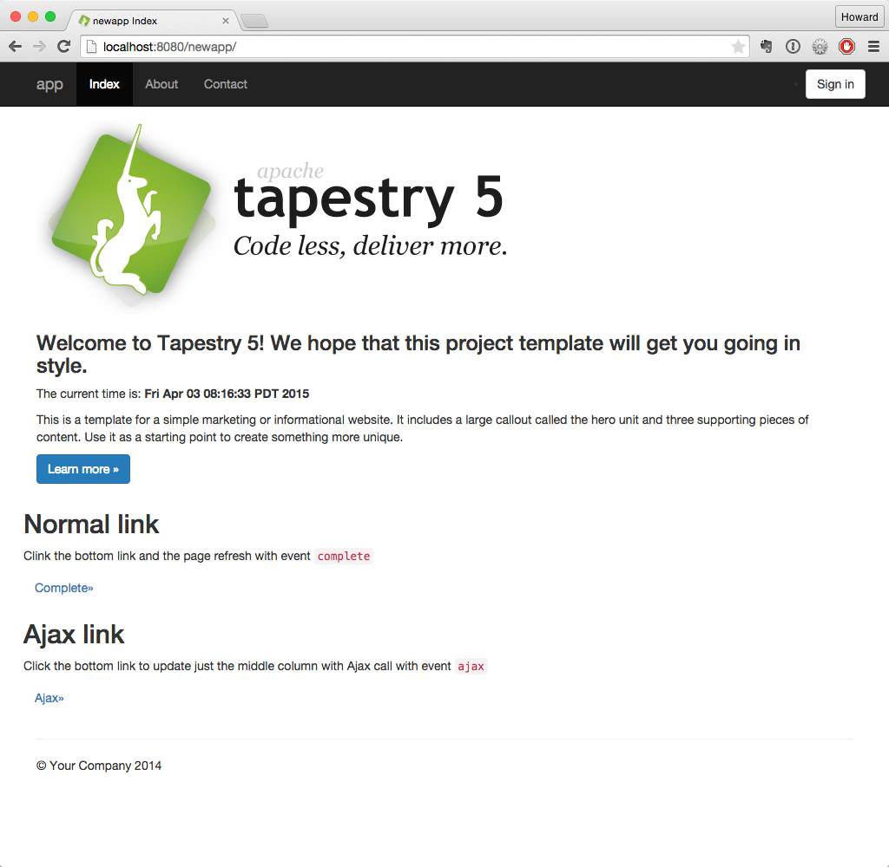

The application consists of three pages sharing a common look and feel. The initial page, Index, allows you to perform some basic operations.

You can also load the newly-created project it into any IDE and start coding. See the next section on where to find the different components of the application.

<a id="getting-started--gettingstarted-exploringthegeneratedproject"></a>
<a id="getting-started--exploring-the-generated-project"></a>

## Exploring the generated project

The archetype creates the following files:

```
newapp/
├── build.gradle
├── gradle
│   └── wrapper
│       ├── gradle-wrapper.jar
│       └── gradle-wrapper.properties
├── gradlew
├── gradlew.bat
├── pom.xml
└── src
    ├── main
    │   ├── java
    │   │   └── com
    │   │       └── example
    │   │           └── newapp
    │   │               ├── components
    │   │               │   └── Layout.java
    │   │               ├── pages
    │   │               │   ├── About.java
    │   │               │   ├── Contact.java
    │   │               │   ├── Error404.java
    │   │               │   ├── Index.java
    │   │               │   └── Login.java
    │   │               └── services
    │   │                   ├── AppModule.java
    │   │                   ├── DevelopmentModule.java
    │   │                   └── QaModule.java
    │   ├── resources
    │   │   ├── com
    │   │   │   └── example
    │   │   │       └── newapp
    │   │   │           ├── components
    │   │   │           │   └── Layout.tml
    │   │   │           ├── logback.xml
    │   │   │           └── pages
    │   │   │               ├── About.tml
    │   │   │               ├── Contact.tml
    │   │   │               ├── Error404.tml
    │   │   │               ├── Index.properties
    │   │   │               ├── Index.tml
    │   │   │               └── Login.tml
    │   │   └── log4j.properties
    │   └── webapp
    │       ├── WEB-INF
    │       │   ├── app.properties
    │       │   └── web.xml
    │       ├── favicon.ico
    │       ├── images
    │       │   └── tapestry.png
    │       └── mybootstrap
    │           ├── css
    │           │   ├── bootstrap-responsive.css
    │           │   └── bootstrap.css
    │           ├── img
    │           │   ├── glyphicons-halflings-white.png
    │           │   └── glyphicons-halflings.png
    │           └── js
    │               └── bootstrap.js
    ├── site
    │   ├── apt
    │   │   └── index.apt
    │   └── site.xml
    └── test
        ├── conf
        │   ├── testng.xml
        │   └── webdefault.xml
        ├── java
        │   └── PLACEHOLDER
        └── resources
            └── PLACEHOLDER
30 directories, 39 files
```

A Tapestry application is composed of pages, each page consisting of one template file and one Java class.

Tapestry page templates have the .tml extension and are found within src/main/**resources**/ under the app's **pages** package (src/main/resources/com/example/newapp/pages, in this example). Templates are essentially HTML with some special markup to reference properties in the corresponding Java class and to reference ready-made or custom components.

Similarly, Tapestry page classes are found in within the src/main/**java** under the app's ***pages*** package (src/main/java/com/example/newapp/pages, in this example) and their name matches their template name (Index.tml -> Index.java).

In the skeleton project, most of the HTML is not found on the pages themselves but in a Layout component which acts as a global template for the whole site. Java classes for components live in src/main/**java**/com/example/newapp/**components** and component templates go in src/main/**resources**/com/example/newapp/**components**.

The archetype includes a few optional extras:

- The bundled version of the [Bootstrap CSS library](http://getbootstrap.com/) has a per-project override. You can see the files in src/webapp/context/mybootstrap, and the overrides to enable that in AppModule.java.
- By default, Tapestry uses [Prototype](http://prototypejs.org/) as its client-side library, but the archetype overrides this to [jQuery](https://jquery.org/), which is preferred for new projects.
- The archetype adds a simple filter that shows the timing of each request.
- The archetype sets up not just for builds with Maven, but also via [Gradle](http://gradle.org/).

<a id="getting-started--gettingstarted-what-snext"></a>
<a id="getting-started--what-s-next"></a>

## What's next?

To deepen your understanding, step through the [Tapestry Tutorial](#tapestry-tutorial), which goes into much more detail about setting up your project as well as loading it into Eclipse... then continues on to teach you more about Tapestry.

Be sure to read about the core [Tapestry Principles](#principles), and browse the extensive [Documentation.](#documentation)

<a id="getting-started--gettingstarted-obtainhelp"></a>
<a id="getting-started--obtain-help"></a>

## Obtain Help

Tapestry has an active user mailing list on which you can find a lot of valuable support, commonly within just a few minutes. You can subscribe by sending e-mail to [users-subscribe@tapestry.apache.org](mailto:users-subscribe@tapestry.apache.org) or look for an answer in the [archives](http://markmail.org/search/list:org.apache.tapestry.users). [More Options](https://tapestry.apache.org/mailing-lists.html)...

Having trouble? Try our [Tutorial](#tapestry-tutorial).

---

---

<a id="principles"></a>

<!-- source_url: https://tapestry.apache.org/principles.html -->

<!-- page_index: 3 -->

# Principles

[Apache Tapestry](#index) > [Documentation](#documentation) > [Principles](#principles)

<a id="principles--title"></a>
<a id="principles--principles"></a>

# Principles

<a id="principles--related-articles"></a>

### Related Articles

- Page:

  [Getting Started](#getting-started)
- Page:

  [Introduction](#introduction)
- Page:

  [Tapestry Tutorial](#tapestry-tutorial)
- Page:

  [Tapestry for JSF Users](#tapestry-for-jsf-users)
- Page:

  [Principles](#principles)

<a id="principles--principles-principle1-staticstructure-dynamicbehavior"></a>
<a id="principles--principle-1-static-structure-dynamic-behavior"></a>

# Principle 1 – Static Structure, Dynamic Behavior

The concept of "Dynamic Behavior" should be pretty obvious when you are building a web application; things should look different for different users/situations. But what does it mean that Tapestry has "Static Structure?" Static structure implies that when you build a page in Tapestry you are going to define all of the types of components that are used within that page. Under no circumstance during the rendering or event processing of the page will you be able to dynamically create a new type of component and place that into the component tree.

At first glance, this seems quite limiting ... other frameworks allow new elements to be created on the fly; it's also a common feature of desktop GUIs such as Swing. But static structure turns out to be not so limiting after all. You *can* create new elements (you're actually re-rendering existing components with different properties). And you have plenty of options for getting dynamic behavior out of your static structure; from the simple conditional and looping components to the more advanced implementations of Tapestry's BeanEditor or Grid components, Tapestry gives you control over what renders and when, and even where it appears on the page. And starting in Tapestry 5.3 you can even use the [Dynamic component](http://tapestry.apache.org/current/apidocs/org/apache/tapestry5/corelib/components/Dynamic.html), which renders whatever is in an external template file.

Why did Tapestry choose static structure as a core principle? It's really a matter of meeting the requirements of agility and scalability.

<a id="principles--principles-agility"></a>
<a id="principles--agility"></a>

## Agility

Tapestry is designed to be an agile working environment; "code less, deliver more". To support you writing less code Tapestry does a lot of work on your POJO pages and components when first loading them. It also uses shared instances of page and component classes (shared across multiple threads and requests). Having dynamically modifiable structure would imply that each request has its own instance and, further, that the entire structure would need to be serialized between requests so that it can be restored to handle later requests.

Tapestry also makes you more agile by speeding up the development cycle with [Live Class Reloading](#principles). Tapestry monitors the file system for changes to Java page classes, component classes, service implementation classes, HTML templates and component property files, and it hot-swaps the changes into the running application without requiring a restart *or losing session data*. This provides a very short code-save-view cycle that no other framework can touch.

<a id="principles--principles-scalability"></a>
<a id="principles--scalability"></a>

## Scalability

When building large scale systems it is important to consider how your resources are going to be used on each deployed server, and how that information is going to be shared between servers. Static structure means that page instances do not need to be stored inside the HttpSession and simple browsing users do not require extra system resources. This lean use of the HttpSession is key to Tapestry's very high scalability, especially in a clustered configuration. Again, linking an instance of a page to a particular client would require vastly more server-side resources than having a single shared page instance.

<a id="principles--principles-principle2-adaptiveapi"></a>
<a id="principles--principle-2-adaptive-api"></a>

# Principle 2 – Adaptive API

A key feature of Tapestry 5 is its adaptive API.

In traditional Java frameworks (including Struts, [JSF](#principles) and even the now-ancient Tapestry 4) user code is expected to conform to the framework. You create classes that extend from framework-provided base classes, or implement framework-provided interfaces.

This works well until you upgrade to the next release of the framework: with the new features of the upgrade, you will more often than not experience breaks in backwards compatibility. Interfaces or base classes will have changed and your existing code will need to be changed to match.

In Tapestry 5, the framework adapts to your code. You have control over the names of the methods, the parameters they take, and the value that is returned. This is driven by annotations, which tell Tapestry under what circumstances your methods are to be invoked.

For example, you may have a login form and have a method that gets invoked when the form is submitted:

```java
public class Login {@Persist @Property private String userId;
@Property private String password;
@Component private Form form;
@Inject private LoginAuthenticator authenticator;
void onValidateFromForm() {if (! authenticator.isValidLogin(userId, password)) {form.recordError("Invalid user name or password.");}}
Object onSuccessFromForm() {return PostLogin.class;}}
```

This short snippet demonstrates a bit about how Tapestry operates. Pages and services within the application are injected with the @[Inject](http://tapestry.apache.org/current/apidocs/org/apache/tapestry5/ioc/annotations/Inject.html) annotation. The method names, `onValidateFromForm()` and `onSuccessFromForm()`, inform Tapestry about when each method is to be invoked. This naming convention identifies the event that is handled, ("validate" and "success") and the id of the component from which the event is triggered (the "form" component).

The "validate" event is triggered to perform cross-field validations, and the "success" event is only triggered when there are no validation errors. The `onSuccessFromForm()` method's return value directs Tapestry on what to do next: jump to another page within the application (here identified as the class for the page, but many other options exist). When there are exceptions, the page will be redisplayed to the user.

By contrast, in Tapestry 4 the Form component's listener parameter would be bound to the method to invoke, by name. Further, the listener method had to be public. The Tapestry 5 approach not only supports multiple listeners, but also provides an improved separation of view concerns (inside the page's HTML template) and logic concerns, inside the Java class.

In many cases, additional information about the event is available and can be passed into the method simply by adding parameters to the method. Again, Tapestry will adapt to your parameters, in whatever order you supply them.

Tapestry also saves you needless effort: the @[Property](http://tapestry.apache.org/current/apidocs/org/apache/tapestry5/annotations/Property.html) annotation marks a field as readable and writable; Tapestry will provide the accessor methods automatically.

Finally, Tapestry 5 explicitly separates actions (requests that change things) and rendering (requests that render pages) into two separate requests. Performing an action, such as clicking an action link or submitting a form, results in a client-side redirect to the new page. This is the "[Post/Redirect/Get](http://en.wikipedia.org/wiki/Post/Redirect/Get)" pattern (alternatively "Post-Then-Redirect", or "Redirect After Post"). This helps ensure that URLs in the browser are book-markable ... but also requires that a bit more information be stored in the session between requests (using the @[Persist](http://tapestry.apache.org/current/apidocs/org/apache/tapestry5/annotations/Persist.html) annotation).

<a id="principles--principles-principle3-differentiatepublicvs.internalapis"></a>
<a id="principles--principle-3-differentiate-public-vs.-internal-apis"></a>

# Principle 3 – Differentiate Public vs. Internal APIs

An issue plaguing much ancient versions of Tapestry (4 and earlier) was the lack of a clear delineation between private, internal APIs and public, external APIs. The fact that your code would extend from base objects but that many of the methods on those base objects were "off limits" further confused the issue. This has been identified as a key factor in the "steep learning curve of Tapestry" meme.

Designed from a clean slate, Tapestry 5 is much more ruthless about what is internal vs. external.

First of all, anything inside the org.apache.tapestry5.internal package is internal. It is part of the implementation of Tapestry. It is the man behind the curtain. You should not ever need to directly use this code. It is a bad idea to do so, because internal code may change from one release to the next without concern for backwards compatibility.

If you ever find yourself forced to make use of internal APIs, please bring it up on the developer mailing list; this is how we know which services should be exposed as public, and fall under the backwards compatibility umbrella.

<a id="principles--principles-principle4-ensurebackwardscompatibility"></a>
<a id="principles--principle-4-ensure-backwards-compatibility"></a>

# Principle 4 – Ensure Backwards Compatibility

Older versions of Tapestry were plagued by backwards compatibility problems with every major release. Tapestry 5 did not even attempt to be backwards compatible to Tapestry 4. Instead, it laid the ground work for true backwards compatibility going forwards.

Tapestry 5's API is based largely on naming conventions and annotations. Your components are just ordinary Java classes; you annotate fields to allow Tapestry to maintain their state or to allow Tapestry to inject resources, and you name (or annotate) methods to tell Tapestry under what circumstances a method should be invoked.

Tapestry will adapt to your classes. It will call your methods, passing in values via method parameters. Instead of the rigidness of a fixed interface to implement, Tapestry will simply adapt to your classes, using the hints provided by annotations and simple naming conventions.

Because of this, Tapestry 5 can change internally to a great degree without it affecting any of the application code you write. This has finally cracked the backwards compatibility nut, allowing you to have great assurance that you can upgrade to future releases of Tapestry without breaking your existing applications.

This is already evident in Tapestry 5.1, 5.2 and 5.3 where major new features and improvements have occurred, while remaining 100% backwards compatible to Tapestry 5.0 – as long as you've avoided the temptation to use internal APIs.

---

---

<a id="tapestry-tutorial"></a>

<!-- source_url: https://tapestry.apache.org/tapestry-tutorial.html -->

<!-- page_index: 4 -->

# Tapestry Tutorial

[Apache Tapestry](#index) > [Documentation](#documentation) > [Tapestry Tutorial](#tapestry-tutorial)

<a id="tapestry-tutorial--title"></a>
<a id="tapestry-tutorial--tapestry-tutorial"></a>

# Tapestry Tutorial

<a id="tapestry-tutorial--related-articles"></a>

### Related Articles

- Page:

  [Getting Started](#getting-started)
- Page:

  [Introduction](#introduction)
- Page:

  [Tapestry Tutorial](#tapestry-tutorial)
- Page:

  [Tapestry for JSF Users](#tapestry-for-jsf-users)
- Page:

  [Principles](#principles)

<a id="tapestry-tutorial--tapestrytutorial-tableofcontents"></a>
<a id="tapestry-tutorial--table-of-contents"></a>

# Table of Contents

- [Dependencies, Tools and Plugins](#dependencies-tools-and-plugins)
- [Creating The Skeleton Application](#creating-the-skeleton-application)
- [Exploring the Project](#exploring-the-project)
- [Implementing the Hi-Lo Guessing Game](#implementing-the-hi-lo-guessing-game)
- [Using BeanEditForm To Create User Forms](#using-beaneditform-to-create-user-forms)
- [Using Tapestry With Hibernate](#using-tapestry-with-hibernate)

<a id="tapestry-tutorial--tapestrytutorial-introduction"></a>
<a id="tapestry-tutorial--introduction"></a>

# Introduction

Welcome to Tapestry!

This is a tutorial for people who will be creating Tapestry web applications. It doesn't matter whether you have experience with earlier versions of Tapestry or other web frameworks. In fact, in some ways, the less you know about web development in general, the better off you may be ... that much less to unlearn!

You do need to have a reasonable understanding of HTML, a smattering of XML, and a good understanding of basic Java language features, including Annotations.

<a id="tapestry-tutorial--tapestrytutorial-thechallengesofwebapplicationdevelopment"></a>
<a id="tapestry-tutorial--the-challenges-of-web-application-development"></a>

# The Challenges of Web Application Development

If you're used to developing web applications using servlets and JSPs, or with Struts, you are simply used to a lot of pain. These are environments with few safety net; Struts and the Servlet API have no idea how your application is structured, or how the different pieces fit together. Any URL can be an action and any action can forward to any view (usually a JSP) to provide an HTML response to the web browser. The pain is the unending series of small, yet important, decisions you have to make as a developer (and communicate to the rest of your team). What are the naming conventions for actions, for pages, for attributes stored in the HttpSession or HttpServletRequest? Where do cross-cutting concerns such as database transactions, caching and security get implemented (and do you have to cut-and-paste Java or XML to make it work?) How are your packages organized ... where to the user interface classes go, and where do the data and entity objects go? How do you share code from one part of your application to another?

On top of all that, the traditional approaches thrust something most unwanted in your face: *multi-threaded coding*. Remember back to Object Oriented Programming 101 where an object was defined as a bundle of data and operations on that data? You have to unlearn that lesson as soon as you build a traditional web application, because web applications are multi-threaded. An application server could be handling dozens or hundreds of requests from individual users, each in their own thread, and each sharing the exact same objects. Suddenly, you can't store data inside an object (a servlet or a Struts Action) because whatever data you store for one user will be instantly overwritten by some other user.

Worse, your objects each have only one operation: `doGet()` or `doPost()`.

Meanwhile, most of your day-to-day work involves deciding how to package up some data already inside a particular Java object and squeeze that data into a URL's query parameters, so that you can write more code to convert it back if the user clicks that particular link. And don't forget editing a bunch of XML files to keep the servlet container, or the Struts framework, aware of these decisions.

Just for laughs, remember that you have to rebuild, redeploy and restart your application after virtually any change. Is any of this familiar? Then perhaps you'd appreciate something a little *less* familiar: Tapestry.

<a id="tapestry-tutorial--tapestrytutorial-thetapestryway"></a>
<a id="tapestry-tutorial--the-tapestry-way"></a>

# The Tapestry Way

Tapestry uses a very different model: a structured, organized world of pages, and components within pages. Everything has a very specific name (that you provide). Once you know the name of a page, you know the location of the Java class for that page, the location of the template for that page, and the total structure of the page. Tapestry knows all this as well, and can make things **just work**.

As we'll see in the following pages, Tapestry lets you code in terms of your objects. You'll barely see any Tapestry classes, outside of a few Java annotations. If you have information to store, store it as fields of your classes, not inside the HttpServletRequest or HttpSession. If you need some code to execute, it's just a simple annotation or method naming convention to get Tapestry to invoke that method, at the right time, with the right data.

Tapestry also shields you from most of the multi-threaded aspects of web application development. Tapestry manages the life cycle of your page and components objects, and the fields of the pages and components, in a thread-safe way. Your page and component classes always look like simple, standard [POJOs](http://en.wikipedia.org/wiki/Plain_Old_Java_Object).

Tapestry began in January 2000, and it now reflects over twenty years of experience of the entire Tapestry community. Tapestry brings to the table all that experience about the best ways to build scalable, maintainable, robust, internationalized, and Ajax-enabled applications.

<a id="tapestry-tutorial--tapestrytutorial-gettingthetutorialsource"></a>
<a id="tapestry-tutorial--getting-the-tutorial-source"></a>

# Getting the Tutorial Source

Although you won't need it, the source code for this tutorial is available on [GitHub](https://github.com/hlship/tapestry5-tutorial).

<a id="tapestry-tutorial--tapestrytutorial-timetobegin"></a>
<a id="tapestry-tutorial--time-to-begin"></a>

# Time to Begin

Okay, enough background. Now let's dig in: [Dependencies, Tools and Plugins](#dependencies-tools-and-plugins)

---

<a id="dependencies-tools-and-plugins"></a>

<!-- source_url: https://tapestry.apache.org/dependencies-tools-and-plugins.html -->

<!-- page_index: 5 -->

# Dependencies, Tools and Plugins

[Apache Tapestry](#index) > [Documentation](#documentation) > [Tapestry Tutorial](#tapestry-tutorial) > [Dependencies, Tools and Plugins](#dependencies-tools-and-plugins)

<a id="dependencies-tools-and-plugins--title"></a>
<a id="dependencies-tools-and-plugins--dependencies-tools-and-plugins"></a>

# Dependencies, Tools and Plugins

**Error rendering macro 'scrollbar'**

com/opensymphony/webwork/ServletActionContext

As much as we would like to dive right into the code, we must first set up your development environment. Likely you have some of these, or reasonable alternatives, already on your development machine.

<a id="dependencies-tools-and-plugins--dependencies-toolsandplugins-jdk1.8ornewer"></a>
<a id="dependencies-tools-and-plugins--jdk-1.8-or-newer"></a>

# JDK 1.8 or Newer

This tutorial uses the latest released version of Tapestry, which requires Java Development Kit (JDK) version 1.8 or newer. (But see [Supported Environments and Versions](#supported-environments-and-versions) if you want to use an older version of JDK or Tapestry.)

<a id="dependencies-tools-and-plugins--dependencies-toolsandplugins-eclipseide"></a>
<a id="dependencies-tools-and-plugins--eclipse-ide"></a>

# Eclipse IDE

For this tutorial we'll assume you're using Eclipse as your Integrated Development Environment (IDE). Eclipse is a popular IDE, but feel free to adapt these instructions to IntelliJ, NetBeans, or any other.

Eclipse comes in various flavors, and includes a reasonable XML editor built-in. It can be [downloaded from the eclipse.org web site](http://www.eclipse.org/downloads/). We recommend the latest version of Eclipse IDE for Java Developers (but anything from version 3.7 onward should work fine).

<a id="dependencies-tools-and-plugins--dependencies-toolsandplugins-apachemaven3"></a>
<a id="dependencies-tools-and-plugins--apache-maven-3"></a>

# Apache Maven 3

Maven is a software build tool with the ability to automatically download project dependencies (such as the Tapestry JAR files, and the JAR files that Tapestry itself depends on) from one of several central repositories.

Maven is not essential for using Tapestry, but is especially helpful when performing the initial set-up of a Tapestry application. Feel free to substitute Gradle or Ivy if you prefer.

Eclipse comes with a Maven plugin, [M2Eclipse](http://eclipse.org/m2e/) (also known as m2e) with an embedded version of Maven. We'll use that here for simplicity's sake. Alternatively, you could install Maven from <http://maven.apache.org/download.html> and use it from the command line ("mvn").

<a id="dependencies-tools-and-plugins--dependencies-toolsandplugins-jetty"></a>
<a id="dependencies-tools-and-plugins--jetty"></a>

# Jetty

For simplicity, this tutorial uses Jetty, a lightweight open source web server and servlet container available from the Eclipse Foundation. Of course, you could use pretty much any other Java servlet container (Tomcat, Glassfish, JBoss, etc), but the instructions that follow assume Jetty.

We will use Maven to download and run Jetty automatically, so you will NOT have to download it for this tutorial. (Alternatively, you could download and install the RunJettyRun Eclipse plugin from the Eclipse Marketplace.)

<a id="dependencies-tools-and-plugins--dependencies-toolsandplugins-tapestry"></a>
<a id="dependencies-tools-and-plugins--tapestry"></a>

# Tapestry

Tapestry is available as a set of JAR files, but you will not have to download them yourself. As with Jetty, Maven will take care of downloading Tapestry and its dependencies.

Next: [Creating The Skeleton Application](#creating-the-skeleton-application)

---

**Error rendering macro 'scrollbar'**

com/opensymphony/webwork/ServletActionContext

---

<a id="creating-the-skeleton-application"></a>

<!-- source_url: https://tapestry.apache.org/creating-the-skeleton-application.html -->

<!-- page_index: 6 -->

# Creating The Skeleton Application

[Apache Tapestry](#index) > [Documentation](#documentation) > [Tapestry Tutorial](#tapestry-tutorial) > [Creating The Skeleton Application](#creating-the-skeleton-application)

<a id="creating-the-skeleton-application--title"></a>
<a id="creating-the-skeleton-application--creating-the-skeleton-application"></a>

# Creating The Skeleton Application

**Error rendering macro 'scrollbar'**

com/opensymphony/webwork/ServletActionContext

First, let's create an empty application. Tapestry provides a Maven **archetype** (a project template) to make this easy.

For the tutorial, we're using a fresh install of Eclipse and an empty workspace at `/users/joeuser/workspace`. You may need to adjust a few things for other operating systems or local paths.

<a id="creating-the-skeleton-application--creatingtheskeletonapplication-usingthequickstartarchetype"></a>
<a id="creating-the-skeleton-application--using-the-quickstart-archetype"></a>

## Using the Quickstart Archetype

From Eclipse, we'll use a Maven archetype to create a skeleton Tapestry project.

<a id="creating-the-skeleton-application--creatingtheskeletonapplication-mavenbehindafirewall"></a>
<a id="creating-the-skeleton-application--maven-behind-a-firewall"></a>

### Maven Behind a Firewall

If you are behind a firewall/proxy, before performing any Maven downloads, you may need to configure your proxy settings in your Maven settings.xml file (typically in the .m2 subdirectory of your home directory, ~/.m2 or C:\users\joeuser\.m2). Here is an example (but check with your network administrator for the names and numbers you should use here).

**settings.xml**

```xml
<settings>
  <proxies>
    <proxy>
      <active>true</active>
      <protocol>http</protocol>
      <host>myProxyServer.com</host>
      <port>3128</port>
      <username>joeuser</username>
      <password>myPassword</password>
      <nonProxyHosts></nonProxyHosts>
    </proxy>
  </proxies>
  <localRepository>C:/Users/joeuser/.m2/repository</localRepository>
</settings>
```

Of course, adjust the `localRepository` element to match the correct path for your computer.

<a id="creating-the-skeleton-application--creatingtheskeletonapplication-createproject"></a>
<a id="creating-the-skeleton-application--create-project"></a>

### Create Project

Okay, let's get started creating our new project.

The instructions below use Eclipse's New Project wizard to create the project from a Maven archetype. If you'd rather use the **mvn** command line, see the [Getting Started](#getting-started) instructions, then skip to [Creating The Skeleton Application](#creating-the-skeleton-application) page.

In Eclipse, go to **File > New >** **Project... > Maven > Maven Project**

**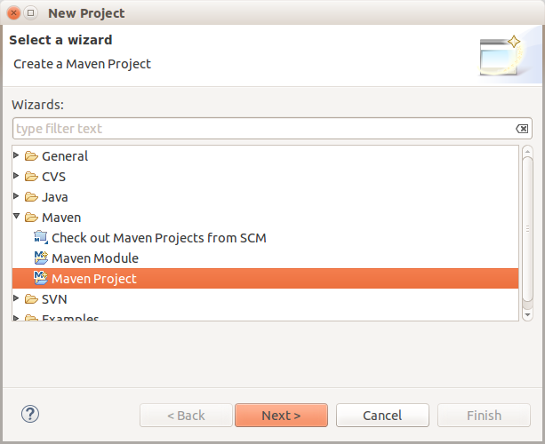**

Then click **Next**, **Next** (again), and then on the **Select an Archetype** page click the **Configure** button on the Catalog line. The **Archetype** preferences dialog should appear. Click the **Add Remote Catalog...** button, as shown below:

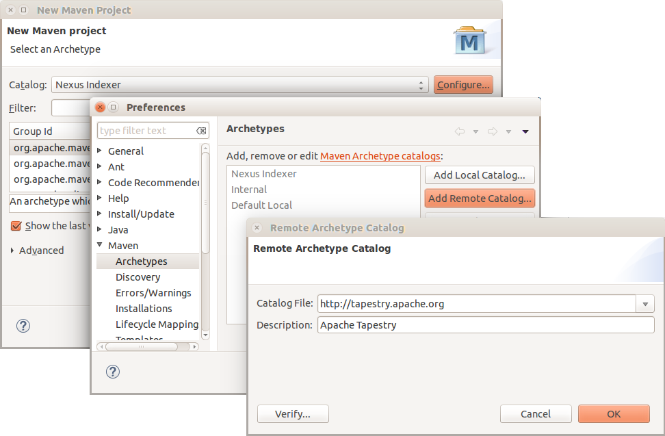

As shown above, enter "http://tapestry.apache.org" in the Catalog File field, and "Apache Tapestry" in the Description field.

If you want to try an unreleased (alpha or beta) version of Tapestry, use the **<https://repository.apache.org/content/repositories/staging>** archetype catalog file instead.

Click **OK**, then **OK** again.

On the Select an Archetype dialog (shown below), select the newly-added Apache Tapestry catalog, then select the "quickstart" artifact from the list and click **Next**.

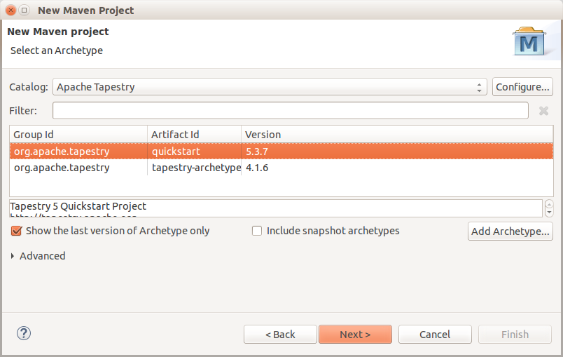

***Note:** Screenshots in this tutorial may show different (either newer or older) versions of Tapestry than you may see.*

Fill in the Group Id, Artifact Id, Version and Package as follows:

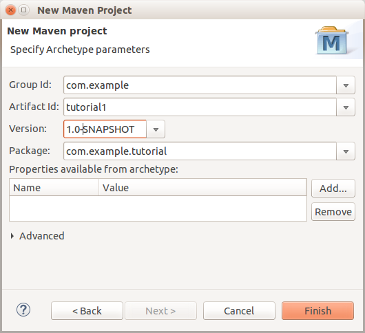

then click Finish.

The first time you use Maven, project creation may take a while as Maven downloads a large number of JAR dependencies for Maven, Jetty and Tapestry. These downloaded files are cached locally and will not need to be downloaded again, but you do have to be patient on first use.

After Maven finishes, you'll see a new directory, `tutorial1, in your Package Explorer view in Eclipse.`

<a id="creating-the-skeleton-application--creatingtheskeletonapplication-runningtheapplicationusingjetty"></a>
<a id="creating-the-skeleton-application--running-the-application-using-jetty"></a>

## Running the Application using Jetty

One of the first things you can do is use Maven to run Jetty directly.

Right-click on the `tutorial1` project in your Package Explorer view and select **Run As > Maven Build... >**, enter a Goal of **"jetty:run"**. This creates a "Run Configuration" named "tutorial1" that we'll use throughout this tutorial to start the app:

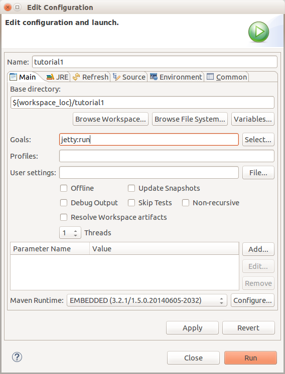

Tapestry runs best with a couple of additional options; click the "JRE" tab and enter the following VM Arguments:

```

```

-Xmx600m

-Dtapestry.execution-mode=development

`Here's how it looks:`

``

Finally, click **Run**.

Again, the first time, there's a dizzying number of downloads, but before you know it, the Jetty servlet container is up and running.

Once Jetty is initialized (which only takes a few seconds after the first time), you'll see the following in your console:

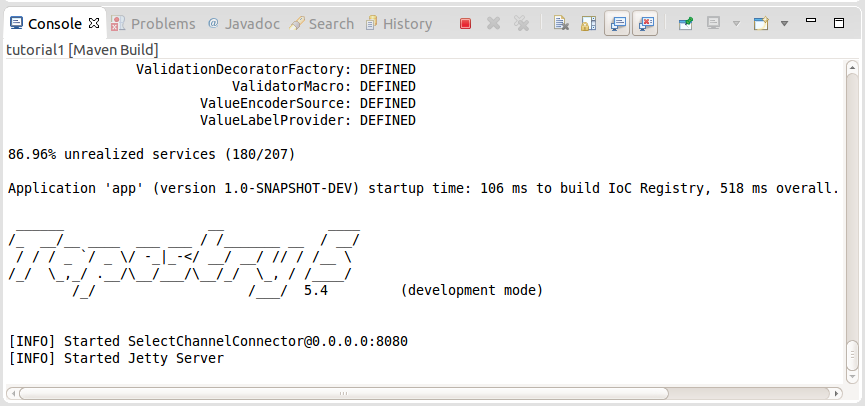

*Note the red square icon above. Later on you'll use that icon to stop Jetty before restarting the app.*

You can now open a web browser to <http://localhost:8080/tutorial1/> to see the running application:

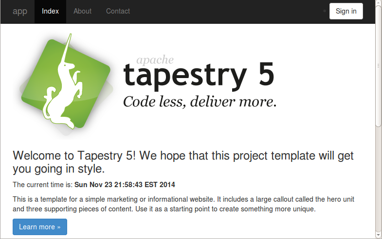

***NOTE: Your screen may look very different depending on the version of Tapestry you are using!***

The date and time in the middle of the page shows that this is a live application.

This is a complete little web app; it doesn't do much, but it demonstrate how to create a number of pages sharing a common layout, and demonstrates some simple navigation and link handling. You can see that it has several different pages that share a common layout. (*Layout* is a loose term meaning common look and feel and navigation across many or all of the pages of an application. Often an application will include a Layout component to provide that commonness.)

Next: [Exploring the Project](#exploring-the-project)

**Error rendering macro 'scrollbar'**

com/opensymphony/webwork/ServletActionContext

---

<a id="exploring-the-project"></a>

<!-- source_url: https://tapestry.apache.org/exploring-the-project.html -->

<!-- page_index: 7 -->

# Exploring the Project

[Apache Tapestry](#index) > [Documentation](#documentation) > [Tapestry Tutorial](#tapestry-tutorial) > [Exploring the Project](#exploring-the-project)

<a id="exploring-the-project--title"></a>
<a id="exploring-the-project--exploring-the-project"></a>

# Exploring the Project

**Error rendering macro 'scrollbar'**

com/opensymphony/webwork/ServletActionContext

The layout of the project follows the sensible standards promoted by Maven:

- Java source files under `src/main/java`
- Web application files under `src/main/webapp` (including `src/main/webapp/WEB-INF`)
- Java test sources under `src/test/java`
- Non-code resources (including Tapestry page and component templates) under `src/main/resources` and `src/test/resources`

Let's look at what Maven has created from the archetype, starting with the web.xml configuration file:

**src/main/webapp/WEB-INF/web.xml**

```xml
<?xml version="1.0" encoding="UTF-8"?>
<!DOCTYPE web-app
        PUBLIC "-//Sun Microsystems, Inc.//DTD Web Application 2.3//EN"
        "http://java.sun.com/dtd/web-app_2_3.dtd">
<web-app>
    <display-name>tutorial1 Tapestry 5 Application</display-name>
    <context-param>
        <!-- The only significant configuration for Tapestry 5, this informs Tapestry
of where to look for pages, components and mixins. -->
        <param-name>tapestry.app-package</param-name>
        <param-value>com.example.tutorial1</param-value>
    </context-param>
    <!--
    Specify some additional Modules for two different execution
    modes: development and qa.
    Remember that the default execution mode is production
    -->
    <context-param>
        <param-name>tapestry.development-modules</param-name>
        <param-value>
            com.example.tutorial1.services.DevelopmentModule
        </param-value>
    </context-param>
    <context-param>
        <param-name>tapestry.qa-modules</param-name>
        <param-value>
            com.example.tutorial1.services.QaModule
        </param-value>
    </context-param>
    <filter>
        <filter-name>app</filter-name>
        <filter-class>org.apache.tapestry5.TapestryFilter</filter-class>
    </filter>
    <filter-mapping>
        <filter-name>app</filter-name>
        <url-pattern>/*</url-pattern>
    </filter-mapping>
</web-app>
```

This is short and sweet: you can see that the package name you provided earlier shows up as the `tapestry.app-package` context parameter; the TapestryFilter instance will use this information to locate the Java classes for pages and components.

Tapestry operates as a *servlet filter* rather than as a traditional *servlet*. In this way, Tapestry has a chance to intercept all incoming requests, to determine which ones apply to Tapestry pages (or other resources). The net effect is that you don't have to maintain any additional configuration for Tapestry to operate, regardless of how many pages or components you add to your application.

Much of the rest of web.xml is configuration to match Tapestry execution modes against module classes. An execution mode defines how the application is being run: the default execution mode is "production", but the web.xml defines two additional modes: "development" and "qa" (for "Quality Assurance"). The module classes indicated will be loaded for those execution modes, and can change the configuration of the application is various ways. We'll come back to execution modes and module classes later in the tutorial.

Tapestry pages minimally consist of an ordinary Java class plus a component template file.

In the root of your web application, a page named "Index" will be used for any request that specifies no additional path after the context name.

<a id="exploring-the-project--exploringtheproject-indexjavaclass"></a>
<a id="exploring-the-project--index-java-class"></a>

# Index Java Class

Tapestry has very specific rules for where page classes go. Tapestry adds a sub-package, "pages", to the root application package ("com.example.tutorial1"); the Java classes for pages goes there. Thus the full Java class name is `com.example.`tutorial`1.pages.Index`.

**src/main/java/com/example/tutorial/pages/Index.java**

```java
package com.example.tutorial1.pages;
import org.apache.tapestry5.Block; import org.apache.tapestry5.EventContext; import org.apache.tapestry5.SymbolConstants; import org.apache.tapestry5.annotations.InjectPage; import org.apache.tapestry5.annotations.Log; import org.apache.tapestry5.annotations.Property; import org.apache.tapestry5.ioc.annotations.Inject; import org.apache.tapestry5.ioc.annotations.Symbol; import org.apache.tapestry5.services.HttpError; import org.apache.tapestry5.services.ajax.AjaxResponseRenderer; import org.slf4j.Logger;
import java.util.Date;
/** * Start page of application tutorial1.*/ public class Index {@Inject private Logger logger;
@Inject private AjaxResponseRenderer ajaxResponseRenderer;
@Property @Inject @Symbol(SymbolConstants.TAPESTRY_VERSION) private String tapestryVersion;
@InjectPage private About about;
@Inject private Block block;
// Handle call with an unwanted context Object onActivate(EventContext eventContext) {return eventContext.getCount() > 0 ? new HttpError(404, "Resource not found") : null;}
Object onActionFromLearnMore() {about.setLearn("LearnMore");
return about;}
@Log void onComplete() {logger.info("Complete call on Index page");}
@Log void onAjax() {logger.info("Ajax call on Index page");
ajaxResponseRenderer.addRender("middlezone", block);}
public Date getCurrentTime() {return new Date();}}
```

There's a bit going on in this listing, as the Index page attempts to demonstrate a bunch of different ideas in Tapestry. Even so, the class is essentially pretty simple: Tapestry pages and components have no base classes to extend, no interfaces to implement, and are just a very pure POJO (Plain Old Java Object) ... with some special naming conventions and annotations for fields and methods.

You do have to meet the Tapestry framework partway:

- You need to put the Java class in the expected package, here com.example.tutorial1.pages
- The class must be public
- You need to make sure there's a public, no-arguments constructor (here, the Java compiler has silently provided one for us)
- All non-static fields must be **private**

As we saw when running the application, the page displays the current date and time, as well as a couple of extra links. The `currentTime` property is where that value comes from; shortly we'll see how that value is referenced in the template, so it can be extracted from the page and output.

Tapestry always matches a page class to a template; neither is functional without the other. In fact, components within a page are treated the same way (except that components do not always have templates).

You will often hear about the [Model-View-Controller pattern](http://en.wikipedia.org/wiki/Model_view_controller) (MVC). In Tapestry, the page class acts as both the Model (the source of data) and the controller (the logic that responds to user interaction). The template is the View in MVC. As a model, the page exposes JavaBeans properties that can be referenced in the template.

Let's look at how the component template builds on the Java class to provide the full user interface.

<a id="exploring-the-project--exploringtheproject-componenttemplate"></a>
<a id="exploring-the-project--component-template"></a>

# Component Template

Tapestry pages are the combination of a POJO Java class with a Tapestry component template. The template has the same name as the Java class, but has the extension `.tml`. Since the Java class here is com.example.tutorial.pages.Index, the template file will be located at src/main/resource/com/example/tutorial/pages/Index.tml. Ultimately, both the Java class and the component template file will be stored in the same folder within the deployed WAR file.

Tapestry component templates are well-formed XML documents. This means that you can use any available XML editor. Templates may even have a DOCTYPE or an XML schema to validate the structure of the template page.

*Note that Tapestry parses component templates using a non-validating parser; it only checks for well-formedness: proper syntax, balanced elements, attribute values are quoted, and so forth. It is reasonable for your build process to perform some kind of template validation, but Tapestry accepts the template as-is, as long as it parses cleanly.*

For the most part, a Tapestry component template looks like ordinary XHTML:

**src/main/resources/com/example/tutorial1/pages/Index.tml**

```xml
<html t:type="layout" title="tutorial1 Index"
      xmlns:t="http://tapestry.apache.org/schema/tapestry_5_4.xsd"
      xmlns:p="tapestry:parameter">

    <div class="hero-unit">
        <p>
            
        </p>
        <h3>${message:greeting}</h3>
        <p>The current time is: <strong>${currentTime}</strong></p>
        <p>
            This is a template for a simple marketing or informational website. It includes a large callout called
            the hero unit and three supporting pieces of content. Use it as a starting point to create something
            more unique.
        </p>
        <p><t:actionlink t:id="learnmore" class="btn btn-primary btn-large">Learn more &raquo;</t:actionlink></p>
    </div>

    <div class="row">
        <div class="span4">
            <h2>Normal link</h2>
            <p>Clink the bottom link and the page refresh with event <code>complete</code></p>
            <p><t:eventlink event="complete" class="btn btn-default">Complete&raquo;</t:eventlink></p>
        </div>
        <t:zone t:id="middlezone" class="span4">

        </t:zone>
        <div class="span4">
            <h2>Ajax link</h2>
            <p>Click the bottom link to update just the middle column with Ajax call with event <code>ajax</code></p>
            <p><t:eventlink event="ajax" zone="middlezone" class="btn btn-default">Ajax&raquo;</t:eventlink></p>
        </div>
    </div>

    <t:block t:id="block">
        <h2>Ajax updated</h2>
        <p>I'v been updated through AJAX call</p>
        <p>The current time is: <strong>${currentTime}</strong></p>
    </t:block>

</html>
```

You **do** have to name your component template file, Index.tml, with the **exact same case** as the component class name, Index. If you get the case wrong, it may work on some operating systems (such as Mac OS X, Windows) and not on others (Linux, and most others). This can be really vexing, as it is common to develop on Windows and deploy on Linux or Solaris, so be careful about case in this one area.

The goal in Tapestry is for component templates, such as Index.tml, to look as much as possible like ordinary, static HTML files. (By static, we mean unchanging, as opposed to a dynamically generated Tapestry page.)

In fact, the expectation is that in many cases, the templates will start as static HTML files, created by a web developer, and then be *instrumented* to act as live Tapestry pages.

Tapestry hides non-standard elements and attributes inside XML namespaces. By convention, the prefix "t:" is used for the primary namespace, but that is not a requirement, any prefix you want to use is fine.

This short template demonstrates quite a few features of Tapestry.

Part of the concept of the quickstart archetype is to demonstrate a bunch of different features, approaches, and common patterns used in Tapestry. So yes, we're hitting you with a lot all at once.

First of all, there are two XML namespaces commonly defined:

```xml
  xmlns:t="http://tapestry.apache.org/schema/tapestry_5_4.xsd"
  xmlns:p="tapestry:parameter"
```

The first namespace, "t:", it used to identify Tapestry-specific elements and attributes. Although there is an XSD (that is, a XML schema definition), it is incomplete (for reasons explained shortly).

The second namespace, "p:", is a way of marking a chunk of the template as a parameter passed into another component. We'll expand on that shortly.

A Tapestry component template consists mostly of standard XHTML that will pass down to the client web browser unchanged. The dynamic aspects of the template are represented by *components* and *expansions*.

<a id="exploring-the-project--exploringtheproject-expansionsintemplates"></a>
<a id="exploring-the-project--expansions-in-templates"></a>

# Expansions in Templates

Let's start with expansions. Expansions are an easy way of including some dynamic output when rendering the page. By default, an expansion refers to a JavaBeans property of the page:

```xml
  <p>The current time is: ${currentTime}</p>
```

The value inside the curly braces is a *property expression*. Tapestry uses its own property expression language that is expressive, fast, and type-safe.

```
Tapestry does NOT use reflection to implement property expressions.
```

More advanced property expressions can traverse multiple properties (for example, `user.address.city`), or even invoke public methods. Here the expansion simply reads the `currentTime` property of the page.

Tapestry follows the rules defined by Sun's JavaBeans specification: a property name of `currentTime` maps to two methods: `getCurrentTime()` and `setCurrentTime()`. If you omit one or the other of these methods, the property is either read only (as here), or write only. (Keep in mind that as far as JavaBeans properties go, it's the *methods* that count; the names of the instance variables, or even whether they exist, is immaterial.)

Tapestry does go one step further: it ignores case when matching properties inside the expansion to properties of the page. In the template we could say ${currenttime} or ${CurrentTime} or any variation, and Tapestry will *still* invoke the `getCurrentTime()` method.

Note that in Tapestry it is not necessary to configure what object holds the `currentTime` property; a template and a page are always used in combination with each other; expressions are always rooted in the page instance, in this case, an instance of the Index class.

The Index.tml template includes a second expansion:

```xml
    <p>${message:greeting}</p>
```

Here `greeting` is not a property of the page; its actually a localized message key. Every Tapestry page and component is allowed to have its own message catalog. (There's also a global message catalog, *which we'll describe later*.)

**src/main/resources/com/example/tutorial/pages/Index.properties**

```java
greeting=Welcome to Tapestry 5!  We hope that this project template will get you going in style.
```

Message catalogs are useful for storing repeating strings outside of code or templates, though their primary purpose is related to localization of the application (which will be described in more detail in a later chapter). Messages that may be used across multiple pages can be stored in the application's global message catalog, src/main/webapp/WEB-INF/app.properties, instead.

This "message:" prefix is not some special case; there are actually quite a few of these *binding prefixes* built into Tapestry, each having a specific purpose. In fact, omitting a binding prefix in an expansion is exactly the same as using the "prop:" binding prefix, which means to treat the binding as a property expression.

Expansions are useful for extracting a piece of information and rendering it out to the client as a string, but the real heavy lifting of Tapestry occurs inside components.

<a id="exploring-the-project--exploringtheproject-componentsinsidetemplates"></a>
<a id="exploring-the-project--components-inside-templates"></a>

# Components Inside Templates

Components can be represented inside a component template in two ways:

- As an ordinary element, but with a t:type attribute to define the type of component.

- As an element in the Tapestry namespace, in which case the element name determines the type.

Here we've used an <html> element to represent the application's Layout component.

```xml
<html t:type="layout" ...> 
  ...
</html>
```

But for the EventLink component, we've used an element in the Tapestry namespace:

```xml
<t:eventlink page="Index">refresh page</t:eventlink>
```

Which form you select is a matter of choice. In the vast majority of cases, they are exactly equivalent.

As elsewhere, case is ignored. Here the types ("layout" and "eventlink") were in all lower case; the actual class names are Layout and EventLink. Further, Tapestry "blends" the core library components in with the components defined by this application; thus type "layout" is mapped to application component class com.example.tutorial.components.Layout, but "eventlink" is mapped to Tapestry's built-in org.apache.tapestry5.corelib.components.EventLink class.

Tapestry components are configured using parameters; for each component, there is a set of parameters, each with a specific type and purpose. Some parameters are required, others are optional. Attributes of the element are used to *bind* parameters to specific literal values, or to page properties. Tapestry is flexible here as well; you can always place an attribute in the Tapestry namespace (using the "t:" prefix), but in most cases, this is unnecessary.

```xml
<html t:type="layout" title="tutorial1 Index"
      p:sidebarTitle="Framework Version" ...
```

This binds two parameters, `title` and `sidebarTitle`, of the Layout component to the literal strings "tutorial1 Index" and "Framework Version", respectively.

The Layout component will actually provide the bulk of the HTML ultimately sent to the browser; we'll look at its template in a later chapter. The point is, the page's template is integrated into the Layout component's template. The following diagram shows how parameters passed to the Layout component end up rendered in the final page:


The interesting point here (and this is an advanced concept in Tapestry, one we'll return to later) is that we can pass a chunk of the Index.tml template to the Layout component as the `sidebar` parameter. That's what the tapestry:parameter namespace (the "p:" prefix) is for; the element name is matched against a parameter of the component and the entire block of the template is passed into the Layout component ... which decides where, inside *its* template, that block gets rendered.

```xml
<t:eventlink event="complete" class="btn btn-default">Complete&raquo;</t:eventlink>
```

This time, it's the `page` parameter of the PageLink component that is bound, to the literal value "Index" (which is the name of this page). This gets rendered as a URL that re-renders the page, which is how the current time gets updated. You can also create links to other pages in the application and, as we'll see in later chapters, attach additional information to the URL beyond just the page name.

<a id="exploring-the-project--exploringtheproject-amagictrick"></a>
<a id="exploring-the-project--a-magic-trick"></a>

# A Magic Trick

Now it's time for a magic trick. Edit Index.java and change the `getCurrentTime()` method to:

**Index.java (partial)**

```xml
  public String getCurrentTime()
  {
    return "A great day to learn Tapestry";
  }
```

Make sure you save changes; then click the refresh link in the web browser:

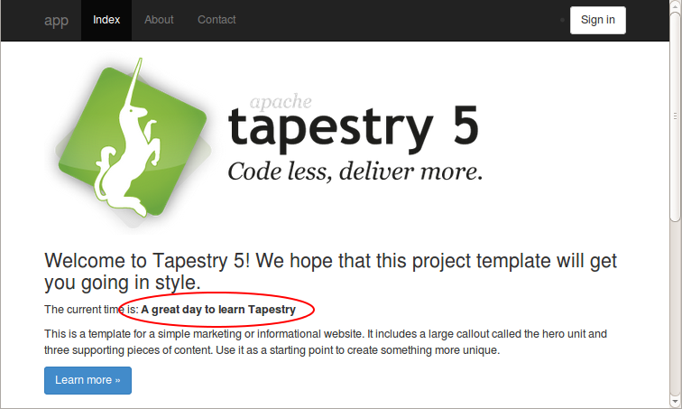

This is one of Tapestry's early *wow factor* features: changes to your component classes are picked up immediately (a feature we call Live Class Reloading). No restart. No re-deploy. Make the changes and see them *now*. Nothing should slow you down or get in the way of you getting your job done.

If Live Class Reloading isn't working for you, check the Troubleshooting section at [Class Reloading](#class-reloading).

But ... what if you make a mistake? What if you got the name in the template wrong. Give it a try; in the template, change ${currentTime} to, say, ${currenTime}, and see what you get:

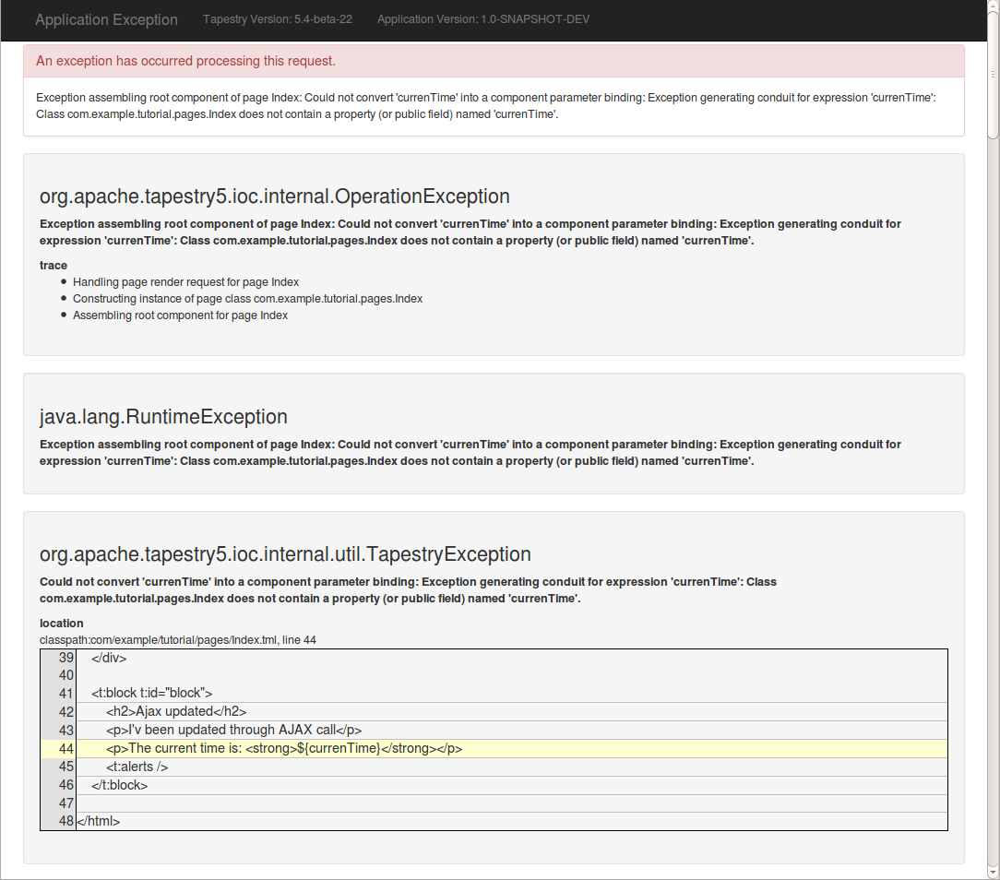

This is Tapestry's exception report page. It's quite detailed. It clearly identifies what Tapestry was doing, and relates the problem to a specific line in the template, which is shown in context. Tapestry always expands out the entire stack of exceptions, because it is so common for exceptions to be thrown, caught, and re-thrown inside other exceptions. In fact, if we scroll down just a little bit, we see more detail about this exception, plus a little bit of help:

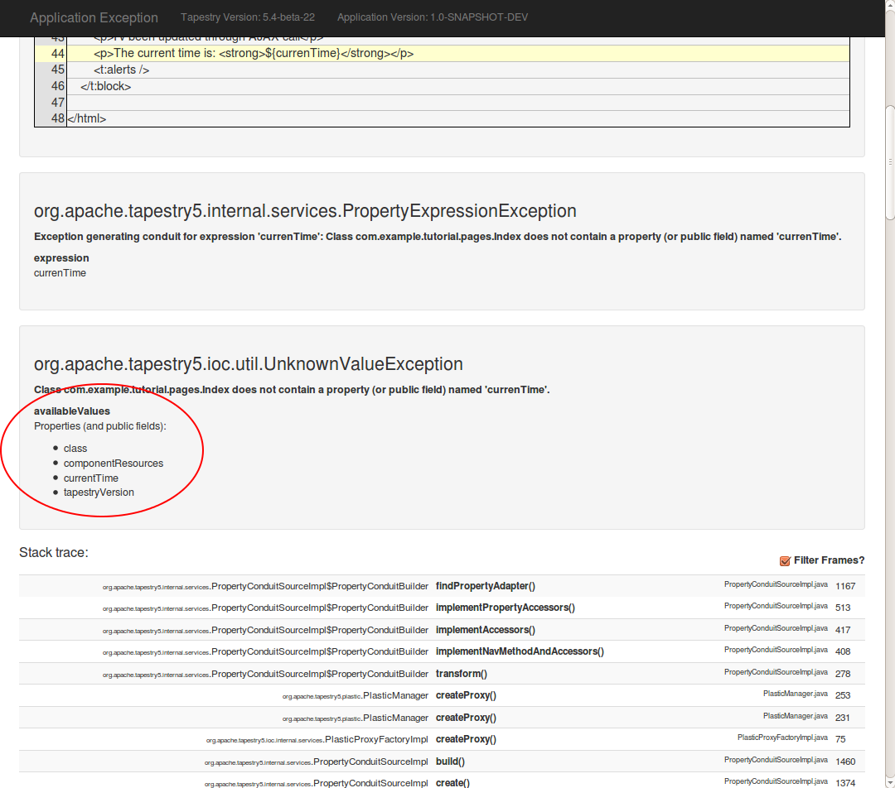

This is part of Tapestry's way: it not only spells out exactly what it was doing and what went wrong, but it even helps you find a solution; here it tells you the names of properties you could have used.

This level of detail reflects that the application has been configured to run in *development mode* instead of *production mode*. In production mode, the exception report would simply be the top level exception message. However, most production applications go further and customize how Tapestry handles and reports exceptions.

Tapestry displays the stack trace of the deepest exception, along with lots of details about the run-time environment: details about the current request, the HttpSession (if one exists), and even a detailed list of all JVM system properties. Scroll down to see all this information.

Next: [Implementing the Hi-Lo Guessing Game](#implementing-the-hi-lo-guessing-game)

**Error rendering macro 'scrollbar'**

com/opensymphony/webwork/ServletActionContext

---

<a id="implementing-the-hi-lo-guessing-game"></a>

<!-- source_url: https://tapestry.apache.org/implementing-the-hi-lo-guessing-game.html -->

<!-- page_index: 8 -->

# Implementing the Hi-Lo Guessing Game

[Apache Tapestry](#index) > [Documentation](#documentation) > [Tapestry Tutorial](#tapestry-tutorial) > [Implementing the Hi-Lo Guessing Game](#implementing-the-hi-lo-guessing-game)

<a id="implementing-the-hi-lo-guessing-game--title"></a>
<a id="implementing-the-hi-lo-guessing-game--implementing-the-hi-lo-guessing-game"></a>

# Implementing the Hi-Lo Guessing Game

**Error rendering macro 'scrollbar'**

com/opensymphony/webwork/ServletActionContext

Let's start building a basic Hi-Lo Guessing game.

In the game, the computer selects a number between 1 and 10. You try and guess the number, clicking links. At the end, the computer tells you how many guesses you required to identify the target number. Even a simple example like this will demonstrate several important concepts in Tapestry:

- Breaking an application into individual pages
- Transferring information from one page to another
- Responding to user interactions
- Storing client information in the server-side session

We'll build this little application in small pieces, using the kind of iterative development that Tapestry makes so easy.


Our page flow is very simple, consisting of three pages: Index (the starting page), Guess and GameOver. The Index page introduces the application and includes a link to start guessing. The Guess page presents the user with ten links, plus feedback such as "too low" or "too high". The GameOver page tells the user how many guesses they took before finding the target number.

<a id="implementing-the-hi-lo-guessing-game--implementingthehiloguessinggame-indexpage"></a>
<a id="implementing-the-hi-lo-guessing-game--index-page"></a>

# Index Page

Let's get to work on the Index page and template. Make Index.tml look like this:

**Index.tml**

```xml
<html t:type="layout" title="Hi/Lo Guess"
    xmlns:t="http://tapestry.apache.org/schema/tapestry_5_3.xsd">

    <p>
        I'm thinking of a number between one and ten ...
    </p>
    <p>
        <a href="#">start guessing</a>
    </p>

</html>
```

And edit the corresponding Java class, Index.java, removing its body (but you can leave the imports in place for now):

**Index.java**

```java
package com.example.tutorial1.pages;

public class Index
{
}
```

Running the application gives us our start:

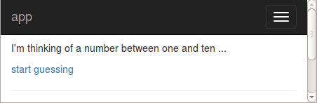

However, clicking the link doesn't do anything yet, as its just a placeholder <a> tag, not an actual Tapestry component. Let's think about what should happen when the user clicks that link:

- A random target number between 1 and 10 should be selected
- The number of guesses taken should be reset to 0
- The user should be sent to the Guess page to make a guess

Our first step is to find out when the user clicks that "start guessing" link. In a typical web application framework, we might start thinking about URLs and handlers and maybe some sort of XML configuration file. But this is Tapestry, so we're going to work with components and methods on our classes.

First, the component. We want to perform an action (selecting the number) before continuing on to the Guess page. The ActionLink component is just what we need; it creates a link with a URL that will trigger an action event in our code ... but that's getting ahead of ourselves. First up, convert the <a> tag to an ActionLink component:

**Index.tml (partial)**

```xml
    <p>
        <t:actionlink t:id="start">start guessing</t:actionlink>
    </p>
```

If you refresh the browser and hover your mouse over the "start guessing" link, you'll see that its URL is now /tutorial1/index.start, which identifies the name of the page ("index") and the id of the component ("start").

If you click the link now, you'll get an error:

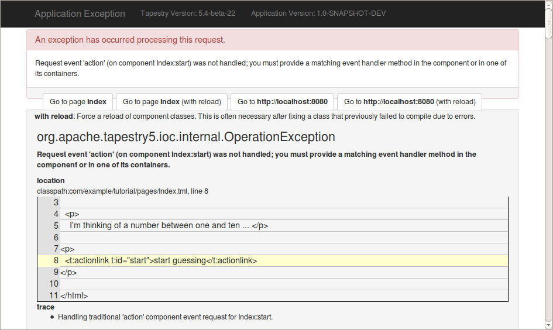

Tapestry is telling us that we need to provide some kind of event handler for that event. What does that look like?

An event handler is a method of the Java class with a special name. The name is `on`***Eventname***`From`***Component-id*** ... here we want a method named `onActionFromStart()`. How do we know that "action" is the right event name? Because that's what ActionLink does, that's why its named ***Action***Link.

Once again, Tapestry gives us options; if you don't like naming conventions, there's an @[OnEvent](http://tapestry.apache.org/current/apidocs/org/apache/tapestry5/annotations/OnEvent.html) annotation you can place on the method instead, which restores the freedom to name the method as you like. Details about this approach are in the [Tapestry Users' Guide](#user-guide). We'll be sticking with the naming convention approach for the tutorial.

When handling a component event request (the kind of request triggered by the ActionLink component's URL), Tapestry will find the component and trigger a component event on it. This is the callback our server-side code needs to figure out what the user is doing on the client side. Let's start with an empty event handler:

**Index.java**

```java
package com.example.tutorial1.pages;
public class Index {void onActionFromStart() {
}}
```

In the browser, we can re-try the failed component event request by hitting the refresh button ... or we can restart the application. In either case, we get the default behavior, which is simply to re-render the page.

Note that the event handler method does not have to be public; it can be protected, private, or package private (as in this example). By convention, such methods are package private, if for no other reason than it is the minimal amount of characters to type.

Hmm... right now you have to trust us that the method got invoked. That's no good ... what's a quick way to tell for sure? One way would be have the method throw an exception, but that's a bit ugly.

How about this: add the @[Log](http://tapestry.apache.org/current/apidocs/org/apache/tapestry5/annotations/Log.html) annotation to the method:

**Index.java (partial)**

```java
import org.apache.tapestry5.annotations.Log;
. . .
@Log void onActionFromStart() {
}
```

When you next click the link you should see the following in the Eclipse console:

```
[DEBUG] pages.Index [ENTER] onActionFromStart()
[DEBUG] pages.Index [ EXIT] onActionFromStart
[INFO] AppModule.TimingFilter Request time: 3 ms
[INFO] AppModule.TimingFilter Request time: 5 ms
```

The @Log annotation directs Tapestry to log method entry and exit. You'll get to see any parameters passed into the method, and any return value from the method ... as well as any exception thrown from within the method. It's a powerful debugging tool. This is an example of Tapestry's meta-programming power, something we'll use quite a bit of in the tutorial.

Why do we see two requests for one click? Tapestry uses an approach based on the [Post/Redirect/Get](http://en.wikipedia.org/wiki/Post/Redirect/Get) pattern. In fact, Tapestry generally performs a redirect after each component event. So the first request was to process the action, and the second request was to re-render the Index page. You can see this in the browser, because the URL is still "/tutorial1" (the URL for rendering the Index page). We'll return to this in a bit.

We're ready for the next step, which involves tying together the Index and Guess pages. Index will select a target number for the user to Guess, then "pass the baton" to the Guess page.

Let's start by thinking about the Guess page. It needs a variable to store the target value in, and it needs a method that the Index page can invoke, to set up that target value.

**Guess.java**

```java
package com.example.tutorial1.pages;
public class Guess {private int target;
void setup(int target) {this.target = target;}}
```

Create that Guess.java file in the same folder as Index.java. Next, we can modify Index to invoke the `setup()` method of our new Guess page class:

**Index.java (revised)**

```java
package com.example.tutorial1.pages;
import java.util.Random;
import org.apache.tapestry5.annotations.InjectPage; import org.apache.tapestry5.annotations.Log;
public class Index {private final Random random = new Random(System.nanoTime());
@InjectPage private Guess guess;
@Log Object onActionFromStart() {int target = random.nextInt(10) + 1;
guess.setup(target); return guess;}}
```

The new event handler method now chooses the target number, and tells the Guess page about it. Because Tapestry is a managed environment, we don't just create an instance of Guess ... it is Tapestry's responsibility to manage the life cycle of the Guess page. Instead, we ask Tapestry for the Guess page, using the @InjectPage annotation.

All fields in a Tapestry page or component class must be **non-public**.

Once we have that Guess page instance, we can invoke methods on it normally.

Returning a page instance from an event handler method directs Tapestry to send a client-side redirect to the returned page, rather than sending a redirect for the active page. Thus once the user clicks the "start guessing" link, they'll see the Guess page.

When creating your own applications, make sure that the objects stored in final variables are thread safe. It seems counter-intuitive, but final variables are shared across many threads. Ordinary instance variables are not. Fortunately, the implementation of Random is, in fact, thread safe.

So ... let's click the link and see what we get:

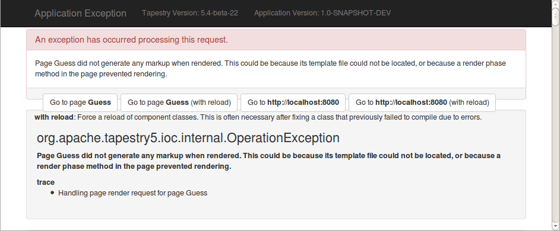

Ah! We didn't create a Guess page template. Tapestry was really expecting us to create one, so we better do so.

**src/main/resources/com/example/tutorial/pages/Guess.tml**

```java
<html t:type="layout" title="Guess The Number"
    xmlns:t="http://tapestry.apache.org/schema/tapestry_5_3.xsd">

    <p>
        The secret number is: ${target}.
    </p>
  
</html>
```

Hit the browser's back button, then click the "start guessing" link again. We're getting closer:

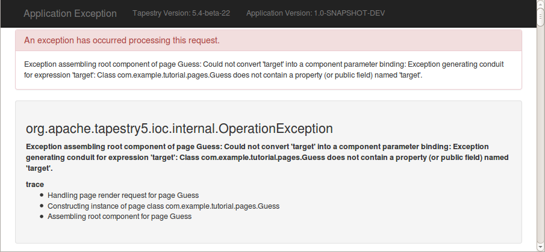

If you scroll down, you'll see the line of the Guess.tml template that has the error. We have a field named target, but it is private and there's no corresponding property, so Tapestry was unable to access it.

We just need to write the missing JavaBeans accessor methods `getTarget()` (and `setTarget()` for good measure). Or we could let Tapestry write those methods instead:

```java
    @Property
    private int target;
```

The @[Property](http://tapestry.apache.org/current/apidocs/org/apache/tapestry5/annotations/Property.html) annotation very simply directs Tapestry to write the getter and setter method for you. You only need to do this if you are going to reference the field from the template.

We are getting very close but there's one last big oddity to handle. Once you refresh the page you'll see that target is 0!

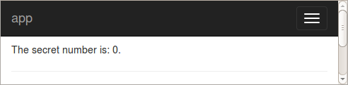

What gives? We know it was set to at least 1 ... where did the value go?

As noted above, Tapestry sends a redirect to the client after handling the event request. That means that the rendering of the page happens in an entirely new request. Meanwhile, at the end of each request, Tapestry wipes out the value in each instance variable. So that means that target *was* a non-zero number during the component event request ... but by the time the new page render request comes up from the web browser to render the Guess page, the value of the target field has reverted back to its default, zero.

The solution here is to mark which fields have values that should persist from one request to the next (and next, and next ...). That's what the @[Persist](http://tapestry.apache.org/current/apidocs/org/apache/tapestry5/annotations/Persist.html) annotation is for:

```java
    @Property  
    @Persist
    private int target;
```

This doesn't have anything to do with database persistence (that's coming up in a later chapter). It means that the value is stored in the HttpSession between requests.

Go back to the Index page and click the link again. Finally, we have a target number:

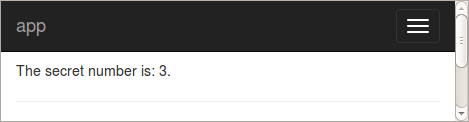

That's enough for us to get started. Let's build out the Guess page, and get ready to let the user make guesses. We'll show the count of guesses, and increment that count when they make them. We'll worry about high and low and actually selecting the correct value later.

When building Tapestry pages, you sometimes start with the Java code and build the template to match, and sometime start with the template and build the Java code to match. Both approaches are valid. Here, lets start with the markup in the template, then figure out what we need in the Java code to make it work.

**Guess.tml (revised)**

```xml
<html t:type="layout" title="Guess The Number"
    xmlns:t="http://tapestry.apache.org/schema/tapestry_5_3.xsd"
    xmlns:p="tapestry:parameter">
 
    <p>
        The secret number is: ${target}.
    </p>
 
    <strong>Guess number ${guessCount}</strong>
 
    <p>Make a guess from the options below:</p>
 
    <ul class="list-inline">
        <t:loop source="1..10" value="current">
            <li>
            <t:actionlink t:id="makeGuess" context="current">${current}
            </t:actionlink>
            </li>
        </t:loop>
    </ul>
 
</html>
```

So it looks like we need a `guessCount` property that starts at 1.

We're also seeing one new component, the Loop component. A Loop component iterates over the values passed to it in its `source` parameter, and renders it body once for each value. It updates the property bound to its `value` parameter before rendering its body.

That special property expression, `1..10`, generates a series of numbers from 1 to 10, inclusive. usually, when you use the Loop component, you are iterating over a List or Collection of values, such as the results of a database query.

So, the Loop component is going to set the `current` property to 1, and render its body (the \<li\> tag, and the ActionLink component). Then its going to set the `current` property to 2 and render its body again ... all the way up to 10.

And notice what we're doing with the ActionLink component; its no longer enough to know the user clicked on the ActionLink ... we need to know *which iteration* the user clicked on. The `context` parameter allows a value to be added to the ActionLink's URL, and we can get it back in the event handler method.

The URL for the ActionLink will be `/tutorial1/guess.makeguess/3`. That's the page name, "Guess", the component id, "makeGuess", and the context value, "3".

**Guess.java (revised)**

```java
package com.example.tutorial1.pages;
import org.apache.tapestry5.annotations.Persist; import org.apache.tapestry5.annotations.Property;
public class Guess {@Property @Persist private int target, guessCount;
@Property private int current;
void setup(int target) {this.target = target; guessCount = 1;}
void onActionFromMakeGuess(int value) {guessCount++;}
}
```

The revised version of Guess includes two new properties: `current` and `guessCount`. There's also a handler for the action event from the makeGuess ActionLink component; currently it just increments the count.

Notice that the `onActionFromMakeGuess()` method now has a parameter: the context value that was encoded into the URL by the ActionLink. When then user clicks the link, Tapestry will automatically extract the string from the URL, convert it to an int and pass that int value into the event handler method. More boilerplate code you don't have to write.

At this point, the page is partially operational:

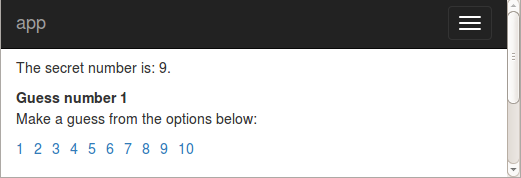

Our next step is to actually check the value provided by the user against the target and provide feedback: either they guessed too high, or too low, or just right. If they get it just right, we'll switch to the GameOver page with a message such as "You guessed the number 5 in 2 guesses".

Let's start with the Guess page; it now needs a new property to store the message to be displayed to the user, and needs a field for the injected GameOver page:

**Guess.java (partial)**

```java
    @Property
    @Persist(PersistenceConstants.FLASH)
    private String message;

    @InjectPage
    private GameOver gameOver;
```

First off, we're seeing a variation of the @Persist annotation, where a persistence *strategy* is provided by name. [FLASH](http://tapestry.apache.org/current/apidocs/org/apache/tapestry5/PersistenceConstants.html#FLASH) is a built-in strategy that stores the value in the session, but only for one request ... it's designed specifically for these kind of feedback messages. If you hit F5 in the browser, to refresh, the page will render but the message will disappear.

Next, we need some more logic in the `onActionFromMakeGuess()` event handler method:

**Guess.java (partial)**

```java
Object onActionFromMakeGuess(int value) {if (value == target) {gameOver.setup(target, guessCount); return gameOver;}
guessCount++;
message = String.format("Your guess of %d is too %s.", value,value < target ? "low" : "high");
return null;}
```

Again, very straight-forward. If the value is correct, then we configure the GameOver page and return it, causing a redirect to that page. Otherwise, we increment the number of guesses, and format the message to display to the user.

In the template, we just need to add some markup to display the message:

**Guess.tml (partial)**

```xml
    <strong>Guess number ${guessCount}</strong>

    <t:if test="message">
        <p>
            <strong>${message}</strong>
        </p>
    </t:if>
```

This snippet uses Tapestry's [If](http://tapestry.apache.org/current/apidocs/org/apache/tapestry5/corelib/components/If.html) component. The If component evaluates its `test` parameter and, if the value evaluates to true, renders its body. The property bound to `test` doesn't have to be a boolean; Tapestry treats `null` as false, it treats zero as false and non-zero as true, it treats an empty Collection as false ... and for Strings (such as `message`) it treats a blank string (one that is null, or consists only of white space) as false, and a non-blank string is true.

We can wrap up with the "GameOver" page:

**GameOver.java**

```java
package com.example.tutorial1.pages;
import org.apache.tapestry5.annotations.Persist; import org.apache.tapestry5.annotations.Property;
public class GameOver {@Property @Persist private int target, guessCount;
void setup(int target, int guessCount) {this.target = target; this.guessCount = guessCount;}}
```

**GameOver.tml**

```xml
<html t:type="layout" title="Game Over"
    xmlns:t="http://tapestry.apache.org/schema/tapestry_5_3.xsd"
    xmlns:p="tapestry:parameter">

    <p>
        You guessed the number
        <strong>${target}</strong>
        in
        <strong>${guessCount}</strong>
        guesses.
    </p>
  
</html>
```

The result, when you guess correctly, should be this:

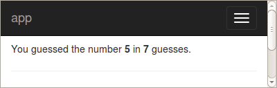

That wraps up the basics of Tapestry; we've demonstrated the basics of linking pages together and passing information from page to page in code as well as incorporating data inside URLs.

There's still more room to refactor this toy application; for example, making it possible to start a new game from the GameOver page (and doing it in a way that doesn't duplicate code). In addition, later we'll see other ways of sharing information between pages that are less cumbersome than the setup-and-persist approach shown here.

Next up: let's find out how Tapestry handles HTML forms and user input.

Next: [Using BeanEditForm To Create User Forms](#using-beaneditform-to-create-user-forms)

**Error rendering macro 'scrollbar'**

com/opensymphony/webwork/ServletActionContext

---

<a id="using-beaneditform-to-create-user-forms"></a>

<!-- source_url: https://tapestry.apache.org/using-beaneditform-to-create-user-forms.html -->

<!-- page_index: 9 -->

# Using BeanEditForm To Create User Forms

[Apache Tapestry](#index) > [Documentation](#documentation) > [Tapestry Tutorial](#tapestry-tutorial) > [Using BeanEditForm To Create User Forms](#using-beaneditform-to-create-user-forms)

<a id="using-beaneditform-to-create-user-forms--title"></a>
<a id="using-beaneditform-to-create-user-forms--using-beaneditform-to-create-user-forms"></a>

# Using BeanEditForm To Create User Forms

**Error rendering macro 'scrollbar'**

com/opensymphony/webwork/ServletActionContext

In the previous chapters, we saw how Tapestry can handle simple links, even links that pass information in the URL. In this chapter, we'll see how Tapestry can do the same, and quite a bit more, for HTML forms.

Form support in Tapestry is deep and rich, more than can be covered in a single chapter. However, we can show the basics, including some very common development patterns. To get started, let's create a simple address book application.

We'll start with the entity data, a simple object to store the information we'll need. These classes go in an `entities` sub-package. Unlike the use of the `pages` sub-package (for page component classes), this is not enforced by Tapestry; it's just a convention (but as we'll see shortly, a handy one).

Tapestry treats public fields as if they were JavaBeans properties; since the Address object is just "dumb data", there's no need to get carried away writing getters and setters. Instead, we'll define an entity that is all public fields:

**src/main/java/com/example/tutorial/entities/Address.java**

```java
package com.example.tutorial1.entities;

import com.example.tutorial1.data.Honorific;

public class Address
{
    public Honorific honorific;
    public String firstName;
    public String lastName;
    public String street1;
    public String street2;
    public String city;
    public String state;
    public String zip;
    public String email;
    public String phone;
}
```

We also need to define the enum type, Honorific:

**src/main/java/com/example/tutorial/data/Honorific.java**

```java
package com.example.tutorial1.data;

public enum Honorific
{
    MR, MRS, MISS, DR
}
```

<a id="using-beaneditform-to-create-user-forms--usingbeaneditformtocreateuserforms-addresspages"></a>
<a id="using-beaneditform-to-create-user-forms--address-pages"></a>

# Address Pages

We're probably going to create a few pages related to addresses: pages for creating them, for editing them, for searching and listing them. We'll create a sub-folder, address, to hold them. Let's get started on the first of these pages, "address/Create" (that's the real name, including the slash — we'll see in a minute how that maps to classes and templates).

First, we'll update the Index.tml template, to create a link to the new page:

**src/main/resources/com/example/tutorial/pages/Index.tml (partial)**

```xml
    <h1>Address Book</h1>

    <ul>
        <li><t:pagelink page="address/create">Create new address</t:pagelink></li>
    </ul>
```

Now we need the address/Create page; lets start with an empty shell, just to test our navigation.

**src/main/resources/com/example/tutorial/pages/address/CreateAddress.tml**

```xml
<html t:type="layout" title="Create New Address"
    xmlns:t="http://tapestry.apache.org/schema/tapestry_5_3.xsd">

    <em>coming soon ...</em>

</html>
```

(Note: for Tapestry 5.4, make that `tapestry_5_4.xsd` instead.)

Next, the corresponding class:

**src/main/java/com/example/tutorial/pages/address/CreateAddress.java**

```java
package com.example.tutorial1.pages.address;

public class CreateAddress
{

}
```

So ... why is the class named "CreateAddress" and not simply "Create"? Actually, we could have named it "Create", and the application would still work, but the longer *class* name is equally valid. Tapestry noticed the redundancy in the class name (com.example.tutorial1.pages.`address`.Create*Address*) and just stripped out the redundant suffix.

Tapestry actually creates a bunch of aliases for you pages; any of these aliases are valid and can appear in URLs or in the page parameter of PageLink. You can see the list in the console:

```java
[INFO] TapestryModule.ComponentClassResolver Available pages (12):
              (blank): com.example.tutorial1.pages.Index
   ComponentLibraries: org.apache.tapestry5.corelib.pages.ComponentLibraries
             Error404: com.example.tutorial1.pages.Error404
      ExceptionReport: org.apache.tapestry5.corelib.pages.ExceptionReport
             GameOver: com.example.tutorial1.pages.GameOver
                Guess: com.example.tutorial1.pages.Guess
                Index: com.example.tutorial1.pages.Index
          PageCatalog: org.apache.tapestry5.corelib.pages.PageCatalog
PropertyDisplayBlocks: org.apache.tapestry5.corelib.pages.PropertyDisplayBlocks
   PropertyEditBlocks: org.apache.tapestry5.corelib.pages.PropertyEditBlocks
        ServiceStatus: org.apache.tapestry5.corelib.pages.ServiceStatus
          T5Dashboard: org.apache.tapestry5.corelib.pages.T5Dashboard
       address/Create: com.example.tutorial1.pages.address.CreateAddress
address/CreateAddress: com.example.tutorial1.pages.address.CreateAddress
```

Tapestry users the shortest alias when constructing URLs.

Eventually, your application will probably have more entities: perhaps you'll have a "user/Create" page and a "payment/Create" page and an "account/Create" page. You *could* have a bunch of different classes all named Create spread across a number of different packages. That's legal Java, but it isn't ideal. You may find yourself accidentally editing the Java code for creating an Account when you really want to be editing the code for creating a Payment.

Tapestry is encouraging you to use a more descriptive name: Create*Address*, not just Create, but it isn't making you pay the cost (in terms of longer, uglier URLs). The URL to access the page will still be <http://localhost:8080/tutorial1/address/create>.

And remember, regardless of the name that Tapestry assigns to your page, the template file is named like the Java class itself: CreateAddress.tml.

Index pages work in folders as well. A class named com.example.tutorial1.pages.address.AddressIndex would be given the name "address/Index". However, Tapestry has special rules for pages named "Index" and the rendered URL would be <http://localhost:8080/tutorial1/address/>. In other words, you can place Index pages in any folder and Tapestry will build a short URL for that page ... and you *don't* have to keep naming the classes Index (it's confusing to have many classes with the same name, even across multiple packages); instead, you can name each index page after the package that contains it. Tapestry users a smart *convention* to keep it all straight and generate short, to the point URLs.

<a id="using-beaneditform-to-create-user-forms--usingbeaneditformtocreateuserforms-usingthebeaneditformcomponent"></a>
<a id="using-beaneditform-to-create-user-forms--using-the-beaneditform-component"></a>

# Using the BeanEditForm Component

Time to start putting together the logic for this form. Tapestry has a specific component for client-side Forms: the [Form](http://tapestry.apache.org/current/apidocs/org/apache/tapestry5/corelib/components/Form.html) component, as well as components for form controls, such as [Checkbox](http://tapestry.apache.org/current/apidocs/org/apache/tapestry5/corelib/components/Checkbox.html) and [TextField](http://tapestry.apache.org/current/apidocs/org/apache/tapestry5/corelib/components/TextField.html). We'll cover those in a bit more detail later .. instead, we're again going to let Tapestry do the heavy lifting for us, via the [BeanEditForm](http://tapestry.apache.org/current/apidocs/org/apache/tapestry5/corelib/components/BeanEditForm.html) component.

Add the following to the CreateAddress template (replacing the "coming soon ..." message):

**CreateAddress.tml (partial)**

```xml
    <t:beaneditform object="address"/>
```

And match that up with a property in the CreateAddress class:

**CreateAddress.java (partial)**

```java
    @Property
    private Address address;
```

When you refresh the page, you may see a warning like the following at the top of the page:


If you see that, it means you need to invent an HMAC passphrase for your app. Just edit your AppModule.java class (in your services package), adding a couple of lines to the contributeApplicationDefaults method like the following:

```java
        // Set the HMAC pass phrase to secure object data serialized to client
        configuration.add(SymbolConstants.HMAC_PASSPHRASE, "");
```

but, instead of an empty string, insert a long, **random string of characters** (like a very long and complex password, at least 30 characters) that you keep private.

After you do that, stop the app and restart it, and click on the Create new address link again, and you'll see something like this:

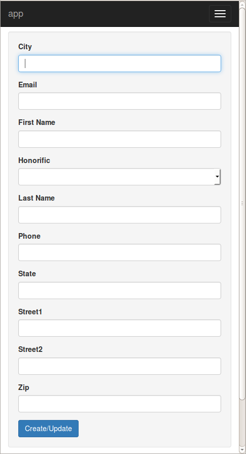

Tapestry has done quite a bit of work here. It has created a form that includes a field for each property. Further, it has seen that the honorific property is an enumerated type, and presented that as a drop-down list.

In addition, Tapestry has converted the property names ("city", "email", "firstName") to user presentable labels ("City", "Email", "First Name"). In fact, these are <label> elements, so clicking a label with the mouse will move the input cursor into the corresponding field.

This is an awesome start; it's a presentable interface, quite nice in fact for a few minute's work. But it's far from perfect; let's get started with some customizations.

<a id="using-beaneditform-to-create-user-forms--usingbeaneditformtocreateuserforms-changingfieldorder"></a>
<a id="using-beaneditform-to-create-user-forms--changing-field-order"></a>

# Changing Field Order

The BeanEditForm must guess at the right order to present the fields; for public fields, they end up in alphabetical order. For standard JavaBeans properties, the BeanEditForm default is in the order in which the getter methods are defined in the class (it uses line number information, if available).

A better order for these fields is the order in which they are defined in the Address class:

- honorific
- firstName
- lastName
- street1
- street2
- city
- state
- zip
- email
- phone

We can accomplish this by using the `reorder` parameter of the BeanEditForm component, which is a comma separated list of property (or public field) names:

**CreateAddress.tml (partial)**

```xml
    <t:beaneditform object="address"
        reorder="honorific,firstName,lastName,street1,street2,city,state,zip,email,phone" />
```

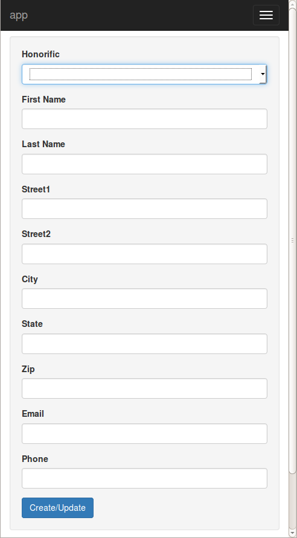

<a id="using-beaneditform-to-create-user-forms--usingbeaneditformtocreateuserforms-customizinglabels"></a>
<a id="using-beaneditform-to-create-user-forms--customizing-labels"></a>

### Customizing labels

Tapestry makes it pretty easy to customize the labels used on the fields. It's just a matter of creating a *message catalog* for the page.

In Tapestry, every page and component may have its own message catalog. This is a standard Java properties file, and it is named the same as the page or component class, with a ".properties" extension. A message catalog consists of a series of lines, each line is a message key and a message value separated with an equals sign.

All it takes is to create a message entry with a particular name: the name of the property suffixed with "-label". As elsewhere, Tapestry is forgiving of case.

**src/main/resources/com/example/tutorial/pages/address/CreateAddress.properties**

```
street1-label=Street 1
street2-label=Street 2
email-label=E-Mail
zip-label=Zip Code
phone-label=Phone Number
```

Since this is a *new* file (and not a change to an existing file), you may have to restart Jetty to force Tapestry to pick up the change.

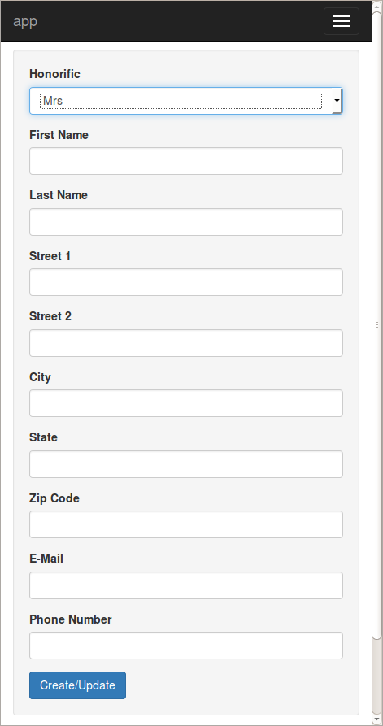

We can also customize the options in the drop down list. All we have to do is add some more entries to the message catalog matching the enum names to the desired labels. Update CreateAddress.properties and add:

```
MR=Mr.
MRS=Mrs.
DR=Dr.
```

Notice that we don't have to include an option for MISS, because that is converted to "Miss" anyway. You might just want to include it for sake of consistency ... the point is, each option label is searched for separately.

Lastly, the default label on the submit button is "Create/Update" (BeanEditForm doesn't know how it is being used). Let's change that to "Create Address".

That button is a component within the BeanEditForm component. It's not a property, so we can't just put a message into the message catalog, the way we can with the fields. Fortunately, the BeanEditForm component includes a parameter expressly for re-labeling the button. Simply change the CreateAddress component template:

```xml
    <t:beaneditform submitlabel="Create Address" object="address"
        reorder="honorific,firstName,lastName,street1,street2,city,state,zip,email,phone"/>
```

The default for the submitlabel parameter is "Create/Update", but here we're overriding that default to a specific value.

The final result shows the reformatting and relabelling:

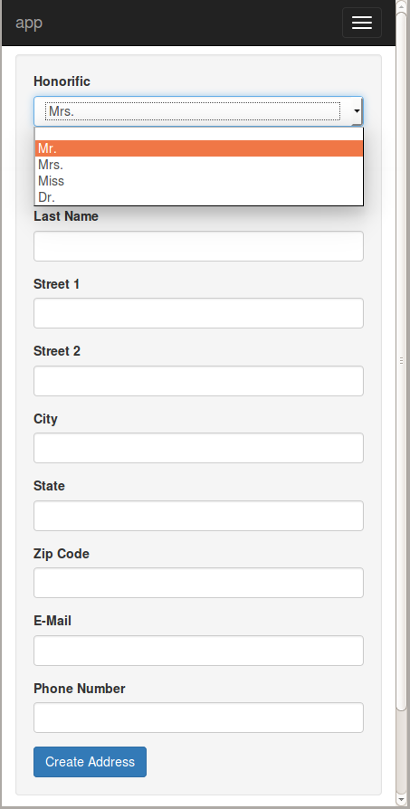

Before continuing on to validation, a side note about message catalogs. Message catalogs are not just for re-labeling fields and options; we'll see in later chapters how message catalogs are used in the context of localization and internationalization.

Instead of putting the label for the submit button directly inside the template, we're going to provide a reference to the label; the actual label will go in the message catalog.

In Tapestry, when binding a parameter, the value you provide may include a prefix. The prefix guides Tapestry in how to interpret the rest of the the parameter value ... is it the name of a property? The id of a component? A message key? Most parameters have a default prefix, usually "prop:", that is used when you fail to provide one (this helps to make the templates as terse as possible).

Here we want to reference a message from the catalog, so we use the "message:" prefix:

```xml
    <t:beaneditform object="address" submitlabel="message:submit-label"
        reorder="honorific,firstName,lastName,street1,street2,city,state,zip,email,phone" />
```

And then we define the submit-label key in the message catalog:

```
submit-label=Create Address
```

In the end, the exact same HTML is sent to the client, regardless of whether you include the label text directly in the template, or indirectly in the message catalog. In the long term, the latter approach will work better if you later chose to internationalize your application.

<a id="using-beaneditform-to-create-user-forms--usingbeaneditformtocreateuserforms-addingvalidation"></a>
<a id="using-beaneditform-to-create-user-forms--adding-validation"></a>

### Adding Validation

Before we worry about storing the Address object, we should make sure that the user provides reasonable values. For example, several of the fields should be required, and phone numbers and email address have specific formats.

The BeanEditForm checks for a Tapestry-specific annotation, @[Validate](http://tapestry.apache.org/current/apidocs/org/apache/tapestry5/beaneditor/Validate.html), on the field, the getter method, or the setter method of each property.

Edit the Address entity, and update the lastName, firstName, street1, city, state and zip fields, adding a @Validate annotation to each:

```java
    @Validate("required")
    public String firstName;
```

What is that string, "required"? That's how you specify the desired validation. It is a series of names that identify what type of validation is desired. A number of validators are built in, such as "required", "minLength" and "maxLength". As elsewhere, Tapestry is case insensitive.

You can apply multiple validations, by separating the validator names with commas. Some validators can be configured (with an equals sign). Thus you might say "required,minLength=5" for a field that must be specified, and must be at least five characters long.

You can easily get confused when you make a change to an entity class, such as adding the @Validate annotation, and *not* see the result in the browser. Only component classes, and (most) classes in the Tapestry services layer, are live-reloaded. Data and entity objects are not reloaded, so this is one area where you need to stop and restart Jetty to see the change.

Restart the application, and refresh your browser, then hit the Create Address button.

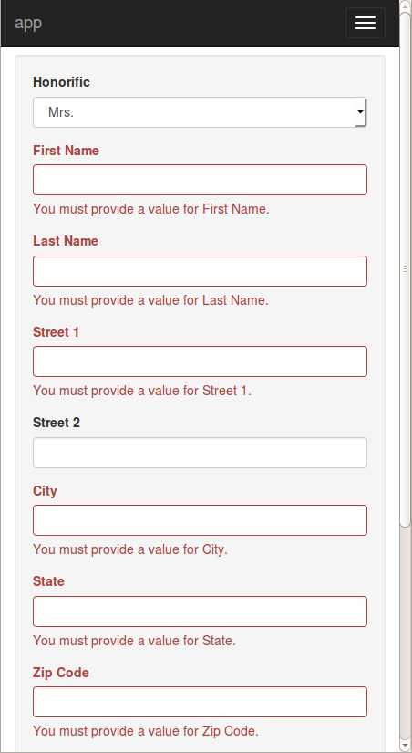

This is a shot just after hitting the Create Address button; all the fields have been validated and errors displayed. Each field in error has been highlighted in red and had an error message added. Further, the label for each of the fields has also been highlighted in red, to even more clearly identify what's in error. The cursor has also been moved to the first field that's in error. And *all* of this is taking place on the client side, without any communication with the application.

Once all the errors are corrected, and the form does submit, all validations are performed on the server side as well (just in case the client has JavaScript disabled).

So ... how about some more interesting validation than just "required or not". Tapestry has built in support for validating based on field length and several variations of field value, including regular expressions. Zip codes are pretty easy to express as a regular expression.

```java
    @Validate("required,regexp=^\\d{5}(-\\d{4})?$")
    public String zip;
```

Let's give it a try; restart the application and enter an "abc" for the zip code.

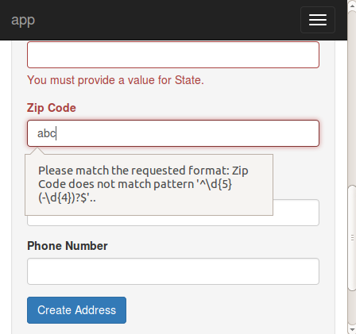

This is what you'll see after typing "abc" and clicking the Create Address button.

Modern browsers will automatically validate a regexp field when the form is submitted, as shown above. Older browsers do not have that automatic support, but will still validate input, using the same decorations as for the required fields in the previous screenshot.

In any case, that's the right validation behavior, but it's the wrong message. Your users are not going to know or care about regular expressions.

Fortunately, it's easy to customize validation messages. All we need to know is the name of the property ("zip") and the name of the validator ("regexp"). We can then put an entry into the CreateAddress message catalog:

```
zip-regexp-message=Zip Codes are five or nine digits.  Example: 02134 or 90125-1655.
```

Refresh the page and submit again:

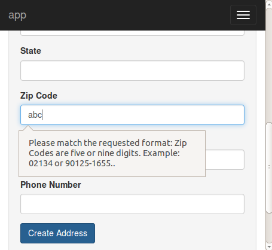

This trick isn't limited to just the regexp validator, it works equally well with *any* validator.

Let's go one step further. Turns out, we can move the regexp pattern to the message catalog as well. If you only provide the name of the validator in the @Validate annotation, Tapestry will search the containing page's message catalog of the constraint value, as well as the validation message. The constraint value for the regexp validator is the regular expression to match against.

```java
    @Validate("required,regexp")
    public String zip;
```

Now, just put the regular expression into the CreateAddress message catalog:

```
zip-regexp=^\\d{5}(-\\d{4})?$
zip-regexp-message=Zip Codes are five or nine digits.  Example: 02134 or 90125-1655.
```

After a restart you'll see the ... the same behavior. But when we start creating more complicated regular expressions, it'll be much, much nicer to put them in the message catalog rather than inside the annotation value. And inside the message catalog, you can change and tweak the regular expressions without having to restart the application each time.

We could go a bit further here, adding more regular expression validation for phone numbers and e-mail addresses. We're also far from done in terms of further customizations of the BeanEditForm component.

By now you are likely curious about what happens *after* the form submits successfully (without validation errors), so that's what we'll focus on next.

Next: [Using Tapestry With Hibernate](#using-tapestry-with-hibernate)

**Error rendering macro 'scrollbar'**

com/opensymphony/webwork/ServletActionContext

---

<a id="using-tapestry-with-hibernate"></a>

<!-- source_url: https://tapestry.apache.org/using-tapestry-with-hibernate.html -->

<!-- page_index: 10 -->

# Using Tapestry With Hibernate

[Apache Tapestry](#index) > [Documentation](#documentation) > [Tapestry Tutorial](#tapestry-tutorial) > [Using Tapestry With Hibernate](#using-tapestry-with-hibernate)

<a id="using-tapestry-with-hibernate--title"></a>
<a id="using-tapestry-with-hibernate--using-tapestry-with-hibernate"></a>

# Using Tapestry With Hibernate

**Error rendering macro 'scrollbar'**

com/opensymphony/webwork/ServletActionContext

So, you fill in all the fields, submit the form (without validation errors) and voila: you get back the same form, blanked out. What happened, and where did the data go?

What happened is that we haven't told Tapestry what to do after the form is successfully submitted (by successful, we mean, with no validation errors). Tapestry's default behavior is to redisplay the active page, and that occurs in a new request, with a new instance of the Address object (because the address field is not a peristent field).

Well, since we're creating objects, we might as well store them somewhere ... in a database. We're going to quickly integrate Tapestry with [Hibernate](http://hibernate.org) as the object/relational mapping layer, and ultimately store our data inside a [HyperSQL](http://www.hsqldb.org/) (HSQLDB) database. HSQLDB is an embedded database engine and requires no installation – it will be pulled down as a dependency by Maven.

<a id="using-tapestry-with-hibernate--usingtapestrywithhibernate-re-configuringtheproject"></a>
<a id="using-tapestry-with-hibernate--re-configuring-the-project"></a>

## Re-configuring the Project

We're going to bootstrap this project from a simple Tapestry project to one that uses Hibernate and HSQLDB.

<a id="using-tapestry-with-hibernate--usingtapestrywithhibernate-updatingthedependencies"></a>
<a id="using-tapestry-with-hibernate--updating-the-dependencies"></a>

### Updating the Dependencies

First, we must update the POM to list a new set of dependencies, that includes Hibernate, the Tapestry/Hibernate integration library, and the HSQLDB JDBC driver:

**src/pom.xml (partial)**

```xml
    <dependencies>

        <dependency>
            <groupId>org.apache.tapestry</groupId>
            <artifactId>tapestry-hibernate</artifactId>
            <version>${tapestry-release-version}</version>
        </dependency>

        <dependency>
            <groupId>org.hsqldb</groupId>
            <artifactId>hsqldb</artifactId>
            <version>2.3.2</version>
        </dependency>
        ...
    </dependencies>
```

The tapestry-hibernate library includes, as transitive dependencies, Hibernate and tapestry-core. This means that you can simply replace "tapestry-core" with "tapestry-hibernate" inside the <artifactId> element.

After changing the POM and saving, Maven should automatically download the JARs for the new dependencies.

<a id="using-tapestry-with-hibernate--usingtapestrywithhibernate-hibernateconfiguration"></a>
<a id="using-tapestry-with-hibernate--hibernate-configuration"></a>

### Hibernate Configuration

Hibernate needs a master configuration file, hibernate.cfg.xml, used to store connection and other data. Create this in your src/main/resources folder:

**src/main/resources/hibernate.cfg.xml**

```xml
<!DOCTYPE hibernate-configuration PUBLIC
        "-//Hibernate/Hibernate Configuration DTD 3.0//EN"
        "http://hibernate.sourceforge.net/hibernate-configuration-3.0.dtd">
<hibernate-configuration>
    <session-factory>
        <property name="hibernate.connection.driver_class">org.hsqldb.jdbcDriver</property>
        <property name="hibernate.connection.url">jdbc:hsqldb:./target/work/t5_tutorial1;shutdown=true</property>
        <property name="hibernate.dialect">org.hibernate.dialect.HSQLDialect</property>
        <property name="hibernate.connection.username">sa</property>
        <property name="hibernate.connection.password"></property>
        <property name="hbm2ddl.auto">update</property>
        <property name="hibernate.show_sql">true</property>
        <property name="hibernate.format_sql">true</property>
    </session-factory>
</hibernate-configuration>
```

Most of the configuration is to identify the JDBC driver and connection URL.

Note the connection URL. We are instructing HSQLDB to store its database files within our project's target directory. We are also instructing HSQLDB to flush any data to these files at shutdown. This means that data will persist across different invocations of this project, but if the target directory is destroyed (e.g., via "mvn clean"), then all the database contents will be lost.

In addition, we are configuring Hibernate to *update* the database schema; when Hibernate initializes it will create or even modify tables to match the entities. Finally, we are configuring Hibernate to output any SQL it executes, which is very useful when initially building an application.

But what entities? Normally, the available entities are listed inside hibernate.cfg.xml, but that's not necessary with Tapestry; in another example of convention over configuration, Tapestry locates all entity classes inside the entities package ("com.example.tutorial1.entities" in our case) and adds them to the configuration. Currently, that is just the Address entity.

<a id="using-tapestry-with-hibernate--usingtapestrywithhibernate-addinghibernateannotations"></a>
<a id="using-tapestry-with-hibernate--adding-hibernate-annotations"></a>

## Adding Hibernate Annotations

For an entity class to be used with Hibernate, some Hibernate annotations must be added to the class.

Below is the updated Address class, with the Hibernate annotations (as well as the Tapestry ones).

**src/main/java/com/example/tutorial/entities/Address.java**

```java
package com.example.tutorial1.entities;

import javax.persistence.Entity;
import javax.persistence.GeneratedValue;
import javax.persistence.GenerationType;
import javax.persistence.Id;

import org.apache.tapestry5.beaneditor.NonVisual;
import org.apache.tapestry5.beaneditor.Validate;

import com.example.tutorial1.data.Honorific;

@Entity
public class Address
{
  @Id
  @GeneratedValue(strategy = GenerationType.IDENTITY)
  @NonVisual
  public Long id;

  public Honorific honorific;

  @Validate("required")
  public String firstName;

  @Validate("required")
  public String lastName;

  public String street1;

  public String street2;

  @Validate("required")
  public String city;

  @Validate("required")
  public String state;

  @Validate("required,regexp")
  public String zip;

  public String email;

  public String phone;
}
```

The Tapestry annotations, @NonVisual and @Validate, may be placed on the setter or getter method or on the field (as we have done here). As with the Hibernate annotations, putting the annotation on the field requires that the field name match the corresponding property name.

- **@NonVisual** – indicates a field, such as a primary key, that should not be made visible to the user.
- **@Validate** – identifies the validations associated with a field.

At this point you should stop and restart your application.

<a id="using-tapestry-with-hibernate--usingtapestrywithhibernate-updatingthedatabase"></a>
<a id="using-tapestry-with-hibernate--updating-the-database"></a>

## Updating the Database

So we have a database set up, and Hibernate is configured to connect to it. Let's make use of that to store our Address object in the database.

What we need is to provide some code to be executed when the form is submitted. When a Tapestry form is submitted, there is a whole series of events that get fired. The event we are interested in is the "success" event, which comes late in the process, after all the values have been pulled out of the request and applied to the page properties, and after all server-side validations have occurred.

The success event is only fired if there are no validation errors.

Our event handler must do two things:

- Use the Hibernate Session object to persist the new Address object.
- Commit the transaction to force the data to be written to the database.

Let's update our CreateAddress.java class:

**src/main/java/com/example/tutorial/pages/address/CreateAddress.java**

```java
package com.example.tutorial1.pages.address;

import com.example.tutorial1.entities.Address;
import com.example.tutorial1.pages.Index;
import org.apache.tapestry5.annotations.InjectPage;
import org.apache.tapestry5.annotations.Property;
import org.apache.tapestry5.hibernate.annotations.CommitAfter;
import org.apache.tapestry5.ioc.annotations.Inject;
import org.hibernate.Session;

public class CreateAddress
{
    @Property
    private Address address;

    @Inject
    private Session session;

    @InjectPage
    private Index index;

    @CommitAfter
    Object onSuccess()
    {
        session.persist(address);

        return index;
    }
}
```

The [Inject](http://tapestry.apache.org/current/apidocs/org/apache/tapestry5/ioc/annotations/Inject.html) annotation tells Tapestry to inject a service into the annotated field; Tapestry includes a sophisticated Inversion of Control container (similar in many ways to Spring) that is very good at locating available services by type, rather than by a string id. In any case, the Hibernate Session object is exposed as a Tapestry IoC service, ready to be injected (this is one of the things provided by the tapestry-hibernate module).

Tapestry automatically starts a transaction as necessary; however that transaction will be *aborted* at the end of the request by default. If we make changes to persistent objects, such as adding a new Address object, then it is necessary to commit the transaction.

The [CommitAfter](http://tapestry.apache.org/current/apidocs/org/apache/tapestry5/hibernate/annotations/CommitAfter.html) annotation can be applied to any component method; if the method completes normally, the transaction will be committed (and a new transaction started to replace the committed transaction).

After persisting the new address, we return to the main Index page of the application.

*Note: In real applications, it is rare to have pages and components directly use the Hibernate Session. It is generally a better approach to define your own Data Access Object layer to perform common update operations and queries.*

<a id="using-tapestry-with-hibernate--usingtapestrywithhibernate-showingaddresses"></a>
<a id="using-tapestry-with-hibernate--showing-addresses"></a>

## Showing Addresses

As a little preview of what's next, let's display all the Addresses entered by the user on the Index page of the application. After you enter a few names, it will look something like:

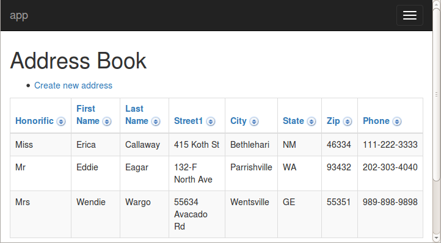

<a id="using-tapestry-with-hibernate--usingtapestrywithhibernate-addingthegridtotheindexpage"></a>
<a id="using-tapestry-with-hibernate--adding-the-grid-to-the-index-page"></a>

## Adding the Grid to the Index page

So, how is this implemented? Primarily, its accomplished by the [Grid](http://tapestry.apache.org/current/apidocs/org/apache/tapestry5/corelib/components/Grid.html) component.

The Grid component is based on the same concepts as the BeanEditForm component; it can pull apart a bean into columns. The columns are sortable, and when there are more entries than will fit on a single page, page navigation is automatically added.

A minimal Grid is very easy to add to the template. Just add this near the bottom of Index.tml:

**src/main/webapp/Index.tml (partial)**

```xml
  <t:grid source="addresses"
         include="honorific,firstName,lastName,street1,city,state,zip,phone"/>
```

Note that the Grid component accepts many of the same parameters that we used with the BeanEditForm. Here we use the include parameter to specify the properties to show, and in what order.

Now all we have to do is supply the addresses property in the Java code. Here's how Index.java should look now:

**src/main/java/com/example/tutorial/pages/Index.java**

```java
package com.example.tutorial1.pages; import java.util.List; import org.apache.tapestry5.ioc.annotations.Inject; import org.hibernate.Session; import com.example.tutorial1.entities.Address; public class Index {@Inject private Session session; public List<Address> getAddresses() {return session.createCriteria(Address.class).list();}}
```

Here, we're using the Hibernate Session object to find all Address objects in the database. Any sorting that takes place will be done in memory. This is fine for now (with only a handful of Address objects in the database). Later we'll see how to optimize this for very large result sets.

<a id="using-tapestry-with-hibernate--usingtapestrywithhibernate-what-snext"></a>
<a id="using-tapestry-with-hibernate--what-s-next"></a>

## What's Next?

We have lots more to talk about: more components, more customizations, built-in Ajax support, more common design and implementation patterns, and even writing your own components (which is easy!).

Check out the many Tapestry resources available on the [Documentation](#documentation) page, including the [Getting Started](#getting-started) and [FAQ](#frequently-asked-questions) pages and the [Cookbook](#cookbook). Be sure to peruse the [User Guide](#user-guide), which provides comprehensive details on nearly every Tapestry topic. Finally, be sure to visit (and bookmark) [Tapestry JumpStart](https://tapestry-jumpstart.org/jumpstart), which provides a nearly exhaustive set of tutorials.

**Error rendering macro 'scrollbar'**

com/opensymphony/webwork/ServletActionContext

---

<a id="user-guide"></a>

<!-- source_url: https://tapestry.apache.org/user-guide.html -->

<!-- page_index: 11 -->

# User Guide

[Apache Tapestry](#index) > [Documentation](#documentation) > [User Guide](#user-guide)

<a id="user-guide--title"></a>
<a id="user-guide--user-guide"></a>

# User Guide

This **User Guide** serves as the encyclopedia for Tapestry concepts, capabilities and practices.

<a id="user-guide--userguide-tapestrycore"></a>
<a id="user-guide--tapestry-core"></a>

## Tapestry Core

Going beyond [Getting Started](#getting-started) and the [Tutorial](#user-guide), these topics dive deep into the core Tapestry capabilities.

- [Supported Environments and Versions](#supported-environments-and-versions)
- [Project Layout](#project-layout)
- [Configuration](#configuration)
- [Class Reloading](#class-reloading)
- [Component Reference](#component-reference)
- [Annotations](#annotations)

<a id="user-guide--userguide-pagesandcomponents"></a>
<a id="user-guide--pages-and-components"></a>

### Pages and Components

- [Component Classes](#component-classes)
- [Component Templates](#component-templates)
- [Property Expressions](#property-expressions)
- [Component Parameters](#component-parameters)
- [Parameter Type Coercion](#parameter-type-coercion)
- [Layout Component](#layout-component)
- [Component Mixins](#component-mixins)
- [Page Navigation](#page-navigation)
- [Localization](#localization)

<a id="user-guide--userguide-request-responseprocessing"></a>
<a id="user-guide--request-response-processing"></a>

### Request/Response Processing

- [Page Life Cycle](#page-life-cycle)
- [Request Processing](#request-processing)
- [Component Rendering](#component-rendering)
- [URL Rewriting](#url-rewriting)
- [Document Object Model](#dom) (DOM)
- [Response Compression](#response-compression)
- [Securing your application with HTTPS](#https)
- [Content Type and Markup](#content-type-and-markup)

<a id="user-guide--userguide-datapersistence"></a>
<a id="user-guide--data-persistence"></a>

### Data persistence

- [Persistent Page Data](#persistent-page-data)
- [Session Storage](#session-storage)

<a id="user-guide--userguide-interactingwithcomponents"></a>
<a id="user-guide--interacting-with-components"></a>

### Interacting with components

- [Injection](#injection)
- [Environmental Services](#environmental-services)

<a id="user-guide--userguide-javascript-ajax-css-binarydata"></a>
<a id="user-guide--javascript-ajax-css-binary-data"></a>

### JavaScript, AJAX, CSS & Binary Data

- [Client-Side JavaScript](#client-side-javascript)
- [JavaScript Modules](#javascript-modules)
- [CoffeeScript](#coffeescript)
- [Ajax and Zones](#ajax-and-zones)
- [Cascading Style Sheets](#css) (CSS)
- [Assets](#assets)
- [Legacy JavaScript](#legacy-javascript) (prior to Tapestry 5.4)

<a id="user-guide--userguide-workingwithforms"></a>
<a id="user-guide--working-with-forms"></a>

### Working with forms

- [Logging & Debugging](#logging)
- [User Guide](#user-guide)
- [Uploading files](#user-guide)

<a id="user-guide--userguide-debugging-testing-tooling"></a>
<a id="user-guide--debugging-testing-tooling"></a>

### Debugging, Testing & Tooling

- [Logging & Debugging](#user-guide)
- [Unit testing pages or components](#unit-testing-pages-or-components)
- [Integration testing with Selenium](#integration-testing)
- [Development Dashboard](#development-dashboard)

<a id="user-guide--userguide-tapestryioc"></a>
<a id="user-guide--tapestry-ioc"></a>

## Tapestry IOC

As with Tapestry 5 in general, the goal of Tapestry Inversion of Control (IoC) is greater simplicity and power--without XML. You'll want to explore Tapestry IoC to make full use of the extensibility of the framework.

<a id="user-guide--userguide-architecture"></a>
<a id="user-guide--architecture"></a>

### Architecture

- [Introduction](#ioc)
- [Overview](#tapestry-ioc-overview)
- [Modules](#tapestry-ioc-modules)

<a id="user-guide--userguide-features"></a>
<a id="user-guide--features"></a>

### Features

- [Services](#defining-tapestry-ioc-services)
- [Service Advisors & Advice](#service-advisors)
- [Service Decorators & Decoration](#tapestry-ioc-decorators)
- [Operation Tracker](#operation-tracker)

<a id="user-guide--userguide-configuration"></a>
<a id="user-guide--configuration"></a>

### Configuration

- [Configuration](#tapestry-ioc-configuration)
- [Case Insensitivity](#case-insensitivity)
- [Module Autoloading](#autoloading-modules)
- [Service Implementation Reloading](#service-implementation-reloading)
- [Ordering by Constraints](#ordering-by-constraints)
- [Symbols](#symbols)

<a id="user-guide--userguide-servicebuilders"></a>
<a id="user-guide--service-builders"></a>

### Service Builders

Tapestry provides a set of ready-to-use service builders for common design patterns:

- [Chain of Command](#chainbuilder-service) (the ChainBuilder service)
- [Pipeline](#pipelinebuilder-service) (the PipelineBuilder service)
- [Shadow Properties](#shadowbuilder-service) (the PropertyShadowBuilder service)
- [Strategy](#strategybuilder-service) (the StrategyBuilder service)

<a id="user-guide--userguide-usage"></a>
<a id="user-guide--usage"></a>

### Usage

- [Injection in detail](#injection-in-detail)
- [Object Providers](#object-providers)
- [Service Serialization](#service-serialization)

<a id="user-guide--userguide-built-inservices"></a>
<a id="user-guide--built-in-services"></a>

### Built-in services

- [Type Coercer](#type-coercion)

<a id="user-guide--userguide-registrystartup-shutdown"></a>
<a id="user-guide--registry-startup-shutdown"></a>

### Registry startup & shutdown

- [Starting and stopping the registry](#starting-the-ioc-registry)
- [Listening for registry startup](#registry-startup)

<a id="user-guide--userguide-tooling"></a>
<a id="user-guide--tooling"></a>

### Tooling

- [Parallel Execution](#parallel-execution)
- [Logging](#logging-in-tapestry)

<a id="user-guide--userguide-built-inmodules"></a>
<a id="user-guide--built-in-modules"></a>

## Built-in modules

Tapestry comes with a collection of add-on modules to let you extend the framework beyond its core.<a id="user-guide--userguide-hibernateintegration"></a>
<a id="user-guide--hibernate-integration"></a>

### Hibernate Integration

- [Hibernate Configuration](#hibernate-core-conf)
- [Hibernate User Guide](#hibernate-user-guide)
- [Hibernate Statistics](#hibernate-statistics)
- [Hibernate-Core](#hibernate-core)

<a id="user-guide--userguide-springintegration"></a>
<a id="user-guide--spring-integration"></a>

### Spring Integration

- [Spring Core](#integrating-with-spring-framework)

<a id="user-guide--userguide-jpaintegration"></a>
<a id="user-guide--jpa-integration"></a>

### JPA Integration

- [Integrating with JPA](#integrating-with-jpa)

<a id="user-guide--userguide-othermodules"></a>
<a id="user-guide--other-modules"></a>

### Other Modules

- [JSR 303 Bean Validation](#bean-validation)
- [Functional Flows](#functional-flows)
- [JMX Integration](#jmx-module)
- [JSON](#json)
- [Component Report](#component-report)

[More Modules](#modules)...

<a id="user-guide--userguide-deprecatedtopics"></a>
<a id="user-guide--deprecated-topics"></a>

## Deprecated Topics

- [Aliases](#aliases) (deprecated)

---

<a id="supported-environments-and-versions"></a>

<!-- source_url: https://tapestry.apache.org/supported-environments-and-versions.html -->

<!-- page_index: 12 -->

# Supported Environments and Versions

[Apache Tapestry](#index) > [Documentation](#documentation) > [User Guide](#user-guide) > [Supported Environments and Versions](#supported-environments-and-versions)

<a id="supported-environments-and-versions--title"></a>
<a id="supported-environments-and-versions--supported-environments-and-versions"></a>

# Supported Environments and Versions

Tapestry is compatible with a wide range of app servers, Java versions, and open source libraries. Not all combinations are known to work, however.

Note: blanks in the support matrix tables below do NOT indicate incompatibility. They are just documentation gaps.

If you know of any other known compatibilities or incompatibilities, please add a comment at the bottom of this page, or on the [Tapestry Users mailing list](#supported-environments-and-versions) mailing list.

<a id="supported-environments-and-versions--supportedenvironmentsandversions-java-servletapiversions"></a>
<a id="supported-environments-and-versions--java-servlet-api-versions"></a>

## Java & Servlet API Versions

| Tapestry Version → | 5.8.4+ | 5.8.1 - 5.8-3 | 5.7 | 5.6 | 5.5 | 5.4 | 5.3.8 | 5.3.0 - 5.3.7 | 5.2 | 5.1 | 5.0.10 | 5.0.8 | 5.0 |
| --- | --- | --- | --- | --- | --- | --- | --- | --- | --- | --- | --- | --- | --- |
| Java JRE | 8-21 | 8-17 | 8-14 | 8-14 | 8-12 | 7, 81 | 6 - 81,2 | 6, 7 | 5, 6 | 5, 6 | 5, 6 | 5, 6 | 5, 6 |
| Servlet API | 3.0+ | 3.0+ | 3.0+ | 3.0+ | 3.0+ | 2.5+ | 2.5+ | 2.5+ | 2.4+3 | 2.4+3 | 2.4+3 | 2.4+3 | 2.4+3 |

1 Java 9 or above requires Tapestry 5.5.0 or newer. See [TAP5-2588](https://issues.apache.org/jira/browse/TAP5-2588).

2 For using Tapestry 5.3.8 with Java 8 see [Release Notes 5.3.8](#release-notes-538)

3 Servlet API 2.5 requires JDK 1.5+

<a id="supported-environments-and-versions--supportedenvironmentsandversions-appservers"></a>
<a id="supported-environments-and-versions--app-servers"></a>

## App Servers

| Tapestry Version → | 5.5+ | 5.4 | 5.3.8 | 5.3.0 - 5.3.7 | 5.2 | 5.1 | 5.0.10 | 5.0.8 | 5.0 |
| --- | --- | --- | --- | --- | --- | --- | --- | --- | --- |
| Apache Tomcat | 6+ |  |  | 6+ |  |  |  |  |  |
| Jetty | 9 | 7-9 | 6-9 | 6-8 | 6-8 | 6-8 | 6-8 | 6-8 | 6-8 |
| Glassfish |  |  |  |  |  | 2.1 |  |  |  |
| Apache TomEE |  |  |  |  |  |  |  |  |  |
| JBoss EAP |  | 4.2.3 |  |  |  |  |  |  | 4+ |
| Wildfly/JBoss AS |  |  |  |  |  |  |  |  |  |
| Heroku |  |  |  |  |  |  |  |  |  |
| Google App Engine |  |  |  |  |  | + |  |  |  |

<a id="supported-environments-and-versions--supportedenvironmentsandversions-libraries"></a>
<a id="supported-environments-and-versions--libraries"></a>

## Libraries

These are the library versions known to work (and, in some cases, bundled with Tapestry). Unless otherwise noted, adjacent versions will often work fine as well.

| Tapestry Version → | 5.7.3+ | 5.5+ | 5.4.1 | 5.4 | 5.3.8 | 5.3.7 | 5.3.3-5.3.6 | 5.3.2 | 5.3 - 5.3.1 | 5.2.1 | 5.2 | 5.1 | 5.0.16 | 5.0.10 | 5.0.8 | 5.0 |
| --- | --- | --- | --- | --- | --- | --- | --- | --- | --- | --- | --- | --- | --- | --- | --- | --- |
| Hibernate | 5.4.32.Final | 5.1.0.Final |  | ?-4.3.6 |  |  |  |  |  | 3.5.4-3.6.0 | -3.6.0 |  | 3.3.0+ |  |  |  |
| JPA |  |  |  |  |  |  |  |  |  |  |  |  |  |  |  |  |
| Spring |  |  |  |  |  |  |  | 3.1.0 |  |  |  |  |  |  |  |  |
| jQuery.js |  |  | 1.12.1 |  |  |  |  |  |  |  |  |  |  |  |  |  |
| Prototype.js |  |  |  | 1.7.1 |  | 1.7 | 1.7 | 1.7 | 1.7 | 1.6.1 | 1.6.1 | 1.6.0.3 | 1.6.0.3 | 1.6.0.2 | 1.6 | 1.6 |
| Scriptaculous |  |  |  |  | 1.9 | 1.9 | 1.9 | 1.9 | 1.9 | 1.8.2 | 1.8.2 | 1.8.2 |  |  |  | 1.8.0 |
| Bootstrap CSS |  | 4.3.1, 3.3.6 | 3.3.6 | 3.0.2 |  |  |  |  |  |  |  |  |  |  |  |  |
| Moment.js |  |  | 2.12.0 |  |  |  |  |  |  |  |  |  |  |  |  |  |
| Less4J |  |  |  | 1.2.1-1.9 |  |  |  |  |  |  |  |  |  |  |  |  |
| Underscore.js |  |  |  |  |  |  | 1.3.3 | 1.1.7 | 1.1.7 |  |  |  |  |  |  |  |

Java 9+ Dependency Deprecations

With the introduction of the [Java module system](http://openjdk.java.net/projects/jigsaw/) in version 9, various Java EE dependencies were declared deprecated, and removed entirely in version 11.

This might lead to `java.lang.NoClassDefFoundError` exceptions for `javax`-package classes, like missing `javax.xml.bind.JAXBException` for `tapstry-hibernate`.

Until all related libraries and frameworks add the now missing dependencies explicitly, you might have to re-add them yourself, if no other dependency is pulling them into your project.

See <https://stackoverflow.com/questions/43574426/how-to-resolve-java-lang-noclassdeffounderror-javax-xml-bind-jaxbexception> and <https://crunchify.com/java-11-and-javax-xml-bind-jaxbcontext/> for more information about the deprecation and removal of the Java EE dependencies, and how to remedy.

**Error rendering macro 'scrollbar'**

com/opensymphony/webwork/ServletActionContext

---

<a id="project-layout"></a>

<!-- source_url: https://tapestry.apache.org/project-layout.html -->

<!-- page_index: 13 -->

# Project Layout

[Apache Tapestry](#index) > [Documentation](#documentation) > [User Guide](#user-guide) > [Project Layout](#project-layout)

<a id="project-layout--title"></a>
<a id="project-layout--project-layout"></a>

# Project Layout

<a id="project-layout--projectlayout-projectlayout"></a>
<a id="project-layout--project-layout-2"></a>

# Project Layout

This is the *suggested* layout for your Tapestry project; it is the layout of folders and files created by the [Tapestry Quickstart Archetype](#getting-started). If you are creating your own build using Ant, you may use whatever conventions work for you ... as long as everything gets packaged up into the right place in the target WAR.

Parts of this project layout mimics the format of an *exploded WAR* (a WAR file unpackaged onto the file system). This will often enable you to run your application directly from your workspace, without any special build or packaging process, while developing. Each of the major IDEs has plugins to allow you to accomplish this task ... and it's one of the factors (combined with [live class reloading](#class-reloading)) that makes working with Tapestry a breeze.

Below is a sample project, whose root package is `com.example.myapp`:

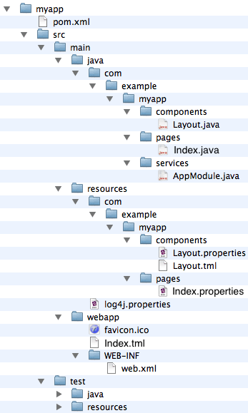

<a id="project-layout--projectlayout-mainsourcefiles-src-main-java"></a>
<a id="project-layout--main-source-files-src-main-java"></a>

## Main source files - src/main/java

Main Java source files, the files that will be compiled into the WAR file, are in `src/main/java`. This is *only* Java source files. You can see the `Index.java` source file inside the `pages` subpackage, and the `Layout.java` source file inside the `components` subpackage. The package names demonstrated here are required, dictated by the rules for [component classes](#component-classes).

Compiled Java classes will ultimately be packaged in the WAR inside the `WEB-INF/classes` folder.

<a id="project-layout--projectlayout-classpathresources-src-main-resources"></a>
<a id="project-layout--classpath-resources-src-main-resources"></a>

## Classpath Resources - src/main/resources

Resource files are under `src/main/resources`. This includes the [message catalog](#localization) for the Index page (`Index.properties`), as well as the message catalog and [component template](#component-templates) for the Layout component (`Layout.tml`). These files will also be packaged into the `WEB-INF/classes` folder of the WAR.

Component templates will always be stored in the resources folder. Templates for pages may be packaged in the WAR proper instead.

<a id="project-layout--projectlayout-contextresources-src-main-webapp"></a>
<a id="project-layout--context-resources-src-main-webapp"></a>

## Context Resources - src/main/webapp

The WAR is built primarily from the `src/main/webapp` folder; this is where ordinary files are stored (such as images and stylesheets). Page templates may also be stored here (`Index.tml`). The file `src/main/webapp/WEB-INF/web.xml` is the servlet container deployment descriptor, which has a very specific [configuration](#configuration) for Tapestry.

The build tool (usually Maven) will be responsible for putting compiled classes and resources into the `WEB-INF/classes` folder of the WAR, and for putting the Tapestry library, and its dependencies (as well as any additional libraries defined by your application) into the `WEB-INF/lib` folder.

<a id="project-layout--projectlayout-testing-src-test"></a>
<a id="project-layout--testing-src-test"></a>

## Testing - src/test

The folders `src/test/java` and `src/test/resources` are used when compiling and executing tests. Files in these folders are *not* packaged into the final WAR.

**Error rendering macro 'scrollbar'**

com/opensymphony/webwork/ServletActionContext

---

<a id="configuration"></a>

<!-- source_url: https://tapestry.apache.org/configuration.html -->

<!-- page_index: 14 -->

# Configuration

[Apache Tapestry](#index) > [Documentation](#documentation) > [User Guide](#user-guide) > [Configuration](#configuration)

<a id="configuration--title"></a>
<a id="configuration--configuration"></a>

# Configuration

<a id="configuration--related-articles"></a>

### Related Articles

- Page:

  [Response Compression](#response-compression)
- Page:

  [Tapestry IoC Configuration](#tapestry-ioc-configuration)
- Page:

  [Symbols](#symbols)
- Page:

  [Application Module Class Cheat Sheet](#application-module-class-cheat-sheet)
- Page:

  [IoC cookbook - Service Configurations](#ioc-cookbook-service-configurations)
- Page:

  [Configuration](#configuration)

<a id="configuration--configuration-configuringtapestry"></a>
<a id="configuration--configuring-tapestry"></a>

# Configuring Tapestry

This page discusses all the ways in which Tapestry can be configured. Tapestry applications are configured almost entirely using Java, with very little XML at all.

**Contents**

- [XML configuration (web.xml)](#configuration--configuration-xmlconfiguration-web.xml)
- [Your Application's Module Class](#configuration--configuration-yourapplication-smoduleclass)
- [Configuration Symbol Names](#configuration--configuration-configurationsymbolnames)
- [Setting Component Parameter Defaults](#configuration--configuration-settingcomponentparameterdefaults)
- [Configuring Ignored Paths](#configuration--configuration-configuringignoredpaths)
- [Configuring Content Type Mapping](#configuration--configuration-configuringcontenttypemapping)
- [Setting Execution Modes](#configuration--configuration-settingexecutionmodes)
- [Segregating Applications Into Folders](#configuration--configuration-segregatingapplicationsintofolders)

<a id="configuration--configuration-xmlconfiguration-web.xml"></a>
<a id="configuration--xml-configuration-web.xml"></a>

## XML configuration (web.xml)

Tapestry runs on top of the standard Java Servlet API. To the servlet container, such as Tomcat, Tapestry appears as a *servlet filter*. This gives Tapestry great flexibility in matching URLs without requiring lots of XML configuration.

Although most configuration is done with Java, a small but necessary amount of configuration occurs inside the servlet deployment descriptor, WEB-INF/web.xml. Most of the configuration is boilerplate, nearly the same for all applications.

**web.xml (partial)**

```xml
<!DOCTYPE web-app
      PUBLIC "-//Sun Microsystems, Inc.//DTD Web Application 2.3//EN"
      "http://java.sun.com/dtd/web-app_2_3.dtd">
<web-app>
    <display-name>My Tapestry Application</display-name>
    <context-param>
        <param-name>tapestry.app-package</param-name>
        <param-value>org.example.myapp</param-value>
    </context-param>
    <filter>
        <filter-name>app</filter-name>
        <filter-class>org.apache.tapestry5.TapestryFilter</filter-class>
        <!-- Or org.apache.tapestry5.http.TapestryFilter if you're using tapestry-http without tapestry-core -->
    </filter>
    <filter-mapping>
        <filter-name>app</filter-name>
        <url-pattern>/*</url-pattern>
    </filter-mapping>
</web-app>
```

**Tapestry Requests vs. Container Requests**

The Tapestry filter matches all the requests that apply to Tapestry, and passes the rest off to the servlet container. In situations where there would be a naming conflict, actual files inside the web application take precedence over Tapestry pages.

Tapestry recognizes the *root URL*, where the servlet path is simply "/", and renders the application page "Index", if it exists.

The application-specific part, the `tapestry.app-package` context parameter, provides your application's root package name. Tapestry uses this to locate your page and component classes. It expects page classes in the `pages` sub-package and components in the `components` sub-package. In the example above, page classes will be stored in the `org.example.myapp.pages` package (or in sub-packages below). Likewise, component classes will be stored in the `org.example.myapp.components` package.

By convention, the filter name (`filter-name`) is almost always "app", but you can use any name you want. Tapestry uses this to determine what *module class* name to look for (see below).

<a id="configuration--configuration-yourapplication-smoduleclass"></a>
<a id="configuration--your-application-s-module-class"></a>

## Your Application's Module Class

Main Article: [Tapestry IoC Configuration](#tapestry-ioc-configuration)

Most other configuration occurs inside your application's module class. The application module class will often define new services, provide overrides of services, or make contributions to service configurations.

Tapestry looks for your application module class in the services package (under the root package) of your application. It capitalizes the <filter-name> and appends "Module". In the previous example, because the filter name was "app" and the application's root package name is "org.example.myapp", the module class would be org.example.myapp.services.AppModule.

If such a class exists, it is added to the IoC Registry. It is not an error for your application to not have a module class, though any non-trivial application will have one.

Your application module class (usually AppModule.java) will typically override some of Tapestry's default, or "factory", symbols, by contributing overrides to the ApplicationDefaults service configuration. For example:

**AppModule.java**

```java
public class AppModule {public static void contributeApplicationDefaults(MappedConfiguration<String,String> configuration) {configuration.add(SymbolConstants.SUPPORTED_LOCALES, "en,fr,de"); configuration.add(SymbolConstants.FILE_CHECK_INTERVAL, "10 m");}}
```

<a id="configuration--configuration-configurationsymbolnames"></a>
<a id="configuration--configuration-symbol-names"></a>

## Configuration Symbol Names

Main Article: [Symbols](#symbols)

Many of Tapestry's built-in services (some of which are not even public) are configured via symbols. These symbols can be overridden by contributing to the ApplicationDefaults service configuration, or by placing a <context-param> element into the application's web.xml, or on the command line by defining JVM System Properties with the -D command line option.

These symbols are always defined in terms of strings, and those strings are coerced to the appropriate type (a number, a boolean, etc.). Of special note are *time intervals*, which are specified in a [particular format](http://tapestry.apache.org/current/apidocs/org/apache/tapestry5/ioc/util/TimeInterval.html).

Most of these symbols have a constant defined in the [SymbolConstants](http://tapestry.apache.org/current/apidocs/org/apache/tapestry5/SymbolConstants.html) class, while others are in the [IOCSymbols](https://cwiki.apache.org/confluence/tapestry.apache.org/current/apidocs/org/apache/tapestry5/ioc/IOCSymbols.html) class. Those are noted in **bold** below. Use the symbol name (tapestry.\*) for JVM System Properties with the -D option, and use the constant (in bold below) from within your Java classes (e.g. AppModule.java).

<a id="configuration--configuration-tapestry.app-catalog"></a>
<a id="configuration--tapestry.app-catalog"></a>

### tapestry.app-catalog

**SymbolConstants.APPLICATION\_CATALOG** – The location of the global application message catalog, the default is context:WEB-INF/*app-name*.properties.

<a id="configuration--configuration-tapestry.application-version"></a>
<a id="configuration--tapestry.application-version"></a>

### tapestry.application-version

**Added in 5.4**

**SymbolConstants.APPLICATION\_VERSION** – The version of the application, which is incorporated into URLs for context and classpath assets in Tapestry versions prior to 5.4. [Assets](#assets) may be [compressed](#response-compression), and will have far-future expiration headers; they will be aggressively cached by the client web browser. You should change the application version on each new deployment of the application (that is, any time assets in the context change), to force clients to re-download changed versions of files. If you do not specify an application version, a *random* one will be assigned on every deployment (which is good for development but very bad for production).

<a id="configuration--configuration-tapestry.application-folder"></a>
<a id="configuration--tapestry.application-folder"></a>

### tapestry.application-folder

**Added in 5.3**

**SymbolConstants.APPLICATION\_FOLDER** – The folder, of the context, in which the Tapestry application executes. By default this is blank, meaning the Tapestry application executes in the root of the web application context. Setting this value allows the Tapestry application to be [segregated into a folder](#configuration), which can be useful when Tapestry is executed inside a web application with other servlets or filters.

<a id="configuration--configuration-tapestry.asset-url-fully-qualified"></a>
<a id="configuration--tapestry.asset-url-fully-qualified"></a>

### tapestry.asset-url-fully-qualified

**Added in 5.3**

**SymbolConstants.ASSET\_URL\_FULL\_QUALIFIED** – A boolean value to indicate whether [asset](#configuration) URLs should be fully qualified in the rendered page. This defaults to `false` (not fully qualified).

<a id="configuration--configuration-tapestry.asset-path-prefix"></a>
<a id="configuration--tapestry.asset-path-prefix"></a>

### tapestry.asset-path-prefix

**Added in 5.3.1**

**SymbolConstants.ASSET\_PATH\_PREFIX** – The prefix to be used for all asset paths. This should start *and* end with a slash ("/"). By default this is "/assets/".

<a id="configuration--configuration-tapestry.blackbird-enabled"></a>
<a id="configuration--tapestry.blackbird-enabled"></a>

### tapestry.blackbird-enabled

**SymbolConstants.**BLACKBIRD\_ENABLED**** – A flag (true or false). When "false" the Blackbird JavaScript console will be disabled (in Tapestry 5.2 and newer). Defaults to "true".

**Deprecated since 5.3**

The client-side BlackBird console has been removed.

<a id="configuration--configuration-tapestry.bootstrap-root"></a>
<a id="configuration--tapestry.bootstrap-root"></a>

### tapestry.bootstrap-root

**Added in 5.4**

**SymbolConstants.BOOTSTRAP\_ROOT** – The root asset path for Twitter Bootstrap; if your application uses a modified version of Bootstrap, you can override this symbol to have Tapestry automatically use your version. The value should be a path to a folder (under "classpath:" or "context:") and should not include a trailing slash.

<a id="configuration--configuration-tapestry.font-awesome-root"></a>
<a id="configuration--tapestry.font-awesome-root"></a>

### tapestry.font-awesome-root

**Added in 5.5.0**

**SymbolConstants.FONT\_AWESOME\_ROOT** – The root asset path for FontAwesome; if your application uses a modified version of it, you can override this symbol to have Tapestry automatically use your version. The value should be a path to a folder (under "classpath:" or "context:") and should not include a trailing slash.

<a id="configuration--configuration-tapestry.charset"></a>
<a id="configuration--tapestry.charset"></a>

### tapestry.charset

**SymbolConstants.CHARSET** – The character encoding used when generating output (or parsing input). The default is "UTF-8". See [Content Type and Markup](#content-type-and-markup) for more details.

<a id="configuration--configuration-tapestry.clustered-sessions"></a>
<a id="configuration--tapestry.clustered-sessions"></a>

### tapestry.clustered-sessions

**Added in 5.3**

**SymbolConstants.CLUSTERED\_SESSIONS** – If "true" then at the end of each request the SessionPersistedObjectAnalyzer will be called on each session persisted object that was accessed during the request. The default is "true", to preserve 5.2 behavior. For non-clustered applications (the majority), this value should be overridden to "false".

<a id="configuration--configuration-tapestry.combine-scripts"></a>
<a id="configuration--tapestry.combine-scripts"></a>

### tapestry.combine-scripts

**SymbolConstants.COMBINE\_SCRIPTS** – If "true", then Tapestry will combine (or "aggregate") the individual JavaScript libraries within a JavaScript stack; this reduces the number of requests from the client to the server, as the client can cache the combined JavaScript files locally (and will not need to re-download them on subsequent pages). The implementation of this changed significantly between Tapestry 5.1 and 5.2.

Defaults to "true" in production mode.

<a id="configuration--configuration-tapestry.compact-json"></a>
<a id="configuration--tapestry.compact-json"></a>

### tapestry.compact-json

**Added in 5.2**

**SymbolConstants.COMPACT\_JSON** – If "true", then JSON page initialization content is compressed; if "false" then extra white space is added (pretty printing). Defaults to "true" in production mode.

<a id="configuration--configuration-tapestry.compatibility.unknown-component-id-check-enabled"></a>
<a id="configuration--tapestry.compatibility.unknown-component-id-check-enabled"></a>

### tapestry.compatibility.unknown-component-id-check-enabled

**Added in 5.3**

**Deprecated since 5.3**

**SymbolConstants.UNKNOWN\_COMPONENT\_ID\_CHECK\_ENABLED** – When enabled, Tapestry will check that component ids referenced in event handler method names (or the @OnEvent annotation) match up against components in the container's template. The default is true, but applications upgraded form Tapestry 5.2 may want to set this to false, to keep pages from failing due to the presence of such dead code.

<a id="configuration--configuration-tapestry.component-render-tracing-enabled"></a>
<a id="configuration--tapestry.component-render-tracing-enabled"></a>

### tapestry.component-render-tracing-enabled

**SymbolConstants.COMPONENT\_RENDER\_TRACING\_ENABLED** – Starting with version 5.3, if "true" then Tapestry will emit rendering comments for all requests; these are comments (such as <!--BEGIN Index:loop (context:Index.tml, line 15)-->) that can assist you in debugging markup output on the client-side. This will significantly increase the size of the rendered markup, but can be very helpful with complex layouts to determine which component was responsible for which portion of the rendered page. (To turn on rendering comments only for a particular request, add the query parameter t:component-trace=true to the URL.)

<a id="configuration--configuration-tapestry.compress-whitespace"></a>
<a id="configuration--tapestry.compress-whitespace"></a>

### tapestry.compress-whitespace

**SymbolConstants.COMPRESS\_WHITESPACE** – A flag (true or false). When true (the default) whitespace in component templates is compressed by default (this can be fine-tuned using the standard xml:space attribute on an element in the template). When this flag is false, then whitespace is retained by default (but can still be overridden). See [Component Templates](#component-templates) for details.

<a id="configuration--configuration-tapestry.module-path-prefix"></a>
<a id="configuration--tapestry.module-path-prefix"></a>

### tapestry.module-path-prefix

**Added in 5.4**

**SymbolConstants.MODULE\_PATH\_PREFIX** – Prefix used for all module resources. This may contain slashes, but should not begin or end with one. Tapestry will create two Dispatchers from this: one for normal modules, the other for GZip compressed modules (by appending ".gz" to this value).

<a id="configuration--configuration-tapestry.context-path"></a>
<a id="configuration--tapestry.context-path"></a>

### tapestry.context-path

**Added in 5.4**

**SymbolConstants.CONTEXT\_PATH** – Identifies the context path of the application, as determined from ServletContext.getContextPath() method. This is either a blank string or a string that starts with a slash but does not end with one.

<a id="configuration--configuration-tapestry.datepicker"></a>
<a id="configuration--tapestry.datepicker"></a>

### tapestry.datepicker

**Added in 5.2**

**SymbolConstants.DATEPICKER** – The path to the assets of the embedded DatePicker component

<a id="configuration--configuration-tapestry.default-cookie-max-age"></a>
<a id="configuration--tapestry.default-cookie-max-age"></a>

### tapestry.default-cookie-max-age

**SymbolConstants.COOKIE\_MAX\_AGE** – The default time interval that cookies created by Tapestry will be kept in the client web browser. Primarily, this is used with a cookie that exists to track the preferred user locale. The default value is "7 d" (7 days; see [Time Interval Formats](http://tapestry.apache.org/current/apidocs/org/apache/tapestry5/ioc/util/TimeInterval.html)).

<a id="configuration--configuration-tapestry.default-stylesheet"></a>
<a id="configuration--tapestry.default-stylesheet"></a>

### tapestry.default-stylesheet

**Added in 5.3.6**

**SymbolConstants.DEFAULT\_STYLESHEET** – In 5.3, this is the default stylesheet automatically injected into every rendered HTML page. Many Tapestry components assume that this stylesheet is available. All the classes defined in the stylesheet are prefixed with "t-". The exact contents of the stylesheet are subject to change at any time (they are considered internal), so replacing the stylesheet, rather than overriding selected rules within it, entails some risk.

The default is org/apache/tapestry5/default.css, stored on the classpath.

Deprecated in 5.4 with no replacement. The stylesheet is now associated with the core JavaScriptStack.

Undeprecated in 5.5.0. The stylesheet defined by this symbol is needed when Tapestry is configured to not include Bootstrap at all.

<a id="configuration--configuration-tapestry.error-css-class"></a>
<a id="configuration--tapestry.error-css-class"></a>

### tapestry.error-css-class

**Added in 5..5**

**SymbolConstants.ERROR\_CSS\_CLASS** – Defines the CSS class that will be given to the HTML element generated by the Error component. If the value isn't `help-block`, the class attributewill be `help-block [symbol value]`. The default value is `help-block`.

<a id="configuration--configuration-tapestry.enable-html5-support"></a>
<a id="configuration--tapestry.enable-html5-support"></a>

### tapestry.enable-html5-support

**Added in 5.4**

**SymbolConstants.ENABLE\_HTML5\_SUPPORT –** If "true", then certain HTML5 features are invoked by built-in Tapestry components. Mostly this controls whether the TextField component will emit HTML5 "type" attributes automatically when certain validators are used. See [Forms and Validation](#forms-and-validation) for details. The default is false.<a id="configuration--configuration-tapestry.enable-minification"></a>
<a id="configuration--tapestry.enable-minification"></a>

### tapestry.enable-minification

**Added in 5.3.6**

**SymbolConstants.MINIFICATION\_ENABLED** – If "true", then resources (individually or when aggregated into stacks) will be minimized via the ResourceMinimizer service. If "false", then minification is disabled. The default is "true" in production mode, "false" otherwise.

Note that Tapestry's default implementation of ResourceMinimizer does nothing; minification is provided by add-on libraries. See [Assets](#assets) for details.

<a id="configuration--configuration-tapestry.enable-pageloading-mask"></a>
<a id="configuration--tapestry.enable-pageloading-mask"></a>

### tapestry.enable-pageloading-mask

**Added in 5.4**

**SymbolConstantsaENABLE\_PAGELOADING\_MASK** – If true, then when a page includes any JavaScript, a `<script>` block is added to insert a pageloader mask into the page to ensure that the user can't interact with the page until the page is fully initialized. The default is true.

<a id="configuration--configuration-tapestry.encode-locale-into-path"></a>
<a id="configuration--tapestry.encode-locale-into-path"></a>

### tapestry.encode-locale-into-path

**SymbolConstants.ENCODE\_LOCALE\_INTO\_PATH** – If "true" (the default), then the [PersistentLocale](http://tapestry.apache.org/current/apidocs/org/apache/tapestry5/services/PersistentLocale.html) will be encoded into URLs by the ComponentEventLinkEncoder service. If overridden to "false" this does not occur, but you should provide a LinkCreationListener2 (registered with the LinkCreationHub) in order to add the locale as a query parameter (or provide some alternate means of persisting the locale between requests). See [Localization](#localization) for more details on localization.

<a id="configuration--configuration-tapestry.exception-report-page"></a>
<a id="configuration--tapestry.exception-report-page"></a>

### tapestry.exception-report-page

**SymbolConstants.EXCEPTION\_REPORT\_PAGE** – The name of the page used to report exceptions. This defaults to "ExceptionReport", a page that Tapestry provides. See [Overriding Exception Reporting](#overriding-exception-reporting) for details.

<a id="configuration--configuration-tapestry.exception-reports-dir"></a>
<a id="configuration--tapestry.exception-reports-dir"></a>

### tapestry.exception-reports-dir

**Added in 5.4**

**SymbolConstants.EXCEPTION\_REPORTS\_DIR** – The root directory where Tapestry's built-in OperationTracker will create dated folders into which it writes exception report files. This is `build/exceptions` by default but should be overridden for production. See the related `tapestry.restrictive-environment` symbol below.<a id="configuration--configuration-tapestry.execution-mode"></a>
<a id="configuration--tapestry.execution-mode"></a>

### tapestry.execution-mode

**SymbolConstants.EXECUTION\_MODE** – The execution mode. See [Setting Execution Modes](#configuration) below.

<a id="configuration--configuration-tapestry.file-check-interval"></a>
<a id="configuration--tapestry.file-check-interval"></a>

### tapestry.file-check-interval

**SymbolConstants.FILE\_CHECK\_INTERVAL** – Time interval between file system checks. During a file system check, only a single thread is active (all others are blocked) and any files loaded are checked for changes (this is part of Tapestry's [Class Reloading](#class-reloading) mechanism).

The default is "1 s" (one second; see [Time Interval Formats](http://tapestry.apache.org/current/apidocs/org/apache/tapestry5/ioc/util/TimeInterval.html)), and is usually overridden with a higher value in production (say, between one and five minutes).

<a id="configuration--configuration-tapestry.file-check-update-timeout"></a>
<a id="configuration--tapestry.file-check-update-timeout"></a>

### tapestry.file-check-update-timeout

**SymbolConstants.FILE\_CHECK\_UPDATE\_TIMEOUT** – Time interval that Tapestry will wait to obtain the exclusive lock needed for a file check. If the exclusive lock can't be obtained in that amount of time, the request will proceed normally (without the check), but each successive request will attempt to get the lock and perform the check until successful.

The default is "50 ms" (50 milliseconds; see [Time Interval Formats](http://tapestry.apache.org/current/apidocs/org/apache/tapestry5/ioc/util/TimeInterval.html)).

<a id="configuration--configuration-tapestry.force-absolute-uris"></a>
<a id="configuration--tapestry.force-absolute-uris"></a>

### tapestry.force-absolute-uris

**Deprecated since 5.2**

Starting in Tapestry 5.2, the optimization to generate relative URIs has been removed, and all URIs are always absolute. *Removed in 5.3*.

***SymbolConstants.FORCE\_ABSOLUTE\_URIS** – For Tapestry 5.0 and 5.1 only*: when false (the default), Tapestry will attempt to optimize URIs that it generates, using relative URIs when such URIs are shorter than absolute URIs. When true, all URIs will be absolute URIs (including the context path, and the complete path for the request).

<a id="configuration--configuration-tapestry.gzip-compression-enabled"></a>
<a id="configuration--tapestry.gzip-compression-enabled"></a>

### tapestry.gzip-compression-enabled

**SymbolConstants.GZIP\_COMPRESSION\_ENABLED** – Override to "false" to disable GZIP compression of dynamic Tapestry pages and static assets.

<a id="configuration--configuration-tapestry.hostname"></a>
<a id="configuration--tapestry.hostname"></a>

### tapestry.hostname

**Added in 5.3**

**SymbolConstants.HOSTNAME** – The hostname that application should use when constructing an absolute URL. The default is "", i.e. an empty string, in which case system will use request.getServerName(). Not the same as environment variable HOSTNAME (but you could contribute "$HOSTNAME" as the value to make it the same).

<a id="configuration--configuration-tapestry.hostport"></a>
<a id="configuration--tapestry.hostport"></a>

### tapestry.hostport

**Added in 5.3**

**SymbolConstants.HOSTPORT** – The port that application should use when constructing an absolute URL. The default is "0", which means to use the port value from the request.

<a id="configuration--configuration-tapestry.hostport-secure"></a>
<a id="configuration--tapestry.hostport-secure"></a>

### tapestry.hostport-secure

**Added in 5.3**

**SymbolConstants.HOSTPORT\_SECURE** – The secure (https) port that application should use when constructing an absolute URL. The default is "0", i.e. use the value from the request.

<a id="configuration--configuration-tapestry.hmac-passphrase"></a>
<a id="configuration--tapestry.hmac-passphrase"></a>

### tapestry.hmac-passphrase

**Added in 5.3.6**

**SymbolConstants.HMAC\_PASSPHRASE** – The plaintext phrase used to set the key for [HMAC](http://en.wikipedia.org/wiki/HMAC) securing of serialized object data. The default is blank, which causes a runtime alert and console error. You should set this to a reasonably unique, private value, and ensure (in a cluster) that all servers use the same value – typically by making a contribution in your applications module class (normally AppModule.java). See [Security](#security) for details.

<a id="configuration--configuration-tapestry.include-core-stack"></a>
<a id="configuration--tapestry.include-core-stack"></a>

### tapestry.include-core-stack

**Added in 5.4**

**SymbolConstants.INCLUDE\_CORE\_STACK** – Whether to include Tapestry's "core" stack of JavaScript libraries. The default is "true".

<a id="configuration--configuration-tapestry.javascript-infrastructure-provider"></a>
<a id="configuration--tapestry.javascript-infrastructure-provider"></a>

### tapestry.javascript-infrastructure-provider

**Added in 5.4**

**SymbolConstants.JAVASCRIPT\_INFRASTRUCTURE\_PROVIDER** – Tapestry relies on an underlying client-side JavaScript infrastructure framework to handle DOM manipulation, event handling, and Ajax requests. Prior to Tapestry 5.4, the foundation was [Prototype](http://http//prototypejs.org/). In 5.4 and later, support for [jQuery](http://jquery.org/) has been added, and it is possible to add others. This symbol defines a value that is used to select a resource that is provided to the ModuleManager service as a JavaScriptModuleConfiguration to provide a specific implementation of the `t5/core/dom` module. Tapestry 5.4 directly supports "prototype" or "jquery". To support other foundation frameworks, override this symbol value and supply your own module configuration.

In Tapestry 5.4, this defaults to "prototype" for compatibility with 5.3. This will likely change in 5.5 to default to "jquery". At some point in the future, Prototype support may no longer be present.

<a id="configuration--configuration-tapestry.lenient-date-format"></a>
<a id="configuration--tapestry.lenient-date-format"></a>

### tapestry.lenient-date-format

**Added in 5.4**

**SymbolConstants.LENIENT\_DATE\_FORMAT** – When set to true, the DateField component will be lenient about date calculations, for example allowing a January 32 date as input and automatically converting it to February 1. When false (the default), only valid dates may be entered.

<a id="configuration--configuration-tapestry.min-gzip-size"></a>
<a id="configuration--tapestry.min-gzip-size"></a>

### tapestry.min-gzip-size

**SymbolConstants.MIN\_GZIP\_SIZE** – The minimum stream size necessary for Tapestry to use GZIP compression on the response stream. See [Response Compression](#response-compression) for more details.

<a id="configuration--configuration-tapestry.omit-generator-meta"></a>
<a id="configuration--tapestry.omit-generator-meta"></a>

### tapestry.omit-generator-meta

**SymbolConstants.OMIT\_GENERATOR\_META** – If "true", then the <meta> tag that Tapestry normally writes into the <head>, identifying the Tapestry version, will be omitted. Use this when you do not wish to advertise your application's use of Tapestry.

<a id="configuration--configuration-tapestry.page-pool.active-window"></a>
<a id="configuration--tapestry.page-pool.active-window"></a>

### tapestry.page-pool.active-window

**Deprecated since 5.2**

Starting in 5.2, this is only used if tapestry.page-pool-enabled is "true". *Removed in 5.3*

The time interval that an instantiated page instance may be cached before being removed. As pages are returned to the pool, they are time stamped. Periodically (as per the file check interval), the pool is scanned for page instances that have not been used recently; those that are outside the active window are discarded. This is used to free up unnecessary page instances after a request surge. Starting in 5.2, this is only effective if tapestry.page-pool-enabled is true.

The default is "10 m" (10 minutes; see [Time Interval Formats](http://tapestry.apache.org/current/apidocs/org/apache/tapestry5/ioc/util/TimeInterval.html)).

<a id="configuration--configuration-tapestry.page-pool-enabled"></a>
<a id="configuration--tapestry.page-pool-enabled"></a>

### tapestry.page-pool-enabled

Starting with Tapestry 5.2, page pooling has been turned off by default. This symbol lets you re-enable page pooling. Under most circumstances this symbol should not be set. The disabling of page pooling starting in 5.2 significantly reduces heap memory usage and improves performance for most web applications.

The default is "false".

**Deprecated since 5.2**

Removed in 5.3.

<a id="configuration--configuration-tapestry.page-pool.hard-limit"></a>
<a id="configuration--tapestry.page-pool.hard-limit"></a>

### tapestry.page-pool.hard-limit

**Deprecated since 5.2**

Starting in 5.2, this is only used if tapestry.page-pool-enabled is "true". *Removed in 5.3*

The absolute maximum number of page instances (for a particular page name / locale combination) that Tapestry will create at any time. If this number is reached, then requests will fail because a page instance is not available ... this can happen as part of a denial of service attack. For this value to have any meaning, it should be lower than the number of threads that the servlet container is configured to use when processing requests.

The default is 20 page instances.

<a id="configuration--configuration-tapestry.page-pool.soft-limit"></a>
<a id="configuration--tapestry.page-pool.soft-limit"></a>

### tapestry.page-pool.soft-limit

**Deprecated since 5.2**

Starting in 5.2, this is only used if tapestry.page-pool-enabled is "true". *Removed in 5.3*

The number of pages in the page pool (for a given page name / locale combination) before which Tapestry will start to wait for existing pages to be made available. Under this limit of pages, Tapestry will simply create a new page instance if no existing instance is readily available. Once the soft limit is reached, Tapestry will wait a short period of time (the soft wait interval) to see if an existing page instance is made available. It will then create a new page instance (unless the hard limit has been reached).

The default is 5 page instances. Remember that page pooling is done separately for each page (and localization of the page).

<a id="configuration--configuration-tapestry.page-pool.soft-wait"></a>
<a id="configuration--tapestry.page-pool.soft-wait"></a>

### tapestry.page-pool.soft-wait

**Deprecated since 5.2**

Starting in 5.2, this is only used if tapestry.page-pool-enabled is "true". *Removed in 5.3*

The time interval that Tapestry will wait for a page instance to become available before deciding whether to create an entirely new page instance.

The default is "10 ms" (10 milliseconds; see [Time Interval Formats](http://tapestry.apache.org/current/apidocs/org/apache/tapestry5/ioc/util/TimeInterval.html)).

<a id="configuration--configuration-tapestry.page-preload-mode"></a>
<a id="configuration--tapestry.page-preload-mode"></a>

### tapestry.page-preload-mode

**Added in 5.4**

**SymbolConstants.PRELOADER\_MODE –** Controls in what environment page preloading should occur. By default, preloading only occurs in production. Possible values are "ALWAYS", "DEVELOPMENT", "NEVER", or "PRODUCTION" (the default is PRODUCTION when in production mode, or DEVELOPMENT otherwise). See [PreloaderMode](http://tapestry.apache.org/current/apidocs/org/apache/tapestry5/services/pageload/PreloaderMode.html).<a id="configuration--configuration-tapestry.persistence-strategy"></a>
<a id="configuration--tapestry.persistence-strategy"></a>

### tapestry.persistence-strategy

**SymbolConstants.PERSISTENCE\_STRATEGY** – Identifies the default [persistence strategy](http://tapestry.apache.org/persistent-page-data.html#PersistentPageData-PersistenceStrategies) for all pages that do not provide an override. The default is "session" (PersistenceConstants.SESSION).

<a id="configuration--configuration-tapestry.production-mode"></a>
<a id="configuration--tapestry.production-mode"></a>

### tapestry.production-mode

**SymbolConstants.PRODUCTION\_MODE** – A flag (true or false) indicating whether the application is running in production or in development. The default is true, which means that runtime exceptions are not reported with full detail (only the root exception message is displayed, not the entire stack of exceptions, properties and other information shown in development mode).

<a id="configuration--configuration-tapestry.restrictive-environment"></a>
<a id="configuration--tapestry.restrictive-environment"></a>

### tapestry.restrictive-environment

**Added in 5.4**

**SymbolConstants.RESTRICTIVE\_ENVIRONMENT** – A flag (true or false) that, if true, changes some default Tapestry behavior to make it work better in restrictive environments such as [Google App Engine](#google-app-engine) (GAE). Specifically, if true, then OperationsTracker writes its exception report files into a single folder (specified by the tapestry.exception-reports-dir symbol, above) rather than creating dated sub-folders under that path, and ResourceTransformerFactory avoids creating a cache folder for resources.<a id="configuration--configuration-tapestry.secure-enabled"></a>
<a id="configuration--tapestry.secure-enabled"></a>

### tapestry.secure-enabled

**SymbolConstants.SECURE\_ENABLED** – If true, then @[Secure](http://tapestry.apache.org/current/apidocs/org/apache/tapestry5/annotations/Secure.html) annotations are honored; if false, no security checks or redirects take place. This defaults to tapestry.production-mode, meaning that in development mode it will (by default) be disabled. However, sites that are intended to be served *only* under HTTPS should set this to **`false`**. See [HTTPS](#https) for details.

<a id="configuration--configuration-tapestry.secure-page"></a>
<a id="configuration--tapestry.secure-page"></a>

### tapestry.secure-page

**MetaDataConstants.SECURE\_PAGE** – If true, then the page may only be accessed via HTTPS. The @[Secure](http://tapestry.apache.org/current/apidocs/org/apache/tapestry5/annotations/Secure.html) annotation will set this value to true. This symbol is the default for all pages; set it to "true" to force the entire application to be secure. See [HTTPS](#https) for details.

<a id="configuration--configuration-tapestry.service-reloading-enabled"></a>
<a id="configuration--tapestry.service-reloading-enabled"></a>

### tapestry.service-reloading-enabled

**Added in 5.2**

If true (the default), then Tapestry IoC will attempt to reload service implementations when they change. This only applies to classes that Tapestry IoC instantiates itself, and have a known service interface (the container creates a proxy that, internally, can reload the implementation). Service reloading only works when the underlying class files are on the filesystem ... it is intended for development, not as an option in production.

This must be specified as a JVM system property. *You may not set it in your module class.*

<a id="configuration--configuration-tapestry.scriptaculous"></a>
<a id="configuration--tapestry.scriptaculous"></a>

### tapestry.scriptaculous

**Added in 5.2**

**SymbolConstants.SCRIPTACULOUS** – The path to the embedded copy of [script.aculo.us](http://script.aculo.us/) packaged with Tapestry. This value may be overridden to use a different version of the [script.aculo.us](http://script.aculo.us) library. See [Legacy JavaScript](#legacy-javascript) for the default version.

<a id="configuration--configuration-tapestry.session-locking-enabled"></a>
<a id="configuration--tapestry.session-locking-enabled"></a>

### tapestry.session-locking-enabled

**Added in 5.4**

**SymbolConstants.SESSION\_LOCKING\_ENABLED** – If true (the default), then Tapestry will use a lock when reading/updating HttpSession attributes, to avoid simultaneous access by multiple threads when using AJAX. See [TAP5-2049](https://issues.apache.org/jira/browse/TAP5-2049). Set to false to deactivate the session locking logic.

Prior to version 5.4 session locking was not performed.

<a id="configuration--configuration-tapestry.start-page-name"></a>
<a id="configuration--tapestry.start-page-name"></a>

### tapestry.start-page-name

**SymbolConstants.START\_PAGE\_NAME** – The logical name of the start page, the page that is rendered for the *root URL*. This is normally "start". This functionality is vestigial: it has been superseded by the use of Index pages.

<a id="configuration--configuration-tapestry.strict-css-url-rewriting"></a>
<a id="configuration--tapestry.strict-css-url-rewriting"></a>

### tapestry.strict-css-url-rewriting

**SymbolConstants.STRICT\_CSS\_URL\_REWRITING** – Controls whether to throw an exception (true) or log a warning (false) when Tapestry encounters a URL reference to a non-existing file within a CSS file. The default is false.

<a id="configuration--configuration-tapestry.supported-locales"></a>
<a id="configuration--tapestry.supported-locales"></a>

### tapestry.supported-locales

**SymbolConstants.SUPPORTED\_LOCALES** – A comma-separated list of supported locales. Incoming requests as "narrowed" to one of these locales, based on closest match. If no match can be found, the first locale in the list is treated as the default.

The default is (currently) "en,it,es,zh\_CN,pt\_PT,de,ru,hr,fi\_FI,sv\_SE,fr\_FR,da,pt\_BR,ja,el". As the community contributes new localizations of the necessary messages files, this list will expand. Note that the Tapestry quickstart archetype overrides the factory default, forcing the application to be localized only for "en".

<a id="configuration--configuration-tapestry.cors-enabled"></a>
<a id="configuration--tapestry.cors-enabled"></a>

### tapestry.cors-enabled

**SymbolConstants.CORS\_ENABLED** – Defines whether the CORS (Cross-Origing Resource Sharing) support should be enabled or not. Default value is `false`. If you set this to `true`,you should also set at least `Symbol.CORS_ALLOWED_ORIGINS` too.

**Added in 5.8.2**

<a id="configuration--configuration-tapestry.cors-allowed-origins"></a>
<a id="configuration--tapestry.cors-allowed-origins"></a>

### tapestry.cors-allowed-origins

**SymbolConstants.CORS\_ALLOWED\_ORIGINS** – Comma-delimited of origins allowed for CORS. The special value \* means allowing all origins. This is used by the default implementation of `CorsHandlerHelper.getAllowedOrigin(HttpServletRequest)`. Default value is the empty string (i.e. no origins allowed and CORS actually disabled).

**Added in 5.8.2**

<a id="configuration--configuration-tapestry.cors-allow-credentials"></a>
<a id="configuration--tapestry.cors-allow-credentials"></a>

### tapestry.cors-allow-credentials

**SymbolConstants.CORS\_ALLOW\_CREDENTIALS** – Boolean value defining whether the `Access-Control-Allow-Credentials` HTTP header should be set automatically in the response for CORS requests. Default value is `false`. This is used by the default implementation of `CorsHandlerHelper.configureCredentials(HttpServletResponse)`.

**Added in 5.8.2**

<a id="configuration--configuration-tapestry.cors-allow-methods"></a>
<a id="configuration--tapestry.cors-allow-methods"></a>

### tapestry.cors-allow-methods

**SymbolConstants.CORS\_ALLOW\_METHODS** – Value to be used in the `Access-Control-Allow-Methods` in CORS preflight request responses. This is used by the default implementation of `CorsHandlerHelper.configureMethods(HttpServletResponse)`. Default value is `GET,HEAD,PUT,PATCH,POST,DELETE`.

**Added in 5.8.2**

<a id="configuration--configuration-tapestry.cors-allowed-headers"></a>
<a id="configuration--tapestry.cors-allowed-headers"></a>

### tapestry.cors-allowed-headers

**SymbolConstants.CORS\_ALLOWED\_HEADERS** – Value to be used in the `Access-Control-Allow-Headers` in CORS preflight request responses. This is used by the default implementation of `CorsHandlerHelper.configureAllowedHeaders(HttpServletResponse)`, which only sets the header if the value isn't empty. Default value is the empty string.

**Added in 5.8.2**

<a id="configuration--configuration-tapestry.cors-expose-headers"></a>
<a id="configuration--tapestry.cors-expose-headers"></a>

### tapestry.cors-expose-headers

**SymbolConstants.CORS\_EXPOSE\_HEADERS** – Value to be used in the `Access-Control-Expose-Headers` in CORS preflight request responses. This is used by the default implementation of `CorsHandlerHelper.configureExposeHeaders(HttpServletResponse)`, which only sets the header if the value isn't empty. Default value is the empty string.

**Added in 5.8.2**

<a id="configuration--configuration-tapestry.cors-max-age"></a>
<a id="configuration--tapestry.cors-max-age"></a>

### tapestry.cors-max-age

**SymbolConstants.CORS\_MAX\_AGE** – Value to be used in the `Access-Control-Max-Age` in CORS preflight request responses. This is used by the default implementation of `CorsHandlerHelper.configureMaxAge(HttpServletResponse)`, which only sets the header if the value isn't empty. Default value is the empty string.

**Added in 5.8.2**

<a id="configuration--configuration-tapestry.suppress-redirect-from-action-requests"></a>
<a id="configuration--tapestry.suppress-redirect-from-action-requests"></a>

### tapestry.suppress-redirect-from-action-requests

**Deprecated since 5.2**

*Removed in 5.3*

**SymbolConstants.SUPPRESS\_REDIRECT\_FROM\_ACTION\_REQUESTS** – Normally, Tapestry responds to action requests (such as form submissions) by sending a client-side redirect to the rendering page. This has a lot of benefits in terms of improving browser navigation, making sure URLs are bookmarkable, and so forth. However, it has a cost: more data stored persistently in the session, and a double-request for each user action (one action request, one render request).

Setting this symbol to "true" changes the Tapestry behavior to make it more like Tapestry 4: a markup response is sent directly for the action request, with no redirect in the middle. This option should be used with care, and only in cases where you are certain that the benefits outweigh the disadvantages.

<a id="configuration--configuration-tapestry.thread-pool.core-pool-size"></a>
<a id="configuration--tapestry.thread-pool.core-pool-size"></a>

### tapestry.thread-pool.core-pool-size

**IOCSymbols.THREAD\_POOL\_CORE\_SIZE** – Nominal size of the thread pool Tapestry uses to execute tasks in parallel. Under sufficient load, the thread pool may grow larger than this core size. Defaults to 3.

<a id="configuration--configuration-tapestry.thread-pool.max-pool-size"></a>
<a id="configuration--tapestry.thread-pool.max-pool-size"></a>

### tapestry.thread-pool.max-pool-size

**IOCSymbols.THREAD\_POOL\_MAX\_SIZE** – Maximum size of the thread pool Tapestry uses to execute tasks in parallel. Defaults to 10.

<a id="configuration--configuration-tapestry.thread-pool.queue-size"></a>
<a id="configuration--tapestry.thread-pool.queue-size"></a>

### tapestry.thread-pool.queue-size

**Added in 5.3**

Previously, the queue size was unbounded, which meant that max-pool-size was ignored.

**IOCSymbols.THREAD\_POOL\_QUEUE\_SIZE** – Size of the task queue for the thread pool. Once the core pool size is reached, new threads are not created until the queue is full. The default queue size is 100.

<a id="configuration--configuration-tapestry.thread-pool.keep-alive"></a>
<a id="configuration--tapestry.thread-pool.keep-alive"></a>

### tapestry.thread-pool.keep-alive

**IOCSymbols.THREAD\_POOL\_KEEP\_ALIVE** – The time to keep a created but unused thread in the pool alive. Defaults to one minute.

<a id="configuration--configuration-tapestry.thread-pool-enabled"></a>
<a id="configuration--tapestry.thread-pool-enabled"></a>

### tapestry.thread-pool-enabled

**IOCSymbols.THREAD\_POOL\_ENABLED** – If set to false, then parallel task execution does not occur. This is useful in environments where creating new threads is not allowed, such as [Google App Engine](#google-app-engine).

<a id="configuration--configuration-settingcomponentparameterdefaults"></a>
<a id="configuration--setting-component-parameter-defaults"></a>

## Setting Component Parameter Defaults

**Added in 5.3**

Some components, notably Grid, Pallete and Zone, have default parameter values specified in terms of symbols. This means you can use these symbols to modify the defaults for all instances of such components in your application. For example, you can set the default rows per page for all Grid instances by adding this to the `contributeApplicationDefaults` method in your application's module class (typically AppModule.java): `configuration.add(ComponentParameterConstants.GRID_ROWS_PER_PAGE, "15");`

See the complete list of such constants at [ComponentParameterConstants](http://tapestry.apache.org/current/apidocs/org/apache/tapestry5/ComponentParameterConstants.html).

<a id="configuration--configuration-configuringignoredpaths"></a>
<a id="configuration--configuring-ignored-paths"></a>

## Configuring Ignored Paths

You may sometimes need to use Tapestry in concert with other servlets. This can cause problems, since Tapestry (being a servlet filter) may see URLs intended for another servlet and attempt to process them.

The Servlet API does not provide Tapestry with any clues about what other servlets are available in the web application. Instead, you must configure Tapestry to ignore paths intended for other servlets.

The IgnoredPathsFilter service is the method for this kind of configuration. Its configuration is an unordered collection of regular expression patterns. A request whose path matches any of these patterns is **not** processed by Tapestry.

For example, say you are using [Direct Web Remoting](http://getahead.org/dwr/). You'll likely have the servlet path /dwr mapped to the Direct Web Remoting servlet.

You contribution would look like:

```java
  public static void contributeIgnoredPathsFilter(Configuration<String> configuration)
  {
    configuration.add("/dwr/.*");
  }
```

The regular expression matches any path that begins with "/dwr/".

The regular expressions provided in the configuration are always compiled with case insensitivity enabled.

Also note that actual files in your web application (images, stylesheets, etc.) are always ignored by Tapestry.

<a id="configuration--configuration-configuringcontenttypemapping"></a>
<a id="configuration--configuring-content-type-mapping"></a>

## Configuring Content Type Mapping

The mapping from file type (by extension) to content type is typically done as part of your servlet-containers configuration. Alternately, you may contribute to the [ResourceStreamer](http://tapestry.apache.org/current/apidocs/org/apache/tapestry5/internal/services/ResourceStreamer.html) service's configuration. This is a mapped configuration; it maps file extensions (such as "css" or "js") to content types ("text/css" or "text/javascript") respectively.

<a id="configuration--configuration-settingexecutionmodes"></a>
<a id="configuration--setting-execution-modes"></a>

## Setting Execution Modes

Starting with Tapestry 5.2.4, we can specify an *execution mode* by loading specific Tapestry Modules through a JVM System property. All modules declared in this way will be loaded after the AppModule of your application. This feature is very useful for defining a different environment for Production and Development modes, for example.

This JVM System property, named tapestry.execution-mode, is a comma-separated list of mode names. You can declare this property in a number of different ways:

1. Add the parameter to your JVM command line:

```java
-Dtapestry.execution-mode=uat jetty:run
```

2. Add the parameter to the Jetty plugin:

**pom.xml**

```xml
<plugin>
    <groupId>org.mortbay.jetty</groupId>
    <artifactId>maven-jetty-plugin</artifactId>
    <version>6.1.16</version>
    <configuration>
        <requestLog implementation="org.mortbay.jetty.NCSARequestLog">
            <append>true</append>
        </requestLog>
        <systemProperties>
	    <systemProperty>
	        <name>tapestry.execution-mode</name>
	        <value>uat</value>
	    </systemProperty>
        </systemProperties>
    </configuration>
</plugin>
```

3. Add the parameter to the Surefire plugin for your test:

**pom.xml**

```xml
<plugin>
    <groupId>org.apache.maven.plugins</groupId>
    <artifactId>maven-surefire-plugin</artifactId>
    <version>2.8.1</version>
    <configuration>
       <systemPropertyVariables>
         <tapestry.execution-mode>uat</tapestry.execution-mode>
       </systemPropertyVariables>
    </configuration>
</plugin>
```

For each mode declared in your JVM System Property, TapestryFilter checks for a parameter in your web.xml, named tapestry.TheModeName-modules, with TheModeName being the name of the desired mode. Its value will be a comma-separated list of modules.

If the tapestry.execution-mode is not declared, Tapestry will automatically look for the tapestry.production-modules parameter, because “production” is the default tapestry.execution-mode value.

The example below defines two different execution modes in your web.xml file: production (the default value) and uat (for "user acceptance testing"). For each mode, we list the modules we want to load. If we use JVM System property declared in the example above, the UatModeModule module will be loaded.

**web.xml**

```xml
<context-param>
    <param-name>tapestry.production-modules</param-name>
    <param-value>com.example.myapp.services.ProductionModeModule</param-value>
</context-param>
<context-param>
    <param-name>tapestry.uat-modules</param-name>
    <param-value>com.example.myapp.services.UatModeModule</param-value>
</context-param>

<context-param>
    <param-name>tapestry.integration-modules</param-name>
    <param-value>com.example.myapp.services.IntegrationModeModule</param-value>
</context-param>
```

Execution mode itself may be a comma separated list:

```java
-Dtapestry.execution-mode=uat,integration jetty:run
```

<a id="configuration--configuration-segregatingapplicationsintofolders"></a>
<a id="configuration--segregating-applications-into-folders"></a>

## Segregating Applications Into Folders

In many cases where Tapestry is being adopted into an existing web application (possibly written in Tapestry 4 or some other framework), it is nice to segregate the Tapestry application into its own folder, to avoid conflicts with the existing application or servlets.

**Added in 5.3**

Support for application folders was added in release 5.3.

Setting this up is in two parts:

- Modifying the configuration of the `<url-pattern>` for the Tapestry filter to match the specified folder.
- Identifying the folder name using a Tapestry symbol value contribution.

So, if you wanted to run the Tapestry application inside folder `t5app`, you would modify your `web.xml` indicate the use of the folder:

```xml
  <filter-mapping>
    <filter-name>app</filter-name>
    <url-pattern>/t5app/*</url-pattern>
  </filter-mapping>
```

... and in your AppModule, you would inform Tapestry about the mapping change:

```java
public class AppModule {@Contribute(SymbolProvider.class) @ApplicationDefaults public static void applicationDefaults(MappedConfiguration<String, String> configuration) {configuration.add(SymbolConstants.APPLICATION_FOLDER, "t5app")}}
```

This extra mapping is unfortunately necessary, because the Servlet API does not provide a way for a servlet filter, such as the one used by Tapestry, to know about its mapping.

This changes the servlet container to *only* forward requests inside the `t5app` folder to Tapestry; requests for other folders (or the root folder) will not be passed to Tapestry at all. The symbol contribution informs Tapestry to change the URLs it generates to include the necessary folder name; it also affects the logic in Tapestry that recognizes and handles requests.

In addition, if you choose to place page template files in the context, rather than on the classpath (as with component templates), then you will place those template files inside the `t5app` folder.

At this time, it is still not possible to run multiple Tapestry 5 applications within the same web application.

**Error rendering macro 'scrollbar'**

com/opensymphony/webwork/ServletActionContext

---

<a id="runtime-exceptions"></a>

<!-- source_url: https://tapestry.apache.org/runtime-exceptions.html -->

<!-- page_index: 15 -->

# Runtime Exceptions

[Apache Tapestry](#index) > [Documentation](#documentation) > [User Guide](#user-guide) > [Runtime Exceptions](#runtime-exceptions)

<a id="runtime-exceptions--title"></a>
<a id="runtime-exceptions--runtime-exceptions"></a>

# Runtime Exceptions

<a id="runtime-exceptions--related-articles"></a>

### Related Articles

- Page:

  [Error Page Recipe](#error-page-recipe)
- Page:

  [Specific Errors FAQ](#specific-errors-faq)
- Page:

  [Overriding Exception Reporting](#overriding-exception-reporting)
- Page:

  [Runtime Exceptions](#runtime-exceptions)

Feedback is vitally important when developing an application, and that is one of the areas where Tapestry has always excelled.

Especially during development, requests can fail. There can be errors in templates, broken code in your application, or something unexpected.

- [Build-in Exception Report Page](#runtime-exceptions--runtimeexceptions-build-inexceptionreportpage)
- [Ajax Detailed Exception Reports](#runtime-exceptions--runtimeexceptions-ajaxdetailedexceptionreports)
- [Detailed Exception Report Files](#runtime-exceptions--runtimeexceptions-detailedexceptionreportfiles)
- [Overriding the Handling of Specific Exceptions](#runtime-exceptions--runtimeexceptions-overridingthehandlingofspecificexceptions)

<a id="runtime-exceptions--runtimeexceptions-build-inexceptionreportpage"></a>
<a id="runtime-exceptions--build-in-exception-report-page"></a>

## Build-in Exception Report Page

Tapestry has a built-in exception report page that captures an amazing wealth of information:

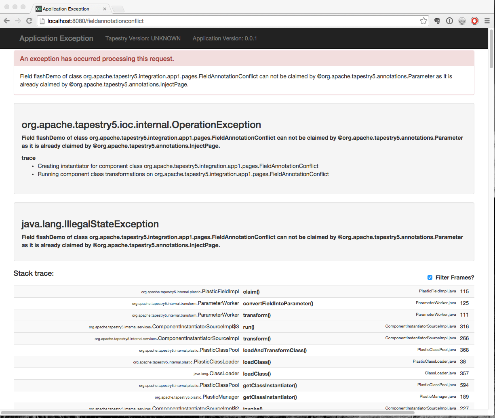

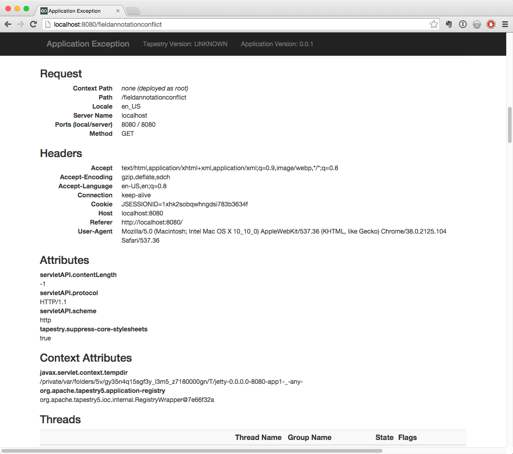

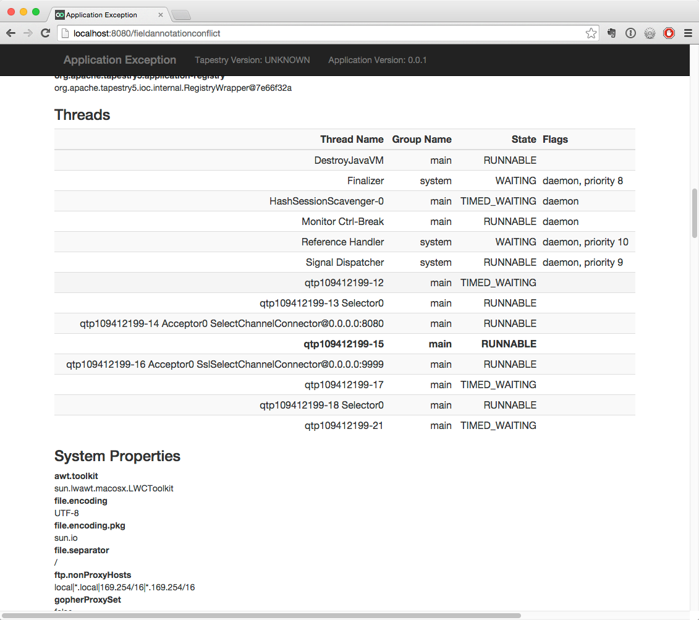

This exception report features:

- The full stack of exceptions, top to bottom.
- All non-null properties of each exception.
- The stack trace *at the deepest level*.
- Key **request** properties, header, attributes, and parameters.
- Key **session**propertes
- A break down of the *thread* in your application
- A listing of all JVM System properties

<a id="runtime-exceptions--runtimeexceptions-ajaxdetailedexceptionreports"></a>
<a id="runtime-exceptions--ajax-detailed-exception-reports"></a>

## Ajax Detailed Exception Reports

A similar detailed exception report is also built-in to Tapestry's Ajax support. When an Ajax request fails, Tapestry's client-side code will create an <iframe> to present this same information:


<a id="runtime-exceptions--runtimeexceptions-detailedexceptionreportfiles"></a>
<a id="runtime-exceptions--detailed-exception-report-files"></a>

## Detailed Exception Report Files

In addition, Tapestry will write a text file for the exception with a similar level of detail. The default location for the detailed exception report files is a relative directory *build/exceptions*. You can configure the location by setting [SymbolConstants.EXCEPTION\_REPORTS\_DIR](http://tapestry.apache.org/current/apidocs/org/apache/tapestry5/SymbolConstants.html#EXCEPTION_REPORTS_DIR).

If you want to turn off the writing of detailed exception reports files to the file system, you can add the following to your application module (usually AppModule.java):

**AppModule.java (partial)**

```java
/** * By default, Tapestry's ExceptionReporter implementation writes verbose text files to the * "build/exceptions" directory. This replaces that implementation with one that does nothing.* (The exceptions still get logged elsewhere.) */ @Decorate(serviceInterface = ExceptionReporter.class) public static ExceptionReporter preventExceptionFileWriting(final ExceptionReporter exceptionReporter) {return new ExceptionReporter() {@Override public void reportException(Throwable exception) {} };}
```

<a id="runtime-exceptions--runtimeexceptions-overridingthehandlingofspecificexceptions"></a>
<a id="runtime-exceptions--overriding-the-handling-of-specific-exceptions"></a>

## Overriding the Handling of Specific Exceptions

In production, you may want to [override the exception report page](#overriding-exception-reporting) (even if you keep the text file output). However, Tapestry's (from version 5.4) default exception reporter also allows you to handle specific exception types in a pre-determined manner, similar to how servlet spec's standard error-page/exception-type configuration option allows you to map exception types to URLs. At times, it's simpler to just catch exceptions at the outermost layer of your application instead of carrying a typed exception through multiple layers of abstractions just so you could show a sensible error message to the user, especially if you can't do anything more clever about it anyway. Exception type mapping in Tapestry is much more powerful than what the servlet spec dictates. If your email service or an external payment service goes down, you can't do much more than display an error message to the user, so why would you need to implement separate pages for each exception? Often, it'd be nicer if you could just reuse the page template for any fatal exception and simply display a different error message. In addition to contributing handlers for specific types of exceptions, you may also provide context for rendering the same error page template with a different output.

You can contribute an error page, mapping it to an exception type:

**AppModule.java (partial)**

```java
    public void contributeRequestExceptionHandler(MappedConfiguration<Class<?>, Object> configuration) {
        configuration.add(SmtpNotRespondingException.class, ServiceFailure.class);
    }
```

If a simple exception type to page mapping doesn't do it for you, you can also contribute a custom handler for that particular exception type. An *ExceptionHandlerAssistant* can contain arbitrarily complex logic for handling a specific exception type and use other Tapestry services. If *ExceptionHandlerAssistant.handleRequestException(Throwable exception, List<Object> exceptionContext)* returns an Object representing an URL the main handler will issue a redirect to that URL. It's valid to return either a String, a Link or a Class; the last case implies a page class. If the *ExceptionHandlerAssistant* returns null, it's assumed that the assistant has independently handled the exception. You can either contribute an instance of an *ExceptionHandlerAssistant* or a class that implements *ExceptionHandlerAssistant*. Below, we contribute an instance handling *ServiceException*s:

**AppModule.java (partial)**

```java
public void contributeRequestExceptionHandler(OperationQueue operationQueue, MappedConfiguration<Class<?>, Object> configuration) {final ExceptionHandlerAssistant assistant = new ExceptionHandlerAssistant() {@Override public Object handleRequestException(Throwable exception, List<Object> exceptionContext) throws IOException {ServiceException serviceException = (ServiceException)exception; if (serviceException.isInterruptedOperationRecoverable()) {operationQueue.add(serviceException.getInterruptedOperation()); return OperationScheduled.class;} else return ServiceUnavailable.class;} }; configuration.add(ServiceException.class, assistant);}
```

You can also specify context for the exception page. For generic exceptions, the context is taken from the exception class name minus the word "Exception" in case that's how the class name ends. For example, you have a following class:

**SmtpNotResponding.java**

```java
public class SmtpNotRespondingException extends RuntimeException {
 ...
}
```

If an *SmtpNotRespondingException* is thrown during an action request, user is directed to *ServiceFailure* page with a String context smtpnotresponding (i.e. to URL **/servicefailure/smtpnotresponding**). The contributed exception handling works both for regular action requests and ajax action requests. In the latter case, the module will use Javascript to redirect to the error page. If the exception thrown is not one of the contributed types, the exception is handled like any other exception, as explained above.

If your custom-handled exception implements the interface *org.apache.tapestry5.ContextAwareException* you can fully specify the context for the error page. For example, you could implement a following Exception class:

**SmtpNotRespondingException.java**

```java
public class SmtpNotRespondingException extends RuntimeException implements ContextAwareException {private Object[] context; public EmailServiceException(Object[] context) {super(); this.context = context;} // Defined in ContextAwareException interface public Object[] getContext() {return context;}}
```

The contributed exception handling mechanism can easily be overused. Typically, if you can handle the exception locally, you should. Likewise, you shouldn't blindly wrap any checked exceptions inside runtime exceptions just to avoid writing try-catch blocks in higher layers. The mechanism for contributed exception types is best used for handling serious but rarely occurring exceptions happening in the action request cycle that you cannot otherwise cope with.

**Error rendering macro 'scrollbar'**

com/opensymphony/webwork/ServletActionContext

---

<a id="class-reloading"></a>

<!-- source_url: https://tapestry.apache.org/class-reloading.html -->

<!-- page_index: 16 -->

# Class Reloading

[Apache Tapestry](#index) > [Documentation](#documentation) > [User Guide](#user-guide) > [Class Reloading](#class-reloading)

<a id="class-reloading--title"></a>
<a id="class-reloading--class-reloading"></a>

# Class Reloading

<a id="class-reloading--classreloading-liveclassandtemplatereloading"></a>
<a id="class-reloading--live-class-and-template-reloading"></a>

# Live Class and Template Reloading

<a id="class-reloading--related-articles"></a>

### Related Articles

- Page:

  [Class Reloading](#class-reloading)
- Page:

  [Service Implementation Reloading](#service-implementation-reloading)

One of the best features of Tapestry is automatic reloading of changed classes and templates. *Page and component* classes will automatically reload when changed. Likewise, changes to component templates and other related resources will also be picked up immediately. In addition, starting in version 5.2, your service classes will also be reloaded automatically after changes (if you're using [Tapestry IoC](#ioc)). Starting in version 5.8.3, you enable multiple classloader mode, which allows smarter page class invalidation.

Not necessarily throwing away all cached page instances

Since Tapestry 5.8.3, Tapestry can be run in multiple classloaders mode. When it's on, only the affected cached page instances are discarded and rebuilt instead of all of them.

<a id="class-reloading--classreloading-contents"></a>
<a id="class-reloading--contents"></a>

## Contents

- [Template Reloading](#class-reloading--classreloading-templatereloading)
- [Class Reloading](#class-reloading--classreloading-classreloading)
- [Packages Scanned](#class-reloading--classreloading-packagesscanned)
- [File System Only](#class-reloading--classreloading-filesystemonly)
- [Class Loader Issues](#class-reloading--classreloading-classloaderissues)
- [ClassCastExceptions](#class-reloading--classreloading-classcastexceptions)
- [Handling Reloads in your Code](#class-reloading--classreloading-handlingreloadsinyourcode)
- [Checking For Updates](#class-reloading--classreloading-checkingforupdates)
- [Troubleshooting Live Class Reloading](#class-reloading--classreloading-troubleshootingliveclassreloading)
  - [Quick Checklist](#class-reloading--classreloading-quickchecklist)
  - [If Live Class Reloading doesn't work](#class-reloading--classreloading-ifliveclassreloadingdoesn-twork)
    - [Production Mode](#class-reloading--classreloading-productionmode)
    - [Build Path Issues](#class-reloading--classreloading-buildpathissues)
    - [Building Automatically](#class-reloading--classreloading-buildingautomatically)
    - [Turn off JVM hot code swapping & automatic restarts](#class-reloading--classreloading-turnoffjvmhotcodeswapping-automaticrestarts)
  - [Tomcat Specifics](#class-reloading--classreloading-tomcatspecifics)
  - [If Live Class Reloading works but is slow](#class-reloading--classreloading-ifliveclassreloadingworksbutisslow)
- [[5.8.3+] Multiple Classloader Mode/Smarter Page Class Invalidation](#class-reloading--classreloading-5.8.3-multipleclassloadermode-smarterpageclassinvalidation)
  - [How It Works](#class-reloading--classreloading-howitworks)
  - [Loading, Storing and Preloading Dependency Information](#class-reloading--classreloading-loading-storingandpreloadingdependencyinformation)
  - [Caveats](#class-reloading--classreloading-caveats)

<a id="class-reloading--classreloading-templatereloading"></a>
<a id="class-reloading--template-reloading"></a>

## Template Reloading

When a template changes, all page instances (as well as the hierarchy of components below them) are discarded and reconstructed with the new template. However, classes are not reloaded in this case.

<a id="class-reloading--classreloading-classreloading"></a>
<a id="class-reloading--class-reloading-2"></a>

## Class Reloading

On a change to *any* loaded class from inside a controlled package (or any sub-package of a controlled package), Tapestry will discard all page instances, and discard the class loader.

[Persistent field data](#class-reloading) on the pages will usually not be affected (as it is stored separately, usually in the session). This allows you to make fairly significant changes to a component class even while the application continues to run.

<a id="class-reloading--classreloading-packagesscanned"></a>
<a id="class-reloading--packages-scanned"></a>

## Packages Scanned

Only certain classes are subject to reload. Reloading is based on package name; the packages that are reloaded are derived from the [application configuration](#configuration).

If your root package is `org.example.myapp`, then only classes in the following packages (and their sub-packages) will be scanned for automatic reloads:

- org.example.myapp.pages
- org.example.myapp.components
- org.example.myapp.mixins
- org.example.myapp.base
- org.example.myapp.services (Tapestry 5.2 and later, with restrictions)

Starting in Tapestry 5.2, live class reloading includes service implementation classes. There are some limitations to this. See [Service Implementation Reloading](#service-implementation-reloading) for more details.

<a id="class-reloading--classreloading-filesystemonly"></a>
<a id="class-reloading--file-system-only"></a>

## File System Only

Reloading of classes and other files applies only to files that are actually on the file system, and not files obtained from JAR files. This is perfect during development, where the files in question are in your local workspace. In a deployed application, you are somewhat subject to the implementation of your servlet container or application server.

<a id="class-reloading--classreloading-classloaderissues"></a>
<a id="class-reloading--class-loader-issues"></a>

## Class Loader Issues

Tapestry uses an extra class loader to load page and component classes.

When a change to an underlying Java class file is detected, Tapestry discards the class loader.

You should be careful to not hold any references to Tapestry pages or components in other code, such as Tapestry IoC services. Holding such references can cause significant memory leaks, as they can prevent the class loader from being reclaimed by the garbage collector.

<a id="class-reloading--classreloading-classcastexceptions"></a>
<a id="class-reloading--classcastexceptions"></a>

## ClassCastExceptions

Tapestry's class loader architecture can sometimes cause a minor problem when you make use of a services layer without interfaces, or if that you pass component instances to objects that are not themselves components.

In such cases you may see ClassCastException errors. This is because the same class name, say org.example.myapp.pages.Start, exists as two different class instances. One class instance is loaded by the web application's default class loader. A second class instance has been loaded *and transformed* by Tapestry's reloading class loader.

Ordinary classes, such as Tapestry IoC Services, will be loaded by the default class loader and expect instances to be loaded by the same class loader (or a parent).

The solution to this problem is to introduce an interface; the component class should implement the interface, and the service should expect an instance of the interface, rather than a specific type.

It is important that the interface be loaded by the default class loader. It should not be in the pages or components package, but instead be in another package, such as services.

<a id="class-reloading--classreloading-handlingreloadsinyourcode"></a>
<a id="class-reloading--handling-reloads-in-your-code"></a>

## Handling Reloads in your Code

On occasion, you may need to know when invalidations occur, to clear your own cache. For example, if you have a binding that creates new classes, the way [PropertyConduitSource](http://tapestry.apache.org/current/apidocs/org/apache/tapestry5/services/PropertyConduitSource.html) does, you need to discard any cached classes or instances when a change is detected in component classes.

You do this by registering a listener with the correct [InvalidationEventHub](http://tapestry.apache.org/current/apidocs/org/apache/tpaestry5/services/InvalidationEventHub.html) service.

For example, your service may be in the business of creating new classes based on component classes, and keep a cache of those classes:

```java
public class MyServiceImpl implements MyService, InvalidationEventListener {public final Map<String,Class> cache = new ConcurrentHashMap<String,Class>();
. . .
public void objectWasInvalidated() { cache.clear(); }}
```

Here, the service implementation implements the InvalidationEventListener interface, as well as its service interface. The question is: how does it register for notifications?

In your module, you will want to use a service builder method, such as:

```java
public static MyService buildMyService(@Autobuild MyServiceImpl service, @ComponentClasses InvalidationEventHub hub)
{
  hub.addInvalidationListener(service);

  return service;
}
```

This is the intent of service builder methods; to do more than just injecting dependencies.

<a id="class-reloading--classreloading-checkingforupdates"></a>
<a id="class-reloading--checking-for-updates"></a>

## Checking For Updates

The built in InvalidationEventHub services provide notifications of changes to component classes, to component templates, and to component message catalogs. If you wish to check some other resources (for example, files in a directory of the file system or rows in a database table), you should register as an [UpdateListener](http://tapestry.apache.org/current/apidocs/org/apache/tapestry5/services/UpdateListener.html) with the [UpdateListenerHub](http://tapestry.apache.org/current/apidocs/org/apache/tapestry5/services/UpdateListenerHub.html) service.

Periodically (the frequency is configurable), UpdateListeners are notified that they should check for updates. Typically, UpdateListeners are also InvalidationEventHubs (or provide InvalidationEventHubs), so that other interested parties can be alerted when underlying data changes.

<a id="class-reloading--classreloading-troubleshootingliveclassreloading"></a>
<a id="class-reloading--troubleshooting-live-class-reloading"></a>

## Troubleshooting Live Class Reloading

<a id="class-reloading--classreloading-quickchecklist"></a>
<a id="class-reloading--quick-checklist"></a>

### Quick Checklist

- "Production Mode" must be false (in Tapestry 5.3 and later)
- The class must be one that Tapestry instantiates (a page, component, or mixin class, or a Tapestry IOC service implementation that implements an interface)
- Turn on "Build Automatically" in your IDE, or remember to build manually.
- Turn *off* JVM hot code swapping, if your servlet container supports it.
- Eclipse: Uncheck the "derived" checkbox for the Target dir (in the Project Explorer view, right click on "target", select properties, uncheck "derived" on the Resource tab)

Some of these issues are described in more detail below.

<a id="class-reloading--classreloading-ifliveclassreloadingdoesn-twork"></a>
<a id="class-reloading--if-live-class-reloading-doesn-t-work"></a>

### If Live Class Reloading doesn't work

<a id="class-reloading--classreloading-productionmode"></a>
<a id="class-reloading--production-mode"></a>

#### Production Mode

Starting with Tapestry 5.3, Live Class Reloading only works when not in "Production Mode". Check your application module (usually AppModule.java) to be sure you have:

```java
configuration.add(SymbolConstants.PRODUCTION_MODE, "false");
```

and that this isn't being overridden to "true" on your application's startup command line.

<a id="class-reloading--classreloading-buildpathissues"></a>
<a id="class-reloading--build-path-issues"></a>

#### Build Path Issues

Live Class Reloading can fail if your build path isn't set correctly, and the exact configuration may differ between Maven plugin versions and Eclipse versions. The build process must be set to create classes in a folder which is in the servlet container's classpath.

Live Class Reloading won't work correctly with vanilla Tomcat without some tweaks (see below).

Non-Tapestry filters can interfere with LCR. Try disabling other filters in your web.xml file to see if that helps.

<a id="class-reloading--classreloading-buildingautomatically"></a>
<a id="class-reloading--building-automatically"></a>

#### Building Automatically

Although LCR allows you to see changes without restarting your app, you still need to "build" your project (to compile the Java source into byte code). Your IDE can be set to do this automatically every time you save a file. (In Eclipse, this is done using `Project > Build Automatically`.) Alternatively, you can manually trigger a build after you save a file. (In Eclipse, this is done using `Project > Build`, or by pressing `Control-B`.)

<a id="class-reloading--classreloading-turnoffjvmhotcodeswapping-automaticrestarts"></a>
<a id="class-reloading--turn-off-jvm-hot-code-swapping-automatic-restarts"></a>

#### Turn off JVM hot code swapping & automatic restarts

Many servlet containers, including Tomcat and Jetty, support various forms of hot code swapping and/or automatic restarts when file changes are detected. These are generally **much slower** than LCR and usually should be turned off with Tapestry applications. If you're using RunJettyRun plugin for Eclipse, for example, edit your Run Configuration, and on the Jetty tab, click Show Advanced Options and uncheck the Enable Scanner checkbox.

<a id="class-reloading--classreloading-tomcatspecifics"></a>
<a id="class-reloading--tomcat-specifics"></a>

### Tomcat Specifics

See [these Tomcat-specific hints](http://www.tynamo.org/Developing+with+Tomcat+and+Eclipse/)

<a id="class-reloading--classreloading-ifliveclassreloadingworksbutisslow"></a>
<a id="class-reloading--if-live-class-reloading-works-but-is-slow"></a>

### If Live Class Reloading works but is slow

If LCR works for you but is slow (more than a second or two), consider the following.

- Be sure your project source files (your workspace in Eclipse, for example), are on a local drive, NOT a network location. Network drives are always slower, and the file system scanning needed for LCR can add a noticable lag if I/O is slow. If you use Maven, be sure to put your local repository (e.g. ~/.m2/repository) on a local drive for similar reasons.
- Java 7 and below: Since LCR adds classes to your PermGen space, you may be running low on PermGen memory (and may eventually get a "java.lang.OutOfMemoryError: PermGen space" error). Try increasing PermGen size with a JVM argument of something like -XX:MaxPermSize=400m. (PermGen settings are not relevant for Java 8 and above.)

**Error rendering macro 'scrollbar'**

com/opensymphony/webwork/ServletActionContext

<a id="class-reloading--classreloading-5.8.3-multipleclassloadermode-smarterpageclassinvalidation"></a>
<a id="class-reloading--5.8.3-multiple-classloader-mode-smarter-page-class-invalidation"></a>

## [5.8.3+] Multiple Classloader Mode/Smarter Page Class Invalidation

Since Tapestry 5.8.3, you can run Tapestry in multiple classloader mode, which implements smarter page class invalidation in live class reloading. In addition, other caches are also invalidated in smarter way when something changes, avoiding throwing away everything. Multiple classloader mode isn't available when production mode is on.

To enable multiple classloader mode, you need to `tapestry.multiple-classloaders` symbol to `true` and run the webapp with production mode disabled. With production mode on, `tapestry.multiple-classloaders` is ignored.

When multiple classloaders are enabled, when a class in a controlled component, template, message properties file or asset is changed, Tapestry tries to invalidate as few cached objects as possible. This include page instances, processed templates, asset information, property bindings, etc. This is possible by 2 new internal features:

1. A component dependency registry, which gathers and stores information about how component, page, mixin and base classes depend on each other. There are 3 kinds of dependencies: usage (i.e. a component or mixin used in a class), superclass (i.e. one class extending the other) and @InjectPage (i.e. one class injecting a page class using @InjectPage.
2. The usage of multiple classloader instances, organized in a tree, instead of a single one. For example: if a component A is used in pages B and C, when B has its class changed, there's no need to invalidate a cached instance of C since Tapestry knows there's no dependency of B and C. On the other hand, if A is changed, both B and C instances need to be invalidated.

You can find a graph of all known dependencies at a time by going to the /t5dashboard/pagedependencygraph URL of your webapp. You can view the dependencies for one specific page by going to /t5dashboard/ and clicking the page's Structure Info link. Here's one partial example:

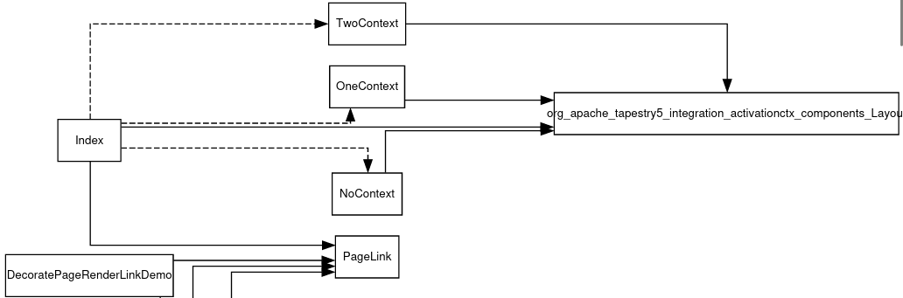

<a id="class-reloading--classreloading-howitworks"></a>
<a id="class-reloading--how-it-works"></a>

### How It Works

First of all, when production mode is off and multiple classloaders mode is also off, Tapestry reacts to file (including classes in controlled packages, templates, message properties files and assets) changes in the same way as before and described above in this page: all cached information or objects about classes, templates, message properties files, assets, property bindings, etc is invalidated (i.e. thrown away). The internal services that track changes to these files notify all their listeners that they should invalidate their caches completely.

When multiple classloaders mode is on, these internal services notify their listeners what changed, so they can invalidate just the objects or information that is actually affected by the changes. Sometimes this listeners notify the services that more stuff needs to be invalidated, For example, if one asset is changed and it's associated with a class, the asset service notifies the listeners that that class needs to be invalidated. For example, the component dependency registry, when notified that a given class was invalidated, besides invalidating information about that class, it informs the service that it also needs to invalidates the classes that depend on the changed one. This process repeats until there's no other class to be invalidated.

Additional logging was added so all files found as changed result in log entries. Same for the invalidation chain described in the paragraph above.

Now that it knows the class dependency graph, Tapestry needs to map that into a classloader tree, since each classloader instance can only have one parent. Internally, the framework has one class, PageClassLoaderContext (PCLC or context, for short), that stores all information about one classloader in the tree: the classloader itself, a name, the set of names of the classes beloging to it, the parent PCLC and children PCLCs. When a class is invalidated, the classes in the context are invalidated, then the context itself is invalidated, including its classloader, then the child contexts are recursively invalidated too.

There are 2 special PCLC contexts: the root one, which is never invalidated, and the unknown one, where classes without dependency information go initially.

The PCLC tree is created class by class, starting from pages and then on its dependencies on them in a recursive manner. For each class, if there's no PCLC already containing it, Tapestry checks its dependency list. Its basic algorithm is this:

1. If there are dependencies that belong to a PCLC yet, run the algorithm on it.
2. All the PCLCs of dependencies are gathered.
   1. If there are no PCLCs found, a new one is created with that class and the root context is its parent.
   2. If there is exactly one PCLC found, a new one is created with that class and the found PCLC will be its parent.
   3. If more than one PCLC is found, these PCLCs are merged by creating a new one containing all the classes in the PCLCs. The old PCLCs are invalidated recursively and an event about its invalidation is sent to the listeners. One of them is `PageSource`, the service that manages, creates and caches page instances, so the merging of PCLCs can cause page invalidation, as keeping these instances could potentially cause `ClassCastException`s later due to class instances belonging to different versions of the same class.

<a id="class-reloading--classreloading-loading-storingandpreloadingdependencyinformation"></a>
<a id="class-reloading--loading-storing-and-preloading-dependency-information"></a>

### Loading, Storing and Preloading Dependency Information

When a page instance is finished building, it's processed by the component dependency registry, which gathers the dependencies this page has, then the dependencies of its dependencies recursively. The registry doesn't process classes it already has information.

When starting up, Tapestry checks whether a file named `tapestryComponentDependencies.json` exists in the folder where the webapp is running. If it does, component dependency is loaded from it.

The T5Dashboard page has 2 new buttons related to dependencies, `Store dependency information`, writes all the dependency information as known at that moment.

`Preload dependency information and page classloader contexts` goes through all known pages, gathers its dependencies, also doing the same for all the components used directly and indirectly by them, and the preloads page the page classloader contexts, thus avoiding context invalidations when page instances are created. Notice this process won't work if any of the pages or their templates are invalid for any reason.

<a id="class-reloading--classreloading-caveats"></a>
<a id="class-reloading--caveats"></a>

### Caveats

Unfortunately, it wasn't possible to make the multiple classloader mode to work with all situations and code. Some known issues:

1. On Java 9 and later, classes belonging to one classloader cannot call package-private methods of other classes even when both are in the same package. The solution is to change the method visibility to public.
2. If you don't have component dependency information already loaded for a given class, problems, usually in the form of a ClassCastException claiming an object of a given type cannot be assigned to a variable of the same type. The best way to deal with this is to use the T5Dashboard to write the component dependency information to a file and restart the webapp. In some cases, it helps to preload dependency information for all classes.
3. If you start your webapp without component dependency information, page instances may be created and invalidated a few times even when they didn't have any changes due to the page classloader context creation. The solution for this is the same one as the above.
4. When one asset is imported into a class through @Import, the class and the asset are considered associated. When an asset is changed and it's associated with at least one class, the classes associated with it, including pages, are invalidated. If an asset is changed and it's not associated with any class, then multiple classloader mode works the same as single classloader one, invalidating everything.

---

<a id="component-reference"></a>

<!-- source_url: https://tapestry.apache.org/component-reference.html -->

<!-- page_index: 17 -->

# Component Reference

[Apache Tapestry](#index) > [Documentation](#documentation) > [User Guide](#user-guide) > [Component Reference](#component-reference)

<a id="component-reference--title"></a>
<a id="component-reference--component-reference"></a>

# Component Reference

Tapestry includes more than 65 built-in components and mixins. In addition, there are hundreds of Tapestry components freely available from others. Of course, Tapestry makes it [trivially easy](#component-classes) to create your own custom components, so if you don't see what you need, just develop them yourself.

<a id="component-reference--related-articles"></a>

### Related Articles

- Page:

  [Component Classes](#component-classes)
- Page:

  [Templating and Markup FAQ](#templating-and-markup-faq)
- Page:

  [Component Parameters](#component-parameters)

**Contents**

- [Tapestry-provided Components](#component-reference--componentreference-tapestry-providedcomponents)
  - [AJAX-specific Components](#component-reference--componentreference-ajax-specificcomponents)
  - [Bean Displaying & Editing](#component-reference--componentreference-beandisplaying-editing)
  - [Conditional and Looping Components](#component-reference--componentreference-conditionalandloopingcomponents)
  - [Form Components](#component-reference--componentreference-formcomponents)
  - [Grids, Tables and Trees](#component-reference--componentreference-grids-tablesandtrees)
  - [Links and Buttons](#component-reference--componentreference-linksandbuttons)
  - [Output and Messages](#component-reference--componentreference-outputandmessages)
  - [Miscellaneous](#component-reference--componentreference-miscellaneous)
- [Tapestry Mixins](#component-reference--componentreference-tapestrymixins)
- [Tapestry Pages](#component-reference--componentreference-tapestrypages)
- [Base Components](#component-reference--componentreference-basecomponents)
- [Other Component Libraries](#component-reference--componentreference-othercomponentlibraries)

<a id="component-reference--componentreference-tapestry-providedcomponents"></a>
<a id="component-reference--tapestry-provided-components"></a>

## Tapestry-provided Components

Most Tapestry-provided components are found in the [org.apache.tapestry5.corelib.components](http://tapestry.apache.org/current/apidocs/org/apache/tapestry5/corelib/components/package-summary.html) package. Other components are included in the separate [org.apache.tapestry5.kaptcha.components](http://tapestry.apache.org/current/apidocs/org/apache/tapestry5/kaptcha/components/package-summary.html) and [org.apache.tapestry5.upload.components](http://tapestry.apache.org/current/apidocs/org/apache/tapestry5/upload/components/package-summary.html) packages.

<a id="component-reference--componentreference-ajax-specificcomponents"></a>
<a id="component-reference--ajax-specific-components"></a>

### AJAX-specific Components

Main Article: [Ajax and Zones](#ajax-and-zones)

[AjaxFormLoop](http://tapestry.apache.org/current/apidocs/org/apache/tapestry5/corelib/components/AjaxFormLoop.html)

A special form of the Loop component that adds Ajax support to handle adding new rows and removing existing rows dynamically.

[AddRowLink](http://tapestry.apache.org/current/apidocs/org/apache/tapestry5/corelib/components/AddRowLink.html), [RemoveRowLink](http://tapestry.apache.org/current/apidocs/org/apache/tapestry5/corelib/components/RemoveRowLink.html)

Used inside an AjaxFormLoop component to spur the addition or removal of a row.

[ProgressiveDisplay](http://tapestry.apache.org/current/apidocs/org/apache/tapestry5/corelib/components/ProgressiveDisplay.html)

Used to implement the progressive enhancement web design strategy; the component renders itself with a simplified initial content (i.e., "loading ...") and an Ajax request then supplies the component's true body.

[Zone](http://tapestry.apache.org/current/apidocs/org/apache/tapestry5/corelib/components/Zone.html)

A region of a page marked for dynamic updating via Ajax or other client-side effects.

<a id="component-reference--componentreference-beandisplaying-editing"></a>
<a id="component-reference--bean-displaying-editing"></a>

### Bean Displaying & Editing

Main Article: [BeanEditForm Guide](#beaneditform-guide)

[BeanDisplay](http://tapestry.apache.org/current/apidocs/org/apache/tapestry5/corelib/components/BeanDisplay.html)

Displays the properties of a bean, using an underlying BeanModel, as a dl element with dt/dd pairs.

[BeanEditForm](http://tapestry.apache.org/current/apidocs/org/apache/tapestry5/corelib/components/BeanEditForm.html)

Creates an entire form for editing the properties of a particular bean

[BeanEditor](http://tapestry.apache.org/current/apidocs/org/apache/tapestry5/corelib/components/BeanEditor.html)

The central component of BeanEditForm, this generates a user interface for editing the properties of a bean

[PropertyDisplay](http://tapestry.apache.org/current/apidocs/org/apache/tapestry5/corelib/components/PropertyDisplay.html)

Outputs a single property value. Overrides for individual properties come from block parameters whose name matches the property id. This component is used by the BeanDisplay component.

[PropertyEditor](http://tapestry.apache.org/current/apidocs/org/apache/tapestry5/corelib/components/PropertyEditor.html)

Used to edit a single property of a bean. This is used primarily by BeanEditForm.

<a id="component-reference--componentreference-conditionalandloopingcomponents"></a>
<a id="component-reference--conditional-and-looping-components"></a>

### Conditional and Looping Components

<table class="table table-bordered table-responsive"><colgroup><col/><col/></colgroup><tbody><tr><td colspan="1" rowspan="1"><p><a href="http://tapestry.apache.org/current/apidocs/org/apache/tapestry5/corelib/components/If.html">If</a></p></td><td colspan="1" rowspan="1"><p>Conditionally renders its body. May render its tag and any informal parameters</p></td></tr><tr><td colspan="1" rowspan="1"><p><a href="#switching-cases">Case</a></p></td><td colspan="1" rowspan="1"><p>Not really a component, but a technique to emulate a "case" statement using a delegate</p></td></tr><tr><td colspan="1" rowspan="1"><p><a href="http://tapestry.apache.org/current/apidocs/org/apache/tapestry5/corelib/components/Loop.html">Loop</a></p></td><td colspan="1" rowspan="1"><p>Loops over a number of items (provided by its source parameter), rendering its body for each one]</p></td></tr><tr><td colspan="1" rowspan="1"><p><a href="http://tapestry.apache.org/current/apidocs/org/apache/tapestry5/corelib/components/Unless.html">Unless</a></p></td><td colspan="1" rowspan="1"><p>Inverse of the If component, renders its body if the condition is false.</p></td></tr><tr><td colspan="1" rowspan="1"><p><a href="http://tapestry.apache.org/current/apidocs/org/apache/tapestry5/corelib/components/Delegate.html">Delegate</a></p></td><td colspan="1" rowspan="1"><p>Does not do any rendering of its own, but will delegate to some other object that can do rendering</p></td></tr></tbody></table>

<a id="component-reference--componentreference-formcomponents"></a>
<a id="component-reference--form-components"></a>

### Form Components

<table class="table table-bordered table-responsive"><colgroup><col/><col/></colgroup><tbody><tr><td colspan="1" rowspan="1"><p><a href="http://tapestry.apache.org/current/apidocs/org/apache/tapestry5/corelib/components/Checkbox.html">Checkbox</a></p></td><td colspan="1" rowspan="1"><p>Renders a standard &lt;input type="checkbox"&gt; element</p></td></tr><tr><td colspan="1" rowspan="1"><p><a href="http://tapestry.apache.org/current/apidocs/org/apache/tapestry5/corelib/components/Checklist.html">Checklist</a></p></td><td colspan="1" rowspan="1"><p>Renders a vertical list of &lt;input type="checkbox"&gt; elements</p></td></tr><tr><td colspan="1" rowspan="1"><p><a href="http://tapestry.apache.org/current/apidocs/org/apache/tapestry5/corelib/components/DateField.html">DateField</a></p></td><td colspan="1" rowspan="1"><p>Collect a provided date from the user using a client-side JavaScript calendar</p></td></tr><tr><td colspan="1" rowspan="1"><p><a href="http://tapestry.apache.org/current/apidocs/org/apache/tapestry5/corelib/components/Form.html">Form</a></p></td><td colspan="1" rowspan="1"><p>An HTML form, which will enclose other components to render out the various types of fields.</p></td></tr><tr><td colspan="1" rowspan="1"><p><a href="http://tapestry.apache.org/current/apidocs/org/apache/tapestry5/corelib/components/FormFragment.html">FormFragment</a></p></td><td colspan="1" rowspan="1"><p>A portion of a Form that may be selectively displayed</p></td></tr><tr><td colspan="1" rowspan="1"><p><a href="http://tapestry.apache.org/current/apidocs/org/apache/tapestry5/corelib/components/Hidden.html">Hidden</a></p></td><td colspan="1" rowspan="1"><p>Used to record a page property as a value into the form</p></td></tr><tr><td colspan="1" rowspan="1"><p><a href="http://tapestry.apache.org/current/apidocs/org/apache/tapestry5/corelib/components/Label.html">Label</a></p></td><td colspan="1" rowspan="1"><p>Generates a label element for a particular field</p></td></tr><tr><td colspan="1" rowspan="1"><p><a href="http://tapestry.apache.org/current/apidocs/org/apache/tapestry5/kaptcha/components/KaptchaField.html">KaptchaField</a></p></td><td colspan="1" rowspan="1"><p>Part of a Captcha based authentication scheme; a KaptchaField is paired with a KaptchaImage to ensure that the user has provided the correct value</p></td></tr><tr><td colspan="1" rowspan="1"><p><a href="http://tapestry.apache.org/current/apidocs/org/apache/tapestry5/kaptcha/components/KaptchaImage.html">KaptchaImage</a></p></td><td colspan="1" rowspan="1"><p>Part of a Captcha based authentication scheme; a KaptchaImage generates a new text image whenever it renders and can provide the previously rendred text subsequently (it is stored persistently in the session)</p></td></tr><tr><td colspan="1" rowspan="1"><p><a href="http://tapestry.apache.org/current/apidocs/org/apache/tapestry5/corelib/components/Palette.html">Palette</a></p></td><td colspan="1" rowspan="1"><p>A multiple selection component. Generates a UI consisting of two select elements configured for multiple selection; the one on the left is the list of "available" elements, the one on the right is "selected".</p></td></tr><tr><td colspan="1" rowspan="1"><p><a href="http://tapestry.apache.org/current/apidocs/org/apache/tapestry5/corelib/components/PasswordField.html">PasswordField</a></p></td><td colspan="1" rowspan="1"><p>A version of TextField, but rendered out as an &lt;input type="password"&gt; element.</p></td></tr><tr><td colspan="1" rowspan="1"><p><a href="http://tapestry.apache.org/current/apidocs/org/apache/tapestry5/corelib/components/Radio.html">Radio</a></p></td><td colspan="1" rowspan="1"><p>A radio button (i.e., &lt;input type="radio"&gt;). Radio buttons must operate within a RadioContainer (normally, the RadioGroup component).</p></td></tr><tr><td colspan="1" rowspan="1"><p><a href="http://tapestry.apache.org/current/apidocs/org/apache/tapestry5/corelib/components/RadioGroup.html">RadioGroup</a></p></td><td colspan="1" rowspan="1"><p>Groups together a set of radio components that all affect the same property</p></td></tr><tr><td colspan="1" rowspan="1"><p><a href="http://tapestry.apache.org/current/apidocs/org/apache/tapestry5/corelib/components/Select.html">Select</a></p></td><td colspan="1" rowspan="1"><p>Renders a &lt;select&gt; element for selecting an item from a list of values</p></td></tr><tr><td colspan="1" rowspan="1"><p><a href="http://tapestry.apache.org/current/apidocs/org/apache/tapestry5/corelib/components/SubmitNotifier.html">SubmitNotifier</a></p></td><td colspan="1" rowspan="1"><p>A non visual component used to provide notifications to its container during a form submission</p></td></tr><tr><td colspan="1" rowspan="1"><p><a href="http://tapestry.apache.org/current/apidocs/org/apache/tapestry5/corelib/components/TextArea.html">TextArea</a></p></td><td colspan="1" rowspan="1"><p>Renders a &lt;textarea&gt; element for editing multi-line text</p></td></tr><tr><td colspan="1" rowspan="1"><p><a href="http://tapestry.apache.org/current/apidocs/org/apache/tapestry5/corelib/components/TextField.html">TextField</a></p></td><td colspan="1" rowspan="1"><p>Renders an &lt;input type="text"&gt; element to edit single-line text</p></td></tr><tr><td colspan="1" rowspan="1"><p><a href="#uploading-files">Upload</a></p></td><td colspan="1" rowspan="1"><p>A file upload component (i.e., &lt;input type="file"&gt;) based on Apache Commons FileUpload</p></td></tr></tbody></table>

<a id="component-reference--componentreference-grids-tablesandtrees"></a>
<a id="component-reference--grids-tables-and-trees"></a>

### Grids, Tables and Trees

<table class="table table-bordered table-responsive"><tbody><tr><td colspan="1" rowspan="1"><p><a href="http://tapestry.apache.org/current/apidocs/org/apache/tapestry5/corelib/components/Grid.html">Grid</a></p></td><td colspan="1" rowspan="1"><p>Presents tabular data in a &lt;table&gt; element by iterating over a List or array</p></td></tr><tr><td colspan="1" rowspan="1"><p><a href="http://tapestry.apache.org/current/apidocs/org/apache/tapestry5/corelib/components/GridCell.html">GridCell</a></p></td><td colspan="1" rowspan="1"><p>Part of Grid, renders the markup inside a single data cell</p></td></tr><tr><td colspan="1" rowspan="1"><p><a href="http://tapestry.apache.org/current/apidocs/org/apache/tapestry5/corelib/components/GridColumns.html">GridColumns</a></p></td><td colspan="1" rowspan="1"><p>Part of Grid, renders out the column headers for the grid, including links (where appropriate) to control column sorting</p></td></tr><tr><td colspan="1" rowspan="1"><p><a href="http://tapestry.apache.org/current/apidocs/org/apache/tapestry5/corelib/components/GridPager.html">GridPager</a></p></td><td colspan="1" rowspan="1"><p>Generates a series of links used to jump to a particular page index within the overall data set</p></td></tr><tr><td colspan="1" rowspan="1"><p><a href="http://tapestry.apache.org/current/apidocs/org/apache/tapestry5/corelib/components/GridRows.html">GridRows</a></p></td><td colspan="1" rowspan="1"><p>Renders out a series of rows within the table</p></td></tr><tr><td colspan="1" rowspan="1"><p><a href="http://tapestry.apache.org/current/apidocs/org/apache/tapestry5/corelib/components/Tree.html">Tree</a></p></td><td colspan="1" rowspan="1"><p>A component used to render a recursive tree structure, with expandable/collapsable/selectable nodes.</p></td></tr></tbody></table>

<a id="component-reference--componentreference-linksandbuttons"></a>
<a id="component-reference--links-and-buttons"></a>

### Links and Buttons

<table class="table table-bordered table-responsive"><tbody><tr><td colspan="1" rowspan="1"><p><a href="http://tapestry.apache.org/current/apidocs/org/apache/tapestry5/corelib/components/ActionLink.html">ActionLink</a></p></td><td colspan="1" rowspan="1"><p>Triggers an action on the server with a subsequent full page refresh</p></td></tr><tr><td colspan="1" rowspan="1"><p><a href="http://tapestry.apache.org/current/apidocs/org/apache/tapestry5/corelib/components/EventLink.html">EventLink</a></p></td><td colspan="1" rowspan="1"><p>Like ActionLink except that the event that it triggers is explicitly controlled, rather than always "action", and the event is triggered in its container</p></td></tr><tr><td colspan="1" rowspan="1"><p><a href="http://tapestry.apache.org/current/apidocs/org/apache/tapestry5/corelib/components/LinkSubmit.html">LinkSubmit</a></p></td><td colspan="1" rowspan="1"><p>Generates a client-side hyperlink that submits the enclosing form</p></td></tr><tr><td colspan="1" rowspan="1"><p><a href="http://tapestry.apache.org/current/apidocs/org/apache/tapestry5/corelib/components/Submit.html">Submit</a></p></td><td colspan="1" rowspan="1"><p>Corresponds to &lt;input type="submit"&gt; or &lt;input type="image"&gt;, a client-side element that can force the enclosing form to submit</p></td></tr><tr><td colspan="1" rowspan="1"><p><a href="http://tapestry.apache.org/current/apidocs/org/apache/tapestry5/corelib/components/PageLink.html">PageLink</a></p></td><td colspan="1" rowspan="1"><p>Generates a render request link to some other page in the application</p></td></tr></tbody></table>

<a id="component-reference--componentreference-outputandmessages"></a>
<a id="component-reference--output-and-messages"></a>

### Output and Messages

[Alerts](http://tapestry.apache.org/current/apidocs/org/apache/tapestry5/corelib/components/Alerts.html)

Renders out an empty <div> element and provides JavaScript initialization to make the element the container for alerts.

[Dynamic](http://tapestry.apache.org/current/apidocs/org/apache/tapestry5/corelib/components/Dynamic.html)

Allows a component to render itself differently at different times, by making use of an external template file.

[Error](http://tapestry.apache.org/current/apidocs/org/apache/tapestry5/corelib/components/Error.html)

Presents validation errors of a single field. Must be enclosed by a Form component

[Errors](http://tapestry.apache.org/current/apidocs/org/apache/tapestry5/corelib/components/Errors.html)

Standard validation error presenter. Must be enclosed by a Form component. If errors are present, renders a div element around a banner message and around an unnumbered list of error messages

[ExceptionDisplay](http://tapestry.apache.org/current/apidocs/org/apache/tapestry5/corelib/components/ExceptionDisplay.html)

Integral part of the default ExceptionReport page used to break apart and display the properties of the exception

[FontAwesomeIcon](http://tapestry.apache.org/current/apidocs/org/apache/tapestry5/corelib/components/FontAwesomeIcon.html)

Renders an `<i>` tag with the CSS class to select a [FontAwesome 4.7.0](https://fontawesome.com/v4.7.0/) icon.

[Output](http://tapestry.apache.org/current/apidocs/org/apache/tapestry5/corelib/components/Output.html)

A component for formatting output. If the component is represented in the template using an element, then the element (plus any informal parameters) will be output around the formatted value.

[OutputRaw](http://tapestry.apache.org/current/apidocs/org/apache/tapestry5/corelib/components/OutputRaw.html)

Output raw markup to the client. Unlike an expansion, the output from OutputRaw is unfiltered, with any special characters or entities left exactly as is.

[TextOutput](http://tapestry.apache.org/current/apidocs/org/apache/tapestry5/corelib/components/TextOutput.html)

Outputs paragraph oriented text, typically collected via a TextArea component. The TextArea is split into lines, and each line it output inside its own p element.

<a id="component-reference--componentreference-miscellaneous"></a>
<a id="component-reference--miscellaneous"></a>

### Miscellaneous

<table class="table table-bordered table-responsive"><tbody><tr><td colspan="1" rowspan="1"><p><a href="http://tapestry.apache.org/current/apidocs/org/apache/tapestry5/corelib/components/Any.html">Any</a></p></td><td colspan="1" rowspan="1"><p>Renders an arbitrary element including informal parameters</p></td></tr><tr><td colspan="1" rowspan="1"><a href="http://tapestry.apache.org/5.4/apidocs/org/apache/tapestry5/corelib/components/DevTool.html">DevTool</a></td><td colspan="1" rowspan="1">Renders a dropdown menu of useful options when developing, such as reloading the current page or invalidating the current HttpSession.</td></tr><tr><td colspan="1" rowspan="1"><p><a href="http://tapestry.apache.org/current/apidocs/org/apache/tapestry5/corelib/components/Doctype.html">Doctype</a></p></td><td colspan="1" rowspan="1"><p>Overrides the DOCTYPE of the rendered document (via Document.dtd(String, String, String) which can be useful when different component templates that render to the same document disagree about what the correct DOCTYPE is.</p></td></tr><tr><td colspan="1" rowspan="1"><p><a href="http://tapestry.apache.org/current/apidocs/org/apache/tapestry5/corelib/components/RenderObject.html">RenderObject</a></p></td><td colspan="1" rowspan="1"><p>Renders out an object using the ObjectRenderer service. Used primarily on the ExceptionReport page</p></td></tr><tr><td colspan="1" rowspan="1"><p><a href="http://tapestry.apache.org/current/apidocs/org/apache/tapestry5/corelib/components/Trigger.html">Trigger</a></p></td><td colspan="1" rowspan="1"><p>Triggers an arbitrary event during rendering. This is often useful to add JavaScript to a page or a component (via calls to the JavaScriptSupport environmental).</p></td></tr></tbody></table>

<a id="component-reference--componentreference-tapestrymixins"></a>
<a id="component-reference--tapestry-mixins"></a>

## Tapestry Mixins

Main Article: [Component Mixins](#component-mixins)

Mixins allow you to add behaviors to existing components. The core mixins are found in the [org.apache.tapestry5.corelib.mixins](http://tapestry.apache.org/current/apidocs/org/apache/tapestry5/corelib/mixins/package-summary.html) package.

Tapestry includes the following mixins out-of-the-box.

[Autocomplete](http://tapestry.apache.org/current/apidocs/org/apache/tapestry5/corelib/mixins/Autocomplete.html)

modifies a text field to provide for auto-completion of text using values retrieved from the server as the user types. [See instructions](#ajax-and-zones).

[Confirm](http://tapestry.apache.org/current/apidocs/org/apache/tapestry5/corelib/mixins/Confirm.html)

attached to a Form or link component, runs a modal-dialog to force the user to confirm the behavior. New for Tapestry 5.4.

[DiscardBody](http://tapestry.apache.org/current/apidocs/org/apache/tapestry5/corelib/mixins/DiscardBody.html)

discards a component's body. Returns false from the BeforeRenderBody phase, which prevents the rendering of the body.

[FormFieldFocus](http://tapestry.apache.org/current/apidocs/org/apache/tapestry5/corelib/mixins/FormFieldFocus.html)

instruments the outer Form on which component the focus should be activated. Replaced by OverrideFieldFocus starting in Tapestry 5.4.

[FormGroup](http://tapestry.apache.org/current/apidocs/org/apache/tapestry5/corelib/mixins/FormGroup.html)

attaches to a field to render an enclosing <div> element and label for proper Bootstrap markup of text fields, selects, and textareas

[NotEmpty](http://tapestry.apache.org/current/apidocs/org/apache/tapestry5/corelib/mixins/NotEmpty.html)

attaches to any component that renders an element. At the end of the render, if the element is empty, then a non-breaking space (&nbsp;) is injected into the element.

[OverrideFieldFocus](http://tapestry.apache.org/current/apidocs/org/apache/tapestry5/corelib/mixins/OverrideFieldFocus.html)

when attached to a form field, causes that field to gain focus. Starting in Tapestry 5.4, this supersedes FormFieldFocus.

[RenderClientId](http://tapestry.apache.org/current/apidocs/org/apache/tapestry5/corelib/mixins/RenderClientId.html)

forces a client element to render its client id by ensuring that "getClientId" is called.

[RenderDisabled](http://tapestry.apache.org/current/apidocs/org/apache/tapestry5/corelib/mixins/RenderDisabled.html)

renders a "disabled" attribute if the containing component is disabled

[RenderInformals](http://tapestry.apache.org/current/apidocs/org/apache/tapestry5/corelib/mixins/RenderInformals.html)

renders out all informal parameters, at the end of the BeginRender phase. This mixin can be used with components that render a single tag inside the BeginRender phase.

[RenderNotification](http://tapestry.apache.org/current/apidocs/org/apache/tapestry5/corelib/mixins/RenderNotification.html)

triggers component event notifications when the attached component enters its BeginRender and AfterRender render phases.

[TriggerFragment](http://tapestry.apache.org/current/apidocs/org/apache/tapestry5/corelib/mixins/TriggerFragment.html)

when applied to a Checkbox or Radio component, links the input field and a FormFragment, making the field control the client-side visibility of the FormFragment

[ZoneRefresh](http://tapestry.apache.org/current/apidocs/org/apache/tapestry5/corelib/mixins/ZoneRefresh.html)

periodically refreshes a Zone by triggering an event on the server using ajax requests.

<a id="component-reference--componentreference-tapestrypages"></a>
<a id="component-reference--tapestry-pages"></a>

## Tapestry Pages

Tapestry provides several special pages that provide status information. Most of these are found in the [org.apache.tapestry5.corelib.pages](http://tapestry.apache.org/current/apidocs/org/apache/tapestry5/corelib/pages/package-summary.html) package.

[ExceptionReport](http://tapestry.apache.org/current/apidocs/org/apache/tapestry5/corelib/pages/ExceptionReport.html)

Responsible for reporting runtime exceptions. This page is quite verbose and is usually overridden in a production application.

[PageCatalog](http://tapestry.apache.org/current/apidocs/org/apache/tapestry5/corelib/pages/PageCatalog.html)

Lists out the currently loaded pages, with some statistics.

[PropertyDisplayBlocks](http://tapestry.apache.org/current/apidocs/org/apache/tapestry5/corelib/pages/PropertyDisplayBlocks.html)

Contains blocks for displaying basic property types; the blocks are contributed to the BeanBlockSource service.

[PropertyEditBlocks](http://tapestry.apache.org/current/apidocs/org/apache/tapestry5/corelib/pages/PropertyEditBlocks.html)

A page that exists to contain blocks used to edit different types of properties. The blocks on this page are contributed into the BeanBlockSource service configuration.

[ServiceStatus](http://tapestry.apache.org/current/apidocs/org/apache/tapestry5/corelib/pages/ServiceStatus.html)

A page used to see the status of all services defined by the Registry.

<a id="component-reference--componentreference-basecomponents"></a>
<a id="component-reference--base-components"></a>

## Base Components

The base components, in the [org.apache.tapestry5.corelib.base](http://tapestry.apache.org/current/apidocs/org/apache/tapestry5/corelib/base/package-summary.html) package, are intended to be extended by other components rather than used directly in templates.

[AbstractComponentEventLink](http://tapestry.apache.org/current/apidocs/org/apache/tapestry5/corelib/base/AbstractComponentEventLink.html)

Base class for link-generating components that are based on a component event request. Such events have an event context and may also update a Zone.

[AbstractConditional](http://tapestry.apache.org/current/apidocs/org/apache/tapestry5/corelib/base/AbstractConditional.html)

Base class for If and Unless. Will render its body or the block from its else parameter. If it renders anything and it has an element name, then it renders the element and its informal parameters.

[AbstractField](http://tapestry.apache.org/current/apidocs/org/apache/tapestry5/corelib/base/AbstractField.html)

Provides initialization of the clientId and elementName properties. In addition, adds the RenderInformals, RenderDisabled and DiscardBody mixins.

[AbstractLink](http://tapestry.apache.org/current/apidocs/org/apache/tapestry5/corelib/base/AbstractLink.html)

Provides base utilities for classes that generate clickable links.

[AbstractPropertyOutput](http://tapestry.apache.org/current/apidocs/org/apache/tapestry5/corelib/base/AbstractPropertyOutput.html)

Base class for components that output a property value using a PropertyModel

[AbstractTextField](http://tapestry.apache.org/current/apidocs/org/apache/tapestry5/corelib/base/AbstractTextField.html)

Abstract class for a variety of components that render some variation of a text field. Most of the hooks for user input validation are in this class

[BaseMessages](http://tapestry.apache.org/current/apidocs/org/apache/tapestry5/corelib/base/BaseMessages.html)

Base class for components that output messages

<a id="component-reference--componentreference-othercomponentlibraries"></a>
<a id="component-reference--other-component-libraries"></a>

## Other Component Libraries

See [Modules](#modules)

**Error rendering macro 'scrollbar'**

com/opensymphony/webwork/ServletActionContext

---

<a id="annotations"></a>

<!-- source_url: https://tapestry.apache.org/annotations.html -->

<!-- page_index: 18 -->

# Annotations

[Apache Tapestry](#index) > [Documentation](#documentation) > [User Guide](#user-guide) > [Annotations](#annotations)

<a id="annotations--title"></a>
<a id="annotations--annotations"></a>

# Annotations

<a id="annotations--related-articles"></a>

### Related Articles

- Page:

  [Annotations](#annotations)
- Page:

  [Component Cheat Sheet](#component-cheat-sheet)

Tapestry relies heavily on Java **annotations** rather than XML files for almost all of its configuration. (In addition, Tapestry's method naming conventions mean you don't *have* to use annotations in many cases.)

Tapestry annotations are grouped into several distinct modules according to their purpose.

<a id="annotations--annotations-tapestrycoreandiocannotations"></a>
<a id="annotations--tapestry-core-and-ioc-annotations"></a>

## Tapestry Core and IoC Annotations

The majority of Tapestry annotations (those defined in the tapestry-core and tapestry-ioc modules) are very specific to Tapestry components or Tapestry IoC services:

[Tapestry Component Annotations](http://tapestry.apache.org/current/apidocs/org/apache/tapestry5/annotations/package-summary.html)

intended for use in page/component/mixin classes

[Tapestry IoC Annotations](http://tapestry.apache.org/current/apidocs/org/apache/tapestry5/ioc/annotations/package-summary.html)

for use by IoC services

<a id="annotations--annotations-annotationsfordataholdingclasses"></a>
<a id="annotations--annotations-for-data-holding-classes"></a>

## Annotations for data holding classes

In addition to the core and IoC annotations, there are a few annotations intended for data holding classes that are not Tapestry components; these annotations allow high-level components such as Grid and BeanEditForm to create powerful user interfaces with out any additional coding. Because these annotations are separated from the rest of Tapestry, they can be used inside your data tier classes *without* having to bring all of Tapestry into your classpath. This is very useful in multi-tier applications where data objects may originate in an application tier (such as a JEE application server) and travel to the presentation tier (a Tapestry application).

[BeanEditForm Annotations](http://tapestry.apache.org/current/apidocs/org/apache/tapestry5/beaneditor/package-summary.html)

for users of the BeanEditForm and Grid components

[Hibernate Annotations](http://tapestry.apache.org/current/apidocs/org/apache/tapestry5/hibernate/annotations/package-summary.html)

for users of the Tapestry-Hibernate library

<a id="annotations--annotations-upgradenotes-release5.0.12"></a>
<a id="annotations--upgrade-notes-release-5.0.12"></a>

## Upgrade Notes – Release 5.0.12

The artifact id for the annotations module has changed from `tapestry-annotations` to `tapestry5-annotations`. This is necessary to support Tapestry 4 and Tapestry 5 applications co-existing within a single WAR.

**Error rendering macro 'scrollbar'**

com/opensymphony/webwork/ServletActionContext

---

<a id="component-classes"></a>

<!-- source_url: https://tapestry.apache.org/component-classes.html -->

<!-- page_index: 19 -->

# Component Classes

[Apache Tapestry](#index) > [Documentation](#documentation) > [User Guide](#user-guide) > [Component Classes](#component-classes)

<a id="component-classes--title"></a>
<a id="component-classes--component-classes"></a>

# Component Classes

A **component class** is the class associated with a page, component or mixin in your Tapestry web application. Classes for pages, components and mixins are all created in an identical way. They are pure POJOs (Plain Old Java Objects), typically with annotations and conventionally named methods. They are not *abstract*, nor do they need to extend base classes or implement interfaces.

<a id="component-classes--related-articles"></a>

### Related Articles

- Page:

  [Component Reference](#component-reference)
- Page:

  [Page And Component Classes FAQ](#page-and-component-classes-faq)
- Page:

  [Component Libraries](#component-libraries)
- Page:

  [Component Parameters](#component-parameters)
- Page:

  [Component Templates](#component-templates)
- Page:

  [Component Cheat Sheet](#component-cheat-sheet)

In most cases, each component class will have a corresponding [component template](#component-templates). However, it is also possible for a component class to emit all of its markup itself, without using a template.

*For Tapestry 4 Users: Component classes in Tapestry 5 are much easier than in Tapestry 4. There are no base classes to extend from, the classes are concrete (not abstract), and there's no XML file. There is still a bit of configuration in the form of Java annotations, but those now go directly onto fields of your class, rather than on abstract getters and setters.*

<a id="component-classes--componentclasses-creatingatrivialcomponent"></a>
<a id="component-classes--creating-a-trivial-component"></a>

## Creating a Trivial Component

Creating a page or component in Tapestry 5 is a breeze. There are only a few constraints:

- There must be a public Java class.
- The class must be in the correct package (see below).
- The class must have a public, no-arguments constructor. (The default one provided by the compiler is fine.)

Here's a minimal component that outputs a fixed message, using a [template](#component-classes) with a matching file name:

**HelloWorld.java**

```java
package org.example.myapp.components;
public class HelloWorld
{
}
```

**HelloWorld.tml**

```xml
<html>
    Bonjour from HelloWorld component.
</html>
```

In the example above, the HelloWorld class contains no code at all (except what it inherits from the Object class and what Tapestry adds invisibly).

And here's a component that does the same thing, but without needing a template:

**HelloWorld.java – without a template**

```java
package org.example.myapp.components;
import org.apache.tapestry5.MarkupWriter; import org.apache.tapestry5.annotations.BeginRender;
public class HelloWorld {@BeginRender void renderMessage(MarkupWriter writer) {writer.write("Bonjour from HelloWorld component.");}}
```

In this example, just like the first one, the component's only job is to write out a fixed message. The @[BeginRender](http://tapestry.apache.org/current/apidocs/org/apache/tapestry5/annotations/BeginRender.html) annotation is a type of *[render phase annotation](#component-rendering)*

, a method annotation that instructs Tapestry when and under what circumstances to invoke methods of your class.

These methods are not necessarily public; they can have any access level you like (unlike in Tapestry 4). By convention they usually have package-private access level (the default).

<a id="component-classes--componentclasses-componentpackages"></a>
<a id="component-classes--component-packages"></a>

## Component Packages

Component classes must exist within an appropriate package (this is necessary for runtime code transformation and class reloading to operate).

These packages exist under the application's root package, as follows:

- For pages, place classes in *root*.**pages**. Page names are mapped to classes within this package.
- For mixins, place classes in *root*.**mixins**. Mixin types are mapped to classes within this package.
- For other components, place classes in *root*.**components**. Component types are mapped to classes within this package.

In addition, it is common for an application to have base classes, often *abstract* base classes, that should not be directly referenced. These should *not* go in the **pages**, **components** or **mixins** packages, because they then look like valid pages, components or mixins. Instead, use the *root*.**base** package to store such base classes.

Only component classes should go in any of these controlled packages; classes representing data, or interfaces, or anything that isn't precisely a component class, must go elsewhere. Any top-level class in any of the controlled packages will be transformed at runtime. The only exception is inner classes (anonymous or not), which are loaded by the same class loader as the component class loader, but not transformed as components.

<a id="component-classes--componentclasses-sub-folders-sub-packages"></a>
<a id="component-classes--sub-folders-sub-packages"></a>

## Sub-Folders / Sub-Packages

Classes do not have to go directly inside the package (pages, components, mixins, etc.). It is valid to create a sub-package to store some of the classes. The sub-package name becomes part of the page name or component type. Thus you might define a page component `com.example.myapp.pages.admin.CreateUser` and the logical page name (which often shows up inside URLs) will be **admin/CreateUser**.

Tapestry performs some simple optimizations of the logical page name (or component type, or mixin type). It checks to see if the package name is either a prefix or a suffix of the unqualified class name (case insensitively, of course) and removes the prefix or suffix if so. The net result is that a class name such as `com.example.myapp.pages.user.EditUser` will have a page name of `user/Edit` (instead of user`/EditUser`). The goal here is to provide shorter, more natural URLs.

<a id="component-classes--componentclasses-indexpages"></a>
<a id="component-classes--index-pages"></a>

## Index Pages

One special simplification exists for Index pages: if the logical page name is Index after removing the package name from the unqualified class name, it will map to the root of that folder. A class such as `com.example.myapp.pages.user.IndexUser` or `com.example.myapp.pages.user.UserIndex` will have a page name of `user/`.

In previous versions of Tapestry there was also the concept of a start page configured with the `tapestry.start-page-name` configuration symbol (defaults to "start"). If a page with a name as configured with that symbol exists at the root level, this page is used as the root URL. This has precedence over an existing Index page. If for example you have a page class `com.example.myapp.pages.Start` it will map to `/`.

Use of start-pages is discouraged and support for it will eventually be removed. Use an Index page instead.

<a id="component-classes--componentclasses-pagesvs.components"></a>
<a id="component-classes--pages-vs.-components"></a>

## Pages vs. Components

The distinction between pages and component is very, very small. The primary difference is the package name: *root*.**pages**.*PageName* for pages, and *root*.**components**.*ComponentType* for components. Conceptually, page components are simply the *root component* of a page's component tree.

*For Tapestry 4 users: there was a much greater distinction in Tapestry 4 between pages and components, which showed up as separate interfaces and a hierarchy of abstract implementations to extend your classes from.*

<a id="component-classes--componentclasses-classtransformation"></a>
<a id="component-classes--class-transformation"></a>

## Class Transformation

Tapestry uses your class as a starting point. It *transforms* your class at runtime. This is necessary for a number of reasons, including to address how Tapestry shares pages between requests.

For the most part, these transformations are both sensible and invisible. In a few limited cases, they comprise a marginally [leaky abstraction](http://www.joelonsoftware.com/printerFriendly/articles/LeakyAbstractions.html) – for instance, the scope restrictions on instance variables described below – but the programming model in general supports a very high level of developer productivity.

Because transformation doesn't occur until *runtime*, the build stage of your application is not affected by the fact that you are creating a Tapestry application. Further, your classes are absolutely simple POJOs during unit testing.

<a id="component-classes--componentclasses-liveclassreloading"></a>
<a id="component-classes--live-class-reloading"></a>

## Live Class Reloading

Main Article: [Class Reloading](#class-reloading)

Component classes are monitored for changes by the framework. [Classes are reloaded when changed](#class-reloading). This allows you to build your application with a speed approaching that of a scripting environment, without sacrificing any of the power of the Java platform.

And it's fast! You won't even notice that this magic class reloading has occurred.

The net result: super productivity — change your class, see the change instantly. This is designed to be a blend of the best of scripting environments (such as Python or Ruby) with all the speed and power of Java backing it up.

However, class reloading *only* applies to component classes (pages, components and mixins) and, starting in 5.2, Tapestry IOC-based service implementations (with some restrictions). Other classes, such as service interfaces, entity/model classes, and other data objects, are loaded by the normal class loader and not subject to live class reloading.

<a id="component-classes--componentclasses-instancevariables"></a>
<a id="component-classes--instance-variables"></a>

## Instance Variables

Tapestry components may have instance variables (unlike Tapestry 4, where you had to use *abstract properties*).

Since release 5.3.2, instance variables may be protected, or package private (that is, no access modifier). Under specific circumstances they may even be public (public fields must either be final, or have the @[Retain](http://tapestry.apache.org/current/apidocs/org/apache/tapestry5/annotations/Retain.html) annotation).

Be aware that you will need to either provide getter and setter methods to access your classes' instance variables, or else annotate the fields with @[Property](http://tapestry.apache.org/current/apidocs/org/apache/tapestry5/annotations/Property.html).

<a id="component-classes--componentclasses-transientinstancevariables"></a>
<a id="component-classes--transient-instance-variables"></a>

## Transient Instance Variables

Unless an instance variable is decorated with an annotation, it will be a *transient* instance variable. This means that its value resets to its default value at the end of reach request (when the [page is detached from the request](#page-life-cycle)).

About initialization

Never initialize an instance field to a *mutable* object at the point of declaration. If this is done, the instance created from that initializer becomes the default value for that field and is reused inside the component on every request. This could cause state to inadvertently be shared between different sessions in an application.

**Deprecated since 5.2**

For Tapestry 5.1 and earlier, in the rare event that you have a variable that can keep its value between requests and you would like to defeat that reset logic, then you can add a @[Retain](http://tapestry.apache.org/current/apidocs/org/apache/tapestry5/annotations/Retain.html) annotation to the field. You should take care that no client-specific data is stored into such a field, since on a later request the same page *instance* may be used for a different user. Likewise, on a later request for the *same* client, a *different* page instance may be used.

Use [persistent fields](#persistent-page-data) to hold client-specific information from one request to the next.

Further, final fields are (in fact) final, and will not be reset between requests.

<a id="component-classes--componentclasses-constructors"></a>
<a id="component-classes--constructors"></a>

## Constructors

Tapestry will instantiate your class using the default, no arguments constructor. Other constructors will be ignored.

<a id="component-classes--componentclasses-injection"></a>
<a id="component-classes--injection"></a>

## Injection

Main Article: [Injection](#injection)

Injection of dependencies occurs at the field level, via additional annotations. At runtime, fields that contain injections become read-only.

```java
@Inject // inject a resource
private ComponentResources componentResources;

@Inject // inject a block
private Block foo;

@Inject // inject an asset
@Path("context:images/top_banner.png")
private Asset banner;

@Inject // inject a service
private AjaxResponseRenderer ajaxResponseRenderer;
```

<a id="component-classes--componentclasses-parameters"></a>
<a id="component-classes--parameters"></a>

## Parameters

Main Article: [Component Parameters](#component-parameters)

Component parameters are private fields of your component class annotated with @[Parameter](http://tapestry.apache.org/current/apidocs/org/apache/tapestry5/annotations/Parameter.html). Component parameters represent a two-way binding of a field of your component and a property or resource of its containing component or page.

<a id="component-classes--componentclasses-persistentfields"></a>
<a id="component-classes--persistent-fields"></a>

## Persistent Fields

Main Article: [Persistent Page Data](#persistent-page-data)

Most fields in component classes are automatically cleared at the end of each request. However, fields may be annotated so that they retain their value across requests, using the @[Persist](http://tapestry.apache.org/current/apidocs/org/apache/tapestry5/annotations/Persist.html) annotation.

<a id="component-classes--componentclasses-embedded_componentsembeddedcomponents"></a>
<a id="component-classes--embedded-components"></a>

## Embedded Components

Components often contain other components. Components inside another component's template are called *embedded components*. The containing component's [template](#component-templates) will contain special elements, in the Tapestry namespace, identifying where the the embedded components go.

You can define the type of component inside template, or you can create an instance variable for the component and use the @[Component](http://tapestry.apache.org/current/apidocs/org/apache/tapestry5/annotations/Component.html) annotation to define the component type and parameters.

Example:

```java
package org.example.app.pages;

import org.apache.tapestry5.annotations.Component;
import org.apache.tapestry5.annotations.Property;
import org.example.app.components.Count;

public class Countdown
{
    @Component(parameters =
    { "start=5", "end=1", "value=countValue" })
    private Count count;

    @Property
    private int countValue;
}
```

The above defines a component whose embedded id is "count" (this id is derived from the name of the field and an element with that id must be present in the corresponding template, otherwise an error is displayed (see below)). The type of the component is org.example.app.components.Count. The start and end parameters of the Count component are bound to literal values, and the value parameter of the Count component is bound to the countValue property of the Countdown component.

Technically, the start and end parameters should be bound to properties, just like the value parameter. However, certain literal values, such as the numeric literals in the example, are accepted by the `prop:` binding prefix even though they are not actually properties (this is largely as a convenience to the application developer). We could also use the `literal:` prefix, `"start=literal:5"`, which accomplishes largely the same thing.

You may specify additional parameters inside the component template, but parameters in the component class take precedence.

**TODO: May want a more complex check; what if user uses prop: in the template and there's a conflict?**

You may override the default component id (as derived from the field name) using the id() attribute of the Component annotation.

If you define a component in the component class, and there is no corresponding element in the template, Tapestry will log an error. In the example above that would be the case if the template for the Countdown page didn't contain an element with `<t:count t:id="count">`.

**Error rendering macro 'scrollbar'**

com/opensymphony/webwork/ServletActionContext

---

<a id="component-templates"></a>

<!-- source_url: https://tapestry.apache.org/component-templates.html -->

<!-- page_index: 20 -->

# Component Templates

[Apache Tapestry](#index) > [Documentation](#documentation) > [User Guide](#user-guide) > [Component Templates](#component-templates)

<a id="component-templates--title"></a>
<a id="component-templates--component-templates"></a>

# Component Templates

<a id="component-templates--related-articles"></a>

### Related Articles

- Page:

  [Content Type and Markup](#content-type-and-markup)
- Page:

  [Request Processing](#request-processing)
- Page:

  [Component Reference](#component-reference)
- Page:

  [Component Classes](#component-classes)
- Page:

  [Templating and Markup FAQ](#templating-and-markup-faq)
- Page:

  [Component Libraries](#component-libraries)
- Page:

  [Component Parameters](#component-parameters)
- Page:

  [Configuration](#configuration)
- Page:

  [Assets](#assets)

Under Tapestry, a **component template** is a file that contains the markup for a component.

Component templates are *well formed XML documents*. That means that every open tag must have a matching close tag, every attribute must be quoted, and so forth.

*Note: At runtime, Tapestry parses the documents and only checks for wellformedness. Even when the document has a DTD or schema, there are no validity checks.*

For the most part, these templates are standard HTML/XHTML; Tapestry extensions to ordinary markup are provided in the form of a Tapestry XML namespace (xmlns):

**A template for a page**

```xml
<html t:type="layout" xmlns:t="http://tapestry.apache.org/schema/tapestry_5_4.xsd">
    <h1>Bonjour from HelloWorld component.</h1>
</html>
```

We'll cover the specific content of templates shortly, but first a few details about connecting a component to its template.

<a id="component-templates--componenttemplates-templatelocation"></a>
<a id="component-templates--template-location"></a>

## Template Location

A component template shares the same name as its corresponding class file, but with a ".tml" ending (i.e., **T**apestry **M**arkup **L**anguage), and is stored in the same package as the corresponding component class.

Under a typical Maven directory structure, the Java class and template files for a *component* might be:

**Java class:**

`src/main/java/org/example/myapp/components/MyComponent.java`

**Template:**

`src/main/resources/org/example/myapp/components/MyComponent.tml`

Likewise, the Java class and template files for a *page* might be:

**Java class:**

`src/main/java/org/example/myapp/pages/MyPage.java`

**Template:**

`src/main/resources/org/example/myapp/pages/MyPage.tml`

The template and the compiled class will be packaged together in the WEB-INF/classes folder of the application WAR.

For *pages* (but not other components), a second location will be searched: in the web application context. The location is based on the logical name of the page, in the previous example, the template would be `MyPage.tml` in the root folder of the web application.

A template on the classpath takes precedence over a file in the web application context.

Allowing pages to store their template in the web context is a feature that may go away at some point. It was included as a way for HTML designers to edit template directly and live preview the template directly, without executing the Tapestry application. This comes with a large number of limitations and leads to a false sense of security that a template that previews correctly will render properly (this is not always the case).

<a id="component-templates--componenttemplates-templatelocalization"></a>
<a id="component-templates--template-localization"></a>

## Template Localization

Main Article: [Localization](#localization)

Templates are handled in much the same way as individual files of a component's message catalog: the effective locale is inserted into the name of the file. Thus a German users will see the content generated from `MyPage_de.tml` and French users will see content generated from `MyPage_fr.tml`. When no specific localization is available, the default location (`MyPage.tml`) is used.

It is necessary to [enable support for a locale](#configuration)

before Tapestry will attempt to localize to that locale. This requires configuration in your application module (usually AppModule.java); if you are using the Tapestry Quickstart archetype, only locale "en" will be enabled by default.

<a id="component-templates--componenttemplates-templatedoctypes"></a>
<a id="component-templates--template-doctypes"></a>

## Template Doctypes

As mentioned above, component templates are well-formed XML documents. This means that if you want to use any [Named HTML entities](http://www.w3.org/TR/html401/sgml/entities.html) (such as &amp; &lt; &gt; &copy;), you must use an [HTML or XHTML doctype](http://www.w3.org/QA/2002/04/valid-dtd-list.html) in your template *(starting in 5.3, this is more-or-less automatic, see notes below)*. If you choose to use (X)HTML doctypes in your templates, they will be passed on to the client in the resultant (X)HTML. Note that if your pages are composed of multiple components, each with a template, and each template contains a doctype declaration, only the first doctype encountered by the template parser will be passed on to the client.

It should also be noted that even though **X**HTML DTDs are valid XML DTDs, HTML DTDs aren't. This means that HTML doctypes cannot be used by XML parsers. Tapestry works around this limitation internally by using XHTML DTDs to parse templates that use HTML DTDs. This internal mapping is possible because XHTML 1.0 is nothing more than "a reformulation of the three HTML 4 document types as applications of XML 1.0," [as per the W3C](http://www.w3.org/TR/xhtml1/#xhtml). Don't worry though – the original HTML 4 doctype will still be emitted to the client!

The following are the most common (X)HTML doctypes:

```java
<!DOCTYPE html>

<!DOCTYPE html PUBLIC "-//W3C//DTD XHTML 1.0 Strict//EN"
   "http://www.w3.org/TR/xhtml1/DTD/xhtml1-strict.dtd">

<!DOCTYPE html PUBLIC "-//W3C//DTD XHTML 1.0 Transitional//EN"
   "http://www.w3.org/TR/xhtml1/DTD/xhtml1-transitional.dtd">

<!DOCTYPE HTML PUBLIC "-//W3C//DTD HTML 4.01//EN"
   "http://www.w3.org/TR/html4/strict.dtd">

<!DOCTYPE HTML PUBLIC "-//W3C//DTD HTML 4.01 Transitional//EN"
   "http://www.w3.org/TR/html4/loose.dtd">
```

The first one is for [HTML5](http://en.wikipedia.org/wiki/HTML5) and is recommended for Tapestry 5.2.5 and later. In versions prior to Tapestry 5.2.5, Tapestry didn't support the HTML5 doctype directly (but see the comments at [TAP5-1040](https://issues.apache.org/jira/browse/TAP5-1040) for a work-around).

**Added in 5.3**

Tapestry 5.3 introduced two significant improvements to template Doctypes. A template without a is parsed as if it had the HTML Doctype ({{}}). In fact, Tapestry creates an in-memory copy of the template that includes the doctype. A template with the HTML Doctype ({{}}) is parsed *as if* it had the XHTML transitional Doctype. In fact, Tapestry creates an in-memory copy of the template that replaces the line. This applies as well to a template without any Doctype, in which case the XHTML transitional Doctype is inserted at the top. In either case, this means you can use arbitrary HTML entities, such as {{&copy;}} or {{&nbsp;}} without seeing the XML parsing errors that would occur in earlier releases.

<a id="component-templates--componenttemplates-thetapestrynamespace"></a>
<a id="component-templates--the-tapestry-namespace"></a>

## The Tapestry Namespace

Component templates should include the Tapestry namespace, defining it in the root element of the template.

```xml
<html xmlns:t="http://tapestry.apache.org/schema/tapestry_5_4.xsd">
    <head>
        <title>Hello World Page</title>
    </head>
    <body>
        <h1>Hello World</h1>
    </body>
</html>
```

This defines the namespace using the standard prefix, "t:". The examples on this page all assume the use of the standard prefix.

For backwards compatibility, you may continue to use the old namespace URIs: <http://tapestry.apache.org/schema/tapestry_5_0_0.xsd> or <http://tapestry.apache.org/schema/tapestry_5_1_0.xsd> or <http://tapestry.apache.org/schema/tapestry_5_3.xsd>

```
 
```

However, the following elements added, as part of Tapestry 5.1, will not work with the 5\_0\_0.xsd:

- The <t:remove> Element
- <t:content>
- <t:extension-point>
- <t:extend>
- <t:replace>

The 5\_3.xsd fixes some minor bugs in the 5\_1\_0.xsd, but is functionally equivalent; 5\_3.xsd and 5\_4.xsd are identical.

<a id="component-templates--componenttemplates-tapestryelements"></a>
<a id="component-templates--tapestry-elements"></a>

## Tapestry Elements

Tapestry elements are elements defined using the Tapestry namespace prefix (usually "t:").

All other elements in your templates should be in the default namespace, with no prefix (with the possible exception of any Library Namespaces (described [below](#component-templates)).

There are a certain number of Tapestry elements, listed below, that act as template directives; beyond that, any element in the Tapestry namespace will be a Tapestry component.

<a id="component-templates--componenttemplates-the-t:body-element"></a>
<a id="component-templates--the-t:body-element"></a>

### The <t:body> Element

In many cases, a component is designed to have its template integrate with, or "wrap around", the containing component.

The <t:body> element is used to identify where, within a component's template, its body (from the container's template) is to be rendered.

Components have control over if, and even how often, their body is rendered.

The following example is a [Layout component](#layout-component), which adds basic HTML elements *around* the page-specific content:

```xml
<html xmlns:t="http://tapestry.apache.org/schema/tapestry_5_3.xsd">
    <head>
        <title>My Tapestry Application</title>
    </head>
    <body>
        <t:body/>
    </body>
</html>
```

That "<t:body/>" element marks where the containing page's content will be inserted. A page would then use this component as follow:

```xml
<html t:type="layout" xmlns:t="http://tapestry.apache.org/schema/tapestry_5_3.xsd"

  My Page Specific Content

</html>
```

When the page renders, the page's template and the Layout component's template are merged together:

```xml
<html>
  <head>
    <title>My Tapestry Application</title>
  </head>
  <body>
    My Page Specific Content
  </body>
</html>
```

Tapestry 4 users will recognize the <t:body> element as a replacement for the RenderBody component.

<a id="component-templates--componenttemplates-the-t:container-element"></a>
<a id="component-templates--the-t:container-element"></a>

### The <t:container> Element

A <t:container> element contains markup without being considered part of the template. This is useful for components that render several top level tags, for example, a component that renders several columns within a table row:

```xml
<t:container xmlns:t="http://tapestry.apache.org/schema/tapestry_5_3.xsd">
  <td>${label}</td>
  <td>${value}</td>
</t:container>
```

This component only makes sense when used inside a <tr> element of its container's template.

Without the <t:container> element, there would be no way to create a valid XML document as the template, because XML documents must always have a single root element.

<a id="component-templates--componenttemplates-the-t:block-element"></a>
<a id="component-templates--the-t:block-element"></a>

### The <t:block> Element

A <t:block> is a container of a portion of the component template. A block does not normally render; any component or contents you put inside a block will not ordinarily be rendered. However, by injecting the block you have precise control over when and if the content renders.

A block may be anonymous, or it may have an id (specified with the id attribute). Only blocks with an id may be [injected](#component-templates) into the component.

A <t:block> must be in the Tapestry namespace, but the id attribute should not be. This is different from components in the template, where the t:id attribute that defines the component id *must* be in the Tapestry namespace.

Ids must be valid Java identifiers: start with a letter, and contain only letters, numbers and underscores.

<a id="component-templates--componenttemplates-the-t:parameter-element"></a>
<a id="component-templates--the-t:parameter-element"></a>

### The <t:parameter> Element

This element was deprecated starting in Tapestry 5.1 and *removed* in 5.3. Use *[parameter namespaces](#component-templates)* (below) instead.

A <parameter> element is a special kind of block. It is placed inside the body of an embedded component. The block defined by the <parameter> is passed to the component. <parameter> includes a mandatory name attribute to identify which parameter of the component to bind.

<a id="component-templates--componenttemplates-the-t:content-element"></a>
<a id="component-templates--the-t:content-element"></a>

### The <t:content> Element

<t:content> marks a portion of the template as the actual template *content*; any markup outside the <t:content> element is ignored. This is useful for eliminating portions of the template that exist to support WYSIWYG preview of the template.

<t:content> elements may not nest.

Support for the <t:content> element was adding in Tapestry release 5.1. You must use the [http://tapestry.apache.org/schema/tapestry\_5\_4.xsd](http://tapestry.apache.org/schema/tapestry_5_5.xsd) or (or ...5\_3 or ...5\_1\_0.xsd) namespace URI for content to be recognized (otherwise you will see an error about a missing "content" component).

<a id="component-templates--componenttemplates-t:remove"></a>
<a id="component-templates--t:remove"></a>

### <t:remove>

Marks a portion of the template for removal; it is as if the remove element and everything inside it simply was not part of the template. This is used as a kind of server-side only comment (normal HTML/XML comments are included in a page render response), or to temporarily eliminate a portion of the template. As far as Tapestry is concerned, the contents of the <remove> element do not exist (including validating consistency between components defined or injected in the Java class and the template).

Support for the <t:remove> element was added in Tapestry release 5.1. You must use the [http://tapestry.apache.org/schema/tapestry\_5\_4.xsd](http://tapestry.apache.org/schema/tapestry_5_5.xsd) or (or ...5\_3 or ...5\_1\_0.xsd) namespace URI for remove to be recognized (otherwise you will see an error about a missing "remove" component).

<a id="component-templates--componenttemplates-expansions"></a>
<a id="component-templates--expansions"></a>

## Expansions

Another option when rendering output is the use of *expansions*. Expansions are special strings that may be embedded in template bodies, and borrow some syntax from the [Ant](http://ant.apache.org) build tool.

```xml
  Welcome, ${userId}!
```

Here, `${userId`} is the expansion. In this example, the userId property of the component is extracted, converted to a string, and streamed into the output.

Expansions are allowed inside text, and inside attributes of ordinary elements, and component elements. For example:

```xml
  
```

In this hypothetical example, the component class is providing a request property and a productId property, and these are being used inside the template to assemble the src attribute of the  element. This is component-like behavior without actual components.

Under the covers, expansions are the same as [parameter bindings](#component-parameters). The default binding prefix for expansions is "prop:" (that is, the name of a property or a [property expression](#property-expressions)), but other binding prefixes are useful, especially "message:" (to access a localized message from the component's message catalog).

Do not use expansions in component parameters if the parameter's default or explicit binding prefix is "prop:" or "var:". Expansions convert the value to an immutable string, resulting in a runtime exception if the component tries to update the value. Even for read-only parameters, expansions are not as desirable, since they always convert to a string, and from there to the parameter's declared type.

Tapestry 4 users will note that expansions are a concise, easy replacement for the Insert component, and for the <span key="..."> directive.

Note that expansions escape any HTML reserved characters. Specifically, any less-than (<), greater than (>) and ampersand (&) are replaced with &lt;, &gt; and &amp; respectively. That is usually what you want. However, if your property contains HTML that you want rendered as raw markup, you can use the [OutputRaw](http://tapestry.apache.org/current/apidocs/org/apache/tapestry5/corelib/components/OutputRaw.html) component instead, like this: `<t:OutputRaw value="someContent"/>` where `someContent` is a property containing HTML markup.

*Caution: if the content comes from an untrusted source (like a public user), be sure to filter it before providing it to OutputRaw. Otherwise you've got a potential cross-site scripting vulnerability.*

<a id="component-templates--componenttemplates-embeddedcomponents"></a>
<a id="component-templates--embedded-components"></a>

## Embedded Components

An embedded component is identified within the template as an element in the t: namespace. Example:

```xml
  You have ${cartItems.size()} items in your cart.
  <t:actionlink t:id="clear">Remove All</t:actionlink>.
```

The element name, "actionlink" is used to select the type of component, ActionLink.

As elsewhere, Tapestry is insensitive to case when mapping from a component type to a component class.

Embedded components may have two Tapestry-specific [parameters](#component-parameters):

- id: A unique id for the component (within its container).
- mixins: An optional comma separated list of mixins for the the component.

These attributes are specified inside the t: namespace (i.e., `t:id="clear"`).

If the id attribute is omitted, Tapestry will assign a unique id for the element.

Non-trivial components should always be assigned a specific id, rather than letting Tapestry do it. You'll end up with shorter, more readable URLs and code that's easier to debug, because it will be more obvious how the request URL maps to your pages and components. This is even more strongly encouraged for form control components, where the component id will usually be the same as the query parameter that stores the value provided by the end user.

Ids must be valid Java identifiers: start with a letter, and contain only letters, numbers and underscores.

Any other attributes are used to [bind parameters of the component](#component-parameters). These may be formal parameters or informal parameters. Formal parameters will have a default binding prefix (usually "prop:"). Informal parameters will be assumed to be literals (i.e., the "literal:" binding prefix).

Use of the t: prefix is optional for all other attributes. Some users implement a build process where the Tapestry template files are validated ... in that case, any Tapestry-specific attributes, not defined by the underlying DTD or schema, should be in the Tapestry namespace, to avoid validation errors.

The open and close tags of a Tapestry component element define the **body** of the component. It is quite common for additional components to be **enclosed** in the body of another component:

```xml
<t:form>
  <t:errors/>
  <t:label for="userId"/>
  <t:textfield t:id="userId"/>
  <br/>
  <t:label for="password"/>
  <t:passwordfield t:id="password"/>
  <br/>
  <input type="submit" value="Login"/>
</t:form>
```

In this example, the <t:form> component's body contains the other components. Structurally, all of these components (the Form, Errors, Label, etc.) are peers: children of the page. They are all *embedded* within the page. The Errors, Label, TextField and so forth are *enclosed* within the Form's body ... meaning that the Form controls if, when, and under what circumstances those components will render.

In some cases, components require some kind of enclosure; for example, all of the field control components (such as TextField) will throw a runtime exception if not enclosed by a Form component.

It is possible to place Tapestry components in sub-packages. For example, your application may have a package org.example.myapp.components.ajax.Dialog. This component's normal type name is "ajax/dialog" (because it is in the ajax sub-folder). This name is problematic, as it is not valid to define an XML element with an element name `<t:ajax/dialog>`. Instead, just replace the slashes with periods: `<t:ajax.dialog>`. Library namespaces (described in the next section) are a preferred way of handling components in sub-folders.

When using a component library, the library will map its components to a *virtual sub-folder* of the application. The same naming mechanism works whether its is a real sub-folder or a component library sub-folder.

<a id="component-templates--componenttemplates-librarynamespaces"></a>
<a id="component-templates--library-namespaces"></a>

## Library Namespaces

If you are using many components from a common Tapestry component library, you can use a special namespace to simplify references to those components.

The special namespace URI `tapestry-library:path` can be defined; the path is a prefix used in conjunction with component element names.

Borrowing from the above example, all of the following are equivalent:

```xml
<html xmlns:t="http://tapestry.apache.org/schema/tapestry_5_3.xsd" xmlns:a="tapestry-library:ajax">

  <t:ajax.dialog/>

  <span t:type="ajax/dialog"/>

  <a:dialog/>

  . . .
```

In other words, the virtual folder, `ajax`, defined in the namespace URI takes the place of the path prefixes `ajax.` seen in the first element, or `ajax/` seen in the second. As far as Tapestry is concerned, they are all equivalent.

<a id="component-templates--componenttemplates-invisibleinstrumentation"></a>
<a id="component-templates--invisible-instrumentation"></a>

## Invisible Instrumentation

A favorite feature of Tapestry is *invisible instrumentation*, the ability to mark ordinary HTML elements as components. Invisible instrumentation leads to more concise templates that are also more readable.

Invisible instrumentation involves using *namespaced* id or type attributes to mark an ordinary (X)HTML element as a component. For example:

```xml
<html xmlns:t="http://tapestry.apache.org/schema/tapestry_5_3.xsd">
<p>
    Merry Christmas:
    <span t:type="Count" end="3">
        Ho!
    </span>
</p>
```

The t:type attribute above marks the span element as a component of type Count. When rendered, the span element will be *replaced* by the output of the Count component.

The id, type and mixins attributes must be placed in the Tapestry namespace (almost always as t:id, t:type, and t:mixins). Any additional attributes may be in either the Tapestry namespace or the default namespace. Placing an attribute in the Tapestry namespace is useful when the attribute is not defined for the element being instrumented.

An invisibly-instrumented component must still have a type, identified in one of two ways:

- via the t:type attribute in the containing template, as in the above example, or
- within the containing component's Java class using the @[Component](http://tapestry.apache.org/current/apidocs/org/apache/tapestry5/annotations/Component.html) annotation (and using the t:id attribute on the element in the template). The Component annotation is attached to a field; the type of the component is determined by either the type of the field or the type attribute of the Component annotation.

In *most* cases, it is merely an aesthetic choice whether to use invisible instrumentation in your templates. However, in a very few cases the behavior of the component is influenced by your choice. For example, when your template includes the Loop component using the invisible instrumentation approach, the original tag (and its informal parameters) will render repeatedly around the body of the component. Thus, for example:

```xml
  <table>
    <tr t:type="loop" source="items" value="item" class="prop:rowClass">
      <td>${item.id}</td>
      <td>${item.name}</td>
      <td>${item.quantity}</td>
    </tr>
  </tabel>
```

Here, the loop component "merges into" the <tr> element. It will render out a <tr> for each `item` in the `items` list, with each <tr> including three <td> elements. It will also write a dynamic "class" attribute into each <tr>.

<a id="component-templates--componenttemplates-parameternamespaces"></a>
<a id="component-templates--parameter-namespaces"></a>

## Parameter Namespaces

Main Article: [Component Parameters](#component-parameters)

Parameter namespaces (introduced in Tapestry 5.1) are a concise way of passing parameter blocks to components.

You must define a special namespace, usually with the prefix "p":

```xml
<html xmlns:t="http://tapestry.apache.org/schema/tapestry_5_3.xsd" xmlns:p="tapestry:parameter">
  . . .
```

With the "tapestry:parameter" namespace defined, you can pass block using the "p:" prefix and an element name that matches the parameter name:

```xml
<t:if test="loggedIn">
  Hello, ${userName}!
  <p:else>
    Click <a t:type="actionlink" t:id="login">here</a> to log in.
  </p:else>
</t:if>
```

This example passes a block of the template (containing the ActionLink component and some text) to the If component as parameter `else`. In the [If component's reference page](http://tapestry.apache.org/current/apidocs/org/apache/tapestry5/corelib/components/If.html) you'll see that `else` is parameter of type [Block](http://tapestry.apache.org/current/apidocs/org/apache/tapestry5/Block.html).

Name-spaced parameter elements are not allowed to have any attributes. The element name itself is used to identify the parameter of the component to bind.

<a id="component-templates--componenttemplates-whitespaceintemplates"></a>
<a id="component-templates--whitespace-in-templates"></a>

## Whitespace in Templates

Tapestry strips out unnecessary whitespace from templates as they are parsed. Inside any block of text, repeated whitespace is reduced to a single space character. Blocks of text that are entirely whitespace, such a line break and whitespace between two tags, is eliminated entirely.

If you do a view source on the rendered output, you'll see that the bulk of the rendered page is one long unbroken line.

This approach has certain efficiency advantages on both the server (less processing to render the page) and on the client (fewer characters to parse). Tools such as [Firefox Developer Tools](https://developer.mozilla.org/en-US/docs/Tools) and [Chrome Developer Tools](http://code.google.com/chrome/devtools/) are useful for allowing you to view the rendered HTML on the client properly.

In rare cases, the whitespace in a template *is* significant. Perhaps you are creating a <pre> (preformatted) block of text, or the whitespace interacts with your stylesheet to some desired effect.

You may use the standard XML attribute `xml:space` to indicate to Tapestry whether whitespace should be compressed (`xml:space="default"`) or preserved (`xml:space="preserve"`). Such attributes are stripped out by the template parser; they do not appear in the rendered output.

The xml: namespace prefix is built into all XML documents, there is no special configuration (as there is with the Tapestry namespace).

For example:

```xml
  <ul class="navmenu" xml:space="preserve">
    <li t:type="loop" t:source="pages" t:value="var:page">
      <t:pagelink page="var:page">${var:page}</t:pagelink>
    </li>
  </ul>
```

This will preserve the whitespace between the <ul> and <li> elements, and between the (rendered) <li> elements and the nested <a> elements. For example, the output may look something like:

```xml
  <ul>
    <li>
      <a href="showcart>ShowCart</a>
    </li>
    <li>
      <a href="viewaccount">ViewAccount</a>
    </li>
  </ul>
```

With normal whitespace compression, you would see the following rendered output:

```xml
  <ul><li><a href="showcart">ShowCart</a></li><li><a href="viewaccount">ViewAccount</li></ul>
```

You can even put further `xml:space` attributes inside nested elements to fine-tune the control over what whitespace is preserved and what is compressed.

<a id="component-templates--componenttemplates-templateinheritance"></a>
<a id="component-templates--template-inheritance"></a>

## Template Inheritance

If a component does not have a template, but extends from a component class that does have a template, then the parent class' template will be used by the child component.

This allows a component to extend from a base class but not have to duplicate the base class' template.

Tapestry 5.1 adds a significant new feature: template inheritance with *extension points*. Previously, a component which extended another component had to inherit the parent component's entire template, or copy-and-paste the template.

Parent template can now mark replaceable sections as <t:extension-point>s, and sub-components can extend the parent template and <t:replace> those sections.

This can work across multiple levels of inheritance.

Overuse of this feature is *not recommended*: in general use of composition, rather than inheritance, will be easier to understand and maintain. There are certain specific cases where overrides will allow a for much wider and easier reuse of a component, but the component needs to be carefully designed to support this kind of inheritance properly.

<a id="component-templates--componenttemplates-t:extension-point"></a>
<a id="component-templates--t:extension-point"></a>

### <t:extension-point>

Marks a point in a template that may be replaced. A unique id (case insensitive) is used in the template and its sub-templates to link extension points to possible overrides.

```xml
  <t:extension-point id="title">
    <h1>${defaultTitle}</h1>
  </t:extension-point>
```

<a id="component-templates--componenttemplates-t:extend"></a>
<a id="component-templates--t:extend"></a>

### <t:extend>

Root element of a child template that extends from its parent template. The <t:extend> attribute may only appear as the root element and may only contain <t:replace> elements.

<a id="component-templates--componenttemplates-t:replace"></a>
<a id="component-templates--t:replace"></a>

### <t:replace>

Replaces an extension point from a parent template. <t:replace> may only appear as the immediate child of a root <t:extend> element.

```xml
<t:extend xmlns:t="http://tapestry.apache.org/schema/tapestry_5_3.xsd">
  <t:replace id="title">
    <h1>
    Customer Service</h1>
  </t:replace>
</t:extend>
```

**Error rendering macro 'scrollbar'**

com/opensymphony/webwork/ServletActionContext

---

<a id="property-expressions"></a>

<!-- source_url: https://tapestry.apache.org/property-expressions.html -->

<!-- page_index: 21 -->

# Property Expressions

[Apache Tapestry](#index) > [Documentation](#documentation) > [User Guide](#user-guide) > [Property Expressions](#property-expressions)

<a id="property-expressions--title"></a>
<a id="property-expressions--property-expressions"></a>

# Property Expressions

Tapestry uses **property expressions** to move data between components. Property expressions are the basis of the [component parameters](#component-parameters) and [template expansions](#component-templates).

<a id="property-expressions--related-articles"></a>

### Related Articles

- Page:

  [Component Parameters](#component-parameters)
- Page:

  [Component Templates](#component-templates)

A property expression is a string that explains to Tapestry how to navigate from a root object (the containing component) through some number of properties, to a final property that can be read or updated. In fact, that's a simplification, as the properties may actually be public fields, or even method invocations.

As elsewhere in Tapestry, the names of fields, properties, and methods are recognized in a case-insensitive manner.

The most basic form of a property expression is a simple property name, such as "userName".

A series of property names may be specified, separated by periods: "`user.name`", which is equivalent to either `getUser().getName()` or `getUser().setName()`, depending on context (whether the expression is being read or updated).

The "**.**" is called the "dereference operator". In addition, there is a a "safe dereference operator", "**?.**", which works the same as "**.**" except that it allows any of the properties to be null. When reading, a null short-circuits the expression (which returns null). When writing to a property, an intermediate null value will cause the value to be discarded without error.

In other words, "user**?.**name" works, even when the `user` property may be null.

Property expressions can also reference public methods. Methods may take parameters (or not), but must not return void. When the final term in a property expression is a method, then the property expression is read-only.

Being able to invoke methods was originally added so that it was possible to access methods such as `java.util.Map.size()` (which is not named like a property getter method). In Tapestry 5.1, property expressions were extended so that parameters could be passed into methods.

Parameters to methods are, themselves, property expressions. This means that you can write a property expression that reads a property and passes it as a parameter to a method, and then access a property of the object returned from the method.

<a id="property-expressions--propertyexpressions-compilation"></a>
<a id="property-expressions--compilation"></a>

## Compilation

Property expressions are compiled to Java classes at runtime; there is no runtime reflection (unlike the OGNL expression language used in Tapestry 4 and earlier).

<a id="property-expressions--propertyexpressions-grammar"></a>
<a id="property-expressions--grammar"></a>

## Grammar

Expressed in simplified [Backus–Naur Form](http://en.wikipedia.org/wiki/Backus%E2%80%93Naur_Form), the grammar of property expressions is as follows:

```
expression : keyword | rangeOp | constant | propertyChain | list | notOp | map;

keyword : 'null' | 'this';

constant : 'true' | 'false' | <integer> | <decimal> | <string>;

rangeOp :  rangeOpArg '..' rangeOpArg;

rangeOpArg : <integer> | propertyChain;

propertyChain : term '.' propertyChain
              | term '?.' propertyChain
              | term;

term :   <identifier>
     |   <identifier> '(' expressionList? ')';

list : '[' expressionList? ']';

expressionList : expression (',' expression)*;

notOpt : '!' expression;

map : '{' '}'
    | '{' mapEntry (',' mapEntry)* '}';

mapEntry : mapKey ':' expression;

mapKey : keyword | constant | propertyChain;
```

**Added in 5.3**

Support for map literals was added in Tapestry 5.3.

Notes:

- Whitespace is ignored.
- Integers and decimals may have a leading sign ('+' or '-').
- Constants are in base 10 (octal and hex notation is not yet supported). Decimals may contain a decimal point (exponent notation not yet supported).
- Literal strings are enclosed in single quotes.
- The `rangeOp` creates a range object that will iterate between the two values. The upper and lower bounds may be literal integers, or property expressions.
- An identifier by itself is a property name. An identifier with parenthesis is a method invocation.
- Property names, method names, and keywords are case-insensitive.
- 'this' is the root object (i.e., the containing component).
- The `not` operator coerces the expression to a `boolean` (so it can be used on strings, numbers, etc.).
- Method matching is based on method name and number of parameters, but not parameter types. The [TypeCoercer](#type-coercion) service is used to convert parameters to the correct type to be passed into the method.

<a id="property-expressions--propertyexpressions-examples"></a>
<a id="property-expressions--examples"></a>

## Examples

|  | Example | Notes |
| --- | --- | --- |
| Keyword | this |  |
| Keyword | null |  |
| Property Name | userName | Calls getUserName() or setUserName, depending on context |
| Property Chain | user.address.city | Calls getUser().getAddress().getCity() or getUser().getAddress().setCity(), depending on context |
| Property Chain | user?.name | Calls getUser() and, if the result is not null, calls getName() on the result |
| Method Invocation | groupList.size() | calls getGroupList().size() |
| Method Invocation | members.findById(user.id)?.name | Calls getMembers().findById(getUser().getId()).getName() (unless findById returns null) |
| Range | 1..10 | Iterates between integers 1 and 10 |
| Range | 1..myList.size() | Iterates between 1 and the result of getMyList().size() |
| Literal String | 'Beer is proof that God loves us and wants us to be happy.' | Use single quotes |
| List | [user.name, user.email, user.phone] |  |
| Not Operator | ! user.deleted | the boolean negation of getUser().getDeleted() |
| Not, Coerced | ! user.middleName | true only if getUser.getMiddleName() returns null or an empty string |
| Map | { 'framework' : 'Tapestry', 'version' : version } | Keys are string literals (in single quotes), but could be properties as well |

**Error rendering macro 'scrollbar'**

com/opensymphony/webwork/ServletActionContext

---

<a id="component-parameters"></a>

<!-- source_url: https://tapestry.apache.org/component-parameters.html -->

<!-- page_index: 22 -->

# Component Parameters

[Apache Tapestry](#index) > [Documentation](#documentation) > [User Guide](#user-guide) > [Component Parameters](#component-parameters)

<a id="component-parameters--title"></a>
<a id="component-parameters--component-parameters"></a>

# Component Parameters

**Component parameters** are the primary means for a component instance and its container to communicate with each other. Parameters are used to *configure* component instances.

<a id="component-parameters--related-articles"></a>

### Related Articles

- Page:

  [Component Parameters](#component-parameters)
- Page:

  [Component Templates](#component-templates)
- Page:

  [Component Classes](#component-classes)
- Page:

  [Page And Component Classes FAQ](#page-and-component-classes-faq)
- Page:

  [Templating and Markup FAQ](#templating-and-markup-faq)
- Page:

  [Default Parameter](#default-parameter)
- Page:

  [Supporting Informal Parameters](#supporting-informal-parameters)
- Page:

  [Enum Parameter Recipe](#enum-parameter-recipe)
- Page:

  [Component Cheat Sheet](#component-cheat-sheet)

In the following example, `page` is a parameter of the `pagelink` component. The page parameter tells the pagelink component which page to go to when the user clicks on the rendered hyperlink:

```xml
<html xmlns:t="http://tapestry.apache.org/schema/tapestry_5_4.xsd">
    <t:pagelink page="Index">Go Home</t:pagelink>
</html>
```

A component may have any number of parameters. Each parameter has a specific name, a specific Java type (which may be a primitive value), and may be *optional* or *required*.

Within a component class, parameters are declared by using the @[Parameter](http://tapestry.apache.org/current/apidocs/org/apache/tapestry5/annotations/Parameter.html) annotation on a private field, as we'll see below.

<a id="component-parameters--componentparameters-parameterbindings"></a>
<a id="component-parameters--parameter-bindings"></a>

# Parameter Bindings

In Tapestry, a parameter is not a slot into which data is pushed: it is a *connection* between a field of the component (marked with the @Parameter annotation) and a property or resource of the component's container. (Components can be nested, so the container can be either the page or another component.)

**Contents**

- [Parameter Bindings](#component-parameters--componentparameters-parameterbindings)
- [Binding Expressions](#component-parameters--componentparameters-bindingexpressions)
- [@Parameter annotation](#component-parameters--componentparameters-parameterannotation)
- [Don't use the ${...} syntax!](#component-parameters--componentparameters-don-tusethe-...-syntax)
- [Informal Parameters](#component-parameters--componentparameters-informalparameters)
- [Parameters Are Bi-Directional](#component-parameters--componentparameters-parametersarebi-directional)
- [Inherited Parameter Bindings](#component-parameters--componentparameters-inheritedparameterbindings)
- [Computed Parameter Binding Defaults](#component-parameters--componentparameters-computedparameterbindingdefaults)
- [Unbound Parameters](#component-parameters--componentparameters-unboundparameters)
- [Parameter Type Coercion](#component-parameters--componentparameters-parametertypecoercion)
- [Parameter Names](#component-parameters--componentparameters-parameternames)
- [Determining if Bound](#component-parameters--componentparameters-determiningifbound)
- [Publishing Parameters](#component-parameters--componentparameters-publishingparameters)

The connection between a component and a property (or resource) of its container is called a *binding*. The binding is two-way: the component can read the bound property by reading its parameter field. Likewise, a component that updates its parameter field will update the bound property.

This is important in a lot of cases; for example a TextField component can read *and update* the property bound to its value parameter. It reads the value when rendering, but updates the value when the form is submitted.

The component listed below is a looping component; it renders its body a number of times, defined by its `start` and `end` parameters (which set the boundaries of the loop). The component can update a `result` parameter bound to a property of its container; it will automatically count up or down depending on whether `start` or `end` is larger.

```java
package org.example.app.components;
import org.apache.tapestry5.annotations.AfterRender; import org.apache.tapestry5.annotations.Parameter; import org.apache.tapestry5.annotations.SetupRender;
public class Count {@Parameter (value="1") private int start;
@Parameter(required = true) private int end;
@Parameter private int result;
private boolean increment;
@SetupRender void initializeValues() {result = start; increment = start < end;}
@AfterRender boolean next() {if (increment) {int newResult = value + 1;
if (newResult <= end) {result = newResult; return false;}} else {int newResult= value - 1; if (newResult>= end) {result = newResult; return false;}} return true;}}
```

The name of the parameter is the same as field name (except with leading "\_" and "$" characters, if any, removed). Here, the parameter names are "start", "end" and "result".

The component above can be referenced in another component or page [template](#component-templates), and its parameters *bound*:

```xml
<html t:type="layout" xmlns:t="http://tapestry.apache.org/schema/tapestry_5_4.xsd">
    <p> Merry Christmas: <t:count end="3"> Ho! </t:count>
    </p>
</html>
```

The end attribute is used to *bind* the end parameter of the Count component. Here, it is being bound to the string value "3", which is automatically [coerced](#type-coercion) by Tapestry into the int value, 3.

Any number of parameters may be bound this way.

Component parameters may also be bound using the @[Component](http://tapestry.apache.org/current/apidocs/org/apache/tapestry5/annotations/Component.html) annotation inside the component class. (Where conflicts occur, the parameters bound using the Component annotation will take precedence over parameter bindings in the template.)

<a id="component-parameters--componentparameters-bindingexpressions"></a>
<a id="component-parameters--binding-expressions"></a>

# Binding Expressions

The value inside the template, "3" in the previous example, is a *binding expression*.

By placing a prefix in front of the value, you can change how Tapestry interprets the remainder of the expression (the part after the colon):

| **Prefix** | **Description** |
| --- | --- |
| asset: | The relative path to an asset file (which must exist) |
| block: | The id of a block within the template |
| component: | The id of another component within the same template |
| context: | Context asset: path from context root |
| literal: | A literal string |
| nullfieldstrategy: | Used to locate a pre-defined [NullFieldStrategy](http://tapestry.apache.org/current/apidocs/org/apache/tapestry5/NullFieldStrategy.html) |
| message: | Retrieves a string from the component's [message catalog](#localization) |
| prop: | A [property expression](#property-expressions) to read or update |
| symbol: | Used to read one of your [symbols](#symbols) |
| translate: | The name of a configured translator |
| validate: | A *validator specification* used to create some number of field validators |
| var: | Allows a render variable of the component to be read or updated |

Most of these binding prefixes allow parameters to be bound to read-only values; for instance a parameter bound to "message:some-key" will see the message for "some-key" from its container's message catalog in the field. If the component tries to update the parameter (by setting the value of the field), a runtime exception will be thrown to indicate that the value is read-only.

Only prop: and var: binding prefixes are updateable (but you must *not* use the ${..} syntax here; see the [warning below](#component-parameters)).

Each parameter has a default prefix, defined by the component, that is used when the prefix is not provided. The most common are "literal:" and "prop:".

A *special prefix*, "inherit:", is used to support [Inherited Parameter Bindings](#component-parameters).

<a id="component-parameters--componentparameters-rendervariables:bindings"></a>
<a id="component-parameters--render-variables:-bindings"></a>

### Render Variables: Bindings

Components can have any number of *render variables*. Render variables are named values with no specific type (they are ultimately stored in a Map). Render variables are useful for holding simple values, such as loop indices, that need to be passed from one component to another.

For example, the following template code:

```xml
<ul>
    <li t:type="loop" source="1..10" value="index">${index}</li>
</ul>
```

and the following Java code:

```java
@Property
private int index;
```

... could be rewritten as just:

```xml
<ul>
    <li t:type="loop" source="1..10" value="var:index">${var:index}</li>
</ul>
```

In other words, you don't have to define a property in the Java code. The disadvantage is that render variables don't work with the property expression syntax, so you can pass around a render variable's *value* but you can't reference any of the value's properties.

Render variables are automatically cleared when a component finishes rendering.

Render variable names are case insensitive.

<a id="component-parameters--componentparameters-property:bindings"></a>
<a id="component-parameters--property:-bindings"></a>

### Property: Bindings

Main Article: [Property Expressions](#property-expressions)

The "prop:" binding prefix indicates a property expression binding.

Property expressions are used to link a parameter of a component to a property of its container. Property expressions can navigate a series of properties and/or invoke methods, as well as several other useful patterns.

The default binding prefix in most cases is "prop:", which is why it is usually omitted.

<a id="component-parameters--componentparameters-validate:bindings"></a>
<a id="component-parameters--validate:-bindings"></a>

### Validate: Bindings

Main Article: [Forms and Validation](#forms-and-validation)

The "validate:" binding prefix is highly specialized. It allows a short string to be used to create and configure the objects that perform input validation for form control components, such as TextField and Checkbox.

The string is a comma-separated list of *validator types*. These are short aliases for objects that perform the validation. In many cases, the validation is configurable in some way: for example, a validator that enforces a minimum string length needs to know what that minimum string length is. Such values are specified after an equals sign.

For example: `validate:required,minLength=5` would presumably enforce that a field requires a value, and with at least five characters.

<a id="component-parameters--componentparameters-translate:bindings"></a>
<a id="component-parameters--translate:-bindings"></a>

### Translate: Bindings

The "translate:" binding prefix is also related to input validation. It is the name of a configured [Translator](http://tapestry.apache.org/current/apidocs/org/apache/tapestry5/Translator.html), responsible for converting between server-side and client-side representations of data (for instance, between client-side strings and server-side numeric values).

The list of available translators is configured by the [TranslatorSource](http://tapestry.apache.org/current/apidocs/org/apache/tapestry5/services/TranslatorSource.html) service.

<a id="component-parameters--componentparameters-asset:bindings"></a>
<a id="component-parameters--asset:-bindings"></a>

### Asset: Bindings

Main Article: [Assets](#assets)

Assets bindings are used to specify [Component Parameters](#component-parameters), static content served by Tapestry. By default, assets are located relative to the component class in your packaged application or module. This can be overridden by prefixing the path with "context:", in which case, the path is a context path from the root of the web application context. Because accessing context assets is relatively common, a separate "context:" binding prefix for that purpose exists (described below).

<a id="component-parameters--componentparameters-context:bindings"></a>
<a id="component-parameters--context:-bindings"></a>

### Context: Bindings

Main Article: [Assets](#assets)

Context bindings are like asset bindings, but the path is *always* relative to the root of the web application context. This is intended for use inside templates, i.e.:

```xml
  
```

Tapestry will adjust the URL of the image so that it is processed by Tapestry, not the servlet container. It will gain a URL that includes the application's version number, it will have a far-future expires header, and (if the client supports it) its content will be compressed before being sent to the client.

<a id="component-parameters--componentparameters-parameterannotation"></a>
<a id="component-parameters--parameter-annotation"></a>

# @Parameter annotation

<a id="component-parameters--componentparameters-requiredparameters"></a>
<a id="component-parameters--required-parameters"></a>

### Required Parameters

Parameters that are required **must** be bound. A runtime exception occurs if a component has unbound required parameters.

```java
public class Component{

  @Parameter(required = true)
  private String parameter;

}
```

Sometimes a parameter is marked as required, but may still be omitted if the underlying value is provided by some other means. This is the case, for example, with the Select component's value parameter, which may have its underlying value set by [contributing a ValueEncoderSource](#using-select-with-a-list). Be sure to read the component's parameter documentation carefully. Required simply enables checks that the parameter is bound, it does not mean that you must supply the binding in the template (or @Component annotation).

<a id="component-parameters--componentparameters-optionalparameters"></a>
<a id="component-parameters--optional-parameters"></a>

### Optional Parameters

Parameters are optional unless they are marked as required.

You may set a default value for optional parameters using the `value` element of the @Parameter annotation. In the Count component above, the start parameter has a default value of 1. That value is used unless the start parameter is bound, in which case, the bound value supersedes the default.

<a id="component-parameters--componentparameters-parameterbindingdefaults"></a>
<a id="component-parameters--parameter-binding-defaults"></a>

### Parameter Binding Defaults

The @Parameter annotation's `value` element can be used to specify a *binding expression* that will be the default binding for the parameter if otherwise left unbound. Typically, this is the name of a property that that will compute the value on the fly.

```java
@Parameter(value="defaultMessage") // or, equivalently, @Parameter("defaultMessage")
private String message;

@Parameter(required=true)
private int maxLength;

public String getDefaultMessage(){ 
	return String.format("Maximum field length is %d.", maxLength);
}
```

As elsewhere, you may use a prefix on the value. A common prefix to use is the "message:" prefix, to access a localized message.

<a id="component-parameters--componentparameters-parametercaching"></a>
<a id="component-parameters--parameter-caching"></a>

### Parameter Caching

Reading a parameter value can be marginally expensive (because of type coercion). Therefore, it makes sense to cache the parameter value, at least while the component is actively rendering itself.

In rare cases, it is desirable to defeat the caching; this can be done by setting the cache() attribute of the @Parameter annotation to false.

<a id="component-parameters--componentparameters-don-tusethe-...-syntax"></a>
<a id="component-parameters--don-t-use-the-...-syntax"></a>

# Don't use the ${...} syntax!

Main Article: [Expansions](#component-templates)

You generally should *not* use the Template Expansion syntax, ${...}, within component parameter bindings. Doing so results in the property inside the braces being converted to an (immutable) string, and will therefore result in a runtime exception if your component needs to update the value (whenever the default or explicit binding prefix is `prop:` or `var:`, since such component parameters are *two-way* bindings).

**This is right**

```xml
<t:textfield t:id="color" value="color"/>
```

**This is wrong**

```xml
<t:textfield t:id="color" value="${color}"/>
```

The general rule is, only use the ${...} syntax in non-Tapestry-controlled locations in your template, such as in attributes of ordinary HTML elements and in plain-text areas of your template.

**This is right**

```xml

```

**This is wrong**

```xml

```

<a id="component-parameters--componentparameters-informalparameters"></a>
<a id="component-parameters--informal-parameters"></a>

# Informal Parameters

Main Article: [Supporting Informal Parameters](#supporting-informal-parameters)

Many components support *informal parameters*, additional parameters beyond the formally defined parameters. Informal parameters will be rendered into the output as additional attributes on the tag rendered by the component. Generally speaking, components that have a 1:1 relationship with a particular HTML tag (such as <TextField> and <input> will support informal parameters.

Only components whose class is annotated with @[SupportsInformalParameters](http://tapestry.apache.org/current/apidocs/org/apache/tapestry5/annotations/SupportsInformalParameters.html) will support informal parameters. Tapestry silently drops informal parameters that are specified for components that do not have this annotation.

Informal parameters are often used to set the CSS class of an element, or to specify client-side event handlers.

The default binding prefix for informal parameters depends on *where* the parameter binding is specified. If the parameter is bound inside a Java class, within the @[Component](http://tapestry.apache.org/current/apidocs/org/apache/tapestry5/annotations/Component.html) annotation, then the default binding prefix is "prop:". If the parameter is bound inside the component template, then the default binding prefix is "literal:". This reflects the fact that a parameter specified in the Java class, using the annotation, is most likely a computed value, whereas a value in the template should simply be copied, as is, into the result HTML stream.

Informal parameters (if supported) are always rendered into the output *unless* they are bound to a property whose value is null. If the bound property is null then the parameter will *not* be present at all in the rendered output.

If your component should render informal parameters, just inject the [ComponentResources](http://tapestry.apache.org/current/apidocs/org/apache/tapestry5/ComponentResources.html) for your component and invoke the `renderInformalParameters()` method. See [Supporting Informal Parameters](#supporting-informal-parameters) for an example of how to do this.

<a id="component-parameters--componentparameters-parametersarebi-directional"></a>
<a id="component-parameters--parameters-are-bi-directional"></a>

# Parameters Are Bi-Directional

Parameters are not simply variables; each parameter represents a connection, or *binding*, between a component and a property of its container. When using the prop: binding prefix, the component can force changes *into* a property of its container, just by assigning a value to its own instance variable.

```xml
<t:layout xmlns:t="http://tapestry.apache.org/schema/tapestry_5_4.xsd">
    <p> Countdown:
        <t:count start="5" end="1" result="index">
          ${index} ...
        </t:count>
    </p>
</t:layout>
```

Because the Count component updates its result parameter (the `result` field), the index property of the containing component is updated. Inside the Count's body, we output the current value of the index property, using the expansion `${index`}. The resulting output will look something like:

```xml
  <p> Countdown: 5 ... 4 ... 3 ... 2 ... 1 ... </p>
```

(Though the whitespace will be quite different.)

The relevant part is that components can read fixed values, or *live* properties of their container, and can *change* properties of their container as well.

<a id="component-parameters--componentparameters-inheritedparameterbindings"></a>
<a id="component-parameters--inherited-parameter-bindings"></a>

# Inherited Parameter Bindings

A special prefix, "inherit:" is used to identify the name of a parameter of the containing component. If the parameter is bound in the containing component, then it will be bound to the same value in the embedded component.

If the parameter is not bound in the containing component, then it will not be bound in the embedded component (and so, the embedded component may use a default binding).

Inherited bindings are useful for complex components; they are often used when an inner component has a default value for a parameter, and the outer component wants to make it possible to override that default.

**Index.tml**

```xml
<html xmlns:t="http://tapestry.apache.org/schema/tapestry_5_4.xsd">
  <body>
    <div t:type="layout" t:menuTitle="literal:The Title">
      ...
    </div>
  </body>
</html>
```

**Layout.tml**

```xml
<t:container xmlns:t="http://tapestry.apache.org/schema/tapestry_5_4.xsd">

	<div t:type="title" t:title="inherit:menuTitle"></div>

	<t:body />

</t:container>
```

**Title.java**

```java
package org.example.app.components;

import org.apache.tapestry5.annotations.Parameter;

public class Title {

	@Parameter
	private String title;

}
```

<a id="component-parameters--componentparameters-computedparameterbindingdefaults"></a>
<a id="component-parameters--computed-parameter-binding-defaults"></a>

# Computed Parameter Binding Defaults

In *rare* cases, you may want to compute the binding to be used as a parameter default. In this case, you will provide a *default binding method*, a method that takes no parameters. The returned value is used to bind the parameter. The return value may be a [Binding](http://tapestry.apache.org/current/apidocs/org/apache/tapestry5/Binding.html) instance, or it may be a simple value (which is more often the case).

The method name is "default" plus the capitalized name of the parameter.

Using this approach, the previous example may be rewritten as:

```java
@Parameter private String message;
@Parameter(required=true) private int maxLength;
@Inject private ComponentResources resources;
@Inject private BindingSource bindingSource;
Binding defaultMessage() {return bindingSource.newBinding("default value", resources, "basicMessage");}
public String getBasicMessage() {return String.format("Maximum field length is %d.", maxLength);}
```

In this example, a property expression, "basicMessage", is used to access the message dynamically.

Alternately, the previous example may be written even more succinctly as:

```java
  @Parameter
  private String message;

  @Parameter(required=true)
  private int maxLength;

  @Inject
  private ComponentResources resources;

  String defaultMessage()
  {
    return String.format("Maximum field length is %d.", maxLength);
  }
```

This form is more like using the "literal:" binding prefix, except that the literal value is computed by the defaultMessage() method.

Obviously, this is a lot more work than simply specifying a default value as part of the @Parameter annotation. In the few real cases where this is approach is used, the default binding method will usually deduce a proper binding, typically in terms of the component's id. For example, the TextField component will deduce a value parameter that binds to a property of its container with the same name.

A default binding method will *only* be invoked if the @Parameter annotation does not provide a default value.

<a id="component-parameters--componentparameters-unboundparameters"></a>
<a id="component-parameters--unbound-parameters"></a>

# Unbound Parameters

If a parameter is not bound (and is optional), then the value may be read or *updated* at any time.

Updates to unbound parameters cause no side effects. In the first example, the value parameter of the Count component is not bound, and this is perfectly valid.

Note: updates to such fields are temporary; when the component *finishes rendering*, the field will revert to its default value.

<a id="component-parameters--componentparameters-parametertypecoercion"></a>
<a id="component-parameters--parameter-type-coercion"></a>

# Parameter Type Coercion

Main Article: [Parameter Type Coercion](#parameter-type-coercion)

Tapestry includes a mechanism for coercing types automatically. Most often, this is used to convert literal strings into appropriate values, but in many cases, more complex conversions will occur. This mechanism is used for component parameters, such as when an outer component passes a literal string to an inner component that is expecting an integer.

You can easily [contribute new coercions](#type-coercion) for your own purposes.

<a id="component-parameters--componentparameters-parameternames"></a>
<a id="component-parameters--parameter-names"></a>

# Parameter Names

By default, Tapestry converts from the field name to the parameter name, by stripping off leading "$" and "\_" characters.

This can be overridden using the name() attribute of the @Parameter annotation.

<a id="component-parameters--componentparameters-determiningifbound"></a>
<a id="component-parameters--determining-if-bound"></a>

# Determining if Bound

In rare cases, you may want to take different behaviors based on whether a parameter is bound or not. This can be accomplished by querying the component's resources, which can be [injected](#injection) into the component using the @[Inject](http://tapestry.apache.org/current/apidocs/org/apache/tapestry5/ioc/annotations/Inject.html) annotation:

```java
public class MyComponent {@Parameter private int myParam;
@Inject private ComponentResources componentResources;
@BeginRender void setup() {if (componentResources.isBound("myParam")) {. . .}}}
```

The above sketch illustrates the approach. Because the parameter type is a primitive type, int, it is hard to distinguish between no binding, and binding explicitly to the value 0.

The @Inject annotation will inject the [ComponentResources](http://tapestry.apache.org/current/apidocs/org/apache/tapestry5/ComponentResources.html) for the component. These resources are the linkage between the Java class you provide, and the infrastructure Tapestry builds around your class. In any case, once the resources are injected, they can be queried.

<a id="component-parameters--componentparameters-publishingparameters"></a>
<a id="component-parameters--publishing-parameters"></a>

# Publishing Parameters

Often when creating new components from existing components, you want to expose some of the functionality of the embedded component, in the form of exposing parameters of the embedded components as parameters of the outer component.

In Tapestry 5.0, you would define a parameter of the outer component, and use the "inherit:" binding prefix to connect the inner component's parameter to the outer component's parameter. This is somewhat clumsy, as it involves creating an otherwise unused field just for the parameter; in practice it also leads to duplication of the documentation of the parameter.

In Tapestry 5.1 and later, you may use the publishParameters attribute of the @[Component](http://tapestry.apache.org/current/apidocs/org/apache/tapestry5/annotations/Component.html) annotation. List one or more parameters separated by commas: those parameters of the inner/embedded component become parameters of the outer component. You should **not** define a parameter field in the outer component.

**ContainerComponent.tml**

```xml
<t:container xmlns:t="http://tapestry.apache.org/schema/tapestry_5_4.xsd">
<t:pageLink t:id="link">Page Link</t:pageLink>
</t:container>
```

**ContainerComponent.java**

```java
public class ContainerComponent{
    @Component(id="link", publishParameters="page")
    private PageLink link;
}
```

**Index.tml**

```xml
<t:ContainerComponent t:id="Container" t:page="About" />
```

There are still cases where you want to use the "inherit:" binding prefix. For example, if you have several components that need to share a parameter, then you must do it the Tapestry 5.0 way: a true parameter on the outer component, and "inherit:" bindings on the embedded components. You can follow a similar pattern to rename a parameter in the outer component.

**Error rendering macro 'scrollbar'**

com/opensymphony/webwork/ServletActionContext

---

<a id="parameter-type-coercion"></a>

<!-- source_url: https://tapestry.apache.org/parameter-type-coercion.html -->

<!-- page_index: 23 -->

# Parameter Type Coercion

[Apache Tapestry](#index) > [Documentation](#documentation) > [User Guide](#user-guide) > [Parameter Type Coercion](#parameter-type-coercion)

<a id="parameter-type-coercion--title"></a>
<a id="parameter-type-coercion--parameter-type-coercion"></a>

# Parameter Type Coercion

**Type Coercion** is the conversion of one type of object to a new object of a different type with similar content. Tapestry frequently must coerce objects from one type to another. A common example is the coercion of a string into an integer or a double.

See [Type Coercer Service](#type-coercion) for the list of build-in coercions.

<a id="parameter-type-coercion--parametertypecoercion-parametertypecoercions"></a>
<a id="parameter-type-coercion--parameter-type-coercions"></a>

## Parameter Type Coercions

<a id="parameter-type-coercion--related-articles"></a>

### Related Articles

- Page:

  [Type Coercion](#type-coercion)
- Page:

  [Parameter Type Coercion](#parameter-type-coercion)
- Page:

  [Default Parameter](#default-parameter)
- Page:

  [Supporting Informal Parameters](#supporting-informal-parameters)
- Page:

  [Enum Parameter Recipe](#enum-parameter-recipe)
- Page:

  [Component Parameters](#component-parameters)

Tapestry automatically handles type coercions for [component parameters](#component-parameters).

Type coercions occur when a value passed into a parameter (as bound in a template or in an annotation) does not match the type of the parameter.

```java
public class Count
{
    @Parameter
    private int start = 1;

    @Parameter(required = true)
    private int end;

    @Parameter
    private int value;
    
    . . .
```

Here, the type of all three parameters is `int`.

However, it is likely that the component will be used as so:

```java
  Merry Christmas: <t:count end="3"> Ho! </t:count>
```

A bare whole number is interpreted by the prop binding prefix as a `long`. So this is the *long* value 3.

Tapestry will automatically coerce the bound value, a `long`, to the parameter's type, `int`. This may be a lossy coercion (if the `long` represents a number larger than can be stored in an `int`).

<a id="parameter-type-coercion--parametertypecoercion-typecoercerservice"></a>
<a id="parameter-type-coercion--typecoercer-service"></a>

## TypeCoercer Service

Main Article: [Type Coercion](#type-coercion)

The TypeCoercer service is responsible for this type coercion. This service is part of the [tapestry-ioc](#ioc) module. The service is quite extensible, allowing for new types and coercions to be added easily. The TapestryModule contributes a few additional coercions into the TypeCoercer service.

**Error rendering macro 'scrollbar'**

com/opensymphony/webwork/ServletActionContext

---

<a id="layout-component"></a>

<!-- source_url: https://tapestry.apache.org/layout-component.html -->

<!-- page_index: 24 -->

# Layout Component

[Apache Tapestry](#index) > [Documentation](#documentation) > [User Guide](#user-guide) > [Layout Component](#layout-component)

<a id="layout-component--title"></a>
<a id="layout-component--layout-component"></a>

# Layout Component

<a id="layout-component--related-articles"></a>

### Related Articles

- Page:

  [Component Parameters](#component-parameters)
- Page:

  [Component Classes](#component-classes)
- Page:

  [Page And Component Classes FAQ](#page-and-component-classes-faq)
- Page:

  [Templating and Markup FAQ](#templating-and-markup-faq)
- Page:

  [Component Templates](#component-templates)
- Page:

  [Component Cheat Sheet](#component-cheat-sheet)

You'll see frequent reference to a **Layout Component** in Tapestry documentation, but you won't find such a component in the [component reference](#component-reference). The Layout component is a component *that you create* to provide common elements across all of your pages.

In traditional servlet development, you may be familiar with the use of a JSP include to include a banner across the top of your page and a copyright message across the bottom. In Tapestry, you *could* implement those recurring page elements as components (a banner component, a copyright component, etc.) and then add those components to every page.

But there's an even better way. Just create a layout component that provides the overall structure and recurring content for your pages:

**Layout.tml (a template for a Layout component)**

```xml
<html xmlns:t="http://tapestry.apache.org/schema/tapestry_5_4.xsd">
    <head>
        <title>My Nifty Web Application</title>
    </head>
    <body>
        <div class="nav-top">
            Nifty Web Application
        </div>

        <t:body/>

        <div class="nav-bottom">
            (C) 2012 NiftyWebCo, Inc.
        </div>
    </body>
</html>
```

In a real-world example, the two <div> elements above might contain the typical recurring content you'll see across the pages of a web application: banners, menus, login forms and so forth. Often these layout components get very complex ... in fact, in many applications the Layout component can grow to be as complex as any other component.

<a id="layout-component--layoutcomponent-usingthelayoutinapage"></a>
<a id="layout-component--using-the-layout-in-a-page"></a>

## Using the Layout in a Page

To use your layout component, just have each page in your application *wrap itself* in the layout, like this:

**Welcome.tml (the template for a page)**

```xml
<html t:type="layout" xmlns:t="http://tapestry.apache.org/schema/tapestry_5_4.xsd">

   <h1>Welcome to the Nifty Web Application!</h1>

   <p>
        Would you like to <t:pagelink page="login">Log In</t:pagelink>?
   </p>
</html>
```

Note the "t:type="layout" part. That says, in effect, "wrap the layout component around my *content*".

The magic is in the <t:body/> element of the layout template; this will be replaced by each page's *content*, whatever that is.

Remember that if your layout component includes a link to a resource such as an image or a stylesheet, you must use an *absolute* URL. The same component will be used for pages in many different folders, or with many different activation contexts, so relative URLs won't work. The best approach is to use the [context binding prefix](#assets).

To keep our Welcome.tml page template relatively preview-able, we are using an <html> element and the t:type attribute to specify that it is a component. At render time, the page's <html> tag will be removed, and replaced with the content from the Layout.tml template (which conveniently starts with an <html> element). The <t:body> element in Layout.tml will be replaced with the page-specific content here: the <h1> and <p> tags.

Any page in the application that follows this pattern, using the Layout component, will have the same look and feel.

Layout is a regular component like other, with an ordinary component template. Like all component templates, it will be stored on the classpath (typically under src/main/resources).

Components must always have a Java class. But in this trivial example, the Layout component doesn't need any logic:

**Layout.java**

```java
@Import(stylesheet="context:css/site.css")
public class Layout
{
}
```

We use the @[Import](http://tapestry.apache.org/current/apidocs/org/apache/tapestry5/annotations/Import.html) annotation (in 5.2 or later), as opposed to directly adding the <link> element to the template, for significant performance benefits [described elsewhere](#assets). (For 5.0 and 5.1, use the deprecated @IncludeStyleSheet annotation instead.)

You may find that your application has more than one look and feel: perhaps user registration pages have one look, while administrative pages have another. This can be accomplished by having multiple layout components (using any names you choose) and using those different layout types for different pages.

<a id="layout-component--layoutcomponent-nestedlayouts"></a>
<a id="layout-component--nested-layouts"></a>

## Nested Layouts

Layouts are really just ordinary components, so they can be nested to any level needed. You can have, for example, a "CommonLayout" component that provides the peripheral elements for all your pages, and then a more specialized "AdminLayout" component that provides the layout only for the administrative pages, and make the AdminLayout component wrap itself in the CommonLayout component. So then the administrative pages would start with `<html t:type="adminLayout" ...>` and the other pages (and the AdminLayout component itself) would start with `<html t:type="commonLayout" ...>`.

**AdminLayout.tml**

```xml
<html t:type="commonLayout" xmlns:t="http://tapestry.apache.org/schema/tapestry_5_4.xsd">

    <h1>Administrative Functions</h1>

    <t:body/>

</html>
```

<a id="layout-component--layoutcomponent-amoreadvancedexample"></a>
<a id="layout-component--a-more-advanced-example"></a>

## A more advanced example

Here's an example of a Layout component with a few more features. It has a "title" parameter, so that every page can pass in its own title to be rendered in the <title> tag *and* in an <h1> tag at the top of the HTML. There is also a "style" parameter that allows each page to pass in a block of CSS rules to be rendered in the <head> section of the page (useful for those few CSS rules that can't be put into a static CSS file). Notice the HTML5-style DOCTYPE declaration at the top, the charset definition as UTF-8, and the addition of an "alerts" component.

**Layout.tml (a template for a Layout component)**

```xml
<!DOCTYPE html>
<html xmlns:t="http://tapestry.apache.org/schema/tapestry_5_4.xsd">
    <head>
        <meta charset="UTF-8" />
        <title>${title} - NiftyWebCo, Inc</title>
        <style type="text/css">
            <t:delegate to="style" />
        </style>
    </head>
    <body>
        <div class="nav-top">
            Nifty Web Application
        </div>

        <h1>${title}</h1>

        <t:alerts/>
   
        <t:body/>

        <div class="nav-bottom">
            (C) 2012 NiftyWebCo, Inc.
        </div>
    </body>
</html>
```

The [Alerts](http://tapestry.apache.org/current/apidocs/org/apache/tapestry5/corelib/components/Alerts.html) component above (Tapestry 5.3 and later) allows the application to present alert messages to the client in a consistent way. If you want alerts to always appear in the banner of your web site, it may make sense to put it in the layout component's template, as above.

The corresponding component class is still very simple, adding support for the "title" and "style" parameters:

**Layout.java**

```java
@Import(stylesheet="context:css/site.css")
public class Layout
{
    /** The page title, for the <title> element and the <h1> element. */
    @Property
    @Parameter(required = true, defaultPrefix = BindingConstants.LITERAL)
    private String title;

    /** Optional CSS rules to place into the page head */
    @Property
    @Parameter(defaultPrefix = BindingConstants.LITERAL)
    private Block style;
}
```

Here's how you might use the above layout component for a UserList page:

**UserList.tml**

```xml
<html t:type="layout" title="List of Users"
    xmlns:t="http://tapestry.apache.org/schema/tapestry_5_4.xsd"
    xmlns:p="tapestry:parameter">
<p:style>
    TD.profile { background: url('${userPhoto}') }
</p:style>

<div>
    Imagine a table of user account information here.
</div>

</html>
```

The <p:style> element (and its contents) are passed to the layout component as a `style` parameter (a block parameter, in this case, so you must have the `xmlns:p="tapestry:parameter"` namespace declared, as above).

The rendered HTML would look like the following (whitespace aside, and assuming UserList.java has a backgroundImage property whose value is the string "http://www.example.com/fuzzy.gif"):

**The rendered HTML**

```xml
<!DOCTYPE html>
<html>
    <head>
        <meta charset="UTF-8" />
        <title>List of Users - NiftyWebCo, Inc</title>
        <style type="text/css">
            TD.profile { background: url('http://www.example.com/fuzzy.gif') }
        </style>
    </head>
    <body>
        <div class="nav-top">
            Nifty Web Application
        </div>

        <h1>List of Users</h1>

        <div id="alerts"></div>

        <div>
            Imagine a table of user account information here.
        </div>

        <div class="nav-bottom">
            (C) 2012 NiftyWebCo, Inc.
        </div>
    </body>
</html>
 
```

**Error rendering macro 'scrollbar'**

com/opensymphony/webwork/ServletActionContext

---

<a id="component-mixins"></a>

<!-- source_url: https://tapestry.apache.org/component-mixins.html -->

<!-- page_index: 25 -->

# Component Mixins

[Apache Tapestry](#index) > [Documentation](#documentation) > [User Guide](#user-guide) > [Component Mixins](#component-mixins)

<a id="component-mixins--title"></a>
<a id="component-mixins--component-mixins"></a>

# Component Mixins

A **Component Mixin** is a way to supplement an existing Tapestry component with additional behavior.

<a id="component-mixins--related-articles"></a>

### Related Articles

- Page:

  [Page And Component Classes FAQ](#page-and-component-classes-faq)
- Page:

  [Legacy JavaScript](#legacy-javascript)
- Page:

  [Component Parameters](#component-parameters)
- Page:

  [Component Templates](#component-templates)
- Page:

  [Component Cheat Sheet](#component-cheat-sheet)

You can think of a mixin as a kind of mashup for a component; it combines the new behavior of the mixin with the existing behavior of the component, and bundles it all in one place. Mixins may be used to add specialized validation to user input fields, dynamically modify the HTML output of a component, or to add Ajax effects and behaviors of all sorts to components.

Tapestry comes with several mixins, such as the [Autocomplete mixin](http://tapestry.apache.org/current/apidocs/org/apache/tapestry5/corelib/mixins/Autocomplete.html) which adds autocomplete behavior to an ordinary TextField Component. In addition, you can easily create your own.

<a id="component-mixins--componentmixins-mixinclasses"></a>
<a id="component-mixins--mixin-classes"></a>

## Mixin Classes

Mixin classes are stored in the `mixins` sub-package of your application, below the application (or library) root package. This parallels where your component and page classes are stored.

Other than that, mixin classes are the same as any other component class.

<a id="component-mixins--componentmixins-mixinlimitations"></a>
<a id="component-mixins--mixin-limitations"></a>

## Mixin Limitations

Currently, mixins are allowed to do anything a component can do, including having parameters and render phase methods.

Mixins may not have a template. They integrate with the component strictly in terms of invoking render phase methods.

Mixins may have persistent fields, but currently, this is not implemented perfectly (there is a potential for a name clash between a mixin and the component or another mixin). Use persistent fields with mixins with care ... or better yet, delegate persistence to the container using parameters.

Mixins may not, themselves, have mixins.

<a id="component-mixins--componentmixins-usingmixins"></a>
<a id="component-mixins--using-mixins"></a>

## Using Mixins

Mixins are used in two different scenarios: *Instance mixins* and *Implementation mixins*.

<a id="component-mixins--componentmixins-instancemixins"></a>
<a id="component-mixins--instance-mixins"></a>

### Instance Mixins

An instance mixin is a mixin applied to a specific *instance* of a component. This can be done in the [component template](#component-templates) with the `mixins` attribute of the component tag. This is a comma-separated list of mixin names.

```xml
<t:textfield t:id="accountName" t:mixins="Autocomplete,DefaultFromCookie" />
```

Alternately, when the @[Component](http://tapestry.apache.org/current/apidocs/org/apache/tapestry5/annotations/Component.html) annotation is used to define the component type, you may specify the mixins in two ways:

- The @[Mixins](http://tapestry.apache.org/current/apidocs/org/apache/tapestry5/annotations/Mixins.html) annotation allows a list of mixin names to be specified.
- The @[MixinClasses](http://tapestry.apache.org/current/apidocs/org/apache/tapestry5/annotations/MixinClasses.html) annotation allows a set of mixin classes to be specified directly.

The former is often less verbose, and allows core mixins to be overridden with application-specific mixins. The later format is more specific and more refactor-safe (renaming a mixin class will rename the entry in the MixinClasses annotation as well).

Example:

```java
  @Component(parameters=. . .) @Mixins({"Autocomplete", "DefaultFromCookie"})
  private TextField userId;
```

This example defines a component of type TextField and mixes in the *hypothetical* Autocomplete and DefaultFromCookie mixins.

<a id="component-mixins--componentmixins-orderingthemixins"></a>
<a id="component-mixins--ordering-the-mixins"></a>

### Ordering the Mixins

With @Mixins and @MixinClasses annotations, we can order the list of mixins, by adding a constraint.

```java
  @Component(parameters=. . .) @Mixins({"Autocomplete", "DefaultFromCookie::before:Autocomplete"})
  private TextField userId;
```

```java
  @Component(parameters=. . .) 
  @MixinClasses(value={Autocomplete.class, DefaultFromCookie.class}, order={"","before:AutoComplete"})
  private TextField userId;
```

You can specify many contraints for a mixin. You just need to separate them with a ";".

<a id="component-mixins--componentmixins-implementationmixins"></a>
<a id="component-mixins--implementation-mixins"></a>

### Implementation Mixins

Implementation mixins, mixins which apply to all instances of a component, are added using the @[Mixin](http://tapestry.apache.org/current/apidocs/org/apache/tapestry5/annotations/Mixin.html) annotation. This annotation defines a field that will contain the mixin instance.

```java
public class AutocompleteField extends TextField
{
  @Mixin
  private Autocomplete autocompleteMixin;
  
  . . .
}
```

Often, the type of the field is the exact mixin class to be instantiated.

In other cases, such as when the field's type is an interface or a base class, the value attribute of the annotation will be used to determine the mixin class name:

```java
public class AutocompleteField extends TextField
{
  @Mixin("Autocomplete")
  private Object autocompleteMixin;
  
  . . .
}
```

<a id="component-mixins--componentmixins-mixinparameters"></a>
<a id="component-mixins--mixin-parameters"></a>

## Mixin Parameters

Mixins are allowed to have parameters, just like components.

Here we provide a value of ".5" seconds for the Autocomplete mixin's "frequency" parameter:

```xml
<t:container xmlns:t="http://tapestry.apache.org/schema/tapestry_5_4.xsd">
...
<t:textfield t:id="accountName" t:mixins="Autocomplete" t:Autocomplete.frequency=".5" />
```

The parameter name should be prefixed with the name of the mixin class ("Autocomplete." above).

You can do the same thing with the @Component annotation:

```java
@Component(parameters={"Autocomplete.frequency=.5", . . . })
@Mixins("Autocomplete", "DefaultFromCookie"})
private TextField userId;
```

When using the Tapestry 5.3 and earlier XSDs, you may omit the class name prefix (e.g. t:frequency=".5" instead of t:Autocomplete.frequency=".5"), but then Tapestry has to resolve conflicts. If a component and a mixin both define a parameter with the same name, the component wins; the component's parameter will be bound, and the mixin's parameter will be unbound.

If the component and a mixin both supports informal parameters, the mixin will receive the all the unqualified informal parameters. If more than one Mixin supports informal parameters the results are undefined.

Note that when you define an implementation mixin, and the mixin has parameters, there's no way to bind those parameters as part of the *implementation*. They simply become available when the composite component (including the mixin) is introduced into a page.

<a id="component-mixins--componentmixins-bindingtheparameterofthecorecomponent"></a>
<a id="component-mixins--binding-the-parameter-of-the-core-component"></a>

## Binding the parameter of the core component

It is sometimes desirable to access the current value of a parameter defined in the component associated with the mixin. For example: normally, when the textfield component is marked disabled, it renders a text field with a disabled attribute, but you want it to output the (plaintext) value when disabled. A mixin for this purpose would need access to at least the disabled, and value parameters, and possibly the translate parameter (for a client-side representation). You can access the disabled parameter via @InjectContainer and checking isDisabled on the field, but textfield currently provides no access to value or translate. In this case, you can bind the core-component parameter using the @BindParameter annotation:

```java
public class MyMixin {@BindParameter private boolean disabled;
@BindParameter private FieldTranslator translate;
@BindParameter private Object value;
Boolean beginRender(MarkupWriter writer) {...if (disabled) {...String stringValue = translate.toClient(value)); ...} ...} ....
```

Tapestry will "link" the disabled, translate, and value fields above to parameters of the same name on the associated component. The fields are not parameters to the mixin, but local copies of the component parameter. They are cached only if the associated component parameter is cached. They are read-write, and Tapestry handles synchronizing the value between mixins and the associated component such that even with a cached parameter, components and mixins will share the same value for a given parameter/bound-parameter during render. Only declared parameters of the associated components may be bound.

By default, Tapestry will bind the parameter with the same name as the field. You can explicitly declare the parameter to bind via the value attribute:

```java
  @BindParameter("translate")
  private FieldTranslator translator;
```

In some cases, a mixin will be used on different components using different names for a similar parameter type. For instance, BeanEditor has an "object" parameter; most form fields have a "value" parameter, and Grid has a "source" parameter. These parameters have different names, but each is the "principle" parameter on which the components are acting. A mixin useable by all three components can specify multiple potential parameter values to bind. The first value that matches a declared parameter of the associated component will be used:

```java
public class MyMixin
{
  ...
  @BindParameter({"value","object","source"})
  private Object principalObject;
  ...
}
```

"MyMixin" can be used on a textfield (principalObject is bound to "value"), on BeanEditor or BeanDisplay (principalObject is bound to "object"), or on Grid or Loop (principalObject is bound to "source").

<a id="component-mixins--componentmixins-renderphaseordering"></a>
<a id="component-mixins--render-phase-ordering"></a>

## Render Phase Ordering

All mixins for a component execute their render phase methods *before* the component's render phase methods for most phases. However, in the later phases (AfterRender, CleanupRender) the order of executing is reversed.

Exception: A mixins whose class is annotated with @[MixinAfter](http://tapestry.apache.org/current/apidocs/org/apache/tapestry5/annotations/MixinAfter.html) is ordered *after* the component, not before.

Withing a given phase and class (@MixinAfter vs. mixin before), mixin ordering is determined by the ordering constraints specified in the mixin definitions. The constraint definitions follow the same conventions as [ordered service configurations](#ordering-by-constraints). How you specify the constraints depends on how the mixin is specified.

**As an Implementation Mixin**

```java
  @Mixin("Autocomplete",order={"before:DiscardBody","after:RenderDisabled"}
  private TextField userId;
```

**As a Template-specifed Instance Mixin**

```xml
  <input t:id="myfield" t:mixins="autocomplete::before:discardbody;after:renderdisabled,
          defaultfromcookie::before:autocomplete"/>
```

**As a @Mixins-specified Instance Mixin**

```java
  @Component(...)
  @Mixins("Autocomplete::before:discardbody;after:renderdisabled","DefaultFromCookie::before:autocomplete"))
  private TextField userId;
```

**As a @MixinClasses-specified Instance Mixins**

```java
  @Component(...)
  @MixinClasses(value={Autocomplete.class,DefaultFromCookie.class},
                order={"before:discardbody;after:renderdisabled","before:autocomplete")
```

The ordering is always specified in terms of the order of the "forward" rendering process (setupRender, beginRender, etc.). When the "reverse" rendering phases (afterRender, etc.) occur, the mixin order is exactly reversed. Mixins which have no associated ordering constraints will be ordered in a manner which is consistent with the specified constraints for all other mixins, but is otherwise unspecified.

<a id="component-mixins--componentmixins-availablemixins"></a>
<a id="component-mixins--available-mixins"></a>

## Available Mixins

Tapestry includes the following mixins out-of-the-box.

[Autocomplete](http://tapestry.apache.org/current/apidocs/org/apache/tapestry5/corelib/mixins/Autocomplete.html)

modifies a text field to provide for auto-completion of text using values retrieved from the server as the user types. [See instructions](#ajax-and-zones).

[Confirm](http://tapestry.apache.org/current/apidocs/org/apache/tapestry5/corelib/mixins/Confirm.html)

attached to a Form or link component, runs a modal-dialog to force the user to confirm the behavior. New for Tapestry 5.4.

[DiscardBody](http://tapestry.apache.org/current/apidocs/org/apache/tapestry5/corelib/mixins/DiscardBody.html)

discards a component's body. Returns false from the BeforeRenderBody phase, which prevents the rendering of the body.

[FormFieldFocus](http://tapestry.apache.org/current/apidocs/org/apache/tapestry5/corelib/mixins/FormFieldFocus.html)

instruments the outer Form on which component the focus should be activated. Replaced by OverrideFieldFocus starting in Tapestry 5.4.

[FormGroup](http://tapestry.apache.org/current/apidocs/org/apache/tapestry5/corelib/mixins/FormGroup.html)

attaches to a field to render an enclosing <div> element and label for proper Bootstrap markup of text fields, selects, and textareas

[NotEmpty](http://tapestry.apache.org/current/apidocs/org/apache/tapestry5/corelib/mixins/NotEmpty.html)

attaches to any component that renders an element. At the end of the render, if the element is empty, then a non-breaking space (&nbsp;) is injected into the element.

[OverrideFieldFocus](http://tapestry.apache.org/current/apidocs/org/apache/tapestry5/corelib/mixins/OverrideFieldFocus.html)

when attached to a form field, causes that field to gain focus. Starting in Tapestry 5.4, this supersedes FormFieldFocus.

[RenderClientId](http://tapestry.apache.org/current/apidocs/org/apache/tapestry5/corelib/mixins/RenderClientId.html)

forces a client element to render its client id by ensuring that "getClientId" is called.

[RenderDisabled](http://tapestry.apache.org/current/apidocs/org/apache/tapestry5/corelib/mixins/RenderDisabled.html)

renders a "disabled" attribute if the containing component is disabled

[RenderInformals](http://tapestry.apache.org/current/apidocs/org/apache/tapestry5/corelib/mixins/RenderInformals.html)

renders out all informal parameters, at the end of the BeginRender phase. This mixin can be used with components that render a single tag inside the BeginRender phase.

[RenderNotification](http://tapestry.apache.org/current/apidocs/org/apache/tapestry5/corelib/mixins/RenderNotification.html)

triggers component event notifications when the attached component enters its BeginRender and AfterRender render phases.

[TriggerFragment](http://tapestry.apache.org/current/apidocs/org/apache/tapestry5/corelib/mixins/TriggerFragment.html)

when applied to a Checkbox or Radio component, links the input field and a FormFragment, making the field control the client-side visibility of the FormFragment

[ZoneRefresh](http://tapestry.apache.org/current/apidocs/org/apache/tapestry5/corelib/mixins/ZoneRefresh.html)

periodically refreshes a Zone by triggering an event on the server using ajax requests.

In addition, the following mixins are available from other sources:

[ClickOnce](https://tapestry-jumpstart.org/jumpstart/examples/javascript/creatingmixins1)

From JumpStart, a mixin to apply to a submit button, ensuring it can't be double-clicked

[Confirm](http://wiki.apache.org/tapestry/Tapestry5AndJavaScriptExplained)

Adds a JavaScript *confirm* prompt to any link

[ZoneUpdater](https://tapestry-jumpstart.org/jumpstart/examples/ajax/oneven)

Updates a zone when a client-side event occurs

<a id="component-mixins--componentmixins-additionaltools"></a>
<a id="component-mixins--additional-tools"></a>

## Additional Tools

[Tapestry-Xpath](http://tapestryxpath.sourceforge.net/) is a third-part Tapestry module that allows XPath traversal of the Tapestry (server-side) DOM, which can be extremely useful in certain mixins.

**Error rendering macro 'scrollbar'**

com/opensymphony/webwork/ServletActionContext

---

<a id="built-in-mixins"></a>

<!-- source_url: https://tapestry.apache.org/built-in-mixins.html -->

<!-- page_index: 26 -->

# Built-in Mixins

[Apache Tapestry](#index) > [Documentation](#documentation) > [User Guide](#user-guide) > [Component Mixins](#component-mixins) > [Built-in Mixins](#built-in-mixins)

<a id="built-in-mixins--title"></a>
<a id="built-in-mixins--built-in-mixins"></a>

# Built-in Mixins

Tapestry includes the following mixins out-of-the-box.

[Autocomplete](http://tapestry.apache.org/current/apidocs/org/apache/tapestry5/corelib/mixins/Autocomplete.html)

modifies a text field to provide for auto-completion of text using values retrieved from the server as the user types. [See instructions](#ajax-and-zones).

[Confirm](http://tapestry.apache.org/current/apidocs/org/apache/tapestry5/corelib/mixins/Confirm.html)

attached to a Form or link component, runs a modal-dialog to force the user to confirm the behavior. New for Tapestry 5.4.

[DiscardBody](http://tapestry.apache.org/current/apidocs/org/apache/tapestry5/corelib/mixins/DiscardBody.html)

discards a component's body. Returns false from the BeforeRenderBody phase, which prevents the rendering of the body.

[FormFieldFocus](http://tapestry.apache.org/current/apidocs/org/apache/tapestry5/corelib/mixins/FormFieldFocus.html)

instruments the outer Form on which component the focus should be activated. Replaced by OverrideFieldFocus starting in Tapestry 5.4.

[FormGroup](http://tapestry.apache.org/current/apidocs/org/apache/tapestry5/corelib/mixins/FormGroup.html)

attaches to a field to render an enclosing <div> element and label for proper Bootstrap markup of text fields, selects, and textareas

[NotEmpty](http://tapestry.apache.org/current/apidocs/org/apache/tapestry5/corelib/mixins/NotEmpty.html)

attaches to any component that renders an element. At the end of the render, if the element is empty, then a non-breaking space (&nbsp;) is injected into the element.

[OverrideFieldFocus](http://tapestry.apache.org/current/apidocs/org/apache/tapestry5/corelib/mixins/OverrideFieldFocus.html)

when attached to a form field, causes that field to gain focus. Starting in Tapestry 5.4, this supersedes FormFieldFocus.

[RenderClientId](http://tapestry.apache.org/current/apidocs/org/apache/tapestry5/corelib/mixins/RenderClientId.html)

forces a client element to render its client id by ensuring that "getClientId" is called.

[RenderDisabled](http://tapestry.apache.org/current/apidocs/org/apache/tapestry5/corelib/mixins/RenderDisabled.html)

renders a "disabled" attribute if the containing component is disabled

[RenderInformals](http://tapestry.apache.org/current/apidocs/org/apache/tapestry5/corelib/mixins/RenderInformals.html)

renders out all informal parameters, at the end of the BeginRender phase. This mixin can be used with components that render a single tag inside the BeginRender phase.

[RenderNotification](http://tapestry.apache.org/current/apidocs/org/apache/tapestry5/corelib/mixins/RenderNotification.html)

triggers component event notifications when the attached component enters its BeginRender and AfterRender render phases.

[TriggerFragment](http://tapestry.apache.org/current/apidocs/org/apache/tapestry5/corelib/mixins/TriggerFragment.html)

when applied to a Checkbox or Radio component, links the input field and a FormFragment, making the field control the client-side visibility of the FormFragment

[ZoneRefresh](http://tapestry.apache.org/current/apidocs/org/apache/tapestry5/corelib/mixins/ZoneRefresh.html)

periodically refreshes a Zone by triggering an event on the server using ajax requests.

---

<a id="page-navigation"></a>

<!-- source_url: https://tapestry.apache.org/page-navigation.html -->

<!-- page_index: 27 -->

# Page Navigation

[Apache Tapestry](#index) > [Documentation](#documentation) > [User Guide](#user-guide) > [Page Navigation](#page-navigation)

<a id="page-navigation--title"></a>
<a id="page-navigation--page-navigation"></a>

# Page Navigation

<a id="page-navigation--related-articles"></a>

### Related Articles

- Page:

  [Content Type and Markup](#content-type-and-markup)
- Page:

  [Page Navigation](#page-navigation)
- Page:

  [Request Processing](#request-processing)
- Page:

  [Component Events](#component-events)
- Page:

  [REST Support (5.8.0+)](#rest-support-580)
- Page:

  [Component Rendering](#component-rendering)
- Page:

  [Page Life Cycle](#page-life-cycle)
- Page:

  [Component Events FAQ](#component-events-faq)

In essence, a Tapestry application is a number of related pages, working together. To some degree, each page is like an application unto itself.

Any individual request will be targeted at a single page. Requests come in two forms:

- *component event* requests target a specific component on a specific page, triggering an event within that component
- *render* requests target a specific page, and stream the HTML markup for that page back to the client

This dichotomy between component event requests and render requests alleviates a number of problems in traditional web applications related to the browser back button, or to the user hitting the refresh button in their browser.

<a id="page-navigation--pagenavigation-contents"></a>
<a id="page-navigation--contents"></a>

### Contents

<a id="page-navigation--pagenavigation-contents-relatedarticleslogicalpagenameshortening"></a>

##

- [Logical Page Name Shortening](#page-navigation--pagenavigation-contents-relatedarticleslogicalpagenameshortening)
- [Component Event Requests & Responses](#page-navigation--pagenavigation-componenteventrequests-responses)
  - [1. Null response](#page-navigation--pagenavigation-1.nullresponse)
  - [2. String response](#page-navigation--pagenavigation-2.stringresponse)
  - [3. Class response](#page-navigation--pagenavigation-3.classresponse)
  - [4. Page response](#page-navigation--pagenavigation-4.pageresponse)
  - [5. HttpError](#page-navigation--pagenavigation-5.httperror)
  - [6. Link response](#page-navigation--pagenavigation-6.linkresponse)
  - [7. Stream response](#page-navigation--pagenavigation-7.streamresponse)
  - [8. URL response](#page-navigation--pagenavigation-8.urlresponse)
  - [9. Object response](#page-navigation--pagenavigation-9.objectresponse)
- [Page Render Requests](#page-navigation--pagenavigation-pagerenderrequests)
- [Page Activation](#page-navigation--pagenavigation-pageactivation)
- [Page Navigation Patterns](#page-navigation--pagenavigation-pagenavigationpatterns)
  - [Pattern 1: Component event requests / Persistent Data](#page-navigation--pagenavigation-pattern1:componenteventrequests-persistentdata)
  - [Pattern 2: Component Event Requests / No Persistent Data](#page-navigation--pagenavigation-pattern2:componenteventrequests-nopersistentdata)
  - [Pattern 3: Render Requests Only](#page-navigation--pagenavigation-pattern3:renderrequestsonly)
  - [Limitations](#page-navigation--pagenavigation-limitations)

Logical Page Name Shortening

In certain cases, Tapestry will shorten the the logical name of a page. For example, the page class org.example.pages.address.CreateAddress will be given a logical name of "address/Create" (the redundant "Address" is removed as a suffix). However, this only affects how the page is referenced in URLs; the template file will still be CreateAddress.tml, whether on the classpath, or as address/CreateAddress.tml (in the web context).

Tapestry actually creates multiple names for the name page: "address/Create" and "address/CreateAddress" are both synonymous. You can user either in Java code that refers to a page by name, or as the page parameter of a PageLink.

<a id="page-navigation--pagenavigation-componenteventrequests-responses"></a>
<a id="page-navigation--component-event-requests-responses"></a>

## Component Event Requests & Responses

Main Article: [Component Events](#component-events)

Component event requests may take the form of hyperlinks ([EventLink](http://tapestry.apache.org/current/apidocs/org/apache/tapestry5/corelib/components/EventLink.html) or [ActionLink](http://tapestry.apache.org/current/apidocs/org/apache/tapestry5/corelib/components/ActionLink.html)) or form submissions ([Form](http://tapestry.apache.org/current/apidocs/org/apache/tapestry5/corelib/components/Form.html)).

The value returned from an [event handler method](#component-events) controls the response sent to the client web browser.

The URL for a component event request identifies the name of the page, the nested id of the component, and the name of the event to trigger on the component (specified by the "event" parameter of EventLink, or "action" for an ActionLink). Further, a component event request may contain additional context information, which will be provided to the event handler method.

These URLs expose a bit of the internal structure of the application. Over time, as an application grows and is maintained, the ids of components may change. This means that component event request URLs should not be bookmarked. Fortunately, users will rarely have the chance to do so (see below).

<a id="page-navigation--pagenavigation-1.nullresponse"></a>
<a id="page-navigation--1.-null-response"></a>

### 1. Null response

If the event handler method returns no value, or returns null, then the current page (the page containing the component) will render the response.

A page render URL for the current page is created and sent to the client as a client side redirect. The client browser will automatically submit a new request to generate the page.

The user will see the newly generated content in their browser. In addition, the URL in the browser's address bar will be a render request URL. Render request URLs are shorter and contain less application structure (for instance, they don't include component ids or event types). Render requests URLs are what your users will bookmark. The component event request URLs are transitory, meaningful only while the application is actively engaged, and not meant to be used in later sessions.

```java
public Object onAction(){
  return null;
}
```

<a id="page-navigation--pagenavigation-2.stringresponse"></a>
<a id="page-navigation--2.-string-response"></a>

### 2. String response

When a string is returned, it is expected to be the logical name of a page (as opposed to the page's fully qualified class name). As elsewhere, the name of the page is case insensitive.

Again, a render request URL will be constructed and sent to the client as a redirect.

```java
public String onAction(){
  return "Index";
}
```

<a id="page-navigation--pagenavigation-3.classresponse"></a>
<a id="page-navigation--3.-class-response"></a>

### 3. Class response

When a class is returned, it is expected to be a page class. Returning a page class from an event handler is safer for refactoring than returning a page name.

As with other response types, a render request URL will be constructed and sent to the client as a redirect.

```java
public Object onAction(){
  return Index.class
}
```

<a id="page-navigation--pagenavigation-4.pageresponse"></a>
<a id="page-navigation--4.-page-response"></a>

### 4. Page response

You may also return an instance of a page, rather than the name or class of a page.

A page may be injected via the [InjectPage](http://tapestry.apache.org/current/apidocs/org/apache/tapestry5/annotations/InjectPage.html) annotation.

Often, you will configure the page in some way before returning the page (examples below).

You can also return a component within the page, but this will generate a runtime warning (unless you are doing a partial-page update via [Ajax](#ajax-and-zones)).

```java
@InjectPage
private Index index;

public Object onAction(){
  return index;
}
```

<a id="page-navigation--pagenavigation-5.httperror"></a>
<a id="page-navigation--5.-httperror"></a>

### 5. HttpError

An event handler method may return an instance of [HttpError](http://tapestry.apache.org/current/apidocs/org/apache/tapestry5/services/HttpError.html) to send an error response to the client.

```java
public Object onAction(){
  return new HttpError(302, "The Error message);
}
```

<a id="page-navigation--pagenavigation-6.linkresponse"></a>
<a id="page-navigation--6.-link-response"></a>

### 6. Link response

An event handler method may return a [Link](http://tapestry.apache.org/current/apidocs/org/apache/tapestry5/Link.html) instance directly. The Link is converted into a URL and a client redirect to that URL is sent to the client.

The [ComponentResources](http://tapestry.apache.org/current/apidocs/org/apache/tapestry5/ComponentResources.html) object that is injected into your pages (and components) has methods for creating component links.

The [PageRenderLinkSource](http://tapestry.apache.org/current/apidocs/org/apache/tapestry5/services/PageRenderLinkSource.html) service can be injected to allow links to other pages to be created (though that is rarely necessary, given the other options listed above).

<a id="page-navigation--pagenavigation-7.streamresponse"></a>
<a id="page-navigation--7.-stream-response"></a>

### 7. Stream response

An event handler can also return a [StreamResponse](http://tapestry.apache.org/current/apidocs/org/apache/tapestry5/StreamResponse.html) object, which encapsulates a stream to be sent directly to the client browser. This is useful for components that want to, say, generate an image or PDF and provide it to the client:

```java
public Object onAction(){return new StreamResponse() {@Override public String getContentType() {return "application/pdf";} @Override public InputStream getStream() throws IOException {return new ByteArrayInputStream(getMyPdfByteArray());} @Override public void prepareResponse(Response response) {response.setHeader("Content-Disposition", "attachment; filename=\"" + myFileName + "\"");} };}
```

<a id="page-navigation--pagenavigation-8.urlresponse"></a>
<a id="page-navigation--8.-url-response"></a>

### 8. URL response

A java.net.URL response is handled as a client redirect to an external URL. (In Tapestry 5.3.x and earlier this only works for non-Ajax requests.)

<a id="page-navigation--pagenavigation-9.objectresponse"></a>
<a id="page-navigation--9.-object-response"></a>

### 9. Object response

Any other type of object returned from an event handler method is an error.

<a id="page-navigation--pagenavigation-pagerenderrequests"></a>
<a id="page-navigation--page-render-requests"></a>

## Page Render Requests

Render requests are simpler in structure and behavior than component event requests. In the simplest case, the URL is simply the logical name of the page.

Pages may have an *activation context*. The activation context represents persistent information about the state of the page. In practical terms, the activation context is usually the id of some database-persistent object.

When a page has an activation context, the values of the context are appended to the URL path. For example, in `http://www.example.com/myapp/foo/bar` the "myapp" part is the servlet context (usually the name of your app), and the "foo/bar" part is the activation context, with "foo" being the first activation parameter and "bar" being the second.

It is common for most pages to not have any activation context.

The activation context may be explicitly set when the render request link is created (the PageLink component has a context parameter for this purpose).

When no explicit activation context is provided, the page itself is queried for its activation context. This querying takes the form of an event trigger. The event name is "passivate" (as we'll see shortly, there's a corresponding "activate"). The return value of the method is used as the context. For example:

```java
public class ProductDetail
{
  private Product product;
  . . .
  long onPassivate() { return product.getId(); }
}
```

The activation context may consist of a series of values, in which case the return value of the method should be an array or a List.

Note: If you are using the [tapestry-hibernate](#hibernate-user-guide) integration library and your passivate context is a Hibernate entity, then you can just use the entity itself, not its id. Tapestry will automatically extract the entity's id into the URL, and convert it back for the "activate" event handler method.

<a id="page-navigation--pagenavigation-pageactivation"></a>
<a id="page-navigation--page-activation"></a>

## Page Activation

When a page render request arrives, the page is *activated* before it is rendered.

**JumpStart Demos:**
[onActivate and onPassivate](https://tapestry-jumpstart.org/jumpstart/examples/navigation/onactivateandonpassivate/3)
[Handling A Bad Context](https://tapestry-jumpstart.org/jumpstart/examples/infrastructure/handlingabadcontext/1)

Activation serves two purposes:

- It allows the page to restore its internal state from data encoded into the URL (the activation context discussed above).
- It provides coarse approach to validating access to the page.

The later case – validation – is generally concerned with user identity and access; if you have pages that may only be accessed by certain users, you may use the page's activate event handler for verifying that access.

Page activation uses Tapestry's *Component Event* mechanism. See [Component Events](#component-events) for details.

A page's activate event handler mirrors its passivate handler:

```java
  private Product product;
  . . .
  void onActivate(long productId)
  {
     product = productDAO.getById(productId);
  }
  . . .
```

Here's the relevant part: when the page renders, it is likely to include more component event request URLs (links and forms). The component event requests for those links and forms will *also* start by activating the page, before performing other work. This forms an unbroken chain of requests that include the same activation context.

To some degree, this same effect could be accomplished using a [persistent page value](#persistent-page-data), but that requires an active servlet session, and the result is not bookmarkable.

Your activate event handler, like any event handler, may also return a value, which is treated identically to a return value of a component event method. This technique is commonly used as a simple access validation mechanism.

You sometimes need to handle multiple page activation scenarios in one page class. You could create multiple activate event handler methods with different arguments (see the "Multiple Method Matches" section at [Component Events](#component-events) for details), but if you do so, you should generally return `true` from each to avoid having more than one activation event handler method from being called for each page request. However, a better approach is to create one method with an EventContext argument. Tapestry will populate the EventContext argument with all of the activation parameters, and the EventContext's `get` method will retrieve and coerce each parameter to the desired type. For example:

```java
. . .
void onActivate(EventContext eventContext) {
String color = DEFAULT_COLOR;
if (eventContext.getCount() > 0) {long productId = eventContext.get(Long.class, 0);
if (eventContext.getCount() > 1) {String color = eventContext.get(String.class, 1);} product = productDAO.getById(productId, color); } else {return SelectProduct.class; // no product selected}}
. . .
```

<a id="page-navigation--pagenavigation-pagenavigationpatterns"></a>
<a id="page-navigation--page-navigation-patterns"></a>

## Page Navigation Patterns

This combination of action links and context and page context can be put together in any number of ways.

Let's take a typical master/detail relationship using the concept of a product catalog page. In this example, the ProductListing page is a list of products, and the ProductDetails page must display the details for a specific product.

<a id="page-navigation--pagenavigation-pattern1:componenteventrequests-persistentdata"></a>
<a id="page-navigation--pattern-1:-component-event-requests-persistent-data"></a>

### Pattern 1: Component event requests / Persistent Data

In this pattern, the ProductListing page uses action events and a persistent field on the ProductDetails page.

**ProductListing.tml**

```java
  <t:loop source="products" value="product">
    <a t:type="actionlink" t:id="select" context="product.id">${product.name}</a>
  </t:loop>
```

**ProductListing.java**

```java
@InjectPage private ProductDetails details;
Object onActionFromSelect(long productId) {details.setProductId(productId);
return details;}
```

**ProductDetails.java**

```java
  @Inject
  private ProductDAO dao;

  private Product product;

  @Persist
  private long productId;

  public void setProductId(long productId) { this.productId = productId; }

  void onActivate()
  {
    product = dao.getById(productId);
  }
```

This is a minimal approach, perhaps good enough for a prototype.

When the user clicks a link, the component event request URL will initially be something like "http://.../productlisting.select/99" and the final render request URL will be something like "http://.../productdetails". Notice that the product id ("99") does not appear in the render request URL.

This pattern has the following drawbacks:

- It requires a session (to store the productId field between requests).
- It may fail if the ProductDetails page is accessed before a valid product id is set.
- The URL does not indicate the identity of the product; if the user bookmarks the URL and comes back later, they will trigger the previous case (no valid product id).

<a id="page-navigation--pagenavigation-pattern2:componenteventrequests-nopersistentdata"></a>
<a id="page-navigation--pattern-2:-component-event-requests-no-persistent-data"></a>

### Pattern 2: Component Event Requests / No Persistent Data

We can improve the previous example without changing the ProductListing page, using a passivation and activation context to avoid the session and make the links more bookmarkable.

**ProductDetails.java**

```java
  @Inject
  private ProductDAO dao;

  private Product product;

  private long productId;

  public void setProductId(long productId) { productId = productId; }

  void onActivate(long productId)
  {
    this.productId = productId;

    product = dao.getById(productId);
  }

  long onPassivate() { return productId; }
```

This change ensures that the render request URL will include the product id, i.e., "http://.../productdetails/99".

It has the advantage that the connection from page to page occurs in type-safe Java code, inside the onActionFromSelect method of ProductListing. It has the disadvantage that clicking a link requires two round trips to the server.

<a id="page-navigation--pagenavigation-pattern3:renderrequestsonly"></a>
<a id="page-navigation--pattern-3:-render-requests-only"></a>

### Pattern 3: Render Requests Only

This is the most common version of this master/detail relationship.

**ProductListing.html**

```java
  <t:loop source="products" value="product">
    <a t:type="pagelink" page="productdetails" context="product.id">${product.name}</a>
  </t:loop>
```

**ProductListing.java**

```java
No code is needed to support the link.
```

**ProductDetails.java**

```java
  @Inject
  private ProductDAO dao;

  private Product product;

  private long productId;

  void onActivate(long productId)
  {
    this.productId = productId;

    product = dao.getById(productId);
  }

  long onPassivate() { return productId; }
```

The setProductId() method is no longer needed.

<a id="page-navigation--pagenavigation-limitations"></a>
<a id="page-navigation--limitations"></a>

### Limitations

As your application's workflow expands, you may find that there is not a reasonable way to avoid storing some data persistently between requests, outside of the page activation context. For example, if from the ProductDetails page, the user is allowed to navigate to related pages and then back to ProductDetails, it starts to become necessary to keep passing that product id around from page to page to page.

At some point, persistent values make more sense. Tapestry has several persistence strategies available, including one that stores data in URL query parameters. See [Persistent Page Data](#persistent-page-data) for details.

**Error rendering macro 'scrollbar'**

com/opensymphony/webwork/ServletActionContext

---

<a id="localization"></a>

<!-- source_url: https://tapestry.apache.org/localization.html -->

<!-- page_index: 28 -->

# Localization

[Apache Tapestry](#index) > [Documentation](#documentation) > [User Guide](#user-guide) > [Localization](#localization)

<a id="localization--title"></a>
<a id="localization--localization"></a>

# Localization

**Localization** (aka L10n) is all about getting the right text to the user, in the right language.

<a id="localization--related-articles"></a>

### Related Articles

- Page:

  [Localization](#localization)
- Page:

  [Component Classes](#component-classes)
- Page:

  [Templating and Markup FAQ](#templating-and-markup-faq)
- Page:

  [Component Parameters](#component-parameters)

Localization support is well integrated into Tapestry. Tapestry allows you to easily separate the text you present to your users from the rest of your application ... pull it out of your Java code and even out of your component templates. You can then translate your messages into other languages and let Tapestry put everything together.

<a id="localization--localization-componentmessagecatalogs"></a>
<a id="localization--component-message-catalogs"></a>

## Component Message Catalogs

Each component class may have a component message catalog. A component message catalog is a set of files with the extension ".properties". These property files are the same format used by java.util.ResourceBundle, just lines of `key=value`. These files are stored on the classpath, in the same package folder as the page or component's compiled Java class.

So for a class named `org.example.myapp.pages.MyPage`, you would have a main properties file as `org/example/myapp/pages/MyPage.properties`.

If you have a translations of these values, you provide additional properties file, adding an [ISO language code](http://www.loc.gov/standards/iso639-2/englangn.html) before the extension. Thus, if you have a French translation, you could create a file `MyPage_fr.properties`.

Any values in the more language specific file will *override* values from the main properties file. If you had an even more specific localization for just French as spoken in France, you could create `MyPage_fr_FR.properties` (that's a language code plus a country code, and you can even go further and add variants ... but its unlikely that you'll ever need to go beyond just language codes in practice).

The messages in the catalog are accessed by keys. Tapestry ignores the case of the keys when accessing messages in the catalog.

<a id="localization--localization-componentmessagecataloginheritance"></a>
<a id="localization--component-message-catalog-inheritance"></a>

### Component Message Catalog Inheritance

If a component class is a subclass of another component class, then it inherits that base class' message catalog. Its own message catalog extends and overrides the values inherited from the base class.

In this way, you could have a base component class that contained common messages, and extend or override those messages in subclasses (just as you would extend or override the methods of the base component class). This, of course, works for as many levels of inheritance as you care to support.

<a id="localization--localization-application-widemessagecatalog"></a>
<a id="localization--application-wide-message-catalog"></a>

## Application-wide Message Catalog

If the file `WEB-INF/`*AppName*`.properties` exists in the context, it will be used as an application-wide message catalog. The *AppName* is derived from the name of the filter inside the web.xml file; this is most often just "app", thus `WEB-INF/app.properties`. The search for the file is case sensitive. The properties files may be localized.

Individual pages and components can override the values defined in the message catalog.

Avoid BOMs

Make sure that your properties files don't contain [byte order marks (BOM)](http://en.wikipedia.org/wiki/Byte_order_mark), because Java – and thus Tapestry – doesn't support BOM in properties files (see <http://bugs.sun.com/view_bug.do?bug_id=4508058>). Some editors write them out when saving a file in UTF-8, so watch out.

<a id="localization--localization-propertiesfilecharset"></a>
<a id="localization--properties-file-charset"></a>

## Properties File Charset

Tapestry uses the `UTF-8` character set (charset) when reading the properties files in a message catalog. This means that you don't have to use the Java `native2ascii` tool.

<a id="localization--localization-localizedcomponenttemplates"></a>
<a id="localization--localized-component-templates"></a>

## Localized Component Templates

The same lookup mechanism applies to component templates. Tapestry will search for a localized version of each component template and use the closest match. Thus you could have `MyPage_fr.html` for French users, and `MyPage.html` for all other users.

<a id="localization--localization-accessinglocalizedmessages"></a>
<a id="localization--accessing-localized-messages"></a>

## Accessing Localized Messages

The above discusses what files to create and where to store them, but doesn't address how to make use of that information.

Messages can be accessed in one of two ways:

- Using the "message:" [binding expression](#component-parameters) in a component template
- By injecting the component's Messages objectIn the first case, you may use the message: binding prefix with component parameters, or with template expansions:

```java
<t:layout title="message:page-title">

  ${message:greeting}, ${user.name}!
  
  . . .
</t:layout>
```

Here, the `page-title` message is extracted from the catalog and passed to the Layout component's `title` parameter.

In addition, the `greeting` message is extracted and written into the response as part of the template.

As usual, "prop:" is the default binding prefix, thus `user.name` is a property path, not a message key.

You would extend this with a set of properties files:

```java
page-title=Your Account
greeting=Welcome back
```

Or, perhaps, a French version:

```java
page-title=Votre Compte
greeting=Bienvenue en arriere
```

Programatically, you may inject your component message catalog into your class, as an instance of the Messages interface:

```java
  @Inject
  private Messages messages;
```

You could then `get()` messages, or `format()` them:

```java
  public String getCartSummary()     
  {
    if (items.isEmpty())
      return messages.get("no-items");
      
    return messages.format("item-summary", _items.size());
  }
```

The format() option works using a `java.util.Formatter`, with all the printf-style loveliness you've come to expect:

```java
no-items=Your shopping cart is empty.     
item-summary=You have %d items in your cart.
```

As easy as conditionals are to use inside a Tapestry template, sometimes it's even easier to do it in Java code.

<a id="localization--localization-missingkeys"></a>
<a id="localization--missing-keys"></a>

## Missing Keys

If you reference a key that is not in the message catalog, Tapestry does not throw an exception (because that would make initially developing an application very frustrating). When a key can not be located, a "placeholder" message is generated, such as "[[missing key: key-not-found]]".

<a id="localization--localization-reloading"></a>
<a id="localization--reloading"></a>

## Reloading

If you change a property file in a message catalog, you'll see the change immediately, just as with component classes and component templates (provided you're not running in [production mode](#configuration)).

<a id="localization--localization-assetlocalization"></a>
<a id="localization--asset-localization"></a>

## Asset Localization

When [injecting assets](#assets), the injected asset will be localized as well. A search for the closest match for the active locale is made, and the final Asset will reflect that.

<a id="localization--localization-localeselection"></a>
<a id="localization--locale-selection"></a>

## Locale Selection

The locale for each request is determined from the HTTP request headers. The request locale reflects the environment of the web browser and possibly even the keyboard selection of the user on the client. It can be highly specific, for example, identifying British English (as en\_GB) vs. American English (en).

Tapestry "narrows" the raw request locale, as specified in the request, to a known quantity. It uses the [configuration symbol](#configuration) `tapestry.supported-locales` to choose the effective locale for each request. This value is a comma-separated list of locale names. Tapestry searches the list for the best match for the request locale; for example, a request locale of "fr\_FR" would match "fr" but not "de". If no match is found, then the first locale name in the list is used as the effective locale (that is, the first locale is used as the default for non-matching requests). Thus a site that primarily caters to French speakers would want to list "fr" as the first locale in the list.

<a id="localization--localization-changingthelocale"></a>
<a id="localization--changing-the-locale"></a>

## Changing the Locale

The [PersistentLocale service](http://tapestry.apache.org/current/apidocs/org/apache/tapestry5/services/PersistentLocale.html) can be used to programmatically override the locale. Note: You should be careful to only set the persistent locale to a supported locale.

**Toggle between English and German**

```java
@Inject private PersistentLocale persistentLocale;
void onActionFromLocaleToggle() {if ("en".equalsIgnoreCase(persistentLocale.get().getLanguage())) {persistentLocale.set(new Locale("de")); } else {persistentLocale.set(new Locale("en"));} return this;} public String getDisplayLanguage() {return persistentLocale.get().getDisplayLanguage();}
```

Once a persistent locale is set, you will see the locale name as the first virtual folder in page render and component event requests URLs. In this way, a persistent locale will, in fact, persist from request to request, or in a user's bookmarks.

You will see the new locale take effect on the next request. If it is changed in a component event request (which is typical), the new locale will be used in the subsequent page render request.

Note that the locale for a page is fixed (it can't change once the page instance is created). In addition, a page may only be attached to a request once. In other words, if code in your page changes the persistent locale, you won't see a change to the page's locale (or localized messages) *in that request*.

<a id="localization--localization-built-inlocales"></a>
<a id="localization--built-in-locales"></a>

## Built-in Locales

While your application can support any locale (and thus any language) that you want, Tapestry provides only a limited set of translations for its own built-in messages. As of Tapestry 5.3, the following locales have translations provided:

| en (English) | el (Greek) | it (Italian) | pl (Polish) | sv (Swedish) |
| --- | --- | --- | --- | --- |
| bg (Bulgarian) | es (Spanish) | ja (Japanese) | pt (Portuguese) | vi (Vietnamese) |
| cs (Czech)1 | fi (Finnish) | mk (Macedonian) | ru (Russian) | zh (Chinese) |
| da (Danish) | fr (French) | nl (Dutch) | sl (Slovenian)2 |  |
| de (German) | hr (Croatian) | no (Norwegian) | sr (Serbian) |  |

1 as of Tapestry 5.3.8

2 as of Tapestry 5.4

<a id="localization--localization-providingtranslationsfortapestrybuilt-inmessages"></a>
<a id="localization--providing-translations-for-tapestry-built-in-messages"></a>

### Providing translations for Tapestry built-in messages

Fortunately, Tapestry uses all the same mechanisms for its own locale support as it provides for your application. So, to support other locales, just translate the built-in message catalog (property) files yourself:

Tapestry 5.4 and later

[core.properties](https://git-wip-us.apache.org/repos/asf?p=tapestry-5.git;a=tree;f=tapestry-core/src/main/resources/org/apache/tapestry5)

[tapestry-kaptcha.properties](https://git-wip-us.apache.org/repos/asf?p=tapestry-5.git;a=tree;f=tapestry-kaptcha/src/main/resources/org/apache/tapestry5/kaptcha)

Tapestry 5.3.x

[BeanEditForm.properties](http://svn.apache.org/viewvc/tapestry/tapestry5/branches/5.3/tapestry-core/src/main/resources/org/apache/tapestry5/corelib/components/BeanEditForm.properties?view=markup)

[DateField.properties](http://svn.apache.org/viewvc/tapestry/tapestry5/branches/5.3/tapestry-core/src/main/resources/org/apache/tapestry5/corelib/components/DateField.properties?view=markup)

[Errors.properties](http://svn.apache.org/viewvc/tapestry/tapestry5/branches/5.3/tapestry-core/src/main/resources/org/apache/tapestry5/corelib/components/Errors.properties?view=markup)

[GridColumns.properties](http://svn.apache.org/viewvc/tapestry/tapestry5/branches/5.3/tapestry-core/src/main/resources/org/apache/tapestry5/corelib/components/GridColumns.properties?view=markup)

[GridPager.properties](http://svn.apache.org/viewvc/tapestry/tapestry5/branches/5.3/tapestry-core/src/main/resources/org/apache/tapestry5/corelib/components/GridPager.properties?view=markup)

[Palette.properties](http://svn.apache.org/viewvc/tapestry/tapestry5/branches/5.3/tapestry-core/src/main/resources/org/apache/tapestry5/corelib/components/Palette.properties?view=markup)

[ValidationMessages.properties](http://svn.apache.org/viewvc/tapestry/tapestry5/branches/5.3/tapestry-core/src/main/resources/org/apache/tapestry5/internal/ValidationMessages.properties?view=markup)

[tapestry-kaptcha.properties](http://svn.apache.org/viewvc/tapestry/tapestry5/branches/5.3/tapestry-kaptcha/src/main/resources/org/apache/tapestry5/kaptcha/tapestry-kaptcha.properties?view=markup)

To have Tapestry use these new files, just put them in the corresponding package-named directory within your own app (for example, src/main/resources/org/apache/tapestry5/core.properties).

Finally, please open a new feature request [here](https://issues.apache.org/jira/browse/TAP5) and attach the translated files so that they can be included in the next release of Tapestry.

Please note that a patch is always preferred over an archive of properties files.

**Error rendering macro 'scrollbar'**

com/opensymphony/webwork/ServletActionContext

---

<a id="page-life-cycle"></a>

<!-- source_url: https://tapestry.apache.org/page-life-cycle.html -->

<!-- page_index: 29 -->

# Page Life Cycle

[Apache Tapestry](#index) > [Documentation](#documentation) > [User Guide](#user-guide) > [Page Life Cycle](#page-life-cycle)

<a id="page-life-cycle--title"></a>
<a id="page-life-cycle--page-life-cycle"></a>

# Page Life Cycle

This is an advanced topic. Most users won't ever need to know anything about the page life cycle.

In Tapestry, you are free to develop your presentation objects, page and components classes, as ordinary objects, complete with instance variables and so forth.

This is somewhat revolutionary in terms of web development in Java. By comparison, using traditional servlets, or Struts, your presentation objects (Servlets, or Struts Actions, or the equivalent in other frameworks) are *stateless singletons*. That is, a *single* instance is created, and all incoming requests are threaded through that single instance. Because multiple requests are handled by many different threads, this means that the singleton's instance variables are useless ... any value written into an instance variable would immediately be overwritten by a different thread. Thus, it is necessary to use the Servlet API's HttpServletRequest object to store per-request data, and the HttpSession object to store data between requests.

<a id="page-life-cycle--related-articles"></a>

### Related Articles

- Page:

  [Page Navigation](#page-navigation)
- Page:

  [Request Processing](#request-processing)
- Page:

  [Component Events](#component-events)
- Page:

  [REST Support (5.8.0+)](#rest-support-580)
- Page:

  [Component Rendering](#component-rendering)
- Page:

  [Page Life Cycle](#page-life-cycle)
- Page:

  [Component Events FAQ](#component-events-faq)

Tapestry takes a very different approach.

In Tapestry, each page is a singleton, but with a *per thread* map of field names & values that Tapestry invisibly manages for you.

With this approach, all the difficult, ugly issues related to multi-threading go by the wayside. Instead, familiar, simple coding practices (using ordinary methods and fields) can be used.

Tapestry 5.0 and 5.1 used page pooling, rather than a singleton page with a per-thread map, to achieve the same effect.

The page life cycle is quite simple:

1. When first needed, a page is loaded. Loading a page involves instantiating the components of the page and connecting them together.
2. Once a page is loaded, it is *attached* to the current request. Remember that there will be many threads, each handling its own request to the same page.
3. At the end of a request, after a response has been sent to the client, the page is *detached* from the request. This is a chance to perform any cleanup needed for the page.

<a id="page-life-cycle--pagelifecycle-pagelifecyclemethods"></a>
<a id="page-life-cycle--page-life-cycle-methods"></a>

## Page Life Cycle Methods

There are rare occasions where it is useful for a component to perform some operations, usually some kind of initialization or caching, based on the life cycle of the page.

As with [component rendering](#component-rendering), you have the ability to make your components "aware" of these events by telling Tapestry what methods to invoke for each.

Page life cycle methods should take no parameters and return void.

You have the choice of attaching an annotation to a method, or simply using the method naming conventions:

| Annotation | Method Name | When Called |
| --- | --- | --- |
| @[PageLoaded](http://tapestry.apache.org/current/apidocs/org/apache/tapestry5/annotations/PageLoaded.html) | pageLoaded() | After the page is fully loaded |
| @[PageAttached](http://tapestry.apache.org/current/apidocs/org/apache/tapestry5/annotations/PageAttached.html) | pageAttached() | After the page is attached to the request. |
| @[PageReset](http://tapestry.apache.org/current/apidocs/org/apache/tapestry5/annotations/PageReset.html) | pageReset() | After the page is *activated*, except when requesting the same page |
| @[PageDetached](http://tapestry.apache.org/current/apidocs/org/apache/tapestry5/annotations/PageDetached.html) | pageDetached() | AFter the page is detached from the request. |

The @PageReset life cycle (only for Tapestry 5.2 and later) is invoked on a page render request when the page is linked to from some *other* page of the application (but *not* on a link to the same page), or upon a reload of the page in the browser. This is to allow the page to reset its state, if any, when a user returns to the page from some other part of the application.

<a id="page-life-cycle--pagelifecycle-comparisontojavaserverpages"></a>
<a id="page-life-cycle--comparison-to-javaserver-pages"></a>

## Comparison to JavaServer Pages

JSPs also act as singletons. However, the individual JSP tags are pooled.

This is one of the areas where Tapestry can significantly outperform JSPs. Much of the code inside a compiled JSP class concerns getting tags from a tag pool, configuring the properties of the tag instance, using the tag instance, then cleaning up the tag instance and putting it back in the pool.

The operations Tapestry does once per request are instead executed dozens or potentially hundreds of times (depending the complexity of the page, and if any nested loops occur).

Pooling JSP tags is simply the wrong granularity.

Tapestry can also take advantage of its more coarse grained caching to optimize how data moves, via parameters, between components. This means that Tapestry pages will actually speed up after they render the first time.

<a id="page-life-cycle--pagelifecycle-pagepoolconfiguration"></a>
<a id="page-life-cycle--page-pool-configuration"></a>

## Page Pool Configuration

This section is related to versions of Tapestry prior to 5.2. Modern Tapestry uses an alternate approach that allows a single page instance to be shared across many request processing threads.

In Tapestry 5.0 and 5.1, a page pool is used to store page instances. The pool is "keyed" on the name of the page (such as "start") and the *locale* for the page (such as "en" or "fr").

Within each key, Tapestry tracks the number of page instances that have been created, as well as the number that are in use (currently attached to a request).

When a page is first accessed in a request, it is taken from the pool. Tapestry has some [configuration values](#configuration) that control the details of how and when page instances are created.

- If a free page instance is available, the page is marked in use and attached to the request.
- If there are fewer page instances than the *soft limit*, then a new page instance is simply created and attached to the request.
- If the soft limit has been reached, Tapestry will wait for a short period of time for a page instance to become available before creating a new page instance.
- If the hard limit has been reached, Tapestry will throw an exception rather than create a new page instance.
- Otherwise, Tapestry will create a new page instance. Thus a busy application will initially create pages up-to the soft limit (which defaults to five page instances). If the application continues to be pounded with requests, it will slow its request processing, using the soft wait time in an attempt to reuse an existing page instance.

A truly busy application will continue to create new page instances as needed until the hard limit is reached.

Remember that all these configuration values are per key: the combination of page name and locale. Thus even with a hard limit of 20, you may eventually find that Tapestry has created 20 start page instances for locale "en" *and* 20 start page instances for locale "fr" (if your application is configured to support both English and French). Likewise, you may have 20 instances for the start page, and 20 instances for the newaccount page.

Tapestry periodically checks its cache for page instances that have not been used recently (within a configurable window). Unused page instances are release to the garbage collector.

The end result is that you have quite a degree of tuning control over the process. If memory is a limitation and throughput can be sacrificed, try lowering the soft and hard limit and increasing the soft wait.

If performance is absolute and you have lots of memory, then increase the soft and hard limit and reduce the soft wait. This encourages Tapestry to create more page instances and not wait as long to re-use existing instances.

**Error rendering macro 'scrollbar'**

com/opensymphony/webwork/ServletActionContext

---

<a id="request-processing"></a>

<!-- source_url: https://tapestry.apache.org/request-processing.html -->

<!-- page_index: 30 -->

# Request Processing

[Apache Tapestry](#index) > [Documentation](#documentation) > [User Guide](#user-guide) > [Request Processing](#request-processing)

<a id="request-processing--title"></a>
<a id="request-processing--request-processing"></a>

# Request Processing

<a id="request-processing--related-articles"></a>

### Related Articles

- Page:

  [Page Navigation](#page-navigation)
- Page:

  [Request Processing](#request-processing)
- Page:

  [Component Events](#component-events)
- Page:

  [REST Support (5.8.0+)](#rest-support-580)
- Page:

  [Component Rendering](#component-rendering)
- Page:

  [Page Life Cycle](#page-life-cycle)
- Page:

  [Component Events FAQ](#component-events-faq)

**Request Processing** involves a sequence of steps that Tapestry performs when every HTTP request comes in. You *don't need* to know these steps to use Tapestry productively, but understanding the request processing pipeline is helpful if you want to understand Tapestry deeply.

Much of the early stages of processing are in the form of extensible [pipelines](#pipelinebuilder-service).

<a id="request-processing--requestprocessing-tapestryfilter"></a>
<a id="request-processing--tapestry-filter"></a>

## Tapestry Filter

All incoming requests originate with the TapestryFilter, which is a servlet filter configured inside your application's [web.xml](#configuration).

The TapestryFilter is responsible for a number of startup and initialization functions.

When it receives a request, the TapestryFilter obtains the [HttpServletRequestHandler](http://tapestry.apache.org/current/apidocs/org/apache/tapestry5/http/services/HttpServletRequestHandler.html) service, and invokes its service() method.

From Tapestry 5.7.0 on, you can use TapestryFilter from org.apache.tapestry5.http instead of org.apache.tapestry5 if you want to use Tapestry's request processing framework (tapestry-http package) without the page framework (which is in tapestry-core).

<a id="request-processing--requestprocessing-httpservletrequesthandlerpipeline"></a>
<a id="request-processing--httpservletrequesthandler-pipeline"></a>

## HttpServletRequestHandler Pipeline

This pipeline performs initial processing of the request. It can be extended by contributing a [HttpServletRequestFilter](http://tapestry.apache.org/current/apidocs/org/apache/tapestry5/http/services/HttpServletRequestFilter.html) into the HttpServletRequestHandler service's configuration.

Tapestry does not contribute any filters into this pipeline of its own.

The terminator for the pipeline does two things:

- It stores the request and response into the [RequestGlobals](http://tapestry.apache.org/current/apidocs/org/apache/tapestry5/http/services/RequestGlobals.html) service. This is a per-thread scoped service that stores per-thread/per-request information.
- It wraps the request and response as a [Request](http://tapestry.apache.org/current/apidocs/org/apache/tapestry5/http/services/Request.html) and [Response](http://tapestry.apache.org/current/apidocs/org/apache/tapestry5/http/services/Response.html), and passes them into the [RequestHandler](http://tapestry.apache.org/current/apidocs/org/apache/tapestry5/http/services/RequestHandler.html) pipeline.

<a id="request-processing--requestprocessing-requesthandlerpipeline"></a>
<a id="request-processing--requesthandler-pipeline"></a>

## RequestHandler Pipeline

This pipeline is where most extensions related to requests take place. Request represents an abstraction on top of HttpServletRequest. (Primarily, this exists to bridge from the Servlet API objects to the corresponding Tapestry objects. This is to allow for a possible portlet integration for Tapestry.) Where other code and services within Tapestry require access to information in the request, such as query parameters, that information is obtained from the Request (or Response) objects.

The RequestHandler pipeline includes a number of built-in filters:

- CheckForUpdates is responsible for [class and template reloading](#class-reloading).
- Localization identifies the [locale for the user](#localization).
- StaticFiles checks for URLs that are for static files (files that exist inside the web context) and aborts the request, so that the servlet container can handle the request normally.
- ErrorFilter catches uncaught exceptions from the lower levels of Tapestry and presents the exception report page. This involves the [RequestExceptionHandler](http://tapestry.apache.org/current/apidocs/org/apache/tapestry5/services/RequestExceptionHandler.html) service, which is responsible for initializing and rendering the [core/ExceptionReport](http://tapestry.apache.org/current/apidocs/org/apache/tapestry5/corelib/pages/ExceptionReport.html) page.

The terminator for this pipeline stores the Request and the Response into RequestGlobals, then requests that the [MasterDispatcher](http://tapestry.apache.org/current/apidocs/org/apache/tapestry5/http/services/Dispatcher.html) service figure out how to handle the request (if it is, indeed, a Tapestry request).

<a id="request-processing--requestprocessing-masterdispatcherservice"></a>
<a id="request-processing--master-dispatcher-service"></a>

## Master Dispatcher Service

The MasterDispatcher service is a chain-of-command, aggregating together (in a specific order), several Dispatcher objects. Each Dispatcher is built to recognize and process a particular kind of URL.

The dispatchers below are not present if you're using tapestry-http without tapestry-core.

<a id="request-processing--requestprocessing-rootpathdispatcher"></a>
<a id="request-processing--rootpath-dispatcher"></a>

### RootPath Dispatcher

The RootPath Dispatcher recognizes a request for the application root (i.e., "/") and handles this the same as a render request for the "Start" page. Support for the Start page is kept for legacy purposes. Index pages are the correct approach.

<a id="request-processing--requestprocessing-assetdispatcher"></a>
<a id="request-processing--asset-dispatcher"></a>

### Asset Dispatcher

Requests that begin with "/assets/" are references to [asset resources](#assets) that are stored on the classpath, inside the Tapestry JARs (or perhaps inside the JAR for a component library). The contents of the file will be delivered to the client browser as a byte stream. This dispatcher also handles requests that are simply polling for a change to the file.

<a id="request-processing--requestprocessing-pagerenderdispatcher"></a>
<a id="request-processing--pagerender-dispatcher"></a>

### PageRender Dispatcher

Page render requests are requests to render a particular page. Such requests may include additional elements on the path, which will be treated as activation context (see ComponentEvent Dispatcher below). Generally speaking, the activation context is the primary key of some related entity object. This allows the page to reconstruct the state it will need to successfully render itself.

The event handler method for the activate event may return a value; this is treated the same as the return value from a component action request; typically this will result in a redirect to another page. In this way, the activate event can perform simple validation at the page level ("can the user see this page?").

Page render URLs consist of the logical name of the page plus additional path elements for the activation context. The dispatcher here strips terms off of the path until it finds a known page name. Thus, "/mypage/27" would look first for a page whose name was "mypage/27", then look for a page name "mypage". Assuming the second search was successful, the page would be activated with the context "27". If no logical page name can be identified, control passes to the next dispatcher.

<a id="request-processing--requestprocessing-componenteventdispatcher"></a>
<a id="request-processing--componentevent-dispatcher"></a>

### ComponentEvent Dispatcher

The ComponentEvent dispatcher is used to trigger events in components.

The URL identifies the name of the page, then a series of component ids (the path from the page down to the specific component), then the name of the event to be triggered on the component. The remaining path elements are used as the context for the *event* (not for the page activation, which does not currently apply). For example, "/griddemo.FOO.BAR/3" would locate page "griddemo", then component "FOO.BAR", and trigger an event named "action" (the default event type, which is omitted from the URL), with the context "3".

If the page in question has an activation context, it is supplied as an additional query parameter on the link.

In cases where the event type is not the default, "action", it will appear between the nested component id and the event context, preceded by a colon. Example: "/example/foo.bar:magic/99" would trigger an event of type "magic". This is not common in the vanilla Tapestry framework, but will likely be more common as Ajax features (which would not use the normal request logic) are implemented.

The response from a component action request is typically, but not universally, used to send a redirect to the client; the redirect URL is a page render URL to display the response to the event. This is detailed under [Page Navigation](#page-navigation).

<a id="request-processing--requestprocessing-requestglobalsservice"></a>
<a id="request-processing--requestglobals-service"></a>

## RequestGlobals Service

The RequestGlobals service has a life cycle of per-thread; this means that a separate instance exists for every thread, and therefore, for every request. The terminators of the two handler pipelines store the request/response pairs into the RequestGlobals service.

<a id="request-processing--requestprocessing-requestservice"></a>
<a id="request-processing--request-service"></a>

## Request Service

The Request service is a [shadow](#shadowbuilder-service) of the RequestGlobals services' request property. That is, any methods invoked on this service are delegated to the request object stored inside the RequestGlobals.

<a id="request-processing--requestprocessing-overview"></a>
<a id="request-processing--overview"></a>

## Overview

The following diagram provides an overview of how the different pipelines, filters and dispatchers interact when processing an incoming request.

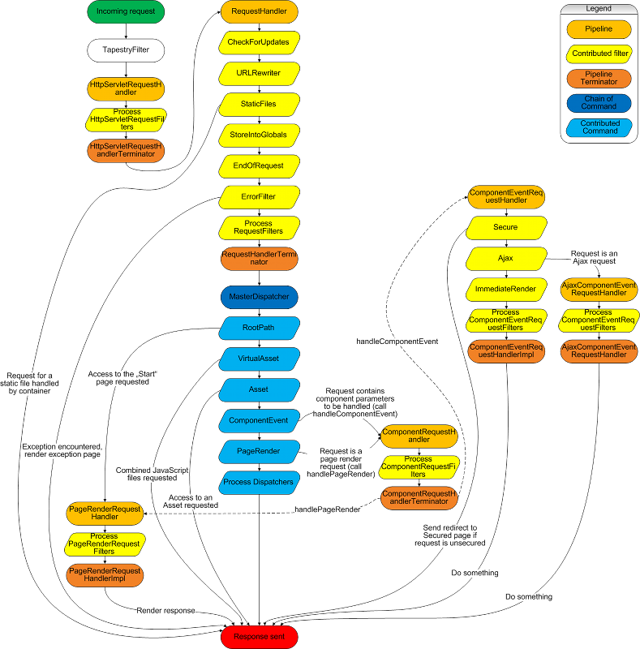

**Error rendering macro 'scrollbar'**

com/opensymphony/webwork/ServletActionContext

---

<a id="component-rendering"></a>

<!-- source_url: https://tapestry.apache.org/component-rendering.html -->

<!-- page_index: 31 -->

# Component Rendering

[Apache Tapestry](#index) > [Documentation](#documentation) > [User Guide](#user-guide) > [Component Rendering](#component-rendering)

<a id="component-rendering--title"></a>
<a id="component-rendering--component-rendering"></a>

# Component Rendering

**Rendering of components** in Tapestry 5 is based on a *state machine* and a *queue* (instead of the tail recursion used in Tapestry 4). This breaks the rendering process up into tiny pieces that can easily be implemented or overridden. Don't worry, in practice, writing components requires a breathtakingly small amount of code.

<a id="component-rendering--related-articles"></a>

### Related Articles

- Page:

  [Content Type and Markup](#content-type-and-markup)
- Page:

  [Page Navigation](#page-navigation)
- Page:

  [Request Processing](#request-processing)
- Page:

  [Component Events](#component-events)
- Page:

  [REST Support (5.8.0+)](#rest-support-580)
- Page:

  [Component Rendering](#component-rendering)
- Page:

  [Page Life Cycle](#page-life-cycle)
- Page:

  [Component Events FAQ](#component-events-faq)

<a id="component-rendering--componentrendering-renderingphases"></a>
<a id="component-rendering--rendering-phases"></a>

## Rendering Phases

The rendering of each component is divided into a number of phases, illustrated below.

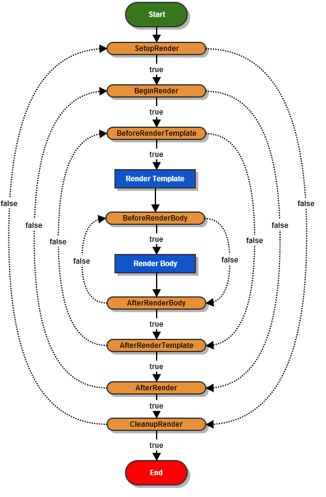Each of the orange phases (SetupRender, BeginRender, BeforeRenderBody, etc.) corresponds to an annotation you may place on one or more methods of your class. The annotation directs Tapestry to invoke your method as part of that phase.

Methods marked with these annotations are called **render phase methods**.

Your methods may be void, or return a boolean value. Returning a value can force phases to be skipped, or even be re-visited. In the diagram, solid lines show the normal processing path. Dashed lines are alternate flows that are triggered when your render phase methods return false instead of true (or void).

Render phase methods may take no parameters, or may take a parameter of type [MarkupWriter](#dom). The methods can have any visibility you like ... typically, package private is used, as this visibility makes it possible to unit test your code (from within the same Java package) without making the methods part of the component's *public* API.

All Render phase methods are *optional*; a default behavior is associated with each phase.

| Annotation | Method Name | When Called |
| --- | --- | --- |
| **[@SetupRender](http://tapestry.apache.org/current/apidocs/org/apache/tapestry5/annotations/SetupRender.html)** | setupRender() | When initial setup actions, if any, are needed |
| **[@BeginRender](http://tapestry.apache.org/current/apidocs/org/apache/tapestry5/annotations/BeginRender)** | beginRender() | When Tapestry is ready for the component's start tag, if any, to be rendered |
| [@BeforeRenderTemplate](http://tapestry.apache.org/current/apidocs/org/apache/tapestry5/annotations/BeforeRenderTemplate) | beforeRenderTemplate() | Before Tapestry renders the component's template, if any |
| [@BeforeRenderBody](http://tapestry.apache.org/current/apidocs/org/apache/tapestry5/annotations/BeforeRenderBody) | beforeRenderBody() | Before Tapestry renders the body of the component, if any |
| [@AfterRenderBody](http://tapestry.apache.org/current/apidocs/org/apache/tapestry5/annotations/AfterRenderBody) | afterRenderBody() | After Tapestry renders the body of the component, if any, but before the rest of the component's template is rendered |
| [@AfterRenderTemplate](http://tapestry.apache.org/current/apidocs/org/apache/tapestry5/annotations/AfterRenderTemplate) | afterRenderTemplate() | After Tapestry finishes rendering the component's template, if any |
| **[@AfterRender](http://tapestry.apache.org/current/apidocs/org/apache/tapestry5/annotations/AfterRender)** | afterRender() | After Tapestry has finished rendering both the template and body of the component |
| **[@CleanupRender](http://tapestry.apache.org/current/apidocs/org/apache/tapestry5/annotations/CleanupRender)** | cleanupRender() | When final cleanup actions, if any, are needed |

The large number of phases reflects the need for precise control of components from [component mixins](#component-mixins). Several of the phases exist almost exclusively for mixins.

Generally, your code will use the SetupRender, BeginRender, AfterRender and CleanupRender phases ... often just one or two of those.

<a id="component-rendering--componentrendering-anexample"></a>
<a id="component-rendering--an-example"></a>

## An Example

Here's the source for a looping component that counts up or down between two values, renders its body a number of times, and stores the current index value in a parameter:

```java
package org.example.app.components;
import org.apache.tapestry5.annotations.Parameter; import org.apache.tapestry5.annotations.AfterRender; import org.apache.tapestry5.annotations.SetupRender;
public class Count {@Parameter private int start = 1;
@Parameter(required = true) private int end;
@Parameter private int value;
private boolean increment;
@SetupRender void initializeValue() {value = start;
increment = start < end;}
@AfterRender boolean next() {if (increment) {int newValue = value + 1;
if (newValue <= end) {value = newValue; return false;}} else {int newValue = value - 1;
if (newValue >= end) {value = newValue; return false;}}
return true;}}
```

Returning false from next() causes Tapestry to re-run the BeginRender phase, and from there, re-render the component's body (this component does not have a template). Returning true transitions to the CleanupRender phase.

Notice how Tapestry adapts to your methods, as marked with the annotations. It also adapts in terms of parameters; the two annotated methods here did not perform any output, so they did not need a MarkupWriter.

What's really mind blowing is that the template and body of a component will often contain ... more components! That means that many different components will be in different phases of their own state machine.

<a id="component-rendering--componentrendering-renderphasesindetail"></a>
<a id="component-rendering--render-phases-in-detail"></a>

## Render Phases in Detail

The SetupRender phase, like all render phases, occurs once for each rendering of the component. If the component is inside a looping component ([Loop](http://tapestry.apache.org/current/apidocs/org/apache/tapestry5/corelib/components/Loop.html), [Grid](http://tapestry.apache.org/current/apidocs/org/apache/tapestry5/corelib/components/Grid.html), etc.), then the SetupRender method will be called once for *each* iteration of the loop.

<a id="component-rendering--componentrendering-setuprender"></a>
<a id="component-rendering--setuprender"></a>

### SetupRender

The SetupRender phase (see @[SetupRender](http://tapestry.apache.org/current/apidocs/org/apache/tapestry5/annotations/SetupRender.html)) is where you can perform any one-time per-render setup for your component. This is a good place to read component parameters and use them to set temporary instance variables.

<a id="component-rendering--componentrendering-beginrender"></a>
<a id="component-rendering--beginrender"></a>

### BeginRender

The BeginRender phase (see @[BeginRender](http://tapestry.apache.org/current/apidocs/org/apache/tapestry5/annotations/BeginRender.html)) occurs at the start of the rendering of the component. For components that render a tag, the start tag should be rendered here (the close tag should be rendered inside the AfterRender phase). The component can also prevent the template and/or body from being rendered by returning false.

Components may or may not have a template. If a component has a template, and the template includes a <body> element, then the BeforeRenderBody phase will be triggered (giving the component the option of rendering its body or not).

If a component does not have a <body> element in its template, then the BeforeRenderBody phase is not triggered.

If a component does not have a template, but does have a body, the BeforeRenderBody phase is still triggered.

If no methods are annotated with BeginRender, then no special output occurs during this phase, but the template (if present) or body (if no template is present, but the component has a body) will be rendered.

<a id="component-rendering--componentrendering-beforerendertemplate"></a>
<a id="component-rendering--beforerendertemplate"></a>

### BeforeRenderTemplate

The BeforeRenderTemplate phase (see @[BeforeRenderTemplate](http://tapestry.apache.org/current/apidocs/org/apache/tapestry5/annotations/BeforeRenderTemplate.html)) exists to allow a component to decorate its template (creating markup around the template generated markup), or to allow a component to skip its template.

<a id="component-rendering--componentrendering-beforerenderbody"></a>
<a id="component-rendering--beforerenderbody"></a>

### BeforeRenderBody

The BeforeRenderBody phase (see @[BeforeRenderBody](http://tapestry.apache.org/current/apidocs/org/apache/tapestry5/annotations/BeforeRenderBody.html)) is associated with a component's body (the portion of its container's template that the component occupies). The BeforeRenderBody phase allows the component the ability to skip the body, while still rendering the rest of the component's template (if any).

If no methods are annotated with BeforeRenderBody, then the body will be rendered by default. Again, this occurs when the <body> element of the component's template is reached, or automatically if the component has no template (but the component does have a body).

<a id="component-rendering--componentrendering-afterrenderbody"></a>
<a id="component-rendering--afterrenderbody"></a>

### AfterRenderBody

The AfterRenderBody phase (see @[AfterRenderBody](http://tapestry.apache.org/current/apidocs/org/apache/tapestry5/annotations/AfterRenderBody.html)) is executed after the body is rendered; this only occurs for components with a body.

<a id="component-rendering--componentrendering-afterrender"></a>
<a id="component-rendering--afterrender"></a>

### AfterRender

The AfterRender phase (see @[AfterRender](http://tapestry.apache.org/current/apidocs/org/apache/tapestry5/annotations/AfterRender.html)) complements BeginRender, and is often used to render the close tag that matches the start tag rendered in the BeginRender phase. In any case, the AfterRender phase can continue on to CleanupRender, or revert back to BeginRender (as in our Count component example, above).

If no methods are annotated with AfterRender, then no special output occurs, and the CleanupRender phase is triggered.

<a id="component-rendering--componentrendering-cleanuprender"></a>
<a id="component-rendering--cleanuprender"></a>

### CleanupRender

The CleanupRender phase (see @[CleanupRender](http://tapestry.apache.org/current/apidocs/org/apache/tapestry5/annotations/CleanupRender.html)) is the counterpart to SetupRender, allowing final cleanup to occur.

<a id="component-rendering--componentrendering-usingmethodnamesinsteadofannotations"></a>
<a id="component-rendering--using-method-names-instead-of-annotations"></a>

## Using Method Names instead of Annotations

If you prefer to avoid using annotations on your methods, you may do so by providing specific names for your methods. The required method name is the annotation name, with the first character decapitalized: setupRender(), beginRender(), etc. As with annotated render phase methods, Tapestry is flexible about visibility, return type and parameters.

Using this mechanism, the earlier example can be rewritten as:

```java
package org.example.app.components;
import org.apache.tapestry5.annotations.Parameter;
public class Count {@Parameter private int start = 1;
@Parameter(required = true) private int end;
@Parameter private int value;
private boolean increment;
void setupRender() {value = start;
increment = start < end;}
boolean afterRender() {if (increment) {int newValue = value + 1;
if (newValue <= end) {value = newValue; return false;}} else {int newValue = value - 1;
if (newValue >= end) {value = newValue; return false;}}
return true;}}
```

This style is a trade off: on the gain side, the code is *even* simpler and shorter, and the method names will, by design, be more consistent from one class to the next. The down side is that the names are very generic, and may in some cases, be less descriptive than using annotated methods (`initializeValue()` and `next()` are, to some eyes, more descriptive).

You can, of course, mix and match, using specifically named render phase methods in some cases, and annotated render phase methods in other cases.

<a id="component-rendering--componentrendering-renderingcomponents"></a>
<a id="component-rendering--rendering-components"></a>

## Rendering Components

Instead of returning true or false, a render phase method may return a component. The component may have been injected via the @[Component](http://tapestry.apache.org/current/apidocs/org/apache/tapestry5/annotations/Component.html) annotation, or may have been passed to the owning component as a parameter.

In any case, returning a component will queue that component to be rendered **before** the active component continues rendering.

The component to render may even be from a completely different page of the application.

Recursive rendering of components is not allowed.

This technique allows the rendering of Tapestry pages to be *highly* dynamic.

Returning a component instance does **not** short circuit method invocation (as described below), the way returning a boolean would. It is possible that multiple methods may return components (this is not advised – insanity may ensue).

<a id="component-rendering--componentrendering-additionalreturntypes"></a>
<a id="component-rendering--additional-return-types"></a>

## Additional Return Types

Render phase methods may also return [Blocks](http://tapestry.apache.org/current/apidocs/org/apache/tapestry5/Block.html), [Renderables](http://tapestry.apache.org/current/apidocs/org/apache/tapestry5/Renderable.html) or [RenderCommands](http://tapestry.apache.org/current/apidocs/org/apache/tapestry5/runtime/RenderCommand.html).

The following component returns a Renderable in the BeginRender phase and skips the BeforeRenderTemplate phase:

```java
public class OutputValueComponent {@Parameter private String value;
Object beginRender() {return new Renderable() {public void render(MarkupWriter writer) {writer.write(value);} };}}
```

<a id="component-rendering--componentrendering-shortcircuiting"></a>
<a id="component-rendering--short-circuiting"></a>

## Short Circuiting

If a method returns a true or false value, this will short circuit processing. Other methods within the phase that would ordinarily be invoked will not be invoked.

Most render phase methods should return void, to avoid unintentionally short circuiting other methods for the same phase.

<a id="component-rendering--componentrendering-methodconflictsandordering"></a>
<a id="component-rendering--method-conflicts-and-ordering"></a>

## Method Conflicts and Ordering

It is possible to have multiple methods that are annotated with the same render phase annotation. This may include methods in the same class, or a mix of method defined in a class and inherited from other classes.

<a id="component-rendering--componentrendering-mixinsbeforecomponent"></a>
<a id="component-rendering--mixins-before-component"></a>

### Mixins Before Component

When a component has [mixins](#component-mixins), then the mixins' render phase methods execute *before* the component's render phase methods. If a mixin extends from a base class, the mixin's parent class methods execute before the mixin subclass' render phase methods.

Exception: Mixins whose class is annotated with @[MixinAfter](http://tapestry.apache.org/current/apidocs/org/apache/tapestry5/annotations/MixinAfter.html) are ordered *after* the component, not before.

The order in which the mixins of a given class (@MixinAfter or mixins before) execute is determined by the ordering constraints specified for the mixins. If no constraints are provided, the order is undefined. See [Component Mixins](#component-mixins) for more details.

<a id="component-rendering--componentrendering-parentsbeforechild"></a>
<a id="component-rendering--parents-before-child"></a>

### Parents before Child

Ordering is always parent-first. Methods defined in the parent class are always invoked before methods defined in the child class.

When a sub-class overrides an render phase method of a base class, the method is only invoked once, along with any other base class methods. The subclass can change the *implementation* of the base class method via an override, but can't change the *timing* of when that method is invoked. See [TAPESTRY-2311](https://issues.apache.org/jira/browse/TAPESTRY-2311).

<a id="component-rendering--componentrendering-reverseorderingforafterxxxandcleanuprender"></a>
<a id="component-rendering--reverse-ordering-for-afterxxx-and-cleanuprender"></a>

### Reverse Ordering for AfterXXX and CleanupRender

The After\_XXX\_ phases exists to balance the Begin\_XXX\_ and Before\_XXX\_ phases. Often elements will be started inside an earlier phase and then the elements will be ended (closed) inside the corresponding After\_XXX\_ phase (with the body and template of the component rendering between).

In order to ensure that operations occur in the correct, and natural order, the render phase methods for these two stages are invoked in *reverse order*:

- Subclass methods
- Parent class methods
- Mixin subclass methods
- Mixin parent class methods

<a id="component-rendering--componentrendering-withinasingleclass"></a>
<a id="component-rendering--within-a-single-class"></a>

### Within a Single Class

Currently, rendering methods having the same annotation within a single class are executed in alphabetical order by method name. Methods with the same name are ordered by number of parameters. Even so, annotating multiple methods with the same rendering phase is not a great idea. Instead, just define one method, and have it call the other methods in the order you desire.

<a id="component-rendering--componentrendering-renderingcomments"></a>
<a id="component-rendering--rendering-comments"></a>

## Rendering Comments

Starting with version 5.3, Tapestry can optionally emit rendering comments for all requests; these are comments such as <!--BEGIN Index:loop (context:Index.tml, line 15)--> that can assist you in debugging markup output on the client-side. This will significantly increase the size of the rendered markup, but can be very helpful with complex layouts to determine which component was responsible for which portion of the rendered page.

Rendering comments are only available when not running in [production mode](#configuration).

To turn on rendering comments for all requests, set the [tapestry.component-render-tracing-enabled](#configuration) configuration symbol to "true".

To turn on rendering comments only for a particular request, add the query parameter `t:component-trace=true` to the URL:

```java
  http://www.example.com/myapp/mypage?t:component-trace=true
```

**Error rendering macro 'scrollbar'**

com/opensymphony/webwork/ServletActionContext

---

<a id="component-events"></a>

<!-- source_url: https://tapestry.apache.org/component-events.html -->

<!-- page_index: 32 -->

# Component Events

[Apache Tapestry](#index) > [Documentation](#documentation) > [User Guide](#user-guide) > [Component Events](#component-events)

<a id="component-events--title"></a>
<a id="component-events--component-events"></a>

# Component Events

**Component events** are Tapestry's way of conveying a user's interactions with the web page, such as clicking links and submitting forms, to designated methods in your page and component classes. When a component event is triggered, Tapestry calls the event handler method you've provided, if any, in the containing component's class.

<a id="component-events--related-articles"></a>

### Related Articles

- Page:

  [Page Navigation](#page-navigation)
- Page:

  [Request Processing](#request-processing)
- Page:

  [Component Events](#component-events)
- Page:

  [REST Support (5.8.0+)](#rest-support-580)
- Page:

  [Component Rendering](#component-rendering)
- Page:

  [Page Life Cycle](#page-life-cycle)
- Page:

  [Component Events FAQ](#component-events-faq)

Let's look at a simple example. Here's a portion of the template for a page (let's call it "Review") that lists documents and lets a user click to edit any one of them.

**Review.tml (partial)**

```xml
<p> Select document to edit: </p>
<t:loop source="documents" value="document">
    <div>
        <t:actionlink" t:id="edit" context="document.id"> ${document.name} </t:actionlink>       
    </div>
</t:loop>
```

Notice that Review.tml contains an ActionLink component in a loop. For each rendering within the loop, the ActionLink component creates a component event request URL, with the event type set to "action". In this case, each URL might look like:

`http://localhost:8080/review.edit/3`

This URL identifies the **page** that contains the component ("review"), the **Component id** of the component within the page ("edit"), and the **context** value ("3", the "id" property of the document). *Additional context values, if any, are appended to the path.* (The URL may also contain the **event name**, unless, as here, it is "action".)

There's no direct mapping from URL to a piece of code. Instead, when the user clicks on the link, the ActionLink component triggers events. And then Tapestry ensures that the correct bits of code (your event handler method, see below) get invoked for those events.

This demonstrates a critical difference between Tapestry and a more traditional, action oriented framework. The URL doesn't say what happens when the link is clicked, it identifies *which component is responsible* when the link is clicked.

Often, a navigation request (originating with the user) will spawn a number of flow-of-control requests. For example, a form component may trigger an action event, which will then trigger notification events to announce when the form submission is about to be processed, and whether it was successful or not, and those event could be further handled by the page component.

<a id="component-events--componentevents-eventhandlermethods"></a>
<a id="component-events--event-handler-methods"></a>

# Event Handler Methods

When a component event occurs, Tapestry invokes any event handler methods that you have identified for that event. You can identify your event handler methods via a naming convention (see Method Naming Convention below), or via the @[OnEvent](http://tapestry.apache.org/current/apidocs/org/apache/tapestry5/annotations/OnEvent.html) annotation.

```java
@OnEvent(component="edit")
void editDocument(int docId)
{
    this.selectedId = docId;
    // do something with the document here
}
```

Tapestry does two things here:

- Because of the annotation, it identifies method editDocument() as the method to invoke whenever the component whose ID is "edit" triggers an event.
- Because there is a method parameter, when the link is clicked the context value of the request is converted from a string to an integer and passed in as the method's value parameter.

**Added in 5.3**

Starting in release 5.3, Tapestry will throw an exception if the component identified for the event handler method doesn't exist in the containing component's template. This helps prevent typos. However, this behavior can be overridden using the @DisableStrictChecks annotation (added in release 5.6.2).

In the above example, the editDocument() method will be invoked when any event occurs in in the "edit" component (and has at least one context value).

For some components, more than one type of event can occur, in which case you will want to be more specific:

```java
@OnEvent(value="action", component="edit")
void editDocument(int docId)
{
    this.selectedId = docId;
    // do something with the document here
}
```

For the OnEvent annotation, the *`value`* attribute identifies the name of the event to match. We specified "action" because the ActionLink component triggers the "action" event, as noted in the Component Events section of its [javadocs](http://tapestry.apache.org/current/apidocs/org/apache/tapestry5/corelib/components/ActionLink.html).

Alternatively, we can use the EventLink component, in which case the name of the event is determined by us – either through the "event" parameter or the element's ID:

**An EventLink that emits the "delete" event**

```xml
<t:eventlink event="delete" context="document.id"> ${document.name} </t:eventlink>
```

which is equivalent to:

**An EventLink that emits the "delete" event**

```xml
<a t:type="eventlink" t:id="delete" context="document.id"> ${document.name} </a>
```

Note that if you omit the `component` part of the OnEvent annotation, then you'll receive notifications from *all* contained components, possibly including nested components (due to event bubbling).

You should usually specify exactly which component(s) you wish to receive events from. Using @OnEvent on a method and not specifying a specific component ID means that the method will be invoked for events from *any* component.

To support testing, it's a common practice to give event handler methods *package-private* visibility, as in the examples on this page, although technically they may have any visibility (even private).

A single event handler method may receive notifications from many different components.

As elsewhere, the comparison of event type and component ID is case-insensitive.

<a id="component-events--componentevents-methodnamingconvention"></a>
<a id="component-events--method-naming-convention"></a>

## Method Naming Convention

As an alternative to the use of annotations, you may name your event handling methods following a certain convention, and Tapestry will find and invoke your methods just as if they were annotated.

This style of event handler methods start with the prefix "on", followed by the name of the event. You may then continue by adding "From" and a capitalized component id (remember that Tapestry is case insensitive about event names and component IDs). So, for example, a method named onValidateFromSave() will be invoked whenever a "Validate" event is triggered by a component whose component ID is "save".

The previous example may be rewritten as:

```java
void onActionFromEdit(int docId)
{
    this.selectedId = docId;
    // do something with the document here
}
```

Many people prefer the naming convention approach, reserving the annotation just for situations that don't otherwise fit.

<a id="component-events--componentevents-methodreturnvalues"></a>
<a id="component-events--method-return-values"></a>

## Method Return Values

Main Article: [Page Navigation](#page-navigation)

For page navigation events (originating in components such as EventLink, ActionLink and Form), the value returned from an event handler method determines how Tapestry will render a response.

- **Null**: For no value, or null, the current page (the page containing the component) will render the response.
- **Page**: For the name of a page, or a page class or page instance, a render request URL will be constructed and sent to the client as a redirect to that page.
- **URL**: For a `java.net.URL`, a redirect will be sent to the client. (In Tapestry 5.3.x and earlier, this only works for non-Ajax requests.)
- **Zone body**: In the case of an Ajax request to update a zone, the component event handler will return the new zone body, typically via an injected component or block.
- **HttpError**: For an [HttpError](http://tapestry.apache.org/current/apidocs/org/apache/tapestry5/services/HttpError.html), an error response is sent to the client.
- **Link**: For a [Link](http://tapestry.apache.org/current/apidocs/org/apache/tapestry5/Link.html), a redirect is sent to the client.
- **Stream**: For a [StreamResponse](http://tapestry.apache.org/current/apidocs/org/apache/tapestry5/StreamResponse.html), a stream of data is sent to the client
- **boolean:** *true* prevents the event from bubbling up further; *false* lets it bubble up. See Event Bubbling, below.

See [Page Navigation](#page-navigation) for more details.

<a id="component-events--componentevents-multiplemethodmatches"></a>
<a id="component-events--multiple-method-matches"></a>

## Multiple Method Matches

In some cases, there may be multiple event handler methods matching a single event. In that case, Tapestry invokes them in the following order:

- Base class methods before sub-class methods.
- Matching methods within a class in alphabetical order.
- For a single method name with multiple overrides, by number of parameters, descending.

Of course, ordinarily would you *not* want to create more than one method to handle an event.

When a sub-class overrides an event handler method of a base class, the event handler method is only invoked once, along with any other base class methods. The subclass can change the *implementation* of the base class method via an override, but can't change the *timing* of when that method is invoked. See [issue TAP5-51](https://issues.apache.org/jira/browse/TAP5-51).

<a id="component-events--componentevents-eventcontext"></a>
<a id="component-events--event-context"></a>

## Event Context

The context values (the context parameter to the EventLink or ActionLink component) can be any object. However, only a simple conversion to string occurs. (This is in contrast to Tapestry 4, which had an elaborate type mechanism with the odd name "DataSqueezer".)

Again, whatever your value is (string, number, date), it is converted into a plain string. This results in a more readable URL.

If you have multiple context values (by binding a list or array of objects to the *context* parameter of the EventLink or ActionLink), then each one, in order, will be added to the URL.

When an event handler method is invoked, the strings are converted back into values, or even objects. A [ValueEncoder](http://tapestry.apache.org/current/apidocs/org/apache/tapestry5/ValueEncoder.html) is used to convert between client-side strings and server-side objects. The [ValueEncoderSource](http://tapestry.apache.org/current/apidocs/org/apache/tapestry5/services/ValueEncoderSource.html) service provides the necessary value encoders.

As shown in the example above, most of the parameters passed to the event handler method are derived from the values provided in the event context. Each successive method parameter matches against a value provided in the event context (the context parameter of the ActionLink component; though many components have a similar context parameter).

In many cases it is helpful to have direct access to the context (for example, to adapt to cases where there are a variable number of context values). The context values may be passed to an event handler method as parameter of the following types:

- [EventContext](http://tapestry.apache.org/current/apidocs/org/apache/tapestry5/EventContext.html)
- Object[]
- List<Object>

The latter two should be avoided, they may be removed in a future release. In all of these cases, the EventContext parameter acts as a freebie; it doesn't match against a context value as it represents *all* context values.

```java
Object onActionFromEdit(EventContext context) {if (context.getCount() > 0) {this.selectedId = context.get(0); // do something with the document here } else {alertManager.warn("Please select a document."); return null;}}
```

<a id="component-events--componentevents-accessingrequestqueryparameters"></a>
<a id="component-events--accessing-request-query-parameters"></a>

## Accessing Request Query Parameters

A parameter may be annotated with the @RequestParameter annotation; this allows query parameters (?name1=value1&name2=value2, etc) to be extracted from the request, converted to the correct type, and passed to the method. Again, this doesn't count against the event context values.

See the example in the [Link Components FAQ](#link-components-faq).

<a id="component-events--componentevents-methodmatching"></a>
<a id="component-events--method-matching"></a>

## Method Matching

An event handler method will only be invoked *if the context contains at least as many values as the method has parameters*. Methods with too many parameters will be silently skipped.

Tapestry will silently skip over a method if there are insufficient values in the context to satisfy the number of parameters requested.

EventContext parameters, and parameters annotated with @RequestParameter, do not count against this limit.

<a id="component-events--componentevents-methodordering"></a>
<a id="component-events--method-ordering"></a>

## Method Ordering

When multiple methods match within the same class, Tapestry will invoke them in ascending alphabetical order. When there are multiple overrides of the same method name, Tapestry invokes them in descending order by number of parameters. In general, these situations don't happen ... in most cases, only a single method is required to handle a specific event form a specific component.

An event handler method may return the value `true` to indicate that the event has been handled; this immediately stops the search for additional methods in the same class (or in base classes) or in containing components.

<a id="component-events--componentevents-eventbubbling"></a>
<a id="component-events--event-bubbling"></a>

# Event Bubbling

The event will bubble up the component hierarchy, first to the containing component, then *that* component's containing component or page, and so on, until it is *aborted* by an event handler method returning *true* or a non-null value.

Returning a boolean value from an event handler method is special. Returning *true* will abort the event with no result; use this when the event is fully handled without a return value and no further event handlers (in the same component, or in containing components) should be invoked.

Returning *false* is the same as returning null; event processing will continue to look for more event handlers, in the same component or its parent.

When an event bubbles up from a component to its container, the origin of the event is changed to be the component. For example, a Form component inside a BeanEditForm component may trigger a success event. The page containing the BeanEditForm may listen for that event, but it will be from the BeanEditForm component (which makes sense, because the id of the Form inside the BeanEditForm is part of the BeanEditForm's implementation, not its public interface).

If you want to handle events that have bubbled up from nested component, you'll soon find that you don't have easy access to the component ID of the firing component. In practical terms this means that you'll want to trigger custom events for the events triggered by those nested components (see Triggering Events, below), and use that custom event name in your event handler method.

<a id="component-events--componentevents-eventmethodexceptions"></a>
<a id="component-events--event-method-exceptions"></a>

# Event Method Exceptions

Event methods are allowed to throw any exception (not just runtime exceptions). If an event method does throw an exception, Tapestry will catch the thrown exception and ultimately display the exception report page.

In other words, there's no need to do this:

```java
void onActionFromRunQuery() {try {dao.executeQuery();} catch (JDBCException ex) {throw new RuntimeException(ex);}}
```

Instead, you may simply say:

```java
  void onActionFromRunQuery() throws JDBCException
  {
    dao.executeQuery();
  }
```

Your event handler method may even declare that it "throws Exception" if that is more convenient.

<a id="component-events--componentevents-interceptingeventexceptions"></a>
<a id="component-events--intercepting-event-exceptions"></a>

# Intercepting Event Exceptions

When an event handler method throws an exception (checked or runtime), Tapestry gives the component and its containing page a chance to handle the exception, before continuing on to report the exception.

**JumpStart Demo**

[Handling A Bad Context](http://jumpstart.doublenegative.com.au/jumpstart/examples/infrastructure/handlingabadcontext/1)

Tapestry triggers a new event, of type "exception", passing the thrown exception as the context. In fact, the exception is wrapped inside a [ComponentEventException](http://tapestry.apache.org/current/apidocs/org/apache/tapestry5/runtime/ComponentEventException.html), from which you may extract the event type and context.

Thus:

```java
  Object onException(Throwable cause)
  {
    message = cause.getMessage();

    return this;
  }
```

The return value of the exception event handler *replaces* the return value of original event handler method. For the typical case (an exception thrown by an "activate" or "action" event), this will be a [navigational response](#page-navigation) such as a page instance or page name.

This can be handy for handling cases where the data in the URL is incorrectly formatted.

In the above example, the navigational response is the page itself.

If there is no exception event handler, or the exception event handler returns null (or is void), then the exception will be passed to the [RequestExceptionHandler](http://tapestry.apache.org/current/apidocs/org/apache/tapestry5/services/RequestExceptionHandler.html) service, which (in the default configuration) will render the exception page.

<a id="component-events--componentevents-triggeringevents"></a>
<a id="component-events--triggering-events"></a>

# Triggering Events

**JumpStart Demo**

[AJAX Components CRUD](http://jumpstart.doublenegative.com.au/jumpstart/together/ajaxcomponentscrud/persons)

If you want your own component to trigger events, just call the `triggerEvent` method of [ComponentResources](http://tapestry.apache.org/current/apidocs/org/apache/tapestry5/ComponentResources.html) from within your component class.

For example, the following triggers an "updateAll" event. A containing component can then respond to it, if desired, with an "onUpdateAll()" method in its own component class.

**Your component class (partial)**

```java
@Inject ComponentResources componentResources; ...private void timeToUpdate() {boolean wasHandled = componentResources.triggerEvent("updateAll", null, null); if (wasHandled) {...}}
```

The third parameter to triggerEvent is a ComponentEventCallback, which you'll only need to implement if you want to get the return value of the handler method. The return value of triggerEvent() says if the event was handled or not.

**Error rendering macro 'scrollbar'**

com/opensymphony/webwork/ServletActionContext

---

<a id="url-rewriting"></a>

<!-- source_url: https://tapestry.apache.org/url-rewriting.html -->

<!-- page_index: 33 -->

# URL rewriting

[Apache Tapestry](#index) > [Documentation](#documentation) > [User Guide](#user-guide) > [URL rewriting](#url-rewriting)

<a id="url-rewriting--title"></a>
<a id="url-rewriting--url-rewriting"></a>

# URL rewriting

<a id="url-rewriting--urlrewriting-tapestryurlrewritingsupport"></a>
<a id="url-rewriting--tapestry-url-rewriting-support"></a>

# Tapestry URL Rewriting Support

Starting with Tapestry 5.2, the URLRewriterRule service has been replaced with the new LinkTransformer service. This page needs to be revised to reflect the new API. Meanwhile, please see Igor Drobiazko's [excellent blog post on this topic](https://web.archive.org/web/20150906154302/http://blog.tapestry5.de/index.php/2010/09/06/new-url-rewriting-api/).

Since 5.1.0.1, Tapestry has basic support for URL rewriting. Incoming requests and links generated by Tapestry can be rewritten using exactly the same API, based on a chain of [URLRewriterRule](http://tapestry.apache.org/current/apidocs/org/apache/tapestry5/urlrewriter/URLRewriterRule.html) interfaces. These rules are executed before all other Tapestry request handling, so your application does not otherwise know that the received request is not the original one.

Each URL rewriter rule, in its `Request process`, can choose between returning another `Request`, effectively rewriting it, or returning the received request unchanged, meaning that this rule does not apply to that request.

To facilitate `Request` creation, Tapestry provides the `SimpleRequestWrapper` class. It wraps a `Request`, delegating all methods except `getPath()` and `getServerName()`. More request wrappers may be added in the future on demand.

<a id="url-rewriting--urlrewriting-configuration"></a>
<a id="url-rewriting--configuration"></a>

## Configuration

Tapestry's URL rewriting support is configured by Tapestry-IoC through contribution of a `URLRewriterRule` to the `URLRewriter` service. The following example is part of the Tapestry's tests.

<a id="url-rewriting--urlrewriting-simpleexampleofrulechaining"></a>
<a id="url-rewriting--simple-example-of-rule-chaining"></a>

## Simple example of rule chaining

This example just rewrites all incoming requests to `/struts` to `/tapestry`. In your `AppModule` or any other Tapestry-IoC module class:

```java
public static void contributeURLRewriter(OrderedConfiguration<URLRewriterRule> configuration) {
URLRewriterRule rule = new URLRewriterRule() {
public Request process(Request request, URLRewriteContext context) {final String path = request.getPath(); if (path.equals("/struts")) {request = new SimpleRequestWrapper(request, "/tapestry");}
return request;
}
public RewriteRuleApplicability applicability() {return RewriteRuleApplicability.INBOUND;}
};
configuration.add("myrule", rule);}
```

<a id="url-rewriting--urlrewriting-exampleofrulechaining"></a>
<a id="url-rewriting--example-of-rule-chaining"></a>

## Example of rule chaining

In your `AppModule` or any other Tapestry-IoC module class.

```java
public static void contributeURLRewriter(OrderedConfiguration<URLRewriterRule> configuration) {
URLRewriterRule rule1 = new URLRewriterRule() {
public Request process(Request request, URLRewriteContext context) {final String path = request.getPath(); if (path.equals("/struts")) {request = new SimpleRequestWrapper(request, "/jsf");}
return request;
}
public RewriteRuleApplicability applicability() {return RewriteRuleApplicability.INBOUND;}
};
URLRewriterRule rule2 = new URLRewriterRule() {
public Request process(Request request, URLRewriteContext context) {final String path = request.getPath(); if (path.equals("/jsf")) {request = new SimpleRequestWrapper(request, "/tapestry");} return request;
}
public RewriteRuleApplicability applicability() {return RewriteRuleApplicability.INBOUND;}
};
URLRewriterRule rule3 = new URLRewriterRule() {
public Request process(Request request, URLRewriteContext context) {String path = request.getPath(); if (path.equals("/tapestry")) {path = "/urlrewritesuccess"; request = new SimpleRequestWrapper(request, path);} return request;
}
public RewriteRuleApplicability applicability() {return RewriteRuleApplicability.INBOUND;}
};
URLRewriterRule rule4 = new URLRewriterRule() {
public Request process(Request request, URLRewriteContext context) {String serverName = request.getServerName(); String path = request.getPath(); final String pathToRewrite = "/urlrewritesuccess/login"; if (serverName.equals("localhost") && path.equalsIgnoreCase(pathToRewrite)) {request = new SimpleRequestWrapper(request, "http://login.domain.com", "/");} return request;
}
public RewriteRuleApplicability applicability() {return RewriteRuleApplicability.OUTBOUND;}
};
configuration.add("rule1", rule1); configuration.add("rule2", rule2, "after:rule1"); configuration.add("rule3", rule3, "after:rule2"); configuration.add("rule4", rule4);
}
```

This examples shows the URL rewriting chaining: the first rule rewrites requests to `/struts` and rewrites them to `/jsf` and leaves requests to other URLs unchanged. The second rewrites `/jsf` to `/tapestry` and the third rewrites `/tapestry` to `/urlrewritesuccess`.

The result is that any request to `/struts` end up being handled by the same class that handles `/urlrewritesuccess`, while the browser, the user and Tapestry still sees `/struts`.

Note that this applies to rewriting links generated by Tapestry too: a `PageLink` to the `urlrewritesuccess` page with an activation context of `login` (path `/urlrewritesuccess/login`) will generate an `a` tag pointing to `http://login.domain.com`.

The URLRewriteContext (added in 5.1.0.4) provides additional information for rewriting, particularly in the context of rewriting generated link urls. In the following example, we'll reconfigure the url used to render pages. Whereas the previous examples used separate rules for handling inbound and outbound rewriting, this demonstration will utilize a single rule for both scenarios. To simplify the example, we will assume that every page is named "XXXPage" (UserPage, TransactionPage, IndexPage, etc.). This naming convention also means that we don't have to worry about tapestry's auto-stripping of "index" from URLs, because our page would be IndexPage, rather than Index.

```java
public static void contributeURLRewriter(OrderedConfiguration<URLRewriterRule> configuration) {URLRewriterRule rule = new URLRewriterRule() {public Request process(Request request, URLRewriteContext context) {if (context.isIncoming()) {//these look like component event requests, which we didn't rewrite, so ignore.if (request.getPath().contains(".") || request.getPath().contains(":")) {return request;} String pageName = request.getPath().substring(1,request.getPath().indexOf('/',1)); return new SimpleRequestWrapper(request, request.getPath().replaceAll(pageName,pageName + "page"));} else {//if this is a component event, getPageParameters() will return null.if (context.getPageParameters() != null) {String path = request.getPath(); String pageName = context.getPageParameters().getLogicalPageName().toLowerCase(); String newPageName = pageName.replaceAll("page$",""); return new SimpleRequestWrapper(request,path.replaceAll(pageName,newPageName));}} return request;}
public RewriteRuleApplicability applicability() {return RewriteRuleApplicability.BOTH;} };
configuration.add("rule1",rule);
}
```

In the first part of `process`, `context.isIncoming()` determines if the call to `process` occurred due to an inbound request. If so, the rule reverses the mapping done in the second portion of the method, so tapestry sees the original request.

The second half of `process` rewrites only page links by retrieving the logical page name and replacing its occurrence in the url with the shortened form of the link. This code segment demonstrates how the additional information provided by `URLRewriteContext` can be used to rewrite urls in a generalized manner.

Note that `getPageParameters()` will only return non-null when `process` is called due to page link creation, and `getComponentEventParameters()` will only return non-null when `process` is called as a result of creating component event links.

**Error rendering macro 'scrollbar'**

com/opensymphony/webwork/ServletActionContext

---

<a id="dom"></a>

<!-- source_url: https://tapestry.apache.org/dom.html -->

<!-- page_index: 34 -->

# DOM

[Apache Tapestry](#index) > [Documentation](#documentation) > [User Guide](#user-guide) > [DOM](#dom)

<a id="dom--title"></a>
<a id="dom--dom"></a>

# DOM

<a id="dom--dom-documentobjectmodel"></a>
<a id="dom--document-object-model"></a>

# Document Object Model

Tapestry 5 takes a very different approach to markup generation than most other frameworks. Components render out a Document Object Model (DOM). This is a tree of nodes representing elements, attributes and text within a document.

Once all rendering is complete, the DOM tree is streamed to the client.

The [MarkupWriter](http://tapestry.apache.org/current/apidocs/org/apache/tapestry5/MarkupWriter.html) interface allows the majority of component code to treat the generation of output as a stream. In reality, MarkupWriter is more like a cursor into the DOM tree, and the DOM may ultimately be operated upon in a random access manner (rather than the serial (or buffered) approach used in Tapestry 4).

A Note For Tapestry 4 Users

In Tapestry 4, markup generation was based on generating a character stream. At the lowest level, the fact that the output was in a markup format such as HTML, XHTML or WML was not known. Higher levels, such as the IMarkupWriter interface (and its implementations) provide the concept of markup generation: elements, attributes, start tags and end tags. This technique breaks down when two elements are peers, and not in a parent/child relationship. For example, the rendering of a FieldLabel component is affected by its companion TextField component. Handling these cases in Tapestry 4 required a number of kludges and special cases.

<a id="dom--dom-domclasses"></a>
<a id="dom--dom-classes"></a>

# DOM Classes

The implementation of this DOM is part of Tapestry, despite the fact that several third-party alternatives exist. This represents a desire to limit dependencies for the framework, but also the Tapestry DOM is streamlined for initial creation, and a limited amount of subsequent modification. Most DOM implementations are more sophisticated than needed for Tapestry, with greater support for querying (often using XPath) and manipulation.

Once the Document object is created, you don't directly create new DOM objects; instead, each DOM object includes methods that create new sub-objects. This primarily applies to the Element class, which can be a container of text, comments and other elements.

<a id="dom--dom-document"></a>
<a id="dom--document"></a>

## Document

The [Document](http://tapestry.apache.org/current/apidocs/org/apache/tapestry5/dom/Document.html) object represents the an entire document, which is to say, an entire response to be sent to the client.

Documents will have a single root element. The newRootElement() method is used to create the root element for the document.

The Document class also has methods for setting and getting the DTD, adding comments and text, and finding an element based on a path of element names.

<a id="dom--dom-element"></a>
<a id="dom--element"></a>

## Element

An [Element](http://tapestry.apache.org/current/apidocs/org/apache/tapestry5/dom/Element.html) object represents an element of the document. Elements may have attributes, and they may themselves contain other elements, as well as text and comments.

The Element class has methods for searching, traversing and manipulating the DOM after it is built.

<a id="dom--dom-dommanipulation-rewriting"></a>
<a id="dom--dom-manipulation-rewriting"></a>

# DOM Manipulation/Rewriting

A powerful feature of Tapestry 5 is the ability to manipulate the structure and ordering of the DOM after it has been rendered. For example, this can be used to alter the output of a component that may otherwise be outside of your control.

DOM manipulation is surprisingly fast, too.

Methods on Node (and Element, which is a subclass of Node) allow an existing node to be moved relative to an Element. Nodes may be moved before or after the Element, or may be moved inside an Element at the top (the first child) or the bottom (the last child).

Element's `attribute` method adds a new attribute name/value pair to the Element. If an existing attribute with the specified name already exists, then then the new value is ignored. This has implications when different pieces of code try to add attributes to an Element ... the first to add an attribute will "win". Conversely, the `forceAttributes` method can be used to update or remove an attribute.

In addition, the children of an Element may be removed or a Node (and all of its children) removed entirely.

Finally, an Element may "pop": the Element is removed and replaced with its children.

<a id="dom--dom-markupwriter"></a>
<a id="dom--markupwriter"></a>

# MarkupWriter

The [MarkupWriter interface](http://tapestry.apache.org/current/apidocs/org/apache/tapestry5/MarkupWriter.html) allows the structure of the document to be built while maintaining a streaming metaphor.

<a id="dom--dom-element-andend-methods"></a>
<a id="dom--element-and-end-methods"></a>

## element() and end() methods

Calls to element() create a new element within the tree, and may provide attributes for the new element as well. Calls to write(), writeln() and writef() write text nodes within the current element. *Every call to element() should be matched with a call to end()*, which is used to move the current node up one level.

```java
  writer.element("img", "src", "icon.png", "width", 20, "height", 20, alt, "*");
  writer.end();
```

Note that end() must be called here, even though the  element is empty (has no body). If the call to end() is omitted, then later elements created by calls to element() will be nested *inside* the  element, which is not desired.

Again, **every call to element() must be matched with a call to end()**:

```java
writer.element("select", "name", "choice");
for (String name : optionsNames) {writer.element("option"); writer.write(name); writer.end();}
writer.end();
```

<a id="dom--dom-attributes"></a>
<a id="dom--attributes"></a>

## attributes()

Adds additional name/value pairs to the current element.

When a value is null, no attribute is added.

When a new name conflicts with an existing name, the new value is ignored. This gives precedence to the first value specified for an attribute over any subsequent value.

<a id="dom--dom-write"></a>
<a id="dom--write"></a>

## write()

The write() method writes text inside the current element. It scans the provided text for XML control characters ('<', '>', and '&') and converts them to their XML entity equivalents ('&lt;', '&gt;', and '&amp;'). The result is correct, safe, HTML/XML output even when the content (which may come from a template, or from an external source such as a database) contains such problematic characters.

<a id="dom--dom-writef"></a>
<a id="dom--writef"></a>

## writef()

The writef() method formats an number of arguments. It uses a java.util.Formatter. It is a convenience for formatting that ultimately invokes write().

<a id="dom--dom-writeraw"></a>
<a id="dom--writeraw"></a>

## writeRaw()

The writeRaw() method writes unfiltered text into the DOM. When the DOM is rendered to markup, the provided string is written to the output stream exactly as-is. Care should be taken, as this can easily result invalid markup, or even markup that is not well formed. It can also introduce XSS vulnerabilities if the text comes from end users without proper filtering.

<a id="dom--dom-comment"></a>
<a id="dom--comment"></a>

## comment()

Adds an XML comment. The comment delimiters will be supplied by Tapestry:

```java
  writer.comment("Start of JS Menu code");
  
```

**Error rendering macro 'scrollbar'**

com/opensymphony/webwork/ServletActionContext

---

<a id="response-compression"></a>

<!-- source_url: https://tapestry.apache.org/response-compression.html -->

<!-- page_index: 35 -->

# Response Compression

[Apache Tapestry](#index) > [Documentation](#documentation) > [User Guide](#user-guide) > [Response Compression](#response-compression)

<a id="response-compression--title"></a>
<a id="response-compression--response-compression"></a>

# Response Compression

Starting in Tapestry 5.1, the framework automatically GZIP **compresses** content streamed to the client. This can significantly reduce the amount of network traffic for a Tapestry application, at the cost of extra processing time on the server to compress the response stream.

<a id="response-compression--related-articles"></a>

### Related Articles

- Page:

  [Request Processing](#request-processing)
- Page:

  [Configuration](#configuration)
- Page:

  [Assets](#assets)

This directly applies to both rendered pages and streamed assets from the CLASSPATH.

Context assets will also be compressed ... but this requires referencing such assets using the "context:" binding prefix, so that generated URL is handled by Tapestry and not the servlet container.

<a id="response-compression--responsecompression-compressionconfiguration"></a>
<a id="response-compression--compression-configuration"></a>

# Compression Configuration

Small streams generally do not benefit from being compressed; there is overhead when using compression, not just the CPU time to compress the bytes, but a lot of overhead. For small responses, Tapestry does not attempt to compress the output stream.

The configuration symbol [`tapestry.min-gzip-size`](#configuration) allows the cutoff to be set; it defaults to 100 bytes.

In addition, some file types are already compressed and should not be re-compressed (they actually get larger, not smaller!). The service [ResponseCompressionAnalyzer](http://tapestry.apache.org/current/apidocs/org/apache/tapestry5/services/ResponseCompressionAnalyzer.html)'s configuration is an unordered collection of content type strings that should *not* be compressed. The default list of content types that are NOT compressed are:

- image/\* (image/jpeg, image/png, image/gif, etc) *except* image/svg+xml, which is compressed
- application/x-shockwave-flash
- application/font-woff
- application/x-font-ttf
- application/vnd.ms-fontobj

<a id="response-compression--responsecompression-streamresponse"></a>
<a id="response-compression--streamresponse"></a>

# StreamResponse

When returning a [StreamResponse](http://tapestry.apache.org/current/apidocs/org/apache/tapestry5/StreamResponse.html) from a [component event method](#component-events), the stream is totally under your control; it will not be compressed. You should use the ResponseCompressionAnalyzer service to determine if the client supports compression, and add a java.util.zip.GZIPOutputStream to your stream stack if compression is desired.

**Error rendering macro 'scrollbar'**

com/opensymphony/webwork/ServletActionContext

---

<a id="security"></a>

<!-- source_url: https://tapestry.apache.org/security.html -->

<!-- page_index: 36 -->

# Security

[Apache Tapestry](#index) > [Documentation](#documentation) > [User Guide](#user-guide) > [Security](#security)

<a id="security--title"></a>
<a id="security--security"></a>

# Security

Tapestry has a number of **security** features designed to harden your application against unwanted intrusion and denial of service.

<a id="security--related-articles"></a>

### Related Articles

- Page:

  [Security](#security)
- Page:

  [Integrating with Spring Framework](#integrating-with-spring-framework)
- Page:

  [HTTPS](#https)
- Page:

  [Security FAQ](#security-faq)

<a id="security--security-https-onlypages"></a>
<a id="security--https-only-pages"></a>

## HTTPS-only Pages

Main Article: [HTTPS](#https)

Tapestry provides several annotations and configuration settings that you can use to ensure that all access to certain pages (or all pages) occurs only via the encrypted HTTPS protocol. See [HTTPS](#https) for details.

<a id="security--security-controllingpageaccess"></a>
<a id="security--controlling-page-access"></a>

## Controlling Page Access

**JumpStart Demo:**
[Protecting Pages](https://tapestry-jumpstart.org/jumpstart/examples/infrastructure/protectingpages)

For simple access control needs, you can contribute a [ComponentRequestFilter](http://tapestry.apache.org/current/apidocs/org/apache/tapestry5/services/ComponentRequestFilter.html) with your custom logic that decides which pages should be accessed by which users. The [Tapestry Hotel Booking](https://tapestry-app.apache.org/hotels/) app demonstrates this approach with an `@AnonymousAccess` annotation along with a ComponentRequestFilter named `AuthenticationFilter.java`. The filter enforces security by intercepting all requests to pages that don't have that annotation, and it redirects those requests to the login page. [JumpStart](https://tapestry-jumpstart.org/jumpstart/examples/infrastructure/protectingpages) has a similar demo.

For more advanced needs see the Security Framework Integration section below.

<a id="security--security-white-listedpages"></a>
<a id="security--white-listed-pages"></a>

## White-listed Pages

Pages whose component classes are annotated with @[WhitelistAccessOnly](http://tapestry.apache.org/current/apidocs/org/apache/tapestry5/annotations/WhitelistAccessOnly.html) will only be displayed to users (clients) that are on the *whitelist*. By default the whitelist consists only of clients whose fully-qualified domain name is "localhost" (or the IP address equivalent, 127.0.0.1 or 0:0:0:0:0:0:0:1), but you can customize this by contributing to the ClientWhitelist service in your application's module class (usually AppModule.java):

**AppModule.java (partial) – simple inline example**

```java
@Contribute(ClientWhitelist.class) public static void provideWhitelistAnalyzer(OrderedConfiguration<WhitelistAnalyzer> configuration) {configuration.add("MyCustomAnalyzer", new WhitelistAnalyzer() {public boolean isRequestOnWhitelist(Request request) {// add your custom logic here and return true or false return true;} }, "before:*");}
```

Sometimes, in production, a firewall or proxy may make it look like the client web browser originates from localhost, with the consequence that whitelisted pages may be visible to all users. See the [Security FAQ](#security-faq) for how to deal with this.

<a id="security--security-assetsecurity"></a>
<a id="security--asset-security"></a>

## Asset Security

Main Article: [Security](#security)

Tapestry serves assets (static content such as CSS files, images, and JavaScript, many of which are on the classpath alongside your compiled class files) to the client. Because of this, great care has gone into ensuring that certain file types cannot be served to the client. By default, file ending with ".class', ".tml" and ".properties" can be served to the client only if the request includes the file's MD5 checksum. As you would expect, that blacklist can be extended. See [Assets](#assets) for more information.

<a id="security--security-protectingserializedobjectdataontheclient"></a>
<a id="security--protecting-serialized-object-data-on-the-client"></a>

## Protecting Serialized Object Data on the Client

As of version 5.3.6, Tapestry integrates a [hash-based message authentication code](http://en.wikipedia.org/wiki/HMAC) (HMAC) into serialized Java object data that it sends to the client (generally, this means the `t:formdata` hidden field used by the Form component). This ensures that the hidden binary object data is guaranteed to be unaltered when it returns to the server upon form (or AJAX) submission. The HMAC pass phrase is set using the [tapestry.hmac-passphrase](#configuration) configuration symbol. If you don't set that value, you'll see a warning message in the browser, like this:

```
The symbol 'tapestry.hmac-passphrase' has not been configured. This is used to configure hash-based message authentication of Tapestry data stored in forms, or in the URL. You application is less secure, and more vulnerable to denial-of-service attacks, when this symbol is not configured.
```

The solution is to set the tapestry.hmac-passphrase to some value (any fixed, private string, such as 30 to 40 random-looking characters, will do) in your application's module class (usually AppModule.java).

<a id="security--security-crosssiterequestforgery-csrf"></a>
<a id="security--cross-site-request-forgery-csrf"></a>

## Cross Site Request Forgery (CSRF)

Cross Site Request Forgery is a type of security vulnerability in which legitimate, authorized users may be made to unwittingly submit malicious requests to your web application.

[Tapestry-csrf-protection](https://github.com/porscheinformatik/tapestry-csrf-protection) is a 3rd party module that has several features for preventing CSRF attacks. It protects all component event handlers (event links, forms, etc.) by adding a CSRF token to event links and adds a CSRF token as a hidden field to all forms. Tokens are generated on a per-session basis.

<a id="security--security-securityframeworkintegration"></a>
<a id="security--security-framework-integration"></a>

## Security Framework Integration

Tapestry does not lock you into a specific authentication/authorization implementation. There are integration modules available for the more popular open source Java security frameworks. A popular choice among Tapestry users is [tapestry-security (based on Apache Shiro) from Tynamo.org](http://www.tynamo.org/tapestry-security+guide/). It is always kept up-to-date with the latest Tapestry versions and offers several supporting security modules (e.g. [tapestry-security-jpa](http://www.tynamo.org/tapestry-security-jpa+guide/), [tynamo-federatedaccounts](http://www.tynamo.org/tynamo-federatedaccounts+guide/)). There's also an [integration module available for Spring Security](http://www.localhost.nu/java/tapestry-spring-security) but lately, it hasn't kept up with the latest versions of Tapestry 5.

Additional information:

- [Tynamo-federatedaccounts](http://www.tynamo.org/tynamo-federatedaccounts+guide/) is an add-on to the [tapestry-security](http://www.tynamo.org/tapestry-security+guide/) module, providing federated (third-party) authentication with Facebook, Twitter or Google.

- To include OpenID with Spring Security in your application, see the following Wiki entry: <http://wiki.apache.org/tapestry/Tapestry5HowToSpringSecurityAndOpenId>

<a id="security--security-vulnerabilitydisclosures"></a>
<a id="security--vulnerability-disclosures"></a>

## Vulnerability Disclosures

<a id="security--security-cve-2019-0195:filereadingleadstojavadeserializationvulnerability."></a>
<a id="security--cve-2019-0195:-file-reading-leads-to-java-deserialization-vulnerability."></a>

### CVE-2019-0195: File reading Leads to Java Deserialization Vulnerability.

Disclosure date: [September 13th, 2019](https://lists.apache.org/thread.html/5173c4eed06e2fca6fd5576ed723ff6bb1711738ec515cb51a04ab24@%3Cusers.tapestry.apache.org%3E)

Versions affected: all Apache Tapestry versions from 5.4.0 (including its betas) through 5.4.3

Description: Manipulating classpath asset file URLs, an attacker could guess the path to a known file in the classpath and have it downloaded. If the attacker found the file with the value of the tapestry.hmac-passphrase configuration symbol, most probably the webapp's AppModule class, the value of this symbol could be used to craft a Java deserialization attack, thus running malicious injected Java code. The vector would be the t:formdata parameter from the Form component.

Mitigation: Upgrade to Tapestry 5.4.5, which is a drop-in replacement for any 5.4.x version.

Credit: Ricter Zheng

<a id="security--security-cve-2019-0207:apachetapestry5.4.2pathtraversalvulnerability"></a>
<a id="security--cve-2019-0207:-apache-tapestry-5.4.2-path-traversal-vulnerability"></a>

### CVE-2019-0207: Apache Tapestry 5.4.2 Path Traversal vulnerability

Disclosure date: [September 13th, 2019](https://lists.apache.org/thread.html/765be3606d865de513f6df9288842c3cf58b09a987c617a535f2b99d@%3Cusers.tapestry.apache.org%3E)

Versions affected: all Apache Tapestry versions from 5.4.0 (including its betas) through 5.4.4.

Description: Tapestry processes assets `/assets/ctx` using classes chain `StaticFilesFilter -> AssetDispatcher -> ContextResource`, which doesn't filter the character `\`, so attacker can perform a path traversal attack to read any files on Windows platform.

Mitigation: Upgrade to Tapestry 5.4.5, which is a drop-in replacement for any 5.4.x version.

Credit: Ricter Zheng

<a id="security--security-cve-2019-10071:newissueinfixforcve-2014-1972"></a>
<a id="security--cve-2019-10071:-new-issue-in-fix-for-cve-2014-1972"></a>

### CVE-2019-10071: New Issue in Fix for CVE-2014-1972

Disclosure date: September 13th, 2019

Versions affected: all Apache Tapestry versions from 5.4.0 (including its betas) through 5.4.3

Description: The code which checks HMAC in form submissions usedString.equals() for comparisons, which results in a timing side channel vulnerability inthe comparison of the HMAC signatures. This could lead to remote codeexecution if an attacker is able to determine the correct signature fortheir payload. The comparison should have been done with a constant time algorithm instead.

Mitigation: Upgrade to Tapestry 5.4.5, which is a drop-in replacement for any 5.4.xversion.

Credit:

```
David Tomaschik of the Google Security Team
```

<a id="security--security-cve-2019-10071:bypassofthefixforcve-2019-0195"></a>
<a id="security--cve-2019-10071:-bypass-of-the-fix-for-cve-2019-0195"></a>

### CVE-2019-10071: Bypass of the fix for CVE-2019-0195

Disclosure date: March 14th, 2021

Versions affected: all Apache Tapestry versions from 5.4.0 (including its betas) through 5.6.1, plus 5.7.0.

Description: A critical unauthenticated remote code execution vulnerability was found all recent versions of Apache Tapestry. The affected versions include 5.4.5, 5.5.0, 5.6.2 and 5.7.0.

The vulnerability I have found is a bypass of the fix for CVE-2019-0195.

Recap:

Before the fix of CVE-2019-0195 it was possible to download arbitrary class files from the classpath by providing a crafted asset file URL. An attacker was able to download the file `AppModule.class` by requesting the URL `http://localhost:8080/assets/something/services/AppModule.class` which contains a HMAC secret key. The fix for that bug was a blacklist filter that checks if the URL ends with `.class`, `.properties` or `.xml`.

Bypass:

Unfortunately, the blacklist solution can simply be bypassed by appending a `/` at the end of the URL: `http://localhost:8080/assets/something/services/AppModule.class/`

The slash is stripped after the blacklist check and the file `AppModule.class` is loaded into the response. This class usually contains the HMAC secret key which is used to sign

serialized Java objects. With the knowledge of that key an attacker can sign a Java gadget chain that leads to RCE (e.g. CommonsBeanUtils1 from ysoserial).

Solution for this vulnerability:

\* For Apache Tapestry 5.4.0 to 5.6.1, upgrade to 5.6.2 or later.

\* For Apache Tapestry 5.7.0, upgrade to 5.7.1 or later.

This issue is being tracked as TAP5-2663

Credit:

Apache Tapestry would like to thank Johannes Moritz for finding and notifying this vulnerability

<a id="security--security-cve-2022-31781:regularexpressiondenialofservice-redos-incontenttype.java.-ghsl-2022-022"></a>
<a id="security--cve-2022-31781:-regular-expression-denial-of-service-redos-in-contenttype.java.-ghsl-2022-022"></a>

### CVE-2022-31781: Regular Expression Denial of Service (ReDoS) in ContentType.java. (GHSL-2022-022)

Disclosure date: July 12th, 2022

Versions affected:

This issue affects Apache Tapestry 5.8.1 and earlier.

Severity: low

Description:

Apache Tapestry up to version 5.8.1 is vulnerable to Regular Expression Denial of Service (ReDoS) in the way it handles Content Types. Specially crafted Content Types may cause catastrophic backtracking, taking exponential time to complete.

Specifically, this is about the regular expression used on the parameter of the org.apache.tapestry5.http.ContentType class.

Apache Tapestry 5.8.2 has a fix for this vulnerability.

Notice the vulnerability cannot be triggered by web requests in Tapestry code alone. It would only happen if there's some non-Tapestry codepath passing some outside input to the ContentType class constructor.

Acknowledgements:CodeQL team members [@atorralba (Tony Torralba)](<https://github.com/atorralba>) and [@joefarebrother (Joseph Farebrother)](<https://github.com/joefarebrother>).

```

```

**Error rendering macro 'scrollbar'**

com/opensymphony/webwork/ServletActionContext

---

<a id="https"></a>

<!-- source_url: https://tapestry.apache.org/https.html -->

<!-- page_index: 37 -->

# HTTPS

[Apache Tapestry](#index) > [Documentation](#documentation) > [User Guide](#user-guide) > [HTTPS](#https)

<a id="https--title"></a>
<a id="https--https"></a>

# HTTPS

This page describes Tapestry's mechanism for automatically switching between HTTP and HTTPS URLs. With the [recent trend](https://en.wikipedia.org/wiki/HTTPS) to have all web sites use HTTPS, you will likely want to disable this behavior. To do so, set the [tapestry.secure-enabled](#configuration) configuration symbol to *false* (counter-intuitively).

By default, Tapestry assumes your application will be primarily deployed as a standard web application, using HTTP (not HTTPS) as the primary protocol.

<a id="https--related-articles"></a>

### Related Articles

- Page:

  [HTTPS](#https)
- Page:

  [Security FAQ](#security-faq)
- Page:

  [Security](#security)

Many applications will need to have some of their pages secured: only accessible via HTTPS. This could be a login page, or a product ordering wizard, or administrative pages.

All that is necessary to mark a page as secure is to add the @Secure annotation to the page class:

```java
@Secure
public class ProcessOrder
{
  . . .
}
```

When a page is marked as secure, Tapestry will ensure that access to that page uses HTTPS. All links to the page will use the "https" protocol.

If an attempt is made to access a secure page using a non-secure request (a normal HTTP request), Tapestry will send an HTTPS redirect to the client.

Links to non-secure pages from a secure page will do the reverse: a complete URL with an "http" protocol will be used. In other words, Tapestry manages the transition from insecure to secure and back again.

Links to other (secure) pages *and to assets* will be based on relative URLs and, therefore, secure.

The rationale behind using secure links to assets from secure pages is that it prevents the client web browser from reporting a mixed security level.

<a id="https--https-securingmultiplepages"></a>
<a id="https--securing-multiple-pages"></a>

## Securing Multiple Pages

Rather than placing an @Secure annotation on individual pages, it is possible to enable https URL redirecting for entire folders of pages. All pages in or beneath the folder will be secured.

This is accomplished by making a contribution to the MetaDataLocator service configuration. For example, to secure all pages in the "admin" folder:

**AppModule.java (partial)**

```java
public void contributeMetaDataLocator(MappedConfiguration<String,String> configuration)
{
    configuration.add("admin:" + MetaDataConstants.SECURE_PAGE, "true");
}
```

Here "admin" is the folder name, and the colon is a separator between the folder name and the the meta data key. SECURE\_PAGE is a public constant for value "tapestry.secure-page";

When Tapestry is determining if a page is secure or not, it starts by checking for the @Secure annotation, then it consults the MetaDataLocator service.

If you want to make your entire application secure:

**AppModule.java (partial)**

```java
public void contributeMetaDataLocator(MappedConfiguration<String,String> configuration)
{
    configuration.add(MetaDataConstants.SECURE_PAGE, "true");
}
```

With no colon, the meta data applies to the entire application (including any component libraries used in the application).

<a id="https--https-baseurlsupport"></a>
<a id="https--base-url-support"></a>

## Base URL Support

When Tapestry switches back and forth between secure and unsecure mode, it must create a full URL (rather than a relative URL) that identifies the protocol, server host name and perhaps even a port number.

That can be a stumbling point, especially the server host name. In a cluster, behind a fire wall, the server host name available to Tapestry, via the `HttpServletRequest.getServerName()` method, is often *not* the server name the client web browser sees ... instead it is the name of the internal server behind the firewall. The firewall server has the correct name from the web browser's point of view.

Because of this, Tapestry includes a hook to allow you to override how these default URLs are created: the BaseURLSource service.

The default implementation is based on just the getServerName() method; it's often not the correct choice even for development.

Fortunately, it is very easy to override this implementation. Here's an example of an override that uses the default port numbers that the [Jetty servlet container](http://www.eclipse.org/jetty/) uses for normal HTTP (port 8080) and for secure HTTPS (port 8443):

**AppModule.java (partial)**

```java
public static void contributeServiceOverride(MappedConfiguration<Class,Object> configuration) {BaseURLSource source = new BaseURLSource() {public String getBaseURL(boolean secure) {String protocol = secure ? "https" : "http";
int port = secure ? 8443 : 8080;
return String.format("%s://localhost:%d", protocol, port);} };
configuration.add(BaseURLSource.class, source);}
```

This override is hardcoded to generate URLs for localhost; as such you might use it for development but certainly not in production.

<a id="https--https-developmentmode"></a>
<a id="https--development-mode"></a>

## Development Mode

When working in development mode, the Secure annotation is ignored. This is controlled by the [tapestry.secure-enabled](#configuration) configuration symbol.

<a id="https--https-applicationserverconfiguration"></a>
<a id="https--application-server-configuration"></a>

## Application Server Configuration

Setting up HTTPS support varies from application server to application server.

- Jetty:
  - [Versions 7, 8 or 9](http://www.eclipse.org/jetty/documentation/current/configuring-ssl.html)
- Tomcat:
  - [Tomcat 7](https://tomcat.apache.org/tomcat-7.0-doc/ssl-howto.html)
  - [Version 6.0](http://tomcat.apache.org/tomcat-6.0-doc/ssl-howto.html)
  - [Version 5.5](http://tomcat.apache.org/tomcat-5.5-doc/ssl-howto.html)

**Error rendering macro 'scrollbar'**

com/opensymphony/webwork/ServletActionContext

---

<a id="content-type-and-markup"></a>

<!-- source_url: https://tapestry.apache.org/content-type-and-markup.html -->

<!-- page_index: 38 -->

# Content Type and Markup

[Apache Tapestry](#index) > [Documentation](#documentation) > [User Guide](#user-guide) > [Content Type and Markup](#content-type-and-markup)

<a id="content-type-and-markup--title"></a>
<a id="content-type-and-markup--content-type-and-markup"></a>

# Content Type and Markup

Tapestry reads [well-formed XML template files](#component-templates) and renders its output as XML, with minor caveats:

- The <?xml?> XML declaration is omitted.
- Most elements render with an open and close tag, even if empty.
- Certain elements will be abbreviated to just the open tag, if empty:
  - br
  - hr
  - img
- <![CDATA[]> sections are **not** used

This is all to ensure that the markup stream, while (almost) well formed, is still properly understood by browsers expecting ordinary HTML. In fact, Tapestry may decide to render a purely XML document; it depends on the content type of the response.

When Tapestry renders a page, the output content type and charset is obtained from meta data on the page itself. Meta data is specified using the [@Meta](http://tapestry.apache.org/current/apidocs/org/apache/tapestry5/annotations/Meta.html) annotation.

<a id="content-type-and-markup--contenttypeandmarkup-contenttype"></a>
<a id="content-type-and-markup--content-type"></a>

### Content Type

The response content type is obtained via meta-data key `tapestry.response-content-type`. This value defaults to "text/html", which triggers specialized XML rendering.

A page may declare its content type using the @[ContentType](http://tapestry.apache.org/current/apidocs/org/apache/tapestry5/annotations/ContentType.html) class annotation. Content types other than "text/html" will render as well-formed XML documents, including the XML declaration, and more standard behavior for empty elements.

<a id="content-type-and-markup--contenttypeandmarkup-characterset"></a>
<a id="content-type-and-markup--character-set"></a>

### Character Set

The character set (aka character encoding) used when writing output and when parsing requests is normally "utf-8". UTF-8 is a version of Unicode where individual characters are encoded as one to four 8-bit bytes. Most western language characters (that is, typical ASCII characters) are encoded in a single byte. Accented characters or non-western characters (such as Japanese, Arabic, etc.) may be encoded as two or more bytes.

In Tapestry, all pages use the same encoding. The default is "UTF-8", but this can be changed using the [tapestry.charset configuration symbol](#configuration).

**Error rendering macro 'scrollbar'**

com/opensymphony/webwork/ServletActionContext

---

<a id="persistent-page-data"></a>

<!-- source_url: https://tapestry.apache.org/persistent-page-data.html -->

<!-- page_index: 39 -->

# Persistent Page Data

[Apache Tapestry](#index) > [Documentation](#documentation) > [User Guide](#user-guide) > [Persistent Page Data](#persistent-page-data)

<a id="persistent-page-data--title"></a>
<a id="persistent-page-data--persistent-page-data"></a>

# Persistent Page Data

The use of the term "persistence" here refers to *page-level* persistence, NOT database persistence.

Most instance variables in Tapestry are automatically cleared at the end of each request. This is important, as it pertains to how Tapestry pages are shared, over time, by many users.

<a id="persistent-page-data--related-articles"></a>

### Related Articles

- Page:

  [Persistent Page Data](#persistent-page-data)
- Page:

  [Session Storage](#session-storage)
- Page:

  [Performance and Clustering](#performance-and-clustering)

However, you often want to store some data on a *single* page, and have access to it in later requests to that same page, without having to store it in a database between requests. (To store values across multiple pages, see [Session Storage](#session-storage).)

Making page data persist across requests to a single page is accomplished with the @[Persist](http://tapestry.apache.org/current/apidocs/org/apache/tapestry5/annotations/Persist.html) annotation. This annotation is applied to private instance fields of components:

```java
  @Persist
  private int value;
```

Such annotated fields will retain their state between requests. Generally, speaking, this means that the value is stored into the session (but other approaches are possible).

Whenever you make a change to a persistent field, its value is saved. On later requests to the same page, the value for the field is restored.

<a id="persistent-page-data--persistentpagedata-persistencestrategies"></a>
<a id="persistent-page-data--persistence-strategies"></a>

## Persistence Strategies

The value for each field is the *strategy* used to store the field between requests.

<a id="persistent-page-data--persistentpagedata-sessionstrategy"></a>
<a id="persistent-page-data--session-strategy"></a>

### Session Strategy

**JumpStart Demo:**
[Storing Data in a Page](https://tapestry-jumpstart.org/jumpstart/examples/state/storingdatainapage)
[Passing Data Between Pages](https://tapestry-jumpstart.org/jumpstart/examples/state/passingdatabetweenpages)

The session strategy stores field changes into the session; the session is created as necessary. Session strategy is the default strategy used unless otherwise overridden.

A suitably long session attribute name is used; it incorporates the name of the page, the nested component id, and the name of the field.

**Example: Session Strategy**

```java
  @Persist
  private int value;
```

<a id="persistent-page-data--persistentpagedata-flashstrategy"></a>
<a id="persistent-page-data--flash-strategy"></a>

### Flash Strategy

The flash strategy stores information in the session as well, just for not very long. Values are stored into the session, but then deleted from the session as they are first used to restore a page's state.

The flash is typically used to store temporary messages that should only be displayed to the user once.

**Example: Flash Strategy**

```java
  @Persist(PersistenceConstants.FLASH)
  private int value;
```

<a id="persistent-page-data--persistentpagedata-clientstrategy"></a>
<a id="persistent-page-data--client-strategy"></a>

### Client Strategy

The field is persisted onto the client; you will see an additional query parameter in each URL (or an extra hidden field in each form).

Client persistence is somewhat expensive. It can bloat the size of the rendered pages by adding hundreds of characters to each link. There is extra processing on each request to de-serialize the values encoded into the query parameter.

Client persistence does not scale very well; as more information is stored into the query parameter, its length can become problematic. In many cases, web browsers, firewalls or other servers may silently truncate the URL which will break the application.

Use client persistence with care, and store a minimal amount of data. Try to store the identity (that is, primary key) of an object, rather than the object itself.

**Example: Client Strategy**

```java
  @Persist(PersistenceConstants.CLIENT)
  private int value;
```

<a id="persistent-page-data--persistentpagedata-hibernateentitystrategy"></a>
<a id="persistent-page-data--hibernate-entity-strategy"></a>

### Hibernate Entity Strategy

Entity persistence is provided by the tapestry-hibernate module (which extends Tapestry with new features).

In Entity persistence, the field should store a Hibernate entity instance.

**"Hibernate Entity Strategy"**

```java
  @Persist(HibernatePersistenceConstants.ENTITY)
  private User user;
```

The value stored in the HttpSession is a *token* for the entity: its Java class name and primary key. When the field is restored in a later request, the entity is re-instantiated using that data.

What is *not* stored is any changes to the persistent entity that are not committed to the external datastore (the database).

Starting in Tapestry 5.4, it is possible to store a non-persistent entity (a transient entity). A transient entity is stored directly into the HttpSession, and should be Serializable if the application is clustered.

<a id="persistent-page-data--persistentpagedata-jpaentitystrategy"></a>
<a id="persistent-page-data--jpa-entity-strategy"></a>

### JPA Entity Strategy

The tapestry-jpa module uses a similar strategy. However, at the current time it can only store a persisted entity (one that has been saved to the database and has a primary key).

**"Example: JPA Entity Strategy"**

```java
  @Persist(JpaPersistenceConstants.ENTITY)
  private Account account;
```

<a id="persistent-page-data--persistentpagedata-persistencestrategyinheritance"></a>
<a id="persistent-page-data--persistence-strategy-inheritance"></a>

### Persistence Strategy Inheritance

By default the value for the Persist annotation is the empty string. When this is true, then the actual strategy to be used is determined by a search up the component hierarchy.

For each component, the meta-data property `tapestry.persistence-strategy` is checked. This can be specified using the @[Meta](http://tapestry.apache.org/current/apidocs/org/apache/tapestry5/annotations/Meta.html) annotation.

If the value is non-blank, then that strategy is used. This allows a component to control the persistence strategy used inside any sub-components (that don't explicitly use a different strategy).

In any case, if no component provides the meta data, then the ultimate default, "session", is used.

<a id="persistent-page-data--persistentpagedata-defaultvalues"></a>
<a id="persistent-page-data--default-values"></a>

## Default Values

Fields marked with @Persist may not have default values (whether set inline, or inside a constructor).

<a id="persistent-page-data--persistentpagedata-clearingpersistentfields"></a>
<a id="persistent-page-data--clearing-persistent-fields"></a>

## Clearing Persistent Fields

If you reach a point where you know that all data for a page can be discarded, you can do exactly that.

The method `discardPersistentFieldChanges()` of ComponentResources will discard all persistent fields for the page, regardless of which strategy is used to store the property. This will not affect the page in memory, but takes effect for subsequent requests.

<a id="persistent-page-data--persistentpagedata-clusteringissues"></a>
<a id="persistent-page-data--clustering-issues"></a>

## Clustering Issues

The Servlet API was designed with the intention that there would be only a modest amount of server-side state, and that the stored values would be individual numbers and strings, and thus, immutable.

However, many web applications do not use the HttpSession this way, instead storing large, mutable objects in the session. This is not a problem for single servers, but in a cluster, anything stored in the session must be serialized to a bytestream and distributed to other servers within the cluster, and restored there.

Most application servers perform that serialization and distribution whenever HttpSession.setAttribute() is called. This creates a data consistency problem for mutable objects, because if you read a mutable session object, change its state, but *don't* invoke setAttribute(), the changes will be isolated to just a single server in the cluster.

Tapestry attempts to solve this: any session-persisted object that is read during a request will be re-stored back into the HttpSession at the end of the request. This ensures that changed internal state of those mutable objects is properly replicated around the cluster.

But while this solution solves the data consistency problem, it does so at the expense of performance, since all of those calls to setAttribute() result in extra session data being replicated needlessly if the internal state of the mutable object hasn't changed.

Tapestry has solutions to this, too:

<a id="persistent-page-data--persistentpagedata-immutablesessionpersistedobjectannotation"></a>
<a id="persistent-page-data--immutablesessionpersistedobject-annotation"></a>

### @ImmutableSessionPersistedObject Annotation

Tapestry knows that Java's String, Number and Boolean classes are immutable. Immutable objects do not require a re-store into the session.

You can mark your own session objects as immutable (and thus not requiring session replication) using the [ImmutableSessionPersistedObject](https://tapestry.apache.org/current/apidocs/org/apache/tapestry5/http/annotations/ImmutableSessionPersistedObject.html) annotation.

<a id="persistent-page-data--persistentpagedata-optimizedsessionpersistedobjectinterface"></a>
<a id="persistent-page-data--optimizedsessionpersistedobject-interface"></a>

### OptimizedSessionPersistedObject Interface

The [OptimizedSessionPersistedObject](https://tapestry.apache.org/current/apidocs/org/apache/tapestry5/http/OptimizedSessionPersistedObject.html) interface allows an object to control this behavior. An object with this interface can track when its mutable state changes. Typically, you should extend from the [BaseOptimizedSessionPersistedObject](http://tapestry.apache.org/current/apidocs/org/apache/tapestry5/BaseOptimizedSessionPersistedObject.html) base class.

<a id="persistent-page-data--persistentpagedata-sessionpersistedobjectanalyzerservice"></a>
<a id="persistent-page-data--sessionpersistedobjectanalyzer-service"></a>

### SessionPersistedObjectAnalyzer Service

The [SessionPersistedObjectAnalyzer](https://tapestry.apache.org/current/apidocs/org/apache/tapestry5/http/services/SessionPersistedObjectAnalyzer.html) service is ultimately responsible for determining whether a session persisted object is dirty or not (dirty meaning in need of a restore into the session). This is an extensible service where new strategies, for new classes, can be introduced.

**Example: Entity Session Strategy**

```java
  @Persist(HibernatePersistenceConstants.ENTITY)
  private User user;
```

**"Example:JAP Session Strategy"**

```java
  @Persist(JpaPersistenceConstants.ENTITY)
  private Account account;
```

---

<a id="session-storage"></a>

<!-- source_url: https://tapestry.apache.org/session-storage.html -->

<!-- page_index: 40 -->

# Session Storage

[Apache Tapestry](#index) > [Documentation](#documentation) > [User Guide](#user-guide) > [Session Storage](#session-storage)

<a id="session-storage--title"></a>
<a id="session-storage--session-storage"></a>

# Session Storage

Most web applications will need to have some data that is shared across multiple pages. Perhaps you are creating a multi-page wizard, or you have an object that tracks the user's identify once logged in, or maybe you need to manage a shopping cart.

<a id="session-storage--related-articles"></a>

### Related Articles

- Page:

  [Persistent Page Data](#persistent-page-data)
- Page:

  [Session Storage](#session-storage)
- Page:

  [Performance and Clustering](#performance-and-clustering)

Ordinary [page-persistent fields](#persistent-page-data)

won't work for this, since persistent fields are available only to a specific page, not shared across multiple pages.

Tapestry provides two mechanisms for storing such data: Session State Objects and Session Attributes. When deciding between the two, it's best to use Session State Objects for complex objects, and Session Attributes for simple types.

<a id="session-storage--sessionstorage-sessionstateobjects"></a>
<a id="session-storage--session-state-objects"></a>

## Session State Objects

With a Session State Object (SSO), the value is automatically stored outside the page; with the default storage strategy, it is stored in the session. Such a value is global to all pages *for the same user*, but is stored separately for different users.

A field holding an SSO is marked with the @[SessionState](http://tapestry.apache.org/current/apidocs/org/apache/tapestry5/annotations/SessionState.html) annotation.

**Contents**

- Related Articles

- [Session State Objects](#session-storage--sessionstorage-sessionstateobjects)
  - [Pitfalls](#session-storage--sessionstorage-pitfalls)
  - [Check for Creation](#session-storage--sessionstorage-checkforcreation)
  - [Persistence Strategies](#session-storage--sessionstorage-persistencestrategies)
  - [Configuring SSOs](#session-storage--sessionstorage-configuringssos)
- [Session Attributes](#session-storage--sessionstorage-sessionattributes)
  - [Pitfalls](#session-storage--sessionstorage-pitfalls.1)
- [Clustering Issues](#session-storage--sessionstorage-clusteringissues)
  - [@ImmutableSessionPersistedObject Annotation](#session-storage--sessionstorage-immutablesessionpersistedobjectannotation)
  - [OptimizedSessionPersistedObject Interface](#session-storage--sessionstorage-optimizedsessionpersistedobjectinterface)
  - [SessionPersistedObjectAnalyzer Service](#session-storage--sessionstorage-sessionpersistedobjectanalyzerservice)
- [Session Locking](#session-storage--sessionstorage-sessionlocking)

Example:

**MyPage.java (partial)**

```java
public class MyPage
{
  @SessionState
  private ShoppingCart shoppingCart;
  
  . . .
}
```

Any other component or page that declares a field **of the same type**, regardless of name, and marks it with the SessionState annotation will share the same value. It's that simple. However, using @SessionState *safely* requires care:

DO NOT USE @SessionState FOR SIMPLE TYPES! Only use it on variables that are of a custom-built class designed expressly for this purpose! **See the Pitfalls section below**.

The first time you access an SSO, it is created automatically. Typically, the SSO will have a public no-args constructor ... but you may inject dependencies into the SSO via its constructor, as you can with a Tapestry IoC service implementation.

*For Tapestry 4 Users:* a big change here is that you don't need to provide any configuration for the SSO before using it, nor do you provide a logical name. Tapestry 5 uses the class name to identify the SSO, so there's no need for a logical name.

Assigning a value to an SSO field will store that value. Assigning null to an SSO field will remove the SSO (reading the field subsequently will force a new SSO instance to be created).

<a id="session-storage--sessionstorage-pitfalls"></a>
<a id="session-storage--pitfalls"></a>

### Pitfalls

With @SessionState, you are creating a session-wide data storage area that is tied to the *type* (class) of the variable you annotate. It is not specifically tied to the variable itself, or even to the class in which that variable was annotated. As with all session data, there is the serious possibility of collisions, not just within your application but with other modules/libraries:

**Example of Data Collision – Don't Do This!**

```java
  @SessionState
  private String userName;     // Unsafe -- String is not a custom type

  ... then, later in this class or any other:

  @SessionState
  private String userCity;     // This overwrites value in userName, because it's also a String!
```

The simple rule is, NEVER use @SessionState for simple-type variables. It is ALWAYS worth taking the time to build a special class to hold your session state information. Doing so will force you to consolidate that information into a single, logical unit that can't be accidentally accessed by other classes. (Alternatively, see the Session Attribute section below.)

<a id="session-storage--sessionstorage-checkforcreation"></a>
<a id="session-storage--check-for-creation"></a>

### Check for Creation

Scalable web applications do not create the server-side session needlessly. If you can avoid creating the session, especially on first access to your web application, you will be able to handle an order of magnitude more users. So, if you can avoid creating the SSO, you should do so.

But how to avoid creating it? Simply checking ("shoppingCart!= null") will force the creation of the SSO and the session to store it in.

Instead, create a second field with a matching name but with "Exists" appended:

```java
  private boolean shoppingCartExists;
```

It is not annotated; it is located by naming convention ("Exists" appended). It must be type boolean and must be a private instance variable. Tapestry will automatically set this variable to `true` when the SSO is created, so you can check it to see if the SSO already exists.

Alternately, you may allow for the state being null:

```java
  @SessionState(create=false)
  private ShoppingCart shoppingCart;
```

In this case, the shoppingCart field will be null if the ShoppingCart SSO does not exist, but will be non-null if it has been created (either by assigning a value to the field, or by a different SSO field where create is true).

<a id="session-storage--sessionstorage-persistencestrategies"></a>
<a id="session-storage--persistence-strategies"></a>

### Persistence Strategies

Main Article: [PersistentPage](#persistent-page-data)

Each SSO is managed according to a persistence strategy. The default persistence strategy, "session", stores the SSOs inside the session. The session is created as needed.

<a id="session-storage--sessionstorage-configuringssos"></a>
<a id="session-storage--configuring-ssos"></a>

### Configuring SSOs

Generally, you will need to configure your Session State Object if you want to change the persistence strategy to other than the default. (Right now there's only one built in strategy, but more will be coming in the future.)

Alternately, you can configure a Session State Object in order to control how it is instantiated. You may need to inject some values into the SSO when it is first created, or otherwise initialize it. In this case, you may provide an [ApplicationStateCreator](http://tapestry.apache.org/current/apidocs/org/apache/tapestry5/services/ApplicationStateCreator.html) object, which will be called upon to create the SSO as necessary. This is also the technique to use when you want your SSO to be represented by an *interface* rather than a *class*: you need to provide a creator that knows about the class that implements the interface.

A Session State Object is configured using contributions to the ApplicationStateManager service. From your application's module:

**AppModule.java (partial)**

```java
public void contributeApplicationStateManager(MappedConfiguration<Class, ApplicationStateContribution> configuration) {ApplicationStateCreator<MyState> creator = new ApplicationStateCreator<ShoppingCart>() {public ShoppingCart create() {return new ShoppingCart(new Date());} };
configuration.add(ShoppingCart.class, new ApplicationStateContribution("session", creator));}
```

Here, we have an SSO type of ShoppingCart, and we're providing a creator for it. We've dolled the creator up with some generic types, but that isn't essential.

Our creator creates a new MyState instance using an alternate constructor that takes the current date and time. Again, just an example.

Finally, we create an [ApplicationStateContribution](http://tapestry.apache.org/current/apidocs/org/apache/tapestry5/services/ApplicationStateContribution.html) identifying the strategy name and the creator, and give that to the configuration.

**Note:** You might be confused by the name "\_Application\_StateManager" and "\_Application\_StateCreator"; these reflect a difference in naming between 5.0 and 5.1; SSOs were originally called "Application State Objects", but that naming implied they were stored in the ServletContext, as application global to all users. The new SessionState annotation was introduced, but the existing services need to keep thier names as-is.

<a id="session-storage--sessionstorage-sessionattributes"></a>
<a id="session-storage--session-attributes"></a>

## Session Attributes

**Added in 5.2**

As an alternative to SSOs, Tapestry provides a **Session Attribute** mechanism, which lets you store data in the session by name (rather than type). It is particularly useful when integrating Tapestry with legacy applications that directly manipulate the HttpSession.

**MyPage.java - The Old Way**

```java
public class MyPage {@Inject private Request request;
public User getUser() {return (User) request.getSession(true).getAttribute("loggedInUserName");}}
```

Starting with Tapestry 5.2, this can be accomplished just by annotating a page or component property with @[SessionAttribute](http://tapestry.apache.org/current/apidocs/org/apache/tapestry5/annotations/SessionAttribute.html). This annotation is used to map a property of a page or component to value stored in session. Unlike Session State Objects, the name (not the type) of the annotated property is used as the name of the session attribute to look for.

**MyPage.java - The New Way**

```java
public class MyPage {
    @SessionAttribute
    private User loggedInUserName;
}
```

You can also provide a name using the annotation's `value` parameter:

**MyPage.java**

```java
public class MyPage {
    @SessionAttribute("loggedInUserName")
    private User userName;
}
```

<a id="session-storage--sessionstorage-pitfalls.1"></a>
<a id="session-storage--pitfalls-2"></a>

### Pitfalls

As with SSOs, when using Session Attributes you are creating a session-wide data storage area that has the serious possibility of data collisions, not just within your application but with other modules/libraries. To avoid problems, you should qualify the session attribute name with a package-like naming convention. For example, use something like "com.mycompany.myapp.username" instead of just "username".

It's best to define the session attribute name as constant, and use that in the annotation's value parameter, rather then defaulting to the instance variable name. This will help prevent subtle runtime errors due to misspellings. For example:

**MyPage.java - The Safer Way**

```java
public static final String USER_NAME_SESSION_ATTRIBUTE = "com.example.shoppingapp.username";
...
public class MyPage {@SessionAttribute(USER_NAME_SESSION_ATTRIBUTE) private User userName;}
```

<a id="session-storage--sessionstorage-clusteringissues"></a>
<a id="session-storage--clustering-issues"></a>

## Clustering Issues

The Servlet API was designed with the intention that there would be only a modest amount of server-side state, and that the stored values would be individual numbers and strings, and thus, immutable.

However, many web applications do not use the HttpSession this way, instead storing large, mutable objects in the session. This is not a problem for single servers, but in a cluster, anything stored in the session must be serialized to a bytestream and distributed to other servers within the cluster, and restored there.

Most application servers perform that serialization and distribution whenever HttpSession.setAttribute() is called. This creates a data consistency problem for mutable objects, because if you read a mutable session object, change its state, but *don't* invoke setAttribute(), the changes will be isolated to just a single server in the cluster.

Tapestry attempts to solve this: any session-persisted object that is read during a request will be re-stored back into the HttpSession at the end of the request. This ensures that changed internal state of those mutable objects is properly replicated around the cluster.

But while this solution solves the data consistency problem, it does so at the expense of performance, since all of those calls to setAttribute() result in extra session data being replicated needlessly if the internal state of the mutable object hasn't changed.

Tapestry has solutions to this, too:

<a id="session-storage--sessionstorage-immutablesessionpersistedobjectannotation"></a>
<a id="session-storage--immutablesessionpersistedobject-annotation"></a>

### @ImmutableSessionPersistedObject Annotation

Tapestry knows that Java's String, Number and Boolean classes are immutable. Immutable objects do not require a re-store into the session.

You can mark your own session objects as immutable (and thus not requiring session replication) using the [ImmutableSessionPersistedObject](https://tapestry.apache.org/current/apidocs/org/apache/tapestry5/http/annotations/ImmutableSessionPersistedObject.html) annotation.

<a id="session-storage--sessionstorage-optimizedsessionpersistedobjectinterface"></a>
<a id="session-storage--optimizedsessionpersistedobject-interface"></a>

### OptimizedSessionPersistedObject Interface

The [OptimizedSessionPersistedObject](https://tapestry.apache.org/current/apidocs/org/apache/tapestry5/http/OptimizedSessionPersistedObject.html) interface allows an object to control this behavior. An object with this interface can track when its mutable state changes. Typically, you should extend from the [BaseOptimizedSessionPersistedObject](http://tapestry.apache.org/current/apidocs/org/apache/tapestry5/BaseOptimizedSessionPersistedObject.html) base class.

<a id="session-storage--sessionstorage-sessionpersistedobjectanalyzerservice"></a>
<a id="session-storage--sessionpersistedobjectanalyzer-service"></a>

### SessionPersistedObjectAnalyzer Service

The [SessionPersistedObjectAnalyzer](https://tapestry.apache.org/current/apidocs/org/apache/tapestry5/http/services/SessionPersistedObjectAnalyzer.html) service is ultimately responsible for determining whether a session persisted object is dirty or not (dirty meaning in need of a restore into the session). This is an extensible service where new strategies, for new classes, can be introduced.

<a id="session-storage--sessionstorage-sessionlocking"></a>
<a id="session-storage--session-locking"></a>

## Session Locking

Starting with version 5.4, by default Tapestry will apply locking semantics around access to the HttpSession. Reading attribute names occurs with a shared read lock, and getting or setting an attribute upgrades the lock to an exclusive write lock. This can tend to serialize threads when a number of simultaneous (Ajax) requests from the client arrive. However, many implementations of HttpSession are not thread safe, and often mutable objectsare stored in the session and shared between threads.

The [`tapestry.session-locking-enabled`](#configuration) configuration symbol can control this behavior. Setting this to true (the default) will yield a more robust application; setting it to false may speed up processing for more Ajax intensive applications (but care should then be given to ensuring that objects shared inside the session are themeselves immutable or thread-safe).

**AppModule.java (partial)**

```java
  public static void contributeApplicationDefaults(MappedConfiguration<String,String> configuration)
  {
    configuration.add(SymbolConstants.SESSION_LOCKING_ENABLED, true);
    ...
  }
```

---

<a id="clustering-issues"></a>

<!-- source_url: https://tapestry.apache.org/clustering-issues.html -->

<!-- page_index: 41 -->

# Clustering Issues

[Apache Tapestry](#index) > [Documentation](#documentation) > [User Guide](#user-guide) > [Session Storage](#session-storage) > [Clustering Issues](#clustering-issues)

<a id="clustering-issues--title"></a>
<a id="clustering-issues--clustering-issues"></a>

# Clustering Issues

<a id="clustering-issues--clusteringissues-clusteringissues"></a>
<a id="clustering-issues--clustering-issues-2"></a>

## Clustering Issues

The Servlet API was designed with the intention that there would be only a modest amount of server-side state, and that the stored values would be individual numbers and strings, and thus, immutable.

However, many web applications do not use the HttpSession this way, instead storing large, mutable objects in the session. This is not a problem for single servers, but in a cluster, anything stored in the session must be serialized to a bytestream and distributed to other servers within the cluster, and restored there.

Most application servers perform that serialization and distribution whenever HttpSession.setAttribute() is called. This creates a data consistency problem for mutable objects, because if you read a mutable session object, change its state, but *don't* invoke setAttribute(), the changes will be isolated to just a single server in the cluster.

Tapestry attempts to solve this: any session-persisted object that is read during a request will be re-stored back into the HttpSession at the end of the request. This ensures that changed internal state of those mutable objects is properly replicated around the cluster.

But while this solution solves the data consistency problem, it does so at the expense of performance, since all of those calls to setAttribute() result in extra session data being replicated needlessly if the internal state of the mutable object hasn't changed.

Tapestry has solutions to this, too:

<a id="clustering-issues--clusteringissues-immutablesessionpersistedobjectannotation"></a>
<a id="clustering-issues--immutablesessionpersistedobject-annotation"></a>

### @ImmutableSessionPersistedObject Annotation

Tapestry knows that Java's String, Number and Boolean classes are immutable. Immutable objects do not require a re-store into the session.

You can mark your own session objects as immutable (and thus not requiring session replication) using the [ImmutableSessionPersistedObject](https://tapestry.apache.org/current/apidocs/org/apache/tapestry5/http/annotations/ImmutableSessionPersistedObject.html) annotation.

<a id="clustering-issues--clusteringissues-optimizedsessionpersistedobjectinterface"></a>
<a id="clustering-issues--optimizedsessionpersistedobject-interface"></a>

### OptimizedSessionPersistedObject Interface

The [OptimizedSessionPersistedObject](https://tapestry.apache.org/current/apidocs/org/apache/tapestry5/http/OptimizedSessionPersistedObject.html) interface allows an object to control this behavior. An object with this interface can track when its mutable state changes. Typically, you should extend from the [BaseOptimizedSessionPersistedObject](http://tapestry.apache.org/current/apidocs/org/apache/tapestry5/BaseOptimizedSessionPersistedObject.html) base class.

<a id="clustering-issues--clusteringissues-sessionpersistedobjectanalyzerservice"></a>
<a id="clustering-issues--sessionpersistedobjectanalyzer-service"></a>

### SessionPersistedObjectAnalyzer Service

The [SessionPersistedObjectAnalyzer](https://tapestry.apache.org/current/apidocs/org/apache/tapestry5/http/services/SessionPersistedObjectAnalyzer.html) service is ultimately responsible for determining whether a session persisted object is dirty or not (dirty meaning in need of a restore into the session). This is an extensible service where new strategies, for new classes, can be introduced.

---

<a id="injection"></a>

<!-- source_url: https://tapestry.apache.org/injection.html -->

<!-- page_index: 42 -->

# Injection

[Apache Tapestry](#index) > [Documentation](#documentation) > [User Guide](#user-guide) > [Injection](#injection)

<a id="injection--title"></a>
<a id="injection--injection"></a>

# Injection

**Injection** is Tapestry's way of making a dependency – such as a resource, asset, component, block or service – available in a page, component, mixin or service class.

<a id="injection--related-articles"></a>

### Related Articles

- Page:

  [Environmental Services](#environmental-services)
- Page:

  [Injection FAQ](#injection-faq)
- Page:

  [Injection in Detail](#injection-in-detail)
- Page:

  [Injection](#injection)

Injection is a key concept in Tapestry, and it is used in several different but related ways, listed below.

<a id="injection--injection-injectionintapestryiocservices"></a>
<a id="injection--injection-in-tapestry-ioc-services"></a>

## Injection in Tapestry IOC Services

Main Article: [Injection in Detail](#injection-in-detail)

The Tapestry IoC container makes use of injection primarily through constructors and via parameters to service builder methods.

<a id="injection--injection-injectionincomponentclasses"></a>
<a id="injection--injection-in-component-classes"></a>

## Injection in Component Classes

For components, however, Tapestry takes a completely different tack: injection directly into component fields.

The @[Inject](http://tapestry.apache.org/current/apidocs/org/apache/tapestry5/ioc/annotations/Inject.html) annotation is used to identify fields that will contain injected services and other resources.

Tapestry allows for two kinds of injection:

- **Default injection**, where Tapestry determines the object to inject into the field based on its type.
- **Explicit injection**, where the particular service to be injected is specified.

In both cases, the field is transformed into a read only value. As elsewhere in Tapestry, this transformation occurs at runtime (which is very important in terms of being able to test your components). Attempting to update an injected field will result in a runtime exception.

In addition, there are a few special cases that are triggered by specific field types, or additional annotations, in addition, to @Inject, on a field.

<a id="injection--injection-blockinjection"></a>
<a id="injection--block-injection"></a>

### Block Injection

For field type [Block](http://tapestry.apache.org/current/apidocs/org/apache/tapestry5/Block.html), the value of the Inject annotation is the id of the <t:block> element within the component's template. Normally, the id of the block is determined from the field name (after stripping out any leading "\_" and "$" characters):

```java
@Inject
private Block foo;
```

Where that is not appropriate, an @[Id](http://tapestry.apache.org/current/apidocs/org/apache/tapestry5/annotations/Id.html) annotation can be supplied:

```java
@Inject
@Id("bar")
private Block barBlock;
```

The first injection will inject the Block with id "foo" (as always, case is ignored). The second injection will inject the Block with id "bar".

<a id="injection--injection-resourceinjection"></a>
<a id="injection--resource-injection"></a>

### Resource Injection

For a particular set of field types, Tapestry will inject a *resource* related to the component, such as its Locale.

A very common example occurs when a component needs access to its [resources](http://tapestry.apache.org/current/apidocs/org/apache/tapestry5/ComponentResources.html). The component can define a field of the appropriate type and use the `@Inject` annotation without a value:

```java
@Inject
private ComponentResources resources;
```

Tapestry uses the type of the field, ComponentResources, to determine what to inject into this field.

The following types are supported for resources injection:

- **java.lang.String** – The complete id of the component, which incorporates the complete class name of the containing page and the nested id of the component within the page.

- **java.util.Locale** – The locale for the component (all components within a page use the same locale).

- **org.slf4j.Logger** – A Logger instance configured for the component, based on the component's class name. [SLF4J](http://www.slf4j.org/) is a wrapper around Log4J or other logging toolkits.

- **org.apache.tapestry5.ComponentResources** – The resources for the component, often used to generate links related to the component.

- **org.apache.tapestry5.ioc.Messages** – The component message catalog for the component, from which [localized](#injection) messages can be generated.

<a id="injection--injection-assetinjection"></a>
<a id="injection--asset-injection"></a>

### Asset Injection

Main Article: [Assets](#assets)

When the @[Path](http://tapestry.apache.org/current/apidocs/org/apache/tapestry5/annotations/Path.html) annotation is also present, then the injected value (relative to the component) will be a localized asset.

```java
@Inject
@Path("context:images/top_banner.png")
private Asset banner;
```

Symbols in the annotation value are expanded.

<a id="injection--injection-serviceinjection"></a>
<a id="injection--service-injection"></a>

### Service Injection

Here, a custom EmployeeService service is injected, but any custom or built-in service may be injected in the same way.

```java
@Inject
private EmployeeService employeeService;
```

A large number of services are provided by Tapestry. See the following packages:

- [Core Services](http://tapestry.apache.org/current/apidocs/org/apache/tapestry5/services/package-summary.html)
- [AJAX Services](http://tapestry.apache.org/current/apidocs/org/apache/tapestry5/services/ajax/package-summary.html)
- [Assets Services](http://tapestry.apache.org/current/apidocs/org/apache/tapestry5/services/assets/package-summary.html)
- [Dynamic Component Services](http://tapestry.apache.org/current/apidocs/org/apache/tapestry5/services/dynamic/package-summary.html)

- [JavaScript Services](http://tapestry.apache.org/current/apidocs/org/apache/tapestry5/services/javascript/package-summary.html)
- [Link Transformation Services](http://tapestry.apache.org/current/apidocs/org/apache/tapestry5/services/linktransform/package-summary.html)
- [Message Services](http://tapestry.apache.org/current/apidocs/org/apache/tapestry5/services/messages/package-summary.html)
- [Component Metadata Services](http://tapestry.apache.org/current/apidocs/org/apache/tapestry5/services/meta/package-summary.html)

- [Page Loading Services](http://tapestry.apache.org/current/apidocs/org/apache/tapestry5/services/pageload/package-summary.html)
- [Security Services](http://tapestry.apache.org/current/apidocs/org/apache/tapestry5/services/security/package-summary.html)
- [Template Services](http://tapestry.apache.org/current/apidocs/org/apache/tapestry5/services/templates/package-summary.html)
- [Class Transformation Services](http://tapestry.apache.org/current/apidocs/org/apache/tapestry5/services/transform/package-summary.html)

- [Tapestry IOC Services](http://tapestry.apache.org/current/apidocs/org/apache/tapestry5/ioc/services/package-summary.html)
- [Tapestry IOC Cron Services](http://tapestry.apache.org/current/apidocs/org/apache/tapestry5/ioc/services/cron/package-summary.html)
- [Kaptcha Services](http://tapestry.apache.org/current/apidocs/org/apache/tapestry5/kaptcha/services/package-summary.html)
- [File Upload Services](http://tapestry.apache.org/current/apidocs/org/apache/tapestry5/upload/services/package-summary.html)

<a id="injection--injection-explicitserviceinjection"></a>
<a id="injection--explicit-service-injection"></a>

### Explicit Service Injection

Here, a specific object is requested. A @[Service](http://tapestry.apache.org/current/apidocs/org/apache/tapestry5/annotations/Service.html) annotation is used to identify the service name.

```java
@Inject
@Service("Request")
private Request request;
```

This is generally not necessary; you should always be able to identify the service to be injected just by type, not by explicit id. Explicit ids have the disadvantage of not being refactoring-safe: this won't happen with the Request service, but perhaps in your own code ... if you rename the service interface and rename the service id to match, your existing injections using the explicit service id will break.

<a id="injection--injection-defaultinjection"></a>
<a id="injection--default-injection"></a>

## Default Injection

When the type and/or other annotations are not sufficient to identify the object or service to inject, Tapestry falls back on two remaining steps. It assumes that the field type will be used to identify a service, by the service interface.

First, the object provider created by the Alias service is consulted. This object provider is used to disambiguate injections when there is more than one service that implements the same service interface.

Second, a search for a unique service that implements the interface occurs. This will fail if either there are no services that implement the interface, or there is more than one. In the latter case, you must disambiguate, either with a contribution to the Alias service, or by explicitly identifying the service with the @Service annotation.

<a id="injection--injection-definingnewinjectionlogic"></a>
<a id="injection--defining-new-injection-logic"></a>

## Defining New Injection Logic

Anonymous injection is controlled by the [InjectionProvider](http://tapestry.apache.org/current/apidocs/org/apache/tapestry5/services/InjectionProvider.html) service. The configuration for this service is a [chain of command](#chainbuilder-service) for handling component injections.

---

<a id="environmental-services"></a>

<!-- source_url: https://tapestry.apache.org/environmental-services.html -->

<!-- page_index: 43 -->

# Environmental Services

[Apache Tapestry](#index) > [Documentation](#documentation) > [User Guide](#user-guide) > [Environmental Services](#environmental-services)

<a id="environmental-services--title"></a>
<a id="environmental-services--environmental-services"></a>

# Environmental Services

Environmental services represent yet another, distinct form of injection.

Unlike service injection (injection via a service implementation's constructor) or normal component injection (directly into component fields, via the @Inject annotation) where the injected value is always the same, with environmental services, the injected value is very late bound and dynamic.

**Environmental services** provide a conduit of communication between two components (usually a component and the components it encloses). The first component pushes an object of a certain type into the *environment*, and then the second component can access that object merely by defining an annotated property of the same type.

An example of how this works is Tapestry's built-in *form support*. The [Form](http://tapestry.apache.org/current/apidocs/org/apache/tapestry5/corelib/components/Form.html) component creates an object of type [FormSupport](http://tapestry.apache.org/current/apidocs/org/apache/tapestry5/services/FormSupport.html) and pushes it into the environment. Then, the enclosed form components can use that FormSupport object to participate in both the rendering of the Form and the Form's eventual submission. This is how control names and client-side ids are determined, how fields register callbacks so that they can process their part of the submission, and how fields hook themselves to client-side validation.

<a id="environmental-services--environmentalservices-usingthe-environmentalannotation"></a>
<a id="environmental-services--using-the-environmental-annotation"></a>

## Using the @Environmental annotation

The @[Environmental](http://tapestry.apache.org/current/apidocs/org/apache/tapestry5/annotations/Environmental.html) annotation, when used in a component class, causes the associated field to be replaced at runtime with a read-only value obtained from an Environment service provided by an enclosing component.

A very common Environmental is [JavaScriptSupport](http://tapestry.apache.org/current/apidocs/org/apache/tapestry5/services/javascript/JavaScriptSupport.html), used when generating [client-side JavaScript](https://tapestry.apache.org/ajax-javascript.html).

```java
@Inject @Path("${tapestry.scriptaculous}/dragdrop.js") private Asset dragDropLibrary;
@Environmental private JavaScriptSupport javaScriptSupport;
void setupRender() {javaScriptSupport.importJavaScriptLibrary(dragDropLibrary);}
```

Environmental services are, by their nature, per-thread (and therefore per-request).

Accessing an environmental field causes a lookup, by type, against the [Environment](http://tapestry.apache.org/current/apidocs/org/apache/tapestry5/services/Environment.html) service.

Normally, an environmental of the specified type must be available in the Environment, or an exception is thrown when accessing the field. However, if the value of the Environmental annotation's value is false, then the environmental value is optional.

<a id="environmental-services--environmentalservices-placingavalueintheenvironment"></a>
<a id="environmental-services--placing-a-value-in-the-environment"></a>

## Placing a value in the environment

The Environment service has push() and pop() methods to put a value in the Environment, and discard it.

For example, say you were building a tab-based menu system and you needed to allow an outer TabGroup component to communicate with inner Tab components, to control various aspects of presentation.

The relevant information could be exposed as an interface, TabModel.

**TabGroup.java**

```java
public class TabGroup {@Inject private Environment environment;
void beginRender() {environment.push(TabModel.class, new TabModelImpl(...));}
void afterRender() {environment.pop(TabModel.class);}}
public class Tab {@Environmental private TabModel model;
void beginRender(MarkupWriter writer) {...}}
```

Notice that when pushing a value into the Environment, you identify its type as well as the instance. Environment maintains a number of stacks, one for each type. Thus, pushing a TabModel into the environment won't disturb the RenderSupport or other environmentals already there.

What's important here is that the code that pushes a environmental onto a stack should also pop it off.

The enclosed class, Tab, has full access to whatever object was pushed onto the stack by the TabGroup.

The reason why Environment is a stack is so that a component can, when it makes sense, easily replace or intercept access to an Environmental.

<a id="environmental-services--environmentalservices-fundamentalenvironmentals"></a>
<a id="environmental-services--fundamental-environmentals"></a>

## Fundamental Environmentals

Not all environmentals are pushed into the Environment by components.

A number of environmentals are initialized as part of page rendering, even before the first component starts to render. This initialization is accomplished with [MarkupRendererFilter](http://tapestry.apache.org/current/apidocs/org/apache/tapestry5/services/MarkupRendererFilter.html) contributions to the [MarkupRenderer](http://tapestry.apache.org/current/apidocs/org/apache/tapestry5/services/MarkupRenderer.html) service.

<a id="environmental-services--environmentalservices-accessingenvironmentalsinservices"></a>
<a id="environmental-services--accessing-environmentals-in-services"></a>

## Accessing Environmentals in Services

The Environmental annotation only works inside components.

To access an Environmental inside a service implementation, you must inject the Environment service and obtain values from it using the peek() method.

If this is something that will occur frequently, it is possible to create a service implementation that is "backed" by the Environment. For example, RenderSupport is accessible as a normal injection, because a service is built for it in TapestryModule:

```java
  public RenderSupport buildRenderSupport(EnvironmentalShadowBuilder builder)
  {
    return builder.build(RenderSupport.class);
  }
```

The EnvironmentShadowBuilder service creates a service implementation that delegates to the proper instance in the environment. The same technique can be used for your own services and environmentals.

---

<a id="css"></a>

<!-- source_url: https://tapestry.apache.org/css.html -->

<!-- page_index: 44 -->

# CSS

[Apache Tapestry](#index) > [Documentation](#documentation) > [User Guide](#user-guide) > [CSS](#css)

<a id="css--title"></a>
<a id="css--css"></a>

# CSS

Most web applications delegate to **Cascading Style Sheets** (CSS) the stylistic details of the page – fonts, colors, margins, borders and alignment. This helps the remaining HTML to remain simple and semantic, which usually makes it easier to read and maintain.

<a id="css--related-articles"></a>

### Related Articles

- Page:

  [Layout Component](#layout-component)
- Page:

  [CSS](#css)
- Page:

  [Legacy JavaScript](#legacy-javascript)
- Page:

  [Assets](#assets)

Tapestry includes sophisticated support for CSS in the form of annotation-based linking, far-future expire headers, automatic duplicate removal, and other features provided for [assets](#assets).

<a id="css--css-defaultstylesheet"></a>
<a id="css--default-style-sheet"></a>

## Default style sheet

Tapestry includes a built-in style sheet, tapestry.css, in all HTML documents (documents that have an outer <html> element and a nested <head> element), as part of the "core" JavaScript stack. For Tapestry 5.4 and later, the core JavaScript stack also includes the CSS for [Bootstrap 3.1.1](http://getbootstrap.com/).

Tapestry 5.5.0 and later also includes Bootstrap 4.3.1. To use it, just add @ImportModule(Bootstrap4Module.class) to your application's module class (normal AppModule.java):

**AppModule.java (partial)**

```java
@ImportModule(Bootstrap4Module.class)
public class AppModule {
. . .
```

Tapestry 5.5.0 and later also allows you to have Tapestry not provide any CSS at all. To do that, just add @ImportModule(NoBootstrapModule.class) to your module class. In this case, you'll need to set the tapestry.default-stylesheet (SymbolConstants#DEFAULT\_STYLESHEET) configuration symbol to tell Tapestry what's your main CSS file. Otherwise, an exception will be thrown and the webapp won't start.

<a id="css--css-addingyourowncss"></a>
<a id="css--adding-your-own-css"></a>

## Adding your own CSS

A page or component (for example, a [layout component](#layout-component)) that is rendering the <head> tag can add a style sheet directly in the markup.

```xml
<head>
  <link href="/css/site.css" rel="stylesheet" type="text/css"/>
  . . .
```

If you want to leverage Tapestry's localization support, you may want to make use of an expansion and the "asset:" or "context:" binding prefix:

```xml
<head>
  <link href="${context:css/site.css}" rel="stylesheet" type="text/css"/>
  . . .
```

The "context:" prefix means that the remainder of the expansion is a path to a context asset, a resource in the web application root (`src/main/webapp` in your workspace). By contrast, the "asset:" prefix tells Tapestry to look in the class path. See [CSS](#assets).

<a id="css--css-usingthe-importannotation"></a>
<a id="css--using-the-import-annotation"></a>

## Using the @Import annotation

Another approach to adding a style sheet is to include an @[Import](http://tapestry.apache.org/current/apidocs/org/apache/tapestry5/annotations/Import.html) annotation (starting with Tapestry 5.2) on your component class:

**MyComponent.java**

```java
@Import(stylesheet="context:css/site.css")
public class MyComponent
{

}
```

(For Tapestry 5.0 and 5.1, use the deprecated [@IncludeStyleSheet](http://tapestry.apache.org/5.2/apidocs/org/apache/tapestry5/annotations/IncludeStylesheet.html) annotation instead.)

As with [included JavaScript libraries](#client-side-javascript), each style sheet will only be added once, regardless of the number of components that include it via the annotation.

<a id="css--css-conditionallyloadingie-onlystylesheets"></a>
<a id="css--conditionally-loading-ie-only-style-sheets"></a>

## Conditionally loading IE-only style sheets

For Tapestry 5.2 and later, if you need to load a different style sheet for Internet Explorer browsers, or for certain versions of IE browsers, you can use Tapestry's built-in support for IE conditional comments. Just add something like the following to your page or component (or layout) class:

```java
@Environmental
private JavaScriptSupport javaScriptSupport;
     
@Inject @Path("context:layout/ie-only.css")
private Asset ieOnlyStylesheet;

// add an IE-only style sheet if browser is IE
void afterRender() {
    javaScriptSupport.importStylesheet(new StylesheetLink(ieOnlyStylesheet, new
                        StylesheetOptions(null, "IE")) );
}
```

The above will render something like:

```xml
<!--[if IE]>
<link type="text/css" rel="stylesheet" href="/assets/1.0-SNAPSHOT/ctx/layout/ie-only.css"></link>
<![endif]-->
```

Naturally, the conditional part can be any other IE [conditional expression](http://en.wikipedia.org/wiki/Conditional_comment), such as "lt IE 8".

<a id="css--css-suppressingthedefaultstylesheet-tapestry5.3andearlier"></a>
<a id="css--suppressing-the-default-style-sheet-tapestry-5.3-and-earlier"></a>

## Suppressing the default style sheet (Tapestry 5.3 and earlier)

Though it should be rarely needed, you can prevent Tapestry's default style sheet from loading by overriding the configuration in your application's module (normally AppModule.java):

**AppModule.java (partial)**

```java
@Contribute(MarkupRenderer.class)
public static void deactiveDefaultCSS(OrderedConfiguration<MarkupRendererFilter> configuration)
{
    configuration.override("InjectDefaultStyleheet", null);
}
```

Note: In Tapestry 5.3 and later, the misspelled "InjectDefaultStyleheet" is corrected to "InjectDefaultStylesheet".

In Tapestry 5.4, the "core" JavaScript has a configuration into which you may inject overrides.

<a id="css--css-overridingbootstrap-tapestry5.4andlater"></a>
<a id="css--overriding-bootstrap-tapestry-5.4-and-later"></a>

## Overriding Bootstrap (Tapestry 5.4 and later)

The SymbolConstants.BOOTSTRAP\_ROOT ("tapestry.bootstrap-root") symbol tells Tapestry where the Bootstrap CSS file is. You can override that symbol (see [CSS](https://cwiki.apache.org/confluence/pages/viewpage.action?pageId=85459407)) to have it point to your own version of Bootstrap (or even to an empty file if you want to eliminate Bootstrap entirely).

**AppModule.java (partial)**

```java
configuration.add(SymbolConstants.BOOTSTRAP_ROOT, "classpath:/META-INF/assets");
```

For the above, your bootstrap.css file would be in your app's META-INF/assets/css folder.

---

<a id="assets"></a>

<!-- source_url: https://tapestry.apache.org/assets.html -->

<!-- page_index: 45 -->

# Assets

[Apache Tapestry](#index) > [Documentation](#documentation) > [User Guide](#user-guide) > [Assets](#assets)

<a id="assets--title"></a>
<a id="assets--assets"></a>

# Assets

In Tapestry, **Assets** are any kind of *static* content that may be downloaded to a client web browser, such as images, style sheets and JavaScript files.

<a id="assets--related-articles"></a>

### Related Articles

- Page:

  [Assets](#assets)
- Page:

  [Layout Component](#layout-component)
- Page:

  [Request Processing](#request-processing)
- Page:

  [CSS](#css)
- Page:

  [Configuration](#configuration)
- Page:

  [Legacy JavaScript](#legacy-javascript)

Assets can be in one of three places within a Tapestry app:

1. In the **web application's context folder**, stored inside the web application WAR file in the usual JEE fashion. In a project following Maven's directory layout conventions, this would be src/main/webapp or a subdirectory of it (but *not* under src/main/webapp/WEB-INF).
2. For Tapestry 5.4 and later: under **`META-INF`**`, with JavaScript modules under META-INF/modules and other assets under META-INF/assets. This would be src/main/resources/META-INF/modules and src/main/resources/META-INF/assets if following Maven directory conventions.`
3. On the **classpath**, with your Java class files. *This is deprecated in Tapestry 5.4 and later (with a warning).* If following Maven directory conventions, this would correspond to a package-named subdirectory under src/main/resources/, such as src/main/resources/com/example/myapp/pages).

<a id="assets--assets-referencingassetsfromtemplates"></a>
<a id="assets--referencing-assets-from-templates"></a>

### Referencing Assets from Templates

For referencing assets from templates, two [binding prefixes](#component-parameters) exist: "context:" and "asset:". The "context:" prefix matches assets in the web application's context folder, and the "asset:" prefix is for assets from the classpath.

**src/main/webapp/com/example/myapp/images/tapestry\_banner.gif**

```xml

```

This is an example of using a *template expansion* inside an ordinary element (rather than a component).

If you don't provide either prefix, "asset:" is assumed.

Also note that in older code you may occasionally see ${asset:context:...}. That means the same thing as ${context:...}.

<a id="assets--assets-assetsincomponentclasses"></a>
<a id="assets--assets-in-component-classes"></a>

### Assets in Component Classes

Assets are available to your code as instances of the [Asset](http://tapestry.apache.org/current/apidocs/org/apache/tapestry5/Asset.html) interface.

Components access assets via [injection](#injection), using the @[Inject](http://tapestry.apache.org/current/apidocs/org/apache/tapestry5/ioc/annotations/Inject.html) annotation, which allows Assets to be injected into components as read-only properties. The path to the resource is specified using the Path annotation:

```java
@Inject
@Path("context:images/tapestry_banner.gif")
private Asset banner;
```

Assets are located within *domains*; these domains are identified by the prefix on the @Path annotation's `value`.

<a id="assets--assets-meta-inf-assets"></a>
<a id="assets--meta-inf-assets"></a>

### META-INF/assets

Support for storing assets under `META-INF/assets` was added in Tapestry 5.4.

For security reasons (detailed below), it is best to have the assets that will be exposed to the client segregated from compiled Java classes. For that reason, classpath assets must be stored in `META-INF/assets` or a subfolder.

For an *application* asset, the assets can be stored directly in `META-INF/assets`.

For a *library* asset, Tapestry uses the library's name (from its LibraryMapping) (such as "core" for the Tapestry core library); The library name becomes a folder under `META-INF/assets`; for example, Tapestry stores its component-related assets under `META-INF/assets/core`.

<a id="assets--assets-classpathassets"></a>
<a id="assets--classpath-assets"></a>

### Classpath Assets

If the prefix is omitted, the value will be interpreted as a path relative to the Java class file itself, within the "classpath:" domain. This is often used when creating component libraries, where the assets used by the components are packaged in the JAR with the components themselves.

Unlike elsewhere in Tapestry, *case matters*. This is because Tapestry is dependent on the Servlet API and the Java runtime to access the underlying files, and those APIs, unlike Tapestry, are case sensitive. Be aware that some *operating systems* (such as Windows) are case insensitive, which may mask errors that will be revealed at deployment (if the deployment operating system is case sensitive, such as Linux).

In Tapestry 5.3 and earlier, classpath assets are packaged in the same folder as the compiled Java class (as well as component templates and so forth). Relative assets are based on this location, the location of the component's .class file.

In Tapestry 5.4, this is supported (but will generate a runtime warning). Classpath resources are expected to be stored under `META-INF/assets`.

In Tapestry 5.5, support for classpath assets **not** under `META-INF/assets` may be removed.

<a id="assets--assets-relativeassets"></a>
<a id="assets--relative-assets"></a>

### Relative Assets

You can use relative paths with domains (if you omit the prefix):

```java
@Inject
@Path("images/edit.png")
private Asset icon;
```

This represents a relative path from the default location for the asset. For Tapestry 5.4, this will resolve as either relative to the component's class file (the logic for Tapestry 5.3 and earlier), or relative to the correct folder within `META-INF/assets` (the logic for Tapestry 5.4 and later).

You may use the standard `./` and `../` prefixes to refer to the current folder, and containing folder, respectfully.

Since you must omit the asset domain prefix in order to specify a relative path, this only makes sense for components packaged in a library for reuse.

<a id="assets--assets-symbolsforassets"></a>
<a id="assets--symbols-for-assets"></a>

### Symbols For Assets

Symbols inside the annotation value are expanded. This allows you to define a symbol and reference it as part of the path. For example, you could contribute a symbol named "skin.root" as "context:skins/basic" and then reference an asset from within it:

```java
@Inject
@Path("${skin.root}/style.css")
private Asset style;
```

The use of the `${...`} syntax here is a *symbol expansion* (because it occurs in an annotation in Java code), rather than a *template expansion* (which occurs only in Tapestry template files).

An override of the skin.root symbol would affect all references to the named asset.

<a id="assets--assets-localizationofassets"></a>
<a id="assets--localization-of-assets"></a>

### Localization of Assets

Main Article: [Localization](#localization)

Assets are localized; Tapestry will search for a variation of the file appropriate to the effective locale for the request. In the previous example, a German user of the application may see a file named `edit_de.png` (if such a file exists).

<a id="assets--assets-newassetdomains"></a>
<a id="assets--new-asset-domains"></a>

### New Asset Domains

If you wish to create new domains for assets, for example to allow assets to be stored on the file system or in a database, you may define a new [AssetFactory](http://tapestry.apache.org/current/apidocs/org/apache/tapestry5/services/AssetFactory.html) and contribute it to the [AssetSource](http://tapestry.apache.org/current/apidocs/org/apache/tapestry5/services/AssetSource.html) service configuration.

<a id="assets--assets-assetfingerprinting-tapestry5.3andearlier"></a>
<a id="assets--asset-fingerprinting-tapestry-5.3-and-earlier"></a>

### Asset Fingerprinting (Tapestry 5.3 and earlier)

Tapestry creates a new URL for assets (whether context or classpath). The URL is of the form /assets/**version**/**folder**/**path**.

- **version**: Application version number, defined by the `tapestry.application-version` symbol in your application module (normally AppModule.java). The default is a random hex number.
- **folder**: Identifies the library containing the asset, or "ctx" for a context asset, or "stack" (used when combining multiple JavaScript files into a single virtual asset).
- **path**: The path below the root package of the library to the specific asset file.

<a id="assets--assets-assetfingerprinting-tapestry5.4andlater"></a>
<a id="assets--asset-fingerprinting-tapestry-5.4-and-later"></a>

### Asset Fingerprinting (Tapestry 5.4 and later)

Tapestry 5.4 changes how Asset URLs are constructed. The version number is now a *content fingerprint*, a hash of the actual content of the asset.

Assets get a far-future expires header. It is no longer necessary or desirable to change the application version number.

During development or production, if an asset is changed in any way, it will have a new content fingerprint and will appear, to the browser, to be an entirely new immutable resource.

<a id="assets--assets-csslinkrewriting"></a>
<a id="assets--css-link-rewriting"></a>

### CSS Link Rewriting

It is frequently the case that CSS files will include links to other files, such as background images, using the `url`() value syntax. Under 5.4, the URL for the CSS file and the targeted file would be broken, due to the inclusions of the CSS file's content hash fingerprint. To fix this, Tapestry parses CSS files, locates the `url()` directives, and rewrites the URLs to be absolute (including the targeted file's content hash fingerprint).

<a id="assets--assets-performancenotes"></a>
<a id="assets--performance-notes"></a>

### Performance Notes

Assets are expected to be entirely static (not changing while the application is deployed). This allows Tapestry to perform some important performance optimizations.

Tapestry GZIP compresses the content of all assets – if the asset is compressible, the client supports it, and you don't [explicitly disable it](#configuration).

Further, the asset will get a *far future expires header*, which will encourage the client browser to cache the asset.

For Talestry 5.3 and earlier, you should have an explicit application version number for any production application. Client browsers will aggressively cache downloaded assets; they will usually not even send a request to see if the asset has changed once the asset is downloaded the first time. Because of this it is *very important* that each new deployment of your application has a new [version number](#configuration), to force existing clients to re-download all assets.

<a id="assets--assets-assetsecurity"></a>
<a id="assets--asset-security"></a>

### Asset Security

This applies to how Tapestry 5.3 and earlier manage classpath assets; Tapestry 5.4 introduces another system which doesn't have this issue.

Because Tapestry directly exposes files on the classpath to the clients, some thought has gone into ensuring that malicious clients are not able to download assets that should not be visible to them.

First off all, there's a package limitation: classpath assets are only visible if there's a [LibraryMapping](http://tapestry.apache.org/current/apidocs/org/apache/tapestry5/services/LibraryMapping.html) for them, and the library mapping substitutes for the initial folders on the classpath. Since the most secure assets, things like `hibernate.cfg.xml` are located in the unnamed package, they are always off limits.

But what about other files on the classpath? Imagine this scenario:

- Your Login page exposes a classpath asset, `icon.png`.
- A malicious client copies the URL, `/assets/1.0.0/app/pages/icon.png (`which would indicate that the Login page is actually inside a library, which is unlikely. More likely, icon.png is a context asset and the malicious user guessed the path for Login.class by looking at the Tapestry source code.) and changes the file name to `Login.class`.
- The client decompiles the class file and spots your secret emergency password: goodbye security! (Never create such back doors, of course!)

Fortunately, this can't happen. Files with extension ".class" are secured; they must be accompanied in the URL with a query parameter that is the MD5 hash of the file's contents. If the query parameter is absent, or doesn't match the actual file's content, the request is rejected.

When your code exposes an Asset that is secured, Tapestry generates a URL that automatically includes MD5 hash query parameter. The malicious user is locked out of access to the files. (The only way they could generate the MD5 hash is if they somehow already have the files, in which case they don't need to download them again anyway.)

By default, Tapestry secures file extensions ".class', ".tml" and ".properties". The list can be extended by contributing to the [ResourceDigestGenerator](http://tapestry.apache.org/current/apidocs/org/apache/tapestry5/services/ResourceDigestGenerator.html) service:

**AppModule.java (partial)**

```java
public static void contributeResourceDigestGenerator(Configuration<String> configuration)
{
    configuration.add("xyz");
}
```

Starting in Tapestry 5.4, there is a move to ensure that all assets are stored under `META-INF/assets`, rather than on the general classpath.

In Tapestry 5.5 and later, assets on the general classpath may not be supported at all.

<a id="assets--assets-minimizingassets"></a>
<a id="assets--minimizing-assets"></a>

### Minimizing Assets

Since version 5.3, Tapestry provides a service, [ResourceMinimizer](http://tapestry.apache.org/current/apidocs/org/apache/tapestry5/services/assets/ResourceMinimizer.html), which will help to minimize all your static resources (principally CSS and JavaScript files).

Minimization takes place before GZip compression. When aggregating JavaScript for a JavaScriptStack, the minimization is on the aggregated asset, not the individual assets being aggregated.

By default, this service does nothing. You should include a the tapestry-yuicompressor library (for Tapestry 5.3) or tapestry-webresources (for Tapestry 5.4), which makes it possible to minimize CSS and JavaScript files.

**For Tapestry 5.3: pom.xml (partial)**

```xml
<dependency>
    <groupId>org.apache.tapestry</groupId>
    <artifactId>tapestry-yuicompressor</artifactId>
    <version>5.3.1</version>
</dependency>
```

**For Tapestry 5.4: pom.xml (partial)**

```xml
<dependency>
    <groupId>org.apache.tapestry</groupId>
    <artifactId>tapestry-webresources</artifactId>
    <version>5.4</version>
</dependency>
```

By adding this dependency, all your JavaScript and CSS files will be minimized when [Production Mode](#configuration) is true. You can force the minimization of these files, by changing the value of the constant SymbolConstants.MINIFICATION\_ENABLED in your module class (usually AppModule.java):

**AppModule.java (partial)**

```java
@Contribute(SymbolProvider.class)
@ApplicationDefaults
public static void contributeApplicationDefaults(MappedConfiguration<String, String> configuration)
{
    configuration.add(SymbolConstants.MINIFICATION_ENABLED, "true");
}
```

If you want to add your own minimizer for particular types of assets, you can contribute to the ResourceMinimizer service. The service configuration maps the MIME-TYPE of your resource to an implementation of the ResourceMinimizer interface.

**AppModule.java (partial)**

```java
@Contribute(ResourceMinimizer.class)
@Primary
public static void contributeMinimizers(MappedConfiguration<String, ResourceMinimizer> configuration)
{
    configuration.addInstance("text/coffeescript", CoffeeScriptMinimizer.class);
}
```

---

<a id="forms-and-validation"></a>

<!-- source_url: https://tapestry.apache.org/forms-and-validation.html -->

<!-- page_index: 46 -->

# Forms and Validation

[Apache Tapestry](#index) > [Documentation](#documentation) > [User Guide](#user-guide) > [Forms and Validation](#forms-and-validation)

<a id="forms-and-validation--title"></a>
<a id="forms-and-validation--forms-and-validation"></a>

# Forms and Validation

**Forms** are the traditional way for most web applications to gather significant information from the user. Whether it's a search form, a login screen or a multi-page registration wizard, Tapestry uses standard HTML forms, with HTTP POST actions by default. In addition, AJAX-based form submission is supported using [Zones](#ajax-and-zones).

<a id="forms-and-validation--related-articles"></a>

### Related Articles

- Page:

  [Forms and Validation](#forms-and-validation)
- Page:

  [Forms and Form Components FAQ](#forms-and-form-components-faq)
- Page:

  [Bean Validation](#bean-validation)

Tapestry provides support for creating and rendering forms, populating their fields, and validating user input. For simple cases, input validation is declarative, meaning you simply tell Tapestry what validations to apply to a given field, and it takes care of it on the server and (optionally) on the client as well. In addition, you can provide event handler methods in your page or component classes to handle more complex validation scenarios.

Finally, Tapestry not only makes it easy to present errors messages to the user, but it can also automatically highlight form fields when validation fails.

**Contents**

- Related Articles

- [The Form Component](#forms-and-validation--formsandvalidation-theformcomponent)
  - [Form Events](#forms-and-validation--formsandvalidation-formevents)
  - [Handling Events](#forms-and-validation--formsandvalidation-handlingevents)
  - [Tracking Validation Errors](#forms-and-validation--formsandvalidation-trackingvalidationerrors)
  - [Storing Data Between Requests](#forms-and-validation--formsandvalidation-storingdatabetweenrequests)
  - [Configuring Fields and Labels](#forms-and-validation--formsandvalidation-configuringfieldsandlabels)
- [Form Validation](#forms-and-validation--formsandvalidation-formvalidation)
  - [Available Validators](#forms-and-validation--formsandvalidation-availablevalidators)
  - [Centralizing Validation with @Validate](#forms-and-validation--formsandvalidation-centralizingvalidationwith-validate)
  - [HTML5 Client-side Validation](#forms-and-validation--formsandvalidation-html5client-sidevalidation)
  - [Server Side Validation](#forms-and-validation--formsandvalidation-serversidevalidation)
  - [Customizing Validation Messages](#forms-and-validation--formsandvalidation-customizingvalidationmessages)
    - [Customizing Validation Messages for BeanEditForm](#forms-and-validation--formsandvalidation-customizingvalidationmessagesforbeaneditform)
  - [Configuring Validator Contraints in the Message Catalog](#forms-and-validation--formsandvalidation-configuringvalidatorcontraintsinthemessagecatalog)
  - [Validation Macros](#forms-and-validation--formsandvalidation-validationmacros)
  - [Overriding the Translator with Events](#forms-and-validation--formsandvalidation-overridingthetranslatorwithevents)

<a id="forms-and-validation--formsandvalidation-theformcomponent"></a>
<a id="forms-and-validation--the-form-component"></a>

# The Form Component

The core of Tapestry's form support is the [Form](http://tapestry.apache.org/current/apidocs/org/apache/tapestry5/corelib/components/Form.html) component. The Form component encloses (wraps around) all the other *field components* such as [TextField](http://tapestry.apache.org/current/apidocs/org/apache/tapestry5/corelib/components/TextField.html), [TextArea](http://tapestry.apache.org/current/apidocs/org/apache/tapestry5/corelib/components/TextArea.html), [Checkbox](http://tapestry.apache.org/current/apidocs/org/apache/tapestry5/corelib/components/Checkbox.html), etc.

<a id="forms-and-validation--formsandvalidation-formevents"></a>
<a id="forms-and-validation--form-events"></a>

## Form Events

The Form component emits a number of [component events](#component-events). You'll want to provide event handler methods for some of these.

When rendering, the Form component emits two events: first, "prepareForRender", then "prepare". These allow the Form's container to set up any fields or properties that will be referenced in the form. For example, this is a good place to create a temporary entity object to be rendered, or to load an entity from a database to be edited.

When user submits the form on the client, a series of steps occur on the server.

First, the Form emits a "prepareForSubmit" event, then a "prepare" event. These allow the container to ensure that objects are set up and ready to receive information from the form submission.

Next, all the fields inside the form are *activated* to pull values out of the incoming request, validate them and (if valid) store the changes.

*For Tapestry 4 Users:* Tapestry 5 does not use the fragile "form rewind" approach from Tapestry 4. Instead, a hidden field generated during the render stores the information needed to process the form submission.

After the fields have done their processing, the Form emits a "validate" event. This is your chance to perform any cross-form validation that can't be described declaratively.

Next, the Form determines if there have been any validation errors. If there have been, then the submission is considered a failure, and a "failure" event is emitted. If there have been no validation errors, then a "success" event is emitted.

Finally, the Form emits a "submit" event, for logic that doesn't care about success or failure.

| Form Event (in order) | Phase | When emitted (and typical use) | Method Name | @OnEvent Constant |
| --- | --- | --- | --- | --- |
| **prepareForRender** | Render | Before rendering the form (e.g. load an entity from a database to be edited) | onPrepareForRender() | EventConstants.PREPARE\_FOR\_RENDER |
| **prepare** | Render | Before rendering the form, but after *prepareForRender* | onPrepare() | EventConstants.PREPARE |
| **prepareForSubmit** | Submit | Before the submitted form is processed | onPrepareForSubmit() | EventConstants.PREPARE\_FOR\_SUBMIT |
| **prepare** | Submit | Before the submitted form is processed, but after *prepareForSubmit* | onPrepare() | EventConstants.PREPARE |
| **validate** | Submit | After fields have been populated from submitted values and validated (e.g. perform cross-field validation) | onValidate | EventConstants.VALIDATE |
| **validateForm** | Submit | same as *validate (deprecated – do not use)* | *onValidateForm* |  |
| **failure** | Submit | After one or more validation errors have occurred | onFailure() | EventConstants.FAILURE |
| > [!TIP] > **success** > | Submit | When validation has completed *without* any errors (e.g. save changes to the database) | onSuccess() | EventConstants.SUCCESS |
| **submit** | Submit | After all validation (success or failure) has finished | onSubmit() | EventConstants.SUBMIT |
| **canceled** | Submit | Whenever a *Submit* or *LinkSubmit* component containing *mode="cancel"* or *mode="unconditional"* is clicked | onCanceled() | EventConstants.CANCELED |

Note that the "prepare" event is emitted during both form rendering and form submission.

<a id="forms-and-validation--formsandvalidation-handlingevents"></a>
<a id="forms-and-validation--handling-events"></a>

## Handling Events

Main Article: [Component Events](#component-events)

You handle events by providing methods in your page or component class, either following the on***Event***From***Component***() naming convention or using the OnEvent annotation. For example:

**Event Handler Using Naming Convention**

```java
    void onValidateFromPassword() { ...}
```

or the equivalent using @OnEvent:

**Event Handler Using @OnEvent Annotation**

```java
    @OnEvent(value=EventConstants.VALIDATE, component="password")
    void verifyThePassword() { ...}
```

<a id="forms-and-validation--formsandvalidation-trackingvalidationerrors"></a>
<a id="forms-and-validation--tracking-validation-errors"></a>

## Tracking Validation Errors

Associated with the Form is a [ValidationTracker](http://tapestry.apache.org/current/apidocs/org/apache/tapestry5/ValidationTracker.html) that tracks all the provided user input and validation errors for every field in the form. The tracker can be provided to the Form via the Form's tracker parameter, but this is rarely necessary.

The Form includes methods `isValid()` and `getHasErrors()`, which are used to see if the Form's validation tracker contains any errors.

In your own logic, it is possible to record your own errors. Form includes two different versions of method `recordError()`, one of which specifies a [Field](http://tapestry.apache.org/current/apidocs/org/apache/tapestry5/Field.html) (an interface implemented by all form element components), and one of which is for "global" errors, not associated with any particular field. If the error concerns only a single field, you should use the first version so that the field will be highlighted.

<a id="forms-and-validation--formsandvalidation-storingdatabetweenrequests"></a>
<a id="forms-and-validation--storing-data-between-requests"></a>

## Storing Data Between Requests

New in Tapestry 5.4

Starting in Tapestry 5.4, the default behavior for server-side validation failures is to re-render the page within the same request (rather than emitting a redirect). This removes the need to use a session-persistent field to store the validation tracker when validation failures occur.

As with other action requests, the result of a form submission (except when using [Zones](https://cwiki.apache.org/confluence/pages/viewpage.action?pageId=84805477)) is to send a redirect to the client, which results in a second request (to re-render the page). The ValidationTracker must be [persisted](#persistent-page-data) (generally in the HttpSession) across these two requests in order to prevent the loss of validation information. Fortunately, the default ValidationTracker provided by the Form component is persistent, so you don't normally have to worry about it.

However, for the same reason, the individual fields updated by the components should also be persisted across requests, and this is something you **do** need to do yourself – generally with the @Persist annotation.

For example, a Login page class, which collects a user name and a password, might look like:

**Login.java Example**

```java
package com.example.newapp.pages;
import com.example.newapp.services.UserAuthenticator; import org.apache.tapestry5.annotations.*; import org.apache.tapestry5.corelib.components.Form; import org.apache.tapestry5.corelib.components.PasswordField; import org.apache.tapestry5.ioc.annotations.Inject;
public class Login {@Persist @Property private String userName;
@Property private String password;
@Inject private UserAuthenticator authenticator;
@InjectComponent("password") private PasswordField passwordField;
@Component private Form loginForm;
/** * Do the cross-field validation */ void onValidateFromLoginForm() {if (!authenticator.isValid(userName, password)) {// record an error, and thereby prevent Tapestry from emitting a "success" event loginForm.recordError(passwordField, "Invalid user name or password.");}}
/** * Validation passed, so we'll go to the "PostLogin" page */ Object onSuccess() {return PostLogin.class;}}
```

Note that the onValidateFromLoginForm() and onSuccess() methods are not public; event handler methods can have any visibility, even private. Package private (that is, no modifier) is the typical use, as it allows the component to be tested, from a test case class in the same package.

Because a form submission is really *two* requests: the submission itself (which results in a redirect response), then a second request for the page (which results in a re-rendering of the page), it is necessary to persist the userName field between the two requests, by using the @Persist annotation. This would be necessary for the password field as well, except that the [PasswordField](http://tapestry.apache.org/current/apidocs/org/apache/tapestry5/corelib/components/PasswordField.html) component never renders a value.

To avoid data loss, fields whose values are stored in the HttpSession (such as userName, above) must be serializable, particularly if you want to be able to cluster your application or preserve sessions across server restarts.

The Form only emits a "success" event if the there are no prior validation errors. This means it is not necessary to write `if (form.getHasErrors()) return;` as the first line of the method.

Finally, notice how business logic fits into validation. The UserAuthenticator service is responsible for ensuring that the userName and (plaintext) password are valid. When it returns false, we ask the Form component to record an error. We provide the PasswordField instance as the first parameter; this ensures that the password field, and its label, are decorated when the Form is re-rendered, to present the errors to the user.

<a id="forms-and-validation--formsandvalidation-configuringfieldsandlabels"></a>
<a id="forms-and-validation--configuring-fields-and-labels"></a>

## Configuring Fields and Labels

The Login page template below contains a minimal amount of Tapestry instrumentation and references some of the [Bootstrap](http://getbootstrap.com) CSS classes (Bootstrap is automatically integrated into each page by default, starting with Tapestry 5.4).

**Login.tml Example**

```xml
<html t:type="layout" title="newapp com.example"
      xmlns:t="http://tapestry.apache.org/schema/tapestry_5_4.xsd">

    <div class="row">
        <div class="span4 offset3">
            <t:form t:id="loginForm">
                <h2>Please sign in</h2>
                <t:textfield t:id="userName" t:mixins="formgroup"/>
                <t:passwordfield t:id="password" value="password" t:mixins="formgroup"/>
                <t:submit class="btn btn-large btn-primary" value="Sign in"/>
            </t:form>
        </div>
    </div>

</html>
```

Rendering the page gives a reasonably pleasing first pass:

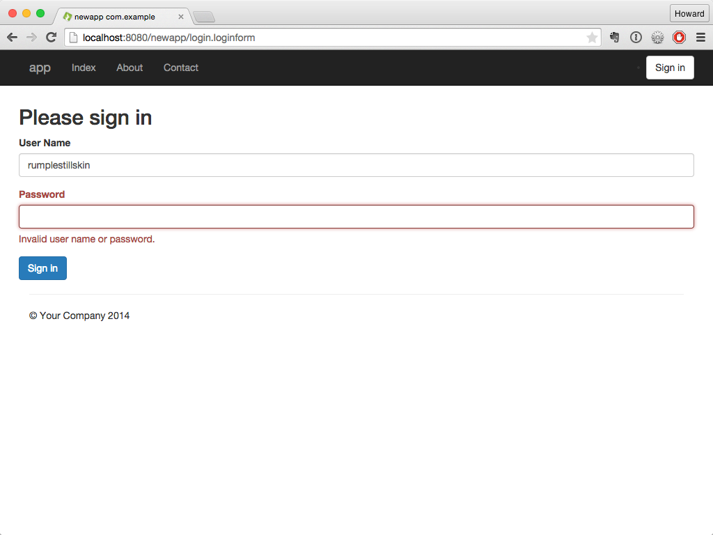

The Tapestry Form component is responsible for creating the necessary URL for the form submission (this is Tapestry's responsibility, not yours).

For the TextField, we provide a component id, userName. We could specify the `value` parameter, but the default is to match the TextField's id against a property of the container, the Login page, if such a property exists.

As a rule of thumb, you should always give your fields a specific id (this id will be used to generate the `name` and `id` attributes of the rendered tag). Being allowed to omit the value parameter helps to keep the template from getting too cluttered.

The FormGroup mixin decorates the field with some additional markup, including a <label> element; this leverages more of Bootstrap.

**userName component as rendered**

```xml
<div class="form-group">
  <label for="userName" class="control-label">User Name</label>
  <input id="userName" class="form-control" name="userName" type="text">
</div>
```

<a id="forms-and-validation--formsandvalidation-formvalidation"></a>
<a id="forms-and-validation--form-validation"></a>

# Form Validation

The above example is a very basic form which allows the fields to be empty. However, with a little more effort we can add client-side validation to prevent the user from submitting the form with either field empty.

Validation in Tapestry involves associating one or more *validators* with a form element component, such as TextField or PasswordField. This is done using the **validate** parameter:

```xml
<t:textfield t:id="userName" validate="required" t:mixins="formgroup"/>
<t:passwordfield t:id="password" value="password" validate="required" t:mixins="formgroup"/>
```

<a id="forms-and-validation--formsandvalidation-availablevalidators"></a>
<a id="forms-and-validation--available-validators"></a>

## Available Validators

Tapestry provides the following built-in validators:

| Validator | Constraint Type | Description | Example |
| --- | --- | --- | --- |
| email |  | Ensures that the given input looks like a valid e-mail address | `<t:textfield value="userEmail" validate="email" />` |
| max | long | Enforces a maximum integer value | `<t:textfield value="age" validate="max=120,min=0" />` |
| maxLength | int | Makes sure that a string value has a maximum length | `<t:textfield value="zip" validate="maxlength=7" />` |
| min | long | Enforces a minimum integer value | `<t:textfield value="age" validate="max=120,min=0" />` |
| minLength | int | Makes sure that a string value has a minimum length | `<t:textfield value="somefield" validate="minlength=1" />` |
| none |  | Does nothing (used to override a @Validate annotation) | `<t:textfield value="somefield" validate="none" />` |
| regexp | pattern | Makes sure that a string value conforms to a given pattern | `<t:textfield value="letterfield" validate="regexp=^``[A-Za-z]+$" />` |
| required |  | Makes sure that a string value is not null and not the empty string | `<t:textfield value="name" validate="required" />` |
| checked *(Since 5.4.5)* | boolean | Makes sure that the boolean is true (checkbox is checked) | `<t:Checkbox value="value" validate="checked" />` |
| unchecked *(Since 5.4.5)* | boolean | Makes sure that the boolean is false (checkbox is unchecked) | `<t:Checkbox value="value" validate="unchecked" />` |

<a id="forms-and-validation--formsandvalidation-centralizingvalidationwith-validate"></a>
<a id="forms-and-validation--centralizing-validation-with-validate"></a>

## Centralizing Validation with @Validate

The @[Validate](http://tapestry.apache.org/current/apidocs/org/apache/tapestry5/beaneditor/Validate.html) annotation can take the place of the validate parameter of TextField, PasswordField, TextArea and other components. When the validate parameter is not bound in the template file, the component will check for the @Validate annotation and use its value as the validation definition.

The annotation may be placed on the getter or setter method, or on the field itself.

Let's update the two fields of the Login page:

```java
  @Persist
  @Property
  @Validate("required")
  private String userName;

  @Property
  @Validate("required")
 private String password;
```

Now, we'll rebuild the app, refresh the browser, and just hit enter:


The form has updated, in place, to present the errors. You will not be able to submit the form until some value is provided for each field.

<a id="forms-and-validation--formsandvalidation-html5client-sidevalidation"></a>
<a id="forms-and-validation--html5-client-side-validation"></a>

## HTML5 Client-side Validation

When the [`tapestry.enable-html5-support`](#configuration) configuration symbol is set to true (it is ***false*** by default), the Tapestry's built-in validators will automatically enable the HTML5-specific "type" and validation attributes to the rendered HTML of Tapestry's form components, triggering the HTML5 client-side validation behavior built into most modern browsers. For example, if you use the "email" and "required" validators, like this:

```xml
<t:textfield validate="email,required" .../>
```

then the output HTML will look like this:

```xml
<input type="email" required ...>
```

which causes modern browsers to present a validation error message whenever text is entered that doesn't look like an email address, or if the field is left blank.

The browser's built-in validation is performed *before* Tapestry's own client-side validation. This is so that older browsers will still perform client-side validation as expected.

The following behaviors are included:

- The "**required**" validator adds the "required" attribute to the rendered HTML
- The "**checked**" validator adds the "required" attribute to the rendered HTML *(Since 5.4.5)*
- The "**regexp**" validator adds the "pattern" attribute to the rendered HTML
- The "**email**" validator sets the `type` attribute to "email" in the rendered HTML
- The "**min**" validator sets the `type` attribute to "number" and adds the "min" attribute in the rendered HTML
- The "**max**" validator sets the `type` attribute to "number" and adds the "max" attribute in the rendered HTML
- When bound to a **number** type, the TextField component sets the `type` attribute to "number" in the rendered HTML

<a id="forms-and-validation--formsandvalidation-serversidevalidation"></a>
<a id="forms-and-validation--server-side-validation"></a>

## Server Side Validation

Some validation can't, or shouldn't, be done on the client side. How do we know if the password is correct? Short of downloading all users and passwords to the client, we really need to do the validation on the server.

In fact, all client-side validation (via the validate parameter, or @Validate annotation) is performed again on the server.

It is also possible to perform extra validation there.

```java
/** * Do the cross-field validation */ void onValidateFromLoginForm() {if (!authenticator.isValid(userName, password)) {// record an error, and thereby prevent Tapestry from emitting a "success" event loginForm.recordError(passwordField, "Invalid user name or password.");}}
```

This is the validate event handler from the loginForm component. It is invoked once all the components have had a chance to read values out of the request, do their own validations, and update the properties they are bound to.

In this case, the authenticator is used to decide if the userName and password is valid. In a real application, this would be where a database or other external service was consulted.

If the combination is not valid, then the password field is marked as in error. The form is used to record an error, about a component (the passwordField) with an error message.

Entering any two values into the form and submitting will cause a round trip; the form will re-render to present the error to the user:


Notice that the cursor is placed directly into the password field.

In versions of Tapestry prior to 5.4, a form with validation errors would result in a redirect response to the client; often, temporary server-side data (such as the userName field) would be lost. Starting in 5.4, submitting a form with validation errors results in the new page being rendered in the same request as the form submission.

<a id="forms-and-validation--formsandvalidation-customizingvalidationmessages"></a>
<a id="forms-and-validation--customizing-validation-messages"></a>

## Customizing Validation Messages

Each validator (such as "required" or "minlength") has a default message used (on the client side and the server side) when the constraint is violated; that is, when the user input is not valid.

The message can be customized by adding an entry to the page's [message catalog](#localization) (or the containing component's message catalog). As with any localized property, this can also go into the application's message catalog.

The first key checked is *formId*-*fieldId*-*validatorName*-message.

- formId: the local component id of the Form component
- fieldId: the local component id of the field (TextField, etc.)
- validatorName: the name of the validator, i.e., "required" or "minlength"

If there is no message for that key, a second check is made, for *fieldId*-*validatorName*-message. If that does not match a message, then the built-in default validation message is used.

For example, if the form ID is "loginForm", the field ID is "userName", and the validator is "required" then Tapestry will first look for a "loginForm-userName-required-message" key in the message catalog, and then for a "userName-required-message" key.

The validation message in the message catalog may contain [printf-style format strings](https://docs.oracle.com/javase/7/docs/api/java/util/Formatter.html) (such as %s) to indicate where the validate parameter's value will be inserted. For example, if the validate parameter in the template is minLength=3 and the validation message is "User name must be at least %s characters" then the corresponding error message would be "User name must be at least 5 characters".

<a id="forms-and-validation--formsandvalidation-customizingvalidationmessagesforbeaneditform"></a>
<a id="forms-and-validation--customizing-validation-messages-for-beaneditform"></a>

### Customizing Validation Messages for BeanEditForm

The [BeanEditForm](#beaneditform-guide) component also supports validation message customizing. The search for messages is similar; the *formId* is the component id of the BeanEditForm component (not the Form component it contains). The *fieldId* is the property name.

<a id="forms-and-validation--formsandvalidation-configuringvalidatorcontraintsinthemessagecatalog"></a>
<a id="forms-and-validation--configuring-validator-contraints-in-the-message-catalog"></a>

## Configuring Validator Contraints in the Message Catalog

It is possible to omit the validation constraint from the validate parameter (or @Validator annotation), in which case it is expected to be stored in the message catalog.

This is useful when the validation constraint is awkward to enter inline, such as a regular expression for use with the regexp validator.

The key here is similar to customizing the validation message: *formId*-*fieldId*-*validatorName* or just *fieldId*-*validatorName*.

For example, your template may have the following:

```xml
  <t:textfield t:id="ssn" validate="required,regexp"/>
```

And your message catalog can contain:

```java
ssn-regexp=\d{3}-\d{2}-\d{4}
ssn-regexp-message=Social security numbers are in the format 12-34-5678.
```

This technique also works with the BeanEditForm; as with validation messages, the formId is the BeanEditForm component's id, and the fieldId is the name of the property being editted.

<a id="forms-and-validation--formsandvalidation-validationmacros"></a>
<a id="forms-and-validation--validation-macros"></a>

## Validation Macros

**Added in 5.2**

Lists of validators can be combined into *validation macros*. This mechanism is convenient for ensuring consistent validation rules across an application. To create a validation macro, just contribute to the ValidatorMacro Service in your module class (normally AppModule.java), by adding a new entry to the configuration object, as shown below. The first parameter is the name of your macro, the second is a comma-separated list of validators:

**AppModule.java (partial)**

```java
@Contribute(ValidatorMacro.class)
public static void combinePasswordValidators(MappedConfiguration<String, String> configuration) {
      configuration.add("passwordValidator","required,minlength=5,maxlength=15");
}
```

Then, you can use this new macro in component templates and classes:

```xml
<input t:type="textField" t:id="password" t:validate="passwordValidator" />
```

```java
@Validate("password")
private String password;
```

<a id="forms-and-validation--formsandvalidation-overridingthetranslatorwithevents"></a>
<a id="forms-and-validation--overriding-the-translator-with-events"></a>

## Overriding the Translator with Events

The TextField, PasswordField and TextArea components all have a translate parameter, a [FieldTranslator](http://tapestry.apache.org/current/apidocs/org/apache/tapestry5/FieldTranslator.html) object that is used to convert values on the server side to strings on the client side.

In most cases, the translate parameter is not set explicitly; Tapestry derives an appropriate value based on the type of property being editted by the field.

In certain cases, you may want to override the translator. This can be accomplished using two events triggered on the component, "toclient" and "parseclient".

The "toclient" event is passed the current object value and returns a string, which will be the default value for the field. When there is no event handler, or when the event handler returns null, the default Translator is used to convert the server side value to a string.

For example, you may have a quantity field that you wish to display as blank, rather than zero, initially:

```java
<t:textfield t:id="quantity" size="10"/>
. . .
private int quantity;
String onToClientFromQuantity() {if (quantity == 0) return "";
return null;}
```

This is good so far, but if the field is optional and the user submits the form, you'll get a validation error, because the empty string is not valid as an integer.

That's where the "parseclient" event comes in:

```java
  Object onParseClientFromQuantity(String input)
  {
    if ("".equals(input)) return 0;

    return null;
  }
```

The event handler method has precedence over the translator. Here it checks for the empty string (and note that the input may be null!) and evaluates that as zero.

Again, returning null lets the normal translator do its work.

The event handler may also throw a [ValidationException](http://tapestry.apache.org/current/apidocs/org/apache/tapestry5/ValidationException.html) to indicate a value that can't be parsed.

Now, what if you want to perform your own custom validation? That's another event: "validate":

```java
  void onValidateFromCount(Integer value) throws ValidationException
  {
    if (value.equals(13)) throw new ValidationException("Thirteen is an unlucky number.");
  }
```

This event gets fired **after** the normal validators. It is passed the *parsed* value (not the string from the client, but the object value from the translator, or from the "parseclient" event handler).

The method may not return a value, but may throw a ValidationException to indicate a problem with the value.

**Caution:** These events are exclusively on the *server side*. This means that, in certain circumstances, an input value will be rejected on the client side even though it is valid on the server side. You may need to disable client-side validation in order to use this feature.

---

<a id="beaneditform-guide"></a>

<!-- source_url: https://tapestry.apache.org/beaneditform-guide.html -->

<!-- page_index: 47 -->

# BeanEditForm Guide

[Apache Tapestry](#index) > [Documentation](#documentation) > [User Guide](#user-guide) > [BeanEditForm Guide](#beaneditform-guide)

<a id="beaneditform-guide--title"></a>
<a id="beaneditform-guide--beaneditform-guide"></a>

# BeanEditForm Guide

**BeanEditForm** is a powerful Tapestry component capable of generating a complete create/edit user interface for a typical JavaBean.

**JumpStart Demos**

- [Edit (Using BeanEditForm)](http://jumpstart.doublenegative.com.au/jumpstart/examples/input/edit1/1)
- [Create (Using BeanEditForm)](http://jumpstart.doublenegative.com.au/jumpstart/examples/input/create1)
- [More Control Edit (Using BeanEditor)](http://jumpstart.doublenegative.com.au/jumpstart/examples/input/morecontroledit1/1)

BeanEditForm analyzes the the properties of the bean, locating just those properties that are readable and writeable. It filters down to properties whose type is mapped to a known editor (this is described in more detail below).

The default ordering for properties is in the order in which the *getter methods* for the properties are defined. When a super-class defines editable properties, those are ordered before sub-class properties.

<a id="beaneditform-guide--beaneditformguide-supportedtypes"></a>
<a id="beaneditform-guide--supported-types"></a>

## Supported Types

The default set of property types supported by BeanEditForm:

- String: as a text field
- Number: as a text field
- Enum: as a drop-down list
- Boolean: as a checkbox
- Date: as a JavaScript calendar
- Calendar: as a JavaScript calendar

Resolving a property type to an editor type involves a search up the inheritance hierarchy: thus the super-type of Integer, Long, BigDecimal, etc. is Number, which uses a text field for data entry.

The list of supported property types is extensible (this is documented below).

<a id="beaneditform-guide--beaneditformguide-automaticobjectcreation"></a>
<a id="beaneditform-guide--automatic-object-creation"></a>

## Automatic Object Creation

When a page is rendered, the BeanEditForm component will read its object parameter as the JavaBean to edit (with the current properties of the JavaBean becoming the defaults for the various fields). Likewise, when the form is submitted by the user, the object parameter is read and its properties populated from the request.

If the object does not exist, it will be created as needed. The type is determined from the property type, which should be a specific type in order for automatic creation to operate properly.

The BeanEditForm component will attempt to instantiate a value for the property as necessary, when the form is submitted. This can be a problem when the property type is an interface, rather than an instantiable class.

One option is to provide an event handler for the "prepare" or "prepareForSubmit" events to instantiate an instance to receive the submitted information.

For a class, Tapestry will select the public constructor with the *most* parameters. If this is not desirable (for example, if you get an exception), then place the @[Inject](http://tapestry.apache.org/current/apidocs/org/apache/tapestry5/ioc/annotations/Inject.html) annotation on the constructor Tapestry should use.

<a id="beaneditform-guide--beaneditformguide-implicitobjectbinding"></a>
<a id="beaneditform-guide--implicit-object-binding"></a>

## Implicit Object Binding

If the object parameter is not bound, then an implicit binding to a property of the containing component is made. The bound property will be the BeanEditForm component's id, if such a property exists. Thus you may typically give the BeanEditForm component an id (that matches a property) and not have to bind the object parameter.

<a id="beaneditform-guide--beaneditformguide-non-visualproperties"></a>
<a id="beaneditform-guide--non-visual-properties"></a>

## Non-Visual Properties

In some cases, a property may be updatable and of a supported type for editing, but should not be presented to the user for editing: for example, a property that holds the primary key of a database entity. In such a case, the @[NonVisual](http://tapestry.apache.org/current/apidocs/org/apache/tapestry5/beaneditor/NonVisual.html) annotation may be applied to the property (either the getter or the setter method).

<a id="beaneditform-guide--beaneditformguide-defaultvalidation"></a>
<a id="beaneditform-guide--default-validation"></a>

## Default Validation

Default validation for fields is primary determined by property type.

If desired, additional validation may be specified using the @[Validate](http://tapestry.apache.org/current/apidocs/org/apache/tapestry5/beaneditor/Validate.html) annotation. See [Forms and Validation](#forms-and-validation).

As of Tapestry 5.2, validation may also be specified via the containing component's property file, using a key in the form of `propertyId-validate` (eg: myfield-validate=required).

<a id="beaneditform-guide--beaneditformguide-propertyordering"></a>
<a id="beaneditform-guide--property-ordering"></a>

## Property ordering

By default, the order in which properties are presented is as defined above (order of the getter method). This can be overridden using the [ReorderProperties](http://tapestry.apache.org/current/apidocs/org/apache/tapestry5/beaneditor/ReorderProperties.html) class annotation.

<a id="beaneditform-guide--beaneditformguide-defaultlabel"></a>
<a id="beaneditform-guide--default-label"></a>

## Default Label

Tapestry will attempt to provide a reasonable default label for each field, based on the property name being emitted. The property name is capitalized, and spaces are added before case changes, thus property "name" becomes label "Name" and property "streetAddress" becomes label "Street Address".

BeanEditForm also searches for a label for the field in the containing component's message catalog. The message key is the property name suffixed with "-label". If such a label is found, it takes precedence.

<a id="beaneditform-guide--beaneditformguide-propertyeditoroverrides"></a>
<a id="beaneditform-guide--property-editor-overrides"></a>

# Property Editor Overrides

You may override the editor for any particular property, using the a block parameter to the BeanEditForm component.

An editor normally consists of a Label component and some form of field component (such as TextField or TextArea).

For example, you may want to selectively use a PasswordField component:

```java
  <t:beaneditform object="loginCredentials">
    <p:password>
      <t:label for="password"/>
      <t:passwordfield t:id="password" value="loginCredentials.password"/>
    </p:password>
  </t:beaneditform>
```

The other fields will render normally (using the built-in editors).

<a id="beaneditform-guide--beaneditformguide-customizingthebeanmodel"></a>
<a id="beaneditform-guide--customizing-the-beanmodel"></a>

# Customizing the BeanModel

You may want to customize the BeanModel further, to remove from the form properties that should not be editable by the user, and to change the order in which properties are presented within the form.

The BeanEditForm component has several parameters for this purpose:

- add: A comma separated list of property names to add to the model.
- include: A comma separated list of property names to keep with the model (others are excluded).
- exclude: A comma separated list of property names to exclude from the model.
- reorder: A comma separated list of property names indicating the desired order. If a model has more properties that are listed in the reorder parameter, then the additional properties will be ordered at the end of the form.

Note that these parameters *modify* the BeanModel. If you supply your own BeanModel (via the model parameter) you should not use the add, include, exclude or reorder parameters.

Added properties must not conflict with normal properties. Cells for added properties will render blank unless an override is provided.

<a id="beaneditform-guide--beaneditformguide-providingthebeanmodel"></a>
<a id="beaneditform-guide--providing-the-beanmodel"></a>

# Providing the BeanModel

The BeanEditForm component operates in terms of a [BeanModel](http://tapestry.apache.org/current/apidocs/org/apache/tapestry5/beaneditor/BeanModel.html), which describes the properties, their presentation order, labels and so forth.

Normally, the BeanEditForm automatically creates the BeanModel as needed, based on the type of object bound to its object parameter.

Alternately, the BeanModel can be supplied as the model parameter. This can be useful in situations where the exclude and reorder parameters are insufficient. For example, if the the type of the property being edited is an interface type, it may be useful to provide an explicit BeanModel around an underlying implementation class.

The model can be created when the page is first instantiated:

```java
public class MyPage {@Inject private BeanModelSource beanModelSource;
@Inject private ComponentResources resources;
@Property(write=false) @Retain private BeanModel model;
@Property private MyBean bean;
{model = beanModelSource.create(MyBean.class, true, resources);
// Make other changes to model here.}
}
```

And, in the component template, the built model can be passed to the BeanEditForm component explicitly:

```java
  <t:beaneditform object="bean" model="model"/>
```

<a id="beaneditform-guide--beaneditformguide-addingnewpropertyeditors"></a>
<a id="beaneditform-guide--adding-new-property-editors"></a>

# Adding New Property Editors

Adding a new property editor is a three step process.

First, decide on a logical name for the data type. For example, you may decide that the BigDecimal type will represent currency in your application, so name the data type "currency".

Next, you must make contributions to the [DataTypeAnalyzer](http://tapestry.apache.org/current/apidocs/org/apache/tapestry5/services/DataTypeAnalyzer.html) or [DefaultDataTypeAnalyzer](http://tapestry.apache.org/current/apidocs/org/apache/tapestry5/internal/services/DefaultDataTypeAnalyzer.html) services to match properties to your new name.

DataTypeAnalyzer is a chain of command that can match properties to data types based on property type or annotations on the property. In general, DefaultDataTypeAnalyzer is used, as that only needs to consider property type. DefaultDataTypeAnalyzer matches property types to data types, based on a search up the inheritance path.

```java
public static void contributeDefaultDataTypeAnalyzer(MappedConfiguration<Class, String> configuration)
{
  configuration.add(BigDecimal.class, "currency");
}
```

You must provide an editor for the "currency" data type. An editor is a block of a page of the application; this page is not normally rendered itself, but acts as a container for one or more blocks.

```java
public class AppPropertyEditBlocks {@Property @Environmental private PropertyEditContext context;
@Component(parameters ={ "value=context.propertyValue", "label=prop:context.label","translate=prop:currencyTranslator", "validate=prop:currencyValidator","clientId=prop:context.propertyId", "annotationProvider=context" }) private TextField currency;
@Inject private ComponentResources resources;
public FieldValidator getCurrencyValidator() {return context.getValidator(currency);}
public FieldTranslator getCurrencyTranslator() {return context.getTranslator(current);}}
```

The hard part is the translator; this is a piece of code that understands how to format and how to parse a currency value. It must be wrapped to create a FieldTranslator.

The editor is a block inside the component template:

```java
  <t:block id="currency">
    <t:label for="currency"/>
    <t:textfield t:id="currency" size="10"/>
  </t:block>
```

Finally, we tell the BeanEditForm component about the editor via a contribution to the [BeanBlockSource](http://tapestry.apache.org/current/apidocs/org/apache/tapestry5/services/BeanBlockSource.html) service:

```java
public static void contributeBeanBlockSource(Configuration<BeanBlockContribution> configuration)
{
  configuration.add(new BeanBlockContribution("currency", "AppPropertyEditBlocks", "currency", true));
}
```

Now, when the BeanEditForm sees a property of type BigDecimal, it will map that to datatype "currency" and from there to the currency block of the AppPropertyEditBlocks page of the application.

---

<a id="uploading-files"></a>

<!-- source_url: https://tapestry.apache.org/uploading-files.html -->

<!-- page_index: 48 -->

# Uploading Files

[Apache Tapestry](#index) > [Documentation](#documentation) > [User Guide](#user-guide) > [Uploading Files](#uploading-files)

<a id="uploading-files--title"></a>
<a id="uploading-files--uploading-files"></a>

# Uploading Files

Tapestry provides a file upload component based on [Apache Commons FileUpload](http://commons.apache.org/fileupload/) to make it easier to handle files uploaded through web forms (via the standard <input type="file"> HTML element).

<a id="uploading-files--uploadingfiles-downloading"></a>
<a id="uploading-files--downloading"></a>

# Downloading

**tapestry-upload** is not automatically included in Tapestry applications because of the additional dependencies it requires. To include it, just add the `tapestry-upload` dependency to the pom of your application, something like this:

```xml
<dependency>
    <groupId>org.apache.tapestry</groupId>
    <artifactId>tapestry-upload</artifactId>
    <version>${tapestry-release-version}</version>
</dependency>
```

If you aren't using Maven, you'll have to download the jar and its dependencies yourself.

<a id="uploading-files--uploadingfiles-usage"></a>
<a id="uploading-files--usage"></a>

# Usage

The upload component supports default value binding (based on id) and validation.

**JumpStart Demo:**
[File Upload](https://tapestry-jumpstart.org/jumpstart/examples/javascript/fileupload)

<a id="uploading-files--uploadingfiles-componenttemplate"></a>
<a id="uploading-files--component-template"></a>

## Component Template

```java
    <t:form>
        <t:errors/>
        <input t:type="upload" t:id="file" t:value="file" validate="required"/>
        <br/>
        <input type="submit" value="Upload"/>
    </t:form>
```

Here, because the value parameter was not bound, the component used the file property of its container (because the component's id is 'file'). If you want to upload as a different property, either bind the value parameter or change the component's id.

<a id="uploading-files--uploadingfiles-pageclass"></a>
<a id="uploading-files--page-class"></a>

## Page class

```java
public class UploadExample {@Property private UploadedFile file;
public void onSuccess() {File copied = new File("/my/file/location/" + file.getFileName());
file.write(copied);}}
```

<a id="uploading-files--uploadingfiles-uploadexceptions"></a>
<a id="uploading-files--upload-exceptions"></a>

# Upload Exceptions

In some cases, file uploads may fail. This can be because of a simple communication exception, or more likely, because the configured maximum upload size was exceeded.

When a file upload exception occurs, Tapestry will trigger a "uploadException" event on the page to notify it of the error. All other normal processing is skipped (no "activate" event, no form submission, etc.).

The event handler should return a non-null object, which will be handled as a navigational result. Example:

```java
@Persist(PersistenceConstants.FLASH) @Property private String message;
Object onUploadException(FileUploadException ex) {message = "Upload exception: " + ex.getMessage();
return this;}
```

Note the importance of `return this;`. A void event handler method, or one that returns null, will result in the FileUploadException being reported to the user as an uncaught runtime exception.

<a id="uploading-files--uploadingfiles-configuration"></a>
<a id="uploading-files--configuration"></a>

# Configuration

Four values may be configured as [symbols](#configuration):

| upload.repository-location | The directory to which files that are too large to keep in memory will be written to. The default is from the java.io.tmpdir system property. |
| --- | --- |
| upload.repository-threshold | Upload size, in bytes, at which point the uploaded file is written to disk rather than kept in memory. The default is 10 kilobytes. |
| upload.requestsize-max | Maximim size, in bytes, for the overall request. If exceeded, a FileUploadException will occur. The default is no maximum. |
| upload.filesize-max | Maximum size, in bytes, for any individual uploaded file. Again, a FileUploadException will occur if exceeded. The default is no maximum. |

The class [UploadSymbols](http://tapestry.apache.org/current/apidocs/org/apache/tapestry5/upload/services/UploadSymbols.html) defines constants for all four of these.

<a id="uploading-files--uploadingfiles-potentialissues"></a>
<a id="uploading-files--potential-issues"></a>

# Potential Issues

The Commons FileUpload library uses the CommonsIO file cleaner service to remove temporary files when they are no longer needed. This service creates a thread to carry out its work. If the commons-io library is shared amongst multiple applications (e.g. added to server classpath) it is possible for an application to terminate this thread prematurely and cause errors for the other applications. (see the [Resource Cleanup](http://jakarta.apache.org/commons/fileupload/using.html) section in for more discussion)

Technically the file cleanup service is not needed by Tapestry Upload (which deletes temporary files at the end of request processing). However it is currently not possible to disable it (enhancement request has been filed as [FILEUPLOAD-133](https://issues.apache.org/jira/browse/FILEUPLOAD-133)).

---

<a id="logging"></a>

<!-- source_url: https://tapestry.apache.org/logging.html -->

<!-- page_index: 49 -->

# Logging

[Apache Tapestry](#index) > [Documentation](#documentation) > [User Guide](#user-guide) > [Logging](#logging)

<a id="logging--title"></a>
<a id="logging--logging"></a>

# Logging

**Logging** involves the automatic recording of progress as an application runs. Tapestry makes extensive use of [SLF4J](http://www.slf4j.org/) to log details about the creation and operation of your page and component classes.

<a id="logging--related-articles"></a>

### Related Articles

- Page:

  [Logging](#logging)
- Page:

  [Logging in Tapestry](#logging-in-tapestry)

The default configuration for logging uses [Log4J](http://logging.apache.org/log4j/) as the logging toolkit, though [this can be changed](#logging-in-tapestry).

<a id="logging--logging-classtologger"></a>
<a id="logging--class-to-logger"></a>

# Class to Logger

The logger name for a page or component matches the fully qualified class name. You can configure this in log4j.properties:

**log4j.properties**

```java
log4j.category.org.apache.tapestry5.integration.app1.pages.MerryChristmas=trace
```

<a id="logging--logging-injectingloggers"></a>
<a id="logging--injecting-loggers"></a>

# Injecting Loggers

You may mark a field of type [Logger](http://www.slf4j.org/api/org/slf4j/Logger.html) with the @Inject annotation. The proper Logger for your page or component will be injected.

**MyPage.java**

```java
public class MyPage {@Inject private Logger logger;
. . .
void onSuccessFromForm() {logger.info("Changes saved successfully");}
```

<a id="logging--logging-logannotation"></a>
<a id="logging--log-annotation"></a>

# @Log annotation

You may mark any component method with the @[Log](http://tapestry.apache.org/current/apidocs/org/apache/tapestry5/annotations/Log.html) annotation. Method entry, exit (and any thrown exceptions) will be logged at DEBUG level, along with parameter values and the method's return value. This is very convenient for debugging, especially when placed on event handler methods.

<a id="logging--logging-componenttransformationdebugging"></a>
<a id="logging--component-transformation-debugging"></a>

# Component Transformation Debugging

Tapestry performs a transformation on your classes as they are loaded, and sometimes you want to gain insight into what it has done. Tapestry uses a secondary logger, consisting of the class name with the prefix "tapestry.transformer.", to log (at debug level) the results of transforming the class.

Example:

```
[DEBUG] Index // class version 49.0 (49)
// access flags 0x11
public final class org/apache/tapestry5/integration/app1/pages/Index$Invocation_containingPageDidLoad_123fd9264de3fa20 extends org/apache/tapestry5/internal/plastic/AbstractMethodInvocation  implements org/apache/tapestry5/plastic/MethodInvocation  {


  // access flags 0x1
  public <init>(Ljava/lang/Object;Lorg/apache/tapestry5/plastic/InstanceContext;Lorg/apache/tapestry5/internal/plastic/MethodInvocationBundle;)V
    ALOAD 0
    ALOAD 1
    ALOAD 2
    ALOAD 3
    INVOKESPECIAL org/apache/tapestry5/internal/plastic/AbstractMethodInvocation.<init> (Ljava/lang/Object;Lorg/apache/tapestry5/plastic/InstanceContext;Lorg/apache/tapestry5/internal/plastic/MethodInvocationBundle;)V
    RETURN
    MAXSTACK = 0
    MAXLOCALS = 0

  // access flags 0x1
  public setReturnValue(Ljava/lang/Object;)Lorg/apache/tapestry5/plastic/MethodInvocation;
    NEW java/lang/IllegalArgumentException
    DUP
    LDC "Method public void containingPageDidLoad() of class org.apache.tapestry5.integration.app1.pages.Index is void, setting a return value is not allowed."


  . . .
```

Essentially, this output is a dissasembly of the bytecode transformed or created by Tapestry for the component. Is this helpful? Probably only if you are developing your own code that integrates into the component class transformation chain; for example, to support your own field and method annotations, and even then, not as much in Tapestry 5.3 as in earlier versions of Tapestry (because of the introduction of the plastic library).

<a id="logging--logging-componenteventdebugging"></a>
<a id="logging--component-event-debugging"></a>

# Component Event Debugging

Tapestry can also debug component event logic. The component's logger, with a "tapestry.events." prefix, is used at debug level. The debugging output identifies the event name and event source, and identifies any methods that are invoked.

Note that events that are not handled by a component will bubble up to the component's container; further logging for the same event will occur using the logger associated with the container. The page containing the initial component is the final step when logging.

Examples:

```
[DEBUG] ActionLink Dispatch event: ComponentEvent[action from (self)]
[DEBUG] ActionDemo Dispatch event: ComponentEvent[action from actionlink]
[DEBUG] ActionDemo Invoking: org.apache.tapestry5.integration.app1.pages.nested.ActionDemo.onAction(java.lang.Long) (at ActionDemo.java:28)
[DEBUG] ActionDemo Dispatch event: ComponentEvent[passivate from (self)]
[DEBUG] ActionDemo Invoking: org.apache.tapestry5.integration.app1.pages.nested.ActionDemo.onPassivate() (at ActionDemo.java:38)
```

<a id="logging--logging-renderqueuedebugging"></a>
<a id="logging--render-queue-debugging"></a>

# Render Queue Debugging

Occasionally it is useful to get debugging output of all the steps involved in rendering a page. In Tapestry, rendering involves a series of rendering commands passed through a rendering queue (most commands will operate by queuing up additional commands). A rendering command may represent an element or attribute from a component template, or some template text, or it may represent one render phase when rendering a component.

The logger is the page's logger prefixed with "tapestry.render.".

This debugging is most useful when you get a rendering exception about unbalanced open and close tags.

Most logging is at the trace level, except for a debug-level entry at the end identifying the number of commands and the elapsed time.

```
  . . .
  
[TRACE] ActionDemo Executing: Text[Apache Software Foundation]
[TRACE] ActionDemo Executing: End
[TRACE] ActionDemo Executing: Text[
            ]
[TRACE] ActionDemo Executing: End
[TRACE] ActionDemo Executing: Text[

            ]
[TRACE] ActionDemo Executing: Start[http://www.w3.org/1999/xhtml div]
[TRACE] ActionDemo Executing: org.apache.tapestry5.internal.services.PageElementFactoryImpl$1@587e3a30
[TRACE] ActionDemo Executing: End
[TRACE] ActionDemo Executing: Text[

        ]
[TRACE] ActionDemo Executing: End
[TRACE] ActionDemo Executing: End
[TRACE] ActionDemo Executing: End
[TRACE] ActionDemo Executing: AfterRenderTemplate[nested/ActionDemo:border]
[TRACE] ActionDemo Executing: AfterRender[nested/ActionDemo:border]
[TRACE] ActionDemo Executing: CleanupRender[nested/ActionDemo:border]
[TRACE] ActionDemo Executing: org.apache.tapestry5.internal.structure.ComponentPageElementImpl$1@7efc0795
[TRACE] ActionDemo Executing: DTD[name=html; publicId=-//W3C//DTD XHTML 1.0 Strict//EN; systemId=http://www.w3.org/TR/xhtml1/DTD/xhtml1-strict.dtd]
[TRACE] ActionDemo Executing: AfterRenderTemplate[nested/ActionDemo]
[TRACE] ActionDemo Executing: AfterRender[nested/ActionDemo]
[TRACE] ActionDemo Executing: CleanupRender[nested/ActionDemo]
[TRACE] ActionDemo Executing: org.apache.tapestry5.internal.structure.ComponentPageElementImpl$1@7efc0795
[DEBUG] ActionDemo Executed 276 rendering commands (max queue depth: 141) in 0.025 seconds
```

---

<a id="unit-testing-pages-or-components"></a>

<!-- source_url: https://tapestry.apache.org/unit-testing-pages-or-components.html -->

<!-- page_index: 50 -->

# Unit testing pages or components

[Apache Tapestry](#index) > [Documentation](#documentation) > [User Guide](#user-guide) > [Unit testing pages or components](#unit-testing-pages-or-components)

<a id="unit-testing-pages-or-components--title"></a>
<a id="unit-testing-pages-or-components--unit-testing-pages-or-components"></a>

# Unit testing pages or components

Tapestry provides support for easily **unit testing your pages and components**. Follow the simple steps below.

<a id="unit-testing-pages-or-components--related-articles"></a>

### Related Articles

- Page:

  [Unit testing pages or components](#unit-testing-pages-or-components)
- Page:

  [Integration Testing](#integration-testing)

<a id="unit-testing-pages-or-components--unittestingpagesorcomponents-settingupadrivingenvironment"></a>
<a id="unit-testing-pages-or-components--setting-up-a-driving-environment"></a>

## Setting up a driving environment

In order to unit test a page, you'll need to create an instance of [PageTester](http://tapestry.apache.org/current/apidocs/org/apache/tapestry5/test/PageTester.html). It acts as both the browser and the servlet container so that you can use it to drive your page.

The PageTester falls into a middle ground between pure unit testing and [full-scale integration testing](#integration-testing).

As the PageTester is not a real servlet container, you need to tell it the same information as you would in web.xml:

1. Your application package.
2. Your filter name. This is used to load your Tapestry IoC module only. If you have none, you can pass an empty string or anything to it.
3. The folder acting as your context root. This is used to locate your templates (if they're put there).Here is an example (using TestNG, but you're free to use JUnit or anything else):

```java
public class MyTest extends Assert {@Test public void test1() {String appPackage = "org.example.app"; String appName = "App1"; // App1Module.java has configured some services.PageTester tester = new PageTester(appPackage, appName, "src/main/webapp");}}
```

<a id="unit-testing-pages-or-components--unittestingpagesorcomponents-testingtherenderingofapage"></a>
<a id="unit-testing-pages-or-components--testing-the-rendering-of-a-page"></a>

## Testing the rendering of a page

To test if a page renders properly (optionally with context), you can tell the PageTester to render it and then assert against the [DOM Document](http://tapestry.apache.org/current/apidocs/org/apache/tapestry5/dom/Document.html) returned.

Here is an example. Let's assuming the page being tested is named "MyPage" and it should return a page containing an HTML element whose id is "id1" and whose text content should be "hello":

```java
public class MyTest extends Assert {@Test public void test1() {String appPackage = "org.example.app"; String appName = "LocaleApp"; PageTester tester = new PageTester(appPackage, appName, "src/main/webapp"); Document doc = tester.renderPage("MyPage"); assertEquals(doc.getElementById("id1").getChildText(), "hello");}}
```

If the page requires a context, you can pass it this way:

```java
public class MyTest extends Assert {@Test public void test1() {String appPackage = "org.example.app"; String appName = "LocaleApp"; PageTester tester = new PageTester(appPackage, appName, "src/main/webapp"); Object[] context = new Object[]{ "abc", 123 }; Document doc = tester.invoke(new ComponentInvocation(new PageLinkTarget("MyPage"), context)); assertEquals(doc.getElementById("id1").getChildText(), "hello");}}
```

<a id="unit-testing-pages-or-components--unittestingpagesorcomponents-testinganactionlink"></a>
<a id="unit-testing-pages-or-components--testing-an-action-link"></a>

## Testing an action link

After rendering a page, you may want to "click" on an action link and then assert against the resulting page. You can do it this way:

```java
public class MyTest extends Assert {@Test public void test1() {String appPackage = "org.example.app"; String appName = "LocaleApp"; PageTester tester = new PageTester(appPackage, appName, "src/main/webapp"); Document doc = tester.renderPage("MyPage"); Element link = doc.getElementById("link1"); doc = tester.clickLink(link); assertTrue(doc.toString().contains("abc"));}}
```

<a id="unit-testing-pages-or-components--unittestingpagesorcomponents-testingaformsubmission"></a>
<a id="unit-testing-pages-or-components--testing-a-form-submission"></a>

## Testing a form submission

After rendering a page, you may want to fill out a form, submit it and then inspect the resulting page. You can do it this way:

```java
public class MyTest extends Assert {@Test public void test1() {String appPackage = "org.example.app"; String appName = "LocaleApp"; PageTester tester = new PageTester(appPackage, appName, "src/main/webapp"); Document doc = tester.renderPage("MyPage"); Element form = doc.getElementById("form1"); Map<String, String> fieldValues = new HashMap<String, String>(); fieldValues.put("field1", "hello"); fieldValues.put("field2", "100"); doc = tester.submitForm(form, fieldValues); assertTrue(doc.toString().contains("abc"));}}
```

To submit a form by clicking a submit button, call the [clickSubmit()](http://tapestry.apache.org/current/apidocs/org/apache/tapestry5/test/PageTester.html#clickSubmit-org.apache.tapestry5.dom.Element-java.util.Map-) method instead.

<a id="unit-testing-pages-or-components--unittestingpagesorcomponents-unittestingacomponent"></a>
<a id="unit-testing-pages-or-components--unit-testing-a-component"></a>

## Unit testing a component

To unit test a component, just create a test page containing that component. Then unit test that page.

<a id="unit-testing-pages-or-components--unittestingpagesorcomponents-third-partytestingmodules"></a>
<a id="unit-testing-pages-or-components--third-party-testing-modules"></a>

## Third-party Testing Modules

- [Tapestry-Testify](http://tapestrytestify.sourceforge.net/) makes it easier to write page and component tests and run them efficiently.
- [Tapestry-XPath](http://tapestryxpath.sourceforge.net/) allows you to use XPath expressions to query the Tapestry DOM (useful for simplifying page and component tests).

---

<a id="integration-testing"></a>

<!-- source_url: https://tapestry.apache.org/integration-testing.html -->

<!-- page_index: 51 -->

# Integration Testing

[Apache Tapestry](#index) > [Documentation](#documentation) > [User Guide](#user-guide) > [Integration Testing](#integration-testing)

<a id="integration-testing--title"></a>
<a id="integration-testing--integration-testing"></a>

# Integration Testing

**Integration testing** involves the testing of larger segments of your Tapestry module or web application, typically including the user interface.

<a id="integration-testing--related-articles"></a>

### Related Articles

- Page:

  [Unit testing pages or components](#unit-testing-pages-or-components)
- Page:

  [Integration Testing](#integration-testing)

The Tapestry Test Utilities is a small library to make it easier to build integration test suites around [Selenium](http://www.seleniumhq.org) version 2.14.0.

The strategy is to start, in-process, a Selenium Server (which, in turn, starts and manages a web browser), a Jetty instance (for the web browser to talk to), and a Selenium client (which talks to the server).

The client is able to request URLs, fill in form data, click links, and make assertions about output and behavior.

<a id="integration-testing--integrationtesting-usage"></a>
<a id="integration-testing--usage"></a>

# Usage

The core part of this library is a base class for you to extend your tests classes : [SeleniumTestCase](http://tapestry.apache.org/current/apidocs/org/apache/tapestry5/test/SeleniumTestCase.html).

This class is responsible for starting an instance of Jetty to server your web application, as well as a copy of Selenium Server. It also implements the [Selenium](http://release.openqa.org/selenium-remote-control/0.9.0/doc/java/) interface.

Before Tapestry 5.2, your class should extend AbstractIntegrationTestSuite

Here's an example from one of the Tapestry modules:

**Your Integration Test Class : SinglePersistenceUnitIntegrationTest.java**

```java
package org.apache.tapestry5.jpa.integration.app2;
import org.apache.tapestry5.test.SeleniumTestCase; import org.testng.annotations.Test;
public class SinglePersistenceUnitIntegrationTest extends SeleniumTestCase {
@Test public void persist_entities() {open("/persistitem"); assertEquals(getText("//span[@id='name']").length(), 0);
clickAndWait("link=create item"); assertText("//span[@id='name']", "name");}}
```

With the SeleniumTestCase class, you can use basic Selenium methods (such as open() and type()) and methods added by the SeleniumTestCase base class (clickAndWait() and assertFieldValue()).

In addition, the SeleniumTestCase base class extends the normal exception reporting provided by Selenium; when a failure occurs inside Selenium server, a more detailed message, including the current page's HTML source, is reported to System.err.

<a id="integration-testing--integrationtesting-configuration"></a>
<a id="integration-testing--configuration"></a>

# Configuration

All the configuration of your Integration Tests should be in your testng.xml file. Tapestry provides some parameters, in order to have the right environment for your tests.

| Parameter | Default Value | Value |
| --- | --- | --- |
| tapestry.web-app-folder | src/main/webapp | The path to a web app |
| tapestry.servlet-container | jetty7 | the server container to use for the integration tests (jetty7 or tomcat6) |
| tapestry.context-path |  | The context path |
| tapestry.port | 9090 | The web server port |
| tapestry.ssl-port | 8443 | The web server ssl port |
| tapestry.browser-start-command | \*firefox | The browser command to pass to Selenium |

Here's an example :

**testng.xml**

```xml
<suite name="Selenium Tests Suite" annotations="1.5">
  <test name="Integration Tests" enabled="true">
    <parameter name="tapestry.browser-start-command" value="*googlechrome" />
    <parameter name="tapestry.port" value="9091" />

    <classes>
      <class name="com.example.newapp.SeleniumTest"></class>
    </classes>
  </test>
</suite>
```

<a id="integration-testing--integrationtesting-someinterestingtools"></a>
<a id="integration-testing--some-interesting-tools"></a>

# Some Interesting Tools

Here are some interesting plugins you can use to write your integration tests.

- Google Chrome : [xpathOnClick](https://chrome.google.com/webstore/detail/ikbfbhbdjpjnalaooidkdbgjknhghhbo)
- FireFox : [Selenium IDE](http://seleniumhq.org/projects/ide/)

---

<a id="development-dashboard"></a>

<!-- source_url: https://tapestry.apache.org/development-dashboard.html -->

<!-- page_index: 52 -->

# Development Dashboard

[Apache Tapestry](#index) > [Documentation](#documentation) > [User Guide](#user-guide) > [Development Dashboard](#development-dashboard)

<a id="development-dashboard--title"></a>
<a id="development-dashboard--development-dashboard"></a>

# Development Dashboard

The **development dashboard** is a built-in Tapestry page that can help identify and resolve problems in your application.

The dashboard is typically only available to requests from localhost (the page is whitelist access only, see [Security](#security)).

Some features of the dashboard are only available in development mode.

The dashboard is available via the URI "core/t5dashboard", or can be accessed by the [DevTool](http://tapestry.apache.org/5.4/apidocs/org/apache/tapestry5/corelib/components/DevTool.html) component's dropdown menu.

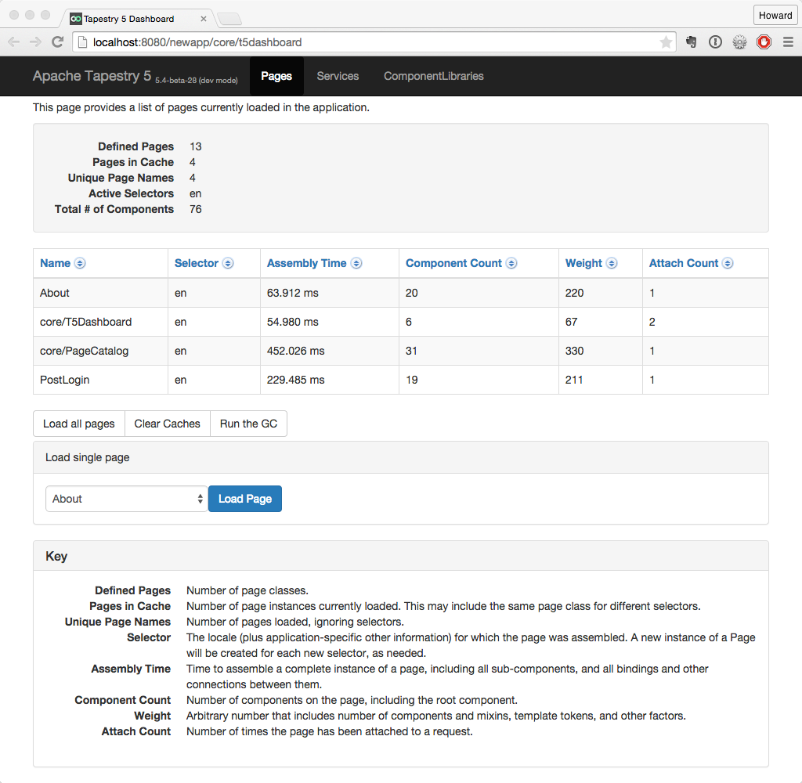

By default, there are three tabs (this is extensible).

<a id="development-dashboard--developmentdashboard-pages"></a>
<a id="development-dashboard--pages"></a>

## Pages

The pages tab shows what pages are currently loaded into the application. Tapestry only loads a page when it is first needed.

It is possible to clear out Tapestry's caches, forcing a reload. You can also run a garbage collection (GC).

It is possible to load any individual page, or attempt to load all pages. This can be a good way to see if all pages (and templates) are error free ... loading all will catch quite a few potential errors.

<a id="development-dashboard--developmentdashboard-services"></a>
<a id="development-dashboard--services"></a>

## Services

When using Tapestry there will often be a large number of services defined in the registry; a mix of the built-in services provided by the framework and your own.

Services are usually only instantiated once they are needed.

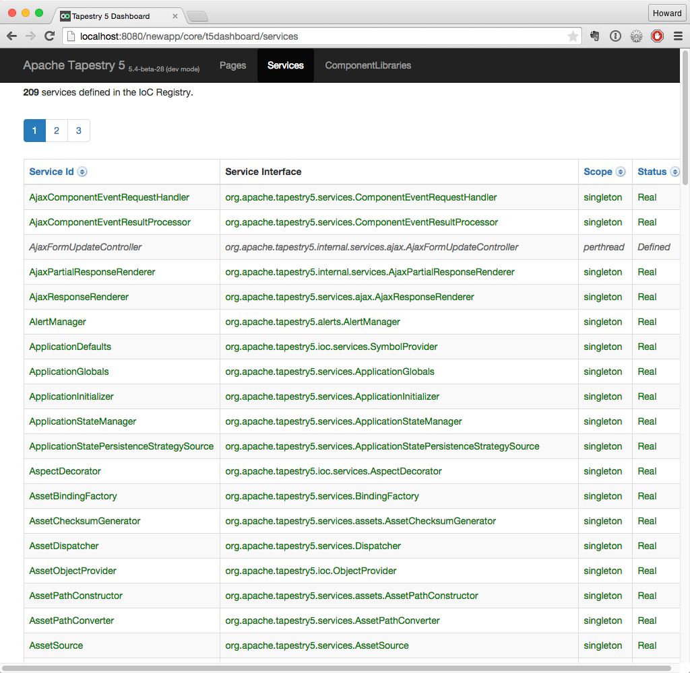

Services may be builtin, defined, virtual or real.

**Builtin** only applies to a few special services that are part of Tapestry IoC.

**Defined** services are defined in some module, but have not yet been referenced in any way.

**Virtual** services have been referenced and have gotten as far as creating a service proxy.

**Real** services have had methods invoked, this forces the *realization* of the service which includes instantiating the service, injecting dependencies, and decorating with any applicable interceptors.

<a id="development-dashboard--developmentdashboard-componentlibraries"></a>
<a id="development-dashboard--component-libraries"></a>

## Component Libraries

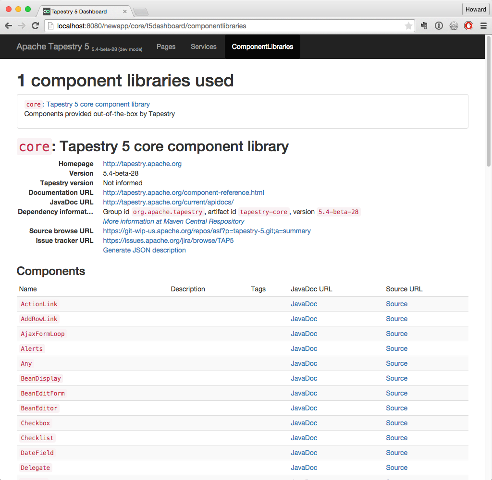

This page gives a summary of all component libraries used in the current application.

---

<a id="modules"></a>

<!-- source_url: https://tapestry.apache.org/modules.html -->

<!-- page_index: 53 -->

# Modules

[Apache Tapestry](#index) > [Documentation](#documentation) > [User Guide](#user-guide) > [Modules](#modules)

<a id="modules--title"></a>
<a id="modules--modules"></a>

# Modules

<a id="modules--modules-built-inmodules"></a>
<a id="modules--built-in-modules"></a>

## Built-in Modules

Tapestry comes with a collection of add-on modules to let you extend the framework beyond its core.<a id="modules--modules-hibernateintegration"></a>
<a id="modules--hibernate-integration"></a>

### Hibernate Integration

- [Hibernate Configuration](#hibernate-core-conf)
- [Hibernate User Guide](#hibernate-user-guide)
- [Hibernate Statistics](#hibernate-statistics)
- [Hibernate-Core](#hibernate-core)

<a id="modules--modules-springintegration"></a>
<a id="modules--spring-integration"></a>

### Spring Integration

- [Spring Core](#integrating-with-spring-framework)

<a id="modules--modules-jpaintegration"></a>
<a id="modules--jpa-integration"></a>

### JPA Integration

- [Integrating with JPA](#integrating-with-jpa)

<a id="modules--modules-othermodules"></a>
<a id="modules--other-modules"></a>

### Other Modules

- [JSR 303 Bean Validation](#bean-validation)
- [Functional Flows](#functional-flows)
- [JMX Integration](#jmx-module)
- [JSON](#json)
- [Component Report](#component-report)

<a id="modules--modules-thirdpartymodules"></a>
<a id="modules--third-party-modules"></a>

## Third Party Modules

Independent developers have build a rich collection of Tapestry modules for your immediate use. These modules greatly expand upon the capabilities already included in Tapestry. *These links take you to external sites.*<a id="modules--modules-tapestry5-cayenne"></a>
<a id="modules--tapestry5-cayenne"></a>

## Tapestry5-Cayenne

- [Tapestry5-Cayenne](http://code.google.com/p/tapestry5-cayenne/) (for Tapestry 5.3) integrates with the Apache Cayenne persistence framework.

<a id="modules--modules-argoyle-fortapestry5.3"></a>
<a id="modules--argoyle-for-tapestry-5.3"></a>

## Argoyle (for Tapestry 5.3)

- [Tapestry-breadcrumbs](https://github.com/argoyle/tapestry-breadcrumbs) is a breadcrumb trail implementation, implemented as an annotation to be placed at each page-class that should be part of the trail.
- [Tapestry-mfautocomplete](https://github.com/argoyle/tapestry-mfautocomplete) An autocomplete implementation that can populate multiple fields

<a id="modules--modules-chenillekit-fortapestry5.3"></a>
<a id="modules--chenille-kit-for-tapestry-5.3"></a>

## Chenille Kit (for Tapestry 5.3)

- [Chenillekit-LDAP](https://github.com/chenillekit/chenillekit/tree/master/chenillekit-ldap/) helps with LDAP querying
- [Chenillekit-Lucene](https://github.com/chenillekit/chenillekit/tree/master/chenillekit-lucene/) provides Apache Lucene indexing & searching
- [Chenillekit-Image](https://github.com/chenillekit/chenillekit/tree/master/chenillekit-image/) is an image scaling service
- [Chenillekit-Mail](https://github.com/chenillekit/chenillekit/tree/master/chenillekit-mail/) is a mail service based on Apache Commons Email
- [Chenillekit-Quartz](https://github.com/chenillekit/chenillekit/tree/master/chenillekit-quartz/) provides Quartz-based scheduling capabilities
- [Chenillekit-Script](https://github.com/chenillekit/chenillekit/tree/master/chenillekit-scripting/) enables Apache's Bean Scripting Framework
- [Chenillekit-Template](https://github.com/chenillekit/chenillekit/tree/master/chenillekit-template/) enables Velocity and FreeMarker templates

[Other Chenille Kit Modules](https://github.com/chenillekit/chenillekit)...

<a id="modules--modules-ciaranw"></a>
<a id="modules--ciaranw"></a>

## CiaranW

- [Tapestry-Service-Cache](https://github.com/ciaranw/tapestry-service-cache/wiki) provides easy, annotation-based caching for Tapestry 5 services.

<a id="modules--modules-exanpe"></a>
<a id="modules--exanpe"></a>

## Exanpe

- [Tapestry-Tldgen](https://github.com/exanpe/tapestry-tldgen) generates TLD files to let you use the Eclipse JSP editor for code completion on TML files.

<a id="modules--modules-flowlogix"></a>
<a id="modules--flowlogix"></a>

## FlowLogix

- [FlowLogix](http://code.google.com/p/flowlogix/) is a collection of components, services and utilities that integrates Tapestry into JEE environments and provides other commonly needed functionality.

<a id="modules--modules-gangoftapestry5"></a>
<a id="modules--gang-of-tapestry-5"></a>

## Gang Of Tapestry 5

- [Tapestry5-HighCharts](https://github.com/got5/tapestry5-highcharts) integrates the Highcharts library (<http://www.highcharts.com/>) into a Tapestry5-jQuery based application
- [Tapestry5-jqPlot](https://github.com/got5/tapestry5-jqPlot) integrates with JQuery jqPlot, a plotting and charting plugin for the jQuery Javascript framework. jqPlot produces beautiful line, bar and pie charts with many features.
- [Tapestry5-Jquery](https://github.com/got5/tapestry5-jquery) lets you use jQuery to supplement *or completely replace* Prototype, Scriptaculous and the base tapestry.js script.
- [Tapestry5-jquery-mobile](https://github.com/got5/tapestry5-jquery-mobile) provides jQuery mobile integration for Tapestry
- [Tapestry5-Portlet](https://github.com/got5/tapestry5-portlet) provides functionality for Portlet Development in Tapestry

<a id="modules--modules-spock"></a>
<a id="modules--spock"></a>

## Spock

- [Spock Tapestry Extension](http://code.google.com/p/spock/wiki/TapestryExtension) provides integration with Spock, a testing and specification framework for Java and Groovy applications.

<a id="modules--modules-spreadthesource"></a>
<a id="modules--spread-the-source"></a>

## Spread the Source

- [Tapestry5-db-migrations](https://github.com/spreadthesource/tapestry5-db-migrations) supports Tapestry 5 Database Migrations: Ruby on Rails-like database migrations powered by Tapestry IOC and Tapestry Hibernate Core
- [Tapestry5-googleanalytics](https://github.com/spreadthesource/tapestry5-googleanalytics) integrates with Google Analytics
- [Tapestry5-hornet](https://github.com/spreadthesource/tapestry5-hornet) integrates the Hornet java connector inside Tapestry 5. Hornet is a realtime publish/suscribe engine that let you enhance your web application by connecting users together, powered by NodeJs and [Socket.io](http://Socket.io)
- [Tapestry5-installer](https://github.com/spreadthesource/tapestry5-installer) is a Tapestry 5 webapp installer: Live load your Tapestry app right after having set the configuration. This contribution aims to provide an easy way for Tapestry developers to include an installation application in their application so the user can provide its production environment configuration values
- [Tapestry5-rome](https://github.com/spreadthesource/tapestry5-rome) provides RSS & Atom feed support in Tapestry apps
- [Tapestry5-spring-tx](https://github.com/spreadthesource/tapestry5-spring-tx) supports using Spring Transaction Manager inside your Tapestry 5 application. Allows you to access to a Hibernate session factory configured via Spring through your Tapestry business layer in the same transaction

<a id="modules--modules-t5conduit"></a>
<a id="modules--t5conduit"></a>

## T5conduit

- [T5conduit](https://github.com/cezary-biernacki/t5conduit) allows seamless integration of LessCSS and CoffeeScript.

<a id="modules--modules-tacos"></a>
<a id="modules--tacos"></a>

## Tacos

- [Tacos-Seam](http://tacos.sourceforge.net/tacos5/tacos-seam/) provides an integration between Tapestry and JBoss Seam

<a id="modules--modules-tapestry-bootstrap-fortapestry5.3"></a>
<a id="modules--tapestry-bootstrap-for-tapestry-5.3"></a>

## Tapestry-bootstrap (for Tapestry 5.3)

- [Tapestry-bootstrap](https://github.com/trsvax/tapestry-bootstrap) integrates Twitter Bootstrap with Tapestry 5. (Bootstrap is a grid based toolkit of polished HTML, CSS and JavaScript.

<a id="modules--modules-tapestry-cometd"></a>
<a id="modules--tapestry-cometd"></a>

## Tapestry-cometd

- [Tapestry-cometd](https://github.com/uklance/tapestry-cometd) is a push library for Tapestry based on CometD (an HTTP-based event routing bus that uses an Ajax Push technology pattern known as Comet)

<a id="modules--modules-tapestry-monitoring"></a>
<a id="modules--tapestry-monitoring"></a>

## Tapestry-monitoring

- [Tapestry-monitoring](https://github.com/joshcanfield/tapestry-monitoring) is a lightweight, unobtrusive way to add JMX performance metrics to any Tapestry application, using the Java Simon monitoring API.

<a id="modules--modules-tapestry-profiler"></a>
<a id="modules--tapestry-profiler"></a>

## Tapestry-profiler

- [Tapestry-profiler](https://github.com/bdotte/tapestry-profiler) is a simple, configurable, sampling profiler designed to be used in production Tapestry 5 applications to track down performance issues.

<a id="modules--modules-tapestry-spring-security"></a>
<a id="modules--tapestry-spring-security"></a>

## Tapestry-spring-security

- [Tapestry-spring-security](http://www.localhost.nu/java/tapestry-spring-security/conf.html) integrates Spring Security with Tapestry applications

<a id="modules--modules-tapestry-testify"></a>
<a id="modules--tapestry-testify"></a>

## Tapestry-Testify

- [Tapestry-Testify](http://tapestrytestify.sourceforge.net/) is an extension that makes it easier to write page and component tests and run them efficiently

<a id="modules--modules-tapestry-xpath"></a>
<a id="modules--tapestry-xpath"></a>

## Tapestry-XPath

- [Tapestry-XPath](http://tapestryxpath.sourceforge.net/) allows you to use XPath expressions to query the Tapestry DOM (useful for page & component tests)

<a id="modules--modules-tapestry-zbreadcrumbs"></a>
<a id="modules--tapestry-zbreadcrumbs"></a>

## Tapestry-zbreadcrumbs

- [Tapestry-zbreadcrumbs](https://bitbucket.org/zenios/tapestry-zbreadcrumbs) is a bread crumb trail implementation, with configuration through contributions and annotations, dynamic breadcrumb titles, and a very flexible breadcrumbs trail component

<a id="modules--modules-tynamo"></a>
<a id="modules--tynamo"></a>

## Tynamo

- [Tapestry-Model](http://tynamo.org/tapestry-model+guide) provides rapid development of CRUD-style applications
- [Tapestry-JPA Integration](http://tynamo.org/tapestry-jpa+guide) allows you to use JPA with Tapestry
- [Tapestry-ReSTEasy](http://tynamo.org/tapestry-resteasy+guide) integrates with JBoss' RESTEasy, an implementation of JAX-RS
- [Tapestry-security](http://tynamo.org/tapestry-security+guide) is a security module for Tapestry apps based on Apache Shiro
- [Tapestry-Watchdog](http://tynamo.org/tapestry-watchdog+guide) lets your Tapestry app monitor itself

[Other Tynamo Modules](http://tynamo.org/)...

<a id="modules--modules-tapx"></a>
<a id="modules--tapx"></a>

## TapX

- [Tapx-Datefield](http://tapestry.formos.com/nightly/tapx/tapx-datefield/) is an enhanced DateField component
- [Tapx-plainmessage](https://github.com/hlship/tapx) adds a new binding prefix, "plain:", which works just like "message:", except that any HTML elements are scrubbed, and XML entities are replaced with the corresponding characters
- [Tapx-Templating](http://tapestry.formos.com/nightly/tapx/tapx-templating/) enables using Tapestry to generate offline content
- [Tapx-yui](https://github.com/hlship/tapx) bundles YUI (Yahoo User Interface) JavaScript library, including its RichTextEditor

[Other TapX Modules](http://tapestry.formos.com/projects/tapx/)...

<a id="modules--modules-tawus"></a>
<a id="modules--tawus"></a>

## Tawus

- [Tawus-ajaxupload](http://tawus.wordpress.com/2011/06/25/ajax-upload-for-tapestry/) is a multiple-file upload module based on the excellent Valums File Uploader (Fine Uploader), with a progress-bar and drag-and-drop features
- [Tawus-jfreechart](http://tawus.wordpress.com/2011/07/30/tapestry-jfreechart-integration/) makes it easier to use the JFreeChart charting library (<http://www.jfree.org/jfreechart/>) within Tapestry apps

<a id="modules--modules-weaves-fortapestry5.3"></a>
<a id="modules--weaves-for-tapestry-5.3"></a>

## Weaves (for Tapestry 5.3)

- [Weaves](https://github.com/intercommit/Weaves) is a collection of Tapestry 5 components from InterCommIT

---

<a id="built-in-modules"></a>

<!-- source_url: https://tapestry.apache.org/built-in-modules.html -->

<!-- page_index: 54 -->

# Built In Modules

[Apache Tapestry](#index) > [Documentation](#documentation) > [User Guide](#user-guide) > [Modules](#modules) > [Built In Modules](#built-in-modules)

<a id="built-in-modules--title"></a>
<a id="built-in-modules--built-in-modules"></a>

# Built In Modules

Apache Tapestry, Tapestry, Apache, the Apache feather logo, and the Apache Tapestry project logo are trademarks of The Apache Software Foundation.

---

<a id="third-party-modules"></a>

<!-- source_url: https://tapestry.apache.org/third-party-modules.html -->

<!-- page_index: 55 -->

# Third Party Modules

[Apache Tapestry](#index) > [Documentation](#documentation) > [User Guide](#user-guide) > [Modules](#modules) > [Third Party Modules](#third-party-modules)

<a id="third-party-modules--title"></a>
<a id="third-party-modules--third-party-modules"></a>

# Third Party Modules

Independent developers have build a rich collection of Tapestry modules for your immediate use. These modules greatly expand upon the capabilities already included in Tapestry. *These links take you to external sites.*

<a id="third-party-modules--thirdpartymodules-tapestry5-cayenne"></a>
<a id="third-party-modules--tapestry5-cayenne"></a>

## Tapestry5-Cayenne

- [Tapestry5-Cayenne](http://code.google.com/p/tapestry5-cayenne/) (for Tapestry 5.3) integrates with the Apache Cayenne persistence framework.

<a id="third-party-modules--thirdpartymodules-argoyle-fortapestry5.3"></a>
<a id="third-party-modules--argoyle-for-tapestry-5.3"></a>

## Argoyle (for Tapestry 5.3)

- [Tapestry-breadcrumbs](https://github.com/argoyle/tapestry-breadcrumbs) is a breadcrumb trail implementation, implemented as an annotation to be placed at each page-class that should be part of the trail.
- [Tapestry-mfautocomplete](https://github.com/argoyle/tapestry-mfautocomplete) An autocomplete implementation that can populate multiple fields

<a id="third-party-modules--thirdpartymodules-chenillekit-fortapestry5.3"></a>
<a id="third-party-modules--chenille-kit-for-tapestry-5.3"></a>

## Chenille Kit (for Tapestry 5.3)

- [Chenillekit-LDAP](https://github.com/chenillekit/chenillekit/tree/master/chenillekit-ldap/) helps with LDAP querying
- [Chenillekit-Lucene](https://github.com/chenillekit/chenillekit/tree/master/chenillekit-lucene/) provides Apache Lucene indexing & searching
- [Chenillekit-Image](https://github.com/chenillekit/chenillekit/tree/master/chenillekit-image/) is an image scaling service
- [Chenillekit-Mail](https://github.com/chenillekit/chenillekit/tree/master/chenillekit-mail/) is a mail service based on Apache Commons Email
- [Chenillekit-Quartz](https://github.com/chenillekit/chenillekit/tree/master/chenillekit-quartz/) provides Quartz-based scheduling capabilities
- [Chenillekit-Script](https://github.com/chenillekit/chenillekit/tree/master/chenillekit-scripting/) enables Apache's Bean Scripting Framework
- [Chenillekit-Template](https://github.com/chenillekit/chenillekit/tree/master/chenillekit-template/) enables Velocity and FreeMarker templates

[Other Chenille Kit Modules](https://github.com/chenillekit/chenillekit)...

<a id="third-party-modules--thirdpartymodules-ciaranw"></a>
<a id="third-party-modules--ciaranw"></a>

## CiaranW

- [Tapestry-Service-Cache](https://github.com/ciaranw/tapestry-service-cache/wiki) provides easy, annotation-based caching for Tapestry 5 services.

<a id="third-party-modules--thirdpartymodules-exanpe"></a>
<a id="third-party-modules--exanpe"></a>

## Exanpe

- [Tapestry-Tldgen](https://github.com/exanpe/tapestry-tldgen) generates TLD files to let you use the Eclipse JSP editor for code completion on TML files.

<a id="third-party-modules--thirdpartymodules-flowlogix"></a>
<a id="third-party-modules--flowlogix"></a>

## FlowLogix

- [FlowLogix](http://code.google.com/p/flowlogix/) is a collection of components, services and utilities that integrates Tapestry into JEE environments and provides other commonly needed functionality.

<a id="third-party-modules--thirdpartymodules-gangoftapestry5"></a>
<a id="third-party-modules--gang-of-tapestry-5"></a>

## Gang Of Tapestry 5

- [Tapestry5-HighCharts](https://github.com/got5/tapestry5-highcharts) integrates the Highcharts library (<http://www.highcharts.com/>) into a Tapestry5-jQuery based application
- [Tapestry5-jqPlot](https://github.com/got5/tapestry5-jqPlot) integrates with JQuery jqPlot, a plotting and charting plugin for the jQuery Javascript framework. jqPlot produces beautiful line, bar and pie charts with many features.
- [Tapestry5-Jquery](https://github.com/got5/tapestry5-jquery) lets you use jQuery to supplement *or completely replace* Prototype, Scriptaculous and the base tapestry.js script.
- [Tapestry5-jquery-mobile](https://github.com/got5/tapestry5-jquery-mobile) provides jQuery mobile integration for Tapestry
- [Tapestry5-Portlet](https://github.com/got5/tapestry5-portlet) provides functionality for Portlet Development in Tapestry

<a id="third-party-modules--thirdpartymodules-spock"></a>
<a id="third-party-modules--spock"></a>

## Spock

- [Spock Tapestry Extension](http://code.google.com/p/spock/wiki/TapestryExtension) provides integration with Spock, a testing and specification framework for Java and Groovy applications.

<a id="third-party-modules--thirdpartymodules-spreadthesource"></a>
<a id="third-party-modules--spread-the-source"></a>

## Spread the Source

- [Tapestry5-db-migrations](https://github.com/spreadthesource/tapestry5-db-migrations) supports Tapestry 5 Database Migrations: Ruby on Rails-like database migrations powered by Tapestry IOC and Tapestry Hibernate Core
- [Tapestry5-googleanalytics](https://github.com/spreadthesource/tapestry5-googleanalytics) integrates with Google Analytics
- [Tapestry5-hornet](https://github.com/spreadthesource/tapestry5-hornet) integrates the Hornet java connector inside Tapestry 5. Hornet is a realtime publish/suscribe engine that let you enhance your web application by connecting users together, powered by NodeJs and [Socket.io](http://Socket.io)
- [Tapestry5-installer](https://github.com/spreadthesource/tapestry5-installer) is a Tapestry 5 webapp installer: Live load your Tapestry app right after having set the configuration. This contribution aims to provide an easy way for Tapestry developers to include an installation application in their application so the user can provide its production environment configuration values
- [Tapestry5-rome](https://github.com/spreadthesource/tapestry5-rome) provides RSS & Atom feed support in Tapestry apps
- [Tapestry5-spring-tx](https://github.com/spreadthesource/tapestry5-spring-tx) supports using Spring Transaction Manager inside your Tapestry 5 application. Allows you to access to a Hibernate session factory configured via Spring through your Tapestry business layer in the same transaction

<a id="third-party-modules--thirdpartymodules-t5conduit"></a>
<a id="third-party-modules--t5conduit"></a>

## T5conduit

- [T5conduit](https://github.com/cezary-biernacki/t5conduit) allows seamless integration of LessCSS and CoffeeScript.

<a id="third-party-modules--thirdpartymodules-tacos"></a>
<a id="third-party-modules--tacos"></a>

## Tacos

- [Tacos-Seam](http://tacos.sourceforge.net/tacos5/tacos-seam/) provides an integration between Tapestry and JBoss Seam

<a id="third-party-modules--thirdpartymodules-tapestry-bootstrap-fortapestry5.3"></a>
<a id="third-party-modules--tapestry-bootstrap-for-tapestry-5.3"></a>

## Tapestry-bootstrap (for Tapestry 5.3)

- [Tapestry-bootstrap](https://github.com/trsvax/tapestry-bootstrap) integrates Twitter Bootstrap with Tapestry 5. (Bootstrap is a grid based toolkit of polished HTML, CSS and JavaScript.

<a id="third-party-modules--thirdpartymodules-tapestry-cometd"></a>
<a id="third-party-modules--tapestry-cometd"></a>

## Tapestry-cometd

- [Tapestry-cometd](https://github.com/uklance/tapestry-cometd) is a push library for Tapestry based on CometD (an HTTP-based event routing bus that uses an Ajax Push technology pattern known as Comet)

<a id="third-party-modules--thirdpartymodules-tapestry-monitoring"></a>
<a id="third-party-modules--tapestry-monitoring"></a>

## Tapestry-monitoring

- [Tapestry-monitoring](https://github.com/joshcanfield/tapestry-monitoring) is a lightweight, unobtrusive way to add JMX performance metrics to any Tapestry application, using the Java Simon monitoring API.

<a id="third-party-modules--thirdpartymodules-tapestry-profiler"></a>
<a id="third-party-modules--tapestry-profiler"></a>

## Tapestry-profiler

- [Tapestry-profiler](https://github.com/bdotte/tapestry-profiler) is a simple, configurable, sampling profiler designed to be used in production Tapestry 5 applications to track down performance issues.

<a id="third-party-modules--thirdpartymodules-tapestry-spring-security"></a>
<a id="third-party-modules--tapestry-spring-security"></a>

## Tapestry-spring-security

- [Tapestry-spring-security](http://www.localhost.nu/java/tapestry-spring-security/conf.html) integrates Spring Security with Tapestry applications

<a id="third-party-modules--thirdpartymodules-tapestry-testify"></a>
<a id="third-party-modules--tapestry-testify"></a>

## Tapestry-Testify

- [Tapestry-Testify](http://tapestrytestify.sourceforge.net/) is an extension that makes it easier to write page and component tests and run them efficiently

<a id="third-party-modules--thirdpartymodules-tapestry-xpath"></a>
<a id="third-party-modules--tapestry-xpath"></a>

## Tapestry-XPath

- [Tapestry-XPath](http://tapestryxpath.sourceforge.net/) allows you to use XPath expressions to query the Tapestry DOM (useful for page & component tests)

<a id="third-party-modules--thirdpartymodules-tapestry-zbreadcrumbs"></a>
<a id="third-party-modules--tapestry-zbreadcrumbs"></a>

## Tapestry-zbreadcrumbs

- [Tapestry-zbreadcrumbs](https://bitbucket.org/zenios/tapestry-zbreadcrumbs) is a bread crumb trail implementation, with configuration through contributions and annotations, dynamic breadcrumb titles, and a very flexible breadcrumbs trail component

<a id="third-party-modules--thirdpartymodules-tynamo"></a>
<a id="third-party-modules--tynamo"></a>

## Tynamo

- [Tapestry-Model](http://tynamo.org/tapestry-model+guide) provides rapid development of CRUD-style applications
- [Tapestry-JPA Integration](http://tynamo.org/tapestry-jpa+guide) allows you to use JPA with Tapestry
- [Tapestry-ReSTEasy](http://tynamo.org/tapestry-resteasy+guide) integrates with JBoss' RESTEasy, an implementation of JAX-RS
- [Tapestry-security](http://tynamo.org/tapestry-security+guide) is a security module for Tapestry apps based on Apache Shiro
- [Tapestry-Watchdog](http://tynamo.org/tapestry-watchdog+guide) lets your Tapestry app monitor itself

[Other Tynamo Modules](http://tynamo.org/)...

<a id="third-party-modules--thirdpartymodules-tapx"></a>
<a id="third-party-modules--tapx"></a>

## TapX

- [Tapx-Datefield](http://tapestry.formos.com/nightly/tapx/tapx-datefield/) is an enhanced DateField component
- [Tapx-plainmessage](https://github.com/hlship/tapx) adds a new binding prefix, "plain:", which works just like "message:", except that any HTML elements are scrubbed, and XML entities are replaced with the corresponding characters
- [Tapx-Templating](http://tapestry.formos.com/nightly/tapx/tapx-templating/) enables using Tapestry to generate offline content
- [Tapx-yui](https://github.com/hlship/tapx) bundles YUI (Yahoo User Interface) JavaScript library, including its RichTextEditor

[Other TapX Modules](http://tapestry.formos.com/projects/tapx/)...

<a id="third-party-modules--thirdpartymodules-tawus"></a>
<a id="third-party-modules--tawus"></a>

## Tawus

- [Tawus-ajaxupload](http://tawus.wordpress.com/2011/06/25/ajax-upload-for-tapestry/) is a multiple-file upload module based on the excellent Valums File Uploader (Fine Uploader), with a progress-bar and drag-and-drop features
- [Tawus-jfreechart](http://tawus.wordpress.com/2011/07/30/tapestry-jfreechart-integration/) makes it easier to use the JFreeChart charting library (<http://www.jfree.org/jfreechart/>) within Tapestry apps

<a id="third-party-modules--thirdpartymodules-weaves-fortapestry5.3"></a>
<a id="third-party-modules--weaves-for-tapestry-5.3"></a>

## Weaves (for Tapestry 5.3)

- [Weaves](https://github.com/intercommit/Weaves) is a collection of Tapestry 5 components from InterCommIT

---

<a id="ioc"></a>

<!-- source_url: https://tapestry.apache.org/ioc.html -->

<!-- page_index: 56 -->

# IOC

[Apache Tapestry](#index) > [Documentation](#documentation) > [User Guide](#user-guide) > [IOC](#ioc)

<a id="ioc--title"></a>
<a id="ioc--ioc"></a>

# IOC

Tapestry's **Inversion of Control** container is a built-in Tapestry module based on [inversion of control](http://www.martinfowler.com/articles/injection.html) (IoC), a design approach that allows a working system to be fabricated from many small, easily testable pieces.

<a id="ioc--related-articles"></a>

### Related Articles

- Page:

  [Tapestry IoC Overview](#tapestry-ioc-overview)
- Page:

  [Tapestry Inversion of Control FAQ](#tapestry-inversion-of-control-faq)
- Page:

  [IOC](#ioc)
- Page:

  [IoC cookbook](#ioc-cookbook)

An additional benefit of using IoC is that, by breaking a complex system into small pieces, it becomes easier to modify and extend the system, by overriding or replacing selected parts of the system.

The use of IoC in Tapestry represents an evolution from Tapestry 3 to Tapestry 4 to Tapestry 5. Tapestry 3 did not use IoC, though it included some weaker mechanisms, such as extensions, that served a similar purpose. To make large scale changes to the behavior of Tapestry 3 required subclassing key classes and overriding methods.

Tapestry 4 introduced the use of the [Apache HiveMind](http://hivemind.apache.org/) IoC container. In fact, the HiveMind project was created specifically for use as the IoC container for Tapestry 4. Tapestry 4 has met its goals for extensibility and configurability, largely because of HiveMind's flexibility.

Tapestry 5 extends on this, replacing HiveMind with a new container specifically build for Tapestry 5, designed for greater ease of use, expressiveness and performance. HiveMind itself has been subsequently shelved; T5 IoC can be considered a streamlined and improved HiveMind. And T5 IoC can be used separately from the rest of Tapestry!

<a id="ioc--ioc-whynotspring"></a>
<a id="ioc--why-not-spring"></a>

## Why Not Spring?

[Spring](http://www.springframework.org) is the most successful IoC container project. The Spring project combines a very good IoC container, integrated [AspectJ](http://www.eclipse.org/aspectj/) support, and a large number of libraries built on top of the container. Spring is an excellent *application* container, but lacks a number of features necessary for a *framework* container:

- Spring beans can be wired together by name (or id), but it is not possible to introduce additional naming abstractions. Tapestry 4's "infrastructure:" abstraction was the key to allowing easy spot overrides of internal Tapestry services without having to duplicate the large web of interrelated services (nearly 200 in Tapestry 4.0).
- Although Spring allows beans to be intercepted, it does so in the form of a new bean, leaving the un-intercepted bean visible (and subject to misuse). Tapestry IoC "wraps" the service inside interceptors, preventing un-intercepted access to the core service implementation.
- Spring's XML configuration files are quite verbose. This has improved with Spring 2.0, but still far more verbose that T5 IoC module classes.
- Spring has a simple map/list/value configuration scheme, but it is not distributed; it is part of a single bean definition. Tapestry 5 IoC allows a service configuration to be assembled from multiple modules. This is very important for seamless extensibility of the framework, with zero configuration (just drop the module into the classpath and everything hooks together).

<a id="ioc--ioc-whynothivemind"></a>
<a id="ioc--why-not-hivemind"></a>

## Why Not HiveMind?

The difficulty of managing the release schedules of two complex frameworks proved to be an issue.

The use of HiveMind was also related to one of the common criticisms of Tapestry 4: startup time. The time it took to parse and organize all that XML showed up as several seconds of startup time. Creating a streamlined IoC container that is not driven by XML has alleviated those issues.

With the advent of new technologies (in particular, JDK 1.5 [Annotations](http://download.oracle.com/javase/tutorial/java/javaOO/annotations.html) and runtime class generation via [Javassist](http://www.jboss.org/products/javassist)) some of the precepts of HiveMind were undermined. That is to say, in HiveMind (as in Spring), all that XML was an awkward way to describe a few basic Java operations: instantiating classes and invoking methods on those classes (to inject dependencies into the instantiated instances). The central concept in Tapestry IoC is to eliminate XML and build an equivalent system around simple objects and methods.

Tapestry IoC also represents many simplifications of HiveMind, building on lessons learned from both HiveMind and Tapestry 4. The HiveMind project itself is no longer under development, and most of the user base has moved to Tapestry 5.

<a id="ioc--ioc-whynotguice"></a>
<a id="ioc--why-not-guice"></a>

## Why not Guice?

[Google Guice](http://code.google.com/p/google-guice/) is a relative newcomer to the IoC landscape. Guice and T5 IoC are very close and, in fact, T5 IoC expressly borrows many great and innovative ideas from Guice. Guice abandons not only XML but even any concept of a service id ... for injection, services are matched by type and perhaps filtered based on annotations.

Guice is still missing some core ideas needed in T5 IoC. There's no concept of configurations or anything similar. And there are limitations on injection based on scope (a request scoped value can't be injected into a global scope service; in T5 IoC, scope is internal to the proxy and never an issue).

<a id="ioc--ioc-goals"></a>
<a id="ioc--goals"></a>

# Goals

As with Tapestry 5 in general, the goal of Tapestry IoC is greater simplicity, greater power, and an avoidance of XML.

Existing IoC containers such as HiveMind and Spring typically contain large amounts of XML configuration that exists to describe how and when to instantiate a particular JavaBean, and how to provide that bean with its dependencies (either by constructor injection, or by property injection). Other XML is used to hook objects into some form of life cycle ... typically callback methods invoked when the object is instantiated and configured, or when it is being discarded.

The core concept of Tapestry IoC is that the Java language itself is the easiest and most succinct way to describe object creation and method invocation. Any approximation in XML is ultimately more verbose and unwieldy. As the [Tapestry IOC examples](#defining-tapestry-ioc-services) show, a small amount of Java code and a handful of naming conventions and annotations is far simpler and easier than a big chunk of XML.

In addition, moving from XML to Java code encourages testing; you can unit test the service builder methods of your module class, but you can't realistically unit test an XML descriptor.

Tapestry IoC modules are easily packaged into JAR files, supporting zero-configuration usage: just drop the JAR onto the classpath.

Another goal is "developer friendliness". This is a true cross-cutting concern, and one not likely to be packaged into an aspect any time soon. The Tapestry IoC framework is designed to be easy to use and easy to understand. Further, when things go wrong, it actively attempts to help you via comprehensive checks and carefully composed error messages. Further, all user-visible objects implement a [reasonable toString() method](https://web.archive.org/web/20041125140446/http://howardlewisship.com/blog/2003/08/importance-of-tostring.html), to help you understand what's going when you inevitably try to figure things out in the debugger.

In terms of building services using Tapestry IoC ... the objective here is "lightness", a term borrowed from the board game [Go](http://boardgamegeek.com/game/188). In Go, two players place stones on an initially empty board, creating walls to enclose territory or eliminate the encroaching stones played by the opponent. The winner at the end of the game controls the most territory, and it is the constant tension between taking territory and defending existing territory that drives the game. In Go, groups of playing stones are "light" (or have "good shape") when the minimum number of them control the maximum area on the board. Playing "heavy" just gives your opponent a free chance to take control of another section of the board.

In software development, we are also attempting to create complex systems from simple pieces, but our tension is derived from the need to add functionality balanced against the need to test and maintain existing code. Too often in the world of software development, the need to add functionality trumps all, and testing and maintenance is deferred ... until too late.

IoC containers in general, and Tapestry IoC very specifically, exist to address this issue, to provide the foundations for balancing the need to quickly add functionality against the need to test new functionality and maintain existing functionality. IoC containers provide the means to break large, complex, monolithic blocks into light, small, testable pieces.

When building a registry of services, lightness refers to the proper division of responsibility, the separation of concerns, and the limiting of dependencies between different parts of the system. This style is often called [Law of Demeter](http://www.ccs.neu.edu/research/demeter/demeter-method/LawOfDemeter/general-formulation.html). Using an IoC container makes it easier to embrace this approach, since one critical concern, which objects are responsible for instantiating which others, is entirely managed by the container. With this life cycle concern removed, it becomes very easy to reduce complex chunks of code into small, testable, reusable services.

"Light" means:

- Small interfaces of two or three methods.
- Small methods, with two or three parameters (because dependencies are injected in behind the scenes, rather than passed into the method).
- Anonymous communication via events, rather than explicit method invocations. The service implementation can implement an event listener interface.

See [The Pragmatic Programmer](http://www.pragmaticprogrammer.com/ppbook/index.shtml) for more insights into building solid code.

<a id="ioc--ioc-terminology"></a>
<a id="ioc--terminology"></a>

# Terminology

The basic unit in Tapestry IoC is a **service**. A service consists of a **service interface** and a **service implementation**. The service interface is an ordinary Java interface. The service implementation is a Java object that implements the service interface. Often there will only be a single service per service interface, but in some situations, there may be many different services and service implementations all sharing the same service interface.

Services are identified by a unique id. Typically, a service id matches the unqualified name of the service interface, but this is simply a convention.

The evolutionary direction of the Tapestry IoC is to eventually eliminate service ids and work totally in terms of service interfaces and marker annotations.

Services are aggregated into **modules**:

- A module is defined by a **module class**, a specific class containing a mix of static or instance methods, used to define services, decorate them (see below), or contribute to service configurations (again, more below).
- Methods of the module class define the services provided by the module, and the same methods are responsible for instantiating the service implementation.

The methods which define and construct services are called **service builder methods**.

The **registry** is the outside world's view of the modules and services. From the registry, it is possible to obtain a service, via its unique id or by its service interface. Access by unique id is *caseless* (meaning, a match will be found even the case of the search key doesn't match the case of the service id itself).

Services may be **decorated** by **service decorator methods**. These methods create **interceptor** objects that wrap around core service implementations, adding behavior such as logging, security access, or transaction management. Interceptors implement the same service interface as the service. Control is given over the order in which decorators are applied to a service.

A service may have a **configuration**. The configuration is either a map, a collection, or an ordered list. The service defines the type of object allowed to be contributed into the configuration. The configuration is constructed from **contributions** provided by one or more modules. **Service contributor methods** are invoked to contribute objects into configurations.

Services are instantiated as needed. In this case, "need" translates to "when a method of the service is invoked". A service is represented (to the outside world, or to other services) as a **proxy** that implements the service interface. The first time a method is invoked on the proxy, the full service (consisting of the core service implementation wrapped with any interceptors) is constructed. This occurs in a completely **thread-safe** manner. Just-in-time instantiation allows for more complex, more finely grained networks of services, and improves start-up time.

Instantiating a service, injecting dependencies, and decorating the service are all parts of service **realization**, the point at which a service transitions from virtual (just a proxy) to real (fully instantiated and ready to operate).

Services define a **scope** that controls when the service is constructed, as well as its visibility. The default scope is **singleton**, meaning a single global instance created as needed. Other scopes allow service implementations to be bound to the current thread (i.e., the current request in a servlet application).

**Dependencies** are other services (or other objects) that are needed by a service implementation. These dependencies can be **injected** into a service builder method and provided, from there, to a service implementation via its constructor, or via methods on the service implementation. These may also be referred to as **collaborators**, especially in the context of writing unit tests.

The **point of Injection** is a field, method parameter, or constructor parameter that receives an injected value. The type of service (or other dependency) is determined by the type of the field or parameter. Often, annotations further identify what is to be injected, or in the case of field injection, that an injection is required.

<a id="ioc--ioc-iocsubtopics"></a>
<a id="ioc--ioc-subtopics"></a>

## IoC Subtopics

- [Tapestry IoC Overview](#tapestry-ioc-overview)
- [Tapestry IoC Modules](#tapestry-ioc-modules)
- [Defining Tapestry IOC Services](#defining-tapestry-ioc-services)
- [Service Advisors](#service-advisors)
- [Tapestry IoC Decorators](#tapestry-ioc-decorators)
- [Tapestry IoC Configuration](#tapestry-ioc-configuration)
- [Case Insensitivity](#case-insensitivity)
- [Autoloading Modules](#autoloading-modules)
- [Service Implementation Reloading](#service-implementation-reloading)
- [Ordering by Constraints](#ordering-by-constraints)
- [Symbols](#symbols)
- [ChainBuilder Service](#chainbuilder-service)
- [PipelineBuilder Service](#pipelinebuilder-service)
- [ShadowBuilder Service](#shadowbuilder-service)
- [StrategyBuilder Service](#strategybuilder-service)
- [Injection in Detail](#injection-in-detail)
- [Object Providers](#object-providers)
- [Service Serialization](#service-serialization)
- [Type Coercion](#type-coercion)
- [Starting the IoC Registry](#starting-the-ioc-registry)
- [Registry Startup](#registry-startup)
- [Parallel Execution](#parallel-execution)
- [Logging in Tapestry](#logging-in-tapestry)
- [Using JSR 330 standard annotations](#using-jsr-330-standard-annotations)
- [Operation Tracker](#operation-tracker)

---

<a id="tapestry-ioc-overview"></a>

<!-- source_url: https://tapestry.apache.org/tapestry-ioc-overview.html -->

<!-- page_index: 57 -->

# Tapestry IoC Overview

[Apache Tapestry](#index) > [Documentation](#documentation) > [User Guide](#user-guide) > [IOC](#ioc) > [Tapestry IoC Overview](#tapestry-ioc-overview)

<a id="tapestry-ioc-overview--title"></a>
<a id="tapestry-ioc-overview--tapestry-ioc-overview"></a>

# Tapestry IoC Overview

**Error rendering macro 'scrollbar'**

com/opensymphony/webwork/ServletActionContext

Even today, with the overwhelming success of [Spring](http://www.springframework.org) and the rise of smaller, simpler approaches to building applications (in contrast to the heavyweight EJB 2.0 approach), many people still have trouble wrapping their heads around Inversion of Control.

Really understanding IoC is a new step for many developers. If you can remember back to when you made the transition from procedural programming (in C, or BASIC) to object oriented programming, you might remember the point where you "got it". The point where it made sense to have methods on objects, and data inside objects.

Inversion of Control builds upon those ideas. The goal is to make code more robust (that is, with fewer errors), more reusable and much easier to test.

Prior to IoC approaches, most developers were used to a more *monolithic* design, with a few core objects and a `main()` method somewhere that starts the ball rolling. `main()` instantiates the first couple of classes, and those classes end up instantiating and using all the other classes in the system.

That's an *unmanaged* system. Most desktop applications are unmanaged, so it's a very familiar pattern, and easy to get your head around.

By contrast, web applications are a *managed* environment. You don't write a main(), you don't control startup. You *configure* the Servlet API to tell it about your servlet classes to be instantiated, and their life cycle is totally controlled by the servlet container.

Inversion of Control is just a more general application of this approach. The container is ultimately responsible for instantiating and configuring the objects you tell it about, and running their entire life cycle of those objects.

Web applications are more complicated to write than monolithic applications, largely because of *multithreading*. Your code will be servicing many different users simultaneously across many different threads. This tends to complicate the code you write, since some fundamental aspects of object oriented development get called into question: in particular, the use of *internal state* (values stored inside instance variables), since in a multithreaded environment, that's no longer the safe place it is in traditional development. Shared objects plus internal state plus multiple threads equals an broken, unpredictable application.

Frameworks such as Tapestry – both the IoC container, and the web framework itself – exist to help.

When thinking in terms of IoC, **small is beautiful**. What does that mean? It means small classes and small methods are easier to code than large ones. At one extreme, we have servlets circa 1997 (and Visual Basic before that) with methods a thousand lines long, and no distinction between business logic and view logic. Everything mixed together into an untestable jumble.

At the other extreme is IoC: small objects, each with a specific purpose, collaborating with other small objects.

Using unit tests, in collaboration with tools such as [EasyMock](http://easymock.org/), you can have a code base that is easy to maintain, easy to extend, and easy to test. And by factoring out a lot of *plumbing* code, your code base will not only be easier to work with, it will be smaller.

<a id="tapestry-ioc-overview--tapestryiocoverview-livingonthefrontier"></a>
<a id="tapestry-ioc-overview--living-on-the-frontier"></a>

## Living on the Frontier

Coding applications the traditional way is like being a homesteader on the American frontier in the 1800's. You're responsible for every aspect of your house: every board, every nail, every stick of furniture is something you personally created. There *is* a great comfort in total self reliance. Even if your house is small, the windows are a bit drafty or the floorboards creak a little, you know exactly *why* things are not-quite perfect.

Flash forward to modern cities or modern suburbia and it's a whole different story. Houses are built to specification from design plans, made from common materials, by many specializing tradespeople. Construction codes dictate how plumbing, wiring and framing should be performed. A home-owner may not even know how to drive a nail, but can still take comfort in draft-free windows, solid floors and working plumbing.

To extend the metaphor, a house in a town is not alone and self-reliant the way a frontier house is. The town house is situated on a street, in a neighborhood, within a town. The town provides services (utilities, police, fire control, streets and sewers) to houses in a uniform way. Each house just needs to connect up to those services.

<a id="tapestry-ioc-overview--tapestryiocoverview-theworldofthecontainer"></a>
<a id="tapestry-ioc-overview--the-world-of-the-container"></a>

## The World of the Container

So the IoC container is the "town" and in the world of the IoC container, everything has a name, a place, and a relationship to everything else in the container. Tapestry calls this world "The Registry".

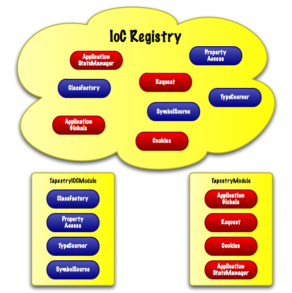

Here we're seeing a few services from the built-in Tapestry IoC module, and a few of the services from the Tapestry web framework module. In fact, there are over 100 services, all interrelated, in the Registry ... and that's before you add your own to the mix. The IoC Registry treats all the services uniformly, regardless of whether they are part of Tapestry, or part of your application, or part of an add-on library.

Tapestry IoC's job is to make all of these services available to each other, and to the outside world. The outside world could be a standalone application, or it could be an application built on top of the Tapestry web framework.

<a id="tapestry-ioc-overview--tapestryiocoverview-servicelifecycle"></a>
<a id="tapestry-ioc-overview--service-life-cycle"></a>

## Service Life Cycle

Tapestry services are *lazy*, which means they are not fully instantiated until they are absolutely needed. Often, what looks like a service is really a proxy object ... the first time any method of the proxy is invoked, the actual service is instantiated and initialized (Tapestry uses the term *realized* for this process). Of course, this is all absolutely thread-safe.

Initially a service is *defined*, meaning some module has defined the service. Later, the service will be *virtual*, meaning a proxy has been created. This occurs most often because some other service *depends* on it, but hasn't gotten around to invoking methods on it. Finally, a service that is ready to use is *realized*. What's nice is that your code neither knows nor cares about the life cycle of the service, because of the magic of the proxy.

In fact, when a Tapestry web application starts up, before it services its first request, only about 20% of the services have been realized; the remainder are defined or virtual.

<a id="tapestry-ioc-overview--tapestryiocoverview-classvs.service"></a>
<a id="tapestry-ioc-overview--class-vs.-service"></a>

## Class vs. Service

A Tapestry service is more than just a class. First of all, it is a combination of an *interface* that defines the operations of the service, and an *implementation class* that implements the interface.

Why this extra division? Having a service interface is what lets Tapestry create proxies and perform other operations. It's also a very good practice to code to an interface, rather than a specific implementation. You'll often be surprised at the kinds of things you can accomplish by substituting one implementation for another.

Tapestry is also very aware that a service will have dependencies on other services. It may also have other needs ... for example, in Tapestry IoC, the container provides services with access to Loggers.

Tapestry IoC also has support for other configuration that may be provided to services when they are realized.

<a id="tapestry-ioc-overview--tapestryiocoverview-dependencyinjection"></a>
<a id="tapestry-ioc-overview--dependency-injection"></a>

## Dependency Injection

Main Article: [Injection](#injection)

<a id="tapestry-ioc-overview--related-articles"></a>

### Related Articles

- Page:

  [Environmental Services](#environmental-services)
- Page:

  [Injection FAQ](#injection-faq)
- Page:

  [Injection in Detail](#injection-in-detail)
- Page:

  [Injection](#injection)

Inversion of Control refers to the fact that the container, here Tapestry IoC's Registry, instantiates your classes. It decides on when the classes get instantiated.

Dependency Injection is a key part of *realization*: this is how a service is provided with the other services it needs to operate. For example, a Data Access Object service may be injected with a ConnectionPool service.

In Tapestry, injection occurs through constructors, through parameters to service builder methods, or through direct injection into fields. Tapestry prefers constructor injection, as this emphasizes that dependencies should be stored in **final** variables. This is the best approach towards ensuring thread safety.

In any case, injection "just happens". Tapestry finds the constructor of your class and analyzes the parameters to determine what to pass in. In some cases, it uses just the parameter type to find a match, in other cases, annotations on the parameters may also be used. It also scans through the fields of your service implementation class to identify which should have injected values written into them.

<a id="tapestry-ioc-overview--tapestryiocoverview-whycan-tijustusenew"></a>
<a id="tapestry-ioc-overview--why-can-t-i-just-use-new"></a>

## Why can't I just use `new`?

That's a common question. All these concepts seem alien at first. What's wrong with `new`?

The problem with new is that it rigidly connects one implementation to another implementation. Let's follow a progression that reflects how a lot of projects get written. It will show that in the real world, `new` is not as simple as it first seems.

This example is built around some real-world work that involves a Java Messaging Service queue, part of an application performance monitoring subsystem for a large application. Code inside each server collects performance data of various types and sends it, via a shared JMS queue, to a central server for collection and reporting.

This code is for a metric that periodically counts the number of rows in a key database table. Other implementations of MetricProducer will be responsible for measuring CPU utilization, available disk space, number of requests per second, and so forth.

```java
public class TableMetricProducer implements MetricProducer {. . .
public void execute() {int rowCount = . . .; Metric metric = new Metric("app/clients", System.currentTimeMillis(), rowCount); new QueueWriter().sendMetric(metric);}}
```

We've omitted some of the details (this code will need a database URL or a connection pool to operate), so as to focus on the one method and it's relationship to the QueueWriter class.

Obviously, this code has a problem ... we're creating a new QueueWriter for each metric we write into the queue, and the QueueWriter presumably is going to open the JMS queue fresh each time, an expensive operation. Thus:

```java
public class TableMetricProducer implements MetricProducer {. . .
private final QueueWriter queueWriter = new QueueWriter();
public void execute() {int rowCount = . . .; Metric metric = new Metric("app/clients", System.currentTimeMillis(), rowCount); queueWriter.sendMetric(metric);}
```

That's better. It's not perfect ... a proper system might know when the application was being shutdown and would shut down the JMS Connection inside the QueueWriter as well.

Here's a more immediate problem: JMS connections are really meant to be shared, and we'll have lots of little classes collecting different metrics. So we need to make the QueueWriter shareable:

```java
  private final QueueWriter queueWriter = QueueWriter.getInstance();
```

... and inside class QueueWriter:

```java
public class QueueWriter {private static QueueWriter instance;
private QueueWriter() {...}
public static getInstance() {if (instance == null) {instance = new QueueWriter();} return instance;}}
```

Much better! Now all the metric producers running inside all the threads can share a single QueueWriter. Oh wait ...

```java
public synchronized static getInstance() {if (instance == null) {instance = new QueueWriter();} return instance;}
```

Is that necessary? Yes. Will the code work without it? Yes – **99.9% of the time**. In fact, this is a very common error in systems that manually code a lot of these construction patterns: forgetting to properly synchronize access. These things often work in development and testing, but fail (with infuriating infrequency) in production, as it takes two or more threads running simultaneously to reveal the coding error.

Wow, we're a long way from a simple `new` already, and we're talking about just one service. But let's detour into *testing*.

How would you test TableMetricProducer? One way would be to let it run and try to find the message or messages it writes in the queue, but that seems fraught with difficulties. It's more of an integration test, and is certainly something that you'd want to execute at some stage of your development, but not as part of a quick-running unit test suite.

Instead, let's split QueueWriter in two: a QueueWriter interface, and a QueueWriterImpl implementation class. This will allow us to run TableMetricProducer against a *mock implementation* of QueueWriter, rather than the real thing. This is one of the immediate benefits of *coding to an interface* rather than *coding to an implementation*.

We'll need to change TableMetricProducer to take the QueueWriter as a constructor parameter.

```java
public class TableMetricProducer implements MetricProducer {private final QueueWriter queueWriter;
/** * The normal constructor.* */ public TableMetricProducer(. . .) {this(QueueWriterImpl.getInstance(), . . .);}
/** * Constructor used for testing.* */ TableMetricProducer(QueueWriter queueWriter, . . .) {queueWriter = queueWriter; . . .}
public void execute() {int rowCount = . . .; Metric metric = new Metric("app/clients", System.currentTimeMillis(), rowCount);
queueWriter.sendMetric(metric);}}
```

This still isn't ideal, as we still have an explicit linkage between TableMetricProducer and QueueWriterImpl.

What we're seeing here is that there are multple *concerns* inside the little bit of code in this example. TableMetricProducer has an unwanted *construction concern* about which implementation of QueueWriter to instantiate (this shows up as two constructors, rather than just one). QueueWriterImpl has an additional *life cycle concern*, in terms of managing the singleton.

These extra concerns, combined with the use of static variables and methods, are a *bad design smell*. It's not yet very stinky, because this example is so small, but these problems tend to multiply as an application grows larger and more complex, especially as services start to truly collaborate in earnest.

For comparison, lets see what the Tapestry IoC implementation would look like:

```java
public class MonitorModule {public static void bind(ServiceBinder binder) {binder.bind(QueueWriter.class, QueueWriterImpl.class); binder.bind(MetricScheduler.class, MetricSchedulerImpl.class);}
public void contributeMetricScheduler(Configuration<MetricProducer> configuration, QueueWriter queueWriter, . . .) {configuration.add(new TableMetricProducer(queueWriter, . . .))}}
```

Again, we've omitted a few details related to the database the TableMetricProducer will point at (in fact, Tapestry IoC provides a lot of support for configuration of this type as well, which is yet another concern).

The MonitorModule class is a Tapestry IoC module: a class that defines and configures services.

The bind() method is the principle way that services are made known to the Registry: here we're binding a service interface to a service implementation. QueueWriter we've discussed already, and MetricScheduler is a service that is responsible for determining when MetricProducer instances run.

The contributeMetricScheduler() method allows the module to *contribute* into the MetricProducer service's *configuration*. More testability: the MetricProducer isn't tied to a pre-set list of producers, instead it will have a Collection<MetricProducer> injected into its constructor. Thus, when we're coding the MetricProducerImpl class, we can test it against mock implementations of MetricProducer.

The QueueWriter service is injected into the contributeMetricScheduler() method. Since there's only one QueueWriter service, Tapestry IoC is able to "find" the correct service based entirely on type. If, eventually, there's more than one QueueWriter service (perhaps pointing at different JMS queues), you would use an annotation on the parameter to help Tapestry connect the parameter to the appropriate service.

Presumably, there would be a couple of other parameters to the contributeMetricScheduler() method, to inject in a database URL or connection pool (that would, in turn, be passed to TableMetricProducer).

A new TableMetricProducer instance is created and contributed in. We could contribute as many producers as we like here. Other modules could also define a contributeMetricScheduler() method and contribute their own MetricProducer instances.

Meanwhile, the QueueWriterImpl class no longer needs the `instance` variable or getInstance() method, and the TableMetricProducer only needs a single constructor.

<a id="tapestry-ioc-overview--tapestryiocoverview-advantagesofioc:summary"></a>
<a id="tapestry-ioc-overview--advantages-of-ioc:-summary"></a>

## Advantages of IoC: Summary

It would be ludicrous for us to claim that applications built without an IoC container are doomed to failure. There is overwhelming evidence that applications have been built without containers and have been perfectly successful.

What we are saying is that IoC techniques and discipline will lead to applications that are:

- **More testable** – smaller, simpler classes; coding to interfaces allows use of mock implementations
- **More robust** – smaller, simpler classes; use of final variables; thread safety baked in
- **More scalable** – thread safety baked in
- **Easier to maintain** – less code, simpler classes
- **Easier to extend** – new features are often additions (new services, new contributions) rather than changes to existing classes

What we're saying is that an IoC container allows you to work faster and smarter.

Many of these traits work together; for example, a more testable application is inherently more robust. Having a test suite makes it easier to maintain and extend your code, because its much easier to see if new features break existing ones. Simpler code plus tests also lowers the cost of entry for new developers coming on board, which allows for more developers to work efficiently on the same code base. The clean separation between interface and implementation also allows multiple developers to work on different aspects of the same code base with a lowered risk of interference and conflict.

By contrast, traditional applications, which we term *monolithic* applications, are often very difficult to test, because there are fewer classes, and each class has multiple concerns. A lack of tests makes it more difficult to add new features without breaking existing features. Further, the monolithic approach more often leads to implementations being linked to other implementations, yet another hurdle standing in the way of testing.

Let's end with a metaphor.

Over a decade ago, when Java first came on the scene, it was the first mainstream language to support garbage collection. This was very controversial: the garbage collector was seen as unnecessary, and a waste of resources. Among C and C++ developers, the attitude was "Why do I need a garbage collector? If I call malloc() I can call free()."

But now, most developers would never want to go back to a non-garbage collected environment. Having the GC around makes it much easier to code in a way we find natural: many small related objects working together. It turns out that knowing when to call free() is more difficult than it sounds. The Objective-C language tried to solve this with retain counts on objects and that still lead to memory leaks when it was applied to object *graphs* rather than object *trees*.

Roll the clock forward a decade and the common consensus has shifted considerably. Objective-C 2.0 features true garbage collection and GC libraries are available for C and C++. All scripting languages, including Ruby and Python, feature garbage collection as well. A new language *without* garbage collection is now considered an anomaly.

The point is, the life cycle of objects turns out to be far more complicated than it looks at first glance. We've come to accept that our own applications lack the ability to police their objects as they are no longer needed (they literally lack the ability to determine *when* an object is no longer needed) and the garbage collector, a kind of higher authority, takes over that job very effectively. The end result? Less code and fewer bugs. And a careful study shows that the Java memory allocator and garbage collector (the two are quite intimately tied together) is actually **more** efficient than malloc() and free().

So we've come to accept that the *death concern* is better handled outside of our own code. The use of Inversion of Control is simply the flip side of that: the *life cycle and construction concerns* are also better handled by an outside authority as well: the IoC container. These concerns govern when a service is *realized* and how its dependencies and configuration are injected. As with the garbage collector, ceding these chores to the container results in less code and fewer bugs, and lets you concentrate on the things that should matter to you: your business logic, your application – and not a whole bunch of boilerplate plumbing!

**Error rendering macro 'scrollbar'**

com/opensymphony/webwork/ServletActionContext

---

<a id="tapestry-ioc-modules"></a>

<!-- source_url: https://tapestry.apache.org/tapestry-ioc-modules.html -->

<!-- page_index: 58 -->

# Tapestry IoC Modules

[Apache Tapestry](#index) > [Documentation](#documentation) > [User Guide](#user-guide) > [IOC](#ioc) > [Tapestry IoC Modules](#tapestry-ioc-modules)

<a id="tapestry-ioc-modules--title"></a>
<a id="tapestry-ioc-modules--tapestry-ioc-modules"></a>

# Tapestry IoC Modules

**Error rendering macro 'scrollbar'**

com/opensymphony/webwork/ServletActionContext

You inform Tapestry about your services and contributions by providing a **module** class.

The module class is a plain Java class that you create to inform Tapestry about your services and contributions.

A system of annotations and naming conventions allow Tapestry to determine what services are provided by the module.

A module class exists for the following reasons:

- To *bind* service interfaces to service implementations
- To contribute configuration data *into* services
- To *decorate* services by providing *interceptors* around them
- To provide explicit code for building a service
- To set a default *marker* for all services defined in the module

All public methods of a module class must be meaningful to Tapestry (be one of the categories above). Any extra public methods result in startup exceptions (because the method may contain a typo).

<a id="tapestry-ioc-modules--tapestryiocmodules-servicebuildermethods"></a>
<a id="tapestry-ioc-modules--service-builder-methods"></a>

# Service Builder Methods

Service builder methods were the original way to define a service and provide the logic to construct it; although this is now more commonly (and succinctly) accomplished using the bind() method, there are still many cases where service builder methods are useful.

Service builder methods are public methods. They are often static. Here's a trivial example:

```java
package org.example.myapp.services;
public class MyAppModule {public static Indexer build() {return new IndexerImpl();}}
```

Any public method (static or instance) whose name starts with "build" is a service builder method, implicitly defining a service within the module.

Here we're defining a service around the Indexer service interface (presumably also in the org.example.myapp.services package).

Every service has a unique id, used to identify it throughout the Registry of services (the Registry is the combined sum of all services from all modules). If you don't provide an explicit service id, as in this example, the service id is drawn from the return type; this service has an id of "Indexer".

You can give a service an explicit id by adding it to the method name: buildIndexer(). This is useful when you do not want the service id to match the service interface name (for example, when you have different services that implement the same interface), or when you need to avoid name collisions on the method name (Java allows only a single method with a given name and set of parameters, even if the return types are different, so if you have two different service builder methods that take the same parameters, you should give them explicit service ids in the method name).

Tapestry IoC is [case insensitive](#case-insensitivity); later we can refer to this service as "indexer" or "INDEXER" or any variation thereof, and connect to this service.

Service ids must be unique; if another module contributes a service with the id "Indexer" (or any case variation thereof) a runtime exception will occur when the Registry is created.

We could extend this example by adding additional service builder methods, or by showing how to inject dependencies. See [the service documentation](#defining-tapestry-ioc-services) for more details.

<a id="tapestry-ioc-modules--tapestryiocmodules-autobuildingservices"></a>
<a id="tapestry-ioc-modules--autobuilding-services"></a>

# Autobuilding Services

Main article: [Defining Tapestry IOC Services](#defining-tapestry-ioc-services)

An alternate, and usually preferred, way to define a service is via a module's bind() method. The previous example can be rewritten as:

```java
package org.example.myapp.services;
import org.apache.tapestry5.ioc.ServiceBinder;
public class MyAppModule {public static void bind(ServiceBinder binder) {binder.bind(Indexer.class, IndexerImpl.class);}}
```

For more details, see see [Defining Tapestry IOC Services](#defining-tapestry-ioc-services). In most cases, autobuilding is the *preferred* approach.

Generally speaking, you should always bind and autobuild your services. The only exceptions are when:

- You wish to do more than just instantiate a class; for example, to register the class as an event listener with some other service.
- There is *no implementation class*; in some cases, you can create your implementation on the fly using JDK dynamic proxies or bytecode generation.

The bind() method must be static; an exception is thrown if the bind() method exists but is an instance method.

<a id="tapestry-ioc-modules--tapestryiocmodules-cacheing_servicescachingservices"></a>
<a id="tapestry-ioc-modules--caching-services"></a>

# Caching Services

You will occasionally find yourself in the position of injecting the same services into your service builder or service decorator methods repeatedly (this occurs much less often since the introduction of service autobuilding). This can result in quite a bit of redundant typing. Less code is better code, so as an alternative, you may define a *constructor* for your module that accepts annotated parameters (as with [service builder injection](#defining-tapestry-ioc-services)).

This gives you a chance to store common services in instance variables for later use inside service builder methods.

```java
public class MyModule {private final JobScheduler scheduler; private final FileSystem fileSystem;
public MyModule(JobScheduler scheduler, FileSystem fileSystem) {this.scheduler = scheduler; this.fileSystem = fileSystem;}
public Indexer build() {IndexerImpl indexer = new IndexerImpl(fileSystem);
scheduler.scheduleDailyJob(indexer);
return indexer;}}
```

Notice that we've switched from *static* methods to *instance* methods. Since the builder methods are not static, the MyModule class will be instantiated so that the methods may be invoked. The constructor receives two common dependencies, which are stored into instance fields that may later be used inside service builder methods such as buildIndexer().

This approach is far from required; all the builder methods of your module can be static if you wish. It is used when you have many common dependencies and wish to avoid defining those dependencies as parameters to multiple methods.

Tapestry IoC automatically resolves the parameter type (JobScheduler and FileSystem, in the example) to the corresponding services that implement that type. When there's more than one service that implements the service interface, you'll get an error (but additional annotations and configuration can be used to ensure the correct service injected).

For modules, there are two additional parameter types that are used to refer to *resources* that can be provided to the module instance (rather than *services* which may be injected).

- [org.slf4j.Logger](http://www.slf4j.org/api/org/slf4j/Logger.html): logger for the module (derived from the module's class name)
- [ObjectLocator](http://tapestry.apache.org/current/apidocs/org/apache/tapestry5/ioc/ObjectLocator.html): access to other services

Note that the fields are final: this is important. Tapestry IoC is thread-safe and you largely never have to think about concurrency issues. But in a busy application, different services may be built by different threads simultaneously. Each module class is a singleton, instantiated at most once, and making these fields final ensures that the values are available across multiple threads. Refer to Brian Goetz's [Java Concurrency in Practice](http://www.javaconcurrencyinpractice.com/) for a more complete explanation of the relationship between final fields, constructors, and threads ... or just trust us!

Care should be taken with this approach: in some circumstances, you may force a situation in which the module constructor is dependent on itself. For example, if you invoke a method on any injected services defined within the same module from the module class' constructor, then the service implementation will be needed. Creating service implementations requires the module builder instance ... that's a recursive reference.

Tapestry detects these scenarios and throws a runtime exception to prevent an endless loop.

<a id="tapestry-ioc-modules--tapestryiocmodules-moduleclassimplementationnotes"></a>
<a id="tapestry-ioc-modules--module-class-implementation-notes"></a>

# Module Class Implementation Notes

Module classes are designed to be very, very simple to implement.

Again, keep the methods very simple. Use [parameter injection](#defining-tapestry-ioc-services) to gain access to the dependencies you need.

Be careful about inheritance. Tapestry will see all *public* methods, even those inherited from base classes. Tapestry *only* sees public methods.

By convention, module class names end in Module and are final classes.

You don't *have* to define your methods as static. The use of static methods is only absolutely necessary in a few cases, where the constructor for a module is dependent on contributions from the same module (this creates a chicken-and-the-egg situation that is resolved through static methods).

<a id="tapestry-ioc-modules--tapestryiocmodules-defaultmarker"></a>
<a id="tapestry-ioc-modules--default-marker"></a>

# Default Marker

Services are often referenced by a particular marker interface on the method or constructor parameter. Tapestry will use the intersection of services with that exact marker and assignable by type to find a unique service to inject.

Often, all services in a module should share a marker, this can be specified with a @Marker annotation on the module class. For example, the TapestryIOCModule:

```java
@Marker(Builtin.class)
public final class TapestryIOCModule
{
  . . .
```

This references a particular annotation class, Builtin:

```java
@Target({ PARAMETER, FIELD }) @Retention(RUNTIME) @Documented public @interface Builtin {
}
```

The annotation can be applied to method and constructor parameters, for use within the IoC container. It can also be applied to fields, though this is specific to the Tapestry web framework.

<a id="tapestry-ioc-modules--tapestryiocmodules-fieldinjection"></a>
<a id="tapestry-ioc-modules--field-injection"></a>

# Field Injection

The @[Inject](http://tapestry.apache.org/current/apidocs/org/apache/tapestry5/annotations/Inject.html) and @[InjectService](http://tapestry.apache.org/current/apidocs/org/apache/tapestry5/annotations/InjectService.html) annotations may be used on instance fields of a module class, as an alternative to passing dependencies of the module in via the constructor.

Caution: injection via fields uses reflection to make the fields accessible. In addition, it may not be as thread-safe as using the constructor to assign to final fields.

Using this style, the previous example of a module class may be rewritten:

```java
public class MyModule {@Inject private JobScheduler scheduler;
@Inject private FileSystem fileSystem;
public Indexer build() {IndexerImpl indexer = new IndexerImpl(fileSystem);
scheduler.scheduleDailyJob(indexer);
return indexer;}}
```

**Error rendering macro 'scrollbar'**

com/opensymphony/webwork/ServletActionContext

---

<a id="defining-tapestry-ioc-services"></a>

<!-- source_url: https://tapestry.apache.org/defining-tapestry-ioc-services.html -->

<!-- page_index: 59 -->

# Defining Tapestry IOC Services

[Apache Tapestry](#index) > [Documentation](#documentation) > [User Guide](#user-guide) > [IOC](#ioc) > [Defining Tapestry IOC Services](#defining-tapestry-ioc-services)

<a id="defining-tapestry-ioc-services--title"></a>
<a id="defining-tapestry-ioc-services--defining-tapestry-ioc-services"></a>

# Defining Tapestry IOC Services

**Error rendering macro 'scrollbar'**

com/opensymphony/webwork/ServletActionContext

Services consist of two main parts: a service interface and a service implementation.

The service interface is how the service will be represented throughout the rest of the registry. Since what gets passed around is normally a proxy, you can't expect to cast a service object down to the implementation class (you'll see a ClassCastException instead). In other words, you should be careful to ensure that your service interface is complete, since Tapestry IoC effectively walls you off from back doors such as casts.

<a id="defining-tapestry-ioc-services--definingtapestryiocservices-servicelifecycle"></a>
<a id="defining-tapestry-ioc-services--service-life-cycle"></a>

# Service Life Cycle

Every service has a very specific life cycle.

- Defined: The service has a definition (from some module) but has not yet been referenced.
- Virtual: The service has been referenced, so a proxy for the class has been created.
- Realized: A method on the proxy has been invoked, so the service implementation has been instantiated, and any decorators applied.
- Shutdown: The entire Registry has been shut down and with it, all the proxies have been disabled.

When the Registry is first created, all modules are scanned and the definitions for all services are created.

Services will be referenced by either accessing them using the Registry, or as dependencies of other realized services.

Tapestry IoC waits until the last possible moment to *realize* the service: that's defined as when a method of the service is invoked. Tapestry is *thread-safe*, so even in a heavily contested, highly threaded environment (such as a servlet container or application server) things *Just Work*.

<a id="defining-tapestry-ioc-services--definingtapestryiocservices-servicebuildermethods"></a>
<a id="defining-tapestry-ioc-services--service-builder-methods"></a>

# Service Builder Methods

Tapestry doesn't know how to instantiate and configure your service; instead it relies on you to provide the code to do so, in a service builder method, a method whose name is (or starts with) "build":

```java
package org.example.myapp.services;
public class MyAppModule {public static Indexer build() {return new IndexerImpl();}}
```

Here the service interface is Indexer (presumably inside the org.example.myapp.services package, since there isn't an import). Tapestry IoC doesn't know about the IndexerImpl class (the service implementation of the Indexer service), but it does know about the build() method.

That's one of the great innovations of Tapestry IoC: we don't try to encapsulate in XML or annotations all the different ways possible to create a service; those things are best expressed in Java code. For a simple case (as here), it would be hard for external configuration (again, in XML or Java annotations) to be shorter than "new IndexerImpl()".

*The above paragraph was written before Binding and Autobuilding were introduced.*

For more complex and realistic scenarios, such as injecting dependencies via the constructor, or doing more interest work (such as registering the newly created service for events published by some other service), the Java code is simply the most direct, flexible, extensible and readable approach.

<a id="defining-tapestry-ioc-services--definingtapestryiocservices-bindingandautobuilding"></a>
<a id="defining-tapestry-ioc-services--binding-and-autobuilding"></a>

# Binding and Autobuilding

Tapestry IoC can also *autobuild* your service. Autobuilding is the *preferred* way to instantiate your services.

Every module may have an optional, static bind() method which is passed a [ServiceBinder](http://tapestry.apache.org/current/apidocs/org/apache/tapestry5/ioc/ServiceBinder.html). Services may be registered with the container by "binding" a service interface to a service implementation:

```java
package org.example.myapp.services;
import org.apache.tapestry5.ioc.ServiceBinder;
public class MyAppModule {public static void bind(ServiceBinder binder) {binder.bind(Indexer.class, IndexerImpl.class);}}
```

You can make repeated calls to ServiceBinder.bind(), to bind additional services.

You might ask, "which is better, a builder method for each service, or a bind() method for the module?" For simple services, those that are just an instantiated instance with simple dependencies, binding is better than building. That covers at least 90% of all services, so bind away!

There are many cases, however, where constructing a service is more than just instantiating a class. Often the new service will (for example) be registered as a listener with some other service. In other cases, the implementation of the service is generated at runtime. These are where the service builder methods are most useful.

In terms of the evolution of the framework, service builder methods came first, and autobuilding was a later addition, inspired by the terseness of the [Guice](http://code.google.com/p/google-guice/) IoC container.

Following the convention over configuration principle, the autobuilding of services can be even less verbose. If a service interface is passed as a single argument to the bind() method, Tapestry will try to find an implementation in the same package whose name matches the name of the service interface followed by the suffix *Impl*.

```java
package org.example.myapp.services;
import org.apache.tapestry5.ioc.ServiceBinder;
public class MyAppModule {public static void bind(ServiceBinder binder) {binder.bind(Indexer.class);}}
```

<a id="defining-tapestry-ioc-services--definingtapestryiocservices-serviceids"></a>
<a id="defining-tapestry-ioc-services--service-ids"></a>

# Service Ids

Every service will have a unique service id.

When using a service builder method, the service id is the *simple name* of the service interface.

This can be overridden by adding the @[ServiceId](http://tapestry.apache.org/current/apidocs/org/apache/tapestry5/ioc/annotations/ServiceId.html) annotation to the service builder method:

```java
  @ServiceId("FileSystemIndexer")
  public static Indexer buildIndexer(@InjectService("FileSystem") FileSystem fileSystem)
  {
     . . .
  }
```

Another option is to add the service id to the method name, after "build", for example:

```java
  public static Indexer buildFileSystemIndexer(@InjectService("FileSystem") FileSystem fileSystem)
  {
     . . .
  }
```

Here, the service id is "FileSystemIndexer" not "Indexer".

For autobuilt services, the service id can be specified by placing the @[ServiceId](http://tapestry.apache.org/current/apidocs/org/apache/tapestry5/ioc/annotations/ServiceId.html) annotation directly on a service implementation class.

```java
  @ServiceId("FileSystemIndexer")
  public class IndexerImpl implements Indexer
  {
      ...
  }
```

When the service is bound, the value of the annotation is used as id:

```java
  binder.bind(Indexer.class, IndexerImpl.class);
```

This id can be overriden again by calling the method [withId(String)](http://tapestry.apache.org/current/apidocs/org/apache/tapestry5/ioc/ServiceBindingOptions.html#withId-java.lang.String-):

```java
  binder.bind(Indexer.class, IndexerImpl.class).withId("FileSystemIndexer");
```

<a id="defining-tapestry-ioc-services--definingtapestryiocservices-injecting_dependenciesinjectingdependencies"></a>
<a id="defining-tapestry-ioc-services--injecting-dependencies"></a>

# Injecting Dependencies

It's pretty unlikely that your service will be able to operate in a total vacuum. It will have other dependencies.

Dependencies are provided to a service in one of several ways:

- As parameters to the service builder method
- As parameters to the service implementation class' constructor (for autobuilt services)
- As parameters passed to the constructor of the service's module class (to be cached inside instance variables)
- Directly into fields of the service implementation

For example, let's say the Indexer needs a JobScheduler to control when it executes, and a FileSystem to access files and store indexes.

```java
public static Indexer build(JobScheduler scheduler, FileSystem fileSystem) {IndexerImpl indexer = new IndexerImpl(fileSystem);
scheduler.scheduleDailyJob(indexer);
return indexer;}
```

Tapestry assumes that parameters to builder methods are dependencies; in this example it is able to figure out what services to pass in based just on the type (later we'll see how we can fine tune this with annotations, when the service type is not sufficient to identify a single service).

This is an example of when you would want to use the service builder method, rather than just binding the service interface to the implementation class: because we want to do something extra, in this case, register the new indexer service with the scheduler.

Note that we don't invoke those service builder methods ... we just "advertise" (via naming convention or annotation) that we need the named services. Tapestry IoC will provide the necessary proxies and, when we start to invoke methods on those proxies, will ensure that the full service, including its interceptors and its dependencies, are ready to go. Again, this is done in a thread-safe manner.

What happens if there is more than one service that implements the JobScheduler interface, or the FileSystem interface? You'll see a runtime exception, because Tapestry is unable to resolve it down to a *single* service. At this point, it is necessary to *disambiguate* the link between the service interface and *one* service. One approach is to use the @[InjectService](http://tapestry.apache.org/current/apidocs/org/apache/tapestry5/ioc/annotations/InjectService.html) annotation:

```java
public static Indexer build(@InjectService("JobScheduler") JobScheduler scheduler,
@InjectService("FileSystem") FileSystem fileSystem) {IndexerImpl indexer = new IndexerImpl(fileSystem);
scheduler.scheduleDailyJob(indexer);
return indexer;}
```

If you find yourself injecting the same dependencies into multiple service builder (or service decorator) methods, you can [cache dependency injections](#tapestry-ioc-modules) in your module, by defining a constructor. This reduces duplication in your module.

<a id="defining-tapestry-ioc-services--definingtapestryiocservices-disambiguationwithmarkerannotations"></a>
<a id="defining-tapestry-ioc-services--disambiguation-with-marker-annotations"></a>

# Disambiguation with Marker Annotations

In the previous example we were faced with a problem: multiple versions of the JobScheduler service. They had the same service interface but unique service ids. If you try to inject based on type, the service to inject will be ambiguous. Tapestry will throw an exception (identifying the parameter type and the matching services that implement that type).

The problem is that when injecting a JobScheduler into some other service we need to know which *one* to inject. Rather than using the service id, another approach is to use a *marker annotation*.

You may optionally link a service implementation with a marker annotation.

For example, maybe you have one JobScheduler implementation where the jobs are spread across a number of nodes in a cluster, and you have another JobScheduler where the jobs are all executed exclusively in the current process.

We can associate those two JobSchedulers with two annotations.

```java
@Target({ PARAMETER, FIELD }) @Retention(RUNTIME) @Documented public @interface Clustered {
}
@Target({ PARAMETER, FIELD }) @Retention(RUNTIME) @Documented public @interface InProcess {
}
public class MyModule {public static void bind(ServiceBinder binder) {binder.bind(JobScheduler.class, ClusteredJobSchedulerImpl.class).withId("ClusteredJobScheduler").withMarker(Clustered.class); binder.bind(JobScheduler.class, SimpleJobSchedulerImpl.class).withId("InProcessJobScheduler").withMarker(InProcess.class);}}
```

Notice that the marker annotations have no attributes. Further, we support markers on fields (for use in Tapestry components) as well as parameters.

To get the right version of the service, you use one of the annotations:

```java
public class MyServiceImpl implements MyService {private final JobScheduler jobScheduler;
public MyServiceImpl(@Clustered JobScheduler jobScheduler) {this.jobScheduler = jobScheduler;}
. . .}
```

The @Clustered annotation on the parameter is combined with the parameter type (JobScheduler) to find the exact service implementation.

Why is this better than using the service id? It's more refactoring-safe. Service ids can change, which can break your services. However, using an IDE to rename or move an annotation class or service interface will be able to update all the uses of the annotation or interface.

With a service builder method, you use the @[Marker](http://tapestry.apache.org/current/apidocs/org/apache/tapestry5/ioc/annotations/Marker.html) annotation:

```java
  @Marker(Clustered.class)
  public JobScheduler buildClusteredJobScheduler()
  {
    return . . .;
  }
```

The @Marker annotation may also be placed on an implementation class, which means that you may omit the call to withMarker() inside the bind() method.

Finally, the point of injection may have multiple marker annotations; only services that are marked with *all* those markers will be considered for injection. Each marker annotation creates an increasingly narrow subset from the set of all possible services (compatible with the indicated dependency type).

<a id="defining-tapestry-ioc-services--definingtapestryiocservices-localdependencies"></a>
<a id="defining-tapestry-ioc-services--local-dependencies"></a>

# Local Dependencies

A special marker interface, @[Local](http://tapestry.apache.org/current/apidocs/org/apache/tapestry5/ioc/annotations/Local.html), indicates a dependency that should only be resolved using services from within *the same module*.

@Local can also be combined with other marker annotations.

<a id="defining-tapestry-ioc-services--definingtapestryiocservices-injectingdependenciesforautobuiltservices"></a>
<a id="defining-tapestry-ioc-services--injecting-dependencies-for-autobuilt-services"></a>

# Injecting Dependencies for Autobuilt Services

With autobuilt services, there's no service builder method in which to specify injections.

Instead, the injections occur on *constructor* for the implementation class:

```java
package org.example.myapp.services;
import org.apache.tapestry5.ioc.annotations.InjectService;
public class IndexerImpl implements Indexer {private final FileSystem fileSystem;
public IndexerImpl(@InjectService("FileSystem") FileSystem fileSystem) {this.fileSystem = fileSystem;}
. . .}
```

If the class has multiple constructors, the constructor with the *most* parameters will be invoked. Alternately, you may mark a single constructor with the Inject annotation, and Tapestry will use *that* constructor specifically, ignoring all other constructors.

Note how we are using final fields for our dependencies; this is generally a Good Idea. These services will often execute inside a multi-threaded environment, such as a web application, and the use of final fields inside a constructor ensures that the fields will be properly published (meaning, "visible to other threads") in accordance with the Java Memory Model.

Once thing that is not a good idea is to pass in another service, such as JobScheduler in the previous example, and pass `this` from a constructor:

```java
package org.example.myapp.services;
import org.apache.tapestry5.ioc.annotations.InjectService;
public class IndexerImpl implements Indexer {private final FileSystem fileSystem;
public IndexerImpl(@InjectService("FileSystem") FileSystem fileSystem,
@InjectService("JobScheduler") JobScheduler scheduler) {this.fileSystem = fileSystem;
scheduler.scheduleDailyJob(this); // Bad Idea}
. . .}
```

Understanding why this is a bad idea involves a long detour into inner details of the Java Memory Model. The short form is that other threads may end up invoking methods on the IndexerImpl instance, and its fields (even though they are final, even though they appear to already have been set) may be uninitialized.

<a id="defining-tapestry-ioc-services--definingtapestryiocservices-fieldinjection"></a>
<a id="defining-tapestry-ioc-services--field-injection"></a>

# Field Injection

The @[Inject](http://tapestry.apache.org/current/apidocs/org/apache/tapestry5/ioc/annotations/Inject.html) and @[InjectService](http://tapestry.apache.org/current/apidocs/org/apache/tapestry5/ioc/annotations/InjectService.html) annotations may be used on instance fields of a service implementation class, as an alternative to passing dependencies of the service implementation in via the constructor.

Note that only dependencies are settable this way; if you want resources, including the service's [configuration](#tapestry-ioc-configuration), you must pass those through the constructor. You *are* free to mix and match, injecting partially with field injection and partially with constructor injection.

Caution: injection via fields uses reflection to make the fields accessible. In addition, it may not be as thread-safe as using the constructor to assign to final fields.

```java
package org.example.myapp.services;
import org.apache.tapestry5.ioc.annotations.InjectService;
public class IndexerImpl implements Indexer {@InjectService("FileSystem") private FileSystem fileSystem;
. . .}
```

<a id="defining-tapestry-ioc-services--definingtapestryiocservices-servicescopedefiningservicescope"></a>
<a id="defining-tapestry-ioc-services--defining-service-scope"></a>

# Defining Service Scope

Each service has a *scope* that controls when the service implementation is instantiated. There are two built in scopes: "singleton" and "perthread", but more can be added.

Service scope is specified using the @[Scope](http://tapestry.apache.org/current/apidocs/org/apache/tapestry5/ioc/annotations/Scope.html) annotation, which is attached to a builder method, or to the service implementation class. When this annotation is not present, the default scope, "singleton" is used.

<a id="defining-tapestry-ioc-services--definingtapestryiocservices-singleton"></a>
<a id="defining-tapestry-ioc-services--singleton"></a>

### singleton

Most services use the default scope, "singleton". With this scope a *proxy* is created when the service is first referenced. By reference, we mean any situation in which the service is requested by name, such as using the @InjectService annotation on a service builder method, or by using the [Registry](http://tapestry.apache.org/current/apidocs/org/apache/tapestry5/ioc/Registry.html) API from outside the container.

In any case, the service proxy will only create the service implementation when a method on the service interface is invoked. Until then, the service can be thought of as "virtual". As the first method is invoked, the service builder method is invoked, then any service decorations occur. This construction process, called "realization", occurs only once.

You should be aware when writing services that your code must be thread safe; any service you define could be invoked simultaneously by multiple threads. This is rarely an issue in practice, since most services take input, use local variables, and invoke methods on other services, without making use of non-final instance variables. The few instance variables in a service implementation are usually references to other Tapestry IoC services.

<a id="defining-tapestry-ioc-services--definingtapestryiocservices-perthread"></a>
<a id="defining-tapestry-ioc-services--perthread"></a>

### perthread

The perthread service scope exists primarily to help multi-threaded servlet applications, though it has other applications.

With perthread, the service proxy will delegate to a local service instance that is associated with the current thread. Two different threads, invoking methods on the same proxy, will ultimately be invoking methods on two different service instances, each reserved to their own thread.

This is useful when a service needs to keep request specific state, such as information extracted from the HttpServletRequest (in a web application). The default singleton model would not work in such a multithreaded environment. Using perthread on select services allows state to be isolated to those services. Because the dispatch occurs *inside* the proxy, you can treat the service as a global, like any other.

You will see that your service builder method is invoked more than once. It is invoked in each thread where the perthread service is used.

At the end of the request, the Registry's cleanupThread() method is invoked; it will discard any perthread service implementations for the current thread.

**Caution:** A common technique in Tapestry IoC is to have a service builder method register a core service implementation as an event listener with some event hub service. With non-singleton objects, this can cause a number of problems; the event hub will hold a reference to the per-thread instance, even after that per-thread instance has been cleaned up (discarded by the inner proxy). Simply put, this is a pattern to avoid. For the most part, perthread services should be simple holders of data specific to a thread or a request, and should not have overly complex relationships with the other services in the registry.

<a id="defining-tapestry-ioc-services--definingtapestryiocservices-definingthescopeofautobuiltservices"></a>
<a id="defining-tapestry-ioc-services--defining-the-scope-of-autobuilt-services"></a>

# Defining the scope of Autobuilt Services

There are two options for defining the scope for an autobuilt service.

The service implementation class may include the @[Scope](http://tapestry.apache.org/current/apidocs/org/apache/tapestry5/ioc/annotations/Scope.html) annotation. This is generally the preferred way to specify scope.

In addition, it is possible to specify the scope when binding the service:

```java
  bind(MyServiceInterface.class, MyServiceImpl.class).scope(ScopeConstants.PERTHREAD);
```

<a id="defining-tapestry-ioc-services--definingtapestryiocservices-eagerloadingservices"></a>
<a id="defining-tapestry-ioc-services--eager-loading-services"></a>

# Eager Loading Services

Services are normally created only as needed (per the scope discussion above).

This can be tweaked slightly; by adding the @[EagerLoad](http://tapestry.apache.org/current/apidocs/org/apache/tapestry5/ioc/annotations/EagerLoad.html) annotation to the service builder method, Tapestry will instantiate the service when the Registry is first created.

This will cause the service builder method to be invoked, as well as any service decorator methods.

This feature is used when a service manages a resource, such as a thread, that needs to be created as soon as the application starts up. Another common example is a service that listens for events produced by a second service; the first service may need to be created, and start listening, before any of its service methods are invoked (which would normally trigger the instantiation of the service).

Many services may be annotated with @EagerLoad; the order in which services are created is not defined.

With the perthread scope, the service builder method will not be invoked (this won't happen until a service method is invoked), but the decorators for the service will be created.

<a id="defining-tapestry-ioc-services--definingtapestryiocservices-eagerloadingautobuiltservices"></a>
<a id="defining-tapestry-ioc-services--eager-loading-autobuilt-services"></a>

# Eager Loading Autobuilt Services

As with service scope, there are two options for indicating that an autobuilt service should be eagerly loaded.

The service implementation class may include the @EagerLoad annotation.

You may also specify eager loading explicitly when binding the service:

```java
  bind(MyServiceInterface.class, MyServiceImpl.class).eagerLoad();
```

<a id="defining-tapestry-ioc-services--definingtapestryiocservices-injectingresources"></a>
<a id="defining-tapestry-ioc-services--injecting-resources"></a>

# Injecting Resources

In addition to injecting services, Tapestry will key off of the parameter type to allow other things to be injected.

- java.lang.String: unique id for the service
- [org.slf4j.Logger](http://www.slf4j.org/api/org/slf4j/Logger.html): logger for the service
- java.lang.Class: service interface implemented by the service to be constructed
- [ServiceResources](http://tapestry.apache.org/current/apidocs/org/apache/tapestry5/ioc/ServiceResources.html): access to other services

No annotation is needed for these cases.

See also [service configuration](#defining-tapestry-ioc-services) for additional special cases of resources that can be injected.

Note: resources may not be injected into fields, they are injectable only via method or constructor parameters.

Example:

```java
public static Indexer build(String serviceId, Log serviceLog,JobScheduler scheduler, FileSystem fileSystem) {IndexerImpl indexer = new IndexerImpl(serviceLog, fileSystem);
scheduler.scheduleDailyJob(serviceId, indexer);
return indexer;}
```

The order of parameters is completely irrelevant. They can come first or last or be interspersed however you like.

Injecting in the ServiceResources can be handy when you want to calculate the name of a service dependency on the fly. However, in the general case (where the id of service dependencies is known at build time), it is easier to use the @InjectService annotation.

The Log's name (used when configuring logging settings for the service) consists of the module class name and the service id seperated by a period, i.e. "org.example.myapp.MyModule.Indexer".

Further, ServiceResources includes an autobuild() method that allows you to easily trigger the construction of a class, including dependencies. Thus the previos example could be rewritten as:

```java
public static Indexer build(ServiceResources resources, JobScheduler jobScheduler) {IndexerImpl indexer = resources.autobuild(IndexerImpl.class);
scheduler.scheduleDailyJob(resources.getServiceId(), indexer);
return indexer;}
```

This works the exact same way with autobuilt services, except that the parameters of the service implementation constructor are considered, rather than the parameters of the service builder method.

The @InjectService annotation takes precedence over these resources.

If the @InjectService annotation is not present, and the parameter type does not exactly match a resource type, then [object injection](#object-providers) occurs. Object injection will find the correct object to inject based on a number of (extensible) factors, including the parameter type and any additional annotations on the parameter.

Every once and a while, you'll have a conflict between a resource type and an object injection. For example, the following does not work as expected:

```java
public static Indexer build(String serviceId, Log serviceLog,JobScheduler scheduler, FileSystem fileSystem,@Value("${index-alerts-email}") String alertEmail) {IndexerImpl indexer = new IndexerImpl(serviceLog, fileSystem, alertEmail);
scheduler.scheduleDailyJob(serviceId, indexer);
return indexer;}
```

It doesn't work because type String always gets the service id, as a resource (as with the serviceId parameter). In order to get this to work, we need to turn off the resource injection for the alertEmail parameter. That's what the @[Inject](http://tapestry.apache.org/current/apidocs/org/apache/tapestry5/ioc/annotations/Inject.html) annotation does:

```java
public static Indexer build(String serviceId, Log serviceLog,JobScheduler scheduler, FileSystem fileSystem,@Inject @Value("${index-alerts-email}") String alertEmail) {IndexerImpl indexer = new IndexerImpl(serviceLog, fileSystem, alertEmail);
scheduler.scheduleDailyJob(serviceId, indexer);
return indexer;}
```

Here, the alertEmail parameter will receive the configured alerts email (see the [symbols documentation](#symbols) for more about this syntax) rather than the service id.

<a id="defining-tapestry-ioc-services--definingtapestryiocservices-bindingservicebuilders"></a>
<a id="defining-tapestry-ioc-services--binding-servicebuilders"></a>

# Binding ServiceBuilders

Yet another option is available: instead of binding an interface to a implemention class, you can bind a service to a [ServiceBuilder](http://tapestry.apache.org/current/apidocs/org/apache/tapestry5/ioc/ServiceBuilder.html), a callback used to create the service implementation. This is very useful in very rare circumstances.

<a id="defining-tapestry-ioc-services--definingtapestryiocservices-builtinservices"></a>
<a id="defining-tapestry-ioc-services--builtin-services"></a>

# Builtin Services

A few services within the Tapestry IOC Module are "builtin"; there is no service builder method in the [TapestryIOCModule](http://tapestry.apache.org/current/apidocs/org/apache/tapestry5/ioc/services/TapestryIOCModule.html) class.

| **Service Id** | **Service Interface** |
| --- | --- |
| ClassFactory | [ClassFactory](http://tapestry.apache.org/current/apidocs/org/apache/tapestry5/ioc/services/ClassFactory.html) |
| LoggerSource | [LoggerSource](http://tapestry.apache.org/current/apidocs/org/apache/tapestry5/ioc/LoggerSource.html) |
| RegistryShutdownHub | [RegistryShutdownHub](http://tapestry.apache.org/current/apidocs/org/apache/tapestry5/ioc/services/RegistryShutdownHub.html) |
| PerthreadManager | [PerthreadManager](http://tapestry.apache.org/current/apidocs/org/apache/tapestry5/ioc/services/PerthreadManager.html) |

Consult the JavaDoc for each of these services to identify under what circumstances you'll need to use them.

<a id="defining-tapestry-ioc-services--definingtapestryiocservices-mutuallydependentservices"></a>
<a id="defining-tapestry-ioc-services--mutually-dependent-services"></a>

# Mutually Dependent Services

One of the benefits of Tapestry IoC's proxy-based approach to just-in-time instantiation is the automatic support for mutually dependent services. For example, suppose that the Indexer and the FileSystem needed to talk directly to each other. Normally, this would cause a "chicken-and-the-egg" problem: which one to create first?

With Tapestry IoC, this is not even considered a special case:

```java
public static Indexer buildIndexer(JobScheduler scheduler, FileSystem fileSystem) {IndexerImpl indexer = new IndexerImpl(fileSystem);
scheduler.scheduleDailyJob(indexer);
return indexer;}
public static FileSystem buildFileSystem(Indexer indexer) {return new FileSystemImpl(indexer);}
```

Here, Indexer and FileSystem are mutually dependent. Eventually, one or the other of them will be created ... let's say its FileSystem. The buildFileSystem() builder method will be invoked, and a proxy to Indexer will be passed in. Inside the FileSystemImpl constructor (or at some later date), a method of the Indexer service will be invoked, at which point, the builderIndexer() method is invoked. It still receives the proxy to the FileSystem service.

If the order is reversed, such that Indexer is built before FileSystem, everything still works the same.

This approach can be very powerful. For example, it can be used to break apart untestable monolithic code into two mutually dependent halves, each of which can be unit tested.

The exception to this rule is a service that depends on itself *during construction*. This can occur when (indirectly, through other services) building the service tries to invoke a method on the service being built. This can happen when the service implementation's constructor invoke methods on service dependencies passed into it, or when the service builder method itself does the same. This is actually a very rare case and difficult to illustrate.

**Error rendering macro 'scrollbar'**

com/opensymphony/webwork/ServletActionContext

---

<a id="service-advisors"></a>

<!-- source_url: https://tapestry.apache.org/service-advisors.html -->

<!-- page_index: 60 -->

# Service Advisors

[Apache Tapestry](#index) > [Documentation](#documentation) > [User Guide](#user-guide) > [IOC](#ioc) > [Service Advisors](#service-advisors)

<a id="service-advisors--title"></a>
<a id="service-advisors--service-advisors"></a>

# Service Advisors

**Error rendering macro 'scrollbar'**

com/opensymphony/webwork/ServletActionContext

<a id="service-advisors--serviceadvisors-serviceadvisors"></a>
<a id="service-advisors--service-advisors-2"></a>

# Service Advisors

Service advice represents a powerful meta-programming facility available to services. In fact, it is a kind of limited Aspect Oriented Programming.

Service advice allows you to intercept method invocations on your services; you have the ability to see what methods get invoked, what the parameters are. You can let the normal code do it work, and then inspect or even adjust the return value, or any thrown exceptions. And you can do this all in normal Java code.

A common example of method-level service advice is to log method entry and exit, complete with parameter values, return values, and thrown exceptions. Other approaches include security checks, transaction management, and other broadly spanning concerns.

Let's start with a (contrived) example. Let's say you have an existing set of services that have methods that sometimes return null, and you want them to return an empty string instead because you are getting some NullPointerExceptions elsewhere in your application.

You could track down the implementation of each service and fix the logic that provides a return value ... or you could advise the methods:

```java
@Match("*") public static void adviseNonNull(MethodAdviceReceiver receiver) {MethodAdvice advice = new MethodAdvice() {void advise(Invocation invocation) {invocation.proceed();
if (invocation.getResultType().equals(String.class) && invocation.getResult() == null) invocation.overrideResult("");} };
receiver.adviseAllMethods(advice); };
```

This is a method that is placed in a module class. Note the terminology: *advise* is the verb ("to advise a method") and *advice* is the noun ("with this advice"). The [MethodAdviceReceiver](http://tapestry.apache.org/current/apidocs/org/apache/tapestry5/ioc/MethodAdviceReceiver.html) is a wrapper around the service being advised: you can add advice to some or all methods of the service, and also obtain the interface of the service. It is automatically passed into service advisor methods.

See [Injection in Detail](#injection-in-detail) for what can be injected into a service advisor method.

Service advisor methods must have a parameter of type MethodAdviceReceiver.

A service will often be advised multiple times; any method may have any number of advice objects applied to it. Some methods may not get any advice. All of this is acceptable.

Service advisor methods are always void methods (this is different from [service decorator methods](#tapestry-ioc-decorators)).

The @[Match](http://tapestry.apache.org/current/apidocs/org/apache/tapestry5/ioc/annotations/Match.html)("\*") annotation indicates that this advice applies to all services (both your own, and those defined by Tapestry). You will want to narrow down which services are actually targeted in most cases.

Note that some services, especially those built into Tapestry IoC, are marked as [not subject to decoration](http://tapestry.apache.org/current/apidocs/org/apache/tapestry5/ioc/annotations/PreventServiceDecoration.html), this applies to service advice as well as service decoration.

The [MethodAdvice](http://tapestry.apache.org/current/apidocs/org/apache/tapestry5/ioc/MethodAdvice.html) interface is very simple; it receives an [Invocation](http://tapestry.apache.org/current/apidocs/org/apache/tapestry5/ioc/Invocation.html) representing a method call. Invocation has methods for inspecting the type and value of the parameters, and for overriding the values of the parameters.

The call to `proceed()` allows the invocation to continue; that is, the original method is invoked. If the method has been advised multiple times, the call to proceed() may chain into the next MethodAdvice object. In any case, after invoking `proceed()`, you may inspect and override the result (the return value).

Advice is pretty efficient, but it is still better to apply it only to methods that make sense. We can improve the service advisor method in our example to only advise methods that return String:

```java
@Match("*") public static void adviseNonNull(MethodAdviceReceiver receiver) {MethodAdvice advice = new MethodAdvice() {void advise(Invocation invocation) {invocation.proceed();
if (invocation.getResult().equals(null)) invocation.overrideResult("");} };
for (Method m : receiver.getServiceInterface().getMethods()) {if (m.getReturnType().equals(String.class)) receiver.adviseMethod(m, advice);} };
```

<a id="service-advisors--serviceadvisors-built-inadvice"></a>
<a id="service-advisors--built-in-advice"></a>

# Built-in Advice

Tapestry includes two built-in advisor services.

<a id="service-advisors--serviceadvisors-loggingadvice"></a>
<a id="service-advisors--logging-advice"></a>

## Logging Advice

Logging advice is built into Tapestry. You can apply logging advice to your services very easily:

```java
  @Match("*")
  public static void adviseLogging(LoggingAdvisor loggingAdvisor, Logger logger, MethodAdviceReceiver receiver)
  {
    loggingAdvisor.addLoggingAdvice(logger, receiver);
  }
```

[LoggingAdvisor](http://tapestry.apache.org/current/apidocs/org/apache/tapestry5/ioc/services/LoggingAdvisor.html) is a built-in Tapestry IoC service. This demonstrates how services can be injected into service advisor methods. The Logger parameter is the logger for the service being advised.

<a id="service-advisors--serviceadvisors-lazyadvice"></a>
<a id="service-advisors--lazy-advice"></a>

## Lazy Advice

[LazyAdvisor](http://tapestry.apache.org/current/apidocs/org/apache/tapestry5/ioc/services/LazyAdvisor.html) makes method invocations lazy: methods that return an interface (rather than a value) will not execute immediately; instead, the method invocation is postponed until a method of the return value is invoked.

<a id="service-advisors--serviceadvisors-matchingandordering"></a>
<a id="service-advisors--matching-and-ordering"></a>

# Matching And Ordering

Each service advice method gets a unique id, obtained by stripping the "advise" prefix from the method name. Advice ids must be unique across all modules.

If the @Match annotation is omitted, the advice will match against a service with the same id.

In many cases, the order in which the advice is given is very important; for example, you may want logging first, then transaction management, then security checks. The @[Order](http://tapestry.apache.org/current/apidocs/org/apache/tapestry5/ioc/annotations/Order.html) annotation allows you to explicitly set the order.

<a id="service-advisors--serviceadvisors-annotationdrivenadvisors"></a>
<a id="service-advisors--annotation-driven-advisors"></a>

# Annotation driven advisors

**Added in 5.2**

Starting from version 5.2, Tapestry supports annotation-driven advise methods. If the [@Advise](http://tapestry.apache.org/current/apidocs/org/apache/tapestry5/ioc/annotations/Advise.html) annotation is present, the advise method can be arbitrary named, as shown in the following example.

```java
  @Advise
  @Match("*DAO")
  public static void byServiceId(MethodAdviceReceiver receiver)
  {
    ...
  }
```

The advice above is applied to any service whose id matches the "\*DAO" pattern.

Alternatively, marker annotations can be placed on the advise method to match a specific service.

```java
  @Advise
  @Blue
  public static void byMarkerAnnotation(MethodAdviceReceiver receiver)
  {
    ...
  }
```

The advice above is applied to any service that is marked by the @Blue annotation.

By default, [@Advise](http://tapestry.apache.org/current/apidocs/org/apache/tapestry5/ioc/annotations/Advise.html) annotation applies the advice to any service matched by the [@Match](http://tapestry.apache.org/current/apidocs/org/apache/tapestry5/ioc/annotations/Match.html) or marker annotations. You can limit the matching to a single service interface, as shown in the following example.

```java
  @Advise(serviceInterface=MyService.class)
  @Match("*DAO")
  public static void byMatchAnnotation(MethodAdviceReceiver receiver)
  {
    ...
  }
```

In the example above, the advice is applied to any implementation of MyService interfaces whose id matches the "\*DAO" pattern.

```java
  @Advise(serviceInterface=MyService.class)
  @Blue
  public static void byMarkerAnnotation(MethodAdviceReceiver receiver)
  {
    ...
  }
```

The advice above is applied to any implementation of the MyService interface that is marked by the @Blue annotation.

<a id="service-advisors--serviceadvisors-decoratorsandadvice"></a>
<a id="service-advisors--decorators-and-advice"></a>

# Decorators and Advice

[Service decorators](#tapestry-ioc-decorators) are another way to achieve the same thing; service advisors are a more recent addition, added in Tapestry 5.1.

It is not recommended that you mix advice and decoration. If you do, decoration take precedence; all decorators will be in effect before any advice (internally, they are two separate steps, with advice being processed and the result of that used by the decorators).

**Error rendering macro 'scrollbar'**

com/opensymphony/webwork/ServletActionContext

---

<a id="tapestry-ioc-decorators"></a>

<!-- source_url: https://tapestry.apache.org/tapestry-ioc-decorators.html -->

<!-- page_index: 61 -->

# Tapestry IoC Decorators

[Apache Tapestry](#index) > [Documentation](#documentation) > [User Guide](#user-guide) > [IOC](#ioc) > [Tapestry IoC Decorators](#tapestry-ioc-decorators)

<a id="tapestry-ioc-decorators--title"></a>
<a id="tapestry-ioc-decorators--tapestry-ioc-decorators"></a>

# Tapestry IoC Decorators

**Error rendering macro 'scrollbar'**

com/opensymphony/webwork/ServletActionContext

Starting with Tapestry 5.1, Service Decoration is augmented with [Service Advice](#service-advisors). Advisors are similar but more general, as they work on any service interface, which doesn't have to be known at build time. Decoration is used when the type of the service being decorated *is* known at build time, and involves supplying a new implementation of the service interface.

*Decoration* is the name of a popular design pattern. Using decoration, an existing object's behavior can be extended without changing the implementation of the object.

Instead, a new object is placed *around* the existing object. The rest of the world sees this new object, termed an **interceptor**. The interceptor implements the same interface as the underlying object being decorated.

A common example for this is the Java I/O library. The abstract InputStream base class has a very simple API for reading bytes from a stream (and a few other things). Subclasses of InputStream provide a wide array of other options such as buffering, encryption or decryption, as well as control over the source of data read by the stream. All of these *concerns* are encapsulated in different implementations of InputStream, and all can be connected together in a kind of pipeline, using the common InputStream API.

Tapestry IoC uses a similar approach, where one or more interceptor objects, all implementing the service interface, are strung together. The service's proxy (responsible for just-in-time instantiation of the service implementation) is at one end of this pipeline, the core service implementation is at the other.

For each method in the service interface, the interceptor object can perform some operations before and after re-invoking the same method on the core service implementation. This is another design pattern: *delegation*. An interceptor can even catch exceptions thrown by the underlying implementation and react to them. A sufficiently clever interceptor could retry a method if an exception is thrown, or could "soften" a checked exception by wrapping it in a RuntimeException.

Decorators often are used in the context of *cross-cutting concerns*, such as logging or transaction management. This approach is a kind of *aspect oriented design*.

One such cross cutting concern is lazy initialization of services. In Apache HiveMind, services are created only as needed, when a method of a service interface is first invoked. This concern is supplied by the Tapestry IoC framework itself, but similar concerns are easily implemented as decorations.

Whereas the popular AspectJ framework changes the compiled bytecode of your classes (it calls the process "weaving"), with Tapestry IoC, the approach is to wrap your existing classes in new objects. These wrapper objects are often dynamically created at runtime.

It is also common to have *multiple* decorations on a single service. In this case, a whole stack of interceptor objects will be created, each delegating to the next. Tapestry IoC provides control over the order in which such decorations occur.

Decorations are driven by service decoration methods. Often, a reusable service exists to do the grunt work of creating and instantiating a new class.

<a id="tapestry-ioc-decorators--tapestryiocdecorators-servicedecorationmethods"></a>
<a id="tapestry-ioc-decorators--service-decoration-methods"></a>

# Service Decoration Methods

**AppModule.java (partial)**

```java
package org.example.myapp.services;
import org.apache.tapestry5.ioc.services.LoggingDecorator; import org.slf4j.Logger;
public class AppModule {public static Indexer build() {return new IndexerImpl();}
public static <T> T decorateIndexer(Class<T> serviceInterface, T delegate,String serviceId, Logger logger,
LoggingDecorator decorator) {return decorator.build(serviceInterface, delegate, serviceId, logger);}}
```

The method decorateIndexer() is a service decorator method because it starts with the word "decorate". In this simple case, only the myapp.Indexer service will be decorated, even if there are other services in this module or others ... this is because of the name match ("decorateIndexer" and "buildIndexer"), but we'll shortly see how annotations can be used to target many services for decoration.

We are using the parameterized types here (the <T>), to reinforce the fact that the delegate object passed in (which will be the core service implementation, or some other interceptor) must implement the service interface, and that the decorator method must return an instance of the service interface.

The values that may be provided to a decorator method are exactly the same as for a builder method, with one addition: The underlying service will be passed in as a parameter of type java.lang.Object (after type erasure, the `T delegate` parameter becomes `Object delegate`).

In the above example, the decorator method receives the core service implementation, the service interface for the Indexer service, the Log for the Indexer service, and an interceptor factory that generates logging interceptors.

The "heavy lifting" is provided by the factory, which will create a new interceptor that logs method entry before delegating to the core service implementation. The interceptor will also log method parameters, return values, and even log exceptions.

The return value of the method is the new interceptor. You may return null if your decorator method decides not to decorate the supplied service.

Alternately, when targetting services whose type is known at compile time, you may provide a parameter whose type matches the service interface. For example, decorateIndexer() will always be applied to the Indexer service, whose type (Indexer) is known. We could therefore rewrite decorateIndexer() as:

```java
  public static Indexer decorateIndexer(Indexer delegate, Logger logger, LoggingDecorator decorator)
  {
    return decorator.build(Indexer.class, delegate, "Indexer", logger);
  }
```

Of course, nothing stops you from combining building with decorating inside the service builder method:

**AppModule (partial)**

```java
package org.example.myapp.services;
import org.apache.tapestry5.ioc.services.LoggingDecorator; import org.slf4j.Logger;
public class AppModule {public static Indexer build(Logger logger, LoggingDecorator decorator) {return decorator.build(Indexer.class, logger, new IndexerImpl());}}
```

But as we'll see next, it's possible to have a single decorator method work on many different services by using annotations.

<a id="tapestry-ioc-decorators--tapestryiocdecorators-targetingmultipleservices"></a>
<a id="tapestry-ioc-decorators--targeting-multiple-services"></a>

# Targeting Multiple Services

By using the @[Match](http://tapestry.apache.org/current/apidocs/org/apache/tapestry5/ioc/annotations/Match.html) annotation, you may identify which services are to be decorated.

The value specified in the Match annotation is one or more patterns. These patterns are used to match services. Patterns take two forms: glob patterns and regular expressions.

In a glob pattern, a "\*" at the start or end of a string will match zero or more characters. Regular expressions provide a lot more matching power, but require a more involved syntax.

In either case, the matching is case insensitive.

For example, to target all the services in your module:

```java
  @Match("*")
  public static <T> T decorateLogging(Class<T> serviceInterface, T delegate,
    String serviceId, Logger logger,
    LoggingDecorator decorator)
  {
    return decorator.build(serviceInterface, delegate, serviceId, logger);
  }   
```

You can use multiple patterns with @Match, in which case, the decorator will be applied to a service that matches *any* of the patterns. For instance, if you only wanted logging for your data access and business logic services, you might end up with `@Match("Data*", "*Logic")` (based, of course, on how you name your services).

As the preceding example showed, a simple "glob" matching is supported, where a asterisk ('\*') may be used at the start or end of the match string to match any number of characters. As elsewhere, matching is case insensitive.

Thus, `@Match("*")` is dangerous, because it will match every service in every module.

*Note: It is not possible to decorate the services of the TapestryIOCModule.*

*Note: Another idea will be other ways of matching services: base on inheritance of the service interface and/or based on the presence of particular class annotations on the service interface. None of this has been implemented yet, and can readily be accomplished inside the decorator method (which will return null if it decides the service doesn't need decoration).*

<a id="tapestry-ioc-decorators--tapestryiocdecorators-orderingofdecorators"></a>
<a id="tapestry-ioc-decorators--ordering-of-decorators"></a>

# Ordering of Decorators

In cases where multiple decorators will apply to a single service, you can control the order in which decorators are applied using an additional annotation: @[Order](http://tapestry.apache.org/current/apidocs/org/apache/tapestry5/ioc/annotations/Order.html).

This annotation allows any number of [ordering constraints](#ordering-by-constraints) to be specified for the decorator, to order it relative to any other decorators.

For example, you almost always want logging decorators to come first, so:

```java
@Match("*") @Order("before:*") public static <T> T decorateLogging(Class<T> serviceInterface, T delegate,String serviceId, Logger logger,LoggingDecorator decorator) {return decorator.build(serviceInterface, delegate, serviceId, logger);}
```

"before:\*" indicates that this decorator should come before any decorator in *any* module.

**Note:** the ordering of decorators is in terms of the *effect* desired. Internally, the decorators are invoked last to first (since each once receives the "next" interceptor as its delegate). So the core service implementation is created (via a service builder method) and that is passed to the last decorator method. The interceptor created there is passed to the the next-to-last decorator method, and so forth.

It should now be evident that the delegate passed into a decorator method is sometimes the core service implementation, and some times an interceptor object created by some other decorator method.

<a id="tapestry-ioc-decorators--tapestryiocdecorators-annotationdrivendecorators"></a>
<a id="tapestry-ioc-decorators--annotation-driven-decorators"></a>

# Annotation driven decorators

**Added in 5.2**

Starting from version 5.2, Tapestry supports annotation-driven decorator methods. If the [@Decorate](http://tapestry.apache.org/current/apidocs/org/apache/tapestry5/ioc/annotations/Decorate.html) annotation is present, the decorator method can be arbitrary named, as shown in the following example.

```java
@Decorate @Match("*DAO") public static <T> T byServiceId(Class<T> serviceInterface, T delegate,String serviceId, Logger logger,LoggingDecorator decorator) {return decorator.build(serviceInterface, delegate, serviceId, logger);}
```

The decorator above is applied to any service whose id matches the "\*DAO" pattern.

Alternatively, marker annotations can be placed on the decorate method to match a specific service.

```java
@Decorate @Blue public static <T> T byMarkerAnnotation(Class<T> serviceInterface, T delegate,String serviceId, Logger logger,LoggingDecorator decorator) {return decorator.build(serviceInterface, delegate, serviceId, logger);}
```

The decorator above is applied to any service that is marked by the @Blue annotation.

By default, [@Decorate](http://tapestry.apache.org/current/apidocs/org/apache/tapestry5/ioc/annotations/Decorate.html) annotation applies the decorator to any service matched by the [@Match](http://tapestry.apache.org/current/apidocs/org/apache/tapestry5/ioc/annotations/Match.html) or marker annotations. You can limit the matching to a single service interface, as shown in the following example.

```java
@Decorate(serviceInterface=MyService.class) @Match("*DAO") public static <T> T byServiceId(Class<T> serviceInterface, T delegate,String serviceId, Logger logger,LoggingDecorator decorator) {return decorator.build(serviceInterface, delegate, serviceId, logger);}
```

In the example above, the decorator is applied to any implementation of MyService interfaces whose id matches the "\*DAO" pattern.

```java
@Decorate(serviceInterface=MyService.class) @Blue public static <T> T byMarkerAnnotation(Class<T> serviceInterface, T delegate,String serviceId, Logger logger,LoggingDecorator decorator) {return decorator.build(serviceInterface, delegate, serviceId, logger);}
```

The decorator above is applied to any implementation of the MyService interface that is marked by the @Blue annotation.

<a id="tapestry-ioc-decorators--tapestryiocdecorators-creatingyourowndecorators"></a>
<a id="tapestry-ioc-decorators--creating-your-own-decorators"></a>

# Creating your own Decorators

Decorators are a limited form of Aspect Oriented Programming, so we have borrowed some of that terminology here.

A decorator exists to create an *interceptor*. The interceptor wraps around the service (because these interceptors can get chained, we talk about the "delegate" and not the "service").

Each method of the interceptor will take *advice*. Advice is provided by a [MethodAdvice](http://tapestry.apache.org/current/apidocs/org/apache/tapestry5/ioc/MethodAdvice.html) instance. The sole method, `advise()`, receives an [Invocation](http://tapestry.apache.org/current/apidocs/org/apache/tapestry5/ioc/Invocation.html). MethodAdvice gives you a chance to see what the method invocation *is*; you can query the name of the method, and the types and values of the parameters.

The MethodAdvice can override the parameters if necessary, then invoke `proceed()`. This call invokes the corresponding method on the original object, the delegate.

If the method call throws a runtime exception, that exception is not caught. Your method advice can put a try ... catch block around the call to proceed() if interested in catching runtime exceptions.

Checked exceptions are not thrown (since they are not part of the proceed() method's signature). Instead the invocation's `isFail()` method will return true. You can then retrieve the exception or override it.

In the normal success case, you can ask for the return value and even override it before returning from the advise() method.

In other words, you have total control. Your MethodAdvice can query or change parameters, decide whether it proceed into the original code, it can intercept exceptions that are thrown and replace them, and can query or even replace the return value.

The [AspectDecorator](http://tapestry.apache.org/current/apidocs/org/apache/tapestry5/ioc/services/AspectDecorator.html) service is how you put your MethodAdvice into action.

By way of an example, we'll show an implementation of the LoggingDecorator service:

**LoggingDecoratorImpl.java**

```java
public class LoggingDecoratorImpl implements LoggingDecorator {private final AspectDecorator aspectDecorator;
private final ExceptionTracker exceptionTracker;
public LoggingDecoratorImpl(AspectDecorator aspectDecorator, ExceptionTracker exceptionTracker) {this.aspectDecorator = aspectDecorator; this.exceptionTracker = exceptionTracker;}
public <T> T build(Class<T> serviceInterface, T delegate, String serviceId, final Logger logger) {final ServiceLogger serviceLogger = new ServiceLogger(logger, exceptionTracker);
MethodAdvice advice = new MethodAdvice() {public void advise(Invocation invocation) {boolean debug = logger.isDebugEnabled();
if (debug) serviceLogger.entry(invocation);
try {invocation.proceed();} catch (RuntimeException ex) {if (debug) serviceLogger.fail(invocation, ex);
throw ex;}
if (!debug) return;
if (invocation.isFail()) {Exception thrown = invocation.getThrown(Exception.class);
serviceLogger.fail(invocation, thrown);
return;}
serviceLogger.exit(invocation);} };
return aspectDecorator.build(serviceInterface, delegate, advice,String.format("<Logging interceptor for %s(%s)>", serviceId,serviceInterface.getName()));}}
```

*The actual code has been refactored slightly since this documentation was written.*

Most of the logging logic occurs inside the ServiceLogger object, the MethodAdvice exists to call the right methods at the right time. A Logger doesn't *change* parameter values (or thrown exceptions, or the result), it just captures and logs the data.

Notice that for runtime exceptions, we catch the exception, log it, and rethrow it.

For checked exceptions, we use isFail() and getThrown().

The AspectDecorator service can also be used in more complicated ways: it is possible to only advise some of the methods and not others, or use different advice for different methods. Check the JavaDoc for more details.

**Error rendering macro 'scrollbar'**

com/opensymphony/webwork/ServletActionContext

---

<a id="tapestry-ioc-configuration"></a>

<!-- source_url: https://tapestry.apache.org/tapestry-ioc-configuration.html -->

<!-- page_index: 62 -->

# Tapestry IoC Configuration

[Apache Tapestry](#index) > [Documentation](#documentation) > [User Guide](#user-guide) > [IOC](#ioc) > [Tapestry IoC Configuration](#tapestry-ioc-configuration)

<a id="tapestry-ioc-configuration--title"></a>
<a id="tapestry-ioc-configuration--tapestry-ioc-configuration"></a>

# Tapestry IoC Configuration

**Error rendering macro 'scrollbar'**

com/opensymphony/webwork/ServletActionContext

**Tapestry IOC Configuration** is the configuration of both the IOC services provided by Tapestry and those you write yourself. Both are configured in the same way: using Java, not XML.

<a id="tapestry-ioc-configuration--related-articles"></a>

### Related Articles

- Page:

  [Response Compression](#response-compression)
- Page:

  [Tapestry IoC Configuration](#tapestry-ioc-configuration)
- Page:

  [Symbols](#symbols)
- Page:

  [Application Module Class Cheat Sheet](#application-module-class-cheat-sheet)
- Page:

  [IoC cookbook - Service Configurations](#ioc-cookbook-service-configurations)
- Page:

  [Configuration](#configuration)

One of the key concepts in Tapestry IoC is *distributed configuration*. The *distributed* part refers to the fact that *any module* may configure a service. Distributed configuration is the key feature of Tapestry IoC that supports extensibility and modularity.

Modules configure a service by *contributing* to service configurations. This may seem esoteric but is really pretty simple. We'll explain with an example.

Let's say you've written a bunch of different services, each of which does something specific for a particular type of file (identified by the file's extension), and each implements the same interface, which we'll call FileServicer. And now let's say you need a central service that selects the one of your FileServicer implementations based on a given file extension. You start by providing a [service builder method](#defining-tapestry-ioc-services):

```java
  public static FileServiceDispatcher buildFileServicerDispatcher(Map<String,FileServicer> contributions)
  {
    return new FileServiceDispatcherImpl(contributions);
  } 
```

In order to provide a value for the contribution parameter, Tapestry will *collect* contributions from service contribution methods. It will ensure that the keys and values match the generic types shown (String for the key, FileServicer for the value). The map will be assembled and passed into the service builder method, and from there, into the FileServiceDispatcherImpl constructor.

So where do the values come from? Your service contributor methods, methods whose names start with "contribute":

```java
  public static void contributeFileServicerDispatcher(MappedConfiguration<String,FileServicer> configuration)
  {
    configuration.add("txt", new TextFileServicer());
    configuration.add("pdf", new PDFFileServicer());
  }  
```

Or, instead of instantiating those services ourselves, we could [inject](#injection-in-detail) them:

```java
public static void contributeFileServicerDispatcher(MappedConfiguration<String,FileServicer> configuration,
@InjectService("TextFileServicer") FileServicer textFileServicer,@InjectService("PDFFileServicer") FileServicer pdfFileServicer) {configuration.add("txt", textFileServicer); configuration.add("pdf", pdfFileServicer);}
```

The **extensibility** comes from the fact that multiple modules may all contribute to the same service configuration:

```java
  public static void contributeFileServicerDispatcher(MappedConfiguration<String,FileServicer> configuration)
  {
    configuration.add("doc", new WordFileServicer());
    configuration.add("ppt", new PowerPointFileServicer());
  }  
```

Now the FileServicerDispatcher builder method gets a Map with at least four entries in it.

Because Tapestry IoC is highly dynamic (it scans the visible JAR manifest files to identify module classes), the FileServicerDispatcher service may be in one module, and the other contributing modules (such as the one that contributes the Office file services) may be written at a much later date. With no change to the FileServicerDispatcher service or its module class, the new services "plug into" the overall solution, simply by having their JAR's on the runtime classpath.

<a id="tapestry-ioc-configuration--tapestryiocconfiguration-namingconventionsvs.annotations"></a>
<a id="tapestry-ioc-configuration--naming-conventions-vs.-annotations"></a>

# Naming conventions vs. Annotations

**Added in 5.2**

If you prefer annotations over naming conventions you can use the @[Contribute](http://tapestry.apache.org/current/apidocs/org/apache/tapestry5/annotations/Contribute.html) annotation. As of version 5.2 this annotation that may be placed on a contributor method of a module instead of starting the methods name with "contribute". The value of the annotation is the type of the service to contribute into.

The primary reasons to use @Contribute and marker annotations is twofold:

- There is no longer a linkage between the contribution method name and the service id, which is much more refactoring safe: if you change the service interface name, or the ID of the service, your method will still be invoked when using @Contribute.

- It makes it much easier for an override of the service to get the configuration intended for the original service.

The following example is an annotation-based alternative for the contribution method above.

```java
@Contribute(FileServiceDispatcher.class)
public static void arbitraryMethodName(MappedConfiguration<String,FileServicer> configuration)
{
    configuration.add("doc", new WordFileServicer());
    configuration.add("ppt", new PowerPointFileServicer());
}  
```

If you have several implementations of a service interface, you have to disambiguate the services. For this purpose the marker annotations should be placed on the contributor method.

```java
@Contribute(FileServiceDispatcher.class)
@Red @Blue
public static void arbitraryMethodName(MappedConfiguration<String,FileServicer> configuration)
{
    configuration.add("doc", new WordFileServicer());
    configuration.add("ppt", new PowerPointFileServicer());
}
```

In this example, the method will only be invoked when constructing a service configuration where the service itself has both the Red and Blue marker annotations. Tapestry knows which annotations are marker annotations, and which marker annotations apply to the service, via the @[Marker](http://tapestry.apache.org/current/apidocs/org/apache/tapestry5/annotations/Marker.html) annotation on the service implementation.

If the special @[Local](http://tapestry.apache.org/current/apidocs/org/apache/tapestry5/annotations/Local.html) annotation is present, then the contribution is made only to the configuration of a service being constructed in the same module.

Note that it *is* possible for the same contribution method to be invoked to contribute to the configuration of multiple different services.

```java
  @Contribute(FileServiceDispatcher.class)
  @Local
  public static void arbitraryMethodName(MappedConfiguration<String,FileServicer> configuration)
  {
    configuration.add("doc", new WordFileServicer());
    configuration.add("ppt", new PowerPointFileServicer());
  }  
```

<a id="tapestry-ioc-configuration--tapestryiocconfiguration-configurationtypes"></a>
<a id="tapestry-ioc-configuration--configuration-types"></a>

# Configuration Types

There are three different styles of configurations (with matching contributions):

- **Unordered Collection** – Contributions are simply added in and order is not important.
- **Ordered List** – Contributions are provided as an ordered list. Contributions must establish the order by giving each contributed object a unique id, by establishing forward and backward dependencies between the values.
- **Map** – Contributions provide unique keys and corresponding values.

<a id="tapestry-ioc-configuration--tapestryiocconfiguration-unorderedcollection"></a>
<a id="tapestry-ioc-configuration--unordered-collection"></a>

## Unordered Collection

A service builder method can collect an unordered list of values by defining a parameter of type java.util.Collection. Further, you should parameterize the type of collection. Tapestry will identify the parameterized type and ensure that all contributions match.

One thing to remember is that the order in which contributions occur is unspecified. There will be a possibly large number of modules, each having zero or more methods that contribute into the service. The order in which these methods are invoked is unknown.

For example, here's a kind of Startup service that needs some Runnable objects. It doesn't care what order the Runnable objects are executed in.

```java
public static Runnable buildStartup(final Collection<Runnable> configuration) {return new Runnable() {public void run() {for (Runnable contribution : configuration) contribution.run();} };}
```

Here we don't even need a separate class for the implementation, we use an inner class for the implementation. The point is, the configuration is provided to the builder method, which passes it along to the implementation of the service.

On the contribution side, a service contribution method sees a [Configuration](http://tapestry.apache.org/current/apidocs/org/apache/tapestry5/ioc/Configuration.html) object:

```java
  public static void contributeStartup(Configuration<Runnable> configuration)
  {
    configuration.add(new JMSStartup());
    configuration.add(new FileSystemStartup());
  }    
```

The Configuration interface defines just a single method: `add()`. This is very intentional: the only thing you can do is add new items. If we passed in a Collection, you might be tempted to check it for values, or remove them ... but that flies in the face of the fact that the order of execution of these service contribution methods is entirely unknown.

For readability, we've parameterized the configuration parameter of the method, constraining it to instances of java.lang.Runnable, so as to match the corresponding parameter. This is optional, but often very helpful. In any case, attempting to contribute an object that doesn't extend or implement the type (Runnable) will result in a runtime warning (and the value will be ignored).

Tapestry supports only this simple form of parameterized types. Java generics supports a wider form, "wildcards", that Tapestry doesn't understand.

<a id="tapestry-ioc-configuration--tapestryiocconfiguration-orderedlist"></a>
<a id="tapestry-ioc-configuration--ordered-list"></a>

## Ordered List

Ordered lists are much more common. With an ordered list, the contributions are sorted into a proper order before being provided to the service builder method.

Again, the order in which service contribution methods are invoked is unknown. Therefore, the order in which objects are added to the configuration is not known. Instead, we enforce an order on the items *after* all the contributions have been added. As with [service decorators](#tapestry-ioc-decorators), we set the order by giving each contributed object a unique id, and identifying (by id) which items must preceded it in the list, and which must follow.

So, if we changed our Startup service to require a specific order for startup:

```java
public static Runnable buildStartup(final List<Runnable> configuration) {return new Runnable() {public void run() {for (Runnable contribution : configuration) contribution.run();} };}
```

Notice that the service builder method is shielded from the details of how the items are ordered. It doesn't have to know about IDs and pre- and post-requisites. By using a parameter type of List, we've triggered Tapestry to collect all the ordering information.

For our service contribution methods, we must provide a parameter of type [OrderedConfiguration](http://tapestry.apache.org/current/apidocs/org/apache/tapestry5/ioc/OrderedConfiguration.html):

```java
  public static void contributeStartup(OrderedConfiguration<Runnable> configuration)
  {
    configuration.add("JMS", new JMSStartup());
    configuration.add("FileSystem", new FileSystemStartup(), "after:CacheSetup");
  }    
```

Often, you don't care about ordering; the first form of the add method is used then. The ordering algorithm will find a spot for the object (here the JMSStartup instance) based on the constraints of other contributed objects.

For the "FileSystem" contribution, a constraint has been specified, indicating that FileSystem should be ordered after some other contribution named "CacheSetup". Any number of such [ordering constraints](#ordering-by-constraints) may be specified (the `add()` method accepts a variable number of arguments).

The object passed in may be null; this is valid, and is considered a "join point": points of reference in the list that don't actually have any meaning of their own, but can be used when ordering other elements. *TODO: Show example for chain of command, once that's put together.*

Null values, once ordered, are edited out (the List passed to the service builder method does not include any nulls). Again, they are allowed as placeholders, for the actual contributed objects to organize themselves around.

**Added in 5.3**

When using {{add()}} without any specific constraints, a default constraint is added: after the previously added element. These default constraints are only within a single contribution method, but makes it much easier to set the order of several related contributions. Note that the contributions will be ordered relative to each other and it's possible that contributions by some other module or method may be interspersed between them.

<a id="tapestry-ioc-configuration--tapestryiocconfiguration-mappedconfigurations"></a>
<a id="tapestry-ioc-configuration--mapped-configurations"></a>

## Mapped Configurations

As discussed in the earlier examples, mapped configurations are also supported. The keys passed in must be unique. When conflicts occur, Tapestry will log warnings (identifying the source of the conflict, in terms of invoked methods), and ignore the conflicting value.

Neither the key nor the value may be null.

For mapped configurations where the key type is String, a [CaseInsensitiveMap](http://tapestry.apache.org/current/apidocs/org/apache/tapestry5/ioc/util/CaseInsensitiveMap.html) will be automatically used (and passed to the service builder method), to help ensure that [case insensitivity](#case-insensitivity) is automatic and pervasive.

<a id="tapestry-ioc-configuration--tapestryiocconfiguration-injectingclasses"></a>
<a id="tapestry-ioc-configuration--injecting-classes"></a>

# Injecting Classes

All three configuration interfaces have a second method, `addInstance()`. This method takes a class, not an instance. The class is instantiated and contributed. If the constructor for the class takes dependencies, those are injected as well.

<a id="tapestry-ioc-configuration--tapestryiocconfiguration-injectingresources"></a>
<a id="tapestry-ioc-configuration--injecting-resources"></a>

# Injecting Resources

In addition to injecting services into a contributor method (via the @InjectService and @Inject annotations), Tapestry will key off of the parameter type to allow other things to be injected.

- [ObjectLocator](http://tapestry.apache.org/current/apidocs/org/apache/tapestry5/ioc/ObjectLocator.html): access to other services visible to the contributing module
- org.slf4j.Logger: the Logger for the service being contributed to

No annotation is needed for these cases.

<a id="tapestry-ioc-configuration--tapestryiocconfiguration-configurationoverrides"></a>
<a id="tapestry-ioc-configuration--configuration-overrides"></a>

# Configuration Overrides

**Added in 5.1**

The OrderedConfiguration and MappedConfiguration interfaces now support overrides. An override is a replacement for a normally contributed object. An override *must* match a contributed object, and each contributed object may be overridden at most once.

The new object replaces the original object; alternately, you may override the original object with null.

This allows you to fine tune configuration values that are contributed from modules that you are using, rather than just those that you write yourself. It is powerful and a bit dangerous.

In Tapestry 5.0, services that wanted to support this kind of override behavior had to implement it on an ad-hoc basis, such as ApplicationDefaults overriding FactoryDefaults. In many cases, that is still useful.

**Error rendering macro 'scrollbar'**

com/opensymphony/webwork/ServletActionContext

---

<a id="case-insensitivity"></a>

<!-- source_url: https://tapestry.apache.org/case-insensitivity.html -->

<!-- page_index: 63 -->

# Case Insensitivity

[Apache Tapestry](#index) > [Documentation](#documentation) > [User Guide](#user-guide) > [IOC](#ioc) > [Case Insensitivity](#case-insensitivity)

<a id="case-insensitivity--title"></a>
<a id="case-insensitivity--case-insensitivity"></a>

# Case Insensitivity

**Error rendering macro 'scrollbar'**

com/opensymphony/webwork/ServletActionContext

Ever get frustrated because you typed the right thing with the wrong case and your system blew up? We do.

Tapestry IoC attempts to be case insensitive for all the main constructs:

- Service ids.
- Object provider prefixes.
- Message keys.

Thus, `getService("Baz", Baz.class)` is preferred, but `getService("BAZ", Baz.class)` (or any variation thereof) will work just exactly as well. This also extends to other naming conventions, such as `contributeFoo` methods. It also applies to values inside annotations.

Just case is ignored – other punctuation, as well as whitespace, must exactly match.

Under the covers, this is supported by the [CaseInsensitiveMap](http://tapestry.apache.org/current/apidocs/org/apache/tapestry5/ioc/util/CaseInsensitiveMap.html) class.

**Error rendering macro 'scrollbar'**

com/opensymphony/webwork/ServletActionContext

---

<a id="autoloading-modules"></a>

<!-- source_url: https://tapestry.apache.org/autoloading-modules.html -->

<!-- page_index: 64 -->

# Autoloading Modules

[Apache Tapestry](#index) > [Documentation](#documentation) > [User Guide](#user-guide) > [IOC](#ioc) > [Autoloading Modules](#autoloading-modules)

<a id="autoloading-modules--title"></a>
<a id="autoloading-modules--autoloading-modules"></a>

# Autoloading Modules

**Error rendering macro 'scrollbar'**

com/opensymphony/webwork/ServletActionContext

**Autoloading of modules** allows new features to be added to an application just by "dropping in" a JAR that contains a module: the services in the module are automatically integrated into the overall service registry, along with any configuration or other supporting code and resources.

An example of this is the [tapestry-upload](#uploading-files) library, which introduces an Upload component, along with supporting services related to handling file upload requests.

The core Tapestry IoC module is automatically included. When using the Tapestry web framework, the core Tapestry module is also included, as is an optional per-application module, plus any autoloaded modules.

Module autoloading isn't 100% free ... you must tell Tapestry IoC where the modules to load are located, which can be done via a Manifest file entry, or via an annotation.

<a id="autoloading-modules--autoloadingmodules-jarmanifestentries"></a>
<a id="autoloading-modules--jar-manifest-entries"></a>

# JAR Manifest Entries

When setting up the registry, Tapestry can automatically locate modules packaged into JARs. It does this by searching for a particular global manifest entry.

The manifest entry name is "Tapestry-Module-Classes". The value is a comma-separated list of fully qualified class names of module classes (this allows a single JAR to contain multiple, related modules). Whitespace is ignored.

Example:

```text
Manifest-Version: 1.0
Tapestry-Module-Classes: org.example.mylib.LibModule, org.example.mylib.internal.InternalModule
```

If you are using Maven 2, then getting these entries into your JAR's manifest is as simple as some configuration in your pom.xml:

**pom.xml (partial)**

```xml
<project>
  . . .
  <build>
    <plugins>
      <plugin>
        <groupId>org.apache.maven.plugins</groupId>
        <artifactId>maven-jar-plugin</artifactId>
        <configuration>
          <archive>
            <manifestEntries>
              <Tapestry-Module-Classes>org.example.mylib.LibModule,
                org.example.mylib.internal.InternalModule</Tapestry-Module-Classes>
            </manifestEntries>
          </archive>
        </configuration>
      </plugin>
    </plugins>
  </build>
  . . .
</project>
```

More details are provided in the [Maven Manifest Guide](http://maven.apache.org/guides/mini/guide-manifest.html).

<a id="autoloading-modules--autoloadingmodules-submoduleannotation"></a>
<a id="autoloading-modules--submodule-annotation"></a>

# SubModule Annotation

Often, you will have several different modules working together that should all be loaded as a unit.

One approach is to update the module ids into the manifest, as shown in the previous extension.

This can become tedious, and somewhat brittle in the face of refactorings (such as renaming of classes or packages).

A better alternative is the @[ImportModule](https://tapestry.apache.org/current/apidocs/org/apache/tapestry5/ioc/annotations/ImportModule.html) annotation (@[SubModule](http://tapestry.apache.org/current/apidocs/org/apache/tapestry5/ioc/annotations/SubModule.html) if using a Tapestry version lower than 5.4).

The value for this annotation is a list of *additional* classes to be treated as module classes, exactly as if they were identified in the manifest. Despite the name, there is no hierarchy of modules in Tapestry IoC.

Example:

```java
@ImportModule(
{ InternalTransformModule.class })
public final class InternalModule
{
  . . .
```

In general, your should only need to identify a single module in the JAR manifest, and make use of @SubModule to pull in any additional module classes.

**Error rendering macro 'scrollbar'**

com/opensymphony/webwork/ServletActionContext

---

<a id="service-implementation-reloading"></a>

<!-- source_url: https://tapestry.apache.org/service-implementation-reloading.html -->

<!-- page_index: 65 -->

# Service Implementation Reloading

[Apache Tapestry](#index) > [Documentation](#documentation) > [User Guide](#user-guide) > [IOC](#ioc) > [Service Implementation Reloading](#service-implementation-reloading)

<a id="service-implementation-reloading--title"></a>
<a id="service-implementation-reloading--service-implementation-reloading"></a>

# Service Implementation Reloading

**Error rendering macro 'scrollbar'**

com/opensymphony/webwork/ServletActionContext

**Added in 5.2**

**Service implementation reloading** is the live reloading of Tapestry-IOC service implementation classes without having to stop & restart the servlet container. Available for Tapestry 5.2 and later, it extends the developer productivity gains of Tapestry's [Live Class Reloading](#class-reloading) to your Tapestry-IOC service modules.

<a id="service-implementation-reloading--related-articles"></a>

### Related Articles

- Page:

  [Class Reloading](#class-reloading)
- Page:

  [Service Implementation Reloading](#service-implementation-reloading)

Why is this important?

On the one hand, a good application design keeps the page and component classes "thin" and moves logic into the services layer, for easier reuse across pages. On the other hand, moving logic into services would be less agile if those services didn't auto-reload the way Tapestry pages do.

There are several restrictions on this, and a couple of [leaky abstractions](http://en.wikipedia.org/wiki/Leaky_abstraction), but on the whole it's quite serviceable.

As of release 5.2, you can change your service implementation, and Tapestry picks up the change immediately. A service can even change its dependencies when being reloaded ... but it can't change its interface.

<a id="service-implementation-reloading--serviceimplementationreloading-limitations"></a>
<a id="service-implementation-reloading--limitations"></a>

## Limitations

- Reloading only works for services, and only for services with the default service scope (i.e., global singletons). Live reloading does not apply to **modules**, **service interfaces**, contributions, or anything but just the service implementation.
- Reloading is limited to services that can be proxied: services with an interface and an implementation of that interface.
- Reloading requires that the underlying class files be simple, local, filesystem files (not, for example, files inside a JAR).
- If a service has internal state of any kind, that state is lost when the class is reloaded and the service re-instantiated. However, if a service has a configuration, the configuration will be **reconstructed** and injected into the service.
- Services are decorated only once, so any decorations or advice applies to the initially loaded version of the class, and will not be recalculated when the class changes.

<a id="service-implementation-reloading--serviceimplementationreloading-classloaderissues"></a>
<a id="service-implementation-reloading--class-loader-issues"></a>

## Class Loader Issues

Tapestry creates a new class loader for *each service implementation*. When the underlying .class file changes, the class loader is discarded along with the instance, and a new class loader is created.

The class loader only loads the service implementation class, and any inner classes for the service implementation. All other classes are loaded by the standard class loader for the application.

Because of how class loaders work, the class will no longer be able to access package private classes and members of other classes in the same package. You may see some odd IllegalAccessErrors and need to change the visibility of package-private classes to be public.

The JVM should be able to eventually garbage collect the class loader. However, if the class publishes itself to some other service (for example, adding itself as a listener to an event published by some other service), then the instance and the garbage collector will be leaked.

Be careful about publishing any instances of a reloadable class.

<a id="service-implementation-reloading--serviceimplementationreloading-updatechecks"></a>
<a id="service-implementation-reloading--update-checks"></a>

## Update Checks

Update checks are normally driven by tapestry-core, which periodically checks for changed templates, message catalogs, and component classes. Checks for changed service implementation classes occur at the same time.

In an application that is not driven by the web tier, you will need to periodically invoke the `fireCheckForUpdates()` method of the [UpdateListenerHub](http://tapestry.apache.org/current/apidocs/org/apache/tapestry5/services/UpdateListenerHub.html) service (which was moved from tapestry-core to tapestry-ioc for this purpose).

**Error rendering macro 'scrollbar'**

com/opensymphony/webwork/ServletActionContext

---

<a id="ordering-by-constraints"></a>

<!-- source_url: https://tapestry.apache.org/ordering-by-constraints.html -->

<!-- page_index: 66 -->

# Ordering by Constraints

[Apache Tapestry](#index) > [Documentation](#documentation) > [User Guide](#user-guide) > [IOC](#ioc) > [Ordering by Constraints](#ordering-by-constraints)

<a id="ordering-by-constraints--title"></a>
<a id="ordering-by-constraints--ordering-by-constraints"></a>

# Ordering by Constraints

**Error rendering macro 'scrollbar'**

com/opensymphony/webwork/ServletActionContext

Tapestry IoC has two specific areas where it must put some form of contribution into a specific order:

- [Ordered Configurations](#tapestry-ioc-configuration), where different modules may contribute into a service's configuration
- [Service Decorators](#tapestry-ioc-decorators) which must be applied to services from a number of modules. In both these cases, objects (either contributions to a configuration, or decorators) are assigning qualified IDs, simple IDs qualified with the containing/contributing module's ID.

Because the contributions can come from different modules, and there isn't a specific order in which the service contribution methods are invoked, there is no natural ordering of the contributed objects.

To resolve this, *constraints* are applied to each contribution. These constraints control what other objects must come before a contribution or after it.

The constraints are specified using the @[Order](http://tapestry.apache.org/current/apidocs/org/apache/tapestry5/ioc/annotations/Order.html) annotation (for service decorator methods), or as variable arguments at the end of the add() method for ordered configurations.

Often a single contribution will have more than one constraint.

<a id="ordering-by-constraints--orderingbyconstraints-constrainttypes"></a>
<a id="ordering-by-constraints--constraint-types"></a>

# Constraint Types

Each constraint string begins with a prefix, `before:` or `after:`, used to identify the type of constraint.

The remainder of the constraint string is a comma-separated list of *patterns*. The contributed object will be ordered before or after the contributions identified by the patterns.

<a id="ordering-by-constraints--orderingbyconstraints-constraintmatchpatterns"></a>
<a id="ordering-by-constraints--constraint-match-patterns"></a>

# Constraint Match Patterns

A constraint match pattern is used to select one or more objects by their ID.

Match patterns support a very simple kind of wildcard matching. A `*` (asterisk character) may appear at the start and/or end of the pattern, and it will match zero or more characters there. Thus you can have patterns such as `Data*` or `*Logic` or even `*User*`.

Matching is [case insensitive](#case-insensitivity).

**Error rendering macro 'scrollbar'**

com/opensymphony/webwork/ServletActionContext

---

<a id="symbols"></a>

<!-- source_url: https://tapestry.apache.org/symbols.html -->

<!-- page_index: 67 -->

# Symbols

[Apache Tapestry](#index) > [Documentation](#documentation) > [User Guide](#user-guide) > [IOC](#ioc) > [Symbols](#symbols)

<a id="symbols--title"></a>
<a id="symbols--symbols"></a>

# Symbols

**Error rendering macro 'scrollbar'**

com/opensymphony/webwork/ServletActionContext

**Symbols** are named configuration settings for Tapestry IOC-based services. Tapestry provides mechanisms for easy access to symbols from within such services.

<a id="symbols--related-articles"></a>

### Related Articles

- Page:

  [Response Compression](#response-compression)
- Page:

  [Tapestry IoC Configuration](#tapestry-ioc-configuration)
- Page:

  [Symbols](#symbols)
- Page:

  [Application Module Class Cheat Sheet](#application-module-class-cheat-sheet)
- Page:

  [IoC cookbook - Service Configurations](#ioc-cookbook-service-configurations)
- Page:

  [Configuration](#configuration)

<a id="symbols--symbols-syntax"></a>
<a id="symbols--syntax"></a>

## Syntax

The syntax of symbols is based on Ant expressions. That is, the name is surrounded by ${ and } characters:

```java
${some.symbol.name}
```

The value on the inside is the *symbol name*. By convention, the symbol name is segmented with periods (for example, "tapestry.production-mode").

<a id="symbols--symbols-built-insymbols"></a>
<a id="symbols--built-in-symbols"></a>

## Built-in Symbols

The [Configuration](#configuration) page lists most of the symbol names used by Tapestry's built-in services.

<a id="symbols--symbols-usingsymbolsinyourservices"></a>
<a id="symbols--using-symbols-in-your-services"></a>

## Using Symbols in your Services

Symbols are used inside the @[Value](http://tapestry.apache.org/current/apidocs/org/apache/tapestry5/ioc/annotations/Value.html) and @[InjectService](http://tapestry.apache.org/current/apidocs/org/apache/tapestry5/ioc/annotations/InjectService.html) annotations.

For example:

```java
  public static MyService build(
      @InjectService("${some-service-id}") Collaborator collab)
  {
    return . . . ;
  }
```

Here, the symbol name, `some-service-id` is a service id, such as `WackyCollaborator`.

Although not shown here, it is possible to use multiple symbols inside the string, or mix literal text with symbols.

<a id="symbols--symbols-injectingvaluesfromsymbols"></a>
<a id="symbols--injecting-values-from-symbols"></a>

## Injecting Values from Symbols

You may also inject symbol values. For example, if you are interested in whether the application is in production mode or developer mode:

```java
public class MyService implements MyServiceInterface
{
  public MyService(@Value("${tapestry.production-mode}") boolean productionMode, ...)
  {
    if (productionMode) {
      . . .
```

Here Tapestry has [coerced](#type-coercion) the "tapestry.production-mode" symbol to a boolean to be injected.

As an alternative, the @Symbol annotation, may be used:

```java
public class MyService implements MyServiceInterface
{
  public MyService(@Symbol(SymbolConstants.PRODUCTION_MODE) boolean productionMode, ...)
  {
    if (productionMode) {
      . . .
```

This is very useful when a constant value is defined for the symbol; it means that the compiler can catch a typo, rather than detecting it a runtime.

**Note:** When injecting a symbol as a *string* into a service, you must use the @Inject annotation as well as @Value or @Symbol; otherwise Tapestry will inject the service's service id.

<a id="symbols--symbols-symbolsincomponentclassesandtemplates"></a>
<a id="symbols--symbols-in-component-classes-and-templates"></a>

## Symbols in Component Classes and Templates

It's easy to use a symbol in a component class:

```java
@Inject @Symbol(SymbolConstants.PRODUCTION_MODE) private boolean productionMode; . . .void setupRender() {if (productionMode) {. . .}}
```

You can even use them directly in a component template, using the "symbol" binding prefix:

```xml
<t:if test="!symbol:tapestry.production-mode">
  <p>WARNING: We're running in development mode (slower, and less secure)</p>
</t:if>
```

<a id="symbols--symbols-symbolresolution"></a>
<a id="symbols--symbol-resolution"></a>

## Symbol Resolution

Symbols are resolved by the [SymbolSource](http://tapestry.apache.org/current/apidocs/org/apache/tapestry5/ioc/services/SymbolSource.html) service. The SymbolSource service checks against an ordered list of [SymbolProvider](http://tapestry.apache.org/current/apidocs/org/apache/tapestry5/ioc/services/SymbolProvider.html) objects.

You may employ additional symbol providers by contributing to the SymbolSource service configuration, which is an ordered list of SymbolProviders.

By default, there are three providers:

<a id="symbols--symbols-systempropertiesprovider"></a>
<a id="symbols--systemproperties-provider"></a>

### SystemProperties Provider

The first provider allows JVM System Properties to provide symbol values. This allows the use of the **java** command's **-D** option to provide runtime overrides. This is most often used when testing code, rather than in production. SystemProperties is always checked first.

<a id="symbols--symbols-applicationdefaultsprovider"></a>
<a id="symbols--applicationdefaults-provider"></a>

### ApplicationDefaults Provider

Values not found as System Properties are searched for in the ApplicationDefaults. This service, ApplicationDefaults, may be configured using a mapped configuration to provide values.

From the previous example:

**AppModule.java (partial)**

```java
  public void contributeApplicationDefaults(MappedConfiguration<String, String> configuration)
  {
    configuration.add("some-service-id", "WackyCollaborator");
  }
```

<a id="symbols--symbols-factorydefaultsprovider"></a>
<a id="symbols--factorydefaults-provider"></a>

### FactoryDefaults Provider

This is the same as ApplicationDefaults, but checked only if a value is not satisfied by SystemProperties or ApplicationDefaults.

Libraries will typically set reasonable defaults as contributions to the FactoryDefaults service configuration. Individual applications may hard code overrides of those defaults using ApplicationDefaults. Individual developers may override even those defaults by setting JVM System Properties.

FactoryDefaults is always checked last when resolving symbol names to symbol values.

<a id="symbols--symbols-recursivesymbols"></a>
<a id="symbols--recursive-symbols"></a>

## Recursive Symbols

It is possible and valid to define one symbol in terms of one or more other symbols.

**AppModule.java (partial)**

```java
  public void contributeFactoryDefaults(MappedConfiguration<String, String> configuration)
  {
      configuration.add("report.url", "http://${report.host}:${report.port}/${report.path}");
      configuration.add("report.host", "www.myreportsite.com");
      configuration.add("report.port", "80");
      configuration.add("report.path", "/report.cgi");
  }
```

The ordinary default for `report.url` will be: `http://www.myreportsite.com:80/report.cgi`

However, this can be changed by making an overriding contribution to the ApplicationDefaults service configuration.

Tapestry checks that no symbol is directly or indirectly dependent on itself. For example, the following contribution is illegal:

```java
  public void contributeApplicationDefaults(MappedConfiguration<String, String> configuration)
  {
      configuration.add("report.path", "${report.url}/report.cgi");
  }
```

When the `report.url` is referenced, an exception will be thrown with the message: *Symbol 'report.path' is defined in terms of itself (report.path --> report.url --> report.path)*.

**Error rendering macro 'scrollbar'**

com/opensymphony/webwork/ServletActionContext

---

<a id="chainbuilder-service"></a>

<!-- source_url: https://tapestry.apache.org/chainbuilder-service.html -->

<!-- page_index: 68 -->

# ChainBuilder Service

[Apache Tapestry](#index) > [Documentation](#documentation) > [User Guide](#user-guide) > [IOC](#ioc) > [ChainBuilder Service](#chainbuilder-service)

<a id="chainbuilder-service--title"></a>
<a id="chainbuilder-service--chainbuilder-service"></a>

# ChainBuilder Service

**Error rendering macro 'scrollbar'**

com/opensymphony/webwork/ServletActionContext

The **ChainBuilder Service** is a built-in service used to implement of one of the most useful of the *Gang Of Four* design patterns, the [chain of responsibility](https://en.wikipedia.org/wiki/Chain-of-responsibility_pattern).

<a id="chainbuilder-service--related-articles"></a>

### Related Articles

- Page:

  [ChainBuilder Service](#chainbuilder-service)
- Page:

  [ShadowBuilder Service](#shadowbuilder-service)
- Page:

  [IoC Cookbook - Patterns](#ioc-cookbook-patterns)
- Page:

  [PipelineBuilder Service](#pipelinebuilder-service)
- Page:

  [StrategyBuilder Service](#strategybuilder-service)

With the chain of responsibility design pattern, a complex process is broken down into many individual steps. Each step is a *command* (see [command pattern](https://en.wikipedia.org/wiki/Command_pattern)). A key part of this is that the commands are expected to implement some common interface. The commands are also carefully arranged into a specific order.

The process operates by working down the list of commands, and each command is given a chance to operate. In the ChainBuilder service, a command can terminate the process either by throwing an exception, or by returning true.

The return type of the command method does not have to be boolean: For object types, any non-null value short-circuits the process. For numeric type, any non-zero value. For void methods, only throwing an exception will short circuit the process.

Often, the command interface consists of a single method. When the command interface has multiple methods, each can be thought of as its own chain.

This is a useful pattern because it makes it very easy to *extend* a given process, simply by providing new commands and specifying where they fit into the overall process. Most often chain of command is combined with an ordered [configuration](#tapestry-ioc-configuration) to define what the list of commands are (and in what order they should execute).

<a id="chainbuilder-service--chainbuilderservice-chainbuilderservice"></a>
<a id="chainbuilder-service--chainbuilder-service-2"></a>

# ChainBuilder Service

Because this pattern is used so often inside Tapestry, a built-in service exists to create implementations of the pattern as needed. The [ChainBuilder](http://tapestry.apache.org/current/apidocs/org/apache/tapestry5/ioc/services/ChainBuilder.html) service takes care of all the work:

```java
public interface ChainBuilder
{
  <T> T build(Class<T> commandInterface, List<T> commands);
}
```

All that generics parameterization just ensures that the command interface matches the items in the list, and confirms that a single instance of the command interface will be returned.

Invoking this method returns an object that encapsulates the chain of command for a particular interface and a particular list of commands implementing that interface.

This can be used inside a service builder method. Nothing says a service builder method just has to instantiate a class; it is only required to return an appropriate object. We can just let the ChainBuilder service create that object.

```java
  public static MyChainService build(List<MyChainService> commands,
    @InjectService("ChainBuilder")
    ChainBuilder chainBuilder)
  {
     return chainBuilder.build(MyChainService.class, commands);
  }
```

Here, the behavior of the MyChainService is defined by its configuration: an ordered list of MyChainService commands that are contributed by one or more modules.

Internally, the ChainBuilder creates a new class that implements the service interface. The list of commands is converted into an array, which is used inside the service implementation (for maximum efficiency). Therefore, changing the list after creating the chain instance will not affect the chain instance's behavior.

ChainBuilder will reuse the fabricated class for any number of chains of the same command interface.

**Error rendering macro 'scrollbar'**

com/opensymphony/webwork/ServletActionContext

---

<a id="pipelinebuilder-service"></a>

<!-- source_url: https://tapestry.apache.org/pipelinebuilder-service.html -->

<!-- page_index: 69 -->

# PipelineBuilder Service

[Apache Tapestry](#index) > [Documentation](#documentation) > [User Guide](#user-guide) > [IOC](#ioc) > [PipelineBuilder Service](#pipelinebuilder-service)

<a id="pipelinebuilder-service--title"></a>
<a id="pipelinebuilder-service--pipelinebuilder-service"></a>

# PipelineBuilder Service

**Error rendering macro 'scrollbar'**

com/opensymphony/webwork/ServletActionContext

The **PipelineBuilder Service** is a service used to create pipelines, also known as *filter chains*. An example of this is the Filter and FilterChain interfaces inside the Servlet API.

<a id="pipelinebuilder-service--related-articles"></a>

### Related Articles

- Page:

  [ShadowBuilder Service](#shadowbuilder-service)
- Page:

  [PipelineBuilder Service](#pipelinebuilder-service)
- Page:

  [StrategyBuilder Service](#strategybuilder-service)
- Page:

  [ChainBuilder Service](#chainbuilder-service)

In this pattern, an existing service is decorated with a filter. The filter will delegate to the service, but has the chance to alter or replace parameters before invoking the method, and can perform operations before returning. This is similar to [chain of responsibility](#chainbuilder-service), but differs in that there are two interfaces (the service interface and the filter interface) and that each filter invokes the next filter via the service interface. In contrast, in the chain of responsibility, the chain invokes each method, which must return before the next command in the chain is invoked.

The service interface and the filter interface are closely related: the filter interface must match the service interface method for method, but each method of the filter interface must have an additional parameter whose type is the service interface. For example, a pipeline that performed string transformations might use the following interfaces:

```java
public interface StringTransformService {String transform(String input);}
public interface StringTransformFilter {String transform(String input, StringTransformService delegate);}
```

An implementation of the filter might look like:

```java
public class UpcasePreFilter implements StringTransformFilter
{
  public String transform(String input, StringTransformService delegate)
  {
    return delegate.transform(input.toUpperCase());
  }
}
```

Alternately, the filter could pass input to delegate unchanged, but invoke toUpperCase() on the result:

```java
public class UpcasePostFilter implements StringTransformFilter
{
  public String transform(String input, StringTransformService delegate)
  {
    return delegate.transform(input).toUpperCase();
  }
}
```

The PipelineBuilder Service ([API](http://tapestry.apache.org/current/apidocs/org/apache/tapestry5/ioc/services/PipelineBuilder.html)) is useful for constructing pipelines. The service is often injected into a service builder method, along with an ordered configuration of services.

What the builder accomplishes is to represent each *filter* in the pipeline as an instance of the *service* interface.

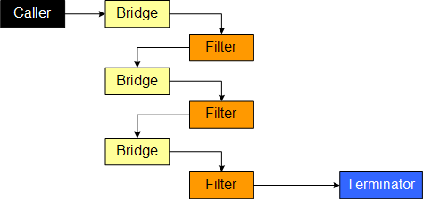 Pipeline Calling Sequence

The bridges are created by the PipelineBuilder service. The terminator must be provided. The bridges and the terminator implement the service interface.

```java
public static StringTransformService build(@InjectService("PipelineBuilder") PipelineBuilder builder,List<StringTransformFilter> configuration,Logger logger) {
StringTransformService terminator = new StringTransformService() {public String transform(String input) {return input;} };
return builder.build(logger,StringTransformService.class, StringTransformFilter.class,configuration,terminator);}
```

Here, we create the terminator for the pipeline as an inner class instance, and feed that into the builder. The result is a new service that encapsulates the entire pipeline. When there are no filters, this is just the terminator.

**Error rendering macro 'scrollbar'**

com/opensymphony/webwork/ServletActionContext

---

<a id="shadowbuilder-service"></a>

<!-- source_url: https://tapestry.apache.org/shadowbuilder-service.html -->

<!-- page_index: 70 -->

# ShadowBuilder Service

[Apache Tapestry](#index) > [Documentation](#documentation) > [User Guide](#user-guide) > [IOC](#ioc) > [ShadowBuilder Service](#shadowbuilder-service)

<a id="shadowbuilder-service--title"></a>
<a id="shadowbuilder-service--shadowbuilder-service"></a>

# ShadowBuilder Service

**Error rendering macro 'scrollbar'**

com/opensymphony/webwork/ServletActionContext

The **ShadowBuilder service** (see the [PropertyShadowBuilder](http://tapestry.apache.org/current/apidocs/org/apache/tapestry5/ioc/services/PropertyShadowBuilder.html) API) is used to build a special, delegating kind of service implementation that, essentially, allows a property of another service to be exposed as its own service.

<a id="shadowbuilder-service--related-articles"></a>

### Related Articles

- Page:

  [ShadowBuilder Service](#shadowbuilder-service)
- Page:

  [PipelineBuilder Service](#pipelinebuilder-service)
- Page:

  [StrategyBuilder Service](#strategybuilder-service)
- Page:

  [ChainBuilder Service](#chainbuilder-service)

For example, the tapestry-core module provides a Request property as a shadow of the RequestGlobals service's request property:

```java
public Request build()
{
  return shadowBuilder.build(requestGlobals, "request", Request.class);
}
```

(shadowBuilder and requestGlobals are injected into the module class instance)

This can be thought of as similar to:

```java
public Request build()
{
  return requestGlobals.getRequest();
}
```

However there is a *critical* difference between the two: a shadow property is *re-evaluated on each method invocation*. In the former case, the Request service will always obtain the current value of the request property from the per-thread RequestGlobals service. The second example is more than likely broken, since it will expose whatever value is in the request property of the RequestGlobals *at the time the Request service implementation is realized*.

Notice that in this example, the Request service is a normal singleton. This service can be freely injected into any service throughout the framework or application. Invoking methods on this service will always delegate to the current thread's request. Callers don't have to be aware of this internal delegation; it just happens.

<a id="shadowbuilder-service--shadowbuilderservice-non-reflective"></a>
<a id="shadowbuilder-service--non-reflective"></a>

# Non-Reflective

When the shadow is created, reflection is used to translate the property name to a method name. This information is used to build a new class (at runtime) that is instantiated as the service implementation.

A typical method is implemented as (approximately):

```java
private final RequestGlobals source;

public String getParameter(String name)
{
  return source.getRequest().getParameter(name);
}
```

That is, the shadow implementation holds onto the target object (in the above example, the RequestGlobals service) and invokes a method on it directly, not using reflection, no differently than you would if you wrote the code yourself.

**Error rendering macro 'scrollbar'**

com/opensymphony/webwork/ServletActionContext

---

<a id="strategybuilder-service"></a>

<!-- source_url: https://tapestry.apache.org/strategybuilder-service.html -->

<!-- page_index: 71 -->

# StrategyBuilder Service

[Apache Tapestry](#index) > [Documentation](#documentation) > [User Guide](#user-guide) > [IOC](#ioc) > [StrategyBuilder Service](#strategybuilder-service)

<a id="strategybuilder-service--title"></a>
<a id="strategybuilder-service--strategybuilder-service"></a>

# StrategyBuilder Service

**Error rendering macro 'scrollbar'**

com/opensymphony/webwork/ServletActionContext

The **StrategyBuilder Service** provides a convenient way to create an implementation of the [Strategy](https://en.wikipedia.org/wiki/Strategy_pattern) design pattern.

<a id="strategybuilder-service--related-articles"></a>

### Related Articles

- Page:

  [ShadowBuilder Service](#shadowbuilder-service)
- Page:

  [PipelineBuilder Service](#pipelinebuilder-service)
- Page:

  [StrategyBuilder Service](#strategybuilder-service)
- Page:

  [ChainBuilder Service](#chainbuilder-service)

Another of the Gang Of Four patterns, the strategy pattern as implemented in Tapestry IoC is a kind of late binding.

The idea is that *adapters* for objects are accessed based on the *actual type* of an object. These adapters supply additional functionality. The adapters are located using a StrategyRegistry ([API](http://tapestry.apache.org/current/apidocs/org/apache/tapestry5/ioc/util/StrategyRegistry.html)).

The lookup of adapters is based on an inheritance search; thus providing an adapter for type java.util.Map will match any object that implements the Map interface. The inheritance search works its way up the class hierarchy looking for a matching registration. If nothing is found, then all the interfaces directly or indirectly implemented by the selector class are checked. java.lang.Object is always the final match.

A runtime exception is thrown if no match can be found.

As a special case, the value null is searched for as if it were an instance of the class void.

The StrategyBuilder service ([API](http://tapestry.apache.org/current/apidocs/org/apache/tapestry5/ioc/services/StrategyBuilder.html)) creates a service implementation around a strategy registry.

```java
public interface StrategyBuilder
{
    <S> S build(StrategyRegistry<S> registry);
}
```

For a given interface (and matching StrategyRegistry), a service implementation is created. The service interface is determined from the strategy registry.

The first parameter of each method is the *selector*. Its type is used to locate an adapter.

The corresponding method of the adapter is then invoked, passing all parameters.

Every method of the service interface should take at least one parameter. Generally, such interfaces have only one or two methods.

<a id="strategybuilder-service--strategybuilderservice-example"></a>
<a id="strategybuilder-service--example"></a>

# Example

You will usually have a service configuration for defining the adapter registry.

You convert the configuration into a StrategyRegistry, and use that to build the final service:

```java
public static MyStrategyService build(Map<Class, MyStrategyService> configuration,@InjectService("StrategyBuilder") StrategyBuilder builder) {StategyRegistry<MyStrategyService> registry = StrategyRegistry.newInstance(MyStrategyService.class, configuration);
return builder.build(registry);}
```

**Error rendering macro 'scrollbar'**

com/opensymphony/webwork/ServletActionContext

---

<a id="injection-in-detail"></a>

<!-- source_url: https://tapestry.apache.org/injection-in-detail.html -->

<!-- page_index: 72 -->

# Injection in Detail

[Apache Tapestry](#index) > [Documentation](#documentation) > [User Guide](#user-guide) > [IOC](#ioc) > [Injection in Detail](#injection-in-detail)

<a id="injection-in-detail--title"></a>
<a id="injection-in-detail--injection-in-detail"></a>

# Injection in Detail

**Error rendering macro 'scrollbar'**

com/opensymphony/webwork/ServletActionContext

**Injection** in Tapestry IoC can be a complicated subject for a number of reasons:

- Injection can occur in many places: on fields, and on parameters to methods and constructors of certain objects.
- Parts of Injection are themselves defined in terms of Tapestry IoC services, many of which are extensible.

<a id="injection-in-detail--related-articles"></a>

### Related Articles

- Page:

  [Environmental Services](#environmental-services)
- Page:

  [Injection FAQ](#injection-faq)
- Page:

  [Injection in Detail](#injection-in-detail)
- Page:

  [Injection](#injection)

Despite this, injection generally *Just Works*: most of the time, you want Tapestry to inject a service, and only a single service implements the service interface.

This document discusses what to do when you hit a case that doesn't Just Work, or when you want to extend the injection logic in some way.

Some aspects of this discussion reflect Tapestry IoC used within a Tapestry web application: the tapestry-core module makes some extensions to injection.

<a id="injection-in-detail--injectionindetail-injectiontriggers"></a>
<a id="injection-in-detail--injection-triggers"></a>

# Injection Triggers

Injection is triggered in a number of ways:

- A field in a component class, autobuilt object, or service implementation class is annotated with @Inject.
- A method parameter to a service builder method, a decorator method, or a contribute method (in a Tapestry IoC module class).
- A constructor parameter to an autobuilt object, or a service implementation class.
- Any of the above with an @InjectService annotation.

These define the *point of injection*.

Injection also covers a related matter: providing special resources to a service or component (remember that pages are specialized components). For a service, the service's id (as a string) or extensible configuration (as a Collection, List or Map) may be provided. For a component, the component's id, locale, message catalog, or component resources may be provided.

<a id="injection-in-detail--injectionindetail-standardinjectionprocessing"></a>
<a id="injection-in-detail--standard-injection-processing"></a>

# Standard Injection Processing

This section describes standard injection, which applies at the IoC layer: autobuilt objects and service implementations. The steps for injection into Tapestry components are slightly different and are covered later.

So a the point of injection, Tapestry has identified a field or parameter that should be injected. At this point, Tapestry knows the following:

- The field name (if field injection). The parameter name is not available.
- The field or parameter type, as a Java class. In many cases, this will be enough to identify what object shall be injected.
- Any additional annotations on the field or parameter.

Tapestry proceeds with this information.

<a id="injection-in-detail--injectionindetail-checkfor-injectservice"></a>
<a id="injection-in-detail--check-for-injectservice"></a>

## Check for @InjectService

Tapestry checks first for the @InjectService annotation. The value of this annotation is the service id to inject. When @InjectService is present at the point of injection, the search is complete, though the injection can fail (throwing an exception) if the service id indicated does not exist, or if the service's interface is not compatible with the field's type.

<a id="injection-in-detail--injectionindetail-checkforserviceresources"></a>
<a id="injection-in-detail--check-for-service-resources"></a>

## Check for service resources

This step applies only to IoC layer injection (not to injection into components).

When the @Inject annotation is *not present* at the point of injection, Tapestry checks to see if a resource can be injected. Services are global values, but resources are specific to the service under construction.

When the Inject annotation is present, this step is skipped (this is necessary when the object to be injected has a type that conflicts with a resource type, such as List or Class).

- org.slf4j.Logger – The Logger of the service being constructed (or the logger of the Module class being instantiated).
- [ObjectLocator](http://tapestry.apache.org/current/apidocs/org/apache/tapestry5/ioc/ObjectLocator.html) – For contribute methods, used to locate additional objects.
- [ServiceResources](http://tapestry.apache.org/current/apidocs/org/apache/tapestry5/ioc/ServiceResources.html) – For service builder methods, an extended version of ObjectLocator.
- Class – The service interface type.
- [OperationTracker](http://tapestry.apache.org/current/apidocs/org/apache/tapestry5/ioc/OperationTracker.html) – Used to track deeply nested operations so that errors can be reported sensibly.
- Object, or service interface type – Passed to decorator methods.
- Collection, List, Map – Assembled service configurations passed to service builder methods (or service class constructors).
- Configuration, OrderedConfiguration, MappedConfiguration – Configuration passed to contribute methods, to build service configurations. If field type does not match any of the available resource types, or the Inject annotation is present, logic continues to the next step.

  Injection of resources into fields is triggered by the presence of the @[InjectResource](http://tapestry.apache.org/current/apidocs/org/apache/tapestry5/ioc/annotations/InjectResource.html) annotation, whereas injection of resources into parameters occurs when the Inject or InjectService annotation is *not* present. These rules are slightly tricky, which reflects a desire to avoid any annotations except when needed, and the fact that field injection came much later than parameter injection.

<a id="injection-in-detail--injectionindetail-servicelookupbytypeandannotations"></a>
<a id="injection-in-detail--service-lookup-by-type-and-annotations"></a>

## Service Lookup by Type and Annotations

Tapestry attempts to find a matching *service*.

First, it generates a set of services whose service interface is compatible with the injection type. This is based on assignability.

If the @[Local](http://tapestry.apache.org/current/apidocs/org/apache/tapestry5/ioc/annotations/Local.html) annotation is present, then services not from the module containing the service being constructed will be eliminated.

Tapestry then works through the known marker annotations. For each marker annotation that is present at the point of injection, Tapestry eliminates services which *do not* have the marker. Thus, if multiple marker annotations are present, the final service must have *all of them*.

At the end, of this, Tapestry determines how many services match.

- If there is a single matching service, then the service to inject as been identified.
- If there are no matches, and there were no marker annotations at the point of injection, then the Tapestry continues to the next step.
- Otherwise there were either no matches, or too many matches: Tapestry will throw a RuntimeException.

<a id="injection-in-detail--injectionindetail-masterobjectproviderlookup"></a>
<a id="injection-in-detail--masterobjectprovider-lookup"></a>

## MasterObjectProvider Lookup

This is the point at which Tapestry's extensibility comes into play. MasterObjectProvider is a service, with a configuration of [ObjectProviders](http://tapestry.apache.org/current/apidocs/org/apache/tapestry5/ioc/ObjectProvider.html).

The MasterObjectProvider is also the point at which Tapestry's IoC layer injection, and Tapestry's component injection, unite.

As a chain-of-command, each of the following ObjectProviders will be considered and will attempt to identify the object to be injected.

A common problem when extending injection is that contributions into the MasterObjectProvider configuration have to be handled carefully. Any dependencies of the contributed objects should be resolvable using only the early stages of the injection process, otherwise MasterObjectProvider will have to be instantiated in order to handle its own injection: Tapestry will detect this impossibility and throw an exception. In addition, the [TypeCoercer Service](https://tapestry.apache.org/typecoercer-service.html) is used by several ObjectProvider implementations, so the same restrictions apply to TypeCoercer service contributions.

<a id="injection-in-detail--injectionindetail-valueobjectprovider"></a>
<a id="injection-in-detail--value-objectprovider"></a>

### Value ObjectProvider

Checks for the presence of the @[Value](http://tapestry.apache.org/current/apidocs/org/apache/tapestry5/ioc/annotations/Value.html) annotation. If present, then the annotation's value is evaluated (to expand any symbol references), and the TypeCoercer service is used to convert the resulting String to the injection type (the field or parameter type).

<a id="injection-in-detail--injectionindetail-symbolobjectprovider"></a>
<a id="injection-in-detail--symbol-objectprovider"></a>

### Symbol ObjectProvider

Similar to the Value ObjectProvider: the @[Symbol](http://tapestry.apache.org/current/apidocs/org/apache/tapestry5/ioc/annotations/Symbol.html) annotation's value (if present) is looked up using the [SymbolSource](http://tapestry.apache.org/current/apidocs/org/apache/tapestry5/ioc/services/SymbolSource.html) service, and converted to the injection type via the TypeCoercer service.

<a id="injection-in-detail--injectionindetail-autobuildobjectprovider"></a>
<a id="injection-in-detail--autobuild-objectprovider"></a>

### Autobuild ObjectProvider

Checks to see if the @[Autobuild](http://tapestry.apache.org/current/apidocs/org/apache/tapestry5/ioc/annotations/Autobuild.html) annotation is present and, if so, autobuilds the value for the parameter. Of course, the object being built will itself be configured via injection.

<a id="injection-in-detail--injectionindetail-serviceoverrideobjectprovider"></a>
<a id="injection-in-detail--serviceoverride-objectprovider"></a>

### ServiceOverride ObjectProvider

Checks any contributions to the [ServiceOverride](http://tapestry.apache.org/current/apidocs/org/apache/tapestry5/ioc/services/ServiceOverride.html) service. Contributions map a type to an object of that type. Thus, ServiceOverrides will override injections of services that are not qualified with a marker annotation.

<a id="injection-in-detail--injectionindetail-aliasobjectprovider-tapestry-core"></a>
<a id="injection-in-detail--alias-objectprovider-tapestry-core"></a>

### Alias ObjectProvider (tapestry-core)

Uses the Alias service ([API](http://tapestry.apache.org/current/apidocs/org/apache/tapestry5/services/Alias.html)) to look for an object that can be injected.

Deprecated in Tapestry 5.2 and removed in 5.4.

This is commonly used to override a built-in service by contributing an object with the exact same interface. This is an older and more complex version of the ServiceOverride provider.

<a id="injection-in-detail--injectionindetail-assetobjectprovider-tapestry-core"></a>
<a id="injection-in-detail--asset-objectprovider-tapestry-core"></a>

### Asset ObjectProvider (tapestry-core)

Checks for the @[Path](http://tapestry.apache.org/current/apidocs/org/apache/tapestry5/annotations/Path.html) annotation.

If present, the annotation's value has embedded symbols expanded, and is converted into an Asset (which must exist).

The TypeCoercer can then convert the Asset to the injection type, for example, as Resource.

<a id="injection-in-detail--injectionindetail-serviceobjectprovider-tapestry-core"></a>
<a id="injection-in-detail--service-objectprovider-tapestry-core"></a>

### Service ObjectProvider (tapestry-core)

Looks for the @[Service](http://tapestry.apache.org/current/apidocs/org/apache/tapestry5/annotations/Service.html) annotation; if present, the annotation's value is the exact service id to inject. This is necessary because injections into *component* fields are always triggered by the Inject annotation.

This is supported but no longer necessary, as the @InjectService annotation is now also supported for component fields.

<a id="injection-in-detail--injectionindetail-springbeanobjectprovider-tapestry-spring"></a>
<a id="injection-in-detail--springbean-objectprovider-tapestry-spring"></a>

### SpringBean ObjectProvider (tapestry-spring)

Attempts to resolve a Spring bean purely by object type (Spring qualifiers are not supported). If no beans are assignable to the type, then processing continues. If exactly one is assignable, it is used as the injection value. If more than one bean is assignable, it is an error (and a list of matching beans names will be part of the thrown exception).

<a id="injection-in-detail--injectionindetail-servicelookup"></a>
<a id="injection-in-detail--service-lookup"></a>

## Service Lookup

If none of the ObjectProviders can identify the value to inject, a last step occurs: lookup by service type. If exactly *one* service matches the injection type, then that service is injected.

Otherwise, the lookup fails because either no services match, or more than one matches. An exception will be thrown with the details, including a list of matching services (if there is more than one match).

<a id="injection-in-detail--injectionindetail-post-injectionmethods"></a>
<a id="injection-in-detail--post-injection-methods"></a>

# Post-Injection Methods

Autobuilt objects (services and the like, but *not* components) may have post-injection methods.

Any public method may have the @[PostInjection](http://tapestry.apache.org/current/apidocs/org/apache/tapestry5/annotations/PostInjection.html) annotation.

Such methods are invoked after constructor and/or field injection. Only **public methods** will be invoked. Any return value is ignored.

The method often takes no parameters; however if the method has parameters, these parameters are new points of injection.

Often this is used to perform additional setup, such as registerring a service as a listener of events produced by another service:

```java
public class MyServiceImpl implements MyService, UpdateListener {@PostInjection public void registerAsListener(UpdateListenerHub hub) {hub.addUpdateListener(this);}}
```

<a id="injection-in-detail--injectionindetail-componentinjection"></a>
<a id="injection-in-detail--component-injection"></a>

# Component Injection

Inside Tapestry components, injection occurs exclusively on *fields* and is always triggered by the @Inject (or @InjectService) annotation.

Component field injection is very similar to IoC layer, but with a different set of injectable resources.

Injection is the responsibility of the [InjectionProvider](http://tapestry.apache.org/current/apidocs/org/apache/tapestry5/services/InjectionProvider.html) service, which is a chain-of-command across a number of implementations.

<a id="injection-in-detail--injectionindetail-blockinjectionprovider"></a>
<a id="injection-in-detail--block-injectionprovider"></a>

## Block InjectionProvider

Checks if the field type is Block. If so, determines the block id to inject (either from the field name, or from an @[Id](http://tapestry.apache.org/current/apidocs/org/apache/tapestry5/annotations/Id.html) annotation, if present).

<a id="injection-in-detail--injectionindetail-defaultinjectionprovider"></a>
<a id="injection-in-detail--default-injectionprovider"></a>

## Default InjectionProvider

Uses the MasterObjectProvider service to provide the injectable value. The Service Lookup stage is skipped.

<a id="injection-in-detail--injectionindetail-componentresourcesinjectionprovider"></a>
<a id="injection-in-detail--componentresources-injectionprovider"></a>

## ComponentResources InjectionProvider

Injects fields of type ComponentResources.

<a id="injection-in-detail--injectionindetail-commonresourcesinjectionprovider"></a>
<a id="injection-in-detail--commonresources-injectionprovider"></a>

## CommonResources InjectionProvider

Injects fields with common resources:

- String: the components' complete id
- org.slf4j.Logger: Logger for the component (based on component class name)
- Locale: locale for the containing page (page locale is immutable)
- Messages: Component's message catalog
- ComponentResourceSelector: selector for the containing page (selector is immutable)

**Added in 5.3**

ComponentResourceSelector is new as of release 5.3. It encapsulates a locale plus additional application-specific data used for skinning and/or themeing.

<a id="injection-in-detail--injectionindetail-assetinjectionprovider"></a>
<a id="injection-in-detail--asset-injectionprovider"></a>

## Asset InjectionProvider

Triggered by the @Path annotation: the Path value has symbols expanded, and is then converted to an Asset.

<a id="injection-in-detail--injectionindetail-serviceinjectionprovider"></a>
<a id="injection-in-detail--service-injectionprovider"></a>

## Service InjectionProvider

Equivalent to the Service Lookup phase in an IoC layer injection.

<a id="injection-in-detail--injectionindetail-injectserviceincomponents"></a>
<a id="injection-in-detail--injectservice-in-components"></a>

# @InjectService in Components

You may use the @[InjectService](http://tapestry.apache.org/current/apidocs/org/apache/tapestry5/ioc/annotations/InjectService.html) annotation on component fields.

**Error rendering macro 'scrollbar'**

com/opensymphony/webwork/ServletActionContext

---

<a id="object-providers"></a>

<!-- source_url: https://tapestry.apache.org/object-providers.html -->

<!-- page_index: 73 -->

# Object Providers

[Apache Tapestry](#index) > [Documentation](#documentation) > [User Guide](#user-guide) > [IOC](#ioc) > [Object Providers](#object-providers)

<a id="object-providers--title"></a>
<a id="object-providers--object-providers"></a>

# Object Providers

**Error rendering macro 'scrollbar'**

com/opensymphony/webwork/ServletActionContext

When you don't provide the @[InjectService](http://tapestry.apache.org/current/apidocs/org/apache/tapestry5/ioc/annotations/InjectService.html) annotation on a parameter (to a service builder method or constructor), Tapestry will resolve the parameter automatically.

This is called *object injection*, rather than *service injection*, because the value that will ultimately be injected is not necessarily a service; it may be some arbitrary object.

If this sounds vague, its because there is not just one [ObjectProvider](http://tapestry.apache.org/current/apidocs/org/apache/tapestry5/ioc/ObjectProvider.html); there's a whole set of them, forming a [chain of command](#chainbuilder-service). The commands in the chain may provide an object based on the parameter type, or based on additional annotations on the parameter.

There are several built-in object providers:

- Check for @[Value](http://tapestry.apache.org/current/apidocs/org/apache/tapestry5/ioc/annotations/Value.html) annotation
- Check for @[Symbol](http://tapestry.apache.org/current/apidocs/org/apache/tapestry5/ioc/annotations/Symbol.html) annotation
- Check for a *unique* service in the Registry whose service interface matches the parameter type Usually, the @Inject annotation is supplemented by an additional annotation which triggers a specific ObjectProvider to provide the value.

<a id="object-providers--objectproviders-valueannotationprovider"></a>
<a id="object-providers--value-annotation-provider"></a>

# @Value Annotation Provider

The Value annotation allows a literal value to be injected. When combined with [symbols](#object-providers), they represent a way for parts of the overall service network to be spot-configured. For example:

```java
  public MyService build(@Value("${max-seconds}") long maxSeconds)
  {
    return new MyServiceImpl(maxSeconds);
  }
```

Here, the MyService service requires a configuration of a number of seconds. The value is supplied as a symbol, with a factory default that may be overwritten with an application default.

Usually, the symbol reference is only part of the string, i.e. `@Value("${report.dir}/${report.name}.txt")`

<a id="object-providers--objectproviders-symbolannotationprovider"></a>
<a id="object-providers--symbol-annotation-provider"></a>

# @Symbol Annotation Provider

This is closely related to the @Value annotation approach, except that the annotation directly specifies a symbol name.

```java
  public MyService build(@Symbol("max-seconds") long maxSeconds)
  {
    return new MyServiceImpl(maxSeconds);
  }
```

<a id="object-providers--objectproviders-serviceprovider"></a>
<a id="object-providers--service-provider"></a>

# Service Provider

This is always that last object provider checked.

A *single* service must exist whose service interface matches the parameter type. This is *not* an exact match: a search is made for any and all services whose service interface is a super class of the parameter type.

An exception is thrown if there are no matches, or if there are multiple matches.

<a id="object-providers--objectproviders-aliasobjectprovider"></a>
<a id="object-providers--alias-object-provider"></a>

# Alias Object Provider

The tapestry-core module defines the [Alias object provider](#aliases), which is used as a way to override services or disambiguate services (when multiple services implement the same interface).

<a id="object-providers--objectproviders-definingnewproviders"></a>
<a id="object-providers--defining-new-providers"></a>

# Defining New Providers

New providers can be specified by contributing to the MasterObjectProvider service's configuration. The configuration is mapped, with the keys being the provider prefix, and the values being the object provider implementation.

Example:

```java
  public void contributeMasterObjectProvider(OrderedConfiguration<ObjectProvider> configuration)
  {
    configuration.add("MyObject", new MyObjectProvider());
  }
```

This establishes a name for the object provider (useful if the exact order of execution of the provider, relative to other providers, is relevant).

Of course, this is a simplified example. In a real scenario, the provider is most likely a service with its own dependencies.

**Error rendering macro 'scrollbar'**

com/opensymphony/webwork/ServletActionContext

---

<a id="service-serialization"></a>

<!-- source_url: https://tapestry.apache.org/service-serialization.html -->

<!-- page_index: 74 -->

# Service Serialization

[Apache Tapestry](#index) > [Documentation](#documentation) > [User Guide](#user-guide) > [IOC](#ioc) > [Service Serialization](#service-serialization)

<a id="service-serialization--title"></a>
<a id="service-serialization--service-serialization"></a>

# Service Serialization

**Error rendering macro 'scrollbar'**

com/opensymphony/webwork/ServletActionContext

**Service serialization** is the serialization of a Tapestry IOC service.

Every once in a while you may need to serialize a service. For example, you may store an object into the HttpSession that holds a reference to a service. In a clustered environment, that object will be serialized and broadcast to other servers in the cluster.

Services in Tapestry are serializable. Specifically, service *proxies* are serializable. However, your service implementations *do not* have to be serializable.

Serialization works as follows:

- When a proxy is serialized, it instead serializes a *token* object.
- The token object is what's stored in the output stream.
- When the token is de-serialized, it locates the service proxy in the current Registry and returns that.

The end result is very efficient: just the tiny tokens are serialized, not the services with their proxies, configurations, implementations, dependencies, internal state and so forth.

Again, note that the actual service implementation is not serialized. Due to Tapestry's lazy creation policy, the service implementation may not even exist. Since outside code only sees the proxy, there's no difference.

<a id="service-serialization--serviceserialization-registryresolution"></a>
<a id="service-serialization--registry-resolution"></a>

# Registry Resolution

The one trick here is locating the service proxy. Tapestry uses a *weak reference* to the Registry to do this. When a Registry starts up, it is stored in the reference, so that de-serialization can work.

The reference is cleared when you shut down the Registry. If you stop using the Registry, but fail to shut it down, the weak reference ensures that it will be released to the garbage collector anyway. Still, you should shutdown a Registry when done with it.

This all makes one BIG assumption: that there's just one Registry. That's normal for a web application, especially when the tapestry-ioc JAR is included as part of the web application's WAR.

If you are running multiple Registries you will likely see errors in your console:

```java
[ERROR] SerializationSupport Setting a new service proxy provider when there's already
an existing provider. This may indicate that you have multiple IoC Registries.
```

**Error rendering macro 'scrollbar'**

com/opensymphony/webwork/ServletActionContext

---

<a id="type-coercion"></a>

<!-- source_url: https://tapestry.apache.org/type-coercion.html -->

<!-- page_index: 75 -->

# Type Coercion

[Apache Tapestry](#index) > [Documentation](#documentation) > [User Guide](#user-guide) > [IOC](#ioc) > [Type Coercion](#type-coercion)

<a id="type-coercion--title"></a>
<a id="type-coercion--type-coercion"></a>

# Type Coercion

**Error rendering macro 'scrollbar'**

com/opensymphony/webwork/ServletActionContext

**Type Coercion** is the conversion of one type of object to a another object of a different type with similar content. Tapestry frequently must coerce objects from one type to another. A common example is the coercion of string "5" into an integer 5 or a double 5.0.

<a id="type-coercion--related-articles"></a>

### Related Articles

- Page:

  [Type Coercion](#type-coercion)
- Page:

  [Parameter Type Coercion](#parameter-type-coercion)

Although type coercions happen more inside tapestry-core (including [coercions of component parameters](#parameter-type-coercion) ), they may also occur inside tapestry-ioc, such as when injecting a value, rather than a service, into a builder method.

Like everything else in Tapestry, type coercions are extensible. At the root is the [TypeCoercer](https://tapestry.apache.org/current/apidocs/org/apache/tapestry5/commons/services/TypeCoercer.html) service. Its configuration consists of [CoercionTuples](http://tapestry.apache.org/current/apidocs/org/apache/tapestry5/commons/services/CoercionTuple.html) until 5.6.x and a mapped configuration of (CoercionTuple.Key, CoercionTuple) from Tapestry 5.7.0 on. Each tuple defines how to coerce from one type to another. The initial set of coercions is focused primarily on coercions between different numeric types:

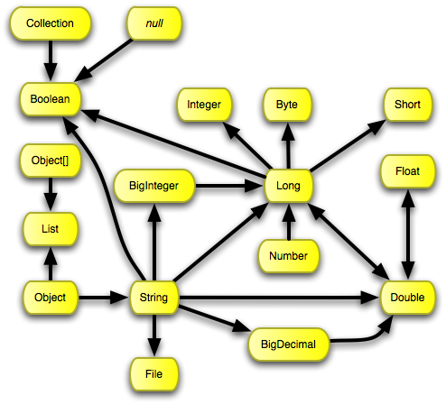

<a id="type-coercion--typecoercion-defaulttypecoercions"></a>
<a id="type-coercion--default-type-coercions"></a>

## Default Type Coercions

There are a few special coercions related to `null` there; `Object` --> `List` wraps a lone object as a singleton list, we then need `null` --> `List` to ensure that `null` stays `null` (rather than a singleton list whose lone element is a `null`).

<a id="type-coercion--typecoercion-typecoercioninterpolation"></a>
<a id="type-coercion--type-coercion-interpolation"></a>

## Type Coercion Interpolation

Tapestry will try to *interpolate* necessary coercions. For example, say it is necessary to coerce a `StringBuffer` to an `Integer`; the TypeCoercer service will chain together a series of coercions:

- `Object` --> `String`
- `String` --> `Long`
- `Long` --> `Integer`

Because `Object --> String` is always available, this might lead to an unexpected interpolation between incompatible types due to multiple intermediate coercions. This can be easily prevented by providing an explicit CoercionTuple between the desired types.

<a id="type-coercion--typecoercion-coercingfromnull"></a>
<a id="type-coercion--coercing-from-null"></a>

## Coercing from null

Coercing from `null` is special; it is not a spanning search as with the other types. Either there is a specific coercion from `null` to the desired type, or no coercion takes places (and the coerced value is `null`).

The only built-in `null` coercion is from `null` to `boolean` (which is always false).

<a id="type-coercion--typecoercion-listofcoercions"></a>
<a id="type-coercion--list-of-coercions"></a>

## List of Coercions

As of Tapestry version 5.7, the following coercions are available:

```java
// Since Tapestry 5.1/5.2
Double --> Float
Float --> Double
Long --> Boolean
Long --> Byte
Long --> Double
Long --> Integer
Long --> Short
Number --> Long
Object --> Object[]
Object --> String
Object --> java.util.List
Object[] --> java.util.List
String --> Boolean
String --> Double
String --> Long
String --> java.io.File
String --> java.math.BigDecimal
String --> java.math.BigInteger
String --> java.text.DateFormat
String --> java.util.regex.Pattern
String --> org.apache.tapestry5.Renderable
String --> org.apache.tapestry5.SelectModel
String --> org.apache.tapestry5.corelib.ClientValidation
String --> org.apache.tapestry5.corelib.LoopFormState
String --> org.apache.tapestry5.corelib.SubmitMode
String --> org.apache.tapestry5.corelib.data.BlankOption
String --> org.apache.tapestry5.corelib.data.GridPagerPosition
String --> org.apache.tapestry5.corelib.data.InsertPosition
String --> org.apache.tapestry5.ioc.Resource
String --> org.apache.tapestry5.ioc.util.TimeInterval
boolean[] --> java.util.List
byte[] --> java.util.List
char[] --> java.util.List
double[] --> java.util.List
float[] --> java.util.List
int[] --> java.util.List
java.math.BigDecimal --> Double
java.util.Collection --> Boolean
java.util.Collection --> Object[]
java.util.Collection --> org.apache.tapestry5.grid.GridDataSource
java.util.Date --> java.util.Calendar
java.util.List --> org.apache.tapestry5.SelectModel
java.util.Map --> org.apache.tapestry5.SelectModel
long[] --> java.util.List
null --> Boolean
null --> org.apache.tapestry5.grid.GridDataSource
org.apache.tapestry5.ComponentResources --> org.apache.tapestry5.PropertyOverrides
org.apache.tapestry5.PrimaryKeyEncoder --> org.apache.tapestry5.ValueEncoder
org.apache.tapestry5.Renderable --> org.apache.tapestry5.Block
org.apache.tapestry5.Renderable --> org.apache.tapestry5.runtime.RenderCommand
org.apache.tapestry5.ioc.util.TimeInterval --> Long
org.apache.tapestry5.runtime.ComponentResourcesAware --> org.apache.tapestry5.ComponentResources
short[] --> java.util.List


// Since Tapestry 5.6.2

java.time.Year --> Integer
Integer        --> java.time.Year

java.time.Month --> Integer
Integer         --> java.time.Month
String          --> java.time.Month

java.time.YearMonth --> java.time.Year
java.time.YearMonth --> java.time.Month
String              --> java.time.YearMonth

java.time.MonthDay --> java.time.Month
String             --> java.time.MonthDay

java.time.DayOfWeek --> Integer
Integer             --> java.time.DayOfWeek
String              --> java.time.DayOfWeek

java.time.LocalDate --> java.time.Instant
java.time.Instant   --> java.time.LocalDate
String              --> java.time.LocalDate
java.time.LocalDate --> java.time.YearMonth
java.time.LocalDate --> java.time.MonthDay

java.time.LocalTime --> Long
Long                --> java.time.LocalTime
String              --> java.time.LocalTime

java.time.LocalDateTime --> java.time.Instant
java.time.Instant       --> java.time.LocalDateTime
String                  --> java.time.LocalDateTime
java.time.LocalDateTime --> jva.time.LocalDate

java.time.OffsetDateTime --> java.time.Instant
java.time.OffsetDateTime --> java.time.OffsetTime
String                   --> java.time.OffsetDateTime

String --> java.time.ZoneId

java.time.ZonedDateTime --> java.time.Instant
java.time.ZonedDateTime --> java.time.ZoneId
String                  --> java.time.ZonedDateTime

java.time.Instant --> Long
Long              --> java.time.Instant
java.time.Instant --> java.util.Date.class
java.util.Date    --> java.time.Instant

java.time.Duration --> Long
Long               --> java.time.Duration

String --> java.time.Period
```

<a id="type-coercion--typecoercion-contributingnewcoercions"></a>
<a id="type-coercion--contributing-new-coercions"></a>

## Contributing New Coercions

TypeCoercer is extensible; you may add new coercions as desired. For example, let's say you have a `Money` type that represents an amount of some currency, and you want to be able to convert from `BigDecimal` to `Money`. Further, let's assume that `Money` has a constructor that accepts a `BigDecimal` as its parameter. We'll use a little Tapestry IOC configuration jujitsu to inform the TypeCoercer about this coercion.

**AppModule (partial, Tapestry 5.7.0+)**

```java
public static void contributeTypeCoercer(MappedConfiguration<CoercionTuple.Key, CoercionTuple> configuration) {Coercion<BigDecimal, Money> coercion = new Coercion<BigDecimal, Money>() {public Money coerce(BigDecimal input) {return new Money(input);} }; CoercionTuple tuple = new CoercionTuple<BigDecimal, Money>(BigDecimal.class, Money.class, coercion); configuration.add(tuple.getKey(), tuple));}
```

**AppModule.java (partial, before Tapestry 5.7.0)**

```java
public static void contributeTypeCoercer(Configuration<CoercionTuple> configuration) {Coercion<BigDecimal, Money> coercion = new Coercion<BigDecimal, Money>() {public Money coerce(BigDecimal input) {return new Money(input);} };
configuration.add(new CoercionTuple<BigDecimal, Money>(BigDecimal.class, Money.class, coercion));}
```

Further, since TypeCoercer knows how to convert `Double` to `BigDecimal`, or even `Integer` (to `Long` to `Double`) to `BigDecimal`, all of those coercions would work as well.

When creating a coercion from `null`, use `Void.class` as the source type. For example, the built-in coercion from `null` to `Boolean` is implemented as:

**AppModule.java (partial)**

```java
CoercionTuple tuple = new CoercionTuple(void.class, Boolean.class,new Coercion<Void, Boolean>() {public Boolean coerce(Void input) {return false;} }));
```

<a id="type-coercion--typecoercion-java.time-jsr310-typecoercers"></a>
<a id="type-coercion--java.time-jsr310-type-coercers"></a>

## java.time (JSR310) Type Coercers

With Java 8, the Java Time API (JSR310) got added to the JDK, providing a new, more straightforward way of dealing with date and time. The multitude of different types created a need for additional TypeCoercers. But due to the way the Java Time API was implemented, you must be aware of some edge cases and intricacies.

<a id="type-coercion--typecoercion-millisecondsprecision"></a>
<a id="type-coercion--milliseconds-precision"></a>

##### Milliseconds Precision

Even though the Java Time API partially supports nanosecond precision, it's not guaranteed. Actually, the OS / the JVM implementation is responsible for providing the current time with `java.time.Clock`. Most of the new types even don't have convenience-methods for a nanosecond-based representation.

All date(time)-based types use `java.time.Instant` for coercion, which itself is coerced with milliseconds precision. This provides compatibility with `java.util.Date#getTime()`, which is also milliseconds-based.

<a id="type-coercion--typecoercion-nanosecondsprecision"></a>
<a id="type-coercion--nanoseconds-precision"></a>

##### Nanoseconds Precision

The 2 types not using milliseconds are not subclasses of or convertible to `java.time.Instant`:

- `java.time.LocalTime`: Uses nanoseconds internally, and no convenience method for milliseconds exists.
- `java.time.Duration`: Uses nanoseconds and seconds internally. Even though a convenience method for milliseconds exists, the type isn't dependent on the OS/JVM precision. So the highest possible precision is used.

<a id="type-coercion--typecoercion-timezones"></a>
<a id="type-coercion--timezones"></a>

##### Timezones

The Java Time API supports timezone-less types, e.g. `java.time.LocalDate`, `java.time.LocalDateTime`.However, coercing these types into a `java.time.Instant` requires a timezone, because `java.time.Instant` uses the unix timestamp 0 as reference.

To still use automatic type coercion, the *Local* types will be seen as being in `ZoneId.systemDefault()`.

Additionally, `java.time.LocalDate` we use the local time of *00:00* for it's coercion to `java.time.Instant`.

<a id="type-coercion--typecoercion-invalidcoercionpaths"></a>
<a id="type-coercion--invalid-coercion-paths"></a>

##### Invalid Coercion Paths

Due to the powerful feature of finding compatible TypeCoercer paths to convert types with no explicit TypeCoercer, some additional TypeCoercers were added to ensure the correct conversion between types.

You should only try to coerce between the provided types and `java.time.Instant` as intermediate. Any other coercion path will require you to contribute a matching TypeCoercer yourself.

**Error rendering macro 'scrollbar'**

com/opensymphony/webwork/ServletActionContext

---

<a id="starting-the-ioc-registry"></a>

<!-- source_url: https://tapestry.apache.org/starting-the-ioc-registry.html -->

<!-- page_index: 76 -->

# Starting the IoC Registry

[Apache Tapestry](#index) > [Documentation](#documentation) > [User Guide](#user-guide) > [IOC](#ioc) > [Starting the IoC Registry](#starting-the-ioc-registry)

<a id="starting-the-ioc-registry--title"></a>
<a id="starting-the-ioc-registry--starting-the-ioc-registry"></a>

# Starting the IoC Registry

**Error rendering macro 'scrollbar'**

com/opensymphony/webwork/ServletActionContext

Primarily, you will use the IoC Registry as part of a Tapestry application. In those situations, the [TapestryFilter](http://tapestry.apache.org/current/apidocs/org/apache/tapestry5/TapestryFilter.html) will be responsible for starting and stopping the registry.

However, you may want to do some integration testing using the Registry from within a test case, or you may even use Tapestry IoC separately from Tapestry.

<a id="starting-the-ioc-registry--startingtheiocregistry-buildingtheregistry"></a>
<a id="starting-the-ioc-registry--building-the-registry"></a>

# Building the Registry

The class [RegistryBuilder](http://tapestry.apache.org/current/apidocs/org/apache/tapestry5/ioc/RegistryBuilder.html) is used to create a Registry.

```java
RegistryBuilder builder = new RegistryBuilder();

builder.add(AppModule.class, UtilModule.class);

Registry registry = builder.build();

registry.performRegistryStartup();
```

You may invoke add() as many times as you wish, or pass as many module classes as you wish.

Using this approach, you will form a Registry containing the built-in services from the [Tapestry IoC module](http://tapestry.apache.org/current/apidocs/org/apache/tapestry5/ioc/services/TapestryIoCModule.html), plus the modules you explicitly list.

The call to performRegistryStartup() is necessary to ensure that any services marked with the [EagerLoad](http://tapestry.apache.org/current/apidocs/org/apache/tapestry5/ioc/annotations/EagerLoad.html) annotation are, in fact, loaded.

**Added in 5.2**

As of version 5.2 the class [RegistryBuilder](http://tapestry.apache.org/current/apidocs/org/apache/tapestry5/ioc/RegistryBuilder.html) has convenience methods to build and start a Registry. The static method [RegistryBuilder.buildAndStartupRegistry(Class...)](http://tapestry.apache.org/current/apidocs/org/apache/tapestry5/ioc/RegistryBuilder.html#buildAndStartupRegistry(java.lang.Class...)) constructs a registry, adds a number of modules to the registry and performs registry startup. The returned registry is ready to use.

```java
Registry registry = RegistryBuilder.buildAndStartupRegistry(AppModule.class, UtilModule.class);
```

<a id="starting-the-ioc-registry--startingtheiocregistry-buildingthedefaultregistry"></a>
<a id="starting-the-ioc-registry--building-the-default-registry"></a>

# Building the Default Registry

The default registry is available by invoking the static method [IOCUtilities.buildDefaultRegistry()](http://tapestry.apache.org/current/apidocs/org/apache/tapestry5/ioc/IOCUtilities.html#buildDefaultRegistry). This method builds a Registry using [autoloading logic](#autoloading-modules), where modules to load are identified via a JAR Manifest entry.

In addition, the JVM system property `tapestry.modules` (if specified) is a list of additional module classes to load. This is often used in development, where tests may be executed against the local classes, not JARs, and so there is no manifest to read.

<a id="starting-the-ioc-registry--startingtheiocregistry-shuttingdowntheregistry"></a>
<a id="starting-the-ioc-registry--shutting-down-the-registry"></a>

# Shutting down the Registry

The method [Registry.shutdown()](http://tapestry.apache.org/current/apidocs/org/apache/tapestry5/ioc/Registry.html#shutdown) will shutdown the Registry. This immediately invalidates all service proxies. Some services may have chosen to register for shutdown notification (for example, to do cleanup work such as closing a database connection).

Once the Registry is shutdown, it may not be used again: it will not be possible to access services within the Registry, or invoke methods on services previously acquired. All you can do is release the Registry to the garbage collector.

**Error rendering macro 'scrollbar'**

com/opensymphony/webwork/ServletActionContext

---

<a id="registry-startup"></a>

<!-- source_url: https://tapestry.apache.org/registry-startup.html -->

<!-- page_index: 77 -->

# Registry Startup

[Apache Tapestry](#index) > [Documentation](#documentation) > [User Guide](#user-guide) > [IOC](#ioc) > [Registry Startup](#registry-startup)

<a id="registry-startup--title"></a>
<a id="registry-startup--registry-startup"></a>

# Registry Startup

**Error rendering macro 'scrollbar'**

com/opensymphony/webwork/ServletActionContext

It is possible to provide extra logic to be executed at Registry startup, by making contributions to the RegistryStartup service configuration.

The values contributed are Runnable objects. The configuration is ordered, so it is possible to control in what order the objects are executed.

RegistryStartup occurs after eager loaded services are instantiated.

Here's an example of a module that makes a contribution:

```java
public class MyModule
{
  public static void contributeRegistryStartup(OrderedConfiguration<Runnable> configuration)
  {
    configuration.add("MyContributionName", new Runnable() { ... });
  }
}
```

Generally, these contributions are in the form of inner classes; if they were services, they could just be eagerly loaded.

<a id="registry-startup--registrystartup-startupmethods"></a>
<a id="registry-startup--startup-methods"></a>

## Startup Methods

**Added in 5.2**

Instead of making contributions to the RegistryStartup service configuration you can provide startup methods inside your modules. A startup method is a static or instance method of a module annotated with @[Startup](http://tapestry.apache.org/current/apidocs/org/apache/tapestry5/ioc/annotations/Startup.html) annotation. Each module is allowed to contain several startup methods.

```java
public class MyModule {
@Startup public static void initMyApplication(Logger logger, MyService service) {logger.info("Starting up...");
service.init();}}
```

**Error rendering macro 'scrollbar'**

com/opensymphony/webwork/ServletActionContext

---

<a id="parallel-execution"></a>

<!-- source_url: https://tapestry.apache.org/parallel-execution.html -->

<!-- page_index: 78 -->

# Parallel Execution

[Apache Tapestry](#index) > [Documentation](#documentation) > [User Guide](#user-guide) > [IOC](#ioc) > [Parallel Execution](#parallel-execution)

<a id="parallel-execution--title"></a>
<a id="parallel-execution--parallel-execution"></a>

# Parallel Execution

**Error rendering macro 'scrollbar'**

com/opensymphony/webwork/ServletActionContext

The [ParallelExecutor](http://tapestry.apache.org/current/apidocs/org/apache/tapestry5/ioc/services/ParallelExecutor.html) service allows a computation to occur in parallel.

It can be used in two ways. First, with an explicit [Future](http://docs.oracle.com/javase/6/docs/api/java/util/concurrent/Future.html):

```java
   Future<String> future = executor.invoke(new Invokable<String>() { ... });
```

The executor will submit the Invokable to a thread pool for execution in the background.

The ultimate value of the Invokable is available by invoking `get()` on the Future; this will block until the value is ready.

Other methods on Future can cancel the execution, or get the value only if it is ready within a timeout.

The thread pool is started automatically as needed, and will shutdown when the Registry itself is shutdown.

Another alternative will return an object proxy, not a Future:

```java
  RSSFeed feed = executor.invoke(RSSFeed.class, new Invokable<RSSFeed>() { ... });
```

This only works if the type is an interface. A proxy for the interface is created around the Future object; any invocation on the proxy will invoke get() on the Future (that is, will block until the value is computed).

<a id="parallel-execution--parallelexecution-configuration"></a>
<a id="parallel-execution--configuration"></a>

# Configuration

The behavior of the ParallelExecutor can be tuned with global configuration symbols.

Java constants for the configuration symbols are defined in [IOCSymbols](http://tapestry.apache.org/current/apidocs/org/apache/tapestry5/ioc/IOCSymbols.html).

<a id="parallel-execution--parallelexecution-tapestry.thread-pool-enabled"></a>
<a id="parallel-execution--tapestry.thread-pool-enabled"></a>

### tapestry.thread-pool-enabled

If true, the default, then the thread pool will operate. If false, then ParallelExecutor's implementation changes to invoke the Invokable immediately, not in a pooled thread. This is useful in environments, such as [Google App Engine](http://code.google.com/appengine/), that do not support the creation of threads and thread pools.

<a id="parallel-execution--parallelexecution-tapestry.thread-pool.core-pool-size"></a>
<a id="parallel-execution--tapestry.thread-pool.core-pool-size"></a>

### tapestry.thread-pool.core-pool-size

Minimum size of the thread pool. Defaults to 3.

<a id="parallel-execution--parallelexecution-tapestry.thread-pool.max-pool-size"></a>
<a id="parallel-execution--tapestry.thread-pool.max-pool-size"></a>

### tapestry.thread-pool.max-pool-size

Maximum number of threads (active or inactive) in the thread pool. Defaults to 20.

<a id="parallel-execution--parallelexecution-tapestry.thread-pool.keep-alive"></a>
<a id="parallel-execution--tapestry.thread-pool.keep-alive"></a>

### tapestry.thread-pool.keep-alive

Time to keep waiting threads alive. Defaults to "1 m" (one minute).

<a id="parallel-execution--parallelexecution-tapestry.thread-pool.queue-size"></a>
<a id="parallel-execution--tapestry.thread-pool.queue-size"></a>

### tapestry.thread-pool.queue-size

**Added in 5.3**

The size of the task queue. When there are at least the core number of threads in the pool, tasks will be placed in the queue. If the queue is empty, more threads may be created (up to the maximum pool size). If the queue is full and all threads have been created, the task is rejected (and exception is thrown).

Defaults to 100.

**Error rendering macro 'scrollbar'**

com/opensymphony/webwork/ServletActionContext

---

<a id="logging-in-tapestry"></a>

<!-- source_url: https://tapestry.apache.org/logging-in-tapestry.html -->

<!-- page_index: 79 -->

# Logging in Tapestry

[Apache Tapestry](#index) > [Documentation](#documentation) > [User Guide](#user-guide) > [IOC](#ioc) > [Logging in Tapestry](#logging-in-tapestry)

<a id="logging-in-tapestry--title"></a>
<a id="logging-in-tapestry--logging-in-tapestry"></a>

# Logging in Tapestry

**Error rendering macro 'scrollbar'**

com/opensymphony/webwork/ServletActionContext

**Logging in Tapestry** is based on the [Simple Logging Facade for Java (SLF4J)](http://www.slf4j.org/). You can think of SLF4J as a leaner, meaner replacement for [commons-logging](http://commons.apache.org/logging/).

<a id="logging-in-tapestry--related-articles"></a>

### Related Articles

- Page:

  [Logging](#logging)
- Page:

  [Logging in Tapestry](#logging-in-tapestry)

In theory, SLF4J is a wrapper around any of a number of logging systems, including [Log4J](http://logging.apache.org/log4j/1.2/) or the built-in JDK logging. In practice, it is almost always used with Log4J and no additional build configuration is needed.

Your application *will* need to provide a **log4j.properties** file (or its XML equivalent). See [the Log4J manual](http://logging.apache.org/log4j/1.2/manual.html) for more information.

<a id="logging-in-tapestry--loggingintapestry-accessingloggers"></a>
<a id="logging-in-tapestry--accessing-loggers"></a>

# Accessing Loggers

Loggers are a special kind of resource that is injected into a service. In Tapestry IoC, Loggers an be injected into service constructors, or into service builder methods.

In Tapestry Core (the web framework), Loggers for components can be injected into component fields.

This often confuses people, because the standard idiom is to create a Logger based on the class name and inject it into a static field. In Tapestry, the Logger is created on your code's behalf and provided to you, and stored into a final private field.

In terms of separation of concerns, Tapestry's approach is superior ... the concern of creating loggers is offloaded into the framework, and you code retains the concern of actually logging useful information. However this is largely theoretical.

For a pragmatic standpoint, injecting Loggers makes it easier to test *logging* code using the same techniques used to test other code: via the injection of Mock Object implementations of the Logger interface. This is something to consider when writing your own services, components and test.

<a id="logging-in-tapestry--loggingintapestry-servicelogging"></a>
<a id="logging-in-tapestry--service-logging"></a>

# Service Logging

Tapestry uses the same loggers that are injected into services; it logs, at debug level, details about the construction of the service (and the proxy for the service), including details such as methods invoked.

<a id="logging-in-tapestry--loggingintapestry-operationtracker"></a>
<a id="logging-in-tapestry--operation-tracker"></a>

# Operation Tracker

The OperationTracker is a resource available throughout Tapestry that is used to track what Tapestry is doing at any given time. Normally, this information is only used when reporting errors, as it gives an indication of what Tapestry was doing leading up to the point where the exception occurred.

Starting in Tapestry 5.3, you may also enable debug logging for `org.apache.tapestry5.ioc.Registry` to see voluminous details on creation of proxies, services, injections, and so forth. It also tracks creation of pages and components, triggering of component events, handling of return values from event handler methods, and many (many!) other details.

The logging even identifies how long each operation takes. This can be useful for understanding what is going on in a Tapestry application during the processing of the request, it can also be useful when tracking down performance issues.

An example from the startup of a Tapestry application:

```
[INFO] RegistryBuilder Adding module definition for class org.apache.tapestry5.services.TapestryModule
[INFO] RegistryBuilder Adding module definition for class org.apache.tapestry5.internal.services.InternalModule
[INFO] RegistryBuilder Adding module definition for class org.apache.tapestry5.services.assets.AssetsModule
[INFO] RegistryBuilder Adding module definition for class org.apache.tapestry5.services.pageload.PageLoadModule
[INFO] RegistryBuilder Adding module definition for class org.apache.tapestry5.integration.app1.services.AppModule
[INFO] RegistryBuilder Adding module definition for class org.apache.tapestry5.integration.app1.services.TestOnlyModule
[DEBUG] Registry [  1] --> Creating proxy for service ServletApplicationInitializer
[DEBUG] Registry [  2] --> Obtaining AspectDecorator service
[DEBUG] Registry [  3] --> Creating proxy for service AspectDecorator
[DEBUG] Registry [  3] <-- Creating proxy for service AspectDecorator [59.42 ms]
[DEBUG] Registry [  2] <-- Obtaining AspectDecorator service [62.49 ms]
[DEBUG] Registry [  1] <-- Creating proxy for service ServletApplicationInitializer [113.98 ms]
[DEBUG] Registry [  1] --> Realizing service ServletApplicationInitializer
[DEBUG] Registry [  2] --> Realizing service ServletApplicationInitializer via org.apache.tapestry5.services.TapestryModule.buildServletApplicationInitializer(Logger, List, ApplicationInitializer) (at TapestryModule.java:1398)
[DEBUG] Registry [  3] --> Constructing module class org.apache.tapestry5.services.TapestryModule
[DEBUG] Registry [  4] --> Determining injection value for parameter #1 (org.apache.tapestry5.ioc.services.PipelineBuilder)
[DEBUG] Registry [  5] --> Creating proxy for service MasterObjectProvider
[DEBUG] Registry [  5] <-- Creating proxy for service MasterObjectProvider [5.77 ms]
[DEBUG] Registry [  5] --> Realizing service MasterObjectProvider
[DEBUG] Registry [  6] --> Realizing service MasterObjectProvider via org.apache.tapestry5.ioc.internal.services.MasterObjectProviderImpl(List, OperationTracker) (at MasterObjectProviderImpl.java:32) via org.apache.tapestry5.ioc.services.TapestryIOCModule.bind(ServiceBinder) (at TapestryIOCModule.java:49)
[DEBUG] Registry [  7] --> Invoking constructor org.apache.tapestry5.ioc.internal.services.MasterObjectProviderImpl(List, OperationTracker) (at MasterObjectProviderImpl.java:32) via org.apache.tapestry5.ioc.services.TapestryIOCModule.bind(ServiceBinder) (at TapestryIOCModule.java:49)
[DEBUG] Registry [  8] --> Determining injection value for parameter #1 (java.util.List)
[DEBUG] Registry [  9] --> Collecting ordered configuration for service MasterObjectProvider
[DEBUG] Registry [ 10] --> Invoking method org.apache.tapestry5.ioc.services.TapestryIOCModule.setupObjectProviders(OrderedConfiguration, ServiceOverride) (at TapestryIOCModule.java:131).
[DEBUG] Registry [ 11] --> Determining injection value for parameter #1 (org.apache.tapestry5.ioc.OrderedConfiguration)
[DEBUG] Registry [ 11] <-- Determining injection value for parameter #1 (org.apache.tapestry5.ioc.OrderedConfiguration) [0.17 ms]
[DEBUG] Registry [ 11] --> Determining injection value for parameter #2 (org.apache.tapestry5.ioc.services.ServiceOverride)
[DEBUG] Registry [ 12] --> Creating proxy for service ServiceOverride
[DEBUG] Registry [ 12] <-- Creating proxy for service ServiceOverride [4.12 ms]
[DEBUG] Registry [ 11] <-- Determining injection value for parameter #2 (org.apache.tapestry5.ioc.services.ServiceOverride) [4.71 ms]
[DEBUG] Registry [ 11] --> Creating proxy for service UpdateListenerHub
[DEBUG] Registry [ 11] <-- Creating proxy for service UpdateListenerHub [6.83 ms]
[DEBUG] Registry [ 11] --> Realizing service UpdateListenerHub
[DEBUG] Registry [ 12] --> Realizing service UpdateListenerHub via org.apache.tapestry5.ioc.internal.services.UpdateListenerHubImpl() (at UpdateListenerHubImpl.java:27) via org.apache.tapestry5.ioc.services.TapestryIOCModule.bind(ServiceBinder) (at TapestryIOCModule.java:49)
[DEBUG] Registry [ 13] --> Invoking constructor org.apache.tapestry5.ioc.internal.services.UpdateListenerHubImpl() (at UpdateListenerHubImpl.java:27) via org.apache.tapestry5.ioc.services.TapestryIOCModule.bind(ServiceBinder) (at TapestryIOCModule.java:49)
[DEBUG] Registry [ 13] <-- Invoking constructor org.apache.tapestry5.ioc.internal.services.UpdateListenerHubImpl() (at UpdateListenerHubImpl.java:27) via org.apache.tapestry5.ioc.services.TapestryIOCModule.bind(ServiceBinder) (at TapestryIOCModule.java:49) [0.85 ms]
[DEBUG] Registry [ 12] <-- Realizing service UpdateListenerHub via org.apache.tapestry5.ioc.internal.services.UpdateListenerHubImpl() (at UpdateListenerHubImpl.java:27) via org.apache.tapestry5.ioc.services.TapestryIOCModule.bind(ServiceBinder) (at TapestryIOCModule.java:49) [1.58 ms]
[DEBUG] Registry [ 11] <-- Realizing service UpdateListenerHub [1.83 ms]
[DEBUG] Registry [ 10] <-- Invoking method org.apache.tapestry5.ioc.services.TapestryIOCModule.setupObjectProviders(OrderedConfiguration, ServiceOverride) (at TapestryIOCModule.java:131). [47.85 ms]
[DEBUG] Registry [ 10] --> Invoking method org.apache.tapestry5.services.TapestryModule.contributeMasterObjectProvider(OrderedConfiguration, ObjectProvider, ObjectLocator) (at TapestryModule.java:802).
[DEBUG] Registry [ 11] --> Determining injection value for parameter #1 (org.apache.tapestry5.ioc.OrderedConfiguration)
[DEBUG] Registry [ 11] <-- Determining injection value for parameter #1 (org.apache.tapestry5.ioc.OrderedConfiguration) [0.11 ms]
[DEBUG] Registry [ 11] --> Determining injection value for parameter #2 (org.apache.tapestry5.ioc.ObjectProvider)
. . .
```

<a id="logging-in-tapestry--loggingintapestry-configuringtapestryforotherloggingtoolkits"></a>
<a id="logging-in-tapestry--configuring-tapestry-for-other-logging-toolkits"></a>

# Configuring Tapestry for other Logging Toolkits

The default configuration uses Log4J.

If you need to use another logging system, that can be accomplished using Maven dependency control.

You can exclude some of the dependencies that Tapestry introduces, and replace them with your own. For example, to switch over to JDK logging, update your pom as follows:

```xml
 
  <dependencies>
    <dependency>
      <groupId>org.apache.tapestry</groupId>
      <artifactId>tapestry-ioc</artifactId>
      <version>5.3</version>
      <exclusions>
      
        <exclusion>
          <groupId>org.slf4j</groupId>
          <artifactId>slf4j-log4j12</artifactId>
        </exclusion>
      
        <exclusion>
          <groupId>log4j</groupId>
          <artifactId>log4j</artifactId>
        </exclusion>

      </exclusions>
    </dependency>

    <dependency>
      <groupId>org.slf4j</groupId>
          <artifactId>slf4j-jdk14</artifactId>
          <version>1.4.3</version>
    </dependency>
  </dependencies>
```

This pulls out the log4j support normally included with Tapestry, and replaces it with the SLF4J library that wraps around JDK 1.4 logging.

In all likelihood, you'll replace *tapestry-ioc* with *tapestry-core* (assuming you are building a web application using Tapestry, rather than using Tapestry IoC as part of some other application). And, of course, version numbers change all the time!

**Error rendering macro 'scrollbar'**

com/opensymphony/webwork/ServletActionContext

---

<a id="using-jsr-330-standard-annotations"></a>

<!-- source_url: https://tapestry.apache.org/using-jsr-330-standard-annotations.html -->

<!-- page_index: 80 -->

# Using JSR 330 standard annotations

[Apache Tapestry](#index) > [Documentation](#documentation) > [User Guide](#user-guide) > [IOC](#ioc) > [Using JSR 330 standard annotations](#using-jsr-330-standard-annotations)

<a id="using-jsr-330-standard-annotations--title"></a>
<a id="using-jsr-330-standard-annotations--using-jsr-330-standard-annotations"></a>

# Using JSR 330 standard annotations

**Error rendering macro 'scrollbar'**

com/opensymphony/webwork/ServletActionContext

**Added in 5.3**

**JSR-330 annotations** can be used for injection in Tapestry 5.3 and later.

<a id="using-jsr-330-standard-annotations--related-articles"></a>

### Related Articles

- Page:

  [Environmental Services](#environmental-services)
- Page:

  [Injection FAQ](#injection-faq)
- Page:

  [Injection in Detail](#injection-in-detail)
- Page:

  [Injection](#injection)

The following table demonstrates that most of annotations in Tapestry IoC and JSR-330 are interchangeable. However, there are few differences in semantics.

| JSR-330 javax.inject | Tapestry org.apache.tapestry5.ioc.annotations | Comment |
| --- | --- | --- |
| @Inject | @Inject | - |
| @Inject @Named | @InjectService | - |
| @Scope | @Scope | - |
| @Qualifier | - | Tapestry marker annotations don’t need any qualifier annotations |
| @Singleton | - | By default all Tapestry services are singletons |

<a id="using-jsr-330-standard-annotations--usingjsr330standardannotations-fieldinjection"></a>
<a id="using-jsr-330-standard-annotations--field-injection"></a>

# Field Injection

Let’s start with field injection. In Tapestry the injection into fields is triggered by [@Inject](http://tapestry.apache.org/current/apidocs/org/apache/tapestry5/ioc/annotations/Inject.html) or [@InjectService](http://tapestry.apache.org/current/apidocs/org/apache/tapestry5/ioc/annotations/InjectService.html) annotations. When @Inject annotation is present on a field, Tapestry tries to resolve the object to inject by the type of the field. If several implementations of the same service interface are available in the registry, you have to disambiguate which implementation you want to be injected. This can be done by placing the [@InjectService](http://tapestry.apache.org/current/apidocs/org/apache/tapestry5/ioc/annotations/InjectService.html) annotation on the injection point.

```java
import org.apache.tapestry5.ioc.annotations.Inject; import org.apache.tapestry5.ioc.annotations.InjectService;
...
public class AuthenticationFilter implements ComponentRequestFilter {
@InjectService("HttpBasic") private AuthenticationService basicAuthService;
@InjectService("HttpDigest") private AuthenticationService digestAuthService;
@Inject private Response response;
...
}
```

Now let’s see the JSR-330 equivalent of the same service. As you can see the @Inject annotations are interchangeable. The difference is how to get a service by its unique id. For this purpose JSR-330 provides the [@Named](http://atinject.googlecode.com/svn/trunk/javadoc/javax/inject/Named.html) annotation which accompanies the @Inject annotation.

```java
import javax.inject.Inject; import javax.inject.Named;
...
public class AuthenticationFilter implements ComponentRequestFilter {
@Inject @Named("HttpBasic") private AuthenticationService basicAuthService;
@Inject @Named("HttpDigest") private AuthenticationService digestAuthService;
@Inject private Response response;
...
}
```

<a id="using-jsr-330-standard-annotations--usingjsr330standardannotations-constructorinjection"></a>
<a id="using-jsr-330-standard-annotations--constructor-injection"></a>

# Constructor Injection

For constructor injection the @Inject annotations are interchangeable. You can use either JSR-330 or Tapestry annotation to mark a constructor for injection. Note that at most one constructor per class may be marked as injection point.

However, the semantics of constructor injection are different in JSR-330 and Tapestry IoC. In JSR-330 a constructor is injectable only if the @Inject annotation is present.

```java
public class Car {

   public Car() { ... }

   @Inject
   public Car(Engine engine) { ... }
}
```

In Tapestry the @Inject annotation for constructors is optional. All available constructors are candidates for injection: the constructor with the most parameters will be invoked.

```java
public class Car {

   public Car() { ... }

   public Car(Engine engine) { ... }

}
```

When several constructors are available and you don’t want the constructor with most parameters to be injectable, you need to place the [@Inject](http://tapestry.apache.org/current/apidocs/org/apache/tapestry5/ioc/annotations/Inject.html) annotation.

```java
public class Car {

   public Car() { ... }

   @Inject
   public Car(Engine engine) { ... }

   public Car(Engine engine, Logger logger) { ... }

}
```

<a id="using-jsr-330-standard-annotations--usingjsr330standardannotations-injectionintopagesandcomponents"></a>
<a id="using-jsr-330-standard-annotations--injection-into-pages-and-components"></a>

# Injection Into Pages and Components

Inside Tapestry components, injection occurs exclusively on fields. So far the injection was triggered by the [@Inject](http://tapestry.apache.org/current/apidocs/org/apache/tapestry5/ioc/annotations/Inject.html) or [@InjectService](http://tapestry.apache.org/current/apidocs/org/apache/tapestry5/ioc/annotations/InjectService.html) annotations. As of version 5.3 the injection points can also be marked with JSR-330 annotations. The following example demonstrates that.

```java
public class Index {

   @Inject
   private Request request;

   @javax.inject.Inject
   private ComponentResources resources;

   @javax.inject.Inject
   @Named("FrenchGreeter")
   private Greeter greeter;

   @javax.inject.Inject
   @Symbol(SymbolConstants.PRODUCTION_MODE)
   private boolean productionMode;

   void onActivate() { ... }

}
```

<a id="using-jsr-330-standard-annotations--usingjsr330standardannotations-marker-qualifierannotations"></a>
<a id="using-jsr-330-standard-annotations--marker-qualifier-annotations"></a>

# Marker/Qualifier Annotations

Both JSR-330 and Tapestry IoC allow you to disambiguate services by marker or qualifier annotations, as shown in the following example.

```java
public class Index {

   @Inject
   @French
   private Greeter greeter;

}
```

Again, there is a slight difference. In JSR-330 a qualifier annotation like *@French* in the example above needs to be annotated by the [@Qualifier](http://atinject.googlecode.com/svn/trunk/javadoc/javax/inject/Qualifier.html) annotation.

```java
@Documented
@Retention(RetentionPolicy.RUNTIME)
@Target(ElementType.FIELD)
@javax.inject.Qualifier
public @interface French {
}
```

In Tapestry any annotation can be a marker annotation. You don’t need to place something like the [@Qualifier](http://atinject.googlecode.com/svn/trunk/javadoc/javax/inject/Qualifier.html) annotation on your marker annotation.

<a id="using-jsr-330-standard-annotations--usingjsr330standardannotations-methodinjection"></a>
<a id="using-jsr-330-standard-annotations--method-injection"></a>

# Method Injection

Injectable methods is a next slight difference. In JSR-330 a method is injectable if the @Inject annotation is present. In Tapestry the @Inject annotation is optional. An ordinary setter method is a candidate to perform injection.

```java
public class Car {
private Engine engine;
public void setEngine(Engine engine) {this.engine = engine;}
}
```

When building a *Car* instance, Tapestry IoC will try to resolve a service of type *Engine*. If available, Tapestry will perform injection by invoking the setter method.

Besides that, module methods are injectable. Again, there is no need to mark the methods with @Inject annotation as Tapestry explicitly knows which module methods to invoke. In the following example you can see how to use [@Named](http://atinject.googlecode.com/svn/trunk/javadoc/javax/inject/Named.html) annotation to inject a service by id into a *contribute method*.

```java
public class TapestryModule {

   @Contribute(BindingSource.class)
   public static void provideBindings(
         MappedConfiguration<String, BindingFactory> cfg,

         @Named("PropBindingFactory")
         BindingFactory propBindingFactory,

         @Named("MessageBindingFactory")
         BindingFactory messageBindingFactor ) {

      cfg.add(BindingConstants.PROP,
               propBindingFactory);
      cfg.add(BindingConstants.MESSAGE,
               messageBindingFactory);

   }

   ...
}
```

<a id="using-jsr-330-standard-annotations--usingjsr330standardannotations-scopes"></a>
<a id="using-jsr-330-standard-annotations--scopes"></a>

# Scopes

By default, a JSR-330 injector creates an instance, uses the instance for one injection, and then forgets it. By placing the [@Scope](http://atinject.googlecode.com/svn/trunk/javadoc/javax/inject/Scope.html) annotation you can tell the injector to retain the instance for possible reuse in a later injection. If you want a service to be a singleton, you need to use the [@Singleton](http://atinject.googlecode.com/svn/trunk/javadoc/javax/inject/Singleton.html) annotation.

In Tapestry, it is exactly the other way around. By default a service is a singleton. Once an instance is created, it is reused for injection. Another available scope is *perthread*, which exists primarily to help multi-threaded servlet applications. If a service has *perthread* scope, it is recreated for every incoming request.

**Error rendering macro 'scrollbar'**

com/opensymphony/webwork/ServletActionContext

---

<a id="operation-tracker"></a>

<!-- source_url: https://tapestry.apache.org/operation-tracker.html -->

<!-- page_index: 81 -->

# Operation Tracker

[Apache Tapestry](#index) > [Documentation](#documentation) > [User Guide](#user-guide) > [IOC](#ioc) > [Operation Tracker](#operation-tracker)

<a id="operation-tracker--title"></a>
<a id="operation-tracker--operation-tracker"></a>

# Operation Tracker

**Error rendering macro 'scrollbar'**

com/opensymphony/webwork/ServletActionContext

Have you ever hit an error in some code and been faced with a giant stack trace, and no clue what that means? Us too. We wished there was a way for the exception to describe the path to the error not (just) in terms of which methods called which methods, but what *operations* triggered what other operations. That's the OperationTracker.

The operation tracker is another aspect of Tapestry's commitment to feedback.

<a id="operation-tracker--related-articles"></a>

### Related Articles

- Page:

  [Error Page Recipe](#error-page-recipe)
- Page:

  [Specific Errors FAQ](#specific-errors-faq)
- Page:

  [Overriding Exception Reporting](#overriding-exception-reporting)
- Page:

  [Runtime Exceptions](#runtime-exceptions)

The [OperationTracker](http://tapestry.apache.org/current/apidocs/org/apache/tapestry5/ioc/OperationTracker.html) is a resource; it's actually a singleton, and is available for injection into any IoC service (or Tapestry component).

Using the OperationTracker you may run a Runnable, or invoke an Invokable (returning a typed response). Associated with the operation is a description string.

If there are no exceptions, then no problem.

If there are exceptions, then you'll see the console output logged at the point of the exception:

```

```

qtp644826761-13 [ERROR] Registry Operations trace:qtp644826761-13 [ERROR] Registry [ 1] Handling page render request for page DatumEditorqtp644826761-13 [ERROR] Registry [ 2] Constructing instance of page class org.apache.tapestry5.integration.app1.pages.DatumEditorqtp644826761-13 [ERROR] Registry [ 3] Assembling root component for page DatumEditorqtp644826761-13 [ERROR] Registry [ 4] Running component class transformations on org.apache.tapestry5.integration.app1.pages.Datumqtp644826761-13 [ERROR] RequestExceptionHandler Processing of request failed with uncaught exception: java.lang.RuntimeException: Exception assembling root component of page DatumEditor: Unable to instantiate instance of transformed class org.apache.tapestry5.integration.app1.pages.DatumEditor: java.lang.reflect.InvocationTargetExceptionjava.lang.RuntimeException: Exception assembling root component of page DatumEditor: Unable to instantiate instance of transformed class org.apache.tapestry5.integration.app1.pages.DatumEditor: java.lang.reflect.InvocationTargetExceptionat org.apache.tapestry5.internal.pageload.ComponentAssemblerImpl.performAssembleRootComponent(ComponentAssemblerImpl.java:129)at org.apache.tapestry5.internal.pageload.ComponentAssemblerImpl.access$000(ComponentAssemblerImpl.java:37)at org.apache.tapestry5.internal.pageload.ComponentAssemblerImpl$1.invoke(ComponentAssemblerImpl.java:81)at org.apache.tapestry5.internal.pageload.ComponentAssemblerImpl$1.invoke(ComponentAssemblerImpl.java:78)at org.apache.tapestry5.ioc.internal.OperationTrackerImpl.invoke(OperationTrackerImpl.java:82)at org.apache.tapestry5.ioc.internal.PerThreadOperationTracker.invoke(PerThreadOperationTracker.java:72)at org.apache.tapestry5.ioc.internal.RegistryImpl.invoke(RegistryImpl.java:1258)at org.apache.tapestry5.internal.pageload.ComponentAssemblerImpl.assembleRootComponent(ComponentAssemblerImpl.java:76)at org.apache.tapestry5.internal.pageload.PageLoaderImpl$3.invoke(PageLoaderImpl.java:197)at org.apache.tapestry5.internal.pageload.PageLoaderImpl$3.invoke(PageLoaderImpl.java:190)at org.apache.tapestry5.ioc.internal.OperationTrackerImpl.invoke(OperationTrackerImpl.java:82)at org.apache.tapestry5.ioc.internal.PerThreadOperationTracker.invoke(PerThreadOperationTracker.java:72)at org.apache.tapestry5.ioc.internal.RegistryImpl.invoke(RegistryImpl.java:1258)at org.apache.tapestry5.internal.pageload.PageLoaderImpl.loadPage(PageLoaderImpl.java:189)at $PageLoader\_13a0346ec83c4e52.loadPage(Unknown Source)at org.apache.tapestry5.internal.services.PageSourceImpl.getPage(PageSourceImpl.java:104)at $PageSource\_13a0346ec83c4e51.getPage(Unknown Source)at $PageSource\_13a0346ec83c4e50.getPage(Unknown Source)at org.apache.tapestry5.internal.services.RequestPageCacheImpl.get(RequestPageCacheImpl.java:86)at $RequestPageCache\_13a0346ec83c4e4f.get(Unknown Source)at $RequestPageCache\_13a0346ec83c4e4e.get(Unknown Source)at org.apache.tapestry5.internal.services.PageRenderRequestHandlerImpl.handle(PageRenderRequestHandlerImpl.java:56)at org.apache.tapestry5.modules.TapestryModule$34.handle(TapestryModule.java:1978)at $PageRenderRequestHandler\_13a0346ec83c4f9c.handle(Unknown Source)at $PageRenderRequestHandler\_13a0346ec83c4f97.handle(Unknown Source)at org.apache.tapestry5.internal.services.ComponentRequestHandlerTerminator.handlePageRender(ComponentRequestHandlerTerminator.java:48)at org.apache.tapestry5.internal.services.DeferredResponseRenderer.handlePageRender(DeferredResponseRenderer.java:52)at $ComponentRequestFilter\_13a0346ec83c4f95.handlePageRender(Unknown Source)at $ComponentRequestHandler\_13a0346ec83c4f98.handlePageRender(Unknown Source)at org.apache.tapestry5.services.InitializeActivePageName.handlePageRender(InitializeActivePageName.java:47)at $ComponentRequestFilter\_13a0346ec83c4f94.handlePageRender(Unknown Source)at $ComponentRequestHandler\_13a0346ec83c4f98.handlePageRender(Unknown Source)at org.apache.tapestry5.internal.services.ProductionModeUnknownComponentFilter.handlePageRender(ProductionModeUnknownComponentFilter.java:62)at $ComponentRequestFilter\_13a0346ec83c4f93.handlePageRender(Unknown Source)at $ComponentRequestHandler\_13a0346ec83c4f98.handlePageRender(Unknown Source)at org.apache.tapestry5.internal.services.RequestOperationTracker$2.run(RequestOperationTracker.java:73)at org.apache.tapestry5.ioc.internal.OperationTrackerImpl.run(OperationTrackerImpl.java:56)at org.apache.tapestry5.ioc.internal.PerThreadOperationTracker.run(PerThreadOperationTracker.java:60)at org.apache.tapestry5.ioc.internal.RegistryImpl.run(RegistryImpl.java:1252)at org.apache.tapestry5.internal.services.RequestOperationTracker.handlePageRender(RequestOperationTracker.java:66)at $ComponentRequestFilter\_13a0346ec83c4f92.handlePageRender(Unknown Source)at $ComponentRequestHandler\_13a0346ec83c4f98.handlePageRender(Unknown Source)at $ComponentRequestHandler\_13a0346ec83c4f81.handlePageRender(Unknown Source)at org.apache.tapestry5.internal.services.PageRenderDispatcher.dispatch(PageRenderDispatcher.java:52)at $Dispatcher\_13a0346ec83c4f7f.dispatch(Unknown Source)at $Dispatcher\_13a0346ec83c4f80.dispatch(Unknown Source)at $Dispatcher\_13a0346ec83c4f74.dispatch(Unknown Source)at org.apache.tapestry5.modules.TapestryModule$RequestHandlerTerminator.service(TapestryModule.java:304)at org.apache.tapestry5.internal.services.RequestErrorFilter.service(RequestErrorFilter.java:26)at $RequestFilter\_13a0346ec83c4f73.service(Unknown Source)at $RequestHandler\_13a0346ec83c4f75.service(Unknown Source)at org.apache.tapestry5.modules.TapestryModule$3.service(TapestryModule.java:854)at $RequestHandler\_13a0346ec83c4f75.service(Unknown Source)at org.apache.tapestry5.modules.TapestryModule$2.service(TapestryModule.java:844)at $RequestHandler\_13a0346ec83c4f75.service(Unknown Source)at org.apache.tapestry5.internal.services.StaticFilesFilter.service(StaticFilesFilter.java:89)at $RequestHandler\_13a0346ec83c4f75.service(Unknown Source)at org.apache.tapestry5.integration.app1.services.AppModule$2.service(AppModule.java:111)at $RequestFilter\_13a0346ec83c4f71.service(Unknown Source)at $RequestHandler\_13a0346ec83c4f75.service(Unknown Source)at $RequestHandler\_13a0346ec83c4f6a.service(Unknown Source)at org.apache.tapestry5.modules.TapestryModule$HttpServletRequestHandlerTerminator.service(TapestryModule.java:255)at org.apache.tapestry5.internal.gzip.GZipFilter.service(GZipFilter.java:59)at $HttpServletRequestHandler\_13a0346ec83c4f6c.service(Unknown Source)at org.apache.tapestry5.internal.services.IgnoredPathsFilter.service(IgnoredPathsFilter.java:62)at $HttpServletRequestFilter\_13a0346ec83c4f6d.service(Unknown Source)at $HttpServletRequestFilter\_13a0346ec83c4f68.service(Unknown Source)at $HttpServletRequestHandler\_13a0346ec83c4f6c.service(Unknown Source)at org.apache.tapestry5.modules.TapestryModule$1.service(TapestryModule.java:804)at $HttpServletRequestHandler\_13a0346ec83c4f6c.service(Unknown Source)at $HttpServletRequestHandler\_13a0346ec83c4f67.service(Unknown Source)at org.apache.tapestry5.TapestryFilter.doFilter(TapestryFilter.java:166)at org.eclipse.jetty.servlet.ServletHandler$CachedChain.doFilter(ServletHandler.java:1291)at org.eclipse.jetty.servlet.ServletHandler.doHandle(ServletHandler.java:443)at org.eclipse.jetty.server.handler.ScopedHandler.handle(ScopedHandler.java:137)at org.eclipse.jetty.security.SecurityHandler.handle(SecurityHandler.java:556)at org.eclipse.jetty.server.session.SessionHandler.doHandle(SessionHandler.java:227)at org.eclipse.jetty.server.handler.ContextHandler.doHandle(ContextHandler.java:1044)at org.eclipse.jetty.servlet.ServletHandler.doScope(ServletHandler.java:372)at org.eclipse.jetty.server.session.SessionHandler.doScope(SessionHandler.java:189)at org.eclipse.jetty.server.handler.ContextHandler.doScope(ContextHandler.java:978)at org.eclipse.jetty.server.handler.ScopedHandler.handle(ScopedHandler.java:135)at org.eclipse.jetty.server.handler.HandlerWrapper.handle(HandlerWrapper.java:116)at org.eclipse.jetty.server.Server.handle(Server.java:369)at org.eclipse.jetty.server.AbstractHttpConnection.handleRequest(AbstractHttpConnection.java:486)at org.eclipse.jetty.server.AbstractHttpConnection.headerComplete(AbstractHttpConnection.java:933)at org.eclipse.jetty.server.AbstractHttpConnection$RequestHandler.headerComplete(AbstractHttpConnection.java:995)at org.eclipse.jetty.http.HttpParser.parseNext(HttpParser.java:644)at org.eclipse.jetty.http.HttpParser.parseAvailable(HttpParser.java:235)at org.eclipse.jetty.server.AsyncHttpConnection.handle(AsyncHttpConnection.java:82)at org.eclipse.jetty.io.nio.SelectChannelEndPoint.handle(SelectChannelEndPoint.java:668)at org.eclipse.jetty.io.nio.SelectChannelEndPoint$1.run(SelectChannelEndPoint.java:52)at org.eclipse.jetty.util.thread.QueuedThreadPool.runJob(QueuedThreadPool.java:608)at org.eclipse.jetty.util.thread.QueuedThreadPool$3.run(QueuedThreadPool.java:543)at java.lang.Thread.run(Thread.java:724)Caused by: java.lang.RuntimeException: Unable to instantiate instance of transformed class org.apache.tapestry5.integration.app1.pages.DatumEditor: java.lang.reflect.InvocationTargetExceptionat org.apache.tapestry5.internal.plastic.ClassInstantiatorImpl.newInstance(ClassInstantiatorImpl.java:113)at org.apache.tapestry5.internal.services.ComponentInstantiatorSourceImpl$2$1.newInstance(ComponentInstantiatorSourceImpl.java:235)at org.apache.tapestry5.internal.structure.InternalComponentResourcesImpl.<init>(InternalComponentResourcesImpl.java:163)at org.apache.tapestry5.internal.structure.ComponentPageElementImpl.<init>(ComponentPageElementImpl.java:555)at org.apache.tapestry5.internal.structure.ComponentPageElementImpl.<init>(ComponentPageElementImpl.java:579)at org.apache.tapestry5.internal.pageload.ComponentAssemblerImpl.performAssembleRootComponent(ComponentAssemblerImpl.java:97)... 94 moreCaused by: java.lang.reflect.InvocationTargetExceptionat sun.reflect.NativeConstructorAccessorImpl.newInstance0(Native Method)at sun.reflect.NativeConstructorAccessorImpl.newInstance(NativeConstructorAccessorImpl.java:57)at sun.reflect.DelegatingConstructorAccessorImpl.newInstance(DelegatingConstructorAccessorImpl.java:45)at java.lang.reflect.Constructor.newInstance(Constructor.java:526)at org.apache.tapestry5.internal.plastic.ClassInstantiatorImpl.newInstance(ClassInstantiatorImpl.java:109)... 99 moreCaused by: org.apache.tapestry5.ioc.internal.OperationException: Field \_value of class org.apache.tapestry5.integration.app1.pages.Datum must be instrumented, and may not be public.at org.apache.tapestry5.ioc.internal.OperationTrackerImpl.logAndRethrow(OperationTrackerImpl.java:184)at org.apache.tapestry5.ioc.internal.OperationTrackerImpl.run(OperationTrackerImpl.java:62)at org.apache.tapestry5.ioc.internal.PerThreadOperationTracker.run(PerThreadOperationTracker.java:60)at org.apache.tapestry5.ioc.internal.RegistryImpl.run(RegistryImpl.java:1252)at org.apache.tapestry5.internal.services.ComponentInstantiatorSourceImpl.transform(ComponentInstantiatorSourceImpl.java:266)at org.apache.tapestry5.internal.plastic.PlasticClassPool.loadAndTransformClass(PlasticClassPool.java:368)at org.apache.tapestry5.internal.plastic.PlasticClassLoader.loadClass(PlasticClassLoader.java:38)at java.lang.ClassLoader.loadClass(ClassLoader.java:357)at org.apache.tapestry5.integration.app1.pages.DatumEditor.initializeInstance(DatumEditor.java:22)at org.apache.tapestry5.integration.app1.pages.DatumEditor.<init>(DatumEditor.java)... 104 moreCaused by: java.lang.IllegalArgumentException: Field \_value of class org.apache.tapestry5.integration.app1.pages.Datum must be instrumented, and may not be public.at org.apache.tapestry5.internal.plastic.PlasticFieldImpl.ensureNotPublic(PlasticFieldImpl.java:166)at org.apache.tapestry5.internal.plastic.PlasticFieldImpl.replaceFieldReadAccess(PlasticFieldImpl.java:423)at org.apache.tapestry5.internal.plastic.PlasticFieldImpl.setComputedConduit(PlasticFieldImpl.java:292)at org.apache.tapestry5.internal.transform.UnclaimedFieldWorker.transformField(UnclaimedFieldWorker.java:99)at org.apache.tapestry5.internal.transform.UnclaimedFieldWorker.transform(UnclaimedFieldWorker.java:88)at $ComponentClassTransformWorker2\_13a0346ec83c4e9a.transform(Unknown Source)at $ComponentClassTransformWorker2\_13a0346ec83c4e9c.transform(Unknown Source)at $ComponentClassTransformWorker2\_13a0346ec83c4e7f.transform(Unknown Source)at org.apache.tapestry5.internal.services.ComponentInstantiatorSourceImpl$3.run(ComponentInstantiatorSourceImpl.java:316)at org.apache.tapestry5.ioc.internal.OperationTrackerImpl.run(OperationTrackerImpl.java:56)... 112 more

Notice how the operation trace at the top of the text succinctly explains how execution arrived at the point of failure and why, information that isn't captured in a stack trace.

This operation trace appears in the Tapestry web applications, as part of the [default exception report page](#runtime-exceptions).

There are times, especially when tracking down startup failures, where it is useful to see the operations log even without explicit exceptions.

Enabling **debug** level logging for the **org.apache.tapestry5.ioc.Registry** logging category will provide huge volumes of output in the console:

```

```

[DEBUG] Registry [ 1] --> Creating non-proxied instance of service ServiceConfigurationListenerHub[DEBUG] Registry [ 2] --> Creating plan to instantiate org.apache.tapestry5.ioc.services.ServiceConfigurationListenerHub via public org.apache.tapestry5.ioc.services.ServiceConfigurationListenerHub(java.util.List)[DEBUG] Registry [ 3] --> Determining injection value for parameter #1 (java.util.List)[DEBUG] Registry [ 4] --> Collecting ordered configuration for service ServiceConfigurationListenerHub[DEBUG] Registry [ 5] --> Invoking org.apache.tapestry5.ioc.FredModule.configureServiceConfigurationListener(OrderedConfiguration, CatchAllServiceConfigurationListener) (at FredModule.[java:141](http://java:141))[DEBUG] Registry [ 6] --> Determining injection value for parameter #1 (org.apache.tapestry5.ioc.OrderedConfiguration)[DEBUG] Registry [ 6] <-- Determining injection value for parameter #1 (org.apache.tapestry5.ioc.OrderedConfiguration) [0.17 ms][DEBUG] Registry [ 6] --> Determining injection value for parameter #2 (org.apache.tapestry5.ioc.CatchAllServiceConfigurationListener)[DEBUG] Registry [ 7] --> Creating proxy for service MasterObjectProvider[DEBUG] Registry [ 7] <-- Creating proxy for service MasterObjectProvider [2.82 ms][DEBUG] Registry [ 7] --> Realizing service MasterObjectProvider[DEBUG] Registry [ 8] --> Instantiating service MasterObjectProvider implementation via org.apache.tapestry5.ioc.internal.services.MasterObjectProviderImpl(List, OperationTracker) (at MasterObjectProviderImpl.java:33) via org.apache.tapestry5.ioc.modules.TapestryIOCModule.bind(ServiceBinder) (at TapestryIOCModule.java:50)[DEBUG] Registry [ 9] --> Creating plan to instantiate org.apache.tapestry5.ioc.internal.services.MasterObjectProviderImpl via public org.apache.tapestry5.ioc.internal.services.MasterObjectProviderImpl(java.util.List,org.apache.tapestry5.ioc.OperationTracker)[DEBUG] Registry [ 10] --> Determining injection value for parameter #1 (java.util.List)[DEBUG] Registry [ 11] --> Collecting ordered configuration for service MasterObjectProvider[DEBUG] Registry [ 12] --> Invoking org.apache.tapestry5.ioc.modules.TapestryIOCModule.setupObjectProviders(OrderedConfiguration, ServiceOverride) (at TapestryIOCModule.[java:136](http://java:136))[DEBUG] Registry [ 13] --> Determining injection value for parameter #1 (org.apache.tapestry5.ioc.OrderedConfiguration)[DEBUG] Registry [ 13] <-- Determining injection value for parameter #1 (org.apache.tapestry5.ioc.OrderedConfiguration) [0.17 ms][DEBUG] Registry [ 13] --> Determining injection value for parameter #2 (org.apache.tapestry5.ioc.services.ServiceOverride)[DEBUG] Registry [ 14] --> Creating proxy for service ServiceOverride[DEBUG] Registry [ 14] <-- Creating proxy for service ServiceOverride [2.15 ms][DEBUG] Registry [ 13] <-- Determining injection value for parameter #2 (org.apache.tapestry5.ioc.services.ServiceOverride) [2.62 ms][DEBUG] Registry [ 13] --> Creating proxy for service UpdateListenerHub[DEBUG] Registry [ 13] <-- Creating proxy for service UpdateListenerHub [2.28 ms]

...

The output identifies operation depth (the number in square brackets), whether the operation is starting (–>) or finishing (<–), and even the execution time of the operation.

**Error rendering macro 'scrollbar'**

com/opensymphony/webwork/ServletActionContext

---

<a id="hibernate-core"></a>

<!-- source_url: https://tapestry.apache.org/hibernate-core.html -->

<!-- page_index: 82 -->

# Hibernate - Core

[Apache Tapestry](#index) > [Documentation](#documentation) > [User Guide](#user-guide) > [Hibernate - Core](#hibernate-core)

<a id="hibernate-core--title"></a>
<a id="hibernate-core--hibernate-core"></a>

# Hibernate - Core

**Hibernate-Core** is a Tapestry module that provides basic Hibernate support without dependencies on the Tapestry-core (the web framework part of Tapestry).

<a id="hibernate-core--related-articles"></a>

### Related Articles

- Page:

  [Using Tapestry With Hibernate](#using-tapestry-with-hibernate)
- Page:

  [Hibernate User Guide](#hibernate-user-guide)
- Page:

  [Hibernate Support FAQ](#hibernate-support-faq)
- Page:

  [Hibernate - Core - Conf](#hibernate-core-conf)
- Page:

  [Hibernate - Core](#hibernate-core)
- Page:

  [Hibernate](#hibernate)
- Page:

  [Hibernate Statistics](#hibernate-statistics)

This module only requires the [Tapestry IoC](#ioc) module. This makes it useful in non-web applications, such as back-end processing.

The [Tapestry-hibernate](#hibernate-core) module extends this further, adding features to support the creation of CRUD (Create/Read/Update/Delete) database applications in Tapestry.

<a id="hibernate-core--hibernatecore-licensingissues"></a>
<a id="hibernate-core--licensing-issues"></a>

# Licensing Issues

Hibernate is licensed under the Lesser GNU Public License. This is more restrictive license than the Apache Software License used by the rest of Tapestry. The restrictions mostly apply to redistributing Hibernate, especially in any altered form, and will likely be irrelevant to the vast majority of users, but you should be aware.

See [Supported Environments and Versions](#supported-environments-and-versions) for the Hibernate versions that are supported.

---

<a id="hibernate-core-conf"></a>

<!-- source_url: https://tapestry.apache.org/hibernate-core-conf.html -->

<!-- page_index: 83 -->

# Hibernate - Core - Conf

[Apache Tapestry](#index) > [Documentation](#documentation) > [User Guide](#user-guide) > [Hibernate - Core](#hibernate-core) > [Hibernate - Core - Conf](#hibernate-core-conf)

<a id="hibernate-core-conf--title"></a>
<a id="hibernate-core-conf--hibernate-core-conf"></a>

# Hibernate - Core - Conf

**Hibernate Configuration** is handled by the Tapestry Hibernate Core module. This is done in a just-in-time manner, the first time a Hibernate Session is required.

<a id="hibernate-core-conf--related-articles"></a>

### Related Articles

- Page:

  [Using Tapestry With Hibernate](#using-tapestry-with-hibernate)
- Page:

  [Hibernate User Guide](#hibernate-user-guide)
- Page:

  [Hibernate Support FAQ](#hibernate-support-faq)
- Page:

  [Hibernate - Core - Conf](#hibernate-core-conf)
- Page:

  [Hibernate - Core](#hibernate-core)
- Page:

  [Hibernate](#hibernate)
- Page:

  [Hibernate Statistics](#hibernate-statistics)

<a id="hibernate-core-conf--hibernatecoreconf-hibernatesessionsourceconfiguration"></a>
<a id="hibernate-core-conf--hibernatesessionsource-configuration"></a>

## HibernateSessionSource Configuration

One way to configure hibernate is to create a `hibernate.cfg.xml` file and place it in the root of your application (i.e., under src/main/resources). Most Hibernate-specific configuration occurs in this file. Another way is to contribute objects that perform configuration (such as setting event listeners). Example:

```java
public static void contributeHibernateSessionSource(OrderedConfiguration<HibernateConfigurer> config)
{
  config.add("Widget", new WidgetHibernateConfigurer());
}
```

Note that the configuration is an OrderedConfiguration. The library contributes two configurers by default:

- **Default** - performs default hibernate configuration
- **PackageName** - loads entities by package name as contributed to the HibernateEntityPackageManager service

<a id="hibernate-core-conf--hibernatecoreconf-hibernateentitypackagemanagerconfiguration"></a>
<a id="hibernate-core-conf--hibernateentitypackagemanager-configuration"></a>

## HibernateEntityPackageManager Configuration

This configuration is a set of package names, identifying where to search for entity classes.

For each package contributed, the library will:

- [Add the package to the configuration](http://docs.jboss.org/hibernate/stable/core/api/org/hibernate/cfg/AnnotationConfiguration.html#addPackage(java.lang.String)), which will load annotations from the package-info class within the named package, if present.
- Every Java class in the package (or any subpackage) will be [added as an annotated class](http://docs.jboss.org/hibernate/stable/core/api/org/hibernate/cfg/AnnotationConfiguration.html#addAnnotatedClass(java.lang.Class)). This excludes inner classes, but includes all other classes.

By default, the package *application-root-package.entities* is scanned as described above. If you have additional packages containing entities, you must [contribute](#configuration) them to the tapestry.hibernate.HibernateEntityPackageManager service configuration.

Example:

Error rendering macro 'code': Invalid value specified for parameter 'firstline'

```
public static void contributeHibernateEntityPackageManager(Configuration<String> configuration)
{
  configuration.add("org.example.myapp.domain");
}
```

You may add as many packages in this manner as you wish. This option is most often used when the entities themselves are contained in a library included within an application, rather than part of the application directly.

<a id="hibernate-core-conf--hibernatecoreconf-hibernatesymbols"></a>
<a id="hibernate-core-conf--hibernate-symbols"></a>

# Hibernate Symbols

The Hibernate integration includes a number of [symbols](#symbols) used to control certain features:

tapestry.hibernate.provide-entity-value-encoders

If true (the default) then ValueEncoders are automatically provided for all Hibernate entities (ValueEncoders are used to encode the primary keys of entities as strings that can be included in URLs). Set to false if you want direct control over this feature.

tapestry.hibernate.default-configuration

If true (the default), then the application must include a `hibernate.cfg.xml` file. If your application configures itself entirely in code, you should set this symbol to false.

tapestry.hibernate.early-startup

If "true", the Hibernate is initialized when the application starts up. The default is "false", to start Hibernate up lazily, on first use.

---

<a id="hibernate"></a>

<!-- source_url: https://tapestry.apache.org/hibernate.html -->

<!-- page_index: 84 -->

# Hibernate

[Apache Tapestry](#index) > [Documentation](#documentation) > [User Guide](#user-guide) > [Hibernate - Core](#hibernate-core) > [Hibernate](#hibernate)

<a id="hibernate--title"></a>
<a id="hibernate--hibernate"></a>

# Hibernate

The **Tapestry-hibernate** module provides out-of-the-box support for using Hibernate 3 as the back end for normal CRUD style Tapestry applications.

<a id="hibernate--related-articles"></a>

### Related Articles

- Page:

  [Using Tapestry With Hibernate](#using-tapestry-with-hibernate)
- Page:

  [Hibernate User Guide](#hibernate-user-guide)
- Page:

  [Hibernate Support FAQ](#hibernate-support-faq)
- Page:

  [Hibernate - Core - Conf](#hibernate-core-conf)
- Page:

  [Hibernate - Core](#hibernate-core)
- Page:

  [Hibernate](#hibernate)
- Page:

  [Hibernate Statistics](#hibernate-statistics)

This represents access to the native Hibernate interfaces, exposed in a thread-safe manner, within a *session-per-request* strategy.

Note that a number of the more esoteric ideas in Hibernate are not supported, including nested transactions and supporting multiple persistence units.

The [tapestry-hibernate-core](#hibernate-core) module allows non-web applications to access Hibernate.

<a id="hibernate--hibernate-licensingissues"></a>
<a id="hibernate--licensing-issues"></a>

# Licensing Issues

Hibernate is licensed under the Lesser GNU Public License. This is more restrictive license than the Apache Software License used by the rest of Tapestry. The restrictions mostly apply to redistributing Hibernate, especially in any altered form, and will likely be irrelevant to the vast majority of users, but you should be aware.

See [Supported Environments and Versions](#supported-environments-and-versions) for the versions of Hibernate supported.

<a id="hibernate--hibernate-notes"></a>
<a id="hibernate--notes"></a>

## Notes

- Transactions are *aborted* (not *committed*) at the end of each request: you must explicitly commit the transaction if changes are to be saved.
- The CommitAfter annotation for component and service methods can commit the transaction automatically after the method is invoked.
- [HibernateGridDataSource](http://tapestry.apache.org/current/apidocs/org/apache/tapestry5/hibernate/HibernateGridDataSource.html) can be used with the Grid component to support optimized queries against large data sets.

---

<a id="hibernate-user-guide"></a>

<!-- source_url: https://tapestry.apache.org/hibernate-user-guide.html -->

<!-- page_index: 85 -->

# Hibernate User Guide

[Apache Tapestry](#index) > [Documentation](#documentation) > [User Guide](#user-guide) > [Hibernate - Core](#hibernate-core) > [Hibernate User Guide](#hibernate-user-guide)

<a id="hibernate-user-guide--title"></a>
<a id="hibernate-user-guide--hibernate-user-guide"></a>

# Hibernate User Guide

*This page describes functionality provided by the Tapestry-hibernate-core module, but the descriptions apply equally to the Tapestry-jpa module.*

<a id="hibernate-user-guide--related-articles"></a>

### Related Articles

- Page:

  [Using Tapestry With Hibernate](#using-tapestry-with-hibernate)
- Page:

  [Hibernate User Guide](#hibernate-user-guide)
- Page:

  [Hibernate Support FAQ](#hibernate-support-faq)
- Page:

  [Hibernate - Core - Conf](#hibernate-core-conf)
- Page:

  [Hibernate - Core](#hibernate-core)
- Page:

  [Hibernate](#hibernate)
- Page:

  [Hibernate Statistics](#hibernate-statistics)

<a id="hibernate-user-guide--hibernateuserguide-entityvalueencoding"></a>
<a id="hibernate-user-guide--entity-value-encoding"></a>

# Entity value encoding

The Tapestry-hibernate-core module provides Value Encoder automatically for all mapped Hibernate entity types. This is done by encoding the entity as it's id (coerced to a String) and decoding the entity by looking it up in the Hibernate Session using the encoded id. Consider the following example:

Accessing the page as **/viewperson/152** would load the Person entity with id 152 and use that as the page context.

<a id="hibernate-user-guide--hibernateuserguide-using-pageactivationcontext"></a>
<a id="hibernate-user-guide--using-pageactivationcontext"></a>

# Using @PageActivationContext

If you prefer to use annotations, you may let Tapestry generate the page activation context handlers for you. Relying on an existing ValueEncoder for the corresponding property you can use the @PageActivationContext annotation. The disadvantage is that you can't access the handlers in a unit test.

<a id="hibernate-user-guide--hibernateuserguide-using-persistwithentities"></a>
<a id="hibernate-user-guide--using-persist-with-entities"></a>

# Using @Persist with entities

If you wish to persist an entity in the session, you may use the "entity" persistence strategy:

This persistence strategy works with any Hibernate entity that is associated with a valid Hibernate Session by persisting only the id of the entity. Notice that no onPassivate() method is needed; when the page renders the entity is loaded by the id stored in the session.

<a id="hibernate-user-guide--hibernateuserguide-using-sessionstatewithentities"></a>
<a id="hibernate-user-guide--using-sessionstate-with-entities"></a>

# Using @SessionState with entities

**Added in 5.2**

The default strategy for persisting Session State Objects is "session". Storing a Hibernate entity into a <HttpSession> is problematic because the stored entity is detached from the Hibernate session. Similar to @Persist("entity") you may use the "entity" persistence strategy to persist Hibernate entities as SSOs:

For this purpose you need to set the value of the symbol <HibernateSymbols.ENTITY\_SESSION\_STATE\_PERSISTENCE\_STRATEGY\_ENABLED> to <true>:

Alternatively you can apply the "entity" persistence strategy to a single Hibernate entity:

<a id="hibernate-user-guide--hibernateuserguide-committingchanges"></a>
<a id="hibernate-user-guide--committing-changes"></a>

# Committing Changes

All Hibernate operations occur in a transaction, but that transaction is aborted at the end of each request; thus any changes you make will be *lost* unless the transaction is committed.

The correct way to commit the transaction is via the @CommitAfter annotation:

In this example, the Person object may be updated by a form; the form's success event handler method, onSuccess() has the @CommitAfter annotation.

Behind the scenes, the @CommitAfter annotation causes the [HibernateSessionManager](http://tapestry.apache.org/current/apidocs/org/apache/tapestry5/hibernate/HibernateSessionManager.html)'s commit() method to be executed before the method returns.

The transaction will be committed when the method completes normally.

The transaction will be *aborted* if the method throws a RuntimeException.

The transaction will be **committed** if the method throws a *checked* exception (one listed in the throws clause of the method).

<a id="hibernate-user-guide--hibernateuserguide-managingtransactionsusingdaos"></a>
<a id="hibernate-user-guide--managing-transactions-using-daos"></a>

# Managing Transactions using DAOs

As your application grows, you will likely create a Data Access Object layer between your pages and the Hibernate APIs.

The @CommitAfter annotation can be useful there as well.

You may use @CommitAfter on method of your service interface, then use a decorator to provide the transaction management logic.

First definine your DAO's service interface:

Next, define your service in your application's Module class:

Finally, you should use the HibernateTransactionAdvisor to add transaction advice:

This advice method is configured to match against any service whose id ends with "DAO", such as "PersonDAO".

The advisor scans the service interface and identifies any methods with the @CommitAfter annotation.

---

<a id="integrating-with-spring-framework"></a>

<!-- source_url: https://tapestry.apache.org/integrating-with-spring-framework.html -->

<!-- page_index: 86 -->

# Integrating with Spring Framework

[Apache Tapestry](#index) > [Documentation](#documentation) > [User Guide](#user-guide) > [Integrating with Spring Framework](#integrating-with-spring-framework)

<a id="integrating-with-spring-framework--title"></a>
<a id="integrating-with-spring-framework--integrating-with-spring-framework"></a>

# Integrating with Spring Framework

Tapestry easily integrates with Spring Framework, allowing beans defined by Spring to be injected into Tapestry IoC services, and into Tapestry components. In addition, with Tapestry 5.2 and later, you can also go the other way, injecting Tapestry services in Spring beans.

<a id="integrating-with-spring-framework--related-articles"></a>

### Related Articles

- Page:

  [Integrating with Spring Framework](#integrating-with-spring-framework)
- Page:

  [Security](#security)

For integrating Spring Security into your application, see [Security](#security).

**Contents**

- Related Articles

- [Spring Version](#integrating-with-spring-framework--integratingwithspringframework-springversion)
- [Usage](#integrating-with-spring-framework--integratingwithspringframework-usage)
  - [Required dependency](#integrating-with-spring-framework--integratingwithspringframework-requireddependency)
  - [Update your web.xml file](#integrating-with-spring-framework--integratingwithspringframework-updateyourweb.xmlfile)
  - [Accessing the Spring Application Context](#integrating-with-spring-framework--integratingwithspringframework-accessingthespringapplicationcontext)
  - [Injecting beans](#integrating-with-spring-framework--integratingwithspringframework-injectingbeans)
  - [Injecting Tapestry services in Spring beans](#integrating-with-spring-framework--integratingwithspringframework-injectingtapestryservicesinspringbeans)
- [ApplicationContextCustomizer](#integrating-with-spring-framework--integratingwithspringframework-applicationcontextcustomizer)
- [5.0 Compatibility Mode](#integrating-with-spring-framework--integratingwithspringframework-5.0compatibilitymode)
- [Changes From 5.0](#integrating-with-spring-framework--integratingwithspringframework-changesfrom5.0)
- [Limitations](#integrating-with-spring-framework--integratingwithspringframework-limitations)

<a id="integrating-with-spring-framework--integratingwithspringframework-springversion"></a>
<a id="integrating-with-spring-framework--spring-version"></a>

## Spring Version

This module is compiled and tested against Spring Framework 2.5.6. It should be reasonable to override the dependency to earlier versions of Spring, though the code makes use of some APIs that were added to Spring to support JDK 1.5 annotations.

<a id="integrating-with-spring-framework--integratingwithspringframework-usage"></a>
<a id="integrating-with-spring-framework--usage"></a>

## Usage

The integration is designed to be a very thin layer on top of Spring's normal configuration for a web application.

Detailed instructions are available in the [Spring documentation](http://static.springframework.org/spring/docs/2.5.x/reference/beans.html#context-create). Please omit the part about creating a ContextLoaderListener: this is now done automatically by Tapestry.

<a id="integrating-with-spring-framework--integratingwithspringframework-requireddependency"></a>
<a id="integrating-with-spring-framework--required-dependency"></a>

### Required dependency

To integrate Spring with Tapestry, you should add the below dependency in your classpath. The following exemple is for Maven users.

```xml
  <dependency>
    <groupId>org.apache.tapestry</groupId>
    <artifactId>tapestry-spring</artifactId>
    <version>[your-tapestry-version]</version>
  </dependency>
```

<a id="integrating-with-spring-framework--integratingwithspringframework-updateyourweb.xmlfile"></a>
<a id="integrating-with-spring-framework--update-your-web.xml-file"></a>

### Update your web.xml file

The short form is that you must make two small changes to your application's web.xml.

First, a special filter is used in replace of the standard TapestryFilter:

```java
  <filter>
    <filter-name>app</filter-name>
    <!-- Special filter that adds in a T5 IoC module derived from the Spring WebApplicationContext. -->
    <filter-class>org.apache.tapestry5.spring.TapestrySpringFilter</filter-class>
  </filter>
```

Secondly, you may add the normal Spring configuration, consisting of an optional <context-param> identifying which Spring bean configuration file(s) to load:

```java
<context-param>
  <param-name>contextConfigLocation</param-name>
  <param-value>/WEB-INF/daoContext.xml /WEB-INF/applicationContext.xml</param-value>
</context-param>
```

The <context-param> lists the Spring bean configuration file. It is optional and defaults to just /WEB-INF/applicationContext.xml if omitted.

<a id="integrating-with-spring-framework--integratingwithspringframework-accessingthespringapplicationcontext"></a>
<a id="integrating-with-spring-framework--accessing-the-spring-application-context"></a>

### Accessing the Spring Application Context

By integrating Spring in Tapestry, you get full access on Spring ApplicationContext as if you were accessing to any Tapestry service. Simply @[Inject](http://tapestry.apache.org/current/apidocs/org/apache/tapestry5/ioc/annotations/Inject.html) into your pages and components.

```java
  @Inject
  private ApplicationContext springContext;
```

<a id="integrating-with-spring-framework--integratingwithspringframework-injectingbeans"></a>
<a id="integrating-with-spring-framework--injecting-beans"></a>

### Injecting beans

Inside your component classes, you may use the @[Inject](http://tapestry.apache.org/current/apidocs/org/apache/tapestry5/ioc/annotations/Inject.html) annotation. Typically, just adding @[Inject](http://tapestry.apache.org/current/apidocs/org/apache/tapestry5/ioc/annotations/Inject.html) to the field type is sufficient to identify the Spring bean to inject:

```java
  @Inject
  private UserDAO userDAO;
```

Searching for Spring beans is threaded into the [MasterObjectProvider service](#injection-in-detail). The Spring context becomes one more place that Tapestry searches when determining the injection for a injected field or method parameter.

<a id="integrating-with-spring-framework--integratingwithspringframework-injectingtapestryservicesinspringbeans"></a>
<a id="integrating-with-spring-framework--injecting-tapestry-services-in-spring-beans"></a>

### Injecting Tapestry services in Spring beans

**Added in 5.2**

If you have configured Spring to allow annotation-based injection, then you will be able to inject Tapestry services into your Spring Beans. This feature is only available when Spring ApplicationContext is not configured and loaded externally. Inside your Spring beans, you may use @[Inject|http://tapestry.apache.org/current/apidocs/org/apache/tapestry5/ioc/annotations/Inject.html] and @[Autowired|http://static.springsource.org/spring/docs/3.0.x/javadoc-api/org/springframework/beans/factory/annotation/Autowired.html] annotations.

```
Simply add these two annotations on top the field you want to inject in your Spring bean.
```

```
{code:language=java}
```

```
    @Inject
    @Autowired
    private MyService myService;
```

```
{code}

or use @Inject on top of arguments in @Autowired bean constructor methods
```

```
{code:language=java}
```

```
    private final MyService myService;
    @Autowired
    public UserDAOImpl(@Inject MyService myService)
    {
      this.myService = myService;
    }
{code}
```

```
h3. Configuring Spring with Tapestry Symbols

This is accomplished by a BeanFactoryPostProcessors that resolves the values of 'placeholders' from symbol values. In the following example the value of the Bean's property 'productionMode' is the value of the Tapestry's  symbol [tapestry.production-mode|http://tapestry.apache.org/current/apidocs/org/apache/tapestry5/SymbolConstants.html#PRODUCTION_MODE]

{code:language=xml}
  <bean id="myBean" class="org.example.MyBean">
    <property name="productionMode" value="${tapestry.production-mode}"/>
  </bean>
{code}
```

<a id="integrating-with-spring-framework--integratingwithspringframework-applicationcontextcustomizer"></a>
<a id="integrating-with-spring-framework--applicationcontextcustomizer"></a>

## ApplicationContextCustomizer

A chain-of-command service, [ApplicationContextCustomizer](http://tapestry.apache.org/current/apidocs/org/apache/tapestry5/spring/ApplicationContextCustomizer.html) allows the application context, created by Tapestry, to be customized as it is created. You may contribute your own ApplicationContextCustomizer instances as needed.

<a id="integrating-with-spring-framework--integratingwithspringframework-5.0compatibilitymode"></a>
<a id="integrating-with-spring-framework--5.0-compatibility-mode"></a>

## 5.0 Compatibility Mode

In some circumstances, it is desirable to configure the Spring ApplicationContext externally. The context <config-param> "tapestry.use-external-spring-context" can be configured to "true". Tapestry will then use an existing ApplicationContext, provided by a Spring ContextLoaderListener. You will still be able to inject Spring beans into Tapestry components and services, and the ApplicationContext service will be visible ... but you will not be able to inject Tapestry IoC services into Spring beans.

This option provides compatibility with the tapestry-spring 5.0, including exposing Spring beans as Tapestry IoC services (something that no longer occurs unless compatibility mode is enabled).

<a id="integrating-with-spring-framework--integratingwithspringframework-changesfrom5.0"></a>
<a id="integrating-with-spring-framework--changes-from-5.0"></a>

## Changes From 5.0

The changes below represent an unfortunate backwards compatibility issue. If necessary, you can still use tapestry-spring version 5.0.18 with the rest of Tapestry.

- You may now use the @Inject or @InjectService annotations inside Spring beans; these will be resolved to Tapestry services or other objects available via the MasterObjectProvider. Please see the [detailed guide to Injection](#injection-in-detail).
- The dependency on Spring is no longer scope "provider" and has changed to 2.5.6.
- Spring Beans are no longer exposed as services, unless 5.0 compatibility mode is enabled.
- You no longer create a ContextLoaderListener.

<a id="integrating-with-spring-framework--integratingwithspringframework-limitations"></a>
<a id="integrating-with-spring-framework--limitations"></a>

## Limitations

Non-singleton beans are not handled properly. Tapestry will request the beans from the application context in a manner unsuitable for their life cycle. For the moment, you should consider the non-singleton beans to be not injectable. Instead, inject the ApplicationContext service and obtain the non-singleton beans as needed.

---

<a id="bean-validation"></a>

<!-- source_url: https://tapestry.apache.org/bean-validation.html -->

<!-- page_index: 87 -->

# Bean Validation

[Apache Tapestry](#index) > [Documentation](#documentation) > [User Guide](#user-guide) > [Bean Validation](#bean-validation)

<a id="bean-validation--title"></a>
<a id="bean-validation--bean-validation"></a>

# Bean Validation

**Added in 5.2**

**Bean validation** involves validating user input using Tapestry's built-in support for the [JSR 303 Bean Validation API](http://jcp.org/en/jsr/detail?id=303).

<a id="bean-validation--related-articles"></a>

### Related Articles

- Page:

  [Bean Validation](#bean-validation)
- Page:

  [Forms and Validation](#forms-and-validation)

Tapestry has always provided a powerful non-JSR 303 validation mechanism (see [Forms and Validation](#forms-and-validation)). Among other things this mechanism allows you to annotate your domain model classes with the [@Validate](http://tapestry.apache.org/current/apidocs/org/apache/tapestry5/beaneditor/Validate.html) annotation. However, this annotation is problematic if your domain model is used in non-Tapestry applications as well as in Tapestry applications. Your non-Tapestry application becomes dependent on *tapestry5-annotations* module. To make your domain model independent from Tapestry you can use the [JSR 303: Bean Validation](http://jcp.org/en/jsr/detail?id=303) instead. This library provides integration between Tapestry and JSR-303.

<a id="bean-validation--beanvalidation-configuration"></a>
<a id="bean-validation--configuration"></a>

## Configuration

The Tapestry's JSR 303 - Bean Validation Library is responsible for configuring and bootstrapping the [Validator](http://download.oracle.com/javaee/6/api/javax/validation/Validator.html) for you. In order to use this library you have to choose an implementation of the JSR-303 specification like [Hibernate Validator 4.x](https://www.hibernate.org/412.html). This library is not specific to any implementation of JSR-303 and will work with any implementation of your choice.

<a id="bean-validation--beanvalidation-bootstrapingthebeanvalidator"></a>
<a id="bean-validation--bootstraping-the-bean-validator"></a>

### Bootstraping the Bean Validator

The [BeanValidatorSource](http://tapestry.apache.org/current/apidocs/org/apache/tapestry5/beanvalidator/BeanValidatorSource.html) service is responsible for bootstrapping the [Validator](http://download.oracle.com/javaee/6/api/javax/validation/Validator.html). You can contribute a [BeanValidatorConfigurer](http://tapestry.apache.org/current/apidocs/org/apache/tapestry5/beanvalidator/BeanValidatorConfigurer.html) to the configuration of this service in order to participate on the configuration of [Validator](http://download.oracle.com/javaee/6/api/javax/validation/Validator.html).

```java
@Contribute(BeanValidatorSource.class) public static void provideBeanValidatorConfigurer(OrderedConfiguration<BeanValidatorConfigurer> configuration) {configuration.add("MyConfigurer", new BeanValidatorConfigurer() {public void configure(javax.validation.Configuration<?> configuration) {configuration.ignoreXmlConfiguration();} });}
```

<a id="bean-validation--beanvalidation-validationgroups"></a>
<a id="bean-validation--validation-groups"></a>

### Validation groups

In JSR-303 validation groups are used to define a subset of the constraints validated at a given time. If no validation group is specified the [Default](http://download.oracle.com/javaee/6/api/javax/validation/groups/Default.html) group is taken. By default, Tapestry passes only this group to [Validator](http://download.oracle.com/javaee/6/api/javax/validation/Validator.html). You can tell Tapestry to pass more groups by contributing group classes into the configuration of the [BeanValidatorSource](http://tapestry.apache.org/current/apidocs/org/apache/tapestry5/beanvalidator/BeanValidatorSource.html) service.

<a id="bean-validation--beanvalidation-usage"></a>
<a id="bean-validation--usage"></a>

## Usage

<a id="bean-validation--beanvalidation-validatinginputfields"></a>
<a id="bean-validation--validating-input-fields"></a>

### Validating Input Fields

Once you included this library and its dependencies into your web app, you may use the JSR-303 annotations to validate the user's input.

```java
public class Login {@NotNull @Size(max=10) @Pattern(regexp = "[a-zA-Z]*") @Property @Persist private String userName;
@NotNull @Size(min=5, max=30) @Property @Persist private String password;
void onSuccess() {// Login the user here}}
```

You can even mix JSR-303 annotations and Tapestry's @[Validate](http://tapestry.apache.org/current/apidocs/org/apache/tapestry5/beaneditor/Validate.html) annotation.

```java
public class Login {@NotNull @Validate("maxlength=10") @Pattern(regexp = "[a-zA-Z]*") @Property @Persist private String userName;
@NotNull @Validate("minlength=5,maxlength=30") @Property @Persist private String password;
void onSuccess() {// Login the user here}}
```

Next you have to pass the object to validate into the Form's *validate* parameter. In the following example the Form's fields are bound to the properties of the *Login* page. That's why we pass *this*, thus the page instance, to the *validate* parameter.

```xml
<html xmlns:t="http://tapestry.apache.org/schema/tapestry_5_1_0.xsd">
   <body>
      <t:form validate="this">

         <t:errors/>

         <p>
            <t:textfield t:id="userName"/>
         </p>

         <p>
            <t:textfield t:id="password"/>
         </p>

         <p>
            <input type="submit" value="Login"/>
         </p>
      <t:form>
   </body>
</html>
```

Since the *validate* parameter defaults to the container of the Form component, we could also remove *validate="this"* in the example above.

<a id="bean-validation--beanvalidation-validatingbeanswithbeaneditform"></a>
<a id="bean-validation--validating-beans-with-beaneditform"></a>

### Validating Beans with BeanEditForm

If you use the [BeanEditForm](#beaneditform-guide) component it's even easier to validate your beans. The only thing you have to do is to annotate your beans with JSR-303 annotations. If you are migrating from Tapestry's built-in validation mechanism to JSR-303 Bean Validation, you don't have to change your template at all.

```java
public class User {@NotNull private String userName;
@NotNull @Validate("minlength=10") private String password;
...}
```

<a id="bean-validation--beanvalidation-client-sidevalidation"></a>
<a id="bean-validation--client-side-validation"></a>

### Client-side Validation

Unfortunately JSR-303 doesn’t cover client-side validation, so web frameworks supporting this JSR need to come up with proprietary client-side solutions. Tapestry provides client-side validation for the following JSR-303 constraints:

| JSR-303 constraint | Tapestry' JavaScript function |
| --- | --- |
| [@Max](http://download.oracle.com/javaee/6/api/javax/validation/constraints/Max.html) | Tapestry.Validator.maxnumber |
| [@Min](http://download.oracle.com/javaee/6/api/javax/validation/constraints/Min.html) | Tapestry.Validator.minnumber |
| [@NotNull](http://download.oracle.com/javaee/6/api/javax/validation/constraints/NotNull.html) | Tapestry.Validator.notnull |
| [@Null](http://download.oracle.com/javaee/6/api/javax/validation/constraints/Null.html) | Tapestry.Validator.isnull |
| [@Pattern](http://download.oracle.com/javaee/6/api/javax/validation/constraints/Pattern.html) | Tapestry.Validator.pattern |
| [@Size](http://download.oracle.com/javaee/6/api/javax/validation/constraints/Size.html) | Tapestry.Validator.size |
| [@AssertTrue](http://download.oracle.com/javaee/6/api/javax/validation/constraints/AssertTrue.html) *(Since 5.4.5)* |  |
| [@AssertFalse](http://download.oracle.com/javaee/6/api/javax/validation/constraints/AssertFalse.html) *(Since 5.4.5)* |  |

<a id="bean-validation--beanvalidation-providingownclient-sidevalidators"></a>
<a id="bean-validation--providing-own-client-side-validators"></a>

### Providing own client-side validators

Now let's see how to provide own client-side validation for JSR-303 constraints. Imagine you created the following constraint definition. The server-side implementation of the constraint is implemented by RangeValidator. I suppose you are familiar with JSR-303, so we won't explain how to implement RangeValidator.

```java
@Documented
@Constraint(validatedBy = RangeValidator.class)
@Target({ METHOD, FIELD, ANNOTATION_TYPE, CONSTRUCTOR, PARAMETER })
@Retention(RUNTIME)
public @interface Range {
   long max() default Long.MAX_VALUE;

   long min() default Long.MIN_VALUE;

   String message() default "{com.acme.constraint.Range.message}";

   Class[] groups() default {};

   Class[] payload() default {};
}
```

To provide client-side validation of a constraint you have to add a JavaScript function to the built-in *Tapestry.Validator* JavaScript-object. The function should contain exactly three parameters:

1. Field being validated
2. Validation message
3. JSON object with values from the constraint annotation

Here is an example:

```js
Tapestry.Validator.range = function(field, message, spec) {
   field.addValidator(function(value) {
      if (value < spec.min || value > spec.max) {
         throw message;
      }
   });
};
```

Now you have to tell Tapestry to call the function *Tapestry.Validator.range* when client-side validation of *@Range* should be executed. This is accomplished by a contribution to the [ClientConstraintDescriptorSource](http://tapestry.apache.org/current/apidocs/org/apache/tapestry5/beanvalidator/ClientConstraintDescriptorSource.html) service. The configuration of this service is a collection of [ClientConstraintDescriptor](http://tapestry.apache.org/current/apidocs/org/apache/tapestry5/beanvalidator/ClientConstraintDescriptor.html). Each *ClientConstraintDescriptor* represents a client-side validation constraint. The constructor of *ClientConstraintDescriptor* has three parameters:

1. Class of the constraint annotation.
2. Name of the JavaScript function.
3. The last parameter is a varargs. It is used to pass the attribute names of the constraint annotation to be passed (along with their values) to the JavaScript function as an JSON object.

The last step is to make the contribution, which links the *@Range* annotation with the JavaScript function *range*. The attributes *max* and *min* and their values are passed to the function.

```java
@Contribute(ClientConstraintDescriptorSource.class)
public static void provideClientConstraintDescriptors(Configuration<ClientConstraintDescriptor> config) {

   config.add(new ClientConstraintDescriptor(Range.class, "range", "min", "max"));
}
```

---

<a id="component-report"></a>

<!-- source_url: https://tapestry.apache.org/component-report.html -->

<!-- page_index: 88 -->

# Component Report

[Apache Tapestry](#index) > [Documentation](#documentation) > [User Guide](#user-guide) > [Component Report](#component-report)

<a id="component-report--title"></a>
<a id="component-report--component-report"></a>

# Component Report

The **Component Report** module lets you generate comprehensive documentation for all the components in your module (either a component library or a Tapestry application).

For each component, the inheritance, description and complete set of parameters (including inherited parameters) are displayed.

The documentation is generated from a mix of JavaDoc and annotations on the classes themselves, and from external documentation you may provide.

<a id="component-report--componentreport-externaldocumentation"></a>
<a id="component-report--external-documentation"></a>

## External Documentation

The external documentation is optional, and takes the form of a file, stored in the same package as the component class, with the extension ".xdoc".

External documentation is in the [Maven XDoc Format](http://maven.apache.org/doxia/references/xdoc-format.html), which can be thought of as a somewhat rigid, stripped down version of XHTML.

The component report will extract the content of the <body> element and add it to the documentation it automatically generates. It will also copy any images (the `src` attribute of any  element) to the corresponding output folder.

The documentation is generated into a directory structure that mimics the package structure; thus a link to component documentation for components in the same package is just a link to another file (with a .html extension) in the same folder.

Example:

```xml
<document>
    <body>
        <section name="Related Components">
            <ul>
                <li><a href="Foo.html">Foo</a></ul>
                <li><a href="Bar.html">Bar</a></ul>
            </ul>
         </section>
         <section name="Examples">
            <p>The Baz component can be used to generate a gloop style of interface:</p>
            <p></p>
            . . .
```

External documentation files (the .xdoc files and any related image files) can be either on the Java main path (i.e., src/main/java) or on the resources path (src/main/resources). At this time, you should place them under src/main/java such that the files are not packaged in your library JAR or application WAR.

<a id="component-report--componentreport-generatingthereport"></a>
<a id="component-report--generating-the-report"></a>

## Generating the Report

Just add the following to the reporting/plugins section of your POM:

```xml
<plugin>
    <groupId>org.apache.tapestry</groupId>
    <artifactId>tapestry-component-report</artifactId>
    <version>5.0.x</version>
    <configuration>
        <rootPackage>org.example.myapp</rootPackage>
    </configuration>
</plugin>
```

Be sure the update the *<version>* element with the current version of the Maven plugin, and update the *<rootPackage>* element with the value for your application (this will match the value you configure inside your [web.xml](#component-report)).

**Added in 5.3**

In version 5.3 the configuration of the Maven plugin changed in a backward incompatible way. The configuration expects the *<rootPackages>* element, which may have several *<rootPackage>* elements. You should change the plugin configuration as shown below or you can still use the 5.2.4 version of the plugin without to change anything.

```xml
<plugin>
    <groupId>org.apache.tapestry</groupId>
    <artifactId>tapestry-component-report</artifactId>
    <version>5.3.x</version>
    <configuration>
        <rootPackages>
           <rootPackage>org.example.myapp</rootPackage>
           <rootPackage>com.acme.lib</rootPackage>
        </rootPackages>
    </configuration>
</plugin>
```

<a id="component-report--componentreport-limitations"></a>
<a id="component-report--limitations"></a>

## Limitations

There is no ability to generate parameters for base classes from another library; the tools assume that the components are entirely self-contained within the current model.

---

<a id="aliases"></a>

<!-- source_url: https://tapestry.apache.org/aliases.html -->

<!-- page_index: 89 -->

# Aliases

[Apache Tapestry](#index) > [Documentation](#documentation) > [User Guide](#user-guide) > [Aliases](#aliases)

<a id="aliases--title"></a>
<a id="aliases--aliases"></a>

# Aliases

**Deprecated since 5.2**
— Use ServiceOverrides instead. Aliases will be removed starting in 5.3.

<a id="aliases--related-articles"></a>

### Related Articles

- Page:

  [Page Navigation](#page-navigation)
- Page:

  [Request Processing](#request-processing)
- Page:

  [Component Events](#component-events)
- Page:

  [REST Support (5.8.0+)](#rest-support-580)
- Page:

  [Component Rendering](#component-rendering)
- Page:

  [Page Life Cycle](#page-life-cycle)
- Page:

  [Component Events FAQ](#component-events-faq)

See [IoC Cookbook - Overriding IoC Services](#ioc-cookbook-overriding-ioc-services)

<a id="aliases--aliases-introduction"></a>
<a id="aliases--introduction"></a>

# Introduction

Tapestry goes to great lengths so that you can use the [Inject](#injection) annotation on a field and provide no additional data, yet end up with the correct object or service.

In many cases, Tapestry must match a field type to an available IoC service.

If there is only single service in the registry that implements the service, Tapestry will utilize that service.

When there is more than one such service, it is necessary to disambiguate which service is to be injected. To disambiguate globally (across all injections), you must create an alias from the service interface directly to the particular service.

This takes the form of a contribution to the Alias service.

The Alias service has additional purposes: first, it allows for spot overrides on injected services, based on the application's mode. Currently, the only mode is "servlet", but future modes may include "portlet" and possibly "offline".

Secondly, the companion AliasOverrides service configuration allows for spot overrides of specific services, without disturbing the rest of the network of services within the IoC Registry.

<a id="aliases--aliases-contributinganalias"></a>
<a id="aliases--contributing-an-alias"></a>

# Contributing an Alias

To contribute a new service to the Alias service, you must first decide on a logical name. Often, this is the name of the service interface implemented by the service.

You can then contribute into the Infrastructure service's configuration:

**AppModule.java (partial)**

```java
public static void contributeAlias(@InjectService("MyService") MyService myService,
        Configuration<AliasContribution> configuration)
{
    configuration.add(AliasContribution.create(MyService.class, myService));
}
```

The above example follows a typical pattern; the service to be vended is injected into the contributor method, using the explicit InjectService annotation. A contribution is made providing the service type.

Notice that the contribution doesn't *have* to be a service; you can just instantiate an object inside the contribution method and contribute that. That's what we're doing in the example, though we're using a create() static method rather than \*new\* (just to smooth out some Java Generics ugliness).

<a id="aliases--aliases-contributingtoaliasoverrides"></a>
<a id="aliases--contributing-to-aliasoverrides"></a>

# Contributing to AliasOverrides

To override a service, you need to know its service interface name.

You can then make a contribution to the AliasOverrides service configuration, as described in the previous section.

The object contributed as an override will mask the default contribution.

---

<a id="integrating-with-jpa"></a>

<!-- source_url: https://tapestry.apache.org/integrating-with-jpa.html -->

<!-- page_index: 90 -->

# Integrating with JPA

[Apache Tapestry](#index) > [Documentation](#documentation) > [User Guide](#user-guide) > [Integrating with JPA](#integrating-with-jpa)

<a id="integrating-with-jpa--title"></a>
<a id="integrating-with-jpa--integrating-with-jpa"></a>

# Integrating with JPA

**Added in 5.3**

Tapestry provides a built-in integration with the Java Persistence API (JPA) through the **Tapestry-jpa** module. This module supersedes the 3rd-party [Tynamo JPA module](http://www.tynamo.org/tapestry-jpa+guide/).

**Contents**

- [Downloading](#integrating-with-jpa--integratingwithjpa-downloading)
  - [Selecting a JPA Implementation](#integrating-with-jpa--integratingwithjpa-selectingajpaimplementation)
- [Configuring JPA](#integrating-with-jpa--integratingwithjpa-configuringjpa)
  - [XML-less JPA configuration](#integrating-with-jpa--integratingwithjpa-xml-lessjpaconfiguration)
  - [Automatically adding managed classes](#integrating-with-jpa--integratingwithjpa-automaticallyaddingmanagedclasses)
  - [Configuration Settings](#integrating-with-jpa--integratingwithjpa-configurationsettings)
- [Injecting the EntityManager](#integrating-with-jpa--integratingwithjpa-injectingtheentitymanager)
  - [Injecting the EntityManager into page and component classes](#integrating-with-jpa--integratingwithjpa-injectingtheentitymanagerintopageandcomponentclasses)
  - [Injecting EntityManager into services](#integrating-with-jpa--integratingwithjpa-injectingentitymanagerintoservices)
- [Value Encoders](#integrating-with-jpa--integratingwithjpa-valueencoders)
- [Transaction Management](#integrating-with-jpa--integratingwithjpa-transactionmanagement)

<a id="integrating-with-jpa--integratingwithjpa-downloading"></a>
<a id="integrating-with-jpa--downloading"></a>

# Downloading

The **Tapestry-jpa** module is not automatically included in Tapestry applications because of the additional dependencies it requires. If you're using Maven, just add the `tapestry-jpa` dependency to your application's pom.xml file, something like this:

**pom.xml (partial)**

```xml
<dependency>
    <groupId>org.apache.tapestry</groupId>
    <artifactId>tapestry-jpa</artifactId>
    <version>${tapestry-version}</version>
</dependency>
```

If you aren't using Maven (or Gradle, Ivy, etc), you'll have to download the jar and its dependencies yourself.

<a id="integrating-with-jpa--integratingwithjpa-selectingajpaimplementation"></a>
<a id="integrating-with-jpa--selecting-a-jpa-implementation"></a>

## Selecting a JPA Implementation

The Tapestry-jpa module includes a dependency on a JPA specification (API) from Geronimo but not an implementation. You'll have to chose a JPA implementation, such as EclipseLink or Hibernate. The Tapestry-jpa module assumes you'll use Eclipselink. You just have to add the EclipseLink dependency:

**pom.xml (partial) for EclipseLink**

```xml
<dependency>
    <groupId>org.eclipse.persistence</groupId>
    <artifactId>eclipselink</artifactId>
    <version>${eclipselink-version}</version>
</dependency>
```

Or, if you'd rather use Hibernate as your JPA implementation, you'll want to exclude either the Gernonimo or Hibernate JPA specification JAR:

**pom.xml (partial) for Hibernate**

```xml
<dependency>
    <groupId>org.hibernate</groupId>
    <artifactId>hibernate-entitymanager</artifactId>
    <version>${hibernate-version}</version>
    <exclusions>
        <exclusion>
            <!-- omit Geronimo JPA spec to avoid conflict with Hibernate JPA spec -->
            <groupId>org.apache.geronimo.specs</groupId>
            <artifactId>geronimo-jpa_2.0_spec</artifactId>
        </exclusion>
    </exclusions>
</dependency>
```

<a id="integrating-with-jpa--integratingwithjpa-configuringjpa"></a>
<a id="integrating-with-jpa--configuring-jpa"></a>

# Configuring JPA

The **persistence.xml** file is the standard configuration file in JPA used to define the persistence units. Tapestry reads this file to create the [EntityManagerFactory](http://download.oracle.com/javaee/6/api/javax/persistence/EntityManagerFactory.html). The following example demonstrates a persistence.xml file.

**persistence.xml**

```xml
<?xml version="1.0" encoding="UTF-8"?>
<persistence xmlns="http://java.sun.com/xml/ns/persistence" version="2.0">
   <persistence-unit name="DemoUnit" transaction-type="RESOURCE_LOCAL">
       <properties>
          <property name="javax.persistence.jdbc.driver" value="org.h2.Driver" />
          <property name="javax.persistence.jdbc.url"    value="jdbc:h2:mem:test" />
          <property name="javax.persistence.jdbc.user"   value="sa" />
          <property name="eclipselink.ddl-generation"    value="create-tables"/>
          <property name="eclipselink.logging.level"     value="fine"/>
      </properties>
   </persistence-unit>

</persistence>
```

By default, the persistence descriptor is named *persistence.xml* and is expected to be located on the classpath in the *META-INF* directory. If you want to place the *persistence.xml* file in another directory or name it differently, you can make a contribution to the *SymbolProvider* service, as shown in the following example. This is a quite useful feature if you want to use a different persistence descriptor for tests.

```java
public class AppModule {
@Contribute(SymbolProvider.class) @FactoryDefaults public static void provideFactoryDefaults(final MappedConfiguration<String, String> configuration) {configuration.add(JpaSymbols.PERSISTENCE_DESCRIPTOR, "/org/example/persistence.xml");}
}
```

<a id="integrating-with-jpa--integratingwithjpa-xml-lessjpaconfiguration"></a>
<a id="integrating-with-jpa--xml-less-jpa-configuration"></a>

## XML-less JPA configuration

With Tapestry, configuring JPA can be much simpler than described by the JPA specification. Tapestry allows you to configure the [EntityManagerFactory](http://download.oracle.com/javaee/6/api/javax/persistence/EntityManagerFactory.html) programmatically, without writing any XML. For example, imagine that you want to use JDBC connections managed by the container and provided through JNDI. The resulting persistence descriptor might look like this:

**persistence.xml**

```xml
<?xml version="1.0" encoding="UTF-8"?>
<persistence xmlns="http://java.sun.com/xml/ns/persistence"
             version="2.0">
   <persistence-unit name="JTAUnit" transaction-type="RESOURCE_LOCAL">
      <non-jta-data-source>jdbc/JPATest</non-jta-data-source>
      <properties>
         <property name="eclipselink.ddl-generation" value="create-tables"/>
         <property name="eclipselink.logging.level" value="fine"/>
      </properties>
   </persistence-unit>
</persistence>
```

Now let's see how to provide the same configuration *without* XML. The following demonstrates an equivalent JPA configuration.

**AppModule.java (partial)**

```java
public class AppModule {
@Contribute(EntityManagerSource.class) public static void configurePersistenceUnitInfos(MappedConfiguration<String,PersistenceUnitConfigurer> cfg) {
PersistenceUnitConfigurer configurer = new PersistenceUnitConfigurer() {public void configure(TapestryPersistenceUnitInfo unitInfo) {unitInfo.nonJtaDataSource("jdbc/JPATest") .addProperty("eclipselink.ddl-generation", "create-tables") .addProperty("eclipselink.logging.level", "fine");} }; cfg.add("JTAUnit", configurer);}}
```

In the example above you can see a contribution to the *EntityManagerSource* service. This service is responsible for creating the [EntityManagerFactory](http://download.oracle.com/javaee/6/api/javax/persistence/EntityManagerFactory.html) to be used to create [EntityManager](http://download.oracle.com/javaee/6/api/javax/persistence/EntityManager.html). When the service is initialized, it parses the *persistence.xml* file, if available. For any persistence unit defined in the XML descriptor a *TapestryPersistenceUnitInfo* object is created. The *TapestryPersistenceUnitInfo* interface is a mutable extension of the [PersistenceUnitInfo](http://download.oracle.com/javaee/6/api/javax/persistence/spi/PersistenceUnitInfo.html) interface (defined in the JPA specification) that allows you to configure a persistence unit programmatically.

After parsing the persistence descriptor, the EntityManagerSource service applies its configuration to create further persistence units and/or update the existing ones. The service’s configuration is a map in which persistence unit names are associated with *PersistenceUnitConfigurer* instances. A PersistenceUnitConfigurer is used to configure a persistence unit programmatically that has been associated with it. In the example above you can see a contribution providing a PersistenceUnitConfigurer for the unit named *JTAUnit*.

Note that the TapestryPersistenceUnitInfo instance passed to the PersistenceUnitConfigurer is either empty or may contain the persistence unit metadata read from the persistence.xml file. What happens if you contribute a PersistenceUnitConfigurer for a persistence unit that has not been defined in the persistence.xml file? In this case Tapestry assumes that you want to configure the persistence unit programmatically and just creates a fresh *TapestryPersistenceUnitInfo* object and passes it to the *PersistenceUnitConfigurer*.

<a id="integrating-with-jpa--integratingwithjpa-automaticallyaddingmanagedclasses"></a>
<a id="integrating-with-jpa--automatically-adding-managed-classes"></a>

## Automatically adding managed classes

If only a single persistence unit is defined, Tapestry scans the *application-root-package.entities* package. The classes in that package are automatically added as managed classes to the defined persistence unit.

If you have additional packages containing entities, you may contribute them to the *JpaEntityPackageManager* service configuration.

**AppModule.java (partial)**

```java
public class AppModule {
@Contribute(JpaEntityPackageManager.class) public static void providePackages(Configuration<String> configuration) {
configuration.add("org.example.myapp.domain"); configuration.add("com.acme.model");}}
```

As you can see, you may add as many packages as you wish.

<a id="integrating-with-jpa--integratingwithjpa-configurationsettings"></a>
<a id="integrating-with-jpa--configuration-settings"></a>

## Configuration Settings

Several aspects of Tapestry-jpa can be customized in your application module (usually AppModule.java), just like other Tapestry [configuration symbols](#configuration).

| Symbol | Default | Description |
| --- | --- | --- |
| JpaSymbols.PROVIDE\_ENTITY\_VALUE\_ENCODERS | true | Whether entity value encoders will be provided automatically. See [Using Select with a List](#integrating-with-jpa). |
| JpaSymbols.EARLY\_START\_UP | true | Whether JPA will be started up at application launch, rather than lazily. |
| JpaSymbols.ENTITY\_SESSION\_STATE\_PERSISTENCE\_STRATEGY\_ENABLED | true | Whether the "entity" persistence strategy is used to store JPA entities as `Session State Objects`. |
| JpaSymbols.PERSISTENCE\_DESCRIPTOR | /META-INF/persistence.xml | The location of the persistence configuration file, located on the classpath |

<a id="integrating-with-jpa--integratingwithjpa-injectingtheentitymanager"></a>
<a id="integrating-with-jpa--injecting-the-entitymanager"></a>

# Injecting the EntityManager

The created entity managers can be injected into page, component and other services.

<a id="integrating-with-jpa--integratingwithjpa-injectingtheentitymanagerintopageandcomponentclasses"></a>
<a id="integrating-with-jpa--injecting-the-entitymanager-into-page-and-component-classes"></a>

## Injecting the EntityManager into page and component classes

Depending on whether more than one persistence unit has been defined, the way to inject [EntityManager](http://download.oracle.com/javaee/6/api/javax/persistence/EntityManager.html) varies slightly. Let’s start with a simple scenario, where only a single persistence unit is defined. In this case, an EntityManager can be injected using the @[PersistenceContext](http://download.oracle.com/javaee/6/api/javax/persistence/PersistenceContext.html) annotation.

**CreateAddress.java**

```java
public class CreateAddress {

   @PersistenceContext
   private EntityManager entityManager;

   @Property
   private Address address;

   @CommitAfter
   void onSuccess() {
      entityManager.persist(address);
   }
}
```

Alternatively, you can use the @Inject annotation to get the EntityManager injected into a page or component, as shown in the following example.

**CreateAddress.java**

```java
public class CreateAddress {

   @Inject
   private EntityManager entityManager;

   @Property
   private Address address;

   @CommitAfter
   void onSuccess() {
      entityManager.persist(address);
   }
}
```

However, if you have multiple instances of persistence-unit defined in the same application, you need to explicitly tell Tapestry which persistence unit you want to get injected. This is what the @PersistenceContext annotation’s *name* attribute is used for. The following example demonstrates how to inject the persistence unit named *DemoUnit*.

**CreateAddress.java**

```java
public class CreateAddress {

   @PersistenceContext(unitName = "DemoUnit")
   private EntityManager entityManager;

   @Property
   private Address address;

   @CommitAfter
   @PersistenceContext(unitName = "DemoUnit")
   void onSuccess() {
      entityManager.persist(address);
   }
}
```

<a id="integrating-with-jpa--integratingwithjpa-injectingentitymanagerintoservices"></a>
<a id="integrating-with-jpa--injecting-entitymanager-into-services"></a>

## Injecting EntityManager into services

While component injection occurs only on fields, the injection in the IoC layer may be triggered by a field or a constructor. The following example demonstrates field injection, when a single persistence unit is defined in the persistence descriptor.

**UserDaoImpl.java**

```java
public class UserDaoImpl implements UserDao {
   @Inject
   private EntityManager entityManager;

   ...
}
```

The constructor injection is demonstrated in the following example.

**UserDaoImpl**

```java
public class UserDaoImpl implements UserDao {
private EntityManager entityManager;
public UserDaoImpl(EntityManager entityManager) {this.entityManager = entityManager;}
...}
```

If multiple persistence units are defined in the same application, you need to disambiguate the unit to inject. This is done with the [@PersistenceContext](http://download.oracle.com/javaee/6/api/javax/persistence/PersistenceContext.html) annotation, as shown in the following example. Because @PersistenceContext must not be placed on constructor parameters, you can’t use constructor injection and must switch to field injection.

**UserDaoImpl**

```java
public class UserDaoImpl implements UserDao {
   @Inject
   @PersistenceContext(unitName = "DemoUnit")
   private EntityManager entityManager;

   ...
}
```

<a id="integrating-with-jpa--integratingwithjpa-valueencoders"></a>
<a id="integrating-with-jpa--value-encoders"></a>

# Value Encoders

The Tapestry-jpa module automatically provides *value encoders* to make it easy to work with entities (especially lists of entities) in your Tapestry pages and components. This is modeled on the similar functionality from the Tapestry-hibernate-core module. See the [Hibernate User Guide](#hibernate-user-guide) for all the details.

<a id="integrating-with-jpa--integratingwithjpa-transactionmanagement"></a>
<a id="integrating-with-jpa--transaction-management"></a>

# Transaction Management

As you may already know from the Hibernate integration library, Tapestry automatically manages transactions for you. The JPA integration library defines the @CommitAfter annotation, which acts as the correspondent annotation from the Hibernate integration library. Let’s explore the *UserDao* interface to see the annotation in action.

**UserDao.java**

```java
public interface UserDao {

   @CommitAfter
   @PersistenceContext(unitName = "DemoUnit")
   void add(User user);

   List<User> findAll();

   @CommitAfter
   @PersistenceContext(unitName = "DemoUnit")
   void delete(User... users);
}
```

As you can see, the annotation may be placed on service method in order to mark that method as transactional. Any method marked with the @CommitAfter annotation will have a transaction started before, and committed after, it is called. Runtime exceptions thrown by by a transactional method will abort the transaction. Checked exceptions are ignored and the transaction will be committed anyway.

Note that [EntityTransaction](http://download.oracle.com/javaee/6/api/javax/persistence/EntityTransaction.html) interface does not support two phase commits. Committing transactions of multiple EntityManagers in the same request might result in data consistency issues. That’s why @CommitAfter annotation must be accompanied by the @PersistenceContext annotation if multiple persistence unit are defined in an application. This way you can only commit the transaction of a single persistence unit. You should be very carefully, if you are committing multiple transactions manually in the same request.

After placing the @CommitAfter annotation on methods, you need to tell Tapestry to advise those methods. This is accomplished by adding the transaction advice, as shown in the following example.

**AppModule.java (partial)**

```java
public class AppModule {
@Match("*Dao") public static void adviseTransactionally(JpaTransactionAdvisor advisor,MethodAdviceReceiver receiver) {
advisor.addTransactionCommitAdvice(receiver);}}
```

---

<a id="client-side-javascript"></a>

<!-- source_url: https://tapestry.apache.org/client-side-javascript.html -->

<!-- page_index: 91 -->

# Client-Side JavaScript

[Apache Tapestry](#index) > [Documentation](#documentation) > [User Guide](#user-guide) > [Client-Side JavaScript](#client-side-javascript)

<a id="client-side-javascript--title"></a>
<a id="client-side-javascript--client-side-javascript"></a>

# Client-Side JavaScript

Perhaps nothing in Tapestry has changed over the years so much as the way client-side JavaScript is supported. From the get go, the goal was to make JavaScript a first-class citizen in the Tapestry world, and make it easy to encapsulate JavaScript within components.

<a id="client-side-javascript--related-articles"></a>

### Related Articles

- Page:

  [Ajax and Zones](#ajax-and-zones)
- Page:

  [Legacy JavaScript](#legacy-javascript)
- Page:

  [JavaScript Modules](#javascript-modules)
- Page:

  [TypeScript](#typescript)
- Page:

  [Client-Side JavaScript](#client-side-javascript)
- Page:

  [CoffeeScript](#coffeescript)
- Page:

  [JavaScript FAQ](#javascript-faq)
- Page:

  [Ajax Components FAQ](#ajax-components-faq)
- Page:

  [Component Cheat Sheet](#component-cheat-sheet)
- Page:

  [Assets](#assets)

The [legacy JavaScript](#legacy-javascript) page discusses the earlier approaches; the main feature of Tapestry 5.4 is a total rewrite of all things client-side, with the following goals:

- Break the hard linkage of Tapestry to [Prototype](http://prototypejs.org/) and [Scriptaculous](http://script.aculo.us/), by introducing an abstraction layer
- Remove the clumsy `Tapestry` and `T5` "namespaces"
- Reduce the amount of page-specific JavaScript initialization
- Make it easier to override behavior associated with client elements
- Support CoffeeScript and (potentially) other languages that target JavaScript
- Organize client-side JavaScript using [modules](#javascript-modules)
- Make pages load faster
- Integrate [Bootstrap](http://getbootstrap.com/)
- Make it easier for rich client libraries such as [Backbone](http://backbonejs.org/) or [AngularJS](https://angularjs.org/) to operate within a page
- Properly document Tapestry's client support

<a id="client-side-javascript--clientsidejavascript-theoverallvision"></a>
<a id="client-side-javascript--the-overall-vision"></a>

### The Overall Vision

The overall vision for the client-side in Tapestry is encapsulation, at several different levels.

On the server-side, a Tapestry component (or mixin) exposes configurable parameters. The component writes DOM elements or attributes, as well as some amount of JavaScript initialization. The encapsulation here allows developers with little or no knowledge of client-side JavaScript to enjoy the benefits (as consumers of components created by developers who are versed in client-side coding and Tapestry components).

On the client-side, the JavaScript combines with the special markup to produce the behaviors that are desired ... anything from controlling the initial focus field, to performing client-side input field validation, to running complex Ajax workflows.

Where possible, all of this behavior is driven by `data-` attributes on the elements, combined with top-level event handlers. On the client side, events are used not only to respond directly to user actions (with "click", "mouseOver", "submit", or other event listeners) but also to allow elements to collaborate in various ways. For example, input validation is based on triggering a specific custom event on each form control element, and top-level event handlers can then manage the validation for any number of fields.

<a id="client-side-javascript--clientsidejavascript-prototypevs.jquery"></a>
<a id="client-side-javascript--prototype-vs.-jquery"></a>

### Prototype vs. jQuery

For several years, it has been obvious that Tapestry "backed the wrong horse" with respect to Prototype and jQuery. When the first code was being laid down in 2007 or 2008, it wasn't so clear that jQuery with its odd abstractions and unfamiliar approach, would go on to conquer the world. Meanwhile, Prototype was very strongly integrated into Ruby on Rails and had first class documentation and books.

That being said, jQuery is not the be-all and end-all either. Tapestry 5.4 introduces an abstraction layer, that allows many components to write code that doesn't care whether the foundation framework is Prototype or jQuery or something else. If you like jQuery then there's no problem: write your application using just jQuery and you can ignore a lot of the features in the abstraction layer. Your code will likely be just a bit more efficient.

If you are building a reusable component or library, writing to the abstraction layer may be worth the effort; it is entirely possible that someone may write a replacement for the abstraction layer that targets your favorite foundation framework, such as ExtJS, MooTools, or something not even known of today.

<a id="client-side-javascript--clientsidejavascript-heavyvs.light"></a>
<a id="client-side-javascript--heavy-vs.-light"></a>

### Heavy vs. Light

Earlier Tapestry JavaScript was *heavy*. Essentially, each component would write some very specific JavaScript initialization that would include the component's DOM id and many other details. This initialization would reference a function on the `T5.inits` namespace.

The function there would typically locate the specific element by its client DOM id, then attach event handlers to the one element. It might also create some form of client-side controller object. There were issues due to this: for complex pages (or perhaps even typical pages), the "blob" of JavaScript initialization at the bottom of the page could be quite large.

The use of individual event handlers meant that Tapestry applications would use more client-side objects that a bespoke jQuery solution ... because the normal approach in jQuery is to attach a single event handler to the document or body that handles any events that bubble up to the top *and* match a CSS selector.

In Tapestry 5.4, the goal is to make things *light*. In most cases, there isn't a specific initialization function; instead a [JavaScript module](#client-side-javascript) is loaded, and it installs one or more top-level event handlers; the elements has data- [attributes](https://developer.mozilla.org/en-US/docs/Web/Guide/HTML/Using_data_attributes) that are used by those top level handlers to recognize which elements they are responsible for.

This is more of a full lifecycle approach; adding or removing page content (such as with a [Zone](#client-side-javascript) component) is both cheaper and less error prone using top-level event handlers than per-element event handlers; there's also less of a chance of memory leaks under Internet Explorer.

Internet Explorer is pretty well known for memory leaks; its DOM and JavaScript run in different kinds of memory, which are garbage collected individually. This means that a reference from JavaScript to a DOM element will keep the DOM element live, even if that's the only reference to the DOM element anywhere. Meanwhile, event handler JavaScript functions are kept live from the DOM element, making a cycle that can't be broken. Libraries like Prototype and jQuery have to expend some effort to break this link by unregistering event handlers from DOM elements when removing them from the DOM.

A specific example of this approach is how client-side validation now works; in the past, there was a complex system of classes and event listeners that were specific to each individual field. Field controllers had to register with Form controllers. Validators had to register with Field controllers.

Under 5.4, there are a number of `data-` attributes that can be attached to any DOM element. A form searches for elements with a non-blank value for `data-validation`; each such element has a series of custom events triggered on it. The top-level handlers for those events receive notifications for elements throughout the document.

**t5/core/validation.coffee (partial)**

```java
define ["underscore", "./dom", "./events", "./utils", "./messages", "./fields"],
  (_, dom, events, utils, messages) ->


  ...
 
    dom.onDocument events.field.optional, "[data-optionality=required]", (event, memo) ->
      if utils.isBlank memo.value
        memo.error =  (@attr "data-required-message") or "REQUIRED"


  ...
 
    dom.onDocument events.field.validate, "[data-validate-min-length]", (event, memo) ->
      min = parseInt @attr "data-validate-min-length"
      if memo.translated.length < min
        memo.error = (@attr "data-min-length-message") or "TOO SHORT"
        return false
```

The `t5/core/events` module defines constants for different custom event name, it's also a handy place to [hang documentation](http://tapestry.apache.org/5.4/coffeescript/events.html) about those events.

The `t5/core/dom` namespace is the abstraction layer. `onDocument` is a handy way to attach a top-level event handler.

Fields that are required have the attribute `data-optionality=required`; the event handler is passed a *memo* object that includes a `value` property, the value from the field. This makes it easier to generate an error if the value is blank. Because the exact error message may be customized or localized, it is provided in the element as well, as the `data-required-message` attribute. Setting `memo.error` to a validation error string causes the field to be decorated with the error message and indicates that the form itself is in error and not ready for submission.

A different event is triggered after the optionality check; The `memo.translated` property is the value translated before validation (for a numeric field, it would be translated from a string to a number, for example). Again, the `error` property is set, and the `return false` ensures that the event will stop bubbling to containing elements or event handlers.

What's very useful in this overall approach is that it no longer matters whether the fields were rendered by Tapestry on the server, or rendered locally (perhaps using Backbone or AngularJS) on the client. As long as they have the correct `data-` attributes, then they can participate in Tapestry's overall form validation and submission cycle, and even leverage the default validation decoration behavior.

<a id="client-side-javascript--clientsidejavascript-theabstractionlayer"></a>
<a id="client-side-javascript--the-abstraction-layer"></a>

### The Abstraction Layer

The abstraction layer is defined by the `t5/core/dom` module. This module currently has two different implementations - one is a wrapper around Prototype, and the other is a wrapper around jQuery.

The resulting abstraction layer is a bit of a hybrid; it mostly looks like jQuery, but events look a bit more like Prototype. It also doesn't have jQuery's concept of operating on a matched set of elements.

The abstraction is both transitional and permanent. It is transitional in that it is about allowing existing sites with a heavy investment in Prototype to continue to operate with Prototype in the mix. It is permanent in that it is desirable for third party library developers to keep an abstraction layer between Tapestry's client-side code and any underlying framework, so that particular applications can provide their own abstraction layer and operate without breaking built-in components.

Most applications should transition to jQuery and feel free to use jQuery directly. It is still best to inject module jquery into your own modules (usually as parameter `$`).

If you are writing a third-party application and want to maximize re-use, then use the abstraction layer.

It is often easier to use the abstraction layer to respond correctly to custom Tapestry events.

---

<a id="javascript-modules"></a>

<!-- source_url: https://tapestry.apache.org/javascript-modules.html -->

<!-- page_index: 92 -->

# JavaScript Modules

[Apache Tapestry](#index) > [Documentation](#documentation) > [User Guide](#user-guide) > [Client-Side JavaScript](#client-side-javascript) > [JavaScript Modules](#javascript-modules)

<a id="javascript-modules--title"></a>
<a id="javascript-modules--javascript-modules"></a>

# JavaScript Modules

**JavaScript Modules** are a mechanism for bringing modern concepts of variable scope and dependency management to JavaScript. *Starting with version 5.4*, Tapestry uses [RequireJS](http://requirejs.org/) modules internally, and provides support for using RequireJS modules in your own Tapestry application.

<a id="javascript-modules--related-articles"></a>

### Related Articles

- Page:

  [JavaScript Modules](#javascript-modules)
- Page:

  [TypeScript](#typescript)
- Page:

  [Client-Side JavaScript](#client-side-javascript)
- Page:

  [CoffeeScript](#coffeescript)
- Page:

  [JavaScript FAQ](#javascript-faq)
- Page:

  [Ajax and Zones](#ajax-and-zones)
- Page:

  [Legacy JavaScript](#legacy-javascript)
- Page:

  [Component Cheat Sheet](#component-cheat-sheet)
- Page:

  [Assets](#assets)

<a id="javascript-modules--javascriptmodules-theneedformodules"></a>
<a id="javascript-modules--the-need-for-modules"></a>

## The Need for Modules

As web applications have evolved, the use of JavaScript in the client has expanded almost exponentially. This has caused all kinds of growing pains, since the original design of the web browser, and the initial design of JavaScript, was never intended for this level of complexity. Unlike Java, JavaScript has no native concept of a "package" or "namespace" and has the undesirable tendency to make everything a global.

In the earliest days, client-side JavaScript was constructed as libraries that would define simple functions and variables:

```js
function onclickHelp(event) {
  if (helpModal === undefined) {
    helpModal = ...
  }
  document.getElementById("modalContainer") ...
}
$("#helpButton").click(onClickHelp);
```

What's not apparent here is that function `onclickHelp()` is actually attached to the global window object. Further, the variable `helpModal` is also not local, it too gets defined on the window object. If you start to mix and match JavaScript from multiple sources, perhaps various kinds of third-party UI widgets, you start to run the risk of name collisions.

One approach to solving these kinds of problems is a *hygienic function wrapper*. The concept here is to define a function and immediately execute it. The functions and variables defined inside the function are private to that function.

```js
(function() {
  var helpModal = null;

  function onClickHelp(event) { ... }

  $("#helpButton").click(onClickHelp);
})();
```

This is an improvement in so far as it assists with name collisions. The variables and functions can only be referenced by name from inside the wrapper.

However, if you are building a library of code to reuse across your application (or building a library to share between applications) then something is still missing: a way to expose just the function you want from inside you wrapper to the outside world.

The old-school route is to choose a hopefully unique prefix, building a cumbersome name (perhaps `myapp_onClickHelp`), and attach that to the global window object. But that just makes your code that much uglier, and leaves you open to problems if not all members of your development team understand the rules and prefixes.

Enter the [Asynchronous Module Definition](https://github.com/amdjs/amdjs-api/blob/master/AMD.md). The AMD is pragmatic way to avoid globals, and adds a number of bells and whistles that can themselves be quite important.

Tapestry uses the [RequireJS](http://requirejs.org/) library as the client-side implementation of AMD. It supplements this on the server-side with Tapestry services for even more flexibility.

Under AMD, JavaScript is broken up into *modules*.

- Modules have a unique name, such as `t5/core/dom` or `app/tree-viewer`.
- A module has a constructor function that *exports* a value.
- A module defines *dependencies* on any number of other modules.
- The export of each dependency is provided as a parameter to the constructor function.

Here's an example from Tapestry itself:

**Module t5/core/confirm-click**

```js
(function() {define(["jquery", "./events", "./dom", "bootstrap/modal"], function($, events, dom) {var runDialog; runDialog = function(options) {...}; $("body").on("click", "[data-confirm-message]:not(.disabled)", function() {...}); dom.onDocument("click", "a[data-confirm-message]:not(.disabled)", function() {...}); return {runDialog: runDialog }; }); }).call(this);
```

The `confirm-click` module is used to raise a modal confirmation dialog when certain buttons are clicked; it is loaded by the [Confirm](http://tapestry.apache.org/5.4/apidocs/org/apache/tapestry5/corelib/mixins/Confirm.html) mixin.

This module depends on several other modules: `jquery`, `t5/core/events`, `t5/core/dom`, and `bootstrap/modal`. These other modules will have been loaded, and their constructor functions executed, before the `confirm-click` constructor function is executed. The export of each module is provided as a parameter in the order in which the dependencies are defined.

With AMD, the JavaScript libraries may be loaded in parallel by the browser (that's the *asynchronous* part of AMD); RequireJS manages the dependency graph and invokes each function just once, as soon as its dependencies are ready, as libraries are loaded. In some cases, a module may be loaded just for its side effects; such modules will be listed last in the dependency array, and will not have a corresponding parameter in the dependent module's constructor function. In `confirm-click`, the `bootstrap/modal` module is loaded for side-effects.

`confirm-click` defines a local function, `runDialog`. It performs some side-effects, attaching event handlers to the body and the document. The module's export is a JavaScript object containing a function that allows other modules to raise the modal dialog.

If a module truly exports only a single function and is unlikely to change, then it is acceptable to just return the function itself, not an object containing the function. However, returning an object makes it easier to expand the responsibilities of `confirm-click` in the future; perhaps to add a `dismissDialog` function.

<a id="javascript-modules--javascriptmodules-locationofmodules"></a>
<a id="javascript-modules--location-of-modules"></a>

## Location of Modules

Modules are stored as a special kind of Tapestry [asset](#assets). On the server, modules are stored on the class path under `META-INF/modules`. In a typical environment, that means the sources will be in `src/main/resources/META-INF/modules`.

Typically, your application will place it's modules directly in this folder. If you are writing a reusable library, you will put modules for that library into a subfolder to prevent naming conflicts. Tapestry's own modules are prefixed with `t5/core`.

If you are using the optional `tapestry-web-resources` module (that's a server-side module, not an AMD module), then you can write your modules as CoffeeScript files (or TypeScript, starting in Tapestry 5.5); Tapestry will take care of compiling them to JavaScript as necessary.

The service [ModuleManager](http://tapestry.apache.org/5.4/apidocs/org/apache/tapestry5/services/javascript/ModuleManager.html) is the central piece of server-side support for modules. It supports *overriding* of existing modules by contributing overriding [module definitions](http://tapestry.apache.org/5.4/apidocs/org/apache/tapestry5/services/javascript/JavaScriptModuleConfiguration.html). This can be useful to [monkey patch](http://en.wikipedia.org/wiki/Monkey_patch) an existing module supplied with Tapestry, or as part of a third-party library.

<a id="javascript-modules--javascriptmodules-loadingmodulesfromtapestrycode"></a>
<a id="javascript-modules--loading-modules-from-tapestry-code"></a>

## Loading Modules from Tapestry Code

Often, you will have a Tapestry page or component that defines client-side behavior; such a component will need to load a module.

The simplest approach is to use the [Import](http://tapestry.apache.org/5.4/apidocs/org/apache/tapestry5/annotations/Import.html) annotation:

```java
@Import(module = "t5/core/confirm-click")
public class Confirm
{
  ...
}
```

The `module` attribute may either a single module name, or a list of module names.

In many cases, you not only want to require the module, but invoke a function exported by the module. In that case you must use the [JavaScriptSupport](http://tapestry.apache.org/5.4/apidocs/org/apache/tapestry5/services/javascript/JavaScriptSupport.html) environmental.

```java
@Environmental JavaScriptSupport javaScriptSupport;
...
javaScriptSupport.require("my-module").with(clientId, actionUrl);
...
javaScriptSupport.require("my-module").invoke("setup").with(clientId, actionUrl);
```

In the first example, `my-module` exports a single function of two parameters. In the second example, `my-module` exports an object and the `setup` key is the function that is invoked.

<a id="javascript-modules--javascriptmodules-developmentmode"></a>
<a id="javascript-modules--development-mode"></a>

## Development Mode

In development mode, Tapestry will write details into the client-side console.

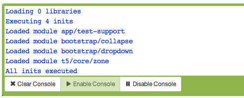

This lists modules *explicitly* loaded (for initialization), but does not include modules loaded only as dependencies. You can see more details about what was actually loaded using *view source*; RequireJS adds `<script>` tags to the document to load libraries and modules.

<a id="javascript-modules--javascriptmodules-librariesversusmodules"></a>
<a id="javascript-modules--libraries-versus-modules"></a>

## Libraries versus Modules

Tapestry still supports JavaScript libraries. When the page is loading, all libraries are loaded before any modules.

Libraries are loaded sequentially, so if you can avoid using libraries, so much the better in terms of page load time.

Libraries work in both normal page rendering, and Ajax partial page updates. Even in partial page updates, the libraries will be loaded sequentially before modules are loaded or exported functions invoked.

<a id="javascript-modules--javascriptmodules-aggregatingmodules"></a>
<a id="javascript-modules--aggregating-modules"></a>

## Aggregating Modules

An important part of performance for production applications is JavaScript aggregation.

In development mode, you want your modules and other assets to load individually. For both CSS and JavaScript, smaller files that align with corresponding server-side files makes it much easier to debug problems.

Unlike assets, modules can't be fingerprinted, so on each page load, the client browser must ask the server for the module's contents frequently (typically getting a 304 Not Modified response).

This is acceptable in development mode, but quite undesirable in production.

By default, Tapestry sets a max age of 60 (seconds) on modules, so you won't see module requests on every page load. This is configurable and you may want a much higher value in production. If you are rapidly iterating on the source of a module, you may need to force the browser to reload after clearing local cache. Chrome has an option to disable the client-side cache when its developer tools are open.

With JavaScript aggregation, the module can be included in the single virtual JavaScript library that represents a [JavaScript stack](http://tapestry.apache.org/5.4/apidocs/org/apache/tapestry5/services/javascript/JavaScriptStack.html). This significantly cuts down on both the number of requests from the client to the server, and the overall number of bytes transferred.

Adding a module to the stack is not the same as `require`-ing it. In fact, you must still use `JavaScriptSupport.require()` regardless.

What adding a module to a stack accomplishes is that the module's code is downloaded in the first, initial JavaScript download; the download of the stack's virtual library. When (and if) the module is required as a dependency, the code will already be present in the browser and ready to execute.

Tapestry **does not** attempt to do dependency analysis; that is left as a manual exercise. Typically, if you aggregate a module, your should look at its dependencies, and aggregate those as well. Failure to do so will cause unwanted requests back to the Tapestry server for the dependency modules, even though the aggregated module's code is present.

Because Tapestry is open, it is possible to contribute modules even into the **core** JavaScript stack. This is done using your application's module:

```java
    @Contribute(JavaScriptStack.class)
    @Core
    public static void addAppModules(OrderedConfiguration<StackExtension> configuration) {
        configuration.add("tree-viewer", StackExtension.module("tree-viewer"));
		configuration.add("app-utils", StackExtension.module("app-utils"));
    }
```

To break this down:

- @Contribute indicates we are contributing to a JavaScriptStack service
- Since there are (or at least, could be) multiple services that implement JavaScriptStack, we provide the @Core annotation to indicate which one we are contributing to (this is a marker annotation, which exists for this exact purpose)
- It is possible to contribute libraries, CSS files, other stacks, and modules; here we are contributing modules
- Each contribution has a unique id and a [StackExtension](http://tapestry.apache.org/5.4/apidocs/org/apache/tapestry5/services/javascript/StackExtension.html) value

The core stack includes several libraries and modules; the exact configuration is subject to a number of factors (such as whether Prototype or jQuery is being used as the underlying framework). That being said, this is the *current* list of modules aggregated into the core stack:

- jquery
- underscore
- t5/core/
  - alert
  - ajax
  - bootstrap
  - console
  - dom
  - events
  - exception-frame
  - fields
  - pageinit
  - messages
  - util
  - validation

The optimum configuration is always a balancing act between including too little and including too much. Generally speaking, including too much is less costly than including too little. It is up to you to analyze the requests coming into your application and determine what modules should be aggregated.

---

<a id="coffeescript"></a>

<!-- source_url: https://tapestry.apache.org/coffeescript.html -->

<!-- page_index: 93 -->

# CoffeeScript

[Apache Tapestry](#index) > [Documentation](#documentation) > [User Guide](#user-guide) > [Client-Side JavaScript](#client-side-javascript) > [CoffeeScript](#coffeescript)

<a id="coffeescript--title"></a>
<a id="coffeescript--coffeescript"></a>

# CoffeeScript

**CoffeeScript** (<http://coffeescript.org>) is a language that compiles down to JavaScript.

<a id="coffeescript--related-articles"></a>

### Related Articles

- Page:

  [JavaScript Modules](#javascript-modules)
- Page:

  [TypeScript](#typescript)
- Page:

  [Client-Side JavaScript](#client-side-javascript)
- Page:

  [CoffeeScript](#coffeescript)
- Page:

  [JavaScript FAQ](#javascript-faq)
- Page:

  [Ajax and Zones](#ajax-and-zones)
- Page:

  [Legacy JavaScript](#legacy-javascript)
- Page:

  [Component Cheat Sheet](#component-cheat-sheet)
- Page:

  [Assets](#assets)

*Starting with version 5.4,* Tapestry can automatically compile your CoffeeScript code into JavaScript on the fly. This is done with the optional tapestry-webresources module. It is highly recommended for anyone who wants to use CoffeeScript in their application ... just let Tapestry do the compilation at runtime (with access to Tapestry's full exception reporting capabilities).

To use the tapestry-webresources module, just add the JAR to your project. For example, if you're using Maven:

**pom.xml (partial)**

```xml
<dependency>
    <groupId>org.apache.tapestry</groupId>
    <artifactId>tapestry-webresources</artifactId>
    <version>${tapestry-release-version}</version>
</dependency>
```

All of Tapestry's own client-side code is written in CoffeeScript and compiled, at *build* time, to JavaScript.

You are completely free to use either JavaScript or CoffeeScript in your Tapestry application.

<a id="coffeescript--coffeescript-coffeescriptversusjavascript"></a>
<a id="coffeescript--coffeescript-versus-javascript"></a>

## CoffeeScript versus JavaScript

CoffeeScript can be quite controversial, but also quite effective.

On the controversial side, it uses significant whitespace to denote blocks of code (like Python or Haskell) rather than curl braces (like Java, JavaScript, or Ruby). In fact, it draws influences from a wide rage of other languages, incorporating many functional programming features, a rudimentary class system, string interpolation, destructuring assignment, and more.

However, for all that, it is very close to JavaScript; it simply rounds out many of the rough edges of JavaScript (and adds a few of its own). As wide ranging as CoffeeScript syntax can be, there's generally a very close mapping from CoffeeScript to JavaScript.

CoffeeScript code often approaches Python's goal of being a "executable psuedo-code"; code that looks like a placeholder that will actually run. Some people find it more pleasant to read than JavaScript ... more *essence* and less *ceremony*.

You can still write bad code in CoffeeScript. You can write bad code in any language.

---

<a id="typescript"></a>

<!-- source_url: https://tapestry.apache.org/typescript.html -->

<!-- page_index: 94 -->

# TypeScript

[Apache Tapestry](#index) > [Documentation](#documentation) > [User Guide](#user-guide) > [Client-Side JavaScript](#client-side-javascript) > [TypeScript](#typescript)

<a id="typescript--title"></a>
<a id="typescript--typescript"></a>

# TypeScript

**TypeScript** (<https://en.wikipedia.org/wiki/TypeScript>) is a language that compiles down to JavaScript.

*Starting with version 5.5,* Tapestry can automatically compile your TypeScript code into JavaScript on the fly. This is done with the optional tapestry-webresources module. It is highly recommended for anyone who wants to use TypeScript in their application ... just let Tapestry do the compilation at runtime (with access to Tapestry's full exception reporting capabilities).

To use the tapestry-webresources module, just add the JAR to your project. For example, if you're using Maven:

**pom.xml (partial)**

```xml
<dependency>
    <groupId>org.apache.tapestry</groupId>
    <artifactId>tapestry-webresources</artifactId>
    <version>${tapestry-release-version}</version>
</dependency>
```

Apache Tapestry, Tapestry, Apache, the Apache feather logo, and the Apache Tapestry project logo are trademarks of The Apache Software Foundation.

---

<a id="legacy-javascript"></a>

<!-- source_url: https://tapestry.apache.org/legacy-javascript.html -->

<!-- page_index: 95 -->

# Legacy JavaScript

[Apache Tapestry](#index) > [Documentation](#documentation) > [User Guide](#user-guide) > [Client-Side JavaScript](#client-side-javascript) > [Legacy JavaScript](#legacy-javascript)

<a id="legacy-javascript--title"></a>
<a id="legacy-javascript--legacy-javascript"></a>

# Legacy JavaScript

For Older Versions of Tapestry

This page describes JavaScript usage in Tapestry versions up through 5.3.x. For version 5.4 and later, see [Client-Side JavaScript](#client-side-javascript).

**JavaScript** is a first-class concept in Tapestry, and sophisticated JavaScript support is provided right out of the box, including rich [Ajax and Zones](#ajax-and-zones), download optimization, client-side logging, and localization.

<a id="legacy-javascript--related-articles"></a>

### Related Articles

- Page:

  [Ajax and Zones](#ajax-and-zones)
- Page:

  [Legacy JavaScript](#legacy-javascript)
- Page:

  [JavaScript Modules](#javascript-modules)
- Page:

  [TypeScript](#typescript)
- Page:

  [Client-Side JavaScript](#client-side-javascript)
- Page:

  [CoffeeScript](#coffeescript)
- Page:

  [JavaScript FAQ](#javascript-faq)
- Page:

  [Ajax Components FAQ](#ajax-components-faq)
- Page:

  [Component Cheat Sheet](#component-cheat-sheet)
- Page:

  [Assets](#assets)

In production mode, by default, Tapestry will merge JavaScript libraries, add version numbering, and set a far-future expires header to encourage aggressive browser caching. Starting with version 5.3, Tapestry can also automatically minify (compress) JavaScript libraries when in [production mode](#configuration).

In addition, as will be described in detail [below](#legacy-javascript), Tapestry comes with the [Prototype](http://www.prototypejs.org/) and [Scriptaculous](http://script.aculo.us/) libraries, or you can easily swap in JQuery using a 3rd-party module.

<a id="legacy-javascript--legacyjavascript-addingcustomjavascript"></a>
<a id="legacy-javascript--adding-custom-javascript"></a>

# Adding Custom JavaScript

When adding your own custom JavaScript or third-party libraries, just follow the strategies below to take advantage of Tapestry's JavaScript support mechanisms.

The recommended practice in Tapestry is to package up any significant amount of JavaScript as a static JavaScript library, a .js file that can be downloaded to the client. Keep your in-page JavaScript code to a minimum, just the few statements needed to initialize objects and reference methods in the JavaScript libraries.

<a id="legacy-javascript--legacyjavascript-linkingtoyourjavascriptlibraries"></a>
<a id="legacy-javascript--linking-to-your-javascript-libraries"></a>

## Linking to your JavaScript libraries

Tapestry provides several ways to add a link to a JavaScript library within your page or component. Although you can use direct `<script type="text/javascript" src="xxx.js"></script>` approach, you should only use it for JavaScript that resides outside of your application. For JavaScript within your app, Tapestry provides *much* better ways to do the same thing. Most users choose the simplest, the @Import annotation approach.

**JumpStart Demo**

[JavaScript](http://jumpstart.doublenegative.com.au/jumpstart/examples/javascript/javascript)

<a id="legacy-javascript--legacyjavascript-approach1:-import"></a>
<a id="legacy-javascript--approach-1:-import"></a>

## Approach 1: @Import

Use the @[Import](http://tapestry.apache.org/current/apidocs/org/apache/tapestry5/annotations/Import.html) annotation (or @[IncludeJavaScriptLibrary](http://tapestry.apache.org/current/apidocs/org/apache/tapestry5/annotations/IncludeJavaScriptLibrary.html) in Tapestry 5.0 and 5.1) to include links to JavaScript (and CSS) files in your page or component. Tapestry ensures that each such file is only referenced once in your page.

**For Tapestry 5.2 and later**

```java
@Import(library={"context:js/jquery.js",
		"context:js/myeffects.js"})
public class MyComponent
{
 . . .
}
```

**For Tapestry 5.0 and 5.1**

```java
@IncludeJavaScriptLibrary(value={"context:js/jquery.js",
		"context:js/myeffects.js"})
public class MyComponent
{
 . . .
}
```

@Import may also be applied to individual methods, in which case the import operation only occurs when the method is invoked.

Note: When specifying a file to import, you'll often use the **context:** binding prefix to indicate that the file is stored in the web application context, and not on the classpath. Relative paths will be on the classpath, relative to the Java class. See [Component Parameters](#component-parameters) for other binding prefix options.

Adding the same JavaScript library multiple times does *not* create duplicate links. The subsequent ones are simply ignored. In this way, each component can add the libraries it needs, without worrying about conflicts with other components.

<a id="legacy-javascript--legacyjavascript-approach2:javascriptsupport"></a>
<a id="legacy-javascript--approach-2:-javascriptsupport"></a>

## Approach 2: JavaScriptSupport

Alternatively, you can use [JavaScriptSupport](http://tapestry.apache.org/current/apidocs/org/apache/tapestry5/services/javascript/JavaScriptSupport.html) (for Tapestry 5.2 or later) or RenderSupport (for Tapestry 5.0 and 5.1) to include a JavaScript library in your page or component. JavaScriptSupport and RenderSupport are [environmental services](#legacy-javascript) that include a number of methods that will be used by components, or by services that are called from components. For example:

<a id="legacy-javascript--legacyjavascript-theimportjavascriptlibrarymethod"></a>
<a id="legacy-javascript--the-importjavascriptlibrary-method"></a>

### The `importJavaScriptLibrary` method

The `importJavaScriptLibrary` method (or `addScriptLink` for Tapestry 5.0 and 5.1) adds a link to a JavaScript library. A component can inject such a script and pass one or more of assets to this method:

**Tapestry 5.2 and later**

```java
@Inject @Path("context:/js/myeffects.js") private Asset myEffects;
@Environmental private JavaScriptSupport javaScriptSupport;
void setupRender() {javaScriptSupport.importJavaScriptLibrary(myEffects);}
```

**Tapestry 5.1 and earlier**

```java
@Inject @Path("context:/js/myeffects.js") private Asset myEffects;
@Environmental private RenderSupport renderSupport;
void setupRender() {renderSupport.addScriptLink(myEffects);}
```

Tapestry will ensure that the necessary <link> elements are added to the *top* of the document (in the <head> element). With Tapestry 5.3 and later the new elements are inserted at the bottom of the <head> element; in versions before 5.3 they appear at the top of the <head> element).

As with the annotation approach, adding the same asset multiple times does *not* create duplicate links.

The `setupRender` method (the name is specifically linked to a [render phase](#legacy-javascript)) is the correct place to inform the JavaScriptSupport (or RenderSupport) service that the library is needed.

**JumpStart Demo**

[Reusable JavaScript](http://jumpstart.doublenegative.com.au/jumpstart/examples/javascript/reusable)

<a id="legacy-javascript--legacyjavascript-theaddscriptmethod"></a>
<a id="legacy-javascript--the-addscript-method"></a>

### The `addScript` method

The `addScript` method is used when you need to add some JavaScript code directly to the page. This will be inserted at the *bottom of the document*, and will only be executed when the document has finished loading on the client (i.e., from the window.onload event handler).

**Tapestry 5.2 and later**

```text
void afterRender()
{
    javaScriptSupport.addScript(
        "$('%s').observe('click', hideMe());",
        container.getClientId());
}
```

**Tapestry 5.1 and earlier**

```text
void afterRender()
{
    javaScriptSupport.addScript(String.format(
        "$('%s').observe('click', hideMe());",
        container.getClientId()));
}
```

When calling the method, the format string can include standard substitutions (such as '%s') for arguments. This saves you the trouble of calling String.format() yourself. (For Tapestry 5.1 and earlier, you must call String.format() yourself.) In any case, the formatted JavaScript is added to the script block in the rendered output.

<a id="legacy-javascript--legacyjavascript-injectingjavascriptsupport"></a>
<a id="legacy-javascript--injecting-javascriptsupport"></a>

### Injecting JavaScriptSupport

JavaScriptSupport (like RenderSupport before it) is an *environmental* object, so you will normally inject it via the @[Environmental](http://tapestry.apache.org/current/apidocs/org/apache/tapestry5/annotations/Environmental.html) annotation:

**For Tapestry 5.2 and later**

```java
  @Environmental
  private JavaScriptSupport javaScriptSupport;
```

**For Tapestry 5.0 and 5.1**

```java
  @Environmental
  private RenderSupport renderSupport;
```

The @Environmental annotation only works inside components, but occasionally you may want to inject JavaScriptSupport (or RenderSupport) into a service. Fortunately, a proxy has been set up to allow the use of @Inject instead:

**For Tapestry 5.2 and later**

```java
  @Inject
  private JavaScriptSupport javaScriptSupport;
```

**For Tapestry 5.0 and 5.1**

```java
  @Inject
  private RenderSupport renderSupport;
```

... or, in a service implementation constructor:

**For Tapestry 5.2 and later**

```java
  public MyServiceImpl(JavaScriptSupport support)
  {
    . . .
  }
```

**For Tapestry 5.0 and 5.1**

```java
  public MyServiceImpl(RenderSupport support)
  {
    . . .
  }
```

Inside a component, you should use @Environmental, to highlight the fact that RenderSupport (like most environmental objects) is only available during rendering, not during action requests.

<a id="legacy-javascript--legacyjavascript-combiningjavascriptlibraries"></a>
<a id="legacy-javascript--combining-javascript-libraries"></a>

# Combining JavaScript libraries

**Added in 5.1.0.2**

In production mode, Tapestry automatically *combines* JavaScript libraries. A single request (for a *virtual asset*) will retrieve the combined content of all referenced JavaScript library files.

Note: starting with Tapestry 5.2, JavaScript libraries are only combined if they are part of a JavaScript Stack (see below).

This is a very useful feature, as it reduces the number of requests needed to present a page to the user. It can be disabled, however, by setting the SymbolConstants.COMBINE\_SCRIPTS [configuration symbol](#legacy-javascript) to false in your application's module class (normally AppModule.java). By default it is enabled when in production mode and disabled otherwise.

As elsewhere, if the client browser supports gzip compression, the combined JavaScript will be compressed.

<a id="legacy-javascript--legacyjavascript-minifyingjavascriptlibraries"></a>
<a id="legacy-javascript--minifying-javascript-libraries"></a>

# Minifying JavaScript libraries

**Added in 5.3**

In production mode, Tapestry can automatically *minify* (intelligently compresses) JavaScript libraries (and CSS) when the application starts up. This can significantly decrease the size of static content that the browser needs to download.

Minification is accomplished using the ResourceMinimizer service. A YUI Compressor-based implementation is available, but this can be overridden.

IMPORTANT NOTE: The tapestry-core module only provides the empty infrastructure for supporting minification; the actual logic is supplied in the tapestry-yuicompressor module. To use it, you'll need to update your dependencies to include this module.

**Maven pom.xml (partial)**

```xml
<dependency>
    <groupId>org.apache.tapestry</groupId>
    <artifactId>tapestry-yuicompressor</artifactId>
    <version>${tapestry-release-version}</version>
</dependency>
```

Gradle would be similar, of course. If you aren't using something like Maven or Gradle, you'll have to download the jar and its dependency (com.yahoo.platform.yui: yuicompressor) yourself.

Minification can be disabled by setting the [tapestry.enable-minification](#configuration) configuration symbol to false in your application's module class (usually AppModule.java). By default it is enabled when in production mode and disabled otherwise.

Please test your applications well: the YUI Compressor code can be somewhat finicky about the application server and JDK version.

<a id="legacy-javascript--legacyjavascript-client-sidelogging"></a>
<a id="legacy-javascript--client-side-logging"></a>

# Client-side Logging

**Deprecated since 5.3**

In versions prior to 5.3, Tapestry used a modified version of the Blackbird JavaScript console. The Tapestry object includes three functions: debug, warn and error.

Each of these functions take a message and an optional pattern; if the pattern is provided, the message is interpolated on the pattern. The final message is displayed in the Blackbird console, which will make itself visible automatically.

In production mode, debug messages will be filtered out (they will not be visible until the user presses F2 to display the console, and then clicks the grayed out icon for debug messages). In development mode, debug messages are not filtered out.

Example usage:

```java
 Tapestry.debug("Field id is #{id}, value is #{value}", field);

 Tapestry.error("Server is not available.");
```

With Tapestry 5.3 and later the Blackbird console has been removed; just use the standard console logging features (e.g. `console.log()`) built into modern browsers.

<a id="legacy-javascript--legacyjavascript-handlingslowpageloads"></a>
<a id="legacy-javascript--handling-slow-page-loads"></a>

# Handling Slow Page Loads

If your page loads slowly (typically, because of scripts loaded from external sites), you may see a race condition where the user can click on a link before an event handler for that link has been wired up.

The client-side function `Tapestry.waitForPage()` can be used in an element's onclick handler to force a wait for the page to fully load. In this race condition, the screen will dim and a message will appear advising the user to wait a moment; once the page is fully loaded, this modal dialog will be removed.

The correct usage is:

```java
  <a href="..." onclick="javascript:Tapestry.waitForPage(event);"> ... </a>
```

The constant [MarkupConstants.WAIT\_FOR\_PAGE](http://tapestry.apache.org/current/apidocs/org/apache/tapestry5/MarkupConstants.html) contains the part of this snippet inside the quotes.

<a id="legacy-javascript--legacyjavascript-thestandardtapestrylibrary"></a>
<a id="legacy-javascript--the-standard-tapestry-library"></a>

# The Standard Tapestry Library

Tapestry's client-side support, the standard Tapestry library, consists of `tapestry.js`, which has dependencies on Prototype and on Scriptaculous Effects. tapestry.js, along with its dependencies. The tapestry.js library is automatically added to the page when your code adds any other JavaScript or JavaScript library.

<a id="legacy-javascript--legacyjavascript-tapestrynamespace"></a>
<a id="legacy-javascript--tapestry-namespace"></a>

## Tapestry Namespace

Tapestry defines a number of object and classes inside the Tapestry namespace.

It also adds a handful of methods to the Form class, and to Form elements. These are mostly related to input validation and determining element visibility.

<a id="legacy-javascript--legacyjavascript-thetapestryobject-t"></a>
<a id="legacy-javascript--the-tapestry-object-t"></a>

## The Tapestry Object $T()

**Deprecated since 5.2 (no replacement)**

The standard library adds a new function, `$T()`. This function is used much like Prototype's `$()`, except that instead of returning a DOM object, it returns a hash (an initially empty JavaScript object) that is associated with the DOM object. This hash is known as *the Tapestry object*.

You may pass in an object id (as a string) or an object reference. The Tapestry Object is created on first invocation. Note: you'll see it as a property name \_tapestry on the DOM object (which may be useful when debugging).

When Tapestry adds information to a DOM object, it does so in the Tapestry object. This helps avoid name conflicts, and groups all Tapestry-added properties into one place which is much easier to debug.

For example, you might store a value for an element in one place:

```java
  $T(myid).fadeDuration = .5;
```

Then use it somewhere else:

```java
  new Effect.Fade($(myId), { duration: $T(myid).fadeDuration });
```

<a id="legacy-javascript--legacyjavascript-ajaxcomponentsandmixins"></a>
<a id="legacy-javascript--ajax-components-and-mixins"></a>

# Ajax Components and Mixins

Tapestry provides easy-to-use support for *Ajax*, the technique of using JavaScript to dynamically updating parts of a web page with content from the server without redrawing the whole page. See [Ajax and Zones](#ajax-and-zones) for details.

<a id="legacy-javascript--legacyjavascript-built-inlibraries"></a>
<a id="legacy-javascript--built-in-libraries"></a>

# Built-in Libraries

**Alternatives to Prototype**

Tapestry 5.4 includes the ability to switch between Prototype and JQuery. For Tapestry 5.3 and earlier, you also have some options::

- [Tapestry5-Jquery module](https://github.com/got5/tapestry5-jquery) – Using JQuery *instead of* Prototype
- [Tapestry5HowToIntegrateJQuery](http://wiki.apache.org/tapestry/Tapestry5HowToIntegrateJQuery) – Using JQuery *in addition to* Prototype
- [TAPS-1364](https://issues.apache.org/jira/browse/TAP5-1364) – lists some starting points for ExtJS integration

Tapestry 5.4 and earlier come with the [Prototype](http://www.prototypejs.org/) and [Scriptaculous](http://script.aculo.us/) libraries ... no extra download is required. Tapestry will automatically link into your pages the prototype.js, scriptaculous.js, and effects.js libraries, as well as the Tapestry library, tapestry.js (which largely consists of support for form input validation). Starting with Tapestry 5.3, [Underscore](http://documentcloud.github.com/underscore/) is also included.

<a id="legacy-javascript--legacyjavascript-prototypeandscriptaculousversions"></a>
<a id="legacy-javascript--prototype-and-scriptaculous-versions"></a>

## Prototype and Scriptaculous Versions

Tapestry included only Prototype and Scriptaculous in versions prior to Tapestry 5.4. See [Supported Environments and Versions](#supported-environments-and-versions) for a matrix of prototype and scriptaculous versions supported by Tapestry.

In versions before 5.4, Tapestry used a modified version of the main Scriptaculous library, scriptaculous.js, with the library's default [autoloading](http://wiki.script.aculo.us/scriptaculous/show/Usage) behavior turned off. This lets Tapestry and Tapestry components control which Scriptaculus scripts are loaded, rather than having *all* of them loaded unnecessarily.

If you need access to other Scriptaculous libraries, you can provide them as follows:

```java
@Inject @Path("${tapestry.scriptaculous}/dragdrop.js") private Asset dragDropLibrary;
@Environmental private JavaScriptSupport javaScriptSupport;
void setupRender() {javaScriptSupport.addScriptLink(dragDropLibrary);}
```

The Asset is injected, using the [tapestry.scriptaculous](#configuration) configuration symbol to reference the location of the Scriptaculous library.

Even though the dragdrop.js library is stored inside a JAR file, Tapestry ensures that it can be accessed from the client web browser. A Tapestry URL within the virtual folder "/assets" is created; the file will be given a version number (the application version number if not specified more specifically) and will be sent to the browser with a far-future expires header (to encourage the browser to cache the file aggressively).

<a id="legacy-javascript--legacyjavascript-javascriptstacks"></a>
<a id="legacy-javascript--javascript-stacks"></a>

# JavaScript Stacks

**Added in 5.2**

Tapestry allows you to define groups of related JavaScript libraries and stylesheets as "stacks". The built-in "core" stack is used to define the core JavaScript libraries needed by Tapestry (currently, this includes Prototype and Scriptaculous, as well as Tapestry-specific libraries). Other component libraries may define additional stacks for related sets of resources, for example, to bundle together some portion of the ExtJS or YUI libraries.

A [JavaScriptStack](http://tapestry.apache.org/current/apidocs/org/apache/tapestry5/services/javascript/JavaScriptStack.html) can be thought of as a generalization of Tapestry 5.1's ClientInfrastructure, which exists now to define the "core" JavaScript stack.

JavaScript assets of a stack may (when enabled) be exposed to the client as a single URL (identifying the stack by name). The individual assets are combined into a single virtual asset, which is then streamed to the client.

To group several static resources together in a single stack, you must create a new implementation of the JavaScriptStack interface . This interface has four methods:

- **getStylesheets** : This method will return a list of stylesheet files (StylesheetLink-type object) associated to this stack

- **getJavaScriptLibraries** : This method will return a list of javascript files (Asset-type object) associated to this stack

- **getStacks** : It is also possible to make a stack dependant of other stacks. All the stacks defined in this method will be loaded before the current stack.

- **getInitialization** : this method makes it possible to call a JavaScript initialization for the stack. Tapestry will automatically add this initialization to the page that imports the stacks.

**myStack.java**

```java
public class myStack implements JavaScriptStack {
private final AssetSource assetSource;
public myStack (final AssetSource assetSource) {this.assetSource = assetSource;}
public String getInitialization() {return null;}
public List<Asset> getJavaScriptLibraries() {List<Asset> ret = new ArrayList<Asset>();
ret.add(assetSource.getContextAsset("static/js/jquery.js", null));
ret.add(assetSource.getContextAsset("static/js/jquery.ui.core.js", null));
return ret;}
public List<StylesheetLink> getStylesheets() {List<StylesheetLink> ret = new ArrayList<StylesheetLink>();
ret.add(new StylesheetLink(assetSource.getContextAsset("static/css/style.css", null)));
return ret;}
public List<String> getStacks() {return Collections.emptyList();}
}
```

When your new Stack is created, you have to define it in your AppModule.

**AppModule.java (partial)**

```java
@Contribute(JavaScriptStackSource.class)
public static void addMyStack (MappedConfiguration<String, JavaScriptStack> configuration)
{
        configuration.addInstance("MyNewStack", myStack.class);
}
```

You can now use it in your pages and components, by using the @Import annotation or the JavaScriptSupport service :

**With @Import**

```java
  @Import(stack="MyNewStack")
  public class myPage {
  }
```

**With JavaScriptSupport**

```java
@Inject
private JavaScriptSupport js;

@SetupRender
public void importStack(){
  js.importStack("MyNewStack");
}
```

---

<a id="ajax-and-zones"></a>

<!-- source_url: https://tapestry.apache.org/ajax-and-zones.html -->

<!-- page_index: 96 -->

# Ajax and Zones

[Apache Tapestry](#index) > [Documentation](#documentation) > [User Guide](#user-guide) > [Client-Side JavaScript](#client-side-javascript) > [Ajax and Zones](#ajax-and-zones)

<a id="ajax-and-zones--title"></a>
<a id="ajax-and-zones--ajax-and-zones"></a>

# Ajax and Zones

<a id="ajax-and-zones--related-articles"></a>

### Related Articles

- Page:

  [Ajax and Zones](#ajax-and-zones)
- Page:

  [Legacy JavaScript](#legacy-javascript)
- Page:

  [JavaScript Modules](#javascript-modules)
- Page:

  [TypeScript](#typescript)
- Page:

  [Client-Side JavaScript](#client-side-javascript)
- Page:

  [CoffeeScript](#coffeescript)
- Page:

  [JavaScript FAQ](#javascript-faq)
- Page:

  [Ajax Components FAQ](#ajax-components-faq)
- Page:

  [Component Cheat Sheet](#component-cheat-sheet)
- Page:

  [Assets](#assets)

Tapestry provides easy-to-use support for **Ajax**, the technique of using JavaScript to dynamically update parts of a web page with content from the server without redrawing the whole page. With Tapestry, you can do simple Ajax updates without having to write any JavaScript code at all.

Ajax support is included in many [built-in components](#component-reference) and [component mixins](#component-mixins) via the `async` parameter (in Tapestry 5.4+) and the `zone` parameter (for earlier versions). Here we use an EventLink component to trigger an Ajax update of another area of the page:

**Page or component template (partial)**

```xml
<t:eventlink event="updateTime" async="true">update</t:eventlink>
...
<t:zone t:id="timeArea" id="timeArea">
    The current time is ${currentTime}
</t:zone>
```

The corresponding Java code might look like this:

**Page or component class (partial)**

```java
@Inject private AjaxResponseRenderer ajaxResponseRenderer;
@InjectComponent private Zone timeArea;
@Property private Date currentTime; .../** respond to the "updateTime" event */ void onUpdateTime() {currentTime = new Date(); ajaxResponseRenderer.addRender(timeArea);}
```

That `onUpdateTime` method is just an ordinary Tapestry event handler, except that it uses an injected `AjaxResponseRenderer` to tell Tapestry what zone to update when the link is clicked.

Since Tapestry 5.4.2, you can also easily invoke server-side event handlers using the `@PublishEvents` annotation and the `t5/core/ajax` JavaScript function, as explained in the [Invoking server-side event handler methods from JavaScript](#ajax-and-zones) section below.

<a id="ajax-and-zones--ajaxandzones-zones"></a>
<a id="ajax-and-zones--zones"></a>

### Zones

Zones are Tapestry's approach to performing partial page updates. A [Zone component](http://tapestry.apache.org/current/apidocs/org/apache/tapestry5/corelib/components/Zone.html) renders as an HTML element, typically a <div>, and serves as a marker for where dynamically-updated content should be replaced. A zone is recognizable in the DOM because it will have the attribute `data-container-type=zone`. The client-side support for Zones is keyed off of this attribute and value.

Starting in Tapestry 5.4 you can use any HTML element in your template as a zone marker, by passing its client-side id to the two-argument version of the addRender method.

A Zone updated can be triggered by an EventLink, ActionLink or Select component, or by a Form. All of these components support the `async` and/or `zone` parameters. Clicking such a link will invoke an event handler method on the server as normal ... except that a  *partial page response*  is sent to the client, and the content of that response is used to update the Zone's <div> in place.

**JumpStart Demo:**
[AJAX ActionLink](https://tapestry-jumpstart.org/jumpstart/examples/ajax/actionlink)

<a id="ajax-and-zones--ajaxandzones-eventhandlerreturntypes"></a>
<a id="ajax-and-zones--event-handler-return-types"></a>

### Event Handler Return Types

In a traditional request, the return value of an event handler method may used to determine which page will render a *complete* response, and a *redirect* may sent to the client to render the new page (as a new request).

In contrast, with a Zone update, the return value may used to render a *partial response* within the *same request*.

Starting in Tapestry 5.3, Ajax event handlers typically have a void return type and use AjaxResponseRenderer to indicate which zone to update. The AjaxResponseRender approach means that the `zone` parameter's value (oridinarily indicating which zone to update) is no longer needed. Tapestry 5.4 introduced the `async="true"` parameter to avoid having to redundantly indicate which zone to update.

If you only have one zone to update and don't want to use AjaxResponseRenderer, you can instead return a value from your event handler method. The simplest case is just to return the zone's own body:

```java
@Inject private Request request;
@InjectComponent private Zone myZone; ...Object onActionFromSomeLink() {return myZone.getBody(); // AJAX request, return zone's own body}
```

The possible return values are:

- An injected Block or Component to render as the response. The response will be a JSON hash, with a "content" key whose value is the rendered markup. This is the basis for updates with the Zone component.
- The zone's own body (using Zone's getBody() method)
- null (to redraw the current page)
- A [JSONObject](http://tapestry.apache.org/current/apidocs/org/apache/tapestry5/json/JSONObject.html) or [JSONArray](http://tapestry.apache.org/current/apidocs/org/apache/tapestry5/json/JSONArray.html), which will be sent as the response.
- A [StreamResponse](http://tapestry.apache.org/current/apidocs/org/apache/tapestry5/StreamResponse.html), which will be sent as the response.
- A [Link](http://tapestry.apache.org/current/apidocs/org/apache/tapestry5/Link.html), which will send a redirect to the client.
- A page name (as a String), or a page class, or a page instance, which will send a redirect to the indicated page.

See [Page Navigation](#page-navigation) for full descriptions of the above.

<a id="ajax-and-zones--ajaxandzones-gracefuldegradation"></a>
<a id="ajax-and-zones--graceful-degradation"></a>

### Graceful Degradation

Users who do not have JavaScript enabled may click EventLinks (or ActionLinks, or Forms) that are configured to update a Zone. When that occurs, the request will still be sent to the server, but Tapestry will handle it as a *traditional* request.

This happens automatically when your event handler method has a void return type.

However, to support graceful degradation when your event handler method has a *non-void* return type, you should detect non-Ajax requests and return a traditional response, typically null to redraw the whole page. This is accomplished by injecting the [Request](http://tapestry.apache.org/current/apidocs/org/apache/tapestry5/services/Request.html) object, and invoking the isXHR() method. This value will be true for Ajax requests, and false for traditional request.

```java
@Inject private Request request;
@InjectComponent private Zone myZone; ...Object onActionFromSomeLink() {// return either the zone body (ajax) or whole page (non-ajax) return request.isXHR() ? myZone.getBody() : null;}
```

<a id="ajax-and-zones--ajaxandzones-multiplezoneupdates"></a>
<a id="ajax-and-zones--multiple-zone-updates"></a>

### Multiple Zone Updates

**JumpStart Demo:**
[AJAX Multiple Zone Update](https://tapestry-jumpstart.org/jumpstart/examples/ajax/multiplezoneupdate)

An event handler often needs to update multiple zones on the client side. To accomplish this, use an [AjaxResponseRenderer](http://tapestry.apache.org/current/apidocs/org/apache/tapestry5/services/ajax/AjaxResponseRenderer.html), indicating the zones to update. You must know the client-side id for each zone to update (the best way for this is to lock down the zone's id using the id parameter of the Zone component).

*AjaxResponseRenderer was introduced in Tapestry 5.3. For Tapestry 5.2 and earlier, return a [MultiZoneUpdate](http://tapestry.apache.org/current/apidocs/org/apache/tapestry5/ajax/MultiZoneUpdate.html) object instead.*

The renderer for each zone can be the zone itself, a block, a component, a [Renderable](http://tapestry.apache.org/current/apidocs/org/apache/tapestry5/Renderable.html) or a [RenderCommand](http://tapestry.apache.org/current/apidocs/org/apache/tapestry5/runtime/RenderCommand.html) ... or an object, such as String, that can be coerced to either of these.

**For Tapestry 5.3 and later**

```java
@InjectComponent
private Zone userInput;

@InjectComponent
private Zone helpPanel;

@Inject
private AjaxResponseRenderer ajaxResponseRenderer;

void onActionFromRegister()
{
    ajaxResponseRenderer.addRender("userInput",
        userInput).addRender("helpPanel", helpPanel);
}
```

This example assumes that there are two zones, "userInput" and "helpPanel", somewhere in the rendered page, waiting to receive the updated content.

In this example, the Zone receives the update but does not provide any content. That's OK, the other client-side elements (`userInput` and `helpPanel`) will be updated, and the zone's content left unchanged.

This demonstrates why it is necessary for the developer to specify a particular client-side id for Zone components; if they were dynamically allocated ids, as is typical in most other elements, it would be impossible for this code to know what client-side id was used for the Zone.

<a id="ajax-and-zones--ajaxandzones-zonecomponentidvs.zoneelementid"></a>
<a id="ajax-and-zones--zone-component-id-vs.-zone-element-id"></a>

### Zone Component Id vs. Zone Element Id

Like all Tapestry components, Zones have a component id, specified using the `t:id` attribute. If you do not assign a component id, a unique id is assigned by Tapestry.

However, to coordinate things on the client side, it is necessary for components that wish to update the zone know the *client-side element id*. This is specified with the `id` parameter of the Zone component. If the `id` parameter is not bound, then a unique value (for the current page and render) is generated by Tapestry and this value is difficult to predict. (The actual value will be available as the `clientId` property of the Zone component itself.)

Remember that the component id (`t:id`) is used to *inject* the Zone component into the containing page or component. The client-side id (`id`) is used on the client side to orchestrate requests and updates. You will often seen the following construct:

```xml
<t:zone t:id="myZone" id="myzone"> ... </t:zone>
```

<a id="ajax-and-zones--ajaxandzones-thecontainingzone-zone"></a>
<a id="ajax-and-zones--the-containing-zone-zone"></a>

### The Containing Zone (zone="^")

***Since 5.2***

If the Form or Link is enclosed by the Zone itself, and you're using the `zone` parameter instead of the `async` parameter, then the `zone` parameter may be set to the special value  **`^`**   `(the carat)`. The zone is found – on the client side – by searching up form the form or link element for the first enclosing element that is a Zone. In this way, the client-side coordination can occur without having to know what the specific client-side id of the Zone is. Because of this, in some cases it is no longer necessary to specify the Zone's `id` parameter.

<a id="ajax-and-zones--ajaxandzones-anupdatedivwithinazonediv-tapestry5.3andearlier"></a>
<a id="ajax-and-zones--an-update-div-within-a-zone-div-tapestry-5.3-and-earlier"></a>

### An Update div within a Zone div (Tapestry 5.3 and earlier)

***Deprecated** **:** This feature is removed starting with Tapestry 5.4*

In many situations, a Zone is a kind of "wrapper" or "container" for dynamic content; one that provides a look and feel ... a bit of wrapping markup to create a border. In that situation, the Zone <div> may contain an update <div>.

An Update <div> is specifically a <div> element marked with the CSS class "t-zone-update", *inside* the Zone's <div>.

If an Update div exists within a Zone div, then when Tapestry updates a zone only the update <div>'s content will be changed, rather than the entire Zone <div>.

The show and update functions (see Zone Functions, below) apply to the Zone <div>, not just the update <div>.

<a id="ajax-and-zones--ajaxandzones-zoneeffectfunctions-tapestry5.3andearlier"></a>
<a id="ajax-and-zones--zone-effect-functions-tapestry-5.3-and-earlier"></a>

### Zone Effect Functions (Tapestry 5.3 and earlier)

***Deprecated:***  This feature refers to client-side logic only present in Tapestry 5.3 or earlier. For 5.4, there are client-side events that are triggered before and after changes to the Zone; listeners on those events can trigger whatever animations they like.

A Zone may be initially visible or invisible. When a Zone is updated, it is made visible if not currently so. This is accomplished via a function on the Tapestry.ElementEffect client-side object. By default, the show() function is used for this purpose. If you want Tapestry to call a different Tapestry.ElementEffect function when updates occur, specify its name with the zone's show parameter.

If a Zone is already visible, then a different effect function is used to highlight the change. By default, the highlight() function is called, which performs a yellow fade to highlight that the content of the Zone has changed. Alternatively, you can specify a different effect function with the Zone's update parameter:

| Tapestry.ElementEffect Function | Result |
| --- | --- |
| highlight() | (the default) highlight changes to an already-visible zone |
| show() | make the zone visible if it isn't already visible |
| slidedown() | scroll the content down |
| slideup() | slide the content back up (opposite of slidedown) |
| fade() | fade the content out (opposite of show) |

To have Tapestry update a zone without the usual yellow highlight effect, just specify "show" for the update parameter:

```xml
<t:zone t:id="myZone" t:update="show">
```

You may also define and use your own JavaScript effect function (with lower-case names), like this:

```js
Tapestry.ElementEffect.myeffectname = function(element){ YourJavascriptCodeGoesHere; };
```

<a id="ajax-and-zones--ajaxandzones-zonelimitations"></a>
<a id="ajax-and-zones--zone-limitations"></a>

### Zone Limitations

Unlike many other situations, Tapestry relies on you to specify useful and unique ids to Zone components, then reference those ids inside EventLink (or ActionLink, or Form) components. Using Zone components inside any kind of loop may cause additional problems, as Tapestry will *uniqueify* the client id you specify (appending an index number).

If you create a component that contains a zone, and you use that component in a loop, you'll likely need to set the client-side id like this:

```xml
<t:zone t:id="myzone" id="prop:componentResources.id">
```

See [this JumpStart Example](https://tapestry-jumpstart.org/jumpstart/examples/ajax/components1) for details.

The show and update function names (Tapestry 5.3 and earlier only) are converted to lower case; all the methods of Tapestry.ElementEffect should have all lower-case names. Because client-side JavaScript is so fluid (new methods may be added to existing objects), Tapestry makes no attempt to validate the function names ... however, if the names are not valid, then the default show and highlight methods will be used.

Zones may only be used inside the *body* of a page, not the head*.*

<a id="ajax-and-zones--ajaxandzones-moreinformation"></a>
<a id="ajax-and-zones--more-information"></a>

### More Information

For examples of extending a Form with a Zone and updating multiple zones at once, see the [Ajax Components FAQ](#ajax-components-faq).

There are also a number of Ajax-related examples at the  [Tapestry JumpStart](https://tapestry-jumpstart.org/jumpstart/)  site.

<a id="ajax-and-zones--ajaxandzones-autocompletemixin"></a>
<a id="ajax-and-zones--autocomplete-mixin"></a>

## Autocomplete Mixin

**JumpStart Demo:**
[Autocomplete Mixin](https://tapestry-jumpstart.org/jumpstart/examples/ajax/autocompletemixin)

The [Autocomplete](http://tapestry.apache.org/current/apidocs/org/apache/tapestry5/corelib/mixins/Autocomplete.html) mixin exists to allow a text field to query the server for completions for a partially entered phrase. It is often used in situations where the field exists to select a single value from a large set, too large to successfully download to the client as a drop down list; for example, when the number of values to select from is numbered in the thousands.

Autocomplete can be added to an existing text field:

```java
  <t:textfield t:id="accountName" t:mixins="autocomplete" size="100"/>
```

The mixin can be configured in a number of ways, see the [component reference](#component-reference).

When the user types into the field, the client-side JavaScript will send a request to the server to get completions.

You must write an event handler to provide these completions. The name of the event is "providecompletions". The context is the partial input value, and the return value will be converted into the selections for the user.

For example:

```java
List<String> onProvideCompletionsFromAccountName(String partial) {List<Account> matches = accountDAO.findByPartialAccountName(partial);
List<String> result = new ArrayList<String>();
for (Account a : matches) {result.add(a.getName());}
return result;}
```

This presumes that `findByPartialAccountName()` will sort the values, otherwise you will probably want to sort them. The Autocomplete mixin does *not* do any sorting.

You can return an object array, a list, even a single object. You may return objects instead of strings ... and `toString()` will be used to convert them into client-side strings.

<a id="ajax-and-zones--ajaxandzones-invokingserver-sideeventhandlermethodsfromjavascript"></a>
<a id="ajax-and-zones--invoking-server-side-event-handler-methods-from-javascript"></a>

## Invoking server-side event handler methods from JavaScript

Tapestry 5.4.2 introduced an API which makes it easy for server-side events to be invoked from JavaScript. On the server-side, you first need to annotate the event handler methods you want to expose with the `@PublishEvent` annotation. Then, in JavaScript, all you need to do is to call the existing  [`t5/core/ajax`](http://tapestry.apache.org/current/coffeescript/ajax.html)  function, but with slightly different parameters.

The `t5/core/ajax` function has two parameters: `url` and `options`. Prior to Tapestry 5.4.2, the first one was difficult to get when doing AJAX requests to event handler methods. You needed to inject `ComponentResources` in your component class, call `componentResources.createEventLink()` for each event handler method, then pass all this information back to the browser through one of the `JavaScriptSupport` methods. For Tapestry 5.4.2 and later, your JavaScript code only needs to know the event name (also called *event type*) and optionally indicate a DOM element to be used as a starting point for finding the event URL.

All event data is stored in `data-componenent-events` attributes. For page classes, the attribute is added to the `<body>` element. For components, it's added to the first element rendered by the component. Given an HTML element, the search is performed in the following order until information for the given event is first found:

1. The element itself
2. The element's previous siblings, closest first (bottom-up)
3. The element's parents
4. The page's `<body>` element

Here's one example:

```java
public class PublishEventDemoComponent {@OnEvent("answer") @PublishEvent JSONObject answer() {return new JSONObject("origin", "componentAnswer");}
@PublishEvent JSONObject onAction() {return new JSONObject("origin", "componentAction");}}
```

Notice that `answer()` and `onAction()` are ordinary event handlers, with nothing specific besides the `@PublishEvent` annotation.

```xml
<div id="component" xmlns:t="http://tapestry.apache.org/schema/tapestry_5_0_0.xsd">
	<p id="componentParagraph">I'm a component</p>
    <p id="result">(no result yet)</p>
</div>
```

The template also has nothing special. When rendered, the component's events information is placed in the outer `<div id="component">`.

We want to update the text of `<p id="result">` with the value of the `origin` property of the returned JSON object when that element itself is clicked, so here's our JavaScript code, supposing we want to trigger the `answer` event:

```js
require(["t5/core/ajax", "jquery"], function (ajax, $) {// Creating a callback to be invoked with <p id="result"> is clicked.$('#result').click(function() {ajax('answer', {element: $('#result'), // This doesn't need to be the same element as the one two lines above // Callback called when the request is finished.// response.json is the object returned by the event handler method success: function(response) {$('#result').text(response.json.origin);} }); }); });
```

If you're trying to invoke a page class event handler, you can change line 5 above to `element: null`. You do need to explicitly set the `element` property, otherwise the `ajax` function will treat the first parameter, `url`, as an URL and not as an event name.

---

<a id="rest-support-580"></a>

<!-- source_url: https://tapestry.apache.org/rest-support-580.html -->

<!-- page_index: 97 -->

# REST Support (5.8.0+)

[Apache Tapestry](#index) > [Documentation](#documentation) > [User Guide](#user-guide) > [REST Support (5.8.0+)](#rest-support-580)

<a id="rest-support-580--title"></a>
<a id="rest-support-580--rest-support-5.8.0"></a>

# REST Support (5.8.0+)

<a id="rest-support-580--restsupport-5.8.0-cdata-div.rbtoc1763662443732-padding:0px-div.rbtoc1763662443732ul-margin-left:0px-div.rbtoc1763662443732li-margin-left:0px-padding-left:0px-restsupport-5.8.0-overview-restsupport-5.8.0-overviewwritingrestendpoints"></a>

##

- [Overview](#rest-support-580--restsupport-5.8.0-overview)
- [Writing REST endpoints](#rest-support-580--restsupport-5.8.0-writingrestendpoints)
- [Reading the request body with @RequestBody](#rest-support-580--restsupport-5.8.0-readingtherequestbodywith-requestbody)
- [Answering REST requests](#rest-support-580--restsupport-5.8.0-answeringrestrequests)
  - [Content responses](#rest-support-580--restsupport-5.8.0-contentresponses)
  - [Non-content responses](#rest-support-580--restsupport-5.8.0-non-contentresponses)
- [MappedEntityManager service](#rest-support-580--restsupport-5.8.0-mappedentitymanagerservice)
- [Integration with Jackson Databind with tapestry-rest-jackson](#rest-support-580--restsupport-5.8.0-integrationwithjacksondatabindwithtapestry-rest-jackson)
- [Automatic generation of OpenAPI 3.0 (Swagger) descriptions](#rest-support-580--restsupport-5.8.0-automaticgenerationofopenapi3.0-swagger-descriptions)
  - [Customizing names, summaries and descriptions using messages and configuration symbols](#rest-support-580--restsupport-5.8.0-customizingnames-summariesanddescriptionsusingmessagesandconfigurationsymbols)
  - [Customizing the consumed and produced MIME content types of an endpoint with @RestInfo](#rest-support-580--restsupport-5.8.0-customizingtheconsumedandproducedmimecontenttypesofanendpointwith-restinfo)
  - [Further customizations](#rest-support-580--restsupport-5.8.0-furthercustomizations)
- [tapestry-openapi-viewer](#rest-support-580--restsupport-5.8.0-tapestry-openapi-viewer)

<a id="rest-support-580--restsupport-5.8.0-overview"></a>
<a id="rest-support-580--overview"></a>

## Overview

Since version 5.8.0, Tapestry provides out-of-the-box support for writing REST endpoints as regular event handler methods in page classes. They work in the same way the `activate` event (i.e. `onActivate()` methods) work, including how event handler method parameters work. The `@RequestBody` annotation was created so event handler methods can access the request body. The @StaticActivationContextValue annotation was created so you can write event handler methods that are only called when one or more parts of the URL path match given values. Both annotations are not REST-specific and can be used in any event handler method. A new subproject/JAR, tapestry-rest-jackson, automates the use of Jackson Databind to make JSON conversions. tapestry-Swagger/OpenAPI 3.0 descriptions are generated automatically and can be easily customized. A new subproject/JAR, tapestry-openapi-viewer, provides an out-of-the-box viewer for the generated OpenAPI description using Swagger UI. For a Tapestry REST support example project, check out <https://github.com/thiagohp/tapestry-rest-example>.

Some important warnings:

1. Tapestry's REST support isn't an implementation of JAX-RS, so they expect any of its concepts to work here. It's REST implemented in a Tapestry way.
2. REST endpoint event handler methods in components are ignored just like `onActivate()` is.

The following HTTP methods are supported:

| HTTP method | Tapestry event name | EventConstants constant name | Event handler method name |
| --- | --- | --- | --- |
| `GET` | `httpGet` | `HTTP_GET` | `onHttpGet` |
| `POST` | `httpPost` | `HTTP_POST` | `onHttpPost` |
| `DELETE` | `httpDelete` | `HTTP_DELETE` | `onHttpDelete` |
| `PUT` | `httpPut` | `HTTP_PUT` | `onHttpPut` |
| `HEAD` | `httpHead` | `HTTP_HEAD` | `onHttpHead` |
| `PATCH` | `httpPatch` | `HTTP_PATCH` | `onHttpPatch` |

<a id="rest-support-580--restsupport-5.8.0-writingrestendpoints"></a>
<a id="rest-support-580--writing-rest-endpoints"></a>

## Writing REST endpoints

Writing a REST endpoint in Tapestry is exactly the same as writing `onActivate()` method in a page class. Everything is the same: parameter handling, returned value processing, precedence rules, class inheritance, URLs, etc. If you know how to write `onActivate()` methods, you already know almost everything you need how to write a REST endpoint event handler. There are only 2 small differences between `onActivate()` and REST endpoint event handler methods:

1. REST event handler methods are invoked after the `onActivate()`.
2. The event name is different, according to the HTTP method to be handled.

So, for example, if you want a REST endpoint with URL /userendpoint/[id], supposing the id is a `Long`, handling the `GET` HTTP method, you can just write the following page class and event handler:

```java
public class UserEndpoint {

    Object onHttpGet(Long id) {
        (...)
    }
	(...)
}
```

The example above could also be written using the `@OnEvent` annotation and would work the same:

```java
public class UserEndpoint {
@OnEvent(EventConstants.HTTP_GET) Object getById(Long id) { // or any other method name (...)} (...)}
```

<a id="rest-support-580--restsupport-5.8.0-readingtherequestbodywith-requestbody"></a>
<a id="rest-support-580--reading-the-request-body-with-requestbody"></a>

## Reading the request body with `@RequestBody`

Many times, specially with POST, PUT and PATCH requests, the data is sent through the request body. To get this data, the event handler method needs to add a parameter with the `@RequestBody` annotation. It has a single property, `allowEmpty`, with `false` as its default value, which defines whether an empty request body is empty. If not, an exception will be thrown.

```java
@OnEvent(EventConstants.HTTP_PUT) Object save(@RequestBody User user) {(...)}
@OnEvent(EventConstants.HTTP_PUT) Object save(Long id, @RequestBody User user) {(...)}
```

The following types are supported out-of-the-box:

- `String`
- `Reader`
- `InputStream`
- `JSONObject`
- `JSONArray`
- Primitive types and their wrapper types

The actual conversion logic is implemented in the `HttpRequestBodyConverter` service, which is defined is an ordered configuration of `HttpRequestBodyConverter` instances. The service calls all contributed instances until one of them returns a non-null value. If none of them returns a non-null value, it falls back to trying to find a coercion, direct or indirect, from `HttpServletRequest` to the desired type.

Here's one example of implementing an new `HttpRequestBodyConverter` then the code added to `AppModule` or any other Tapestry-IoC module class to have it used by `@RequestBody`:

```java
/** * Converts the body of HTTP requests to {@link User} instances. It delegates this task * to {@link UserService#toObject(String)}.*/ public class UserHttpRequestBodyConverter implements HttpRequestBodyConverter {
private final UserService userService;
public UserHttpRequestBodyConverter(UserService userService) {super(); this.userService = userService;}
@SuppressWarnings("unchecked") @Override public <T> T convert(HttpServletRequest request, Class<T> type) {T value = null; // Check whether this converter handles the given type if (User.class.equals(type)) {// Actual conversion logic try {value = (T) userService.toObject(IOUtils.toString(request.getReader())); } catch (IOException e) {throw new RuntimeException(e);}} return value;}
}
```

**UserHttpRequestBodyConverter contribution**

```java
    public static void contributeHttpRequestBodyConverter(
            OrderedConfiguration<HttpRequestBodyConverter> configuration) {
        
        configuration.addInstance("User", UserHttpRequestBodyConverter.class); // automatic instantiation and dependency injection
		// or configuration.add("User", new UserHttpRequestBodyConverter(...));
    }
```

<a id="rest-support-580--restsupport-5.8.0-answeringrestrequests"></a>
<a id="rest-support-580--answering-rest-requests"></a>

## Answering REST requests

Just like any other Tapestry event handler method, the returned value defines what gets to be sent to the user agent making the request. This logic is written in `ComponentEventResultProcessor` implementations, usually but not necessarily one per return type/class, which are contributed to the `ComponentEventResultProcessor` service. These implementations can also set additional HTTP headers and set the HTTP status code.

REST requests responses usually fall into 2 types: ones just returning HTTP status and and headers (for example, `HEAD` and `DELETE` requests) and ones returning that and also content (for example, `GET`, sometimes other methods too).

<a id="rest-support-580--restsupport-5.8.0-contentresponses"></a>
<a id="rest-support-580--content-responses"></a>

### Content responses

For content responses, Tapestry has out-of-the-box support for `StreamResponse` (mostly binary content), `TextStreamResponse` (simple text content), `JSONArray` (since Tapestry 5.8.0) and `JSONObject` (since 5.8.0). Here's one example for adding support for a class, `User`, converting it to the JSON format:

```java
/** * Handles {@link User} instances when they're returned by event handler methods.* Heavily inspired by {@link JSONCollectionEventResultProcessor} from Tapestry itself.*/ final public class UserComponentEventResultProcessor implements ComponentEventResultProcessor<User> {
private final Response response;
private final ContentType contentType;
private final UserService userService;
public UserComponentEventResultProcessor(Response response,@Symbol(TapestryHttpSymbolConstants.CHARSET) String outputEncoding,UserService userService)    {this.response = response; this.userService = userService; contentType = new ContentType(InternalConstants.JSON_MIME_TYPE).withCharset(outputEncoding);}
public void processResultValue(User user) throws IOException {PrintWriter pw = response.getPrintWriter(contentType.toString()); pw.write(userService.toJsonString(user)); pw.close(); // You could also set extra HTTP headers or the status code here}}
```

**UserComponentEventResultProcessor contribution**

```java
    public void contributeComponentEventResultProcessor(
            MappedConfiguration<Class, ComponentEventResultProcessor> configuration) {
        configuration.addInstance(User.class, UserComponentEventResultProcessor.class);
    }
```

<a id="rest-support-580--restsupport-5.8.0-non-contentresponses"></a>
<a id="rest-support-580--non-content-responses"></a>

### Non-content responses

For responses without content, just HTTP status and headers, and also for simple String responses, Tapestry 5.8.0 introduced the `HttpStatus` class. You can create instances of it by either using its utility static methods that match HTTP status names like `ok()`, `created()`, `accepted()`, `notFound()` and `forbidden()` or using one of its constructors. In both cases, you can customize the response further by using a fluent interface with methods for header-specific methods like `withLocation(url)` and `withContentLocation(url)` or the generic `withHttpHeader(String name, String value)`. Check the `HttpStatus` JavaDoc for the full list of methods.

```java
    @OnEvent(EventConstants.HTTP_PUT) 
    Object save(@RequestBody User user) {
        userService.save(user);
        return HttpStatus.created()
                .withContentLocation("Some URL")
                .withHttpHeader("X-Something", "X-Value");
    }
```

<a id="rest-support-580--restsupport-5.8.0-mappedentitymanagerservice"></a>
<a id="rest-support-580--mappedentitymanager-service"></a>

## `MappedEntityManager` service

This is a service which provides a list of mapped entities. They're usually classes which are mapped to other formats like JSON and XML and used to represent data received or sent to or from external processes, for example REST endpoints. Contributions are done by package and all classes inside the contributed ones are considered mapped entities. The `[root package]. rest.entities` package is automatically contributed.

This service is used by Tapestry code, including the OpenAPI description generator and tapestry-rest-jackson, to know which classes should be considered part of the webapp's external APIs.

Here's an example contribution:

```java
    public static void contributeMappedEntityManager(Configuration<String> configuration) {
        configuration.add("com.example.rest.entities");
    }
```

<a id="rest-support-580--restsupport-5.8.0-integrationwithjacksondatabindwithtapestry-rest-jackson"></a>
<a id="rest-support-580--integration-with-jackson-databind-with-tapestry-rest-jackson"></a>

## Integration with Jackson Databind with tapestry-rest-jackson

JSON has been widely used as a data interchange format in REST endpoints, while Jackson Databind is maybe the mostly used Java library for JSON mapping. tapestry-rest-jackson

automates the usage of Jackson Databind in Tapestry, defining an `ObjectMapperSource` service, contributing `ComponentEventResultProcessor` and `HttpRequestBodyConverter` implementations for all mapped entity classes (as defined by the `MappedEntityManager` service) and implementing the generation of JSON schemas for OpenAPI descriptions of mapped entity classes using [victools/jsonschema-generator](https://victools.github.io/jsonschema-generator/).

The `ObjectMapperSource` service defines how tapestry-rest-jackson will get an `ObjectMapper` instance to use for a given entity class. It has an ordered configuration of `ObjectMapperSource`. It has a single method, `ObjectMapper get(Class<?> clasz)`. When it's called, it goes through all the contributed instances calling the same method on them until one returns a non-null value. When a non-null value is returned, the service method returns it. If none is found, the fallback is always returning the same object returned by `new ObjectMapper()`. Any customizations to the `ObjectMapper` instance should be done as contributions to the `ObjectMapperSource` service. Here's one example that defines which date format should be used for all entity classes:

```java
/** * Example of customizing the Jackson Databinding's {@link ObjectMapper}, specifically the * date format.*/ public static void contributeObjectMapperSource(OrderedConfiguration<ObjectMapperSource> configuration) {configuration.add("Custom", new CustomObjectMapperSource());}
private static final class CustomObjectMapperSource implements ObjectMapperSource {
final private ObjectMapper mapper;
public CustomObjectMapperSource() {mapper = new ObjectMapper(/* ... */); mapper.setDateFormat(new SimpleDateFormat("yyyy/MM/dd hh:mm:ss")); // Any other customizations go here.}
@Override public ObjectMapper get(Class<?> clasz) {// You could check the class to provide class-specific ObjectMapper // instances here, but this isn't the case for this example return mapper;}
}
```

<a id="rest-support-580--restsupport-5.8.0-automaticgenerationofopenapi3.0-swagger-descriptions"></a>
<a id="rest-support-580--automatic-generation-of-openapi-3.0-swagger-descriptions"></a>

## Automatic generation of OpenAPI 3.0 (Swagger) descriptions

Tapestry provides an out-of-the-box OpenAPI 3.0 (Swagger) description generator driven by the REST endpoints event handlers (i.e. the ones handling the events listed in the table in the top of this page), configuration symbols and internationalization messages (i.e. app.properties). The description is in the JSON format.

It's disabled by default. It's enabled by setting the `tapestry.publish-openapi-description` (`SymbolConstants.PUBLISH_OPENAPI_DEFINITON`) configuration symbol to `true`. If enabled, it will be available at the `/openapi.json` URL. This is configurable by using the `tapestry.openapi-description-path` (`SymbolConstants.OPENAPI_DESCRIPTION_PATH`) configuration symbol.

All the entity classes returned by MappedEntityManager.getEntities() are automatically added to the [schemas](https://swagger.io/docs/specification/data-models/#reuse) section of the generated description.

<a id="rest-support-580--restsupport-5.8.0-customizingnames-summariesanddescriptionsusingmessagesandconfigurationsymbols"></a>
<a id="rest-support-580--customizing-names-summaries-and-descriptions-using-messages-and-configuration-symbols"></a>

### Customizing names, summaries and descriptions using messages and configuration symbols

Summaries, names and descriptions and messages are taken from messages first, configuration symbol second, except for the OpenAPI version, which is only taken from the `tapestry.openapi-version` (`SymbolConstants.OPENAPI_VERSION`) symbol and has a default value of `3.0.0`. Given a message key, the corresponding configuration symbol is `tapestry.[message key]` format.

HTTP method names are lowercased.

When building a message key, if it's based on a path, the starting slash is not removed. For example, the summary for the `/something` endpoint for the POST method is `openapi./something.post.summary`.

You can see which messages and symbols are being looked up by setting the debug level of the `org.apache.tapestry5.internal.services.rest.DefaultOpenApiDescriptionGenerator` class to `DEBUG`.

<a id="rest-support-580--restsupport-5.8.0-customizingtheconsumedandproducedmimecontenttypesofanendpointwith-restinfo"></a>
<a id="rest-support-580--customizing-the-consumed-and-produced-mime-content-types-of-an-endpoint-with-restinfo"></a>

### Customizing the consumed and produced MIME content types of an endpoint with `@RestInfo`

The `@RestInfo` annotation allows you to define, just for OpenAPI description generation purposes, what are the accepted MIME content types accepted by a REST endpoint event handler method, the produced types and what's the actual returned value type of the method when its execution succeeds. Many REST event handler methods usually have a return type of `Object` so it can return an `HttpStatus` instance of something goes wrong and a mapped entity class entity when the call is successful.

Here's one example:

```java
@RestInfo(produces = "text/plain", produces = "application/json", returnType = User.class) Object onHttpGet(@RequestBody Long id) {User user = ...; if (!notFound) {return HttpStatus.notFound()} else {return user;}}
```

<a id="rest-support-580--restsupport-5.8.0-furthercustomizations"></a>
<a id="rest-support-580--further-customizations"></a>

### Further customizations

The generated description can be further customized by implementing the `OpenApiDescriptionGenerator` interface and contributing it to the `OpenApiDescriptionGenerator` service. The `JSONObject generate(JSONObject documentation)` method will receive the generated description and it can be changed by using the `JSONObject` methods. The return value should be the same object received as a parameter.

<a id="rest-support-580--restsupport-5.8.0-tapestry-openapi-viewer"></a>
<a id="rest-support-580--tapestry-openapi-viewer"></a>

## tapestry-openapi-viewer

The tapestry-openapi-viewer Tapestry subproject/JAR embeds the open source [Swagger-UI](https://swagger.io/tools/swagger-ui/) OpenAPI/Swagger and makes it available at the `/openapiviewer` URL. No configuration is needed other than including the JAR in the classpath.

---

<a id="cors-cross-origin-resource-sharing-support-582"></a>

<!-- source_url: https://tapestry.apache.org/cors-cross-origin-resource-sharing-support-582.html -->

<!-- page_index: 98 -->

# CORS (Cross-Origin Resource Sharing) Support (5.8.2+)

[Apache Tapestry](#index) > [Documentation](#documentation) > [User Guide](#user-guide) > [CORS (Cross-Origin Resource Sharing) Support (5.8.2+)](#cors-cross-origin-resource-sharing-support-582)

<a id="cors-cross-origin-resource-sharing-support-582--title"></a>
<a id="cors-cross-origin-resource-sharing-support-582--cors-cross-origin-resource-sharing-support-5.8.2"></a>

# CORS (Cross-Origin Resource Sharing) Support (5.8.2+)

<a id="cors-cross-origin-resource-sharing-support-582--cors-crossoriginresourcesharing-support-5.8.2-corssuppport"></a>
<a id="cors-cross-origin-resource-sharing-support-582--cors-suppport"></a>

# CORS Suppport

Since 5.8.2, Tapestry (specifically tapestry-http, a dependency of tapestry-core) provides out-of-the-box [CORS (Cross-origin resourse sharing)](https://developer.mozilla.org/en-US/docs/Web/HTTP/CORS) support. It covers most scenarios with just configuration symbols while also allowing easy customization of almost all its logic.

CORS support isn't enabled by default.

The implementation is based around 3 services:

1. `CorsHandler` defines the overall logic, mostly around deciding whether the current request requires CORS processing and call the appropriate code to handle hit. The delegates almost all of the CORS processing logic to `CorsHandlerHelper`.
2. `CorsHandlerHelper` implements logic for determining whether a CORS request if a pre-flight one, which HTTP headers to set and which values to use. It has a default implementation of this service that uses the configuration symbols described below.
3. `CorsHttpServletRequestFilter` is both a service and `HttpServletRequestFilter` filter which is called on every incoming HTTP request and delegates the CORS processing to `CorsHandler` instances. The `CorsHttpServletRequestFilter` service has an ordered configuration of `CorsHandler` instances. The default `CorsHandler` implementation, contributed to be the last one, executes the CORS processing for every request.

If you need to have dynamic logic for determining the allowed origins, how to set the HTTP headers in the response or defining whether a CORS request is pre-flight or not, you should advise, decorate or override the `CorsHandlerHelper` service.

If you want to exclude some requests from having CORS processing on them, implement a `CorsHandler` which returns `CorsHandlerResult.CONTINUE_REQUEST_PROCESSING` (i.e. skip CORS processing) for the these requests and `CorsHandlerResult.CONTINUE_CORS_PROCESSING` for the ones you want CORS processing to happen. You should also contribute your `CorsHandler` implementation to the `CorsHttpServletRequestFilter`.

<a id="cors-cross-origin-resource-sharing-support-582--cors-crossoriginresourcesharing-support-5.8.2-configuration"></a>
<a id="cors-cross-origin-resource-sharing-support-582--configuration"></a>

## Configuration

The [configuration symbols](#ioc-symbols) used by the Tapestry CORS support are defined as `TapestryHttpSymbolConstants` constants with aliases in `SymbolConstants`.

<a id="cors-cross-origin-resource-sharing-support-582--cors-crossoriginresourcesharing-support-5.8.2-tapestry.cors-enabled"></a>
<a id="cors-cross-origin-resource-sharing-support-582--tapestry.cors-enabled"></a>

### tapestry.cors-enabled

**SymbolConstants.CORS\_ENABLED** – Defines whether the CORS (Cross-Origing Resource Sharing) support should be enabled or not. Default value is `false`. If you set this to `true`,you should also set at least `Symbol.CORS_ALLOWED_ORIGINS` too.

**Added in 5.8.2**

<a id="cors-cross-origin-resource-sharing-support-582--cors-crossoriginresourcesharing-support-5.8.2-tapestry.cors-allowed-origins"></a>
<a id="cors-cross-origin-resource-sharing-support-582--tapestry.cors-allowed-origins"></a>

### tapestry.cors-allowed-origins

**SymbolConstants.CORS\_ALLOWED\_ORIGINS** – Comma-delimited of origins allowed for CORS. The special value \* means allowing all origins. This is used by the default implementation of `CorsHandlerHelper.getAllowedOrigin(HttpServletRequest)`. Default value is the empty string (i.e. no origins allowed and CORS actually disabled).

**Added in 5.8.2**

<a id="cors-cross-origin-resource-sharing-support-582--cors-crossoriginresourcesharing-support-5.8.2-tapestry.cors-allow-credentials"></a>
<a id="cors-cross-origin-resource-sharing-support-582--tapestry.cors-allow-credentials"></a>

### tapestry.cors-allow-credentials

**SymbolConstants.CORS\_ALLOW\_CREDENTIALS** – Boolean value defining whether the `Access-Control-Allow-Credentials` HTTP header should be set automatically in the response for CORS requests. Default value is `false`. This is used by the default implementation of `CorsHandlerHelper.configureCredentials(HttpServletResponse)`.

**Added in 5.8.2**

<a id="cors-cross-origin-resource-sharing-support-582--cors-crossoriginresourcesharing-support-5.8.2-tapestry.cors-allow-methods"></a>
<a id="cors-cross-origin-resource-sharing-support-582--tapestry.cors-allow-methods"></a>

### tapestry.cors-allow-methods

**SymbolConstants.CORS\_ALLOW\_METHODS** – Value to be used in the `Access-Control-Allow-Methods` in CORS preflight request responses. This is used by the default implementation of `CorsHandlerHelper.configureMethods(HttpServletResponse)`. Default value is `GET,HEAD,PUT,PATCH,POST,DELETE`.

**Added in 5.8.2**

<a id="cors-cross-origin-resource-sharing-support-582--cors-crossoriginresourcesharing-support-5.8.2-tapestry.cors-allowed-headers"></a>
<a id="cors-cross-origin-resource-sharing-support-582--tapestry.cors-allowed-headers"></a>

### tapestry.cors-allowed-headers

**SymbolConstants.CORS\_ALLOWED\_HEADERS** – Value to be used in the `Access-Control-Allow-Headers` in CORS preflight request responses. This is used by the default implementation of `CorsHandlerHelper.configureAllowedHeaders(HttpServletResponse)`, which only sets the header if the value isn't empty. Default value is the empty string.

**Added in 5.8.2**

<a id="cors-cross-origin-resource-sharing-support-582--cors-crossoriginresourcesharing-support-5.8.2-tapestry.cors-expose-headers"></a>
<a id="cors-cross-origin-resource-sharing-support-582--tapestry.cors-expose-headers"></a>

### tapestry.cors-expose-headers

**SymbolConstants.CORS\_EXPOSE\_HEADERS** – Value to be used in the `Access-Control-Expose-Headers` in CORS preflight request responses. This is used by the default implementation of `CorsHandlerHelper.configureExposeHeaders(HttpServletResponse)`, which only sets the header if the value isn't empty. Default value is the empty string.

**Added in 5.8.2**

<a id="cors-cross-origin-resource-sharing-support-582--cors-crossoriginresourcesharing-support-5.8.2-tapestry.cors-max-age"></a>
<a id="cors-cross-origin-resource-sharing-support-582--tapestry.cors-max-age"></a>

### tapestry.cors-max-age

**SymbolConstants.CORS\_MAX\_AGE** – Value to be used in the `Access-Control-Max-Age` in CORS preflight request responses. This is used by the default implementation of `CorsHandlerHelper.configureMaxAge(HttpServletResponse)`, which only sets the header if the value isn't empty. Default value is the empty string.

**Added in 5.8.2**

**Error rendering macro 'scrollbar'**

com/opensymphony/webwork/ServletActionContext

---

<a id="cheat-sheets"></a>

<!-- source_url: https://tapestry.apache.org/cheat-sheets.html -->

<!-- page_index: 99 -->

# Cheat Sheets

[Apache Tapestry](#index) > [Documentation](#documentation) > [Cheat Sheets](#cheat-sheets)

<a id="cheat-sheets--title"></a>
<a id="cheat-sheets--cheat-sheets"></a>

# Cheat Sheets

Apache Tapestry, Tapestry, Apache, the Apache feather logo, and the Apache Tapestry project logo are trademarks of The Apache Software Foundation.

---

<a id="application-module-class-cheat-sheet"></a>

<!-- source_url: https://tapestry.apache.org/application-module-class-cheat-sheet.html -->

<!-- page_index: 100 -->

# Application Module Class Cheat Sheet

[Apache Tapestry](#index) > [Documentation](#documentation) > [Cheat Sheets](#cheat-sheets) > [Application Module Class Cheat Sheet](#application-module-class-cheat-sheet)

<a id="application-module-class-cheat-sheet--title"></a>
<a id="application-module-class-cheat-sheet--application-module-class-cheat-sheet"></a>

# Application Module Class Cheat Sheet

**Error rendering macro 'scrollbar'**

com/opensymphony/webwork/ServletActionContext

The **Application Module** class is a simple Java class used to configure Tapestry. A system of annotations and naming conventions allows Tapestry to determine what services are provided by the module to your application. This is the place where you bind your custom implementation of services, contribute to, decorate and override existing services.

- Related Articles

- [Naming conventions](#application-module-class-cheat-sheet--applicationmoduleclasscheatsheet-namingconventions)
  - [The bind method](#application-module-class-cheat-sheet--applicationmoduleclasscheatsheet-thebindmethod)
  - [Service builder methods](#application-module-class-cheat-sheet--applicationmoduleclasscheatsheet-servicebuildermethods)
  - [Contribute methods](#application-module-class-cheat-sheet--applicationmoduleclasscheatsheet-contributemethods)
    - [Unordered](#application-module-class-cheat-sheet--applicationmoduleclasscheatsheet-unordered)
  - [Decorate methods](#application-module-class-cheat-sheet--applicationmoduleclasscheatsheet-decoratemethods)
- [Annotations](#application-module-class-cheat-sheet--applicationmoduleclasscheatsheet-annotations)
- [Parameter types](#application-module-class-cheat-sheet--applicationmoduleclasscheatsheet-parameter-typesparametertypes)
  - [Configuration parameter types](#application-module-class-cheat-sheet--applicationmoduleclasscheatsheet-configurationparametertypes)
  - [Link to services](#application-module-class-cheat-sheet--applicationmoduleclasscheatsheet-linktoservices)
  - [Symbols](#application-module-class-cheat-sheet--applicationmoduleclasscheatsheet-symbols)
- [Load services on registry startup](#application-module-class-cheat-sheet--applicationmoduleclasscheatsheet-loadservicesonregistrystartup)
- [Define service scope](#application-module-class-cheat-sheet--applicationmoduleclasscheatsheet-defineservicescope)
- [Disambiguate services](#application-module-class-cheat-sheet--applicationmoduleclasscheatsheet-disambiguateservices)
  - [With service Id](#application-module-class-cheat-sheet--applicationmoduleclasscheatsheet-withserviceid)
  - [With Markers](#application-module-class-cheat-sheet--applicationmoduleclasscheatsheet-withmarkers)
- [Override existing services](#application-module-class-cheat-sheet--applicationmoduleclasscheatsheet-overrideexistingservices)

<a id="application-module-class-cheat-sheet--related-articles"></a>

### Related Articles

- Page:

  [Response Compression](#response-compression)
- Page:

  [Tapestry IoC Configuration](#tapestry-ioc-configuration)
- Page:

  [Symbols](#symbols)
- Page:

  [Application Module Class Cheat Sheet](#application-module-class-cheat-sheet)
- Page:

  [IoC cookbook - Service Configurations](#ioc-cookbook-service-configurations)
- Page:

  [Configuration](#configuration)

For complete documentation, you should refer to the [IOC Service guideline](#defining-tapestry-ioc-services).

<a id="application-module-class-cheat-sheet--applicationmoduleclasscheatsheet-namingconventions"></a>
<a id="application-module-class-cheat-sheet--naming-conventions"></a>

## Naming conventions

The use of naming conventions implies that every public method of your module class should be meaningful to Tapestry: it either should follow the naming conventions, or should have an appropriate annotation. Any extra public methods will result in startup exceptions ... this helps identify methods names that have typos.

Methods should be **public** and, preferably **static**.

Allowing for non-static methods may have been a design error, a kind of premature optimization. The thinking was that the module could have common dependencies that it could then easily access when building services. This was partly about runtime efficiency but mostly about reducing redundancy in the various service building, contribution, and decorating methods; the ServiceBinder came later, and was a better solution (trading runtime efficiency for developer ease of use).

<a id="application-module-class-cheat-sheet--applicationmoduleclasscheatsheet-thebindmethod"></a>
<a id="application-module-class-cheat-sheet--the-bind-method"></a>

### The bind method

Every module may have an optional, static bind() method which is passed a ServiceBinder. By using the ServiceBinder, you will let Tapestry *autobuild* your services. Autobuilding is the **preferred way** to instantiate your services.

```java
package org.example.myapp.services;
import org.apache.tapestry5.ioc.ServiceBinder;
public class MyAppModule {public static void bind(ServiceBinder binder) {binder.bind(Indexer.class, IndexerImpl.class);}}
```

Allowing Tapestry to instantiate your service implementations means that, during development, they will live-reload.

Of course, you can make repeated calls to ServiceBinder.bind(), to bind additional services.

<a id="application-module-class-cheat-sheet--applicationmoduleclasscheatsheet-servicebuildermethods"></a>
<a id="application-module-class-cheat-sheet--service-builder-methods"></a>

### Service builder methods

Sometime you need to do more than just instantiate the class with dependencies. It is common inside Tapestry for one service to be a listener to events from another service. In that situation (or other similar ones), a service builder method is useful, as it shifts control back to your code, where you have the freedom to perform any additional operations necessary to get the service implementation up and running.

```java
package org.example.myapp.services;
public class MyAppModule {public static Indexer build() {return new IndexerImpl();}}
```

Here the service interface is Indexer. Tapestry IoC doesn't know about the IndexerImpl class (the service implementation of the Indexer service), but it does know about the build() method. Since Tapestry isn't instantiating the implementation class, there is no possibility of live class reloading.

Here's a more complicated example:

```java
@Marker(ClasspathProvider.class) public static AssetFactory buildClasspathAssetFactory(ResourceCache resourceCache,ClasspathAssetAliasManager aliasManager, AssetPathConverter converter) {ClasspathAssetFactory factory = new ClasspathAssetFactory(resourceCache, aliasManager, converter);
resourceCache.addInvalidationListener(factory);
return factory;}
```

What's important in this example is that ClasspathAssetFactory, the implementation class, implements the InvalidationListener interface. AssetFactory, the service interface, does **not** extend the InvalidationListener interface.

Tapestry has evolved some additional tools to "have your cake and eat it too"; the @[Autobuild](http://tapestry.apache.org/current/apidocs/org/apache/tapestry5/ioc/annotations/Autobuild.html) annotation takes care of instantiating a service implementation, with dependencies, allowing your code to focus on the extra initialization logic, and not on the dependencies:

```java
    public static PersistentFieldStrategy buildClientPersistentFieldStrategy(LinkCreationHub linkCreationHub, @Autobuild
    ClientPersistentFieldStrategy service)
    {
        linkCreationHub.addListener(service);

        return service;
    }
```

<a id="application-module-class-cheat-sheet--applicationmoduleclasscheatsheet-contributemethods"></a>
<a id="application-module-class-cheat-sheet--contribute-methods"></a>

### Contribute methods

One of the key concepts on Tapestry IoC is **distributed configuration** to provide extensibility and modularity. The distributed part refers to the fact that any module may make contributions to any service's configuration. The extensibility comes from the fact multiple modules may all contribute to the same service configuration. There exist three styles of configuration with matching contributions, and every Tapestry service is marked with an annotation to indicate the type of configuration it requires

<a id="application-module-class-cheat-sheet--applicationmoduleclasscheatsheet-unordered"></a>
<a id="application-module-class-cheat-sheet--unordered"></a>

#### Unordered

Services will be annotated with @[UsesConfiguration](http://tapestry.apache.org/current/apidocs/org/apache/tapestry5/ioc/annotations/UsesConfiguration.html).

For example, here's a kind of tapestry internal service that requires a list of Coercion tuples to be able to coerce values from one type to another (i.e. from string to the target type when reading values from the HTTP request)

```java
public TypeCoercerImpl(Collection<CoercionTuple> tuples)
{
    // ...
}
```

On the contribution side, a service contribution method sees a Configuration object:

```java
public static void contributeTypeCoercer(Configuration<CoercionTuple> configuration) {
{
    // Create Coercion tuple here
    // ...

    configuration.add(myTuple);
}
```

<a id="application-module-class-cheat-sheet--applicationmoduleclasscheatsheet-decoratemethods"></a>
<a id="application-module-class-cheat-sheet--decorate-methods"></a>

### Decorate methods

*content under development*

<a id="application-module-class-cheat-sheet--applicationmoduleclasscheatsheet-annotations"></a>
<a id="application-module-class-cheat-sheet--annotations"></a>

## Annotations

Main Article: [Annotations](#annotations)

Tapestry versions 5.2 and later come with a set of annotations that are commonly used in module classes.

See [this list of IOC annotations](http://tapestry.apache.org/current/apidocs/org/apache/tapestry5/ioc/annotations/package-summary.html)

<a id="application-module-class-cheat-sheet--applicationmoduleclasscheatsheet-parameter-typesparametertypes"></a>
<a id="application-module-class-cheat-sheet--parameter-types"></a>

## Parameter types

These methods may have any number of parameters, tapestry will try to resolve each parameter value as a configuration element or a registry element.

<a id="application-module-class-cheat-sheet--applicationmoduleclasscheatsheet-configurationparametertypes"></a>
<a id="application-module-class-cheat-sheet--configuration-parameter-types"></a>

### Configuration parameter types

*content under development*

<a id="application-module-class-cheat-sheet--applicationmoduleclasscheatsheet-linktoservices"></a>
<a id="application-module-class-cheat-sheet--link-to-services"></a>

### Link to services

*content under development*

<a id="application-module-class-cheat-sheet--applicationmoduleclasscheatsheet-symbols"></a>
<a id="application-module-class-cheat-sheet--symbols"></a>

### Symbols

Main Article: [Symbols](#symbols)

*content under development*

<a id="application-module-class-cheat-sheet--applicationmoduleclasscheatsheet-loadservicesonregistrystartup"></a>
<a id="application-module-class-cheat-sheet--load-services-on-registry-startup"></a>

## Load services on registry startup

*content under development*

<a id="application-module-class-cheat-sheet--applicationmoduleclasscheatsheet-defineservicescope"></a>
<a id="application-module-class-cheat-sheet--define-service-scope"></a>

## Define service scope

*content under development*

<a id="application-module-class-cheat-sheet--applicationmoduleclasscheatsheet-disambiguateservices"></a>
<a id="application-module-class-cheat-sheet--disambiguate-services"></a>

## Disambiguate services

*content under development*

<a id="application-module-class-cheat-sheet--applicationmoduleclasscheatsheet-withserviceid"></a>
<a id="application-module-class-cheat-sheet--with-service-id"></a>

### With service Id

*content under development*

<a id="application-module-class-cheat-sheet--applicationmoduleclasscheatsheet-withmarkers"></a>
<a id="application-module-class-cheat-sheet--with-markers"></a>

### With Markers

*content under development*

<a id="application-module-class-cheat-sheet--applicationmoduleclasscheatsheet-overrideexistingservices"></a>
<a id="application-module-class-cheat-sheet--override-existing-services"></a>

## Override existing services

*content under development*

**Error rendering macro 'scrollbar'**

com/opensymphony/webwork/ServletActionContext

---

<a id="component-cheat-sheet"></a>

<!-- source_url: https://tapestry.apache.org/component-cheat-sheet.html -->

<!-- page_index: 101 -->

# Component Cheat Sheet

[Apache Tapestry](#index) > [Documentation](#documentation) > [Cheat Sheets](#cheat-sheets) > [Component Cheat Sheet](#component-cheat-sheet)

<a id="component-cheat-sheet--title"></a>
<a id="component-cheat-sheet--component-cheat-sheet"></a>

# Component Cheat Sheet

**Error rendering macro 'scrollbar'**

com/opensymphony/webwork/ServletActionContext

This is a summary of the more common annotations and methods you can add to Tapestry pages and component classes.

<a id="component-cheat-sheet--related-articles"></a>

### Related Articles

- Page:

  [Component Parameters](#component-parameters)
- Page:

  [Component Reference](#component-reference)
- Page:

  [Component Classes](#component-classes)
- Page:

  [Page And Component Classes FAQ](#page-and-component-classes-faq)
- Page:

  [Templating and Markup FAQ](#templating-and-markup-faq)
- Page:

  [Component Libraries](#component-libraries)
- Page:

  [Component Templates](#component-templates)
- Page:

  [Component Cheat Sheet](#component-cheat-sheet)

For an exhaustive list, see the [annotations list](#annotations).

<a id="component-cheat-sheet--componentcheatsheet-fieldinjectionannotations"></a>
<a id="component-cheat-sheet--field-injection-annotations"></a>

## Field Injection Annotations

Main articles: [Component Classes](#component-classes), [Injection](#injection), [Annotations](#annotations)

<a id="component-cheat-sheet--componentcheatsheet-inject"></a>
<a id="component-cheat-sheet--inject"></a>

### @Inject

@Inject is the Swiss Army knife of annotations; it's designed to connect your component to services, resources, and other objects. See [Injection](#injection).

<a id="component-cheat-sheet--componentcheatsheet-serviceinjection"></a>
<a id="component-cheat-sheet--service-injection"></a>

#### Service Injection

In most cases, the injected value is a service; the service is located by type. If there are ambiguities, caused by multiple services implementing the same interface, you'll see injection exceptions. You can resolve those exceptions by adding marker annotations to select a specific service, or by adding @Service to specify the specific service ID you want.

Use of @Service is discouraged. If marker annotations are available, that is preferred.

<a id="component-cheat-sheet--componentcheatsheet-injectcomponent"></a>
<a id="component-cheat-sheet--injectcomponent"></a>

### @InjectComponent

Injects a component from this component's template into this component's class. Injecting a component is based on the component's ID, which should match the field name. However, the value attribute of the @InjectComponent annotation can be specified as well, this takes precedence over the field name.

It is common to inject a component in order to obtain its client-side ID (used when generating client-side JavaScript).

<a id="component-cheat-sheet--componentcheatsheet-injectcontainer"></a>
<a id="component-cheat-sheet--injectcontainer"></a>

### @InjectContainer

Injects the container of a component or, when used in a mixin, injects the component the mixin is attached to.

<a id="component-cheat-sheet--componentcheatsheet-injectpage"></a>
<a id="component-cheat-sheet--injectpage"></a>

### @InjectPage

Injects a page of the application. Normally, the page to inject is identified based on the field type. The value attribute can be specified, in which case the page to be injected is identified by name.

<a id="component-cheat-sheet--componentcheatsheet-environmental"></a>
<a id="component-cheat-sheet--environmental"></a>

### @Environmental

Injects an [environmental object](#environmental-services); such objects are request scoped but may be overridden at any time using the methods of the Environment service. Environmental objects are used to allow outer components to communicate with components they enclose.

Most often, @Environmental is used with type JavaScriptSupport, which is used to add JavaScript code and libraries to the rendered page.

<a id="component-cheat-sheet--componentcheatsheet-fieldbehaviorannotations"></a>
<a id="component-cheat-sheet--field-behavior-annotations"></a>

## Field Behavior Annotations

Main articles: [Component Classes](#component-classes), [Annotations](#annotations)

<a id="component-cheat-sheet--componentcheatsheet-pageactivationcontext"></a>
<a id="component-cheat-sheet--pageactivationcontext"></a>

### @PageActivationContext

This annotation is allowed on a *single* field; the value of the field will be included in URLs for the page as the page's activation context. This is an alternative to implementing event handler methods for the activate and passivate events directly.

<a id="component-cheat-sheet--componentcheatsheet-parameter"></a>
<a id="component-cheat-sheet--parameter"></a>

### @Parameter

Marks the field as a component parameter. Attributes of the annotation allow the parameter to be marked as required or optional. If the parameter value will typically be a literal string (for example, the title parameter to a Layout component), you should add `defaultPrefix=BindingConstants.LITERAL` to the annotation so that users of the component won't have to use the "literal:" binding prefix with the parameter. See [Component Parameters](#component-parameters).

<a id="component-cheat-sheet--componentcheatsheet-persist"></a>
<a id="component-cheat-sheet--persist"></a>

### @Persist

Marks the field as a persistent value, one that maintains its value between requests. The default *strategy* is to simply store the value in the session (which is created as needed). Other strategies can be specified by name as the value attribute. See [Persistent Page Data](#persistent-page-data).

<a id="component-cheat-sheet--componentcheatsheet-property"></a>
<a id="component-cheat-sheet--property"></a>

### @Property

Directs Tapestry to automatically generate a getter and a setter for the field, converting it to a JavaBeans property than can be referenced from the template.

<a id="component-cheat-sheet--componentcheatsheet-sessionstate"></a>
<a id="component-cheat-sheet--sessionstate"></a>

### @SessionState

Marks the field as a Session State Object (SSO). SSOs store global data, and can be injected into any page or component. The SSOs are stored in the session, using a key based on the Java type. SSOs are usually created on demand, but the `create` attribute can turn this off. See [Component Cheat Sheet](#component-cheat-sheet)

<a id="component-cheat-sheet--componentcheatsheet-sessionattribute"></a>
<a id="component-cheat-sheet--sessionattribute"></a>

### @SessionAttribute

In Tapestry 5.2 and later, marks the field as a Session Attribute. Like Session State Objects (SSO), a Session Attribute is stored in the session, however Session Attributes are stored by using a name you choose rather than based on the Java type. See [Session Storage](#session-storage).

<a id="component-cheat-sheet--componentcheatsheet-activationrequestparameter"></a>
<a id="component-cheat-sheet--activationrequestparameter"></a>

### @ActivationRequestParameter

Fields with this annotation will be encoded into URLs as query parameters, in much the same way as data is encoded into the URL path. The query parameter name matches the field name, unless the value attribute is specified.

<a id="component-cheat-sheet--componentcheatsheet-methodannotations"></a>
<a id="component-cheat-sheet--method-annotations"></a>

## Method Annotations

Main articles: [Component Classes](#component-classes), [Annotations](#annotations)

<a id="component-cheat-sheet--componentcheatsheet-onevent"></a>
<a id="component-cheat-sheet--onevent"></a>

### @OnEvent

Marks a method as an event handler method. Such methods may have any visibility, and typically use package private visibility (that is, no visibility keyword at all). By default, the method will handle the action event from any component; the value attribute controls the matched event, and the component annotation is used to limit the event source.

An event handler method may take parameters, corresponding the event context associated with the event, such as the page activation context for the activate event. The method will not be invoked if it defines more parameters than there are values in the context.

The @RequestParameter annotation can be used on parameters, in which case the parameters value comes from a request query parameter, and not from the event context.

Events fired on a component bubble up the component's container. Return a non-null value to cancel event bubbling. What values may be returned from an event handler method is dependent on the type of event.

You may also return true to indicate that the event is handled and bubbling should cancel (even for events that do not permit a return value).

An alternative to @OnEvent is the naming convention `on`*EventName* or `on`*EventName*`From`*ComponentId*.

<a id="component-cheat-sheet--componentcheatsheet-log"></a>
<a id="component-cheat-sheet--log"></a>

### @Log

Marks the method to be logged for debugging purposes: method entry (with parameters) and exit (with return value) will be logged at debug level, as will any thrown exception. This is primarily for debugging purposes. The Logger name will match the component classes' fully qualified class name.

<a id="component-cheat-sheet--componentcheatsheet-commitafter"></a>
<a id="component-cheat-sheet--commitafter"></a>

### @CommitAfter

The support for this annotation comes from the [tapestry-hibernate](#hibernate) module or [tapestry-jpa](#integrating-with-jpa) module.

<a id="component-cheat-sheet--componentcheatsheet-cached"></a>
<a id="component-cheat-sheet--cached"></a>

### @Cached

Used on methods that perform expensive operations, such as database queries. The first time such a method is invoked, the return value is cached. Future invocations of the same method return the cached value.

The result cache is per-request and is discarded at the end of the request.

@Cached only works on methods that take no parameters.

<a id="component-cheat-sheet--componentcheatsheet-parameterannotations"></a>
<a id="component-cheat-sheet--parameter-annotations"></a>

## Parameter Annotations

Main article: [Component Parameters](#component-parameters)

<a id="component-cheat-sheet--componentcheatsheet-requestparameter"></a>
<a id="component-cheat-sheet--requestparameter"></a>

### @RequestParameter

Used with event handler methods to get the value for the parameter from a request query parameter.

<a id="component-cheat-sheet--componentcheatsheet-typeannotations"></a>
<a id="component-cheat-sheet--type-annotations"></a>

## Type Annotations

<a id="component-cheat-sheet--componentcheatsheet-events"></a>
<a id="component-cheat-sheet--events"></a>

### @Events

Lists the names of events that may be fired from within this component; used for documentation purposes only.

<a id="component-cheat-sheet--componentcheatsheet-import"></a>
<a id="component-cheat-sheet--import"></a>

### @Import

Allows JavaScript libraries and CSS stylesheet files to be included in the rendered page. Each such file is added to the page only once, in the order in which the page renders.

It is allowed to use symbol expansions (with the `${...`} syntax) inside a library or stylesheet path.

@Import may also be applied to individual methods, in which case the import operation only occurs when the method is invoked.

When specifying a file to import, you'll often use the prefix `context:` to indicate that the file is stored in the web application context, and not on the classpath. Relative paths will be on the classpath, relative to the Java class.

<a id="component-cheat-sheet--componentcheatsheet-supportsinformalparameters"></a>
<a id="component-cheat-sheet--supportsinformalparameters"></a>

### @SupportsInformalParameters

Marks the component as allowing informal parameters (extra attributes in the template that do not match formally declared parameters). Normally, informal parameters are simply discarded.

The method ComponentResources.renderInformalParameters() can be used to include the informal parameters within the element rendered by your component.

<a id="component-cheat-sheet--componentcheatsheet-secure"></a>
<a id="component-cheat-sheet--secure"></a>

### @Secure

Main Article: [Security](#security)

Marks the page as accessible only via secure (HTTPs). Any attempt to access the page via standard HTTP will be redirected to the HTTPs version.

By default, the @Secure annotation is ignored in development mode and only active in production mode.

<a id="component-cheat-sheet--componentcheatsheet-renderphasemethods"></a>
<a id="component-cheat-sheet--render-phase-methods"></a>

## Render Phase Methods

Main article: [Component Rendering](#component-rendering)

Render phase methods are close cousins to event handler methods; they are how Tapestry integrates your code into the overall rendering of the page. For each render phase, there's an annotation and corresponding naming convention to define a render phase method:

| Annotation | Method Name | General Use |
| --- | --- | --- |
| @SetupRender | setupRender() | Initializes the component before rendering |
| @BeginRender | beginRender() | Renders the element and primary attributes of the component |
| @AfterRender | afterRender() | Closes the element started in beginRender() |
| @CleanupRender | cleanupRender() | Performs cleanup after all rendering of the component finishes |

Render phase methods either take no parameters, or take a single parameter of type MarkupWriter.

Render phase methods may return `void`, a `boolean`, or a *renderable object*.

Generally, a `renderable object` is a [Block](http://tapestry.apache.org/5.4/apidocs/org/apache/tapestry5/Block.html) or a component. The object is pushed onto the stack of rendering operations, temporarily replacing the current component as the object to be rendered.

Returning true is the same as returning void; it means that the component should follow the typical flow:

- @SetupRender
- @BeginRender
- Render the component's template, if any
- Render the component's body
- @AfterRender
- @CleanupRender

If a component has a template, the component's body will only render if the template contains a <t:body> element. If a component has no template, then it will always render its body (between @BeginRender and @AfterRender).

A render phase method may also return false, in which case the flow continues to an alternate render phase, as per the chart in the [Component Cheat Sheet](#component-cheat-sheet) reference page.

The most common cases:

- return `false` from @BeginRender to skip the rendering of the component's template and/or body, and continue with @AfterRender
- return `false` from @AfterRender to return to @BeginRender (this is used in component, such as `Loop`, that render themselves multiple times)

<a id="component-cheat-sheet--componentcheatsheet-pagelifecyclemethods"></a>
<a id="component-cheat-sheet--page-life-cycle-methods"></a>

## Page Life Cycle Methods

Main article: [Page Life Cycle](#page-life-cycle)

Pages have a life cycle and this is represented by a *third* set of annotations or method naming conventions. Life cycle methods may appear on a page or any component of a page.

| Annotation | Method Name | Description |
| --- | --- | --- |
| @PageLoaded | pageLoaded() | The page instance has been loaded but not yet attached for the first time. |
| @PageAttached | pageAttached() | The page is being used within a particular request. This occurs before the activate event. |
| @PageReset | pageReset() | See notes below. |
| @PageDetached | pageDetached() | End of request notification. |

Page life cycle methods may be any visibility. They must take no parameters and return void.

Page life cycle methods are of lower importance starting in Tapestry 5.2, since page instances are now shared across threads, rather than pooled.

The @PageReset life cycle is new in Tapestry 5.2. It will be invoked on a page render request when linked to from some other page of the application. This is to allow the page to reset its state, if any, when a user returns to the page from some other part of the application.

<a id="component-cheat-sheet--componentcheatsheet-configuringannotations"></a>
<a id="component-cheat-sheet--configuring-annotations"></a>

## Configuring Annotations

The SymbolProvider service has two interfaces : FactoryDefaults and ApplicationDefaults. Tapestry provides 2 annotations in order to define which implementation you want to override in your AppModule :

- @FactoryDefaults

  **AppModule.java (partial) with @FactoryDefaults**


```java
@Contribute(SymbolProvider.class)
@FactoryDefaults
public void setParam(MappedConfiguration< String, String> configuration){
  configuration.add(SymbolConstants.PRODUCTION_MODE, "false");
}
```

- @ApplicationDefaults

  **AppModule.java (partial) with @ApplicationDefaults**


```java
@Contribute(SymbolProvider.class)
@ApplicationDefaults
public void setParam(MappedConfiguration< String, String> configuration){
  configuration.add(SymbolConstants.PRODUCTION_MODE, "false");
}
```

**Error rendering macro 'scrollbar'**

com/opensymphony/webwork/ServletActionContext

---

<a id="tapestry-for-jsf-users"></a>

<!-- source_url: https://tapestry.apache.org/tapestry-for-jsf-users.html -->

<!-- page_index: 102 -->

# Tapestry for JSF Users

[Apache Tapestry](#index) > [Documentation](#documentation) > [Cheat Sheets](#cheat-sheets) > [Tapestry for JSF Users](#tapestry-for-jsf-users)

<a id="tapestry-for-jsf-users--title"></a>
<a id="tapestry-for-jsf-users--tapestry-for-jsf-users"></a>

# Tapestry for JSF Users

**Error rendering macro 'scrollbar'**

com/opensymphony/webwork/ServletActionContext

This is a brief guide for learning Tapestry, designed for those who already know JavaServer Faces (JSF).

Because both JSF and Tapestry are component oriented frameworks designed to serve mostly the same kinds of problems in similar ways, developers who already know JSF will find it very easy to learn Tapestry. In fact, Facelets, the default view technology in JSF 2.0, was created specifically to give JSF a Tapestry-like templating capability, so Facelets users should feel right at home.

<a id="tapestry-for-jsf-users--related-articles"></a>

### Related Articles

- Page:

  [Getting Started](#getting-started)
- Page:

  [Introduction](#introduction)
- Page:

  [Tapestry Tutorial](#tapestry-tutorial)
- Page:

  [Tapestry for JSF Users](#tapestry-for-jsf-users)
- Page:

  [Principles](#principles)

Since almost all modern JSF applications use Facelets as their view technology, we assume the use of Facelets here when discussing JSF features.

JSF is a rich, mature web framework specification, and there are lots of smart people who use it productively. This guide isn't intended as a pro-versus-con comparison or as advocacy of any kind. Instead, it just attempts to make transitions between the two frameworks easier, regardless of the reason for doing so.

<a id="tapestry-for-jsf-users--tapestryforjsfusers-side-by-sidecomparison"></a>
<a id="tapestry-for-jsf-users--side-by-side-comparison"></a>

## Side-by-side Comparison

JSF and Tapestry have a lot of superficial similarities, so the first steps in that transition are all about relating similar concepts, terms and components in your mind:

| Concepts & Terminology | JSF | Tapestry |
| --- | --- | --- |
| Java class associated with a page or component | "Backing Bean" | "[Component Class](#component-classes)" |
| Component attributes/parameters | "attributes" | "[parameters](#component-parameters)" |
| Common Attributes/Parameters | JSF | Tapestry |
| HTML Attribute used for invisible instrumentation | jsfc="someComponentType" | [t:type="someComponentType"](#component-templates) |
| CSS "class" attribute name | styleClass | class |
| Alternating "zebra" striped rows | rowclasses="class1,class2" | class="${cycle:class1,class2}" using [cycle binding prefix](https://wiki.apache.org/tapestry/Tapestry5HowToAddBindingPrefixCycle), or with CSS: .rowClass:nth-child(even) {background-color: #e8e8e8;} |
| Output and Messages | JSF | Tapestry |
| Escaped HTML from property | <h:outputText value="myBean.myValue"/> | ${myValue} |
| Raw HTML from property | #{myBean.myValue} | [<t:outputRaw value="myValue"/>](http://tapestry.apache.org/current/apidocs/org/apache/tapestry5/corelib/components/OutputRaw.html) |
| Error messages | <h:message> and <h:messages> | [<t:error>](http://tapestry.apache.org/current/apidocs/org/apache/tapestry5/corelib/components/Error.html) and [<t:errors>](http://tapestry.apache.org/current/apidocs/org/apache/tapestry5/corelib/components/Errors.html) (for forms) or [<t:alerts>](http://tapestry.apache.org/current/apidocs/org/apache/tapestry5/corelib/components/Alerts.html) |
| Image display | <h:graphicImage> | *use standard  tag, but see [Assets](#assets)* |
| Conditionals and Looping | JSF | Tapestry |
| Render-time loop | <ui:repeat> | [<t:loop>](http://tapestry.apache.org/current/apidocs/org/apache/tapestry5/corelib/components/Loop.html) |
| Compile-time loop | <c:forEach> | [<t:loop>](http://tapestry.apache.org/current/apidocs/org/apache/tapestry5/corelib/components/Loop.html) |
| Conditional | <c:if test="#{myBean.myValue}"> | [<t:if test="myValue">](http://tapestry.apache.org/current/apidocs/org/apache/tapestry5/corelib/components/If.html) |
| Conditional | <ui:fragment rendered="#{myBean.someCondition}"/>...</ui:fragment> | [<t:if test="someCondition">...</t:if>](http://tapestry.apache.org/current/apidocs/org/apache/tapestry5/corelib/components/If.html) |
| Switch | <c:choose><c:when ... ></c:choose> | See [Switching Cases](#switching-cases) |
| Server-side comment | <ui:remove> | [<t:remove>](#component-templates) |
| Links and Buttons | JSF | Tapestry |
| Navigational link | <h:link outcome="nextpage.xhtml"/> | [<t:pagelink page="nextpage"/>](http://tapestry.apache.org/current/apidocs/org/apache/tapestry5/corelib/components/PageLink.html) |
| Event-triggering link, without form submission | *not available* | [<t:actionLink>](http://tapestry.apache.org/current/apidocs/org/apache/tapestry5/corelib/components/ActionLink.html) or [<t:eventLink>](http://tapestry.apache.org/current/apidocs/org/apache/tapestry5/corelib/components/EventLink.html) |
| Form submission link | <h:commandLink> | [<t:linkSubmit>](http://tapestry.apache.org/current/apidocs/org/apache/tapestry5/corelib/components/LinkSubmit.html) |
| Form submission button | <h:commandButton> | [<t:submit>](http://tapestry.apache.org/current/apidocs/org/apache/tapestry5/corelib/components/Submit.html) |
| Link to Javascript file | <h:outputScript> | *<script> or use @Import in component class* |
| Link to CSS file | <h:outputStylesheet> | *<style> or use @Import in component class* |
| Grids, Tables and Trees | JSF | Tapestry |
| Tabular data in <table> | <h:datatable> | [<t:grid>](http://tapestry.apache.org/current/apidocs/org/apache/tapestry5/corelib/components/Grid.html) |
| Table used for layout | <h:panelGrid> with <h:panelGroup> | *use standard <table> tag* |
| Hierarchical tree | *depends on component library* | [<t:tree>](http://tapestry.apache.org/current/apidocs/org/apache/tapestry5/corelib/components/Tree.html) |
| Form Tags/Components | JSF | Tapestry |
| Form | <h:form> | [<t:form>](http://tapestry.apache.org/current/apidocs/org/apache/tapestry5/corelib/components/Form.html) |
| Single-line text input field | <h:inputText> | [<t:textField>](http://tapestry.apache.org/current/apidocs/org/apache/tapestry5/corelib/components/TextField.html) |
| Password field | <h:inputSecret> | [<t:passwordfield>](http://tapestry.apache.org/current/apidocs/org/apache/tapestry5/corelib/components/PasswordField.html) |
| Select menu | <h:selectOneMenu> | [<t:select>](http://tapestry.apache.org/current/apidocs/org/apache/tapestry5/corelib/components/Select.html) |
| Checkbox | <h:selectBooleanCheckbox> | [<t:checkbox>](http://tapestry.apache.org/current/apidocs/org/apache/tapestry5/corelib/components/Checkbox.html) |
| Checkbox list | <h:selectManyCheckbox> | [<t:checklist>](http://tapestry.apache.org/current/apidocs/org/apache/tapestry5/corelib/components/Checklist.html) |
| Radio button list | <h:selectOneRadio> | [<t:radioGroup>](http://tapestry.apache.org/current/apidocs/org/apache/tapestry5/corelib/components/RadioGroup.html) with [<t:radio>](http://tapestry.apache.org/current/apidocs/org/apache/tapestry5/corelib/components/Radio.html) |
| Multiple select menu | <h:selectManyListbox> | *not available* (but see Palette and Checklist) |
| Hidden field | <h:inputHidden> | [<t:hidden>](http://tapestry.apache.org/current/apidocs/org/apache/tapestry5/corelib/components/Hidden.html) |
| textarea tag | <h:inputTextarea> | [<t:textArea>](http://tapestry.apache.org/current/apidocs/org/apache/tapestry5/corelib/components/TextArea.html) |
| Label tag | <h:outputLabel for="..."> | [<t:label for="...">](http://tapestry.apache.org/current/apidocs/org/apache/tapestry5/corelib/components/Label.html) |

Some important notes:

- With Tapestry, you don't use the ${...} syntax with parameters of components. Just use a bare expression within the quotes. For example: <t:textfield value="myProperty"> instead of <t:textfield value="${myProperty}">, because in the latter case the expression is converted to a read-only string before the textfield component gets it.

<a id="tapestry-for-jsf-users--tapestryforjsfusers-helloworldcomparison"></a>
<a id="tapestry-for-jsf-users--hello-world-comparison"></a>

## Hello World Comparison

Faces templates and Tapestry templates are superficially quite similar.

**JSF template (helloworld.xhtml)**

```xml
<html xmlns="http://www.w3.org/1999/xhtml"
        xmlns:h="http://java.sun.com/jsf/html">
  <h:body>
    <p><h:outputText value="#{helloWorldBean.greeting} /></p>
  </h:body>
</html>
```

**Tapestry template (HelloWorld.tml)**

```xml
<html xmlns:t="http://tapestry.apache.org/schema/tapestry_5_4.xsd">
  <body>
    <p>${greeting}</p>
  </body>
</html>
```

Though these are very similar, notice some differences:

- The #{...} syntax in JSF does not encode the underlying string, so you have to use the <h:outputText> tag if your data may contain HTML reserved characters such as <, >, or &. In contrast, the ${...} syntax in Tapestry **does** encode the underlying string.
- In JSF, backing beans are not necessarily related one-to-one with page templates. Often several templates use the same backing bean, and one template may reference multiple backing beans. In Tapestry, they are always related one-to-one, and therefore you don't have to specify which component class your ${...} expressions are referencing.

**JSF Backing Bean (HelloWorldBean.java)**

```java
@ManagedBean
@RequestScoped
public class HelloWorldBean {
    public String getGreeting() {
        return "Hello, World!";
    }
}
```

**Tapestry page class (HelloWorld.java)**

```java
public class HelloWorld {
    public String getGreeting() {
        return "Hello, World!";
    }
}
```

<a id="tapestry-for-jsf-users--tapestryforjsfusers-expressionsintemplates"></a>
<a id="tapestry-for-jsf-users--expressions-in-templates"></a>

## Expressions in templates

JSF uses the Unified Expression Language with the #{...} or ${...} syntax for accessing Backing Bean properties. For its part, Tapestry uses the ${...} syntax with a similar but intentionally limited expression language called [Property Expressions](#property-expressions). Both allow easy access to properties via the usual JavaBean conventions, but with Tapestry you don't have to specify which class the expression starts at (because it always starts at the component class corresponding to the template). Some comparisons:

|  | JSF Syntax | Tapestry Syntax |
| --- | --- | --- |
| Property (calls getEmployeeName() or setEmployeeName()) | #{employeeBean.employeeName} | ${employeeName} |
| Boolean property (calls isHourly() or setHourly()) | #{employeeBean.hourly} | ${hourly} |
| Property chain | #{employeeBean.address.street} | ${address.street} |
| Null-safe property chain | #{employeeBean.address.street} | ${address?.street} |
| 5th element in a List | #{employeeBean.employees[5].name} | ${employees.get(5).name} |
| Negation | #{! employeeBean.hourly} | ${! hourly} |
| Arithmetic & relational operators | +-\*/% div mod | *not available* |
| Relational operators | == != ne < lt > gt <= le >= ge | *not available* |
| Ternary operator | #{myBean.foo < 0 ? 'bar' : 'baz'} | *not available* |
| Method calling | #{myBean.employees.size()} | ${employees.size()} |
| Iterated Range | *not avaialble* | ${1..10} |
| Iterated Range (calculated) | *not avaialble* | ${1..groupList.size()} |
| List | *not available* | ${ [ [user.name](http://user.name), user.email, user.phone ] } |
| Map | *not available* | ${ { 'id':'4039','type':'hourly' } } |

Features shown as *not available* above are absent by design, because (in both Tapestry and JSF) it is considered best to keep complex logic in the component class rather than in the template.

<a id="tapestry-for-jsf-users--tapestryforjsfusers-eventhandling-pagenavigation"></a>
<a id="tapestry-for-jsf-users--event-handling-page-navigation"></a>

## Event Handling & Page Navigation

<a id="tapestry-for-jsf-users--tapestryforjsfusers-eventhandling"></a>
<a id="tapestry-for-jsf-users--event-handling"></a>

### Event handling

In JSF, you specify the event via the `action` parameter (for example, <h:commandButton value="Submit" action="employeeBean.saveChanges">). For Tapestry, event handler methods are found by method naming conventions (onSomeEvent() or by method annotations (@Event), based on a combination of the "t:id" attribute and event name, and the action name used depends on the component. For example, the "<t:actionlink>" component in Tapestry emits an "action" event when clicked, and you handle that event in your "onAction()" method.

<a id="tapestry-for-jsf-users--tapestryforjsfusers-validation"></a>
<a id="tapestry-for-jsf-users--validation"></a>

## Validation

Tapestry applications can use JSR 303 Bean Validation annotations that JSF users should be familiar with:

```java
public class Employee {
    @Validate("required,minlength=2,maxlength=100")
    private String lastName;
    @NotNull @Email private String email;
```

<a id="tapestry-for-jsf-users--tapestryforjsfusers-post-redirect-getnavigation"></a>
<a id="tapestry-for-jsf-users--post-redirect-get-navigation"></a>

### Post-Redirect-Get Navigation

By default, most JSF URLs are "one page behind". That is, when you click on an <h:commandLink> link or submit a form, the request goes back to the originating page, and the server returns the contents of the **next** page – but the URL in the browser shows the previous page's URL. To fix this in JSF you add the "?faces-redirect=true" to the URL you return from event handlers, which causes JSF to send a redirect to the browser to navigate to the next page.

By contrast, Tapestry implements this Post-Redirect-Get pattern by default. The URL will always reflect the page you're seeing, not the page you just came from.

Note that by default Tapestry does not save property values across the Post-Redirect-Get cycle. This means that you have to consider how (and whether) to persist property values from one page to the next. The usual solution is to either make the values part of the page's [Activation Context](#page-navigation) (which means the values will be appended to the URL) or [@Persist the properties](#persistent-page-data) the values in the session.

<a id="tapestry-for-jsf-users--tapestryforjsfusers-customandcompositecomponents"></a>
<a id="tapestry-for-jsf-users--custom-and-composite-components"></a>

## Custom and Composite Components

With JSF, creating custom components is an [advanced topic](http://jsfcorner.blogspot.com/2011/01/custom-components.html). In fact, many JSF developers have *never* created a custom component. In JSF 1.x, creating each custom component requires a lot of work: creating 3 Java classes (component, component renderer and component tag), registering the component in an XML file, and registering the tag in the .tld file. In JSF 2.x *composite components* can be created without too much work (if your needs can be met by combining existing components *and* you don't need any custom Java), but you still have to use cumbersome <composite:interface> and <composite:implementation> tags in your component templates, and you have to list the composite components in the xml namespace declaration at the top of the pages where you are using them.

Creating true custom components in JSF 2.0 still requires several steps: create a component class (generally having the @FacesComponent annotation and extending UIComponentBase), create a renderer class (generally extending Renderer), add a <renderer> section to the facesconfig file, and create a \*-taglib.xml file in the WEB\_INF folder that defines the namespace, tag and component type of the custom component.

In contrast, with Tapestry, [creating custom components](#component-classes) is a *beginner* topic: it is expected to be a daily activity for developers, because it is so easy. In fact, the steps are the same as creating a page. All you have to do is create a (potentially empty) Java class in a "components" sub-package, and create a template file containing (X)HTML markup in the corresponding "components" sub-folder within your package hierarchy under /src/main/resources. You *use* a custom component just like you use any built-in Tapestry component: `<t:mycomponent>`.

Because they're so easy to create, Tapestry applications tend to have a lot of custom components and much less repetition of HTML than most JSF applications.

<a id="tapestry-for-jsf-users--tapestryforjsfusers-otherreferences"></a>
<a id="tapestry-for-jsf-users--other-references"></a>

## Other References

- [JavaServer Faces 2.0 vs. Tapestry 5: A Head-to-Head Comparison](http://blog.tapestry5.de/wp-content/uploads/2010/06/JSF-2.0-vs-Tapestry-5.pdf) slides by Igor Drobiazko, June 2010.
- [Composite Components: Advanced Topics and Example](http://docs.oracle.com/javaee/6/tutorial/doc/gkhxa.html) part of *The Java EE 6 Tutorial* from Oracle

**Error rendering macro 'scrollbar'**

com/opensymphony/webwork/ServletActionContext

---

<a id="cookbook"></a>

<!-- source_url: https://tapestry.apache.org/cookbook.html -->

<!-- page_index: 103 -->

# Cookbook

[Apache Tapestry](#index) > [Documentation](#documentation) > [Cookbook](#cookbook)

<a id="cookbook--title"></a>
<a id="cookbook--cookbook"></a>

# Cookbook

This is the **Tapestry Cookbook**, a collection of mini-tutorials for commonly occurring patterns in Tapestry.

<a id="cookbook--cookbook-contents"></a>
<a id="cookbook--contents"></a>

# Contents

- [Default Parameter](#default-parameter) — Avoiding repetition when using component parameters by adding autoconnect=true
- [Overriding Exception Reporting](#overriding-exception-reporting) — Customizing Tapestry's default exception reporting page
- [Error Page Recipe](#error-page-recipe) — Serving up a Tapestry page as your site's custom 404 response page
- [Supporting Informal Parameters](#supporting-informal-parameters) — How to make your custom component accept and pass on all unknown parameters to the underlying HTML element
- [Component Libraries](#component-libraries) — How to create a library of your custom components
- [Switching Cases](#switching-cases) — Performing the equivalent of a "switch" statement in your component template using blocks and a delegate
- [Enum Parameter Recipe](#enum-parameter-recipe) — Using an Enum as a component parameter using coercion
- [Extending the If Component](#extending-the-if-component) — Adding a type coercion to enable the If component to test for anything
- [Meta-Programming Page Content](#meta-programming-page-content) — Adding an Annotation and a Filter to customize Tapestry's page rendering
- [Using Select With a List](#using-select-with-a-list) — Using SelectModel, SelectModelFactory and ValueEncoder for Select menus populated from a database
- [IoC cookbook](#ioc-cookbook) — A tutorial for using Tapestry's Inversion of Control container
  - [IoC Cookbook - Basic Services and Injection](#ioc-cookbook-basic-services-and-injection)
  - [IoC Cookbook - Overriding IoC Services](#ioc-cookbook-overriding-ioc-services)
  - [IoC Cookbook - Patterns](#ioc-cookbook-patterns)
  - [IoC cookbook - Service Configurations](#ioc-cookbook-service-configurations)
- [Performance and Clustering](#performance-and-clustering)
- [Google App Engine](#google-app-engine) — Running a Tapestry app within a GAE server environment

---

<a id="default-parameter"></a>

<!-- source_url: https://tapestry.apache.org/default-parameter.html -->

<!-- page_index: 104 -->

# Default Parameter

[Apache Tapestry](#index) > [Documentation](#documentation) > [Cookbook](#cookbook) > [Default Parameter](#default-parameter)

<a id="default-parameter--title"></a>
<a id="default-parameter--default-parameter"></a>

# Default Parameter

**Error rendering macro 'scrollbar'**

com/opensymphony/webwork/ServletActionContext

Many of the components provided with Tapestry share a common behavior: if the component's id matches a property of the container, then some parameter of the component (usually value) defaults to that property.

<a id="default-parameter--related-articles"></a>

### Related Articles

- Page:

  [Default Parameter](#default-parameter)
- Page:

  [Supporting Informal Parameters](#supporting-informal-parameters)
- Page:

  [Enum Parameter Recipe](#enum-parameter-recipe)
- Page:

  [Component Parameters](#component-parameters)

This is desirable, in terms of not having to specify the component's id and then specify the same value as some other parameter.

Let's say you have created a component, `RichTextEditor`, which operates like a normal TextArea component, but provides a JavaScript rich text editor. You might start with something like:

```java
public class RichTextEditor implements Field {@Property @Parameter(required=true) private String value;
. . . // Lots more code not shown here}
```

However, the weakness here is when you make use of the component. You template may look like:

```xml
    <t:label for="profile"/>
    <br/>
    <t:richtexteditor t:id="profile" value="profile"/>
```

Every component has a unique id; if you don't assign one with the `t:id` attribute, Tapestry will assign a less meaningful one. Component ids can end up inside URLs or used as query parameter names, so using meaningful ids helps if you are ever stuck debugging a request.

This repetition can be avoided by adding the *autoconnect* attribute to the @Parameter annotation:

```java
  @Property
  @Parameter(required=true, autoconnect=true)
  private String value;
```

This can now be written as `<t:richtexteditor t:id="profile"/>`. The unwanted repetition is gone: we set the id of the component and the property it edits in a single pass.

If there is no matching property, then a runtime exception will be thrown when loading the page because the value parameter is required and not bound.

The most common case of using autoconnect is form control components such as TextField and friends ... or this RichTextEditor.

---

<a id="overriding-exception-reporting"></a>

<!-- source_url: https://tapestry.apache.org/overriding-exception-reporting.html -->

<!-- page_index: 105 -->

# Overriding Exception Reporting

[Apache Tapestry](#index) > [Documentation](#documentation) > [Cookbook](#cookbook) > [Overriding Exception Reporting](#overriding-exception-reporting)

<a id="overriding-exception-reporting--title"></a>
<a id="overriding-exception-reporting--overriding-exception-reporting"></a>

# Overriding Exception Reporting

**Error rendering macro 'scrollbar'**

com/opensymphony/webwork/ServletActionContext

One of Tapestry's best features is its comprehensive exception reporting. The level of detail is impressive and useful.

<a id="overriding-exception-reporting--related-articles"></a>

### Related Articles

- Page:

  [Error Page Recipe](#error-page-recipe)
- Page:

  [Specific Errors FAQ](#specific-errors-faq)
- Page:

  [Overriding Exception Reporting](#overriding-exception-reporting)
- Page:

  [Runtime Exceptions](#runtime-exceptions)

Of course, one of the first questions anyone asks is "How do I turn it off?" This exception reporting is very helpful for developers but its easy to see it as terrifying for potential users. Catching runtime exceptions can be a very useful way of handling rarely occurring exceptions even in production, and there's no reason to throw away Tapestry's default error reporting just to handle a few specific exceptions. From version 5.4 (for previous versions, the same functionality is available as a [third-party module tapestry-exceptionpage](http://www.tynamo.org/tapestry-exceptionpage+guide/)), you can contribute exception handles and/or exception pages for specific exception types. Refer back to [Runtime Exceptions](#runtime-exceptions) page for more information. Read on if you want to completely replace Tapestry's default exception handling.

<a id="overriding-exception-reporting--overridingexceptionreporting-version1:replacingtheexceptionreportpage"></a>
<a id="overriding-exception-reporting--version-1:-replacing-the-exception-report-page"></a>

## Version 1: Replacing the Exception Report Page

Let's start with a page that fires an exception from an event handler method.

**ActionFail.tml**

```xml
 <html xmlns:t="http://tapestry.apache.org/schema/tapestry_5_4.xsd" t:type="layout" title="Action Fail">
        <p>
            <t:actionlink t:id="fail" class="btn btn-large btn-warning">Click for Exception</t:actionlink>
        </p>
</html>
```

**Index.java**

```java
package com.example.newapp.pages;

public class ActionFail {
    void onActionFromFail() {
        throw new RuntimeException("Failure inside action event handler.");
    }
}
```

With production mode disabled, clicking the link displays the default exception report page:

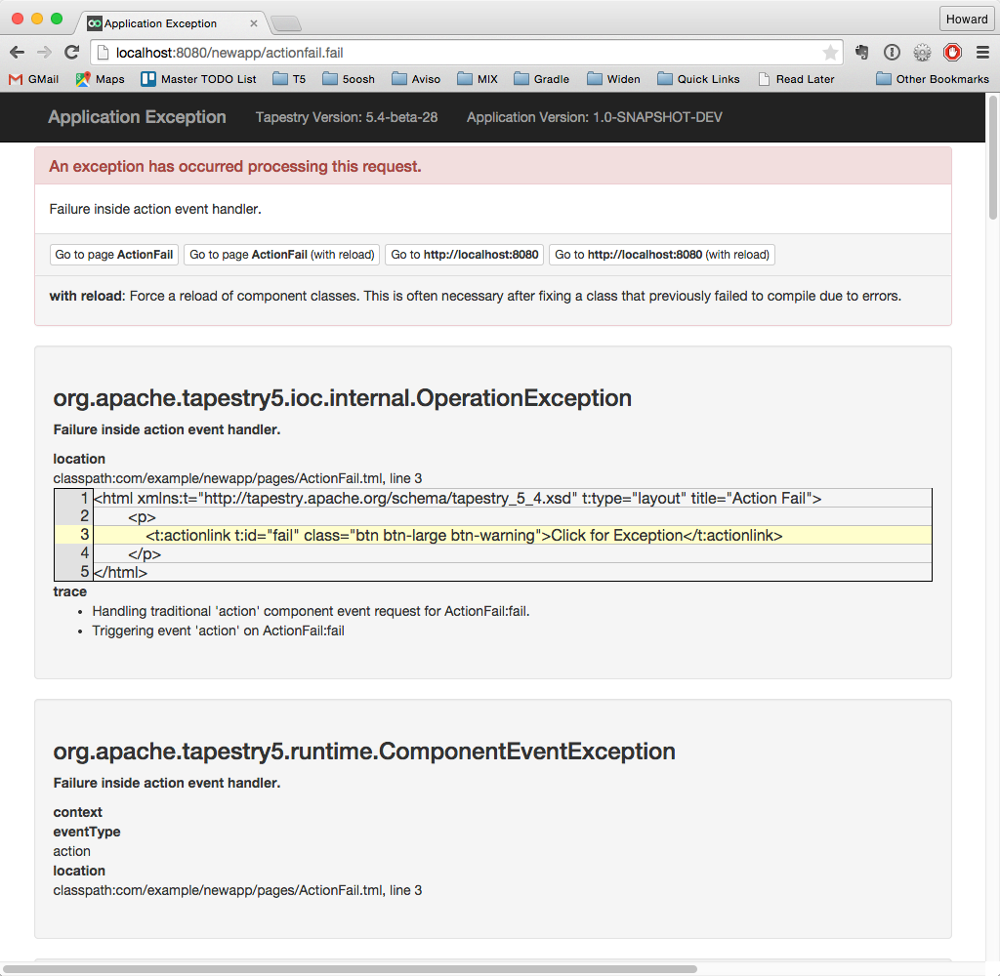

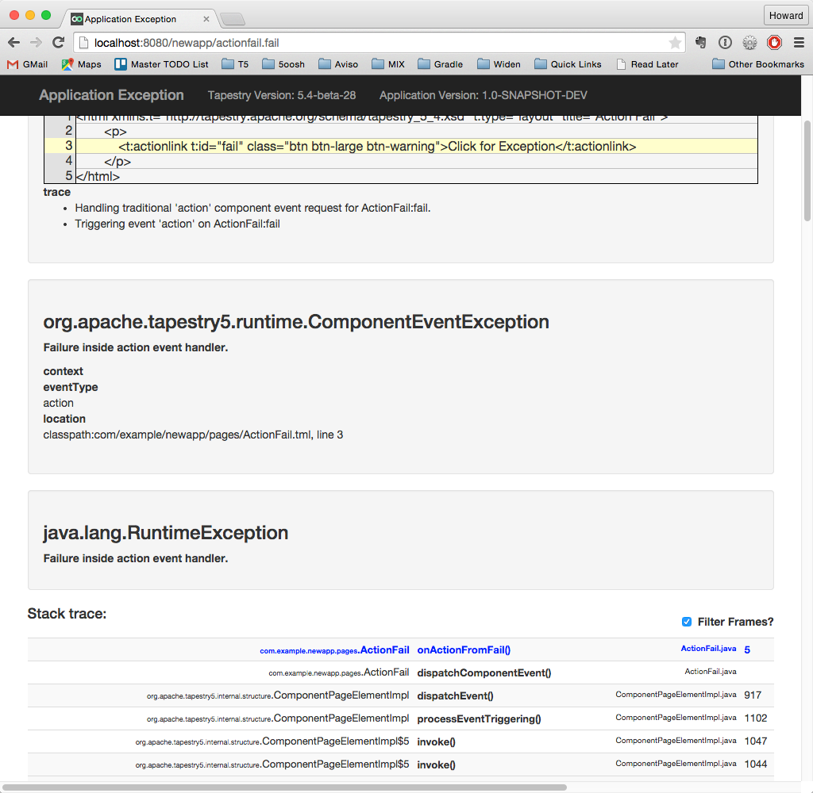

The easy way to override the exception report is to provide an ExceptionReport page that overrides the one provided with the framework.

This is as easy as providing a page named "ExceptionReport". It must implement the [ExceptionReporter](http://tapestry.apache.org/tapestry5/apidocs/org/apache/tapestry5/services/ExceptionReporter.html) interface.

**ExceptionReport.tml**

```xml
<html t:type="layout" title="Exception"
      xmlns:t="http://tapestry.apache.org/schema/tapestry_5_4.xsd">


    <div class="panel panel-danger">
        <div class="panel-heading">An exception has occurred.</div>
        <div class="panel-body">
            ${message}
        </div>
        <div class="panel-footer">
            <t:pagelink page="index" class="btn btn-default">Home</t:pagelink>
        </div>

    </div>


</html>
```

**ExceptionReport.java**

```java
package com.example.newapp.pages;

import org.apache.tapestry5.annotations.Property;
import org.apache.tapestry5.services.ExceptionReporter;

public class ExceptionReport implements ExceptionReporter {

    @Property
    private String message;

    @Override
    public void reportException(Throwable exception) {
        message = exception.getMessage();

        if (message == null)
            message = exception.getClass().getName();
    }
}
```

The end result is a customized exception report page.

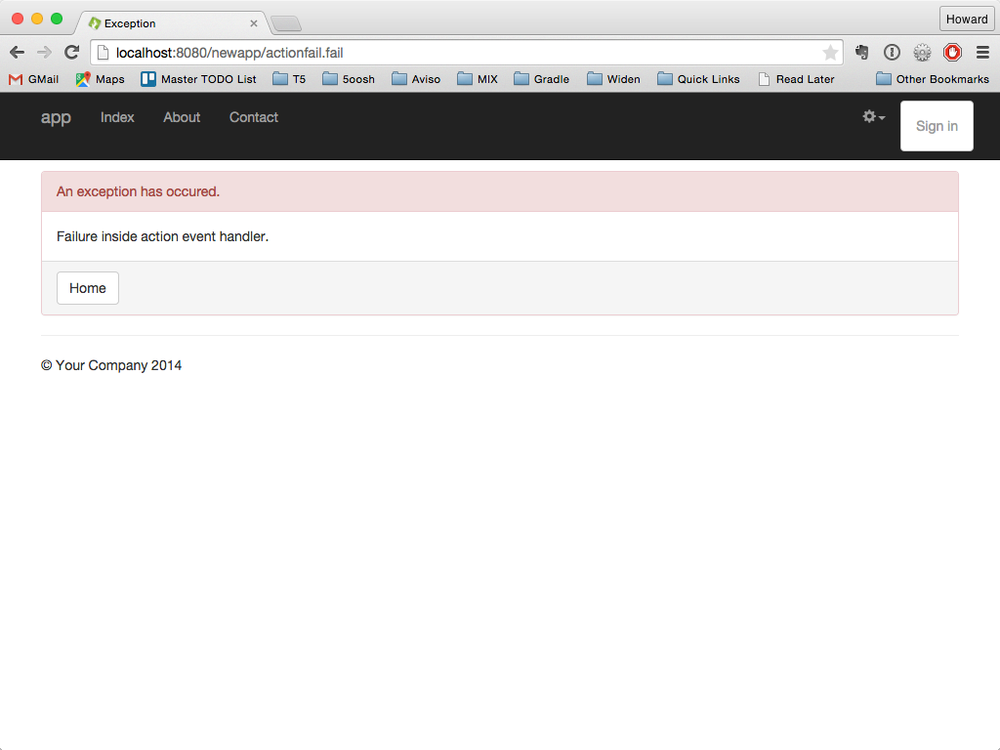

<a id="overriding-exception-reporting--overridingexceptionreporting-version2:overridingtherequestexceptionhandler"></a>
<a id="overriding-exception-reporting--version-2:-overriding-the-requestexceptionhandler"></a>

## Version 2: Overriding the RequestExceptionHandler

The previous example will display a link back to the Index page of the application. Another alternative is to display the error <on> the Index page. This requires a different approach: overriding the service responsible for reporting request exceptions.

The service [RequestExceptionHandler](http://tapestry.apache.org/tapestry5/apidocs/org/apache/tapestry5/services/RequestExceptionHandler.html) is responsible for this.

By replacing the default implementation of this service with our own implementation, we can take control over exactly what happens when a request exception occurs.

We'll do this in two steps. First, we'll extend the Index page to serve as an ExceptionReporter. Second, we'll override the default RequestExceptionHandler to use the Index page instead of the ExceptionReport page. Of course, this is just one approach.

**Index.tml (partial)**

```xml
 <t:if test="message">
    <div class="panel panel-danger">
        <div class="panel-heading">An exception has occurred.</div>
        <div class="panel-body">
            ${message}
        </div>
    </div>
 </t:if>
```

**Index.java**

```java
public class Index implements ExceptionReporter {@Property private String message;
public void reportException(Throwable exception) {message = exception.getMessage();
if (message == null) {message = exception.getClass().getName();}}
...}
```

The above defines a new property, message, on the Index page. The @Persist annotation indicates that values assigned to the field will persist from one request to another. The use of FLASH for the persistence strategy indicates that the value will be used until the next time the page renders, then the value will be discarded.

The message property is set from the thrown runtime exception.

The remaining changes take place inside AppModule.

**AppModule.java (partial)**

```java
public RequestExceptionHandler buildAppRequestExceptionHandler(final Logger logger,final ResponseRenderer renderer,final ComponentSource componentSource) {return new RequestExceptionHandler() {public void handleRequestException(Throwable exception) throws IOException {logger.error("Unexpected runtime exception: " + exception.getMessage(), exception);
ExceptionReporter index = (ExceptionReporter) componentSource.getPage("Index");
index.reportException(exception);
renderer.renderPageMarkupResponse("Index");} };}
public void contributeServiceOverride(MappedConfiguration<Class, Object> configuration,
@Local RequestExceptionHandler handler) {configuration.add(RequestExceptionHandler.class, handler);}
```

First we define the new service using a service builder method. This is an alternative to the `bind()` method; we define the service, its interface type (the return type of the method) and the service id (the part that follows "build" is the method name) and provide the implementation inline. A service builder method must return the service implementation, here implemented as an inner class.

The Logger resource that is passed into the builder method is the Logger appropriate for the service. ResponseRenderer and ComponentSource are two services defined by Tapestry.

With this in place, there are now two different services that implement the RequestExceptionHandler interface: the default one built into Tapestry (whose service id is "RequestExceptionHandler") and the new one defined in this module, "AppRequestExceptionHandler"). Without a little more work, Tapestry will be unable to determine which one to use when an exception does occur.

Tapestry has a pipeline for resolving injected dependencies; the ServiceOverride service is one part of that pipeline. Contributions to it are used to override an existing service, when the injection is exclusively by type.

Here we inject the AppRequestExceptionHandler service and contribute it as the override for type RequestExceptionHandler. The @Local annotation is used to select the RequestHandler service defined by this module, AppModule. Once contributed into ServiceOverride, it becomes the default service injected throughout the Registry.

This finally brings us to the point where we can see the result:

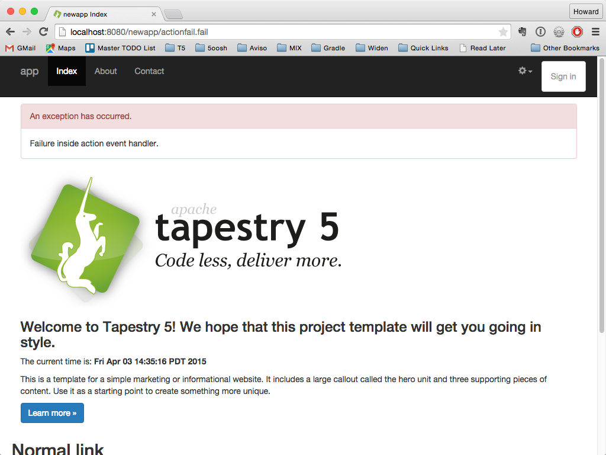

<a id="overriding-exception-reporting--overridingexceptionreporting-version3:decoratingtherequestexceptionhandler"></a>
<a id="overriding-exception-reporting--version-3:-decorating-the-requestexceptionhandler"></a>

## Version 3: Decorating the RequestExceptionHandler

A third option is available: we don't define a *new* service, but instead *decorate* the existing RequestExceptionHandler service. This approach means we don't have to make a contribution to the ServiceOverride service.

Service decoration is a powerful facility of Tapestry that is generally used to "wrap" an existing service with an interceptor that provides new functionality such as logging, security, transaction management or other cross-cutting concerns. The interceptor is an object that implements the same interface as the service being decorated, and usually delegates method invocations to it.

However, there's no requirement that an interceptor for a service actually invoke methods on the service; here we contribute a new implementation that *replaces* the original:

**AppModule.java (partial)**

```java
public RequestExceptionHandler decorateRequestExceptionHandler(final Logger logger,final ResponseRenderer renderer,final ComponentSource componentSource,@Symbol(SymbolConstants.PRODUCTION_MODE) boolean productionMode,Object service) {if (!productionMode) return null;
return new RequestExceptionHandler() {public void handleRequestException(Throwable exception) throws IOException {logger.error("Unexpected runtime exception: " + exception.getMessage(), exception);
ExceptionReporter index = (ExceptionReporter) componentSource.getPage("Index");
index.reportException(exception);
renderer.renderPageMarkupResponse("Index");} };}
```

As with service builder methods and service configuration method, decorator methods are recognized by the "decorate" prefix on the method name. As used here, the rest of the method name is used to identify the service to be decorated (there are other options that allow a decorator to be applied to many different services).

A change in this version is that when in development mode (that is, when *not* in production mode) we use the normal implementation. Returning null from a service decoration method indicates that the decorator chooses not to decorate.

The Logger injected here is the Logger for the service being decorated, the default RequestExceptionHandler service.

Otherwise, we return an interceptor whose implementation is the same as the new service in version #2.

The end result is that in development mode we get the full exception report, and in production mode we get an abbreviated message on the application's Index page.

---

<a id="error-page-recipe"></a>

<!-- source_url: https://tapestry.apache.org/error-page-recipe.html -->

<!-- page_index: 106 -->

# Error Page Recipe

[Apache Tapestry](#index) > [Documentation](#documentation) > [Cookbook](#cookbook) > [Error Page Recipe](#error-page-recipe)

<a id="error-page-recipe--title"></a>
<a id="error-page-recipe--error-page-recipe"></a>

# Error Page Recipe

Error formatting macro: scrollbar: java.lang.NoClassDefFoundError: com/opensymphony/webwork/ServletActionContext

<a id="error-page-recipe--errorpagerecipe-servingtapestrypagesasservleterrorpages"></a>
<a id="error-page-recipe--serving-tapestry-pages-as-servlet-error-pages"></a>

# Serving Tapestry Pages as Servlet Error Pages

Do you want to dress up your site and use a snazzy Tapestry page instead of the default 404 error page? Using modern servlet containers, this is a snap!

<a id="error-page-recipe--related-articles"></a>

### Related Articles

- Page:

  [Error Page Recipe](#error-page-recipe)
- Page:

  [Specific Errors FAQ](#specific-errors-faq)
- Page:

  [Overriding Exception Reporting](#overriding-exception-reporting)
- Page:

  [Runtime Exceptions](#runtime-exceptions)

Simply upgrade your application web.xml to the 2.4 version (or newer), and make a couple of changes:

**web.xml**

```xml
<?xml version="1.0" encoding="UTF-8"?>

<web-app xmlns="http://java.sun.com/xml/ns/j2ee" xmlns:xsi="http://www.w3.org/2001/XMLSchema-instance"
  xsi:schemaLocation="http://java.sun.com/xml/ns/j2ee http://java.sun.com/xml/ns/j2ee/web-app_2_4.xsd"
  version="2.4">

  <display-name>Cookbook</display-name>
  <context-param>
    <param-name>tapestry.app-package</param-name>
    <param-value>com.example.newapp</param-value>
  </context-param>

  <filter>
    <filter-name>app</filter-name>
    <!-- org.apache.tapestry5.TapestryFilter if not Tapestry 5.7.0+ -->
    <filter-class>org.apache.tapestry5.http.TapestryFilter</filter-class> 
  </filter>
  <filter-mapping>
    <filter-name>app</filter-name>
    <url-pattern>/*</url-pattern>
    <dispatcher>REQUEST</dispatcher>
    <dispatcher>ERROR</dispatcher>
  </filter-mapping>

  <error-page>
    <error-code>404</error-code>
    <location>/error404</location>
  </error-page>

</web-app>
```

Tapestry's filter must be marked as a handler for both standard requests and errors. That's accomplished with the `<dispatcher>` elements inside the `<filter-mapping>` section.

You must then map error codes to Tapestry URLs. In this case, the 404 error is send to the `/error404` resource, which is really the "Error404" Tapestry page.

We'll create a simple Error404 page, one that displays a message and (in development mode) displays the details about the incoming request.

**Error404.tml**

```xml
<html xmlns:t="http://tapestry.apache.org/schema/tapestry_5_4.xsd">
 <head>

        <title>Resource not found.</title>
    </head>
    <body>

        <div class="container">

            <h1>Page or resource not found.</h1>

            <t:if test="! productionMode">
                <t:renderobject object="request"/>
            </t:if>
        </div>

    </body>
</html>
```

The page simply makes the request and productionMode properties available:

**Error404.java**

```java
package com.example.newapp.pages;

import org.apache.tapestry5.SymbolConstants;
import org.apache.tapestry5.annotations.Property;
import org.apache.tapestry5.ioc.annotations.Inject;
import org.apache.tapestry5.ioc.annotations.Symbol;
// org.apache.tapestry5.services.Request if not Tapestry 5.7.0+
import org.apache.tapestry5.services.http.Request; 

public class Error404
{
    @Property
    @Inject
    private Request request;

    @Property
    @Inject
    @Symbol(SymbolConstants.PRODUCTION_MODE)
    private boolean productionMode;
}
```

The end-result, in when *not* in production mode, looks like this:

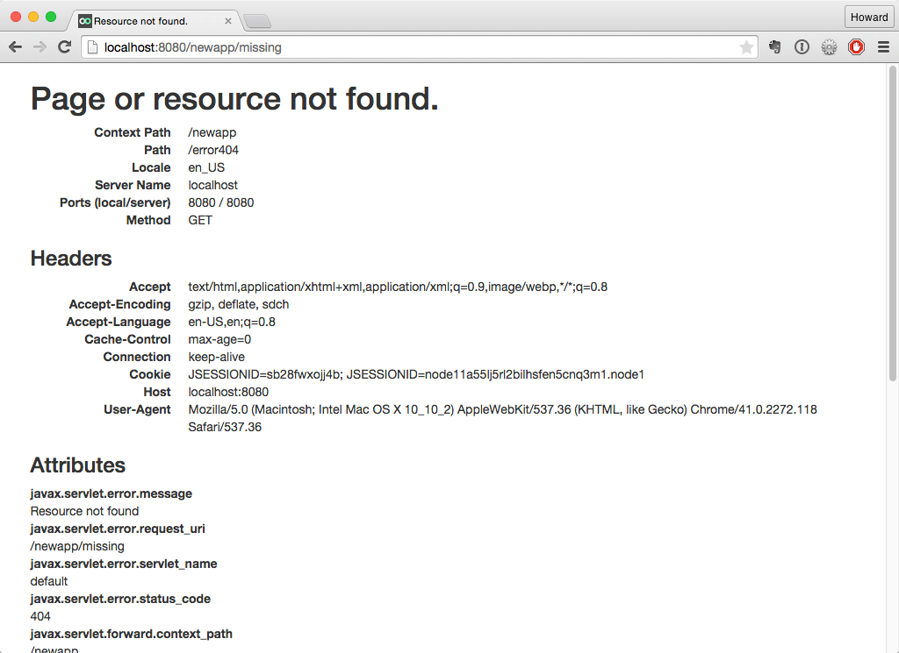

An issue with an application that has a root Index page is that any invalid path, which would normally generate a 404 error, is instead routed to the Index page (because the invalid path looks like page's activation context). See [Issue TAP5-2070](https://issues.apache.org/jira/browse/TAP5-2070).

---

<a id="supporting-informal-parameters"></a>

<!-- source_url: https://tapestry.apache.org/supporting-informal-parameters.html -->

<!-- page_index: 107 -->

# Supporting Informal Parameters

[Apache Tapestry](#index) > [Documentation](#documentation) > [Cookbook](#cookbook) > [Supporting Informal Parameters](#supporting-informal-parameters)

<a id="supporting-informal-parameters--title"></a>
<a id="supporting-informal-parameters--supporting-informal-parameters"></a>

# Supporting Informal Parameters

**Error rendering macro 'scrollbar'**

com/opensymphony/webwork/ServletActionContext

**Informal parameters** are any additional parameters (aka HTML attributes) beyond the those explicitly defined for a component using the @[Parameter](http://tapestry.apache.org/tapestry5/apidocs/org/apache/tapestry5/annotations/Parameter.html) annotation.

<a id="supporting-informal-parameters--related-articles"></a>

### Related Articles

- Page:

  [Default Parameter](#default-parameter)
- Page:

  [Supporting Informal Parameters](#supporting-informal-parameters)
- Page:

  [Enum Parameter Recipe](#enum-parameter-recipe)
- Page:

  [Component Parameters](#component-parameters)

Any component that closely emulates a particular HTML element ***should*** support informal parameters, because it gives users of your component the ability to easily add HTML attributes to the HTML that your component emits. You'll find that most of the built-in Tapestry components, such as Form, Label and TextField, do exactly that.

To support informal parameters, a component class should use either the @[SupportsInformalParameters](http://tapestry.apache.org/tapestry5/apidocs/org/apache/tapestry5/annotations/SupportsInformalParameters.html) annotation or the RenderInformals mixin. Otherwise, providing informal parameters to a component will do nothing: any additional parameters will be ignored.

<a id="supporting-informal-parameters--supportinginformalparameters-approach1:-supportsinformalparameters"></a>
<a id="supporting-informal-parameters--approach-1:-supportsinformalparameters"></a>

### Approach 1: @SupportsInformalParameters

In the example below we create an Img component, a custom replacement for the  tag. Its src parameter will be an asset. We'll use the @SupportsInformalParameters annotation to tell Tapestry that the component should support informal parameters.

**Img.java**

```java
@SupportsInformalParameters public class Img {@Parameter(required=true, allowNull=false, defaultPrefix=BindingConstants.ASSET) private Asset src;
@Inject private ComponentResources resources;
boolean beginRender(MarkupWriter writer) {writer.element("img", "src", src); resources.renderInformalParameters(writer); writer.end(); return false;}}
```

The call to renderInformalParameters() is what converts and outputs the informal parameters. It should occur *after* your code has rendered attributes into the element (earlier written attributes will *not* be overwritten by later written attributes).

Returning false from beginRender() ensures that the body of the component is not rendered, which makes sense for an  tag, which has no body.

<a id="supporting-informal-parameters--supportinginformalparameters-approach2:renderinformals"></a>
<a id="supporting-informal-parameters--approach-2:-renderinformals"></a>

### Approach 2: RenderInformals

Another, equivalent, approach is to use the [RenderInformals](http://tapestry.apache.org/tapestry5/apidocs/org/apache/tapestry5/corelib/mixins/RenderInformals.html) mixin (:

**Img.java**

```java
public class Img {@Parameter(required=true, allowNull=false, defaultPrefix=BindingConstants.ASSET) private Asset src;
@Mixin private RenderInformals renderInformals;
void beginRender(MarkupWriter writer) {writer.element("img", "src", src);}
boolean beforeRenderBody(MarkupWriter writer) {writer.end(); return false;}}
```

This variation splits the rendering of the tag in two pieces, so that the RenderInformals mixin can operate (after beginRender() and before beforeRenderBody()).

<a id="supporting-informal-parameters--supportinginformalparameters-approach3:extendthe-any-component"></a>
<a id="supporting-informal-parameters--approach-3:-extend-the-any-component"></a>

### Approach 3: Extend the "Any" component

Another approach is to have your component class *extend* Tapestry's Any component, which already supports informal parameters:

**Img.java**

```java
public class Img extends Any { ... }
```

---

<a id="component-libraries"></a>

<!-- source_url: https://tapestry.apache.org/component-libraries.html -->

<!-- page_index: 108 -->

# Component Libraries

[Apache Tapestry](#index) > [Documentation](#documentation) > [Cookbook](#cookbook) > [Component Libraries](#component-libraries)

<a id="component-libraries--title"></a>
<a id="component-libraries--component-libraries"></a>

# Component Libraries

**Error rendering macro 'scrollbar'**

com/opensymphony/webwork/ServletActionContext

This page has not yet been fully updated for Tapestry 5.4. Things are different and simpler in 5.4 than in previous releases.

<a id="component-libraries--componentlibraries-creatingcomponentlibraries"></a>
<a id="component-libraries--creating-component-libraries"></a>

# Creating Component Libraries

Nearly every Tapestry application includes a least a couple of custom components, specific to the application. What's exciting about Tapestry is how easy it is to package components for reuse across many applications ... and the fact that applications using a component library need no special configuration.

<a id="component-libraries--related-articles"></a>

### Related Articles

- Page:

  [Component Reference](#component-reference)
- Page:

  [Component Libraries](#component-libraries)

A Tapestry component library consists of components (and optionally mixins, pages and component base classes). In addition, a component library will have a module that can define new services (needed by the components) or configure other services present in Tapestry. Finally, components can be packaged with *assets*: resources such as images, stylesheets and JavaScript libraries that need to be provided to the client web browser.

We're going to create a somewhat insipid component that displays a large happy face icon.

Tapestry doesn't mandate that you use any build system, but we'll assume for the moment that you are using Maven 2. In that case, you'll have a pom.xml file something like the following:

**pom.xml**

```xml
<project>
  <modelVersion>4.0.0</modelVersion>
  <groupId>org.example</groupId>
  <artifactId>happylib</artifactId>
  <version>1.0-SNAPSHOT</version>
  <packaging>jar</packaging>
  <name>happylib Tapestry 5 Library</name>

  <dependencies>
    <dependency>
      <groupId>org.apache.tapestry</groupId>
      <artifactId>tapestry-core</artifactId>
      <version>${tapestry-release-version}</version>
    </dependency>

    <dependency>
      <groupId>org.testng</groupId>
      <artifactId>testng</artifactId>
      <version>5.1</version>
      <classifier>jdk15</classifier>
      <scope>test</scope>
    </dependency>
  </dependencies>

  <build>
    <plugins>
      <plugin>
        <groupId>org.apache.maven.plugins</groupId>
        <artifactId>maven-compiler-plugin</artifactId>
        <configuration>
          <source>1.5</source>
          <target>1.5</target>
          <optimize>true</optimize>
        </configuration>
      </plugin>

      <plugin>
           <groupId>org.apache.maven.plugins</groupId>
           <artifactId>maven-jar-plugin</artifactId>
           <configuration>
           <archive>
             <manifestEntries>
               <Tapestry-Module-Classes>org.example.happylib.services.HappyModule</Tapestry-Module-Classes>
             </manifestEntries>
           </archive>
           </configuration>
       </plugin>

    </plugins>
  </build>

  <repositories>
    <repository>
      <id>codehaus.snapshots</id>
      <url>http://snapshots.repository.codehaus.org</url>
    </repository>
    <repository>
      <id>OpenQA_Release</id>
      <name>OpenQA Release Repository</name>
      <url>http://archiva.openqa.org/repository/releases/</url>
    </repository>
  </repositories>

  <properties>
    <tapestry-release-version>5.4-beta-28</tapestry-release-version>
  </properties>
</project>
```

You will need to modify the Tapestry release version number ("5.2.0" in the listing above) to reflect the current version of Tapestry when you create your component library.

We'll go into more detail about the relevant portions of this POM in the later sections.

<a id="component-libraries--componentlibraries-step1:chooseabasepackagename"></a>
<a id="component-libraries--step-1:-choose-a-base-package-name"></a>

## Step 1: Choose a base package name

Just as with Tapestry applications, Tapestry component libraries should have a *unique* base package name. In this example, we'll use `org.examples.happylib`.

As with an application, we'll follow the conventions: we'll place the module for this library inside the services package, and place pages and components under their respective packages.

<a id="component-libraries--componentlibraries-step2:createyourpagesand-orcomponents"></a>
<a id="component-libraries--step-2:-create-your-pages-and-or-components"></a>

## Step 2: Create your pages and/or components

Our component is very simple:

**HappyIcon.java**

```java
package org.example.happylib.components;
import org.apache.tapestry5.Asset; import org.apache.tapestry5.MarkupWriter; import org.apache.tapestry5.annotations.Path; import org.apache.tapestry5.ioc.annotations.Inject;
public class HappyIcon {@Inject @Path("happy.jpg") private Asset happyIcon;
boolean beginRender(MarkupWriter writer) {writer.element("img", "src", happyIcon); writer.end();
return false;}}
```

HappyIcon appears inside the components sub-package. The happyIcon field is injected with the the Asset for the file `happy.jpg`. The path specified with the @Path annotation is relative to the `HappyIcon.class` file; it should be stored in the project under `src/main/resources/org/example/happylib/components`.

Tapestry ensures that the `happy.jpg` asset can be accessed from the client web browser; the src attribute of the  tag will be a URL that directly accesses the image file ... there's no need to unpackage the `happy.jpg` file. This works for any asset file stored under the library's root package.

This component renders out an `` tag for the icon.

Often, a component library will have many different components, or even pages.

<a id="component-libraries--componentlibraries-step3:chooseavirtualfoldername"></a>
<a id="component-libraries--step-3:-choose-a-virtual-folder-name"></a>

## Step 3: Choose a virtual folder name

In Tapestry, components that have been packaged in a library are referenced using a virtual folder name. It's effectively as if the application had a new root-level folder containing the components.

In our example, we'll use "happy" as the folder name. That means the application can include the HappyIcon component in the template using any of the following, which are all equivalent:

- <t:happy.happyicon/>
- <t:happy.icon/>
- 
- 

Why "icon" vs. "happyicon"? Tapestry notices that the folder name, "happy" is a prefix or suffix of the class name ("HappyIcon") and creates an alias that strips off the prefix (or suffix). To Tapestry, they are completely identical: two different aliases for the same component class name.

The above naming is somewhat clumsy, and can be improved by introducing an additional namespace into the template:

```xml
<html xmlns:t="http://tapestry.apache.org/schema/tapestry_5_1_0.xsd" xmlns:h="tapestry-library:happy">
...
<h:icon/>
...</html>
```

The special namespace mapping for sets up namespace prefix "h:" to mean the same as "happy/". It then becomes possible to reference components within the happy virtual folder directly.

<a id="component-libraries--componentlibraries-step4:configurethevirtualfolder"></a>
<a id="component-libraries--step-4:-configure-the-virtual-folder"></a>

## Step 4: Configure the virtual folder

Tapestry needs to know where to search for your component class. This is accomplished in your library's IoC module class, by making a *contribution* to the ComponentClassResolver service configuration.

At application startup, Tapestry will read the library module along with all other modules and configure the ComponentClassResolver service using information in the module:

**HappyModule.java**

```java
package org.example.happylib.services;
import org.apache.tapestry5.ioc.Configuration; import org.apache.tapestry5.services.LibraryMapping;
public class HappyModule {public static void contributeComponentClassResolver(Configuration<LibraryMapping> configuration) {configuration.add(new LibraryMapping("happy", "org.example.happylib"));}}
```

The ComponentClassResolver service is responsible for mapping libraries to packages; it takes as a contribution a collection of these LibraryMapping objects. Every module may make its own contribution to the ComponentClassResolver service, mapping its own package ("org.example.happylib") to its own folder ("happy").

This module class is also where you would define new services that can be accessed by your components (or other parts of the application).

It is possible to add a mapping for "core", the core library for Tapestry components; all the built-in Tapestry components (TextField, BeanEditForm, Grid, etc.) are actually in the core library. When Tapestry doesn't find a component in your application, it next searches inside the "core" library. Contributing an additional package as "core" simply extends the number of packages searched for core components (it doesn't replace Tapestry's default package, org.apache.tapestry5.corelib). Adding to "core" is sometimes reasonable, if you ensure that there is virtually no chance of a naming conflict (via different modules contributing packages to core with conflicting class names).

<a id="component-libraries--componentlibraries-step5:configurethemoduletoautoload"></a>
<a id="component-libraries--step-5:-configure-the-module-to-autoload"></a>

## Step 5: Configure the module to autoload

For Tapestry to load your module at application startup, it is necessary to put an entry in the JAR manifest. This is taken care of in the pom.xml above:

**pom.xml (partial)**

```xml
      <plugin>
           <groupId>org.apache.maven.plugins</groupId>
           <artifactId>maven-jar-plugin</artifactId>
           <configuration>
           <archive>
             <manifestEntries>
             <Tapestry-Module-Classes>org.example.happylib.services.HappyModule</Tapestry-Module-Classes>
             </manifestEntries>
           </archive>
           </configuration>
       </plugin>
```

<a id="component-libraries--componentlibraries-step6:extendingclientaccess"></a>
<a id="component-libraries--step-6:-extending-client-access"></a>

## Step 6: Extending Client Access

As of Tapestry 5.2, a new step is needed: extending access for the assets. This is accomplished in your library's module class, HappyModule:

```java
public static void contributeRegexAuthorizer(Configuration<String> configuration)
{
    configuration.add("^org/example/happylib/.*\\.jpg$");
}
```

This contribution uses a regular expression to identify that any resource on the classpath under the org/example/happylib folder with a jpg extension is allowed. If you had a mix of different image types, you could replace jpg with (jpg|gif|png).

<a id="component-libraries--componentlibraries-step7:versioningassets"></a>
<a id="component-libraries--step-7:-versioning-assets"></a>

## Step 7: Versioning Assets

Classpath assets, those packaged in JAR files (such as the happy.jpg asset) are retrieved by the client web browser using a URL that reflects the package name. Tapestry users a special virtual folder, /assets, under the context folder for this purpose.

The image file here is exposed to the web browser via the URL /happyapp/assets/org/example/happylib/components/happy.jpg (this assumes that the application was deployed as happyapp.war).

Tapestry uses a far-future expiration date for classpath assets; this allows browsers to aggressively cache the file, but in Tapestry 5.1 and earlier this causes a problem when a later version of the library changes the file. This is discussed in detail in [Yahoo's Performance Best Practices](http://developer.yahoo.com/performance/rules.html#expires).

To handle this problem in Tapestry 5.1 and earlier, you should map your library assets to a versioned folder. This can be accomplished using another contribution from the HappyModule, this time to the ClasspathAssetAliasManager service whose configuration maps a virtual folder underneath /assets to a package:

```java
public static void contributeClasspathAssetAliasManager(MappedConfiguration<String, String> configuration)
{
    configuration.add("happylib/1.0", "org/example/happylib");
}
```

With this in place, and the library and applications rebuilt and redeployed, the URL for happy.jpg becomes /happyapp/assets/happylib/1.0/components/happy.jpg. This is shorter, but also incorporates a version number ("1.0") that can be changed in a later release.

**Added in 5.2**

<a id="component-libraries--componentlibraries-conclusion"></a>
<a id="component-libraries--conclusion"></a>

## Conclusion

That's it! Autoloading plus the virtual folders for components and for assets takes care of all the issues related to components. Just build your JARs, setup the JAR Manifest, and drop them into your applications.

---

<a id="switching-cases"></a>

<!-- source_url: https://tapestry.apache.org/switching-cases.html -->

<!-- page_index: 109 -->

# Switching Cases

[Apache Tapestry](#index) > [Documentation](#documentation) > [Cookbook](#cookbook) > [Switching Cases](#switching-cases)

<a id="switching-cases--title"></a>
<a id="switching-cases--switching-cases"></a>

# Switching Cases

**Error rendering macro 'scrollbar'**

com/opensymphony/webwork/ServletActionContext

<a id="switching-cases--switchingcases-switchingcases"></a>
<a id="switching-cases--switching-cases-2"></a>

# Switching Cases

With Tapestry's `If` component you can only test one condition at a time. In order to distinguish multiple cases, you'd have to write complex nested if/else constructs in your page template and have a checker method for each test inside your page class.

**JumpStart Demo**

[If, Not, Negate, Switch, Else, Unless](http://jumpstart.doublenegative.com.au/jumpstart/examples/lang/ifnotnegateswitchelseunless)

In cases where you have to distinguish multiple cases, the `Delegate` component comes in. It delegates rendering to some other component, for example a `Block`. For each case you have, you basically wrap the content inside a `Block` that doesn't get rendered by default. You then place a Delegate component on your page and point it to a method inside your page class that will decide which of your Blocks should be rendered.

Imagine for example a use case, where you want to distinguish between 4 cases and you have an int property called `whichCase` that should be tested against. Your page template would look as follows:

**SwitchMe.tml**

```xml
<html xmlns:t="http://tapestry.apache.org/schema/tapestry_5_4.xsd">
    <body>
        <h1>Switch</h1>

        <t:delegate to="case"/>

        <t:block t:id="case1">
            Here is the content for case1.
        </t:block>

        <t:block t:id="case2">
            Here is the content for case2.
        </t:block>
        
        <t:block t:id="case3">
            Here is the content for case3.
        </t:block>
        
        <t:block t:id="case4">
            Here is the content for case4.
        </t:block>
    </body>
</html>
```

You can see, that the `Delegate` component's `to` parameter is bound to the case property of your page class. In your page class you therefore have a `getCase()` method that is responsible for telling the `Delegate` component which component should be rendered. For that we are injecting references to the `Block}}s defined in your page template into the page class and return the according {{Block` in the `getCase()` method.

**SwitchMe.java**

```java
public class SwitchMe {@Persist private int whichCase;
@Inject private Block case1, case2, case3, case4;
public Object getCase() {switch (whichCase) {case 1:return case1; case 2:return case2; case 3:return case3; case 4:return case4; default:return null;}}}
```

Happy switching!

---

<a id="enum-parameter-recipe"></a>

<!-- source_url: https://tapestry.apache.org/enum-parameter-recipe.html -->

<!-- page_index: 110 -->

# Enum Parameter Recipe

[Apache Tapestry](#index) > [Documentation](#documentation) > [Cookbook](#cookbook) > [Enum Parameter Recipe](#enum-parameter-recipe)

<a id="enum-parameter-recipe--title"></a>
<a id="enum-parameter-recipe--enum-parameter-recipe"></a>

# Enum Parameter Recipe

Error formatting macro: scrollbar: java.lang.NoClassDefFoundError: com/opensymphony/webwork/ServletActionContext

<a id="enum-parameter-recipe--related-articles"></a>

### Related Articles

- Page:

  [Default Parameter](#default-parameter)
- Page:

  [Supporting Informal Parameters](#supporting-informal-parameters)
- Page:

  [Enum Parameter Recipe](#enum-parameter-recipe)
- Page:

  [Component Parameters](#component-parameters)

<a id="enum-parameter-recipe--enumparameterrecipe-enumcomponentparameter"></a>
<a id="enum-parameter-recipe--enum-component-parameter"></a>

# Enum Component Parameter

It's not uncommon to create a component that has a bit of complex behavior that you want to be able to easily control, and an enumerated type (a Java enum) seems like the right approach.

Our example comes from Tapestry's Select component, which has a blankOption parameter that has an enum type.

Let's start with the enum type itself:

**BlankOption.java**

```java
public enum BlankOption {/** Always include the blank option, even if the underlying property is required. */ ALWAYS,
/** Never include the blank option, even if the underlying property is optional. */ NEVER,
/** The default: include the blank option if the underlying property is optional. */ AUTO;}
```

Next, we define the parameter:

**Select.java (partial)**

```java
    /**
     * Controls whether an additional blank option is provided. The blank option precedes all other options and is never
     * selected. The value for the blank option is always the empty string, the label may be the blank string; the
     * label is from the blankLabel parameter (and is often also the empty string).
     */
    @Parameter(value = "auto", defaultPrefix = BindingConstants.LITERAL)
    private BlankOption blankOption;
```

Note the use of literal as the default prefix; this allows us to use the name of the option in our template, e.g. `<t:select blankoption="never" .../>`. Without the default prefix setting, "never" would be interpreted as a property expression (and you'd see an error when you loaded the page).

The final piece of the puzzle is to inform Tapestry how to convert from a string, such as "never", to a BlankOption value.

**TapestryModule.java (partial)**

```java
public static void contributeTypeCoercer(Configuration<CoercionTuple> configuration) {. . .
add(configuration, BlankOption.class);
. . .}
private static <T extends Enum> void add(Configuration<CoercionTuple> configuration, Class<T> enumType) {configuration.add(CoercionTuple.create(String.class, enumType, StringToEnumCoercion.create(enumType)));}
```

The TypeCoercer service is ultimately responsible for converting the string to a BlankOption, but we have to tell it how, by contributing an appropriate CoercionTuple. The CoercionTuple identifies the source and target types (String and BlankOption), and an object to perform the coercion (an instance of StringToEnumCoercion, via the `create()` static method).

---

<a id="extending-the-if-component"></a>

<!-- source_url: https://tapestry.apache.org/extending-the-if-component.html -->

<!-- page_index: 111 -->

# Extending the If Component

[Apache Tapestry](#index) > [Documentation](#documentation) > [Cookbook](#cookbook) > [Extending the If Component](#extending-the-if-component)

<a id="extending-the-if-component--title"></a>
<a id="extending-the-if-component--extending-the-if-component"></a>

# Extending the If Component

Error formatting macro: scrollbar: java.lang.NoClassDefFoundError: com/opensymphony/webwork/ServletActionContext

<a id="extending-the-if-component--extendingtheifcomponent-extendingtheifcomponent"></a>
<a id="extending-the-if-component--extending-the-if-component-2"></a>

# Extending the If Component

The [If](http://tapestry.apache.org/current/apidocs/org/apache/tapestry5/corelib/components/If.html) component can be made very flexible; its main parameter, `test`, does not *have* to be bound to a boolean value, it merely has to be bound to a value that can be [coerced](#parameter-type-coercion) to boolean.

For example, you may be working on an application that does a lot of [Lucene](http://lucene.apache.org/java/docs/index.html) searches, and you represent the results as a SearchResult object:

**SearchResult.java**

```java
public class SearchResult<T> {
  public final Class<T> itemType;
  public final List<T> items;
  public final int size;
  public final int pages;
  public final int firstIndex;
  public final int lastIndex;

  public SearchResult(Class<T> type, List<T> items, int size, int pages, int firstIndex,
      int lastIndex) {
    this.itemType = type;
    this.items = items;
    this.size = size;
    this.pages = pages;
    this.firstIndex = firstIndex;
    this.lastIndex = lastIndex;
  }

  public boolean isEmpty() {
    return size == 0;
  }
}
```

In a SearchResult, the `size` property is the overall number of results from the search. The `items` list is a single "page" of those results to present to the user, consisting of items from `firstIndex` to `lastIndex` within the overall set.

In your templates, you have to check to see if the SearchResult exists, then see if it is empty, before you can get to the part that displays the content:

```xml
<t:if test="searchResult">
  <t:if test="! searchResult.empty">
    . . .
  </t:if>
</t:if>
```

The first test checks to see if `searchResult` is not null (null is treated as false). The second checks to see if the search result is empty.

What we'd like is for the test to look at the `searchResult` directly and treat an empty search result as false, and a non-empty search result as true. This is similar to what Tapestry already does for Collections.

This is just a matter of adding a  [`Coercion`](#parameter-type-coercion)`:`

**AppModule (partial, Tapestry 5.7.0+)**

```java
public static void contributeTypeCoercer(MappedConfiguration<CoercionTuple.Key, CoercionTuple> configuration) {
add(configuration, SearchResult.class, Boolean.class,new Coercion<SearchResult, Boolean>() {public Boolean coerce(SearchResult input) {return !input.isEmpty();} });}
private static <S, T> void add(MappedConfiguration<CoercionTuple.Key, CoercionTuple> configuration,Class<S> sourceType, Class<T> targetType, Coercion<S, T> coercion) {CoercionTuple<S, T> tuple = new CoercionTuple<S, T>(sourceType,targetType, coercion);
configuration.add(tuple.getKey(), tuple);}
```

**AppModule.java (partial, pre-Tapestry 5.7.0)**

```java
public static void contributeTypeCoercer(Configuration<CoercionTuple> configuration) {
add(configuration, SearchResult.class, Boolean.class,new Coercion<SearchResult, Boolean>() {public Boolean coerce(SearchResult input) {return !input.isEmpty();} });}
private static <S, T> void add(Configuration<CoercionTuple> configuration,Class<S> sourceType, Class<T> targetType, Coercion<S, T> coercion) {CoercionTuple<S, T> tuple = new CoercionTuple<S, T>(sourceType,targetType, coercion);
configuration.add(tuple);}
```

Inside this thicket of generics and brackets is the code that treats a SearchResult as a boolean: `return !input.isEmpty();`.

With this in place, the previous template can be simplified:

```xml
<t:if test="searchResult">
  . . .
</t:if>
```

The single test now implies that `searchResult` is not null and not empty.

---

<a id="meta-programming-page-content"></a>

<!-- source_url: https://tapestry.apache.org/meta-programming-page-content.html -->

<!-- page_index: 112 -->

# Meta-Programming Page Content

[Apache Tapestry](#index) > [Documentation](#documentation) > [Cookbook](#cookbook) > [Meta-Programming Page Content](#meta-programming-page-content)

<a id="meta-programming-page-content--title"></a>
<a id="meta-programming-page-content--meta-programming-page-content"></a>

# Meta-Programming Page Content

Error formatting macro: scrollbar: java.lang.NoClassDefFoundError: com/opensymphony/webwork/ServletActionContext

<a id="meta-programming-page-content--metaprogrammingpagecontent-meta-programmingpagecontent"></a>
<a id="meta-programming-page-content--meta-programming-page-content-2"></a>

# Meta-Programming Page Content

It is likely that you have some cross-cutting concerns across your pages, specific features you would like to "mix in" to your pages without getting tied into knots by inheritance. This is one of those areas where Tapestry shines.

This specific example is adapted from a real client requirement: the client was concerned about other sites wrapping his content in a frameset and making the site content appear to be theirs. Not all pages (in some cases, that would be an advantage) but specific pages in the application. For those pages, the following behaviors were required:

- Set the X-Frame-Options response header to "DENY"
- Include JavaScript to "pop" the page out of a frame, if in one

Again, this *could* be done by having a specific base-class that included a `beginRender()` method, but the meta-programming approach is nearly as easy and much more flexible.

<a id="meta-programming-page-content--metaprogrammingpagecontent-componentmeta-data"></a>
<a id="meta-programming-page-content--component-meta-data"></a>

## Component Meta-Data

In Tapestry, every component (and remember, pages are components) has *meta data*: an extra set of key/value pairs stored in the component's [ComponentResources](http://tapestry.apache.org/current/apidocs/org/apache/tapestry5/ComponentResources.html).

By hooking into the component class transformation pipeline, we can change an annotation into meta-data that can be accessed by a filter.

<a id="meta-programming-page-content--metaprogrammingpagecontent-definingtheannotation"></a>
<a id="meta-programming-page-content--defining-the-annotation"></a>

## Defining the Annotation

**ForbidFraming.java**

```java
package com.fnord.annotations;

import java.lang.annotation.Documented;
import java.lang.annotation.ElementType;
import java.lang.annotation.Inherited;
import java.lang.annotation.Retention;
import java.lang.annotation.RetentionPolicy;
import java.lang.annotation.Target;

/**
 * Marker annotation for pages that should not allow framing.
 */
@Target({ ElementType.TYPE })
@Retention(RetentionPolicy.RUNTIME)
@Documented
@Inherited
public @interface ForbidFraming {

}
```

This annotation presence is all that's needed; there aren't any additional attributes to configure it.

<a id="meta-programming-page-content--metaprogrammingpagecontent-convertingtheannotationintometa-data"></a>
<a id="meta-programming-page-content--converting-the-annotation-into-meta-data"></a>

## Converting the Annotation into Meta-Data

This is in three parts:

- Define the meta-data key, and define a constant for that key
- Set a default meta-data value for the key
- Set a different value for the key when the annotation is present

Our key is just "forbid-framing", with values "true" and "false". The default is "false".

<a id="meta-programming-page-content--metaprogrammingpagecontent-definingtheconstant"></a>
<a id="meta-programming-page-content--defining-the-constant"></a>

### Defining the Constant

**FnordSymbols.java**

```java
package com.fnord;
import org.apache.tapestry5.http.services.BaseURLSource;
import com.fnord.annotations.ForbidFraming;
public class FnordSymbols {
/** * Meta-data key; when true, MarkupRendererFilter will inject some extra * content into the response to enforce that the content may not be framed * (i.e., "stolen").* * @see ForbidFraming */ public static final String FORBID_FRAMING = "forbid-framing";
}
```

<a id="meta-programming-page-content--metaprogrammingpagecontent-settingthemeta-datadefault"></a>
<a id="meta-programming-page-content--setting-the-meta-data-default"></a>

### Setting the Meta-Data Default

Next, we'll create a module just for the logic directly related to framing. In the module, we'll define the default value for the meta-data.

**ForbidFramingModule.class**

```java
package com.fnord.services.forbidframing;

import org.apache.tapestry5.commons.MappedConfiguration;
import org.apache.tapestry5.ioc.annotations.Contribute;
import org.apache.tapestry5.ioc.services.FactoryDefaults;
import org.apache.tapestry5.ioc.services.SymbolProvider;

import com.fnord.FnordSymbols;

public class ForbidFramingModule {

  @Contribute(SymbolProvider.class)
  @FactoryDefaults
  public static void setupForbidFramingDefault(
      MappedConfiguration<String, String> configuration) {
    configuration.add(FnordSymbols.FORBID_FRAMING, "false");
  }
}
```

<a id="meta-programming-page-content--metaprogrammingpagecontent-mappingtheannotation"></a>
<a id="meta-programming-page-content--mapping-the-annotation"></a>

### Mapping the Annotation

Most of the work has already been done for us: we just have to make a contribution to the [MetaWorker](http://tapestry.apache.org/current/apidocs/org/apache/tapestry5/services/meta/MetaWorker.html) service, which is already plugged into the component class transformation pipeline. MetaWorker spots the annotations we define and uses a second object, a [MetaDataExtractor](http://tapestry.apache.org/current/apidocs/org/apache/tapestry5/services/meta/MetaDataExtractor.html) we provide, to convert the annotation into a meta-data value.

**ForbidFramingModule.java (partial)**

```java
  @Contribute(MetaWorker.class)
  public static void mapAnnotationsToMetaDataValue(
      MappedConfiguration<Class, MetaDataExtractor> configuration) {
    configuration
        .add(ForbidFraming.class, new FixedExtractor<ForbidFraming>(
            FnordSymbols.FORBID_FRAMING));
  }
```

If the ForbidFraming annotation had attributes, we would have provided an implementation of MetaDataExtractor that examined those attributes to set the meta-data value. Since it has no attributes, the [FixedExtractor](http://tapestry.apache.org/current/apidocs/org/apache/tapestry5/services/meta/FixedExtractor.html) class can be used. The argument is the meta-data key, and the default value is "true".

<a id="meta-programming-page-content--metaprogrammingpagecontent-pluggingintopagerendering"></a>
<a id="meta-programming-page-content--plugging-into-page-rendering"></a>

## Plugging Into Page Rendering

The work we ultimately want to do occurs when rendering a page. Tapestry defines a [pipeline](https://cwiki.apache.org/confluence/pages/viewpage.action?pageId=85464721) for that overall process. The point of a pipeline is that we can add filters to it. We'll add a filter that checks for the meta-data key and adds the response header and JavaScript.

The service is [MarkupRenderer](http://tapestry.apache.org/current/apidocs/org/apache/tapestry5/services/MarkupRenderer.html), which (being a pipeline service), takes a configuration of filters (in this case, [MarkupRendererFilter](http://tapestry.apache.org/current/apidocs/org/apache/tapestry5/services/MarkupRendererFilter.html).

We contribute into the pipeline; the order is important: since the filter will need to write JavaScript, it must be added *after* the built-in filter that provides the [JavaScriptSupport](http://tapestry.apache.org/current/apidocs/org/apache/tapestry5/services/javascript/JavaScriptSupport.html) environmental object.

**ForbidFramingModule.java (partial)**

```java
  @Contribute(MarkupRenderer.class)
  public static void addFilter(
      OrderedConfiguration<MarkupRendererFilter> configuration) {
    configuration.addInstance("ForbidFraming", ForbidFramingFilter.class,
        "after:JavascriptSupport");
  }
```

How do you know what filters are built-in and where to add your own? The right starting point is the JavaDoc for the method of TapestryModule that contributes the base set: [contributeMarkupRenderer()](http://tapestry.apache.org/current/apidocs/org/apache/tapestry5/modules/TapestryModule.html)

<a id="meta-programming-page-content--metaprogrammingpagecontent-implementingthefilter"></a>
<a id="meta-programming-page-content--implementing-the-filter"></a>

## Implementing the Filter

Everything comes together in the filter:

**ForbidFramingFilter.java**

```java
package com.fnord.services.forbidframing;

import org.apache.tapestry5.MarkupWriter;
import org.apache.tapestry5.ioc.annotations.Inject;
import org.apache.tapestry5.services.MarkupRenderer;
import org.apache.tapestry5.services.MarkupRendererFilter;
import org.apache.tapestry5.services.MetaDataLocator;
import org.apache.tapestry5.services.RequestGlobals;
import org.apache.tapestry5.services.Response;
import org.apache.tapestry5.services.javascript.InitializationPriority;
import org.apache.tapestry5.services.javascript.JavaScriptSupport;

import com.fnord.FnordSymbols;

public class ForbidFramingFilter implements MarkupRendererFilter {

  @Inject
  private RequestGlobals requestGlobals;

  @Inject
  private MetaDataLocator metaDataLocator;

  @Inject
  private Response response;

  @Inject
  private JavaScriptSupport jsSupport;

  public void renderMarkup(MarkupWriter writer, MarkupRenderer renderer) {

    String pageName = requestGlobals.getActivePageName();

    boolean forbidFraming = metaDataLocator.findMeta(
        FnordSymbols.FORBID_FRAMING, pageName, boolean.class);

    if (forbidFraming) {
      response.setHeader("X-Frame-Options", "DENY");

      jsSupport.addScript(InitializationPriority.IMMEDIATE,
          "Fnord.popOutOfFrame();");

    }

    renderer.renderMarkup(writer);

  }

}
```

There's a bit going on in this short piece of code. The heart of the code is the [MetaDataLocator](http://tapestry.apache.org/current/apidocs/org/apache/tapestry5/services/MetaDataLocator.html) service; given a meta-data key and a page name, it can not only extract the value, but then [coerce](https://cwiki.apache.org/confluence/pages/viewpage.action?pageId=85464721) it to a desired type, all in one go.

How do we know which page is being rendered? Before Tapestry 5.2 that was a small challenge, but 5.2 adds a method to [RequestGlobals](http://tapestry.apache.org/current/apidocs/org/apache/tapestry5/services/RequestGlobals.html#getActivePageName()) for this exact purpose.

Both Request and JavaScriptSupport are per-thread/per-request services. You don't see that here, because that's part of the service definition, and invisible to the consumer code, as here.

Of course, it is vitally important that the filter re-invoke `markup()` on the next renderer in the pipeline (you can see that as the last line of the method).

This code makes one assumption: that the fnord application's Layout component added fnord.js to every page. That's necessary for the JavaScript that's added:

**fnord.js (partial)**

```js
Fnord = {
  popOutOfFrame : function() {
    if (top != self)
      top.location.replace(location);
  }
}
```

<a id="meta-programming-page-content--metaprogrammingpagecontent-conclusion"></a>
<a id="meta-programming-page-content--conclusion"></a>

## Conclusion

That's it: with the above code, simply adding the @ForbidFraming annotation to a page will add the response header and associated JavaScript; no inheritance hassles. This basic pattern can be applied to a wide range of cross-cutting concerns, such as security, transaction management, logging, or virtually any other kind of situation that would normally be solved with inheritance or ugly boilerplate code.

The code in this example was designed for Tapestry version 5.2 and later.

---

<a id="using-select-with-a-list"></a>

<!-- source_url: https://tapestry.apache.org/using-select-with-a-list.html -->

<!-- page_index: 113 -->

# Using Select With a List

[Apache Tapestry](#index) > [Documentation](#documentation) > [Cookbook](#cookbook) > [Using Select With a List](#using-select-with-a-list)

<a id="using-select-with-a-list--title"></a>
<a id="using-select-with-a-list--using-select-with-a-list"></a>

# Using Select With a List

Error formatting macro: scrollbar: java.lang.NoClassDefFoundError: com/opensymphony/webwork/ServletActionContext

<a id="using-select-with-a-list--usingselectwithalist-usingselectwithalist"></a>
<a id="using-select-with-a-list--using-select-with-a-list-2"></a>

# Using Select With a List

The documentation for the [Select Component](http://tapestry.apache.org/current/apidocs/org/apache/tapestry5/corelib/components/Select.html) and the [Tapestry Tutorial](#tapestry-tutorial) provide simplistic examples of populating a drop-down menu (as the (X)HTML *Select* element) using comma-delimited strings and enums. However, most real-world Tapestry applications need to populate such menus using values from a database, commonly in the form of java.util.List objects. Doing so generally requires a [SelectModel](http://tapestry.apache.org/current/apidocs/org/apache/tapestry5/SelectModel.html) and a [ValueEncoder](http://tapestry.apache.org/current/apidocs/org/apache/tapestry5/ValueEncoder.html) bound to the Select component with its "model" and "encoder" parameters:

```java
<t:select t:id="colorMenu" value="selectedColor" model="ColorSelectModel" encoder="colorEncoder" />
```

In the above example, ColorSelectModel must be of type SelectModel, or anything that Tapestry knows how to [coerce](#parameter-type-coercion) into a SelectModel, such as a List or a Map or a "value=label,value=label,..." delimited string, or anything Tapestry knows how to coerce into a List or Map, such as an Array or a comma-delimited String.

<a id="using-select-with-a-list--usingselectwithalist-selectmodel"></a>
<a id="using-select-with-a-list--selectmodel"></a>

## SelectModel

**JumpStart Demos:**
[Total Control Object Select](https://tapestry-jumpstart.org/jumpstart/examples/select/totalcontrolobject)
[ID Select](https://tapestry-jumpstart.org/jumpstart/examples/select/id)
[Easy ID Select](https://tapestry-jumpstart.org/jumpstart/examples/select/easyid)

A SelectModel is a collection of options (specifically [OptionModel](http://tapestry.apache.org/current/apidocs/org/apache/tapestry5/OptionModel.html) objects) for a drop-down menu. Basically, each option is a value (an object) and a label (presented to the user).

If you provide a property of type List for the "model" parameter, Tapestry automatically builds a SelectModel that uses each object's toString() for both the select option value and the select option label. For database-derrived lists this is rarely useful, however, since after form submission you would then have to look up the selected object using that label.

If you provide a Map, Tapestry builds a SelectModel that uses each item's key as the encoded value and its value as the user-visible label. This is more useful, but if you are going to build a copy of the list as a map just for this purpose, you may as well let Tapestry do it for you, using SelectModelFactory.

<a id="using-select-with-a-list--usingselectwithalist-selectmodelfactory"></a>
<a id="using-select-with-a-list--selectmodelfactory"></a>

## SelectModelFactory

To have Tapestry create a SelectModel for you, use the [SelectModelFactory](http://tapestry.apache.org/current/apidocs/org/apache/tapestry5/services/SelectModelFactory.html) service. SelectModelFactory creates a SelectModel from a List of objects (of whatever type) and a label property name that you choose:

**SelectWithListDemo.java (a page class)**

```java
@Property
private SelectModel colorSelectModel;
@Inject
SelectModelFactory selectModelFactory;
...
void setupRender() {
    // invoke my service to find all colors, e.g. in the database
    List<Color> colors = colorService.findAll();

    // create a SelectModel from my list of colors
    colorSelectModel = selectModelFactory.create(colors, "name");
}
```

The resulting SelectModel has a selectable option (specifically, an OptionModel) for every object in the original List. The label property name (the "name" property, in this example) determines the user-visible text of each menu option, and your ValueEncoder's toClient() method provides the encoded value (most commonly a simple number). If you don't provide a ValueEncoder, the result of the objects' toString() method (Color#toString() in this example) is used. Although not a recommended practice, you *could* set your toString() to return the object's ID for this purpose:

**Color.java (partial)**

```java
...
@Override
public String toString() {
    return String.valueOf(this.getId()); 
}
```

But that is contorting the purpose of the toString() method, and if you go to that much trouble you're already half way to the recommended practice: creating a ValueEncoder.

<a id="using-select-with-a-list--usingselectwithalist-valueencoder"></a>
<a id="using-select-with-a-list--valueencoder"></a>

## ValueEncoder

In addition to a SelectModel, your Select menu is likely to need a ValueEncoder. While a SelectModel is concerned only with how to construct a Select menu, a ValueEncoder is used when constructing the Select menu *and* when interpreting the encoded value that is submitted back to the server. A ValueEncoder is a converter between the type of objects you want to represent as options in the menu and the client-side encoded values that uniquely identify them, and vice-versa.

**JumpStart Demo:**
[Easy Object Select](https://tapestry-jumpstart.org/jumpstart/examples/select/easyobject)

Most commonly, your ValueEncoder's toClient() method will return a unique ID (e.g. a database primary key, or perhaps a UUID) of the given object, and its toValue() method will return the *object* matching the given ID by doing a database lookup (ideally using a service or DAO method).

If you're using one of the ORM integration modules ([Tapestry-Hibernate](#hibernate), [Tapestry-JPA](#integrating-with-jpa), or [Tapestry-Cayenne](http://code.google.com/p/tapestry5-cayenne/wiki/ValueEncoder)), the ValueEncoder is automatically provided for each of your mapped entity classes. The Hibernate module's implementation is typical: the primary key field of the object (converted to a String) is used as the client-side value, and that same primary key is used to look up the selected object.

That's exactly what you should do in your own ValueEncoders too:

**ColorEncoder.java (perhaps in your com.example.myappname.encoders package)**

```java
public class ColorEncoder implements ValueEncoder<Color>, ValueEncoderFactory<Color> {
@Inject private ColorService colorService;
@Override public String toClient(Color value) {// return the given object's ID return String.valueOf(value.getId());}
@Override public Color toValue(String id) {// find the color object of the given ID in the database return colorService.findById(Long.parseLong(id));}
// let this ValueEncoder also serve as a ValueEncoderFactory @Override public ValueEncoder<Color> create(Class<Color> type) {return this;}}
```

Alternatively, if you don't expect to need a particular ValueEncoder more than once in your app, you might want to just create it on demand, using an anonymous inner class, from the getter method in the component class where it is needed. For example:

**SelectWithListDemo.java (a page class, partial)**

```java
. . .
public ValueEncoder<Color> getColorEncoder() {
return new ValueEncoder<Color>() {
@Override public String toClient(Color value) {// return the given object's ID return String.valueOf(value.getId());}
@Override public Color toValue(String id) {// find the color object of the given ID in the database return colorService.findById(Long.parseLong(id));} };}
```

Notice that the body of this anonymous inner class is the same as the body of the ColorEncoder top level class, except that we don't need a `create` method.

<a id="using-select-with-a-list--usingselectwithalist-applyingyourvalueencoderautomatically"></a>
<a id="using-select-with-a-list--applying-your-valueencoder-automatically"></a>

## Applying your ValueEncoder Automatically

If your ValueEncoder *implements ValueEncoderFactory* (as the ColorEncoder top level class does, above), you can associate your custom ValueEncoder with your entity class so that Tapestry will automatically use it every time a ValueEncoder is needed for items of that type (such as with the Select, RadioGroup, Grid, Hidden and AjaxFormLoop components). Just add lines like the following to your module class (usually AppModule.java):

**AppModule.java (partial)**

```java
...
    public static void contributeValueEncoderSource(MappedConfiguration<Class<Color>,
                        ValueEncoderFactory<Color>> configuration) { 
        configuration.addInstance(Color.class, ColorEncoder.class);
    }
```

If you are contributing more than one ValueEncoder, you'll have to use raw types, like this:

**AppModule.java (partial)**

```java
...
    public static void contributeValueEncoderSource(MappedConfiguration<Class,
                        ValueEncoderFactory> configuration)
    {
        configuration.addInstance(Color.class, ColorEncoder.class);
        configuration.addInstance(SomeOtherType.class, SomeOtherTypeEncoder.class);
    }
```

<a id="using-select-with-a-list--usingselectwithalist-whatifiomitthevalueencoder"></a>
<a id="using-select-with-a-list--what-if-i-omit-the-valueencoder"></a>

## What if I omit the ValueEncoder?

The Select component's "encoder" parameter is optional, but if the "value" parameter is bound to a complex object (not a simple String, Integer, etc.) and you don't provide a ValueEncoder with the "encoder" parameter (and one isn't provided automatically by, for example, the Tapestry Hibernate integration), you'll receive a "Could not find a coercion" exception (when you submit the form) as Tapestry tries to convert the selected option's encoded value back to the *object* in your Select's "value" parameter. To fix this, you'll either have to 1) provide a ValueEncoder, 2) provide a [Coercion](#type-coercion), or 3) use a simple value (String, Integer, etc.) for your Select's "value" parameter, and then you'll have to add logic in the corresponding onSuccess event listener method:

**SelectWithListDemo.tml (partial)**

```java
<t:select t:id="colorMenu" value="selectedColorId" model="ColorSelectModel" />
```

**SelectWithListDemo.java (partial)**

```java
...
    public void onSuccessFromMyForm() {
        // look up the color object from the ID selected
    	selectedColor = colorService.findById(selectedColorId);
    	...
    }
```

But then again, you may as well create a ValueEncoder instead.

<a id="using-select-with-a-list--usingselectwithalist-whyisthissohard"></a>
<a id="using-select-with-a-list--why-is-this-so-hard"></a>

## Why is this so hard?

Actually, it's really pretty easy if you follow the examples above. But why is Tapestry designed to use SelectModels and ValueEncoders anyway? Well, in short, this design allows you to avoid storing (via @Persist, @SessionAttribute or @SessionState) the entire (potentially large) list of objects in the session or rebuilding the whole list of objects again (though only one is needed) when the form is submitted. The chief benefits are reduced memory use and [more scalable clustering](#performance-and-clustering) due to having far less HTTP session data to replicate across the nodes of a cluster.

---

<a id="ioc-cookbook"></a>

<!-- source_url: https://tapestry.apache.org/ioc-cookbook.html -->

<!-- page_index: 114 -->

# IoC cookbook

[Apache Tapestry](#index) > [Documentation](#documentation) > [Cookbook](#cookbook) > [IoC cookbook](#ioc-cookbook)

<a id="ioc-cookbook--title"></a>
<a id="ioc-cookbook--ioc-cookbook"></a>

# IoC cookbook

Error formatting macro: scrollbar: java.lang.NoClassDefFoundError: com/opensymphony/webwork/ServletActionContext

Tapestry **Inversion of Control** (IoC), though originally designed specifically for the needs of the Tapestry web framework, may also be employed as a stand-alone IoC container, separate from the rest of Tapestry.

<a id="ioc-cookbook--related-articles"></a>

### Related Articles

- Page:

  [Tapestry IoC Overview](#tapestry-ioc-overview)
- Page:

  [Tapestry Inversion of Control FAQ](#tapestry-inversion-of-control-faq)
- Page:

  [IOC](#ioc)
- Page:

  [IoC cookbook](#ioc-cookbook)

Tapestry IoC is a sophisticated tool that takes some experience to use properly.

The IOC documentation in the User Guide is factually correct, but it is designed more as a reference, rather than giving the big picture. In this Cookbook, we'll show a bit more about how to use Tapestry IoC, using real examples from the Tapestry code base (both the tapestry-ioc and tapestry-core modules).

A word of caution: several of the examples have been taken from Tapestry's *internal* code base. Tapestry internals are private, subject to change at any time, so be aware that if you go peeking at the internal source code, it may have changed since the corresponding documentation was written.

**Contents:**

- [Basic Services and Injection](#ioc-cookbook-basic-services-and-injection)
- [Overriding IoC Services](#ioc-cookbook-overriding-ioc-services)
- [Using Patterns](#ioc-cookbook-patterns)
- [Service Configurations](#ioc-cookbook-service-configurations)

---

<a id="ioc-cookbook-basic-services-and-injection"></a>

<!-- source_url: https://tapestry.apache.org/ioc-cookbook-basic-services-and-injection.html -->

<!-- page_index: 115 -->

# IoC Cookbook - Basic Services and Injection

[Apache Tapestry](#index) > [Documentation](#documentation) > [Cookbook](#cookbook) > [IoC cookbook](#ioc-cookbook) > [IoC Cookbook - Basic Services and Injection](#ioc-cookbook-basic-services-and-injection)

<a id="ioc-cookbook-basic-services-and-injection--title"></a>
<a id="ioc-cookbook-basic-services-and-injection--ioc-cookbook-basic-services-and-injection"></a>

# IoC Cookbook - Basic Services and Injection

Error formatting macro: scrollbar: java.lang.NoClassDefFoundError: com/opensymphony/webwork/ServletActionContext

The starting point for Tapestry IOC services and injection is knowing a few conventions: what to name your classes, what packages to put them in and so forth.

In many cases, these conventions are just a little stronger: you may have to do some amount of extra configuration if you choose to go your own way.

<a id="ioc-cookbook-basic-services-and-injection--ioccookbookbasicservicesandinjection-gettingstarted"></a>
<a id="ioc-cookbook-basic-services-and-injection--getting-started"></a>

# Getting Started

As always, you'll first need to choose a package for your application, such as org.example.myapp.

By convention, services go in a sub-package named "services". Tapestry IOC Module class names have a "Module" suffix. Thus, you might start with a module class org.example.myapp.services.MyAppModule.

<a id="ioc-cookbook-basic-services-and-injection--ioccookbookbasicservicesandinjection-simpleservices"></a>
<a id="ioc-cookbook-basic-services-and-injection--simple-services"></a>

# Simple Services

The simplest services don't have any special configuration or dependencies. They are defined as services so that they can be shared.

For example, the [PropertyAccess](http://tapestry.apache.org/current/apidocs/org/apache/tapestry5/ioc/services/PropertyAccess.html) service is used in multiple places around the framework to access properties of objects (its a wrapper around the Java Beans Introspector and a bit of reflection). This is defined in the [TapestryIOCModule](http://tapestry.apache.org/current/apidocs/org/apache/tapestry5/ioc/services/TapestryIOCModule.html).

It's useful to share PropertyAccess, because it does a lot of useful caching internally.

The PropertyAccess service is defined inside TapestryIOCModule's bind() method:

```java
  public static void bind(ServiceBinder binder)
  {
    . . .
    binder.bind(PropertyAccess.class, PropertyAccessImpl.class);
    binder.bind(ExceptionAnalyzer.class, ExceptionAnalyzerImpl.class);
    . . .
  }
```

This example includes [ExceptionAnalyzer](http://tapestry.apache.org/current/apidocs/org/apache/tapestry5/ioc/services/ExceptionAnalyzer.html), because it has a dependency on PropertyAccess:

```java
public class ExceptionAnalyzerImpl implements ExceptionAnalyzer {private final PropertyAccess propertyAccess; public ExceptionAnalyzerImpl(PropertyAccess propertyAccess) {this.propertyAccess = propertyAccess;}
. . .}
```

And that's the essence of Tapestry IoC right there; the bind() plus the constructor is *all* that's necessary.

<a id="ioc-cookbook-basic-services-and-injection--ioccookbookbasicservicesandinjection-servicedisambiguation"></a>
<a id="ioc-cookbook-basic-services-and-injection--service-disambiguation"></a>

# Service Disambiguation

In the previous example, we relied on the fact that only a single service implements the PropertyAccess interface. Had more than one done so, Tapestry would have thrown an exception when the ExceptionAnalyzer service was realized (it isn't until a service is realized that dependencies are resolved).

That's normally okay; in many situations, it makes sense that only a single service implement a particular interface.

But there are often exceptions to the rule, and in those cases, we must provide more information to Tapestry when a service is defined, and when it is injected, in order to disambiguate – to inform Tapestry which particular version of service to inject.

This example demonstrates a number of ideas that we haven't discussed so far, so try not to get too distracted by some of the details. One of the main concepts introduced here is *service builder methods*. These are methods, of a Tapestry IoC Module class, that act as an alternate way to define a service. You often used a service builder method if you are doing more than simply instantiating a class.

A service builder method is a method of a Module, prefixed with the word "build". This defines a service, and dependency injection occurs on the parameters of the service builder method.

The Tapestry web framework includes the concept of an "asset": a resource that may be inside a web application, or packaged inside a JAR. Assets are represented as the type [Asset](http://tapestry.apache.org/current/apidocs/org/apache/tapestry5/Asset.html).

In fact, there are different implementations of this class: one for context resources (part of the web application), the other for classpath resources (packaged inside a JAR). The Asset instances are created via [AssetFactory](http://tapestry.apache.org/current/apidocs/org/apache/tapesty/services/AssetFactory.html) services.

Tapestry defines two such services, in the [TapestryModule](http://tapestry.apache.org/current/apidocs/org/apache/tapestry5/services/TapestryModule.html).

```java
@Marker(ClasspathProvider.class) public AssetFactory buildClasspathAssetFactory(ResourceCache resourceCache,
ClasspathAssetAliasManager aliasManager) {ClasspathAssetFactory factory = new ClasspathAssetFactory(resourceCache, aliasManager);
resourceCache.addInvalidationListener(factory);
return factory;}
@Marker(ContextProvider.class) public AssetFactory buildContextAssetFactory(ApplicationGlobals globals) {return new ContextAssetFactory(request, globals.getContext());}
```

Service builder methods are used here for two purposes: For the ClasspathAssetFactory, we are registering the new service as a listener of events from another service. For the ContextAssetFactory, we are extracting a value from an injected service and passing *that* to the constructor.

What's important is that the services are differentiated not just in terms of their id (which is defined by the name of the method, after stripping off "build"), but in terms of their *marker annotation*.

The [Marker](http://tapestry.apache.org/current/apidocs/org/apache/tapestry5/ioc/annotations/Marker.html) annotation provides the discriminator. When the service type is supplemented with the ClasspathProvider annotation, the ClasspathAssetFactory is injected. When the service type is supplemented with the ContextProvider annotation, the ContextAssetFactory is injected.

Here's an example. Again, we've jumped the gun with this *service contributor method* (we'll get into the why and how of these later), but you can see how Tapestry is figuring out which service to inject based on the presence of those annotations:

```java
public void contributeAssetSource(MappedConfiguration<String, AssetFactory> configuration,@ContextProvider AssetFactory contextAssetFactory,
@ClasspathProvider AssetFactory classpathAssetFactory) {configuration.add("context", contextAssetFactory); configuration.add("classpath", classpathAssetFactory);}
```

This is far from the final word on injection and disambiguation; we'll be coming back to this concept repeatedly. And in later chapters of the cookbook, we'll also go into more detail about the many other concepts present in this example. The important part is that Tapestry *primarily* works off the parameter type (at the point of injection), but when that is insufficient (you'll know ... there will be an error) you can provide additional information, in the form of annotations, to straighten things out.

Error formatting macro: scrollbar: java.lang.NoClassDefFoundError: com/opensymphony/webwork/ServletActionContext

---

<a id="ioc-cookbook-overriding-ioc-services"></a>

<!-- source_url: https://tapestry.apache.org/ioc-cookbook-overriding-ioc-services.html -->

<!-- page_index: 116 -->

# IoC Cookbook - Overriding IoC Services

[Apache Tapestry](#index) > [Documentation](#documentation) > [Cookbook](#cookbook) > [IoC cookbook](#ioc-cookbook) > [IoC Cookbook - Overriding IoC Services](#ioc-cookbook-overriding-ioc-services)

<a id="ioc-cookbook-overriding-ioc-services--title"></a>
<a id="ioc-cookbook-overriding-ioc-services--ioc-cookbook-overriding-ioc-services"></a>

# IoC Cookbook - Overriding IoC Services

Error formatting macro: scrollbar: java.lang.NoClassDefFoundError: com/opensymphony/webwork/ServletActionContext

<a id="ioc-cookbook-overriding-ioc-services--ioccookbookoverridingiocservices-overridingtapestryiocservices"></a>
<a id="ioc-cookbook-overriding-ioc-services--overriding-tapestry-ioc-services"></a>

# Overriding Tapestry IoC Services

Tapestry is designed to be easy to customize, and the IoC container is the key to that customizability.

One of Tapestry's most important activities is resolving injected objects; that is, when Tapestry is building an object or service and sees a constructor parameter or a field, it must decide what value to plug in. Most of the time, the injected object is a service defined elsewhere within the Tapestry IoC container.

However, there are cases where you might want to override how Tapestry operates in some specific way.

The strategy used to determine what object gets injected is [defined inside Tapestry IoC itself](#injection-in-detail); thus we can take advantage of several features of the Tapestry IoC container in order to take control over specific injections.

<a id="ioc-cookbook-overriding-ioc-services--ioccookbookoverridingiocservices-contributingaserviceoverride"></a>
<a id="ioc-cookbook-overriding-ioc-services--contributing-a-service-override"></a>

## Contributing a Service Override

In most cases, services are injected by matching just the type; there is no @[InjectService](http://tapestry.apache.org/current/apidocs/org/apache/tapestry5/ioc/annotations/InjectService.html) annotation, just a method or constructor parameter whose type matches the service's interface.

In this case, it is very easy to supply your own alternate implementation of a service, by *contributing* *a Service Override* in your module class (usually AppModule.java), like this:

**AppModule.java (partial)**

```java
  @Contribute(ServiceOverride.class)
  public static void setupApplicationServiceOverrides(MappedConfiguration<Class,Object> configuration)
  {
    configuration.addInstance(SomeServiceType.class, SomeServiceTypeOverrideImpl.class);
  }
```

The name of the method is not important, as long as the @[Contribute](http://tapestry.apache.org/current/apidocs/org/apache/tapestry5/ioc/annotations/Contribute.html) annotation is present on the method.

In this example, we are using `addInstance()` which will instantiate the indicated class and handle dependency resolution. (Be careful with this, because in some cases, resolving dependencies of the override class can require checking against the ServiceOverrides service, and you'll get a runtime exception about ServiceOverrides requiring itself!).

Sometimes you'll want to define the override as a service of its own. This is useful if you want to inject a Logger specific to the service, or if the overriding implementation needs a [service configuration](#tapestry-ioc-configuration):

**AppModule.java (partial)**

```java
public static void bind(ServiceBinder binder) {binder.bind(SomeServiceType.class, SomeServiceTypeOverrideImpl.class).withId("SomeServiceTypeOverride");}
@Contribute(ServiceOverride.class) public static void setupApplicationServiceOverrides(MappedConfiguration<Class,Object> configuration, @Local SomeServiceType override) {configuration.add(SomeServiceType.class, override);}
```

Here we're defining a service using the module's `bind()` method.

Every service in the IoC container must have a unique id, that's why we used the `withId()` method; if we we hadn't, the default service id would have been "SomeServiceType" which is a likely conflict with the very service we're trying to override.

We can inject our overriding implementation of SomeServiceType using the special @[Local](http://tapestry.apache.org/current/apidocs/org/apache/tapestry5/annotations/Local.html) annotation, which indicates that a service within the same module only should be injected (that is, services of the indicated type in other modules are ignored). Without @Local, there would be a problem because the override parameter would need to be resolved using the MasterObjectProvider and, ultimately, the ServiceOverride service; this would cause Tapestry to throw an exception indicating that ServiceOverride depends on itself. We defuse that situation by using @Local, which prevents the MasterObjectProvider service from being used to resolve the override parameter.

<a id="ioc-cookbook-overriding-ioc-services--ioccookbookoverridingiocservices-decoratingservices"></a>
<a id="ioc-cookbook-overriding-ioc-services--decorating-services"></a>

## Decorating Services

Another option is to [decorate](#tapestry-ioc-decorators) the existing service. Perhaps you want to extend some of the behavior of the service but keep the rest.

Alternately, this approach is useful to override a service that is matched using marker annotations.

**AppModule.java (partial)**

```java
  public SomeServiceType decorateSomeServiceType(final SomeServiceType delegate)
  {
    return new SomeServiceType() { . . . };
  }
```

This decorate method is invoked because its name matches the service id of the original service, "SomeServiceType" (you have to adjust the name to match the service id).

The method is passed the original service and its job it to return an *interceptor*, an object that implements the same interface, wrapping around the original service. In many cases, your code will simply re-invoke methods on the delegate, passing the same parameters. However, an interceptor can decide to not invoke methods, or it can change parameters, or change return values, or catch or throw exceptions.

Note that the object passed in as `delegate` may be the core service implementation, or it may be some other interceptor from some other decorator for the same service.

---

Error formatting macro: scrollbar: java.lang.NoClassDefFoundError: com/opensymphony/webwork/ServletActionContext

---

<a id="ioc-cookbook-patterns"></a>

<!-- source_url: https://tapestry.apache.org/ioc-cookbook-patterns.html -->

<!-- page_index: 117 -->

# IoC Cookbook - Patterns

[Apache Tapestry](#index) > [Documentation](#documentation) > [Cookbook](#cookbook) > [IoC cookbook](#ioc-cookbook) > [IoC Cookbook - Patterns](#ioc-cookbook-patterns)

<a id="ioc-cookbook-patterns--title"></a>
<a id="ioc-cookbook-patterns--ioc-cookbook-patterns"></a>

# IoC Cookbook - Patterns

Error formatting macro: scrollbar: java.lang.NoClassDefFoundError: com/opensymphony/webwork/ServletActionContext

Tapestry IoC has support for implementing several of the [Gang Of Four Design Patterns](http://en.wikipedia.org/wiki/Design_pattern_(computer_science)). In fact, the IoC container itself is a pumped up version of the Factory pattern.

<a id="ioc-cookbook-patterns--related-articles"></a>

### Related Articles

- Page:

  [PipelineBuilder Service](#pipelinebuilder-service)
- Page:

  [IoC Cookbook - Patterns](#ioc-cookbook-patterns)
- Page:

  [StrategyBuilder Service](#strategybuilder-service)
- Page:

  [ChainBuilder Service](#chainbuilder-service)

The basis for these patterns is often the use of *service builder methods*, where a [configuration](#ioc-cookbook-service-configurations) for the service is combined with a factory to produce the service implementation on the fly.

<a id="ioc-cookbook-patterns--ioccookbookpatterns-chainofcommandpattern"></a>
<a id="ioc-cookbook-patterns--chain-of-command-pattern"></a>

# Chain of Command Pattern

Main Article: [Chain of Command](#chainbuilder-service)

Let's look at another example, again from the Tapestry code base. The [InjectProvider](http://tapestry.apache.org/current/apidocs/org/apache/tapestry5/services/InjectionProvider.html) interface is used to process the @Inject annotation on the fields of a Tapestry page or component. Many different instances are combined together to form a *chain of command*.

The interface has only a single method (this is far from uncommon):

```java
public interface InjectionProvider
{
  boolean provideInjection(String fieldName, Class fieldType, ObjectLocator locator,
      ClassTransformation transformation, MutableComponentModel componentModel);
}
```

The return type indicates whether the provider was able to do something. For example, the AssetInjectionProvider checks to see if there's an @Path annotation on the field, and if so, converts the path to an asset, works with the ClassTransformation object to implement injection, and returns true to indicate success. Returning true terminates the chain early, and that true value is ultimately returned to the caller.

In other cases, it returns false and the chain of command continues down to the next provider. If no provider is capable of handling the injection, then the value false is ultimately returned.

The InjectionProvider service is built up via contributions. These are the contributions from the TapestryModule:

```java
public static void contributeInjectionProvider(
    OrderedConfiguration<InjectionProvider> configuration,
    MasterObjectProvider masterObjectProvider,
    ObjectLocator locator,
    SymbolSource symbolSource,
    AssetSource assetSource)
{
  configuration.add("Default", new DefaultInjectionProvider(masterObjectProvider, locator));

  configuration.add("ComponentResources", new ComponentResourcesInjectionProvider());

  configuration.add("CommonResources", new CommonResourcesInjectionProvider(), "after:Default");

  configuration.add("Asset", new AssetInjectionProvider(symbolSource, assetSource), before:Default");

  configuration.add("Block", new BlockInjectionProvider(), "before:Default");
  configuration.add("Service", new ServiceInjectionProvider(locator), "after:*");
}
```

And, of course, other contributions could be made in other modules ... if you wanted to add in your own form of injection.

The configuration is converted into a service via a service builder method:

```java
  public InjectionProvider build(List<InjectionProvider> configuration, ChainBuilder chainBuilder)
  {
    return chainBuilder.build(InjectionProvider.class, configuration);
  }
```

Now, let's see how this is used. The InjectWorker class looks for fields with the InjectAnnotation, and uses the chain of command to inject the appropriate value. However, to InjectWorker, there is no chain ... just a *single* object that implements the InjectionProvider interface.

```java
public class InjectWorker implements ComponentClassTransformWorker {private final ObjectLocator locator;
// Really, a chain of command
private final InjectionProvider injectionProvider;
public InjectWorker(ObjectLocator locator, InjectionProvider injectionProvider) {this.locator = locator; this.injectionProvider = injectionProvider;}
public final void transform(ClassTransformation transformation, MutableComponentModel model) {for (String fieldName : transformation.findFieldsWithAnnotation(Inject.class)) {Inject annotation = transformation.getFieldAnnotation(fieldName, Inject.class);
try {String fieldType = transformation.getFieldType(fieldName);
Class type = transformation.toClass(fieldType);
boolean success = injectionProvider.provideInjection(fieldName,type,locator,transformation,model);
if (success) transformation.claimField(fieldName, annotation);} catch (RuntimeException ex) {throw new RuntimeException(ServicesMessages.fieldInjectionError(transformation .getClassName(), fieldName, ex), ex);}
}}}
```

Reducing the chain to a single object vastly simplifies the code: we've *factored out* the loop implicit in the chain of command. That eliminates a lot of code, and that's less code to test, and fewer paths through InjectWorker, which lowers its complexity further. We don't have to test the cases where the list of injection providers is empty, or consists of only a single object, or where it's the third object in that returns true: it looks like a single object, it acts like a single object ... but its implementation uses many objects.

Error formatting macro: scrollbar: java.lang.NoClassDefFoundError: com/opensymphony/webwork/ServletActionContext

---

<a id="ioc-cookbook-service-configurations"></a>

<!-- source_url: https://tapestry.apache.org/ioc-cookbook-service-configurations.html -->

<!-- page_index: 118 -->

# IoC cookbook - Service Configurations

[Apache Tapestry](#index) > [Documentation](#documentation) > [Cookbook](#cookbook) > [IoC cookbook](#ioc-cookbook) > [IoC cookbook - Service Configurations](#ioc-cookbook-service-configurations)

<a id="ioc-cookbook-service-configurations--title"></a>
<a id="ioc-cookbook-service-configurations--ioc-cookbook-service-configurations"></a>

# IoC cookbook - Service Configurations

Error formatting macro: scrollbar: java.lang.NoClassDefFoundError: com/opensymphony/webwork/ServletActionContext

<a id="ioc-cookbook-service-configurations--ioccookbookserviceconfigurations-serviceconfigurations"></a>
<a id="ioc-cookbook-service-configurations--service-configurations"></a>

# Service Configurations

This is an area of Tapestry IoC that is often least well understood. Tapestry services often must have some configuration to fine tune exactly what they do. One of the interactions between modules is that these service configurations are shared: they may be contributed into by any module.

Let's start with the most basic kind, the unordered configuration.

<a id="ioc-cookbook-service-configurations--ioccookbookserviceconfigurations-unorderedserviceconfigurations"></a>
<a id="ioc-cookbook-service-configurations--unordered-service-configurations"></a>

# Unordered Service Configurations

One of Tapestry's features is the ability to package assets (images, style sheets, JavaScript libraries, etc.) inside JAR files and expose those to the client. For example, an application URL /assets/org/example/mylib/mylib.js would refer to a file, myllib.js, stored on the classpath in the /org/example/mylib folder.

That's fine for most cases, but for certain file extensions, we don't want to allow a client browser to "troll" for the files, as the contents could compromise security. For example, downloading a .class file is bad: a clever client might download one that contains a hard-coded user name or password.

Thus, for certain file extensions, Tapestry guards the resource by attaching an MD5 digest for the resource to the URL. The checksum is derived from the file contents; thus it can't be spoofed from the client unless the client already has the file contents.

This is controlled by the [ResourceDigestGenerator](http://tapestry.apache.org/current/apidocs/org/apache/tapestry5/services/ResourceDigestGenerator.html) service, which uses its configuration to determine which file extensions require an MD5 digest.

<a id="ioc-cookbook-service-configurations--ioccookbookserviceconfigurations-contributingtoaservice"></a>
<a id="ioc-cookbook-service-configurations--contributing-to-a-service"></a>

## Contributing to a Service

Main Article: [Tapestry IoC Configuration](#tapestry-ioc-configuration)

The Tapestry module makes a contribution into the service configuration:

```java
  public static void contributeResourceDigestGenerator(Configuration<String> configuration)
  {
    configuration.add("class");
    configuration.add("tml");
  }
```

This is a *service contribution method*, a method that is invoked to provide values for a configuration. We'll see how the service receives these contributions shortly. The [Configuration](http://tapestry.apache.org/current/apidocs/org/apache/tapestry5/ioc/Configuration.html) object is how values are added to the service's configuration. Other parameters to a service configuration method are injected much as with a service's constructor, or a service builder method.

How does Tapestry know which service configuration to update? It's from the name of the method, anything after the "contribute" prefix is the id of the service to contribute to (the match against service id is case insensitive).

Here, the configuration receives two values: "class" (a compiled Java class) and "tml" (a Tapestry component template).

Say your application stored a file on the classpath needed by your application; for illustrative purposes, perhaps it is a PGP private key. You don't want any client to able to download a .pgp file, no matter how unlikely that would be. Thus:

```java
public class MyAppModule
{
 public static void contributeResourceDigestGenerator(Configuration<String> configuration)
 {
   configuration.add("pgp");
 }
}
```

The contribution in MyAppModule doesn't *replace* the normal contribution, it is *combined*. The end result is that .class, .tml and .pgp files would *all* be protected.

<a id="ioc-cookbook-service-configurations--ioccookbookserviceconfigurations-receivingtheconfiguration"></a>
<a id="ioc-cookbook-service-configurations--receiving-the-configuration"></a>

## Receiving the Configuration

A service receives the configuration as an injected parameter ... not of type Configuration (that's used for *making* contributions), but instead is of type Collection:

```java
public class ResourceDigestGeneratorImpl implements ResourceDigestGenerator {private final Set<String> digestExtensions;
public ResourceDigestGeneratorImpl(Collection<String> configuration) {digestExtensions = new HashSet<String>(configuration);}
. . .}
```

In many cases, the configuration is simply stored into an instance variable; in this example, the value is transformed from a Collection to a Set.

These kinds of unordered configurations are surprisingly rare in Tapestry (the only other notable one is for the [TypeCoercer](#ioc-cookbook-service-configurations) service). However, as you can see, setting up such a configuration is quite easy.

<a id="ioc-cookbook-service-configurations--ioccookbookserviceconfigurations-orderedconfigurations"></a>
<a id="ioc-cookbook-service-configurations--ordered-configurations"></a>

# Ordered Configurations

Ordered configurations are very similar to unordered configurations ... the difference is that the configuration is provided to the service as a parameter of type List. This is used when the order of operations counts. Often these configurations are related to a design pattern such as [Chain of Command](#chainbuilder-service) or [Pipeline](#pipelinebuilder-service).

Here, the example is the [Dispatcher](http://tapestry.apache.org/current/apidocs/org/apache/tapestry5/services/Dispatcher.html) interface; a Dispatcher inside Tapestry is roughly equivalent to a servlet, though a touch more active. It is passed a Request and decides if the URL for the Request is something it can handle; if so it will process the request, send a response, and return true.

Alternately, if the Request can't be handled, the Dispatcher returns false.

```java
public void contributeMasterDispatcher(OrderedConfiguration<Dispatcher> configuration, . . .)
{
  // Looks for the root path and renders the start page

  configuration.add("RootPath", new RootPathDispatcher(. . .), "before:Asset");

  // This goes first because an asset to be streamed may have an file extension, such as
  // ".html", that will confuse the later dispatchers.

  configuration.add(
          "Asset",
          new AssetDispatcher(. . .),
          "before:PageRender");

  configuration.add("PageRender", new PageRenderDispatcher(. . .));

  configuration.add("ComponentAction", new ComponentActionDispatcher(. . .), "after:PageRender");
}
```

With an [OrderedConfiguration](http://tapestry.apache.org/current/apidocs/org/apache/tapestry5/ioc/OrderedConfiguration.html), each contribution gets a name, which must be unique. Here the names are RootPath, Asset, PageRender and ComponentAction.

The add() method takes a name, the contributed object for that name, and then zero or more optional constraints. The constraints control the ordering. The "after:" constraint ensures that the contribution is ordered after the other named contribution, the "before:" contribution is the opposite.

The ordering occurs on the complete set of contributions, from all modules.

Here, we need a specific order, used to make sure that the Dispatchers don't get confused about which URLs are appropriate ... for example, an asset URL might be /assets/tapestry5/tapestry.js. This looks just like a component action URL (for page "assets/tapestry5/tapestry" and component "js"). Given that software is totally lacking in basic common-sense, we instead use careful ordering of the Dispatchers to ensure that AssetDispatcher is checked *before* the ComponentAction dispatcher.

<a id="ioc-cookbook-service-configurations--ioccookbookserviceconfigurations-receivingtheconfiguration.1"></a>
<a id="ioc-cookbook-service-configurations--receiving-the-configuration-2"></a>

## Receiving the Configuration

The configuration, once assembled and ordered, is provided as a List.

The MasterDispatcher service configuration defines a [Chain of Command](#chainbuilder-service) and we can provide the implementation using virtually no code:

```java
  public static Dispatcher buildMasterDispatcher(List<Dispatcher> configuration, ChainBuilder chainBuilder)
  {
    return chainBuilder.build(Dispatcher.class, configuration);
  }
```

[ChainBuilder](http://tapestry.apache.org/current/apidocs/org/apache/tapestry5/ioc/services/ChainBuilder.html) is a service that *builds other services*. Here it creates an object of type Dispatcher in terms of the list of Dispatchers. This is one of the most common uses of service builder methods ... for when the service implementation doesn't exist, but can be constructed at runtime.

<a id="ioc-cookbook-service-configurations--ioccookbookserviceconfigurations-mappedconfigurations"></a>
<a id="ioc-cookbook-service-configurations--mapped-configurations"></a>

# Mapped Configurations

The last type of service configuration is the mapped service configuration. Here we relate a key, often a string, to some value. The contributions are ultimately combined to form a Map.

Tapestry IoC's [symbol](#symbols) mechanism allows configuration values to be defined and perhaps overridden, then provided to services via injection, using the @[Value](http://tapestry.apache.org/current/apidocs/org/apache/tapestry5/ioc/annotations/Value.html) annotation.

The first step is to contribute values.

```java
  public static void contributeFactoryDefaults(MappedConfiguration<String, String> configuration)
  {
    configuration.add(SymbolConstants.FILE_CHECK_INTERVAL, "1000"); // 1 second
    configuration.add(SymbolConstants.FILE_CHECK_UPDATE_TIMEOUT, "50"); // 50 milliseconds
    configuration.add(SymbolConstants.SUPPORTED_LOCALES, "en");
    configuration.add("tapestry.default-cookie-max-age", "604800"); // One week
    configuration.add("tapestry.start-page-name", "start");
    configuration.add("tapestry.scriptaculous", "classpath:${tapestry.scriptaculous.path}");
    configuration.add(
            "tapestry.scriptaculous.path",
            "org/apache/tapestry5/scriptaculous_1_7_1_beta_3");
    configuration.add("tapestry.jscalendar.path", "org/apache/tapestry5/jscalendar-1.0");
    configuration.add("tapestry.jscalendar", "classpath:${tapestry.jscalendar.path}");
  }
```

These contribution set up a number of defaults used to configure various Tapestry services. As you can see, you can even define symbol values in terms of other symbol values.

Mapped configurations don't have to be keyed on Strings (enums or Class are other common key types). When a mapped configuration *is* keyed on String, then a case-insensitive map is used.

Error formatting macro: scrollbar: java.lang.NoClassDefFoundError: com/opensymphony/webwork/ServletActionContext

---

<a id="performance-and-clustering"></a>

<!-- source_url: https://tapestry.apache.org/performance-and-clustering.html -->

<!-- page_index: 119 -->

# Performance and Clustering

[Apache Tapestry](#index) > [Documentation](#documentation) > [Cookbook](#cookbook) > [Performance and Clustering](#performance-and-clustering)

<a id="performance-and-clustering--title"></a>
<a id="performance-and-clustering--performance-and-clustering"></a>

# Performance and Clustering

Tapestry has a great **performance** story to tell. It's designed to take advantage of the speed of the modern JVM: no reflection, built to support a high level of concurrency without contention, and clean, lightweight code paths. In addition, there is built-in integrated GZIP content compression, far-future expires headers on static resources, JavaScript aggregation and minification, and an intentionally lightweight use of the HTTPSession. The result is a blistering fast framework. See [Tapestry's Performance Tested](http://tapestry.apache.org/2011/06/13/tapestrys-performance-tested.html) for some objective numbers.

<a id="performance-and-clustering--related-articles"></a>

### Related Articles

- Page:

  [Persistent Page Data](#persistent-page-data)
- Page:

  [Session Storage](#session-storage)
- Page:

  [Performance and Clustering](#performance-and-clustering)

<a id="performance-and-clustering--performanceandclustering-performancetips"></a>
<a id="performance-and-clustering--performance-tips"></a>

## Performance Tips

But even with all of Tapestry's built-in speediness, to really get top performance you'll need to be sure you're not hamstringing Tapestry. As a start, use the following checklist:

- Ensure (be absolutely sure) that [Production Mode](#configuration) is turned on in production.
- Minimize the use of the HTTPSession (see below), especially if you're using clustering.
- Set [tapestry.clustered-sessions](#configuration) to "false" if you aren't using clustering.
- Organize your JavaScript files into [JavaScriptStacks](#legacy-javascript).
- Ensure that your static resources (images, CSS, JavaScript) are being cached by the browser.
  - Use "asset:" or "context:" [binding prefixes](#component-parameters)
  - for all links to static resources (images, CSS, JavaScript).
  - Make sure that your firewall, proxy server, load balancer, front-end web servers, and app servers all allow caching of static resources.
  - Ensure "cache-control" and "vary" HTTP headers are set correctly for your static resources.
  - Use a client-based tool (like Firebug) to examine the requests that your browser makes as you navigate through the site. You should *not* see repeated requests for static resources.
- Consider using a [Content Delivery Network](http://en.wikipedia.org/wiki/Content_delivery_network) for static parts of your site.

After all of the above issues are addressed, if you still have performance problems, they probably aren't related to Tapestry.

<a id="performance-and-clustering--performanceandclustering-clusteringversusstickysessions"></a>
<a id="performance-and-clustering--clustering-versus-sticky-sessions"></a>

## Clustering versus Sticky Sessions

For web applications, **clustering** is a load-balancing technique in which multiple application servers are set up to behave as one big server. Generally this requires replicating HttpSession data across the servers, to ensure that a user's web interactions will continue without interruption regardless of which server handles the next request. Session replication achieves very high reliability, but it incurs an extra performance cost (due to the serializing and deserializing of session data and the extra network traffic required).

In contrast, [**Sticky Sessions**](https://en.wikipedia.org/wiki/Load_balancing_(computing)#Persistence) (also called *session persistence* or *sticky persistence*) is a load balancing technique in which each session is assigned to a particular server for the duration of the session. This approach doesn't require copying HTTPSession data between servers, so it's very scalable. But if a server goes down, all of its sessions are lost.

In general, the sticky sessions approach is the way to go when possible (that is, when performance is more important than session survival). It represents a much more efficient use of resources ... you are scaling *out* not *up*, which is always cheaper. It also means that you don't have to be as careful about what goes into the HTTPSession.

*For details on setting up clustering and sticky sessions, see the documentation of whatever load balancer you are using.*

<a id="performance-and-clustering--performanceandclustering-clustering"></a>
<a id="performance-and-clustering--clustering"></a>

## Clustering

Tapestry is designed to be "a good citizen" of an application server that supports clustering. It is careful about what it writes into the HttpSession. The framework understands that the server that receives a request may not be the same one that rendered the page initially; this knowledge affects many code paths, and it guides the approach Tapestry takes to caching page and component properties.

Your part is to properly manage the objects put into the HttpSession (via @SessionAttribute, @SessionState or @Persist; see [Performance and Clustering](#performance-and-clustering)):

- Don't store anything in the session that you don't have to. Principally this means minimizing the use of @Persist (see [Page Activation](#page-navigation) and [Using Select With a List](#using-select-with-a-list)), storing only IDs in the session rather than whole entities.
- Where possible, persist only objects that are immutable (i.e., String, or a primitive or wrapper type).
- Only put *serializable* objects into the session.
- Make use of the @ImmutableSessionPersistedObject annotation and OptimizedSessionPersistedObject interface (both described below).

Again, Tapestry is a good citizen, but from the application server's point of view, it's just another servlet application. The heavy lifting here is application server specific.

<a id="performance-and-clustering--performanceandclustering-clusteringissues"></a>
<a id="performance-and-clustering--clustering-issues"></a>

## Clustering Issues

The Servlet API was designed with the intention that there would be only a modest amount of server-side state, and that the stored values would be individual numbers and strings, and thus, immutable.

However, many web applications do not use the HttpSession this way, instead storing large, mutable objects in the session. This is not a problem for single servers, but in a cluster, anything stored in the session must be serialized to a bytestream and distributed to other servers within the cluster, and restored there.

Most application servers perform that serialization and distribution whenever HttpSession.setAttribute() is called. This creates a data consistency problem for mutable objects, because if you read a mutable session object, change its state, but *don't* invoke setAttribute(), the changes will be isolated to just a single server in the cluster.

Tapestry attempts to solve this: any session-persisted object that is read during a request will be re-stored back into the HttpSession at the end of the request. This ensures that changed internal state of those mutable objects is properly replicated around the cluster.

But while this solution solves the data consistency problem, it does so at the expense of performance, since all of those calls to setAttribute() result in extra session data being replicated needlessly if the internal state of the mutable object hasn't changed.

Tapestry has solutions to this, too:

<a id="performance-and-clustering--performanceandclustering-immutablesessionpersistedobjectannotation"></a>
<a id="performance-and-clustering--immutablesessionpersistedobject-annotation"></a>

### @ImmutableSessionPersistedObject Annotation

Tapestry knows that Java's String, Number and Boolean classes are immutable. Immutable objects do not require a re-store into the session.

You can mark your own session objects as immutable (and thus not requiring session replication) using the [ImmutableSessionPersistedObject](https://tapestry.apache.org/current/apidocs/org/apache/tapestry5/http/annotations/ImmutableSessionPersistedObject.html) annotation.

<a id="performance-and-clustering--performanceandclustering-optimizedsessionpersistedobjectinterface"></a>
<a id="performance-and-clustering--optimizedsessionpersistedobject-interface"></a>

### OptimizedSessionPersistedObject Interface

The [OptimizedSessionPersistedObject](https://tapestry.apache.org/current/apidocs/org/apache/tapestry5/http/OptimizedSessionPersistedObject.html) interface allows an object to control this behavior. An object with this interface can track when its mutable state changes. Typically, you should extend from the [BaseOptimizedSessionPersistedObject](http://tapestry.apache.org/current/apidocs/org/apache/tapestry5/BaseOptimizedSessionPersistedObject.html) base class.

<a id="performance-and-clustering--performanceandclustering-sessionpersistedobjectanalyzerservice"></a>
<a id="performance-and-clustering--sessionpersistedobjectanalyzer-service"></a>

### SessionPersistedObjectAnalyzer Service

The [SessionPersistedObjectAnalyzer](https://tapestry.apache.org/current/apidocs/org/apache/tapestry5/http/services/SessionPersistedObjectAnalyzer.html) service is ultimately responsible for determining whether a session persisted object is dirty or not (dirty meaning in need of a restore into the session). This is an extensible service where new strategies, for new classes, can be introduced.

---

<a id="google-app-engine"></a>

<!-- source_url: https://tapestry.apache.org/google-app-engine.html -->

<!-- page_index: 120 -->

# Google App Engine

[Apache Tapestry](#index) > [Documentation](#documentation) > [Cookbook](#cookbook) > [Google App Engine](#google-app-engine)

<a id="google-app-engine--title"></a>
<a id="google-app-engine--google-app-engine"></a>

# Google App Engine

Tapestry apps should run fine on Google App Engine (GAE) if you follow certain important steps.

<a id="google-app-engine--googleappengine-requiredconfigurationsettings"></a>
<a id="google-app-engine--required-configuration-settings"></a>

## Required Configuration Settings

- Set `tapestry.production-mode` to true (to turn off live class reloading, among other things)
- Set the `tapestry.restrictive-environment` configuration symbol to true (to prevent Tapestry from writing exception reports and cached resources to the file system)
- Set the `tapestry.thread-pool-enabled` configuration symbol to false (to prevent Tapestry's PeriodicExecutor from attempting to spawn threads)

<a id="google-app-engine--googleappengine-exampleconfiguration"></a>
<a id="google-app-engine--example-configuration"></a>

### Example configuration

Your application's module class (generally AppModule.java) can set these symbols where it sets others (either in a method named contributeApplicationDefaults or one annotated with @ApplicationDefaults and @Contribute), as shown below.

**AppModule (partial)**

```java
@ApplicationDefaults @Contribute(SymbolProvider.class) public static void configureMyApp(MappedConfiguration<String, String> configuration) {configuration.add(SymbolConstants.PRODUCTION_MODE, "true"); configuration.add(SymbolConstants.RESTRICTIVE_ENVIRONMENT, "true"); configuration.add(IOCSymbols.THREAD_POOL_ENABLED, "false"); ...}
```

NOTE: Setting production mode to true is generally only desirable in production and QA/testing environments, but you can override that symbol with a JVM system property (`-Dtapestry.production-mode=false`) in those environments.

<a id="google-app-engine--googleappengine-serializableobjects"></a>
<a id="google-app-engine--serializable-objects"></a>

## Serializable Objects

- Make sure all objects that you store in the servlet session -- particularly those annotated with @SessionState and @SessionAttribute – are actually serializable types. Otherwise you may see strange behavior in which objects seem to lose their session values.

<a id="google-app-engine--googleappengine-fileuploads"></a>
<a id="google-app-engine--file-uploads"></a>

## File Uploads

- If you use the Tapestry-upload module (or any file upload mechanism, for that matter), you'll need to be sure that it is configured to *not* store temporary uploaded files on the file system. See [Uploading Files](#uploading-files) – particularly the `upload.repository-threshold` symbol, which should be set to a large value.

<a id="google-app-engine--googleappengine-otherconsiderations"></a>
<a id="google-app-engine--other-considerations"></a>

## Other Considerations

Other than the above settings, Tapestry should provide no impediment to running your app under Google App Engine. However, you still need to adhere to all of GAE's usual constraints (as with any app, Tapestry or otherwise). Please carefully read Google's documentation for general guidelines for creating an app that is compatible with GAE.

---

<a id="frequently-asked-questions"></a>

<!-- source_url: https://tapestry.apache.org/frequently-asked-questions.html -->

<!-- page_index: 121 -->

# Frequently Asked Questions

Apache Tapestry, Tapestry, Apache, the Apache feather logo, and the Apache Tapestry project logo are trademarks of The Apache Software Foundation.

---

<a id="general-questions"></a>

<!-- source_url: https://tapestry.apache.org/general-questions.html -->

<!-- page_index: 122 -->

# General Questions

[Apache Tapestry](#index) > [Documentation](#documentation) > [Frequently Asked Questions](#frequently-asked-questions) > [General Questions](#general-questions)

<a id="general-questions--title"></a>
<a id="general-questions--general-questions"></a>

# General Questions

Error formatting macro: scrollbar: java.lang.NoClassDefFoundError: com/opensymphony/webwork/ServletActionContext

<a id="general-questions--generalquestions-generalquestions"></a>
<a id="general-questions--general-questions-2"></a>

# General Questions

<a id="general-questions--generalquestions-contents"></a>
<a id="general-questions--contents"></a>

## Contents

- [How do I get started with Tapestry?](#general-questions--generalquestions-howdoigetstartedwithtapestry)
- [Why does Tapestry use Prototype (in versions before 5.4)? Why not insert favorite JavaScript library here?](#general-questions--generalquestions-whydoestapestryuseprototype-inversionsbefore5.4-whynotinsertfavoritejavascriptlibraryhere)
- [Why does Tapestry have its own Inversion of Control Container? Why not Spring or Guice?](#general-questions--generalquestions-whydoestapestryhaveitsowninversionofcontrolcontainer-whynotspringorguice)
- [How do I upgrade from Tapestry 4 to Tapestry 5?](#general-questions--generalquestions-howdoiupgradefromtapestry4totapestry5)
- [How do I upgrade from one version of Tapestry 5 to another?](#general-questions--generalquestions-howdoiupgradefromoneversionoftapestry5toanother)
- [Why are there both Request and HttpServletRequest?](#general-questions--generalquestions-whyaretherebothrequestandhttpservletrequest)

<a id="general-questions--generalquestions-howdoigetstartedwithtapestry"></a>
<a id="general-questions--how-do-i-get-started-with-tapestry"></a>

## How do I get started with Tapestry?

The easiest way to get started is to use [Apache Maven](http://maven.apache.org) to create your initial project; Maven can use an *archetype* (a kind of project template) to create a bare-bones Tapestry application for you. See the [Getting Started](#getting-started) page for more details.

Even without Maven, Tapestry is quite easy to set up. You just need to [download](#general-questions) the binaries and setup your build to place them inside your WAR's WEB-INF/lib folder. The rest is just some one-time [configuration of the web.xml deployment descriptor](#configuration).

<a id="general-questions--generalquestions-whydoestapestryuseprototype-inversionsbefore5.4-whynotinsertfavoritejavascriptlibraryhere"></a>
<a id="general-questions--why-does-tapestry-use-prototype-in-versions-before-5.4-why-not-insert-favorite-javascript-library-here"></a>

## Why does Tapestry use Prototype (in versions before 5.4)? Why not *insert favorite JavaScript library here*?

An important goal for Tapestry is seamless DHTML and Ajax integration. To serve that goal, it was important that the built in components be capable of Ajax operations, such as dynamically re-rendering parts of the page. Because of that, it made sense to bundle a well-known JavaScript library as part of Tapestry.

At the time (this would be 2006-ish), Prototype and Scriptaculous were well known and well documented, whereas jQuery was just getting started.

The intent has always been to make this aspect of Tapestry pluggable. Tapestry 5.4 includes the option of either Prototype or jQuery, and future versions of Tapestry will likely remove Prototype as an option..

<a id="general-questions--generalquestions-whydoestapestryhaveitsowninversionofcontrolcontainer-whynotspringorguice"></a>
<a id="general-questions--why-does-tapestry-have-its-own-inversion-of-control-container-why-not-spring-or-guice"></a>

## Why does Tapestry have its own Inversion of Control Container? Why not Spring or Guice?

An Inversion of Control Container is *the* key piece of Tapestry's infrastructure. It is absolutely necessary to create software as robust, performant and extensible as Tapestry.

Tapestry IoC includes a number of features that distinguish itself from other containers:

- Configured in code, not XML
- Built-in extension mechanism for services: configurations and contributions
- Built-in aspect oriented programming model (service decorations and advice)
- Easy modularization
- Best-of-breed exception reporting

Because Tapestry is implemented on top of its IoC container, and because the container makes it easy to extend or replace any service inside the container, it is possible to make the small changes to Tapestry needed to customize it to any project's needs.

In addition – and this is critical – Tapestry allows 3rd party libraries to be built that fully participate in the configurability of Tapestry itself. This means that such libraries can be configured the same way Tapestry itself is configured, and such libraries can also configure Tapestry itself. This *distributed configuration* requires an IOC container that fully supports such configurability.

<a id="general-questions--generalquestions-howdoiupgradefromtapestry4totapestry5"></a>
<a id="general-questions--how-do-i-upgrade-from-tapestry-4-to-tapestry-5"></a>

## How do I upgrade from Tapestry 4 to Tapestry 5?

There is no existing tool that supports upgrading from Tapestry 4 to Tapestry 5; Tapestry 5 is a complete rewrite.

Many of the basic concepts in Tapestry 4 are still present in Tapestry 5, but refactored, improved, streamlined, and simplified. The basic concept of pages, templates and components are largely the same. Other aspects, such as server-side event handling, is markedly different.

Tapestry 5 is designed so that it can live side-by-side in the same servlet as a Tapestry 4 app, without package namespace conflicts, sharing session data and common resources such as images and CSS. This means that you can gradually migrate a Tapestry 4 app to Tapestry 5 one page (or one portion of the app) at a time.

<a id="general-questions--generalquestions-howdoiupgradefromoneversionoftapestry5toanother"></a>
<a id="general-questions--how-do-i-upgrade-from-one-version-of-tapestry-5-to-another"></a>

## How do I upgrade from one version of Tapestry 5 to another?

Main Article: [How to Upgrade](#how-to-upgrade).

A lot of effort goes into making an upgrade from one Tapestry 5 release to another go smoothly. In the general case, it is just a matter of updating the version number in your Maven `build.xml` or Gradle `build.gradle` file and executing the appropriate commands (e.g., `gradle idea` or `mvn eclipse:eclipse`) to bring your local workspace up to date with the latest binaries.

After changing dependencies, you should always perform a clean recompile of your application.

We make every effort to ensure backwards-compatibility. Tapestry is mostly coded in terms of interfaces; those interfaces are stable to a point: interfaces your code is expected to implement are usually completely frozen; interfaces your code is expected to invoke, such as the interfaces to IoC services, are stable, but may have new methods added in a release; existing methods are not changed.

In *rare* cases a choice is necessary between fixing bugs (or adding essential functionality) and maintaining complete backwards compatibility; in those cases, an incompatible change may be introduced. These are always discussed in detail in the [Release Notes](#release-notes) for the specific release. You should always read the release notes before attempting an upgrade, and always (really, *always*) be prepared to retest your application afterwards.

Note that you should be careful any time you make use of **internal** APIs (you can tell an API is internal by the package name, `org.apache.tapestry5.internal).` Internal APIs may change *at any time*; there's no guarantee of backwards compatibility. Please always check on the documentation, or consult the user mailing list, to see if there's a stable, public alternative. If you do make use of internal APIs, be sure to get a discussion going so that your needs can be met in the future by a stable, public API.

<a id="general-questions--generalquestions-whyaretherebothrequestandhttpservletrequest"></a>
<a id="general-questions--why-are-there-both-request-and-httpservletrequest"></a>

## Why are there both Request and HttpServletRequest?

Tapestry's Request interface is *very* close to the standard HttpServletRequest interface. It differs in a few ways, omitting some unneeded methods, and adding a couple of new methods (such as `isXHR()`), as well as changing how some existing methods operate. For example, `getParameterNames()` returns a sorted List of Strings; HttpServletRequest returns an Enumeration, which is a very dated approach.

However, the stronger reason for Request (and the related interfaces Response and Session) is to enable the support for Portlets at some point in the future. By writing code in terms of Tapestry's Request, and not HttpServletRequest, you can be assured that the same code will operate in both Servlet Tapestry and Portlet Tapestry.

Error formatting macro: scrollbar: java.lang.NoClassDefFoundError: com/opensymphony/webwork/ServletActionContext

---

<a id="templating-and-markup-faq"></a>

<!-- source_url: https://tapestry.apache.org/templating-and-markup-faq.html -->

<!-- page_index: 123 -->

# Templating and Markup FAQ

[Apache Tapestry](#index) > [Documentation](#documentation) > [Frequently Asked Questions](#frequently-asked-questions) > [Templating and Markup FAQ](#templating-and-markup-faq)

<a id="templating-and-markup-faq--title"></a>
<a id="templating-and-markup-faq--templating-and-markup-faq"></a>

# Templating and Markup FAQ

Error formatting macro: scrollbar: java.lang.NoClassDefFoundError: com/opensymphony/webwork/ServletActionContext

<a id="templating-and-markup-faq--templatingandmarkupfaq-templatingandmarkup"></a>
<a id="templating-and-markup-faq--templating-and-markup"></a>

# Templating and Markup

Main Article: [Component Templates](#component-templates)

<a id="templating-and-markup-faq--templatingandmarkupfaq-contents"></a>
<a id="templating-and-markup-faq--contents"></a>

## Contents

- [Why do I get a SAXParseException when I use an HTML entity, such as &nbsp; in my template?](#templating-and-markup-faq--templatingandmarkupfaq-whydoigetasaxparseexceptionwheniuseanhtmlentity-suchas-inmytemplate)
- [Why do some images in my page show up as broken links?](#templating-and-markup-faq--templatingandmarkupfaq-whydosomeimagesinmypageshowupasbrokenlinks)
- [What's the difference between id and t:id?](#templating-and-markup-faq--templatingandmarkupfaq-what-sthedifferencebetweenidandt:id)
- [Why do my images and stylesheets end up with a weird URLs like /assets/meta/zeea17aee26bc0cae/layout/layout.css?](#templating-and-markup-faq--templatingandmarkupfaq-whydomyimagesandstylesheetsendupwithaweirdurlslike-assets-meta-zeea17aee26bc0cae-layout-layout.css)
- [How do I add a CSS class to a Tapestry component?](#templating-and-markup-faq--templatingandmarkupfaq-howdoiaddacssclasstoatapestrycomponent)

<a id="templating-and-markup-faq--templatingandmarkupfaq-whydoigetasaxparseexceptionwheniuseanhtmlentity-suchas-nbsp-inmytemplate"></a>
<a id="templating-and-markup-faq--why-do-i-get-a-saxparseexception-when-i-use-an-html-entity-such-as-nbsp-in-my-template"></a>

## Why do I get a SAXParseException when I use an HTML entity, such as `&nbsp;` in my template?

Tapestry uses a standard SAX parser to read your templates. This means that your templates must be *well formed*: open and close tags must balance, attribute values must be quoted, and entities must be declared. The easiest way to accomplish this is to add a DOCTYPE to your the top of your template:

```xml
<!DOCTYPE html PUBLIC "-//W3C//DTD XHTML 1.0 Strict//EN"
   "http://www.w3.org/TR/xhtml1/DTD/xhtml1-strict.dtd">
```

Part of the DOCTYPE is the declaration of entities such as `&nbsp;`.

Alternately, you can simply use the numeric version: `&#160`; This is the exact same character and will render identically in the browser.

Starting in release 5.3, Tapestry introduces an XHTML doctype when no doctype is present; this means that common HTML entities will work correctly.

<a id="templating-and-markup-faq--templatingandmarkupfaq-whydosomeimagesinmypageshowupasbrokenlinks"></a>
<a id="templating-and-markup-faq--why-do-some-images-in-my-page-show-up-as-broken-links"></a>

## Why do some images in my page show up as broken links?

You have to be careful when using relative URLs inside page templates; the base URL may not always be what you expect. For example, inside your `ViewUser.tml` file, you may have:

```xml
  ${user.name} has Administrative access
```

This makes sense; ViewUser.tml is in the web context, as is the icons folder. The default URL for this page will be /viewuser (assuming that ViewUser class is in the *root-package*.pages package).

However, the ViewUser page might use a page activation context to identify which user is to be displayed:

```java
public class ViewUser

  @Property
  @PageActivationContext
  private User user;

  . . .
```

With a page activation context, the URL for the page will incorporate the ID of the User object, something like `/viewuser/37371`. This is why the relative URL to the `admin.png` image is broken: the base path is relative to the page's URL, not to the page template. (In fact, the page template may not even be in the web context, it may be stored on the classpath, as component templates are.)

One solution would be to predict what the page URL will be, and adjust the path for that:

```xml
  ${user.name} has Administrative access
```

But this has its own problems; the page activation context may vary in length at different times, or the template in question may be a component used across many different pages, making it difficult to predict what the correct relative URL would be.

The *best* solution for this situation, one that will be sure to work in all pages and all components, is to make use of the `context:` binding prefix:

```xml
  ${user.name} has Administrative access
```

The src attribute of the  tag will now be bound to a dynamically computed value: the location of the image file relative to the web application context. This is especially important for components that may be used on different pages.

<a id="templating-and-markup-faq--templatingandmarkupfaq-what-sthedifferencebetweenidandt:id"></a>
<a id="templating-and-markup-faq--what-s-the-difference-between-id-and-t:id"></a>

## What's the difference between `id` and `t:id`?

You might occasionally see something like the following in a template:

```xml
<t:zone id="status" t:id="statusZone">
```

Why two ids? Why are they different?

The `t:id` attribute is the Tapestry component id. This id is unique within its immediate container. This is the id you might use to inject the component into your page class:

```java
  @InjectComponent
  private Zone statusZone;
```

The other id is the client id, a unique id for the rendered element within the client-side DOM. JavaScript that needs to access the element uses this id. For example:

```text
  $('status').hide();
```

In many components, the `id` attribute is an informal parameter; a value from the template that is blindly echoed into the output document. In other cases, the component itself has an `id` attribute. Often, in the latter case, the Tapestry component id is the *default* value for the client id.

<a id="templating-and-markup-faq--templatingandmarkupfaq-whydomyimagesandstylesheetsendupwithaweirdurlslike-assets-meta-zeea17aee26bc0cae-layout-layout.css"></a>
<a id="templating-and-markup-faq--why-do-my-images-and-stylesheets-end-up-with-a-weird-urls-like-assets-meta-zeea17aee26bc0cae-layout-layout.css"></a>

## Why do my images and stylesheets end up with a weird URLs like `/assets/meta/zeea17aee26bc0cae/layout/layout.css`?

Tapestry doesn't rely on the servlet container to serve up your static assets (images, stylesheets, flash movies, etc.). Instead, Tapestry processes the requests itself, streaming assets to the browser.

Asset content will be GZIP compressed (if the client supports compression, and the content is compressible). In addition, Tapestry will set a far-future expires header on the content. This means that the browser will not ask for the file again, greatly reducing network traffic.

The weird hex string is a *fingerprint*; it is a hash code computed from the actual content of the asset. If the asset ever changes, it will have a new fingerprint, and so will be a new path and a new (immutable) resource. This approach, combined with a far-future expires header also provided by Tapestry, ensures that clients aggressively cache assets as they navigate your site, or even between visits.

<a id="templating-and-markup-faq--templatingandmarkupfaq-howdoiaddacssclasstoatapestrycomponent"></a>
<a id="templating-and-markup-faq--how-do-i-add-a-css-class-to-a-tapestry-component"></a>

## How do I add a CSS class to a Tapestry component?

As they say, "just do it". The majority of Tapestry components support *informal parameters*, meaning that any extra attributes in the element (in the template) will be rendered out as additional attributes. So, you can apply a CSS class or style quite easily:

```xml
  <t:textfield t:id="username" class="big-green"/>
```

You can even use template expansions inside the attribute value:

```xml
  <t:textfield t:id="username" class="${usernameClass}"/>
```

and

```java
  public String getUsernameClass() 
  {
    return isUrgent() ? "urgent" : null;
  }
```

When an informal parameter is bound to null, then the attribute is not written out at all.

You can verify which components support informal parameters by checking the component reference, or looking for the @[SupportsInformalParameters](http://tapestry.apache.org/current/apidocs/org/apache/tapestry5/annotations/SupportsInformalParameters.html) annotation in the components' source file.

Error formatting macro: scrollbar: java.lang.NoClassDefFoundError: com/opensymphony/webwork/ServletActionContext

---

<a id="page-and-component-classes-faq"></a>

<!-- source_url: https://tapestry.apache.org/page-and-component-classes-faq.html -->

<!-- page_index: 124 -->

# Page And Component Classes FAQ

[Apache Tapestry](#index) > [Documentation](#documentation) > [Frequently Asked Questions](#frequently-asked-questions) > [Page And Component Classes FAQ](#page-and-component-classes-faq)

<a id="page-and-component-classes-faq--title"></a>
<a id="page-and-component-classes-faq--page-and-component-classes-faq"></a>

# Page And Component Classes FAQ

Error formatting macro: scrollbar: java.lang.NoClassDefFoundError: com/opensymphony/webwork/ServletActionContext

<a id="page-and-component-classes-faq--pageandcomponentclassesfaq-pageandcomponentclasses"></a>
<a id="page-and-component-classes-faq--page-and-component-classes"></a>

# Page And Component Classes

Main article: [Component Classes](#component-classes)

<a id="page-and-component-classes-faq--pageandcomponentclassesfaq-contents"></a>
<a id="page-and-component-classes-faq--contents"></a>

## Contents

- [What's the difference between a page and a component?](#page-and-component-classes-faq--pageandcomponentclassesfaq-what-sthedifferencebetweenapageandacomponent)
- [How do I store my page classes in a different package?](#page-and-component-classes-faq--pageandcomponentclassesfaq-howdoistoremypageclassesinadifferentpackage)
- [Why do my instance variables have to be private?](#page-and-component-classes-faq--pageandcomponentclassesfaq-whydomyinstancevariableshavetobeprivate)
- [Why don't my informal parameters show up in the rendered markup?](#page-and-component-classes-faq--pageandcomponentclassesfaq-whydon-tmyinformalparametersshowupintherenderedmarkup)
- [Why do I get java.lang.LinkageError when I invoke public methods of my page classes?](#page-and-component-classes-faq--pageandcomponentclassesfaq-whydoigetjava.lang.linkageerrorwheniinvokepublicmethodsofmypageclasses)
- [Which is better, using magic method names (i.e., beginRender()) or annotations (i.e. BeginRender)?](#page-and-component-classes-faq--pageandcomponentclassesfaq-whichisbetter-usingmagicmethodnames-i.e.-beginrender-orannotations-i.e.beginrender)
- [Why do I have to inject a page? Why can't I just create one using new?](#page-and-component-classes-faq--pageandcomponentclassesfaq-whydoihavetoinjectapage-whycan-tijustcreateoneusingnew)

<a id="page-and-component-classes-faq--pageandcomponentclassesfaq-what-sthedifferencebetweenapageandacomponent"></a>
<a id="page-and-component-classes-faq--what-s-the-difference-between-a-page-and-a-component"></a>

## What's the difference between a page and a component?

There's very little difference between the two. Pages classes must be in the *root-package*.`pages` package; components must be in the *root-package*.`components`. Pages may provide event handlers for certain page-specific events (such as activate and passivate). Components may have parameters.

Other than that, they are more equal than they are different. They may have templates or may render themselves in code (pages usually have a template, components are more likely to render only in code).

The major difference is that Tapestry page templates may be stored in the web context directory, as if they were static files (they can't be accessed from the client however; a specific rule prevents access to files with the `.tml` extension).

It is possible that this feature may be removed in a later release. It is preferred that page templates be stored on the classpath, like component templates.

<a id="page-and-component-classes-faq--pageandcomponentclassesfaq-howdoistoremypageclassesinadifferentpackage"></a>
<a id="page-and-component-classes-faq--how-do-i-store-my-page-classes-in-a-different-package"></a>

## How do I store my page classes in a different package?

Tapestry is very rigid here; you can't. Page classes must go in *root-package*.`pages`, component classes in *root-package*.`components`, etc.

You are allowed to create sub-packages, to help organize your code better and more logically. For example, you might have *root-package*.`pages.account.ViewAccount`, which would have the page name "account/viewaccount". (Tapestry would also create an alias "account/view", by stripping off the redundant "account" suffix. Either name is equally valid in your code, and Tapestry will use the shorter name, "account/view" in URLs.)

In addition, it is possible to define additional root packages for the application:

```java
public static void contributeComponentClassResolver(Configuration<LibraryMapping> configuration) {
       configuration.add(new LibraryMapping("", "com.example.app.tasks"));
       configuration.add(new LibraryMapping("", "com.example.app.chat"));
}
```

LibraryMappings are used to resolve a library prefix to one or more package names. The empty string represents the application itself; the above example adds two additional root packages; you might see additional pages under `com.example.app.tasks.pages`, for example.

Tapestry doesn't check for name collisions, and the order the packages are searched for pages and components is not defined. In general, if you can get by with a single root package for your application, that is better.

<a id="page-and-component-classes-faq--pageandcomponentclassesfaq-whydomyinstancevariableshavetobeprivate"></a>
<a id="page-and-component-classes-faq--why-do-my-instance-variables-have-to-be-private"></a>

## Why do my instance variables have to be private?

*In Tapestry 5.3.1 and earlier all instance variables must be private. Starting in version 5.3.2 instance variables can also be protected or package private (that is, not public), or they can even be public if `final` or annotated with the deprecated @Retain.*

Tapestry does a large amount of transformation to your simple POJO classes as it loads them into memory. In many cases, it must locate every read or write of an instance variable and change its behavior; for example, reading a field that is a component parameter will cause a property of the containing page or component to be read.

Restricting the scope of fields allows Tapestry to do the necessary processing one class at a time, as needed, at runtime. More complex Aspect Orient Programming systems such as AspectJ can perform similar transformations (and much more complex ones), but they require a dedicated build step (or the introduction of a JVM agent).

<a id="page-and-component-classes-faq--pageandcomponentclassesfaq-whydon-tmyinformalparametersshowupintherenderedmarkup"></a>
<a id="page-and-component-classes-faq--why-don-t-my-informal-parameters-show-up-in-the-rendered-markup"></a>

## Why don't my informal parameters show up in the rendered markup?

Getting informal parameters to work is in two steps. First, you must make a call to the `ComponentResources.renderInformalParameters()` method, but just as importantly, you must tell Tapestry that you want the component to support informal parameters, using the `SupportsInformalParameters` annotation. Here's a hypothetical component that displays an image based on the value of a `Image` object (presumably, a database entity):

```java
@SupportsInformalParameters public class DBImage {@Parameter(required=true) private Image image;
@Inject private ComponentResources resources;
boolean beginRender(MarkupWriter writer) {writer.element("img", "src", image.toClientURL(), "class", "db-image");
resources.renderInformalParameters(writer);
writer.end();
return false;}}
```

<a id="page-and-component-classes-faq--pageandcomponentclassesfaq-whydoigetjava.lang.linkageerrorwheniinvokepublicmethodsofmypageclasses"></a>
<a id="page-and-component-classes-faq--why-do-i-get-java.lang.linkageerror-when-i-invoke-public-methods-of-my-page-classes"></a>

## Why do I get java.lang.LinkageError when I invoke public methods of my page classes?

In Tapestry, there are always *two* versions of page (or component) classes. The first version is the version loaded by standard class loader: the simple POJO version that you wrote.

The second version is much more complicated; it's the transformed version of your code, with lots of extra hooks and changes to allow the class to operate inside Tapestry. This includes implementing new interfaces and methods, adding new constructors, and changing access to existing fields and methods.

Although these two classes have the same fully qualified class name, they are distinct classes because they are loaded by different class loaders.


In a Tapestry application, most application classes are loaded from the middle class loader. Additional class loaders are used to support live service reloading, and live component reloading (along with component class transformation).

When a page or component is passed as a parameter to a service, a failure occurs (how it is reported varies in different JDK releases) because of the class mismatch.

The solution is to define an interface with the methods that the service will invoke on the page or component instance. The service will expect an object implementing the interface (and doesn't care what class loader loaded the implementing class).

Just be sure to put the interface class in a non-controlled package, such as your application's *root-package* (and **not** *root-package*.`pages`).

<a id="page-and-component-classes-faq--pageandcomponentclassesfaq-whichisbetter-usingmagicmethodnames-i.e.-beginrender-orannotations-i.e.beginrender"></a>
<a id="page-and-component-classes-faq--which-is-better-using-magic-method-names-i.e.-beginrender-or-annotations-i.e.-beginrender"></a>

## Which is better, using magic method names (i.e., `beginRender()`) or annotations (i.e. `BeginRender`)?

There is no single best way; this is where your taste may vary. Historically, the annotations came first, and the method naming conventions came later.

The advantage of using the method naming conventions is that the method names are more concise, which fewer characters to type, and fewer classes to import.

The main disadvantage of the method naming conventions is that the method names are not meaningful. `onSuccessFromLoginForm()` is a less meaningful name than `storeUserCredentialsAndReturnToProductsPage()`, for example.

The second disadvantage is you are more susceptible to off-by-a-character errors. For example, `onSucessFromLoginForm()` will *never* be called because the event name is misspelled; this would not happen using the annotation approach:

```java
  @OnEvent(value=EventConstants.SUCCESS, component="loginForm")
  Object storeUserCredentialsAndReturnToProductsPage()
  {
    . . .
  }
```

The compiler will catch a misspelling of the constant `SUCCESS`. Likewise, local constants can be defined for key components, such as "loginForm".

Ultimately, it's developer choice. HLS prefers the method naming conventions in nearly all cases, especially prototypes and demos, but can see that in some projects and some teams, an annotation-only approach is best.

<a id="page-and-component-classes-faq--pageandcomponentclassesfaq-whydoihavetoinjectapage-whycan-tijustcreateoneusingnew"></a>
<a id="page-and-component-classes-faq--why-do-i-have-to-inject-a-page-why-can-t-i-just-create-one-using-new"></a>

## Why do I have to inject a page? Why can't I just create one using new?

Tapestry tranforms your class at runtime. It tends to build a large constructor for the class instance. Further, an instance of the class is useless by itself, it must be wired together with its template and its sub-components.

On top of that, Tapestry keeps just once instance of each page in memory (since 5.2). It reworks the bytecode of the components so that a single instance can be shared across multiple request handling threads.

Error formatting macro: scrollbar: java.lang.NoClassDefFoundError: com/opensymphony/webwork/ServletActionContext

\_\_\_\_

---

<a id="forms-and-form-components-faq"></a>

<!-- source_url: https://tapestry.apache.org/forms-and-form-components-faq.html -->

<!-- page_index: 125 -->

# Forms and Form Components FAQ

[Apache Tapestry](#index) > [Documentation](#documentation) > [Frequently Asked Questions](#frequently-asked-questions) > [Forms and Form Components FAQ](#forms-and-form-components-faq)

<a id="forms-and-form-components-faq--title"></a>
<a id="forms-and-form-components-faq--forms-and-form-components-faq"></a>

# Forms and Form Components FAQ

Error formatting macro: scrollbar: java.lang.NoClassDefFoundError: com/opensymphony/webwork/ServletActionContext

<a id="forms-and-form-components-faq--formsandformcomponentsfaq-formsandformcomponents"></a>
<a id="forms-and-form-components-faq--forms-and-form-components"></a>

# Forms and Form Components

Main article: [Forms and Validation](#forms-and-validation)

<a id="forms-and-form-components-faq--formsandformcomponentsfaq-contents"></a>
<a id="forms-and-form-components-faq--contents"></a>

## Contents

- [What is the t:formdata hidden field for?](#forms-and-form-components-faq--formsandformcomponentsfaq-whatisthet:formdatahiddenfieldfor)
- [How do I change the label for a field on the fly?](#forms-and-form-components-faq--formsandformcomponentsfaq-howdoichangethelabelforafieldonthefly)
- [Tapestry focuses on the wrong field in my form, how do I fix that?](#forms-and-form-components-faq--formsandformcomponentsfaq-tapestryfocusesonthewrongfieldinmyform-howdoifixthat)

<a id="forms-and-form-components-faq--formsandformcomponentsfaq-whatisthet:formdatahiddenfieldfor"></a>
<a id="forms-and-form-components-faq--what-is-the-t:formdata-hidden-field-for"></a>

## What is the `t:formdata` hidden field for?

In Tapestry, rendering a form can be a complicated process; inside the body of the Form component are many of field components: TextField, Select, TextArea, and so forth. Each of these must pull data out of your data model and convert it to the string form used inside the client web browser. In addition, JavaScript to support client-side validation must be generated. This can be further complicated by the use of Loop and If components, or made really complicated by the use of Block (to render portions of other pages: this is what the BeanEditForm component does).

Along the way, the Form is generating unique form control names for each field component, as it renders.

When the client-side Form is submitted, an event is triggered on the server-side Form component. It now needs to locate each component, in turn, inform the component of its control name, and allow the component to read the corresponding query parameter. The component then converts the client-side string back into a server-side value and performs validations before updating the data model.

That's where `t:formdata` comes in. While components are rendering, they are using the FormSupport environmental object to record callbacks:

**FormSupport.java (partial)**

```java
public interface FormSupport extends ClientElement {/** * Stores an action for execution during a later request.  If the action contains any mutable state, it should be in * its final state before invoking this method and its internal state should not be changed subsequently.*/ <T> void store(T component, ComponentAction<T> action);
/** * As with {@link #store(Object, org.apache.tapestry5.ComponentAction)}}, but the action is also invoked * immediately. This is useful for defining an action that should occur symmetrically in both the render request and * the form submission's event request.* * @param component component against which to trigger the action * @param action    the action that will be triggered (and passed the component) */ <T> void storeAndExecute(T component, ComponentAction<T> action);
```

The `ComponentAction` objects are the callbacks. `t:formdata` is simply an object stream of these callbacks, compressed and encoded in Base64. When using Ajax, you may see multiple `t:formdata` hidden fields (they are processed one after another).

<a id="forms-and-form-components-faq--formsandformcomponentsfaq-howdoichangethelabelforafieldonthefly"></a>
<a id="forms-and-form-components-faq--how-do-i-change-the-label-for-a-field-on-the-fly"></a>

## How do I change the label for a field on the fly?

Tapestry tries to be smart about generating the label string for a field. It has some smart default logic, first checking for the *component-id*`-label` in the container's message catalog, then ultimately converting the component's id into a user-presentable label.

You can override the label in two ways:

First, you can supply a body to the `Label` component:

```java
  <t:label for="username">${usernameLabel}</t:label>
  <t:textfield t:id="username"/>
```

Here, the component class must provide a `usernameLabel` property. That property becomes the text of the label. An implementation of the property might look something like:

```java
  public String getUsernameLabel()
  {
    return systemPreferences.useEmailAddressForUserName() ? "Email address" : "User name";
  }
```

However, if there are any validations on the field, the error message will include the default label (as discussed above).

To uniformly update the label both on the page, and in any validation messages, bind the TextField's `label` parameter:

```java
  <t:label for="username"/>
  <t:textfield t:id="username" label="prop:usernameLabel"/>
```

The "prop:" prefix identifies that "usernameLabel" is to be interpreted as a property expression (normally, the binding for the `label` parameter is interpreted as a string literal). The Label component gets the text it displays from the TextField component, and the TextField component uses the same text when generating server-side and client-side validation messages.

<a id="forms-and-form-components-faq--formsandformcomponentsfaq-tapestryfocusesonthewrongfieldinmyform-howdoifixthat"></a>
<a id="forms-and-form-components-faq--tapestry-focuses-on-the-wrong-field-in-my-form-how-do-i-fix-that"></a>

## Tapestry focuses on the wrong field in my form, how do I fix that?

Tapestry normally figures out the correct field in your form to initially receive focus; this is based on assigning a [FieldFocusPriority](http://tapestry.apache.org/current/apidocs/org/apache/tapestry5/FieldFocusPriority.html) to each field as it renders, which works out to the following logic:

- The first field which has an error
- Or, the first field which is required
- Or, the first field

Occasionally, due a wide range of factors beyond Tapestry's control, it's selection will not be quite what you want, and it is necessary to supply an override. The information is tracked inside the [JavaScriptSupport](http://tapestry.apache.org/current/apidocs/org/apache/tapestry5/services/javascript/JavaScriptSupport.html) environmental. It's just a matter of injecting the component so that you can determine its client id, then informing JavaScriptSupport about your override.

Here's an example

```java
  <t:textfield t:id="email" t:mixins="OverrideFieldFocus" .../>
```

The [OverrideFieldFocus](http://tapestry.apache.org/5.4/apidocs/org/apache/tapestry5/corelib/mixins/OverrideFieldFocus.html) mixin forces the email field to be the focus field, regardless.

Error formatting macro: scrollbar: java.lang.NoClassDefFoundError: com/opensymphony/webwork/ServletActionContext

---

<a id="beaneditform-faq"></a>

<!-- source_url: https://tapestry.apache.org/beaneditform-faq.html -->

<!-- page_index: 126 -->

# BeanEditForm FAQ

[Apache Tapestry](#index) > [Documentation](#documentation) > [Frequently Asked Questions](#frequently-asked-questions) > [BeanEditForm FAQ](#beaneditform-faq)

<a id="beaneditform-faq--title"></a>
<a id="beaneditform-faq--beaneditform-faq"></a>

# BeanEditForm FAQ

Error formatting macro: scrollbar: java.lang.NoClassDefFoundError: com/opensymphony/webwork/ServletActionContext

<a id="beaneditform-faq--beaneditformfaq-beaneditform"></a>
<a id="beaneditform-faq--beaneditform"></a>

# BeanEditForm

Main Article: [BeanEditForm Guide](#beaneditform-guide)

<a id="beaneditform-faq--beaneditformfaq-contents"></a>
<a id="beaneditform-faq--contents"></a>

## Contents

- [Why do I get exceptions about instantiating a bean when using BeanEditForm?](#beaneditform-faq--beaneditformfaq-whydoigetexceptionsaboutinstantiatingabeanwhenusingbeaneditform)
- [What's the difference between BeanEditor and BeanEditForm?](#beaneditform-faq--beaneditformfaq-what-sthedifferencebetweenbeaneditorandbeaneditform)
- [How do I customize the layout of the BeanEditForm?](#beaneditform-faq--beaneditformfaq-howdoicustomizethelayoutofthebeaneditform)

<a id="beaneditform-faq--beaneditformfaq-whydoigetexceptionsaboutinstantiatingabeanwhenusingbeaneditform"></a>
<a id="beaneditform-faq--why-do-i-get-exceptions-about-instantiating-a-bean-when-using-beaneditform"></a>

## Why do I get exceptions about instantiating a bean when using BeanEditForm?

When you render a BeanEditForm, or when the rendered form is submitted, Tapestry must instantiate an instance of the object to be edited. This occurs when the BeanEditForm's `object` parameter is bound to null: Tapestry instantiates an instance of the property type so that the BeanEditForm has an object to read default values from, or to push submitted values into.

By default, this uses the standard [injection mechanism](#injection-in-detail), which means that Tapestry will identify the public constructor with the most parameters, and attempt to find objects and other objects for each constructor parameter.

There's two ways to fine tune this so you don't get errors:

- Place an @[Inject](http://tapestry.apache.org/current/apidocs/org/apache/tapestry5/ioc/annotations/Inject.html) annotation on the correct constructor to use (often, the constructor with no parameters).

```java
public class MyBean {@Inject public MyBean() { ... }
// For testing public MyBean(String value, boolean flag, int index) { ... }
...}
```

- Provide an event handler method for the "prepare" event, and put an instantiated instance into the property.

```java
public class MyPage {@Property public MyBean myBean;
// The template contains <t:beaneditform t:id="mybeaneditor"/> ...
void onPrepareFromMyBeanEditor() {myBean = new MyBean();}}
```

<a id="beaneditform-faq--beaneditformfaq-what-sthedifferencebetweenbeaneditorandbeaneditform"></a>
<a id="beaneditform-faq--what-s-the-difference-between-beaneditor-and-beaneditform"></a>

## What's the difference between BeanEditor and BeanEditForm?

BeanEditor is a component used within a BeanEditForm. A BeanEditForm simply combines a BeanEditor, a Form, and a Submit component together. Most of the capabilities of BeanEditForm are derived from the BeanEditor.

<a id="beaneditform-faq--beaneditformfaq-howdoicustomizethelayoutofthebeaneditform"></a>
<a id="beaneditform-faq--how-do-i-customize-the-layout-of-the-beaneditform"></a>

## How do I customize the layout of the BeanEditForm?

The BeanEditForm is a *scaffolding* component; it exists to get things up and running quickly. It can be customized visually using CSS, and can be configured and extended in a number of ways ... but ultimately, if you want fine control, you should use the underlying Form, TextField and other components directly.

Error formatting macro: scrollbar: java.lang.NoClassDefFoundError: com/opensymphony/webwork/ServletActionContext

---

<a id="link-components-faq"></a>

<!-- source_url: https://tapestry.apache.org/link-components-faq.html -->

<!-- page_index: 127 -->

# Link Components FAQ

[Apache Tapestry](#index) > [Documentation](#documentation) > [Frequently Asked Questions](#frequently-asked-questions) > [Link Components FAQ](#link-components-faq)

<a id="link-components-faq--title"></a>
<a id="link-components-faq--link-components-faq"></a>

# Link Components FAQ

Error formatting macro: scrollbar: java.lang.NoClassDefFoundError: com/opensymphony/webwork/ServletActionContext

<a id="link-components-faq--linkcomponentsfaq-linkcomponents"></a>
<a id="link-components-faq--link-components"></a>

# Link Components

Main Articles: [Page Navigation](#page-navigation), [Component Parameters](#component-parameters)

<a id="link-components-faq--linkcomponentsfaq-contents"></a>
<a id="link-components-faq--contents"></a>

## Contents

- [How do I add query parameters to a PageLink or ActionLink?](#link-components-faq--linkcomponentsfaq-howdoiaddqueryparameterstoapagelinkoractionlink)
- [How do I create a Link back to the current page from a component?](#link-components-faq--linkcomponentsfaq-howdoicreatealinkbacktothecurrentpagefromacomponent)

<a id="link-components-faq--linkcomponentsfaq-howdoiaddqueryparameterstoapagelinkoractionlink"></a>
<a id="link-components-faq--how-do-i-add-query-parameters-to-a-pagelink-or-actionlink"></a>

## How do I add query parameters to a PageLink or ActionLink?

These components do not have parameters to allow you to specify query parameters for the link; they both allow you to specify a *context* (one or more values to encode into the request path).

However, you can accomplish the same thing with a little code and markup. For example, to create a link to another page and pass a query parameter, you can replace your PageLink component with a standard `<a>` tag:

```xml
<a href="${profilePageLink}">Display Profile (w/ full details)</a>
```

In the matching Java class, you can create the Link programmatically:

```java
@Inject private PageRenderLinkSource linkSource;
public Link getProfilePageLink() {Link link = linkSource.createPageRenderLinkWithContext(DisplayProfile.class, user); link.addParameterValue("detail", true); return link;}
```

... and in the DisplayProfile page:

**DisplayProfile.java (partial)**

```java
public class DisplayProfile
{
  void onActivate(@RequestParameter("detail") boolean detail)
  {
    . . .
  }
}
```

The @RequestParameter annotation directs Tapestry to extract the query parameter from the request and coerce it to type boolean. You can use any reasonable type for such a parameter (int, long and Date are common).

A similar technique can be used to add query parmeters to component event URLs (the type generated by the ActionLink or EventLink components), by injecting the ComponentResources, and invoking method `createEventLink()`.

**Added in 5.3**

You may also bind a link component's `parameters` parameter; this is a Map of additional query parameters to add to the URL. The Map keys should be strings, and the Map values will be encoded to strings. Tapestry 5.3 also adds a literal map syntax to the [property expression language](#property-expressions).

<a id="link-components-faq--linkcomponentsfaq-howdoicreatealinkbacktothecurrentpagefromacomponent"></a>
<a id="link-components-faq--how-do-i-create-a-link-back-to-the-current-page-from-a-component"></a>

## How do I create a Link back to the current page from a component?

Sometimes it is useful to create a link back to the current page, but you don't always know the name of the page (the link may appear inside a deeply nested subcomponent). Fortunately, this is easy.

```xml
<t:pagelink page="prop:componentResources.pageName">refresh page</t:pagelink>
```

Every component has an extra property, componentResources, added to it: it's the instance of [ComponentResources](http://tapestry.apache.org/current/apidocs/org/apache/tapestry5/ComponentResources.html) that represents the link between your code and all of Tapestry's structure around your class. One of the properties of ComponentResources is pageName, the name of the page. By binding the PageLink's page parameter with the "prop:" binding prefix, we ensure that we bind to a computed property; this is necessary because the PageLink.page parameter defaults to the "literal:" binding prefix.

As an added benefit, if the page class is ever renamed or moved to a different package, the pageName property will automatically adjust to the new name.

Error formatting macro: scrollbar: java.lang.NoClassDefFoundError: com/opensymphony/webwork/ServletActionContext

---

<a id="component-events-faq"></a>

<!-- source_url: https://tapestry.apache.org/component-events-faq.html -->

<!-- page_index: 128 -->

# Component Events FAQ

[Apache Tapestry](#index) > [Documentation](#documentation) > [Frequently Asked Questions](#frequently-asked-questions) > [Component Events FAQ](#component-events-faq)

<a id="component-events-faq--title"></a>
<a id="component-events-faq--component-events-faq"></a>

# Component Events FAQ

Error formatting macro: scrollbar: java.lang.NoClassDefFoundError: com/opensymphony/webwork/ServletActionContext

<a id="component-events-faq--componenteventsfaq-componentevents"></a>
<a id="component-events-faq--component-events"></a>

# Component Events

Main Article: [Component Events](#component-events)

<a id="component-events-faq--componenteventsfaq-contents"></a>
<a id="component-events-faq--contents"></a>

## Contents

- [Why does Tapestry send a redirect after a form is submitted?](#component-events-faq--componenteventsfaq-whydoestapestrysendaredirectafteraformissubmitted)
- [I specified a zone in my ActionLink/EventLink, so why doesn't my event fire via ajax (request.isXHR() is false)?](#component-events-faq--componenteventsfaq-ispecifiedazoneinmyactionlink-eventlink-sowhydoesn-tmyeventfireviaajax-request.isxhr-isfalse)

<a id="component-events-faq--componenteventsfaq-whydoestapestrysendaredirectafteraformissubmitted"></a>
<a id="component-events-faq--why-does-tapestry-send-a-redirect-after-a-form-is-submitted"></a>

## Why does Tapestry send a redirect after a form is submitted?

This is an extension of the [Post/Redirect/Get](http://en.wikipedia.org/wiki/Post/Redirect/Get) approach. It ensures that after an operation that updates server-side state, such as a form submission, if the user resubmits the resulting page, the operation is **not** performed a second time; instead just the results of the operation, reflecting the changed server-side state, is re-rendered.

This has the unwanted requirement that any data needed to render the response must persist between the event request (the form submission) and the render request; this often means that fields must be annotated with @[Persist](http://tapestry.apache.org/current/apidocs/org/apache/tapestry5/annotations/Persist.html).

**Added in 5.2**

If you want to short-circuit this behavior and render a response directly, your component event handle method may return an instance of [StreamPageContent|http://tapestry.apache.org/current/apidocs/org/apache/tapestry5/services/StreamPageContent.html]. Tapestry will render the page as part of the event request and stream its content back to the client web browser, rather than sending the normal redirect.

**Added in 5.4**

Starting in release 5.4, Forms (by default) will NOT redirect after post if there are validation errors. This makes it possible to re-render the page, with error decorations, without requiring that the validation errors be stored in the session between requests ... and that means that the application can remain stateless much longer.

<a id="component-events-faq--componenteventsfaq-ispecifiedazoneinmyactionlink-eventlink-sowhydoesn-tmyeventfireviaajax-request.isxhr-isfalse"></a>
<a id="component-events-faq--i-specified-a-zone-in-my-actionlink-eventlink-so-why-doesn-t-my-event-fire-via-ajax-request.isxhr-is-false"></a>

## I specified a zone in my ActionLink/EventLink, so why doesn't my event fire via ajax (request.isXHR() is false)?

Check your browser's JavaScript console for errors. It's likely that a JavaScript error has prevented Tapestry from transforming your ActionLink/EventLink from a page render action to an ajax action.

Error formatting macro: scrollbar: java.lang.NoClassDefFoundError: com/opensymphony/webwork/ServletActionContext

---

<a id="javascript-faq"></a>

<!-- source_url: https://tapestry.apache.org/javascript-faq.html -->

<!-- page_index: 129 -->

# JavaScript FAQ

[Apache Tapestry](#index) > [Documentation](#documentation) > [Frequently Asked Questions](#frequently-asked-questions) > [JavaScript FAQ](#javascript-faq)

<a id="javascript-faq--title"></a>
<a id="javascript-faq--javascript-faq"></a>

# JavaScript FAQ

Error formatting macro: scrollbar: java.lang.NoClassDefFoundError: com/opensymphony/webwork/ServletActionContext

<a id="javascript-faq--javascriptfaq-javascript"></a>
<a id="javascript-faq--javascript"></a>

# JavaScript

Main articles: [Client-Side JavaScript](#client-side-javascript), [Legacy JavaScript](#legacy-javascript)

<a id="javascript-faq--javascriptfaq-contents"></a>
<a id="javascript-faq--contents"></a>

## Contents

- [Why do I get a "Tapestry is undefined" error on form submit? (5.3 and earlier)](#javascript-faq--javascriptfaq-whydoigeta-tapestryisundefined-erroronformsubmit-5.3andearlier)
- [What's the difference between the T5 object and the Tapestry object in the browser? (5.3 and earlier)](#javascript-faq--javascriptfaq-what-sthedifferencebetweenthet5objectandthetapestryobjectinthebrowser-5.3andearlier)

<a id="javascript-faq--javascriptfaq-whydoigeta-tapestryisundefined-erroronformsubmit-5.3andearlier"></a>
<a id="javascript-faq--why-do-i-get-a-tapestry-is-undefined-error-on-form-submit-5.3-and-earlier"></a>

## Why do I get a "Tapestry is undefined" error on form submit? (5.3 and earlier)

This client-side error is clear but can be awkward to solve. It means your browser has not been able to load the tapestry.js file properly. The question is, why? It can be due to multiple reasons, some of them below:

- First, check if 'tapestry.js' is present in the head part of your resulting HTML page.
- If you have set the [tapestry.combine-scripts](#configuration) configuration symbol to true, Tapestry generates one single URL to retrieve all the JS files. Sometimes, this can produce long URLs that browsers are unable to retrieve. Try setting the symbol to false.

  This only applies to Tapestry 5.1.
- If you have included jQuery in conjunction with Tapestry's prototype, that will cause a conflict with the '$' selector used by both. In this case, you should put jQuery on top of the stack and turn on the [jQuery.noConflict](http://api.jquery.com/jQuery.noConflict/) mode.
- Also, if you have included a custom or third-party JS library on top of the stack that causes the JavaScript parsing to fail, then check the JavaScript syntax in that library.
- If you have used a tool to minimize your JavaScript libraries, this can lead to JavaScript syntax errors, so check if it works with all the JavaScript files unpacked.

<a id="javascript-faq--javascriptfaq-what-sthedifferencebetweenthet5objectandthetapestryobjectinthebrowser-5.3andearlier"></a>
<a id="javascript-faq--what-s-the-difference-between-the-t5-object-and-the-tapestry-object-in-the-browser-5.3-and-earlier"></a>

## What's the difference between the `T5` object and the `Tapestry` object in the browser? (5.3 and earlier)

Both of these objects are *namespaces*: containers of functions, constants, and nested namespaces.

The `T5` object is a replacement for the `Tapestry` object, starting in release 5.3. Increasingly, functions defined by the `Tapestry` object are being replaced with similar or equivalent functions in the `T5` object.

This is part of an overall goal, spanning at least two releases of Tapestry, to make Tapestry JavaScript framework agnostic; which is to say, not depend specifically on Prototype or jQuery. Much of the code in the `Tapestry` object is specifically linked to Prototype and Scriptaculous.

The `T5` object represents a stable, documented, set of APIs that are preferred when building components for maximum portability between underlying JavaScript frameworks. In other words, when building component libraries, coding to the `T5` object ensures that your component will be useful regardless of whether the final application is built using Prototype, jQuery or something else.

---

<a id="ajax-components-faq"></a>

<!-- source_url: https://tapestry.apache.org/ajax-components-faq.html -->

<!-- page_index: 130 -->

# Ajax Components FAQ

[Apache Tapestry](#index) > [Documentation](#documentation) > [Frequently Asked Questions](#frequently-asked-questions) > [Ajax Components FAQ](#ajax-components-faq)

<a id="ajax-components-faq--title"></a>
<a id="ajax-components-faq--ajax-components-faq"></a>

# Ajax Components FAQ

Error formatting macro: scrollbar: java.lang.NoClassDefFoundError: com/opensymphony/webwork/ServletActionContext

<a id="ajax-components-faq--ajaxcomponentsfaq-ajaxcomponents"></a>
<a id="ajax-components-faq--ajax-components"></a>

# Ajax Components

Main article: [Ajax and Zones](#ajax-and-zones)

<a id="ajax-components-faq--ajaxcomponentsfaq-contents"></a>
<a id="ajax-components-faq--contents"></a>

## Contents

- [Do I have to specify both id and t:id for Zone components?](#ajax-components-faq--ajaxcomponentsfaq-doihavetospecifybothidandt:idforzonecomponents)
- [How do I update the content of a Zone from an event handler method?](#ajax-components-faq--ajaxcomponentsfaq-howdoiupdatethecontentofazonefromaneventhandlermethod)
- [How to I update multiple zones in a single event handler?](#ajax-components-faq--ajaxcomponentsfaq-howtoiupdatemultiplezonesinasingleeventhandler)
- [What's that weird number in the middle of the client ids after a Zone is updated?](#ajax-components-faq--ajaxcomponentsfaq-what-sthatweirdnumberinthemiddleoftheclientidsafterazoneisupdated)
- [Why do I sometimes get the exception "The rendered content did not include any elements that allow for the positioning of the hidden form field's element." when rendering an empty Zone?](#ajax-components-faq--ajaxcomponentsfaq-whydoisometimesgettheexception-therenderedcontentdidnotincludeanyelementsthatallowforthepositioningofthehiddenformfield-selement.-whenrenderinganemptyzone)

<a id="ajax-components-faq--ajaxcomponentsfaq-doihavetospecifybothidandt:idforzonecomponents"></a>
<a id="ajax-components-faq--do-i-have-to-specify-both-id-and-t:id-for-zone-components"></a>

## Do I have to specify both `id` and `t:id` for Zone components?

The examples for the Zone component (in the Component Reference) consistently specify both `id` and `t:id` and this is probably a good idea.

Generally speaking, if you don't specify the client-side id (the `id` attribute), it will be the same as the Tapestry component id (`t:id`).

However, there are any number of exceptions to this rule. The Zone may be rendering inside a Loop (in which case, each rendering will have a unique client side id). The Zone may be rendering as part of a partial page render, in which case, a random unique id is inserted into the id. There are other examples where Tapestry component ids in nested components may also clash.

The point is, to be sure, specify the exact client id. This will be the value for the `zone` parameter of the triggering component (such as a Form, PageLink, ActionLink, etc.).

<a id="ajax-components-faq--ajaxcomponentsfaq-howdoiupdatethecontentofazonefromaneventhandlermethod"></a>
<a id="ajax-components-faq--how-do-i-update-the-content-of-a-zone-from-an-event-handler-method"></a>

## How do I update the content of a Zone from an event handler method?

When a client-side link or form triggers an update, the return value from the event handler method is used to construct a partial page response; this partial page response includes markup content that is used to update the Zone's client-side `<div>` element.

Where does that content come from? You inject it into your page.

```xml
<t:zone id="search" t:id="searchZone">
  <t:form t:id="searchForm" zone="searchZone">
    <t:textfield t:id="query" size="20"/>
    <input type="submit" value="Search"/>
  </t:form>
</t:zone>

<t:block id="searchResults">
  <ul>
    <li t:type="loop" source="searchHits" value="searchHit">${searchHit}</li>
  </ul>
</t:block>
```

```java
@Inject private Block searchResults;
Object onSuccessFromSearchForm() {searchHits = searchService.performSearch(query);
return searchResults;}
```

So, when the search form is submitted, the resulting search hits are collected. In the same request, the searchResults block is rendered, package, and sent to the client. The form inside the client-side Zone `<div>` is replaced with the list of hits.

In many cases, you just want to re-render the Zone itself, to display updated content. In that case, you don't need a separate `<t:block>`, instead you can use @InjectComponent to inject the Zone object itself, and return the Zone's body:

```java
  @InjectComponent
  private Zone statusZone;

  Object onActionFromUpdateStatus()
  {
    return statusZone.getBody();
  }
```

<a id="ajax-components-faq--ajaxcomponentsfaq-howtoiupdatemultiplezonesinasingleeventhandler"></a>
<a id="ajax-components-faq--how-to-i-update-multiple-zones-in-a-single-event-handler"></a>

## How to I update multiple zones in a single event handler?

To do this, you must know, on the server, the client ids of each Zone. That's one of the reasons that you will generally set the Zone's client id (via the Zone's id parameter), rather than let Tapestry assign a client id for you.

From the event handler method, instead of returning a Block or a Component, return a multi-zone update:

**Multiple Zone Update (5.3+)**

```java
  @Inject
  private Block searchResults;

  @Inject
  private Block statusBlock;

  @Inject
  private AjaxResponseRenderer ajaxResponseRenderer;

  void onSuccessFromSearchForm()
  {
    searchHits = searchService.performSearch(query);

    message = String.format("Found %,d matching documents", searchHits.size());

    ajaxResponseRenderer.addRender("results", searchResults).addRender("status", statusBlock);
  }
```

Note: Users of Tapestry 5.2 and earlier (which didn't support AjaxResponseRenderer) must replace that last line with: `return new MultiZoneUpdate("results", searchResults).add("status", statusBlock);`

AjaxResponseRenderer adds other useful commands as well. It also has the advantage that a simple return value can be returned to render content for the Zone that triggered the request.

<a id="ajax-components-faq--ajaxcomponentsfaq-what-sthatweirdnumberinthemiddleoftheclientidsafterazoneisupdated"></a>
<a id="ajax-components-faq--what-s-that-weird-number-in-the-middle-of-the-client-ids-after-a-zone-is-updated"></a>

## What's that weird number in the middle of the client ids after a Zone is updated?

You might start with markup in your template for a component such as a TextField:

```xml
  <t:textfield t:id="firstName"/>
```

When the component initially renders as part of a full page render, you get a sensible bit of markup:

```xml
  <input id="firstName" name="firstName" type="text">
```

But when the form is inside a Zone and rendered as part of a zone update, the ids get weird:

```xml
   <input id="firstName_12a820cc40e" name="firstName" type="text">
```

What's happening here is that Tapestry is working to prevent unwanted id clashes as part of the page update. In an HTML document, each `id` is expected to be unique; most JavaScript is keyed off of the `id` field, for instance.

In a full page render, components don't just use their component id (`t:id`) as their client id; instead they use the `JavaScriptSupport` environmental to allocate a unique id. When there's no loops or conflicts, the client id matches the component id.

When the component is inside a loop, a suffix is appended: `firstName`, `firstName_0`, `firstName_1`, etc.

When the component is rendered as part of an Ajax partial page update, the rules are different. Since Tapestry doesn't know what content has been rendered onto the page previously, it can't use its normal tricks to ensure that ids are unique.

Instead, Tapestry creates a random-ish unique id suffix, such as "12a820cc40e" in the example; this suffix is appended to all allocated ids to ensure that they do not conflict with previously rendered ids.

<a id="ajax-components-faq--ajaxcomponentsfaq-whydoisometimesgettheexception-therenderedcontentdidnotincludeanyelementsthatallowforthepositioningofthehiddenformfield-selement.-whenrenderinganemptyzone"></a>
<a id="ajax-components-faq--why-do-i-sometimes-get-the-exception-the-rendered-content-did-not-include-any-elements-that-allow-for-the-positioning-of-the-hidden-form-field-s-element.-when-rendering-an-empty-zone"></a>

## Why do I sometimes get the exception "The rendered content did not include any elements that allow for the positioning of the hidden form field's element." when rendering an empty Zone?

As part of Tapestry's form processing, it must write a hidden input element with information needed when the form is submitted. Since the content of a Zone may be changed or removed, a hidden field is created just for the Zone, separate from the rest of the enclosing form.

At the same time, Tapestry wants to position the <input> field in a valid location, and HTML defines some constraints for that; an input field must appear inside a <p> or <div> element. If your zone is initially empty, there's no place to put the hidden element, and Tapestry will complain.

The solution is simple: just add a <div> element to the body of the zone. This ensures that there's a place for the hidden input field. An empty <div> element (even one containing a hidden form field) will not affect page layout.

Error formatting macro: scrollbar: java.lang.NoClassDefFoundError: com/opensymphony/webwork/ServletActionContext

---

<a id="injection-faq"></a>

<!-- source_url: https://tapestry.apache.org/injection-faq.html -->

<!-- page_index: 131 -->

# Injection FAQ

[Apache Tapestry](#index) > [Documentation](#documentation) > [Frequently Asked Questions](#frequently-asked-questions) > [Injection FAQ](#injection-faq)

<a id="injection-faq--title"></a>
<a id="injection-faq--injection-faq"></a>

# Injection FAQ

Error formatting macro: scrollbar: java.lang.NoClassDefFoundError: com/opensymphony/webwork/ServletActionContext

<a id="injection-faq--injectionfaq-injection"></a>
<a id="injection-faq--injection"></a>

# Injection

Main article: [Injection](#injection)

<a id="injection-faq--injectionfaq-contents"></a>
<a id="injection-faq--contents"></a>

## Contents

- [What's the difference between the @Component and @InjectComponent annotations?](#injection-faq--injectionfaq-what-sthedifferencebetweenthe-componentand-injectcomponentannotations)
- [What's the difference between the @InjectPage and @InjectContainer annotations?](#injection-faq--injectionfaq-what-sthedifferencebetweenthe-injectpageand-injectcontainerannotations)
- [I get an exception because I have two services with the same interface, how do I handle this?](#injection-faq--injectionfaq-igetanexceptionbecauseihavetwoserviceswiththesameinterface-howdoihandlethis)
- [What's the difference between @Inject and @Environmental?](#injection-faq--injectionfaq-what-sthedifferencebetween-injectand-environmental)
- [But wait ... I see I used the @Inject annotation and it still worked. What gives?](#injection-faq--injectionfaq-butwait...iseeiusedthe-injectannotationanditstillworked.whatgives)
- [Ok, but Request is a singleton service, not an environmental, and I can inject that. Is Tapestry really thread safe?](#injection-faq--injectionfaq-ok-butrequestisasingletonservice-notanenvironmental-andicaninjectthat.istapestryreallythreadsafe)
- [I use @Inject on a field to inject a service, but the field is still null, what happened?](#injection-faq--injectionfaq-iuse-injectonafieldtoinjectaservice-butthefieldisstillnull-whathappened)

<a id="injection-faq--injectionfaq-what-sthedifferencebetweenthe-componentand-injectcomponentannotations"></a>
<a id="injection-faq--what-s-the-difference-between-the-component-and-injectcomponent-annotations"></a>

## What's the difference between the `@Component` and `@InjectComponent` annotations?

The `@Component` annotation is used to define the *type* of component, and its parameter bindings. When using `@Component`, the template must not define the type, and any parameter bindings are merged in:

```java
  <a t:id="home" class="nav">Back to home</a>
```

```java
  @Component(parameters={ "page=index" })
  private PageLink home;
```

Here the type of component is defined by the field type. The field name is matched against the `t:id` in the template. The `page` parameter is set in the Java class, and the informal `class` parameter is set in the template. If the tag in the template was `<t:pagelink>`, or if the template tag included the attribute `t:type="pagelink"`, then you would see an exception.

By contrast, `@InjectComponent` expects the component to be already defined, and doesn't allow any configuration of it:

```java
  <t:form t:id="login"> .... </t:form>
```

```java
  @InjectComponent
  private Form login;
```

Again, we're matching the field name to the component id, and you would get an error if the component is not defined in the template.

<a id="injection-faq--injectionfaq-what-sthedifferencebetweenthe-injectpageand-injectcontainerannotations"></a>
<a id="injection-faq--what-s-the-difference-between-the-injectpage-and-injectcontainer-annotations"></a>

## What's the difference between the `@InjectPage` and `@InjectContainer` annotations?

The `@InjectPage` annotation is used to inject some page in the application into a field of some other page. You often see it used from event handler methods:

```java
@InjectPage private ConfirmRegistration confirmRegistration;
Object onSuccessFromRegistrationForm() {confirmRegistration.setStatus("Registration accepted"); confirmRegistration.setValidationCode(userRegistrationData.getValidationCode());
return confirmRegistration;}
```

This code pattern is used to configure peristent properties of a page before returning it; Tapestry will send a client redirect to the page to present the data.

`@InjectContainer` can be used inside a component or a mixin. In a component, it injects the immediate container of the component; this is often the top-level page object.

In a mixin, it injects the component to which the mixin is attached.

<a id="injection-faq--injectionfaq-igetanexceptionbecauseihavetwoserviceswiththesameinterface-howdoihandlethis"></a>
<a id="injection-faq--i-get-an-exception-because-i-have-two-services-with-the-same-interface-how-do-i-handle-this"></a>

## I get an exception because I have two services with the same interface, how do I handle this?

It's not uncommon to have two or more services that implement the exact same interface. When you inject, you might start by just identifying the type of service to inject:

```java
	@Inject
	private ComponentEventResultProcessor processor;
```

Which results in the error: **Service interface org.apache.tapestry5.services.ComponentEventResultProcessor is matched by 3 services: AjaxComponentEventResultProcessor, ComponentEventResultProcessor, ComponentInstanceResultProcessor. Automatic dependency resolution requires that exactly one service implement the interface.**

We need more information than just the service interface type in order to identify which of the three services to inject. One possibility is to inject with the correct service id:

```java
	@InjectService("ComponentEventResultProcessor")
	private ComponentEventResultProcessor processor;
```

This works ... but it is clumsy. If the service id, "ComponentEventResultProcessor", ever changes, this code will break. It's not *refactoring safe*.

Instead, we should use marker annotations. If we look at `TapestryModule`, where the ComponentEventResultProcessor service is defined, we'll see it identifies the necessary markers:

```java
    @Marker(
    { Primary.class, Traditional.class })
    public ComponentEventResultProcessor buildComponentEventResultProcessor(
            Map<Class, ComponentEventResultProcessor> configuration)
    {
        return constructComponentEventResultProcessor(configuration);
    }
```

When a service has marker annotations, the annotations present at the *point of injection* (the field, method parameter, or constructor parameter) are used to select a matching service. The list of services that match by type is then filtered to only include services that have all of the marker annotations present at the point of injection.

```java
    @Inject
	@Traditional @Primary
	private ComponentEventResultProcessor processor;
```

The two marker annotations, `@Traditional` and `@Primary`, ensure that only a single service matches.

<a id="injection-faq--injectionfaq-what-sthedifferencebetween-injectand-environmental"></a>
<a id="injection-faq--what-s-the-difference-between-inject-and-environmental"></a>

## What's the difference between `@Inject` and `@Environmental`?

`@Inject` is relatively general; it can be used to inject resources specific to a page or component (such as ComponentResources, Logger, or Messages), or it can inject services or other objects obtained from the Tapestry IoC container. Once the page is loaded, the values for these injections never change.

`@Environmental` is different; it exposes a request-scoped, dynamically bound value:

- "Request scoped": different threads (processing different requests) will see different values when reading the field.
- "Dynamically bound": the value is explicitly placed into the Environment, and can be overridden at any time.

Environmentals are a form of loosely connected communication between an outer component (or even a service) and an inner component. Example: the Form component places a `FormSupport` object into the environment. Other components, such as TextField, use the `FormSupport` when rendering to perform functions such as allocate unique control names or register client-side validations. The TextField doesn't require that the Form component be the immediate container component, or even an ancestor: a Form on one page may, indirectly, communicate with a TextField on some entirely different page. Neither component directly links to the other, the `FormSupport` is the conduit that connects them.

The term "Environmental" was chosen as the value "comes from the environment".

<a id="injection-faq--injectionfaq-butwait...iseeiusedthe-injectannotationanditstillworked.whatgives"></a>
<a id="injection-faq--but-wait-...-i-see-i-used-the-inject-annotation-and-it-still-worked.-what-gives"></a>

## But wait ... I see I used the `@Inject` annotation and it still worked. What gives?

In certain cases, Tapestry exposes a service (which can be injected) that is a proxy to the environmental; this is primarily for common environmentals, such as [JavaScriptSupport](http://tapestry.apache.org/current/apidocs/org/apache/tapestry5/services/javascript/JavaScriptSupport.html), that may be needed outside of component classes. You can see this in TapestryModule:

**TapestryModule.java (partial)**

```java
/** * Builds a proxy to the current {@link JavaScriptSupport} inside this thread's {@link Environment}.* * @since 5.2.0 */ public JavaScriptSupport buildJavaScriptSupport() {return environmentalBuilder.build(JavaScriptSupport.class);}
```

This kind of logic is based on the [EnvironmentalShadowBuilder](http://tapestry.apache.org/current/apidocs/org/apache/tapestry5/services/EnvironmentalShadowBuilder.html) service.

<a id="injection-faq--injectionfaq-ok-butrequestisasingletonservice-notanenvironmental-andicaninjectthat.istapestryreallythreadsafe"></a>
<a id="injection-faq--ok-but-request-is-a-singleton-service-not-an-environmental-and-i-can-inject-that.-is-tapestry-really-thread-safe"></a>

## Ok, but Request is a singleton service, not an environmental, and I can inject that. Is Tapestry really thread safe?

Yes, of course Tapestry is thread safe. The Request service is another special case, as seen in TapestryModule:

**TapestryModule.java (partial)**

```java
    public Request buildRequest()
    {
        return shadowBuilder.build(requestGlobals, "request", Request.class);
    }
```

[RequestGlobals](http://tapestry.apache.org/current/apidocs/org/apache/tapestry5/services/RequestGlobals.html) is a per-thread service. The Request service is a global singleton created by the [PropertyShadowBuilder](http://tapestry.apache.org/current/apidocs/org/apache/tapestry5/ioc/services/PropertyShadowBuilder.html) service, but is just a proxy. It has no internal state; invoking a method on the Request service just turns around and extracts the Request object from the per-thread RequestGlobals and invokes the same method there.

<a id="injection-faq--injectionfaq-iuse-injectonafieldtoinjectaservice-butthefieldisstillnull-whathappened"></a>
<a id="injection-faq--i-use-inject-on-a-field-to-inject-a-service-but-the-field-is-still-null-what-happened"></a>

## I use `@Inject` on a field to inject a service, but the field is still null, what happened?

This can happen when you use the wrong `@Inject` annotation; for example, com.google.inject.Inject instead of org.apache.tapestry5.ioc.annotations.Inject. This can occur when you have TestNG on the classpath, for example, and your IDE is too helpful. Double check your imports when things seem weird.

Also remember that `@Inject` on fields works for components and for service implementations or other objects that Tapestry instantiates, but not on arbitrary objects (that are created via Java's new keyword).

Error formatting macro: scrollbar: java.lang.NoClassDefFoundError: com/opensymphony/webwork/ServletActionContext

---

<a id="tapestry-inversion-of-control-faq"></a>

<!-- source_url: https://tapestry.apache.org/tapestry-inversion-of-control-faq.html -->

<!-- page_index: 132 -->

# Tapestry Inversion of Control FAQ

[Apache Tapestry](#index) > [Documentation](#documentation) > [Frequently Asked Questions](#frequently-asked-questions) > [Tapestry Inversion of Control FAQ](#tapestry-inversion-of-control-faq)

<a id="tapestry-inversion-of-control-faq--title"></a>
<a id="tapestry-inversion-of-control-faq--tapestry-inversion-of-control-faq"></a>

# Tapestry Inversion of Control FAQ

Error formatting macro: scrollbar: java.lang.NoClassDefFoundError: com/opensymphony/webwork/ServletActionContext

<a id="tapestry-inversion-of-control-faq--tapestryinversionofcontrolfaq-tapestryinversionofcontrolcontainer"></a>
<a id="tapestry-inversion-of-control-faq--tapestry-inversion-of-control-container"></a>

# Tapestry Inversion of Control Container

Main article: [Tapestry IoC](#tapestry-inversion-of-control-faq)

<a id="tapestry-inversion-of-control-faq--tapestryinversionofcontrolfaq-contents"></a>
<a id="tapestry-inversion-of-control-faq--contents"></a>

## Contents

- [Why do I need to define an interface for my services? Why can't I just use the class itself?](#tapestry-inversion-of-control-faq--tapestryinversionofcontrolfaq-whydoineedtodefineaninterfaceformyservices-whycan-tijustusetheclassitself)
- [My service starts a thread; how do I know when the application is shutting down, to stop that thread?](#tapestry-inversion-of-control-faq--tapestryinversionofcontrolfaq-myservicestartsathread-howdoiknowwhentheapplicationisshuttingdown-tostopthatthread)
- [How do I make my service startup with the rest of the application, rather than lazily?](#tapestry-inversion-of-control-faq--tapestryinversionofcontrolfaq-howdoimakemyservicestartupwiththerestoftheapplication-ratherthanlazily)

<a id="tapestry-inversion-of-control-faq--related-articles"></a>

### Related Articles

- Page:

  [Tapestry IoC Overview](#tapestry-ioc-overview)
- Page:

  [Tapestry Inversion of Control FAQ](#tapestry-inversion-of-control-faq)
- Page:

  [IOC](#ioc)
- Page:

  [IoC cookbook](#ioc-cookbook)

<a id="tapestry-inversion-of-control-faq--tapestryinversionofcontrolfaq-whydoineedtodefineaninterfaceformyservices-whycan-tijustusetheclassitself"></a>
<a id="tapestry-inversion-of-control-faq--why-do-i-need-to-define-an-interface-for-my-services-why-can-t-i-just-use-the-class-itself"></a>

### Why do I need to define an interface for my services? Why can't I just use the class itself?

First of all: you can do exactly this, but you lose some of the functionality that Tapestry's IoC container provides.

The reason for the split is so that Tapestry can provide functionality for your service around the core service implementation. It does this by creating *proxies*: Java classes that implement the service interface. The methods of the proxy will ultimately invoke the methods of your service implementation.

One of the primary purposes for proxies is to encapsulate the service's life cycle: most services are singletons that are created *just in time*. Just in time means only as soon as you invoke a method. What's going on is that the life cycle proxy (the object that gets injected into pages, components or other service implementations) checks on each method invocation to see if the actual service exists yet. If not, it instantiates and configures it (using proper locking to ensure thread safety), then delegates the method invocation to the service.

If you bind a service class (not a service interface and class), then the service is fully instantiated the first time it is injected, rather than at that first method invocation. Further, you can't use decorations or method advice on such a service.

The final reason for the service interface / implementation split is to nudge you towards always coding to an interface, which has manifest benefits for code structure, robustness, and testability.

<a id="tapestry-inversion-of-control-faq--tapestryinversionofcontrolfaq-myservicestartsathread-howdoiknowwhentheapplicationisshuttingdown-tostopthatthread"></a>
<a id="tapestry-inversion-of-control-faq--my-service-starts-a-thread-how-do-i-know-when-the-application-is-shutting-down-to-stop-that-thread"></a>

### My service starts a thread; how do I know when the application is shutting down, to stop that thread?

This same concern applies to any long-lived resource (a thread, a database connection, a JMS queue connection) that a service may hold onto. Your code needs to know when the application has been undeployed and shutdown. This is actually quite easy, by adding some post-injection logic to your implementation class.

**MyServiceImpl.java**

```java
public class MyServiceImpl implements MyService {private boolean shuttingDown;
private final Thread workerThread;
public MyServiceImpl() {workerThread = new Thread(. . .);}
. . .
@PostInjection public void startupService(RegistryShutdownHub shutdownHub) {shutdownHub.addRegistryShutdownListener(new Runnable() {public void run() {shuttingDown = true;
workerThread.interrupt();} });}}
```

After Tapestry invokes the constructor of the service implementation, and after it performs any field injections, it invokes post injection methods. The methods must be public and return void. Parameters to a post injection method represent further injections ... in the above example, the RegistryShutdownHub is injected into the PostInjection method, since it is only used inside that one method.

It is **not** recommended that MyServiceImpl take RegistryShutdownHub as a constructor parameter and register itself as a listener inside the constructor. Doing so is an example of [unsafe publishing](http://www.ibm.com/developerworks/java/library/j-jtp0618.html), an unlikely but potential thread safety issue.

This same technique will work for any kind of resource that must be cleaned up or destroyed when the registry shuts down.

Be careful not to invoke methods on any service proxy objects as they will also be shutting down with the Registry. A RegistryShutdownListener should not be reliant on anything outside of itself.

<a id="tapestry-inversion-of-control-faq--tapestryinversionofcontrolfaq-howdoimakemyservicestartupwiththerestoftheapplication-ratherthanlazily"></a>
<a id="tapestry-inversion-of-control-faq--how-do-i-make-my-service-startup-with-the-rest-of-the-application-rather-than-lazily"></a>

### How do I make my service startup with the rest of the application, rather than lazily?

Tapestry services are designed to be *lazy*; they are only fully realized when needed: when the first method on the service interface is invoked.

Sometimes a service does extra work that is desirable at application startup: examples may be registering message handlers with a JMS implementation, or setting up indexing. Since the service's constructor (or [@PostInjection](http://tapestry.apache.org/current/apidocs/org/apache/tapestry5/ioc/annotations/PostInjection.html) methods) are not invoked until the service is realized.

The solution is the [@EagerLoad](http://tapestry.apache.org/current/apidocs/org/apache/tapestry5/ioc/annotations/EagerLoad.html) annotation; service implementation classes marked with this annotation are loaded when the Registry is first startup, rather than lazily.

Error formatting macro: scrollbar: java.lang.NoClassDefFoundError: com/opensymphony/webwork/ServletActionContext

---

<a id="security-faq"></a>

<!-- source_url: https://tapestry.apache.org/security-faq.html -->

<!-- page_index: 133 -->

# Security FAQ

[Apache Tapestry](#index) > [Documentation](#documentation) > [Frequently Asked Questions](#frequently-asked-questions) > [Security FAQ](#security-faq)

<a id="security-faq--title"></a>
<a id="security-faq--security-faq"></a>

# Security FAQ

Error formatting macro: scrollbar: java.lang.NoClassDefFoundError: com/opensymphony/webwork/ServletActionContext

<a id="security-faq--securityfaq-security"></a>
<a id="security-faq--security"></a>

# Security

Main Article: [Security](#security)

<a id="security-faq--securityfaq-contents"></a>
<a id="security-faq--contents"></a>

## Contents

- [The built-in Dashboard page are visible in my production application and I don't want them to be, what can I do?](#security-faq--securityfaq-thebuilt-indashboardpagearevisibleinmyproductionapplicationandidon-twantthemtobe-whatcanido)

<a id="security-faq--related-articles"></a>

### Related Articles

- Page:

  [HTTPS](#https)
- Page:

  [Security FAQ](#security-faq)
- Page:

  [Security](#security)

<a id="security-faq--securityfaq-thebuilt-indashboardpagearevisibleinmyproductionapplicationandidon-twantthemtobe-whatcanido"></a>
<a id="security-faq--the-built-in-dashboard-page-are-visible-in-my-production-application-and-i-don-t-want-them-to-be-what-can-i-do"></a>

## The built-in Dashboard page are visible in my production application and I don't want them to be, what can I do?

First off all, don't panic: the [Development Dashboard](#development-dashboard) page is marked with the @[WhitelistAccessOnly](http://tapestry.apache.org/current/apidocs/org/apache/tapestry5/annotations/WhitelistAccessOnly.html) annotation, which makes it invisible to clients that are not on the whitelist. Try accessing the page from a different workstation and you may find that the pages are not visible after all.

Sometimes, in production, a firewall or proxy may make it look like the client web browser originates from localhost; in that situation, you may want to disable the logic that puts localhost onto the whitelist. This determination is made by the contributions to the [ClientWhitelist](http://tapestry.apache.org/current/apidocs/org/apache/tapestry5/services/security/ClientWhitelist.html) service. Tapestry makes a contribution with id "LocalhostOnly", which one of your modules can override:

```java
  @Contribute(ClientWhitelist.class)
  public static void turnOffLocalhostInProduction(OrderedConfiguration<WhitelistAnalyzer> configuration, 
                                                 @Symbol(SymbolConstants.PRODUCTION_MODE) boolean productionMode) {
    if (productionMode) { configuration.override("LocalhostOnly", null); }
  } 
```

Error formatting macro: scrollbar: java.lang.NoClassDefFoundError: com/opensymphony/webwork/ServletActionContext

---

<a id="integration-with-existing-applications"></a>

<!-- source_url: https://tapestry.apache.org/integration-with-existing-applications.html -->

<!-- page_index: 134 -->

# Integration with existing applications

[Apache Tapestry](#index) > [Documentation](#documentation) > [Frequently Asked Questions](#frequently-asked-questions) > [Integration with existing applications](#integration-with-existing-applications)

<a id="integration-with-existing-applications--title"></a>
<a id="integration-with-existing-applications--integration-with-existing-applications"></a>

# Integration with existing applications

Error formatting macro: scrollbar: java.lang.NoClassDefFoundError: com/opensymphony/webwork/ServletActionContext

<a id="integration-with-existing-applications--integrationwithexistingapplications-integrationwithexistingapplications"></a>
<a id="integration-with-existing-applications--integration-with-existing-applications-2"></a>

# Integration with existing applications

<a id="integration-with-existing-applications--integrationwithexistingapplications-contents"></a>
<a id="integration-with-existing-applications--contents"></a>

## Contents

- [How do I make a form on a JSP submit into Tapestry?](#integration-with-existing-applications--integrationwithexistingapplications-howdoimakeaformonajspsubmitintotapestry)
- [How do I share information between a JSP application and the Tapestry application?](#integration-with-existing-applications--integrationwithexistingapplications-howdoishareinformationbetweenajspapplicationandthetapestryapplication)
- [How do I put the Tapestry application inside a folder, to avoid conflicts?](#integration-with-existing-applications--integrationwithexistingapplications-howdoiputthetapestryapplicationinsideafolder-toavoidconflicts)

You may have an existing JSP (or Struts, Spring MVC, etc.) application that you want to migrate to Tapestry. It's quite common to do this in stages, moving some functionality into Tapestry and leaving other parts, initially, in the other system. [You may need to prevent Tapestry from handling certain requests](#request-processing-faq).

<a id="integration-with-existing-applications--integrationwithexistingapplications-howdoimakeaformonajspsubmitintotapestry"></a>
<a id="integration-with-existing-applications--how-do-i-make-a-form-on-a-jsp-submit-into-tapestry"></a>

## How do I make a form on a JSP submit into Tapestry?

Tapestry's Form component does a lot of work while an HTML form is rendering to store all the information needed to handle the form submission in a later request; this is all very specific to Tapestry and the particular construction of your pages and forms; it can't be reproduced from a JSP.

Fortunately, that isn't necessary: you can have a standard HTML Form submit to a Tapestry page, you just don't get to use all of Tapestry's built in conversion and validation logic.

All you need to know is how Tapestry converts page class names to page names (that appear in the URL). It's basically a matter of stripping off the *root-package*.`pages` prefix from the fully qualified class name. So, for example, if you are building a login screen as a JSP, you might want to have a Tapestry page to receive the user name and password. Let's assume the Tapestry page class is `com.example.myapp.pages.LoginForm`; the page name will be `loginform (although, since`Tapestry is case insensitive, LoginForm would work just as well), and the URL will be `/loginform`.

**LoginForm.tml**

```xml
<form method="post" action="/loginform">

  <input type="text" value="userName"/>
  <br/>
  <input type="password" value="password"/>
  <br/>
  <input type="submit" value="Login"/>

</form>
```

On the Tapestry side, we can expect that the LoginForm page will be activated; this means that its activate event handler will be invoked. We can leverage this, and Tapestry's RequestParameter annotation:

**LoginForm.java**

```java
public class LoginForm
{
  void onActivate(@RequestParameter("userName") String userName, @RequestParameter("password") String password)
  {
     // Validate and store credentials, etc.
  }
}
```

The RequestParameter annotation extracts the named query parameter from the request, coerces its type from String to the parameter type (here, also String) and passes it into the method.

<a id="integration-with-existing-applications--integrationwithexistingapplications-howdoishareinformationbetweenajspapplicationandthetapestryapplication"></a>
<a id="integration-with-existing-applications--how-do-i-share-information-between-a-jsp-application-and-the-tapestry-application"></a>

## How do I share information between a JSP application and the Tapestry application?

From the servlet container's point of view, there's no difference between a servlet, a JSP, and an entire Tapestry application. They all share the same ServletContext, and (once created), the same HttpSession.

On the Tapestry side, it is very easy to read and write session attributes:

**ShowSearchResults.java**

```java
public class ShowSearchResults
{
  @SessionAttribute
  private SearchResults searchResults;
}
```

Reading the instance variable `searchResults` is instrumented to instead read the corresponding HttpSession attribute named "searchResults". You can also specify the `value` attribute of the SessionAttribute annotation to override the default attribute name.

Writing to the field causes the corresponding HttpSession attribute to be modified.

The session is automatically created as needed.

<a id="integration-with-existing-applications--integrationwithexistingapplications-howdoiputthetapestryapplicationinsideafolder-toavoidconflicts"></a>
<a id="integration-with-existing-applications--how-do-i-put-the-tapestry-application-inside-a-folder-to-avoid-conflicts"></a>

## How do I put the Tapestry application inside a folder, to avoid conflicts?

Support for this was added in 5.3; see the notes on the [configuration page](#configuration).

Error formatting macro: scrollbar: java.lang.NoClassDefFoundError: com/opensymphony/webwork/ServletActionContext

---

<a id="request-processing-faq"></a>

<!-- source_url: https://tapestry.apache.org/request-processing-faq.html -->

<!-- page_index: 135 -->

# Request Processing FAQ

[Apache Tapestry](#index) > [Documentation](#documentation) > [Frequently Asked Questions](#frequently-asked-questions) > [Request Processing FAQ](#request-processing-faq)

<a id="request-processing-faq--title"></a>
<a id="request-processing-faq--request-processing-faq"></a>

# Request Processing FAQ

Error formatting macro: scrollbar: java.lang.NoClassDefFoundError: com/opensymphony/webwork/ServletActionContext

<a id="request-processing-faq--requestprocessingfaq-requestprocessing"></a>
<a id="request-processing-faq--request-processing"></a>

# Request Processing

<a id="request-processing-faq--requestprocessingfaq-contents"></a>
<a id="request-processing-faq--contents"></a>

## Contents

- [How do I get Tapestry to not handle a request?](#request-processing-faq--requestprocessingfaq-howdoigettapestrytonothandlearequest)

<a id="request-processing-faq--requestprocessingfaq-howdoigettapestrytonothandlearequest"></a>
<a id="request-processing-faq--how-do-i-get-tapestry-to-not-handle-a-request"></a>

## How do I get Tapestry to **not** handle a request?

Often, when [integrating with outside libraries, or working with legacy code](#integration-with-existing-applications), you will want Tapestry to ignore a request and let the normal servlet or other processing handle the request.

The easy way to do this is to contribute a regular expression to the [IgnoredPathsFilter service](#configuration), whose job is to exclude some requests.

```java
public static void contributeIgnoredPathsFilter(Configuration<String> configuration)
  {
    configuration.add("/dwr/.*");
  }
```

Alternately, you may contribute a [HttpServletRequestFilter](http://tapestry.apache.org/current/apidocs/org/apache/tapestry5/services/HttpServletRequestFilter.html) to the [HttpServletRequestHandler](http://tapestry.apache.org/current/apidocs/org/apache/tapestry5/services/HttpServletRequestHandler.html) pipeline. A filter that simply returns false from its `service()` method will cause Tapestry to hand off the request to the servlet container for normal handling. You would use this approach when a simple regular expression is not sufficient to identify which requests should be ignored.

Alternately, you can configure the Tapestry application to execute inside a folder to avoid conflicts. See the notes on the [configuration page](#configuration).

Error formatting macro: scrollbar: java.lang.NoClassDefFoundError: com/opensymphony/webwork/ServletActionContext

---

<a id="limitations"></a>

<!-- source_url: https://tapestry.apache.org/limitations.html -->

<!-- page_index: 136 -->

# Limitations

[Apache Tapestry](#index) > [Documentation](#documentation) > [Frequently Asked Questions](#frequently-asked-questions) > [Limitations](#limitations)

<a id="limitations--title"></a>
<a id="limitations--limitations"></a>

# Limitations

Error formatting macro: scrollbar: java.lang.NoClassDefFoundError: com/opensymphony/webwork/ServletActionContext

<a id="limitations--limitations-limitations"></a>
<a id="limitations--limitations-2"></a>

# Limitations

<a id="limitations--limitations-contents"></a>
<a id="limitations--contents"></a>

## Contents

- [How do I add new components to an existing page dynamically?](#limitations--limitations-howdoiaddnewcomponentstoanexistingpagedynamically)
- [Why doesn't my service implementation reload when I change it?](#limitations--limitations-whydoesn-tmyserviceimplementationreloadwhenichangeit)
- [How do I run multiple Tapestry applications in the same web application?](#limitations--limitations-howdoirunmultipletapestryapplicationsinthesamewebapplication)

<a id="limitations--limitations-howdoiaddnewcomponentstoanexistingpagedynamically"></a>
<a id="limitations--how-do-i-add-new-components-to-an-existing-page-dynamically"></a>

## How do I add new components to an existing page dynamically?

The short answer here is: **you don't**. The long answer here is **you don't have to, to get the behavior you desire**.

One of Tapestry basic values is high scalability: this is expressed in a number of ways, reflecting scalability concerns within a single server, and within a cluster of servers.

Although you code Tapestry pages and components as if they were ordinary POJOs (Plain Old Java Objects -- Tapestry does not require you to extend any base classes or implement any special interfaces), as deployed by Tapestry they are closer to a traditional servlet: a single instance of each page services requests from multiple threads. Behind the scenes, Tapestry transforms you code, rewriting it on the fly.

What this means is that *any* incoming request must be handled by a *single page instance*. Therefore, Tapestry enforces the concept of **static structure, dynamic behavior**.

Tapestry provides quite a number of ways to vary what content is rendered, well beyond simple conditionals and loops. It is possible to "drag in" components from other pages when rendering a page (other FAQs will expand on this concept). The point is, that although a Tapestry page's structure is very rigid, the order in which the components of the page render does not have to be top to bottom.

<a id="limitations--limitations-whydoesn-tmyserviceimplementationreloadwhenichangeit"></a>
<a id="limitations--why-doesn-t-my-service-implementation-reload-when-i-change-it"></a>

## Why doesn't my service implementation reload when I change it?

Main article: [Service Implementation Reloading](#service-implementation-reloading)

Live service reloading has some limitations:

- The service must define a service interface.
- The service implementation must be on the file system (not inside a JAR).
- The implementation must be instantiated by Tapestry, not inside code (even code inside a module class).
- The service must use the default [scope](#limitations) (reloading of perthread scopes is not supported).

Consider the following example module:

```java
public static void bind(ServiceBinder binder) {binder.bind(ArchiveService.class, ArchiveServiceImpl.class);}
public static JobQueue buildJobQueue(MessageService messageService, Map<String,Job> configuration) {JobQueueImpl service = new JobQueueImpl(configuration);
messageService.addQueueListener(service);
return service;}
```

ArchiveService is reloadable, because Tapestry instantiates `ArchiveServiceImpl` itself. On the other hand, Tapestry invokes `buildJobQueue()` and it is your code inside the method that instantiates `JobQueueImpl`, so the JobQueue service will not be reloadable.

Finally, only classes whose class files are stored directly on the file system, and not packaged inside JARs, are ever reloadable ... generally, only the services of the application being built (and not services from libraries) will be stored on the file system. This reflects the intent of reloading: as an agile development tool, but not something to be used in deployment.

<a id="limitations--limitations-howdoirunmultipletapestryapplicationsinthesamewebapplication"></a>
<a id="limitations--how-do-i-run-multiple-tapestry-applications-in-the-same-web-application"></a>

## How do I run multiple Tapestry applications in the same web application?

Running multiple Tapestry 5 applications is not supported; there's only one place to identify the application root package, so even configuring multiple filters into multiple folders will not work.

Support for multiple Tapestry applications in the same web application was a specific non-goal in Tapestry 5 (it needlessly complicated Tapestry 4). Given how loosely connected Tapestry 5 pages are from each other, there doesn't seem to be an advantage to doing so ... and certainly, in terms of memory utilization, there is a significant down side, were it even possible.

You *can* run a Tapestry 4 app and a Tapestry 5 app side-by-side (the package names are different, for just this reason), but they know nothing of each other, and can't interact directly. This is just like the way you could have a single WAR with multiple servlets; the different applications can only communicate via URLs, or shared state in the HttpSession.

Error formatting macro: scrollbar: java.lang.NoClassDefFoundError: com/opensymphony/webwork/ServletActionContext

---

<a id="specific-errors-faq"></a>

<!-- source_url: https://tapestry.apache.org/specific-errors-faq.html -->

<!-- page_index: 137 -->

# Specific Errors FAQ

[Apache Tapestry](#index) > [Documentation](#documentation) > [Frequently Asked Questions](#frequently-asked-questions) > [Specific Errors FAQ](#specific-errors-faq)

<a id="specific-errors-faq--title"></a>
<a id="specific-errors-faq--specific-errors-faq"></a>

# Specific Errors FAQ

Error formatting macro: scrollbar: java.lang.NoClassDefFoundError: com/opensymphony/webwork/ServletActionContext

<a id="specific-errors-faq--specificerrorsfaq-specificerrors"></a>
<a id="specific-errors-faq--specific-errors"></a>

# Specific Errors

<a id="specific-errors-faq--specificerrorsfaq-contents"></a>
<a id="specific-errors-faq--contents"></a>

## Contents

- [Why do I get the exception "No service implements the interface org.apache.tapestry5.internal.InternalComponentResources" when trying to use the BeanEditForm component?](#specific-errors-faq--specificerrorsfaq-whydoigettheexception-noserviceimplementstheinterfaceorg.apache.tapestry5.internal.internalcomponentresources-whentryingtousethebeaneditformcomponent)
- [I get an error about "Page did not generate any markup when rendered." but I have a template, what happened?](#specific-errors-faq--specificerrorsfaq-igetanerrorabout-pagedidnotgenerateanymarkupwhenrendered.-butihaveatemplate-whathappened)
- [My application fails with the error PermGen, how do I fix this?](#specific-errors-faq--specificerrorsfaq-myapplicationfailswiththeerrorpermgen-howdoifixthis)
- [Why do I sometimes get a java.lang.NoSuchMethodError exception after reloading my page?](#specific-errors-faq--specificerrorsfaq-whydoisometimesgetajava.lang.nosuchmethoderrorexceptionafterreloadingmypage)
- [Why do my logs contain "java.lang.RuntimeException: Forms require that the request method be POST and that the t:formdata query parameter have values"?](#specific-errors-faq--specificerrorsfaq-whydomylogscontain-java.lang.runtimeexception:formsrequirethattherequestmethodbepostandthatthet:formdataqueryparameterhavevalues)

<a id="specific-errors-faq--related-articles"></a>

### Related Articles

- Page:

  [Error Page Recipe](#error-page-recipe)
- Page:

  [Specific Errors FAQ](#specific-errors-faq)
- Page:

  [Overriding Exception Reporting](#overriding-exception-reporting)
- Page:

  [Runtime Exceptions](#runtime-exceptions)

<a id="specific-errors-faq--specificerrorsfaq-whydoigettheexception-noserviceimplementstheinterfaceorg.apache.tapestry5.internal.internalcomponentresources-whentryingtousethebeaneditformcomponent"></a>
<a id="specific-errors-faq--why-do-i-get-the-exception-no-service-implements-the-interface-org.apache.tapestry5.internal.internalcomponentresources-when-trying-to-use-the-beaneditform-component"></a>

## Why do I get the exception "No service implements the interface org.apache.tapestry5.internal.InternalComponentResources" when trying to use the BeanEditForm component?

This can occur when you choose the wrong package for your data object, the object edited by the BeanEditForm component. If you place it in the same package as your pages, Tapestry will treat it like a page, and perform a number of transformation on it, including adding a new constructor.

Only component classes should go in the Tapestry-controlled packages (`pages`, `components`, `mixins` and `base` under your application's root package). By convention, simple data objects should go in a `data` package, and Hibernate entities should go in an `entities` package.

This is likely a bit different in 5.3 than in 5.2 (because 5.3 builds a very different constructor into the component) and needs to be tested in 5.3 to see what exact exception will occur.

<a id="specific-errors-faq--specificerrorsfaq-igetanerrorabout-pagedidnotgenerateanymarkupwhenrendered.-butihaveatemplate-whathappened"></a>
<a id="specific-errors-faq--i-get-an-error-about-page-did-not-generate-any-markup-when-rendered.-but-i-have-a-template-what-happened"></a>

## I get an error about "Page did not generate any markup when rendered." but I have a template, what happened?

The most common error here is that the case of the page class did not match the case of the template. For example, you might name your class ViewOrders, but name the template vieworders.tml. The correct name for the template is ViewOrders.tml, matching the case of the Java class name.

Worse, you may find that your application works during development (under Windows, which is case insensitive) but does not work when deployed on a Linux or Unix server, which may be case sensitive.

The other cause of this may be that your template files simply are not being packaged up correctly with the rest of your application. When in doubt, use the Java `jar` command to see exactly whats inside your WAR file. Your page templates should either be in the root folder of the WAR, or package with the corresponding .class file.

<a id="specific-errors-faq--specificerrorsfaq-myapplicationfailswiththeerrorpermgen-howdoifixthis"></a>
<a id="specific-errors-faq--my-application-fails-with-the-error-permgen-how-do-i-fix-this"></a>

## My application fails with the error **PermGen**, how do I fix this?

In Java versions *prior to* JDK 1.8, PermGen refers to the part of the Java memory space devoted to permanent objects, which are mostly loaded classes. When developing under Tapestry, many more classes and class loaders are created than normal; this is part of live class reloading. Because of this, you will want to increase the amount of memory Java devotes to this.

In JDK 1.7 and earlier, the solution is to add `-XX:MaxPermSize=512m` to your command line. You may also want to increase the regular amount of heap space with `-Xmx600M`. Of course, you may need to adjust the amount of memory in each category to match your actual application, but these are good starting values.

Java Virtual Machine arguments can be specified inside an Eclipse launch configuration:

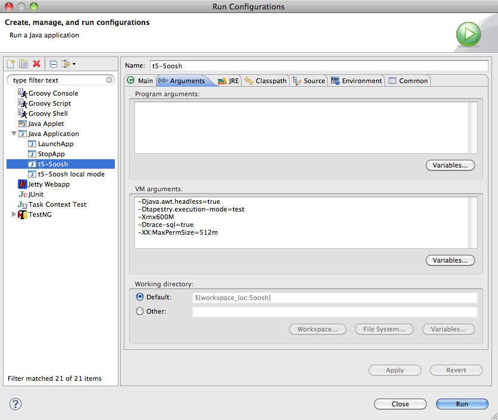

<a id="specific-errors-faq--specificerrorsfaq-whydoisometimesgetajava.lang.nosuchmethoderrorexceptionafterreloadingmypage"></a>
<a id="specific-errors-faq--why-do-i-sometimes-get-a-java.lang.nosuchmethoderror-exception-after-reloading-my-page"></a>

## Why do I sometimes get a `java.lang.NoSuchMethodError` exception after reloading my page?

Tapestry's live class reloading is not perfect. It tends to use a lot of Java ClassLoaders on top of the normal ClassLoaders used by the Java Virtual Machine and the servlet container. When you change non-component classes and interfaces that are referenced by components and pages, such as to add or change a method, only the component classes are reloaded. The non-component classes are frozen as they were when they were *first* loaded.

Unfortunately, this is one of the areas where you must restart your application entirely in order to force the new versions of the non-component classes to be loaded into memory.

<a id="specific-errors-faq--specificerrorsfaq-whydomylogscontain-java.lang.runtimeexception:formsrequirethattherequestmethodbepostandthatthet:formdataqueryparameterhavevalues"></a>
<a id="specific-errors-faq--why-do-my-logs-contain-java.lang.runtimeexception:-forms-require-that-the-request-method-be-post-and-that-the-t:formdata-query-parameter-have-values"></a>

## Why do my logs contain "java.lang.RuntimeException: Forms require that the request method be POST and that the t:formdata query parameter have values"?

This is caused by someone (or something) submitting the URL of your form using an HTTP GET instead of POST. Tapestry forms must always use POST actions.

Some known scenarios that cause this error:

- Bots crawling your site
- Web browser auto-complete functions trying to be helpful
- Users with browser developer tools manually modifying the form from a POST to a GET to see what will happen.
- Users getting a validation error on a form, then re-submitting the form by clicking in the URL address field and hitting Enter.
- In Tapestry versions before 5.4, (rarely) the use of property names for form fields where the property name matches a JavaScript property (see [TAP5-2066](https://issues.apache.org/jira/browse/TAP5-2066)).

In every known scenario except the last, these errors are harmless and you probably want to redirect the user to the page the form is on – and avoid logging an error. That's not too hard to do. Just add code like the following to your module class (usually AppModule.java):

**AppModule.java (partial)**

```java
/** * Redirect the user to the intended page when browsing through * tapestry forms through browser history or over-eager autocomplete */ public RequestExceptionHandler decorateRequestExceptionHandler(final ComponentSource componentSource,final Response response,final RequestExceptionHandler oldHandler) {return new RequestExceptionHandler() {@Override public void handleRequestException(Throwable exception) throws IOException {if (!exception.getMessage().contains("Forms require that the request method be POST and that the t:formdata query parameter have values")) {oldHandler.handleRequestException(exception); return;} ComponentResources cr = componentSource.getActivePage().getComponentResources(); Link link = cr.createEventLink(""); String uri = link.toRedirectURI().replaceAll(":", ""); response.sendRedirect(uri);} };}
```

*Thanks to [Lenny Primak](http://mail-archives.apache.org/mod_mbox/tapestry-users/201110.mbox/%3C1319823993429-4946765.post@n5.nabble.com%3E) for the above code. A slightly less fragile approach is [described here](https://mail-archives.apache.org/mod_mbox/tapestry-users/201509.mbox/%3CCAE26fNjEVnCyV52KMS-kpseWWnaLn9Pg6Lg60XzkXUhs0UTm1g@mail.gmail.com%3E). When [TAP5-1733](https://issues.apache.org/jira/browse/TAP5-1733) is fixed a much less fragile solution may be possible.*

Error formatting macro: scrollbar: java.lang.NoClassDefFoundError: com/opensymphony/webwork/ServletActionContext

---

<a id="hibernate-support-faq"></a>

<!-- source_url: https://tapestry.apache.org/hibernate-support-faq.html -->

<!-- page_index: 138 -->

# Hibernate Support FAQ

[Apache Tapestry](#index) > [Documentation](#documentation) > [Frequently Asked Questions](#frequently-asked-questions) > [Hibernate Support FAQ](#hibernate-support-faq)

<a id="hibernate-support-faq--title"></a>
<a id="hibernate-support-faq--hibernate-support-faq"></a>

# Hibernate Support FAQ

Apache Tapestry, Tapestry, Apache, the Apache feather logo, and the Apache Tapestry project logo are trademarks of The Apache Software Foundation.

---

<a id="maven-support-faq"></a>

<!-- source_url: https://tapestry.apache.org/maven-support-faq.html -->

<!-- page_index: 139 -->

# Maven Support FAQ

[Apache Tapestry](#index) > [Documentation](#documentation) > [Frequently Asked Questions](#frequently-asked-questions) > [Maven Support FAQ](#maven-support-faq)

<a id="maven-support-faq--title"></a>
<a id="maven-support-faq--maven-support-faq"></a>

# Maven Support FAQ

Error formatting macro: scrollbar: java.lang.NoClassDefFoundError: com/opensymphony/webwork/ServletActionContext

<a id="maven-support-faq--mavensupportfaq-mavensupport"></a>
<a id="maven-support-faq--maven-support"></a>

# Maven Support

<a id="maven-support-faq--mavensupportfaq-contents"></a>
<a id="maven-support-faq--contents"></a>

## Contents

- [Why do Maven project names and other details show up in my pages?](#maven-support-faq--mavensupportfaq-whydomavenprojectnamesandotherdetailsshowupinmypages)

<a id="maven-support-faq--mavensupportfaq-whydomavenprojectnamesandotherdetailsshowupinmypages"></a>
<a id="maven-support-faq--why-do-maven-project-names-and-other-details-show-up-in-my-pages"></a>

## Why do Maven project names and other details show up in my pages?

Tapestry and maven both use the same syntax for dynamic portions of files: the `${...`} syntax. When Maven is copying resources from `src/main/resources`, and when filtering is *enabled* (which is not the default), then any expansions in *Tapestry templates* that match against Maven project properties are substituted. If you look at the deployed application you'll see that `${name`} is gone, replaced with your project's name!

The solution is to update your `pom.xml` and ignore any .tml files when copying and filtering:

**pom.xml (partial)**

```xml
  <resource>
    <directory>src/main/resources</directory>
    <excludes>
      <exclude>**/*.tml</exclude>
    </excludes>
    <filtering>true</filtering>
  </resource>

  <resource>
    <directory>src/main/resources</directory>
    <includes>
      <include>**/*.tml</include>
    </includes>
    <filtering>false</filtering>
  </resource>
```

Error formatting macro: scrollbar: java.lang.NoClassDefFoundError: com/opensymphony/webwork/ServletActionContext

---

<a id="release-upgrade-faq"></a>

<!-- source_url: https://tapestry.apache.org/release-upgrade-faq.html -->

<!-- page_index: 140 -->

# Release Upgrade FAQ

[Apache Tapestry](#index) > [Documentation](#documentation) > [Frequently Asked Questions](#frequently-asked-questions) > [Release Upgrade FAQ](#release-upgrade-faq)

<a id="release-upgrade-faq--title"></a>
<a id="release-upgrade-faq--release-upgrade-faq"></a>

# Release Upgrade FAQ

Apache Tapestry, Tapestry, Apache, the Apache feather logo, and the Apache Tapestry project logo are trademarks of The Apache Software Foundation.

---

<a id="release-notes"></a>

<!-- source_url: https://tapestry.apache.org/release-notes.html -->

<!-- page_index: 141 -->

# Release Notes

[Apache Tapestry](#index) > [Documentation](#documentation) > [Release Notes](#release-notes)

<a id="release-notes--title"></a>
<a id="release-notes--release-notes"></a>

# Release Notes

These release notes describe the changes in each Tapestry version. Be sure to read [How to Upgrade](#how-to-upgrade) too.

| Release | Release Notes | Status | Released |
| --- | --- | --- | --- |
| Tapestry 5.9.0 | [Release Notes for 5.9.0](#release-notes-590) | **Current Stable Release** | 11 Feb 2025 |
| Tapestry 5.8.7 | [Release Notes for 5.8.7](#release-notes-587) |  | 9 Aug 2024 |
| Tapestry 5.8.6 | [Release Notes for 5.8.6](#release-notes-586) |  | 16 Apr 2024 |
| Tapestry 5.8.5 | [Release Notes for 5.8.5](#release-notes-585) |  | 31 Mar 2024 |
| Tapestry 5.8.4 | [Release Notes for 5.8.4](#release-notes-584) |  | 6 Feb 2024 |
| Tapestry 5.8.3 | [Release Notes for 5.8.3](#release-notes-583) |  | 16 Jul 2023 |
| Tapestry 5.8.2 | [Release Notes for 5.8.2](#release-notes-582) |  | 19 Jun 2022 |
| Tapestry 5.8.1 | [Release Notes for 5.8.1](#release-notes-581) |  | 1 Apr 2022 |
| Tapestry 5.8.0 | [Release Notes for 5.8.0](#release-notes-580) |  | 25 Jan 2022 |
| Tapestry 5.7.3 | [Release Notes for 5.7.3](#release-notes-573) |  | 13 Jul 2021 |
| Tapestry 5.7.2 | [Release Notes for 5.7.2](#release-notes-572) |  | 12 Apr 2021 |
| Tapestry 5.7.1 | [Release Notes for 5.7.1](#release-notes-571) |  | 13 Mar 2021 |
| Tapestry 5.7.0 | [Release Notes for 5.7.0](#release-notes-570) |  | 19 Feb 2021 |
| Tapestry 5.6.4 | [Release Notes for 5.6.4](#release-notes-564) |  | 12 Apr 2021 |
| Tapestry 5.6.3 | [Release Notes for 5.6.3](#release-notes-563) |  | 13 Mar 2021 |
| Tapestry 5.6.2 | [Release Notes for 5.6.2](#release-notes-562) |  | 19 Feb 2021 |
| Tapestry 5.6.1 | [Release Notes for 5.6.1](#release-notes-561) |  | 13 Sep 2020 |
| Tapestry 5.6.0 | [Release Notes for 5.6.0](#release-notes-560) |  | 28 Aug 2020 |
| Tapestry 5.5.0 | [Release Notes for 5.5.0](#release-notes-550) |  | 20 Mar 2020 |
| Tapestry 5.4.5 | [Release Notes for 5.4.5](#release-notes-545) |  | 7 Sep 2019 |
| Tapestry 5.4.4 | [Release Notes for 5.4.4](#release-notes-544) |  | 18 Dec 2018 |
| Tapestry 5.4.3 | [Release Notes for 5.4.3](#release-notes-543) |  | 24 Apr 2017 |
| Tapestry 5.4.2 | [Release Notes for 5.4.2](#release-notes-542) |  | 13 Apr 2017 |
| Tapestry 5.4.1 | [Release Notes for 5.4.1](#release-notes-541) |  | 20 Mar 2016 |
| Tapestry 5.4 | [Release Notes for 5.4](#release-notes-54) |  | 19 Dec 2015 |
| Tapestry 5.3.8 | [Release Notes for 5.3.8](#release-notes-538) |  | 24 Nov 2014 |
| Tapestry 5.3.7 | [Release Notes for 5.3.7](#release-notes-537) |  | 24 Apr 2013 |
| Tapestry 5.3.6 | [Release Notes for 5.3.6](#release-notes-536) |  | 12 Oct 2012 |
| Tapestry 5.3.5 | [Release Notes for 5.3.5](#release-notes-535) |  | 29 Aug 2012 |
| Tapestry 5.3.4 | [Release Notes for 5.3.4](#release-notes-534) |  | 16 Jul 2012 |
| Tapestry 5.3.3 | [Release Notes for 5.3.3](#release-notes-533) |  | 24 Apr 2012 |
| Tapestry 5.3.2 | [Release Notes for 5.3.2](#release-notes-532) |  | 07 Feb 2012 |
| Tapestry 5.3.1 | [Release Notes for 5.3.1](#release-notes-531) |  | 21 Dec 2011 |
| Tapestry 5.3 | [Release Notes for 5.3](#release-notes-53) |  | 21 Nov 2011 |
| Tapestry 5.2.6 | [Release Notes for 5.2.x](#release-notes-52) |  | 22 Jun 2011 |
| Tapestry 5.1 | [Release Notes for 5.1.x](#release-notes-51) |  | 12 Apr 2009 |
| Tapestry 5.0 | [Release Notes for 5.0.x](#release-notes-50) |  | Dec 2008 |

---

<a id="how-to-upgrade"></a>

<!-- source_url: https://tapestry.apache.org/how-to-upgrade.html -->

<!-- page_index: 142 -->

# How to Upgrade

[Apache Tapestry](#index) > [Documentation](#documentation) > [Release Notes](#release-notes) > [How to Upgrade](#how-to-upgrade)

<a id="how-to-upgrade--title"></a>
<a id="how-to-upgrade--how-to-upgrade"></a>

# How to Upgrade

**Error rendering macro 'scrollbar'**

com/opensymphony/webwork/ServletActionContext

Upgrading from one Tapestry version to the next is usually quite easy. Backward compatibility is one of Tapestry's [core principles](#principles). Even so, sometimes a checklist comes in handy to be sure you consider all of the implications of an upgrade.

<a id="how-to-upgrade--howtoupgrade-beforeyouupgrade"></a>
<a id="how-to-upgrade--before-you-upgrade"></a>

## Before You Upgrade

1. **Check Java version compatibility:** See the compatibility matrix at **[Supported Environments and Versions](#supported-environments-and-versions)**.
2. **Check 3rd Party compatibility:** Find out whether your 3rd party modules are compatible with the new version of Tapestry. Although the Tapestry developers try very hard to maintain backward compatibility across versions, sometimes an older version of a 3rd party module (particularly if it uses internal APIs) won't work with a newly-released version of Tapestry, and in that case you may have to wait until that 3rd party module is updated by its developers.
3. **Find and replace all calls to deprecated APIs.** Those are the places most likely to be broken after the upgrade. Most IDEs make it easy to find all deprecated items. In Eclipse, for example, the "Problems" view will show warnings for the use of deprecated APIs if you set it to show "All Errors/Warnings on Project".
4. **Read the Release Notes:** Each Tapestry version has a [Release Notes](#release-notes) document that lists all of the changes, including some that may cause compatibility issues with your current code. You will save yourself a lot of frustration if you carefully read this material before proceeding.

<a id="how-to-upgrade--howtoupgrade-upgrading"></a>
<a id="how-to-upgrade--upgrading"></a>

## Upgrading

1. **Upgrade one step at a time:** It is usually best to upgrade to each intermediate version of Tapestry rather than skipping ahead multiple versions. Skipping versions (except for minor bug fix releases) makes it harder to find all calls to deprecated APIs (see above).
2. **Update your POM (or download the JARs manually):** If you're using Maven (or Gradle), update the version of the Tapestry dependencies in your pom.xml (or build.gradle) file. Remember to keep all of the Tapestry-supplied modules in sync. For example, don't forget to update the version of Tapestry-hibernate, Tapestry-spring, Tapestry-upload, etc.
3. **Remove old Tapestry JARs:** If you're not using Maven or Gradle (e.g. if you have the Tapestry JARs in your lib directory), be sure you remove older versions of Tapestry JARs (including JARs for any Tapestry-supplied modules).

<a id="how-to-upgrade--howtoupgrade-afteryouupgrade"></a>
<a id="how-to-upgrade--after-you-upgrade"></a>

## After You Upgrade

1. **Remove cached JavaScript:** Tapestry's internal JavaScript may change between releases, and your web browser may have cached the older version (especially for Tapestry versions *prior to 5.4)*. If you have set a specific [application version](#configuration) in your application's module class (usually AppModule.java), you should increment it to ensure that the URLs to the JavaScript files will have a new version number in their paths. Doing so will cause the browser to download the latest versions from your server. Alternatively, you can just clear your browser's cache (and have all your developers and testers do the same). *This issue is usually not a problem on production servers, since you will likely increment the application version with each new production release. Also, starting in Tapestry 5.4 this is unlikely to be a problem due to file checksums being included in their URLs.*

**Error rendering macro 'scrollbar'**

com/opensymphony/webwork/ServletActionContext

---

<a id="release-notes-50"></a>

<!-- source_url: https://tapestry.apache.org/release-notes-50.html -->

<!-- page_index: 143 -->

# Release Notes 5.0

[Apache Tapestry](#index) > [Documentation](#documentation) > [Release Notes](#release-notes) > [Release Notes 5.0](#release-notes-50)

<a id="release-notes-50--title"></a>
<a id="release-notes-50--release-notes-5.0"></a>

# Release Notes 5.0

Error formatting macro: scrollbar: java.lang.NoClassDefFoundError: com/opensymphony/webwork/ServletActionContext

This is the consolidated list of changes between Tapestry versions 5.0.3 and 5.0.19. Before upgrading, be sure to review the [How to Upgrade](#how-to-upgrade) instructions.

**Contents**

- [Tapestry Version 5.0.19](#release-notes-50--releasenotes5.0-tapestryversion5.0.19)
- [Tapestry Version 5.0.18](#release-notes-50--releasenotes5.0-tapestryversion5.0.18)
- [Tapestry Version 5.0.17](#release-notes-50--releasenotes5.0-tapestryversion5.0.17)
- [Tapestry Version 5.0.16](#release-notes-50--releasenotes5.0-tapestryversion5.0.16)
- [Tapestry Version 5.0.15](#release-notes-50--releasenotes5.0-tapestryversion5.0.15)
- [Tapestry Version 5.0.14](#release-notes-50--releasenotes5.0-tapestryversion5.0.14)
- [Tapestry Version 5.0.13](#release-notes-50--releasenotes5.0-tapestryversion5.0.13)
- [Tapestry Version 5.0.12](#release-notes-50--releasenotes5.0-tapestryversion5.0.12)
- [Tapestry Version 5.0.11](#release-notes-50--releasenotes5.0-tapestryversion5.0.11)
- [Tapestry Version 5.0.10](#release-notes-50--releasenotes5.0-tapestryversion5.0.10)
- [Tapestry Version 5.0.9](#release-notes-50--releasenotes5.0-tapestryversion5.0.9)
- [Tapestry Version 5.0.8](#release-notes-50--releasenotes5.0-tapestryversion5.0.8)
- [Tapestry Version 5.0.7](#release-notes-50--releasenotes5.0-tapestryversion5.0.7)
- [Tapestry Version 5.0.6](#release-notes-50--releasenotes5.0-tapestryversion5.0.6)
- [Tapestry Version 5.0.5](#release-notes-50--releasenotes5.0-tapestryversion5.0.5)
- [Tapestry Version 5.0.4](#release-notes-50--releasenotes5.0-tapestryversion5.0.4)
- [Tapestry Version 5.0.3](#release-notes-50--releasenotes5.0-tapestryversion5.0.3)

<a id="release-notes-50--releasenotes5.0-tapestryversion5.0.19"></a>
<a id="release-notes-50--tapestry-version-5.0.19"></a>

## Tapestry Version 5.0.19

<a id="release-notes-50--releasenotes5.0-bugsfixed"></a>
<a id="release-notes-50--bugs-fixed"></a>

### Bugs Fixed

- [TAP5-419](https://issues.apache.org/jira/browse/TAP5-419) – Logging of component class transformations has typo in prefix
- [TAP5-449](https://issues.apache.org/jira/browse/TAP5-449) – @CleanupRender Render phase methods not always invoked
- [TAP5-815](https://issues.apache.org/jira/browse/TAP5-815) – Asset dispatcher allows any file inside the webapp visible and downloadable
- [TAP5-894](https://issues.apache.org/jira/browse/TAP5-894) – Fix PartialMarkupDocumentLinkerTest.stylesheet\_link()
- [TAP5-936](https://issues.apache.org/jira/browse/TAP5-936) – Tapestry wiki link links to nothing for locales other then en

<a id="release-notes-50--releasenotes5.0-improvementsmade"></a>
<a id="release-notes-50--improvements-made"></a>

### Improvements Made

- [TAP5-417](https://issues.apache.org/jira/browse/TAP5-417) – Tapestry Performance Improvements
- [TAP5-762](https://issues.apache.org/jira/browse/TAP5-762) – Upgrade Selenium dependencies to version 1.0.1
- [TAP5-934](https://issues.apache.org/jira/browse/TAP5-934) – Update javassist version + improve error reporting in OneShotLock

<a id="release-notes-50--releasenotes5.0-taskscompleted"></a>
<a id="release-notes-50--tasks-completed"></a>

### Tasks Completed

- [TAP5-819](https://issues.apache.org/jira/browse/TAP5-819) – remove ide-specific files from all sub-modules and add them to svn:ignore

<a id="release-notes-50--releasenotes5.0-tapestryversion5.0.18"></a>
<a id="release-notes-50--tapestry-version-5.0.18"></a>

## Tapestry Version 5.0.18

<a id="release-notes-50--releasenotes5.0-bugsfixed.1"></a>
<a id="release-notes-50--bugs-fixed-2"></a>

### Bugs Fixed

- [TAP5-399](https://issues.apache.org/jira/browse/TAP5-399) – Modified application state objects are not persisted back to the session at the end of the request
- [TAP5-401](https://issues.apache.org/jira/browse/TAP5-401) – When rendering HTML content (not XML) Tapestry should always render open and close tags for most elements, even if the content is empty

<a id="release-notes-50--releasenotes5.0-tapestryversion5.0.17"></a>
<a id="release-notes-50--tapestry-version-5.0.17"></a>

## Tapestry Version 5.0.17

<a id="release-notes-50--releasenotes5.0-bugsfixed.2"></a>
<a id="release-notes-50--bugs-fixed-3"></a>

### Bugs Fixed

- [TAP5-354](https://issues.apache.org/jira/browse/TAP5-354) – BeanEditForm guide references parameter "remove" which is now called "exclude"
- [TAP5-356](https://issues.apache.org/jira/browse/TAP5-356) – Link to the Node JavaDoc from the "New And Of Note" section of the project page is broken
- [TAP5-357](https://issues.apache.org/jira/browse/TAP5-357) – Tapestry documentation should clearly/boldly identify the release number
- [TAP5-362](https://issues.apache.org/jira/browse/TAP5-362) – Linking to an index page can result in an empty href attribute on a PageLink, which is treated by the browser as staying on the same page
- [TAP5-370](https://issues.apache.org/jira/browse/TAP5-370) – Error from DocumentLinker about missing <html> tag, even for XML document w/o JavaScript
- [TAP5-373](https://issues.apache.org/jira/browse/TAP5-373) – When JavaScript libraries are moved to the "top" of the document, they should be added to the <head>, not the <body>
- [TAP5-377](https://issues.apache.org/jira/browse/TAP5-377) – Broken links inside on project site to pipeline description and to JIRA
- [TAP5-378](https://issues.apache.org/jira/browse/TAP5-378) – Missing i18n files for Brazilian Portuguese

<a id="release-notes-50--releasenotes5.0-improvementsmade.1"></a>
<a id="release-notes-50--improvements-made-2"></a>

### Improvements Made

- [TAP5-365](https://issues.apache.org/jira/browse/TAP5-365) – Localization support for Japanese
- [TAP5-380](https://issues.apache.org/jira/browse/TAP5-380) – Add localiztion support for Greek

<a id="release-notes-50--releasenotes5.0-taskscompleted.1"></a>
<a id="release-notes-50--tasks-completed-2"></a>

### Tasks Completed

- [TAP5-379](https://issues.apache.org/jira/browse/TAP5-379) – Add the Ars Machina Project to the list of Tapestry 5-related packages

<a id="release-notes-50--releasenotes5.0-tapestryversion5.0.16"></a>
<a id="release-notes-50--tapestry-version-5.0.16"></a>

## Tapestry Version 5.0.16

<a id="release-notes-50--releasenotes5.0-bugsfixed.3"></a>
<a id="release-notes-50--bugs-fixed-4"></a>

### Bugs Fixed

- [TAP5-1](https://issues.apache.org/jira/browse/TAP5-1) – Clicking on a link that updates a zone before the page has fully loaded will result in a full page update and, often, a server-side exception
- [TAP5-4](https://issues.apache.org/jira/browse/TAP5-4) – Document the need to version classpath assets to prevent unwanted client browser caching
- [TAP5-10](https://issues.apache.org/jira/browse/TAP5-10) – An onActivate() event handler on a page can cause PageTester to fail with a NullPointerException
- [TAP5-22](https://issues.apache.org/jira/browse/TAP5-22) – Better client side reporting of problems with Zones and triggers is needed
- [TAP5-23](https://issues.apache.org/jira/browse/TAP5-23) – TextStreamResponse needs a charset
- [TAP5-25](https://issues.apache.org/jira/browse/TAP5-25) – Client-side validation is triggered onblur even when switching to a different form in the same page, or to a non-form element such as a link
- [TAP5-28](https://issues.apache.org/jira/browse/TAP5-28) – Image shows through autocomplete-menu
- [TAP5-32](https://issues.apache.org/jira/browse/TAP5-32) – It is not possible to include a null or blank field as part of an event or page activation context
- [TAP5-34](https://issues.apache.org/jira/browse/TAP5-34) – When using a Grid inside a Form, sorting the Grid may cause updates (when the form is submitted) to be applied to the wrong objects
- [TAP5-47](https://issues.apache.org/jira/browse/TAP5-47) – Cookie is not a secure cookie even though all connection are HTTPS connections
- [TAP5-50](https://issues.apache.org/jira/browse/TAP5-50) – Tabbing out of a form, including clicking a link, causes distracting client-side validations of the field just exitted
- [TAP5-105](https://issues.apache.org/jira/browse/TAP5-105) – Defining a component in the class that does not appear in the template should be an exception (not a logged, and ignored, warning)
- [TAP5-119](https://issues.apache.org/jira/browse/TAP5-119) – Tapestry should not use the page/component Logger for internal logging of class transformation and event dispatch logic
- [TAP5-127](https://issues.apache.org/jira/browse/TAP5-127) – Incorrect encoding on Danish messages files leads to UnknownFormatConversionException
- [TAP5-128](https://issues.apache.org/jira/browse/TAP5-128) – Render phase short circuiting fails to abort the event when mixins are present on the component, resulting in an IllegalStateException when trying to store a subsequent result value
- [TAP5-131](https://issues.apache.org/jira/browse/TAP5-131) – BeanEditForm guide example about creating the FieldTranslator is inaccurate and out of date
- [TAP5-132](https://issues.apache.org/jira/browse/TAP5-132) – ComponentSource#getPage(String) does not handle a blank page name correctly
- [TAP5-135](https://issues.apache.org/jira/browse/TAP5-135) – Attempting to set a default sort constraint on the Grid will cause an NullPointerException inside Grid.getSortConstraints()
- [TAP5-136](https://issues.apache.org/jira/browse/TAP5-136) – Although hibernate dependencies are not longer provided the documentation still says they are
- [TAP5-157](https://issues.apache.org/jira/browse/TAP5-157) – Add a LinkSubmit component, for submitting a Form via a clickable link
- [TAP5-224](https://issues.apache.org/jira/browse/TAP5-224) – DateField shows day abbreviation labels in wrong order for some non-english locales
- [TAP5-225](https://issues.apache.org/jira/browse/TAP5-225) – DateField shows empty selection after first date select
- [TAP5-227](https://issues.apache.org/jira/browse/TAP5-227) – Hibernate dependencies are incomplete
- [TAP5-229](https://issues.apache.org/jira/browse/TAP5-229) – Upgrade Prototype to version 1.6.0.3 to address positioning problems in IE6/7 that cause spurious client-side exceptions
- [TAP5-230](https://issues.apache.org/jira/browse/TAP5-230) – Defining a service that implements the HibernateConfigurer service causes injection exceptions (due to the ambiguity)
- [TAP5-233](https://issues.apache.org/jira/browse/TAP5-233) – Ajax requests that fail give no indication on the client side; instead, an error should be presented to the user as some form of popup
- [TAP5-235](https://issues.apache.org/jira/browse/TAP5-235) – The Tapestry Exception Report page should set a response status of SC\_INTERNAL\_SERVER\_ERROR
- [TAP5-238](https://issues.apache.org/jira/browse/TAP5-238) – Component reference for Grid's empty parameter is misleading; provide a good example
- [TAP5-240](https://issues.apache.org/jira/browse/TAP5-240) – Tapestry.Initializer.validate() references non-existent variable
- [TAP5-241](https://issues.apache.org/jira/browse/TAP5-241) – Doc out of date: Hibernate version
- [TAP5-249](https://issues.apache.org/jira/browse/TAP5-249) – Links from tapestry5-annotations page to tapestry-ioc and tapestry-core are broken
- [TAP5-253](https://issues.apache.org/jira/browse/TAP5-253) – Unable to effectively override default validation messages globally
- [TAP5-256](https://issues.apache.org/jira/browse/TAP5-256) – Page Pool Limit exhausted when exception occurs (during PageAttached lifecycle) on a link
- [TAP5-257](https://issues.apache.org/jira/browse/TAP5-257) – NPE in RequestFilter if ApplicationStateManager is used
- [TAP5-258](https://issues.apache.org/jira/browse/TAP5-258) – RequestPageCache should canonicalize page name
- [TAP5-261](https://issues.apache.org/jira/browse/TAP5-261) – Palette option reordering broken in IE
- [TAP5-263](https://issues.apache.org/jira/browse/TAP5-263) – Tapestry should produce XML-style output (not SGML) even for the text/html content type, for best compatibility with browsers
- [TAP5-268](https://issues.apache.org/jira/browse/TAP5-268) – UTF8 characters are not supported in the autocomplete mixin
- [TAP5-272](https://issues.apache.org/jira/browse/TAP5-272) – File uploads that exceed the upload limit throw an uncatchable exception; Tapestry should notify the page about the exception
- [TAP5-276](https://issues.apache.org/jira/browse/TAP5-276) – Add documentation about the use of @Inject to mark the correct constructor of a bean (i.e., when using BeanEditForm)
- [TAP5-279](https://issues.apache.org/jira/browse/TAP5-279) – Client-side validation is always enabled for injected AjaxFormLoop fields
- [TAP5-281](https://issues.apache.org/jira/browse/TAP5-281) – Form should detect when it is nested inside another Form and identify that as an error
- [TAP5-283](https://issues.apache.org/jira/browse/TAP5-283) – FormFragments are not ignored if the form has client validation disabled
- [TAP5-284](https://issues.apache.org/jira/browse/TAP5-284) – A component parameter default method that returns a primtive(instead of an object instance) results in an runtime exception
- [TAP5-287](https://issues.apache.org/jira/browse/TAP5-287) – Typo in default.css setting autoloader icon height
- [TAP5-290](https://issues.apache.org/jira/browse/TAP5-290) – Namespace error when partial-updating a zone with a block
- [TAP5-302](https://issues.apache.org/jira/browse/TAP5-302) – URL encoded strings that contain symbols such as %2f (encoded "/") are decoded incorrectly in some environments
- [TAP5-304](https://issues.apache.org/jira/browse/TAP5-304) – Tapestry outputs a warning when a component defined in the Java code (via @Component) does not have a corresponding element in the template; this should be escalated to an exception
- [TAP5-305](https://issues.apache.org/jira/browse/TAP5-305) – The JVM System Properties Symbol Source should always be ordered first (ahead of ApplicationDefaults, etc.)
- [TAP5-308](https://issues.apache.org/jira/browse/TAP5-308) – Injecting dependencies into contributeTypeCoercer method causes circular dependency error
- [TAP5-314](https://issues.apache.org/jira/browse/TAP5-314) – issue tracking link on tapestry5 page should refer to <https://issues.apache.org/jira/browse/TAP5>
- [TAP5-323](https://issues.apache.org/jira/browse/TAP5-323) – Fields marked with @Persist should not allow default values
- [TAP5-325](https://issues.apache.org/jira/browse/TAP5-325) – Pop up error bubbles are broken in Safari
- [TAP5-326](https://issues.apache.org/jira/browse/TAP5-326) – Class org.apache.tapestry5.internal.structure.BlockImpl should implement toString()
- [TAP5-328](https://issues.apache.org/jira/browse/TAP5-328) – Exception when checking BeanEditor Field required in ValidationDecorator
- [TAP5-332](https://issues.apache.org/jira/browse/TAP5-332) – Service interfaces should identify the service name and the type of service configuration (if applicable)
- [TAP5-333](https://issues.apache.org/jira/browse/TAP5-333) – Tapestry 5 renders an XHTML label element incorrectly
- [TAP5-337](https://issues.apache.org/jira/browse/TAP5-337) – Rapidly refreshing a page, even the same page, can cause a deadlock related to class loading
- [TAP5-342](https://issues.apache.org/jira/browse/TAP5-342) – Form with a zone is getting an action of "#" on submit from IE 6
- [TAP5-343](https://issues.apache.org/jira/browse/TAP5-343) – The Grid component generates non-unique HTML DOM ids for sort columns
- [TAP5-359](https://issues.apache.org/jira/browse/TAP5-359) – Use of the email validator with client-side validation displays a pop-up error message about client-side validator "email" being missing

<a id="release-notes-50--releasenotes5.0-improvementsmade.2"></a>
<a id="release-notes-50--improvements-made-3"></a>

### Improvements Made

- [TAP5-12](https://issues.apache.org/jira/browse/TAP5-12) – Need better docs for AjaxFormLoop; component should link to AddRowLink and RemoveRowLink, and need some examples
- [TAP5-49](https://issues.apache.org/jira/browse/TAP5-49) – Grid.defaultModel() should be a protected method so that subclasses can override the default BeanModel logic
- [TAP5-87](https://issues.apache.org/jira/browse/TAP5-87) – PasswordField should not update its value parameter when the submitted value is blank
- [TAP5-184](https://issues.apache.org/jira/browse/TAP5-184) – Improve error reporting when a javascript asset is intended to be included on page which has no <html> element
- [TAP5-187](https://issues.apache.org/jira/browse/TAP5-187) – Ajax event handler methods that return a page instance, page class or page name should cause the client to redirect to that page
- [TAP5-188](https://issues.apache.org/jira/browse/TAP5-188) – Document the need to use @Inject with @Value or @Symbol when the parameter/field type is String (to avoid injecting the service id)
- [TAP5-190](https://issues.apache.org/jira/browse/TAP5-190) – Grid component's source parameter should autoconnect to the matching container property
- [TAP5-197](https://issues.apache.org/jira/browse/TAP5-197) – Improved error message when using a form control component outside of a Form component
- [TAP5-200](https://issues.apache.org/jira/browse/TAP5-200) – The Submit component doesn't need validation decoration
- [TAP5-205](https://issues.apache.org/jira/browse/TAP5-205) – Add an empty parameter to the Loop component, to display a message when there are no items to loop over
- [TAP5-206](https://issues.apache.org/jira/browse/TAP5-206) – Document that you should not instantiate an @Persist field in its declaration
- [TAP5-228](https://issues.apache.org/jira/browse/TAP5-228) – When you have multiple forms on the same page that share (some of) the same properties, it is not possible to differentiate validation constraints and messages in the message catalog
- [TAP5-254](https://issues.apache.org/jira/browse/TAP5-254) – Translation for Spanish
- [TAP5-282](https://issues.apache.org/jira/browse/TAP5-282) – Add support for Brazilian Portuguese (pt\_BR) locale
- [TAP5-285](https://issues.apache.org/jira/browse/TAP5-285) – Components such as ActionLink and EventLink should require that there be \*some\* event handler for their triggered events
- [TAP5-297](https://issues.apache.org/jira/browse/TAP5-297) – Provide access to the Autocompleter javascript instance
- [TAP5-301](https://issues.apache.org/jira/browse/TAP5-301) – When using the @Property annotation, Tapestry should throw an exception rather than overwrite an existing method
- [TAP5-313](https://issues.apache.org/jira/browse/TAP5-313) – Provide configuration to move links to JavaScript libraries to the top of the page
- [TAP5-318](https://issues.apache.org/jira/browse/TAP5-318) – Tapestry should identify where in the template undefined components (with id, but no type or matching embedded component) are located
- [TAP5-339](https://issues.apache.org/jira/browse/TAP5-339) – Make FileItemFactory a service so it can be overridden
- [TAP5-344](https://issues.apache.org/jira/browse/TAP5-344) – Quickstart archetype should include an empty app.properties message catalog in the WEB-INF folder

<a id="release-notes-50--releasenotes5.0-newfeaturesadded"></a>
<a id="release-notes-50--new-features-added"></a>

### New Features Added

- [TAP5-41](https://issues.apache.org/jira/browse/TAP5-41) – Create a guide to creating and packaging component libraries
- [TAP5-231](https://issues.apache.org/jira/browse/TAP5-231) – Unify injection; allow @Inject annotation on fields of service implementations
- [TAP5-275](https://issues.apache.org/jira/browse/TAP5-275) – Add set() method to TestBase to allow private fields of objects to be set via reflection

<a id="release-notes-50--releasenotes5.0-taskscompleted.2"></a>
<a id="release-notes-50--tasks-completed-3"></a>

### Tasks Completed

- [TAP5-164](https://issues.apache.org/jira/browse/TAP5-164) – Remove link to TapIDEA project from Tapestry home page
- [TAP5-322](https://issues.apache.org/jira/browse/TAP5-322) – Update links to JumpStart because its site has moved

<a id="release-notes-50--releasenotes5.0-tapestryversion5.0.15"></a>
<a id="release-notes-50--tapestry-version-5.0.15"></a>

## Tapestry Version 5.0.15

<a id="release-notes-50--releasenotes5.0-sub-taskscompleted"></a>
<a id="release-notes-50--sub-tasks-completed"></a>

### Sub-tasks Completed

- [TAPESTRY-2423](https://issues.apache.org/jira/browse/TAPESTRY-2423) – Add Short Translator

<a id="release-notes-50--releasenotes5.0-bugsfixed.4"></a>
<a id="release-notes-50--bugs-fixed-5"></a>

### Bugs Fixed

- [TAPESTRY-1796](https://issues.apache.org/jira/browse/TAPESTRY-1796) – Not all writeCookieValue functions honor the tapestry.default-cookie-max-age symbol
- [TAPESTRY-1856](https://issues.apache.org/jira/browse/TAPESTRY-1856) – Add localization support to DateField
- [TAPESTRY-2243](https://issues.apache.org/jira/browse/TAPESTRY-2243) – Component report crashes when project have too many dependencies
- [TAPESTRY-2324](https://issues.apache.org/jira/browse/TAPESTRY-2324) – Wrong Submit 'selected' event fired when using a Form with a Zone parameter
- [TAPESTRY-2352](https://issues.apache.org/jira/browse/TAPESTRY-2352) – Client side validation does not enforce the format of input (i.e., that numeric fields contain numbers)
- [TAPESTRY-2357](https://issues.apache.org/jira/browse/TAPESTRY-2357) – Unlike Tapestry 4, Tapestry 5 does not automatically position the cursor into a form
- [TAPESTRY-2438](https://issues.apache.org/jira/browse/TAPESTRY-2438) – ValidationException thrown from onValidateForm() should be recorded for the Form, but instead is treated as an unexpected error
- [TAPESTRY-2453](https://issues.apache.org/jira/browse/TAPESTRY-2453) – Form enctype is not updated when an Upload component is injected via FormInjector / AjaxFormLoop
- [TAPESTRY-2460](https://issues.apache.org/jira/browse/TAPESTRY-2460) – Nested BeanEditors (where the block parameter for a property to one BeanEditor contains another BeanEditor) results in a StackOverflowException
- [TAPESTRY-2517](https://issues.apache.org/jira/browse/TAPESTRY-2517) – A failed service injection into a component field is visible in the browser as a spurious error about field \_$resources
- [TAPESTRY-2532](https://issues.apache.org/jira/browse/TAPESTRY-2532) – Javadoc of inPlace field in Grid class is incomplete
- [TAPESTRY-2536](https://issues.apache.org/jira/browse/TAPESTRY-2536) – Add explicit message on module loading failure
- [TAPESTRY-2546](https://issues.apache.org/jira/browse/TAPESTRY-2546) – Any component always outputs the same id attribute, rather than a unique id attribute for each render
- [TAPESTRY-2558](https://issues.apache.org/jira/browse/TAPESTRY-2558) – The injection page of the user guide references commons-logging Log, not SLF4 Logger
- [TAPESTRY-2559](https://issues.apache.org/jira/browse/TAPESTRY-2559) – The "configuration" page of the Tapestry user guide (conf.apt) has an error, comes out blank
- [TAPESTRY-2561](https://issues.apache.org/jira/browse/TAPESTRY-2561) – Rapidly refreshing a page, even the same page, can cause a deadlock related to class loading
- [TAPESTRY-2563](https://issues.apache.org/jira/browse/TAPESTRY-2563) – Tapestry should reject form submissions that aren't via POST or don't contain t:formdata, as likely hack attempts
- [TAPESTRY-2566](https://issues.apache.org/jira/browse/TAPESTRY-2566) – Errors in code examples of "Securing your application with HTTPS"
- [TAPESTRY-2567](https://issues.apache.org/jira/browse/TAPESTRY-2567) – Tapestry doesn't identify conflicting annotations on component fields
- [TAPESTRY-2578](https://issues.apache.org/jira/browse/TAPESTRY-2578) – BeanDisplay formatting is off for fields with empty values
- [TAPESTRY-2585](https://issues.apache.org/jira/browse/TAPESTRY-2585) – Email validator requires Void constraint type, should be null
- [TAPESTRY-2591](https://issues.apache.org/jira/browse/TAPESTRY-2591) – Email Validator Throws MissingFormatArgumentException
- [TAPESTRY-2595](https://issues.apache.org/jira/browse/TAPESTRY-2595) – Application State Objects are not persisted back to the session at the end of the request
- [TAPESTRY-2601](https://issues.apache.org/jira/browse/TAPESTRY-2601) – ComponentResources.createActionLink() is incorrectly named, should be createEventLink()
- [TAPESTRY-2602](https://issues.apache.org/jira/browse/TAPESTRY-2602) – Error bubbles are in some cases placed incorrectly
- [TAPESTRY-2606](https://issues.apache.org/jira/browse/TAPESTRY-2606) – File system warning for certain component event request, on windows only
- [TAPESTRY-2617](https://issues.apache.org/jira/browse/TAPESTRY-2617) – DateField component should localize the month names and day name abbreviations shown in the client web browser
- [TAPESTRY-2619](https://issues.apache.org/jira/browse/TAPESTRY-2619) – Event Handler adds a new JSONObject to my JSONObject return
- [TAPESTRY-2626](https://issues.apache.org/jira/browse/TAPESTRY-2626) – Dependencies on Selenium are incomplete
- [TAPESTRY-2629](https://issues.apache.org/jira/browse/TAPESTRY-2629) – Link to tapestry5-annotations page is broken, links to old page (out of date since May 2008)
- [TAPESTRY-2636](https://issues.apache.org/jira/browse/TAPESTRY-2636) – NoSuchElementException on submit when using a Grid with a non-default model inside a Form
- [TAPESTRY-2641](https://issues.apache.org/jira/browse/TAPESTRY-2641) – FormSupport.defer() javadoc says defered actions will be executed after validation, but it's executed before
- [TAPESTRY-2655](https://issues.apache.org/jira/browse/TAPESTRY-2655) – Services defined with the bind() method may conflict with services from service builder methods without error
- [TAPESTRY-2656](https://issues.apache.org/jira/browse/TAPESTRY-2656) – GridSortModel.getSortContraints() - method name misspelled, should be getSortConstraints()
- [TAPESTRY-2658](https://issues.apache.org/jira/browse/TAPESTRY-2658) – HibernateGridDataSource.getAvailableRows should also call applyAdditionalConstraints() to prevent java.lang.IndexOutOfBoundsException
- [TAPESTRY-2664](https://issues.apache.org/jira/browse/TAPESTRY-2664) – RenderSupport.addScript(String) does not add the core JavaScript dependencies
- [TAPESTRY-2668](https://issues.apache.org/jira/browse/TAPESTRY-2668) – Setting volatile to true on Grid component in form results in NullPointerException
- [TAPESTRY-2669](https://issues.apache.org/jira/browse/TAPESTRY-2669) – Tapestry source distribution's version of tapestry-test is actually the code for tapestry-spring

<a id="release-notes-50--releasenotes5.0-improvementsmade.3"></a>
<a id="release-notes-50--improvements-made-4"></a>

### Improvements Made

- [TAPESTRY-2137](https://issues.apache.org/jira/browse/TAPESTRY-2137) – The common idiom of connecting a component's id to a container property should be easier: an attribute of the @Parameter annotation
- [TAPESTRY-2223](https://issues.apache.org/jira/browse/TAPESTRY-2223) – Don't require a hibernate.cfg.xml
- [TAPESTRY-2236](https://issues.apache.org/jira/browse/TAPESTRY-2236) – Strip trailing punctuation (\_ and $) from member names, as is done with leading punctuation
- [TAPESTRY-2277](https://issues.apache.org/jira/browse/TAPESTRY-2277) – Removing Label body should be parameterizable
- [TAPESTRY-2286](https://issues.apache.org/jira/browse/TAPESTRY-2286) – Support JSONArray as a valid return type from AJAX event handlers
- [TAPESTRY-2287](https://issues.apache.org/jira/browse/TAPESTRY-2287) – Include tapestry-test in release download
- [TAPESTRY-2363](https://issues.apache.org/jira/browse/TAPESTRY-2363) – Overload method ComponentSource.getPage to accept a page class as parameter
- [TAPESTRY-2458](https://issues.apache.org/jira/browse/TAPESTRY-2458) – Refactor DefaultHibernateConfigurer as an IOC service for easier overriding
- [TAPESTRY-2461](https://issues.apache.org/jira/browse/TAPESTRY-2461) – Add translations for Finnish locale
- [TAPESTRY-2474](https://issues.apache.org/jira/browse/TAPESTRY-2474) – Define and use a standard set of SL4J Markers for logging, to make it easier to filter output
- [TAPESTRY-2486](https://issues.apache.org/jira/browse/TAPESTRY-2486) – Refactor the non-trivial BindingFactory implementations into services
- [TAPESTRY-2489](https://issues.apache.org/jira/browse/TAPESTRY-2489) – The ServiceStatus page should not reveal so much information in production mode, out of security concerns
- [TAPESTRY-2554](https://issues.apache.org/jira/browse/TAPESTRY-2554) – When decorating a service using a decorate method, the underlying service (or interceptor) should be available as a parameter of the service type, not just java.lang.Object
- [TAPESTRY-2576](https://issues.apache.org/jira/browse/TAPESTRY-2576) – The text field for a DateField component should be optional
- [TAPESTRY-2577](https://issues.apache.org/jira/browse/TAPESTRY-2577) – Add support for Russian locale
- [TAPESTRY-2584](https://issues.apache.org/jira/browse/TAPESTRY-2584) – AspectInterceptorBuilder should allow for multiple advice per method
- [TAPESTRY-2586](https://issues.apache.org/jira/browse/TAPESTRY-2586) – Some abstract base class methods should be overridable
- [TAPESTRY-2588](https://issues.apache.org/jira/browse/TAPESTRY-2588) – Add translations for Danish locale
- [TAPESTRY-2589](https://issues.apache.org/jira/browse/TAPESTRY-2589) – Add translations for Swedish locale
- [TAPESTRY-2592](https://issues.apache.org/jira/browse/TAPESTRY-2592) – BeanEditor should provide a "BeanEditContext" into the environment. (or PropertyEditContext should include the bean class).
- [TAPESTRY-2596](https://issues.apache.org/jira/browse/TAPESTRY-2596) – Add translations for French locale
- [TAPESTRY-2597](https://issues.apache.org/jira/browse/TAPESTRY-2597) – Upgrade tapestry-hibernate to Hibernate 3.3.0.SP1
- [TAPESTRY-2603](https://issues.apache.org/jira/browse/TAPESTRY-2603) – Improve @InjectContainer Javadoc
- [TAPESTRY-2610](https://issues.apache.org/jira/browse/TAPESTRY-2610) – Allow access to component's informal parameters
- [TAPESTRY-2611](https://issues.apache.org/jira/browse/TAPESTRY-2611) – Add loom-t5 link to Tapestry 5 home page
- [TAPESTRY-2615](https://issues.apache.org/jira/browse/TAPESTRY-2615) – IOC autobuild conflict between org.hibernate.Session and the FullTextSession from the hibernate serach module
- [TAPESTRY-2623](https://issues.apache.org/jira/browse/TAPESTRY-2623) – Remove excessive Tapestry.debug() messages on zone response
- [TAPESTRY-2624](https://issues.apache.org/jira/browse/TAPESTRY-2624) – Remove unecessary comments from tapestry.js
- [TAPESTRY-2627](https://issues.apache.org/jira/browse/TAPESTRY-2627) – The else parameter of If should have a default binding prefix of literal
- [TAPESTRY-2630](https://issues.apache.org/jira/browse/TAPESTRY-2630) – EntityPersistentFieldStrategy converts entity PKs to strings and back unnecessarily
- [TAPESTRY-2639](https://issues.apache.org/jira/browse/TAPESTRY-2639) – tapestry.js does not use Protoype's Class.create() properly
- [TAPESTRY-2643](https://issues.apache.org/jira/browse/TAPESTRY-2643) – RenderSupport should have options for including a JavaScript library or Stylesheet as a String URL, not just as an Asset
- [TAPESTRY-2646](https://issues.apache.org/jira/browse/TAPESTRY-2646) – There should be a global configuration that controls the default for Form's clientValidation and autofocus parameters
- [TAPESTRY-2654](https://issues.apache.org/jira/browse/TAPESTRY-2654) – The Zone component should expose its body (as a Block) to make it easier to re-render the Zone's body as an Ajax partial page render
- [TAPESTRY-2662](https://issues.apache.org/jira/browse/TAPESTRY-2662) – Upgrade Hibernate dependency to 3.3.1
- [TAPESTRY-2670](https://issues.apache.org/jira/browse/TAPESTRY-2670) – Major fixes needed for German (DE) localization
- [TAPESTRY-2671](https://issues.apache.org/jira/browse/TAPESTRY-2671) – TapestryFilter should display name of application, version of Tapestry at startup

<a id="release-notes-50--releasenotes5.0-newfeaturesadded.1"></a>
<a id="release-notes-50--new-features-added-2"></a>

### New Features Added

- [TAPESTRY-1310](https://issues.apache.org/jira/browse/TAPESTRY-1310) – Provide access to the current row index and current column index in Grid
- [TAPESTRY-1867](https://issues.apache.org/jira/browse/TAPESTRY-1867) – Support a special marker interface @Local to select just services defined within the same module
- [TAPESTRY-1923](https://issues.apache.org/jira/browse/TAPESTRY-1923) – ComponentClassResolver can/should provide access to all known page names
- [TAPESTRY-2300](https://issues.apache.org/jira/browse/TAPESTRY-2300) – The RadioGroup component always generates its control name from its component id; a new parameter should give some override control over this
- [TAPESTRY-2509](https://issues.apache.org/jira/browse/TAPESTRY-2509) – Add type coercions from String to Renderable, Block
- [TAPESTRY-2541](https://issues.apache.org/jira/browse/TAPESTRY-2541) – Tapestry DOM needs basic methods to manipulate the DOM post-render
- [TAPESTRY-2571](https://issues.apache.org/jira/browse/TAPESTRY-2571) – Add configuration to turn off the automatic creation of ValueEncoders for Hibernate entities
- [TAPESTRY-2594](https://issues.apache.org/jira/browse/TAPESTRY-2594) – Add translations for Croatian (hr) locale
- [TAPESTRY-2638](https://issues.apache.org/jira/browse/TAPESTRY-2638) – The name of the event triggered by a Submit component should be configurable, to allow for multiple components that trigger the same event handler method
- [TAPESTRY-2644](https://issues.apache.org/jira/browse/TAPESTRY-2644) – Add a ComponentResources.createPageLink(...) method that uses page class instead of page name

<a id="release-notes-50--releasenotes5.0-wishlistitemscompleted"></a>
<a id="release-notes-50--wish-list-items-completed"></a>

### Wish List Items Completed

- [TAPESTRY-1964](https://issues.apache.org/jira/browse/TAPESTRY-1964) – Constant not used from app-name in TapestryModule

<a id="release-notes-50--releasenotes5.0-tapestryversion5.0.14"></a>
<a id="release-notes-50--tapestry-version-5.0.14"></a>

## Tapestry Version 5.0.14

<a id="release-notes-50--releasenotes5.0-bugsfixed.5"></a>
<a id="release-notes-50--bugs-fixed-6"></a>

### Bugs Fixed

- [TAPESTRY-1588](https://issues.apache.org/jira/browse/TAPESTRY-1588) – Validation error images are included in the markup for fields without errors, even when the form has client validation disabled
- [TAPESTRY-1997](https://issues.apache.org/jira/browse/TAPESTRY-1997) – PersistentLocale is lower-casing locales
- [TAPESTRY-2181](https://issues.apache.org/jira/browse/TAPESTRY-2181) – The Component Parameters Report should indicate if a component supports informal parameters
- [TAPESTRY-2384](https://issues.apache.org/jira/browse/TAPESTRY-2384) – OutOfMemoryError exception if a regular file with no extension exists in a known component package
- [TAPESTRY-2386](https://issues.apache.org/jira/browse/TAPESTRY-2386) – BeanDisplay component should generate more semantic output using <DL>, <DT>, <DD> instead of nested <DIV>s
- [TAPESTRY-2390](https://issues.apache.org/jira/browse/TAPESTRY-2390) – Components or mixins requiring external javascript files and rendered via AJAX do not work
- [TAPESTRY-2408](https://issues.apache.org/jira/browse/TAPESTRY-2408) – FormInjector doesn't work properly if the content contains multiple form elements
- [TAPESTRY-2429](https://issues.apache.org/jira/browse/TAPESTRY-2429) – Script text added by RenderSupport.addScript() should be added raw (with XML elements not encoded as entities)
- [TAPESTRY-2433](https://issues.apache.org/jira/browse/TAPESTRY-2433) – UTF8 characters are not supported in the autocomplete mixin
- [TAPESTRY-2447](https://issues.apache.org/jira/browse/TAPESTRY-2447) – Clicking on a pop-up error bubble hides the bubble, then immediately fades it back in
- [TAPESTRY-2448](https://issues.apache.org/jira/browse/TAPESTRY-2448) – When a bean class inherits properties from a base class, field annotations of the base class properties are not visible
- [TAPESTRY-2449](https://issues.apache.org/jira/browse/TAPESTRY-2449) – Groovy can inject a base class into component classes that Tapestry rejects
- [TAPESTRY-2450](https://issues.apache.org/jira/browse/TAPESTRY-2450) – Unlike reflective access (via PropertyAdapter), PropertyConduit does not make field annotations visible
- [TAPESTRY-2454](https://issues.apache.org/jira/browse/TAPESTRY-2454) – tapestry-hibernate transaction management doesn't work as expected when commiting more than once on the same request
- [TAPESTRY-2459](https://issues.apache.org/jira/browse/TAPESTRY-2459) – Submit components fires its event after "validateform" event, should be before (this is a change from prior releases)
- [TAPESTRY-2460](https://issues.apache.org/jira/browse/TAPESTRY-2460) – Nested BeanEditors (where the block parameter for a property to one BeanEditor contains another BeanEditor) results in a StackOverflowException
- [TAPESTRY-2468](https://issues.apache.org/jira/browse/TAPESTRY-2468) – A deadlock related to class loading (and creation) can occur
- [TAPESTRY-2471](https://issues.apache.org/jira/browse/TAPESTRY-2471) – Parameter fields that are updated during component event processing (such as a form submit) may not clear their values at the end of the request
- [TAPESTRY-2473](https://issues.apache.org/jira/browse/TAPESTRY-2473) – Application locks up, with all threads waiting for read lock inside ConcurrentBarrier
- [TAPESTRY-2476](https://issues.apache.org/jira/browse/TAPESTRY-2476) – Unhelpful exception messages when a null value is bound to a required parameter
- [TAPESTRY-2478](https://issues.apache.org/jira/browse/TAPESTRY-2478) – Non-private fields in Tapestry component classes should fail early, instead get confusing javassist.bytecode.DuplicateMemberException
- [TAPESTRY-2481](https://issues.apache.org/jira/browse/TAPESTRY-2481) – ClassTransformation acts as if all type-level annotations are inherited; it should filter out non-inherited annotations
- [TAPESTRY-2483](https://issues.apache.org/jira/browse/TAPESTRY-2483) – The '%' symbol passed to RenderSupport.addScript() is treated as a formatting directive, causing errors
- [TAPESTRY-2484](https://issues.apache.org/jira/browse/TAPESTRY-2484) – Some built-in Tapestry components are final and should be extensible
- [TAPESTRY-2490](https://issues.apache.org/jira/browse/TAPESTRY-2490) – Palette component forces an unwanted form submit under FireFox 3
- [TAPESTRY-2498](https://issues.apache.org/jira/browse/TAPESTRY-2498) – Add JDK 1.6 compatibility via Javassist 3.8.0.GA
- [TAPESTRY-2500](https://issues.apache.org/jira/browse/TAPESTRY-2500) – Using @PageActivationContext on an int field results in a java.lang.Verify error
- [TAPESTRY-2501](https://issues.apache.org/jira/browse/TAPESTRY-2501) – Form input not correctly decoded in case of non-english charsets
- [TAPESTRY-2502](https://issues.apache.org/jira/browse/TAPESTRY-2502) – When the GridDataSource reports more available rows than actual rows (due to race conditions with updates), the Grid will fail because of IndexOutOfRange exceptions
- [TAPESTRY-2504](https://issues.apache.org/jira/browse/TAPESTRY-2504) – Unspecified ajax stream response encoding
- [TAPESTRY-2507](https://issues.apache.org/jira/browse/TAPESTRY-2507) – Stylesheet (.css) files included by components are not added if the component is added to the page via an ajax update
- [TAPESTRY-2508](https://issues.apache.org/jira/browse/TAPESTRY-2508) – HibernateGridDataSource calls Query.setFetchSize() not Query.setMaxResults()
- [TAPESTRY-2522](https://issues.apache.org/jira/browse/TAPESTRY-2522) – RequestPathOptimizer will corrupt query parameters in the optimized URL if the parameters container slashes
- [TAPESTRY-2528](https://issues.apache.org/jira/browse/TAPESTRY-2528) – It should not be possible for component classes to be directly instantiated
- [TAPESTRY-2538](https://issues.apache.org/jira/browse/TAPESTRY-2538) – The default binding prefix for TextField.translate should be "translate" but is "prop"
- [TAPESTRY-2543](https://issues.apache.org/jira/browse/TAPESTRY-2543) – Simplify Tapestry to use UTF-8 (or another, configurable character set) across the entire application

<a id="release-notes-50--releasenotes5.0-improvementsmade.4"></a>
<a id="release-notes-50--improvements-made-5"></a>

### Improvements Made

- [TAPESTRY-2404](https://issues.apache.org/jira/browse/TAPESTRY-2404) – PropertyConduitSource could build a shared method to "navigate" to the final property
- [TAPESTRY-2410](https://issues.apache.org/jira/browse/TAPESTRY-2410) – Service decorator method not invoked for @Match with "\*" in middle
- [TAPESTRY-2443](https://issues.apache.org/jira/browse/TAPESTRY-2443) – Support de\_DE (German) localization
- [TAPESTRY-2452](https://issues.apache.org/jira/browse/TAPESTRY-2452) – Introduce a new symbol for the path to the application message catalog
- [TAPESTRY-2461](https://issues.apache.org/jira/browse/TAPESTRY-2461) – Validation and Error messages for Finnish locale
- [TAPESTRY-2467](https://issues.apache.org/jira/browse/TAPESTRY-2467) – Method to remove or replace DOM nodes from the document
- [TAPESTRY-2469](https://issues.apache.org/jira/browse/TAPESTRY-2469) – Update Selenium dependency to the current version, 1.0-beta-1
- [TAPESTRY-2479](https://issues.apache.org/jira/browse/TAPESTRY-2479) – Upgrade to SLF4J version 1.5.2 (supports older versions of Log4J better)
- [TAPESTRY-2480](https://issues.apache.org/jira/browse/TAPESTRY-2480) – Migrate Tapestry "what's new?" and upgrade information up to the project level
- [TAPESTRY-2519](https://issues.apache.org/jira/browse/TAPESTRY-2519) – Make ClassNameLocatorImpl resolve resources from URLs that use a client-defined protocol
- [TAPESTRY-2525](https://issues.apache.org/jira/browse/TAPESTRY-2525) – Properties files in a message catalog should be read using UTF-8 encoding, rather than default encoding
- [TAPESTRY-2531](https://issues.apache.org/jira/browse/TAPESTRY-2531) – Upgrade EasyMock dependency to latest version, 2.4
- [TAPESTRY-2534](https://issues.apache.org/jira/browse/TAPESTRY-2534) – An event context should be passed through the Ajax request when AjaxFormLoop adds a new row

<a id="release-notes-50--releasenotes5.0-newfeaturesadded.2"></a>
<a id="release-notes-50--new-features-added-3"></a>

### New Features Added

- [TAPESTRY-1810](https://issues.apache.org/jira/browse/TAPESTRY-1810) – ServiceBinder.bind() with an interface should check to see if there's an Impl class and bind to that.
- [TAPESTRY-2143](https://issues.apache.org/jira/browse/TAPESTRY-2143) – Framework should include an email validator
- [TAPESTRY-2217](https://issues.apache.org/jira/browse/TAPESTRY-2217) – Add ability to render a page as a Document
- [TAPESTRY-2235](https://issues.apache.org/jira/browse/TAPESTRY-2235) – Annotation for managing a property as the page activation context
- [TAPESTRY-2475](https://issues.apache.org/jira/browse/TAPESTRY-2475) – Add an implementation of GridDataSource that can be used to optimize Hibernate queries
- [TAPESTRY-2540](https://issues.apache.org/jira/browse/TAPESTRY-2540) – Tapestry should place the Registry into the ServletContext using a well-known attribute name, for use by non-Tapestry code
- [TAPESTRY-2542](https://issues.apache.org/jira/browse/TAPESTRY-2542) – Add new method hasBody() to ComponentResources, to reveal if component has a body or not
- [TAPESTRY-2550](https://issues.apache.org/jira/browse/TAPESTRY-2550) – Allow Tapestry to bind a service interface to a ServiceBuilder callback to create the service
- [TAPESTRY-2552](https://issues.apache.org/jira/browse/TAPESTRY-2552) – Provide easier overrides for Grid, BeanEditor property display & edit blocks

<a id="release-notes-50--releasenotes5.0-tapestryversion5.0.13"></a>
<a id="release-notes-50--tapestry-version-5.0.13"></a>

## Tapestry Version 5.0.13

<a id="release-notes-50--releasenotes5.0-bugsfixed.6"></a>
<a id="release-notes-50--bugs-fixed-7"></a>

### Bugs Fixed

- [TAPESTRY-2096](https://issues.apache.org/jira/browse/TAPESTRY-2096) – Confusing exception when autobuilding a class fails due to class visibility
- [TAPESTRY-2311](https://issues.apache.org/jira/browse/TAPESTRY-2311) – "Parents before Child" concept for Component Rendering does not allow different rendering in subclasses
- [TAPESTRY-2341](https://issues.apache.org/jira/browse/TAPESTRY-2341) – AJAX Zone updating doesn't work correctly in IE
- [TAPESTRY-2349](https://issues.apache.org/jira/browse/TAPESTRY-2349) – FormFragment should be tied to the 'click' event of the associated checkbox
- [TAPESTRY-2360](https://issues.apache.org/jira/browse/TAPESTRY-2360) – Forms in zones in loops have wrong zone id after update
- [TAPESTRY-2418](https://issues.apache.org/jira/browse/TAPESTRY-2418) – Form onsubmit event handler for Zone component handling is ignored if any fields on the form have validation configured.
- [TAPESTRY-2422](https://issues.apache.org/jira/browse/TAPESTRY-2422) – The Exception report will itself throw an exception if the exception being reported contains a write-only property
- [TAPESTRY-2436](https://issues.apache.org/jira/browse/TAPESTRY-2436) – New FormInjectorDemo using AjaxFormLoop fails if a row is added and then removed without a form submission in between

<a id="release-notes-50--releasenotes5.0-improvementsmade.5"></a>
<a id="release-notes-50--improvements-made-6"></a>

### Improvements Made

- [TAPESTRY-2100](https://issues.apache.org/jira/browse/TAPESTRY-2100) – Validation and Error messages for Portuguese locale
- [TAPESTRY-2281](https://issues.apache.org/jira/browse/TAPESTRY-2281) – Update tutorial1 to correctly indicate how and why to replace Jetty 5 log4j.jar
- [TAPESTRY-2347](https://issues.apache.org/jira/browse/TAPESTRY-2347) – Add a "resources" section to T5 home page
- [TAPESTRY-2393](https://issues.apache.org/jira/browse/TAPESTRY-2393) – The FormFragment component should isolate its action stream (t:formdata hidden field) such that the entire client-side element may be removed
- [TAPESTRY-2428](https://issues.apache.org/jira/browse/TAPESTRY-2428) – tapestry-hibernate should include as a dependency a default version of Hibernate with docs for how to override
- [TAPESTRY-2439](https://issues.apache.org/jira/browse/TAPESTRY-2439) – The PropertyAdapter interface should include a property to identify the containing class
- [TAPESTRY-2440](https://issues.apache.org/jira/browse/TAPESTRY-2440) – The quickstart archetype should enable debug logging (by default) for the new application
- [TAPESTRY-2441](https://issues.apache.org/jira/browse/TAPESTRY-2441) – Upgrade to Scriptaculous 1.8.1
- [TAPESTRY-2442](https://issues.apache.org/jira/browse/TAPESTRY-2442) – When Tapestry is operating inside FireFox with Firebug enabled, it should use the Firebug logging API

<a id="release-notes-50--releasenotes5.0-tapestryversion5.0.12"></a>
<a id="release-notes-50--tapestry-version-5.0.12"></a>

## Tapestry Version 5.0.12

<a id="release-notes-50--releasenotes5.0-bugsfixed.7"></a>
<a id="release-notes-50--bugs-fixed-8"></a>

### Bugs Fixed

- [TAPESTRY-1921](https://issues.apache.org/jira/browse/TAPESTRY-1921) – Add documentation for Environmental annotation, environmental services
- [TAPESTRY-2037](https://issues.apache.org/jira/browse/TAPESTRY-2037) – NullPointerException caused by many rapid page refreshes
- [TAPESTRY-2247](https://issues.apache.org/jira/browse/TAPESTRY-2247) – Transactions should roll back, not commit, at the end of each request
- [TAPESTRY-2258](https://issues.apache.org/jira/browse/TAPESTRY-2258) – Error while autobuilding BeanEditForm's bean
- [TAPESTRY-2259](https://issues.apache.org/jira/browse/TAPESTRY-2259) – Registry startup exceptions are not reported correctly
- [TAPESTRY-2260](https://issues.apache.org/jira/browse/TAPESTRY-2260) – Null relationships cause an NPE inside Hibernate when being value encoded by RadioGroup
- [TAPESTRY-2261](https://issues.apache.org/jira/browse/TAPESTRY-2261) – TriggerFragment mixin should work with Radio as well as Checkbox components
- [TAPESTRY-2262](https://issues.apache.org/jira/browse/TAPESTRY-2262) – TriggerFragment mixin will run the "show" animation even when the fragment is already visible
- [TAPESTRY-2265](https://issues.apache.org/jira/browse/TAPESTRY-2265) – Grid component documentation could be simplified
- [TAPESTRY-2267](https://issues.apache.org/jira/browse/TAPESTRY-2267) – Services that are dependencies of other EagerLoad services may not be eagerly loaded
- [TAPESTRY-2268](https://issues.apache.org/jira/browse/TAPESTRY-2268) – Docs: tapestry-core -> user guide -> Request Processing broken "Pipelines" link
- [TAPESTRY-2271](https://issues.apache.org/jira/browse/TAPESTRY-2271) – Expose the Grid's rowsPerPage and row properties to Java code (instead of using @Property)
- [TAPESTRY-2276](https://issues.apache.org/jira/browse/TAPESTRY-2276) – Required validation fails when used with select and blankOption="ALWAYS"
- [TAPESTRY-2284](https://issues.apache.org/jira/browse/TAPESTRY-2284) – Exceptions may be incorrectly reported due to exception invoking initCause() when an exception already has a cause
- [TAPESTRY-2293](https://issues.apache.org/jira/browse/TAPESTRY-2293) – BeanDisplay formatting is off for fields with null values
- [TAPESTRY-2305](https://issues.apache.org/jira/browse/TAPESTRY-2305) – When Tapestry throws an exception due to an unrecognized embedded component id, it fails to list the available component ids
- [TAPESTRY-2306](https://issues.apache.org/jira/browse/TAPESTRY-2306) – Mismatch between client-side and server-side "required" validator
- [TAPESTRY-2320](https://issues.apache.org/jira/browse/TAPESTRY-2320) – Problems with validation popups on Internet Explorer
- [TAPESTRY-2322](https://issues.apache.org/jira/browse/TAPESTRY-2322) – FormInjector doesn't work properly if the content contains multiple elements
- [TAPESTRY-2323](https://issues.apache.org/jira/browse/TAPESTRY-2323) – Select component does not generate client-side validation
- [TAPESTRY-2333](https://issues.apache.org/jira/browse/TAPESTRY-2333) – RequestPathOptimizer generates invalid URLs when a trailing slash is added to the request path
- [TAPESTRY-2336](https://issues.apache.org/jira/browse/TAPESTRY-2336) – default.css div.t-autocomplete-menu ul style shouldn't have width, height & margin-left
- [TAPESTRY-2338](https://issues.apache.org/jira/browse/TAPESTRY-2338) – Cached values for methods annotated with @Cached do not reset at end of Ajax request
- [TAPESTRY-2339](https://issues.apache.org/jira/browse/TAPESTRY-2339) – The automatic ValueEncoder for Hibernate entities will sometimes encode an entity as null (rather than its primary key)
- [TAPESTRY-2340](https://issues.apache.org/jira/browse/TAPESTRY-2340) – Documentation about informal parameters should reference the @SupportsInformalParameters annotation specifically
- [TAPESTRY-2343](https://issues.apache.org/jira/browse/TAPESTRY-2343) – The FormInjector should copy its class attribute to the new element (on the client side)
- [TAPESTRY-2346](https://issues.apache.org/jira/browse/TAPESTRY-2346) – Update the tapestry-core adaptive API example to match the current set of events triggered by the Form component
- [TAPESTRY-2368](https://issues.apache.org/jira/browse/TAPESTRY-2368) – The value for the Tapestry version number symbol is not initialized correctly and is always "UNKNOWN"
- [TAPESTRY-2370](https://issues.apache.org/jira/browse/TAPESTRY-2370) – When injecting a component into a field and the type is not a match the exception report is not sufficiently helpful
- [TAPESTRY-2371](https://issues.apache.org/jira/browse/TAPESTRY-2371) – The QuickStart Archetype should lock down the version of Jetty used (to 6.0, now that 7.0 snapshots are starting to turn up)
- [TAPESTRY-2372](https://issues.apache.org/jira/browse/TAPESTRY-2372) – The Tapestry tutorial should disable production mode (so that the full exception report can be seen)
- [TAPESTRY-2381](https://issues.apache.org/jira/browse/TAPESTRY-2381) – Linking a radio button as a FormFragment trigger does not work in Internet Explorer
- [TAPESTRY-2397](https://issues.apache.org/jira/browse/TAPESTRY-2397) – Mixins inside components should have an id that extends from from the containing component, but is still unique and URL safe
- [TAPESTRY-2398](https://issues.apache.org/jira/browse/TAPESTRY-2398) – ClassTransformation.addInjectedField() adds fields as protected which can cause exceptions due to visibility
- [TAPESTRY-2399](https://issues.apache.org/jira/browse/TAPESTRY-2399) – When an class loader exeption occurs while loading a base class, a new exception (int the subclass) overwrites the more useful exception from the base class
- [TAPESTRY-2400](https://issues.apache.org/jira/browse/TAPESTRY-2400) – Advising a method where the parameter type or return type is the class containing the advised method may throw a java.lang.VerifyError
- [TAPESTRY-2401](https://issues.apache.org/jira/browse/TAPESTRY-2401) – NullPointerExceptions inside component bindings need to do a better job of explaining what was null
- [TAPESTRY-2407](https://issues.apache.org/jira/browse/TAPESTRY-2407) – Update master POMs to point to the moved OpenQA repositories (from which Selenium is obtained)
- [TAPESTRY-2409](https://issues.apache.org/jira/browse/TAPESTRY-2409) – Service method advice fails when a parameter or return value type is an array
- [TAPESTRY-2415](https://issues.apache.org/jira/browse/TAPESTRY-2415) – StreamResponse does not work on WebLogic - response not flushed, and secondary exception raised
- [TAPESTRY-2416](https://issues.apache.org/jira/browse/TAPESTRY-2416) – When the HibernateValueEncoder is unable to convert a primary key into an entity, it should log an error
- [TAPESTRY-2424](https://issues.apache.org/jira/browse/TAPESTRY-2424) – Validation occasionally triggers Stack Overflow Javascript Error in IE

<a id="release-notes-50--releasenotes5.0-improvementsmade.6"></a>
<a id="release-notes-50--improvements-made-7"></a>

### Improvements Made

- [TAPESTRY-1924](https://issues.apache.org/jira/browse/TAPESTRY-1924) – Allow for templates coming from stream
- [TAPESTRY-2159](https://issues.apache.org/jira/browse/TAPESTRY-2159) – YSlow Recommendation: Version bundled javascript and use far-future expires header
- [TAPESTRY-2253](https://issues.apache.org/jira/browse/TAPESTRY-2253) – A brain dead implementation of toString() on a custom data object can cause the Required validator to throw a NullPointerExcepton
- [TAPESTRY-2263](https://issues.apache.org/jira/browse/TAPESTRY-2263) – Add a reset() method to the Grid component to reset paging and sorting to initial defaults
- [TAPESTRY-2280](https://issues.apache.org/jira/browse/TAPESTRY-2280) – Add a zone parameter to the BeanEditForm component
- [TAPESTRY-2285](https://issues.apache.org/jira/browse/TAPESTRY-2285) – Tutorial #1 talks about "setup()" method instead of "initialize()"
- [TAPESTRY-2294](https://issues.apache.org/jira/browse/TAPESTRY-2294) – The various link components should only generate an id attribute if the id parameter is bound
- [TAPESTRY-2297](https://issues.apache.org/jira/browse/TAPESTRY-2297) – Element should expose namespace URL in which the element is defined
- [TAPESTRY-2308](https://issues.apache.org/jira/browse/TAPESTRY-2308) – Don't create HttpSession when persisted property is null
- [TAPESTRY-2315](https://issues.apache.org/jira/browse/TAPESTRY-2315) – InjectContainerWorker should use this or other local variable name than "container"
- [TAPESTRY-2327](https://issues.apache.org/jira/browse/TAPESTRY-2327) – The Any and FormInjector components should have an element parameter, for overriding the element name
- [TAPESTRY-2334](https://issues.apache.org/jira/browse/TAPESTRY-2334) – Optimize JavaScript generation for FormInjector
- [TAPESTRY-2342](https://issues.apache.org/jira/browse/TAPESTRY-2342) – The InjectPageWorker should use the ComponentSource service, rather than the RequestPageCache
- [TAPESTRY-2354](https://issues.apache.org/jira/browse/TAPESTRY-2354) – Use "flash" persistence on Form's ValidationTracker
- [TAPESTRY-2364](https://issues.apache.org/jira/browse/TAPESTRY-2364) – YSlow Recommendation: Write Scripts at bottom of page
- [TAPESTRY-2388](https://issues.apache.org/jira/browse/TAPESTRY-2388) – The Any component should implement the ClientElement interface, and allocate a unique client id as necesssary

<a id="release-notes-50--releasenotes5.0-newfeaturesadded.3"></a>
<a id="release-notes-50--new-features-added-4"></a>

### New Features Added

- [TAPESTRY-2231](https://issues.apache.org/jira/browse/TAPESTRY-2231) – Make Tapestry release number visible as a symbol ("tapestry.version")
- [TAPESTRY-2256](https://issues.apache.org/jira/browse/TAPESTRY-2256) – Provide an annotation to support automatic committing of the transaction after a component or service method invocation
- [TAPESTRY-2319](https://issues.apache.org/jira/browse/TAPESTRY-2319) – Add support for client-side form-level validation
- [TAPESTRY-2359](https://issues.apache.org/jira/browse/TAPESTRY-2359) – Grid component should be able to update itself in place using an implicit Zone
- [TAPESTRY-2365](https://issues.apache.org/jira/browse/TAPESTRY-2365) – It should be possible to create decorators without directly writing Javassist code
- [TAPESTRY-2378](https://issues.apache.org/jira/browse/TAPESTRY-2378) – Add a listener interface for MarkupWriter, to allow code to be notified when elements are started and ended
- [TAPESTRY-2379](https://issues.apache.org/jira/browse/TAPESTRY-2379) – FormInjector and FormFragment should use the (new) MarkupWriterListener interface to place the hidden field(s) in an appropriate location
- [TAPESTRY-2380](https://issues.apache.org/jira/browse/TAPESTRY-2380) – Add AjaxFormLoop component
- [TAPESTRY-2389](https://issues.apache.org/jira/browse/TAPESTRY-2389) – Add support to ClassTransformation to allow ComponentClassTransformWorkers to provide advice to methods
- [TAPESTRY-2405](https://issues.apache.org/jira/browse/TAPESTRY-2405) – Add @Log annotation for component methods, that will log (at debug level) entry, exit and fail conditions
- [TAPESTRY-2421](https://issues.apache.org/jira/browse/TAPESTRY-2421) – Allow Tapestry4/Tapestry5 to be deployed in the same WAR
- [TAPESTRY-2425](https://issues.apache.org/jira/browse/TAPESTRY-2425) – Tapestry annotations such as @Validate, @DataType, etc. should be applicable to fields as well as accessor methods

<a id="release-notes-50--releasenotes5.0-tapestryversion5.0.11"></a>
<a id="release-notes-50--tapestry-version-5.0.11"></a>

## Tapestry Version 5.0.11

<a id="release-notes-50--releasenotes5.0-bugsfixed.8"></a>
<a id="release-notes-50--bugs-fixed-9"></a>

### Bugs Fixed

- [TAPESTRY-1475](https://issues.apache.org/jira/browse/TAPESTRY-1475) – Tapestry is missing an API for clearing out persistent properties of a particular page
- [TAPESTRY-1605](https://issues.apache.org/jira/browse/TAPESTRY-1605) – The request encoding (for component action requests) occurs too late; after query parameters of the request have been accessed, which prevents the proper request encoding from being used
- [TAPESTRY-1780](https://issues.apache.org/jira/browse/TAPESTRY-1780) – T5 Form component NPE if no FORM\_DATA found
- [TAPESTRY-2103](https://issues.apache.org/jira/browse/TAPESTRY-2103) – When referencing a method as part of a property expression, the method name must be case exact whereas the rest of the property expression is case insensitive
- [TAPESTRY-2108](https://issues.apache.org/jira/browse/TAPESTRY-2108) – Tapestry.onDOMLoaded not working in konqueror
- [TAPESTRY-2117](https://issues.apache.org/jira/browse/TAPESTRY-2117) – Circular @SubModule will crash the IOC container with OutOfMemoryException
- [TAPESTRY-2141](https://issues.apache.org/jira/browse/TAPESTRY-2141) – NullPointerExceptions under JDK 1.5 due to underlying ThreadLocal bug
- [TAPESTRY-2145](https://issues.apache.org/jira/browse/TAPESTRY-2145) – Documentation (including javadoc), refers to "ZoneEffects" instead of "ZoneEffect"
- [TAPESTRY-2147](https://issues.apache.org/jira/browse/TAPESTRY-2147) – Typo in Tapestry developer "bible"
- [TAPESTRY-2149](https://issues.apache.org/jira/browse/TAPESTRY-2149) – Tapestry should allow the pages and components to be referenced by their "unstripped" names as well
- [TAPESTRY-2150](https://issues.apache.org/jira/browse/TAPESTRY-2150) – Tapestry should recognize pages that are "nested" beneath other pages
- [TAPESTRY-2151](https://issues.apache.org/jira/browse/TAPESTRY-2151) – Date format used by DateField shows the year as two digits, not four
- [TAPESTRY-2172](https://issues.apache.org/jira/browse/TAPESTRY-2172) – DateField component shows up misplaced in major browsers
- [TAPESTRY-2177](https://issues.apache.org/jira/browse/TAPESTRY-2177) – Conversion of context parameters to server-side objects uses the TypeCoercer rather than the correct ValueEncoder
- [TAPESTRY-2184](https://issues.apache.org/jira/browse/TAPESTRY-2184) – Null pointer exception when creating an action link during a component event request
- [TAPESTRY-2188](https://issues.apache.org/jira/browse/TAPESTRY-2188) – GridModel and GridDataSource should be changed to support multiple sort columns
- [TAPESTRY-2190](https://issues.apache.org/jira/browse/TAPESTRY-2190) – JSONObjectEventResultProcessor sends the wrong content type value
- [TAPESTRY-2192](https://issues.apache.org/jira/browse/TAPESTRY-2192) – DateField.xdoc:65:11: The element type "p" must be terminated by the matching end-tag "</p>"
- [TAPESTRY-2206](https://issues.apache.org/jira/browse/TAPESTRY-2206) – Tapestry should have a different data type for numbers than for strings
- [TAPESTRY-2208](https://issues.apache.org/jira/browse/TAPESTRY-2208) – The data type "checkbox" should be renamed to "boolean" to reflect what it is, rather than how it is rendered
- [TAPESTRY-2209](https://issues.apache.org/jira/browse/TAPESTRY-2209) – JSONObject response contains additional {}
- [TAPESTRY-2212](https://issues.apache.org/jira/browse/TAPESTRY-2212) – Index.tml generated by Quickstart Archetype is broken due to recent Index page change.
- [TAPESTRY-2219](https://issues.apache.org/jira/browse/TAPESTRY-2219) – Enum label overrides, as outlined in the Tapestry Tutorial, no longer work
- [TAPESTRY-2220](https://issues.apache.org/jira/browse/TAPESTRY-2220) – In some cases, component event requests are incorrectly interpretted as render requests (with a page activation context)
- [TAPESTRY-2221](https://issues.apache.org/jira/browse/TAPESTRY-2221) – Exception message when a context value is null or blank is confusing
- [TAPESTRY-2226](https://issues.apache.org/jira/browse/TAPESTRY-2226) – Requests for the root index page that include a page activation context fail with a 404 error
- [TAPESTRY-2229](https://issues.apache.org/jira/browse/TAPESTRY-2229) – BeanEditForm is including properties that are read only, causing errors when the form is submitted
- [TAPESTRY-2238](https://issues.apache.org/jira/browse/TAPESTRY-2238) – Returning a Block from an Ajax form submission fails with IllegalStateException
- [TAPESTRY-2240](https://issues.apache.org/jira/browse/TAPESTRY-2240) – Groovy classes can no longer be used as component classes because of the public metaClass field
- [TAPESTRY-2245](https://issues.apache.org/jira/browse/TAPESTRY-2245) – GridDataSource getAvailableRows() method called inefficiently

<a id="release-notes-50--releasenotes5.0-improvementsmade.7"></a>
<a id="release-notes-50--improvements-made-8"></a>

### Improvements Made

- [TAPESTRY-1336](https://issues.apache.org/jira/browse/TAPESTRY-1336) – Refactor ApplicationGlobals's store methods
- [TAPESTRY-1612](https://issues.apache.org/jira/browse/TAPESTRY-1612) – Allow access to the PageTester registry
- [TAPESTRY-1835](https://issues.apache.org/jira/browse/TAPESTRY-1835) – Need an API to see if a field is required or optional
- [TAPESTRY-1890](https://issues.apache.org/jira/browse/TAPESTRY-1890) – Allow Tapestry applications to NOT autoload modules from library
- [TAPESTRY-1930](https://issues.apache.org/jira/browse/TAPESTRY-1930) – Render missing parameter names in different font and/or text style.
- [TAPESTRY-1932](https://issues.apache.org/jira/browse/TAPESTRY-1932) – Extend PropertyModel to allow access to annotations associated with the property
- [TAPESTRY-1954](https://issues.apache.org/jira/browse/TAPESTRY-1954) – Move the ClassNameLocator service to the tapestry-ioc module
- [TAPESTRY-1955](https://issues.apache.org/jira/browse/TAPESTRY-1955) – Hibernate SessionFactory close on webapp destroy
- [TAPESTRY-1978](https://issues.apache.org/jira/browse/TAPESTRY-1978) – When supplying an empty parameter binding, indicate problem parameter in error message.
- [TAPESTRY-1983](https://issues.apache.org/jira/browse/TAPESTRY-1983) – Add parameter to Grid component that will add additional columns to the BeanModel
- [TAPESTRY-1999](https://issues.apache.org/jira/browse/TAPESTRY-1999) – Allow the context for an event to be specified as a List as well as an Object array
- [TAPESTRY-2078](https://issues.apache.org/jira/browse/TAPESTRY-2078) – More understandable error messages needed when incorrect classes found in component/page packages
- [TAPESTRY-2087](https://issues.apache.org/jira/browse/TAPESTRY-2087) – Add "else" parameter to Unless component.
- [TAPESTRY-2164](https://issues.apache.org/jira/browse/TAPESTRY-2164) – The Tapestry binary distribution should include appropriate third party dependencies
- [TAPESTRY-2173](https://issues.apache.org/jira/browse/TAPESTRY-2173) – When Tapestry must instantiate an Application State Object without an explicit ApplicationStateCreator, it should autobuild the object rather than just use the default constructor
- [TAPESTRY-2180](https://issues.apache.org/jira/browse/TAPESTRY-2180) – Add release notes about API changes
- [TAPESTRY-2182](https://issues.apache.org/jira/browse/TAPESTRY-2182) – NullPointerExceptions, due to reading nested properties that do not suppress null values, do not indicate problematic expression for AbstractPropertyOutput derivatives
- [TAPESTRY-2200](https://issues.apache.org/jira/browse/TAPESTRY-2200) – Need a mechanism via which display and/or edit BeanBlocks may be overridden
- [TAPESTRY-2204](https://issues.apache.org/jira/browse/TAPESTRY-2204) – Upgrade tapestry-test to use Selenium 0.9.2
- [TAPESTRY-2205](https://issues.apache.org/jira/browse/TAPESTRY-2205) – Upgrade to Javassist 3.7
- [TAPESTRY-2218](https://issues.apache.org/jira/browse/TAPESTRY-2218) – Grid component should render informal parameters
- [TAPESTRY-2222](https://issues.apache.org/jira/browse/TAPESTRY-2222) – The exception report should highlight the lines related to the application in the stack trace
- [TAPESTRY-2227](https://issues.apache.org/jira/browse/TAPESTRY-2227) – Typo in User Guide -> Persistent Data -> Persistence Strategy
- [TAPESTRY-2237](https://issues.apache.org/jira/browse/TAPESTRY-2237) – Grid should make its "currentPage" value available to containing components

<a id="release-notes-50--releasenotes5.0-newfeaturesadded.4"></a>
<a id="release-notes-50--new-features-added-5"></a>

### New Features Added

- [TAPESTRY-1653](https://issues.apache.org/jira/browse/TAPESTRY-1653) – Provide automatic ValueEncoders for Hibernate entities
- [TAPESTRY-1778](https://issues.apache.org/jira/browse/TAPESTRY-1778) – Allow extending the PageTester with extra modules for better integration with tapestry-spring
- [TAPESTRY-1919](https://issues.apache.org/jira/browse/TAPESTRY-1919) – Let Tapestry control HTTP/HTTPS in links via page configuration
- [TAPESTRY-2169](https://issues.apache.org/jira/browse/TAPESTRY-2169) – Create an ExceptionAnalysisDisplay component
- [TAPESTRY-2170](https://issues.apache.org/jira/browse/TAPESTRY-2170) – Add annotation to inject a component defined in the template
- [TAPESTRY-2197](https://issues.apache.org/jira/browse/TAPESTRY-2197) – Support for "index" pages in packages
- [TAPESTRY-2202](https://issues.apache.org/jira/browse/TAPESTRY-2202) – When the BeanEditForm or BeanEditor components must create the bean to be editted, it should be autobuilt (supporting injection) rather than just instantiated via the default constructor
- [TAPESTRY-2214](https://issues.apache.org/jira/browse/TAPESTRY-2214) – Select component should provide control over a blank option for optional selects
- [TAPESTRY-2216](https://issues.apache.org/jira/browse/TAPESTRY-2216) – Add a @Property annotation for fields to create a getter and setter method
- [TAPESTRY-2241](https://issues.apache.org/jira/browse/TAPESTRY-2241) – Add new parameter "include" to BeanEditor, Grid, etc. to limit properties to a provided list, and rename existing "remove" parameter to "exclude"
- [TAPESTRY-2244](https://issues.apache.org/jira/browse/TAPESTRY-2244) – Add @Cached annotation for caching method values
- [TAPESTRY-2246](https://issues.apache.org/jira/browse/TAPESTRY-2246) – Add @Persist strategy for Hibernate entities

<a id="release-notes-50--releasenotes5.0-taskscompleted.3"></a>
<a id="release-notes-50--tasks-completed-4"></a>

### Tasks Completed

- [TAPESTRY-1933](https://issues.apache.org/jira/browse/TAPESTRY-1933) – Setup infrastructure for integration tests in tapestry-hibernate
- [TAPESTRY-2162](https://issues.apache.org/jira/browse/TAPESTRY-2162) – Update roadmap on site

<a id="release-notes-50--releasenotes5.0-tapestryversion5.0.10"></a>
<a id="release-notes-50--tapestry-version-5.0.10"></a>

## Tapestry Version 5.0.10

<a id="release-notes-50--releasenotes5.0-bugsfixed.9"></a>
<a id="release-notes-50--bugs-fixed-10"></a>

### Bugs Fixed

- [TAPESTRY-1518](https://issues.apache.org/jira/browse/TAPESTRY-1518) – Add support for JDK 1.5 Generics when defining pages and accessing bean properties
- [TAPESTRY-1594](https://issues.apache.org/jira/browse/TAPESTRY-1594) – tapestry-upload processes requests with multipart content even if Tapestry doesn't recognize the page
- [TAPESTRY-1727](https://issues.apache.org/jira/browse/TAPESTRY-1727) – Exception report page doesn't display object arrays very nicely
- [TAPESTRY-1850](https://issues.apache.org/jira/browse/TAPESTRY-1850) – Hibernate Sessions are not being closed at the end of the request
- [TAPESTRY-1853](https://issues.apache.org/jira/browse/TAPESTRY-1853) – Create a guide to using the Grid component
- [TAPESTRY-1901](https://issues.apache.org/jira/browse/TAPESTRY-1901) – Grid component calls prepare() and getRowValue() with incorrect values after items are removed
- [TAPESTRY-1969](https://issues.apache.org/jira/browse/TAPESTRY-1969) – Error messages in Errors component are misaligned in Internet Explorer 7
- [TAPESTRY-2027](https://issues.apache.org/jira/browse/TAPESTRY-2027) – AbstractIntegrationTestSuite does not allow custom selenium browser selection
- [TAPESTRY-2048](https://issues.apache.org/jira/browse/TAPESTRY-2048) – Tapestry default.css includes a bad rule for the autocomplete mixin's styles
- [TAPESTRY-2052](https://issues.apache.org/jira/browse/TAPESTRY-2052) – Disabled fields still perfom client side validation
- [TAPESTRY-2054](https://issues.apache.org/jira/browse/TAPESTRY-2054) – page activation context with spaces are incorrectly decoded when using forms
- [TAPESTRY-2061](https://issues.apache.org/jira/browse/TAPESTRY-2061) – tapestry-component-report reports only components with parameters
- [TAPESTRY-2080](https://issues.apache.org/jira/browse/TAPESTRY-2080) – PageRenderRequestFilter's service() method should throw IOException as PageRenderRequestHandler does
- [TAPESTRY-2083](https://issues.apache.org/jira/browse/TAPESTRY-2083) – Using @Inject with a primitive field fails with a "cannot find constructor" transformation error
- [TAPESTRY-2085](https://issues.apache.org/jira/browse/TAPESTRY-2085) – When a user submit a form with a TextField and the value is missing or blank, the value null is passed through the component to the model property
- [TAPESTRY-2088](https://issues.apache.org/jira/browse/TAPESTRY-2088) – ClassNotFoundException when passing an int[] parameter to a component
- [TAPESTRY-2089](https://issues.apache.org/jira/browse/TAPESTRY-2089) – File upload does not ever invoke FileCleaner.exitWhenFinished()
- [TAPESTRY-2094](https://issues.apache.org/jira/browse/TAPESTRY-2094) – Exception when creating service MultipartDecoder prevents the use of the Upload component
- [TAPESTRY-2095](https://issues.apache.org/jira/browse/TAPESTRY-2095) – Incorrect optimization for requests that contain a colon but do not contain a slash
- [TAPESTRY-2099](https://issues.apache.org/jira/browse/TAPESTRY-2099) – Contribution to PartialMarkupRenderer should be named "Heartbeat" not "Heatbeat"
- [TAPESTRY-2112](https://issues.apache.org/jira/browse/TAPESTRY-2112) – Tapestry should use ValueEncoders, not simple type coercion, to convert between event context values, URL strings, and event method handler parameters
- [TAPESTRY-2118](https://issues.apache.org/jira/browse/TAPESTRY-2118) – ComponentReport.extractSubpackage throws ArrayOutOfBoundException
- [TAPESTRY-2128](https://issues.apache.org/jira/browse/TAPESTRY-2128) – If-Modified-Since always returns not modified for js and css in jar files

<a id="release-notes-50--releasenotes5.0-improvementsmade.8"></a>
<a id="release-notes-50--improvements-made-9"></a>

### Improvements Made

- [TAPESTRY-1416](https://issues.apache.org/jira/browse/TAPESTRY-1416) – Add support for programatically adding new columns to a Grid
- [TAPESTRY-1642](https://issues.apache.org/jira/browse/TAPESTRY-1642) – When the Label component has a body, it should render that rather than using the field's label
- [TAPESTRY-1887](https://issues.apache.org/jira/browse/TAPESTRY-1887) – Extend the AbstractLink class to provide access to the clientId and disabled flag, as well as to the URL
- [TAPESTRY-2036](https://issues.apache.org/jira/browse/TAPESTRY-2036) – Add a parameter to the Output component to add control over whether output is filtered or unfiltered
- [TAPESTRY-2040](https://issues.apache.org/jira/browse/TAPESTRY-2040) – Allow subclasses of the Autocomplete mixin greater control over the JSON and markup rendered to the client
- [TAPESTRY-2081](https://issues.apache.org/jira/browse/TAPESTRY-2081) – It should be possible to override a Grid column header as easily as overriding a Grid cell
- [TAPESTRY-2097](https://issues.apache.org/jira/browse/TAPESTRY-2097) – Render exceptions should identify the components that are actively rendering
- [TAPESTRY-2101](https://issues.apache.org/jira/browse/TAPESTRY-2101) – DateField icon should be configurable
- [TAPESTRY-2134](https://issues.apache.org/jira/browse/TAPESTRY-2134) – Add a link to InterLDAP project
- [TAPESTRY-2142](https://issues.apache.org/jira/browse/TAPESTRY-2142) – Document the Layout component pattern
- [TAPESTRY-2144](https://issues.apache.org/jira/browse/TAPESTRY-2144) – Upgrade to Prototype 1.6.0.2

<a id="release-notes-50--releasenotes5.0-newfeaturesadded.5"></a>
<a id="release-notes-50--new-features-added-6"></a>

### New Features Added

- [TAPESTRY-1843](https://issues.apache.org/jira/browse/TAPESTRY-1843) – Tapestry should have a "production mode" (vs. development mode)
- [TAPESTRY-2002](https://issues.apache.org/jira/browse/TAPESTRY-2002) – Add annotations to easily set content type and response encoding
- [TAPESTRY-2009](https://issues.apache.org/jira/browse/TAPESTRY-2009) – Add examples to component reference
- [TAPESTRY-2076](https://issues.apache.org/jira/browse/TAPESTRY-2076) – Component report should break out as one class per page and include examples
- [TAPESTRY-2084](https://issues.apache.org/jira/browse/TAPESTRY-2084) – Add control over whether whitespace is stripped from templates by default

<a id="release-notes-50--releasenotes5.0-taskscompleted.4"></a>
<a id="release-notes-50--tasks-completed-5"></a>

### Tasks Completed

- [TAPESTRY-1851](https://issues.apache.org/jira/browse/TAPESTRY-1851) – Extend scripts and Ant build.xml to make rolling out a release easier
- [TAPESTRY-2069](https://issues.apache.org/jira/browse/TAPESTRY-2069) – Replace LGPL JavaScript calendar with a properly licensed one

<a id="release-notes-50--releasenotes5.0-tapestryversion5.0.9"></a>
<a id="release-notes-50--tapestry-version-5.0.9"></a>

## Tapestry Version 5.0.9

<a id="release-notes-50--releasenotes5.0-bugsfixed.10"></a>
<a id="release-notes-50--bugs-fixed-11"></a>

### Bugs Fixed

- [TAPESTRY-2074](https://issues.apache.org/jira/browse/TAPESTRY-2074) – Tapestry fails with URISyntaxException when the project folder contains spaces

<a id="release-notes-50--releasenotes5.0-improvementsmade.9"></a>
<a id="release-notes-50--improvements-made-10"></a>

### Improvements Made

- [TAPESTRY-1647](https://issues.apache.org/jira/browse/TAPESTRY-1647) – Need to be able to render elements before and after form labels

<a id="release-notes-50--releasenotes5.0-newfeaturesadded.6"></a>
<a id="release-notes-50--new-features-added-7"></a>

### New Features Added

- [TAPESTRY-1724](https://issues.apache.org/jira/browse/TAPESTRY-1724) – Add ability for pages to be notified about errors within themselves so that they can override the default error handling behavior

<a id="release-notes-50--releasenotes5.0-tapestryversion5.0.8"></a>
<a id="release-notes-50--tapestry-version-5.0.8"></a>

## Tapestry Version 5.0.8

*Release not made public due to TAPESTRY-2074*

<a id="release-notes-50--releasenotes5.0-bugsfixed.11"></a>
<a id="release-notes-50--bugs-fixed-12"></a>

### Bugs Fixed

- [TAPESTRY-1315](https://issues.apache.org/jira/browse/TAPESTRY-1315) – Context expression without period results in StringIndexOutOfBoundsException
- [TAPESTRY-1377](https://issues.apache.org/jira/browse/TAPESTRY-1377) – NullPointerException invoking methods on the Request service
- [TAPESTRY-1546](https://issues.apache.org/jira/browse/TAPESTRY-1546) – Add inheritInformalParameters flag to the @Component annotation
- [TAPESTRY-1595](https://issues.apache.org/jira/browse/TAPESTRY-1595) – Add support for ignoring paths that belong to other servlets in the web application
- [TAPESTRY-1598](https://issues.apache.org/jira/browse/TAPESTRY-1598) – Tapestry should not require explicit value encoders (via the encoder parameter) where it can automatically coerce the value between string and the appropriate server-side type
- [TAPESTRY-1600](https://issues.apache.org/jira/browse/TAPESTRY-1600) – Cannot render XML from page templates: XML declaration and namespaces are removed
- [TAPESTRY-1636](https://issues.apache.org/jira/browse/TAPESTRY-1636) – Template reloading in Tomcat doesn't work
- [TAPESTRY-1713](https://issues.apache.org/jira/browse/TAPESTRY-1713) – Tapestry doesn't run correctly on Websphere 6.1 due to an incorrect implementation of HttpServletRequest.getServletPath()
- [TAPESTRY-1823](https://issues.apache.org/jira/browse/TAPESTRY-1823) – It is not possible to create a reasonable implementation of RequestExceptionHandler without importing internal interfaces and services
- [TAPESTRY-1840](https://issues.apache.org/jira/browse/TAPESTRY-1840) – Tapestry 5 does not compile with Java 6
- [TAPESTRY-1849](https://issues.apache.org/jira/browse/TAPESTRY-1849) – There are two virtually identical PersistentLocaleImpl classes, one unused (probably an incomplete refactoring)
- [TAPESTRY-1880](https://issues.apache.org/jira/browse/TAPESTRY-1880) – DateField component should support editting of time as well as date
- [TAPESTRY-1926](https://issues.apache.org/jira/browse/TAPESTRY-1926) – DateField disabling does not work
- [TAPESTRY-1941](https://issues.apache.org/jira/browse/TAPESTRY-1941) – ValidationTracker retaining field values inconsistently
- [TAPESTRY-1948](https://issues.apache.org/jira/browse/TAPESTRY-1948) – Null pointer exception when performing a partial page render
- [TAPESTRY-1957](https://issues.apache.org/jira/browse/TAPESTRY-1957) – EnumValueEncoder missing null check when converting to client value
- [TAPESTRY-1984](https://issues.apache.org/jira/browse/TAPESTRY-1984) – Error occurs with a multipart (file upload) request if the request encoding is null
- [TAPESTRY-1988](https://issues.apache.org/jira/browse/TAPESTRY-1988) – Page activation paremeter with escaped ( %2f ) slash ( " / " ) character not passed correctly
- [TAPESTRY-2005](https://issues.apache.org/jira/browse/TAPESTRY-2005) – Using component classes as component parameters fails (Could not find a coercion)
- [TAPESTRY-2007](https://issues.apache.org/jira/browse/TAPESTRY-2007) – PNG images related to validation render poorly in IE
- [TAPESTRY-2013](https://issues.apache.org/jira/browse/TAPESTRY-2013) – BeanEditor does not support informal parameters
- [TAPESTRY-2017](https://issues.apache.org/jira/browse/TAPESTRY-2017) – AssetDispatcher doesn't stream asset when the 'If-Modified-Since' header can't be converted to a date
- [TAPESTRY-2019](https://issues.apache.org/jira/browse/TAPESTRY-2019) – Autocompleter mixin now fails with a NullPointerException
- [TAPESTRY-2028](https://issues.apache.org/jira/browse/TAPESTRY-2028) – Mimimize whitespace in the output markup
- [TAPESTRY-2033](https://issues.apache.org/jira/browse/TAPESTRY-2033) – Optimized requests paths are broken for root paths within contexts
- [TAPESTRY-2044](https://issues.apache.org/jira/browse/TAPESTRY-2044) – Component action requests are not capable of handling the case where the active page and the page containing the component are different

<a id="release-notes-50--releasenotes5.0-improvementsmade.10"></a>
<a id="release-notes-50--improvements-made-11"></a>

### Improvements Made

- [TAPESTRY-1478](https://issues.apache.org/jira/browse/TAPESTRY-1478) – Validation messages for zh\_CN locale
- [TAPESTRY-1502](https://issues.apache.org/jira/browse/TAPESTRY-1502) – Generated URLs should be relative to request base URL
- [TAPESTRY-1599](https://issues.apache.org/jira/browse/TAPESTRY-1599) – Make it possible to differentiate between preparing for a Form render vs. preparing for a Form submission
- [TAPESTRY-1639](https://issues.apache.org/jira/browse/TAPESTRY-1639) – Components that generate hyperlinks (ActionLink, PageLink, EventLink) should have a getLink() method to retrieve the link as generated
- [TAPESTRY-1671](https://issues.apache.org/jira/browse/TAPESTRY-1671) – Need a way to redirect to external URLs
- [TAPESTRY-1739](https://issues.apache.org/jira/browse/TAPESTRY-1739) – Add byte, short and float Translators
- [TAPESTRY-1802](https://issues.apache.org/jira/browse/TAPESTRY-1802) – Add documentation for the intended project layout
- [TAPESTRY-1818](https://issues.apache.org/jira/browse/TAPESTRY-1818) – Template parser should handle CDATA blocks
- [TAPESTRY-1830](https://issues.apache.org/jira/browse/TAPESTRY-1830) – Add ability to store temporary data without having to define new properties
- [TAPESTRY-1940](https://issues.apache.org/jira/browse/TAPESTRY-1940) – Italian translation of messages for Error component, and validation
- [TAPESTRY-1991](https://issues.apache.org/jira/browse/TAPESTRY-1991) – It should be easier to access an Application State Object without forcing its creation
- [TAPESTRY-2008](https://issues.apache.org/jira/browse/TAPESTRY-2008) – Validation popup bubbles are somewhat distracting, should be simplified
- [TAPESTRY-2012](https://issues.apache.org/jira/browse/TAPESTRY-2012) – Add BeanEditor support for data types "password" and "longtext"
- [TAPESTRY-2014](https://issues.apache.org/jira/browse/TAPESTRY-2014) – ComponentResources should expose the page's lifecycle to interested listeners
- [TAPESTRY-2021](https://issues.apache.org/jira/browse/TAPESTRY-2021) – It should be possible to turn off the generation of CSS classes for table headers and table cells inside a Grid
- [TAPESTRY-2049](https://issues.apache.org/jira/browse/TAPESTRY-2049) – Avoid reflection when instantiating component instances
- [TAPESTRY-2056](https://issues.apache.org/jira/browse/TAPESTRY-2056) – Add configurable null handling for text fields
- [TAPESTRY-2057](https://issues.apache.org/jira/browse/TAPESTRY-2057) – Add EventLink component that can create a link that triggers an arbitrarily named event in its container

<a id="release-notes-50--releasenotes5.0-newfeaturesadded.7"></a>
<a id="release-notes-50--new-features-added-8"></a>

### New Features Added

- [TAPESTRY-1526](https://issues.apache.org/jira/browse/TAPESTRY-1526) – Strip the folder name used to identify libraries from logical page names, just as the subfolder is stripped
- [TAPESTRY-1847](https://issues.apache.org/jira/browse/TAPESTRY-1847) – Grid component should output additional CSS classes into TDs to identify first and last column, first and last row
- [TAPESTRY-2006](https://issues.apache.org/jira/browse/TAPESTRY-2006) – Replace naive page pool mechanism with a more realistic one that can handle larger sites
- [TAPESTRY-2042](https://issues.apache.org/jira/browse/TAPESTRY-2042) – Make it possible to merge action requests with rendering, as with Tapestry 4

<a id="release-notes-50--releasenotes5.0-tapestryversion5.0.7"></a>
<a id="release-notes-50--tapestry-version-5.0.7"></a>

## Tapestry Version 5.0.7

<a id="release-notes-50--releasenotes5.0-bugsfixed.12"></a>
<a id="release-notes-50--bugs-fixed-13"></a>

### Bugs Fixed

- [TAPESTRY-1541](https://issues.apache.org/jira/browse/TAPESTRY-1541) – Can't find page with same name as parent folder
- [TAPESTRY-1608](https://issues.apache.org/jira/browse/TAPESTRY-1608) – Some documentation pages link to the out-of-date PDF tutorial, rather than the current HTML tutorial
- [TAPESTRY-1627](https://issues.apache.org/jira/browse/TAPESTRY-1627) – Start page redirect requests can return an empty response.
- [TAPESTRY-1723](https://issues.apache.org/jira/browse/TAPESTRY-1723) – tapestry-upload does not use character encoding
- [TAPESTRY-1745](https://issues.apache.org/jira/browse/TAPESTRY-1745) – Palette javascript errors in Internet Explorer
- [TAPESTRY-1748](https://issues.apache.org/jira/browse/TAPESTRY-1748) – Field validators continue to generate client-side JavaScript even though the Form is configured to not do client-side validation
- [TAPESTRY-1816](https://issues.apache.org/jira/browse/TAPESTRY-1816) – Some tapestry-ioc tests fail on IBM JDK due to subtle differences in JDK implementations
- [TAPESTRY-1834](https://issues.apache.org/jira/browse/TAPESTRY-1834) – Fields not rewritten when modifying existing methods
- [TAPESTRY-1838](https://issues.apache.org/jira/browse/TAPESTRY-1838) – Palette javascript Error when an item contains a quote
- [TAPESTRY-1863](https://issues.apache.org/jira/browse/TAPESTRY-1863) – Tapestry should verify that marker annotations have retention type runtime
- [TAPESTRY-1864](https://issues.apache.org/jira/browse/TAPESTRY-1864) – Code sample in documentation on how to add a new property editor incorrect
- [TAPESTRY-1871](https://issues.apache.org/jira/browse/TAPESTRY-1871) – Null date displayed in a Grid raises error
- [TAPESTRY-1879](https://issues.apache.org/jira/browse/TAPESTRY-1879) – PageLink does not have an anchor parameter
- [TAPESTRY-1882](https://issues.apache.org/jira/browse/TAPESTRY-1882) – Formatted messages are not localized properly
- [TAPESTRY-1922](https://issues.apache.org/jira/browse/TAPESTRY-1922) – EJB3 Beans can not be referenced as properties inside JBoss 4.0
- [TAPESTRY-1925](https://issues.apache.org/jira/browse/TAPESTRY-1925) – Obscure exception when a Collection (not a List) is used as a GridDataSource
- [TAPESTRY-1934](https://issues.apache.org/jira/browse/TAPESTRY-1934) – Tapestry should enforce that component classes only extend from other (transformed) component classes, or java.lang.Object
- [TAPESTRY-1936](https://issues.apache.org/jira/browse/TAPESTRY-1936) – Non-null return value from form action event causes exception
- [TAPESTRY-1937](https://issues.apache.org/jira/browse/TAPESTRY-1937) – If a single module contains more than one integration test (subclass of AbstractIntegrationTestSuite), then the second one fails
- [TAPESTRY-1943](https://issues.apache.org/jira/browse/TAPESTRY-1943) – Site menu is the same on all pages
- [TAPESTRY-1947](https://issues.apache.org/jira/browse/TAPESTRY-1947) – Mangled URLs that should result in standard 404 error pages are instead resulting in a Tapestry exception report
- [TAPESTRY-1949](https://issues.apache.org/jira/browse/TAPESTRY-1949) – Component action requests where the action context contains a period are not parsed correctly leading to request failures
- [TAPESTRY-1951](https://issues.apache.org/jira/browse/TAPESTRY-1951) – "No ClassLoaders found for" exception
- [TAPESTRY-1952](https://issues.apache.org/jira/browse/TAPESTRY-1952) – The "match any event" feature for the OnEvent handler is not useful and should be removed
- [TAPESTRY-1966](https://issues.apache.org/jira/browse/TAPESTRY-1966) – Non-private/non-static fields in a page should be an exception, not a warning
- [TAPESTRY-1975](https://issues.apache.org/jira/browse/TAPESTRY-1975) – Template parser is insufficiently picky about component ids

<a id="release-notes-50--releasenotes5.0-improvementsmade.11"></a>
<a id="release-notes-50--improvements-made-12"></a>

### Improvements Made

- [TAPESTRY-1360](https://issues.apache.org/jira/browse/TAPESTRY-1360) – Add a @Width annotation to set the width of input fields generated by BeanEditForm
- [TAPESTRY-1576](https://issues.apache.org/jira/browse/TAPESTRY-1576) – Getting access to the created configuration
- [TAPESTRY-1862](https://issues.apache.org/jira/browse/TAPESTRY-1862) – Change Tapestry to be compatible with Eclipse/Maven Plugin 0.0.11
- [TAPESTRY-1897](https://issues.apache.org/jira/browse/TAPESTRY-1897) – Upgrade to Javassist 3.6 for improved JDK 1.6 support
- [TAPESTRY-1900](https://issues.apache.org/jira/browse/TAPESTRY-1900) – Allow multiple markers annotations per service
- [TAPESTRY-1903](https://issues.apache.org/jira/browse/TAPESTRY-1903) – Upgrade to Prototype 1.6 / Scriptaculous 1.8
- [TAPESTRY-1917](https://issues.apache.org/jira/browse/TAPESTRY-1917) – Tapestry should list available pages, components and mixins at startup, and when classes change
- [TAPESTRY-1918](https://issues.apache.org/jira/browse/TAPESTRY-1918) – Tapestry's reload logic should be able to see additions, not just deletions and changes
- [TAPESTRY-1935](https://issues.apache.org/jira/browse/TAPESTRY-1935) – Create an annotation to add a CSS stylesheet to the rendered page
- [TAPESTRY-1942](https://issues.apache.org/jira/browse/TAPESTRY-1942) – Client side validation should be triggered when the user moves out of a field
- [TAPESTRY-1973](https://issues.apache.org/jira/browse/TAPESTRY-1973) – Tapestry 5 Tutorial Improvements
- [TAPESTRY-1990](https://issues.apache.org/jira/browse/TAPESTRY-1990) – More flexibility for specifying timeouts and other time periods in minutes, seconds, etc. rather than milliseconds

<a id="release-notes-50--releasenotes5.0-newfeaturesadded.8"></a>
<a id="release-notes-50--new-features-added-9"></a>

### New Features Added

- [TAPESTRY-1476](https://issues.apache.org/jira/browse/TAPESTRY-1476) – Component events for input translation and validation
- [TAPESTRY-1509](https://issues.apache.org/jira/browse/TAPESTRY-1509) – Create an annotation to add a static JavaScript library to the rendered page
- [TAPESTRY-1829](https://issues.apache.org/jira/browse/TAPESTRY-1829) – Allow @Marker annotation on module classes, to automatically mark all services of that module with the annotation
- [TAPESTRY-1860](https://issues.apache.org/jira/browse/TAPESTRY-1860) – Extend ObjectLocator to create a proxied, autobuilt service
- [TAPESTRY-1891](https://issues.apache.org/jira/browse/TAPESTRY-1891) – Tapestry IoC Service Proxies should be serializable
- [TAPESTRY-1931](https://issues.apache.org/jira/browse/TAPESTRY-1931) – Add an annotation to allow explicit setting of property types
- [TAPESTRY-1994](https://issues.apache.org/jira/browse/TAPESTRY-1994) – Allow easy override of the default Tapestry stylesheet

<a id="release-notes-50--releasenotes5.0-taskscompleted.5"></a>
<a id="release-notes-50--tasks-completed-6"></a>

### Tasks Completed

- [TAPESTRY-1914](https://issues.apache.org/jira/browse/TAPESTRY-1914) – Nightly build broken inside quickstart module

<a id="release-notes-50--releasenotes5.0-tapestryversion5.0.6"></a>
<a id="release-notes-50--tapestry-version-5.0.6"></a>

## Tapestry Version 5.0.6

<a id="release-notes-50--releasenotes5.0-bugsfixed.13"></a>
<a id="release-notes-50--bugs-fixed-14"></a>

### Bugs Fixed

- [TAPESTRY-1328](https://issues.apache.org/jira/browse/TAPESTRY-1328) – Support for form elements inside a Grid
- [TAPESTRY-1345](https://issues.apache.org/jira/browse/TAPESTRY-1345) – Exception generated when a page does not have a template is confusing: "No root element has been defined."
- [TAPESTRY-1389](https://issues.apache.org/jira/browse/TAPESTRY-1389) – Coercion to numeric types does not check for null
- [TAPESTRY-1417](https://issues.apache.org/jira/browse/TAPESTRY-1417) – CSS classes on text input fields are discarded when field is in error
- [TAPESTRY-1471](https://issues.apache.org/jira/browse/TAPESTRY-1471) – Controlling the order of properties within a BeanModel is too complex and needs an improved API
- [TAPESTRY-1506](https://issues.apache.org/jira/browse/TAPESTRY-1506) – Add support for anchors when generating links
- [TAPESTRY-1597](https://issues.apache.org/jira/browse/TAPESTRY-1597) – When a List is converted to a SelectModel, the keys are converted unnecessarily to strings
- [TAPESTRY-1604](https://issues.apache.org/jira/browse/TAPESTRY-1604) – Attributes of elements do not have entity values quoted (including the " character itself) resulting in invalid markup
- [TAPESTRY-1606](https://issues.apache.org/jira/browse/TAPESTRY-1606) – Anchor-Links in "Component Index" web page for T5 doesn't work with FireFox
- [TAPESTRY-1625](https://issues.apache.org/jira/browse/TAPESTRY-1625) – T5 Form Component Generates Script Tag With Deprecated Language Attribute
- [TAPESTRY-1626](https://issues.apache.org/jira/browse/TAPESTRY-1626) – T5 Form Component Generates contactForm:errors Div With Invalid Empty List
- [TAPESTRY-1629](https://issues.apache.org/jira/browse/TAPESTRY-1629) – Licenses are not distributed correctly
- [TAPESTRY-1631](https://issues.apache.org/jira/browse/TAPESTRY-1631) – tapestry-spring initializes lazy-init beans too soon
- [TAPESTRY-1648](https://issues.apache.org/jira/browse/TAPESTRY-1648) – Coercing from null to BigDecimal causes an NPE
- [TAPESTRY-1667](https://issues.apache.org/jira/browse/TAPESTRY-1667) – Parameters bound to expansions may be cached when they should not be
- [TAPESTRY-1702](https://issues.apache.org/jira/browse/TAPESTRY-1702) – Missing coercion from primitive arrays to List
- [TAPESTRY-1709](https://issues.apache.org/jira/browse/TAPESTRY-1709) – Radio component throws an exception when used with RadioGroup and Label
- [TAPESTRY-1730](https://issues.apache.org/jira/browse/TAPESTRY-1730) – Order of event handler method invocation should be greatest number of parameters to fewest
- [TAPESTRY-1731](https://issues.apache.org/jira/browse/TAPESTRY-1731) – @Inject @Symbol does not work inside a component
- [TAPESTRY-1735](https://issues.apache.org/jira/browse/TAPESTRY-1735) – PageLink doesn't have a disabled parameter
- [TAPESTRY-1746](https://issues.apache.org/jira/browse/TAPESTRY-1746) – Input validation documentation includes an invalid template that results in a parser error
- [TAPESTRY-1752](https://issues.apache.org/jira/browse/TAPESTRY-1752) – Expansions used in bound parameters are never re-evaluated
- [TAPESTRY-1769](https://issues.apache.org/jira/browse/TAPESTRY-1769) – Bug when component name i same as component package
- [TAPESTRY-1785](https://issues.apache.org/jira/browse/TAPESTRY-1785) – Move non-component classes out of corelib.components
- [TAPESTRY-1789](https://issues.apache.org/jira/browse/TAPESTRY-1789) – Exception messages listing pages, components, etc, should strip out the "core/" prefix
- [TAPESTRY-1790](https://issues.apache.org/jira/browse/TAPESTRY-1790) – Component Report generates bad links to apidocs when the apidocs are generated at the project level
- [TAPESTRY-1809](https://issues.apache.org/jira/browse/TAPESTRY-1809) – archetype.xml doesn't account for change to .tml (/WEB-INF/Start.html should be /Start.tml)
- [TAPESTRY-1815](https://issues.apache.org/jira/browse/TAPESTRY-1815) – The InjectComponent annotation is misnamed, should be InjectContainer
- [TAPESTRY-1824](https://issues.apache.org/jira/browse/TAPESTRY-1824) – Code example on Alias page of tapestry-core guide is wrong, has extra "new"
- [TAPESTRY-1825](https://issues.apache.org/jira/browse/TAPESTRY-1825) – Full Tapestry releases should have the artifacts deployed with the updateReleaseInfo flag set
- [TAPESTRY-1831](https://issues.apache.org/jira/browse/TAPESTRY-1831) – Builtin services (TypeCoercer, ClassFactory, etc.) are not marked with the @Builtin annotation

<a id="release-notes-50--releasenotes5.0-improvementsmade.12"></a>
<a id="release-notes-50--improvements-made-13"></a>

### Improvements Made

- [TAPESTRY-1372](https://issues.apache.org/jira/browse/TAPESTRY-1372) – Allow contributions to the Hibernate Configuration
- [TAPESTRY-1469](https://issues.apache.org/jira/browse/TAPESTRY-1469) – Templates should support an outer t:container element for when a template consists of non-tree structured content
- [TAPESTRY-1579](https://issues.apache.org/jira/browse/TAPESTRY-1579) – Allow multiple BeanEditor components within a form
- [TAPESTRY-1603](https://issues.apache.org/jira/browse/TAPESTRY-1603) – BeanEditForm submit button cannot be uniquely identified for CSS purposes
- [TAPESTRY-1607](https://issues.apache.org/jira/browse/TAPESTRY-1607) – Tapestry modules should have a link to Tapestry's JIRA instance
- [TAPESTRY-1615](https://issues.apache.org/jira/browse/TAPESTRY-1615) – ClassTransformation needs ability to rename a method and extend the beginning of a method
- [TAPESTRY-1619](https://issues.apache.org/jira/browse/TAPESTRY-1619) – Add coercion from type [C ( simple char ) to type java.lang.Character
- [TAPESTRY-1633](https://issues.apache.org/jira/browse/TAPESTRY-1633) – PropertyDisplayContext should expose the id/propertyName of the currently rendering property
- [TAPESTRY-1697](https://issues.apache.org/jira/browse/TAPESTRY-1697) – There is no link to the bug database on the Tapestry project site
- [TAPESTRY-1737](https://issues.apache.org/jira/browse/TAPESTRY-1737) – When a property name in a property expression is not valid, the exception message should list the available property names
- [TAPESTRY-1738](https://issues.apache.org/jira/browse/TAPESTRY-1738) – Render debugging output is incredibly verbose, and should only be output at the TRACE (i.e. more vebose than DEBUG) logging level
- [TAPESTRY-1750](https://issues.apache.org/jira/browse/TAPESTRY-1750) – Separate out Tapestry annotations for use in other tiers (without dragging in all of Tapestry)
- [TAPESTRY-1777](https://issues.apache.org/jira/browse/TAPESTRY-1777) – Allow HTML 4 doctypes to be used in component templates
- [TAPESTRY-1781](https://issues.apache.org/jira/browse/TAPESTRY-1781) – Tapestry templates should use the extension .tml (Tapestry Markup Language) since they may contain other than (X)HTML
- [TAPESTRY-1800](https://issues.apache.org/jira/browse/TAPESTRY-1800) – Having two different Inject annotations with virtually identical behavior is confusing, they should be consolidated
- [TAPESTRY-1808](https://issues.apache.org/jira/browse/TAPESTRY-1808) – Automatic coercion from String to File would be handy

<a id="release-notes-50--releasenotes5.0-newfeaturesadded.9"></a>
<a id="release-notes-50--new-features-added-10"></a>

### New Features Added

- [TAPESTRY-1358](https://issues.apache.org/jira/browse/TAPESTRY-1358) – Create BeanDisplay component to display the content of a single bean
- [TAPESTRY-1634](https://issues.apache.org/jira/browse/TAPESTRY-1634) – Create a DateField component that uses client-side JavaScript
- [TAPESTRY-1676](https://issues.apache.org/jira/browse/TAPESTRY-1676) – Add component for editing a single bean property
- [TAPESTRY-1722](https://issues.apache.org/jira/browse/TAPESTRY-1722) – Startup service for Tapestry IoC to perform initialization when the Registry starts up
- [TAPESTRY-1741](https://issues.apache.org/jira/browse/TAPESTRY-1741) – TestBase/MockTester should give each Mock a name based on the type of mock, which assists with debugging
- [TAPESTRY-1742](https://issues.apache.org/jira/browse/TAPESTRY-1742) – Support removal and reordering of BeanModel properties inside Grid and BeanEditForm components
- [TAPESTRY-1786](https://issues.apache.org/jira/browse/TAPESTRY-1786) – Add JVM system property for adding modules to the IoC container
- [TAPESTRY-1798](https://issues.apache.org/jira/browse/TAPESTRY-1798) – Injection via Marker Annotations
- [TAPESTRY-1841](https://issues.apache.org/jira/browse/TAPESTRY-1841) – Extend PageRenderSupport to have equivalent support for CSS stylesheets
- [TAPESTRY-1845](https://issues.apache.org/jira/browse/TAPESTRY-1845) – Need a simple way to access a component's messages for use in testing
- [TAPESTRY-1848](https://issues.apache.org/jira/browse/TAPESTRY-1848) – Make status of Tapestry IoC services available programattically and via a simple user interface

<a id="release-notes-50--releasenotes5.0-taskscompleted.6"></a>
<a id="release-notes-50--tasks-completed-7"></a>

### Tasks Completed

- [TAPESTRY-1367](https://issues.apache.org/jira/browse/TAPESTRY-1367) – Documentation error on Application State page: ApplicationStateConfiguration should be ApplicationStateContribution

<a id="release-notes-50--releasenotes5.0-wishlistitemscompleted.1"></a>
<a id="release-notes-50--wish-list-items-completed-2"></a>

### Wish List Items Completed

- [TAPESTRY-1704](https://issues.apache.org/jira/browse/TAPESTRY-1704) – Convert logging strategy from commons-logging to Simple Logging Facade for Java (SLF4J)

<a id="release-notes-50--releasenotes5.0-tapestryversion5.0.5"></a>
<a id="release-notes-50--tapestry-version-5.0.5"></a>

## Tapestry Version 5.0.5

<a id="release-notes-50--releasenotes5.0-bugsfixed.14"></a>
<a id="release-notes-50--bugs-fixed-15"></a>

### Bugs Fixed

- [TAPESTRY-1294](https://issues.apache.org/jira/browse/TAPESTRY-1294) – Tapestry does not set an output encoding which prevents Unicode content from being output correctly
- [TAPESTRY-1423](https://issues.apache.org/jira/browse/TAPESTRY-1423) – Tapestry IoC fails to get the correct class from javassist.CtClass when the instance is already a proxy
- [TAPESTRY-1425](https://issues.apache.org/jira/browse/TAPESTRY-1425) – Eager Loaded service (builder) cannot use object injection
- [TAPESTRY-1434](https://issues.apache.org/jira/browse/TAPESTRY-1434) – Service builder methods do not allow services to be defined in terms of non-interface class, even though ServiceBinder does
- [TAPESTRY-1443](https://issues.apache.org/jira/browse/TAPESTRY-1443) – org.apache.tapestry5.annotations.Service annotation is ignored
- [TAPESTRY-1447](https://issues.apache.org/jira/browse/TAPESTRY-1447) – Headers are not set appropiately to allow the browser to cache javascript resources.
- [TAPESTRY-1451](https://issues.apache.org/jira/browse/TAPESTRY-1451) – T5 website: Broken Link to [script.aculo.us](http://script.aculo.us)
- [TAPESTRY-1464](https://issues.apache.org/jira/browse/TAPESTRY-1464) – Cannot Subclass TapestryFilter to add custom init() and destroy() logic
- [TAPESTRY-1465](https://issues.apache.org/jira/browse/TAPESTRY-1465) – BeanEditForm and Grid are not extensible in terms of supported property types to be editted or viewed
- [TAPESTRY-1480](https://issues.apache.org/jira/browse/TAPESTRY-1480) – Implement Radio component
- [TAPESTRY-1481](https://issues.apache.org/jira/browse/TAPESTRY-1481) – ActionLink and PageLink render an id attribute, but don't provide a clientId property, making it impossible to reference them in JavaScript
- [TAPESTRY-1491](https://issues.apache.org/jira/browse/TAPESTRY-1491) – No way to get the logical page name for a page instance
- [TAPESTRY-1494](https://issues.apache.org/jira/browse/TAPESTRY-1494) – Artifact snapshots are being deployed to the tapestry-repository, not the tapestry-snapshot-repository
- [TAPESTRY-1497](https://issues.apache.org/jira/browse/TAPESTRY-1497) – EagerLoad is too early for a normal Tapestry application
- [TAPESTRY-1498](https://issues.apache.org/jira/browse/TAPESTRY-1498) – nbsp in template causes exception in SAX Parser.
- [TAPESTRY-1504](https://issues.apache.org/jira/browse/TAPESTRY-1504) – When a Map is converted to a SelectModel, the keys are converted unnecessarily to strings
- [TAPESTRY-1511](https://issues.apache.org/jira/browse/TAPESTRY-1511) – VerifyError when using inner classes inside components
- [TAPESTRY-1528](https://issues.apache.org/jira/browse/TAPESTRY-1528) – No way to cleanup the thread without access to the Registry
- [TAPESTRY-1537](https://issues.apache.org/jira/browse/TAPESTRY-1537) – Release notes for 5.0.4 claim that TAPESTRY-1294 is fixed, which it isn't
- [TAPESTRY-1559](https://issues.apache.org/jira/browse/TAPESTRY-1559) – application package initializer removed while merging svn
- [TAPESTRY-1562](https://issues.apache.org/jira/browse/TAPESTRY-1562) – Spurious warnings about missing component ids due to case-sensitive checking of template ids vs. declared components
- [TAPESTRY-1571](https://issues.apache.org/jira/browse/TAPESTRY-1571) – CheckForUpdatesFilter can cause deadlock
- [TAPESTRY-1583](https://issues.apache.org/jira/browse/TAPESTRY-1583) – The "block:" binding prefix may only reference blocks that appear before the reference in the template, an error occurs if the block is defined later in the template
- [TAPESTRY-1585](https://issues.apache.org/jira/browse/TAPESTRY-1585) – tapestry-upload has an incorrect manifest entry for the module class
- [TAPESTRY-1590](https://issues.apache.org/jira/browse/TAPESTRY-1590) – Page templates in WEB-INF located based on logical page name (which may not match the class name)
- [TAPESTRY-1593](https://issues.apache.org/jira/browse/TAPESTRY-1593) – Various typos in docs/comments
- [TAPESTRY-1596](https://issues.apache.org/jira/browse/TAPESTRY-1596) – Contributing a service to the Alias service configuration fails if the service uses a non-standard scope, such as perthread
- [TAPESTRY-1614](https://issues.apache.org/jira/browse/TAPESTRY-1614) – No "expires" header should be set in asset download requests, as that can confuse the browser, preventing changes versions of assets from being downloaded

<a id="release-notes-50--releasenotes5.0-improvementsmade.13"></a>
<a id="release-notes-50--improvements-made-14"></a>

### Improvements Made

- [TAPESTRY-1359](https://issues.apache.org/jira/browse/TAPESTRY-1359) – The BeanEditForm component should attempt to create its object parameter if it is null
- [TAPESTRY-1409](https://issues.apache.org/jira/browse/TAPESTRY-1409) – Extend StreamResponse to support setting headers in the Response prior to streaming the contents from the InputStream
- [TAPESTRY-1439](https://issues.apache.org/jira/browse/TAPESTRY-1439) – Convert Tutorial from Pages/PDF to new module using APT format
- [TAPESTRY-1457](https://issues.apache.org/jira/browse/TAPESTRY-1457) – No way for PageLink to distinguish between an explicitly empty page activate context and normal delegation to the target page's passivate event
- [TAPESTRY-1479](https://issues.apache.org/jira/browse/TAPESTRY-1479) – It would be nice to have a pipeline between the Dispatchers and the RequestHandlers (for component action requests and for page render requests)
- [TAPESTRY-1493](https://issues.apache.org/jira/browse/TAPESTRY-1493) – Grid component should display sort icon next to all sortable fields
- [TAPESTRY-1505](https://issues.apache.org/jira/browse/TAPESTRY-1505) – The quickstart archetype should include an empty bind() method
- [TAPESTRY-1523](https://issues.apache.org/jira/browse/TAPESTRY-1523) – Split mock-control managing logic in TestBase so that it can be used in a JUnit test suite
- [TAPESTRY-1572](https://issues.apache.org/jira/browse/TAPESTRY-1572) – AbstractIntegrationTestSuite should mark setup() and cleanup() as alwaysRun

<a id="release-notes-50--releasenotes5.0-newfeaturesadded.10"></a>
<a id="release-notes-50--new-features-added-11"></a>

### New Features Added

- [TAPESTRY-1354](https://issues.apache.org/jira/browse/TAPESTRY-1354) – Implement a file upload component
- [TAPESTRY-1356](https://issues.apache.org/jira/browse/TAPESTRY-1356) – Implement client-side field persistence
- [TAPESTRY-1369](https://issues.apache.org/jira/browse/TAPESTRY-1369) – There should be a global application-level message catalog for messages common to all pages & components
- [TAPESTRY-1370](https://issues.apache.org/jira/browse/TAPESTRY-1370) – Add a component event result processor for Class instances
- [TAPESTRY-1373](https://issues.apache.org/jira/browse/TAPESTRY-1373) – Recreate T4's Palette component for T5
- [TAPESTRY-1446](https://issues.apache.org/jira/browse/TAPESTRY-1446) – @Symbol annotation for injecting a specific symbol
- [TAPESTRY-1463](https://issues.apache.org/jira/browse/TAPESTRY-1463) – Way to inherit binding from containing component
- [TAPESTRY-1466](https://issues.apache.org/jira/browse/TAPESTRY-1466) – Support expansions inside ordinary attributes
- [TAPESTRY-1492](https://issues.apache.org/jira/browse/TAPESTRY-1492) – The Session interface needs methods for getting and setting the session timeout
- [TAPESTRY-1503](https://issues.apache.org/jira/browse/TAPESTRY-1503) – BeanEditForm should default its object parameter to container property that matches its id
- [TAPESTRY-1610](https://issues.apache.org/jira/browse/TAPESTRY-1610) – Implement regular expression based input validation (client and server)

<a id="release-notes-50--releasenotes5.0-taskscompleted.7"></a>
<a id="release-notes-50--tasks-completed-8"></a>

### Tasks Completed

- [TAPESTRY-1485](https://issues.apache.org/jira/browse/TAPESTRY-1485) – Remove the Any component --- not necessary because of expansions in attributes
- [TAPESTRY-1501](https://issues.apache.org/jira/browse/TAPESTRY-1501) – Remove Img component, not needed because expansions are allowed in attributes
- [TAPESTRY-1566](https://issues.apache.org/jira/browse/TAPESTRY-1566) – Hibernate configuration documentation is out of date / broken
- [TAPESTRY-1570](https://issues.apache.org/jira/browse/TAPESTRY-1570) – wrong link to RequestGlobals in the guide

<a id="release-notes-50--releasenotes5.0-wishlistitemscompleted.2"></a>
<a id="release-notes-50--wish-list-items-completed-3"></a>

### Wish List Items Completed

- [TAPESTRY-1472](https://issues.apache.org/jira/browse/TAPESTRY-1472) – The module and filter are coded against Spring's WebApplicationContext, but doesn't use any APIs not present in ApplicationContext

<a id="release-notes-50--releasenotes5.0-tapestryversion5.0.4"></a>
<a id="release-notes-50--tapestry-version-5.0.4"></a>

## Tapestry Version 5.0.4

<a id="release-notes-50--releasenotes5.0-bugsfixed.15"></a>
<a id="release-notes-50--bugs-fixed-16"></a>

### Bugs Fixed

- [TAPESTRY-1263](https://issues.apache.org/jira/browse/TAPESTRY-1263) – Can't use HTML entities in templates
- [TAPESTRY-1264](https://issues.apache.org/jira/browse/TAPESTRY-1264) – Can't specify DOCTYPE in template
- [TAPESTRY-1317](https://issues.apache.org/jira/browse/TAPESTRY-1317) – Service contributors are not case insensitive with respect to the service id.
- [TAPESTRY-1333](https://issues.apache.org/jira/browse/TAPESTRY-1333) – Cannot bundle component classes & templates in WEB-INF/classes when deploying to Tomcat (& JBoss)
- [TAPESTRY-1337](https://issues.apache.org/jira/browse/TAPESTRY-1337) – PageTester can't handle pages with context assets
- [TAPESTRY-1338](https://issues.apache.org/jira/browse/TAPESTRY-1338) – ApplicationStateObjects not properly instantiated when using PageTester
- [TAPESTRY-1357](https://issues.apache.org/jira/browse/TAPESTRY-1357) – Quickstart archetype still uses out-of-date @Id and @Contribute annotations
- [TAPESTRY-1363](https://issues.apache.org/jira/browse/TAPESTRY-1363) – Some of the Java comments in the generated AppModule class are out of date
- [TAPESTRY-1371](https://issues.apache.org/jira/browse/TAPESTRY-1371) – The Submit component should have a defer parameter, but just has a \_defer private instance variable.
- [TAPESTRY-1387](https://issues.apache.org/jira/browse/TAPESTRY-1387) – @Inject should expose annotations on the field to the ObjectProvider
- [TAPESTRY-1411](https://issues.apache.org/jira/browse/TAPESTRY-1411) – PageLink component does not render informal parameters

<a id="release-notes-50--releasenotes5.0-improvementsmade.14"></a>
<a id="release-notes-50--improvements-made-15"></a>

### Improvements Made

- [TAPESTRY-1365](https://issues.apache.org/jira/browse/TAPESTRY-1365) – RandomDataSource should allow any type of value for the oneOf() method, not just String
- [TAPESTRY-1424](https://issues.apache.org/jira/browse/TAPESTRY-1424) – @OnEvent annotation should be simplified to specify at most one event and at most one component id

<a id="release-notes-50--releasenotes5.0-newfeaturesadded.11"></a>
<a id="release-notes-50--new-features-added-12"></a>

### New Features Added

- [TAPESTRY-1330](https://issues.apache.org/jira/browse/TAPESTRY-1330) – The @Scope annotaton should be allowed on service implementation classes (in addition to service builder methods inside a module class)
- [TAPESTRY-1331](https://issues.apache.org/jira/browse/TAPESTRY-1331) – Need an @InjectValue annotation for cases where a value to insert contains a colon
- [TAPESTRY-1353](https://issues.apache.org/jira/browse/TAPESTRY-1353) – Include copies of common DTDs in the JAR such that the template parser does not need to access the network to parse templates with specific doctypes
- [TAPESTRY-1368](https://issues.apache.org/jira/browse/TAPESTRY-1368) – The @ApplicationState annotation should be capable of enhancing a boolean field to indicate whether the state object already exists
- [TAPESTRY-1382](https://issues.apache.org/jira/browse/TAPESTRY-1382) – Strip out duplication of names in the class name -> page name / component type conversion

<a id="release-notes-50--releasenotes5.0-tapestryversion5.0.3"></a>
<a id="release-notes-50--tapestry-version-5.0.3"></a>

## Tapestry Version 5.0.3

<a id="release-notes-50--releasenotes5.0-bugsfixed.16"></a>
<a id="release-notes-50--bugs-fixed-17"></a>

### Bugs Fixed

- [TAPESTRY-1270](https://issues.apache.org/jira/browse/TAPESTRY-1270) – The StringTranslator should return null when an empty text field is submitted with a form, not the empty string
- [TAPESTRY-1275](https://issues.apache.org/jira/browse/TAPESTRY-1275) – Recursive Components cause heap space overflow
- [TAPESTRY-1282](https://issues.apache.org/jira/browse/TAPESTRY-1282) – Assets should be streamed with an appropriate content type, even when the container is unable to provide the content type
- [TAPESTRY-1291](https://issues.apache.org/jira/browse/TAPESTRY-1291) – Race condition in IoC service creation can create runtime failures
- [TAPESTRY-1297](https://issues.apache.org/jira/browse/TAPESTRY-1297) – incorrect context generated for URLs with final slash
- [TAPESTRY-1300](https://issues.apache.org/jira/browse/TAPESTRY-1300) – Unit tests require english locale to run succesfully
- [TAPESTRY-1303](https://issues.apache.org/jira/browse/TAPESTRY-1303) – Update licences and notice files for external dependencies (javassist, etc.)
- [TAPESTRY-1314](https://issues.apache.org/jira/browse/TAPESTRY-1314) – ExceptionAnalyzer throws NPE when an exception message is null
- [TAPESTRY-1316](https://issues.apache.org/jira/browse/TAPESTRY-1316) – Address class loader issues inside JBoss
- [TAPESTRY-1321](https://issues.apache.org/jira/browse/TAPESTRY-1321) – JBoss deployment error
- [TAPESTRY-1322](https://issues.apache.org/jira/browse/TAPESTRY-1322) – Spurious errors in log concerning page "favicon"
- [TAPESTRY-1329](https://issues.apache.org/jira/browse/TAPESTRY-1329) – The favicon.ico file is not generated into the project by the quickstart archetype
- [TAPESTRY-1343](https://issues.apache.org/jira/browse/TAPESTRY-1343) – Under Tomcat, a root path URL such as http://.../context (without a trailing slash) causes a StringIndexOutOfBoundsException inside PageRenderDispatcher
- [TAPESTRY-1344](https://issues.apache.org/jira/browse/TAPESTRY-1344) – Render phase methods should be allowed to return a Renderable object
- [TAPESTRY-1346](https://issues.apache.org/jira/browse/TAPESTRY-1346) – tapestry-hibernate module depends on missing ComponentClassLocator service

<a id="release-notes-50--releasenotes5.0-improvementsmade.15"></a>
<a id="release-notes-50--improvements-made-16"></a>

### Improvements Made

- [TAPESTRY-1025](https://issues.apache.org/jira/browse/TAPESTRY-1025) – Add support for eager loading of services
- [TAPESTRY-1295](https://issues.apache.org/jira/browse/TAPESTRY-1295) – Event handling methods that have too many parameters for the event context should be silently skipped
- [TAPESTRY-1298](https://issues.apache.org/jira/browse/TAPESTRY-1298) – ExceptionReport can be too verbose and repetative
- [TAPESTRY-1308](https://issues.apache.org/jira/browse/TAPESTRY-1308) – Exceptions while building services are poorly reported
- [TAPESTRY-1320](https://issues.apache.org/jira/browse/TAPESTRY-1320) – Render phase BeginRender should respond to a "false" result by switching to phase AfterRender (rather than phase CleanupRender).
- [TAPESTRY-1323](https://issues.apache.org/jira/browse/TAPESTRY-1323) – Support caseless mapped service configurations
- [TAPESTRY-1335](https://issues.apache.org/jira/browse/TAPESTRY-1335) – The "infrastructure:" object provider prefix is too long and the name is confusing, rename to "alias:"
- [TAPESTRY-1339](https://issues.apache.org/jira/browse/TAPESTRY-1339) – Rework Tapestry IoC to remove the concept of module ids and qualified service ids
- [TAPESTRY-1342](https://issues.apache.org/jira/browse/TAPESTRY-1342) – When an exception is reported concerning a particular method, the string identifying the method should include the file name and line number (if available)

<a id="release-notes-50--releasenotes5.0-newfeaturesadded.12"></a>
<a id="release-notes-50--new-features-added-13"></a>

### New Features Added

- [TAPESTRY-1276](https://issues.apache.org/jira/browse/TAPESTRY-1276) – If component should include an optional negate parameter
- [TAPESTRY-1284](https://issues.apache.org/jira/browse/TAPESTRY-1284) – Tapestry Spring integration module
- [TAPESTRY-1292](https://issues.apache.org/jira/browse/TAPESTRY-1292) – Allow lists to be used as select models
- [TAPESTRY-1302](https://issues.apache.org/jira/browse/TAPESTRY-1302) – JavaScript support
- [TAPESTRY-1311](https://issues.apache.org/jira/browse/TAPESTRY-1311) – Identify type of component via tag element name in templates
- [TAPESTRY-1319](https://issues.apache.org/jira/browse/TAPESTRY-1319) – tapestry.InfrastructureOverrides is not yet implemented
- [TAPESTRY-1325](https://issues.apache.org/jira/browse/TAPESTRY-1325) – Add an "asset:" object provider, to simplfy injecting assets into services
- [TAPESTRY-1341](https://issues.apache.org/jira/browse/TAPESTRY-1341) – Allow service builders named "build" and determine service id from the result type

Error formatting macro: scrollbar: java.lang.NoClassDefFoundError: com/opensymphony/webwork/ServletActionContext

Apache Tapestry, Tapestry, Apache, the Apache feather logo, and the Apache Tapestry project logo are trademarks of The Apache Software Foundation.

---

<a id="release-notes-51"></a>

<!-- source_url: https://tapestry.apache.org/release-notes-51.html -->

<!-- page_index: 144 -->

# Release Notes 5.1

[Apache Tapestry](#index) > [Documentation](#documentation) > [Release Notes](#release-notes) > [Release Notes 5.1](#release-notes-51)

<a id="release-notes-51--title"></a>
<a id="release-notes-51--release-notes-5.1"></a>

# Release Notes 5.1

Error formatting macro: scrollbar: java.lang.NoClassDefFoundError: com/opensymphony/webwork/ServletActionContext

This is the consolidated list of changes between Tapestry versions 5.0 and 5.1. Before upgrading, be sure to review the [How to Upgrade](#how-to-upgrade) instructions.

**Contents**

- [Tapestry Version 5.1.0.5](#release-notes-51--releasenotes5.1-tapestryversion5.1.0.5)
- [Tapestry Version 5.1.0.4](#release-notes-51--releasenotes5.1-tapestryversion5.1.0.4)
- [Tapestry Version 5.1.0.3](#release-notes-51--releasenotes5.1-tapestryversion5.1.0.3)
- [Tapestry Version 5.1.0.2](#release-notes-51--releasenotes5.1-tapestryversion5.1.0.2)
- [Tapestry Version 5.1.0.1](#release-notes-51--releasenotes5.1-tapestryversion5.1.0.1)
- [Tapestry Version 5.1.0.0](#release-notes-51--releasenotes5.1-tapestryversion5.1.0.0)

<a id="release-notes-51--releasenotes5.1-tapestryversion5.1.0.5"></a>
<a id="release-notes-51--tapestry-version-5.1.0.5"></a>

## Tapestry Version 5.1.0.5

<a id="release-notes-51--releasenotes5.1-bugsfixed"></a>
<a id="release-notes-51--bugs-fixed"></a>

### Bugs Fixed

- [TAP5-604](https://issues.apache.org/jira/browse/TAP5-604) – ValidationMessages\_da.properties contains invalid format strings
- [TAP5-664](https://issues.apache.org/jira/browse/TAP5-664) – Incorrect "legacy" URI specified in the templates documentation
- [TAP5-665](https://issues.apache.org/jira/browse/TAP5-665) – IE 6 on a tapestry SSL page complains about non-secure items (caused by blackbird js-logging component)
- [TAP5-666](https://issues.apache.org/jira/browse/TAP5-666) – Property expression can not pass a boolean constant into a method
- [TAP5-668](https://issues.apache.org/jira/browse/TAP5-668) – BeanModel documentation should be more clear that a property must exist when using add(String).
- [TAP5-670](https://issues.apache.org/jira/browse/TAP5-670) – ParallelExecutorTest can't be compiled due to cast errors

<a id="release-notes-51--releasenotes5.1-improvementsmade"></a>
<a id="release-notes-51--improvements-made"></a>

### Improvements Made

- [TAP5-214](https://issues.apache.org/jira/browse/TAP5-214) – Document use of asset: and context: to reference assets directly from a template file
- [TAP5-506](https://issues.apache.org/jira/browse/TAP5-506) – Italian localization for DateField component
- [TAP5-531](https://issues.apache.org/jira/browse/TAP5-531) – Add cookbook documentation to show how to use the delegate component for switch-like behaviour
- [TAP5-579](https://issues.apache.org/jira/browse/TAP5-579) – Finnish internationalization is missing some of the keys in 5.1
- [TAP5-651](https://issues.apache.org/jira/browse/TAP5-651) – If component documentation: identify the use of the p: namespace

<a id="release-notes-51--releasenotes5.1-newfeaturesadded"></a>
<a id="release-notes-51--new-features-added"></a>

### New Features Added

- [TAP5-223](https://issues.apache.org/jira/browse/TAP5-223) – Allow properties files (on classpath or in the context) to be used as SymbolProviders
- [TAP5-580](https://issues.apache.org/jira/browse/TAP5-580) – Add get() method to TestBase to allow read access to private fields of objects via reflection
- [TAP5-601](https://issues.apache.org/jira/browse/TAP5-601) – Add German translation for client-side JavaScript messages

<a id="release-notes-51--releasenotes5.1-tapestryversion5.1.0.4"></a>
<a id="release-notes-51--tapestry-version-5.1.0.4"></a>

## Tapestry Version 5.1.0.4

<a id="release-notes-51--releasenotes5.1-bugsfixed.1"></a>
<a id="release-notes-51--bugs-fixed-2"></a>

### Bugs Fixed

- [TAP5-130](https://issues.apache.org/jira/browse/TAP5-130) – Tapestry component report fails if the project's path name contains spaces
- [TAP5-353](https://issues.apache.org/jira/browse/TAP5-353) – Description of volatile parameter for the Grid component is misleading, should be clear that application is responsible for the tracking the row
- [TAP5-500](https://issues.apache.org/jira/browse/TAP5-500) – Small typo in javadoc comments for Cookies service.
- [TAP5-501](https://issues.apache.org/jira/browse/TAP5-501) – In the Component interface javadoc the sentence "This interface is likely to change without notice." should be deleted or the interface be moved to an internal package
- [TAP5-524](https://issues.apache.org/jira/browse/TAP5-524) – Published parameters exposed from embedded components not included in Component Reference
- [TAP5-571](https://issues.apache.org/jira/browse/TAP5-571) – Misplaced <t:parameter> results in an inscrutable exception
- [TAP5-613](https://issues.apache.org/jira/browse/TAP5-613) – Returning a Link to a secure page from an ajax event handler method causes the redirect to be invalid if the event is sent from an insecure page
- [TAP5-622](https://issues.apache.org/jira/browse/TAP5-622) – Client ids should not contain the ':' character, as that can confuse WebKit-based browsers
- [TAP5-631](https://issues.apache.org/jira/browse/TAP5-631) – Contributed ApplicationInitializer not always executed when using tapestry-spring
- [TAP5-640](https://issues.apache.org/jira/browse/TAP5-640) – DOM manipulation during rendering can NPE
- [TAP5-641](https://issues.apache.org/jira/browse/TAP5-641) – Inherited parameters that are themselves inherited will appear null
- [TAP5-644](https://issues.apache.org/jira/browse/TAP5-644) – When using PageTester, an exception in the page is hidden by an exception rendering the exception report page (pt. 2)
- [TAP5-646](https://issues.apache.org/jira/browse/TAP5-646) – When Tapestry is combining JavaScript files, it should check for a JS file that ends with an unterminated comment, and add the comment terminator
- [TAP5-647](https://issues.apache.org/jira/browse/TAP5-647) – Quickstart archetype should not include the tapestry-test dependency, as the Jetty embedded inside Selenium gets in the way of RunJettyRun inside Eclipse
- [TAP5-648](https://issues.apache.org/jira/browse/TAP5-648) – Tapestry should be more careful about where, inside the <head>, it adds new elements
- [TAP5-649](https://issues.apache.org/jira/browse/TAP5-649) – Forms containing loop components which contain no form elements still encode into t:formdata hidden field
- [TAP5-652](https://issues.apache.org/jira/browse/TAP5-652) – Script tag is missing required attribute type
- [TAP5-653](https://issues.apache.org/jira/browse/TAP5-653) – Appending a context to an URL of the Index page results in too many slashes
- [TAP5-659](https://issues.apache.org/jira/browse/TAP5-659) – In some servlet containers, access to virtual assets can result in a GZIP-related exception
- [TAP5-660](https://issues.apache.org/jira/browse/TAP5-660) – Type coercion from String to DateFormat will always coerce using the server's default locale, rather than the current per-thread locale

<a id="release-notes-51--releasenotes5.1-improvementsmade.1"></a>
<a id="release-notes-51--improvements-made-2"></a>

### Improvements Made

- [TAP5-274](https://issues.apache.org/jira/browse/TAP5-274) – Application State Object is a misleading term; rename @ApplicationState to @SessionState
- [TAP5-612](https://issues.apache.org/jira/browse/TAP5-612) – URLRewriting should distinguish between incoming and outgoing requests
- [TAP5-629](https://issues.apache.org/jira/browse/TAP5-629) – Ensure blackbird console appears on top of other page elements
- [TAP5-654](https://issues.apache.org/jira/browse/TAP5-654) – Improve component classes documentation to be clearer about relationship between @Component and t:id
- [TAP5-655](https://issues.apache.org/jira/browse/TAP5-655) – Quickstart archetype should set the application version number to match the module version number
- [TAP5-657](https://issues.apache.org/jira/browse/TAP5-657) – The FieldFocusPriority enum should include an additional value, OVERRIDE, to indicate a manually focused field (with highest priority)
- [TAP5-661](https://issues.apache.org/jira/browse/TAP5-661) – A number of minor documentation typos

<a id="release-notes-51--releasenotes5.1-newfeaturesadded.1"></a>
<a id="release-notes-51--new-features-added-2"></a>

### New Features Added

- [TAP5-624](https://issues.apache.org/jira/browse/TAP5-624) – Support for javascript callbacks on zone update
- [TAP5-642](https://issues.apache.org/jira/browse/TAP5-642) – Document how to configure Glassfish 2.1 to deploy Tapestry applications
- [TAP5-662](https://issues.apache.org/jira/browse/TAP5-662) – Component documentation should identify the events that may be triggered by a component

<a id="release-notes-51--releasenotes5.1-tapestryversion5.1.0.3"></a>
<a id="release-notes-51--tapestry-version-5.1.0.3"></a>

## Tapestry Version 5.1.0.3

<a id="release-notes-51--releasenotes5.1-bugsfixed.2"></a>
<a id="release-notes-51--bugs-fixed-3"></a>

### Bugs Fixed

- [TAP5-469](https://issues.apache.org/jira/browse/TAP5-469) – ResponseCompressionAnalyzer: application/json responses should be uncompressable by default
- [TAP5-596](https://issues.apache.org/jira/browse/TAP5-596) – Misleading description of allowNull parameter of Parameter annotation in javadoc
- [TAP5-602](https://issues.apache.org/jira/browse/TAP5-602) – Contributing to TypeCoercer with service fails even with @InjectService
- [TAP5-603](https://issues.apache.org/jira/browse/TAP5-603) – BeanEditForm ordering behaviour inconsistent with documentation
- [TAP5-608](https://issues.apache.org/jira/browse/TAP5-608) – Quickstart archetype is broken for 5.1.0.2: missing META-INF/maven/archetype.xml
- [TAP5-610](https://issues.apache.org/jira/browse/TAP5-610) – URLs are not being fully optimized, "/index" is not being stripped off when it should
- [TAP5-615](https://issues.apache.org/jira/browse/TAP5-615) – Tapestry template parse should ignore the case of any Tapestry-specific elements (such as t:body, t:content, etc.)
- [TAP5-616](https://issues.apache.org/jira/browse/TAP5-616) – Hidden component does not properly decode submitted data
- [TAP5-621](https://issues.apache.org/jira/browse/TAP5-621) – When using PageTester, an exception in the page is hidden by an exception rendering the exception report page
- [TAP5-625](https://issues.apache.org/jira/browse/TAP5-625) – The quickstart archetype should not put the Apache copyright into the web.xml (or other files)
- [TAP5-626](https://issues.apache.org/jira/browse/TAP5-626) – The copyright message in Layout.tml is "groupid" not the expanded groupId value
- [TAP5-630](https://issues.apache.org/jira/browse/TAP5-630) – Blackbird error console class names are too generic and can easily conflict
- [TAP5-636](https://issues.apache.org/jira/browse/TAP5-636) – Using Element.forceAttribute() with a null value can cause a later NPE during rendering under some circumstances

<a id="release-notes-51--releasenotes5.1-improvementsmade.2"></a>
<a id="release-notes-51--improvements-made-3"></a>

### Improvements Made

- [TAP5-432](https://issues.apache.org/jira/browse/TAP5-432) – Allow setting the id of a FormFragment component
- [TAP5-483](https://issues.apache.org/jira/browse/TAP5-483) – Maven warning in build: [WARNING] Using platform encoding (MacRoman actually) to copy filtered resources, i.e. build is platform dependent!
- [TAP5-614](https://issues.apache.org/jira/browse/TAP5-614) – Spacer image should have a blank alt attribute to meet w3c accessability standards
- [TAP5-634](https://issues.apache.org/jira/browse/TAP5-634) – Google App Engine Support: ability to disable code that creates new threads

<a id="release-notes-51--releasenotes5.1-newfeaturesadded.2"></a>
<a id="release-notes-51--new-features-added-3"></a>

### New Features Added

- [TAP5-548](https://issues.apache.org/jira/browse/TAP5-548) – Textual messages inside tapestry.js should be split out into a seperate .js file that is localizable

<a id="release-notes-51--releasenotes5.1-taskscompleted"></a>
<a id="release-notes-51--tasks-completed"></a>

### Tasks Completed

- [TAP5-617](https://issues.apache.org/jira/browse/TAP5-617) – Move cobertura from 2.2-SNAPSHOT to 2.2

<a id="release-notes-51--releasenotes5.1-wish"></a>
<a id="release-notes-51--wish"></a>

### Wish

- [TAP5-619](https://issues.apache.org/jira/browse/TAP5-619) – Add parameter to PropertyEditor to allow custom BeanBlockSource to be used in place of the default one

<a id="release-notes-51--releasenotes5.1-tapestryversion5.1.0.2"></a>
<a id="release-notes-51--tapestry-version-5.1.0.2"></a>

## Tapestry Version 5.1.0.2

<a id="release-notes-51--releasenotes5.1-bugsfixed.3"></a>
<a id="release-notes-51--bugs-fixed-4"></a>

### Bugs Fixed

- [TAP5-39](https://issues.apache.org/jira/browse/TAP5-39) – Add JSON support for literals (often, inline function definitions) that are used to configure some client-side objects (even if they aren't truly JSON)
- [TAP5-573](https://issues.apache.org/jira/browse/TAP5-573) – NullPointerException during AJAX form submit
- [TAP5-578](https://issues.apache.org/jira/browse/TAP5-578) – If a component class is abstract, trying to instantiate it (by including it in a template) yields an inscrutable InstantiationError
- [TAP5-590](https://issues.apache.org/jira/browse/TAP5-590) – A JavaScript error for non-required fields will force Ajax form submits to be handled as a full-page request instead
- [TAP5-593](https://issues.apache.org/jira/browse/TAP5-593) – Calling ApplicationStateManager.exists() will throw an exception when the session has been invalidated
- [TAP5-598](https://issues.apache.org/jira/browse/TAP5-598) – Hard-coded messages inside tapestry.js are not localized
- [TAP5-600](https://issues.apache.org/jira/browse/TAP5-600) – The new Blackbird console makes Safari JavaScript completely non-functional

<a id="release-notes-51--releasenotes5.1-improvementsmade.3"></a>
<a id="release-notes-51--improvements-made-4"></a>

### Improvements Made

- [TAP5-265](https://issues.apache.org/jira/browse/TAP5-265) – Add a Hidden component, used to synchronize a value between the server and the client
- [TAP5-398](https://issues.apache.org/jira/browse/TAP5-398) – Tapestry should check that the service scope is consistent with the service (throwing an exception if the scope requires a service interface and the service doesn't provide one)
- [TAP5-566](https://issues.apache.org/jira/browse/TAP5-566) – TextField documentation should explain why the required value parameter is not bound in the example
- [TAP5-581](https://issues.apache.org/jira/browse/TAP5-581) – Quickstart archetype should include testng.xml and webdefault.xml
- [TAP5-584](https://issues.apache.org/jira/browse/TAP5-584) – Omit generator meta (from head element) when root element is not html
- [TAP5-586](https://issues.apache.org/jira/browse/TAP5-586) – The JavaScript waitForPage() handler does not need to be added when rendering a partial Ajax response
- [TAP5-589](https://issues.apache.org/jira/browse/TAP5-589) – Add a method to DOM Element class to allow the collection of Attributes to be obtained
- [TAP5-591](https://issues.apache.org/jira/browse/TAP5-591) – FAQ: Creating a page render Link from a service
- [TAP5-605](https://issues.apache.org/jira/browse/TAP5-605) – There should be a simple way to override automatic JavaScript libraries and Stylesheets

<a id="release-notes-51--releasenotes5.1-newfeaturesadded.3"></a>
<a id="release-notes-51--new-features-added-4"></a>

### New Features Added

- [TAP5-288](https://issues.apache.org/jira/browse/TAP5-288) – Replace JavaScript client-side logging with Blackbird
- [TAP5-549](https://issues.apache.org/jira/browse/TAP5-549) – JavaScript libraries should be combined into a single request
- [TAP5-557](https://issues.apache.org/jira/browse/TAP5-557) – Provide support for URL rewriting
- [TAP5-562](https://issues.apache.org/jira/browse/TAP5-562) – tapestry-hibernate should provide a built-in status page to show basic Hibernate statistics inlcuding cache hits, etc.
- [TAP5-594](https://issues.apache.org/jira/browse/TAP5-594) – Add simple PageRenderLinkSource service to allow services to create Links to pages

<a id="release-notes-51--releasenotes5.1-taskscompleted.1"></a>
<a id="release-notes-51--tasks-completed-2"></a>

### Tasks Completed

- [TAP5-510](https://issues.apache.org/jira/browse/TAP5-510) – Improve code coverage of JSON unit tests
- [TAP5-575](https://issues.apache.org/jira/browse/TAP5-575) – Add svn:eol-style=native to source files

<a id="release-notes-51--releasenotes5.1-tapestryversion5.1.0.1"></a>
<a id="release-notes-51--tapestry-version-5.1.0.1"></a>

## Tapestry Version 5.1.0.1

<a id="release-notes-51--releasenotes5.1-bugsfixed.4"></a>
<a id="release-notes-51--bugs-fixed-5"></a>

### Bugs Fixed

- [TAP5-211](https://issues.apache.org/jira/browse/TAP5-211) – Client-side validation of numeric user input does not take into account the user's locale which causes spurious client- and server-side exceptions when users enter numbers "naturally"
- [TAP5-374](https://issues.apache.org/jira/browse/TAP5-374) – Persistent (@Persist) fields not set correctly between requests if they are initialised from pageAttached() method
- [TAP5-512](https://issues.apache.org/jira/browse/TAP5-512) – Documentation on how to secure pages contains errors in the sample code
- [TAP5-520](https://issues.apache.org/jira/browse/TAP5-520) – Using regular expressions with the @Validate annotation causes odd parse errors if the regexp includes common characters (including commas)
- [TAP5-530](https://issues.apache.org/jira/browse/TAP5-530) – Documentation should identify how to boot-strap the quickstart archetype from the Tapestry360 Maven repository (not snapshot repository)
- [TAP5-535](https://issues.apache.org/jira/browse/TAP5-535) – PageTester should use overrides of FactoryDefaults, not contributions to ApplicationDefaults
- [TAP5-537](https://issues.apache.org/jira/browse/TAP5-537) – PersistentLocale.setLocale() allows the application to set a locale that isn't supported, and the subsequent URL may not be interpreted correctly
- [TAP5-552](https://issues.apache.org/jira/browse/TAP5-552) – Common compressed image files should be configured to not re-compress when sent to client: GIF, PNG
- [TAP5-555](https://issues.apache.org/jira/browse/TAP5-555) – Tapestry.ScriptManager.contains throws error if <script> tag in <head> has no href
- [TAP5-559](https://issues.apache.org/jira/browse/TAP5-559) – Informal parameters have started to overwrite previously rendered attributes

<a id="release-notes-51--releasenotes5.1-improvementsmade.4"></a>
<a id="release-notes-51--improvements-made-5"></a>

### Improvements Made

- [TAP5-84](https://issues.apache.org/jira/browse/TAP5-84) – Change proxy generation to use volatile fields rather than synchronized blocks
- [TAP5-108](https://issues.apache.org/jira/browse/TAP5-108) – A component event handler for Ajax requests should have a mechanism to update mutiple zones on the client
- [TAP5-345](https://issues.apache.org/jira/browse/TAP5-345) – AjaxFormLoop should be able to deduce a default ValueEncoder from the type of its value parameter
- [TAP5-367](https://issues.apache.org/jira/browse/TAP5-367) – The Grid component's "There is no data to display." message should come from a message catalog, to support global overrides and localization
- [TAP5-418](https://issues.apache.org/jira/browse/TAP5-418) – Control over creation of page render and component event requests should be encapsulated into an overridable service
- [TAP5-502](https://issues.apache.org/jira/browse/TAP5-502) – Improve the description of parameter passing and binding in the documentation
- [TAP5-525](https://issues.apache.org/jira/browse/TAP5-525) – The Component Report should indicate in which Tapestry version a parameter or a component was introduced
- [TAP5-527](https://issues.apache.org/jira/browse/TAP5-527) – Input validation documentation is missing clear list of available validators and their correct notation to use.
- [TAP5-536](https://issues.apache.org/jira/browse/TAP5-536) – Move ClientBehaviorSupport to the public services package
- [TAP5-540](https://issues.apache.org/jira/browse/TAP5-540) – Allow exact parsing of numeric client input by creating a BigDecimal Translator and enabling parseBigDecimal in DecimalFormat
- [TAP5-543](https://issues.apache.org/jira/browse/TAP5-543) – ProgressiveDisplay component should support a context parameter and fire an event to inform the container what data is to be displayed
- [TAP5-544](https://issues.apache.org/jira/browse/TAP5-544) – Improve JavaScript handling to prevent the user from clicking Ajax-oriented links and forms before the page is "ready"
- [TAP5-545](https://issues.apache.org/jira/browse/TAP5-545) – Upgrade to Scriptaculous 1.8.2 (released Nov 2008)
- [TAP5-547](https://issues.apache.org/jira/browse/TAP5-547) – In the exception report page, JVM system property org.apache.catalina.jsp\_classpath should be displayed as a list, like other .path value
- [TAP5-550](https://issues.apache.org/jira/browse/TAP5-550) – Reduce eden space memory footprint by avoiding Lists and Maps within Elements
- [TAP5-564](https://issues.apache.org/jira/browse/TAP5-564) – Add StringPropertySelectModel

<a id="release-notes-51--releasenotes5.1-newfeaturesadded.4"></a>
<a id="release-notes-51--new-features-added-5"></a>

### New Features Added

- [TAP5-43](https://issues.apache.org/jira/browse/TAP5-43) – Add configuration to turn off @Secure when in development
- [TAP5-74](https://issues.apache.org/jira/browse/TAP5-74) – Provide a way that a component sub-class can merge its template with that of its container
- [TAP5-92](https://issues.apache.org/jira/browse/TAP5-92) – Add new element, t:remove, that removes a portion of a template
- [TAP5-236](https://issues.apache.org/jira/browse/TAP5-236) – Implement a progressive enhancement component that loads its content via Ajax
- [TAP5-485](https://issues.apache.org/jira/browse/TAP5-485) – Tracking issue for changes required by com.formos.tapestry:tapestry-template
- [TAP5-542](https://issues.apache.org/jira/browse/TAP5-542) – Add ParallelExecutor service to allow operations to be performed asynchronously in a thread pool
- [TAP5-560](https://issues.apache.org/jira/browse/TAP5-560) – Add a service responsible for encoding client data (as gzipp'ed base 64) and decoding that data
- [TAP5-563](https://issues.apache.org/jira/browse/TAP5-563) – Ability to limit the template's effective content to just a small section (similar to Tapestry 4's $content$ marker)

<a id="release-notes-51--releasenotes5.1-tapestryversion5.1.0.0"></a>
<a id="release-notes-51--tapestry-version-5.1.0.0"></a>

## Tapestry Version 5.1.0.0

<a id="release-notes-51--releasenotes5.1-bugsfixed.5"></a>
<a id="release-notes-51--bugs-fixed-6"></a>

### Bugs Fixed

- [TAP5-217](https://issues.apache.org/jira/browse/TAP5-217) – Warnings related to service configuration validations should be escalated to exceptions
- [TAP5-292](https://issues.apache.org/jira/browse/TAP5-292) – Field injection does not support injecting configurations or other service resources, only dependencies
- [TAP5-298](https://issues.apache.org/jira/browse/TAP5-298) – JS error in Palette for disabled options
- [TAP5-330](https://issues.apache.org/jira/browse/TAP5-330) – Property expressions do not recognize methods inherted from java.lang.Object such as toString()
- [TAP5-334](https://issues.apache.org/jira/browse/TAP5-334) – Component fields should allow @InjectService annotation, as well as @Inject
- [TAP5-341](https://issues.apache.org/jira/browse/TAP5-341) – When a contribute method requests the wrong configuration interface (say, Configuration instead of OrderedConfiguration) the error message is confusing: "No service implements the Configuration interface"
- [TAP5-349](https://issues.apache.org/jira/browse/TAP5-349) – Tapestry silently allows a MarkupWriter to set a series of root elements, ignoring all but the last. A document should only have a single root element and this situation should be an immediate exception.
- [TAP5-355](https://issues.apache.org/jira/browse/TAP5-355) – TapestrySpring does not support injection of Spring FactoryBeans
- [TAP5-357](https://issues.apache.org/jira/browse/TAP5-357) – Tapestry documentation should clearly/boldly identify the release number
- [TAP5-359](https://issues.apache.org/jira/browse/TAP5-359) – Use of the email validator with client-side validation displays a pop-up error message about client-side validator "email" being missing
- [TAP5-370](https://issues.apache.org/jira/browse/TAP5-370) – Error from DocumentLinker about missing <html> tag, even for XML document w/o JavaScript
- [TAP5-373](https://issues.apache.org/jira/browse/TAP5-373) – When JavaScript libraries are moved to the "top" of the document, they should be added to the <head>, not the <body>
- [TAP5-377](https://issues.apache.org/jira/browse/TAP5-377) – Broken links inside on project site to pipeline description and to JIRA
- [TAP5-378](https://issues.apache.org/jira/browse/TAP5-378) – Missing i18n files for Brazilian Portuguese
- [TAP5-385](https://issues.apache.org/jira/browse/TAP5-385) – Tapestry 5 often renders empty elements incorrectly
- [TAP5-391](https://issues.apache.org/jira/browse/TAP5-391) – Link from Form page to checkbox page (on website) is incorrect
- [TAP5-399](https://issues.apache.org/jira/browse/TAP5-399) – Modified application state objects are not persisted back to the session at the end of the request
- [TAP5-402](https://issues.apache.org/jira/browse/TAP5-402) – BeanDisplay properties that render nothing cause layout errors (they should render a &nbsp;)
- [TAP5-403](https://issues.apache.org/jira/browse/TAP5-403) – OneShotLock tests fail under JDK 1.6 because of JVM differences
- [TAP5-405](https://issues.apache.org/jira/browse/TAP5-405) – Documentation should reference Index instead of Start page
- [TAP5-407](https://issues.apache.org/jira/browse/TAP5-407) – DocumentLinker should not use the deprecated practice of HTML commenting out the <script> block
- [TAP5-408](https://issues.apache.org/jira/browse/TAP5-408) – Objects that persist in the session should automatically re-store themselves into the session at the end of the request
- [TAP5-413](https://issues.apache.org/jira/browse/TAP5-413) – Invalidating the session may cause an exception at the end of the request if there is a "dirty" ASO
- [TAP5-416](https://issues.apache.org/jira/browse/TAP5-416) – Javascript error with IE and Window Prototype
- [TAP5-419](https://issues.apache.org/jira/browse/TAP5-419) – Logging of component class transformations has typo in prefix
- [TAP5-425](https://issues.apache.org/jira/browse/TAP5-425) – When attempting to reference a property whose name is a single letter, Tapestry fails with a wierd exception
- [TAP5-428](https://issues.apache.org/jira/browse/TAP5-428) – It should be possible to use tapestry-spring in an environment where the Spring ApplicationContext is created externally (as was the case in Tapestry 5.0)
- [TAP5-431](https://issues.apache.org/jira/browse/TAP5-431) – When using an externally configuration Spring ApplicationContext, beans of the context should be registered as services (as was the case in Tapestry 5.0)
- [TAP5-441](https://issues.apache.org/jira/browse/TAP5-441) – Tapestry should be using ServletContext.getMimeType() to map from file extensions to MIME types
- [TAP5-443](https://issues.apache.org/jira/browse/TAP5-443) – Clicking an action link when using tapestry-upload always throws an exception
- [TAP5-444](https://issues.apache.org/jira/browse/TAP5-444) – ToStringService uses @Override annotation improperly
- [TAP5-449](https://issues.apache.org/jira/browse/TAP5-449) – @CleanupRender Render phase methods not always invoked
- [TAP5-454](https://issues.apache.org/jira/browse/TAP5-454) – All classpath assets should automatically have a version number (the application version number) in the URL
- [TAP5-457](https://issues.apache.org/jira/browse/TAP5-457) – Illegal prefix for XML namespace
- [TAP5-464](https://issues.apache.org/jira/browse/TAP5-464) – The Invokable interface should be moved to a public package (it is currently internal, even though some public interfaces reference it)
- [TAP5-467](https://issues.apache.org/jira/browse/TAP5-467) – ResponseCompressionAnalyzerImpl should trim spaces before comparing accepted-encoding to "gzip"
- [TAP5-468](https://issues.apache.org/jira/browse/TAP5-468) – ResponseCompressionAnalyzer should disregard the charset when comparing configured exluded mime types
- [TAP5-470](https://issues.apache.org/jira/browse/TAP5-470) – The exception report should only split system properties whose name ends in ".path"
- [TAP5-471](https://issues.apache.org/jira/browse/TAP5-471) – MetaDataLocator throws an exception if meta-data not found and no symbol provides a value; this should be documented
- [TAP5-478](https://issues.apache.org/jira/browse/TAP5-478) – If you use Grid's add and include parameters, the new column added with add must be also be mentioned in include
- [TAP5-484](https://issues.apache.org/jira/browse/TAP5-484) – Quickstart should include a test scope dependency on EasyMock
- [TAP5-488](https://issues.apache.org/jira/browse/TAP5-488) – Typo in error message when contributing to unknown service
- [TAP5-489](https://issues.apache.org/jira/browse/TAP5-489) – The comment inside AssetBinding concerning invariant is out of date, in that all Assets now use complete URLs
- [TAP5-490](https://issues.apache.org/jira/browse/TAP5-490) – Link from Ajax guide page to component reference is broken
- [TAP5-505](https://issues.apache.org/jira/browse/TAP5-505) – JettyRunner is not able to start on Windows machine if the web application path is absolute
- [TAP5-507](https://issues.apache.org/jira/browse/TAP5-507) – Comments between the DOCTYPE and the root element now cause render errors
- [TAP5-528](https://issues.apache.org/jira/browse/TAP5-528) – The new quickstart layout should be simplified to remove "lorem ipson" text

<a id="release-notes-51--releasenotes5.1-improvementsmade.5"></a>
<a id="release-notes-51--improvements-made-6"></a>

### Improvements Made

- [TAP5-24](https://issues.apache.org/jira/browse/TAP5-24) – Document changing the (persisted) locale
- [TAP5-60](https://issues.apache.org/jira/browse/TAP5-60) – Provide an alternate approach to decorating services based on aspects
- [TAP5-79](https://issues.apache.org/jira/browse/TAP5-79) – Improve Tapestry's property expression language to include OGNL-like features
- [TAP5-100](https://issues.apache.org/jira/browse/TAP5-100) – When rendering a partial markup response, Tapestry should quote attributes with single quotes (so that each quote doesn't have to be escaped in the JSON)
- [TAP5-165](https://issues.apache.org/jira/browse/TAP5-165) – Components which use PrimaryKeyEncoder should be changed to use ValueEncoder, and PrimaryKeyEncoder should be deprecated
- [TAP5-181](https://issues.apache.org/jira/browse/TAP5-181) – Highlight duplicated IDs.
- [TAP5-194](https://issues.apache.org/jira/browse/TAP5-194) – Handler method of Submit component should accept a context
- [TAP5-209](https://issues.apache.org/jira/browse/TAP5-209) – quickstart archetype should provide a sample page .properties file
- [TAP5-216](https://issues.apache.org/jira/browse/TAP5-216) – Many methods of the Page interface could be moved to PageResources (which should be renamed to ComponentPageElementResources)
- [TAP5-346](https://issues.apache.org/jira/browse/TAP5-346) – Maven resource filtering pre-expands some Tapestry expansions: docs should warn of this
- [TAP5-364](https://issues.apache.org/jira/browse/TAP5-364) – BeanEditForm should include the same autofocus parameter that Form has
- [TAP5-365](https://issues.apache.org/jira/browse/TAP5-365) – Localization support for Japanese
- [TAP5-371](https://issues.apache.org/jira/browse/TAP5-371) – Service contribution methods should be able to include a parameter of type Logger (the service's logger), so as to give contributions the option to log with the service
- [TAP5-380](https://issues.apache.org/jira/browse/TAP5-380) – Add localization support for Greek
- [TAP5-382](https://issues.apache.org/jira/browse/TAP5-382) – PersistenceConstants should have all persistence field strategies
- [TAP5-383](https://issues.apache.org/jira/browse/TAP5-383) – Expose a LinkCreationHub service to allow for listeners that wish to observe (and modify) new Link instances
- [TAP5-386](https://issues.apache.org/jira/browse/TAP5-386) – Tapestry IoC documentation improvements
- [TAP5-390](https://issues.apache.org/jira/browse/TAP5-390) – Improve component reports by providing links to javadocs of tapestry classes
- [TAP5-392](https://issues.apache.org/jira/browse/TAP5-392) – tapestry-hibernate should be split into two parts: tapestry-hibernate-core and tapestry-hibernate, with tapestry-hibernate-core being usable outside of a Tapestry web application
- [TAP5-393](https://issues.apache.org/jira/browse/TAP5-393) – Tapestry IOC should log the names of any loaded module classes and clearly indicate module classes that could not be loaded
- [TAP5-406](https://issues.apache.org/jira/browse/TAP5-406) – Remove IDEA and Eclipse control files from the source tree
- [TAP5-417](https://issues.apache.org/jira/browse/TAP5-417) – Tapestry Performance Improvements
- [TAP5-422](https://issues.apache.org/jira/browse/TAP5-422) – Tapestry should encode the user's locale into the URL rather than as an HTTP cookie
- [TAP5-429](https://issues.apache.org/jira/browse/TAP5-429) – Tapestry should throw an exception when a contribute method of a module class does not match a known service
- [TAP5-435](https://issues.apache.org/jira/browse/TAP5-435) – AjaxFormLoop does not include a parameter for specifying the animation on adding a new element
- [TAP5-442](https://issues.apache.org/jira/browse/TAP5-442) – Add a context: binding prefix to make it super-easy to reference context assets from templates
- [TAP5-445](https://issues.apache.org/jira/browse/TAP5-445) – Add ability to turn off GZIP compression easily, for both static assets and dynamic page renders
- [TAP5-447](https://issues.apache.org/jira/browse/TAP5-447) – ExceptionDisplay should render uninteresting stack frames but include a client-side control to toggle their visibility
- [TAP5-448](https://issues.apache.org/jira/browse/TAP5-448) – Assets should no longer attempt to generate relative URIs
- [TAP5-451](https://issues.apache.org/jira/browse/TAP5-451) – Upgrade Selenium dependencies to new beta (which supports FireFox 3)
- [TAP5-458](https://issues.apache.org/jira/browse/TAP5-458) – Tapestry quickstart should include a basic, but visually pleasing, Layout component
- [TAP5-459](https://issues.apache.org/jira/browse/TAP5-459) – Quickstart should include provided scope dependency on the servlet API
- [TAP5-462](https://issues.apache.org/jira/browse/TAP5-462) – FAQ: The Hibernate startup question now has a really easy answer
- [TAP5-465](https://issues.apache.org/jira/browse/TAP5-465) – Add a LazyAdvisor service that can allow method invocations on services to be lazily evaluated
- [TAP5-479](https://issues.apache.org/jira/browse/TAP5-479) – Quickstart archetype should include a basic site.xml and index.apt
- [TAP5-481](https://issues.apache.org/jira/browse/TAP5-481) – Quickstart archetype should include a test scope dependency on tapestry-test
- [TAP5-482](https://issues.apache.org/jira/browse/TAP5-482) – Maven repository location <http://archiva.openqa.org/repository/releases> has a unwanted trailing slash in the master pom.xml
- [TAP5-487](https://issues.apache.org/jira/browse/TAP5-487) – Easier way to expose parameters of an embedded component in a containing component
- [TAP5-496](https://issues.apache.org/jira/browse/TAP5-496) – Change If and Unless to render thier template element if provided (i.e., when using t:type) as well as informal parameters
- [TAP5-498](https://issues.apache.org/jira/browse/TAP5-498) – Upgrade Javassist dependency to latest version, 3.9.0.GA
- [TAP5-499](https://issues.apache.org/jira/browse/TAP5-499) – Cleanup and simplfy PageTester to remove ComponentInvocation, InvocationTarget, etc.
- [TAP5-503](https://issues.apache.org/jira/browse/TAP5-503) – Make Live Class and Template Reloading feature work in OSGi
- [TAP5-516](https://issues.apache.org/jira/browse/TAP5-516) – When rendering a PageLink, it should not be necessary to load the target page instance just to see if there's a page activation context
- [TAP5-522](https://issues.apache.org/jira/browse/TAP5-522) – Reduce memory footprint by sharing binding descriptions
- [TAP5-523](https://issues.apache.org/jira/browse/TAP5-523) – Submit component should be able to render an input field of type image

<a id="release-notes-51--releasenotes5.1-newfeaturesadded.5"></a>
<a id="release-notes-51--new-features-added-6"></a>

### New Features Added

- [TAP5-66](https://issues.apache.org/jira/browse/TAP5-66) – Use namespaces in templates to reference components in libraries
- [TAP5-70](https://issues.apache.org/jira/browse/TAP5-70) – Tapestry should automatically compress content sent to the client, if the client supports it
- [TAP5-90](https://issues.apache.org/jira/browse/TAP5-90) – Context assets should be versioned and provided with a far future expires header, just like classpath assets
- [TAP5-95](https://issues.apache.org/jira/browse/TAP5-95) – Optimize page construction for repeated construction of the same page
- [TAP5-106](https://issues.apache.org/jira/browse/TAP5-106) – When filtering out stack frames in ExceptionAnalyzer, frames for sun.reflect could easily be omitted
- [TAP5-112](https://issues.apache.org/jira/browse/TAP5-112) – Define new namespace, p:, for block parameters
- [TAP5-139](https://issues.apache.org/jira/browse/TAP5-139) – @Autobuild annotation for parameters, implicitly invokes ObjectLocator.autobuild()
- [TAP5-140](https://issues.apache.org/jira/browse/TAP5-140) – The services used to handle live reloading should be made public
- [TAP5-215](https://issues.apache.org/jira/browse/TAP5-215) – Configuration interface should support contributing a class (which is autobuilt) in addition to an instance
- [TAP5-291](https://issues.apache.org/jira/browse/TAP5-291) – Now that field injection is supported, we need an annotation for methods to invoke after the component is fully constructed
- [TAP5-295](https://issues.apache.org/jira/browse/TAP5-295) – Option to startup Hibernate early, rather than lazily on first request
- [TAP5-316](https://issues.apache.org/jira/browse/TAP5-316) – Add service overriding capabilities to tapestry-ioc, similar to what tapestry-core has (the Alias service)
- [TAP5-427](https://issues.apache.org/jira/browse/TAP5-427) – Allow injection of Tapestry services into Spring beans
- [TAP5-430](https://issues.apache.org/jira/browse/TAP5-430) – Annotation for services to indicate that the service should not be decorated
- [TAP5-434](https://issues.apache.org/jira/browse/TAP5-434) – Add documentation about using PersistentLocale service to effect a change in locale
- [TAP5-436](https://issues.apache.org/jira/browse/TAP5-436) – Tapestry should verify that all public methods of a module class are meaningful to Tapestry (build, decorate, contribute or bind), other methods should cause an exception to be thrown as a likely typo in the name
- [TAP5-437](https://issues.apache.org/jira/browse/TAP5-437) – The OrderedConfiguration and MappedConfiguration interfaces should allow for override() methods (similar to add())
- [TAP5-439](https://issues.apache.org/jira/browse/TAP5-439) – Add annotation, @ServiceId, that can be placed on a builder method or service class to identify the service id to use
- [TAP5-446](https://issues.apache.org/jira/browse/TAP5-446) – Tapestry should output a <meta> tag to identify Tapestry as the generator (with an option to turn this off for applications that don't want to advertise their technology)
- [TAP5-472](https://issues.apache.org/jira/browse/TAP5-472) – Make it possible and easy to use a content delivery network
- [TAP5-476](https://issues.apache.org/jira/browse/TAP5-476) – Have a common handler/filter pipeline for both component event and page render requests, to make it easier to add filters that apply to both types of requests
- [TAP5-491](https://issues.apache.org/jira/browse/TAP5-491) – Quickstart archetype build should generate an archetype-catalog.xml into Tapestry360's maven-repository or maven-snapshot-repository, to faciliate the use of the mvn archetype:generate goal

<a id="release-notes-51--releasenotes5.1-taskscompleted.2"></a>
<a id="release-notes-51--tasks-completed-3"></a>

### Tasks Completed

- [TAP5-372](https://issues.apache.org/jira/browse/TAP5-372) – Merge changes from 5.0.16 --> 5.0.17 into trunk (5.1)
- [TAP5-379](https://issues.apache.org/jira/browse/TAP5-379) – Add the Ars Machina Project to the list of Tapestry 5-related packages
- [TAP5-381](https://issues.apache.org/jira/browse/TAP5-381) – Documentation talks about a "tapestry.charset" when there's no such configuration documented
- [TAP5-480](https://issues.apache.org/jira/browse/TAP5-480) – Upgrade Surefire Plugin and TestNG dependencies to latest version (2.4.3 and 5.8, respectively)
- [TAP5-493](https://issues.apache.org/jira/browse/TAP5-493) – Translate StructureStrings#original-child-component
- [TAP5-494](https://issues.apache.org/jira/browse/TAP5-494) – Downgrade maven-site-plugin from 2.0-beta-6 to 2.0-beta-5 because we prefer a site that actually works

Error formatting macro: scrollbar: java.lang.NoClassDefFoundError: com/opensymphony/webwork/ServletActionContext

Apache Tapestry, Tapestry, Apache, the Apache feather logo, and the Apache Tapestry project logo are trademarks of The Apache Software Foundation.

---

<a id="release-notes-52"></a>

<!-- source_url: https://tapestry.apache.org/release-notes-52.html -->

<!-- page_index: 145 -->

# Release Notes 5.2

[Apache Tapestry](#index) > [Documentation](#documentation) > [Release Notes](#release-notes) > [Release Notes 5.2](#release-notes-52)

<a id="release-notes-52--title"></a>
<a id="release-notes-52--release-notes-5.2"></a>

# Release Notes 5.2

Error formatting macro: scrollbar: java.lang.NoClassDefFoundError: com/opensymphony/webwork/ServletActionContext

This is the consolidated list of changes between Tapestry versions 5.1 and 5.2. To upgrade from 5.1 to 5.2, most users will be able to just update the Maven dependency in their POM file (or [download](#release-notes-52) the new JAR file) and the new version will just work. However, please read carefully below before upgrading, and also review the [How to Upgrade](#how-to-upgrade) instructions.

**Contents**

- [Breaking Changes](#release-notes-52--releasenotes5.2-breakingchanges)
- [Release Notes: Tapestry 5.2.6](#release-notes-52--releasenotes5.2-releasenotes:tapestry5.2.6)
- [Release Notes: Tapestry 5.2.5](#release-notes-52--releasenotes5.2-releasenotes:tapestry5.2.5)
- [Release Notes: Tapestry 5.2.4](#release-notes-52--releasenotes5.2-releasenotes:tapestry5.2.4)
- [Release Notes: Tapestry 5.2.3](#release-notes-52--releasenotes5.2-releasenotes:tapestry5.2.3)
- [Release Notes: Tapestry 5.2.2](#release-notes-52--releasenotes5.2-releasenotes:tapestry5.2.2)
- [Release Notes: Tapestry 5.2.1](#release-notes-52--releasenotes5.2-releasenotes:tapestry5.2.1)
- [Release Notes: Tapestry 5.2.0](#release-notes-52--releasenotes5.2-releasenotes:tapestry5.2.0)

<a id="release-notes-52--releasenotes5.2-breakingchanges"></a>
<a id="release-notes-52--breaking-changes"></a>

## Breaking Changes

The following changes have been made in Tapestry 5.2 that are likely to result in unexpected behavior if your application relies on the changed functionality. Please review this list carefully before upgrading from 5.1 to 5.2. Also check the [Deprecated API List](http://tapestry.apache.org/current/apidocs/deprecated-list.html) for non-breaking changes.

- Page classes with instance variables that are not thread safe must be created in a method rather than declared as an instance variable. For example, creating an instance variable `private final DateFormat format = DateFormat.getDateInstance(DateFormat.MEDIUM, locale);` in a page and using it will cause problems because DateFormat is not thread safe. Instead, you must create the DateFormat in a method. See [Release Notes: Tapestry 5.2.0](#release-notes-52) (below) for details.
- [Link.toAbsoluteURI()](http://tapestry.apache.org/current/apidocs/org/apache/tapestry5/Link.html#toAbsoluteURI--) now returns the absolute URL, which includes the scheme, hostname and possibly port (e.g., "http://example.com:8080/myapp/viewproduct/4"), rather than a relative URL (e.g., "/myapp/viewproduct/4"). See [Release Notes: Tapestry 5.2.2](#release-notes-52) (below) for details.
- The [Label](http://tapestry.apache.org/tapestry5.2-dev/tapestry-core/ref/org/apache/tapestry5/corelib/components/Label.html) component no longer outputs an id:

Previously valid code in 5.1.0.5:

```xml
<t:form><t:label for="search"/><t:textfield t:id="search" size="50"/></t:form>
```

Combined with JavaScript that references the id:

```js
jQuery('#search-label').text('This is the search label');   
```

New JavaScript code for 5.2:

```js
jQuery('label[for=search]').text('This is the search label');
```

- ContributeTranslatorSource compatibility is broken. Service 'TranslatorSource' is now configured using a MappedConfiguration, not a Configuration. See issue [TAP5-1395](https://issues.apache.org/jira/browse/TAP5-1395)
- Code that uses Form.getDefaultTracker().getHasErrors()) fails if it assumes that getDefaultTracker() is not null when validation is successful. See issue [TAPS-1401](https://issues.apache.org/jira/browse/TAP5-1401).
- Virtual folders, used to define root packages for component libraries, may no longer contain slashes.
- The path prefix of a LibraryMapping may no longer contain the slash character.

<a id="release-notes-52--releasenotes5.2-releasenotes:tapestry5.2.6"></a>
<a id="release-notes-52--release-notes:-tapestry-5.2.6"></a>

## Release Notes: Tapestry 5.2.6

Tapestry 5.2.6 is a maintenance release.

<a id="release-notes-52--bugs-fixed"></a>

### Bugs Fixed

- [[TAP5-1368](https://issues.apache.org/jira/browse/TAP5-1368)] - The onFailure function provided to Tapestry.ajaxRequest does not always get invoked
- [[TAP5-1546](https://issues.apache.org/jira/browse/TAP5-1546)] - TranslatorSource incorrectly annotated with @UsesConfiguration when it should now be @UsesMappedConfiguration (as of 5.2)
- [[TAP5-1551](https://issues.apache.org/jira/browse/TAP5-1551)] - FormFragment change visibility/hide and remove event listeners should call event.stop() to prevent container fragments from also being hidden

<a id="release-notes-52--improvements-made"></a>

### Improvements Made

- [[TAP5-1482](https://issues.apache.org/jira/browse/TAP5-1482)] - Upgrade Prototype to 1.7 / Scriptaculous 1.9.0
- [[TAP5-1538](https://issues.apache.org/jira/browse/TAP5-1538)] - Optimize client-side URL rebuilding in IE 7
- [[TAP5-1539](https://issues.apache.org/jira/browse/TAP5-1539)] - Optimize document scans used by Tapestry.FieldEventManager to not locate the label or icon until actually needed

<a id="release-notes-52--releasenotes5.2-releasenotes:tapestry5.2.5"></a>
<a id="release-notes-52--release-notes:-tapestry-5.2.5"></a>

## Release Notes: Tapestry 5.2.5

Version 5.2.5 is a maintenance release for 5.2.4.

<a id="release-notes-52--releasenotes5.2-bugsfixed"></a>
<a id="release-notes-52--bugs-fixed-2"></a>

### Bugs Fixed

- [TAP5-1372](https://issues.apache.org/jira/browse/TAP5-1372) - BaseURLSource uses getLocalPort() rather than getServerPort()

<a id="release-notes-52--releasenotes5.2-improvementsmade"></a>
<a id="release-notes-52--improvements-made-2"></a>

### Improvements Made

- [TAP5-1040](https://issues.apache.org/jira/browse/TAP5-1040) - Allow HTML5 doctype to be printed
- [TAP5-1208](https://issues.apache.org/jira/browse/TAP5-1208) - In development mode, Tapestry should "shadow" field & parameter values to instance variables, to assist with debugging
- [TAP5-1346](https://issues.apache.org/jira/browse/TAP5-1346) - Fix broken links on new Web Site

<a id="release-notes-52--releasenotes5.2-releasenotes:tapestry5.2.4"></a>
<a id="release-notes-52--release-notes:-tapestry-5.2.4"></a>

## Release Notes: Tapestry 5.2.4

Version 5.2.4 replaces version [5.2.3](#release-notes-523), which had an incorrect version number in the quickstart archetype.

<a id="release-notes-52--releasenotes5.2-improvementsmade.1"></a>
<a id="release-notes-52--improvements-made-3"></a>

### Improvements Made

- [TAP5-1394](https://issues.apache.org/jira/browse/TAP5-1349) – The method parameter annotations are missing from Tapestry IoC proxies

<a id="release-notes-52--releasenotes5.2-releasenotes:tapestry5.2.3"></a>
<a id="release-notes-52--release-notes:-tapestry-5.2.3"></a>

## Release Notes: Tapestry 5.2.3

<a id="release-notes-52--releasenotes5.2-bugsfixed.1"></a>
<a id="release-notes-52--bugs-fixed-3"></a>

### Bugs Fixed

- [TAP5-1204](https://issues.apache.org/jira/browse/TAP5-1204) – tapestry-core JAR includes some compiled Groovy test scripts
- [TAP5-1326](https://issues.apache.org/jira/browse/TAP5-1326) – Bug in ConcurrentBarrierTest
- [TAP5-1327](https://issues.apache.org/jira/browse/TAP5-1327) – Tapestry IOC depends on SLF4J 1.5.6 which is not compatible with Hibernate 3.6 (which depends on 1.6.1)
- [TAP5-1328](https://issues.apache.org/jira/browse/TAP5-1328) – Tapestry.ajaxRequest() fails when just parameters are provided, but not an onSuccess handler function
- [TAP5-1330](https://issues.apache.org/jira/browse/TAP5-1330) – Position of Injected Stylesheets changed from 5.1 to 5.2
- [TAP5-1332](https://issues.apache.org/jira/browse/TAP5-1332) – In a multi-zone update, if the referenced Zone can not be found on the client, Tapestry stops updating Zones with no error
- [TAP5-1334](https://issues.apache.org/jira/browse/TAP5-1334) – Id attribute of the @Decorate annotation should be optional
- [TAP5-1345](https://issues.apache.org/jira/browse/TAP5-1345) – A supported locale name is only recognized in lower case

<a id="release-notes-52--releasenotes5.2-improvementsmade.2"></a>
<a id="release-notes-52--improvements-made-4"></a>

### Improvements Made

- [TAP5-929](https://issues.apache.org/jira/browse/TAP5-929) – Implement sendRedirect() for TestableResponseImpl
- [TAP5-1333](https://issues.apache.org/jira/browse/TAP5-1333) – Zone should implement an interface, BodyElement, that extends ClientElement and provides the body property
- [TAP5-1341](https://issues.apache.org/jira/browse/TAP5-1341) – Improve page testing facilities
- [TAP5-1342](https://issues.apache.org/jira/browse/TAP5-1342) – Provide convenient methods for Element and Document to find elements

<a id="release-notes-52--releasenotes5.2-releasenotes:tapestry5.2.2"></a>
<a id="release-notes-52--release-notes:-tapestry-5.2.2"></a>

## Release Notes: Tapestry 5.2.2

It is now possible to generate an absolute URL from a Link object; an absolute URL includes the URL scheme, host, port number (if necessary) followed by the complete path. This is useful in a number of situations, such as when generating a URL that may be e-mailed to an end user.

The semantics of the `Link.toAbsoluteURL()` method has changed; in prior releases it returned a complete URL (i.e., starting with a leading slash), and the method was typically used when generating an Ajax callback URL. Starting in 5.2.2 this generates an absolute URL (as described above). In most cases, you should change code that invoked `toAbsoluteURL()` with a call to `toURL()` instead; because Tapestry no longer 'optimizes' URLs, this will work for Ajax cases as well.

Deployed Tapestry applications often run behind a firewall, the available Request information about incoming hostname and port is often not accurate (it represents the private request from the firewall server to the application server, whereas the client uses a public request to the firewall server). When using absolute URLs, you will likely want to override the BaseURLSource service to provide accurate values that reflect your application's deployment.

<a id="release-notes-52--releasenotes5.2-bugsfixed.2"></a>
<a id="release-notes-52--bugs-fixed-4"></a>

### Bugs Fixed

- [TAP5-708](https://issues.apache.org/jira/browse/TAP5-708) – Element.forceAttribute uses the element's namespace to match the attribute.
- [TAP5-709](https://issues.apache.org/jira/browse/TAP5-709) – Element.attribute(String name, String value) adds elements that already exist
- [TAP5-804](https://issues.apache.org/jira/browse/TAP5-804) – Element#addClassName can create an additional new 'class' attribute
- [TAP5-921](https://issues.apache.org/jira/browse/TAP5-921) – Properties defined in an Interface are not exposed by PropertyAccess for abstract classes that do not directly implement the methods
- [TAP5-1287](https://issues.apache.org/jira/browse/TAP5-1287) – Some services require a notification that they have been reloaded, so they can clean up external dependencies
- [TAP5-1293](https://issues.apache.org/jira/browse/TAP5-1293) – Whitespaces in SymbolConstants.SUPPORTED\_LOCALES cause that locales are not persised
- [TAP5-1294](https://issues.apache.org/jira/browse/TAP5-1294) – Validation macros do not work when used in @Validate annotation
- [TAP5-1297](https://issues.apache.org/jira/browse/TAP5-1297) – Client-side validation of @Pattern is broken
- [TAP5-1303](https://issues.apache.org/jira/browse/TAP5-1303) – Linking a Form to a Zone will no longer work unless the Form contains validated fields
- [TAP5-1304](https://issues.apache.org/jira/browse/TAP5-1304) – When using PropertyShadowBuilder to build a service, if the property is null, an immediate exception is needed (rather than a NullPointerException)
- [TAP5-1309](https://issues.apache.org/jira/browse/TAP5-1309) – When using a MultiZoneUpdate, Tapestry will clear the referenced zone

<a id="release-notes-52--releasenotes5.2-improvementsmade.3"></a>
<a id="release-notes-52--improvements-made-5"></a>

### Improvements Made

- [TAP5-538](https://issues.apache.org/jira/browse/TAP5-538) – Add the facility to optionally disable on-focus-change triggered validation while retaining the on-form-submit validation
- [TAP5-874](https://issues.apache.org/jira/browse/TAP5-874) – Form component should be able to render a secure URL even on an insecure page
- [TAP5-1272](https://issues.apache.org/jira/browse/TAP5-1272) – New annotations @Decorate and @Advise to identify methods that decorate or annotate services
- [TAP5-1291](https://issues.apache.org/jira/browse/TAP5-1291) – Extend Link with new methods for producing absolute URLs (that include scheme, hostname, etc.)
- [TAP5-1295](https://issues.apache.org/jira/browse/TAP5-1295) – Simplify connecting a link or form to an (enclosing) Zone
- [TAP5-1298](https://issues.apache.org/jira/browse/TAP5-1298) – BeanBlockContribution should be split into two sub-classes: EditBlockContribution and DisplayBlockContribution
- [TAP5-1300](https://issues.apache.org/jira/browse/TAP5-1300) – Define a special CSS class to prevent a client-side form from submitting normally (for Ajax use cases)
- [TAP5-1306](https://issues.apache.org/jira/browse/TAP5-1306) – Additional method for Link: addParameterValue(String,Object) that uses ContextPathEncoder to encode object value to a string
- [TAP5-1314](https://issues.apache.org/jira/browse/TAP5-1314) – SeleniumTestCase should expose the underlying CommandProcessor, to allow execution of commands not defined by the Selenium interface
- [TAP5-1315](https://issues.apache.org/jira/browse/TAP5-1315) – Allow individual SeleniumTestCases to run w/o configuring SeleniumLauncher

<a id="release-notes-52--releasenotes5.2-newfeaturesadded"></a>
<a id="release-notes-52--new-features-added"></a>

### New Features Added

- [TAP5-1299](https://issues.apache.org/jira/browse/TAP5-1299) – Option to disable live service reloading via a JVM system property

<a id="release-notes-52--releasenotes5.2-taskscompleted"></a>
<a id="release-notes-52--tasks-completed"></a>

### Tasks Completed

- [TAP5-1317](https://issues.apache.org/jira/browse/TAP5-1317) – Upgrade Hibernate dependency to latest, Hibernate 3.6.0.Final

<a id="release-notes-52--releasenotes5.2-releasenotes:tapestry5.2.1"></a>
<a id="release-notes-52--release-notes:-tapestry-5.2.1"></a>

## Release Notes: Tapestry 5.2.1

Prior releases of Tapestry attempted to "optimize" URLs, by creating relative URLs where appropriate. Unfortunately, that caused its own problems with Ajax requests, since the base URL for an Ajax request is not the same as the base URL for the enclosing page. In any case, this feature has been removed, all URLs are now complete URLs (they start with a leading slash, and include the context path and the additional path that describes the page, page activation context, etc.).

As part of this change, the *internal* RequestPathOptimizer service has been removed.

<a id="release-notes-52--releasenotes5.2-bugsfixed.3"></a>
<a id="release-notes-52--bugs-fixed-5"></a>

### Bugs Fixed

- [TAP5-710](https://issues.apache.org/jira/browse/TAP5-710) – Documentation about "use of asset: and context: to reference assets directly from a template file" has errors (See TAP5-214)
- [TAP5-752](https://issues.apache.org/jira/browse/TAP5-752) – Tapestry bin download includes lots of libraries that shouldn't be there due to licensing concerns
- [TAP5-770](https://issues.apache.org/jira/browse/TAP5-770) – Minor documentation typos in PageLoaded annotation
- [TAP5-818](https://issues.apache.org/jira/browse/TAP5-818) – Tapestry should properly support JDK 1.5 Generics when reading and updating properties and property expressions
- [TAP5-1004](https://issues.apache.org/jira/browse/TAP5-1004) – X-Tapestry-ErrorMessage may lead to HTTP Response Splitting
- [TAP5-1011](https://issues.apache.org/jira/browse/TAP5-1011) – When using @PageActivationContext and providing a no-args activate event handler, the handler may be called too soon
- [TAP5-1118](https://issues.apache.org/jira/browse/TAP5-1118) – Using Ajax updates to add an Upload component to an existing Form fails in IE, which still sends application/x-www-form-urlencoded encoded request
- [TAP5-1123](https://issues.apache.org/jira/browse/TAP5-1123) – Documentation in ApplicationStateManager is not quite correct: when creating an SSO it uses the full injection machinery, not necessarilly the no-args constructor
- [TAP5-1177](https://issues.apache.org/jira/browse/TAP5-1177) – In a partial page update request, if the server returns an empty string for the content, the client-side is left as is, rather than cleared
- [TAP5-1188](https://issues.apache.org/jira/browse/TAP5-1188) – Refactoring the base class of a live-reloaded service implementation can cause mysterious NoSuchMethodError exceptions
- [TAP5-1192](https://issues.apache.org/jira/browse/TAP5-1192) – IE 8 throws an exception while purging JavaScript event handlers from elements as they are destroyed
- [TAP5-1201](https://issues.apache.org/jira/browse/TAP5-1201) – PageResponseRenderer.render() should call RequestGlobabls.storeActivePageName(String pageName)
- [TAP5-1222](https://issues.apache.org/jira/browse/TAP5-1222) – Accessing a public field of a non-component object inside component code can result in a TransfomationException if the accessed field name matches the name of a component field
- [TAP5-1228](https://issues.apache.org/jira/browse/TAP5-1228) – The need to configure the tapestry.alias-mode symbol makes it awkward to start a Registry up for unit testing purposes
- [TAP5-1229](https://issues.apache.org/jira/browse/TAP5-1229) – Tapestry binary/source distributions do not include all modules
- [TAP5-1230](https://issues.apache.org/jira/browse/TAP5-1230) – SeleniumTestCase.assertFieldValue() should invoke writeErrorReport() on failure
- [TAP5-1232](https://issues.apache.org/jira/browse/TAP5-1232) – Restore injection of service id (as a String) into service decorator methods for proper backwards compatibility
- [TAP5-1235](https://issues.apache.org/jira/browse/TAP5-1235) – The interaction between a Form component and the active page can be problematic when there is an error loading a page
- [TAP5-1241](https://issues.apache.org/jira/browse/TAP5-1241) – Setting the content length of the response should automatically disable response compression
- [TAP5-1244](https://issues.apache.org/jira/browse/TAP5-1244) – Tapestry components and mixins should be converted to use JavaScriptSupport, not RenderSupport
- [TAP5-1246](https://issues.apache.org/jira/browse/TAP5-1246) – Tapestry should use SQLException.getNextException() to dig down to the "root cause"
- [TAP5-1254](https://issues.apache.org/jira/browse/TAP5-1254) – The decorateComponentEventLink event name is misspelled
- [TAP5-1258](https://issues.apache.org/jira/browse/TAP5-1258) – Maven quickstart archetype puts the wrong version in the pom.xml
- [TAP5-1260](https://issues.apache.org/jira/browse/TAP5-1260) – Document "Assets", Section "Securing Assets" is outdated
- [TAP5-1261](https://issues.apache.org/jira/browse/TAP5-1261) – Tapestry adds event handlers not only to form components, but also to simple forms
- [TAP5-1264](https://issues.apache.org/jira/browse/TAP5-1264) – Ordering of MarkupRenderer (and PartialMarkupRender) filters can cause bad interraction between ClientBehaviorSupport and Heartbeat
- [TAP5-1265](https://issues.apache.org/jira/browse/TAP5-1265) – Change the description for the quickstart archetype to just "Tapestry 5 Quickstart Project"
- [TAP5-1269](https://issues.apache.org/jira/browse/TAP5-1269) – Annotation @FactoryDefaults should be allowed on methods, for use with the @Contribute annotation
- [TAP5-1277](https://issues.apache.org/jira/browse/TAP5-1277) – Tapestry incorrectly calls PrintWriter.flush(), not close(), when writing JSON objects and arrays as the response
- [TAP5-1279](https://issues.apache.org/jira/browse/TAP5-1279) – Importing a JavaScript library that is part of a stack should import the entire stack instead of the individual library (to take advantage of JavaScript aggregation)

<a id="release-notes-52--releasenotes5.2-improvementsmade.4"></a>
<a id="release-notes-52--improvements-made-6"></a>

### Improvements Made

- [TAP5-363](https://issues.apache.org/jira/browse/TAP5-363) – Cookbook: Using Tapestry to serve servlet-container error pages
- [TAP5-1233](https://issues.apache.org/jira/browse/TAP5-1233) – Live reloading of service implementation classes causes IllegalAccessError if the class contains protected or package private methods
- [TAP5-1236](https://issues.apache.org/jira/browse/TAP5-1236) – Add method Response.disableCompression() (to avoid use of a internal global key)
- [TAP5-1245](https://issues.apache.org/jira/browse/TAP5-1245) – Break out the Tapestry JSON support into an independent module
- [TAP5-1250](https://issues.apache.org/jira/browse/TAP5-1250) – Add support for creating a Flow from an Iterable (not just Collection and object array)
- [TAP5-1256](https://issues.apache.org/jira/browse/TAP5-1256) – Failed Selenium assertions should capture a screenshot (as well as the current page HTML)
- [TAP5-1266](https://issues.apache.org/jira/browse/TAP5-1266) – Bring quickstart archetype up to date in several ways

<a id="release-notes-52--releasenotes5.2-newfeatures"></a>
<a id="release-notes-52--new-features"></a>

### New Features

- [TAP5-910](https://issues.apache.org/jira/browse/TAP5-910) – Cookbook: defining a new enum as a component parameter, and adding the string -> enum type coercion for it

<a id="release-notes-52--releasenotes5.2-taskscompleted.1"></a>
<a id="release-notes-52--tasks-completed-2"></a>

### Tasks Completed

- [TAP5-1240](https://issues.apache.org/jira/browse/TAP5-1240) – Upgrade Hibernate dependencies to 3.5.4-Final
- [TAP5-1267](https://issues.apache.org/jira/browse/TAP5-1267) – Remove the code that "optimizes" generated URLs as it is not always possible to know what the base URL is
- [TAP5-1270](https://issues.apache.org/jira/browse/TAP5-1270) – Upgrade EasyMock dependency to version 3.0

<a id="release-notes-52--releasenotes5.2-releasenotes:tapestry5.2.0"></a>
<a id="release-notes-52--release-notes:-tapestry-5.2.0"></a>

## Release Notes: Tapestry 5.2.0

Tapestry 5.2.0 represents nearly a year of work past the prior stable release, 5.1.0.5. For the most part, the upgrade is quite straight forward, but please read the notes below carefully.

<a id="release-notes-52--releasenotes5.2-liveservicereloading"></a>
<a id="release-notes-52--live-service-reloading"></a>

### Live Service Reloading

Tapestry 5.2.0 extends Tapestry's concept of live reloading of Java code into the service layer. In most cases, service implementations of your application will now live reload, seamlessly. See the [FAQ](#frequently-asked-questions) for some additional notes about live reloading.

<a id="release-notes-52--releasenotes5.2-pagesnolongerpooled"></a>
<a id="release-notes-52--pages-no-longer-pooled"></a>

### Pages No Longer Pooled

This is a huge change from Tapestry 5.1 to 5.2; Tapestry no longer pools page instances. It creates **one** instance of each page (per supported locale). Tapestry rewrites your component classes so that all mutable state is stored in a per-thread HashMap. This will greatly reduce Tapestry's memory footprint, especially on heavily loaded sites.

This change makes it easier to share objects between threads, which is problematic when the objects are not thread-safe. For example:

**Valid Component Code (5.1)**

```java
@Inject private Locale locale;
private final DateFormat format = DateFormat.getDateInstance(DateFormat.MEDIUM, locale);
public String getCurrentTimeFormatted() {return format.format(new Date());}
```

In the above code, *under 5.1*, the DateFormat object was not shared between threads, as each thread would operate with a different instance of the containing page. Under 5.2, the final field *will* be shared across threads, which is problematic as DateFormat is not thread safe. The code should be rewritten as:

**Updated for 5.2**

```java
@Inject private Locale locale;
public String getCurrentTimeFormatted() {DateFormat format = DateFormat.getDateInstance(DateFormat.MEDIUM, locale); tapestry.page-pool-enabled return format.format(new Date());}
```

If such issues are difficult to solve, remember that as a temporary work-around you have the option of re-enabling the page pooling behavior of 5.1 by setting `tapestry.page-pool-enabled` to "true" in your [configuration](#configuration).

<a id="release-notes-52--releasenotes5.2-serviceidinjection"></a>
<a id="release-notes-52--service-id-injection"></a>

### Service Id Injection

In prior releases of Tapestry, a constructor parameter of type String was assumed to be the service id. In the many cases where these was not the case (such as using the @Value or @Symbol annotation), the parameter needed to be annotated with the @Inject annotation.

Starting in 5.2.0, this feature is no longer present (this is a *non-backwards compatible change*, but one that affects virtually nobody). A parameter of type String will be subject to normal injection; you will likely want to use @Value or @Symbol with it, or you will see an error that "No service implements java.lang.String.".

Igor made a change such that a bare String is injected as the service id in some circumstance; it may be decorator methods. This needs to be documented properly.

<a id="release-notes-52--releasenotes5.2-translatorsource"></a>
<a id="release-notes-52--translatorsource"></a>

### TranslatorSource

The configuration type for TranslatorSource has changed in an *incompatible* way: from an unordered collection to a mapped collection; this is to support overrides of Tapestry's
built-in translators. This will break existing module classes that contribute to the TranslatorSource service configuration.

<a id="release-notes-52--releasenotes5.2-assets"></a>
<a id="release-notes-52--assets"></a>

### Assets

There have been some changes to how assets operate in Tapestry 5.2.

Virtual folders, used to define root packages for component libraries, may no longer contain slashes. Virtual folders are the pathPrefix property of the LibraryMapping objects that are contributed to the ComponentClassResolver service.

Each LibraryMapping is now automatically converted into a matching contribution to the ClasspathAssetAliasManager service. Previously a library author was encouraged to make contributions to both services. The path prefix of a LibraryMapping is also now prohibited from containing the slash character.

It is now quite necessary to configure the application version number: all assets are exposed via a URL that incorporates the application version number; in previous releases, each library could configure its own version number. By implication, changing library versions and nothing else will now require a change to the application version number.

<a id="release-notes-52--releasenotes5.2-classtransformationapichanges"></a>
<a id="release-notes-52--classtransformation-api-changes"></a>

### ClassTransformation API changes

The ClassTransformation API, used to implement component meta-programming, has been rewritten with an eye to making class transformations easier to implement while removing the dependency on the Javassist library. This is of note only to *advanced* users who have implemented ComponentClassTransformWorkers, which operate on the ClassTransformation API.

Much of the existing API has been deprecated and *some* deprecated methods are now non-functional. The deprecated methods will be removed in Tapestry 5.3.

This represents a shift in how the API operates; previously much of the logic in ComponentClassTransformWorkers was built in terms of Javassist: adding new bytecode to existing methods. The new API switches away from this, and now works in terms of adding new fields, initializing those fields using callbacks, providing callbacks for access to fields, and adding advice to methods.

<a id="release-notes-52--releasenotes5.2-templateparserbacktosax"></a>
<a id="release-notes-52--template-parser-back-to-sax"></a>

### Template Parser back to SAX

Tapestry no longer uses a StAX parser to parse component templates, it has reverted to using a normal SAX parser. This change reduces the number of dependencies for Tapestry, and is a stepping stone towards compatibility with Google App Engine.

<a id="release-notes-52--releasenotes5.2-bugsfixed.4"></a>
<a id="release-notes-52--bugs-fixed-6"></a>

### Bugs Fixed

- [TAP5-266](https://issues.apache.org/jira/browse/TAP5-266) – In a conflict between a render phase annotation and the naming convention, the explicit annotation should win
- [TAP5-707](https://issues.apache.org/jira/browse/TAP5-707) – Yellow highlight remains on updated zone if zone is re-updated too quickly
- [TAP5-711](https://issues.apache.org/jira/browse/TAP5-711) – Submit component: using image parameter prevents selected event from being fired
- [TAP5-714](https://issues.apache.org/jira/browse/TAP5-714) – Incorrect encoding of single quotes for Ajax requests
- [TAP5-715](https://issues.apache.org/jira/browse/TAP5-715) – TypeCoercer.explain incorrectly reports the plan to coerce from primitive types to wrapper types
- [TAP5-719](https://issues.apache.org/jira/browse/TAP5-719) – Component LinkSubmit doesn't work
- [TAP5-728](https://issues.apache.org/jira/browse/TAP5-728) – When using the @Validate annotation, spaces around the commas that separate contraints cause runtime exceptions
- [TAP5-734](https://issues.apache.org/jira/browse/TAP5-734) – Tapestry tutorial documentation refers to old archtype command
- [TAP5-747](https://issues.apache.org/jira/browse/TAP5-747) – Property expressions that include method invocations that in turn reference properties result in spurious error about "root"
- [TAP5-748](https://issues.apache.org/jira/browse/TAP5-748) – NPE when defining a component using just t:id and no type or @Component annotation
- [TAP5-749](https://issues.apache.org/jira/browse/TAP5-749) – The FormFragment and LinkSubmit components create a hidden field whose id ends with ":hidden"
- [TAP5-750](https://issues.apache.org/jira/browse/TAP5-750) – Tapestry should not attempt to GZip flash movies (.swf files)
- [TAP5-755](https://issues.apache.org/jira/browse/TAP5-755) – URL rewriting documentation contains an example that won't compile due to lack of a return value
- [TAP5-759](https://issues.apache.org/jira/browse/TAP5-759) – The documentation of DefaultNullFieldStrategy#replaceFromClient() is wrong about what gets returned
- [TAP5-765](https://issues.apache.org/jira/browse/TAP5-765) – Included JavaScript libraries are not properly uniqued within an Ajax partial update response
- [TAP5-767](https://issues.apache.org/jira/browse/TAP5-767) – PropertyConduitSourceImpl should use english locale (instead of default locale) when evaluating decimals
- [TAP5-769](https://issues.apache.org/jira/browse/TAP5-769) – JavaScript aggregation can be inefficient across multiple pages with different JS requirements
- [TAP5-774](https://issues.apache.org/jira/browse/TAP5-774) – Initialization JavaScript needs help when order counts
- [TAP5-779](https://issues.apache.org/jira/browse/TAP5-779) – CLONE -Linksubmit doesn't work inside a form with Zone parameter set
- [TAP5-786](https://issues.apache.org/jira/browse/TAP5-786) – Exception messages in the pageload packages should be localized
- [TAP5-787](https://issues.apache.org/jira/browse/TAP5-787) – AbstractIntegrationTest's "assertTextPresent" only checks the first value
- [TAP5-788](https://issues.apache.org/jira/browse/TAP5-788) – ParallelExecutor service throws RejectedExecutionException if more then THREAD\_POOL\_MAX\_SIZE jobs are submitted
- [TAP5-796](https://issues.apache.org/jira/browse/TAP5-796) – Form component generates invalid xHtml: there should not be the "name" attribute
- [TAP5-812](https://issues.apache.org/jira/browse/TAP5-812) – The input validation documentation incorrectly shows validation occuring in the success event handler method
- [TAP5-813](https://issues.apache.org/jira/browse/TAP5-813) – the component rendering page of the user guide is not generated by maven
- [TAP5-815](https://issues.apache.org/jira/browse/TAP5-815) – Asset dispatcher allows any file inside the webapp visible and downloadable
- [TAP5-823](https://issues.apache.org/jira/browse/TAP5-823) – Message about incompatible return type of a render phase method is misleading
- [TAP5-824](https://issues.apache.org/jira/browse/TAP5-824) – Javasisst 3.9.0.GA not available from central repository
- [TAP5-830](https://issues.apache.org/jira/browse/TAP5-830) – SpringModuleDef unnecessarily hard-codes that the type of object stored in the context as a ConfigurableWebApplicationContext when any object implementing ApplicationContext is sufficient
- [TAP5-834](https://issues.apache.org/jira/browse/TAP5-834) – BaseOptimizedSessionPersistedObject does not work correctly with Tomcat & Jetty
- [TAP5-837](https://issues.apache.org/jira/browse/TAP5-837) – prototype1.6.0 not support for ie8
- [TAP5-839](https://issues.apache.org/jira/browse/TAP5-839) – Tapestry should ignore (public) synthetic methods in module classes
- [TAP5-856](https://issues.apache.org/jira/browse/TAP5-856) – MetaDataLocatorImpl.findMeta(String, String, Class) doesn't check contributed defaults - breaks SECURE\_PAGE contributions
- [TAP5-868](https://issues.apache.org/jira/browse/TAP5-868) – It is not possible to attach a validation event listener to a Palette (or other <select> field)
- [TAP5-871](https://issues.apache.org/jira/browse/TAP5-871) – Generation of Component Reference failed on Windows
- [TAP5-881](https://issues.apache.org/jira/browse/TAP5-881) – Tapestry's customized Blackbird implementation sends a dubious cookie value over every request
- [TAP5-894](https://issues.apache.org/jira/browse/TAP5-894) – Fix PartialMarkupDocumentLinkerTest.stylesheet\_link()
- [TAP5-896](https://issues.apache.org/jira/browse/TAP5-896) – Contribute 'properties' file extension to the configuration of ResourceDigestGenerator
- [TAP5-898](https://issues.apache.org/jira/browse/TAP5-898) – BeanModel methods reorder, include and exclude should return BeanModel<T> (not BeanModel<?>)
- [TAP5-908](https://issues.apache.org/jira/browse/TAP5-908) – Blackbird console should not add cookies to requests
- [TAP5-913](https://issues.apache.org/jira/browse/TAP5-913) – Stack size too large exception, related to PropertyExpressionLexer
- [TAP5-919](https://issues.apache.org/jira/browse/TAP5-919) – Calling MarkupWriter.element() with an even number of arguments throws ArrayIndexOutOfBounds exception, not a useful exception about omitting a attribute name or value
- [TAP5-923](https://issues.apache.org/jira/browse/TAP5-923) – Injeting Tapestry Services to Spring Beans is completely undocumented
- [TAP5-936](https://issues.apache.org/jira/browse/TAP5-936) – Tapestry wiki link links to nothing for locales other then en
- [TAP5-937](https://issues.apache.org/jira/browse/TAP5-937) – LinkImpl does not handle parameters properly when passed into the constructor
- [TAP5-940](https://issues.apache.org/jira/browse/TAP5-940) – Zone should fire a heart beat event
- [TAP5-943](https://issues.apache.org/jira/browse/TAP5-943) – Documentation for event handler methods should go into detail about returns true or false
- [TAP5-944](https://issues.apache.org/jira/browse/TAP5-944) – When a ValueEncoder is unable to convert an id to a entity, it should wrap the underlying type coercion exception to describe the input and expected output type
- [TAP5-945](https://issues.apache.org/jira/browse/TAP5-945) – Unnecessary and severe lock contention in PerthreadManagerImpl
- [TAP5-947](https://issues.apache.org/jira/browse/TAP5-947) – Default name "submit" for submit component breaks javascript function submit()
- [TAP5-959](https://issues.apache.org/jira/browse/TAP5-959) – Ajax event handler methods that return a page instance, page class or page name should cause the client to redirect to that page, but doesn't work in IE7 or 8 if the URL has a query param
- [TAP5-961](https://issues.apache.org/jira/browse/TAP5-961) – When a URL rewriting rule changes the path for a rendered link (component event or page render), any query parameters associated with the original link are lost
- [TAP5-962](https://issues.apache.org/jira/browse/TAP5-962) – Errors component includes an @Environmental for FormSupport, but doesn't use it
- [TAP5-964](https://issues.apache.org/jira/browse/TAP5-964) – Exception report failed to render due to NPE inside session-persisted objects' toString()
- [TAP5-974](https://issues.apache.org/jira/browse/TAP5-974) – PageCallback should be marked with the @ImmutableSessionPersistedObject annotation
- [TAP5-987](https://issues.apache.org/jira/browse/TAP5-987) – In some cases you can invoke Form.recordError() and the Form will still fire a success (not a failure) event
- [TAP5-1001](https://issues.apache.org/jira/browse/TAP5-1001) – Garbled exception message when a component is defined in a namespace that is not properly defined as a Tapestry library namespace
- [TAP5-1018](https://issues.apache.org/jira/browse/TAP5-1018) – Request to Application Root path ignores ComponentRequestFilter's
- [TAP5-1019](https://issues.apache.org/jira/browse/TAP5-1019) – French translations for number format error message
- [TAP5-1020](https://issues.apache.org/jira/browse/TAP5-1020) – Fix typo in tapestry-hibernate/src/site/apt/userguide.apt: HibernateTransactionAdviser should be HibernateTransactionAdvisor
- [TAP5-1030](https://issues.apache.org/jira/browse/TAP5-1030) – Injecting a Logger into a non-service object, created as part of constructing a service configuration, should work but doesn't
- [TAP5-1031](https://issues.apache.org/jira/browse/TAP5-1031) – NPE from Any component when invoking getClientId() before the component renders
- [TAP5-1034](https://issues.apache.org/jira/browse/TAP5-1034) – Using URLRewriteRules will fail for component event links if the page has an activation context
- [TAP5-1042](https://issues.apache.org/jira/browse/TAP5-1042) – URLRewriting causes confusion about the incoming Request path, leading to incorrect optimized relative URLs
- [TAP5-1043](https://issues.apache.org/jira/browse/TAP5-1043) – PropertyDisplayBlocks causes NullPointerException when property of type Calendar is null
- [TAP5-1047](https://issues.apache.org/jira/browse/TAP5-1047) – @IncludeJavaScriptLibrary and @IncludeStylesheet may incorrectly calculate resources in component sub-classes
- [TAP5-1052](https://issues.apache.org/jira/browse/TAP5-1052) – Component classes page of the guide should be much more specific that only component classes go in pages, components, etc.
- [TAP5-1054](https://issues.apache.org/jira/browse/TAP5-1054) – Not able to pass an empty string as appName to PageTester
- [TAP5-1057](https://issues.apache.org/jira/browse/TAP5-1057) – XSS vulnerability in calendar component
- [TAP5-1060](https://issues.apache.org/jira/browse/TAP5-1060) – In IE8, forms that should submit using Ajax are triggering full page requests due to a client-side JavaScript error
- [TAP5-1067](https://issues.apache.org/jira/browse/TAP5-1067) – Created component constructor may use too many parameters
- [TAP5-1068](https://issues.apache.org/jira/browse/TAP5-1068) – RenderSupport.addScriptLink(String) deprecated and removed without replacement
- [TAP5-1069](https://issues.apache.org/jira/browse/TAP5-1069) – Tapestry POM should reference only the Apache Nexus repository, not the tapestry.formos.com repository
- [TAP5-1074](https://issues.apache.org/jira/browse/TAP5-1074) – The @QueryParameter annotation uses TypeCoercer to convert from request parameter strings to method parameter values, it should use the ValueEncoder
- [TAP5-1075](https://issues.apache.org/jira/browse/TAP5-1075) – When a template contains a reference to an unknown component, the new UnknownValueException is reported but the Location is no longer reported, making it much harder to determine where the error occurred
- [TAP5-1076](https://issues.apache.org/jira/browse/TAP5-1076) – When a service implementation is reloadable, it will not eager load
- [TAP5-1080](https://issues.apache.org/jira/browse/TAP5-1080) – Page activation context lost when redirecting from HTTP to HTTPS due to the @Secure annotation
- [TAP5-1086](https://issues.apache.org/jira/browse/TAP5-1086) – Localized root path request results in a 404 error if Index page is not available
- [TAP5-1088](https://issues.apache.org/jira/browse/TAP5-1088) – Bean editor model for <class name> already contains a property model for property <property name> when combining model parameter with add parameter of BeanEditor or BeanEditForm
- [TAP5-1090](https://issues.apache.org/jira/browse/TAP5-1090) – Deleting a live-reloaded class can result in a non-descriptive "Parameter url was null." exception
- [TAP5-1096](https://issues.apache.org/jira/browse/TAP5-1096) – If a Zone's id parameter is bound, then the clientId property should return that value, even before the Zone renders
- [TAP5-1100](https://issues.apache.org/jira/browse/TAP5-1100) – On ajax request, template body doesn't render if page is new in pagepool or if server restarted
- [TAP5-1105](https://issues.apache.org/jira/browse/TAP5-1105) – BeanModelSource should recognize public field as properties, but doesn't
- [TAP5-1106](https://issues.apache.org/jira/browse/TAP5-1106) – Tapestry.ajaxFailureHandler has an incorrect signature for an Ajax.Request onException callback
- [TAP5-1109](https://issues.apache.org/jira/browse/TAP5-1109) – Updating multiple zones within a Form creates anomalous empty text fields
- [TAP5-1110](https://issues.apache.org/jira/browse/TAP5-1110) – Tapestry holds onto the verbose descriptions of component class transformations, causing a memory leak
- [TAP5-1116](https://issues.apache.org/jira/browse/TAP5-1116) – Live lock when using compressed and virtual assets due to ByteArrayOutputStream being synchronized
- [TAP5-1120](https://issues.apache.org/jira/browse/TAP5-1120) – It is not possible to override the default Translator contributions to the TranslatorSource service
- [TAP5-1124](https://issues.apache.org/jira/browse/TAP5-1124) – FormEventManager.setSubmittingElement(element) creates input element with type="input"
- [TAP5-1128](https://issues.apache.org/jira/browse/TAP5-1128) – A space is added to a HTML start comment sequence making it impossible to add IE conditional comments
- [TAP5-1130](https://issues.apache.org/jira/browse/TAP5-1130) – LinkSubmit component doesn't work when form contains Select component with default id
- [TAP5-1136](https://issues.apache.org/jira/browse/TAP5-1136) – java.lang.UnsupportedOperationException from UpdateListenerHub when a weak reference is reclaimed
- [TAP5-1137](https://issues.apache.org/jira/browse/TAP5-1137) – Dynamically adding JavaScript libraries to a page via a partial page update does not seem to work consistently in Safari and Chrome
- [TAP5-1138](https://issues.apache.org/jira/browse/TAP5-1138) – ClassTransformation deprecated a bunch of methods, then refers to replacements that don't exist
- [TAP5-1141](https://issues.apache.org/jira/browse/TAP5-1141) – Type coercion from arbitrary object to Boolean will NPE when the object's toString() returns null (should coerce to false)
- [TAP5-1145](https://issues.apache.org/jira/browse/TAP5-1145) – Writing only text (or raw text) into a Document via MarkupWriter results in [empty Document], not the actual text
- [TAP5-1147](https://issues.apache.org/jira/browse/TAP5-1147) – Ajax updates under IE leak lots of memory
- [TAP5-1154](https://issues.apache.org/jira/browse/TAP5-1154) – ValidationDecorator.insideField not called for Select component
- [TAP5-1156](https://issues.apache.org/jira/browse/TAP5-1156) – Provide a ValueEncoder for a Hibernate entity automatically only if a mapped class exists
- [TAP5-1158](https://issues.apache.org/jira/browse/TAP5-1158) – Captured HTML from failed Selenium assertions do not get stored in the correct place on Windows
- [TAP5-1161](https://issues.apache.org/jira/browse/TAP5-1161) – Tapestry 5.1 seems incompatible with Spring 3
- [TAP5-1166](https://issues.apache.org/jira/browse/TAP5-1166) – ClassPropertyAdapterImpl should skip static fields
- [TAP5-1182](https://issues.apache.org/jira/browse/TAP5-1182) – javax.management preventsTapestry apps from being deployed on GAE
- [TAP5-1185](https://issues.apache.org/jira/browse/TAP5-1185) – Upgrade to latest Javassist version to avoid LocalVariableTable exceptions (especially on Google App Engine)
- [TAP5-1198](https://issues.apache.org/jira/browse/TAP5-1198) – A user defined activate event handler appears to execute \*before\* the event handler supplied by @PageActivationContext, making defensive coding impossible
- [TAP5-1203](https://issues.apache.org/jira/browse/TAP5-1203) – Use of @Contribute annotation does not work properly with marker annotations
- [TAP5-1207](https://issues.apache.org/jira/browse/TAP5-1207) – A form control component (such as TextField) whose id is "id" can confuse client-side logic for the Form DOM object
- [TAP5-1209](https://issues.apache.org/jira/browse/TAP5-1209) – Marker annotations used with services that have contributions should be applicable to methods (as well as fields and parameters) for compatibility with @Contribute
- [TAP5-1210](https://issues.apache.org/jira/browse/TAP5-1210) – MultiZone update from EventLink with Form fails in Internet Explorer
- [TAP5-1211](https://issues.apache.org/jira/browse/TAP5-1211) – LinkSubmit broken in IE 7 mode
- [TAP5-1216](https://issues.apache.org/jira/browse/TAP5-1216) – ValueEncoderSource does not define a @UsesMappedConfiguration annotation
- [TAP5-1223](https://issues.apache.org/jira/browse/TAP5-1223) – The name "JavaScript" should have a capital "S" but is inconsistent in some class and interface names
- [TAP5-1224](https://issues.apache.org/jira/browse/TAP5-1224) – When contributing to a service using a "contribute" method, the service id from the method name now matches case-sensitively to the service id (it should be case insensitive)
- [TAP5-1262](https://issues.apache.org/jira/browse/TAP5-1262) – XSS vulnerability in calendar component (apply to 5.1.0.x)
- [TAP5-1282](https://issues.apache.org/jira/browse/TAP5-1282) – Form component generates invalid xHtml: there should not be the "name" attribute - Applied to 5.1

<a id="release-notes-52--releasenotes5.2-improvementsmade.5"></a>
<a id="release-notes-52--improvements-made-7"></a>

### Improvements Made

- [TAP5-69](https://issues.apache.org/jira/browse/TAP5-69) – Add annotation, @Contribute, to allow service contributor methods to be arbitrary named
- [TAP5-88](https://issues.apache.org/jira/browse/TAP5-88) – Add support for Bulgarian locale
- [TAP5-179](https://issues.apache.org/jira/browse/TAP5-179) – The TriggerFragment mixin would be more useful if it could invert its logic, i.e., make a a fragment visible when a checkbox was turned off
- [TAP5-247](https://issues.apache.org/jira/browse/TAP5-247) – Move all Tapestry 5 configuration keys to a constant class
- [TAP5-335](https://issues.apache.org/jira/browse/TAP5-335) – Provide access to annotations of service implementation class
- [TAP5-424](https://issues.apache.org/jira/browse/TAP5-424) – Allow component libraries to contribute extra resources to the global application catalog
- [TAP5-632](https://issues.apache.org/jira/browse/TAP5-632) – Property names (in property expressions) should be able to read or update public variables
- [TAP5-674](https://issues.apache.org/jira/browse/TAP5-674) – Make it easy to implement a page callback mechanism
- [TAP5-678](https://issues.apache.org/jira/browse/TAP5-678) – Allow blackbird to be disabled in production mode
- [TAP5-685](https://issues.apache.org/jira/browse/TAP5-685) – Allow services defined by module tapestry-ioc to be advised and decorated
- [TAP5-713](https://issues.apache.org/jira/browse/TAP5-713) – Change template parser to not use StAX, as it is not (yet) compatible with Google App Engine
- [TAP5-760](https://issues.apache.org/jira/browse/TAP5-760) – The Form event "validateForm" is awkwardly named and should be replaced with the simpler name "validate"
- [TAP5-762](https://issues.apache.org/jira/browse/TAP5-762) – Upgrade Selenium dependencies to version 1.0.1
- [TAP5-764](https://issues.apache.org/jira/browse/TAP5-764) – Hidden should support ClientElement and support informal parameters.
- [TAP5-777](https://issues.apache.org/jira/browse/TAP5-777) – Tapestry should ensure that mixins are applied in a deterministic order.
- [TAP5-783](https://issues.apache.org/jira/browse/TAP5-783) – tapestry should mark via annotation which annotations are component-specific vs. more general
- [TAP5-789](https://issues.apache.org/jira/browse/TAP5-789) – Provide bean and display blocks for java.util.Calendar
- [TAP5-790](https://issues.apache.org/jira/browse/TAP5-790) – Provide ApplicationStatePersistenceStrategy for Hibernate entities
- [TAP5-803](https://issues.apache.org/jira/browse/TAP5-803) – ProgressiveDisplay should include a read-only body property of type Block, just like Zone
- [TAP5-807](https://issues.apache.org/jira/browse/TAP5-807) – PageRenderLinkSource should add additional methods for creating a Link when you have the page's activation context as an EventContext
- [TAP5-810](https://issues.apache.org/jira/browse/TAP5-810) – Improve documentation of @Persist annotation
- [TAP5-811](https://issues.apache.org/jira/browse/TAP5-811) – Layout component documentation is not very clear about directory structure
- [TAP5-814](https://issues.apache.org/jira/browse/TAP5-814) – include a diagram showing how incoming requests pass through the different pipelines, filters and dispatchers
- [TAP5-826](https://issues.apache.org/jira/browse/TAP5-826) – The ActionLink documentation is missing the option to use object arrays as context inside templates
- [TAP5-859](https://issues.apache.org/jira/browse/TAP5-859) – In a stack trace, any lines associated with line #1 of a class are likely to be synthetic methods and should be classified as "uninteresting"
- [TAP5-863](https://issues.apache.org/jira/browse/TAP5-863) – Tapestry.ajaxRequest is insufficient when doing extra, such as adding query parameters
- [TAP5-884](https://issues.apache.org/jira/browse/TAP5-884) – Introduce a symbol for tapestry.js
- [TAP5-887](https://issues.apache.org/jira/browse/TAP5-887) – Easier way to initialize a JSONObject with keys and values
- [TAP5-889](https://issues.apache.org/jira/browse/TAP5-889) – Provide fluent API for order constraints of contributions
- [TAP5-904](https://issues.apache.org/jira/browse/TAP5-904) – Make use of Selenium.showContextualBanner() when running integration tests
- [TAP5-905](https://issues.apache.org/jira/browse/TAP5-905) – Tapestry should support the full range of Unicode characters acceptible by Java as property names
- [TAP5-912](https://issues.apache.org/jira/browse/TAP5-912) – Validation of properties of type java.util.Collection should fail when the collection is empty
- [TAP5-914](https://issues.apache.org/jira/browse/TAP5-914) – When autobuilding a Java bean (such as a Session State Object), the code should use the OperationTracker
- [TAP5-915](https://issues.apache.org/jira/browse/TAP5-915) – It should be possible to override a components message catalog
- [TAP5-917](https://issues.apache.org/jira/browse/TAP5-917) – Don't set Expires header when tapestry.production-mode is false
- [TAP5-927](https://issues.apache.org/jira/browse/TAP5-927) – Cannot use Scala for Tapestry IOC Modules
- [TAP5-948](https://issues.apache.org/jira/browse/TAP5-948) – Built-in mechanism to identify self-referential links and/or event/render requests
- [TAP5-958](https://issues.apache.org/jira/browse/TAP5-958) – Upgrade Tapestry's built-in copy of prototype.js to version 1.6.1
- [TAP5-963](https://issues.apache.org/jira/browse/TAP5-963) – Allow access to static resources (css, js, jpg, jpeg, png, gif) inside the app package
- [TAP5-965](https://issues.apache.org/jira/browse/TAP5-965) – Upgrade EasyMock dependency to release 2.5.2
- [TAP5-967](https://issues.apache.org/jira/browse/TAP5-967) – ObjectLocator.autobuild would be more useful with an override that allowed a message about the object to be described
- [TAP5-971](https://issues.apache.org/jira/browse/TAP5-971) – FormFragment component should include a parameter to control whether non-visible content is included in the form submission
- [TAP5-978](https://issues.apache.org/jira/browse/TAP5-978) – Provide remote management of the page pool settings
- [TAP5-979](https://issues.apache.org/jira/browse/TAP5-979) – Form component should be more careful with the validation tracker to ensure that a session is not created unless needed
- [TAP5-993](https://issues.apache.org/jira/browse/TAP5-993) – Reorganize ComponentClassTransformWorkers to start moving away from Javassist
- [TAP5-994](https://issues.apache.org/jira/browse/TAP5-994) – Field autofocus should be done via Tapestry.init instead of using $ function
- [TAP5-1000](https://issues.apache.org/jira/browse/TAP5-1000) – When Autobuilding a class, the constructor to be used should be identified in the trace output
- [TAP5-1014](https://issues.apache.org/jira/browse/TAP5-1014) – Message about missing or wrong retention policy of a marker annotation is misleading
- [TAP5-1015](https://issues.apache.org/jira/browse/TAP5-1015) – Provide a new return type for event handler methods that would trigger the rendering of a particular page without a redirect
- [TAP5-1023](https://issues.apache.org/jira/browse/TAP5-1023) – (5.2.0-SPNAPSHOT Maven dependencies) tapestry-hibernate-5.2.0 jar generated with tapestry-hibernate-5.2.0-yyyyMMdd.hhmmss-?.jar > tapestry-hibernate-5.2.0-SNAPSHOT.jar whereas all other jar are using -5.2.0-SNAPSHOT
- [TAP5-1024](https://issues.apache.org/jira/browse/TAP5-1024) – Submit component should allow return values from event handler methods triggered by its event
- [TAP5-1033](https://issues.apache.org/jira/browse/TAP5-1033) – Upgrade selenium dependencies to 1.0.3
- [TAP5-1036](https://issues.apache.org/jira/browse/TAP5-1036) – It would be nice if there was a way for committers to run individual integration tests again
- [TAP5-1037](https://issues.apache.org/jira/browse/TAP5-1037) – Rewrite URLRewriter integration tests to use new SeleniumTestCase instead of deprecated AbstractIntegrationTestSuite
- [TAP5-1038](https://issues.apache.org/jira/browse/TAP5-1038) – Rewrite live reload integration tests to use new SeleniumTestCase instead of deprecated AbstractIntegrationTestSuite
- [TAP5-1046](https://issues.apache.org/jira/browse/TAP5-1046) – Change Tapestry client-side JavaScript to make the tapx/Confirm component easier to implement
- [TAP5-1050](https://issues.apache.org/jira/browse/TAP5-1050) – Add API to prevent a particular service implementation from being live reloaded
- [TAP5-1055](https://issues.apache.org/jira/browse/TAP5-1055) – Provide hook to post-process properties files before rolling them into component Messages
- [TAP5-1061](https://issues.apache.org/jira/browse/TAP5-1061) – When a Zone component sends an Ajax request for a client-side update, it should pass an extra query parameter identifying the zone's client-side id
- [TAP5-1077](https://issues.apache.org/jira/browse/TAP5-1077) – Merge symbol values into property values from a bean definition
- [TAP5-1085](https://issues.apache.org/jira/browse/TAP5-1085) – The ExceptionReporter should be configured to mark more of the Tapestry generated classes (used for method & field access and method advice) as hidden by default
- [TAP5-1091](https://issues.apache.org/jira/browse/TAP5-1091) – CLONE -Handler method of LinkSubmit component should accept a context
- [TAP5-1094](https://issues.apache.org/jira/browse/TAP5-1094) – Create a binding prefix, "symbol:", that is used to access IoC symbols
- [TAP5-1112](https://issues.apache.org/jira/browse/TAP5-1112) – Handle array types in property expressions
- [TAP5-1126](https://issues.apache.org/jira/browse/TAP5-1126) – Add a new validator, "none", used when overriding the @Validate annotation
- [TAP5-1127](https://issues.apache.org/jira/browse/TAP5-1127) – Documentation for the Submit and LinkSubmit components should identify that you should cancel defer when inside a Loop
- [TAP5-1129](https://issues.apache.org/jira/browse/TAP5-1129) – LinkSubmit should render minimally (and as <span> tag) and then fill in the details on the client
- [TAP5-1132](https://issues.apache.org/jira/browse/TAP5-1132) – HibernateGridDataSource should assign the result of Projections.rowCount() to java.lang.Number when determining the number of rows for the configured entity type
- [TAP5-1135](https://issues.apache.org/jira/browse/TAP5-1135) – Provide a convinient method to build and start the registry
- [TAP5-1150](https://issues.apache.org/jira/browse/TAP5-1150) – Refactor out a new base class between org.testng.Assert and org.apache.tapestry5.ioc.test.TestBase for non-mock related tests
- [TAP5-1152](https://issues.apache.org/jira/browse/TAP5-1152) – TypeCoercer should include a method exposing the coercion it would use for a given source and target type
- [TAP5-1153](https://issues.apache.org/jira/browse/TAP5-1153) – When in development mode, Tapestry should pretty-print JSON content
- [TAP5-1155](https://issues.apache.org/jira/browse/TAP5-1155) – JavaScript initialization inside the partial page render Ajax response should be unquoted
- [TAP5-1157](https://issues.apache.org/jira/browse/TAP5-1157) – Client-side exceptions during Tapestry.init() should be caught and reported with the console
- [TAP5-1165](https://issues.apache.org/jira/browse/TAP5-1165) – Make better use of the OperationTracker to identify what's going on during a request (and especially, during page construction)
- [TAP5-1170](https://issues.apache.org/jira/browse/TAP5-1170) – Remove automatic injection of service id into parameters of type String
- [TAP5-1174](https://issues.apache.org/jira/browse/TAP5-1174) – Provide a ComponentEventResultProcessor that sends an error response to the client
- [TAP5-1197](https://issues.apache.org/jira/browse/TAP5-1197) – Eliminate page pooling using shared page instances that separate their structure from the mutable state
- [TAP5-1225](https://issues.apache.org/jira/browse/TAP5-1225) – Use recent Groovy/GMaven version and fix GMaven configuration in tapestry-core POM

<a id="release-notes-52--releasenotes5.2-newfeatures.1"></a>
<a id="release-notes-52--new-features-2"></a>

### New Features

- [TAP5-52](https://issues.apache.org/jira/browse/TAP5-52) – Add Error component that presents validation errors of a single field
- [TAP5-56](https://issues.apache.org/jira/browse/TAP5-56) – Tapestry should have support for IE conditional stylesheets
- [TAP5-86](https://issues.apache.org/jira/browse/TAP5-86) – Add support for "cancel" submit buttons (which bypass client-side validation)
- [TAP5-103](https://issues.apache.org/jira/browse/TAP5-103) – provide access to component parameters from within mixins
- [TAP5-138](https://issues.apache.org/jira/browse/TAP5-138) – Add Zone parameter to Select component
- [TAP5-152](https://issues.apache.org/jira/browse/TAP5-152) – Add @Translate annotation to define name of translator to be used with a bean property (rather than lookup by property type)
- [TAP5-156](https://issues.apache.org/jira/browse/TAP5-156) – Add a @QueryParameter annotation for parameters to event handler method
- [TAP5-226](https://issues.apache.org/jira/browse/TAP5-226) – Add annotation @SessionAttribute to map a field to a specific session attribute
- [TAP5-680](https://issues.apache.org/jira/browse/TAP5-680) – Tapestry should provide a mixin for ensuring that the client id of a ClientElement is rendered
- [TAP5-692](https://issues.apache.org/jira/browse/TAP5-692) – T5 should pick up validators to be applied to a field from the containing component's .properties file.
- [TAP5-801](https://issues.apache.org/jira/browse/TAP5-801) – Add Trigger component to trigger a component event during rendering
- [TAP5-895](https://issues.apache.org/jira/browse/TAP5-895) – Tracking issue for Tapestry/JSR-303 integration
- [TAP5-951](https://issues.apache.org/jira/browse/TAP5-951) – Create more flexible API for testing with Selenium that allows for multiple test cases to share a single instance of Selenium/SeleniumServer/Jetty
- [TAP5-966](https://issues.apache.org/jira/browse/TAP5-966) – TapestryFilter should be able add additional modules to the Registry to accomidate different testing (or other) execution configurations
- [TAP5-1013](https://issues.apache.org/jira/browse/TAP5-1013) – Live class reloading for service implementations
- [TAP5-1028](https://issues.apache.org/jira/browse/TAP5-1028) – Validator Macros: Combine multiple common validators into a single term
- [TAP5-1035](https://issues.apache.org/jira/browse/TAP5-1035) – In places where an invalid key is used to accessed a named value, Tapestry should report the possible names better (using HTML lists, rather than a long comma-separated string)
- [TAP5-1056](https://issues.apache.org/jira/browse/TAP5-1056) – The application global message catalog should be injectable into services
- [TAP5-1064](https://issues.apache.org/jira/browse/TAP5-1064) – Extend PropertyAccess to understand Scala style properties (which use a different naming convention than JavaBeans)
- [TAP5-1065](https://issues.apache.org/jira/browse/TAP5-1065) – Non-visual mixin to generate events as it begins/ends rendering (useful for generating matching JavaScript)
- [TAP5-1079](https://issues.apache.org/jira/browse/TAP5-1079) – Live class reloading should extend to proxied objects (such as from ObjectLocator.proxy()
- [TAP5-1084](https://issues.apache.org/jira/browse/TAP5-1084) – Zones that initially render inside a Form should support updates within the Form
- [TAP5-1095](https://issues.apache.org/jira/browse/TAP5-1095) – LocalizationSetter service should expose the supported locales as a list of Locale and as a SelectModel
- [TAP5-1097](https://issues.apache.org/jira/browse/TAP5-1097) – New annotation: @HeartbeatDeferred to mark component methods that should execute at the end of the current Heartbeat
- [TAP5-1098](https://issues.apache.org/jira/browse/TAP5-1098) – Provide new SelectModelFactory service that can automatically build a standard SelectModel from objects and property names
- [TAP5-1099](https://issues.apache.org/jira/browse/TAP5-1099) – Introduce public service responsible for handling page activation
- [TAP5-1121](https://issues.apache.org/jira/browse/TAP5-1121) – Provide an annotation to support automatic discarding of the persistent fields after a component or page method invocation
- [TAP5-1159](https://issues.apache.org/jira/browse/TAP5-1159) – Easy way to customize search locations for page and component templates
- [TAP5-1190](https://issues.apache.org/jira/browse/TAP5-1190) – New page-level events to "decorate" component event and page render links

<a id="release-notes-52--releasenotes5.2-taskscompleted.2"></a>
<a id="release-notes-52--tasks-completed-3"></a>

### Tasks Completed

- [TAP5-11](https://issues.apache.org/jira/browse/TAP5-11) – CookiesImplTest does specify a domain cookie with a domain not prefixed with a . (dot)
- [TAP5-556](https://issues.apache.org/jira/browse/TAP5-556) – Fix TranslatorSourceImplTest
- [TAP5-756](https://issues.apache.org/jira/browse/TAP5-756) – Add ioko-tapestry-commons to the related projects list
- [TAP5-819](https://issues.apache.org/jira/browse/TAP5-819) – remove ide-specific files from all sub-modules and add them to svn:ignore
- [TAP5-969](https://issues.apache.org/jira/browse/TAP5-969) – Method AbstractField.createDefaultParameterBinding() should be deprecated
- [TAP5-976](https://issues.apache.org/jira/browse/TAP5-976) – Upgrade Spring dependencies to version 3.0.0.RELEASE
- [TAP5-1081](https://issues.apache.org/jira/browse/TAP5-1081) – Remove formos references from 5.2.0 archetype
- [TAP5-1087](https://issues.apache.org/jira/browse/TAP5-1087) – Upgrade TestNG dependencies to version 5.12.1
- [TAP5-1134](https://issues.apache.org/jira/browse/TAP5-1134) – Upgrade Hibernate dependencies to 3.5.2
- [TAP5-1195](https://issues.apache.org/jira/browse/TAP5-1195) – Rename annotations @QueryParameter and @QueryParameterMapped (both introduced in 5.2.0) to more mnemonic names

Error formatting macro: scrollbar: java.lang.NoClassDefFoundError: com/opensymphony/webwork/ServletActionContext

---

<a id="release-notes-520"></a>

<!-- source_url: https://tapestry.apache.org/release-notes-520.html -->

<!-- page_index: 146 -->

# Release Notes 5.2.0

[Apache Tapestry](#index) > [Documentation](#documentation) > [Release Notes](#release-notes) > [Release Notes 5.2](#release-notes-52) > [Release Notes 5.2.0](#release-notes-520)

<a id="release-notes-520--title"></a>
<a id="release-notes-520--release-notes-5.2.0"></a>

# Release Notes 5.2.0

Tapestry 5.2.0 represents nearly a year of work past the prior stable release, 5.1.0.5. For the most part, the upgrade is quite straight forward, but please read the notes below carefully.

<a id="release-notes-520--releasenotes5.2.0-liveservicereloading"></a>
<a id="release-notes-520--live-service-reloading"></a>

### Live Service Reloading

Tapestry 5.2.0 extends Tapestry's concept of live reloading of Java code into the service layer. In most cases, service implementations of your application will now live reload, seamlessly. See the [FAQ](#frequently-asked-questions) for some additional notes about live reloading.

<a id="release-notes-520--releasenotes5.2.0-pagesnolongerpooled"></a>
<a id="release-notes-520--pages-no-longer-pooled"></a>

### Pages No Longer Pooled

This is a huge change from Tapestry 5.1 to 5.2; Tapestry no longer pools page instances. It creates **one** instance of each page (per supported locale). Tapestry rewrites your component classes so that all mutable state is stored in a per-thread HashMap. This will greatly reduce Tapestry's memory footprint, especially on heavily loaded sites.

This change makes it easier to share objects between threads, which is problematic when the objects are not thread-safe. For example:

**Valid Component Code (5.1)**

```java
@Inject private Locale locale;
private final DateFormat format = DateFormat.getDateInstance(DateFormat.MEDIUM, locale);
public String getCurrentTimeFormatted() {return format.format(new Date());}
```

In the above code, *under 5.1*, the DateFormat object was not shared between threads, as each thread would operate with a different instance of the containing page. Under 5.2, the final field *will* be shared across threads, which is problematic as DateFormat is not thread safe. The code should be rewritten as:

**Updated for 5.2**

```java
@Inject private Locale locale;
public String getCurrentTimeFormatted() {DateFormat format = DateFormat.getDateInstance(DateFormat.MEDIUM, locale); tapestry.page-pool-enabled return format.format(new Date());}
```

If such issues are difficult to solve, remember that as a temporary work-around you have the option of re-enabling the page pooling behavior of 5.1 by setting `tapestry.page-pool-enabled` to "true" in your [configuration](#configuration).

<a id="release-notes-520--releasenotes5.2.0-serviceidinjection"></a>
<a id="release-notes-520--service-id-injection"></a>

### Service Id Injection

In prior releases of Tapestry, a constructor parameter of type String was assumed to be the service id. In the many cases where these was not the case (such as using the @Value or @Symbol annotation), the parameter needed to be annotated with the @Inject annotation.

Starting in 5.2.0, this feature is no longer present (this is a *non-backwards compatible change*, but one that affects virtually nobody). A parameter of type String will be subject to normal injection; you will likely want to use @Value or @Symbol with it, or you will see an error that "No service implements java.lang.String.".

Igor made a change such that a bare String is injected as the service id in some circumstance; it may be decorator methods. This needs to be documented properly.

<a id="release-notes-520--releasenotes5.2.0-translatorsource"></a>
<a id="release-notes-520--translatorsource"></a>

### TranslatorSource

The configuration type for TranslatorSource has changed in an *incompatible* way: from an unordered collection to a mapped collection; this is to support overrides of Tapestry's
built-in translators. This will break existing module classes that contribute to the TranslatorSource service configuration.

<a id="release-notes-520--releasenotes5.2.0-assets"></a>
<a id="release-notes-520--assets"></a>

### Assets

There have been some changes to how assets operate in Tapestry 5.2.

Virtual folders, used to define root packages for component libraries, may no longer contain slashes. Virtual folders are the pathPrefix property of the LibraryMapping objects that are contributed to the ComponentClassResolver service.

Each LibraryMapping is now automatically converted into a matching contribution to the ClasspathAssetAliasManager service. Previously a library author was encouraged to make contributions to both services. The path prefix of a LibraryMapping is also now prohibited from containing the slash character.

It is now quite necessary to configure the application version number: all assets are exposed via a URL that incorporates the application version number; in previous releases, each library could configure its own version number. By implication, changing library versions and nothing else will now require a change to the application version number.

<a id="release-notes-520--releasenotes5.2.0-classtransformationapichanges"></a>
<a id="release-notes-520--classtransformation-api-changes"></a>

### ClassTransformation API changes

The ClassTransformation API, used to implement component meta-programming, has been rewritten with an eye to making class transformations easier to implement while removing the dependency on the Javassist library. This is of note only to *advanced* users who have implemented ComponentClassTransformWorkers, which operate on the ClassTransformation API.

Much of the existing API has been deprecated and *some* deprecated methods are now non-functional. The deprecated methods will be removed in Tapestry 5.3.

This represents a shift in how the API operates; previously much of the logic in ComponentClassTransformWorkers was built in terms of Javassist: adding new bytecode to existing methods. The new API switches away from this, and now works in terms of adding new fields, initializing those fields using callbacks, providing callbacks for access to fields, and adding advice to methods.

<a id="release-notes-520--releasenotes5.2.0-templateparserbacktosax"></a>
<a id="release-notes-520--template-parser-back-to-sax"></a>

### Template Parser back to SAX

Tapestry no longer uses a StAX parser to parse component templates, it has reverted to using a normal SAX parser. This change reduces the number of dependencies for Tapestry, and is a stepping stone towards compatibility with Google App Engine.

<a id="release-notes-520--releasenotes5.2.0-bugsfixed"></a>
<a id="release-notes-520--bugs-fixed"></a>

### Bugs Fixed

- [TAP5-266](https://issues.apache.org/jira/browse/TAP5-266) – In a conflict between a render phase annotation and the naming convention, the explicit annotation should win
- [TAP5-707](https://issues.apache.org/jira/browse/TAP5-707) – Yellow highlight remains on updated zone if zone is re-updated too quickly
- [TAP5-711](https://issues.apache.org/jira/browse/TAP5-711) – Submit component: using image parameter prevents selected event from being fired
- [TAP5-714](https://issues.apache.org/jira/browse/TAP5-714) – Incorrect encoding of single quotes for Ajax requests
- [TAP5-715](https://issues.apache.org/jira/browse/TAP5-715) – TypeCoercer.explain incorrectly reports the plan to coerce from primitive types to wrapper types
- [TAP5-719](https://issues.apache.org/jira/browse/TAP5-719) – Component LinkSubmit doesn't work
- [TAP5-728](https://issues.apache.org/jira/browse/TAP5-728) – When using the @Validate annotation, spaces around the commas that separate contraints cause runtime exceptions
- [TAP5-734](https://issues.apache.org/jira/browse/TAP5-734) – Tapestry tutorial documentation refers to old archtype command
- [TAP5-747](https://issues.apache.org/jira/browse/TAP5-747) – Property expressions that include method invocations that in turn reference properties result in spurious error about "root"
- [TAP5-748](https://issues.apache.org/jira/browse/TAP5-748) – NPE when defining a component using just t:id and no type or @Component annotation
- [TAP5-749](https://issues.apache.org/jira/browse/TAP5-749) – The FormFragment and LinkSubmit components create a hidden field whose id ends with ":hidden"
- [TAP5-750](https://issues.apache.org/jira/browse/TAP5-750) – Tapestry should not attempt to GZip flash movies (.swf files)
- [TAP5-755](https://issues.apache.org/jira/browse/TAP5-755) – URL rewriting documentation contains an example that won't compile due to lack of a return value
- [TAP5-759](https://issues.apache.org/jira/browse/TAP5-759) – The documentation of DefaultNullFieldStrategy#replaceFromClient() is wrong about what gets returned
- [TAP5-765](https://issues.apache.org/jira/browse/TAP5-765) – Included JavaScript libraries are not properly uniqued within an Ajax partial update response
- [TAP5-767](https://issues.apache.org/jira/browse/TAP5-767) – PropertyConduitSourceImpl should use english locale (instead of default locale) when evaluating decimals
- [TAP5-769](https://issues.apache.org/jira/browse/TAP5-769) – JavaScript aggregation can be inefficient across multiple pages with different JS requirements
- [TAP5-774](https://issues.apache.org/jira/browse/TAP5-774) – Initialization JavaScript needs help when order counts
- [TAP5-779](https://issues.apache.org/jira/browse/TAP5-779) – CLONE -Linksubmit doesn't work inside a form with Zone parameter set
- [TAP5-786](https://issues.apache.org/jira/browse/TAP5-786) – Exception messages in the pageload packages should be localized
- [TAP5-787](https://issues.apache.org/jira/browse/TAP5-787) – AbstractIntegrationTest's "assertTextPresent" only checks the first value
- [TAP5-788](https://issues.apache.org/jira/browse/TAP5-788) – ParallelExecutor service throws RejectedExecutionException if more then THREAD\_POOL\_MAX\_SIZE jobs are submitted
- [TAP5-796](https://issues.apache.org/jira/browse/TAP5-796) – Form component generates invalid xHtml: there should not be the "name" attribute
- [TAP5-812](https://issues.apache.org/jira/browse/TAP5-812) – The input validation documentation incorrectly shows validation occuring in the success event handler method
- [TAP5-813](https://issues.apache.org/jira/browse/TAP5-813) – the component rendering page of the user guide is not generated by maven
- [TAP5-815](https://issues.apache.org/jira/browse/TAP5-815) – Asset dispatcher allows any file inside the webapp visible and downloadable
- [TAP5-823](https://issues.apache.org/jira/browse/TAP5-823) – Message about incompatible return type of a render phase method is misleading
- [TAP5-824](https://issues.apache.org/jira/browse/TAP5-824) – Javasisst 3.9.0.GA not available from central repository
- [TAP5-830](https://issues.apache.org/jira/browse/TAP5-830) – SpringModuleDef unnecessarily hard-codes that the type of object stored in the context as a ConfigurableWebApplicationContext when any object implementing ApplicationContext is sufficient
- [TAP5-834](https://issues.apache.org/jira/browse/TAP5-834) – BaseOptimizedSessionPersistedObject does not work correctly with Tomcat & Jetty
- [TAP5-837](https://issues.apache.org/jira/browse/TAP5-837) – prototype1.6.0 not support for ie8
- [TAP5-839](https://issues.apache.org/jira/browse/TAP5-839) – Tapestry should ignore (public) synthetic methods in module classes
- [TAP5-856](https://issues.apache.org/jira/browse/TAP5-856) – MetaDataLocatorImpl.findMeta(String, String, Class) doesn't check contributed defaults - breaks SECURE\_PAGE contributions
- [TAP5-868](https://issues.apache.org/jira/browse/TAP5-868) – It is not possible to attach a validation event listener to a Palette (or other <select> field)
- [TAP5-871](https://issues.apache.org/jira/browse/TAP5-871) – Generation of Component Reference failed on Windows
- [TAP5-881](https://issues.apache.org/jira/browse/TAP5-881) – Tapestry's customized Blackbird implementation sends a dubious cookie value over every request
- [TAP5-894](https://issues.apache.org/jira/browse/TAP5-894) – Fix PartialMarkupDocumentLinkerTest.stylesheet\_link()
- [TAP5-896](https://issues.apache.org/jira/browse/TAP5-896) – Contribute 'properties' file extension to the configuration of ResourceDigestGenerator
- [TAP5-898](https://issues.apache.org/jira/browse/TAP5-898) – BeanModel methods reorder, include and exclude should return BeanModel<T> (not BeanModel<?>)
- [TAP5-908](https://issues.apache.org/jira/browse/TAP5-908) – Blackbird console should not add cookies to requests
- [TAP5-913](https://issues.apache.org/jira/browse/TAP5-913) – Stack size too large exception, related to PropertyExpressionLexer
- [TAP5-919](https://issues.apache.org/jira/browse/TAP5-919) – Calling MarkupWriter.element() with an even number of arguments throws ArrayIndexOutOfBounds exception, not a useful exception about omitting a attribute name or value
- [TAP5-923](https://issues.apache.org/jira/browse/TAP5-923) – Injeting Tapestry Services to Spring Beans is completely undocumented
- [TAP5-936](https://issues.apache.org/jira/browse/TAP5-936) – Tapestry wiki link links to nothing for locales other then en
- [TAP5-937](https://issues.apache.org/jira/browse/TAP5-937) – LinkImpl does not handle parameters properly when passed into the constructor
- [TAP5-940](https://issues.apache.org/jira/browse/TAP5-940) – Zone should fire a heart beat event
- [TAP5-943](https://issues.apache.org/jira/browse/TAP5-943) – Documentation for event handler methods should go into detail about returns true or false
- [TAP5-944](https://issues.apache.org/jira/browse/TAP5-944) – When a ValueEncoder is unable to convert an id to a entity, it should wrap the underlying type coercion exception to describe the input and expected output type
- [TAP5-945](https://issues.apache.org/jira/browse/TAP5-945) – Unnecessary and severe lock contention in PerthreadManagerImpl
- [TAP5-947](https://issues.apache.org/jira/browse/TAP5-947) – Default name "submit" for submit component breaks javascript function submit()
- [TAP5-959](https://issues.apache.org/jira/browse/TAP5-959) – Ajax event handler methods that return a page instance, page class or page name should cause the client to redirect to that page, but doesn't work in IE7 or 8 if the URL has a query param
- [TAP5-961](https://issues.apache.org/jira/browse/TAP5-961) – When a URL rewriting rule changes the path for a rendered link (component event or page render), any query parameters associated with the original link are lost
- [TAP5-962](https://issues.apache.org/jira/browse/TAP5-962) – Errors component includes an @Environmental for FormSupport, but doesn't use it
- [TAP5-964](https://issues.apache.org/jira/browse/TAP5-964) – Exception report failed to render due to NPE inside session-persisted objects' toString()
- [TAP5-974](https://issues.apache.org/jira/browse/TAP5-974) – PageCallback should be marked with the @ImmutableSessionPersistedObject annotation
- [TAP5-987](https://issues.apache.org/jira/browse/TAP5-987) – In some cases you can invoke Form.recordError() and the Form will still fire a success (not a failure) event
- [TAP5-1001](https://issues.apache.org/jira/browse/TAP5-1001) – Garbled exception message when a component is defined in a namespace that is not properly defined as a Tapestry library namespace
- [TAP5-1018](https://issues.apache.org/jira/browse/TAP5-1018) – Request to Application Root path ignores ComponentRequestFilter's
- [TAP5-1019](https://issues.apache.org/jira/browse/TAP5-1019) – French translations for number format error message
- [TAP5-1020](https://issues.apache.org/jira/browse/TAP5-1020) – Fix typo in tapestry-hibernate/src/site/apt/userguide.apt: HibernateTransactionAdviser should be HibernateTransactionAdvisor
- [TAP5-1030](https://issues.apache.org/jira/browse/TAP5-1030) – Injecting a Logger into a non-service object, created as part of constructing a service configuration, should work but doesn't
- [TAP5-1031](https://issues.apache.org/jira/browse/TAP5-1031) – NPE from Any component when invoking getClientId() before the component renders
- [TAP5-1034](https://issues.apache.org/jira/browse/TAP5-1034) – Using URLRewriteRules will fail for component event links if the page has an activation context
- [TAP5-1042](https://issues.apache.org/jira/browse/TAP5-1042) – URLRewriting causes confusion about the incoming Request path, leading to incorrect optimized relative URLs
- [TAP5-1043](https://issues.apache.org/jira/browse/TAP5-1043) – PropertyDisplayBlocks causes NullPointerException when property of type Calendar is null
- [TAP5-1047](https://issues.apache.org/jira/browse/TAP5-1047) – @IncludeJavaScriptLibrary and @IncludeStylesheet may incorrectly calculate resources in component sub-classes
- [TAP5-1052](https://issues.apache.org/jira/browse/TAP5-1052) – Component classes page of the guide should be much more specific that only component classes go in pages, components, etc.
- [TAP5-1054](https://issues.apache.org/jira/browse/TAP5-1054) – Not able to pass an empty string as appName to PageTester
- [TAP5-1057](https://issues.apache.org/jira/browse/TAP5-1057) – XSS vulnerability in calendar component
- [TAP5-1060](https://issues.apache.org/jira/browse/TAP5-1060) – In IE8, forms that should submit using Ajax are triggering full page requests due to a client-side JavaScript error
- [TAP5-1067](https://issues.apache.org/jira/browse/TAP5-1067) – Created component constructor may use too many parameters
- [TAP5-1068](https://issues.apache.org/jira/browse/TAP5-1068) – RenderSupport.addScriptLink(String) deprecated and removed without replacement
- [TAP5-1069](https://issues.apache.org/jira/browse/TAP5-1069) – Tapestry POM should reference only the Apache Nexus repository, not the tapestry.formos.com repository
- [TAP5-1074](https://issues.apache.org/jira/browse/TAP5-1074) – The @QueryParameter annotation uses TypeCoercer to convert from request parameter strings to method parameter values, it should use the ValueEncoder
- [TAP5-1075](https://issues.apache.org/jira/browse/TAP5-1075) – When a template contains a reference to an unknown component, the new UnknownValueException is reported but the Location is no longer reported, making it much harder to determine where the error occurred
- [TAP5-1076](https://issues.apache.org/jira/browse/TAP5-1076) – When a service implementation is reloadable, it will not eager load
- [TAP5-1080](https://issues.apache.org/jira/browse/TAP5-1080) – Page activation context lost when redirecting from HTTP to HTTPS due to the @Secure annotation
- [TAP5-1086](https://issues.apache.org/jira/browse/TAP5-1086) – Localized root path request results in a 404 error if Index page is not available
- [TAP5-1088](https://issues.apache.org/jira/browse/TAP5-1088) – Bean editor model for <class name> already contains a property model for property <property name> when combining model parameter with add parameter of BeanEditor or BeanEditForm
- [TAP5-1090](https://issues.apache.org/jira/browse/TAP5-1090) – Deleting a live-reloaded class can result in a non-descriptive "Parameter url was null." exception
- [TAP5-1096](https://issues.apache.org/jira/browse/TAP5-1096) – If a Zone's id parameter is bound, then the clientId property should return that value, even before the Zone renders
- [TAP5-1100](https://issues.apache.org/jira/browse/TAP5-1100) – On ajax request, template body doesn't render if page is new in pagepool or if server restarted
- [TAP5-1105](https://issues.apache.org/jira/browse/TAP5-1105) – BeanModelSource should recognize public field as properties, but doesn't
- [TAP5-1106](https://issues.apache.org/jira/browse/TAP5-1106) – Tapestry.ajaxFailureHandler has an incorrect signature for an Ajax.Request onException callback
- [TAP5-1109](https://issues.apache.org/jira/browse/TAP5-1109) – Updating multiple zones within a Form creates anomalous empty text fields
- [TAP5-1110](https://issues.apache.org/jira/browse/TAP5-1110) – Tapestry holds onto the verbose descriptions of component class transformations, causing a memory leak
- [TAP5-1116](https://issues.apache.org/jira/browse/TAP5-1116) – Live lock when using compressed and virtual assets due to ByteArrayOutputStream being synchronized
- [TAP5-1120](https://issues.apache.org/jira/browse/TAP5-1120) – It is not possible to override the default Translator contributions to the TranslatorSource service
- [TAP5-1124](https://issues.apache.org/jira/browse/TAP5-1124) – FormEventManager.setSubmittingElement(element) creates input element with type="input"
- [TAP5-1128](https://issues.apache.org/jira/browse/TAP5-1128) – A space is added to a HTML start comment sequence making it impossible to add IE conditional comments
- [TAP5-1130](https://issues.apache.org/jira/browse/TAP5-1130) – LinkSubmit component doesn't work when form contains Select component with default id
- [TAP5-1136](https://issues.apache.org/jira/browse/TAP5-1136) – java.lang.UnsupportedOperationException from UpdateListenerHub when a weak reference is reclaimed
- [TAP5-1137](https://issues.apache.org/jira/browse/TAP5-1137) – Dynamically adding JavaScript libraries to a page via a partial page update does not seem to work consistently in Safari and Chrome
- [TAP5-1138](https://issues.apache.org/jira/browse/TAP5-1138) – ClassTransformation deprecated a bunch of methods, then refers to replacements that don't exist
- [TAP5-1141](https://issues.apache.org/jira/browse/TAP5-1141) – Type coercion from arbitrary object to Boolean will NPE when the object's toString() returns null (should coerce to false)
- [TAP5-1145](https://issues.apache.org/jira/browse/TAP5-1145) – Writing only text (or raw text) into a Document via MarkupWriter results in [empty Document], not the actual text
- [TAP5-1147](https://issues.apache.org/jira/browse/TAP5-1147) – Ajax updates under IE leak lots of memory
- [TAP5-1154](https://issues.apache.org/jira/browse/TAP5-1154) – ValidationDecorator.insideField not called for Select component
- [TAP5-1156](https://issues.apache.org/jira/browse/TAP5-1156) – Provide a ValueEncoder for a Hibernate entity automatically only if a mapped class exists
- [TAP5-1158](https://issues.apache.org/jira/browse/TAP5-1158) – Captured HTML from failed Selenium assertions do not get stored in the correct place on Windows
- [TAP5-1161](https://issues.apache.org/jira/browse/TAP5-1161) – Tapestry 5.1 seems incompatible with Spring 3
- [TAP5-1166](https://issues.apache.org/jira/browse/TAP5-1166) – ClassPropertyAdapterImpl should skip static fields
- [TAP5-1182](https://issues.apache.org/jira/browse/TAP5-1182) – javax.management preventsTapestry apps from being deployed on GAE
- [TAP5-1185](https://issues.apache.org/jira/browse/TAP5-1185) – Upgrade to latest Javassist version to avoid LocalVariableTable exceptions (especially on Google App Engine)
- [TAP5-1198](https://issues.apache.org/jira/browse/TAP5-1198) – A user defined activate event handler appears to execute \*before\* the event handler supplied by @PageActivationContext, making defensive coding impossible
- [TAP5-1203](https://issues.apache.org/jira/browse/TAP5-1203) – Use of @Contribute annotation does not work properly with marker annotations
- [TAP5-1207](https://issues.apache.org/jira/browse/TAP5-1207) – A form control component (such as TextField) whose id is "id" can confuse client-side logic for the Form DOM object
- [TAP5-1209](https://issues.apache.org/jira/browse/TAP5-1209) – Marker annotations used with services that have contributions should be applicable to methods (as well as fields and parameters) for compatibility with @Contribute
- [TAP5-1210](https://issues.apache.org/jira/browse/TAP5-1210) – MultiZone update from EventLink with Form fails in Internet Explorer
- [TAP5-1211](https://issues.apache.org/jira/browse/TAP5-1211) – LinkSubmit broken in IE 7 mode
- [TAP5-1216](https://issues.apache.org/jira/browse/TAP5-1216) – ValueEncoderSource does not define a @UsesMappedConfiguration annotation
- [TAP5-1223](https://issues.apache.org/jira/browse/TAP5-1223) – The name "JavaScript" should have a capital "S" but is inconsistent in some class and interface names
- [TAP5-1224](https://issues.apache.org/jira/browse/TAP5-1224) – When contributing to a service using a "contribute" method, the service id from the method name now matches case-sensitively to the service id (it should be case insensitive)
- [TAP5-1262](https://issues.apache.org/jira/browse/TAP5-1262) – XSS vulnerability in calendar component (apply to 5.1.0.x)
- [TAP5-1282](https://issues.apache.org/jira/browse/TAP5-1282) – Form component generates invalid xHtml: there should not be the "name" attribute - Applied to 5.1

<a id="release-notes-520--releasenotes5.2.0-improvementsmade"></a>
<a id="release-notes-520--improvements-made"></a>

### Improvements Made

- [TAP5-69](https://issues.apache.org/jira/browse/TAP5-69) – Add annotation, @Contribute, to allow service contributor methods to be arbitrary named
- [TAP5-88](https://issues.apache.org/jira/browse/TAP5-88) – Add support for Bulgarian locale
- [TAP5-179](https://issues.apache.org/jira/browse/TAP5-179) – The TriggerFragment mixin would be more useful if it could invert its logic, i.e., make a a fragment visible when a checkbox was turned off
- [TAP5-247](https://issues.apache.org/jira/browse/TAP5-247) – Move all Tapestry 5 configuration keys to a constant class
- [TAP5-335](https://issues.apache.org/jira/browse/TAP5-335) – Provide access to annotations of service implementation class
- [TAP5-424](https://issues.apache.org/jira/browse/TAP5-424) – Allow component libraries to contribute extra resources to the global application catalog
- [TAP5-632](https://issues.apache.org/jira/browse/TAP5-632) – Property names (in property expressions) should be able to read or update public variables
- [TAP5-674](https://issues.apache.org/jira/browse/TAP5-674) – Make it easy to implement a page callback mechanism
- [TAP5-678](https://issues.apache.org/jira/browse/TAP5-678) – Allow blackbird to be disabled in production mode
- [TAP5-685](https://issues.apache.org/jira/browse/TAP5-685) – Allow services defined by module tapestry-ioc to be advised and decorated
- [TAP5-713](https://issues.apache.org/jira/browse/TAP5-713) – Change template parser to not use StAX, as it is not (yet) compatible with Google App Engine
- [TAP5-760](https://issues.apache.org/jira/browse/TAP5-760) – The Form event "validateForm" is awkwardly named and should be replaced with the simpler name "validate"
- [TAP5-762](https://issues.apache.org/jira/browse/TAP5-762) – Upgrade Selenium dependencies to version 1.0.1
- [TAP5-764](https://issues.apache.org/jira/browse/TAP5-764) – Hidden should support ClientElement and support informal parameters.
- [TAP5-777](https://issues.apache.org/jira/browse/TAP5-777) – Tapestry should ensure that mixins are applied in a deterministic order.
- [TAP5-783](https://issues.apache.org/jira/browse/TAP5-783) – tapestry should mark via annotation which annotations are component-specific vs. more general
- [TAP5-789](https://issues.apache.org/jira/browse/TAP5-789) – Provide bean and display blocks for java.util.Calendar
- [TAP5-790](https://issues.apache.org/jira/browse/TAP5-790) – Provide ApplicationStatePersistenceStrategy for Hibernate entities
- [TAP5-803](https://issues.apache.org/jira/browse/TAP5-803) – ProgressiveDisplay should include a read-only body property of type Block, just like Zone
- [TAP5-807](https://issues.apache.org/jira/browse/TAP5-807) – PageRenderLinkSource should add additional methods for creating a Link when you have the page's activation context as an EventContext
- [TAP5-810](https://issues.apache.org/jira/browse/TAP5-810) – Improve documentation of @Persist annotation
- [TAP5-811](https://issues.apache.org/jira/browse/TAP5-811) – Layout component documentation is not very clear about directory structure
- [TAP5-814](https://issues.apache.org/jira/browse/TAP5-814) – include a diagram showing how incoming requests pass through the different pipelines, filters and dispatchers
- [TAP5-826](https://issues.apache.org/jira/browse/TAP5-826) – The ActionLink documentation is missing the option to use object arrays as context inside templates
- [TAP5-859](https://issues.apache.org/jira/browse/TAP5-859) – In a stack trace, any lines associated with line #1 of a class are likely to be synthetic methods and should be classified as "uninteresting"
- [TAP5-863](https://issues.apache.org/jira/browse/TAP5-863) – Tapestry.ajaxRequest is insufficient when doing extra, such as adding query parameters
- [TAP5-884](https://issues.apache.org/jira/browse/TAP5-884) – Introduce a symbol for tapestry.js
- [TAP5-887](https://issues.apache.org/jira/browse/TAP5-887) – Easier way to initialize a JSONObject with keys and values
- [TAP5-889](https://issues.apache.org/jira/browse/TAP5-889) – Provide fluent API for order constraints of contributions
- [TAP5-904](https://issues.apache.org/jira/browse/TAP5-904) – Make use of Selenium.showContextualBanner() when running integration tests
- [TAP5-905](https://issues.apache.org/jira/browse/TAP5-905) – Tapestry should support the full range of Unicode characters acceptible by Java as property names
- [TAP5-912](https://issues.apache.org/jira/browse/TAP5-912) – Validation of properties of type java.util.Collection should fail when the collection is empty
- [TAP5-914](https://issues.apache.org/jira/browse/TAP5-914) – When autobuilding a Java bean (such as a Session State Object), the code should use the OperationTracker
- [TAP5-915](https://issues.apache.org/jira/browse/TAP5-915) – It should be possible to override a components message catalog
- [TAP5-917](https://issues.apache.org/jira/browse/TAP5-917) – Don't set Expires header when tapestry.production-mode is false
- [TAP5-927](https://issues.apache.org/jira/browse/TAP5-927) – Cannot use Scala for Tapestry IOC Modules
- [TAP5-948](https://issues.apache.org/jira/browse/TAP5-948) – Built-in mechanism to identify self-referential links and/or event/render requests
- [TAP5-958](https://issues.apache.org/jira/browse/TAP5-958) – Upgrade Tapestry's built-in copy of prototype.js to version 1.6.1
- [TAP5-963](https://issues.apache.org/jira/browse/TAP5-963) – Allow access to static resources (css, js, jpg, jpeg, png, gif) inside the app package
- [TAP5-965](https://issues.apache.org/jira/browse/TAP5-965) – Upgrade EasyMock dependency to release 2.5.2
- [TAP5-967](https://issues.apache.org/jira/browse/TAP5-967) – ObjectLocator.autobuild would be more useful with an override that allowed a message about the object to be described
- [TAP5-971](https://issues.apache.org/jira/browse/TAP5-971) – FormFragment component should include a parameter to control whether non-visible content is included in the form submission
- [TAP5-978](https://issues.apache.org/jira/browse/TAP5-978) – Provide remote management of the page pool settings
- [TAP5-979](https://issues.apache.org/jira/browse/TAP5-979) – Form component should be more careful with the validation tracker to ensure that a session is not created unless needed
- [TAP5-993](https://issues.apache.org/jira/browse/TAP5-993) – Reorganize ComponentClassTransformWorkers to start moving away from Javassist
- [TAP5-994](https://issues.apache.org/jira/browse/TAP5-994) – Field autofocus should be done via Tapestry.init instead of using $ function
- [TAP5-1000](https://issues.apache.org/jira/browse/TAP5-1000) – When Autobuilding a class, the constructor to be used should be identified in the trace output
- [TAP5-1014](https://issues.apache.org/jira/browse/TAP5-1014) – Message about missing or wrong retention policy of a marker annotation is misleading
- [TAP5-1015](https://issues.apache.org/jira/browse/TAP5-1015) – Provide a new return type for event handler methods that would trigger the rendering of a particular page without a redirect
- [TAP5-1023](https://issues.apache.org/jira/browse/TAP5-1023) – (5.2.0-SPNAPSHOT Maven dependencies) tapestry-hibernate-5.2.0 jar generated with tapestry-hibernate-5.2.0-yyyyMMdd.hhmmss-?.jar > tapestry-hibernate-5.2.0-SNAPSHOT.jar whereas all other jar are using -5.2.0-SNAPSHOT
- [TAP5-1024](https://issues.apache.org/jira/browse/TAP5-1024) – Submit component should allow return values from event handler methods triggered by its event
- [TAP5-1033](https://issues.apache.org/jira/browse/TAP5-1033) – Upgrade selenium dependencies to 1.0.3
- [TAP5-1036](https://issues.apache.org/jira/browse/TAP5-1036) – It would be nice if there was a way for committers to run individual integration tests again
- [TAP5-1037](https://issues.apache.org/jira/browse/TAP5-1037) – Rewrite URLRewriter integration tests to use new SeleniumTestCase instead of deprecated AbstractIntegrationTestSuite
- [TAP5-1038](https://issues.apache.org/jira/browse/TAP5-1038) – Rewrite live reload integration tests to use new SeleniumTestCase instead of deprecated AbstractIntegrationTestSuite
- [TAP5-1046](https://issues.apache.org/jira/browse/TAP5-1046) – Change Tapestry client-side JavaScript to make the tapx/Confirm component easier to implement
- [TAP5-1050](https://issues.apache.org/jira/browse/TAP5-1050) – Add API to prevent a particular service implementation from being live reloaded
- [TAP5-1055](https://issues.apache.org/jira/browse/TAP5-1055) – Provide hook to post-process properties files before rolling them into component Messages
- [TAP5-1061](https://issues.apache.org/jira/browse/TAP5-1061) – When a Zone component sends an Ajax request for a client-side update, it should pass an extra query parameter identifying the zone's client-side id
- [TAP5-1077](https://issues.apache.org/jira/browse/TAP5-1077) – Merge symbol values into property values from a bean definition
- [TAP5-1085](https://issues.apache.org/jira/browse/TAP5-1085) – The ExceptionReporter should be configured to mark more of the Tapestry generated classes (used for method & field access and method advice) as hidden by default
- [TAP5-1091](https://issues.apache.org/jira/browse/TAP5-1091) – CLONE -Handler method of LinkSubmit component should accept a context
- [TAP5-1094](https://issues.apache.org/jira/browse/TAP5-1094) – Create a binding prefix, "symbol:", that is used to access IoC symbols
- [TAP5-1112](https://issues.apache.org/jira/browse/TAP5-1112) – Handle array types in property expressions
- [TAP5-1126](https://issues.apache.org/jira/browse/TAP5-1126) – Add a new validator, "none", used when overriding the @Validate annotation
- [TAP5-1127](https://issues.apache.org/jira/browse/TAP5-1127) – Documentation for the Submit and LinkSubmit components should identify that you should cancel defer when inside a Loop
- [TAP5-1129](https://issues.apache.org/jira/browse/TAP5-1129) – LinkSubmit should render minimally (and as <span> tag) and then fill in the details on the client
- [TAP5-1132](https://issues.apache.org/jira/browse/TAP5-1132) – HibernateGridDataSource should assign the result of Projections.rowCount() to java.lang.Number when determining the number of rows for the configured entity type
- [TAP5-1135](https://issues.apache.org/jira/browse/TAP5-1135) – Provide a convinient method to build and start the registry
- [TAP5-1150](https://issues.apache.org/jira/browse/TAP5-1150) – Refactor out a new base class between org.testng.Assert and org.apache.tapestry5.ioc.test.TestBase for non-mock related tests
- [TAP5-1152](https://issues.apache.org/jira/browse/TAP5-1152) – TypeCoercer should include a method exposing the coercion it would use for a given source and target type
- [TAP5-1153](https://issues.apache.org/jira/browse/TAP5-1153) – When in development mode, Tapestry should pretty-print JSON content
- [TAP5-1155](https://issues.apache.org/jira/browse/TAP5-1155) – JavaScript initialization inside the partial page render Ajax response should be unquoted
- [TAP5-1157](https://issues.apache.org/jira/browse/TAP5-1157) – Client-side exceptions during Tapestry.init() should be caught and reported with the console
- [TAP5-1165](https://issues.apache.org/jira/browse/TAP5-1165) – Make better use of the OperationTracker to identify what's going on during a request (and especially, during page construction)
- [TAP5-1170](https://issues.apache.org/jira/browse/TAP5-1170) – Remove automatic injection of service id into parameters of type String
- [TAP5-1174](https://issues.apache.org/jira/browse/TAP5-1174) – Provide a ComponentEventResultProcessor that sends an error response to the client
- [TAP5-1197](https://issues.apache.org/jira/browse/TAP5-1197) – Eliminate page pooling using shared page instances that separate their structure from the mutable state
- [TAP5-1225](https://issues.apache.org/jira/browse/TAP5-1225) – Use recent Groovy/GMaven version and fix GMaven configuration in tapestry-core POM

<a id="release-notes-520--releasenotes5.2.0-newfeatures"></a>
<a id="release-notes-520--new-features"></a>

### New Features

- [TAP5-52](https://issues.apache.org/jira/browse/TAP5-52) – Add Error component that presents validation errors of a single field
- [TAP5-56](https://issues.apache.org/jira/browse/TAP5-56) – Tapestry should have support for IE conditional stylesheets
- [TAP5-86](https://issues.apache.org/jira/browse/TAP5-86) – Add support for "cancel" submit buttons (which bypass client-side validation)
- [TAP5-103](https://issues.apache.org/jira/browse/TAP5-103) – provide access to component parameters from within mixins
- [TAP5-138](https://issues.apache.org/jira/browse/TAP5-138) – Add Zone parameter to Select component
- [TAP5-152](https://issues.apache.org/jira/browse/TAP5-152) – Add @Translate annotation to define name of translator to be used with a bean property (rather than lookup by property type)
- [TAP5-156](https://issues.apache.org/jira/browse/TAP5-156) – Add a @QueryParameter annotation for parameters to event handler method
- [TAP5-226](https://issues.apache.org/jira/browse/TAP5-226) – Add annotation @SessionAttribute to map a field to a specific session attribute
- [TAP5-680](https://issues.apache.org/jira/browse/TAP5-680) – Tapestry should provide a mixin for ensuring that the client id of a ClientElement is rendered
- [TAP5-692](https://issues.apache.org/jira/browse/TAP5-692) – T5 should pick up validators to be applied to a field from the containing component's .properties file.
- [TAP5-801](https://issues.apache.org/jira/browse/TAP5-801) – Add Trigger component to trigger a component event during rendering
- [TAP5-895](https://issues.apache.org/jira/browse/TAP5-895) – Tracking issue for Tapestry/JSR-303 integration
- [TAP5-951](https://issues.apache.org/jira/browse/TAP5-951) – Create more flexible API for testing with Selenium that allows for multiple test cases to share a single instance of Selenium/SeleniumServer/Jetty
- [TAP5-966](https://issues.apache.org/jira/browse/TAP5-966) – TapestryFilter should be able add additional modules to the Registry to accomidate different testing (or other) execution configurations
- [TAP5-1013](https://issues.apache.org/jira/browse/TAP5-1013) – Live class reloading for service implementations
- [TAP5-1028](https://issues.apache.org/jira/browse/TAP5-1028) – Validator Macros: Combine multiple common validators into a single term
- [TAP5-1035](https://issues.apache.org/jira/browse/TAP5-1035) – In places where an invalid key is used to accessed a named value, Tapestry should report the possible names better (using HTML lists, rather than a long comma-separated string)
- [TAP5-1056](https://issues.apache.org/jira/browse/TAP5-1056) – The application global message catalog should be injectable into services
- [TAP5-1064](https://issues.apache.org/jira/browse/TAP5-1064) – Extend PropertyAccess to understand Scala style properties (which use a different naming convention than JavaBeans)
- [TAP5-1065](https://issues.apache.org/jira/browse/TAP5-1065) – Non-visual mixin to generate events as it begins/ends rendering (useful for generating matching JavaScript)
- [TAP5-1079](https://issues.apache.org/jira/browse/TAP5-1079) – Live class reloading should extend to proxied objects (such as from ObjectLocator.proxy()
- [TAP5-1084](https://issues.apache.org/jira/browse/TAP5-1084) – Zones that initially render inside a Form should support updates within the Form
- [TAP5-1095](https://issues.apache.org/jira/browse/TAP5-1095) – LocalizationSetter service should expose the supported locales as a list of Locale and as a SelectModel
- [TAP5-1097](https://issues.apache.org/jira/browse/TAP5-1097) – New annotation: @HeartbeatDeferred to mark component methods that should execute at the end of the current Heartbeat
- [TAP5-1098](https://issues.apache.org/jira/browse/TAP5-1098) – Provide new SelectModelFactory service that can automatically build a standard SelectModel from objects and property names
- [TAP5-1099](https://issues.apache.org/jira/browse/TAP5-1099) – Introduce public service responsible for handling page activation
- [TAP5-1121](https://issues.apache.org/jira/browse/TAP5-1121) – Provide an annotation to support automatic discarding of the persistent fields after a component or page method invocation
- [TAP5-1159](https://issues.apache.org/jira/browse/TAP5-1159) – Easy way to customize search locations for page and component templates
- [TAP5-1190](https://issues.apache.org/jira/browse/TAP5-1190) – New page-level events to "decorate" component event and page render links

<a id="release-notes-520--releasenotes5.2.0-taskscompleted"></a>
<a id="release-notes-520--tasks-completed"></a>

### Tasks Completed

- [TAP5-11](https://issues.apache.org/jira/browse/TAP5-11) – CookiesImplTest does specify a domain cookie with a domain not prefixed with a . (dot)
- [TAP5-556](https://issues.apache.org/jira/browse/TAP5-556) – Fix TranslatorSourceImplTest
- [TAP5-756](https://issues.apache.org/jira/browse/TAP5-756) – Add ioko-tapestry-commons to the related projects list
- [TAP5-819](https://issues.apache.org/jira/browse/TAP5-819) – remove ide-specific files from all sub-modules and add them to svn:ignore
- [TAP5-969](https://issues.apache.org/jira/browse/TAP5-969) – Method AbstractField.createDefaultParameterBinding() should be deprecated
- [TAP5-976](https://issues.apache.org/jira/browse/TAP5-976) – Upgrade Spring dependencies to version 3.0.0.RELEASE
- [TAP5-1081](https://issues.apache.org/jira/browse/TAP5-1081) – Remove formos references from 5.2.0 archetype
- [TAP5-1087](https://issues.apache.org/jira/browse/TAP5-1087) – Upgrade TestNG dependencies to version 5.12.1
- [TAP5-1134](https://issues.apache.org/jira/browse/TAP5-1134) – Upgrade Hibernate dependencies to 3.5.2
- [TAP5-1195](https://issues.apache.org/jira/browse/TAP5-1195) – Rename annotations @QueryParameter and @QueryParameterMapped (both introduced in 5.2.0) to more mnemonic names

---

<a id="release-notes-521"></a>

<!-- source_url: https://tapestry.apache.org/release-notes-521.html -->

<!-- page_index: 147 -->

# Release Notes 5.2.1

[Apache Tapestry](#index) > [Documentation](#documentation) > [Release Notes](#release-notes) > [Release Notes 5.2](#release-notes-52) > [Release Notes 5.2.1](#release-notes-521)

<a id="release-notes-521--title"></a>
<a id="release-notes-521--release-notes-5.2.1"></a>

# Release Notes 5.2.1

Prior releases of Tapestry attempted to "optimize" URLs, by creating relative URLs where appropriate. Unfortunately, that caused its own problems with Ajax requests, since the base URL for an Ajax request is not the same as the base URL for the enclosing page. In any case, this feature has been removed, all URLs are now complete URLs (they start with a leading slash, and include the context path and the additional path that describes the page, page activation context, etc.).

As part of this change, the *internal* RequestPathOptimizer service has been removed.

<a id="release-notes-521--releasenotes5.2.1-bugsfixed"></a>
<a id="release-notes-521--bugs-fixed"></a>

### Bugs Fixed

- [TAP5-710](https://issues.apache.org/jira/browse/TAP5-710) – Documentation about "use of asset: and context: to reference assets directly from a template file" has errors (See TAP5-214)
- [TAP5-752](https://issues.apache.org/jira/browse/TAP5-752) – Tapestry bin download includes lots of libraries that shouldn't be there due to licensing concerns
- [TAP5-770](https://issues.apache.org/jira/browse/TAP5-770) – Minor documentation typos in PageLoaded annotation
- [TAP5-818](https://issues.apache.org/jira/browse/TAP5-818) – Tapestry should properly support JDK 1.5 Generics when reading and updating properties and property expressions
- [TAP5-1004](https://issues.apache.org/jira/browse/TAP5-1004) – X-Tapestry-ErrorMessage may lead to HTTP Response Splitting
- [TAP5-1011](https://issues.apache.org/jira/browse/TAP5-1011) – When using @PageActivationContext and providing a no-args activate event handler, the handler may be called too soon
- [TAP5-1118](https://issues.apache.org/jira/browse/TAP5-1118) – Using Ajax updates to add an Upload component to an existing Form fails in IE, which still sends application/x-www-form-urlencoded encoded request
- [TAP5-1123](https://issues.apache.org/jira/browse/TAP5-1123) – Documentation in ApplicationStateManager is not quite correct: when creating an SSO it uses the full injection machinery, not necessarilly the no-args constructor
- [TAP5-1177](https://issues.apache.org/jira/browse/TAP5-1177) – In a partial page update request, if the server returns an empty string for the content, the client-side is left as is, rather than cleared
- [TAP5-1188](https://issues.apache.org/jira/browse/TAP5-1188) – Refactoring the base class of a live-reloaded service implementation can cause mysterious NoSuchMethodError exceptions
- [TAP5-1192](https://issues.apache.org/jira/browse/TAP5-1192) – IE 8 throws an exception while purging JavaScript event handlers from elements as they are destroyed
- [TAP5-1201](https://issues.apache.org/jira/browse/TAP5-1201) – PageResponseRenderer.render() should call RequestGlobabls.storeActivePageName(String pageName)
- [TAP5-1222](https://issues.apache.org/jira/browse/TAP5-1222) – Accessing a public field of a non-component object inside component code can result in a TransfomationException if the accessed field name matches the name of a component field
- [TAP5-1228](https://issues.apache.org/jira/browse/TAP5-1228) – The need to configure the tapestry.alias-mode symbol makes it awkward to start a Registry up for unit testing purposes
- [TAP5-1229](https://issues.apache.org/jira/browse/TAP5-1229) – Tapestry binary/source distributions do not include all modules
- [TAP5-1230](https://issues.apache.org/jira/browse/TAP5-1230) – SeleniumTestCase.assertFieldValue() should invoke writeErrorReport() on failure
- [TAP5-1232](https://issues.apache.org/jira/browse/TAP5-1232) – Restore injection of service id (as a String) into service decorator methods for proper backwards compatibility
- [TAP5-1235](https://issues.apache.org/jira/browse/TAP5-1235) – The interaction between a Form component and the active page can be problematic when there is an error loading a page
- [TAP5-1241](https://issues.apache.org/jira/browse/TAP5-1241) – Setting the content length of the response should automatically disable response compression
- [TAP5-1244](https://issues.apache.org/jira/browse/TAP5-1244) – Tapestry components and mixins should be converted to use JavaScriptSupport, not RenderSupport
- [TAP5-1246](https://issues.apache.org/jira/browse/TAP5-1246) – Tapestry should use SQLException.getNextException() to dig down to the "root cause"
- [TAP5-1254](https://issues.apache.org/jira/browse/TAP5-1254) – The decorateComponentEventLink event name is misspelled
- [TAP5-1258](https://issues.apache.org/jira/browse/TAP5-1258) – Maven quickstart archetype puts the wrong version in the pom.xml
- [TAP5-1260](https://issues.apache.org/jira/browse/TAP5-1260) – Document "Assets", Section "Securing Assets" is outdated
- [TAP5-1261](https://issues.apache.org/jira/browse/TAP5-1261) – Tapestry adds event handlers not only to form components, but also to simple forms
- [TAP5-1264](https://issues.apache.org/jira/browse/TAP5-1264) – Ordering of MarkupRenderer (and PartialMarkupRender) filters can cause bad interraction between ClientBehaviorSupport and Heartbeat
- [TAP5-1265](https://issues.apache.org/jira/browse/TAP5-1265) – Change the description for the quickstart archetype to just "Tapestry 5 Quickstart Project"
- [TAP5-1269](https://issues.apache.org/jira/browse/TAP5-1269) – Annotation @FactoryDefaults should be allowed on methods, for use with the @Contribute annotation
- [TAP5-1277](https://issues.apache.org/jira/browse/TAP5-1277) – Tapestry incorrectly calls PrintWriter.flush(), not close(), when writing JSON objects and arrays as the response
- [TAP5-1279](https://issues.apache.org/jira/browse/TAP5-1279) – Importing a JavaScript library that is part of a stack should import the entire stack instead of the individual library (to take advantage of JavaScript aggregation)

<a id="release-notes-521--releasenotes5.2.1-improvementsmade"></a>
<a id="release-notes-521--improvements-made"></a>

### Improvements Made

- [TAP5-363](https://issues.apache.org/jira/browse/TAP5-363) – Cookbook: Using Tapestry to serve servlet-container error pages
- [TAP5-1233](https://issues.apache.org/jira/browse/TAP5-1233) – Live reloading of service implementation classes causes IllegalAccessError if the class contains protected or package private methods
- [TAP5-1236](https://issues.apache.org/jira/browse/TAP5-1236) – Add method Response.disableCompression() (to avoid use of a internal global key)
- [TAP5-1245](https://issues.apache.org/jira/browse/TAP5-1245) – Break out the Tapestry JSON support into an independent module
- [TAP5-1250](https://issues.apache.org/jira/browse/TAP5-1250) – Add support for creating a Flow from an Iterable (not just Collection and object array)
- [TAP5-1256](https://issues.apache.org/jira/browse/TAP5-1256) – Failed Selenium assertions should capture a screenshot (as well as the current page HTML)
- [TAP5-1266](https://issues.apache.org/jira/browse/TAP5-1266) – Bring quickstart archetype up to date in several ways

<a id="release-notes-521--releasenotes5.2.1-newfeatures"></a>
<a id="release-notes-521--new-features"></a>

### New Features

- [TAP5-910](https://issues.apache.org/jira/browse/TAP5-910) – Cookbook: defining a new enum as a component parameter, and adding the string -> enum type coercion for it

<a id="release-notes-521--releasenotes5.2.1-taskscompleted"></a>
<a id="release-notes-521--tasks-completed"></a>

### Tasks Completed

- [TAP5-1240](https://issues.apache.org/jira/browse/TAP5-1240) – Upgrade Hibernate dependencies to 3.5.4-Final
- [TAP5-1267](https://issues.apache.org/jira/browse/TAP5-1267) – Remove the code that "optimizes" generated URLs as it is not always possible to know what the base URL is
- [TAP5-1270](https://issues.apache.org/jira/browse/TAP5-1270) – Upgrade EasyMock dependency to version 3.0

Apache Tapestry, Tapestry, Apache, the Apache feather logo, and the Apache Tapestry project logo are trademarks of The Apache Software Foundation.

---

<a id="release-notes-522"></a>

<!-- source_url: https://tapestry.apache.org/release-notes-522.html -->

<!-- page_index: 148 -->

# Release Notes 5.2.2

[Apache Tapestry](#index) > [Documentation](#documentation) > [Release Notes](#release-notes) > [Release Notes 5.2](#release-notes-52) > [Release Notes 5.2.2](#release-notes-522)

<a id="release-notes-522--title"></a>
<a id="release-notes-522--release-notes-5.2.2"></a>

# Release Notes 5.2.2

It is now possible to generate an absolute URL from a Link object; an absolute URL includes the URL scheme, host, port number (if necessary) followed by the complete path. This is useful in a number of situations, such as when generating a URL that may be e-mailed to an end user.

The semantics of the `Link.toAbsoluteURL()` method has changed; in prior releases it returned a complete URL (i.e., starting with a leading slash), and the method was typically used when generating an Ajax callback URL. Starting in 5.2.2 this generates an absolute URL (as described above). In most cases, you should change code that invoked `toAbsoluteURL()` with a call to `toURL()` instead; because Tapestry no longer 'optimizes' URLs, this will work for Ajax cases as well.

Deployed Tapestry applications often run behind a firewall, the available Request information about incoming hostname and port is often not accurate (it represents the private request from the firewall server to the application server, whereas the client uses a public request to the firewall server). When using absolute URLs, you will likely want to override the BaseURLSource service to provide accurate values that reflect your application's deployment.

<a id="release-notes-522--releasenotes5.2.2-bugsfixed"></a>
<a id="release-notes-522--bugs-fixed"></a>

### Bugs Fixed

- [TAP5-708](https://issues.apache.org/jira/browse/TAP5-708) – Element.forceAttribute uses the element's namespace to match the attribute.
- [TAP5-709](https://issues.apache.org/jira/browse/TAP5-709) – Element.attribute(String name, String value) adds elements that already exist
- [TAP5-804](https://issues.apache.org/jira/browse/TAP5-804) – Element#addClassName can create an additional new 'class' attribute
- [TAP5-921](https://issues.apache.org/jira/browse/TAP5-921) – Properties defined in an Interface are not exposed by PropertyAccess for abstract classes that do not directly implement the methods
- [TAP5-1287](https://issues.apache.org/jira/browse/TAP5-1287) – Some services require a notification that they have been reloaded, so they can clean up external dependencies
- [TAP5-1293](https://issues.apache.org/jira/browse/TAP5-1293) – Whitespaces in SymbolConstants.SUPPORTED\_LOCALES cause that locales are not persised
- [TAP5-1294](https://issues.apache.org/jira/browse/TAP5-1294) – Validation macros do not work when used in @Validate annotation
- [TAP5-1297](https://issues.apache.org/jira/browse/TAP5-1297) – Client-side validation of @Pattern is broken
- [TAP5-1303](https://issues.apache.org/jira/browse/TAP5-1303) – Linking a Form to a Zone will no longer work unless the Form contains validated fields
- [TAP5-1304](https://issues.apache.org/jira/browse/TAP5-1304) – When using PropertyShadowBuilder to build a service, if the property is null, an immediate exception is needed (rather than a NullPointerException)
- [TAP5-1309](https://issues.apache.org/jira/browse/TAP5-1309) – When using a MultiZoneUpdate, Tapestry will clear the referenced zone

<a id="release-notes-522--releasenotes5.2.2-improvementsmade"></a>
<a id="release-notes-522--improvements-made"></a>

### Improvements Made

- [TAP5-538](https://issues.apache.org/jira/browse/TAP5-538) – Add the facility to optionally disable on-focus-change triggered validation while retaining the on-form-submit validation
- [TAP5-874](https://issues.apache.org/jira/browse/TAP5-874) – Form component should be able to render a secure URL even on an insecure page
- [TAP5-1272](https://issues.apache.org/jira/browse/TAP5-1272) – New annotations @Decorate and @Advise to identify methods that decorate or annotate services
- [TAP5-1291](https://issues.apache.org/jira/browse/TAP5-1291) – Extend Link with new methods for producing absolute URLs (that include scheme, hostname, etc.)
- [TAP5-1295](https://issues.apache.org/jira/browse/TAP5-1295) – Simplify connecting a link or form to an (enclosing) Zone
- [TAP5-1298](https://issues.apache.org/jira/browse/TAP5-1298) – BeanBlockContribution should be split into two sub-classes: EditBlockContribution and DisplayBlockContribution
- [TAP5-1300](https://issues.apache.org/jira/browse/TAP5-1300) – Define a special CSS class to prevent a client-side form from submitting normally (for Ajax use cases)
- [TAP5-1306](https://issues.apache.org/jira/browse/TAP5-1306) – Additional method for Link: addParameterValue(String,Object) that uses ContextPathEncoder to encode object value to a string
- [TAP5-1314](https://issues.apache.org/jira/browse/TAP5-1314) – SeleniumTestCase should expose the underlying CommandProcessor, to allow execution of commands not defined by the Selenium interface
- [TAP5-1315](https://issues.apache.org/jira/browse/TAP5-1315) – Allow individual SeleniumTestCases to run w/o configuring SeleniumLauncher

<a id="release-notes-522--releasenotes5.2.2-newfeaturesadded"></a>
<a id="release-notes-522--new-features-added"></a>

### New Features Added

- [TAP5-1299](https://issues.apache.org/jira/browse/TAP5-1299) – Option to disable live service reloading via a JVM system property

<a id="release-notes-522--releasenotes5.2.2-taskscompleted"></a>
<a id="release-notes-522--tasks-completed"></a>

### Tasks Completed

- [TAP5-1317](https://issues.apache.org/jira/browse/TAP5-1317) – Upgrade Hibernate dependency to latest, Hibernate 3.6.0.Final

---

<a id="release-notes-523"></a>

<!-- source_url: https://tapestry.apache.org/release-notes-523.html -->

<!-- page_index: 149 -->

# Release Notes 5.2.3

[Apache Tapestry](#index) > [Documentation](#documentation) > [Release Notes](#release-notes) > [Release Notes 5.2](#release-notes-52) > [Release Notes 5.2.3](#release-notes-523)

<a id="release-notes-523--title"></a>
<a id="release-notes-523--release-notes-5.2.3"></a>

# Release Notes 5.2.3

<a id="release-notes-523--releasenotes5.2.3-bugsfixed"></a>
<a id="release-notes-523--bugs-fixed"></a>

### Bugs Fixed

- [TAP5-1204](https://issues.apache.org/jira/browse/TAP5-1204) – tapestry-core JAR includes some compiled Groovy test scripts
- [TAP5-1326](https://issues.apache.org/jira/browse/TAP5-1326) – Bug in ConcurrentBarrierTest
- [TAP5-1327](https://issues.apache.org/jira/browse/TAP5-1327) – Tapestry IOC depends on SLF4J 1.5.6 which is not compatible with Hibernate 3.6 (which depends on 1.6.1)
- [TAP5-1328](https://issues.apache.org/jira/browse/TAP5-1328) – Tapestry.ajaxRequest() fails when just parameters are provided, but not an onSuccess handler function
- [TAP5-1330](https://issues.apache.org/jira/browse/TAP5-1330) – Position of Injected Stylesheets changed from 5.1 to 5.2
- [TAP5-1332](https://issues.apache.org/jira/browse/TAP5-1332) – In a multi-zone update, if the referenced Zone can not be found on the client, Tapestry stops updating Zones with no error
- [TAP5-1334](https://issues.apache.org/jira/browse/TAP5-1334) – Id attribute of the @Decorate annotation should be optional
- [TAP5-1345](https://issues.apache.org/jira/browse/TAP5-1345) – A supported locale name is only recognized in lower case

<a id="release-notes-523--releasenotes5.2.3-improvementsmade"></a>
<a id="release-notes-523--improvements-made"></a>

### Improvements Made

- [TAP5-929](https://issues.apache.org/jira/browse/TAP5-929) – Implement sendRedirect() for TestableResponseImpl
- [TAP5-1333](https://issues.apache.org/jira/browse/TAP5-1333) – Zone should implement an interface, BodyElement, that extends ClientElement and provides the body property
- [TAP5-1341](https://issues.apache.org/jira/browse/TAP5-1341) – Improve page testing facilities
- [TAP5-1342](https://issues.apache.org/jira/browse/TAP5-1342) – Provide convenient methods for Element and Document to find elements

---

<a id="release-notes-524"></a>

<!-- source_url: https://tapestry.apache.org/release-notes-524.html -->

<!-- page_index: 150 -->

# Release Notes 5.2.4

[Apache Tapestry](#index) > [Documentation](#documentation) > [Release Notes](#release-notes) > [Release Notes 5.2](#release-notes-52) > [Release Notes 5.2.4](#release-notes-524)

<a id="release-notes-524--title"></a>
<a id="release-notes-524--release-notes-5.2.4"></a>

# Release Notes 5.2.4

Version 5.2.4 replaces version [5.2.3](#release-notes-523), which had an incorrect version number in the quickstart archetype.

<a id="release-notes-524--releasenotes5.2.4-improvementsmade"></a>
<a id="release-notes-524--improvements-made"></a>

### Improvements Made

- [TAP5-1394](https://issues.apache.org/jira/browse/TAP5-1349) – The method parameter annotations are missing from Tapestry IoC proxies

Apache Tapestry, Tapestry, Apache, the Apache feather logo, and the Apache Tapestry project logo are trademarks of The Apache Software Foundation.

---

<a id="release-notes-525"></a>

<!-- source_url: https://tapestry.apache.org/release-notes-525.html -->

<!-- page_index: 151 -->

# Release Notes 5.2.5

[Apache Tapestry](#index) > [Documentation](#documentation) > [Release Notes](#release-notes) > [Release Notes 5.2](#release-notes-52) > [Release Notes 5.2.5](#release-notes-525)

<a id="release-notes-525--title"></a>
<a id="release-notes-525--release-notes-5.2.5"></a>

# Release Notes 5.2.5

Version 5.2.5 is a maintenance release for 5.2.4.

<a id="release-notes-525--releasenotes5.2.5-bugsfixed"></a>
<a id="release-notes-525--bugs-fixed"></a>

### Bugs Fixed

- [TAP5-1372](https://issues.apache.org/jira/browse/TAP5-1372) - BaseURLSource uses getLocalPort() rather than getServerPort()

<a id="release-notes-525--releasenotes5.2.5-improvementsmade"></a>
<a id="release-notes-525--improvements-made"></a>

### Improvements Made

- [TAP5-1040](https://issues.apache.org/jira/browse/TAP5-1040) - Allow HTML5 doctype to be printed
- [TAP5-1208](https://issues.apache.org/jira/browse/TAP5-1208) - In development mode, Tapestry should "shadow" field & parameter values to instance variables, to assist with debugging
- [TAP5-1346](https://issues.apache.org/jira/browse/TAP5-1346) - Fix broken links on new Web Site

Apache Tapestry, Tapestry, Apache, the Apache feather logo, and the Apache Tapestry project logo are trademarks of The Apache Software Foundation.

---

<a id="release-notes-526"></a>

<!-- source_url: https://tapestry.apache.org/release-notes-526.html -->

<!-- page_index: 152 -->

# Release Notes 5.2.6

[Apache Tapestry](#index) > [Documentation](#documentation) > [Release Notes](#release-notes) > [Release Notes 5.2](#release-notes-52) > [Release Notes 5.2.6](#release-notes-526)

<a id="release-notes-526--title"></a>
<a id="release-notes-526--release-notes-5.2.6"></a>

# Release Notes 5.2.6

Tapestry 5.2.6 is a maintenance release.

<a id="release-notes-526--bugs-fixed"></a>

### Bugs Fixed

- [[TAP5-1368](https://issues.apache.org/jira/browse/TAP5-1368)] - The onFailure function provided to Tapestry.ajaxRequest does not always get invoked
- [[TAP5-1546](https://issues.apache.org/jira/browse/TAP5-1546)] - TranslatorSource incorrectly annotated with @UsesConfiguration when it should now be @UsesMappedConfiguration (as of 5.2)
- [[TAP5-1551](https://issues.apache.org/jira/browse/TAP5-1551)] - FormFragment change visibility/hide and remove event listeners should call event.stop() to prevent container fragments from also being hidden

<a id="release-notes-526--improvements-made"></a>

### Improvements Made

- [[TAP5-1482](https://issues.apache.org/jira/browse/TAP5-1482)] - Upgrade Prototype to 1.7 / Scriptaculous 1.9.0
- [[TAP5-1538](https://issues.apache.org/jira/browse/TAP5-1538)] - Optimize client-side URL rebuilding in IE 7
- [[TAP5-1539](https://issues.apache.org/jira/browse/TAP5-1539)] - Optimize document scans used by Tapestry.FieldEventManager to not locate the label or icon until actually needed

---

<a id="release-notes-53"></a>

<!-- source_url: https://tapestry.apache.org/release-notes-53.html -->

<!-- page_index: 153 -->

# Release Notes 5.3

[Apache Tapestry](#index) > [Documentation](#documentation) > [Release Notes](#release-notes) > [Release Notes 5.3](#release-notes-53)

<a id="release-notes-53--title"></a>
<a id="release-notes-53--release-notes-5.3"></a>

# Release Notes 5.3

Error formatting macro: scrollbar: java.lang.NoClassDefFoundError: com/opensymphony/webwork/ServletActionContext

This is the consolidated list of changes between Tapestry versions 5.2 and 5.3. To upgrade from 5.2 to 5.3, most users who are not using deprecated features will be able to just update the Maven dependency in their POM file (or [download](#release-notes-53) the new JAR file) and the new version will just work. However, please read carefully below before upgrading, and also review the [How to Upgrade](#how-to-upgrade) instructions.

**Contents**

- [Breaking Changes](#release-notes-53--releasenotes5.3-breakingchanges)
- [New Features](#release-notes-53--releasenotes5.3-newfeatures)
- [Sub-tasks Completed](#release-notes-53--releasenotes5.3-sub-taskscompleted)
- [Bugs Fixed](#release-notes-53--releasenotes5.3-bugsfixed)
- [Improvements Made](#release-notes-53--releasenotes5.3-improvementsmade)
- [New Features Implemented](#release-notes-53--releasenotes5.3-newfeaturesimplemented)
- [Tasks Completed](#release-notes-53--releasenotes5.3-taskscompleted)

<a id="release-notes-53--releasenotes5.3-breakingchanges"></a>
<a id="release-notes-53--breaking-changes"></a>

## Breaking Changes

Tapestry now depends on Servlet API version **2.5** (prior releases worked with 2.4).

Tapestry no longer supports the ability to inject the component id into a String field. This was rarely (if ever) used functionality that caused unwanted conflicts elsewhere. When a component needs to know its component id, it may inject the [ComponentResources](http://tapestry.apache.org/5.3/apidocs/org/apache/tapestry5/ComponentResources.html) object, and invoke `getCompleteId()`.

Tapestry templates without a <!DOCTYPE> are treated a bit differently in Tapestry 5.3; they are treated as if they have the HTML5 doctype (`<!DOCTYPE html>`). See further notes about [component templates](#component-templates).

Many classes and interfaces that were deprecated in prior releases of Tapestry have been removed in Tapestry 5.3. See [the full list](https://issues.apache.org/jira/browse/TAP5-1432). As always, you should use your IDE to find and replace all deprecated items *before* you upgrade. The following are the most significant of these:

- @IncludeJavaScriptLibrary and @IncludeStylesheet annotations (replaced by @[Import](http://tapestry.apache.org/5.3/apidocs/org/apache/tapestry5/annotations/Import.html))
- @ApplicationState annotation (replaced with @[SessionState](http://tapestry.apache.org/5.3/apidocs/org/apache/tapestry5/annotations/SessionState.html))
- "validateForm" event triggered by Form component (replaced with "validate" event)
- Code and constants related to page pooling

In addition, some of the abstract base classes used with the tapestry-func library have changed into interfaces; you will want to recompile, but may also need to adjust your code, depending on your compiler settings and use of the standard Java @Override annotation.

Because of the upgrade to Prototype 1.7, existing JavaScript that uses `value.toJSON()` may break; replace with `Object.toJSON(value)`.

Some number of interfaces and APIs in Tapestry 5.3 will be removed in Tapestry 5.4 or later. These include:

- The [RenderSupport](http://tapestry.apache.org/5.2/apidocs/org/apache/tapestry5/RenderSupport.html) environmental (replaced with the [JavaScriptSupport](http://tapestry.apache.org/5.3/apidocs/org/apache/tapestry5/services/javascript/JavaScriptSupport.html) environmental)
- The [MultiZoneUpdate](http://tapestry.apache.org/5.2/apidocs/org/apache/tapestry5/ajax/MultiZoneUpdate.html) object, replaced with [AjaxResponseRenderer](http://tapestry.apache.org/5.3/apidocs/org/apache/tapestry5/services/ajax/AjaxResponseRenderer.html)
- ClassFactory service and ClassFab interface (replaced with the [PlasticProxyFactory](http://tapestry.apache.org/5.3/apidocs/org/apache/tapestry5/ioc/services/PlasticProxyFactory.html) service and [PlasticClass](http://tapestry.apache.org/5.3/apidocs/org/apache/tapestry5/plastic/PlasticClass.html) interface)
- The "suppress redirects" functionality, which allows component event requests to respond directly with HTML, as in Tapestry 4.

<a id="release-notes-53--releasenotes5.3-newfeatures"></a>
<a id="release-notes-53--new-features"></a>

## New Features

<a id="release-notes-53--releasenotes5.3-underscore.js"></a>
<a id="release-notes-53--underscore.js"></a>

### Underscore.js

Tapestry now bundles [Underscore.js](http://underscorejs.org/), a useful library for expressive functional programming in the browser. It is used in *no conflict mode*, made available as the `T5._` object.

<a id="release-notes-53--releasenotes5.3-useralerts"></a>
<a id="release-notes-53--user-alerts"></a>

> [!NOTE]
> ### User Alerts

Tapestry now has a central mechanism for handling user alerts; this includes the AlertManager service and the Alerts component. Just add an Alerts component to your application's standard layout component and Tapestry takes care of the rest. Alerts can be added during both traditional and Ajax requests, and may be transient (displayed for a few seconds), normal, or sticky (persist until the user expressly dismisses them). Alerts support three severities: info, warn(ing) and error; the look and feel can be customized by overriding Tapestry's default CSS rules.

<a id="release-notes-53--releasenotes5.3-renderingcomments"></a>
<a id="release-notes-53--rendering-comments"></a>

### Rendering comments

It is now possible to have Tapestry emit rendering comments; these are comments (such as `<!--BEGIN Index:loop (context:Index.tml, line 15)-->`) that can assist you in debugging markup output on the client-side. This is enabled for all requests using the configuration symbol `tapestry.component-render-tracing-enabled`, and can be added to any request by adding the query parameter `t:component-trace=true` to the URL. This will significantly increase the size of the rendered markup, but can be very helpful with complex layouts to determine which component was responsible for which portion of the rendered page.

<a id="release-notes-53--releasenotes5.3-adaptableservicecontributions"></a>
<a id="release-notes-53--adaptable-service-contributions"></a>

### Adaptable service contributions

When making contributions to a service, you are no longer restricted to contributing a value that is assignable to the type associated with the configuration; objects of any type may be contributed, and the TypeCoercer service is used to coerce the value to the configuration's type.

<a id="release-notes-53--releasenotes5.3-componentdebuggingimprovements"></a>
<a id="release-notes-53--component-debugging-improvements"></a>

### Component debugging improvements

Because of how Tapestry instruments your pages and components, using a debugger has been difficult with Tapestry page and component classes; any mutable field shows its default value in the debugger, regardless of what has been written to the field or read out of it. In Tapestry 5.3, when in *development mode*, Tapestry now shadows values read from or written to such fields into the fields themselves (this has also been fixed in the 5.2.5 maintenance release). This shadowing does not occur in production, to avoid potential memory leaks.

<a id="release-notes-53--releasenotes5.3-reloadingdisabledinproduction"></a>
<a id="release-notes-53--reloading-disabled-in-production"></a>

### Reloading disabled in production

Tapestry no longer checks for changes to Tapestry component class files, templates, or message catalogs in production mode. It is assumed that Tapestry applications are packaged as WAR files in production, and that changing the WAR file causes the servlet container to redeploy the entire application. This change is to improve throughput and reduce memory consumption in production applications.

<a id="release-notes-53--releasenotes5.3-string-to-enumcoercions"></a>
<a id="release-notes-53--string-to-enum-coercions"></a>

### String-to-Enum coercions

The TypeCoercer service now automatically generates String-to-Enum coercions without requiring a specific contribution. This coercion is case insensitive. A contribution is still allowed, and will take priority over the default coercion, but is only necessary to support "aliases" for enum values outside those defined by the enum type itself.

<a id="release-notes-53--releasenotes5.3-javascriptandcssminimization"></a>
<a id="release-notes-53--javascript-and-css-minimization"></a>

### JavaScript and CSS minimization

A new optional library, tapestry-yuicompressor, has been added. This library adds support for compressing JavaScript libraries and CSS files using [the YUICompressor library](http://developer.yahoo.com/yui/compressor/).

<a id="release-notes-53--releasenotes5.3-componentclasstransformworkerservice"></a>
<a id="release-notes-53--componentclasstransformworker-service"></a>

### ComponentClassTransformWorker Service

The type of this service has changed from [ComponentClassTransformWorker](http://tapestry.apache.org/5.2/apidocs/org/apache/tapestry5/services/ComponentClassTransformWorker.html) to [ComponentClassTransformWorker2](http://tapestry.apache.org/5.3/apidocs/org/apache/tapestry5/services/transform/ComponentClassTransformWorker2.html). Contributions of type ComponentClassTransformWorker will automatically be coerced to the new ComponentClassTransformWorker2 interface. However, if you use the @Contribute annotation to mark the method that makes contributions, you will need to update the annotation to indicate the new service interface. If you followed the naming convention, and named your method `contributeComponentClassTransformWorker()`, you don't need to change anything.

<a id="release-notes-53--releasenotes5.3-ajaxresponserenderer"></a>
<a id="release-notes-53--ajaxresponserenderer"></a>

### AjaxResponseRenderer

The [AjaxResponseRenderer](http://tapestry.apache.org/5.3/apidocs/org/apache/tapestry5/services/ajax/AjaxResponseRenderer.html) service makes it easier to customize the partial page response generated when updating a [Zone](http://tapestry.apache.org/5.3/apidocs/org/apache/tapestry5/corelib/components/Zone.html) component, replacing the [MultiZoneUpdate](http://tapestry.apache.org/5.2/apidocs/org/apache/tapestry5/ajax/MultiZoneUpdate.html) object as an event handler method return value.

<a id="release-notes-53--releasenotes5.3-tapestryjavadoc"></a>
<a id="release-notes-53--tapestry-javadoc"></a>

### Tapestry JavaDoc

Tapestry now includes a new library, tapestry-javadoc, that replaces the old Maven-based component report. Simply by placing a `@tapestrydoc` annotation into your component's JavaDoc, Tapestry will generate complete documentation as part of JavaDoc ... no more switching back and forth between JavaDoc and the Maven-generated component report, and no more reliance on Maven for component documentation.

<a id="release-notes-53--releasenotes5.3-skinning-themingsupport"></a>
<a id="release-notes-53--skinning-theming-support"></a>

### Skinning / Theming Support

Tapestry now adds the ability to skin and/or theme your pages and components. Its an extension of how Tapestry manages pages per locale, but adds new application-defined *axes* along with rules to find the resources. See [ComponentResourceSelector](http://tapestry.apache.org/5.3/apidocs/org/apache/tapestry5/services/pageload/ComponentResourceSelector.html) and [ComponentRequestSelectorAnalyzer](http://tapestry.apache.org/5.3/apidocs/org/apache/tapestry5/services/pageload/ComponentRequestSelectorAnalyzer.html).

There's also a new [Dynamic](http://tapestry.apache.org/5.3/apidocs/org/apache/tapestry5/corelib/components/Dynamic.html) component, which uses an external template, not a Tapestry template, which can be selected at runtime.

<a id="release-notes-53--releasenotes5.3-treecomponent"></a>
<a id="release-notes-53--tree-component"></a>

### Tree Component

Tapestry finally has a proper [Tree](http://tapestry.apache.org/5.3/apidocs/org/apache/tapestry5/corelib/components/Tree.html) component for navigating hierarchical data. It's efficient and Ajax-enabled, and fully customizable.

<a id="release-notes-53--releasenotes5.3-formcancelledevent"></a>
<a id="release-notes-53--form-cancelled-event"></a>

### Form Cancelled Event

Form components now recognize when the client-side form was cancelled. A new "cancelled" event is triggered early in the submission process, which allows the page to bypass all property updates and input validations, when desired.

<a id="release-notes-53--releasenotes5.3-implicitorderedconfigurationconstraints"></a>
<a id="release-notes-53--implicit-orderedconfiguration-constraints"></a>

### Implicit OrderedConfiguration Constraints

When using [OrderedConfiguration.add()](http://tapestry.apache.org/5.3/apidocs/org/apache/tapestry5/ioc/OrderedConfiguration.html) with no constraints, Tapestry will now implicitly order the added element after the previously added element, within the same method. In prior releases, such elements were added with no constraints. This makes it easier to contribute a group of related items with an implicit ordering.

<a id="release-notes-53--releasenotes5.3-newcomponentclassvalidations"></a>
<a id="release-notes-53--new-component-class-validations"></a>

### New Component Class Validations

Tapestry includes new validations of component classes to help cut down on many common errors; Tapestry now checks that component ids referenced by an event handler method (the `From`*component id* part of the method name) actually matches a component defined in the template ... this quickly identifies typos in method names. This check can be disabled with a configuration symbol, as existing 5.2 apps may have such errors and still operate (that is, they may have *dead* event handler methods that will never be invoked).

<a id="release-notes-53--releasenotes5.3-applicationfolder"></a>
<a id="release-notes-53--application-folder"></a>

### Application Folder

Tapestry can now be configured to execute inside a folder, which can be useful when running Tapestry inside a web application that contains other servlets or filters, as a way to prevent conflicts.

<a id="release-notes-53--releasenotes5.3-improvedquickstartarchetype"></a>
<a id="release-notes-53--improved-quickstart-archetype"></a>

### Improved Quickstart Archetype

The Maven quickstart archetype has been brought up to date, and now demonstrates several new bits of common useful functionality. It also generates support for [Gradle](http://gradle.org/) as the build tool.

<a id="release-notes-53--releasenotes5.3-whitelistedpages"></a>
<a id="release-notes-53--whitelisted-pages"></a>

### Whitelisted Pages

The new @[WhitelistAccessOnly](http://tapestry.apache.org/5.3/apidocs/org/apache/tapestry5/annotations/WhitelistAccessOnly.html) annotation marks a page as accessible only from white-listed clients; the rules for the whitelist are [extensible](http://tapestry.apache.org/5.3/apidocs/org/apache/tapestry5/services/security/ClientWhitelist.html). The default rule is that only access from localhost is on the white-list. Use this annotation on pages that may expose sensitive data, such as built-in application dashboards and the like.

<a id="release-notes-53--releasenotes5.3-pagecatalog"></a>
<a id="release-notes-53--page-catalog"></a>

### Page Catalog

Tapestry applications now include a built-in "PageCatalog" page, which lists all the loaded pages of the application, with details about construction time and number of components. The page requires whitelist access (see above comment), and some functionality is only available in development mode. PageCatalog can be used to load all pages of your application, which is useful to quickly spot problems in your pages ... especially useful when upgrading from a prior release of Tapestry.

<a id="release-notes-53--releasenotes5.3-client-sidejavascriptlogging"></a>
<a id="release-notes-53--client-side-javascript-logging"></a>

### Client-Side JavaScript Logging

The integrated Blackbird client-side console has been removed. In its place are the floating console messages combined with logging to the Firebug or WebKit console. Tapestry no longer captures JavaScript initialization exceptions, so that they may be properly reported to the native console. These changes should make debugging client-side JavaScript much easier.

In addition, Tapestry will now display a pop-up window containing the full exception report for a server-side error that occurs during an Ajax request, which makes debugging server-side problems that occur as part of an Ajax request *significantly* easier. Note that this logic is tied to performing a [Zone](http://tapestry.apache.org/5.3/apidocs/org/apache/tapestry5/corelib/components/Zone.html) update.

<a id="release-notes-53--releasenotes5.3-sub-taskscompleted"></a>
<a id="release-notes-53--sub-tasks-completed"></a>

## Sub-tasks Completed

<a id="release-notes-53--releasenotes5.3-bugsfixed"></a>
<a id="release-notes-53--bugs-fixed"></a>

## Bugs Fixed

<a id="release-notes-53--releasenotes5.3-improvementsmade"></a>
<a id="release-notes-53--improvements-made"></a>

## Improvements Made

<a id="release-notes-53--releasenotes5.3-newfeaturesimplemented"></a>
<a id="release-notes-53--new-features-implemented"></a>

## New Features Implemented

<a id="release-notes-53--releasenotes5.3-taskscompleted"></a>
<a id="release-notes-53--tasks-completed"></a>

## Tasks Completed

Error formatting macro: scrollbar: java.lang.NoClassDefFoundError: com/opensymphony/webwork/ServletActionContext

---

<a id="release-notes-531"></a>

<!-- source_url: https://tapestry.apache.org/release-notes-531.html -->

<!-- page_index: 154 -->

# Release Notes 5.3.1

[Apache Tapestry](#index) > [Documentation](#documentation) > [Release Notes](#release-notes) > [Release Notes 5.3.1](#release-notes-531)

<a id="release-notes-531--title"></a>
<a id="release-notes-531--release-notes-5.3.1"></a>

# Release Notes 5.3.1

Error formatting macro: scrollbar: java.lang.NoClassDefFoundError: com/opensymphony/webwork/ServletActionContext

This bugfix release is a drop-in replacement for the [5.3](#release-notes-531) release. Any 5.3 user is encouraged to upgrade. Be sure to review the [How to Upgrade](#how-to-upgrade) instructions first, though.

Error formatting macro: scrollbar: java.lang.NoClassDefFoundError: com/opensymphony/webwork/ServletActionContext

---

<a id="release-notes-532"></a>

<!-- source_url: https://tapestry.apache.org/release-notes-532.html -->

<!-- page_index: 155 -->

# Release Notes 5.3.2

[Apache Tapestry](#index) > [Documentation](#documentation) > [Release Notes](#release-notes) > [Release Notes 5.3.2](#release-notes-532)

<a id="release-notes-532--title"></a>
<a id="release-notes-532--release-notes-5.3.2"></a>

# Release Notes 5.3.2

Error formatting macro: scrollbar: java.lang.NoClassDefFoundError: com/opensymphony/webwork/ServletActionContext

This is the consolidated list of changes between Tapestry versions 5.3.1 and 5.3.2. To upgrade, just update the Maven dependency in you POM file (or [download](#download) the new JAR file) and the new version will just work. However, please review the [How to Upgrade](#how-to-upgrade) instructions before upgrading. And be sure to check the [Release Notes for 5.3](#release-notes-53) and [Release Notes for 5.3.1](#release-notes-531) too.<a id="release-notes-532--releasenotes5.3.2-newfeatures"></a>
<a id="release-notes-532--new-features"></a>

## New Features

<a id="release-notes-532--releasenotes5.3.2-componentfieldvisibility"></a>
<a id="release-notes-532--component-field-visibility"></a>

### Component field visibility

In prior versions of Tapestry, all instance fields of components had to be visibility private; starting with version 5.3.2, this has been relaxed. Component fields may be protected, or package private (that is, no visibility modifier). Fields that are final, or annotated with @[Retain](http://tapestry.apache.org/current/apidocs/org/apache/tapestry5/annotations/Retain.html) may even be public. In any case, this makes it easier for pages to work with other pages in the same package, and for subclasses to more easily access the fields (including parameter fields, or injections) provided by base classes. This feature should be used with care, as it can lead to designs that are more difficult to maintain.

<a id="release-notes-532--releasenotes5.3.2-spring3.1upgrade"></a>
<a id="release-notes-532--spring-3.1-upgrade"></a>

### Spring 3.1 upgrade

The Spring integration module has updated the Spring dependencies to 3.1.0.RELEASE

<a id="release-notes-532--releasenotes5.3.2-textfieldcomponentsupportforhtml5values"></a>
<a id="release-notes-532--textfield-component-support-for-html5-values"></a>

### TextField component support for HTML5 values

The [TextField](http://tapestry.apache.org/current/apidocs/org/apache/tapestry5/corelib/components/TextField.html) components now support HTML5 any HTML5 type attribute.

Error formatting macro: scrollbar: java.lang.NoClassDefFoundError: com/opensymphony/webwork/ServletActionContext

---

<a id="release-notes-533"></a>

<!-- source_url: https://tapestry.apache.org/release-notes-533.html -->

<!-- page_index: 156 -->

# Release Notes 5.3.3

[Apache Tapestry](#index) > [Documentation](#documentation) > [Release Notes](#release-notes) > [Release Notes 5.3.3](#release-notes-533)

<a id="release-notes-533--title"></a>
<a id="release-notes-533--release-notes-5.3.3"></a>

# Release Notes 5.3.3

Error formatting macro: scrollbar: java.lang.NoClassDefFoundError: com/opensymphony/webwork/ServletActionContext

This is the consolidated list of changes between Tapestry versions 5.3.2 and 5.3.3. Tapestry 5.3.3 is a drop-in replacement for prior Tapestry 5.3 releases. To upgrade, just update the Maven dependency in you POM file (or [download](#download) the new JAR file) and the new version will just work. However, please review the [How to Upgrade](#how-to-upgrade) instructions before upgrading.

This is a very modest bug fix release, but it does straighten out a significant problem with Java component classes containing non-private fields.

For those developers not using Maven or Gradle, you'll be pleased to know that this release now includes the option of a binary download containing Tapestry's modules and main dependencies. More details are on the [Download](#download) page.

Error formatting macro: scrollbar: java.lang.NoClassDefFoundError: com/opensymphony/webwork/ServletActionContext

---

<a id="release-notes-534"></a>

<!-- source_url: https://tapestry.apache.org/release-notes-534.html -->

<!-- page_index: 157 -->

# Release Notes 5.3.4

[Apache Tapestry](#index) > [Documentation](#documentation) > [Release Notes](#release-notes) > [Release Notes 5.3.4](#release-notes-534)

<a id="release-notes-534--title"></a>
<a id="release-notes-534--release-notes-5.3.4"></a>

# Release Notes 5.3.4

Error formatting macro: scrollbar: java.lang.NoClassDefFoundError: com/opensymphony/webwork/ServletActionContext

This is the consolidated list of changes between Tapestry versions 5.3.3 and 5.3.4. Tapestry 5.3.4 is a drop-in replacement for prior Tapestry 5.3 releases. To upgrade, just update the Maven dependency in you POM file (or [download](#download) the new JAR file) and the new version will just work. However, please review the [How to Upgrade](#how-to-upgrade) instructions before upgrading.

This is a very modest bug fix release, including a number of minor performance improvements.

For those developers not using Maven or Gradle, you'll be pleased that we now offer the option of a binary download containing Tapestry's modules and main dependencies. More details are on the [Download](#download) page.

Error formatting macro: scrollbar: java.lang.NoClassDefFoundError: com/opensymphony/webwork/ServletActionContext

---

<a id="release-notes-535"></a>

<!-- source_url: https://tapestry.apache.org/release-notes-535.html -->

<!-- page_index: 158 -->

# Release Notes 5.3.5

[Apache Tapestry](#index) > [Documentation](#documentation) > [Release Notes](#release-notes) > [Release Notes 5.3.5](#release-notes-535)

<a id="release-notes-535--title"></a>
<a id="release-notes-535--release-notes-5.3.5"></a>

# Release Notes 5.3.5

Error formatting macro: scrollbar: java.lang.NoClassDefFoundError: com/opensymphony/webwork/ServletActionContext

This is the consolidated list of changes between Tapestry included in version 5.3.5. Tapestry 5.3.5 is a drop-in replacement for prior Tapestry 5.3 releases. To upgrade, just update the Maven dependency in you POM file (or [download](#download) the new JAR file) and the new version will just work. However, please review the [How to Upgrade](#how-to-upgrade) instructions before upgrading.

This is a very modest bug fix release, including a number of minor performance improvements. Importantly, the bundled version of [Prototype](http://prototypejs.org/) is now 1.7.1, which includes some significant improvements and bug fixes that target Internet Explorer. However, the prototype change *may* affect the functionality of the Tapestry DateField component under some versions of Internet Explorer (this issue was discovered late in the voting process).

For those developers not using Maven or Gradle, you'll be pleased that we now offer the option of a binary download containing Tapestry's modules and main dependencies. More details are on the [Download](#download) page.

Error formatting macro: scrollbar: java.lang.NoClassDefFoundError: com/opensymphony/webwork/ServletActionContext

---

<a id="release-notes-536"></a>

<!-- source_url: https://tapestry.apache.org/release-notes-536.html -->

<!-- page_index: 159 -->

# Release Notes 5.3.6

[Apache Tapestry](#index) > [Documentation](#documentation) > [Release Notes](#release-notes) > [Release Notes 5.3.6](#release-notes-536)

<a id="release-notes-536--title"></a>
<a id="release-notes-536--release-notes-5.3.6"></a>

# Release Notes 5.3.6

Error formatting macro: scrollbar: java.lang.NoClassDefFoundError: com/opensymphony/webwork/ServletActionContext

This is the consolidated list of changes between Tapestry versions 5.3.5 and 5.3.6. Tapestry 5.3.6 is a drop-in replacement for prior Tapestry 5.3 releases. To upgrade, just update the Maven dependency in your POM file (or [download](#download) the new JAR file) and the new version will just work. However, please review the [How to Upgrade](#how-to-upgrade) instructions before upgrading.

This is a very modest bug fix release. Importantly, the bundled version of [Prototype](http://prototypejs.org/2012/8/8/prototype-1-7-1) has been downgraded back to version 1.7, as the new version was causing a number of issues, especially under Internet Explorer.

The main improvement is security related; Tapestry will now integrate a [hash-based message authentication code](http://en.wikipedia.org/wiki/HMAC) (HMAC) into serialized Java object data stored on the client (generally, this means the `t:formdata` hidden field used by the Form component).

When you first run your application under 5.3.6, you will see an alert and a console error concerning the HMAC configuration. You should update your application's configuration to set a unique, private value for the [tapestry.hmac-passphrase](#configuration) configuration symbol.

And, as with any Tapestry upgrade, be sure to change your [application's version number](#configuration).

Error formatting macro: scrollbar: java.lang.NoClassDefFoundError: com/opensymphony/webwork/ServletActionContext

---

<a id="release-notes-537"></a>

<!-- source_url: https://tapestry.apache.org/release-notes-537.html -->

<!-- page_index: 160 -->

# Release Notes 5.3.7

[Apache Tapestry](#index) > [Documentation](#documentation) > [Release Notes](#release-notes) > [Release Notes 5.3.7](#release-notes-537)

<a id="release-notes-537--title"></a>
<a id="release-notes-537--release-notes-5.3.7"></a>

# Release Notes 5.3.7

Error formatting macro: scrollbar: java.lang.NoClassDefFoundError: com/opensymphony/webwork/ServletActionContext

This is the consolidated list of changes between Tapestry versions 5.3.6 and 5.3.7. Tapestry 5.3.7 is a drop-in replacement for prior Tapestry 5.3 releases. To upgrade, just update the Maven dependency in your POM file (or [download](#release-notes-537) the new JAR file) and the new version will just work. However, please review the [How to Upgrade](#how-to-upgrade) instructions before upgrading.

This is a bug fix release, mainly focused on three aspects:

- make Tapestry work better under Tomcat
- minimize the possibility of clash for generated ids
- let the BeanEditor be more JSR-303 friendly

Some work has been made on the form component too.

As with any Tapestry upgrade, be sure to change your [application's version number](#configuration).

Error formatting macro: scrollbar: java.lang.NoClassDefFoundError: com/opensymphony/webwork/ServletActionContext

---

<a id="release-notes-538"></a>

<!-- source_url: https://tapestry.apache.org/release-notes-538.html -->

<!-- page_index: 161 -->

# Release Notes 5.3.8

[Apache Tapestry](#index) > [Documentation](#documentation) > [Release Notes](#release-notes) > [Release Notes 5.3.8](#release-notes-538)

<a id="release-notes-538--title"></a>
<a id="release-notes-538--release-notes-5.3.8"></a>

# Release Notes 5.3.8

**Error rendering macro 'scrollbar'**

com/opensymphony/webwork/ServletActionContext

Tapestry 5.3.8 is a drop-in replacement for prior Tapestry 5.3 releases. To upgrade, just update the dependency in your build configuration (Maven POM, Gradle build script, etc.) – or [Download](#download) the new JAR file -- and the new version will just work. However, please review the [How to Upgrade](#how-to-upgrade) instructions before upgrading.

This is a bug fix release, mainly meant to address compatibility with Java 8. The ASM library is updated to a Java 8 compatible version (5.0), however, if you wish to run this release on JRE 8, you still need to manually specify a Java 8 compatible version of javassist (such as 3.18.2-GA). With Maven you'd include:

**pom.xml (partial)**

```xml
<dependency>
  <groupId>org.javassist</groupId>
  <artifactId>javassist</artifactId>
  <version>3.18.2-GA</version>
</dependency>
```

Javassist has changed their group coordinates (from javassist to org.javassist), which further complicates the situation. You'll also have to manually exclude javassist:javassist dependency (if your dependencies are resolved automatically). With Maven, you'd add:

**pom.xml (partial)**

```xml
<exclusions>
  <exclusion>
    <artifactId>javassist</artifactId>
    <groupId>javassist</groupId>
  </exclusion>
</exclusions>
```

where needed.

As with any Tapestry upgrade, be sure to change your [application's version number](#configuration).

<a id="release-notes-538--bugs-fixed"></a>

## Bugs fixed

- [[TAP5-311](https://issues.apache.org/jira/browse/TAP5-311)] - NPE in BeanDisplay if used in a form with a default model
- [[TAP5-983](https://issues.apache.org/jira/browse/TAP5-983)] - CLONE -NPE in BeanDisplay if used in a form with a default model
- [[TAP5-1865](https://issues.apache.org/jira/browse/TAP5-1865)] - Chinese valication message issue
- [[TAP5-2270](https://issues.apache.org/jira/browse/TAP5-2270)] - BeanDisplay exception when used inside a Form
- [[TAP5-2298](https://issues.apache.org/jira/browse/TAP5-2298)] - "Any" component lacks any useful documentation
- [[TAP5-2321](https://issues.apache.org/jira/browse/TAP5-2321)] - Tapestry 5.3.7 does not run with Java 8

<a id="release-notes-538--dependency-upgrade"></a>

## Dependency upgrade

- [[TAP5-2295](https://issues.apache.org/jira/browse/TAP5-2295)] - Vulnerability in Tapestry-upload module due to commons-file-upload

<a id="release-notes-538--improvements-made"></a>

## Improvements made

- [[TAP5-1718](https://issues.apache.org/jira/browse/TAP5-1718)] - Tapestry-beanvalidator isn't validating nested DTO objects / Doesn't mark the invalid fields in the UI
- [[TAP5-2157](https://issues.apache.org/jira/browse/TAP5-2157)] - Czech translations

<a id="release-notes-538--new-features-added"></a>

## New Features added

- [[TAP5-2305](https://issues.apache.org/jira/browse/TAP5-2305)] - Create a @Sortable annotation for properties

**Error rendering macro 'scrollbar'**

com/opensymphony/webwork/ServletActionContext

---

<a id="release-notes-54"></a>

<!-- source_url: https://tapestry.apache.org/release-notes-54.html -->

<!-- page_index: 162 -->

# Release Notes 5.4

[Apache Tapestry](#index) > [Documentation](#documentation) > [Release Notes](#release-notes) > [Release Notes 5.4](#release-notes-54)

<a id="release-notes-54--title"></a>
<a id="release-notes-54--release-notes-5.4"></a>

# Release Notes 5.4

Error formatting macro: scrollbar: java.lang.NoClassDefFoundError: com/opensymphony/webwork/ServletActionContext

This is the consolidated list of changes between Tapestry versions 5.3 and 5.4. To upgrade to 5.4, most users who are not using deprecated features will be able to just update the dependency version in their Maven POM file or Gradle build script (or [download](#download) the new JAR files) and the new version will just work, although the introduction of Bootstrap CSS will require some styling adjustments for most applications not already using Bootstrap. Please read carefully below before upgrading, and also review the [How to Upgrade](#how-to-upgrade) instructions.<a id="release-notes-54--releasenotes5.4-incompatibleapis"></a>
<a id="release-notes-54--incompatible-apis"></a>

## Incompatible APIs

<a id="release-notes-54--releasenotes5.4-javascriptsupport"></a>
<a id="release-notes-54--javascriptsupport"></a>

### JavaScriptSupport

Some existing methods of JavaScriptSupport were changed from returning void, to returning the JavaScriptSupport instance, to allow for chaining of calls. This interface is consumed by end-user code, but not generally implemented by end-user code.

<a id="release-notes-54--releasenotes5.4-breakingfeatures"></a>
<a id="release-notes-54--breaking-features"></a>

## Breaking Features

<a id="release-notes-54--releasenotes5.4-classfactoryremoved"></a>
<a id="release-notes-54--classfactory-removed"></a>

### ClassFactory Removed

Tapestry's use of the [Javassist](http://www.csg.is.titech.ac.jp/~chiba/javassist/) bytecode library has been completely removed, along with many related services, such as [ClassFactory](http://tapestry.apache.org/5.3/apidocs/org/apache/tapestry5/ioc/services/ClassFactory.html), that were deprecated in 5.3. Use [PlasticProxyFactory](http://tapestry.apache.org/current/apidocs/org/apache/tapestry5/ioc/services/PlasticProxyFactory.html) instead. Most users will not be affected by this unless they relied on Tapestry's dependency on Javassist.

<a id="release-notes-54--releasenotes5.4-clientbehaviorsupportfunctionalityremoved"></a>
<a id="release-notes-54--clientbehaviorsupport-functionality-removed"></a>

### ClientBehaviorSupport Functionality Removed

This service collected details about zone usage, including the client-side behavior associated with `FormFragment`s. This interface is only kept for binary compatibility in Tapestry 5.4; the implementation no longer does anything but throw exceptions and will be removed in 5.5 or later.

<a id="release-notes-54--releasenotes5.4-forminjectorremoved"></a>
<a id="release-notes-54--forminjector-removed"></a>

### FormInjector Removed

The FormInjector component was removed; it was intended for use only inside the AjaxFormLoop component (which was rewritten in 5.4 and no longer uses FormInjector). FormInjector was not widely used elsewhere, if it was used at all.

<a id="release-notes-54--releasenotes5.4-markupwriterfactoryapichanged"></a>
<a id="release-notes-54--markupwriterfactory-api-changed"></a>

### MarkupWriterFactory API Changed

The [MarkupWriterFactory](http://tapestry.apache.org/current/apidocs/org/apache/tapestry5/services/MarkupWriterFactory.html) interface has 3 new methods, added to support the HTML5 rules for element endings. If you have any classes that *implement* MarkupWriterFactory (which is rare), they'll need to be modified to implement the new methods. As noted in the [Javadocs](http://tapestry.apache.org/5.4/apidocs/org/apache/tapestry5/services/ClientBehaviorSupport.html), use JavaScriptSupport directly instead.

<a id="release-notes-54--releasenotes5.4-injectedscriptsatbottom"></a>
<a id="release-notes-54--injected-scripts-at-bottom"></a>

### Injected Scripts at Bottom

In prior versions of Tapestry, JavaScript libraries injected into the page (via the @[Import](http://tapestry.apache.org/current/apidocs/org/apache/tapestry5/annotations/Import.html) annotation, or via [JavaScriptSupport](http://tapestry.apache.org/current/apidocs/org/apache/tapestry5/services/javascript/JavaScriptSupport.html)), were injected into the <head> element of the HTML page, either at the end of the element, or before any existing <script> element.

With this release, the Tapestry integrates with [RequireJS](http://requirejs.org/) to dynamically load libraries. This may affect a small number of JavaScript libraries, such as [Google Analytics](http://www.google.com/analytics/) that need to be placed at the top of the page; in those cases, the library should be added to the template of your application's main layout component, instead of relying on @Import and JavaScriptSupport.

<a id="release-notes-54--releasenotes5.4-noredirectonformvalidationerrors"></a>
<a id="release-notes-54--no-redirect-on-form-validation-errors"></a>

### No Redirect On Form Validation Errors

In prior releases of Tapestry, when a client-side form was submitted and there were server-side validation errors, Tapestry would perform a redirect-after-post to re-render the page; this meant that the [ValidationTracker](http://tapestry.apache.org/current/apidocs/org/apache/tapestry5/ValidationTracker.html) object that stores validation errors would, itself, need to persist to the new render request, causing a server-side session to be created. Starting in 5.4, the default behavior for server-side validation exceptions is to re-render the page content immediately, within the same request; this obviates the need to use a persistent field to store the tracker.

<a id="release-notes-54--releasenotes5.4-newfeatures"></a>
<a id="release-notes-54--new-features"></a>

## New Features

<a id="release-notes-54--releasenotes5.4-componentfieldvisibility"></a>
<a id="release-notes-54--component-field-visibility"></a>

### Component field visibility

In prior versions of Tapestry, all instance fields of components had to be visibility private; starting with versions 5.3.2 and 5.4, this has been relaxed. Component fields may be protected, or package private (that is, no visibility modifier). Fields that are final, or annotated with @[Retain](http://tapestry.apache.org/current/apidocs/org/apache/tapestry5/annotations/Retain.html) may even be public. In any case, this makes it easier for pages to work with other pages in the same package, and for subclasses to more easily access the fields (including parameter fields, or injections) provided by base classes. This feature should be used with care, as it can lead to designs that are more difficult to maintain.

<a id="release-notes-54--releasenotes5.4-javascriptmodules"></a>
<a id="release-notes-54--javascript-modules"></a>

### JavaScript Modules

Prior releases of Tapestry primarily organized client-side logic in terms of JavaScript libraries. These libraries can be declaratively imported into the page (either during a full-page render, or during an Ajax partial page update). In addition, libraries can be combined together into *stacks*, which (in a production application) are combined into a single virtual asset.

The library approach is [fundamentally limited in a number of ways](#javascript-rewrite-in-54), including namespace pollution and dealing with dependencies between libraries. Tapestry 5.4 introduces a parallel mechanism, based on [RequireJS](http://requirejs.org) and the [Asynchronous Module Definition](https://github.com/amdjs/amdjs-api/wiki/AMD) as a way to speed up initial page load and organize client-side JavaScript in a more expressive and maintainable way.

<a id="release-notes-54--releasenotes5.4-client-sideapiforinvokingserver-sideevents"></a>
<a id="release-notes-54--client-side-api-for-invoking-server-side-events"></a>

### Client-side API for invoking server-side events

Tapestry 5.4.2 adds an API which makes it easy for server-side events to be invoked from JavaScript. In the server-side, you first need to annotate the event handler methods you want exposed with the new `@PublishEvent` annotation. Then, in JS, all you need to do is to call the `t5/core/ajax` function with the server-side event name/type in the `url` parameter and with an `options` parameter containing an `element` property, be it null or specifying an DOM element to be used as the starting point for finding the event information. More details in the [Ajax and Zones page](#ajax-and-zones).

Error formatting macro: scrollbar: java.lang.NoClassDefFoundError: com/opensymphony/webwork/ServletActionContext

---

<a id="release-notes-541"></a>

<!-- source_url: https://tapestry.apache.org/release-notes-541.html -->

<!-- page_index: 163 -->

# Release Notes 5.4.1

[Apache Tapestry](#index) > [Documentation](#documentation) > [Release Notes](#release-notes) > [Release Notes 5.4.1](#release-notes-541)

<a id="release-notes-541--title"></a>
<a id="release-notes-541--release-notes-5.4.1"></a>

# Release Notes 5.4.1

**Error rendering macro 'scrollbar'**

com/opensymphony/webwork/ServletActionContext

Tapestry 5.4.1 is a drop-in replacement for Tapestry 5.4.1 releases. To upgrade, just update the dependency in your build configuration (Maven POM, Gradle build script, etc.) – or [Download](#download) the new JAR file -- and the new version will just work. However, please review the [How to Upgrade](#how-to-upgrade) instructions before upgrading.

Release Notes - Tapestry 5 - Version 5.4.1
<a id="release-notes-541--bugs-fixed"></a>

## Bugs fixed

- [[TAP5-1837](TAP5-1837https://issues.apache.org/jira/browse/TAP5-1837)] - NPE on registry startup when using tapestry.use-external-spring-context
- [[TAP5-1886](TAP5-1886https://issues.apache.org/jira/browse/TAP5-1886)] - DateField is not localized correctly
- [[TAP5-2027](TAP5-2027https://issues.apache.org/jira/browse/TAP5-2027)] - EntityManagerObjectProvider always provides the initial EntityManger proxy created
- [[TAP5-2499](TAP5-2499https://issues.apache.org/jira/browse/TAP5-2499)] - Race condition in EntityManagerSource#getEntityManagerFactory
- [[TAP5-2524](TAP5-2524https://issues.apache.org/jira/browse/TAP5-2524)] - CSS minification breaks keyframes
- [[TAP5-2525](TAP5-2525https://issues.apache.org/jira/browse/TAP5-2525)] - Tapestry-Hibernate integration incompatible with Hibernate 5.x
- [[TAP5-2526](TAP5-2526https://issues.apache.org/jira/browse/TAP5-2526)] - ArrayIndexOutOfBoundsException in CaseInsensitiveMap
- [[TAP5-2529](TAP5-2529https://issues.apache.org/jira/browse/TAP5-2529)] - NullPointerException in org.apache.tapestry5.ioc.internal.util.InternalUtils.join(List)
- [[TAP5-2531](TAP5-2531https://issues.apache.org/jira/browse/TAP5-2531)] - OperationTracker doesn't report path when failing to create exception report files
- [[TAP5-2537](TAP5-2537https://issues.apache.org/jira/browse/TAP5-2537)] - ApplicationStateManagerImpl.getIfExists() fails when session is invalid (on Jetty, at least)

<a id="release-notes-541--dependencies-upgraded"></a>

## Dependencies upgraded

- [[TAP5-2522](TAP5-2522https://issues.apache.org/jira/browse/TAP5-2522)] - Upgrade Bootstrap to 3.3.6
- [[TAP5-2523](TAP5-2523https://issues.apache.org/jira/browse/TAP5-2523)] - Upgrade Moment.js to 2.12.0
- [[TAP5-2527](TAP5-2527https://issues.apache.org/jira/browse/TAP5-2527)] - Upgrade jQuery to 1.12.1

<a id="release-notes-541--improvements-made"></a>

## Improvements made

- [[TAP5-2033](TAP5-2033https://issues.apache.org/jira/browse/TAP5-2033)] - Grid and Zone XDOC Documentations - How to set default value for their parameters
- [[TAP5-2520](TAP5-2520https://issues.apache.org/jira/browse/TAP5-2520)] - NullPointerException in CaseInsensitiveMap
- [[TAP5-2528](TAP5-2528https://issues.apache.org/jira/browse/TAP5-2528)] - Fix typo: "classes" instead of "clashes"

**Error rendering macro 'scrollbar'**

com/opensymphony/webwork/ServletActionContext

---

<a id="release-notes-542"></a>

<!-- source_url: https://tapestry.apache.org/release-notes-542.html -->

<!-- page_index: 164 -->

# Release Notes 5.4.2

[Apache Tapestry](#index) > [Documentation](#documentation) > [Release Notes](#release-notes) > [Release Notes 5.4.2](#release-notes-542)

<a id="release-notes-542--title"></a>
<a id="release-notes-542--release-notes-5.4.2"></a>

# Release Notes 5.4.2

**Error rendering macro 'scrollbar'**

com/opensymphony/webwork/ServletActionContext

Tapestry 5.4.2 is a drop-in replacement for Tapestry 5.4 releases. To upgrade, just update the dependency in your build configuration (Maven POM, Gradle build script, etc.) – or [Download](#download) the new JAR file -- and the new version will just work. However, please review the [How to Upgrade](#how-to-upgrade) instructions before upgrading.

Release Notes - Tapestry 5 - Version 5.4.2
<a id="release-notes-542--bugs-fixed"></a>

## Bugs fixed

- [[TAP5-2544](TAP5-2544https://issues.apache.org/jira/browse/TAP5-2544)] - Using JPA EntityManager without explicit @PersistenceContext fails
- [[TAP5-2565](TAP5-2565https://issues.apache.org/jira/browse/TAP5-2565)] - Enum <-> String coercion is not symmetric if enum class overrides toString()

<a id="release-notes-542--improvements-made"></a>

## Improvements made

- [[TAP5-1962](TAP5-1962https://issues.apache.org/jira/browse/TAP5-1962)] - Grid JavaDoc - Explain how to use the PropertyOverrides parameter
- [[TAP5-2225](TAP5-2225https://issues.apache.org/jira/browse/TAP5-2225)] - Create client-side API to call a component's event handler methods

<a id="release-notes-542--task-completed"></a>

## Task completed

- [[TAP5-2575](TAP5-2575https://issues.apache.org/jira/browse/TAP5-2575)] - Replace json.org-licensed classes with Apache-compatible versions

**Error rendering macro 'scrollbar'**

com/opensymphony/webwork/ServletActionContext

---

<a id="release-notes-543"></a>

<!-- source_url: https://tapestry.apache.org/release-notes-543.html -->

<!-- page_index: 165 -->

# Release Notes 5.4.3

[Apache Tapestry](#index) > [Documentation](#documentation) > [Release Notes](#release-notes) > [Release Notes 5.4.3](#release-notes-543)

<a id="release-notes-543--title"></a>
<a id="release-notes-543--release-notes-5.4.3"></a>

# Release Notes 5.4.3

**Error rendering macro 'scrollbar'**

com/opensymphony/webwork/ServletActionContext

Tapestry 5.4.3 is a drop-in replacement for Tapestry 5.4 releases. To upgrade, just update the dependency in your build configuration (Maven POM, Gradle build script, etc.) – or [Download](#download) the new JAR file -- and the new version will just work. However, please review the [How to Upgrade](#how-to-upgrade) instructions before upgrading.

Release Notes - Tapestry 5 - Version 5.4.3
<a id="release-notes-543--bugs-fixed"></a>

## Bugs fixed

- [[TAP5-2578](TAP5-2578https://issues.apache.org/jira/browse/TAP5-2578)] - Changed constructor signature JSONObject(JSONObject, String...)
- [[TAP5-2580](TAP5-2580https://issues.apache.org/jira/browse/TAP5-2580)] - Quickstart project should not set SymbolConstants.MINIFICATION\_ENABLED

**Error rendering macro 'scrollbar'**

com/opensymphony/webwork/ServletActionContext

---

<a id="release-notes-544"></a>

<!-- source_url: https://tapestry.apache.org/release-notes-544.html -->

<!-- page_index: 166 -->

# Release Notes 5.4.4

[Apache Tapestry](#index) > [Documentation](#documentation) > [Release Notes](#release-notes) > [Release Notes 5.4.4](#release-notes-544)

<a id="release-notes-544--title"></a>
<a id="release-notes-544--release-notes-5.4.4"></a>

# Release Notes 5.4.4

Tapestry 5.4.3 is a drop-in replacement for Tapestry 5.4 releases. To upgrade, just update the dependency in your build configuration (Maven POM, Gradle build script, etc.) – or [Download](https://cwiki.apache.org/confluence/display/TAPESTRY/Download) the new JAR file -- and the new version will just work. However, please review the [How to Upgrade](https://cwiki.apache.org/confluence/display/TAPESTRY/How+to+Upgrade) instructions before upgrading.

This is a recommended upgrade due to including one security improvement.

Release Notes - Tapestry 5 - Version 5.4.4

<a id="release-notes-544--releasenotes5.4.4-bugsfixed"></a>
<a id="release-notes-544--bugs-fixed"></a>

## Bugs fixed

- [[TAP5-2582](https://issues.apache.org/jira/browse/TAP5-2582)] - Service creation for Hibernate Session results in ClassFormatError: Duplicate method name&signature

<a id="release-notes-544--releasenotes5.4.4-improvements"></a>
<a id="release-notes-544--improvements"></a>

## Improvements

- [[TAP5-2601](https://issues.apache.org/jira/browse/TAP5-2601)] - Add configurable service to block access to classpath assets
- [[TAP5-2603](https://issues.apache.org/jira/browse/TAP5-2603)] - Create HTML5-based date form field component

<a id="release-notes-544--releasenotes5.4.4"></a>

#

---

<a id="release-notes-545"></a>

<!-- source_url: https://tapestry.apache.org/release-notes-545.html -->

<!-- page_index: 167 -->

# Release Notes 5.4.5

[Apache Tapestry](#index) > [Documentation](#documentation) > [Release Notes](#release-notes) > [Release Notes 5.4.5](#release-notes-545)

<a id="release-notes-545--title"></a>
<a id="release-notes-545--release-notes-5.4.5"></a>

# Release Notes 5.4.5

Tapestry 5.4.5 is a drop-in replacement for Tapestry 5.4 releases. To upgrade, just update the dependency in your build configuration (Maven POM, Gradle build script, etc.) – or [Download](https://cwiki.apache.org/confluence/display/TAPESTRY/Download) the new JAR file -- and the new version will just work. However, please review the [How to Upgrade](https://cwiki.apache.org/confluence/display/TAPESTRY/How+to+Upgrade) instructions before upgrading.

This is a recommended upgrade due to including one security improvement.

Release Notes - Tapestry 5 - Version 5.4.5

<a id="release-notes-545--releasenotes5.4.5-bugsfixed"></a>
<a id="release-notes-545--bugs-fixed"></a>

## Bugs fixed

<table class="table table-bordered table-responsive"><tbody><tr><td></td></tr><tr><th colspan="1" rowspan="1">
<span>Key</span>
</th><th colspan="1" rowspan="1">
<span>Summary</span>
</th><th colspan="1" rowspan="1">
<span>T</span>
</th><th colspan="1" rowspan="1">
<span>Created</span>
</th><th colspan="1" rowspan="1">
<span>Updated</span>
</th><th colspan="1" rowspan="1">
<span>Due</span>
</th><th colspan="1" rowspan="1">
<span>Assignee</span>
</th><th colspan="1" rowspan="1">
<span>Reporter</span>
</th><th colspan="1" rowspan="1">
<span>P</span>
</th><th colspan="1" rowspan="1">
<span>Status</span>
</th><th colspan="1" rowspan="1">
<span>Resolution</span>
</th></tr><tr><td colspan="1">
<a href="https://issues.apache.org/jira/browse/TAP5-2610?src=confmacro">TAP5-2610</a>
</td><td colspan="1" rowspan="1">
<a href="https://issues.apache.org/jira/browse/TAP5-2610?src=confmacro">
                                            required validation should not be added to checkbox when primitive boolean is behind it, unless checked or required validation is explicitly added
                                        </a>
</td><td colspan="1">
<a href="https://issues.apache.org/jira/browse/TAP5-2610?src=confmacro">

</a>
</td><td colspan="1">
                                                                            Mar 28, 2019 14:09
                                                                    </td><td colspan="1">
                                                                            Mar 29, 2019 19:59
                                                                    </td><td colspan="1">
</td><td colspan="1" rowspan="1">
                                                                            Balázs Palcsó
                                                                    </td><td colspan="1" rowspan="1">
                                                                            Balázs Palcsó
                                                                    </td><td colspan="1">

</td><td colspan="1">
<span>
                                                Resolved
                                            </span>
</td><td colspan="1" rowspan="1">
                                                                            Fixed
                                                                    </td></tr><tr><td colspan="1">
<a href="https://issues.apache.org/jira/browse/TAP5-2606?src=confmacro">TAP5-2606</a>
</td><td colspan="1" rowspan="1">
<a href="https://issues.apache.org/jira/browse/TAP5-2606?src=confmacro">
                                            Inline SVG image is broken in proudction mode, because whitespaces are removed
                                        </a>
</td><td colspan="1">
<a href="https://issues.apache.org/jira/browse/TAP5-2606?src=confmacro">

</a>
</td><td colspan="1">
                                                                            Jan 14, 2019 13:32
                                                                    </td><td colspan="1">
                                                                            Jan 17, 2019 22:27
                                                                    </td><td colspan="1">
</td><td colspan="1" rowspan="1">
                                                                            Balázs Palcsó
                                                                    </td><td colspan="1" rowspan="1">
                                                                            Balázs Palcsó
                                                                    </td><td colspan="1">

</td><td colspan="1">
<span>
                                                Resolved
                                            </span>
</td><td colspan="1" rowspan="1">
                                                                            Fixed
                                                                    </td></tr><tr><td colspan="1">
<a href="https://issues.apache.org/jira/browse/TAP5-2582?src=confmacro">TAP5-2582</a>
</td><td colspan="1" rowspan="1">
<a href="https://issues.apache.org/jira/browse/TAP5-2582?src=confmacro">
                                            Service creation for Hibernate Session results in ClassFormatError: Duplicate method name&amp;signature
                                        </a>
</td><td colspan="1">
<a href="https://issues.apache.org/jira/browse/TAP5-2582?src=confmacro">

</a>
</td><td colspan="1">
                                                                            May 09, 2017 13:13
                                                                    </td><td colspan="1">
                                                                            Feb 28, 2021 18:47
                                                                    </td><td colspan="1">
</td><td colspan="1" rowspan="1">
                                                                            Thiago Henrique De Paula Figueiredo
                                                                    </td><td colspan="1" rowspan="1">
                                                                            Thomas Mayer
                                                                    </td><td colspan="1">

</td><td colspan="1">
<span>
                                                Resolved
                                            </span>
</td><td colspan="1" rowspan="1">
                                                                            Fixed
                                                                    </td></tr><tr><td colspan="1">
<a href="https://issues.apache.org/jira/browse/TAP5-2560?src=confmacro">TAP5-2560</a>
</td><td colspan="1" rowspan="1">
<a href="https://issues.apache.org/jira/browse/TAP5-2560?src=confmacro">
                                            Error in GenericsUtils affecting property access
                                        </a>
</td><td colspan="1">
<a href="https://issues.apache.org/jira/browse/TAP5-2560?src=confmacro">

</a>
</td><td colspan="1">
                                                                            Aug 22, 2016 07:11
                                                                    </td><td colspan="1">
                                                                            Aug 10, 2024 13:12
                                                                    </td><td colspan="1">
</td><td colspan="1" rowspan="1">
                                                                            Thiago Henrique De Paula Figueiredo
                                                                    </td><td colspan="1" rowspan="1">
                                                                            Chris Poulsen
                                                                    </td><td colspan="1">

</td><td colspan="1">
<span>
                                                Resolved
                                            </span>
</td><td colspan="1" rowspan="1">
                                                                            Fixed
                                                                    </td></tr><tr><td colspan="1">
<a href="https://issues.apache.org/jira/browse/TAP5-2075?src=confmacro">TAP5-2075</a>
</td><td colspan="1" rowspan="1">
<a href="https://issues.apache.org/jira/browse/TAP5-2075?src=confmacro">
                                            Checkbox doesn't trigger VALIDATE event
                                        </a>
</td><td colspan="1">
<a href="https://issues.apache.org/jira/browse/TAP5-2075?src=confmacro">

</a>
</td><td colspan="1">
                                                                            Feb 24, 2013 06:06
                                                                    </td><td colspan="1">
                                                                            Mar 29, 2019 19:09
                                                                    </td><td colspan="1">
</td><td colspan="1" rowspan="1">
                                                                            Balázs Palcsó
                                                                    </td><td colspan="1" rowspan="1">
                                                                            Geoff Callender
                                                                    </td><td colspan="1">

</td><td colspan="1">
<span>
                                                Resolved
                                            </span>
</td><td colspan="1" rowspan="1">
                                                                            Fixed
                                                                    </td></tr><tr><td colspan="1">
<a href="https://issues.apache.org/jira/browse/TAP5-2032?src=confmacro">TAP5-2032</a>
</td><td colspan="1" rowspan="1">
<a href="https://issues.apache.org/jira/browse/TAP5-2032?src=confmacro">
                                            GenericsUtils does not handle generics properly when extracting the actual type
                                        </a>
</td><td colspan="1">
<a href="https://issues.apache.org/jira/browse/TAP5-2032?src=confmacro">

</a>
</td><td colspan="1">
                                                                            Dec 03, 2012 17:42
                                                                    </td><td colspan="1">
                                                                            Aug 10, 2024 13:12
                                                                    </td><td colspan="1">
</td><td colspan="1" rowspan="1">
                                                                            Thiago Henrique De Paula Figueiredo
                                                                    </td><td colspan="1" rowspan="1">
                                                                            DI Florian Hackenberger
                                                                    </td><td colspan="1">

</td><td colspan="1">
<span>
                                                Closed
                                            </span>
</td><td colspan="1" rowspan="1">
                                                                            Fixed
                                                                    </td></tr><tr><td colspan="11" rowspan="1">
<div>
<div>
<div>
<span><a href="https://cwiki.apache.org/confluence/plugins/servlet/applinks/oauth/login-dance/authorize?applicationLinkID=5aa69414-a9e9-3523-82ec-879b028fb15b">Authenticate</a> to retrieve your issues</span>
</div>
</div>
</div>
</td></tr></tbody></table>

[6 issues](https://issues.apache.org/jira/secure/IssueNavigator.jspa?reset=true&jqlQuery=project+%3D%22Tapestry+5%22+and+fixVersion+%3D5.4.5+and+type+%3Dbug+&src=confmacro "View all matching issues in Jira.")

<a id="release-notes-545--releasenotes5.4.5-improvement"></a>
<a id="release-notes-545--improvement"></a>

## Improvement

Key

Summary

T

Created

Updated

Due

Assignee

Reporter

P

Status

Resolution

[TAP5-2601](https://issues.apache.org/jira/browse/TAP5-2601?src=confmacro)

[Add configurable service to block access to classpath assets](https://issues.apache.org/jira/browse/TAP5-2601?src=confmacro)

[](https://issues.apache.org/jira/browse/TAP5-2601?src=confmacro)

Nov 23, 2018 18:33

Sep 06, 2019 22:01

Thiago Henrique De Paula Figueiredo

Thiago Henrique De Paula Figueiredo


Resolved

Implemented

[Authenticate](https://cwiki.apache.org/confluence/plugins/servlet/applinks/oauth/login-dance/authorize?applicationLinkID=5aa69414-a9e9-3523-82ec-879b028fb15b) to retrieve your issues

[1 issue](https://issues.apache.org/jira/secure/IssueNavigator.jspa?reset=true&jqlQuery=project+%3D%22Tapestry+5%22+and+fixVersion+%3D5.4.5+and+type+%3D+improvement+&src=confmacro "View all matching issues in Jira.")

<a id="release-notes-545--releasenotes5.4.5"></a>

#

---

<a id="release-notes-550"></a>

<!-- source_url: https://tapestry.apache.org/release-notes-550.html -->

<!-- page_index: 168 -->

# Release Notes 5.5.0

[Apache Tapestry](#index) > [Documentation](#documentation) > [Release Notes](#release-notes) > [Release Notes 5.5.0](#release-notes-550)

<a id="release-notes-550--title"></a>
<a id="release-notes-550--release-notes-5.5.0"></a>

# Release Notes 5.5.0

Tapestry 5.5.0 is a drop-in replacement for Tapestry 5.4 releases. To upgrade, just update the dependency in your build configuration (Maven POM, Gradle build script, etc.) – or [Download](https://cwiki.apache.org/confluence/display/TAPESTRY/Download) the new JAR file -- and the new version will just work. However, please review the [How to Upgrade](https://cwiki.apache.org/confluence/display/TAPESTRY/How+to+Upgrade) instructions before upgrading.

The main new features are:

- Added support for Java 9, 10, 11 and 12 bytecode. Tapestry 5.5.0 now supports Java 8 through 12.
  - [TAP5-2588](https://issues.apache.org/jira/browse/TAP5-2588?src=confmacro)
    -

    (
    
    )
- Added support for on-the-fly TypeScript compilation in the tapestry-webresources module. See [TypeScript](#typescript) for more info.
  - [TAP5-2591](https://issues.apache.org/jira/browse/TAP5-2591?src=confmacro)
    -

    (
    
    )
- Added the ability to switch between CSS frameworks: Bootstrap CSS 4, Bootstrap 3 (the default for Tapestry 5.4), or your own CSS (in this case, Tapestry doesn't provide any CSS at all). See [CSS](#css) for more info.
  - [TAP5-2612](https://issues.apache.org/jira/browse/TAP5-2612?src=confmacro)
    -

    (
    
    )
- Added a "then" parameter to the If component. See [If component docs](http://tapestry.apache.org/current/apidocs/org/apache/tapestry5/corelib/components/If.html) for more info.
  - [TAP5-2615](https://issues.apache.org/jira/browse/TAP5-2615?src=confmacro)
    -

    (
    
    )

<a id="release-notes-550--releasenotes5.5.0-improvements"></a>
<a id="release-notes-550--improvements"></a>

## Improvements

<table class="table table-bordered table-responsive"><tbody><tr><td></td></tr><tr><th colspan="1" rowspan="1">
<span>Key</span>
</th><th colspan="1" rowspan="1">
<span>Summary</span>
</th><th colspan="1" rowspan="1">
<span>T</span>
</th><th colspan="1" rowspan="1">
<span>Created</span>
</th><th colspan="1" rowspan="1">
<span>Updated</span>
</th><th colspan="1" rowspan="1">
<span>Due</span>
</th><th colspan="1" rowspan="1">
<span>Assignee</span>
</th><th colspan="1" rowspan="1">
<span>Reporter</span>
</th><th colspan="1" rowspan="1">
<span>P</span>
</th><th colspan="1" rowspan="1">
<span>Status</span>
</th><th colspan="1" rowspan="1">
<span>Resolution</span>
</th></tr><tr><td colspan="1">
<a href="https://issues.apache.org/jira/browse/TAP5-2615?src=confmacro">TAP5-2615</a>
</td><td colspan="1" rowspan="1">
<a href="https://issues.apache.org/jira/browse/TAP5-2615?src=confmacro">
                                            "If" component should have an optional "then" parameter
                                        </a>
</td><td colspan="1">
<a href="https://issues.apache.org/jira/browse/TAP5-2615?src=confmacro">

</a>
</td><td colspan="1">
                                                                            Sep 21, 2019 14:00
                                                                    </td><td colspan="1">
                                                                            Mar 20, 2020 01:13
                                                                    </td><td colspan="1">
</td><td colspan="1" rowspan="1">
                                                                            Thiago Henrique De Paula Figueiredo
                                                                    </td><td colspan="1" rowspan="1">
                                                                            Thiago Henrique De Paula Figueiredo
                                                                    </td><td colspan="1">

</td><td colspan="1">
<span>
                                                Resolved
                                            </span>
</td><td colspan="1" rowspan="1">
                                                                            Fixed
                                                                    </td></tr><tr><td colspan="1">
<a href="https://issues.apache.org/jira/browse/TAP5-2614?src=confmacro">TAP5-2614</a>
</td><td colspan="1" rowspan="1">
<a href="https://issues.apache.org/jira/browse/TAP5-2614?src=confmacro">
                                            Update Closure Compiler to latest version available
                                        </a>
</td><td colspan="1">
<a href="https://issues.apache.org/jira/browse/TAP5-2614?src=confmacro">

</a>
</td><td colspan="1">
                                                                            Sep 15, 2019 19:54
                                                                    </td><td colspan="1">
                                                                            Sep 16, 2019 02:39
                                                                    </td><td colspan="1">
</td><td colspan="1" rowspan="1">
                                                                            Thiago Henrique De Paula Figueiredo
                                                                    </td><td colspan="1" rowspan="1">
                                                                            Thiago Henrique De Paula Figueiredo
                                                                    </td><td colspan="1">

</td><td colspan="1">
<span>
                                                Resolved
                                            </span>
</td><td colspan="1" rowspan="1">
                                                                            Fixed
                                                                    </td></tr><tr><td colspan="1">
<a href="https://issues.apache.org/jira/browse/TAP5-2612?src=confmacro">TAP5-2612</a>
</td><td colspan="1" rowspan="1">
<a href="https://issues.apache.org/jira/browse/TAP5-2612?src=confmacro">
                                            Allow the usage of Tapestry without Bootstrap, the CSS framework
                                        </a>
</td><td colspan="1">
<a href="https://issues.apache.org/jira/browse/TAP5-2612?src=confmacro">

</a>
</td><td colspan="1">
                                                                            Jun 23, 2019 18:13
                                                                    </td><td colspan="1">
                                                                            Mar 20, 2020 01:13
                                                                    </td><td colspan="1">
</td><td colspan="1" rowspan="1">
                                                                            Thiago Henrique De Paula Figueiredo
                                                                    </td><td colspan="1" rowspan="1">
                                                                            Thiago Henrique De Paula Figueiredo
                                                                    </td><td colspan="1">

</td><td colspan="1">
<span>
                                                Resolved
                                            </span>
</td><td colspan="1" rowspan="1">
                                                                            Done
                                                                    </td></tr><tr><td colspan="1">
<a href="https://issues.apache.org/jira/browse/TAP5-2608?src=confmacro">TAP5-2608</a>
</td><td colspan="1" rowspan="1">
<a href="https://issues.apache.org/jira/browse/TAP5-2608?src=confmacro">
                                            Fix and update quickstart
                                        </a>
</td><td colspan="1">
<a href="https://issues.apache.org/jira/browse/TAP5-2608?src=confmacro">

</a>
</td><td colspan="1">
                                                                            Feb 24, 2019 11:16
                                                                    </td><td colspan="1">
                                                                            Aug 31, 2021 17:53
                                                                    </td><td colspan="1">
</td><td colspan="1" rowspan="1">
                                                                            Thiago Henrique De Paula Figueiredo
                                                                    </td><td colspan="1" rowspan="1">
                                                                            picodotdev
                                                                    </td><td colspan="1">

</td><td colspan="1">
<span>
                                                Closed
                                            </span>
</td><td colspan="1" rowspan="1">
                                                                            Fixed
                                                                    </td></tr><tr><td colspan="1">
<a href="https://issues.apache.org/jira/browse/TAP5-2591?src=confmacro">TAP5-2591</a>
</td><td colspan="1" rowspan="1">
<a href="https://issues.apache.org/jira/browse/TAP5-2591?src=confmacro">
                                            TypeScript support
                                        </a>
</td><td colspan="1">
<a href="https://issues.apache.org/jira/browse/TAP5-2591?src=confmacro">

</a>
</td><td colspan="1">
                                                                            Nov 27, 2017 11:14
                                                                    </td><td colspan="1">
                                                                            Mar 20, 2020 01:14
                                                                    </td><td colspan="1">
</td><td colspan="1" rowspan="1">
                                                                            Jochen Kemnade
                                                                    </td><td colspan="1" rowspan="1">
                                                                            Jochen Kemnade
                                                                    </td><td colspan="1">

</td><td colspan="1">
<span>
                                                Closed
                                            </span>
</td><td colspan="1" rowspan="1">
                                                                            Fixed
                                                                    </td></tr><tr><td colspan="1">
<a href="https://issues.apache.org/jira/browse/TAP5-2589?src=confmacro">TAP5-2589</a>
</td><td colspan="1" rowspan="1">
<a href="https://issues.apache.org/jira/browse/TAP5-2589?src=confmacro">
                                            Improve Grid implementation for "slow" data sources
                                        </a>
</td><td colspan="1">
<a href="https://issues.apache.org/jira/browse/TAP5-2589?src=confmacro">

</a>
</td><td colspan="1">
                                                                            Oct 13, 2017 07:35
                                                                    </td><td colspan="1">
                                                                            Oct 13, 2017 12:22
                                                                    </td><td colspan="1">
</td><td colspan="1" rowspan="1">
                                                                            Unassigned
                                                                    </td><td colspan="1" rowspan="1">
                                                                            Jochen Kemnade
                                                                    </td><td colspan="1">

</td><td colspan="1">
<span>
                                                Closed
                                            </span>
</td><td colspan="1" rowspan="1">
                                                                            Fixed
                                                                    </td></tr><tr><td colspan="1">
<a href="https://issues.apache.org/jira/browse/TAP5-2575?src=confmacro">TAP5-2575</a>
</td><td colspan="1" rowspan="1">
<a href="https://issues.apache.org/jira/browse/TAP5-2575?src=confmacro">
                                            Replace json.org-licensed classes with Apache-compatible versions
                                        </a>
</td><td colspan="1">
<a href="https://issues.apache.org/jira/browse/TAP5-2575?src=confmacro">

</a>
</td><td colspan="1">
                                                                            Feb 25, 2017 21:54
                                                                    </td><td colspan="1">
                                                                            Apr 19, 2017 07:47
                                                                    </td><td colspan="1">
</td><td colspan="1" rowspan="1">
                                                                            Jochen Kemnade
                                                                    </td><td colspan="1" rowspan="1">
                                                                            Bob Harner
                                                                    </td><td colspan="1">

</td><td colspan="1">
<span>
                                                Closed
                                            </span>
</td><td colspan="1" rowspan="1">
                                                                            Fixed
                                                                    </td></tr><tr><td colspan="1">
<a href="https://issues.apache.org/jira/browse/TAP5-2573?src=confmacro">TAP5-2573</a>
</td><td colspan="1" rowspan="1">
<a href="https://issues.apache.org/jira/browse/TAP5-2573?src=confmacro">
                                            Update Closure Compiler version
                                        </a>
</td><td colspan="1">
<a href="https://issues.apache.org/jira/browse/TAP5-2573?src=confmacro">

</a>
</td><td colspan="1">
                                                                            Feb 22, 2017 13:14
                                                                    </td><td colspan="1">
                                                                            Mar 03, 2017 06:30
                                                                    </td><td colspan="1">
</td><td colspan="1" rowspan="1">
                                                                            Unassigned
                                                                    </td><td colspan="1" rowspan="1">
                                                                            MihkelJ
                                                                    </td><td colspan="1">

</td><td colspan="1">
<span>
                                                Closed
                                            </span>
</td><td colspan="1" rowspan="1">
                                                                            Fixed
                                                                    </td></tr><tr><td colspan="1">
<a href="https://issues.apache.org/jira/browse/TAP5-2558?src=confmacro">TAP5-2558</a>
</td><td colspan="1" rowspan="1">
<a href="https://issues.apache.org/jira/browse/TAP5-2558?src=confmacro">
                                            Lock contention in PlasticClassPool
                                        </a>
</td><td colspan="1">
<a href="https://issues.apache.org/jira/browse/TAP5-2558?src=confmacro">

</a>
</td><td colspan="1">
                                                                            Jul 19, 2016 09:07
                                                                    </td><td colspan="1">
                                                                            Oct 18, 2017 06:14
                                                                    </td><td colspan="1">
</td><td colspan="1" rowspan="1">
                                                                            Jochen Kemnade
                                                                    </td><td colspan="1" rowspan="1">
                                                                            Michael Mikhulya
                                                                    </td><td colspan="1">

</td><td colspan="1">
<span>
                                                Closed
                                            </span>
</td><td colspan="1" rowspan="1">
                                                                            Fixed
                                                                    </td></tr><tr><td colspan="1">
<a href="https://issues.apache.org/jira/browse/TAP5-2557?src=confmacro">TAP5-2557</a>
</td><td colspan="1" rowspan="1">
<a href="https://issues.apache.org/jira/browse/TAP5-2557?src=confmacro">
                                            Lock contention in ComponentInstantiatorSourceImpl
                                        </a>
</td><td colspan="1">
<a href="https://issues.apache.org/jira/browse/TAP5-2557?src=confmacro">

</a>
</td><td colspan="1">
                                                                            Jul 19, 2016 09:02
                                                                    </td><td colspan="1">
                                                                            Jul 25, 2016 07:29
                                                                    </td><td colspan="1">
</td><td colspan="1" rowspan="1">
                                                                            Unassigned
                                                                    </td><td colspan="1" rowspan="1">
                                                                            Michael Mikhulya
                                                                    </td><td colspan="1">

</td><td colspan="1">
<span>
                                                Closed
                                            </span>
</td><td colspan="1" rowspan="1">
                                                                            Fixed
                                                                    </td></tr><tr><td colspan="1">
<a href="https://issues.apache.org/jira/browse/TAP5-2556?src=confmacro">TAP5-2556</a>
</td><td colspan="1" rowspan="1">
<a href="https://issues.apache.org/jira/browse/TAP5-2556?src=confmacro">
                                            Upgrade Hibernate to 5.1 for T5.5
                                        </a>
</td><td colspan="1">
<a href="https://issues.apache.org/jira/browse/TAP5-2556?src=confmacro">

</a>
</td><td colspan="1">
                                                                            Jul 08, 2016 20:31
                                                                    </td><td colspan="1">
                                                                            Jul 17, 2016 02:10
                                                                    </td><td colspan="1">
</td><td colspan="1" rowspan="1">
                                                                            Kalle Korhonen
                                                                    </td><td colspan="1" rowspan="1">
                                                                            Kalle Korhonen
                                                                    </td><td colspan="1">

</td><td colspan="1">
<span>
                                                Resolved
                                            </span>
</td><td colspan="1" rowspan="1">
                                                                            Fixed
                                                                    </td></tr><tr><td colspan="1">
<a href="https://issues.apache.org/jira/browse/TAP5-2553?src=confmacro">TAP5-2553</a>
</td><td colspan="1" rowspan="1">
<a href="https://issues.apache.org/jira/browse/TAP5-2553?src=confmacro">
                                            Support pseudo nested JPA transactions, injectable entity listeners and pre/post commit hooks
                                        </a>
</td><td colspan="1">
<a href="https://issues.apache.org/jira/browse/TAP5-2553?src=confmacro">

</a>
</td><td colspan="1">
                                                                            Jun 06, 2016 20:11
                                                                    </td><td colspan="1">
                                                                            Mar 20, 2020 00:49
                                                                    </td><td colspan="1">
</td><td colspan="1" rowspan="1">
                                                                            Kalle Korhonen
                                                                    </td><td colspan="1" rowspan="1">
                                                                            Kalle Korhonen
                                                                    </td><td colspan="1">

</td><td colspan="1">
<span>
                                                Closed
                                            </span>
</td><td colspan="1" rowspan="1">
                                                                            Done
                                                                    </td></tr><tr><td colspan="1">
<a href="https://issues.apache.org/jira/browse/TAP5-2548?src=confmacro">TAP5-2548</a>
</td><td colspan="1" rowspan="1">
<a href="https://issues.apache.org/jira/browse/TAP5-2548?src=confmacro">
                                            Upgrade embedded Jetty and Tomcat versions
                                        </a>
</td><td colspan="1">
<a href="https://issues.apache.org/jira/browse/TAP5-2548?src=confmacro">

</a>
</td><td colspan="1">
                                                                            May 18, 2016 08:02
                                                                    </td><td colspan="1">
                                                                            Jul 21, 2016 12:29
                                                                    </td><td colspan="1">
</td><td colspan="1" rowspan="1">
                                                                            Jochen Kemnade
                                                                    </td><td colspan="1" rowspan="1">
                                                                            Jochen Kemnade
                                                                    </td><td colspan="1">

</td><td colspan="1">
<span>
                                                Closed
                                            </span>
</td><td colspan="1" rowspan="1">
                                                                            Fixed
                                                                    </td></tr><tr><td colspan="1">
<a href="https://issues.apache.org/jira/browse/TAP5-2546?src=confmacro">TAP5-2546</a>
</td><td colspan="1" rowspan="1">
<a href="https://issues.apache.org/jira/browse/TAP5-2546?src=confmacro">
                                            Parallel class loading
                                        </a>
</td><td colspan="1">
<a href="https://issues.apache.org/jira/browse/TAP5-2546?src=confmacro">

</a>
</td><td colspan="1">
                                                                            May 14, 2016 07:10
                                                                    </td><td colspan="1">
                                                                            Mar 31, 2017 06:50
                                                                    </td><td colspan="1">
</td><td colspan="1" rowspan="1">
                                                                            Jochen Kemnade
                                                                    </td><td colspan="1" rowspan="1">
                                                                            Michael Mikhulya
                                                                    </td><td colspan="1">

</td><td colspan="1">
<span>
                                                Closed
                                            </span>
</td><td colspan="1" rowspan="1">
                                                                            Fixed
                                                                    </td></tr><tr><td colspan="1">
<a href="https://issues.apache.org/jira/browse/TAP5-2545?src=confmacro">TAP5-2545</a>
</td><td colspan="1" rowspan="1">
<a href="https://issues.apache.org/jira/browse/TAP5-2545?src=confmacro">
                                            Reduce lock contention during page loading
                                        </a>
</td><td colspan="1">
<a href="https://issues.apache.org/jira/browse/TAP5-2545?src=confmacro">

</a>
</td><td colspan="1">
                                                                            May 14, 2016 06:31
                                                                    </td><td colspan="1">
                                                                            Oct 18, 2017 09:32
                                                                    </td><td colspan="1">
</td><td colspan="1" rowspan="1">
                                                                            Unassigned
                                                                    </td><td colspan="1" rowspan="1">
                                                                            Michael Mikhulya
                                                                    </td><td colspan="1">

</td><td colspan="1">
<span>
                                                Closed
                                            </span>
</td><td colspan="1" rowspan="1">
                                                                            Fixed
                                                                    </td></tr><tr><td colspan="1">
<a href="https://issues.apache.org/jira/browse/TAP5-2532?src=confmacro">TAP5-2532</a>
</td><td colspan="1" rowspan="1">
<a href="https://issues.apache.org/jira/browse/TAP5-2532?src=confmacro">
                                            Add Object editor to PropertyEditBlocks
                                        </a>
</td><td colspan="1">
<a href="https://issues.apache.org/jira/browse/TAP5-2532?src=confmacro">

</a>
</td><td colspan="1">
                                                                            Feb 26, 2016 19:22
                                                                    </td><td colspan="1">
                                                                            Mar 31, 2017 07:23
                                                                    </td><td colspan="1">
</td><td colspan="1" rowspan="1">
                                                                            Unassigned
                                                                    </td><td colspan="1" rowspan="1">
                                                                            Barry Books
                                                                    </td><td colspan="1">

</td><td colspan="1">
<span>
                                                Closed
                                            </span>
</td><td colspan="1" rowspan="1">
                                                                            Fixed
                                                                    </td></tr><tr><td colspan="1">
<a href="https://issues.apache.org/jira/browse/TAP5-2478?src=confmacro">TAP5-2478</a>
</td><td colspan="1" rowspan="1">
<a href="https://issues.apache.org/jira/browse/TAP5-2478?src=confmacro">
                                            Create getIfExists in SessionApplicationStatePersistenceStrategy
                                        </a>
</td><td colspan="1">
<a href="https://issues.apache.org/jira/browse/TAP5-2478?src=confmacro">

</a>
</td><td colspan="1">
                                                                            May 14, 2015 14:53
                                                                    </td><td colspan="1">
                                                                            Mar 08, 2023 14:33
                                                                    </td><td colspan="1">
</td><td colspan="1" rowspan="1">
                                                                            Unassigned
                                                                    </td><td colspan="1" rowspan="1">
                                                                            Maria Fedotova
                                                                    </td><td colspan="1">

</td><td colspan="1">
<span>
                                                Closed
                                            </span>
</td><td colspan="1" rowspan="1">
                                                                            Fixed
                                                                    </td></tr><tr><td colspan="1">
<a href="https://issues.apache.org/jira/browse/TAP5-2327?src=confmacro">TAP5-2327</a>
</td><td colspan="1" rowspan="1">
<a href="https://issues.apache.org/jira/browse/TAP5-2327?src=confmacro">
                                            The Cookies interface should provide an option to mark cookies as httpOnly
                                        </a>
</td><td colspan="1">
<a href="https://issues.apache.org/jira/browse/TAP5-2327?src=confmacro">

</a>
</td><td colspan="1">
                                                                            Apr 29, 2014 09:26
                                                                    </td><td colspan="1">
                                                                            Jul 14, 2016 06:09
                                                                    </td><td colspan="1">
</td><td colspan="1" rowspan="1">
                                                                            Jochen Kemnade
                                                                    </td><td colspan="1" rowspan="1">
                                                                            Martin Schneider
                                                                    </td><td colspan="1">

</td><td colspan="1">
<span>
                                                Closed
                                            </span>
</td><td colspan="1" rowspan="1">
                                                                            Fixed
                                                                    </td></tr><tr><td colspan="11" rowspan="1">
<div>
<div>
<div>
<span><a href="https://cwiki.apache.org/confluence/plugins/servlet/applinks/oauth/login-dance/authorize?applicationLinkID=5aa69414-a9e9-3523-82ec-879b028fb15b">Authenticate</a> to retrieve your issues</span>
</div>
</div>
</div>
</td></tr></tbody></table>

[18 issues](https://issues.apache.org/jira/secure/IssueNavigator.jspa?reset=true&jqlQuery=project+%3D%22Tapestry+5%22+and+fixVersion+%3D+5.5.0+and+type+%21%3D+bug+&src=confmacro "View all matching issues in Jira.")

<a id="release-notes-550--releasenotes5.5.0-bugsfixed"></a>
<a id="release-notes-550--bugs-fixed"></a>

## Bugs fixed

<table class="table table-bordered table-responsive"><tbody><tr><td></td></tr><tr><th colspan="1" rowspan="1">
<span>Key</span>
</th><th colspan="1" rowspan="1">
<span>Summary</span>
</th><th colspan="1" rowspan="1">
<span>T</span>
</th><th colspan="1" rowspan="1">
<span>Created</span>
</th><th colspan="1" rowspan="1">
<span>Updated</span>
</th><th colspan="1" rowspan="1">
<span>Due</span>
</th><th colspan="1" rowspan="1">
<span>Assignee</span>
</th><th colspan="1" rowspan="1">
<span>Reporter</span>
</th><th colspan="1" rowspan="1">
<span>P</span>
</th><th colspan="1" rowspan="1">
<span>Status</span>
</th><th colspan="1" rowspan="1">
<span>Resolution</span>
</th></tr><tr><td colspan="1">
<a href="https://issues.apache.org/jira/browse/TAP5-2610?src=confmacro">TAP5-2610</a>
</td><td colspan="1" rowspan="1">
<a href="https://issues.apache.org/jira/browse/TAP5-2610?src=confmacro">
                                            required validation should not be added to checkbox when primitive boolean is behind it, unless checked or required validation is explicitly added
                                        </a>
</td><td colspan="1">
<a href="https://issues.apache.org/jira/browse/TAP5-2610?src=confmacro">

</a>
</td><td colspan="1">
                                                                            Mar 28, 2019 14:09
                                                                    </td><td colspan="1">
                                                                            Mar 29, 2019 19:59
                                                                    </td><td colspan="1">
</td><td colspan="1" rowspan="1">
                                                                            Balázs Palcsó
                                                                    </td><td colspan="1" rowspan="1">
                                                                            Balázs Palcsó
                                                                    </td><td colspan="1">

</td><td colspan="1">
<span>
                                                Resolved
                                            </span>
</td><td colspan="1" rowspan="1">
                                                                            Fixed
                                                                    </td></tr><tr><td colspan="1">
<a href="https://issues.apache.org/jira/browse/TAP5-2606?src=confmacro">TAP5-2606</a>
</td><td colspan="1" rowspan="1">
<a href="https://issues.apache.org/jira/browse/TAP5-2606?src=confmacro">
                                            Inline SVG image is broken in proudction mode, because whitespaces are removed
                                        </a>
</td><td colspan="1">
<a href="https://issues.apache.org/jira/browse/TAP5-2606?src=confmacro">

</a>
</td><td colspan="1">
                                                                            Jan 14, 2019 13:32
                                                                    </td><td colspan="1">
                                                                            Jan 17, 2019 22:27
                                                                    </td><td colspan="1">
</td><td colspan="1" rowspan="1">
                                                                            Balázs Palcsó
                                                                    </td><td colspan="1" rowspan="1">
                                                                            Balázs Palcsó
                                                                    </td><td colspan="1">

</td><td colspan="1">
<span>
                                                Resolved
                                            </span>
</td><td colspan="1" rowspan="1">
                                                                            Fixed
                                                                    </td></tr><tr><td colspan="1">
<a href="https://issues.apache.org/jira/browse/TAP5-2582?src=confmacro">TAP5-2582</a>
</td><td colspan="1" rowspan="1">
<a href="https://issues.apache.org/jira/browse/TAP5-2582?src=confmacro">
                                            Service creation for Hibernate Session results in ClassFormatError: Duplicate method name&amp;signature
                                        </a>
</td><td colspan="1">
<a href="https://issues.apache.org/jira/browse/TAP5-2582?src=confmacro">

</a>
</td><td colspan="1">
                                                                            May 09, 2017 13:13
                                                                    </td><td colspan="1">
                                                                            Feb 28, 2021 18:47
                                                                    </td><td colspan="1">
</td><td colspan="1" rowspan="1">
                                                                            Thiago Henrique De Paula Figueiredo
                                                                    </td><td colspan="1" rowspan="1">
                                                                            Thomas Mayer
                                                                    </td><td colspan="1">

</td><td colspan="1">
<span>
                                                Resolved
                                            </span>
</td><td colspan="1" rowspan="1">
                                                                            Fixed
                                                                    </td></tr><tr><td colspan="1">
<a href="https://issues.apache.org/jira/browse/TAP5-2560?src=confmacro">TAP5-2560</a>
</td><td colspan="1" rowspan="1">
<a href="https://issues.apache.org/jira/browse/TAP5-2560?src=confmacro">
                                            Error in GenericsUtils affecting property access
                                        </a>
</td><td colspan="1">
<a href="https://issues.apache.org/jira/browse/TAP5-2560?src=confmacro">

</a>
</td><td colspan="1">
                                                                            Aug 22, 2016 07:11
                                                                    </td><td colspan="1">
                                                                            Aug 10, 2024 13:12
                                                                    </td><td colspan="1">
</td><td colspan="1" rowspan="1">
                                                                            Thiago Henrique De Paula Figueiredo
                                                                    </td><td colspan="1" rowspan="1">
                                                                            Chris Poulsen
                                                                    </td><td colspan="1">

</td><td colspan="1">
<span>
                                                Resolved
                                            </span>
</td><td colspan="1" rowspan="1">
                                                                            Fixed
                                                                    </td></tr><tr><td colspan="1">
<a href="https://issues.apache.org/jira/browse/TAP5-2075?src=confmacro">TAP5-2075</a>
</td><td colspan="1" rowspan="1">
<a href="https://issues.apache.org/jira/browse/TAP5-2075?src=confmacro">
                                            Checkbox doesn't trigger VALIDATE event
                                        </a>
</td><td colspan="1">
<a href="https://issues.apache.org/jira/browse/TAP5-2075?src=confmacro">

</a>
</td><td colspan="1">
                                                                            Feb 24, 2013 06:06
                                                                    </td><td colspan="1">
                                                                            Mar 29, 2019 19:09
                                                                    </td><td colspan="1">
</td><td colspan="1" rowspan="1">
                                                                            Balázs Palcsó
                                                                    </td><td colspan="1" rowspan="1">
                                                                            Geoff Callender
                                                                    </td><td colspan="1">

</td><td colspan="1">
<span>
                                                Resolved
                                            </span>
</td><td colspan="1" rowspan="1">
                                                                            Fixed
                                                                    </td></tr><tr><td colspan="1">
<a href="https://issues.apache.org/jira/browse/TAP5-2032?src=confmacro">TAP5-2032</a>
</td><td colspan="1" rowspan="1">
<a href="https://issues.apache.org/jira/browse/TAP5-2032?src=confmacro">
                                            GenericsUtils does not handle generics properly when extracting the actual type
                                        </a>
</td><td colspan="1">
<a href="https://issues.apache.org/jira/browse/TAP5-2032?src=confmacro">

</a>
</td><td colspan="1">
                                                                            Dec 03, 2012 17:42
                                                                    </td><td colspan="1">
                                                                            Aug 10, 2024 13:12
                                                                    </td><td colspan="1">
</td><td colspan="1" rowspan="1">
                                                                            Thiago Henrique De Paula Figueiredo
                                                                    </td><td colspan="1" rowspan="1">
                                                                            DI Florian Hackenberger
                                                                    </td><td colspan="1">

</td><td colspan="1">
<span>
                                                Closed
                                            </span>
</td><td colspan="1" rowspan="1">
                                                                            Fixed
                                                                    </td></tr><tr><td colspan="11" rowspan="1">
<div>
<div>
<div>
<span><a href="https://cwiki.apache.org/confluence/plugins/servlet/applinks/oauth/login-dance/authorize?applicationLinkID=5aa69414-a9e9-3523-82ec-879b028fb15b">Authenticate</a> to retrieve your issues</span>
</div>
</div>
</div>
</td></tr></tbody></table>

[6 issues](https://issues.apache.org/jira/secure/IssueNavigator.jspa?reset=true&jqlQuery=project+%3D%22Tapestry+5%22+and+fixVersion+%3D5.4.5+and+type+%3Dbug++++&src=confmacro "View all matching issues in Jira.")

<a id="release-notes-550--releasenotes5.5.0"></a>

#

---

<a id="release-notes-560"></a>

<!-- source_url: https://tapestry.apache.org/release-notes-560.html -->

<!-- page_index: 169 -->

# Release Notes 5.6.0

[Apache Tapestry](#index) > [Documentation](#documentation) > [Release Notes](#release-notes) > [Release Notes 5.6.0](#release-notes-560)

<a id="release-notes-560--title"></a>
<a id="release-notes-560--release-notes-5.6.0"></a>

# Release Notes 5.6.0

Tapestry 5.6.0 is a drop-in replacement for Tapestry 5.4 and 5.5 releases. To upgrade, just update the dependency in your build configuration (Maven POM, Gradle build script, etc.) – or [Download](https://cwiki.apache.org/confluence/display/TAPESTRY/Download) the new JAR file -- and the new version will just work. However, please review the [How to Upgrade](https://cwiki.apache.org/confluence/display/TAPESTRY/How+to+Upgrade) instructions before upgrading.

The main new features are:

- Added support for Java 14 bytecode. Tapestry 5.6.0 now supports Java 8 through 14.
  - [TAP5-2588](https://issues.apache.org/jira/browse/TAP5-2588?src=confmacro)
    -

    (
    
    )
- Tapestry form are more accessible with automatic generation of WAI-ARIA attributes
  - [TAP5-2631](https://issues.apache.org/jira/browse/TAP5-2631?src=confmacro)
    -

    (
    
    )

<a id="release-notes-560--releasenotes5.6.0-improvementsmade"></a>
<a id="release-notes-560--improvements-made"></a>

## Improvements made

<table class="table table-bordered table-responsive"><tbody><tr><td></td></tr><tr><th colspan="1" rowspan="1">
<span>Key</span>
</th><th colspan="1" rowspan="1">
<span>Summary</span>
</th><th colspan="1" rowspan="1">
<span>T</span>
</th><th colspan="1" rowspan="1">
<span>Created</span>
</th><th colspan="1" rowspan="1">
<span>Updated</span>
</th><th colspan="1" rowspan="1">
<span>Due</span>
</th><th colspan="1" rowspan="1">
<span>Assignee</span>
</th><th colspan="1" rowspan="1">
<span>Reporter</span>
</th><th colspan="1" rowspan="1">
<span>P</span>
</th><th colspan="1" rowspan="1">
<span>Status</span>
</th><th colspan="1" rowspan="1">
<span>Resolution</span>
</th></tr><tr><td colspan="1">
<a href="https://issues.apache.org/jira/browse/TAP5-2631?src=confmacro">TAP5-2631</a>
</td><td colspan="1" rowspan="1">
<a href="https://issues.apache.org/jira/browse/TAP5-2631?src=confmacro">
                                            Make Tapestry forms more accessible with automatic generation WAI-ARIA attributes
                                        </a>
</td><td colspan="1">
<a href="https://issues.apache.org/jira/browse/TAP5-2631?src=confmacro">

</a>
</td><td colspan="1">
                                                                            Jul 04, 2020 19:20
                                                                    </td><td colspan="1">
                                                                            Feb 12, 2021 18:29
                                                                    </td><td colspan="1">
</td><td colspan="1" rowspan="1">
                                                                            Thiago Henrique De Paula Figueiredo
                                                                    </td><td colspan="1" rowspan="1">
                                                                            Thiago Henrique De Paula Figueiredo
                                                                    </td><td colspan="1">

</td><td colspan="1">
<span>
                                                Closed
                                            </span>
</td><td colspan="1" rowspan="1">
                                                                            Fixed
                                                                    </td></tr><tr><td colspan="1">
<a href="https://issues.apache.org/jira/browse/TAP5-2626?src=confmacro">TAP5-2626</a>
</td><td colspan="1" rowspan="1">
<a href="https://issues.apache.org/jira/browse/TAP5-2626?src=confmacro">
                                            Update Closure Compiler to latest version available (v20200504)
                                        </a>
</td><td colspan="1">
<a href="https://issues.apache.org/jira/browse/TAP5-2626?src=confmacro">

</a>
</td><td colspan="1">
                                                                            May 09, 2020 18:35
                                                                    </td><td colspan="1">
                                                                            Aug 16, 2020 20:30
                                                                    </td><td colspan="1">
</td><td colspan="1" rowspan="1">
                                                                            Thiago Henrique De Paula Figueiredo
                                                                    </td><td colspan="1" rowspan="1">
                                                                            Thiago Henrique De Paula Figueiredo
                                                                    </td><td colspan="1">

</td><td colspan="1">
<span>
                                                Closed
                                            </span>
</td><td colspan="1" rowspan="1">
                                                                            Fixed
                                                                    </td></tr><tr><td colspan="1">
<a href="https://issues.apache.org/jira/browse/TAP5-2625?src=confmacro">TAP5-2625</a>
</td><td colspan="1" rowspan="1">
<a href="https://issues.apache.org/jira/browse/TAP5-2625?src=confmacro">
                                            Upgrade Prototype.js to the latest one, 1.7.3
                                        </a>
</td><td colspan="1">
<a href="https://issues.apache.org/jira/browse/TAP5-2625?src=confmacro">

</a>
</td><td colspan="1">
                                                                            May 09, 2020 18:17
                                                                    </td><td colspan="1">
                                                                            Jun 17, 2022 13:59
                                                                    </td><td colspan="1">
</td><td colspan="1" rowspan="1">
                                                                            Unassigned
                                                                    </td><td colspan="1" rowspan="1">
                                                                            Thiago Henrique De Paula Figueiredo
                                                                    </td><td colspan="1">

</td><td colspan="1">
<span>
                                                Closed
                                            </span>
</td><td colspan="1" rowspan="1">
                                                                            Done
                                                                    </td></tr><tr><td colspan="1">
<a href="https://issues.apache.org/jira/browse/TAP5-2624?src=confmacro">TAP5-2624</a>
</td><td colspan="1" rowspan="1">
<a href="https://issues.apache.org/jira/browse/TAP5-2624?src=confmacro">
                                            Support Java 14 bytecode by upgrading embedded ASM version to 8.0.1
                                        </a>
</td><td colspan="1">
<a href="https://issues.apache.org/jira/browse/TAP5-2624?src=confmacro">

</a>
</td><td colspan="1">
                                                                            Apr 18, 2020 15:12
                                                                    </td><td colspan="1">
                                                                            Aug 20, 2020 22:41
                                                                    </td><td colspan="1">
</td><td colspan="1" rowspan="1">
                                                                            Thiago Henrique De Paula Figueiredo
                                                                    </td><td colspan="1" rowspan="1">
                                                                            Thiago Henrique De Paula Figueiredo
                                                                    </td><td colspan="1">

</td><td colspan="1">
<span>
                                                Resolved
                                            </span>
</td><td colspan="1" rowspan="1">
                                                                            Done
                                                                    </td></tr><tr><td colspan="11" rowspan="1">
<div>
<div>
<div>
<span><a href="https://cwiki.apache.org/confluence/plugins/servlet/applinks/oauth/login-dance/authorize?applicationLinkID=5aa69414-a9e9-3523-82ec-879b028fb15b">Authenticate</a> to retrieve your issues</span>
</div>
</div>
</div>
</td></tr></tbody></table>

[4 issues](https://issues.apache.org/jira/secure/IssueNavigator.jspa?reset=true&jqlQuery=project+%3D%22Tapestry+5%22+and+fixVersion+%3D+5.6.0+and+type+%21%3D+bug++&src=confmacro "View all matching issues in Jira.")

<a id="release-notes-560--releasenotes5.6.0-bugsfixed"></a>
<a id="release-notes-560--bugs-fixed"></a>

## Bugs fixed

<table class="table table-bordered table-responsive"><tbody><tr><td></td></tr><tr><th colspan="1" rowspan="1">
<span>Key</span>
</th><th colspan="1" rowspan="1">
<span>Summary</span>
</th><th colspan="1" rowspan="1">
<span>T</span>
</th><th colspan="1" rowspan="1">
<span>Created</span>
</th><th colspan="1" rowspan="1">
<span>Updated</span>
</th><th colspan="1" rowspan="1">
<span>Due</span>
</th><th colspan="1" rowspan="1">
<span>Assignee</span>
</th><th colspan="1" rowspan="1">
<span>Reporter</span>
</th><th colspan="1" rowspan="1">
<span>P</span>
</th><th colspan="1" rowspan="1">
<span>Status</span>
</th><th colspan="1" rowspan="1">
<span>Resolution</span>
</th></tr><tr><td colspan="1">
<a href="https://issues.apache.org/jira/browse/TAP5-2635?src=confmacro">TAP5-2635</a>
</td><td colspan="1" rowspan="1">
<a href="https://issues.apache.org/jira/browse/TAP5-2635?src=confmacro">
                                            Deadlock when using eager-loaded services through PeriodicExecutor
                                        </a>
</td><td colspan="1">
<a href="https://issues.apache.org/jira/browse/TAP5-2635?src=confmacro">

</a>
</td><td colspan="1">
                                                                            Aug 16, 2020 19:30
                                                                    </td><td colspan="1">
                                                                            Aug 16, 2020 20:16
                                                                    </td><td colspan="1">
</td><td colspan="1" rowspan="1">
                                                                            Thiago Henrique De Paula Figueiredo
                                                                    </td><td colspan="1" rowspan="1">
                                                                            Thiago Henrique De Paula Figueiredo
                                                                    </td><td colspan="1">

</td><td colspan="1">
<span>
                                                Closed
                                            </span>
</td><td colspan="1" rowspan="1">
                                                                            Fixed
                                                                    </td></tr><tr><td colspan="1">
<a href="https://issues.apache.org/jira/browse/TAP5-2633?src=confmacro">TAP5-2633</a>
</td><td colspan="1" rowspan="1">
<a href="https://issues.apache.org/jira/browse/TAP5-2633?src=confmacro">
                                            ChainBuilder fails with interface containing static methods
                                        </a>
</td><td colspan="1">
<a href="https://issues.apache.org/jira/browse/TAP5-2633?src=confmacro">

</a>
</td><td colspan="1">
                                                                            Jul 26, 2020 21:28
                                                                    </td><td colspan="1">
                                                                            Jul 26, 2020 22:14
                                                                    </td><td colspan="1">
</td><td colspan="1" rowspan="1">
                                                                            Thiago Henrique De Paula Figueiredo
                                                                    </td><td colspan="1" rowspan="1">
                                                                            Thiago Henrique De Paula Figueiredo
                                                                    </td><td colspan="1">

</td><td colspan="1">
<span>
                                                Resolved
                                            </span>
</td><td colspan="1" rowspan="1">
                                                                            Fixed
                                                                    </td></tr><tr><td colspan="1">
<a href="https://issues.apache.org/jira/browse/TAP5-2632?src=confmacro">TAP5-2632</a>
</td><td colspan="1" rowspan="1">
<a href="https://issues.apache.org/jira/browse/TAP5-2632?src=confmacro">
                                            ContextAssetRequestHandler doesn't handle slashes in paths correctly
                                        </a>
</td><td colspan="1">
<a href="https://issues.apache.org/jira/browse/TAP5-2632?src=confmacro">

</a>
</td><td colspan="1">
                                                                            Jul 18, 2020 19:15
                                                                    </td><td colspan="1">
                                                                            Sep 09, 2020 23:18
                                                                    </td><td colspan="1">
</td><td colspan="1" rowspan="1">
                                                                            Thiago Henrique De Paula Figueiredo
                                                                    </td><td colspan="1" rowspan="1">
                                                                            Thiago Henrique De Paula Figueiredo
                                                                    </td><td colspan="1">

</td><td colspan="1">
<span>
                                                Resolved
                                            </span>
</td><td colspan="1" rowspan="1">
                                                                            Fixed
                                                                    </td></tr><tr><td colspan="1">
<a href="https://issues.apache.org/jira/browse/TAP5-2602?src=confmacro">TAP5-2602</a>
</td><td colspan="1" rowspan="1">
<a href="https://issues.apache.org/jira/browse/TAP5-2602?src=confmacro">
                                            5.4 LinkSubmit does not work with Prototype JS
                                        </a>
</td><td colspan="1">
<a href="https://issues.apache.org/jira/browse/TAP5-2602?src=confmacro">

</a>
</td><td colspan="1">
                                                                            Nov 26, 2018 16:07
                                                                    </td><td colspan="1">
                                                                            Jul 19, 2020 15:50
                                                                    </td><td colspan="1">
</td><td colspan="1" rowspan="1">
                                                                            Thiago Henrique De Paula Figueiredo
                                                                    </td><td colspan="1" rowspan="1">
                                                                            Beat Durrer
                                                                    </td><td colspan="1">

</td><td colspan="1">
<span>
                                                Closed
                                            </span>
</td><td colspan="1" rowspan="1">
                                                                            Fixed
                                                                    </td></tr><tr><td colspan="11" rowspan="1">
<div>
<div>
<div>
<span><a href="https://cwiki.apache.org/confluence/plugins/servlet/applinks/oauth/login-dance/authorize?applicationLinkID=5aa69414-a9e9-3523-82ec-879b028fb15b">Authenticate</a> to retrieve your issues</span>
</div>
</div>
</div>
</td></tr></tbody></table>

[4 issues](https://issues.apache.org/jira/secure/IssueNavigator.jspa?reset=true&jqlQuery=project+%3D%22Tapestry+5%22+and+fixVersion+%3D5.6.0+and+type+%3Dbug++++&src=confmacro "View all matching issues in Jira.")

<a id="release-notes-560--releasenotes5.6.0"></a>

#

---

<a id="release-notes-561"></a>

<!-- source_url: https://tapestry.apache.org/release-notes-561.html -->

<!-- page_index: 170 -->

# Release Notes 5.6.1

[Apache Tapestry](#index) > [Documentation](#documentation) > [Release Notes](#release-notes) > [Release Notes 5.6.1](#release-notes-561)

<a id="release-notes-561--title"></a>
<a id="release-notes-561--release-notes-5.6.1"></a>

# Release Notes 5.6.1

Tapestry 5.6.1 is a drop-in replacement for Tapestry 5.4, 5.5 and 5.6 releases. To upgrade, just update the dependency in your build configuration (Maven POM, Gradle build script, etc.) – or [Download](https://cwiki.apache.org/confluence/display/TAPESTRY/Download) the new JAR file -- and the new version will just work. However, please review the [How to Upgrade](https://cwiki.apache.org/confluence/display/TAPESTRY/How+to+Upgrade) instructions before upgrading.

The single change is:

<a id="release-notes-561--releasenotes5.6.1-bugsfixed"></a>
<a id="release-notes-561--bugs-fixed"></a>

## Bugs fixed

Key

Summary

T

Created

Updated

Due

Assignee

Reporter

P

Status

Resolution

[TAP5-2642](https://issues.apache.org/jira/browse/TAP5-2642?src=confmacro)

[Tapestry 5.6.1 asset request fails due to missing dependency](https://issues.apache.org/jira/browse/TAP5-2642?src=confmacro)

[](https://issues.apache.org/jira/browse/TAP5-2642?src=confmacro)

Sep 09, 2020 23:16

Jan 18, 2021 21:30

Thiago Henrique De Paula Figueiredo

Thiago Henrique De Paula Figueiredo


Resolved

Fixed

[Authenticate](https://cwiki.apache.org/confluence/plugins/servlet/applinks/oauth/login-dance/authorize?applicationLinkID=5aa69414-a9e9-3523-82ec-879b028fb15b) to retrieve your issues

[1 issue](https://issues.apache.org/jira/secure/IssueNavigator.jspa?reset=true&jqlQuery=project+%3D%22Tapestry+5%22+and+fixVersion+%3D+5.6.1+and+type+%3D+bug+++&src=confmacro "View all matching issues in Jira.")

Apache Tapestry, Tapestry, Apache, the Apache feather logo, and the Apache Tapestry project logo are trademarks of The Apache Software Foundation.

---

<a id="release-notes-562"></a>

<!-- source_url: https://tapestry.apache.org/release-notes-562.html -->

<!-- page_index: 171 -->

# Release Notes 5.6.2

[Apache Tapestry](#index) > [Documentation](#documentation) > [Release Notes](#release-notes) > [Release Notes 5.6.2](#release-notes-562)

<a id="release-notes-562--title"></a>
<a id="release-notes-562--release-notes-5.6.2"></a>

# Release Notes 5.6.2

Tapestry 5.6.2 is a drop-in replacement for Tapestry 5.4, 5.5 and 5.6 releases. It's a recommended upgrade for 5.6.1 and 5.6.0 but be aware of the warning below. To upgrade, just update the dependency in your build configuration (Maven POM, Gradle build script, etc.) – or [Download](https://cwiki.apache.org/confluence/display/TAPESTRY/Download) the new JAR file -- and the new version will just work. However, please review the [How to Upgrade](https://cwiki.apache.org/confluence/display/TAPESTRY/How+to+Upgrade) instructions before upgrading.

The most interesting improvement is
[TAP5-2640](https://issues.apache.org/jira/browse/TAP5-2640?src=confmacro)
-

(

)
: better exceptions in tapestry-json code, plus JSONArray now implementing Collection and JSONObject implementing Map.

The tapestry-json improvements (TAP5-2640) introduced an incompatibility with dependencies built with earlier versions than Tapestry 5.6.2.

The method `JSONObject#get(String)` will fail with a `NoSuchMethodError` exception due to a signature change to conform to the `Map` interface.

Possible workarounds:

- Use a newer version of the dependency build with at least Tapestry 5.6.2
- Shade the dependency and update it manually
- Fork the dependency and update it manually

<a id="release-notes-562--releasenotes5.6.2-improvementsmade"></a>
<a id="release-notes-562--improvements-made"></a>

## Improvements made

<table class="table table-bordered table-responsive"><tbody><tr><td></td></tr><tr><th colspan="1" rowspan="1">
<span>Key</span>
</th><th colspan="1" rowspan="1">
<span>Summary</span>
</th><th colspan="1" rowspan="1">
<span>T</span>
</th><th colspan="1" rowspan="1">
<span>Created</span>
</th><th colspan="1" rowspan="1">
<span>Updated</span>
</th><th colspan="1" rowspan="1">
<span>Due</span>
</th><th colspan="1" rowspan="1">
<span>Assignee</span>
</th><th colspan="1" rowspan="1">
<span>Reporter</span>
</th><th colspan="1" rowspan="1">
<span>P</span>
</th><th colspan="1" rowspan="1">
<span>Status</span>
</th><th colspan="1" rowspan="1">
<span>Resolution</span>
</th></tr><tr><td colspan="1">
<a href="https://issues.apache.org/jira/browse/TAP5-2662?src=confmacro">TAP5-2662</a>
</td><td colspan="1" rowspan="1">
<a href="https://issues.apache.org/jira/browse/TAP5-2662?src=confmacro">
                                            Make BeanEditor/BeanEditForm/FormGroup more accessible
                                        </a>
</td><td colspan="1">
<a href="https://issues.apache.org/jira/browse/TAP5-2662?src=confmacro">

</a>
</td><td colspan="1">
                                                                            Feb 12, 2021 18:28
                                                                    </td><td colspan="1">
                                                                            Feb 12, 2021 20:55
                                                                    </td><td colspan="1">
</td><td colspan="1" rowspan="1">
                                                                            Thiago Henrique De Paula Figueiredo
                                                                    </td><td colspan="1" rowspan="1">
                                                                            Thiago Henrique De Paula Figueiredo
                                                                    </td><td colspan="1">

</td><td colspan="1">
<span>
                                                Closed
                                            </span>
</td><td colspan="1" rowspan="1">
                                                                            Fixed
                                                                    </td></tr><tr><td colspan="1">
<a href="https://issues.apache.org/jira/browse/TAP5-2657?src=confmacro">TAP5-2657</a>
</td><td colspan="1" rowspan="1">
<a href="https://issues.apache.org/jira/browse/TAP5-2657?src=confmacro">
                                            Blacklist modules autoloaded via manifests
                                        </a>
</td><td colspan="1">
<a href="https://issues.apache.org/jira/browse/TAP5-2657?src=confmacro">

</a>
</td><td colspan="1">
                                                                            Dec 31, 2020 09:47
                                                                    </td><td colspan="1">
                                                                            Feb 11, 2021 21:40
                                                                    </td><td colspan="1">
</td><td colspan="1" rowspan="1">
                                                                            Ben Weidig
                                                                    </td><td colspan="1" rowspan="1">
                                                                            Ben Weidig
                                                                    </td><td colspan="1">

</td><td colspan="1">
<span>
                                                Closed
                                            </span>
</td><td colspan="1" rowspan="1">
                                                                            Fixed
                                                                    </td></tr><tr><td colspan="1">
<a href="https://issues.apache.org/jira/browse/TAP5-2655?src=confmacro">TAP5-2655</a>
</td><td colspan="1" rowspan="1">
<a href="https://issues.apache.org/jira/browse/TAP5-2655?src=confmacro">
                                            Create annotation to disable validation in event handler methods
                                        </a>
</td><td colspan="1">
<a href="https://issues.apache.org/jira/browse/TAP5-2655?src=confmacro">

</a>
</td><td colspan="1">
                                                                            Dec 29, 2020 21:40
                                                                    </td><td colspan="1">
                                                                            May 05, 2022 20:38
                                                                    </td><td colspan="1">
</td><td colspan="1" rowspan="1">
                                                                            Thiago Henrique De Paula Figueiredo
                                                                    </td><td colspan="1" rowspan="1">
                                                                            Thiago Henrique De Paula Figueiredo
                                                                    </td><td colspan="1">

</td><td colspan="1">
<span>
                                                Closed
                                            </span>
</td><td colspan="1" rowspan="1">
                                                                            Fixed
                                                                    </td></tr><tr><td colspan="1">
<a href="https://issues.apache.org/jira/browse/TAP5-2651?src=confmacro">TAP5-2651</a>
</td><td colspan="1" rowspan="1">
<a href="https://issues.apache.org/jira/browse/TAP5-2651?src=confmacro">
                                            TypeCoercer should favor exact match coercions over intermediate ones
                                        </a>
</td><td colspan="1">
<a href="https://issues.apache.org/jira/browse/TAP5-2651?src=confmacro">

</a>
</td><td colspan="1">
                                                                            Dec 06, 2020 13:48
                                                                    </td><td colspan="1">
                                                                            Feb 11, 2021 23:52
                                                                    </td><td colspan="1">
</td><td colspan="1" rowspan="1">
                                                                            Thiago Henrique De Paula Figueiredo
                                                                    </td><td colspan="1" rowspan="1">
                                                                            Thiago Henrique De Paula Figueiredo
                                                                    </td><td colspan="1">

</td><td colspan="1">
<span>
                                                Closed
                                            </span>
</td><td colspan="1" rowspan="1">
                                                                            Fixed
                                                                    </td></tr><tr><td colspan="1">
<a href="https://issues.apache.org/jira/browse/TAP5-2649?src=confmacro">TAP5-2649</a>
</td><td colspan="1" rowspan="1">
<a href="https://issues.apache.org/jira/browse/TAP5-2649?src=confmacro">
                                            Configuration should have consistent ordering
                                        </a>
</td><td colspan="1">
<a href="https://issues.apache.org/jira/browse/TAP5-2649?src=confmacro">

</a>
</td><td colspan="1">
                                                                            Nov 26, 2020 21:20
                                                                    </td><td colspan="1">
                                                                            Feb 11, 2021 21:53
                                                                    </td><td colspan="1">
</td><td colspan="1" rowspan="1">
                                                                            Thiago Henrique De Paula Figueiredo
                                                                    </td><td colspan="1" rowspan="1">
                                                                            Thiago Henrique De Paula Figueiredo
                                                                    </td><td colspan="1">

</td><td colspan="1">
<span>
                                                Closed
                                            </span>
</td><td colspan="1" rowspan="1">
                                                                            Fixed
                                                                    </td></tr><tr><td colspan="1">
<a href="https://issues.apache.org/jira/browse/TAP5-2640?src=confmacro">TAP5-2640</a>
</td><td colspan="1" rowspan="1">
<a href="https://issues.apache.org/jira/browse/TAP5-2640?src=confmacro">
                                            tapestry-json improvements (implement Collection/Map, better exceptions)
                                        </a>
</td><td colspan="1">
<a href="https://issues.apache.org/jira/browse/TAP5-2640?src=confmacro">

</a>
</td><td colspan="1">
                                                                            Sep 06, 2020 09:39
                                                                    </td><td colspan="1">
                                                                            Feb 11, 2021 21:56
                                                                    </td><td colspan="1">
</td><td colspan="1" rowspan="1">
                                                                            Ben Weidig
                                                                    </td><td colspan="1" rowspan="1">
                                                                            Ben Weidig
                                                                    </td><td colspan="1">

</td><td colspan="1">
<span>
                                                Closed
                                            </span>
</td><td colspan="1" rowspan="1">
                                                                            Fixed
                                                                    </td></tr><tr><td colspan="11" rowspan="1">
<div>
<div>
<div>
<span><a href="https://cwiki.apache.org/confluence/plugins/servlet/applinks/oauth/login-dance/authorize?applicationLinkID=5aa69414-a9e9-3523-82ec-879b028fb15b">Authenticate</a> to retrieve your issues</span>
</div>
</div>
</div>
</td></tr></tbody></table>

[6 issues](https://issues.apache.org/jira/secure/IssueNavigator.jspa?reset=true&jqlQuery=project+%3D%22Tapestry+5%22+and+fixVersion+%3D+5.6.2+and+type+%21%3D+bug+++++&src=confmacro "View all matching issues in Jira.")

<a id="release-notes-562--releasenotes5.6.2-bugsfixed"></a>
<a id="release-notes-562--bugs-fixed"></a>

## Bugs fixed

<table class="table table-bordered table-responsive"><tbody><tr><td></td></tr><tr><th colspan="1" rowspan="1">
<span>Key</span>
</th><th colspan="1" rowspan="1">
<span>Summary</span>
</th><th colspan="1" rowspan="1">
<span>T</span>
</th><th colspan="1" rowspan="1">
<span>Created</span>
</th><th colspan="1" rowspan="1">
<span>Updated</span>
</th><th colspan="1" rowspan="1">
<span>Due</span>
</th><th colspan="1" rowspan="1">
<span>Assignee</span>
</th><th colspan="1" rowspan="1">
<span>Reporter</span>
</th><th colspan="1" rowspan="1">
<span>P</span>
</th><th colspan="1" rowspan="1">
<span>Status</span>
</th><th colspan="1" rowspan="1">
<span>Resolution</span>
</th></tr><tr><td colspan="1">
<a href="https://issues.apache.org/jira/browse/TAP5-2661?src=confmacro">TAP5-2661</a>
</td><td colspan="1" rowspan="1">
<a href="https://issues.apache.org/jira/browse/TAP5-2661?src=confmacro">
                                            Allow options to be passed to GoogleClosureMinimizer
                                        </a>
</td><td colspan="1">
<a href="https://issues.apache.org/jira/browse/TAP5-2661?src=confmacro">

</a>
</td><td colspan="1">
                                                                            Jan 29, 2021 00:55
                                                                    </td><td colspan="1">
                                                                            Feb 15, 2021 12:54
                                                                    </td><td colspan="1">
</td><td colspan="1" rowspan="1">
                                                                            Ben Weidig
                                                                    </td><td colspan="1" rowspan="1">
                                                                            Geoff Callender
                                                                    </td><td colspan="1">

</td><td colspan="1">
<span>
                                                Closed
                                            </span>
</td><td colspan="1" rowspan="1">
                                                                            Fixed
                                                                    </td></tr><tr><td colspan="1">
<a href="https://issues.apache.org/jira/browse/TAP5-2660?src=confmacro">TAP5-2660</a>
</td><td colspan="1" rowspan="1">
<a href="https://issues.apache.org/jira/browse/TAP5-2660?src=confmacro">
                                            Empty string and null namespaces should be treated as the same in Element
                                        </a>
</td><td colspan="1">
<a href="https://issues.apache.org/jira/browse/TAP5-2660?src=confmacro">

</a>
</td><td colspan="1">
                                                                            Jan 26, 2021 21:38
                                                                    </td><td colspan="1">
                                                                            Jan 26, 2021 23:05
                                                                    </td><td colspan="1">
</td><td colspan="1" rowspan="1">
                                                                            Thiago Henrique De Paula Figueiredo
                                                                    </td><td colspan="1" rowspan="1">
                                                                            Thiago Henrique De Paula Figueiredo
                                                                    </td><td colspan="1">

</td><td colspan="1">
<span>
                                                Closed
                                            </span>
</td><td colspan="1" rowspan="1">
                                                                            Fixed
                                                                    </td></tr><tr><td colspan="1">
<a href="https://issues.apache.org/jira/browse/TAP5-2659?src=confmacro">TAP5-2659</a>
</td><td colspan="1" rowspan="1">
<a href="https://issues.apache.org/jira/browse/TAP5-2659?src=confmacro">
                                            Direct instantiation of ComponentResourceSelector should be replaced with delegation to ComponentRequestSelectorAnalyzer
                                        </a>
</td><td colspan="1">
<a href="https://issues.apache.org/jira/browse/TAP5-2659?src=confmacro">

</a>
</td><td colspan="1">
                                                                            Jan 11, 2021 16:44
                                                                    </td><td colspan="1">
                                                                            Jun 20, 2021 07:50
                                                                    </td><td colspan="1">
</td><td colspan="1" rowspan="1">
                                                                            Thiago Henrique De Paula Figueiredo
                                                                    </td><td colspan="1" rowspan="1">
                                                                            Dmitry Gusev
                                                                    </td><td colspan="1">

</td><td colspan="1">
<span>
                                                Closed
                                            </span>
</td><td colspan="1" rowspan="1">
                                                                            Fixed
                                                                    </td></tr><tr><td colspan="1">
<a href="https://issues.apache.org/jira/browse/TAP5-2658?src=confmacro">TAP5-2658</a>
</td><td colspan="1" rowspan="1">
<a href="https://issues.apache.org/jira/browse/TAP5-2658?src=confmacro">
                                            Tuple should implement hashCode based on its values
                                        </a>
</td><td colspan="1">
<a href="https://issues.apache.org/jira/browse/TAP5-2658?src=confmacro">

</a>
</td><td colspan="1">
                                                                            Jan 06, 2021 12:27
                                                                    </td><td colspan="1">
                                                                            Feb 11, 2021 21:37
                                                                    </td><td colspan="1">
</td><td colspan="1" rowspan="1">
                                                                            Ben Weidig
                                                                    </td><td colspan="1" rowspan="1">
                                                                            Ben Weidig
                                                                    </td><td colspan="1">

</td><td colspan="1">
<span>
                                                Closed
                                            </span>
</td><td colspan="1" rowspan="1">
                                                                            Fixed
                                                                    </td></tr><tr><td colspan="1">
<a href="https://issues.apache.org/jira/browse/TAP5-2656?src=confmacro">TAP5-2656</a>
</td><td colspan="1" rowspan="1">
<a href="https://issues.apache.org/jira/browse/TAP5-2656?src=confmacro">
                                            Disabling strict CSS URL rewriting still throws exceptions for non-existing files
                                        </a>
</td><td colspan="1">
<a href="https://issues.apache.org/jira/browse/TAP5-2656?src=confmacro">

</a>
</td><td colspan="1">
                                                                            Dec 30, 2020 18:53
                                                                    </td><td colspan="1">
                                                                            Jan 19, 2021 16:20
                                                                    </td><td colspan="1">
</td><td colspan="1" rowspan="1">
                                                                            Thiago Henrique De Paula Figueiredo
                                                                    </td><td colspan="1" rowspan="1">
                                                                            Thiago Henrique De Paula Figueiredo
                                                                    </td><td colspan="1">

</td><td colspan="1">
<span>
                                                Closed
                                            </span>
</td><td colspan="1" rowspan="1">
                                                                            Fixed
                                                                    </td></tr><tr><td colspan="1">
<a href="https://issues.apache.org/jira/browse/TAP5-2643?src=confmacro">TAP5-2643</a>
</td><td colspan="1" rowspan="1">
<a href="https://issues.apache.org/jira/browse/TAP5-2643?src=confmacro">
                                            Label component throws NPE when corresponding form field isn't rendered
                                        </a>
</td><td colspan="1">
<a href="https://issues.apache.org/jira/browse/TAP5-2643?src=confmacro">

</a>
</td><td colspan="1">
                                                                            Sep 29, 2020 13:42
                                                                    </td><td colspan="1">
                                                                            Nov 28, 2020 22:20
                                                                    </td><td colspan="1">
</td><td colspan="1" rowspan="1">
                                                                            Thiago Henrique De Paula Figueiredo
                                                                    </td><td colspan="1" rowspan="1">
                                                                            Thiago Henrique De Paula Figueiredo
                                                                    </td><td colspan="1">

</td><td colspan="1">
<span>
                                                Resolved
                                            </span>
</td><td colspan="1" rowspan="1">
                                                                            Fixed
                                                                    </td></tr><tr><td colspan="1">
<a href="https://issues.apache.org/jira/browse/TAP5-2636?src=confmacro">TAP5-2636</a>
</td><td colspan="1" rowspan="1">
<a href="https://issues.apache.org/jira/browse/TAP5-2636?src=confmacro">
                                            Non-unique advice IDs silently override each other in random order on application startup
                                        </a>
</td><td colspan="1">
<a href="https://issues.apache.org/jira/browse/TAP5-2636?src=confmacro">

</a>
</td><td colspan="1">
                                                                            Aug 17, 2020 11:00
                                                                    </td><td colspan="1">
                                                                            Feb 11, 2021 23:52
                                                                    </td><td colspan="1">
</td><td colspan="1" rowspan="1">
                                                                            Thiago Henrique De Paula Figueiredo
                                                                    </td><td colspan="1" rowspan="1">
                                                                            Dmitry Gusev
                                                                    </td><td colspan="1">

</td><td colspan="1">
<span>
                                                Closed
                                            </span>
</td><td colspan="1" rowspan="1">
                                                                            Fixed
                                                                    </td></tr><tr><td colspan="11" rowspan="1">
<div>
<div>
<div>
<span><a href="https://cwiki.apache.org/confluence/plugins/servlet/applinks/oauth/login-dance/authorize?applicationLinkID=5aa69414-a9e9-3523-82ec-879b028fb15b">Authenticate</a> to retrieve your issues</span>
</div>
</div>
</div>
</td></tr></tbody></table>

[7 issues](https://issues.apache.org/jira/secure/IssueNavigator.jspa?reset=true&jqlQuery=project+%3D%22Tapestry+5%22+and+fixVersion+%3D+5.6.2+and+type+%3D+bug++++&src=confmacro "View all matching issues in Jira.")

---

<a id="release-notes-563"></a>

<!-- source_url: https://tapestry.apache.org/release-notes-563.html -->

<!-- page_index: 172 -->

# Release Notes 5.6.3

[Apache Tapestry](#index) > [Documentation](#documentation) > [Release Notes](#release-notes) > [Release Notes 5.6.3](#release-notes-563)

<a id="release-notes-563--title"></a>
<a id="release-notes-563--release-notes-5.6.3"></a>

# Release Notes 5.6.3

Tapestry 5.6.3 is a drop-in replacement for Tapestry 5.4, 5.5 and 5.6 releases. It's a recommended upgrade for all versions from 5.4 to 5.6.2 but be aware of the warning below. To upgrade, just update the dependency in your build configuration (Maven POM, Gradle build script, etc.) – or [Download](https://cwiki.apache.org/confluence/display/TAPESTRY/Download) the new JAR file -- and the new version will just work. However, please review the [How to Upgrade](https://cwiki.apache.org/confluence/display/TAPESTRY/How+to+Upgrade) instructions before upgrading.

The Tapestry 5.6.2 JSON improvements (TAP5-2640) introduced an incompatibility with dependencies built with earlier versions than Tapestry 5.6.2.

The method `JSONObject#get(String)` will fail with a `NoSuchMethodError` exception due to a signature change to conform to the `Map` interface.

Possible workarounds:

- Use a newer version of the dependency build with at least Tapestry 5.6.2
- Shade the dependency and update it manually
- Fork the dependency and update it manually

<a id="release-notes-563--releasenotes5.6.3-improvementsmade"></a>
<a id="release-notes-563--improvements-made"></a>

## Improvements made

Key

Summary

T

Created

Updated

Due

Assignee

Reporter

P

Status

Resolution

[TAP5-2665](https://issues.apache.org/jira/browse/TAP5-2665?src=confmacro)

[Disallow requests for folders in the classpath by default](https://issues.apache.org/jira/browse/TAP5-2665?src=confmacro)

[](https://issues.apache.org/jira/browse/TAP5-2665?src=confmacro)

Mar 09, 2021 11:41

Mar 09, 2021 17:47

Thiago Henrique De Paula Figueiredo

Thiago Henrique De Paula Figueiredo


Closed

Fixed

[Authenticate](https://cwiki.apache.org/confluence/plugins/servlet/applinks/oauth/login-dance/authorize?applicationLinkID=5aa69414-a9e9-3523-82ec-879b028fb15b) to retrieve your issues

[1 issue](https://issues.apache.org/jira/secure/IssueNavigator.jspa?reset=true&jqlQuery=project+%3D%22Tapestry+5%22+and+fixVersion+%3D+5.6.3+and+type+%21%3D+bug++++++&src=confmacro "View all matching issues in Jira.")

<a id="release-notes-563--releasenotes5.6.3-bugsfixed"></a>
<a id="release-notes-563--bugs-fixed"></a>

## Bugs fixed

<table class="table table-bordered table-responsive"><tbody><tr><td></td></tr><tr><th colspan="1" rowspan="1">
<span>Key</span>
</th><th colspan="1" rowspan="1">
<span>Summary</span>
</th><th colspan="1" rowspan="1">
<span>T</span>
</th><th colspan="1" rowspan="1">
<span>Created</span>
</th><th colspan="1" rowspan="1">
<span>Updated</span>
</th><th colspan="1" rowspan="1">
<span>Due</span>
</th><th colspan="1" rowspan="1">
<span>Assignee</span>
</th><th colspan="1" rowspan="1">
<span>Reporter</span>
</th><th colspan="1" rowspan="1">
<span>P</span>
</th><th colspan="1" rowspan="1">
<span>Status</span>
</th><th colspan="1" rowspan="1">
<span>Resolution</span>
</th></tr><tr><td colspan="1">
<a href="https://issues.apache.org/jira/browse/TAP5-2664?src=confmacro">TAP5-2664</a>
</td><td colspan="1" rowspan="1">
<a href="https://issues.apache.org/jira/browse/TAP5-2664?src=confmacro">
                                            PropertyShadowBuilder fails when interface inherits same method more than once
                                        </a>
</td><td colspan="1">
<a href="https://issues.apache.org/jira/browse/TAP5-2664?src=confmacro">

</a>
</td><td colspan="1">
                                                                            Feb 28, 2021 17:48
                                                                    </td><td colspan="1">
                                                                            Feb 28, 2021 20:20
                                                                    </td><td colspan="1">
</td><td colspan="1" rowspan="1">
                                                                            Thiago Henrique De Paula Figueiredo
                                                                    </td><td colspan="1" rowspan="1">
                                                                            Thiago Henrique De Paula Figueiredo
                                                                    </td><td colspan="1">

</td><td colspan="1">
<span>
                                                Closed
                                            </span>
</td><td colspan="1" rowspan="1">
                                                                            Fixed
                                                                    </td></tr><tr><td colspan="1">
<a href="https://issues.apache.org/jira/browse/TAP5-2663?src=confmacro">TAP5-2663</a>
</td><td colspan="1" rowspan="1">
<a href="https://issues.apache.org/jira/browse/TAP5-2663?src=confmacro">
                                            ChecksumPath should ignore slashes at the end of URLs
                                        </a>
</td><td colspan="1">
<a href="https://issues.apache.org/jira/browse/TAP5-2663?src=confmacro">

</a>
</td><td colspan="1">
                                                                            Feb 28, 2021 13:10
                                                                    </td><td colspan="1">
                                                                            Feb 28, 2021 17:47
                                                                    </td><td colspan="1">
</td><td colspan="1" rowspan="1">
                                                                            Thiago Henrique De Paula Figueiredo
                                                                    </td><td colspan="1" rowspan="1">
                                                                            Thiago Henrique De Paula Figueiredo
                                                                    </td><td colspan="1">

</td><td colspan="1">
<span>
                                                Closed
                                            </span>
</td><td colspan="1" rowspan="1">
                                                                            Fixed
                                                                    </td></tr><tr><td colspan="11" rowspan="1">
<div>
<div>
<div>
<span><a href="https://cwiki.apache.org/confluence/plugins/servlet/applinks/oauth/login-dance/authorize?applicationLinkID=5aa69414-a9e9-3523-82ec-879b028fb15b">Authenticate</a> to retrieve your issues</span>
</div>
</div>
</div>
</td></tr></tbody></table>

[2 issues](https://issues.apache.org/jira/secure/IssueNavigator.jspa?reset=true&jqlQuery=project+%3D%22Tapestry+5%22+and+fixVersion+%3D+5.6.3+and+type+%3D+bug+++++&src=confmacro "View all matching issues in Jira.")

---

<a id="release-notes-570"></a>

<!-- source_url: https://tapestry.apache.org/release-notes-570.html -->

<!-- page_index: 173 -->

# Release Notes 5.7.0

[Apache Tapestry](#index) > [Documentation](#documentation) > [Release Notes](#release-notes) > [Release Notes 5.7.0](#release-notes-570)

<a id="release-notes-570--title"></a>
<a id="release-notes-570--release-notes-5.7.0"></a>

# Release Notes 5.7.0

Tapestry 5.7.0 is a new major version which needs a migration step for projects using previous versions. To upgrade, update the dependency in your build configuration (Maven POM, Gradle build script, etc.) – or [Download](https://cwiki.apache.org/confluence/display/TAPESTRY/Download) the new JAR file. Please check the Upgrade Guide section below for details. This is a step that only needs to be done once. Please also review the [How to Upgrade](https://cwiki.apache.org/confluence/display/TAPESTRY/How+to+Upgrade) instructions before upgrading.

The main new features are:

- Partial Java 9+ modules (JPMS) support. It's partial because module-info.java classes are not provided yet. On the other hand, Tapestry's JARs don't have split packages anymore, making them easier to be used with Java 9+ modules. Many classes had to be moved to other packages, and sometimes even to a different JAR. The migration tool mentioned above will take care of updating your code so it uses the correct new fully-qualified class names for the ones that were moved and/or renamed.
  - [TAP5-2641](https://issues.apache.org/jira/browse/TAP5-2641?src=confmacro)
    -

    (
    
    )

    [TAP5-2627](https://issues.apache.org/jira/browse/TAP5-2627?src=confmacro)
    -

    (
    
    )
- TypeCoercer now uses mapped configuration so coercion overrides are done in an explicit manner.
  - [TAP5-2650](https://issues.apache.org/jira/browse/TAP5-2650?src=confmacro)
    -

    (
    
    )
- It's not possible to use the Tapestry request handling framework, specially the RequestFilter, Dispatcher, Request, Response and HttpServletRequestFilter classes, without the page framework. These classes were moved to a new artifact, tapestry-http, which can be used in place of tapestry-core (which depends on tapestry-http). tapestry-http Servlet filter class is org.apache.tapestry5.http.TapestryFilter. The original TapestryFilter, from org.apache.tapestry5, can be used in the same way way as in past Tapestry versions.

<a id="release-notes-570--releasenotes5.7.0-5.7.0upgradeguide"></a>
<a id="release-notes-570--5.7.0-upgrade-guide"></a>

## 5.7.0 Upgrade Guide

The first step is running the source code migration tool:

1. Download the migration tool jar from <https://repo1.maven.org/maven2/org/apache/tapestry/tapestry-version-migrator/5.7.0/tapestry-version-migrator-5.7.0.jar>
2. Run "java -jar tapestry-version-migrator-5.7.0.jar upgrade 5.7.0" (without quotes) in the command line. It will process all .java files found in the current folder and its subfolders, recursively.

The second step is updating how contributions to the TypeCoercer service in case your projects have them. Here's a real example from Tapestry itself. It used to be done using Configuration, but now it's MappedConfiguration. If you had a contribution method like this:

```java
@Contribute(TypeCoercer.class)
public static void provideCoercions(Configuration<CoercionTuple> configuration)
{
    configuration.add(CoercionTuple.create(String.class, JSONObject.class, new StringToJSONObject()));
}
```

it should be changed to this:

```java
public static void provideCoercions(MappedConfiguration<CoercionTuple.Key, CoercionTuple> configuration)
{
    CoercionTuple<String, JSONObject> stringToJsonObject = CoercionTuple.create(
        String.class, JSONObject.class, new StringToJSONObject());
    configuration.add(stringToJsonObject.getKey(), stringToJsonObject);
}
```

<a id="release-notes-570--releasenotes5.7.0-improvementsmade"></a>
<a id="release-notes-570--improvements-made"></a>

## Improvements made

<table class="table table-bordered table-responsive"><tbody><tr><td></td></tr><tr><th colspan="1" rowspan="1">
<span>Key</span>
</th><th colspan="1" rowspan="1">
<span>Summary</span>
</th><th colspan="1" rowspan="1">
<span>T</span>
</th><th colspan="1" rowspan="1">
<span>Created</span>
</th><th colspan="1" rowspan="1">
<span>Updated</span>
</th><th colspan="1" rowspan="1">
<span>Due</span>
</th><th colspan="1" rowspan="1">
<span>Assignee</span>
</th><th colspan="1" rowspan="1">
<span>Reporter</span>
</th><th colspan="1" rowspan="1">
<span>P</span>
</th><th colspan="1" rowspan="1">
<span>Status</span>
</th><th colspan="1" rowspan="1">
<span>Resolution</span>
</th></tr><tr><td colspan="1">
<a href="https://issues.apache.org/jira/browse/TAP5-2662?src=confmacro">TAP5-2662</a>
</td><td colspan="1" rowspan="1">
<a href="https://issues.apache.org/jira/browse/TAP5-2662?src=confmacro">
                                            Make BeanEditor/BeanEditForm/FormGroup more accessible
                                        </a>
</td><td colspan="1">
<a href="https://issues.apache.org/jira/browse/TAP5-2662?src=confmacro">

</a>
</td><td colspan="1">
                                                                            Feb 12, 2021 18:28
                                                                    </td><td colspan="1">
                                                                            Feb 12, 2021 20:55
                                                                    </td><td colspan="1">
</td><td colspan="1" rowspan="1">
                                                                            Thiago Henrique De Paula Figueiredo
                                                                    </td><td colspan="1" rowspan="1">
                                                                            Thiago Henrique De Paula Figueiredo
                                                                    </td><td colspan="1">

</td><td colspan="1">
<span>
                                                Closed
                                            </span>
</td><td colspan="1" rowspan="1">
                                                                            Fixed
                                                                    </td></tr><tr><td colspan="1">
<a href="https://issues.apache.org/jira/browse/TAP5-2657?src=confmacro">TAP5-2657</a>
</td><td colspan="1" rowspan="1">
<a href="https://issues.apache.org/jira/browse/TAP5-2657?src=confmacro">
                                            Blacklist modules autoloaded via manifests
                                        </a>
</td><td colspan="1">
<a href="https://issues.apache.org/jira/browse/TAP5-2657?src=confmacro">

</a>
</td><td colspan="1">
                                                                            Dec 31, 2020 09:47
                                                                    </td><td colspan="1">
                                                                            Feb 11, 2021 21:40
                                                                    </td><td colspan="1">
</td><td colspan="1" rowspan="1">
                                                                            Ben Weidig
                                                                    </td><td colspan="1" rowspan="1">
                                                                            Ben Weidig
                                                                    </td><td colspan="1">

</td><td colspan="1">
<span>
                                                Closed
                                            </span>
</td><td colspan="1" rowspan="1">
                                                                            Fixed
                                                                    </td></tr><tr><td colspan="1">
<a href="https://issues.apache.org/jira/browse/TAP5-2655?src=confmacro">TAP5-2655</a>
</td><td colspan="1" rowspan="1">
<a href="https://issues.apache.org/jira/browse/TAP5-2655?src=confmacro">
                                            Create annotation to disable validation in event handler methods
                                        </a>
</td><td colspan="1">
<a href="https://issues.apache.org/jira/browse/TAP5-2655?src=confmacro">

</a>
</td><td colspan="1">
                                                                            Dec 29, 2020 21:40
                                                                    </td><td colspan="1">
                                                                            May 05, 2022 20:38
                                                                    </td><td colspan="1">
</td><td colspan="1" rowspan="1">
                                                                            Thiago Henrique De Paula Figueiredo
                                                                    </td><td colspan="1" rowspan="1">
                                                                            Thiago Henrique De Paula Figueiredo
                                                                    </td><td colspan="1">

</td><td colspan="1">
<span>
                                                Closed
                                            </span>
</td><td colspan="1" rowspan="1">
                                                                            Fixed
                                                                    </td></tr><tr><td colspan="1">
<a href="https://issues.apache.org/jira/browse/TAP5-2654?src=confmacro">TAP5-2654</a>
</td><td colspan="1" rowspan="1">
<a href="https://issues.apache.org/jira/browse/TAP5-2654?src=confmacro">
                                            Remove Asset2 by merging it into Asset
                                        </a>
</td><td colspan="1">
<a href="https://issues.apache.org/jira/browse/TAP5-2654?src=confmacro">

</a>
</td><td colspan="1">
                                                                            Dec 16, 2020 01:11
                                                                    </td><td colspan="1">
                                                                            Mar 28, 2022 13:02
                                                                    </td><td colspan="1">
</td><td colspan="1" rowspan="1">
                                                                            Thiago Henrique De Paula Figueiredo
                                                                    </td><td colspan="1" rowspan="1">
                                                                            Thiago Henrique De Paula Figueiredo
                                                                    </td><td colspan="1">

</td><td colspan="1">
<span>
                                                Closed
                                            </span>
</td><td colspan="1" rowspan="1">
                                                                            Fixed
                                                                    </td></tr><tr><td colspan="1">
<a href="https://issues.apache.org/jira/browse/TAP5-2653?src=confmacro">TAP5-2653</a>
</td><td colspan="1" rowspan="1">
<a href="https://issues.apache.org/jira/browse/TAP5-2653?src=confmacro">
                                            Upgrade tapestry-spring's spring-web version to 3.2.9
                                        </a>
</td><td colspan="1">
<a href="https://issues.apache.org/jira/browse/TAP5-2653?src=confmacro">

</a>
</td><td colspan="1">
                                                                            Dec 08, 2020 02:42
                                                                    </td><td colspan="1">
                                                                            Dec 08, 2020 04:33
                                                                    </td><td colspan="1">
</td><td colspan="1" rowspan="1">
                                                                            Thiago Henrique De Paula Figueiredo
                                                                    </td><td colspan="1" rowspan="1">
                                                                            Thiago Henrique De Paula Figueiredo
                                                                    </td><td colspan="1">

</td><td colspan="1">
<span>
                                                Closed
                                            </span>
</td><td colspan="1" rowspan="1">
                                                                            Fixed
                                                                    </td></tr><tr><td colspan="1">
<a href="https://issues.apache.org/jira/browse/TAP5-2652?src=confmacro">TAP5-2652</a>
</td><td colspan="1" rowspan="1">
<a href="https://issues.apache.org/jira/browse/TAP5-2652?src=confmacro">
                                            Upgrade EclipseLink version in tapestry-jpa to 2.7.7, the latest
                                        </a>
</td><td colspan="1">
<a href="https://issues.apache.org/jira/browse/TAP5-2652?src=confmacro">

</a>
</td><td colspan="1">
                                                                            Dec 06, 2020 15:38
                                                                    </td><td colspan="1">
                                                                            Dec 08, 2020 02:44
                                                                    </td><td colspan="1">
</td><td colspan="1" rowspan="1">
                                                                            Thiago Henrique De Paula Figueiredo
                                                                    </td><td colspan="1" rowspan="1">
                                                                            Thiago Henrique De Paula Figueiredo
                                                                    </td><td colspan="1">

</td><td colspan="1">
<span>
                                                Closed
                                            </span>
</td><td colspan="1" rowspan="1">
                                                                            Fixed
                                                                    </td></tr><tr><td colspan="1">
<a href="https://issues.apache.org/jira/browse/TAP5-2651?src=confmacro">TAP5-2651</a>
</td><td colspan="1" rowspan="1">
<a href="https://issues.apache.org/jira/browse/TAP5-2651?src=confmacro">
                                            TypeCoercer should favor exact match coercions over intermediate ones
                                        </a>
</td><td colspan="1">
<a href="https://issues.apache.org/jira/browse/TAP5-2651?src=confmacro">

</a>
</td><td colspan="1">
                                                                            Dec 06, 2020 13:48
                                                                    </td><td colspan="1">
                                                                            Feb 11, 2021 23:52
                                                                    </td><td colspan="1">
</td><td colspan="1" rowspan="1">
                                                                            Thiago Henrique De Paula Figueiredo
                                                                    </td><td colspan="1" rowspan="1">
                                                                            Thiago Henrique De Paula Figueiredo
                                                                    </td><td colspan="1">

</td><td colspan="1">
<span>
                                                Closed
                                            </span>
</td><td colspan="1" rowspan="1">
                                                                            Fixed
                                                                    </td></tr><tr><td colspan="1">
<a href="https://issues.apache.org/jira/browse/TAP5-2650?src=confmacro">TAP5-2650</a>
</td><td colspan="1" rowspan="1">
<a href="https://issues.apache.org/jira/browse/TAP5-2650?src=confmacro">
                                            Change TypeCoercer configuration to MappedConfiguration
                                        </a>
</td><td colspan="1">
<a href="https://issues.apache.org/jira/browse/TAP5-2650?src=confmacro">

</a>
</td><td colspan="1">
                                                                            Dec 01, 2020 21:46
                                                                    </td><td colspan="1">
                                                                            Jun 05, 2022 11:08
                                                                    </td><td colspan="1">
</td><td colspan="1" rowspan="1">
                                                                            Thiago Henrique De Paula Figueiredo
                                                                    </td><td colspan="1" rowspan="1">
                                                                            Thiago Henrique De Paula Figueiredo
                                                                    </td><td colspan="1">

</td><td colspan="1">
<span>
                                                Closed
                                            </span>
</td><td colspan="1" rowspan="1">
                                                                            Fixed
                                                                    </td></tr><tr><td colspan="1">
<a href="https://issues.apache.org/jira/browse/TAP5-2649?src=confmacro">TAP5-2649</a>
</td><td colspan="1" rowspan="1">
<a href="https://issues.apache.org/jira/browse/TAP5-2649?src=confmacro">
                                            Configuration should have consistent ordering
                                        </a>
</td><td colspan="1">
<a href="https://issues.apache.org/jira/browse/TAP5-2649?src=confmacro">

</a>
</td><td colspan="1">
                                                                            Nov 26, 2020 21:20
                                                                    </td><td colspan="1">
                                                                            Feb 11, 2021 21:53
                                                                    </td><td colspan="1">
</td><td colspan="1" rowspan="1">
                                                                            Thiago Henrique De Paula Figueiredo
                                                                    </td><td colspan="1" rowspan="1">
                                                                            Thiago Henrique De Paula Figueiredo
                                                                    </td><td colspan="1">

</td><td colspan="1">
<span>
                                                Closed
                                            </span>
</td><td colspan="1" rowspan="1">
                                                                            Fixed
                                                                    </td></tr><tr><td colspan="1">
<a href="https://issues.apache.org/jira/browse/TAP5-2645?src=confmacro">TAP5-2645</a>
</td><td colspan="1" rowspan="1">
<a href="https://issues.apache.org/jira/browse/TAP5-2645?src=confmacro">
                                            Java Time API / JSR310 Type Coercers
                                        </a>
</td><td colspan="1">
<a href="https://issues.apache.org/jira/browse/TAP5-2645?src=confmacro">

</a>
</td><td colspan="1">
                                                                            Oct 16, 2020 07:38
                                                                    </td><td colspan="1">
                                                                            Feb 12, 2021 01:12
                                                                    </td><td colspan="1">
</td><td colspan="1" rowspan="1">
                                                                            Ben Weidig
                                                                    </td><td colspan="1" rowspan="1">
                                                                            Ben Weidig
                                                                    </td><td colspan="1">

</td><td colspan="1">
<span>
                                                Closed
                                            </span>
</td><td colspan="1" rowspan="1">
                                                                            Fixed
                                                                    </td></tr><tr><td colspan="1">
<a href="https://issues.apache.org/jira/browse/TAP5-2644?src=confmacro">TAP5-2644</a>
</td><td colspan="1" rowspan="1">
<a href="https://issues.apache.org/jira/browse/TAP5-2644?src=confmacro">
                                            Split HTTP-specific classes from tapestry-core into tapestry-http
                                        </a>
</td><td colspan="1">
<a href="https://issues.apache.org/jira/browse/TAP5-2644?src=confmacro">

</a>
</td><td colspan="1">
                                                                            Oct 08, 2020 21:37
                                                                    </td><td colspan="1">
                                                                            Dec 02, 2020 02:37
                                                                    </td><td colspan="1">
</td><td colspan="1" rowspan="1">
                                                                            Thiago Henrique De Paula Figueiredo
                                                                    </td><td colspan="1" rowspan="1">
                                                                            Thiago Henrique De Paula Figueiredo
                                                                    </td><td colspan="1">

</td><td colspan="1">
<span>
                                                Closed
                                            </span>
</td><td colspan="1" rowspan="1">
                                                                            Fixed
                                                                    </td></tr><tr><td colspan="1">
<a href="https://issues.apache.org/jira/browse/TAP5-2641?src=confmacro">TAP5-2641</a>
</td><td colspan="1" rowspan="1">
<a href="https://issues.apache.org/jira/browse/TAP5-2641?src=confmacro">
                                            Turn the Tapestry subprojects into Java 9+ modules (JPMS)
                                        </a>
</td><td colspan="1">
<a href="https://issues.apache.org/jira/browse/TAP5-2641?src=confmacro">

</a>
</td><td colspan="1">
                                                                            Sep 06, 2020 15:03
                                                                    </td><td colspan="1">
                                                                            Jun 25, 2023 19:15
                                                                    </td><td colspan="1">
</td><td colspan="1" rowspan="1">
                                                                            Thiago Henrique De Paula Figueiredo
                                                                    </td><td colspan="1" rowspan="1">
                                                                            Thiago Henrique De Paula Figueiredo
                                                                    </td><td colspan="1">

</td><td colspan="1">
<span>
                                                Resolved
                                            </span>
</td><td colspan="1" rowspan="1">
                                                                            Fixed
                                                                    </td></tr><tr><td colspan="1">
<a href="https://issues.apache.org/jira/browse/TAP5-2640?src=confmacro">TAP5-2640</a>
</td><td colspan="1" rowspan="1">
<a href="https://issues.apache.org/jira/browse/TAP5-2640?src=confmacro">
                                            tapestry-json improvements (implement Collection/Map, better exceptions)
                                        </a>
</td><td colspan="1">
<a href="https://issues.apache.org/jira/browse/TAP5-2640?src=confmacro">

</a>
</td><td colspan="1">
                                                                            Sep 06, 2020 09:39
                                                                    </td><td colspan="1">
                                                                            Feb 11, 2021 21:56
                                                                    </td><td colspan="1">
</td><td colspan="1" rowspan="1">
                                                                            Ben Weidig
                                                                    </td><td colspan="1" rowspan="1">
                                                                            Ben Weidig
                                                                    </td><td colspan="1">

</td><td colspan="1">
<span>
                                                Closed
                                            </span>
</td><td colspan="1" rowspan="1">
                                                                            Fixed
                                                                    </td></tr><tr><td colspan="1">
<a href="https://issues.apache.org/jira/browse/TAP5-2627?src=confmacro">TAP5-2627</a>
</td><td colspan="1" rowspan="1">
<a href="https://issues.apache.org/jira/browse/TAP5-2627?src=confmacro">
                                            Fix split packages
                                        </a>
</td><td colspan="1">
<a href="https://issues.apache.org/jira/browse/TAP5-2627?src=confmacro">

</a>
</td><td colspan="1">
                                                                            Jun 01, 2020 21:41
                                                                    </td><td colspan="1">
                                                                            Jan 30, 2021 20:14
                                                                    </td><td colspan="1">
</td><td colspan="1" rowspan="1">
                                                                            Thiago Henrique De Paula Figueiredo
                                                                    </td><td colspan="1" rowspan="1">
                                                                            Thiago Henrique De Paula Figueiredo
                                                                    </td><td colspan="1">

</td><td colspan="1">
<span>
                                                Resolved
                                            </span>
</td><td colspan="1" rowspan="1">
                                                                            Fixed
                                                                    </td></tr><tr><td colspan="1">
<a href="https://issues.apache.org/jira/browse/TAP5-2613?src=confmacro">TAP5-2613</a>
</td><td colspan="1" rowspan="1">
<a href="https://issues.apache.org/jira/browse/TAP5-2613?src=confmacro">
                                            Make the build of tapestry itself pass on Java 11
                                        </a>
</td><td colspan="1">
<a href="https://issues.apache.org/jira/browse/TAP5-2613?src=confmacro">

</a>
</td><td colspan="1">
                                                                            Aug 26, 2019 21:50
                                                                    </td><td colspan="1">
                                                                            Dec 02, 2020 02:52
                                                                    </td><td colspan="1">
</td><td colspan="1" rowspan="1">
                                                                            Dmitry Gusev
                                                                    </td><td colspan="1" rowspan="1">
                                                                            Dmitry Gusev
                                                                    </td><td colspan="1">

</td><td colspan="1">
<span>
                                                Closed
                                            </span>
</td><td colspan="1" rowspan="1">
                                                                            Fixed
                                                                    </td></tr><tr><td colspan="11" rowspan="1">
<div>
<div>
<div>
<span><a href="https://cwiki.apache.org/confluence/plugins/servlet/applinks/oauth/login-dance/authorize?applicationLinkID=5aa69414-a9e9-3523-82ec-879b028fb15b">Authenticate</a> to retrieve your issues</span>
</div>
</div>
</div>
</td></tr></tbody></table>

[15 issues](https://issues.apache.org/jira/secure/IssueNavigator.jspa?reset=true&jqlQuery=project+%3D%22Tapestry+5%22+and+fixVersion+%3D+5.7.0+and+type+%21%3D+bug+++&src=confmacro "View all matching issues in Jira.")

<a id="release-notes-570--releasenotes5.7.0-bugsfixed"></a>
<a id="release-notes-570--bugs-fixed"></a>

## Bugs fixed

<table class="table table-bordered table-responsive"><tbody><tr><td></td></tr><tr><th colspan="1" rowspan="1">
<span>Key</span>
</th><th colspan="1" rowspan="1">
<span>Summary</span>
</th><th colspan="1" rowspan="1">
<span>T</span>
</th><th colspan="1" rowspan="1">
<span>Created</span>
</th><th colspan="1" rowspan="1">
<span>Updated</span>
</th><th colspan="1" rowspan="1">
<span>Due</span>
</th><th colspan="1" rowspan="1">
<span>Assignee</span>
</th><th colspan="1" rowspan="1">
<span>Reporter</span>
</th><th colspan="1" rowspan="1">
<span>P</span>
</th><th colspan="1" rowspan="1">
<span>Status</span>
</th><th colspan="1" rowspan="1">
<span>Resolution</span>
</th></tr><tr><td colspan="1">
<a href="https://issues.apache.org/jira/browse/TAP5-2661?src=confmacro">TAP5-2661</a>
</td><td colspan="1" rowspan="1">
<a href="https://issues.apache.org/jira/browse/TAP5-2661?src=confmacro">
                                            Allow options to be passed to GoogleClosureMinimizer
                                        </a>
</td><td colspan="1">
<a href="https://issues.apache.org/jira/browse/TAP5-2661?src=confmacro">

</a>
</td><td colspan="1">
                                                                            Jan 29, 2021 00:55
                                                                    </td><td colspan="1">
                                                                            Feb 15, 2021 12:54
                                                                    </td><td colspan="1">
</td><td colspan="1" rowspan="1">
                                                                            Ben Weidig
                                                                    </td><td colspan="1" rowspan="1">
                                                                            Geoff Callender
                                                                    </td><td colspan="1">

</td><td colspan="1">
<span>
                                                Closed
                                            </span>
</td><td colspan="1" rowspan="1">
                                                                            Fixed
                                                                    </td></tr><tr><td colspan="1">
<a href="https://issues.apache.org/jira/browse/TAP5-2660?src=confmacro">TAP5-2660</a>
</td><td colspan="1" rowspan="1">
<a href="https://issues.apache.org/jira/browse/TAP5-2660?src=confmacro">
                                            Empty string and null namespaces should be treated as the same in Element
                                        </a>
</td><td colspan="1">
<a href="https://issues.apache.org/jira/browse/TAP5-2660?src=confmacro">

</a>
</td><td colspan="1">
                                                                            Jan 26, 2021 21:38
                                                                    </td><td colspan="1">
                                                                            Jan 26, 2021 23:05
                                                                    </td><td colspan="1">
</td><td colspan="1" rowspan="1">
                                                                            Thiago Henrique De Paula Figueiredo
                                                                    </td><td colspan="1" rowspan="1">
                                                                            Thiago Henrique De Paula Figueiredo
                                                                    </td><td colspan="1">

</td><td colspan="1">
<span>
                                                Closed
                                            </span>
</td><td colspan="1" rowspan="1">
                                                                            Fixed
                                                                    </td></tr><tr><td colspan="1">
<a href="https://issues.apache.org/jira/browse/TAP5-2659?src=confmacro">TAP5-2659</a>
</td><td colspan="1" rowspan="1">
<a href="https://issues.apache.org/jira/browse/TAP5-2659?src=confmacro">
                                            Direct instantiation of ComponentResourceSelector should be replaced with delegation to ComponentRequestSelectorAnalyzer
                                        </a>
</td><td colspan="1">
<a href="https://issues.apache.org/jira/browse/TAP5-2659?src=confmacro">

</a>
</td><td colspan="1">
                                                                            Jan 11, 2021 16:44
                                                                    </td><td colspan="1">
                                                                            Jun 20, 2021 07:50
                                                                    </td><td colspan="1">
</td><td colspan="1" rowspan="1">
                                                                            Thiago Henrique De Paula Figueiredo
                                                                    </td><td colspan="1" rowspan="1">
                                                                            Dmitry Gusev
                                                                    </td><td colspan="1">

</td><td colspan="1">
<span>
                                                Closed
                                            </span>
</td><td colspan="1" rowspan="1">
                                                                            Fixed
                                                                    </td></tr><tr><td colspan="1">
<a href="https://issues.apache.org/jira/browse/TAP5-2658?src=confmacro">TAP5-2658</a>
</td><td colspan="1" rowspan="1">
<a href="https://issues.apache.org/jira/browse/TAP5-2658?src=confmacro">
                                            Tuple should implement hashCode based on its values
                                        </a>
</td><td colspan="1">
<a href="https://issues.apache.org/jira/browse/TAP5-2658?src=confmacro">

</a>
</td><td colspan="1">
                                                                            Jan 06, 2021 12:27
                                                                    </td><td colspan="1">
                                                                            Feb 11, 2021 21:37
                                                                    </td><td colspan="1">
</td><td colspan="1" rowspan="1">
                                                                            Ben Weidig
                                                                    </td><td colspan="1" rowspan="1">
                                                                            Ben Weidig
                                                                    </td><td colspan="1">

</td><td colspan="1">
<span>
                                                Closed
                                            </span>
</td><td colspan="1" rowspan="1">
                                                                            Fixed
                                                                    </td></tr><tr><td colspan="1">
<a href="https://issues.apache.org/jira/browse/TAP5-2656?src=confmacro">TAP5-2656</a>
</td><td colspan="1" rowspan="1">
<a href="https://issues.apache.org/jira/browse/TAP5-2656?src=confmacro">
                                            Disabling strict CSS URL rewriting still throws exceptions for non-existing files
                                        </a>
</td><td colspan="1">
<a href="https://issues.apache.org/jira/browse/TAP5-2656?src=confmacro">

</a>
</td><td colspan="1">
                                                                            Dec 30, 2020 18:53
                                                                    </td><td colspan="1">
                                                                            Jan 19, 2021 16:20
                                                                    </td><td colspan="1">
</td><td colspan="1" rowspan="1">
                                                                            Thiago Henrique De Paula Figueiredo
                                                                    </td><td colspan="1" rowspan="1">
                                                                            Thiago Henrique De Paula Figueiredo
                                                                    </td><td colspan="1">

</td><td colspan="1">
<span>
                                                Closed
                                            </span>
</td><td colspan="1" rowspan="1">
                                                                            Fixed
                                                                    </td></tr><tr><td colspan="1">
<a href="https://issues.apache.org/jira/browse/TAP5-2636?src=confmacro">TAP5-2636</a>
</td><td colspan="1" rowspan="1">
<a href="https://issues.apache.org/jira/browse/TAP5-2636?src=confmacro">
                                            Non-unique advice IDs silently override each other in random order on application startup
                                        </a>
</td><td colspan="1">
<a href="https://issues.apache.org/jira/browse/TAP5-2636?src=confmacro">

</a>
</td><td colspan="1">
                                                                            Aug 17, 2020 11:00
                                                                    </td><td colspan="1">
                                                                            Feb 11, 2021 23:52
                                                                    </td><td colspan="1">
</td><td colspan="1" rowspan="1">
                                                                            Thiago Henrique De Paula Figueiredo
                                                                    </td><td colspan="1" rowspan="1">
                                                                            Dmitry Gusev
                                                                    </td><td colspan="1">

</td><td colspan="1">
<span>
                                                Closed
                                            </span>
</td><td colspan="1" rowspan="1">
                                                                            Fixed
                                                                    </td></tr><tr><td colspan="11" rowspan="1">
<div>
<div>
<div>
<span><a href="https://cwiki.apache.org/confluence/plugins/servlet/applinks/oauth/login-dance/authorize?applicationLinkID=5aa69414-a9e9-3523-82ec-879b028fb15b">Authenticate</a> to retrieve your issues</span>
</div>
</div>
</div>
</td></tr></tbody></table>

[6 issues](https://issues.apache.org/jira/secure/IssueNavigator.jspa?reset=true&jqlQuery=project+%3D%22Tapestry+5%22+and+fixVersion+%3D5.7.0+and+type+%3Dbug+++++&src=confmacro "View all matching issues in Jira.")

---

<a id="release-notes-571"></a>

<!-- source_url: https://tapestry.apache.org/release-notes-571.html -->

<!-- page_index: 174 -->

# Release Notes 5.7.1

[Apache Tapestry](#index) > [Documentation](#documentation) > [Release Notes](#release-notes) > [Release Notes 5.7.1](#release-notes-571)

<a id="release-notes-571--title"></a>
<a id="release-notes-571--release-notes-5.7.1"></a>

# Release Notes 5.7.1

Tapestry 5.7.1 is a drop-in replacement and recommended 5.7.0.upgrade.

<a id="release-notes-571--releasenotes5.7.1-improvementsmade"></a>
<a id="release-notes-571--improvements-made"></a>

## Improvements made

Key

Summary

T

Created

Updated

Due

Assignee

Reporter

P

Status

Resolution

[TAP5-2665](https://issues.apache.org/jira/browse/TAP5-2665?src=confmacro)

[Disallow requests for folders in the classpath by default](https://issues.apache.org/jira/browse/TAP5-2665?src=confmacro)

[](https://issues.apache.org/jira/browse/TAP5-2665?src=confmacro)

Mar 09, 2021 11:41

Mar 09, 2021 17:47

Thiago Henrique De Paula Figueiredo

Thiago Henrique De Paula Figueiredo


Closed

Fixed

[Authenticate](https://cwiki.apache.org/confluence/plugins/servlet/applinks/oauth/login-dance/authorize?applicationLinkID=5aa69414-a9e9-3523-82ec-879b028fb15b) to retrieve your issues

[1 issue](https://issues.apache.org/jira/secure/IssueNavigator.jspa?reset=true&jqlQuery=project+%3D%22Tapestry+5%22+and+fixVersion+%3D+5.7.1+and+type+%21%3D+bug++++&src=confmacro "View all matching issues in Jira.")

<a id="release-notes-571--releasenotes5.7.1-bugsfixed"></a>
<a id="release-notes-571--bugs-fixed"></a>

## Bugs fixed

<table class="table table-bordered table-responsive"><tbody><tr><td></td></tr><tr><th colspan="1" rowspan="1">
<span>Key</span>
</th><th colspan="1" rowspan="1">
<span>Summary</span>
</th><th colspan="1" rowspan="1">
<span>T</span>
</th><th colspan="1" rowspan="1">
<span>Created</span>
</th><th colspan="1" rowspan="1">
<span>Updated</span>
</th><th colspan="1" rowspan="1">
<span>Due</span>
</th><th colspan="1" rowspan="1">
<span>Assignee</span>
</th><th colspan="1" rowspan="1">
<span>Reporter</span>
</th><th colspan="1" rowspan="1">
<span>P</span>
</th><th colspan="1" rowspan="1">
<span>Status</span>
</th><th colspan="1" rowspan="1">
<span>Resolution</span>
</th></tr><tr><td colspan="1">
<a href="https://issues.apache.org/jira/browse/TAP5-2664?src=confmacro">TAP5-2664</a>
</td><td colspan="1" rowspan="1">
<a href="https://issues.apache.org/jira/browse/TAP5-2664?src=confmacro">
                                            PropertyShadowBuilder fails when interface inherits same method more than once
                                        </a>
</td><td colspan="1">
<a href="https://issues.apache.org/jira/browse/TAP5-2664?src=confmacro">

</a>
</td><td colspan="1">
                                                                            Feb 28, 2021 17:48
                                                                    </td><td colspan="1">
                                                                            Feb 28, 2021 20:20
                                                                    </td><td colspan="1">
</td><td colspan="1" rowspan="1">
                                                                            Thiago Henrique De Paula Figueiredo
                                                                    </td><td colspan="1" rowspan="1">
                                                                            Thiago Henrique De Paula Figueiredo
                                                                    </td><td colspan="1">

</td><td colspan="1">
<span>
                                                Closed
                                            </span>
</td><td colspan="1" rowspan="1">
                                                                            Fixed
                                                                    </td></tr><tr><td colspan="1">
<a href="https://issues.apache.org/jira/browse/TAP5-2663?src=confmacro">TAP5-2663</a>
</td><td colspan="1" rowspan="1">
<a href="https://issues.apache.org/jira/browse/TAP5-2663?src=confmacro">
                                            ChecksumPath should ignore slashes at the end of URLs
                                        </a>
</td><td colspan="1">
<a href="https://issues.apache.org/jira/browse/TAP5-2663?src=confmacro">

</a>
</td><td colspan="1">
                                                                            Feb 28, 2021 13:10
                                                                    </td><td colspan="1">
                                                                            Feb 28, 2021 17:47
                                                                    </td><td colspan="1">
</td><td colspan="1" rowspan="1">
                                                                            Thiago Henrique De Paula Figueiredo
                                                                    </td><td colspan="1" rowspan="1">
                                                                            Thiago Henrique De Paula Figueiredo
                                                                    </td><td colspan="1">

</td><td colspan="1">
<span>
                                                Closed
                                            </span>
</td><td colspan="1" rowspan="1">
                                                                            Fixed
                                                                    </td></tr><tr><td colspan="11" rowspan="1">
<div>
<div>
<div>
<span><a href="https://cwiki.apache.org/confluence/plugins/servlet/applinks/oauth/login-dance/authorize?applicationLinkID=5aa69414-a9e9-3523-82ec-879b028fb15b">Authenticate</a> to retrieve your issues</span>
</div>
</div>
</div>
</td></tr></tbody></table>

[2 issues](https://issues.apache.org/jira/secure/IssueNavigator.jspa?reset=true&jqlQuery=project+%3D%22Tapestry+5%22+and+fixVersion+%3D5.7.1+and+type+%3Dbug++++++&src=confmacro "View all matching issues in Jira.")

Apache Tapestry, Tapestry, Apache, the Apache feather logo, and the Apache Tapestry project logo are trademarks of The Apache Software Foundation.

---

<a id="release-notes-572"></a>

<!-- source_url: https://tapestry.apache.org/release-notes-572.html -->

<!-- page_index: 175 -->

# Release Notes 5.7.2

[Apache Tapestry](#index) > [Documentation](#documentation) > [Release Notes](#release-notes) > [Release Notes 5.7.2](#release-notes-572)

<a id="release-notes-572--title"></a>
<a id="release-notes-572--release-notes-5.7.2"></a>

# Release Notes 5.7.2

Tapestry 5.7.2 is a drop-in replacement and recommended upgrade for previous 5.7.x versions.

<a id="release-notes-572--releasenotes5.7.2-improvementsmade"></a>
<a id="release-notes-572--improvements-made"></a>

## Improvements made

Key

Summary

T

Created

Updated

Due

Assignee

Reporter

P

Status

Resolution

[TAP5-2672](https://issues.apache.org/jira/browse/TAP5-2672?src=confmacro)

[Improve reporting for errors in JS modules](https://issues.apache.org/jira/browse/TAP5-2672?src=confmacro)

[](https://issues.apache.org/jira/browse/TAP5-2672?src=confmacro)

Apr 08, 2021 18:09

Apr 08, 2021 19:46

Thiago Henrique De Paula Figueiredo

Thiago Henrique De Paula Figueiredo


Resolved

Fixed

[Authenticate](https://cwiki.apache.org/confluence/plugins/servlet/applinks/oauth/login-dance/authorize?applicationLinkID=5aa69414-a9e9-3523-82ec-879b028fb15b) to retrieve your issues

[1 issue](https://issues.apache.org/jira/secure/IssueNavigator.jspa?reset=true&jqlQuery=project+%3D%22Tapestry+5%22+and+fixVersion+%3D+5.7.2+and+type+%21%3D+bug++&src=confmacro "View all matching issues in Jira.")

<a id="release-notes-572--releasenotes5.7.2-bugsfixed"></a>
<a id="release-notes-572--bugs-fixed"></a>

## Bugs fixed

<table class="table table-bordered table-responsive"><tbody><tr><td></td></tr><tr><th colspan="1" rowspan="1">
<span>Key</span>
</th><th colspan="1" rowspan="1">
<span>Summary</span>
</th><th colspan="1" rowspan="1">
<span>T</span>
</th><th colspan="1" rowspan="1">
<span>Created</span>
</th><th colspan="1" rowspan="1">
<span>Updated</span>
</th><th colspan="1" rowspan="1">
<span>Due</span>
</th><th colspan="1" rowspan="1">
<span>Assignee</span>
</th><th colspan="1" rowspan="1">
<span>Reporter</span>
</th><th colspan="1" rowspan="1">
<span>P</span>
</th><th colspan="1" rowspan="1">
<span>Status</span>
</th><th colspan="1" rowspan="1">
<span>Resolution</span>
</th></tr><tr><td colspan="1">
<a href="https://issues.apache.org/jira/browse/TAP5-2673?src=confmacro">TAP5-2673</a>
</td><td colspan="1" rowspan="1">
<a href="https://issues.apache.org/jira/browse/TAP5-2673?src=confmacro">
                                            Guava generics resolver not used when added in the classpath
                                        </a>
</td><td colspan="1">
<a href="https://issues.apache.org/jira/browse/TAP5-2673?src=confmacro">

</a>
</td><td colspan="1">
                                                                            Apr 08, 2021 18:18
                                                                    </td><td colspan="1">
                                                                            Apr 08, 2021 19:38
                                                                    </td><td colspan="1">
</td><td colspan="1" rowspan="1">
                                                                            Thiago Henrique De Paula Figueiredo
                                                                    </td><td colspan="1" rowspan="1">
                                                                            Thiago Henrique De Paula Figueiredo
                                                                    </td><td colspan="1">

</td><td colspan="1">
<span>
                                                Closed
                                            </span>
</td><td colspan="1" rowspan="1">
                                                                            Fixed
                                                                    </td></tr><tr><td colspan="1">
<a href="https://issues.apache.org/jira/browse/TAP5-2671?src=confmacro">TAP5-2671</a>
</td><td colspan="1" rowspan="1">
<a href="https://issues.apache.org/jira/browse/TAP5-2671?src=confmacro">
                                            dom(...).trigger("submit") doesn't work on Chrome
                                        </a>
</td><td colspan="1">
<a href="https://issues.apache.org/jira/browse/TAP5-2671?src=confmacro">

</a>
</td><td colspan="1">
                                                                            Apr 08, 2021 18:03
                                                                    </td><td colspan="1">
                                                                            Apr 08, 2021 19:46
                                                                    </td><td colspan="1">
</td><td colspan="1" rowspan="1">
                                                                            Thiago Henrique De Paula Figueiredo
                                                                    </td><td colspan="1" rowspan="1">
                                                                            Thiago Henrique De Paula Figueiredo
                                                                    </td><td colspan="1">

</td><td colspan="1">
<span>
                                                Closed
                                            </span>
</td><td colspan="1" rowspan="1">
                                                                            Fixed
                                                                    </td></tr><tr><td colspan="1">
<a href="https://issues.apache.org/jira/browse/TAP5-2670?src=confmacro">TAP5-2670</a>
</td><td colspan="1" rowspan="1">
<a href="https://issues.apache.org/jira/browse/TAP5-2670?src=confmacro">
                                            Better handling of slashes in context asset URLs
                                        </a>
</td><td colspan="1">
<a href="https://issues.apache.org/jira/browse/TAP5-2670?src=confmacro">

</a>
</td><td colspan="1">
                                                                            Apr 04, 2021 13:31
                                                                    </td><td colspan="1">
                                                                            Apr 04, 2021 14:52
                                                                    </td><td colspan="1">
</td><td colspan="1" rowspan="1">
                                                                            Thiago Henrique De Paula Figueiredo
                                                                    </td><td colspan="1" rowspan="1">
                                                                            Thiago Henrique De Paula Figueiredo
                                                                    </td><td colspan="1">

</td><td colspan="1">
<span>
                                                Closed
                                            </span>
</td><td colspan="1" rowspan="1">
                                                                            Fixed
                                                                    </td></tr><tr><td colspan="1">
<a href="https://issues.apache.org/jira/browse/TAP5-2669?src=confmacro">TAP5-2669</a>
</td><td colspan="1" rowspan="1">
<a href="https://issues.apache.org/jira/browse/TAP5-2669?src=confmacro">
                                            Tapestry Form.js running on non Tapestry forms
                                        </a>
</td><td colspan="1">
<a href="https://issues.apache.org/jira/browse/TAP5-2669?src=confmacro">

</a>
</td><td colspan="1">
                                                                            Mar 31, 2021 15:34
                                                                    </td><td colspan="1">
                                                                            Apr 06, 2021 22:46
                                                                    </td><td colspan="1">
</td><td colspan="1" rowspan="1">
                                                                            Thiago Henrique De Paula Figueiredo
                                                                    </td><td colspan="1" rowspan="1">
                                                                            Alex Craddock
                                                                    </td><td colspan="1">

</td><td colspan="1">
<span>
                                                Resolved
                                            </span>
</td><td colspan="1" rowspan="1">
                                                                            Fixed
                                                                    </td></tr><tr><td colspan="11" rowspan="1">
<div>
<div>
<div>
<span><a href="https://cwiki.apache.org/confluence/plugins/servlet/applinks/oauth/login-dance/authorize?applicationLinkID=5aa69414-a9e9-3523-82ec-879b028fb15b">Authenticate</a> to retrieve your issues</span>
</div>
</div>
</div>
</td></tr></tbody></table>

[4 issues](https://issues.apache.org/jira/secure/IssueNavigator.jspa?reset=true&jqlQuery=project+%3D%22Tapestry+5%22+and+fixVersion+%3D5.7.2+and+type+%3Dbug++&src=confmacro "View all matching issues in Jira.")

---

<a id="release-notes-564"></a>

<!-- source_url: https://tapestry.apache.org/release-notes-564.html -->

<!-- page_index: 176 -->

# Release Notes 5.6.4

[Apache Tapestry](#index) > [Documentation](#documentation) > [Release Notes](#release-notes) > [Release Notes 5.6.4](#release-notes-564)

<a id="release-notes-564--title"></a>
<a id="release-notes-564--release-notes-5.6.4"></a>

# Release Notes 5.6.4

Tapestry 5.6.4 is a drop-in replacement for Tapestry 5.4, 5.5 and 5.6 releases. It's a recommended upgrade for previous 5.6.x releases but be aware of the warning below. To upgrade, just update the dependency in your build configuration (Maven POM, Gradle build script, etc.) – or [Download](https://cwiki.apache.org/confluence/display/TAPESTRY/Download) the new JAR file -- and the new version will just work. However, please review the [How to Upgrade](https://cwiki.apache.org/confluence/display/TAPESTRY/How+to+Upgrade) instructions before upgrading.

The Tapestry JSON improvements (TAP5-2640) introduced an incompatibility with dependencies built with earlier versions than Tapestry 5.6.2.

The method `JSONObject#get(String)` will fail with a `NoSuchMethodError` exception due to a signature change to conform to the `Map` interface.

Possible workarounds:

- Use a newer version of the dependency build with at least Tapestry 5.6.2
- Shade the dependency and update it manually
- Fork the dependency and update it manually

<a id="release-notes-564--releasenotes5.6.4-improvementsmade"></a>
<a id="release-notes-564--improvements-made"></a>

## Improvements made

Key

Summary

T

Created

Updated

Due

Assignee

Reporter

P

Status

Resolution

[TAP5-2672](https://issues.apache.org/jira/browse/TAP5-2672?src=confmacro)

[Improve reporting for errors in JS modules](https://issues.apache.org/jira/browse/TAP5-2672?src=confmacro)

[](https://issues.apache.org/jira/browse/TAP5-2672?src=confmacro)

Apr 08, 2021 18:09

Apr 08, 2021 19:46

Thiago Henrique De Paula Figueiredo

Thiago Henrique De Paula Figueiredo


Resolved

Fixed

[Authenticate](https://cwiki.apache.org/confluence/plugins/servlet/applinks/oauth/login-dance/authorize?applicationLinkID=5aa69414-a9e9-3523-82ec-879b028fb15b) to retrieve your issues

[1 issue](https://issues.apache.org/jira/secure/IssueNavigator.jspa?reset=true&jqlQuery=project+%3D%22Tapestry+5%22+and+fixVersion+%3D+5.6.4+and+type+%21%3D+bug+++++++&src=confmacro "View all matching issues in Jira.")

<a id="release-notes-564--releasenotes5.6.4-bugsfixed"></a>
<a id="release-notes-564--bugs-fixed"></a>

## Bugs fixed

<table class="table table-bordered table-responsive"><tbody><tr><td></td></tr><tr><th colspan="1" rowspan="1">
<span>Key</span>
</th><th colspan="1" rowspan="1">
<span>Summary</span>
</th><th colspan="1" rowspan="1">
<span>T</span>
</th><th colspan="1" rowspan="1">
<span>Created</span>
</th><th colspan="1" rowspan="1">
<span>Updated</span>
</th><th colspan="1" rowspan="1">
<span>Due</span>
</th><th colspan="1" rowspan="1">
<span>Assignee</span>
</th><th colspan="1" rowspan="1">
<span>Reporter</span>
</th><th colspan="1" rowspan="1">
<span>P</span>
</th><th colspan="1" rowspan="1">
<span>Status</span>
</th><th colspan="1" rowspan="1">
<span>Resolution</span>
</th></tr><tr><td colspan="1">
<a href="https://issues.apache.org/jira/browse/TAP5-2661?src=confmacro">TAP5-2661</a>
</td><td colspan="1" rowspan="1">
<a href="https://issues.apache.org/jira/browse/TAP5-2661?src=confmacro">
                                            Allow options to be passed to GoogleClosureMinimizer
                                        </a>
</td><td colspan="1">
<a href="https://issues.apache.org/jira/browse/TAP5-2661?src=confmacro">

</a>
</td><td colspan="1">
                                                                            Jan 29, 2021 00:55
                                                                    </td><td colspan="1">
                                                                            Feb 15, 2021 12:54
                                                                    </td><td colspan="1">
</td><td colspan="1" rowspan="1">
                                                                            Ben Weidig
                                                                    </td><td colspan="1" rowspan="1">
                                                                            Geoff Callender
                                                                    </td><td colspan="1">

</td><td colspan="1">
<span>
                                                Closed
                                            </span>
</td><td colspan="1" rowspan="1">
                                                                            Fixed
                                                                    </td></tr><tr><td colspan="1">
<a href="https://issues.apache.org/jira/browse/TAP5-2660?src=confmacro">TAP5-2660</a>
</td><td colspan="1" rowspan="1">
<a href="https://issues.apache.org/jira/browse/TAP5-2660?src=confmacro">
                                            Empty string and null namespaces should be treated as the same in Element
                                        </a>
</td><td colspan="1">
<a href="https://issues.apache.org/jira/browse/TAP5-2660?src=confmacro">

</a>
</td><td colspan="1">
                                                                            Jan 26, 2021 21:38
                                                                    </td><td colspan="1">
                                                                            Jan 26, 2021 23:05
                                                                    </td><td colspan="1">
</td><td colspan="1" rowspan="1">
                                                                            Thiago Henrique De Paula Figueiredo
                                                                    </td><td colspan="1" rowspan="1">
                                                                            Thiago Henrique De Paula Figueiredo
                                                                    </td><td colspan="1">

</td><td colspan="1">
<span>
                                                Closed
                                            </span>
</td><td colspan="1" rowspan="1">
                                                                            Fixed
                                                                    </td></tr><tr><td colspan="1">
<a href="https://issues.apache.org/jira/browse/TAP5-2659?src=confmacro">TAP5-2659</a>
</td><td colspan="1" rowspan="1">
<a href="https://issues.apache.org/jira/browse/TAP5-2659?src=confmacro">
                                            Direct instantiation of ComponentResourceSelector should be replaced with delegation to ComponentRequestSelectorAnalyzer
                                        </a>
</td><td colspan="1">
<a href="https://issues.apache.org/jira/browse/TAP5-2659?src=confmacro">

</a>
</td><td colspan="1">
                                                                            Jan 11, 2021 16:44
                                                                    </td><td colspan="1">
                                                                            Jun 20, 2021 07:50
                                                                    </td><td colspan="1">
</td><td colspan="1" rowspan="1">
                                                                            Thiago Henrique De Paula Figueiredo
                                                                    </td><td colspan="1" rowspan="1">
                                                                            Dmitry Gusev
                                                                    </td><td colspan="1">

</td><td colspan="1">
<span>
                                                Closed
                                            </span>
</td><td colspan="1" rowspan="1">
                                                                            Fixed
                                                                    </td></tr><tr><td colspan="1">
<a href="https://issues.apache.org/jira/browse/TAP5-2658?src=confmacro">TAP5-2658</a>
</td><td colspan="1" rowspan="1">
<a href="https://issues.apache.org/jira/browse/TAP5-2658?src=confmacro">
                                            Tuple should implement hashCode based on its values
                                        </a>
</td><td colspan="1">
<a href="https://issues.apache.org/jira/browse/TAP5-2658?src=confmacro">

</a>
</td><td colspan="1">
                                                                            Jan 06, 2021 12:27
                                                                    </td><td colspan="1">
                                                                            Feb 11, 2021 21:37
                                                                    </td><td colspan="1">
</td><td colspan="1" rowspan="1">
                                                                            Ben Weidig
                                                                    </td><td colspan="1" rowspan="1">
                                                                            Ben Weidig
                                                                    </td><td colspan="1">

</td><td colspan="1">
<span>
                                                Closed
                                            </span>
</td><td colspan="1" rowspan="1">
                                                                            Fixed
                                                                    </td></tr><tr><td colspan="1">
<a href="https://issues.apache.org/jira/browse/TAP5-2656?src=confmacro">TAP5-2656</a>
</td><td colspan="1" rowspan="1">
<a href="https://issues.apache.org/jira/browse/TAP5-2656?src=confmacro">
                                            Disabling strict CSS URL rewriting still throws exceptions for non-existing files
                                        </a>
</td><td colspan="1">
<a href="https://issues.apache.org/jira/browse/TAP5-2656?src=confmacro">

</a>
</td><td colspan="1">
                                                                            Dec 30, 2020 18:53
                                                                    </td><td colspan="1">
                                                                            Jan 19, 2021 16:20
                                                                    </td><td colspan="1">
</td><td colspan="1" rowspan="1">
                                                                            Thiago Henrique De Paula Figueiredo
                                                                    </td><td colspan="1" rowspan="1">
                                                                            Thiago Henrique De Paula Figueiredo
                                                                    </td><td colspan="1">

</td><td colspan="1">
<span>
                                                Closed
                                            </span>
</td><td colspan="1" rowspan="1">
                                                                            Fixed
                                                                    </td></tr><tr><td colspan="1">
<a href="https://issues.apache.org/jira/browse/TAP5-2643?src=confmacro">TAP5-2643</a>
</td><td colspan="1" rowspan="1">
<a href="https://issues.apache.org/jira/browse/TAP5-2643?src=confmacro">
                                            Label component throws NPE when corresponding form field isn't rendered
                                        </a>
</td><td colspan="1">
<a href="https://issues.apache.org/jira/browse/TAP5-2643?src=confmacro">

</a>
</td><td colspan="1">
                                                                            Sep 29, 2020 13:42
                                                                    </td><td colspan="1">
                                                                            Nov 28, 2020 22:20
                                                                    </td><td colspan="1">
</td><td colspan="1" rowspan="1">
                                                                            Thiago Henrique De Paula Figueiredo
                                                                    </td><td colspan="1" rowspan="1">
                                                                            Thiago Henrique De Paula Figueiredo
                                                                    </td><td colspan="1">

</td><td colspan="1">
<span>
                                                Resolved
                                            </span>
</td><td colspan="1" rowspan="1">
                                                                            Fixed
                                                                    </td></tr><tr><td colspan="1">
<a href="https://issues.apache.org/jira/browse/TAP5-2636?src=confmacro">TAP5-2636</a>
</td><td colspan="1" rowspan="1">
<a href="https://issues.apache.org/jira/browse/TAP5-2636?src=confmacro">
                                            Non-unique advice IDs silently override each other in random order on application startup
                                        </a>
</td><td colspan="1">
<a href="https://issues.apache.org/jira/browse/TAP5-2636?src=confmacro">

</a>
</td><td colspan="1">
                                                                            Aug 17, 2020 11:00
                                                                    </td><td colspan="1">
                                                                            Feb 11, 2021 23:52
                                                                    </td><td colspan="1">
</td><td colspan="1" rowspan="1">
                                                                            Thiago Henrique De Paula Figueiredo
                                                                    </td><td colspan="1" rowspan="1">
                                                                            Dmitry Gusev
                                                                    </td><td colspan="1">

</td><td colspan="1">
<span>
                                                Closed
                                            </span>
</td><td colspan="1" rowspan="1">
                                                                            Fixed
                                                                    </td></tr><tr><td colspan="11" rowspan="1">
<div>
<div>
<div>
<span><a href="https://cwiki.apache.org/confluence/plugins/servlet/applinks/oauth/login-dance/authorize?applicationLinkID=5aa69414-a9e9-3523-82ec-879b028fb15b">Authenticate</a> to retrieve your issues</span>
</div>
</div>
</div>
</td></tr></tbody></table>

[7 issues](https://issues.apache.org/jira/secure/IssueNavigator.jspa?reset=true&jqlQuery=project+%3D%22Tapestry+5%22+and+fixVersion+%3D+5.6.2+and+type+%3D+bug++++++&src=confmacro "View all matching issues in Jira.")

---

<a id="release-notes-573"></a>

<!-- source_url: https://tapestry.apache.org/release-notes-573.html -->

<!-- page_index: 177 -->

# Release Notes 5.7.3

[Apache Tapestry](#index) > [Documentation](#documentation) > [Release Notes](#release-notes) > [Release Notes 5.7.3](#release-notes-573)

<a id="release-notes-573--title"></a>
<a id="release-notes-573--release-notes-5.7.3"></a>

# Release Notes 5.7.3

Tapestry 5.7.3 is a new release focused on some improvements and new features. Main ones are:

- Upgrading Hibernate's version from 5.1.1.Final to 5.4.32.Final. This required some changes in tapestry-hibernate due to some non-backward-compatible changes between these 2 Hibernate versions. If your project doesn't work with this new Hibernate version, you should be able to use version 5.7.2 of tapestry-hibernate and tapestry-hibernate with 5.7.3 of everything else without issues.
- Introducing tapestry-spock, an integration of Tapestry with the Spock testing framework, which used to be part of the Spock project.

<a id="release-notes-573--releasenotes5.7.3-improvementsmade"></a>
<a id="release-notes-573--improvements-made"></a>

## Improvements made

<table class="table table-bordered table-responsive"><tbody><tr><td></td></tr><tr><th colspan="1" rowspan="1">
<span>Key</span>
</th><th colspan="1" rowspan="1">
<span>Summary</span>
</th><th colspan="1" rowspan="1">
<span>T</span>
</th><th colspan="1" rowspan="1">
<span>Created</span>
</th><th colspan="1" rowspan="1">
<span>Updated</span>
</th><th colspan="1" rowspan="1">
<span>Due</span>
</th><th colspan="1" rowspan="1">
<span>Assignee</span>
</th><th colspan="1" rowspan="1">
<span>Reporter</span>
</th><th colspan="1" rowspan="1">
<span>P</span>
</th><th colspan="1" rowspan="1">
<span>Status</span>
</th><th colspan="1" rowspan="1">
<span>Resolution</span>
</th></tr><tr><td colspan="1">
<a href="https://issues.apache.org/jira/browse/TAP5-2682?src=confmacro">TAP5-2682</a>
</td><td colspan="1" rowspan="1">
<a href="https://issues.apache.org/jira/browse/TAP5-2682?src=confmacro">
                                            Improve Require.js error reporting in pageinit.js and zone.js
                                        </a>
</td><td colspan="1">
<a href="https://issues.apache.org/jira/browse/TAP5-2682?src=confmacro">

</a>
</td><td colspan="1">
                                                                            Jun 04, 2021 17:31
                                                                    </td><td colspan="1">
                                                                            Jun 07, 2021 12:11
                                                                    </td><td colspan="1">
</td><td colspan="1" rowspan="1">
                                                                            Thiago Henrique De Paula Figueiredo
                                                                    </td><td colspan="1" rowspan="1">
                                                                            Thiago Henrique De Paula Figueiredo
                                                                    </td><td colspan="1">

</td><td colspan="1">
<span>
                                                Resolved
                                            </span>
</td><td colspan="1" rowspan="1">
                                                                            Fixed
                                                                    </td></tr><tr><td colspan="1">
<a href="https://issues.apache.org/jira/browse/TAP5-2681?src=confmacro">TAP5-2681</a>
</td><td colspan="1" rowspan="1">
<a href="https://issues.apache.org/jira/browse/TAP5-2681?src=confmacro">
                                            Upgrade Hibernate version in tapestry-hibernate and tapestry-hibernate-core to latest 5.x
                                        </a>
</td><td colspan="1">
<a href="https://issues.apache.org/jira/browse/TAP5-2681?src=confmacro">

</a>
</td><td colspan="1">
                                                                            May 30, 2021 11:33
                                                                    </td><td colspan="1">
                                                                            May 31, 2021 17:24
                                                                    </td><td colspan="1">
</td><td colspan="1" rowspan="1">
                                                                            Thiago Henrique De Paula Figueiredo
                                                                    </td><td colspan="1" rowspan="1">
                                                                            Thiago Henrique De Paula Figueiredo
                                                                    </td><td colspan="1">

</td><td colspan="1">
<span>
                                                Closed
                                            </span>
</td><td colspan="1" rowspan="1">
                                                                            Fixed
                                                                    </td></tr><tr><td colspan="1">
<a href="https://issues.apache.org/jira/browse/TAP5-2679?src=confmacro">TAP5-2679</a>
</td><td colspan="1" rowspan="1">
<a href="https://issues.apache.org/jira/browse/TAP5-2679?src=confmacro">
                                            Checklist component: Remove outdated documentation
                                        </a>
</td><td colspan="1">
<a href="https://issues.apache.org/jira/browse/TAP5-2679?src=confmacro">

</a>
</td><td colspan="1">
                                                                            May 11, 2021 13:57
                                                                    </td><td colspan="1">
                                                                            May 30, 2021 13:50
                                                                    </td><td colspan="1">
</td><td colspan="1" rowspan="1">
                                                                            Thiago Henrique De Paula Figueiredo
                                                                    </td><td colspan="1" rowspan="1">
                                                                            Volker Lamp
                                                                    </td><td colspan="1">

</td><td colspan="1">
<span>
                                                Closed
                                            </span>
</td><td colspan="1" rowspan="1">
                                                                            Fixed
                                                                    </td></tr><tr><td colspan="1">
<a href="https://issues.apache.org/jira/browse/TAP5-2676?src=confmacro">TAP5-2676</a>
</td><td colspan="1" rowspan="1">
<a href="https://issues.apache.org/jira/browse/TAP5-2676?src=confmacro">
                                            Adjust build script for Java 9+
                                        </a>
</td><td colspan="1">
<a href="https://issues.apache.org/jira/browse/TAP5-2676?src=confmacro">

</a>
</td><td colspan="1">
                                                                            Apr 23, 2021 20:22
                                                                    </td><td colspan="1">
                                                                            May 31, 2021 17:42
                                                                    </td><td colspan="1">
</td><td colspan="1" rowspan="1">
                                                                            Thiago Henrique De Paula Figueiredo
                                                                    </td><td colspan="1" rowspan="1">
                                                                            Volker Lamp
                                                                    </td><td colspan="1">

</td><td colspan="1">
<span>
                                                Resolved
                                            </span>
</td><td colspan="1" rowspan="1">
                                                                            Fixed
                                                                    </td></tr><tr><td colspan="1">
<a href="https://issues.apache.org/jira/browse/TAP5-2675?src=confmacro">TAP5-2675</a>
</td><td colspan="1" rowspan="1">
<a href="https://issues.apache.org/jira/browse/TAP5-2675?src=confmacro">
                                            Avoid multiple Groovy compilers on classpath
                                        </a>
</td><td colspan="1">
<a href="https://issues.apache.org/jira/browse/TAP5-2675?src=confmacro">

</a>
</td><td colspan="1">
                                                                            Apr 23, 2021 19:27
                                                                    </td><td colspan="1">
                                                                            May 31, 2021 17:42
                                                                    </td><td colspan="1">
</td><td colspan="1" rowspan="1">
                                                                            Thiago Henrique De Paula Figueiredo
                                                                    </td><td colspan="1" rowspan="1">
                                                                            Volker Lamp
                                                                    </td><td colspan="1">

</td><td colspan="1">
<span>
                                                Resolved
                                            </span>
</td><td colspan="1" rowspan="1">
                                                                            Fixed
                                                                    </td></tr><tr><td colspan="1">
<a href="https://issues.apache.org/jira/browse/TAP5-2668?src=confmacro">TAP5-2668</a>
</td><td colspan="1" rowspan="1">
<a href="https://issues.apache.org/jira/browse/TAP5-2668?src=confmacro">
                                            Move spock-tapestry extension to tapestry-test
                                        </a>
</td><td colspan="1">
<a href="https://issues.apache.org/jira/browse/TAP5-2668?src=confmacro">

</a>
</td><td colspan="1">
                                                                            Mar 22, 2021 23:31
                                                                    </td><td colspan="1">
                                                                            May 31, 2021 17:42
                                                                    </td><td colspan="1">
</td><td colspan="1" rowspan="1">
                                                                            Thiago Henrique De Paula Figueiredo
                                                                    </td><td colspan="1" rowspan="1">
                                                                            Leonard Brünings
                                                                    </td><td colspan="1">

</td><td colspan="1">
<span>
                                                Resolved
                                            </span>
</td><td colspan="1" rowspan="1">
                                                                            Fixed
                                                                    </td></tr><tr><td colspan="11" rowspan="1">
<div>
<div>
<div>
<span><a href="https://cwiki.apache.org/confluence/plugins/servlet/applinks/oauth/login-dance/authorize?applicationLinkID=5aa69414-a9e9-3523-82ec-879b028fb15b">Authenticate</a> to retrieve your issues</span>
</div>
</div>
</div>
</td></tr></tbody></table>

[6 issues](https://issues.apache.org/jira/secure/IssueNavigator.jspa?reset=true&jqlQuery=project+%3D%22Tapestry+5%22+and+fixVersion+%3D+5.7.3+and+type+%21%3D+bug+++&src=confmacro "View all matching issues in Jira.")

<a id="release-notes-573--releasenotes5.7.3-bugsfixed"></a>
<a id="release-notes-573--bugs-fixed"></a>

## Bugs fixed

Key

Summary

T

Created

Updated

Due

Assignee

Reporter

P

Status

Resolution

[TAP5-2674](https://issues.apache.org/jira/browse/TAP5-2674?src=confmacro)

[Type coercer contribution - cast exception in equals](https://issues.apache.org/jira/browse/TAP5-2674?src=confmacro)

[](https://issues.apache.org/jira/browse/TAP5-2674?src=confmacro)

Apr 21, 2021 16:07

Apr 27, 2021 17:46

Ben Weidig

Cédric BOONE


Closed

Fixed

[Authenticate](https://cwiki.apache.org/confluence/plugins/servlet/applinks/oauth/login-dance/authorize?applicationLinkID=5aa69414-a9e9-3523-82ec-879b028fb15b) to retrieve your issues

[1 issue](https://issues.apache.org/jira/secure/IssueNavigator.jspa?reset=true&jqlQuery=project+%3D%22Tapestry+5%22+and+fixVersion+%3D5.7.3+and+type+%3Dbug+++&src=confmacro "View all matching issues in Jira.")

---

<a id="release-notes-580"></a>

<!-- source_url: https://tapestry.apache.org/release-notes-580.html -->

<!-- page_index: 178 -->

# Release Notes 5.8.0

[Apache Tapestry](#index) > [Documentation](#documentation) > [Release Notes](#release-notes) > [Release Notes 5.8.0](#release-notes-580)

<a id="release-notes-580--title"></a>
<a id="release-notes-580--release-notes-5.8.0"></a>

# Release Notes 5.8.0

Tapestry 5.8.0 is a new release focused on a couple of new features:

- Support for writing REST endpoints. Read more about this on its [documentation page](#rest-support-580).
- Support for Servlet API 3.0+ asynchronous requests.

Tapestry 5.8.0 is a drop-in replacement and recommended upgrade for Tapestry 5.7.0+ projects.

<a id="release-notes-580--releasenotes5.8.0-improvementsmade"></a>
<a id="release-notes-580--improvements-made"></a>

## Improvements made

<table class="table table-bordered table-responsive"><tbody><tr><td></td></tr><tr><th colspan="1" rowspan="1">
<span>Key</span>
</th><th colspan="1" rowspan="1">
<span>Summary</span>
</th><th colspan="1" rowspan="1">
<span>T</span>
</th><th colspan="1" rowspan="1">
<span>Created</span>
</th><th colspan="1" rowspan="1">
<span>Updated</span>
</th><th colspan="1" rowspan="1">
<span>Due</span>
</th><th colspan="1" rowspan="1">
<span>Assignee</span>
</th><th colspan="1" rowspan="1">
<span>Reporter</span>
</th><th colspan="1" rowspan="1">
<span>Priority</span>
</th><th colspan="1" rowspan="1">
<span>Priority</span>
</th><th colspan="1" rowspan="1">
<span>Priority</span>
</th><th colspan="1" rowspan="1">
<span>Priority</span>
</th><th colspan="1" rowspan="1">
<span>P</span>
</th><th colspan="1" rowspan="1">
<span>Status</span>
</th><th colspan="1" rowspan="1">
<span>Resolution</span>
</th></tr><tr><td colspan="1">
<a href="https://issues.apache.org/jira/browse/TAP5-2698?src=confmacro">TAP5-2698</a>
</td><td colspan="1" rowspan="1">
<a href="https://issues.apache.org/jira/browse/TAP5-2698?src=confmacro">
                                            Support for Servlet API 3+ asynchronous requests
                                        </a>
</td><td colspan="1">
<a href="https://issues.apache.org/jira/browse/TAP5-2698?src=confmacro">

</a>
</td><td colspan="1">
                                                                            Dec 11, 2021 19:53
                                                                    </td><td colspan="1">
                                                                            Dec 12, 2021 03:08
                                                                    </td><td colspan="1">
</td><td colspan="1" rowspan="1">
                                                                            Thiago Henrique De Paula Figueiredo
                                                                    </td><td colspan="1" rowspan="1">
                                                                            Thiago Henrique De Paula Figueiredo
                                                                    </td><td colspan="1" rowspan="1">
</td><td colspan="1" rowspan="1">
</td><td colspan="1" rowspan="1">
</td><td colspan="1" rowspan="1">
</td><td colspan="1">

</td><td colspan="1">
<span>
                                                Closed
                                            </span>
</td><td colspan="1" rowspan="1">
                                                                            Fixed
                                                                    </td></tr><tr><td colspan="1">
<a href="https://issues.apache.org/jira/browse/TAP5-2697?src=confmacro">TAP5-2697</a>
</td><td colspan="1" rowspan="1">
<a href="https://issues.apache.org/jira/browse/TAP5-2697?src=confmacro">
                                            Upgrade embedded ASM version to 9.2 for Java 18 bytecode support
                                        </a>
</td><td colspan="1">
<a href="https://issues.apache.org/jira/browse/TAP5-2697?src=confmacro">

</a>
</td><td colspan="1">
                                                                            Dec 09, 2021 00:59
                                                                    </td><td colspan="1">
                                                                            Dec 09, 2021 03:36
                                                                    </td><td colspan="1">
</td><td colspan="1" rowspan="1">
                                                                            Thiago Henrique De Paula Figueiredo
                                                                    </td><td colspan="1" rowspan="1">
                                                                            Thiago Henrique De Paula Figueiredo
                                                                    </td><td colspan="1" rowspan="1">
</td><td colspan="1" rowspan="1">
</td><td colspan="1" rowspan="1">
</td><td colspan="1" rowspan="1">
</td><td colspan="1">

</td><td colspan="1">
<span>
                                                Resolved
                                            </span>
</td><td colspan="1" rowspan="1">
                                                                            Fixed
                                                                    </td></tr><tr><td colspan="1">
<a href="https://issues.apache.org/jira/browse/TAP5-2696?src=confmacro">TAP5-2696</a>
</td><td colspan="1" rowspan="1">
<a href="https://issues.apache.org/jira/browse/TAP5-2696?src=confmacro">
                                            REST support
                                        </a>
</td><td colspan="1">
<a href="https://issues.apache.org/jira/browse/TAP5-2696?src=confmacro">

</a>
</td><td colspan="1">
                                                                            Oct 07, 2021 21:37
                                                                    </td><td colspan="1">
                                                                            Jan 17, 2022 23:23
                                                                    </td><td colspan="1">
</td><td colspan="1" rowspan="1">
                                                                            Thiago Henrique De Paula Figueiredo
                                                                    </td><td colspan="1" rowspan="1">
                                                                            Thiago Henrique De Paula Figueiredo
                                                                    </td><td colspan="1" rowspan="1">
</td><td colspan="1" rowspan="1">
</td><td colspan="1" rowspan="1">
</td><td colspan="1" rowspan="1">
</td><td colspan="1">

</td><td colspan="1">
<span>
                                                Closed
                                            </span>
</td><td colspan="1" rowspan="1">
                                                                            Done
                                                                    </td></tr><tr><td colspan="1">
<a href="https://issues.apache.org/jira/browse/TAP5-2695?src=confmacro">TAP5-2695</a>
</td><td colspan="1" rowspan="1">
<a href="https://issues.apache.org/jira/browse/TAP5-2695?src=confmacro">
                                            Create convenience methods for contributing coercions
                                        </a>
</td><td colspan="1">
<a href="https://issues.apache.org/jira/browse/TAP5-2695?src=confmacro">

</a>
</td><td colspan="1">
                                                                            Oct 07, 2021 14:15
                                                                    </td><td colspan="1">
                                                                            Dec 11, 2021 14:07
                                                                    </td><td colspan="1">
</td><td colspan="1" rowspan="1">
                                                                            Thiago Henrique De Paula Figueiredo
                                                                    </td><td colspan="1" rowspan="1">
                                                                            Thiago Henrique De Paula Figueiredo
                                                                    </td><td colspan="1" rowspan="1">
</td><td colspan="1" rowspan="1">
</td><td colspan="1" rowspan="1">
</td><td colspan="1" rowspan="1">
</td><td colspan="1">

</td><td colspan="1">
<span>
                                                Closed
                                            </span>
</td><td colspan="1" rowspan="1">
                                                                            Fixed
                                                                    </td></tr><tr><td colspan="1">
<a href="https://issues.apache.org/jira/browse/TAP5-2694?src=confmacro">TAP5-2694</a>
</td><td colspan="1" rowspan="1">
<a href="https://issues.apache.org/jira/browse/TAP5-2694?src=confmacro">
                                            Tapestry PlasticClassPool &amp; PropBinding &amp; LiteralStringProvider make thousands of duplicate strings
                                        </a>
</td><td colspan="1">
<a href="https://issues.apache.org/jira/browse/TAP5-2694?src=confmacro">

</a>
</td><td colspan="1">
                                                                            Sep 29, 2021 21:02
                                                                    </td><td colspan="1">
                                                                            Oct 07, 2021 23:21
                                                                    </td><td colspan="1">
</td><td colspan="1" rowspan="1">
                                                                            Thiago Henrique De Paula Figueiredo
                                                                    </td><td colspan="1" rowspan="1">
                                                                            Nikkie Folts
                                                                    </td><td colspan="1" rowspan="1">
</td><td colspan="1" rowspan="1">
</td><td colspan="1" rowspan="1">
</td><td colspan="1" rowspan="1">
</td><td colspan="1">

</td><td colspan="1">
<span>
                                                Closed
                                            </span>
</td><td colspan="1" rowspan="1">
                                                                            Fixed
                                                                    </td></tr><tr><td colspan="1">
<a href="https://issues.apache.org/jira/browse/TAP5-2692?src=confmacro">TAP5-2692</a>
</td><td colspan="1" rowspan="1">
<a href="https://issues.apache.org/jira/browse/TAP5-2692?src=confmacro">
                                            Create support for static activation context values for event handler methods
                                        </a>
</td><td colspan="1">
<a href="https://issues.apache.org/jira/browse/TAP5-2692?src=confmacro">

</a>
</td><td colspan="1">
                                                                            Sep 07, 2021 13:24
                                                                    </td><td colspan="1">
                                                                            Dec 11, 2021 13:18
                                                                    </td><td colspan="1">
</td><td colspan="1" rowspan="1">
                                                                            Thiago Henrique De Paula Figueiredo
                                                                    </td><td colspan="1" rowspan="1">
                                                                            Thiago Henrique De Paula Figueiredo
                                                                    </td><td colspan="1" rowspan="1">
</td><td colspan="1" rowspan="1">
</td><td colspan="1" rowspan="1">
</td><td colspan="1" rowspan="1">
</td><td colspan="1">

</td><td colspan="1">
<span>
                                                Closed
                                            </span>
</td><td colspan="1" rowspan="1">
                                                                            Done
                                                                    </td></tr><tr><td colspan="1">
<a href="https://issues.apache.org/jira/browse/TAP5-2690?src=confmacro">TAP5-2690</a>
</td><td colspan="1" rowspan="1">
<a href="https://issues.apache.org/jira/browse/TAP5-2690?src=confmacro">
                                            Update quickstart to make Spring Boot optional
                                        </a>
</td><td colspan="1">
<a href="https://issues.apache.org/jira/browse/TAP5-2690?src=confmacro">

</a>
</td><td colspan="1">
                                                                            Aug 31, 2021 09:53
                                                                    </td><td colspan="1">
                                                                            Dec 15, 2021 02:07
                                                                    </td><td colspan="1">
</td><td colspan="1" rowspan="1">
                                                                            Thiago Henrique De Paula Figueiredo
                                                                    </td><td colspan="1" rowspan="1">
                                                                            picodotdev
                                                                    </td><td colspan="1" rowspan="1">
</td><td colspan="1" rowspan="1">
</td><td colspan="1" rowspan="1">
</td><td colspan="1" rowspan="1">
</td><td colspan="1">

</td><td colspan="1">
<span>
                                                Closed
                                            </span>
</td><td colspan="1" rowspan="1">
                                                                            Fixed
                                                                    </td></tr><tr><td colspan="15" rowspan="1">
<div>
<div>
<div>
<span><a href="https://cwiki.apache.org/confluence/plugins/servlet/applinks/oauth/login-dance/authorize?applicationLinkID=5aa69414-a9e9-3523-82ec-879b028fb15b">Authenticate</a> to retrieve your issues</span>
</div>
</div>
</div>
</td></tr></tbody></table>

[7 issues](https://issues.apache.org/jira/secure/IssueNavigator.jspa?reset=true&jqlQuery=project+%3D%22Tapestry+5%22+and+fixVersion+%3D+5.8.0+and+type+%21%3D+bug++++&src=confmacro "View all matching issues in Jira.")

<a id="release-notes-580--releasenotes5.8.0-bugsfixed"></a>
<a id="release-notes-580--bugs-fixed"></a>

## Bugs fixed

<table class="table table-bordered table-responsive"><tbody><tr><td></td></tr><tr><th colspan="1" rowspan="1">
<span>Key</span>
</th><th colspan="1" rowspan="1">
<span>Summary</span>
</th><th colspan="1" rowspan="1">
<span>T</span>
</th><th colspan="1" rowspan="1">
<span>Created</span>
</th><th colspan="1" rowspan="1">
<span>Updated</span>
</th><th colspan="1" rowspan="1">
<span>Due</span>
</th><th colspan="1" rowspan="1">
<span>Assignee</span>
</th><th colspan="1" rowspan="1">
<span>Reporter</span>
</th><th colspan="1" rowspan="1">
<span>Priority</span>
</th><th colspan="1" rowspan="1">
<span>Priority</span>
</th><th colspan="1" rowspan="1">
<span>Priority</span>
</th><th colspan="1" rowspan="1">
<span>Priority</span>
</th><th colspan="1" rowspan="1">
<span>P</span>
</th><th colspan="1" rowspan="1">
<span>Status</span>
</th><th colspan="1" rowspan="1">
<span>Resolution</span>
</th></tr><tr><td colspan="1">
<a href="https://issues.apache.org/jira/browse/TAP5-2712?src=confmacro">TAP5-2712</a>
</td><td colspan="1" rowspan="1">
<a href="https://issues.apache.org/jira/browse/TAP5-2712?src=confmacro">
                                            Error component renders unstyled with Bootstrap 4
                                        </a>
</td><td colspan="1">
<a href="https://issues.apache.org/jira/browse/TAP5-2712?src=confmacro">

</a>
</td><td colspan="1">
                                                                            Mar 28, 2022 13:05
                                                                    </td><td colspan="1">
                                                                            Mar 28, 2022 14:05
                                                                    </td><td colspan="1">
</td><td colspan="1" rowspan="1">
                                                                            Thiago Henrique De Paula Figueiredo
                                                                    </td><td colspan="1" rowspan="1">
                                                                            Thiago Henrique De Paula Figueiredo
                                                                    </td><td colspan="1" rowspan="1">
</td><td colspan="1" rowspan="1">
</td><td colspan="1" rowspan="1">
</td><td colspan="1" rowspan="1">
</td><td colspan="1">

</td><td colspan="1">
<span>
                                                Closed
                                            </span>
</td><td colspan="1" rowspan="1">
                                                                            Fixed
                                                                    </td></tr><tr><td colspan="1">
<a href="https://issues.apache.org/jira/browse/TAP5-2689?src=confmacro">TAP5-2689</a>
</td><td colspan="1" rowspan="1">
<a href="https://issues.apache.org/jira/browse/TAP5-2689?src=confmacro">
                                            Cached SortedColumnId causing UnknownValueException with Dynamci columns
                                        </a>
</td><td colspan="1">
<a href="https://issues.apache.org/jira/browse/TAP5-2689?src=confmacro">

</a>
</td><td colspan="1">
                                                                            Aug 26, 2021 18:12
                                                                    </td><td colspan="1">
                                                                            Feb 20, 2024 08:31
                                                                    </td><td colspan="1">
</td><td colspan="1" rowspan="1">
                                                                            Thiago Henrique De Paula Figueiredo
                                                                    </td><td colspan="1" rowspan="1">
                                                                            Benjamin Hartmann
                                                                    </td><td colspan="1" rowspan="1">
</td><td colspan="1" rowspan="1">
</td><td colspan="1" rowspan="1">
</td><td colspan="1" rowspan="1">
</td><td colspan="1">

</td><td colspan="1">
<span>
                                                Closed
                                            </span>
</td><td colspan="1" rowspan="1">
                                                                            Fixed
                                                                    </td></tr><tr><td colspan="1">
<a href="https://issues.apache.org/jira/browse/TAP5-2687?src=confmacro">TAP5-2687</a>
</td><td colspan="1" rowspan="1">
<a href="https://issues.apache.org/jira/browse/TAP5-2687?src=confmacro">
                                            Streamable Resource doesn't implement equals/hashCode
                                        </a>
</td><td colspan="1">
<a href="https://issues.apache.org/jira/browse/TAP5-2687?src=confmacro">

</a>
</td><td colspan="1">
                                                                            Aug 02, 2021 15:15
                                                                    </td><td colspan="1">
                                                                            May 27, 2022 19:28
                                                                    </td><td colspan="1">
</td><td colspan="1" rowspan="1">
                                                                            Thiago Henrique De Paula Figueiredo
                                                                    </td><td colspan="1" rowspan="1">
                                                                            Alex Craddock
                                                                    </td><td colspan="1" rowspan="1">
</td><td colspan="1" rowspan="1">
</td><td colspan="1" rowspan="1">
</td><td colspan="1" rowspan="1">
</td><td colspan="1">

</td><td colspan="1">
<span>
                                                Resolved
                                            </span>
</td><td colspan="1" rowspan="1">
                                                                            Fixed
                                                                    </td></tr><tr><td colspan="1">
<a href="https://issues.apache.org/jira/browse/TAP5-2639?src=confmacro">TAP5-2639</a>
</td><td colspan="1" rowspan="1">
<a href="https://issues.apache.org/jira/browse/TAP5-2639?src=confmacro">
                                            TestableResponseImpl#clear should clear internal redirectURL &amp; printWriter fields
                                        </a>
</td><td colspan="1">
<a href="https://issues.apache.org/jira/browse/TAP5-2639?src=confmacro">

</a>
</td><td colspan="1">
                                                                            Aug 17, 2020 13:59
                                                                    </td><td colspan="1">
                                                                            May 27, 2022 19:30
                                                                    </td><td colspan="1">
</td><td colspan="1" rowspan="1">
                                                                            Ben Weidig
                                                                    </td><td colspan="1" rowspan="1">
                                                                            Dmitry Gusev
                                                                    </td><td colspan="1" rowspan="1">
</td><td colspan="1" rowspan="1">
</td><td colspan="1" rowspan="1">
</td><td colspan="1" rowspan="1">
</td><td colspan="1">

</td><td colspan="1">
<span>
                                                Resolved
                                            </span>
</td><td colspan="1" rowspan="1">
                                                                            Fixed
                                                                    </td></tr><tr><td colspan="1">
<a href="https://issues.apache.org/jira/browse/TAP5-2638?src=confmacro">TAP5-2638</a>
</td><td colspan="1" rowspan="1">
<a href="https://issues.apache.org/jira/browse/TAP5-2638?src=confmacro">
                                            TestableRequestImpl#clear should clear internal attributes field
                                        </a>
</td><td colspan="1">
<a href="https://issues.apache.org/jira/browse/TAP5-2638?src=confmacro">

</a>
</td><td colspan="1">
                                                                            Aug 17, 2020 13:57
                                                                    </td><td colspan="1">
                                                                            Oct 07, 2021 21:30
                                                                    </td><td colspan="1">
</td><td colspan="1" rowspan="1">
                                                                            Ben Weidig
                                                                    </td><td colspan="1" rowspan="1">
                                                                            Dmitry Gusev
                                                                    </td><td colspan="1" rowspan="1">
</td><td colspan="1" rowspan="1">
</td><td colspan="1" rowspan="1">
</td><td colspan="1" rowspan="1">
</td><td colspan="1">

</td><td colspan="1">
<span>
                                                Closed
                                            </span>
</td><td colspan="1" rowspan="1">
                                                                            Fixed
                                                                    </td></tr><tr><td colspan="15" rowspan="1">
<div>
<div>
<div>
<span><a href="https://cwiki.apache.org/confluence/plugins/servlet/applinks/oauth/login-dance/authorize?applicationLinkID=5aa69414-a9e9-3523-82ec-879b028fb15b">Authenticate</a> to retrieve your issues</span>
</div>
</div>
</div>
</td></tr></tbody></table>

[5 issues](https://issues.apache.org/jira/secure/IssueNavigator.jspa?reset=true&jqlQuery=project+%3D%22Tapestry+5%22+and+fixVersion+%3D5.8.0+and+type+%3Dbug++++&src=confmacro "View all matching issues in Jira.")

---

<a id="release-notes-581"></a>

<!-- source_url: https://tapestry.apache.org/release-notes-581.html -->

<!-- page_index: 179 -->

# Release Notes 5.8.1

[Apache Tapestry](#index) > [Documentation](#documentation) > [Release Notes](#release-notes) > [Release Notes 5.8.1](#release-notes-581)

<a id="release-notes-581--title"></a>
<a id="release-notes-581--release-notes-5.8.1"></a>

# Release Notes 5.8.1

Tapestry 5.8.1 is a new release focused on Tapestry-IoC support for [all Java language features introduced between Java 9 and 17](https://docs.oracle.com/en/java/javase/17/language/). It also includes some other bug fixes and small improvements.

Tapestry 5.8.1 is a drop-in replacement and recommended upgrade for Tapestry 5.7.0+ projects.

<a id="release-notes-581--releasenotes5.8.1-improvementsmade"></a>
<a id="release-notes-581--improvements-made"></a>

## Improvements made

<table class="table table-bordered table-responsive"><tbody><tr><td></td></tr><tr><th colspan="1" rowspan="1">
<span>Key</span>
</th><th colspan="1" rowspan="1">
<span>Summary</span>
</th><th colspan="1" rowspan="1">
<span>T</span>
</th><th colspan="1" rowspan="1">
<span>Created</span>
</th><th colspan="1" rowspan="1">
<span>Updated</span>
</th><th colspan="1" rowspan="1">
<span>Due</span>
</th><th colspan="1" rowspan="1">
<span>Assignee</span>
</th><th colspan="1" rowspan="1">
<span>Reporter</span>
</th><th colspan="1" rowspan="1">
<span>Priority</span>
</th><th colspan="1" rowspan="1">
<span>Priority</span>
</th><th colspan="1" rowspan="1">
<span>Priority</span>
</th><th colspan="1" rowspan="1">
<span>Priority</span>
</th><th colspan="1" rowspan="1">
<span>P</span>
</th><th colspan="1" rowspan="1">
<span>Status</span>
</th><th colspan="1" rowspan="1">
<span>Resolution</span>
</th></tr><tr><td colspan="1">
<a href="https://issues.apache.org/jira/browse/TAP5-2710?src=confmacro">TAP5-2710</a>
</td><td colspan="1" rowspan="1">
<a href="https://issues.apache.org/jira/browse/TAP5-2710?src=confmacro">
                                            Improve GridPager accessibility
                                        </a>
</td><td colspan="1">
<a href="https://issues.apache.org/jira/browse/TAP5-2710?src=confmacro">

</a>
</td><td colspan="1">
                                                                            Mar 06, 2022 19:23
                                                                    </td><td colspan="1">
                                                                            Mar 06, 2022 19:30
                                                                    </td><td colspan="1">
</td><td colspan="1" rowspan="1">
                                                                            Thiago Henrique De Paula Figueiredo
                                                                    </td><td colspan="1" rowspan="1">
                                                                            Thiago Henrique De Paula Figueiredo
                                                                    </td><td colspan="1" rowspan="1">
</td><td colspan="1" rowspan="1">
</td><td colspan="1" rowspan="1">
</td><td colspan="1" rowspan="1">
</td><td colspan="1">

</td><td colspan="1">
<span>
                                                Closed
                                            </span>
</td><td colspan="1" rowspan="1">
                                                                            Done
                                                                    </td></tr><tr><td colspan="1">
<a href="https://issues.apache.org/jira/browse/TAP5-2702?src=confmacro">TAP5-2702</a>
</td><td colspan="1" rowspan="1">
<a href="https://issues.apache.org/jira/browse/TAP5-2702?src=confmacro">
                                            Upgrade to Groovy 3 and Spock 2 to support Java 17
                                        </a>
</td><td colspan="1">
<a href="https://issues.apache.org/jira/browse/TAP5-2702?src=confmacro">

</a>
</td><td colspan="1">
                                                                            Feb 04, 2022 21:30
                                                                    </td><td colspan="1">
                                                                            Mar 04, 2022 04:06
                                                                    </td><td colspan="1">
</td><td colspan="1" rowspan="1">
                                                                            Thiago Henrique De Paula Figueiredo
                                                                    </td><td colspan="1" rowspan="1">
                                                                            Thiago Henrique De Paula Figueiredo
                                                                    </td><td colspan="1" rowspan="1">
</td><td colspan="1" rowspan="1">
</td><td colspan="1" rowspan="1">
</td><td colspan="1" rowspan="1">
</td><td colspan="1">

</td><td colspan="1">
<span>
                                                Resolved
                                            </span>
</td><td colspan="1" rowspan="1">
                                                                            Done
                                                                    </td></tr><tr><td colspan="1">
<a href="https://issues.apache.org/jira/browse/TAP5-2700?src=confmacro">TAP5-2700</a>
</td><td colspan="1" rowspan="1">
<a href="https://issues.apache.org/jira/browse/TAP5-2700?src=confmacro">
                                            Create Tapestry IoC tests covering new Java features from versions 9 to 17
                                        </a>
</td><td colspan="1">
<a href="https://issues.apache.org/jira/browse/TAP5-2700?src=confmacro">

</a>
</td><td colspan="1">
                                                                            Jan 19, 2022 02:47
                                                                    </td><td colspan="1">
                                                                            Apr 02, 2022 00:54
                                                                    </td><td colspan="1">
</td><td colspan="1" rowspan="1">
                                                                            Thiago Henrique De Paula Figueiredo
                                                                    </td><td colspan="1" rowspan="1">
                                                                            Thiago Henrique De Paula Figueiredo
                                                                    </td><td colspan="1" rowspan="1">
</td><td colspan="1" rowspan="1">
</td><td colspan="1" rowspan="1">
</td><td colspan="1" rowspan="1">
</td><td colspan="1">

</td><td colspan="1">
<span>
                                                Resolved
                                            </span>
</td><td colspan="1" rowspan="1">
                                                                            Fixed
                                                                    </td></tr><tr><td colspan="1">
<a href="https://issues.apache.org/jira/browse/TAP5-2699?src=confmacro">TAP5-2699</a>
</td><td colspan="1" rowspan="1">
<a href="https://issues.apache.org/jira/browse/TAP5-2699?src=confmacro">
                                            Upgrade build to latest Gradle (7.4)
                                        </a>
</td><td colspan="1">
<a href="https://issues.apache.org/jira/browse/TAP5-2699?src=confmacro">

</a>
</td><td colspan="1">
                                                                            Jan 17, 2022 18:55
                                                                    </td><td colspan="1">
                                                                            Mar 18, 2022 04:08
                                                                    </td><td colspan="1">
</td><td colspan="1" rowspan="1">
                                                                            Thiago Henrique De Paula Figueiredo
                                                                    </td><td colspan="1" rowspan="1">
                                                                            Thiago Henrique De Paula Figueiredo
                                                                    </td><td colspan="1" rowspan="1">
</td><td colspan="1" rowspan="1">
</td><td colspan="1" rowspan="1">
</td><td colspan="1" rowspan="1">
</td><td colspan="1">

</td><td colspan="1">
<span>
                                                Resolved
                                            </span>
</td><td colspan="1" rowspan="1">
                                                                            Done
                                                                    </td></tr><tr><td colspan="15" rowspan="1">
<div>
<div>
<div>
<span><a href="https://cwiki.apache.org/confluence/plugins/servlet/applinks/oauth/login-dance/authorize?applicationLinkID=5aa69414-a9e9-3523-82ec-879b028fb15b">Authenticate</a> to retrieve your issues</span>
</div>
</div>
</div>
</td></tr></tbody></table>

[4 issues](https://issues.apache.org/jira/secure/IssueNavigator.jspa?reset=true&jqlQuery=project+%3D%22Tapestry+5%22+and+fixVersion+%3D+5.8.1+and+type+%21%3D+bug++++++&src=confmacro "View all matching issues in Jira.")

<a id="release-notes-581--releasenotes5.8.1-bugsfixed"></a>
<a id="release-notes-581--bugs-fixed"></a>

## Bugs fixed

<table class="table table-bordered table-responsive"><tbody><tr><td></td></tr><tr><th colspan="1" rowspan="1">
<span>Key</span>
</th><th colspan="1" rowspan="1">
<span>Summary</span>
</th><th colspan="1" rowspan="1">
<span>T</span>
</th><th colspan="1" rowspan="1">
<span>Created</span>
</th><th colspan="1" rowspan="1">
<span>Updated</span>
</th><th colspan="1" rowspan="1">
<span>Due</span>
</th><th colspan="1" rowspan="1">
<span>Assignee</span>
</th><th colspan="1" rowspan="1">
<span>Reporter</span>
</th><th colspan="1" rowspan="1">
<span>Priority</span>
</th><th colspan="1" rowspan="1">
<span>Priority</span>
</th><th colspan="1" rowspan="1">
<span>Priority</span>
</th><th colspan="1" rowspan="1">
<span>Priority</span>
</th><th colspan="1" rowspan="1">
<span>P</span>
</th><th colspan="1" rowspan="1">
<span>Status</span>
</th><th colspan="1" rowspan="1">
<span>Resolution</span>
</th></tr><tr><td colspan="1">
<a href="https://issues.apache.org/jira/browse/TAP5-2711?src=confmacro">TAP5-2711</a>
</td><td colspan="1" rowspan="1">
<a href="https://issues.apache.org/jira/browse/TAP5-2711?src=confmacro">
                                            tapestry.version factory contribution should be done in TapestryHttpModule
                                        </a>
</td><td colspan="1">
<a href="https://issues.apache.org/jira/browse/TAP5-2711?src=confmacro">

</a>
</td><td colspan="1">
                                                                            Mar 18, 2022 02:53
                                                                    </td><td colspan="1">
                                                                            Mar 18, 2022 04:08
                                                                    </td><td colspan="1">
</td><td colspan="1" rowspan="1">
                                                                            Thiago Henrique De Paula Figueiredo
                                                                    </td><td colspan="1" rowspan="1">
                                                                            Thiago Henrique De Paula Figueiredo
                                                                    </td><td colspan="1" rowspan="1">
</td><td colspan="1" rowspan="1">
</td><td colspan="1" rowspan="1">
</td><td colspan="1" rowspan="1">
</td><td colspan="1">

</td><td colspan="1">
<span>
                                                Closed
                                            </span>
</td><td colspan="1" rowspan="1">
                                                                            Fixed
                                                                    </td></tr><tr><td colspan="1">
<a href="https://issues.apache.org/jira/browse/TAP5-2709?src=confmacro">TAP5-2709</a>
</td><td colspan="1" rowspan="1">
<a href="https://issues.apache.org/jira/browse/TAP5-2709?src=confmacro">
                                            Creating a service based on a sealed interface causes exception
                                        </a>
</td><td colspan="1">
<a href="https://issues.apache.org/jira/browse/TAP5-2709?src=confmacro">

</a>
</td><td colspan="1">
                                                                            Feb 25, 2022 02:51
                                                                    </td><td colspan="1">
                                                                            Mar 04, 2022 04:06
                                                                    </td><td colspan="1">
</td><td colspan="1" rowspan="1">
                                                                            Thiago Henrique De Paula Figueiredo
                                                                    </td><td colspan="1" rowspan="1">
                                                                            Thiago Henrique De Paula Figueiredo
                                                                    </td><td colspan="1" rowspan="1">
</td><td colspan="1" rowspan="1">
</td><td colspan="1" rowspan="1">
</td><td colspan="1" rowspan="1">
</td><td colspan="1">

</td><td colspan="1">
<span>
                                                Resolved
                                            </span>
</td><td colspan="1" rowspan="1">
                                                                            Fixed
                                                                    </td></tr><tr><td colspan="1">
<a href="https://issues.apache.org/jira/browse/TAP5-2707?src=confmacro">TAP5-2707</a>
</td><td colspan="1" rowspan="1">
<a href="https://issues.apache.org/jira/browse/TAP5-2707?src=confmacro">
                                            GridPager Component with Boostrap4
                                        </a>
</td><td colspan="1">
<a href="https://issues.apache.org/jira/browse/TAP5-2707?src=confmacro">

</a>
</td><td colspan="1">
                                                                            Feb 17, 2022 16:16
                                                                    </td><td colspan="1">
                                                                            Jun 07, 2022 03:16
                                                                    </td><td colspan="1">
</td><td colspan="1" rowspan="1">
                                                                            Thiago Henrique De Paula Figueiredo
                                                                    </td><td colspan="1" rowspan="1">
                                                                            Volker Lamp
                                                                    </td><td colspan="1" rowspan="1">
</td><td colspan="1" rowspan="1">
</td><td colspan="1" rowspan="1">
</td><td colspan="1" rowspan="1">
</td><td colspan="1">

</td><td colspan="1">
<span>
                                                Closed
                                            </span>
</td><td colspan="1" rowspan="1">
                                                                            Fixed
                                                                    </td></tr><tr><td colspan="1">
<a href="https://issues.apache.org/jira/browse/TAP5-2705?src=confmacro">TAP5-2705</a>
</td><td colspan="1" rowspan="1">
<a href="https://issues.apache.org/jira/browse/TAP5-2705?src=confmacro">
                                            Fix warning Could not add object with duplicate id 'tapestry.css'
                                        </a>
</td><td colspan="1">
<a href="https://issues.apache.org/jira/browse/TAP5-2705?src=confmacro">

</a>
</td><td colspan="1">
                                                                            Feb 13, 2022 00:59
                                                                    </td><td colspan="1">
                                                                            Mar 06, 2022 20:35
                                                                    </td><td colspan="1">
</td><td colspan="1" rowspan="1">
                                                                            Thiago Henrique De Paula Figueiredo
                                                                    </td><td colspan="1" rowspan="1">
                                                                            D Tim Cummings
                                                                    </td><td colspan="1" rowspan="1">
</td><td colspan="1" rowspan="1">
</td><td colspan="1" rowspan="1">
</td><td colspan="1" rowspan="1">
</td><td colspan="1">

</td><td colspan="1">
<span>
                                                Closed
                                            </span>
</td><td colspan="1" rowspan="1">
                                                                            Fixed
                                                                    </td></tr><tr><td colspan="1">
<a href="https://issues.apache.org/jira/browse/TAP5-2704?src=confmacro">TAP5-2704</a>
</td><td colspan="1" rowspan="1">
<a href="https://issues.apache.org/jira/browse/TAP5-2704?src=confmacro">
                                            quickstart should use later log4j2
                                        </a>
</td><td colspan="1">
<a href="https://issues.apache.org/jira/browse/TAP5-2704?src=confmacro">

</a>
</td><td colspan="1">
                                                                            Feb 10, 2022 03:40
                                                                    </td><td colspan="1">
                                                                            Mar 06, 2022 22:19
                                                                    </td><td colspan="1">
</td><td colspan="1" rowspan="1">
                                                                            Thiago Henrique De Paula Figueiredo
                                                                    </td><td colspan="1" rowspan="1">
                                                                            D Tim Cummings
                                                                    </td><td colspan="1" rowspan="1">
</td><td colspan="1" rowspan="1">
</td><td colspan="1" rowspan="1">
</td><td colspan="1" rowspan="1">
</td><td colspan="1">

</td><td colspan="1">
<span>
                                                Closed
                                            </span>
</td><td colspan="1" rowspan="1">
                                                                            Fixed
                                                                    </td></tr><tr><td colspan="1">
<a href="https://issues.apache.org/jira/browse/TAP5-2703?src=confmacro">TAP5-2703</a>
</td><td colspan="1" rowspan="1">
<a href="https://issues.apache.org/jira/browse/TAP5-2703?src=confmacro">
                                            quickstart navbar collapse button doesn't show menu on small windows
                                        </a>
</td><td colspan="1">
<a href="https://issues.apache.org/jira/browse/TAP5-2703?src=confmacro">

</a>
</td><td colspan="1">
                                                                            Feb 10, 2022 03:22
                                                                    </td><td colspan="1">
                                                                            Mar 18, 2022 04:08
                                                                    </td><td colspan="1">
</td><td colspan="1" rowspan="1">
                                                                            Thiago Henrique De Paula Figueiredo
                                                                    </td><td colspan="1" rowspan="1">
                                                                            D Tim Cummings
                                                                    </td><td colspan="1" rowspan="1">
</td><td colspan="1" rowspan="1">
</td><td colspan="1" rowspan="1">
</td><td colspan="1" rowspan="1">
</td><td colspan="1">

</td><td colspan="1">
<span>
                                                Closed
                                            </span>
</td><td colspan="1" rowspan="1">
                                                                            Fixed
                                                                    </td></tr><tr><td colspan="1">
<a href="https://issues.apache.org/jira/browse/TAP5-2701?src=confmacro">TAP5-2701</a>
</td><td colspan="1" rowspan="1">
<a href="https://issues.apache.org/jira/browse/TAP5-2701?src=confmacro">
                                             quickstart pom.xml - update maven-war-plugin to 3.3.1
                                        </a>
</td><td colspan="1">
<a href="https://issues.apache.org/jira/browse/TAP5-2701?src=confmacro">

</a>
</td><td colspan="1">
                                                                            Feb 03, 2022 13:06
                                                                    </td><td colspan="1">
                                                                            Feb 07, 2022 13:19
                                                                    </td><td colspan="1">
</td><td colspan="1" rowspan="1">
                                                                            Thiago Henrique De Paula Figueiredo
                                                                    </td><td colspan="1" rowspan="1">
                                                                            Peter Skala
                                                                    </td><td colspan="1" rowspan="1">
</td><td colspan="1" rowspan="1">
</td><td colspan="1" rowspan="1">
</td><td colspan="1" rowspan="1">
</td><td colspan="1">

</td><td colspan="1">
<span>
                                                Closed
                                            </span>
</td><td colspan="1" rowspan="1">
                                                                            Fixed
                                                                    </td></tr><tr><td colspan="15" rowspan="1">
<div>
<div>
<div>
<span><a href="https://cwiki.apache.org/confluence/plugins/servlet/applinks/oauth/login-dance/authorize?applicationLinkID=5aa69414-a9e9-3523-82ec-879b028fb15b">Authenticate</a> to retrieve your issues</span>
</div>
</div>
</div>
</td></tr></tbody></table>

[7 issues](https://issues.apache.org/jira/secure/IssueNavigator.jspa?reset=true&jqlQuery=project+%3D%22Tapestry+5%22+and+fixVersion+%3D5.8.1+and+type+%3Dbug++++++&src=confmacro "View all matching issues in Jira.")

---

<a id="release-notes-582"></a>

<!-- source_url: https://tapestry.apache.org/release-notes-582.html -->

<!-- page_index: 180 -->

# Release Notes 5.8.2

[Apache Tapestry](#index) > [Documentation](#documentation) > [Release Notes](#release-notes) > [Release Notes 5.8.2](#release-notes-582)

<a id="release-notes-582--title"></a>
<a id="release-notes-582--release-notes-5.8.2"></a>

# Release Notes 5.8.2

Tapestry 5.8.2 is a new release introducing [CORS (Cross-Origin Resource Sharing) support](#cors-cross-origin-resource-sharing-support-582) and also includes a number of bug fixes and small improvements.

Tapestry 5.8.2 is a drop-in replacement and recommended upgrade for Tapestry 5.7.0+ projects.

<a id="release-notes-582--releasenotes5.8.2-improvementsmade"></a>
<a id="release-notes-582--improvements-made"></a>

## Improvements made

<table class="table table-bordered table-responsive"><tbody><tr><td></td></tr><tr><th colspan="1" rowspan="1">
<span>Key</span>
</th><th colspan="1" rowspan="1">
<span>Summary</span>
</th><th colspan="1" rowspan="1">
<span>T</span>
</th><th colspan="1" rowspan="1">
<span>Created</span>
</th><th colspan="1" rowspan="1">
<span>Updated</span>
</th><th colspan="1" rowspan="1">
<span>Due</span>
</th><th colspan="1" rowspan="1">
<span>Assignee</span>
</th><th colspan="1" rowspan="1">
<span>Reporter</span>
</th><th colspan="1" rowspan="1">
<span>Priority</span>
</th><th colspan="1" rowspan="1">
<span>Priority</span>
</th><th colspan="1" rowspan="1">
<span>Priority</span>
</th><th colspan="1" rowspan="1">
<span>Priority</span>
</th><th colspan="1" rowspan="1">
<span>P</span>
</th><th colspan="1" rowspan="1">
<span>Status</span>
</th><th colspan="1" rowspan="1">
<span>Resolution</span>
</th></tr><tr><td colspan="1">
<a href="https://issues.apache.org/jira/browse/TAP5-2728?src=confmacro">TAP5-2728</a>
</td><td colspan="1" rowspan="1">
<a href="https://issues.apache.org/jira/browse/TAP5-2728?src=confmacro">
                                            EventContext enhancements
                                        </a>
</td><td colspan="1">
<a href="https://issues.apache.org/jira/browse/TAP5-2728?src=confmacro">

</a>
</td><td colspan="1">
                                                                            Jun 01, 2022 06:25
                                                                    </td><td colspan="1">
                                                                            Jun 07, 2022 15:10
                                                                    </td><td colspan="1">
</td><td colspan="1" rowspan="1">
                                                                            Unassigned
                                                                    </td><td colspan="1" rowspan="1">
                                                                            Ben Weidig
                                                                    </td><td colspan="1" rowspan="1">
</td><td colspan="1" rowspan="1">
</td><td colspan="1" rowspan="1">
</td><td colspan="1" rowspan="1">
</td><td colspan="1">

</td><td colspan="1">
<span>
                                                Resolved
                                            </span>
</td><td colspan="1" rowspan="1">
                                                                            Fixed
                                                                    </td></tr><tr><td colspan="1">
<a href="https://issues.apache.org/jira/browse/TAP5-2727?src=confmacro">TAP5-2727</a>
</td><td colspan="1" rowspan="1">
<a href="https://issues.apache.org/jira/browse/TAP5-2727?src=confmacro">
                                            Add "boolean optional() default false" to @InjectComponent
                                        </a>
</td><td colspan="1">
<a href="https://issues.apache.org/jira/browse/TAP5-2727?src=confmacro">

</a>
</td><td colspan="1">
                                                                            May 28, 2022 14:28
                                                                    </td><td colspan="1">
                                                                            May 14, 2023 09:59
                                                                    </td><td colspan="1">
</td><td colspan="1" rowspan="1">
                                                                            Ben Weidig
                                                                    </td><td colspan="1" rowspan="1">
                                                                            Ben Weidig
                                                                    </td><td colspan="1" rowspan="1">
</td><td colspan="1" rowspan="1">
</td><td colspan="1" rowspan="1">
</td><td colspan="1" rowspan="1">
</td><td colspan="1">

</td><td colspan="1">
<span>
                                                Resolved
                                            </span>
</td><td colspan="1" rowspan="1">
                                                                            Done
                                                                    </td></tr><tr><td colspan="1">
<a href="https://issues.apache.org/jira/browse/TAP5-2725?src=confmacro">TAP5-2725</a>
</td><td colspan="1" rowspan="1">
<a href="https://issues.apache.org/jira/browse/TAP5-2725?src=confmacro">
                                            Lack of HTML escaping in validation error message
                                        </a>
</td><td colspan="1">
<a href="https://issues.apache.org/jira/browse/TAP5-2725?src=confmacro">

</a>
</td><td colspan="1">
                                                                            May 27, 2022 18:38
                                                                    </td><td colspan="1">
                                                                            Jun 14, 2022 23:00
                                                                    </td><td colspan="1">
</td><td colspan="1" rowspan="1">
                                                                            Thiago Henrique De Paula Figueiredo
                                                                    </td><td colspan="1" rowspan="1">
                                                                            Thiago Henrique De Paula Figueiredo
                                                                    </td><td colspan="1" rowspan="1">
</td><td colspan="1" rowspan="1">
</td><td colspan="1" rowspan="1">
</td><td colspan="1" rowspan="1">
</td><td colspan="1">

</td><td colspan="1">
<span>
                                                Resolved
                                            </span>
</td><td colspan="1" rowspan="1">
                                                                            Fixed
                                                                    </td></tr><tr><td colspan="1">
<a href="https://issues.apache.org/jira/browse/TAP5-2724?src=confmacro">TAP5-2724</a>
</td><td colspan="1" rowspan="1">
<a href="https://issues.apache.org/jira/browse/TAP5-2724?src=confmacro">
                                            Resolve split package caused by DisableStrictChecks
                                        </a>
</td><td colspan="1">
<a href="https://issues.apache.org/jira/browse/TAP5-2724?src=confmacro">

</a>
</td><td colspan="1">
                                                                            May 21, 2022 12:10
                                                                    </td><td colspan="1">
                                                                            May 27, 2022 21:42
                                                                    </td><td colspan="1">
</td><td colspan="1" rowspan="1">
                                                                            Thiago Henrique De Paula Figueiredo
                                                                    </td><td colspan="1" rowspan="1">
                                                                            Volker Lamp
                                                                    </td><td colspan="1" rowspan="1">
</td><td colspan="1" rowspan="1">
</td><td colspan="1" rowspan="1">
</td><td colspan="1" rowspan="1">
</td><td colspan="1">

</td><td colspan="1">
<span>
                                                Closed
                                            </span>
</td><td colspan="1" rowspan="1">
                                                                            Fixed
                                                                    </td></tr><tr><td colspan="1">
<a href="https://issues.apache.org/jira/browse/TAP5-2720?src=confmacro">TAP5-2720</a>
</td><td colspan="1" rowspan="1">
<a href="https://issues.apache.org/jira/browse/TAP5-2720?src=confmacro">
                                            Tapestry support for CORS
                                        </a>
</td><td colspan="1">
<a href="https://issues.apache.org/jira/browse/TAP5-2720?src=confmacro">

</a>
</td><td colspan="1">
                                                                            Apr 16, 2022 12:23
                                                                    </td><td colspan="1">
                                                                            Jun 19, 2022 20:05
                                                                    </td><td colspan="1">
</td><td colspan="1" rowspan="1">
                                                                            Thiago Henrique De Paula Figueiredo
                                                                    </td><td colspan="1" rowspan="1">
                                                                            Thiago Henrique De Paula Figueiredo
                                                                    </td><td colspan="1" rowspan="1">
</td><td colspan="1" rowspan="1">
</td><td colspan="1" rowspan="1">
</td><td colspan="1" rowspan="1">
</td><td colspan="1">

</td><td colspan="1">
<span>
                                                Closed
                                            </span>
</td><td colspan="1" rowspan="1">
                                                                            Fixed
                                                                    </td></tr><tr><td colspan="1">
<a href="https://issues.apache.org/jira/browse/TAP5-2607?src=confmacro">TAP5-2607</a>
</td><td colspan="1" rowspan="1">
<a href="https://issues.apache.org/jira/browse/TAP5-2607?src=confmacro">
                                            Update Spanish (es) translation
                                        </a>
</td><td colspan="1">
<a href="https://issues.apache.org/jira/browse/TAP5-2607?src=confmacro">

</a>
</td><td colspan="1">
                                                                            Feb 16, 2019 21:04
                                                                    </td><td colspan="1">
                                                                            May 27, 2022 21:47
                                                                    </td><td colspan="1">
</td><td colspan="1" rowspan="1">
                                                                            Volker Lamp
                                                                    </td><td colspan="1" rowspan="1">
                                                                            picodotdev
                                                                    </td><td colspan="1" rowspan="1">
</td><td colspan="1" rowspan="1">
</td><td colspan="1" rowspan="1">
</td><td colspan="1" rowspan="1">
</td><td colspan="1">

</td><td colspan="1">
<span>
                                                Closed
                                            </span>
</td><td colspan="1" rowspan="1">
                                                                            Implemented
                                                                    </td></tr><tr><td colspan="15" rowspan="1">
<div>
<div>
<div>
<span><a href="https://cwiki.apache.org/confluence/plugins/servlet/applinks/oauth/login-dance/authorize?applicationLinkID=5aa69414-a9e9-3523-82ec-879b028fb15b">Authenticate</a> to retrieve your issues</span>
</div>
</div>
</div>
</td></tr></tbody></table>

[6 issues](https://issues.apache.org/jira/secure/IssueNavigator.jspa?reset=true&jqlQuery=project+%3D%22Tapestry+5%22+and+fixVersion+%3D+5.8.2+and+type+%21%3D+bug+++++++&src=confmacro "View all matching issues in Jira.")

<a id="release-notes-582--releasenotes5.8.2-bugsfixed"></a>
<a id="release-notes-582--bugs-fixed"></a>

## Bugs fixed

<table class="table table-bordered table-responsive"><tbody><tr><td></td></tr><tr><th colspan="1" rowspan="1">
<span>Key</span>
</th><th colspan="1" rowspan="1">
<span>Summary</span>
</th><th colspan="1" rowspan="1">
<span>T</span>
</th><th colspan="1" rowspan="1">
<span>Created</span>
</th><th colspan="1" rowspan="1">
<span>Updated</span>
</th><th colspan="1" rowspan="1">
<span>Due</span>
</th><th colspan="1" rowspan="1">
<span>Assignee</span>
</th><th colspan="1" rowspan="1">
<span>Reporter</span>
</th><th colspan="1" rowspan="1">
<span>Priority</span>
</th><th colspan="1" rowspan="1">
<span>Priority</span>
</th><th colspan="1" rowspan="1">
<span>Priority</span>
</th><th colspan="1" rowspan="1">
<span>Priority</span>
</th><th colspan="1" rowspan="1">
<span>P</span>
</th><th colspan="1" rowspan="1">
<span>Status</span>
</th><th colspan="1" rowspan="1">
<span>Resolution</span>
</th></tr><tr><td colspan="1">
<a href="https://issues.apache.org/jira/browse/TAP5-2723?src=confmacro">TAP5-2723</a>
</td><td colspan="1" rowspan="1">
<a href="https://issues.apache.org/jira/browse/TAP5-2723?src=confmacro">
                                            CronExpression fails handling L-&lt;dayOfMonth&gt;
                                        </a>
</td><td colspan="1">
<a href="https://issues.apache.org/jira/browse/TAP5-2723?src=confmacro">

</a>
</td><td colspan="1">
                                                                            Apr 26, 2022 06:56
                                                                    </td><td colspan="1">
                                                                            Jun 07, 2022 04:19
                                                                    </td><td colspan="1">
</td><td colspan="1" rowspan="1">
                                                                            Volker Lamp
                                                                    </td><td colspan="1" rowspan="1">
                                                                            Ben Weidig
                                                                    </td><td colspan="1" rowspan="1">
</td><td colspan="1" rowspan="1">
</td><td colspan="1" rowspan="1">
</td><td colspan="1" rowspan="1">
</td><td colspan="1">

</td><td colspan="1">
<span>
                                                Resolved
                                            </span>
</td><td colspan="1" rowspan="1">
                                                                            Fixed
                                                                    </td></tr><tr><td colspan="1">
<a href="https://issues.apache.org/jira/browse/TAP5-2719?src=confmacro">TAP5-2719</a>
</td><td colspan="1" rowspan="1">
<a href="https://issues.apache.org/jira/browse/TAP5-2719?src=confmacro">
                                            Missing dependency for commons-fileupload
                                        </a>
</td><td colspan="1">
<a href="https://issues.apache.org/jira/browse/TAP5-2719?src=confmacro">

</a>
</td><td colspan="1">
                                                                            Apr 05, 2022 09:41
                                                                    </td><td colspan="1">
                                                                            May 27, 2022 21:47
                                                                    </td><td colspan="1">
</td><td colspan="1" rowspan="1">
                                                                            Ben Weidig
                                                                    </td><td colspan="1" rowspan="1">
                                                                            Volker Lamp
                                                                    </td><td colspan="1" rowspan="1">
</td><td colspan="1" rowspan="1">
</td><td colspan="1" rowspan="1">
</td><td colspan="1" rowspan="1">
</td><td colspan="1">

</td><td colspan="1">
<span>
                                                Closed
                                            </span>
</td><td colspan="1" rowspan="1">
                                                                            Fixed
                                                                    </td></tr><tr><td colspan="1">
<a href="https://issues.apache.org/jira/browse/TAP5-2718?src=confmacro">TAP5-2718</a>
</td><td colspan="1" rowspan="1">
<a href="https://issues.apache.org/jira/browse/TAP5-2718?src=confmacro">
                                            Tapestry Announcement lacks version
                                        </a>
</td><td colspan="1">
<a href="https://issues.apache.org/jira/browse/TAP5-2718?src=confmacro">

</a>
</td><td colspan="1">
                                                                            Apr 05, 2022 08:08
                                                                    </td><td colspan="1">
                                                                            Jun 08, 2022 01:19
                                                                    </td><td colspan="1">
</td><td colspan="1" rowspan="1">
                                                                            Thiago Henrique De Paula Figueiredo
                                                                    </td><td colspan="1" rowspan="1">
                                                                            Ben Weidig
                                                                    </td><td colspan="1" rowspan="1">
</td><td colspan="1" rowspan="1">
</td><td colspan="1" rowspan="1">
</td><td colspan="1" rowspan="1">
</td><td colspan="1">

</td><td colspan="1">
<span>
                                                Closed
                                            </span>
</td><td colspan="1" rowspan="1">
                                                                            Fixed
                                                                    </td></tr><tr><td colspan="1">
<a href="https://issues.apache.org/jira/browse/TAP5-2717?src=confmacro">TAP5-2717</a>
</td><td colspan="1" rowspan="1">
<a href="https://issues.apache.org/jira/browse/TAP5-2717?src=confmacro">
                                            tapestry-hibernate pom.xml doesn't have a compile dependency on tapestry-hibernate-core
                                        </a>
</td><td colspan="1">
<a href="https://issues.apache.org/jira/browse/TAP5-2717?src=confmacro">

</a>
</td><td colspan="1">
                                                                            Apr 04, 2022 21:42
                                                                    </td><td colspan="1">
                                                                            Apr 04, 2022 21:59
                                                                    </td><td colspan="1">
</td><td colspan="1" rowspan="1">
                                                                            Thiago Henrique De Paula Figueiredo
                                                                    </td><td colspan="1" rowspan="1">
                                                                            Thiago Henrique De Paula Figueiredo
                                                                    </td><td colspan="1" rowspan="1">
</td><td colspan="1" rowspan="1">
</td><td colspan="1" rowspan="1">
</td><td colspan="1" rowspan="1">
</td><td colspan="1">

</td><td colspan="1">
<span>
                                                Closed
                                            </span>
</td><td colspan="1" rowspan="1">
                                                                            Fixed
                                                                    </td></tr><tr><td colspan="1">
<a href="https://issues.apache.org/jira/browse/TAP5-2716?src=confmacro">TAP5-2716</a>
</td><td colspan="1" rowspan="1">
<a href="https://issues.apache.org/jira/browse/TAP5-2716?src=confmacro">
                                            Missing dependency for Google Closure Compiler
                                        </a>
</td><td colspan="1">
<a href="https://issues.apache.org/jira/browse/TAP5-2716?src=confmacro">

</a>
</td><td colspan="1">
                                                                            Apr 04, 2022 16:33
                                                                    </td><td colspan="1">
                                                                            Apr 05, 2022 07:38
                                                                    </td><td colspan="1">
</td><td colspan="1" rowspan="1">
                                                                            Ben Weidig
                                                                    </td><td colspan="1" rowspan="1">
                                                                            Ben Weidig
                                                                    </td><td colspan="1" rowspan="1">
</td><td colspan="1" rowspan="1">
</td><td colspan="1" rowspan="1">
</td><td colspan="1" rowspan="1">
</td><td colspan="1">

</td><td colspan="1">
<span>
                                                Closed
                                            </span>
</td><td colspan="1" rowspan="1">
                                                                            Fixed
                                                                    </td></tr><tr><td colspan="1">
<a href="https://issues.apache.org/jira/browse/TAP5-2715?src=confmacro">TAP5-2715</a>
</td><td colspan="1" rowspan="1">
<a href="https://issues.apache.org/jira/browse/TAP5-2715?src=confmacro">
                                            Client-side generated error message renders unstyled with Bootstrap 4
                                        </a>
</td><td colspan="1">
<a href="https://issues.apache.org/jira/browse/TAP5-2715?src=confmacro">

</a>
</td><td colspan="1">
                                                                            Apr 03, 2022 15:10
                                                                    </td><td colspan="1">
                                                                            May 27, 2022 21:43
                                                                    </td><td colspan="1">
</td><td colspan="1" rowspan="1">
                                                                            Volker Lamp
                                                                    </td><td colspan="1" rowspan="1">
                                                                            Volker Lamp
                                                                    </td><td colspan="1" rowspan="1">
</td><td colspan="1" rowspan="1">
</td><td colspan="1" rowspan="1">
</td><td colspan="1" rowspan="1">
</td><td colspan="1">

</td><td colspan="1">
<span>
                                                Closed
                                            </span>
</td><td colspan="1" rowspan="1">
                                                                            Fixed
                                                                    </td></tr><tr><td colspan="1">
<a href="https://issues.apache.org/jira/browse/TAP5-2714?src=confmacro">TAP5-2714</a>
</td><td colspan="1" rowspan="1">
<a href="https://issues.apache.org/jira/browse/TAP5-2714?src=confmacro">
                                            Checkbox and Label components with Boostrap 4
                                        </a>
</td><td colspan="1">
<a href="https://issues.apache.org/jira/browse/TAP5-2714?src=confmacro">

</a>
</td><td colspan="1">
                                                                            Apr 03, 2022 14:47
                                                                    </td><td colspan="1">
                                                                            Jun 07, 2022 03:08
                                                                    </td><td colspan="1">
</td><td colspan="1" rowspan="1">
                                                                            Thiago Henrique De Paula Figueiredo
                                                                    </td><td colspan="1" rowspan="1">
                                                                            Volker Lamp
                                                                    </td><td colspan="1" rowspan="1">
</td><td colspan="1" rowspan="1">
</td><td colspan="1" rowspan="1">
</td><td colspan="1" rowspan="1">
</td><td colspan="1">

</td><td colspan="1">
<span>
                                                Resolved
                                            </span>
</td><td colspan="1" rowspan="1">
                                                                            Fixed
                                                                    </td></tr><tr><td colspan="1">
<a href="https://issues.apache.org/jira/browse/TAP5-2713?src=confmacro">TAP5-2713</a>
</td><td colspan="1" rowspan="1">
<a href="https://issues.apache.org/jira/browse/TAP5-2713?src=confmacro">
                                            ChecksumPath: java.lang.StringIndexOutOfBoundsException
                                        </a>
</td><td colspan="1">
<a href="https://issues.apache.org/jira/browse/TAP5-2713?src=confmacro">

</a>
</td><td colspan="1">
                                                                            Mar 28, 2022 14:24
                                                                    </td><td colspan="1">
                                                                            Jun 01, 2022 00:58
                                                                    </td><td colspan="1">
</td><td colspan="1" rowspan="1">
                                                                            Ben Weidig
                                                                    </td><td colspan="1" rowspan="1">
                                                                            Ben Weidig
                                                                    </td><td colspan="1" rowspan="1">
</td><td colspan="1" rowspan="1">
</td><td colspan="1" rowspan="1">
</td><td colspan="1" rowspan="1">
</td><td colspan="1">

</td><td colspan="1">
<span>
                                                Resolved
                                            </span>
</td><td colspan="1" rowspan="1">
                                                                            Fixed
                                                                    </td></tr><tr><td colspan="1">
<a href="https://issues.apache.org/jira/browse/TAP5-2667?src=confmacro">TAP5-2667</a>
</td><td colspan="1" rowspan="1">
<a href="https://issues.apache.org/jira/browse/TAP5-2667?src=confmacro">
                                            Plastic class should exclude interface static methods
                                        </a>
</td><td colspan="1">
<a href="https://issues.apache.org/jira/browse/TAP5-2667?src=confmacro">

</a>
</td><td colspan="1">
                                                                            Mar 11, 2021 14:23
                                                                    </td><td colspan="1">
                                                                            Jun 07, 2022 03:24
                                                                    </td><td colspan="1">
</td><td colspan="1" rowspan="1">
                                                                            Thiago Henrique De Paula Figueiredo
                                                                    </td><td colspan="1" rowspan="1">
                                                                            Piotr Czerwik
                                                                    </td><td colspan="1" rowspan="1">
</td><td colspan="1" rowspan="1">
</td><td colspan="1" rowspan="1">
</td><td colspan="1" rowspan="1">
</td><td colspan="1">

</td><td colspan="1">
<span>
                                                Closed
                                            </span>
</td><td colspan="1" rowspan="1">
                                                                            Fixed
                                                                    </td></tr><tr><td colspan="1">
<a href="https://issues.apache.org/jira/browse/TAP5-2609?src=confmacro">TAP5-2609</a>
</td><td colspan="1" rowspan="1">
<a href="https://issues.apache.org/jira/browse/TAP5-2609?src=confmacro">
                                            Grid component doc: configuration sample code is incorrect
                                        </a>
</td><td colspan="1">
<a href="https://issues.apache.org/jira/browse/TAP5-2609?src=confmacro">

</a>
</td><td colspan="1">
                                                                            Mar 06, 2019 06:02
                                                                    </td><td colspan="1">
                                                                            May 27, 2022 21:47
                                                                    </td><td colspan="1">
</td><td colspan="1" rowspan="1">
                                                                            Volker Lamp
                                                                    </td><td colspan="1" rowspan="1">
                                                                            Andrew Fowler
                                                                    </td><td colspan="1" rowspan="1">
</td><td colspan="1" rowspan="1">
</td><td colspan="1" rowspan="1">
</td><td colspan="1" rowspan="1">
</td><td colspan="1">

</td><td colspan="1">
<span>
                                                Closed
                                            </span>
</td><td colspan="1" rowspan="1">
                                                                            Fixed
                                                                    </td></tr><tr><td colspan="1">
<a href="https://issues.apache.org/jira/browse/TAP5-2574?src=confmacro">TAP5-2574</a>
</td><td colspan="1" rowspan="1">
<a href="https://issues.apache.org/jira/browse/TAP5-2574?src=confmacro">
                                            Add core translations for Norwegian Nynorsk (nn)
                                        </a>
</td><td colspan="1">
<a href="https://issues.apache.org/jira/browse/TAP5-2574?src=confmacro">

</a>
</td><td colspan="1">
                                                                            Feb 23, 2017 09:39
                                                                    </td><td colspan="1">
                                                                            May 27, 2022 21:47
                                                                    </td><td colspan="1">
</td><td colspan="1" rowspan="1">
                                                                            Volker Lamp
                                                                    </td><td colspan="1" rowspan="1">
                                                                            Svein
                                                                    </td><td colspan="1" rowspan="1">
</td><td colspan="1" rowspan="1">
</td><td colspan="1" rowspan="1">
</td><td colspan="1" rowspan="1">
</td><td colspan="1">

</td><td colspan="1">
<span>
                                                Closed
                                            </span>
</td><td colspan="1" rowspan="1">
                                                                            Fixed
                                                                    </td></tr><tr><td colspan="15" rowspan="1">
<div>
<div>
<div>
<span><a href="https://cwiki.apache.org/confluence/plugins/servlet/applinks/oauth/login-dance/authorize?applicationLinkID=5aa69414-a9e9-3523-82ec-879b028fb15b">Authenticate</a> to retrieve your issues</span>
</div>
</div>
</div>
</td></tr></tbody></table>

[11 issues](https://issues.apache.org/jira/secure/IssueNavigator.jspa?reset=true&jqlQuery=project+%3D%22Tapestry+5%22+and+fixVersion+%3D5.8.2+and+type+%3Dbug+++++++&src=confmacro "View all matching issues in Jira.")

---

<a id="release-notes-583"></a>

<!-- source_url: https://tapestry.apache.org/release-notes-583.html -->

<!-- page_index: 181 -->

# Release Notes 5.8.3

[Apache Tapestry](#index) > [Documentation](#documentation) > [Release Notes](#release-notes) > [Release Notes 5.8.3](#release-notes-583)

<a id="release-notes-583--title"></a>
<a id="release-notes-583--release-notes-5.8.3"></a>

# Release Notes 5.8.3

Tapestry 5.8.3 is a new release with a number of enhancements and bug fixes.

Tapestry 5.8.3 is a drop-in replacement and recommended upgrade for Tapestry 5.7.0+ projects.

Highlights:

- [TAP5-2742](https://issues.apache.org/jira/browse/TAP5-2742?src=confmacro)
  -

  (
  
  )
  Smarter page cache validation (also known as multiple classloader mode). Besides collecting dependencies between page, component, mixin and base classes, this enhancement, when turned on, allows Tapestry to invalidate just the cached page instances that need to be rebuilt when a class, template, messages properties or asset is changed. It's documented in the [Multiple Classloader Mode/Smarter Page Class Invalidation section of the class reloading page](#class-reloading--classreloading-5.8.3-multipleclassloadermode-smarterpageclassinvalidation).
- [TAP5-1733](https://issues.apache.org/jira/browse/TAP5-1733?src=confmacro)
  -

  (
  
  )
  Tapestry no longer logs an OperationException when a client submits a form using a method other than POST. Previously, the log entry would explain that "Forms require that the request method be POST and that the t:formdata query parameter have values." Likewise, in production mode, instead of displaying the error page, Tapestry silently redirects back to the page containing the form.
- [TAP5-2708](https://issues.apache.org/jira/browse/TAP5-2708?src=confmacro)
  -

  (
  
  )

  [TAP5-1733](https://issues.apache.org/jira/browse/TAP5-1733?src=confmacro)
  -

  (
  
  )

  [TAP5-2600](https://issues.apache.org/jira/browse/TAP5-2600?src=confmacro)
  -

  (
  
  )
  The YUI CssCompressor got updated to the latest available code, which fixes multiple issues (TAP5-2753, TAP5-2708, TAP5-2600).As Yahoo doesn't develop the Compressor further, a better testing environment was added to `tapestry-webresources` to fix any upcoming CSS compression issues faster.
- [TAP5-2745](https://issues.apache.org/jira/browse/TAP5-2745?src=confmacro)
  -

  (
  
  )
  The Tree component now gracefully handles an empty list of root nodes instead of throwing an NPE.
- [TAP5-2743](https://issues.apache.org/jira/browse/TAP5-2743?src=confmacro)
  -

  (
  
  )
  Convenience methods added to `PerThreadValue` for easier use:
  - `T computeIfAbsent(Supplier<? extends T> fn)`
  - `T computeIfPresent(Function<? super T, ? extends T> fn)`
  - `T compute(Function<? super T, ? extends T> fn)`
  - `void ifSet(Consumer<? super T> action)`
- [TAP5-2730](https://issues.apache.org/jira/browse/TAP5-2730?src=confmacro)
  -

  (
  
  )
  `CookieBuilder` now accepts `java.time.Duration` for its maxAge-related operation.Also, a `TypeCoercion` for `TimeInterval`->`Duration` was added, so Duration is usable for `SymbolConstants.COOKIE_MAX_AGE`.
- [TAP5-2735](https://issues.apache.org/jira/browse/TAP5-2735?src=confmacro)
  -

  (
  
  )
  New method void `setNonPersistentLocaleFromRequest(Request request)` added to `LocalizationSetter` to expose all of the locale handling through the service.
- [TAP5-2739](https://issues.apache.org/jira/browse/TAP5-2739?src=confmacro)
  -

  (
  
  )
  Remnants from Java 5->6 transitions removed: `org.apache.tapestry5.ioc.internal.util.JDKUtils` and `org.apache.tapestry5.ioc.internal.util.DummyLock`.
- [TAP5-2730](https://issues.apache.org/jira/browse/TAP5-2730?src=confmacro)
  -

  (
  
  )
  Misspelt internally used id in `org.apache.tapestry5.modules` fixed (`ComnpressedModules` -> `CompressedModules`)

<a id="release-notes-583--releasenotes5.8.3-improvementsmade"></a>
<a id="release-notes-583--improvements-made"></a>

## Improvements made

<table class="table table-bordered table-responsive"><tbody><tr><td></td></tr><tr><th colspan="1" rowspan="1">
<span>Key</span>
</th><th colspan="1" rowspan="1">
<span>Summary</span>
</th><th colspan="1" rowspan="1">
<span>T</span>
</th><th colspan="1" rowspan="1">
<span>Created</span>
</th><th colspan="1" rowspan="1">
<span>Updated</span>
</th><th colspan="1" rowspan="1">
<span>Due</span>
</th><th colspan="1" rowspan="1">
<span>Assignee</span>
</th><th colspan="1" rowspan="1">
<span>Reporter</span>
</th><th colspan="1" rowspan="1">
<span>Priority</span>
</th><th colspan="1" rowspan="1">
<span>Priority</span>
</th><th colspan="1" rowspan="1">
<span>Priority</span>
</th><th colspan="1" rowspan="1">
<span>Priority</span>
</th><th colspan="1" rowspan="1">
<span>P</span>
</th><th colspan="1" rowspan="1">
<span>Status</span>
</th><th colspan="1" rowspan="1">
<span>Resolution</span>
</th></tr><tr><td colspan="1">
<a href="https://issues.apache.org/jira/browse/TAP5-2756?src=confmacro">TAP5-2756</a>
</td><td colspan="1" rowspan="1">
<a href="https://issues.apache.org/jira/browse/TAP5-2756?src=confmacro">
                                            Allow developers define whether a page should be cached as a soft reference or not
                                        </a>
</td><td colspan="1">
<a href="https://issues.apache.org/jira/browse/TAP5-2756?src=confmacro">

</a>
</td><td colspan="1">
                                                                            Jun 17, 2023 21:00
                                                                    </td><td colspan="1">
                                                                            Jul 12, 2023 04:49
                                                                    </td><td colspan="1">
</td><td colspan="1" rowspan="1">
                                                                            Thiago Henrique De Paula Figueiredo
                                                                    </td><td colspan="1" rowspan="1">
                                                                            Thiago Henrique De Paula Figueiredo
                                                                    </td><td colspan="1" rowspan="1">
</td><td colspan="1" rowspan="1">
</td><td colspan="1" rowspan="1">
</td><td colspan="1" rowspan="1">
</td><td colspan="1">

</td><td colspan="1">
<span>
                                                Resolved
                                            </span>
</td><td colspan="1" rowspan="1">
                                                                            Fixed
                                                                    </td></tr><tr><td colspan="1">
<a href="https://issues.apache.org/jira/browse/TAP5-2751?src=confmacro">TAP5-2751</a>
</td><td colspan="1" rowspan="1">
<a href="https://issues.apache.org/jira/browse/TAP5-2751?src=confmacro">
                                            Provide German translation of the 'checked' validator message
                                        </a>
</td><td colspan="1">
<a href="https://issues.apache.org/jira/browse/TAP5-2751?src=confmacro">

</a>
</td><td colspan="1">
                                                                            Apr 04, 2023 04:18
                                                                    </td><td colspan="1">
                                                                            Apr 05, 2023 17:56
                                                                    </td><td colspan="1">
</td><td colspan="1" rowspan="1">
                                                                            Volker Lamp
                                                                    </td><td colspan="1" rowspan="1">
                                                                            Volker Lamp
                                                                    </td><td colspan="1" rowspan="1">
</td><td colspan="1" rowspan="1">
</td><td colspan="1" rowspan="1">
</td><td colspan="1" rowspan="1">
</td><td colspan="1">

</td><td colspan="1">
<span>
                                                Resolved
                                            </span>
</td><td colspan="1" rowspan="1">
                                                                            Implemented
                                                                    </td></tr><tr><td colspan="1">
<a href="https://issues.apache.org/jira/browse/TAP5-2750?src=confmacro">TAP5-2750</a>
</td><td colspan="1" rowspan="1">
<a href="https://issues.apache.org/jira/browse/TAP5-2750?src=confmacro">
                                            Kaptcha: support for German locale
                                        </a>
</td><td colspan="1">
<a href="https://issues.apache.org/jira/browse/TAP5-2750?src=confmacro">

</a>
</td><td colspan="1">
                                                                            Apr 04, 2023 04:08
                                                                    </td><td colspan="1">
                                                                            Apr 05, 2023 17:55
                                                                    </td><td colspan="1">
</td><td colspan="1" rowspan="1">
                                                                            Volker Lamp
                                                                    </td><td colspan="1" rowspan="1">
                                                                            Volker Lamp
                                                                    </td><td colspan="1" rowspan="1">
</td><td colspan="1" rowspan="1">
</td><td colspan="1" rowspan="1">
</td><td colspan="1" rowspan="1">
</td><td colspan="1">

</td><td colspan="1">
<span>
                                                Resolved
                                            </span>
</td><td colspan="1" rowspan="1">
                                                                            Implemented
                                                                    </td></tr><tr><td colspan="1">
<a href="https://issues.apache.org/jira/browse/TAP5-2748?src=confmacro">TAP5-2748</a>
</td><td colspan="1" rowspan="1">
<a href="https://issues.apache.org/jira/browse/TAP5-2748?src=confmacro">
                                            Remove Travis CI
                                        </a>
</td><td colspan="1">
<a href="https://issues.apache.org/jira/browse/TAP5-2748?src=confmacro">

</a>
</td><td colspan="1">
                                                                            Feb 07, 2023 09:03
                                                                    </td><td colspan="1">
                                                                            Jun 28, 2023 18:56
                                                                    </td><td colspan="1">
</td><td colspan="1" rowspan="1">
                                                                            Ben Weidig
                                                                    </td><td colspan="1" rowspan="1">
                                                                            Ben Weidig
                                                                    </td><td colspan="1" rowspan="1">
</td><td colspan="1" rowspan="1">
</td><td colspan="1" rowspan="1">
</td><td colspan="1" rowspan="1">
</td><td colspan="1">

</td><td colspan="1">
<span>
                                                Resolved
                                            </span>
</td><td colspan="1" rowspan="1">
                                                                            Done
                                                                    </td></tr><tr><td colspan="1">
<a href="https://issues.apache.org/jira/browse/TAP5-2744?src=confmacro">TAP5-2744</a>
</td><td colspan="1" rowspan="1">
<a href="https://issues.apache.org/jira/browse/TAP5-2744?src=confmacro">
                                            Selenium 3.141 can't seem to start FF 102+
                                        </a>
</td><td colspan="1">
<a href="https://issues.apache.org/jira/browse/TAP5-2744?src=confmacro">

</a>
</td><td colspan="1">
                                                                            Dec 04, 2022 15:31
                                                                    </td><td colspan="1">
                                                                            Oct 29, 2024 23:05
                                                                    </td><td colspan="1">
</td><td colspan="1" rowspan="1">
                                                                            Thiago Henrique De Paula Figueiredo
                                                                    </td><td colspan="1" rowspan="1">
                                                                            Ben Weidig
                                                                    </td><td colspan="1" rowspan="1">
</td><td colspan="1" rowspan="1">
</td><td colspan="1" rowspan="1">
</td><td colspan="1" rowspan="1">
</td><td colspan="1">

</td><td colspan="1">
<span>
                                                Closed
                                            </span>
</td><td colspan="1" rowspan="1">
                                                                            Fixed
                                                                    </td></tr><tr><td colspan="1">
<a href="https://issues.apache.org/jira/browse/TAP5-2743?src=confmacro">TAP5-2743</a>
</td><td colspan="1" rowspan="1">
<a href="https://issues.apache.org/jira/browse/TAP5-2743?src=confmacro">
                                            PerThreadValue&lt;T&gt; should provide more convenience methods
                                        </a>
</td><td colspan="1">
<a href="https://issues.apache.org/jira/browse/TAP5-2743?src=confmacro">

</a>
</td><td colspan="1">
                                                                            Nov 24, 2022 15:28
                                                                    </td><td colspan="1">
                                                                            Jul 16, 2023 22:21
                                                                    </td><td colspan="1">
</td><td colspan="1" rowspan="1">
                                                                            Ben Weidig
                                                                    </td><td colspan="1" rowspan="1">
                                                                            Ben Weidig
                                                                    </td><td colspan="1" rowspan="1">
</td><td colspan="1" rowspan="1">
</td><td colspan="1" rowspan="1">
</td><td colspan="1" rowspan="1">
</td><td colspan="1">

</td><td colspan="1">
<span>
                                                Resolved
                                            </span>
</td><td colspan="1" rowspan="1">
                                                                            Implemented
                                                                    </td></tr><tr><td colspan="1">
<a href="https://issues.apache.org/jira/browse/TAP5-2742?src=confmacro">TAP5-2742</a>
</td><td colspan="1" rowspan="1">
<a href="https://issues.apache.org/jira/browse/TAP5-2742?src=confmacro">
                                            Smarter page cache invalidation
                                        </a>
</td><td colspan="1">
<a href="https://issues.apache.org/jira/browse/TAP5-2742?src=confmacro">

</a>
</td><td colspan="1">
                                                                            Nov 17, 2022 22:55
                                                                    </td><td colspan="1">
                                                                            Oct 06, 2025 12:18
                                                                    </td><td colspan="1">
</td><td colspan="1" rowspan="1">
                                                                            Thiago Henrique De Paula Figueiredo
                                                                    </td><td colspan="1" rowspan="1">
                                                                            Thiago Henrique De Paula Figueiredo
                                                                    </td><td colspan="1" rowspan="1">
</td><td colspan="1" rowspan="1">
</td><td colspan="1" rowspan="1">
</td><td colspan="1" rowspan="1">
</td><td colspan="1">

</td><td colspan="1">
<span>
                                                Closed
                                            </span>
</td><td colspan="1" rowspan="1">
                                                                            Implemented
                                                                    </td></tr><tr><td colspan="1">
<a href="https://issues.apache.org/jira/browse/TAP5-2739?src=confmacro">TAP5-2739</a>
</td><td colspan="1" rowspan="1">
<a href="https://issues.apache.org/jira/browse/TAP5-2739?src=confmacro">
                                            Remove org.apache.tapestry5.ioc.internal.util.JDKUtils and org.apache.tapestry5.ioc.internal.util.DummyLock
                                        </a>
</td><td colspan="1">
<a href="https://issues.apache.org/jira/browse/TAP5-2739?src=confmacro">

</a>
</td><td colspan="1">
                                                                            Aug 28, 2022 14:00
                                                                    </td><td colspan="1">
                                                                            Jul 16, 2023 22:21
                                                                    </td><td colspan="1">
</td><td colspan="1" rowspan="1">
                                                                            Ben Weidig
                                                                    </td><td colspan="1" rowspan="1">
                                                                            Ben Weidig
                                                                    </td><td colspan="1" rowspan="1">
</td><td colspan="1" rowspan="1">
</td><td colspan="1" rowspan="1">
</td><td colspan="1" rowspan="1">
</td><td colspan="1">

</td><td colspan="1">
<span>
                                                Resolved
                                            </span>
</td><td colspan="1" rowspan="1">
                                                                            Fixed
                                                                    </td></tr><tr><td colspan="1">
<a href="https://issues.apache.org/jira/browse/TAP5-2737?src=confmacro">TAP5-2737</a>
</td><td colspan="1" rowspan="1">
<a href="https://issues.apache.org/jira/browse/TAP5-2737?src=confmacro">
                                            Add FontAwesomeIcon to Component Reference page
                                        </a>
</td><td colspan="1">
<a href="https://issues.apache.org/jira/browse/TAP5-2737?src=confmacro">

</a>
</td><td colspan="1">
                                                                            Jun 27, 2022 16:00
                                                                    </td><td colspan="1">
                                                                            Jul 16, 2023 21:56
                                                                    </td><td colspan="1">
</td><td colspan="1" rowspan="1">
                                                                            Volker Lamp
                                                                    </td><td colspan="1" rowspan="1">
                                                                            Volker Lamp
                                                                    </td><td colspan="1" rowspan="1">
</td><td colspan="1" rowspan="1">
</td><td colspan="1" rowspan="1">
</td><td colspan="1" rowspan="1">
</td><td colspan="1">

</td><td colspan="1">
<span>
                                                Closed
                                            </span>
</td><td colspan="1" rowspan="1">
                                                                            Fixed
                                                                    </td></tr><tr><td colspan="1">
<a href="https://issues.apache.org/jira/browse/TAP5-2736?src=confmacro">TAP5-2736</a>
</td><td colspan="1" rowspan="1">
<a href="https://issues.apache.org/jira/browse/TAP5-2736?src=confmacro">
                                            CookieBuilder maxAge should support java.time.Duration
                                        </a>
</td><td colspan="1">
<a href="https://issues.apache.org/jira/browse/TAP5-2736?src=confmacro">

</a>
</td><td colspan="1">
                                                                            Jun 19, 2022 14:56
                                                                    </td><td colspan="1">
                                                                            Aug 28, 2022 13:31
                                                                    </td><td colspan="1">
</td><td colspan="1" rowspan="1">
                                                                            Ben Weidig
                                                                    </td><td colspan="1" rowspan="1">
                                                                            Ben Weidig
                                                                    </td><td colspan="1" rowspan="1">
</td><td colspan="1" rowspan="1">
</td><td colspan="1" rowspan="1">
</td><td colspan="1" rowspan="1">
</td><td colspan="1">

</td><td colspan="1">
<span>
                                                Resolved
                                            </span>
</td><td colspan="1" rowspan="1">
                                                                            Fixed
                                                                    </td></tr><tr><td colspan="1">
<a href="https://issues.apache.org/jira/browse/TAP5-2735?src=confmacro">TAP5-2735</a>
</td><td colspan="1" rowspan="1">
<a href="https://issues.apache.org/jira/browse/TAP5-2735?src=confmacro">
                                            LocalizationSetter should add "void setLocaleFromRequest(Request)"
                                        </a>
</td><td colspan="1">
<a href="https://issues.apache.org/jira/browse/TAP5-2735?src=confmacro">

</a>
</td><td colspan="1">
                                                                            Jun 19, 2022 14:39
                                                                    </td><td colspan="1">
                                                                            Jul 16, 2023 22:21
                                                                    </td><td colspan="1">
</td><td colspan="1" rowspan="1">
                                                                            Ben Weidig
                                                                    </td><td colspan="1" rowspan="1">
                                                                            Ben Weidig
                                                                    </td><td colspan="1" rowspan="1">
</td><td colspan="1" rowspan="1">
</td><td colspan="1" rowspan="1">
</td><td colspan="1" rowspan="1">
</td><td colspan="1">

</td><td colspan="1">
<span>
                                                Resolved
                                            </span>
</td><td colspan="1" rowspan="1">
                                                                            Fixed
                                                                    </td></tr><tr><td colspan="1">
<a href="https://issues.apache.org/jira/browse/TAP5-2730?src=confmacro">TAP5-2730</a>
</td><td colspan="1" rowspan="1">
<a href="https://issues.apache.org/jira/browse/TAP5-2730?src=confmacro">
                                            Misspelt ‘ComnpressedModules’ object id
                                        </a>
</td><td colspan="1">
<a href="https://issues.apache.org/jira/browse/TAP5-2730?src=confmacro">

</a>
</td><td colspan="1">
                                                                            Jun 16, 2022 20:17
                                                                    </td><td colspan="1">
                                                                            Jul 16, 2023 22:21
                                                                    </td><td colspan="1">
</td><td colspan="1" rowspan="1">
                                                                            Ben Weidig
                                                                    </td><td colspan="1" rowspan="1">
                                                                            Volker Lamp
                                                                    </td><td colspan="1" rowspan="1">
</td><td colspan="1" rowspan="1">
</td><td colspan="1" rowspan="1">
</td><td colspan="1" rowspan="1">
</td><td colspan="1">

</td><td colspan="1">
<span>
                                                Resolved
                                            </span>
</td><td colspan="1" rowspan="1">
                                                                            Fixed
                                                                    </td></tr><tr><td colspan="1">
<a href="https://issues.apache.org/jira/browse/TAP5-2729?src=confmacro">TAP5-2729</a>
</td><td colspan="1" rowspan="1">
<a href="https://issues.apache.org/jira/browse/TAP5-2729?src=confmacro">
                                            Improve javadoc of ServiceBinder.bind(Class)
                                        </a>
</td><td colspan="1">
<a href="https://issues.apache.org/jira/browse/TAP5-2729?src=confmacro">

</a>
</td><td colspan="1">
                                                                            Jun 15, 2022 08:11
                                                                    </td><td colspan="1">
                                                                            Jul 10, 2023 23:31
                                                                    </td><td colspan="1">
</td><td colspan="1" rowspan="1">
                                                                            Volker Lamp
                                                                    </td><td colspan="1" rowspan="1">
                                                                            Volker Lamp
                                                                    </td><td colspan="1" rowspan="1">
</td><td colspan="1" rowspan="1">
</td><td colspan="1" rowspan="1">
</td><td colspan="1" rowspan="1">
</td><td colspan="1">

</td><td colspan="1">
<span>
                                                Resolved
                                            </span>
</td><td colspan="1" rowspan="1">
                                                                            Done
                                                                    </td></tr><tr><td colspan="1">
<a href="https://issues.apache.org/jira/browse/TAP5-2708?src=confmacro">TAP5-2708</a>
</td><td colspan="1" rowspan="1">
<a href="https://issues.apache.org/jira/browse/TAP5-2708?src=confmacro">
                                            CssCompressor update/optimizations
                                        </a>
</td><td colspan="1">
<a href="https://issues.apache.org/jira/browse/TAP5-2708?src=confmacro">

</a>
</td><td colspan="1">
                                                                            Feb 21, 2022 09:53
                                                                    </td><td colspan="1">
                                                                            Oct 16, 2024 05:46
                                                                    </td><td colspan="1">
</td><td colspan="1" rowspan="1">
                                                                            Ben Weidig
                                                                    </td><td colspan="1" rowspan="1">
                                                                            Ben Weidig
                                                                    </td><td colspan="1" rowspan="1">
</td><td colspan="1" rowspan="1">
</td><td colspan="1" rowspan="1">
</td><td colspan="1" rowspan="1">
</td><td colspan="1">

</td><td colspan="1">
<span>
                                                Resolved
                                            </span>
</td><td colspan="1" rowspan="1">
                                                                            Fixed
                                                                    </td></tr><tr><td colspan="1">
<a href="https://issues.apache.org/jira/browse/TAP5-1733?src=confmacro">TAP5-1733</a>
</td><td colspan="1" rowspan="1">
<a href="https://issues.apache.org/jira/browse/TAP5-1733?src=confmacro">
                                            Throw bespoke exceptions so they may be more easily identified by Error Handlers
                                        </a>
</td><td colspan="1">
<a href="https://issues.apache.org/jira/browse/TAP5-1733?src=confmacro">

</a>
</td><td colspan="1">
                                                                            Oct 28, 2011 03:13
                                                                    </td><td colspan="1">
                                                                            Jul 16, 2023 22:21
                                                                    </td><td colspan="1">
</td><td colspan="1" rowspan="1">
                                                                            Volker Lamp
                                                                    </td><td colspan="1" rowspan="1">
                                                                            Steve Eynon
                                                                    </td><td colspan="1" rowspan="1">
</td><td colspan="1" rowspan="1">
</td><td colspan="1" rowspan="1">
</td><td colspan="1" rowspan="1">
</td><td colspan="1">

</td><td colspan="1">
<span>
                                                Closed
                                            </span>
</td><td colspan="1" rowspan="1">
                                                                            Implemented
                                                                    </td></tr><tr><td colspan="15" rowspan="1">
<div>
<div>
<div>
<span><a href="https://cwiki.apache.org/confluence/plugins/servlet/applinks/oauth/login-dance/authorize?applicationLinkID=5aa69414-a9e9-3523-82ec-879b028fb15b">Authenticate</a> to retrieve your issues</span>
</div>
</div>
</div>
</td></tr></tbody></table>

[15 issues](https://issues.apache.org/jira/secure/IssueNavigator.jspa?reset=true&jqlQuery=project+%3D%22Tapestry+5%22+and+fixVersion+%3D+5.8.3+and+type+%21%3D+bug++++++++&src=confmacro "View all matching issues in Jira.")

<a id="release-notes-583--releasenotes5.8.3-bugsfixed"></a>
<a id="release-notes-583--bugs-fixed"></a>

## Bugs fixed

<table class="table table-bordered table-responsive"><tbody><tr><td></td></tr><tr><th colspan="1" rowspan="1">
<span>Key</span>
</th><th colspan="1" rowspan="1">
<span>Summary</span>
</th><th colspan="1" rowspan="1">
<span>T</span>
</th><th colspan="1" rowspan="1">
<span>Created</span>
</th><th colspan="1" rowspan="1">
<span>Updated</span>
</th><th colspan="1" rowspan="1">
<span>Due</span>
</th><th colspan="1" rowspan="1">
<span>Assignee</span>
</th><th colspan="1" rowspan="1">
<span>Reporter</span>
</th><th colspan="1" rowspan="1">
<span>Priority</span>
</th><th colspan="1" rowspan="1">
<span>Priority</span>
</th><th colspan="1" rowspan="1">
<span>Priority</span>
</th><th colspan="1" rowspan="1">
<span>Priority</span>
</th><th colspan="1" rowspan="1">
<span>P</span>
</th><th colspan="1" rowspan="1">
<span>Status</span>
</th><th colspan="1" rowspan="1">
<span>Resolution</span>
</th></tr><tr><td colspan="1">
<a href="https://issues.apache.org/jira/browse/TAP5-2757?src=confmacro">TAP5-2757</a>
</td><td colspan="1" rowspan="1">
<a href="https://issues.apache.org/jira/browse/TAP5-2757?src=confmacro">
                                            Missing BeanModel-related migrations
                                        </a>
</td><td colspan="1">
<a href="https://issues.apache.org/jira/browse/TAP5-2757?src=confmacro">

</a>
</td><td colspan="1">
                                                                            Jun 25, 2023 19:14
                                                                    </td><td colspan="1">
                                                                            Jul 07, 2023 06:53
                                                                    </td><td colspan="1">
</td><td colspan="1" rowspan="1">
                                                                            Thiago Henrique De Paula Figueiredo
                                                                    </td><td colspan="1" rowspan="1">
                                                                            Thiago Henrique De Paula Figueiredo
                                                                    </td><td colspan="1" rowspan="1">
</td><td colspan="1" rowspan="1">
</td><td colspan="1" rowspan="1">
</td><td colspan="1" rowspan="1">
</td><td colspan="1">

</td><td colspan="1">
<span>
                                                Closed
                                            </span>
</td><td colspan="1" rowspan="1">
                                                                            Fixed
                                                                    </td></tr><tr><td colspan="1">
<a href="https://issues.apache.org/jira/browse/TAP5-2755?src=confmacro">TAP5-2755</a>
</td><td colspan="1" rowspan="1">
<a href="https://issues.apache.org/jira/browse/TAP5-2755?src=confmacro">
                                            Selenium tests don't run on Linux and snap-provided Firefox
                                        </a>
</td><td colspan="1">
<a href="https://issues.apache.org/jira/browse/TAP5-2755?src=confmacro">

</a>
</td><td colspan="1">
                                                                            Jun 17, 2023 19:39
                                                                    </td><td colspan="1">
                                                                            Jul 07, 2023 06:53
                                                                    </td><td colspan="1">
</td><td colspan="1" rowspan="1">
                                                                            Thiago Henrique De Paula Figueiredo
                                                                    </td><td colspan="1" rowspan="1">
                                                                            Thiago Henrique De Paula Figueiredo
                                                                    </td><td colspan="1" rowspan="1">
</td><td colspan="1" rowspan="1">
</td><td colspan="1" rowspan="1">
</td><td colspan="1" rowspan="1">
</td><td colspan="1">

</td><td colspan="1">
<span>
                                                Resolved
                                            </span>
</td><td colspan="1" rowspan="1">
                                                                            Fixed
                                                                    </td></tr><tr><td colspan="1">
<a href="https://issues.apache.org/jira/browse/TAP5-2753?src=confmacro">TAP5-2753</a>
</td><td colspan="1" rowspan="1">
<a href="https://issues.apache.org/jira/browse/TAP5-2753?src=confmacro">
                                            CssCompressor for CSS files produces wrong minification if calc contains variables.
                                        </a>
</td><td colspan="1">
<a href="https://issues.apache.org/jira/browse/TAP5-2753?src=confmacro">

</a>
</td><td colspan="1">
                                                                            Apr 06, 2023 17:51
                                                                    </td><td colspan="1">
                                                                            Oct 16, 2024 05:50
                                                                    </td><td colspan="1">
</td><td colspan="1" rowspan="1">
                                                                            Ben Weidig
                                                                    </td><td colspan="1" rowspan="1">
                                                                            LRein
                                                                    </td><td colspan="1" rowspan="1">
</td><td colspan="1" rowspan="1">
</td><td colspan="1" rowspan="1">
</td><td colspan="1" rowspan="1">
</td><td colspan="1">

</td><td colspan="1">
<span>
                                                Resolved
                                            </span>
</td><td colspan="1" rowspan="1">
                                                                            Fixed
                                                                    </td></tr><tr><td colspan="1">
<a href="https://issues.apache.org/jira/browse/TAP5-2749?src=confmacro">TAP5-2749</a>
</td><td colspan="1" rowspan="1">
<a href="https://issues.apache.org/jira/browse/TAP5-2749?src=confmacro">
                                            Incorrect behavior of getIfExists in EntityApplicationStatePersistenceStrategy
                                        </a>
</td><td colspan="1">
<a href="https://issues.apache.org/jira/browse/TAP5-2749?src=confmacro">

</a>
</td><td colspan="1">
                                                                            Mar 08, 2023 14:32
                                                                    </td><td colspan="1">
                                                                            Jul 07, 2023 06:53
                                                                    </td><td colspan="1">
</td><td colspan="1" rowspan="1">
                                                                            Volker Lamp
                                                                    </td><td colspan="1" rowspan="1">
                                                                            Vladimir V. Bychkov
                                                                    </td><td colspan="1" rowspan="1">
</td><td colspan="1" rowspan="1">
</td><td colspan="1" rowspan="1">
</td><td colspan="1" rowspan="1">
</td><td colspan="1">

</td><td colspan="1">
<span>
                                                Resolved
                                            </span>
</td><td colspan="1" rowspan="1">
                                                                            Fixed
                                                                    </td></tr><tr><td colspan="1">
<a href="https://issues.apache.org/jira/browse/TAP5-2745?src=confmacro">TAP5-2745</a>
</td><td colspan="1" rowspan="1">
<a href="https://issues.apache.org/jira/browse/TAP5-2745?src=confmacro">
                                            Tree component with empty list of root nodes causes NullPointerException
                                        </a>
</td><td colspan="1">
<a href="https://issues.apache.org/jira/browse/TAP5-2745?src=confmacro">

</a>
</td><td colspan="1">
                                                                            Dec 26, 2022 06:23
                                                                    </td><td colspan="1">
                                                                            Jul 16, 2023 22:21
                                                                    </td><td colspan="1">
</td><td colspan="1" rowspan="1">
                                                                            Ben Weidig
                                                                    </td><td colspan="1" rowspan="1">
                                                                            Robert Hailey
                                                                    </td><td colspan="1" rowspan="1">
</td><td colspan="1" rowspan="1">
</td><td colspan="1" rowspan="1">
</td><td colspan="1" rowspan="1">
</td><td colspan="1">

</td><td colspan="1">
<span>
                                                Resolved
                                            </span>
</td><td colspan="1" rowspan="1">
                                                                            Fixed
                                                                    </td></tr><tr><td colspan="1">
<a href="https://issues.apache.org/jira/browse/TAP5-2600?src=confmacro">TAP5-2600</a>
</td><td colspan="1" rowspan="1">
<a href="https://issues.apache.org/jira/browse/TAP5-2600?src=confmacro">
                                            CSS minification breaks transition statement
                                        </a>
</td><td colspan="1">
<a href="https://issues.apache.org/jira/browse/TAP5-2600?src=confmacro">

</a>
</td><td colspan="1">
                                                                            Oct 29, 2018 12:02
                                                                    </td><td colspan="1">
                                                                            Jul 16, 2023 22:25
                                                                    </td><td colspan="1">
</td><td colspan="1" rowspan="1">
                                                                            Ben Weidig
                                                                    </td><td colspan="1" rowspan="1">
                                                                            Svein
                                                                    </td><td colspan="1" rowspan="1">
</td><td colspan="1" rowspan="1">
</td><td colspan="1" rowspan="1">
</td><td colspan="1" rowspan="1">
</td><td colspan="1">

</td><td colspan="1">
<span>
                                                Resolved
                                            </span>
</td><td colspan="1" rowspan="1">
                                                                            Fixed
                                                                    </td></tr><tr><td colspan="15" rowspan="1">
<div>
<div>
<div>
<span><a href="https://cwiki.apache.org/confluence/plugins/servlet/applinks/oauth/login-dance/authorize?applicationLinkID=5aa69414-a9e9-3523-82ec-879b028fb15b">Authenticate</a> to retrieve your issues</span>
</div>
</div>
</div>
</td></tr></tbody></table>

[6 issues](https://issues.apache.org/jira/secure/IssueNavigator.jspa?reset=true&jqlQuery=project+%3D%22Tapestry+5%22+and+fixVersion+%3D5.8.3+and+type+%3Dbug++++++++&src=confmacro "View all matching issues in Jira.")

---

<a id="release-notes-584"></a>

<!-- source_url: https://tapestry.apache.org/release-notes-584.html -->

<!-- page_index: 182 -->

# Release Notes 5.8.4

[Apache Tapestry](#index) > [Documentation](#documentation) > [Release Notes](#release-notes) > [Release Notes 5.8.4](#release-notes-584)

<a id="release-notes-584--title"></a>
<a id="release-notes-584--release-notes-5.8.4"></a>

# Release Notes 5.8.4

Tapestry 5.8.4 is a new release with some enhancements and bug fixes.

Tapestry 5.8.4 is a drop-in replacement and recommended upgrade for Tapestry 5.7.0+ projects.

The highlights are the support for Java 21 bytecode, and improvement and a fix in multiple classloader support and the upgrade to latest Underscore.js version.

<a id="release-notes-584--releasenotes5.8.4-improvementsmade"></a>
<a id="release-notes-584--improvements-made"></a>

## Improvements made

<table class="table table-bordered table-responsive"><tbody><tr><td></td></tr><tr><th colspan="1" rowspan="1">
<span>Key</span>
</th><th colspan="1" rowspan="1">
<span>Summary</span>
</th><th colspan="1" rowspan="1">
<span>T</span>
</th><th colspan="1" rowspan="1">
<span>Created</span>
</th><th colspan="1" rowspan="1">
<span>Updated</span>
</th><th colspan="1" rowspan="1">
<span>Due</span>
</th><th colspan="1" rowspan="1">
<span>Assignee</span>
</th><th colspan="1" rowspan="1">
<span>Reporter</span>
</th><th colspan="1" rowspan="1">
<span>Priority</span>
</th><th colspan="1" rowspan="1">
<span>Priority</span>
</th><th colspan="1" rowspan="1">
<span>Priority</span>
</th><th colspan="1" rowspan="1">
<span>Priority</span>
</th><th colspan="1" rowspan="1">
<span>P</span>
</th><th colspan="1" rowspan="1">
<span>Status</span>
</th><th colspan="1" rowspan="1">
<span>Resolution</span>
</th></tr><tr><td colspan="1">
<a href="https://issues.apache.org/jira/browse/TAP5-2769?src=confmacro">TAP5-2769</a>
</td><td colspan="1" rowspan="1">
<a href="https://issues.apache.org/jira/browse/TAP5-2769?src=confmacro">
                                            Upgrade ASM to 9.6 to allow running on Java 21
                                        </a>
</td><td colspan="1">
<a href="https://issues.apache.org/jira/browse/TAP5-2769?src=confmacro">

</a>
</td><td colspan="1">
                                                                            Nov 10, 2023 13:18
                                                                    </td><td colspan="1">
                                                                            Oct 11, 2025 19:19
                                                                    </td><td colspan="1">
</td><td colspan="1" rowspan="1">
                                                                            Thiago Henrique De Paula Figueiredo
                                                                    </td><td colspan="1" rowspan="1">
                                                                            Chris Poulsen
                                                                    </td><td colspan="1" rowspan="1">
</td><td colspan="1" rowspan="1">
</td><td colspan="1" rowspan="1">
</td><td colspan="1" rowspan="1">
</td><td colspan="1">

</td><td colspan="1">
<span>
                                                Closed
                                            </span>
</td><td colspan="1" rowspan="1">
                                                                            Fixed
                                                                    </td></tr><tr><td colspan="1">
<a href="https://issues.apache.org/jira/browse/TAP5-2768?src=confmacro">TAP5-2768</a>
</td><td colspan="1" rowspan="1">
<a href="https://issues.apache.org/jira/browse/TAP5-2768?src=confmacro">
                                            DefaultRequestExceptionHandler shouldn't send Exception message in production
                                        </a>
</td><td colspan="1">
<a href="https://issues.apache.org/jira/browse/TAP5-2768?src=confmacro">

</a>
</td><td colspan="1">
                                                                            Nov 07, 2023 07:26
                                                                    </td><td colspan="1">
                                                                            Nov 09, 2023 09:32
                                                                    </td><td colspan="1">
</td><td colspan="1" rowspan="1">
                                                                            Ben Weidig
                                                                    </td><td colspan="1" rowspan="1">
                                                                            Ben Weidig
                                                                    </td><td colspan="1" rowspan="1">
</td><td colspan="1" rowspan="1">
</td><td colspan="1" rowspan="1">
</td><td colspan="1" rowspan="1">
</td><td colspan="1">

</td><td colspan="1">
<span>
                                                Resolved
                                            </span>
</td><td colspan="1" rowspan="1">
                                                                            Fixed
                                                                    </td></tr><tr><td colspan="1">
<a href="https://issues.apache.org/jira/browse/TAP5-2767?src=confmacro">TAP5-2767</a>
</td><td colspan="1" rowspan="1">
<a href="https://issues.apache.org/jira/browse/TAP5-2767?src=confmacro">
                                            Upgrade the build from Gradle 7 to 8
                                        </a>
</td><td colspan="1">
<a href="https://issues.apache.org/jira/browse/TAP5-2767?src=confmacro">

</a>
</td><td colspan="1">
                                                                            Nov 05, 2023 19:22
                                                                    </td><td colspan="1">
                                                                            Nov 25, 2023 17:40
                                                                    </td><td colspan="1">
</td><td colspan="1" rowspan="1">
                                                                            Thiago Henrique De Paula Figueiredo
                                                                    </td><td colspan="1" rowspan="1">
                                                                            Thiago Henrique De Paula Figueiredo
                                                                    </td><td colspan="1" rowspan="1">
</td><td colspan="1" rowspan="1">
</td><td colspan="1" rowspan="1">
</td><td colspan="1" rowspan="1">
</td><td colspan="1">

</td><td colspan="1">
<span>
                                                Resolved
                                            </span>
</td><td colspan="1" rowspan="1">
                                                                            Fixed
                                                                    </td></tr><tr><td colspan="1">
<a href="https://issues.apache.org/jira/browse/TAP5-2765?src=confmacro">TAP5-2765</a>
</td><td colspan="1" rowspan="1">
<a href="https://issues.apache.org/jira/browse/TAP5-2765?src=confmacro">
                                            Update Underscore.js
                                        </a>
</td><td colspan="1">
<a href="https://issues.apache.org/jira/browse/TAP5-2765?src=confmacro">

</a>
</td><td colspan="1">
                                                                            Oct 21, 2023 13:57
                                                                    </td><td colspan="1">
                                                                            Oct 21, 2023 16:09
                                                                    </td><td colspan="1">
</td><td colspan="1" rowspan="1">
                                                                            Ben Weidig
                                                                    </td><td colspan="1" rowspan="1">
                                                                            Ben Weidig
                                                                    </td><td colspan="1" rowspan="1">
</td><td colspan="1" rowspan="1">
</td><td colspan="1" rowspan="1">
</td><td colspan="1" rowspan="1">
</td><td colspan="1">

</td><td colspan="1">
<span>
                                                Resolved
                                            </span>
</td><td colspan="1" rowspan="1">
                                                                            Fixed
                                                                    </td></tr><tr><td colspan="1">
<a href="https://issues.apache.org/jira/browse/TAP5-2763?src=confmacro">TAP5-2763</a>
</td><td colspan="1" rowspan="1">
<a href="https://issues.apache.org/jira/browse/TAP5-2763?src=confmacro">
                                            @RequestParameter improved blank handling
                                        </a>
</td><td colspan="1">
<a href="https://issues.apache.org/jira/browse/TAP5-2763?src=confmacro">

</a>
</td><td colspan="1">
                                                                            Sep 10, 2023 12:40
                                                                    </td><td colspan="1">
                                                                            Jan 25, 2025 09:38
                                                                    </td><td colspan="1">
</td><td colspan="1" rowspan="1">
                                                                            Ben Weidig
                                                                    </td><td colspan="1" rowspan="1">
                                                                            Ben Weidig
                                                                    </td><td colspan="1" rowspan="1">
</td><td colspan="1" rowspan="1">
</td><td colspan="1" rowspan="1">
</td><td colspan="1" rowspan="1">
</td><td colspan="1">

</td><td colspan="1">
<span>
                                                Closed
                                            </span>
</td><td colspan="1" rowspan="1">
                                                                            Fixed
                                                                    </td></tr><tr><td colspan="1">
<a href="https://issues.apache.org/jira/browse/TAP5-2762?src=confmacro">TAP5-2762</a>
</td><td colspan="1" rowspan="1">
<a href="https://issues.apache.org/jira/browse/TAP5-2762?src=confmacro">
                                            New symbol for defining the path to the component dependencies file
                                        </a>
</td><td colspan="1">
<a href="https://issues.apache.org/jira/browse/TAP5-2762?src=confmacro">

</a>
</td><td colspan="1">
                                                                            Sep 09, 2023 20:29
                                                                    </td><td colspan="1">
                                                                            Sep 09, 2023 22:48
                                                                    </td><td colspan="1">
</td><td colspan="1" rowspan="1">
                                                                            Thiago Henrique De Paula Figueiredo
                                                                    </td><td colspan="1" rowspan="1">
                                                                            Thiago Henrique De Paula Figueiredo
                                                                    </td><td colspan="1" rowspan="1">
</td><td colspan="1" rowspan="1">
</td><td colspan="1" rowspan="1">
</td><td colspan="1" rowspan="1">
</td><td colspan="1">

</td><td colspan="1">
<span>
                                                Closed
                                            </span>
</td><td colspan="1" rowspan="1">
                                                                            Done
                                                                    </td></tr><tr><td colspan="15" rowspan="1">
<div>
<div>
<div>
<span><a href="https://cwiki.apache.org/confluence/plugins/servlet/applinks/oauth/login-dance/authorize?applicationLinkID=5aa69414-a9e9-3523-82ec-879b028fb15b">Authenticate</a> to retrieve your issues</span>
</div>
</div>
</div>
</td></tr></tbody></table>

[6 issues](https://issues.apache.org/jira/secure/IssueNavigator.jspa?reset=true&jqlQuery=project+%3D%22Tapestry+5%22+and+fixVersion+%3D+5.8.4+and+type+%21%3D+bug+++++++++&src=confmacro "View all matching issues in Jira.")

<a id="release-notes-584--releasenotes5.8.4-bugsfixed"></a>
<a id="release-notes-584--bugs-fixed"></a>

## Bugs fixed

<table class="table table-bordered table-responsive"><tbody><tr><td></td></tr><tr><th colspan="1" rowspan="1">
<span>Key</span>
</th><th colspan="1" rowspan="1">
<span>Summary</span>
</th><th colspan="1" rowspan="1">
<span>T</span>
</th><th colspan="1" rowspan="1">
<span>Created</span>
</th><th colspan="1" rowspan="1">
<span>Updated</span>
</th><th colspan="1" rowspan="1">
<span>Due</span>
</th><th colspan="1" rowspan="1">
<span>Assignee</span>
</th><th colspan="1" rowspan="1">
<span>Reporter</span>
</th><th colspan="1" rowspan="1">
<span>Priority</span>
</th><th colspan="1" rowspan="1">
<span>Priority</span>
</th><th colspan="1" rowspan="1">
<span>Priority</span>
</th><th colspan="1" rowspan="1">
<span>Priority</span>
</th><th colspan="1" rowspan="1">
<span>P</span>
</th><th colspan="1" rowspan="1">
<span>Status</span>
</th><th colspan="1" rowspan="1">
<span>Resolution</span>
</th></tr><tr><td colspan="1">
<a href="https://issues.apache.org/jira/browse/TAP5-2761?src=confmacro">TAP5-2761</a>
</td><td colspan="1" rowspan="1">
<a href="https://issues.apache.org/jira/browse/TAP5-2761?src=confmacro">
                                            ResourceStreamer#streamResource(Resource, String, Set) throws NPE if providedChecksum is null
                                        </a>
</td><td colspan="1">
<a href="https://issues.apache.org/jira/browse/TAP5-2761?src=confmacro">

</a>
</td><td colspan="1">
                                                                            Sep 02, 2023 09:51
                                                                    </td><td colspan="1">
                                                                            Jan 25, 2025 09:39
                                                                    </td><td colspan="1">
</td><td colspan="1" rowspan="1">
                                                                            Ben Weidig
                                                                    </td><td colspan="1" rowspan="1">
                                                                            Ben Weidig
                                                                    </td><td colspan="1" rowspan="1">
</td><td colspan="1" rowspan="1">
</td><td colspan="1" rowspan="1">
</td><td colspan="1" rowspan="1">
</td><td colspan="1">

</td><td colspan="1">
<span>
                                                Closed
                                            </span>
</td><td colspan="1" rowspan="1">
                                                                            Fixed
                                                                    </td></tr><tr><td colspan="1">
<a href="https://issues.apache.org/jira/browse/TAP5-2759?src=confmacro">TAP5-2759</a>
</td><td colspan="1" rowspan="1">
<a href="https://issues.apache.org/jira/browse/TAP5-2759?src=confmacro">
                                            JSONObect getLongOrDefault wrong defaultValue type
                                        </a>
</td><td colspan="1">
<a href="https://issues.apache.org/jira/browse/TAP5-2759?src=confmacro">

</a>
</td><td colspan="1">
                                                                            Jul 26, 2023 08:56
                                                                    </td><td colspan="1">
                                                                            Sep 02, 2023 11:20
                                                                    </td><td colspan="1">
</td><td colspan="1" rowspan="1">
                                                                            Ben Weidig
                                                                    </td><td colspan="1" rowspan="1">
                                                                            Ben Weidig
                                                                    </td><td colspan="1" rowspan="1">
</td><td colspan="1" rowspan="1">
</td><td colspan="1" rowspan="1">
</td><td colspan="1" rowspan="1">
</td><td colspan="1">

</td><td colspan="1">
<span>
                                                Resolved
                                            </span>
</td><td colspan="1" rowspan="1">
                                                                            Fixed
                                                                    </td></tr><tr><td colspan="15" rowspan="1">
<div>
<div>
<div>
<span><a href="https://cwiki.apache.org/confluence/plugins/servlet/applinks/oauth/login-dance/authorize?applicationLinkID=5aa69414-a9e9-3523-82ec-879b028fb15b">Authenticate</a> to retrieve your issues</span>
</div>
</div>
</div>
</td></tr></tbody></table>

[2 issues](https://issues.apache.org/jira/secure/IssueNavigator.jspa?reset=true&jqlQuery=project+%3D%22Tapestry+5%22+and+fixVersion+%3D5.8.4+and+type+%3Dbug+++++++++&src=confmacro "View all matching issues in Jira.")

---

<a id="release-notes-585"></a>

<!-- source_url: https://tapestry.apache.org/release-notes-585.html -->

<!-- page_index: 183 -->

# Release Notes 5.8.5

[Apache Tapestry](#index) > [Documentation](#documentation) > [Release Notes](#release-notes) > [Release Notes 5.8.5](#release-notes-585)

<a id="release-notes-585--title"></a>
<a id="release-notes-585--release-notes-5.8.5"></a>

# Release Notes 5.8.5

Tapestry 5.8.5 is a bugfix release, being a  drop-in replacement and recommended upgrade for Tapestry 5.7.0+ projects.

<a id="release-notes-585--releasenotes5.8.5-bugsfixed"></a>
<a id="release-notes-585--bugs-fixed"></a>

## Bugs fixed

<table class="table table-bordered table-responsive"><tbody><tr><td></td></tr><tr><th colspan="1" rowspan="1">
<span>Key</span>
</th><th colspan="1" rowspan="1">
<span>Summary</span>
</th><th colspan="1" rowspan="1">
<span>T</span>
</th><th colspan="1" rowspan="1">
<span>Created</span>
</th><th colspan="1" rowspan="1">
<span>Updated</span>
</th><th colspan="1" rowspan="1">
<span>Due</span>
</th><th colspan="1" rowspan="1">
<span>Assignee</span>
</th><th colspan="1" rowspan="1">
<span>Reporter</span>
</th><th colspan="1" rowspan="1">
<span>Priority</span>
</th><th colspan="1" rowspan="1">
<span>Priority</span>
</th><th colspan="1" rowspan="1">
<span>Priority</span>
</th><th colspan="1" rowspan="1">
<span>Priority</span>
</th><th colspan="1" rowspan="1">
<span>P</span>
</th><th colspan="1" rowspan="1">
<span>Status</span>
</th><th colspan="1" rowspan="1">
<span>Resolution</span>
</th></tr><tr><td colspan="1">
<a href="https://issues.apache.org/jira/browse/TAP5-2772?src=confmacro">TAP5-2772</a>
</td><td colspan="1" rowspan="1">
<a href="https://issues.apache.org/jira/browse/TAP5-2772?src=confmacro">
                                            ClassCastException happening in some cases in production mode
                                        </a>
</td><td colspan="1">
<a href="https://issues.apache.org/jira/browse/TAP5-2772?src=confmacro">

</a>
</td><td colspan="1">
                                                                            Mar 24, 2024 21:33
                                                                    </td><td colspan="1">
                                                                            Jun 14, 2025 12:53
                                                                    </td><td colspan="1">
</td><td colspan="1" rowspan="1">
                                                                            Thiago Henrique De Paula Figueiredo
                                                                    </td><td colspan="1" rowspan="1">
                                                                            Thiago Henrique De Paula Figueiredo
                                                                    </td><td colspan="1" rowspan="1">
</td><td colspan="1" rowspan="1">
</td><td colspan="1" rowspan="1">
</td><td colspan="1" rowspan="1">
</td><td colspan="1">

</td><td colspan="1">
<span>
                                                Closed
                                            </span>
</td><td colspan="1" rowspan="1">
                                                                            Fixed
                                                                    </td></tr><tr><td colspan="1">
<a href="https://issues.apache.org/jira/browse/TAP5-2770?src=confmacro">TAP5-2770</a>
</td><td colspan="1" rowspan="1">
<a href="https://issues.apache.org/jira/browse/TAP5-2770?src=confmacro">
                                            With multiple classloader mode on, ClassCastException when component and superclass both have @Import
                                        </a>
</td><td colspan="1">
<a href="https://issues.apache.org/jira/browse/TAP5-2770?src=confmacro">

</a>
</td><td colspan="1">
                                                                            Nov 25, 2023 19:38
                                                                    </td><td colspan="1">
                                                                            Jun 14, 2025 12:53
                                                                    </td><td colspan="1">
</td><td colspan="1" rowspan="1">
                                                                            Thiago Henrique De Paula Figueiredo
                                                                    </td><td colspan="1" rowspan="1">
                                                                            Thiago Henrique De Paula Figueiredo
                                                                    </td><td colspan="1" rowspan="1">
</td><td colspan="1" rowspan="1">
</td><td colspan="1" rowspan="1">
</td><td colspan="1" rowspan="1">
</td><td colspan="1">

</td><td colspan="1">
<span>
                                                Closed
                                            </span>
</td><td colspan="1" rowspan="1">
                                                                            Fixed
                                                                    </td></tr><tr><td colspan="15" rowspan="1">
<div>
<div>
<div>
<span><a href="https://cwiki.apache.org/confluence/plugins/servlet/applinks/oauth/login-dance/authorize?applicationLinkID=5aa69414-a9e9-3523-82ec-879b028fb15b">Authenticate</a> to retrieve your issues</span>
</div>
</div>
</div>
</td></tr></tbody></table>

[2 issues](https://issues.apache.org/jira/secure/IssueNavigator.jspa?reset=true&jqlQuery=project+%3D%22Tapestry+5%22+and+fixVersion+%3D5.8.5+and+type+%3Dbug++++++++++&src=confmacro "View all matching issues in Jira.")

Apache Tapestry, Tapestry, Apache, the Apache feather logo, and the Apache Tapestry project logo are trademarks of The Apache Software Foundation.

---

<a id="release-notes-586"></a>

<!-- source_url: https://tapestry.apache.org/release-notes-586.html -->

<!-- page_index: 184 -->

# Release Notes 5.8.6

[Apache Tapestry](#index) > [Documentation](#documentation) > [Release Notes](#release-notes) > [Release Notes 5.8.6](#release-notes-586)

<a id="release-notes-586--title"></a>
<a id="release-notes-586--release-notes-5.8.6"></a>

# Release Notes 5.8.6

Tapestry 5.8.6 is a bugfix release, being a  drop-in replacement and recommended upgrade for Tapestry 5.7.0+ projects.

<a id="release-notes-586--releasenotes5.8.6-bugsfixed"></a>
<a id="release-notes-586--bugs-fixed"></a>

## Bugs fixed

Key

Summary

T

Created

Updated

Due

Assignee

Reporter

Priority

Priority

Priority

Priority

P

Status

Resolution

[TAP5-2773](https://issues.apache.org/jira/browse/TAP5-2773?src=confmacro)

[NullPointerException in 5.8.5 when in production mode and template extension points](https://issues.apache.org/jira/browse/TAP5-2773?src=confmacro)

[](https://issues.apache.org/jira/browse/TAP5-2773?src=confmacro)

Apr 06, 2024 18:22

Jun 14, 2025 12:53

Thiago Henrique De Paula Figueiredo

Thiago Henrique De Paula Figueiredo


Closed

Fixed

[Authenticate](https://cwiki.apache.org/confluence/plugins/servlet/applinks/oauth/login-dance/authorize?applicationLinkID=5aa69414-a9e9-3523-82ec-879b028fb15b) to retrieve your issues

[1 issue](https://issues.apache.org/jira/secure/IssueNavigator.jspa?reset=true&jqlQuery=project+%3D%22Tapestry+5%22+and+fixVersion+%3D5.8.6+and+type+%3Dbug+++++++++++&src=confmacro "View all matching issues in Jira.")

Apache Tapestry, Tapestry, Apache, the Apache feather logo, and the Apache Tapestry project logo are trademarks of The Apache Software Foundation.

---

<a id="release-notes-587"></a>

<!-- source_url: https://tapestry.apache.org/release-notes-587.html -->

<!-- page_index: 185 -->

# Release Notes 5.8.7

[Apache Tapestry](#index) > [Documentation](#documentation) > [Release Notes](#release-notes) > [Release Notes 5.8.7](#release-notes-587)

<a id="release-notes-587--title"></a>
<a id="release-notes-587--release-notes-5.8.7"></a>

# Release Notes 5.8.7

Tapestry 5.8.7 is a bugfix release, being a drop-in replacement and recommended upgrade for Tapestry 5.7.0+ projects.

<a id="release-notes-587--releasenotes5.8.7-improvementsmade"></a>
<a id="release-notes-587--improvements-made"></a>

## Improvements made

<table class="table table-bordered table-responsive"><tbody><tr><td></td></tr><tr><th colspan="1" rowspan="1">
<span>Key</span>
</th><th colspan="1" rowspan="1">
<span>Summary</span>
</th><th colspan="1" rowspan="1">
<span>T</span>
</th><th colspan="1" rowspan="1">
<span>Created</span>
</th><th colspan="1" rowspan="1">
<span>Updated</span>
</th><th colspan="1" rowspan="1">
<span>Due</span>
</th><th colspan="1" rowspan="1">
<span>Assignee</span>
</th><th colspan="1" rowspan="1">
<span>Reporter</span>
</th><th colspan="1" rowspan="1">
<span>Priority</span>
</th><th colspan="1" rowspan="1">
<span>Priority</span>
</th><th colspan="1" rowspan="1">
<span>Priority</span>
</th><th colspan="1" rowspan="1">
<span>Priority</span>
</th><th colspan="1" rowspan="1">
<span>P</span>
</th><th colspan="1" rowspan="1">
<span>Status</span>
</th><th colspan="1" rowspan="1">
<span>Resolution</span>
</th></tr><tr><td colspan="1">
<a href="https://issues.apache.org/jira/browse/TAP5-2780?src=confmacro">TAP5-2780</a>
</td><td colspan="1" rowspan="1">
<a href="https://issues.apache.org/jira/browse/TAP5-2780?src=confmacro">
                                            JSONObject does not conform to equals/hashCode contract
                                        </a>
</td><td colspan="1">
<a href="https://issues.apache.org/jira/browse/TAP5-2780?src=confmacro">

</a>
</td><td colspan="1">
                                                                            Jun 23, 2024 06:26
                                                                    </td><td colspan="1">
                                                                            Jun 14, 2025 12:53
                                                                    </td><td colspan="1">
</td><td colspan="1" rowspan="1">
                                                                            Ben Weidig
                                                                    </td><td colspan="1" rowspan="1">
                                                                            Ben Weidig
                                                                    </td><td colspan="1" rowspan="1">
</td><td colspan="1" rowspan="1">
</td><td colspan="1" rowspan="1">
</td><td colspan="1" rowspan="1">
</td><td colspan="1">

</td><td colspan="1">
<span>
                                                Closed
                                            </span>
</td><td colspan="1" rowspan="1">
                                                                            Fixed
                                                                    </td></tr><tr><td colspan="1">
<a href="https://issues.apache.org/jira/browse/TAP5-2778?src=confmacro">TAP5-2778</a>
</td><td colspan="1" rowspan="1">
<a href="https://issues.apache.org/jira/browse/TAP5-2778?src=confmacro">
                                            JUnit upgrade to support Eclipse 2023-09+
                                        </a>
</td><td colspan="1">
<a href="https://issues.apache.org/jira/browse/TAP5-2778?src=confmacro">

</a>
</td><td colspan="1">
                                                                            May 05, 2024 08:53
                                                                    </td><td colspan="1">
                                                                            Jun 14, 2025 12:53
                                                                    </td><td colspan="1">
</td><td colspan="1" rowspan="1">
                                                                            Ben Weidig
                                                                    </td><td colspan="1" rowspan="1">
                                                                            Ben Weidig
                                                                    </td><td colspan="1" rowspan="1">
</td><td colspan="1" rowspan="1">
</td><td colspan="1" rowspan="1">
</td><td colspan="1" rowspan="1">
</td><td colspan="1">

</td><td colspan="1">
<span>
                                                Closed
                                            </span>
</td><td colspan="1" rowspan="1">
                                                                            Done
                                                                    </td></tr><tr><td colspan="1">
<a href="https://issues.apache.org/jira/browse/TAP5-2777?src=confmacro">TAP5-2777</a>
</td><td colspan="1" rowspan="1">
<a href="https://issues.apache.org/jira/browse/TAP5-2777?src=confmacro">
                                            Update the closure compiler for better support of modern JavaScript
                                        </a>
</td><td colspan="1">
<a href="https://issues.apache.org/jira/browse/TAP5-2777?src=confmacro">

</a>
</td><td colspan="1">
                                                                            May 01, 2024 06:40
                                                                    </td><td colspan="1">
                                                                            Jun 14, 2025 12:53
                                                                    </td><td colspan="1">
</td><td colspan="1" rowspan="1">
                                                                            Ben Weidig
                                                                    </td><td colspan="1" rowspan="1">
                                                                            Chris Poulsen
                                                                    </td><td colspan="1" rowspan="1">
</td><td colspan="1" rowspan="1">
</td><td colspan="1" rowspan="1">
</td><td colspan="1" rowspan="1">
</td><td colspan="1">

</td><td colspan="1">
<span>
                                                Closed
                                            </span>
</td><td colspan="1" rowspan="1">
                                                                            Fixed
                                                                    </td></tr><tr><td colspan="1">
<a href="https://issues.apache.org/jira/browse/TAP5-2771?src=confmacro">TAP5-2771</a>
</td><td colspan="1" rowspan="1">
<a href="https://issues.apache.org/jira/browse/TAP5-2771?src=confmacro">
                                            Upgrade to Spock 2.3
                                        </a>
</td><td colspan="1">
<a href="https://issues.apache.org/jira/browse/TAP5-2771?src=confmacro">

</a>
</td><td colspan="1">
                                                                            Jan 28, 2024 19:31
                                                                    </td><td colspan="1">
                                                                            Jun 14, 2025 12:53
                                                                    </td><td colspan="1">
</td><td colspan="1" rowspan="1">
                                                                            Volker Lamp
                                                                    </td><td colspan="1" rowspan="1">
                                                                            Volker Lamp
                                                                    </td><td colspan="1" rowspan="1">
</td><td colspan="1" rowspan="1">
</td><td colspan="1" rowspan="1">
</td><td colspan="1" rowspan="1">
</td><td colspan="1">

</td><td colspan="1">
<span>
                                                Closed
                                            </span>
</td><td colspan="1" rowspan="1">
                                                                            Fixed
                                                                    </td></tr><tr><td colspan="15" rowspan="1">
<div>
<div>
<div>
<span><a href="https://cwiki.apache.org/confluence/plugins/servlet/applinks/oauth/login-dance/authorize?applicationLinkID=5aa69414-a9e9-3523-82ec-879b028fb15b">Authenticate</a> to retrieve your issues</span>
</div>
</div>
</div>
</td></tr></tbody></table>

[4 issues](https://issues.apache.org/jira/secure/IssueNavigator.jspa?reset=true&jqlQuery=project+%3D%22Tapestry+5%22+and+fixVersion+%3D+5.8.7+and+type+%21%3D+bug++++++++++&src=confmacro "View all matching issues in Jira.")

<a id="release-notes-587--releasenotes5.8.7-bugsfixed"></a>
<a id="release-notes-587--bugs-fixed"></a>

## Bugs fixed

<table class="table table-bordered table-responsive"><tbody><tr><td></td></tr><tr><th colspan="1" rowspan="1">
<span>Key</span>
</th><th colspan="1" rowspan="1">
<span>Summary</span>
</th><th colspan="1" rowspan="1">
<span>T</span>
</th><th colspan="1" rowspan="1">
<span>Created</span>
</th><th colspan="1" rowspan="1">
<span>Updated</span>
</th><th colspan="1" rowspan="1">
<span>Due</span>
</th><th colspan="1" rowspan="1">
<span>Assignee</span>
</th><th colspan="1" rowspan="1">
<span>Reporter</span>
</th><th colspan="1" rowspan="1">
<span>Priority</span>
</th><th colspan="1" rowspan="1">
<span>Priority</span>
</th><th colspan="1" rowspan="1">
<span>Priority</span>
</th><th colspan="1" rowspan="1">
<span>Priority</span>
</th><th colspan="1" rowspan="1">
<span>P</span>
</th><th colspan="1" rowspan="1">
<span>Status</span>
</th><th colspan="1" rowspan="1">
<span>Resolution</span>
</th></tr><tr><td colspan="1">
<a href="https://issues.apache.org/jira/browse/TAP5-2779?src=confmacro">TAP5-2779</a>
</td><td colspan="1" rowspan="1">
<a href="https://issues.apache.org/jira/browse/TAP5-2779?src=confmacro">
                                            Tapestry 5.8.3 to 5.8.7 issues caused by the multiple classloader feature
                                        </a>
</td><td colspan="1">
<a href="https://issues.apache.org/jira/browse/TAP5-2779?src=confmacro">

</a>
</td><td colspan="1">
                                                                            May 07, 2024 01:09
                                                                    </td><td colspan="1">
                                                                            Jun 14, 2025 12:53
                                                                    </td><td colspan="1">
</td><td colspan="1" rowspan="1">
                                                                            Thiago Henrique De Paula Figueiredo
                                                                    </td><td colspan="1" rowspan="1">
                                                                            Thiago Henrique De Paula Figueiredo
                                                                    </td><td colspan="1" rowspan="1">
</td><td colspan="1" rowspan="1">
</td><td colspan="1" rowspan="1">
</td><td colspan="1" rowspan="1">
</td><td colspan="1">

</td><td colspan="1">
<span>
                                                Closed
                                            </span>
</td><td colspan="1" rowspan="1">
                                                                            Fixed
                                                                    </td></tr><tr><td colspan="1">
<a href="https://issues.apache.org/jira/browse/TAP5-2775?src=confmacro">TAP5-2775</a>
</td><td colspan="1" rowspan="1">
<a href="https://issues.apache.org/jira/browse/TAP5-2775?src=confmacro">
                                            ClassNotFoundException when in production mode and parameter type is array
                                        </a>
</td><td colspan="1">
<a href="https://issues.apache.org/jira/browse/TAP5-2775?src=confmacro">

</a>
</td><td colspan="1">
                                                                            Apr 20, 2024 12:56
                                                                    </td><td colspan="1">
                                                                            Jun 14, 2025 12:53
                                                                    </td><td colspan="1">
</td><td colspan="1" rowspan="1">
                                                                            Thiago Henrique De Paula Figueiredo
                                                                    </td><td colspan="1" rowspan="1">
                                                                            Thiago Henrique De Paula Figueiredo
                                                                    </td><td colspan="1" rowspan="1">
</td><td colspan="1" rowspan="1">
</td><td colspan="1" rowspan="1">
</td><td colspan="1" rowspan="1">
</td><td colspan="1">

</td><td colspan="1">
<span>
                                                Closed
                                            </span>
</td><td colspan="1" rowspan="1">
                                                                            Fixed
                                                                    </td></tr><tr><td colspan="1">
<a href="https://issues.apache.org/jira/browse/TAP5-2605?src=confmacro">TAP5-2605</a>
</td><td colspan="1" rowspan="1">
<a href="https://issues.apache.org/jira/browse/TAP5-2605?src=confmacro">
                                            JS minimizer regression bug in 5.5.0-beta-1
                                        </a>
</td><td colspan="1">
<a href="https://issues.apache.org/jira/browse/TAP5-2605?src=confmacro">

</a>
</td><td colspan="1">
                                                                            Jan 05, 2019 21:14
                                                                    </td><td colspan="1">
                                                                            Jun 14, 2025 12:53
                                                                    </td><td colspan="1">
</td><td colspan="1" rowspan="1">
                                                                            Ben Weidig
                                                                    </td><td colspan="1" rowspan="1">
                                                                            Balázs Palcsó
                                                                    </td><td colspan="1" rowspan="1">
</td><td colspan="1" rowspan="1">
</td><td colspan="1" rowspan="1">
</td><td colspan="1" rowspan="1">
</td><td colspan="1">

</td><td colspan="1">
<span>
                                                Closed
                                            </span>
</td><td colspan="1" rowspan="1">
                                                                            Fixed
                                                                    </td></tr><tr><td colspan="15" rowspan="1">
<div>
<div>
<div>
<span><a href="https://cwiki.apache.org/confluence/plugins/servlet/applinks/oauth/login-dance/authorize?applicationLinkID=5aa69414-a9e9-3523-82ec-879b028fb15b">Authenticate</a> to retrieve your issues</span>
</div>
</div>
</div>
</td></tr></tbody></table>

[3 issues](https://issues.apache.org/jira/secure/IssueNavigator.jspa?reset=true&jqlQuery=project+%3D%22Tapestry+5%22+and+fixVersion+%3D5.8.7+and+type+%3Dbug++++++++++++&src=confmacro "View all matching issues in Jira.")

---

<a id="release-notes-590"></a>

<!-- source_url: https://tapestry.apache.org/release-notes-590.html -->

<!-- page_index: 186 -->

# Release Notes 5.9.0

[Apache Tapestry](#index) > [Documentation](#documentation) > [Release Notes](#release-notes) > [Release Notes 5.9.0](#release-notes-590)

<a id="release-notes-590--title"></a>
<a id="release-notes-590--release-notes-5.9.0"></a>

# Release Notes 5.9.0

Tapestry 5.9.0 is a release with both new features and bugfixes, including upgrades of old dependencies with security vulnerabilities, being a drop-in replacement and recommended upgrade for Tapestry 5.7.0+ projects.

The main new feature is the optional support to jakarta.servlet (Jakarta EE) in the form of new artifacts using the `-jakarta` suffix.

Notice the `jakarta.servlet`-using artifacts are all of the Tapestry artifacts except Plastic, Commons, BeanModel, genericsresolver-guava and Quickstart have the '`-jakarta`' suffix for backward compatibility reasons. For example, the dependency on the `jakarta.servlet` tapestry-core version would be this in Maven:

```java
<dependency>
    <groupId>org.apache.tapestry</groupId>
    <artifactId>tapestry-core-jakarta</artifactId>
    <version>5.9.0</version>
</dependency>
```

The Tapestry migrator tool, an executable JAR downloadable at <https://repo1.maven.org/maven2/org/apache/tapestry/tapestry-version-migrator/5.9.0/tapestry-version-migrator-5.9.0.jar>, can be used to make handling the suffix easier, whether you want to use the suffixed versions now or just be ready for a future switch. Once the JAR is downloaded, you can run it with the `artifactSuffix` parameter (i.e. `java -jar tapestry-version-migrator-5.9.0.jar artifactSuffix [optionalSuffixValue]`) and it will process the pom.xml files in the current folder and all of its subfolders recursively. It will create, if not present yet. a `tapestry-artifact-suffix` Maven property and use `optionalSuffixValue` as its value if provided. If not, the empty string (i.e. no suffix) will be used. In addition, for all suffixed Tapestry dependencies, it will add `${tapestry-artifact-suffix}` at the end of its `<artifactId>` value.

<a id="release-notes-590--releasenotes5.9.0-improvementsmade"></a>
<a id="release-notes-590--improvements-made"></a>

## Improvements made

<table class="table table-bordered table-responsive"><tbody><tr><td></td></tr><tr><th colspan="1" rowspan="1">
<span>Key</span>
</th><th colspan="1" rowspan="1">
<span>Summary</span>
</th><th colspan="1" rowspan="1">
<span>T</span>
</th><th colspan="1" rowspan="1">
<span>Created</span>
</th><th colspan="1" rowspan="1">
<span>Updated</span>
</th><th colspan="1" rowspan="1">
<span>Due</span>
</th><th colspan="1" rowspan="1">
<span>Assignee</span>
</th><th colspan="1" rowspan="1">
<span>Reporter</span>
</th><th colspan="1" rowspan="1">
<span>Priority</span>
</th><th colspan="1" rowspan="1">
<span>Priority</span>
</th><th colspan="1" rowspan="1">
<span>Priority</span>
</th><th colspan="1" rowspan="1">
<span>Priority</span>
</th><th colspan="1" rowspan="1">
<span>P</span>
</th><th colspan="1" rowspan="1">
<span>Status</span>
</th><th colspan="1" rowspan="1">
<span>Resolution</span>
</th></tr><tr><td colspan="1">
<a href="https://issues.apache.org/jira/browse/TAP5-2795?src=confmacro">TAP5-2795</a>
</td><td colspan="1" rowspan="1">
<a href="https://issues.apache.org/jira/browse/TAP5-2795?src=confmacro">
                                            Upgrade commons-lang dependency to 3.17.0
                                        </a>
</td><td colspan="1">
<a href="https://issues.apache.org/jira/browse/TAP5-2795?src=confmacro">

</a>
</td><td colspan="1">
                                                                            Oct 26, 2024 13:48
                                                                    </td><td colspan="1">
                                                                            Jun 14, 2025 12:53
                                                                    </td><td colspan="1">
</td><td colspan="1" rowspan="1">
                                                                            Thiago Henrique De Paula Figueiredo
                                                                    </td><td colspan="1" rowspan="1">
                                                                            Thiago Henrique De Paula Figueiredo
                                                                    </td><td colspan="1" rowspan="1">
</td><td colspan="1" rowspan="1">
</td><td colspan="1" rowspan="1">
</td><td colspan="1" rowspan="1">
</td><td colspan="1">

</td><td colspan="1">
<span>
                                                Closed
                                            </span>
</td><td colspan="1" rowspan="1">
                                                                            Fixed
                                                                    </td></tr><tr><td colspan="1">
<a href="https://issues.apache.org/jira/browse/TAP5-2793?src=confmacro">TAP5-2793</a>
</td><td colspan="1" rowspan="1">
<a href="https://issues.apache.org/jira/browse/TAP5-2793?src=confmacro">
                                            Create a component for rendering recursive data
                                        </a>
</td><td colspan="1">
<a href="https://issues.apache.org/jira/browse/TAP5-2793?src=confmacro">

</a>
</td><td colspan="1">
                                                                            Oct 25, 2024 17:46
                                                                    </td><td colspan="1">
                                                                            Jun 14, 2025 12:53
                                                                    </td><td colspan="1">
</td><td colspan="1" rowspan="1">
                                                                            Thiago Henrique De Paula Figueiredo
                                                                    </td><td colspan="1" rowspan="1">
                                                                            Thiago Henrique De Paula Figueiredo
                                                                    </td><td colspan="1" rowspan="1">
</td><td colspan="1" rowspan="1">
</td><td colspan="1" rowspan="1">
</td><td colspan="1" rowspan="1">
</td><td colspan="1">

</td><td colspan="1">
<span>
                                                Closed
                                            </span>
</td><td colspan="1" rowspan="1">
                                                                            Fixed
                                                                    </td></tr><tr><td colspan="1">
<a href="https://issues.apache.org/jira/browse/TAP5-2789?src=confmacro">TAP5-2789</a>
</td><td colspan="1" rowspan="1">
<a href="https://issues.apache.org/jira/browse/TAP5-2789?src=confmacro">
                                            Create Maven configuration tool to assist with suffixed artifacts
                                        </a>
</td><td colspan="1">
<a href="https://issues.apache.org/jira/browse/TAP5-2789?src=confmacro">

</a>
</td><td colspan="1">
                                                                            Sep 14, 2024 20:44
                                                                    </td><td colspan="1">
                                                                            Jun 14, 2025 12:53
                                                                    </td><td colspan="1">
</td><td colspan="1" rowspan="1">
                                                                            Thiago Henrique De Paula Figueiredo
                                                                    </td><td colspan="1" rowspan="1">
                                                                            Thiago Henrique De Paula Figueiredo
                                                                    </td><td colspan="1" rowspan="1">
</td><td colspan="1" rowspan="1">
</td><td colspan="1" rowspan="1">
</td><td colspan="1" rowspan="1">
</td><td colspan="1">

</td><td colspan="1">
<span>
                                                Resolved
                                            </span>
</td><td colspan="1" rowspan="1">
                                                                            Fixed
                                                                    </td></tr><tr><td colspan="1">
<a href="https://issues.apache.org/jira/browse/TAP5-2788?src=confmacro">TAP5-2788</a>
</td><td colspan="1" rowspan="1">
<a href="https://issues.apache.org/jira/browse/TAP5-2788?src=confmacro">
                                            Further changes to upgrade to Jakarta EE
                                        </a>
</td><td colspan="1">
<a href="https://issues.apache.org/jira/browse/TAP5-2788?src=confmacro">

</a>
</td><td colspan="1">
                                                                            Sep 08, 2024 21:11
                                                                    </td><td colspan="1">
                                                                            Jun 14, 2025 12:53
                                                                    </td><td colspan="1">
</td><td colspan="1" rowspan="1">
                                                                            Thiago Henrique De Paula Figueiredo
                                                                    </td><td colspan="1" rowspan="1">
                                                                            Thiago Henrique De Paula Figueiredo
                                                                    </td><td colspan="1" rowspan="1">
</td><td colspan="1" rowspan="1">
</td><td colspan="1" rowspan="1">
</td><td colspan="1" rowspan="1">
</td><td colspan="1">

</td><td colspan="1">
<span>
                                                Closed
                                            </span>
</td><td colspan="1" rowspan="1">
                                                                            Done
                                                                    </td></tr><tr><td colspan="1">
<a href="https://issues.apache.org/jira/browse/TAP5-2785?src=confmacro">TAP5-2785</a>
</td><td colspan="1" rowspan="1">
<a href="https://issues.apache.org/jira/browse/TAP5-2785?src=confmacro">
                                            Change build so it generates separate artifacts for jakarta- and javax-based subprojects
                                        </a>
</td><td colspan="1">
<a href="https://issues.apache.org/jira/browse/TAP5-2785?src=confmacro">

</a>
</td><td colspan="1">
                                                                            Aug 18, 2024 13:53
                                                                    </td><td colspan="1">
                                                                            Jun 14, 2025 12:53
                                                                    </td><td colspan="1">
</td><td colspan="1" rowspan="1">
                                                                            Thiago Henrique De Paula Figueiredo
                                                                    </td><td colspan="1" rowspan="1">
                                                                            Thiago Henrique De Paula Figueiredo
                                                                    </td><td colspan="1" rowspan="1">
</td><td colspan="1" rowspan="1">
</td><td colspan="1" rowspan="1">
</td><td colspan="1" rowspan="1">
</td><td colspan="1">

</td><td colspan="1">
<span>
                                                Closed
                                            </span>
</td><td colspan="1" rowspan="1">
                                                                            Fixed
                                                                    </td></tr><tr><td colspan="1">
<a href="https://issues.apache.org/jira/browse/TAP5-2741?src=confmacro">TAP5-2741</a>
</td><td colspan="1" rowspan="1">
<a href="https://issues.apache.org/jira/browse/TAP5-2741?src=confmacro">
                                            Update to Jakarta EE 9
                                        </a>
</td><td colspan="1">
<a href="https://issues.apache.org/jira/browse/TAP5-2741?src=confmacro">

</a>
</td><td colspan="1">
                                                                            Nov 17, 2022 14:10
                                                                    </td><td colspan="1">
                                                                            Jun 14, 2025 12:53
                                                                    </td><td colspan="1">
</td><td colspan="1" rowspan="1">
                                                                            Volker Lamp
                                                                    </td><td colspan="1" rowspan="1">
                                                                            Christian Köberl
                                                                    </td><td colspan="1" rowspan="1">
</td><td colspan="1" rowspan="1">
</td><td colspan="1" rowspan="1">
</td><td colspan="1" rowspan="1">
</td><td colspan="1">

</td><td colspan="1">
<span>
                                                Closed
                                            </span>
</td><td colspan="1" rowspan="1">
                                                                            Fixed
                                                                    </td></tr><tr><td colspan="15" rowspan="1">
<div>
<div>
<div>
<span><a href="https://cwiki.apache.org/confluence/plugins/servlet/applinks/oauth/login-dance/authorize?applicationLinkID=5aa69414-a9e9-3523-82ec-879b028fb15b">Authenticate</a> to retrieve your issues</span>
</div>
</div>
</div>
</td></tr></tbody></table>

[6 issues](https://issues.apache.org/jira/secure/IssueNavigator.jspa?reset=true&jqlQuery=project+%3D%22Tapestry+5%22+and+fixVersion+%3D+5.9.0+and+type+%21%3D+bug++++++++++++&src=confmacro "View all matching issues in Jira.")

<a id="release-notes-590--releasenotes5.9.0-bugsfixed"></a>
<a id="release-notes-590--bugs-fixed"></a>

## Bugs fixed

<table class="table table-bordered table-responsive"><tbody><tr><td></td></tr><tr><th colspan="1" rowspan="1">
<span>Key</span>
</th><th colspan="1" rowspan="1">
<span>Summary</span>
</th><th colspan="1" rowspan="1">
<span>T</span>
</th><th colspan="1" rowspan="1">
<span>Created</span>
</th><th colspan="1" rowspan="1">
<span>Updated</span>
</th><th colspan="1" rowspan="1">
<span>Due</span>
</th><th colspan="1" rowspan="1">
<span>Assignee</span>
</th><th colspan="1" rowspan="1">
<span>Reporter</span>
</th><th colspan="1" rowspan="1">
<span>Priority</span>
</th><th colspan="1" rowspan="1">
<span>Priority</span>
</th><th colspan="1" rowspan="1">
<span>Priority</span>
</th><th colspan="1" rowspan="1">
<span>Priority</span>
</th><th colspan="1" rowspan="1">
<span>P</span>
</th><th colspan="1" rowspan="1">
<span>Status</span>
</th><th colspan="1" rowspan="1">
<span>Resolution</span>
</th></tr><tr><td colspan="1">
<a href="https://issues.apache.org/jira/browse/TAP5-2800?src=confmacro">TAP5-2800</a>
</td><td colspan="1" rowspan="1">
<a href="https://issues.apache.org/jira/browse/TAP5-2800?src=confmacro">
                                            Stylesheets not imported when @Import also imports a library when in multiple classloader mode
                                        </a>
</td><td colspan="1">
<a href="https://issues.apache.org/jira/browse/TAP5-2800?src=confmacro">

</a>
</td><td colspan="1">
                                                                            Dec 08, 2024 22:03
                                                                    </td><td colspan="1">
                                                                            Jun 14, 2025 12:53
                                                                    </td><td colspan="1">
</td><td colspan="1" rowspan="1">
                                                                            Thiago Henrique De Paula Figueiredo
                                                                    </td><td colspan="1" rowspan="1">
                                                                            Thiago Henrique De Paula Figueiredo
                                                                    </td><td colspan="1" rowspan="1">
</td><td colspan="1" rowspan="1">
</td><td colspan="1" rowspan="1">
</td><td colspan="1" rowspan="1">
</td><td colspan="1">

</td><td colspan="1">
<span>
                                                Closed
                                            </span>
</td><td colspan="1" rowspan="1">
                                                                            Fixed
                                                                    </td></tr><tr><td colspan="1">
<a href="https://issues.apache.org/jira/browse/TAP5-2799?src=confmacro">TAP5-2799</a>
</td><td colspan="1" rowspan="1">
<a href="https://issues.apache.org/jira/browse/TAP5-2799?src=confmacro">
                                            Thread Lockup when trying to read from a Session Object
                                        </a>
</td><td colspan="1">
<a href="https://issues.apache.org/jira/browse/TAP5-2799?src=confmacro">

</a>
</td><td colspan="1">
                                                                            Nov 20, 2024 12:07
                                                                    </td><td colspan="1">
                                                                            Jun 14, 2025 12:53
                                                                    </td><td colspan="1">
</td><td colspan="1" rowspan="1">
                                                                            Ben Weidig
                                                                    </td><td colspan="1" rowspan="1">
                                                                            Alex Craddock
                                                                    </td><td colspan="1" rowspan="1">
</td><td colspan="1" rowspan="1">
</td><td colspan="1" rowspan="1">
</td><td colspan="1" rowspan="1">
</td><td colspan="1">

</td><td colspan="1">
<span>
                                                Closed
                                            </span>
</td><td colspan="1" rowspan="1">
                                                                            Fixed
                                                                    </td></tr><tr><td colspan="1">
<a href="https://issues.apache.org/jira/browse/TAP5-2794?src=confmacro">TAP5-2794</a>
</td><td colspan="1" rowspan="1">
<a href="https://issues.apache.org/jira/browse/TAP5-2794?src=confmacro">
                                            Upgrade away from vulnerable commons-io and commons-fileupload dependencies
                                        </a>
</td><td colspan="1">
<a href="https://issues.apache.org/jira/browse/TAP5-2794?src=confmacro">

</a>
</td><td colspan="1">
                                                                            Oct 26, 2024 12:57
                                                                    </td><td colspan="1">
                                                                            Jun 14, 2025 12:53
                                                                    </td><td colspan="1">
</td><td colspan="1" rowspan="1">
                                                                            Thiago Henrique De Paula Figueiredo
                                                                    </td><td colspan="1" rowspan="1">
                                                                            Thiago Henrique De Paula Figueiredo
                                                                    </td><td colspan="1" rowspan="1">
</td><td colspan="1" rowspan="1">
</td><td colspan="1" rowspan="1">
</td><td colspan="1" rowspan="1">
</td><td colspan="1">

</td><td colspan="1">
<span>
                                                Resolved
                                            </span>
</td><td colspan="1" rowspan="1">
                                                                            Fixed
                                                                    </td></tr><tr><td colspan="1">
<a href="https://issues.apache.org/jira/browse/TAP5-2792?src=confmacro">TAP5-2792</a>
</td><td colspan="1" rowspan="1">
<a href="https://issues.apache.org/jira/browse/TAP5-2792?src=confmacro">
                                            POST with body throws exception
                                        </a>
</td><td colspan="1">
<a href="https://issues.apache.org/jira/browse/TAP5-2792?src=confmacro">

</a>
</td><td colspan="1">
                                                                            Oct 25, 2024 13:25
                                                                    </td><td colspan="1">
                                                                            Jun 14, 2025 12:53
                                                                    </td><td colspan="1">
</td><td colspan="1" rowspan="1">
                                                                            Thiago Henrique De Paula Figueiredo
                                                                    </td><td colspan="1" rowspan="1">
                                                                            Thiago Henrique De Paula Figueiredo
                                                                    </td><td colspan="1" rowspan="1">
</td><td colspan="1" rowspan="1">
</td><td colspan="1" rowspan="1">
</td><td colspan="1" rowspan="1">
</td><td colspan="1">

</td><td colspan="1">
<span>
                                                Resolved
                                            </span>
</td><td colspan="1" rowspan="1">
                                                                            Fixed
                                                                    </td></tr><tr><td colspan="1">
<a href="https://issues.apache.org/jira/browse/TAP5-2791?src=confmacro">TAP5-2791</a>
</td><td colspan="1" rowspan="1">
<a href="https://issues.apache.org/jira/browse/TAP5-2791?src=confmacro">
                                            CssCompressor for CSS files produces wrong minification for url() function, at least with data URLs
                                        </a>
</td><td colspan="1">
<a href="https://issues.apache.org/jira/browse/TAP5-2791?src=confmacro">

</a>
</td><td colspan="1">
                                                                            Oct 16, 2024 05:45
                                                                    </td><td colspan="1">
                                                                            Jun 14, 2025 12:53
                                                                    </td><td colspan="1">
</td><td colspan="1" rowspan="1">
                                                                            Ben Weidig
                                                                    </td><td colspan="1" rowspan="1">
                                                                            Hendrik Noot
                                                                    </td><td colspan="1" rowspan="1">
</td><td colspan="1" rowspan="1">
</td><td colspan="1" rowspan="1">
</td><td colspan="1" rowspan="1">
</td><td colspan="1">

</td><td colspan="1">
<span>
                                                Resolved
                                            </span>
</td><td colspan="1" rowspan="1">
                                                                            Fixed
                                                                    </td></tr><tr><td colspan="1">
<a href="https://issues.apache.org/jira/browse/TAP5-2790?src=confmacro">TAP5-2790</a>
</td><td colspan="1" rowspan="1">
<a href="https://issues.apache.org/jira/browse/TAP5-2790?src=confmacro">
                                            Palette with option groups within the SelectModel does not work properly.
                                        </a>
</td><td colspan="1">
<a href="https://issues.apache.org/jira/browse/TAP5-2790?src=confmacro">

</a>
</td><td colspan="1">
                                                                            Sep 27, 2024 08:34
                                                                    </td><td colspan="1">
                                                                            Jun 14, 2025 12:53
                                                                    </td><td colspan="1">
</td><td colspan="1" rowspan="1">
                                                                            Ben Weidig
                                                                    </td><td colspan="1" rowspan="1">
                                                                            LRein
                                                                    </td><td colspan="1" rowspan="1">
</td><td colspan="1" rowspan="1">
</td><td colspan="1" rowspan="1">
</td><td colspan="1" rowspan="1">
</td><td colspan="1">

</td><td colspan="1">
<span>
                                                Resolved
                                            </span>
</td><td colspan="1" rowspan="1">
                                                                            Fixed
                                                                    </td></tr><tr><td colspan="1">
<a href="https://issues.apache.org/jira/browse/TAP5-2787?src=confmacro">TAP5-2787</a>
</td><td colspan="1" rowspan="1">
<a href="https://issues.apache.org/jira/browse/TAP5-2787?src=confmacro">
                                            Infinite loop in PageSourceImpl with multiple classloader mode on
                                        </a>
</td><td colspan="1">
<a href="https://issues.apache.org/jira/browse/TAP5-2787?src=confmacro">

</a>
</td><td colspan="1">
                                                                            Aug 31, 2024 15:00
                                                                    </td><td colspan="1">
                                                                            Jun 14, 2025 12:53
                                                                    </td><td colspan="1">
</td><td colspan="1" rowspan="1">
                                                                            Thiago Henrique De Paula Figueiredo
                                                                    </td><td colspan="1" rowspan="1">
                                                                            Thiago Henrique De Paula Figueiredo
                                                                    </td><td colspan="1" rowspan="1">
</td><td colspan="1" rowspan="1">
</td><td colspan="1" rowspan="1">
</td><td colspan="1" rowspan="1">
</td><td colspan="1">

</td><td colspan="1">
<span>
                                                Resolved
                                            </span>
</td><td colspan="1" rowspan="1">
                                                                            Fixed
                                                                    </td></tr><tr><td colspan="1">
<a href="https://issues.apache.org/jira/browse/TAP5-2786?src=confmacro">TAP5-2786</a>
</td><td colspan="1" rowspan="1">
<a href="https://issues.apache.org/jira/browse/TAP5-2786?src=confmacro">
                                            Attempt to override final method in subclass when in multiple classloader mode
                                        </a>
</td><td colspan="1">
<a href="https://issues.apache.org/jira/browse/TAP5-2786?src=confmacro">

</a>
</td><td colspan="1">
                                                                            Aug 24, 2024 18:55
                                                                    </td><td colspan="1">
                                                                            Jun 14, 2025 12:53
                                                                    </td><td colspan="1">
</td><td colspan="1" rowspan="1">
                                                                            Thiago Henrique De Paula Figueiredo
                                                                    </td><td colspan="1" rowspan="1">
                                                                            Thiago Henrique De Paula Figueiredo
                                                                    </td><td colspan="1" rowspan="1">
</td><td colspan="1" rowspan="1">
</td><td colspan="1" rowspan="1">
</td><td colspan="1" rowspan="1">
</td><td colspan="1">

</td><td colspan="1">
<span>
                                                Closed
                                            </span>
</td><td colspan="1" rowspan="1">
                                                                            Fixed
                                                                    </td></tr><tr><td colspan="1">
<a href="https://issues.apache.org/jira/browse/TAP5-2783?src=confmacro">TAP5-2783</a>
</td><td colspan="1" rowspan="1">
<a href="https://issues.apache.org/jira/browse/TAP5-2783?src=confmacro">
                                            Hibernate module initialization fails when entities with compound ids exist
                                        </a>
</td><td colspan="1">
<a href="https://issues.apache.org/jira/browse/TAP5-2783?src=confmacro">

</a>
</td><td colspan="1">
                                                                            Jul 09, 2024 05:02
                                                                    </td><td colspan="1">
                                                                            Jun 14, 2025 12:53
                                                                    </td><td colspan="1">
</td><td colspan="1" rowspan="1">
                                                                            Ben Weidig
                                                                    </td><td colspan="1" rowspan="1">
                                                                            Hendrik Noot
                                                                    </td><td colspan="1" rowspan="1">
</td><td colspan="1" rowspan="1">
</td><td colspan="1" rowspan="1">
</td><td colspan="1" rowspan="1">
</td><td colspan="1">

</td><td colspan="1">
<span>
                                                Resolved
                                            </span>
</td><td colspan="1" rowspan="1">
                                                                            Fixed
                                                                    </td></tr><tr><td colspan="1">
<a href="https://issues.apache.org/jira/browse/TAP5-2563?src=confmacro">TAP5-2563</a>
</td><td colspan="1" rowspan="1">
<a href="https://issues.apache.org/jira/browse/TAP5-2563?src=confmacro">
                                            Session Replication fails with NotSerializableException on Tapestry class
                                        </a>
</td><td colspan="1">
<a href="https://issues.apache.org/jira/browse/TAP5-2563?src=confmacro">

</a>
</td><td colspan="1">
                                                                            Sep 15, 2016 14:40
                                                                    </td><td colspan="1">
                                                                            Jun 14, 2025 12:53
                                                                    </td><td colspan="1">
</td><td colspan="1" rowspan="1">
                                                                            Thiago Henrique De Paula Figueiredo
                                                                    </td><td colspan="1" rowspan="1">
                                                                            Asma Kaleem
                                                                    </td><td colspan="1" rowspan="1">
</td><td colspan="1" rowspan="1">
</td><td colspan="1" rowspan="1">
</td><td colspan="1" rowspan="1">
</td><td colspan="1">

</td><td colspan="1">
<span>
                                                Closed
                                            </span>
</td><td colspan="1" rowspan="1">
                                                                            Fixed
                                                                    </td></tr><tr><td colspan="15" rowspan="1">
<div>
<div>
<div>
<span><a href="https://cwiki.apache.org/confluence/plugins/servlet/applinks/oauth/login-dance/authorize?applicationLinkID=5aa69414-a9e9-3523-82ec-879b028fb15b">Authenticate</a> to retrieve your issues</span>
</div>
</div>
</div>
</td></tr></tbody></table>

[10 issues](https://issues.apache.org/jira/secure/IssueNavigator.jspa?reset=true&jqlQuery=project+%3D%22Tapestry+5%22+and+fixVersion+%3D5.9.0+and+type+%3Dbug+++++++++++++&src=confmacro "View all matching issues in Jira.")

---

<a id="javascript-rewrite-in-54"></a>

<!-- source_url: https://tapestry.apache.org/javascript-rewrite-in-54.html -->

<!-- page_index: 187 -->

# JavaScript Rewrite in 5.4

[Apache Tapestry](#index) > [Documentation](#documentation) > [JavaScript Rewrite in 5.4](#javascript-rewrite-in-54)

<a id="javascript-rewrite-in-54--title"></a>
<a id="javascript-rewrite-in-54--javascript-rewrite-in-5.4"></a>

# JavaScript Rewrite in 5.4

This is a historical document in which Tapestry's Howard Lewis Ship describes the motivations and plan for significantly changing Tapestry's client-side functionality starting in Tapestry 5.4. This plan closely matches the actual results delivered in Tapestry 5.4, but this document is mostly kept for historical reference.

<a id="javascript-rewrite-in-54--javascriptrewritein5.4-contents"></a>
<a id="javascript-rewrite-in-54--contents"></a>

## Contents

- [Tapestry and JavaScript](#javascript-rewrite-in-54--javascriptrewritein5.4-tapestryandjavascript)
- [Tapestry JavaScript Limitations (through 5.3)](#javascript-rewrite-in-54--javascriptrewritein5.4-tapestryjavascriptlimitations-through5.3)
  - [Dependence on Prototype/Scriptaculous](#javascript-rewrite-in-54--javascriptrewritein5.4-dependenceonprototype-scriptaculous)
  - [Lack of Documentation](#javascript-rewrite-in-54--javascriptrewritein5.4-lackofdocumentation)
  - [Lack of Module Structure](#javascript-rewrite-in-54--javascriptrewritein5.4-lackofmodulestructure)
  - [Complex Initialization](#javascript-rewrite-in-54--javascriptrewritein5.4-complexinitialization)
- [JavaScript Improvements for 5.4](#javascript-rewrite-in-54--javascriptrewritein5.4-javascriptimprovementsfor5.4)
  - [RequireJS](#javascript-rewrite-in-54--javascriptrewritein5.4-requirejs)
  - [Slow Page Load and Initialization](#javascript-rewrite-in-54--javascriptrewritein5.4-slowpageloadandinitialization)
  - [Mapping Modules to Assets](#javascript-rewrite-in-54--javascriptrewritein5.4-mappingmodulestoassets)
  - [Extensions to JavaScriptSupport](#javascript-rewrite-in-54--javascriptrewritein5.4-extensionstojavascriptsupport)
  - [Avoiding JavaScript Classes](#javascript-rewrite-in-54--javascriptrewritein5.4-avoidingjavascriptclasses)
  - [Expose Global Message Catalog to Client](#javascript-rewrite-in-54--javascriptrewritein5.4-exposeglobalmessagecatalogtoclient)
  - [Partial Page Update Response](#javascript-rewrite-in-54--javascriptrewritein5.4-partialpageupdateresponse)
- [Maintaining Backwards Compatibility](#javascript-rewrite-in-54--javascriptrewritein5.4-maintainingbackwardscompatibility)
- [Twitter Bootstrap](#javascript-rewrite-in-54--javascriptrewritein5.4-twitterbootstrap)
- [Content Delivery Network Integration](#javascript-rewrite-in-54--javascriptrewritein5.4-contentdeliverynetworkintegration)
- [ExtJS Compatibility](#javascript-rewrite-in-54--javascriptrewritein5.4-extjscompatibility)
- [More Thoughts](#javascript-rewrite-in-54--javascriptrewritein5.4-morethoughts)

<a id="javascript-rewrite-in-54--javascriptrewritein5.4-tapestryandjavascript"></a>
<a id="javascript-rewrite-in-54--tapestry-and-javascript"></a>

# Tapestry and JavaScript

Tapestry 5 has had a interesting mix of characteristics.

On the one hand, it has had a large number of features that work, and work well, right out of the box, with no special configuration or setup. This includes client-side validation, dynamic content updates, simple animations, progressive enhancement, and other standard Ajax and DHTML use cases.

In addition, Tapestry has evolved, from Tapestry 5.0 through 5.3, into a quite capable *provisioning* framework:

- JavaScript libraries may be combined into *stacks* that are combined (in production) into a single virtual file
- JavaScript libraries and CSS files may be minified
- Libraries, stacks, and other resources are exposed to the browser with a versioned URL and far-future expires header, to support aggressive client-caching
- Resources, including JavaScript and CSS, can be distributed inside JARs (as part of reusable component libraries)
- Compressible resources will be automatically GZip compressed if the client supports it

However, JavaScript support in Tapestry is still unsatisfactory. Too often, Tapestry falls into an [uncanny valley](http://en.wikipedia.org/wiki/Uncanny_valley) where the framework (server-side and client-side) does so much automatically that it becomes accepted that it does everything ... developers later discover, to their dismay, that the last 10% of custom behavior they desire is very hard to implement, because of all the common problems that plague any complex system: insufficient APIs, unexpected leaky abstractions, or just plain bugs.

Common examples of the challenges imposed by Tapestry include implementing a Confirm mixin, customizing behavior when a Zone component is dynamically updated, or any number of issues related to Forms, form elements, and Ajax updates.

This document is a roadmap for how Tapestry 5.4 will revisit the relationship between server-side Java and client-side JavaScript. Ultimately, we hope to convert this relationship from an obstacle to using Tapestry into an essential reason to select Tapestry in the first place.

<a id="javascript-rewrite-in-54--javascriptrewritein5.4-tapestryjavascriptlimitations-through5.3"></a>
<a id="javascript-rewrite-in-54--tapestry-javascript-limitations-through-5.3"></a>

# Tapestry JavaScript Limitations (through 5.3)

<a id="javascript-rewrite-in-54--javascriptrewritein5.4-dependenceonprototype-scriptaculous"></a>
<a id="javascript-rewrite-in-54--dependence-on-prototype-scriptaculous"></a>

## Dependence on Prototype/Scriptaculous

Tapestry made an early choice to embrace Prototype and Scriptaculous at a time when this made sense, circa 2006-2007.

The goal was to have Tapestry provide a client-side API, the `Tapestry` namespace, that in turn would delegate complex behaviors (including DOM element selection, event management, and XmlHttpRequest processing) to a *foundational framework*. The goal was to isolate all the direct dependencies on Prototype in such a way that it would be possible, in the future, to swap out for a different foundational framework, such as jQuery or ExtJS. Unfortunately, expediency has proven to make this goal even less reachable!

<a id="javascript-rewrite-in-54--javascriptrewritein5.4-lackofdocumentation"></a>
<a id="javascript-rewrite-in-54--lack-of-documentation"></a>

## Lack of Documentation

There has not, to date, been an adequate documentation of the `T5` and `Tapestry` namespaces, beyond the code itself.

<a id="javascript-rewrite-in-54--javascriptrewritein5.4-lackofmodulestructure"></a>
<a id="javascript-rewrite-in-54--lack-of-module-structure"></a>

## Lack of Module Structure

Beyond the basic use of namespaces, Tapestry has not embraced modern JavaScript usage; specifically, it makes limited use of *hygenic functions* to form modules. Hygenic functions are JavaScript functions that exist as a way to encapsulate private properties and functions. Tapestry 5.3 makes more use of this pattern than previous releases.

What modularity is present in the JavaScript is organized around the `T5.initializers` (`Tapestry.Initializers`) namespace, and the mechanics of full-page and partial-page renders (described more fully below).

<a id="javascript-rewrite-in-54--javascriptrewritein5.4-complexinitialization"></a>
<a id="javascript-rewrite-in-54--complex-initialization"></a>

## Complex Initialization

Many users are perplexed by how Tapestry performs initialization. In typical web page construction, the developer would create a `<script>` block at the bottom of the page, and do initializations there. In Tapestry, it can be much more complex:

- A JavaScript library, containing one or more *initialization functions*, is created
- The initialization functions must be [monkey patched](http://en.wikipedia.org/wiki/Monkey_patching) into the T5.initializers (or older Tapestry.Initializers) namespace.
- The [JavaScriptSupport](http://tapestry.apache.org/current/apidocs/org/apache/tapestry5/services/javascript/JavaScriptSupport.html) environmental must be used to invoke the function, by name, passing it a JSONObject to configure itself (the "specification")
- The affected element must have a unique id attribute, used to coordinate the initialization in the client web browser. (Tapestry assists with unique id allocation, but it would be much better if unique ids were not necessary.)

This often feels like overkill, but it is necessary for a number of desirable characteristics:

- Initialization code occurs in a single Tapestry-generated `<script>` block at the end of the page (just before the `</body>` tag)
- There is limited support for structuring the order of initialization
- The mechanism works transparently in both full-page render requests (traditional) and partial-page render requests (Ajax)

Despite this, the Tapestry approach can feel very "heavy". In a bespoke page, initialization that may affect many elements of the page often takes the form of a single event handler, attached to the `<body>` element, that catches events that bubble up from much lower in the DOM. The single handler function identifies the applicable elements using CSS selectors, including those that are based on HTML5 data- attributes. Additional data- attributes will define additional behavior ... for example, a URL for a triggered request. This is "light" because:

- There's a single event handler function (rather than a unique handler function instance per element)
- The event handler may be anonymous (there's no name, or possibility of collision)
- Elements are identified by DOM structure and CSS rather than their unique id (the element will often not have an id attribute)
- Additional necessary configuration is directly attached to the element, rather than split
- As the page is dynamically updated, there is no extra "bookkeeping" for added or removed elements; new elements inserted into the DOM dynamically are recognized as easily as those that were present on the initial render

By contrast, Tapestry is "heavy":

- The initialization function must have a unique name
- The element must have a unique id, to it can be located by the initialization function
- The event handlers are attached directly to the element
- Duplicated elements will have duplicated event handlers
- Additional behavior is specified as a JSON object passed to the initialization function
- Injecting new elements into the DOM requires invoking initialization functions to wire up the necessary event handlers
- In (older versions of) Internet Explorer, removing elements may leave memory leaks as JavaScript objects retain references to DOM objects and vice-versa

<a id="javascript-rewrite-in-54--javascriptrewritein5.4-javascriptimprovementsfor5.4"></a>
<a id="javascript-rewrite-in-54--javascript-improvements-for-5.4"></a>

# JavaScript Improvements for 5.4

The goals for Tapestry 5.4 are:

- Break the dependency on Prototype and allow Tapestry to be used with any client-side "foundation" framework, seamlessly: minimally, this should include jQuery
- Bring Tapestry's JavaScript approach more inline with modern practices (the "light" approach described above)
- Let the JavaScript be modular, and loaded dynamically and asynchonously, only as needed
- Optimize for fast page loads
- Backwards compatibility to the Tapestry 5.3 approach until at least 5.5 or 5.6
- Simplify Tapestry's client-side behavior, but make it easier to hook into, extend, and override

<a id="javascript-rewrite-in-54--javascriptrewritein5.4-requirejs"></a>
<a id="javascript-rewrite-in-54--requirejs"></a>

## RequireJS

Rather than reinvent the wheel, Tapestry should incorporate a proper JavaScript module loader; [RequireJS](http://requirejs.org/) is an excellent candidate, especially considering the new features provided in its 2.0.1 release.

RequireJS supports the [AMD (Asynchronous Module Format)](https://github.com/amdjs/amdjs-api/wiki/AMD), with some additional support for the [CommonJS](http://www.commonjs.org/) module format (the format used by Node.js). The latter is simpler, but is designed for a server-side environment; AMD is specifically designed to handle asynchronous loading of JavaScript into a web browser.

RequireJS is geared towards bespoke applications; for Tapestry it is expected that some of the pathing and other configuration normally done in the client using the RequireJS API will instead by handled more dynamically on the server, using typically Tapestry configuration and extension mechanisms. For example, RequireJS allows mappings of module names to URLs, which is useful when working with multiple third-party JavaScript libraries that may be organized differently form each other. Tapestry can incorporate such logic on the server side instead, making the interface from the browser to the server uniform, even when the details of where each module is stored is quite variable.

<a id="javascript-rewrite-in-54--javascriptrewritein5.4-slowpageloadandinitialization"></a>
<a id="javascript-rewrite-in-54--slow-page-load-and-initialization"></a>

## Slow Page Load and Initialization

Tapestry 5.1 and up has support for dealing with slow page loads (especially, slow loads of extenal JavaScript). This is necessary, because in slow page load situations, the user may submit a form or click a link *before* page initialization has added an event handler for that submit or click; it was common in those cases for the a traditional request to be sent to the server for a link or form that was expected by the developer to only be accessed via an Ajax request. Without a server-side check (via the `Request.isXHR()` method), the server-side event handler would return a response that can not be handled in a traditional request, and the user would see the Tapestry exception report page.

Tapestry 5.3 and earlier would wait for the page loaded event (by observing [Prototype's "dom:loaded" event](http://api.prototypejs.org/dom/document/observe/)) before executing any JavaScript initialization functions. Likewise, in a partial page render (Ajax) update, it would ensure that all JavaScript libraries had been loaded before executing any initialization functions.

It is not clear how this same functionality will be supported in Tapestry 5.4 as the asynchronous module loading makes it difficult to know when all modules have been loaded and all initialization functions have been invoked.

Tapestry 5.4 uses JavaScript to add a "page loading mask", which is removed once all JavaScript has initialized. Using CSS animation tricks, the mask becomes visible after a fraction of a second, and includes a spinning icon. The page loading mask prevents any interaction by the user on the incompletely initialized page.

<a id="javascript-rewrite-in-54--javascriptrewritein5.4-mappingmodulestoassets"></a>
<a id="javascript-rewrite-in-54--mapping-modules-to-assets"></a>

## Mapping Modules to Assets

Under RequireJS, modules are identified by string that represents a kind of virtual path on the server. The path does not start with a scheme, or a slash, or end with a ".js" suffix: in all those cases, RequireJS will load a JavaScript file but not treat it as a dependency.

On the server side, Tapestry will map the path to a classpath asset.

There must be provisions for the following options:

- A module may be overridden (for instance, to work around a bug), in which case a specific asset may be used for the module, rather than the default
- A module may need to be converted from one language to another: specifically, a module may be written in CoffeeScript, and need to be compiled down to JavaScript
- A module's content may be aggregated with other related modules (much like a Tapestry 5.3 stack), especially in production. (A request for any module should provide the aggregated set of modules; RequireJS will not need to send additional requests for the other modules.)
- Module content (aggregated or not) should be minimized

In addition, it may be reasonable to have Tapestry automatically (or via some configuration) [wrap CommonJS modules as AMD modules](http://requirejs.org/docs/commonjs.html). (Traditionally, Tapestry has configured this kind of behavior via service contributions, but there is ample evidence that this could be done using external configuration, perhaps using a JSON file in the module package, to control aggregation, wrapping, and other aspects the process. This would be more agile, as it would not require restarts when the configuration changes.)

Modules will be stored on the classpath, in a `modulejs` package below each library's root package. Modules within that package are referenced by their name relative to the package. (A rarely used feature of Tapestry is that a component library name may be mapped to multiple packages; resolving a module name may require a search among the packages. There is the expectation that the developer will ensure that there are no duplications that would lead to ambiguities.)

Under this system, module `core/pubsub` would be the file `pubsub.js` in the package `org.apache.tapestry5.corelib.modulejs`, since Tapestry's component library 'core' is mapped to package `org.apache.tapestry5.corelib`.

Certain key modules, such as [Underscore](http://underscorejs.org/) may be mapped at the root level, as they are used so often.

<a id="javascript-rewrite-in-54--javascriptrewritein5.4-extensionstojavascriptsupport"></a>
<a id="javascript-rewrite-in-54--extensions-to-javascriptsupport"></a>

## Extensions to JavaScriptSupport

A number of new methods will be added to JavaScriptSupport, to support the following behaviors:

- require one or more modules
- require a module (that exports a single function) and invoke the function, passing zero or more values. (Values passed to module functions may be limited to String and [JSONObject](http://tapestry.apache.org/current/apidocs/org/apache/tapestry5/json/JSONObject.html).)
- require a module and a function name and invoke named function exported by the module, passing zero or more values

The intent here is to support shifting of client-side behavior from the 5.3 style, an approach that involved monkey-patching functions onto `T5.initializers`, and move the same logic into modules, preferably with simpler parameters. It is also expected that there will be greater use of `data-` prefixed HTML5 attributes in place of separate configuration, as outlined above.

<a id="javascript-rewrite-in-54--javascriptrewritein5.4-avoidingjavascriptclasses"></a>
<a id="javascript-rewrite-in-54--avoiding-javascript-classes"></a>

## Avoiding JavaScript Classes

Much of the logic for important operations, such as client-side validation (and input field decoration), are based on the use of client-side [JavaScript classes](http://api.prototypejs.org/language/Class/). This has been somewhat valuable in terms of making the behavior controllable via monkey patching. On the other hand, it cam be clumsy to accomplish in practice, as the desired behavior is only described in terms of the implementation.

In addition, these JavaScript class instances are yet more memory for the browser to manage.

By using a fine-grained set of PubSub messages, the logic usually bundled into a single JavaScript class can be assembled (and, in theory, replaced) more easily. In addition, Tapestry can do less. For instance, rather than monkey-patching the `Tapestry.ZoneManager` class to enable new behavior when a Zone element is updated, relying on a PubSub message to learn when the Zone was updated, and perform the desired updates or animations there.

<a id="javascript-rewrite-in-54--javascriptrewritein5.4-exposeglobalmessagecatalogtoclient"></a>
<a id="javascript-rewrite-in-54--expose-global-message-catalog-to-client"></a>

## Expose Global Message Catalog to Client

Tapestry currently maintains two global message catalogs; a global server-side catalog (usually named `WEB-INF/app.properties)
and a client-side catalog. (app.properties provides
application-specific messages, and overrides of other messages provided
by Tapestry and other third-party libraries. The global message catalog
is actually a composite of all of these sources.)` The client-side catalog is smaller, more limited, and less extensible.

Allowing the client application to have full access to the entire message catalog would make maintaining the catalog simpler, and make it easier to keep client-side and server-side messages consistent.

For security purposes, it should be possible to exclude some keys from the message catalog exposed to the client. In addition, keys whose values include `String.format()` productions (for example, `%s`) should be excluded, as those productions are meaningless in the client.

<a id="javascript-rewrite-in-54--javascriptrewritein5.4-partialpageupdateresponse"></a>
<a id="javascript-rewrite-in-54--partial-page-update-response"></a>

## Partial Page Update Response

A key part of Tapestry's dynamic behavior has been the partial page update; a specific JSON reply to Ajax requests (usually initiated via a Zone component).

The format and behavior of the response has evolved from release to release.

When an Ajax request is processed by the server, the response should handle any of a number of outcomes:

- Redirect the entire page to a new URL (on the server, or elsewhere)
- A server-side error to be presented to the user. (This was greatly enhanced in 5.3 to present the full exception report in a pop-up iframe.)
- Update the content of an implicit (originating) element; typically the element for the Zone that triggered the request
- Update the content of any number of other elements (identified by their client-side id)
- Inject new JavaScript libraries into the page
- Inject new CSS links into the page
- Peform initializations (using `T5.initializers`) ... but only after all content updates have occurred

The injected JavaScript libraries and CSS links will often duplicate libraries and CSS links already present on the page; when the page is partially rendered, the server has no way to know what full or partial page renders have already occurred. (It might be possible for the request to include a list of what's already loaded in the browser, so that the server can filter what it sends back; however, given factors such as content compression and typical upload vs. download bandwidth, it is almost certainly more effective for the browser to send too much, and let the client filter out duplicates.)

Tapestry 5.3 first loads any additional JavaScript (usually by adding new `<script>` tags to the page). Once JavaScript libraries and CSS links have been added, and JavaScript libraries have been loaded, the DOM is updated with the new content. Lastly, any initializations are processed.

For Tapestry 5.4, a number of changes are planned:

- Tapestry 5.3 style initializations will be a specific application of 5.4 style module requirement and invocation
- [IMMEDIATE](http://tapestry.apache.org/current/apidocs/org/apache/tapestry5/services/javascript/InitializationPriority.html#IMMEDIATE) may occur before DOM changes
- Module requirement/invocation will occur in [initialization priority order](http://tapestry.apache.org/current/apidocs/org/apache/tapestry5/services/javascript/InitializationPriority.html); for any single priority, initialization will occur in render order. (Technically, in the order of invocations on JavaScriptSupport.)
- The response will be embeddable inside other JSONObject responses.

To expand on the last note first; the keys that define imported JavaScript and CSS, module requirement and invocation, and content update will not be top-level keys of the JSONObject response: they will be buried inside a `tapestry` top-level key. An available function will be provided that takes an arbitrary JSONObject, extracts the `tapestry` key and handles it, then invokes a provided callback before the module requirement and invocation step. The intent is for requests that perform purely data oriented operations, the server-side can not only provide a response, but can *piggy back* client-side updates in the response.

<a id="javascript-rewrite-in-54--javascriptrewritein5.4-maintainingbackwardscompatibility"></a>
<a id="javascript-rewrite-in-54--maintaining-backwards-compatibility"></a>

# Maintaining Backwards Compatibility

Backwards compatibility is the greatest challenge here; ideally, applications (and third party libraries) that were written for Tapestry 5.3 will continue to operate unchanged in Tapestry 5.4.

At the same time, much of what Tapestry 5.3 does on the client and server should be deprecated (and hopefully, simplified).

Compatibility mode will be initially enabled, via a [symbol](#symbols) value.

In compatibility mode, additional client-side JavaScript will be loaded to provide the same `T5` and `Tapestry` namespaces available in Tapestry 5.3.

The implementations of these namespaces will be reconstructed in terms of the new module system. The loading of the compatibility layer will occur during full page render.

<a id="javascript-rewrite-in-54--javascriptrewritein5.4-twitterbootstrap"></a>
<a id="javascript-rewrite-in-54--twitter-bootstrap"></a>

# Twitter Bootstrap

In Tapestry 5.3 and earlier, Tapestry automatically includes a default CSS link on all pages. This CSS file acts as a partial CSS reset (normalizing the look of the application across common browsers), and provides a large number of CSS rules that many Tapestry components expect to be present. The CSS rules are all given a "t-" (for Tapestry) prefix.

For Tapestry 5.4, this default CSS link will be changed to be the default [Twitter Bootstrap](http://getbootstrap.com/). This will not only refresh the Tapestry look and feel, but will provide a better structure for customizing the application's look and feel.

As with today, it will be possible to override the location of this CSS file (for example, to use a newer version of Bootstrap than is packaged in the application, or an application-specific customized version).

This will entail some changes to some components, to make use of reasonable or equivalent Bootstrap CSS classes, rather than the Tapestry 5.3 classes.

Twitter Bootstrap also includes a number of jQuery-based plugins; these will be exposed in the module system.

<a id="javascript-rewrite-in-54--javascriptrewritein5.4-contentdeliverynetworkintegration"></a>
<a id="javascript-rewrite-in-54--content-delivery-network-integration"></a>

# Content Delivery Network Integration

Tapestry 5.3 has limited ability to integrate into a [content delivery network](http://en.wikipedia.org/wiki/Content_delivery_network); it can dynamically rewrite URLs for assets (including JavaScript libraries, CSS files, image files, etc.). However, it assumes that the CDN can "pull" the content, as needed, from the live site.

A desirable feature would be request URL that would produce a JSON-formatted report of all assets that should be mirrored by the CDN: this would include all files that might be exposed to the browser, including virtual assets (such as JavaScript stacks, aggregated modules, and so forth). This could be leveraged by a tool that would use this information to extract the assets from the live application and exported to the CDN.

Determining what assets are available is somewhat problematic as Tapestry mixes server-side only resources (.class files, .tml files, etc.) freely with assets that might be exposed to the browser. (This should never have been the case, but that's hindsight.) Some of those server-side resource may expose details, such as other server hosts and potentially user names and passwords, that should never be exposed to the client.

In addition, a "walk" of the classpath to locate potential exportable assets can be quite expensive (though not considerably more so than what Tapestry already does at startup to identify page and component classes).

<a id="javascript-rewrite-in-54--javascriptrewritein5.4-extjscompatibility"></a>
<a id="javascript-rewrite-in-54--extjs-compatibility"></a>

# ExtJS Compatibility

To be determined. ExtJS inlcudes it own system for dynamically loading ExtJS modules, as well as expressing dependencies between them. Its capabilities overlap what RequireJS offers. It would be nice if, in an ExtJS application, the ExtJS loader could be used instead of RequireJS, or at least, ensure that they do not interfere with each other.

<a id="javascript-rewrite-in-54--javascriptrewritein5.4-morethoughts"></a>
<a id="javascript-rewrite-in-54--more-thoughts"></a>

# More Thoughts

This is a big undertaking; this document is not a contract, and is certainly not complete, but is only starting point for discussions about what will be forthcoming in Tapestry 5.4.

---

<a id="support"></a>

<!-- source_url: https://tapestry.apache.org/support.html -->

<!-- page_index: 188 -->

# Support

[Apache Tapestry](#index) > [Documentation](#documentation) > [Support](#support)

<a id="support--title"></a>
<a id="support--support"></a>

# Support

Apache Tapestry is an open source project and as such, supported by the community. Even if you are looking for commercial support, your best bet for support is to first subscribe to Apache Tapestry user mailing list and ask there. Read more about how to [get involved](#community).

<a id="support--support-commercialtrainingandsupport"></a>
<a id="support--commercial-training-and-support"></a>

### Commercial Training and Support

Training on Tapestry and Support is available directly from the source: the Tapestry project committers:

- [Thiago H. de Paula Figueiredo](http://www.arsmachina.com.br/services): Provides training and support on Tapestry and related technologies including Hibernate

<a id="support--support-communitysupport"></a>
<a id="support--community-support"></a>

### Community Support

Like all Apache projects, Tapestry uses mailing lists for most communication. You can subscribe by sending e-mail to the addresses below. For each list, there are subscribe, unsubscribe, and archive links. All Tapestry users are welcome to subscribe to any of these lists, however questions on how to *use* Tapestry in your application are best sent to the *user* mailing list.

|  | Subscribe | Unsubscribe | Apache Archive | MarkMail Archive |
| --- | --- | --- | --- | --- |
| Tapestry User List | [Subscribe](mailto:users-subscribe@tapestry.apache.org) | [Unsubscribe](mailto:users-unsubscribe@tapestry.apache.org) | [mail-archives.apache.org](http://mail-archives.apache.org/mod_mbox/tapestry-users/) | [tapestry.markmail.org](http://tapestry.markmail.org/search/?q=list%3Aorg.apache.tapestry.users) |
| Tapestry Developer List | [Subscribe](mailto:dev-subscribe@tapestry.apache.org) | [Unsubscribe](mailto:dev-unsubscribe@tapestry.apache.org) | [mail-archives.apache.org](http://mail-archives.apache.org/mod_mbox/tapestry-dev/) | [tapestry.markmail.org](http://tapestry.markmail.org/search/?q=list%3Aorg.apache.tapestry.dev) |
| Tapestry Commits List | [Subscribe](mailto:commits-subscribe@tapestry.apache.org) | [Unsubscribe](mailto:commits-unsubscribe@tapestry.apache.org) | [mail-archives.apache.org](http://mail-archives.apache.org/mod_mbox/tapestry-commits/) | [tapestry.markmail.org](http://tapestry.markmail.org/search/?q=list%3Aorg.apache.tapestry.commits) |
| Search Multiple Lists | - | - | - | [tapestry.markmail.org](http://tapestry.markmail.org/search/?q=#query:+page:1+state:facets) |

---

<a id="developer-information"></a>

<!-- source_url: https://tapestry.apache.org/developer-information.html -->

<!-- page_index: 189 -->

# Developer Information

[Apache Tapestry](#index) > [Documentation](#documentation) > [Developer Information](#developer-information)

<a id="developer-information--title"></a>
<a id="developer-information--developer-information"></a>

# Developer Information

Apache Tapestry, Tapestry, Apache, the Apache feather logo, and the Apache Tapestry project logo are trademarks of The Apache Software Foundation.

---

<a id="building-tapestry-from-source"></a>

<!-- source_url: https://tapestry.apache.org/building-tapestry-from-source.html -->

<!-- page_index: 190 -->

# Building Tapestry from Source

[Apache Tapestry](#index) > [Documentation](#documentation) > [Developer Information](#developer-information) > [Building Tapestry from Source](#building-tapestry-from-source)

<a id="building-tapestry-from-source--title"></a>
<a id="building-tapestry-from-source--building-tapestry-from-source"></a>

# Building Tapestry from Source

This is a guide to building Tapestry itself from source code. This is primarily of interest to Tapestry *contributors*, rather than Tapestry *users*.

Although Tapestry *users* are free to use any build mechanism for their own projects (and first class Maven support is provided), to build Tapestry itself from source you will use Gradle.

Note: Both command line and Eclipse Gradle IDE/EGit instructions are given here. Generally you'll want to chose approach one or the other, rather than mixing them.

<a id="building-tapestry-from-source--buildingtapestryfromsource-prerequisites"></a>
<a id="building-tapestry-from-source--prerequisites"></a>

## Prerequisites

- Install a **Java JDK** (Sun/Oracle, not OpenJDK), version 1.7 (just to prevent VU#225657, see: <http://www.kb.cert.org/vuls/id/225657>), or version 1.8 for Tapestry 5.5 and later.
- Install an **IDE** (IDEA IntelliJ is recommended (and free to Tapestry committers), but Eclipse will also work. NetBeans is reported to work as well.
- **Firefox**: For Tapestry 5.4.x and earlier, install Firefox browser [version 42](https://ftp.mozilla.org/pub/firefox/releases/42.0/) or earlier, needed for the integration tests (because newer versions require a newer version of Selenium than Tapestry's Java version requirements allow).
- ~~Set the Firefox browser's "preferred language" to English (en), because some tests will otherwise fail.~~ (Fixed; see [TAP5-2413](https://issues.apache.org/jira/browse/TAP5-2413))
- Install a **Git** client
  - Command-line users: <http://git-scm.com/downloads>
  - Eclipse users: install EGit from the Eclipse Marketplace, then in In Window > Preferences > Team > Git, set your "Default repository folder" (e.g. `~/git` or `%HOME%\git`). Note that for Eclipse 4.4 (Luna) and later Git support is built in.
- Install **Gradle** 1.0-milestone-3 or newer (or a Gradle plugin to your IDE),
  - Command-line users: nothing to do (Tapestry's Gradle wrapper, gradlew, will download Gradle automatically on first use).
  - Eclipse users: Install Gradle IDE (aka Gradle Integration for Eclipse), from the Eclipse Marketplace. Note that for Eclipse 4.6 (Neon) and later, Gradle support is built in.

<a id="building-tapestry-from-source--buildingtapestryfromsource-gettingstarted"></a>
<a id="building-tapestry-from-source--getting-started"></a>

## Getting Started

Please read <https://gitbox.apache.org> first.

Windows users (especialy EGit users) should probably set the core.autocrlf config setting to `false` so that local diffs won't highlight line ending differences.

<a id="building-tapestry-from-source--buildingtapestryfromsource-clonetherepository"></a>
<a id="building-tapestry-from-source--clone-the-repository"></a>

### Clone the Repository

Clone Tapestry from the Git repo:

- Command-line git users: `git clone https://gitbox.apache.org/repos/asf/tapestry-5.git`
- Eclipse EGit users:
  - Switch to Git perspective; then copy the URL above into paste buffer
  - Right-click > Paste repository path or URI. This will bring up the Clone Git Repository dialog.
  - Committers: make sure Protocol is https, and enter your Apache commiter LDAP user name & password
  - click Next.
  - Select the branches you're interested in (e.g 5.3 and master), click Next
  - Select Directory to where you want the project source code (e.g. `~/git/tapestry-5` or `%HOME%\git\tapestry-5`)
  - Select whichever "Initial Branch" you're interested in (e.g. master)
  - Set "Remote name" to "origin" (the default)
  - **VERY IMPORTANT**: uncheck the "Import all existing projects" checkbox (we'll do this using Gradle, below)
  - Click Finish. (Be patient; the clone operation might take a few minutes.)

<a id="building-tapestry-from-source--buildingtapestryfromsource-gradlepreparation"></a>
<a id="building-tapestry-from-source--gradle-preparation"></a>

### Gradle Preparation

- Command-line gradle users only:
  - If you're using Eclipse but **not** Gradle IDE do `./gradlew eclipse`
  - The command-line Gradle's eclipse plugin doesn't include the provided project dependencies; you need to add them manually (Java Build Path > Projects > Add tapestry-test). The plugin also generates a root eclipse project, so you'll need to delete the ".project" file in the root folder, and then you can import all Tapestry sub-projects at once.
- Eclipse Gradle IDE users:
  - Switch to Java (or JEE) perspective and right-click > Import... > Gradle > Gradle Project > Next.
  - Set the "Root folder" to where you put your Tapestry source in the previous section (e.g. `~/git/tapestry-5` or `%Home%\git\tapestry-5`)
  - Click `Build Model. When it completes, s`elect the top-level (the top-level module and all sub-modules).
  - Be sure the "Enable dependency management" and "Create workingset 'tapestry-5' checkboxes are checked.
  - Click `Finish`. (Be patient; the import operation might take a few minutes.)
- Eclipse EGit users: Do a Git "Share" on the project:
  - Still in the Java (or JEE) perspective, select all of the Tapestry projects (top-level and sub-modules) and right-click > Team > Share Project... > Git > Next > Ensure all are selected, click `Finish`.

<a id="building-tapestry-from-source--buildingtapestryfromsource-antlr"></a>
<a id="building-tapestry-from-source--antlr"></a>

### Antlr

The `tapestry-core` project will initially have errors because of missing Java classes that are produced by ANTLR the first time the project is built. To fix this:

- Eclipse Gradle IDE users:
  - Right click on the `build.gradle` file within tapestry-core and click Run As > "Gradle build...", check **only** the generateGrammarSource task, and change the "Name" field to something like "tapestry-core antlr", then click Apply and Run.
  - When it's finished, the antlr-generated classes (e.g. PropertyExpressionLexer.java) will be in created in $buildDir/generated-sources/antlr/, but Eclipse doesn't yet know about that path. To fix that, right click on the `tapestry-core` project > Properties > Java Build Path > Source > Add Folder > find `tapestry-core/build/generated-sources/antlr` and check the checkbox next to it, then click `OK`.

<a id="building-tapestry-from-source--buildingtapestryfromsource-coffeescript"></a>
<a id="building-tapestry-from-source--coffeescript"></a>

### CoffeeScript

If you want to run tests from within Eclipse, Tapestry will complain that it won't find certain JavaScript files that normally are generated during compile time from their Coffeescript sources. In order to generate the JavaScript files you need to have Coffeescript installed and in your path. Simply install [Node.js](http://nodejs.org/download/) and afterwards run `npm install -g coffee-script`. The installation should take care of everything.

- Eclipse Gradle IDE users:
  - Right click on the `build.gradle` file within tapestry-core and click Run As > "Gradle build...", check **only** the tapestry-core:compileCoffeeScript and tapestry-core:compileTestCoffeeScript tasks, and change the "Name" field to something like "tapestry-core coffeescript", then click Apply and Run.
  - When it's finished, the coffeescript-generated JavaScript files (e.g. t5-core-dom-jquery.js) will be in created in $buildDir/generated-sources/compiled-coffeescript/ and $buildDir/generated-sources/compiled-test-coffeescript/, but Eclipse doesn't yet know about that path. To fix that, right click on the `tapestry-core` project > Properties > Java Build Path > Source > Add Folder > find `tapestry-core/build/generated-sources/compiled-coffeescript` and `tapestry-core/build/generated-sources/compiled-test-coffeescript` and check the checkbox next to it, then click `OK`.

<a id="building-tapestry-from-source--buildingtapestryfromsource-generatecoffeescriptandantlrfilesautomaticallywhenchanged"></a>
<a id="building-tapestry-from-source--generate-coffeescript-and-antlr-files-automatically-when-changed"></a>

### Generate CoffeeScript and Antlr files automatically when changed

If you want to have Eclipse compile the JavaScript files and lexer classes from their Coffeescript sources and Antlr files automatically when they change, you can do that by configuring an additional builder for the `tapestry-core` project:

- Eclipse Gradle IDE users:
  - Right click on the `tapestry-core` project and select properties.
  - Select the "Builders" entry from the list on the left and click "New.." in the right panel.
  - Select "Program" and click "Ok".
  - Give the program a meaningful name, e.g. "compile coffeescript and antlr".
  - Switch to the "Main" tab.
  - For "Location:" click "Browse Workspace..." and select gradlew (for Mac/Linux) or `gradlew.bat (for Windows)` in the Tapestry root project. If the root project is called "tapestry-5" the entry should look similar to "${workspace\_loc:/tapestry-5/gradlew.bat}".
  - For "Working Directory:" click "Browse Workspace..." and select the Tapestry root project.
  - For "Arguments:" enter `tapestry-core:generateGrammarSource tapestry-core:compileCoffeeScript tapestry-core:compileTestCoffeeScript`
  - Switch to the "Build Options" tab.
  - Make sure that only "Allocate Console", "After a "Clean"", "During manual builds", "During auto builds" and "Specify working set of relevant resources" are checked.
  - Click "Specify Resources...".
  - From the "tapestry-core" project select "src/main/antlr", "src/main/coffeescript", and "src/test/coffeescript".
  - Click "Finish".
  - Click "OK".
  - Click "OK".

<a id="building-tapestry-from-source--buildingtapestryfromsource-building"></a>
<a id="building-tapestry-from-source--building"></a>

### Building

You can build individual modules, or (from the root folder) build everything.

- Command-line users:\*( "gradlew" is the gradle wrapper shell script (gradlew) or batch file (gradlew.bat) found in the root folder of the Tapestry source.
  - `./gradlew build`
- Eclipse Gradle IDE users:
  - Right click on the top-level project (or any sub-project) and select Run As > Gradle Build..., which starts an External Tools Configuration dialog box. Enter a reasonable name, select the tasks you want to run (for example, tapestry-core/install), and click Run.

<a id="building-tapestry-from-source--buildingtapestryfromsource-seleniumsetup"></a>
<a id="building-tapestry-from-source--selenium-setup"></a>

### Selenium Setup

It is necessary that you have a compatible version of Firefox installed. On a Mac, you should install it in ~/Applications (rather than /Applications).

You should modify your ~/.bash\_profile (or equivalent), to add ~/Applications/Firefox.app/Contents/MacOS to the PATH variable.

<a id="building-tapestry-from-source--buildingtapestryfromsource-runningindividualtests"></a>
<a id="building-tapestry-from-source--running-individual-tests"></a>

### Running Individual Tests

Eclipse users:

- Install the [TestNG plugin](http://testng.org/doc/eclipse.html) to allow running of individual TestNG unit tests from within in Eclipse.
- Right-click on any test class and select Run As >TestNG Test

Command-line users:

- ./gradlew -Dtest.single=myclassname
- ./gradlew -Dtest.single=myclassname.mymethod

where myclassname is the test class, such as FormTest

The Tapestry integration tests will repeatedly start up a Firefox browser.

- Ensure that your environment will allow a connection to <https://localhost:9090>

<a id="building-tapestry-from-source--buildingtapestryfromsource-skippingtests"></a>
<a id="building-tapestry-from-source--skipping-tests"></a>

### Skipping Tests

Running the Tapestry integration tests can take 10 minutes or more (mostly because of Selenium tests, which repeatedly start and stop the Firefox browser), so you won't want to run them every time you try a change.

- Command-line users:
  - `To build while skipping all tests: ./gradlew build -x test`
  - You can skip tests on a specific module by adding a colon and the module name. For example: `-x test:tapestry-ioc`
- Eclipse Gradle IDE users:
  - In your External Tools Configuration, add the same -x test option as above at Arguments > Program Arguments.

<a id="building-tapestry-from-source--buildingtapestryfromsource-runningtheintegrationtestappsmanually"></a>
<a id="building-tapestry-from-source--running-the-integration-test-apps-manually"></a>

### Running the Integration Test Apps Manually

The Tapestry source includes several small web apps that are used by the automated Selenium integration tests. You can also run these apps manually to try out nearly every browser-visible aspect of Tapestry. Just invoke the corresponding Gradle tasks. This is mainly useful when debugging failing selenium tests.

- Command-line users:
  - ./gradlew runTestApp1
- Eclipse users:
  - Use the run-jetty-run plugin in Eclipse, with the context directory selected from among the `test` context directories. For example, in the tapestry-core module, right click on the /src/test/app1 (or app2, etc) folder, and select Run As > Run Jetty, then open your browser to <http://localhost:8080/tapestry-core>

The integration test apps are:

- activationctx – used by tapestry-core integration tests
- activationctx2 – used by tapestry-core integration tests
- app0 – used only by the tapestry-hibernate integration tests
- **app1 – used by most of the tapestry-core integration tests**
- app2 – used by tapestry-core integration tests (HTTPS)
- app3 – used by tapestry-core integration tests
- app4 – used by tapestry-core integration tests
- app5 – used by tapestry-core integration tests
- *appfolder* – used by tapestry-core integration tests
- cluster – used by tapestry-core integration tests
- linktrans – used by tapestry-core integration tests
- symbolparam – used by tapestry-core integration tests
- (...and a few others not yet documented, and without Gradle tasks yet. Search for web.xml files in the Tapestry source.)

<a id="building-tapestry-from-source--buildingtapestryfromsource-makingcodechanges"></a>
<a id="building-tapestry-from-source--making-code-changes"></a>

### Making Code Changes

Once you have cloned or pulled the latest changes to your local Git repository, you can start working on it. Whenever you make some changes to the codebase, it's good to have a related issue filed in JIRA and to use a similarly named branch in your local Git repository. For example, to create a branch for an issue with the key TAP5-123:

```java
git branch TAP5-123 origin/master
```

With per-issue branches you can easily switch back and forth between different issues without worrying about unwanted side-effects from unfinished changes to other issues. Whenever you want to work on the TAP5-123 example issue, simply checkout that branch and start making your changes:

```java
git checkout TAP5-123
```

It's a good idea to commit your changes to your local Git repo whenever you have finished one logical part of the issue. For example when refactoring, make a new commit for each refactoring step you take.

```java
git commit
```

<a id="building-tapestry-from-source--buildingtapestryfromsource-pushingyourcommitsupstream"></a>
<a id="building-tapestry-from-source--pushing-your-commits-upstream"></a>

### Pushing your commits upstream

First:

- Run the full suite of tests before pushing your commits to the upstream (remote) repository.
- Ensure your changes have full test coverage
- Ensure you have set your local repo to track the official Tapestry repo as its upstream repository.

Then:

```java
git push
```

<a id="building-tapestry-from-source--buildingtapestryfromsource-producingpatches"></a>
<a id="building-tapestry-from-source--producing-patches"></a>

### Producing Patches

If you aren't an official committer (with write access to the Apache Tapestry Git repo), you'll need to submit changes via a patch.See the recommendations at <http://commons.apache.org/patches.html>. (Obviously that isn't specifically for the Tapestry project, but most of the same principles apply.)

You can use the git format-patch command to produce a nice set of patches to attach to the relevant issue in JIRA:

```java
git format-patch origin/master
```

The sooner you share your work the better. You can repeat the steps of this workflow as often as you like, producing more patches to be attached to the issue tracker. Once some of your patches are accepted and applied by a committer, you can rebase your work against the latest trunk. Alternatively, if you're asked to make some changes, you can go back to the original Git commit and modify it until the project team accepts your changes.

<a id="building-tapestry-from-source--buildingtapestryfromsource-troubleshootinghints"></a>
<a id="building-tapestry-from-source--troubleshooting-hints"></a>

> [!NOTE]
> ### Troubleshooting Hints

**Problem 1:** I can't run the build. it gives me an error in line 91:

```java
20:22:11.438 [ERROR] [org.gradle.BuildExceptionReporter] * What went wrong:
20:22:11.439 [ERROR] [org.gradle.BuildExceptionReporter] A problem occurred evaluating root project 'tapestry-project-trunk'.
20:22:11.440 [ERROR] [org.gradle.BuildExceptionReporter] Cause: Cannot get property 'plus' on null object
```

**Solution:** Use the gradle wrapper (./gradlew build), not plain "gradle".

---

**Problem 2**: Under Linux I get [java.io](http://java.io).FileNotFoundException saying "Too many open files"

**Solution**: You may have to increase the number of files your operating system allows you to have open at once. Try `ulimit -n` to see what the current value is, and if it is less than 2048, increase it to 2048 by editing your `/etc/security/limits.conf` file. See your operating system's documentation for details.

---

**Problem 3:** The gradle build opens a Firefox browser with a File Not Found error:

```java
Firefox can't find the file at chrome://src/content/RemoteRunner.html
?sessionId=74c5c263747249739d82e4bee33fb4b6&multiWindow=true&baseUrl=
http://localhost:9090/&debugMode=false&driverUrl=http://localhost:4444/selenium-server/driver/.
```

You probably have a newer version of Firefox than is supported by the Selenium tests.

**Solution:** You must use Firefox version 42 or earlier. Be sure to configure it *not* to upgrade itself. *This problem will go away when Tapestry discontinues support for Java 6, currently planned for Tapestry v5.5.*

---

<a id="confluence-site-setup"></a>

<!-- source_url: https://tapestry.apache.org/confluence-site-setup.html -->

<!-- page_index: 191 -->

# Confluence Site Setup

[Apache Tapestry](#index) > [Documentation](#documentation) > [Developer Information](#developer-information) > [Confluence Site Setup](#confluence-site-setup)

<a id="confluence-site-setup--title"></a>
<a id="confluence-site-setup--confluence-site-setup"></a>

# Confluence Site Setup

This document describes our web site setup: what is where and how it works.

<a id="confluence-site-setup--related-articles"></a>

### Related Articles

- Page:

  [Building Tapestry from Source](#building-tapestry-from-source)
- Page:

  [Release Process](#release-process)
- Page:

  [Version Numbers](#version-numbers)
- Page:

  [Developer Bible](#developer-bible)
- Page:

  [Developer Information](#developer-information)
- Page:

  [Confluence Site Setup](#confluence-site-setup)

<a id="confluence-site-setup--confluencesitesetup-overview"></a>
<a id="confluence-site-setup--overview"></a>

# Overview

Most of the web site and documentation (with the notable exception of the Javadoc API pages) are kept in Confluence.

Since the Confluence instance at <https://cwiki.apache.org/confluence/> isn't capable of handling a lot of incoming requests, all wiki spaces are statically exported. The SiteExporter program is responsible for that. Once a page in Confluence changes, that page gets re-exported automatically.

<a id="confluence-site-setup--confluencesitesetup-howsiteexporterworks"></a>
<a id="confluence-site-setup--how-siteexporter-works"></a>

## How SiteExporter works

*For more details see the [SiteExporter README](https://svn.apache.org/repos/asf/tapestry/tapestry-site/trunk/README).*

SiteExporter is a command-line Java program that is run hourly (currently at 19 minutes after the hour) from Apache's BuildBot. It makes a web service call to Confluence (to its RSS feed, actually) to get a list of pages that have changed since the last run, and the HTML-formatted export of those pages. For each, it post-processes the file (described below). Finally, SiteExporter commits all changed HTML files into Tapestry's part of the Apache Subversion repository, which (nearly instantly) makes it available to the public at [http://tapestry.apache.org](http://tapestry.apache.org/), and commit emails are sent to Tapestry's "commits" mailing list.

Attachments (to Confluence pages) are exported in roughly the same way.

Unfortunately, wiki pages with embedded images will export with  tags pointing to the origial cwiki.apache.org URLs, unless you manually change the image in the Confluence page to be linked to the exported static image file. This has been done for the banner image, but not every embedded image.

The time between saving a change in Confluence and seeing the result on the public site is at most 1 hour, depending on when you do it. If you save a change at 18 minutes after the hour you'll see the change in about a minute. If you publish it at 20 minutes after the hour then you'll have to wait almost an hour.

| HTML files in SVN | <https://svn.apache.org/repos/infra/websites/production/tapestry> |
| --- | --- |
| Cache File | <https://svn.apache.org/repos/infra/websites/production/tapestry/content/cache/main.pageCache> |
| SiteExporter source | <https://svn.apache.org/repos/asf/tapestry/tapestry-site/trunk> |
| Velocity template | <https://svn.apache.org/repos/asf/tapestry/tapestry-site/trunk/template/template.vm> |

<a id="confluence-site-setup--confluencesitesetup-post-processinghtmlpages"></a>
<a id="confluence-site-setup--post-processing-html-pages"></a>

### Post-processing HTML Pages

HTML pages exported from Confluence are post-processed in several ways before being committed to SVN. Here are just a few of the things going on:

- Tagsoup is used to clean up the HTML.
- The breadcrumb links are updated.
- Empty paragraph (<p>) tags are removed from the top of the page.
- {code} macro output (code examples) are detected, and SyntaxHighlighter JavaScript links are added to the page when needed.
- {include} tags (when one Confluence page includes another) are detected, causing the *including* page to be regenerated autoamtically.
- {children} tags are also detected and handled

<a id="confluence-site-setup--confluencesitesetup-manualintervention"></a>
<a id="confluence-site-setup--manual-intervention"></a>

## Manual Intervention

You can cause the *whole site* to be republished by deleting the main.pageCache file (above) in the subversion repo. This is usually only needed after changing the template.

<a id="confluence-site-setup--confluencesitesetup-changingsiteexporteritself"></a>
<a id="confluence-site-setup--changing-siteexporter-itself"></a>

## Changing SiteExporter itself

Currently the SiteExporter source code is an unmodified copy of a program of the same name written by Dan Kulp for the Apache CXF project and also used by Camel, Geronimo, and Struts (and possibly others). It can be customized, but proceed with caution, because any customizations will make it harder to pull in future changes from the original CXF SiteExporter code. The CXF SiteExporter is likely to change as Confluence versions change.

To pick up changes to the original CXF SiteExporter code, just compare [the Tapestry source code](https://svn.apache.org/repos/asf/tapestry/tapestry-site/trunk/src/main/java/org/apache/cxf/cwiki) with [the CXF source code](http://svn.apache.org/repos/asf/cxf/web/src/main/java/org/apache/cxf/cwiki/).

---

<a id="confluence-site-setup--confluencesitesetup-wikiformattingguidelines"></a>
<a id="confluence-site-setup--wiki-formatting-guidelines"></a>

# Wiki Formatting Guidelines

- Precede annotation names with '@'. If the annotation name is hyperlinked, put the '@' character *outside* of the link: @[AnnotationType|http://...AnnotationType.html]
- The first reference to a type on a page should be a link to <http://tapestry.apache.org/current/apidocs/>... (or the component reference)
- Treat the page title as if it were an h0. element, and put top level sections within the page as h1.
- Page names as headings should have All Words Captialized.
- For other headings, only the first word of multi-word headings should be capitalized, e.g. "h2. Naming conventions" (following Wikipedia)
- Use `code` font for method and property names: `myProperty`, `someMethod()`.
- Use the default font for Class names (qualified or not).
- Use the default font for path names.
- Use {code} for listings, not {noformat}.
- Use {noformat} for console output.
- Images and diagrams should be small-sized thumbnails, centered, with no border.
- Use the [Since and Deprecated](#since-and-deprecated-user-macros) macros to mark new or deprecated features.
- *Proposed: Each page should include explicit links to its child pages. Don't rely on the "Child Pages" links at the bottom, which don't carry over to the exported site.*
- *Proposed: In pages other than the User Guide pages, subsections that briefly discuss topics that are more fully covered in the User Guide should lead with a "Main Article: [Foo]" line, where Foo is the name of the page in the User Guide. Example: the "Template Localization" section of [Component Templates](#component-templates)*
- *Proposed: User Guide pages should generally start with a right-floated "Related Articles" box that provides links to related content in the FAQ, Cookbook, Cheat Sheets, etc. [Example](#confluence-site-setup)*
- *Proposed: The lead paragraph should generally lead with the title word or phrase in bold (following Wikipedia)*

<a id="confluence-site-setup--confluencesitesetup-websitestructure"></a>
<a id="confluence-site-setup--website-structure"></a>

# Website structure

The [Index](#index) page includes the [Banner](https://tapestry.apache.org/banner.html) and [Key Features](#key-features) pages as well as the blog posts. Most other pages are just plain pages and may or may not include other parts. In addition the [Navigation](https://tapestry.apache.org/navigation.html), [Small Banner](https://tapestry.apache.org/small-banner.html) and [Footer](https://tapestry.apache.org/footer.html) pages exist.

Our SiteExporter template (described above) glues everything together. It adds the contents of the [Navigation](https://tapestry.apache.org/navigation.html) and [Footer](https://tapestry.apache.org/footer.html) pages in the appropriate places and on all pages except the [Index](#index) page. It also adds the contents of the [Small Banner](https://tapestry.apache.org/small-banner.html)page as well as the breadcrumbs navigation.

HLS: I've noticed that pages with footnotes that are combined with the {include} macro do not render correctly ... the footnote numbers and anchors reset back to 1 for each included page. Perhaps there's a way to fix that with the template?

<a id="confluence-site-setup--confluencesitesetup-updatingthetemplate"></a>
<a id="confluence-site-setup--updating-the-template"></a>

# Updating the template

You must be a Tapestry committer or otherwise have write access to the subversion repository (see link above).

To edit the template:

1. check out the SiteExporter source project (see link above)
2. find and edit the template.vm file
3. commit your changes

---

<a id="since-and-deprecated-user-macros"></a>

<!-- source_url: https://tapestry.apache.org/since-and-deprecated-user-macros.html -->

<!-- page_index: 192 -->

# Since and Deprecated User Macros

[Apache Tapestry](#index) > [Documentation](#documentation) > [Developer Information](#developer-information) > [Confluence Site Setup](#confluence-site-setup) > [Since and Deprecated User Macros](#since-and-deprecated-user-macros)

<a id="since-and-deprecated-user-macros--title"></a>
<a id="since-and-deprecated-user-macros--since-and-deprecated-user-macros"></a>

# Since and Deprecated User Macros

We have two Confluence user macros to mark deprecated or newly added features in the documentation wiki: {`since`} and {`deprecated`}. See also the [list of user macros](https://cwiki.apache.org/confluence/display/INFRA/ASF+Confluence+User+Macros).

<a id="since-and-deprecated-user-macros--sinceanddeprecatedusermacros-thesincemacro"></a>
<a id="since-and-deprecated-user-macros--the-since-macro"></a>

## The since macro

Examples:

**Added in 5.2**

**Added in 5.2**
— Some short message

**Added in 5.2**

This is a longer message about the new feature. It can contain *wiki markup and **formatting.***

**Added in 5.2**
— Some short message

This is a longer message about the new feature. It can contain *wiki markup and **formatting.***

<a id="since-and-deprecated-user-macros--sinceanddeprecatedusermacros-thedeprecatedmacro"></a>
<a id="since-and-deprecated-user-macros--the-deprecated-macro"></a>

## The deprecated macro

Examples:

**Deprecated since 5.2**

**Deprecated since 5.2**
— Some short message

**Deprecated since 5.2**

This is a longer message about the new feature. It can contain *wiki markup and **formatting.***

**Deprecated since 5.2**
— Some short message

This is a longer message about the new feature. It can contain *wiki markup and **formatting.***

---

<a id="developer-bible"></a>

<!-- source_url: https://tapestry.apache.org/developer-bible.html -->

<!-- page_index: 193 -->

# Developer Bible

[Apache Tapestry](#index) > [Documentation](#documentation) > [Developer Information](#developer-information) > [Developer Bible](#developer-bible)

<a id="developer-bible--title"></a>
<a id="developer-bible--developer-bible"></a>

# Developer Bible

IDE choices, coding style and formatting, commit practices, naming conventions and other issues relevant to Tapestry committers & contributers.

<a id="developer-bible--related-articles"></a>

### Related Articles

- Page:

  [Building Tapestry from Source](#building-tapestry-from-source)
- Page:

  [Release Process](#release-process)
- Page:

  [Version Numbers](#version-numbers)
- Page:

  [Developer Bible](#developer-bible)
- Page:

  [Developer Information](#developer-information)
- Page:

  [Confluence Site Setup](#confluence-site-setup)

<a id="developer-bible--developerbible-idechoices"></a>
<a id="developer-bible--ide-choices"></a>

## IDE Choices

<a id="developer-bible--developerbible-intellij"></a>
<a id="developer-bible--intellij"></a>

### IntelliJ

It's a free license for all committers and it's just better. Yes, the first few days can be an unpleasant fumble because everything is almost, but not quite, familiar. Pretty soon you'll love IDEA and recognize that Eclipse has been bending you over and doing unspeakable things.

There are shared code formatting settings in the [support directory](https://git-wip-us.apache.org/repos/asf?p=tapestry-5.git;a=tree;f=support) (idea-settings.jar). This will prevent unexpected conflicts due to formatting.

<a id="developer-bible--developerbible-eclipse"></a>
<a id="developer-bible--eclipse"></a>

### Eclipse

Howard uses this ... because he can't manage to switch IDEs constantly (he uses Eclipse for training). Lately its gotten better.

As with IntelliJ, there are shared code formatting settings for Eclipse in the [support directory](https://git-wip-us.apache.org/repos/asf?p=tapestry-5.git;a=tree;f=support) (tapestry-indent-eclipse.xml).

<a id="developer-bible--developerbible-copyrights"></a>
<a id="developer-bible--copyrights"></a>

## Copyrights

All source files should have the ASF copyright comment on top, except where such a comment would interfere with its behavior. For example, component template files omit the comment.

As you make changes to files, update the copyright to add the current year to the list. The goal is that the copyright notice includes the year in which files change. When creating a new file, don't back date the copyright year ... start with the current year. Try not to change the copyright year on files that haven't actually changed.

IntelliJ has a great comparison view: Cmd-9 to see the local changes, the Cmd-D to see the differences. You can whip through the changes (using Cmd-forward arrow) and make sure copyrights are up to date as you review the changes prior to a commit.

<a id="developer-bible--developerbible-commitmessages"></a>
<a id="developer-bible--commit-messages"></a>

## Commit Messages

Always provide a commit message. Howard generally tries to work off the JIRA, so his commit message is often:

> TAP5-1234: Make the Foo Widget more Ajax-tastic!

It is *very important* to include the JIRA issue id in the commit. This is used in many places: JIRA links issues to the Git commits for that issue (very handy for seeing what changed as part of a bug fix). The Hudson CI server does as well, and will actually link Git commits to issues after succesfully building.

<a id="developer-bible--developerbible-jiraprocedures"></a>
<a id="developer-bible--jira-procedures"></a>

## JIRA Procedures

All Tapestry committers should be registerred with JIRA and part of the tapestry-developers JIRA group.

Every committer is invited to look at the list of ['Review for closing'](https://issues.apache.org/jira/secure/IssueNavigator.jspa?mode=hide&requestId=12317068) issues and review them as it contains probably outdated or no more valid issues.

There's also a list of all [Open](https://issues.apache.org/jira/secure/IssueNavigator.jspa?mode=hide&requestId=12316792) issue about the project.

Ideally, we would always work top priortity to low priority. Howard sometimes jump out of order, if there's something cool to work on that fits in an available time slot. Alternately, you are always allowed to change the priority of a bug before or as you work it.

As a general rule issues which are "*Invalid*" or "*Won't* *Fix*" shouldn't have a "*Fix* *version*".

<a id="developer-bible--developerbible-startingwork"></a>
<a id="developer-bible--starting-work"></a>

### Starting work

When you start to work on an issue, make sure it is *assigned to you* and use the *start progress* option.

Add comments about the state of the fix, or the challenges in creating a fix. This often spurs the Issue's adder to provide more details.

Update the issue description to make it more legible and more precise if needed, i.e., "NPE in CheckUpdates" might become "NullPointerException when checking for updates to files that have been deleted". Verbose is good.

<a id="developer-bible--developerbible-closingbugs"></a>
<a id="developer-bible--closing-bugs"></a>

### Closing bugs

Is it a bug fix without tests? **No.** A good plan is to write a test that fails then work the code until the test passes. Often code works in a unit test but fails unexpectedly in an integration test. As the G-Man says *"Expect unforeseen consequences"*.

When you check in a fix, you should **close** the issue and make sure the **fix release** is correct.

We're playing fast and loose – a better procedure would be to mark the bug resolved and verify the fix before closing it. That's ok, we have a community to double check our work .

For anything non-trivial, wait for the Hudson CI server to build. It catches a lot of things ... such as files that were not added to Git. And even IntelliJ has a bit of trouble with wildly refactored code. Hudson will catch all that.

<a id="developer-bible--developerbible-invalidissuesandduplicates"></a>
<a id="developer-bible--invalid-issues-and-duplicates"></a>

### Invalid issues and duplicates

Always provide comments about why\_ an issue is invalid (*"A Ruby implementation of Tapestry is out of scope for the project."*), or at least, a link to the duplicate issues.

Consider writing new tests to prove that an issue is not valid and then leave the tests in place – then close the bug as invalid.

Close the issue but *make sure the fix release is blank*. Otherwise, the issue *will be listed in the release notes*, which we don't want.

<a id="developer-bible--developerbible-publicvs.private-internal"></a>
<a id="developer-bible--public-vs.-private-internal"></a>

## Public vs. Private/Internal

This is a real big deal. As long as code is in the internal package, we have a high degree of carte-blanche to change it. As soon as code is public, we become handcuffed to backwards compatibility.

*Interfaces are public, implementations are private*. You can see this is the bulk of the code, where org.apache.tapestry5.services is almost all interfaces and the implementations are in org.apache.tapestry5.internal.services.

Many more services have both the interface and the implementation in org.apache.tapestry5.internal.services.

We absolutely *do not* want to make Page or ComponentPageElement public. You will often see public service facades that take a page name as a method parameter, and convert it to a page instance before invoking methods on internal services.

<a id="developer-bible--developerbible-evolvingcomponents"></a>
<a id="developer-bible--evolving-components"></a>

## Evolving Components

We do not have a specific plan for this yet. Future Tapestry 5 will add features to allow clean renames of parameters, and a way to deprecated and eventually remove components.

<a id="developer-bible--developerbible-evolvinginterfaces"></a>
<a id="developer-bible--evolving-interfaces"></a>

## Evolving Interfaces

Tapestry uses interfaces quite extensively.

Interfaces fall into two categories: service interfaces called by user code, and interfaces implemented by user code.

Internal interfaces may be changed at any time. That's why so much is kept internal.

<a id="developer-bible--developerbible-serviceinterfaces"></a>
<a id="developer-bible--service-interfaces"></a>

### Service Interfaces

New methods may be added if absolutely necessary, but this should be avoided if at all possible. Don't forget the `@since` Javadoc annotation.

Consider having a stable public facade service whose implementation calls into one or more internal service.

<a id="developer-bible--developerbible-userinterfaces"></a>
<a id="developer-bible--user-interfaces"></a>

### User Interfaces

These should be frozen, no changes once released. Failure to do so causes *non-backwards compatible upgrade problems*; that is, classes that implement the (old) interface are suddenly invalid, missing methods from the (new) interface.

Consider introducing a new interface that extends the old one and adds new methods. Make sure you support both.

You can see this with ServiceDef and ServiceDef2 (which extends ServiceDef). Yes this can be a bit ugly.

Howard uses utility methods that convert from ServiceDef to ServiceDef2, adding a wrapper implementation around a ServiceDef instance if necessary:

```java
public static ServiceDef2 toServiceDef2(final ServiceDef sd) {if (sd instanceof ServiceDef2) return (ServiceDef2) sd;
return new ServiceDef2() {public boolean isPreventDecoration() {return false;}
public ObjectCreator createServiceCreator(ServiceBuilderResources resources) {return sd.createServiceCreator(resources);}
. . .};}
```

<a id="developer-bible--developerbible-useof-since"></a>
<a id="developer-bible--use-of-since"></a>

## Use of @since

When adding new classes or interface, or adding new methods to existing types, add an @since Javadoc comment.

Use the complete version number of the release in which the type or method was added: i.e., *@since 5.1.0.3*.

<a id="developer-bible--developerbible-codestyle-formatting"></a>
<a id="developer-bible--code-style-formatting"></a>

## Code Style & Formatting

Yes, at one time Howard used leading underscores for field names. He has since changed my mind, but this unfortunately infected other people; please try to make your code blend in when modifying existing source.

Long ago, Tapestry (3) code used the regrettable "leading-I-on-interfaces" style. Don't do that. Instead, name the implementation class with an "Impl" at the end.

Howard prefers braces on a new line (and thus, open braces lined up with close braces), so that's what the default code formatting is set up for. It's okay to omit braces for trivial one-liner if statements, such as `if (!test) return;`.

Indent with 4 spaces instead of tabs.

Use a lot of vertical whitespace to break methods into logical sections.

We're coding Java, not Pascal; it's better to have a few checks early on with quick returns or exceptions than have ten-levels deep block nesting just so a method can have a single return statement. In other words, *else considered harmful*. Low code complexity is better, more readable, more maintainable code.

Don't bother alphabetizing things, because the IDE lets you jump around easily.

*Final is the new private.* Final fields are great for multi-threaded code. Especially when creating service implementations with dependencies, store those dependencies into final fields. Once we're all running on 100 core workstations, you'll thank me. Seriously, Java's memory model is seriously twisted stuff, and assigning to a non-final field from a constructor opens up a tiny window of non-thread safety.

<a id="developer-bible--developerbible-comments"></a>
<a id="developer-bible--comments"></a>

## Comments

Comments are overwhelmingly important. Try to capture the *why* of a class or method. Add lots of links, to code that will be invoked by the method, to related methods or classes, and so forth. For instance, you may often have an annotation, a worker class for the annotation, and a related service all cross-linked.

Comment the *interfaces* and don't get worked up on the *implementations*. Javadoc does a perfectly good job of copying interface comments to implementations, so this falls under the *Don't Repeat Yourself* guideline.

Be very careful about documenting what methods can accept null, and what methods may return null. Generally speaking, people will assume that null is not allowed for parameters, and method will never return null, unless it is explicitly documented that null is allowed (or potentially returned).

<a id="developer-bible--developerbible-documentation"></a>
<a id="developer-bible--documentation"></a>

## Documentation

Try and keep the documentation up-to date as you make changes; it is *much* harder to do so later. This is now much easier using the Confluence wiki (you're reading the result ).

Documentation was at one point the *#1 criticism* of Tapestry!

<a id="developer-bible--developerbible-classandmethodnamingconventions"></a>
<a id="developer-bible--class-and-method-naming-conventions"></a>

## Class and Method Naming Conventions

Naming things is hard. Names that make sense to one person won't to another.

That being said, Howard has tried to be somewhat consistent with naming. Not perfectly.

<a id="developer-bible--developerbible-factory-creator"></a>
<a id="developer-bible--factory-creator"></a>

### Factory, Creator

A factory class creates new objects. Methods will often be prefixed with "create" or "new". Don't expect a Factory to cache anything, it just creates new things.

<a id="developer-bible--developerbible-source"></a>
<a id="developer-bible--source"></a>

### Source

A source is a level up from a Factory. It *may* combine multiple factories together. It *usually* will cache the result. Method are often prefixed with "get".

<a id="developer-bible--developerbible-findvs.get"></a>
<a id="developer-bible--find-vs.-get"></a>

### Find vs. Get

For methods: A "find" prefix indicates that a non-match is valid and null may be returned. A "get" prefix indicates that a non-match is invalid and an exception will be thrown in that case (and null will never be returned).

<a id="developer-bible--developerbible-contribution"></a>
<a id="developer-bible--contribution"></a>

### Contribution

A data object usually associated with a Tapestry IoC service's configuration.

<a id="developer-bible--developerbible-filter"></a>
<a id="developer-bible--filter"></a>

### Filter

Part of a pipeline, where there's an associated main interface, and the Filter wraps around that main interface. Each main interface method is duplicated in the Filter, with an extra parameter used to chain the interface.

<a id="developer-bible--developerbible-manager"></a>
<a id="developer-bible--manager"></a>

### Manager

Often a wrapper around a service configuration, it provides access to the contributed values (possibly after some transformation).

<a id="developer-bible--developerbible-to"></a>
<a id="developer-bible--to"></a>

### To

A method prefix that indicates a conversion or coersion from one type to another. I.e., `toUserPresentable()`.

<a id="developer-bible--developerbible-worker"></a>
<a id="developer-bible--worker"></a>

### Worker

An object that peforms a specific job. Workers will be stateless, but will be passed a stateful object to perform some operation upon.

<a id="developer-bible--developerbible-builder"></a>
<a id="developer-bible--builder"></a>

### Builder

An object whose job is to create other objects, typically in the context of creating a core service implementation for a Tapestry IoC service (such as PipelineBuilder or ChainBuilder).

<a id="developer-bible--developerbible-support"></a>
<a id="developer-bible--support"></a>

### Support

An object that provides supporting operations to other objects; this is a kind of "loose aggregation".

<a id="developer-bible--developerbible-parameters"></a>
<a id="developer-bible--parameters"></a>

### Parameters

A data object that holds a number of related values that would otherwise be separate parameter values to a method. This tends to streamline code (especially when using a Filter interface) and allows the parameters to be evolved without changing the method signature.

<a id="developer-bible--developerbible-strategy"></a>
<a id="developer-bible--strategy"></a>

### Strategy

An object that "plugs into" some other code, allowing certain decisions to be deferred to the Strategy. Often a Strategy is selected based on the type of some object being operated upon.

<a id="developer-bible--developerbible-context"></a>
<a id="developer-bible--context"></a>

### Context

Captures some stateful information that may be passed around between stateless services.

<a id="developer-bible--developerbible-constants"></a>
<a id="developer-bible--constants"></a>

### Constants

A non-instantiable class that contains public static fields that are referenced in multiple places.

<a id="developer-bible--developerbible-hub"></a>
<a id="developer-bible--hub"></a>

### Hub

An object that allows listeners to be registered. Often includes a method prefixed with "trigger" that will send notifications to listeners.

<a id="developer-bible--developerbible-implementtostring"></a>
<a id="developer-bible--implement-tostring"></a>

## Implement `toString()`

Objects that are exposed to user code should generally implement a meaningful toString() method. And that method should be tested.

<a id="developer-bible--developerbible-subclassing"></a>
<a id="developer-bible--subclassing"></a>

## Subclassing

You'll notice there isn't a lot of inheritance in Tapestry. Given the function of the IoC container, it is much more common to use some variation of *aggregation* rather than *inheritance*.

Where subclassing exists, the guideline for constructor parameters is: the subclass should include all the constructor parameters of the superclass, in the same positions. Thus subclass constructor parameters are appended to the list of super-class constructor parameters.

---

<a id="release-process"></a>

<!-- source_url: https://tapestry.apache.org/release-process.html -->

<!-- page_index: 194 -->

# Release Process

[Apache Tapestry](#index) > [Documentation](#documentation) > [Developer Information](#developer-information) > [Release Process](#release-process)

<a id="release-process--title"></a>
<a id="release-process--release-process"></a>

# Release Process

<a id="release-process--releaseprocess-prerequisites"></a>
<a id="release-process--prerequisites"></a>

## Prerequisites

<a id="release-process--related-articles"></a>

### Related Articles

- Page:

  [Building Tapestry from Source](#building-tapestry-from-source)
- Page:

  [Release Process](#release-process)
- Page:

  [Version Numbers](#version-numbers)
- Page:

  [Developer Bible](#developer-bible)
- Page:

  [Developer Information](#developer-information)
- Page:

  [Confluence Site Setup](#confluence-site-setup)

Before creating a release, ensure that:

- You have [setup your own public OpenGPG key signature](http://www.apache.org/dev/openpgp.html) for signing the distribution
- You can login to [Nexus](https://repository.apache.org/index.html#stagingRepositories)
- You have a Git clone of <https://git-wip-us.apache.org/repos/asf/tapestry-5.git> (**Tapestry source code project**)
- You have a Subversion checkout of <https://dist.apache.org/repos/dist/dev/tapestry> (**dev artifact archive**)
- You have a Subversion checkout of <https://dist.apache.org/repos/dist/release/tapestry> (**release artifact archive**)
- You have a Subversion checkout of <https://svn.apache.org/repos/infra/websites/production/tapestry/content> (site content)

<a id="release-process--releaseprocess-gitanddeploymentcredentials"></a>
<a id="release-process--git-and-deployment-credentials"></a>

## GIT and Deployment Credentials

To successfully create a release, you will need to update your Gradle settings with the credentials for your git user and the deployment user. These credentials are stored in the Gradle configuration file `~/.gradle/gradle.properties`:

```java
apacheDeployUserName=hlship
apacheDeployPassword=...

signing.keyId=7CC19136
signing.secretKeyRingFile=.../.gnupg/secring.gpg
signing.password=...

apacheArchivesFolder=.../tapestry-dev
```

You can find your keyId using `gpg --list-keys`.

You should set apacheArchivesFolder to the full path of your local **dev artifact archives** directory (see above). The build will copy files to this folder; see further notes below.

<a id="release-process--releaseprocess-releasesteps"></a>
<a id="release-process--release-steps"></a>

## Release Steps

<a id="release-process--releaseprocess-1.generatetherelease"></a>
<a id="release-process--1.-generate-the-release"></a>

### 1. Generate the Release

1. In your **Tapestry source code project** directory, switch to the release branch
   1. For current work, the release branch is *master*
   2. When creating bug fix releases for older releases, the branch will match the release, e.g., *5.3*
2. Run the build using `gradle generateRelease`
   1. This will create, sign, and upload JAR files and other artifacts to the **Nexus** repository
   2. It will also create, sign, and copy the source, binary, and documentation archives to your **dev artifact archive** directory
3. Tag the release in Git, then push the changes up to the Apache repository:
   1. `git tag 5.x`
   2. `git push --tags`
4. Login to [Nexus](https://repository.apache.org/index.html#stagingRepositories) and **close** the automatically created staging repository

<a id="release-process--releaseprocess-2.committhearchives"></a>
<a id="release-process--2.-commit-the-archives"></a>

### 2. Commit the Archives

1. The build will have copied archive files to your **dev artifact archive** directory.
2. `svn add` the new files
3. `svn commit` to copy the files up to Apache (this is *slow*)
   1. Use the full version number as the commit message, e.g., *5.4-beta-26*
4. You can verify the files via the web: <https://dist.apache.org/repos/dist/dev/tapestry>

<a id="release-process--releaseprocess-3.bumptheversionnumber"></a>
<a id="release-process--3.-bump-the-version-number"></a>

### 3. Bump the Version Number

1. Update `build.gradle` to increment the version number
2. Increment the minor version number (inside the tapestryVersion method, near the top of the file)
3. Commit and push the changes

<a id="release-process--releaseprocess-4.sendvote"></a>
<a id="release-process--4.-send-vote"></a>

### 4. Send Vote

1. Send vote email
2. **Wait 3 days**
3. The vote is successful if there are at least three **+1**'s and more **+1** than **-1**
4. Only PMC members may cast binding votes

<a id="release-process--releaseprocess-5.updatejiraandgeneratereleasenotes"></a>
<a id="release-process--5.-update-jira-and-generate-release-notes"></a>

### 5. Update JIRA and generate release notes

1. Use the [Manage Versions page](https://issues.apache.org/jira/plugins/servlet/project-config/TAP5/versions) in JIRA to add a new version (if not already created).
2. **Release** the version, moving outstanding issues to the next version.
3. Generate HTML Release Notes
   1. Visit the [TAP5 Versions pages in JIRA](https://issues.apache.org/jira/browse/TAP5#selectedTab=com.atlassian.jira.plugin.system.project:versions-panel&subset=-1)
   2. Choose the correct version number
   3. Click "Release Notes" (upper right corner of the page)
   4. Create a new Confluence child page of [Release Notes](#release-notes) (it may already exist)
   5. Update with text about any unusual aspects of the upgrade (especially, non-backwards compatible changes)
   6. Paste the HTML release notes content into the new page (you'll have to use the {html} macro)
   7. Rename the "Bug" heading to "Bugs Fixed", "Improvement" to "Improvements Made", "New Feature" to "New Features Added"
   8. Update [Release Notes](#release-notes) index page to point to the new page

<a id="release-process--releaseprocess-6.releasethemavenartifacts"></a>
<a id="release-process--6.-release-the-maven-artifacts"></a>

### 6. Release the Maven Artifacts

1. Login to [Nexus](https://repository.apache.org/index.html#stagingRepositories) and **release** the version's repository
   1. Enter "Apache Tapestry 5.x" (adjust as necessary) for the message
   2. The version will disappear from the list of repositories after releasing it
2. Releasing will ultimately get the artifacts up to the central Maven repository

<a id="release-process--releaseprocess-7.releasethearchives"></a>
<a id="release-process--7.-release-the-archives"></a>

### 7. Release the Archives

1. Copy the release archives files (including checksums and GPG signatures) to your **release artifact archives** directory
2. Change to the release archives workspace
3. `svn add` and `svn commit`, as with the dev archives workspace

<a id="release-process--releaseprocess-8.releasethejavadocs"></a>
<a id="release-process--8.-release-the-javadocs"></a>

### 8. Release the Javadocs

1. Run the "aggregateJavadoc" gradle task
2. Copy the resulting files from build/documentation/javadocs/\* to a version-numbered subdirectory of your site *content* workspace (see Prerequisites at the top of this page)
3. svn commit those new javadoc files
4. Update the "current" symbolic link under the content directory to point to new version-numbered directory. For example, if "current" is a symbolic link to "5.4" and you want to change it to "5.5", do this:
   - rm current
   - ln -s 5.5 current
   - svn commit -m "Updated javadocs current symbolic link" current

<a id="release-process--releaseprocess-9.wait"></a>
<a id="release-process--9.-wait"></a>

### 9. Wait

- You must wait at least 24 hours for the archives and artifacts to be distributed to the Apache mirrors and to the central Maven repository

<a id="release-process--releaseprocess-10.updatedocumentation"></a>
<a id="release-process--10.-update-documentation"></a>

### 10. Update Documentation

1. Update the release number listed in the following pages in the Confluence wiki:
   1. [Download](#download) page
   2. (Optional) Tutorial [Creating The Skeleton Application](#creating-the-skeleton-application) page: Tapestry version number in the archetype
   3. (Optional) [Getting Started](#getting-started) page: Tapestry version number in the archetype
2. Switch to the site content SVN project.
3. `svn update` to get any recent changes.
4. Edit  [`archetype-catalog.xml`](https://svn.apache.org/repos/infra/websites/production/tapestry/content/archetype-catalog.xml) to add or update a new entry for the release
5. Edit the [doap.rdf file](https://svn.apache.org/repos/infra/websites/production/tapestry/content/doap.rdf) with the release number and date (this is a [description file](https://projects.apache.org/doap.html) for the project).
6. `svn commit`

<a id="release-process--releaseprocess-11.blog-tweet"></a>
<a id="release-process--11.-blog-tweet"></a>

### 11. Blog & Tweet

1. [Write a blog post](https://cwiki.apache.org/confluence/pages/viewrecentblogposts.action?key=TAPESTRY) in Confluence announcing the release.
2. Send an email to the *users* mailing list announcing the release.
3. Send out a tweet (using the [*ApacheTapestry*](https://twitter.com/apachetapestry) Twitter account) announcing the release.

<a id="release-process--releaseprocess-done"></a>
<a id="release-process--done"></a>

### Done!

---

<a id="release-process--releaseprocess-atemplateforthevotee-mail:"></a>
<a id="release-process--a-template-for-the-vote-e-mail:"></a>

## A template for the vote e-mail:

```java
I've created and uploaded a release of Tapestry 5.x, ready to be voted upon.

The source, binary, and documentation archives have been uploaded to:

    https://dist.apache.org/repos/dist/dev/tapestry

and the Maven artifacts staged to:

    https://repository.apache.org/content/repositories/staging/org/apache/tapestry/

Please examine these files to determine if the new release, 5.x, is ready.

I've also created a 5.x tag in Git:

    https://git-wip-us.apache.org/repos/asf?p=tapestry-5.git;a=log;h=refs/tags/5.x

Vote will run for three days and requires majority approval from
the PMC: At least 3 binding +1 votes and more positive than
negative binding votes.

On a successful vote, I'll release the Maven artifacts, the archives,
and make the necessary updates to JIRA and the Tapestry site.

Only votes cast by Tapestry PMC members are binding, but input
from the community is highly valued. Please indicate whether your
vote is binding or not after your full name (as it will appear in
the end-of-vote summary).
```

The release manager often embellishes this template with extra detail.

It's also a nice touch to append a text version of the JIRA release notes as well.

---

<a id="the-tapestry-jail"></a>

<!-- source_url: https://tapestry.apache.org/the-tapestry-jail.html -->

<!-- page_index: 195 -->

# The tapestry jail

[Apache Tapestry](#index) > [Documentation](#documentation) > [Developer Information](#developer-information) > [The tapestry jail](#the-tapestry-jail)

<a id="the-tapestry-jail--title"></a>
<a id="the-tapestry-jail--the-tapestry-jail"></a>

# The tapestry jail

We've got a jail at [tapestry.zones.apache.org](http://tapestry.zones.apache.org) running Tomcat 7 where we can deploy demo applications. The Hotel Booking demo is running there.

The jail has been replaced by an Ubuntu VM, [tapestry-vm.apache.org](http://tapestry-vm.apache.org), where the Hotel Booking app has been moved. This document needs to be updated to reflect the new server. For now, see [INFRA-9094](https://issues.apache.org/jira/browse/INFRA-9094) for details.

ccordenier and uli can deploy and manage webapps. ccordenier, thiagohp and uli can log in and restart Tomcat.

<a id="the-tapestry-jail--thetapestryjail-restartingtomcat"></a>
<a id="the-tapestry-jail--restarting-tomcat"></a>

#### restarting tomcat

**ONLY** use

```java
sudo /usr/local/etc/rc.d/tomcat7 restart
```

if you need to restart Tomcat. Anything else will fail.

<a id="the-tapestry-jail--thetapestryjail-reinstallingthejail"></a>
<a id="the-tapestry-jail--reinstalling-the-jail"></a>

#### reinstalling the jail

If the jail lost Java and Tomcat:

```java
cd /usr/ports
```

if it doesn't exist yet:

```java
portsnap fetch
portsnap extract
```

install java:

```java
cd /usr/ports/java/diablo-jdk16/
make install clean
```

Some files need manual download and have to be placed into `/usr/ports/distfiles`. Follow the instructions on screen.

Some of these files already live on <ftp://tb.apache.org/pub/FreeBSD/ports/distfiles/> and can be downloaded from there. The time zone update utility doesn't, it has to be downloaded from Oracle directly.

Afterwards:

```java
make install clean
```

Follow instructions and manually install any unresolved dependencies it might encounter.

<a id="the-tapestry-jail--thetapestryjail-installtomcat7:"></a>
<a id="the-tapestry-jail--install-tomcat-7:"></a>

#### Install Tomcat 7:

<a id="the-tapestry-jail--thetapestryjail-frompre-builtpackage-preferred"></a>
<a id="the-tapestry-jail--from-pre-built-package-preferred"></a>

##### from pre-built package (preferred)

Check your env for PACKAGESITE. It should point to [tb.apache.org](http://tb.apache.org):

```java
[root@tapestry ~]# env|grep PACKAGESITE
PACKAGESITE=ftp://tb.apache.org/pub/FreeBSD/ports/packages/8.2-RELENG-j-tlp/Latest/
```

Install the tomcat7 package:

```java
pkg_add -r tomcat7
```

<a id="the-tapestry-jail--thetapestryjail-fromports-discouraged"></a>
<a id="the-tapestry-jail--from-ports-discouraged"></a>

##### from ports (discouraged)

this is really discouraged!

```java
cd /usr/ports/www/tomcat7
make install clean
```

<a id="the-tapestry-jail--thetapestryjail-configuretomcat"></a>
<a id="the-tapestry-jail--configure-tomcat"></a>

##### configure tomcat

Tomcat resides in `/usr/local/apache-tomcat-7.0/`. You may wish to set up some users in `conf/tomcat-users.xml`. Note that from Tomcat 7 onwards the manager role is split into 4 separate roles, the one for the manager GUI is manager-gui. By default, Tomcat listens on port 8080, we want it to listen on 8180 though, so edit `conf/server.xml` and change the port.

Add

```java
tomcat7_enable="YES"
tomcat7_java_home="/usr/local/diablo-jdk1.6.0/jre"
tomcat7_java_opts="-XX:MaxPermSize=256M"
```

to `/etc/rc.conf` to start tomcat on system startup and tell it to use the Diablo JVM.

The sudoers file may have lost the entry allowing members of the tomcat-restart group to restart Tomcat. Add it back using `visudo`:

```java
# restart tomcat
%tomcat-restart ALL=(root)      NOPASSWD: /usr/local/etc/rc.d/tomcat7 restart
```

---

<a id="version-numbers"></a>

<!-- source_url: https://tapestry.apache.org/version-numbers.html -->

<!-- page_index: 196 -->

# Version Numbers

[Apache Tapestry](#index) > [Documentation](#documentation) > [Developer Information](#developer-information) > [Version Numbers](#version-numbers)

<a id="version-numbers--title"></a>
<a id="version-numbers--version-numbers"></a>

# Version Numbers

**Added in 5.3**

Tapestry version numbering was change starting in release 5.3. Tapestry 5.2 and earlier used a different numbering scheme whose primary failing was that, from the version number, it was not obvious what the *stability* of the version was.

This document describes Tapestry's version numbering system. This is important, as version numbers relate both to artifacts available for download, or from a Maven repository, and also to bugs recorded in the issue tracking system.<a id="version-numbers--versionnumbers-tapestryreleasenumbers"></a>
<a id="version-numbers--tapestry-release-numbers"></a>

# Tapestry Release Numbers

Tapestry release numbers consist of a product version number, and release index number, seperated by periods, for example "5.3". The product version number, 5, is unlikely to change any time soon (it would indicate a non-backwards compatible rewrite of the framework, and we've had enough of that, thank you very much).

<a id="version-numbers--versionnumbers-tapestrystablereleaseversions"></a>
<a id="version-numbers--tapestry-stable-release-versions"></a>

# Tapestry Stable Release Versions

Tapestry stable releases use the name version number as the release number.

A bug fix release follows a stable release, when necessary. Bug fix releases add a sequence number to the product release number. Thus, the first bug fix release for Tapestry 5.3 will be version 5.3.1, then 5.3.2, as necessary.

A bug fix release *replaces* the previous stable release.

<a id="version-numbers--versionnumbers-previewversions"></a>
<a id="version-numbers--preview-versions"></a>

# Preview Versions

During the course of development of a release, there will be preview releases of non-final versions. A preview version consists of the product version, a stability term, and an index number, separated by dashes. The stability term is "alpha", "beta", or "rc".

The index number starts at 1. A preview version number might be "5.3-alpha-2", or "5.3-beta-1", for example. The index number resets back to one when the stability itself is upgraded.

"alpha" versions are not stable; the represent functionality in flux; classes and methods may be renamed or otherwise refactored between releases.

"beta" versions occur once main functionality is complete; they exist to fix bugs in both old and new functionality, and fill any gaps in functionality.

"rc" versions are "release candidates"; the functionality should be solid; the point of a release candidate is to get wide exposure to the new codebase to ensure that the final release is free of bugs.

<a id="version-numbers--versionnumbers-previewpackages"></a>
<a id="version-numbers--preview-packages"></a>

# Preview Packages

A preview package may be created at any time. A tag is created in Git to label the exact source from which the preview package is generated. The preview package is built and uploaded to the Apache Nexus. Once uploaded, the master version number (in trunk) should be advanced to the next index number within the same stability series (example: "5.3-alpha-2" to "5.3-alpha-3").

The Apache Nexus URL for the preview package may be distributed on the Tapestry user mailing list. However, preview packages are deleted, not released. This is important ... preview packages are never released to the Maven Central repository, only final releases are distributed via Maven Central.

A stability vote may follow a preview package. This is to vote the code base up to the next level of stability (to "beta", then "rc", then "stable"). This a lazy consensus vote.

<a id="version-numbers--versionnumbers-stablereleases"></a>
<a id="version-numbers--stable-releases"></a>

# Stable Releases

Once a version has been voted "stable", a release may be built and uploaded to the Apache Nexus. A stable release also includes additional non-Maven artifacts containing the project's source code, and additional artifacts containing JavaDoc or other reports. The other artifacts are distributed via the Apache Mirrors.

The vote for a release is a binding vote, requiring at least 3 +1 votes and no vetoes, as outlined in <http://www.apache.org/foundation/voting.html>

Following a successful release vote, the final release artifacts in the Apache Nexus repository may be released to the Maven Central repository, and the additional artifacts moved into place for download from the Apache distribution mirrors. This is also the point at which the Tapestry wiki is updated to announce the new release (and provide proper links to it), as well as announcements on the Tapestry user mailing list and elsewhere.

Bug fix releases are follow-ons to stable releases. Bug fix versions automatically start at stability "rc", reflecting the fact that only localized bug fixes are expected to be included in such a release. Once all desired bug fixes are in place, a stability vote (to "stable") is followed by a release vote.

---

<a id="development-roadmap"></a>

<!-- source_url: https://tapestry.apache.org/development-roadmap.html -->

<!-- page_index: 197 -->

# Development Roadmap

[Apache Tapestry](#index) > [Documentation](#documentation) > [Developer Information](#developer-information) > [Development Roadmap](#development-roadmap)

<a id="development-roadmap--title"></a>
<a id="development-roadmap--development-roadmap"></a>

# Development Roadmap

*Last updated: 2024-04-04*

We're excited to share a (rough) road map for 2024 of upcoming development and an overall strategy for the project!

There are no deadlines attached, as we don't want to make any explicit commitments if we might not able to keep them due to our available resources.

Nevertheless, the road map paints a particular picture of the current state of development and what to expect in the future. And it's an invitation to discuss these features, ideas, and the general direction.

<a id="development-roadmap--developmentroadmap-inprogress-jakartaee"></a>
<a id="development-roadmap--in-progress-jakarta-ee"></a>

## (IN PROGRESS) Jakarta EE

We hear you that this is the most pressing issue, and work is underway to make this our next big release. Instead of a hard breaking change for everyone, we decided to support both Java EE and Jakarta EE in the form of two branches:

- The `master` branch becomes the Jakarta EE-compatible one
- A new branch called `javax` was started from `5.8.4` to keep supporting Java EE

For the foreseeable future, we will implement any new features, bug fixes, security-related updates, etc., in both branches so you can enjoy Tapestry improvements regardless of your Servlet needs.

One breaking change we're going to introduce (besides the Servlet API itself) is the minimum required Java version going up to 11.

Many Servlet containers, like Jetty or Tomcat, require at least Java 11, although Jakarta EE 9 can be run on Java 8. Our own `tapestry-runner` is based on Jetty, so we'd need to develop a new one based on another container to make Java 8 work for development. To avoid stretching our resources too thin, we decided to increase the required minimum Java version instead, as the Java EE variant is still available for Java 8 and will be developed alongside the Jakarta EE variant.

<a id="development-roadmap--developmentroadmap-inprogress-website-documentationupdates"></a>
<a id="development-roadmap--in-progress-website-documentation-updates"></a>

## (IN PROGRESS) Website/Documentation updates

The website and documentation are in dire need of some updates.

With two actively developed branches, we want to provide a multi-version documentation system, so it's easier to discern how to use features with your version, and what might be outdated, etc..

Therefore, we're going to move the documentation to the Git-based tool [Antora](https://antora.org). It supports documentation for multiple versions, and thanks to its Git-based approach, it will be easier for people to contribute, provide changes, and more, through pull requests.

<a id="development-roadmap--developmentroadmap-planned-makingcontributionsmoreaccessible"></a>
<a id="development-roadmap--planned-making-contributions-more-accessible"></a>

## (PLANNED) Making contributions more accessible

Every open-source project needs contributions.

Right now, our resources are pretty sparse, but we see a lot of awesome people from the community wanting to contribute, like the latest PR that started the Jakarta EE work.

Still, the initial hurdle to take to participate needs to be lower, especially since Apache restricted public signups for their JIRA.

That's why we plan to move more towards GitHub, as it's the de facto standard for most open-source projects. GH issues are easier to participate in than Apache Jira and are better integrated into pull requests and discussions.

The move isn't supposed to replace the mailing lists, but complement them. In the long run, Jira might be replaced with GH issues, as maintaining two issues trackers and keeping them in sync requires a lot of additional work.

<a id="development-roadmap--developmentroadmap-planned-communityprojects"></a>
<a id="development-roadmap--planned-community-projects"></a>

## (PLANNED) Community Projects

The Tapestry framework comes with many "batteries included", which is one of its strengths. However, keeping all the different parts up-to-date requires a lot of work, too.

That's why we're planning to move a few of the `tapestry-*` projects into a yet-to-be-created "community projects" organization on GitHub.

For example, `tapestry-mongodb` is a severely outdated dependency. There's an argument to remove it in a future version, but we prefer not to remove any feature without the absolute necessity to do so. Instead, certain projects will live on separately from the main project. That doesn't mean we don't want to update at all. However, their priority will be lower than any project in the primary repository.

On the other hand, we plan to support certain third-party projects and try to bring them into the fold of the community projects. This way, such essential projects will receive quicker updates and be easier to discover.

<a id="development-roadmap--developmentroadmap-planned-updatingguides"></a>
<a id="development-roadmap--planned-updating-guides"></a>

## (PLANNED) Updating Guides

There are multiple guides available on the project's website, and they need updating. Especially the contribution/development guides should always be up-to-date and as simple as possible, to encourage more participation.

Some of the required steps to set up a project might be replaced by improving the Gradle scripts to make it even easier.

---

<a id="index"></a>

<!-- source_url: https://tapestry.apache.org/index.html -->

<!-- page_index: 198 -->

# Apache Tapestry


A component-oriented framework for creating highly scalable web applications in Java.

<a id="index--index-javapower"></a>
<a id="index--java-power"></a>

### Java Power

Tapestry pages and components are simple Java POJOs, with easy access to all Java language features and the vast Java ecosystem. Thanks to Java's advanced concurrency API, Tapestry handles requests *fast* without sacrificing security or stability.

<a id="index--index-scriptingease"></a>
<a id="index--scripting-ease"></a>

### Scripting Ease

Tapestry features *live class reloading*: change your Java code, refresh the browser and see the changes... instantly! Have your cake and eat it too: the speed and depth of Java, the agile development style of Ruby or Python.

<a id="index--index-superproductivity"></a>
<a id="index--super-productivity"></a>

### Super Productivity

Simple POJO classes, streamlined templates, live class reloading, state-of-the-art exception reporting, first-class Ajax support, and a big library of built-in components: Tapestry is designed from the ground up to give you great productivity.

**We think you will love Tapestry!** Give us 20 minutes and **[follow our quickstart guide](#getting-started)**.

<a id="index--index-whatistapestry"></a>
<a id="index--what-is-tapestry"></a>

### What is Tapestry?

<a id="index--index-purejavaandpolyglot"></a>
<a id="index--pure-java-and-polyglot"></a>

#### Pure Java and Polyglot

Written in pure Java: code your pages and components in Java, Groovy or Scala.

<a id="index--index-highlyproductive"></a>
<a id="index--highly-productive"></a>

#### Highly Productive

Live class reloading means that the time between seeing an error and providing the fix is seconds, not minutes.

<a id="index--index-advancedexceptionreporting"></a>
<a id="index--advanced-exception-reporting"></a>

#### Advanced Exception Reporting

Gives you all the tools you need to fix your problem: not just a stack trace, but details about what Tapestry was doing and why, what went wrong, and how to fix it.

<a id="index--index-fast"></a>
<a id="index--fast"></a>

#### Fast

Pure Java; no reflection, not even for property expressions. Built to cleanly support large numbers of concurrent threads without contention. Integrated GZip content compression, JavaScript aggregation and compression, and client-side caching.

<a id="index--index-conventionoverconfiguration"></a>
<a id="index--convention-over-configuration"></a>

#### Convention over Configuration

Dependency injection and meta-programming through annotations and naming conventions.

<a id="index--index-scalable"></a>
<a id="index--scalable"></a>

#### Scalable

Scales up big on a single server, and works great in a cluster. Keeps session state minimal by design.

<a id="index--index-testable"></a>
<a id="index--testable"></a>

#### Testable

Committed to testability throughout design; built-in utilities to enhance TDD. Support for Selenium for integration testing.

<a id="index--index-adaptableandmodular"></a>
<a id="index--adaptable-and-modular"></a>

#### Adaptable and Modular

Architecture is open and extensible. There's a clean way to add your own extensions, or override built-in logic. Provides integration with Hibernate, JPA and Spring. Third-party integrations with other tools, such as Quartz and Lucene.

More on [Tapestry philosophy](#principles) - Who uses [Tapestry](https://tapestry.apache.org/applications.html) ?

[](http://twitter.com/apachetapestry)

[#tapestry5 Tweets](https://twitter.com/hashtag/tapestry5)
<a id="index--index-latestnews"></a>
<a id="index--latest-news"></a>

### [Latest news](https://tapestry.apache.org/news.html)

[](https://cwiki.apache.org/confluence/display/~thiagohp)

[Tapestry 5.8.7 released](https://tapestry.apache.org/confluence/pages/viewpage.action?pageId=318605731)

[Thiago Henrique De Paula Figueiredo](https://cwiki.apache.org/confluence/display/~thiagohp) posted on Aug 12, 2024

Tapestry 5.8.7 is a mostly bugfix release, although it also includes a couple improvements. It fixes a few regressions caused by the multiple classloader mode/smarter page cache invalidation feature. It's a recommended upgrade for Tapestry 5.7.0+ projects.
Please check all the details in the release notes page https://tapestry.apache.org/release-notes-587.html.

[](https://cwiki.apache.org/confluence/display/~thiagohp)

[Tapestry 5.8.6 released](https://tapestry.apache.org/confluence/pages/viewpage.action?pageId=301795997)

[Thiago Henrique De Paula Figueiredo](https://cwiki.apache.org/confluence/display/~thiagohp) posted on Apr 16, 2024

Tapestry 5.8.6 is a bugfix release, being a drop-in replacement and recommended upgrade for Tapestry 5.7.0+ projects.
Please check all the details in the release notes page https://cwiki.apache.org/confluence/display/TAPESTRY/Release+Notes+5.8.6.

[](https://cwiki.apache.org/confluence/display/~thiagohp)

[Tapestry 5.8.5 released](https://tapestry.apache.org/confluence/pages/viewpage.action?pageId=300026422)

[Thiago Henrique De Paula Figueiredo](https://cwiki.apache.org/confluence/display/~thiagohp) posted on Mar 31, 2024

Tapestry 5.8.5 is a bugfix release, being a drop-in replacement and recommended upgrade for Tapestry 5.7.0+ projects.
Please check all the details in the release notes page.

---

<a id="documentation"></a>

<!-- source_url: https://tapestry.apache.org/documentation.html -->

<!-- page_index: 199 -->

# Documentation

[Apache Tapestry](#index) > [Documentation](#documentation)

<a id="documentation--title"></a>
<a id="documentation--documentation"></a>

# Documentation

<a id="documentation--documentation-alltopics"></a>
<a id="documentation--all-topics"></a>

## All Topics

- [Introduction](#introduction)
- [Getting Started](#getting-started)
- [Principles](#principles)
- [Tapestry Tutorial](#tapestry-tutorial)
  - [Dependencies, Tools and Plugins](#dependencies-tools-and-plugins)
  - [Creating The Skeleton Application](#creating-the-skeleton-application)
  - [Exploring the Project](#exploring-the-project)
  - [Implementing the Hi-Lo Guessing Game](#implementing-the-hi-lo-guessing-game)
  - [Using BeanEditForm To Create User Forms](#using-beaneditform-to-create-user-forms)
  - [Using Tapestry With Hibernate](#using-tapestry-with-hibernate)
- [User Guide](#user-guide)
  - [Supported Environments and Versions](#supported-environments-and-versions)
  - [Project Layout](#project-layout)
  - [Configuration](#configuration)
  - [Runtime Exceptions](#runtime-exceptions)
  - [Class Reloading](#class-reloading)
  - [Component Reference](#component-reference)
  - [Annotations](#annotations)
  - [Component Classes](#component-classes)
  - [Component Templates](#component-templates)
  - [Property Expressions](#property-expressions)
  - [Component Parameters](#component-parameters)
  - [Parameter Type Coercion](#parameter-type-coercion)
  - [Layout Component](#layout-component)
  - [Component Mixins](#component-mixins)
    - [Built-in Mixins](#built-in-mixins)
  - [Page Navigation](#page-navigation)
  - [Localization](#localization)
  - [Page Life Cycle](#page-life-cycle)
  - [Request Processing](#request-processing)
  - [Component Rendering](#component-rendering)
  - [Component Events](#component-events)
  - [URL rewriting](#url-rewriting)
  - [DOM](#dom)
  - [Response Compression](#response-compression)
  - [Security](#security)
  - [HTTPS](#https)
  - [Content Type and Markup](#content-type-and-markup)
  - [Persistent Page Data](#persistent-page-data)
  - [Session Storage](#session-storage)
    - [Clustering Issues](#clustering-issues)
  - [Injection](#injection)
  - [Environmental Services](#environmental-services)
  - [CSS](#css)
  - [Assets](#assets)
  - [Forms and Validation](#forms-and-validation)
  - [BeanEditForm Guide](#beaneditform-guide)
  - [Uploading Files](#uploading-files)
  - [Logging](#logging)
  - [Unit testing pages or components](#unit-testing-pages-or-components)
  - [Integration Testing](#integration-testing)
  - [Development Dashboard](#development-dashboard)
  - [Modules](#modules)
    - [Built In Modules](#built-in-modules)
    - [Third Party Modules](#third-party-modules)
  - [IOC](#ioc)
    - [Tapestry IoC Overview](#tapestry-ioc-overview)
    - [Tapestry IoC Modules](#tapestry-ioc-modules)
    - [Defining Tapestry IOC Services](#defining-tapestry-ioc-services)
    - [Service Advisors](#service-advisors)
    - [Tapestry IoC Decorators](#tapestry-ioc-decorators)
    - [Tapestry IoC Configuration](#tapestry-ioc-configuration)
    - [Case Insensitivity](#case-insensitivity)
    - [Autoloading Modules](#autoloading-modules)
    - [Service Implementation Reloading](#service-implementation-reloading)
    - [Ordering by Constraints](#ordering-by-constraints)
    - [Symbols](#symbols)
    - [ChainBuilder Service](#chainbuilder-service)
    - [PipelineBuilder Service](#pipelinebuilder-service)
    - [ShadowBuilder Service](#shadowbuilder-service)
    - [StrategyBuilder Service](#strategybuilder-service)
    - [Injection in Detail](#injection-in-detail)
    - [Object Providers](#object-providers)
    - [Service Serialization](#service-serialization)
    - [Type Coercion](#type-coercion)
    - [Starting the IoC Registry](#starting-the-ioc-registry)
    - [Registry Startup](#registry-startup)
    - [Parallel Execution](#parallel-execution)
    - [Logging in Tapestry](#logging-in-tapestry)
    - [Using JSR 330 standard annotations](#using-jsr-330-standard-annotations)
    - [Operation Tracker](#operation-tracker)
  - [Hibernate - Core](#hibernate-core)
    - [Hibernate - Core - Conf](#hibernate-core-conf)
    - [Hibernate](#hibernate)
    - [Hibernate User Guide](#hibernate-user-guide)
  - [Integrating with Spring Framework](#integrating-with-spring-framework)
  - [Bean Validation](#bean-validation)
  - [Component Report](#component-report)
  - [Aliases](#aliases)
  - [Integrating with JPA](#integrating-with-jpa)
  - [Client-Side JavaScript](#client-side-javascript)
    - [JavaScript Modules](#javascript-modules)
    - [CoffeeScript](#coffeescript)
    - [TypeScript](#typescript)
    - [Legacy JavaScript](#legacy-javascript)
    - [Ajax and Zones](#ajax-and-zones)
  - [REST Support (5.8.0+)](#rest-support-580)
  - [CORS (Cross-Origin Resource Sharing) Support (5.8.2+)](#cors-cross-origin-resource-sharing-support-582)
- [Cheat Sheets](#cheat-sheets)
  - [Application Module Class Cheat Sheet](#application-module-class-cheat-sheet)
  - [Component Cheat Sheet](#component-cheat-sheet)
  - [Tapestry for JSF Users](#tapestry-for-jsf-users)
- [Cookbook](#cookbook)
  - [Default Parameter](#default-parameter)
  - [Overriding Exception Reporting](#overriding-exception-reporting)
  - [Error Page Recipe](#error-page-recipe)
  - [Supporting Informal Parameters](#supporting-informal-parameters)
  - [Component Libraries](#component-libraries)
  - [Switching Cases](#switching-cases)
  - [Enum Parameter Recipe](#enum-parameter-recipe)
  - [Extending the If Component](#extending-the-if-component)
  - [Meta-Programming Page Content](#meta-programming-page-content)
  - [Using Select With a List](#using-select-with-a-list)
  - [IoC cookbook](#ioc-cookbook)
    - [IoC Cookbook - Basic Services and Injection](#ioc-cookbook-basic-services-and-injection)
    - [IoC Cookbook - Overriding IoC Services](#ioc-cookbook-overriding-ioc-services)
    - [IoC Cookbook - Patterns](#ioc-cookbook-patterns)
    - [IoC cookbook - Service Configurations](#ioc-cookbook-service-configurations)
  - [Performance and Clustering](#performance-and-clustering)
  - [Google App Engine](#google-app-engine)
- [Frequently Asked Questions](#frequently-asked-questions)
  - [General Questions](#general-questions)
  - [Templating and Markup FAQ](#templating-and-markup-faq)
  - [Page And Component Classes FAQ](#page-and-component-classes-faq)
  - [Forms and Form Components FAQ](#forms-and-form-components-faq)
  - [BeanEditForm FAQ](#beaneditform-faq)
  - [Link Components FAQ](#link-components-faq)
  - [Component Events FAQ](#component-events-faq)
  - [JavaScript FAQ](#javascript-faq)
  - [Ajax Components FAQ](#ajax-components-faq)
  - [Injection FAQ](#injection-faq)
  - [Tapestry Inversion of Control FAQ](#tapestry-inversion-of-control-faq)
  - [Security FAQ](#security-faq)
  - [Integration with existing applications](#integration-with-existing-applications)
  - [Request Processing FAQ](#request-processing-faq)
  - [Limitations](#limitations)
  - [Specific Errors FAQ](#specific-errors-faq)
  - [Hibernate Support FAQ](#hibernate-support-faq)
  - [Maven Support FAQ](#maven-support-faq)
  - [Release Upgrade FAQ](#release-upgrade-faq)
- [Release Notes](#release-notes)
  - [How to Upgrade](#how-to-upgrade)
  - [Release Notes 5.0](#release-notes-50)
  - [Release Notes 5.1](#release-notes-51)
  - [Release Notes 5.2](#release-notes-52)
    - [Release Notes 5.2.0](#release-notes-520)
    - [Release Notes 5.2.1](#release-notes-521)
    - [Release Notes 5.2.2](#release-notes-522)
    - [Release Notes 5.2.3](#release-notes-523)
    - [Release Notes 5.2.4](#release-notes-524)
    - [Release Notes 5.2.5](#release-notes-525)
    - [Release Notes 5.2.6](#release-notes-526)
  - [Release Notes 5.3](#release-notes-53)
  - [Release Notes 5.3.1](#release-notes-531)
  - [Release Notes 5.3.2](#release-notes-532)
  - [Release Notes 5.3.3](#release-notes-533)
  - [Release Notes 5.3.4](#release-notes-534)
  - [Release Notes 5.3.5](#release-notes-535)
  - [Release Notes 5.3.6](#release-notes-536)
  - [Release Notes 5.3.7](#release-notes-537)
  - [Release Notes 5.3.8](#release-notes-538)
  - [Release Notes 5.4](#release-notes-54)
  - [Release Notes 5.4.1](#release-notes-541)
  - [Release Notes 5.4.2](#release-notes-542)
  - [Release Notes 5.4.3](#release-notes-543)
  - [Release Notes 5.4.4](#release-notes-544)
  - [Release Notes 5.4.5](#release-notes-545)
  - [Release Notes 5.5.0](#release-notes-550)
  - [Release Notes 5.6.0](#release-notes-560)
  - [Release Notes 5.6.1](#release-notes-561)
  - [Release Notes 5.6.2](#release-notes-562)
  - [Release Notes 5.6.3](#release-notes-563)
  - [Release Notes 5.7.0](#release-notes-570)
  - [Release Notes 5.7.1](#release-notes-571)
  - [Release Notes 5.7.2](#release-notes-572)
  - [Release Notes 5.6.4](#release-notes-564)
  - [Release Notes 5.7.3](#release-notes-573)
  - [Release Notes 5.8.0](#release-notes-580)
  - [Release Notes 5.8.1](#release-notes-581)
  - [Release Notes 5.8.2](#release-notes-582)
  - [Release Notes 5.8.3](#release-notes-583)
  - [Release Notes 5.8.4](#release-notes-584)
  - [Release Notes 5.8.5](#release-notes-585)
  - [Release Notes 5.8.6](#release-notes-586)
  - [Release Notes 5.8.7](#release-notes-587)
  - [Release Notes 5.9.0](#release-notes-590)
- [JavaScript Rewrite in 5.4](#javascript-rewrite-in-54)
- [Support](#support)
- [Developer Information](#developer-information)
  - [Building Tapestry from Source](#building-tapestry-from-source)
  - [Confluence Site Setup](#confluence-site-setup)
    - [Since and Deprecated User Macros](#since-and-deprecated-user-macros)
  - [Developer Bible](#developer-bible)
  - [Release Process](#release-process)
  - [The tapestry jail](#the-tapestry-jail)
  - [Version Numbers](#version-numbers)
  - [Development Roadmap](#development-roadmap)

Welcome to the Tapestry 5 Documentation, a collection of guides to teach beginners the basics and help experienced developers deepen their understanding of Tapestry's power.

<a id="documentation--documentation-highlights"></a>
<a id="documentation--highlights"></a>

# Highlights

These are the most useful starting points for common needs.

| [Introduction](#introduction) | An overview of Tapestry's general approach and philosophy |
| --- | --- |
| [Getting Started](#getting-started) | A quick guide to creating your first Tapestry project, using Maven |
| [Tapestry Tutorial](#tapestry-tutorial) | Picks up where *Getting Started* leaves off, explaining in greater detail how Tapestry works |
| [User Guide](#user-guide) | Detailed articles on every Tapestry feature |
| [Community](#community) | Getting support, mailing lists, JIRA, outside resources, and access to the source |
| [Cookbook](#cookbook) | Guides to doing common things with Tapestry |
| **[FAQ](#frequently-asked-questions)** | A quick place to check for common problems and solutions |
| [Component Cheat Sheet](#component-cheat-sheet) | A concise guide to component classes, methods and annotations |

<a id="documentation--documentation-apiandcomponentreference"></a>
<a id="documentation--api-and-component-reference"></a>

# API and Component Reference

| API (Javadoc): | 5.01 | 5.11 | 5.21 | [5.3.8](http://tapestry.apache.org/5.3.7/apidocs/) | [5.4](http://tapestry.apache.org/5.4) | [5.5](http://tapestry.apache.org/5.5.0) | [5.6.3](http://tapestry.apache.org/5.6.3) | [5.7.3](http://tapestry.apache.org/5.7.3) | [5.8.7 (current)](http://tapestry.apache.org/current) |
| --- | --- | --- | --- | --- | --- | --- | --- | --- | --- |
| Component Reference: | 5.01 | 5.11 | 5.21 | *see 5.7.2* | *see 5.7.2* | see 5.7.2 | see 5.7.2 | [5.7.3](#component-reference) | [5.8.7](#component-reference) |
| Release Notes: | [5.0](#release-notes-50) | [5.1](#release-notes-51) | [5.2](#release-notes-52) | [5.3.8](#release-notes-538) | [5.4](#release-notes-54) | [5.5](#release-notes-550) | [5.6](#release-notes-560) | [5.7.0](#release-notes-570) | [5.8.7](#release-notes-587) |

1 needs to be built manually from archived sources at <http://archive.apache.org/dist/tapestry/>.

<a id="documentation--documentation-userguide"></a>
<a id="documentation--user-guide"></a>

# User Guide

The [User Guide](#user-guide) consists of over 75 pages of detailed information on the concepts behind Tapestry and instructions on how to use this powerful tool. Highlights include:

- [Client-Side JavaScript](#client-side-javascript) and [Ajax and Zones](#ajax-and-zones) describe Tapestry's built-in support for dynamic in-page behavior.
- [Integrating with Spring Framework](#integrating-with-spring-framework) describes how to integrate Spring into your Tapestry application.
- [Tapestry/Hibernate Integration Library](#hibernate) provides out-of-the-box support for using Hibernate 3.
- [JSR 303: Bean Validation](#bean-validation) shows how to use standard annotations for validation
- [Integration Testing](#integration-testing) shows how to test your application with Selenium.

[More topics](#user-guide)...

<a id="documentation--documentation-blogsbytapestrydevelopersandthecommunity"></a>
<a id="documentation--blogs-by-tapestry-developers-and-the-community"></a>

# Blogs by Tapestry Developers and the Community

- [Tapestry Central](http://tapestryjava.blogspot.com/) was Howard Lewis Ship's blog from 2003-2013. As the creator of Tapestry, he provides valuable insights into Tapestry's latest features and future directions.
- [Igor Drobiazko's blog](https://web.archive.org/web/20160410090538/http://blog.tapestry5.de/) (committer & PMC) contains guides on Tapestry 5 development (2009-2013).
- [Java Magic](http://tawus.wordpress.com/) (by Taha Hafeez, committer) presents a series of tutorials illustrating some of the more advanced Tapestry and Plastic features and techniques (2011-2012).

<a id="documentation--documentation-booksontapestry"></a>
<a id="documentation--books-on-tapestry"></a>

# Books on Tapestry

There are at least 9 published [books on Tapestry](#books), including three on Tapestry 5.

<a id="documentation--documentation-tapestrypresentations"></a>
<a id="documentation--tapestry-presentations"></a>

# Tapestry Presentations

- Mark Shead's [10 Minute Demo](http://blog.markshead.com/900/tapestry-5-10-minute-demo/) (Video, 2011)
- H. L. Ship's [Tapestry 5.4 - Bootstrap-enhanced Exception Reporting](https://www.youtube.com/watch?v=5BGt7eMFC20) (Video, 2012)
- [JavaServer Faces 2.0 vs. Tapestry 5](https://web.archive.org/web/20170302154020/http:/blog.tapestry5.de/wp-content/uploads/2010/06/JSF-2.0-vs-Tapestry-5.pdf) (PDF, 2010) A Head-to-Head Comparison by Igor Drobiazko at Jazoon 2010

[More presentations](https://tapestry.apache.org/presentations.html) ...

<a id="documentation--documentation-tapestrywikis"></a>
<a id="documentation--tapestry-wikis"></a>

# Tapestry Wikis

- [Documentation Source wiki](https://cwiki.apache.org/confluence/x/VCFkAQ) (Confluence) – the wiki used as the content editor for the official Tapestry documentation
- [Tapestry Community Wiki (legacy)](https://cwiki.apache.org/confluence/display/TAPESTRY5) – read-only copy of Tapestry's old Moin Moin wiki containing a lot of user-generated information on different Tapestry use cases.

<a id="documentation--documentation-gettinghelp"></a>
<a id="documentation--getting-help"></a>

# Getting help

The primary method of support is the [Tapestry Mailing Lists](https://tapestry.apache.org/mailing-lists.html).

In addition, there are occasionally questions and answers about Tapestry at [Stack Overflow](http://stackoverflow.com/questions/tagged/tapestry).

<a id="documentation--documentation-thedevelopercorner"></a>
<a id="documentation--the-developer-corner"></a>

# The Developer Corner

[Developer Information](#developer-information) gives information needed by the Tapestry developers

---

<a id="hibernate-statistics"></a>

<!-- source_url: https://tapestry.apache.org/hibernate-statistics.html -->

<!-- page_index: 200 -->

# Hibernate Statistics

[Apache Tapestry](#index) > [Documentation](#documentation) > [User Guide](#user-guide) > [Hibernate - Core](#hibernate-core) > [Hibernate](#hibernate) > [Hibernate Statistics](#hibernate-statistics)

<a id="hibernate-statistics--title"></a>
<a id="hibernate-statistics--hibernate-statistics"></a>

# Hibernate Statistics

Error formatting macro: contentbylabel: com.atlassian.confluence.api.service.exceptions.BadRequestException: Could not parse cql : null

<a id="hibernate-statistics--hibernatestatistics-hibernatestatistics"></a>
<a id="hibernate-statistics--hibernate-statistics-2"></a>

# Hibernate Statistics

If you enable Hibernate statistics by setting the property *hibernate.generate\_statistics* to *true*, Hibernate will expose a number of useful metrics. The page "Statistics" is used to expose these metrics. This page is only available in development mode.

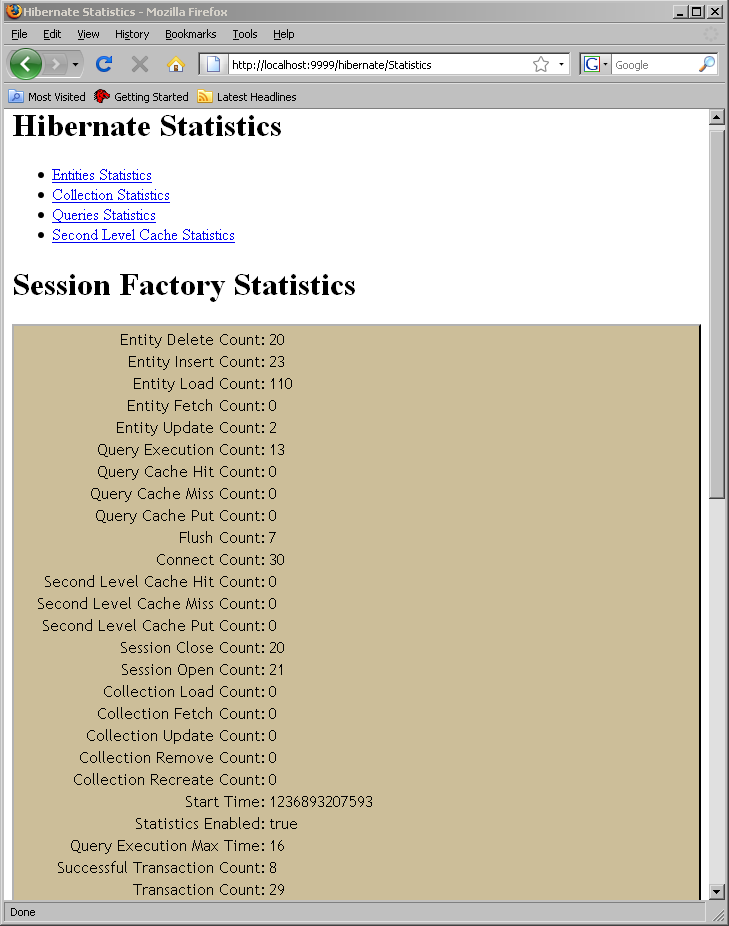

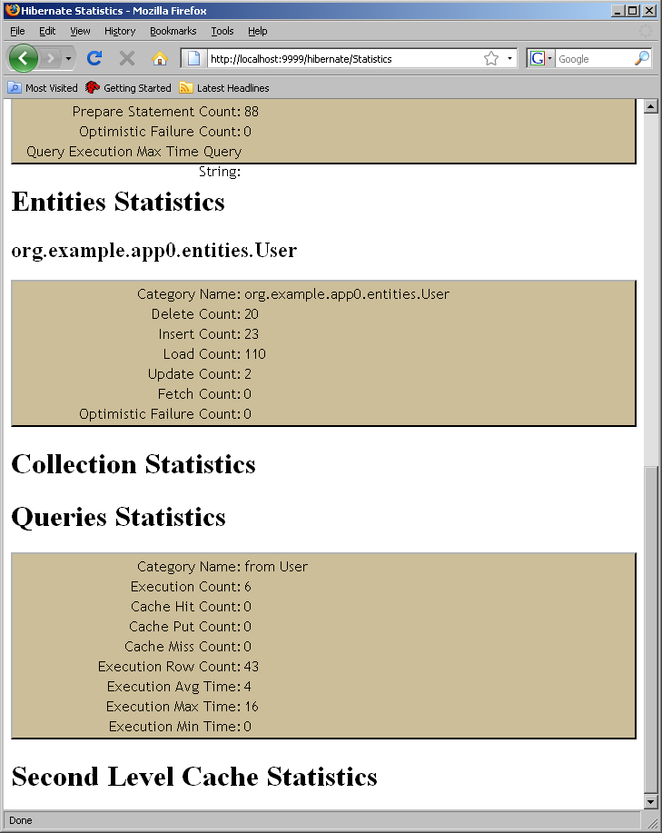

<a id="hibernate-statistics--hibernatestatistics-hibernateconfigurationtoenablethestatistics"></a>
<a id="hibernate-statistics--hibernate-configuration-to-enable-the-statistics"></a>

# Hibernate Configuration to enable the Statistics

```java

<!DOCTYPE hibernate-configuration PUBLIC
    "-//Hibernate/Hibernate Configuration DTD//EN"
    "http://hibernate.sourceforge.net/hibernate-configuration-3.0.dtd">
    
<hibernate-configuration>

    ...

    <property name="hibernate.generate_statistics">true</property>
    
  </session-factory>

</hibernate-configuration>
```

---

<a id="functional-flows"></a>

<!-- source_url: https://tapestry.apache.org/functional-flows.html -->

<!-- page_index: 201 -->

# Functional Flows

[Apache Tapestry](#index) > [Documentation](#documentation) > [User Guide](#user-guide) > [Modules](#modules) > [Built In Modules](#built-in-modules) > [Functional Flows](#functional-flows)

<a id="functional-flows--title"></a>
<a id="functional-flows--functional-flows"></a>

# Functional Flows

Starting in 5.2, Tapestry includes a module, tapestry-func, that facilitates light-weight *functional* programming for Flows of values.

[Javadoc](http://tapestry.apache.org/current/apidocs/org/apache/tapestry5/func/package-summary.html)

If you're using Java 8 or later, we suggest using its Lambda features instead.

Apache Tapestry, Tapestry, Apache, the Apache feather logo, and the Apache Tapestry project logo are trademarks of The Apache Software Foundation.

---

<a id="jmx-module"></a>

<!-- source_url: https://tapestry.apache.org/jmx-module.html -->

<!-- page_index: 202 -->

# JMX Module

[Apache Tapestry](#index) > [Documentation](#documentation) > [User Guide](#user-guide) > [Modules](#modules) > [Built In Modules](#built-in-modules) > [JMX Module](#jmx-module)

<a id="jmx-module--title"></a>
<a id="jmx-module--jmx-module"></a>

# JMX Module

As of version 5.2, Tapestry provides a **JMX Module** that lets you use JConsole to remotely control some aspects of a Tapestry application at run time.

Currently, only the following properties are modifiable:

- Page Pool Soft Limit
- Page Pool Soft Wait
- Page Pool Hard Limit
- Page Pool Active Window

*Keep in mind that starting with Tapestry 5.2, page pooling is turned off by default.*

In the future Tapestry may expose other properties for remote control. In the meanwhile, you can extend Tapestry's JMX module for your own needs. See [MBeans documentation](http://download.oracle.com/javase/tutorial/jmx/mbeans/standard.html) for further guidance.

For an introductory tutorial on this module, see Igor Drobiazko's blog post: *[Remote Page Pool Management](http://blog.tapestry5.de/index.php/2010/05/28/remote-page-pool-management/)*.

---

<a id="json"></a>

<!-- source_url: https://tapestry.apache.org/json.html -->

<!-- page_index: 203 -->

# JSON

[Apache Tapestry](#index) > [Documentation](#documentation) > [User Guide](#user-guide) > [Modules](#modules) > [Built In Modules](#built-in-modules) > [JSON](#json)

<a id="json--title"></a>
<a id="json--json"></a>

# JSON

Starting in version 5.2, Tapestry includes a module for manipulating data formatted in JavaScript Object Notation.

This is repackaged, improved (and tested) version of code originally from json.org.

[JavaDocs](http://tapestry.apache.org/current/apidocs/org/apache/tapestry5/json/package-summary.html)

Apache Tapestry, Tapestry, Apache, the Apache feather logo, and the Apache Tapestry project logo are trademarks of The Apache Software Foundation.

---

<a id="download"></a>

<!-- source_url: https://tapestry.apache.org/download.html -->

<!-- page_index: 204 -->

# Download

[Apache Tapestry](#index) > [Index](#index) > [Download](#download)

<a id="download--title"></a>
<a id="download--download"></a>

# Download

Tapestry can be downloaded in either binary or source format.

The easiest way to download Tapestry and its dependencies is using Maven, as described in [Getting Started](#getting-started).

See the [Release Notes](#release-notes) for differences between versions and how to upgrade, and [Supported Environments and Versions](#supported-environments-and-versions) for the compatibility matrix.

<a id="download--download-stablereleases"></a>
<a id="download--stable-releases"></a>

# Stable Releases

Stable releases should be relatively free of critical bugs and are considered the *safest* option if stability is a requirement.

Note that the *recommended* distribution method of binary and source JARs is via Maven repository. Binaries, source code, and Javadocs are also available as a zip archive.

<a id="download--download-tapestry5.8.x"></a>
<a id="download--tapestry-5.8.x"></a>

## Tapestry 5.8.x

Tapestry 5.8.7 was released on 9 Aug 2024. See the [release notes](#release-notes-587) for more details.

| Tapestry 5.8.7 | Mirrors | Signature | Checksum |
| --- | --- | --- | --- |
| Binary (zip) | [Download](https://downloads.apache.org/tapestry/apache-tapestry-5.8.7-bin.zip) | [ASC](https://downloads.apache.org/tapestry/apache-tapestry-5.8.7-bin.zip.asc) | [SHA-256](https://downloads.apache.org/tapestry/apache-tapestry-5.8.7-bin.zip.sha256) |
| Source (zip) | [Download](https://downloads.apache.org/tapestry/apache-tapestry-5.8.7-sources.zip) | [ASC](https://downloads.apache.org/tapestry/apache-tapestry-5.8.7-sources.zip.asc) | [SHA-256](https://downloads.apache.org/tapestry/apache-tapestry-5.8.7-sources.zip.sha256) |
| Javadoc (zip) | [Download](https://downloads.apache.org/tapestry/apache-tapestry-5.8.7-apidocs.zip) | [ASC](https://downloads.apache.org/tapestry/apache-tapestry-5.8.7-apidocs.zip.asc) | *not available* |

**Maven Dependency**

```xml
<dependency>
  <groupId>org.apache.tapestry</groupId>
  <artifactId>tapestry-core</artifactId>
  <version>5.8.7</version>
</dependency>
```

<a id="download--download-tapestry5.7.x"></a>
<a id="download--tapestry-5.7.x"></a>

## Tapestry 5.7.x

Tapestry 5.7.3 was released on 13 July 2021. See the [release notes](#release-notes-573) for more details.

| Tapestry 5.7.3 | Mirrors | Signature | Checksum |
| --- | --- | --- | --- |
| Binary (zip) | [Download](https://downloads.apache.org/tapestry/apache-tapestry-5.7.3-bin.zip) | [ASC](https://downloads.apache.org/tapestry/apache-tapestry-5.7.3-bin.zip.asc) | [SHA-256](https://downloads.apache.org/tapestry/apache-tapestry-5.7.3-bin.zip.sha256) |
| Source (zip) | [Download](https://downloads.apache.org/tapestry/apache-tapestry-5.7.3-sources.zip) | [ASC](https://downloads.apache.org/tapestry/apache-tapestry-5.7.3-sources.zip.asc) | [SHA-256](https://downloads.apache.org/tapestry/apache-tapestry-5.7.3-sources.zip.sha256) |
| Javadoc (zip) | [Download](https://downloads.apache.org/tapestry/apache-tapestry-5.7.3-apidocs.zip) | [ASC](https://downloads.apache.org/tapestry/apache-tapestry-5.7.3-apidocs.zip.asc) | *not available* |

**Maven Dependency**

```xml
<dependency>
  <groupId>org.apache.tapestry</groupId>
  <artifactId>tapestry-core</artifactId>
  <version>5.7.3</version>
</dependency>
```

<a id="download--download-tapestry5.6.x"></a>
<a id="download--tapestry-5.6.x"></a>

## Tapestry 5.6.x

Tapestry 5.6.4 was released on 12 Mar 2021. See the [release notes](#release-notes-564) for more details.

| Tapestry 5.6.4 | Mirrors | Signature | Checksum |
| --- | --- | --- | --- |
| Binary (zip) | [Download](https://downloads.apache.org/tapestry/apache-tapestry-5.6.4-bin.zip) | [ASC](https://downloads.apache.org/tapestry/apache-tapestry-5.6.4-bin.zip.asc) | [SHA-256](https://downloads.apache.org/tapestry/apache-tapestry-5.6.4-bin.zip.sha256) |
| Source (zip) | [Download](https://downloads.apache.org/tapestry/apache-tapestry-5.6.4-sources.zip) | [ASC](https://downloads.apache.org/tapestry/apache-tapestry-5.6.4-sources.zip.asc) | [SHA-256](https://downloads.apache.org/tapestry/apache-tapestry-5.6.4-sources.zip.sha256) |
| Javadoc (zip) | [Download](https://downloads.apache.org/tapestry/apache-tapestry-5.6.4-apidocs.zip) | [ASC](https://downloads.apache.org/tapestry/apache-tapestry-5.6.4-apidocs.zip.asc) | *not available* |

**Maven Dependency**

```xml
<dependency>
  <groupId>org.apache.tapestry</groupId>
  <artifactId>tapestry-core</artifactId>
  <version>5.6.4</version>
</dependency>
```

<a id="download--download-tapestry5.5.x"></a>
<a id="download--tapestry-5.5.x"></a>

## Tapestry 5.5.x

Tapestry 5.5.0 was released on 19 Mar 2020. See the [release notes](#release-notes-550) for more details.

| Tapestry 5.5.0 | Mirrors | Signature | Checksum |
| --- | --- | --- | --- |
| Binary (zip) | [Download](https://downloads.apache.org/tapestry/apache-tapestry-5.5.0-bin.zip) | [ASC](https://downloads.apache.org/tapestry/apache-tapestry-5.5.0-bin.zip.asc) | [SHA-256](https://downloads.apache.org/tapestry/apache-tapestry-5.5.0-bin.zip.sha256) |
| Source (zip) | [Download](https://downloads.apache.org/tapestry/apache-tapestry-5.5.0-sources.zip) | [ASC](https://downloads.apache.org/tapestry/apache-tapestry-5.5.0-sources.zip.asc) | [SHA-256](https://downloads.apache.org/tapestry/apache-tapestry-5.5.0-sources.zip.sha256) |
| Javadoc (zip) | Download | ASC | *not available* |

**Maven Dependency**

```xml
<dependency>
  <groupId>org.apache.tapestry</groupId>
  <artifactId>tapestry-core</artifactId>
  <version>5.5.0</version>
</dependency>
```

<a id="download--download-tapestry5.4.x"></a>
<a id="download--tapestry-5.4.x"></a>

## Tapestry 5.4.x

Tapestry 5.4.5 was released on 06 Sep 2019. See the [release notes](#release-notes-545) for more details.

| Tapestry 5.4.5 | Mirrors | Signature | Checksum |
| --- | --- | --- | --- |
| Binary (zip) | [Download](https://downloads.apache.org/tapestry/apache-tapestry-5.4.5-bin.zip) | [ASC](http://www.apache.org/dist/tapestry/apache-tapestry-5.4.5-bin.zip.asc) | [SHA-256](http://www.apache.org/dist/tapestry/apache-tapestry-5.4.5-bin.zip.sha256) - [MD5](http://www.apache.org/dist/tapestry/apache-tapestry-5.4.5-bin.zip.md5) |
| Source (zip) | [Download](https://downloads.apache.org/tapestry/apache-tapestry-5.4.5-sources.zip) | [ASC](http://www.apache.org/dist/tapestry/apache-tapestry-5.4.5-sources.zip.asc) | [SHA-256](http://www.apache.org/dist/tapestry/apache-tapestry-5.4.5-sources.zip.md5) - [MD5](http://www.apache.org/dist/tapestry/apache-tapestry-5.4.5-sources.zip.md5) |
| Javadoc (zip) | [Download](https://downloads.apache.org/tapestry/apache-tapestry-5.4.5-apidocs.zip) | [ASC](http://www.apache.org/dist/tapestry/apache-tapestry-5.4.5-apidocs.zip.asc) | [SHA-256](http://www.apache.org/dist/tapestry/apache-tapestry-5.4.5-apidocs.zip.md5) - [MD5](http://www.apache.org/dist/tapestry/apache-tapestry-5.4.4-apidocs.zip.md5) |

**Maven Dependency**

```xml
<dependency>
  <groupId>org.apache.tapestry</groupId>
  <artifactId>tapestry-core</artifactId>
  <version>5.4.5</version>
</dependency>
```

<a id="download--download-tapestry5.3.x"></a>
<a id="download--tapestry-5.3.x"></a>

## Tapestry 5.3.x

Tapestry 5.3.8 was released on 20 Nov 2014. See the [release notes](#release-notes-538) for more details.

| Tapestry 5.3.8 | Mirrors | Signature | Checksum |
| --- | --- | --- | --- |
| Binary (zip) | [Download](https://downloads.apache.org/tapestry/apache-tapestry-5.3.8-bin.zip) | [ASC](http://www.apache.org/dist/tapestry/apache-tapestry-5.3.8-bin.zip.asc) | [MD5](http://www.apache.org/dist/tapestry/apache-tapestry-5.3.8-bin.zip.md5) |
| Source (zip) | [Download](https://downloads.apache.org/tapestry/apache-tapestry-5.3.8-sources.zip) | [ASC](http://www.apache.org/dist/tapestry/apache-tapestry-5.3.8-sources.zip.asc) | [MD5](http://www.apache.org/dist/tapestry/apache-tapestry-5.3.8-sources.zip.md5) |
| Javadoc (zip) | [Download](https://downloads.apache.org/tapestry/apache-tapestry-5.3.8-javadocs.zip) | [ASC](http://www.apache.org/dist/tapestry/apache-tapestry-5.3.8-javadocs.zip.asc) | [MD5](http://www.apache.org/dist/tapestry/apache-tapestry-5.3.8-javadocs.zip.md5) |

**Maven Dependency**

```xml
<dependency>
  <groupId>org.apache.tapestry</groupId>
  <artifactId>tapestry-core</artifactId>
  <version>5.3.8</version>
</dependency>
```

Archives

Looking for an older version of Tapestry? Try the [archives](http://archive.apache.org/dist/tapestry/).

<a id="download--download-downloadsources"></a>
<a id="download--download-sources"></a>

# Download sources

The source download links are listed in the boxes above. In addition, the source code can be checked out anonymously from Git with the [clone](http://gitref.org/creating/#clone) command:

```java
git clone https://gitbox.apache.org/repos/asf/tapestry-5.git
```

(See [Building Tapestry from Source](#building-tapestry-from-source) for more info.)

Versions 5.3.2 and earlier are also available via Subversion, at <https://svn.apache.org/repos/asf/tapestry/tapestry5/trunk/>

<a id="download--download-accessfrombehindafirewall"></a>
<a id="download--access-from-behind-a-firewall"></a>

## Access from behind a firewall

Refer to the documentation of your Git client for more information about access behind a firewall. Generally this requires configuring access through a proxy (by specifying the proxy host and port) or opening up a port on the firewall.

---

<a id="about"></a>

<!-- source_url: https://tapestry.apache.org/about.html -->

<!-- page_index: 205 -->

# About

[Apache Tapestry](#index) > [Index](#index) > [About](#about)

<a id="about--title"></a>
<a id="about--about"></a>

# About

Apache Tapestry is an open-source framework for creating dynamic, robust, highly scalable web applications in Java or other JVM languages. Tapestry complements and builds upon the standard Java Servlet API, and so it works in any servlet container or application server.

Tapestry is released under the [Apache Software License 2.0](http://www.apache.org/licenses/LICENSE-2.0).

Tapestry has a long history, with the oldest code dating back to January 2000. That means a lot of releases. At this time, Tapestry releases 3 and 4 are no longer being developed; developer effort for the past several years has focused on Tapestry 5.

To learn more about Tapestry, start with the [Introduction](#introduction) or dive right in with [Getting Started](#getting-started).

<a id="about--about-thepeoplebehindtapestry"></a>
<a id="about--the-people-behind-tapestry"></a>

## The people behind Tapestry

<a id="about--about-committers"></a>
<a id="about--committers"></a>

## Committers

| Name | ID | role | email address | website |
| --- | --- | --- | --- | --- |
| Andreas Andreou | andyhot | PMC member | andyhot@apache.org | <http://andyhot.gr> |
| Ben Dotte | bdotte | committer | bdotte@apache.org |  |
| Ben Weidig | benw | PMC member | benw@apache.org | <https://belief-driven-design.com> |
| Bob Harner | bobharner | PMC member | bobharner@apache.org | <https://github.com/bobharner> |
| Christophe Cordenier | ccordenier | committer | ccordenier@apache.org | <http://spreadthesource.com> |
| Christian Köberl | derkoe | committer | derkoe@apache.org |  |
| Dan Adams | dadams | committer | dadams@apache.org |  |
| Daniel Gredler | gredler | committer | gredler@apache.org |  |
| Daniel Jue | djue | committer | djue@apache.org |  |
| David Solis | dsolis | committer | dsolis@apache.org |  |
| Dmitry Gusev | dmitrygusev | PMC member | dmitrygusev@apache.org | <https://github.com/dmitrygusev> |
| François Facon | ffacon | committer | ffacon@apache.org | <http://people.apache.org/~ffacon/> |
| Howard M. Lewis Ship | hlship | PMC member and former chair | hlship@apache.org | <http://howardlewisship.com> |
| Igor Drobiazko | drobiazko | PMC member | drobiazko@apache.org | <http://tapestry5.de> |
| Jesse Kuhnert | jkuhnert | PMC member | jkuhnert@apache.org |  |
| Jochen Kemnade | jkemnade | PMC member | jkemnade@apache.org |  |
| Josh Canfield | joshcanfield | committer | joshcanfield@apache.org |  |
| Kalle Korhonen | kaosko | committer | kaosko@apache.org | <http://tynamo.org> |
| Kevin Menard | kmenard | committer | kmenard@apache.org |  |
| Marcus Schulte | mschulte | PMC member | mschulte@apache.org |  |
| Massimo Lusetti | mlusetti | PMC member | mlusetti@apache.org | <http://meridio.blogspot.com> |
| Richard Lewis-Shell | rlewisshell | PMC member | rlewisshell@apache.org |  |
| Robert D. Zeigler | robertdzeigler | committer | robertdzeigler@apache.org |  |
| Robin Komiwes | robinkomiwes | committer | robinkomiwes@apache.org | <http://spreadthesource.com> |
| Taha Hafeez | tawus | committer | tawus@apache.org | <http://tawus.wordpress.com> |
| Ted Steen | tedst | committer | tedst@apache.org |  |
| Thiago H. de Paula Figueiredo | thiagohp | PMC chair | thiagohp@apache.org | <http://machina.com.br> |
| Ulrich Stärk | uli | Former PMC member | uli@apache.org |  |

<a id="about--about-othercontributors"></a>
<a id="about--other-contributors"></a>

## Other Contributors

These people have contributed to Tapestry in the form of documentation, patches or otherwise:

| Name | contribution | email address | website |
| --- | --- | --- | --- |
| Katia Aresti | documentation and demos | katiaaresti@gmail.com | [Blog JDuchess](http://jduchess.org/), [Blog Xebia France](http://blog.xebia.fr/) |
| YourKit | Free Licenses of YourKit Java Profiler for committers | sales@yourkit.com | <http://www.yourkit.com/overview/> |

<a id="about--about-trainingandsupport"></a>
<a id="about--training-and-support"></a>

## Training and Support

Apache Tapestry is an open source project and as such, supported by the community. Even if you are looking for commercial support, your best bet for support is to first subscribe to Apache Tapestry user mailing list and ask there. Read more about how to [get involved](#community).<a id="about--about-commercialtrainingandsupport"></a>
<a id="about--commercial-training-and-support"></a>

### Commercial Training and Support

Training on Tapestry and Support is available directly from the source: the Tapestry project committers:

- [Thiago H. de Paula Figueiredo](http://www.arsmachina.com.br/services): Provides training and support on Tapestry and related technologies including Hibernate

<a id="about--about-communitysupport"></a>
<a id="about--community-support"></a>

### Community Support

Like all Apache projects, Tapestry uses mailing lists for most communication. You can subscribe by sending e-mail to the addresses below. For each list, there are subscribe, unsubscribe, and archive links. All Tapestry users are welcome to subscribe to any of these lists, however questions on how to *use* Tapestry in your application are best sent to the *user* mailing list.

|  | Subscribe | Unsubscribe | Apache Archive | MarkMail Archive |
| --- | --- | --- | --- | --- |
| Tapestry User List | [Subscribe](mailto:users-subscribe@tapestry.apache.org) | [Unsubscribe](mailto:users-unsubscribe@tapestry.apache.org) | [mail-archives.apache.org](http://mail-archives.apache.org/mod_mbox/tapestry-users/) | [tapestry.markmail.org](http://tapestry.markmail.org/search/?q=list%3Aorg.apache.tapestry.users) |
| Tapestry Developer List | [Subscribe](mailto:dev-subscribe@tapestry.apache.org) | [Unsubscribe](mailto:dev-unsubscribe@tapestry.apache.org) | [mail-archives.apache.org](http://mail-archives.apache.org/mod_mbox/tapestry-dev/) | [tapestry.markmail.org](http://tapestry.markmail.org/search/?q=list%3Aorg.apache.tapestry.dev) |
| Tapestry Commits List | [Subscribe](mailto:commits-subscribe@tapestry.apache.org) | [Unsubscribe](mailto:commits-unsubscribe@tapestry.apache.org) | [mail-archives.apache.org](http://mail-archives.apache.org/mod_mbox/tapestry-commits/) | [tapestry.markmail.org](http://tapestry.markmail.org/search/?q=list%3Aorg.apache.tapestry.commits) |
| Search Multiple Lists | - | - | - | [tapestry.markmail.org](http://tapestry.markmail.org/search/?q=#query:+page:1+state:facets) |

---

<a id="community"></a>

<!-- source_url: https://tapestry.apache.org/community.html -->

<!-- page_index: 206 -->

# Community

[Apache Tapestry](#index) > [Index](#index) > [Community](#community)

<a id="community--title"></a>
<a id="community--community"></a>

# Community

Tapestry has an active community of users and developers. This is an overview of how to participate, along with a list of some of the great contributions of the community members.

- [Getting Involved](#community--community-gettinginvolved)
  - [Reporting Problems / Getting Support](#community--community-reportingproblems-gettingsupport)
  - [Contributing translations for Tapestry built-in messages](#community--community-contributingtranslationsfortapestrybuilt-inmessages)
  - [Source Code Access](#community--community-sourcecodeaccess)
  - [Becoming a Contributor](#community--community-becomingacontributor)
  - [Becoming a Committer](#community--community-becomingacommitter)
- [Community Contributions](#community--community-communitycontributions)
  - [Modules](#community--community-modules)
- [Extensions](#community--community-extensions)
- [Tutorials](#community--community-tutorials)
- [IDE Integrations](#community--community-ideintegrations)

<a id="community--community-gettinginvolved"></a>
<a id="community--getting-involved"></a>

# Getting Involved

<a id="community--community-reportingproblems-gettingsupport"></a>
<a id="community--reporting-problems-getting-support"></a>

## Reporting Problems / Getting Support

Like all Apache projects, Tapestry uses mailing lists for most communication. You can subscribe by sending e-mail to the addresses below. For each list, there are subscribe, unsubscribe, and archive links. All Tapestry users are welcome to subscribe to any of these lists, however questions on how to *use* Tapestry in your application are best sent to the *user* mailing list.

|  | Subscribe | Unsubscribe | Apache Archive | MarkMail Archive |
| --- | --- | --- | --- | --- |
| Tapestry User List | [Subscribe](mailto:users-subscribe@tapestry.apache.org) | [Unsubscribe](mailto:users-unsubscribe@tapestry.apache.org) | [mail-archives.apache.org](http://mail-archives.apache.org/mod_mbox/tapestry-users/) | [tapestry.markmail.org](http://tapestry.markmail.org/search/?q=list%3Aorg.apache.tapestry.users) |
| Tapestry Developer List | [Subscribe](mailto:dev-subscribe@tapestry.apache.org) | [Unsubscribe](mailto:dev-unsubscribe@tapestry.apache.org) | [mail-archives.apache.org](http://mail-archives.apache.org/mod_mbox/tapestry-dev/) | [tapestry.markmail.org](http://tapestry.markmail.org/search/?q=list%3Aorg.apache.tapestry.dev) |
| Tapestry Commits List | [Subscribe](mailto:commits-subscribe@tapestry.apache.org) | [Unsubscribe](mailto:commits-unsubscribe@tapestry.apache.org) | [mail-archives.apache.org](http://mail-archives.apache.org/mod_mbox/tapestry-commits/) | [tapestry.markmail.org](http://tapestry.markmail.org/search/?q=list%3Aorg.apache.tapestry.commits) |
| Search Multiple Lists | - | - | - | [tapestry.markmail.org](http://tapestry.markmail.org/search/?q=#query:+page:1+state:facets) |

Tapestry issues are tracked in the [Apache JIRA](https://issues.apache.org/jira/browse/TAP5).

Unless your problem is clear as day, it's a good idea to discuss it on the Tapestry Users mailing list first, before adding an issue. At the same time, it's generally unlikely that a bug will be fixed *unless* a JIRA Issue is created.

Eric Raymond has a detailed [guide to asking questions the right way](http://catb.org/esr/faqs/smart-questions.html). If you are not getting a response to your problem, it's likely because you aren't asking it the right way.

Just saying something is "broken" or "failed" is not enough. How did it fail? Did it do the wrong thing? Throw an exception? Not respond in any way? What exactly did you expect to happen? All of this information should be made available when looking for help, plus context on the general problem you were trying to solve in the first place (there may be a better solution entirely). Read Eric Raymond's guide ... it's fun and informative.

<a id="community--community-contributingtranslationsfortapestrybuilt-inmessages"></a>
<a id="community--contributing-translations-for-tapestry-built-in-messages"></a>

## Contributing translations for Tapestry built-in messages

If Tapestry's built-in messages aren't available in your language, you are welcome to contribute a new translation of the message catalogs. For easy instructions, see [Localization](#localization).

<a id="community--community-sourcecodeaccess"></a>
<a id="community--source-code-access"></a>

## Source Code Access

Source code for Tapestry can be [downloaded](#download) along with pre-compiled binaries.

Tapestry uses [Git](http://git-scm.com/) to manage the project's source code.

Web access to the Tapestry repository is available as [GIT-WIP at Apache](https://git-wip-us.apache.org/repos/asf?p=tapestry-5.git).

Access using Git client:

```
$ git clone http://git-wip-us.apache.org/repos/asf/tapestry-5.git
```

(See [Building Tapestry from Source](#building-tapestry-from-source) for more info.)

<a id="community--community-becomingacontributor"></a>
<a id="community--becoming-a-contributor"></a>

## Becoming a Contributor

The best way to become a contributor is to become active on the mailing list; Tapestry is known to have an active and helpful community on the mailing list, and the more mentors we can add, the better.

If you want to help out with documentation, you must sign an [Apache Contributor License Agreement](http://www.apache.org/licenses/#clas), at which point we can grant write access to the Confluence Wiki (where official documentation is created).

Providing patches (with tests!) is another way to become a contributor. (See the [Developer Bible](#developer-bible) for important guidance on source code formatting, class naming conventions, etc.)

<a id="community--community-becomingacommitter"></a>
<a id="community--becoming-a-committer"></a>

## Becoming a Committer

Active contributors may be asked to become full committers, with write access to the source code. Generally, contributors who have been consistently active and helpful for three to six months are eligible for committer access. If you think you are in that category, don't be shy about contacting members of the Tapestry PMC (Project Management Committee).

---

<a id="community--community-communitycontributions"></a>
<a id="community--community-contributions"></a>

# Community Contributions

<a id="community--community-modules"></a>
<a id="community--modules"></a>

## Modules

[Chenille Kit](https://github.com/chenillekit/chenillekit) by Massimo Lusetti

> Collection of modules, services, utilities and components (many of which require only tapestry-ioc). Includes Accordion, ColorPicker, Editor, Kaptcha, MultipleSelect, RoundCornerContainer, ThumbNail, and many more useful components. Also provides integrations with Google services, LDAP, Lucene, Mail, Quartz, JasperReports, Bean Scripting Framework, and more.

[Equanda-tapestry5](http://equanda.org/equanda-tapestry5/) by Joachim Van der Auwera

> Components useful for building enterprise applications. Includes Accordion, Form Traversal, Tabs, TextAreaAutoExpander, TreeTable, . Among other things, these focus on easy input of data without the need for a mouse.

[ioko-tapestry-commons](http://tapestry.ioko.com/) by Ben Gidley, et al.

> Provides components for caching, cache control, and simple Flash movie integration.

[Tapx](http://tapestry.formos.com/nightly/tapx/) by Howard M. Lewis Ship

> Collection of modules and components: improved DatePicker, dynamic Tapestry templates, offline rendering using Tapestry, YUI integration, Confirm dialog mixin, Kaptcha components, and more!

[Tapestry5-jQuery](http://tapestry5-jquery.com/) by GOT5

> Tapestry5-Jquery lets you use jQuery to completely replace Prototype, Scriptaculous and the base tapestry.js script.

[Exanpe-T5-Lib](http://exanpe-t5-lib.appspot.com/) by Laurent Guérin et Julien Maupoux

> A library of components: accordion, ajax loader, slider, tab view, secured password, color picker, tooltip, hideable panel and more! Live demo is provided.

[FlowLogix](http://code.google.com/p/flowlogix/) by Lenny Primak

> a collection of components, services and utilities that integrates Tapestry into JEE environments and provides other commonly needed functionality.

[More Modules](#modules)...

<a id="community--community-extensions"></a>
<a id="community--extensions"></a>

# Extensions

[Ars Machina](http://www.arsmachina.com.br/) by Thiago H. de Paula Figueiredo

> Tapestry/Hibernate extensions for Generic DAOs, standard CRUD interfaces, and user access logging and tracking.

[Tynamo project](http://tynamo.org/) by Tynamo Team / Kalle Korhonen & Alejandro Scandroli

> Tynamo is model-driven, full-stack web framework based on Tapestry 5, allowing you to jump directly from your Hibernate entities to a full-blown CRUD application. Tynamo provides several modules, including tapestry-model, tapestry-conversations, tapestry-hibernate-seedentity, tapestry-resteasy and tapestry-security.

<a id="community--community-tutorials"></a>
<a id="community--tutorials"></a>

# Tutorials

[Tapestry JumpStart](https://tapestry-jumpstart.org/jumpstart) by Geoff Callender

> JumpStart is an easy way to learn Tapestry by example. It's an online demo application, and also a downloadable open source app ready for you to explore and modify.

[Tapestry Stitch](http://t5stitch-lazan.rhcloud.com/) by Lance

> Sample components and concepts in Apache Tapestry 5

[Shams Examples](http://code.google.com/p/shams/) by Mohammad H. Shamsi

> A variety of examples of Tapestry 5 pages and components.

[Community's Wiki](http://wiki.apache.org/tapestry/FrontPage) (Moin Moin)

> The wiki contains a wealth of user-generated tips and techniques for using Tapestry

<a id="community--community-ideintegrations"></a>
<a id="community--ide-integrations"></a>

# IDE Integrations

[Eclipse-tapestry5-plugin](https://github.com/anjlab/eclipse-tapestry5-plugin)

> An Eclipse plugin for Tapestry 5 by Dmitry Gusev, with a "Quick Switch" between templates and component classes, a Tapestry Context view, and many other convenience features. This is currently the best choice for Eclipse users.

[Tapestry Tools](http://code.google.com/p/tapestrytools/wiki/Install_Guide_Lightweight_TapestryTools) by Gavin Lei

> Tapestry Tools is an Eclipse plugin for Tapestry 5 which has been built by Gavin Lei within the timeframe of GSoC 2012.

[IntelliJ 10](http://www.jetbrains.com/idea) by JetBrains

> IntelliJ has Tapestry 5 support included [right out of the box](http://www.jetbrains.com/idea/features/tapestry_5.html).

[loom-t5](http://code.google.com/p/loom-t5/) by Chris Scheid

> Eclipse plugin for building Tapestry 5 projects

[Code Completion in Eclipse](http://wiki.apache.org/tapestry/Tapestry5JSPEditorEclipse)

> How to use the built in JSP Eclipse Editor and a custom tld file to get Tapestry 5 code completion in Eclipse

---

<a id="books"></a>

<!-- source_url: https://tapestry.apache.org/books.html -->

<!-- page_index: 207 -->

# Books

[Apache Tapestry](#index) > [Index](#index) > [Books](#books)

<a id="books--title"></a>
<a id="books--books"></a>

# Books

**We think you will love Tapestry!** Give us 20 minutes and **[follow our tutorial](#tapestry-tutorial)**.

<a id="books--books-booksontapestry"></a>
<a id="books--books-on-tapestry"></a>

## Books on Tapestry

<a id="books--books-plugintapestry"></a>
<a id="books--plugin-tapestry"></a>

### PlugIn Tapestry


- **Covers:** Tapestry 5 (Version 5.4)
- **Published:** 2014
- **Author:** Picodotdev
- **Language:** Spanish
- **Pages:** 289
- **More information:** <http://picodotdev.github.io/blog-bitix/2014/02/libro-sobre-desarrollo-de-aplicaciones-con-apache-tapestry/>

As the first book to cover Tapestry 5.4 features, and the only up-to-date Tapestry book in Spanish, this book features material on the new JavaScript abstraction layer and the use of RequireJS and JavaScript modules, in addition to in-depth coverage of many other Tapestry topics. Available in several formats (PDF, epub, mobi HTML)

---

<a id="books--books-tapestry5-rapidwebapplicationdevelopmentinjava"></a>
<a id="books--tapestry-5-rapid-web-application-development-in-java"></a>

### Tapestry 5 - Rapid web application development in Java

[](http://www.tapestry5book.com/)

- **Covers:** Tapestry 5 (Version 5.3)
- **Published:** 2012
- **Author:** Igor Drobiazko
- **Language:** English
- **Pages:** 482
- **More information:** [http://www.tapestry5book.com/](https://web.archive.org/web/20180413075519/http://www.tapestry5book.com/)

Tapestry 5 - Rapid web application development in Java is a comprehensive guide, introducing Apache Tapestry and its innovative approach to building modern web applications. The book walks you through Tapestry 5, from a simple Hello World application to rich Ajax-enabled applications. Written by a core committer, this book provides deep insight into the architecture of Tapestry 5. It not only shows you *how* to achieve specific goals but also teaches you the "why". You learn how to build modern, scalable Web 2.0 application with a component-oriented approach. This book also shows how Tapestry brings scripting language productivity within reach of Java developers without sacrificing any of Java's inherent speed and power.

Table of Contents

1. Introducing Tapestry
2. Tapestry templates
3. Page navigation
4. Developing stateful applications
5. Localization
6. Creating Forms with Tapestry
7. Converting and validating user input
8. Generating UI for JavaBeans
9. Developing reusable components
10. Mixins
11. Creating Ajax-enabled applications
12. Persisting domain objects
13. Integrating Spring framework
14. Testing Tapestry applications
15. Tapestry IoC and Dependency Injection

---

<a id="books--books-tapestry5:dieentwicklungvonwebanwendungenmitleichtigkeit"></a>
<a id="books--tapestry-5:-die-entwicklung-von-webanwendungen-mit-leichtigkeit"></a>

### Tapestry 5: Die Entwicklung von Webanwendungen mit Leichtigkeit


- **Covers:** Tapestry 5 (Version 5.1.0.5)
- **Published:** 2009
- **Author:** Igor Drobiazko
- **Language:** German

This is the only Tapestry 5 book written in German. It is a definitive introduction to Tapestry 5 written by Igor Drobiazko, a committer of Tapestry. The book covers:

- Getting Started with Tapestry 5
- Concepts of the framework
- Localization/internationalization
- Creating Forms
- Generation of user interfaces for JavaBeans
- Writing own components and mixins
- Ajax
- Writing tests for Tapestry applications
- Hibernate and Spring integration
- Dependency Injection and Tapestry IoC
- AOP and bytecode manipuation

---

<a id="books--books-tapestry5:buildingwebapplications"></a>
<a id="books--tapestry-5:-building-web-applications"></a>

### Tapestry 5: Building Web Applications


- **Covers:** Tapestry 5
- **Published:** 2008
- **Author:** Alexander Kolesnikov
- **Language:** English

Alexander follows up his long series of Tapestry 4 tutorials with the *first* book on Tapestry 5.

---

<a id="books--books-tapestrycompletereference"></a>
<a id="books--tapestry-complete-reference"></a>

### Tapestry Complete Reference


- **Covers:** Tapestry 4
- **Published:** 2007
- **Author:** A. Dong
- **Language:** Chinese

The first Chinese-language book to cover Tapestry (though Tapestry in Action has been translated). as a non-Chinese speaker, it's a bit hard to know what's between the covers, but looks like it gets into the nitty-gritty of Tapestry, Spring and Hibernate.

---

<a id="books--books-tapestry101"></a>
<a id="books--tapestry-101"></a>

### Tapestry 101


- **Covers:** Tapestry 4 (Spring/Hibernate/Hivemind/Tacos(ajax)
- **Publisher:** SourceBeat
- **Published:** 2006
- **Authors:** Warner Onstine

Tapestry is an open-source web application framework written in Java. This framework is different from "standard" MVC frameworks *(like Struts or WebWork)* in that it is more of a component-oriented framework. A component-oriented framework *(like JavaServer Faces)* allows you to create re-usable components that you can then re-use on other projects with the ability to re-configure these components to suit a specific purpose.

Tapestry 101 will introduce readers to this framework that is growing in popularity more and more. The focus of this book is to guide you through designing and implementing your application and providing information that you can improve on it with your own custom components.

Howard Lewis Ship *(creator of Tapestry)* provides the Foreword to the book and adds:

*"Tapestry 101's focus is about getting things done, from a user's perspective not a Tapestry developer's. It covers the issues you'll face building real applications."*

---

<a id="books--books-beginningpojos:lightweightjavawebdevelopmentusingplainoldjavaobjectsinspring-hibernate-andtapestry"></a>
<a id="books--beginning-pojos:-lightweight-java-web-development-using-plain-old-java-objects-in-spring-hibernate-and-tapestry"></a>

### Beginning POJOs: Lightweight Java Web Development Using Plain Old Java Objects in Spring, Hibernate, and Tapestry


- **Covers:** Tapestry 4
- **Publisher:** Apress
- **Published:** 2006
- **Authors:** Brian Sam-Bodden

This book guides you through the construction of complex but lightweight enterprise Java-based web applications. Such applications are centered around several major open source lightweight frameworks, including Spring, Hibernate, Tapestry, and JBoss. The Tapestry chapter (ch.7, p.239-304) covers:

- Installation and Configuration
- Pages and Components
- Forms and Form Components
- Hivemind Services and Application State Objects
- Annotations
- Ajax-enabling applications with Tacos

---

<a id="books--books-enjoyingwebdevelopmentwithtapestry"></a>
<a id="books--enjoying-web-development-with-tapestry"></a>

### Enjoying Web Development with Tapestry


- **Covers:** Tapestry 4.1/4/3
- **Publisher:** Agile Skills
- **Published:** 2006
- **Authors:** [Kent Tong](http://www.agileskills2.org/EWDT/)

Enjoying Web Development with Tapestry by Kent Tong covers Tapestry 4.1 (with AJAX). Previous editions covered 4.0 and 3.0. Available in PDF and hard-copy formats.

- Getting Started with Tapestry
- Using Forms
- Validating Input
- Creating an e-Shop
- Creating Custom Components
- Supporting Other Languages
- Using the Table Component
- Handling File Downloads and Uploads
- Providing a Common Layout
- Using Javascript
- Building Interactive Forms with AJAX
- Test Driven Development with HtmlUnit
- Database and Concurrency Issues
- Using Hibernate
- Integrating with Struts

---

<a id="books--books-tapestrywebanwendungenmitdemapacheframework"></a>
<a id="books--tapestry-webanwendungen-mit-dem-apache-framework"></a>

### Tapestry Webanwendungen mit dem Apache Framework

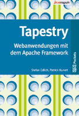

- **Covers:** Tapestry 3
- **Publisher:** S&S
- **Published:** 2004
- **Authors:** Stefan Edlich,Patrick Kunert

Tapestry Webanwendungen mit dem Apache Framework is a fast-paced guide to using Tapestry 3, focusing on combining Tapestry with other open-source frameworks, as well as developing Tapestry applications using [Spindle](http://spindle.sourceforge.net/). Covers:

- Web Frameworks, JavaServer Faces, .NET Web Forms und Tapestry
- Installation und Einbindung in Tomcat und JBoss
- Einstieg in Tapestry, HelloWorld
- Aufbau und Anwendung von Komponenten
- Formular-Validierung, JavaScript-Support, Internationalisierung
- Tapestry-Scope-Objekte (Visit, Global), Engines
- Inspector, Eclipse Plug-in Spindle
- Persistenz für Tapestry: JDO, Hibernate, Toplink und exotische Mapper

---

<a id="books--books-tapestryinaction"></a>
<a id="books--tapestry-in-action"></a>

### Tapestry in Action


- **Covers:** Tapestry 3
- **Publisher:** Manning Publications
- **Published:** 2004
- **Authors:** [Howard M. Lewis Ship](http://howardlewisship.com/)

Tapestry in Action is the definitive introduction to Tapestry 3 written by Howard Lewis Ship, the creator of Tapestry. It covers:

- Tapestry's Component Object Model
- How to write new components
- How to configure third party components
- Dynamic JavaScript integration
- Form validation
- Tapestry/JSP integration
- Localization/internationalization
- J2EE integration

---

<a id="ioc-symbols"></a>

<!-- source_url: https://tapestry.apache.org/ioc-symbols.html -->

<!-- page_index: 208 -->

# IoC - symbols

[Apache Tapestry](#index) > [Index](#index) > [Redirects](https://tapestry.apache.org/redirects.html) > [IoC - symbols](#ioc-symbols)

<a id="ioc-symbols--title"></a>
<a id="ioc-symbols--ioc-symbols"></a>

# IoC - symbols

This page has moved to [Symbols](#symbols)

Apache Tapestry, Tapestry, Apache, the Apache feather logo, and the Apache Tapestry project logo are trademarks of The Apache Software Foundation.

---

<a id="key-features"></a>

<!-- source_url: https://tapestry.apache.org/key-features.html -->

<!-- page_index: 209 -->

# Key Features

[Apache Tapestry](#index) > [Index](#index) > [Key Features](#key-features)

<a id="key-features--title"></a>
<a id="key-features--key-features"></a>

# Key Features

<a id="key-features--keyfeatures-javapower"></a>
<a id="key-features--java-power"></a>

### Java Power

Tapestry pages and components are simple Java POJOs, with easy access to all Java language features and the vast Java ecosystem. Thanks to Java's advanced concurrency API, Tapestry handles requests *fast* without sacrificing security or stability.

<a id="key-features--keyfeatures-scriptingease"></a>
<a id="key-features--scripting-ease"></a>

### Scripting Ease

Tapestry features *live class reloading*: change your Java code, refresh the browser and see the changes... instantly! Have your cake and eat it too: the speed and depth of Java, the agile development style of Ruby or Python.

<a id="key-features--keyfeatures-superproductivity"></a>
<a id="key-features--super-productivity"></a>

### Super Productivity

Simple POJO classes, streamlined templates, live class reloading, state-of-the-art exception reporting, first-class Ajax support, and a big library of built-in components: Tapestry is designed from the ground up to give you great productivity.

---
