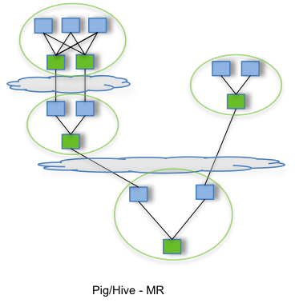
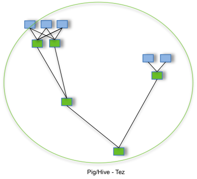

# Apache Tez – Install and Deployment Instructions

## Navigation

- [Apache TEZ® Releases](#releases)
  - [Apache TEZ® 0.10.5](#releases-apache-tez-0-10-5)
  - [Apache TEZ® 0.10.4](#releases-apache-tez-0-10-4)
  - [Apache TEZ® 0.10.3](#releases-apache-tez-0-10-3)
  - [Apache TEZ® 0.10.2](#releases-apache-tez-0-10-2)
  - [Apache TEZ® 0.10.1](#releases-apache-tez-0-10-1)
  - [Apache TEZ® 0.10.0](#releases-apache-tez-0-10-0)
  - [Apache TEZ® 0.9.2](#releases-apache-tez-0-9-2)
  - [Apache TEZ® 0.9.1](#releases-apache-tez-0-9-1)
  - [Apache TEZ® 0.9.0](#releases-apache-tez-0-9-0)
  - [Apache TEZ® 0.8.5](#releases-apache-tez-0-8-5)
  - [Apache TEZ® 0.8.4](#releases-apache-tez-0-8-4)
  - [Apache TEZ® 0.8.3](#releases-apache-tez-0-8-3)
  - [Apache TEZ® 0.8.2](#releases-apache-tez-0-8-2)
  - [Apache TEZ® 0.8.1-alpha](#releases-apache-tez-0-8-1-alpha)
  - [Apache TEZ® 0.8.0-alpha](#releases-apache-tez-0-8-0-alpha)
  - [Apache TEZ® 0.7.1](#releases-apache-tez-0-7-1)
  - [Apache TEZ® 0.7.0](#releases-apache-tez-0-7-0)
  - [Apache TEZ® 0.6.2](#releases-apache-tez-0-6-2)
  - [Apache TEZ® 0.6.1](#releases-apache-tez-0-6-1)
  - [Apache TEZ® 0.6.0](#releases-apache-tez-0-6-0)
  - [Apache TEZ® 0.5.4](#releases-apache-tez-0-5-4)
  - [Apache TEZ® 0.5.3](#releases-apache-tez-0-5-3)
  - [Apache TEZ® 0.5.2](#releases-apache-tez-0-5-2)
  - [Apache TEZ® 0.5.1](#releases-apache-tez-0-5-1)
  - [Apache TEZ® 0.5.0](#releases-apache-tez-0-5-0)
- Getting Started
  - [Overview](#index)
  - [Talks and Meetup Recordings](#talks)
- Documentation
  - [Install Guide](#install)
  - [Local Mode](#localmode)
  - [Tez UI](#tez-ui)
  - [Tez Shuffle Handler](#shuffle-handler)
  - [User Guides](#user_guides)
- Community
  - [Issue Tracking](#issue-tracking)
  - [Project By-Laws](#by-laws)
- Download Apache TEZ® Releases
  - [0.5.4](#releases-apache-tez-0-5-4)
  - [0.6.2](#releases-apache-tez-0-6-2)
  - [0.7.1](#releases-apache-tez-0-7-1)
  - [0.8.5](#releases-apache-tez-0-8-5)
  - [0.9.0](#releases-apache-tez-0-9-0)
  - [0.9.1](#releases-apache-tez-0-9-1)
  - [0.9.2](#releases-apache-tez-0-9-2)
  - [All Releases](#releases)
  - [0.10.5](#releases-apache-tez-0-10-5)

## Content

<a id="releases"></a>

<!-- source_url: https://tez.apache.org/releases/index.html -->

<!-- page_index: 1 -->

<a id="releases--apache-tez-releases"></a>

# Apache TEZ® Releases

---

- [Apache TEZ® 0.10.5](#releases-apache-tez-0-10-5) (May 30, 2025)
- [Apache TEZ® 0.10.4](#releases-apache-tez-0-10-4) (Sep 15, 2024)
- [Apache TEZ® 0.10.3](#releases-apache-tez-0-10-3) (Jan 31, 2024)
- [Apache TEZ® 0.10.2](#releases-apache-tez-0-10-2) (Jul 30, 2022)
- [Apache TEZ® 0.10.1](#releases-apache-tez-0-10-1) (Jul 01, 2021)
- [Apache TEZ® 0.10.0](#releases-apache-tez-0-10-0) (Oct 15, 2020)
- [Apache TEZ® 0.9.2](#releases-apache-tez-0-9-2) (Mar 29, 2019)
- [Apache TEZ® 0.9.1](#releases-apache-tez-0-9-1) (Jan 04, 2018)
- [Apache TEZ® 0.9.0](#releases-apache-tez-0-9-0) (Jul 27, 2017)
- [Apache TEZ® 0.8.5](#releases-apache-tez-0-8-5) (Mar 13, 2017)
- [Apache TEZ® 0.8.4](#releases-apache-tez-0-8-4) (Jul 08, 2016)
- [Apache TEZ® 0.8.3](#releases-apache-tez-0-8-3) (Apr 15, 2016)
- [Apache TEZ® 0.8.2](#releases-apache-tez-0-8-2) (Jan 19, 2016)
- [Apache TEZ® 0.8.1-alpha](#releases-apache-tez-0-8-1-alpha) (Oct 12, 2015)
- [Apache TEZ® 0.8.0-alpha](#releases-apache-tez-0-8-0-alpha) (Sep 01, 2015)
- [Apache TEZ® 0.7.1](#releases-apache-tez-0-7-1) (May 10, 2016)
- [Apache TEZ® 0.7.0](#releases-apache-tez-0-7-0) (May 18, 2015)
- [Apache TEZ® 0.6.2](#releases-apache-tez-0-6-2) (Aug 07, 2015)
- [Apache TEZ® 0.6.1](#releases-apache-tez-0-6-1) (May 18, 2015)
- [Apache TEZ® 0.6.0](#releases-apache-tez-0-6-0) (Jan 23, 2015)
- [Apache TEZ® 0.5.4](#releases-apache-tez-0-5-4) (Jun 26, 2015)
- [Apache TEZ® 0.5.3](#releases-apache-tez-0-5-3) (Dec 10, 2014)
- [Apache TEZ® 0.5.2](#releases-apache-tez-0-5-2) (Nov 07, 2014)
- [Apache TEZ® 0.5.1](#releases-apache-tez-0-5-1) (Oct 08, 2014)
- [Apache TEZ® 0.5.0](#releases-apache-tez-0-5-0) (Sep 04, 2014)

---

<a id="releases-apache-tez-0-10-5"></a>

<!-- source_url: https://tez.apache.org/releases/apache-tez-0-10-5.html -->

<!-- page_index: 2 -->

<a id="releases-apache-tez-0-10-5--apache-tez-0.10.5"></a>

# Apache TEZ® 0.10.5

---

- [Download Release Artifacts](http://www.apache.org/dyn/closer.lua/tez/0.10.5/)
- [Release Notes](assets/files/release-notes_1c2f8603a48ec503.txt)
- Documentation
  - [API Javadocs](https://tez.apache.org/releases/0.10.5/tez-api-javadocs/index.html):
    Documentation for the Tez APIs
  - [Runtime Library Javadocs](https://tez.apache.org/releases/0.10.5/tez-runtime-library-javadocs/index.html):
    Documentation for built-in implementations of useful Inputs, Outputs,
    Processors etc. written based on the Tez APIs
  - [Tez Mapreduce Javadocs](https://tez.apache.org/releases/0.10.5/tez-mapreduce-javadocs/index.html):
    Documentation for built-in implementations of Mapreduce compatible
    Inputs, Outputs, Processors etc. written based on the Tez APIs
  - [Tez Configuration](https://tez.apache.org/releases/0.10.5/tez-api-javadocs/configs/TezConfiguration.html):
    Documentation for configurations of Tez. These configurations are
    typically specified in `tez-site.xml`.
  - [Tez Runtime Configuration](https://tez.apache.org/releases/0.10.5/tez-runtime-library-javadocs/configs/TezRuntimeConfiguration.html):
    Documentation for runtime configurations of Tez. These configurations
    are typically specified by job submitters.

---

<a id="releases-apache-tez-0-10-4"></a>

<!-- source_url: https://tez.apache.org/releases/apache-tez-0-10-4.html -->

<!-- page_index: 3 -->

<a id="releases-apache-tez-0-10-4--apache-tez-0.10.4"></a>

## Apache TEZ® 0.10.4

- [Download Release Artifacts](http://www.apache.org/dyn/closer.lua/tez/0.10.4/)
- [Release Notes](assets/files/release-notes_fb9189f39a7120f9.txt)
- Documentation
  - [API Javadocs](https://tez.apache.org/releases/0.10.4/tez-api-javadocs/index.html) : Documentation for the Tez APIs
  - [Runtime Library Javadocs](https://tez.apache.org/releases/0.10.4/tez-runtime-library-javadocs/index.html) : Documentation for built-in implementations of useful Inputs, Outputs, Processors etc. written based on the Tez APIs
  - [Tez Mapreduce Javadocs](https://tez.apache.org/releases/0.10.4/tez-mapreduce-javadocs/index.html) : Documentation for built-in implementations of Mapreduce compatible Inputs, Outputs, Processors etc. written based on the Tez APIs
  - [Tez Configuration](https://tez.apache.org/releases/0.10.4/tez-api-javadocs/configs/TezConfiguration.html) : Documentation for configurations of Tez. These configurations are typically specified in tez-site.xml.
  - [Tez Runtime Configuration](https://tez.apache.org/releases/0.10.4/tez-runtime-library-javadocs/configs/TezRuntimeConfiguration.html) : Documentation for runtime configurations of Tez. These configurations are typically specified by job submitters.

---

<a id="releases-apache-tez-0-10-3"></a>

<!-- source_url: https://tez.apache.org/releases/apache-tez-0-10-3.html -->

<!-- page_index: 4 -->

<a id="releases-apache-tez-0-10-3--apache-tez-0.10.3"></a>

## Apache TEZ® 0.10.3

- [Download Release Artifacts](http://www.apache.org/dyn/closer.lua/tez/0.10.3/)
- [Release Notes](assets/files/release-notes_c79ec9dd524e3448.txt)
- Documentation
  - [API Javadocs](https://tez.apache.org/releases/0.10.3/tez-api-javadocs/index.html) : Documentation for the Tez APIs
  - [Runtime Library Javadocs](https://tez.apache.org/releases/0.10.3/tez-runtime-library-javadocs/index.html) : Documentation for built-in implementations of useful Inputs, Outputs, Processors etc. written based on the Tez APIs
  - [Tez Mapreduce Javadocs](https://tez.apache.org/releases/0.10.3/tez-mapreduce-javadocs/index.html) : Documentation for built-in implementations of Mapreduce compatible Inputs, Outputs, Processors etc. written based on the Tez APIs
  - [Tez Configuration](https://tez.apache.org/releases/0.10.3/tez-api-javadocs/configs/TezConfiguration.html) : Documentation for configurations of Tez. These configurations are typically specified in tez-site.xml.
  - [Tez Runtime Configuration](https://tez.apache.org/releases/0.10.3/tez-runtime-library-javadocs/configs/TezRuntimeConfiguration.html) : Documentation for runtime configurations of Tez. These configurations are typically specified by job submitters.

---

<a id="releases-apache-tez-0-10-2"></a>

<!-- source_url: https://tez.apache.org/releases/apache-tez-0-10-2.html -->

<!-- page_index: 5 -->

<a id="releases-apache-tez-0-10-2--apache-tez-0.10.2"></a>

## Apache TEZ® 0.10.2

- [Download Release Artifacts](http://www.apache.org/dyn/closer.lua/tez/0.10.2/)
- [Release Notes](assets/files/release-notes_2162dc14c4a0cb4d.txt)
- Documentation
  - [API Javadocs](https://tez.apache.org/releases/0.10.2/tez-api-javadocs/index.html) : Documentation for the Tez APIs
  - [Runtime Library Javadocs](https://tez.apache.org/releases/0.10.2/tez-runtime-library-javadocs/index.html) : Documentation for built-in implementations of useful Inputs, Outputs, Processors etc. written based on the Tez APIs
  - [Tez Mapreduce Javadocs](https://tez.apache.org/releases/0.10.2/tez-mapreduce-javadocs/index.html) : Documentation for built-in implementations of Mapreduce compatible Inputs, Outputs, Processors etc. written based on the Tez APIs
  - [Tez Configuration](https://tez.apache.org/releases/0.10.2/tez-api-javadocs/configs/TezConfiguration.html) : Documentation for configurations of Tez. These configurations are typically specified in tez-site.xml.
  - [Tez Runtime Configuration](https://tez.apache.org/releases/0.10.2/tez-runtime-library-javadocs/configs/TezRuntimeConfiguration.html) : Documentation for runtime configurations of Tez. These configurations are typically specified by job submitters.

---

<a id="releases-apache-tez-0-10-1"></a>

<!-- source_url: https://tez.apache.org/releases/apache-tez-0-10-1.html -->

<!-- page_index: 6 -->

<a id="releases-apache-tez-0-10-1--apache-tez-0.10.1"></a>

## Apache TEZ® 0.10.1

- [Download Release Artifacts](http://www.apache.org/dyn/closer.lua/tez/0.10.1/)
- [Release Notes](assets/files/release-notes_ab68b1cb370d972a.txt)
- Documentation
  - [API Javadocs](https://tez.apache.org/releases/0.10.1/tez-api-javadocs/index.html) : Documentation for the Tez APIs
  - [Runtime Library Javadocs](https://tez.apache.org/releases/0.10.1/tez-runtime-library-javadocs/index.html) : Documentation for built-in implementations of useful Inputs, Outputs, Processors etc. written based on the Tez APIs
  - [Tez Mapreduce Javadocs](https://tez.apache.org/releases/0.10.1/tez-mapreduce-javadocs/index.html) : Documentation for built-in implementations of Mapreduce compatible Inputs, Outputs, Processors etc. written based on the Tez APIs
  - [Tez Configuration](https://tez.apache.org/releases/0.10.1/tez-api-javadocs/configs/TezConfiguration.html) : Documentation for configurations of Tez. These configurations are typically specified in tez-site.xml.
  - [Tez Runtime Configuration](https://tez.apache.org/releases/0.10.1/tez-runtime-library-javadocs/configs/TezRuntimeConfiguration.html) : Documentation for runtime configurations of Tez. These configurations are typically specified by job submitters.

---

<a id="releases-apache-tez-0-10-0"></a>

<!-- source_url: https://tez.apache.org/releases/apache-tez-0-10-0.html -->

<!-- page_index: 7 -->

<a id="releases-apache-tez-0-10-0--apache-tez-0.10.0"></a>

## Apache TEZ® 0.10.0

- [Download Release Artifacts](http://www.apache.org/dyn/closer.lua/tez/0.10.0/)
- [Release Notes](assets/files/release-notes_ed49f43e5946d689.txt)
- Documentation
  - [API Javadocs](https://tez.apache.org/releases/0.10.0/tez-api-javadocs/index.html) : Documentation for the Tez APIs
  - [Runtime Library Javadocs](https://tez.apache.org/releases/0.10.0/tez-runtime-library-javadocs/index.html) : Documentation for built-in implementations of useful Inputs, Outputs, Processors etc. written based on the Tez APIs
  - [Tez Mapreduce Javadocs](https://tez.apache.org/releases/0.10.0/tez-mapreduce-javadocs/index.html) : Documentation for built-in implementations of Mapreduce compatible Inputs, Outputs, Processors etc. written based on the Tez APIs
  - [Tez Configuration](https://tez.apache.org/releases/0.10.0/tez-api-javadocs/configs/TezConfiguration.html) : Documentation for configurations of Tez. These configurations are typically specified in tez-site.xml.
  - [Tez Runtime Configuration](https://tez.apache.org/releases/0.10.0/tez-runtime-library-javadocs/configs/TezRuntimeConfiguration.html) : Documentation for runtime configurations of Tez. These configurations are typically specified by job submitters.

---

<a id="releases-apache-tez-0-9-2"></a>

<!-- source_url: https://tez.apache.org/releases/apache-tez-0-9-2.html -->

<!-- page_index: 8 -->

<a id="releases-apache-tez-0-9-2--apache-tez-0.9.2"></a>

## Apache TEZ® 0.9.2

- [Download Release Artifacts](http://www.apache.org/dyn/closer.lua/tez/0.9.2/)
- [Release Notes](assets/files/release-notes_1c9655a75bba75ba.txt)
- Documentation
  - [API Javadocs](https://tez.apache.org/releases/0.9.2/tez-api-javadocs/index.html) : Documentation for the Tez APIs
  - [Runtime Library Javadocs](https://tez.apache.org/releases/0.9.2/tez-runtime-library-javadocs/index.html) : Documentation for built-in implementations of useful Inputs, Outputs, Processors etc. written based on the Tez APIs
  - [Tez Mapreduce Javadocs](https://tez.apache.org/releases/0.9.2/tez-mapreduce-javadocs/index.html) : Documentation for built-in implementations of Mapreduce compatible Inputs, Outputs, Processors etc. written based on the Tez APIs
  - [Tez Configuration](https://tez.apache.org/releases/0.9.2/tez-api-javadocs/configs/TezConfiguration.html) : Documentation for configurations of Tez. These configurations are typically specified in tez-site.xml.
  - [Tez Runtime Configuration](https://tez.apache.org/releases/0.9.2/tez-runtime-library-javadocs/configs/TezRuntimeConfiguration.html) : Documentation for runtime configurations of Tez. These configurations are typically specified by job submitters.

---

<a id="releases-apache-tez-0-9-1"></a>

<!-- source_url: https://tez.apache.org/releases/apache-tez-0-9-1.html -->

<!-- page_index: 9 -->

<a id="releases-apache-tez-0-9-1--apache-tez-0.9.1"></a>

## Apache TEZ® 0.9.1

- [Download Release Artifacts](http://www.apache.org/dyn/closer.lua/tez/0.9.1/)
- [Release Notes](assets/files/release-notes_446864da444755fa.txt)
- Documentation
  - [API Javadocs](https://tez.apache.org/releases/0.9.1/tez-api-javadocs/index.html) : Documentation for the Tez APIs
  - [Runtime Library Javadocs](https://tez.apache.org/releases/0.9.1/tez-runtime-library-javadocs/index.html) : Documentation for built-in implementations of useful Inputs, Outputs, Processors etc. written based on the Tez APIs
  - [Tez Mapreduce Javadocs](https://tez.apache.org/releases/0.9.1/tez-mapreduce-javadocs/index.html) : Documentation for built-in implementations of Mapreduce compatible Inputs, Outputs, Processors etc. written based on the Tez APIs
  - [Tez Configuration](https://tez.apache.org/releases/0.9.1/tez-api-javadocs/configs/TezConfiguration.html) : Documentation for configurations of Tez. These configurations are typically specified in tez-site.xml.
  - [Tez Runtime Configuration](https://tez.apache.org/releases/0.9.1/tez-runtime-library-javadocs/configs/TezRuntimeConfiguration.html) : Documentation for runtime configurations of Tez. These configurations are typically specified by job submitters.

---

<a id="releases-apache-tez-0-9-0"></a>

<!-- source_url: https://tez.apache.org/releases/apache-tez-0-9-0.html -->

<!-- page_index: 10 -->

<a id="releases-apache-tez-0-9-0--apache-tez-0.9.0"></a>

## Apache TEZ® 0.9.0

- [Download Release Artifacts](http://www.apache.org/dyn/closer.lua/tez/0.9.0/)
- [Release Notes](assets/files/release-notes_ce5edb23a35b9a6e.txt)
- Documentation
  - [API Javadocs](https://tez.apache.org/releases/0.9.0/tez-api-javadocs/index.html) : Documentation for the Tez APIs
  - [Runtime Library Javadocs](https://tez.apache.org/releases/0.9.0/tez-runtime-library-javadocs/index.html) : Documentation for built-in implementations of useful Inputs, Outputs, Processors etc. written based on the Tez APIs
  - [Tez Mapreduce Javadocs](https://tez.apache.org/releases/0.9.0/tez-mapreduce-javadocs/index.html) : Documentation for built-in implementations of Mapreduce compatible Inputs, Outputs, Processors etc. written based on the Tez APIs
  - [Tez Configuration](https://tez.apache.org/releases/0.9.0/tez-api-javadocs/configs/TezConfiguration.html) : Documentation for configurations of Tez. These configurations are typically specified in tez-site.xml.
  - [Tez Runtime Configuration](https://tez.apache.org/releases/0.9.0/tez-runtime-library-javadocs/configs/TezRuntimeConfiguration.html) : Documentation for runtime configurations of Tez. These configurations are typically specified by job submitters.

---

<a id="releases-apache-tez-0-8-5"></a>

<!-- source_url: https://tez.apache.org/releases/apache-tez-0-8-5.html -->

<!-- page_index: 11 -->

<a id="releases-apache-tez-0-8-5--apache-tez-0.8.5"></a>

## Apache TEZ® 0.8.5

- [Download Release Artifacts](http://www.apache.org/dyn/closer.lua/tez/0.8.5/)
- [Release Notes](assets/files/release-notes_a48697281f97ecab.txt)
- Documentation
  - [API Javadocs](https://tez.apache.org/releases/0.8.5/tez-api-javadocs/index.html) : Documentation for the Tez APIs
  - [Runtime Library Javadocs](https://tez.apache.org/releases/0.8.5/tez-runtime-library-javadocs/index.html) : Documentation for built-in implementations of useful Inputs, Outputs, Processors etc. written based on the Tez APIs
  - [Tez Mapreduce Javadocs](https://tez.apache.org/releases/0.8.5/tez-mapreduce-javadocs/index.html) : Documentation for built-in implementations of Mapreduce compatible Inputs, Outputs, Processors etc. written based on the Tez APIs
  - [Tez Configuration](https://tez.apache.org/releases/0.8.5/tez-api-javadocs/configs/TezConfiguration.html) : Documentation for configurations of Tez. These configurations are typically specified in tez-site.xml.
  - [Tez Runtime Configuration](https://tez.apache.org/releases/0.8.5/tez-runtime-library-javadocs/configs/TezRuntimeConfiguration.html) : Documentation for runtime configurations of Tez. These configurations are typically specified by job submitters.

---

<a id="releases-apache-tez-0-8-4"></a>

<!-- source_url: https://tez.apache.org/releases/apache-tez-0-8-4.html -->

<!-- page_index: 12 -->

<a id="releases-apache-tez-0-8-4--apache-tez-0.8.4"></a>

## Apache TEZ® 0.8.4

- [Download Release Artifacts](http://www.apache.org/dyn/closer.lua/tez/0.8.4/)
- [Release Notes](assets/files/release-notes_0286d551707535de.txt)
- Documentation
  - [API Javadocs](https://tez.apache.org/releases/0.8.4/tez-api-javadocs/index.html) : Documentation for the Tez APIs
  - [Runtime Library Javadocs](https://tez.apache.org/releases/0.8.4/tez-runtime-library-javadocs/index.html) : Documentation for built-in implementations of useful Inputs, Outputs, Processors etc. written based on the Tez APIs
  - [Tez Mapreduce Javadocs](https://tez.apache.org/releases/0.8.4/tez-mapreduce-javadocs/index.html) : Documentation for built-in implementations of Mapreduce compatible Inputs, Outputs, Processors etc. written based on the Tez APIs
  - [Tez Configuration](https://tez.apache.org/releases/0.8.4/tez-api-javadocs/configs/TezConfiguration.html) : Documentation for configurations of Tez. These configurations are typically specified in tez-site.xml.
  - [Tez Runtime Configuration](https://tez.apache.org/releases/0.8.4/tez-runtime-library-javadocs/configs/TezRuntimeConfiguration.html) : Documentation for runtime configurations of Tez. These configurations are typically specified by job submitters.

---

<a id="releases-apache-tez-0-8-3"></a>

<!-- source_url: https://tez.apache.org/releases/apache-tez-0-8-3.html -->

<!-- page_index: 13 -->

<a id="releases-apache-tez-0-8-3--apache-tez-0.8.3"></a>

## Apache TEZ® 0.8.3

- [Download Release Artifacts](http://www.apache.org/dyn/closer.lua/tez/0.8.3/)
- [Release Notes](assets/files/release-notes_40fb56c38116a93d.txt)
- Documentation
  - [API Javadocs](https://tez.apache.org/releases/0.8.3/tez-api-javadocs/index.html) : Documentation for the Tez APIs
  - [Runtime Library Javadocs](https://tez.apache.org/releases/0.8.3/tez-runtime-library-javadocs/index.html) : Documentation for built-in implementations of useful Inputs, Outputs, Processors etc. written based on the Tez APIs
  - [Tez Mapreduce Javadocs](https://tez.apache.org/releases/0.8.3/tez-mapreduce-javadocs/index.html) : Documentation for built-in implementations of Mapreduce compatible Inputs, Outputs, Processors etc. written based on the Tez APIs
  - [Tez Configuration](https://tez.apache.org/releases/0.8.3/tez-api-javadocs/configs/TezConfiguration.html) : Documentation for configurations of Tez. These configurations are typically specified in tez-site.xml.
  - [Tez Runtime Configuration](https://tez.apache.org/releases/0.8.3/tez-runtime-library-javadocs/configs/TezRuntimeConfiguration.html) : Documentation for runtime configurations of Tez. These configurations are typically specified by job submitters.

---

<a id="releases-apache-tez-0-8-2"></a>

<!-- source_url: https://tez.apache.org/releases/apache-tez-0-8-2.html -->

<!-- page_index: 14 -->

<a id="releases-apache-tez-0-8-2--apache-tez-0.8.2"></a>

## Apache TEZ® 0.8.2

- [Download Release Artifacts](http://archive.apache.org/dist/tez/0.8.2/)
- [Release Notes](assets/files/release-notes_6c27d51d246a75fe.txt)
- Documentation
  - [API Javadocs](https://tez.apache.org/releases/0.8.2/tez-api-javadocs/index.html) : Documentation for the Tez APIs
  - [Runtime Library Javadocs](https://tez.apache.org/releases/0.8.2/tez-runtime-library-javadocs/index.html) : Documentation for built-in implementations of useful Inputs, Outputs, Processors etc. written based on the Tez APIs
  - [Tez Mapreduce Javadocs](https://tez.apache.org/releases/0.8.2/tez-mapreduce-javadocs/index.html) : Documentation for built-in implementations of Mapreduce compatible Inputs, Outputs, Processors etc. written based on the Tez APIs
  - [Tez Configuration](https://tez.apache.org/releases/0.8.2/tez-api-javadocs/configs/TezConfiguration.html) : Documentation for configurations of Tez. These configurations are typically specified in tez-site.xml.
  - [Tez Runtime Configuration](https://tez.apache.org/releases/0.8.2/tez-runtime-library-javadocs/configs/TezRuntimeConfiguration.html) : Documentation for runtime configurations of Tez. These configurations are typically specified by job submitters.

---

<a id="releases-apache-tez-0-8-1-alpha"></a>

<!-- source_url: https://tez.apache.org/releases/apache-tez-0-8-1-alpha.html -->

<!-- page_index: 15 -->

<a id="releases-apache-tez-0-8-1-alpha--apache-tez-0.8.1-alpha"></a>

## Apache TEZ® 0.8.1-alpha

- [Download Release Artifacts](http://archive.apache.org/dist/tez/0.8.1-alpha/)
- [Release Notes](assets/files/release-notes_46b0e7a451cd7aee.txt)
- Documentation
  - [API Javadocs](https://tez.apache.org/releases/0.8.1-alpha/tez-api-javadocs/index.html) : Documentation for the Tez APIs
  - [Runtime Library Javadocs](https://tez.apache.org/releases/0.8.1-alpha/tez-runtime-library-javadocs/index.html) : Documentation for built-in implementations of useful Inputs, Outputs, Processors etc. written based on the Tez APIs
  - [Tez Mapreduce Javadocs](https://tez.apache.org/releases/0.8.1-alpha/tez-mapreduce-javadocs/index.html) : Documentation for built-in implementations of Mapreduce compatible Inputs, Outputs, Processors etc. written based on the Tez APIs
  - [Tez Configuration](https://tez.apache.org/releases/0.8.1-alpha/tez-api-javadocs/configs/TezConfiguration.html) : Documentation for configurations of Tez. These configurations are typically specified in tez-site.xml.
  - [Tez Runtime Configuration](https://tez.apache.org/releases/0.8.1-alpha/tez-runtime-library-javadocs/configs/TezRuntimeConfiguration.html) : Documentation for runtime configurations of Tez. These configurations are typically specified by job submitters.

---

<a id="releases-apache-tez-0-8-0-alpha"></a>

<!-- source_url: https://tez.apache.org/releases/apache-tez-0-8-0-alpha.html -->

<!-- page_index: 16 -->

<a id="releases-apache-tez-0-8-0-alpha--apache-tez-0.8.0-alpha"></a>

## Apache TEZ® 0.8.0-alpha

- [Download Release Artifacts](http://archive.apache.org/dist/tez/0.8.0-alpha/)
- [Release Notes](assets/files/release-notes_e1f1e56626156162.txt)
- Documentation
  - [API Javadocs](https://tez.apache.org/releases/0.8.0-alpha/tez-api-javadocs/index.html) : Documentation for the Tez APIs
  - [Runtime Library Javadocs](https://tez.apache.org/releases/0.8.0-alpha/tez-runtime-library-javadocs/index.html) : Documentation for built-in implementations of useful Inputs, Outputs, Processors etc. written based on the Tez APIs
  - [Tez Mapreduce Javadocs](https://tez.apache.org/releases/0.8.0-alpha/tez-mapreduce-javadocs/index.html) : Documentation for built-in implementations of Mapreduce compatible Inputs, Outputs, Processors etc. written based on the Tez APIs

---

<a id="releases-apache-tez-0-7-1"></a>

<!-- source_url: https://tez.apache.org/releases/apache-tez-0-7-1.html -->

<!-- page_index: 17 -->

<a id="releases-apache-tez-0-7-1--apache-tez-0.7.1"></a>

## Apache TEZ® 0.7.1

- [Download Release Artifacts](http://www.apache.org/dyn/closer.lua/tez/0.7.1/)
- [Release Notes](assets/files/release-notes_e96e6feeaab6c7f8.txt)
- Documentation
  - [API Javadocs](https://tez.apache.org/releases/0.7.1/tez-api-javadocs/index.html) : Documentation for the Tez APIs
  - [Runtime Library Javadocs](https://tez.apache.org/releases/0.7.1/tez-runtime-library-javadocs/index.html) : Documentation for built-in implementations of useful Inputs, Outputs, Processors etc. written based on the Tez APIs
  - [Tez Mapreduce Javadocs](https://tez.apache.org/releases/0.7.1/tez-mapreduce-javadocs/index.html) : Documentation for built-in implementations of Mapreduce compatible Inputs, Outputs, Processors etc. written based on the Tez APIs

---

<a id="releases-apache-tez-0-7-0"></a>

<!-- source_url: https://tez.apache.org/releases/apache-tez-0-7-0.html -->

<!-- page_index: 18 -->

<a id="releases-apache-tez-0-7-0--apache-tez-0.7.0"></a>

## Apache TEZ® 0.7.0

- [Download Release Artifacts](http://archive.apache.org/dist/tez/0.7.0/)
- [Release Notes](assets/files/release-notes_253c2dfb4888d854.txt)
- Documentation
  - [API Javadocs](https://tez.apache.org/releases/0.7.0/tez-api-javadocs/index.html) : Documentation for the Tez APIs
  - [Runtime Library Javadocs](https://tez.apache.org/releases/0.7.0/tez-runtime-library-javadocs/index.html) : Documentation for built-in implementations of useful Inputs, Outputs, Processors etc. written based on the Tez APIs
  - [Tez Mapreduce Javadocs](https://tez.apache.org/releases/0.7.0/tez-mapreduce-javadocs/index.html) : Documentation for built-in implementations of Mapreduce compatible Inputs, Outputs, Processors etc. written based on the Tez APIs

---

<a id="releases-apache-tez-0-6-2"></a>

<!-- source_url: https://tez.apache.org/releases/apache-tez-0-6-2.html -->

<!-- page_index: 19 -->

<a id="releases-apache-tez-0-6-2--apache-tez-0.6.2"></a>

## Apache TEZ® 0.6.2

- [Download Release Artifacts](http://www.apache.org/dyn/closer.lua/tez/0.6.2/)
- [Release Notes](assets/files/release-notes_4f91b2389dd6fd2c.txt)
- Documentation
  - [API Javadocs](https://tez.apache.org/releases/0.6.2/tez-api-javadocs/index.html) : Documentation for the Tez APIs
  - [Runtime Library Javadocs](https://tez.apache.org/releases/0.6.2/tez-runtime-library-javadocs/index.html) : Documentation for built-in implementations of useful Inputs, Outputs, Processors etc. written based on the Tez APIs
  - [Tez Mapreduce Javadocs](https://tez.apache.org/releases/0.6.2/tez-mapreduce-javadocs/index.html) : Documentation for built-in implementations of Mapreduce compatible Inputs, Outputs, Processors etc. written based on the Tez APIs

---

<a id="releases-apache-tez-0-6-1"></a>

<!-- source_url: https://tez.apache.org/releases/apache-tez-0-6-1.html -->

<!-- page_index: 20 -->

<a id="releases-apache-tez-0-6-1--apache-tez-0.6.1"></a>

## Apache TEZ® 0.6.1

- [Download Release Artifacts](http://archive.apache.org/dist/tez/tez/0.6.1/)
- [Release Notes](assets/files/release-notes_0ff1ef7ef1da5981.txt)
- Documentation
  - [API Javadocs](https://tez.apache.org/releases/0.6.1/tez-api-javadocs/index.html) : Documentation for the Tez APIs
  - [Runtime Library Javadocs](https://tez.apache.org/releases/0.6.1/tez-runtime-library-javadocs/index.html) : Documentation for built-in implementations of useful Inputs, Outputs, Processors etc. written based on the Tez APIs
  - [Tez Mapreduce Javadocs](https://tez.apache.org/releases/0.6.1/tez-mapreduce-javadocs/index.html) : Documentation for built-in implementations of Mapreduce compatible Inputs, Outputs, Processors etc. written based on the Tez APIs

---

<a id="releases-apache-tez-0-6-0"></a>

<!-- source_url: https://tez.apache.org/releases/apache-tez-0-6-0.html -->

<!-- page_index: 21 -->

<a id="releases-apache-tez-0-6-0--apache-tez-0.6.0"></a>

## Apache TEZ® 0.6.0

- [Download Release Artifacts](http://archive.apache.org/dist/tez/0.6.0/)
- [Release Notes](assets/files/release-notes_6d7dc07500d9cec2.txt)
- Documentation
  - [API Javadocs](https://tez.apache.org/releases/0.6.0/tez-api-javadocs/index.html) : Documentation for the Tez APIs
  - [Runtime Library Javadocs](https://tez.apache.org/releases/0.6.0/tez-runtime-library-javadocs/index.html) : Documentation for built-in implementations of useful Inputs, Outputs, Processors etc. written based on the Tez APIs
  - [Tez Mapreduce Javadocs](https://tez.apache.org/releases/0.6.0/tez-mapreduce-javadocs/index.html) : Documentation for built-in implementations of Mapreduce compatible Inputs, Outputs, Processors etc. written based on the Tez APIs

---

<a id="releases-apache-tez-0-5-4"></a>

<!-- source_url: https://tez.apache.org/releases/apache-tez-0-5-4.html -->

<!-- page_index: 22 -->

<a id="releases-apache-tez-0-5-4--apache-tez-0.5.4"></a>

## Apache TEZ® 0.5.4

- [Download Release Artifacts](http://www.apache.org/dyn/closer.lua/tez/0.5.4/)
- [Release Notes](assets/files/release-notes_f0d4365d59713629.txt)
- Documentation
  - [API Javadocs](https://tez.apache.org/releases/0.5.4/tez-api-javadocs/index.html) : Documentation for the Tez APIs
  - [Runtime Library Javadocs](https://tez.apache.org/releases/0.5.4/tez-runtime-library-javadocs/index.html) : Documentation for built-in implementations of useful Inputs, Outputs, Processors etc. written based on the Tez APIs
  - [Tez Mapreduce Javadocs](https://tez.apache.org/releases/0.5.4/tez-mapreduce-javadocs/index.html) : Documentation for built-in implementations of Mapreduce compatible Inputs, Outputs, Processors etc. written based on the Tez APIs

---

<a id="releases-apache-tez-0-5-3"></a>

<!-- source_url: https://tez.apache.org/releases/apache-tez-0-5-3.html -->

<!-- page_index: 23 -->

<a id="releases-apache-tez-0-5-3--apache-tez-0.5.3"></a>

## Apache TEZ® 0.5.3

- [Download Release Artifacts](http://archive.apache.org/dist/tez/0.5.3/)
- [Release Notes](assets/files/release-notes_cc11125084e028b3.txt)
- Documentation
  - [API Javadocs](https://tez.apache.org/releases/0.5.3/tez-api-javadocs/index.html) : Documentation for the Tez APIs
  - [Runtime Library Javadocs](https://tez.apache.org/releases/0.5.3/tez-runtime-library-javadocs/index.html) : Documentation for built-in implementations of useful Inputs, Outputs, Processors etc. written based on the Tez APIs
  - [Tez Mapreduce Javadocs](https://tez.apache.org/releases/0.5.3/tez-mapreduce-javadocs/index.html) : Documentation for built-in implementations of Mapreduce compatible Inputs, Outputs, Processors etc. written based on the Tez APIs

---

<a id="releases-apache-tez-0-5-2"></a>

<!-- source_url: https://tez.apache.org/releases/apache-tez-0-5-2.html -->

<!-- page_index: 24 -->

<a id="releases-apache-tez-0-5-2--apache-tez-0.5.2"></a>

## Apache TEZ® 0.5.2

- [Download Release Artifacts](http://archive.apache.org/dist/tez/0.5.2/)
- [Release Notes](assets/files/release-notes_b49cf773800700ee.txt)
- Documentation (See 0.5.3 documentation)

---

<a id="releases-apache-tez-0-5-1"></a>

<!-- source_url: https://tez.apache.org/releases/apache-tez-0-5-1.html -->

<!-- page_index: 25 -->

<a id="releases-apache-tez-0-5-1--apache-tez-0.5.1"></a>

## Apache TEZ® 0.5.1

- [Download Release Artifacts](http://archive.apache.org/dist/tez/0.5.1/)
- [Release Notes](assets/files/release-notes_fffeecdc578c597c.txt)
- Documentation
  - [API Javadocs](https://tez.apache.org/releases/0.5.1/tez-api-javadocs/index.html) : Documentation for the Tez APIs
  - [Runtime Library Javadocs](https://tez.apache.org/releases/0.5.1/tez-runtime-library-javadocs/index.html) : Documentation for built-in implementations of useful Inputs, Outputs, Processors etc. written based on the Tez APIs
  - [Tez Mapreduce Javadocs](https://tez.apache.org/releases/0.5.1/tez-mapreduce-javadocs/index.html) : Documentation for built-in implementations of Mapreduce compatible Inputs, Outputs, Processors etc. written based on the Tez APIs

---

<a id="releases-apache-tez-0-5-0"></a>

<!-- source_url: https://tez.apache.org/releases/apache-tez-0-5-0.html -->

<!-- page_index: 26 -->

<a id="releases-apache-tez-0-5-0--apache-tez-0.5.0"></a>

## Apache TEZ® 0.5.0

- [Download Release Artifacts](http://archive.apache.org/dist/tez/0.5.0/)
- [Release Notes](assets/files/release-notes_b7544a6f58349d6a.txt)
- Documentation
  - [API Javadocs](https://tez.apache.org/releases/0.5.0/tez-api-javadocs/index.html) : Documentation for the Tez APIs
  - [Runtime Library Javadocs](https://tez.apache.org/releases/0.5.0/tez-runtime-library-javadocs/index.html) : Documentation for built-in implementations of useful Inputs, Outputs, Processors etc. written based on the Tez APIs
  - [Tez Mapreduce Javadocs](https://tez.apache.org/releases/0.5.0/tez-mapreduce-javadocs/index.html) : Documentation for built-in implementations of Mapreduce compatible Inputs, Outputs, Processors etc. written based on the Tez APIs

---

<a id="index"></a>

<!-- source_url: https://tez.apache.org/index.html -->

<!-- page_index: 27 -->

<a id="index--introduction"></a>

## Introduction

The Apache TEZ® project is aimed at building an application framework
which allows for a complex directed-acyclic-graph of tasks for processing
data. It is currently built atop
[Apache Hadoop YARN](https://hadoop.apache.org/docs/current/hadoop-yarn/hadoop-yarn-site/YARN.html).

The 2 main design themes for Tez are:

- **Empowering end users by:**
  - Expressive dataflow definition APIs
  - Flexible Input-Processor-Output runtime model
  - Data type agnostic
  - Simplifying deployment
- **Execution Performance**
  - Performance gains over Map Reduce
  - Optimal resource management
  - Plan reconfiguration at runtime
  - Dynamic physical data flow decisions

By allowing projects like Apache Hive and Apache Pig to run a complex
DAG of tasks, Tez can be used to process data, that earlier took
multiple MR jobs, now in a single Tez job as shown below.




To download the Apache Tez software, go to the [Releases](#releases) page.

---

<a id="talks"></a>

<!-- source_url: https://tez.apache.org/talks.html -->

<!-- page_index: 28 -->

<a id="talks--talks"></a>

## Talks

- Apache Tez : Accelerating Hadoop Query Processing by Bikas Saha and
  Hitesh Shah at [Hadoop Summit 2014, San Jose, CA, USA](http://hadoopsummit.org/san-jose/)
  - [Slides](https://www.slideshare.net/Hadoop_Summit/w-1205phall1saha)
  - [Video](https://www.youtube.com/watch?v=yf_hBiZy3nk)

---

<a id="install"></a>

<!-- source_url: https://tez.apache.org/install.html -->

<!-- page_index: 29 -->

<a id="install--install-deploy-instructions-for-tez"></a>

## Install/Deploy Instructions for Tez

Replace x.y.z with the tez release number that you are using. E.g. 0.5.0. For Tez
versions 0.8.3 and higher, Tez needs Apache Hadoop to be of version 2.6.0 or higher.
For Tez version 0.9.0 and higher, Tez needs Apache Hadoop to be version 2.7.0
or higher.

1. Deploy Apache Hadoop using version of 2.7.0 or higher.

   - You need to change the value of the hadoop.version property in the
     top-level pom.xml to match the version of the hadoop branch being used.


```
$ hadoop version
```

2. Build tez using `mvn clean package -DskipTests=true -Dmaven.javadoc.skip=true`

   - This assumes that you have already installed JDK8 or later and Maven 3 or later.
   - Tez also requires Protocol Buffers 3.19.4, including the protoc-compiler.
     - This can be downloaded from <https://github.com/google/protobuf/tags/>.
     - On Mac OS X with the homebrew package manager `brew install protobuf250`
     - For rpm-based linux systems, the yum repos may not have the 3.19.4 version.
       `rpm.pbone.net` has the protobuf-3.19.4 and protobuf-compiler-3.19.4 packages.
   - If you prefer to run the unit tests, remove skipTests from the
     command above.
   - If you use Eclipse IDE, you can import the projects using
     “Import/Maven/Existing Maven Projects”. Eclipse does not
     automatically generate Java sources or include the generated
     sources into the projects. Please build using maven as described
     above and then use Project Properties to include
     “target/generatedsources/java” as a source directory into the
     “Java Build Path” for these projects: tez-api, tez-mapreduce,
     tez-runtime-internals and tez-runtime-library. This needs to be done
     just once after importing the project.
3. Copy the relevant tez tarball into HDFS, and configure tez-site.xml

   - A tez tarball containing tez and hadoop libraries will be found
     at tez-dist/target/tez-x.y.z-SNAPSHOT.tar.gz
   - Assuming that the tez jars are put in /apps/ on HDFS, the
     command would be


```
hadoop fs -mkdir /apps/tez-x.y.z-SNAPSHOT
hadoop fs -copyFromLocal tez-dist/target/tez-x.y.z-SNAPSHOT.tar.gz /apps/tez-x.y.z-SNAPSHOT/
```

   - tez-site.xml configuration.
     - Set tez.lib.uris to point to the tar.gz uploaded to HDFS.
       Assuming the steps mentioned so far were followed,
       set tez.lib.uris to `${fs.defaultFS}/apps/tez-x.y.z-SNAPSHOT/tez-x.y.z-SNAPSHOT.tar.gz`
     - Ensure tez.use.cluster.hadoop-libs is not set in tez-site.xml,
       or if it is set, the value should be false
   - Please note that the tarball version should match the version of
     the client jars used when submitting Tez jobs to the cluster.
     Please refer to the [Version Compatibility Guide](https://cwiki.apache.org/confluence/display/TEZ/Version+Compatibility)
     for more details on version compatibility and detecting mismatches.
4. Optional: If running existing MapReduce jobs on Tez. Modify
   mapred-site.xml to change “mapreduce.framework.name” property from
   its default value of “yarn” to “yarn-tez”
5. Configure the client node to include the tez-libraries in the hadoop
   classpath

   - Extract the tez minimal tarball created in step 2 to a local directory
     (assuming TEZ\_JARS is where the files will be decompressed for
     the next steps)


```
tar -xvzf tez-dist/target/tez-x.y.z-minimal.tar.gz -C $TEZ_JARS
```

   - set TEZ\_CONF\_DIR to the location of tez-site.xml
   - Add $TEZ\_CONF\_DIR, ${TEZ\_JARS}/\* and ${TEZ\_JARS}/lib/\* to the application classpath.
     For example, doing it via the standard Hadoop tool chain would use the following command
     to set up the application classpath:


```
export HADOOP_CLASSPATH=${TEZ_CONF_DIR}:${TEZ_JARS}/*:${TEZ_JARS}/lib/*
```

   - Please note the “\*” which is an important requirement when
     setting up classpaths for directories containing jar files.
6. There is a basic example of using an MRR job in the tez-examples.jar.
   Refer to OrderedWordCount.java in the source code. To run this
   example:


```
$HADOOP_PREFIX/bin/hadoop jar tez-examples.jar orderedwordcount <input> <output>
```

   This will use the TEZ DAG ApplicationMaster to run the ordered word
   count job. This job is similar to the word count example except that
   it also orders all words based on the frequency of occurrence.

   Tez DAGs could be run separately as different applications or
   serially within a single TEZ session. There is a different variation
   of orderedwordcount in tez-tests that supports the use of Sessions
   and handling multiple input-output pairs. You can use it to run
   multiple DAGs serially on different inputs/outputs.


```
$HADOOP_PREFIX/bin/hadoop jar tez-tests.jar testorderedwordcount <input1> <output1> <input2> <output2> <input3> <output3> ...
```

   The above will run multiple DAGs for each input-output pair.

   To use TEZ sessions, set -DUSE\_TEZ\_SESSION=true


```
$HADOOP_PREFIX/bin/hadoop jar tez-tests.jar testorderedwordcount -DUSE_TEZ_SESSION=true <input1> <output1> <input2> <output2>
```

7. Submit a MR job as you normally would using something like:


```
$HADOOP_PREFIX/bin/hadoop jar hadoop-mapreduce-client-jobclient-3.0.0-SNAPSHOT-tests.jar sleep -mt 1 -rt 1 -m 1 -r 1
```

   This will use the TEZ DAG ApplicationMaster to run the MR job. This
   can be verified by looking at the AM’s logs from the YARN ResourceManager UI.
   This needs mapred-site.xml to have “mapreduce.framework.name” set to “yarn-tez”

<a id="install--various-ways-to-configure-tez.lib.uris"></a>

## Various ways to configure tez.lib.uris

The `tez.lib.uris` configuration property supports a comma-separated list of values. The
types of values supported are:

- Path to simple file
- Path to a directory
- Path to a compressed archive ( tarball, zip, etc).

For simple files and directories, Tez will add all these files and first-level entries in the
directories (recursive traversal of dirs is not supported) into the working directory of the
Tez runtime and they will automatically be included into the classpath. For archives i.e.
files whose names end with generally known compressed archive suffixes such as ‘tgz’,
‘tar.gz’, ‘zip’, etc. will be uncompressed into the container working directory too. However, given that the archive structure is not known to the Tez framework, the user is expected to
configure `tez.lib.uris.classpath` to ensure that the nested directory structure of an
archive is added to the classpath. This classpath values should be relative i.e. the entries
should start with “./”.

<a id="install--hadoop-installation-dependent-install-deploy-instructions"></a>

## Hadoop Installation dependent Install/Deploy Instructions

The above install instructions use Tez with pre-packaged Hadoop libraries included in the package and is the
recommended method for installation. A full tarball with all dependencies is a better approach to ensure
that existing jobs continue to run during a cluster's rolling upgrade.

Although the `tez.lib.uris` configuration options enable a wide variety of usage patterns, there
are 2 main alternative modes that are supported by the framework:

1. Mode A: Using a tez tarball on HDFS along with Hadoop libraries available on the cluster.
2. Mode B: Using a tez tarball along with the Hadoop tarball.

Both these modes will require a tez build without Hadoop dependencies and that is available at
tez-dist/target/tez-x.y.z-minimal.tar.gz.

<a id="install--for-mode-a:-tez-tarball-with-using-existing-cluster-hadoop-libraries-by-leveraging-yarn.application.classpath"></a>

## For Mode A: Tez tarball with using existing cluster Hadoop libraries by leveraging yarn.application.classpath

This mode is not recommended for clusters that use rolling upgrades. Additionally, it is the user's responsibility
to ensure that the tez version being used is compatible with the version of Hadoop running on the cluster.
Step 3 above changes as follows. Also subsequent steps should use tez-dist/target/tez-x.y.z-minimal.tar.gz
instead of tez-dist/target/tez-x.y.z.tar.gz

- A tez build without Hadoop dependencies will be available at tez-dist/target/tez-x.y.z-minimal.tar.gz
  Assuming that the tez jars are put in /apps/ on HDFS, the command would be


```
"hadoop fs -mkdir /apps/tez-x.y.z"
"hadoop fs -copyFromLocal tez-dist/target/tez-x.y.z-minimal.tar.gz /apps/tez-x.y.z"
```

- tez-site.xml configuration

  - Set tez.lib.uris to point to the paths in HDFS containing the tez jars. Assuming the steps mentioned so far were followed,
    set tez.lib.uris to `${fs.defaultFS}/apps/tez-x.y.z/tez-x.y.z-minimal.tar.gz`
  - Set tez.use.cluster.hadoop-libs to true

<a id="install--for-mode-b:-tez-tarball-with-hadoop-tarball"></a>

## For Mode B: Tez tarball with Hadoop tarball

This mode will support rolling upgrades. It is the user's responsibility to ensure that the
versions of Tez and Hadoop being used are compatible.
To do this configuration, we need to change Step 3 of the
default instructions in the following ways.

- Assuming that the tez archives/jars are put in /apps/ on HDFS, the command to put this
  minimal Tez archive into HDFS would be:

```
"hadoop fs -mkdir /apps/tez-x.y.z"
"hadoop fs -copyFromLocal tez-dist/target/tez-x.y.z-minimal.tar.gz /apps/tez-x.y.z"
```

- Alternatively, you can put the minimal directory directly into HDFS and
  reference the jars, instead of using an archive. The command to put
  the minimal directory into HDFS would be:

```
"hadoop fs -copyFromLocal tez-dist/target/tez-x.y.z-minimal/* /apps/tez-x.y.z"
```

- After building hadoop, the hadoop tarball will be available at
  hadoop/hadoop-dist/target/hadoop-x.y.z-SNAPSHOT.tar.gz
- Assuming that the hadoop jars are put in /apps/ on HDFS, the command to put this
  Hadoop archive into HDFS would be:

```
"hadoop fs -mkdir /apps/hadoop-x.y.z"
"hadoop fs -copyFromLocal hadoop-dist/target/hadoop-x.y.z-SNAPSHOT.tar.gz /apps/hadoop-x.y.z"
```

- tez-site.xml configuration

  - Set tez.lib.uris to point to the the archives and jars that are needed for Tez/Hadoop.
  - Example: When using both Tez and Hadoop archives, set tez.lib.uris to
    `${fs.defaultFS}/apps/tez-x.y.z/tez-x.y.z-minimal.tar.gz#tez,${fs.defaultFS}/apps/hadoop-x.y.z/hadoop-x.y.z-SNAPSHOT.tar.gz#hadoop-mapreduce`
  - Example: When using Tez jars with a Hadoop archive, set tez.lib.uris to:
    `${fs.defaultFS}/apps/tez-x.y.z,${fs.defaultFS}/apps/tez-x.y.z/lib,${fs.defaultFS}/apps/hadoop-x.y.z/hadoop-x.y.z-SNAPSHOT.tar.gz#hadoop-mapreduce`
  - In tez.lib.uris, the text immediately following the ‘#’ symbol is the fragment that
    refers to the symlink that will be created for the archive. If no fragment is given,
    the symlink will be set to the name of the archive. Fragments should not be given
    to directories or jars.
  - If any archives are specified in tez.lib.uris, then tez.lib.uris.classpath must be set
    to define the classpath for these archives as the archive structure is not known.
  - Example: Classpath when using both Tez and Hadoop archives, set tez.lib.uris.classpath to:


```

```

./tez/*:./tez/lib/*:./hadoop-mapreduce/hadoop-x.y.z-SNAPSHOT/share/hadoop/common/*:./hadoop-mapreduce/hadoop-x.y.z-SNAPSHOT/share/hadoop/common/lib/*:./hadoop-mapreduce/hadoop-x.y.z-SNAPSHOT/share/hadoop/hdfs/*:./hadoop-mapreduce/hadoop-x.y.z-SNAPSHOT/share/hadoop/hdfs/lib/*:./hadoop-mapreduce/hadoop-x.y.z-SNAPSHOT/share/hadoop/yarn/*:./hadoop-mapreduce/hadoop-x.y.z-SNAPSHOT/share/hadoop/yarn/lib/*:./hadoop-mapreduce/hadoop-x.y.z-SNAPSHOT/share/hadoop/mapreduce/*:./hadoop-mapreduce/hadoop-x.y.z-SNAPSHOT/share/hadoop/mapreduce/lib/*
```


````
- Example: Classpath when using Tez jars with a Hadoop archive, set tez.lib.uris.classpath to:

```
````


./hadoop-mapreduce/hadoop-x.y.z-SNAPSHOT/share/hadoop/common/*:./hadoop-mapreduce/hadoop-x.y.z-SNAPSHOT/share/hadoop/common/lib/*:./hadoop-mapreduce/hadoop-x.y.z-SNAPSHOT/share/hadoop/hdfs/*:./hadoop-mapreduce/hadoop-x.y.z-SNAPSHOT/share/hadoop/hdfs/lib/*:./hadoop-mapreduce/hadoop-x.y.z-SNAPSHOT/share/hadoop/yarn/*:./hadoop-mapreduce/hadoop-x.y.z-SNAPSHOT/share/hadoop/yarn/lib/*:./hadoop-mapreduce/hadoop-x.y.z-SNAPSHOT/share/hadoop/mapreduce/*:./hadoop-mapreduce/hadoop-x.y.z-SNAPSHOT/share/hadoop/mapreduce/lib/*
```

<a id="install--install-instructions-for-older-versions-of-tez-pre-0.5.0"></a>

## [Install instructions for older versions of Tez (pre 0.5.0)](https://tez.apache.org/install_pre_0_5_0.html)

---

<a id="localmode"></a>

<!-- source_url: https://tez.apache.org/localmode.html -->

<!-- page_index: 30 -->

<a id="localmode--tez-local-mode"></a>

## Tez Local Mode

Tez Local Mode is a development tool to test Tez jobs without needing to
bring up a Hadoop cluster. Local Mode runs the Tez components
AppMaster, TaskRunner that are used when executing a job on a cluster.
From a developer tool perspective, it offers several advantages.

- Fast prototyping Hadoop setup, launch cost etc not involved.
- Unit testing Fast execution since the overhead of allocating
  resources, launching JVMs etc is removed.
- Easy debuggability Single JVM running all user code.

While majority of the components are reused in Local Mode, there are
some bits which are not

- Scheduling and Container Re-Use differs.
- Handling of YARN Local Resources. Local Mode expects necessary jars
  to be loaded with the Client when executing.
- Contains some performance improvements like skipping RPC invocations
  since everything runs within the same JVM.

Running a DAG in Local Mode

- “tez.local.mode” should be set to true in the confgiuration instance
  used to create the TezClient.
- The FileSystem must be configured to the local file system
  (“fs.default.name” must be set to “file:///”). This is required to be
  setup in all Configuration instances used to create a DAG.
  Typically, when using Tez for testing and prototyping without a
  Hadoop cluster, this is not a problem. It becomes a problem when
  Hadoop Configuration files are in the classpath, with a different
  default filesystem configured.
- Setup the fetchers to make use of local reads instead of fetching
  from remote nodes. (“tez.runtime.optimize.local.fetch” must be set to true)
- Beyond this, no other changes are required, to make use of Local
  Mode instead of running a job on a cluster.
- If using this in code, the following changes should be made to
  configuration, after which this configuration instance becomes the
  base for all other Configuration instances.


```
Configuration conf = new Configuration();
conf.setBoolean(TezConfiguration.TEZ_LOCAL_MODE, true);
conf.set("fs.default.name", "file:///");
conf.setBoolean(TezRuntimeConfiguration.TEZ_RUNTIME_OPTIMIZE_LOCAL_FETCH, true);
```

- If using a tez-site.xml config file, it should contain the following
  entries


```
<property>
  <name>fs.default.name</name>
  <value>file:///</value>
</property>
<property>
  <name>tez.local.mode</name>
  <value>true</value>
</property>
<property>
  <name>tez.runtime.optimize.local.fetch</name>
  <value>true</value>
</property>
```

Things to watch out for

- In current Local Mode, large amount of input data may lead to JVM
  out of memory since all TEZ components are running in single JVM.
  The input data size should be kept small.
- TezConfiguration.TEZ\_AM\_INLINE\_TASK\_EXECUTION\_MAX\_TASKS(tez.am.inline.task.execution.maxtasks)
  should not be changed (defaults to 1).
- “tez.history.logging.service.class” should be the default value:
  “org.apache.tez.dag.history.logging.impl.SimpleHistoryLoggingService”.
  It means ATS is disabled in current Local Mode.

Potential pitfalls when moving from Local Mode to a real cluster

- Resource requirements (CPU, Memory, etc) which would otherwise have
  been specified for a YARN Cluster will now start taking affect, and
  should be considered.
- The Java Options and Environment variables which may have been setup
  for the DAG do not take affect in Local Mode, and could be a source
  of migration problems.
- The ObjectRegistry will work within a single task, when running in
  Local Mode. The behaviour would be different on a real cluster,
  where it would work across tasks which share the same container.

Local Mode with External Services

- When running in local mode, regular container execution is converted
  to run within the same process, instead of launching containers.
- Execution that is configured to run in external services is unaffected,
  and an attempt is made to make use of these external services for execution.
  If configured in this manner, make sure that the external services are running
  when attempting to use local mode.

---

<a id="tez-ui"></a>

<!-- source_url: https://tez.apache.org/tez-ui.html -->

<!-- page_index: 31 -->

<a id="tez-ui--tez-ui-overview"></a>

## Tez UI Overview

The Tez UI relies on the *Application Timeline Server* whose role is as a backing store for the
application data generated during the lifetime of a YARN application.

Tez provides its own UI that interfaces with the *Application Timeline Server* and displays both a
live and historical view of the Tez application inside a Tez UI web application.

**For information on how application-specific data ends up being displayed in the Tez UI, please refer to [this User Guide](https://tez.apache.org/tez_ui_user_data.html)**

<a id="tez-ui--setting-up-tez-for-the-tez-ui"></a>

## Setting up Tez for the Tez UI

---

*Requires*: **Tez 0.6.0 or above**

For Tez to have a functional UI and for the History links to work correctly from the YARN ResourceManager UI, the following settings need to be enabled in tez-site.xml:

```
tez-site.xml ------------- ...<property> <description>Enable Tez to use the Timeline Server for History Logging</description> <name>tez.history.logging.service.class</name> <value>org.apache.tez.dag.history.logging.ats.ATSHistoryLoggingService</value> </property>
<property> <description>URL for where the Tez UI is hosted</description> <name>tez.tez-ui.history-url.base</name> <value>http://<webserver-host:9999/tez-ui/</value> </property> ...
```

<a id="tez-ui--deploying-the-tez-ui"></a>

## Deploying the Tez UI

The tez-ui.war can be obtained in 3 ways:

- Obtain the tez-ui.war from the binary artifacts [for a given release](#releases). Binary artifacts are not available for all releases and in such cases, please use any of the other options listed below.
- Obtain the tez-ui.war from the [Maven repo](https://repository.apache.org/content/repositories/releases/org/apache/tez/tez-ui/) for a given release.
- Build the tez-ui.war from the source itself. Refer to the README.txt in the tez-ui module for more details.

Once the tez-ui.war is available, you can extract the contents of the war and host them on any webserver. The Tez UI consists only of html, js and css files
and does not require any complex server-side hosting logic.

<a id="tez-ui--configuring-the-timeline-server-url-and-resource-manager-ui-url."></a>

### Configuring the Timeline Server URL and Resource Manager UI URL.

By default, the Tez UI attempts to connect to Timeline Server using the same host as the Tez UI. For example, if the UI is hosted on localhost, the Timeline Server URL is assumed to be http(s)://localhost:8188 and the Resource manager web url is assumed to be http(s)://localhost:8088.

If the Timeline Server and/or Resource manager is hosted on a different host, the Tez UI needs corresponding changes to be configured in scripts/configs.js ( within the extracted tez-ui.war). Uncomment the following lines and set the hostname and port appropriately. “timelineBaseUrl” maps to YARN Timeline Server and “RMWebUrl” maps to YARN ResourceManager.

```
    // timelineBaseUrl: 'http://localhost:8188',
    // RMWebUrl: 'http://localhost:8088',
```

<a id="tez-ui--hosting-the-ui-in-tomcat."></a>

### Hosting the UI in Tomcat.

1. Remove any old deployments in $TOMCAT\_HOME/webapps
2. Extract the war into $TOMCAT\_HOME/webapps/tez-ui/
3. Modify scripts/config.js as needed.
4. Restart tomcat and the UI should be available under the tez-ui/ path.

<a id="tez-ui--hosting-the-ui-using-any-standalone-webserver"></a>

### Hosting the UI using any standalone webserver

1. Untar the war file
2. Modify scripts/config.js as needed.
3. Copy the resulting directory to the document root of the web server.
4. Restart the webserver

<a id="tez-ui--additional-setup-steps-for-the-application-timeline-server"></a>

## Additional Setup steps for the Application Timeline Server

*Requires*: **Apache Hadoop 2.6.0 or above**

The following configurations need to be setup in yarn-site.xml for correct functional behavior of the Timeline Server with respect to the Tez UI. Replace localhost with the actual hostname if running in a distributed setup.

```
yarn-site.xml
-------------
...
<property>
  <description>Indicate to clients whether Timeline service is enabled or not.
  If enabled, the TimelineClient library used by end-users will post entities
  and events to the Timeline server.</description>
  <name>yarn.timeline-service.enabled</name>
  <value>true</value>
</property>

<property>
  <description>The hostname of the Timeline service web application.</description>
  <name>yarn.timeline-service.hostname</name>
  <value>localhost</value>
</property>

<property>
  <description>Enables cross-origin support (CORS) for web services where
  cross-origin web response headers are needed. For example, javascript making
  a web services request to the timeline server.</description>
  <name>yarn.timeline-service.http-cross-origin.enabled</name>
  <value>true</value>
</property>

<property>
  <description>Publish YARN information to Timeline Server</description>
  <name> yarn.resourcemanager.system-metrics-publisher.enabled</name>
  <value>true</value>
</property>
...
```

**For more detailed information (setup, configuration, deployment), please refer to the [Apache Hadoop Documentation on the Application Timeline Server](https://hadoop.apache.org/docs/current/hadoop-yarn/hadoop-yarn-site/TimelineServer.html)**

**For general information on the compatibility matrix of the Tez UI with YARN TimelineServer, please refer to the [Tez - Timeline Server Guide](https://tez.apache.org/tez_yarn_timeline.html)**

---

<a id="shuffle-handler"></a>

<!-- source_url: https://tez.apache.org/shuffle-handler.html -->

<!-- page_index: 32 -->

<a id="shuffle-handler--tez-shuffle-handler-overview"></a>

## Tez Shuffle Handler Overview

A Tez specific shuffle handler allows Tez DAGs to shuffle data in a way that takes advantage of the new features in Tez.
In particular, the Tez shuffle handler allows DAGs to shuffle data more efficiently for Tez’s new data movements types
and runtime optimizations, such as auto-reduce parallelism. Long running Tez sessions will be able to clean up
intermediate data for completed queries and Tez applications can decide to clean up completed intermediate data for
running applications.

<a id="shuffle-handler--setup-for-the-tez-shuffle-handler"></a>

## Setup for the Tez Shuffle Handler

---

*Requires*: **Apache Tez 0.9.0 or above**

Configuration in the client specify the Tez shuffle handler

```
tez-site.xml ------------- ...<property> <name>tez.am.shuffle.auxiliary-service.id</name> <value>tez_shuffle</value> </property> ...
```

<a id="shuffle-handler--deploying-the-tez-shuffle-handler"></a>

## Deploying the Tez Shuffle Handler

The Tez Shuffle Handler jar artifact org.apache.org:tez-aux-services needs to be placed into the Node Manager classpath and restarted

<a id="shuffle-handler--setup-for-node-manager"></a>

## Setup for Node Manager

*Requires*: **Apache Hadoop 2.6.0 or above**

The following configuration needs to be setup in the Node Manager yarn-site.xml to enable the Tez Shuffle Handler

```
yarn-site.xml ------------- ...<property> <name>yarn.nodemanager.aux-services</name> <value>tez_shuffle</value> </property>
<property> <name>yarn.nodemanager.aux-services.tez_shuffle.class</name> <value>org.apache.tez.auxservices.ShuffleHandler</value> </property> ...
```

---

<a id="user_guides"></a>

<!-- source_url: https://tez.apache.org/user_guides.html -->

<!-- page_index: 33 -->

<a id="user_guides--user-guides-and-documentation-for-various-tez-features"></a>

# User Guides and Documentation for various Tez features

- [Using YARN Timeline with Tez for History](https://tez.apache.org/tez_yarn_timeline.html)
- [Access Control in Tez](https://tez.apache.org/tez_acls.html)
- [Embedding Application Specific Data into Tez UI](https://tez.apache.org/tez_ui_user_data.html)
- [Tez UI - Overview and installation](#tez-ui)
- [Tez Shuffle Handler - Overview and installation](#shuffle-handler)

---

<a id="issue-tracking"></a>

<!-- source_url: https://tez.apache.org/issue-tracking.html -->

<!-- page_index: 34 -->

<a id="issue-tracking--overview"></a>

## Overview

This project uses [JIRA](http://www.atlassian.com/software/jira).

<a id="issue-tracking--issue-management"></a>

## Issue Management

Issues, bugs, and feature requests should be submitted to the following issue management system for this project.

```
http://issues.apache.org/jira/browse/TEZ
```

---

<a id="by-laws"></a>

<!-- source_url: https://tez.apache.org/by-laws.html -->

<!-- page_index: 35 -->

<a id="by-laws--apache-tez-project-bylaws"></a>

# Apache Tez Project Bylaws

This document defines the bylaws under which the Apache Tez project operates. It defines the roles and responsibilities of the project, who may vote, how voting works, how conflicts are resolved, etc.

Tez is a project of the [Apache Software Foundation](https://www.apache.org/foundation/). The Foundation holds the copyright on Apache code including the code in the Tez codebase. The [Foundation FAQ](https://www.apache.org/foundation/faq.html) explains the operation and background of the foundation.

Tez is typical of Apache projects in that it operates under a set of principles, known collectively as the “Apache Way”. If you are new to Apache development, please refer to the [Incubator project](https://incubator.apache.org/) for more information on how Apache projects operate.

##Roles and Responsibilities

Apache projects define a [set of roles](https://www.apache.org/foundation/how-it-works.html#roles) with associated rights and responsibilities. These roles govern what tasks an individual may perform within the project. The roles are defined in the following sections:

###Users

The most important participants in the project are people who use our software. The majority of our developers start out as users and guide their development efforts from the user's perspective.

Users contribute to the Apache projects by providing feedback to developers in the form of bug reports and feature suggestions. As well, users participate in the Apache community by helping other users on mailing lists and user support forums.

###Developers

All of the volunteers who are contributing time, code, documentation, or resources to the Tez Project. A developer that makes sustained, welcome contributions to the project may be invited to become a Committer, though the exact timing of such invitations depends on many factors.

###Committers

The project's Committers are responsible for the project's technical management. All committers have write access to the project's source repositories. Committers may cast binding votes on any technical discussion regarding the project.

Committer access is by invitation only and must be approved by lazy consensus of the active PMC members. A Committer may request removal of their commit privileges by their own declaration.

Commit access can be revoked by a unanimous vote of all the active PMC members (except the committer in question if they are also a PMC member).

All Apache committers are required to have a signed Contributor License Agreement ([CLA](https://www.apache.org/licenses/icla.txt)) on file with the Apache Software Foundation. There is a [Committer FAQ](https://www.apache.org/dev/committers.html) which provides more details on the requirements for Committers

A committer who makes a sustained contribution to the project may be invited to become a member of the PMC. The form of contribution is not limited to code. It can also include code review, helping out users on the mailing lists, documentation, etc.

###Project Management Committee

The Project Management Committee (PMC) for Apache Tez was created by a resolution of the board of the Apache Software Foundation on 16th July, 2014. The PMC is responsible to the board and the ASF for the management and oversight of the Apache Tez codebase. The responsibilities of the PMC include:

- Deciding what is distributed as products of the Apache Tez project. In particular all releases must be approved by the PMC
- Maintaining the project's shared resources, including the codebase repository, mailing lists, websites.
- Speaking on behalf of the project.
- Resolving license disputes regarding products of the project
- Nominating new PMC members and committers
- Maintaining these bylaws and other guidelines of the project

Membership of the PMC is by invitation only and must be approved by a lazy consensus of active PMC members. A PMC member may resign their membership from the PMC by their own declaration. Membership of the PMC can also be revoked via a Board resolution.

The chair of the PMC is appointed by the ASF board. The chair is an office holder of the Apache Software Foundation (Vice President, Apache Tez) and has primary responsibility to the board for the management of the projects within the scope of the Tez PMC. The chair reports to the board quarterly on developments within the Tez project. The PMC may consider the position of PMC chair annually, and if supported by a successful vote to change the PMC chair, may recommend a new chair to the board. Ultimately, however, it is the board's responsibility who it chooses to appoint as the PMC chair.

##Decision Making

Within the Tez project, different types of decisions require different forms of approval. For example, the previous section describes several decisions which require “lazy consensus” approval. This section defines how voting is performed, the types of approvals, and which types of decision require which type of approval.

###Voting

Decisions regarding the project are made by votes on the primary project development mailing list ([dev@tez.apache.org](mailto:dev@tez.apache.org)). Where necessary, PMC voting may take place on the private Tez PMC mailing list. Votes are clearly indicated by subject line starting with [VOTE]. Votes may contain multiple items for approval and these should be clearly separated. Voting is carried out by replying to the vote mail. Voting may take four flavours:

+1

“Yes,” “Agree,” or “the action should be performed.” In general, this vote also indicates a willingness on the behalf of the voter in “making it happen”

+0

This vote indicates a willingness for the action under consideration to go ahead. The voter, however will not be able to help.

-0

This vote indicates that the voter does not, in general, agree with the proposed action but is not concerned enough to prevent the action going ahead.

-1

This is a negative vote. On issues where consensus is required, this vote counts as a veto. All vetoes must contain an explanation of why the veto is appropriate. Vetoes with no explanation are void. It may also be appropriate for a -1 vote to include an alternative course of action.

All participants in the Tez project are encouraged to show their agreement with or against a particular action by voting. For technical decisions, only the votes of active committers are binding. Non binding votes are still useful for those with binding votes to understand the perception of an action in the wider Tez community. For PMC decisions, only the votes of PMC members are binding.

Voting can also be applied to changes made to the Tez codebase. These typically take the form of a veto (-1) in reply to the commit message sent when the commit is made.

###Approvals

These are the types of approvals that can be sought. Different actions require different types of approvals:

Consensus

For this to pass, all voters with binding votes must vote and there can be no binding vetoes (-1). Consensus votes are rarely required due to the impracticality of getting all eligible voters to cast a vote.

Lazy Consensus

Lazy consensus requires 3 binding +1 votes and no binding vetoes.

Lazy Majority

A lazy majority vote requires 3 binding +1 votes and more binding +1 votes that -1 votes.

Lazy Approval

An action with lazy approval requires at least 1 binding +1 vote unless a -1 vote is received, at which time, depending on the type of action, either lazy majority or lazy consensus approval must be obtained.

2/3 Majority

Some actions require a 2/3 majority of active committers or PMC members to pass. Such actions typically affect the foundation of the project (e.g. adopting a new codebase to replace an existing product). The higher threshold is designed to ensure such changes are strongly supported. To pass this vote requires at least 2/3 of binding vote holders to vote +1

###Vetoes

A valid, binding veto cannot be overruled. If a veto is cast, it must be accompanied by a valid reason explaining the reasons for the veto. The validity of a veto, if challenged, can be confirmed by anyone who has a binding vote. This does not necessarily signify agreement with the veto - merely that the veto is valid.

If you disagree with a valid veto, you must lobby the person casting the veto to withdraw their veto. If a veto is not withdrawn, the action that has been vetoed must be reversed in a timely manner.

###Actions

This section describes the various actions which are undertaken within the project, the corresponding approval required for that action and those who have binding votes over the action.

| Action | Description | Approval | Binding Votes |
| --- | --- | --- | --- |
| Code Change | A change made to a codebase of the project and committed by a committer. This includes source code, documentation, website content, etc. | Lazy approval and then Lazy consensus. | Active committers |
| Major Feature/Change via a Branch Merge | A major change made to the codebase of the project done via a branch merge. | Lazy consensus | Active committers |
| Release Plan | Defines the timetable and actions for a release. The plan also nominates a Release Manager. | Lazy majority | Active committers |
| Product Release | When a release of one of the project's products is ready, a vote is required to accept the release as an official release of the project. | Lazy Majority | Active PMC members |
| Adoption of New Codebase | When the codebase for an existing, released product is to be replaced with an alternative codebase. If such a vote fails to gain approval, the existing code base will continue. This also covers the creation of new sub-projects within the project. | 2/3 majority | Active committers |
| New Committer | When a new committer is proposed for the project | Lazy consensus | Active PMC members |
| New PMC Member | When a committer is proposed for the PMC | Lazy consensus | Active PMC members |
| Committer Removal | When removal of commit privileges is sought. Note: Such actions will also be referred to the ASF board by the PMC chair | Consensus | Active PMC members (excluding the committer in question if a member of the PMC). |
| PMC Member Removal | When removal of a PMC member is sought. Note: Such actions will also be referred to the ASF board by the PMC chair | Consensus | Active PMC members (excluding the member in question). |
| Change to Project By-Laws | When a change is needed to the Project's By-Laws. | Lazy Consensus | Active PMC Members |
| Change the PMC Chair | When the PMC Chair needs to be changed. | Lazy Consensus | Active PMC Members |

###Voting Timeframes

Votes are open for a period of a minimum of 3 days (excluding weekend days) to allow all active voters time to consider the vote. For any votes requiring full consensus or a 2/3 majority, the vote should remain open for a minimum of 1 week. Votes relating to code changes are not subject to a strict timetable but should be made as timely as possible.

---
