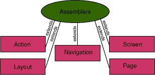
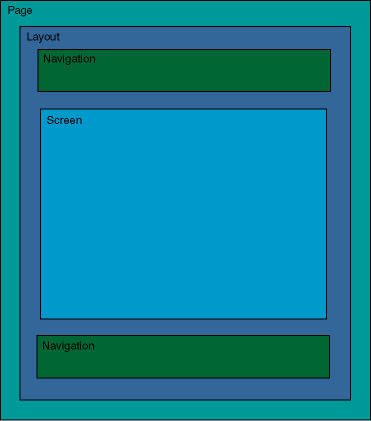
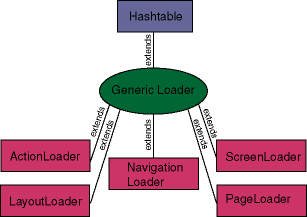

# What is Apache Turbine?

## Navigation

- General Information
  - [Overview](#index)
  - [Features](#features)
  - [Specification](#fsd)
  - [Getting Started](#getting-started)
  - [Howto Build Turbine](#how-to-build)
- Documentation
  - [Services](#services)
    - [Assembler Broker Service](#services-assemblerbroker-service)
    - [Avalon Component Service](#services-avalon-component-service)
    - [JSON-RPC Service](#services-jsonrpc-service)
    - [JSP Service](#services-jsp-service)
    - [Naming Service](#services-naming-service)
    - [Pull Service](#services-pull-service)
    - [RunData Service](#services-rundata-service)
    - [Scheduler Service](#services-scheduler-service)
    - [Security Service](#services-security-service)
    - [Servlet Service](#services-servlet-service)
    - [Session Service](#services-session-service)
    - [Template Service](#services-template-service)
    - [UI Service](#services-ui-service)
    - [Unique ID Service](#services-uniqueid-service)
    - [URL Mapper Service](#services-urlmapper-service)
    - [Velocity Service](#services-velocity-service)
  - [Howtos](#howto)
    - [Action Events Howto](#howto-action-event-howto)
    - [Annotations Howto](#howto-annotations)
    - [Configuration Howto](#howto-configuration-howto)
    - [Extend User Howto](#howto-extend-user-howto)
    - [Hibernate OM Howto](#howto-hibernate-howto)
    - [Intake Howto](#howto-intake-howto)
    - [JSP Howto](#howto-jsp-howto)
    - [Migrating from 2.1 to 2.2](#howto-migrate-from-2_1-howto)
    - [Migrating from 2.2 to 2.3](#howto-migrate-from-2_2-howto)
    - [Migrating from 2.3 to 4.0](#howto-migrate-from-2_3-howto)
    - [Migrating from 4.0 to 5.0](#howto-migrate-from-4_0-howto)
    - [Pull Model Howto](#howto-pullmodel-howto)
    - [Python Howto](#howto-python-howto)
    - [Security Howto](#howto-security-howto)
    - [Services Howto](#howto-services-howto)
    - [URL Mapper Howto](#howto-url-mapper-howto)
    - [URL Rewriting Howto](#howto-url-rewriting-howto)
    - [Velocity Context Howto](#howto-context-howto)
    - [Velocity Site Howto](#howto-velocity-site-howto)
    - [VelocityOnlyLayout Howto](#howto-velocityonlylayout-howto)
- Development
  - [Proposals](#proposals)
  - [How To Help](#how-to-help)
  - [Todo](#todo)
- Project Documentation
  - Project Information
    - [About](#index)
    - [Mailing Lists](#mailing-lists)
    - [Source Code Management](#scm)
    - [Summary](#summary)
    - [Team](#team)

## Content

<a id="index"></a>

<!-- source_url: https://turbine.apache.org/turbine/turbine-7-1/index.html -->

<!-- page_index: 1 -->

<a id="index--what-is-apache-turbine"></a>

# What is Apache Turbine?

Apache Turbine is a servlet based framework that allows experienced Java
developers to quickly build secure web applications. Parts of
Turbine can also be used independently of the web portion of Turbine
as well. In other words, we strive to make portions of Turbine
easily available for use in other applications.

**A web based application is an application where users use
their favorite web browser in order to access secure business
logic.**

<a id="index--build-a-web-app"></a>

## Build a Web App

With Turbine + Maven you could easily develop a lightweighted and robust web app in a structured way.
Find an example using Maven archetype mechanism [here](https://github.com/apache/turbine-archetypes).

**A platform for building applications, not just running
them.**

Many commercial (and non-commercial!) software companies will
attempt to sell you an "Application Server", but what few people
realize is that it is only half of the battle to creating a web
application. There is often quite a lot of code that your engineers
end up re-inventing the wheel with or grabbing various packages from
all over the net with various licenses that you may or may not agree
to.

The point of Turbine is to collect that code into one location and
make it easy to create re-usable components (such as
ParameterParsing, Database Connection Pools, Job Scheduling, GlobalCaches, integration with other tools such as Torque, Velocity, etc...) all under a [license](https://turbine.apache.org/turbine/turbine-7-1/license.html)
(Apache) that allows you to create useful websites for your
customers without worrying about viral code. Turbine is not the end
all answer, but it sure is a nice way to make your development life
easier.

This framework has an intended audience that is directed at web
engineers, not necessarily the web designers or front end engineers. By using this
framework, it is possible for the web engineers to build intuitive
high level systems for the web designers and front end engineers to use, but the low level
framework is strictly for web engineers. Turbine is not a web
application server. It is a tool for building web applications. Your
[servlet engine](http://tomcat.apache.org/) is your
application server and the application that you develop using this
framework is your web application.

**Integration with Velocity is well
defined and makes doing applications using these tools painless for
both the developers and the web designers or front end engineers!**

Turbine can be integrated with existing [Velocity](http://velocity.apache.org/engine/), [Java Server Pages (JSP)](http://java.sun.com/products/jsp/)
and [Spring DI](https://docs.spring.io/spring-framework/reference/core/beans.html) technologies by
specially creating Screens that use Services to parse templates.
Screens can also be created to read files from other websites as
well as off disk. This makes it easy to have designers simply put
the body of a page on disk and Turbine can serve these files when
requested. All of this is described in more detail in the
documentation section below.

The reason why Turbine works so well is because it applies object oriented
principles to the entire process of building a complex secure web application.
We try to follow the
[Model
2 methodology](http://www.javaworld.com/javaworld/jw-12-1999/jw-12-ssj-jspmvc.html) yet expand on it to encompass "View" techologies other
than just JSP as well as more mature methodologies such as
[Action
Event](#howto-action-event-howto) handling. Turbine is consided as Model 2 **+ 1**. :-) Please
see the [discussion](https://turbine.apache.org/turbine/turbine-7-1/model2+1.html) of Model 2+1 for more information.

You may want to use JSON (de)serialization technics using Fulcrum JSON with Jackson 2, Gson or use Jackson mapper directly.
Extending the models into any kind of views by following client view modelling, see e.g.
[MVVC](https://en.wikipedia.org/wiki/Model%E2%80%93view%E2%80%93viewmodel) should be no problem.
You could achieve this in many ways, e.g. using Turbine plain JSON screen, Turbine JSON-RPC or customizing in
Velocity Javascript templates.

This all sounds like a bunch of marketing talk, but in reality, Turbine has been developed by developers for developers. We are not
trying to sell you something that does not really work, instead we
are trying to solve (or do something about) the problems that our
fellow developers keep having over and over again. Come be a part of
the revolution!

<a id="index--where-do-i-get-releases"></a>

# Where do I get releases?

Download the current main release sources and binaries through the Apache mirror system at
[the turbine download site](http://www.apache.org/dyn/closer.cgi/turbine).

Currently, the best way to get started with Turbine is to use the
Maven Archetypes, find it on [GitHub](https://github.com/apache/turbine-archetypes "Turbine Maven Archetype on GitHub").
Eihter use it with a hosted database or use the
[docker profile](https://github.com/apache/turbine-archetypes/blob/master/src/main/resources/archetype-resources/docs/DOCKER-README.md).
See also the [blog post](https://blogs.apache.org/turbine/entry/maven_archetypes_for_apache_turbine)
in the [Turbine Blog](https://blogs.apache.org/turbine/) for usage information.

<a id="index--how-do-i-contribute-give-feedback-fix-bugs-and-so-on"></a>

# How do I contribute, give feedback, fix bugs and so on?

We really need and appreciate any contributions you can give. This
includes documentation help, source code and feedback. Discussion
about changes should come in the form of source code and/or very
detailed and well thought out constructive feedback. The [How To Help](#how-to-help) document has details and hints
how to get engaged with Turbine Development. We also have a [To Do](#todo) document that describes work to do with
the current Turbine code.

- We have a [Turbine mailing
  lists](https://turbine.apache.org/contact.html) for discussion.
- Create issues and Comment in Apache JIRA system [Turbine](https://issues.apache.org/jira/projects/TRB/)
- You can access the [Turbine Git trunk branch (rw)
  repository](https://github.com/apache/turbine-core/)
- You can also access the archived (since 2021) [Turbine SVN
  repository (read only)](https://svn.apache.org/viewvc/turbine/core/trunk/)
- You can access the [Turbine Archetype Git (rw)
  repository](https://github.com/apache/turbine-archetypes/)
- You can access the [Turbine Git build environment repository](https://github.com/apache/turbine-build/).
  This is a GIT modules structure, which should help to manage all Turbine components in one place.
- You can find more about the Turbine Ecosystem on  [gitbox.apache.org (rw)](https://gitbox.apache.org/repos/asf#turbine) or on [Github](https://github.com/orgs/apache/repositories?language=&q=turbine&sort=&type=)


---

<a id="features"></a>

<!-- source_url: https://turbine.apache.org/turbine/turbine-7-1/features.html -->

<!-- page_index: 2 -->

<a id="features--features"></a>

# Features

This document is for bragging about all of Turbine's features and inherent
coolness. Turbine is well over 200 classes and contains a boat load of
features and API's. Many of these can also be used indepently of Turbine.
Almost all of the default implementations can be easily overridden with
your own implementations. Turbine also has extensive Javadoc documentation
for nearly all of the classes as well as in-code comments. It clearly has
been developed by the people who do web applications on a daily basis and
have to constantly solve the same problems over and over again.

**All of these features have been made possible thanks to the over
30 developers (and growing all the time!) who have [contributed](https://turbine.apache.org/turbine/turbine-7-1/team-list.html) to Turbine over the last 10+ years.**

- Integration with template systems: Velocity, JSP
- Utility code for working with Velocity, such as a
  SelectorBox class for building `select` boxes
- Single Entry Point Servlet model for optimal security and control
- ParameterParsing for GET/POST/PATH\_INFO
- Event based Action handling!
- Strict MVC guidelines implemented through many interfaces and abstract
  classes as well as through the template systems.
- GlobalCache (Singleton based system for caching data across servlets and
  requests)
- DateSelector (utility for building the HTML for popup date menus)
- Generic Services API for creating Singletons
- [XML-RPC](http://www.xml-rpc.com/) Service Integration
- Localization Services API
- JNDI Services API
- Visitor/Member API for managing users
- Temporary and Permanent storage/management for users session data
- ACL (Access Control List) based security system that uses Roles and
  Permissions (and the database schemas)
- BrowserDetector class for determining which browser someone is using
- GenerateUniqueId class for getting a unique number (ie: for sessions)
- Logging via commons-logging, backed by Log4j.
- A centralized configuration using commons-configuration to make it easy
  to retrieve properties.
- Properties can be stored in JNDI, XML, or .properties files! Properties can
  override each other.
- Integration with JavaMail to make sending email painless
- Integration with JavaMail and Velocity to allow you to send
  processed Velocity templates as email!
- Built using Maven
- Initial application development WAR archive creation tool using Ant
- Turbine Servlet works cleanly with Servlet API 2.4 and higher
- Turbine Servlet supports Jakarta Servlet API 6.0 and higher since Turbine 7.0
- Version 5.1 requires JDK 1.8 and higher, Version 5.2 and 6.0 require Java 11, Version 7.0 Java 17 and higher - 100% Pure Java

---

<a id="fsd"></a>

<!-- source_url: https://turbine.apache.org/turbine/turbine-7-1/fsd.html -->

<!-- page_index: 3 -->

<a id="fsd--specification"></a>

# Specification

Turbine is made up of different modules which serve a specific service within
the Turbine framework. Five of them are used in the standard configuration.
In order for the reader to understand the general flow of the Turbine framework, each of these modules is explained in detail below.



<a id="fsd--the-pipeline"></a>

# The Pipeline

In Turbine 4, the way a request is processed is controlled by the
*Pipeline*. This concept has been "borrowed" from the Tomcat
project. A pipeline consists of *Valves* which control the single
processing steps and allow to decide which path the request is to take.
This allows for extending and adjusting the request processing by adding
or modifying valves and adding or modifying modules.
Add pipeline schema and link to docs about creating a new module here.

The default pipeline contains valves to verify session validity, access
control and login/logout operations.

<a id="fsd--action"></a>

# Action

The Action module represents a chunk of code that performs a task. For
example, when a user submits an Html form, one of the hidden fields
is which Action to execute in order to process the form information.
The processing generally includes form validation as well as storing
the form information into a database. The Page is responsible for
executing the Action before the Screen is executed. That way, the
Action can help determine which Screen is executed depending on the
results of the Action.

The process of the classic pipeline looks like this (somewhat simplified):

| HTTP Client -> | Execute Turbine Servlet -> | Execute Page -> | Execute Layout/Screen/Navigation -> | Return Page Content |
| --- | --- | --- | --- | --- |
|  |  | If Action is defined then... |  |  |
|  |  | Execute Action |  |  |

This model makes it really easy to separate the POST (GET works here as well)
data processing into component modules that can be re-used. For instance, the
Action "Logout" can be re-used from a number of different points in the system.
It performs one single function and performs it well. The advantage of this type
of behavior is that it prevents you from putting logic for handling form data
into your servlets. This is great for those of you who want to integrate EJB's
into Turbine because your Action's can simply make calls to your EJB's to process
business logic.

Sometimes it may seem to be difficult to decide which parts of an application
should go to Actions and which parts go to Pages (or Screens). To help you with
these decisions, our recommended rules of thumb are

- Screens *show* something. That is, they *read* data, for
  example a record from a database.
- Actions *do* something. That is, they *write* data, for
  example from a form to the database.
- When an Action is finished, it should generally clean up after itself so that
  a following Screen or other module will find the same state as if no action was
  performed. In the given example that would mean that the Action writes its data
  to the database and the Screen would reload it from there.

<a id="fsd--page"></a>

# Page

The Page module is the first module in the chain of execution for
the Page generation. It is considered to be the module which contains
the rest of the modules (Action, Layout, Screen and Navigation).
The Page module checks to see if there has been an Action defined in
the request. If so, it attempts to execute that Action. After the
Action has been executed, it asks the set Screen object for its Layout.
Page then attempts to execute the Layout object which the Screen
returned. Please note that the Action module can modify which Screen
is executed. Also note that the Screen module has the option to
override the Layout setting which defaults to "DefaultLayout." (Note:
the DefaultLayout value is actually defined in the TurbineResources.properties
file. This way, it is a simple property change instead of having to re-compile
the Turbine code for your own purposes.

<a id="fsd--screen"></a>

# Screen

The Screen module is essentially considered the "body" of the webpage. The
Layout module executes the Screen module. This is where the Html of the page is
generated. **It is entirely possible to call external code here.** For
example, you can call an EJB to provide you some business data which is then
transformed using a tool such as [Cocoon](http://cocoon.apache.org/) to render the business data
into HTML which is then transfered to the client.

<a id="fsd--navigation"></a>

# Navigation

A website generally has a top and bottom navigation scheme. This is generally
defined as the header and footer of the website. The Navigation is executed by
the Layout. There may be multiple Navigation modules that the Layout executes
(ie: the side, top and bottom parts of the page). Since it is generally common
for multiple webpages to contain the same navigation, it is most common to
define different Layouts for screens with very different Navigations. The
advantage of using a system like this is that you can have multiple Navigations
that are conditionally included and excluded in the Layout. Like Screens, the
Navigation modules can also call out to external code, such as EJB's to get the
business logic that is responsible for rendering the Html that is sent to the
browser.

<a id="fsd--layout"></a>

# Layout

The Layout module is called from the Page module. This modules defines
the physical Layout of a webpage. It generally defines the location of the
Navigation portion (ie: the top and bottom part of the webpage) as well as
the location of where the body (or Screen) of the page is. The
Layout module executes the Screen module to build the body of the webpage.
It executes the Navigation modules to build the portions of the webpage
which define the navigation for the website.

<a id="fsd--module-object-encapsulation"></a>

# Module object Encapsulation



From a module object encapsulation point of view, the image above represents how each of the modules fits into one another.
For example, the Page module
executes the Layout module, which then executes the Navigation and Screen
modules. As one can see, this tends to appear how a templated Html page would
look. This is no accident, the Turbine framework is essentially an object oriented
representation of the components of an Html page.

<a id="fsd--loaders"></a>

# Loaders



The loaders are responsible for dynamically loading each of the modules.
These loaders have an option to cache the module objects in memory for extremely
fast loading times.

The loaders use intelligent factories in that we have added a property to
TurbineResources.properties that allows you to define the "Loader Classpath". In
other words, it is possible to physically keep all of your web applications
modules in their own package classpath and the loaders will be responsible for
finding the right file to execute.

This feature is great because it allows you to upgrade the core Turbine framework
without having to make any modifications to your existing code! It also allows
you to simply distribute your web application as a standalone system and then
have your users download the Turbine framework as a separate requirement. Then, multiple web applications can be combined to form a complete system.

> [!NOTE]
> that each of the modules must be multithread safe
> since multiple threads may try to execute a single module at the exact same time.
> These rules apply to general servlet programming so they are not that difficult
> to understand. The basic rule is to not try to define any class global variables
> within each of the modules unless it has been wrapped in a synchronized statement.

<a id="fsd--factories"></a>

# Factories

Each of the loaders mentioned makes use of one or more factories to create the
different modules. By default the only factory that is enabled is the Java
factory that creates requested modules from java class files.

Factories are required to provide access to an instance of a Loader (see above)
that is able to load the specific type of module they are responsible for. They
can in fact implement the Loader themselves. Turbine makes no assumptions about
a module. The wiring of modules is controlled by the valves of the pipeline
only.

You can easily create your own factories by implementing a simple interface
and registering them in the TurbineResource.properities. This allows you a lot
of flexibility in the sense that you can load Turbine modules from **any** source that is able to provide you with a java object, for example an
RMI server or scripting options like Rhino and JPython. Keep in mind that
factories **must** be thread-save (the same applies to modules).

<a id="fsd--system-flow"></a>

# System Flow

When a new request comes in, the Turbine servlet first checks to make sure that
a ServletAPI HttpSession object exists for the user making the request. If this
HttpSession object does not exist, a Http redirect header is returned that
redirects the browser to the "homepage" of the website (by default it is the
"Login" screen and this can be configured via the TurbineResources.properties
file). This redirect attempts to set a cookie that is unique for the visitor. If
the cookie is not accepted, it will not be returned in the new request for the
"homepage" and thus further session tracking will happen with modified URL's
that contain the session information within them.

> [!NOTE]
> : If you do not wish to require the user to login to the
> system with a username and password before executing the pages, then set the
> "Login" screen to be something else. This is done in the Turbine Servlet under
> the data.session.isNew() check. Until the user actually logs in, it is only possible
> to store temporary data for that users session. When the user logs in, it is
> possible to store permant information by simply putting data into a hashtable.
> The implementation of the User object (ie: TurbineUser) in the framework takes care
> of the issues involved with serializing that information to a resource such as a
> database or file on the hard disk.

After a session with the user has been established, Turbine caches a few frequently
used pieces of data in the RunData object. This object is created for each and
every request and is passed around the system in order to provide all of the
modules with access to request specific information such as a database
connection, GET/POST/PATH\_INFO (GPP) data (via the ParametersParser object), the
Action and Screen names (made available from the GPP data), and the Document
object where you put your Html output. The RunData object should never be stored
in a global context because it is not multithread safe and each of the modules
is expected to be multithread safe. Also, the RunData object may or may not
contain information that should be persistent across requests.

The Turbine servlet then checks to see if a user is attempting to Login to the
system by looking at the defined Action and checking to see if the value is
"LoginUser." If so, it will execute the "LoginUser" action (again, the action to
execute here can be defined in the TurbineResources.properties file). Within this
action, it is the coders responsibility to define the procedure for
authenticating the user with the validateUser() method. This will probably mean
validating the username and password against a database. The abstraction of
Action modules makes it easily possible to have multiple authentication methods.

Once the user has been validated (the RunData.save() method has been called) or
not validated, then the SessionValidator action is executed from within the Turbine
servlet. The SessionValidator action checks to see if a user has been logged in.
If the user has not been logged in, then the Screen is set to be the "Login"
screen. If not, then the users last access datestamp is updated. **If you would
like to allow the user to view multiple pages without the need to login first, you will need to implement your own version of SessionValidator that just
returns nothing as a result.** Then, for the pages that you will want to make
secure, you should define a Layout that executes the SessionValidator action to
make things secure. Then, your Screens should call that "secure" Layout.

Next, the "DefaultPage" page is executed by the Turbine servlet. The "DefaultPage"
starts a chain of events that eventually leads to a complete webpage
development. First, the DefaultPage attempts to see if an Action has been
defined. If so, then it attempts to execute that Action. See the definition of
Action and Page above for more information. After the Action has been executed, the Screen is then asked for its Layout and the Layout is then executed.

It is the Layouts responsibility to then execute the Navigation and requested
Screen. After the Layout has executed its parts, it is finished and control is
returned to the Turbine servlet which then sends out the page information.

<a id="fsd--access-control-lists-and-user-permissions"></a>

# Access Control Lists and User Permissions

We have provided a beautiful system (because it is so simple and powerful) for
controlling what a User is allowed to do and not allowed to do. It is based on
the following concepts:

One or more Roles are assigned to a User. A Role is a collection of one or more
Permissions. The AccessControlList uses an AccessControlBuilder that
allows you to determine whether or not a User has a Permission to do something
or not.

Thus, a User can have both the "Admin" and "Guest" Role. Within those Roles are
the sets of Permissions that are allowed. In the "Admin" Role, one might have
the Permission, "Edit Users". Then, it is simple to use the AccessControlList to
check to see if the User has the permission "Edit Users" or if the User has the
Role "Admin", in which case, it does not matter what the Permissions are.

You will then use this system within any of modules to determine whether or
not to execute some code. This will provide you with both a Page level of
security (does the User have access to this page) as well as a Content level of
security (does the User have access to see the content on this page, ie:
hide/show content based on what Permissions the User has).

<a id="fsd--exception-handling"></a>

# Exception Handling

During execution, if at any time an exception is raised, the Turbine servlet
catches that exception and attempts to execute the "DefaultPage" with the Screen
set to be "Error". This is a simple debugging screen which displays a java stack
trace as well as any CGI environment variables that have been set. It is
possible to modify this Screen to display anything that you wish as well as
define an alternative error screen within your web application via the
TurbineResources.properties file. The idea is that all errors can be trapped in one
location in order to make debugging as simple as possible as well as provide a
consistent error interface to the users.

<a id="fsd--utility-code"></a>

# Utility Code

There is a number of utility classes included with Turbine.

The ParameterParser class takes all of the GET/POST/PATH\_INFO data and parses it
into a hashtable where it can be easily retrieved in a number of forms with the
provided get\* methods. This is how you can have access to form data that has
been posted by a users web browser.

The DynamicURI class should be used whenever a URI is needed within the system.
Each portion of a URI can be defined in order to produce a custom URI that also
includes the session tracking information if it exists. It is highly recommended
that you use this class for generating all of your URI's for your application
because it will allow you to easily add global functionality to your system.

The DateSelector class generates Html popup menus for month/day/year. The beauty
of this class is that you can provide a date for it to start with and it will
automaticially generate the Html popups with that date.

---

<a id="getting-started"></a>

<!-- source_url: https://turbine.apache.org/turbine/turbine-7-1/getting-started.html -->

<!-- page_index: 4 -->

<a id="getting-started--getting-started"></a>

# Getting Started

The purpose of this document is to define simple documentation on
getting started with Turbine. For information about the overall
structure of Turbine, please refer to the [Functional
Specification Document (FSD)](#fsd) as well as the other documentation that
is available.

<a id="getting-started--code-organization"></a>

# Code Organization

Turbine can be used in two different ways depending on what you need.
You can choose to only use one way or choose to use both. It is up
to you.

- As a servlet framework with Turbine as the controller.
- As a framework of useful code in your application.

In all cases, it means that you simply link against the API and code
provided in the turbine.jar file. All you need to do is tell Turbine where its
configuration file is, add turbine.jar to your classpath and then add
the appropriate Turbine Java code into your application.

Turbine is now a fairly large codebase. This can be daunting to people
who are just starting out with Turbine. However, the code is fairly well
organized and as you learn about each part of the code, the entire
architecture starts to make sense and is really quite easy to master.
All of our code is well javadoc'd so we encourage you to review not only
the actual source code, but also the documentation. :-) The different
parts of Turbine are:

- org.apache.turbine.modules - This is where the code for the Modules
  system is stored. The different Modules are described in more detail in
  the [funtional specification document](#fsd).
- org.apache.turbine.om - OM stands for Object Model. This is where the
  code that represents Turbine's Security Object Model lives.
- org.apache.turbine.services - This is where the Services Framework
  lives. The Services framework is a core aspect of Turbine. Essentially
  it is a framework for creating Singleton objects which may also have an
  init() and destroy() lifecycle. There are Services for many different
  things.
- org.apache.turbine.util - The Util package is just that. A package of
  utility code that is used within Turbine. There is code that will allow
  you to easily send template based email using Velocity as
  well as many other commonly used web application tools.

<a id="getting-started--standalone-usage"></a>

# Standalone Usage

Turbine can be easily used on its own. In order to do so, all you need
to do is something like this before you attempt to make a call to Turbine
based code:

```

TurbineConfig tc = new TurbineConfig("/path","TurbineResources.properties");
tc.init();
```

What that does is it tells Turbine the path to its configuration file
based on the relative path from "/path" (insert your own path). This is
held as a static in memory and therefore you only need to do it once.
You do not even have to worry about hanging on to the TurbineConfig
object. For more information, please see the javadoc for the
TurbineConfig object.

<a id="getting-started--further-questions-and-comments"></a>

# Further Questions and Comments

If you have further questions or comments, please send them to the [Turbine Mailing lists](https://turbine.apache.org/turbine/turbine-7-1/mail-lists.html).

---

<a id="how-to-build"></a>

<!-- source_url: https://turbine.apache.org/turbine/turbine-7-1/how-to-build.html -->

<!-- page_index: 5 -->

<a id="how-to-build--how-to-build-turbine"></a>

# How to build Turbine

First, check Java version is **Java 17 or above** for the latest build (version 7)
or Java 11 (version 6.0 and 5.2) or Java 8 for version 5.1 and before.

Turbine is built using the [Maven](http://maven.apache.org/) build
tool. So to get started you should download and install Maven.

To build Turbine, from the Turbine home directory just run `mvn install` the
project will be compiled, test cases run, and jar files created.
This will also install the artifact into your local Maven repository as well.

To build the site documentation, run `mvn site`, and this will build
the site documentation for the project.

---

<a id="services"></a>

<!-- source_url: https://turbine.apache.org/turbine/turbine-7-1/services/index.html -->

<!-- page_index: 6 -->

<a id="services--turbine-services"></a>

# Turbine Services

Services are singletons within the Turbine Framework which have
pluggable implementation, and are capable of participating in the
Turbine startup and shutdown. As Services are Singletons, there is
only one instance of each service in the system. Memory or connections
are allocated once only and the internal state is common to all
requesting clients. Services can access ServletConfig at system
startup time to process relative paths and similar functionality, they
can also access RunData on the first Turbine doGet execution to get
the environment Turbine is operating under and with. Services can also
initialize themselves before they are requested by the client for the
first time. A Service that is never used will not allocate resources to
itself. A Service can also execute actions upon the system being
shutdown, such as closing open connections. The Singleton pattern also
allows for the Services to be accessed from anywhere within your code.

The Life Cycle of a Service begins with the Services constructor. A Service
does not do much in it's constructor. Especially it should not allocate any
costly resources like large memory structure, DB or Network connections, etc.
The Service may be in the properties file, but unless a client using the
application needs the Service in question, there is no point starting the
Service.

The services available with Turbine can be found in the
org.apache.turbine.services package.

- [Assembler Broker Service](#services-assemblerbroker-service)
  Is the Service which allows assemblers such as Screens, Actions, Layout and
  Scheduled Jobs to be loaded.
- [Avalon Component Service](#services-avalon-component-service)
  Initializes external components which implement the Avalon lifecycle
  interface, e.g. Torque or other Avalon Services.
- [JSON-RPC Service](#services-jsonrpc-service)
  The JSON-RPC Service supports JavaScript to Java AJAX communications using
  [JSON-RPC-Java](http://oss.metaparadigm.com/jsonrpc/).
- [JSON Service](https://turbine.apache.org/fulcrum/fulcrum-json/)
  The JSON Service provides a configurable integration of JSON De-/Serializers with Jackson 2 (1) or GSON APIs (e.g. providing helpers for filtering, mixins and other settings).
- [JSP Service](#services-jsp-service)
  The JSP Service is the set of classes that process JSP files inside the
  Turbine Layout/Navigations and Screen structure.
- [Naming Service](#services-naming-service)
  Provides JNDI naming contexts.
- [Pull Service](#services-pull-service)
  Manages the creation of application tools that are available to all templates
  in a Turbine application. The tools can have global scope, request scope, session
  scope or persistant scope within your application.
- [RunData Service](#services-rundata-service)
  Is the Service which manages the higher level operations surrounding
  requests and responses.
- [Scheduler Service](#services-scheduler-service)
  This service manages the schedule queue giving Cron like functionality.
  The ScheduledJob can be stored in a database or a properties file.
- [Security Service](#services-security-service)
  A service for the management of Users, Groups, Roles and Permissions
  in the system, allowing for those Objects to interact with either
  Database or LDAP backends. The service also allows for the security to be managed
  without a backend.
- [Servlet Service](#services-servlet-service)
  Encapsulates the information provided by the ServletContext API,
  and makes it available from anywhere in the code.
- [Session Service](#services-session-service)
  Provides access to Session information for the current web context.
- [Template Service](#services-template-service)
  The Service for the mapping of templates to their screens and actions.
- [UI Service](#services-ui-service)
  The UI (User Interface) Service provides for application skinning.
- [Unique ID Service](#services-uniqueid-service)
  Allows for the creation of Context unique and pseudo random identifiers.
- [URL Mapper Service](#services-urlmapper-service)
  Allows for the control of a URL's pathinfo or query part.
- [Velocity Service](#services-velocity-service)
  The Velocity Service supports the rendering of
  [Velocity](http://velocity.apache.org) templates.

For more information on the Services Package, view the package.html Package
Documentation in the Javadocs or in Turbine CVS.

<a id="services--avalon-services"></a>

# Avalon Services

Turbine supports different types of component models. Turbine Services can implement
TurbineServiceProvider to add component managers to the service repository. By default, Turbine
comes with an Avalon component manager for these purposes.

- [Crypto Service](https://turbine.apache.org/fulcrum/fulcrum-crypto/)
  Provides encryption algorithms like MD5 and SHA message digests as well as old-fashioned Unix crypt.
- [Cache Service](https://turbine.apache.org/fulcrum/fulcrum-cache/)
  Provides different cache implementations for non-persistent Object Storage within your application.
- [Factory Service](https://turbine.apache.org/fulcrum/fulcrum-factory/)
  A Service for the instantiation of objects with either the specified loaders or
  default class loaders.
- [Intake Service](https://turbine.apache.org/fulcrum/fulcrum-intake/)
  A service that provides input validation along with a standard
  parameter naming framework.
- [Localization Service](https://turbine.apache.org/fulcrum/fulcrum-localization/)
  The single point of access to all localization resources.
- [MimeType Service](https://turbine.apache.org/fulcrum/fulcrum-mimetype/)
  The service maintains the mappings between MIME types and corresponding file
  name extensions as well as between locales and character encoding.
- [Parser Service](https://turbine.apache.org/fulcrum/fulcrum-parser/)
  A service for the management of various parser objects such as ParameterParsers,
  CookieParsers, CSVParsers and their common settings.
- [Pool Service](https://turbine.apache.org/fulcrum/fulcrum-pool/)
  A service for the pooling of instantiated Objects, allowing for the recycling
  and disposal of Objects in the pool.
- [Upload Service](https://turbine.apache.org/fulcrum/fulcrum-upload/)
  This service manages multipart/form-data POST requests, storing them
  temporarily in memory or locally. The resultant Objects can be manipulated through
  a FileItem Object.
- [XML-RPC Service](https://turbine.apache.org/fulcrum/fulcrum-xmlrpc/)
  This service manages xml-rpc calls to a remote Server.
- [XSLT Service](https://turbine.apache.org/fulcrum/fulcrum-xslt/)
  The service which is used to transform XML with an XSLT stylesheet.

---

<a id="services-assemblerbroker-service"></a>

<!-- source_url: https://turbine.apache.org/turbine/turbine-7-1/services/assemblerbroker-service.html -->

<!-- page_index: 7 -->

<a id="services-assemblerbroker-service--assembler-broker-service"></a>

# Assembler Broker Service

In Turbine **assemblers** are the basis for all the
module types: pages, layouts, screens, navigations, and scheduled
jobs. The way that these module types fits together is defined in
the Turbine [specification](#fsd) document.

The Assembler Broker Service allows these module types to
be loaded by one or more AssemblerFactory implementations.

<a id="services-assemblerbroker-service--configuration"></a>

# Configuration

```

# -------------------------------------------------------------------#
# S E R V I C E S #
# -------------------------------------------------------------------
# Classes for Turbine Services should be defined here.
# Format: services.[name].classname=[implementing class] #
# To specify properties of a service use the following syntax:
# service.[name].[property]=[value]

services.AssemblerBrokerService.classname=org.apache.turbine.services.assemblerbroker.TurbineAssemblerBrokerService
.
.
.

# -------------------------------------------------------------------#
# A S S E M B L E R B R O K E R S E R V I C E #
# -------------------------------------------------------------------
# A list of AssemblerFactory classes that will be registered
# with TurbineAssemblerBrokerService
# -------------------------------------------------------------------

services.AssemblerBrokerService.screen=org.apache.turbine.util.assemblerbroker.java.JavaScreenFactory
services.AssemblerBrokerService.screen=org.apache.turbine.util.assemblerbroker.python.PythonScreenFactory
services.AssemblerBrokerService.action=org.apache.turbine.util.assemblerbroker.java.JavaActionFactory
services.AssemblerBrokerService.layout=org.apache.turbine.util.assemblerbroker.java.JavaLayoutFactory
services.AssemblerBrokerService.page=org.apache.turbine.util.assemblerbroker.java.JavaPageFactory
services.AssemblerBrokerService.navigation=org.apache.turbine.util.assemblerbroker.java.JavaNavigationFactory
services.AssemblerBrokerService.scheduledjob=org.apache.turbine.util.assemblerbroker.java.JavaScheduledJobFactory
```

<a id="services-assemblerbroker-service--usage"></a>

# Usage

This service is used internally within Turbine. Therefore, we do not
document its usage here. It is best to simply look at the source code, read the Javadocs and follow the logic.

---

<a id="services-avalon-component-service"></a>

<!-- source_url: https://turbine.apache.org/turbine/turbine-7-1/services/avalon-component-service.html -->

<!-- page_index: 8 -->

<a id="services-avalon-component-service--avalon-component-service"></a>

# Avalon Component Service

The Avalon Component service loads external modules which implement the
[Avalon](http://avalon.apache.org/) lifecycle interfaces.

The only supported component at this point in time is
[Torque](http://db.apache.org/torque/), though the
[Fulcrum](http://turbine.apache.org/fulcrum/)
components are likely to be migrated to become Avalon components
in the future.

<a id="services-avalon-component-service--dependencies"></a>

# Dependencies

Don't forget to update the dependencies of your project to match
those defined for Turbine and the components you are loading:

- [Turbine Dependencies](https://turbine.apache.org/turbine/turbine-7-1/dependencies.html)
- [Torque Dependencies](http://db.apache.org/torque/dependencies.html)

<a id="services-avalon-component-service--configuration"></a>

# Configuration

```

# -------------------------------------------------------------------#
# S E R V I C E S #
# -------------------------------------------------------------------
# Classes for Turbine Services should be defined here.
# Format: services.[name].classname=[implementing class] #
# To specify properties of a service use the following syntax:
# service.[name].[property]=[value]

services.AvalonComponentService.classname = org.apache.turbine.services.avaloncomponent.TurbineAvalonComponentService
.
.
.
# -------------------------------------------------------------------#
# A V A L O N C O M P O N E N T S E R V I C E #
# -------------------------------------------------------------------
# Components implementing the avalon lifecycle interfaces can be
# loaded, configured and initialized by Turbine
# -------------------------------------------------------------------

services.AvalonComponentService.componentConfiguration = /WEB-INF/conf/componentConfiguration.xml
services.AvalonComponentService.componentRoles = /WEB-INF/conf/roleConfiguration.xml
services.AvalonComponentService.lookup = org.apache.torque.avalon.Torque
```

In /WEB-INF/conf you should provide componentConfiguration.xml:

```

<componentConfig>
    <torque>
       <configfile>/WEB-INF/conf/torque.properties</configfile>
    </torque>
</componentConfig>
```

and roleConfiguration.xml:

```

<role-list>
    <role name="org.apache.torque.avalon.Torque"
          shorthand="torque"
          default-class="org.apache.torque.avalon.TorqueComponent" />
</role-list>
```

No changes to torque.properties are required.

If all goes well you should see the following in your log file when
Turbine starts up:

```

...INFO...services.BaseServiceBroker - Added Mapping for Service: AvalonComponentService
...INFO...services.BaseServiceBroker - Start Initializing service (early): AvalonComponentService
...INFO...services.avaloncomponent.TurbineAvalonComponentService - Lookup for Component org.apache.torque.avalon.Torque successful
...INFO...services.BaseServiceBroker - Finish Initializing service (early): AvalonComponentService
```

<a id="services-avalon-component-service--usage"></a>

# Usage

If you plan to use the decoupled Torque in your application, you should
leave the Avalon Component Service configured at all times. It is started at
early startup time. Once it has initialized all the components, there
are no application specific methods or services available.

---

<a id="services-jsonrpc-service"></a>

<!-- source_url: https://turbine.apache.org/turbine/turbine-7-1/services/jsonrpc-service.html -->

<!-- page_index: 9 -->

<a id="services-jsonrpc-service--json-rpc-service"></a>

# JSON-RPC Service

The JSON-RPC Service supports JavaScript to Java AJAX communications using
[JSON-RPC-Java](https://code.google.com/p/jabsorb/)
(Jabsorb replaced project oss.metaparadigm.com/jsonrpc/. As of March 2015 Google Code projects are only read-only and this project is [archived](https://code.google.com/archive/p/jabsorb/) too, though GIT exports are allowed probably until Jan 2016, e.g. https://github.com/gmkll/jabsorb).

<a id="services-jsonrpc-service--configuration"></a>

# Configuration

```
# ------------------------------------------------------------------- # #  S E R V I C E S # # ------------------------------------------------------------------- ...services.JsonRpcService.classname=org.apache.turbine.services.jsonrpc.TurbineJsonRpcService ...
```

<a id="services-jsonrpc-service--usage"></a>

# Usage

There are a number of things you need to do in order to add AJAX functionality
to your webapp. First you implement the functions:

```
public class MyJsonFunctions {public String getHello(String clientParameter) {return "Hello " + clientParameter;} public String getGoodbye(String clientParameter) {return "Goodbye " + clientParameter;}}
```

Next you implement your Screen class to make your functions available:

```
public class MyJsonScreen extends JSONScreen {public void doOutput(RunData data) throws Exception {MyJsonFunctions myFunctions = new MyJsonFunctions();
// Session specific TurbineJsonRpc.registerObject(data.getSession(), "myFunctions", myFunctions);
// Global //TurbineJsonRpc.registerObjectGlobal("testGlobal", testObject);
super.doOutput(data);}}
```

<a id="services-jsonrpc-service--client-side:-synchronous-ajax-calls"></a>

## Client Side: Synchronous AJAX Calls

Now we shift focus to your template classes. Firstly, there are a few useful
utility functions that you need to make sure are available to the pages that
will include AJAX functionality:

```
// Body onload utility (supports multiple onload functions) function SafeAddOnload(func) {var oldonload = window.onload; if (typeof window.onload != 'function') {window.onload = func; } else {window.onload = function() {oldonload(); func(); };}}
// Prepare for possible JSON-RPC requests.// jsonurl must be set before calling this function.// First example synchronous call function jsonOnLoadSync() {try {jsonrpc = new JSONRpcClient(jsonurl);} catch(e) {if(e.message) {alert(e.message);} else {alert(e);}}}
// Process a JSON-RPC request.function jsonEval(evalStr) {try	{return eval(evalStr);} catch(e) {if(e.javaStack) {alert("Exception: \n\n" + e.javaStack);} else {alert("Exception: \n\n" + e);}} return null;}
```

In these pages you also need to include the JavaScript necessary to process the
JSON calls - this file is available as part of the JSON-RPC Java distribution
(it is included in the `webapps\jsonrpc` directory):

```

$page.addScript($content.getURI('scripts/jsonrpc.js'))
```

Then you need to set up the specific handler for the page (synchronous example):

```

<script type="text/javascript">
<!--
  ## Set up the JSON-RPC handler.
  var jsonurl = '$link.setScreen("MyJsonScreen")';
  SafeAddOnload(jsonOnLoad);
  ## myArg below would be provided when you call this function from your
  ## web page (usually you would retrieve something via the DOM or your
  ## favorite JavaScript DOM wrapper library).
  function retrieveHello(myArg) {
    ## This is a synchronous call.
    var helloResult = jsonEval("jsonrpc.myFunctions.getHello(" + myArg + ")");
    if(null == helloResult) {
      alert('Something went wrong!');
      return;
    }
    ## Here you would again use the DOM to include the result somewhere on your
    ## page.
  }
-->
</script>
```

<a id="services-jsonrpc-service--client-side:-asynchronous-ajax-call"></a>

## Client Side: Asynchronous AJAX Call

Alternatively, asynchronous calls require handling of the deferred objects, which could be done by using some kind of [Promise](https://www.promisejs.org/)) library.
As an example a [JQuery Promise Object model](http://api.jquery.com/category/deferred-object/) (supported since version 1.5) is shown.
Usage of asynchronous calls conforms more to [XMLHttpRequest specification](ttps://xhr.spec.whatwg.org/#synchronous-flag).

```


// Prepare for possible JSON-RPC requests.
// jsonurl must be set before calling this function.
// Second example asynchronous call
var deferred;
function jsonOnLoad() {
  try {
      // This feature is available since jabsorb 1.1 release, cft. webapps/jaxrpc/CHANGES.txt.
      // JQuery Promises are available since jQuery 1.5/1.8 (with major changes).
      // This is just an example, any other Promise handling will do it.
       if (deferred != undefined) {
            return deferred;
        } else {
            deferred =  jQuery.Deferred(function(defer) {
      // Add a default function as first parameter to enable asynchronous call.
                  jsonrpc = new JSONRpcClient(function(result, e) {
                        defer.resolve(result,e);
                    }, jsonurl);
            }).promise();
            return deferred;
        }
  }
  catch(e) {
    if(e.message) {
      alert(e.message);
    }
    else {
      alert(e);
    }
  }
}
```

In these pages you also need to include the JavaScript necessary to process the
JSON calls - this file is available as part of the JSON-RPC-Java distribution
(it is included in the `webapps\jsonrpc` directory):

```

$page.addScript($content.getURI('scripts/jsonrpc.js'))
```

Then you need to set up the specific handler for the page (in this case a asynchronous handler):

```

<script type="text/javascript">
<!--
  ## Set up the JSON-RPC handler.
  var jsonurl = '$link.setScreen("MyJsonScreen")';

  ## myArg below would be provided when you call this function from your
  ## web page (usually you would retrieve something via the DOM or your
  ## favorite JavaScript DOM wrapper library).
  function retrieveHello(myArg) {
    ## This is a an ansynchronous call as you provide as first parameter a callback function to getHello
    ## (Jabsorb JSON-RPC library expects it this way).
    var promiseA = jsonOnLoad();
    var promiseB = jQuery.Deferred();
    promiseA.done(
       function() {
         jQuery.Deferred(function(deferred) {
           jsonrpc.myFunctions.getHello( function(res,e) {
                    deferred.resolve(); // not used
                    promiseB.resolve(res);
                  }, " + myArg + ")" );
            }).promise();
        }
    );
    return jQuery.when(promiseA, promiseB);
    }

# call function var helloResult; var promise = retrieveHello(myArg); promise.done(function(resultA,resultB) {
        helloResult = resultB;
        ## Here or in another dependent Promise you would again use the DOM to include the result somewhere on your
        ## page.
    }
  );
-->
</script>
```

The above code is executable by users that are not logged into your application.
Your Screen class can extend JSONSecureScreen to require that users be logged in
before allowing execution.

---

<a id="services-jsp-service"></a>

<!-- source_url: https://turbine.apache.org/turbine/turbine-7-1/services/jsp-service.html -->

<!-- page_index: 10 -->

<a id="services-jsp-service--jsp-service"></a>

# JSP Service

Turbine supports the use of JSP internally through a Service which
provides JSP related Modules with access to the JSP engine directly. We
have another document which gives a [howto](#howto-jsp-howto) on configuration of Turbine to
use JSP.

While Turbine supports the use of many templating systems, we definitely
have our favorite system to use and recommend and that is [Velocity](http://velocity.apache.org/).

<a id="services-jsp-service--configuration"></a>

# Configuration

```

# -------------------------------------------------------------------#
# S E R V I C E S #
# -------------------------------------------------------------------
# Classes for Turbine Services should be defined here.
# Format: services.[name].classname=[implementing class] #
# To specify properties of a service use the following syntax:
# service.[name].[property]=[value]

services.JspService.classname=org.apache.turbine.services.jsp.TurbineJspService
.
.
.
# -------------------------------------------------------------------#
# J S P S E R V I C E #
# -------------------------------------------------------------------

services.JspService.template.extension=jsp
services.JspService.default.page = JspPage
services.JspService.default.screen=BaseJspScreen
services.JspService.default.layout = JspLayout
services.JspService.default.navigation=BaseJspNavigation
services.JspService.default.error.screen = JspErrorScreen
services.JspService.default.layout.template = /Default.jsp

services.JspService.templates = /templates/app
services.JspService.buffer.size = 8192
```

<a id="services-jsp-service--usage"></a>

# Usage

Please refer to the org.apache.turbine.services.jsp classes for details
on how to use this service.

---

<a id="services-naming-service"></a>

<!-- source_url: https://turbine.apache.org/turbine/turbine-7-1/services/naming-service.html -->

<!-- page_index: 11 -->

<a id="services-naming-service--naming-service"></a>

# Naming Service

The Naming Service provides access to JNDI contexts. Please note that if
you are using Tomcat as your servlet engine and you get errors about
sealing violations, you may need to read [this document](https://turbine.apache.org/turbine/turbine-7-1/howto/jboss-howto.html).

<a id="services-naming-service--configuration"></a>

# Configuration

```
# ------------------------------------------------------------------- # #  S E R V I C E S # # ------------------------------------------------------------------- # Classes for Turbine Services should be defined here.# Format: services.[name].classname=[implementing class] # # To specify properties of a service use the following syntax:# service.[name].[property]=[value]
services.NamingService.classname=org.apache.turbine.services.naming.TurbineNamingService...
```

<a id="services-naming-service--usage"></a>

# Usage

```

try
{
    // Set up the naming provider. This may not always be necessary,
    // depending on how your Java system is configured.
    System.setProperty("java.naming.factory.initial",
      "org.jnp.interfaces.NamingContextFactory");
    System.setProperty("java.naming.provider.url",
      "localhost:1099");
    // Get a naming context
    InitialContext jndiContext = new InitialContext();

    // Get a reference to the Interest Bean
    Object ref = jndiContext.lookup("interest/Interest");

    // Get a reference from this to the Bean's Home interface
    InterestHome home = (InterestHome)
        PortableRemoteObject.narrow (ref, InterestHome.class);

    // Create an Interest object from the Home interface
    m_interest = home.create();
}
catch(Exception e)
{
    out.println("<LI>Context failed: " + e);
}
```

---

<a id="services-pull-service"></a>

<!-- source_url: https://turbine.apache.org/turbine/turbine-7-1/services/pull-service.html -->

<!-- page_index: 12 -->

<a id="services-pull-service--pull-service"></a>

# Pull Service

The Pull service places tool objects in the Velocity context for use by
template engineers. It can handle tools with various different "scopes", namely:

- request-scope tools for which a new instance is needed for each
  request.
- global-scope tools for which a single instance can serve the
  entire application.
- session-scope tools which are persisted as part of
  the user object in the servlet engine provided session object.
- persistent-scope tools which are persisted as part of the user's
  serialized object data.

The service must be enabled in TurbineResources.properties as shown
below, and tools are listed there. The default properties file lists
some request-scope tools that are needed for basic Turbine usage
($page, $link and $content), plus the useful UIManager global tool.

<a id="services-pull-service--configuration"></a>

# Configuration

```

# -------------------------------------------------------------------#
# S E R V I C E S #
# -------------------------------------------------------------------
# Classes for Turbine Services should be defined here.
# Format: services.[name].classname=[implementing class] #
# To specify properties of a service use the following syntax:
# service.[name].[property]=[value]

services.PullService.classname=org.apache.turbine.services.pull.TurbinePullService
.
.
.
# -------------------------------------------------------------------#
# P U L L S E R V I C E #
# -------------------------------------------------------------------
# These are the properties for the Pull Service, the service
# that works in conjuction with the Turbine Pull Model API.
# -------------------------------------------------------------------

# This determines whether the non-request tools are refreshed
# on each request (request tools aren't ever, because they're
# instantiated for the request only anyway).
services.PullService.tools.per.request.refresh=true

# These are tools that are placed in the context by the service
# These tools will be made available to all your
# templates. You list the tools in the following way:#
# tool.<scope>.<id> = <classname> #
# <scope>      is the tool scope: global, request, session,
#              authorized or persistent (see below for more details)
# <id> is the name of the tool in the context #
# For example:#
# tool.global.ui    = org.apache.turbine.util.pull.UIManager
# tool.global.mm    = org.apache.turbine.util.pull.MessageManager
# tool.request.link = org.apache.turbine.services.pull.tools.TemplateLink
# tool.request.page = org.apache.turbine.util.template.TemplatePageAttributes #
# (the next two examples specify mythical classes) #
# tool.session.basket = org.sample.tools.ShoppingBasket
# tool.persistent.ui = org.sample.tools.PersistentUIManager # #
# Tools are accessible in all templates by the <id> given
# to the tool. So for the above listings the UIManager would
# be available as $ui, the MessageManager as $mm, the TemplateLink
# as $link and the TemplatePageAttributes as $page. #
# Scopes:#
#   global:    tool is instantiated once and that instance is available
# to all templates for all requests. Tool must be threadsafe. #
#   request:    tool is instantiated once for each request (although the
#               PoolService is used to recycle instances). Tool need not
# be threadsafe. #
#   session:    tool is instantiated once for each user session, and is
#               stored in the user's temporary hashtable. Tool should be
# threadsafe. #
# authorized: tool is instantiated once for each user session once the
# user logs in. After this, it is a normal session tool. #
# persistent: tool is instantitated once for each user session once
#             the user logs in and is is stored in the user's permanent
#             hashtable.
#             This means for a logged in user the tool will be persisted
#             in the user's objectdata. Tool should be threadsafe and
# Serializable. #
# Defaults: none

tool.request.link=org.apache.turbine.services.pull.tools.TemplateLink
tool.request.page=org.apache.turbine.util.template.TemplatePageAttributes
tool.request.content=org.apache.turbine.services.pull.tools.ContentTool
#tool.request.om=org.apache.turbine.om.OMTool
#tool.request.intake=org.apache.turbine.services.intake.IntakeTool

tool.global.ui=org.apache.turbine.services.pull.util.UIManager

# The UI Manager will allow you to skin your Turbine
# application using simple properties files that are
# located in the WEBAPP/resources/ui/skins/ directory
# hierarchy.

tool.ui.skin=default
```

<a id="services-pull-service--usage"></a>

# Usage

The first step in use of the pull service is deciding on a useful
tool API for an object that is available to templates in the
Velocity context. This could range from something as simple as
the generation of URIs ($link and $content) to a tool for retrieving
details of the user's current shopping basket. Define a set of
public methods for the tool and they will be available through
standard Velocity introspection.

The next step is to decide what scope you need to give the tool.
If the tool is retrieving global data in a threadsafe manner, you
can make the tool global. If the tool holds data specific to the
user look at the session, authorized and persistent scopes
(choose persistent for a convenient way of having the tools fields
persisted across sessions for logged in users). If the tool needs to
be instantiated on each request to fulfill its function, or is not
threadsafe, then the request scope will be appropriate.

Tools can implement the org.apache.turbine.services.pull.ApplicationTool
or the org.apache.turbine.services.pull.RunDataApplicationTool
interface. This will provide a hook for the service to initialise them
through the 'init' method and, except for request scope tools, to be
refreshed through the 'refresh' method. The type of the init argument
'data' (declared as type 'Object') depends on the scope of the tool.
For global tools the argument will be null; for session and persistent
scope tools, 'data' will be the current User object; and for request
scope tools 'data' will be the current RunData instance.

If you activate the RefreshToolsPerRequest property, every tool is
refreshed on each request. On Request Tools this makes no difference, because here, the refresh() is never called (they're instantiated on
every request). All other scopes get a call to refresh() on every
request. If you chose to implement the RunDataApplicationTool interface, you get the current RunData object passed to your tool.

Important note: request scope tools are recycled by the PoolService.
This means they must be written to be reused. This usually means
implementing the ApplicationTool interface, and having the 'init'
implementation reset all fields.

Current examples of tools include the afore mentioned $link, $page and
$content objects, the $ui UI manager, the Intake service tool
(org.apache.turbine.services.intake.IntakeTool) and the OM tool
(org.apache.turbine.om.OMTool).

---

<a id="services-rundata-service"></a>

<!-- source_url: https://turbine.apache.org/turbine/turbine-7-1/services/rundata-service.html -->

<!-- page_index: 13 -->

<a id="services-rundata-service--rundata-service"></a>

# RunData Service

RunData is an interface that is passed around within Turbine. RunData
provides the threading mechanism, as there is one RunData object per
HTTP request. The RunData service manages the isues surrounding multiple
requests being accepted. TurbineRunData is the interface that is
specific to the Turbine RunData service, and via the recyclable
interface can be sent back to the Factory for recycling.

RunData objects should never be held on to across requests. They are
considered one time only objects.

All this higher level processing by the service means that for each HTTP
request there is an interface that is castable to, or available, that
can be used to access all information to do with that request. As an
example, information such as the content type of the request and the
response can be queried or sent, as well as other information
surrounding servlet HTTP management, such as Sessions, PrintWriters as
well as Turbine specific information such as Users, AccessControlLists, Templating, Error Handling and Contexts.

<a id="services-rundata-service--configuration"></a>

# Configuration

In the TurbineResources.properties the service needs to be defined for
Turbine to initialize with.

```

# -------------------------------------------------------------------#
# S E R V I C E S #
# -------------------------------------------------------------------
# Classes for Turbine Services should be defined here.
# Format: services.[name].classname=[implementing class] #
# To specify properties of a service use the following syntax:
# service.[name].[property]=[value]

services.TurbineRunDataService.classname=org.apache.turbine.services.rundata.TurbineRunDataService
.
.
.
# -------------------------------------------------------------------#
# R U N D A T A S E R V I C E #
# -------------------------------------------------------------------
# Default implementations of base interfaces for request processing.
# Additional configurations can be defined by using other keys
# in the place of the <default> key.
# -------------------------------------------------------------------

services.RunDataService.default.run.data=org.apache.turbine.services.rundata.DefaultTurbineRunData
services.RunDataService.default.parameter.parser=org.apache.turbine.util.parser.DefaultParameterParser
services.RunDataService.default.cookie.parser=org.apache.turbine.util.parser.DefaultCookieParser
```

<a id="services-rundata-service--using-rundata"></a>

# Using RunData

As RunData encapsulates all aspects of Turbine's gathering the
HttpRequest and sending the HttpResponse, any status to do with the
Request can be queried and any manipulation of the final response can be
carried out through the RunData Object.

Turbine is a servlet and the functionality equated with the
javax.servlet and javax.servlet.http can be manipulated through the
RunData interface. One of the most useful components of the Servlet
libraries was Sessions. These are accessed through RunData; it also
provides direct access to the PrintWriter, Server details, Content
Types, ContextPath, Redirections, Client details, etc. Some of the
functions which equate with the servlet libraries are:

```

getLocale()
setLocale(Locale locale)
getCharSet()
setCharSet(String charset)
getContentType()
setContentType(String mimetype)
getOut()  //get PrintWriter Object
getRedirectURI()
getRemoteAddr()
getRemoteHost()
getRequest()
getResponse()
getServletContext()
getSession()
getStatusCode()
```

The get/setLocale(), get/setCharSet() and get/setContentType() methods
are used for specifying the locale, character encoding and content type
of the body of the servlet response.

The method setLocale() is called to specify explicitly the locale
of the response. If setLocale() is not called, the "locale.default.language"
and "locale.default.country" properties from Turbine Resources are used to
determine the locale. If these properties are not set, the JVM's default
locale determines the locale.

If the locale is set to something else than the default locale or Locale.US, an explicit encoding is not specified with the setCharSet() method or the
"locale.default.charset" property, and the main MIME type of the content is
"text", the getContentType() method adds a locale specific encoding (charset)
to the content type automatically.

The locale specific charset is obtained from the MimeTypeService, which
maintains mappings between locales and charsets.

As always consult the Javadocs for more detail.

To use Turbine to only manipulate the functions that came with the Sun
Servlet libraries is to miss out on Turbine's power. Turbine is a
framework which enables manipulation of the HttpResponse and HttpRequest
above and beyond the simple Servlet libraries. Turbine has services and
layers surrounding those available with the Response and Request that
allow easier creation and management of Websites and Web-enabled
Applications. In fact you wont have to type import javax.servlet.\*
again!

<a id="services-rundata-service--session-management"></a>

# Session Management

Sessions are managed in Turbine via the User interface. The User
interface allows for a blend of cookie management, memory management and
relational database to be used to manage a user's session. A user of the
site can have their Turbine session set as either temporary storage or
permanent storage. The permanent storage will survive a servlet engine
restart. How all this is managed by Turbine is transparent to the Java
Engineer. As an example assume we want to monitor how often a user
returns to the website we are developing and we want to reward them for
their returning interaction:

```
//in Login Action class public void doPerform(RunData data, Context context) throws Exception {//get the Parameters, username and password ParameterParser params = data.getParameters(); String loginname = params.getString("username"); String password = params.getString("password");
try {//cast to TurbineUser interface //and check if user is in system TurbineUser user = (TurbineUser) TurbineSecurity .getAuthenticatedUser(loginname, password);
//put User into Session data.setUser(user);
//mark the User as logged in user.setHasLoggedIn(new Boolean(true));
//add to the access counter user.incrementAccessCounter();
//add to the access counter for the session user.incrementAccessCounterForSession();
//check to see if user is to have //their status changed to valued if(user.getAccessCounter() > 500 ) {//set into persistant storage //that our visitor is now a //valued user user.setPerm("valued", new Boolean(true));}
data.save();} catch (Exception e) {//error handling}}
```

While skeletal this shows a good example of permanent and temporary
management of User information. The line data.setUser() puts the User
into session, the hasLoggedIn() method updates the User Object to
reflect the fact that the session has passed Authentication; however
until the RunData's save method is called both the User and hasLoggedIn
flag are only existing in Turbine's memory. Neither become a part of
RunData's HttpSession until they are saved into the session through
data.save(). The AccessCounter is persistent storage and is saved into
the database. The AccessCounter for the session counts the number of
pages that are requested throgh Turbine for the user's session. Once
their session logs out or the session times out, that information is
lost. The user.setPerm() method allows for information to be stored
persistently into the database as a HashTable entry. The example above
was intended to show that information can be handled through a
consistent interface allowing for the management at the
request/response, session and persistent levels without any direct
manipulation of the HttpRequest, HttpResponse, HttpSession or Relational
database. As always, refer to the Javadocs for more information on the
RunData, User and TurbineUser interfaces.

<a id="services-rundata-service--parameter-and-cookie-parsing"></a>

# Parameter and Cookie Parsing

One of the most useful parts of the RunData interface is the easy
retrieval of parameters attached to a request. The ParameterParser and
CookieParser Interfaces are available through the RunData interface and
provide convenience methods for gathering parameters from either the URI
or Session. Turbine handles parameters as name/value pairs through the
URI via the BaseValueParser object, allowing the parameters to be
requested as a Java type rather than a catch-all:

```
/** the doPerform method from Invoice.java Action class */ public void doPerform(RunData data, Context context) throws Exception {//get parameters ParameterParser params = data.getParameters();
/** * Where "units" is the HTML Input Form name */ int units = params.getInt("units");
/** * Get the description, if there is no entry from the * HTML input form, set the default as "No Description".*/ String description = params.getString("description","No Description");
/** * If there is no total, set the value to 0.*/ BigDecimal total = params.getBigDecimal("total",new BigDecimal(0));}
```

The above example shows gathering of name/value pairs from HTML Form
Inputs and setting default values for those forms. In the case of
description, if the description is null, then the default value "No
Description" will be substituted. The Javadocs for ParameterParser show
more information on the methods available.

<a id="services-rundata-service--security-management"></a>

# Security Management

The RunData interface also exposes security management methods and
information which are encapsulated into a request. The RunData interface
exposes the AccessControlList Object, which encapsulates the Permissions
and Roles for the Groups the User is in. The getACL() method allows for
the permission of the User to be queried against their ACL.

```
/** the doPerform method from DeleteInvoice.java Action class */ public void doPerform(RunData data, Context context) throws Exception {//check if the User is authorized before //deleting the invoice AccessControlList acl =  data.getACL(); if(acl.hasPermission("deleteinvoice")) {//delete invoice logic} else {data.setMessage("You do not have permission to delete an invoice."); data.setTemplate(data, "UnauthorizedRequest.vm");}}
```

The above example gets the AccessControlList Object for the User through
the RunData interface. The ACL is used to check against the Permissions
the User has, the PermissionSet, or a list of all permissions the User
has, most likely taken from a database. In this example, the check is
against the string "deleteinvoice". If the User has the permission, they
will be able to delete the invoice, otherwise the User will get an
unauthorized request Velocity screen.

<a id="services-rundata-service--template-management"></a>

# Template Management

The RunData also exposes methods to manipulate Screens, Actions, Pages
and Layouts. The templating service assembles the screens, actions and
layouts as well as exposing template methods. The methods for managing
screens and actions includes:

```

getAction()
getLayout()
getLayoutTemplate()
getScreen()
getTemplateInfo()  //returns TemplateInfo Object
hasAction()
hasScreen()
setAction()
setLayout()
setLayoutTemplate()
setScreen()
setScreenTemplate()
```

For more information on how to use the RunData Interface with Velocity
templates and the Velocity context, view the Velocity Site
documentation.

<a id="services-rundata-service--messaging"></a>

# Messaging

One of the other useful wrappers the RunData interface provides access
to is messaging. The Message can be set as a String, an ECS Element or
as a FormMessages object. RunData contains access to other convenience
methods to do with Messaging such as:

```

addMessage(Element msg)
addMessage(String msg)
hasMessage()    //if the request has a message
getMessage()
getMessageAsHTML()
getMessages()   //returns a FormMessages Object
setMessage(String msg)
setMessage(Element msg)
setMessage(FormMessages msgs)
```

An example of using messages with Velocity templates in an action is
below:

```

/** the doPerform method from Invoice.java Action class */
public void doPerform(RunData data, Context context) throws Exception
{
    data.setMessage("A message for output.");
    data.setTemplate(data, "Test.vm");
}
```

This would be accessed in the Velocity template via:

```

#*
    Velocity file, Test.vm, showing messaging example.
*#

$data.getMessage()
```

And the output would be:

```

A message for output.
```

The Javadocs for RunData show all the methods available through the
interface and is definitely the place to start when looking for more
information on what RunData exposes. The RunData interface is one of the
most important areas for a Java Engineer to understand and be familiar
within the Turbine Framework. Understanding RunData is of continual
benefit.

---

<a id="services-scheduler-service"></a>

<!-- source_url: https://turbine.apache.org/turbine/turbine-7-1/services/scheduler-service.html -->

<!-- page_index: 14 -->

<a id="services-scheduler-service--scheduler-service"></a>

# Scheduler Service

The Scheduler is modeled after Unix Cron. The Scheduler runs as a background
process that executes timed scheduled tasks independently of HTTP requests.
Tasks are either stored in the database in the TURBINE\_SCHEDULED\_JOB table and once
entered in the database are loaded automatically when Turbine initializes or as a non persistent service using TurbineNonPersistentSchedulerService.

For the Scheduler to load classes that extend the ScheduledJob Class, the scheduler needs to be enabled via the TurbineResources.properties
file, where the directive services.SchedulerService.enabled needs to be
set to true.

The Scheduler Service should be accessed in one of two ways.

- Get an instance of type org.apache.turbine.services.schedule.ScheduleService (eihter using annnotation @TurbineService or by using static call to TurbineServices.getInstance().getService with parameter ScheduleService.SERVICE\_NAME) - This interface provides methods to access the scheduler service. This is the preferred method of access from within java code.
- org.apache.turbine.services.schedule.SchedulerTool - This is a pull
  tool for providing access to the scheduler service from within a
  Velocity template.

<a id="services-scheduler-service--configuration"></a>

# Configuration

```

# -------------------------------------------------------------------#
# S E R V I C E S #
# -------------------------------------------------------------------
# Classes for Turbine Services should be defined here.
# Format: services.[name].classname=[implementing class] #
# To specify properties of a service use the following syntax:
# service.[name].[property]=[value]

services.SchedulerService.classname=org.apache.turbine.services.schedule.QuartzSchedulerService
.
.
.
# -------------------------------------------------------------------#
# S C H E D U L E R S E R V I C E #
# -------------------------------------------------------------------

#
# Set enabled to true to start the scheduler.  The scheduler can be
# stopped and started after Turbine has been intialized.  See the
# javadocs for org.apache.turbine.services.schedule.TurbineScheduler
# for the methods calls. #
# Default = false #

services.SchedulerService.enabled=false

# Determines if the scheduler service should be initialized early.  This
# Should always be set to true!!!!

services.SchedulerService.earlyInit=true

# -------------------------------------------------------------------#
# P U L L S E R V I C E #
# -------------------------------------------------------------------
# These are the properties for the Pull Service, the service
# that works in conjuction with the Turbine Pull Model API.
# -------------------------------------------------------------------

# This is a tool that allows access to the scheduler service.
tool.request.scheduler=org.apache.turbine.services.schedule.SchedulerTool
```

Jobs are stored and retrieved from the database using Torque
generated objects. The objects are based on the definition
stored in `scheduler-schema.xml`. If you want to
add additional fields to track more information about your
scheduled tasks, you can modify this file to do so. You will
need to rebuild Turbine using MAven after making your modifications.

<a id="services-scheduler-service--usage"></a>

# Usage

To create an object that takes advantage of the Schedule Service, the task
to be executed will need to be embedded in the run() method of an object
which extends the ScheduledJob Class. For instance:

```
package com.mycompany.modules.scheduledjobs;
//JDK import java.util.Date;
//Turbine import org.apache.turbine.modules.ScheduledJob; import org.apache.turbine.services.schedule.JobEntry; import org.apache.commons.logging.Log; import org.apache.commons.logging.LogFactory;
public class SimpleScheduledTask extends ScheduledJob {/** Logging */ private static Log log = LogFactory.getLog(SimpleScheduledTask.class);
private int taskcount = 0;
/** * Constructor */ public SimpleScheduledTask() {//do Task initialization here}
/** * Run the Jobentry from the scheduler queue.* From ScheduledJob.* * @param job The job to run.*/ public void run( JobEntry job ) throws Exception {log.note("Scheduled job " + job.getJobId() + " : " + "task: " + job.getTask() + " ran @: " + new Date(System.currentTimeMillis()).toString() + " taskcount " + taskcount ); //iterate the task counter taskcount++;}}
```

The SimpleScheduledTask object makes an entry into the turbine.log each
time the Task is run by the Schedule Service. The JobEntry object carries the
information the Service uses to determine the frequency of the Task.
Note that the object is in the com.mycompany.modules. This assumes that the
package com.mycompany.modules is in the Turbine module path, which is in the
module.packages directive in the TurbineResources.properties.
The ScheduledJobLoader object loads the Task upon Turbine initilization also
searches for a *scheduledjobs* package which contains the Task object.

Control of the time between, or to, execution of the Task, is controlled by
the JobEntry object. The JobEntry serves as a wrapper for the scheduled task.
The constructor is as follows:

```


public JobEntry(int sec, int min, int hour,
                int wd, int day_mo, String task)
                throws Exception
```

The granularity of the Task's next execution can be controlled to the level
of seconds. In the above constructor, sec represents the seconds with a valid
range of 0-59, min represents the minutes with a valid range of 0-59, hour represents the hours with a valid range of 0-23, wd is the day of the
week with a valid range of 1-7, day\_mo is the day of the month with a valid
range of 1-31 and task is the name of the object. The JobEntry constructor
allows for the Task to be run at a certain point in time. For example:

```


JobEntry je = new JobEntry(0,25,-1,-1,-1,"SimpleScheduledTask");

  o run every 25 minutes.

JobEntry je = new JobEntry(0,0,8,-1,15,"SimpleScheduledTask");

  o run at 8:00am on the 15th of the month every month.
```

The Schedule Service will only execute Tasks at Turbine Initialization that
are present in the Database. To add a Task to the Database we need to set up
an Action class that can be accessed from a template with:

```


$page.SetTitle("SimpleScheduleTask Starter Page")

Set Values for SimpleScheduleTask and then start it for the first time.
<br />

<form>
<input type="hidden" name="action" value="SchedulerStart" />
<input type="text" name="second" size="20" /> : seconds (0-59)<br />
<input type="text" name="minute" size="20" /> : minutes (0-59)<br />
<input type="text" name="hour" size="20" /> : hours (0-23)<br />
<input type="text" name="weekday" size="20" /> : Day of the Week (1-7)<br />
<input type="text" name="day_of_month" size="20" /> Day of the Month (1-31)<br />
<input type="text" name="task" value="SimpleSchedulerTask" /> : The Task being scheduled. <br />
<input type="text" name="email" /> : Email<br />
</form>
```

and the appropriate Action class:

```


package com.mycompany.modules.actions;


//Turbine
import org.apache.turbine.modules.actions.VelocityAction;
import org.apache.turbine.services.schedule.JobEntry;
import org.apache.turbine.services.schedule.TurbineScheduler;
import org.apache.turbine.services.TurbineServices;
import org.apache.turbine.util.ParameterParser;
import org.apache.turbine.util.RunData;


public class AddScheduledTask extends VelocityAction
{

     public void doPerform(RunData data) throws Exception
     {
        ParameterParser params = data.getParameters();

        int second = params.getInt("second",-1);
        int minute = params.getInt("minute",-1);
        int hour = params.getInt("hour",-1);
        int weekday = params.getInt("weekday",-1);
        int dom = params.getInt("day_of_month",-1);
        String task = params.getString("task","");
        String email = params.getString("email","");

        try
        {
            //create a new JobEntry with the time constraints from
            //the template as the arguments
            JobEntry je =  new JobEntry(second,minute,hour,weekday,dom,task);

            //set the email for notification
            je.setEmail(email);

            //add the job to the queue
            TurbineScheduler.addJob(je);

            //set the Message
            data.setMessage("Task " + task + " added successfully");
        }
        catch (Exception e)
        {
            //set the Message
            data.setMessage("Task " + task + " could not be added!");
        }

        // Note: The template "SchedulerStatus.vm" is not part of Turbine.
        // It is only here as an example how you might implement this action.
        setTemplate(data, "SchedulerStatus.vm");

     }
}
```

The AddScheduledTask action class adds the task to the job queue. The job
will also be written to database so that it will be automatically loaded
the next time that Turbine starts.

The AddScheduledTask action class is really only part of what you would need
to implement in order to control the job scheduler from a web interface. It
is given as a VERY simple example of how you might implement such functionality.
In a more complete implementation, you would have templates to create/edit a scheduled
task, display all tasks, and control the scheduler. You would also have action(s)
to enable/disable the scheduler and add/update/remove scheduled tasks.

The TurbineScheduler class exposes methods that allow the
Scheduler process to be monitored and controlled, such as getJob(int oid), removeJob(JobEntry je), updateJob(JobEntry je), listJobs(), startScheduler(), stopScheduler(), and others. See the javadocs on this class for more details.

There is also a pull tool for use with the scheduler service (assuming the pull service
is enabled). This tool allows you to get basic information from the scheduler service
for use in a Velocity template. It provides methods such as getJob(jobId), listJobs(), isEnabled(), and others. See the javadocs for more details.

The Scheduler Service uses a seperate thread for each Task it runs to ensure
that every job runs on time. It's the programmer's responsibility to ensure
that proper precautions to handle issues such as synchronization and long
running jobs. As always, check through the relevant Javadocs and source code
for more details on the Scheduler Service.

---

<a id="services-security-service"></a>

<!-- source_url: https://turbine.apache.org/turbine/turbine-7-1/services/security-service.html -->

<!-- page_index: 15 -->

<a id="services-security-service--security-service"></a>

# Security Service

The Security Service is for authenticating users and assigning them roles
and permissions in groups.

Turbine uses the [Fulcrum Security API](https://turbine.apache.org/fulcrum/fulcrum-security-api/index.html)
to provide security features to applications. In the Fulcrum repository, implementations exist for
[Hibernate](https://turbine.apache.org/fulcrum/fulcrum-security-hibernate/index.html), [Torque](https://turbine.apache.org/fulcrum/fulcrum-security-torque/index.html)
and [NTLM](https://turbine.apache.org/fulcrum/fulcrum-security-nt/index.html).

<a id="services-security-service--configuration"></a>

# Configuration

```

# -------------------------------------------------------------------#
# S E R V I C E S #
# -------------------------------------------------------------------
# Classes for Turbine Services should be defined here.
# Format: services.[name].classname=[implementing class] #
# To specify properties of a service use the following syntax:
# service.[name].[property]=[value]

#
# Here you specify, which Security Service is used. This example
# uses the Fulcrum Security Service. There is no default.

services.SecurityService.classname=org.apache.turbine.services.security.DefaultSecurityService
.
.
.

# -------------------------------------------------------------------#
# S E C U R I T Y S E R V I C E #
# -------------------------------------------------------------------

#
# This is the class that implements the UserManager interface to
# manage User objects. Default is the PassiveUserManager. #
# Override this setting if you want your User information stored
# on a different medium (LDAP directory is a good example). #
# Adjust this setting if you change the Setting of the SecurityService class (see above).

# Default: org.apache.turbine.services.security.passive.PassiveUserManager
services.SecurityService.user.manager = org.apache.turbine.services.security.DefaultUserManager

# Default: org.apache.turbine.om.security.DefaultUserImpl #services.SecurityService.wrapper.class =
```

<a id="services-security-service--user-manager"></a>

# User Manager

To access user specific data and information, each Security Service
must provide an UserManager class. It is service specific and must be
configured in TurbineResource.properties with the
*service.SecurityService.user.manager* property. The UserManager
allows access to various properties of an Turbine User object, can
change password, authenticate users to the Security service and
manages the Turbine user objects.
If you have have additional columns in the User (e.g. TurbineUser) table, you get them handled properly (persisting and reading) this way:
- create a non default wrapper.class. This class should extend DefaultUserImpl and override or add the required properties.
- best practice would be to provide an interface to communicate on same standards between this wrapper.class and the backend ORM-class (e.g generated TurbineTorqueUser class). Otherwise you could use your ORM class.
The ORM class is e.g. fetched from the default implementation of the Fulcrum User Manager (org.apache.fulcrum.security.UserManager) (as configured in componentConfiguration.xml userManager->className) and the Turbine User Manager gets it by fetching it first from the Fulcrum User Manager (= umDelegate) and then setting this class as userDelegate in the wrapper class.

<a id="services-security-service--using-fulcrum-security"></a>

# Using Fulcrum Security

The actual implementations for the different Fulcrum services that
define the behavior of the security service are configured in the
files `roleConfiguration.xml` and
`componentConfiguration.xml`. All of them can be extended
and/or modified to meet your requirements. The following example shows
the sections for the
[Torque](https://turbine.apache.org/fulcrum/fulcrum-security-torque/index.html)
implementation, using the Turbine security model.

<a id="services-security-service--dependencies"></a>

## Dependencies

Turbine 4.0 does not depend on a particular Fulcrum Security
implementation. To use the Torque-flavor, you need to specify
the dependency explicitly in your POM:

```

<dependency>
  <groupId>org.apache.fulcrum</groupId>
  <artifactId>fulcrum-security-torque</artifactId>
  <version>1.1.0</version>
</dependency>
```

<a id="services-security-service--roleconfiguration.xml"></a>

## roleConfiguration.xml

```

<role
    name="org.apache.torque.avalon.Torque"
    shorthand="torqueService"
    default-class="org.apache.torque.avalon.TorqueComponent"
    early-init="true" />
<role
    name="org.apache.fulcrum.security.SecurityService"
    shorthand="securityService"
    default-class="org.apache.fulcrum.security.BaseSecurityService"/>
<role
    name="org.apache.fulcrum.security.UserManager"
    shorthand="userManager"
    early-init="true"
    default-class="org.apache.fulcrum.security.torque.turbine.TorqueTurbineUserManagerImpl"/>
<role
    name="org.apache.fulcrum.security.GroupManager"
    shorthand="groupManager"
    default-class="org.apache.fulcrum.security.torque.turbine.TorqueTurbineGroupManagerImpl"/>
<role
    name="org.apache.fulcrum.security.RoleManager"
    shorthand="roleManager"
    default-class="org.apache.fulcrum.security.torque.turbine.TorqueTurbineRoleManagerImpl"/>
<role
    name="org.apache.fulcrum.security.PermissionManager"
    shorthand="permissionManager"
    default-class="org.apache.fulcrum.security.torque.turbine.TorqueTurbinePermissionManagerImpl"/>
<role
    name="org.apache.fulcrum.security.ModelManager"
    shorthand="modelManager"
    default-class="org.apache.fulcrum.security.torque.turbine.TorqueTurbineModelManagerImpl"/>
<role
    name="org.apache.fulcrum.security.authenticator.Authenticator"
    shorthand="authenticator"
    default-class="org.apache.fulcrum.security.authenticator.TextMatchAuthenticator"/>
<role
    name="org.apache.fulcrum.security.model.ACLFactory"
    shorthand="aclFactory"
    default-class="org.apache.fulcrum.security.model.turbine.TurbineACLFactory"/>
```

<a id="services-security-service--componentconfiguration.xml"></a>

## componentConfiguration.xml

```

<securityService/>
<authenticator/>
<modelManager/>
<aclFactory/>

<userManager>
    <className>org.apache.fulcrum.security.torque.om.TorqueTurbineUser</className>
</userManager>
<groupManager>
    <className>org.apache.fulcrum.security.torque.om.TorqueTurbineGroup</className>
</groupManager>
<roleManager>
    <className>org.apache.fulcrum.security.torque.om.TorqueTurbineRole</className>
</roleManager>
<permissionManager>
    <className>org.apache.fulcrum.security.torque.om.TorqueTurbinePermission</className>
</permissionManager>

<torqueService>
    <configfile>WEB-INF/conf/Torque.properties</configfile>
</torqueService>
```

---

<a id="services-servlet-service"></a>

<!-- source_url: https://turbine.apache.org/turbine/turbine-7-1/services/servlet-service.html -->

<!-- page_index: 16 -->

<a id="services-servlet-service--servlet-service"></a>

# Servlet Service

The Servlet Service encapsulates the information provided by the
ServletContext API, and makes it available from anywhere in the code.

<a id="services-servlet-service--configuration"></a>

# Configuration

```

# -------------------------------------------------------------------#
# S E R V I C E S #
# -------------------------------------------------------------------
# Classes for Turbine Services should be defined here.
# Format: services.[name].classname=[implementing class] #
# To specify properties of a service use the following syntax:
# service.[name].[property]=[value]

services.ServletService.classname=\
  org.apache.turbine.services.servlet.TurbineServletService
.
.
.
```

<a id="services-servlet-service--usage"></a>

# Usage

Upon initialization, this service remembers the servlet configuration
for the application, and is able to provide back information about
this configuration. After the service has been initialized, it
supports the following functionality:

- Create an URL from a URI string which is relative to the context.
- Provide the complete filesystem path for a given URI.
- Expand a string that points to a relative path or path list,
  leaving it as an absolute path based on the servlet context.

---

<a id="services-session-service"></a>

<!-- source_url: https://turbine.apache.org/turbine/turbine-7-1/services/session-service.html -->

<!-- page_index: 17 -->

<a id="services-session-service--overview"></a>

# Overview

The Session Service was created to allow Turbine based applications
to access information about the current sessions in the
application's context. Some of the most obvious uses would include

- Count of the active sessions
- Determine if a given user is already logged in on another
  session
- Terminate a session

The service is implemented by using a listener configured in
your application's deployment descriptor. The listener class
is used by the container to notify the service when sessions
are created or destroyed.

<a id="services-session-service--configuration"></a>

# Configuration

You will need to modify a few files in order to activate the service.
The first modification will be in your TurbineResources.properties.
See the example below for two settings that need to be present in
order for the service to work.

```

# -------------------------------------------------------------------#
# S E R V I C E S #
# -------------------------------------------------------------------
# Classes for Turbine Services should be defined here.
# Format: services.[name].classname=[implementing class] #
# To specify properties of a service use the following syntax:
# service.[name].[property]=[value]

services.SessionService.classname=org.apache.turbine.services.session.TurbineSessionService
.
.
.
# -------------------------------------------------------------------#
# S E S S I O N S E R V I C E #
# -------------------------------------------------------------------

services.SessionService.earlyInit=true
```

The next modification will be your application's deployment
descriptor (web.xml). Here we will configure the listener class.

```

<!DOCTYPE web-app PUBLIC "-//Sun Microsystems, Inc.//DTD Web Application 2.3//EN" "http://java.sun.com/dtd/web-app_2_3.dtd">
<web-app>

    <listener>
        <listener-class>org.apache.turbine.services.session.SessionListener</listener-class>
    </listener>

    <servlet>
        <servlet-name>MyServletName</servlet-name>
        <servlet-class>org.apache.turbine.Turbine</servlet-class>
        <init-param>
            <param-name>properties</param-name>
            <param-value>/WEB-INF/conf/TurbineResources.properties</param-value>
        </init-param>
    </servlet>

</web-app>
```

There is also a pull tool avilable for accessing this service. To make it
available for use in your velocity templates, add the following line to
your TR.props file.

```

tool.session.sessionmgt = org.apache.turbine.services.session.SessionTool
```

<a id="services-session-service--usage"></a>

# Usage

The Session Service should be accessed through the
`org.apache.turbine.services.session.TurbineSession` class or the
pull tool. See the javadocs for both classes for more usage information.

---

<a id="services-template-service"></a>

<!-- source_url: https://turbine.apache.org/turbine/turbine-7-1/services/template-service.html -->

<!-- page_index: 18 -->

<a id="services-template-service--template-service"></a>

# Template Service

<a id="services-template-service--configuration"></a>

# Configuration

```

# -------------------------------------------------------------------#
# S E R V I C E S #
# -------------------------------------------------------------------
# Classes for Turbine Services should be defined here.
# Format: services.[name].classname=[implementing class] #
# To specify properties of a service use the following syntax:
# service.[name].[property]=[value]

services.TemplateService.classname=org.apache.turbine.services.template.TurbineTemplateService
.
.
.
# -------------------------------------------------------------------#
# T E M P L A T E S E R V I C E #
# -------------------------------------------------------------------

# Roughly, the number of templates in each category. #
# Defaults: layout=2, navigation=10, screen=50

services.TemplateService.layout.cache.size=2
services.TemplateService.navigation.cache.size=10
services.TemplateService.screen.cache.size=50

#
# These are the mapper classes responsible for the lookup of Page, Screen, Layout and Navigation classes according
# to the supplied template Name. They also map template names on the Layout and Screen file names to be used. #
services.TemplateService.mapper.page.class                = org.apache.turbine.services.template.mapper.DirectMapper
services.TemplateService.mapper.screen.class              = org.apache.turbine.services.template.mapper.ClassMapper
services.TemplateService.mapper.layout.class              = org.apache.turbine.services.template.mapper.ClassMapper
services.TemplateService.mapper.navigation.class          = org.apache.turbine.services.template.mapper.ClassMapper
services.TemplateService.mapper.layout.template.class     = org.apache.turbine.services.template.mapper.LayoutTemplateMapper
services.TemplateService.mapper.screen.template.class     = org.apache.turbine.services.template.mapper.ScreenTemplateMapper
services.TemplateService.mapper.navigation.template.class = org.apache.turbine.services.template.mapper.DirectTemplateMapper
```

<a id="services-template-service--usage"></a>

# Usage

The Template Service itself can't render View pages. It is responsible for
matching actual Template Files and Java classes to passed template names. Template
names are "," separated entities which describe a template screen to be displayed.

Note: In all of the following examples, it is assumed that you use
the [VelocityService](#services-velocity-service) as
your preferred view service. So if you read "Velocity" in the
following paragraphs, this means "default configured view
class". Currently, Turbine includes two supported view services, [Velocity](#services-velocity-service) and
[Java Server Pages (JSP)](#services-jsp-service).

If you want to render a template, a search path is used to find
a Java class which might provide information for the context of
this template.

The two golden rules when using Templates with Turbine

- 1) Many examples and docs from older Turbine code show template
  paths with a slashes.
  Repeat after me: **TEMPLATE NAMES NEVER CONTAIN SLASHES!**
  Template names are separated by "," (the colon).
- 2) Many examples and docs from older Turbine code show templates
  that start with "/". This is not only a violation of the rule
  above but actively breaks things like loading templates from
  a jar with the velocity jar loader.
  Repeat after me: **TEMPLATE NAMES ARE NOT PATHS. THEY'RE NOT ABSOLUTE AND HAVE NO LEADING /**.

If you keep these rules in mind when writing template names, you will never have
trouble loading a template.

If you request e.g. the template screen "about,directions,Driving.vm"
then the following class names are searched (on the module search
path):

- 1. about.directions.Driving <- direct matching the template to the class name
- 2. about.directions.Default <- matching the package, class name is Default
- 3. about.Default <- stepping up in the package hierarchy, looking for Default
- 4. Default <- Class called "Default" without package
- 5. VelocityScreen <- The class configured by the Service (VelocityService) to use

And if you have the following module packages configured in your TurbineResources.properties:
"module.packages = org.apache.turbine.modules, com.mycorp.modules", then the class loader will look for

- org.apache.turbine.modules.screens.about.directions.Driving
- com.mycorp.modules.screens.about.directions.Driving
- org.apache.turbine.modules.screens.about.directions.Default
- com.mycorp.modules.screens.about.directions.Default
- org.apache.turbine.modules.screens.about.Default
- com.mycorp.modules.screens.about.Default
- org.apache.turbine.modules.screens.Default
- com.mycorp.modules.screens.Default
- org.apache.turbine.modules.screens.VelocityScreen
- com.mycorp.modules.screens.VelocityScreen

Most of the times, you don't have any backing Java class for a
template screen, so the first match will be
org.apache.turbine.modules.screens.VelocityScreen
which then renders your screen.

Please note, that your Screen Template (Driving.vm) must exist!
If it does not exist, the Template Service will report an error.

Once the screen is found, the template service will look for
the Layout and Navigation templates of your Screen. Here, the
template service looks for matching template names!

Consider our example: about,directions,Driving.vm (Screen Name)

Now the template service will look for the following Navigation
and Layout templates:

- 1. about,directions,Driving.vm <- exact match
- 2. about,directions,Default.vm <- package match, Default name
- 3. about,Default.vm <- stepping up in the hierarchy
- 4. Default.vm <- The name configured as default.layout.template in the Velocity service.

If you now wonder how a template name is mapped to an actual file name: This is
scope of the templating engine. [Velocity](#services-velocity-service)
e.g. has this wonderful option to load templates from jar archives.
There is no file but if you tell velocity "get about,directions,Driving.vm" and it
returns the rendered template. So getting the actual template is not the job of the
Templating Service but of the Template rendering services.

<a id="services-template-service--properties"></a>

# Properties

The mapping of classes and template paths to template names is configured in
mapper classes. These are pluggable and can be exchanged to configure other mapping
policies. This is an option for seasoned Turbine developers and the default policy
shouldn't be changed lightly.

- services.TemplateService.mapper.page.class configures the mapper
  used for finding a page class suitable for the supplied template
  name. Default is org.apache.turbine.services.template.mapper.DirectMapper
- services.TemplateService.mapper.screen.class configures the mapper
  used for finding a screen class suitable for the supplied template
  name. Default is org.apache.turbine.services.template.mapper.ClassMapper
- services.TemplateService.mapper.layout.class configures the mapper
  used for finding a layout class suitable for the supplied template
  name. Default is org.apache.turbine.services.template.mapper.ClassMapper
- services.TemplateService.mapper.navigation.class configures the
  mapper used for finding navigation classes suitable for the
  supplied template name. This mapper is not used directly but from
  various navigation helpers like TemplateNavigation. Default is
  org.apache.turbine.services.template.mapper.ClassMapper
- services.TemplateService.mapper.layout.template.class configures
  the mapper used for finding a layout template to render your
  screen. This template is used by your Layout class (see above) to
  position the various visual elements like content and navigation
  on the Page. Default is org.apache.turbine.services.template.mapper.LayoutTemplateMapper
- services.TemplateService.mapper.screen.template.class configures
  the mapper used for finding your screen template. This is used
  whenever a screen class is requesting a template to
  render. Default is org.apache.turbine.services.template.mapper.ScreenTemplateMapper
- services.TemplateService.mapper.navigation.template.class configures
  the mapper used for finding your navigation template. This is used
  whenever a navigation class is requesting a template to
  render. Default is org.apache.turbine.services.template.mapper.DirectTemplateMapper

---

<a id="services-ui-service"></a>

<!-- source_url: https://turbine.apache.org/turbine/turbine-7-1/services/ui-service.html -->

<!-- page_index: 19 -->

<a id="services-ui-service--ui-service"></a>

# UI Service

The UI (User Interface) Service allows your Turbine application to be skinned
using simple properties files that are located in the WEBAPP/resources/ui/skins/
directory hierarchy.

The service and its associated pull tool provide the following enhancements over
the old UIManager pull tool (which has been deprecated as od Turbine 2.3.3):

- Skin properties are shared between all users with lazy loading.
- Non-default skin files inherit properties from the default skin
- Access to skin properties from screen and action classes is now provided for
- Access is provided to the list of available skins

<a id="services-ui-service--configuration"></a>

# Configuration

```
# ------------------------------------------------------------------- # #  S E R V I C E S # # ------------------------------------------------------------------- ...services.UIService.classname = org.apache.turbine.services.ui.TurbineUIService ...
# ------------------------------------------------------------------- # #  P U L L  S E R V I C E # # ------------------------------------------------------------------- ...## session scope allows us to pul the name of the selected skin from user.Temp ## If you wanted the same skin to apply for all users you could use global scope.tool.session.ui = org.apache.turbine.services.pull.tools.UITool tool.ui.skin = default ...
```

Skin properties are defined in WEBAPP/resources/ui/skins/, the following might
exist in a file WEBAPP/resources/ui/skins/default/skin.props:

```

checkedImage = check.gif
checkedImageAltText = Tick
label_Introduction = Introduction
l10n_label_introduction = introduction
```

and the following might
exist in a file WEBAPP/resources/ui/skins/custom\_skin\_1/skin.props:

```

checkedImage = check-blue.gif
checkedImageAltText = Blue tick
label_Introduction = Summary
l10n_label_introduction = summary
```

<a id="services-ui-service--usage"></a>

# Usage

Retrieving a value from a skin is as simple as (where user.getSkin() returns the
name of the currently selected skin):

```

TurbineUI.get(user.getSkin(), "label_Introduction")
```

or in a template (the current skin is retrieved from user.Temp):

```

$ui.label_Introduction
```

Images, css and javascript files are stored under the skin directory also and
can be accessed thus:

```

#set($imageurl = $ui.image($imageName))
## Filename is skin.css
#set($cssurl = $ui.getStylecss())
#set($jsurl = $ui.getScript($filename))
```

You can retrieve an array containing the names of the available skins thus:

```

  String[] availableSkins = TurbineUI.getSkinNames();
```

or in a template:

```

  #set($availablekins = $ui.SkinNames)
```

You can combine skinning and [localization](https://turbine.apache.org/turbine/turbine-7-1/services/localization-service.html)
thus:

```

## Retrieve the localized label_introduction or label_summary depending on the
## selected skin
$l10n.get("label_$ui.l10n_label_introduction")
```

Please refer to the JavaDocs for the org.apache.turbine.services.ui package for
further details.

<a id="services-ui-service--properties"></a>

# Properties

You can configure the UI Service using the following properties:

| Property | Default | Function |
| --- | --- | --- |
| tool.ui.dir.skin | /ui/skins | The name of the skin directory that is to be used for the web application. |
| tool.ui.skin | default | The name of the default skin that is to be used for the web application. |
| tool.ui.dir.image | /images | The name of the image directory inside the skin that is to be used for the web application. |
| tool.ui.css | skin.css | The name of the css file that is to be used for the web application. |
| tool.ui.want.relative | false | You can configure the UI Service to return relative links for the web application by setting this to `true`. |

Note that the name of the file within the skin directory that actually contains
the name/value pairs for the skin is fixed at *skin.props*.

---

<a id="services-uniqueid-service"></a>

<!-- source_url: https://turbine.apache.org/turbine/turbine-7-1/services/uniqueid-service.html -->

<!-- page_index: 20 -->

<a id="services-uniqueid-service--unique-id-service"></a>

# Unique ID Service

The UniqueId Service is an identifier generator that provides access to Turbine instance specific ID's in several different formats.

<a id="services-uniqueid-service--configuration"></a>

# Configuration

```
# ------------------------------------------------------------------- # #  S E R V I C E S # # ------------------------------------------------------------------- # Classes for Turbine Services should be defined here.# Format: services.[name].classname=[implementing class] # # To specify properties of a service use the following syntax:# service.[name].[property]=[value]
services.UniqueIdService.classname=org.apache.turbine.services.uniqueid.TurbineUniqueIdService...
```

<a id="services-uniqueid-service--usage"></a>

# Usage

The Facade class, TurbineUniqueId, exposes three methods that produce unique identifiers:

- getInstanceId() returns an identifier for this Turbine instance that is unique both on the server and worldwide.
- getPseudorandomId() returns a unique identifier that looks like random data.
- getUniqueId() returns an identifier that is unique within this instance but does not have random-like appearance.

As an example of the output for these Id's, the following is a screen:

```
public class IdExample extends VelocityScreen {
public void doBuildTemplate(RunData data , Context context) throws Exception {
context.put("instanceid", TurbineUniqueId.getInstanceId()); context.put("pseudorandomid", TurbineUniqueId.getPseudorandomId()); context.put("uniqueid", TurbineUniqueId.getUniqueId());
super.doBuildTemplate(data,context);
}}
```

With the Velocity template IdExample.vm being:

```


 InstanceId() Output example  = $instanceid

 <br />

 PseudorandomId() Output example  = $pseudorandom

 <br />

 UniqueId() Output example  = $uniqueid
```

The output is:

```


 InstanceId() Output example  = EC77218EC1291E714260FDF04BCB5008
 PseudorandomId() Output example  = otzhj954w1
 UniqueId() Output example  = 00000000
```

Internally Turbine uses the service for naming of temporary files stored on the server as part of the Upload Service. The FileItem is named with the getInstanceId() method to avoid temporary file clashes until the system retrieves the file.

---

<a id="services-urlmapper-service"></a>

<!-- source_url: https://turbine.apache.org/turbine/turbine-7-1/services/urlmapper-service.html -->

<!-- page_index: 21 -->

<a id="services-urlmapper-service--urlmapper-service"></a>

# URLMapper Service

With this service you can control the pathinfo or query part of a URL (what's behind the webapproot and the context)
using a mapping (routing) file. The format may be xml, json or yaml.
That is, you define what URL you want to match (using default placeholders) and how
it will resolve to the expected parameters. Most importantly you should map your action self!

<a id="services-urlmapper-service--configuration-and-usage"></a>

# Configuration and Usage

Find further information in [URL Mapper Howto](#howto-url-mapper-howto).

---

<a id="services-velocity-service"></a>

<!-- source_url: https://turbine.apache.org/turbine/turbine-7-1/services/velocity-service.html -->

<!-- page_index: 22 -->

<a id="services-velocity-service--velocity-service"></a>

# Velocity Service

<a id="services-velocity-service--configuration"></a>

# Configuration

```

# -------------------------------------------------------------------#
# S E R V I C E S #
# -------------------------------------------------------------------
# Classes for Turbine Services should be defined here.
# Format: services.[name].classname=[implementing class] #
# To specify properties of a service use the following syntax:
# service.[name].[property]=[value]

services.VelocityService.classname = org.apache.turbine.services.velocity.TurbineVelocityService
.
.
.
# -------------------------------------------------------------------#
# V E L O C I T Y S E R V I C E #
# -------------------------------------------------------------------

# The location of Velocity configuration file, relative to webapp root
# These properties will override the default properties set by Velocity.
# You should specify the path to the templates directories as well as
# the path to the log file and they should also be relative to webapp root

services.VelocityService.template.extension = vm
services.VelocityService.default.page = VelocityPage
services.VelocityService.default.screen = VelocityScreen
services.VelocityService.default.layout = VelocityECSLayout
services.VelocityService.default.navigation = VelocityNavigation
services.VelocityService.default.error.screen = VelocityErrorScreen
services.VelocityService.default.layout.template = Default.vm

#
# Set this to true to catch Velocity Errors and display them in the log file
services.VelocityService.catch.errors = true

services.VelocityService.runtime.log = /logs/velocity.log
#services.VelocityService.input.encoding = UTF-8
services.VelocityService.velocimacro.library = GlobalMacros.vm

services.VelocityService.resource.loader = file
services.VelocityService.file.resource.loader.description = Velocity File Resource Loader
services.VelocityService.file.resource.loader.class = org.apache.velocity.runtime.resource.loader.FileResourceLoader
services.VelocityService.file.resource.loader.path = /templates/app
services.VelocityService.file.resource.loader.cache = false
services.VelocityService.file.resource.loader.modificationCheckInterval = 2

services.VelocityService.resource.loader = classpath
services.VelocityService.classpath.resource.loader.description = Velocity Classpath Resource Loader
services.VelocityService.classpath.resource.loader.class = org.apache.velocity.runtime.resource.loader.ClasspathResourceLoader
```

<a id="services-velocity-service--usage"></a>

# Usage

<a id="services-velocity-service--properties"></a>

# Properties

- "services.VelocityService.catch.errors" controls the reporting of Velocity errors to the application (and to to the user).
  If this is set to "true" (which is the default), errors are caught by Turbine and reported in the turbine.log file at
  error level. Velocity will get the String "[Turbine caught an Error here. Look into the turbine.log for further information]"
  as return value (this might cause further errors down the road if you e.g. expect a numerical value or an object as the result
  of a method), so if you see this message in your screen, follow the instructions.

---

<a id="howto"></a>

<!-- source_url: https://turbine.apache.org/turbine/turbine-7-1/howto/index.html -->

<!-- page_index: 23 -->

<a id="howto--howtos"></a>

# Howtos

- [Action Events Howto](#howto-action-event-howto)
- [Annotations Howto](#howto-annotations)
- [Configuration Howto](#howto-configuration-howto)
- [Extend User Howto](#howto-extend-user-howto)
- [Intake Howto](https://turbine.apache.org/fulcrum/fulcrum-intake/howto.html)
- [JSP Howto](#howto-jsp-howto)
- [Migrating from 2.1 to 2.2](#howto-migrate-from-2_1-howto)
- [Migrating from 2.2 to 2.3](#howto-migrate-from-2_2-howto)
- [Migrating from 2.3 to 4.0](#howto-migrate-from-2_3-howto)
- [Migrating from 4.0 to 5.0](#howto-migrate-from-4_0-howto)
- [Pull Model Howto](#howto-pullmodel-howto)
- [Python Howto](#howto-python-howto)
- [Security Howto](#howto-security-howto)
- [Services Howto](#howto-services-howto)
- **NEW!** [URL Mapper Howto](#howto-url-mapper-howto)
- [URL Rewriting Howto](#howto-url-rewriting-howto)
- [Velocity Context Howto](#howto-context-howto)
- [Velocity Site Howto](#howto-velocity-site-howto)
- [VelocityOnlyLayout Howto](#howto-velocityonlylayout-howto)
- [Hibernate OM Howto](#howto-hibernate-howto)

---

<a id="howto-action-event-howto"></a>

<!-- source_url: https://turbine.apache.org/turbine/turbine-7-1/howto/action-event-howto.html -->

<!-- page_index: 24 -->

<a id="howto-action-event-howto--action-events"></a>

# Action Events

Turbine has a very useful feature that makes handling form submission
much more painless for the developer. In order to understand this, you
need to be familiar with the way that Turbine handles Actions. What happens
is that when a URI has the action= variable defined, a class is executed
before all of your other Screen classes by your Page class. So, consider
the following URI (I'm using the
[VelocitySite Howto](#howto-velocity-site-howto) example):

`http://www.server.com/servlet/Turbine/template/AddUser/action/NewUser`
What happens is that Turbine will first execute the Java class file Action
named NewUser. Then, any class that extends the ActionEvent class instead
of the Action class will be able to take advantage of what happens next...

```
public class NewUser extends VelocityAction {public void doAdd (PipelineData data, Context context) throws Exception {// put code here to add the user to the system context.put ("username", username ); getRunData(data).setMessage("User Added!");}
@TurbineActionEvent("save") public void saveUser (PipelineData data, Context context) throws Exception {// put code here to save the modified user to persistent storage getRunData(data).setMessage("User Saved!");}
public void doPerform(PipelineData data, Context context) throws Exception {getRunData(data).setMessage("Button not found!");}}
```

Then, write your HTML tags specially like this:

```

<input type="submit" name="eventSubmit_doAdd" value="Add User">
<input type="submit" name="eventSubmit_save" value="Save User">
```

When your Action is executed, an "event" is sent to it by attempting
to execute a "doAdd()" method in your Action or a method annotated with the
event name "save", respectively. The cool thing about this
is that each of your "actions" that are performed within your Action class
now are componentized into a single method that can be javadoc'ed individually.
The annotation adds the possibility to name your events and methods any way you
like.

This new functionality does not mean that you should write all of your
actions in one single class, what it means is that if you have a screen
with many buttons on it that are very specific to that screen, it might
be a good idea to place all those methods into a single class. This allows
you to do it easily and also prevents you from having to do a "if then
elseif" tree to figure out which button was clicked.

For a catchall, the doPerform() method will be executed if no other
method or button could be found.

Because all keys processed by ParameterParser are subject to URL
case folding, (in default mode lowercase), we have
to do some work to format the string into a method name. For example, a
button name eventSubmit\_doDelete gets converted into eventsubmit\_dodelete.
Thus, we need to form some sort of naming convention so that dodelete can
be turned into doDelete.

Thus, the convention is this:

- The variable name MUST have the prefix "eventSubmit\_".
- The variable name after the prefix MUST begin with the letters "do".
- The first letter after the "do" will be capitalized and the rest will be
  lowercase

If you follow these conventions, then you should be ok with your method
naming in your Action class. If you make use of the `@TurbineActionEvent`
annotation, you can get rid of the latter two limitations and name your events
methods as you like. Note that the event names are still subject to URL
case folding, so that by default, `@TurbineActionEvent("save")`
and `@TurbineActionEvent("Save")` are identical - unless you
run the ParameterParser with URL case folding set to NONE.

There is a property in the TurbineResources.properties file, called "action.eventsubmit.needsvalue".
If you set this to "true", only the events that contain a non-empty, non-zero value will be
executed. This is useful if you have a form with multiple, different events, that need to be executed
and the form is submitted by client-side code, e.g. JavaScript.

If you want to trigger an action event from an html link, versus a button, then just add a parameter with the name eventSubmit\_doMyaction.
The value can be anything as the name is all that is important.

---

<a id="howto-annotations"></a>

<!-- source_url: https://turbine.apache.org/turbine/turbine-7-1/howto/annotations.html -->

<!-- page_index: 25 -->

<a id="howto-annotations--annotations"></a>

# Annotations

Turbine provides a number of annotations to inject dependencies into your actions, screens and layouts. All `Assemblers` that is, all modules of type
`Action`, `Screen`, `Layout`, `Page`, `Navigation` and `ScheduledJob` as well as all
`Valves` in the pipeline support the injection of services, configurations and loaders. This relieves you from the burden of looking
them up at runtime and thus simplifies and accelerates the code.

<a id="howto-annotations--turbineservice"></a>

## @TurbineService

The annotation can only be used with a field.
A declared field in a class annotated with `@TurbineService`
gets injected an instance of this service at the time the instance
of the class is created. The field should have the type of the service
interface like in the following two examples:

```

// Explicit service name
@TurbineService( "RunDataService" )
private RunDataService runDataService;

// Implicit SERVICE_NAME or ROLE
@TurbineService
private FactoryService factory;
```

This is the equivalent of

```

runDataService = (RunDataService) TurbineServices
    .getInstance().getService("RunDataService");

factory = (FactoryService) TurbineServices
    .getInstance().getService(FactoryService.ROLE);
```

As you an see, the annotation supports an optional parameter, the
name of the service in the Turbine service repository. If this
parameter is not present, the annotation processor will look
for the field `SERVICE_NAME` and then `ROLE`
in the type class of the field to retrieve the service name. If none
of them can be found, the fully qualified class name of the
service interface is used to look up the service.
If the service instance cannot be found, the annotation processor
will throw an exception.

<a id="howto-annotations--turbineconfiguration"></a>

## @TurbineConfiguration

The annotation can only be used with a field.
If a declared field of the type `Configuration` is annotated
with `@TurbineConfiguration`, Turbine will inject an instance
of the Turbine configuration object at the time the instance of the class
is created.

```

// Injected configuration instance
@TurbineConfiguration
private Configuration config;

// Injected configuration subset instance
@TurbineConfiguration( "action" )
private Configuration actionConfig;
```

This is the equivalent of

```

config = Turbine.getConfiguration();

actionConfig = Turbine.getConfiguration().subset("action");
```

The annotation supports an optional parameter, the
prefix of the configuration subset to retrieve.
If other fields having simple types are annotated with
`@TurbineConfiguration`, Turbine will inject the corresponding
configuration value. In this case, the annotation parameter defines the
configuration key and is required. Strings, Lists and most simple types
are supported. The value will only be set if the key is found in the
configuration, so that the field can be initialized with a default value.

```

// Injected configuration value
@TurbineConfiguration( "module.cache" )
private boolean moduleCache = true;

@TurbineConfiguration( "template.homepage" )
private String templateHomepage;
```

This is the equivalent of

```

moduleCache = Turbine.getConfiguration().getBoolean("module.cache", true);
templateHomepage = Turbine.getConfiguration().getString("template.homepage");
```

<a id="howto-annotations--turbineloader"></a>

## @TurbineLoader

The annotation can only be used with a field.
A declared field in a class annotated with `@TurbineLoader`
gets injected an instance of the specified `Loader` at
the time the instance of the class is created. The field should have
the type of the loader.

```

// Injected loader instance
@TurbineLoader( Action.class )
private ActionLoader actionLoader;
```

This is the equivalent of

```

actionLoader = TurbineAssemblerBroker.getLoader(Action.class);
```

The annotation parameter is required and defines the type of module
that is to be loaded.

<a id="howto-annotations--turbineactionevent"></a>

## @TurbineActionEvent

The annotation can only be used with a method.
A method in a class annotated with `@TurbineActionEvent`
is associated to a named action event. The annotation parameter
is required and defines the name of the event. See the
[Action Events Howto](#howto-action-event-howto)
for usage and examples.

<a id="howto-annotations--turbinetool"></a>

## @TurbineTool

The annotation can only be used with a field.
A declared field in a class annotated with `@TurbineTool`
gets injected an instance of the specified `ApplicationTool` at
the time the instance of the class is created. The field should have
the type of the tool.

```

// Injected loader instance
@TurbineTool( TemplateLink.class )
private TemplateLink templateLink;
```

Normally a tool needs an context (request, global, user). You have to set the context by calling the
tool.init(Object object) method. E.g. in action methods you have access to request and session context objects.
The annotation parameter is required and defines the type of the tool.

<a id="howto-annotations--performance-considerations"></a>

## Performance Considerations

It is important to note that the processing of the annotations at
the time the module class is instantiated takes some time. It is
therefore strongly recommended to re-use the module instances in
a production environment by setting the configuration parameter
`module.cache` to `true` in
`TurbineResources.properties`.

---

<a id="howto-configuration-howto"></a>

<!-- source_url: https://turbine.apache.org/turbine/turbine-7-1/howto/configuration-howto.html -->

<!-- page_index: 26 -->

<a id="howto-configuration-howto--configurating-turbine"></a>

# Configurating Turbine

With Turbine 2.3, there are now two different ways to configure Turbine. The old
classic way was to provide a TurbineResources.properties file in the standard
properties format. However, added to 2.3 is the ability to specify an XML based
TurbineConfiguration.xml file that instructs Turbine how to load properties from
multiple sources.

<a id="howto-configuration-howto--why-do-i-want-multiple-sources-of-configuration"></a>

# Why do I want multiple sources of configuration?

In the classic development environment, the developer has one environment, there is
a QA environment, and then production. While all of these environments strive to be
as similar as possible, there are often difference between them. For instance, in
the development environment, you might want to not have Turbine cache templates, that
way, as you change them, they are just reloaded. But in test and production you might
need them to be non reloading for performance. There are many other situations like this.

This leads to complex build scripts where you try and customize properties based on what
environment you are performing a build for. The more complex the build is, the less frequently
the development team performs them, which goes against Agile development principles. The
ability of Turbine to merge multiple configuration properties together allows developers to
easily customize Turbine without resorting to complex build scripts. A simple war:webapp is
all you need for any environment! Replacing something like build:dev, build:test, and build:live.

<a id="howto-configuration-howto--classic-configuration-using-single-property-file"></a>

# Classic Configuration Using Single Property File

The classic way of performing configuration is to provide the properties file via your
web.xml file:

```

    <servlet>
        <servlet-name>fortius</servlet-name>
        <servlet-class>org.apache.turbine.Turbine</servlet-class>
        <init-param>
            <param-name>properties</param-name>
                    <param-value>
                            /WEB-INF/conf/TurbineResources.properties
            </param-value>
        </init-param>

        <load-on-startup>1</load-on-startup>
    </servlet>
```

This works well, but if you want to customize the various settings that Turbine uses to
control it's behavior, then you need to provide a TurbineConfiguration.xml file!
Reading from /WEB-INF/conf/TurbineResources.properties is actually the default fall back - if no init parameter is provided.

<a id="howto-configuration-howto--turbineconfiguration.xml-file-for-multiple-sources"></a>

# TurbineConfiguration.xml File for Multiple Sources

The TurbineConfiguration.xml file doesn't contain any configuration data itself, instead
it points at other files that may have configuration data. Turbine leverages Commons-Configuration's
`DefaultConfigurationBuilder` to access the data. For more information, look at
the [Configuration](http://commons.apache.org/proper/commons-configuration/)
homepage.

To specify the location of your TurbineConfiguration.xml file, just change your servlet init
parameters to this:

```

    <servlet>
        <servlet-name>fortius</servlet-name>
        <servlet-class>org.apache.turbine.Turbine</servlet-class>
        <init-param>
            <param-name>configuration</param-name>
            <param-value>
                    /WEB-INF/conf/TurbineConfiguration.xml
            </param-value>
        </init-param>

        <load-on-startup>1</load-on-startup>
    </servlet>
```

This file will contain lines like this:

```

<configuration>
  <jndi className="org.apache.commons.configuration.JNDIConfiguration" prefix="java:comp/env"/>
  <!-- CHANGE! As fileName is converted to URL internally now and applicationpath is prefixed fileName has to be a relative path, cft. RFC2396.  -->
  <dom4j className="org.apache.commons.configuration.DOM4JConfiguration" fileName="WEB-INF/conf/OtherProperties.xml"/>
  <properties className="org.apache.commons.configuration.PropertiesConfiguration" fileName="WEB-INF/conf/TurbineResources.properties"/>
</configuration>
```

The configurations specified first override the values of configurations specified
afterwards. So, if the configuration value "mail.server" is specified as mymailserver.mycompany.com in
your JNDI settings, and localhost in the TurbineResources.properties, then when you issue:

```

	String mailServer = Turbine.getConfiguration().get("mail.server");
```

Then the mailServer value returned will be "mymailserver.mycompany.com". However, if you
don't have a setting specified in your JNDI settings, then this would return "localhost".

---

<a id="howto-extend-user-howto"></a>

<!-- source_url: https://turbine.apache.org/turbine/turbine-7-1/howto/extend-user-howto.html -->

<!-- page_index: 27 -->

<a id="howto-extend-user-howto--important-note"></a>

# Important note

The information in this HOWTO pertains to Turbine 2.2. Please refer
to the [Torque
Security Service](#services-security-service) page for information on extending TurbineUser
in Turbine 2.3 and beyond.

<a id="howto-extend-user-howto--introduction"></a>

# Introduction

This is a HOWTO on extending the TurbineUser and its
functionality. The motivating factors for extending TurbineUser
are:

1. to be able to make use of TURBINE\_USER.USER\_ID as a foreign key in
   application tables; and
2. to be able to represent additional user attributes by adding columns
   to TURBINE\_USER.

The example herein uses a very simple object model with only one table.
This table would be defined in your project-schema.xml file.
To illustrate solutions to both of our motivators we will:

1. Add a REVIEWED\_BY\_USER\_ID column to the BOOK application table. This will
   also include a foreign key reference back to TURBINE\_USER.
2. Add a TITLE column to TURBINE\_USER.

**Important Note:** This solution is functionally incomplete in that
it does not support the ability to use TurbineUser as a commit point for
a transaction. See the very end of this document for further details.

It is also important to note that this HOWTO is intended for use with
the database implementation of the SecurityService. I will not address
how to extend TurbineUser for use with any other implementation.

<a id="howto-extend-user-howto--how-does-turbineuser-actually-work"></a>

# How does TurbineUser actually work?

The inplementation of TurbineUser and TurbineUserPeer is distributed
with Turbine in the `org.apache.turbine.om.security`
package. It is \_NOT\_ generated by Torque at this time. There are
no corresponding Base\* classes nor a TurbineUserMapBuilder either.

TurbineUser implements the User interface (from the same package).
This interface is used by the Security Service and a few other
services as well. This is the reason behind not generating TurbineUser
through Torque. It would have no idea how to provide an implementation
of the User interface leaving that inplementaion to you.

The MapBuilder for TurbineUser is
`org.apache.turbine.util.db.map.TurbineMapBuilder`. This
MapBuilder is also used by Turbine for the other Turbine\* classes
that are defined in the turbine-schema.xml file distributed with Turbine.

The turbine-schema.xml file is the source of a small problem. The ant task
used to generate your OM layer will generate OM objects for all of the tables
defined in this file along with the MapBuilders. These classes do not really
hurt anything but they can be a source of confusion. There are not used
by Turbine for anything!

One valid reason for leaving this file in place is for the ant task that will
create your database schema for you. Since the task will not modify the schema
for you after it is created (to add/remove columns, indexes, etc), it is of
little use after the database is created other than to serve as a reference.

Later in this discussion, you will be given instruction to rename this file to
prevent it from being used by the ant tasks as well as removing any objects
generated as a result.

Another interesting fact about TurbineUser is the way in which data stored in
the database is accessed. Instead of using using private attributes for storage
within the object, all attibutes are stored in a hashtable (known herein as the
perm hashtable). Access to the perm hashtable is controlled through the
getPerm/setPerm methods.

When the object is returned from the database, data from the columns are
added to the perm hashtable for you. When you save the object, the data
is removed from the perm hashtable and written to the appropriate database
columns.

As you will read later, any data left in the perm hashtable that does
not have a mapped database column (more on this later)
during the save operation will be serialized and written to the
TURBINE\_USER.OBJECTDATA column.

Another very nice feature of TurbineUser is the getTemp/setTemp
methods. This allows you to store data in TurbineUser for the duration
of the session. It will not be written to your persistent storage.
It is ONLY for the session. Keep in mind that the login action will
replace the user object in the session with a user object from your
persistent storage thus removing any data you might have stored in the
user.

<a id="howto-extend-user-howto--modifications-to-project-schema.xml"></a>

# Modifications to project-schema.xml

Here is the sample project-schema.xml file before making modifications
to reference TURBINE\_USER.

```


<database defaultIdMethod="native" defaultJavaType="object">
    <table name="BOOK">
        <column name="BOOK_ID" required="true" primaryKey="true" type="INTEGER"/>
        <column name="TITLE" required="true" type="VARCHAR"/>
        <column name="AUTHOR" required="true" type="VARCHAR"/>
    </table>
</database>

      
```

First we update the schema to include an alias definition of TurbineUser
as well as the desired foreign key
references. Note how the TurbineUser definition refers to a pair of
adapter classes (we will create these shortly) and how it is only
necessary to define the columns we are referring to as foreign keys
elsewhere in the application database. Note also the addition of
REVIEWED\_BY\_USER\_ID as a foreign key in the BOOK table.

```


<database defaultIdMethod="native" defaultJavaType="object">
    <table name="EXTENDED_USER" alias="TurbineUser"
            baseClass="org.mycompany.sampleapp.om.TurbineUserAdapter"
            basePeer="org.mycompany.sampleapp.om.TurbineUserPeerAdapter">
        <column name="USER_ID" required="true" primaryKey="true" type="INTEGER"/>
    </table>
    <table name="BOOK">
        <column name="BOOK_ID" required="true" primaryKey="true" type="INTEGER"/>
        <column name="TITLE" required="true" type="VARCHAR"/>
        <column name="AUTHOR" required="true" type="VARCHAR"/>
        <column name="REVIEWED_BY_USER_ID" type="INTEGER"/>
        <foreign-key foreignTable="EXTENDED_USER">
            <reference local="REVIEWED_BY_USER_ID" foreign="USER_ID"/>
        </foreign-key>
    </table>
</database>

      
```

Notice the attribute on the database tag for defaultJavaType. I used
"object" as the value. The default is "primitive". You do not have to
use "object"!!!

Turbine Version 2.1 only: In this version of Turbine, the only option was to use the
primitive types. However, this posed a small problem. It was not
possible to have number or boolean types that contained null values.
If a null value was found in the database for columns of these types, the value returned from the OM object was 0 or false, respectively.
This also implies that you can not have non-required foreign key
references back to TURBINE\_USER. The primary key of TURBINE\_USER
is a number.

<a id="howto-extend-user-howto--deciding-how-additional-data-in-turbine-user-will-be-stored"></a>

# Deciding how additional data in Turbine User will be stored

There are two ways in which additional data in your extended TurbineUser
object can be stored. The first, and simplest method, is to store it in
the perm hashtable. As described earlier, any data in the perm hashtable
not mapped to a database column will get serialized into the
TURBINE\_USER.OBJECTDATA column. The second, and perferred method, is to
use additional database column(s) for storage.

Although storing the additional data in the TURBINE\_USER.OBJECTDATA
column is the simplest method, it has a few drawbacks.

1. You will not have easy access to the data through SQL.
2. You will not be able to specify criteria to select TurbineUser
   objects from the database by filtering on data stored in
   TURBINE\_USER.OBJECTDATA.
3. There is an upper limit to the amount of data that can be stored
   in the TURBINE\_USER.OBJECTDATA column. A few users have reported
   on the mailing list that they ran into this problem. The limit
   will vary from one database to another. This limit is reduced
   by persistent pull tools (see the docs on the PullService for
   details), if you have any in your project,
   as they are stored using this method by the PullService.

If you do decide to store some of your additional attributes
in the TURBINE\_USER.OBJECTDATA column, you need to be careful
of possible conflicts with the keys used in the perm hashtable by
TurbineUser. When
the object is saved to the database, this data is removed from the
perm hashtable and written to the correct columns. The keys used in the
perm hashtable are the uppercase names of the columns. The column names
are not fully qualified with the names of the table like
`TURBINE_USER.LAST_NAME`. Instead the key used is
`LAST_NAME`. See
`org.apache.turbine.util.db.map.TurbineMapBuilder` for a
complete list of the keys used for the default columns.

If you choose to use additional database columns, you will not have
any of the drawbacks mentioned above. Using the additional columns
is the approach that should be taken unless you have a
**VERY** good reason not to do so.

<a id="howto-extend-user-howto--implementing-adapter-and-map-builder-classes"></a>

# Implementing adapter and map builder classes

First, we will extend the map builder used by Turbine for the Turbine\*
classes to add the additional column(s) that we will be using in
TURBINE\_USER.

```
package org.mycompany.sampleapp.util.db.map;
import org.apache.torque.Torque; import org.apache.torque.map.TableMap; import org.apache.turbine.util.db.map.TurbineMapBuilder;
/** * Used to add the mapping of additional columns into any of the * TURBINE_* tables.  This can be implemented as an empty class * if you are not adding any additional database columns.*/ public class TurbineMapBuilderAdapter extends TurbineMapBuilder {/* * Note: The getUser_*() methods in this class should be static, but * getTableUser() and the initial field level methods are incorrectly * declared in TurbineMapBuilder and hence we must use non-static methods * here.*/
/** * Gets the name of the database column that we are adding to * TURBINE_USER.* @return The name of the database column.*/ public static String getTitle() {return "TITLE";}
/** * Gets the fully qualified column name (TABLE.COLUMN) that will be * used to store the Title attribute in the extended TurbineUser object.* @return The fully qualified database column name.*/ public String getUser_Title() {return getTableUser() + '.' + getTitle();}
/** * Creates the map used by Torque to persist the Turbine* objects * to the TURBINE_* tables.* @throws Exception generic error */ public void doBuild() throws Exception {// the superclass version of the MapBuilder must be called to create // the mappings for the default columns.super.doBuild();
// When you add a column to the database map, the map must know // what type of data will be stored in the column.  For that // purpose, we will create a few dummy objects to serve as // data type indicators.  Not all of them are used in our example.Integer dummyInteger = new Integer(0); Date dummyDate = new Date(); String dummyString = new String();
// Add extra column.TableMap tMap = Torque.getDatabaseMap().getTable(getTableUser()); tMap.addColumn(getTitle(),dummyInteger);}}
```

Now we will implement the pair of adapters we referred to in our
schema. First we implement TurbineUserAdapter to provide access
to the primary key as well any additional attibutes we are adding.

```
package org.mycompany.sampleapp.om;
import org.apache.turbine.om.security.TurbineUser; import org.apache.torque.om.NumberKey; import org.apache.turbine.util.ObjectUtils;
/** * This class extends TurbineUser for the purpose of adding get/set methods * for accessing additional attributes.*/ public class TurbineUserAdapter extends TurbineUser {/** Used as the key in the perm hashtable.  */ public static final String TITLE = "TITLE";
/** * Gets the userId of the user.  This is also the primary key * of the TURBINE_USER table.  The return type of Integer is * valid only if the javaType for the ExtendedUser table * is "object".  If it is "primative", the return type * should be changed to int.* @return the user id */ public Integer getUserId() {return new Integer(((NumberKey)getPrimaryKey()).intValue());}
/** * Sets the title of the user.* @param title the user's title */ public void setTitle(String title) {setPerm(TITLE, title);}
/** * Gets the user's title * @return the user's title */ public String getTitle() {String tmp = null; try {tmp = (String) getPerm(TITLE); if ( tmp.length() == 0 ) tmp = null;} catch (Exception e) {} return tmp;}}
```

Note: This class uses the setPerm and getPerm methods to
access the data even though we are going to use the TURBINE\_USER.TITLE
column for storage. As mentioned earlier, the data is removed from the
hashtable when the object is saved to the database and written to the
correct database column. Likewise, the when the object is retrieving
data from the database, the data from the TURBINE\_USER.TITLE column is
added to the perm hashtable with the TITLE key.

Next comes TurbineUserPeerAdapter to which we add details of the new
database columns.

```
package org.mycompany.newapp.om;
import org.mycompany.sampleapp.util.db.map.TurbineMapBuilderAdapter; import org.apache.torque.om.ObjectKey; import org.apache.torque.util.Criteria; import org.apache.turbine.om.security.peer.TurbineUserPeer;
/** * This class extends TurbineUserPeer for the purpose of mapping additional * database columns.  You can implement this as an empty class if you are not * using any additional database columns.*/ public class TurbineUserPeerAdapter extends TurbineUserPeer {/** the default database name for this class */ public static final String DATABASE_NAME = "default";
/** Used to build the map for the extended Turbine User */ private static final TurbineMapBuilderAdapter mapBuilder =(TurbineMapBuilderAdapter)getMapBuilder("org.mycompany.sampleapp.util.db.map.TurbineMapBuilderAdapter");
/** The fully qualified name of the database table */ public static final String TITLE = mapBuilder.getUser_Title();
/** * Builds a criteria object to select by a primary key value.  Of course,* it could also be used for an update or delete.* @param pk Primary key to select/update/delete * @return A Criteria object built to select by primary key */ public static Criteria buildCriteria(ObjectKey pk) {Criteria crit = new Criteria(); crit.add(TurbineUserPeer.USER_ID, pk.getValue());
return crit;}}
```

<a id="howto-extend-user-howto--generating-the-om-layer"></a>

# Generating the OM layer

Before generating the OM layer, see if you have a turbine-schema.xml
file in your WEB-INF/conf directory. If you do, rename this file to
turbine-schema.xml.nogenerate. Also, the only Turbine\* classes that
you should have in your om package are the two adapters that you
created earlier. Any other Turbine\* or BaseTurbine\* class in your om
package should be removed. You should also remove any om.map.Turbine\*
classes that might have been generated.

**Warning: Do not run the init ant task after doing this.**
That task will drop and recreate your database. Without the
turbine-schema.xml file present, the TURBINE\_\* tables will not
be recreated!

These classes were generated from the turbine-schema.xml file. The
project-om ant task will process
any file in your WEB-INF/conf directory ending in `-schema.xml`
and generate the appropriate classes from that definition. Renaming the
turbine-schema.xml file stops these extra classes from being generated.

Next, you will need to manually create any additional database columns
that you will be using in TURBINE\_USER. Make sure that the name of the
columns match what you speificied in TurbineUserPeerAdapter.

We can now use project-om ant task to generate our OM layer using
the adapter classes we defined above.

With any luck everything will compile okay and we are only a small step
away from being able to use the new OM layer.

<a id="howto-extend-user-howto--modifications-to-turbineresources.properties"></a>

# Modifications to TurbineResources.properties

The last step is to tell Turbine about the new classes we are using for
Users and MapBuilder. To do this we need to update the following
entries in TurbineResources.properties:

```


database.maps.builder=org.mycompany.sampleapp.util.db.map.TurbineMapBuilderAdapter
services.SecurityService.user.class=org.mycompany.sampleapp.om.ExtendedUser
services.SecurityService.userPeer.class=org.mycompany.sampleapp.om.ExtendedUserPeer

      
```

That is basically it. We can now modify our application to utilise the
new columns via the methods defined in the OM objects we have modified.
Note that in order to access the new methods in ExtendedUser we need to cast
from TurbineUser thus:

```


ExtendedUser user = (ExtendedUser) data.getUser();

      
```

Enjoy.

<a id="howto-extend-user-howto--additional-information"></a>

# Additional Information

For those of you that are attempting to extend TurbineUser to make use of
TURBINE\_USER.USER\_ID as a foreign key in your application tables here is
one small problem.

Torque generates some pretty useful code that enables you to add related
objects to a common parent object and then save them all to the database
in one transaction. You can do something like this:

```


OrderDetail od1 = new OrderDetail(500, "item1");
OrderDetail od2 = new OrderDetail(100, "item2");
Order o = new Order(clientId);
o.addOrderDetail(od1);
o.addOrderDetail(od2);
o.save();

        
```

This is very helpful - you don't need to worry about the ids that connect
the child rows to the parent rows and you don't need to worry about the
transaction necessary to insert these into the database as one atomic
operation. It also provides:

```


o.save(dbConn);

        
```

which can be used when you have other data you want to commit in a
transaction you are managing yourself.

Now here is the problem. After extending TurbineUser in the manner
described above, the methods are generated to add records related the
extended user class, but the data itself is ignored when
ExtendedUser.save() is invoked. Here is an example:

```


Book book = new Book();
data.getParameters().setProperties(book);
ExtendedUser user = (ExtendedUser) data.getUser();
user.addBook(book);
user.save(); // !!!! book is not saved !!!!

        
```

Of course replacing the last two lines with:

```


book.setReviewedByUserId(user.getUserId());
book.save();

        
```

will in fact save the Book, this is beside the point - the other method
addBook() shouldn't exist if it doesn't work and this is a trivial example.

In addition to this, there is no equivalent save(dbConn) method provided
to allow this update to be combined with others within a single database
transaction.

There are a few solutions to this problem. One would be to fix the torque
template responsible for generating the code. Another would be to implement
the methods yourself. Before exploring either of these options, you need to
ask yourself if this problem will even affect you. If not, don't worry about
it.

Implementing the methods yourself might be the simpliest route for someone
new to Turbine and Torque. This simply involves overriding the addBook()
method in the example above with the two lines shown previously. Of course, You would have to do this for each and every one that Torque generates
for you.

The same idea applies to the save(dbConn) method. Simply override that method
in your ExtendedTurbineUser class (or whatever you called your class) to perform
the operation correctly. You can get sample code from one of the other classes
that Torque generated for you.

If you want Torque to generate to code for you, you will have to modify the
Object.vm template that Torque uses.

The other solution involves altering a torque template so that the code that
generates the aspects of the save() method that handle related tables is
allowed to execute for the TurbineUserAlias class. You need to apply the
following patch (most likely to the version of Object.vm copied to the
WEB-INF/build/bin/torque/templates/om directory for your application):

```


Index: jakarta-turbine-2/conf/torque/templates/om/Object.vm
===================================================================
RCS file: /home/cvspublic/jakarta-turbine-2/conf/torque/templates/om/Object.vm,v

retrieving revision 1.3
diff -u -r1.3 Object.vm
--- jakarta-turbine-2/conf/torque/templates/om/Object.vm        24 Oct 2001 18:1
2:21 -0000      1.3
+++ jakarta-turbine-2/conf/torque/templates/om/Object.vm        16 Jan 2002 14:0
0:43 -0000
@@ -787,7 +787,7 @@
#end     ## ends the if(addGetByNameMethod)


-#if (!$table.isAlias() && $addSaveMethod)
+#if ((!$table.isAlias() || $table.Alias == "TurbineUser") && $addSaveMethod)
/**
* Stores the object in the database.  If the object is new,
* it inserts it; otherwise an update is performed.
@@ -880,6 +880,9 @@
{
alreadyInSave = true;
#end
+    #if ($table.isAlias() && $table.Alias == "TurbineUser")
+        super.save();
+    #else
if (isModified())
{
if (isNew())
@@ -892,6 +895,7 @@
${table.JavaName}Peer.doUpdate(($table.JavaName)this, dbCon);
}
}
+    #end

#if ($complexObjectModel)
#foreach ($fk in $table.Referrers)

        
```

You will need to manually remove the line wrapping from the above
patch. This patch is only included here to give you an idea of what
would need to be changed in Torque. The patch can not be applied
to the current version of Torque simply because it is so outdated.

Notice how although you can go `user.save(dbCon);` the
TurbineUser record will not be part of the transaction.

I would suggest that you override the methods that do not
get generated correctly in your ExtendedTurbineUser class. Do so ONLY
if this problem will affect you.

The real solution to this problem is in modifing Turbine in such a way to
allow Torque to generate the TurbineUser object. This would eliminate the
need to extend TurbineUser altogether. There would still be the need to add
additional columns and/or create FK references to the TURBINE\_USER table. It
would would only involve modifing the schema files and letting Torque do
all of the work instead of creating the adapter classes and modifing the
map builder.

Note: The last solution mentioned should be ready for Turbine 2.3. This
should make life easier for everyone!!!

---

<a id="howto-hibernate-howto"></a>

<!-- source_url: https://turbine.apache.org/turbine/turbine-7-1/howto/hibernate-howto.html -->

<!-- page_index: 28 -->

<a id="howto-hibernate-howto--introduction"></a>

# Introduction

This is a HOWTO on implementing Hibernate as the database OM layer. The motivating factors for using Hibernate
are:

1. You just use POJO (Plain Old Java Objects) versus generated objects.
2. You can either start with Java objects and create your database schema from there, or
   start with a database schema, and map the Java objects to the schema.
3. Extensive performance optimizations built into the Hibernate engine.
4. Leverage Avalon component use in Turbine 2.3!

Please review the content available from the Hibernate homepage. This howto assumes
you already are confortable with the various Hibernate concepts.

In this example, we will take a simple schema with a single table and integrate Hibernate into
a Turbine action. We will talk about best practices for Hibernate and Turbine.

1. Configure project dependencies.
2. Directory Structures
3. Setup Avalon component configuration.
4. Setup Hibernate mapping files.
5. Create static ServiceLocator class.
6. Create filter that manages the Hibernate Session.
7. Setup PersitenceException handling

<a id="howto-hibernate-howto--directory-structures"></a>

# Directory Structures

While you can organize your directory structure however you like, I tend to have structure like:

```

      /src/java/com/my/project/bizobj business objects reside
      /src/java/com/my/project/om POJO objects mapped to database reside
      /src/java/com/my/project/om/persist manager objects that faciliate retrieve POJO objects
      /src/java/com/my/project/om/filter Servlet Filter lives that maintains the Hibernate Session
      /src/java/ where hibernate.hbm.xml and hibernate.cfg.xml files live

    
```

<a id="howto-hibernate-howto--configure-project-dependencies"></a>

# Configure project dependencies

The easiest way to maintain a project is to use Maven. Here are the sample
dependencies for your project.xml.

```


    <dependency>
      <id>hibernate</id>
      <version>2.0-beta6</version>
      <properties>
      <war.bundle.jar>true</war.bundle.jar>
      </properties>
    </dependency>
    <dependency>
      <id>hibernate:hibernate-avalon</id>
      <version>0.1</version>
      <properties>
      <war.bundle.jar>true</war.bundle.jar>
      </properties>
    </dependency>
    <dependency>
      <id>dom4j</id>
      <version>1.4</version>
      <properties>
      <war.bundle.jar>true</war.bundle.jar>
      </properties>
    </dependency>
    <dependency>
      <id>cglib</id>
      <version>rc2-1.0</version>
      <properties>
      <war.bundle.jar>true</war.bundle.jar>
      </properties>
    </dependency>
    <dependency>
      <id>jcs</id>
      <version>1.0-dev</version>
      <properties>
      <war.bundle.jar>true</war.bundle.jar>
      </properties>
    </dependency>

      
```

The key jar file is the hibernate-avalon.jar file, it contains the Avalon wrapper
for Hibernate, and can be used with any Avalon container.

<a id="howto-hibernate-howto--setting-up-avalon-configuration"></a>

# Setting up Avalon Configuration

We leverage the Avalon based HibernateService that is hosted as part of the
HibernateExt project. You must specify the name of the service, as well as the implementing
service in your componentConfiguration.xml file. Other configuration parameters can be passed
in as well.

```


<my-system>
  <component
    role="net.sf.hibernate.avalon.HibernateService"
    class="net.sf.hibernate.avalon.HibernateServiceImpl">
  </component>
</my-system>


      
```

The componentRoles file also defines how to access the component. Here is a
very simple componentRoles.xml file:

```


<role-list>
 <role
    name="net.sf.hibernate.avalon.HibernateService"
    shorthand="hibernate"
    default-class="net.sf.hibernate.avalon.HibernateServiceImpl"/>
</role-list>


      
```

<a id="howto-hibernate-howto--setup-hibernate-mapping-files"></a>

# Setup Hibernate mapping files

This section will not go into depth on how to configure the hibernate.cfg.xml and
hibernate.hbm.xml files. However, if you don't specify in the componentConfiguration.xml
file where they are located, then they should be placed in your src/java/ directory.

The exact configuration is dependent on the environment Turbine is running in, however
I highly recommend that you use the JNDI look up of the datasource, and use DBCP for your
connection pooling. I have found that when using Hibernate in cactus tests, you may need to
increase the pool size required in order to not run out of connections, however this doesn't
seem to apply to running as a web application.

<a id="howto-hibernate-howto--create-static-servicelocator-class."></a>

# Create static ServiceLocator class.

Currently this class is not integrated into Turbine, so you will need to provide an implemation yourself.
This provides a static method of retrieving your Hibernate Session.

```
package com.upstate.cellculture.om.persist;
import net.sf.hibernate.HibernateException; import net.sf.hibernate.JDBCException; import net.sf.hibernate.Session; import net.sf.hibernate.SessionFactory;
import org.apache.commons.logging.Log; import org.apache.commons.logging.LogFactory;
/** * This class is used to get Hibernate Sessions and may * also contain methods (in the future) to get DBConnections * or Transactions from JNDI.*/ public class ServiceLocator {//~ Static fields/initializers =============================================public final static String SESSION_FACTORY = "hibernate/sessionFactory"; public static final ThreadLocal session = new ThreadLocal(); private static SessionFactory sf = null; private static ServiceLocator me; private static Log log = LogFactory.getLog(ServiceLocator.class);
static {try {me = new ServiceLocator();} catch (Exception e) {log.fatal("Error occurred initializing ServiceLocator"); e.printStackTrace();}}
//~ Constructors ===========================================================
private ServiceLocator() throws HibernateException, JDBCException {}
//~ Methods ================================================================
public static Session currentSession() throws PersistenceException {Session s = (Session) session.get();
if (s == null) {s = PersistenceManager.openSession(); if (log.isDebugEnabled()) {log.debug("Opened hibernate session.");}
session.set(s);}
return s;}
public static void closeSession() throws HibernateException, JDBCException {Session s = (Session) session.get(); session.set(null);
if (s != null) {if (s.isOpen()) {s.flush(); s.close();
if (log.isDebugEnabled()) {log.debug("Closed hibernate session.");}}} else {log.warn("Hibernate session was inadvertently already closed.");
}}}
```

<a id="howto-hibernate-howto--create-servlet-filter."></a>

# Create Servlet Filter.

The servlet Filter is required if you use lazy loading of objects because you need to open a Hibernate sesion, and keeps it open through the view layer.
This ensures that each user get's their own Hibernate Session. ?? Should this be done
through some sort of SessionValidator?

```
package com.upstate.cellculture.filter;
import java.io.IOException;
import javax.servlet.Filter; import javax.servlet.FilterChain; import javax.servlet.FilterConfig; import javax.servlet.ServletException; import javax.servlet.ServletRequest; import javax.servlet.ServletResponse; import javax.servlet.http.HttpServletRequest; import javax.servlet.http.HttpServletResponse; import javax.servlet.http.HttpSession;
import net.sf.hibernate.Session;
import org.apache.commons.logging.Log; import org.apache.commons.logging.LogFactory;
import com.upstate.cellculture.om.persist.PersistenceException; import com.upstate.cellculture.om.persist.ServiceLocator;
public class ActionFilter implements Filter {//~ Static fields/initializers =============================================
//~ Instance fields ========================================================
/** * The <code>Log</code> instance for this class */ private Log log = LogFactory.getLog(ActionFilter.class); private FilterConfig filterConfig = null;
//~ Methods ================================================================
public void init(FilterConfig filterConfig) throws ServletException {this.filterConfig = filterConfig;
}
/** * Destroys the filter.*/ public void destroy() {filterConfig = null;}
public void doFilter(ServletRequest req, ServletResponse resp, FilterChain chain) throws IOException, ServletException {// cast to the types I want to use HttpServletRequest request = (HttpServletRequest) req; HttpServletResponse response = (HttpServletResponse) resp; HttpSession session = request.getSession(true);
Session ses = null; boolean sessionCreated = false;
try {chain.doFilter(request, response);} finally {try {ServiceLocator.closeSession();} catch (Exception exc) {log.error("Error closing hibernate session.", exc); exc.printStackTrace();}}}
public static Session getSession() throws PersistenceException {try {
return ServiceLocator.currentSession();} catch (Exception e) {throw new PersistenceException("Could not find current Hibernate session.", e);}
}}
```

<a id="howto-hibernate-howto--implementing-manager-classes"></a>

# Implementing Manager classes

To centralize access to the database, we create Manager classes. Often Manager
classes are called DAO (Data Access Classes). Here is an example:

```
/* * Created on Apr 28, 2003 * */ package com.upstate.cellculture.om.persist; import java.util.List;
import net.sf.hibernate.Query; import net.sf.hibernate.Session;
import com.upstate.cellculture.om.Technician; /** * @author tmckinney * * Centralizes all access to the Technicians table */ public class TechnicianManager {private static List allTechnicians; public static void save(Technician technician) throws PersistenceException {try {
ServiceLocator.currentSession().save(technician);
} catch (Exception e) {throw new PersistenceException("Could not save.", e);}}
public static Technician retrieveByPK(long technicianId) throws PersistenceException {try {Technician technician= (Technician) ServiceLocator.currentSession().load(Technician.class, new Long(technicianId)); return technician;} catch (Exception e) {throw new PersistenceException("Could not retrieve.", e);}}
public static List retrieveAllTechnicians() throws PersistenceException {if (allTechnicians == null) {try {Query q = ServiceLocator.currentSession().createQuery("from technician in class " + Technician.class +" order by upper(technician.name)"); allTechnicians = q.list(); session.flush();} catch (Exception e) {e.printStackTrace(); throw new PersistenceException(e);}} return allTechnicians;
}
}
```

By using this TechnicianManager class, we could feasibly swap out the Hibernate code
for another OM strategy. Even better would be to have a TechnicianManager interface
and a TechicianManagerImpl class. Possibly loaded via Avalon as a component!

<a id="howto-hibernate-howto--setup-persitenceexception-handling"></a>

# Setup PersitenceException handling

By catching a generice Persistence Exception that wraps all the
thrown exceptions we can just catch a single exception and then
retrieve what type of exception it is.

```
package com.upstate.cellculture.om.persist;
import org.apache.commons.lang.exception.NestableException; /** * A general PersistenceException that is thrown by all Manager classes.* */ public class PersistenceException extends NestableException {//~ Constructors ===========================================================
/** * Constructor for PersistenceException.*/ public PersistenceException() {super();}
/** * Constructor for PersistenceException.* * @param message */ public PersistenceException(String message) {super(message);}
/** * Constructor for PersistenceException.* * @param message * @param cause */ public PersistenceException(String message, Throwable cause) {super(message, cause);}
/** * Constructor for PersistenceException.* * @param cause */ public PersistenceException(Throwable cause) {super(cause);}
}
```

---

<a id="howto-intake-howto"></a>

<!-- source_url: https://turbine.apache.org/turbine/turbine-7-1/howto/intake-howto.html -->

<!-- page_index: 29 -->

<a id="howto-intake-howto--introduction"></a>

# Introduction

First of all I'd like to note that this document is based on my
experience in using Intake for Turbine 2.1. I've tried to make
it as correct as possible but I don't guarantee anything. This
has been written as a guide for a new Intake user and assumes
some familiarity with Turbine 2.1.

To use intake, the following steps are required:

1. Create your turbine template with a form.
2. Create the intake.xml file.
3. Create a business object to represent the intake group
   we are working with (this is optional).
4. Create the Turbine Action to handle the form
   submission.

Some additional information concerning removing Intake group
information from the request is included at the bottom of this
document.

<a id="howto-intake-howto--step-1:-create-your-turbine-template-with-a-form"></a>

# Step 1: Create your turbine template with a form

The first thing to do is the create the form in your template
(e.g. a velocity template file, a .vm file). Just create the
skeleton structure and don't worry about the field names and
values yet. Note that field names will have to match the names
specified in the intake.xml file. Actually you can do the
opposite (name the fields here first and match them in the
intake.xml file) if you wish, but this guide will do it the
former way.

Now add the following lines above the code for your form and
modify it to match the group and field names in your intake.xml
file (perhaps you can come back to do this step after you've
done your intake.xml file). Here is an example in a Velocity
template for a "login form":

```

#set($loginGroup = $intake.LoginGroup.Default)
            
```

What this does is to set a Velocity variable called $loginGroup
to a default group object specified by intake.xml. The $intake
variable is the Turbine Pull Tool instance (IntakeTool). The
"LoginGroup" is the name of the group as specified in the
intake.xml file (names must match, and this is not the group's
key attribute.). The "Default" part obtains a generic default
intake group object. Or in other words, this resolves to
IntakeTool.get(String groupName) with the groupName being
"LoginGroup". Also, you can re-write the statement as
$intake.get("LoginGroup").getDefault() in your template.

Or if you would like to map the intake group to a business
object (for whatever purpose) then you can do this (read on
for more info on what is required to do this in intake.xml and
the corresponding Turbine Action class):

```

#set($loginGroup = $intake.LoginGroup.mapTo($mytool.getInstanceLoginForm()))
            
```

What this does is to set a Velocity variable called $loginGroup
to an instance of the LoginForm business object (and if the
returned object has values in its fields and appropriate
"getter" methods then this would prepopulate the intake group
with the values. A good usage example of this is when you
would like to prepopulate the form with values from the
database and want to use intake to validate the form). It
makes use of a custom tool placed into the Velocity context as
"$mytool" (you can make your own tool to instantiate an instance
of your business object similar to this example).

So, depending on the method you use above, the corresponding
Turbine Action code will need to "cooperate" accordingly.
We'll discuss this later in step 4.

Near the end of the form (before you close the "form" tag)
include the following line:

```

$intake.declareGroups()
            
```

What this does is to fill in hidden form fields into the form
for use by intake.

In order to use Turbine's Action event system, the submit buttons
must adhere to the naming specification defined by
[Turbine's Action event system](http://turbine.apache.org/turbine-2/howto/action-event-howto.html).

<a id="howto-intake-howto--important-note"></a>

## \*\*\* IMPORTANT NOTE \*\*\*

If you use
$link.setAction('SomeAction').setPage('NextTemplate.vm')
in your form's action attribute like this:

```

<form name="myForm" method="POST"
      action="$link.setAction('LoginAction').setPage('NextTemplate.vm')">
    ...
</form>
                
```

then the form validation won't appear to work (i.e. the user
will see the NextTemplate.vm file instead of the form they
were trying to fill out which failed validation). To work
around this problem, you can omit the setPage('...') part
in your form's action attribute and then have your action
route the user to the next template on validation success
OR somehow detect the current form the user is at and if
the validation fails, override the next template to the
current template (which is really just overriding the
setPage() part in the template file specified by the web
designer).

<a id="howto-intake-howto--step-2:-create-the-intake.xml-file"></a>

# Step 2: Create the intake.xml file

The intake.xml file specifies the validation rules required to
be satisfied in order for the form to be accepted. The file has
a "root" XML element of "input-data" and in that would be
"group" elements.

Here is an example of the element (with no other sub-elements):

```

<!DOCTYPE input-data SYSTEM
           "http://turbine.apache.org/dtd/intake_2_3.dtd">
<input-data basePackage="ca.yorku.devteam.inca.clients.skeleton.">
    ...group elements goes here...
</input-data>
            
```

Notice the basePackage attribute (optional) points to the
skeleton package with an extra period at the end. This
attribute specifies the package that contains the java objects
the "group" and "field" elements can optionally map to.
The trailing period is REQUIRED.

<a id="howto-intake-howto--group-elements"></a>

## <group> elements

Each group element represents a collection of field information you'd like to
validate in your form. For example, on a login page you would have a form for
the user to input their username and password, and as well as a login button.
This entire form would be grouped as a group in the intake.xml file.

Here is an example of a group with no other elements (not useful yet):

```

<group name="LoginGroup" key="loginGroupKey" mapToObject="LoginForm">
    ...field elements goes here...
</group>
                
```

A group element can have the following attributes:

- "name" attribute
  - the name of the group, is required, and must
    be unique across the entire intake.xml file.

- "key" attribute
  - the key of the group, is required, and must
    be unique across the entire intake.xml file.

- "mapToObject" attribute
  - optional, used if you want to map the form
    to a business object. Note that the field
    names specified later by the "field" element
    in the group should match the field names of
    the business object with appropriate get/set
    methods. See the "field" tag examples to
    find how to override this default behaviour.

For a complete list of valid attributes of the group
element, please see the
[intake-service document](http://turbine.apache.org/turbine-2/services/intake-service.html) on the Turbine web site.

<a id="howto-intake-howto--field-elements"></a>

## <field> elements

Each group element can contain any number of "field"
elements. Each field element will correspond to a field in
the form. The name and key of each field will be used in
the form code in the template so make sure the names and
keys match in both files (intake.xml and the template file).

Here is an example of a field with no other elements (not
too useful yet):

```

<field name="Username" key="loginUsernameKey" type="String"
        mapToProperty="Username">
    ...rule elements goes here...
</field>
                
```

A field element can have the following attributes:

- "name" attribute
  - the name of the field, is required, and must
    be unique across the entire group element.

- "key" attribute
  - the key of the field, is required, and must
    be unique across the entire group element.

- "type" attribute
  - required, the type of the field so that
    intake will know what to expect. Valid
    types I know of are: String, Integer (I
    believe these map to the corresponding Java
    types). Please see the intake.dtd for the
    allowed values.

- "mapToProperty" attribute
  - optional, used if you want to map the form
    to a business object. Note that the field
    names specified in this "field" element
    should match the field name of the business
    object with appropriate get/set methods.

For a complete list of valid attributes of the field
element, please see the
[intake-service document](http://turbine.apache.org/turbine-2/services/intake-service.html) on the Turbine web site.

<a id="howto-intake-howto--rule-elements"></a>

## <rule> elements

In each field element, you can have rules defined. The
supported rule elements for Intake in Turbine 2.1 are:

```

<rule name="required" value="true">Error message for required failed</rule>
<rule name="minLength" value="4">Error message for required min length failed</rule>
<rule name="maxLength" value="9">Error message for required max length failed</rule>
<rule name="mask" value="^[0-9]+$">Error message for regular expression failed</rule>
<rule name="notANumberMessage">Error message for Number fields when the entry is not a number</rule>

                
```

For more info on the supported rules, please see the
[intake-service document](http://turbine.apache.org/turbine-2/services/intake-service.html) on the Turbine web site:

<a id="howto-intake-howto--step-3:-create-a-business-object-to-represent-the-intake-group-we-are-working-with-this-is-optional-."></a>

# Step 3: Create a business object to represent the intake group we are working with (this is optional).

The business object is basically a Java class that has get and
set methods for each of the object's fields, and these get and
set method names should match the field names specified in the
intake.xml file (whether we stay with the default behaviour of
matching the field names in intake.xml and the business object
or we use the mapToProperty attribute in the "field" element).
Note it is required to use the mapToObject property in the group
element to use this feature.

The business object also has to implement the
org.apache.turbine.om.Retrievable interface. The Retrievable
was designed to work with a database so the methods
get/setQueryKey doesn't make much sense if your business object
isn't based on a database model. For my use, I just force the
key to be "\_0" which is the default key used by Intake (as of
Turbine 2.1). You could, of course, implement it as a normal
data field to allow the template to set the query key and then
in the Action to get the query key. But then you'll have to
keep track of the key you use in both the template file and
Action class (the benefit would be that you'll be able to use
more than 1 business object in the same template if you get/set
the different query keys).

Here is an example of how to use the setQueryKey() and
getQueryKey() methods of the business object that implements
the Retrievable interface:

In the template file, e.g. myform.vm:

```

#set($loginForm = $mytool.getLoginFormInstance())
$loginForm.setQueryKey("abc")
#set($loginGroup = $intake.LoginGroup.mapTo($loginForm))
            
```

In the Action class:

```

// This key has to match the one in the template
String key = "abc";
Group group = intake.get("LoginGroup", key);
            
```

<a id="howto-intake-howto--step-4:-create-the-turbine-action-to-handle-the-form-submission."></a>

# Step 4: Create the Turbine Action to handle the form submission.

Depending on the method you use, the code in the action will
need to obtain the corresponding group object from intake. The
following examples will demonstrate the ideas.

Here is an example the code in a Turbine Action, using intake
without mapping to a business object (vanilla method):

```

/**
 * Performs user login
 */
public void doLogin(RunData data, Context context)
        throws Exception {
    // Get intake group
    IntakeTool intake =
            (IntakeTool)context.get("intake");

    // Notice how this gets the group named "LoginGroup" as defined in
    // the intake.xml file, and gets it using the default key
    // IntakeTool.DEFAULT_KEY (which is "_0").
    Group group = intake.get("LoginGroup", IntakeTool.DEFAULT_KEY);

    // Check if group fields are valid and if they are not, then return.
    // Intake will handle the validation error and display the
    // corresponding error messages to the user but if you use the setPage()
    // mechanism to get the "next template" then you must now set the
    // template to be the same one as the user was filling out.  Otherwise
    // the user will just see the next template.  See the "important note"
    // in step 1.
    if (!group.isAllValid()) {
        Log.debug("Group elements INVALID");
        setTemplate(data, "Login.vm");
        return;
    } else {
        // If all is validated then you can set the next template and/or
        // continue processing...it's up to you.  You can also use
        // setPage() in the template file to set the next template to show
        // on successful validation.
        setTemplate(data, "LoginSuccess.vm");
    }

    // This gets the value of the "Username" field from the group object
    String username = (String)group.get("Username").getValue();
    String password = (String)group.get("Password").getValue();

    // Now you will be able to use the username and password variable in
    // the rest of the Turbine Action.
    ...
}
            
```

Here is example code in a Turbine Action, using the intake
group's default mapToObject setting (this is the same whether
or not you use the field's mapToProperty attribute):

```

/**
 * Performs user login
 */
public void doLogin(RunData data, Context context)
        throws Exception {
    // Get intake group
    IntakeTool intake =
            (IntakeTool)context.get("intake");
    Group group = intake.get("LoginGroup", IntakeTool.DEFAULT_KEY);

    // Check if group fields are valid and if they are not, then return.
    // Intake will handle the validation error and display the
    // corresponding error messages to the user but if you use the setPage()
    // mechanism to get the "next template" then you must now set the
    // template to be the same one as the user was filling out.  Otherwise
    // the user will just see the next template.  See the "important note"
    // in step 1.
    if (!group.isAllValid()) {
        Log.debug("Group elements INVALID");
        setTemplate(data, "Login.vm");
        return;
    } else {
        // If all is validated then you can set the next template and/or
        // continue processing...it's up to you.  You can also use
        // setPage() in the template file to set the next template to show
        // on successful validation.
        setTemplate(data, "LoginSuccess.vm");
    }

    // Instaniate a business object that represents the form
    LoginForm loginForm = new LoginForm();

    // Set the properties of the form given the field data in the group
    // (i.e. populate the business object)
    group.setProperties(loginForm);

    // Now the business object is populated accordingly.  You can use it
    // for whatever purpose in the rest of the Turbine Action.
    ...
}
            
```

<a id="howto-intake-howto--removing-intake-information-from-the-request"></a>

# Removing Intake information from the request

Intake data is retained in the request in order to allow for the
possibility that it will be re-presented to the user on the next
page. Normally this is desirable behaviour - there may have been
an error in the data so you want to redisplay it. There is a
possibility however that you might want to reuse the same group
on either the same or a different page after fully processing
the data; in this case it may be undesirable to redisplay the
previously entered data. The prime example of this is where a
page includes a repeating group of records and provides an
opportunity to add a further record using the default group, returning to the same page after each record is added. In this
situation you will find that the default group needs to be
removed from the request, otherwise the data entered on the
previous page will be redisplayed.

Intake allows for this by providing a way of removing the data
that is no longer appropriate to display. Simply:

```

intake.remove(group);
            
```

... where "intake" is a reference to your IntakeTool and "group"
is a reference to the group you wish to remove from the
request. You would do this after the new record had been
validated and added to the database.

It will be rare that you actually need to do this - it is
required only in situations where the same group is used on
subsequent pages after the data has been fully processed (it
should be pretty obvious when this is the case).

---

<a id="howto-jsp-howto"></a>

<!-- source_url: https://turbine.apache.org/turbine/turbine-7-1/howto/jsp-howto.html -->

<!-- page_index: 30 -->

<a id="howto-jsp-howto--jsp-turbine-configuration"></a>

# JSP + Turbine Configuration

It is quite possible to use JSP with Turbine. In order to do so, you
need to tweak the existing configuration in the
TurbineResources.properties file as described below. This is an evolving
document, if there are still errors in this configuration, [please subscribe to the
Turbine Users list and let us know](http://turbine.apache.org/contact.html). Also note that this file is
checked into Turbine's CVS tree under xdocs/jsp-configuration.xml. We
appreciate all [patches and
contributions](https://issues.apache.org/jira/browse/TRB) that improve this document.

In TurbineResources.properties, search for the key values and
modify/verify the following settings:

```

template.homepage=/index.jsp (or whatever jsp you want for the start
                              page)

template.login=/login.jsp    (or whatever jsp you want for the login
                              form)

page.default=JspPage

services.JspService.classname=org.apache.turbine.services.jsp.TurbineJspService
```

If you want to use "complete" JSP pages (rather than using Turbine's
model of having separate files for the navigation components, etc.), then you must set the JspService.default.layout entry so that
DefaultLayout is used:

```

services.JspService.default.layout = DefaultLayout
```

Place JSP pages in the <app>/templates/app/screens directory.

Refer to the JSP pages in URLs as .../template/app/<xxx>.jsp

---

<a id="howto-migrate-from-2_1-howto"></a>

<!-- source_url: https://turbine.apache.org/turbine/turbine-7-1/howto/migrate-from-2_1-howto.html -->

<!-- page_index: 31 -->

<a id="howto-migrate-from-2_1-howto--important-note"></a>

# Important note

The information in this HOWTO pertains to Turbine 2.2. Please refer
to the [Migrating from
2.2 to 2.3](#howto-migrate-from-2_2-howto) page for information on migating to Turbine 2.3.

<a id="howto-migrate-from-2_1-howto--introduction"></a>

# Introduction

This document describes the basic steps needed to migrate an
application written for Turbine 2.1 to Turbine 2.2 using the
decoupled Torque.

You may find that migrating to 2.2 is not all that difficult.
Of course, this depends quite a bit on how much of Turbine your
application actually uses. You may find migrating to 2.2 to be
quite a chore, but it is well worth the effort. Most of the
pain in figuring out this migration process has been documented
in the mailing list archives, but is summarized here for your
convenience.

<a id="howto-migrate-from-2_1-howto--cleanup"></a>

# Cleanup

Start off with deleting all of the objects that Torque generated
for you. I am talking about om.map.\* and om.Base\*. You will be
able to regenerate them later during the migration process.

<a id="howto-migrate-from-2_1-howto--build-and-properties-files"></a>

# Build and Properties Files

The structure of the build files used by Turbine has changed
quite a bit with the 2.2 release. The easiest way of obtaining
a reference set of property (and build files) is to install
version 2.2 of the TDK and generate the demo application.

From the demo application you should:

- Merge `tdk-2.2/webapps/newapp/WEB-INF/conf/build.properties`
  with your existing properties file.
- Copy `build-torque.xml` from the demo application
  to your build directory.
- Copy `project-build.xml` from the demo application
  to your build directory.
- Merge `build.xml` from the demo application
  to your existing build file (if you have only ever used the
  default build file supplied with the tdk then I assume you
  can just replace your file with the new one).
- Copy `WEB-INF/conf/TurbineResources.template` and
  `WEB-INF/conf/Torque.template`) to your application
  and apply changes as needed (it is up to you as to how much you
  hard code into your application template and how much you allow
  to be processed into the resulting properties files by way of
  `build.properties` or the other property files).

See the Torque
[Properties Reference](http://db.apache.org/torque/properties-reference.html) for full details of the available properties.

<a id="howto-migrate-from-2_1-howto--libraries"></a>

# Libraries

Turbine and Torque use updated versions of a number of
libraries (jar files). Take a look at the WEB-INF/lib directory
of the TDK sample application to see which libraries have been
updated and replace the files in the lib directory of your
application as needed.

Note that if you have applied local changes to Turbine itself
then you should ensure that your changes have made it into the
Turbine 2.2 and Torque 3.0 releases. If any of your changes
have not made it then you will need to port these changes forward
and build your own versions of the Turbine and Torque jar files
(while you are there you may as well create patches and submit
them to the relevant modules in Scarab so that they can be
included in future releases).

By default Torque will utilize a set of Velocity templates that
you need to extract from the Torque jar file (see the
`torque.templatePath` property). Unless you have a
need to alter these templates you may prefer to use these directly
from the jar file. To do this you need to set the
`torque.useClasspath` property to `true` in
`build.peoperties`. In any case, you should either
replace or delete the old versions of these templates from your
existing project.

<a id="howto-migrate-from-2_1-howto--import-statements"></a>

# Import Statements

Many of your import statements will need to be changed. This is
due to the decoupled version of Torque. This will take care of
most of the changes due to refactoring. There will still be a
few cases (discussed later) where the methods have been changed and/or
moved to different classes.

[[Here]](http://db.apache.org/torque/changes.html#Torque%203.0-b3) is list of the most common import changes.

<a id="howto-migrate-from-2_1-howto--transactions-and-obtaining-database-connections"></a>

# Transactions and obtaining database connections

org.apache.turbine.util.db.DBConnection is gone. The replacement
is java.sql.Connection. This was a wrapper class from the
Connection object. It was returned when you asked for a database
connection. The new version of Torque will simply return a
Connection object.

org.apache.turbine.services.db.TurbineDB is gone. The replacement
is org.apache.torque.Torque. This was mainly used to obtain
database connections and the name of the default database. All
of this functionality is in the new class.

Below is an example of how you might have been obtaining database
connections in version 2.1.

```
DBConnection dbConn = null; try {dbConn = TurbineDB.getConnection(); // Do something with the connection here...} catch (Exception e) {// Either from obtaining the connection or from your application code.} finally {try {TurbineDB.releaseConnection(dbConn);} catch (Exception e) {// Error releasing database connection back to pool.}}
```

Using the new version of Torque this would be rewritten as follows.

```
Connection conn = null; try {conn = Torque.getConnection(); // Do something with the connection here...} catch (TorqueException ex) {// Either from obtaining the connection or from your application code.Log.error(ex);} finally {Torque.closeConnection(conn);}
```

Support for transactions has been moved from org.apache.turbine.om.BasePeer
into org.apache.torque.util.Transaction. The method names have changed
slightly as well. Here is an example of using transactions in 2.1.

```
DBConnection dbConn = null; try {dbConn = BasePeer.beginTrasaction(TurbineDB.getDefaultDB?()); someObject.save(dbConn); someOtherObject.save(dbConn); BasePeer.commitTransaction(dbConn);} catch (Exception e) {// Either from obtaining the connection or from your application code.BasePeer?.rollbackTransaction(dbConn);}
```

This would now be written as shown below.

```
Connection conn = null; try {conn = Transaction.begin(Torque.getDefaultDB()); someObject.save(conn); someOtherObject.save(conn); Transaction.commit(conn);} catch (TorqueException ex) {try {Transaction.rollback(conn);} catch (TorqueException ex2) {Log.error(ex2);} Log.error(ex);}
```

<a id="howto-migrate-from-2_1-howto--vector-becomes-list"></a>

# Vector becomes List

Methods generated by Torque that previously had a return type of
`Vector` now have a return type of `List`.
If you have not already been doing so you should switch to
retrieving the results of these methods into variables declared
as `List`. While you are at it you might like to
update any of your own code to use `ArrayList` in
preference to `Vector`.

<a id="howto-migrate-from-2_1-howto--exception-becomes-torqueexception"></a>

# Exception becomes TorqueException

Methods generated by Torque now throw `TorqueException`
rather than `Exception`. You might like to update
your code to match.

Note that the exception thrown by `save()` methods is
determined by the Torque property `torque.saveException`
which defaults to `Exception`.

<a id="howto-migrate-from-2_1-howto--extending-turbine-user"></a>

# Extending Turbine User

See
[Extending Turbine User How-To](http://turbine.apache.org/turbine-2/howto/extend-user-howto.html) for this information.

<a id="howto-migrate-from-2_1-howto--changes-to-the-om-classes"></a>

# Changes to the OM classes

Read over the Torque Schema Reference to find out what to change
in your project-schema.xml file. The main changes are the
deprecation of sequence and autoIncrement idMethods and the
addition of the javaType attribute to column elements
(Torque can now work with object types).

If you used inheritance, you will run need to specify
abstract="true" for the tables which have abstract base
classes. When you do this, you will need to implement the
copy() method in your subclasses. An example is provided below.

```


public <base class> copy() throws TorqueException
{
    return copyInto(new <sub class>());
}
```

Atributes defined as primary keys are no longer generated
as NumberKey objects. They are now Integer or int (depending
on the javaType specified in project-schema.xml).

If you have a turbine-schema.xml file in your WEB-INF/conf
directory, the project-om ant task will generate all of the
Turbine\*, BaseTurbine\*, and map.Turbine\* objects for you.
These will not be used by Turbine. They will only confuse
you. The best thing to do for this is to rename your
turbine-schema.xml file to something like turbine-schema.nogenerate.

<a id="howto-migrate-from-2_1-howto--xml-rpc-service"></a>

# XML-RPC service

My TurbineResources.properties did not have settings to
configure the secure options. This caused initialization
of the service to fail. To fix this, I simply obtained all
of the configuration settings from the TurbineResources.properties
included with the source version.

The service does not listen on the loopback interface by default
any longer. There were no other changes that are required to get
this service up and running under T2.2.

<a id="howto-migrate-from-2_1-howto--other-services"></a>

# Other services

Intake, Security, and Scheduler all work without a problem
after migrating to T2.2.

<a id="howto-migrate-from-2_1-howto--maven"></a>

# Maven

You may like to consider using
[Maven](http://maven.apache.org/maven-1.x/) to
build your project. The document
[Starting your project and database with TDK2.2 and Maven](http://wiki.apache.org/turbine/TDK/Maven)
provides some information that can be adapted for this purpose
(jump down to the "Moving The Sample" heading for the
documentation relevant to an existing project).

<a id="howto-migrate-from-2_1-howto--updates-to-this-document"></a>

# Updates to this document

This document is by no means complete or totally accurate. We welcome
suggestions as to how it might be improved, particularly if you have
just completed migrating an application by following this howto.

---

<a id="howto-migrate-from-2_2-howto"></a>

<!-- source_url: https://turbine.apache.org/turbine/turbine-7-1/howto/migrate-from-2_2-howto.html -->

<!-- page_index: 32 -->

<a id="howto-migrate-from-2_2-howto--introduction"></a>

# Introduction

This document describes the basic steps needed to migrate an
application written for Turbine 2.2 to Turbine 2.3.

You may find that migrating to 2.3 is not all that difficult -
it should certainly be less trouble than migrating from 2.1 to
2.2. Most of the pain in figuring out this migration process
has been documented in the mailing list archives, but is
summarized here for your convenience.

<a id="howto-migrate-from-2_2-howto--deprecated-and-removed-services"></a>

# Deprecated And Removed Services

In 2.3, many services have been deprecated or removed wholly.
Below are the changes I made to get my 2.2 app to work under 2.3.

Remove from tr.props ( and any properties that start with services.XXX):

```


 services.PoolBrokerService.classname=org.apache.turbine.services.db.TurbinePoolBrokerService
 services.MapBrokerService.classname=org.apache.turbine.services.db.TurbineMapBrokerService
 services.ResourceService.classname=org.apache.turbine.services.resources.TurbineResourceService
 services.LoggingService.classname=org.apache.turbine.services.logging.TurbineLoggingService
```

Note: Removing LoggingService removes all logging stuff from
TurbineResources.properties as well! Now you use a Log4j.properties:
WEB-INF\conf\Log4j.properties. You need at least an empty file, otherwise log4j complains, but something like this will be better:

```


# -------------------------------------------------------------------
# Log4j.properties
# -------------------------------------------------------------------

# This first category is required and the category
# must be named 'default'. This is used for all logging
# where an explicit category is not specified.

log4j.category.default = INFO, default
log4j.category.org.apache.turbine.services.pull.util.UIManager = DEBUG, default

log4j.appender.default = org.apache.log4j.RollingFileAppender
log4j.appender.default.file = logs/turbine.log
log4j.appender.default.MaxFileSize = 1024KB
log4j.appender.default.MaxBackupIndex = 5
log4j.appender.default.append = true
log4j.appender.default.layout = org.apache.log4j.PatternLayout
log4j.appender.default.layout.conversionPattern = %d %-5p [%-10t] %c{2} - %m%n

log4j.appender.email = org.apache.log4j.net.SMTPAppender
log4j.appender.email.BufferSize = 512
log4j.appender.email.From = @your-from-address@
log4j.appender.email.SMTPHost = @your-mail-host@
log4j.appender.email.Subject = Turbine Error Report
log4j.appender.email.To = @your-to-address@
log4j.appender.email.layout = org.apache.log4j.PatternLayout
log4j.appender.email.layout.conversionPattern = %d %-5p [%-10t] %c{2} - %m%n

# This category is used in the BasePeer class. All
# SQL generated will be logged if the category
# priority is set to DEBUG

log4j.category.org.apache.torque.util.BasePeer = DEBUG, org.apache.torque.util.BasePeer
log4j.additivity.org.apache.torque.util.BasePeer = false
log4j.appender.org.apache.torque.util.BasePeer = org.apache.log4j.RollingFileAppender
log4j.appender.org.apache.torque.util.BasePeer.file = logs/sql.log
log4j.appender.org.apache.torque.util.BasePeer.MaxFileSize = 1024KB
log4j.appender.org.apache.torque.util.BasePeer.MaxBackupIndex = 3
log4j.appender.org.apache.torque.util.BasePeer.append = true
log4j.appender.org.apache.torque.util.BasePeer.layout = org.apache.log4j.PatternLayout
log4j.appender.org.apache.torque.util.BasePeer.layout.conversionPattern = %d %-5p [%-10t] %c{1} - %m%n

log4j.category.@your-package@.modules.scheduledjobs = DEBUG, scheduledjobs, email
log4j.additivity.@your-package@.modules.scheduledjobs = false
log4j.appender.scheduledjobs = org.apache.log4j.RollingFileAppender
log4j.appender.scheduledjobs.file = logs/batch.log
log4j.appender.scheduledjobs.MaxFileSize = 256KB
log4j.appender.scheduledjobs.MaxBackupIndex = 5
log4j.appender.scheduledjobs.append = true
log4j.appender.scheduledjobs.layout = org.apache.log4j.PatternLayout
log4j.appender.scheduledjobs.layout.conversionPattern = %d %-5p [%-10t] %c{1} - %m%n
```

<a id="howto-migrate-from-2_2-howto--commons-logging-replaces-built-in-logging"></a>

# Commons-logging Replaces Built-in Logging

In 2.3, the built in logging has been deprecated in favor of using
commons-logging. Therefore, where ever you have this import:

```


import org.apache.turbine.util.Log;
```

you will need to remove it and replace it with:

```


import org.apache.commons.logging.Log;
import org.apache.commons.logging.LogFactory;
```

Also, instead of calling static methods of the old Log object:
Log.debug("my message") you will need instead to do this:

```
private static Log log = LogFactory.getLog(Audit.class);...log.debug("My message");
```

The advantage of this is that now in your logging messages, you will know
what class the message is coming from, versus the old way where all you
got was the message and you would have to embed the name of the action to
know what was emitting the logging message! Also, this makes your
underlying logging architecture pluggable. If you use jdk1.4, you can
plug in the java logging, or use log4j. See the example Log4j.properties
file above to see a few of the possibilities.

<a id="howto-migrate-from-2_2-howto--use-velocityonly-layout"></a>

# Use VelocityOnly Layout

Change from VelocityECSLayout to VelocityOnly Layout - see:
[VelocityOnlyLayout Howto](#howto-velocityonlylayout-howto).

<a id="howto-migrate-from-2_2-howto--new-dependencies"></a>

# New Dependencies

In order to make the Turbine jar smaller, some things have been moved to
commons. There are in fact a raft of new dependencies that you should
ensure you use as part of your application - see:
[Dependencies](https://turbine.apache.org/turbine/turbine-7-1/dependencies.html).

<a id="howto-migrate-from-2_2-howto--earlyinit-parameter-for-selected-services"></a>

# earlyInit Parameter For Selected Services

In order to get some services to work under 2.3, it is necessary to set
an earlyInit parameter in TurbineResources.propertiess:

```


services.PullService.earlyInit=true
services.SessionService.earlyInit=true
```

If your service is not being initialized as you would expect then try
setting this flag for it.

<a id="howto-migrate-from-2_2-howto--new-optional-uri-handling-tools"></a>

# New Optional URI Handling Tools

Under 2.3 there are new URI handling tools with a significant refactoring
of how relative and absolute URL's are handled in Turbine. Briefly, the
new tools avoid the confusion that arose previoulsy from mixing tools
with internal classes, providing uniform access to the various URI types
in Turbine. **These new tools are backwards-compatible with your old
$link and $content tools, so you should not have to change any of your
templates if you decide to use the new tools.**

To use the new tools, simply redefine the following pull tools in your
TurbineResources.properties:

```


tool.request.link    = org.apache.turbine.services.pull.tools.TemplateLink
tool.request.content = org.apache.turbine.services.pull.tools.ContentTool
```

If you used some of the other tools for creating URL's, then there are
analogous new ones as well:

```


org.apache.turbine.services.pull.tools.RelativeTemplateLink
org.apache.turbine.services.pull.tools.TemplateLinkWithSlash
```

<a id="howto-migrate-from-2_2-howto--ensure-you-refer-to-your-templates-correctly"></a>

# Ensure you refer to your templates correctly

Places where you might previously have got away with using forward slashes
("/") in your references to template names will need to be corrected (note
that this does not apply to the Velocity #parse() and #include()
statements which operate at a lower level). See:
[Template Service](#services-template-service).

<a id="howto-migrate-from-2_2-howto--update-to-the-latest-dtds-for-intake-and-torque"></a>

# Update to the latest DTDs for Intake and Torque

Updating your Intake configuration xml file and your Torque schema files
to use the most recent DTDs will ensure that the DTDResolver can be used
when validating these files. Deprecation warnings may be produced while
these files are being processed - as with your application code you should
aim to update these files so that no deprecation warnings are produced
before the next Turbine release.

<a id="howto-migrate-from-2_2-howto--extending-turbine-user"></a>

# Extending Turbine User

Refer to [Torque
Security Service](https://turbine.apache.org/turbine/turbine-7-1/services/torque-security-service.html) for information on extending TurbineUser in Turbine
2.3 - this is now much easier than it was in previous releases. You
may also want to refer to
[this message from the mail archive](http://mail-archives.apache.org/eyebrowse/ReadMsg?listName=turbine-dev@jakarta.apache.org&msgNo=15077) - the quoted text from Henning is
great and Wei points to a couple of additional messages that may also
prove useful.

In the past you may have used a customised MapBuilder
(database.maps.builder in TurbineResources.properties) as part of
extending your user object - this is no longer required if you use the
Torque Security Service. In addidion to this you need to ensure that
you replace any references you may have made to the old security related
peer classes in any Criteria with the new classes that Torque generates
for you as referring to the old ones will result in an inconsistent
database map such that your extended user attributes may not consistently
be maintained.

<a id="howto-migrate-from-2_2-howto--building-torque-om-classes"></a>

# Building Torque OM Classes

You will need to use Maven b9 or above in order to build the Torque
Security Service and even then you should install the latest available
release of the [Torque generator](http://db.apache.org/torque/maven-howto.html) plugin.

<a id="howto-migrate-from-2_2-howto--updates-to-this-document"></a>

# Updates to this document

This document is by no means complete or totally accurate. We welcome
suggestions as to how it might be improved, particularly if you have
just completed migrating an application by following this howto.

---

<a id="howto-migrate-from-2_3-howto"></a>

<!-- source_url: https://turbine.apache.org/turbine/turbine-7-1/howto/migrate-from-2_3-howto.html -->

<!-- page_index: 33 -->

<a id="howto-migrate-from-2_3-howto--introduction"></a>

# Introduction

This document describes the basic steps needed to migrate an
application written for Turbine 2.3 to Turbine 4.0.

Migrating from Turbine 2.3 to Turbine 4.0 is mostly a task of
moving from the old service format to the new one. One of the
biggest purposes with Turbine 4 was to decouple the different services
and move them to [Fulcrum](http://turbine.apache.org/fulcrum/).
Many of the released components of Fulcrum correspond to
a previous Turbine service that is no longer bundled with the
Turbine core.

The services has been converted to Avalon components and do not
implement the Service interface any more. Turbine still handles
services that do implement the Service interface though so no
rewrite is necessary if you have written services of your own.
The new services can also be accessed in pretty much the same way
as the old ones, as long as the AvalonComponentService is properly configured.

<a id="howto-migrate-from-2_3-howto--accessing-the-new-services"></a>

# Accessing the new services

What needs to be done to access the decoupled services can be
summarised in 4 steps:

- Make sure the AvalonComponentService is properly configured
- Add the services you need to your project dependency and to roleConfiguration.xml
- Access the Fulcrum services with class name instead of service name
- Remove any reference to the static facade classes and access the interfaces directly

<a id="howto-migrate-from-2_3-howto--make-sure-the-avaloncomponentservice-is-properly-configured"></a>

## Make sure the AvalonComponentService is properly configured

The AvalonComponentService allows you to retrieve the new services
via the old TurbineServices interface. Make sure that the AvalonComponentService
is added in your TurbineResources.properties and that you use TurbineYaafiComponentService as
the implementing class.

```


services.AvalonComponentService.classname=org.apache.turbine.services.avaloncomponent.TurbineYaafiComponentService
services.AvalonComponentService.earlyInit=true
```

The service *must* be the first service in TurbineResources.properties and it *must* be initialized early.
Also make sure that [Fulcrum YAAFI](http://turbine.apache.org/fulcrum/fulcrum-yaafi/)
is added to your project dependency.

<a id="howto-migrate-from-2_3-howto--add-the-services-you-need-to-your-project-dependency-and-to-roleconfiguration.xml"></a>

## Add the services you need to your project dependency and to roleConfiguration.xml

Many services that were previously included in Turbine has been converted to Avalon
components and moved to Fulcrum. You only need to add the ones used in your project as
a dependency. Each service has its own documentation and it is described on their project
page how you can configure them, but common for all is that they need to be added to your
roleConfiguration.xml file. Adding a service to roleConfiguration.xml is equivalent to adding
a Turbine service to TurbineResources.properties.

<a id="howto-migrate-from-2_3-howto--access-the-fulcrum-services-with-class-name-instead-of-service-name"></a>

## Access the Fulcrum services with class name instead of service name

As you may have noticed in the documentation for the Fulcrum components, the name for
the different services is the full class name. Therefore the input parameter in the
getService method of TurbineServices needs to be the full class name of the service.
Usually this is stored in a static field called ROLE. Ex:

```


ParseService parserService = (ParserService)TurbineServices.getInstance().getService(ParserService.ROLE);
```

<a id="howto-migrate-from-2_3-howto--remove-any-reference-to-the-static-facade-classes-and-access-the-interfaces-directly"></a>

## Remove any reference to the static facade classes and access the interfaces directly

The new services do not have a static facade class like the old ones
(org.apache.turbine.services.localization.Localization for LocalizationService, org.apache.turbine.services.cache.TurbineGlobalCache for GlobalCacheService etc).
If you have used these facade classes, you now need to access the service directly via
the interface instead. How to access the classes is described in the previous section.

---

<a id="howto-migrate-from-4_0-howto"></a>

<!-- source_url: https://turbine.apache.org/turbine/turbine-7-1/howto/migrate-from-4_0-howto.html -->

<!-- page_index: 34 -->

<a id="howto-migrate-from-4_0-howto--introduction"></a>

# Introduction

This document describes the basic steps needed to migrate an
application written for Turbine 4.0 to Turbine 5.0.

Migrating from Turbine 4.0 to Turbine 5.0 is mostly a task of
updating any references to commons-config and insuring that you
are using Parts for file upload rather than the old FileItem object.

<a id="howto-migrate-from-4_0-howto--updating-configuration"></a>

# Updating configuration

<a id="howto-migrate-from-4_0-howto--log4j-changes"></a>

## Log4j changes

TurbineResources.properties have changed making it less verbose
to point to the log4j config file.
Secondly, we have upgraded to Log4j2. We still keep the file as is (i.e. outside classpath), as this is what Turbine did all the way.
Old config line:

```


# -------------------------------------------------------------------#
# L O G 4 J - L O G G I N G #
        # -------------------------------------------------------------------
        
        log4j.file = WEB-INF/conf/log4j.properties
    

			
```

New config line:

```


# -------------------------------------------------------------------#
# L O G 4 J 2 - L O G G I N G #
        # -------------------------------------------------------------------
        
        log4j.file = log4j2.xml
```

<a id="howto-migrate-from-4_0-howto--setting-character-encoding"></a>

## Setting character encoding

The default character encoding typically should be set
by your servlet container. For example, in Tomcat you can
update the server.xml in the following way to force URI connections
to be encoded in UTF-8.

```


    <!-- Define a non-SSL HTTP/1.1 Connector on port 8080 -->
       <Connector port="8080" maxHttpHeaderSize="8192"
                   maxThreads="150" minSpareThreads="25" maxSpareThreads="75"
                   enableLookups="false" redirectPort="8443" acceptCount="100"
                   connectionTimeout="20000" disableUploadTimeout="true"
                   URIEncoding="UTF-8"
       />
```

However, earlier versions of Apache Turbine allowed you to override this
value by setting the input.encoding property in your TurbineResources.properties file.

With Turbine 5.0, you can still accomplish this same behavior, but you need
to make sure that you have added the encoding valve to the turbine-classic-pipeline.xml
to enable it.

In TurbineResources.properties, you can set the following parameter:

```


        input.encoding = UTF-8
```

But it will not be picked up unless you edit the pipeline valves
to read as follows. Note that ORDER does matter if you are not
seeing the behavior you expected.

```


    <pipeline name="default">
        <valves>

            <!-- Use this valve to enable use of the input.encoding
                    parameter defined in your TurbineResources.properties file -->
            <valve>org.apache.turbine.pipeline.DefaultSetEncodingValve</valve>

            <valve>org.apache.turbine.pipeline.DetermineActionValve</valve>
            <valve>org.apache.turbine.pipeline.DetermineTargetValve</valve>
            <valve>org.apache.turbine.pipeline.DefaultSessionTimeoutValve</valve>
            <valve>org.apache.turbine.pipeline.DefaultLoginValve</valve>
            <valve>org.apache.turbine.pipeline.DefaultSessionValidationValve</valve>
            <valve>org.apache.turbine.pipeline.DefaultACLCreationValve</valve>
            <valve>org.apache.turbine.pipeline.ExecutePageValve</valve>
            <valve>org.apache.turbine.pipeline.CleanUpValve</valve>
            <valve>org.apache.turbine.pipeline.DetermineRedirectRequestedValve</valve>
      </valves>
    </pipeline>
```

<a id="howto-migrate-from-4_0-howto--migrating-to-functional-interfaces-and-rundata"></a>

# Migrating to Functional Interfaces and Rundata

Functional interfaces are now used instead of abstract classes. Rundata should be removed and instead of PipelineData used, but we keep it for now.
As a result **AbstractValve was removed** and with it the method **getRunData(pipelineData)** is gone.
You may retrieve the Rundata casted object now with **pipelineData.getRunData()**.

```


        // old
        // RunData rundata = getRunData(pipelineData)
        RunData rundata = pipelineData.getRunData();


	
```

Assembler derived classes in package org.apache.turbine.modules (Action, LayoutScreen, Navigation, Page, ..)
are now declared as java functional interfaces instead of abstract classes.
Using them in child classes might be as easy as replacing **extends** with **implements** keyword in class declaration.
Remark: Method signature containing checked exceptions were not changed. To use Java 8 functional lamda functions you may
catch and rethrow them wrapped into a RuntimeException.

```


  // old
  // class MyAction extends Action

  class MyAction implements Action
  
```

<a id="howto-migrate-from-4_0-howto--migrating-file-upload-to-parts"></a>

# Migrating File Upload to Parts

In turbine-4.0.1 and prior, file uploads were processed through the
data.getParameters().getFileItem("file\_field\_name") method and returned
a FileItem object.

With Turbine-5.0, the framework is now using Java servlet 3.1.0.
As such, you will need to migrate this code using the
new Part object from the servlet spec. This actually saves you some
time since you don't have to convert the FileItem to a byte array and
then into an InputStream for processing.. you auto-magically get an
getInputStream() method on your javax.servlet.http.Part object to then
do as you please...

```


        // all file items are now parts
        Part fileItem = data.getParameters().getPart("file");
        if (fileItem != null) {

            InputStream is = fileItem.getInputStream();
            BufferedReader bfReader = null;
            try {
                bfReader = new BufferedReader(new InputStreamReader(is));
                String line = null;
                while ((line = bfReader.readLine()) != null) {

                    // do something with the input here ...

                }
            } catch (IOException e) {
                // handle exception here	
                e.printStackTrace();
            } finally {
                try {
                    if (is != null)
                        is.close();
                } catch (Exception ex) {
                    // handle exception here	
                }
            }
        }


	
```

And if you really do need a byte array (for example to store the
contents as a binary object in the database), you can do this using the
following method calls.

```


  InputStream is = fileItem.getInputStream();
  byte[] byteArray = IOUtils.toByteArray(is);
  
```

<a id="howto-migrate-from-4_0-howto--migrating-to-quartz-for-job-scheduling"></a>

# Migrating to Quartz for Job Scheduling

Quartz was introduced as a replacement for job scheduling starting
with Turbine 4.0. It provides Unix cron like abilities to manage
the automatic execution of tasks (or jobs) within your Turbine application.

An example of a job might be periodic data or log cleanup that you
want to automate within the application itself.

<a id="howto-migrate-from-4_0-howto--creating-a-job"></a>

## Creating a job

Job creation has not really changed from the way jobs
were created in older versions of Turbine. You can refer
to the older documentation on how to create a job. For ease of
following the notes below however, we will add one simple job.

Create the job class in com.myapp.modules.scheduledjobs.MyTurbineJob.java

```
package com.myapp.modules.scheduledjobs;
import org.apache.commons.logging.Log; import org.apache.commons.logging.LogFactory; import org.apache.turbine.modules.ScheduledJob; import org.apache.turbine.services.schedule.JobEntry; import org.apache.turbine.services.security.SecurityService;
public class MyTurbineJob extends ScheduledJob {
/** Logging */ private static Log log = LogFactory.getLog(MyTurbineJob.class);
// Track the number of times the job has been run private static int taskcount = 0;
/** * Constructor */ public MyTurbineJob() {}
@Override public void run(JobEntry job) throws Exception {
try {
log.info("Job run: " + taskcount); // do some interesting work to be scheduled here...
} catch (Exception e) {log.error("An error occurred running MyTurbineJob: " + e.toString());}
taskcount++;}}
```

<a id="howto-migrate-from-4_0-howto--quartz-service-configuration"></a>

## Quartz service configuration

The Quartz scheduler is implemented as a Fulcrum component and needs
to be defined in the roleConfiguration.xml and componentConfiguration.xml
files in the WEB-INF/conf directory.

Modify the
**WEB-INF/conf/roleConfiguration.xml**

```


<role-list>

    ...

    <!-- Service required for the QuartzSchedulerService -->
    <role
        name="org.apache.fulcrum.quartz.QuartzScheduler"
        shorthand="quartz"
        default-class="org.apache.fulcrum.quartz.impl.QuartzSchedulerImpl" />
        
</role-list>
```

Modify the
**WEB-INF/conf/componentConfiguration.xml**

```


<componentConfig>
    ...

     <quartz>
        <configuration>
            <properties>
                <parameter name="org.quartz.scheduler.instanceName" value="TestScheduler"/>
                <parameter name="org.quartz.scheduler.instanceId " value="AUTO"/>
                <parameter name="org.quartz.scheduler.skipUpdateCheck" value="true"/>
                <parameter name="org.quartz.threadPool.class" value="org.quartz.simpl.SimpleThreadPool"/>
                <parameter name="org.quartz.threadPool.threadCount" value="3"/>
                <parameter name="org.quartz.threadPool.threadPriority" value="5"/>
                <parameter name="org.quartz.jobStore.misfireThreshold" value="60000"/>
                <parameter name="org.quartz.jobStore.class" value="org.quartz.simpl.RAMJobStore"/>
                <parameter name="org.quartz.plugin.jobInitializer.class" value="org.quartz.plugins.xml.XMLSchedulingDataProcessorPlugin"/>
                <parameter name="org.quartz.plugin.jobInitializer.fileNames" value="../conf/quartz.xml"/>
                <parameter name="org.quartz.plugin.jobInitializer.failOnFileNotFound" value="true"/>
                <parameter name="org.quartz.plugin.jobInitializer.scanInterval" value="120"/>
                <parameter name="org.quartz.plugin.jobInitializer.wrapInUserTransaction" value="false"/>
            </properties>
        </configuration>
    </quartz>  

</componentConfig>
```

Next, enable the Quartz scheduler service in the TurbineResources.properties file.

```


services.SchedulerService.classname=org.apache.turbine.services.schedule.QuartzSchedulerService
```

Finally, we need the configuration file for Quartz itself to run the job. You can do this by creating a quartz.xml file in your WEB-INF/conf directory.

If you want to change the name, check the component configuration above
which defines the org.quartz.plugin.jobInitializer.fileNames value.

This example quartz configuration is set to run our test job every 15 minutes.

```


<?xml version="1.0" encoding="utf-8"?>
<!-- Licensed to the Apache Software Foundation (ASF) under one or more contributor 
	license agreements. See the NOTICE file distributed with this work for additional 
	information regarding copyright ownership. The ASF licenses this file to 
	you under the Apache License, Version 2.0 (the "License"); you may not use 
	this file except in compliance with the License. You may obtain a copy of 
	the License at http://www.apache.org/licenses/LICENSE-2.0 Unless required 
	by applicable law or agreed to in writing, software distributed under the 
	License is distributed on an "AS IS" BASIS, WITHOUT WARRANTIES OR CONDITIONS 
	OF ANY KIND, either express or implied. See the License for the specific 
	language governing permissions and limitations under the License. -->
<job-scheduling-data
	xmlns="http://www.quartz-scheduler.org/xml/JobSchedulingData"
	xmlns:xsi="http://www.w3.org/2001/XMLSchema-instance"
	xsi:schemaLocation="http://www.quartz-scheduler.org/xml/JobSchedulingData http://www.quartz-scheduler.org/xml/job_scheduling_data_2_0.xsd"
	version="2.0">
	<pre-processing-commands>
		<delete-jobs-in-group>*</delete-jobs-in-group>
		<!-- clear all jobs in scheduler -->
		<delete-triggers-in-group>*</delete-triggers-in-group>
		<!-- clear all triggers in scheduler -->
	</pre-processing-commands>
	<processing-directives>
		<!-- if there are any jobs/trigger in scheduler of same name (as in this 
			file), overwrite them -->
		<overwrite-existing-data>true</overwrite-existing-data>
		<!-- if there are any jobs/trigger in scheduler of same name (as in this 
			file), and over-write is false, ignore them rather then generating an error -->
		<ignore-duplicates>false</ignore-duplicates>
	</processing-directives>
	<schedule>
		<job>
			<name>MyTurbineJob</name>
			<group>TURBINE</group>
			<description>Perform some task at a specified time</description>
			<job-class>org.apache.turbine.services.schedule.JobEntryQuartz</job-class>
		</job>
		<trigger>
			<simple>
				<name>MyTurbineJobTrigger</name>
				<group>TURBINE</group>
				<job-name>MyTurbineJob</job-name>
				<job-group>TURBINE</job-group>
				<start-time>2018-06-01T00:00:00</start-time>
				<misfire-instruction>MISFIRE_INSTRUCTION_RESCHEDULE_NOW_WITH_EXISTING_REPEAT_COUNT</misfire-instruction>
				<repeat-count>-1</repeat-count>
        		<!--  check every 15 minutes -->
				<repeat-interval>900000</repeat-interval>
			</simple>
		</trigger>
	</schedule>
</job-scheduling-data>


	
```

---

<a id="howto-pullmodel-howto"></a>

<!-- source_url: https://turbine.apache.org/turbine/turbine-7-1/howto/pullmodel-howto.html -->

<!-- page_index: 35 -->

<a id="howto-pullmodel-howto--using-the-pull-model-with-turbine-2"></a>

# Using the pull model with Turbine 2

Turbine 2 can be used with two different programming models - the push model
and the pull model. The difference is in how the Context is built up. The
Context is used by the Velocity or WebMacro template files to "fill in the
blanks" and introduce dynamic data into a static HTML-based template. This
programming concept is incredibly powerful - because it allows the web
designer, who may be experienced with HTML, CSS, and Javascript but not
Java, to put data fields wherever they want on a page without having to ask
the Java programmers to change a Java class and recompile. For more
information on which to choose for your Turbine application, read Jon
Stevens' informative commentary [Push vs
Pull](https://turbine.apache.org/turbine/turbine-7-1/pullmodel.html).

Also see the [Pull Service](#services-pull-service)
Documentation
for another explanation of how the Pull Service works with Tools.

The push model is based on a one-to-one mapping of Java Screen
classes and Velocity template files. The Screen class puts key/value pairs
into the Context. The [Context Howto](#howto-context-howto)
explains this approach.

The pull model allows the web designer even more freedom than the push
model. Java programmers can create globally accessible Java classes known as
Tools. These Tools are going to be useful for getting data out of a
service and bringing it to the presentation layer, authenticating users, or
creating links (see the TemplateLink tool that is built into Turbine).

<a id="howto-pullmodel-howto--pull-tool-implementation"></a>

# Pull Tool Implementation

Your SimpleSecurityTool should implement ApplicationTool, which is a simple
interface with two methods, init(Object data) and refresh. It could be a
facade class that calls other classes, or it could have its own business
logic.

<a id="howto-pullmodel-howto--entries-in-turbineresources.properties"></a>

# Entries in TurbineResources.properties

To make the Tool available to Turbine, you need to define your Tools in the
TurbineResources.properties file. The "Pull Service" section of the
properties file is where the tools are listed. You can use the following
syntax (all explained in the TurbineResources.properties):

```

tool.<Scope>.<Id> = <Classname>

tool.request.formsTool = com.yourcompany.turbine.tools.SimpleFormsTool
```

Classname is your java classname -
com.yourcompany.turbine.tools.SimpleFormsTool

Id is a unique identifier that you will use in your Velocity templates -
formsTool, for instance.

Scope defines the life cycle of the Tool. There are four, global, request, session, and persistent.

Global: The tool is instantiated once and is available to all templates for
all requests. Must be threadsafe.

Request: The tool is instantiated once for every request to Turbine.
Doesn't need to be threadsafe. The link, page, and flux tools are all
defined as request scope.

Session: The tool is instantiated once for each user session. Should be
threadsafe. Useful for tools that might hold user profiles, or items in a
shopping cart.

Persistent: Tool is instantiated once for each user session, and is stored
along with the user information. Must be threadsafe and implement
Serializable. An example of how this scope would be used would be great!

Additional tool-defined properties can be configured in the
TurbineResources.properties. The syntax is defined under the "Pull Service"
section.

---

<a id="howto-python-howto"></a>

<!-- source_url: https://turbine.apache.org/turbine/turbine-7-1/howto/python-howto.html -->

<!-- page_index: 36 -->

<a id="howto-python-howto--turbine-python-support"></a>

# Turbine Python Support

Turbine has support for creating assemblers (see the [specifications](https://turbine.apache.org/turbine/turbine-7-1/howto/fsd.html)) with Python, by making use of
[JPython technology](http://www.jpython.org).

The first question that comes to mind is why one would want do to something
like this. Here are some of the reasons you might want to do this:

- Python is an interpreted language which means that you do not have
  to recompile and copy a new jar each time you make changes.
- Although Python is interpreted it is compiled to java bytecode.
  Performance is on par with native java code.
- Python is very easy to learn. This, together with the fact that
  you don't need to use a compiler, makes it possible for people with
  little java experience to create screens.
- You can rapidly build a prototype using python, and later on find
  that it is not necessary to systematically move to java :-)

<a id="howto-python-howto--setting-up-python-for-turbine"></a>

# Setting Up Python for Turbine

The first thing is to download JPython from www.jpython.org and copy
the jpython.jar file into your turibe/lib directory. Now you need to
prepare and compile the jpython files like this:

```

build prepare-python
build jar
```

This will create a new turbine library that contains the Python code.
You need to copy this new .jar file to your application's lib
directory.

Now we need to edit the TurbineResources.properties. Add the following
keys to your application's properties:

```

services.AssemblerBrokerService.assembler.screen=
org.apache.turbine.util.assemblerbroker.python.PythonScreenFactory
services.AssemblerBrokerService.assembler.action=
org.apache.turbine.util.assemblerbroker.python.PythonActionFactory

services.AssemblerBrokerService.python.path=/path/to/python
```

The first two registers the Python Assembler Factories with the
AssemblerBrokerService. The last line tells the Python interpreter
where to find all the .py files for your application.

In the root of your services.AssemblerBrokerService.python.path
you need to add a file named config.py that looks like this:

```

import java

from java.io import *
from java.util import *

sys.add_package("org.apache.turbine.modules.screens")
sys.add_package("org.apache.turbine.modules")
sys.add_package("org.apache.turbine.util.db")
sys.add_package("org.apache.turbine.util")
sys.add_package("org.apache.turbine.services.security.TurbineSecurity")
sys.add_package("org.webmacro.servlet")


from org.apache.turbine.modules.screens  import WebMacroSiteScreen
from org.apache.turbine.modules          import Action
from org.apache.turbine.util.db          import Criteria
from org.apache.turbine.util             import RunData
from org.webmacro.servlet                import WebContext
from org.apache.turbine.services.security   import TurbineSecurity
```

JPython sometimes gets a bit confused with the Servlet Engine
classloader, which forces us to call sys.add\_package for each java
package that we wish to use in our Python code. You also need to
import all the classes that you wish to use explicitly. You needn't
add the classes here, but it avoid some duplicate declarations at the
top of each screen/action.

<a id="howto-python-howto--using-python-with-turbine"></a>

# Using Python with Turbine

To create python screens we use exactly the same methodology than for
normal java screens. First you need a /screens subdirectory in your
services.AssemblerBrokerService.python.path. This is where your
screen code will live. Layouts goes in /layouts, actions in /actions
and so forth (just remember to register the appropriate assembler
factories).

I'm going to create a sample WebMacro screen. First we need a .py file
where this screen can live. The .py file should have the same name as
your .wm file and it must be all lower case. Inside this file we
create a new class with the same name as the file, but in this the
first letter is uppercase (the rest is always lower case). To override
a method is fairly simple (just create a new method with the same
name).

There is one problem however - Python does not support method
overloading based on type signatures, so usually the simplest for is
used, which is doBuildTemplate( RunData data ) for WebMacroSiteScreen
in stead of doBuildTemplate( RunData data, WebContext context ). You
have two options to overcome this problem. (1) Create a new superclass
that exposes a method under a different name or (2) just call
getContext in your python code. I usually just go for the second
option because it is fairly straight forward anyway.

Now for the code. Let's create a screen called Test. First create a
test.wm file (I assumer everybody knows how to do this). Now create a
test.py and place it in the python-path/screens directory. It should
look something like this:

```

class Subjectslist(WebMacroSiteScreen):
   def doBuildTemplate (self,data):
        context = self.getContext(data)
        context.put ("me","Leon")
        context.put ("text","Python is cool");
```

For more information about the self parameter see the Python docs. You
can call any java code that you would normally be able to use (just
remember to add it to conf.py) including database, services, etc. You
can also freely use any of the Python built-in types and any Python
module that was built on 100% pure Python.

---

<a id="howto-security-howto"></a>

<!-- source_url: https://turbine.apache.org/turbine/turbine-7-1/howto/security-howto.html -->

<!-- page_index: 37 -->

<a id="howto-security-howto--turbine-security"></a>

# Turbine Security

The Turbine Security includes a [Security Service](#services-security-service)
as well as Actions and Screens that can be extended in the Templating Services.

<a id="howto-security-howto--users-groups-roles-and-permissions"></a>

# Users, Groups, Roles and Permissions

The default Relational Database schema that Turbine uses for the database security
service includes the
data structure for the managing of permissions.
The default or core schema can be viewed at;

[Turbine Core Schema](https://turbine.apache.org/turbine/turbine-7-1/turbine-schema.html)

The main tables are TURBINE\_GROUP, TURBINE\_USER, TURBINE\_ROLE and TURBINE\_PERMISSION.
The Permissions are the individual actions a user is allowed to take in the system.
The Role is a container for the Permissions, in other words a Role can be made of
many Permissions. User is an account that is interaction with the System and the Group
is a something that a User would want to do something in. In the Turbine mailing lists
it has often been described in the same way as a project. In a project you have fulfill
a role, however a User doesnt "belong" to a project they merely have a role in that
project ( or group ). In this manner too a User can have many Roles within the one
Group. For instance a User may have the Role Developer in the Group, but may also have
the Role of Administrator as well. While initially confusing at first, as there
are no group-user or role-user containers, it is a flexible system and strong system.

<a id="howto-security-howto--access-control-lists"></a>

# Access Control Lists

A User's interaction through the system is controlled by the Permissions they are
able to partake in. The AccessControlLists manage this information and present it via
RunData and User Interfaces to the application. The RunData interface through the
getACL() method presents the AccessControlList Object.

```
//get the AccessControlList Object //from RunData AccessControlList acl = data.getACL();
//check if the User ( from the http request ) //has permission to view the invoices if( acl.hasPermission("viewinvoice") ) {data.setMessage("You have permission to view the invoices."); setTemplate(data, "Invoice.vm");} else {data.setMessage("You do not have Permission to view the Invoices"); setTemplate(data, "UnauthorizedRequest.vm");}
```

This will check if the User has permission to view this in the Global Group which
is useful for managing Anonymous Users as well as logged in Users across your
application. If however you need stronger security, such as only allowing users that
have logged in, and have a Role in a specific Group, the Permission will need to be
matched to the Group and User. As an example, assume one of your groups is "Accounting"
and the Invoice information is only to be viewed by Usersthat have a Role in Accounting
as well as the Permission "viewinvoice", the above method would be re-written;

```
//get the User from RunData User user = data.getUser();
//get the AccessControlList Object //from RunData AccessControlList acl = data.getACL();
//check if the User has logged in,//has a role in the group and //has permission to view the invoices if( user.hasLoggedIn() && acl.hasPermission("viewinvoice", "Accounting") ) {data.setMessage("You have permission to view the invoices."); setTemplate(data, "Invoice.vm");} else {data.setMessage("You do not have Permission to view the Invoices"); setTemplate(data, "UnauthorizedRequest.vm");}
```

If instead the Permission could be across any of the Roles the User has, the
method acl.hasPermission(String permission, GroupSet groups), can be used. As
always check the Javadocs for more detail.

<a id="howto-security-howto--templates-and-logging-in"></a>

# Templates and Logging In

Managing Anonymous Users and Logged In Users poses problems in applications for managing
the Secure/Strong parts of the application and the Unsecure/Weak parts of the
application. In Turbine, the Action and Screen components make managing this process
quite simple. Assume the only Velocity Template allowed to be viewed without being
logged in is the actual Login.vm template. As this is the only Screen that
needs to be Unsecure/Weak we can manage this via the parent of Login Screen.

```
package com.mycompany.modules.screens;
//parent which allows Users to view the screen public class WeakScreen extends VelocityScreen {
//nothing to check that the User //can view this screen protected void doBuildTemplate( RunData data, Context context ) throws Exception {//call to Super super.doBuildTemplate(data, context);}}
package com.mycompany.modules.screens;
//the java component of the Login Velocity Template public class Login extends WeakScreen {
//nothing to check that the User //can view this screen protected void doBuildTemplate( RunData data, Context context ) throws Exception {context.put("date",new Date());
//call to Super super.doBuildTemplate(data, context);}}
```

Note that there is nothing in that method which checks that the User has logged in.
On the other hand, for the Secure or Strong Actions and Screens we would want a
check to ensure that the User has logged in.

```
package com.mycompany.modules.screens;
//Strong screen which checks for login public class StrongScreen extends VelocityScreen {//check that User has Logged in before bothering //to add anything to the context.protected void doBuildTemplate( RunData data ) throws Exception {if (data.getUser().hasLoggedIn()) {doBuildTemplate( data, TurbineVelocity.getContext( data ) );} else {//send the User to the Login Template data.setMessage("Please Login first!"); setTemplate(data,"Login.vm");}}}
package com.mycompany.modules.screens;
//as an example use the Invoices again public class Invoice extends StrongScreen {//can view this screen protected void doBuildTemplate( RunData data, Context context ) throws Exception {context.put("invoice",new Invoice());
//call to Super super.doBuildTemplate(data, context);}}
```

In the latter example, before the Screen populates the Context it will check for the
User being logged in by the doBuildTemplate(data) method in the parent. If the test
fails, the context isnt created for the Invoice screen. Another way to manage this
is to seperate the screens into two packages, com.mycompany.modules.screens.unsecure
and com.mycompany.modules.screens.secure and have a Default.java Screen in each
of the packages mimicing the above approaches.

---

<a id="howto-services-howto"></a>

<!-- source_url: https://turbine.apache.org/turbine/turbine-7-1/howto/services-howto.html -->

<!-- page_index: 38 -->

<a id="howto-services-howto--turbine-services-creation"></a>

# Turbine Services Creation

Adding your own services to Turbine is an easy task. Simply make your
class extend **org.apache.turbine.services.TurbineBaseService**.
This is necessary so that the Turbine Service Broker can start up
your service.

To make it known to the Turbine itself, you must configure it in
the TurbineResources.properties like this:

```

services.MyServiceName.classname = full.class.name.of.your.service
```

and you're set, Turbine will now initialize the service if it is
requested by an application. Please be aware that your service is
**not** initialized right at Startup. This is called lazy init.
If you need your Service to start up right away, you must add another
property to the TurbineResources.properties:

```

services.MyServiceName.earlyInit = true
```

If you look at the examples of the simple services like
servlet/TurbineServletService you'll get on speed pretty fast.

<a id="howto-services-howto--in-a-nutshell"></a>

# In a Nutshell

- You must not try to provide a constructor with parameters, best is
  not to provide any constructor at all, because nothing should be
  done at construction time (You'll get the default constructor which
  is fine for us).
- Your Service will be instantiated exactly once. So it must be
  threadsafe and must not use class global variables for
  session-dependent information.
- You should provide an init() method which is called when your
  service is requested for the first time (or at startup if you
  set earlyInit = true) and should initialize your service
  dependent code. There is lots of confusion of how this init()
  method should look like because Turbine used different methods
  of Service initialization. Beginning with Turbine 2.2, you should
  only use the parameterless variant:

```

public void init() throws InitializationException
{
}
```

- You **must** call setInit(true) if your service initializes
  correctly. Otherwise no user of your service can request it.
  Right after this, your service might be queried and used by other
  sessions, so you should not call setInit() prematurely.
- You might provide a shutdown() method which is called when
  Turbine shuts down. You can clean up your internal data in this
  method. You should call setInit(false) as the last thing in
  shutdown().

<a id="howto-services-howto--style"></a>

# Style

It is good style, that if you build the FooService, to provide
**your.package.FooService.java** with an Interface definition of
your service which extends **org.apache.turbine.services.Service**
It should contain a constant SERVICE\_NAME with the Turbine visible
name of your service like this:

```
package your.package;
import org.apache.turbine.services.Service;
public interface FooService extends Service {/** * The service identifier */ public String SERVICE_NAME = "FooService";
[...]
}
```

**your.package.TurbineFooService.java** which extends the
**org.apache.turbine.services.TurbineBaseService** class and
implements **your.package.FooService** and provides the actual code:

```
package your.package;
import org.apache.turbine.services.TurbineBaseService;
public class TurbineFooService extends TurbineBaseService implements FooService {/** * Service logic here */ [...]
}
```

**your.package.TurbineFoo.java** which contains static facade
methods for your service along the following lines:

```
import org.apache.turbine.services.TurbineServices;
public class TurbineFoo {protected static FooService getService() {return (FooService) TurbineServices .getInstance().getService(FooService.SERVICE_NAME);}
[...]
public static void fooMethod1() {getService().fooMethod1();}
public static int fooMethod2(int bar) {return getService().fooMethod2(bar);}
[...]
}
```

to give users of your service the ability to simply write:

```

TurbineFoo.fooMethod1();
```

in their code and not to care about which actual Implementation of
FooService is running.

init() and shutdown() applies to Turbine 2-5 This might change
with the lifecycle interfaces in a later release.

---

<a id="howto-url-mapper-howto"></a>

<!-- source_url: https://turbine.apache.org/turbine/turbine-7-1/howto/url-mapper-howto.html -->

<!-- page_index: 39 -->

<a id="howto-url-mapper-howto--introduction"></a>

# Introduction

Unaltered Turbine URLs may look like this:
`http://www.foo.com:8080/CONTEXT/servlet/MAPPING/template/Foo.vm`.
But you want shorter URLs? Maybe this URL would suit you better:
`http://www.foo.com:8080/CONTEXT/servlet/beautiful/world`

This HOWTO describes, how you can control the pathinfo or query part of a url (behind the webapproot and the context) and the context with a mapping (routing) file
defined in xml, json or yaml format to become more simplified or beautiful!

<a id="howto-url-mapper-howto--turbine-urlmapper-configuration"></a>

# Turbine URLMapper Configuration

You need to

- register the URL Mapper service in turbine configuration (TR.properties)
- register the valve in the pipeline (turbine-classic-pipeline.xml)

Consider the following example configuration:
MappedTemplateLink is for now optional, you can add it as a separate tool or just replace the existing TemplateLink.

```

# -------------------------------------------------------------------#
# U R L M A P P E R S E R V I C E #
	# -------------------------------------------------------------------
	
	# required
	services.URLMapperService.classname=org.apache.turbine.services.urlmapper.TurbineURLMapperService
	
	# configFile is required here! xml, json and yml supported as extension.
	services.URLMapperService.configFile = /conf/turbine-url-mapping.xml
	
	# new mapper (optional)
	tool.request.mlink=org.apache.turbine.services.urlmapper.MappedTemplateLink
	# tool.request.jlink= org.apache.turbine.services.pull.tools.TemplateLink
```

To resolve a provided / mapped URL add the valve into pipeline (pipeline.default.descriptor = /conf/turbine-classic-pipeline.xml).

```

  <valves>
    <valve>org.apache.turbine.services.urlmapper.URLMapperValve</valve>
    ...
```

This will check if the provided URL matches any pattern, resolves it given in the path or implicitly as defined in
the URLMapperService's configfile.

<a id="howto-url-mapper-howto--define-your-patterns"></a>

# Define your patterns

The URL Mapping Mechanism uses a well defined pattern format.
The pattern format scheme is defined as follows, e.g. in JSON:

```

 "pattern":  "/(?<webAppRoot>[.\\-\\w]+)/(?<contextPath>\\w+)/(?<resolvableParam>\\w+)/beautifulname"
```

That is **resolvableParam** is just a specific parameter name or key, which should be resolved after the context slash and before the next URL part, which starts with "/beatifulname".
It has to be set like this

```

 /(?<resolvableParam>\\w+)
```

Technically this isa non matching named group, with the group name **resolvableParam** and
in this case a sequence of alphabetical characters with minimal length of 1.
The same is true for the predefined **webAppRoot** and **contextPath**.

Another condition to be met, is that the parameter name must follow the "Java Named Group pattern characters restriction":

```

 NAMED_GROUPS_PATTERN = Pattern.compile("(?<([a-zA-Z][a-zA-Z0-9]*)>.+?)");
```

Any parameter is resolved as a *group name*
([Java Pattern->Groups and Capturing->Group name](https://docs.oracle.com/javase/8/docs/api/java/util/regex/Pattern.html)).
These group names are predefined (symbolic group name)):

- **<webAppRoot>**
- **<contextPath>**

Be aware, that this does not allow replacing parameters containing other characters (e.g underscore or hyphens). You may use implicit parameter matching.
Following is an example for a configuration :

```

<url-mapping name="default">
    <maps>
        <map>
            <pattern>/(?&lt;webAppRoot&gt;[.\\-\\w]+)/(?&lt;contextPath&gt;\w+)/book/(?&lt;bookId&gt;\d+)</pattern>
            <implicit-parameters>
                <parameter key="template">Book.vm</parameter>
                <parameter key="detail">0</parameter>
            </implicit-parameters>
        </map>
        ...
```

Three parameters are evaluated:

- a parameter name **template** and value **Book.vm**
- a parameter **detail** and value **0**
- a parameter **bookId** with *any* value, e.g. **4**

This will be converted, if matched, to an URL like **/book/4**.
The pattern uses type restrictions for the value, e.g. number for the bookId and a extended character set for the webAppRoot, which will be applied in (back resolving) **mapFromURL**.

Another example in **JSON** format, which is much more readable, if not viewing in a browser is here (showing a shortened URL by replacing two parameters):

```
{"name": "default","maps": [{"pattern": "/(?<webAppRoot>[\\w]+)/(?<contextPath>\\w+)/register","implicit-parameters": {"page": "Register","role": "anon"} },...
```

<a id="howto-url-mapper-howto--service-description"></a>

# Service Description

The main methods of the service **TurbineURLMapperService** are

- **mapToUrl**, which as the Javadoc explains "maps a set of parameters (contained in TurbineURI PathInfo and QueryData) to a TurbineURIs"
- **mapFromUrl**, which "maps a simplified URL to a set of parameters"

<a id="howto-url-mapper-howto--matrix"></a>

## Matrix

<table class="table table-striped">
<tr>
<th colspan="6">Turbine URL Mapper Model</th>
</tr>
<tr>
<th>Mechanism</th>
<th>Method</th>
<th>Pattern</th>
<th>Implicit Param</th>
<th>Override Param</th>
<th>Ignore Param</th>
</tr>
<tr>
<th>Converts Parameterized URL to simplified URL</th>
<th>mapToUrl</th>
<td>
         "Match Group Name": The pattern of the target URL after evaluation of parameters. If a group name is set, a matching parameter key must be provided and the value will replace the group name in the target URL.</td>
<td>"Exact Filter", "Reduce": If a parameter key is is set implicitely, both key and value must exactly matched by a parameter pair in the provided (unmapped) URI. It will then be removed</td>
<td>- An override could be achieved by hard coding it in the pattern and filterign in implicit param.
         On the other hand you can then ignore the parameter</td>
<td>The parameter will be removed from the required parameter key set and also from the target URL if it is provided as a group name</td></tr>
<tr>
<th>Resolves URL to Params for evaluating by the backend</th>
<th>mapFromUrl</th>
<td>
        The pattern of the URL to be matched to evaluate parameter resolving</td>
<td>Param key/value will be set implicitely</td>
<td>Overrides (provided) URL parameter with provided value</td>
<td>will remove parameter key/value from result parameter list, even if provided as capturing group name</td></tr>
</table>

N.B. Symbolic group names *webAppRoot* and *context* could not be ignored or overridden!

<a id="howto-url-mapper-howto--usage"></a>

# Usage

Use the methods getRelative or getAbsoluteLink of the provided convenience class MappedTemplateLink class (of type TemplateLink)
in a velocity template like this:

```

  
  $mlink.addPathInfo("world","nice").getRelativeLink()
  ## should result into a URL: /beautiful/world
  
```

Alternatively you can use the service explicitely in Java, e.g. in a Java Action or other class if you inject the URLMapperService (or provide this in a shared controller class).

```


   // inside any assembler you may alternatively use annotation 
   // @TurbineService( "URLMapperService" ) urlMapper;
   
   URLMapperService urlMapper = (URLMapperService) TurbineServices.getInstance().getService(URLMapperService.SERVICE_NAME);

  // Any turbineURI ..e.g. from PoolService or 
  TurbineURI uri  ... 
          
  urlMapper.mapToURL( uri );

  
  // use it, e.g by putting it into a velocity context (org.apache.velocity.context.Context(
  context.put("myLink", link);
     
```

More examples ...

---

<a id="howto-url-rewriting-howto"></a>

<!-- source_url: https://turbine.apache.org/turbine/turbine-7-1/howto/url-rewriting-howto.html -->

<!-- page_index: 40 -->

<a id="howto-url-rewriting-howto--scenario-and-overview"></a>

# Scenario and Overview

Unaltered Turbine URLs look like this:
`http://www.foo.com:8080/CONTEXT/servlet/MAPPING/template/Foo.vm`.
But you want shorter URLs, or you don't like exposing the use of
servlets in the URL. Maybe this url would suit you better:
`http://www.foo.com:8080/po/s/la/template/Foo.vm`

The bulk of the url is defined by the servlet api and is outside of the
control of Turbine:

```

http://www.foo.com/CONTEXT/servlet/MAPPING/template/Foo.vm
                   [ servlet api defined ][ turbine       ]
```

This HOWTO describes how you can control the servlet part of the url
in Tomcat. For other servlet environments you'll have to consult
their documentation.

Three parts of the url will be addresed:

1. the web application context (CONTEXT in the example above), 2. the servlet prefix (servlet), 3. and the servlet mapping (MAPPING).

<a id="howto-url-rewriting-howto--the-context"></a>

# The Context

You need to register the context with Tomcat. If you have given your
application a short name like 'po' and placed it correctly in the
webapps directory, then you won't need to do anything special. Tomcat
will find the directory, and add a context. If you have a long
application name like 'mywonderfulapp', add the following lines to
Tomcat's server.xml file:

```

<Context
    path="/po"
    docBase="webapps/mywonderfulapp"
    reloadable="true"
    debug="0"
    trusted="false" >
</Context>
```

Everthing after the docBase= line is obviously up to you. This tells
Tomcat to add a context named 'po' with the docbase of your
application.

<a id="howto-url-rewriting-howto--the-servlet-prefix"></a>

# The Servlet Prefix

Modifying the servlet prefix also requires editing Tomcat's server.xml
file. Tomcat will use this prefix to determine if a given request is
for a servlet. Edit the following lines:

```

<RequestInterceptor
    className="org.apache.tomcat.request.InvokerInterceptor"
    debug="0" prefix="/s/" />
```

With this modification, Tomcat recognize requests containing /s/ in
the url as a servlet request and will look for the servlet in the
web.xml descriptor.

<a id="howto-url-rewriting-howto--the-servlet-name"></a>

# The Servlet Name

This is defined in web.xml (which you will find here:
`webapps/WEB-INF/web.xml`). This is automatically given
the name of your application in Turbine. To change it, simply edit the
web.xml file as follows:

```

<servlet-name>
    la
</servlet-name>
```

**If you are using Tomcat standalone, then you are done and your url is
now `http://servername:port:/po/s/la`**

<a id="howto-url-rewriting-howto--if-you-are-running-apache-and-mod_jk"></a>

# If you are running Apache and mod\_jk

... you will need to change your mod\_jk.conf file to include the following:

```

#########################################################
# Auto configuration for the /po context starts. #########################################################

#
# Make Apache aware of the location of the context # Alias /po "serverroot/webapps/mywonderfulapp" <Directory "serverroot/webapps/mywonderfulapp"> Options Indexes FollowSymLinks </Directory>

#
# Mount all JSP files and the /servlet/ uri to Tomcat # JkMount /po/s/* ajp12 JkMount /po/*.jsp ajp12

#
# Prohibit users from directly accessing WEB-INF # <Location "/mywonderfulapp/WEB-INF/"> AllowOverride None deny from all </Location>

#
# Prohibit users from directly accessing META-INF # <Location "/mywonderfulapp/META-INF/"> AllowOverride None deny from all </Location>

#######################################################
# Auto configuration for the /po context ends. #######################################################
```

document created August 14, 2001

---

<a id="howto-context-howto"></a>

<!-- source_url: https://turbine.apache.org/turbine/turbine-7-1/howto/context-howto.html -->

<!-- page_index: 41 -->

<a id="howto-context-howto--using-the-turbine-context"></a>

# Using the Turbine Context

The Turbine Templating Services attach references to default Objects in the
Turbine Context as part of their initialization. In the case of the
TurbineVelocityService these references point to RunData, TemplateLink and
TemplatePageAttributes. These three are put into the Context in the
TurbineVelocityService class. The Context stores the Objects in a Hashtable
with a key and the Object.

<a id="howto-context-howto--using-the-rundata-object"></a>

# Using the RunData Object

The RunData Object is referenced by the "data" keyword, which when using this
in the templating system is referenced by $data. As the Context contains a link
to the RunData object all the public methods in the RunData Object are made
available to the template. For example, typing $data.getMessage() will access
the message String being stored in the RunData Object and print that as part
of the templates output.

RunData exposes an extremely rich series of methods and fields, for a full list
of these methods refer to the Javadocs for RunData. Some of the useful methods
exposed in RunData include;

addMessage(String msg)
getMessage()
getParameters()
getServerName()
getTitle()
getUser()
removeUserFromSession()
setMessage(String message)
setRedirectUri(String ruri)
setTitle(String title)
setLayoutTemplate(String title)

The RunData also allows for access to the TemplateInfo Object via
getTemplateInfo() and several convenience methods. This allows for properties
of the Templates to be modified for a Request when using templating systems like
Velocity, WebMacro or Freemarker.

As an example assume we want a printable page that contains only the Templating
Screen and not all the navigational components. To achieve this we can strip
out all the non screen templating components by describing a new Layout Template
called PrintableLayout.vm in the templates/layouts directory. All the
PrintableLayout needs contain is;

```

    $screen_placeholder
```

Without the references to the $navigation.setTemplate() methods in the template
no navigational screen will be called. In the Screen Template that wants to take
advantage of the PrintableLayout Template add to the Template;

```

    $data.setLayoutTemplate("/PrintableLayout.vm")
```

This will strip the Screen Template of its Navigational components. These
convenience methods can also be used to expose and to set the Layout when the
Template is processed. Through this a User can potentially choose how they would
like their webpage to appear by choosing one of many differant Layouts or
choices you, the webdesigner provide.

<a id="howto-context-howto--using-the-templatelink-object"></a>

# Using the TemplateLink Object

The TemplateLink is an extended version of DynamicURI customised to be used in
the templates. The TemplateLink is referenced in the templates via $link and
exposes convenience methods for building URI's on the fly. For example in a
template to build the URI to another template, TemplateLink would be referenced
via;

```

    $link.setPage("newpage.vm")
```

which when added to a Velocity template would (depending on the servlet
configuration) return;

> http://127.0.0.1:8080/newapp/servlet/newapp/template/index.vm

where "newapp" is the chosen webapp deployment name.

This same mechanism can also be used to link to static html;

```

    $link.setPage("/path/to/static.html")
```

However the HTML page will load itself into a screen and not be embedded withint the Layouts and Navigations. If you still wish static content to be embedded within the specified layouts and navigations it is easier to add the static content as a velocity template and not take advantage of any of the dynamic content addition the Velocity Context allows.

TemplateLink and DynamicURI again expose a rich set of methods and fields to
the link reference, for a full list of fields and methods please refer to
TemplateLink and DynamicURI in the javadocs. Some of the useful methods
exposed are;

setPage(String templatename)
addPathInfo(ParameterParser pp)
addPathInfo(String name, String value)
addQueryData(ParameterParser pp)
addQueryData(String name, String value)
getScriptName()
getServerData()
getServerPort()
setAction(String action)
setScreen(String screen)
setSecure()

<a id="howto-context-howto--using-the-templatepageattributes-object"></a>

# Using the TemplatePageAttributes Object

The TemplatePageAttributes is accessed from within the context by the keyword
"page" and provides methods to modify the various HTML attributes of the
templating system. The Template context can be used to dictate the style of
the HTML page in the navigation and layout templates as well as modify these
attributes from within a screen.

As an example in the default.vm the page can be set to a maroon background with;

```

    $page.setBgColor("#800000")
```

the screen template may need to set a new title to the page being displayed in
the browser, this can be done in the screen template via;

```

    $page.setTitle("New Title to Page")
```

Non standard attributes can be added to the Body tag, for instance the
leftmargin or topmargin attributes via;

```

    $page.addAttribute("topmargin", 0)
```

Note though that the addAttribute method only adds attributes to the Body tag.
For a full list of methods exposed to the page reference view the Javadocs for
TemplatePageAttributes. Other methods exposed to the page reference are;

addAttribute(String name, String value)
getTitle()
setBackground(String url)
setBgColor(String color)
setDescription(String description)
setKeywords(String description)
setLinkColor(String color)
setStyleSheet(String url)
setTextColor(String color)
setTitle(String title)
setVLinkColor(String color)

<a id="howto-context-howto--adding-your-own-objects-to-the-context"></a>

# Adding your own Objects to the Context

As the Context is stored as a Hashtable any Object can be placed inside
it and be accessed from a template. For instance, in a Velocity Screen
in the doBuildTemplate() method, a String could be added to the Context.
Please refer to the [Getting
Started](#getting-started) documentation for more examples of using the Velocity
Context with screens and events.

```

    context.put("hello",new String("testing"));
```

This can be referenced from within the template via;

```

    $hello the hello reference
```

which would be output as;

```

    testing the hello reference
```

<a id="howto-context-howto--using-an-image-object-in-the-context"></a>

# Using an Image Object in the Context

Creating an HTML link to an image from a template could be done by;

```

   $link.getServerScheme()
   ://
   $link.getServerName()
   :
   $link.getServerPort()
   /context/imagename.jpg
```

This has been split up into multiple lines for clarity. Doing this once is a
pain, doing it twice stinks, if the screen requires several images .... and
there are many screens .... it is a productivity killer. The Velocity Context
can be used to store this information and expose it to all the Screens
requiring it. To do this we can create an Image Object which extends the Turbine
DynamicURI Object. The following class is Jakarta Tomcat specific;

```

//Turbine
import org.apache.turbine.util.DynamicURI;
import org.apache.turbine.util.RunData;


public class Image extends DynamicURI
{

    /** The images directory */
    public static final String DIR = "images";

    /** tomcat specific - tomcat context */
    private String contextpath;

    /** Constructor */
    public Image (RunData data)
    {
        super(data);

        //the Tomcat context
        contextpath = data.getRequest().getContextPath();
    }

    /** set the image and URI */
    public String setImage(String imagename)
    {
        return (
        getServerScheme() + //http
        "://" +
        getServerName()  + //www.foo.com
        ":" +
        getServerPort() + //port webserver running on

        //the context for tomcat adds a / so no need to add another

        contextpath  +  //the tomcat context
        "/" +
        Images.DIR +
        "/" +
        imagename);
    }
}
```

This can be instantiated from within the doBuildTemplate method in a Velocity
Screen and added to the context from there;

```

    public void doBuildTemplate(RunData data, Context context) throws Exception
    {
        Image image = new Image(data);
        context.put("image",image);
    }
```

from this the Image Object is accessible from within the corresponding screen
template and can be accessed by;

```

    $image.setImage("imagename.jpg");
```

Which is much simpler than the original attempt at dynamically creating an image
URL. To make this Image object accessible across all Screens, sublass the
VelocityScreen Object with one that overrides the doBuildTemplate() method by
adding the Image object to the Velocity Context. Then use this class as the
parent class for the Screens that need access to the Image Object. For more
detail on taking advantage and extending the VelocityScreen Object, please view
the [Getting Started](#getting-started) Document.

The above Image Object can also be modified to include any static data required
by the templates. For instance CSS files, JavaScript files etc. Instead of an
Image Object, it can be rewritten as a StaticLink Object;

```
//Turbine import org.apache.turbine.util.DynamicURI; import org.apache.turbine.util.RunData;
public class StaticLink extends DynamicURI {
/** the images directory */ public static final String IMAGES = "images";
/** the css directory */ public static final String CSS = "css";
// etc
/** tomcat specific - tomcat context */ private String contextpath;
/** Constructor */ public Image (RunData data) {super(data);
//the Tomcat context contextpath = data.getRequest().getContextPath();}
/** set the image and URI */ public String setImage(String imagename) {//URI Logic}
/** set the CSS style and URI*/ public String setCss(String stylesheet) {//URI Logic}
/** general set method, input as string *  ie can be set as $staticlink.setStaticLink("images/imagename") */ public String setStaticLink(String staticlink) {//URI Logic}
}
```

<a id="howto-context-howto--using-the-context-object-with-the-base-peer-om"></a>

# Using the Context Object with the Base/Peer OM

As a more complex example, assume we are building a book archive system, where users can search for books by author and title. If we search on author
"Greg Egan" and title "Permutation City", we can query the database through the
base\peer system and return a Book Object that contains the information on the
book "Permutation City". The Book Object would be placed in the context via;

```

    Book book = new Book();

    //add the data to the Book Object
    //from the Base/Peer Objects for Book

    context.put("book", book);
```

and then accessed in the velocity template by;

```

    $book.getAuthor()
    $book.getTitle()
```

where the two methods are public methods in the Book Object, in this case built
by the [Torque Tool](https://turbine.apache.org/turbine/turbine-7-1/howto/torque.html). These methods would return;

```

    Greg Egan
    Permutation City
```

It is important not to try and put Objects with value null into the Context.
A NullPointerException will be returned. This above example is intended to get
across how the Velocity Context can be used to store data from the Base/Peer
system that can be accessed from the Templates.

---

<a id="howto-velocity-site-howto"></a>

<!-- source_url: https://turbine.apache.org/turbine/turbine-7-1/howto/velocity-site-howto.html -->

<!-- page_index: 42 -->

<a id="howto-velocity-site-howto--velocity-site"></a>

# Velocity Site

In Turbine, we have excellent integration with the template tool
[Velocity](http://velocity.apache.org/), we call this VelocitySite building. The reason why we want to wrap Turbine
around Velocity instead of using it on its own is to provide a completely
MVC model for building web applications where the framework has control
over the authentication, security, connection pool, etc and Velocity is
simply used as the View portion of the MVC model. Turbine is responsible
for helping you manage all the different templates as well so that you
can easily construct a site that both designers and engineers can work
together on (**that is our primary goal!**). The reason why this is
good is that it will help you design and build web applications that have
more functionality and less duplication of code since Turbine is fully
re-usable.

Knowledge of how Velocity works and what a Velocity Context object is
are required for understanding this documentation. This documentation also
assumes that you are using a Servlet API 2.2 and higher servlet engine
such as [Tomcat](http://tomcat.apache.org/) because
we are now targeting towards using WAR archives. Although, this should
work with older servlet engines as well...it just may be slightly harder
for you to setup. You should also be familiar with the rest of the Turbine
documentation that is referenced on the [index page](#howto).

Here is a brief description of the way that the system works: all requests
are passed through the Turbine Servlet. The servlet is then responsible
for brokering the request, building up the Context object and then calling
Velocity's template engine to process your template document and return
the results. Pretty simple. Now, lets move on to some more detailed instructions...:-)

<a id="howto-velocity-site-howto--screens"></a>

# Screens

Lets start off with a simple Velocity Screen to get things rolling
so you can see how powerful things are. You should compile this class into
your *WEB-INF/classes* directory.

Note: In the examples below, you should replace `com.yourcompany.app`
with the correct value for your application.

```
package com.yourcompany.app.modules.screens;
// Velocity Stuff import org.apache.velocity.context.Context;
// Turbine Stuff import org.apache.turbine.util.RunData; import org.apache.turbine.modules.screens.VelocityScreen;
public class HelloWorld extends VelocityScreen {public void doBuildTemplate( RunData data, Context context ) throws Exception {// the context object has already been setup for you! context.put ("hello", "this is a test...");}}
```

Ok, as you can see, you do not even need to return a value from your method!
You simply stuff objects into the Velocity Context and that is it! Next, you will want to create a .vm template of the same name as your class:
HelloWorld.vm...within that template you will put the BODY portion of your
page. In other words, there is no reason to put the header/footer into
this file since that will be built seperately (more documentation on that
futher down...). You should save this document in your *templates/screens/*
directory.

You will also need to modify your TurbineResources.properties file to tell
Turbine where to look for your new screen class.

```

module.packages=org.apache.turbine.modules, com.yourcompany.app.modules
```

```

<p>
    <font color="red">
        $hello of the emergency broadcast station.
    </font>
</p>
```

When you request a URL like this:

http://www.server.com/servlet/Turbine/template/HelloWorld.vm

What that will do is cause the system to first execute the HelloWold.java
class (if it exists) and then it will call Velocity's template engine directly
and execute the HelloWorld.vm template and then return the results back
to you.

*NOTE:* Turbine capitalizes the first letter in the class file name
before looking for the matching class in the classpath. This allows you to
follow (somewhat) normal class naming guidelines. For example:

index.vm and Index.vm both map to Index.class
roleeditor.vm maps to Roleeditor.class
role\_editor.vm maps to Role\_editor.class

The result will be a fully formed HTML document with the *$hello*
replaced with the value: "this is a test...". If you want to make the URI
above shorter or easier to read, you could simply re-write things using
[mod\_rewrite](http://httpd.apache.org/docs/current/mod/mod_rewrite.html).
For example, by removing the "*/servlet/Turbine/template*" portion
of the URI.

As you can see, this is much easier than doing servlet after servlet
because it removes a lot of the setup and other things that could potentially
go wrong. It also makes the individual template files easier to manage
and more re-usable because there isn't any surrounding page layout mixed
in with the page.

If you want to do something that is more complicated than this that
is reflected across all of your Screens, then you should write a class
that is a subclass of VelocityScreen and then put your specific code
in there. For example, if you wanted a security method to be called automaticially
without having to normally call super() to get it from an overridden method
in the superclass, you could have something like this (semi-pseudo untested
code):

```
package com.yourcompany.app.modules.screens;
// Velocity Stuff import org.apache.velocity.context.Context;
// Turbine Stuff import org.apache.turbine.util.RunData; import org.apache.turbine.modules.screens.VelocityScreen;
public abstract class SecureScreen extends VelocityScreen {protected boolean doCheckSecurity(RunData data) throws Exception {if (data.isSecure()) return true; else return false;}
/* * override the doBuild() method of the * TemplateScreen to always check security first */ public void doBuild(RunData data, Context context) throws Exception {if ( !this.doCheckSecurity(data)) {// set the template and screen to be different or do // some other short circuit code here} doBuildTemplate(data, context); return super.buildTemplate(data, context);}}
```

What this would do is override the doBuild() method in TemplateScreen (which
is the base class that VelocityScreen subclasses from) and have it
always do a security check before displaying the content. The benefit of
this is that all you need to do to add security to your screen is to simply
subclass this class instead of VelocityScreen. There is also no need
to remember to call super() since the doBuild() method will be called for
you automatically by Turbine. You can start to see how Turbine is simply
an extension of the servlet framework itself. For example, the Servlet
Engine will call HttpServlet's service() method for you, just like Turbine
will call your doBuild() method for you. Tight integration with tools like
Velocity just make things even cleaner. :-)

One other feature in this system is that if you are not building up
a Context object that is specific for your screen, then you do not need
to create a Java class to match the template file. You simply create the
.vm template and put it in a directory and call it with the same URI described
above. This is really useful when you have a static site of content that
you are converting to be dynamic and you only want to do small portions
of it at any one time. You can also do the opposite of this which is to
only create a Java class file and no template file. You can do this by
simply overriding the doBuild() method in TemplateScreen and returning
your results directly instead of attempting to build a template. Later, when you want to add a template and remove the HTML code, you can change
the doBuild() into a doBuildTemplate(), build the Context object up and
you are done. Cool!

Here is an example of having templates in subdirectories and making
links to each of them.

Create a directory structure like this:

WEB-INF/templates/screens/admin/
Put *index.vm* into the *screens/* directory.
Put *UserAdmin.vm* into the *screens/admin/* directory.

In index.vm, if you want to link to UserAdmin.vm, you would add something
like this to the HTML:

```

<a href="$link.setPage("admin,UserAdmin.vm")">User Admin Screen</a>
```

As you can see above, I used a "," instead of a "/". The above will create
a fully formed URI with the session information encoded into the link if the \
client browser has cookies turned off.

If you really want to use a slash instead of the comma when using the $link
tool, you will need to make a change to your TurbineResources.properties
file. You need to change the value of `tool.request.link` from
`org.apache.turbine.util.template.TemplateLink` to
`org.apache.turbine.util.template.TemplateLinkWithSlash`.

You will incur a slight performance hit since this class will replace the
slash for with a comma for you. The URL that is build as a result will be
identical.

<a id="howto-velocity-site-howto--layout-and-navigations"></a>

# Layout and Navigations

Now that you know how to create simple Screens, you are probably wondering
where the layout and navigation portions of the page come from and how
you control that. If you were not wondering that, then shame on you. :-)
Essentially, it is the same exact procedure as before except you subclass
VelocitySiteLayout and VelocitySiteNavigation instead. Again, it is possible
to not have Java class files always match up with the template and in most
cases, you probably won't need to have a user defined Context in the Layout.

Below is an example Layout. It will be searched for in the templates/layouts
directory structure and also takes advantage of the same template path
lookup code as described below:

```

#if($data.Message)
    $data.Message
#end

<table width="100%">

<tr>
    <td>$navigation.setTemplate("/default_top.vm")</td>
</tr>
<tr>
    <td>$screen_placeholder</td>
</tr>
<tr>
    <td>$navigation.setTemplate("/default_bottom.vm")</td>
</tr>

</table>
```

The variable *$screen\_placeholder* is important here because that
is where the output from your Screen will be placed. VelocitySiteLayout
is responsible for taking care of this. The other variables are for including
your Navigations into the system. The benefit of all of this is that it
enforces the View portion of the MVC model because the "body" and "navigation"
portions of your page simply becomes a variable that you can plug into
any number of Layouts and in any location. If you want to write code so
that the Layout is determined by a variable in the database or in the HTTP
request or whever, all you need to do is write your own VelocitySiteLayout
and override some of the methods in there to determine the layout based
on your own conditions instead of the system default conditions.

<a id="howto-velocity-site-howto--how-the-templates-are-found"></a>

# How the templates are found

Since everything is keyed off the template variable, if
*data.getParameters().getString("template")*
returns */about\_us/directions/driving.vm*, the search for the Screen
class is as follows (in order):

1. about\_us.directions.Driving
2. about\_us.directions.Default
3. about\_us.Default
4. Default
5. VelocityScreen

If the template variable does not exist, then *VelocityScreen*
will be executed and *templates/screens/index.vm* will be executed.
If *index.vm* is not found or if the template is invalid or Velocity
execution throws an exception of any reason, then *templates/screens/error.vm*
will be executed.

For the Layouts and Navigations, the following paths will be searched
in the layouts and navigations template subdirectories (in order):

1. /about\_us/directions/driving.vm
2. /about\_us/directions/default.vm
3. /about\_us/default.vm
4. /default.vm

<a id="howto-velocity-site-howto--actions"></a>

# Actions

Actions happen when you have an *action* parameter defined in the
URI. For example:

http://www.server.com/servlet/Turbine/template/HelloWorld.vm/action/UpdateWorld

In this case, what happens is that the class UpdateWorld class (located in your
*WEB-INF/classes/com/yourcompany/app/modules/actions/* directory)
is executed first before
anything. Then your HelloWorld class (located in your
WEB-INF/classes/com/yourcompany/app/modules/screens/
directory) is executed. Then your template (for screen/navigation/layout)
HelloWorld.vm is executed. The point of an action is that it should perform
some sort of "action" on your system. Usually, this means storing some
information from a POST request into a database or sending email or something
of that nature. Actions themselves do not return results, but may set a
message with data.setMessage(). They can also short circuit the system
by changing the Template and Screen to be executed. You might want to do
that if there is an error with the form data and you want to re-display
the same page again. Unlike most of the rest of the modules (ie: Screens, Navigations, Layouts), there is no corresponding Velocity template file
for an Action.

```
package com.yourcompany.app.modules.actions;
// Velocity Stuff import org.apache.velocity.context.Context;
// Turbine Stuff import org.apache.turbine.util.RunData; import org.apache.turbine.modules.actions.VelocityAction;
public class AddUser extends VelocityAction {public void doPerform( RunData data, Context context ) throws Exception {if ( data.getParameters().getString("username",null) == null) {data.setMessage("Username does not exist"); setTemplate ( data, "AddUser.vm" ); return;}
// store user info into database data.setMessage("Information stored!"); setTemplate( data, "MainMenu.vm");
// stuff something into the Velocity Context context.put ("variable", "foo");}}
```

In the very basic example Action above, a check is performed to make sure
that
the form data contained a "username" variable. If there is no data, the
template is changed back to the "AddUser" template and the processing is
stopped with an error message that can be easily displayed in the template.
If the processing finishes, then the MainMenu.vm template will be shown
and the message can be displayed.

<a id="howto-velocity-site-howto--action-event"></a>

# Action Event

There is also a new feature of Turbine that the VelocitySiteAction takes
advantage of, it is called [Action Event](#howto-action-event-howto).
Please click the link and read more documentation about it. This is an
excellent way to write your actions because now they are entirely event
driven based on which button was clicked in the HTML form.

<a id="howto-velocity-site-howto--velocity-frames"></a>

# Velocity Frames

Frames are easily achieved with Velocity, the frameset tag being implemented at
the screen level. The default setting for the layout.default directive in the
TurbineResources.properties is the VelocityECSLayout class.
The VelocityECSLayout wraps the Screen in Body tags. For frames this needs to be
removed. The layout.default needs to be changed to;

```

layout.default=VelocityOnlyLayout
```

The layout Velocity template needs to point to the screen\_placeholder. As an
example modify the Default.vm in the /WEB-INF/templates/layouts/;

```

$screen_placeholder
```

The screen\_placeholder marker will load and process the template marked as the
template.homepage in the TurbineResources.properties. To create frames this is
the template which will need to contain the frameset tag. Edit
/WEB-INF/templates/screens/Index.vm;

```

$page.setTitle("Frames example");

<frameset>
  <frame src="$link.getPage("FrameTop.vm")" />
  <frame src="http://www.something.com/" />
</frameset>
```

Create a FrameTop.vm template in the /WEB-INF/templates/screens directory. The
top frame will load this template. The reference to something.com requires an
internet connection and is shown as an example, anything can be linked to the
lower frame, another Velocity Screen for instance.

```

## Example FrameTop.vm
<p><b>The FrameTop Velocity Template</b>
```

<a id="howto-velocity-site-howto--multiple-velocity-paths"></a>

# Multiple Velocity Paths

The VelocityService can support many paths for the Velocity Templates to
be loaded and read from. This is specified in the
TurbineResources.properties file;

```

services.VelocityService.file.resource.loader.path = /templates,/my-templates,/more-tempates
```

The multiple paths are comma delimited and are specified from the
Servlet Engines context.

---

<a id="howto-velocityonlylayout-howto"></a>

<!-- source_url: https://turbine.apache.org/turbine/turbine-7-1/howto/velocityonlylayout-howto.html -->

<!-- page_index: 43 -->

<a id="howto-velocityonlylayout-howto--introduction"></a>

# Introduction

The VelocityECSLayout has been deprecated in Turbine 2.3. This document
is intended to help you convert your application to use the
VelocityOnlyLayout.

The VelocityOnlyLayout does not use ECS to generate the HTML page for
you. This also means that the current $page pull tool will not work with
the VelocityOnlyLayout. You will be responsible for constructing the HTML, HEAD, BODY, etc. tags using Velocity.

Although this seems like a lot of trouble, it really isn't. All that you
really need to do is modify your layout templates. You will still use the
$page pull tool just like before. Your layout templates will also use the
$page pull tool to extract the data needed to build the HEAD and BODY
tags.

<a id="howto-velocityonlylayout-howto--changes-to-make-in-tr.props"></a>

# Changes to make in TR.props

Changes the definition of the $page pull tool:

```


tool.request.page = org.apache.turbine.util.template.HtmlPageAttributes
```

Change the default layout

```


services.VelocityService.default.layout = VelocityOnlyLayout
```

<a id="howto-velocityonlylayout-howto--changes-to-your-code"></a>

# Changes to your code

- $page.addAttribute(attribute,value) has been replaced with
  $page.addBodyAttribute(attribute,value)
- $page.setScript(url) has been replaced with
  $page.addScript(url)
- $page.setStyleSheet(url) has been replaced with
  $page.addStyleSheet(url)
- $page.setStyle(styleText) has been replaced with
  $page.addStyle(styleText)
- $page.setStyleSheet(url,media) has been replaced with
  $page.addStyleSheet(url,media,title,type)

*Use of any of the deprecated methods will generate a log message
at the info level.*

Add the line

```


$page.DefaultDoctype
```

to your layout templates to pick up the default doctype definition from
TurbineResources.properties thus:

```


# Set the components of the default Doctype for use in html documents. #
# Defaults: There are no defaults - if default.html.doctype.root.element is not
#           set then no default doctype will be available.

default.html.doctype.root.element=HTML
default.html.doctype.identifier=-//W3C//DTD HTML 4.01 Transitional//EN
default.html.doctype.url=http://www.w3.org/TR/1999/REC-html401-19991224/loose.dtd
```

Add the line

```


services.VelocityService.velocimacro.library = macros/TurbineMacros.vm
```

to your TurbineResources.properties and it will pick up the
TurbineMacros.vm in your Turbine jar. An example of how to use
these macros follows.

Here is a sample layout template that you can use:

```


    ## Set defaults for all pages using this layout.  Anything set here can
    ## be overridden in the screen template.
    $page.setTitle("My default page title");
    $page.setHttpEquiv("Content-Style-Type","text/css")
    $page.addStyleSheet($content.getURI("myStyleSheet.css"))
    $page.addScript($content.getURI("globalJavascriptCode.js"))
    ## build the HTML, HEAD, and BODY tags dynamically

    $page.DefaultDoctype
    <html>
      #TurbineHtmlHead()
      <body #TurbineHtmlBodyAttributes() >
      $navigation.setTemplate("default_header.vm")
      $screen_placeholder
      $navigation.setTemplate("default_footer.vm")

      </body>
    </html>
```

This produces the same code as the following sample layout
template that you can use:

```


    ## Set defaults for all pages using this layout.  Anything set here can
    ## be overridden in the screen template.
    $page.setTitle("My default page title");
    $page.setHttpEquiv("Content-Style-Type","text/css")
    $page.addStyleSheet($content.getURI("myStyleSheet.css"))
    $page.addScript($content.getURI("globalJavascriptCode.js"))
    ## build the HTML, HEAD, and BODY tags dynamically

    $page.DefaultDoctype
    <html>
      <head>
        #if($page.Title != "")
        <title>$page.Title</title>
        #end
        #foreach($metaTag in $page.MetaTags.keySet())
        <meta name="$metaTag" content="$page.MetaTags.get($metaTag)">
        #end
        #foreach($httpEquiv in $page.HttpEquivs.keySet())
        <meta http-equiv="$httpEquiv" content="$page.HttpEquivs.get($httpEquiv)">
        #end
        #foreach($styleSheet in $page.StyleSheets)
          <link rel="stylesheet" href="$styleSheet.Url"
            #if($styleSheet.Type != "" ) type="$styleSheet.Type" #end
            #if($styleSheet.Media != "") media="$styleSheet.Media" #end
            #if($styleSheet.Title != "") title="$styleSheet.Title" #end
> #end #if ($page.Styles.size() > 0) <style type="text/css"> #foreach( $style in $page.Styles ) $!style #end </style> #end #foreach($script in $page.Scripts) <script type="text/javascript" src="$script" language="JavaScript"></script> #end </head>

      ## Construct the body tag.  Iterate through the body attributes to build the opening tag
      <body
        #foreach($attributeName in $page.BodyAttributes.keySet())
          $attributeName = "$page.BodyAttributes.get($attributeName)"
        #end
      >

      $navigation.setTemplate("default_header.vm")
      $screen_placeholder
      $navigation.setTemplate("default_footer.vm")

      </body>
    </html>
```

<a id="howto-velocityonlylayout-howto--writing-directly-to-servletoutputstream"></a>

# Writing Directly To ServletOutputStream

See
[VelocityOnlyLayout](http://wiki.apache.org/turbine/Turbine2/VelocityOnlyLayout) on the Turbine wiki for some information concerning
writing directly to ServletOutputStream.

<a id="howto-velocityonlylayout-howto--updates-to-this-document"></a>

# Updates to this document

This document is by no means complete or totally accurate. We welcome
suggestions as to how it might be improved, particularly if you have
just completed updating an application by following this howto.

---

<a id="proposals"></a>

<!-- source_url: https://turbine.apache.org/turbine/turbine-7-1/proposals.html -->

<!-- page_index: 44 -->

<a id="proposals--proposals"></a>

# Proposals

These are the proposals that are up on the table:

- [Application Service](https://turbine.apache.org/turbine/turbine-7-1/proposals/application-service.html)
- [Browser Bound Application Context](https://turbine.apache.org/turbine/turbine-7-1/proposals/browser-bound-app-context.html)
- [i18n](https://turbine.apache.org/turbine/turbine-7-1/proposals/i18n.html)
- [Naming Service](https://turbine.apache.org/turbine/turbine-7-1/proposals/naming-service.html)
- [PP and Related Classes](https://turbine.apache.org/turbine/turbine-7-1/proposals/pp.html)
- [Reusable Components](https://turbine.apache.org/turbine/turbine-7-1/proposals/reusable-components.html)
- [Security Service](https://turbine.apache.org/turbine/turbine-7-1/proposals/security-service.html)
- [Services Repository](https://turbine.apache.org/turbine/turbine-7-1/proposals/services-repository.html)
- [Unified Templating Service](https://turbine.apache.org/turbine/turbine-7-1/proposals/unified-templating.html)

---

<a id="how-to-help"></a>

<!-- source_url: https://turbine.apache.org/turbine/turbine-7-1/how-to-help.html -->

<!-- page_index: 45 -->

<a id="how-to-help--how-to-help"></a>

# How to help

If you are a new developer to Turbine or even an existing developer, these are
areas where you can take ownership and help complete. Please do not ask us how
you can help, but rather specific questions about how you think that these items
should be implemented. It is up to you to take initiative and provide solutions
to the missing functionality described below. ;-)

It is always possible to take ownership of any portion of the project. The way
to do this is to post a message to the turbine-developer mailing list. Just explain
what you are wanting to work on or any ideas that you might have on the subject.

Documentation is **\*always\*** appreciated in any form. The documentation for
Turbine exists in basically four forms.

- XML formatted docs (xdoc) - This is used to generate the documentation
  on the jakarta site. The source for this documentation can be found
  in the xdocs directory in the source distribution. To submit additional
  documentation in this form or patches to existing documentation, please
  create an issue is the
  [issue tracking system](https://issues.apache.org/jira/browse/TRB)
  and attach the patch files (or new files).
- Mailing list - The archives of [user@turbine.apache.org](https://lists.apache.org/list.html?user@turbine.apache.org) and
  [dev@turbine.apache.org](https://lists.apache.org/list.html?dev@turbine.apache.org) are an excellent source of information
  for the project. Answering questions that are asked on the mailing list
  or simply posting information that might be of use to other Turbine users
  would be very welcome contribution to the project.
- The [Turbine
  Wiki](http://wiki.apache.org/turbine/) another repository of documentation for the project. It
  contains development information, user documentation, how-to documents,
  discussion of new features, etc. Anyone can add new pages and edit existing
  pages very easily! This is perhaps the easiest way to contribute documentation
  (well, second only to the mailing lists).
- The javadocs are another very important form of documentation for the project.
  Changes to this form of documentation should be in the form of patches. To submit
  them, create a new issue in the
  [issue tracking system](https://issues.apache.org/jira/browse/TRB)
  and attach your patch(es) or open in github an Pull Request (PR).

The documentation is probably the easiest area for anyone to contribute in. If you are
new to Turbine and learning your way around, documenting what you learn and submitting
it in any other the various forms would be appreciated.

Testing is another area in which help is always needed. This could consist of simply
reporting problems that you run into using Turbine. It could also consist of submitting
code to perform unit tests. Turbine uses JUnit and Cactus for testing. You can find
examples in the src/test directory of the source distribution.

If you do discover a defect in the Turbine product, please create a defect issue in
the [issue tracking system](https://issues.apache.org/jira/browse/TRB) clearly
describing the problem. If you can take the time to track down the source of the problem, it would certainly help speed the process of getting it corrected. Of course, actually
fixing the problem and attaching a patch to the issue would be greatly appreciated.

You can also contribute to the project by enhancing existing functionality and/or
adding new functionality. There is a current list of requested features on the
[Turbine Wiki](http://wiki.apache.org/turbine/Turbine2/WishList). Everyone is encouraged to take part in the discussion, design, and
implementation.

---

<a id="todo"></a>

<!-- source_url: https://turbine.apache.org/turbine/turbine-7-1/todo.html -->

<!-- page_index: 46 -->

<a id="todo--work-to-do-for-the-current-release"></a>

# Work to do for the current release

This file is intended to collect ideas, problems and work
to do with the current Turbine code.

<a id="todo--work-to-do-for-the-current-release-2"></a>

## Work to do for the current release

No current items.

<a id="todo--stuff-that-needs-to-be-looked-into-current-release-or-next-release"></a>

## Stuff that needs to be looked into (current release or next release)

- Make sure that pull tools get refreshed correctly under all circumstances (done?)
- Check lifetimes of authorized and session tools if the application is not the standard login-logout application (done?)
- Check against different Java versions in a systematic way (e.g. using Docker image)
- Allow Java 17 features (Sealed classes, pattern matching in switch, etc.) (since Turbine 7.0)
- Support / Test integrations Servlet 4.0 with Http/2, Java 11 (e.g. Tomcat 9 and Eclipse Jetty 10)

<a id="todo--blue-skying-for-future-turbine-releases"></a>

## Blue Skying for future Turbine releases

- Servlet 4.x and 3.x asynchronous cycle handling / prototype / proof of concept (Servlet API is 2.5 in Turbine 4.x, 3.x for Turbine 5.x)
- OSGI or Java 9 modularization proposal exists (obsolete?)

---

<a id="mailing-lists"></a>

<!-- source_url: https://turbine.apache.org/turbine/turbine-7-1/mailing-lists.html -->

<!-- page_index: 47 -->

<a id="mailing-lists--project-mailing-lists"></a>

# Project Mailing Lists

These are the mailing lists that have been established for this project. For each list, there is a subscribe, unsubscribe, and an archive link.

| Name | Subscribe | Unsubscribe | Post | Archive |
| --- | --- | --- | --- | --- |
| Turbine Dev List | [Subscribe](mailto:dev-subscribe@turbine.apache.org) | [Unsubscribe](mailto:dev-unsubscribe@turbine.apache.org) | [Post](mailto:dev@turbine.apache.org) | [mail-archives.apache.org](http://mail-archives.apache.org/mod_mbox/turbine-dev/) |
| Turbine User List | [Subscribe](mailto:user-subscribe@turbine.apache.org) | [Unsubscribe](mailto:user-unsubscribe@turbine.apache.org) | [Post](mailto:user@turbine.apache.org) | [mail-archives.apache.org](http://mail-archives.apache.org/mod_mbox/turbine-user/) |

---

<a id="scm"></a>

<!-- source_url: https://turbine.apache.org/turbine/turbine-7-1/scm.html -->

<!-- page_index: 48 -->

<a id="scm--overview"></a>

# Overview

This project uses [Git](https://git-scm.com/) to manage its source code. Instructions on Git use can be found at <https://git-scm.com/doc>.

<a id="scm--web-browser-access"></a>

# Web Browser Access

The following is a link to a browsable version of the source repository:

```
https://github.com/apache/turbine-core/tree/turbine-7.0-candidate
```

<a id="scm--anonymous-access"></a>

# Anonymous Access

The source can be checked out anonymously from Git with this command (See <https://git-scm.com/docs/git-clone>):

```
$ git clone --branch turbine-7.0-candidate https://gitbox.apache.org/repos/asf/turbine-core.git
```

<a id="scm--developer-access"></a>

# Developer Access

Only project developers can access the Git tree via this method (See <https://git-scm.com/docs/git-clone>).

```
$ git clone --branch turbine-7.0-candidate https://gitbox.apache.org/repos/asf/turbine-core.git
```

<a id="scm--access-from-behind-a-firewall"></a>

# Access from Behind a Firewall

Refer to the documentation of the SCM used for more information about access behind a firewall.

---

<a id="summary"></a>

<!-- source_url: https://turbine.apache.org/turbine/turbine-7-1/summary.html -->

<!-- page_index: 49 -->

<a id="summary--project-summary"></a>

# Project Summary

<a id="summary--project-information"></a>

## Project Information

| Field | Value |
| --- | --- |
| Name | Apache Turbine |
| Description | Turbine is a servlet based framework that allows experienced Java developers to quickly build secure web applications. Parts of Turbine can also be used independently of the web portion of Turbine as well. In other words, we strive to make portions of Turbine easily available for use in other applications. |
| Homepage | <http://turbine.apache.org/turbine/turbine-7-0> |

<a id="summary--project-organization"></a>

## Project Organization

| Field | Value |
| --- | --- |
| Name | The Apache Software Foundation |
| URL | <https://www.apache.org/> |

<a id="summary--build-information"></a>

## Build Information

| Field | Value |
| --- | --- |
| GroupId | org.apache.turbine |
| ArtifactId | turbine |
| Version | 7.1-SNAPSHOT |
| Type | jar |
| Java Version | 17 |

---

<a id="team"></a>

<!-- source_url: https://turbine.apache.org/turbine/turbine-7-1/team.html -->

<!-- page_index: 50 -->

<a id="team--project-team"></a>

# Project Team

A successful project requires many people to play many roles. Some members write code or documentation, while others are valuable as testers, submitting patches and suggestions.

The project team is comprised of Members and Contributors. Members have direct access to the source of a project and actively evolve the code-base. Contributors improve the project through submission of patches and suggestions to the Members. The number of Contributors to the project is unbounded. Get involved today. All contributions to the project are greatly appreciated.

<a id="team--members"></a>

## Members

The following is a list of developers with commit privileges that have directly contributed to the project in one way or another.

| Image | Id | Name | Email | Organization | Roles | Time Zone |
| --- | --- | --- | --- | --- | --- | --- |
|  | brekke | Jeff Brekke | [ekkerbj@yahoo.com](mailto:ekkerbj@yahoo.com) | - | - | - |
|  | hoffmann | Jürgen Hoffmann | [hoffmann@apache.org](mailto:hoffmann@apache.org) | - | - | - |
|  | daveb | Dave Bryson | [mbryson@mont.mindspring.com](mailto:mbryson@mont.mindspring.com) | - | - | - |
|  | burton | Kevin A. Burton | [burton@relativity.yi.org](mailto:burton@relativity.yi.org) | - | - | - |
|  | dobbs | Eric Dobbs | [dobbs@apache.org](mailto:dobbs@apache.org) | - | - | - |
|  | seade | Scott Eade | [seade@backstagetech.com.au](mailto:seade@backstagetech.com.au) | Backstage Technologies Pty. Ltd. | - | - |
|  | fedor | Fedor Karpelevitch | [fedor@karpelevitch.net](mailto:fedor@karpelevitch.net) | - | - | - |
|  | legassick | Sean Legassick | [sean@informage.net](mailto:sean@informage.net) | - | - | - |
|  | jmcnally | John McNally | [jmcnally@collab.net](mailto:jmcnally@collab.net) | CollabNet, Inc. | - | - |
|  | quintonm | Quinton McCombs | [quintonm@bellsouth.net](mailto:quintonm@bellsouth.net) | NEqualsOne | Java Developer | - |
|  | painter | Jeffery Painter | [jeff@jivecast.com](mailto:jeff@jivecast.com) | - | - | - |
|  | mpoeschl | Martin Poeschl | [mpoeschl@marmot.at](mailto:mpoeschl@marmot.at) | tucana.at | - | - |
|  | epugh | Eric Pugh | [epugh@upstate.com](mailto:epugh@upstate.com) | - | - | - |
|  | dlr | Daniel Rall | [dlr@finemaltcoding.com](mailto:dlr@finemaltcoding.com) | CollabNet, Inc. | - | - |
|  | henning | Henning P. Schmiedehausen | [hps@intermeta.de](mailto:hps@intermeta.de) | INTERMETA - Gesellschaft fuer Mehrwertdienste mbH | Java Developer | 1 |
|  | kschrader | Kurt Schrader | [kschrader@karmalab.org](mailto:kschrader@karmalab.org) | University of Michigan | - | - |
|  | jon | Jon Scott Stevens | [jon@latchkey.com](mailto:jon@latchkey.com) | CollabNet, Inc. | - | - |
|  | tv | Thomas Vandahl | [tv@apache.org](mailto:tv@apache.org) | - | Java Developer | 1 |
|  | ludwig | Ludwig Magnusson | [ludwig@apache.org](mailto:ludwig@apache.org) | - | Java Developer | 1 |
|  | gk | Georg Kallidis | [gk@apache.org](mailto:gk@apache.org) | - | Java Developer | 1 |

<a id="team--contributors"></a>

## Contributors

The following additional people have contributed to this project through the way of suggestions, patches or documentation.

| Image | Name | Email |
| --- | --- | --- |
|  | Gary Bartlett | [gary\_a\_bartlett@yahoo.com](mailto:gary_a_bartlett@yahoo.com) |
|  | Youngho Cho | [youngho@nannet.co.kr](mailto:youngho@nannet.co.kr) |
|  | Frank Conradie | [frank@opticode.co.za](mailto:frank@opticode.co.za) |
|  | Gonzalo A. Diethelm | [gonzalo.diethelm@iname.com](mailto:gonzalo.diethelm@iname.com) |
|  | David Duddleston | [david@i2a.com](mailto:david@i2a.com) |
|  | Christopher Elkins | [celkins@scardini.com](mailto:celkins@scardini.com) |
|  | M. Sean Gilligan | [Sean\_Gilligan@catalla.com](mailto:Sean_Gilligan@catalla.com) |
|  | Jian He | [hjnet@163.net](mailto:hjnet@163.net) |
|  | Humberto Hernandez | [hhernandez@itweb.com.mx](mailto:hhernandez@itweb.com.mx) |
|  | Nissim Karpenstein | [nissim@nksystems.com](mailto:nissim@nksystems.com) |
|  | Rafal Krzewski | [krzewski@e-point.pl](mailto:krzewski@e-point.pl) |
|  | Chris Kimpton | [kimptoc.mail@bigfoot.com](mailto:kimptoc.mail@bigfoot.com) |
|  | Brian Lawler | [brian@tribenetwork.com](mailto:brian@tribenetwork.com) |
|  | Josh Lucas | [josh@stonecottage.com](mailto:josh@stonecottage.com) |
|  | Carl Ludwig | [carl@destinymusic.com](mailto:carl@destinymusic.com) |
|  | Jonas Mauras | [jm@mediaphil.de](mailto:jm@mediaphil.de) |
|  | Brett McLaughlin | [bmclaugh@algx.net](mailto:bmclaugh@algx.net) |
|  | Leon Messerschmidt | [leon@opticode.co.za](mailto:leon@opticode.co.za) |
|  | Chris Meyer | [cmeyer@gatan.com](mailto:cmeyer@gatan.com) |
|  | Steven Nagy | [snagy@web-publicity.com](mailto:snagy@web-publicity.com) |
|  | Kasper Nielsen | [kav@kav.dk](mailto:kav@kav.dk) |
|  | Paul O'Leary | [paul@evolventtech.com](mailto:paul@evolventtech.com) |
|  | Giacomo Pati | [Giacomo.Pati@pwr.ch](mailto:Giacomo.Pati@pwr.ch) |
|  | Mark Porter | [mark.porter@canlink.com](mailto:mark.porter@canlink.com) |
|  | Jeff Prickett | [jeffprickett@mindspring.com](mailto:jeffprickett@mindspring.com) |
|  | Ilkka Priha | [ilkka.priha@simsoft.fi](mailto:ilkka.priha@simsoft.fi) |
|  | Cameron Riley | [criley@ekmail.com](mailto:criley@ekmail.com) |
|  | Greg Ritter | [greg@shwoop.com](mailto:greg@shwoop.com) |
|  | Ingo Schuster | [ingo@raleigh.ibm.com](mailto:ingo@raleigh.ibm.com) |
|  | Costas Stergiou | [csterg@aias.gr](mailto:csterg@aias.gr) |
|  | George Stewart | [georgestewart@yahoo.com](mailto:georgestewart@yahoo.com) |
|  | Ralf Stranzenbach | [ralf@reswi.ruhr.de](mailto:ralf@reswi.ruhr.de) |
|  | Hakan Tandogan | [hakan42@gmx.de](mailto:hakan42@gmx.de) |
|  | Scott C. Tavares | [stavares@home.com](mailto:stavares@home.com) |
|  | John Thorhauer | [john@zenplex.com](mailto:john@zenplex.com) |
|  | Magnús Þór Torfason | [magnus@handpoint.com](mailto:magnus@handpoint.com) |
|  | Scott Weaver | [sweaver@rippe.com](mailto:sweaver@rippe.com) |
|  | Siegfried Goeschl | [sgoeschl@apache.org](mailto:sgoeschl@apache.org) |

---
