# Apache Unomi 2.x - Documentation

## Navigation

- Docs
  - [Apache Unomi 2.x - Documentation](#index)

## Content

<a id="index"></a>

<!-- source_url: https://unomi.apache.org/manual/3_0_x/index.html -->

<!-- page_index: 1 -->

<a id="index--apache-unomi-2.x-documentation"></a>

# Apache Unomi 2.x - Documentation

Apache Software Foundation


<a id="index--_whats_new"></a>
<a id="index--1.-what-s-new"></a>

## 1. What’s new

<a id="index--_whats_new_in_apache_unomi_3_0"></a>
<a id="index--1.1.-what-s-new-in-apache-unomi-3.0"></a>

### 1.1. What’s new in Apache Unomi 3.0

Apache Unomi 3 is a new release focused on integrations of the client to support elasticsearch version 9.
It also include the upgrade of the Karaf version.

<a id="index--_elasticsearch_client_upgrade"></a>
<a id="index--1.2.-elasticsearch-client-upgrade"></a>

### 1.2. Elasticsearch client upgrade

The official client for Elasticsearch has been added to Apache Unomi in version 3.0 in order to replace the old rest-client which
is not supported anymore.

The documentation of the client can be found here: <https://www.elastic.co/docs/reference/elasticsearch/clients/java>

<a id="index--_elasticsearch_7_data_migration"></a>
<a id="index--1.3.-elasticsearch-7-data-migration"></a>

### 1.3. Elasticsearch 7 data migration

A procedure to migrate your data from Elasticsearch 7 to Elasticsearch 9 can be found in the [Migrate from Elasticsearch 7 to Elasticsearch 9](#index--_migrate_from_elasticsearch_7_to_elasticsearch_9) section

<a id="index--_karaf_upgrade"></a>
<a id="index--1.4.-karaf-upgrade"></a>

### 1.4. Karaf upgrade

The Karaf version has been upgraded from 4.2.15 to 4.4.8 in order to support the latest versions of the dependencies.
This upgrade also brings support for Java 17.

<a id="index--_discover_unomi"></a>
<a id="index--2.-discover-unomi"></a>

## 2. Discover Unomi

<a id="index--_quick_start_with_docker"></a>
<a id="index--2.1.-quick-start-with-docker"></a>

### 2.1. Quick start with Docker

Begin by creating a `docker-compose.yml` file with the following content:

```
version: '3.8'
services:
    elasticsearch:
    image: docker.elastic.co/elasticsearch/elasticsearch:7.17.5
    environment:
        - discovery.type=single-node
    ports:
        - 9200:9200
    unomi:
# Unomi version can be updated based on your needs image: apache/unomi:2.0.0 environment:- UNOMI_ELASTICSEARCH_ADDRESSES=elasticsearch:9200 - UNOMI_THIRDPARTY_PROVIDER1_IPADDRESSES=0.0.0.0/0,::1,127.0.0.1 ports:- 8181:8181 - 9443:9443 - 8102:8102 links:- elasticsearch depends_on:- elasticsearch
```

From the same folder, start the environment using `docker-compose up` and wait for the startup to complete.

Try accessing <https://localhost:9443/cxs/cluster> with username/password: karaf/karaf . You might get a certificate warning in your browser, just accept it despite the warning it is safe.

<a id="index--_quick_start_manually"></a>
<a id="index--2.2.-quick-start-manually"></a>

### 2.2. Quick Start manually

1) Install JDK 17 and make sure you set the JAVA\_HOME variable (see our [Getting Started](#index--_jdk_compatibility) guide for more information on JDK compatibility)

2) Download ElasticSearch here : <https://www.elastic.co/downloads/past-releases/elasticsearch-7-17-5> (please **make sure** you use the proper version : 7.17.5)

3) Uncompress it and change the `config/elasticsearch.yml` to include the following config :

```yaml
cluster.name: contextElasticSearch
```

4) Launch ElasticSearch using : `bin/elasticsearch`

5) Download Apache Unomi here : <https://unomi.apache.org/download.html>

6) Start it using : `./bin/karaf`

7) Start the Apache Unomi packages using `unomi:start` in the Apache Karaf Shell

8) Wait for startup to complete

9) Try accessing <https://localhost:9443/cxs/cluster> with username/password: `karaf/karaf` . You might get a certificate warning in your browser, just accept it despite the warning it is safe.

10) Request your first context by simply accessing : <http://localhost:8181/cxs/context.js?sessionId=1234>

11) If something goes wrong, you should check the logs in `./data/log/karaf.log`. If you get errors on ElasticSearch, make sure you are using the proper version.

Next steps:

- Trying our integration [samples page](#index--_samples)

<a id="index--_getting_started_with_unomi"></a>
<a id="index--2.3.-getting-started-with-unomi"></a>

### 2.3. Getting started with Unomi

We will first get you up and running with an example. We will then lift the corner of the cover somewhat and explain
in greater details what just happened.

<a id="index--_prerequisites"></a>
<a id="index--2.3.1.-prerequisites"></a>

#### 2.3.1. Prerequisites

This document assumes working knowledge of [git](https://git-scm.com/) to be able to retrieve the code for Unomi and the example.
Additionally, you will require a working Java 17 or above install. Refer to <http://www.oracle.com/technetwork/java/javase/> for details on how to download and install Java SE 17 or greater.

<a id="index--_jdk_compatibility"></a>
<a id="index--jdk-compatibility"></a>

##### JDK compatibility

Starting with Java 9, Oracle made some big changes to the Java platform releases. This is why Apache Unomi is focused on
supporting the Long Term Supported versions of the JDK, currently version 17. We do not test with intermediate
versions so they may or may not work properly. Currently the most tested version is version 17.

Also, as there are new licensing restrictions on JDKs provided by Oracle for production usages, Apache Unomi has also
added support for OpenJDK builds. Other JDK distributions might also work but are not regularly tested so you should use
them at your own risks.

<a id="index--_elasticsearch_compatibility"></a>
<a id="index--elasticsearch-compatibility"></a>

##### ElasticSearch compatibility

Starting with version 2.0.0 Apache Unomi adds compatibility with ElasticSearch 7.17.5 . It is highly recommended to use the
ElasticSearch version specified in the documentation whenever possible. If in doubt, don’t hesitate to check with the Apache Unomi community
to get the latest information about ElasticSearch version compatibility.

<a id="index--_running_unomi"></a>
<a id="index--2.3.2.-running-unomi"></a>

#### 2.3.2. Running Unomi

<a id="index--_start_unomi"></a>
<a id="index--start-unomi"></a>

##### Start Unomi

Start Unomi according to the [quick start with docker](#index--five-minutes-quickstart) or by compiling using the
[building instructions](#index--_building). Once you have Karaf running, you should wait until you see the following messages on the Karaf console:

```
Initializing user list service endpoint...
Initializing geonames service endpoint...
Initializing segment service endpoint...
Initializing scoring service endpoint...
Initializing campaigns service endpoint...
Initializing rule service endpoint...
Initializing profile service endpoint...
Initializing cluster service endpoint...
```

This indicates that all the Unomi services are started and ready to react to requests. You can then open a browser and go to `http://localhost:8181/cxs` to see the list of
available RESTful services or retrieve an initial context at `http://localhost:8181/cxs/context.json` (which isn’t very useful at this point).

You can now find an introduction page at the following location: <http://localhost:8181>

Also now that your service is up and running you can go look at the
[request examples](#index--_request_examples) to learn basic
requests you can do once your server is up and running.

<a id="index--_unomi_web_tracking_tutorial"></a>
<a id="index--2.4.-unomi-web-tracking-tutorial"></a>

### 2.4. Unomi web tracking tutorial

In this tutorial we will guide through the basic steps of getting started with a web tracking project. You will see how to integrate the built-in web tracker with an existing web site and what this enables.

If you prefer to use existing HTML and Javascript rather than building your own, all the code we feature in this tutorial is extracted from our tracker sample which is available here: <https://github.com/apache/unomi/blob/master/extensions/web-tracker/wab/src/main/webapp/index.html> . However you will still need to use the REST API calls to create the scope and rule to make it all work.

<a id="index--_installing_the_web_tracker_in_a_web_page"></a>
<a id="index--2.4.1.-installing-the-web-tracker-in-a-web-page"></a>

#### 2.4.1. Installing the web tracker in a web page

Using the built-in tracker is pretty simple, simply add the following code to your HTML page :

```javascript
    <script type="text/javascript" src="/tracker/unomi-web-tracker.min.js"></script>
```

or you can also use the non-minified version that is available here:

```javascript
    <script type="text/javascript" src="/tracker/unomi-web-tracker.js"></script>
```

This will only load the tracker. To initialize it use a snipper like the following code:

```javascript
    <script type="text/javascript">
        (function () {
            const unomiTrackerTestConf = {
                "scope": "unomi-tracker-test",
                "site": {
                    "siteInfo": {
                        "siteID": "unomi-tracker-test"
                    }
                },
                "page": {
                    "pageInfo": {
                        "pageID": "unomi-tracker-test-page",
                        "pageName": document.title,
                        "pagePath": document.location.pathname,
                        "destinationURL": document.location.origin + document.location.pathname,
                        "language": "en",
                        "categories": [],
                        "tags": []
                    },
                    "attributes": {},
                    "consentTypes": []
                },
                "events:": [],
                "wemInitConfig": {
                    "contextServerUrl": document.location.origin,
                    "timeoutInMilliseconds": "1500",
                    "contextServerCookieName": "context-profile-id",
                    "activateWem": true,
                    "trackerSessionIdCookieName": "unomi-tracker-test-session-id",
                    "trackerProfileIdCookieName": "unomi-tracker-test-profile-id"
                }
            }

            // generate a new session
            if (unomiWebTracker.getCookie(unomiTrackerTestConf.wemInitConfig.trackerSessionIdCookieName) == null) {
                unomiWebTracker.setCookie(unomiTrackerTestConf.wemInitConfig.trackerSessionIdCookieName, unomiWebTracker.generateGuid(), 1);
            }

            // init tracker with our conf
            unomiWebTracker.initTracker(unomiTrackerTestConf);

            unomiWebTracker._registerCallback(() => {
                console.log("Unomi tracker test successfully loaded context", unomiWebTracker.getLoadedContext());
            }, 'Unomi tracker test callback example');

            // start the tracker
            unomiWebTracker.startTracker();
        })();
    </script>
```

<a id="index--_creating_a_scope_to_collect_the_data"></a>
<a id="index--2.4.2.-creating-a-scope-to-collect-the-data"></a>

#### 2.4.2. Creating a scope to collect the data

You might notice the `scope` used in the snippet. All events sent to Unomi must be associated with a scope, that must have been created before events are accepted. So in order to make sure the events are collected with the above Javascript code, we must create a scope with the following request.

```shell
curl --location --request POST 'http://localhost:8181/cxs/scopes' \
  --header 'Authorization: Basic a2FyYWY6a2FyYWY=' \
  --header 'Content-Type: application/json' \
  --data-raw '{
    "itemId": "unomi-tracker-test",
    "metadata": {
      "id": "unomi-tracker-test",
      "name": "Unomi tracker Test Scope"
    }
  }'
```

The authorization is the default username/password for the REST API, which is `karaf:karaf` and you that should definitely be changed as soon as possible by modifying the `etc/users.properties` file.

<a id="index--_using_tracker_in_your_own_javascript_projects"></a>
<a id="index--2.4.3.-using-tracker-in-your-own-javascript-projects"></a>

#### 2.4.3. Using tracker in your own JavaScript projects

The tracker also exists as an NPM library that you can integrate with your own Javascript projects. You can find the library here:

```
https://www.npmjs.com/package/apache-unomi-tracker
```

Here’s an example on how to use it:

```shell
    yarn add apache-unomi-tracker
```

You can then simply use it in your JS code using something like this:

```javascript
import {useTracker} from "apache-unomi-tracker";

(function () {
    const unomiWebTracker = useTracker();
    const unomiTrackerTestConf = {
        "scope": "unomi-tracker-test",
        "site": {
            "siteInfo": {
                "siteID": "unomi-tracker-test"
            }
        },
        "page": {
            "pageInfo": {
                "pageID": "unomi-tracker-test-page",
                "pageName": document.title,
                "pagePath": document.location.pathname,
                "destinationURL": document.location.origin + document.location.pathname,
                "language": "en",
                "categories": [],
                "tags": []
            },
            "attributes": {},
            "consentTypes": []
        },
        "events:": [],
        "wemInitConfig": {
            "contextServerUrl": document.location.origin,
            "timeoutInMilliseconds": "1500",
            "contextServerCookieName": "context-profile-id",
            "activateWem": true,
            "trackerSessionIdCookieName": "unomi-tracker-test-session-id",
            "trackerProfileIdCookieName": "unomi-tracker-test-profile-id"
        }
    }

    // generate a new session
    if (unomiWebTracker.getCookie(unomiTrackerTestConf.wemInitConfig.trackerSessionIdCookieName) == null) {
        unomiWebTracker.setCookie(unomiTrackerTestConf.wemInitConfig.trackerSessionIdCookieName, unomiWebTracker.generateGuid(), 1);
    }

    // init tracker with our conf
    unomiWebTracker.initTracker(unomiTrackerTestConf);

    unomiWebTracker._registerCallback(() => {
        console.log("Unomi tracker test successfully loaded context", unomiWebTracker.getLoadedContext());
    }, 'Unomi tracker test callback example');

    // start the tracker
    unomiWebTracker.startTracker();
})();
```

<a id="index--_viewing_collected_events"></a>
<a id="index--2.4.4.-viewing-collected-events"></a>

#### 2.4.4. Viewing collected events

There are multiple ways to view the events that were received. For example, you could use the following cURL request:

```shell
curl --location --request POST 'http://localhost:8181/cxs/events/search' \
  --header 'Authorization: Basic a2FyYWY6a2FyYWY=' \
  --header 'Content-Type: application/json' \
  --data-raw '{
    "sortby" : "timeStamp:desc",
    "condition" : {
      "type" : "matchAllCondition"
    }
  }'
```

Another (powerful) way to look at events is to use the SSH Console. You can connect to it with the following shell command:

```shell
    ssh -p 8102 karaf@localhost
```

Using the same username password (karaf:karaf) and then you can use command such as :

- `event-tail` to view in realtime the events as they come in (CTRL+C to stop)
- `event-list` to view the latest events
- `event-view EVENT_ID` to view the details of a specific event

<a id="index--_viewing_the_current_profile"></a>
<a id="index--2.4.5.-viewing-the-current-profile"></a>

#### 2.4.5. Viewing the current profile

By default, Unomi uses a cookie called context-profile-id to keep track of the current profile. You can use this the value of this cookie which contains a UUID to lookup the details of the profile. For example with the SSH console you can simply to:

```
profile-view PROFILE_UUID
```

Which will print out the details of the profile with the associated ID.
Another interesting command is `profile-list` to list all the recently modified profiles

You could also retrieve the profile details using the REST API by using a request such as this one:

```shell
curl --location --request GET 'http://localhost:8181/cxs/profiles/PROFILE_UUID' \
--header 'Authorization: Basic a2FyYWY6a2FyYWY=' \
```

<a id="index--_adding_a_rule"></a>
<a id="index--2.4.6.-adding-a-rule"></a>

#### 2.4.6. Adding a rule

Rules are a powerful ways to react in real-time to incoming events. For example a rule could update a profile when a certain event comes in, either copying values from the event or performing some kind of computation when the event occurs, including accessing remote systems such as a Salesforce CRM (see the Salesforce connector sample).

In this example we will simply setup a basic rule that will react to the `view` event and set a property in the current profile.

```shell
curl --location --request POST 'http://localhost:8181/cxs/rules' \ --header 'Authorization: Basic a2FyYWY6a2FyYWY=' \ --header 'Content-Type: application/json' \ --data-raw '{"metadata": {"id": "viewEventRule","name": "View event rule","description": "Increments a property on a profile to indicate that this rule executed successfully when a view event occurs" },"condition": {"type": "eventTypeCondition","parameterValues": {"eventTypeId": "view"} },"actions": [{"type": "incrementPropertyAction","parameterValues": {"propertyName": "pageViewCount"}}] }'
```

The above rule will execute when a view event is received (which is automatically sent by the tracker when a page is loaded) and increments a property called `pageViewCount` on the user’s profile.

You can then reload then page and check with the `profile-view PROFILE_UUID` SSH command that the profile was updated with the new property and that it is incremented on each page reload.

You can also use the `rule-list` command to display all the rules in the system and the `rule-tail` to watch in real-time which rules are executed. The `rule-view RULE_ID` command will let you view the contents of a rule.

<a id="index--_adding_personalization"></a>
<a id="index--2.4.7.-adding-personalization"></a>

#### 2.4.7. Adding personalization

The last step is to use the newly added property to the profile to perform some page personalization. In order to do that we will use the tracker’s API to register a personalization that will be using a condition that checks if the `pageViewCount` is higher than 5. If it has, `variant1` will be displayed, otherwise the fallback variant `variant2` will be used instead.

```javascript
variants = {"var1" : {content : "variant1",},"var2" : {content : "variant2",}} unomiWebTracker.registerPersonalizationObject({"id": "testPersonalization","strategy": "matching-first","strategyOptions": {"fallback": "var2"},"contents": [{"id": "var1","filters": [{"condition": {"type": "profilePropertyCondition","parameterValues": {"propertyName" : "properties.pageViewCount.<scope>","comparisonOperator" : "greaterThan","propertyValueInteger" : 5}} }] }, {"id": "var2" }] }, variants, false, function (successfulFilters, selectedFilter) {if (selectedFilter) {document.getElementById(selectedFilter.content).style.display = '';} });
```

As you can see in the above code snippet, a `variants` array is created with two objects that associated personalization IDs with content IDs. Then we build the personalization object that contains the two IDs and their associated conditions (only a condition on `var1` is passed in this case) as well as an option to indicate which is the fallback variant in case no conditions are matched.

The HTML part of this example looks like this:

```html
    <div id="variant1" style="display: none">
        You have already seen this page 5 times
    </div>
    <div id="variant2" style="display: none">
        Welcome. Please reload this page 5 times until it triggers the personalization change
    </div>
```

As you can see we hide the variants by default so that there is no "flashing" effect and then use the callback function to display to variant resolve by Unomi’s personalization engine.

<a id="index--_conclusion"></a>
<a id="index--2.4.8.-conclusion"></a>

#### 2.4.8. Conclusion

What have we achieved so far ?

- Installed a tracker in a web page
- Created a scope in which to collect the data
- Learned how to use the tracker as an NPM library
- How to view the collected events
- How to view the current visitor profile
- How to add a rule to update a profile property
- How to personalize a web page’s content based on the property updated by the rule

Of course this tutorial is just one example of what could be achieved, and hasn’t even yet introduced more advanced notions such as profile segmentation or Groovy action scripting. The system is capable of much more, for example by directly using its actions to integrate with third-party systems (CRM, social networks, etc..)

<a id="index--_next_steps"></a>
<a id="index--2.4.9.-next-steps"></a>

#### 2.4.9. Next steps

- Learn more about the [web tracker, custom events, API, …](#index--_unomi_web_tracker_reference)
- Learn more about [segmentation](#index--_segment)
- View some more [samples](#index--_integration_samples)
- Continue reading Unomi’s user manual to see all that is possible with this technology

<a id="index--_apache_unomi_recipes_and_requests"></a>
<a id="index--3.-apache-unomi-recipes-and-requests"></a>

## 3. Apache Unomi Recipes and requests

<a id="index--_recipes"></a>
<a id="index--3.1.-recipes"></a>

### 3.1. Recipes

<a id="index--_introduction"></a>
<a id="index--3.1.1.-introduction"></a>

#### 3.1.1. Introduction

In this section of the documentation we provide quick recipes focused on helping you achieve a specific result with
Apache Unomi.

<a id="index--_enabling_debug_mode"></a>
<a id="index--3.1.2.-enabling-debug-mode"></a>

#### 3.1.2. Enabling debug mode

Although the examples provided in this documentation are correct (they will work "as-is"), you might be tempted to modify them to fit your use case, which might result in errors.

The best approach during development is to enable Apache Unomi debug mode, which will provide
you with more detailed logs about events processing.

The debug mode can be activated via the karaf SSH console (default credentials are karaf/karaf):

```
ubuntu@ip-10-0-3-252:~/$ ssh -p 8102 karaf@localhost
Password authentication
Password:
        __ __                  ____
       / //_/____ __________ _/ __/
      / ,<  / __ `/ ___/ __ `/ /_
     / /| |/ /_/ / /  / /_/ / __/
    /_/ |_|\__,_/_/   \__,_/_/

  Apache Karaf (4.2.15)

Hit '<tab>' for a list of available commands
and '[cmd] --help' for help on a specific command.
Hit 'system:shutdown' to shutdown Karaf.
Hit '<ctrl-d>' or type 'logout' to disconnect shell from current session.

karaf@root()> log:set DEBUG org.apache.unomi.schema.impl.SchemaServiceImpl
```

You can then either watch the logs via your preferred logging mechanism (docker logs, log file, …) or
simply tail the logs to the terminal you used to enable debug mode.

```
karaf@root()> log:tail
08:55:28.128 DEBUG [qtp1422628821-128] Schema validation found 2 errors while validating against schema: https://unomi.apache.org/schemas/json/events/view/1-0-0
08:55:28.138 DEBUG [qtp1422628821-128] Validation error: There are unevaluated properties at following paths $.source.properties
08:55:28.140 DEBUG [qtp1422628821-128] Validation error: There are unevaluated properties at following paths $.source.itemId, $.source.itemType, $.source.scope, $.source.properties
08:55:28.142 ERROR [qtp1422628821-128] An event was rejected - switch to DEBUG log level for more information
```

The example above shows schema validation failure at the `$.source.properties` path.
Note that the validation will output one log line for the exact failing path and a log line for its parent, therefore to find the source of a schema validation issue it’s best to start from the top.

<a id="index--_how_to_read_a_profile"></a>
<a id="index--3.1.3.-how-to-read-a-profile"></a>

#### 3.1.3. How to read a profile

The simplest way to retrieve profile data for the current profile is to simply send a request to the /cxs/context.json
endpoint. However you will need to send a body along with that request. Here’s an example:

Here is an example that will retrieve all the session and profile properties, as well as the profile’s segments and scores

```
curl -X POST http://localhost:8181/cxs/context.json?sessionId=1234 \
-H "Content-Type: application/json" \
--data-raw '{
    "source": {
        "itemId":"homepage",
        "itemType":"page",
        "scope":"example"
    },
    "requiredProfileProperties":["*"],
    "requiredSessionProperties":["*"],
    "requireSegments":true,
    "requireScores":true
}'
```

The `requiredProfileProperties` and `requiredSessionProperties` are properties that take an array of property names
that should be retrieved. In this case we use the wildcard character '\*' to say we want to retrieve all the available
properties. The structure of the JSON object that you should send is a JSON-serialized version of the
[ContextRequest](http://unomi.apache.org/unomi-api/apidocs/org/apache/unomi/api/ContextRequest.html) Java class.

Note that it is also possible to access a profile’s data through the /cxs/profiles/ endpoint but that really should be
reserved to administrative purposes. All public accesses should always use the /cxs/context.json endpoint for consistency
and security.

<a id="index--_how_to_update_a_profile_from_the_public_internet"></a>
<a id="index--3.1.4.-how-to-update-a-profile-from-the-public-internet"></a>

#### 3.1.4. How to update a profile from the public internet

Before we get into how to update a profile directly from a request coming from the public internet, we’ll quickly talk
first about how NOT to do it, because we often see users using the following anti-patterns.

<a id="index--_how_not_to_update_a_profile_from_the_public_internet"></a>
<a id="index--how-not-to-update-a-profile-from-the-public-internet"></a>

##### How NOT to update a profile from the public internet

Please avoid using the /cxs/profile endpoint. This endpoint was initially the only way to update a profile but it has
multiple issues:

- it requires authenticated access. The temptation can be great to use this endpoint because it is simple to access
  but the risk is that developers might include the credentials to access it in non-secure parts of code such as
  client-side code. Since there is no difference between this endpoint and any other administration-focused endpoints,
  attackers could easily re-use stolen credentials to wreak havock on the whole platform.
- No history of profile modifications is kept: this can be a problem for multiple reasons: you might want to keep an
  trail of profile modifications, or even a history of profile values in case you want to understand how a profile
  property was modified.
- Even when protected using some kind of proxy, potentially the whole profile properties might be modified, including
  ones that you might not want to be overriden.

<a id="index--_recommended_ways_to_update_a_profile"></a>
<a id="index--recommended-ways-to-update-a-profile"></a>

##### Recommended ways to update a profile

Instead you can use the following solutions to update profiles:

- (Preferred) Use you own custom event(s) to send data you want to be inserted in a profile, and use rules to map the
  event data to the profile. This is simpler than it sounds, as usually all it requires is setting up a simple rule,
  defining the corresponding JSON schema and you’re ready to update profiles using events.
- Use the protected built-in "updateProperties" event. This event is designed to be used for administrative purposes
  only. Again, prefer the custom events solution because as this is a protected event it will require sending the Unomi
  key as a request header, and as Unomi only supports a single key for the moment it could be problematic if the key is
  intercepted. But at least by using an event you will get the benefits of auditing and historical property modification
  tracing.

Let’s go into more detail about the preferred way to update a profile. Let’s consider the following example of a rule:

```
curl -X POST http://localhost:8181/cxs/rules \ --user karaf:karaf \ -H "Content-Type: application/json" \ --data-raw '{"metadata": {"id": "setContactInfo","name": "Copy the received contact info to the current profile","description": "Copies the contact info received in a custom event called 'contactInfoSubmitted' to the current profile" },"raiseEventOnlyOnceForSession": false,"condition": {"type": "eventTypeCondition","parameterValues": {"eventTypeId": "contactInfoSubmitted"} },"actions": [{"type": "setPropertyAction","parameterValues": {"setPropertyName": "properties(firstName)","setPropertyValue": "eventProperty::properties(firstName)","setPropertyStrategy": "alwaysSet"} },{"type": "setPropertyAction","parameterValues": {"setPropertyName": "properties(lastName)","setPropertyValue": "eventProperty::properties(lastName)","setPropertyStrategy": "alwaysSet"} },{"type": "setPropertyAction","parameterValues": {"setPropertyName": "properties(email)","setPropertyValue": "eventProperty::properties(email)","setPropertyStrategy": "alwaysSet"}}] }'
```

What this rule does is that it listen for a custom event (events don’t need any registration, you can simply start
sending them to Apache Unomi whenever you like) of type 'contactInfoSubmitted' and it will search for properties called
'firstName', 'lastName' and 'email' and copy them over to the profile with corresponding property names. You could of
course change any of the property names to find your needs. For example you might want to prefix the profile properties
with the source of the event, such as 'mobileApp:firstName'.

Now that our rule is defined, the next step is to create a scope and a JSON Schema corresponding to the event to be submitted.

We will start by creating a scope called "example" scope:

```
curl --location --request POST 'http://localhost:8181/cxs/scopes' \
-u 'karaf:karaf' \
--header 'Content-Type: application/json' \
--data-raw '{
"itemId": "example",
"itemType": "scope"
}'
```

The next step consist in creating a JSON Schema to validate our event.

```
curl --location --request POST 'http://localhost:8181/cxs/jsonSchema' \ -u 'karaf:karaf' \ --header 'Content-Type: application/json' \ --data-raw '{"$id": "https://unomi.apache.org/schemas/json/events/contactInfoSubmitted/1-0-0","$schema": "https://json-schema.org/draft/2019-09/schema","self": {"vendor": "org.apache.unomi","name": "contactInfoSubmitted","format": "jsonschema","target": "events","version": "1-0-0" },"title": "contactInfoSubmittedEvent","type": "object","allOf": [{ "$ref": "https://unomi.apache.org/schemas/json/event/1-0-0" }],"properties": {"source" : {"$ref" : "https://unomi.apache.org/schemas/json/item/1-0-0" },"target" : {"$ref" : "https://unomi.apache.org/schemas/json/item/1-0-0" },"properties": {"type": "object","properties": {"firstName": {"type": ["null", "string"] },"lastName": {"type": ["null", "string"] },"email": {"type": ["null", "string"]}}} },"unevaluatedProperties": false }'
```

You can notice the following in the above schema:

- We are creating a schema of type "events" ("self.target" equals "events")
- The name of this schema is "contactInfoSubmitted", this MUST match the value of the "eventType" field in the event itself (below)
- To simplify our schema declaration, we’re referring to an already existing schema (<https://unomi.apache.org/schemas/json/item/1-0-0>) to validate the "source" and "target" properties. Apache Unomi ships with a set of predefined JSON Schemas, detailed here: <https://github.com/apache/unomi/tree/master/extensions/json-schema/services/src/main/resources/META-INF/cxs/schemas>.
- `"unevaluatedProperties": false` indicates that the event should be rejected if it contains any additional metadata.

Finally, send the `contactInfoSubmitted` event using a request similar to this one:

```
curl -X POST http://localhost:8181/cxs/eventcollector \ -H "Content-Type: application/json" \ --data-raw '{"sessionId" : "1234","events":[{"eventType":"contactInfoSubmitted","scope": "example","source":{"itemType": "site","scope": "example","itemId": "mysite" },"target":{"itemType": "form","scope": "example","itemId": "contactForm" },"properties" : {"firstName": "John","lastName": "Doe","email": "john.doe@acme.com"}}] }'
```

The event we just submitted can be retrieved using the following request:

```
curl -X POST http://localhost:8181/cxs/events/search \
--user karaf:karaf \
-H "Content-Type: application/json" \
--data-raw '{
  "offset" : 0,
  "limit" : 20,
  "condition" : {
    "type": "eventPropertyCondition",
    "parameterValues" : {
      "propertyName" : "properties.firstName",
      "comparisonOperator" : "equals",
      "propertyValue" : "John"
    }
  }
}'
```

<a id="index--_troubleshooting_common_errors"></a>
<a id="index--troubleshooting-common-errors"></a>

##### Troubleshooting common errors

There could be two types of common errors while customizing the above requests:
\* The schema is invalid
\* The event is invalid

While first submitting the schema during its creation, Apache Unomi will validate it is syntaxically correct (JSON)
but will not perform any further validation. Since the schema will be processed for the first time when events are submitted, errors might be noticeable at that time.

Those errors are usually self-explanatory, such as this one pointing to an incorrect lcoation for the "firstName" keyword:

```
09:35:56.573 WARN [qtp1421852915-83] Unknown keyword firstName - you should define your own Meta Schema. If the keyword is irrelevant for validation, just use a NonValidationKeyword
```

If an event is invalid, the logs will contain details about the part of the event that did not validate against the schema.
In the example below, an extra property "abcd" was added to the event:

```
12:27:04.269 DEBUG [qtp1421852915-481] Schema validation found 1 errors while validating against schema: https://unomi.apache.org/schemas/json/events/contactInfoSubmitted/1-0-0
12:27:04.272 DEBUG [qtp1421852915-481] Validation error: There are unevaluated properties at following paths $.properties.abcd
12:27:04.273 ERROR [qtp1421852915-481] An event was rejected - switch to DEBUG log level for more information
```

<a id="index--_how_to_search_for_profile_events"></a>
<a id="index--3.1.5.-how-to-search-for-profile-events"></a>

#### 3.1.5. How to search for profile events

Sometimes you want to retrieve events for a known profile. You will need to provide a query in the body of the request
that looks something like this (and [documentation is available in the REST API](https://unomi.apache.org/rest-api-doc/#1768188821)) :

```
curl -X POST http://localhost:8181/cxs/events/search \
--user karaf:karaf \
-H "Content-Type: application/json" \
--data-raw '{
  "offset" : 0,
  "limit" : 20,
  "condition" : {
    "type": "eventPropertyCondition",
    "parameterValues" : {
      "propertyName" : "profileId",
      "comparisonOperator" : "equals",
      "propertyValue" : "PROFILE_ID"
    }
  }
}'
```

where PROFILE\_ID is a profile identifier. This will indeed retrieve all the events for a given profile.

<a id="index--_how_to_create_a_new_rule"></a>
<a id="index--3.1.6.-how-to-create-a-new-rule"></a>

#### 3.1.6. How to create a new rule

There are basically two ways to create a new rule :

- Using the REST API
- Packaging it as a predefined rule in a plugin

In both cases the JSON structure for the rule will be exactly the same, and in most scenarios it will be more
interesting to use the REST API to create and manipulate rules, as they don’t require any development or deployments
on the Apache Unomi server.

```
curl -X POST http://localhost:8181/cxs/rules \ --user karaf:karaf \ -H "Content-Type: application/json" \ --data-raw '{"metadata": {"id": "exampleEventCopy","name": "Example Copy Event to Profile","description": "Copy event properties to profile properties" },"condition": {"type": "eventTypeCondition","parameterValues": {"eventTypeId" : "myEvent"} },"actions": [{"parameterValues": {},"type": "allEventToProfilePropertiesAction"}] }'
```

The above rule will be executed if the incoming event is of type `myEvent` and will simply copy all the properties
contained in the event to the current profile.

<a id="index--_how_to_search_for_profiles"></a>
<a id="index--3.1.7.-how-to-search-for-profiles"></a>

#### 3.1.7. How to search for profiles

In order to search for profiles you will have to use the /cxs/profiles/search endpoint that requires a Query JSON
structure. Here’s an example of a profile search with a Query object:

```
curl -X POST http://localhost:8181/cxs/profiles/search \ --user karaf:karaf \ -H "Content-Type: application/json" \ --data-raw '{"text" : "unomi","offset" : 0,"limit" : 10,"sortby" : "properties.lastName:asc,properties.firstName:desc","condition" : {"type" : "booleanCondition","parameterValues" : {"operator" : "and","subConditions" : [{"type": "profilePropertyCondition","parameterValues": {"propertyName": "properties.leadAssignedTo","comparisonOperator": "exists"} },{"type": "profilePropertyCondition","parameterValues": {"propertyName": "properties.lastName","comparisonOperator": "exists"}}]}} }'
```

In the above example, you search for all the profiles that have the `leadAssignedTo` and `lastName` properties and that
have the `unomi` value anywhere in their profile property values. You are also specifying that you only want 10 results
beginning at offset 0. The results will be also sorted in alphabetical order for the `lastName` property value, and then
by reverse alphabetical order for the `firstName` property value.

As you can see, queries can be quite complex. Please remember that the more complex the more resources it will consume
on the server and potentially this could affect performance.

<a id="index--_getting_updating_consents"></a>
<a id="index--3.1.8.-getting-updating-consents"></a>

#### 3.1.8. Getting / updating consents

You can find information on how to retrieve or create/update consents in the [Consent API](#index--_consent_api) section.

<a id="index--_how_to_send_a_login_event_to_unomi"></a>
<a id="index--3.1.9.-how-to-send-a-login-event-to-unomi"></a>

#### 3.1.9. How to send a login event to Unomi

Tracking logins must be done carefully with Unomi. A login event is considered a "privileged" event and therefore for
not be initiated from the public internet. Ideally user authentication should always be validated by a trusted third-
party even if it is a well-known social platform such as Facebook or Twitter. Basically what should NEVER be done:

1. Login to a social platform
2. Call back to the originating page
3. Send a login event to Unomi from the page originating the login in step 1

The problem with this, is that any attacker could simply directly call step 3 without any kind of security. Instead the
flow should look something like this:

1. Login to a social platform
2. Call back to a special secured system that performs an server-to-server call to send the login event to Apache
   Unomi using the Unomi key.

For simplicity reasons, in our login example, the first method is used, but it really should never be done like this
in production because of the aforementioned security issues. The second method, although a little more involved, is
much preferred.

When sending a login event, you can setup a rule that can check a profile property to see if profiles can be merged on an
universal identifier such as an email address.

In our login sample we provide an example of such a rule. You can find it here:

<https://github.com/apache/unomi/blob/master/samples/login-integration/src/main/resources/META-INF/cxs/rules/exampleLogin.json>

As you can see in this rule, we call an action called :

```
mergeProfilesOnPropertyAction
```

with as a parameter value the name of the property on which to perform the merge (the email). What this means is that
upon successful login using an email, Unomi will look for other profiles that have the same email and merge them into
a single profile. Because of the merge, this should only be done for authenticated profiles, otherwise this could be a
security issue since it could be a way to load data from other profiles by merging their data !

<a id="index--_what_profile_aliases_are_and_how_to_use_them"></a>
<a id="index--3.1.10.-what-profile-aliases-are-and-how-to-use-them"></a>

#### 3.1.10. What profile aliases are and how to use them

Profile aliases make it possible to reference profiles using multiple identifiers.
The profile alias object basically contains a link between the alias ID and the profile ID. The `itemId` of a profile alias is the actual alias ID, which the `profileID` field contains the reference to the aliased profile.

<a id="index--_what_they_are"></a>
<a id="index--what-they-are"></a>

##### What they are

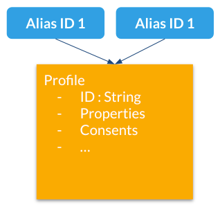

Profile aliases:

- Make it possible to lookup profiles by main (Unomi) ID or by any other alias ID
- Aliases are just IDs stored in a dedicated index
- A profile may have an unlimited number of aliases attached to it.

<a id="index--_how_to_use_them"></a>
<a id="index--how-to-use-them"></a>

##### How to use them

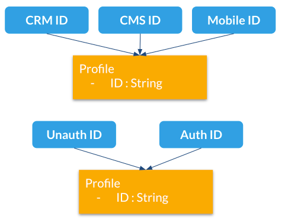

Here are different use cases for profile aliases:

- Connect different systems to Unomi such as a CRM, CMS and native mobile app that all have their own iD for a single customer
- Merging profiles when a visitor is identified
- Adding new IDs at a later time

<a id="index--_example"></a>
<a id="index--example"></a>

##### Example

Here is an example of multiple external aliases pointing to a single Unomi profile

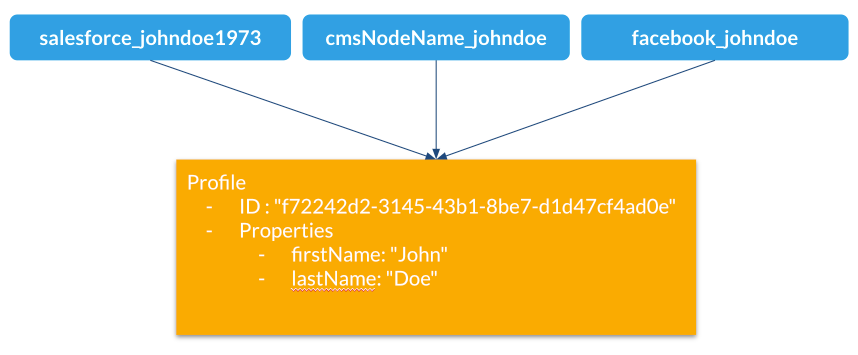

<a id="index--_interactions_with_merging"></a>
<a id="index--interactions-with-merging"></a>

##### Interactions with merging

Profile merges have been modified to use aliases starting Unomi 2

Upon merge:

- Properties are copied to the master profile as before
- An alias is created for the "master" profile with the ID of the merged profile
- Merged profiles are now deleted
- "mergedWith" property is no longer used since we deleted the merged profiles

<a id="index--_api"></a>
<a id="index--api"></a>

##### API

/context.json and /eventcollector will now look up profiles by profile ID or aliases from the same cookie (`context-profile-id`) or body parameters (`profileId`)

| **Verb** | **Path** | **Description** |
| --- | --- | --- |
| GET | /cxs/profiles/PROFILE\_ID\_OR\_ALIAS | Retrieves a profile by ID or Alias ID (useful if an external system wants to get a profile) |
| GET | /cxs/profiles/PROFILE\_ID/aliases | Get all the aliases for a profile |
| POST | /cxs/profiles/PROFILE\_ID/aliases/ALIAS\_ID | Add an alias to a profile |
| DELETE | /cxs/profiles/PROFILE\_ID/aliases/ALIAS\_ID | Remove an alias from a profile |

<a id="index--_request_examples"></a>
<a id="index--3.2.-request-examples"></a>

### 3.2. Request examples

<a id="index--_retrieving_your_first_context"></a>
<a id="index--3.2.1.-retrieving-your-first-context"></a>

#### 3.2.1. Retrieving your first context

You can retrieve a context using curl like this :

```
curl http://localhost:8181/cxs/context.js?sessionId=1234
```

This will retrieve a JavaScript script that contains a `cxs` object that contains the context with the current user
profile, segments, scores as well as functions that makes it easier to perform further requests (such as collecting
events using the cxs.collectEvents() function).

<a id="index--_retrieving_a_context_as_a_json_object"></a>
<a id="index--3.2.2.-retrieving-a-context-as-a-json-object."></a>

#### 3.2.2. Retrieving a context as a JSON object.

If you prefer to retrieve a pure JSON object, you can simply use a request formed like this:

```
curl http://localhost:8181/cxs/context.json?sessionId=1234
```

<a id="index--_accessing_profile_properties_in_a_context"></a>
<a id="index--3.2.3.-accessing-profile-properties-in-a-context"></a>

#### 3.2.3. Accessing profile properties in a context

By default, in order to optimize the amount of data sent over the network, Apache Unomi will not send the content of
the profile or session properties. If you need this data, you must send a JSON object to configure the resulting output
of the context.js(on) servlet.

Here is an example that will retrieve all the session and profile properties, as well as the profile’s segments and
scores

```
curl -X POST http://localhost:8181/cxs/context.json?sessionId=1234 \
-H "Content-Type: application/json" \
-d @- <<'EOF'
{
    "source": {
        "itemId":"homepage",
        "itemType":"page",
        "scope":"example"
    },
    "requiredProfileProperties":["*"],
    "requiredSessionProperties":["*"],
    "requireSegments":true,
    "requireScores":true
}
EOF
```

The `requiredProfileProperties` and `requiredSessionProperties` are properties that take an array of property names
that should be retrieved. In this case we use the wildcard character '\*' to say we want to retrieve all the available
properties. The structure of the JSON object that you should send is a JSON-serialized version of the [ContextRequest](http://unomi.apache.org/unomi-api/apidocs/org/apache/unomi/api/ContextRequest.html)
Java class.

<a id="index--_sending_events_using_the_context_servlet"></a>
<a id="index--3.2.4.-sending-events-using-the-context-servlet"></a>

#### 3.2.4. Sending events using the context servlet

At the same time as you are retrieving the context, you can also directly send events in the ContextRequest object as
illustrated in the following example:

```
curl -X POST http://localhost:8181/cxs/context.json?sessionId=1234 \ -H "Content-Type: application/json" \ -d @- <<'EOF' {"source":{"itemId":"homepage","itemType":"page","scope":"example" },"events":[{"eventType":"view","scope": "example","source":{"itemType": "site","scope":"example","itemId": "mysite" },"target":{"itemType":"page","scope":"example","itemId":"homepage","properties":{"pageInfo":{"referringURL":"https://apache.org/"}}}}]} EOF
```

Upon received events, Apache Unomi will execute all the rules that match the current context, and return an updated context.
This way of sending events is usually used upon first loading of a page. If you want to send events after the page has
finished loading you could either do a second call and get an updating context, or if you don’t need the context and want
to send events in a network optimal way you can use the eventcollector servlet (see below).

<a id="index--_sending_events_using_the_eventcollector_servlet"></a>
<a id="index--3.2.5.-sending-events-using-the-eventcollector-servlet"></a>

#### 3.2.5. Sending events using the eventcollector servlet

If you only need to send events without retrieving a context, you should use the eventcollector servlet that is optimized
respond quickly and minimize network traffic. Here is an example of using this servlet:

```
curl -X POST http://localhost:8181/cxs/eventcollector \ -H "Content-Type: application/json" \ -d @- <<'EOF' {"sessionId" : "1234","events":[{"eventType":"view","scope": "example","source":{"itemType": "site","scope":"example","itemId": "mysite" },"target":{"itemType":"page","scope":"example","itemId":"homepage","properties":{"pageInfo":{"referringURL":"https://apache.org/"}}}}]} EOF
```

Note that the eventcollector executes the rules but does not return a context. If is generally used after a page is loaded
to send additional events.

<a id="index--_where_to_go_from_here"></a>
<a id="index--3.2.6.-where-to-go-from-here"></a>

#### 3.2.6. Where to go from here

- You can find more [useful Apache Unomi URLs](#index--_useful_apache_unomi_urls) that can be used in the same way as the above examples.
- Read the [Twitter sample](#index--_twitter_sample) documentation that contains a detailed example of how to integrate with Apache Unomi.

<a id="index--_configuration"></a>
<a id="index--4.-configuration"></a>

## 4. Configuration

<a id="index--_centralized_configuration"></a>
<a id="index--4.1.-centralized-configuration"></a>

### 4.1. Centralized configuration

Apache Unomi uses a centralized configuration file that contains both system properties and configuration properties.
These settings are then fed to the OSGi and other configuration files using placeholder that look something like this:

```
contextserver.publicAddress=${org.apache.unomi.cluster.public.address:-http://localhost:8181}
contextserver.internalAddress=${org.apache.unomi.cluster.internal.address:-https://localhost:9443}
```

Default values are stored in a file called `$MY_KARAF_HOME/etc/custom.system.properties` but you should never modify
this file directly, as an override mechanism is available. Simply create a file called:

```
unomi.custom.system.properties
```

and put your own property values in their to override the defaults OR you can use environment variables to also override
the values in the `$MY_KARAF_HOME/etc/custom.system.properties`. See the next section for more information about that.

<a id="index--_changing_the_default_configuration_using_environment_variables_i_e_docker_configuration"></a>
<a id="index--4.2.-changing-the-default-configuration-using-environment-variables-i.e.-docker-configuration"></a>

### 4.2. Changing the default configuration using environment variables (i.e. Docker configuration)

You might want to use environment variables to change the default system configuration, especially if you intend to run
Apache Unomi inside a Docker container. You can find the list of all the environment variable names in the following file:

<https://github.com/apache/unomi/blob/master/package/src/main/resources/etc/custom.system.properties>

If you are using Docker Container, simply pass the environment variables on the docker command line or if you are using
Docker Compose you can put the environment variables in the docker-compose.yml file.

If you want to "save" the environment values in a file, you can use the `bin/setenv(.bat)` to setup the environment
variables you want to use.

<a id="index--_changing_the_default_configuration_using_property_files"></a>
<a id="index--4.3.-changing-the-default-configuration-using-property-files"></a>

### 4.3. Changing the default configuration using property files

If you want to change the default configuration using property files instead of environment variables, you can perform
any modification you want in the `$MY_KARAF_HOME/etc/unomi.custom.system.properties` file.

By default this file does not exist and is designed to be a file that will contain only your custom modifications to the
default configuration.

For example, if you want to change the HTTP ports that the server is listening on, you will need to create the
following lines in the $MY\_KARAF\_HOME/etc/unomi.custom.system.properties (and create it if you haven’t yet) file:

```
org.osgi.service.http.port.secure=9443
org.osgi.service.http.port=8181
```

If you change these ports, also make sure you adjust the following settings in the same file :

```
org.apache.unomi.cluster.public.address=http://localhost:8181
org.apache.unomi.cluster.internal.address=https://localhost:9443
```

If you need to specify an ElasticSearch cluster name, or a host and port that are different than the default, it is recommended to do this BEFORE you start the server for the first time, or you will loose all the data
you have stored previously.

You can use the following properties for the ElasticSearch configuration

```
org.apache.unomi.elasticsearch.cluster.name=contextElasticSearch
# The elasticsearch.adresses may be a comma seperated list of host names and ports such as
# hostA:9200,hostB:9200
# Note: the port number must be repeated for each host.
org.apache.unomi.elasticsearch.addresses=localhost:9200
```

<a id="index--_secured_events_configuration"></a>
<a id="index--4.4.-secured-events-configuration"></a>

### 4.4. Secured events configuration

Apache Unomi secures some events by default. It comes out of the box with a default configuration that you can adjust
by using the centralized configuration file override in `$MY_KARAF_HOME/etc/unomi.custom.system.properties`

You can find the default configuration in the following file:

```
$MY_KARAF_HOME/etc/custom.system.properties
```

The properties start with the prefix : `org.apache.unomi.thirdparty.*` and here are the default values :

```
org.apache.unomi.thirdparty.provider1.key=${env:UNOMI_THIRDPARTY_PROVIDER1_KEY:-670c26d1cc413346c3b2fd9ce65dab41}
org.apache.unomi.thirdparty.provider1.ipAddresses=${env:UNOMI_THIRDPARTY_PROVIDER1_IPADDRESSES:-127.0.0.1,::1}
org.apache.unomi.thirdparty.provider1.allowedEvents=${env:UNOMI_THIRDPARTY_PROVIDER1_ALLOWEDEVENTS:-login,updateProperties}
```

The events set in allowedEvents will be secured and will only be accepted if the call comes from the specified IP
address, and if the secret-key is passed in the X-Unomi-Peer HTTP request header. The "env:" part means that it will
attempt to read an environment variable by that name, and if it’s not found it will default to the value after the ":-"
marker.

It is now also possible to use IP address ranges instead of having to list all valid IP addresses for event sources. This
is very useful when working in cluster deployments where servers may be added or removed dynamically. In order to support
this Apache Unomi uses a library called [IPAddress](https://seancfoley.github.io/IPAddress/#_Toc525135541) that supports
IP ranges and subnets. Here is an example of how to setup a range:

```
org.apache.unomi.thirdparty.provider1.ipAddresses=${env:UNOMI_THIRDPARTY_PROVIDER1_IPADDRESSES:-192.168.1.1-100,::1}
```

The above configuration will allow a range of IP addresses between 192.168.1.1 and 192.168.1.100 as well as the IPv6
loopback.

Here’s another example using the subnet format:

```
org.apache.unomi.thirdparty.provider1.ipAddresses=${env:UNOMI_THIRDPARTY_PROVIDER1_IPADDRESSES:-1.2.0.0/16,::1}
```

The above configuration will allow all addresses starting with 1.2 as well as the IPv6 loopback address.

Wildcards may also be used:

```
org.apache.unomi.thirdparty.provider1.ipAddresses=${env:UNOMI_THIRDPARTY_PROVIDER1_IPADDRESSES:-1.2.*.*,::1}
```

The above configuration is exactly the same as the previous one.

More advanced ranges and subnets can be used as well, please refer to the [IPAddress](https://seancfoley.github.io/IPAddress) library documentation for details on
how to format them.

If you want to add another provider you will need to add them manually in the following file (and make sure you maintain
the changes when upgrading) :

```
$MY_KARAF_HOME/etc/org.apache.unomi.thirdparty.cfg
```

Usually, login events, which operate on profiles and do merge on protected properties, must be secured. For each
trusted third party server, you need to add these 3 lines :

```
thirdparty.provider1.key=secret-key
thirdparty.provider1.ipAddresses=127.0.0.1,::1
thirdparty.provider1.allowedEvents=login,updateProperties
```

<a id="index--_installing_the_maxmind_geoiplite2_ip_lookup_database"></a>
<a id="index--4.5.-installing-the-maxmind-geoiplite2-ip-lookup-database"></a>

### 4.5. Installing the MaxMind GeoIPLite2 IP lookup database

Apache Unomi requires an IP database in order to resolve IP addresses to user location.
The GeoLite2 database can be downloaded from MaxMind here :
<http://dev.maxmind.com/geoip/geoip2/geolite2/>

Simply download the GeoLite2-City.mmdb file into the "etc" directory.

<a id="index--_installing_geonames_database"></a>
<a id="index--4.6.-installing-geonames-database"></a>

### 4.6. Installing Geonames database

Apache Unomi includes a geocoding service based on the geonames database ( <http://www.geonames.org/> ). It can be
used to create conditions on countries or cities.

In order to use it, you need to install the Geonames database into . Get the "allCountries.zip" database from here :
<http://download.geonames.org/export/dump/>

Download it and put it in the "etc" directory, without unzipping it.
Edit `$MY_KARAF_HOME/etc/unomi.custom.system.properties` and set `org.apache.unomi.geonames.forceImport` to true, import should start right away.
Otherwise, import should start at the next startup. Import runs in background, but can take about 15 minutes.
At the end, you should have about 4 million entries in the geonames index.

<a id="index--_rest_api_security"></a>
<a id="index--4.7.-rest-api-security"></a>

### 4.7. REST API Security

The Apache Unomi Context Server REST API is protected using JAAS authentication and using Basic or Digest HTTP auth.
By default, the login/password for the REST API full administrative access is "karaf/karaf".

The generated package is also configured with a default SSL certificate. You can change it by following these steps :

Replace the existing keystore in $MY\_KARAF\_HOME/etc/keystore by your own certificate :

<http://wiki.eclipse.org/Jetty/Howto/Configure_SSL>

Update the keystore and certificate password in $MY\_KARAF\_HOME/etc/unomi.custom.system.properties file :

```
org.ops4j.pax.web.ssl.keystore=${env:UNOMI_SSL_KEYSTORE:-${karaf.etc}/keystore}
org.ops4j.pax.web.ssl.password=${env:UNOMI_SSL_PASSWORD:-changeme}
org.ops4j.pax.web.ssl.keypassword=${env:UNOMI_SSL_KEYPASSWORD:-changeme}
```

You should now have SSL setup on Karaf with your certificate, and you can test it by trying to access it on port 9443.

Changing the default Karaf password can be done by modifying the `org.apache.unomi.security.root.password` in the
`$MY_KARAF_HOME/etc/unomi.custom.system.properties` file

<a id="index--_scripting_security"></a>
<a id="index--4.8.-scripting-security"></a>

### 4.8. Scripting security

<a id="index--_multi_layer_scripting_filtering_system"></a>
<a id="index--4.8.1.-multi-layer-scripting-filtering-system"></a>

#### 4.8.1. Multi-layer scripting filtering system

The scripting security system is multi-layered.

For requests coming in through the /cxs/context.json endpoint, the following flow is used to secure incoming requests:


Conditions submitted through the context.json public endpoint are first sanitized, meaning that any scripting directly
injected is removed. However, as conditions can use sub conditions that include scripting, only the first directly
injected layer of scripts are removed.

The second layer is the expression filtering system, that uses an allow-listing mechanism to only accept pre-vetted
expressions (through configuration and deployment on the server side). Any unrecognized expression will not be accepted.

Finally, once the script starts executing in the scripting engine, a filtering class loader will only let the script
access classes that have been allowed.

This multi-layered approach makes it possible to retain a high level of security even if one layer is poorly
configured or abused.

For requests coming in through the secure APIs such as rules, only the condition sanitizing step is skipped, otherwise the rest of the filtering system is the same.

<a id="index--_scripts_and_expressions"></a>
<a id="index--4.8.2.-scripts-and-expressions"></a>

#### 4.8.2. Scripts and expressions

Apache Unomi allows using different types of expressions in the following subsystems:

- context.json filters and personalization queries
- rule conditions and actions parameters

Apache Unomi uses an integrated scripting language to provide this functionality: MVEL.
MVEL is used in rule actions as in the following example:

From <https://github.com/apache/unomi/blob/unomi-1.5.x/plugins/baseplugin/src/main/resources/META-INF/cxs/rules/sessionAssigned.json>:

```json
{"metadata": {"id": "_ajhg9u2s5_sessionAssigned","name": "Session assigned to a profile","description": "Update profile visit information","readOnly":true },
"condition": {"type": "booleanCondition","parameterValues": {"subConditions":[{"type": "eventTypeCondition","parameterValues": {"eventTypeId": "sessionCreated"} },{"type": "eventTypeCondition","parameterValues": {"eventTypeId": "sessionReassigned"}}
],"operator":"or"
} },
"actions": [{"parameterValues": {"setPropertyName": "properties.previousVisit","setPropertyValue": "profileProperty::lastVisit","storeInSession": false },"type": "setPropertyAction" },{"parameterValues": {"setPropertyName": "properties.lastVisit","setPropertyValue": "now","storeInSession": false },"type": "setPropertyAction" },{"parameterValues": {"setPropertyName": "properties.nbOfVisits","setPropertyValue": "script::profile.properties.?nbOfVisits != null ? (profile.properties.nbOfVisits + 1) : 1","storeInSession": false },"type": "setPropertyAction"}]
}
```

As we see in the above example, we use an MVEL script with the setPropertyAction to set a property value.
Starting with version 1.5.2, any expression use in rules MUST be allow-listed.

By default, Apache Unomi comes with some built-in allowed expressions that cover all the internal uses cases.

Default allowed MVEL expressions (from <https://github.com/apache/unomi/blob/unomi-1.5.x/plugins/baseplugin/src/main/resources/META-INF/cxs/expressions/mvel.json>) :

```json
[
  "\\Q'systemProperties.goals.'+goalId+'TargetReached'\\E",
  "\\Q'now-'+since+'d'\\E",
  "\\Q'scores.'+scoringPlanId\\E",
  "\\QminimumDuration*1000\\E",
  "\\QmaximumDuration*1000\\E",
  "\\Qprofile.properties.?nbOfVisits != null ? (profile.properties.nbOfVisits + 1) : 1\\E",
  "\\Qsession != null ? session.size + 1 : 0\\E",
  "\\Q'properties.optimizationTest_'+event.target.itemId\\E",
  "\\Qevent.target.properties.variantId\\E",
  "\\Qprofile.properties.?systemProperties.goals.\\E[\\w\\_]*\\QReached != null ? (profile.properties.systemProperties.goals.\\E[\\w\\_]*\\QReached) : 'now'\\E",
  "\\Qprofile.properties.?systemProperties.campaigns.\\E[\\w\\_]*\\QEngaged != null ? (profile.properties.systemProperties.campaigns.\\E[\\w\\_]*\\QEngaged) : 'now'\\E"
]
```

If you require or are already using custom expressions, you should add a plugin to Apache Unomi to allow for this.
The choice of a plugin was to make sure only system administrators and solution developers could provide such a
list, avoiding the possibility to provide it through an API call or another security sensitive deployment mechanism.

There is another way of allow-listing expressions through configuration, see the “scripting configuration parameters” section below.

Procedure to add allowed expressions:

1. Create a new Apache Unomi plugin project.
2. Create a JSON file in src/main/resources/META-INF/cxs/expressions/mvel.json with an array of regular expressions that will contain the allowed expressions.
3. Build the project and deploy it to Apache Unomi

Warning: Do not make regular expressions too general. They should actually be as specific as possible to avoid potential injection of malicious code.

<a id="index--_scripting_expression_filtering_configuration_parameters"></a>
<a id="index--4.8.3.-scripting-expression-filtering-configuration-parameters"></a>

#### 4.8.3. Scripting expression filtering configuration parameters

Alongside with the allow-listing technology, there are new configuration parameters to control the security of the scripting engines:

```
# These parameters control the list of classes that are allowed or forbidden when executing expressions.
org.apache.unomi.scripting.allow=${env:UNOMI_ALLOW_SCRIPTING_CLASSES:-org.apache.unomi.api.Event,org.apache.unomi.api.Profile,org.apache.unomi.api.Session,org.apache.unomi.api.Item,org.apache.unomi.api.CustomItem,java.lang.Object,java.util.Map,java.util.HashMap,java.lang.Integer,org.mvel2.*}
org.apache.unomi.scripting.forbid=${env:UNOMI_FORBID_SCRIPTING_CLASSES:-}

# This parameter controls the whole expression filtering system. It is not recommended to turn it off. The main reason to turn it off would be to check if it is interfering with something, but it should always be active in production.
org.apache.unomi.scripting.filter.activated=${env:UNOMI_SCRIPTING_FILTER_ACTIVATED:-true}

# The following parameters control the filtering using regular expressions for each scripting sub-system.
# The "collections" parameter tells the expression filtering system which configurations to expect. By default only MVEL is accepted values, but in the future these might be replaced by new scripting sub-systems.
org.apache.unomi.scripting.filter.collections=${env:UNOMI_SCRIPTING_FILTER_COLLECTIONS:-mvel}

# For each scripting sub-system, there is an allow and a forbid property that reference a .json files,
# you can either edit this files or reference your own file directly in the following config.
# Note: You can add new expressions to the "allow" file, although it is better to add them inside any plugins you may be adding.
#       This configuration is only designed to compensate for the cases where something was not properly designed or to deal with compatibility issues.
#       Just be VERY careful to make your patterns AS SPECIFIC AS POSSIBLE in order to avoid introducing a way to abuse the expression filtering.
# Note: It is NOT recommended to change the built-in "forbid" value unless you are having issues with its value.
# Note: mvel-allow.json contains an empty array: [], this mean nothing is allowed, so far.
#       If you want to allow all expression, just remove the property org.apache.unomi.scripting.filter.mvel.allow, but this is not recommended
#       It's better to list your expressions, and provide them in the mvel-allow.json file
#       example: ["\\Qsession.size + 1\\E"]
org.apache.unomi.scripting.filter.mvel.allow=${env:UNOMI_SCRIPTING_FILTER_MVEL_ALLOW:-${karaf.etc}/mvel-allow.json}
org.apache.unomi.scripting.filter.mvel.forbid=${env:UNOMI_SCRIPTING_FILTER_MVEL_FORBID:-${karaf.etc}/mvel-forbid.json}

# This parameter controls the condition sanitizing done on the ContextServlet (/cxs/context.json). If will remove any expressions that start with "script::". It is not recommended to change this value, unless you run into compatibility issues.
org.apache.unomi.security.personalization.sanitizeConditions=${env:UNOMI_SECURITY_SANITIZEPERSONALIZATIONCONDITIONS:-true}
```

<a id="index--_groovy_actions"></a>
<a id="index--4.8.4.-groovy-actions"></a>

#### 4.8.4. Groovy Actions

Groovy actions offer the ability to define a set of actions and action types (aka action descriptors) purely from Groovy scripts defined at runtime.

Initially submitted to Unomi through a purpose-built REST API endpoint, Groovy actions are then stored in Elasticsearch. When an event matches a rule configured to execute an action, the corresponding action is fetched from Elasticsearch and executed.

<a id="index--_anatomy_of_a_groovy_action"></a>
<a id="index--anatomy-of-a-groovy-action"></a>

##### Anatomy of a Groovy Action

To be valid, a Groovy action must follow a particular convention which is divided in two parts:

- An annotation used to define the associated action type
- The function to be executed

Placed right before the function, the “@Action” annotation contains a set of parameter detailing how the action should be triggered.

| Field name | Type | Required | Description |
| --- | --- | --- | --- |
| id | String | YES | Id of the action |
| actionExecutor | String | YES | Action executor contains the name of the script to call for the action type and must be prefixed with “**groovy:**”. The prefix indicates to Unomi which dispatcher to use when processing the action. The name must be the file name of the groovy file containing the action without the extension (**groovy:<filename>**). |
| name | String |  | Action name |
| hidden | Boolean |  | Define if the action is hidden or not. It is usually used to hide objects in a UI. |
| parameters | List<[Parameter](https://github.com/apache/unomi/blob/master/extensions/groovy-actions/services/src/main/java/org/apache/unomi/groovy/actions/annotations/Parameter.java)> |  | The parameters of the actions, also defined by annotations |
| systemTags | List<String> |  | A (reserved) list of tags for the associated object. This is usually populated through JSON descriptors and is not meant to be modified by end users. These tags may include values that help classify associated objects. |

The function contained within the Groovy Action must be called `execute()` and its last instruction must be an integer.

This integer serves as an indication whether the values of the session and profile should be persisted. In general, the codes used are defined in the [EventService interface](https://github.com/apache/unomi/blob/master/api/src/main/java/org/apache/unomi/api/services/EventService.java).

Each groovy actions extends by default a Base script
[defined here](https://github.com/apache/unomi/blob/master/extensions/groovy-actions/services/src/main/resources/META-INF/base/BaseScript.groovy)

<a id="index--_rest_api"></a>
<a id="index--rest-api"></a>

##### REST API

Actions can be deployed/updated/deleted via the dedicated `/cxs/groovyActions` rest endpoint.

Deploy/update an Action:

```bash
curl -X POST 'http://localhost:8181/cxs/groovyActions' \
--user karaf:karaf \
--form 'file=@"<file location>"'
```

A Groovy Action can be updated by submitting another Action with the same id.

Delete an Action:

```bash
curl -X DELETE 'http://localhost:8181/cxs/groovyActions/<Action id>' \
--user karaf:karaf
```

Note that when a groovy action is deleted by the API, the action type associated with this action will also be deleted.

<a id="index--_hello_world"></a>
<a id="index--hello-world"></a>

##### Hello World!

In this short example, we’re going to create a Groovy Action that will be adding “Hello world!” to the logs whenever a new view event is triggered.

The first step consists in creating the groovy script on your filesystem, start by creating the file `helloWorldGroovyAction.groovy`:

```groovy
@Action(id = "helloWorldGroovyAction",
        actionExecutor = "groovy:helloWorldGroovyAction",
        parameters = [@Parameter(id = "location", type = "string", multivalued = false)])
def execute() {
    logger.info("Hello {}", action.getParameterValues().get("location"))
    EventService.NO_CHANGE
}
```

As the last instruction of the script is `EventService.NO_CHANGE`, data will not be persisted.

Once the action has been created you need to submit it to Unomi (from the same folder as `helloWorldGroovyAction.groovy`).

```bash
curl -X POST 'http://localhost:8181/cxs/groovyActions' \
--user karaf:karaf \
--form 'file=@helloWorldGroovyAction.groovy'
```

Important: A bug ( [UNOMI-847](https://issues.apache.org/jira/browse/UNOMI-847) ) in Apache Unomi 2.5 and lower requires the filename of a Groovy file being submitted to be the same than the id of the Groovy action (as per the example above).

Finally, register a rule to trigger execution of the groovy action:

```bash
curl -X POST 'http://localhost:8181/cxs/rules' \ --user karaf:karaf \ --header 'Content-Type: application/json' \ --data-raw '{"metadata": {"id": "scriptGroovyActionRule","name": "Test Groovy Action Rule","description": "A sample rule to test Groovy actions" },"condition": {"type": "eventTypeCondition","parameterValues": {"eventTypeId": "view"} },"actions": [{"parameterValues": {"location": "world!" },"type": "helloWorldGroovyAction"}] }'
```

Note that this rule contains a “location” parameter, with the value “world!”, which is then used in the log message triggered by the action.

You can now use unomi to trigger a “view” event and see the corresponding message in the Unomi logs.

Once you’re done with the Hello World! action, it can be deleted using the following command:

```bash
curl -X DELETE 'http://localhost:8181/cxs/groovyActions/helloWorldGroovyAction' \
--user karaf:karaf
```

And the corresponding rule can be deleted using the following command:

```bash
curl -X DELETE 'http://localhost:8181/cxs/rules/scriptGroovyActionRule' \
--user karaf:karaf
```

<a id="index--_inject_an_osgi_service_in_a_groovy_script"></a>
<a id="index--inject-an-osgi-service-in-a-groovy-script"></a>

##### Inject an OSGI service in a groovy script

It’s possible to use the services provided by unomi directly in the groovy actions.

In the following example, we are going to create a groovy action that displays the number of existing profiles by using the profile service provided by unomi.

```
import org.osgi.framework.Bundle
import org.osgi.framework.BundleContext
import org.osgi.framework.FrameworkUtil
import org.apache.unomi.groovy.actions.GroovyActionDispatcher
import org.osgi.framework.ServiceReference
import org.slf4j.Logger
import org.slf4j.LoggerFactory

final Logger LOGGER = LoggerFactory.getLogger(GroovyActionDispatcher.class.getName());

@Action(id = "displayNumberOfProfilesAction", actionExecutor = "groovy:DisplayNumberOfProfilesAction", description = "Display the number of existing profiles")
def execute() {

    // Use OSGI function to get the bundleContext
    Bundle bundle = FrameworkUtil.getBundle(GroovyActionDispatcher.class);
    BundleContext context = bundle.getBundleContext();

    // Get the service reference
    ServiceReference<ProfileService> serviceReference = context.getServiceReference(ProfileService.class);

    // Get the service you are looking for
    ProfileService profileService = context.getService(serviceReference);

    // Example of displaying the number of profile
    LOGGER.info("Display profile count")
    LOGGER.info("{}", profileService.getAllProfilesCount().toString())

    return EventService.NO_CHANGE
}
```

<a id="index--_known_limitation"></a>
<a id="index--known-limitation"></a>

##### Known limitation

Only the services accessible by the class loader of the GroovyActionDispatcher class can be used in the groovy actions.
That includes the services in the following packages:

```
org.apache.unomi.api.actions
org.apache.unomi.api.services
org.apache.unomi.api
org.apache.unomi.groovy.actions
org.apache.unomi.groovy.actions.annotations
org.apache.unomi.groovy.actions.services
org.apache.unomi.metrics
org.apache.unomi.persistence.spi
org.apache.unomi.services.actions;version
```

<a id="index--_scripting_roadmap"></a>
<a id="index--4.8.5.-scripting-roadmap"></a>

#### 4.8.5. Scripting roadmap

Scripting will probably undergo major changes in future versions of Apache Unomi, with the likely retirement of MVEL in favor of Groovy Actions detailed above.

These changes will not happen on maintenance versions of Apache Unomi, only in the next major version. Maintenance
versions will of course maintain compatibility with existing scripting solutions.

<a id="index--_automatic_profile_merging"></a>
<a id="index--4.9.-automatic-profile-merging"></a>

### 4.9. Automatic profile merging

Apache Unomi is capable of merging profiles based on a common property value. In order to use this, you must
add the MergeProfileOnPropertyAction to a rule (such as a login rule for example), and configure it with the name
of the property that will be used to identify the profiles to be merged. An example could be the "email" property, meaning that if two (or more) profiles are found to have the same value for the "email" property they will be merged
by this action.

Upon merge, the old profiles are marked with a "mergedWith" property that will be used on next profile access to delete
the original profile and replace it with the merged profile (aka "master" profile). Once this is done, all cookie tracking
will use the merged profile.

To test, simply configure the action in the "login" or "facebookLogin" rules and set it up on the "email" property.
Upon sending one of the events, all matching profiles will be merged.

<a id="index--_securing_a_production_environment"></a>
<a id="index--4.10.-securing-a-production-environment"></a>

### 4.10. Securing a production environment

Before going live with a project, you should *absolutely* read the following section that will help you setup a proper
secure environment for running your context server.

Step 1: Install and configure a firewall

You should setup a firewall around your cluster of context servers and/or Elasticsearch nodes. If you have an
application-level firewall you should only allow the following connections open to the whole world :

- <http://localhost:8181/cxs/context.js>
- <http://localhost:8181/cxs/eventcollector>

All other ports should not be accessible to the world.

For your Apache Unomi client applications (such as the Jahia CMS), you will need to make the following ports
accessible :

```
8181 (Context Server HTTP port)
9443 (Context Server HTTPS port)
```

The Apache Unomi actually requires HTTP Basic Auth for access to the Context Server administration REST API, so it is
highly recommended that you design your client applications to use the HTTPS port for accessing the REST API.

The user accounts to access the REST API are actually routed through Karaf’s JAAS support, which you may find the
documentation for here :

- <https://karaf.apache.org/manual/latest/#_security_2>

The default username/password is

```
karaf/karaf
```

You should really change this default username/password as soon as possible. Changing the default Karaf password can be
done by modifying the `org.apache.unomi.security.root.password` in the `$MY_KARAF_HOME/etc/unomi.custom.system.properties` file

Or if you want to also change the user name you could modify the following file :

```
$MY_KARAF_HOME/etc/users.properties
```

But you will also need to change the following property in the $MY\_KARAF\_HOME/etc/unomi.custom.system.properties :

```
karaf.local.user = karaf
```

For your context servers, and for any standalone Elasticsearch nodes you will need to open the following ports for proper
node-to-node communication : 9200 (Elasticsearch REST API), 9300 (Elasticsearch TCP transport)

Of course any ports listed here are the default ports configured in each server, you may adjust them if needed.

Step 2 : Follow industry recommended best practices for securing Elasticsearch

You may find more valuable recommendations here :

- <https://www.elastic.co/blog/found-elasticsearch-security>
- <https://www.elastic.co/blog/scripting-security>

Step 4 : Setup a proxy in front of the context server

As an alternative to an application-level firewall, you could also route all traffic to the context server through
a proxy, and use it to filter any communication.

<a id="index--_integrating_with_an_apache_http_web_server"></a>
<a id="index--4.11.-integrating-with-an-apache-http-web-server"></a>

### 4.11. Integrating with an Apache HTTP web server

If you want to setup an Apache HTTP web server in from of Apache Unomi, here is an example configuration using
mod\_proxy.

In your Unomi package directory, in $MY\_KARAF\_HOME/etc/unomi.custom.system.properties setup the public address for
the hostname `unomi.apache.org`:

org.apache.unomi.cluster.public.address=https://unomi.apache.org/
org.apache.unomi.cluster.internal.address=http://192.168.1.1:8181

and you will also need to change the cookie domain in the same file:

org.apache.unomi.profile.cookie.domain=apache.org

Main virtual host config:

```
<VirtualHost *:80>
        Include /var/www/vhosts/unomi.apache.org/conf/common.conf
</VirtualHost>

<IfModule mod_ssl.c>
    <VirtualHost *:443>
        Include /var/www/vhosts/unomi.apache.org/conf/common.conf

        SSLEngine on

        SSLCertificateFile    /var/www/vhosts/unomi.apache.org/conf/ssl/24d5b9691e96eafa.crt
        SSLCertificateKeyFile /var/www/vhosts/unomi.apache.org/conf/ssl/apache.org.key
        SSLCertificateChainFile /var/www/vhosts/unomi.apache.org/conf/ssl/gd_bundle-g2-g1.crt

        <FilesMatch "\.(cgi|shtml|phtml|php)$">
                SSLOptions +StdEnvVars
        </FilesMatch>
        <Directory /usr/lib/cgi-bin>
                SSLOptions +StdEnvVars
        </Directory>
        BrowserMatch "MSIE [2-6]" \
                nokeepalive ssl-unclean-shutdown \
                downgrade-1.0 force-response-1.0
        BrowserMatch "MSIE [17-9]" ssl-unclean-shutdown

    </VirtualHost>
</IfModule>
```

common.conf:

```
ServerName unomi.apache.org
ServerAdmin webmaster@apache.org

DocumentRoot /var/www/vhosts/unomi.apache.org/html
CustomLog /var/log/apache2/access-unomi.apache.org.log combined
<Directory />
        Options FollowSymLinks
        AllowOverride None
</Directory>
<Directory /var/www/vhosts/unomi.apache.org/html>
        Options FollowSymLinks MultiViews
        AllowOverride None
        Order allow,deny
        allow from all
</Directory>
<Location /cxs>
    Order deny,allow
    deny from all
    allow from 88.198.26.2
    allow from www.apache.org
</Location>

RewriteEngine On
RewriteCond %{REQUEST_METHOD} ^(TRACE|TRACK)
RewriteRule .* - [F]
ProxyPreserveHost On
ProxyPass /server-status !
ProxyPass /robots.txt !

RewriteCond %{HTTP_USER_AGENT} Googlebot [OR]
RewriteCond %{HTTP_USER_AGENT} msnbot [OR]
RewriteCond %{HTTP_USER_AGENT} Slurp
RewriteRule ^.* - [F,L]

ProxyPass / http://localhost:8181/ connectiontimeout=20 timeout=300 ttl=120
ProxyPassReverse / http://localhost:8181/
```

<a id="index--_changing_the_default_tracking_location"></a>
<a id="index--4.12.-changing-the-default-tracking-location"></a>

### 4.12. Changing the default tracking location

When performing localhost requests to Apache Unomi, a default location will be used to insert values into the session
to make the location-based personalization still work. You can modify the default location settings using the
centralized configuration file (`$MY_KARAF_HOME/etc/unomi.custom.system.properties`).

Here are the default values for the location settings :

```
# The following settings represent the default position that is used for localhost requests
org.apache.unomi.ip.database.location=${env:UNOMI_IP_DB:-${karaf.etc}/GeoLite2-City.mmdb}
org.apache.unomi.ip.default.countryCode=${env:UNOMI_IP_DEFAULT_COUNTRYCODE:-CH}
org.apache.unomi.ip.default.countryName=${env:UNOMI_IP_DEFAULT_COUNTRYNAME:-Switzerland}
org.apache.unomi.ip.default.city=${env:UNOMI_IP_DEFAULT_CITY:-Geneva}
org.apache.unomi.ip.default.subdiv1=${env:UNOMI_IP_DEFAULT_SUBDIV1:-2660645}
org.apache.unomi.ip.default.subdiv2=${env:UNOMI_IP_DEFAULT_SUBDIV2:-6458783}
org.apache.unomi.ip.default.isp=${env:UNOMI_IP_DEFAULT_ISP:-Cablecom}
org.apache.unomi.ip.default.latitude=${env:UNOMI_IP_DEFAULT_LATITUDE:-46.1884341}
org.apache.unomi.ip.default.longitude=${env:UNOMI_IP_DEFAULT_LONGITUDE:-6.1282508}
```

You might want to change these for testing or for demonstration purposes.

<a id="index--_apache_karaf_ssh_console"></a>
<a id="index--4.13.-apache-karaf-ssh-console"></a>

### 4.13. Apache Karaf SSH Console

The Apache Karaf SSH console is available inside Apache Unomi, but the port has been changed from the default value of
8101 to 8102 to avoid conflicts with other Karaf-based products. So to connect to the SSH console you should use:

```
ssh -p 8102 karaf@localhost
```

or the user/password you have setup to protect the system if you have changed it. You can find the list of Apache Unomi
shell commands in the "Shell commands" section of the documentation.

<a id="index--_elasticsearch_authentication_and_security"></a>
<a id="index--4.14.-elasticsearch-authentication-and-security"></a>

### 4.14. ElasticSearch authentication and security

With ElasticSearch 7, it’s possible to secure the access to your data. (see <https://www.elastic.co/guide/en/elasticsearch/reference/7.17/configuring-stack-security.html> and <https://www.elastic.co/guide/en/elasticsearch/reference/7.17/secure-cluster.html>)

<a id="index--_user_authentication"></a>
<a id="index--4.14.1.-user-authentication"></a>

#### 4.14.1. User authentication !

If your ElasticSearch have been configured to be only accessible by authenticated users, edit `etc/org.apache.unomi.persistence.elasticsearch.cfg` to add the following settings:

```
username=USER
password=PASSWORD
```

<a id="index--_ssl_communication"></a>
<a id="index--4.14.2.-ssl-communication"></a>

#### 4.14.2. SSL communication

By default Unomi will communicate with ElasticSearch using `http`
but you can configure your ElasticSearch server(s) to allow encrypted request using `https`.

You can follow this documentation to enable SSL on your ElasticSearch server(s): <https://www.elastic.co/guide/en/elasticsearch/reference/7.17/security-basic-setup-https.html>

If your ElasticSearch is correctly configure to encrypt communications on `https`:

Just edit `etc/org.apache.unomi.persistence.elasticsearch.cfg` to add the following settings:

```
sslEnable=true
```

By default, certificates will have to be configured on the Apache Unomi server to be able to trust the identity
of the ElasticSearch server(s). But if you need to trust all certificates automatically, you can use this setting:

```
sslTrustAllCertificates=true
```

<a id="index--_permissions"></a>
<a id="index--4.14.3.-permissions"></a>

#### 4.14.3. Permissions

Apache Unomi requires a particular set of Elasticsearch permissions for its operation.

If you are using Elasticsearch in a production environment, you will most likely need to fine tune permissions given to the user used by Unomi.

The following permissions are required by Unomi:

- required cluster privileges: `manage` OR `all`
- required index privileges on unomi indices: `write, manage, read` OR `all`

<a id="index--_health_check_extension"></a>
<a id="index--4.15.-health-check-extension"></a>

### 4.15. Health Check Extension

The Health Check extension provides a way to check is required Unomi components are 'live'.

It consists in a simple http endpoint that provide a JSON view of integrated health checks. It can then be used to determine if the server
is up and running and can serve requests.

The health check endpoint is available at the following URL: /health/check and returns a simple JSON response that includes all health check provider responses.

Basic Http Authentication enforce security for the health check endpoint using the existing karaf realm. The user needs to have the specific role **health**
to access the endpoint. Users and roles can be configured in the etc/users.properties file. By default, a login/pass health/health is configured.

Specific configuration is located in : org.apache.unomi.healthcheck.cfg Existing health checks are using configuration from that file, including authentication realm.

Existing health checks gives information about :
- Karaf (as soon as the karaf container is started, that check is LIVE)
- Elasticsearch (connection to elasticsearch cluster and its health)
- Unomi (unomi bundles status)
- Persistence (unomi to elasticsearch binding)
- Cluster health (unomi cluster status and nodes information)

All healthcheck can have a status :
- DOWN (service is not available)
- UP (service is up but does not respond to request (starting or misconfigured))
- LIVE (service is ready to serve request)
- ERROR (an error occurred during service health check)

Any subsystem health check have a timeout of 400ms where check is cancelled and will be returned as error.

Typical response to /health/check when unomi NOT started is :

```json
[{"name":"karaf","status":"LIVE","collectingTime":0 },{"name":"cluster","status":"DOWN","collectingTime":0 },{"name":"elasticsearch","status":"LIVE","collectingTime":6 },{"name":"persistence","status":"DOWN","collectingTime":0 },{"name":"unomi","status":"DOWN","collectingTime":0}]
```

Existing health check can be extended by adding specific provider in the extension. A provider is a class that implements the HealthCheckProvider interface.

```java
package org.apache.unomi.healthcheck;

public interface HealthCheckProvider {
    String name();
    HealthCheckResponse execute();
}
```

Calls to provider are supposed to be done at a regular rate (every 15 seconds for example) and should be fast to execute. Feel free to include any caching strategy if needed.

<a id="index--_configuration_2"></a>
<a id="index--4.15.1.-configuration"></a>

#### 4.15.1. Configuration

Healthcheck extension configuration is located in the file etc/org.apache.unomi.healthcheck.cfg

Extension can be enabled by setting the property `enabled` to `true`. An environment variable can be used to set this property : UNOMI\_HEALTHCHECK\_ENABLED.
You must restart the bundle for that config to take effect.

By default, all healthcheck providers are included but the list of those included providers can be customized by setting the property `providers` with a comma separated list of provider names. An environment variable can be used to set this property : UNOMI\_HEALTHCHECK\_PROVIDERS.
Karaf provider is the one needed by healthcheck (always LIVE), it cannot be ignored.

The timeout used for each health check can be set by setting the property `timeout` to the desired value in milliseconds. An environment variable can be used to set this property : UNOMI\_HEALTHCHECK\_TIMEOUT

<a id="index--_json_schemas"></a>
<a id="index--5.-json-schemas"></a>

## 5. JSON schemas

<a id="index--_introduction_2"></a>
<a id="index--5.1.-introduction"></a>

### 5.1. Introduction

Introduced with Apache Unomi 2.0, JSON-Schema are used to validate data submitted through all of the public (unprotected) API endpoints.

<a id="index--_what_is_a_json_schema"></a>
<a id="index--5.1.1.-what-is-a-json-schema"></a>

#### 5.1.1. What is a JSON Schema

[JSON Schema](https://json-schema.org/specification.html) is a powerful standard for validating the structure of JSON data.
Described as a JSON object, a JSON schema file contains format, types, patterns, and more.
Used against JSON data, a JSON schema validates that the data is compatible with the specified schema.

Example of a basic JSON schema that validates that the path property is a string property:

```
{"$id":"https://unomi.apache.org/schemas/json/example/1-0-0","$schema":"https://json-schema.org/draft/2019-09/schema","title":"Example of a basic schema","type":"object","properties":{"path":{"type":"string","$comment":"Example of a property."}}}
```

```
{
    "path": "example/of/path" //Is valid
}
```

```
{
    "path": 100  // Is not valid
}
```

Apache Unomi is using json-schema-validator to integrate JSON schema.
The library and its source code is available at: <https://github.com/networknt/json-schema-validator>, you can refer to the feature’s pom.xml available at [json-schema/service/pom.xml](https://github.com/apache/unomi/blob/master/extensions/json-schema/services/pom.xml#L35) to identify which version of the library is currently integrated.

You can discover and play with JSON schema using online tools such as [JSON Schema Validator](https://www.jsonschemavalidator.net/).
Such tools allow you to validate a schema against JSON data (such as the example above), and can point to particular errors.
More details about JSON schema are available on the official specification’s website: <https://json-schema.org/specification.html>

<a id="index--_key_concepts"></a>
<a id="index--5.1.2.-key-concepts"></a>

#### 5.1.2. Key concepts

This section details concepts that are important to understand in order to use JSON schema validation with Apache Unomi.

<a id="index--_id_keyword"></a>
<a id="index--id-keyword"></a>

##### $id keyword

The **$id** keyword:

Each schema in Apache Unomi should have a **$id**, the **$id** value is an URI which will be used to retrieve the schema and must be unique.

Example:

```
{
    "$id":"https://unomi.apache.org/schemas/json/example/1-0-0"
}
```

<a id="index--_ref_keyword"></a>
<a id="index--ref-keyword"></a>

##### $ref keyword

The **$ref** keyword allows you to reference another JSON schema by its **$id** keyword.
It’s possible to separate complex structures or repetitive parts of schema into other small files and use **$ref** to include them into several json schemas.

Example with a person and an address:

```
{"$id": "https://example.com/schemas/address","type": "object","properties": {"street_address": { "type": "string" },"city": { "type": "string" },"state": { "type": "string" }}}
```

```
{"type": "object","properties": {"first_name":{ "type": "string" },"last_name": { "type": "string" },"shipping_address": {"$ref": "https://example.com/schemas/address" },"billing_address": {"$ref": "https://example.com/schemas/address"}}}
```

More details about **$ref** can be found in the specifications: <https://json-schema.org/understanding-json-schema/structuring.html#ref>

<a id="index--_allof_keyword"></a>
<a id="index--allof-keyword"></a>

##### allOf keyword

The allOf keyword is an array of fields which allows schema composition.
The data will be valid against a schema if the data are valid against all of the given subschemas in the allOf part and are valid against the properties defined in the schema.

```
{"$id": "https://unomi.apache.org/schemas/json/example/1-0-0","$schema": "https://json-schema.org/draft/2019-09/schema","type": "object","allOf": [{"type": "object","properties": {"fromAllOf": {"type": "integer","$comment": "Example of allOf."}}} ],"properties": {"myProperty": {"type": "string","$comment": "Example of a property."}}}
```

Valid JSON:

```
{
    "myProperty": "My property",
    "fromAllOf" : 10
}
```

Invalid JSON:

```
{
    "myProperty": "My property",
    "fromAllOf" : "My value"
}
```

It’s also possible to use a reference **$ref** in the **allOf** keyword to reference another schema.

In Unomi, there is an example of using **$ref** in the **allOf** keyword to validate the properties which are defined in the event schema.
This schema contains properties common to all events.
It’s done in the the view event schema.
The file can be found on github: [view.json](https://github.com/apache/unomi/blob/master/extensions/json-schema/services/src/main/resources/META-INF/cxs/schemas/events/view/view.json#L13)
More details about allOf can be found in the specifications: <https://json-schema.org/understanding-json-schema/reference/combining.html#allof>

<a id="index--_unevaluatedproperties_keyword"></a>
<a id="index--unevaluatedproperties-keyword"></a>

##### unevaluatedProperties keyword

The **unevaluatedProperties** keyword is useful for schema composition as well as enforcing stricter schemas.
This keyword is similar to **additionalProperties** except that it can recognize properties declared in sub schemas.
When setting the **unevaluatedProperties** value to **false**, the properties which are not present in the properties part and are not present in the sub schemas will be considered as invalid.

Example with the following schema:

```
{"$id": "https://unomi.apache.org/schemas/json/example/1-0-0","$schema": "https://json-schema.org/draft/2019-09/schema","type": "object","allOf": [{"$ref": "https://unomi.apache.org/schemas/json/subschema/1-0-0"} ],"properties": {"myProperty": {"type": "string","$comment": "Example of a property."} },"unevaluatedProperties": false}
```

Sub schema:

```
{"$id": "https://unomi.apache.org/schemas/json/subschema/1-0-0","$schema": "https://json-schema.org/draft/2019-09/schema","type": "object","properties": {"fromAllOf": {"type": "string","$comment": "Example of allOf."}}}
```

With the following data, the validation will fail because the property **myNewProperty** is not defined neither the **properties** part nor the **allOf** part.

```
{
    "myProperty": "My property",
    "fromAllOf" : 10,
    "myNewProperty": "another one" //Not valid
}
```

<a id="index--_how_are_json_schema_used_in_unomi"></a>
<a id="index--5.1.3.-how-are-json-schema-used-in-unomi"></a>

#### 5.1.3. How are JSON Schema used in Unomi

JSON Schema is used in Unomi to validate the data coming from the two public endpoints **/contextRequest** and **/eventCollector**.
Both endpoints have a custom deserializer which will begin by validating the payload of the request, then will filter invalid events present in this payload.
If an event is not valid it will not be processed by the system.
The internal events are not validated by JSON schema as they are not sent through the public endpoints.

In Unomi, each event type must have an associated JSON schema.
To validate an event, Unomi will search for a schema in which the target of the schema is **events**, and with the name of the schema matching the event type.

A custom keyword named **self** has to be present in the JSON schemas to store the information related to each schema.
The following example is the **self** part of the view event JSON schema.
Having the target set to **events** and the name set to **view**, this schema will be used to validate the events of type **view**.

```
…
"self":{
    "vendor":"org.apache.unomi",
    "target" : "events",
    "name": "view",
    "format":"jsonschema",
    "version":"1-0-0"
},
…
```

Link to the schema on github: [view.json](https://github.com/apache/unomi/blob/master/extensions/json-schema/services/src/main/resources/META-INF/cxs/schemas/events/view/view.json).

A set of predefined schema are present in Unomi, these schemas can be found under the folder : [extensions/json-schema/services/src/main/resources/META-INF/cxs/schemas](https://github.com/apache/unomi/tree/master/extensions/json-schema/services/src/main/resources/META-INF/cxs/schemas).

These schemas will be loaded in memory at startup.
Each schema where the **target** value is set to **events**, will be used to validate events.
The others are simply used as part of JSON schema or can be used in additional JSON schemas.

It’s possible to add JSON schemas to validate your own event by using the API, the explanations to manage JSON schema through the API are
in the [Create / update a JSON schema to validate an event](#index--_create_update_a_json_schema_to_validate_an_event) section.

Contrary to the predefined schemas, the schemas added through the API will be persisted in Elasticsearch in the jsonSchema index.
Schemas persisted in Elasticsearch do not require a restart of the platform to reflect changes.

Process of creation of schemas:

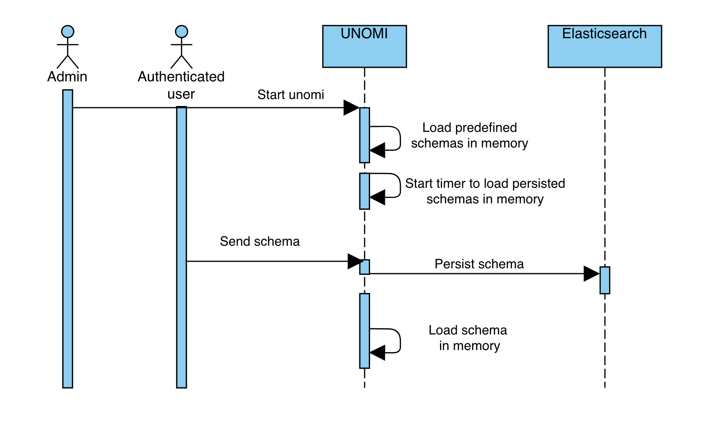

<a id="index--_json_schema_api"></a>
<a id="index--5.2.-json-schema-api"></a>

### 5.2. JSON schema API

The JSON schema endpoints are private, so the user has to be authenticated to manage the JSON schema in Unomi.

<a id="index--_list_existing_schemas"></a>
<a id="index--5.2.1.-list-existing-schemas"></a>

#### 5.2.1. List existing schemas

The REST endpoint GET `{{url}}/cxs/jsonSchema` allows to get all ids of available schemas and subschemas.

List of predefined schemas:

```
[
    "https://unomi.apache.org/schemas/json/events/modifyConsent/properties/1-0-0",
    "https://unomi.apache.org/schemas/json/item/1-0-0",
    "https://unomi.apache.org/schemas/json/events/login/1-0-0",
    "https://unomi.apache.org/schemas/json/events/modifyConsent/1-0-0",
    "https://unomi.apache.org/schemas/json/consentType/1-0-0",
    "https://unomi.apache.org/schemas/json/items/page/properties/1-0-0",
    "https://unomi.apache.org/schemas/json/items/page/properties/attributes/1-0-0",
    "https://unomi.apache.org/schemas/json/events/incrementInterest/1-0-0",
    "https://unomi.apache.org/schemas/json/events/view/flattenProperties/1-0-0",
    "https://unomi.apache.org/schemas/json/interests/1-0-0",
    "https://unomi.apache.org/schemas/json/items/site/1-0-0",
    "https://unomi.apache.org/schemas/json/items/page/properties/pageInfo/1-0-0",
    "https://unomi.apache.org/schemas/json/rest/requestIds/1-0-0",
    "https://unomi.apache.org/schemas/json/rest/eventscollectorrequest/1-0-0",
    "https://unomi.apache.org/schemas/json/events/view/properties/1-0-0",
    "https://unomi.apache.org/schemas/json/items/page/1-0-0",
    "https://unomi.apache.org/schemas/json/URLParameters/1-0-0",
    "https://unomi.apache.org/schemas/json/event/1-0-0",
    "https://unomi.apache.org/schemas/json/timestampeditem/1-0-0",
    "https://unomi.apache.org/schemas/json/events/updateProperties/1-0-0",
    "https://unomi.apache.org/schemas/json/consent/1-0-0",
    "https://unomi.apache.org/schemas/json/events/incrementInterest/flattenProperties/1-0-0",
    "https://unomi.apache.org/schemas/json/events/view/1-0-0"
]
```

Custom schemas will also be present in this list once added.

<a id="index--_read_a_schema"></a>
<a id="index--5.2.2.-read-a-schema"></a>

#### 5.2.2. Read a schema

It’s possible to get a schema by its id by calling the endpoint `POST {{url}}/cxs/jsonSchema/query` with the id of the schema in the payload of the query.

Example:

```
curl --location --request POST 'http://localhost:8181/cxs/jsonSchema/query' \
-u 'karaf:karaf'
--header 'Content-Type: text/plain' \
--header 'Cookie: context-profile-id=0f2fbca8-c242-4e6d-a439-d65fcbf0f0a8' \
--data-raw 'https://unomi.apache.org/schemas/json/event/1-0-0'
```

<a id="index--_create_update_a_json_schema_to_validate_an_event"></a>
<a id="index--5.2.3.-create-update-a-json-schema-to-validate-an-event"></a>

#### 5.2.3. Create / update a JSON schema to validate an event

It’s possible to add or update JSON schema by calling the endpoint `POST {{url}}/cxs/jsonSchema` with the JSON schema in the payload of the request.
If the JSON schema exists it will be updated with the new one.

Example of creation:

```
curl --location --request POST 'http://localhost:8181/cxs/jsonSchema' \ -u 'karaf:karaf' \ --header 'Content-Type: application/json' \ --header 'Cookie: context-profile-id=0f2fbca8-c242-4e6d-a439-d65fcbf0f0a8' \ --data-raw '{"$id": "https://vendor.test.com/schemas/json/events/dummy/1-0-0","$schema": "https://json-schema.org/draft/2019-09/schema","self": {"vendor": "com.vendor.test","name": "dummy","format": "jsonschema","target": "events","version": "1-0-0" },"title": "DummyEvent","type": "object","allOf": [{"$ref": "https://unomi.apache.org/schemas/json/event/1-0-0"} ],"properties": {"properties": {"$ref": "https://vendor.test.com/schemas/json/events/dummy/properties/1-0-0"} },"unevaluatedProperties": false }'
```

<a id="index--_deleting_a_schema"></a>
<a id="index--5.2.4.-deleting-a-schema"></a>

#### 5.2.4. Deleting a schema

To delete a schema, call the endpoint `POST {{url}}/cxs/jsonSchema/delete` with the id of the schema into the payload of the request

Example:

```
curl --location --request POST 'http://localhost:8181/cxs/jsonSchema/delete' \
-u 'karaf:karaf' \
--header 'Content-Type: text/plain' \
--header 'Cookie: context-profile-id=0f2fbca8-c242-4e6d-a439-d65fcbf0f0a8' \
--data-raw 'https://vendor.test.com/schemas/json/events/dummy/1-0-0'
```

<a id="index--_error_management"></a>
<a id="index--5.2.5.-error-management"></a>

#### 5.2.5. Error Management

When calling an endpoint with invalid data, such as an invalid value for the **sessionId** property in the contextRequest object or eventCollectorRequest object, the server would respond with a 400 error code and the message **Request rejected by the server because: Invalid received data**.

<a id="index--_details_on_invalid_events"></a>
<a id="index--5.2.6.-details-on-invalid-events"></a>

#### 5.2.6. Details on invalid events

If it’s an event which is incorrect the server will continue to process the request but will exclude the invalid events.

<a id="index--_develop_with_unomi_and_json_schemas"></a>
<a id="index--5.3.-develop-with-unomi-and-json-schemas"></a>

### 5.3. Develop with Unomi and JSON Schemas

Schemas can be complex to develop, and sometimes, understanding why an event is rejected can be challenging.

This section of the documentation defails mechanisms put in place to facilitate the development when working around JSON Schemas (when creating a new schema, when
modifying an existing event, …etc).

<a id="index--_logs_in_debug_mode"></a>
<a id="index--5.3.1.-logs-in-debug-mode"></a>

#### 5.3.1. Logs in debug mode

Running Apache Unomi with the logs in debug level will add to the logs the reason why events are rejected.
You can set the log level of the class validating the events to debug by using the following karaf command:

```
log:set DEBUG org.apache.unomi.schema.impl.SchemaServiceImpl
```

Doing so will output logs similar to this:

```
08:55:28.128 DEBUG [qtp1422628821-128] Schema validation found 2 errors while validating against schema: https://unomi.apache.org/schemas/json/events/view/1-0-0
08:55:28.138 DEBUG [qtp1422628821-128] Validation error: There are unevaluated properties at following paths $.source.properties
08:55:28.140 DEBUG [qtp1422628821-128] Validation error: There are unevaluated properties at following paths $.source.itemId, $.source.itemType, $.source.scope, $.source.properties
08:55:28.142 ERROR [qtp1422628821-128] An event was rejected - switch to DEBUG log level for more information
```

<a id="index--_validateevent_endpoint"></a>
<a id="index--5.3.2.-validateevent-endpoint"></a>

#### 5.3.2. validateEvent endpoint

A dedicated Admin endpoint (requires authentication), accessible at: `cxs/jsonSchema/validateEvent`, was created to validate events against JSON Schemas loaded in Apache Unomi.

For example, sending an event not matching a schema:

```
curl --request POST \
  --url http://localhost:8181/cxs/jsonSchema/validateEvent \
  --user karaf:karaf \
  --header 'Content-Type: application/json' \
  --data '{
    "eventType": "no-event",
    "scope": "unknown_scope",
    "properties": {
        "workspace": "no_workspace",
        "path": "some/path"
    }
}'
```

Would return the following:

```
Request rejected by the server because: Unable to validate event: Schema not found for event type: no-event
```

And if we were to submit a valid event type but make a typo in one of the properties name, the endpoint will point us
towards the incorrect property:

```
[
	{
		"error": "There are unevaluated properties at following paths $.source.scopee"
	}
]
```

<a id="index--_validateevents_endpoint"></a>
<a id="index--5.3.3.-validateevents-endpoint"></a>

#### 5.3.3. validateEvents endpoint

A dedicated Admin endpoint (requires authentication), accessible at: `cxs/jsonSchema/validateEvents`, was created to validate a list of event at once against JSON Schemas loaded in Apache Unomi.

For example, sending a list of event not matching a schema:

```
curl --request POST \
  --url http://localhost:8181/cxs/jsonSchema/validateEvents \
  --user karaf:karaf \
  --header 'Content-Type: application/json' \
  --data '[{
    "eventType": "view",
    "scope": "scope",
    "properties": {
        "workspace": "no_workspace",
        "path": "some/path",
        "unknowProperty": "not valid"
    }, {
    "eventType": "view",
    "scope": "scope",
    "properties": {
        "workspace": "no_workspace",
        "path": "some/path",
        "unknowProperty": "not valid",
        "secondUnknowProperty": "also not valid"
    }, {
    "eventType": "notKnownEvent",
    "scope": "scope",
    "properties": {
        "workspace": "no_workspace",
        "path": "some/path"
    }
}]'
```

Would return the errors grouped by event type as the following:

```
{"view": [{"error": "There are unevaluated properties at following paths $.properties.unknowProperty" },{"error": "There are unevaluated properties at following paths $.properties.secondUnknowProperty"} ],"notKnownEvent": [{"error": "No Schema found for this event type"}]}
```

If several events have the same issue, only one message is returned for this issue.

<a id="index--_extend_an_existing_schema"></a>
<a id="index--5.4.-extend-an-existing-schema"></a>

### 5.4. Extend an existing schema

<a id="index--_when_a_extension_is_needed"></a>
<a id="index--5.4.1.-when-a-extension-is-needed"></a>

#### 5.4.1. When a extension is needed?

Apache Unomi provides predefined schemas to validate some known events such as a view event.

The Apache Unomi JSON schemas are designed to consider invalid any properties which are not defined in the JSON schema.
So if an unknown property is part of the event, the event will be considered as invalid.

This means that if your events include additional properties, you will need extensions to describe these.

<a id="index--_understanding_how_extensions_are_merged_in_unomi"></a>
<a id="index--5.4.2.-understanding-how-extensions-are-merged-in-unomi"></a>

#### 5.4.2. Understanding how extensions are merged in unomi

An extension schema is a JSON schema whose id will be overridden and be defined by a keyword named **extends** in the **self** part of the extension.

When sending an extension through the API, it will be persisted in Elasticsearch then will be merged to the targeted schema.

What does “merge a schema” mean?
The merge will simply add in the **allOf** keyword of the targeted schema a reference to the extensions.
It means that to be valid, an event should be valid against the base schema and against the ones added in the **allOf**.

Example of an extension to allow to add a new property in the view event properties:

```
{"$id": "https://vendor.test.com/schemas/json/events/dummy/extension/1-0-0","$schema": "https://json-schema.org/draft/2019-09/schema","self":{"vendor":"com.vendor.test","name":"dummyExtension","format":"jsonschema","extends": "https://unomi.apache.org/schemas/json/events/view/properties/1-0-0","version":"1-0-0" },"title": "DummyEventExtension","type": "object","properties": {"myNewProp": {"type": "string"}}}
```

When validating the events of type view, the extension will be added to the schema with the id **https://unomi.apache.org/schemas/json/events/view/properties/1-0-0** like the following:

```
"allOf": [{
    "$ref": "https://vendor.test.com/schemas/json/events/dummy/extension/1-0-0"
}]
```

With this extension the property **myNewProp** can now be added to the event.

```
…
"properties": {
    "myNewProp" : "newValue"
},
…
```

Process when adding extension:

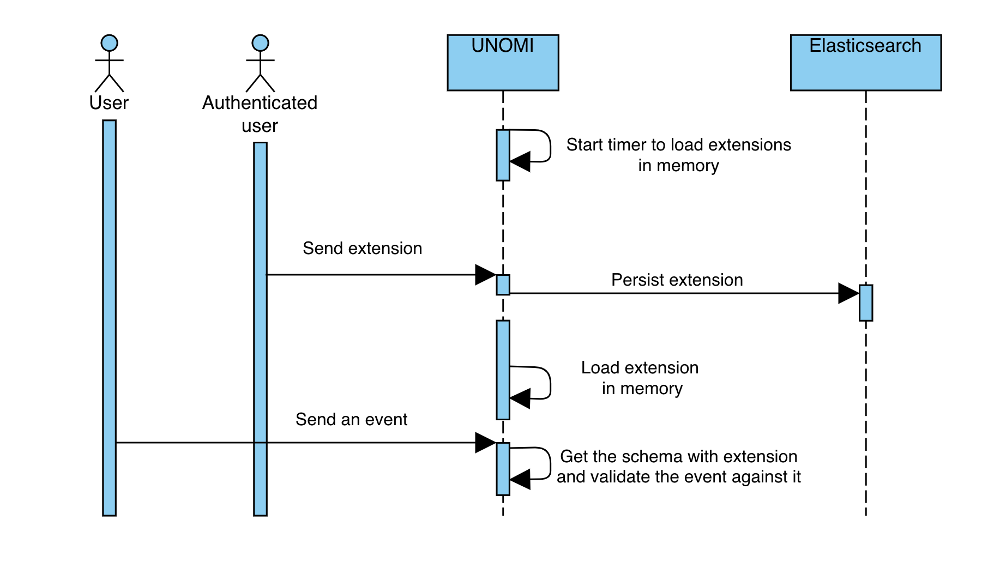

<a id="index--_how_to_add_an_extension_through_the_api"></a>
<a id="index--5.4.3.-how-to-add-an-extension-through-the-api"></a>

#### 5.4.3. How to add an extension through the API

Since an extension is also a JSON schema, it is possible to add extensions by calling the endpoint to add a JSON schema.
By calling `POST {{url}}/cxs/jsonSchema` with the JSON schema in the payload of the request, the extension will be persisted and will be merged to the targeted schema.

<a id="index--_graphql_api"></a>
<a id="index--6.-graphql-api"></a>

## 6. GraphQL API

<a id="index--_introduction_3"></a>
<a id="index--6.1.-introduction"></a>

### 6.1. Introduction

First introduced in Apache Unomi 2.0, a GraphQL API is available as an alternative to REST for interacting with the platform.
Disabled by default, the GraphQL API is currently considered a beta feature.

We look forward for this new GraphQL API to be used, feel free to open discussion on
[Unomi Slack channel](https://the-asf.slack.com/messages/CBP2Z98Q7/) or [create tickets on Jira](https://issues.apache.org/jira/projects/UNOMI/issues)

<a id="index--_enabling_the_api"></a>
<a id="index--6.2.-enabling-the-api"></a>

### 6.2. Enabling the API

The GraphQL API must be enabled using a system property (or environment variable):

```
# Extract from: etc/custom.system.properties ####################################################################################################################### ## Settings for GraphQL ## #######################################################################################################################
org.apache.unomi.graphql.feature.activated=${env:UNOMI_GRAPHQL_FEATURE_ACTIVATED:-false}
```

You can either modify the `org.apache.unomi.graphql.feature.activated` property or specify the `UNOMI_GRAPHQL_FEATURE_ACTIVATED`
environment variable (if using Docker for example).

<a id="index--_endpoints"></a>
<a id="index--6.3.-endpoints"></a>

### 6.3. Endpoints

Two endpoints were introduced for Apache Unomi 2 GraphQL API:
\* `/graphql` is the primary endpoint for interacting programatically with the API and aims at receiving POST requests.
\* `/graphql-ui` provides access to the GraphQL UI and aims at being accessed by a Web Browser.

<a id="index--_graphql_schema"></a>
<a id="index--6.4.-graphql-schema"></a>

### 6.4. GraphQL Schema

Thanks to GraphQL introspection, there is no dedicated documentation per-se as the Schema itself serves as documentation.

You can easily view the schema by navigrating to `/graphql-ui`, depending on your setup (localhost, public host, …), you might need to adjust the URL to point GraphQL UI to the `/graphql` endpoint.

<a id="index--_graphql_request_examples"></a>
<a id="index--6.5.-graphql-request-examples"></a>

### 6.5. Graphql request examples

You can use embedded GraphiQL interface available at <http://localhost:8181/graphql-ui> or use any other GraphQL client using that url for requests.

<a id="index--_retrieving_your_first_profile"></a>
<a id="index--6.5.1.-retrieving-your-first-profile"></a>

#### 6.5.1. Retrieving your first profile

Profile can be retrieved using `getProfile` query

```graphql
query($profileID: CDP_ProfileIDInput!, $createIfMissing: Boolean) {cdp {getProfile(profileID: $profileID, createIfMissing: $createIfMissing) {firstName lastName gender cdp_profileIDs {client {ID title} id}}}}
```

This query accepts two variables that need to be provided in the `Query variables` section:

```json
{"profileID": {"client":{"id": "defaultClientId" },"id": 1001 },"createIfMissing": true}
```

> [!NOTE]
> Note
>
> If you don’t want profile to be created if missing, set `createIfMissing` to `false`.

The response will look like this:

```json
{"data": {"cdp": {"getProfile": {"firstName": null,"lastName": null,"gender": null,"cdp_profileIDs": [{"client": {"ID": "defaultClientId","title": "Default Client" },"id": "1001"}]}}}}
```

<a id="index--_updating_profile"></a>
<a id="index--6.5.2.-updating-profile"></a>

#### 6.5.2. Updating profile

Now let’s update our profile with some data.
It can be done using `processEvents` mutation:

```graphql
mutation($events: [CDP_EventInput]!) {
  cdp {
    processEvents(events: $events)
  }
}
```

This mutation accepts one variable that needs to be provided in the `Query variables` section:

```json
{"events": [{"cdp_objectID": 1001,"cdp_profileID": {"client": {"id": "defaultClientId" },"id": 1001 },"cdp_profileUpdateEvent": {"firstName": "John","lastName": "Doe","gender": "Male"}}]}
```

The response will have the number of processed events:

```json
{
  "data": {
    "cdp": {
      "processEvents": 1
    }
  }
}
```

> [!NOTE]
> Note
>
> `processEvents` accepts a number of other event types that are listed on `CDP_EventInput` type.

If you run the `getProfile` query again, you will see that the profile has been updated.

<a id="index--_restricted_methods"></a>
<a id="index--6.5.3.-restricted-methods"></a>

#### 6.5.3. Restricted methods

Some methods are restricted to authenticated users only.
One example is `findProfiles` query:

```graphql
query {
  cdp {
    findProfiles {
      totalCount
       edges {
        node {
          cdp_profileIDs {
            client{
              title
              ID
            }
            id
          }
        }
      }
    }
  }
}
```

And if you run it now, you will get an error.

To make this query work you need to supply authorization token in the `HTTP headers` section:

```json
{
  "authorization": "Basic a2FyYWY6a2FyYWY="
}
```

The above header adds `Basic` authorization scheme with base64 encoded `karaf:karaf` value to the request.

The result will now show the list of profiles:

```json
{
  "data": {
    "cdp": {
      "findProfiles": {
        "totalCount": 1,
        "edges": [
          {
            "node": {
              "cdp_profileIDs": [
                {
                  "client": {
                    "title": "Default Client",
                    "ID": "defaultClientId"
                  },
                  "id": "1001"
                }
              ]
            }
          }
        ]
      }
    }
  }
}
```

<a id="index--_deleting_profile"></a>
<a id="index--6.5.4.-deleting-profile"></a>

#### 6.5.4. Deleting profile

Profile can be deleted using `deleteProfile` mutation:

```graphql
mutation($profileID: CDP_ProfileIDInput!) {
  cdp {
    deleteProfile(profileID: $profileID)
  }
}
```

This mutation accepts one variable that needs to be provided in the `Query variables` section:

```json
{"profileID": {"client":{"id": "defaultClientId" },"id": 1001}}
```

The response will show the result of the operation:

```json
{
  "data": {
    "cdp": {
      "deleteProfile": true
    }
  }
}
```

<a id="index--_where_to_go_from_here_2"></a>
<a id="index--6.5.5.-where-to-go-from-here"></a>

#### 6.5.5. Where to go from here

- You can find more [useful Apache Unomi URLs](#index--_useful_apache_unomi_urls) that can be used in the same way as the above examples.
- Read [GraphQL documentation](https://graphql.org/learn/) to learn more about GraphQL syntax.

<a id="index--_migrations"></a>
<a id="index--7.-migrations"></a>

## 7. Migrations

This section contains information and steps to migrate between major Unomi versions.

<a id="index--_from_version_1_6_to_2_0"></a>
<a id="index--7.1.-from-version-1.6-to-2.0"></a>

### 7.1. From version 1.6 to 2.0

<a id="index--_migration_overview"></a>
<a id="index--7.2.-migration-overview"></a>

### 7.2. Migration Overview

Apache Unomi 2.0 is a major release, and as such it does introduce breaking changes. This portion of the document detail the various steps we recommend following to successfully migrate your environment from Apache Unomi 1.6 to Apache Unomi 2.0.

There are two main steps in preparing your migration to Apache Unomi 2.0:
- Updating applications consuming Unomi
- Migrating your existing data

<a id="index--_updating_applications_consuming_unomi"></a>
<a id="index--7.3.-updating-applications-consuming-unomi"></a>

### 7.3. Updating applications consuming Unomi

Since Apache Unomi is an engine, you’ve probably built multiple applications consuming its APIs, you might also have built extensions directly running in Unomi.

As you begin updating applications consuming Apache Unomi, it is generally a good practice to [enable debug mode](#index--_enabling_debug_mode).
Doing so will display any errors when processing events (such as JSON Schema validations), and will provide useful indications towards solving issues.

<a id="index--_data_model_changes"></a>
<a id="index--7.3.1.-data-model-changes"></a>

#### 7.3.1. Data Model changes

There has been changes to Unomi Data model, please make sure to review those in the [What’s new in Unomi 2](#index--_whats_new_in_apache_unomi_2_0) section of the user manual.

<a id="index--_create_json_schemas"></a>
<a id="index--7.3.2.-create-json-schemas"></a>

#### 7.3.2. Create JSON schemas

Once you updated your applications to align with Unomi 2 data model, the next step will be to create the necessary JSON Schemas.

Any event (and more generally, any object) received through Unomi public endpoints do require a valid JSON schema.
Apache Unomi ships, out of the box, with all of the necessary JSON Schemas for its own operation as well as all event types generated from the Apache Unomi Web Tracker but you will need to create schemas for any custom event you may be using.

When creating your new schemas, there are multiple ways of testing them:

- Using a the event validation API endpoint available at the URL : `/cxs/jsonSchema/validateEvent`
- Using debug logs when sending events using the usual ways (using the `/context.json` or `/eventcollector` endpoints)

Note that in both cases it helps to activate the debug logs, that may be activated either:

- Through the ssh Karaf console command : `log:set DEBUG org.apache.unomi.schema.impl.SchemaServiceImpl`
- Using the UNOMI\_LOGS\_JSONSCHEMA\_LEVEL=DEBUG environment variable and then restarting Apache Unomi. This is especially useful when using Docker Containers.

Once the debug logs are active, you will see detailed error messages if your events are not matched with any deployed JSON schema.

Note that it is currently not possible to modify or surcharge an existing system-deployed JSON schema via the REST API. It is however possible to deploy new schemas and manage them through the REST API on the `/cxs/jsonSchema` endpoint.
If you are currently using custom properties on an Apache Unomi-provided event type, you will need to either change to use a new custom eventType and create the corresponding schema or to create a Unomi schema extension. You can find more details in the [JSON Schema](#index--_json_schemas) section of this documentation.

You can use, as a source of inspiration for creating new schemas, Apache Unomi 2.0 schema located at:
[extensions/json-schema/services/src/main/resources/META-INF/cxs/schemas](https://github.com/apache/unomi/tree/master/extensions/json-schema/services/src/main/resources/META-INF/cxs/schemas).

Finally, and although it is technically feasible, we recommend against creating permissive JSON Schemas allowing any event payload. This requires making sure that you don’t allow undeclared properties by setting JSON schema keywords such as [unevaluated properties](https://json-schema.org/understanding-json-schema/reference/object.html#unevaluated-properties) to `false`.

<a id="index--_migrating_your_existing_data"></a>
<a id="index--7.4.-migrating-your-existing-data"></a>

### 7.4. Migrating your existing data

<a id="index--_elasticsearch_version_and_capacity"></a>
<a id="index--7.4.1.-elasticsearch-version-and-capacity"></a>

#### 7.4.1. Elasticsearch version and capacity

While still using Unomi 1.6, the first step will be to upgrade your Elasticsearch to 7.17.5.
Documentation is available on [Elasticsearch’s website](https://www.elastic.co/guide/en/elasticsearch/reference/7.17/setup-upgrade.html).

Your Elasticsearch cluster must have enough capacity to handle the migration.
At a minimum, the required capacity storage capacity must be greater than the size of the dataset in production + the size of the largest index. Any other settings should at least be as big as the source setup (preferably higher).

<a id="index--_migrate_custom_data"></a>
<a id="index--7.4.2.-migrate-custom-data"></a>

#### 7.4.2. Migrate custom data

Apache Unomi 2.0 knows how to migrate its own data from the new model to the old one, but it does not know how to migrate custom events you might be using in your environment.

It relies on a set of groovy scripts to perform its data migration, located in [tools/shell-commands/src/main/resources/META-INF/cxs/migration](https://github.com/apache/unomi/tree/master/tools/shell-commands/src/main/resources/META-INF/cxs/migration), these scripts are sorted alphabetically and executed sequentially when migration is started. You can use these scripts as a source of inspiration for creating your own.

In most cases, migration steps consist of an Elasticsearch painless script that will handle the data changes.

Depending of the volume of data, migration can be lengthy. By paying attention to when re-indexation is happening (triggered in the groovy scripts by `MigrationUtils.reIndex()`), you can find the most appropriate time for your scritps to be executed and avoid re-indexing the same indices multiple times.

For example if you wanted to update profiles with custom data (currently migrated by `migrate-2.0.0-10-profileReindex.groovy`), you could create a script in position "09" that would only contain painless scripts without a reindexing step.
The script in position "10" will introduce its own painless script, then trigger the re-indexation. This way you don’t have to re-index the same indices twice.

You can find existing painless scripts in [tools/shell-commands/src/main/resources/requestBody/2.0.0](https://github.com/apache/unomi/tree/master/tools/shell-commands/src/main/resources/requestBody/2.0.0)

At runtime, and when starting the migration, Unomi 2.0 will take its own scripts, any additional scripts located in `data/migration/scripts`, will sort the resulting list alphabetically and execute each migration script sequentially.

<a id="index--_perform_the_migration"></a>
<a id="index--7.4.3.-perform-the-migration"></a>

#### 7.4.3. Perform the migration

<a id="index--_checklist"></a>
<a id="index--checklist"></a>

##### Checklist

Before starting the migration, please ensure that:

- You do have a backup of your data
- You did practice the migration in a staging environment, NEVER migrate a production environment without prior validation
- You verified your applications were operational with Apache Unomi 2.0 (JSON schemas created, client applications updated, …)
- You are running Elasticsearch 7.17.5 (or a later 7.x version)
- Your Elasticsearch cluster has enough capacity to handle the migration
- You are currently running Apache Unomi 1.6 (or a later 1.x version)
- You will be using the same Apache Unomi instance for the entire migration progress. Do not start the migration on one node, and resume an interrupted migration on another node.

<a id="index--_migration_process_overview"></a>
<a id="index--migration-process-overview"></a>

##### Migration process overview

The migration is performed by means of a dedicated Apache Unomi 2.0 node started in a particular migration mode.

In a nutshell, the migration process will consist in the following steps:

- Shutdown your Apache Unomi 1.6 cluster
- Start one Apache Unomi 2.0 node that will perform the migration (upon startup)
- Wait for data migration to complete
- Start your Apache Unomi 2.0 cluster
- (optional) Import additional JSON Schemas

Each migration step maintains its execution state, meaning if a step fails you can fix the issue, and resume the migration from the failed step.

<a id="index--_configuration_3"></a>
<a id="index--configuration"></a>

##### Configuration

The following environment variables are used for the migration:

| Environment Variable | Unomi Setting | Default |
| --- | --- | --- |
| UNOMI\_ELASTICSEARCH\_ADDRESSES | org.apache.unomi.elasticsearch.addresses | localhost:9200 |
| UNOMI\_ELASTICSEARCH\_SSL\_ENABLE | org.apache.unomi.elasticsearch.sslEnable | false |
| UNOMI\_ELASTICSEARCH\_USERNAME | org.apache.unomi.elasticsearch.username |  |
| UNOMI\_ELASTICSEARCH\_PASSWORD | org.apache.unomi.elasticsearch.password |  |
| UNOMI\_ELASTICSEARCH\_SSL\_TRUST\_ALL\_CERTIFICATES | org.apache.unomi.elasticsearch.sslTrustAllCertificates | false |
| UNOMI\_ELASTICSEARCH\_INDEXPREFIX | org.apache.unomi.elasticsearch.index.prefix | context |
| UNOMI\_MIGRATION\_RECOVER\_FROM\_HISTORY | org.apache.unomi.migration.recoverFromHistory | true |

If there is a need for advanced configuratiion, the configuration file used by Apache Unomi 2.0 is located in: `etc/org.apache.unomi.migration.cfg`

<a id="index--_migrate_manually"></a>
<a id="index--migrate-manually"></a>

##### Migrate manually

You can migrate manually using the Karaf console.

After having started Apache Unomi 2.0 with the `./karaf` command, you will be presented with the Karaf shell.

From there you have two options:

- The necessary configuration variables (see above) have already been set, you can start the migration using the command: `unomi:migrate 1.6.0`
- Or, you want to provide the configuration settings interactively via the terminal, in that case you can start the migration in interactive mode using: `unomi:migrate 1.6.0`

The parameter of the migrate command (1.6.0 in the example above) corresponds to the version you’re migrating from.

At the end of the migration, you can start Unomi 2.0 as usual using: `unomi:start`.

<a id="index--_migrate_with_docker"></a>
<a id="index--migrate-with-docker"></a>

##### Migrate with Docker

The migration can also be performed using Docker images, the migration itself can be started by passing a specific value to the `KARAF_OPTS` environment variable.

In the context of this migration guide, we will asssume that:

- Custom migration scripts are located in `/home/unomi/migration/scripts/`
- Painless scripts, or more generally any migration assets are located in `/home/unomi/migration/assets/`, these scripts will be mounted under `/tmp/assets/` inside the Docker container.

```
docker run \
    -e UNOMI_ELASTICSEARCH_ADDRESSES=localhost:9200 \
    -e KARAF_OPTS="-Dunomi.autoMigrate=1.6.0" \
    --v /home/unomi/migration/scripts/:/opt/apache-unomi/data/migration/scripts \
    --v /home/unomi/migration/assets/:/tmp/assets/ \
    apache/unomi:2.0.0-SNAPSHOT
```

You might need to provide additional variables (see table above) depending of your environment.

If the migration fails, you can simply restart this command.

Using the above command, Unomi 2.0 will not start automatically at the end of the migration. You can start Unomi automatically at the end of the migration by passing: `-e KARAF_OPTS="-Dunomi.autoMigrate=1.6.0 -Dunomi.autoStart=true"`

<a id="index--_step_by_step_migration_with_docker"></a>
<a id="index--step-by-step-migration-with-docker"></a>

##### Step by step migration with Docker

Once your cluster is shutdown, performing the migration will be as simple as starting a dedicated docker container.

<a id="index--_post_migration"></a>
<a id="index--post-migration"></a>

##### Post Migration

Once the migration has been executed, you will be able to start Apache Unomi 2.0

Remember you still need to submit JSON schemas corresponding to your events, you can do so using the API.

<a id="index--_from_version_1_5_to_1_6"></a>
<a id="index--7.5.-from-version-1.5-to-1.6"></a>

### 7.5. From version 1.5 to 1.6

Migration from Unomi 1.5x to 1.6x does not require any particular steps, simply restart your cluster in the new version.

<a id="index--_from_version_1_4_to_1_5"></a>
<a id="index--7.6.-from-version-1.4-to-1.5"></a>

### 7.6. From version 1.4 to 1.5

<a id="index--_data_model_and_elasticsearch_7"></a>
<a id="index--7.6.1.-data-model-and-elasticsearch-7"></a>

#### 7.6.1. Data model and ElasticSearch 7

Since Apache Unomi version 1.5.0 we decided to upgrade the supported ElasticSearch version to the 7.4.2.

To be able to do so, we had to rework the way the data was stored inside ElasticSearch.

Previously every items was stored inside the same ElasticSearch index but this is not allowed anymore in recent ElasticSearch versions.

Since Apache Unomi version 1.5.0 every type of items (see section: [Items](#index--_items)) is now stored in a dedicated separated index.

<a id="index--_api_changes"></a>
<a id="index--7.6.2.-api-changes"></a>

#### 7.6.2. API changes

To be able to handle the multiple indices the Persistence API implementation
([ElasticSearchPersistenceServiceImpl](https://github.com/apache/unomi/blob/9f1bab437fd93826dc54d318ed00d3b2e3161437/persistence-elasticsearch/core/src/main/java/org/apache/unomi/persistence/elasticsearch/ElasticSearchPersistenceServiceImpl.java))
have been adapted and simplified.

The good news is that there is no API changes, the persistence API interface didn’t changed.

Any custom Apache Unomi plugins or extensions should continue to work on Apache Unomi 1.5.0.

The only notable changes are located at the
[ElasticSearchPersistenceServiceImpl Java class](https://github.com/apache/unomi/blob/9f1bab437fd93826dc54d318ed00d3b2e3161437/persistence-elasticsearch/core/src/main/java/org/apache/unomi/persistence/elasticsearch/ElasticSearchPersistenceServiceImpl.java).
This class should not be use directly, instead you should use OSGI service dependency injection using the interface [PersistenceService](https://github.com/apache/unomi/blob/9f1bab437fd93826dc54d318ed00d3b2e3161437/persistence-spi/src/main/java/org/apache/unomi/persistence/spi/PersistenceService.java).

But if you are interested in the implementation changes:

1. The property `index.name` have been renamed to `index.prefix`.
   Previously used for the single one index name, now every index is prefixed using this property. (`context-` by default)
2. We removed the property `index.names` originally used to create additional indices (used by the geonames DB for exemple).
   This property is not needed anymore because the index is automatically created by the peristence service when the mapping configuration is loaded.
   Example of mapping configuration file: ([geoname index mapping](https://github.com/apache/unomi/blob/9f1bab437fd93826dc54d318ed00d3b2e3161437/extensions/geonames/services/src/main/resources/META-INF/cxs/mappings/geonameEntry.json))

Because of this changes the geonames DB index name is now respecting the index naming with prefix like any other item type.
Previously named: `geonames` is now using the index name `context-geonameentry`
(see: [Documentation about geonames extension](#index--_installing_geonames_database)).

<a id="index--_migration_steps"></a>
<a id="index--7.6.3.-migration-steps"></a>

#### 7.6.3. Migration steps

In order to migrate the data from ElasticSearch 5 to 7, Unomi provides a migration tool that is directly integrated.

In this migration the following is assumed:

- the ElasticSearch 5 cluster installation is referred to as the `source`
- the ElasticSearch 7 cluster installation is referred to as the `target`
- the Unomi 1.4 cluster installation is completely stopped
- the Unomi 1.5 cluster installation has never been started (just uncompressed)
- the Unomi 1.5 cluster installation has been configured to connect to the `target` (ElasticSearch 7) cluster

It is HIGHLY RECOMMENDED to perform a full cluster backup/snapshot of the `source` clusters (including ElasticSearch and
Unomi clusters), and ideally to perform the migration on a restored snapshot of the `source` cluster. For more information
on ElasticSearch 5 snapshots and restore you can find it here:

```
https://www.elastic.co/guide/en/elasticsearch/reference/5.6/modules-snapshots.html
```

The way the migration works is that both ElasticSearch 5 AND an ElasticSearch 7 clusters (or just single nodes) will
be started at the same time, and data will be migrated from the ES 5 to the ES 7 cluster. Note that it is possible to use
a single node for both the `source` and the `target` clusters to - for example - perform the migration on a single
machine. If you choose to do that you will have to adjust port numbers on either the `source` or `target` cluster node.
Changing ports requires a restart of the ES cluster you are modifying. In this example we will illustrate how to migrate
by modifying the `source` cluster node ports.

So in the `source` 's ElasticSearch 5 `config/elasticsearch.yml` file we have modified the default ports to:

```
transport.tcp.port: 9310
http.port: 9210
```

Make SURE you change the ports out of the default 9200-9205 and 9300-9305 range (or whatever your cluster uses) otherwise
both clusters will attempt to merge!

On the `target` ElasticSearch 7 cluster configuration you will need to add the following setting in the `config/elasticsearch.yml`:

```
reindex.remote.whitelist: "localhost:9210"
```

Replace "localhost:9210" which whatever location your `source` cluster is available at. Restart or start your
`target` ElasticSearch 7 cluster.

Important: Make sure you haven’t started Apache Unomi before (using the `unomi:start` command or the autostart command
line parameter) otherwise you will need to restart your Apache Unomi installation from scratch. The best way to be sure
of that is to start a new Unomi install by uncompressing the archive and not launching it.

You can then start both instances of ElasticSearch 5 and ElasticSearch 7 and finally start Apache Unomi using:

```
./karaf
```

Once in the console launch the migration using the following command:

```
migrate 1.4.0
```

Note: the 1.4.0 version is the starting version. If you are starting from a different version (for example a fork), make
sure that you know what official version of Apache Unomi it corresponds to and you can use the official version number
as a start version for the migration.

Follow the instructions and answer the prompts. If you used the above configuration as an example you can simply use the
default values.

Be careful because the first address that the tool will ask for is the `target` (ElasticSearch 7) cluster, not the
ES 5 one.

Note that it is also possible to change the index prefix to be different from the default `context` value
so that you could host multiple Apache Unomi instances on the same ElasticSearch cluster.

Important note: only the data that Apache Unomi manages will be migrated. If you have any other data (for example Kibana
or ElasticSearch monitoring indices) they will not be migrated by this migration tool.

Once the migration has completed, you can start the new Unomi instance using:

```
unomi:start
```

You should then validate that all the data has been properly migrated. For example you could issue a command to list
the profiles:

```
profile-list
```

<a id="index--_important_changes_in_public_servlets_since_version_1_5_5_and_2_0_0"></a>
<a id="index--7.7.-important-changes-in-public-servlets-since-version-1.5.5-and-2.0.0"></a>

### 7.7. Important changes in public servlets since version 1.5.5 and 2.0.0

What used to be dedicated servlets are now part of the REST endpoints.
Prior to version 1.5.5 the following servlets were used:

- /context.js /context.json
- /eventcollector
- /client

In version 2.0.0 and 1.5.5 and later you have to use the new `cxs` REST endpoints:

- /cxs/context.js /cxs/context.json
- /cxs/eventcollector
- /cxs/client

The old servlets have been deprecated and will be removed in a future major version, so make sure
to update your client applications.

<a id="index--_queries_and_aggregations"></a>
<a id="index--8.-queries-and-aggregations"></a>

## 8. Queries and aggregations

Apache Unomi contains a `query` endpoint that is quite powerful. It provides ways to perform queries that can quickly
get result counts, apply metrics such as sum/min/max/avg or even use powerful aggregations.

In this section we will show examples of requests that may be built using this API.

<a id="index--_query_counts"></a>
<a id="index--8.1.-query-counts"></a>

### 8.1. Query counts

Query counts are highly optimized queries that will count the number of objects that match a certain condition without
retrieving the results. This can be used for example to quickly figure out how many objects will match a given condition
before actually retrieving the results. It uses ElasticSearch/Lucene optimizations to avoid the cost of loading all the
resulting objects.

Here’s an example of a query:

```bash
curl -X POST http://localhost:8181/cxs/query/profile/count \ --user karaf:karaf \ -H "Content-Type: application/json" \ -d @- <<'EOF' {"parameterValues": {"subConditions": [{"type": "profilePropertyCondition","parameterValues": {"propertyName": "systemProperties.isAnonymousProfile","comparisonOperator": "missing"} },{"type": "profilePropertyCondition","parameterValues": {"propertyName": "properties.nbOfVisits","comparisonOperator": "equals","propertyValueInteger": 1}} ],"operator": "and" },"type": "booleanCondition"} EOF
```

The above result will return the profile count of all the profiles

Result will be something like this:

```
2084
```

<a id="index--_metrics"></a>
<a id="index--8.2.-metrics"></a>

### 8.2. Metrics

Metric queries make it possible to apply functions to the resulting property. The supported metrics are:

- sum
- avg
- min
- max

It is also possible to request more than one metric in a single request by concatenating them with a "/" in the URL.
Here’s an example request that uses the `sum` and `avg` metrics:

```
curl -X POST http://localhost:8181/cxs/query/session/profile.properties.nbOfVisits/sum/avg \ --user karaf:karaf \ -H "Content-Type: application/json" \ -d @- <<'EOF' {"parameterValues": {"subConditions": [{"type": "sessionPropertyCondition","parameterValues": {"comparisonOperator": "equals","propertyName": "scope","propertyValue": "digitall"}} ],"operator": "and" },"type": "booleanCondition"} EOF
```

The result will look something like this:

```json
{
   "_avg":1.0,
   "_sum":9.0
}
```

<a id="index--_aggregations"></a>
<a id="index--8.3.-aggregations"></a>

### 8.3. Aggregations

Aggregations are a very powerful way to build queries in Apache Unomi that will collect and aggregate data by filtering
on certain conditions.

Aggregations are composed of :
- an object type and a property on which to aggregate
- an aggregation setup (how data will be aggregated, by date, by numeric range, date range or ip range)
- a condition (used to filter the data set that will be aggregated)

<a id="index--_aggregation_types"></a>
<a id="index--8.3.1.-aggregation-types"></a>

#### 8.3.1. Aggregation types

Aggregations may be of different types. They are listed here below.

<a id="index--_date"></a>
<a id="index--date"></a>

##### Date

Date aggregations make it possible to automatically generate "buckets" by time periods. For more information about the
format, it is directly inherited from ElasticSearch and you may find it here: <https://www.elastic.co/guide/en/elasticsearch/reference/5.6/search-aggregations-bucket-datehistogram-aggregation.html>

Here’s an example of a request to retrieve a histogram of by day of all the session that have been create by newcomers (nbOfVisits=1)

```
curl -X POST http://localhost:8181/cxs/query/session/timeStamp \ --user karaf:karaf \ -H "Content-Type: application/json" \ -d @- <<'EOF' {"aggregate": {"type": "date","parameters": {"interval": "1d","format": "yyyy-MM-dd"} },"condition": {"type": "booleanCondition","parameterValues": {"operator": "and","subConditions": [{"type": "sessionPropertyCondition","parameterValues": {"propertyName": "scope","comparisonOperator": "equals","propertyValue": "acme"} },{"type": "sessionPropertyCondition","parameterValues": {"propertyName": "profile.properties.nbOfVisits","comparisonOperator": "equals","propertyValueInteger": 1}}]}}} EOF
```

The above request will produce a similar that looks like this:

```json
{
  "_all": 8062,
  "_filtered": 4085,
  "2018-10-02": 3,
  "2018-10-03": 17,
  "2018-10-04": 18,
  "2018-10-05": 19,
  "2018-10-06": 23,
  "2018-10-07": 18,
  "2018-10-08": 20
}
```

You can see that we retrieve the count of newcomers aggregated by day.

<a id="index--_date_range"></a>
<a id="index--date-range"></a>

##### Date range

Date ranges make it possible to "bucket" dates, for example to regroup profiles by their birth date as in the example
below:

```shell
curl -X POST http://localhost:8181/cxs/query/profile/properties.birthDate \ --user karaf:karaf \ -H "Content-Type: application/json" \ -d @- <<'EOF' {"aggregate": {"property": "properties.birthDate","type": "dateRange","dateRanges": [{"key": "After 2009","from": "now-10y/y","to": null },{"key": "Between 1999 and 2009","from": "now-20y/y","to": "now-10y/y" },{"key": "Between 1989 and 1999","from": "now-30y/y","to": "now-20y/y" },{"key": "Between 1979 and 1989","from": "now-40y/y","to": "now-30y/y" },{"key": "Between 1969 and 1979","from": "now-50y/y","to": "now-40y/y" },{"key": "Before 1969","from": null,"to": "now-50y/y"}] },"condition": {"type": "matchAllCondition","parameterValues": {}}} EOF
```

The resulting JSON response will look something like this:

```json
{
    "_all":4095,
    "_filtered":4095,
    "Before 1969":2517,
    "Between 1969 and 1979":353,
    "Between 1979 and 1989":336,
    "Between 1989 and 1999":337,
    "Between 1999 and 2009":35,
    "After 2009":0,
    "_missing":517
}
```

You can find more information about the date range formats here: <https://www.elastic.co/guide/en/elasticsearch/reference/5.6/search-aggregations-bucket-daterange-aggregation.html>

<a id="index--_numeric_range"></a>
<a id="index--numeric-range"></a>

##### Numeric range

Numeric ranges make it possible to use "buckets" for the various ranges you want to classify.

Here’s an example of a using numeric range to regroup profiles by number of visits:

```shell
curl -X POST http://localhost:8181/cxs/query/profile/properties.nbOfVisits \ --user karaf:karaf \ -H "Content-Type: application/json" \ -d @- <<'EOF' {"aggregate": {"property": "properties.nbOfVisits","type": "numericRange","numericRanges": [{"key": "Less than 5","from": null,"to": 5 },{"key": "Between 5 and 10","from": 5,"to": 10 },{"key": "Between 10 and 20","from": 10,"to": 20 },{"key": "Between 20 and 40","from": 20,"to": 40 },{"key": "Between 40 and 80","from": 40,"to": 80 },{"key": "Greater than 100","from": 100,"to": null}] },"condition": {"type": "matchAllCondition","parameterValues": {}}} EOF
```

This will produce an output that looks like this:

```json
{
    "_all":4095,
    "_filtered":4095,
    "Less than 5":3855,
    "Between 5 and 10":233,
    "Between 10 and 20":7,
    "Between 20 and 40":0,
    "Between 40 and 80":0,
    "Greater than 100":0
}
```

<a id="index--_profile_import_export"></a>
<a id="index--9.-profile-import-export"></a>

## 9. Profile import & export

The profile import and export feature in Apache Unomi is based on configurations and consumes or produces CSV files that
contain profiles to be imported and exported.

<a id="index--_importing_profiles"></a>
<a id="index--9.1.-importing-profiles"></a>

### 9.1. Importing profiles

Only `ftp`, `sftp`, `ftps` and `file` are supported in the source path. For example:

```
file:///tmp/?fileName=profiles.csv&move=.done&consumer.delay=25s
```

Where:

- `fileName` Can be a pattern, for example `include=.*.csv` instead of `fileName=…` to consume all CSV files.
  By default the processed files are moved to `.camel` folder you can change it using the `move` option.
- `consumer.delay` Is the frequency of polling in milliseconds. For example, 20000 milliseconds is 20 seconds. This
  frequency can also be 20s. Other possible format are: 2h30m10s = 2 hours and 30 minutes and 10 seconds.

See <http://camel.apache.org/ftp.html> and <http://camel.apache.org/file2.html> to build more complex source path. Also be
careful with FTP configuration as most servers no longer support plain text FTP and you should use SFTP or FTPS
instead, but they are a little more difficult to configure properly. It is recommended to test the connection with an
FTP client first before setting up these source paths to ensure that everything works properly. Also on FTP
connections most servers require PASSIVE mode so you can specify that in the path using the `passiveMode=true` parameter.

Here are some examples of FTPS and SFTP source paths:

```
sftp://USER@HOST/PATH?password=PASSWORD&include=.*.csv
ftps://USER@HOST?password=PASSWORD&fileName=profiles.csv&passiveMode=true
```

Where:

- `USER` is the user name of the SFTP/FTPS user account to login with
- `PASSWORD` is the password for the user account
- `HOST` is the host name (or IP address) of the host server that provides the SFTP / FTPS server
- `PATH` is a path to a directory inside the user’s account where the file will be retrieved.

<a id="index--_import_api"></a>
<a id="index--9.1.1.-import-api"></a>

#### 9.1.1. Import API

Apache Unomi provides REST endpoints to manage import configurations:

```
  GET /cxs/importConfiguration
  GET /cxs/importConfiguration/{configId}
  POST /cxs/importConfiguration
  DELETE /cxs/importConfiguration/{configId}
```

This is how a oneshot import configuration looks like:

```
{"itemId": "importConfigId","itemType": "importConfig","name": "Import Config Sample","description": "Sample description","configType": "oneshot",        //Config type can be 'oneshot' or 'recurrent' "properties": {"mapping": {"email": 0,                 //<Apache Unomi Property Id> : <Column Index In the CSV> "firstName": 2,...} },"columnSeparator": ",",         //Character used to separate columns "lineSeparator": "\\n",         //Character used to separate lines (\n or \r) "multiValueSeparator": ";",     //Character used to separate values for multivalued columns "multiValueDelimiter": "[]",    //Character used to wrap values for multivalued columns "status": "SUCCESS",            //Status of last execution "executions": [                 //(RETURN) Last executions by default only last 5 are returned ...],"mergingProperty": "email",         //Apache Unomi Property Id used to check duplicates "overwriteExistingProfiles": true,  //Overwrite profiles that have duplicates "propertiesToOverwrite": "firstName, lastName, ...",      //If last is set to true, which property to overwrite, 'null' means overwrite all "hasHeader": true,                  //CSV file to import contains a header line "hasDeleteColumn": false            //CSV file to import doesn't contain a TO DELETE column (if it contains, will be the last column)}
```

A recurrent import configuration is similar to the previous one with some specific information to add to the JSON like:

```
{..."configType": "recurrent","properties": {"source": "ftp://USER@SERVER[:PORT]/PATH?password=xxx&fileName=profiles.csv&move=.done&consumer.delay=20000",// Only 'ftp', 'sftp', 'ftps' and 'file' are supported in the 'source' path // eg. file:///tmp/?fileName=profiles.csv&move=.done&consumer.delay=25s // 'fileName' can be a pattern eg 'include=.*.csv' instead of 'fileName=...' to consume all CSV files // By default the processed files are moved to '.camel' folder you can change it using the 'move' option // 'consumer.delay' is the frequency of polling. '20000' (in milliseconds) means 20 seconds. Can be also '20s' // Other possible format are: '2h30m10s' = 2 hours and 30 minutes and 10 seconds "mapping": {...} },..."active": true,  //If true the polling will start according to the 'source' configured above ...}
```

<a id="index--_exporting_profiles"></a>
<a id="index--9.2.-exporting-profiles"></a>

### 9.2. Exporting profiles

Only `ftp`, `sftp`, `ftps` and `file are supported in the source path. For example:

```
file:///tmp/?fileName=profiles-export-${date:now:yyyyMMddHHmm}.csv&fileExist=Append) 
sftp://USER@HOST/PATH?password=PASSWORD&binary=true&fileName=profiles-export-${date:now:yyyyMMddHHmm}.csv&fileExist=Append
ftps://USER@HOST?password=PASSWORD&binary=true&fileName=profiles-export-${date:now:yyyyMMddHHmm}.csv&fileExist=Append&passiveMode=true
```

As you can see in the examples above, you can inject variables in the produced file name `${date:now:yyyyMMddHHmm}` is
the current date formatted with the pattern `yyyyMMddHHmm`. `fileExist` option put as `Append` will tell the file writer
to append to the same file for each execution of the export configuration. You cam omit this option to write a profile
per file.

See <http://camel.apache.org/ftp.html and http://camel.apache.org/file2.html to> build more complex destination path.

<a id="index--_export_api"></a>
<a id="index--9.2.1.-export-api"></a>

#### 9.2.1. Export API

Apache Unomi provides REST endpoints to manage export configurations:

```
  GET /cxs/exportConfiguration
  GET /cxs/exportConfiguration/{configId}
  POST /cxs/exportConfiguration
  DELETE /cxs/exportConfiguration/{configId}
```

This is how a oneshot export configuration looks like:

```
{"itemId": "exportConfigId","itemType": "exportConfig","name": "Export configuration sample","description": "Sample description","configType": "oneshot","properties": {"period": "2m30s","segment": "contacts","mapping": {"0": "firstName","1": "lastName",...} },"columnSeparator": ",","lineSeparator": "\\n","multiValueSeparator": ";","multiValueDelimiter": "[]","status": "RUNNING","executions": [...]}
```

A recurrent export configuration is similar to the previous one with some specific information to add to the JSON like:

```
{..."configType": "recurrent","properties": {"destination": "sftp://USER@SERVER:PORT/PATH?password=XXX&fileName=profiles-export-${date:now:yyyyMMddHHmm}.csv&fileExist=Append","period": "2m30s",      //Same as 'consumer.delay' option in the import source path "segment": "contacts",  //Segment ID to use to collect profiles to export "mapping": {...} },..."active": true,           //If true the configuration will start polling upon save until the user deactivate it ...}
```

<a id="index--_configuration_in_details"></a>
<a id="index--9.3.-configuration-in-details"></a>

### 9.3. Configuration in details

First configuration you need to change would be the configuration type of your import / export feature (code name
router) in the `etc/unomi.custom.system.properties` file (creating it if necessary):

```
#Configuration Type values {'nobroker', 'kafka'}
org.apache.unomi.router.config.type=nobroker
```

By default the feature is configured (as above) to use no external broker, which means to handle import/export data it
will use in memory queues (In the same JVM as Apache Unomi). If you are clustering Apache Unomi, most important thing
to know about this type of configuration is that each Apache Unomi will handle the import/export task by itself without
the help of other nodes (No Load-Distribution).

Changing this property to kafka means you have to provide the Apache Kafka configuration, and in the opposite of the
nobroker option import/export data will be handled using an external broker (Apache Kafka), this will lighten the burden
on the Apache Unomi machines.

You may use several Apache Kafka instance, 1 per N Apache Unomi nodes for better application scaling.

To enable using Apache Kafka you need to configure the feature as follows:

```
#Configuration Type values {'nobroker', 'kafka'}
org.apache.unomi.router.config.type=kafka
```

Uncomment and update Kafka settings to use Kafka as a broker

```
#Kafka
org.apache.unomi.router.kafka.host=localhost
org.apache.unomi.router.kafka.port=9092
org.apache.unomi.router.kafka.import.topic=import-deposit
org.apache.unomi.router.kafka.export.topic=export-deposit
org.apache.unomi.router.kafka.import.groupId=unomi-import-group
org.apache.unomi.router.kafka.export.groupId=unomi-import-group
org.apache.unomi.router.kafka.consumerCount=10
org.apache.unomi.router.kafka.autoCommit=true
```

There is couple of properties you may want to change to fit your needs, one of them is the **import.oneshot.uploadDir which**
will tell Apache Unomi where to store temporarily the CSV files to import in Oneshot mode, it’s a technical property
to allow the choice of the convenient disk space where to store the files to be imported. It defaults to the following path
under the Apache Unomi Karaf (It is recommended to change the path to a more convenient one).

```
#Import One Shot upload directory
org.apache.unomi.router.import.oneshot.uploadDir=${karaf.data}/tmp/unomi_oneshot_import_configs/
```

Next two properties are max sizes for executions history and error reports, for some reason you don’t want Apache Unomi
to report all the executions history and error reports generated by the executions of an import/export configuration.
To change this you have to change the default values of these properties.

```
#Import/Export executions history size
org.apache.unomi.router.executionsHistory.size=5
```

```
#errors report size
org.apache.unomi.router.executions.error.report.size=200
```

Final one is about the allowed endpoints you can use when building the source or destionation path, as mentioned above
we can have a path of type `file`, `ftp`, `ftps`, `sftp`. You can make it less if you want to omit some endpoints (eg.
you don’t want to permit the use of non secure FTP).

```
#Allowed source endpoints
org.apache.unomi.router.config.allowedEndpoints=file,ftp,sftp,ftps
```

<a id="index--_consent_management"></a>
<a id="index--10.-consent-management"></a>

## 10. Consent management

<a id="index--_consent_api"></a>
<a id="index--10.1.-consent-api"></a>

### 10.1. Consent API

Starting with Apache Unomi 1.3, a new API for consent management is now available. This API
is designed to be able to store/retrieve/update visitor consents in order to comply with new
privacy regulations such as the [GDPR](https://en.wikipedia.org/wiki/General_Data_Protection_Regulation).

<a id="index--_profiles_with_consents"></a>
<a id="index--10.1.1.-profiles-with-consents"></a>

#### 10.1.1. Profiles with consents

Visitor profiles now contain a new Consent object that contains the following information:

- a scope
- a type identifier for the consent. This can be any key to reference a consent. Note that Unomi does not manage consent
  definitions, it only stores/retrieves consents for each profile based on this type
- a status : GRANT, DENY or REVOKED
- a status date (the date at which the status was updated)
- a revocation date, in order to comply with GDPR this is usually set at two years

Consents are stored as a sub-structure inside a profile. To retrieve the consents of a profile
you can simply retrieve a profile with the following request:

```
curl -X POST http://localhost:8181/cxs/context.json?sessionId=1234 \ -H "Content-Type: application/json" \ -d @- <<'EOF' {"source": {"itemId":"homepage","itemType":"page","scope":"example"}} EOF
```

Here is an example of a response with a Profile with a consent attached to it:

```
{
    "profileId": "18afb5e3-48cf-4f8b-96c4-854cfaadf889",
    "sessionId": "1234",
    "profileProperties": null,
    "sessionProperties": null,
    "profileSegments": null,
    "filteringResults": null,
    "personalizations": null,
    "trackedConditions": [],
    "anonymousBrowsing": false,
    "consents": {
        "example/newsletter": {
            "scope": "example",
            "typeIdentifier": "newsletter",
            "status": "GRANTED",
            "statusDate": "2018-05-22T09:27:09Z",
            "revokeDate": "2020-05-21T09:27:09Z"
        }
    }
}
```

It is of course possible to have multiple consents defined for a single visitor profile.

<a id="index--_consent_type_definitions"></a>
<a id="index--10.1.2.-consent-type-definitions"></a>

#### 10.1.2. Consent type definitions

Apache Unomi does not manage consent definitions, it leaves that to an external system (for example a CMS) so that it
can handle user-facing UIs to create, update, internationalize and present consent definitions to end users.

The only thing that is import to Apache Unomi to manage visitor consents is a globally unique key, that is called the
consent type.

<a id="index--_creating_update_a_visitor_consent"></a>
<a id="index--10.1.3.-creating-update-a-visitor-consent"></a>

#### 10.1.3. Creating / update a visitor consent

A new built-in event type called "modifyConsent" can be sent to Apache Unomi to update a consent for the current
profile.

Here is an example of such an event:

```
{"events": [{"scope": "example","eventType": "modifyConsent","source": {"itemType": "page","scope": "example","itemId": "anItemId" },"target": {"itemType": "anyType","scope": "example","itemId": "anyItemId" },"properties": {"consent": {"typeIdentifier": "newsletter","scope": "example","status": "GRANTED","statusDate": "2018-05-22T09:27:09.473Z","revokeDate": "2020-05-21T09:27:09.473Z"}}}]}
```

You could send it using the following curl request:

```
curl -X POST http://localhost:8181/cxs/context.json?sessionId=1234 \ -H "Content-Type: application/json" \ -d @- <<'EOF' {"source":{"itemId":"homepage","itemType":"page","scope":"example" },"events": [{"scope":"example","eventType":"modifyConsent","source":{"itemType":"page","scope":"example","itemId":"anItemId" },"target":{"itemType":"anyType","scope":"example","itemId":"anyItemId"},"properties":{"consent":{"typeIdentifier":"newsletter","scope":"example","status":"GRANTED","statusDate":"2018-05-22T09:27:09.473Z","revokeDate":"2020-05-21T09:27:09.473Z"}}}]} EOF
```

<a id="index--_how_it_works_internally"></a>
<a id="index--10.1.4.-how-it-works-internally"></a>

#### 10.1.4. How it works (internally)

Upon receiving this event, Apache Unomi will trigger the modifyAnyConsent rule that has the following definition:

```
{"metadata" : {"id": "modifyAnyConsent","name": "Modify any consent","description" : "Modify any consent and sets the consent in the profile","readOnly":true },
"condition" : {"type": "modifyAnyConsentEventCondition","parameterValues": {} },
"actions" : [{"type": "modifyConsentAction","parameterValues": {}}]
}
```

As we can see this rule is pretty simple it will simply execute the modifyConsentAction that is implemented by the
[ModifyConsentAction Java class](https://github.com/apache/unomi/blob/9f1bab437fd93826dc54d318ed00d3b2e3161437/plugins/baseplugin/src/main/java/org/apache/unomi/plugins/baseplugin/actions/ModifyConsentAction.java)

This class will update the current visitor profile to add/update/revoke any consents that are included in the event.

<a id="index--_privacy_management"></a>
<a id="index--11.-privacy-management"></a>

## 11. Privacy management

Apache Unomi provides an endpoint to manage visitor privacy. You will find in this section information about what it
includes as well as how to use it.

<a id="index--_setting_up_access_to_the_privacy_endpoint"></a>
<a id="index--11.1.-setting-up-access-to-the-privacy-endpoint"></a>

### 11.1. Setting up access to the privacy endpoint

The privacy endpoint is a bit special, because despite being protected by basic authentication as the rest of the REST
API is is actually designed to be available to end-users.

So in effect it should usually be proxied so that public internet users can access the endpoint but the proxy should
also check if the profile ID wasn’t manipulated in some way.

Apache Unomi doesn’t provide (for the moment) such a proxy, but basically it should do the following:

1. check for potential attack activity (could be based on IDS policies or even rate detection), and at the minimum check
   that the profile ID cookie seems authentic (for example by checking that it is often coming from the same IP or the same
   geographic location)
2. proxy to /cxs/privacy

<a id="index--_anonymizing_a_profile"></a>
<a id="index--11.2.-anonymizing-a-profile"></a>

### 11.2. Anonymizing a profile

It is possible to anonymize a profile, meaning it will remove all "identifying" property values from the profile.
Basically all properties with the tag `personalIdentifierProperties` will be purged from the profile.

Here’s an example of a request to anonymize a profile:

```
curl -X POST http://localhost:8181/cxs/privacy/profiles/{profileID}/anonymize?scope=ASCOPE
```

where `{profileID}` must be replaced by the actual identifier of a profile
and `ASCOPE` must be replaced by a scope identifier.

<a id="index--_downloading_profile_data"></a>
<a id="index--11.3.-downloading-profile-data"></a>

### 11.3. Downloading profile data

It is possible to download the profile data of a user. This will only download the profile for a user using the
specified ID as a cookie value.

Warning: this operation can also be sensitive so it would be better to protected with a proxy that can perform some
validation on the requests to make sure no one is trying to download a profile using some kind of "guessing" of profile
IDs.

```
curl -X GET http://localhost:8181/cxs/client/myprofile.[json,csv,yaml,text] \
--cookie "context-profile-id=PROFILE-ID"
```

where `PROFILE-ID` is the profile identifier for which to download the profile.

<a id="index--_deleting_a_profile"></a>
<a id="index--11.4.-deleting-a-profile"></a>

### 11.4. Deleting a profile

It is possible to delete a profile, but this works a little differently than you might expect. In all cases the data
contained in the profile will be completely erased. If the `withData` optional flag is set to true, all past event and
session data will also be detached from the current profile and anonymized.

```
curl -X DELETE http://localhost:8181/cxs/privacy/profiles/{profileID}?withData=false --user karaf:karaf
```

where `{profileID}` must be replaced by the actual identifier of a profile
and the `withData` specifies whether the data associated with the profile must be anonymized or not

<a id="index--_related"></a>
<a id="index--11.5.-related"></a>

### 11.5. Related

You might also be interested in the [Consent API](#index--_consent_api) section that describe how to manage profile consents.

<a id="index--_cluster_setup"></a>
<a id="index--12.-cluster-setup"></a>

## 12. Cluster setup

<a id="index--_cluster_setup_2"></a>
<a id="index--12.1.-cluster-setup"></a>

### 12.1. Cluster setup

Apache Karaf relies on Persistence to register nodes and manage cluster.

You can control most of the important clustering settings through the centralized configuration file at

```
etc/unomi.custom.system.properties
```

And notably using the following properties:

```
org.apache.unomi.cluster.public.address=${env:UNOMI_CLUSTER_PUBLIC_ADDRESS:-http://localhost:8181}
org.apache.unomi.cluster.internal.address=${env:UNOMI_CLUSTER_INTERNAL_ADDRESS:-https://localhost:9443}
org.apache.unomi.cluster.nodeId=${env:UNOMI_CLUSTER_NODEID:-unomi-node-1}
org.apache.unomi.cluster.nodeStatisticsUpdateFrequency=${env:UNOMI_CLUSTER_NODESTATISTICS_UPDATEFREQUENCY:-10000}
```

Note that it is mandatory to set a different `org.apache.unomi.cluster.nodeId` for each node in the cluster.

<a id="index--_reference"></a>
<a id="index--13.-reference"></a>

## 13. Reference

<a id="index--_useful_apache_unomi_urls"></a>
<a id="index--13.1.-useful-apache-unomi-urls"></a>

### 13.1. Useful Apache Unomi URLs

In this section we will list some useful URLs that can be used to quickly access parts of Apache Unomi that can help
you understand or diagnose what is going on in the system.

You can of course find more information about the REST API in the [related section](http://unomi.apache.org/documentation.html)
in the Apache Unomi website.

For these requests it can be nice to use a browser (such as Firefox) that understands JSON to make it easier to view the
results as the returned JSON is not beautified (another possiblity is a tool such as Postman).

Important : all URLs are relative to the private Apache Unomi URL, by default: <https://localhost:9443>

| Path | Method | Description |
| --- | --- | --- |
| /cxs/profiles/properties | GET | Listing deployed properties |
| /cxs/definitions/conditions | GET | Listing deployed conditions |
| /cxs/definitions/actions | GET | Listing deployed actions |
| /cxs/profiles/PROFILE\_ID | GET | Dumping a profile in JSON |
| /cxs/profiles/PROFILE\_ID/sessions | GET | Listing sessions for a profile |
| /cxs/profiles/sessions/SESSION\_ID | GET | Dumping a session in JSON |
| /cxs/profiles/sessions/SESSION\_ID/events | GET | Listing events for a session. This query can have additional such as eventTypes, q (query), offset, size, sort. See the [related section in the REST API](https://unomi.apache.org/rest-api-doc/#1019321624) for details. |
| /cxs/events/search | POST | Listing events for a profile. You will need to provide a query in the body of the request that looks something like this (and [documentation is available in the REST API](https://unomi.apache.org/rest-api-doc/#1768188821)) : { "offset" : 0, "limit" : 20, "condition" : { "type": "eventPropertyCondition", "parameterValues" : { "propertyName" : "profileId", "comparisonOperator" : "equals", "propertyValue" : "PROFILE\_ID" } } } where PROFILE\_ID is a profile identifier. This will indeed retrieve all the events for a given profile. |
| /cxs/rules/statistics | GET | Get all rule execution statistics |
| /cxs/rules/statistics | DELETE | Reset all rule execution statistics to 0 |

<a id="index--_how_profile_tracking_works"></a>
<a id="index--13.2.-how-profile-tracking-works"></a>

### 13.2. How profile tracking works

In this section you will learn how Apache Unomi keeps track of visitors.

<a id="index--_steps"></a>
<a id="index--13.2.1.-steps"></a>

#### 13.2.1. Steps

1. A visitor comes to a website
2. The web server resolves a previous request session ID if it exists, or if it doesn’t it create a new sessionID
3. A request to Apache Unomi’s /cxs/context.json servlet is made passing the web server session ID as a query parameter
4. Unomi uses the sessionID and tries to load an existing session, if none is found a new session is created with the
   ID passed by the web server
5. If a session was found, the profile ID is extracted from the session and if it not found, Unomi looks for a cookie
   called `context-profile-id` to read the profileID. If no profileID is found or if the session didn’t exist, a new
   profile ID is created by Apache Unomi
6. If the profile ID existed, the corresponding profile is loaded by Apache Unomi, otherwise a new profile is created
7. If events were passed along with the request to the context.json endpoint, they are processed against the profile
8. The updated profile is sent back as a response to the context.json request. Along with the response

It is important to note that the profileID is always server-generated. Injecting a custom cookie with a non-valid
profile ID will result in failure to load the profile. Profile ID are UUIDs, which make them (pretty) safe from brute-
forcing.

<a id="index--_context_request_flow"></a>
<a id="index--13.3.-context-request-flow"></a>

### 13.3. Context Request Flow

Here is an overview of how Unomi processes incoming requests to the `ContextServlet`.

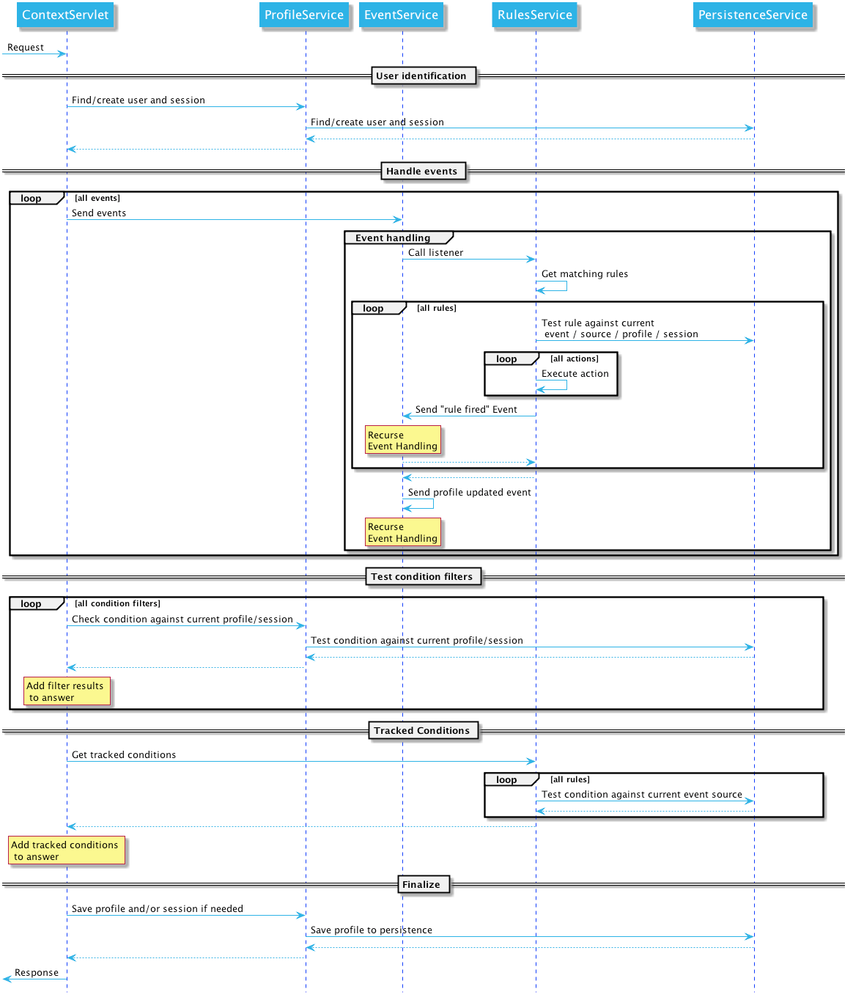

<a id="index--_data_model_overview"></a>
<a id="index--13.4.-data-model-overview"></a>

### 13.4. Data Model Overview

Apache Unomi gathers information about users actions, information that is processed and stored by Unomi services.
The collected information can then be used to personalize content, derive insights on user behavior, categorize the
user profiles into segments along user-definable dimensions or acted upon by algorithms.

The following data model only contains the classes and properties directly related to the most important objects of Apache Unomi.
There are other classes that are less central to the functionality but all the major ones are represented in the diagram below:

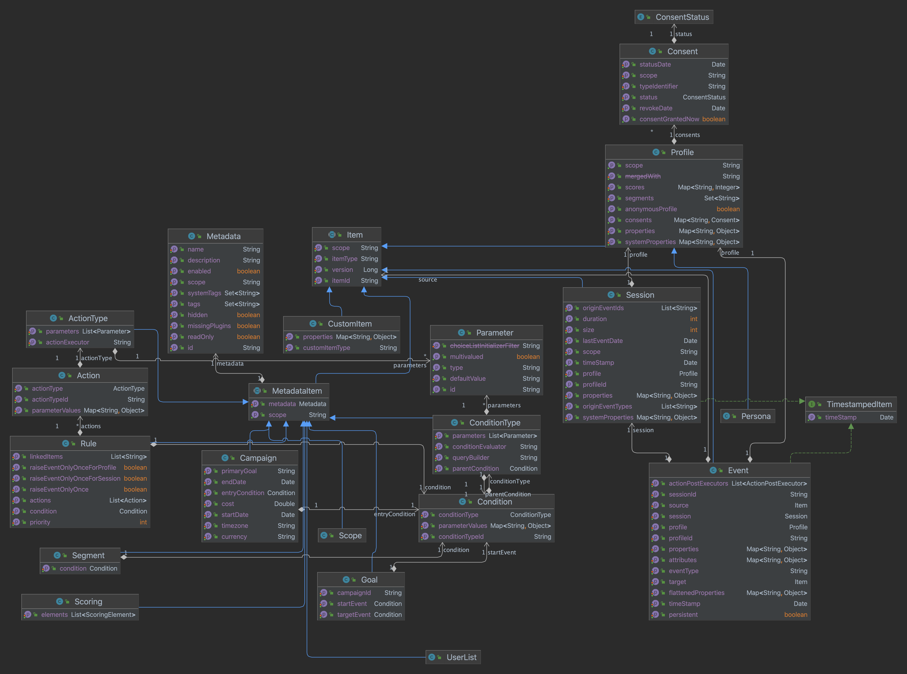

We will detail many of these classes in the document below.

<a id="index--_scope"></a>
<a id="index--13.5.-scope"></a>

### 13.5. Scope

Scopes are objects which simply contains unique strings that are used to "classify" objects.
For example, when using scopes with a web content management system, a scope could be associated with a site identifier or even a host name.

In events, scopes are used to validate event. Events with scope which are unknown by the system will be considered as invalid

> Unomi defines a built-in scope (called `systemscope`) that clients can use to share data across scopes.

<a id="index--_example_2"></a>
<a id="index--13.5.1.-example"></a>

#### 13.5.1. Example

In the following example, the scope uses the unique identifier of a web site called “digitall”.

```
{
    ... other fields of an object type ...
    “scope”: “digitall”
    ... other fields of an object type ...
}
```

<a id="index--_item"></a>
<a id="index--13.6.-item"></a>

### 13.6. Item

Unomi structures the information it collects using the concept of `Item` which provides the base information (an identifier and a type) the context server needs to process and store the data.
Items are persisted according to their type (structure) and identifier (identity).
This base structure can be extended, if needed, using properties in the form of key-value pairs.

These properties are further defined by the `Item`’s type definition which explicits the `Item`’s structure and semantics.
By defining new types, users specify which properties (including the type of values they accept) are available to items of that specific type.

Unomi defines default value types: `date`, `email`, `integer` and `string`, all pretty self-explanatory.
While you can think of these value types as "primitive" types, it is possible to extend Unomi by providing additional value types.

Additionally, most items are also associated to a scope, which is a concept that Unomi uses to group together related items.
A given scope is represented in Unomi by a simple string identifier and usually represents an application or set of applications from which Unomi gathers data, depending on the desired analysis granularity.
In the context of web sites, a scope could, for example, represent a site or family of related sites being analyzed.
Scopes allow clients accessing the context server to filter data to only see relevant data.

Items are a generic object, that is common to many objects in the data model.
It contains the following fields, that are inherited by other objects that inherit from it.

<a id="index--_structure_definition"></a>
<a id="index--13.6.1.-structure-definition"></a>

#### 13.6.1. Structure definition

Inherits all the fields from: n/a

| **Field** | **Type** | **Description** |
| --- | --- | --- |
| itemId | String | This field contains a unique identifier (usually a UUID) that uniquely identifies the item in the whole system. It should be unique to a Unomi installation |
| itemType | String | A string containing the subtype of this item. Examples are : event, profile, session, … any class that inherits from the Item class will have a unique and different itemType value. |
| scope | String (optional) | If present, this will contain a scope identifier. A scope is just a way to regroup objects notably for administrative purposes. For example, when integrating with a CMS a scope could be mapped to a website. The “system” scope value is reserved for values that are used internally by Apache Unomi |

<a id="index--_metadata"></a>
<a id="index--13.7.-metadata"></a>

### 13.7. Metadata

The Metadata object is an object that contains additional information about an object.
It is usually associated with an Item object (see MetadataItem below).

<a id="index--_structure_definition_2"></a>
<a id="index--13.7.1.-structure-definition"></a>

#### 13.7.1. Structure definition

Inherits all the fields from: n/a

| **Field** | **Type** | **Description** |
| --- | --- | --- |
| id | String | This field contains a unique identifier (UUID) for the object the metadata object is attached to. It is usually a copy of the itemId field on an Item object. |
| name | String | A name for the associated object. Usually, this name will be displayed on the user interface |
| description | String (optional) | A description of the associated object. Will also usually be used in user interfaces |
| scope | String | The scope for the associated object. |
| tags | String array | A list of tags for the associated object, this list may be edited through a UI. |
| systemTags | String array | A (reserved) list of tags for the associated object. This is usually populated through JSON descriptors and is not meant to be modified by end users. These tags may include values such as “profileProperties” that help classify associated objects. |
| enabled | Boolean | Indicates whether the associated is enabled or not. For example, a rule may be disabled using this field. |
| missingPlugins | Boolean | This is used for associated objects that require plugins to be deployed to work. If the plugin is not deployed, this object will not perform its function. For example if a rule is registered but the condition or actions it needs are not installed, the rule will not be used. |
| hidden | Boolean | Specifies whether the associated object should be visible in UIs or not |
| readOnly | Boolean | Specifies whether editing of the associated object should be allowed or not. |

<a id="index--_example_3"></a>
<a id="index--13.7.2.-example"></a>

#### 13.7.2. Example

This example of a Metadata object structure was taken from a List associated object.
See the MetadataItem to understand how the two fit together.

```json
{
        "id": "firstListId",
        "name": "First list",
        "description": "Description of the first list.",
        "scope": "digitall",
        "tags": [],
        "systemTags": [],
        "enabled": true,
        "missingPlugins": false,
        "hidden": false,
        "readOnly": false
}
```

<a id="index--_metadataitem"></a>
<a id="index--13.8.-metadataitem"></a>

### 13.8. MetadataItem

<a id="index--_structure_definition_3"></a>
<a id="index--13.8.1.-structure-definition"></a>

#### 13.8.1. Structure definition

Inherits all the fields from: [Item](#index--_item)

| **Field** | **Type** | **Description** |
| --- | --- | --- |
| metadata | Metadata | This object contains just one field, of type Metadata as define just before this object type. |

<a id="index--_example_4"></a>
<a id="index--13.8.2.-example"></a>

#### 13.8.2. Example

The following example is actually the definition of a [List](#index--_list) object, which is simply a [MetadataItem](#index--_metadataitem) sub-type with no additional fields.
We can see here the “itemId” and “itemType” fields that come from the Item parent class and the “metadata” field that contains the object structure coming from the Metadata object type.

```json
{
    "itemId": "userListId",
    "itemType": "userList",
    "metadata": {
        "id": "userListId",
        "name": "First list",
        "description": "Description of the first list.",
        "scope": "digitall",
        "tags": [],
        "systemTags": [],
        "enabled": true,
        "missingPlugins": false,
        "hidden": false,
        "readOnly": false
    }
}
```

<a id="index--_event"></a>
<a id="index--13.9.-event"></a>

### 13.9. Event

Events represent something that is happening at a specific time (they are timestamped).
They can be used to track visitor behavior, or even for back-channel system-to-system (as for example for a login) communication.
Examples of events may include a click on a link on a web page, a login, a form submission, a page view or any other time-stamped action that needs to be tracked.

Events are persisted and immutable, and may be queried or aggregated to produce powerful reports.

Events can also be triggered as part of Unomi’s internal processes for example
when a rule is triggered.

<a id="index--_fields"></a>
<a id="index--13.9.1.-fields"></a>

#### 13.9.1. Fields

Inherits all the fields from: [Item](#index--_item)

| **Field** | **Type** | **Description** |
| --- | --- | --- |
| eventType | String | Contains an identifier for the event type, which may be any value as Apache Unomi does not come with strict event type definitions and accepts custom events types. The system comes with built-in event types such as “view”, “form”, “login”, “updateProperties” but additional event types may of course be used by developers integrating with Apache Unomi. |
| sessionId | String | The unique identifier of a Session object |
| profileId | String | The unique identifier of a Profile object |
| timestamp | Date | The precise date at which the Event was received by Unomi. This date is in the [ISO 8601](https://en.wikipedia.org/wiki/ISO_8601) format. |
| scope | String | (Optional, event type specific) An identifier for a scope |
| persistent | Boolean | Defines if the event should be persisted or not (default: true) |
| source | [Item](#index--_item) | An Item that is the source of the event. For example a web site, an application name, a web page |
| target | [Item](#index--_item) | An Item that is the target of the event. For example a button, a link, a file or a page |
| properties | Map<String,Object> | Properties for the event. These will change depending on the event type. |
| flattenedProperties | Map<String,Object> | Properties that will be persisted as flattened. These will change depending on the event type. |

<a id="index--_event_types"></a>
<a id="index--13.9.2.-event-types"></a>

#### 13.9.2. Event types

Event types are completely open, and any new event type will be accepted by Apache Unomi.

Apache Unomi also comes with an extensive list of [built-in event types](#index--_built_in_event_types) you can find in the reference section of this manual.

<a id="index--_profile"></a>
<a id="index--13.10.-profile"></a>

### 13.10. Profile

By processing events, Unomi progressively builds a picture of who the user is and how they behave. This knowledge is
embedded in `Profile` object. A profile is an `Item` with any number of properties and optional segments and scores.
Unomi provides default properties to cover common data (name, last name, age, email, etc.) as well as default segments
to categorize users. Unomi users are, however, free and even encouraged to create additional properties and segments to
better suit their needs.

Contrary to other Unomi items, profiles are not part of a scope since we want to be able to track the associated user
across applications. For this reason, data collected for a given profile in a specific scope is still available to any
scoped item that accesses the profile information.

It is interesting to note that there is not necessarily a one to one mapping between users and profiles as users can be
captured across applications and different observation contexts. As identifying information might not be available in
all contexts in which data is collected, resolving profiles to a single physical user can become complex because
physical users are not observed directly. Rather, their portrait is progressively patched together and made clearer as
Unomi captures more and more traces of their actions. Unomi will merge related profiles as soon as collected data
permits positive association between distinct profiles, usually as a result of the user performing some identifying
action in a context where the user hadn’t already been positively identified.

<a id="index--_structure_definition_4"></a>
<a id="index--13.10.1.-structure-definition"></a>

#### 13.10.1. Structure definition

Inherits all the fields from: [Item](#index--_item)

| **Field name** | **Type** | **Description** |
| --- | --- | --- |
| properties | Map<String,Object> | All the (user-facing) properties for the profile |
| systemProperties | Map<String,Object> | Internal properties used to track things such as goals reached, merges with other profiles, lists the profile belongs to. |
| segments | String set | A set of Segment identifiers that profile is (currently) associated with |
| scores | Map<String,Integer> | A map of scores with the score identifier as the key and the score total value as the value. |
| @Deprecated mergedWith | String | If merged with another profile, the profile identifier to the master profile is stored here |
| consents | Map<String,[Consent](#index--_consent)> | The consents for the profile, as a map with the consent identifier as a key and the Consent object type as a value. |

<a id="index--_example_5"></a>
<a id="index--13.10.2.-example"></a>

#### 13.10.2. Example

In the example below, a profile for a visitor called “Bill Galileo” is detailed.
A lot of user properties (such as first name, last name, gender, job title and more) were copied over from the CMS upon initial login.
The profile is also part of 4 segments (leads, contacts, gender\_male, age\_60\_70) and has a lot of different scores as well.
It is also part of a list (systemProperties.lists), and has granted two consents for receiving newsletters.
It has also been engaged in some goals (systemProperties.goals.\*StartReached) and completed some goals (systemProperties.goals.\*TargetReached)


```json
{
    "itemId": "f7d1f1b9-4415-4ff1-8fee-407b109364f7",
    "itemType": "profile",
    "properties": {
        "lastName": "Galileo",
        "preferredLanguage": "en",
        "nbOfVisits": 2,
        "gender": "male",
        "jobTitle": "Vice President",
        "lastVisit": "2020-01-31T08:41:22Z",
        "j:title": "mister",
        "j:about": "<p> Lorem Ipsum dolor sit amet,consectetur adipisicing elit, sed doeiusmod tempor incididunt ut laboreet dolore magna aliqua. Ut enim adminim veniam, quis nostrudexercitation ullamco laboris nisi utaliquip ex ea commodo consequat.Duis aute irure dolor inreprehenderit in coluptate velit essecillum dolore eu fugiat nulla pariatur.Excepteur sint occaecat cupidatatnon proident, sunt in culpa quiofficia deserunt mollit anim id estlaborum.</p> ",
        "firstName": "Bill",
        "pageViewCount": {
            "digitall": 19
        },
        "emailNotificationsDisabled": "true",
        "company": "Acme Space",
        "j:nodename": "bill",
        "j:publicProperties": "j:about,j:firstName,j:function,j:gender,j:lastName,j:organization,j:picture,j:title",
        "firstVisit": "2020-01-30T21:18:12Z",
        "phoneNumber": "+1-123-555-12345",
        "countryName": "US",
        "city": "Las Vegas",
        "address": "Hotel Flamingo",
        "zipCode": "89109",
        "email": "bill@acme.com",
        "maritalStatus": "Married",
        "birthDate": "1959-08-12T23:00:00.000Z",
        "kids": 2,
        "age": 60,
        "income": 1000000,
        "facebookId": "billgalileo",
        "twitterId": "billgalileo",
        "linkedInId": "billgalileo",
        "leadAssignedTo": "Important Manager",
        "nationality": "American"
    },
    "systemProperties": {
        "mergeIdentifier": "bill",
        "lists": [
            "userListId"
        ],
        "goals": {
            "viewLanguagePageGoalTargetReached": "2020-02-10T19:30:31Z",
            "downloadGoalExampleTargetReached": "2020-02-10T15:22:41Z",
            "viewLandingPageGoalStartReached": "2020-02-10T19:30:27Z",
            "downloadGoalExampleStartReached": "2020-02-10T19:30:27Z",
            "optimizationTestGoalStartReached": "2020-02-10T19:30:27Z"
        }
    },
    "segments": [
        "leads",
        "age_60_70",
        "gender_male",
        "contacts"
    ],
    "scores": {
        "scoring_9": 10,
        "scoring_8": 0,
        "scoring_1": 10,
        "scoring_0": 10,
        "_s02s6220m": 0,
        "scoring_3": 10,
        "_27ir92oa2": 0,
        "scoring_2": 10,
        "scoring_5": 10,
        "scoring_4": 10,
        "scoring_7": 10,
        "scoring_6": 10,
        "_86igp9j1f": 1,
        "_ps8d573on": 0
    },
    "mergedWith": null,
    "consents": {
        "digitall/newsletter1": {
            "scope": "digitall",
            "typeIdentifier": "newsletter1",
            "status": "GRANTED",
            "statusDate": "2019-05-15T14:47:28Z",
            "revokeDate": "2021-05-14T14:47:28Z"
        },
        "digitall/newsletter2": {
            "scope": "digitall",
            "typeIdentifier": "newsletter2",
            "status": "GRANTED",
            "statusDate": "2019-05-15T14:47:28Z",
            "revokeDate": "2021-05-14T14:47:28Z"
        }
    }
}
```

<a id="index--_profile_aliases"></a>
<a id="index--13.11.-profile-aliases"></a>

### 13.11. Profile aliases

Profile aliases make it possible to reference profiles using multiple identifiers.
The profile alias object basically contains a link between the alias ID and the profile ID. The `itemId` of a profile alias is the actual alias ID, which the `profileID` field contains the reference to the aliased profile.

<a id="index--_structure_definition_5"></a>
<a id="index--13.11.1.-structure-definition"></a>

#### 13.11.1. Structure definition

Inherits all the fields from: [Item](#index--_item)

| **Field name** | **Type** | **Description** |
| --- | --- | --- |
| profileID | String | The identifier of the profile this aliases points to |
| creationTime | DateTime | The date and time of creation of the alias |
| modifiedTime | DateTime | The date and time of last modification of the alias |

<a id="index--_example_6"></a>
<a id="index--13.11.2.-example"></a>

#### 13.11.2. Example

In the following example we show an alias ID `facebook_johndoe` for the profile with ID `f72242d2-3145-43b1-8be7-d1d47cf4ad0e`

```json
    {
      "profileID": "f72242d2-3145-43b1-8be7-d1d47cf4ad0e",
      "itemId" : "facebook_johndoe",
      "creationTime" : "2022-09-16T19:23:51Z",
      "modifiedTime" : "2022-09-16T19:23:51Z"
    }
```

<a id="index--_persona"></a>
<a id="index--13.12.-persona"></a>

### 13.12. Persona

A persona is a specialized version of a [Profile](#index--_profile) object. It basically represents a "typical" profile and can be used
notably to simulate personalized for a type of profiles. Usually personas are created from Profile data and then edited
to represent a specific marketing persona.

<a id="index--_structure_definition_6"></a>
<a id="index--13.12.1.-structure-definition"></a>

#### 13.12.1. Structure definition

Inherits all the fields from: [Profile](#index--_profile)

There are no fields specific to a Persona.

<a id="index--_example_7"></a>
<a id="index--13.12.2.-example"></a>

#### 13.12.2. Example

In the following example a Persona represents a visitor from Europe, that can be used to match by location.

```json
{"itemId": "europeanVisitor","itemType": "persona","properties": {"description": "Represents a visitor browsing from Europe","firstName": "European","lastName": "Visitor","continent": "Europe" },"systemProperties": {},"segments": [],"scores": null,"consents": {}}
```

<a id="index--_consent"></a>
<a id="index--13.13.-consent"></a>

### 13.13. Consent

A consent represents a single instance of a consent granted/refused or revoked by a profile.
A profile will contain multiple instances of consent identified by unique identifiers.

<a id="index--_structure_definition_7"></a>
<a id="index--13.13.1.-structure-definition"></a>

#### 13.13.1. Structure definition

Inherits all the fields from: n/a

| **Field name** | **Type** | **Description** |
| --- | --- | --- |
| scope | String | The scope this consent is associated with. In the case of a website this might be the unique identifier for the site. |
| typeIdentifier | String | This is a unique consent type identifier, basically a unique name for the consent. Example of such types might include: “newsletter”, “personalization”, “tracking”. |
| status | GRANTED / DENIED / REVOKED | The type of status for this consent |
| statusDate | Date | The date (in ISO 8601 format) at which the current status was set |
| revokeDate | Date | The date (in ISO 8106 format) at which time the current status is automatically revoked. |

<a id="index--_example_8"></a>
<a id="index--13.13.2.-example"></a>

#### 13.13.2. Example

In this example, the consent called “newsletter” was given on the “digitall” website.

```json
{
            "scope": "digitall",
            "typeIdentifier": "newsletter",
            "status": "GRANTED",
            "statusDate": "2019-05-15T14:47:28Z",
            "revokeDate": "2021-05-14T14:47:28Z"
}
```

<a id="index--_session"></a>
<a id="index--13.14.-session"></a>

### 13.14. Session

A session represents a period of time during which a visitor/profile has been active.
It makes it possible to gather data and then use it for reporting and further analysis by regrouping all the events that occurred during the session.

<a id="index--_structure_definition_8"></a>
<a id="index--13.14.1.-structure-definition"></a>

#### 13.14.1. Structure definition

Inherits all the fields from: [Item](#index--_item)

| **Field name** | **Type** | **Description** |
| --- | --- | --- |
| properties | Map<String,Object> | All the properties for the session. These contain information such as the browser, operating system and device used, as well as information about the location of the visitor. |
| systemProperties | Map<String,Object> | Not used (empty) |
| profileId | String | The identifier of the profile that generated the session |
| profile | [Profile](#index--_profile) | A copy of the profile associated with the session |
| size | Integer | The number of view event types received during this session |
| duration | Integer | The duration of the session in milliseconds |
| lastEventDate | Date | The date of the last event that occurred in the session, in [ISO 8601](https://en.wikipedia.org/wiki/ISO_8601) format. |

<a id="index--_example_9"></a>
<a id="index--13.14.2.-example"></a>

#### 13.14.2. Example

In this example the session contains a copy of the profile of the visitor.
It is a visitor that has previously authentified in a CMS and who’se information was copied at the time of login from the CMS user account to the profile.
You can also notice that the session contains the information coming from the browser’s user agent which contains the browser type, version as well as the operating system used.
The visitor’s location is also resolve based on the IP address that was used to send events.

```json
{
    "itemId": "4dcb5b74-6923-45ae-861a-6399ef88a209",
    "itemType": "session",
    "scope": "digitall",
    "profileId": "f7d1f1b9-4415-4ff1-8fee-407b109364f7",
    "profile": {
        "itemId": "f7d1f1b9-4415-4ff1-8fee-407b109364f7",
        "itemType": "profile",
        "properties": {
            "preferredLanguage": "en",
            "nbOfVisits": 2,
            "gender": "male",
            "jobTitle": "Vice President",
            "lastVisit": "2020-01-31T08:41:22Z",
            "j:title": "mister",
            "j:about": "<p> Lorem Ipsum dolor sit amet,consectetur adipisicing elit, sed doeiusmod tempor incididunt ut laboreet dolore magna aliqua. Ut enim adminim veniam, quis nostrudexercitation ullamco laboris nisi utaliquip ex ea commodo consequat.Duis aute irure dolor inreprehenderit in coluptate velit essecillum dolore eu fugiat nulla pariatur.Excepteur sint occaecat cupidatatnon proident, sunt in culpa quiofficia deserunt mollit anim id estlaborum.</p> ",
            "pageViewCount": {
                "digitall": 19
            },
            "emailNotificationsDisabled": "true",
            "company": "Acme Space",
            "j:publicProperties": "j:about,j:firstName,j:function,j:gender,j:lastName,j:organization,j:picture,j:title",
            "firstVisit": "2020-01-30T21:18:12Z",
            "countryName": "US",
            "city": "Las Vegas",
            "zipCode": "89109",
            "maritalStatus": "Married",
            "birthDate": "1959-08-12T23:00:00.000Z",
            "kids": 25,
            "age": 60,
            "income": 1000000,
            "leadAssignedTo": "Important Manager"
        },
        "systemProperties": {
            "mergeIdentifier": "bill",
            "lists": [
                "_xb2bcm4wl"
            ]
        },
        "segments": [
            "leads",
            "age_60_70",
            "gender_male",
            "contacts"
        ],
        "scores": {
            "scoring_9": 10,
            "scoring_8": 0,
            "scoring_1": 10,
            "scoring_0": 10,
            "_s02s6220m": 0,
            "scoring_3": 10,
            "_27ir92oa2": 0,
            "scoring_2": 10,
            "scoring_5": 10,
            "scoring_4": 10,
            "scoring_7": 10,
            "scoring_6": 10,
            "_86igp9j1f": 1,
            "_ps8d573on": 0
        },
        "mergedWith": null,
        "consents": {}
    },
    "properties": {
        "sessionCity": "Geneva",
        "operatingSystemFamily": "Desktop",
        "userAgentNameAndVersion": "Firefox@@72.0",
        "countryAndCity": "Switzerland@@Geneva@@2660645@@6458783",
        "userAgent": "Mozilla/5.0 (Macintosh; Intel Mac OS X 10.15; rv:72.0) Gecko/20100101 Firefox/72.0",
        "userAgentName": "Firefox",
        "sessionCountryCode": "CH",
        "deviceName": null,
        "sessionCountryName": "Switzerland",
        "referringURL": "null",
        "deviceCategory": "Apple Macintosh",
        "pageReferringURL": "http://localhost:8080/sites/digitall/home/corporate-responsibility.html",
        "userAgentVersion": "72.0",
        "sessionAdminSubDiv2": 6458783,
        "sessionAdminSubDiv1": 2660645,
        "location": {
            "lon": 6.1282508,
            "lat": 46.1884341
        },
        "sessionIsp": "Cablecom",
        "operatingSystemName": "Mac OS X",
        "deviceBrand": "Apple"
    },
    "systemProperties": {},
    "timeStamp": "2020-01-31T08:41:22Z",
    "lastEventDate": "2020-01-31T08:53:32Z",
    "size": 19,
    "duration": 730317
}
```

<a id="index--_segment"></a>
<a id="index--13.15.-segment"></a>

### 13.15. Segment

Segments are used to group profiles together, and are based on conditions that are executed on profiles to determine
if they are part of a segment or not.

This also means that a profile may enter or leave a segment based on changes in their properties, making segments a
highly dynamic concept.

<a id="index--_structure_definition_9"></a>
<a id="index--13.15.1.-structure-definition"></a>

#### 13.15.1. Structure definition

Inherits all the fields from: [MetadataItem](#index--_metadataitem)

| **Field name** | **Type** | **Description** |
| --- | --- | --- |
| condition | [Condition](#index--_condition) | The root condition for the segment. Conditions may be composed by using built-in condition types such as `booleanCondition` that can accept sub-conditions. |

<a id="index--_example_10"></a>
<a id="index--13.15.2.-example"></a>

#### 13.15.2. Example

```json
{"itemId": "age_20_30","itemType": "segment","condition": {"parameterValues": {"subConditions": [{"parameterValues": {"propertyName": "properties.age","comparisonOperator": "greaterThanOrEqualTo","propertyValueInteger": 20 },"type": "profilePropertyCondition" },{"parameterValues": {"propertyName": "properties.age","comparisonOperator": "lessThan","propertyValueInteger": 30 },"type": "profilePropertyCondition"} ],"operator": "and" },"type": "booleanCondition" },"metadata": {"id": "age_20_30","name": "age_20_30","description": null,"scope": "digitall","tags": [],"enabled": true,"missingPlugins": false,"hidden": false,"readOnly": false}}
```

Here is an example of a simple segment definition registered using the REST API:

```
curl -X POST http://localhost:8181/cxs/segments \ --user karaf:karaf \ -H "Content-Type: application/json" \ -d @- <<'EOF' {"metadata": {"id": "leads","name": "Leads","scope": "systemscope","description": "You can customize the list below by editing the leads segment.","readOnly":true },"condition": {"type": "booleanCondition","parameterValues": {"operator" : "and","subConditions": [{"type": "profilePropertyCondition","parameterValues": {"propertyName": "properties.leadAssignedTo","comparisonOperator": "exists"}}]}}} EOF
```

For more details on the conditions and how they are structured using conditions, see the next section.

<a id="index--_condition"></a>
<a id="index--13.16.-condition"></a>

### 13.16. Condition

Conditions are a very useful notion inside of Apache Unomi, as they are used as the basis for multiple other objects.
Conditions may be used as parts of:

- Segments
- Rules
- Queries
- Campaigns
- Goals
- Profile filters (using to search for profiles)

The result of a condition is always a boolean value of true or false.

Apache Unomi provides quite a lot of built-in condition types, including boolean types that make it possible to compose conditions using operators such as `and`, `or` or `not`.
Composition is an essential element of building more complex conditions.

For a more complete list of available condition types, see the [Built-in condition types](#index--_built_in_condition_types) reference section.

<a id="index--_structure_definition_10"></a>
<a id="index--13.16.1.-structure-definition"></a>

#### 13.16.1. Structure definition

Inherits all the fields from: n/a

| **Field name** | **Type** | **Description** |
| --- | --- | --- |
| conditionTypeId | String | A condition type identifier is a string that contains a unique identifier for a condition type. Example condition types may include `booleanCondition`, `eventTypeCondition`, `eventPropertyCondition`, and so on. Plugins may implement new condition types that may implement any logic that may be needed. |
| parameterValues | Map<String,Object> | The parameter values are simply key-value paris that may be used to configure the condition. In the case of a `booleanCondition` for example one of the parameter values will be an `operator` that will contain values such as `and` or `or` and a second parameter value called `subConditions` that contains a list of conditions to evaluate with that operator. |

<a id="index--_example_11"></a>
<a id="index--13.16.2.-example"></a>

#### 13.16.2. Example

Here is an example of a complex condition:

```json
{"condition": {"type": "booleanCondition","parameterValues": {"operator":"or","subConditions":[{"type": "eventTypeCondition","parameterValues": {"eventTypeId": "sessionCreated"} },{"type": "eventTypeCondition","parameterValues": {"eventTypeId": "sessionReassigned"}}]}}}
```

As we can see in the above example we use the boolean `or` condition to check if the event type is of type `sessionCreated`
or `sessionReassigned`.

<a id="index--_rule"></a>
<a id="index--13.17.-rule"></a>

### 13.17. Rule

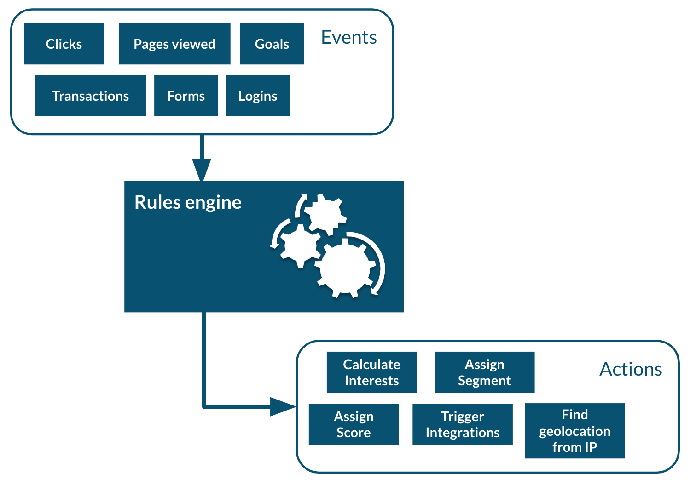

Apache Unomi has a built-in rule engine that is one of the most important components of its architecture.
Every time an event is received by the server, it is evaluated against all the rules and the ones matching the incoming event will be executed.
You can think of a rule as a structure that looks like this:

```
when
    conditions
then
    actions
```

Basically when a rule is evaluated, all the conditions in the `when` part are evaluated and if the result matches (meaning it evaluates to `true`) then the actions will be executed in sequence.

The real power of Apache Unomi comes from the fact that `conditions` and `actions` are fully pluggeable and that plugins may implement new conditions and/or actions to perform any task.
You can imagine conditions checking incoming event data against third-party systems or even against authentication systesm, and actions actually pulling or pushing data to third-party systems.

For example the Salesforce CRM connector is simply a set of actions that pull and push data into the CRM. It is then just a matter of setting up the proper rules with the proper conditions to determine when and how the data will be pulled or pushed into the third-party system.

<a id="index--_structure_definition_11"></a>
<a id="index--13.17.1.-structure-definition"></a>

#### 13.17.1. Structure definition

Inherits all the fields from: [MetadataItem](#index--_metadataitem)

| **Field name** | **Type** | **Description** |
| --- | --- | --- |
| condition | [Condition](#index--_condition) | The root condition for the rule. Conditions may be composed by using built-in condition types such as `booleanCondition` that can accept sub-conditions. |
| action | [Action](#index--_action) array | A list of [Action](#index--_action) object that will be executed if the condition is true. |
| linkedItems | String array | A list of references to objects that may have generated this rule. Goals and segments dynamically generate rules to react to incoming events. It is not recommend to manipulate rules that have linkedItems as it may break functionality. |
| raiseEventOnlyOnce | Boolean | If true, the rule will only be executed once for a given event. |
| raiseEventOnlyOnceForProfile | Boolean | If true, the rule will only be executed once for a given profile and a matching event. Warning: this functionality has a performance impact since it looks up past events. |
| raiseEventOnlyOnceForSession | Boolean | If true, the rule will only be executed once for a given session and a matching event. Warning: this functionality has a performance impact since it looks up past events. |
| priority | Integer | The priority for the rule. The lower the priority value the higher the effective priority (they are sorted by ascending order of priority) |

<a id="index--_example_12"></a>
<a id="index--13.17.2.-example"></a>

#### 13.17.2. Example

In this example we can see the default `updateProperties` built-in rule that matches the `updateProperties` event and
executes the built-in `updatePropertiesAction`

```json
{"itemId": "updateProperties","itemType": "rule","condition": {"parameterValues": {},"type": "updatePropertiesEventCondition" },"actions": [{"parameterValues": {},"type": "updatePropertiesAction"} ],"linkedItems": null,"raiseEventOnlyOnceForProfile": false,"raiseEventOnlyOnceForSession": false,"priority": 0,"metadata": {"id": "updateProperties","name": "Update profile/persona properties","description": "Update profile/persona properties","scope": "systemscope","tags": [],"systemTags": [],"enabled": true,"missingPlugins": false,"hidden": false,"readOnly": true}}
```

<a id="index--_action"></a>
<a id="index--13.18.-action"></a>

### 13.18. Action

Actions are executed by rules in a sequence, and an action is only executed once the previous action has finished executing.
If an action generates an exception, it will be logged and the execution sequence will continue unless in the case of a
Runtime exception (such as a NullPointerException).

Action use Action types that are implemented as Java classes, and as such may perform any kind of tasks that may include
calling web hooks, setting profile properties, extracting data from the incoming request (such as resolving location from
an IP address), or even pulling and/or pushing data to third-party systems such as a CRM server.

Apache Unomi also comes with built-in action types.
You may find the list of built-in action types in the [Built-in action types](#index--_built_in_action_types) section.

<a id="index--_structure_definition_12"></a>
<a id="index--13.18.1.-structure-definition"></a>

#### 13.18.1. Structure definition

Inherits all the fields from: n/a

| **Field name** | **Type** | **Description** |
| --- | --- | --- |
| actionTypeId | String | An action type identifier is a string that contains a unique identifier for a action type. |
| parameterValues | Map<String,Object> | The parameter values are simply key-value paris that may be used to configure the action. |

<a id="index--_example_13"></a>
<a id="index--13.18.2.-example"></a>

#### 13.18.2. Example

In this example of an action, taking from the `form-mapping-example.json` rule, the `setPropertyAction` action is used
to set the `properties.firstName` profile property to a value read from the event properties called `properties.firstName`.
The `setPropertyStrategy` is a parameter specific to this action that allows to define if existing values should be
overridden or not.

```json
{"type": "setPropertyAction","parameterValues": {"setPropertyName": "properties(firstName)","setPropertyValue": "eventProperty::properties(firstName)","setPropertyStrategy": "alwaysSet"}}
```

<a id="index--_list"></a>
<a id="index--13.19.-list"></a>

### 13.19. List

Lists are a “manual” way to organize profiles, whereas Segments are a dynamic way to regroup them.
List objects actually only define the list in terms of name, description and other metadata but the list of members is actually not represented in the object.
The profiles contain references to the lists in their “systemProperties.lists” property.
This property is an array of list identifiers so in order to retrieve all the list names for a given profile, a lookup of List objects is required using the identifiers.

<a id="index--_structure_definition_13"></a>
<a id="index--13.19.1.-structure-definition"></a>

#### 13.19.1. Structure definition

Inherits all the fields from: [MetadataItem](#index--_metadataitem)

| **Field name** | **Description** |
| --- | --- |
|  | No additional fields are present in this object type |

<a id="index--_example_14"></a>
<a id="index--13.19.2.-example"></a>

#### 13.19.2. Example

Here’s an example of a list called “First list”, along with its description, its scope, tags, etc.. . As a List object is basically a MetadataItem sub-class it simply has all the fields defined in that parent class.
Note that the List does not contain Profiles, it is Profiles that reference the Lists, not the reverse.

```json
{
    "itemId": "userListId",
    "itemType": "userList",
    "metadata": {
        "id": "userListId",
        "name": "First list",
        "description": "Description of the first list.",
        "scope": "digitall",
        "tags": [],
        "systemTags": [],
        "enabled": true,
        "missingPlugins": false,
        "hidden": false,
        "readOnly": false
    }
}
```

<a id="index--_goal"></a>
<a id="index--13.20.-goal"></a>

### 13.20. Goal

A goal can be defined with two conditions: a start event condition and an target event condition.
Basically the goal will be “active” when its start event condition is satisfied, and “reached” when the target event condition is true.
Goals may also (optionally) be associated with Campaigns.
Once a goal is “reached”, a “goal” event triggered and the profile that is currently interacting with the system will see its system properties updated to indicate which goal has been reached.

<a id="index--_structure_definition_14"></a>
<a id="index--13.20.1.-structure-definition"></a>

#### 13.20.1. Structure definition

Inherits all the fields from: [MetadataItem](#index--_metadataitem)

| **Field name** | **Type** | **Description** |
| --- | --- | --- |
| startEvent | Condition | The condition that will be used to determine if this goal was activated by the current profile |
| targetEvent | Condition | The condition that will be used to determine if the current profile has reached the goal. |
| campaignId | String | If this goal was setup as part of a Campaign, the unique identifier for the campaign is stored in this field. |

<a id="index--_example_15"></a>
<a id="index--13.20.2.-example"></a>

#### 13.20.2. Example

In the following example, a goal called “downloadGoalExample” is started when a new session is created (we use the “sessionCreatedEventCondition” for that) and is reached when a profile downloads a file called “ACME\_WP.pdf” (that’s what the “downloadEventCondition” means).

```json
{"itemId": "downloadGoalExample","itemType": "goal","startEvent": {"parameterValues": {},"type": "sessionCreatedEventCondition" },"targetEvent": {"parameterValues": {"filePath": "/sites/digitall/files/PDF/Publications/ACME_WP.pdf" },"type": "downloadEventCondition" },"campaignId": "firstCampaignExample","metadata": {"id": "downloadGoalExample","name": "downloadGoalExample","description": null,"scope": "digitall","enabled": true,"missingPlugins": false,"hidden": false,"readOnly": false,"systemTags": ["goal","downloadGoal"]}}
```

<a id="index--_campaign"></a>
<a id="index--13.21.-campaign"></a>

### 13.21. Campaign

A Campaign object represents a digital marketing campaign, along with conditions to enter the campaign and a specific duration, target and costs.

<a id="index--_structure_definition_15"></a>
<a id="index--13.21.1.-structure-definition"></a>

#### 13.21.1. Structure definition

Inherits all the fields from: [MetadataItem](#index--_metadataitem)

| **Field name** | **Type** | **Description** |
| --- | --- | --- |
| startDate | Date | The start date of the Campaign (in ISO 8601 format) |
| endDate | Date | The end date of the Campaign (in ISO 8601 format) |
| entryCondition | [Condition](#index--_condition) | The condition that must be satisfied for a profile to become a participant in the campaign |
| cost | Double | An indicative cost for the campaign |
| currency | String | The currency code (3-letter) for the cost of the campaign |
| primaryGoal | String | A unique identifier of the primary Goal for the campaign. |
| timezone | String | The timezone of the campaign identified by the TZ database name (see <https://en.wikipedia.org/wiki/List_of_tz_database_time_zones>) |

<a id="index--_example_16"></a>
<a id="index--13.21.2.-example"></a>

#### 13.21.2. Example

In the following example a campaign that starts January 1st 31, 2020 at 8:38am and finished on February 29th, 2020 at the same time has the following entry condition: the session duration must be less or equal to 3000 milliseconds (3 seconds) and the profile has viewed the “about” page on the “digitall” website.
The cost of the campaign is USD 1’000’000 and the timezone is Europe/Zurich.
The primary goal for the campaign is the goal we should have as an example in the Goal section.

```json
{"itemId": "firstCampaignExample","itemType": "campaign","startDate": "2020-01-31T08:38:00Z","endDate": "2020-02-29T08:38:00Z","entryCondition": {"parameterValues": {"subConditions": [{"parameterValues": {"propertyName": "duration","comparisonOperator": "lessThanOrEqualTo","propertyValueInteger": 3000 },"type": "sessionPropertyCondition" },{"parameterValues": {"pagePath": "/sites/digitall/home/about" },"type": "pageViewEventCondition"} ],"operator": "and" },"type": "booleanCondition" },"cost": 1000000,"currency": "USD","primaryGoal": "downloadGoalExample","timezone": "Europe/Zurich","metadata": {"id": "firstCampaignExample","name": "firstCampaign","description": "Example of a campaign","scope": "digitall","tags": [],"systemTags": ["landing","campaign" ],"enabled": true,"missingPlugins": false,"hidden": false,"readOnly": false}}
```

<a id="index--_scoring_plan"></a>
<a id="index--13.22.-scoring-plan"></a>

### 13.22. Scoring plan

Scoring plans make it possible to define scores that will be tracked for profiles and use conditions to increment a score when the conditions are met.
This makes it possible to then use threshold conditions on profiles when they reach a certain score.

<a id="index--_structure_definition_16"></a>
<a id="index--13.22.1.-structure-definition"></a>

#### 13.22.1. Structure definition

Inherits all the fields from: [MetadataItem](#index--_metadataitem)

| **Field name** | **Type** | **Description** |
| --- | --- | --- |
| elements | ScoringElement array | A ScoringElement is composed of: a Condition and a score value to increment. Each element defines a separate condition (tree) that will increment the defined score for this scoring plan, making it possible to have completely different conditions to augment a score. |

<a id="index--_example_17"></a>
<a id="index--13.22.2.-example"></a>

#### 13.22.2. Example

In this example a scoring plan contains a single element that will increment a score with an increment one 1 once the profile has viewed at least 3 pages (using the “hasSeenNPagesCondition” condition).

```json
{"itemId": "viewMoreThan3PagesId","itemType": "scoring","elements": [{"condition": {"parameterValues": {"value": 3,"scope": "digitall","comparisonOperator": "greaterThanOrEqualTo" },"type": "hasSeenNPagesCondition" },"value": 1} ],"metadata": {"id": "viewMoreThan3PagesId","name": "Viewed more than 3 pages","description": null,"scope": "digitall","tags": [],"systemTags": ["st:behavioral" ],"enabled": true,"missingPlugins": false,"hidden": false,"readOnly": false}}
```

<a id="index--_built_in_event_types"></a>
<a id="index--13.23.-built-in-event-types"></a>

### 13.23. Built-in Event types

Apache Unomi comes with built-in event types, which we describe below.

<a id="index--_login_event_type"></a>
<a id="index--13.23.1.-login-event-type"></a>

#### 13.23.1. Login event type

The login event type is used to signal an authentication event has been triggered.
This event should be “secured”, meaning that it should not be accepted from any location, and by default Apache Unomi will only accept this event from configured “third-party” servers (identified by their IP address and a Unomi application key).

Usually, the login event will contain information passed by the authentication server and may include user properties and any additional information.
Rules may be set up to copy the information from the event into the profile, but this is not done in the default set of rules provided by Apache Unomi for security reasons.
You can find an example of such a rule here: <https://github.com/apache/unomi/blob/master/samples/login-integration/src/main/resources/META-INF/cxs/rules/exampleLogin.json>

<a id="index--_structure_overview"></a>
<a id="index--structure-overview"></a>

##### Structure overview

Based on the structure of the following object: Event

| **Field name** | **Value/description** |
| --- | --- |
| eventType | login |
| source | Not used (null) |
| target | an Item representing the user that logged in |
| scope | the scope in which the user has authenticated |
| properties | Not used (empty) |

<a id="index--_example_18"></a>
<a id="index--example-2"></a>

##### Example

In this case, a user has logged into a site called “digitall”, and his user information the following properties are associated with the active user..and perhaps show his visitor profile or user information.

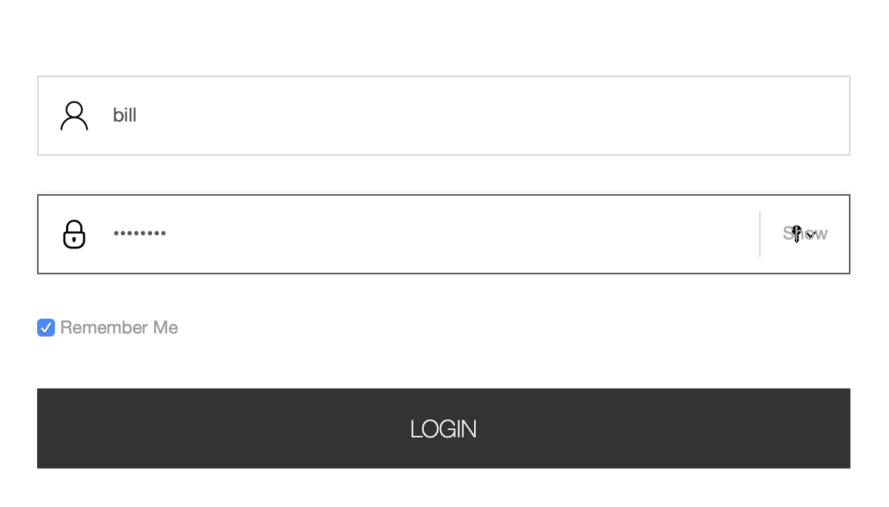

```json
{
    "itemId": "0b8825a6-efb8-41a6-bea5-d745b33c94cb",
    "itemType": "event",
    "scope": "digitall",
    "eventType": "login",
    "sessionId": "7b8a5f17-cdb0-4c14-b676-34c1c0de0825",
    "profileId": "f7d1f1b9-4415-4ff1-8fee-407b109364f7",
    "timeStamp": "2020-01-30T21:18:28Z",
    "properties": {},
    "source": null,
    "target": {
        "itemId": "13054a95-092d-4d7b-81f5-e4656c2ebc88",
        "itemType": "cmsUser",
        "scope": null,
        "properties": {
            "j:function": "Vice President",
            "preferredLanguage": "en",
            "j:title": "mister",
            "emailNotificationsDisabled": "true",
            "j:organization": "Acme Space",
            "j:gender": "male",
            "j:nodename": "bill",
            "j:lastName": "Galileo",
            "j:publicProperties": "j:about,j:firstName,j:function,j:gender,j:lastName,j:organization,j:picture,j:title",
            "j:firstName": "Bill",
            "j:about": "<p> Lorem Ipsum dolor sit amet.</p> "
        }
    }
}
```

<a id="index--_view_event_type"></a>
<a id="index--13.23.2.-view-event-type"></a>

#### 13.23.2. View event type

This event is triggered when a web page is viewed by a user.
Some integrators might also want to trigger it when a single-page-application screen is displayed or when a mobile application screen is displayed.

<a id="index--_structure_description"></a>
<a id="index--structure-description"></a>

##### Structure description

Based on the structure of the following object: Event

| **Field name** | **Value/description** |
| --- | --- |
| eventType | view |
| source | the source for the view event, could be a web site, an application name, etc… |
| target | the page/screen being viewed |
| properties | Not used (empty) |

<a id="index--_example_19"></a>
<a id="index--example-3"></a>

##### Example

In this case a use has visited the home page of the digitall site.
As this is the first page upon login, the destination and referring URL are the same.

```json
{
    "itemId": "c75f50c2-ab55-4d95-be69-cbbeee180d6b",
    "itemType": "event",
    "scope": "digitall",
    "eventType": "view",
    "sessionId": "7b8a5f17-cdb0-4c14-b676-34c1c0de0825",
    "profileId": "f7d1f1b9-4415-4ff1-8fee-407b109364f7",
    "timeStamp": "2020-01-30T21:18:32Z",
    "properties": {},
    "source": {
        "itemId": "29f5fe37-28c0-48f3-966b-5353bed87308",
        "itemType": "site",
        "scope": "digitall",
        "properties": {}
    },
    "target": {
        "itemId": "f20836ab-608f-4551-a930-9796ec991340",
        "itemType": "page",
        "scope": "digitall",
        "properties": {
            "pageInfo": {
                "templateName": "home",
                "language": "en",
                "destinationURL": "http://localhost:8080/sites/digitall/home.html",
                "categories": [],
                "pageID": "f20836ab-608f-4551-a930-9796ec991340",
                "nodeType": "jnt:page",
                "pagePath": "/sites/digitall/home",
                "pageName": "Home",
                "referringURL": "http://localhost:8080/sites/digitall/home.html",
                "tags": [],
                "isContentTemplate": false
            },
            "attributes": {},
            "consentTypes": []
        }
    }
}
```

<a id="index--_form_event_type"></a>
<a id="index--13.23.3.-form-event-type"></a>

#### 13.23.3. Form event type

This event type is used to track form submissions.
These could range from login to survey form data captured and processed in Apache Unomi using rules.

<a id="index--_structure_description_2"></a>
<a id="index--structure-description-2"></a>

##### Structure description

Based on the structure of the following object: Event

| **Field name** | **Value/description** |
| --- | --- |
| eventType | form |
| source | the page/screen on which the form was submitted |
| target | the form that was submitted (there could be more than one form on a page/screen) |
| properties | contain the data submitted in the form |

<a id="index--_example_20"></a>
<a id="index--example-4"></a>

##### Example

A form exists on the digitall site, and has been submitted by a visitor.
In this case it was a search form that contains fields to adjust the search parameters.

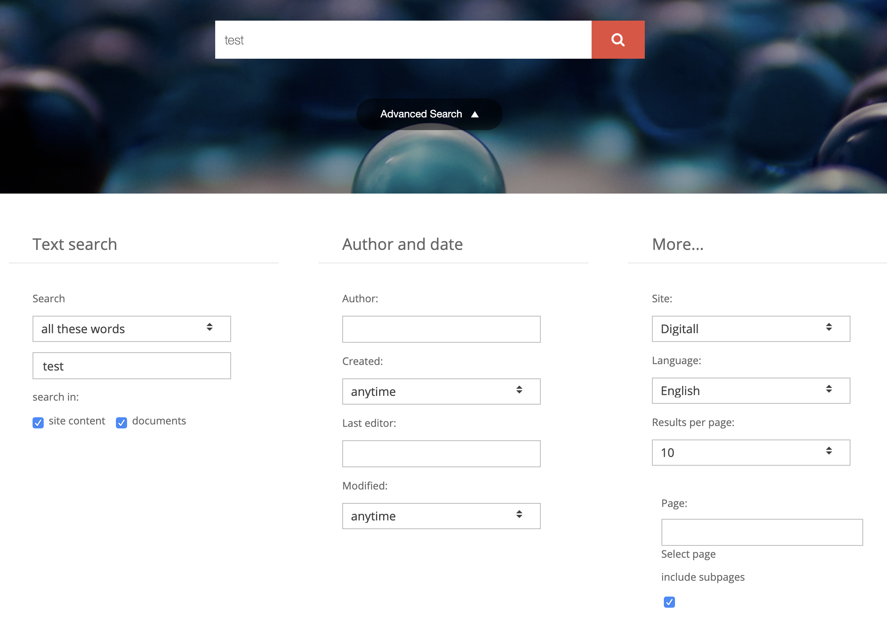

```json
{
    "itemId": "44177ffe-b5c8-4575-a8e5-f8aa0d4ee792",
    "itemType": "event",
    "scope": "digitall",
    "eventType": "form",
    "sessionId": "be416c08-8b9b-4611-990f-3a8bf3ed4e68",
    "profileId": "bc1e1238-a9ac-4b3a-8f63-5eec205cfcd5",
    "timeStamp": "2020-01-30T21:41:22Z",
    "properties": {
        "jcrMethodToCall": "get",
        "src_originSiteKey": "digitall",
        "src_terms[0].term": "test",
        "src_terms[0].applyFilter": "true",
        "src_terms[0].match": "all_words",
        "src_terms[0].fields.siteContent": "true",
        "src_terms[0].fields.tags": "true",
        "src_terms[0].fields.files": "true",
        "src_sites.values": "digitall",
        "src_sitesForReferences.values": "systemsite",
        "src_languages.values": "en"
    },
    "source": {
        "itemId": "97e14221-33dd-4608-82ae-9724d15d4f12",
        "itemType": "page",
        "scope": "digitall",
        "properties": {
            "pageInfo": {
                "templateName": "home",
                "language": "en",
                "destinationURL": "http://localhost:8080/sites/digitall/home/search-results.html",
                "categories": [],
                "pageID": "97e14221-33dd-4608-82ae-9724d15d4f12",
                "nodeType": "jnt:page",
                "pagePath": "/sites/digitall/home/search-results",
                "pageName": "Search Results",
                "referringURL": "http://localhost:8080/cms/edit/default/en/sites/digitall/home.html",
                "tags": [],
                "isContentTemplate": false
            },
            "attributes": {},
            "consentTypes": []
        }
    },
    "target": {
        "itemId": "searchForm",
        "itemType": "form",
        "scope": "digitall",
        "properties": {}
    }
}
```

<a id="index--_update_properties_event_type"></a>
<a id="index--13.23.4.-update-properties-event-type"></a>

#### 13.23.4. Update properties event type

This event is usually used by user interfaces that make it possible to modify profile properties, for example a form where a user can edit his profile properties, or a management UI to modify.

Note that this event type is a protected event type that is only accepted from configured third-party servers.

<a id="index--_structure_definition_17"></a>
<a id="index--structure-definition"></a>

##### Structure definition

Based on the structure of the following object: Event

| **Field name** | **Value/description** |
| --- | --- |
| eventType | updateProperties |
| source | the screen that has triggered the update to the profile properties |
| target | Not used (null) |
| properties | { targetId: the identifier of the profile to update targetType: “profile” if updating a profile or “persona” for personas add/update/delete: properties to be added/updated or deleted on the target profile} |

<a id="index--_example_21"></a>
<a id="index--example-5"></a>

##### Example

In this example, this “updateProperties” event contains properties that must be added to the targetId profile.

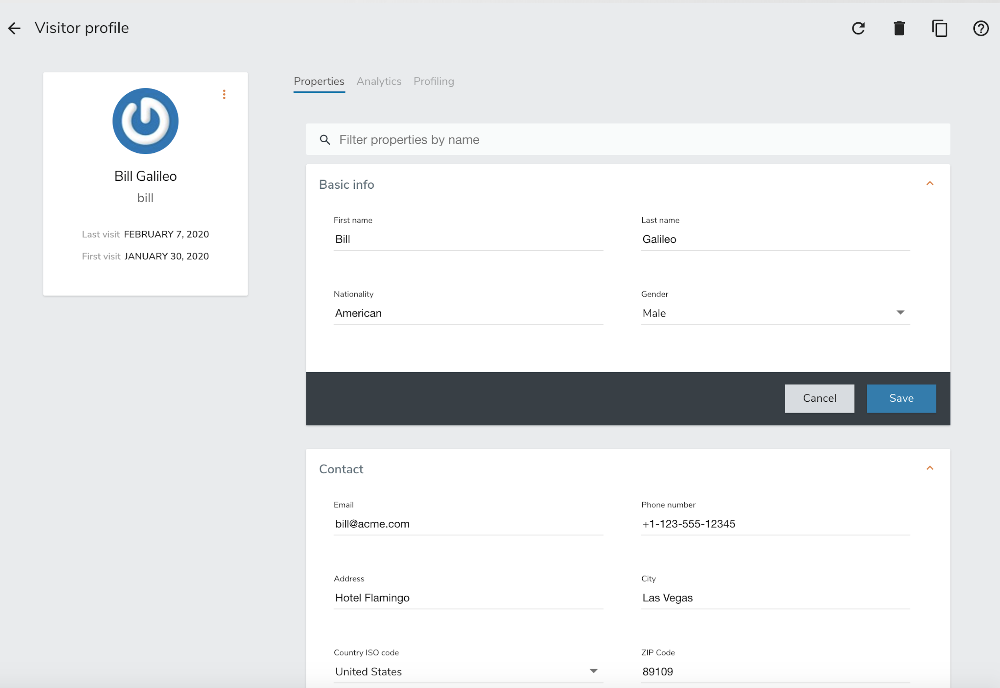

```json
{
    "itemId": "d8fec330-33cb-42bc-a4e2-bb48ea7ed29b",
    "itemType": "event",
    "scope": null,
    "eventType": "updateProperties",
    "sessionId": "66e63ec9-66bc-4fac-8a8a-febcc3d6cbb7",
    "profileId": "bc1e1238-a9ac-4b3a-8f63-5eec205cfcd5",
    "timeStamp": "2020-01-31T08:51:15Z",
    "properties": {
        "targetId": "f7d1f1b9-4415-4ff1-8fee-407b109364f7",
        "targetType": "profile",
        "add": {
            "properties.phoneNumber": "+1-123-555-12345",
            "properties.countryName": "US",
            "properties.city": "Las Vegas",
            "properties.address": "Hotel Flamingo",
            "properties.zipCode": "89109",
            "properties.email": "bill@acme.com"
        }
    },
    "source": {
        "itemId": "wemProfile",
        "itemType": "wemProfile",
        "scope": "digitall",
        "properties": {}
    },
    "target": null
}
```

<a id="index--_identify_event_type"></a>
<a id="index--13.23.5.-identify-event-type"></a>

#### 13.23.5. Identify event type

This event type is used to add information learned about the current profile.
This could be through a form that has asked the user to provide some information about himself, or it could be information sent by another system (CRM, SSO, DMP, LiveRamp or equivalent) to augment the data for the current profile.

It should be noted that, as in the case of a login event, it might be a good idea to be careful as to who and what system are allowed to send this event.
Also, in order for this event to perform any modifications, an associated rule will be needed in the Unomi system to perform modifications to a profile (there is no default rule).

| **Event type** | **Available publicly** | **Default rule** | **Targeted at back-office** | **Can remove/update properties** |
| --- | --- | --- | --- | --- |
| identify | yes | no | no | no |
| updateProperties | no | yes | yes | yes |

The rule of thumb is: if you need to send profile data from public system to add information to a profile you should use the identify event type and add a rule to only process the data you want to accept.
If you want to add/update/delete properties in a secure manner from a known server you could use the updateProperties but you should always check first if you can’t use the identify or event form event types with specific rules as this reduces greatly the potential for misuse.

<a id="index--_structure_description_3"></a>
<a id="index--structure-description-3"></a>

##### Structure description

Based on the structure of the following object: Event

| **Field name** | **Value/description** |
| --- | --- |
| eventType | identify |
| source | the site/application name that triggered the identify event |
| target | the user information contained in the event |
| properties | Not used (empty) |

<a id="index--_example_22"></a>
<a id="index--example-6"></a>

##### Example

In this example, an event containing additional information about the user (his nickname, favorite compiler and industry) was sent to Apache Unomi.

```json
{"itemId": "18dfd6c7-9055-4ef0-a2eb-14c1482b4544","itemType": "event","scope": "myScope","eventType": "identify","sessionId": "928d9237-fb3d-4e53-cbee-1aeb1df7f03a","profileId": "temp_023ded50-bb43-4fe2-acbc-13bfa8de16de","timeStamp": "2020-01-15T14:13:25Z","properties": {},"source": {"itemId": "myScope","itemType": "site","scope": "myScope","properties": {"page": {"path": "/web-page/","referrer": "http://localhost:8181/","search": "","title": "Apache Unomi Web Test Page","url": "http://localhost:8181/web-page/"}} },"target": {"itemId": "null","itemType": "analyticsUser","scope": "myScope","properties": {"nickname": "Amazing Grace","favoriteCompiler": "A-0","industry": "Computer Science"}}}
```

<a id="index--_session_created_event_type"></a>
<a id="index--13.23.6.-session-created-event-type"></a>

#### 13.23.6. Session created event type

The session created event is an internal event created by Apache Unomi when a new session is created.
This indicates that a new visitor has interacted with a system that is using Apache Unomi to track their behavior.

<a id="index--_structure_definition_18"></a>
<a id="index--structure-definition-2"></a>

##### Structure definition

Based on the structure of the following object: Event

| **Field name** | **Value/description** |
| --- | --- |
| eventType | sessionCreated |
| source | Not used (null) |
| target | the Session item that was created with all its fields and properties |
| properties | Not used (empty) |

<a id="index--_example_23"></a>
<a id="index--example-7"></a>

##### Example

In this example, a new session was created for a visitor coming to the digitall website.
The session contains the firstVisit property.
It may be augmented over time with more information including location.

```json
{
    "itemId": "b3f5486f-b317-4182-9bf4-f497271e5363",
    "itemType": "event",
    "scope": "digitall",
    "eventType": "sessionCreated",
    "sessionId": "be416c08-8b9b-4611-990f-3a8bf3ed4e68",
    "profileId": "bc1e1238-a9ac-4b3a-8f63-5eec205cfcd5",
    "timeStamp": "2020-01-30T21:13:26Z",
    "properties": {},
    "source": null,
    "target": {
        "itemId": "be416c08-8b9b-4611-990f-3a8bf3ed4e68",
        "itemType": "session",
        "scope": "digitall",
        "profileId": "bc1e1238-a9ac-4b3a-8f63-5eec205cfcd5",
        "profile": {
            "itemId": "bc1e1238-a9ac-4b3a-8f63-5eec205cfcd5",
            "itemType": "profile",
            "properties": {
                "firstVisit": "2020-01-30T21:13:26Z"
            },
            "systemProperties": {},
            "segments": [],
            "scores": null,
            "mergedWith": null,
            "consents": {}
        },
        "properties": {},
        "systemProperties": {},
        "timeStamp": "2020-01-30T21:13:26Z",
        "lastEventDate": null,
        "size": 0,
        "duration": 0
    }
}
```

<a id="index--_goal_event_type"></a>
<a id="index--13.23.7.-goal-event-type"></a>

#### 13.23.7. Goal event type

A goal event is triggered when the current profile (visitor) reaches a goal.

<a id="index--_structure_definition_19"></a>
<a id="index--structure-definition-3"></a>

##### Structure definition

Based on the structure of the following object: Event

| **Field name** | **Value/description** |
| --- | --- |
| eventType | goal |
| source | the Event that triggered the goal completion |
| target | the Goal item that was reached |
| properties | Not used (empty) |

<a id="index--_example_24"></a>
<a id="index--example-8"></a>

##### Example

In this example, a visitor has reached a goal by viewing a page called “sub-home” on the site “digitall” (event source).
This goal event had the goal object as a target.
The goal object (see Goal object later in this document) has a start event of creating a new session and a target event of a page view on the page “sub-home”.

```json
{
    "itemId": "9fa70519-382d-412b-82ea-99b5989fbd0d",
    "itemType": "event",
    "scope": "digitall",
    "eventType": "goal",
    "sessionId": "42bd3fde-5fe9-4df6-8ae6-8550b8b06a7f",
    "profileId": "3ec46b2c-fbaa-42d5-99df-54199c807fc8",
    "timeStamp": "2017-05-29T23:49:16Z",
    "properties": {},
    "source": {
        "itemId": "aadcd86c-9431-43c2-bdc3-06683ac25927",
        "itemType": "event",
        "scope": "digitall",
        "eventType": "view",
        "sessionId": "42bd3fde-5fe9-4df6-8ae6-8550b8b06a7f",
        "profileId": "3ec46b2c-fbaa-42d5-99df-54199c807fc8",
        "timeStamp": "2017-05-29T23:49:16Z",
        "properties": {},
        "source": {
            "itemId": "6d5f4ae3-30c9-4561-81f3-06f82af7da1e",
            "itemType": "site",
            "scope": "digitall",
            "properties": {}
        },
        "target": {
            "itemId": "67dfc299-9b74-4264-a865-aebdc3482539",
            "itemType": "page",
            "scope": "digitall",
            "properties": {
                "pageInfo": {
                    "language": "en",
                    "destinationURL": "https://acme.com/home/sub-home.html",
                    "pageID": "67dfc299-9b74-4264-a865-aebdc3482539",
                    "pagePath": "/sites/digitall/home/sub-home",
                    "pageName": "sub-home",
                    "referringURL": "https://acme.com/home/perso-on-profile-past-event-page.html"
                },
                "category": {},
                "attributes": {}
            }
        }
    },
    "target": {
        "itemId": "_v4ref2mxg",
        "itemType": "goal",
        "startEvent": {
            "parameterValues": {},
            "type": "sessionCreatedEventCondition"
        },
        "targetEvent": {
            "parameterValues": {
                "pagePath": "/sites/digitall/home/sub-home"
            },
            "type": "pageViewEventCondition"
        },
        "campaignId": null,
        "metadata": {
            "id": "_v4ref2mxg",
            "name": "sub-home-visit",
            "description": "",
            "scope": "digitall",
            "tags": [
                "pageVisitGoal"
            ],
            "enabled": true,
            "missingPlugins": false,
            "hidden": false,
            "readOnly": false
        }
    }
}
```

<a id="index--_modify_consent_event_type"></a>
<a id="index--13.23.8.-modify-consent-event-type"></a>

#### 13.23.8. Modify consent event type

Consent type modification events are used to tell Unomi that consents were modified.
A built-in rule will update the current profile with the consent modifications contained in the event.
Consent events may be sent directly by a current profile to update their consents on the profile.

<a id="index--_structure_definition_20"></a>
<a id="index--structure-definition-4"></a>

##### Structure definition

Based on the structure of the following object: Event

| **Field name** | **Value/description** |
| --- | --- |
| eventType | modifyConsent |
| source | the page that has triggered the update the consents and that contains the different consent types the current profile could grant or deny |
| target | The consent that was modified |
| properties | The consent’s new value. See the Consent object type for more information. |

<a id="index--_example_25"></a>
<a id="index--example-9"></a>

##### Example

In this example, a user-generated a consent modification when visiting the home page, possibly by interacting with a consent form that captured his preferences.
Different consent types were present on the page and he decided to GRANT the “tracking” consent.

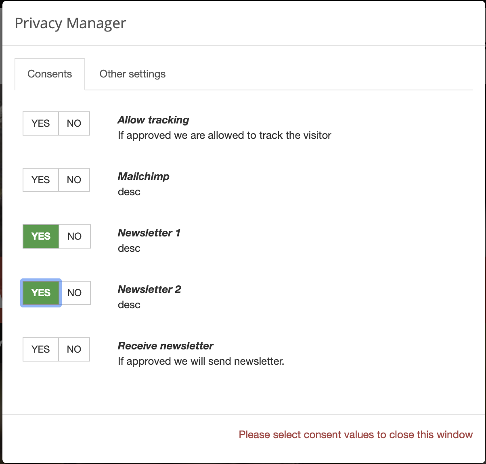

```json
{"scope": "digitall","eventType": "modifyConsent","source": {"itemType": "page","scope": "digitall","itemId": "f20836ab-608f-4551-a930-9796ec991340","properties": {"pageInfo": {"pageID": "f20836ab-608f-4551-a930-9796ec991340","nodeType": "jnt:page","pageName": "Home","pagePath": "/sites/digitall/home","templateName": "home","destinationURL": "http://localhost:8080/sites/digitall/home.html","referringURL": "http://localhost:8080/cms/render/default/en/sites/digitall/home.html","language": "en","categories": [],"tags": [],"isContentTemplate": false },"attributes": {},"consentTypes": [{"typeIdentifier": "tracking","activated": true,"title": "Allow tracking","description": "If approved we are allowed to track the visitor" },{"typeIdentifier": "newsletter1","activated": true,"title": "Newsletter 1","description": "desc" },{"typeIdentifier": "newsletter2","activated": true,"title": "Newsletter 2","description": "desc" },{"typeIdentifier": "newsletter","activated": true,"title": "Receive newsletter","description": "If approved we will send newsletter."}]} },"target": {"itemType": "consent","scope": "digitall","itemId": "tracking" },"properties": {"consent": {"scope": "digitall","typeIdentifier": "tracking","status": "GRANTED","statusDate": "2020-01-31T20:10:00.463Z","revokeDate": "2022-01-30T20:10:00.463Z"}}}
```

<a id="index--_built_in_condition_types"></a>
<a id="index--13.24.-built-in-condition-types"></a>

### 13.24. Built-in condition types

Apache Unomi comes with an extensive collection of built-in condition types. Instead of detailing them one by one you will
find here an overview of what a JSON condition descriptor looks like:

```json
{"metadata": {"id": "booleanCondition","name": "booleanCondition","description": "","systemTags": ["profileTags","logical","condition","profileCondition","eventCondition","sessionCondition","sourceEventCondition" ],"readOnly": true },"conditionEvaluator": "booleanConditionEvaluator","queryBuilder": "booleanConditionESQueryBuilder","parameters": [{"id": "operator","type": "String","multivalued": false,"defaultValue": "and" },{"id": "subConditions","type": "Condition","multivalued": true}]}
```

Note that condition types have two important identifiers:

- conditionEvaluator
- queryBuilder

This is because condition types can either be used to build queries or to evaluate a condition in real time. When implementing
a new condition type, both implementations much be provided. Here’s an example an OSGi Blueprint registration for the
above condition type descriptor:

From <https://github.com/apache/unomi/blob/master/plugins/baseplugin/src/main/resources/OSGI-INF/blueprint/blueprint.xml>

```xml
...
    <service
            interface="org.apache.unomi.persistence.elasticsearch.conditions.ConditionESQueryBuilder">
        <service-properties>
            <entry key="queryBuilderId" value="booleanConditionESQueryBuilder"/>
        </service-properties>
        <bean class="org.apache.unomi.plugins.baseplugin.conditions.BooleanConditionESQueryBuilder"/>
    </service>
...
    <!-- Condition evaluators -->
    <service interface="org.apache.unomi.persistence.elasticsearch.conditions.ConditionEvaluator">
        <service-properties>
            <entry key="conditionEvaluatorId" value="booleanConditionEvaluator"/>
        </service-properties>
        <bean class="org.apache.unomi.plugins.baseplugin.conditions.BooleanConditionEvaluator"/>
    </service>
...
```

As you can see two Java classes are used to build a single condition type. You don’t need to understand all these details in
order to use condition types, but this might be interesting to know if you’re interested in building your own condition
type implementations. For more details on building your own custom plugins/extensions, please refer to the corresponding
sections.

<a id="index--_existing_condition_type_descriptors"></a>
<a id="index--13.24.1.-existing-condition-type-descriptors"></a>

#### 13.24.1. Existing condition type descriptors

Here is a non-exhaustive list of condition types built into Apache Unomi. Feel free to browse the source code if you want to
discover more. But the list below should get you started with the most useful conditions:

- <https://github.com/apache/unomi/tree/master/plugins/baseplugin/src/main/resources/META-INF/cxs/conditions>

Of course it is also possible to build your own custom condition types by developing custom Unomi plugins/extensions.

You will also note that some condition types can re-use a `parentCondition`. This is a way to inherit from another condition
type to make them more specific.

<a id="index--_built_in_action_types"></a>
<a id="index--13.25.-built-in-action-types"></a>

### 13.25. Built-in action types

Unomi comes with quite a lot of built-in action types. Instead of detailing them one by one you will find here an overview of
what an action type descriptor looks like:

```json
{"metadata": {"id": "UNIQUE_IDENTIFIER_STRING","name": "DISPLAYABLE_ACTION_NAME","description": "DISPLAYABLE_ACTION_DESCRIPTION","systemTags": ["profileTags","event","availableToEndUser","allowMultipleInstances" ],"readOnly": true },"actionExecutor": "ACTION_EXECUTOR_ID","parameters": [... parameters specific to each action ...]}
```

The ACTION\_EXECUTOR\_ID points to a OSGi Blueprint parameter that is defined when implementing the action in a plugin.
Here’s an example of such a registration:

From <https://github.com/apache/unomi/blob/master/plugins/mail/src/main/resources/OSGI-INF/blueprint/blueprint.xml>

```xml
    <bean id="sendMailActionImpl" class="org.apache.unomi.plugins.mail.actions.SendMailAction">
       <!-- ... bean properties ... -->
    </bean>
    <service id="sendMailAction" ref="sendMailActionImpl" interface="org.apache.unomi.api.actions.ActionExecutor">
        <service-properties>
            <entry key="actionExecutorId" value="sendMail"/>
        </service-properties>
    </service>
```

In the above example the ACTION\_EXECUTOR\_ID is `sendMail`

<a id="index--_existing_action_types_descriptors"></a>
<a id="index--13.25.1.-existing-action-types-descriptors"></a>

#### 13.25.1. Existing action types descriptors

Here is a non-exhaustive list of actions built into Apache Unomi. Feel free to browse the source code if you want to
discover more. But the list below should get you started with the most useful actions:

- <https://github.com/apache/unomi/tree/master/plugins/baseplugin/src/main/resources/META-INF/cxs/actions>
- <https://github.com/apache/unomi/tree/master/plugins/request/src/main/resources/META-INF/cxs/actions>
- <https://github.com/apache/unomi/tree/master/plugins/mail/src/main/resources/META-INF/cxs/actions>

Of course it is also possible to build your own custom actions by developing custom Unomi plugins/extensions.

<a id="index--_updating_events_using_the_context_servlet"></a>
<a id="index--13.26.-updating-events-using-the-context-servlet"></a>

### 13.26. Updating Events Using the Context Servlet

One of the use cases that needed to be supported by Unomi is the ability to build a user profile based on Internal System events or [Change Data Capture](https://en.wikipedia.org/wiki/Change_data_capture) which usally transported through internal messaging queues such as Kafka.

This can easily achieved using the `KafkaInjector` module built in within Unomi.

But, as streaming system usually operates in [at-least-once](https://dzone.com/articles/kafka-clients-at-most-once-at-least-once-exactly-o) semantics, we need to have a way to guarantee we wont have duplicate events in the system.

<a id="index--_solution"></a>
<a id="index--13.26.1.-solution"></a>

#### 13.26.1. Solution

One of the solutions to this scenario is to have the ability to control and pass in the `eventId` property from outside of Unomi, Using an authorized 3rd party. This way whenever an event with the same `itemId` will be processed once again he wont be appended to list of events, but will be updated.

Here is an example of a request contains the `itemdId`

```
curl -X POST http://localhost:8181/cxs/context.json \ -H "Content-Type: application/json" \ -d @- <<'EOF' {"events":[{"itemId": "exampleEventId","eventType":"view","scope": "example","properties" : {"firstName" : "example"}}]} EOF
```

Make sure to use an authorized third party using `X-Unomi-Peer` requests headers and that the `eventType` is in the list of allowed events

<a id="index--_defining_rules"></a>
<a id="index--13.26.2.-defining-rules"></a>

#### 13.26.2. Defining Rules

Another use case we support is the ability to define a rule on the above mentioned events.
If we have a rule that increment a property on profile level, we would want the action to be executed only once per event id.
this can be achieved by adding `"raiseEventOnlyOnce": false` to the rule definition.

```
curl -X POST http://localhost:8181/cxs/context.json \ -H "Content-Type: application/json" \ -d @- <<'EOF' {"metadata": {"id": "updateNumberOfOrders","name": "update number of orders on orderCreated eventType","description": "update number of orders on orderCreated eventType" },"raiseEventOnlyOnce": false,"condition": {"type": "eventTypeCondition","parameterValues": {"eventTypeId": "orderCreated"} },"actions": [{"parameterValues": {"setPropertyName": "properties.nbOfOrders","setPropertyValue": "script::profile.properties.?nbOfOrders != null ? (profile.properties.nbOfOrders + 1) : 1","storeInSession": false },"type": "setPropertyAction"}]} EOF
```

<a id="index--_unomi_web_tracker_reference"></a>
<a id="index--13.27.-unomi-web-tracker-reference"></a>

### 13.27. Unomi Web Tracker reference

In this section of the documentation, more details are provided about the web tracker provided by Unomi.

<a id="index--_custom_events"></a>
<a id="index--13.27.1.-custom-events"></a>

#### 13.27.1. Custom events

In order to be able to use your own custom events with the web tracker, you must first declare them in Unomi so that they are properly recognized and validated by the `/context.json` or `/eventcollector` endpoints.

<a id="index--_declaring_json_schema"></a>
<a id="index--declaring-json-schema"></a>

##### Declaring JSON schema

The first step is to declare a JSON schema for your custom event type. Here’s an example of such a declaration:

```json
{"$id": "https://unomi.apache.org/schemas/json/events/click/1-0-0","$schema": "https://json-schema.org/draft/2019-09/schema","self": {"vendor": "org.apache.unomi","target": "events","name": "click","format": "jsonschema","version": "1-0-0" },"title": "ClickEvent","type": "object","allOf": [{"$ref": "https://unomi.apache.org/schemas/json/event/1-0-0"} ],"properties": {"source": {"$ref": "https://unomi.apache.org/schemas/json/items/page/1-0-0" },"target": {"$ref": "https://unomi.apache.org/schemas/json/item/1-0-0"} },"unevaluatedProperties": false}
```

The above example comes from a built-in event type that is already declared in Unomi but that illustrates the structure of a JSON schema. It is not however the objective of this section of the documentation to go into the details of how to declare a JSON schema, instead, we recommend you go to the [corresponding section](#index--_json_schemas_2) of the documentation.

<a id="index--_sending_event_from_tracker"></a>
<a id="index--sending-event-from-tracker"></a>

##### Sending event from tracker

In the Unomi web tracker, you can use the following function to send an event to Unomi:

```javascript
/** * This function will send an event to Apache Unomi * @param {object} event The event object to send, you can build it using wem.buildEvent(eventType, target, source) * @param {function} successCallback optional, will be executed in case of success * @param {function} errorCallback optional, will be executed in case of error * @return {undefined} */ collectEvent: function (event, successCallback = undefined, errorCallback = undefined)
```

As you can see this function is quite straight forward to use. There are also helper functions to build events, such as :

```javascript
/** * This function return the basic structure for an event, it must be adapted to your need * * @param {string} eventType The name of your event * @param {object} [target] The target object for your event can be build with wem.buildTarget(targetId, targetType, targetProperties) * @param {object} [source] The source object for your event can be build with wem.buildSource(sourceId, sourceType, sourceProperties) * @returns {object} the event */ buildEvent: function (eventType, target, source)
/** * This function return an event of type form * * @param {string} formName The HTML name of id of the form to use in the target of the event * @param {HTMLFormElement} form optional HTML form element, if provided will be used to extract the form fields and populate the form event * @returns {object} the form event */ buildFormEvent: function (formName, form = undefined)
/** * This function return the source object for a source of type page * * @returns {object} the target page */ buildTargetPage: function ()
/** * This function return the source object for a source of type page * * @returns {object} the source page */ buildSourcePage: function ()
/** * This function return the basic structure for the target of your event * * @param {string} targetId The ID of the target * @param {string} targetType The type of the target * @param {object} [targetProperties] The optional properties of the target * @returns {object} the target */ buildTarget: function (targetId, targetType, targetProperties = undefined)
/** * This function return the basic structure for the source of your event * * @param {string} sourceId The ID of the source * @param {string} sourceType The type of the source * @param {object} [sourceProperties] The optional properties of the source * @returns {object} the source */ buildSource: function (sourceId, sourceType, sourceProperties = undefined)
```

Here’s an example of using these helper functions and the `collectEvent` function alltogether:

```javascript
    var clickEvent = wem.buildEvent('click',
        wem.buildTarget('buttonId', 'button'),
        wem.buildSourcePage());

    wem.collectEvent(clickEvent, function (xhr) {
        console.info('Click event successfully collected.');
    }, function (xhr) {
        console.error('Could not send click event.');
    });
```

<a id="index--_sending_multiple_events"></a>
<a id="index--sending-multiple-events"></a>

##### Sending multiple events

In some cases, especially when multiple events must be sent fast and the order of the events is critical for rules to be properly executed, it is better to use another function called `collectEvents` that will batch the sending of events to Unomi in a single HTTP request. Here’s the signature of this function:

```javascript
/** * This function will send the events to Apache Unomi * * @param {object} events Javascript object { events: [event1, event2] } * @param {function} successCallback optional, will be executed in case of success * @param {function} errorCallback optional, will be executed in case of error * @return {undefined} */ collectEvents: function (events, successCallback = undefined, errorCallback = undefined)
```

This function is almost exactly the same as the `collectEvent` method except that it takes an events array instead of a single one. The events in the array may be of any mixture of types.

<a id="index--_extending_existing_events"></a>
<a id="index--extending-existing-events"></a>

##### Extending existing events

An alternative to defining custom event types is to extend existing event types. This, for example, can be used to add new properties to the built-in `view` event type.

For more information about event type extensions, please read the [JSON schema section](#index--_extend_an_existing_schema) of this documentation.

<a id="index--_integrating_with_tag_managers"></a>
<a id="index--13.27.2.-integrating-with-tag-managers"></a>

#### 13.27.2. Integrating with tag managers

Integrating with tag managers such as Google Tag Manager is an important part of the way trackers can be added to an existing site. Unomi’s web tracker should be pretty easy to integrate with such tools: you simply need to insert the script tag to load the script and then another tag to initialize it and map any tag manager variables you want.

Personalization scripts should however be modified to check for the existence of the tracker object in the page because tag managers might deactivate scripts based on conditions such as GDPR approval, cookie preferences, …

<a id="index--_cookiesession_handling"></a>
<a id="index--13.27.3.-cookie-session-handling"></a>

#### 13.27.3. Cookie/session handling

In order to track profiles, an identifier must be stored in the browser so that subsequent requests can keep a reference to the visitor’s profile. Also, a session identifier must be generated to group the current visitor interactions.

Unomi’s web tracker uses 3 cookies in the tracker by default:

- server profile ID, called `context-profile-id` by default, that is sent from the Unomi server
- web tracker profile ID, called `web-profile-id` by default (this is a copy of the server profile ID that can be managed by the tracker directly)
- web tracker session ID, called `wem-session-id` by default

It is possible to change the name of these cookie by passing the following properties to the start’s initialization:

```javascript
    "wemInitConfig": {
        ...
        "contextServerCookieName": "context-profile-id",
        "trackerSessionIdCookieName": "unomi-tracker-test-session-id",
        "trackerProfileIdCookieName": "unomi-tracker-test-profile-id"
    }
```

Please note however that the `contextServerCookieName` will also have to be changed in the server configuration in order for it to work. See the [Configuration](#index--_configuration) section for details on how to do this.

For session tracking, it is important to provide a value for the cookie otherwise the tracker will not initialize (a message is displayed in the console that explains that the session cookie is missing). Here is the code excerpt from the initialization code used in the tutorial that creates the initial cookie value.

```javascript
    // generate a new session
    if (unomiWebTracker.getCookie(unomiTrackerTestConf.wemInitConfig.trackerSessionIdCookieName) == null) {
        unomiWebTracker.setCookie(unomiTrackerTestConf.wemInitConfig.trackerSessionIdCookieName, unomiWebTracker.generateGuid(), 1);
    }
```

Note that this is just an example, you could very well customize this code to create session IDs another way.

<a id="index--_javascript_api"></a>
<a id="index--13.27.4.-javascript-api"></a>

#### 13.27.4. JavaScript API

The JavaScript API for the web tracker is directly provided in the source code of the web tracker. You can find it here: <https://github.com/apache/unomi-tracker/blob/main/src/apache-unomi-tracker.js>

Please note that only the functions that do NOT start with an underscore should be used. The ones that start with an underscore are not considered part of the public API and could change or even be removed at any point in the future.

<a id="index--_integration_samples"></a>
<a id="index--14.-integration-samples"></a>

## 14. Integration samples

<a id="index--_login_sample"></a>
<a id="index--14.2.-login-sample"></a>

### 14.2. Login sample

This samples is an example of what is involved in integrated a login with Apache Unomi.

<a id="index--_warning"></a>
<a id="index--14.2.1.-warning"></a>

#### 14.2.1. Warning !

The example code uses client-side Javascript code to send the login event. This is only
done this way for the sake of samples simplicity but if should NEVER BE DONE THIS WAY in real cases.

The login event should always be sent from the server performing the actual login since it must
only be sent if the user has authenticated properly, and only the authentication server can validate this.

<a id="index--_installing_the_samples"></a>
<a id="index--14.2.2.-installing-the-samples"></a>

#### 14.2.2. Installing the samples

Login into the Unomi Karaf SSH shell using something like this :

```
ssh -p 8102 karaf@localhost (default password is karaf)
```

Install the login samples using the following command:

```
bundle:install mvn:org.apache.unomi/login-integration-sample/${project.version}
```

when the bundle is successfully install you will get an bundle ID back we will call it BUNDLE\_ID.

You can then do:

```
bundle:start BUNDLE_ID
```

If all went well you can access the login samples HTML page here :

```
http://localhost:8181/login/index.html
```

You can fill in the form to test it. Note that the hardcoded password is:

```
test1234
```

<a id="index--_twitter_sample"></a>
<a id="index--14.3.-twitter-sample"></a>

### 14.3. Twitter sample

<a id="index--_overview"></a>
<a id="index--14.3.1.-overview"></a>

#### 14.3.1. Overview

We will examine how a simple HTML page can interact with Unomi to enrich a user’s profile. The use case we will follow
is a rather simple one: we use a Twitter button to record the number of times the visitor tweeted (as a `tweetNb` profile
integer property) as well as the URLs they tweeted from (as a `tweetedFrom` multi-valued string profile property).
A javascript script will use the Twitter API to react to clicks on this button
and update the user profile using a `ContextServlet` request triggering a custom event. This event will, in turn, trigger a Unomi action on the server implemented using a Unomi plugin, a standard extension point for the server.

<a id="index--_building_the_tweet_button_samples"></a>
<a id="index--building-the-tweet-button-samples"></a>

##### Building the tweet button samples

In your local copy of the Unomi repository and run:

```
cd samples/tweet-button-plugin
mvn clean install
```

This will compile and create the OSGi bundle that can be deployed on Unomi to extend it.

<a id="index--_deploying_the_tweet_button_samples"></a>
<a id="index--deploying-the-tweet-button-samples"></a>

##### Deploying the tweet button samples

In standard Karaf fashion, you will need to copy the samples bundle to your Karaf `deploy` directory.

If you are using the packaged version of Unomi (as opposed to deploying it to your own Karaf version), you can simply run, assuming your current directory is `samples/tweet-button-plugin` and that you uncompressed the archive in the directory it was created:

```
cp target/tweet-button-plugin-2.0.0-SNAPSHOT.jar ../../package/target/unomi-2.0.0-SNAPSHOT/deploy
```

<a id="index--_testing_the_samples"></a>
<a id="index--testing-the-samples"></a>

##### Testing the samples

You can now go to <http://localhost:8181/twitter/index.html> to test the samples code. The page is very simple, you will see a Twitter button, which, once clicked, will open a new window to tweet about the current page. The original page should be updated with the new values of the properties coming from Unomi. Additionnally, the raw JSON response is displayed.

We will now explain in greater details some concepts and see how the example works.

<a id="index--_interacting_with_the_context_server"></a>
<a id="index--14.3.2.-interacting-with-the-context-server"></a>

#### 14.3.2. Interacting with the context server

There are essentially two modalities to interact with the context server, reflecting different types of Unomi users: context server clients and context server integrators.

**Context server clients** are usually web applications or content management systems. They interact with Unomi by providing raw, uninterpreted contextual data in the form of events and associated metadata. That contextual data is then processed by the context server to be fed to clients once actionable. In that sense context server clients are both consumers and producers of contextual data. Context server clients will mostly interact with Unomi using a single entry point called the `ContextServlet`, requesting context for the current user and providing any triggered events along the way.

On the other hand, **context server integrators** provide ways to feed more structured data to the context server either to integrate with third party services or to provide analysis of the uninterpreted data provided by context server clients. Such integration will mostly be done using Unomi’s API either directly using Unomi plugins or via the provided REST APIs. However, access to REST APIs is restricted due for security reasons, requiring privileged access to the Unomi server, making things a little more complex to set up.

For simplicity’s sake, this document will focus solely on the first use case and will interact only with the context servlet.

<a id="index--_retrieving_context_information_from_unomi_using_the_context_servlet"></a>
<a id="index--14.3.3.-retrieving-context-information-from-unomi-using-the-context-servlet"></a>

#### 14.3.3. Retrieving context information from Unomi using the context servlet

Unomi provides two ways to retrieve context: either as a pure JSON object containing strictly context information or as a couple of JSON objects augmented with javascript functions that can be used to interact with the Unomi server using the `<context server base URL>/cxs/context.json` or `<context server base URL>/context.js` URLs, respectively.

Below is an example of asynchronously loading the initial context using the javascript version, assuming a default Unomi install running on `http://localhost:8181`:

```javascript
// Load context from Unomi asynchronously
(function (document, elementToCreate, id) {
    var js, fjs = document.getElementsByTagName(elementToCreate)[0];
    if (document.getElementById(id)) return;
    js = document.createElement(elementToCreate);
    js.id = id;
    js.src = 'http://localhost:8181/cxs/context.js';
    fjs.parentNode.insertBefore(js, fjs);
}(document, 'script', 'context'));
```

This initial context results in a javascript file providing some functions to interact with the context server from javascript along with two objects: a `cxs` object containing
information about the context for the current user and a `digitalData` object that is injected into the browser’s `window` object (leveraging the
[Customer Experience Digital Data Layer](http://www.w3.org/2013/12/ceddl-201312.pdf) standard). Note that this last object is not under control of the context server and clients
are free to use it or not. Our example will not make use of it.

On the other hand, the `cxs` top level object contains interesting contextual information about the current user:

```
{
  "profileId":<identifier of the profile associated with the current user>,
  "sessionId":<identifier of the current user session>,
  "profileProperties":<requested profile properties, if any>,
  "sessionProperties":<requested session properties, if any>,
  "profileSegments":<segments the profile is part of if requested>,
  "filteringResults":<result of the evaluation of content filters>,
  "personalizations":<result of the evaluation of personalization filters>,
  "trackedConditions":<tracked conditions in the source page, if any>
}
```

We will look at the details of the context request and response later.

<a id="index--_example_26"></a>
<a id="index--14.4.-example"></a>

### 14.4. Example

<a id="index--_html_page"></a>
<a id="index--14.4.1.-html-page"></a>

#### 14.4.1. HTML page

The code for the HTML page with our Tweet button can be found at <https://github.com/apache/unomi/blob/master/wab/src/main/webapp/index.html>.

This HTML page is fairly straightforward: we create a tweet button using the Twitter API while a Javascript script performs the actual logic.

<a id="index--_javascript"></a>
<a id="index--14.4.2.-javascript"></a>

#### 14.4.2. Javascript

Globally, the script loads both the twitter widget and the initial context asynchronously (as shown previously). This is accomplished using fairly standard javascript code and we won’t look at it here. Using the Twitter API, we react to the `tweet` event and call the Unomi server to update the user’s profile with the required information, triggering a custom `tweetEvent` event. This is accomplished using a `contextRequest` function which is an extended version of a classic `AJAX` request:

```javascript
function contextRequest(successCallback, errorCallback, payload) {
    var data = JSON.stringify(payload);
    // if we don't already have a session id, generate one
    var sessionId = cxs.sessionId || generateUUID();
    var url = 'http://localhost:8181/cxs/context.json?sessionId=' + sessionId;
    var xhr = new XMLHttpRequest();
    var isGet = data.length < 100;
    if (isGet) {
        xhr.withCredentials = true;
        xhr.open("GET", url + "&payload=" + encodeURIComponent(data), true);
    } else if ("withCredentials" in xhr) {
        xhr.open("POST", url, true);
        xhr.withCredentials = true;
    } else if (typeof XDomainRequest != "undefined") {
        xhr = new XDomainRequest();
        xhr.open("POST", url);
    }
    xhr.onreadystatechange = function () {
        if (xhr.readyState != 4) {
            return;
        }
        if (xhr.status ==== 200) {
            var response = xhr.responseText ? JSON.parse(xhr.responseText) : undefined;
            if (response) {
                cxs.sessionId = response.sessionId;
                successCallback(response);
            }
        } else {
            console.log("contextserver: " + xhr.status + " ERROR: " + xhr.statusText);
            if (errorCallback) {
                errorCallback(xhr);
            }
        }
    };
    xhr.setRequestHeader("Content-Type", "text/plain;charset=UTF-8"); // Use text/plain to avoid CORS preflight
    if (isGet) {
        xhr.send();
    } else {
        xhr.send(data);
    }
}
```

There are a couple of things to note here:

- If we specify a payload, it is expected to use the JSON format so we `stringify` it and encode it if passed as a URL parameter in a `GET` request.
- We need to make a [`CORS`](https://developer.mozilla.org/en-US/docs/Web/HTTP/Access_control_CORS) request since the Unomi server is most likely not running on the same host than the one from which the request originates. The specific details are fairly standard and we will not explain them here.
- We need to either retrieve (from the initial context we retrieved previously using `cxs.sessionId`) or generate a session identifier for our request since Unomi currently requires one.
- We’re calling the `ContextServlet` using the default install URI, specifying the session identifier: `http://localhost:8181/cxs/context.json?sessionId=sessionId`. This URI requests context from Unomi, resulting in an updated `cxs` object in the javascript global scope. The context server can reply to this request either by returning a JSON-only object containing solely the context information as is the case when the requested URI is `context.json`. However, if the client requests `context.js` then useful functions to interact with Unomi are added to the `cxs` object in addition to the context information as depicted above.
- We don’t need to provide any authentication at all to interact with this part of Unomi since we only have access to read-only data (as well as providing events as we shall see later on). If we had been using the REST API, we would have needed to provide authentication information as well.

<a id="index--_context_request_and_response_structure"></a>
<a id="index--context-request-and-response-structure"></a>

##### Context request and response structure

The interesting part, though, is the payload. This is where we provide Unomi with contextual information as well as ask for data in return. This allows clients to specify which type of information they are interested in getting from the context server as well as specify incoming events or content filtering or property/segment overrides for personalization or impersonation. This conditions what the context server will return with its response.

Let’s look at the context request structure:

```
{
    "sessionId" : <optional session identifier>,
    "source": <Item source of the context request>,
    "events": <optional array of events to trigger>,
    "requiredProfileProperties": <optional array of property identifiers>,
    "requiredSessionProperties": <optional array of property identifiers>,
    filters: <optional array of filters to evaluate>,
    "personalitations": <optional array of personalizations to evaluate>,
    "profileOverrides": <optional profile containing segments,scores or profile properties to override>,
        - segments: <optional array of segment identifiers>,
        - profileProperties: <optional map of property name / value pairs>,
        - scores: <optional map of score id / value pairs>
    "sessionPropertiesOverrides": <optional map of property name / value pairs>,
    "requireSegments": <boolean, whether to return the associated segments>
}
```

We will now look at each part in greater details.

<a id="index--_source"></a>
<a id="index--source"></a>

###### Source

A context request payload needs to at least specify some information about the source of the request in the form of an `Item` (meaning identifier, type and scope plus any additional properties we might have to provide), via the `source` property of the payload. Of course the more information can be provided about the source, the better.

<a id="index--_filters"></a>
<a id="index--filters"></a>

###### Filters

A client wishing to perform content personalization might also specify filtering conditions to be evaluated by the
context server so that it can tell the client whether the content associated with the filter should be activated for
this profile/session. This is accomplished by providing a list of filter definitions to be evaluated by the context
server via the `filters` field of the payload. If provided, the evaluation results will be provided in the
`filteringResults` field of the resulting `cxs` object the context server will send.

Here is an example of a filter request:

```
curl --location --request POST 'http://localhost:8181/cxs/context.json' \ --header 'Content-Type: application/json' \ --header 'Cookie: JSESSIONID=48C8AFB3E18B8E3C93C2F4D5B7BD43B7; context-profile-id=01060c4c-a055-4c8f-9692-8a699d0c434a' \ --data-raw '{"source": null,"requireSegments": false,"requiredProfileProperties": null,"requiredSessionProperties": null,"events": null,"filters": [{"id" : "filter1","filters" : [{"condition": {"parameterValues": {"propertyName": "properties.gender","comparisonOperator": "equals","propertyValue": "male" },"type": "profilePropertyCondition"}}]} ],"personalizations": null,"profileOverrides": null,"sessionPropertiesOverrides": null,"sessionId": "demo-session-id" }'
```

And here’s the result:

```json
{
    "profileId": "01060c4c-a055-4c8f-9692-8a699d0c434a",
    "sessionId": "demo-session-id",
    "profileProperties": null,
    "sessionProperties": null,
    "profileSegments": null,
    "filteringResults": {
        "filter1": false
    },
    "processedEvents": 0,
    "personalizations": null,
    "trackedConditions": [],
    "anonymousBrowsing": false,
    "consents": {}
}
```

As we can see, the `filter1` filter we sent in our request, in this example, evaluated to false for the current profile, so we can use that result to perform any customization for the current profile, in this case use the fact that he is
male.

<a id="index--_personalizations"></a>
<a id="index--personalizations"></a>

###### Personalizations

Filters make it possible to evaluate conditions against a profile in real-time, but for true personalization it is needed
to have a more powerful mechanism: strategies. Sometimes we want to provide multiple variants that each have their own
conditions and we want to know which is the best variant to use for the current profile. This can be achieved with the
`personalizations` structure in the ContextRequest.

Here is an example of a `personalizations` request:

```
curl --location --request POST 'http://localhost:8181/cxs/context.json' \ --header 'Content-Type: application/json' \ --header 'Cookie: JSESSIONID=48C8AFB3E18B8E3C93C2F4D5B7BD43B7; context-profile-id=01060c4c-a055-4c8f-9692-8a699d0c434a' \ --data-raw '{"source": null,"requireSegments": false,"requiredProfileProperties": null,"requiredSessionProperties": [ "unomiControlGroups" ],"events": null,"filters": null,"personalizations": [{"id": "gender-test","strategy": "matching-first","strategyOptions": {"fallback": "var2","controlGroup" : {"percentage" : 10.0,"displayName" : "Gender test control group","path" : "/gender-test","storeInSession" : true} },"contents": [{"id": "var1","filters": [{"appliesOn": null,"condition": {"parameterValues": {"propertyName": "properties.gender","comparisonOperator": "equals","propertyValue": "male" },"type": "profilePropertyCondition" },"properties": null} ],"properties": null },{"id": "var2","filters": null,"properties": null}]} ],"profileOverrides": null,"sessionPropertiesOverrides": null,"sessionId": "demo-session-id" }'
```

In the above example, we basically setup two variants : `var1` and `var2` and setup the `var2` to be the fallback variant
in case no variant is matched. We could of course specify more than a variant. The `strategy` indicates to the
personalization service how to calculate the "winning" variant. In this case the strategy `matching-first` will return variants that match the current profile. We also use the `controlGroups` option to specify that we want to have a control group for this personalization. The `10.0` percentage value represents 10% (0.0 to 100.0) of traffic that will be assigned randomly to the control group. The control group will be stored in the profile and the session of the visitors if they were assigned to it. We also specify that we store the control group in the session (by default it is stored in the profile)

Currently the following strategies are available:

- `matching-first`: will return the variant IDs that match the current profile (using the initial content order)
- `random`: will return a shuffled list of variant IDs (ignoring any conditions)
- `score-sorted`: allows to sort the variants based on scores associated with the filtering conditions, effectively
  sorting them by the highest scoring condition first.

Here is the result of the above example:

```json
{"profileId": "01060c4c-a055-4c8f-9692-8a699d0c434a","sessionId": "demo-session-id","profileProperties": null,"sessionProperties": {"unomiControlGroups": [{"id": "previousPerso","displayName": "Previous perso","path": "/home/previousPerso.html","timeStamp": "2021-12-15T13:52:38Z"}] },"profileSegments": null,"filteringResults": null,"processedEvents": 0,"personalizations": {"gender-test": ["var2"] },"trackedConditions": [],"anonymousBrowsing": false,"consents": {}}
```

In the above example we can see the profile and session were assigned to other control groups but not the current one (the ids are different).

<a id="index--_overrides"></a>
<a id="index--overrides"></a>

###### Overrides

It is also possible for clients wishing to perform user impersonation to specify properties or segments to override the proper ones so as to emulate a specific profile, in which case the overridden value will temporarily replace the proper values so that all rules will be evaluated with these values instead of the proper ones. The `segments` (array of segment identifiers), `profileProperties` (maps of property name and associated object value) and `scores` (maps of score id and value) all wrapped in a profileOverrides object and the `sessionPropertiesOverrides` (maps of property name and associated object value) fields allow to provide such information. Providing such overrides will, of course, impact content filtering results and segments matching for this specific request.

<a id="index--_controlling_the_content_of_the_response"></a>
<a id="index--controlling-the-content-of-the-response"></a>

###### Controlling the content of the response

The clients can also specify which information to include in the response by setting the `requireSegments` property to true if segments the current profile matches should be returned or provide an array of property identifiers for `requiredProfileProperties` or `requiredSessionProperties` fields to ask the context server to return the values for the specified profile or session properties, respectively. This information is provided by the `profileProperties`, `sessionProperties` and `profileSegments` fields of the context server response.

Additionally, the context server will also returns any tracked conditions associated with the source of the context request. Upon evaluating the incoming request, the context server will determine if there are any rules marked with the `trackedCondition` tag and which source condition matches the source of the incoming request and return these tracked conditions to the client. The client can use these tracked conditions to learn that the context server can react to events matching the tracked condition and coming from that source. This is, in particular, used to implement form mapping (a solution that allows clients to update user profiles based on values provided when a form is submitted).

<a id="index--_events"></a>
<a id="index--events"></a>

###### Events

Finally, the client can specify any events triggered by the user actions, so that the context server can process them, via the `events` field of the context request.

<a id="index--_default_response"></a>
<a id="index--default-response"></a>

###### Default response

If no payload is specified, the context server will simply return the minimal information deemed necessary for client applications to properly function: profile identifier, session identifier and any tracked conditions that might exist for the source of the request.

<a id="index--_context_request_for_our_example"></a>
<a id="index--context-request-for-our-example"></a>

##### Context request for our example

Now that we’ve seen the structure of the request and what we can expect from the context response, let’s examine the request our component is doing.

In our case, our `source` item looks as follows: we specify a scope for our application (`unomi-tweet-button-samples`), specify that the item type (i.e. the kind of element that is the source of our event) is a `page` (which corresponds, as would be expected, to a web page), provide an identifier (in our case, a Base-64 encoded version of the page’s URL) and finally, specify extra properties (here, simply a `url` property corresponding to the page’s URL that will be used when we process our event in our Unomi extension).

```javascript
var scope = 'unomi-tweet-button-samples';
var itemId = btoa(window.location.href);
var source = {
    itemType: 'page',
    scope: scope,
    itemId: itemId,
    properties: {
        url: window.location.href
    }
};
```

We also specify that we want the context server to return the values of the `tweetNb` and `tweetedFrom` profile properties in its response. Finally, we provide a custom event of type `tweetEvent` with associated scope and source information, which matches the source of our context request in this case.

```javascript
var contextPayload = {source: source,events: [{eventType: 'tweetEvent',scope: scope,source: source} ],requiredProfileProperties: ['tweetNb','tweetedFrom'] };
```

The `tweetEvent` event type is not defined by default in Unomi. This is where our Unomi plugin comes into play since we need to tell Unomi how to react when it encounters such events.

<a id="index--_unomi_plugin_overview"></a>
<a id="index--unomi-plugin-overview"></a>

##### Unomi plugin overview

In order to react to `tweetEvent` events, we will define a new Unomi rule since this is exactly what Unomi rules are supposed to do. Rules are guarded by conditions and if these
conditions match, the associated set of actions will be executed. In our case, we want our new
[`incrementTweetNumber`](https://github.com/apache/unomi/blob/master/samples/tweet-button-plugin/src/main/resources/META-INF/cxs/rules/incrementTweetNumber.json) rule to only react to `tweetEvent` events and
we want it to perform the profile update accordingly: create the property types for our custom properties if they don’t exist and update them. To do so, we will create a
custom
[`incrementTweetNumberAction`](https://github.com/apache/unomi/blob/master/samples/tweet-button-plugin/src/main/resources/META-INF/cxs/actions/incrementTweetNumberAction.json) action that will be triggered any time our rule matches. An action is some custom code that is deployed in the context server and can access the
Unomi API to perform what it is that it needs to do.

<a id="index--_rule_definition"></a>
<a id="index--rule-definition"></a>

##### Rule definition

Let’s look at how our custom [`incrementTweetNumber`](https://github.com/apache/unomi/blob/master/samples/tweet-button-plugin/src/main/resources/META-INF/cxs/rules/incrementTweetNumber.json) rule is defined:

```json
{"metadata": {"id": "smp:incrementTweetNumber","name": "Increment tweet number","description": "Increments the number of times a user has tweeted after they click on a tweet button" },"raiseEventOnlyOnceForSession": false,"condition": {"type": "eventTypeCondition","parameterValues": {"eventTypeId": "tweetEvent"} },"actions": [{"type": "incrementTweetNumberAction","parameterValues": {}}]}
```

Rules define a metadata section where we specify the rule name, identifier and description.

When rules trigger, a specific event is raised so that other parts of Unomi can react to it accordingly. We can control how that event should be raised. Here we specify that the event should be raised each time the rule triggers and not only once per session by setting `raiseEventOnlyOnceForSession` to `false`, which is not strictly required since that is the default. A similar setting (`raiseEventOnlyOnceForProfile`) can be used to specify that the event should only be raised once per profile if needed.

We could also specify a priority for our rule in case it needs to be executed before other ones when similar conditions match. This is accomplished using the `priority` property. We’re using the default priority here since we don’t have other rules triggering on `tweetEvent`s and don’t need any special ordering.

We then tell Unomi which condition should trigger the rule via the `condition` property. Here, we specify that we want our rule to trigger on an `eventTypeCondition` condition. Unomi can be extended by adding new condition types that can enrich how matching or querying is performed. The condition type definition file specifies which parameters are expected for our condition to be complete. In our case, we use the built-in event type condition that will match if Unomi receives an event of the type specified in the condition’s `eventTypeId` parameter value: `tweetEvent` here.

Finally, we specify a list of actions that should be performed as consequences of the rule matching. We only need one action of type `incrementTweetNumberAction` that doesn’t require any parameters.

<a id="index--_action_definition"></a>
<a id="index--action-definition"></a>

##### Action definition

Let’s now look at our custom [`incrementTweetNumberAction`](https://github.com/apache/unomi/blob/master/samples/tweet-button-plugin/src/main/resources/META-INF/cxs/actions/incrementTweetNumberAction.json) action type definition:

```json
{"id": "incrementTweetNumberAction","actionExecutor": "incrementTweetNumber","systemTags": ["event" ],"parameters": []}
```

We specify the identifier for the action type, a list of systemTags if needed: here we say that our action is a consequence of events using the `event` tag. Our actions does not require any parameters so we don’t define any.

Finally, we provide a mysterious `actionExecutor` identifier: `incrementTweetNumber`.

<a id="index--_action_executor_definition"></a>
<a id="index--action-executor-definition"></a>

##### Action executor definition

The action executor references the actual implementation of the action as defined in our [blueprint definition](https://github.com/apache/unomi/blob/master/samples/tweet-button-plugin/src/main/resources/OSGI-INF/blueprint/blueprint.xml):

```xml
<blueprint xmlns:xsi="http://www.w3.org/2001/XMLSchema-instance"
           xmlns="http://www.osgi.org/xmlns/blueprint/v1.0.0"
           xsi:schemaLocation="http://www.osgi.org/xmlns/blueprint/v1.0.0 http://www.osgi.org/xmlns/blueprint/v1.0.0/blueprint.xsd">

    <reference id="profileService" interface="org.apache.unomi.api.services.ProfileService"/>

    <!-- Action executor -->
    <service id="incrementTweetNumberAction" interface="org.apache.unomi.api.actions.ActionExecutor">
        <service-properties>
            <entry key="actionExecutorId" value="incrementTweetNumber"/>
        </service-properties>
        <bean class="org.apache.unomi.examples.unomi_tweet_button_plugin.actions.IncrementTweetNumberAction">
            <property name="profileService" ref="profileService"/>
        </bean>
    </service>
</blueprint>
```

In standard Blueprint fashion, we specify that we will need the `profileService` defined by Unomi and then define a service of our own to be exported for Unomi to use. Our service specifies one property: `actionExecutorId` which matches the identifier we specified in our action definition. We then inject the profile service in our executor and we’re done for the configuration side of things!

<a id="index--_action_executor_implementation"></a>
<a id="index--action-executor-implementation"></a>

##### Action executor implementation

Our action executor definition specifies that the bean providing the service is implemented in the [`org.apache.unomi.samples.tweet_button_plugin.actions
.IncrementTweetNumberAction`](https://github.com/apache/unomi/blob/master/samples/tweet-button-plugin/src/main/java/org/apache/unomi/samples/tweet_button_plugin/actions/IncrementTweetNumberAction.java) class. This class implements the Unomi `ActionExecutor` interface which provides a single `int execute(Action action, Event event)` method: the executor gets the action instance to execute along with the event that triggered it, performs its work and returns an integer status corresponding to what happened as defined by public constants of the `EventService` interface of Unomi: `NO_CHANGE`, `SESSION_UPDATED` or `PROFILE_UPDATED`.

Let’s now look at the implementation of the method:

```java
final Profile profile = event.getProfile();
Integer tweetNb = (Integer) profile.getProperty(TWEET_NB_PROPERTY);
List<String> tweetedFrom = (List<String>) profile.getProperty(TWEETED_FROM_PROPERTY);

if (tweetNb ==== null || tweetedFrom ==== null) {
    // create tweet number property type
    PropertyType propertyType = new PropertyType(new Metadata(event.getScope(), TWEET_NB_PROPERTY, TWEET_NB_PROPERTY, "Number of times a user tweeted"));
    propertyType.setValueTypeId("integer");
    service.createPropertyType(propertyType);

    // create tweeted from property type
    propertyType = new PropertyType(new Metadata(event.getScope(), TWEETED_FROM_PROPERTY, TWEETED_FROM_PROPERTY, "The list of pages a user tweeted from"));
    propertyType.setValueTypeId("string");
    propertyType.setMultivalued(true);
    service.createPropertyType(propertyType);

    tweetNb = 0;
    tweetedFrom = new ArrayList<>();
}

profile.setProperty(TWEET_NB_PROPERTY, tweetNb + 1);
final String sourceURL = extractSourceURL(event);
if (sourceURL != null) {
    tweetedFrom.add(sourceURL);
}
profile.setProperty(TWEETED_FROM_PROPERTY, tweetedFrom);

return EventService.PROFILE_UPDATED;
```

It is fairly straightforward: we retrieve the profile associated with the event that triggered the rule and check whether it already has the properties we are interested in. If not, we create the associated property types and initialize the property values.

> Note that it is not an issue to attempt to create the same property type multiple times as Unomi will not add a new property type if an identical type already exists.

Once this is done, we update our profile with the new property values based on the previous values and the metadata extracted from the event using the `extractSourceURL` method which uses our `url` property that we’ve specified for our event source. We then return that the profile was updated as a result of our action and Unomi will properly save it for us when appropriate. That’s it!

For reference, here’s the `extractSourceURL` method implementation:

```java
private String extractSourceURL(Event event) {final Item sourceAsItem = event.getSource(); if (sourceAsItem instanceof CustomItem) {CustomItem source = (CustomItem) sourceAsItem; final String url = (String) source.getProperties().get("url"); if (url != null) {return url;}}
return null;}
```

<a id="index--_conclusion_2"></a>
<a id="index--14.5.-conclusion"></a>

### 14.5. Conclusion

We have seen a simple example how to interact with Unomi using a combination of client-side code and Unomi plugin. Hopefully, this provided an introduction to the power of what Unomi can do and how it can be extended to suit your needs.

<a id="index--_annex"></a>
<a id="index--14.6.-annex"></a>

### 14.6. Annex

Here is an overview of how Unomi processes incoming requests to the `ContextServlet`.


<a id="index--_weather_update_sample"></a>
<a id="index--14.7.-weather-update-sample"></a>

### 14.7. Weather update sample

<a id="index--_connectors"></a>
<a id="index--15.-connectors"></a>

## 15. Connectors

<a id="index--_connectors_2"></a>
<a id="index--15.1.-connectors"></a>

### 15.1. Connectors

Apache Unomi provides the following connectors:

- [Salesforce CRM connector](#index--_salesforce_connector)

<a id="index--_call_for_contributors"></a>
<a id="index--15.1.1.-call-for-contributors"></a>

#### 15.1.1. Call for contributors

We are looking for help with the development of additional connectors. Any contribution (large or small) is more than
welcome. Feel free to discuss this in our [mailing list](http://unomi.apache.org/community/).

<a id="index--_salesforce_connector"></a>
<a id="index--15.2.-salesforce-connector"></a>

### 15.2. Salesforce Connector

This connectors makes it possible to push and pull data to/from the Salesforce CRM. It can copy information between
Apache Unomi profiles and Salesforce Leads.

<a id="index--_getting_started"></a>
<a id="index--15.2.1.-getting-started"></a>

#### 15.2.1. Getting started

<a id="index--_salesforce_account_setup"></a>
<a id="index--salesforce-account-setup"></a>

##### Salesforce account setup

1. Create a new developer account here:


```
https://developer.salesforce.com/signup
```

2. Create a new Connected App, by going into Setup -> App Manager and click "Create Connected App"
3. In the settings, make sure you do the following:


```
Enable OAuth settings -> Activated
Enable for device flow -> Activated (no need for a callback URL)
Add all the selected OAuth scopes you want (or put all of them)
Make sure Require Secret for Web Server flow is activated
```

4. Make sure you retrieve the following information once you have created the app in the API (Enable OAuth Settings):


```
Consumer key
Consumer secret (click to see it)
```

5. You must also retrieve your user’s security token, or create it if you don’t have one already. To do this simply
   click on your user at the top right, select "Settings", the click on "Reset my security token". You will receive an email
   with the security token.

<a id="index--_apache_unomi_setup"></a>
<a id="index--apache-unomi-setup"></a>

##### Apache Unomi setup

1. You are now ready to configure the Apache Unomi Salesforce Connector. In the etc/unomi.custom.system.properties file
   add/change the following settings:


```
org.apache.unomi.sfdc.user.username=${env:UNOMI_SFDC_USER_USERNAME:-}
org.apache.unomi.sfdc.user.password=${env:UNOMI_SFDC_USER_PASSWORD:-}
org.apache.unomi.sfdc.user.securityToken=${env:UNOMI_SFDC_USER_SECURITYTOKEN:-}
org.apache.unomi.sfdc.consumer.key=${env:UNOMI_SFDC_CONSUMER_KEY:-}
org.apache.unomi.sfdc.consumer.secret=${env:UNOMI_SFDC_CONSUMER_SECRET:-}
```

<a id="index--_deployment_from_maven_repository"></a>
<a id="index--deployment-from-maven-repository"></a>

##### Deployment from Maven repository

In this procedure we assume you have access to a Maven repository that contains a compiled version of the Salesforce connector.
If this is not the case or you prefer to deploy using a KAR bundle, see the KAR deployment instructions instead.

1. Connect to the Apache Unomi Karaf Shell using :


```
ssh -p 8102 karaf@localhost (default password is karaf)
```

2. Deploy into Apache Unomi using the following commands from the Apache Karaf shell:


```
feature:repo-add mvn:org.apache.unomi/unomi-salesforce-connector-karaf-kar/${project.version}/xml/features
feature:install unomi-salesforce-connector-karaf-kar
```

<a id="index--_deployment_using_kar_bundle"></a>
<a id="index--deployment-using-kar-bundle"></a>

##### Deployment using KAR bundle

If you have a KAR bundle (for example after building from source in the `extensions/salesforce-connector/karaf-kar/target` directory), you can follow these steps to install :

1. Ensure that Apache Karaf and Apache Unomi are started
2. Execute the following command in karaf: `feature:install unomi-salesforce-connector-karaf-kar`
3. The installation is done !

<a id="index--_testing_the_connector"></a>
<a id="index--testing-the-connector"></a>

##### Testing the connector

1. You can then test the connection to Salesforce by accessing the following URLs:


```
https://localhost:9443/cxs/sfdc/version
https://localhost:9443/cxs/sfdc/limits
```

   The first URL will give you information about the version of the connectors, so this makes it easy to check that the
   plugin is properly deployed, started and the correct version. The second URL will actually make a request to the
   Salesforce REST API to retrieve the limits of the Salesforce API.

   Both URLs are password protected by the Apache Unomi (Karaf) password. You can find this user and password information
   in the etc/users.properties file.

You can now use the connectors’s defined actions in rules to push or pull data to/from the Salesforce CRM. You can
find more information about rules in the [Data Model](#index--_data_model_overview) and the [Getting Started](#index--_getting_started_with_unomi) pages.

<a id="index--_properties"></a>
<a id="index--15.2.2.-properties"></a>

#### 15.2.2. Properties

To define how Salesforce attributes will be mapped to Unomi profile properties, edit the following entry using the pattern below :

```
org.apache.unomi.sfdc.fields.mappings=${env:UNOMI_SFDC_FIELDS_MAPPINGS:-email<=>Email,firstName<=>FirstName,lastName<=>LastName,company<=>Company,phoneNumber<=>Phone,jobTitle<=>Title,city<=>City,zipCode<=>PostalCode,address<=>Street,sfdcStatus<=>Status,sfdcRating<=>Rating}
```

Please note that Salesforce needs the company and the last name to be set, otherwise the lead won’t be created.
An identifier needs to be set as well. The identifier will be used to map the Unomi profile to the Salesforce lead. By
default, the email is set as the identifier, meaning that if a lead in Salesforce and a profile in Unomi have the same
email, they’ll be considered as the same person.

```
org.apache.unomi.sfdc.fields.mappings.identifier=${env:UNOMI_SFDC_FIELDS_MAPPINGS_IDENTIFIER:-email<=>Email}
```

<a id="index--_hot_deploying_updates_to_the_salesforce_connector_for_developers"></a>
<a id="index--15.2.3.-hot-deploying-updates-to-the-salesforce-connector-for-developers"></a>

#### 15.2.3. Hot-deploying updates to the Salesforce connector (for developers)

If you followed all the steps in the Getting Started section, you can upgrade the Salesforce connectors by using the following steps:

1. Compile the connectors using:


```
cd extensions/salesforce-connector
mvn clean install
```

2. Login to the Unomi Karaf Shell using:


```
ssh -p 8102 karaf@localhost (password by default is karaf)
```

3. Execute the following commands in the Karaf shell


```
feature:repo-refresh
feature:uninstall unomi-salesforce-connector-karaf-feature
feature:install unomi-salesforce-connector-karaf-feature
```

4. You can then check that the new version is properly deployed by accessing the following URL and checking the build date:


```
https://localhost:9443/cxs/sfdc/version
```

   (if asked for a password it’s the same karaf/karaf default)

<a id="index--_using_the_salesforce_workbench_for_testing_rest_api"></a>
<a id="index--15.2.4.-using-the-salesforce-workbench-for-testing-rest-api"></a>

#### 15.2.4. Using the Salesforce Workbench for testing REST API

The Salesforce Workbench contains a REST API Explorer that is very useful to test requests. You may find it here :

```
https://workbench.developerforce.com/restExplorer.php
```

<a id="index--_setting_up_streaming_push_queries"></a>
<a id="index--15.2.5.-setting-up-streaming-push-queries"></a>

#### 15.2.5. Setting up Streaming Push queries

Using the Salesforce Workbench, you can setting streaming push queries (Queries->Streaming push topics) such as the
following example:

```
Name: LeadUpdates
Query : SELECT Id,FirstName,LastName,Email,Company FROM Lead
```

<a id="index--_executing_the_unit_tests"></a>
<a id="index--15.2.6.-executing-the-unit-tests"></a>

#### 15.2.6. Executing the unit tests

Before running the tests, make sure you have completed all the steps above, including the streaming push queries setup.

By default the unit tests will not run as they need proper Salesforce credentials to run. To set this up create a
properties file like the following one:

test.properties

```
#
# Licensed to the Apache Software Foundation (ASF) under one or more
# contributor license agreements.  See the NOTICE file distributed with
# this work for additional information regarding copyright ownership.
# The ASF licenses this file to You under the Apache License, Version 2.0
# (the "License"); you may not use this file except in compliance with
# the License. You may obtain a copy of the License at #
# http://www.apache.org/licenses/LICENSE-2.0 #
# Unless required by applicable law or agreed to in writing, software
# distributed under the License is distributed on an "AS IS" BASIS,
# WITHOUT WARRANTIES OR CONDITIONS OF ANY KIND, either express or implied.
# See the License for the specific language governing permissions and
# limitations under the License. #
sfdc.user.username=YOUR_USER_NAME
sfdc.user.password=YOUR_PASSWORD
sfdc.user.securityToken=YOUR_USER_SECURITY_TOKEN
sfdc.consumer.key=CONNECTED_APP_CONSUMER_KEY
sfdc.consumer.secret=CONNECTED_APP_SECRET
```

and then use the following command line to reference the file:

```
cd extensions/salesforce-connector
mvn clean install -DsfdcProperties=../test.properties
```

(in case you’re wondering the ../ is because the test is located in the services sub-directory)

<a id="index--_developers"></a>
<a id="index--16.-developers"></a>

## 16. Developers

<a id="index--_building"></a>
<a id="index--16.1.-building"></a>

### 16.1. Building

<a id="index--_initial_setup"></a>
<a id="index--16.1.1.-initial-setup"></a>

#### 16.1.1. Initial Setup

1. Install J2SE 17 SDK (or later), which can be downloaded from
   <http://www.oracle.com/technetwork/java/javase/downloads/index.html>
2. Make sure that your JAVA\_HOME environment variable is set to the newly installed
   JDK location, and that your PATH includes %JAVA\_HOME%\bin (windows) or
   $JAVA\_HOME$/bin (unix).
3. Install Maven 3.9.6 (or later), which can be downloaded from
   <http://maven.apache.org/download.html>. Make sure that your PATH includes
   the MVN\_HOME/bin directory.

<a id="index--_building_2"></a>
<a id="index--16.1.2.-building"></a>

#### 16.1.2. Building

1. Get the code: `git clone https://github.com/apache/unomi.git`
2. Change to the top level directory of Apache Unomi source distribution.
3. Run


```
     $> mvn clean install
```

   This will compile Apache Unomi and run all of the tests in the
   Apache Unomi source distribution. Alternatively, you can run


```
     $> mvn -P \!integration-tests clean install
```

   This will compile Apache Unomi without running the tests and takes less
   time to build.


> [!TIP]
> Tip
>
> On a non-English Windows env, the Asciidoctor Maven Plugin may fail to
> generate manuals due to an encoding conversion issue.
> To solve this issue, we recommend setting the **file.encoding** system property
> to *UTF-8* like the following examples before issuing the commands shown above.


```
> set MAVEN_OPTS=-Dfile.encoding=UTF-8 or
> set MAVEN_OPTS=-Dfile.encoding=UTF-8 -Xmx2048m...
```

4. The distributions will be available under "package/target" directory.

<a id="index--_installing_an_elasticsearch_server"></a>
<a id="index--16.1.3.-installing-an-elasticsearch-server"></a>

#### 16.1.3. Installing an ElasticSearch server

Starting with version 1.2, Apache Unomi no longer embeds an ElasticSearch server as this is no longer supported by
the developers of ElasticSearch. Therefore you will need to install a standalone ElasticSearch using the following steps:

Download an ElasticSearch version. Here’s the version you will need depending
on your version of Apache Unomi.

Apache Unomi <= 1.2 : <https://www.elastic.co/downloads/past-releases/elasticsearch-5-1-2>
Apache Unomi >= 1.3 : <https://www.elastic.co/downloads/past-releases/elasticsearch-5-6-3>
Apache Unomi >= 1.5 : <https://www.elastic.co/downloads/past-releases/elasticsearch-7-4-2>

Uncompress the downloaded package into a directory

In the config/elasticsearch.yml file, uncomment and modify the following line :

```
cluster.name: contextElasticSearch
```

Launch the server using

```
bin/elasticsearch (Mac, Linux)
bin\elasticsearch.bat (Windows)
```

Check that the ElasticSearch is up and running by accessing the following URL :

<http://localhost:9200>

<a id="index--_deploying_the_generated_binary_package"></a>
<a id="index--16.1.4.-deploying-the-generated-binary-package"></a>

#### 16.1.4. Deploying the generated binary package

The "package" sub-project generates a pre-configured Apache Karaf installation that is the simplest way to get started.
Simply uncompress the package/target/unomi-VERSION.tar.gz (for Linux or Mac OS X) or
package/target/unomi-VERSION.zip (for Windows) archive into the directory of your choice.

You can then start the server simply by using the command on UNIX/Linux/MacOS X :

```
./bin/karaf
```

or on Windows shell :

```
bin\karaf.bat
```

You will then need to launch (only on the first Karaf start) the Apache Unomi packages using the following Apache Karaf
shell command:

```
unomi:start
```

<a id="index--_deploying_into_an_existing_karaf_server"></a>
<a id="index--16.1.5.-deploying-into-an-existing-karaf-server"></a>

#### 16.1.5. Deploying into an existing Karaf server

This is only needed if you didn’t use the generated package. Also, this is the preferred way to install a development
environment if you intend to re-deploy the context server KAR iteratively.

Additional requirements:
\* Apache Karaf 4.2.x, <http://karaf.apache.org>

Before deploying, make sure that you have Apache Karaf properly installed. Depending of your usage, you may also have to increase the
memory size by adjusting the following environment values in the bin/setenv(.bat)
files (at the end of the file):

```
   MY_DIRNAME=`dirname $0`
   MY_KARAF_HOME=`cd "$MY_DIRNAME/.."; pwd`
   export KARAF_OPTS="$KARAF_OPTS -Xmx3G"
```

Install the WAR support and CXF into Karaf by doing the following in the Karaf command line:

```
   feature:repo-add cxf-jaxrs 3.3.4
   feature:repo-add mvn:org.apache.unomi/unomi-kar/VERSION/xml/features
   feature:install unomi-kar
```

Create a new $MY\_KARAF\_HOME/etc/org.apache.cxf.osgi.cfg file and put the following property inside :

```
   org.apache.cxf.servlet.context=/cxs
```

If all went smoothly, you should be able to access the context script here : <http://localhost:8181/cxs/cluster> .
You should be able to login with karaf / karaf and see basic server information. If not something went wrong during the install.

<a id="index--_jdk_selection_on_mac_os_x"></a>
<a id="index--16.1.6.-jdk-selection-on-mac-os-x"></a>

#### 16.1.6. JDK Selection on Mac OS X

You might need to select the JDK to run the tests in the itests subproject. In order to do so you can list the
installed JDKs with the following command :

```
/usr/libexec/java_home -V
```

which will output something like this :

```
Matching Java Virtual Machines (3):
    11.0.5, x86_64:	"OpenJDK 11.0.5"	/Library/Java/JavaVirtualMachines/openjdk-11.jdk/Contents/Home
    1.8.0_181, x86_64:	"Java SE 8"	/Library/Java/JavaVirtualMachines/jdk1.8.0_181.jdk/Contents/Home
    1.7.0_80, x86_64:	"Java SE 7"	/Library/Java/JavaVirtualMachines/jdk1.7.0_80.jdk/Contents/Home

/Library/Java/JavaVirtualMachines/openjdk-11.jdk/Contents/Home
```

You can then select the one you want using :

```
export JAVA_HOME=`/usr/libexec/java_home -v 11.0.5`
```

and then check that it was correctly referenced using:

```
java -version
```

which should give you a result such as this:

```
openjdk version "11.0.5" 2019-10-15
OpenJDK Runtime Environment (build 11.0.5+10)
OpenJDK 64-Bit Server VM (build 11.0.5+10, mixed mode)
```

<a id="index--_running_the_integration_tests"></a>
<a id="index--16.1.7.-running-the-integration-tests"></a>

#### 16.1.7. Running the integration tests

The integration tests are not executed by default to make build time minimal, but it is recommended to run the
integration tests at least once before using the server to make sure that everything is ok in the build. Another way
to use these tests is to run them from a continuous integration server such as Jenkins, Apache Gump, Atlassian Bamboo or
others.

Note : the integration tests require a JDK 11 or more recent !

To run the tests simply activate the following profile :

```
mvn -P integration-tests clean install
```

<a id="index--_testing_with_an_example_page"></a>
<a id="index--16.1.8.-testing-with-an-example-page"></a>

#### 16.1.8. Testing with an example page

A default test page is provided at the following URL:

```
   http://localhost:8181/index.html
```

This test page will trigger the loading of the /cxs/context.js script, which will try to retrieving the user context
or create a new one if it doesn’t exist yet. It also contains an experimental integration with Facebook Login, but it
doesn’t yet save the context back to the context server.

<a id="index--_ssh_shell_commands"></a>
<a id="index--16.2.-ssh-shell-commands"></a>

### 16.2. SSH Shell Commands

Apache Unomi provides its own Apache Karaf Shell commands to make it easy to control the application
lifecycle or perform queries or modifications on the internal state of the system.

All Apache Unomi-specific commands are namespaced and use the `unomi:` namespace. You can use the Apache Karaf Shell’s
autocompletion to list all the commands available.

<a id="index--_using_the_shell"></a>
<a id="index--16.2.1.-using-the-shell"></a>

#### 16.2.1. Using the shell

You can connect to the Apache Karaf SSH Shell using the following command:

```
ssh -p 8102 karaf@localhost
```

The default username/password is karaf/karaf. You should change this as soon as possible by editing the `etc/users.properties` file.

Once connected you can simply type in :

```
unomi:
```

And hit the <tab> key to see the list of all the available Apache Unomi commands. Note that some commands
are only available when the application is started.

You can also use the `help` command on any command such as in the following example:

```
karaf@root()> help unomi:migrate
DESCRIPTION
        unomi:migrate

    This will Migrate your date in ES to be compliant with current version.
    It's possible to configure the migration using OSGI configuration file: org.apache.unomi.migration.cfg,
    if no configuration is provided then questions will be prompted during the migration process.

SYNTAX
        unomi:migrate [fromVersionWithoutSuffix] [skipConfirmation]

ARGUMENTS
        fromVersionWithoutSuffix
                Origin version without suffix/qualifier (e.g: 1.2.0)
                (defaults to 1.2.0)
        skipConfirmation
                Should the confirmation before starting the migration process be skipped ?
                (defaults to false)
```

<a id="index--_lifecycle_commands"></a>
<a id="index--16.2.2.-lifecycle-commands"></a>

#### 16.2.2. Lifecycle commands

The commands control the lifecycle of the Apache Unomi server and are used to migrate, start or stop the server.

| Command | Arguments | Description |
| --- | --- | --- |
| migrate | fromVersion | This command must be used only when the Apache Unomi application is NOT STARTED. It will perform migration of the data stored in ElasticSearch using the argument fromVersion as a starting point. |
| stop | n/a | Shutsdown the Apache Unomi application |
| start | n/a | Starts the Apache Unomi application. Note that this state will be remembered between Apache Karaf launches, so in general it is only needed after a first installation or after a `migrate` command |
| version | n/a | Prints out the currently deployed version of the Apache Unomi application inside the Apache Karaf runtime. |

<a id="index--_runtime_commands"></a>
<a id="index--16.2.3.-runtime-commands"></a>

#### 16.2.3. Runtime commands

These commands are available once the application is running. If an argument is between brackets [] it means it is optional.

| Command | Arguments | Description |
| --- | --- | --- |
| rule-list | [maxEntries] [--csv] | Lists all the rules registered in the Apache Unomi server. The maxEntries (defaults to 100) will allow you to specify how many entries need to be retrieved. If the value is inferior to the total value, a message will display the total value of rules registered in the server. If you add the "--csv" option the list will be output as a CSV formatted table |
| rule-view | rule-id | Dumps a single rule in JSON. The rule-id argument can be retrieved from the `rule-list` command output. |
| rule-remove | rule-id | Removes a single rule from Apache Unomi. The `rule-id` argument can be retrieved from the `rule-list` command output. Warning: no confirmation is asked, be careful with this command. |
| rule-reset-stats | n/a | Resets the rule statistics. This is notably useful when trying to understand rule performance and impact |
| rule-tail | n/a | Dumps any rule that is executed by the server. Only executed rules are logged here. If you want to have more detailed information about a particular rule’s condition evaluation and if it’s already been raised use the `rule-watch` command instead. This tail will continue until a CTRL+C key combination is pressed. |
| rule-watch | rule-ids | Dumps detailed evaluation and execution information about the rules that are where specified in the `rule-ids` arguments (you can specify multiple rule identifiers separated by spaces). The `Status` column has the following values: EVALUATE - indicates that the rule’s conditions are being evaluated (but they might not be satisfied), AR PROFILE - means the rule has already been raised for the profile and will therefore not execute again for this profile, AR SESSION - means the rule has already been executed for this session and will therefore only executed when another session for the profile is created, EXECUTE means the rule’s actions are being executed. |
| event-tail | n/a | Dumps any incoming events to the Apache Unomi server to the console. Use CTRL+C to exit tail |
| event-view | event-id | Dumps a single event in JSON. The `event-id` can be retrieved from the event-tail command output. |
| event-list | [max-entries] [event-type] [--csv] | List the last events processed by Apache Unomi. The `max-entries` parameter can be used to control how many events are displayed (default is 100). The `event-type` makes it possible to filter the list by event type. The `--csv` argument is used to output the list as a CSV list instead of an ASCII table. |
| event-search | profile-id [event-type] [max-entries] | This command makes it possible to search for the last events by `profile-id` and by `event-type`. A `max-entries` parameter (with a default value of 100) is also accepted to control the number of results returned by the search. |
| action-list | [--csv] | Lists all the rule actions registered in the Apache Unomi server. This command is useful when developing plugins to check that everything is properly registered. If you add the "--csv" option the list will be output as a CSV formatted table |
| action-view | action-id | Dumps a single action in JSON. The action-id argument can be retrieved from the `action-list` command output. |
| condition-list | [csv] | List all the conditions registered in the server. If you add the "--csv" option the list will be output as a CSV formatted table |
| condition-view | condition-id | Dumps a single condition in JSON. The condition-id can be retrieved from the `condition-list` command output. |
| profile-list | [--csv] | List the last 10 modified profiles. If you add the "--csv" option the list will be output as a CSV formatted table |
| profile-view | profile-id | Dumps a single profile in JSON. The profile-id argument can be retrieved from the `profile-list` command output. |
| profile-remove | profile-id | Removes a profile identified by `profile-id` argument. Warning: no confirmation is asked so be careful with this command! |
| segment-list | [--csv] | Lists all the segments registered in the Apache Unomi server. If you add the "--csv" option the list will be output as a CSV formatted table |
| segment-view | segment-id | Dumps a single segment in JSON. The segment-id argument can be retrieved from the `segment-list` command output. |
| segment-remove | segment-id | Removes a single segment identified by the `segment-id` argument. Warning: no confirmation is asked so be careful with this command! |
| session-list | [--csv] | Lists the last 10 sessions by last event date. If you add the "--csv" option the list will be output as a CSV formatted table |
| session-view | session-id | Dumps a single session in JSON. The session-id argument can be retrieved from the `session-list`, `profile-list` or `event-tail` command output. |
| deploy-definition | [bundleId] [type] [fileName] | This command can be used to force redeployment of definitions from bundles. By default existing definitions will not be overriden unless they come from SNAPSHOT bundles. Using this command you can override this mechanism. Here are some examples of using this command: `unomi:deploy-definition 175 rule *` will redeploy all the rules provided by bundle with id 175. If you launch the command without any arguments you will get prompts for what you want to deploy from which bundle. If you want to deploy all the definitions of a bundle you can also use wildcards such as in the following example: `deploy-definition 175 * *`. It is also possible to give no argument to this command and it will then interactively request the definitions you want to deploy. |
| undeploy-definition | [bundleId] [type] [fileName] | This command does the opposite of the `deploy-definition` command and works exactly the same way in terms of arguments and interactive mode except that it undeploys definitions instead of deploying them. This command can be very useful when working on a plugin. For example to remove all the definitions deployed by a plugin you can simply use the following command: `undeploy-definition BUNDLE_ID * *` when `BUNDLE_ID` is the identifier of the bundle that contains your plugin. |

<a id="index--_writing_plugins"></a>
<a id="index--16.3.-writing-plugins"></a>

### 16.3. Writing Plugins

Unomi is architected so that users can provided extensions in the form of plugins.

<a id="index--_types_vs_instances"></a>
<a id="index--16.4.-types-vs.-instances"></a>

### 16.4. Types vs. instances

Several extension points in Unomi rely on the concept of type: a plugin defines a prototype for what the actual
items will be once parameterized with values known only at runtime. This is similar to the concept of classes in
object-oriented programming: types define classes, providing the expected structure and which fields are expected to
be provided at runtime, that are then instantiated when needed with actual values.

So for example we have the following types vs instances:

- ConditionTypes vs Conditions
- ActionTypes vs Actions
- PropertyTypes vs Properties (for profiles and sessions)

<a id="index--_plugin_structure"></a>
<a id="index--16.5.-plugin-structure"></a>

### 16.5. Plugin structure

Being built on top of Apache Karaf, Unomi leverages OSGi to support plugins. A Unomi plugin is, thus, an OSGi
bundle specifying some specific metadata to tell Unomi the kind of entities it provides. A plugin can provide the
following entities to extend Unomi, each with its associated definition (as a JSON file), located in a specific spot
within the `META-INF/cxs/` directory of the bundle JAR file:

| Entity | Location in `cxs` directory |
| --- | --- |
| ActionType | actions |
| ConditionType | conditions |
| Persona | personas |
| PropertyMergeStrategyType | mergers |
| PropertyType | properties then profiles or sessions subdirectory then `<category name>` directory |
| Rule | rules |
| Scoring | scorings |
| Segment | segments |
| ValueType | values |

[Blueprint](http://aries.apache.org/modules/blueprint.html) is used to declare what the plugin provides and inject
any required dependency. The Blueprint file is located, as usual, at `OSGI-INF/blueprint/blueprint.xml` in the bundle JAR file.

The plugin otherwise follows a regular maven project layout and should depend on the Unomi API maven artifact:

```xml
<dependency>
    <groupId>org.apache.unomi</groupId>
    <artifactId>unomi-api</artifactId>
    <version>...</version>
</dependency>
```

Some plugins consists only of JSON definitions that are used to instantiate the appropriate structures at runtime
while some more involved plugins provide code that extends Unomi in deeper ways.

In both cases, plugins can provide more that one type of extension. For example, a plugin could provide both `ActionType`s and `ConditionType`s.

<a id="index--_extension_points"></a>
<a id="index--16.6.-extension-points"></a>

### 16.6. Extension points

In this section the value types that may be used as extension points are presented. Examples of these types will be
given in the next section with more details.

<a id="index--_actiontype"></a>
<a id="index--16.6.1.-actiontype"></a>

#### 16.6.1. ActionType

`` ActionType`s define new actions that can be used as consequences of Rules being triggered. When a rule triggers, it
creates new actions based on the event data and the rule internal processes, providing values for parameters defined
in the associated `ActionType ``. Example actions include: “Set user property x to value y” or “Send a message to service x”.

<a id="index--_conditiontype"></a>
<a id="index--16.6.2.-conditiontype"></a>

#### 16.6.2. ConditionType

`ConditionType`s define new conditions that can be applied to items (for example to decide whether a rule needs to be
triggered or if a profile is considered as taking part in a campaign) or to perform queries against the stored Unomi
data. They may be implemented in Java when attempting to define a particularly complex test or one that can better be
optimized by coding it. They may also be defined as combination of other conditions. A simple condition could be:
“User is male”, while a more generic condition with parameters may test whether a given property has a specific value:
“User property x has value y”.

<a id="index--_persona_2"></a>
<a id="index--16.6.3.-persona"></a>

#### 16.6.3. Persona

A persona is a "virtual" profile used to represent categories of profiles, and may also be used to test how a
personalized experience would look like using this virtual profile. A persona can define predefined properties and
sessions. Persona definition make it possible to “emulate” a certain type of profile, e.g : US visitor, non-US visitor, etc.

<a id="index--_propertymergestrategytype"></a>
<a id="index--16.6.4.-propertymergestrategytype"></a>

#### 16.6.4. PropertyMergeStrategyType

A strategy to resolve how to merge properties when merging profile together.

<a id="index--_propertytype"></a>
<a id="index--16.6.5.-propertytype"></a>

#### 16.6.5. PropertyType

Definition for a profile or session property, specifying how possible values are constrained, if the value is
multi-valued (a vector of values as opposed to a scalar value). `PropertyType`s can also be categorized using
systemTags or file system structure, using sub-directories to organize definition files.

<a id="index--_rule_2"></a>
<a id="index--16.6.6.-rule"></a>

#### 16.6.6. Rule

`Rule`s are conditional sets of actions to be executed in response to incoming events. Triggering of rules is guarded
by a condition: the rule is only triggered if the associated condition is satisfied. That condition can test the
event itself, but also the profile or the session. Once a rule triggers, a list of actions can be performed as
consequences. Also, when rules trigger, a specific event is raised so that other parts of Unomi can react accordingly.

<a id="index--_scoring"></a>
<a id="index--16.6.7.-scoring"></a>

#### 16.6.7. Scoring

`Scoring`s are set of conditions associated with a value to assign to profiles when matching so that the associated
users can be scored along that dimension. Each scoring element is evaluated and matching profiles' scores are
incremented with the associated value.

<a id="index--_segments"></a>
<a id="index--16.6.8.-segments"></a>

#### 16.6.8. Segments

`Segment`s represent dynamically evaluated groups of similar profiles in order to categorize the associated users.
To be considered part of a given segment, users must satisfies the segment’s condition. If they match, users are
automatically added to the segment. Similarly, if at any given point during, they cease to satisfy the segment’s
condition, they are automatically removed from it.

<a id="index--_tag"></a>
<a id="index--16.6.9.-tag"></a>

#### 16.6.9. Tag

`Tag`s are simple labels that are used to classify all other objects inside Unomi.

<a id="index--_valuetype"></a>
<a id="index--16.6.10.-valuetype"></a>

#### 16.6.10. ValueType

Definition for values that can be assigned to properties ("primitive" types).

<a id="index--_custom_plugins"></a>
<a id="index--16.7.-custom-plugins"></a>

### 16.7. Custom plugins

Apache Unomi is a pluggeable server that may be extended in many ways. This document assumes you are familiar with the
[Apache Unomi Data Model](#index--_data_model_overview) . This document is mostly a reference document on the different things that may
be used inside an extension. If you are looking for complete samples, please see the [samples page](#index--_samples).

<a id="index--_creating_a_plugin"></a>
<a id="index--16.7.1.-creating-a-plugin"></a>

#### 16.7.1. Creating a plugin

An plugin is simply a Maven project, with a Maven pom that looks like this:

```
<project xmlns="http://maven.apache.org/POM/4.0.0" xmlns:xsi="http://www.w3.org/2001/XMLSchema-instance" xsi:schemaLocation="http://maven.apache.org/POM/4.0.0 http://maven.apache.org/xsd/maven-4.0.0.xsd">
    <parent>
        <groupId>org.apache.unomi</groupId>
        <artifactId>unomi-plugins</artifactId>
        <version>${project.version}</version>
    </parent>

    <modelVersion>4.0.0</modelVersion>

    <artifactId>unomi-plugin-example</artifactId>
    <name>Apache Unomi :: Plugins :: Example</name>
    <description>A sample example of a Unomi plugin</description>
    <version>${project.version}</version>
    <packaging>bundle</packaging>

    <dependencies>
        <!-- This dependency is not required but generally used in plugins -->
        <dependency>
            <groupId>org.apache.unomi</groupId>
            <artifactId>unomi-api</artifactId>
            <version>${project.version}</version>
            <scope>provided</scope>
        </dependency>
    </dependencies>

    <build>
        <plugins>
            <plugin>
                <groupId>org.apache.felix</groupId>
                <artifactId>maven-bundle-plugin</artifactId>
                <extensions>true</extensions>
                <configuration>
                    <instructions>
                        <Embed-Dependency>*;scope=compile|runtime</Embed-Dependency>
                        <Import-Package>
                            sun.misc;resolution:=optional,
                            *
                        </Import-Package>
                    </instructions>
                </configuration>
            </plugin>
        </plugins>
    </build>
</project>
```

A plugin may contain many different kinds of Apache Unomi objects, as well as custom OSGi services or anything that
is needed to build your application.

<a id="index--_deployment_and_custom_definition"></a>
<a id="index--16.7.2.-deployment-and-custom-definition"></a>

#### 16.7.2. Deployment and custom definition

When you deploy a custom bundle with a custom definition (see "Predefined xxx" chapters under) for the first time, the
definition will automatically be deployed at your bundle start event **if it does not exist**.
After that if you redeploy the same bundle, the definition will not be redeployed, but you can redeploy it manually
using the command `unomi:deploy-definition <bundleId> <fileName>` If you need to modify an existing
definition when deploying the module, see [Migration patches](#index--_migration_patches).

<a id="index--_predefined_segments"></a>
<a id="index--16.7.3.-predefined-segments"></a>

#### 16.7.3. Predefined segments

You may provide pre-defined segments by simply adding a JSON file in the src/main/resources/META-INF/cxs/segments directory of
your Maven project. Here is an example of a pre-defined segment:

```
{"metadata": {"id": "leads","name": "Leads","scope": "systemscope","description": "You can customize the list below by editing the leads segment.","readOnly":true },"condition": {"parameterValues": {"subConditions": [{"parameterValues": {"propertyName": "properties.leadAssignedTo","comparisonOperator": "exists" },"type": "profilePropertyCondition"} ],"operator" : "and" },"type": "booleanCondition"}}
```

Basically this segment uses a condition to test if the profile has a property `leadAssignedTo` that exists. All profiles
that match this condition will be part of the pre-defined segment.

<a id="index--_predefined_rules"></a>
<a id="index--16.7.4.-predefined-rules"></a>

#### 16.7.4. Predefined rules

You may provide pre-defined rules by simply adding a JSON file in the src/main/resources/META-INF/cxs/rules directory of
your Maven project. Here is an example of a pre-defined rule:

```
{"metadata" : {"id": "evaluateProfileSegments","name": "Evaluate segments","description" : "Evaluate segments when a profile is modified","readOnly":true },
"condition" : {"type": "profileUpdatedEventCondition","parameterValues": {} },
"actions" : [{"type": "evaluateProfileSegmentsAction","parameterValues": {}}]
}
```

In this example we provide a rule that will execute when a predefined composed condition of type
"profileUpdatedEventCondition" is received. See below to see how predefined composed conditions are declared.
Once the condition is matched, the actions will be executed in sequence. In this example there is only a single
action of type "evaluateProfileSegmentsAction" that is defined so it will be executed by Apache Unomi’s rule engine.
You can also see below how custom actions may be defined.

<a id="index--_predefined_properties"></a>
<a id="index--16.7.5.-predefined-properties"></a>

#### 16.7.5. Predefined properties

By default Apache Unomi comes with a set of pre-defined properties, but in many cases it is useful to add additional
predefined property definitions. You can create property definitions for session or profile properties by creating them
in different directories.

For session properties you must create a JSON file in the following directory in your Maven project:

```
src/main/resources/META-INF/cxs/properties/sessions
```

For profile properties you must create the JSON file inside the directory in your Maven project:

```
src/main/resources/META-INF/cxs/properties/profiles
```

Here is an example of a property definition JSON file

```
{"metadata": {"id": "city","name": "City","systemTags": ["properties", "profileProperties", "contactProfileProperties"] },"type": "string","defaultValue": "","automaticMappingsFrom": [ ],"rank": "304.0"}
```

<a id="index--_predefined_child_conditions"></a>
<a id="index--16.7.6.-predefined-child-conditions"></a>

#### 16.7.6. Predefined child conditions

You can define new predefined conditions that are actually conditions inheriting from a parent condition and setting
pre-defined parameter values. You can do this by creating a JSON file in:

```
src/main/resources/META-INF/cxs/conditions
```

Here is an example of a JSON file that defines a profileUpdateEventCondition that inherits from a parent condition of
type eventTypeCondition.

```
{"metadata": {"id": "profileUpdatedEventCondition","name": "profileUpdatedEventCondition","description": "","systemTags": ["event","eventCondition" ],"readOnly": true },"parentCondition": {"type": "eventTypeCondition","parameterValues": {"eventTypeId": "profileUpdated"} },
"parameters": []}
```

<a id="index--_predefined_personas"></a>
<a id="index--16.7.7.-predefined-personas"></a>

#### 16.7.7. Predefined personas

Personas may also be pre-defined by creating JSON files in the following directory:

```
src/main/resources/META-INF/cxs/personas
```

Here is an example of a persona definition JSON file:

```
{"persona": {"itemId": "usVisitor","properties": {"description": "Represents a visitor browsing from inside the continental US","firstName": "U.S.","lastName": "Visitor" },"segments": [] },"sessions": [{"itemId": "aa3b04bd-8f4d-4a07-8e96-d33ffa04d3d9","profileId": "usVisitor","properties": {"operatingSystemName": "OS X 10.9 Mavericks","sessionCountryName": "United States","location": {"lat":37.422,"lon":-122.084058 },"userAgentVersion": "37.0.2062.120","sessionCountryCode": "US","deviceCategory": "Personal computer","operatingSystemFamily": "OS X","userAgentName": "Chrome","sessionCity": "Mountain View" },"timeStamp": "2014-09-18T11:40:54Z","lastEventDate": "2014-09-18T11:40:59Z","duration": 4790}]}
```

You can see that it’s also possible to define sessions for personas.

<a id="index--_custom_action_types"></a>
<a id="index--16.7.8.-custom-action-types"></a>

#### 16.7.8. Custom action types

Custom action types are a powerful way to integrate with external systems by being able to define custom logic that will
be executed by an Apache Unomi rule. An action type is defined by a JSON file created in the following directory:

```
src/main/resources/META-INF/cxs/actions
```

Here is an example of a JSON action definition:

```
{"metadata": {"id": "addToListsAction","name": "addToListsAction","description": "","systemTags": ["demographic","availableToEndUser" ],"readOnly": true },"actionExecutor": "addToLists","parameters": [{"id": "listIdentifiers","type": "string","multivalued": true}]}
```

The `actionExecutor` identifier refers to a service property that is defined in the OSGi Blueprint service registration.
Note that any OSGi service registration may be used, but in these examples we use OSGi Blueprint. The definition for the
above JSON file will be found in a file called `src/main/resources/OSGI-INF/blueprint/blueprint.xml` with the following
content:

```
<?xml version="1.0" encoding="UTF-8"?>
<blueprint xmlns:xsi="http://www.w3.org/2001/XMLSchema-instance" xmlns="http://www.osgi.org/xmlns/blueprint/v1.0.0"
           xsi:schemaLocation="http://www.osgi.org/xmlns/blueprint/v1.0.0 http://www.osgi.org/xmlns/blueprint/v1.0.0/blueprint.xsd">

    <reference id="profileService" interface="org.apache.unomi.api.services.ProfileService"/>
    <reference id="eventService" interface="org.apache.unomi.api.services.EventService"/>

    <!-- Action executors -->

    <service interface="org.apache.unomi.api.actions.ActionExecutor">
        <service-properties>
            <entry key="actionExecutorId" value="addToLists"/>
        </service-properties>
        <bean class="org.apache.unomi.lists.actions.AddToListsAction">
            <property name="profileService" ref="profileService"/>
            <property name="eventService" ref="eventService"/>
        </bean>
    </service>

</blueprint>
```

You can note here the `actionExecutorId` that corresponds to the `actionExecutor` in the JSON file.

The implementation of the action is available here : [org.apache.unomi.lists.actions.AddToListsAction](https://github.com/apache/unomi/blob/master/extensions/lists-extension/actions/src/main/java/org/apache/unomi/lists/actions/AddToListsAction.java)

<a id="index--_custom_condition_types"></a>
<a id="index--16.7.9.-custom-condition-types"></a>

#### 16.7.9. Custom condition types

Custom condition types are different from predefined child conditions because they implement their logic using Java classes.
They are also declared by adding a JSON file into the `conditions` directory:

```
src/main/resources/META-INF/cxs/conditions
```

Here is an example of JSON custom condition type definition:

```
{"metadata": {"id": "matchAllCondition","name": "matchAllCondition","description": "","systemTags": ["logical","profileCondition","eventCondition","sessionCondition","sourceEventCondition" ],"readOnly": true },"conditionEvaluator": "matchAllConditionEvaluator","queryBuilder": "matchAllConditionESQueryBuilder",
"parameters": []}
```

Note the `conditionEvaluator` and the `queryBuilder` values. These reference OSGi service properties that are declared
in an OSGi Blueprint configuration file (other service definitions may also be used such as Declarative Services or even
Java registered services). Here is an example of an OSGi Blueprint definition corresponding to the above JSON condition
type definition file.

```
src/main/resources/OSGI-INF/blueprint/blueprint.xml

<blueprint xmlns:xsi="http://www.w3.org/2001/XMLSchema-instance" xmlns="http://www.osgi.org/xmlns/blueprint/v1.0.0"
           xsi:schemaLocation="http://www.osgi.org/xmlns/blueprint/v1.0.0 http://www.osgi.org/xmlns/blueprint/v1.0.0/blueprint.xsd">

    <service
            interface="org.apache.unomi.persistence.elasticsearch.conditions.ConditionESQueryBuilder">
        <service-properties>
            <entry key="queryBuilderId" value="matchAllConditionESQueryBuilder"/>
        </service-properties>
        <bean class="org.apache.unomi.plugins.baseplugin.conditions.MatchAllConditionESQueryBuilder"/>
    </service>

    <service interface="org.apache.unomi.persistence.elasticsearch.conditions.ConditionEvaluator">
        <service-properties>
            <entry key="conditionEvaluatorId" value="matchAllConditionEvaluator"/>
        </service-properties>
        <bean class="org.apache.unomi.plugins.baseplugin.conditions.MatchAllConditionEvaluator"/>
    </service>

</blueprint>
```

You can find the implementation of the two classes here :

- [org.apache.unomi.plugins.baseplugin.conditions.MatchAllConditionESQueryBuilder](https://github.com/apache/unomi/blob/master/plugins/baseplugin/src/main/java/org/apache/unomi/plugins/baseplugin/conditions/MatchAllConditionESQueryBuilder.java)
- [org.apache.unomi.plugins.baseplugin.conditions.MatchAllConditionEvaluator](https://github.com/apache/unomi/blob/master/plugins/baseplugin/src/main/java/org/apache/unomi/plugins/baseplugin/conditions/MatchAllConditionEvaluator.java)

<a id="index--_migration_patches"></a>
<a id="index--16.8.-migration-patches"></a>

### 16.8. Migration patches

You may provide patches on any predefined items by simply adding a JSON file in :

```
src/main/resources/META-INF/cxs/patches
```

These patches will be applied when the module will be deployed the first time.
They allow to modify an item, that would have been previously deployed on unomi by a previous version of the extension or by something else.

Each patch must have a unique id - unomi will use this id to remember that the patch has already been applied. It can also be used to reapply the patch when need by using the karaf command `unomi:deploy-definition`

A patch also need to reference the item to patch by setting `patchedItemId` and `patchedItemType`, and an operation that tells what the patch should do.

`patchedItemType` can take one of the following value:

- condition
- action
- goal
- campaign
- persona
- propertyType
- rule
- segment
- scoring

`operation` can take one of the following value:

- patch
- override
- remove

You can apply a patch in [json-patch](http://jsonpatch.com/) format in the `data` field, and by specifying operation `patch` like in this example :

```
{"itemId": "firstName-patch1","patchedItemId": "firstName","patchedItemType": "propertyType","operation": "patch","data": [{"op": "replace", "path": "/defaultValue", "value": "foo"}]}
```

If you need to completely redeploy a definition, you can use the `override` operation and put the definition in `data`

```
{"itemId": "gender-patch1","patchedItemId": "gender","patchedItemType": "propertyType","operation": "override","data": {"metadata": {"id": "gender","name": "Gender","systemTags": ["properties","profileProperties"] },"type": "string","defaultValue": "foo","automaticMappingsFrom": [ ],"rank": "105.0"}}
```

It is also possible to simply remove an item by using the operation `remove` :

```
{
  "itemId": "firstName-patch2",
  "patchedItemId": "firstName",
  "patchedItemType": "propertyType",
  "operation": "remove"
}
```

Patches can also be deployed at runtime by using the REST endpoint /patch/apply .

<a id="index--_migrate_from_elasticsearch_7_to_elasticsearch_9"></a>
<a id="index--16.9.-migrate-from-elasticsearch-7-to-elasticsearch-9"></a>

### 16.9. Migrate from Elasticsearch 7 to Elasticsearch 9

You can use the **remote reindex** API to upgrade directly from Elasticsearch 7 to Elasticsearch 9. This approach runs both clusters in parallel and uses Elasticsearch’s remote reindex feature.

To execute the migration, you should have one Elasticsearch 7 running (your source) and one Elasticsearch 9 running (your target).

This upgrade relies on a script. If you are sharing the Elasticsearch instance with other projects, it might need to be adjusted.

The script migration\_es7-es9.sh at the root of the project and handles:
\* Regular indices and rollover indices with their aliases
\* ILM policies migration
\* Data reindexing from ES7 to ES9
\* Validation and comparison reporting

<a id="index--_prerequisites_2"></a>
<a id="index--16.9.1.-prerequisites"></a>

#### 16.9.1. Prerequisites

- `bash` shell
- `jq` command-line JSON processor
- `curl` for HTTP requests
- Access to both ES7 (source) and ES9 (destination) clusters
- **ES9 must have `reindex.remote.whitelist` configured** (see configuration below)
- Ensure the machine where ES9 is running have access to the ES7 environment

Install `jq` if not already installed:

```bash
# macOS brew install jq

# Linux apt-get install jq
# or yum install jq
```

<a id="index--_elasticsearch_9_remote_reindex_configuration"></a>
<a id="index--16.9.2.-elasticsearch-9-remote-reindex-configuration"></a>

#### 16.9.2. Elasticsearch 9 Remote Reindex Configuration

Before running the script, you must configure the remote reindex whitelist on your ES9 cluster. Add this to your `elasticsearch.yml` configuration file:

```yaml
reindex.remote.whitelist: "your-es7-host:9200"
```

<a id="index--_script_configuration"></a>
<a id="index--16.9.3.-script-configuration"></a>

#### 16.9.3. Script Configuration

The script uses environment variables for configuration. Export variables before running the script:

```bash
export ES7_HOST="http://your-es7-host:9200"
export ES7_USER="elastic"
export ES7_HOST_FROM_ES9="http://your-es7-host-viewed-from-es9:9200"
export ES7_PASSWORD="your-es7-password"

export ES9_HOST="http://your-es9-host:9200"
export ES9_USER="elastic"
export ES9_PASSWORD="your-es9-password"

export INDEX_PREFIX="context-"
export BATCH_SIZE="1000"
```

<a id="index--_configuration_variables"></a>
<a id="index--16.9.4.-configuration-variables"></a>

#### 16.9.4. Configuration Variables

| Variable | Description | Default |
| --- | --- | --- |
| ES7\_HOST | Elasticsearch 7 URL | <http://localhost:9200> |
| ES7\_HOST\_FROM\_ES9 | Elasticsearch 7 URL visible from Elasticsearch 9 | (value of ES7\_HOST) |
| ES7\_USER | ES7 username | elastic |
| ES7\_PASSWORD | ES7 password | password |
| ES9\_HOST | Elasticsearch 9 URL | <http://localhost:9201> |
| ES9\_USER | ES9 username | elastic |
| ES9\_PASSWORD | ES9 password | password |
| INDEX\_PREFIX | Prefix for index names | context- |
| BATCH\_SIZE | Reindex batch size | 1000 |

<a id="index--_execution"></a>
<a id="index--17.-execution"></a>

## 17. Execution

Make the script executable and run it:

```bash
chmod +x migration_es7-es9.sh
./migration_es7-es9.sh
```

<a id="index--_what_the_script_does"></a>
<a id="index--17.1.-what-the-script-does"></a>

#### 17.1. What the Script Does

- Discovers indices matching the configured patterns on ES7
- Collects source statistics (document count, size) for each index
- Migrates ILM policies from ES7 to ES9 if they exist
- Creates indices on ES9 with the same settings and mappings
- Recreates aliases with proper write index flags for rollover indices
- Reindexes data from ES7 to ES9 using the remote reindex API
- Collects destination statistics after migration
- Displays a comparison report showing document counts and any mismatches

<a id="index--_output"></a>
<a id="index--17.2.-output"></a>

#### 17.2. Output

The script provides detailed logging with timestamps and a final comparison report:

```
==========================================MIGRATION COMPARISON REPORT ==========================================Index                                    |    Source Docs |      Dest Docs |     Difference |     Status -----------------------------------------+----------------+----------------+----------------+----------- context-profile                          |          15420 |          15420 |             +0 |      ✓ OK context-session-000001                   |           3420 |           3420 |             +0 |      ✓ OK ==========================================✓ All indices migrated successfully! ==========================================
```

Last updated 2025-11-10 11:59:13 +0100

---
