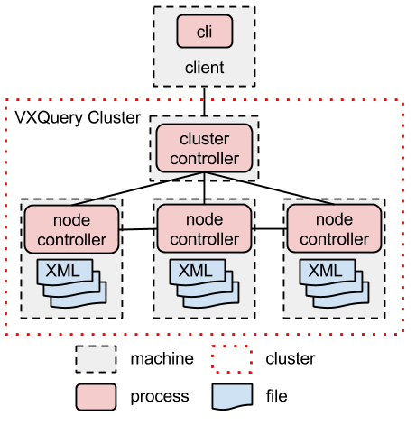

# VXQuery –

## Navigation

- For Users
  - [Get Started](#user_get_started)
  - [Installation](#user_installation)
  - [Cluster Installation](#user_cluster_installation)
  - [Executing a Query](#user_query)
  - [Using HDFS with VXQuery](#user_query_hdfs)
  - [Running the Test Suite](#user_running_tests)
- For Developers
  - [Get Started](#developer_get_started)
  - [Contributing Code](#development_contribution)
  - [Data Handling](#development_data_handling)
  - [Eclipse Setup](#development_eclipse_setup)
  - [Release Steps](#development_release)
  - [Site Update Steps](#development_site_update)
  - [Update Local Git XQTS Results](#development_update_xqts_results)
  - [XMark Benchmark Status](#development_xmark_status)
  - [XML Data and Node Types](#development_xml_node_details)
  - [XML Data Model Example](#development_xml_document)
- Project Documentation
  - Project Information
    - [About](#vxquery-core)
- Modules
  - [VXQuery Core](#vxquery-core)
  - [VXQuery Server](#vxquery-server)
  - [VXQuery CLI](#vxquery-cli)
  - [VXQuery XTest](#vxquery-xtest)
  - [VXQuery Benchmark](#vxquery-benchmark)
- Items
  - [Missing Functions](#vxquery-core-missing-functions)
  - [Missing Operators](#vxquery-core-missing-operators)

## Content

<a id="user_get_started"></a>

<!-- source_url: https://vxquery.apache.org/user_get_started.html -->

<!-- page_index: 1 -->

<a id="user_get_started--get-started-with-the-vxquery-community"></a>

## Get Started with the VXQuery Community

The following steps outline how to get involved with Apache VXQuery community. These steps will connect you with the community and give you a place to start with XQuery.

- Sign up for the dev mailing list.
  - [Mailing list](http://vxquery.apache.org/mail-lists.html)
- Download the latest release and run a few queries.
  - [Installation instructions](http://vxquery.apache.org/user_installation.html).
  - [Execute a query](http://vxquery.apache.org/user_query.html).
- If you want more information on XQuery:
  - Go through the [W3Schools XQuery tutorial](http://www.w3schools.com/xquery/).
  - Review the [XQuery specification](http://www.w3.org/TR/xquery/).

---

<a id="user_installation"></a>

<!-- source_url: https://vxquery.apache.org/user_installation.html -->

<!-- page_index: 2 -->

<a id="user_installation--installation"></a>

## Installation

<a id="user_installation--requirements"></a>

### Requirements

- Apache VXQuery™ source archive (apache-vxquery-X.Y-source-release.zip)
- JDK >= 1.7
- Apache Maven >= 3.2

<a id="user_installation--steps"></a>

### Steps

```
$ unzip apache-vxquery-X.Y-source-release.zip
$ cd apache-vxquery-X.Y
$ mvn package -DskipTests
$ cd ..
```

---

<a id="user_cluster_installation"></a>

<!-- source_url: https://vxquery.apache.org/user_cluster_installation.html -->

<!-- page_index: 3 -->

<a id="user_cluster_installation--cluster-installation"></a>

## Cluster Installation

<a id="user_cluster_installation--architecture"></a>

### Architecture

The VXQuery cluster is made up of two parts: a single cluster controller (cc) and many node controllers (nc). The VXQuery CLI is used to parse the query and compile the job for the VXQuery cluster to process. The CLI passes the job to the cc which manages the job and returns the result to the CLI. The following diagram depicts the cluster layout.



The XML document are distributed between the ncs. The query's collection function will identify XML file path for the ncs.

<a id="user_cluster_installation--requirements"></a>

### Requirements

- Apache VXQuery™ source archive (apache-vxquery-X.Y-source-release.zip)
- JDK >= 1.8
- Apache Maven >= 3.2

<a id="user_cluster_installation--steps"></a>

### Steps

- **Export JAVA\_HOME**


```
$ export JAVA_HOME=/usr/java/latest
```

- **Unzip and build VXQuery**


```
$ unzip apache-vxquery-X.Y-source-release.zip
$ cd apache-vxquery-X.Y
$ mvn package -DskipTests
$ cd ..
```

- **Create configuration file**

  Create a configuration xml file containing the information of the vxquery cluster.Here is an example of a VXQuery configuration file for a cluster with 1 master and 3 slaves.


```
    <cluster xmlns="cluster">
      <name>local</name>
      <username>joe</username>
      <master_node>
          <id>master</id>
          <client_ip>128.195.52.177</client_ip>
          <cluster_ip>192.168.100.0</cluster_ip>
      </master_node>
      <node>
          <id>nodeA</id>
          <cluster_ip>192.168.100.1</cluster_ip>
      </node>
      <node>
          <id>nodeB</id>
          <cluster_ip>192.168.100.2</cluster_ip>
      </node>
      <node>
          <id>nodeC</id>
          <cluster_ip>192.168.100.3</cluster_ip>
      </node>
  </cluster>
```

  - Fields that are required:
    - name : name of the cluster
    - username : user that will execute commands in all the machines of the cluster. Preferably a user that has passwordless ssh access to the machines.
    - id : hostname of the node
    - cluster\_ip : ip of the host in the cluster
    - client\_ip : ip of the master
  - Some optional fields:
    - CCPORT : port for the Cluster Controller
    - J\_OPTS : define the java options you want, for Cluster Controller and Node Controller
- **Deploy cluster**

  To deploy the cluster you need to execute this command in the vxquery installation directory


```
$python cluster_cli.py -c ../conf/cluster.xml -a deploy -d /apache-vxquery/vxquery-server
```

  - Arguments:
    - -c : path to the configuration file you created
    - -a : action you want to perform
    - -d : directory in the system to deploy the cluster
- **Start cluster**

  The command to start the cluster is


```
$python cluster_cli.py -c ../conf/cluster.xml -a start
```

- **Stop cluster**

  The command to stop the cluster is


```
$python cluster_cli.py -c ../conf/cluster.xml -a stop
```

- **Check process status for Cluster Controller**

  You can try these commands to check on the status of the processes


```
$ps -ef|grep ${USER}|grep java|grep 'Dapp.name=vxquerycc'
```

- **Check process status for Node Controller**


```
$ps -ef|grep ${USER}|grep java|grep 'Dapp.name=vxquerync'
```

- **Check process status for hyracks process**


```
$ps -ef|grep ${USER}|grep java|grep 'hyracks'
```

---

<a id="user_query"></a>

<!-- source_url: https://vxquery.apache.org/user_query.html -->

<!-- page_index: 4 -->

<a id="user_query--executing-a-query"></a>

## Executing a Query

<a id="user_query--command-on-nix-based-systems"></a>

### Command On \*nix Based Systems

```
sh ./apache-vxquery-X.Y/vxquery-cli/target/appassembler/bin/vxq
```

<a id="user_query--commands-on-windows-based-systems"></a>

### Commands On Windows Based Systems

```
set JAVA_OPTS=-Xmx1024m
set PATH=%PATH%;"path-to"\apache-vxquery-X.Y\vxquery-cli\target\appassembler\bin\
vxq "path-to"\test.xq
```

<a id="user_query--command-line-options"></a>

### Command Line Options

Command line options for all systems.

```
-O N                       : Optimization Level. Default: Full Optimization
-available-processors N    : Number of available processors. (default java's available processors)
-client-net-ip-address VAL : IP Address of the ClusterController
-client-net-port N         : Port of the ClusterController (default 1098)
-compileonly               : Compile the query and stop
-frame-size N              : Frame size in bytes. (default 65536)
-local-node-controllers N  : Number of local node controllers (default 1)
-repeatexec N              : Number of times to repeat execution
-showast                   : Show abstract syntax tree
-showoet                   : Show optimized expression tree
-showquery                 : Show query string
-showrp                    : Show Runtime plan
-showtet                   : Show translated expression tree
-timing                    : Produce timing information
-hdfs-conf VAL             : The folder containing the HDFS configuration files
```

<a id="user_query--java-options"></a>

### Java Options

```
JAVA_OPTS="-Xmx1024m"
```

<a id="user_query--example"></a>

### Example

The following example query is from [W3Schools XQuery Tutorial](http://www.w3schools.com/xquery/default.asp). If you are new to XQuery, the W3Schools tutorial is a great place to start.

1. Query file (test.xq)


```
for $x in doc("books.xml")/bookstore/book
where $x/price>30
order by $x/title
return $x/title
```

2. Command line


```
JAVA_OPTS="-Xmx1024m" sh ./apache-vxquery-X.Y/vxquery-cli/target/appassembler/bin/vxq test.xq
```

---

<a id="user_query_hdfs"></a>

<!-- source_url: https://vxquery.apache.org/user_query_hdfs.html -->

<!-- page_index: 5 -->

<a id="user_query_hdfs--executing-a-query-in-hdfs"></a>

## Executing a Query in HDFS

<a id="user_query_hdfs--1.-connecting-vxquery-with-hdfs"></a>

### 1. Connecting VXQuery with HDFS

In order to read HDFS data, VXQuery needs access to the HDFS configuration directory, which contains:

core-site.xml hdfs-site.xml mapred-site.xml

Some systems may automatically set this directory as a system environment variable ("HADOOP\_CONF\_DIR"). If this is the case, VXQuery will retrieve this automatically when attempting to perform HDFS queries.

When this variable is not set, users will need to provide this directory as a Command Line Option when executing VXQuery: -hdfs-conf /path/to/hdfs/conf\_folder

<a id="user_query_hdfs--2.-running-the-query"></a>

### 2. Running the Query

For files stored in HDFS there are 2 ways to access them from VXQuery.

1. Reading them as whole files.
2. Reading them block by block.

<a id="user_query_hdfs--a.-reading-them-as-whole-files."></a>

#### a. Reading them as whole files.

For this option you only need to change the path to files. To define that your file(s) exist and should be read from HDFS you must add *"hdfs:/"* in front of the path. VXQuery will read the path of the files you request in your query and try to locate them.

So in order to run a query that will read the input files from HDFS you need to make sure that

a) The environmental variable is set for "HADOOP\_CONF\_DIR" or you pass the directory location using -hdfs-conf

b) The path defined in your query begins with *hdfs://* and the full path to the file(s).

c) The path exists on HDFS and the user that runs the query has read permission to these files.

<a id="user_query_hdfs--example"></a>

##### Example

I want to find all the *books* that are published after 2004.

The file is located in HDFS in this path */user/hduser/store/books.xml*

My query will look like this:

```
for $x in collection("hdfs://user/hduser/store")
where $x/year>2004
return $x/title
```

If I want only one file, the **books.xml** to be parsed from HDFS, my query will look like this:

```
for $x in doc("hdfs://user/hduser/store/books.xml")
where $x/year>2004
return $x/title
```

<a id="user_query_hdfs--b.-reading-them-block-by-block"></a>

#### b. Reading them block by block

In order to use that option you need to modify your query. Instead of using the *collection* or *doc* function to define your input file(s) you need to use *collection-with-tag*.

*collection-with-tag* accepts two arguments, one is the path to the HDFS directory you have stored your input files, and the second is a specific **tag** that exists in the input file(s). This is the tag of the element that contains the fields that your query is looking for.

Other than these arguments, you do not need to change anything else in the query.

Note: since this strategy is optimized to read block by block, the result will include all elements with the given tag, regardless of depth within the xml tree.

<a id="user_query_hdfs--example-2"></a>

##### Example

The same example, using **collection-with-tag**.

My input file *books.xml*:

```
<?xml version="1.0" encoding="UTF-8"?>
<bookstore>

<book>
  <title lang="en">Everyday Italian</title>
  <author>Giada De Laurentiis</author>
  <year>2005</year>
  <price>30.00</price>
</book>

<book>
  <title lang="en">Harry Potter</title>
  <author>J K. Rowling</author>
  <year>2005</year>
  <price>29.99</price>
</book>

<book>
  <title lang="en">XQuery Kick Start</title>
  <author>James McGovern</author>
  <author>Per Bothner</author>
  <author>Kurt Cagle</author>
  <author>James Linn</author>
  <author>Vaidyanathan Nagarajan</author>
  <year>2003</year>
  <price>49.99</price>
</book>

<book>
  <title lang="en">Learning XML</title>
  <author>Erik T. Ray</author>
  <year>2003</year>
  <price>39.95</price>
</book>

</bookstore>
```

My query will look like this:

```
for $x in collection-with-tag("hdfs://user/hduser/store","book")/book
where $x/year>2004
return $x/title
```

Take notice that I defined the path to the directory containing the file(s) and not the file, *collection-with-tag* expects the path to the directory. I also added the */book* after the function. This is also needed, like *collection* and *doc* functions, for the query to be parsed correctly.

---

<a id="user_running_tests"></a>

<!-- source_url: https://vxquery.apache.org/user_running_tests.html -->

<!-- page_index: 6 -->

<a id="user_running_tests--running-the-test-suite"></a>

## Running the Test Suite

<a id="user_running_tests--command-on-nix-based-systems"></a>

### Command On \*nix Based Systems

```
sh ./vxquery/vxquery-xtest/target/appassembler/bin/xtest
```

<a id="user_running_tests--command-on-windows-based-systems"></a>

### Command On Windows Based Systems

First navigate to "apache-vxquery-X.Y/vxquery-cli/target/appassembler/bin" and then run the following file.

```
xtest.bat
```

<a id="user_running_tests--command-line-options"></a>

### Command Line Options

```
 -O N            : Optimization Level
 -catalog VAL    : Test Catalog XML
 -exclude VAL    : Exclude filter regular expression
 -htmlreport VAL : HTML Report output file
 -include VAL    : Include filter regular expression
 -keepalive N    : Milliseconds to keep server alive after tests have completed
 -port N         : Port for web server to listen on
 -textreport VAL : Text Report output file
 -threads N      : Number of threads
 -v              : Verbose
 -xmlreport VAL  : XML Report output file
```

<a id="user_running_tests--java-options"></a>

### Java Options

The command can be run with Java options to increase the amount of memory to one gigabyte. Also helps to use a logging properties file that only output serious errors. This will reduce the output to only a few "LINE 7:" lines. Should help with the speed in running the test.

```
JAVA_OPTS="-Xmx1024m -Djava.util.logging.config.file=/path/to/logging.properties"
```

<a id="user_running_tests--vxquery-testing-options"></a>

### VXQuery Testing Options

- VXQuery Test Suite

  The VXQuery test suite focuses on parallel processing tests used in our weather benchmark.


```
sh ./vxquery-xtest/target/appassembler/bin/xtest -catalog vxquery-xtest/src/test/resources/VXQueryCatalog.xml -htmlreport /tmp/vxquery_report.html
```

  - view the results at <file:///tmp/vxquery_report.html>.
- XQTS (XQuery Test Suite) To run the complete XQTS on VXQuery.
  - Create a folder to hold the XQTS. If you use "vxquery-xtest/test-suites/xqts", then maven will utilize the XQTS to verify VXQuery's passing functions during the build process.


```
$ mkdir -p vxquery-xtest/test-suites
$ cd vxquery-xtest/test-suites
```

  - Get the archive [XQTS\_1\_0\_3.zip](http://dev.w3.org/2006/xquery-test-suite/PublicPagesStagingArea/XQTS_1_0_3.zip) (e.g. using curl),


```
$ curl -O https://dev.w3.org/2006/xquery-test-suite/PublicPagesStagingArea/XQTS_1_0_3.zip
```

  - unpack it,


```
$ unzip -d xqts XQTS_1_0_3.zip
```

  - go back to the project root,


```
$ cd ../..
```

  - run the tests, and


```
sh ./vxquery-xtest/target/appassembler/bin/xtest -catalog vxquery-xtest/test-suites/xqts/XQTSCatalog.xml -htmlreport /tmp/full_report.html
```

  - view the results at <file:///tmp/full_report.html>.
  - Optional: Add JAVA\_OPTS for additional java parameters.
- XQTS (XQuery Test Suite) Option 2 The following command will run the XQTS for test that are known to pass in VXQuery. The command is intend for developer to check their build and ensure all previous test continue to pass. All the tests should pass.
  - run the tests, and


```
sh ./vxquery-xtest/target/appassembler/bin/xtest -catalog vxquery-xtest/test-suites/xqts/XQTSCatalog.xml -htmlreport /tmp/previous_report.html  -previous-test-results vxquery-xtest/results/xqts.txt
```

  - view the results at <file:///tmp/previous_report.html>.

---

<a id="developer_get_started"></a>

<!-- source_url: https://vxquery.apache.org/developer_get_started.html -->

<!-- page_index: 7 -->

<a id="developer_get_started--get-started-as-a-vxquery-developer"></a>

## Get Started as a VXQuery Developer

The following steps outline how to get up to speed with VXQuery developer community. These steps will connect you with the community and give you a place to start with developing for VXQuery.

- Go through the community member steps.
  - [Community steps](http://vxquery.apache.org/user_get_started.html).
- Setup your eclipse development environment.
  - [Setup instructions](http://vxquery.apache.org/development_eclipse_setup.html).
- XQuery has a test suite to verify XQuery specifications.
  - Run the test suite for XQTS.
    - [Testing instructions](http://vxquery.apache.org/user_running_tests.html).
  - Review the test structure.
    - Code is found in the "VXQuery XTest" module.
- Review open issues for the project.
  - [Issues list](http://vxquery.apache.org/issue-tracking.html).

---

<a id="development_contribution"></a>

<!-- source_url: https://vxquery.apache.org/development_contribution.html -->

<!-- page_index: 8 -->

<a id="development_contribution--contributing-code"></a>

## Contributing Code

The following steps outline how to submit code to the VXQuery community for inclusion. Please read the Developer [Get Started](http://vxquery.apache.org/developer_get_started.html) Guide to answer question about getting start as a developer. VXQuery community supports two methods for contributing code to the project.

1. **Submit a patch file to an open VXQuery issue.**

   This method works well for small bug fixes.
2. **Create a pull request in github.**

   The pull request will allow the community to give the developer (you) feedback and support in creating a quality submission. The following steps outline the github pull request process for the VXQuery community.

<a id="development_contribution--github-pull-request-process"></a>

### Github Pull Request Process

<a id="development_contribution--developer"></a>

#### Developer

- Pre-contribution steps to follow.
  - [Community steps](http://vxquery.apache.org/user_get_started.html).
  - [Developer steps](http://vxquery.apache.org/developer_get_started.html).
  - Create a [github](https://github.com/) account.
- Create a github fork of [Apache VXQuery](https://github.com/apache/vxquery) project.

  Go to [Apache VXQuery](https://github.com/apache/vxquery) github mirror. Create a fork by clicking on the fork button. Then clone the fork to your local machine for development.
- Create a branch for your changes.

  VXQuery uses the following convention when creating a branch: authors\_username/topic\_or\_issue (examples: prestonc/vxquery\_142 or tillw/group\_by\_clause). The following branch name helps keep branches separated and keeps it easy to determine the author and topic.
- Make the change.

  :-)
- Add new tests. (optional)

  If the change is not covered in the XQTS, please create a new test in the VXQuery test suite to cover the code changes made to VXQuery.
- Test your changes.

  Once the change is ready, test the branch against known passing Apache VXQuery tests. The patch must not break any of the existing test suites, either the VXQuery or currently passing XQTS.

  - [Run the Test Suites](http://vxquery.apache.org/user_running_tests.html)
  - [Update Passing Tests](http://vxquery.apache.org/development_update_xqts_results.html)
- Clean up your code.

  Remove an extra debug code and verify the patch only includes code for the change.
- Create a github Pull Request.

  Once the work has been tested, a pull request can be created for the change branch. Please use the Apache VXQuery master as branch to compare the change branch. The branch should be up-to-date with the lastest Apache VXQuery master branch.
- Post your Pull Request.

  Post the Pull Request to the mailing list or issue to allow the VXQuery community to give feedback on the change. At least one other member of the community should review the change. If there is any feedback, address this and repeat the posting process.

<a id="development_contribution--code-reviewer"></a>

#### Code Reviewer

- Review the Pull Request.

  Post inline or global comments for the developer. Be polite in your suggestions. Guide the developer to bring the code up to VXQuery's code standards.
- Double check the VXQuery and XQTS tests.

<a id="development_contribution--vxquery-committer-author-or-sponsor-of-the-change"></a>

#### VXQuery Committer (author or sponsor of the change)

The VXQuery committer will be responsible for the change made to the ASF git repository. While they do not need to be the author, the committer should have some understanding of the change they are pushing on to the repository. Often the committer will also be the reviewer for non-committer changes.

- Double check the VXQuery and XQTS tests.
- Merge the change with ASF master.

  When merging the change, do not rebase. Instead do a single merge commit into Apache VXQuery master.

---

<a id="development_data_handling"></a>

<!-- source_url: https://vxquery.apache.org/development_data_handling.html -->

<!-- page_index: 9 -->

<a id="development_data_handling--developer-data-handling"></a>

## Developer Data Handling

<a id="development_data_handling--hyracks-data-mapping"></a>

### Hyracks Data Mapping

[Hyracks](http://hyracks.org) supports several basic data types stored in byte arrays. The byte arrays can be accessed through objects referred to as pointables. The pointable helps with tracking the bytes stored in a larger storage array. Some pointables support converting the byte array into a desired format such as for numeric type. The most basic pointable has three values stored in the object.

- byte array
- starting offset
- length

In Apache VXQuery™ the TaggedValuePointable is used to read a result from this byte array. The first byte defines the data type and alerts us to what pointable to use for reading the rest of the data.

<a id="development_data_handling--fixed-length-data"></a>

#### Fixed Length Data

Fixed length data types can be stored in a set field size. The following outlines the Hyracks data type or custom VXQuery definition with the details about the implementation.

| **Data Type** | **Pointable Name** | **Data Size** |
| --- | --- | --- |
| xs:boolean | BooleanPointable | 1 |
| xs:byte | BytePointable | 1 |
| xs:date | [XSDatePointable](https://gitbox.apache.org/repos/asf?p=vxquery.git;a=blob;f=vxquery-core/src/main/java/org/apache/vxquery/datamodel/accessors/atomic/XSDatePointable.java) | 6 |
| xs:dateTime | [XSDateTimePointable](https://gitbox.apache.org/repos/asf?p=vxquery.git;a=blob;f=vxquery-core/src/main/java/org/apache/vxquery/datamodel/accessors/atomic/XSDateTimePointable.java) | 12 |
| xs:dayTimeDuration | LongPointable | 8 |
| xs:decimal | [XSDecimalPointable](https://gitbox.apache.org/repos/asf?p=vxquery.git;a=blob;f=vxquery-core/src/main/java/org/apache/vxquery/datamodel/accessors/atomic/XSDecimalPointable.java) | 9 |
| xs:double | DoublePointable | 8 |
| xs:duration | [XSDurationPointable](https://gitbox.apache.org/repos/asf?p=vxquery.git;a=blob;f=vxquery-core/src/main/java/org/apache/vxquery/datamodel/accessors/atomic/XSDurationPointable.java) | 12 |
| xs:float | FloatPointable | 4 |
| xs:gDay | [XSDatePointable](https://gitbox.apache.org/repos/asf?p=vxquery.git;a=blob;f=vxquery-core/src/main/java/org/apache/vxquery/datamodel/accessors/atomic/XSDatePointable.java) | 6 |
| xs:gMonth | [XSDatePointable](https://gitbox.apache.org/repos/asf?p=vxquery.git;a=blob;f=vxquery-core/src/main/java/org/apache/vxquery/datamodel/accessors/atomic/XSDatePointable.java) | 6 |
| xs:gMonthDay | [XSDatePointable](https://gitbox.apache.org/repos/asf?p=vxquery.git;a=blob;f=vxquery-core/src/main/java/org/apache/vxquery/datamodel/accessors/atomic/XSDatePointable.java) | 6 |
| xs:gYear | [XSDatePointable](https://gitbox.apache.org/repos/asf?p=vxquery.git;a=blob;f=vxquery-core/src/main/java/org/apache/vxquery/datamodel/accessors/atomic/XSDatePointable.java) | 6 |
| xs:gYearMonth | [XSDatePointable](https://gitbox.apache.org/repos/asf?p=vxquery.git;a=blob;f=vxquery-core/src/main/java/org/apache/vxquery/datamodel/accessors/atomic/XSDatePointable.java) | 6 |
| xs:int | IntegerPointable | 4 |
| xs:integer | LongPointable | 8 |
| xs:negativeInteger | LongPointable | 8 |
| xs:nonNegativeInteger | LongPointable | 8 |
| xs:nonPositiveInteger | LongPointable | 8 |
| xs:positiveInteger | LongPointable | 8 |
| xs:short | ShortPointable | 2 |
| xs:time | [XSTimePointable](https://gitbox.apache.org/repos/asf?p=vxquery.git;a=blob;f=vxquery-core/src/main/java/org/apache/vxquery/datamodel/accessors/atomic/XSTimePointable.java) | 8 |
| xs:unsignedByte | ShortPointable | 2 |
| xs:unsignedInt | LongPointable | 8 |
| xs:unsignedLong | LongPointable | 8 |
| xs:unsignedShort | IntegerPointable | 4 |
| xs:yearMonthDuration | IntegerPointable | 4 |

<a id="development_data_handling--variable-length-data"></a>

#### Variable Length Data

Some information can not be stored in a fixed length value. The following data types are stored in variable length values. Because the size varies, the first two bytes are used to store the length of the total value in bytes. QName is one exception to this rule because the QName field has three distinct variable length fields. In this case we basically are storing three strings right after each other.

Please note that all strings are stored in UTF8. The UTF8 characters range in size from one to three bytes. UTF8StringWriter supports writing a character sequence into the UTF8StringPointable format.

| **Data Type** | **Pointable Name** | **Data Size** |
| --- | --- | --- |
| xs:anyURI | UTF8StringPointable | 2 + length |
| xs:base64Binary | [XSBinaryPointable](https://gitbox.apache.org/repos/asf?p=vxquery.git;a=blob;f=vxquery-core/src/main/java/org/apache/vxquery/datamodel/accessors/atomic/XSBinaryPointable.java) | 2 + length |
| xs:hexBinary | [XSBinaryPointable](https://gitbox.apache.org/repos/asf?p=vxquery.git;a=blob;f=vxquery-core/src/main/java/org/apache/vxquery/datamodel/accessors/atomic/XSBinaryPointable.java) | 2 + length |
| xs:NOTATION | UTF8StringPointable | 2 + length |
| xs:QName | [XSQNamePointable](https://gitbox.apache.org/repos/asf?p=vxquery.git;a=blob;f=vxquery-core/src/main/java/org/apache/vxquery/datamodel/accessors/atomic/XSQNamePointable.java) | 6 + length |
| xs:string | UTF8StringPointable | 2 + length |

<a id="development_data_handling--string-iterators"></a>

### String Iterators

For many string functions, we have used string iterators to traverse the string. The iterator allows the user to ignore the details about the byte size and number of characters. The iterator returns the next character or an end of string value. Stacking iterators can be used to alter the string into a desired form.

- [ICharacterIterator](https://gitbox.apache.org/repos/asf?p=vxquery.git;a=blob;f=vxquery-core/src/main/java/org/apache/vxquery/runtime/functions/strings/ICharacterIterator.java)
- [LowerCaseStringCharacterIterator](https://gitbox.apache.org/repos/asf?p=vxquery.git;a=blob;f=vxquery-core/src/main/java/org/apache/vxquery/runtime/functions/strings/LowerCaseCharacterIterator.java)
- [SubstringAfterStringCharacterIterator](https://gitbox.apache.org/repos/asf?p=vxquery.git;a=blob;f=vxquery-core/src/main/java/org/apache/vxquery/runtime/functions/strings/SubstringAfterCharacterIterator.java)
- [SubstringBeforeStringCharacterIterator](https://gitbox.apache.org/repos/asf?p=vxquery.git;a=blob;f=vxquery-core/src/main/java/org/apache/vxquery/runtime/functions/strings/SubstringBeforeCharacterIterator.java)
- [SubstringStringCharacterIterator](https://gitbox.apache.org/repos/asf?p=vxquery.git;a=blob;f=vxquery-core/src/main/java/org/apache/vxquery/runtime/functions/strings/SubstringCharacterIterator.java)
- [UTF8StringCharacterIterator](https://gitbox.apache.org/repos/asf?p=vxquery.git;a=blob;f=vxquery-core/src/main/java/org/apache/vxquery/runtime/functions/strings/UTF8StringCharacterIterator.java)
- [UpperCaseStringCharacterIterator](https://gitbox.apache.org/repos/asf?p=vxquery.git;a=blob;f=vxquery-core/src/main/java/org/apache/vxquery/runtime/functions/strings/UpperCaseCharacterIterator.java)

<a id="development_data_handling--array-backed-value-store"></a>

### Array Backed Value Store

The array back value store is a key design element of Hyracks. The object is used to manage an output array. The system creates an array large enough to hold your output. Adding to the result, if necessary. The array can be reused and can hold multiple pointable results due to the starting offset parameter in the pointable.

---

<a id="development_eclipse_setup"></a>

<!-- source_url: https://vxquery.apache.org/development_eclipse_setup.html -->

<!-- page_index: 10 -->

<a id="development_eclipse_setup--eclipse-setup"></a>

## Eclipse Setup

Eclipse is a nice IDE for developing in Java and below are the instructions to setting up Eclipse for Apache VXQuery™ development.

<a id="development_eclipse_setup--installation"></a>

### Installation

- Install Java Development Kit (JDK) 1.7 or Later
- Install Classic Eclipse

  Follow the instruction for eclipse on from [www.eclipse.org](http://www.eclipse.org) for the "Classic" eclipse version.
- Install Apache Maven
- Install Maven Integration (m2e)

  VXQuery uses [Maven](http://maven.apache.org/) to define external libraries and build instructions. The Eclipse plugin for Maven integeration can be found at [m2e](http://eclipse.org/m2e/).

<a id="development_eclipse_setup--code-formatter-setup"></a>

### Code Formatter Setup

For VXQuery, the Hyracks project Eclipse formating template has been adopted as the standard. The template file can be found at <http://hyracks.googlecode.com/files/HyracksCodeFormatProfile.xml>

Menu Options from Preferences:

- Java
  - Code Style
    - Formatter

<a id="development_eclipse_setup--code-import-setup"></a>

### Code Import Setup

1. Import Hyracks Code Base

   Download and install the Hyracks Full Stack Staging branch to get the latest Hyracks support for development. This is required since some new features being build are affecting Hyracks development.


```
$ git clone https://code.google.com/p/hyracks/
$ cd hyracks
$ mvn install
$ cd ..
```

   Note: VXQuery has only been lightly testing on Windows based machines. If you run into issues please file an [issue](https://issues.apache.org/jira/browse/VXQUERY).

   The mvn "-DskipTests" option can be used to save about 20 minutes, but will skip the verification tests.

   Finally, from Eclipse's File menu "import" the Maven Hyracks project you have just downloaded through git.
2. Import VXQuery Code Base

   The VXQuery code base must be installed so eclipse has full access. Similar to the Hyracks installation, VXQuery needs to be downloaded from Apache's git repository.


```
$ git clone https://gitbox.apache.org/repos/asf/vxquery.git apache-vxquery (Accept the certificate information for *.apache.org.)
$ cd apache-vxquery
$ mvn package
$ cd ..
```

   Finally, from Eclipse's File menu "import" the Maven VXQuery project you have just downloaded through git.
3. Additional Project Configuration

   Some eclipse build errors will show up. To remove these display errors, add "target/generated-sources/javacc" as a source folder in VXQuery Core.

<a id="development_eclipse_setup--debugging"></a>

### Debugging

Eclipse can be used to debug VXQuery. Using the following java option will allow eclipse to pause the execution and allow eclipse to step through the code.

"-Xdebug -Xrunjdwp:transport=dt\_socket,address=127.0.0.1:8000,server=y,suspend=y"

Realize you may need to update the address for your system. More details can be found at [IBM](http://www.ibm.com/developerworks/opensource/library/os-eclipse-javadebug/index.html)

In eclipse create a debug configuration for VXQuery using Java remote application settings. The default setting will most likely work out of the box. To show all the source code for debugging, add all the source code for the eclipse workspace.

To begin the debug process, execute the command below. In eclipse select the new debug configuration to start the eclipse debugger.

```
JAVA_OPTS="-Xmx1024m -Xdebug -Xrunjdwp:transport=dt_socket,address=127.0.0.1:8000,server=y,suspend=y" sh vxquery-cli/target/appassembler/bin/vxq ../test.xq -showoet
```

---

<a id="development_release"></a>

<!-- source_url: https://vxquery.apache.org/development_release.html -->

<!-- page_index: 11 -->

<a id="development_release--releasing-apache-vxquery"></a>

## Releasing Apache VXQuery™

<a id="development_release--one-time-steps"></a>

### One time steps

- set up directory structure

  There usually are 3 directories at the same level

  - the source directory vxquery,
  - the site directory, and
  - the distribution directory dist.

    The source directory is version-controlled by git, the other two are version controlled by svn. While the source directory and the distribution directory can have arbitrary names and locations, the site directory has to be called site and it needs to be at the same level as the source directory to enable site deployment.

    Assuming that the source directory is available one can create the directory structure by going to the directory that contains the source directory and checking out the distribution and site directories:


```
$ svn co https://dist.apache.org/repos/dist/release/vxquery dist
$ svn co https://svn.apache.org/repos/asf/vxquery/site
```

- create a code signing key with the Apache [instructions](http://www.apache.org/dev/openpgp.html#generate-key) and example settings \* Note: this guide may be helpful for installing [gpg](http://macgpg.sourceforge.net/docs/howto-build-gpg-osx.txt.asc)
- add your key to the KEYS file

  Change into the dist directory and run


```
$ (gpg2 --list-sigs <your name> && gpg2 --armor --export <your name>) >> KEYS
```

  and then check the new KEYS file into svn


```
$ svn ci -m "add [YOUR NAME]'s key to KEYS file"
```

- create an encrypted version of your Apache LDAP password for the nexus repository at <https://repository.apache.org/>

  Follow the steps in the [How to create a master password](http://maven.apache.org/guides/mini/guide-encryption.html) guide to encrypt a master password and to encrypt your Apache LDAP password. (It's nicer if you have maven > 3.2.1 to do this.)
- add the following xml to ~/.m2/settings.xml
  - for the upload to the nexus repository


```
<settings xmlns="http://maven.apache.org/SETTINGS/1.0.0"
  xmlns:xsi="http://www.w3.org/2001/XMLSchema-instance"
  xsi:schemaLocation="http://maven.apache.org/SETTINGS/1.0.0
                      http://maven.apache.org/xsd/settings-1.0.0.xsd">
...
  <servers>
    ...
    <!-- To publish a snapshot of some part of Maven -->
    <server>
      <id>apache.snapshots.https</id>
      <username>[YOUR APACHE LDAP USERNAME]</username>
      <password>[YOUR APACHE LDAP PASSWORD (encrypted)]</password>
    </server>
    <!-- To stage a release of some part of Maven -->
    <server>
      <id>apache.releases.https</id>
      <username>[YOUR APACHE LDAP USERNAME]</username>
      <password>[YOUR APACHE LDAP PASSWORD (encrypted)]</password>
    </server>
   ...
  </servers>
...
</settings>
```

  - to sign the artifacts


```
  <profiles>
    <profile>
      <id>apache-release</id>
      <properties>
        <gpg.executable>gpg2</gpg.executable>
        <gpg.passphrase>...</gpg.passphrase>
      </properties>
    </profile>
  </profiles>
```

- Download Apache Rat from <https://creadur.apache.org/rat/download_rat.cgi>.
- Add your ssh key to [id.apache.org](https://id.apache.org) (required to create a website on [people.apache.org](https://people.apache.org)).
  - Login and update your profile details.

<a id="development_release--each-time-steps"></a>

### Each time steps

- clean up


```
$ mvn clean
```

- run rat (always do this on a clean source folder):


```
$ java -jar ~/<DOWLOADS FOLDER>/apache-rat-0.11/apache-rat-0.11.jar -d . -E .rat-excludes
```

- test your setup


```
$ mvn install -Papache-release
```

- dry run of the release process


```
$ mvn release:prepare -DdryRun=true
```

- check (and fix) the content of the LICENSE and NOTICE files (especially the date) and the copyright dates in changed files
- release to the staging repository


```
$ mvn release:prepare
$ mvn release:perform
```

- close the staging repository at <https://repository.apache.org/>
  - Log into the website and look at the "Staging Repositories".
  - Find the VXQuery repository and click the "close" button.
  - Add a message: "Apache VXQuery X.Y-rc#"
- check that the artifacts are available in the repository
- send out [VOTE] e-mail on dev@vxquery.apache.org
  - [example e-mail](http://mail-archives.apache.org/mod_mbox/vxquery-dev/201409.mbox/%3CCAGZxfJUZDczuZR5jQResE4B7%2Bv4QQgwMpAd%2B-_Kt-U_RjCyReA%40mail.gmail.com%3E)
- after successful vote release staging repository <https://repository.apache.org/>
  - Log into the website and look at the "Staging Repositories".
  - Find the VXQuery repository and click the "release" button.
  - Add a message: "Apache VXQuery X.Y Release"
- add new source artifacts (archive + signature + hashes) to svn <https://dist.apache.org/repos/dist/release/vxquery> and remove old release dirctory
- commit changes to svn
- update the site branch in git from the from the release-tag
- build a new site and deploy it to ../site


```
$ mvn site site:deploy
```

- submit the site to svn


```
$ cd ../site
$ svn st | awk '/\?/ { print $2 }' | xargs svn add # add all new files
$ svn ci -m"updated site"
$ cd -
```

- wait a few days for the mirroring of the release artifacts
- send [ANNOUNCE] e-mail to announce@apache.org and dev@vxquery.apache.org
  - [example e-mail](http://mail-archives.apache.org/mod_mbox/www-announce/201405.mbox/%3C537AD473.9080505@apache.org%3E)

<a id="development_release--references"></a>

### References

- [How To Generate PGP Signatures With Maven](https://docs.sonatype.org/display/Repository/How+To+Generate+PGP+Signatures+With+Maven)
- [Publishing Maven Artifacts](https://www.apache.org/dev/publishing-maven-artifacts.html)

---

<a id="development_site_update"></a>

<!-- source_url: https://vxquery.apache.org/development_site_update.html -->

<!-- page_index: 12 -->

<a id="development_site_update--updating-the-apache-vxquery-site"></a>

## Updating the Apache VXQuery™ site

<a id="development_site_update--one-time-steps"></a>

### One time steps

- set up directory structure

  There usually are 2 directories at the same level

  - the source directory vxquery,
  - the site directory, and

    The source directory is version-controlled by git, the other is version controlled by svn. While the source directory can have an arbitrary name and location, the site directory has to be called site and it needs to be at the same level as the source directory to enable site deployment.

    Assuming that the source directory is available one can create the directory structure by going to the directory that contains the source directory and checking out the distribution and site directories:


```
$ svn co https://dist.apache.org/repos/dist/release/vxquery dist
$ svn co https://svn.apache.org/repos/asf/vxquery/site
```

<a id="development_site_update--for-each-update"></a>

### For each update

- update the site branch in git
  - New release steps

    Please switch to the [release steps](http://vxquery.apache.org/development_release.html) and follow their directions.
  - Incremental site update

    When pushing changes to the site without a code release, the following git commands will create a patch of only differences within the src/site folder. Please verify the patch before applying it the site


```
git checkout master
git diff site src/site/ > ../site.patch"
git checkout site
git apply ../site.patch
```

- build a new site and deploy it to ../site


```
$ mvn site site:deploy
```

- submit the site to svn


```
$ cd ../site
$ svn st | awk '/\?/ { print $2 }' | xargs svn add # add all new files
$ svn ci -m"updated site"
$ cd -
```

---

<a id="development_update_xqts_results"></a>

<!-- source_url: https://vxquery.apache.org/development_update_xqts_results.html -->

<!-- page_index: 13 -->

<a id="development_update_xqts_results--update-the-xqts-results"></a>

## Update the XQTS Results

VXQuery stores the latest XQTS result for the last release. The file can be used to verify that all the previous test still passing. The following instructions show how to update the XQTS results file.

<a id="development_update_xqts_results--instructions"></a>

### Instructions

- Verify current XQTS results are all passing before updating to the new XQTS test results. The XQTS should be located in "vxquery-xtest/test-suites/xqts", as explained in the [http://vxquery.apache.org/user\_running\_tests.html](#development_update_xqts_results--running_the_test_suite) The following command should produce all passing results. They can be viewed at <file:///tmp/previous_report.html>.


```
sh ./vxquery-xtest/target/appassembler/bin/xtest -catalog vxquery-xtest/test-suites/xqts/XQTSCatalog.xml -htmlreport /tmp/previous_report.html -previous-test-results vxquery-xtest/results/xqts.txt
```

- Remove the old results file.


```
rm vxquery-xtest/results/xqts.txt
```

- Generate the new XQTS result file and save it in the text format.


```
sh ./vxquery-xtest/target/appassembler/bin/xtest -catalog vxquery-xtest/test-suites/xqts/XQTSCatalog.xml -textreport vxquery-xtest/results/xqts.txt
```

---

<a id="development_xmark_status"></a>

<!-- source_url: https://vxquery.apache.org/development_xmark_status.html -->

<!-- page_index: 14 -->

<a id="development_xmark_status--xmark-benchmark-documentation"></a>

## XMark Benchmark Documentation

In the following table, XMark queries are listed to show the current status of each query in VXQuery. The *Query Number* column represents the XMark query number. *Original Query* column represents the original XMark query from the XMark Benchmark site. Original query works if it has a *Working* status in the column. If the original query does not work, then the column displays the error type. *Optimized Query* column represents the parallel optimized version for the original XMark query. The optimized version of the query has been written to increase performance. Optimized query works if it has a *Working* status in the column. If the optimized query does not work, then the column displays the error or displays *Same Error as Original Query*. *Frame Size* column represents the frame size that VXQuery needs to run the query. The *Issues* column represents the JIRA issues for the query or are related to the query. All queries that do not work with the default frame size are related to  [VXQuery Issue 167](https://issues.apache.org/jira/browse/VXQUERY-167) .

| **Query Number** | **Original Query** | **Optimized Query** | **Frame Size** | **Issues** |
| --- | --- | --- | --- | --- |
| 1 | Working | Working | Working with default size | None |
| 2 | Working | Working | Working with default size | None |
| 3 | Working | Working | Working with default size | None |
| 4 | Working | Working | Working with default size | None |
| 5 | Working | Working | Working with default size | None |
| 6 | Error in the Query Plan | Same Error as Original Query | Cannot be determined | [VXQuery Issue 170](https://issues.apache.org/jira/browse/VXQUERY-170) |
| 7 | Error in the Query Plan | Same Error as Original Query | Cannot be determined | [VXQuery Issue 170](https://issues.apache.org/jira/browse/VXQUERY-170) |
| 8 | Working | Working | Working with default size | [VXQuery Issue 171](https://issues.apache.org/jira/browse/VXQUERY-171) |
| 9 | Array Out Of bounds Exception | Same Error as Original Query | Cannot be determined | [VXQuery Issue 173](https://issues.apache.org/jira/browse/VXQUERY-173) |
| 10 | Times out while execution | Same Error as Original Query | Cannot be determined | [VXQuery Issue 176](https://issues.apache.org/jira/browse/VXQUERY-176) |
| 11 | Working | Working | Working with default size | [VXQuery Issue 171](https://issues.apache.org/jira/browse/VXQUERY-171) |
| 12 | Working | Working | Working with default size | [VXQuery Issue 172](https://issues.apache.org/jira/browse/VXQUERY-172) |
| 13 | Working | Working | Working with default size | None |
| 14 | Working | Working | Working with max size | None |
| 15 | Working | Working | Working with max size | [VXQuery Issue 174](https://issues.apache.org/jira/browse/VXQUERY-174) |
| 16 | Working | Working | Working with max size | None |
| 17 | Working | Working | Working with default size | [VXQuery Issue 171](https://issues.apache.org/jira/browse/VXQUERY-171) |
| 18 | Use defined functions | Same Error as Original Query | Cannot be determined | [VXQuery Issue 154](https://issues.apache.org/jira/browse/VXQUERY-154) |
| 19 | Working | Working | Working with default size | [VXQuery Issue 172](https://issues.apache.org/jira/browse/VXQUERY-172) |
| 20 | Empty results | Same Error as Original Query | Working with frame size | [VXQuery Issue 175](https://issues.apache.org/jira/browse/VXQUERY-175) |

---

<a id="development_xml_node_details"></a>

<!-- source_url: https://vxquery.apache.org/development_xml_node_details.html -->

<!-- page_index: 15 -->

<a id="development_xml_node_details--xml-data-and-node-types"></a>

## XML Data and Node Types

XML is used as the data source for XQuery and must be parsed into Hyracks data. Each node type defined in XPath and XQuery can be mapped into pointable defined in Apache VXQuery™.

<a id="development_xml_node_details--xpath-node-types"></a>

### XPath Node Types

| **Data Type** | **Pointable Name** | **Data Size** |
| --- | --- | --- |
| Attribute Nodes(ANP) | [AttributeNodePointable](https://gitbox.apache.org/repos/asf?p=vxquery.git;a=blob;f=vxquery-core/src/main/java/org/apache/vxquery/datamodel/accessors/nodes/AttributeNodePointable.java) | 1 + length |
| Document Nodes(DNP) | [DocumentNodePointable](https://gitbox.apache.org/repos/asf?p=vxquery.git;a=blob;f=vxquery-core/src/main/java/org/apache/vxquery/datamodel/accessors/nodes/DocumentNodePointable.java) | 1 + length |
| Element Nodes(ENP) | [ElementNodePointable](https://gitbox.apache.org/repos/asf?p=vxquery.git;a=blob;f=vxquery-core/src/main/java/org/apache/vxquery/datamodel/accessors/nodes/ElementNodePointable.java) | 1 + length |
| Node Tree(NTP) | [NodeTreePointable](https://gitbox.apache.org/repos/asf?p=vxquery.git;a=blob;f=vxquery-core/src/main/java/org/apache/vxquery/datamodel/accessors/nodes/NodeTreePointable.java) | 1 + length |
| Processing Instruction Node(PINP) | [PINodePointable](https://gitbox.apache.org/repos/asf?p=vxquery.git;a=blob;f=vxquery-core/src/main/java/org/apache/vxquery/datamodel/accessors/nodes/PINodePointable.java) | 1 + length |
| Comment Node(CNP) | [TextOrCommentNodePointable](https://gitbox.apache.org/repos/asf?p=vxquery.git;a=blob;f=vxquery-core/src/main/java/org/apache/vxquery/datamodel/accessors/nodes/TextOrCommentNodePointable.java) | 1 + length |
| Text Node(TNP) | [TextOrCommentNodePointable](https://gitbox.apache.org/repos/asf?p=vxquery.git;a=blob;f=vxquery-core/src/main/java/org/apache/vxquery/datamodel/accessors/nodes/TextOrCommentNodePointable.java) | 1 + length |

<a id="development_xml_node_details--xml-mapping"></a>

### XML Mapping

The XML mapping to Hyracks pointables is fairly straight forward. The following example shows how each node is mapped and saved into a byte array used by Hyracks.

<a id="development_xml_node_details--example-xml-file"></a>

#### Example XML File

The example XML file comes from W3School XQuery tutorial.

```
<?xml version="1.0" encoding="ISO-8859-1"?>
<!-- Edited by XMLSpyÆ -->
<bookstore>

    <book category="COOKING">
        <title lang="en">Everyday Italian</title>
        <author>Giada De Laurentiis</author>
        <year>2005</year>
        <price>30.00</price>
    </book>
    
    <book category="CHILDREN">
        <title lang="en">Harry Potter</title>
        <author>J K. Rowling</author>
        <year>2005</year>
        <price>29.99</price>
    </book>
    
    <book category="WEB">
        <title lang="en">XQuery Kick Start</title>
        <author>James McGovern</author>
        <author>Per Bothner</author>
        <author>Kurt Cagle</author>
        <author>James Linn</author>
        <author>Vaidyanathan Nagarajan</author>
        <year>2003</year>
        <price>49.99</price>
    </book>
    
    <book category="WEB">
        <title lang="en">Learning XML</title>
        <author>Erik T. Ray</author>
        <year>2003</year>
        <price>39.95</price>
    </book>

</bookstore>
```

<a id="development_xml_node_details--example-hyracks-mapping"></a>

#### Example Hyracks Mapping

The mapping is explained through using some short hand for the above example XML file. Realize the direct bytes will not be explained although the pointable names are used for each piece of information.

```
NodeTree {
    DocumentNode {bookstore}
        sequence (children) {
            ElementNode {book}
                sequence (attributes) {
                    AttributeNode {category}
                }
                sequence (children) {
                    ElementNode {title:Everyday Italian}
                        sequence (attributes) {
                            AttributeNode {lang}
                        }
                    ElementNode {author}
                    ElementNode {year}
                    ElementNode {price}
                }
            ElementNode {book}
                sequence (attributes) {
                    AttributeNode {category}
                }
                sequence (children) {
                    ElementNode {title:Harry Potter}
                        sequence (attributes) {
                           AttributeNode {lang}
                        }
                    ElementNode {author}
                    ElementNode {year}
                    ElementNode {price}
                }
            ElementNode {book}
                sequence (attributes) {
                    AttributeNode {category}
                }
                sequence (children) {
                    ElementNode {title:XQuery Kick Start}
                        sequence (attributes) {
                            AttributeNode {lang}
                        }
                    ElementNode {author}
                    ElementNode {author}
                    ElementNode {author}
                    ElementNode {author}
                    ElementNode {author}
                    ElementNode {year}
                    ElementNode {price}
                }
            ElementNode {book}
                sequence (attributes) {
                    AttributeNode {category}
                }
                sequence (children) {
                    ElementNode {title:Learning XML}
                        sequence (attributes) {
                            AttributeNode {lang}
                        }
                    ElementNode {author}
                    ElementNode {year}
                    ElementNode {price}
                }
        }
}
```

---

<a id="development_xml_document"></a>

<!-- source_url: https://vxquery.apache.org/development_xml_document.html -->

<!-- page_index: 16 -->

<a id="development_xml_document--xml-data-model-example"></a>

## XML Data Model Example

<a id="development_xml_document--byte-array-break-down"></a>

### Byte Array Break Down

Every XML document in VXQuery is stored in memory as one continuous array of bytes. Pointables are used to refer to these bytes in the memory. This document covers VXQuery's representation of all the different types of elements of an XML document. As a result, we use a lots of pointables (same and different) through out the document. To simplify explanations, each pointable is explicitly assigned a NodeID only on this web page. Refer to the following link for details on the various pointables used:  [XML Node Details](http://vxquery.apache.org/development_xml_node_details.html) .

<a id="development_xml_document--xml-document"></a>

#### XML Document

We use the following XML document as an example to explain VXQuery's node types. The different node types are Node Tree Pointable (NTP), Document Node Pointable (DNP), Element Node Pointable (ENP), Attribute Node Pointable (ANP), Text Node Pointable (TNP), Comment Node Pointable (CNP) and Processing Instruction Node Pointable (PINP).

```
<?xml version="1.0"?>
<catalog xmlns:ex="http://example.org/" >
  <ex:book isbn="0812416139">
    <!--top secret-->
    <title>Macbeth</title>
    <?hide?>
  </ex:book>
</catalog>
```

<a id="development_xml_document--bytes"></a>

#### Bytes

Following are the bytes for the XML document above. Elements in VXQuery are accessed using Tagged Value Pointables. Similarly, the XML document is also accessed using a Tagged Value Pointable. The first byte is represents the value tag. It indicates the type of the bytes that follow.

<a id="development_xml_document--107-3-0-0-0-0-0-0-0-109-0-0-0-7-0-0-0-6-0-0-0-19-0-0-0-44-0-0-0-54-0-0-0-62-0-0-0-72-0-0-0-83-0-0-0-0-0-0-0-3-0-0-0-1-0-0-0-4-0-0-0-2-0-0-0-5-0-0-0-6-0-0-0-0-0-0-0-7-99-97-116-97-108-111-103-0-0-0-1-0-19-104-116-116-112-58-47-47-101-120-97-109-112-108-101-46-111-114-103-47-0-0-0-2-0-4-98-111-111-107-0-0-0-3-0-2-101-120-0-0-0-4-0-4-105-115-98-110-0-0-0-5-0-5-116-105-116-108-101-0-0-0-6-101-0-0-0-0-0-0-0-1-0-0-1-0-102-4-0-0-0-0-0-0-0-0-0-0-0-1-0-0-0-1-0-0-0-3-0-0-0-10-0-0-0-42-0-0-0-34-104-0-0-0-2-0-3-10-32-32-102-6-0-0-0-4-0-0-0-2-0-0-0-3-0-0-0-3-0-0-0-1-0-0-0-30-103-0-0-0-0-0-0-0-0-0-0-0-5-0-0-0-4-14-0-10-48-56-49-50-52-49-54-49-51-57-0-0-0-7-0-0-0-12-0-0-0-29-0-0-0-41-0-0-0-81-0-0-0-93-0-0-0-106-0-0-0-116-104-0-0-0-5-0-5-10-32-32-32-32-105-0-0-0-6-0-10-116-111-112-32-115-101-99-114-101-116-104-0-0-0-7-0-5-10-32-32-32-32-102-4-0-0-0-0-0-0-0-0-0-0-0-6-0-0-0-8-0-0-0-1-0-0-0-14-104-0-0-0-9-0-7-77-97-99-98-101-116-104-104-0-0-0-10-0-5-10-32-32-32-32-106-0-0-0-11-0-4-104-105-100-101-0-0-104-0-0-0-12-0-3-10-32-32-104-0-0-0-13-0-1-10"></a>

##### 107, 3, 0, 0, 0, 0, 0, 0, 0, -109, 0, 0, 0, 7, 0, 0, 0, 6, 0, 0, 0, 19, 0, 0, 0, 44, 0, 0, 0, 54, 0, 0, 0, 62, 0, 0, 0, 72, 0, 0, 0, 83, 0, 0, 0, 0, 0, 0, 0, 3, 0, 0, 0, 1, 0, 0, 0, 4, 0, 0, 0, 2, 0, 0, 0, 5, 0, 0, 0, 6, 0, 0, 0, 0, 0, 0, 0, 7, 99, 97, 116, 97, 108, 111, 103, 0, 0, 0, 1, 0, 19, 104, 116, 116, 112, 58, 47, 47, 101, 120, 97, 109, 112, 108, 101, 46, 111, 114, 103, 47, 0, 0, 0, 2, 0, 4, 98, 111, 111, 107, 0, 0, 0, 3, 0, 2, 101, 120, 0, 0, 0, 4, 0, 4, 105, 115, 98, 110, 0, 0, 0, 5, 0, 5, 116, 105, 116, 108, 101, 0, 0, 0, 6, 101, 0, 0, 0, 0, 0, 0, 0, 1, 0, 0, 1, 0, 102, 4, 0, 0, 0, 0, 0, 0, 0, 0, 0, 0, 0, 1, 0, 0, 0, 1, 0, 0, 0, 3, 0, 0, 0, 10, 0, 0, 0, -42, 0, 0, 0, -34, 104, 0, 0, 0, 2, 0, 3, 10, 32, 32, 102, 6, 0, 0, 0, 4, 0, 0, 0, 2, 0, 0, 0, 3, 0, 0, 0, 3, 0, 0, 0, 1, 0, 0, 0, 30, 103, 0, 0, 0, 0, 0, 0, 0, 0, 0, 0, 0, 5, 0, 0, 0, 4, 14, 0, 10, 48, 56, 49, 50, 52, 49, 54, 49, 51, 57, 0, 0, 0, 7, 0, 0, 0, 12, 0, 0, 0, 29, 0, 0, 0, 41, 0, 0, 0, 81, 0, 0, 0, 93, 0, 0, 0, 106, 0, 0, 0, 116, 104, 0, 0, 0, 5, 0, 5, 10, 32, 32, 32, 32, 105, 0, 0, 0, 6, 0, 10, 116, 111, 112, 32, 115, 101, 99, 114, 101, 116, 104, 0, 0, 0, 7, 0, 5, 10, 32, 32, 32, 32, 102, 4, 0, 0, 0, 0, 0, 0, 0, 0, 0, 0, 0, 6, 0, 0, 0, 8, 0, 0, 0, 1, 0, 0, 0, 14, 104, 0, 0, 0, 9, 0, 7, 77, 97, 99, 98, 101, 116, 104, 104, 0, 0, 0, 10, 0, 5, 10, 32, 32, 32, 32, 106, 0, 0, 0, 11, 0, 4, 104, 105, 100, 101, 0, 0, 104, 0, 0, 0, 12, 0, 3, 10, 32, 32, 104, 0, 0, 0, 13, 0, 1, 10

---

<a id="development_xml_document--node-tree"></a>

#### Node Tree

107 The first byte as described above is the value tag for Node Tree Pointable.

The rest of the bytes represent a Node Tree Pointable. Refer to this link to view the [Bytes](#development_xml_document--bytes) for the Node Tree Pointable(NTP).

XML Documents in VXQuery are wrapped in Node Tree Pointables. As a side note, every result produced as an output of a function is also wrapped in a NTP.

Following are the bytes and contents of the Node Tree Pointable for this XML document.

3  Header byte (One byte) that uses the lowest three bit to denote if

- bit *Node Id* exists: *Yes*
- bit *Dictionary* exists: *Yes*
- bit *Header Type* exists: *No*

0, 0, 0, 0  These 4 bytes represent the *Node Id* which has value **0**

Following are the byte contents of the [Dictionary](#development_xml_document--dictionary). The byte array break down is explained in details further ahead.

<a id="development_xml_document--0-0-0-109-0-0-0-7-0-0-0-6-0-0-0-19-0-0-0-44-0-0-0-54-0-0-0-62-0-0-0-72-0-0-0-83-0-0-0-0-0-0-0-3-0-0-0-1-0-0-0-4-0-0-0-2-0-0-0-5-0-0-0-6-0-0-0-0-0-0-0-7-99-97-116-97-108-111-103-0-0-0-1-0-19-104-116-116-112-58-47-47-101-120-97-109-112-108-101-46-111-114-103-47-0-0-0-2-0-4-98-111-111-107-0-0-0-3-0-2-101-120-0-0-0-4-0-4-105-115-98-110-0-0-0-5-0-5-116-105-116-108-101-0-0-0-6"></a>

##### 0, 0, 0, -109, 0, 0, 0, 7, 0, 0, 0, 6, 0, 0, 0, 19, 0, 0, 0, 44, 0, 0, 0, 54, 0, 0, 0, 62, 0, 0, 0, 72, 0, 0, 0, 83, 0, 0, 0, 0, 0, 0, 0, 3, 0, 0, 0, 1, 0, 0, 0, 4, 0, 0, 0, 2, 0, 0, 0, 5, 0, 0, 0, 6, 0, 0, 0, 0, 0, 0, 0, 7, 99, 97, 116, 97, 108, 111, 103, 0, 0, 0, 1, 0, 19, 104, 116, 116, 112, 58, 47, 47, 101, 120, 97, 109, 112, 108, 101, 46, 111, 114, 103, 47, 0, 0, 0, 2, 0, 4, 98, 111, 111, 107, 0, 0, 0, 3, 0, 2, 101, 120, 0, 0, 0, 4, 0, 4, 105, 115, 98, 110, 0, 0, 0, 5, 0, 5, 116, 105, 116, 108, 101, 0, 0, 0, 6

Element Node in NTP(root node):

In this NTP, the Element Node or the root node is a Document Node Pointable (DNP) ([NodeID:0](#development_xml_document--nodeid:0)). **101** is the *Value Tag* for Document Node Pointable. Note that this root node can represent any pointable type. For example: ElementNodePointable, Attribute Node Pointable or Text Node Pointable.

Following are the byte contents for the Document Node Pointable ([NodeID:0](#development_xml_document--nodeid:0)). The byte array break down is explained further ahead.

<a id="development_xml_document--0-0-0-0-0-0-0-1-0-0-1-0-102-4-0-0-0-0-0-0-0-0-0-0-0-1-0-0-0-1-0-0-0-3-0-0-0-10-0-0-0-42-0-0-0-34-104-0-0-0-2-0-3-10-32-32-102-6-0-0-0-4-0-0-0-2-0-0-0-3-0-0-0-3-0-0-0-1-0-0-0-30-103-0-0-0-0-0-0-0-0-0-0-0-5-0-0-0-4-14-0-10-48-56-49-50-52-49-54-49-51-57-0-0-0-7-0-0-0-12-0-0-0-29-0-0-0-41-0-0-0-81-0-0-0-93-0-0-0-106-0-0-0-116-104-0-0-0-5-0-5-10-32-32-32-32-105-0-0-0-6-0-10-116-111-112-32-115-101-99-114-101-116-104-0-0-0-7-0-5-10-32-32-32-32-102-4-0-0-0-0-0-0-0-0-0-0-0-6-0-0-0-8-0-0-0-1-0-0-0-14-104-0-0-0-9-0-7-77-97-99-98-101-116-104-104-0-0-0-10-0-5-10-32-32-32-32-106-0-0-0-11-0-4-104-105-100-101-0-0-104-0-0-0-12-0-3-10-32-32-104-0-0-0-13-0-1-10"></a>

##### 0, 0, 0, 0, 0, 0, 0, 1, 0, 0, 1, 0, 102, 4, 0, 0, 0, 0, 0, 0, 0, 0, 0, 0, 0, 1, 0, 0, 0, 1, 0, 0, 0, 3, 0, 0, 0, 10, 0, 0, 0, -42, 0, 0, 0, -34, 104, 0, 0, 0, 2, 0, 3, 10, 32, 32, 102, 6, 0, 0, 0, 4, 0, 0, 0, 2, 0, 0, 0, 3, 0, 0, 0, 3, 0, 0, 0, 1, 0, 0, 0, 30, 103, 0, 0, 0, 0, 0, 0, 0, 0, 0, 0, 0, 5, 0, 0, 0, 4, 14, 0, 10, 48, 56, 49, 50, 52, 49, 54, 49, 51, 57, 0, 0, 0, 7, 0, 0, 0, 12, 0, 0, 0, 29, 0, 0, 0, 41, 0, 0, 0, 81, 0, 0, 0, 93, 0, 0, 0, 106, 0, 0, 0, 116, 104, 0, 0, 0, 5, 0, 5, 10, 32, 32, 32, 32, 105, 0, 0, 0, 6, 0, 10, 116, 111, 112, 32, 115, 101, 99, 114, 101, 116, 104, 0, 0, 0, 7, 0, 5, 10, 32, 32, 32, 32, 102, 4, 0, 0, 0, 0, 0, 0, 0, 0, 0, 0, 0, 6, 0, 0, 0, 8, 0, 0, 0, 1, 0, 0, 0, 14, 104, 0, 0, 0, 9, 0, 7, 77, 97, 99, 98, 101, 116, 104, 104, 0, 0, 0, 10, 0, 5, 10, 32, 32, 32, 32, 106, 0, 0, 0, 11, 0, 4, 104, 105, 100, 101, 0, 0, 104, 0, 0, 0, 12, 0, 3, 10, 32, 32, 104, 0, 0, 0, 13, 0, 1, 10

---

<a id="development_xml_document--dictionary"></a>

#### Dictionary

Byte Array for the Dictionary

<a id="development_xml_document--0-0-0-109-0-0-0-7-0-0-0-6-0-0-0-19-0-0-0-44-0-0-0-54-0-0-0-62-0-0-0-72-0-0-0-83-0-0-0-0-0-0-0-3-0-0-0-1-0-0-0-4-0-0-0-2-0-0-0-5-0-0-0-6-0-0-0-0-0-0-0-7-99-97-116-97-108-111-103-0-0-0-1-0-19-104-116-116-112-58-47-47-101-120-97-109-112-108-101-46-111-114-103-47-0-0-0-2-0-4-98-111-111-107-0-0-0-3-0-2-101-120-0-0-0-4-0-4-105-115-98-110-0-0-0-5-0-5-116-105-116-108-101-0-0-0-6-2"></a>

##### 0, 0, 0, -109, 0, 0, 0, 7, 0, 0, 0, 6, 0, 0, 0, 19, 0, 0, 0, 44, 0, 0, 0, 54, 0, 0, 0, 62, 0, 0, 0, 72, 0, 0, 0, 83, 0, 0, 0, 0, 0, 0, 0, 3, 0, 0, 0, 1, 0, 0, 0, 4, 0, 0, 0, 2, 0, 0, 0, 5, 0, 0, 0, 6, 0, 0, 0, 0, 0, 0, 0, 7, 99, 97, 116, 97, 108, 111, 103, 0, 0, 0, 1, 0, 19, 104, 116, 116, 112, 58, 47, 47, 101, 120, 97, 109, 112, 108, 101, 46, 111, 114, 103, 47, 0, 0, 0, 2, 0, 4, 98, 111, 111, 107, 0, 0, 0, 3, 0, 2, 101, 120, 0, 0, 0, 4, 0, 4, 105, 115, 98, 110, 0, 0, 0, 5, 0, 5, 116, 105, 116, 108, 101, 0, 0, 0, 6

<a id="development_xml_document--0-0-0-109"></a>

##### 0, 0, 0, -109

These 4 bytes represent the *Size of Dictionary* in signed integer format. After conversion to unsigned integer format the value is **147**.

<a id="development_xml_document--0-0-0-7"></a>

##### 0, 0, 0, 7

These 4 bytes represent the *Number of items* in the dictionary: **7**

<a id="development_xml_document--0-0-0-6-0-0-0-19-0-0-0-44-0-0-0-54-0-0-0-62-0-0-0-72-0-0-0-83"></a>

##### 0, 0, 0, 6, 0, 0, 0, 19, 0, 0, 0, 44, 0, 0, 0, 54, 0, 0, 0, 62, 0, 0, 0, 72, 0, 0, 0, 83

This is a list of *Offsets* for each item in the dictionary. There are 7 offsets. Each offset is 4 bytes long. Following are the 7 offsets: **6, 19, 44, 54, 62, 72, 83**

<a id="development_xml_document--0-0-0-0-0-0-0-3-0-0-0-1-0-0-0-4-0-0-0-2-0-0-0-5-0-0-0-6"></a>

##### 0, 0, 0, 0, 0, 0, 0, 3, 0, 0, 0, 1, 0, 0, 0, 4, 0, 0, 0, 2, 0, 0, 0, 5, 0, 0, 0, 6

This is a sorted list of keys in alphabetical order. Each key is 4 byte long. Each key is mapped to a string in the dictionary. The keys are the numbers **1** through **6**.

Following are the data values in the dictionary.Each data value is a StringPointable. Each StringPointable maps to XML document strings.

<a id="development_xml_document--0-0-0-0-0-0"></a>

##### 0, 0, 0, 0, 0, 0

The *Size* of the string is **0**. The *String Value* is **null**. The StringPointable is followed by the key which is **0**.

<a id="development_xml_document--0-7-99-97-116-97-108-111-103-0-0-0-1"></a>

##### 0, 7, 99, 97, 116, 97, 108, 111, 103, 0, 0, 0, 1

The *Size* of the string is **7**. The *String Value* is **catalog**. The StringPointable is followed by the key which is **1**.

<a id="development_xml_document--0-19-104-116-116-112-58-47-47-101-120-97-109-112-108-101-46-111-114-103-47-0-0-0-2"></a>

##### 0, 19, 104, 116, 116, 112, 58, 47, 47, 101, 120, 97, 109, 112, 108, 101, 46, 111, 114, 103, 47, 0, 0, 0, 2

The *Size* of the string is **19**. The *String Value* is **http://example.org/**. The StringPointable is followed by the key which is **2**.

<a id="development_xml_document--0-4-98-111-111-107-0-0-0-3"></a>

##### 0, 4, 98, 111, 111, 107, 0, 0, 0, 3

The *Size* of the string is **4**. The *String Value* is **book**. The StringPointable is followed by the key which is **3**.

<a id="development_xml_document--0-2-101-120-0-0-0-4"></a>

##### 0, 2, 101, 120, 0, 0, 0, 4

The *Size* of the string is **2**. The *String Value* is **ex**. The StringPointable is followed by the key which is **4**.

<a id="development_xml_document--0-4-105-115-98-110-0-0-0-5"></a>

##### 0, 4, 105, 115, 98, 110, 0, 0, 0, 5

The *Size* of the string is **4**. The *String Value* is **isbn**. The StringPointable is followed by the key which is **5**.

<a id="development_xml_document--0-5-116-105-116-108-101-0-0-0-6"></a>

##### 0, 5, 116, 105, 116, 108, 101, 0, 0, 0, 6

The *Size* of the string is **4**. The *String Value* is **title**. The StringPointable is followed by the key which is **6**.

---

<a id="development_xml_document--document-node-nodeid:0"></a>

#### Document Node (NodeID:0)

This child is contained in the parent [Node Tree](#development_xml_document--node_tree).

Byte Array for Document Node (NodeID:0)

<a id="development_xml_document--101-0-0-0-0-0-0-0-1-0-0-1-0-102-4-0-0-0-0-0-0-0-0-0-0-0-1-0-0-0-1-0-0-0-3-0-0-0-10-0-0-0-42-0-0-0-34-104-0-0-0-2-0-3-10-32-32-102-6-0-0-0-4-0-0-0-2-0-0-0-3-0-0-0-3-0-0-0-1-0-0-0-30-103-0-0-0-0-0-0-0-0-0-0-0-5-0-0-0-4-14-0-10-48-56-49-50-52-49-54-49-51-57-0-0-0-7-0-0-0-12-0-0-0-29-0-0-0-41-0-0-0-81-0-0-0-93-0-0-0-106-0-0-0-116-104-0-0-0-5-0-5-10-32-32-32-32-105-0-0-0-6-0-10-116-111-112-32-115-101-99-114-101-116-104-0-0-0-7-0-5-10-32-32-32-32-102-4-0-0-0-0-0-0-0-0-0-0-0-6-0-0-0-8-0-0-0-1-0-0-0-14-104-0-0-0-9-0-7-77-97-99-98-101-116-104-104-0-0-0-10-0-5-10-32-32-32-32-106-0-0-0-11-0-4-104-105-100-101-0-0-104-0-0-0-12-0-3-10-32-32-104-0-0-0-13-0-1-10"></a>

##### 101, 0, 0, 0, 0, 0, 0, 0, 1, 0, 0, 1, 0, 102, 4, 0, 0, 0, 0, 0, 0, 0, 0, 0, 0, 0, 1, 0, 0, 0, 1, 0, 0, 0, 3, 0, 0, 0, 10, 0, 0, 0, -42, 0, 0, 0, -34, 104, 0, 0, 0, 2, 0, 3, 10, 32, 32, 102, 6, 0, 0, 0, 4, 0, 0, 0, 2, 0, 0, 0, 3, 0, 0, 0, 3, 0, 0, 0, 1, 0, 0, 0, 30, 103, 0, 0, 0, 0, 0, 0, 0, 0, 0, 0, 0, 5, 0, 0, 0, 4, 14, 0, 10, 48, 56, 49, 50, 52, 49, 54, 49, 51, 57, 0, 0, 0, 7, 0, 0, 0, 12, 0, 0, 0, 29, 0, 0, 0, 41, 0, 0, 0, 81, 0, 0, 0, 93, 0, 0, 0, 106, 0, 0, 0, 116, 104, 0, 0, 0, 5, 0, 5, 10, 32, 32, 32, 32, 105, 0, 0, 0, 6, 0, 10, 116, 111, 112, 32, 115, 101, 99, 114, 101, 116, 104, 0, 0, 0, 7, 0, 5, 10, 32, 32, 32, 32, 102, 4, 0, 0, 0, 0, 0, 0, 0, 0, 0, 0, 0, 6, 0, 0, 0, 8, 0, 0, 0, 1, 0, 0, 0, 14, 104, 0, 0, 0, 9, 0, 7, 77, 97, 99, 98, 101, 116, 104, 104, 0, 0, 0, 10, 0, 5, 10, 32, 32, 32, 32, 106, 0, 0, 0, 11, 0, 4, 104, 105, 100, 101, 0, 0, 104, 0, 0, 0, 12, 0, 3, 10, 32, 32, 104, 0, 0, 0, 13, 0, 1, 10

101 is the value tag for the Document Node Pointable.

Following are the bytes and contents of the Document Node Pointable.

0, 0, 0, 0  These 4 bytes represent the *Node Id* which has value **0**

Every Document Node Pointable contains a Sequence Pointable. This is analogous to a collection of items(data). In VXQuery, the items(data) in the Sequence Pointable are preceded by the number of items in the sequence and item size.

Sequence Content:

0, 0, 0, 1 These 4 bytes represents the *Number of Items* in the sequence which is **1**

0, 0, 1, 0 These 4 bytes represents the *Size of the item* which is **257**

*Data in the Sequence*: Here the (item)data in the sequence is an Element Node Pointable ([NodeID:1](#development_xml_document--nodeid:1)). Note that the data can represent any type of pointable or element.

<a id="development_xml_document--102-4-0-0-0-0-0-0-0-0-0-0-0-1-0-0-0-1-0-0-0-3-0-0-0-10-0-0-0-42-0-0-0-34-104-0-0-0-2-0-3-10-32-32-102-6-0-0-0-4-0-0-0-2-0-0-0-3-0-0-0-3-0-0-0-1-0-0-0-30-103-0-0-0-0-0-0-0-0-0-0-0-5-0-0-0-4-14-0-10-48-56-49-50-52-49-54-49-51-57-0-0-0-7-0-0-0-12-0-0-0-29-0-0-0-41-0-0-0-81-0-0-0-93-0-0-0-106-0-0-0-116-104-0-0-0-5-0-5-10-32-32-32-32-105-0-0-0-6-0-10-116-111-112-32-115-101-99-114-101-116-104-0-0-0-7-0-5-10-32-32-32-32-102-4-0-0-0-0-0-0-0-0-0-0-0-6-0-0-0-8-0-0-0-1-0-0-0-14-104-0-0-0-9-0-7-77-97-99-98-101-116-104-104-0-0-0-10-0-5-10-32-32-32-32-106-0-0-0-11-0-4-104-105-100-101-0-0-104-0-0-0-12-0-3-10-32-32-104-0-0-0-13-0-1-10"></a>

##### 102, 4, 0, 0, 0, 0, 0, 0, 0, 0, 0, 0, 0, 1, 0, 0, 0, 1, 0, 0, 0, 3, 0, 0, 0, 10, 0, 0, 0, -42, 0, 0, 0, -34, 104, 0, 0, 0, 2, 0, 3, 10, 32, 32, 102, 6, 0, 0, 0, 4, 0, 0, 0, 2, 0, 0, 0, 3, 0, 0, 0, 3, 0, 0, 0, 1, 0, 0, 0, 30, 103, 0, 0, 0, 0, 0, 0, 0, 0, 0, 0, 0, 5, 0, 0, 0, 4, 14, 0, 10, 48, 56, 49, 50, 52, 49, 54, 49, 51, 57, 0, 0, 0, 7, 0, 0, 0, 12, 0, 0, 0, 29, 0, 0, 0, 41, 0, 0, 0, 81, 0, 0, 0, 93, 0, 0, 0, 106, 0, 0, 0, 116, 104, 0, 0, 0, 5, 0, 5, 10, 32, 32, 32, 32, 105, 0, 0, 0, 6, 0, 10, 116, 111, 112, 32, 115, 101, 99, 114, 101, 116, 104, 0, 0, 0, 7, 0, 5, 10, 32, 32, 32, 32, 102, 4, 0, 0, 0, 0, 0, 0, 0, 0, 0, 0, 0, 6, 0, 0, 0, 8, 0, 0, 0, 1, 0, 0, 0, 14, 104, 0, 0, 0, 9, 0, 7, 77, 97, 99, 98, 101, 116, 104, 104, 0, 0, 0, 10, 0, 5, 10, 32, 32, 32, 32, 106, 0, 0, 0, 11, 0, 4, 104, 105, 100, 101, 0, 0, 104, 0, 0, 0, 12, 0, 3, 10, 32, 32, 104, 0, 0, 0, 13, 0, 1, 10

---

<a id="development_xml_document--element-node-nodeid:1"></a>

#### Element Node (NodeID:1)

This child is contained in the parent Document Node ([NodeID:0](#development_xml_document--nodeid:0)).

Byte Array for Element Node NodeID:1

<a id="development_xml_document--102-4-0-0-0-0-0-0-0-0-0-0-0-1-0-0-0-1-0-0-0-3-0-0-0-10-0-0-0-42-0-0-0-34-104-0-0-0-2-0-3-10-32-32-102-6-0-0-0-4-0-0-0-2-0-0-0-3-0-0-0-3-0-0-0-1-0-0-0-30-103-0-0-0-0-0-0-0-0-0-0-0-5-0-0-0-4-14-0-10-48-56-49-50-52-49-54-49-51-57-0-0-0-7-0-0-0-12-0-0-0-29-0-0-0-41-0-0-0-81-0-0-0-93-0-0-0-106-0-0-0-116-104-0-0-0-5-0-5-10-32-32-32-32-105-0-0-0-6-0-10-116-111-112-32-115-101-99-114-101-116-104-0-0-0-7-0-5-10-32-32-32-32-102-4-0-0-0-0-0-0-0-0-0-0-0-6-0-0-0-8-0-0-0-1-0-0-0-14-104-0-0-0-9-0-7-77-97-99-98-101-116-104-104-0-0-0-10-0-5-10-32-32-32-32-106-0-0-0-11-0-4-104-105-100-101-0-0-104-0-0-0-12-0-3-10-32-32-104-0-0-0-13-0-1-10-2"></a>

##### 102, 4, 0, 0, 0, 0, 0, 0, 0, 0, 0, 0, 0, 1, 0, 0, 0, 1, 0, 0, 0, 3, 0, 0, 0, 10, 0, 0, 0, -42, 0, 0, 0, -34, 104, 0, 0, 0, 2, 0, 3, 10, 32, 32, 102, 6, 0, 0, 0, 4, 0, 0, 0, 2, 0, 0, 0, 3, 0, 0, 0, 3, 0, 0, 0, 1, 0, 0, 0, 30, 103, 0, 0, 0, 0, 0, 0, 0, 0, 0, 0, 0, 5, 0, 0, 0, 4, 14, 0, 10, 48, 56, 49, 50, 52, 49, 54, 49, 51, 57, 0, 0, 0, 7, 0, 0, 0, 12, 0, 0, 0, 29, 0, 0, 0, 41, 0, 0, 0, 81, 0, 0, 0, 93, 0, 0, 0, 106, 0, 0, 0, 116, 104, 0, 0, 0, 5, 0, 5, 10, 32, 32, 32, 32, 105, 0, 0, 0, 6, 0, 10, 116, 111, 112, 32, 115, 101, 99, 114, 101, 116, 104, 0, 0, 0, 7, 0, 5, 10, 32, 32, 32, 32, 102, 4, 0, 0, 0, 0, 0, 0, 0, 0, 0, 0, 0, 6, 0, 0, 0, 8, 0, 0, 0, 1, 0, 0, 0, 14, 104, 0, 0, 0, 9, 0, 7, 77, 97, 99, 98, 101, 116, 104, 104, 0, 0, 0, 10, 0, 5, 10, 32, 32, 32, 32, 106, 0, 0, 0, 11, 0, 4, 104, 105, 100, 101, 0, 0, 104, 0, 0, 0, 12, 0, 3, 10, 32, 32, 104, 0, 0, 0, 13, 0, 1, 10

102 is the value tag for Element Node Pointable.

Following are the bytes and contents of the Element Node Pointable.

4  Header byte (One byte) that uses the lowest three bits to denote if

- bit *Namespace Chunk* exists: *No*
- bit *Attribute Chunk* exists: *No*
- bit *Children Chunk* exists: *Yes*

0, 0, 0, 0, 0, 0, 0, 0, 0, 0, 0, 1 This is a *Name Pointer* which is an array of integers(4 bytes) of size **3**

0, 0, 0, 1 This is the *Local Node Id* which uses 4 bytes.

Children Chunk is a Sequence Pointable. This is analogous to a collection of items(data). In VXQuery, the items(data) in the Sequence Pointable are preceded by the number of items in the sequence and item size.

Sequence Content childrenChunk:

0, 0, 0, 3 *Number of Items* in the SequencePointable *children chunk* is **3**

0, 0, 0, 10 *Offset* of the first item is **10**

0, 0, 0, -42 *Offset* of the second item is **214**

0, 0, 0, -34 *Offset* of the third item is **222**

*Data in the Sequence*: Here the items(data) in the sequence are Text Node Pointables ([NodeID:2](#development_xml_document--nodeid:2)), ([NodeID:13](#development_xml_document--nodeid:13)) and Element Node Pointable ([NodeID:3](#development_xml_document--nodeid:3)). Note that the data can represent any type of pointable or element.

<a id="development_xml_document--104-0-0-0-2-0-3-10-32-32-102-6-0-0-0-4-0-0-0-2-0-0-0-3-0-0-0-3-0-0-0-1-0-0-0-30-103-0-0-0-0-0-0-0-0-0-0-0-5-0-0-0-4-14-0-10-48-56-49-50-52-49-54-49-51-57-0-0-0-7-0-0-0-12-0-0-0-29-0-0-0-41-0-0-0-81-0-0-0-93-0-0-0-106-0-0-0-116-104-0-0-0-5-0-5-10-32-32-32-32-105-0-0-0-6-0-10-116-111-112-32-115-101-99-114-101-116-104-0-0-0-7-0-5-10-32-32-32-32-102-4-0-0-0-0-0-0-0-0-0-0-0-6-0-0-0-8-0-0-0-1-0-0-0-14-104-0-0-0-9-0-7-77-97-99-98-101-116-104-104-0-0-0-10-0-5-10-32-32-32-32-106-0-0-0-11-0-4-104-105-100-101-0-0-104-0-0-0-12-0-3-10-32-32-104-0-0-0-13-0-1-10"></a>

##### 104, 0, 0, 0, 2, 0, 3, 10, 32, 32, 102, 6, 0, 0, 0, 4, 0, 0, 0, 2, 0, 0, 0, 3, 0, 0, 0, 3, 0, 0, 0, 1, 0, 0, 0, 30, 103, 0, 0, 0, 0, 0, 0, 0, 0, 0, 0, 0, 5, 0, 0, 0, 4, 14, 0, 10, 48, 56, 49, 50, 52, 49, 54, 49, 51, 57, 0, 0, 0, 7, 0, 0, 0, 12, 0, 0, 0, 29, 0, 0, 0, 41, 0, 0, 0, 81, 0, 0, 0, 93, 0, 0, 0, 106, 0, 0, 0, 116, 104, 0, 0, 0, 5, 0, 5, 10, 32, 32, 32, 32, 105, 0, 0, 0, 6, 0, 10, 116, 111, 112, 32, 115, 101, 99, 114, 101, 116, 104, 0, 0, 0, 7, 0, 5, 10, 32, 32, 32, 32, 102, 4, 0, 0, 0, 0, 0, 0, 0, 0, 0, 0, 0, 6, 0, 0, 0, 8, 0, 0, 0, 1, 0, 0, 0, 14, 104, 0, 0, 0, 9, 0, 7, 77, 97, 99, 98, 101, 116, 104, 104, 0, 0, 0, 10, 0, 5, 10, 32, 32, 32, 32, 106, 0, 0, 0, 11, 0, 4, 104, 105, 100, 101, 0, 0, 104, 0, 0, 0, 12, 0, 3, 10, 32, 32, 104, 0, 0, 0, 13, 0, 1, 10

---

<a id="development_xml_document--text-node-nodeid:2"></a>

#### Text Node (NodeID:2)

This child is contained in the parent Element Node ([NodeID:1](#development_xml_document--nodeid:1)).

Byte Array for Text Node NodeID:2

<a id="development_xml_document--104-0-0-0-2-0-3-10-32-32"></a>

##### 104, 0, 0, 0, 2, 0, 3, 10, 32, 32

104 is the value tag for the Text Node Pointable.

Following are the bytes and contents of the Text Node Pointable.

0, 0, 0, 2 This is the *Node Id* that uses 4 bytes and has value **2**

0, 3, 10, 32, 32 This is the *UTF8String* which has a size **3** and value represents a **new line** and 2 **spaces**

---

<a id="development_xml_document--element-node-nodeid:3"></a>

#### Element Node (NodeID:3)

This child is contained in the parent Element Node ([NodeID:1](#development_xml_document--nodeid:1)).

Byte Array for Element Node NodeID:3

<a id="development_xml_document--102-6-0-0-0-4-0-0-0-2-0-0-0-3-0-0-0-3-0-0-0-1-0-0-0-30-103-0-0-0-0-0-0-0-0-0-0-0-5-0-0-0-4-14-0-10-48-56-49-50-52-49-54-49-51-57-0-0-0-7-0-0-0-12-0-0-0-29-0-0-0-41-0-0-0-81-0-0-0-93-0-0-0-106-0-0-0-116-104-0-0-0-5-0-5-10-32-32-32-32-105-0-0-0-6-0-10-116-111-112-32-115-101-99-114-101-116-104-0-0-0-7-0-5-10-32-32-32-32-102-4-0-0-0-0-0-0-0-0-0-0-0-6-0-0-0-8-0-0-0-1-0-0-0-14-104-0-0-0-9-0-7-77-97-99-98-101-116-104-104-0-0-0-10-0-5-10-32-32-32-32-106-0-0-0-11-0-4-104-105-100-101-0-0-104-0-0-0-12-0-3-10-32-32"></a>

##### 102, 6, 0, 0, 0, 4, 0, 0, 0, 2, 0, 0, 0, 3, 0, 0, 0, 3, 0, 0, 0, 1, 0, 0, 0, 30, 103, 0, 0, 0, 0, 0, 0, 0, 0, 0, 0, 0, 5, 0, 0, 0, 4, 14, 0, 10, 48, 56, 49, 50, 52, 49, 54, 49, 51, 57, 0, 0, 0, 7, 0, 0, 0, 12, 0, 0, 0, 29, 0, 0, 0, 41, 0, 0, 0, 81, 0, 0, 0, 93, 0, 0, 0, 106, 0, 0, 0, 116, 104, 0, 0, 0, 5, 0, 5, 10, 32, 32, 32, 32, 105, 0, 0, 0, 6, 0, 10, 116, 111, 112, 32, 115, 101, 99, 114, 101, 116, 104, 0, 0, 0, 7, 0, 5, 10, 32, 32, 32, 32, 102, 4, 0, 0, 0, 0, 0, 0, 0, 0, 0, 0, 0, 6, 0, 0, 0, 8, 0, 0, 0, 1, 0, 0, 0, 14, 104, 0, 0, 0, 9, 0, 7, 77, 97, 99, 98, 101, 116, 104, 104, 0, 0, 0, 10, 0, 5, 10, 32, 32, 32, 32, 106, 0, 0, 0, 11, 0, 4, 104, 105, 100, 101, 0, 0, 104, 0, 0, 0, 12, 0, 3, 10, 32, 32

102 is the value tag for the Element Node Pointable.

Following are the bytes and contents of the Element Node Pointable.

6  Header byte (One byte) that uses the three lowest bit to denote if

- bit *Namespace Chunk* exists: *No*
- bit *Attribute Chunk* exists: *Yes*
- bit *Children Chunk* exists: *Yes*

0, 0, 0, 4, 0, 0, 0, 2, 0, 0, 0, 3 This is a *Name Pointer* which is an array of integers(4 bytes) of size **3**

0, 0, 0, 3 This is the *Local Node Id* which uses 4 bytes.

Attribute Chunk is a Sequence Pointable.

Sequence Content attributeChunk:

0, 0, 0, 1 *Number of Items* in the SequencePointable *attribute chunk* is **1**

0, 0, 0, 30 *Size* of the first item is **30**

*Data in the Sequence*: Here the item(data) in the sequence is an Attribute Node Pointable ([NodeID:4](#development_xml_document--nodeid:4)). Note that the data can represent any type of pointable or element.

<a id="development_xml_document--103-0-0-0-0-0-0-0-0-0-0-0-5-0-0-0-4-14-0-10-48-56-49-50-52-49-54-49-51-57"></a>

##### 103, 0, 0, 0, 0, 0, 0, 0, 0, 0, 0, 0, 5, 0, 0, 0, 4, 14, 0, 10, 48, 56, 49, 50, 52, 49, 54, 49, 51, 57

Children Chunk is a Sequence Pointable. This is analogous to a collection of items(data). In VXQuery, the items(data) in the Sequence Pointable are preceded by the number of items in the sequence and item size.

Sequence Content childrenChunk:

0, 0, 0, 7 *Number of Items* in the SequencePointable *children chunk* is **3**

0, 0, 0, 12 *Offset* of the first item is **12**

0, 0, 0, 29 *Offset* of the second item is **12**

0, 0, 0, 41 *Offset* of the third item is **41**

0, 0, 0, 81 *Offset* of the fourth item is **81**

0, 0, 0, 93 *Offset* of the fifth item is **93**

0, 0, 0, 106 *Offset* of the sixth item is **106**

0, 0, 0, 116 *Offset* of the seventh item is **116**

*Data in the Sequence*: Here the items(data) in the sequence are Text Node ([NodeID:5](#development_xml_document--nodeid:5)), ([NodeID:7](#development_xml_document--nodeid:7)), ([NodeID:10](#development_xml_document--nodeid:10)), ([NodeID:12](#development_xml_document--nodeid:12)), Element Node ([NodeID:8](#development_xml_document--nodeid:8)), Comment Node ([NodeID:6](#development_xml_document--nodeid:6)) and Processing Instruction Node ([NodeID:11](#development_xml_document--nodeid:11)).

<a id="development_xml_document--104-0-0-0-5-0-5-10-32-32-32-32-105-0-0-0-6-0-10-116-111-112-32-115-101-99-114-101-116-104-0-0-0-7-0-5-10-32-32-32-32-102-4-0-0-0-0-0-0-0-0-0-0-0-6-0-0-0-8-0-0-0-1-0-0-0-14-104-0-0-0-9-0-7-77-97-99-98-101-116-104-104-0-0-0-10-0-5-10-32-32-32-32-106-0-0-0-11-0-4-104-105-100-101-0-0-104-0-0-0-12-0-3-10-32-32-104-0-0-0-13-0-1-10"></a>

##### 104, 0, 0, 0, 5, 0, 5, 10, 32, 32, 32, 32, 105, 0, 0, 0, 6, 0, 10, 116, 111, 112, 32, 115, 101, 99, 114, 101, 116, 104, 0, 0, 0, 7, 0, 5, 10, 32, 32, 32, 32, 102, 4, 0, 0, 0, 0, 0, 0, 0, 0, 0, 0, 0, 6, 0, 0, 0, 8, 0, 0, 0, 1, 0, 0, 0, 14, 104, 0, 0, 0, 9, 0, 7, 77, 97, 99, 98, 101, 116, 104, 104, 0, 0, 0, 10, 0, 5, 10, 32, 32, 32, 32, 106, 0, 0, 0, 11, 0, 4, 104, 105, 100, 101, 0, 0, 104, 0, 0, 0, 12, 0, 3, 10, 32, 32, 104, 0, 0, 0, 13, 0, 1, 10

---

<a id="development_xml_document--attribute-node-nodeid:3"></a>

#### Attribute Node (NodeID:3)

This child is contained in the parent Element Node ([NodeID:3](#development_xml_document--nodeid:3)).

Byte Array for Attribute Node NodeID:3

<a id="development_xml_document--103-0-0-0-0-0-0-0-0-0-0-0-5-0-0-0-4-14-0-10-48-56-49-50-52-49-54-49-51-57-2"></a>

##### 103, 0, 0, 0, 0, 0, 0, 0, 0, 0, 0, 0, 5, 0, 0, 0, 4, 14, 0, 10, 48, 56, 49, 50, 52, 49, 54, 49, 51, 57

103 is the value tag for the Attribute Node Pointable.

Following are the bytes and contents of the Attribute Node Pointable.

0, 0, 0, 0, 0, 0, 0, 0, 0, 0, 0, 5, This is a *Name Pointer* which is an array of integers(4 bytes) of size **3**. It consists of *PrefixCode*, *NamespaceCode*, *LocalCode*.

0, 0, 0, 4 This is the *NodeId* which has a value of **4**.

14, 0, 10, 48, 56, 49, 50, 52, 49, 54, 49, 51, 57  This is a string of length **10** and the length of the string is **0812416139**

---

<a id="development_xml_document--text-node-pointable-nodeid:5"></a>

#### Text Node Pointable (NodeID:5)

This child is contained in the parent Element Node ([NodeID:3](#development_xml_document--nodeid:3)) childrenChunk.

Byte Array for Text Node NodeID:5

<a id="development_xml_document--104-0-0-0-5-0-5-10-32-32-32-32"></a>

##### 104, 0, 0, 0, 5, 0, 5, 10, 32, 32, 32, 32

104 is the value tag for the Text Node Pointable.

Following are the bytes and contents of the Text Node Pointable.

0, 0, 0, 5 This is the *Node Id* that uses 4 bytes and has value **2**

0, 5, 10, 32, 32, 32, 32 This is the *UTF8String* which has a size **5** and value represents a **new line** and 4 **spaces**

---

<a id="development_xml_document--comment-node-pointable-nodeid:6"></a>

#### Comment Node Pointable (NodeID:6)

This child is contained in the parent Element Node ([NodeID:3](#development_xml_document--nodeid:3)) childrenChunk.

Byte Array for Comment Node NodeID:6

<a id="development_xml_document--105-0-0-0-6-0-10-116-111-112-32-115-101-99-114-101-116"></a>

##### 105, 0, 0, 0, 6, 0, 10, 116, 111, 112, 32, 115, 101, 99, 114, 101, 116

105 is the value tag for the Comment Node Pointable.

Following are the bytes and contents of the Comment Node Pointable.

0, 0, 0, 6 This is the *Node Id* that uses 4 bytes and has value **6**

0, 10, 116, 111, 112, 32, 115, 101, 99, 114, 101, 116 This is the *UTF8String* which has a size **10** and value **top secret**

---

<a id="development_xml_document--text-node-pointable-nodeid:7"></a>

#### Text Node Pointable (NodeID:7)

This child is contained in the parent Element Node ([NodeID:3](#development_xml_document--nodeid:3)) childrenChunk.

Byte Array for Text Node NodeID:7

<a id="development_xml_document--104-0-0-0-7-0-5-10-32-32-32-32"></a>

##### 104, 0, 0, 0, 7, 0, 5, 10, 32, 32, 32, 32

104 is the value tag for the Text Node Pointable.

Following are the bytes and contents of the Text Node Pointable.

0, 0, 0, 7 This is the *Node Id* that uses 4 bytes and has value **7**

0, 5, 10, 32, 32, 32, 32 This is the *UTF8String* which has a size **5** and value represents a **new line** and 4 **spaces**

---

<a id="development_xml_document--element-node-nodeid:8"></a>

#### Element Node (NodeID:8)

This child is contained in the parent Element Node ([NodeID:3](#development_xml_document--nodeid:3)) childrenChunk.

Byte Array for Element Node NodeID:8

<a id="development_xml_document--102-4-0-0-0-0-0-0-0-0-0-0-0-6-0-0-0-8-0-0-0-1-0-0-0-14-104-0-0-0-9-0-7-77-97-99-98-101-116-104"></a>

##### 102, 4, 0, 0, 0, 0, 0, 0, 0, 0, 0, 0, 0, 6, 0, 0, 0, 8, 0, 0, 0, 1, 0, 0, 0, 14, 104, 0, 0, 0, 9, 0, 7, 77, 97, 99, 98, 101, 116, 104

102 is the value tag for the Element Node Pointable.

Following are the bytes and contents of the Element Node Pointable.

4  Header byte (One byte) that uses the lowest three bits to denote if

- bit *Namespace Chunk* exists: *No*
- bit *Attribute Chunk* exists: *No*
- bit *Children Chunk* exists: *Yes*

0, 0, 0, 0, 0, 0, 0, 0, 0, 0, 0, 6 This is a *Name Pointer* which is an array of integers(4 bytes) of size **3**

0, 0, 0, 8 This is the *Node Id* that uses 4 bytes and has value **8**

Following is a SequencePointable.

Sequence Content childrenChunk

0, 0, 0, 1 *Number of Items* in the SequencePointable *children chunk* is **1**

0, 0, 0, 14 *Offset* of the first item is **14**

*Data in the Sequence*: Here the (item)data in the sequence is a Text Node Pointable ([NodeID:9](#development_xml_document--nodeid:9)).

<a id="development_xml_document--104-0-0-0-9-0-7-77-97-99-98-101-116-104"></a>

##### 104, 0, 0, 0, 9, 0, 7, 77, 97, 99, 98, 101, 116, 104

---

<a id="development_xml_document--text-node-pointable-nodeid:9"></a>

#### Text Node Pointable (NodeID:9)

This child is contained in the parent Element Node ([NodeID:8](#development_xml_document--nodeid:8)).

Byte Array for Text NodeID:9

<a id="development_xml_document--104-0-0-0-9-0-7-77-97-99-98-101-116-104-2"></a>

##### 104, 0, 0, 0, 9, 0, 7, 77, 97, 99, 98, 101, 116, 104

104 is the value tag for the Text Node Pointable.

Following are the bytes and contents of the Text Node Pointable.

0, 0, 0, 9 This is the *Node Id* that uses 4 bytes and has value **9**

0, 7, 77, 97, 99, 98, 101, 116, 104 This is the *UTF8String* which has a size **7** and value **Macbeth**

---

<a id="development_xml_document--text-node-pointable-nodeid:10"></a>

#### Text Node Pointable (NodeID:10)

This child is contained in the parent Element Node ([NodeID:3](#development_xml_document--nodeid:3)) childrenChunk.

Byte Array for Text Node NodeID:10

<a id="development_xml_document--104-0-0-0-10-0-5-10-32-32-32-32"></a>

##### 104, 0, 0, 0, 10, 0, 5, 10, 32, 32, 32, 32

104 and the rest of the bytes represent a Text Node Pointable.

Following are the bytes and contents of the Text Node Pointable.

0, 0, 0, 10 This is the *Node Id* that uses 4 bytes and has value **2**

0, 5, 10, 32, 32, 32, 32 This is the *UTF8String* which has a size **5** and value represents a **new line** and 4 **spaces**

---

<a id="development_xml_document--processing-instruction-node-nodeid:11"></a>

#### Processing Instruction Node (NodeID:11)

This child is contained in the parent Element Node ([NodeID:3](#development_xml_document--nodeid:3)) childrenChunk.

Byte Array for Processing Instruction Node NodeID:11

<a id="development_xml_document--106-0-0-0-11-0-4-104-105-100-101"></a>

##### 106, 0, 0, 0, 11, 0, 4, 104, 105, 100, 101

Note that this is a Tagged Value Pointable in which the value tag is **106** and the rest of the bytes represent a Processing Instruction Node Pointable.

Following are the bytes and contents of the Processing Instruction Node Pointable.

0, 0, 0, 11 This is the *Node Id* that uses 4 bytes and has value **11**

0, 4, 104, 105, 100, 101 This is the *UTF8String* which has a size **4** and value **hide**

0, 0 This is also a string representing content. It is a **null string**.

---

<a id="development_xml_document--text-node-pointable-nodeid:12"></a>

#### Text Node Pointable (NodeID:12)

This child is contained in the parent Element Node ([NodeID:3](#development_xml_document--nodeid:3)) childrenChunk.

Byte Array for Text Node NodeID:12

<a id="development_xml_document--104-0-0-0-12-0-3-10-32-32"></a>

##### 104, 0, 0, 0, 12, 0, 3, 10, 32, 32

Note that this is a Tagged Value Pointable in which the value tag is **104** and the rest of the bytes represent a Text Node Pointable.

Following are the bytes and contents of the Text Node Pointable.

0, 0, 0, 12 This is the *Node Id* that uses 4 bytes and has value **12**

0, 3, 10, 32, 32 This is the *UTF8String* which has a size **3** and value represents a **new line** and 2 **spaces**.

---

<a id="development_xml_document--text-node-pointable-nodeid:13"></a>

#### Text Node Pointable (NodeID:13)

This child is contained in the parent Element Node ([NodeID:1](#development_xml_document--nodeid:1)).

Byte Array for Text Node NodeID:13

<a id="development_xml_document--104-0-0-0-13-0-1-10"></a>

##### 104, 0, 0, 0, 13, 0, 1, 10

104 is the value tag for the Text Node Pointable.

Following are the bytes and contents of the Text Node Pointable.

0, 0, 0, 13 This is the *Node Id* that uses 4 bytes and has value **13**

0, 1, 10 This is the *UTF8String* which has a size **1** and value represents a **new line**.

---

---

<a id="vxquery-core"></a>

<!-- source_url: https://vxquery.apache.org/vxquery-core/index.html -->

<!-- page_index: 17 -->

<a id="vxquery-core--about-vxquery-core"></a>

## About VXQuery Core

Apache VXQuery Processor

---

<a id="vxquery-server"></a>

<!-- source_url: https://vxquery.apache.org/vxquery-server/index.html -->

<!-- page_index: 18 -->

<a id="vxquery-server--about-vxquery-server"></a>

## About VXQuery Server

Apache VXQuery Server

---

<a id="vxquery-cli"></a>

<!-- source_url: https://vxquery.apache.org/vxquery-cli/index.html -->

<!-- page_index: 19 -->

<a id="vxquery-cli--about-vxquery-cli"></a>

## About VXQuery CLI

Apache VXQuery Command-Line Utility

---

<a id="vxquery-xtest"></a>

<!-- source_url: https://vxquery.apache.org/vxquery-xtest/index.html -->

<!-- page_index: 20 -->

<a id="vxquery-xtest--about-vxquery-xtest"></a>

## About VXQuery XTest

Apache VXQuery Test Driver

---

<a id="vxquery-benchmark"></a>

<!-- source_url: https://vxquery.apache.org/vxquery-benchmark/index.html -->

<!-- page_index: 21 -->

<a id="vxquery-benchmark--about-vxquery-benchmark"></a>

## About VXQuery Benchmark

Apache VXQuery Benchmark

---

<a id="vxquery-core-missing-functions"></a>

<!-- source_url: https://vxquery.apache.org/vxquery-core/missing-functions.html -->

<!-- page_index: 22 -->

<a id="vxquery-core-missing-functions--missing-functions"></a>

## Missing functions

- fn:base-uri()
- fn:base-uri($arg as node()?)
- fn:collection()
- fn:collection($arg as xs:string?)
- fn:collection-with-tag($arg1 as xs:string?, $arg2 as xs:string?)
- fn:contains($arg1 as xs:string?, $arg2 as xs:string?, $collation as xs:string)
- fn:deep-equal($parameter1 as item()\*, $parameter2 as item()\*)
- fn:deep-equal($parameter1 as item()\*, $parameter2 as item()\*, $collation as xs:string)
- fn:default-collation()
- fn:document-uri($arg as node()?)
- fn:encode-for-uri($uri-part as xs:string?)
- fn:escape-html-uri($uri as xs:string?)
- fn:id($arg as xs:string\*)
- fn:id($arg as xs:string\*, $node as node())
- fn:idref($arg as xs:string\*)
- fn:idref($arg as xs:string\*, $node as node())
- fn:in-scope-prefixes($element as element())
- fn:iri-to-uri($iri as xs:string?)
- fn:lang($testlang as xs:string?)
- fn:lang($testlang as xs:string?, $node as node())
- fn:last()
- fn:local-name()
- fn:local-name($arg as node()?)
- fn:matches($input as xs:string?, $pattern as xs:string)
- fn:matches($input as xs:string?, $pattern as xs:string, $flags as xs:string)
- fn:name()
- fn:name($arg as node()?)
- fn:namespace-uri()
- fn:namespace-uri($arg as node()?)
- fn:namespace-uri-for-prefix($prefix as xs:string?, $element as element())
- fn:nilled($arg as node()?)
- fn:node-name($arg as node()?)
- fn:normalize-space()
- fn:normalize-space($arg as xs:string?)
- fn:normalize-unicode($arg as xs:string?)
- fn:normalize-unicode($arg as xs:string?, $normalizationForm as xs:string)
- fn:number()
- fn:position()
- fn:replace($input as xs:string?, $pattern as xs:string, $replacement as xs:string)
- fn:replace($input as xs:string?, $pattern as xs:string, $replacement as xs:string, $flags as xs:string)
- fn:resolve-QName($qname as xs:string?, $element as element())
- fn:resolve-uri($relative as xs:string?)
- fn:resolve-uri($relative as xs:string?, $base as xs:string)
- fn:root()
- fn:root($arg as node()?)
- fn:static-base-uri()
- fn:string()
- fn:string-length()
- fn:tokenize($input as xs:string?, $pattern as xs:string)
- fn:tokenize($input as xs:string?, $pattern as xs:string, $flags as xs:string)
- fn:trace($value as item()\*, $label as xs:string)
- fn:translate($arg as xs:string?, $mapString as xs:string, $transString as xs:string)

---

<a id="vxquery-core-missing-operators"></a>

<!-- source_url: https://vxquery.apache.org/vxquery-core/missing-operators.html -->

<!-- page_index: 23 -->

<a id="vxquery-core-missing-operators--missing-operators"></a>

## Missing operators

- op:add-dayTimeDuration-to-date($arg1 as xs:date, $arg2 as xs:dayTimeDuration)
- op:add-dayTimeDuration-to-dateTime($arg1 as xs:dateTime, $arg2 as xs:dayTimeDuration)
- op:add-dayTimeDuration-to-time($arg1 as xs:time, $arg2 as xs:dayTimeDuration)
- op:add-dayTimeDurations($arg1 as xs:dayTimeDuration, $arg2 as xs:dayTimeDuration)
- op:add-yearMonthDuration-to-date($arg1 as xs:date, $arg2 as xs:yearMonthDuration)
- op:add-yearMonthDuration-to-dateTime($arg1 as xs:dateTime, $arg2 as xs:yearMonthDuration)
- op:add-yearMonthDurations($arg1 as xs:yearMonthDuration, $arg2 as xs:yearMonthDuration)
- op:base64Binary-equal($value1 as xs:base64Binary, $value2 as xs:base64Binary)
- op:boolean-equal($value1 as xs:boolean, $value2 as xs:boolean)
- op:boolean-greater-than($value1 as xs:boolean, $value2 as xs:boolean)
- op:boolean-less-than($value1 as xs:boolean, $value2 as xs:boolean)
- op:date-equal($arg1 as xs:date, $arg2 as xs:date)
- op:date-greater-than($arg1 as xs:date, $arg2 as xs:date)
- op:date-less-than($arg1 as xs:date, $arg2 as xs:date)
- op:dateTime-equal($arg1 as xs:dateTime, $arg2 as xs:dateTime)
- op:dateTime-greater-than($arg1 as xs:dateTime, $arg2 as xs:dateTime)
- op:dateTime-less-than($arg1 as xs:dateTime, $arg2 as xs:dateTime)
- op:dayTimeDuration-greater-than($arg1 as xs:dayTimeDuration, $arg2 as xs:dayTimeDuration)
- op:dayTimeDuration-less-than($arg1 as xs:dayTimeDuration, $arg2 as xs:dayTimeDuration)
- op:divide-dayTimeDuration($arg1 as xs:dayTimeDuration, $arg2 as xs:double)
- op:divide-dayTimeDuration-by-dayTimeDuration($arg1 as xs:dayTimeDuration, $arg2 as xs:dayTimeDuration)
- op:divide-yearMonthDuration($arg1 as xs:yearMonthDuration, $arg2 as xs:double)
- op:divide-yearMonthDuration-by-yearMonthDuration($arg1 as xs:yearMonthDuration, $arg2 as xs:yearMonthDuration)
- op:duration-equal($arg1 as xs:duration, $arg2 as xs:duration)
- op:except($parameter1 as node()\*, $parameter2 as node()\*)
- op:gDay-equal($arg1 as xs:gDay, $arg2 as xs:gDay)
- op:gMonth-equal($arg1 as xs:gMonth, $arg2 as xs:gMonth)
- op:gMonthDay-equal($arg1 as xs:gMonthDay, $arg2 as xs:gMonthDay)
- op:gYear-equal($arg1 as xs:gYear, $arg2 as xs:gYear)
- op:gYearMonth-equal($arg1 as xs:gYearMonth, $arg2 as xs:gYearMonth)
- op:hexBinary-equal($arg1 as xs:hexBinary, $arg2 as xs:hexBinary)
- op:intersect($parameter1 as node()\*, $parameter2 as node()\*)
- op:is-same-node($parameter1 as node(), $parameter2 as node())
- op:multiply-dayTimeDuration($arg1 as xs:dayTimeDuration, $arg2 as xs:double)
- op:multiply-yearMonthDuration($arg1 as xs:yearMonthDuration, $arg2 as xs:double)
- op:NOTATION-equal($arg1 as xs:NOTATION, $arg2 as xs:NOTATION)
- op:numeric-add($arg1 as xsext:numeric, $arg2 as xsext:numeric)
- op:numeric-divide($arg1 as xsext:numeric, $arg2 as xsext:numeric)
- op:numeric-equal($arg1 as xsext:numeric, $arg2 as xsext:numeric)
- op:numeric-greater-than($arg1 as xsext:numeric, $arg2 as xsext:numeric)
- op:numeric-integer-divide($arg1 as xsext:numeric, $arg2 as xsext:numeric)
- op:numeric-less-than($arg1 as xsext:numeric, $arg2 as xsext:numeric)
- op:numeric-mod($arg1 as xsext:numeric, $arg2 as xsext:numeric)
- op:numeric-multiply($arg1 as xsext:numeric, $arg2 as xsext:numeric)
- op:numeric-subtract($arg1 as xsext:numeric, $arg2 as xsext:numeric)
- op:QName-equal($arg1 as xs:QName, $arg2 as xs:QName)
- op:subtract-dates($arg1 as xs:date, $arg2 as xs:date)
- op:subtract-dateTimes($arg1 as xs:dateTime, $arg2 as xs:dateTime)
- op:subtract-dayTimeDuration-from-date($arg1 as xs:date, $arg2 as xs:dayTimeDuration)
- op:subtract-dayTimeDuration-from-dateTime($arg1 as xs:dateTime, $arg2 as xs:dayTimeDuration)
- op:subtract-dayTimeDuration-from-time($arg1 as xs:time, $arg2 as xs:dayTimeDuration)
- op:subtract-dayTimeDurations($arg1 as xs:dayTimeDuration, $arg2 as xs:dayTimeDuration)
- op:subtract-times($arg1 as xs:time, $arg2 as xs:time)
- op:subtract-yearMonthDuration-from-date($arg1 as xs:date, $arg2 as xs:yearMonthDuration)
- op:subtract-yearMonthDuration-from-dateTime($arg1 as xs:dateTime, $arg2 as xs:yearMonthDuration)
- op:subtract-yearMonthDurations($arg1 as xs:yearMonthDuration, $arg2 as xs:yearMonthDuration)
- op:time-equal($arg1 as xs:time, $arg2 as xs:time)
- op:time-greater-than($arg1 as xs:time, $arg2 as xs:time)
- op:time-less-than($arg1 as xs:time, $arg2 as xs:time)
- op:union($parameter1 as node()\*, $parameter2 as node()\*)
- op:yearMonthDuration-greater-than($arg1 as xs:yearMonthDuration, $arg2 as xs:yearMonthDuration)
- op:yearMonthDuration-less-than($arg1 as xs:yearMonthDuration, $arg2 as xs:yearMonthDuration)
- opext:ordered($arg as item()\*)
- opext:unordered($arg as item()\*)
- opext:sort-distinct-nodes-asc($arg as node()\*)
- opext:sort-nodes-desc($arg as node()\*)
- opext:sort-nodes-desc-or-atomics($arg as item()\*)
- opext:sort-distinct-nodes-desc($arg as node()\*)
- opext:sort-distinct-nodes-desc-or-atomics($arg as item()\*)
- opext:deflate-sequences($arg as item()\*)
- opext:document-constructor($content as node())
- opext:ancestor($arg as node()\*)
- opext:ancestor-or-self($arg as node()\*)
- opext:following($arg as node()\*)
- opext:following-sibling($arg as node()\*)
- opext:parent($arg as node()\*)
- opext:preceding($arg as node()\*)
- opext:preceding-sibling($arg as node()\*)
- opext:validate-lax($arg as item()\*)
- opext:validate-strict($arg as item()\*)

---
