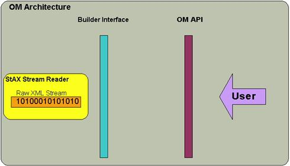
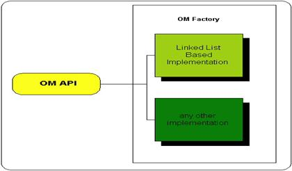

# Documentation – Axiom

## Navigation

- About
  - [Introduction](#index)
  - [Project Team](#team)
- Downloads
  - [Releases](#download)
  - [Source Code](#scm)
- Documentation
  - [Overview](#documentation)
  - [Release notes](#release-notes)
    - [1.2.9](#release-notes-1.2.9)
    - [1.2.10](#release-notes-1.2.10)
    - [1.2.11](#release-notes-1.2.11)
    - [1.2.12](#release-notes-1.2.12)
    - [1.2.13](#release-notes-1.2.13)
    - [1.2.14](#release-notes-1.2.14)
    - [1.2.15](#release-notes-1.2.15)
    - [1.2.16](#release-notes-1.2.16)
    - [1.2.17](#release-notes-1.2.17)
    - [1.2.18](#release-notes-1.2.18)
    - [1.2.19](#release-notes-1.2.19)
    - [1.2.20](#release-notes-1.2.20)
    - [1.2.21](#release-notes-1.2.21)
    - [1.2.22](#release-notes-1.2.22)
    - [1.3.0](#release-notes-1.3.0)
    - [1.4.0](#release-notes-1.4.0)
    - [2.0.0](#release-notes-2.0.0)
  - [Quick start samples](#quickstart-samples)
  - [User guide](#userguide-userguide)
  - [Developer guide](#devguide-devguide)
  - [Design documents](#design)
    - [OSGi integration](#design-osgi-integration)
    - [Fluent builders](#design-fluent-builder)
  - [Articles](#articles)
  - [FAQ](#faq)
- Modules
  - [Implementations](#implementations)
  - [Compatibility classes](#axiom-compat)
  - [Google Truth extension for XML](#testing-xml-truth)
- [1. Introduction](#userguide-ch01)
- [What is Axiom?](#userguide-ch01--d0e21)
- [For whom is this Tutorial?](#userguide-ch01--d0e35)
- [What is Pull Parsing?](#userguide-ch01--d0e48)
- [A Bit of History](#userguide-ch01--d0e62)
- [Features of Axiom](#userguide-ch01--d0e76)
- [Relation with StAX](#userguide-ch01--d0e111)
- [A Bit About Caching](#userguide-ch01--d0e128)
- [Where Does SOAP Come into Play?](#userguide-ch01--d0e135)
- [2. Working with Axiom](#userguide-ch02)
- [Obtaining the Axiom Binary](#userguide-ch02--d0e146)
- [Creating an object model programmatically](#userguide-ch02--d0e183)
- [Creating an object model by parsing an XML document](#userguide-ch02--d0e257)
- [Namespaces](#userguide-ch02--d0e325)
- [Traversing](#userguide-ch02--d0e367)
- [Serializer](#userguide-ch02--serializer)
- [Complete Code for the Axiom based Document Building and Serialization](#userguide-ch02--d0e477)
- [Creating stream readers and writers using StAXUtils](#userguide-ch02--staxutils)
- [Releasing the parser](#userguide-ch02--d0e580)
- [Exception handling](#userguide-ch02--d0e608)
- [3. Advanced Operations with Axiom](#userguide-ch03)
- [Accessing the Pull Parser](#userguide-ch03--d0e672)
- [4. Integrating Axiom into your project](#userguide-ch04)
- [Using Axiom in a Maven 2 project](#userguide-ch04--using-maven2)
- [Applying application wide configuration](#userguide-ch04--d0e729)
- [Changing the default StAX factory settings](#userguide-ch04--factory.properties)
- [Migrating from older Axiom versions](#userguide-ch04--d0e863)
- [5. Common mistakes, problems and anti-patterns](#userguide-ch05)
- [Violating the javax.activation.DataSource contract](#userguide-ch05--d0e873)
- [Issues that “ magically ” disappear](#userguide-ch05--d0e943)
- [The OM-inside-OMDataSource anti-pattern](#userguide-ch05--d0e985)
- [Weak version](#userguide-ch05--d0e988)
- [Strong version](#userguide-ch05--d0e1127)
- [6. Appendix](#userguide-ch06)
- [Program Listing for Build and Serialize](#userguide-ch06--d0e1206)
- [Links](#userguide-ch06--links)
- [References](#userguide-bi01)
- [1. Working with the Axiom source code](#devguide-ch01)
- [Importing the Axiom source code into Eclipse](#devguide-ch01--d0e21)
- [Testing](#devguide-ch01--d0e52)
- [Unit test organization](#devguide-ch01--d0e55)
- [Testing Axiom with different StAX implementations](#devguide-ch01--d0e151)
- [2. Design](#devguide-ch02)
- [General design principles and goals](#devguide-ch02--d0e212)
- [LifecycleManager design (Axiom 1.3)](#devguide-ch02--d0e236)
- [Issues with the LifecycleManager API in Axiom 1.2.x](#devguide-ch02--d0e249)
- [Cleanup strategy for temporary files](#devguide-ch02--d0e361)
- [3. Release process](#devguide-ch03)
- [Release preparation](#devguide-ch03--d0e462)
- [Prerequisites](#devguide-ch03--d0e529)
- [Release](#devguide-ch03--d0e560)
- [Post-release actions](#devguide-ch03--d0e783)
- [A. Appendix](#devguide-apa)
- [Installing IBM's JDK on Debian Linux](#devguide-apa--install.ibm.jdk)
- [Axiom](#index)
- [Introduction](#testing-xml-truth)
- Other pages
  - [Testing](#testing)

## Content

<a id="index"></a>

<!-- source_url: https://ws.apache.org/axiom/index.html -->

<!-- page_index: 1 -->

<a id="index--welcome-to-apache-axiom"></a>

# Welcome to Apache Axiom

The Apache Axiom™ library provides an XML Infoset compliant object model implementation which supports on-demand building of the object tree. It supports a novel "pull-through" model which allows one to turn off the tree building and directly access the underlying pull event stream using the StAX API. It also has built in support for XML Optimized Packaging (XOP) and MTOM, the combination of which allows XML to carry binary data efficiently and in a transparent manner. The combination of these is an easy to use API with a very high performant architecture!

Developed as part of Apache Axis2, Apache Axiom is the core of Apache Axis2. However, it is a pure standalone XML Infoset model with novel features and can be used independently of Apache Axis2.

Apache Axiom, Axiom, Apache, the Apache feather logo, and the Apache Axiom project logo are trademarks of [The Apache Software Foundation](http://apache.org/).

<a id="index--key-features"></a>

# Key Features

- Full XML Infoset compliant XML object model
- StAX based builders with on-demand building and pull-through
- XOP/MTOM support offering direct binary support
- Convenient SOAP Infoset API on top of Axiom
- Two implementations included:
  - Linked list based implementation
  - W3C DOM supporting implementation
- Highly performant

---

<a id="team"></a>

<!-- source_url: https://ws.apache.org/axiom/team.html -->

<!-- page_index: 2 -->

<a id="team--project-team"></a>

# Project Team

A successful project requires many people to play many roles. Some members write code or documentation, while others are valuable as testers, submitting patches and suggestions.

The project team is comprised of Members and Contributors. Members have direct access to the source of a project and actively evolve the code-base. Contributors improve the project through submission of patches and suggestions to the Members. The number of Contributors to the project is unbounded. Get involved today. All contributions to the project are greatly appreciated.

<a id="team--members"></a>

## Members

The following is a list of developers with commit privileges that have directly contributed to the project in one way or another.

| Image | Id | Name | Email | URL | Organization |
| --- | --- | --- | --- | --- | --- |
|  | saminda | Saminda Abeyruwan | [saminda AT wso2.com](mailto:saminda AT wso2.com) | - | WSO2 |
|  | azeez | Afkham Azeez | [azeez AT wso2.com](mailto:azeez AT wso2.com) | - | WSO2 |
|  | > [!NOTE] > chinthaka | Eran Chinthaka | [chinthaka AT wso2.com](mailto:chinthaka AT wso2.com) | <http://www.apache.org/~chinthaka> | WSO2 |
|  | gdaniels | Glen Daniels | [gdaniels AT apache.org](mailto:gdaniels AT apache.org) | - | Sonic Software |
|  | jaliya | Jaliya Ekanayake | [jaliya AT opensource.lk](mailto:jaliya AT opensource.lk) | <http://www.apache.org/~jaliya> | Virtusa / Lanka Software Foundation |
|  | senaka | Senaka Fernando | [senaka AT apache.org](mailto:senaka AT apache.org) | - | WSO2 |
|  | nandana | Nandana Mihindukulasooriya | [nandana AT wso2.com](mailto:nandana AT wso2.com) | - | WSO2 |
|  | ruchith | Ruchith Fernando | [ruchith AT wso2.com](mailto:ruchith AT wso2.com) | - | WSO2 |
|  | thilina | Thilina Gunarathne | [thilina AT wso2.com](mailto:thilina AT wso2.com) | <http://www.apache.org/~thilina> | WSO2 |
|  | chathura | Chathura Herath | [chathura AT opensource.lk](mailto:chathura AT opensource.lk) | <http://www.apache.org/~chathura> | LSF/MIT |
|  | deepal | Deepal Jayasinghe | [deepal AT wso2.com](mailto:deepal AT wso2.com) | <http://www.apache.org/~deepal> | WSO2 |
|  | robertlazarski | Robert Lazarski | [robertlazarski AT gmail.com](mailto:robertlazarski AT gmail.com) | - | Alpha Theory |
|  | chatra | Chatra Nakkawita | [chatra AT WSO2.com](mailto:chatra AT WSO2.com) | - | WSO2 |
|  | hemapani | Srinath Perera | [hemapani AT apache.org](mailto:hemapani AT apache.org) | <http://www.apache.org/~hemapani> | Lanka Software Foundation |
|  | ajith | Ajith Ranabahu | [ajith AT wso2.com](mailto:ajith AT wso2.com) | <http://www.apache.org/~ajith> | WSO2 |
|  | venkat | Venkat Reddy | [vreddyp AT gmail.com](mailto:vreddyp AT gmail.com) | - | Computer Associates |
|  | scheu | Rich Scheuerle | [scheu AT us.ibm.com](mailto:scheu AT us.ibm.com) | - | IBM |
|  | ashu | Ashutosh Shahi | [Ashutosh.Shahi AT ca.com](mailto:Ashutosh.Shahi AT ca.com) | - | Computer Associates |
|  | alek | Aleksander Slominski | [aslom AT cs.indiana.edu](mailto:aslom AT cs.indiana.edu) | - | Indiana University Extreme! Computing Lab |
|  | dims | Davanum Srinivas | [davanum AT gmail.com](mailto:davanum AT gmail.com) | - | IBM |
|  | jaya | Jayachandra Sekhara Rao Sunkara | [jayachandra AT gmail.com](mailto:jayachandra AT gmail.com) | - | Computer Associates |
|  | veithen | Andreas Veithen | [veithen AT google.com](mailto:veithen AT google.com) | <http://veithen.github.io> | Google |
|  | dasarath | Dasarath Weerathunga | [dasarath AT opensource.lk](mailto:dasarath AT opensource.lk) | - | Lanka Software Foundation |
|  | sanjiva | Sanjiva Weerawarana | [sanjiva AT wso2.com](mailto:sanjiva AT wso2.com) | - | WSO2 |

<a id="team--contributors"></a>

## Contributors

The following additional people have contributed to this project through the way of suggestions, patches or documentation.

| Image | Name | Email | Organization |
| --- | --- | --- | --- |
|  | Dharshana Dias | [-](mailto:) | Lanka Software Foundation / University of Moratuwa |
|  | Anushka Kumara | [anushkakumar AT gmail.com](mailto:anushkakumar AT gmail.com) | Lanka Software Foundation / University of Moratuwa |
|  | Chinthaka Thilakarathne | [-](mailto:) | Lanka Software Foundation / University of Moratuwa |
|  | Jochen Wiedmann | [jochen.wiedmann AT gmail.com](mailto:jochen.wiedmann AT gmail.com) | - |

---

<a id="download"></a>

<!-- source_url: https://ws.apache.org/axiom/download.html -->

<!-- page_index: 3 -->

<a id="download--releases"></a>

# Releases

The current release is 2.0.0 and was published on January 27, 2025. The release note for this
release can be found [here](#release-notes-2.0.0).

The following distributions are available for download:

|  | Link | Checksums and signatures |
| --- | --- | --- |
| Binary distribution | [axiom-2.0.0-bin.zip](http://www.apache.org/dyn/closer.lua/ws/axiom/2.0.0/axiom-2.0.0-bin.zip) | [SHA512](https://downloads.apache.org/ws/axiom/2.0.0/axiom-2.0.0-bin.zip.sha512) [PGP](https://downloads.apache.org/ws/axiom/2.0.0/axiom-2.0.0-bin.zip.asc) |
| Source distribution | [axiom-2.0.0-src.zip](http://www.apache.org/dyn/closer.lua/ws/axiom/2.0.0/axiom-2.0.0-src.zip) | [SHA512](https://downloads.apache.org/ws/axiom/2.0.0/axiom-2.0.0-src.zip.sha512) [PGP](https://downloads.apache.org/ws/axiom/2.0.0/axiom-2.0.0-src.zip.asc) |

The signatures of the distributions can be [verified](http://www.apache.org/dev/release-signing#verifying-signature) against the public keys in the [KEYS](https://downloads.apache.org/ws/axiom/KEYS) file.

Distributions for older releases can be found in the archive, either [here](http://archive.apache.org/dist/ws/axiom/) or [here](http://archive.apache.org/dist/ws/commons/axiom/).

All releases are also available as Maven artifacts in the [central repository](http://search.maven.org/#search%7Cga%7C1%7Cg%3A%22org.apache.ws.commons.axiom%22).

---

<a id="scm"></a>

<!-- source_url: https://ws.apache.org/axiom/scm.html -->

<!-- page_index: 4 -->

<a id="scm--overview"></a>

# Overview

This project uses [Git](https://git-scm.com/) to manage its source code. Instructions on Git use can be found at <https://git-scm.com/doc>.

<a id="scm--web-browser-access"></a>

# Web Browser Access

The following is a link to a browsable version of the source repository:

```
https://gitbox.apache.org/repos/asf?p=ws-axiom.git;a=summary
```

<a id="scm--anonymous-access"></a>

# Anonymous Access

The source can be checked out anonymously from Git with this command (See <https://git-scm.com/docs/git-clone>):

```
$ git clone --branch 2.0.0 https://gitbox.apache.org/repos/asf/ws-axiom.git
```

<a id="scm--developer-access"></a>

# Developer Access

Only project developers can access the Git tree via this method (See <https://git-scm.com/docs/git-clone>).

```
$ git clone --branch 2.0.0 https://gitbox.apache.org/repos/asf/ws-axiom.git
```

<a id="scm--access-from-behind-a-firewall"></a>

# Access from Behind a Firewall

Refer to the documentation of the SCM used for more information about access behind a firewall.

---

<a id="documentation"></a>

<!-- source_url: https://ws.apache.org/axiom/documentation.html -->

<!-- page_index: 5 -->

# Documentation – Axiom

The following documentation for the Axiom framework is available:

- A [User Guide](#userguide-userguide) explaining how to use Axiom in your project.
- A [Developer Guide](#devguide-devguide) containing information for committers and contributors.
- The [Javadoc](https://ws.apache.org/axiom/apidocs/index.html) for the Axiom API.

The user and developer guides are also available in PDF format in the binary distribution and as individual Maven artifacts that can be downloaded from the central repository or the Apache snapshot repository.

---

<a id="release-notes"></a>

<!-- source_url: https://ws.apache.org/axiom/release-notes/index.html -->

<!-- page_index: 6 -->

<a id="release-notes--release-notes"></a>

## Release notes

Please select the release from the menu on the left. Release notes for older Axiom versions
can be found in the [source code repository](https://github.com/apache/ws-axiom/tags).

---

<a id="release-notes-1.2.9"></a>

<!-- source_url: https://ws.apache.org/axiom/release-notes/1.2.9.html -->

<!-- page_index: 7 -->

<a id="release-notes-1.2.9--apache-axiom-1.2.9-release-note"></a>

# Apache Axiom 1.2.9 Release Note

Note: Starting with release 1.2.9, Axiom requires Java 1.5. While the API is
still compatible with Java 1.4, Axiom relies on classes from the Java 1.5
runtime environment. Some of its dependencies also require Java 1.5.

Highlights in this release:

- Improved interoperability with StAX implementations other than Woodstox. Axiom now
  detects the StAX implementation that is used and works around interoperability issues.
  In particular, version 1.2.9 solves the longstanding concurrency issue that occurs
  when using Axiom with SJSXP.
- Better control over XMLInputFactory and XMLOutputFactory settings. It is now possible
  to use property files to define application wide default settings for the StAX factories
  used by `StAXUtils`. It is also possible to specify a particular configuration when
  requesting a StAX parser from `StAXUtils`.
- Improved XOP/MTOM handling. Axiom 1.2.9 is able to stream binary/base64 data in several
  situations where this was not possible previously. The behavior of Axiom 1.2.9 is also
  more consistent with respect to XOP encoded data sent to the application, solving
  some issues where attachments were processed incorrectly.
- Improved documentation. There is now more and better Javadoc. Also, a user guide
  is available in HTML and as PDF.
- Better OSGi support.
- Improved consistency of the core interfaces. E.g. `OMDocument` now has a `build`
  method.

Resolved JIRA issues:

- WSCOMMONS-547 apache-release profile not working
- WSCOMMONS-546 axiom unit test failure in axiom-parser-tests
- WSCOMMONS-545 Legal issue related to inclusion of Jaxen source code in Axiom
- WSCOMMONS-541 Create replacement for UUIDGenerator
- WSCOMMONS-540 CustomBuilder interface is not well defined for optimized binary data
- WSCOMMONS-536 OMStAXWrapper generated illegal event code of 0
- WSCOMMONS-535 StreamingOMSerializer drops “xml” prefixes
- WSCOMMONS-534 “prefix cannot be null or empty” with SJSXP
- WSCOMMONS-530 AXIOM DOM implementation of SOAPFaultDetailImpl only serializes the first child node whereas the LLOM implementation serializes all children
- WSCOMMONS-528 Unable to build axiom-api with IBM JDK
- WSCOMMONS-526 SOAPEnvelope toString() behavior inconsistant dependent on content
- WSCOMMONS-518 Some consumers of Axiom need direct access to the orignal parser/XMLStreamReader
- WSCOMMONS-516 Axiom Bundles are “named” the same, appear to be running twice in ServiceMix/Karaf
- WSCOMMONS-513 Behavior of insertSiblingAfter and insertSiblingBefore is not well defined for orphan nodes
- WSCOMMONS-505 Build Error when creating source jar fie on modules that do not have source directory
- WSCOMMONS-502 Backward imcompatibility with Apache Abdera in Axiom 1.2.9-SNAPSHOT
- WSCOMMONS-489 StAXUtils incorrectly assumes that XMLInputFactory and XMLOutputFactory instances are thread safe
- WSCOMMONS-488 The sequence of events produced by OMStAXWrapper with inlineMTOM=false is inconsistent
- WSCOMMONS-487 DataHandler extension should support deferred loading/parsing
- WSCOMMONS-485 The sequence of events produced by OMStAXWrapper for XOP:Include is inconsistent
- WSCOMMONS-483 provide help how to find a datahandler when you see “Cannot get InputStream from DataHandler.javax.activation.UnsupportedDataTypeException: no object DCH for MIME type …”
- WSCOMMONS-481 Add a method to OMFactory to create an OMSourcedElement using a QName
- WSCOMMONS-480 Some of the serialize/serializeAndConsume methods are declared on the wrong interface
- WSCOMMONS-479 OMDocument should have a “build” method
- WSCOMMONS-478 OMChildrenIterator based on local name has bug in isEqual() method
- WSCOMMONS-477 Attachment order is not preserved in Axiom
- WSCOMMONS-462 axiom-api 1.2.8 is missing OSGi Import-Package to javax.xml.stream.util under JDK 1.5
- WSCOMMONS-461 Allow StAXUtils to apply properties to XMLInputFactory and XMLOutputFactory
- WSCOMMONS-457 Build fails on JDK 1.6
- WSCOMMONS-452 Merge org.apache.axis2.format.ElementHelper into org.apache.axiom.om.util.ElementHelper
- WSCOMMONS-446 Serializing an MTOM SOAPEnvelope inlines the attachments
- WSCOMMONS-437 Define a common superinterface for SOAPFaultCode and SOAPFaultSubCode
- WSCOMMONS-435 org.apache.axiom.om.impl.dom.ParentNode.removeChild(Node) is broken
- WSCOMMONS-433 When inlining a DataHandler as Base64, OMTextImpl doesn't stream the data
- WSCOMMONS-432 Make OMAbstractFactory work correctly in an OSGi runtime environment
- WSCOMMONS-417 Clarify the status of the JavaMail dependency
- WSCOMMONS-414 Namespace issue in SOAP message generated
- WSCOMMONS-111 Careless exception handling needs to be fixed

<a id="release-notes-1.2.9--changes-in-this-release"></a>

## Changes in this release

<a id="release-notes-1.2.9--system-properties-used-by-omabstractfactory"></a>

### System properties used by OMAbstractFactory

Prior to Axiom 1.2.9, `OMAbstractFactory` used system properties as defined in the following table
to determine the factory implementations to use:

| Object model | Method | System property | Default |
| --- | --- | --- | --- |
| Plain XML | `getOMFactory()` | `om.factory` | `org.apache.axiom.om.impl.llom.factory.OMLinkedListImplFactory` |
| SOAP 1.1 | `getSOAP11Factory()` | `soap11.factory` | `org.apache.axiom.soap.impl.llom.soap11.SOAP11Factory` |
| SOAP 1.2 | `getSOAP12Factory()` | `soap12.factory` | `org.apache.axiom.soap.impl.llom.soap12.SOAP12Factory` |

This in principle allowed to mix default factory implementations from different implementations of
the Axiom API (e.g. an `OMFactory` from the LLOM implementation and SOAP factories from DOOM). This
however doesn't make sense. The system properties as described above are no longer supported in
1.2.9 and the default Axiom implementation is chosen using the new
`org.apache.axiom.om.OMMetaFactory` system property. For LLOM, you should set:

```
org.apache.axiom.om.OMMetaFactory=org.apache.axiom.om.impl.llom.factory.OMLinkedListMetaFactory
```

This is the default and is equivalent to the defaults in 1.2.8. For DOOM, you should set:

```
org.apache.axiom.om.OMMetaFactory=org.apache.axiom.om.impl.dom.factory.OMDOMMetaFactory
```

<a id="release-notes-1.2.9--factories-returned-by-staxutils"></a>

### Factories returned by StAXUtils

In versions prior to 1.2.9, the `XMLInputFactory` and `XMLOutputFactory` instances returned by
`StAXUtils` were mutable, i.e. it was possible to change the properties of these factories. This is
obviously an issue since the factory instances are cached and can be shared among several thread. To
avoid programming errors, starting from 1.2.9, the factories are immutable and any attempt to change
their state will result in an `IllegalStateException`.

Note that the possibility to change the properties of these factories could be used to apply
application wide settings. Starting with 1.2.9, Axiom has a proper mechanism to allow this.
This feature is described in the [user guide](#userguide-ch04--factory.properties).

<a id="release-notes-1.2.9--changes-in-xop-mtom-handling"></a>

### Changes in XOP/MTOM handling

In Axiom 1.2.8, `XMLStreamReader` instances provided by Axiom could belong to one of three different
categories:

1. `XMLStreamReader` instances delivering plain XML.
2. `XMLStreamReader` instances delivering plain XML and implementing a custom extension to retrieve
   optimized binary data.
3. `XMLStreamReader` instances representing XOP encoded data.

As explained in [AXIOM-255](https://issues.apache.org/jira/browse/AXIOM-255) and [AXIOM-122](https://issues.apache.org/jira/browse/AXIOM-122), in Axiom 1.2.8, the type of stream reader
provided by the API was not always well defined. Sometimes the type of the stream reader even
depended on the state of the Axiom tree (i.e. whether some part of it has been accessed or not).

In release 1.2.9 the behavior of Axiom was changed such that it never delivers XOP encoded data
unless explicitly requested to do so. By default, any `XMLStreamReader` provided by Axiom now
represents plain XML data and optionally implements the `DataHandlerReader` extension to retrieve
optimized binary data. An XOP encoded stream can be requested from the `getXOPEncodedStream` method
in `XOPUtils`.

---

<a id="release-notes-1.2.10"></a>

<!-- source_url: https://ws.apache.org/axiom/release-notes/1.2.10.html -->

<!-- page_index: 8 -->

<a id="release-notes-1.2.10--apache-axiom-1.2.10-release-note"></a>

# Apache Axiom 1.2.10 Release Note

Axiom 1.2.10 is a maintenance release that contains the following improvements:

- Improved DOM compatibility and performance for DOOM. Users running Rampart on Axis2 1.5.2
  may want to upgrade Axiom to 1.2.10 to take advantage of these improvements.
- Improved interoperability with various StAX implementation, in particular
  support for Woodstox 4.0.
- It is now possible to specify a configuration when requesting an `XMLStreamWriter`
  from `StAXUtils`, similarly to what is already possible for `XMLStreamReader` instances.
  This feature is required to support the next Abdera release (see [ABDERA-267](https://issues.apache.org/jira/browse/ABDERA-267)).

---

<a id="release-notes-1.2.11"></a>

<!-- source_url: https://ws.apache.org/axiom/release-notes/1.2.11.html -->

<!-- page_index: 9 -->

<a id="release-notes-1.2.11--apache-axiom-1.2.11-release-note"></a>

# Apache Axiom 1.2.11 Release Note

Axiom 1.2.11 is a maintenance release to support the upcoming Axis2 1.6 release.
It also introduces a couple of new APIs that make it easier to support alternative
Axiom implementations and that eliminate the need to refer to internal Axiom APIs.

Resolved JIRA issues:

- [AXIOM-12] - OMOutputFormat: doSWA and doOptimize should be mutually exclusive…plus we need doOptimizeThreshold
- [AXIOM-24] - OMDocument#serializeAndConsume doesn't consume the document
- [AXIOM-172] - OMChildrenQNameIterator doesn't work correctly if hasNext() is not called before next()
- [AXIOM-274] - Refactor/deprecate MIMEOutputUtils
- [AXIOM-275] - Implement non JavaMail implementation of MultipartWriter
- [AXIOM-313] - Add a new getDocumentElement method to StAXOMBuilder that allows to discard the OMDocument
- [AXIOM-333] - getFirstChildWithName should not read the next element.
- [AXIOM-346] - Enhance OMStAXWrapper/OMNavigator to work with OMDocument objects
- [AXIOM-351] - Links in Javadoc JARs are broken
- [AXIOM-352] - StAXDialectDetector doesn't recognize com.bea.core.weblogic.stax\_1.7.0.0.jar

<a id="release-notes-1.2.11--changes-in-this-release"></a>

## Changes in this release

<a id="release-notes-1.2.11--resurrection-of-the-omxmlbuilderfactory-api"></a>

### Resurrection of the OMXMLBuilderFactory API

Historically, `org.apache.axiom.om.impl.llom.factory.OMXMLBuilderFactory` was used to create Axiom
trees from XML documents. Unfortunately, this class is located in the wrong package and JAR (it is
implementation independent but belongs to LLOM). In Axiom 1.2.10, the standard way to create an
Axiom tree was therefore to instantiate `StAXOMBuilder` or one of its subclasses directly. However, this is not optimal for two reasons:

- It relies on the assumption that every implementation of the Axiom API necessarily uses
  `StAXOMBuilder`. This means that an implementation doesn't have the freedom to provide its own
  builder implementation (e.g. in order to implement some special optimizations).
- `StAXOMBuilder` and its subclasses belong to packages which have `impl` in their names. This
  tends to blur the distinction between the public API and internal implementation classes.

Therefore, in Axiom 1.2.11, a new abstract API for creating builder instances was introduced. It is
again called `OMXMLBuilderFactory`, but located in the `org.apache.axiom.om` package. The methods
defined by this new API are similar to the ones in the original (now deprecated)
`OMXMLBuilderFactory`, so that migration should be easy.

<a id="release-notes-1.2.11--changes-in-the-behavior-of-certain-iterators"></a>

### Changes in the behavior of certain iterators

In Axiom 1.2.10 and previous versions, iterators returned by methods such as
`OMIterator#getChildren()` internally stayed one step ahead of the node returned by the `next()`
method. This meant that sometimes, using such an iterator had the side effect of building elements
that were not intended to be built. In Axiom 1.2.11 this behavior was changed such that `next()` no
longer builds the nodes it returns. In a few cases, this change may cause issues in existing code.
One known instance is the following construct (which was used internally by Axiom itself):

```
while (children.hasNext()) { 
    OMNodeEx omNode = (OMNodeEx) children.next(); 
    omNode.internalSerializeAndConsume(writer); 
}
```

One would expect that the effect of this code is to consume the child nodes. However, in Axiom
1.2.10 this is not the case because `next()` actually builds the node. Note that the code actually
doesn't make sense because once a child node has been consumed, it is no longer possible to retrieve
the next sibling. Since in Axiom 1.2.11 the call to `next()` no longer builds the child node, this
code will indeed trigger an exception.

Another example is the following piece of code which removes all child elements with a given name:

```
Iterator iterator = element.getChildrenWithName(qname);
while (iterator.hasNext()) {
    OMElement child = (OMElement)iterator.next();
    child.detach();
}
```

In Axiom 1.2.10 this works as expected. Indeed, since the iterator stays one node ahead, the current
node can be safely removed using the `detach()` method. In Axiom 1.2.11, this is no longer the case
and the following code (which also works with previous versions) should be used instead:

```
Iterator iterator = element.getChildrenWithName(qname);
while (iterator.hasNext()) {
    iterator.next();
    iterator.remove();
}
```

Note that this is actually compatible with the behavior of the Java 2 collection framework, where a
`ConcurrentModificationException` may be thrown if a thread modifies a collection directly while it
is iterating over the collection with an iterator.

In Axiom 1.2.12, the iterator implementations have been further improved to detect this situation
and to throw a `ConcurrentModificationException`. This enables early detection of problematic usages
of iterators.

---

<a id="release-notes-1.2.12"></a>

<!-- source_url: https://ws.apache.org/axiom/release-notes/1.2.12.html -->

<!-- page_index: 10 -->

<a id="release-notes-1.2.12--apache-axiom-1.2.12-release-note"></a>

# Apache Axiom 1.2.12 Release Note

Axiom 1.2.12 contains fixes for the following JIRA issues:

- [AXIOM-63] - OMXMLStreamReaderValidator incorrectly reports mismatched END\_ELEMENT events
- [AXIOM-305] - Need OMElement.getNamespaceURI() convenience method
- [AXIOM-354] - Potential class loader leak caused by the thread local in org.apache.axiom.util.UIDGenerator
- [AXIOM-356] - OMElement#resolveQName implementations use incorrect algorithm to resolve unprefixed QNames
- [AXIOM-358] - OMStAXWrapper#hasNext may return incorrect value
- [AXIOM-359] - OMProcessingInstructionImpl incorrectly trims the value passed in the constructor
- [AXIOM-364] - Unnecessary cast to byte while scanning for first MIME boundary
- [AXIOM-365] - Add ConcurrentModificationException support to iterators

---

<a id="release-notes-1.2.13"></a>

<!-- source_url: https://ws.apache.org/axiom/release-notes/1.2.13.html -->

<!-- page_index: 11 -->

<a id="release-notes-1.2.13--apache-axiom-1.2.13-release-note"></a>

# Apache Axiom 1.2.13 Release Note

Axiom 1.2.13 contains fixes for over thirty [JIRA issues](http://s.apache.org/axiom-changes-1.2.13) as well as lots of other improvements, mainly related to XOP/MTOM processing, namespace handling, DOM support, documentation and code
quality.

The most prominent change in 1.2.13 is that Axiom no longer uses its own MIME parser, but instead
relies on [Apache James Mime4J](http://james.apache.org/mime4j/) for XOP/MTOM processing. This was done in order to support
streaming of the content of MIME parts in XOP/MTOM messages: they can now be processed without
writing them to memory or disk first. This also applies to the root/SOAP part, which in previous
versions was always read into memory before parsing could start. For more information, see below.

<a id="release-notes-1.2.13--changes-in-this-release"></a>

## Changes in this release

<a id="release-notes-1.2.13--handling-of-illegal-namespace-declarations"></a>

### Handling of illegal namespace declarations

Both XML 1.0 and XML 1.1 forbid binding a namespace prefix to the empty namespace name. Only the
default namespace can have an empty namespace name. In XML 1.0, prefixed namespace bindings may not
be empty, as explained in [section 5 of the Namespaces in XML 1.0 specification](http://www.w3.org/TR/2009/REC-xml-names-20091208/#ns-using):

> In a namespace declaration for a prefix (i.e., where the NSAttName is a PrefixedAttName), the
> attribute value MUST NOT be empty.

In Axiom 1.2.12, the `declareNamespace` methods in `OMElement` didn't enforce this constraint and
namespace declarations violating this requirement were silently dropped during serialization. This
behavior is problematic because it may result in subtle issues such as unbound namespace prefixes.
In Axiom 1.2.13 these methods have been changed so that they throw an exception if an attempt is
made to bind the empty namespace name to a prefix.

In XML 1.1, prefixed namespace bindings may be empty, but rather than binding the empty namespace
name to a prefix, such a namespace declaration “undeclares” the prefix, as explained in [section 5
of the Namespaces in XML 1.1 specification](http://www.w3.org/TR/2006/REC-xml-names11-20060816/#ns-using):

> The namespace prefix, unless it is `xml` or `xmlns`, must have been declared in a namespace
> declaration attribute in either the start-tag of the element where the prefix is used or in an
> ancestor element (i.e. an element in whose content the prefixed markup occurs). Furthermore, the
> attribute value in the innermost such declaration must not be an empty string.

Although the same syntax is used in both cases, adding a namespace declaration to bind a prefix to a
(non empty) namespace URI and adding a namespace declaration to undeclare a prefix are two
fundamentally different operations from the point of view of the application. Therefore, to support
prefix undeclaring for XML 1.1 infosets, a new method `undeclarePrefix` has been added to
`OMElement` in Axiom 1.2.13.

As a corollary of the above, neither XML 1.0 nor XML 1.1 allows creating prefixed elements or
attributes with an empty namespace name. In Axiom 1.2.12, when attempting to create such invalid
information items, the behavior was inconsistent: in some cases, the prefix was silently dropped, in
other cases the invalid information item was actually created, resulting in problems during
serialization. Axiom 1.2.13 consistently throws an exception when an attempt is made to create such
an invalid information item.

<a id="release-notes-1.2.13--omnamespace-normalization"></a>

### OMNamespace normalization

Methods that return an `OMNamespace` object may in principle use two different ways to represent the
absence of a namespace: as a `null` value or as an `OMNamespace` instance that has both prefix and
namespaceURI properties set to the empty string. This applies in particular to
`OMElement#getNamespace()`, `OMElement#getDefaultNamespace()` and `OMAttriute#getNamespace()`. The
API of Axiom 1.2.12 didn't clearly specify which representation was used, although in most cases a
`null` value was used. As a consequence application code had to take into account the possibility
that such methods returned `OMNamespace` instances with an empty prefix and namespace URI.

In Axiom 1.2.13 the situation has been clarified and the aforementioned APIs now always return
`null` to indicate the absence of a namespace. Note that this may have an impact on flawed
application code that doesn't handle `null` in the same way as an `OMNamespace` instance with an
empty prefix and namespace URI. Such application code needs to be fixed to work correctly with Axiom
1.2.13.

<a id="release-notes-1.2.13--new-abstract-apis"></a>

### New abstract APIs

Axiom 1.2.13 introduces a couple of new abstract APIs which give implementations of the Axiom API
the freedom to do additional optimizations. Application code should be migrated to take advantage of
these new APIs:

- Instead of instantiating an `OMSource` object directly, `OMContainer#getSAXSource(boolean)`
  should be used.
- `org.apache.axiom.om.impl.dom.DOOMAbstractFactory` has been deprecated because it ties
  application code that requires an object model factory supporting DOM to a particular Axiom
  implementation (DOOM). Instead use `OMAbstractFactory.getMetaFactory(String)` with
  `OMAbstractFactory.FEATURE_DOM` as parameter value to get a meta factory for an Axiom
  implementation that supports DOM.
- The `DocumentBuilderFactory` implementation provided by DOOM should no longer be instantiated
  directly. Instead, application code should request a meta factory for DOM (see previous item),
  cast it to `DOMMetaFactory` and invoke `newDocumentBuilderFactory` via that interface.

The last two changes imply that `axiom-dom` should no longer be used as a compile time dependency, but only as a runtime dependency.

Also note that some of the superseded APIs may disappear in Axiom 1.3.

<a id="release-notes-1.2.13--usage-of-apache-james-mime4j-as-mime-parser"></a>

### Usage of Apache James Mime4J as MIME parser

Starting with version 1.2.13, Axiom uses [Apache James Mime4J](http://james.apache.org/mime4j/) as MIME parser implementation
instead of its own custom parser implementation. The public API as defined by the `Attachments`
class remains unchanged, with the following exceptions:

- The `getIncomingAttachmentsAsSingleStream` method is no longer supported.
- The `fileThreshold` specified during the construction of the `Attachments` object is now
  interpreted relative to the size of the decoded content of the attachment instead of the size of
  the encoded content. Note that this only makes a difference if the attachment has a content
  transfer encoding other than `binary`.

Several internal classes related to the old MIME parsing code have been removed, are no longer
public or have been changed in an incompatible way:

- `MIMEBodyPartInputStream`
- `BoundaryDelimitedStream`
- `BoundaryPushbackInputStream`
- `MultipartAttachmentStreams`
- `PartFactory` and related classes

Although these classes were public, they are not considered part of the public API. Application code
that depends on these classes needs to be rewritten before upgrading to Axiom 1.2.13.

When upgrading to 1.2.13, projects that use Axiom's XOP/MTOM features must make sure that Apache
James Mime4J is added to the dependencies. For projects that use Maven (or tools that support Maven
repositories and metadata) this happens automatically. Projects that use other build tools must
explicity add the `apache-mime4j-core` library to the list of dependencies.

Axiom uses Mime4J in strict mode. This means that some non conforming MIME messages that would have
been processed successfully by previous Axiom versions may be rejected by Axiom 1.2.13. Please note
that Axiom doesn't make any guarantees about its ability to process invalid messages.

<a id="release-notes-1.2.13--support-for-mime-part-streaming"></a>

### Support for MIME part streaming

Axiom 1.2.13 has support for MIME part streaming. Pre-existing APIs continue to work as documented, but there are some minor changes in behavior that may be visible to code that makes assumptions that
are not covered by the API contract:

- The `DataHandler` instances returned by `Attachments` for MIME parts read from a stream now
  always implement `DataHandlerExt`, while in 1.2.12 this was only the case for parts buffered
  using temporary files. For memory buffered MIME parts, a call to `purgeDataSource` has the
  effect of releasing the allocated memory.

---

<a id="release-notes-1.2.14"></a>

<!-- source_url: https://ws.apache.org/axiom/release-notes/1.2.14.html -->

<!-- page_index: 12 -->

<a id="release-notes-1.2.14--apache-axiom-1.2.14-release-note"></a>

# Apache Axiom 1.2.14 Release Note

Axiom 1.2.14 contains fixes for more than twenty [JIRA issues](http://s.apache.org/axiom-changes-1.2.14) as well as lots of other
improvements.

<a id="release-notes-1.2.14--changes-in-this-release"></a>

## Changes in this release

<a id="release-notes-1.2.14--upgrade-of-woodstox"></a>

### Upgrade of Woodstox

Woodstox 3.2.x is no longer maintained. Starting with version 1.2.14, Axiom depends on Woodstox
4.1.x, although using 3.2.x (and 4.0.x) is still supported. This may have an impact on projects that
use Maven, because the artifact ID used by Woodstox changed from `wstx-asl` to `woodstox-core-asl`.
These projects may need to update their dependencies to avoid depending on two different versions of
Woodstox.

<a id="release-notes-1.2.14--doom-factories-are-now-stateless"></a>

### DOOM factories are now stateless

In contrast to previous versions, the `OMFactory` implementations for DOOM are stateless in Axiom
1.2.14. This makes it easier to write application code that is portable between LLOM and DOOM (in
the sense that code that is known to work with LLOM will usually work with DOOM without changes).
However, this slightly changes the behavior of DOOM with respect to owner documents, which means
that in some cases existing code written for DOOM may trigger `WRONG_DOCUMENT_ERR` exceptions if it
uses the DOM API on a tree created or manipulated using the Axiom API.

For more information about the new semantics, refer to the Javadoc of `DOMMetaFactory` and to
[AXIOM-412](https://issues.apache.org/jira/browse/AXIOM-412).

<a id="release-notes-1.2.14--removal-of-deprecated-classes-from-core-artifacts"></a>

### Removal of deprecated classes from core artifacts

Several deprecated classes have been moved to a new JAR file named `axiom-compat` and are no longer
included in the core artifacts (`axiom-api`, `axiom-impl` and `axiom-dom`). If you rely on these
deprecated classes or get `NoClassDefFoundError`s after upgrading to Axiom 1.2.14, then you need to
add this new JAR to your project's dependencies.

---

<a id="release-notes-1.2.15"></a>

<!-- source_url: https://ws.apache.org/axiom/release-notes/1.2.15.html -->

<!-- page_index: 13 -->

<a id="release-notes-1.2.15--apache-axiom-1.2.15-release-note"></a>

# Apache Axiom 1.2.15 Release Note

Axiom 1.2.15 ships fixes for over a dozen [JIRA issues](http://s.apache.org/axiom-changes-1.2.15) and contains many other improvements, mainly related to consistency between the LLOM and DOOM implementations and how serialization is
performed. In particular the builder is now able to continue building the Axiom tree after an
element has been consumed (see [AXIOM-288](https://issues.apache.org/jira/browse/AXIOM-288)).

<a id="release-notes-1.2.15--changes-in-this-release"></a>

## Changes in this release

<a id="release-notes-1.2.15--removal-of-the-javamail-dependency"></a>

### Removal of the JavaMail dependency

Axiom 1.2.15 no longer uses JavaMail and the corresponding dependency has been removed. If your
project relies on Axiom to introduce JavaMail as a transitive dependency, you need to update your
build.

<a id="release-notes-1.2.15--serialization-changes"></a>

### Serialization changes

In previous Axiom versions, the `serialize` and `serializeAndConsume` methods skipped empty SOAP
`Header` elements. On the other hand, such elements would still appear in the representations
produced by `getXMLStreamReader` and `getSAXSource`. For consistency, starting with Axiom 1.2.15, SOAP `Header` elements are always serialized. This may change the output of existing code, especially code that uses the `getDefaultEnvelope()` defined by `SOAPFactory`. However, it is
expected that this will not break anything because empty SOAP `Header` elements should be ignored by
the receiver.

To avoid producing empty `Header` elements, projects should switch from using `getDefaultEnvelope()`
(in `SOAPFactory`) and `getHeader()` (in `SOAPEnvelope`) to using `createDefaultSOAPMessage()` and
`getOrCreateHeader()`.

For more information, see [AXIOM-430](https://issues.apache.org/jira/browse/AXIOM-430).

<a id="release-notes-1.2.15--introduction-of-aspectj"></a>

### Introduction of AspectJ

The implementation JARs (`axiom-impl` and `axiom-dom`) are now built with [AspectJ](https://eclipse.org/aspectj/) (to reduce
source code duplication) and contain a small subset of classes from the AspectJ runtime library.
There is a small risk that this may cause conflicts with other code that uses AspectJ.

---

<a id="release-notes-1.2.16"></a>

<!-- source_url: https://ws.apache.org/axiom/release-notes/1.2.16.html -->

<!-- page_index: 14 -->

<a id="release-notes-1.2.16--apache-axiom-1.2.16-release-note"></a>

# Apache Axiom 1.2.16 Release Note

Axiom 1.2.16 comes with the following new features:

- `OMSourcedElement` support has been extended to DOOM. This is an important step towards
  full feature parity between LLOM and DOOM.
- Axiom now ships a drop-in replacement for `abdera-parser`, so that the latest Axiom
  version can be used together with Abdera 1.1.3. See [here](https://ws.apache.org/axiom/implementations/fom-impl/index.html) for more details.

In addition, the sources can now be built with Java 8.

A list of other issues fixed in this release can be found [here](http://s.apache.org/axiom-changes-1.2.16).

<a id="release-notes-1.2.16--changes-in-this-release"></a>

## Changes in this release

- The semantics of the `OMInformationItem#getOMFactory()` method have slightly changed in Axiom
  1.2.16. In previous versions, `getOMFactory()` returned the `OMFactory` instance that was used
  to create the information item. This meant that e.g. on an `OMText` node created using a
  `SOAPFactory` instance, that method would return that exact same `SOAPFactory` instance. In
  Axiom 1.2.16, `getOMFactory()` returns the `OMFactory` or `SOAPFactory` instance corresponding
  to the type of information item. For plain XML information items created using one of the
  methods defined by `OMFactory` (such as `OMText`, `OMAttribute`, as well as `OMElement`
  instances that don't implement any SOAP specific interfaces), this will always be the
  `OMFactory` instance returned by `OMMetaFactory#getOMFactory()` (and never a `SOAPFactory`
  instance). For information items created using one of the methods defined by `SOAPFactory` (i.e.
  `OMElement` instances implementing one of the SOAP interfaces, as well as `SOAPMessage`
  instances), nothing changes with respect to previous Axiom versions, and `getOMFactory()` will
  return the `SOAPFactory` instance corresponding to the SOAP version of the information item.

  The rationale for this change is that it allows to eliminate the `factory` attribute from all
  classes (except for the `SOAPMessage` implementations). It also enables significant
  simplification of the internal implementation code.
- Some of the legacy default constructors have been removed from the
  `OMFactory`, `SOAPFactory` and `OMMetaFactory` implementations. Note that they were not part of
  the public API, but considered internal implementation details. Application code should always
  use the `OMAbstractFactory` APIs to get references to factory instances, and never refer to
  implementation classes directly.

---

<a id="release-notes-1.2.17"></a>

<!-- source_url: https://ws.apache.org/axiom/release-notes/1.2.17.html -->

<!-- page_index: 15 -->

<a id="release-notes-1.2.17--apache-axiom-1.2.17-release-note"></a>

# Apache Axiom 1.2.17 Release Note

Axiom 1.2.17 is a maintenance release that contains fixes for [AXIOM-476](https://issues.apache.org/jira/browse/AXIOM-476) and
[AXIOM-477](https://issues.apache.org/jira/browse/AXIOM-477). There are no other significant changes in this release.

---

<a id="release-notes-1.2.18"></a>

<!-- source_url: https://ws.apache.org/axiom/release-notes/1.2.18.html -->

<!-- page_index: 16 -->

<a id="release-notes-1.2.18--apache-axiom-1.2.18-release-note"></a>

# Apache Axiom 1.2.18 Release Note

Axiom 1.2.18 is a maintenance release that contains the following fixes and
improvements:

- The source distribution builds successfully again on Windows.
- Support for large XML documents has been improved ([AXIOM-478](https://issues.apache.org/jira/browse/AXIOM-478)).
- [`fom-impl`](https://ws.apache.org/axiom/implementations/fom-impl/index.html) is now an OSGi bundle ([AXIOM-479](https://issues.apache.org/jira/browse/AXIOM-479) and [AXIOM-480](https://issues.apache.org/jira/browse/AXIOM-480)).

---

<a id="release-notes-1.2.19"></a>

<!-- source_url: https://ws.apache.org/axiom/release-notes/1.2.19.html -->

<!-- page_index: 17 -->

<a id="release-notes-1.2.19--apache-axiom-1.2.19-release-note"></a>

# Apache Axiom 1.2.19 Release Note

Axiom 1.2.19 is a maintenance release that contains some minor changes required
by Axis2 1.7.2.

---

<a id="release-notes-1.2.20"></a>

<!-- source_url: https://ws.apache.org/axiom/release-notes/1.2.20.html -->

<!-- page_index: 18 -->

<a id="release-notes-1.2.20--apache-axiom-1.2.20-release-note"></a>

# Apache Axiom 1.2.20 Release Note

Axiom 1.2.20 is a maintenance release that contains fixes for [AXIOM-485](https://issues.apache.org/jira/browse/AXIOM-485) and
[AXIOM-486](https://issues.apache.org/jira/browse/AXIOM-486).

---

<a id="release-notes-1.2.21"></a>

<!-- source_url: https://ws.apache.org/axiom/release-notes/1.2.21.html -->

<!-- page_index: 19 -->

<a id="release-notes-1.2.21--apache-axiom-1.2.21-release-note"></a>

# Apache Axiom 1.2.21 Release Note

Axiom 1.2.21 is a maintenance release that improves compatibility with Java 9
and marks several APIs as deprecated.

---

<a id="release-notes-1.2.22"></a>

<!-- source_url: https://ws.apache.org/axiom/release-notes/1.2.22.html -->

<!-- page_index: 20 -->

<a id="release-notes-1.2.22--apache-axiom-1.2.22-release-note"></a>

# Apache Axiom 1.2.22 Release Note

Axiom 1.2.22 is a maintenance release containing fixes for
[AXIOM-492](https://issues.apache.org/jira/browse/AXIOM-492), [AXIOM-493](https://issues.apache.org/jira/browse/AXIOM-493) and
[AXIOM-494](https://issues.apache.org/jira/browse/AXIOM-494).

---

<a id="release-notes-1.3.0"></a>

<!-- source_url: https://ws.apache.org/axiom/release-notes/1.3.0.html -->

<!-- page_index: 21 -->

<a id="release-notes-1.3.0--apache-axiom-1.3.0-release-note"></a>

# Apache Axiom 1.3.0 Release Note

<a id="release-notes-1.3.0--changes-in-this-release"></a>

## Changes in this release

- Axiom now requires at least Java 7:

  - Explicit dependencies on APIs that were not part of the JRE in Java 5
    (Activation, StAX and JAXB) have been removed.
  - The public API now uses generics. Note that this should in general not
    have impact on binary compatibility with Axiom 1.2.x.
- In Axiom 1.2.x several APIs were using `Object` as argument/return type
  although they expect/return a `DataHandler`. This is a legacy of Axis 1.x
  where the Activation API was an optional dependency. This no longer makes
  sense:

  - In Java 6, the Activation API is part of the JRE.
  - It is unlikely that Axiom actually works if the Activation API is not
    available: there is nothing in the build that enforces or tests that,
    and there are no known downstream projects that use Axiom without also
    depending on the Activation API.

  In Axiom 1.3.0, the following APIs have been changed to use `DataHandler`
  instead of `Object`:

  - `OMText.getDataHandler()`
  - `OMFactory.createOMText(Object, boolean)`

  Bridge methods have been added to ensure binary compatibility with Axiom
  1.2.x.
- By default, parsers created by Axiom are now non coalescing and have CDATA
  section reporting enabled.
- The builder implementations and related classes have been removed from the
  `org.apache.axiom.om.impl.builder` and `org.apache.axiom.soap.impl.builder`
  packages. This includes the `StAXBuilder`, `StAXOMBuilder`,
  `XOPAwareStAXOMBuilder`, `StAXSOAPModelBuilder` and `MTOMStAXSOAPModelBuilder`
  classes.

  This change was necessary to enable a refactoring and complete overhaul of
  the builders.

  As explained in the Axiom 1.2.11 release notes, application code
  should use the `OMXMLBuilderFactory` API to create builders. Code written for
  Axiom 1.2.x that uses that API remains compatible with Axiom 1.3.x.
- The `detach` method no longer causes the node to be built. This change was
  made possible by the new builder design.
- Several methods have been removed from the `OMXMLParserWrapper` interface.
  This includes formerly deprecated methods as well as methods that would
  allow manipulation of the state of the underlying parser.
- The `BuilderAwareReader` API introduced by [AXIOM-268](https://issues.apache.org/jira/browse/AXIOM-268) has been removed
  without replacement. There are multiple reasons for this:

  - The only method defined by the `BuilderAwareReader` interface has a
    parameter of type `StAXBuilder`, but that class has been removed from
    the public API (see above). The parameter type would have to be changed
    to `OMXMLParserWrapper`.
  - If the interface is considered a public API, then it is placed in the
    wrong package (`org.apache.axiom.om.impl.builder`).
  - There are no known usages of that API.
  - The API is merely a convenience, but doesn't provide any additional
    feature: since a builder only starts consuming the `XMLStreamReader` on
    demand, a reference to the builder can be injected into the custom
    “builder aware” reader after the builder has been created.

- Some (most? all?) of the classes in `axiom-compat` have been removed.
- Support for the `SOAPConstants.SOAPBODY_FIRST_CHILD_ELEMENT_QNAME` property
  introduced by [AXIOM-282](https://issues.apache.org/jira/browse/AXIOM-282) has been retired.

- The legacy behavior for `getChildrenWithName` implemented by [AXIOM-11](https://issues.apache.org/jira/browse/AXIOM-11)
  is no longer supported. In Axiom 1.3.0 the QName matching is always strict.

- The legacy behavior for `declareNamesapce` (where an empty prefix is
  interpreted in the same way as a null value) is no longer supported.
  See [AXIOM-375](https://issues.apache.org/jira/browse/AXIOM-375).
- Elements no longer store line number information, and the corresponding
  methods on the `OMElement` interface have been deprecated.
- The `CustomBuilder` and `CustomBuilderSupport` interfaces have changed in
  an incompatible way. Note that this API was designed to enable some very
  specific optimizations in Axis2, so that this change should have limited
  impact.

  In addition to the interface changes, the API no longer gives access to the
  raw `XMLStreamReader` returned by the StAX implementation. That feature was
  originally introduced to allow negotiation of additional optimizations
  between proprietary StAX and JAXB implementations from a particular vendor.
  That feature is no longer necessary and has been removed to allow a
  simplification of the builder design.
- In Axiom 1.2.x, `StAXUtils` by default kept per class loader maps of
  `XMLInputFactory` and `XMLOutputFactory` instances (where the key was the
  thread context class loader). These maps were implemented as
  `WeakHashMap<ClassLoader,XMLInputFactory>` and `WeakHashMap<ClassLoader,XMLOutputFactory>`.
  The problem with this approach is that it may cause a class loader leak if
  the `XMLInputFactory` or `XMLOutputFactory` instance has a strong reference
  to the `ClassLoader` used as key. That case occurs in two scenarios:

  1. A StAX implementation is loaded by a class loader that is neither the
     class loader that loads StAXUtils nor one of its parent class loaders,
     and that class loader is set as the context class loader when
     `StAXUtils` is used. Note that this is basically the use case for which
     the per class loader maps were originally designed.
  2. For whatever reason, the `XMLInputFactory`/`XMLOutputFactory` instance
     keeps a strong reference to the thread context class loader set when
     the instance was created. In that scenario, if `StAXUtils` is used with
     a thread context class loader that is set to any class loader other than
     the one that loaded `StAXUtils` or one of its parents, then `StAXUtils`
     will prevent that class loader from being garbage collected. This type
     of behavior has been [reported](http://markmail.org/message/2kfstgjckrgiimmt)
     for the default StAX implementation in the Oracle JRE; Woodstox is
     probably not affected.

  The scenario for which the per class loader feature was designed is probably
  very rare. As shown above, that scenario is always prone to class loader
  leaks. Therefore this feature has been removed without replacement in Axiom
  1.3.0, and `StAXUtils` now always loads the StAX implementation visible to
  its own class loader. Note that this mode was already supported in Axiom
  1.2.x, but it was not the default.
- The `getNodeValue` and `setNodeValue` methods have been removed from the
  `SOAPFaultNode` interface because they conflict with methods defined by
  DOM's `Node` interface. Note that these methods were already deprecated in
  Axiom 1.2.x, with alternative methods being available.
- The `SOAPFaultCode` implementations for SOAP 1.2 no longer override the
  `getTextAsQName` method (which was an undocumented feature used by Axis2).
  Use the `getValueAsQName` to retrieve the fault code value in a version
  independent manner.
- In Axiom 1.2.x the `SOAPMessage` and `SOAPEnvelope` implementations had
  special serialization logic, causing the serialization of a `SOAPEnvelope`
  to emit an XML declaration by default and the serialization of a
  `SOAPMessage` to skip all content in the prolog and epilog. This behavior
  was completely undocumented and violates basic object oriented design
  principles: although `SOAPMessage` is an `OMDocument` and `SOAPEnvelope` is
  an `OMElement`, they didn't behave in the same way as `OMDocument` and
  `OMElement` when it comes to serialization. This in turn led to an awkward
  design. This special serialization logic has been removed in Axiom 1.3 and
  `SOAPMessage` and `SOAPEnvelope` now have the same behavior as any other
  `OMDocument` and `OMElement`. The main implication is that the serialization
  of a `SOAPEnvelope` no longer generates an XML declaration. This change also
  fixes [AXIOM-474](https://issues.apache.org/jira/browse/AXIOM-474).
- In Axiom 1.3.0, the `getBuilder` method always returns `null` for document
  and elements that are (locally) complete, i.e. for which the end event has
  been processed. That means that after completion, nodes created by a builder
  will be indistinguishable from programmatically created nodes.
- The `OMXMLStreamReader` interface has been removed because all if its
  usages were already deprecated in 1.2.x.
- Support for the legacy `XMLStreamReader` extension for optimized base64
  handling has been removed. The only supported mechanism in Axiom 1.3.x is
  defined by the `DataHandlerReader` API.
- The `MimePartProvider` interface has been moved to `org.apache.axiom.mime`.
- The `MTOMXMLStreamWriter` class is now abstract. It is not meant to be
  instantiated by code outside of Axiom; the Javadoc of the `OMDataSource`
  interface describes the only supported interactions with the
  `MTOMXMLStreamWriter` API.
- The `XMLStreamWriterFilter` API and the support for it in `OMOutputFormat`
  and `MTOMXMLStreamWriter` have been removed. There are multiple reasons for
  this:

  - Since `MTOMXMLStreamWriter` is now an abstract class, it is possible to
    create `MTOMXMLStreamWriter` wrappers to achieve essentially the same
    result as installing an `XMLStreamWriterFilter` on an
    `MTOMXMLStreamWriter`.
  - The API violated the API layering because `XMLStreamWriterFilter` was
    part of a utility package (`org.apache.axiom.om.util`), but used in the
    interface of a core API, namely `org.apache.axiom.om.OMOutputFormat`.
  - An `XMLStreamWriterFilter` specified using `OMOutputFormat` was applied
    only when serializing to an `OutputStream`, but not to a `Writer` or
    `XMLStreamWriter`.
  - The implementation had insufficient test coverage. In particular, the
    `setFilter` and `removeFilter` methods in `MTOMXMLStreamWriter` had
    no coverage at all.
  - Since the same `XMLStreamWriterFilter` instance can't be used
    concurrently, the presence of a property of that type in
    `OMOutputFormat` makes that class thread unsafe.
- The `axiom-c14n` artifact has been removed without replacement. Use DOOM
  together with [Apache Santuario](http://santuario.apache.org/) instead.

---

<a id="release-notes-1.4.0"></a>

<!-- source_url: https://ws.apache.org/axiom/release-notes/1.4.0.html -->

<!-- page_index: 22 -->

<a id="release-notes-1.4.0--apache-axiom-1.4.0-release-note"></a>

# Apache Axiom 1.4.0 Release Note

Axiom 1.4.0 fixes some regressions identified in Axiom 1.3.0:
[AXIOM-508](https://issues.apache.org/jira/browse/AXIOM-508), [AXIOM-509](https://issues.apache.org/jira/browse/AXIOM-509) and
[AXIOM-512](https://issues.apache.org/jira/browse/AXIOM-512).

It also features a reorganization of internal code. This should not affect code
that uses Axiom, unless it refers to internal implementation classes, in which
case that code should be fixed so that it only uses supported interfaces.

Finally, Axiom 1.4.0 also changes the minimum required Java version to 1.8.

---

<a id="release-notes-2.0.0"></a>

<!-- source_url: https://ws.apache.org/axiom/release-notes/2.0.0.html -->

<!-- page_index: 23 -->

<a id="release-notes-2.0.0--apache-axiom-2.0.0-release-note"></a>

# Apache Axiom 2.0.0 Release Note

Axiom 2 introduces breaking changes to remove the dependency of `axiom-api` on classes in the
`javax.activation` package, in particular `DataHandler`:

- Some classes that depend on `javax.activation` have been moved into a separate `axiom-javax-activation`
  JAR. In some cases the package name has also been changed to avoid split packages. If you
  encounter a missing class during migration, check whether that class exists in `axiom-javax-activation`
  and update dependencies and package names as needed.
- The legacy `Attachments` API has been moved into a separate `axiom-legacy-attachments` JAR. This
  API is still used by Axis2, but new code should use `MultipartBody` instead. The (previously
  deprecated) methods in `OMXMLBuilderFactory` that refer to `Attachments` have been removed. To
  continue using the `Attachments` class, call the `getMultipartBody` method and pass the result to
  `OMXMLBuilderFactory`.
- Because of these changes the XOP/MTOM serializer no longer infers the content type and content
  transfer encoding of non-root parts from (`Blob` wrapped) `DataHandler` objects linked to `OMText`
  nodes by default. This behavior now needs to be enabled explicitly by setting the
  `ContentTypeProvider` and `ContentTransferEncodingPolicy` on the `OMOutputFormat` to
  `DataHandlerContentTypeProvider.INSTANCE` and `ConfigurableDataHandler.CONTENT_TRANSFER_ENCODING_POLICY`
  respectively.
- APIs that have been updated to remove the dependency on `DataHandler` have also been changed to
  make use of `ContentType` instead of `String` where this is relevant.

Jira issues completed for 2.0.0:

<a id="release-notes-2.0.0--bug"></a>

## Bug

- [[AXIOM-516](https://issues.apache.org/jira/browse/AXIOM-516)] - Recent Axiom versions serialize character references differently
- [[AXIOM-518](https://issues.apache.org/jira/browse/AXIOM-518)] - AXIOM DOAP file has a parsing error
- [[AXIOM-519](https://issues.apache.org/jira/browse/AXIOM-519)] - NullPointerException after using setOptimize(true) on a plain OMText node

<a id="release-notes-2.0.0--improvement"></a>

## Improvement

- [[AXIOM-506](https://issues.apache.org/jira/browse/AXIOM-506)] - Upgrade to org.glassfish 3.0.1 and jakarta packages

---

<a id="quickstart-samples"></a>

<!-- source_url: https://ws.apache.org/axiom/quickstart-samples.html -->

<!-- page_index: 24 -->

<a id="quickstart-samples--quick-start-samples"></a>

# Quick Start Samples

Content:

- [Quick Start Samples](#quickstart-samples--quick_start_samples)
  - [Adding Axiom as a Maven dependency](#quickstart-samples--adding_axiom_as_a_maven_dependency)
  - [Parsing and processing an XML document](#quickstart-samples--parsing_and_processing_an_xml_document)
  - [Schema validation using javax.xml.validation](#quickstart-samples--schema_validation_using_javax.xml.validation)
  - [Loading local chunks from a large XML document](#quickstart-samples--loading_local_chunks_from_a_large_xml_document)
  - [Processing MTOM messages](#quickstart-samples--processing_mtom_messages)
  - [Logging MTOM messages without inlining optimized binary data](#quickstart-samples--logging_mtom_messages_without_inlining_optimized_binary_data)

<a id="quickstart-samples--adding-axiom-as-a-maven-dependency"></a>

## Adding Axiom as a Maven dependency

To use Axiom in a project built using Maven, add the following dependencies:

```
<dependency>
    <groupId>org.apache.ws.commons.axiom</groupId>
    <artifactId>axiom-api</artifactId>
    <version>2.0.0</version>
</dependency>
<dependency>
    <groupId>org.apache.ws.commons.axiom</groupId>
    <artifactId>axiom-impl</artifactId>
    <version>2.0.0</version>
    <scope>runtime</scope>
</dependency>
```

Note that the `axiom-impl` dependency is added in scope `runtime`
because application code should not refer to implementation classes directly.
All Axiom features are accessible through the public API which is provided
by `axiom-api`.

If the application code requires a DOM compliant Axiom implementation, then the following dependency needs to be added too:

```
<dependency>
    <groupId>org.apache.ws.commons.axiom</groupId>
    <artifactId>axiom-dom</artifactId>
    <version>2.0.0</version>
    <scope>runtime</scope>
</dependency>
```

<a id="quickstart-samples--parsing-and-processing-an-xml-document"></a>

## Parsing and processing an XML document

The following sample shows how to parse and process an XML document using Axiom.
It is pretty much self-explaining:

```
    public void processFile(File file) throws IOException, OMException {
        // Create a builder for the file and get the root element
        InputStream in = new FileInputStream(file);
        OMElement root = OMXMLBuilderFactory.createOMBuilder(in).getDocumentElement();

        // Process the content of the file
        OMElement urlElement =
                root.getFirstChildWithName(new QName("http://maven.apache.org/POM/4.0.0", "url"));
        if (urlElement == null) {
            System.out.println("No <url> element found");
        } else {
            System.out.println("url = " + urlElement.getText());
        }

        // Because Axiom uses deferred parsing, the stream must be closed AFTER
        // processing the document (unless OMElement#build() is called)
        in.close();
    }
```

<a id="quickstart-samples--schema-validation-using-javax.xml.validation"></a>

## Schema validation using javax.xml.validation

This sample demonstrates how to validate a part of an Axiom tree (actually the body of a SOAP message)
using the `javax.xml.validation` API:

```
    public void validate(InputStream in, URL schemaUrl) throws Exception {
        SOAPModelBuilder builder = OMXMLBuilderFactory.createSOAPModelBuilder(in, "UTF-8");
        SOAPEnvelope envelope = builder.getSOAPEnvelope();
        OMElement bodyContent = envelope.getBody().getFirstElement();
        SchemaFactory schemaFactory = SchemaFactory.newInstance(XMLConstants.W3C_XML_SCHEMA_NS_URI);
        Schema schema = schemaFactory.newSchema(schemaUrl);
        Validator validator = schema.newValidator();
        validator.validate(bodyContent.getSAXSource(true));
    }
```

It leverages the fact that Axiom is capable of constructing a `SAXSource` from an `OMDocument`
or `OMElement`.

Alternatively, one can use a DOM compliant Axiom implementation and use a
`DOMSource` to pass the XML fragment to the validator:

```
    public void validateUsingDOM(InputStream in, URL schemaUrl) throws Exception {
        OMMetaFactory mf = OMAbstractFactory.getMetaFactory(OMAbstractFactory.FEATURE_DOM);
        SOAPModelBuilder builder = OMXMLBuilderFactory.createSOAPModelBuilder(mf, in, "UTF-8");
        SOAPEnvelope envelope = builder.getSOAPEnvelope();
        OMElement bodyContent = envelope.getBody().getFirstElement();
        SchemaFactory schemaFactory = SchemaFactory.newInstance(XMLConstants.W3C_XML_SCHEMA_NS_URI);
        Schema schema = schemaFactory.newSchema(schemaUrl);
        Validator validator = schema.newValidator();
        validator.validate(new DOMSource((Element) bodyContent));
    }
```

<a id="quickstart-samples--loading-local-chunks-from-a-large-xml-document"></a>

## Loading local chunks from a large XML document

Here the goal is to process a large XML document “by chunks”, i.e.

1. Parse the file and find a relevant element (e.g. by name)
2. Load this element into memory as an `OMElement`.
3. Process the `OMElement` (the “chunk”).

The process is repeated until the end of the document is reached.

This can be achieved without loading the entire document into memory (and without loading all the
chunks in memory) by scanning the document using the StAX API and switching to Axiom when a
matching element is found:

```
    public void processFragments(InputStream in) throws XMLStreamException {
        // Create an XMLStreamReader without building the object model
        XMLStreamReader reader =
                OMXMLBuilderFactory.createOMBuilder(in).getDocument().getXMLStreamReader(false);
        while (reader.hasNext()) {
            if (reader.getEventType() == XMLStreamReader.START_ELEMENT
                    && reader.getName().equals(new QName("tag"))) {
                // A matching START_ELEMENT event was found. Build a corresponding OMElement.
                OMElement element =
                        OMXMLBuilderFactory.createStAXOMBuilder(reader).getDocumentElement();
                // Make sure that all events belonging to the element are consumed so
                // that the XMLStreamReader points to a well defined location (namely the
                // event immediately following the END_ELEMENT event).
                element.build();
                // Now process the element.
                processFragment(element);
            } else {
                reader.next();
            }
        }
    }
```

The code leverages the fact that `createStAXOMBuilder` can be used to build a fragment
(corresponding to a given element) from a StAX stream reader, simply by passing an
`XMLStreamReader` that is positioned on a `START_ELEMENT` event.

<a id="quickstart-samples--processing-mtom-messages"></a>

## Processing MTOM messages

This sample shows how to process MTOM messages with Axiom. The code actually sends a request to
the following JAX-WS service:

```
@WebService(targetNamespace = "urn:test") @MTOM public class MTOMService {@WebMethod @WebResult(name = "content") public DataHandler retrieveContent(@WebParam(name = "fileId") String fileId) {return new DataHandler(new URLDataSource(MTOMService.class.getResource("test.txt")));}}
```

It then extracts the binary content from the response and writes it to a given `OutputStream`:

```
    public void retrieveContent(URL serviceURL, String id, OutputStream result) throws Exception {
        // Build the SOAP request
        SOAPFactory soapFactory = OMAbstractFactory.getSOAP11Factory();
        SOAPEnvelope request = soapFactory.getDefaultEnvelope();
        OMElement retrieveContent =
                soapFactory.createOMElement(
                        new QName("urn:test", "retrieveContent"), request.getBody());
        OMElement fileId = soapFactory.createOMElement(new QName("fileId"), retrieveContent);
        fileId.setText(id);

        // Use the java.net.URL API to connect to the service and send the request
        URLConnection connection = serviceURL.openConnection();
        connection.setDoOutput(true);
        OMOutputFormat format = new OMOutputFormat();
        format.setDoOptimize(true);
        format.setCharSetEncoding("UTF-8");
        connection.addRequestProperty("Content-Type", format.getContentType());
        OutputStream out = connection.getOutputStream();
        request.serialize(out, format);
        out.close();

        // Get the SOAP response
        InputStream in = connection.getInputStream();
        MultipartBody multipartBody =
                MultipartBody.builder()
                        .setInputStream(in)
                        .setContentType(connection.getContentType())
                        .build();
        SOAPEnvelope response =
                OMXMLBuilderFactory.createSOAPModelBuilder(multipartBody).getSOAPEnvelope();
        OMElement retrieveContentResponse = response.getBody().getFirstElement();
        OMElement content = retrieveContentResponse.getFirstElement();
        // Extract the Blob representing the optimized binary data
        Blob blob = ((OMText) content.getFirstOMChild()).getBlob();
        // Stream the content of the MIME part
        InputStream contentStream = ((PartBlob) blob).getPart().getInputStream(false);
        // Write the content to the result stream
        IOUtils.copy(contentStream, result);
        contentStream.close();

        in.close();
    }
```

The sample code shows that in order to parse an MTOM message one first needs to construct an
`MultipartBody` object that is then passed to the relevant method in `OMXMLBuilderFactory`.
In the object model, an XOP/MTOM attachment is represented as an `OMText` node for which `isBinary()` returns
`true`. Such a node is created for each `xop:Include` element in the original message.
The binary data is stored in a `DataHandler` object that can be obtained by a call to the
`getDataHandler()` method of the `OMText` node.

By default attachments are loaded into memory, but the `MultipartBody` can be configured to buffer
data on disk. The sample actually shows an alternative method to reduce the
memory footprint of the MTOM processing, which is to enable streaming.

<a id="quickstart-samples--logging-mtom-messages-without-inlining-optimized-binary-data"></a>

## Logging MTOM messages without inlining optimized binary data

A common way to log a SOAP message is to invoke the `toString` method on the corresponding `SOAPEnvelope`
object and send the result to the logger. However, this is problematic for MTOM messages because the
`toString` method will always serialize the message as plain XML and therefore inline optimized
binary data using base64 encoding.

Except for this particular use case, serializing a message using MTOM without actually producing
the MIME parts for the binary data is not meaningful and is therefore not directly supported by
the Axiom API. The solution is to use a custom `XMLStreamWriter` implementation that uses an
Axiom specific extension to accept `DataHandler` objects and replaces them by some
placeholder text:

```
public class LogWriter extends XMLStreamWriterWrapper implements BlobWriter {public LogWriter(XMLStreamWriter parent) {super(parent);}
@Override public Object getProperty(String name) throws IllegalArgumentException {if (name.equals(BlobWriter.PROPERTY)) {return this; } else {return super.getProperty(name);}}
@Override public void writeBlob(Blob blob, String contentID, boolean optimize) throws IOException, XMLStreamException {super.writeCharacters("[base64 encoded data]");}
@Override public void writeBlob(BlobProvider blobProvider, String contentID, boolean optimize) throws IOException, XMLStreamException {super.writeCharacters("[base64 encoded data]");}}
```

The following code shows how this class would be used to log the MTOM message:

```
    private void logMessage(SOAPEnvelope env) throws XMLStreamException {
        StringWriter sw = new StringWriter();
        XMLStreamWriter writer =
                new LogWriter(XMLOutputFactory.newInstance().createXMLStreamWriter(sw));
        env.serialize(writer);
        writer.flush();
        log.info("Message: " + sw.toString());
    }
```

---

<a id="userguide-userguide"></a>

<!-- source_url: https://ws.apache.org/axiom/userguide/userguide.html -->

<!-- page_index: 25 -->

# Axiom User Guide

Axiom User Guide

[Next](#userguide-ch01)

---

<a id="userguide-userguide--axiom-user-guide"></a>

# Axiom User Guide

2.0.0

> [!NOTE]
> **http://www.apache.org/licenses/LICENSE-2.0**
> Licensed to the Apache Software Foundation (ASF) under one or more contributor license agreements. See
> the NOTICE file distributed with this work for additional information regarding copyright ownership. The
> ASF licenses this file to you under the Apache License, Version 2.0 (the "License"); you may not use
> this file except in compliance with the License. You may obtain a copy of the License at
>
> Unless required by applicable law or agreed to in writing, software distributed under the License is
> distributed on an "AS IS" BASIS, WITHOUT WARRANTIES OR CONDITIONS OF ANY KIND, either express or
> implied. See the License for the specific language governing permissions and limitations under the
> License.

---

**List of Figures**

1.1. [Architecture overview](#userguide-ch01--d0e105)

2.1. [The Axiom API with different implementations](#userguide-ch02--fig_api)

**List of Examples**

2.1. [Creating an object model programmatically](#userguide-ch02--list2)

2.2. [Usage of `addChild`](#userguide-ch02--ex-addchild)

2.3. [Creating an object model from an input stream](#userguide-ch02--list1)

2.4. [Creating an OM document with namespaces](#userguide-ch02--list6)

5.1. [`DataSource` implementation that violates the interface contract](#userguide-ch05--inputstreamdatasource)

5.2. [`OMDataSource#getReader()` implementation used in older ADB versions](#userguide-ch05--adb-getreader)

---

[Next](#userguide-ch01)

Chapter 1. Introduction

---

<a id="devguide-devguide"></a>

<!-- source_url: https://ws.apache.org/axiom/devguide/devguide.html -->

<!-- page_index: 26 -->

# Axiom Developer Guide

Axiom Developer Guide

[Next](#devguide-ch01)

---

<a id="devguide-devguide--axiom-developer-guide"></a>

# Axiom Developer Guide

2.0.0

> [!NOTE]
> **http://www.apache.org/licenses/LICENSE-2.0**
> Licensed to the Apache Software Foundation (ASF) under one or more contributor license agreements. See
> the NOTICE file distributed with this work for additional information regarding copyright ownership. The
> ASF licenses this file to you under the Apache License, Version 2.0 (the "License"); you may not use
> this file except in compliance with the License. You may obtain a copy of the License at
>
> Unless required by applicable law or agreed to in writing, software distributed under the License is
> distributed on an "AS IS" BASIS, WITHOUT WARRANTIES OR CONDITIONS OF ANY KIND, either express or
> implied. See the License for the specific language governing permissions and limitations under the
> License.

---

---

[Next](#devguide-ch01)

Chapter 1. Working with the Axiom source code

---

<a id="design"></a>

<!-- source_url: https://ws.apache.org/axiom/design/index.html -->

<!-- page_index: 27 -->

<a id="design--design-documents"></a>

# Design documents

| Title/link | Status |
| --- | --- |
| [OSGi integration and separation between API and implementation](#design-osgi-integration) | Implemented |
| [Fluent builders](#design-fluent-builder) | Implemented |

---

<a id="design-osgi-integration"></a>

<!-- source_url: https://ws.apache.org/axiom/design/osgi-integration.html -->

<!-- page_index: 28 -->

<a id="design-osgi-integration--osgi-integration-and-separation-between-api-and-implementation"></a>

# OSGi integration and separation between API and implementation

<a id="design-osgi-integration--introduction"></a>

## Introduction

This section addresses two related architectural questions:

- OSGi support was originally introduced in Axiom 1.2.9, but the implementation had
  a couple of flaws. This section discusses the rationale behind the new OSGi
  support introduced in Axiom 1.2.13.
- Axiom is designed as a set of abstract APIs for which two implementations are
  provided: LLOM and DOOM. It is important to make a clear distinction between what
  is part of the public API and what should be considered implementation classes that
  must not be used by application code directly. This also implies that Axiom must
  provide the necessary APIs to allow application code to access all features without
  the need to access implementation classes directly. This section in particular
  discusses the question how application code can request factories that support DOM
  without the need to refer directly to DOOM.

These two questions are closely related because OSGi allows to enforce the distinction
between public API and implementation classes by carefully selecting the packages
exported by the different bundles: only classes belonging to the public API
should be exported, while implementation classes should be private to the bundles
containing them. This in turn has implications for the packaging of these artifacts.

<a id="design-osgi-integration--requirements"></a>

## Requirements

**Requirement 1**: *The Axiom artifacts SHOULD be usable both as normal JAR files and as OSGi bundles.*

The alternative would be to produce two sets of artifacts during the build. This
should be avoided in order to keep the build process as simple as possible.
It should also be noted that the Geronimo Spec artifacts also meet this requirement.

**Requirement 2**: *All APIs defined by the `axiom-api` module, and in particular the
`OMAbstractFactory` API MUST continue to work as expected in an OSGi environment, so that code
in downstream projects doesn't need to be rewritten.*

This requirement was already satisfied by the OSGi support introduced in Axiom 1.2.9.
It therefore also ensures that the transition to the new OSGi support in Axiom 1.2.13
is transparent for applications that already use Axiom in an OSGi container.

**Requirement 3**: *`OMAbstractFactory` MUST select the same implementation
regardless of the type of container (OSGi or non OSGi). The only exception is
related to the usage of system properties to specify the default `OMMetaFactory`
implementation: in an OSGi environment, selecting an implementation class using
a system property is not meaningful.*

**Requirement 4**: *Only classes belonging to the public API should be exported by the OSGi bundles.
Implementation classes should not be exported. In particular, the bundles for the LLOM and DOOM implementations MUST NOT export any packages.
This is required to keep a clean separation between the public API and implementation
specific classes and to make sure that the implementations can be modified without the
risk of breaking existing code.
An exception MAY be made for factory classes related to foreign APIs, such as the
`DocumentBuilderFactory` implementation for an Axiom implementation
supporting DOM.*

When the Axiom artifacts are used as normal JAR files in a Maven build, this requirement implies that
they should be used in scope `runtime`.

Although this requirement is easy to implement for the Axiom project, it requires
changes to downstreams project to make this actually work:

- As explained in [AXIS2-4902](https://issues.apache.org/jira/browse/AXIS2-4902),
  there used to be many places in Axis2 that still referred directly to Axiom implementation classes.
  The same was true for Rampart and Sandesha2. This has now been fixed and all three projects
  use `axiom-impl` and `axiom-dom` as dependencies in scope
  `runtime`.
- Abdera extends the LLOM implementation. Probably, some `maven-shade-plugin`
  magic will be required here to create Abdera OSGi bundles that work properly with
  the Axiom bundles.
- For Spring Web Services this issue is addressed by
  [SWS-822](https://jira.springsource.org/browse/SWS-822).

**Requirement 5**: *It MUST be possible to use a non standard (third party) Axiom implementation as a drop-in replacement
for the standard LLOM and DOOM implementation, i.e. the `axiom-impl`
and `axiom-dom` bundles. It MUST be possible to replace `axiom-impl`
(resp. `axiom-dom`) by any Axiom implementation that supports the full Axiom API
(resp. that supports DOM in addition to the Axiom API), without the need to change any application code.*

This requirement has several important implications:

- It restricts the allowable exceptions to [Requirement 4](#design-osgi-integration--req4).
- It implies that there must be an API that allows application code to select an Axiom
  implementation based on its capabilities (e.g. DOM support) without introducing a
  hard dependency on a particular Axiom implementation.
- In accordance with [Requirement 2](#design-osgi-integration--req2) and [Requirement 3](#design-osgi-integration--req3)
  this requirement not only applies to an OSGi environment, but extends to non OSGi environments as well.

**Requirement 6**: *The OSGi integration SHOULD remove the necessity for downstreams projects
to produce their own custom OSGi bundles for Axiom. There SHOULD be one
and only one set of OSGi bundles for Axiom, namely the ones released by the Axiom project.*

Currently there are at least two projects that create their own modified Axiom bundles:

- Apache Geronimo has a custom Axiom bundle to support the Axis2 integration.
- ServiceMix also has a custom bundles for Axiom. However, this bundle only seem to exist to
  support their own custom Abdera bundle, which is basically an incorrect repackaging of the
  original Abdera code. See
  [SMX4-877](https://issues.apache.org/jira/browse/SMX4-877) for more details.

Note that this requirement can't be satisfied directly by Axiom. It requires that
the above mentioned projects (Geronimo, Axis2 and Abdera) use Axiom in a way that is
compatible with its design, and in particular with [Requirement 4](#design-osgi-integration--req4).
Nevertheless, Axiom must provide the necessary APIs and features to meet the needs
of these projects.

**Requirement 7**: *The Axiom OSGi integration SHOULD NOT rely on any particular OSGi framework such
as Felix SCR (Declarative Services). When deployed in an OSGi environment, Axiom should have the same
runtime dependencies as in a non OSGi environment (i.e. StAX, Activation and JavaMail).*

Axiom 1.2.12 relies on Felix SCR. Although there is no real issue with that, getting rid
of this extra dependency is seen as a nice to have. One of the reasons for using Felix SCR
was to avoid introducing OSGi specific code into Axiom. However, there is no issue with
having such code, provided that [Requirement 8](#design-osgi-integration--req8) is satisfied.

**Requirement 8**: *In a non OSGi environment, Axiom MUST NOT have any OSGi related dependencies. That means
that the OSGi integration must be written in such a way that no OSGi specific classes are
ever loaded in a non OSGi environment.*

**Requirement 9**: *The OSGi integration MUST follow established best practices. It SHOULD be inspired by
what has been done to add OSGi integration to APIs that have a similar structure as Axiom.*

Axiom is designed around an abstract API and allows for the existence of multiple
independent implementations. A factory (`OMAbstractFactory`) is used to
locate and instantiate the desired implementation. This is similar to APIs such as
JAXP (`DocumentBuilderFactory`, etc.) and JAXB (`JAXBContext`).
These APIs have been successfully “OSGi-fied” e.g. by the Apache Geronimo project.
Instead of reinventing the wheel, we should leverage that work and adapt it to
Axiom's specific requirements.

It should be noted that because of the way the Axiom API is designed and taking into account
[Requirement 2](#design-osgi-integration--req2), it is not possible to make Axiom entirely compatible
with OSGi paradigms (the same is true for JAXB). In an OSGi-only world, each Axiom
implementation would simply expose itself as an OSGi service (of type `OMMetaFactory` e.g.)
and code depending on Axiom would bind to one (or more) of these services depending on its needs.
That is not possible because it would conflict with [Requirement 2](#design-osgi-integration--req2).

**Non-Requirement 1**: *APIs such as JAXP and JAXB have been designed from the start for inclusion into the JRE.
They need to support scenarios where an application bundles its own implementation
(e.g. an application may package a version of Apache Xerces, which would then be
instantiated by the `newInstance` method in
`DocumentBuilderFactory`). That implies that the selected implementation
depends on the thread context class loader. It is assumed that there is no such requirement
for Axiom, which means that in a non OSGi environment, the Axiom implementations are always loaded from the same
class loader as the `axiom-api` JAR.*

This (non-)requirement is actually not directly relevant for the OSGi support, but it
nevertheless has some importance because of [Requirement 3](#design-osgi-integration--req3)
(which implies that the OSGi support needs to be designed in parallel with the implementation
discovery strategy applicable in a non OSGi environment).

<a id="design-osgi-integration--analysis-of-the-geronimo-jaxb-bundles"></a>

## Analysis of the Geronimo JAXB bundles

As noted in [Requirement 9](#design-osgi-integration--req9) the Apache Geronimo has successfully
added OSGi support to the JAXB API which has a structure similar to the Axiom API. This section briefly describes
how this works. The analysis refers to the following Geronimo artifacts:
`org.apache.geronimo.specs:geronimo-jaxb_2.2_spec:1.0.1` (called the “API bundle” hereafter), `org.apache.geronimo.bundles:jaxb-impl:2.2.3-1_1` (the “implementation bundle”), `org.apache.geronimo.specs:geronimo-osgi-locator:1.0` (the “locator bundle”) and
`org.apache.geronimo.specs:geronimo-osgi-registry:1.0` (the “registry bundle”):

- The implementation bundle retains the `META-INF/services/javax.xml.bind.JAXBContext`
  resource from the original artifact (`com.sun.xml.bind:jaxb-impl`).
  In a non OSGi environment, that resource will be used to discover the implementation, following
  the standard JDK 1.3 service discovery algorithm will (as required by the JAXB specification).
  This is the equivalent of our [Requirement 1](#design-osgi-integration--req1).
- The manifest of the implementation bundle has an attribute `SPI-Provider: true` that indicates
  that it contains provider implementations that are discovered using the JDK 1.3 service discovery.
- The registry bundle creates a `BundleTracker` that looks for
  the `SPI-Provider` attribute in active bundles. For each bundle
  that has this attribute set to `true`, it will scan the content of
  `META-INF/services` and add the discovered services to a registry
  (Note that the registry bundle supports other ways to declare SPI providers,
  but this is not really relevant for the present discussion).
- The `ContextFinder` class (the interface of which is defined by
  the JAXB specification and that is used by the `newInstance`
  method in `JAXBContext`) in the API bundle delegates the discovery
  of the SPI implementation to a static method of the `ProviderLocator`
  class defined by the locator bundle (which is not specific to JAXB and is used by other
  API bundles as well). This is true both in an OSGi environment and in a non OSGi environment.

  The build is configured (using a `Private-Package` instruction)
  such that the classes of the locator bundle are actually included into the API bundle, thus
  avoiding an additional dependency.
- The `ProviderLocator` class and related code provided by the locator bundle is designed
  such that in a non OSGi environment, it will simply use JDK 1.3 service discovery to locate
  the SPI implementation, without ever loading any OSGi specific class. On the other hand,
  in an OSGi environment, it will query the registry maintained by the registry bundle to locate
  the provider. The reference to the registry is injected into the `ProviderLocator`
  class using a bundle activator.
- Finally, it should also be noted that the API bundle is configured with `singleton=true`.
  There is indeed no meaningful way how providers could be matched with different versions of the same API
  bundle.

This is an example of a particularly elegant way to satisfy [Requirement 1](#design-osgi-integration--req1), [Requirement 2](#design-osgi-integration--req2) and [Requirement 3](#design-osgi-integration--req3), especially because
it relies on the same metadata (the `META-INF/services/javax.xml.bind.JAXBContext` resources)
in OSGi and non OSGi environments.

Obviously, Axiom could reuse the registry and locator bundles developed by Geronimo. This however would
contradict [Requirement 7](#design-osgi-integration--req7). In addition, for Axiom there is no requirement to
strictly follow the JDK 1.3 service discovery algorithm. Therefore Axiom should reuse the pattern
developed by Geronimo, but not the actual implementation.

<a id="design-osgi-integration--new-abstract-apis"></a>

## New abstract APIs

Application code rarely uses DOOM as the default Axiom implementation. Several downstream projects
(e.g. the Axis2/Rampart combination) use both the default (LLOM) implementation and DOOM. They select
the implementation based on the particular context. As of Axiom 1.2.12, the only way to create an object
model instance with the DOOM implementation is to use the `DOOMAbstractFactory` API
or to instantiate one of the factory classes (`OMDOMMetaFactory`, `OMDOMFactory`
or one of the subclasses of `DOMSOAPFactory`). All these classes are part of
the `axiom-dom` artifact. This is clearly in contradiction with [Requirement 4](#design-osgi-integration--req4)
and [Requirement 5](#design-osgi-integration--req5).

To overcome this problem the Axiom API must be enhanced to make it possible to select an Axiom
implementation based on capabilities/features requested by the application code. E.g. in the case
of DOOM, the application code would request a factory that implements the DOM API. It is then up
to the Axiom API classes to locate an appropriate implementation, which may be DOOM or another
drop-in replacement, as per [Requirement 5](#design-osgi-integration--req5).

If multiple Axiom implementations are available (on the class path in non OSGi environment or
deployed as bundles in an OSGi environment), then the Axiom API must also be able to select an
appropriate default implementation if no specific feature is requested by the application code.
This can be easily implemented by defining a special feature called “default” that would be
declared by any Axiom implementation that is suitable as a default implementation.

**Note:** DOOM is generally not considered suitable as a default implementation because it doesn't
implement the complete Axiom API (e.g. it doesn't support `OMSourcedElement`).
In addition, in earlier versions of Axiom, the factory classes for DOOM were not stateless
(see [AXIOM-412](https://issues.apache.org/jira/browse/AXIOM-412)).

Finally, to make the selection algorithm deterministic, there should also be a concept
of priority: if multiple Axiom implementations are found for the same feature, then the Axiom API
would select the one with the highest priority.

This leads to the following design:

1. Every Axiom implementation declares a set of features that it supports. A feature is
   simply identified by a string. Two features are predefined by the Axiom API:

   - `default`: indicates that the implementation is a complete
     implementation of the Axiom API and may be used as a default implementation.
   - `dom`: indicates that the implementation supports DOM
     in addition to the Axiom API.

   For every feature it declares, the Axiom implementation specifies a priority,
   which is a positive integer.
2. The relevant Axiom APIs are enhanced so that they take an optional argument
   specifying the feature requested by the application code. If no explicit feature
   is requested, then Axiom will use the `default` feature.
3. To determine the `OMMetaFactory` to be used, Axiom locates
   the implementations declaring the requested feature and selects the one that
   has the highest priority for that feature.

A remaining question is how the implementation declares the feature/priority information.
There are two options:

- Add a method to `OMMetaFactory` that allows the Axiom API
  to query the feature/priority information from the implementation (i.e. the
  features and priorities are hardcoded in the implementation).
- Let the implementation provide this information declaratively in its metadata
  (either in the manifest or in a separate resource with a well defined name).
  Note that in a non OSGi environment, such a metadata resource must be used anyway
  to enable the Axiom API to locate the `OMMetaFactory` implementations.
  Therefore this would be a natural place to declare the features as well.

The second option has the advantage to make it easier for users to debug and tweak
the implementation discovery process (e.g. there may be a need to
customize the features and priorities declared by the different implementations to ensure
that the right implementation is chosen in a particular use case).

This leads to the following design decision:
the features and priorities (together with the class name of the `OMMetaFactory`
implementation) will be defined in an XML descriptor with resource name `META-INF/axiom.xml`.
The format of that descriptor must take into account that a single JAR may contain several
Axiom implementations (e.g. if the JAR is an uber-JAR repackaged from the standard Axiom JARs).

<a id="design-osgi-integration--common-implementation-classes"></a>

## Common implementation classes

Obviously the LLOM and DOOM implementations share some amount of common code. Historically, implementation classes reusable between LLOM and DOOM were placed in `axiom-api`.
This however tends to blur the distinction between the public API and implementation classes.
Starting with Axiom 1.2.13 such classes are placed into a separate module called
`axiom-common-impl`. However, `axiom-common-impl` cannot simply
be a dependency of `axiom-impl` and `axiom-dom`.
The reason is that in an OSGi environment, the `axiom-common-impl` bundle
would have to export these shared classes, which is in contradiction with [Requirement 4](#design-osgi-integration--req4).
Therefore the code from `axiom-common-impl` needs to be packaged into
`axiom-impl` and `axiom-dom` by the build process so that
the `axiom-common-impl` artifact is not required at runtime.
[Requirement 1](#design-osgi-integration--req1) forbids using embedded JARs to achieve this.
Instead `maven-shade-plugin` is used to include the classes
from `axiom-common-impl` into `axiom-impl` and `axiom-dom`
(and to modify the POMs to remove the dependencies on `axiom-common-impl`).

This raises the question whether `maven-shade-plugin` should be configured to
simply copy the classes or to relocate them (i.e. to change their package names). There are a couple
of arguments in favor of relocating them:

- According to [Requirement 1](#design-osgi-integration--req1), the Axiom artifacts should be
  usable both as normal JARs and as OSGi bundles. Obviously the expectation is that from the
  point of view of application code, they should work in the same in OSGi and non OSGi environments.
  Relocation is required if one wants to strictly satisfy this requirement even if different versions
  of `axiom-impl` and `axiom-dom` are mixed.
  Since the container creates separate class loaders for the `axiom-impl` and `axiom-dom` bundles,
  it is always possible to do that in an OSGi environment: even if the shared classes
  included in `axiom-impl` and `axiom-dom` are
  not relocated, but have the same names, this will not result in conflicts.
  The situation is different in a non OSGi environment where the classes in `axiom-impl`
  and `axiom-dom` are loaded by the same class loader. If the shared classes
  are not relocated, then there may be a conflict if the versions don't match.

  However, in practice it is unlikely that there are valid use case where one would use
  `axiom-impl` and `axiom-dom` artifacts from different Axiom versions.
- Relocation allows to preserve compatibility when duplicate code from
  `axiom-impl` and `axiom-dom` is merged and moved
  to `axiom-common-impl`. The `OMNamespaceImpl`,
  `OMNavigator` and `OMStAXWrapper` classes
  from `axiom-impl` and the `NamespaceImpl`,
  `DOMNavigator` and `DOMStAXWrapper`
  classes from `axiom-dom` that existed in earlier versions of Axiom
  are examples of this. The classes in `axiom-dom` were almost identical
  to the corresponding classes in `axiom-impl`. These classes have been
  merged and moved to `axiom-common-impl`. Relocation then allows them
  to retain their original name (including the original package name) in the
  `axiom-impl` and `axiom-dom` artifacts.

  However, this is only a concern if one wants to preserve compatibility with existing
  code that directly uses these implementation specific classes (which is something that is
  strongly discouraged). One example where this was relevant was the SAAJ implementation
  in Axis2 which used to be very strongly coupled to the DOOM implementation. This however
  has been fixed now.

Using relocation also has some serious disadvantages:

- Stack traces may contain class names that don't match class names in the Axiom source
  code, making debugging harder.
- Axiom now uses JaCoCo to produce code coverage reports. However these reports are
  incomplete if relocation is used. This doesn't affect test cases executed in
  the `axiom-impl` and `axiom-dom` modules
  (because they are executed with the original classes), but tests in separate modules
  (such as integration tests). There are actually two issues:

  - For the relocated classes, JaCoCo is unable to find the corresponding source code.
    This means that the reported code coverage is inaccurate for classes in
    `axiom-common-impl`.
  - Relocation not only modifies the classes in `axiom-common-impl`, but
    also the classes in `axiom-impl` and `axiom-dom`
    that use them. JaCoCo [detects this](https://github.com/jacoco/jacoco/issues/51)
    and excludes the data from the coverage analysis. This means that the
    reported code coverage will also be inaccurate for classes in
    `axiom-impl` and `axiom-dom`.

In Axiom 1.2.14 relocation was used, but this has been changed in Axiom 1.2.15 because the disadvantages
outweigh the advantages.

---

<a id="design-fluent-builder"></a>

<!-- source_url: https://ws.apache.org/axiom/design/fluent-builder.html -->

<!-- page_index: 29 -->

<a id="design-fluent-builder--fluent-builder-conventions"></a>

# Fluent builder conventions

Builders are mutable objects which create other (often immutable) objects.
They are used as an alternative to public constructors in order to avoid
constructors with long argument lists and classes with many different constructors.
Builders generally use the fluent pattern so that method calls to the setters
of the builder can be chained.

Axiom uses the following coding conventions for builders:

- A builder type is implemented as a public static final inner class of the class
  to be built. The name of the class is `Builder` and it's constructor must not be public.
- A builder instance is created using a static method named `builder` defined on the
  type being built.
- The builder has a method named `build` that builds the object. This method takes no
  arguments.
- The setter methods on the builder have names that follow the JavaBeans conventions.
  They return `this` so that they can be chained. As a general rule the builder type should not
  have getter methods.
- The built type may also have an instance method called `toBuilder` returning a new
  builder initialized with the property values from the existing instance. This can then
  be used to create a new instance similar to an existing one, and the expectation is that
  `someInstance.toBuilder().build()` would produce an instance that is equal (in the
  relevant sense) to `someInstance`.

  If the build type has a `toBuilder` method, then the builder type may need additional
  methods allowing the caller to unset properties. In certain cases it may also be pertinent
  to add getter methods to support complex state transitions.

---

<a id="articles"></a>

<!-- source_url: https://ws.apache.org/axiom/articles.html -->

<!-- page_index: 30 -->

<a id="articles--articles-about-axiom"></a>

# Articles about Axiom

- Eran Chinthaka: *[Introducing AXIOM: The Axis Object Model](http://today.java.net/pub/a/today/2005/05/10/axiom.html)*, 10 May 2005.
- Eran Chinthaka: *[Get the most out of XML processing with AXIOM](http://www.ibm.com/developerworks/library/x-axiom/)*, 13 Sep 2005.
- Eran Chinthaka: *[Introducing Axiom](http://www.theserverside.com/news/1365335/Introducing-Axiom)*, 01 Jul 2006.
- Eran Chinthaka: *[AXIOM - Fast and Lightweight Object Model for XML](http://wso2.org/library/291)*, 14 Nov 2006.
- Dennis Sosnoski: *[Java web services: Digging into Axis2: AXIOM](http://www.ibm.com/developerworks/webservices/library/ws-java2/)*, 30 Nov 2006.
- Dapeng Wang: *[Apache Axis2: AXIOM — das neue Objektmodell für XML-Verarbeitung](http://entwickler.de/zonen/portale/psecom,id,101,online,1195.html)*, Jan 2007.
- Matthias Farwick, Michael Hafner: *[XML Parser Benchmarks: Part 2](http://www.xml.com/pub/a/2007/05/16/xml-parser-benchmarks-part-2.html)*, 16 May 2007.
- Deepal Jayasinghe: *[XML Manipulation with Apache AXIOM](http://www.developer.com/xml/article.php/3799851/XML-Manipulation-with-Apache-AXIOM.htm)*, 30 Jan 2009.

---

<a id="faq"></a>

<!-- source_url: https://ws.apache.org/axiom/faq.html -->

<!-- page_index: 31 -->

<a id="faq--frequently-and-less-frequently-asked-questions"></a>

# Frequently (and less frequently) Asked Questions

1. [I'm using Axiom, but I need to integrate with a library using DOM. What can I do?](#faq--dom)

I'm using Axiom, but I need to integrate with a library using DOM. What can I do?
:   There are currently two solutions:

    1. Axiom separates API and implementation. The default implementation is called
       LLOM (Linked List Object Model) and provided by the `axiom-impl`
       artifact. There is also a second implementation called DOOM (DOM over OM) that
       implements both the Axiom API and DOM. It is provided by the `axiom-dom`
       artifact. You can use this implementation to integrate with DOM based code.
       Note however that the DOM implementation provided by DOOM is not perfect. In
       particular it doesn't implement (all of) DOM 3.
    2. The Axiom API now has
       [`getSAXSource`](https://ws.apache.org/axiom/apidocs/org/apache/axiom/om/OMContainer.html#getSAXSource.28boolean.29) and
       [`getSAXResult`](https://ws.apache.org/axiom/apidocs/org/apache/axiom/om/impl/jaxp/OMResult.html)
       methods that (as their names imply) return instances of JAXP's
       [`SAXSource`](http://docs.oracle.com/javase/7/docs/api/javax/xml/transform/sax/SAXSource.html) and
       [`SAXResult`](http://docs.oracle.com/javase/7/docs/api/javax/xml/transform/sax/SAXResult.html)
       classes. You can use these to transform an Axiom tree into DOM (using
       a standard implementation of DOM) and vice-versa. Note that since they use the SAX API,
       you will loose the deferred parsing capabilities of Axiom, but in many cases this will be
       acceptable.

---

<a id="implementations"></a>

<!-- source_url: https://ws.apache.org/axiom/implementations/index.html -->

<!-- page_index: 32 -->

<a id="implementations--about-implementations"></a>

# About Implementations

Object model implementations built using Axiom

<a id="implementations--project-modules"></a>

## Project Modules

This project has declared the following modules:

| Name | Description |
| --- | --- |
| [LLOM](https://ws.apache.org/axiom/implementations/axiom-impl/index.html) | The default implementation of the Axiom API. |
| [DOOM](https://ws.apache.org/axiom/implementations/axiom-dom/index.html) | An implementation of the Axiom API that also implements DOM. |

---

<a id="axiom-compat"></a>

<!-- source_url: https://ws.apache.org/axiom/axiom-compat/index.html -->

<!-- page_index: 33 -->

<a id="axiom-compat--introduction"></a>

# Introduction

`axiom-compat` contains deprecated classes that will be removed in a future Axiom
version. Add this module as a dependencies to projects with legacy code.

---

<a id="testing-xml-truth"></a>

<!-- source_url: https://ws.apache.org/axiom/testing/xml-truth/index.html -->

<!-- page_index: 34 -->

<a id="testing-xml-truth--introduction"></a>

# Introduction

This `xml-truth` module provides a [Google Truth](https://github.com/google/truth) extension to
compare XML data. It can be used as an alternative to [XMLUnit](http://www.xmlunit.org/). The basic
usage is as follows:

```
assertAbout(xml()).that(actual).hasSameContentAs(expected);
```

This relies on the following static imports being present:

```
import static com.google.common.truth.Truth.assertAbout;
import static org.apache.axiom.truth.xml.XMLTruth.xml;
```

`actual` and `expected` are objects that represent XML data. The following types are currently
supported:

- `InputStream`, `Reader`, `String` and `byte[]` with XML data to be parsed
- `javax.xml.transform.stream.StreamSource` and `org.xml.sax.InputSource`
- DOM `Document` or `Element` nodes
- `java.net.URL`
- `javax.xml.stream.XMLStreamReader`

By default, comparison is strict. E.g. the following assertion would fail:

```
assertAbout(xml()).that("<p:a xmlns:p='urn:ns'/>").hasSameContentAs("<a xmlns='urn:ns'/>");
```

To control how the comparison is performed, use the relevant methods on the
[`XMLSubject`](https://ws.apache.org/axiom/testing/xml-truth/apidocs/org/apache/axiom/truth/xml/XMLSubject.html) object returned by `that()`:

```
assertAbout(xml())
        .that("<p:a xmlns:p='urn:ns'/>")
        .ignoringNamespacePrefixes()
        .ignoringNamespaceDeclarations()
        .hasSameContentAs("<a xmlns='urn:ns'/>");
```

---

<a id="userguide-ch01"></a>

<!-- source_url: https://ws.apache.org/axiom/userguide/ch01.html -->

<!-- page_index: 35 -->

# Chapter 1. Introduction

Chapter 1. Introduction

[Prev](#userguide-userguide)

[Next](#userguide-ch02)

---

<a id="userguide-ch01--chapter-1.-introduction"></a>

# Chapter 1. Introduction

<a id="userguide-ch01--what-is-axiom"></a>

## What is Axiom?

Axiom stands for *Axis Object Model* and refers to the XML infoset model
that is initially developed for Apache Axis2. XML infoset refers to the information included inside the
XML, and for programmatic manipulation it is convenient to have a representation of this XML infoset in
a language specific manner. For an object oriented language the obvious choice is a model made up of
objects. [DOM](http://www.w3.org/DOM/) and [JDOM](http://www.jdom.org/)
are two such XML models. Axiom is conceptually similar to such an XML model by its external behavior but
deep down it is very much different. The objective of this tutorial is to introduce the basics of Axiom and
explain the best practices to be followed while using Axiom. However, before diving in to the deep end of
Axiom it is better to skim the surface and see what it is all about!

<a id="userguide-ch01--for-whom-is-this-tutorial"></a>

## For whom is this Tutorial?

This tutorial can be used by anyone who is interested in Axiom and needs to
gain a deeper knowledge about the model. However, it is assumed that the
reader has a basic understanding of the concepts of XML (such as
[Namespaces](http://www.w3.org/TR/REC-xml-names/)) and a working
knowledge of tools such as [Ant](http://ant.apache.org/).
Knowledge in similar object models such as DOM will be quite helpful in
understanding Axiom, mainly to highlight the differences and similarities
between the two, but such knowledge is not assumed. Several links are listed
in [the section called “Links”](#userguide-ch06--links "Links") that will help understand the basics of
XML.

<a id="userguide-ch01--what-is-pull-parsing"></a>

## What is Pull Parsing?

Pull parsing is a recent trend in XML processing. The previously popular XML
processing frameworks such as
[SAX](http://en.wikipedia.org/wiki/Simple_API_for_XML) and
[DOM](http://en.wikipedia.org/wiki/Document_Object_Model) were
"push-based" which means the control of the parsing was in the hands of the
parser itself. This approach is fine and easy to use, but it was not
efficient in handling large XML documents since a complete memory model will
be generated in the memory. Pull parsing inverts the control and hence the
parser only proceeds at the users command. The user can decide to store or
discard events generated from the parser. Axiom is based on pull parsing. To
learn more about XML pull parsing see the
[XML pull
parsing introduction](http://www.bearcave.com/software/java/xml/xmlpull.html).

<a id="userguide-ch01--a-bit-of-history"></a>

## A Bit of History

As mentioned earlier, Axiom was initially developed as part of Axis and simply
called *OM*.
The original OM was proposed as a store for the pull parser events for
later processing, at the Axis summit held in Colombo, Sri Lanka, in September
2004. However, this approach was soon improved and OM was pursued as a
complete [XML infoset](http://dret.net/glossary/xmlinfoset) model
due to its flexibility. Several implementation techniques were attempted
during the initial phases. The two most promising techniques were the table
based technique and the link list based technique. During the intermediate
performance tests the link list based technique proved to be much more memory
efficient for smaller and mid sized XML documents. The advantage of the table
based OM was only visible for the large and very large XML documents, and
hence, the link list based technique was chosen as the most suitable. Initial
efforts were focused on implementing the XML infoset (XML Information Set)
items which are relevant to the SOAP specification (DTD support, Processing
Instruction support, etc were not considered). The advantage of having a
tight integration was evident at this stage and this resulted in having SOAP
specific interfaces as part of OM rather than a layer on top of it. OM was
deliberately made
[API](http://en.wikipedia.org/wiki/Application_programming_interface)
centric. It allows the implementations to take place independently and
swapped without affecting the program later.

<a id="userguide-ch01--features-of-axiom"></a>

## Features of Axiom

Axiom is a lightweight XML infoset representation that supports deferred building
That means that the object model can be
manipulated as flexibly as any other object model (Such as
[JDOM](http://www.jdom.org/)), but underneath, the objects will be
created only when they are absolutely required. This leads to much less
memory intensive programming. Following is a short feature overview of OM.

- **Lightweight**: Axiom is specifically targeted to be
  lightweight. This is achieved by reducing the depth of the hierarchy,
  number of methods and the attributes enclosed in the objects. This makes
  the objects less memory intensive.
- **Deferred building**: By far this is the most important
  feature of Axiom. The objects are not made unless a need arises for them.
  This passes the control of building over to the object model itself
  rather than an external builder.
- **Pull based**: For a deferred building mechanism a pull
  based parser is required.

The Following image shows how Axiom API is viewed by the user

**Figure 1.1. Architecture overview**



<a id="userguide-ch01--relation-with-stax"></a>

## Relation with StAX

[StAX](http://today.java.net/pub/a/today/2006/07/20/introduction-to-stax.html)
([JSR 173](http://www.jcp.org/en/jsr/detail?id=173)) is the standard pull parser API for Java.
Axiom makes use of the StAX API to allow application code to access the object model in streaming mode, which means
that application code can request an `XMLStreamReader` for any document or element information item.
In addition, support for deferred building relies on the usage of a pull parser. The two standard implementations
of the Axiom API (LLOM and DOOM) both use the StAX API for that. To work with these implementations, a StAX compliant
parser *must* be present in the classpath.

<a id="userguide-ch01--a-bit-about-caching"></a>

## A Bit About Caching

Since Axiom is a deferred built object model, It incorporates the concept of
caching. Caching refers to the creation of the objects while parsing the pull
stream. The reason why this is so important is because caching can be turned
off in certain situations. If so the parser proceeds without building the
object structure. User can extract the raw pull stream from Axiom and use that
instead of the object model. In this case it is sometimes beneficial to switch off
caching. [Chapter 3, *Advanced Operations with Axiom*](#userguide-ch03 "Chapter 3. Advanced Operations with Axiom") explains
more on accessing the raw pull stream and switching on and off the
caching.

<a id="userguide-ch01--where-does-soap-come-into-play"></a>

## Where Does SOAP Come into Play?

In a nutshell [SOAP](http://www.w3schools.com/SOAP/soap_intro.asp) is an
information exchange protocol based on XML. SOAP has a defined set of XML
elements that should be used in messages. Since Axis2 is a "SOAP Engine" and
Axiom is built for Axis2, a set of SOAP specific objects were also defined along
with Axiom. These SOAP Objects are extensions of the general object model classes.

---

[Prev](#userguide-userguide)

[Next](#userguide-ch02)

Axiom User Guide

[Home](#userguide-userguide)

Chapter 2. Working with Axiom

---

<a id="userguide-ch02"></a>

<!-- source_url: https://ws.apache.org/axiom/userguide/ch02.html -->

<!-- page_index: 36 -->

# Chapter 2. Working with Axiom

Chapter 2. Working with Axiom

[Prev](#userguide-ch01)

[Next](#userguide-ch03)

---

<a id="userguide-ch02--chapter-2.-working-with-axiom"></a>

# Chapter 2. Working with Axiom

<a id="userguide-ch02--obtaining-the-axiom-binary"></a>

## Obtaining the Axiom Binary

There are several methods through which the Axiom binary can be obtained:

Once the Axiom binary is obtained by any of the above ways, it should be
included in the classpath for any of the Axiom based programs to work.
Subsequent sections of this guide assume that this build step is complete
and `axiom-api-2.0.0.jar` and `axiom-impl-2.0.0.jar` are
present in the classpath along with the StAX API jar file and a StAX
implementation.

<a id="userguide-ch02--creating-an-object-model-programmatically"></a>

## Creating an object model programmatically

An object model instance can be created programmatically by instantiating the objects
representing the individual nodes of the document and then assembling them into a
tree structure. Axiom defines a set of interfaces representing the different node types.
E.g. `OMElement` represents an element, while `OMText`
represents character data that appears inside an element.
Axiom requires that all node instances are created using a factory.
The reason for this is to cater for different implementations of the Axiom API, as shown in [Figure 2.1, “The Axiom API with different implementations”](#userguide-ch02--fig_api "Figure 2.1. The Axiom API with different implementations").

**Figure 2.1. The Axiom API with different implementations**



Two implementations are currently shipped with Axiom:

- The Linked List implementation (LLOM). This is the standard implementation. As the
  name implies, it uses linked lists to store collections of nodes.
- DOOM (DOM over OM), which adds support for the DOM API.

For each implementation, there are actually three factories: one for plain XML, and the other
ones for the two SOAP versions. The factories for the default implementation can be obtained
by calling the appropriate static methods in `OMAbstractFactory`.
E.g. `OMAbstractFactory.getOMFactory()` will return the proper
factory for plain XML. [Example 2.1, “Creating an object model programmatically”](#userguide-ch02--list2 "Example 2.1. Creating an object model programmatically") shows how this factory is used to create
several `OMElement` instances.

**Example 2.1. Creating an object model programmatically**

```
//create a factory
OMFactory factory = OMAbstractFactory.getOMFactory();
//use the factory to create two namespace objects
OMNamespace ns1 = factory.createOMNamespace("bar","x");
OMNamespace ns2 = factory.createOMNamespace("bar1","y");
//use the factory to create three elements
OMElement root = factory.createOMElement("root",ns1);
OMElement elt11 = factory.createOMElement("foo1",ns1);
OMElement elt12 = factory.createOMElement("foo2",ns1);
```

The Axiom API defines several methods to assemble individual objects into a tree
structure. The most prominent ones are the following two methods available on
`OMElement` instances:

```
public void addChild(OMNode omNode);
public void addAttribute(OMAttribute attr);
```

`addChild` will always add the child as the last child of the parent.
[Example 2.2, “Usage of `addChild`”](#userguide-ch02--ex-addchild "Example 2.2. Usage of addChild") shows how this method is used to assemble the three elements
created in [Example 2.1, “Creating an object model programmatically”](#userguide-ch02--list2 "Example 2.1. Creating an object model programmatically") into a tree structure.

**Example 2.2. Usage of `addChild`**

```
//set the children
elt11.addChild(elt21);
elt12.addChild(elt22);
root.addChild(elt11);
root.addChild(elt12);
```

A given node can be removed from the tree by calling the `detach()`
method. A node can also be removed from the tree by calling the remove
method of the returned iterator which will also call the detach method of
the particular node internally.

<a id="userguide-ch02--creating-an-object-model-by-parsing-an-xml-document"></a>

## Creating an object model by parsing an XML document

Creating an object model from an existing document involves a second concept, namely
that of a *builder*. The responsibility of the builder is to
instantiate nodes corresponding to the information items in the document being parsed.
Note that as for programmatically created object models, this still involves the
factory, but it is now the builder that will call the `createXxx`
methods of the factory.

There are different types of builders, corresponding to different types of
input documents, namely: plain XML, SOAP, XOP and MTOM. The appropriate type of
builder should be created using the corresponding static method in
`OMXMLBuilderFactory`. [Example 2.3, “Creating an object model from an input stream”](#userguide-ch02--list1 "Example 2.3. Creating an object model from an input stream") shows the
correct method of creating an object model for a plain XML document from an input stream.

![[Note]](assets/images/note_afa2a2a5eaaca427.png)

As explained in ???, this is the recommended way
of creating a builder starting with Axiom 1.2.11. In previous versions, this was done
by instantiating `StAXOMBuilder` or one of its subclasses directly.
This approach is still supported as well.

**Example 2.3. Creating an object model from an input stream**

```
//create the input stream
InputStream in = new FileInputStream(file);

//create the builder
OMXMLParserWrapper builder = OMXMLBuilderFactory.createOMBuilder(in);

//get the root element
OMElement documentElement = builder.getDocumentElement();
```

Several differences exist between
a programmatically created `OMNode` and `OMNode` instances created by a builder. The most
important difference is that the former will have no builder object enclosed, where as the latter always carries a reference to its builder.

As stated earlier, since the object model is built as and
when required, each and every `OMNode` should have a reference to its builder.
If this information is not available, it is due to the object being created
without a builder. This difference becomes evident when the user tries to get
a non caching pull parser from the `OMElement`. This will be discussed in more
detail in [Chapter 3, *Advanced Operations with Axiom*](#userguide-ch03 "Chapter 3. Advanced Operations with Axiom").

In order to understand the requirement of the builder reference in each
and every `OMNode`, consider the following scenario. Assume that the parent
element is built but the children elements are not. If the parent is asked to
iterate through its children, this information is not readily available to
the parent element and it should build its children first before attempting
to iterate them. In order to provide a reference of the builder, each and
every node of the object model should carry the reference to its builder. Each
and every `OMNode` carries a flag that states its build status. Apart from this
restriction there are no other constraints that keep the programmer away from
mixing up programmatically made `OMNode` objects with `OMNode` objects built from
builders.

The SOAP object hierarchy is made in the most natural way for a
programmer. An inspection of the API will show that it is quite close to the
SAAJ API but with no bindings to DOM or any other model. The SOAP classes
extend basic Axiom classes (such as the `OMElement`) hence, one can access a SOAP
document either with the abstraction of SOAP or drill down to the underlying
XML Object model with a simple casting.

<a id="userguide-ch02--namespaces"></a>

## Namespaces

Namespaces are a tricky part of any XML object model and is the same in
Axiom. However, the interface to the namespace have been made very simple.
`OMNamespace` is the class that represents a namespace with intentionally
removed setter methods. This makes the `OMNamespace` immutable and allows
the underlying implementation to share the objects without any
difficulty.

Following are the important methods available in `OMElement` to handle
namespaces.

```
public OMNamespace declareNamespace(String uri, String prefix);
public OMNamespace declareNamespace(OMNamespace namespace);
public OMNamespace findNamespace(String uri, String prefix);
```

The `declareNamespaceXX` methods are fairly straightforward. Add a namespace
to namespace declarations section. Note that a namespace declaration that has
already being added will not be added twice. `findNamespace` is a very handy
method to locate a namespace object higher up the object tree. It searches
for a matching namespace in its own declarations section and jumps to the
parent if it's not found. The search progresses up the tree until a matching
namespace is found or the root has been reached.

During the serialization a directly created namespace from the factory
will only be added to the declarations when that prefix is encountered by the
serializer. More of the serialization matters will be discussed in
[the section called “Serializer”](#userguide-ch02--serializer "Serializer").

The following simple code segment shows how the namespaces are dealt in OM

**Example 2.4. Creating an OM document with namespaces**

```
OMFactory factory = OMAbstractFactory.getOMFactory();
OMNamespace ns1 = factory.createOMNamespace("bar","x");
OMElement root = factory.createOMElement("root",ns1);
OMNamespace ns2 = root.declareNamespace("bar1","y");
OMElement elt1 = factory.createOMElement("foo",ns1);
OMElement elt2 = factory.createOMElement("yuck",ns2);
OMText txt1 = factory.createOMText(elt2,"blah");
elt2.addChild(txt1);
elt1.addChild(elt2);
root.addChild(elt1);
```

Serialization of the root element produces the following XML:

```
<x:root xmlns:x="bar" xmlns:y="bar1"><x:foo><y:yuck>blah</y:yuck></x:foo></x:root>
```

<a id="userguide-ch02--traversing"></a>

## Traversing

Traversing the object structure can be done in the usual way by using the
list of children. Note however, that the child nodes are returned as an
iterator. The Iterator supports the 'Axiom way' of accessing elements and is
more convenient than a list for sequential access. The following code sample
shows how the children can be accessed. The children are of the type `OMNode`
that can either be `OMText` or `OMElement`.

```
Iterator children = root.getChildren();
while(children.hasNext()){
        OMNode node = (OMNode)children.next();
}
```

Apart from this, every `OMNode` has links to its siblings. If more thorough
navigation is needed the `getNextOMSibling()`
and `getPreviousOMSibling()` methods can be
used. A more selective set can be chosen by using the
`getChildrenWithName(QName)` methods.
The `getChildWithName(Qname)` method
returns the first child that matches the given `QName` and
`getChildrenWithName(QName)` returns a collection containing all the matching
children. The advantage of these iterators is that they won't build the whole
object structure at once, until its required.

![[Important]](assets/images/important_9e008b3917e3ba2f.png)

As explained in ???, in Axiom 1.2.10 and earlier, all iterator implementations internally stayed one
step ahead of their apparent location. This could have the side effect of building elements
that are not intended to be built at all.

<a id="userguide-ch02--serializer"></a>

## Serializer

An Axiom tree can be serialized either as the pure object model or the pull event
stream. The serialization uses a `XMLStreamWriter` object to write out the
output and hence, the same serialization mechanism can be used to write
different types of outputs (such as text, binary, etc.).

A caching flag is provided by Axiom to control the building of the in-memory
object model. The `OMNode` has two methods, `serializeAndConsume` and `serialize`. When
`serializeAndConsume` is called the cache flag is reset and the serializer does
not cache the stream. Hence, the object model will not be built if the cache
flag is not set.

The serializer serializes namespaces in the following way:

1. When a namespace that is in the scope but not yet declared is
   encountered, it will then be declared.
2. When a namespace that is in scope and already declared is encountered,
   the existing declarations prefix is used.
3. When the namespaces are declared explicitly using the elements
   `declareNamespace()` method, they will be serialized even if those
   namespaces are not used in that scope.

Because of this behavior, if a fragment of the XML is serialized, it will
also be *namespace qualified* with the necessary namespace
declarations.

Here is an example that shows how to write the output to the console, with
reference to the earlier code sample- [Example 2.3, “Creating an object model from an input stream”](#userguide-ch02--list1 "Example 2.3. Creating an object model from an input stream")
that created a SOAP envelope.

```
XMLStreamWriter writer =
    XMLOutputFactory.newInstance().createXMLStreamWriter(System.out);
//dump the output to console with caching
envelope.serialize(writer); 
writer.flush();
```

or simply

```
System.out.println(root.toStringWithConsume());
```

The above mentioned features of the serializer forces a correct
serialization even if only a part of the Axiom tree is serialized. The following
serializations show how the serialization mechanism takes the trouble to
accurately figure out the namespaces. The example is from [Example 2.4, “Creating an OM document with namespaces”](#userguide-ch02--list6 "Example 2.4. Creating an OM document with namespaces")
which creates a small object model programmatically.
Serialization of the root element produces the following:

```
<x:root xmlns:x="bar" xmlns:y="bar1"><x:foo><y:yuck>blah</y:yuck></x:foo></x:root>
```

However, serialization of only the foo element produces the following:

```
<x:foo xmlns:x="bar"><y:yuck xmlns:y="bar1">blah</y:yuck></x:foo>
```

Note how the serializer puts the relevant namespace declarations in place.

<a id="userguide-ch02--complete-code-for-the-axiom-based-document-building-and-serialization"></a>

## Complete Code for the Axiom based Document Building and Serialization

The following code segment shows how to use Axiom for completely building
a document and then serializing it into text pushing the output to the
console. Only the important sections are shown here. The complete program
listing can be found in [Chapter 6, *Appendix*](#userguide-ch06 "Chapter 6. Appendix").

```
//create the input stream
InputStream in = new FileInputStream(file);

//create the builder
OMXMLParserWrapper builder = OMXMLBuilderFactory.createOMBuilder(in);

//get the root element
OMElement documentElement = builder.getDocumentElement();

//dump the out put to console with caching
System.out.println(documentElement.toStringWithConsume());
```

<a id="userguide-ch02--creating-stream-readers-and-writers-using-staxutils"></a>

## Creating stream readers and writers using `StAXUtils`

The normal way to create `XMLStreamReader` and
`XMLStreamWriter` instances is to first request a
`XMLInputFactory` or `XMLOutputFactory`
instance from the StAX API and then use the factory methods to create the
reader or writer.

Doing this every time a reader or writer is created is cumbersome and also
introduces some overhead because on every invocation the `newInstance`
methods in `XMLInputFactory` and `XMLOutputFactory`
go through the process of looking up the StAX implementation to use and creating
a new instance of the factory. The only case where this is really needed is when
it is necessary to configure the factory in a special way (by setting properties on it).

Axiom has a utility class called `StAXUtils` that provides
methods to easily create readers and writers configured with default settings.
It also keeps the created factories in a cache to improve performance. The caching
occurs by (context) class loader and it is therefore safe to use `StAXUtils`
in a runtime environment with a complex class loader hierarchy.

![[Caution]](assets/images/caution_884ce82a1fa91cf5.png)

Axiom 1.2.8 implicitly assumed that `XMLInputFactory` and
`XMLOutputFactory` instances are thread safe. This is the case
for Woodstox (which is the default StAX implementation used by Axiom), but not
e.g. for the StAX implementation shipped with Sun's Java 6 runtime environment.
Therefore, when using Axiom versions prior to 1.2.9, you should avoid using `StAXUtils`
together with a StAX implementation other than Woodstox, especially in a highly
concurrent environment. The issue has been fixed in Axiom 1.2.9. See
[AXIOM-74](https://issues.apache.org/jira/browse/AXIOM-74)
for more details.

`StAXUtils` also enables a property file based configuration
mechanism to change the default factory settings at assembly or deployment time of
the application using Axiom. This is described in more details in
[the section called “Changing the default StAX factory settings”](#userguide-ch04--factory.properties "Changing the default StAX factory settings").

![[Important]](assets/images/important_9e008b3917e3ba2f.png)

The `getInputFactory` and `getOutputFactory`
methods in `StAXUtils` give access to the cached factories.
In versions prior to 1.2.9, Axiom didn't restrict access to the `setProperty` method
of these factories. In principle this makes it possible to change the configuration
of these factories for the whole application. However, since this depends on the
implementation details of `StAXUtils` (e.g. how factories
are cached) and since there is a proper configuration mechanism for that purpose, using this possibility is strongly discouraged. Starting with version 1.2.9, Axiom
restricts access to `setProperty` to prevent tampering with
the cached factories.

The methods in `StAXUtils` to create readers and writers
are rather self-explaining. For example to create an `XMLStreamReader`
from an `InputStream`, use the following code:

```
InputStream in = ...
XMLStreamReader reader = StAXUtils.createXMLStreamReader(in);
```

<a id="userguide-ch02--releasing-the-parser"></a>

## Releasing the parser

As we have seen previously, when creating an object model from a stream, all nodes keep a
reference to the builder and thus to the underlying parser. Since an XML parser instance is
a heavyweight object, it is important to release it as soon as it is no longer required.
The `close` method defined by the `OMSerializable`
interface it used for that. Note that it doesn't matter an which node this method is
called; it will always close and release the parser for the whole tree. The
`build` parameter of the `close` method specifies
if the node should be built before closing the parser.

To illustrate this, consider [Example 2.3, “Creating an object model from an input stream”](#userguide-ch02--list1 "Example 2.3. Creating an object model from an input stream"). After finishing the processing of the
object model and assuming that it will not access the object model afterwards, the code should
be completed by the following instruction:

```
documentElement.close(false);
```

Closing the parser is especially important in applications that process large numbers of
XML documents. In addition, some StAX implementation are able to “recycle”
parsers, i.e. to reset a parser instance and to reuse it on another input stream. However, this
can only work if the parser has been closed explicitly or if the instance has been marked for
finalization by the Java VM. Closing the parser explicitly as shown above will reduce the
memory footprint of the application if this type of parser is used.

<a id="userguide-ch02--exception-handling"></a>

## Exception handling

The fact that Axiom uses deferred building means that a call to a method in one
of the object model classes may cause Axiom to read events from the underlying
StAX parser, unless the node has already been built or if it was created
programmatically. If an I/O error occurs or if the XML document being read is
not well formed, an exception will be reported by the parser. This exception is
propagated to the user code as an `OMException`.

Note that `OMException` is an unchecked exception.
Strictly speaking this is in violation of the principle that unchecked exceptions
should be reserved for problems resulting from programming problems.
There are however several compelling reasons to use unchecked exceptions in this
case:

- The same API is used to work with programmatically created object models
  and with object models created from an XML document. On a programmatically
  created object model, an `OMException` in general
  indicates a programming problem. Moreover one of the design goals of Axiom
  is to give the user code the illusion that it is interacting with a complete
  in-memory representation of an XML document, even if behind the scenes
  Axiom will only create the objects on demand. Using checked exceptions
  would break that abstraction.
- In most cases, code interacting with the object model will not be able
  to recover from an `OMException`. Consider for example
  a utility method that receives an `OMElement` as input
  and that is supposed to extract some data from this information item.
  When a parsing error occurs while iterating over the children of that
  element, there is nothing the utility method could do to recover from this
  error.

  The only place where it makes sense to catch this type of exception and to
  attempt to recover from it is in the code that creates the
  `XMLStreamReader` and builder. It is clear that
  it would not be reasonable to force developers to declare a checked exception
  on every method that interacts with an Axiom object model only to allow
  propagation of that exception to the code that initially created the parser.

The situation is actually quite similar to that encountered in three-tier
applications, where the DAO layer in general wraps checked exceptions from
the database in an unchecked exception because the business logic and the
presentation tier will not be able to recover from these errors.

When catching an `OMException` special attention should
be paid if the code handling the exception again tries to access the object model.
Indeed this will inevitably result in another exception being triggered, unless the
code only accesses those parts of the tree that have been built successfully.
E.g. the following code will give unexpected results because the call to
`serializeAndConsume` will almost certainly trigger another
exception:

```
OMElement element = ...
try {
    ...
} catch (OMException ex) {
    ex.printStackTrace();
    element.serializeAndConsume(System.out);
}
```

![[Caution]](assets/images/caution_884ce82a1fa91cf5.png)

In Axiom versions prior to 1.2.8, an attempt to access the object model after
an exception has been reported by the underlying parser may result in an
`OutOfMemoryError` or cause Axiom to lock itself up in
an infinite loop. The reason for this is that in some cases, after throwing an
exception, the Woodstox parser (which is the default StAX implementation used
by Axiom) is left in an inconsistent state in which it will return an infinite
sequence of events. Starting with Axiom 1.2.8, the object model builder
will never attempt to read new events from a parser that has previously reported
an I/O or parsing error. These versions of Axiom are therefore safe; see
[AXIOM-34](https://issues.apache.org/jira/browse/AXIOM-34)
for more details.

![[Note]](assets/images/note_afa2a2a5eaaca427.png)

The discussion in this section suggests that Axiom should make a
clear distinction between exceptions caused by parser errors and
exceptions caused by programming problems or other errors, e.g.
by using distinct subclasses of `OMException`.
This is currently not the case. This issue may be addressed in a future
version of Axiom.

---

[Prev](#userguide-ch01)

[Next](#userguide-ch03)

Chapter 1. Introduction

[Home](#userguide-userguide)

Chapter 3. Advanced Operations with Axiom

---

<a id="userguide-ch03"></a>

<!-- source_url: https://ws.apache.org/axiom/userguide/ch03.html -->

<!-- page_index: 37 -->

# Chapter 3. Advanced Operations with Axiom

Chapter 3. Advanced Operations with Axiom

[Prev](#userguide-ch02)

[Next](#userguide-ch04)

---

<a id="userguide-ch03--chapter-3.-advanced-operations-with-axiom"></a>

# Chapter 3. Advanced Operations with Axiom

<a id="userguide-ch03--accessing-the-pull-parser"></a>

## Accessing the Pull Parser

Axiom is tightly integrated with StAX and the
`getXMLStreamReader()` and `getXMLStreamReaderWithoutCaching()` methods in the
`OMElement` provides a `XMLStreamReader`
object. This `XMLStreamReader` instance
has a special capability of switching between the underlying stream and the
Axiom object tree if the cache setting is off. However, this functionality is
completely transparent to the user. This is further explained in the
following paragraphs.

Axiom has the concept of caching, and the Axiom tree is the actual cache of the events
fired. However, the requester can choose to get the pull events from the
underlying stream rather than the Axiom tree. This can be achieved by getting
the pull parser with the cache off. If the pull parser was obtained without
switching off cache, the new events fired will be cached and the tree
updated. This returned pull parser will switch between the object structure
and the stream underneath, and the users need not worry about the differences
caused by the switching. The exact pull stream the original document would
have provided would be produced even if the Axiom tree was fully or partially
built. The `getXMLStreamReaderWithoutCaching()` method is very useful when the
events need to be handled in a pull based manner without any intermediate
models. This makes such operations faster and efficient.

![[Important]](assets/images/important_9e008b3917e3ba2f.png)

For consistency reasons once the cache is
switched off it cannot be switched on again.

---

[Prev](#userguide-ch02)

[Next](#userguide-ch04)

Chapter 2. Working with Axiom

[Home](#userguide-userguide)

Chapter 4. Integrating Axiom into your project

---

<a id="userguide-ch04"></a>

<!-- source_url: https://ws.apache.org/axiom/userguide/ch04.html -->

<!-- page_index: 38 -->

# Chapter 4. Integrating Axiom into your project

Chapter 4. Integrating Axiom into your project

[Prev](#userguide-ch03)

[Next](#userguide-ch05)

---

<a id="userguide-ch04--chapter-4.-integrating-axiom-into-your-project"></a>

# Chapter 4. Integrating Axiom into your project

<a id="userguide-ch04--using-axiom-in-a-maven-2-project"></a>

## Using Axiom in a Maven 2 project

If your project uses Maven 2, it is fairly easy to add Axiom to your project.
Simply add the following entries to the `dependencies`
section of `pom.xml`:

```
<dependency>
    <groupId>org.apache.ws.commons.axiom</groupId>
    <artifactId>axiom-api</artifactId>
    <version>2.0.0</version>
</dependency>
<dependency>
    <groupId>org.apache.ws.commons.axiom</groupId>
    <artifactId>axiom-impl</artifactId>
    <version>2.0.0</version>
    <scope>runtime</scope>
</dependency>
```

All Axiom releases are deployed to the Maven central repository and there is no need
to add an entry to the `repositories` section.
However, if you want to work with the development (snapshot) version of Axiom, it
is necessary to add the Apache Snapshot Repository:

```
<repository>
    <id>apache.snapshots</id>
    <name>Apache Snapshot Repository</name>
    <url>http://repository.apache.org/snapshots/</url>
    <releases>
        <enabled>false</enabled>
    </releases>
</repository>
```

![[Tip]](assets/images/tip_46305941114bd867.png)

If you are working on another Apache project, you don't need to add the snapshot repository
in the POM file since it is already declared in the `org.apache:apache`
parent POM.

<a id="userguide-ch04--applying-application-wide-configuration"></a>

## Applying application wide configuration

Sometimes it is necessary to customize some particular aspects of Axiom for an entire
application. There are several things that can be configured through system properties
and/or property files. This is also important when using third party applications or
libraries that depend on Axiom.

<a id="userguide-ch04--changing-the-default-stax-factory-settings"></a>

### Changing the default StAX factory settings

![[Note]](assets/images/note_afa2a2a5eaaca427.png)

The information in this section only applies to
`XMLStreamReader` or `XMLStreamWriter`
instances created using `StAXUtils`
(see [the section called “Creating stream readers and writers using `StAXUtils`”](#userguide-ch02--staxutils "Creating stream readers and writers using StAXUtils")). Readers and writers created using the
standard StAX APIs will keep their default settings as defined by the
implementation (or dictated by the StAX specifications).

![[Note]](assets/images/note_afa2a2a5eaaca427.png)

The feature described in this section was introduced in Axiom 1.2.9.

When creating a new `XMLInputFactory` (resp.
`XMLInputFactory`), `StAXUtils`
looks for a property file named `XMLInputFactory.properties`
(resp. `XMLOutputFactory.properties`) in the classpath, using the same class loader as the one from which the factory is loaded
(by default this is the context classloader).
If a corresponding resource is found, the properties in that file
are applied to the factory using the `XMLInputFactory#setProperty`
(resp. `XMLOutputFactory#setProperty`) method.

This feature can be used to set factory properties of type `Boolean`, `Integer` and `String`. The following
sections present some sample use cases.

<a id="userguide-ch04--changing-the-serialization-of-the-cr-lf-character-sequence"></a>

#### Changing the serialization of the CR-LF character sequence

Section 2.11 of [[XML](#userguide-bi01--bib.xml "[XML]")] specifies that an “XML processor
must behave as if it normalized all line breaks in external parsed entities (including
the document entity) on input, before parsing, by translating both the two-character
sequence #xD #xA and any #xD that is not followed by #xA to a single #xA
character.” This implies that when a Windows style line ending, i.e. a CR-LF
character sequence is serialized literally into an XML document, the CR character
will be lost during deserialization. Depending on the use case this may or may not
be desirable.

The only way to strictly preserve CR characters is to serialize them as
character entities, i.e. `&#xD;`. This is the default
behavior of Woodstox. This can be easily checked using the following Java snippet:

```
OMFactory factory = OMAbstractFactory.getOMFactory();
OMElement element = factory.createOMElement("root", null);
element.setText("Test\r\nwith CRLF");
element.serialize(System.out);
```

This code produces the following output:

```
<root>Test&#xd;
with CRLF</root>
```

![[Note]](assets/images/note_afa2a2a5eaaca427.png)

From Axiom's point of view this is actually a reasonable behavior.
The reason is that when creating an `OMText` node programmatically, it is easy for the user code to normalize the text content to avoid the
appearance of the character entity. On the other hand, if the default
behavior was to serialize CR-LF literally (implying that the CR character
will be lost during deserialization), it would be difficult (if not
impossible) for user code that needs to strictly preserve the text data
to construct the object model in such a way as to force serialization of
the CR as character entity.

In some cases this behavior may be undesirable[[1]](#userguide-ch04--ftn.d0e817). Fortunately Woodstox allows to modify this behavior
by changing the value of the `com.ctc.wstx.outputEscapeCr` property
on the `XMLOutputFactory`. If Axiom is used (and in particular
`StAXUtils`) than this can be achieved by adding
a `XMLOutputFactory.properties` file with the following content
to the classpath (in the default package):

```
com.ctc.wstx.outputEscapeCr=false
```

Now the output of the Java snippet shown above will be:

```
<root>Test
with CRLF</root>
```

<a id="userguide-ch04--preserving-cdata-sections-during-parsing"></a>

#### Preserving CDATA sections during parsing

By default, `StAXUtils` creates StAX parsers in coaelescing mode.
In this mode, the parser will never return two character data events in sequence, while
in non coaelescing mode, the parser is allowed to break up character data into smaller
chunks and to return multiple consecutive character events, which may improve throughput
for documents containing large text nodes.
It should be noted that `StAXUtils` overrides the default settings
mandated by the StAX specification, which specifies that by default, a StAX parser must
be in non coalescing mode. The primary reason is compatibility: older versions of
Woodstox had coalescing switched on by default.

A side effect of the default settings chosen by Axiom is that by default, CDATA sections
are not reported by parser created by
`StAXUtils`. The reason is that in coalescing mode, the parser will
not only coaelsce adjacent text nodes, but also CDATA sections. Applications that require
correct reporting of CDATA sections should therefore disable coalescing. This can be
achieved by creating a `XMLInputFactory.properties` file with the
following content:

```
javax.xml.stream.isCoalescing=false
```

<a id="userguide-ch04--migrating-from-older-axiom-versions"></a>

## Migrating from older Axiom versions

The release notes provide information about changes in Axiom that might impact existing
code when migrating from an older version of Axiom. Note that they are not
meant as a change log that lists all changes or new features. Also, before upgrading
to a newer Axiom version, you should always check if your code uses methods or classes
that have been deprecated. You should fix all deprecation warnings before changing the
Axiom version. In general the Javadoc of the deprecated class or method gives you
a hint on how to change your code.

---

[[1]](#userguide-ch04--d0e817) See
[WSTX-94](http://jira.codehaus.org/browse/WSTX-94) for a discussion
about this.

---

[Prev](#userguide-ch03)

[Next](#userguide-ch05)

Chapter 3. Advanced Operations with Axiom

[Home](#userguide-userguide)

Chapter 5. Common mistakes, problems and anti-patterns

---

<a id="userguide-ch05"></a>

<!-- source_url: https://ws.apache.org/axiom/userguide/ch05.html -->

<!-- page_index: 39 -->

# Chapter 5. Common mistakes, problems and anti-patterns

Chapter 5. Common mistakes, problems and anti-patterns

[Prev](#userguide-ch04)

[Next](#userguide-ch06)

---

<a id="userguide-ch05--chapter-5.-common-mistakes-problems-and-anti-patterns"></a>

# Chapter 5. Common mistakes, problems and anti-patterns

This chapter presents some of the common mistakes and problems people face when writing code
using Axiom, as well as anti-patterns that should be avoided.

<a id="userguide-ch05--violating-the-javax.activation.datasource-contract"></a>

## Violating the `javax.activation.DataSource` contract

When working with binary (base64) content, it is sometimes necessary to write a
custom `DataSource` implementation to wrap binary data that is
available in a different form (and for which Axiom or the Java Activation Framework
has no out-of-the-box data source implementation). Data sources are also sometimes
(but less frequently) used in conjunction with `OMSourcedElement`
and `OMDataSource`.

The documentation of the `DataSource` is very clear on the expected
behavior of the `getInputStream` method:

```
/** * This method returns an InputStream representing * the data and throws the appropriate exception if it can * not do so. Note that a new InputStream object must be * returned each time this method is called, and the stream must be * positioned at the beginning of the data.* * @return an InputStream */ public InputStream getInputStream() throws IOException;
```

A common mistake is to implement the data source in a way that makes
`getInputStream` “destructive”. Consider
the implementation shown in [Example 5.1, “`DataSource` implementation that violates the interface contract”](#userguide-ch05--inputstreamdatasource "Example 5.1. DataSource implementation that violates the interface contract")
[[2]](#userguide-ch05--ftn.d0e909).
It is clear that this data source can only be read once and that any subsequent call to
`getInputStream` will return an already closed input stream.

**Example 5.1. `DataSource` implementation that violates the interface contract**

```
public class InputStreamDataSource implements DataSource {private final InputStream is;
public InputStreamDataSource(InputStream is) {this.is = is;}
public String getContentType() {return "application/octet-stream";}
public InputStream getInputStream() throws IOException {return is;}
public String getName() {return null;}
public OutputStream getOutputStream() throws IOException {throw new UnsupportedOperationException();}}
```

What makes this mistake so vicious is that very likely it will not cause
problems immediately. The reason is that Axiom is optimized to read the data
only when necessary, which in most cases means only once! However, in some cases
it is unavoidable to read the data several times. When that happens, the broken
`DataSource` implementation will cause problems that may
be extremely hard to debug.

Imagine for example[[3]](#userguide-ch05--ftn.d0e933)
that the implementation shown above is used to produce an
MTOM message. At first this will work without any problems because the data
source is read only once when serializing the message. If later on the MTOM
threshold feature is enabled, the broken implementation will (in the worst case)
cause the corresponding MIME parts to be empty or (in the best case) trigger an
I/O error because Axiom attempts to read from an already closed stream.
The reason for this is that when an MTOM threshold is set, Axiom reads the data
source twice: once to determine if its size exceeds the
threshold[[4]](#userguide-ch05--ftn.d0e939) and once during
serialization of the message.

<a id="userguide-ch05--issues-that-magically-disappear"></a>

## Issues that “magically” disappear

Quite frequently users post messages on the Axiom related mailing lists about
issues that seem to disappear by “magic” when they try to debug
them. The reason why this can happen is simple. As explained earlier, Axiom uses
deferred building, but at the same time does its best to hide that from the user, so that he doesn't need to worry about whether the object model has already been
built or not. On the other hand, when serializing the object model to XML or when
requesting a pull parser (`XMLStreamReader`) from a node, the code paths taken may be radically different depending on whether or not
the corresponding part of the tree has already been built. This is especially
true when caching is disabled.

While the end result should be the same in all cases, it is also clear that
in some circumstances an issue that occurs with an incompletely built tree may
disappear if there is something that causes Axiom to build the rest of the object
model. What is important to understand is that the “something” may
be as trivial as a call to the `toString` method of an
`OMNode`! The fact that adding
`System.out.println` statements or logging instructions
is a common debugging technique then explains why issues sometimes seem to
“magically” disappear during debugging.

Finally, it should be noted that inspecting an `OMNode`
in a debugger also causes a call to the `toString`
method on that object. This means that by just clicking on something in the
“Variables” window of your debugger, you may completely change the
state of the process that is being debugged!

<a id="userguide-ch05--the-om-inside-omdatasource-anti-pattern"></a>

## The OM-inside-OMDataSource anti-pattern

<a id="userguide-ch05--weak-version"></a>

### Weak version

`OMDataSource` objects are used in conjunction with
`OMSourcedElement` to build Axiom object model instances
that contain information items that are represented using a framework or API
other than Axiom. Wrapping this “foreign” data in an
`OMDataSource` and adding it to the Axiom object model
using an `OMSourcedElement` in most cases avoids the
conversion of the data to the “native” Axiom object
model[[5]](#userguide-ch05--ftn.d0e1011).
The `OMDataSource` contract requires the implementation
to support two different ways of providing the data, both relying on StAX:

- The implementation must be able to provide a pull parser
  (`XMLStreamReader`) from which the infoset can be
  read.
- The data source must be able to serialize the infoset to an
  `XMLStreamWriter` (push).

For the consumer of an event based representation of an XML infoset, it is in
general easier to work in pull mode. That is the reason why StAX has gained
popularity over push based approaches such as SAX. On the other hand for a producer
such as an `OMDataSource` implementation, it's exactly the
other way round: it is far easier to serialize an infoset to an
`XMLStreamWriter` (push) than to build an
`XMLStreamReader` from which a consumer can read (pull) events.

Experience indeed shows that the most challenging part in creating an
`OMDataSource` implementation is to write the
`getReader` method. In the past, to avoid that difficulty some
implementations simply built an Axiom tree and returned the
`XMLStreamReader` provided by
`OMElement#getXMLStreamReader()`. For example, older versions of ADB
(Axis2 Data Binding) used the following code[[6]](#userguide-ch05--ftn.d0e1065):

**Example 5.2. `OMDataSource#getReader()` implementation used in older ADB versions**

```
public XMLStreamReader getReader() throws XMLStreamException {
    MTOMAwareOMBuilder mtomAwareOMBuilder = new MTOMAwareOMBuilder();
    serialize(mtomAwareOMBuilder);
    return mtomAwareOMBuilder.getOMElement().getXMLStreamReader();
}
```

The `MTOMAwareOMBuilder` class referenced by this code was a special
implementation of `XMLStreamWriter` building an Axiom tree from the
sequence of events sent to it. The code than used this Axiom tree to get the
`XMLStreamReader` implementation. While this was a functionally correct
implementation of the `getReader` method, it is not a good
solution from a performance perspective and also contradicts some of the ideas on
which Axiom is based, namely that the object model should only be built when necessary.

Starting with Axiom 1.2.14, there is a solution to avoid this anti-pattern.
`OMDataSource` implementations that cannot provide a meaningful
`XMLStreamReader` instance should extend
`org.apache.axiom.om.ds.AbstractPushOMDataSource` and only
implement the `serialize` method.
`OMSourcedElement` will handle `OMDataSource` implementations extending this class
differently when it comes to expansion: instead of using `OMDataSource#getReader()` to
expand the element, it will use `OMDataSource#serialize(XMLStreamWriter)` (with a special
`XMLStreamWriter` that builds the descendants of the `OMSourcedElement`). Note that this means
that such an `OMSourcedElement` will be expanded instantly, and that deferred building of
the descendants is not applicable. Nevertheless, this approach is significantly more efficient
than using the OM-inside-OMDataSource anti-pattern.

<a id="userguide-ch05--strong-version"></a>

### Strong version

There is also a stronger version of the anti-pattern which consists in
implementing the `serialize` method by building an Axiom tree
and then serializing the tree to the `XMLStreamWriter`.
Except for very special cases, there is **no valid reason
whatsoever** to do this! To see why this is so, consider the two
possible cases:

QED

---

[[2]](#userguide-ch05--d0e909) The example
shown is actually a simplified version of code that is
[part of Axis2 1.5](http://svn.apache.org/repos/asf/axis/axis2/java/core/tags/v1.5/modules/kernel/src/org/apache/axis2/builder/unknowncontent/InputStreamDataSource.java).

[[3]](#userguide-ch05--d0e933) For another example, see
<http://markmail.org/thread/omx7umk5fnpb6dnc>.

[[4]](#userguide-ch05--d0e939) To do this, Axiom doesn't read the entire data source, but only reads up to the threshold.

[[5]](#userguide-ch05--d0e1011) An exception is when code tries to access the children
of the `OMSourcedElement`. In this case, the
`OMSourcedElement` will be *expanded*, i.e. the data will be converted to the native Axiom object model.

[[6]](#userguide-ch05--d0e1065) For the complete
code, see <http://svn.apache.org/repos/asf/axis/axis2/java/core/tags/v1.5/modules/adb/src/org/apache/axis2/databinding/ADBDataSource.java>.

[[7]](#userguide-ch05--d0e1172) See e.g.
<http://svn.apache.org/repos/asf/axis/axis2/java/core/tags/v1.5/modules/kernel/src/org/apache/axis2/builder/unknowncontent/UnknownContentOMDataSource.java>.

---

[Prev](#userguide-ch04)

[Next](#userguide-ch06)

Chapter 4. Integrating Axiom into your project

[Home](#userguide-userguide)

Chapter 6. Appendix

---

<a id="userguide-ch06"></a>

<!-- source_url: https://ws.apache.org/axiom/userguide/ch06.html -->

<!-- page_index: 40 -->

# Chapter 6. Appendix

Chapter 6. Appendix

[Prev](#userguide-ch05)

[Next](#userguide-bi01)

---

<a id="userguide-ch06--chapter-6.-appendix"></a>

# Chapter 6. Appendix

<a id="userguide-ch06--program-listing-for-build-and-serialize"></a>

## Program Listing for Build and Serialize

```
import org.apache.axiom.om.OMElement;
import org.apache.axiom.om.OMXMLBuilderFactory;
import org.apache.axiom.om.OMXMLParserWrapper;

import javax.xml.stream.XMLStreamException;
import java.io.FileInputStream;
import java.io.FileNotFoundException;
import java.io.InputStream;

public class TestOMBuilder {

    /**
     * Pass the file name as an argument
     * @param args
     */
    public static void main(String[] args) {
        try {
            //create the input stream
            InputStream in = new FileInputStream(args[0]);
            //create the builder
            OMXMLParserWrapper builder = OMXMLBuilderFactory.createOMBuilder(in);
            //get the root element
            OMElement documentElement = builder.getDocumentElement();

            //dump the out put to console with caching
            System.out.println(documentElement.toStringWithConsume()); 

        } catch (XMLStreamException e) {
            e.printStackTrace();
        } catch (FileNotFoundException e) {
            e.printStackTrace();
        }
    }
}
```

<a id="userguide-ch06--links"></a>

## Links

For basics in XML

- [Developerworks Introduction to XML](http://www-128.ibm.com/developerworks/xml/newto/index.html)
- [Introduction to Pull parsing](http://www.bearcave.com/software/java/xml/xmlpull.html)
- [Introduction to StAX](http://today.java.net/pub/a/today/2006/07/20/introduction-to-stax.html)
- [Fast and Lightweight Object Model for XML](http://www.jaxmag.com/itr/online_artikel/psecom,id,726,nodeid,147.html)
- [Get the most out of XML processing with AXIOM](http://www-128.ibm.com/developerworks/library/x-axiom/)

---

[Prev](#userguide-ch05)

[Next](#userguide-bi01)

Chapter 5. Common mistakes, problems and anti-patterns

[Home](#userguide-userguide)

References

---

<a id="userguide-bi01"></a>

<!-- source_url: https://ws.apache.org/axiom/userguide/bi01.html -->

<!-- page_index: 41 -->

# References

References

[Prev](#userguide-ch06)

---

<a id="userguide-bi01--references"></a>

# References

<a id="userguide-bi01--specifications"></a>

### Specifications

[XML] *[Extensible Markup Language (XML) 1.0 (Fifth Edition)](http://www.w3.org/TR/2008/REC-xml-20081126/)*. W3C Recommendation. 26 November 2008.

[XMLNS] *[Namespaces in XML 1.0 (Third Edition)](http://www.w3.org/TR/2009/REC-xml-names-20091208/)*. W3C Recommendation. 8 December 2009.

[XMLNS11] *[Namespaces in XML 1.1 (Second Edition)](http://www.w3.org/TR/2006/REC-xml-names11-20060816/)*. W3C Recommendation. 16 August 2006.

---

[Prev](#userguide-ch06)

Chapter 6. Appendix

[Home](#userguide-userguide)

---

<a id="devguide-ch01"></a>

<!-- source_url: https://ws.apache.org/axiom/devguide/ch01.html -->

<!-- page_index: 42 -->

# Chapter 1. Working with the Axiom source code

Chapter 1. Working with the Axiom source code

[Prev](#devguide-devguide)

[Next](#devguide-ch02)

---

<a id="devguide-ch01--chapter-1.-working-with-the-axiom-source-code"></a>

# Chapter 1. Working with the Axiom source code

<a id="devguide-ch01--importing-the-axiom-source-code-into-eclipse"></a>

## Importing the Axiom source code into Eclipse

Use the following steps to import the Axiom source code into Eclipse Photon (4.8.0):

1. Install AJDT using the following update site:

   <http://download.eclipse.org/tools/ajdt/48/dev/update>

   Only the "AspectJ Development Tools" feature is required.
2. Install Workspace Mechanic using the following update site:

   <https://alfsch.github.io/eclipse-updates/workspacemechanic>
3. Import the Axiom sources as "Existing Maven Projects" into a new Eclipse workspace. M2Eclipse will
   propose to install additional Maven plugin connectors; make sure that you install them all.
4. Configure Workspace Mechanic using the files under `etc/workspacemechanic` and
   accept the proposed preference changes.

<a id="devguide-ch01--testing"></a>

## Testing

<a id="devguide-ch01--unit-test-organization"></a>

### Unit test organization

Historically, all unit tests were placed in the `axiom-tests` project.
One specific problem with this is that since all tests are in a common Maven module
which depends on both `axiom-impl` and `axiom-dom`, it is not rare to see DOOM tests that accidentally use the LLOM implementation (which is the default).
The project description in `axiom-tests/pom.xml` indicates that it
was the intention to split the `axiom-tests` project into several parts
and make them part of `axiom-api`, `axiom-impl` and
`axiom-dom`. This reorganization is not complete
yet[[1]](#devguide-ch01--ftn.d0e84).
For new test cases (or when refactoring existing tests), the following guidelines should be applied:

<a id="devguide-ch01--testing-axiom-with-different-stax-implementations"></a>

### Testing Axiom with different StAX implementations

The following StAX implementations are available to test compatibility with Axiom:

Woodstox
:   This is the StAX implementation that Axiom uses by default.

Sun Java Streaming XML Parser (SJSXP)
:   This implementation is available as Maven artifact `com.sun.xml.stream:sjsxp:1.0.1`.

StAX Reference Implementation
:   The reference implementation was written by BEA and is available as Maven artifact
    `stax:stax:1.2.0`. The homepage is <http://stax.codehaus.org/Home>.
    Note that the JAR doesn't contain the necessary files to enable service discovery.
    Geronimo's implementation of the StAX API library will not be able to locate
    the reference implementation unless the following system properties are set:


```
javax.xml.stream.XMLInputFactory=com.bea.xml.stream.MXParserFactory
javax.xml.stream.XMLOutputFactory=com.bea.xml.stream.XMLOutputFactoryBase
```

XL XP-J
:   “XL XML Processor for Java” is IBM's implementation of StAX 1.0
    and is part of IBM's JRE/JDK v6. Note that due
    to an agreement between IBM and Sun, IBM's Java implementation for the Windows
    platform is not available as a separate download, but only bundled with another
    IBM product, e.g. [WebSphere
    Application Server for Developers](http://www.ibm.com/developerworks/downloads/ws/wasdevelopers/).

    On the other hand, the JDK for Linux can be downloaded as a separate package from the
    [developerWorks
    site](https://www.ibm.com/developerworks/java/jdk/linux/download.html). There are versions for 32-bit x86 (“xSeries”) and 64-bit AMD.
    They are available as RPMs and tarballs. To install the JDK properly on a Debian
    based system (including Ubuntu), follow the instructions given in
    [the section called “Installing IBM's JDK on Debian Linux”](#devguide-apa--install.ibm.jdk "Installing IBM's JDK on Debian Linux").

---

[[1]](#devguide-ch01--d0e84) See [AXIOM-311](https://issues.apache.org/jira/browse/AXIOM-311).

---

[Prev](#devguide-devguide)

[Next](#devguide-ch02)

Axiom Developer Guide

[Home](#devguide-devguide)

Chapter 2. Design

---

<a id="devguide-ch02"></a>

<!-- source_url: https://ws.apache.org/axiom/devguide/ch02.html -->

<!-- page_index: 43 -->

# Chapter 2. Design

Chapter 2. Design

[Prev](#devguide-ch01)

[Next](#devguide-ch03)

---

<a id="devguide-ch02--chapter-2.-design"></a>

# Chapter 2. Design

<a id="devguide-ch02--general-design-principles-and-goals"></a>

## General design principles and goals

**Consistent serialization.**
Axiom supports multiple methods and APIs to serialize an object model to XML or to transform it
to another (non Axiom) representation. This includes serialization to byte or character streams, transformation
to StAX in push mode (i.e. writing to an `XMLStreamWriter`) or pull mode
(i.e. reading from an `XMLStreamReader`), as well as transformation to SAX.
The representations produced by these different methods should be consistent with each other.
If a given use case can be implemented using more than one of these methods, then the end result
should be the same, whichever method is chosen.

[AXIOM-430](https://issues.apache.org/jira/browse/AXIOM-430) provides an example
where this principle was not respected.

It should be noted that this principle can obviously only be respected within the limits imposed
by a given API. E.g. if a given API has limited support for DTDs, then a `DOCTYPE`
declaration may be skipped when that API is used.

<a id="devguide-ch02--lifecyclemanager-design-axiom-1.3"></a>

## `LifecycleManager` design (Axiom 1.3)

The `LifecycleManager` API is used by the MIME handling code in Axiom
to manage the temporary files that are used to buffer the content of attachment parts.
The `LifecycleManager` implementation is responsible to track the temorary
files that have been created and to ensure that they are deleted when they are no longer used.
In Axiom 1.2.x, this API has multiple issues and a redesign is required for Axiom 1.3.

<a id="devguide-ch02--issues-with-the-lifecyclemanager-api-in-axiom-1.2.x"></a>

### Issues with the `LifecycleManager` API in Axiom 1.2.x

1. Temporary files that are not cleaned up explicitly by application code will only be removed
   when the JVM stops (`LifecycleManagerImpl` registers a shutdown hook
   and maintains a list of files that need to be deleted when the JVM exits). This means that
   temporary files may pile up, causing the file system to fill.
2. `LifecycleManager` also has a method `deleteOnTimeInterval`
   that deletes a file after some specified time interval. However, the implementation creates a new
   thread for each invocation of that method, which is generally not acceptable in high performance
   use cases.
3. One of the stated design goals (see [AXIOM-192](https://issues.apache.org/jira/browse/AXIOM-192))
   of the `LifecycleManager` API was to wrap the files in `FileAccessor` objects to
   “keep track of activity that occurs on the files”. However, as pointed out in
   [AXIOM-185](https://issues.apache.org/jira/browse/AXIOM-185), since
   `FileAccessor` has a method that returns the corresponding `File`
   object, this goal has not been reached.
4. As noted in [AXIOM-382](https://issues.apache.org/jira/browse/AXIOM-382), the fact
   that `LifecycleManagerImpl` registers a shutdown hook which is never unregistered
   causes a class loader leak in J2EE environments.
5. In an attempt to work around the issues related to `LifecycleManager` (in particular
   the first item above), [AXIOM-185](https://issues.apache.org/jira/browse/AXIOM-185)
   introduced another class called `AttachmentCacheMonitor` that implements a timer
   based mechanism to clean up temporary files. However, this change causes other issues:

   - The existence of this API has a negative impact on Axiom's architectural integrity because it
     has functionality that overlaps with `LifecycleManager`. This means that
     we now have two completely separate APIs that are expected to serve the same purpose, but
     none of them addresses the problem properly.
   - `AttachmentCacheMonitor` automatically creates a timer, but there is no
     way to stop that timer. This means that this API can only be used if Axiom is integrated
     into the container, but not when it is deployed with an application.

   Fortunately, that change was only meant as a workaround to solve a particular issue in WebSphere
   (see APAR [PK91497](http://www-01.ibm.com/support/docview.wss?rs=180&uid=swg1PK91497)),
   and once the `LifecycleManager` API is redesigned to solve that issue,
   `AttachmentCacheMonitor` no longer has a reason to exist.
6. `LifecycleManager` is an abstract API (interface), but refers to
   `FileAccessor` which is placed in an `impl` package.
7. `FileAccessor` uses the `MessagingException` class
   from JavaMail, although Axiom no longer relies on this API to parse or create MIME messages.

<a id="devguide-ch02--cleanup-strategy-for-temporary-files"></a>

### Cleanup strategy for temporary files

As pointed out in the previous section, one of the primary problems with the
`LifecycleManager` API in Axiom 1.2.x is that temporary files that are
not cleaned up explicitly by application code (e.g. using the `purgeDataSource` method
defined by `DataHandlerExt`) are only removed when the JVM exits.
A timer based strategy that deletes temporary file after a given time interval (as proposed
by `AttachmentCacheMonitor`) is not reliable
because in some use cases, application code may keep a reference to the attachment part for
a long time before accessing it again.

The only reliable strategy is to take advantage of finalization, i.e. to rely on the garbage
collector to trigger the deletion of temporary files that are no longer used. For this to work
the design of the API (and its default implementation) must satisfy the following two conditions:

1. All access to the underlying file must be strictly encapsulated, so that the file
   is only accessible as long as there is a strong reference to the object that
   encapsulates the file access. This is necessary to ensure that the file can
   be safely deleted once there is no longer a strong reference and the
   object is garbage collected.
2. Java guarantees that the finalizer is invoked before the instance is garbage
   collected. However, instances are not necessarily garbage collected before the
   JVM exits, and in that case the finalizer is never invoked. Therefore, the
   implementation must delete all existing temporary files when the JVM exits.
   The API design should also take into account that some implementations of
   the `LifecycleManager` API may want to trigger this
   cleanup before the JVM exits, e.g. when the J2EE application in which
   Axiom is deployed is stopped.

The first condition can be satisfied by redesigning the `FileAccessor`
such that it never leaks the name of the file it represents (neither as a `String`
nor a `File` object). This in turn means that the
`CachedFileDataSource` class must be removed from the Axiom API.
In addition, the `getInputStream` method defined by
`FileAccessor` must no longer return a simple `FileInputStream`
instance, but must use a wrapper that keeps a strong reference to the `FileAccessor`, so that the `FileAccessor` can't be garbage collected while the
input stream is still in use.

To satisfy the second condition, one may want to use `File#deleteOnExit`.
However, this method causes a native memory leak, especially when used with temporary files, which are expected to have unique names (see
[bug 4513817](http://bugs.sun.com/bugdatabase/view_bug.do?bug_id=4513817)).
Therefore this can only be implemented using a shutdown hook. However, a shutdown hook will
cause a class loader leak if it is used improperly, e.g. if it is registered by an application deployed
into a J2EE container and not unregistered when that application is stopped. For this
particular case, it is possible to create a special `LifecycleManager`
implementation, but for this to work, the lifecycle of this type of `LifecycleManager`
must be bound to the lifecycle of the application, e.g. using a
`ServletContextListener`. This is not always possible and this approach
is therefore not suitable for the default `LifecycleManager` implementation.

To avoid the class loader leak, the default `LifecycleManager` implementation
should register the shutdown hook when the first temporary file is registered and
automatically unregister the shutdown hook again when there are no more temporary files.
This implies that the shutdown hook is repeatedly registered and unregistered. However, since
these are relatively cheap operations[[2]](#devguide-ch02--ftn.d0e444), this should not be a concern.

An additional complication is that when the shutdown hook is executed, the temporary files
may still be in use. This contrasts with the finalizer case where encapsulation guarantees
that the file is no longer in use. This situation doesn't cause an issue on Unix platforms (where it is possible
to delete a file while it is still open), but needs to be handled properly on Windows.
This can only be achieved if the `FileAccessor` keeps track of
created streams, so that it can forcibly close the underlying `FileInputStream` objects.

---

[[2]](#devguide-ch02--d0e444) Since the JRE typically uses an
`IdentityHashMap` to store shutdown hooks, the only overhead is caused
by Java 2 security checks and synchronization.

---

[Prev](#devguide-ch01)

[Next](#devguide-ch03)

Chapter 1. Working with the Axiom source code

[Home](#devguide-devguide)

Chapter 3. Release process

---

<a id="devguide-ch03"></a>

<!-- source_url: https://ws.apache.org/axiom/devguide/ch03.html -->

<!-- page_index: 44 -->

# Chapter 3. Release process

Chapter 3. Release process

[Prev](#devguide-ch02)

[Next](#devguide-apa)

---

<a id="devguide-ch03--chapter-3.-release-process"></a>

# Chapter 3. Release process

<a id="devguide-ch03--release-preparation"></a>

## Release preparation

The following items should be checked before starting the release process:

- Check that the generated Javadoc contains the appropriate set of packages, i.e. only the public API.
  This excludes classes from `axiom-impl` and `axiom-dom` as well as classes
  related to unit tests.
- Check that all dependencies and plugins are available from standard
  repositories. To do this, clean the local repository and execute
  **mvn clean install** followed by **mvn site**.
- Check that the set of license files in the `legal` directory
  is complete and accurate (by checking that in the binary distribution, there is a license file
  for every third party JAR in the `lib` folder).
- Check that the Maven site conforms to the latest version of the
  [Apache Project
  Branding Guidelines](http://apache.org/foundation/marks/pmcs).
- Check that the `apache-release` profile can be executed properly.
  To do this, issue the following command:


```
mvn clean install -Papache-release -DskipTests=true
```

  You may also execute a dry run of the release process:


```
mvn release:prepare -DdryRun=true
```

  After this, you need to clean up using the following command:


```
mvn release:clean
```

- Check that the Maven site can be generated and deployed successfully, and that it has
  the expected content.
- Complete the release note (`src/site/markdown/release-notes/version.md`).
  It should include a description of the major
  changes in the release as well as a list of resolved JIRA issues.

<a id="devguide-ch03--prerequisites"></a>

## Prerequisites

The following things are required to perform the actual release:

- A PGP key that conforms to the [requirement
  for Apache release signing](http://www.apache.org/dev/release-signing.html). To make the release process easier, the passphrase for the
  code signing key should be configured in `${user.home}/.m2/settings.xml`:


```
<settings>
  ...
  <profiles>
    <profile>
      <id>apache-release</id>
      <properties>
        <gpg.passphrase><!-- KEY PASSPHRASE --></gpg.passphrase>
      </properties>
    </profile>
  </profiles>
  ...
</settings>
```

- The release process uses a Nexus staging repository. Every committer should have access to the corresponding
  staging profile in Nexus. To validate this, login to `repository.apache.org` and check that
  you can see the `org.apache.ws` staging profile. The credentials used to deploy to Nexus
  should be added to `settings.xml`:


```
<servers> ...<server> <id>apache.releases.https</id> <username><!-- ASF username --></username> <password><!-- ASF LDAP password --></password> </server> ...</servers>
```

<a id="devguide-ch03--release"></a>

## Release

In order to prepare the release artifacts for vote, execute the following steps:

1. If necessary, update the copyright date in the top level `NOTICE` file.
2. Start the release process with the following command - use 'mvn release:rollback' to undo and be aware that in the main pom.xml there is an apache parent that defines some plugin versions. See <https://maven.apache.org/pom/asf>


```
mvn release:prepare
```

   When asked for the "SCM release tag or label", keep the default value
   (`x.y.z`).

   The above command will create a tag in Subversion and increment the version
   number of the trunk to the next development version. It will also create
   a `release.properties` file that will be used in the next step.
3. Perform the release using the following command:


```
mvn release:perform
```

   This will upload the release artifacts to the Nexus staging repository.
4. Log in to the Nexus repository (<https://repository.apache.org/>
   and close the staging repository. The name of the staging profile is
   `org.apache.ws`. See <https://maven.apache.org/developers/release/maven-project-release-procedure.html>
   for a more thorough description of this step.
5. Execute the `target/checkout/etc/dist.py` script to upload the source and binary distributions to
   the development area of the <https://dist.apache.org/repos/dist/> repository.

   If not yet done, export your public key and append it to <https://dist.apache.org/repos/dist/release/ws/axiom/KEYS>.
   The command to export a public key is as follows:


```
key_id
```

   If you have multiple keys, you can define a ~/.gnupg/gpg.conf file for a default. Note that while 'gpg --list-keys' will show your public keys, using maven-release-plugin with the command 'release:perform' below requires 'gpg --list-secret-keys' to have a valid entry that matches your public key, in order to create 'asc' files that are used to verify the release artifcats. 'release:prepare' creates the sha512 checksum files.

   The created artifacts i.e. zip files can be checked with, for example, sha512sum 'axiom-2.0.0-bin.zip' which should match the generated sha512 files. In that example, use 'gpg --verify axiom-2.0.0-bin.zip.asc axiom-2.0.0-bin.zip.asc to verify the artifacts were signed correctly.
6. Delete <https://svn.apache.org/repos/asf/webservices/website/axiom-staging/> if it exists.
   Create a new staging area for the site:


```
svn copy \
 https://svn.apache.org/repos/asf/webservices/website/axiom \
 https://svn.apache.org/repos/asf/webservices/website/axiom-staging
```


![[Tip]](assets/images/tip_f6c660689fab4c7c.png)

This step can be skipped if the staging area has already been created earlier (e.g. to test a snapshot version of the site).

7. Change to the `target/checkout` directory and prepare the site using the following commands:


```
mvn site-deploy
mvn scm-publish:publish-scm -Dscmpublish.skipCheckin=true
```

   The staging area will be checked out to `target/scmpublish-checkout` (relative to
   `target/checkout`). Do a sanity check on the changes and then commit them.
8. Start the release vote by sending a mail to `dev@ws.apache.org`.
   The mail should mention the following things:

   - The list of issues solved in the release (by linking to the relevant
     JIRA view).
   - The location of the Nexus staging repository.
   - The link to the source and binary distributions:
     `https://dist.apache.org/repos/dist/dev/ws/axiom/version`.
   - A link to the preview of the Maven site: <http://ws.apache.org/axiom-staging/>.

If the vote passes, execute the following steps:

1. Promote the artifacts in the staging repository. See
   <https://central.sonatype.org/publish/release/#close-and-drop-or-release-your-staging-repository>
   for detailed instructions for this step.
2. Publish the distributions:


```
version
```

   *`version`* is the release version, e.g. `1.2.9`.
3. Publish the site:


```
svn co --depth=immediates https://svn.apache.org/repos/asf/webservices/website ws-site
cd ws-site
svn rm axiom
svn mv axiom-staging axiom
svn commit
```

It may take several hours before all the updates have been synchronized to the relevant
ASF systems. Before proceeding, check that

Once everything is in place, send announcements to `users@ws.apache.org`
and `announce@apache.org`. Since the two lists have different conventions, audiences
and moderation policies, to send the announcement separately to the two lists.

Sample announcement:

> Apache Axiom Team is pleased to announce the release of Axiom x.y.z. The release is available
> for download at:
>
> http://ws.apache.org/axiom/download.cgi
>
> Apache Axiom is a StAX-based, XML Infoset compliant object model which supports on-demand building
> of the object tree. It supports a novel "pull-through" model which allows one to turn off the tree
> building and directly access the underlying pull event stream. It also has built in support for
> XML Optimized Packaging (XOP) and MTOM, the combination of which allows XML to carry binary
> data efficiently and in a transparent manner. The combination of these is an easy to use API
> with a very high performant architecture!
>
> Developed as part of Apache Axis2, Apache Axiom is the core of Apache Axis2. However, it is a
> pure standalone XML Infoset model with novel features and can be used independently of Apache Axis2.
>
> Highlights in this release:
>
> - ...
> - ...
>
> Resolved JIRA issues:
>
> - [WSCOMMONS-513] Behavior of insertSiblingAfter and insertSiblingBefore is not well defined for orphan nodes
> - [WSCOMMONS-488] The sequence of events produced by OMStAXWrapper with inlineMTOM=false is inconsistent

For `users@ws.apache.org`, the subject (“Axiom x.y.z released”) should be
prefixed with “[ANN][Axiom]”, while for `announce@apache.org`
“[ANN]” is enough. Note that mail to `announce@apache.org` must be
sent from an `apache.org` address.

<a id="devguide-ch03--post-release-actions"></a>

## Post-release actions

- Update the DOAP file (see `etc/axiom.rdf`) and add a new entry
  for the release.
- Update the status of the release version in the AXIOM project in JIRA.
- Remove archived releases from <https://dist.apache.org/repos/dist/release/ws/axiom/>.

<a id="devguide-ch03--references"></a>

## References

The following documents are useful when preparing and executing the release:

- [ASF Source Header and Copyright Notice Policy](http://www.apache.org/legal/src-headers.html)
- [Apache Project Branding Guidelines](http://apache.org/foundation/marks/pmcs)
- [DOAP Files](http://projects.apache.org/doap.html)
- [Publishing Releases](http://www.apache.org/dev/release-publishing.html)

---

[Prev](#devguide-ch02)

[Next](#devguide-apa)

Chapter 2. Design

[Home](#devguide-devguide)

Appendix A. Appendix

---

<a id="devguide-apa"></a>

<!-- source_url: https://ws.apache.org/axiom/devguide/apa.html -->

<!-- page_index: 45 -->

# Appendix A. Appendix

Appendix A. Appendix

[Prev](#devguide-ch03)

---

<a id="devguide-apa--appendix-a.-appendix"></a>

# Appendix A. Appendix

<a id="devguide-apa--installing-ibm-s-jdk-on-debian-linux"></a>

## Installing IBM's JDK on Debian Linux

1. Make sure that `fakeroot` and `java-package`
   are installed:


```
apt-get install fakeroot java-package
```

2. Download the `.tgz` version of the JDK from
   <http://www.ibm.com/developerworks/java/jdk/linux/download.html>.
3. Edit `/usr/share/java-package/ibm-j2sdk.sh` and (if necessary)
   add an entry for the particular version of the IBM JDK downloaded in the previous
   step.
4. Build a Debian package from the tarball:


```
fakeroot make-jpkg xxxx.tgz
```

5. Install the Debian package.

---

[Prev](#devguide-ch03)

Chapter 3. Release process

[Home](#devguide-devguide)

---

<a id="testing"></a>

<!-- source_url: https://ws.apache.org/axiom/testing/index.html -->

<!-- page_index: 46 -->

# Testing

---
