# Ambari Design

## Navigation

- [Introduction](#introduction)
- [Apache Ambari 3.0.0 Release Notes](https://ambari.apache.org/docs/3.0.0/release-notes)
- [Frequently Asked Questions (FAQ)](#faq)
- [Quick Start](#quick-start-quick-start-guide)
  - [Quick Start Guide](#quick-start-quick-start-guide)
  - [Download](#quick-start-download)
  - [Environment Setup](#quick-start-environment-setup-vagrant-environment-setup)
    - [Vagrant Environment Setup for Apache Ambari](#quick-start-environment-setup-vagrant-environment-setup)
    - [Docker Environment Setup for Apache Ambari](#quick-start-environment-setup-docker-environment-setup)
    - [Bare Metal and KVM Environment Setup for Apache Ambari](#quick-start-environment-setup-bare-metal-kvm-setup)
  - [Ambari Installation Guide](#quick-start-installation-guide)
- [Ambari Design](#ambari-design)
  - [Alerts](#ambari-design-alerts)
  - [Automated Kerberizaton](#kerberos)
    - [The Kerberos Descriptor](#ambari-design-kerberos-kerberos_descriptor)
    - [The Kerberos Service](#ambari-design-kerberos-kerberos_service)
    - [Enabling Kerberos](#ambari-design-kerberos-enabling_kerberos)
  - [Blueprints](#blueprints)
    - [Blueprint Support for HA Clusters](#ambari-design-blueprints-blueprint-ha)
    - [Blueprint support for Ranger](#ambari-design-blueprints-blueprint-ranger)
  - [Enhanced Configs](#ambari-design-enhanced-configs)
  - [Enhanced Service Dashboard](#ambari-design-service-dashboard)
  - [Metrics](#ambari-design-metrics)
    - [Metrics Collector API Specification](#ambari-design-metrics-metrics-collector-api-specification)
    - [Configuration](#ambari-design-metrics-configuration)
    - [Operations](#ambari-design-metrics-operations)
    - [Troubleshooting](#ambari-design-metrics-troubleshooting)
    - [Ambari Metrics API specification](#ambari-design-metrics-metrics-api-specification)
    - [Stack Defined Metrics](#ambari-design-metrics-stack-defined-metrics)
    - [Upgrading Ambari Metrics System](#ambari-design-metrics-upgrading-ambari-metrics-system)
    - [Ambari Server Metrics](#ambari-design-metrics-ambari-server-metrics)
    - [Ambari Metrics - Whitelisting](#ambari-design-metrics-ambari-metrics-whitelisting)
  - [Quick Links](#ambari-design-quick-links)
  - [Stacks and Services](#ambari-design-stack-and-services)
    - [Overview](#ambari-design-stack-and-services-overview)
    - [Custom Services](#ambari-design-stack-and-services-custom-services)
    - [Defining a Custom Stack and Services](#ambari-design-stack-and-services-defining-a-custom-stack-and-services)
    - [Extensions](#ambari-design-stack-and-services-extensions)
    - [How-To Define Stacks and Services](#ambari-design-stack-and-services-how-to-define-stacks-and-services)
    - [Management Packs](#ambari-design-stack-and-services-management-packs)
    - [Stack Inheritance](#ambari-design-stack-and-services-stack-inheritance)
    - [Stack Properties](#ambari-design-stack-and-services-stack-properties)
    - [Writing metainfo.xml](#ambari-design-stack-and-services-writing-metainfo)
    - [FAQ](#ambari-design-stack-and-services-faq)
    - [Hooks](#ambari-design-stack-and-services-hooks)
    - [Version functions: conf-select and stack-select](#ambari-design-stack-and-services-version-functions-conf-select-and-stack-select)
  - [Technology Stack](#ambari-design-technology-stack)
  - [Views](#ambari-design-views)
    - [Framework Services](#ambari-design-views-framework-services)
    - [View API](#ambari-design-views-view-api)
    - [View Definition](#ambari-design-views-view-definition)
- [Ambari Development](#ambari-dev)
  - [Building from Source](#ambari-dev-building-from-source)
  - [Running Tests](#ambari-dev-running-tests)
  - [Development Process for New Major Features](#ambari-dev-development-process-for-new-major-features)
  - [Ambari Code Layout](#ambari-dev-ambari-code-layout)
  - [Apache Ambari JIRA](#ambari-dev-apache-ambari-jira)
  - [Coding Guidelines for Ambari](#ambari-dev-coding-guidelines-for-ambari)
  - [How to Commit](#ambari-dev-how-to-commit)
  - [How to Contribute](#ambari-dev-how-to-contribute)
  - [Compiling Components for Ambari Bigtop Stack](#ambari-dev-bigtop-guide)
  - [Code Review Guidelines](#ambari-dev-code-review-guidelines)
  - [Releasing Ambari](#ambari-dev-releasing-ambari)
  - [Admin View (ambari-admin) Development](#ambari-dev-admin-view-ambari-admin-development)
  - [Unit Test Reports](#ambari-dev-unit-test-reports)
  - [Development in Docker](#ambari-dev-development-in-docker)
  - [Developer Tools](#ambari-dev-developer-tools)
  - [Feature Flags](#ambari-dev-feature-flags)
  - [Verifying Release Candidate](#ambari-dev-verifying-release-candidate)
- [Ambari Plugin Contributions](#ambari-plugin-contribution)
  - [Ambari SCOM Management Pack](#ambari-plugin-contribution-scom)
    - [Installation](#ambari-plugin-contribution-scom-installation)
  - [Step-by-step guide on adding a dashboard widget for a host.](#ambari-plugin-contribution-step-by-step)
- [Ambari Alerts](#ambari-alerts)

## Content

<a id="introduction"></a>

<!-- source_url: https://ambari.apache.org/docs/3.0.0/introduction/ -->

<!-- page_index: 1 -->

# Introduction

Version: 3.0.0

The Apache Ambari project is aimed at making Hadoop management simpler by developing software for provisioning, managing, and monitoring Apache Hadoop clusters. Ambari provides an intuitive, easy-to-use Hadoop management web UI backed by its RESTful APIs.

Ambari enables System Administrators to:

- Provision a Hadoop Cluster

  - Ambari provides a step-by-step wizard for installing Hadoop services across any number of hosts.
  - Ambari handles configuration of Hadoop services for the cluster.
- Manage a Hadoop Cluster

  - Ambari provides central management for starting, stopping, and reconfiguring Hadoop services across the entire cluster.
- Monitor a Hadoop Cluster

  - Ambari provides a dashboard for monitoring health and status of the Hadoop cluster.
  - Ambari leverages [Ambari Metrics System](https://issues.apache.org/jira/browse/AMBARI-5707) for metrics collection.
  - Ambari leverages [Ambari Alert Framework](https://issues.apache.org/jira/browse/AMBARI-6354) for system alerting and will notify you when your attention is needed (e.g., a node goes down, remaining disk space is low, etc).

Ambari enables Application Developers and System Integrators to:

- Easily integrate Hadoop provisioning, management, and monitoring capabilities to their own applications with the [Ambari REST APIs](https://github.com/apache/ambari/blob/trunk/ambari-server/docs/api/v1/index.md).

Follow the [quick start guide for Ambari 3.0.0](#quick-start-quick-start-guide).

Note: Ambari currently supports the 64-bit version of the following Operating Systems:

- Rocky Linux 8
- Rocky Linux 9
- OpenEuler 22
- Other operating systems will be supported in future releases.

The core components of Apache Ambari for cluster management and monitoring:

| Component | CPU | OS | Version |
| --- | --- | --- | --- |
| ambari-agent | x86\_64 | Rocky Linux 9 | ambari-agent-3.0.0.0-0.x86\_64.rpm |
| ambari-server | x86\_64 | Rocky Linux 9 | ambari-server-3.0.0.0-0.x86\_64.rpm |

Apache Bigtop provides a complete Hadoop ecosystem with the following components:

| Component | CPU | OS | Version |
| --- | --- | --- | --- |
| alluxio | x86\_64 | Rocky Linux 9 | alluxio\_3\_3\_0-2.9.3-1.el9.x86\_64.rpm |
| bigtop-groovy | x86\_64 | Rocky Linux 9 | bigtop-groovy-2.5.4-1.el9.noarch.rpm |
| bigtop-jsvc | x86\_64 | Rocky Linux 9 | bigtop-jsvc-1.2.4-1.el9.x86\_64.rpm |
| bigtop-select | x86\_64 | Rocky Linux 9 | bigtop-select-3.3.0-1.el9.noarch.rpm |
| bigtop-utils | x86\_64 | Rocky Linux 9 | bigtop-utils-3.3.0-1.el9.noarch.rpm |
| flink | x86\_64 | Rocky Linux 9 | flink\_3\_3\_0-1.16.2-1.el9.noarch.rpm |
| hadoop | x86\_64 | Rocky Linux 9 | hadoop\_3\_3\_0-3.3.6-1.el9.x86\_64.rpm hadoop\_3\_3\_0-yarn-3.3.6-1.el9.x86\_64.rpm |
| hbase | x86\_64 | Rocky Linux 9 | hbase\_3\_3\_0-2.4.17-1.el9.x86\_64.rpm |
| hive | x86\_64 | Rocky Linux 9 | hive\_3\_3\_0-3.1.3-1.el9.noarch.rpm |
| kafka | x86\_64 | Rocky Linux 9 | kafka\_3\_3\_0-2.8.2-1.el9.noarch.rpm |
| livy | x86\_64 | Rocky Linux 9 | livy\_3\_3\_0-0.8.0-1.el9.noarch.rpm |
| ranger | x86\_64 | Rocky Linux 9 | ranger\_3\_3\_0-admin-2.4.0-1.el9.x86\_64.rpm ranger\_3\_3\_0-atlas-plugin-2.4.0-1.el9.x86\_64.rpm ranger\_3\_3\_0-elasticsearch-plugin-2.4.0-1.el9.x86\_64.rpm ranger\_3\_3\_0-hbase-plugin-2.4.0-1.el9.x86\_64.rpm ranger\_3\_3\_0-hdfs-plugin-2.4.0-1.el9.x86\_64.rpm ranger\_3\_3\_0-hive-plugin-2.4.0-1.el9.x86\_64.rpm ranger\_3\_3\_0-kafka-plugin-2.4.0-1.el9.x86\_64.rpm ranger\_3\_3\_0-kms-2.4.0-1.el9.x86\_64.rpm ranger\_3\_3\_0-knox-plugin-2.4.0-1.el9.x86\_64.rpm ranger\_3\_3\_0-kylin-plugin-2.4.0-1.el9.x86\_64.rpm ranger\_3\_3\_0-presto-plugin-2.4.0-1.el9.x86\_64.rpm ranger\_3\_3\_0-solr-plugin-2.4.0-1.el9.x86\_64.rpm ranger\_3\_3\_0-sqoop-plugin-2.4.0-1.el9.x86\_64.rpm ranger\_3\_3\_0-storm-plugin-2.4.0-1.el9.x86\_64.rpm ranger\_3\_3\_0-tagsync-2.4.0-1.el9.x86\_64.rpm ranger\_3\_3\_0-usersync-2.4.0-1.el9.x86\_64.rpm ranger\_3\_3\_0-yarn-plugin-2.4.0-1.el9.x86\_64.rpm |
| solr | x86\_64 | Rocky Linux 9 | solr\_3\_3\_0-8.11.2-2.el9.noarch.rpm |
| spark | x86\_64 | Rocky Linux 9 | spark\_3\_3\_0-3.3.4-1.el9.noarch.rpm |
| tez | x86\_64 | Rocky Linux 9 | tez\_3\_3\_0-0.10.2-1.el9.noarch.rpm |
| zeppelin | x86\_64 | Rocky Linux 9 | zeppelin\_3\_3\_0-0.11.0-1.el9.x86\_64.rpm |
| zookeeper | x86\_64 | Rocky Linux 9 | zookeeper\_3\_3\_0-3.7.2-1.el9.x86\_64.rpm |

> Note: The above tables show Rocky Linux 9 packages. For other supported operating systems and complete package listings, please visit the [Download Page](#quick-start-download).

Visit the [Ambari Wiki](https://cwiki.apache.org/confluence/display/AMBARI/Ambari) for design documents, roadmap, development guidelines, etc.

[Join the Ambari User Meetup Group](http://www.meetup.com/Apache-Ambari-User-Group). You can see the slides from [April 2, 2013](http://www.meetup.com/Apache-Ambari-User-Group/events/109316812/), [June 25, 2013](http://www.meetup.com/Apache-Ambari-User-Group/events/119184782/), and [September 25, 2013](http://www.meetup.com/Apache-Ambari-User-Group/events/134373312/) meetups.

---

<a id="faq"></a>

<!-- source_url: https://ambari.apache.org/docs/3.0.0/faq/ -->

<!-- page_index: 2 -->

# Frequently Asked Questions (FAQ)

Version: 3.0.0

This page provides answers to commonly asked questions about Apache Ambari 3.0.0. If you don't find an answer to your question here, please reach out to the community via the [mailing lists](https://ambari.apache.org/community.html) or [Slack channel](https://the-asf.slack.com/archives/C014FSPE668).

Apache Ambari is an open-source administration tool designed to simplify the management, monitoring, and maintenance of Apache Hadoop clusters. Ambari provides an intuitive web UI and robust REST APIs to simplify the provisioning, managing, and monitoring of Hadoop clusters.

Ambari 3.0.0 includes several major improvements:

- Alluxio support (AMBARI-26055)
- Ozone file system service (AMBARI-24976)
- Grafana dashboards (AMBARI-25960)
- Ruff integration (AMBARI-26147)
- HiveServer2 web UI quicklink (AMBARI-26270)
- Java 17 support
- Python 3 compatibility
- OceanBase support

For a complete list of new features, see the [Release Notes](https://ambari.apache.org/docs/3.0.0/release-notes).

For a development environment using Vagrant:

- Host CPU: 6+ cores (2 cores per VM)
- Host RAM: 24GB+ (8GB per VM)
- Storage: 100GB+ free space
- VirtualBox 6.1+ and Vagrant 2.2+

For production environments, requirements will vary based on cluster size and workload.

Ambari 3.0.0 supports:

- Rocky Linux 8
- CentOS 7
- Red Hat Enterprise Linux 7 and 8
- Ubuntu 18.04 and 20.04

You need to edit the Rocky-Devel.repo file on each VM. You may encounter two scenarios:

1. All lines commented out: Uncomment the necessary lines
2. Repository disabled with enabled=0: Change to enabled=1

To verify the repository is properly enabled, run:

```bash
yum repolist | grep devel 
```

If you're experiencing SSH connectivity issues:

1. Verify SSH service is running: `systemctl status sshd`
2. Check SSH configuration: `cat /etc/ssh/sshd_config` (ensure PasswordAuthentication and PermitRootLogin are set to yes)
3. Restart SSH service: `systemctl restart sshd`
4. Redistribute SSH keys if needed: `ssh-copy-id -o StrictHostKeyChecking=no user@host`

To temporarily disable SELinux:

```bash
setenforce 0 
```

To permanently disable SELinux, edit `/etc/selinux/config` and set:

```text
SELINUX=disabled 
```

Ensure your hosts file:

1. Does not contain loopback entries for your cluster hostnames
2. Contains proper static IP mappings for all nodes
3. Is consistent across all nodes in the cluster

For example:

```text
192.168.56.20 vm1 
192.168.56.21 vm2 
192.168.56.22 vm3 
```

Ambari 3.0.0 supports:

- PostgreSQL 9.6+
- MySQL 5.7+
- MariaDB 10.2+
- OceanBase

1. **Repository access problems**:

   - Verify internet connectivity
   - Check repository configuration
   - Ensure Rocky-Devel repository is enabled
2. **Database connection issues**:

   - Verify database service is running
   - Check connection string and credentials
   - Ensure database user has proper permissions
3. **Agent registration failures**:

   - Verify hostname resolution works in both directions
   - Check firewall settings
   - Ensure time is synchronized across all nodes

Ambari Server logs are located at:

```text
/var/log/ambari-server/ambari-server.log 
```

To view the logs in real-time:

```bash
tail -f /var/log/ambari-server/ambari-server.log 
```

Ambari Agent logs are located at:

```text
/var/log/ambari-agent/ambari-agent.log 
```

To view the logs in real-time:

```bash
tail -f /var/log/ambari-agent/ambari-agent.log 
```

To contribute to Ambari:

1. Review the [How to Contribute](#ambari-dev-how-to-contribute) guide
2. Follow the [Coding Guidelines](#ambari-dev-coding-guidelines-for-ambari)
3. Submit your contribution following the [How to Commit](#ambari-dev-how-to-commit) process

For setting up a development environment:

1. Follow the [Vagrant Environment Setup](#quick-start-environment-setup-vagrant-environment-setup) or [Docker Environment Setup](#quick-start-environment-setup-docker-environment-setup) guide
2. Review the [Development in Docker](#ambari-dev-development-in-docker) documentation

To create a custom service:

1. Review the [Custom Services](#ambari-design-stack-and-services-custom-services) documentation
2. Follow the [How to Define Stacks and Services](#ambari-design-stack-and-services-how-to-define-stacks-and-services) guide
3. See the [Writing Metainfo](#ambari-design-stack-and-services-writing-metainfo) documentation for service definition details

---

<a id="quick-start-quick-start-guide"></a>

<!-- source_url: https://ambari.apache.org/docs/3.0.0/quick-start/quick-start-guide/ -->

<!-- page_index: 3 -->

# Quick Start Guide

Version: 3.0.0

This document provides a quick overview of setting up Apache Ambari 3.0.0 in various environments. For detailed environment-specific setup instructions, please refer to the appropriate environment setup guide.

Apache Ambari 3.0.0 can be installed in several different environments:

The Vagrant environment provides a quick way to set up a development cluster using virtual machines on your local computer. This is ideal for testing and development purposes.

[**View Vagrant Environment Setup Guide**](#quick-start-environment-setup-vagrant-environment-setup)

The Docker environment offers a lightweight, containerized approach using multiple containers with one server and two agents. This setup uses Rocky Linux 8 as the base image and includes container networking, SSH setup, and security configuration.

[**View Docker Environment Setup Guide**](#quick-start-environment-setup-docker-environment-setup)

For production deployments or larger development environments, the Bare Metal/KVM setup covers both physical servers and KVM virtual machines. This guide includes detailed system requirements, network configuration, and both development and production security settings.

[**View Bare Metal/KVM Setup Guide**](#quick-start-environment-setup-bare-metal-kvm-setup)

Once you have set up your environment using one of the methods above, you can proceed with the following steps:

1. **Download Packages**
   First, download the necessary packages from our [**Download Page**](#quick-start-download).
2. **Install Ambari**
   Then follow the detailed installation instructions in the [**Installation Guide**](#quick-start-installation-guide).

Apache Ambari 3.0.0 includes numerous enhancements and improvements across various areas:

- **Alluxio Integration** (AMBARI-26055) - Full support for Alluxio distributed file system
- **Ozone File System** (AMBARI-24976) - Integration with Apache Hadoop Ozone object store
- **OceanBase Support** - Added compatibility with OceanBase database systems

- **Grafana Dashboards** (AMBARI-25960) - Enhanced monitoring capabilities with pre-configured Grafana dashboards
- **HiveServer2 Web UI Quicklink** (AMBARI-26270) - Direct access to HiveServer2 web interface
- **Improved Metrics Collection** - Enhanced metrics gathering for better system insights
- **Timeline Service Enhancements** - Improved performance and reliability of the Timeline Service

- **Java 17 Support** - Full compatibility with OpenJDK 17
- **Python Modernization** - Code improvements including:
  - Implementation of f-strings for better readability
  - Python 3 compatibility throughout the codebase
  - Ruff integration (AMBARI-26147) for code quality
- **Spark Performance Improvements** - Optimizations for Spark processing

- **Multiple CVE Fixes** - Addressing security vulnerabilities
- **Dependency Updates** - Security-focused upgrades including:
  - Commons-collections library
  - Logback framework
  - PostgreSQL client
  - Snakeyaml parser
- **Kerberos Encryption Fixes** - Improved Kerberos authentication security
- **LDAP/AD Authentication Improvements** - Enhanced directory service integration

- **Docker and Containerization Support** - Better support for containerized deployments
- **Rocky Linux 8 Compatibility** - Added support for Rocky Linux 8 deployments
- **Enhanced Installation Workflows** - Streamlined installation process across environments

For a complete list of new features, improvements, and fixes, please refer to the [**Release Notes**](https://ambari.apache.org/docs/3.0.0/release-notes)

If you encounter any issues during setup or installation, please refer to our [**FAQ**](#faq) for common questions and troubleshooting tips.

For additional help, you can:

- Join the [**Ambari mailing lists**](https://ambari.apache.org/docs/3.0.0/quick-start/mailing-list)
- File issues in the [**Ambari JIRA**](https://issues.apache.org/jira/projects/AMBARI)
- Contribute to the [**Ambari Wiki**](https://cwiki.apache.org/confluence/display/AMBARI/Ambari)

---

<a id="quick-start-download"></a>

<!-- source_url: https://ambari.apache.org/docs/3.0.0/quick-start/download/ -->

<!-- page_index: 4 -->

# Download

Version: 3.0.0

Welcome to the Apache Ambari Community Download Site. Here you can find the latest releases of Apache Ambari and Apache Bigtop packages.

- Rocky Linux 8 Package Download: <https://apache-ambari.com/dist/ambari/3.0.0/rocky8/>
- Rocky Linux 9 Package Download: <https://apache-ambari.com/dist/ambari/3.0.0/rocky9/>

For security purposes, you can verify the integrity of the downloaded files using MD5 checksums:

- [View MD5 Checksums - Rocky Linux 8](https://apache-ambari.com/dist/ambari/3.0.0/rocky8/MD5SUMS.txt)
- [View MD5 Checksums - Rocky Linux 9](https://apache-ambari.com/dist/ambari/3.0.0/rocky9/MD5SUMS.txt)

- Rocky Linux 8 Package Download: <https://apache-ambari.com/dist/bigtop/3.3.0/rocky8/>
- Rocky Linux 9 Package Download: <https://apache-ambari.com/dist/bigtop/3.3.0/rocky9/>

For security purposes, you can verify the integrity of the downloaded files using MD5 checksums:

- [View MD5 Checksums - Rocky Linux 8](https://apache-ambari.com/dist/bigtop/3.3.0/rocky8/MD5SUMS.txt)
- [View MD5 Checksums - Rocky Linux 9](https://apache-ambari.com/dist/bigtop/3.3.0/rocky9/MD5SUMS.txt)

Follow these steps to create a local repository:

1. Install createrepo package:

```bash
sudo dnf install createrepo 
```

2. Create repository directory:

```bash
sudo mkdir -p /var/www/html/ambari-repo 
sudo chmod -R 755 /var/www/html/ambari-repo 
```

3. Download RPM packages:

```bash
# For Rocky Linux 8:cd /var/www/html/ambari-repo wget -r -np -nH --cut-dirs=4 --reject 'index.html*' https://www.apache-ambari.com/dist/ambari/3.0.0/rocky8/wget -r -np -nH --cut-dirs=4 --reject 'index.html*' https://www.apache-ambari.com/dist/bigtop/3.3.0/rocky8/
 
# For Rocky Linux 9:cd /var/www/html/ambari-repo wget -r -np -nH --cut-dirs=4 --reject 'index.html*' https://www.apache-ambari.com/dist/ambari/3.0.0/rocky9/wget -r -np -nH --cut-dirs=4 --reject 'index.html*' https://www.apache-ambari.com/dist/bigtop/3.3.0/rocky9/
```

4. Create repository metadata:

```bash
cd /var/www/html/ambari-repo 
sudo createrepo . 
```

5. Create repository configuration file:

```bash
# For Rocky Linux 8:sudo tee /etc/yum.repos.d/ambari.repo << EOF [ambari]
name=Ambari Repository 
baseurl=http://your-server-ip/ambari-repo 
gpgcheck=0 
enabled=1 
EOF 
 
# For Rocky Linux 9:sudo tee /etc/yum.repos.d/ambari.repo << EOF [ambari]
name=Ambari Repository 
baseurl=http://your-server-ip/ambari-repo 
gpgcheck=0 
enabled=1 
EOF 
```

6. Clean and update yum cache:

```bash
sudo dnf clean all 
sudo dnf makecache 
```

To make the repository accessible to other machines, you can set up a web server. Here's how to do it using Nginx:

1. Install Nginx:

```bash
sudo dnf install nginx 
```

2. Configure Nginx to serve the repository:

```bash
sudo tee /etc/nginx/conf.d/ambari-repo.conf << EOF 
server { 
    listen 80; 
    server_name _; 
    root /var/www/html/ambari-repo; 
    autoindex on; 
    location / { 
        try_files \$uri \$uri/ =404; 
    } 
} 
EOF 
```

3. Start and enable Nginx:

```bash
sudo systemctl start nginx 
sudo systemctl enable nginx 
```

Now other machines can access the repository by configuring their repo file with your server's IP address or hostname:

```bash
sudo tee /etc/yum.repos.d/ambari.repo << EOF 
[ambari] 
name=Ambari Repository 
baseurl=http://your-server-ip/ambari-repo 
gpgcheck=0 
enabled=1 
EOF 
```

Replace `your-server-ip` with the actual IP address or hostname of your repository server.

If you encounter any issues, here are some common solutions:

1. Repository not accessible:

   - Check if Nginx is running: `sudo systemctl status nginx`
   - Verify firewall settings: `sudo firewall-cmd --list-all`
   - Check SELinux context: `ls -Z /var/www/html/ambari-repo`

   If you still can't access the repository, you can try:

   - Temporarily disable firewall:


```bash
sudo systemctl stop firewalld 
sudo systemctl disable firewalld 
```

   - Temporarily disable SELinux:


```bash
sudo setenforce 0 
# To make it permanent, edit /etc/selinux/config and set SELINUX=permissive
```

2. Yum cache issues:

   - Clear yum cache: `sudo dnf clean all`
   - Rebuild repository metadata: `cd /var/www/html/ambari-repo && sudo createrepo .`
3. Permission issues:

   - Ensure correct permissions: `sudo chmod -R 755 /var/www/html/ambari-repo`
   - Check SELinux context: `sudo restorecon -Rv /var/www/html/ambari-repo`

- All packages are built for x86\_64 architecture
- Packages are tested on Rocky Linux 8 and 9
- Updates are provided on a best-effort basis

This site is hosted on a server with limited bandwidth. Please be considerate when downloading packages.
For any bandwidth-related issues, please contact the site administrators.

This site is maintained by community volunteers. We welcome sponsorship to help cover hosting costs.
Sponsors will be acknowledged on the site and receive priority support.
For sponsorship inquiries, please contact us through the mailing list.

---

<a id="quick-start-environment-setup-vagrant-environment-setup"></a>

<!-- source_url: https://ambari.apache.org/docs/3.0.0/quick-start/environment-setup/vagrant-environment-setup/ -->

<!-- page_index: 5 -->

# Vagrant Environment Setup for Apache Ambari

Version: 3.0.0

This guide helps you set up a basic multi-node Vagrant environment for Apache Ambari development and testing. The environment consists of one Ambari Server node and two Agent nodes, providing a minimal platform for development and testing.

This guide is part of the Quick Start section and covers:

1. Setting up a basic three-node Vagrant environment
2. Configuring network and shared storage
3. Setting up SSH access between nodes
4. Configuring security settings (firewall, SELinux)
5. Preparing the environment for Ambari installation

For complete installation instructions, refer to the [Installation Guide](#quick-start-installation-guide).

- **Minimum Host Machine Resources**:
  - CPU: 6+ cores (2 cores per VM)
  - RAM: 24GB+ (8GB per VM)
  - Storage: 100GB+ free space
- **Software Requirements**:
  - VirtualBox 6.1+
  - Vagrant 2.2+
  - Operating System: Linux, macOS, or Windows with virtualization support

1. This configuration provides minimum requirements for basic development and testing
2. Each VM requires 8GB RAM minimum for basic Hadoop services
3. The shared folder for RPM repository must exist on the host machine
4. Port 8080 should be available on the host machine for Ambari Web UI
5. For production environments, refer to the official sizing guide
6. Additional resources may be required depending on your specific use case

1. Install [VirtualBox](https://www.virtualbox.org/wiki/Downloads)
2. Install [Vagrant](https://www.vagrantup.com/downloads)

The Vagrant environment creates a minimal distributed setup with the following components:

1. **Ambari Server Node (vm1)**:

   - Primary controller node
   - Hosts Ambari Server and Web UI
   - Manages cluster configuration and operations
   - IP: 192.168.56.20
   - Web UI accessible at <http://localhost:8080>
2. **Agent Nodes (vm2, vm3)**:

   - Execute and monitor Hadoop services
   - Report status to Ambari Server
   - Support service distribution and scaling
   - IPs: 192.168.56.21-22
3. **Network Layout**:

   - Private network for inter-node communication
   - Port 8080 forwarded for Ambari Web UI access
   - Automated hosts file configuration
   - Disabled firewall for development ease
4. **Shared Storage**:

   - RPM repository accessible to all nodes
   - Consistent package access across cluster

1. Create a new directory for your Vagrant environment:

```bash
mkdir ambari-vagrant 
cd ambari-vagrant 
```

2. Create the RPM repository directory:

```bash
mkdir -p ./ambari-repo 
```

3. Create a `Vagrantfile`:

```ruby
# Vagrantfile for Apache Ambari 3-node development environment 
# This configuration creates a minimal cluster with one server and two agent nodes 
# All manual configuration steps will be performed after VM creation 
 
Vagrant.configure("2") do |config| 
  # VM 1 - Primary Ambari Server Node 
  # This VM will host the Ambari Server and Web UI 
  config.vm.define "vm1" do |vm1| 
    # Use Rocky Linux 8 as the base operating system 
    vm1.vm.box = "generic/rocky8" 
     
    # Set the hostname to vm1 for proper identification 
    vm1.vm.hostname = "vm1" 
 
    # Port forwarding for Ambari Web UI 
    # This allows accessing the Ambari interface at http://localhost:8080 from your host machine 
    vm1.vm.network "forwarded_port", guest: 8080, host: 8080 
 
    # Private network configuration 
    # Creates a private network for inter-VM communication with a static IP 
    vm1.vm.network "private_network", ip: "192.168.56.20" 
 
    # VirtualBox provider-specific configuration 
    vm1.vm.provider "virtualbox" do |vb| 
      # Disable GUI mode (headless operation) 
      vb.gui = false 
       
      # Allocate 8GB RAM to this VM (minimum required for Ambari Server) 
      vb.memory = "8192" 
       
      # Allocate 2 CPU cores to this VM 
      vb.cpus = 2 
    end 
  end 
 
  # VM 2 - First Agent Node 
  # This VM will run Ambari Agent and host Hadoop services 
  config.vm.define "vm2" do |vm2| 
    # Use Rocky Linux 8 as the base operating system 
    vm2.vm.box = "generic/rocky8" 
     
    # Set the hostname to vm2 for proper identification 
    vm2.vm.hostname = "vm2" 
 
    # Private network configuration 
    # Creates a private network for inter-VM communication with a static IP 
    vm2.vm.network "private_network", ip: "192.168.56.21" 
 
    # VirtualBox provider-specific configuration 
    vm2.vm.provider "virtualbox" do |vb| 
      # Disable GUI mode (headless operation) 
      vb.gui = false 
       
      # Allocate 8GB RAM to this VM (minimum required for Hadoop services) 
      vb.memory = "8192" 
       
      # Allocate 2 CPU cores to this VM 
      vb.cpus = 2 
    end 
  end 
 
  # VM 3 - Second Agent Node 
  # This VM will run Ambari Agent and host additional Hadoop services 
  config.vm.define "vm3" do |vm3| 
    # Use Rocky Linux 8 as the base operating system 
    vm3.vm.box = "generic/rocky8" 
     
    # Set the hostname to vm3 for proper identification 
    vm3.vm.hostname = "vm3" 
 
    # Private network configuration 
    # Creates a private network for inter-VM communication with a static IP 
    vm3.vm.network "private_network", ip: "192.168.56.22" 
 
    # VirtualBox provider-specific configuration 
    vm3.vm.provider "virtualbox" do |vb| 
      # Disable GUI mode (headless operation) 
      vb.gui = false 
       
      # Allocate 8GB RAM to this VM (minimum required for Hadoop services) 
      vb.memory = "8192" 
       
      # Allocate 2 CPU cores to this VM 
      vb.cpus = 2 
    end 
  end 
 
  # Shared folder for Ambari RPM repository 
  # This maps ./ambari-repo on the host to /vagrant_data on all VMs 
  # Used for distributing RPM packages to all nodes 
  config.vm.synced_folder "./ambari-repo", "/vagrant_data" 
 
  # Disable VirtualBox Guest Additions auto-update 
  # This prevents potential issues during VM startup 
  config.vbguest.auto_update = false 
  config.vbguest.no_remote = true 
end 
```

4. Install sshpass (required for SSH key distribution):

```bash
# For macOS:brew install sshpass
 
# For Linux:sudo apt-get install sshpass # Ubuntu/Debian sudo yum install sshpass # RHEL/CentOS
```

5. Start the Vagrant environment:

```bash
vagrant up 
```

After starting your VMs, you must perform several important configuration steps to ensure proper cluster operation. These manual steps make it easier to understand the configuration process and troubleshoot issues.

By default, `vagrant ssh vm1` logs you in as the `vagrant` user. For Ambari installation and configuration, we'll use the root user for all operations:

1. Switch to the root user on each VM:

```bash
# Connect to each VM vagrant ssh vm1 # Repeat for vm2, vm3
 
# Switch to root user sudo su -
```

2. Set a password for the root user:

```bash
# While logged in as root passwd
 
# Enter and confirm a new password when prompted
# Remember this password for future root access
```

>
> [!NOTE]
> : Root access is required for Ambari installation. The Ambari setup process needs to install packages and modify system configurations that require root privileges. All subsequent steps should be performed as the root user.

1. On each VM, modify SSH configuration to allow password authentication and root login:

```bash
# Connect to each VM and switch to root vagrant ssh vm1 # Repeat for vm2, vm3 sudo su -
 
# Edit sshd_config vi /etc/ssh/sshd_config
 
# Make these changes:
# PasswordAuthentication yes
# PermitRootLogin yes
 
# Restart sshd service systemctl restart sshd
```

2. Generate SSH keys on vm1 as root:

```bash
# Connect to vm1 and switch to root vagrant ssh vm1 sudo su -
 
# Generate SSH key if not exists if [ ! -f ~/.ssh/id_rsa ]; then ssh-keygen -t rsa -N "" -f ~/.ssh/id_rsa fi
```

3. Set up passwordless SSH from vm1 to all VMs as root:

```bash
# On vm1 as root
# Copy keys to each VM (including vm1 itself) ssh-copy-id -o StrictHostKeyChecking=no root@vm1 ssh-copy-id -o StrictHostKeyChecking=no root@vm2 ssh-copy-id -o StrictHostKeyChecking=no root@vm3
```

4. Test SSH connectivity as root:

```bash
# Test SSH access between nodes as root ssh root@vm2 echo "Connection to vm2 successful" ssh root@vm3 echo "Connection to vm3 successful"
```

1. Disable SELinux on each VM as root:

```bash
# Connect to each VM and switch to root if not already vagrant ssh vm1 # Repeat for vm2, vm3 sudo su -
 
# Disable SELinux immediately setenforce 0
 
# Disable SELinux permanently sed -i 's/SELINUX=enforcing/SELINUX=disabled/' /etc/selinux/config
```

2. Ensure firewall is disabled on each VM as root:

```bash
# Connect to each VM and switch to root if not already vagrant ssh vm1 # Repeat for vm2, vm3 sudo su -
 
# Stop firewall systemctl stop firewalld
 
# Disable firewall on boot systemctl disable firewalld
```

1. Configure /etc/hosts on each VM as root:

```bash
# Connect to each VM and switch to root if not already vagrant ssh vm1 # Repeat for vm2, vm3 sudo su -
 
# Edit hosts file vi /etc/hosts
 
# Remove or comment out any lines with:
# 127.0.0.1 vm1
# 127.0.0.1 vm2
# 127.0.0.1 vm3
 
# Add these entries if not present:192.168.56.20 vm1 192.168.56.21 vm2 192.168.56.22 vm3
```

The Rocky Linux development repository needs to be enabled on each VM to install dependencies required for Ambari:

```bash
# Connect to each VM and switch to root if not already vagrant ssh vm1 # Repeat for vm2, vm3 sudo su -
 
# Edit the Rocky-Devel repository configuration vi /etc/yum.repos.d/Rocky-Devel.repo
 
# There are two possible scenarios:
# 1. If all lines are commented (start with #), uncomment all lines
# 2. If you see "enabled=0", change it to "enabled=1"
 
# After editing, verify the repository is enabled yum repolist | grep devel
```

>
> [!NOTE]
> : Enabling the development repository is critical for installing dependencies required by Ambari. Without this repository, you may encounter package installation failures during Ambari setup.

1. Check SSH connectivity as root:

```bash
# Connect to vm1 and switch to root if not already vagrant ssh vm1 sudo su -
 
# Test SSH connections as root ssh root@vm2 echo "Connection to vm2 successful" ssh root@vm3 echo "Connection to vm3 successful"
```

2. Verify security settings as root:

```bash
# Connect to vm1 and switch to root if not already vagrant ssh vm1 sudo su -
 
# Check SELinux status on each VM for i in {1..3}; do echo "=== VM$i SELinux Status ===" ssh root@vm$i getenforce # Should show 'Disabled' done
 
# Check firewall status on each VM for i in {1..3}; do echo "=== VM$i Firewall Status ===" ssh root@vm$i systemctl status firewalld # Should show 'inactive' done
```

3. Verify hosts file configuration as root:

```bash
# Connect to vm1 and switch to root if not already vagrant ssh vm1 sudo su -
 
# Check hosts file on each VM for i in {1..3}; do echo "=== VM$i Hosts File ===" ssh root@vm$i cat /etc/hosts done
```

4. Test network connectivity as root:

```bash
# Connect to vm1 and switch to root if not already vagrant ssh vm1 sudo su -
 
# Test ping between all nodes for i in {1..3}; do echo "=== Testing from VM$i ===" for j in {1..3}; do [ $i -ne $j ] && ssh root@vm$i ping -c 1 vm$j done done
```

If you encounter issues during the manual configuration:

1. SSH Issues:

```bash
# If SSH connection fails, check sshd configuration vagrant ssh vm1 sudo su -cat /etc/ssh/sshd_config | grep PasswordAuthentication cat /etc/ssh/sshd_config | grep PermitRootLogin
 
# Restart sshd on problem node systemctl restart sshd
 
# Manually copy SSH keys if needed ssh-copy-id -o StrictHostKeyChecking=no root@vm2 ssh-copy-id -o StrictHostKeyChecking=no root@vm3
```

2. SELinux/Firewall Issues:

```bash
# Connect to vm1 and switch to root vagrant ssh vm1 sudo su -
 
# Check SELinux status ssh root@vm1 getenforce
 
# Manually disable SELinux ssh root@vm1 setenforce 0 ssh root@vm1 sed -i 's/SELINUX=enforcing/SELINUX=disabled/' /etc/selinux/config
 
# Check firewall status ssh root@vm1 systemctl status firewalld
 
# Manually disable firewall ssh root@vm1 systemctl stop firewalld ssh root@vm1 systemctl disable firewalld
```

3. Hosts File Issues:

```bash
# Connect to vm1 and switch to root vagrant ssh vm1 sudo su -
 
# Check hosts file content ssh root@vm1 cat /etc/hosts
 
# Manually fix hosts file ssh root@vm1 sed -i '/127.0.0.1.*vm[123]/d' /etc/hosts ssh root@vm1 "echo '192.168.56.20 vm1' >> /etc/hosts" ssh root@vm1 "echo '192.168.56.21 vm2' >> /etc/hosts" ssh root@vm1 "echo '192.168.56.22 vm3' >> /etc/hosts"
```

4. Resource Issues:

   - If VMs are slow or unresponsive, check host resource usage
   - Ensure each VM has at least 8GB RAM allocated
   - Verify at least 2 CPU cores per VM
   - Check available disk space on host
5. Network Connectivity:

   - Test inter-VM communication with ping
   - Verify VirtualBox network settings
   - Check for IP conflicts
   - Ensure port 8080 is available on host

After setting up your Vagrant environment:

1. Verify all VMs are running:

```bash
vagrant status 
```

2. Test SSH access to each VM:

```bash
vagrant ssh vm1  # Similarly for vm2, vm3 
```

3. Proceed to the [Installation Guide](#quick-start-installation-guide) to install and configure Ambari Server and Agents.

- `vagrant up`: Start the VMs
- `vagrant halt`: Stop the VMs
- `vagrant destroy`: Remove the VMs
- `vagrant status`: Check VMs status
- `vagrant reload`: Restart VMs with new Vagrantfile configuration
- `vagrant ssh vm1`: Connect to VM1 (similarly for vm2, vm3)

---

<a id="quick-start-environment-setup-docker-environment-setup"></a>

<!-- source_url: https://ambari.apache.org/docs/3.0.0/quick-start/environment-setup/docker-environment-setup/ -->

<!-- page_index: 6 -->

# Docker Environment Setup for Apache Ambari

Version: 3.0.0

This guide helps you set up a Docker environment for Apache Ambari development and testing. Using Docker containers provides a lightweight alternative to full virtual machines while still allowing you to create a multi-node environment for Ambari.

Before proceeding, ensure you have the following installed on your system:

- Docker Engine (version 20.10.0 or later)
- Docker Compose (version 2.0.0 or later)
- At least 8GB of free RAM (for a 4-node cluster)
- At least 20GB of free disk space

To make it easier to access your Docker containers, you can add a helpful shell function to your system. This function allows you to quickly enter any container with a simple command.

Add the following function to your `/etc/profile` (requires root access):

```bash
# Login as root or use sudo sudo su -
 
# Edit the profile file vi /etc/profile
 
# Add this function at the end of the file dke() {docker exec -it "$1" /bin/bash}
 
# Save the file and exit
# Source the profile to apply changes immediately source /etc/profile
```

After adding this function, you can quickly enter any container using:

```bash
# Enter the Ambari server container dke bigtop_hostname0
 
# Enter an agent container dke bigtop_hostname1
```

This shortcut saves you from typing the full `docker exec -it container_name /bin/bash` command each time you need to access a container.

This setup creates a multi-container environment with:

- One container (`bigtop_hostname0`) for the Ambari Server
- Three containers (`bigtop_hostname1`, `bigtop_hostname2`, `bigtop_hostname3`) for Ambari Agents
- A shared volume for the Ambari repository
- The BigTop image which includes many pre-configured dependencies

The setup uses the `bigtop/puppet:trunk-rockylinux-8` image, which is pre-configured with many of the dependencies needed for Ambari and Hadoop services.

Create a file named `docker-compose.yml` with the following content:

```yaml
version: '3' 
 
services: 
  bigtop_hostname0: 
    command: /sbin/init 
    domainname: bigtop.apache.org 
    image: bigtop/puppet:trunk-rockylinux-8 
    mem_limit: 8g 
    mem_swappiness: 0 
    ports: 
      - "8080:8080" 
    privileged: true 
    volumes: 
      - ./ambari-repo:/var/repo/ambari 
 
  bigtop_hostname1: 
    command: /sbin/init 
    domainname: bigtop.apache.org 
    image: bigtop/puppet:trunk-rockylinux-8 
    mem_limit: 8g 
    mem_swappiness: 0 
    privileged: true 
    volumes: 
      - ./ambari-repo:/var/repo/ambari 
 
  bigtop_hostname2: 
    command: /sbin/init 
    domainname: bigtop.apache.org 
    image: bigtop/puppet:trunk-rockylinux-8 
    mem_limit: 8g 
    mem_swappiness: 0 
    privileged: true 
    volumes: 
      - ./ambari-repo:/var/repo/ambari 
 
  bigtop_hostname3: 
    command: /sbin/init 
    domainname: bigtop.apache.org 
    image: bigtop/puppet:trunk-rockylinux-8 
    mem_limit: 8g 
    mem_swappiness: 0 
    privileged: true 
    volumes: 
      - ./ambari-repo:/var/repo/ambari 
```

This configuration creates four containers:

- `bigtop_hostname0`: Ambari Server node with port 8080 exposed
- `bigtop_hostname1`, `bigtop_hostname2`, `bigtop_hostname3`: Ambari Agent nodes

Each container uses the `bigtop/puppet:trunk-rockylinux-8` image, which is pre-configured with many of the dependencies needed for Ambari and Hadoop services.

Create a directory to store Ambari RPMs that will be shared with all containers:

```bash
mkdir -p ambari-repo 
```

If you have Ambari RPMs, place them in this directory. Otherwise, you'll configure the containers to use online repositories later.

The containers need to be able to communicate with each other using hostnames. Create a hosts file that will be mounted in each container:

```bash
mkdir -p conf 
cat > conf/hosts << EOF 
127.0.0.1   localhost localhost.localdomain localhost4 localhost4.localdomain4 
::1         localhost localhost.localdomain localhost6 localhost6.localdomain6 
 
# Container hostnames 172.20.0.2 bigtop_hostname0 172.20.0.3 bigtop_hostname1 172.20.0.4 bigtop_hostname2 172.20.0.5 bigtop_hostname3 EOF
```

Now update your docker-compose.yml to mount this hosts file:

```yaml
version: '3' 
 
services: 
  bigtop_hostname0: 
    command: /sbin/init 
    domainname: bigtop.apache.org 
    image: bigtop/puppet:trunk-rockylinux-8 
    mem_limit: 8g 
    mem_swappiness: 0 
    ports: 
      - "8080:8080" 
    privileged: true 
    volumes: 
      - ./ambari-repo:/var/repo/ambari 
      - ./conf/hosts:/etc/hosts 
 
  bigtop_hostname1: 
    command: /sbin/init 
    domainname: bigtop.apache.org 
    image: bigtop/puppet:trunk-rockylinux-8 
    mem_limit: 8g 
    mem_swappiness: 0 
    privileged: true 
    volumes: 
      - ./ambari-repo:/var/repo/ambari 
      - ./conf/hosts:/etc/hosts 
 
  bigtop_hostname2: 
    command: /sbin/init 
    domainname: bigtop.apache.org 
    image: bigtop/puppet:trunk-rockylinux-8 
    mem_limit: 8g 
    mem_swappiness: 0 
    privileged: true 
    volumes: 
      - ./ambari-repo:/var/repo/ambari 
      - ./conf/hosts:/etc/hosts 
 
  bigtop_hostname3: 
    command: /sbin/init 
    domainname: bigtop.apache.org 
    image: bigtop/puppet:trunk-rockylinux-8 
    mem_limit: 8g 
    mem_swappiness: 0 
    privileged: true 
    volumes: 
      - ./ambari-repo:/var/repo/ambari 
      - ./conf/hosts:/etc/hosts 
```

The `bigtop/puppet:trunk-rockylinux-8` image is part of the Apache BigTop project, which provides a framework for building and testing Hadoop-related projects. This image includes:

- Rocky Linux 8 as the base OS
- Pre-installed Java and development tools
- Puppet for configuration management
- System configurations optimized for Hadoop ecosystem services

Using this image simplifies the setup process as many of the dependencies required for Ambari are already installed or configured.

Launch the Docker containers:

```bash
docker-compose up -d 
```

This command starts the containers in detached mode. You should see output indicating that the containers are being created.

Ensure all containers are running and properly configured:

```bash
# Check container status docker ps
 
# Test network connectivity between containers docker exec -it bigtop_hostname0 ping -c 2 bigtop_hostname1 docker exec -it bigtop_hostname0 ping -c 2 bigtop_hostname2 docker exec -it bigtop_hostname0 ping -c 2 bigtop_hostname3
```

SSH setup is required for Ambari to function properly. Execute these commands:

First, on the bigtop\_hostname0 container:

```bash
docker exec -it bigtop_hostname0 bash 
 
# Generate SSH key ssh-keygen -t rsa -N "" -f ~/.ssh/id_rsa
 
# Start SSH service systemctl enable sshd systemctl start sshd
 
# Exit the container exit
```

Now set up SSH on the agent containers and copy the server's key:

```bash
# For bigtop_hostname1 docker exec -it bigtop_hostname1 bash ssh-keygen -t rsa -N "" -f ~/.ssh/id_rsa systemctl enable sshd systemctl start sshd exit
 
# For bigtop_hostname2 docker exec -it bigtop_hostname2 bash ssh-keygen -t rsa -N "" -f ~/.ssh/id_rsa systemctl enable sshd systemctl start sshd exit
 
# For bigtop_hostname3 docker exec -it bigtop_hostname3 bash ssh-keygen -t rsa -N "" -f ~/.ssh/id_rsa systemctl enable sshd systemctl start sshd exit
 
# Copy SSH key from server to agents docker exec -it bigtop_hostname0 bash cat ~/.ssh/id_rsa.pub | docker exec -i bigtop_hostname1 bash -c 'cat >> ~/.ssh/authorized_keys' cat ~/.ssh/id_rsa.pub | docker exec -i bigtop_hostname2 bash -c 'cat >> ~/.ssh/authorized_keys' cat ~/.ssh/id_rsa.pub | docker exec -i bigtop_hostname3 bash -c 'cat >> ~/.ssh/authorized_keys'
 
# Test SSH connections ssh -o StrictHostKeyChecking=no bigtop_hostname1 echo "Connection successful" ssh -o StrictHostKeyChecking=no bigtop_hostname2 echo "Connection successful" ssh -o StrictHostKeyChecking=no bigtop_hostname3 echo "Connection successful" exit
```

For development environments, disable SELinux and firewall on all containers:

```bash
# For each container (bigtop_hostname0, bigtop_hostname1, bigtop_hostname2, bigtop_hostname3) docker exec -it bigtop_hostname0 bash setenforce 0 sed -i 's/SELINUX=enforcing/SELINUX=disabled/g' /etc/selinux/config exit
```

Execute these commands on each container (bigtop\_hostname0, bigtop\_hostname1, bigtop\_hostname2, bigtop\_hostname3):

```bash
# Example for bigtop_hostname0 container docker exec -it bigtop_hostname0 bash
 
# Install basic utilities dnf install -y sudo openssh-server openssh-clients which iproute net-tools less vim-enhanced
 
# Install development tools dnf install -y initscripts wget curl tar unzip git
 
# Enable PowerTools repository (needed for some dependencies) dnf install -y dnf-plugins-core dnf config-manager --set-enabled powertools
 
# Update the system dnf update -y
 
# Exit the container exit
```

Repeat for bigtop\_hostname1, bigtop\_hostname2, and bigtop\_hostname3 containers.

The Rocky Linux development repository needs to be enabled on each container to install dependencies required for Ambari:

```bash
# For each container (bigtop_hostname0, bigtop_hostname1, bigtop_hostname2, bigtop_hostname3) docker exec -it bigtop_hostname0 bash
 
# Edit the Rocky-Devel repository configuration vi /etc/yum.repos.d/Rocky-Devel.repo
 
# There are two possible scenarios:
# 1. If all lines are commented (start with #), uncomment all lines
# 2. If you see "enabled=0", change it to "enabled=1"
 
# After editing, verify the repository is enabled dnf repolist | grep devel exit
```

If you encounter issues with the Docker environment:

```bash
# Check if all containers are running docker ps -a
 
# Check network configuration docker network inspect bridge
 
# Restart a specific container docker restart bigtop_hostname0
```

```bash
# Check SSH service status docker exec -it bigtop_hostname0 systemctl status sshd
 
# Verify SSH key permissions docker exec -it bigtop_hostname0 ls -la ~/.ssh/
 
# Check SSH configuration docker exec -it bigtop_hostname0 cat /etc/ssh/sshd_config | grep PasswordAuthentication docker exec -it bigtop_hostname0 cat /etc/ssh/sshd_config | grep PermitRootLogin
```

If containers are terminating unexpectedly, you might need to allocate more resources to Docker:

```bash
# Check container logs docker logs bigtop_hostname0
 
# Check resource usage docker stats
```

If you encounter issues with the BigTop image:

```bash
# Check if Java is installed correctly docker exec -it bigtop_hostname0 java -version
 
# Verify puppet is available docker exec -it bigtop_hostname0 puppet --version
 
# Check for any BigTop-specific logs docker exec -it bigtop_hostname0 ls -la /var/log/
```

Now that your Docker environment is set up, proceed to the [Installation Guide](#quick-start-installation-guide) to install and configure Ambari Server and Agents. The installation guide provides standardized instructions that work across all environments (Vagrant, Docker, and bare metal/KVM).

When following the installation guide, remember:

1. All commands should be run as root (which is the default user in the BigTop containers)
2. Run Ambari Server setup and installation on the `bigtop_hostname0` container
3. Run Ambari Agent installation on all containers
4. Access the Ambari Web UI via <http://localhost:8080> after installation

The Docker environment provides a lightweight and reproducible way to test and develop with Apache Ambari, while following the same installation and configuration steps as other deployment methods.

---

<a id="quick-start-environment-setup-bare-metal-kvm-setup"></a>

<!-- source_url: https://ambari.apache.org/docs/3.0.0/quick-start/environment-setup/bare-metal-kvm-setup/ -->

<!-- page_index: 7 -->

# Bare Metal and KVM Environment Setup for Apache Ambari

Version: 3.0.0

This guide provides instructions for configuring existing bare metal servers or KVM virtual machines for Apache Ambari installation. It assumes you already have at least 3 machines (physical or virtual) available and focuses on the necessary system configurations to prepare them for Ambari deployment.

- At least 3 machines (physical servers or KVM virtual machines)
- Rocky Linux 8 (or compatible RHEL-based distribution) installed on all machines
- Root access to all machines
- Network connectivity between all machines

For a basic Ambari cluster, you'll need to designate your machines for the following roles:

- **Machine 1**: Ambari Server
- **Machine 2, 3, ...**: Ambari Agents

All machines will need similar base configurations, with some specific settings for the Ambari Server.

If you haven't already configured hostnames for your machines, you can set them as follows:

```bash
# Example hostname configuration (only if needed) sudo hostnamectl set-hostname your-preferred-hostname
```

The specific hostnames you choose don't matter, but they should be:

- Unique across all machines
- Fully qualified domain names (FQDN) if possible
- Consistent with your network naming conventions

If you've already configured your hostnames, you can skip this step.

Ensure all machines can resolve each other's hostnames by editing the `/etc/hosts` file on each machine:

```bash
# Login as root sudo su -
 
# Edit the hosts file vi /etc/hosts
 
# Add entries for all machines (use your actual IP addresses and hostnames) 192.168.1.10 server-hostname 192.168.1.11 agent-machine1-hostname 192.168.1.12 agent-machine2-hostname
# Add more entries for additional machines
```

Make sure these changes are identical across all machines. This step is critical for Ambari to function properly, as it relies on hostname resolution for communication between the server and agents.

```bash
# Temporarily disable SELinux setenforce 0
 
# Permanently disable SELinux sed -i 's/SELINUX=enforcing/SELINUX=disabled/g' /etc/selinux/config
```

For development environments, you may disable the firewall:

```bash
# Disable and stop firewalld systemctl disable firewalld systemctl stop firewalld
```

Similar to the Vagrant environment setup, you need to configure passwordless SSH access from the Ambari Server to all agent machines.

```bash
# Login as root on the server machine sudo su -
 
# Generate SSH key if not exists if [ ! -f ~/.ssh/id_rsa ]; then ssh-keygen -t rsa -N "" -f ~/.ssh/id_rsa fi
```

Edit the SSH configuration on all machines if not already configured:

```bash
# Edit sshd_config vi /etc/ssh/sshd_config
 
# Ensure these lines are set PasswordAuthentication yes PermitRootLogin yes
 
# Restart SSH service systemctl restart sshd
```

From the Ambari server machine, copy your SSH key to each agent machine:

```bash
# Copy SSH key to all agent machines (replace with your actual hostnames) ssh-copy-id -o StrictHostKeyChecking=no root@agent-machine1-hostname ssh-copy-id -o StrictHostKeyChecking=no root@agent-machine2-hostname
# Repeat for additional agent machines
 
# Test SSH connections (replace with your actual hostnames) ssh root@agent-machine1-hostname echo "Connection successful" ssh root@agent-machine2-hostname echo "Connection successful"
# Test additional connections as needed
```

Run these commands on all machines:

```bash
# Update package lists and upgrade packages dnf update -y
 
# Install basic utilities dnf install -y sudo openssh-server openssh-clients which iproute net-tools less vim-enhanced dnf install -y wget curl tar unzip git
```

The Rocky Linux development repository needs to be enabled on all machines to install dependencies required for Ambari:

```bash
# Edit the Rocky-Devel repository configuration vi /etc/yum.repos.d/Rocky-Devel.repo
 
# There are two possible scenarios:
# 1. If all lines are commented (start with #), uncomment all lines
# 2. If you see "enabled=0", change it to "enabled=1"
 
# After editing, verify the repository is enabled dnf repolist | grep devel
```

```bash
# Install OpenJDK 8 dnf install -y java-1.8.0-openjdk-devel
 
# Verify Java installation java -version
```

Synchronize time across all machines:

```bash
# Install chrony (NTP implementation) dnf install -y chrony
 
# Start and enable chronyd service systemctl start chronyd systemctl enable chronyd
 
# Verify time synchronization chronyc sources
```

From the server machine, test connectivity to all agent machines:

```bash
# Test connectivity to all agent machines (replace with your actual hostnames) ping -c 2 agent-machine1-hostname ping -c 2 agent-machine2-hostname
# Test additional machines as needed
```

From the server machine, verify SSH access to all agent machines:

```bash
# Verify SSH access to all agent machines (replace with your actual hostnames) ssh root@agent-machine1-hostname hostname ssh root@agent-machine2-hostname hostname
# Verify additional machines as needed
```

```bash
# Check SELinux status on all machines (replace with your actual hostnames) for host in server-hostname agent-machine1-hostname agent-machine2-hostname; do echo "=== $host SELinux Status ===" ssh root@$host getenforce # Should show 'Disabled' done
 
# Check firewall status on all machines (replace with your actual hostnames) for host in server-hostname agent-machine1-hostname agent-machine2-hostname; do echo "=== $host Firewall Status ===" ssh root@$host systemctl status firewalld # Should show 'inactive' for dev environments done
```

```bash
# Check network interfaces ip addr show
 
# Test DNS resolution (replace with your actual hostnames) nslookup server-hostname nslookup agent-machine1-hostname nslookup agent-machine2-hostname
```

```bash
# Check SSH service status systemctl status sshd
 
# Verify SSH key permissions ls -la ~/.ssh/
 
# Check SSH configuration cat /etc/ssh/sshd_config | grep PasswordAuthentication cat /etc/ssh/sshd_config | grep PermitRootLogin
```

If you encounter permission problems even after disabling SELinux:

```bash
# Verify SELinux is disabled getenforce
 
# If it shows 'Enforcing', disable it again setenforce 0
```

Now that your bare metal or KVM environment is configured, proceed to the [Installation Guide](#quick-start-installation-guide) to install and configure Ambari Server and Agents. The installation guide provides standardized instructions that work across all environments (Vagrant, Docker, and bare metal/KVM).

When following the installation guide, remember:

1. All commands should be run as root
2. Run Ambari Server setup and installation on the designated server machine
3. Run Ambari Agent installation on all machines
4. Access the Ambari Web UI via the server machine's IP address on port 8080 (<http://server-hostname:8080>)

---

<a id="quick-start-installation-guide"></a>

<!-- source_url: https://ambari.apache.org/docs/3.0.0/quick-start/installation-guide/ -->

<!-- page_index: 8 -->

# Ambari Installation Guide

Version: 3.0.0

This guide covers the installation and setup of Apache Ambari on bare metal, KVM, Docker, or Vagrant environments.

> [!TIP]
> **Before You Begin**
> Firewall settings can significantly impact cluster functionality by blocking necessary communication ports between components. Please review the following guidelines carefully.

For development or testing environments, consider disabling the firewall:

```bash
systemctl stop firewalld 
systemctl disable firewalld 
```

Configure the firewall to allow required Hadoop ecosystem ports based on your specific component deployment:

| Component | Ports | Purpose |
| --- | --- | --- |
| Ambari Server | 8080, 8440, 8441 | Web UI, Agent communication |
| Core Hadoop | 8020, 9000, 50070, 50075 | HDFS NameNode, DataNode HTTP |
| YARN | 8032, 8088, 19888 | ResourceManager, UI, JobHistory |
| Hive | 9083, 10000 | Metastore, HiveServer2 |

> [!NOTE]
> **NodeManager Ports**
> YARN NodeManagers allocate containers on dynamically assigned ports (default range: 32768-65535).
> This range can be restricted via `yarn.nodemanager.resource.ports` in `yarn-site.xml`

> [!NOTE]
> **For General Users**
> If you're not familiar with advanced network configuration, we recommend:
>
> - Disabling the firewall during initial setup and cluster testing
> - Consulting with a network security specialist for production deployments

Ensure you have a working environment (bare metal, KVM, Docker, or [Vagrant setup](#quick-start-environment-setup-vagrant-environment-setup)) before proceeding.

Create a local Ambari RPM repository:

```bash
createrepo -o /path /path 
 
# Create repository configuration cat > /etc/yum.repos.d/ambari_repo.repo << EOF [ambari_repo]
baseurl = file:///vagrant_data/ 
gpgcheck = 0 
name = ambari_repository 
EOF 
```

Install the following packages on all hosts:

```bash
# Install required dependencies yum install -y python3-distro yum install -y java-17-openjdk-devel yum install -y java-1.8.0-openjdk-devel yum install -y ambari-agent
```

On the designated Ambari server machine:

```bash
yum install -y python3-psycopg2 
yum install -y ambari-server 
```

Choose either MySQL or PostgreSQL for your database backend.

1. Remove existing MySQL packages:

```bash
rpm -qa | grep mysql 
rpm -ev <package-name> --nodeps 
```

2. Set up MySQL 8.0 repository:

```bash
yum -y install https://dev.mysql.com/get/mysql80-community-release-el8-1.noarch.rpm 
```

3. Install and start MySQL:

```bash
yum -y install mysql-server 
systemctl start mysqld.service 
systemctl enable mysqld.service 
```

4. Configure MySQL users and databases:

```sql
-- Create Ambari user and grant privileges 
CREATE USER 'ambari'@'localhost' IDENTIFIED BY 'ambari'; 
GRANT ALL PRIVILEGES ON *.* TO 'ambari'@'localhost'; 
CREATE USER 'ambari'@'%' IDENTIFIED BY 'ambari'; 
GRANT ALL PRIVILEGES ON *.* TO 'ambari'@'%'; 
 
-- Create required databases 
CREATE DATABASE ambari CHARACTER SET utf8 COLLATE utf8_general_ci; 
CREATE DATABASE hive; 
CREATE DATABASE ranger; 
CREATE DATABASE rangerkms; 
 
-- Create service users 
CREATE USER 'hive'@'%' IDENTIFIED BY 'hive'; 
GRANT ALL PRIVILEGES ON hive.* TO 'hive'@'%'; 
 
CREATE USER 'ranger'@'%' IDENTIFIED BY 'ranger'; 
GRANT ALL PRIVILEGES ON *.* TO 'ranger'@'%' WITH GRANT OPTION; 
 
CREATE USER 'rangerkms'@'%' IDENTIFIED BY 'rangerkms'; 
GRANT ALL PRIVILEGES ON rangerkms.* TO 'rangerkms'@'%'; 
 
FLUSH PRIVILEGES; 
```

5. Import Ambari schema:

```bash
mysql -uambari -pambari ambari < /var/lib/ambari-server/resources/Ambari-DDL-MySQL-CREATE.sql 
```

1. Install and initialize PostgreSQL:

```bash
yum install -y postgresql 
/usr/bin/postgresql-setup --initdb 
```

2. Configure PostgreSQL:

```bash
# Edit postgresql.conf sed -i "s/#listen_addresses = 'localhost'/listen_addresses = '*'/" /var/lib/pgsql/data/postgresql.conf
 
# Add client authentication rules to pg_hba.conf cat >> /var/lib/pgsql/data/pg_hba.conf << EOF host ambari ambari 0.0.0.0/0 md5 host hive hive 0.0.0.0/0 md5 host ranger ranger 0.0.0.0/0 md5 host rangerkms rangerkms 0.0.0.0/0 md5 EOF
```

3. Create users and databases:

```sql
-- As postgres user 
CREATE ROLE "ambari" LOGIN PASSWORD 'admin' NOINHERIT; 
CREATE DATABASE ambari; 
GRANT ALL PRIVILEGES ON DATABASE ambari TO ambari; 
```

4. Import schema:

```bash
PGPASSWORD='admin' psql -h localhost -p 5432 -U ambari -d ambari \ 
  -f /var/lib/ambari-server/resources/Ambari-DDL-Postgres-CREATE.sql 
```

```bash
# Setup JDBC driver ambari-server setup --jdbc-db=postgres --jdbc-driver=/usr/share/java/postgresql-42.7.3.jar
 
# Configure Ambari server ambari-server setup -s \ -j /usr/lib/jvm/java-1.8.0-openjdk \ --ambari-java-home /usr/lib/jvm/java-17-openjdk \
  --database=postgres \ 
  --databasehost=localhost \ 
  --databaseport=5432 \ 
  --databasename=ambari \ 
  --databaseusername=ambari \ 
  --databasepassword=admin 
```

```bash
# Download MySQL JDBC driver wget https://repo1.maven.org/maven2/mysql/mysql-connector-java/8.0.28/mysql-connector-java-8.0.28.jar \ -O /usr/share/java/mysql-connector-java.jar
 
# Setup JDBC driver ambari-server setup --jdbc-db=mysql --jdbc-driver=/usr/share/java/mysql-connector-java.jar
 
# Configure MySQL 8 compatibility echo "server.jdbc.url=jdbc:mysql://localhost:3306/ambari?useSSL=true&verifyServerCertificate=false&enabledTLSProtocols=TLSv1.2" \ >> /etc/ambari-server/conf/ambari.properties
 
# Configure Ambari server ambari-server setup -s \ -j /usr/lib/jvm/java-1.8.0-openjdk \ --ambari-java-home /usr/lib/jvm/java-17-openjdk \
  --database=mysql \ 
  --databasehost=localhost \ 
  --databaseport=3306 \ 
  --databasename=ambari \ 
  --databaseusername=ambari \ 
  --databasepassword=ambari 
```

1. Start Ambari Server:

```bash
ambari-server start 
```

2. Configure and start Ambari Agents on all hosts:

```bash
# Edit ambari-agent configuration sed -i "s/hostname=.*/hostname=your_ambari_server_hostname/" /etc/ambari-agent/conf/ambari-agent.ini
 
# Start agent ambari-agent start
```

Once all services are started, access the Ambari Web Interface at:

```text
http://your_ambari_server_hostname:8080 
```

Default credentials:

- Username: admin
- Password: admin

1. Ensure proper hostname resolution by configuring `/etc/hosts` on all nodes.
2. For MySQL 8 connection issues, verify the JDBC URL includes the correct SSL parameters in `ambari.properties`.
3. Check service logs:

- Ambari Server: `/var/log/ambari-server/ambari-server.log`
- Ambari Agent: `/var/log/ambari-agent/ambari-agent.log`

---

<a id="ambari-design"></a>

<!-- source_url: https://ambari.apache.org/docs/3.0.0/ambari-design/ -->

<!-- page_index: 9 -->

# Ambari Design

Version: 3.0.0

Ambari Architecture: <https://issues.apache.org/jira/secure/attachment/12559939/Ambari_Architecture.pdf>

Ambari Server-Agent Registration Flow: <http://www.slideshare.net/hortonworks/ambari-agentregistrationflow-17041261>

Ambari Local Repository Setup: <http://www.slideshare.net/hortonworks/ambari-using-a-local-repository>

API Documentation: <https://github.com/apache/ambari/blob/trunk/ambari-server/docs/api/v1/index.md>

Technology Stack: [Technology Stack](#ambari-design-technology-stack)

Integration: <http://developer.teradata.com/viewpoint/articles/viewpoint-integration-with-apache-ambari-for-hadoop-monitoring>

[## 📄️ Alerts

WEB and METRIC alert types include a connectiontimeout property on the alert definition (see below in AlertDefinition uri : connectiontimeout). This value is in seconds and defaults to 5.0. Use the Ambari REST API by updating the source block if you need to modify the connection timeout.](#ambari-design-alerts)

[## 🗃️ Automated Kerberizaton

3 items](#kerberos)

[## 🗃️ Blueprints

2 items](#blueprints)

[## 📄️ Enhanced Configs

Introduced in Ambari-2.1.0, the Enhanced Configs feature makes it possible for service providers to customize their service's configs to a great deal and determine which configs are prominently shown to user without making any UI code changes. Customization includes providing a service friendly layout, better controls (sliders, combos, lists, toggles, spinners, etc.), better validation (minimum, maximum, enums), automatic unit conversion (MB, GB, seconds, milliseconds, etc.), configuration dependencies and improved dynamic recommendations of default values.](#ambari-design-enhanced-configs)

[## 📄️ Enhanced Service Dashboard

This feature was first introduced in Ambari 2.1.0 release. Any Ambari release before 2.1.0 does not support this feature. Cluster is required to be upgraded to Ambari 2.1.0 or above to use this feature.](#ambari-design-service-dashboard)

[## 🗃️ Metrics

9 items](#ambari-design-metrics)

[## 📄️ Quick Links

Introduction](#ambari-design-quick-links)

[## 🗃️ Stacks and Services

12 items](#ambari-design-stack-and-services)

[## 📄️ Technology Stack

Ambari Server](#ambari-design-technology-stack)

[## 🗃️ Views

3 items](#ambari-design-views)

---

<a id="ambari-design-alerts"></a>

<!-- source_url: https://ambari.apache.org/docs/3.0.0/ambari-design/alerts/ -->

<!-- page_index: 10 -->

# Alerts

Version: 3.0.0

WEB and METRIC alert types include a `connection_timeout` property on the alert definition (see below in `AlertDefinition : source : uri : connection_timeout`). This value is in seconds and defaults to 5.0. Use the Ambari REST API by updating the `source` block if you need to modify the connection timeout.

```json
{ 
  "href" : "http://c6401.ambari.apache.org:8080/api/v1/clusters/MyCluster/alert_definitions/42", 
  "AlertDefinition" : { 
    "cluster_name" : "MyCluster", 
    "component_name" : "APP_TIMELINE_SERVER", 
    "description" : "This host-level alert is triggered if the App Timeline Server Web UI is unreachable.", 
    "enabled" : true, 
    "id" : 42, 
    "ignore_host" : false, 
    "interval" : 1, 
    "label" : "App Timeline Web UI", 
    "name" : "yarn_app_timeline_server_webui", 
    "scope" : "ANY", 
    "service_name" : "YARN", 
    "source" : { 
      "reporting" : { 
        "ok" : { 
          "text" : "HTTP {0} response in {2:.3f}s" 
        }, 
        "warning" : { 
          "text" : "HTTP {0} response from {1} in {2:.3f}s ({3})" 
        }, 
        "critical" : { 
          "text" : "Connection failed to {1} ({3})" 
        } 
      }, 
      "type" : "WEB", 
      "uri" : { 
        "http" : "{{yarn-site/yarn.timeline-service.webapp.address}}", 
        "https" : "{{yarn-site/yarn.timeline-service.webapp.https.address}}", 
        "https_property" : "{{yarn-site/yarn.http.policy}}", 
        "https_property_value" : "HTTPS_ONLY", 
        "kerberos_keytab" : "{{yarn-site/yarn.timeline-service.http-authentication.kerberos.keytab}}", 
        "kerberos_principal" : "{{yarn-site/yarn.timeline-service.http-authentication.kerberos.principal}}", 
        "default_port" : 0.0, 
        "connection_timeout" : 5.0 
      } 
    } 
  } 
} 
```

For example, to update the `connection_timeout` with the API, you need to PUT the entire contents of the `source` block with your API call. For example, you need to PUT the following to update the `connection_timeout` to **6.5** seconds.

```text
PUT /api/v1/clusters/MyCluster/alert_definitions/42 
 
{ 
"AlertDefinition" : { 
  "source" : { 
      "reporting" : { 
        "ok" : { 
          "text" : "HTTP {0} response in {2:.3f}s" 
        }, 
        "warning" : { 
          "text" : "HTTP {0} response from {1} in {2:.3f}s ({3})" 
        }, 
        "critical" : { 
          "text" : "Connection failed to {1} ({3})" 
        } 
      }, 
      "type" : "WEB", 
      "uri" : { 
        "http" : "{{yarn-site/yarn.timeline-service.webapp.address}}", 
        "https" : "{{yarn-site/yarn.timeline-service.webapp.https.address}}", 
        "https_property" : "{{yarn-site/yarn.http.policy}}", 
        "https_property_value" : "HTTPS_ONLY", 
        "kerberos_keytab" : "{{yarn-site/yarn.timeline-service.http-authentication.kerberos.keytab}}", 
        "kerberos_principal" : "{{yarn-site/yarn.timeline-service.http-authentication.kerberos.principal}}", 
        "default_port" : 0.0, 
        "connection_timeout" : 6.5 
      } 
    } 
  } 
} 
```

This document will describe how to enable a custom script-based alert dispatcher which is capable of responding to Ambari alerts. The dispatcher will invoke a script with the parameters of the alert as command line arguments.

The dispatcher must know the location of the script that is being executed. This is configured through `ambari.properties` by setting either:

- `notification.dispatch.alert.script`
- a custom property key that points to the script, such as `foo.bar.alert.dispatch.script`

Some examples of this are:

```text
notification.dispatch.alert.script=/contrib/ambari-alerts/scripts/default_logger.py 
com.mycompany.dispatch.syslog.script=/contrib/ambari-alerts/scripts/legacy_sys_logger.py 
com.mycompany.dispatch.shell.script=/contrib/ambari-alerts/scripts/shell_logger.sh 
```

When an alert instance changes state and Ambari needs to dispatch that alert state change, the custom script will be invoked:

```text
# main method which is called when invoked on the command line 
# :param definitionName: the alert definition unique ID 
# :param definitionLabel: the human readable alert definition label 
# :param serviceName: the service that the alert definition belongs to 
# :param alertState: the state of the alert (OK, WARNING, etc) 
# :param alertText: the text of the alert 
 
def main(): 
    definitionName = sys.argv[1] 
    definitionLabel = sys.argv[2] 
    serviceName = sys.argv[3] 
    alertState = sys.argv[4] 
    alertText = sys.argv[5] 
```

```text
POST api/v1/alert_targets 
 
    { 
      "AlertTarget": { 
        "name": "syslogger", 
        "description": "Syslog Target", 
        "notification_type": "ALERT_SCRIPT", 
        "global": true 
      } 
    } 
```

The above call will create a global alert target that will dispatch all alerts across all alert groups. Without specifying `ambari.dispatch-property.script` as a property of the alert target, Ambari will look for the default configuration key of `notification.dispatch.alert.script` in `ambari.properties`.

```text
POST api/v1/alert_targets 
 
    { 
      "AlertTarget": { 
        "name": "syslogger", 
        "description": "Syslog Target", 
        "notification_type": "ALERT_SCRIPT", 
        "global": true, 
        "properties": { 
          "ambari.dispatch-property.script": "com.mycompany.dispatch.syslog.script" 
        } 
      } 
    } 
```

The above call also creates a global alert target. However, a specific script key is being specified. The result is that `ambari.properties` should contain something similar to:

```text
com.mycompany.dispatch.syslog.script=/contrib/ambari-alerts/scripts/legacy_sys_logger.py 
```

Ambari 2.0 leverages its own alerting system to convey the state of various aspects of managed clusters. The notification template content produced by Ambari is tightly coupled to a notification type. Email and SNMP both have customizable templates that can be used to generate content. This document describes the steps necessary to change the template used by Ambari 2.0 when creating alert notifications.

This procedure is targeted at Ambari Administrators that have access to the Ambari Server file system and the `ambari.properties` file. Those Administrators can create new templates or change the existing templates that are used when generating alert notification content. At this time, there is no mechanism to expose this flexibility via the APIs or the web client to end users.

By default, an [alert-templates.xml](https://github.com/apache/ambari/blob/trunk/ambari-server/src/main/resources/alert-templates.xml) ships with Ambari 2.0 bundled inside of Ambari Server JAR. This file contains all of the templates for every known type of notification (for example EMAIL and SNMP). This file is bundled in the Ambari Server JAR so the template is not exposed on the disk. But we can use that file as a reference example.

When you customize the alert template, you are effectively overriding the template bundled by default. To override the alert templates XML:

Some alert notification types, such as EMAIL, automatically combine all pending alerts into a single outbound notification (" **digest**"). Others, like SNMP, never combine pending alerts and will always create a 1:1 notification for every alert in the system (" **individual**"). All alert notification types are specified in the same alert templates file, but the specific alert template for each notification type will most likely vary greatly.

The structure of the template file is defined as follows. Each `<alert-template></alert-template>` element declares what type of alert notification it should be used for.

| Variable | Description |
| --- | --- |
| $alert.getAlertDefinition() | The definition that the alert is an instance of. |
| $alert.getAlertName() | The name of the alert. |
| $alert.getAlertState() | The alert state (OK|WARNING|CRITICAL|UNKNOWN) |
| $alert.getAlertText() | The specific alert text. |
| $alert.getComponentName() | The component, if any, that the alert is defined for. |
| $alert.getHostName() | The hostname, if any, that the alert was triggered for. |
| $alert.getServiceName() | The name of the service that the alert is defined for. |
| $alert.hasComponentName() | True if the alert is for a specific service component. |
| $alert.hasHostName() | True if the alert was triggered for a specific host. |
| $ambari.getServerHostName() | The Ambari Server hostname. |
| $ambari.getServerUrl() | The Ambari Server URL. |
| $ambari.getServerVersion() | The Ambari Server version. |
| $dispatch.getTargetDescription() | The notification target description. |
| $dispatch.getTargetName() | The notification target name. |
| $summary.getAlerts() | A list of all of the alerts in the notification. |
| $summary.getAlerts(service,alertState) | A list of all alerts for a given service or alert state (OK|WARNING|CRITICAL|UNKNOWN). |
| $summary.getCriticalCount() | The CRITICAL alert count. |
| $summary.getOkCount() | The OK alert count. |
| $summary.getServices() | A list of all services that are reporting an alert in the notification. |
| $summary.getServicesByAlertState(alertState) | A list of all services for a given alert state (OK |
| $summary.getTotalCount() | The total alert count. |
| $summary.getUnknownCount() | The UNKNOWN alert count. |
| $summary.getWarningCount() | The WARNING alert count. |

The template uses Apache Velocity to render all tokenized content. The following variables are available for use in your template:

```text
$summary.getTotalCount() 
```

```text
$summary.getAlerts() 
```

The following example illustrates how to change the subject line of all outbound email notifications to include a hard coded identifier:

---

<a id="kerberos"></a>

<!-- source_url: https://ambari.apache.org/docs/3.0.0/kerberos/ -->

<!-- page_index: 11 -->

# Ambari Kerberos Automation

Version: 3.0.0

- [Introduction](#kerberos--introduction)
  - [How it Works](#kerberos--how-it-works)
  - [Enabling Kerberos](#kerberos--enabling-kerberos)
  - [Adding Components](#kerberos--adding-components)
  - [Adding Hosts](#kerberos--adding-hosts)
  - [Regenerating Keytabs](#kerberos--regenerating-keytabs)
  - [Disabling Kerberos](#kerberos--disabling-kerberos)
- [The Kerberos Descriptor](#ambari-design-kerberos-kerberos_descriptor)
- [The Kerberos Service](#ambari-design-kerberos-kerberos_service)
- [Enabling Kerberos](#ambari-design-kerberos-enabling_kerberos)

Before Ambari 2.0.0, configuring an Ambari cluster to use Kerberos involved setting up the Kerberos
client infrastructure on each host, creating the required identities, generating and distributing the
needed keytabs files, and updating the necessary configuration properties. On a small cluster this may
not seem to be too large of an effort; however as the size of the cluster increases, so does the amount
of work that is involved.

This is where Ambari’s Kerberos Automation facility can help. It performs all of these steps and
also helps to maintain the cluster as new services and hosts are added.

Kerberos automation can be invoked using Ambari’s REST API as well as via the *Enable Kerberos Wizard*
in the Ambari UI.

Stacks and services that can utilize Kerberos credentials for authentication must have a Kerberos
Descriptor declaring required Kerberos identities and how to update configurations. The Ambari
infrastructure uses this data, and any updates applied by an administrator, to perform Kerberos
related operations such as initially enabling Kerberos, enabling Kerberos for on hosts and added
components, regenerating credentials, and disabling Kerberos.

It should be notated that the Kerberos service is required to be installed on all hosts of the cluster
before any automated tasks can be performed. If using the Ambari UI, this should happen as part of the
Enable Kerberos wizard workflow.

When enabling Kerberos, all of the services in the cluster are expected to be stopped. The main
reason for this is to avoid state issues as the services are stopped and then started when the cluster
is transitioning to use Kerberos.

The following steps are taken to enable Kerberos on the cluster en masse:

1. Create or update accounts in the configured KDC (or Active Directory)
2. Generate keytab files and distribute them to the appropriate hosts
3. Update relevant configurations

If Kerberos is enabled for the Ambari cluster, whenever new components are added, the new components
will automatically be configured for Kerberos, and any necessary principals and keytab files will be
created and distributed as needed.

For each new component, the following steps will occur before the component is installed and started:

1. Update relevant configurations
2. Create or update accounts in the configured KDC (or Active Directory)
3. Generate keytab files and distribute them to the appropriate hosts

When adding a new host, the Kerberos client must be installed on it. This does not happen automatically;
however the *Add Host Wizard* in the Ambari UI will will perform this step if Kerberos was enabled for
the Ambari cluster. Once the host is added, generally one or more components are installed on
it - see [Adding Components](#kerberos--adding-components).

Once a cluster has Kerberos enabled, it may be necessary to regenerate keytabs. There are two options
for this:

- `all` - create any missing principals and unconditionally update the passwords for existing principals, then create and distribute all relevant keytab files
- `missing` - create any missing principals; then create and distribute keytab files for the newly-created principals

In either case, the affected services should be restarted after the regeneration process is complete.

If performed through the Ambari UI, the user will be asked which keytab regeneration mode to use and
whether services are to be restarted or not.

In the event Kerberos needs to be removed from the Ambari cluster, Ambari will remove the managed
Kerberos identities, keytab files, and Kerberos-specific configurations. The Ambari UI will perform
the steps of stopping and starting the services as well as removing the Kerberos service; however
this will need to be done manually, if using the Ambari REST API.

---

<a id="ambari-design-kerberos-kerberos_descriptor"></a>

<!-- source_url: https://ambari.apache.org/docs/3.0.0/ambari-design/kerberos/kerberos_descriptor/ -->

<!-- page_index: 12 -->

# The Kerberos Descriptor

Version: 3.0.0

- [Introduction](#kerberos)
- [The Kerberos Descriptor](#ambari-design-kerberos-kerberos_descriptor--the-kerberos-descriptor)
  - [Components of a Kerberos Descriptor](#ambari-design-kerberos-kerberos_descriptor--components-of-a-kerberos-descriptor)
    - [Stack-level Properties](#ambari-design-kerberos-kerberos_descriptor--stack-level-properties)
    - [Stack-level Identities](#ambari-design-kerberos-kerberos_descriptor--stack-level-identities)
    - [Stack-level Auth-to-local-properties](#ambari-design-kerberos-kerberos_descriptor--stack-level-auth-to-local-properties)
    - [Stack-level Configurations](#ambari-design-kerberos-kerberos_descriptor--stack-level-configurations)
    - [Services](#ambari-design-kerberos-kerberos_descriptor--services)
    - [Service-level Identities](#ambari-design-kerberos-kerberos_descriptor--service-level-identities)
    - [Service-level Auth-to-local-properties](#ambari-design-kerberos-kerberos_descriptor--service-level-auth-to-local-properties)
    - [Service-level Configurations](#ambari-design-kerberos-kerberos_descriptor--service-level-configurations)
    - [Components](#ambari-design-kerberos-kerberos_descriptor--components)
    - [Component-level Identities](#ambari-design-kerberos-kerberos_descriptor--component-level-identities)
    - [Component-level Auth-to-local-properties](#ambari-design-kerberos-kerberos_descriptor--component-level-auth-to-local-properties)
    - [Component-level Configurations](#ambari-design-kerberos-kerberos_descriptor--component-level-configurations)
  - [Kerberos Descriptor specifications](#ambari-design-kerberos-kerberos_descriptor--kerberos-descriptor-specifications)
    - [properties](#ambari-design-kerberos-kerberos_descriptor--properties)
    - [auth-to-local-properties](#ambari-design-kerberos-kerberos_descriptor--auth-to-local-properties)
    - [configurations](#ambari-design-kerberos-kerberos_descriptor--configurations)
    - [identities](#ambari-design-kerberos-kerberos_descriptor--identities)
    - [principal](#ambari-design-kerberos-kerberos_descriptor--principal)
    - [keytab](#ambari-design-kerberos-kerberos_descriptor--keytab)
    - [services](#ambari-design-kerberos-kerberos_descriptor--services)
    - [components](#ambari-design-kerberos-kerberos_descriptor--components)
  - [Examples](#ambari-design-kerberos-kerberos_descriptor--examples)
- [The Kerberos Service](#ambari-design-kerberos-kerberos_service)
- [Enabling Kerberos](#ambari-design-kerberos-enabling_kerberos)

The Kerberos Descriptor is a JSON-formatted text file containing information needed by Ambari to enable or disable Kerberos for a stack and its services. This file must be named ***kerberos.json*** and should be in the root directory of the relevant stack or service definition. Kerberos Descriptors are meant to be hierarchical such that details in the stack-level descriptor can be overwritten (or updated) by details in the service-level descriptors.

For the services in a stack to be Kerberized, there must be a stack-level Kerberos Descriptor. This ensures that even if a common service has a Kerberos Descriptor, it may not be Kerberized unless the relevant stack indicates that supports Kerberos by having a stack-level Kerberos Descriptor.

For a component of a service to be Kerberized, there must be an entry for it in its containing service's service-level descriptor. This allows for some of a services' components to be managed and other components of that service to be ignored by the automated Kerberos facility.

Kerberos Descriptors are inherited from the base stack or service, but may be overridden as a full descriptor - partial descriptors are not allowed.

A complete descriptor (which is built using the stack-level descriptor, the service-level descriptors, and any updates from user input) has the following structure:

- Stack-level Properties
- Stack-level Identities
- Stack-level Configurations
- Stack-level Auth-to-local-properties
- Services
  - Service-level Identities
  - Service-level Auth-to-local-properties
  - Service-level Configurations
  - Components
    - Component-level Identities
    - Component-level Auth-to-local-properties
    - Component-level Configurations

Each level of the descriptor inherits the data from its parent. This data, however, may be overridden if necessary. For example, a component will inherit the configurations and identities of its container service; which in turn inherits the configurations and identities from the stack.

Stack-level properties is an optional set of name/value pairs that can be used in variable replacements. For example, if a property named `**_property1_**` exists with the value of `**_value1_**`, then any instance of `**_${property1}_**` within a configuration property name or configuration property value will be replaced with `**_value1_**`.

This property is only relevant in the stack-level Kerberos Descriptor and may not be overridden by lower-level descriptors.

See [properties](#ambari-design-kerberos-kerberos_descriptor--properties).

Stack-level identities is an optional identities block containing a list of zero or more identity descriptors that are common among all services in the stack. An example of such an identity is the Ambari smoke test user, which is used by all services to perform service check operations. Service- and component-level identities may reference (and specialize) stack-level identities using the identity’s name with a forward slash (/) preceding it. For example if there was a stack-level identity with the name "smokeuser", then a service or a component may create an identity block that references and specializes it by declaring a "***reference***" property and setting it to "/smokeuser". Within this identity block details of the identity may be and overwritten as necessary. This does not alter the stack-level identity, it essentially creates a copy of it and updates the copy's properties.

See [identities](#ambari-design-kerberos-kerberos_descriptor--identities).

Stack-level auth-to-local-properties is an optional list of zero or more configuration property specifications `(config-type/property_name[|concatenation_scheme])` indicating which properties should be updated with dynamically generated auto-to-local rule sets.

See [auth-to-local-properties](#ambari-design-kerberos-kerberos_descriptor--auth-to-local-properties).

Stack-level configurations is an optional configurations block containing a list of zero or more configuration descriptors that are common among all services in the stack. Configuration descriptors are overridable due to the structure of the data. However, overriding configuration properties may create undesired behavior since it is not known until after the Kerberization process is complete what value a property will have.

See [configurations](#ambari-design-kerberos-kerberos_descriptor--configurations).

Services is a list of zero or more service descriptors. A stack-level Kerberos Descriptor should not list any services; however a service-level Kerberos Descriptor should contain at least one.

See [services](#ambari-design-kerberos-kerberos_descriptor--services).

Service-level identities is an optional identities block containing a list of zero or more identity descriptors that are common among all components of the service. Component-level identities may reference (and specialize) service-level identities by specifying a relative or an absolute path to it.

For example if there was a service-level identity with the name "service\_identity", then a child component may create an identity block that references and specializes it by setting its "reference" attribute to "../service\_identity" or "/service\_name/service\_identity" and overriding any values as necessary. This does not override the service-level identity, it essentially creates a copy of it and updates the copy's properties.

```text
{ 
  "name" : "relative_path_example", 
  "reference" : "../service_identity", 
  ... 
} 
```

```text
{ 
  "name" : "absolute_path_example", 
  "reference" : "/SERVICE/service_identity", 
  ... 
} 
```

> [!NOTE]
> : By using the absolute path to an identity, any service-level identity may be referenced by any other service or component.

See [identities](#ambari-design-kerberos-kerberos_descriptor--identities).

Service-level auth-to-local-properties is an optional list of zero or more configuration property specifications `(config-type/property_name[|concatenation_scheme])` indicating which properties should be updated with dynamically generated auto-to-local rule sets.

See [auth-to-local-properties](#ambari-design-kerberos-kerberos_descriptor--auth-to-local-properties).

Service-level configurations is an optional configurations block listing of zero or more configuration descriptors that are common among all components within a service. Configuration descriptors may be overridden due to the structure of the data. However, overriding configuration properties may create undesired behavior since it is not known until after the Kerberization process is complete what value a property will have.

See [configurations](#ambari-design-kerberos-kerberos_descriptor--configurations).

Components is a list of zero or more component descriptor blocks.

See [components](#ambari-design-kerberos-kerberos_descriptor--components).

Component-level identities is an optional identities block containing a list of zero or more identity descriptors that are specific to the component. A Component-level identity may be referenced (and specialized) by using the absolute path to it (`/service_name/component_name/identity_name`). This does not override the component-level identity, it essentially creates a copy of it and updates the copy's properties.

See [identities](#ambari-design-kerberos-kerberos_descriptor--identities).

Component-level auth-to-local-properties is an optional list of zero or more configuration property specifications `(config-type/property_name[|concatenation_scheme])` indicating which properties should be updated with dynamically generated auto-to-local rule sets.

See [auth-to-local-properties](#ambari-design-kerberos-kerberos_descriptor--auth-to-local-properties).

Component-level configurations is an optional configurations block listing zero or more configuration descriptors that are specific to the component.

See [configurations](#ambari-design-kerberos-kerberos_descriptor--configurations).

The `properties` block is only valid in the service-level Kerberos Descriptor file. This block is a set of name/value pairs as follows:

```text
"properties" : { 
  "property_1" : "value_1", 
  "property_2" : "value_2", 
  ... 
} 
```

The `auth-to-local-properties` block is valid in the stack-, service-, and component-level descriptors. This block is a list of configuration specifications (`config-type/property_name[|concatenation_scheme]`) indicating which properties contain auth-to-local rules that should be dynamically updated based on the identities used within the Kerberized cluster.

The specification optionally declares the concatenation scheme to use to append the rules into a rule set value. If specified one of the following schemes may be set:

- **`new_lines`** - rules in the rule set are separated by a new line (`\n`)
- **`new_lines_escaped`** - rules in the rule set are separated by a `\` and a new line (`\n`)
- **`spaces`** - rules in the rule set are separated by a whitespace character (effectively placing all rules in a single line)

If not specified, the default concatenation scheme is `new_lines`.

```text
"auth-to-local-properties" : [ 
  "core-site/hadoop.security.auth_to_local", 
  "service.properties/http.authentication.kerberos.name.rules|new_lines_escaped", 
  ... 
] 
```

A `configurations` block may exist in stack-, service-, and component-level descriptors. This block is a list of one or more configuration blocks containing a single structure named using the configuration type and containing values for each relevant property.

Each property name and value may be a concrete value or contain variables to be replaced using values from the stack-level `properties` block or any available configuration. Properties from the `properties` block are referenced by name (`${property_name}`), configuration properties are reference by configuration specification (`${config-type/property_name}`) and kerberos principals are referenced by the principal path (`principals/SERVICE/COMPONENT/principal_name`).

```text
"configurations" : [ 
  { 
    "config-type-1" : { 
      "${cluster-env/smokeuser}_property" : "value1", 
      "some_realm_property" : "${realm}", 
       ... 
    } 
  }, 
  { 
    "config-type-2" : { 
      "property-2" : "${cluster-env/smokeuser}", 
      ... 
    } 
  }, 
  ... 
] 
```

If `cluster-env/smokuser` was `"ambari-qa"` and realm was `"EXAMPLE.COM"`, the above block would effectively be translated to

```text
"configurations" : [ 
  { 
    "config-type-1" : { 
      "ambari-qa_property" : "value1", 
      "some_realm_property" : "EXAMPLE.COM", 
      ... 
    } 
  }, 
  { 
    "config-type-2" : { 
      "property-2" : "ambari-qa", 
      ... 
    } 
  }, 
  ... 
] 
```

An `identities` descriptor may exist in stack-, service-, and component-level descriptors. This block is a list of zero or more identity descriptors. Each identity descriptor is a block containing a `name`, an optional `reference` identifier, an optional `principal` descriptor, and an optional `keytab` descriptor.

The `name` property of an `identity` descriptor should be a concrete name that is unique with in its `local` scope (stack, service, or component). However, to maintain backwards-compatibility with previous versions of Ambari, it may be a reference identifier to some other identity in the Kerberos Descriptor. This feature is deprecated and may not be available in future versions of Ambari.

The `reference` property of an `identitiy` descriptor is optional. If it exists, it indicates that the properties from referenced identity is to be used as the base for the current identity and any properties specified in the local identity block overrides the base data. In this scenario, the base data is copied to the local identities and therefore changes are realized locally, not globally. Referenced identities may be hierarchical, so a referenced identity may reference another identity, and so on. Because of this, care must be taken not to create cyclic references. Reference values must be in the form of a relative or absolute *path* to the referenced identity descriptor. Relative *paths* start with a `../` and may be specified in component-level identity descriptors to reference an identity descriptor in the parent service. Absolute *paths* start with a `/` and may be specified at any level as follows:

- **Stack-level** identity reference: `/identitiy_name`
- **Service-level** identity reference: `/SERVICE_NAME/identitiy_name`
- **Component-level** identity reference: `/SERVICE_NAME/COMPONENT_NAME/identitiy_name`

```text
"identities" : [ 
  { 
    "name" : "local_identity", 
    "principal" : { 
      ... 
    }, 
    "keytab" : { 
      ... 
    } 
  }, 
  { 
    "name" : "/smokeuser", 
    "principal" : { 
      "configuration" : "service-site/principal_property_name" 
    }, 
    "keytab" : { 
      "configuration" : "service-site/keytab_property_name" 
    } 
  }, 
  ... 
] 
```

The `principal` block is an optional block inside an `identity` descriptor block. It declares the details about the identity’s principal, including the principal’s `value`, the `type` (user or service), the relevant `configuration` property, and a local username mapping. All properties are optional; however if no base or default value is available (via the parent identity's `reference` value) for all properties, the principal may be ignored.

The `value` property of the principal is expected to be the normalized principal name, including the principal’s components and realm. In most cases, the realm should be specified using the realm variable (`${realm}` or `${kerberos-env/realm}`). Also, in the case of a service principal, "`_HOST`" should be used to represent the relevant hostname. This value is typically replaced on the agent side by either the agent-side scripts or the services themselves to be the hostname of the current host. However the built-in hostname variable (`${hostname}`) may be used if "`_HOST`" replacement on the agent-side is not available for the service. Examples: `smokeuser@${realm}`, `service/_HOST@${realm}`.

The `type` property of the principal may be either `user` or `service`. If not specified, the type is assumed to be `user`. This value dictates how the identity is to be created in the KDC or Active Directory. It is especially important in the Active Directory case due to how accounts are created. It also, indicates to Ambari how to handle the principal and relevant keytab file reguarding the user interface behavior and data caching.

The `configuration` property is an optional configuration specification (`config-type/property_name`) that is to be set to this principal's `value` (after its variables have been replaced).

The `local_username` property, if supplied, indicates which local user account to use when generating auth-to-local rules for this identity. If not specified, no explicit auth-to-local rule will be generated.

```text
"principal" : { 
  "value": "${cluster-env/smokeuser}@${realm}", 
  "type" : "user" , 
  "configuration": "cluster-env/smokeuser_principal_name", 
  "local_username" : "${cluster-env/smokeuser}" 
} 
```

```text
"principal" : { 
  "value": "component1/_HOST@${realm}", 
  "type" : "service" , 
  "configuration": "service-site/component1.principal" 
} 
```

The `keytab` block is an optional block inside an `identity` descriptor block. It describes how to create and store the relevant keytab file. This block declares the keytab file's path in the local filesystem of the destination host, the permissions to assign to that file, and the relevant configuration property.

The `file` property declares an absolute path to use to store the keytab file when distributing to relevant hosts. If this is not supplied, the keytab file will not be created.

The `owner` property is an optional block indicating the local user account to assign as the owner of the file and what access (`"rw"` - read/write; `"r"` - read-only) should be granted to that user. By default, the owner will be given read-only access.

The `group` property is an optional block indicating which local group to assigned as the group owner of the file and what access (`"rw"` - read/write; `"r"` - read-only; `“”` - no access) should be granted to local user accounts in that group. By default, the group will be given no access.

The `configuration` property is an optional configuration specification (`config-type/property_name`) that is to be set to the path of this keytabs file (after any variables have been replaced).

```text
"keytab" : { 
  "file": "${keytab_dir}/smokeuser.headless.keytab", 
  "owner": { 
    "name": "${cluster-env/smokeuser}", 
    "access": "r" 
  }, 
  "group": { 
    "name": "${cluster-env/user_group}", 
    "access": "r" 
  }, 
  "configuration": "${cluster-env/smokeuser_keytab}" 
} 
```

A `services` block may exist in the stack-level and the service-level Kerberos Descriptor file. This block is a list of zero or more service descriptors to add to the Kerberos Descriptor.

Each service block contains a service `name`, and optionals `identities`, `auth_to_local_properties` `configurations`, and `components` blocks.

```text
"services": [ 
  { 
    "name": "SERVICE1_NAME", 
    "identities": [ 
      ... 
    ], 
    "auth_to_local_properties" : [ 
      ... 
    ], 
    "configurations": [ 
      ... 
    ], 
    "components": [ 
      ... 
    ] 
  }, 
  { 
    "name": "SERVICE2_NAME", 
    "identities": [ 
      ... 
    ], 
    "auth_to_local_properties" : [ 
      ... 
    ], 
    "configurations": [ 
      ... 
    ], 
    "components": [ 
      ... 
    ] 
  }, 
  … 
] 
```

A `components` block may exist within a `service` descriptor block. This block is a list of zero or more component descriptors belonging to the containing service descriptor. Each component descriptor is a block containing a component `name`, and optional `identities`, `auth_to_local_properties`, and `configurations` blocks.

```text
"components": [ 
  { 
    "name": "COMPONENT_NAME", 
    "identities": [ 
      ... 
    ], 
    "auth_to_local_properties" : [ 
      ... 
    ], 
    "configurations": [ 
      ... 
    ] 
  }, 
  ... 
] 
```

The following example is annotated for descriptive purposes. The annotations are not valid in a real JSON-formatted file.

```text
{ 
  // Properties that can be used in variable replacement operations. 
  // For example, ${keytab_dir} will resolve to "/etc/security/keytabs". 
  // Since variable replacement is recursive, ${realm} will resolve 
  // to ${kerberos-env/realm}, which in-turn will resolve to the 
  // declared default realm for the cluster 
  "properties": { 
    "realm": "${kerberos-env/realm}", 
    "keytab_dir": "/etc/security/keytabs" 
  }, 
  // A list of global Kerberos identities. These may be referenced 
  // using /identity_name. For example the “spnego” identity may be 
  // referenced using “/spnego” 
  "identities": [ 
    { 
      "name": "spnego", 
      // Details about this identity's principal. This instance does not 
      // declare any value for configuration or local username. That is 
      // left up to the services and components use wish to reference 
      // this principal and set overrides for those values. 
      "principal": { 
        "value": "HTTP/_HOST@${realm}", 
        "type" : "service" 
      }, 
      // Details about this identity’s keytab file. This keytab file 
      // will be created in the configured keytab file directory with 
      // read-only access granted to root and users in the cluster’s 
      // default user group (typically, hadoop). To ensure that only 
      // a single copy exists on the file system, references to this 
      // identity should not override the keytab file details; 
      // however if it is desired that multiple keytab files are 
      // created, these values may be overridden in a reference 
      // within a service or component. Since no configuration 
      // specification is set, the the keytab file location will not 
      // be set in any configuration file by default. Services and 
      // components need to reference this identity to update this 
      // value as needed. 
      "keytab": { 
        "file": "${keytab_dir}/spnego.service.keytab", 
        "owner": { 
          "name": "root", 
          "access": "r" 
        }, 
        "group": { 
          "name": "${cluster-env/user_group}", 
          "access": "r" 
        } 
      } 
    }, 
    { 
      "name": "smokeuser", 
      // Details about this identity's principal. This instance declares 
      // a configuration and local username mapping. Services and 
      // components can override this to set additional configurations 
      // that should be set to this principal value.  Overriding the 
      // local username may create undesired behavior since there may be 
      // conflicting entries in relevant auth-to-local rule sets. 
      "principal": { 
        "value": "${cluster-env/smokeuser}@${realm}", 
        "type" : "user", 
        "configuration": "cluster-env/smokeuser_principal_name", 
        "local_username" : "${cluster-env/smokeuser}" 
      }, 
      // Details about this identity’s keytab file. This keytab file 
      // will be created in the configured keytab file directory with 
      // read-only access granted to the configured smoke user 
      // (typically ambari-qa) and users in the cluster’s default 
      // user group (typically hadoop). To ensure that only a single 
      // copy exists on the file system, references to this identity 
      // should not override the keytab file details; however if it 
      // is desired that multiple keytab files are created, these 
      // values may be overridden in a reference within a service or 
      // component. 
      "keytab": { 
        "file": "${keytab_dir}/smokeuser.headless.keytab", 
        "owner": { 
          "name": "${cluster-env/smokeuser}", 
          "access": "r" 
        }, 
        "group": { 
          "name": "${cluster-env/user_group}", 
          "access": "r" 
        }, 
        "configuration": "cluster-env/smokeuser_keytab" 
      } 
    } 
  ] 
} 
```

The following example is annotated for descriptive purposes. The annotations are not valid in a real JSON-formatted file.

```text
{ 
  // One or more services may be listed in a service-level Kerberos 
  // Descriptor file 
  "services": [ 
    { 
      "name": "SERVICE_1", 
      // Service-level identities to be created if this service is installed. 
      // Any relevant keytab files will be distributed to hosts with at least 
      // one of the components on it. 
      "identities": [ 
        // Service-specific identity declaration, declaring all properties 
        // needed initiate the creation of the principal and keytab files, 
        // as well as setting the service-specific  configurations.  This may 
        // be referenced by contained components using ../service1_identity. 
        { 
          "name": "service1_identity", 
          "principal": { 
            "value": "service1/_HOST@${realm}", 
            "type" : "service", 
            "configuration": "service1-site/service1.principal" 
          }, 
          "keytab": { 
            "file": "${keytab_dir}/service1.service.keytab", 
            "owner": { 
              "name": "${service1-env/service_user}", 
              "access": "r" 
            }, 
            "group": { 
              "name": "${cluster-env/user_group}", 
              "access": "r" 
            }, 
            "configuration": "service1-site/service1.keytab.file" 
          } 
        }, 
        // Service-level identity referencing the stack-level spnego 
        // identity and overriding the principal and keytab configuration 
        // specifications. 
        { 
          "name": "service1_spnego", 
          "reference": "/spnego", 
          "principal": { 
            "configuration": "service1-site/service1.web.principal" 
          }, 
          "keytab": { 
            "configuration": "service1-site/service1.web.keytab.file" 
          } 
        }, 
        // Service-level identity referencing the stack-level smokeuser 
        // identity. No properties are being overridden and overriding 
        // the principal and keytab configuration specifications. 
        // This ensures that the smokeuser principal is created and its 
        // keytab file is distributed to all hosts where components of this 
        // this service are installed. 
        { 
          "name": "service1_smokeuser", 
          "reference": "/smokeuser" 
        } 
      ], 
      // Properties related to this service that require the auth-to-local 
      // rules to be dynamically generated based on identities create for 
      // the cluster. 
      "auth_to_local_properties" : [ 
        "service1-site/security.auth_to_local" 
      ], 
      // Configuration properties to be set when this service is installed, 
      // no matter which components are installed 
      "configurations": [ 
        { 
          "service-site": { 
            "service1.security.authentication": "kerberos", 
            "service1.security.auth_to_local": "" 
          } 
        } 
      ], 
      // A list of components related to this service 
      "components": [ 
        { 
          "name": "COMPONENT_1", 
          // Component-specific identities to be created when this component 
          // is installed.  Any keytab files specified will be distributed 
          // only to the hosts where this component is installed. 
          "identities": [ 
            // An identity "local" to this component 
            { 
              "name": "component1_service_identity", 
              "principal": { 
                "value": "component1/_HOST@${realm}", 
                "type" : "service", 
                "configuration": "service1-site/comp1.principal", 
                "local_username" : "${service1-env/service_user}" 
              }, 
              "keytab": { 
                "file": "${keytab_dir}/s1c1.service.keytab", 
                "owner": { 
                  "name": "${service1-env/service_user}", 
                  "access": "r" 
                }, 
                "group": { 
                  "name": "${cluster-env/user_group}", 
                  "access": "" 
                }, 
                "configuration": "service1-site/comp1.keytab.file" 
              } 
            }, 
            // The stack-level spnego identity overridden to set component-specific 
            // configurations 
            { 
              "name": "component1_spnego_1", 
              "reference": "/spnego", 
              "principal": { 
                "configuration": "service1-site/comp1.spnego.principal" 
              }, 
              "keytab": { 
                "configuration": "service1-site/comp1.spnego.keytab.file" 
              } 
            }, 
            // The stack-level spnego identity overridden to set a different set of component-specific 
            // configurations 
            { 
              "name": "component1_spnego_2", 
              "reference": "/spnego", 
              "principal": { 
                "configuration": "service1-site/comp1.someother.principal" 
              }, 
              "keytab": { 
                "configuration": "service1-site/comp1.someother.keytab.file" 
              } 
            } 
          ], 
          // Component-specific configurations to set if this component is installed 
          "configurations": [ 
            { 
              "service-site": { 
                "comp1.security.type": "kerberos" 
              } 
            } 
          ] 
        }, 
        { 
          "name": "COMPONENT_2", 
          "identities": [ 
            { 
              "name": "component2_service_identity", 
              "principal": { 
                "value": "component2/_HOST@${realm}", 
                "type" : "service", 
                "configuration": "service1-site/comp2.principal", 
                "local_username" : "${service1-env/service_user}" 
              }, 
              "keytab": { 
                "file": "${keytab_dir}/s1c2.service.keytab", 
                "owner": { 
                  "name": "${service1-env/service_user}", 
                  "access": "r" 
                }, 
                "group": { 
                  "name": "${cluster-env/user_group}", 
                  "access": "" 
                }, 
                "configuration": "service1-site/comp2.keytab.file" 
              } 
            }, 
            // The service-level service1_identity identity overridden to 
            // set component-specific configurations 
            { 
              "name": "component2_service1_identity", 
              "reference": "../service1_identity", 
              "principal": { 
                "configuration": "service1-site/comp2.service.principal" 
              }, 
              "keytab": { 
                "configuration": "service1-site/comp2.service.keytab.file" 
              } 
            } 
          ], 
          "configurations" : [ 
            { 
              "service-site" : { 
                "comp2.security.type": "kerberos" 
              } 
            } 
          ] 
        } 
      ] 
    } 
  ] 
} 
```

---

<a id="ambari-design-kerberos-kerberos_service"></a>

<!-- source_url: https://ambari.apache.org/docs/3.0.0/ambari-design/kerberos/kerberos_service/ -->

<!-- page_index: 13 -->

# The Kerberos Service

Version: 3.0.0

- [Introduction](#kerberos)
- [The Kerberos Descriptor](#ambari-design-kerberos-kerberos_descriptor)
- [The Kerberos Service](#ambari-design-kerberos-kerberos_service--the-kerberos-service)
  - [Configurations](#ambari-design-kerberos-kerberos_service--configurations)
    - [kerberos-env](#ambari-design-kerberos-kerberos_service--kerberos-env)
    - [krb5-conf](#ambari-design-kerberos-kerberos_service--krb5-conf)
- [Enabling Kerberos](#ambari-design-kerberos-enabling_kerberos)

The type of KDC being used.

*Possible Values:*

- `none`
  - Ambari is not to integrate with a KDC. In this case, it is expected that the Kerberos identities
    will be created and the keytab files are distributed manually
- `mit-kdc`
  - Ambari is to integrate with an MIT KDC
- `active-directory`
  - Ambari is to integrate with an Active Directory
- `ipa`
  - Ambari is to integrate with a FreeIPA server

Indicates whether the Ambari-specified user and service Kerberos identities (principals and keytab files)
should be managed (created, deleted, updated, etc...) by Ambari (`true`) or managed manually by the
user (`false`).

*Possible Values:* `true`, `false`

Indicates whether the Ambari Kerberos identity (principal and keytab file used by Ambari, itself, and
its views) should be managed (created, deleted, updated, etc...) by Ambari (`true`) or managed manually
by the user (`false`).

*Possible Values:* `true`, `false`

This property is dependent on the value of `manage_identities`, where as if `manage_identities` is
false, `create_ambari_principal` will assumed to be `false` as well.

Indicates whether the Hadoop auth-to-local rules should be managed by Ambari (`true`) or managed
manually by the user (`false`).

*Possible Values:* `true`, `false`

Indicates whether Ambari should install the Kerberos client packages (`true`) or not (`false`).
If not, it is expected that Kerberos utility programs installed by the user (such as kadmin, kinit, klist, and kdestroy) are compatible with MIT Kerberos 5 version 1.10.3 in command line options and
behaviors.

*Possible Values:* `true`, `false`

The URL to the Active Directory LDAP Interface. This value **must** indicate a secure channel using
LDAPS since it is required for creating and updating passwords for Active Directory accounts.

*Example:* `ldaps://ad.example.com:636`

If the `kdc_type` is `active-directory`, this property is mandatory.

The distinguished name (DN) of the container used store the Ambari-managed user and service principals
within the configured Active Directory

*Example:* `OU=hadoop,DC=example,DC=com`

If the `kdc_type` is `active-directory`, this property is mandatory.

The supported (space-delimited) list of session key encryption types that should be returned by the KDC.

*Default value:* aes des3-cbc-sha1 rc4 des-cbc-md5

The default realm to use when creating service principals

*Example:* `EXAMPLE.COM`

This value is expected to be in all uppercase characters.

A comma-delimited list of IP addresses or FQDNs for the list of relevant KDC hosts. Optionally a
port number may be included for each entry.

*Example:* `kdc.example.com, kdc1.example.com`

*Example:* `kdc.example.com:88, kdc1.example.com:88`

The IP address or FQDN for the Kerberos administrative host. Optionally a port number may be included.

*Example:* `kadmin.example.com`

*Example:* `kadmin.example.com:88`

If the `kdc_type` is `mit-kdc` or `ipa`, the value must be the FQDN of the Kerberos administrative host.

The IP address or FQDN of the master KDC host in a master-slave KDC deployment. Optionally a port
number may be included.

*Example:* `kadmin.example.com`

*Example:* `kadmin.example.com:88`

A comma-delimited list of search paths to use to find Kerberos utilities like kadmin and kinit.

*Default value:* `/usr/bin, /usr/kerberos/bin, /usr/sbin, /usr/lib/mit/bin, /usr/lib/mit/sbin`

The length required length for generated passwords.

*Default value:* `20`

The minimum number of lowercase letters (a-z) required in generated passwords

*Default value:* `1`

The minimum number of uppercase letters (A-Z) required in generated passwords

*Default value:* `1`

The minimum number of digits (0-9) required in generated passwords

*Default value:* `1`

The minimum number of punctuation characters (?.!$%^\*()-\_+=~) required in generated passwords

*Default value:* `1`

The minimum number of whitespace characters required in generated passwords

*Default value:* `0`

The principal name to use when executing the Kerberos service check

*Example:* `${cluster_name}-${short_date}`

Force principal names to resolve to lowercase local usernames in auth-to-local rules

*Possible values:* `true`, `false`

*Default value:* `false`

A Velocity template to use to generate a JSON-formatted document containing the set of attribute
names and values needed to create a new Kerberos identity in the relevant Active Directory.

Variables include:

- `principal_name` - the components (primary and instance) portion of the principal
- `principal_primary` - the *primary component* of the principal name
- `principal_instance` - the *instance component* of the principal name
- `realm` - the `realm` portion of the principal
- `realm_lowercase` - the lowercase form of the `realm` of the principal
- `normalized_principal` - the full principal value, including the component and realms parts
- `principal_digest` - a binhexed-encoded SHA1 digest of the normalized principal
- `principal_digest_256` - a binhexed-encoded SHA256 digest of the normalized principal
- `principal_digest_512` - a binhexed-encoded SHA512 digest of the normalized principal
- `password` - the generated password
- `is_service` - `true` if the principal is a *service* principal, `false` if the principal is a *user* principal
- `container_dn` - the `kerberos-env/container_dn` property value

*Note*: A principal is made up of the following parts: primary component, instances component
(optional), and realm:

- User principal: ***`primary_component`***@***`realm`***
- Service principal: ***`primary_component`***/***`instance_component`***@***`realm`***

*Default value:*

```text
{ 
"objectClass": ["top", "person", "organizationalPerson", "user"], 
"cn": "$principal_name", 
#if( $is_service ) 
"servicePrincipalName": "$principal_name", 
#end 
"userPrincipalName": "$normalized_principal", 
"unicodePwd": "$password", 
"accountExpires": "0", 
"userAccountControl": "66048" 
} 
```

This property is mandatory and only used if the `kdc_type` is `active-directory`

The set of attributes to use when creating a new Kerberos identity in the relevant (MIT) KDC.

*Example:* `-requires_preauth max_renew_life=7d`

This property is optional and only used if the `kdc_type` is `mit-kdc`

The group in IPA that user principals should be a member of.

This property is optional and only used if the `kdc_type` is `ipa`

Indicates whether the krb5.conf file should be managed (created, updated, etc...) by Ambari (`true`)
or managed manually by the user (`false`).

*Possible values:* `true`, `false`

*Default value:* `false`

A comma-separated list of domain names used to map server host names to the realm name.

*Example:* host.example.com, example.com, .example.com

This property is optional

The krb5.conf configuration directory
Default value: /etc

Customizable krb5.conf template (Jinja template engine)

*Default value:*

```text
[libdefaults] 
  renew_lifetime = 7d 
  forwardable = true 
  default_realm = {{realm}} 
  ticket_lifetime = 24h 
  dns_lookup_realm = false 
  dns_lookup_kdc = false 
  default_ccache_name = /tmp/krb5cc_%{uid} 
  #default_tgs_enctypes = {{encryption_types}} 
  #default_tkt_enctypes = {{encryption_types}} 
 
[domain_realm] 
 
  {{domain|trim()}} = {{realm}} 
 
 
[logging] 
  default = FILE:/var/log/krb5kdc.log 
  admin_server = FILE:/var/log/kadmind.log 
  kdc = FILE:/var/log/krb5kdc.log 
 
[realms] 
  {{realm}} = { 
 
    master_kdc = {{master_kdc|trim()}} 
 
 
 
 
    admin_server = {{admin_server_host|default(kdc_host_list[0]|trim(), True)}} 
 
 
    kdc = {{master_kdc|trim()}} 
 
 
    kdc = {{kdc_host|trim()}} 
 
 
 
 
  } 
 
{# Append additional realm declarations below #} 
```

---

<a id="ambari-design-kerberos-enabling_kerberos"></a>

<!-- source_url: https://ambari.apache.org/docs/3.0.0/ambari-design/kerberos/enabling_kerberos/ -->

<!-- page_index: 14 -->

# Enabling Kerberos

Version: 3.0.0

- [Introduction](#kerberos)
- [The Kerberos Descriptor](#ambari-design-kerberos-kerberos_descriptor)
- [The Kerberos Service](#ambari-design-kerberos-kerberos_service)
- [Enabling Kerberos](#ambari-design-kerberos-enabling_kerberos--enabling-kerberos)
  - [The Enable Kerberos Wizard](#ambari-design-kerberos-enabling_kerberos--the-enable-kerberos-wizard)
  - [The REST API](#ambari-design-kerberos-enabling_kerberos--the-rest-api)
  - [Miscellaneous Technical Information](#ambari-design-kerberos-enabling_kerberos--miscellaneous-technical-information)
    - [Password Generation](#ambari-design-kerberos-enabling_kerberos--password-generation)

Enabling Kerberos on the cluster may be done using the *Enable Kerberos Wizard* within the Ambari UI
or using the REST API.

The *Enable Kerberos Wizard*, in the Ambari UI, provides an easy to use wizard interface that walks
through the process of enabling Kerberos.

It is possible to enable Kerberos using Ambari's REST API using the following API calls:

***Notes:***

- Change the authentication credentials as needed
  - `curl ... -u username:password ...`
  - The examples below use
    - username: admin
    - password: admin
- Change the Ambari server host name and port as needed
  - `curl ... http://HOST:PORT/api/v1/...`
  - The examples below use
    - HOST: AMBARI\_SERVER
    - PORT: 8080
- Change the cluster name as needed
  - `curl ... http://.../CLUSTER/...`
  - The examples below use
    - CLUSTER: CLUSTER\_NAME
- @./payload indicates the the payload data is stored in some file rather than declared inline
  - `curl ... -d @./payload ...`
  - The examples below use `./payload` which should be replace with the actual file path
  - The contents of the payload file are indicated below the curl statement

```text
curl -H "X-Requested-By:ambari" -u admin:admin -i -X POST http://AMBARI_SERVER:8080/api/v1/clusters/CLUSTER_NAME/services/KERBEROS 
```

```text
curl -H "X-Requested-By:ambari" -u admin:admin -i -X POST http://AMBARI_SERVER:8080/api/v1/clusters/CLUSTER_NAME/services/KERBEROS/components/KERBEROS_CLIENT 
```

```text
curl -H "X-Requested-By:ambari" -u admin:admin -i -X PUT -d @./payload http://AMBARI_SERVER:8080/api/v1/clusters/CLUSTER_NAME 
```

Example payload when using an MIT KDC:

```text
[ 
  { 
    "Clusters": { 
      "desired_config": { 
        "type": "krb5-conf", 
        "tag": "version1", 
        "properties": { 
          "domains":"", 
          "manage_krb5_conf": "true", 
          "conf_dir":"/etc", 
          "content" : "[libdefaults]\n  renew_lifetime = 7d\n  forwardable = true\n  default_realm = {{realm}}\n  ticket_lifetime = 24h\n  dns_lookup_realm = false\n  dns_lookup_kdc = false\n  default_ccache_name = /tmp/krb5cc_%{uid}\n  #default_tgs_enctypes = {{encryption_types}}\n  #default_tkt_enctypes = {{encryption_types}}\n\n[domain_realm]\n\n  {{domain|trim()}} = {{realm}}\n\n\n[logging]\n  default = FILE:/var/log/krb5kdc.log\n  admin_server = FILE:/var/log/kadmind.log\n  kdc = FILE:/var/log/krb5kdc.log\n\n[realms]\n  {{realm}} = {\n\n    master_kdc = {{master_kdc|trim()}}\n\n\n\n\n    admin_server = {{admin_server_host|default(kdc_host_list[0]|trim(), True)}}\n\n\n    kdc = {{master_kdc|trim()}}\n\n\n    kdc = {{kdc_host|trim()}}\n\n\n\n\n  }\n\n{# Append additional realm declarations below #}" 
        } 
      } 
    } 
  }, 
  { 
    "Clusters": { 
      "desired_config": { 
        "type": "kerberos-env", 
        "tag": "version1", 
        "properties": { 
          "kdc_type": "mit-kdc", 
          "manage_identities": "true", 
          "create_ambari_principal": "true", 
          "manage_auth_to_local": "true", 
          "install_packages": "true", 
          "encryption_types": "aes des3-cbc-sha1 rc4 des-cbc-md5", 
          "realm" : "EXAMPLE.COM", 
          "kdc_hosts" : "FQDN.KDC.SERVER", 
          "master_kdc" : "FQDN.MASTER.KDC.SERVER", 
          "admin_server_host" : "FQDN.ADMIN.KDC.SERVER", 
          "executable_search_paths" : "/usr/bin, /usr/kerberos/bin, /usr/sbin, /usr/lib/mit/bin, /usr/lib/mit/sbin", 
          "service_check_principal_name" : "${cluster_name}-${short_date}", 
          "case_insensitive_username_rules" : "false" 
        } 
      } 
    } 
  } 
] 
```

Example payload when using an Active Directory:

```text
[ 
  { 
    "Clusters": { 
      "desired_config": { 
        "type": "krb5-conf", 
        "tag": "version1", 
        "properties": { 
          "domains":"", 
          "manage_krb5_conf": "true", 
          "conf_dir":"/etc", 
          "content" : "[libdefaults]\n  renew_lifetime = 7d\n  forwardable = true\n  default_realm = {{realm}}\n  ticket_lifetime = 24h\n  dns_lookup_realm = false\n  dns_lookup_kdc = false\n  default_ccache_name = /tmp/krb5cc_%{uid}\n  #default_tgs_enctypes = {{encryption_types}}\n  #default_tkt_enctypes = {{encryption_types}}\n\n[domain_realm]\n\n  {{domain|trim()}} = {{realm}}\n\n\n[logging]\n  default = FILE:/var/log/krb5kdc.log\n  admin_server = FILE:/var/log/kadmind.log\n  kdc = FILE:/var/log/krb5kdc.log\n\n[realms]\n  {{realm}} = {\n\n    master_kdc = {{master_kdc|trim()}}\n\n\n\n\n    admin_server = {{admin_server_host|default(kdc_host_list[0]|trim(), True)}}\n\n\n    kdc = {{master_kdc|trim()}}\n\n\n    kdc = {{kdc_host|trim()}}\n\n\n\n\n  }\n\n{# Append additional realm declarations below #}" 
        } 
      } 
    } 
  }, 
  { 
    "Clusters": { 
      "desired_config": { 
        "type": "kerberos-env", 
        "tag": "version1", 
        "properties": { 
          "kdc_type": "active-directory", 
          "manage_identities": "true", 
          "create_ambari_principal": "true", 
          "manage_auth_to_local": "true", 
          "install_packages": "true", 
          "encryption_types": "aes des3-cbc-sha1 rc4 des-cbc-md5", 
          "realm" : "EXAMPLE.COM", 
          "kdc_hosts" : "FQDN.AD.SERVER", 
          "master_kdc" : "FQDN.MASTER.AD.SERVER", 
          "admin_server_host" : "FQDN.AD.SERVER", 
          "ldap_url" : "LDAPS://AD_HOST:PORT", 
          "container_dn" : "OU=....,....", 
          "executable_search_paths" : "/usr/bin, /usr/kerberos/bin, /usr/sbin, /usr/lib/mit/bin, /usr/lib/mit/sbin", 
          "password_length": "20", 
          "password_min_lowercase_letters": "1", 
          "password_min_uppercase_letters": "1", 
          "password_min_digits": "1", 
          "password_min_punctuation": "1", 
          "password_min_whitespace": "0", 
          "service_check_principal_name" : "${cluster_name}-${short_date}", 
          "case_insensitive_username_rules" : "false", 
          "create_attributes_template" :  "{\n \"objectClass\": [\"top\", \"person\", \"organizationalPerson\", \"user\"],\n \"cn\": \"$principal_name\",\n #if( $is_service )\n \"servicePrincipalName\": \"$principal_name\",\n #end\n \"userPrincipalName\": \"$normalized_principal\",\n \"unicodePwd\": \"$password\",\n \"accountExpires\": \"0\",\n \"userAccountControl\": \"66048\"}" 
        } 
      } 
    } 
  } 
] 
```

Example payload when using IPA:

```text
[ 
  { 
    "Clusters": { 
      "desired_config": { 
        "type": "krb5-conf", 
        "tag": "version1", 
        "properties": { 
          "domains":"", 
          "manage_krb5_conf": "true", 
          "conf_dir":"/etc", 
          "content" : "[libdefaults]\n  renew_lifetime = 7d\n  forwardable = true\n  default_realm = {{realm}}\n  ticket_lifetime = 24h\n  dns_lookup_realm = false\n  dns_lookup_kdc = false\n  default_ccache_name = /tmp/krb5cc_%{uid}\n  #default_tgs_enctypes = {{encryption_types}}\n  #default_tkt_enctypes = {{encryption_types}}\n\n[domain_realm]\n\n  {{domain|trim()}} = {{realm}}\n\n\n[logging]\n  default = FILE:/var/log/krb5kdc.log\n  admin_server = FILE:/var/log/kadmind.log\n  kdc = FILE:/var/log/krb5kdc.log\n\n[realms]\n  {{realm}} = {\n\n    master_kdc = {{master_kdc|trim()}}\n\n\n\n\n    admin_server = {{admin_server_host|default(kdc_host_list[0]|trim(), True)}}\n\n\n    kdc = {{master_kdc|trim()}}\n\n\n    kdc = {{kdc_host|trim()}}\n\n\n\n\n  }\n\n{# Append additional realm declarations below #}" 
        } 
      } 
    } 
  }, 
  { 
    "Clusters": { 
      "desired_config": { 
        "type": "kerberos-env", 
        "tag": "version1", 
        "properties": { 
          "kdc_type": "ipa", 
          "manage_identities": "true", 
          "create_ambari_principal": "true", 
          "manage_auth_to_local": "true", 
          "install_packages": "true", 
          "encryption_types": "aes des3-cbc-sha1 rc4 des-cbc-md5", 
          "realm" : "EXAMPLE.COM", 
          "kdc_hosts" : "FQDN.KDC.SERVER", 
          "master_kdc" : "FQDN.MASTER.KDC.SERVER", 
          "admin_server_host" : "FQDN.ADMIN.KDC.SERVER", 
          "executable_search_paths" : "/usr/bin, /usr/kerberos/bin, /usr/sbin, /usr/lib/mit/bin, /usr/lib/mit/sbin", 
          "service_check_principal_name" : "${cluster_name}-${short_date}", 
          "case_insensitive_username_rules" : "false" 
        } 
      } 
    } 
  } 
] 
```

*Once for each host, replace HOST\_NAME*

```text
curl -H "X-Requested-By:ambari" -u admin:admin -i -X POST -d '{"host_components" : [{"HostRoles" : {"component_name":"KERBEROS_CLIENT"}}]}' http://AMBARI_SERVER:8080/api/v1/clusters/CLUSTER_NAME/hosts?Hosts/host_name=HOST_NAME 
```

```text
curl -H "X-Requested-By:ambari" -u admin:admin -i -X PUT -d '{"ServiceInfo": {"state" : "INSTALLED"}}' http://AMBARI_SERVER:8080/api/v1/clusters/CLUSTER_NAME/services/KERBEROS 
```

```text
curl -H "X-Requested-By:ambari" -u admin:admin -i -X PUT -d  '{"RequestInfo":{"context":"Stop Service"},"Body":{"ServiceInfo":{"state":"INSTALLED"}}}' http://AMBARI_SERVER:8080/api/v1/clusters/CLUSTER_NAME/services 
```

```text
curl -H "X-Requested-By:ambari" -u admin:admin -i -X GET http://AMBARI_SERVER:8080/api/v1/stacks/STACK_NAME/versions/STACK_VERSION/artifacts/kerberos_descriptor 
```

```text
curl -H "X-Requested-By:ambari" -u admin:admin -i -X GET http://AMBARI_SERVER:8080/api/v1/clusters/CLUSTER_NAME/artifacts/kerberos_descriptor 
```

```text
curl -H "X-Requested-By:ambari" -u admin:admin -i -X POST -d @./payload http://AMBARI_SERVER:8080/api/v1/clusters/CLUSTER_NAME/artifacts/kerberos_descriptor 
```

Payload:

```text
{ 
  "artifact_data" : { 
    ...  
  }  
} 
```

***Note:*** The Kerberos Descriptor payload may be a complete Kerberos Descriptor or just the updates to overlay on top of the default Kerberos Descriptor.

```text
curl -H "X-Requested-By:ambari" -u admin:admin -i -X POST -d @./payload http://AMBARI_SERVER:8080/api/v1/clusters/CLUSTER_NAME/credentials/kdc.admin.credential 
```

Payload:

```text
{ 
  "Credential" : { 
    "principal" : "admin/admin@EXAMPLE.COM", 
    "key" : "h4d00p&!", 
    "type" : "temporary" 
  } 
} 
```

***Note:*** the *principal* and *key* (password) values should be updated to match the correct credentials
for the KDC administrator account

***Note:*** the `type` value may be `temporary` or `persisted`; however the value may only be `persisted`
if Ambari's credential store has been previously setup.

```text
curl -H "X-Requested-By:ambari" -u admin:admin -i -X PUT -d @./payload http://AMBARI_SERVER:8080/api/v1/clusters/CLUSTER_NAME 
```

Payload

```text
{ 
  "Clusters": { 
    "security_type" : "KERBEROS" 
  } 
} 
```

```text
curl -H "X-Requested-By:ambari" -u admin:admin -i -X PUT -d '{"ServiceInfo": {"state" : "STARTED"}}' http://AMBARI_SERVER:8080/api/v1/clusters/CLUSTER_NAME/services 
```

When enabling Kerberos using an Active Directory, Ambari must use an internal mechanism to build
the keytab files. This is because keytab files cannot be requested remotely from an Active Directory.
In order to create keytab files, Ambari needs to know the password for each relevant Kerberos
identity. Therefore, Ambari sets or updates the identity's password as needed.

The password for each Ambari-managed account in an Active Directory is randomly generated and
stored only long enough in memory to set the account's password and generate the keytab file.
Passwords are generated using the following user-settable parameters:

- Password length (`kerberos-env/password_length`)
  - Default Value: 20
- Minimum number of lower-cased letters (`kerberos-env/password_min_lowercase_letters`)
  - Default Value: 1
  - Character Set: `abcdefghijklmnopqrstuvwxyz`
- Minimum number of upper-cased letters (`kerberos-env/password_min_uppercase_letters`)
  - Default Value: 1
  - Character Set: `ABCDEFGHIJKLMNOPQRSTUVWXYZ`
- Minimum number of digits (`kerberos-env/password_min_digits`)
  - Default Value: 1
  - Character Set: `1234567890`
- Minimum number of punctuation characters (`kerberos-env/password_min_punctuation`)
  - Default Value: 1
  - Character Set: `?.!$%^*()-_+=~`
- Minimum number of whitespace characters (`kerberos-env/password_min_whitespace`)
  - Default Value: 0
  - Character Set: `(space character)`

The following algorithm is executed:

1. Create an array to store password characters
2. For each character class (upper-case letter, lower-case letter, digit, ...), randomly select the
   minimum number of characters from the relevant character set and store them in the array
3. For the number of characters calculated as the difference between the expected password length and
   the number of characters already collected, randomly select a character from a randomly-selected character
   class and store it into the array
4. For the number of characters expected in the password, randomly pull one from the array and append
   to the password result
5. Return the generated password

To generate a random integer used to identify an index within a character set, a static instance of
the `java.security.SecureRandom` class (<http://docs.oracle.com/javase/7/docs/api/java/security/SecureRandom.html>)
is used.

---

<a id="blueprints"></a>

<!-- source_url: https://ambari.apache.org/docs/3.0.0/blueprints/ -->

<!-- page_index: 15 -->

# Blueprints

Version: 3.0.0

Ambari Blueprints are a declarative definition of a cluster. With a Blueprint, you specify a [Stack](#ambari-design-stack-and-services-overview), the Component layout and the Configurations to materialize a Hadoop cluster instance (via a REST API) **without** having to use the Ambari Cluster Install Wizard.

| JIRA | Description |
| --- | --- |
| [AMBARI-4467](https://issues.apache.org/jira/browse/AMBARI-4467) | Blueprints REST resource. |
| [AMBARI-5077](https://issues.apache.org/jira/browse/AMBARI-5077) | Provision cluster with blueprint. |
| [AMBARI-4786](https://issues.apache.org/jira/browse/AMBARI-4786) | Export blueprints from running/existing cluster. |
| [AMBARI-5114](https://issues.apache.org/jira/browse/AMBARI-5114) | Configurations with blueprints. |
| [AMBARI-6275](https://issues.apache.org/jira/browse/AMBARI-6275) | Add hosts using blueprints. |
| [AMBARI-10750](https://issues.apache.org/jira/browse/AMBARI-10750) | 2.1 blueprint changes. |

The following table lists the basic Blueprints API resources.

The API calls on this wiki page include the HTTP Method (for example: `GET, PUT, POST`) and a sample URI (for example: `/api/v1/blueprints`) . When actually calling the Ambari REST API, you want to be sure to set the `X-Requested-By` header and provide authentication information as appropriate. For example, calling the API using `curl`:

```bash
curl -H "X-Requested-By: ambari" -X GET -u admin:admin  http://c6401.ambari.apache.org:8080 /api/v1/blueprints 
```

Install the Ambari Server, run setup and start. Install the Ambari Agents on all hosts and perform manual registration.

A blueprint can be created by hand or can be created by exporting a blueprint from an existing cluster.

To export a cluster from an existing cluster: `GET /api/v1/clusters/:clusterName?format=blueprint`

`POST /api/v1/blueprints/:blueprintName`

Request body is blueprint created in **Step 1**.

To disable topology validation and register a blueprint:

`<span>POST /api/v1/blueprints/:blueprintName?validate_topology=false</span>`

Disabling topology validation allows a user to force registration of a blueprint that fails topology validation.

Map Physical Hosts to Blueprint: Create the mapping between blueprint host groups and physical hosts.

Provide Cluster Specific Configuration Overrides :Configuration can be applied at the cluster and host group scope and overrides any configurations specified in the blueprint.

There are scenarios where public Stack repositories may not be accessible during creation of cluster via blueprint or an alternate repository is required for Stack.

To use a local or alternate repository:

```text
PUT /api/v1/stacks/:stack/versions/:stackVersion/operating_systems/:osType/repositories/:repoId 
 
{ 
  "Repositories" : { 
    "base_url" : "", 
    "verify_base_url" : true 
  } 
} 
```

This API may be invoked multiple times to set Base URL for multiple OS types or Stack versions. If this step is not performed, by default, blueprints will use the latest Base URL defined in the Stack.

`POST /api/v1/clusters/:clusterName`

Request body includes blueprint name, host mappings and configurations from **Step 3**.

Request is asynchronous and returns a `/requests` URL which can be used to monitor progress.

Using the `/requests` URL returned in **Step 4**, monitor the progress of the tasks associated with cluster creation.

Ambari Blueprints currently does not support creating cluster reflecting a High Availability topology.

Ambari 2.0 adds support for deploying High Availability clusters in Blueprints. Please see [Blueprint Support for HA Clusters](#ambari-design-blueprints-blueprint-ha) for more information on this topic.

1. Perform your Ambari Server install and setup.

```bash
yum install ambari-server 
ambari-server setup 
```

2. After setup completes, start your Ambari Server.

```bash
ambari-server start 
```

3. Install Ambari Agents on all of the hosts you plan to include in your cluster.

```bash
yum install ambari-agent 
```

4. Set the Ambari Server on the Ambari Agents.

```bash
vi /etc/ambari-agent/conf/ambari-agent.ini 
```

5. Set hostname= to the Fully Qualified Domain Name for the Ambari Server. Save and exit.

```bash
hostname=c6401.ambari.apache.org 
```

6. Start the Agents to initiate registration to Server.

```bash
ambari-agent start 
```

7. Confirm the Agent hosts are registered with the Server.
   <http://your.ambari.server:8080/api/v1/hosts>

A blueprint document is in JSON format and has the following structure:

```json
{ 
  "configurations" : [ 
    { 
      "configuration-type" : { 
          "property-name"  : "property-value", 
          "property-name2" : "property-value" 
      } 
    }, 
    { 
      "configuration-type2" : { 
          "property-name" : "property-value" 
      } 
    } 
    ... 
 
  ], 
  "host_groups" : [ 
    { 
      "name" : "host-group-name", 
      "components" : [ 
        { 
          "name" : "component-name" 
        }, 
        { 
          "name" : "component-name2", 
          "provision_action" : "(INSTALL_AND_START | INSTALL_ONLY)" 
        } 
        ... 
 
      ], 
      "configurations" : [ 
	    { 
          "configuration-type" : { 
            "property-name" : "property-value" 
          } 
        } 
        ... 
 
      ], 
      "cardinality" : "1" 
    } 
  ], 
  "settings" : [ 
    "deployment_settings": [ 
      {"skip_failure":"true"} 
    ], 
    "repository_settings":[ 
      { 
        "override_strategy":"ALWAYS_APPLY", 
        "operating_system":"redhat7", 
        "repo_id":"HDP", 
        "base_url":"http://myserver/hdp" 
      }, 
      { 
        "override_strategy":"APPLY_WHEN_MISSING", 
        "operating_system":"redhat7", 
        "repo_id":"HDP-UTIL-1.1", 
        "base_url":"http://myserver/hdp-util" 
      } 
	], 
    "recovery_settings":[ 
      {"recovery_enabled":"true"} 
    ], 
    "service_settings":[ 
      { 
        "name":"SERVICE_ONE", 
        "recovery_enabled":"true" 
      }, 
      { 
        "name":"SERVICE_TWO", 
        "recovery_enabled":"true" 
      } 
    ], 
    "component_settings":[ 
      { 
        "name":"COMPONENT_A_OF_SERVICE_ONE" 
        "recover_enabled":"true" 
      }, 
      { 
        "name":"COMPONENT_B_OF_SERVICE_TWO", 
        "recover_enabled":"true" 
      } 
    ] 
  ], 
  "Blueprints" : { 
    "stack_name" : "HDP", 
    "stack_version" : "2.1", 
    "security" : { 
         "type" : "(NONE | KERBEROS)", 
         "kerberos_descriptor" : { 
             ... 
 
          } 
     } 
  } 
} 
```

- **configurations** : A list of configuration maps keyed by configuration type. An example of a configuration type is "core-site". When specified at the top level, configurations are applied at cluster scope and override default values for the cluster. When specified within a "host\_groups" element, configurations are applied at the host level for all hosts mapped to the host group. Host scoped configurations override cluster scoped configuration for all hosts mapped to the host group. The configurations element is optional at both levels.
- **host\_groups** : A list of host groups which define topology (components) and configuration for all hosts which are mapped to the host group. At least one host group must be specified.

  - **name** : The name of the host group. Mandatory field which is referred to in the cluster creation body when mapping physical hosts to host groups.
  - **components** : A list of components which will run on all hosts that are mapped to the host group. At least one component must be specified for each host group.
  - **provision\_action** : Cluster wide provision action can be specified in Cluster Creation Template (see below), but optionally this can be overwritten on component level, by specifying a different provision\_action here. The default provision\_action is INSTALL\_AND\_START.
  - **cardinality** : This field is optional and intended to provide a hint to the deployer as to how many instances of a particular host\_group can be instantiated; it has no bearing on how the cluster is deployed. When a blueprint is exported for an existing cluster, this field will indicate the number of hosts that correspond the the host group in that cluster.
- **Blueprints** : Blueprint and stack information

  - **stack\_name** : The name of the stack. All stacks currently shipped with Ambari have the name "HDP". This is a required field.
  - **stack\_version** : The version of the stack. For example: "1.3.2" or "2.1". This is a required field.When deploying a cluster using a blueprint, the stack definition identified in the blueprint must be available to the Ambari instance in the new cluster.
  - **blueprint\_name** : Optional field which specifies that name of the blueprint. Typically the name of the blueprint is specified in the URL of the REST invocation. The only reason to specify the name in the blueprint is when creating multiple blueprints via a single REST invocation. **Be aware that the name specified in this field will override the name specified in the URL.**
  - **security** : Optional block to specify security settings for blueprint. Supported security types are **NONE** and **KERBEROS**. In case of KERBEROS, users have the option to embed a valid kerberos descriptor - to override default values defined for HDP stack - in field **kerberos\_descriptor**or as an alternative they may reference a previously saved kerberos descriptor using **kerberos\_descriptor\_reference**field.

In case of selecting **KERBEROS** as security\_type it's mandatory to add **kerberos-env** and **krb5-conf** config types. (Checkout configurations section in **Blueprint example with KERBEROS** on this page)
Be aware that, Kerberos client packages needs to be installed on the host running Ambari server and krb5.conf needs to be configured properly to contain your realm (admin\_server and kdc).

[Automated Kerberization](#kerberos) page describes structure of kerberos\_descriptor.

- **settings**: An optional section to provide additional configuration for cluster behavior during and after the blueprint deployment. You can provide configurations for the following properties:

  - recovery\_settings: A section to specify if all services (globally) should be set with auto restart once the cluster is deployed. To configure it, specify "recover\_enabled" property to either "true" (auto restart), or "false" (do not auto restart). For example:


```json
"settings": [ 
"recovery_settings":[ 
    { 
      "recovery_enabled":"true" 
    } 
  ] 
], 
```

  - service\_settings: A section to specify if services should be set with auto restart once the cluster is deployed. To configure it, specify "recover\_enabled" property to either "true" (auto restart), or "false" (do not auto restart).
    For example:


```json
"settings": [ 
  "service_settings":[ 
    { 
      "name":"HDFS", 
      "recovery_enabled":"true" 
    }, 
    { 
      "name":"ZOOKEEPER", 
      "recovery_enabled":"true" 
    } 
  ] 
],_ 
```

  - component\_settings: A section to specify if components should be set with auto restart once the cluster is deployed. To configure it, specify "recover\_enabled" property to either "true" (auto restart), or "false" (do not auto restart).
    For example:


```json
"settings": [ 
  "component_settings":[ 
    { 
      "name":"KAFKA_CLIENT" 
      "recover_enabled":"true" 
    }, 
    { 
      "name":"METRICS_MONITOR", 
      "recover_enabled":"true" 
    } 
  ] 
], 
```

  - deployment\_settings: A section to specify if the blueprint deployment should auto skip install and start failures. To configure this behavior, specify "skip\_failure" property to either "true" (auto skip failures), or "false" (do not auto skip failures). Blueprint deployment will fail on the very first deployment failure if the blueprint file does not contain the "deployment\_settings" section.

  For example:


```json
"settings": [ 
"recovery_settings":[ 
    { 
      "recovery_enabled":"true" 
    } 
  ] 
], 
```

  - repository\_settings: A section to specify custom repository URLs for the blueprint deployment. This section allows you to provide custom URLs to override the default ones. Without this section, you will need to update the repository URLs via REST API before deploying the cluster with the blueprint. "override\_strategy" can be "ALWAYS\_APPLY" ( always override the default one), or "APPLY\_WHEN\_MISSING" (only add it if no repository exists with the specific operating system and the repository id information). Repository URLs stored in the Ambari server database will be used if the blueprint does not have the "repository\_settings" section.
    For example:


```json
 settings: [ 
 "repository_settings":[ 
 { 
 "override_strategy":"ALWAYS_APPLY" 
 "operating_system":"redhat7", 
 "repo_id":"HDP", 
 "base_url":"[http://myserver/hdp](http://  myserver/hdp) " 
 }, 
 { 
 "override_strategy":"APPLY_WHEN_MISSING", 
 "operating_system":"redhat7", 
 "repo_id":"HDP-UTIL-1.1", 
 "base_url":"[http://myserver/hdp-util](http://  myserver/hdp-util) " 
} 
] 
] 
```

A Cluster Creation Template is in JSON format and has the following structure:

```json
{ 
  "blueprint" : "blueprint-name", 
  "default_password" : "super-secret-password", 
  "provision_action" : "(INSTALL_AND_START | INSTALL_ONLY)" 
  "configurations" : [ 
    { 
      "configuration-type" : { 
        "property-name" : "property-value" 
      } 
    } 
    ... 
 
  ], 
  "host_groups" :[ 
    { 
      "name" : "host-group-name", 
      "configurations" : [ 
        { 
          "configuration-type" : { 
            "property-name" : "property-value" 
          } 
        } 
      ], 
      "hosts" : [ 
        { 
          "fqdn" : "host.domain.com" 
        }, 
        { 
          "fqdn" : "host2.domain.com" 
        } 
        ... 
 
      ] 
    } 
    ... 
 
  ], 
  "credentials" : [ 
      { 
        "alias" : "kdc.admin.credential", 
        "principal" : "{PRINCIPAL}", 
        "key" : "{KEY}", 
        "type" : "(TEMPORARY | PERSISTED)" 
      } 
  ], 
  "security" : { 
         "type" : "(NONE | KERBEROS)", 
         "kerberos_descriptor" : { 
             ... 
 
          } 
  } 
} 
```

Starting in Ambari version 2.1.0, it is possible to specify a host count and a host predicate in the cluster creation template host group section instead of a host name.

```json
{ 
  "name" : "group-using-host-count", 
  "host_count" : 5, 
  "host_predicate" : "Hosts/os_type=centos6&Hosts/cpu_count=2" 
} 
```

Starting in Ambari version 2.2.0, it is possible to specify configuration recommendation strategy in the cluster creation template.

```json
{ 
  "blueprint" : "blueprint-name", 
  "config_recommendation_strategy" : "ONLY_STACK_DEFAULTS_APPLY", 
  ... 
 
} 
```

Starting in Ambari version 2.2.1, it is possible to specify the host rack info in the cluster creation template ([AMBARI-14600](https://issues.apache.org/jira/browse/AMBARI-14600)).

```json
"hosts" : [ 
        { 
          "fqdn" : "amb2.service.consul", 
          "rack_info": "/dc1/rack1" 
        } 
      ] 
```

**Cluster Creation Template Structure: Host Mappings and Configuration Field Descriptions**

- **blueprint** : Name of the blueprint that defines the cluster to be deployed. Blueprint must already exist. Required field.
- **default\_password** : Optional field which specifies a default password for all required passwords which are not specified in the blueprint or cluster creation template configurations.
- **provision\_action** : Default provision\_action is INSTALL\_AND\_START, optionally this can be overwritten on component level, by specifying a different provision\_action for a given component.
- **configurations** : A list of configuration maps keyed by configuration type. An example of a configuration type is "core-site". When specified at the top level, configurations are applied at cluster scope and override default values for the cluster. When specified within a "host\_groups" element, configurations are applied at the host level for all hosts mapped to the host group. Host scoped configurations override cluster scoped configuration for all hosts mapped to the host group. All cluster scoped and host group scoped configurations specified here override configurations specified in the corresponding blueprint. The configurations element is optional at both levels.
- **config\_recommendation\_strategy :** Optional field which specifies the strategy of applying configuration recommendations to a cluster. Recommended configurations gathered by the response of the stack advisor, they may override partly/totally user defined custom configurations depending on selected strategy. A property value is considered as custom configuration in case it has a value other then stack default. Available from Ambari 2.2.0.

  - **NEVER\_APPLY** : Configuration recommendations are ignored with this option. (This is the default)
  - **ONLY\_STACK\_DEFAULTS\_APPLY**:Configuration recommendations are applied only for properties defined in HDP stack by default.
  - **ALWAYS\_APPLY**: All c onfiguration recommendations are applied, they may override custom configurations provided by the user in the Blueprint and/or Cluster Creation Template.
  - **ALWAYS\_APPLY\_DONT\_OVERRIDE\_CUSTOM\_VALUES**: All c onfiguration recommendations are applied,however custom configurations defined by the user in the Blueprint and/or Cluster Creation Template are not overridden by recommended configuration values. Available as of Ambari 2.4.0.
- **host\_groups** : A list of host groups being deployed to the cluster. At least one host group must be specified.

  - **name** : Required field which must correspond to a name of a host group in the associated blueprint.
  - **hosts** : List of host mapping information

    - **fqdn** : Fully qualified domain name for each host that is being mapped to the host group. At least one host must be specified
  - **host\_count** : The number of hosts that should be mapped to this host group. This can be specified instead of concrete host names. If no host\_predicate is specified, any host that isn't explicitly mapped to another host group is available to be mapped to this host group. Available as of Ambari 2.1.0.
  - **host\_predicate** : Optional field which is used together with host\_count to control which hosts are mapped to the host group. This is useful in supporting host 'flavors' where different host groups require different host types. The default predicate matches all hosts which aren't explicitly mapped to another host group. The syntax of the predicate is the standard Ambari API query syntax applied against the "api/v1/hosts" endpoint. Available as of Ambari 2.1.0.
- **credentials** : Optional block to create credentials, kdc.admin.credential is required in case of setting up KERBEROS security. Store type could be **PERSISTED**
  or **TEMPORARY**. Temporary admin credentials are valid 90 minutes or until server restart.
- **security** : Optional block to override security settings defined in Blueprint. Supported security types are **NONE** and **KERBEROS**. In case of KERBEROS, users have the option to embed a valid kerberos descriptor - to override default values defined for HDP stack - in field **kerberos\_descriptor**or as an alternative they may reference a previously saved kerberos descriptor using **kerberos\_descriptor\_reference**field. Security settings defined here will override Blueprint settings, however overriding security type used in Blueprint to a less secure mode is not possible (ex. set security.type=NONE in cluster template having security.type=KERBEROS in Blueprint). In case of selecting **KERBEROS** as security\_type it's mandatory to add **kerberos-env** and **krb5-conf** config types. (Checkout configurations section in **Blueprint example with KERBEROS** on this page)
  [Automated Kerberization](#kerberos) page describes structure of kerberos\_descriptor.

- **Stack Defaults**: Each Stack provides configurations for all included services which serve as defaults for all clusters deployed via Blueprints.
- **Blueprint Cluster Scoped**: Configurations provided at the top level of a Blueprint override the corresponding default values for the entire cluster.
- **Blueprint Host Group Scoped**: Configurations provided within a host\_group element of a Blueprint override both the corresponding default values and blueprint cluster scoped values only for hosts mapped to the host group.
- **Cluster Creation Template Cluster Scoped**: Configurations provided at the top level of the Cluster Creation Template override both the corresponding default and blueprint cluster scoped values for the entire cluster.
- **Cluster Creation Template Host Group Scoped**: Configurations provided within a host\_group element of a Cluster Creation Template override all other values for hosts mapped to the host group.

- Not all configuration properties have valid defaults
- Required properties must be specified by the Blueprint user
- Come in two categories, passwords and non passwords
- Non password required properties are validated at Blueprint creation time
- Required password properties are validated at cluster creation time
- For required password properties, they may be explicitly set in either the Blueprint or Cluster Creation Template configurations or a default password may be specified in the Cluster Creation Template which will be applied to all passwords which have not been explicitly set
  - "default\_password" : "super-secret-password"
- If required configuration validation fails, a 400 response is returned indicating which properties must be specified

- Single-node cluster (c6401.ambari.apache.org)
- HDP 2.4 Stack
- Install Core Hadoop Services (HDFS, YARN, MapReduce2, ZooKeeper)

```json
{ 
  "host_groups" : [ 
    { 
      "name" : "host_group_1", 
      "components" : [ 
        { 
          "name" : "NAMENODE" 
        }, 
        { 
          "name" : "SECONDARY_NAMENODE" 
        }, 
        { 
          "name" : "DATANODE" 
        }, 
        { 
          "name" : "HDFS_CLIENT" 
        }, 
        { 
          "name" : "RESOURCEMANAGER" 
        }, 
        { 
          "name" : "NODEMANAGER" 
        }, 
        { 
          "name" : "YARN_CLIENT" 
        }, 
        { 
          "name" : "HISTORYSERVER" 
        }, 
        { 
          "name" : "MAPREDUCE2_CLIENT" 
        }, 
        { 
          "name" : "ZOOKEEPER_SERVER" 
        }, 
        { 
          "name" : "ZOOKEEPER_CLIENT" 
        } 
      ], 
      "cardinality" : "1" 
    } 
  ], 
  "Blueprints" : { 
    "blueprint_name" : "single-node-hdfs-yarn", 
    "stack_name" : "HDP", 
    "stack_version" : "2.4" 
  } 
} 
```

Post the blueprint to the "single-node-hdfs-yarn" resource to the Ambari Server.

```text
POST /api/v1/blueprints/single-node-hdfs-yarn 
 
... 
 
[ Request Body is the example blueprint defined above ] 
... 
 
201 - Created 
```

We are performing a single-node install and the blueprint above has **one** host group. Therefore, for our cluster instance, we define **one** host in **host\_group\_1** and reference the **single-node-hdfs-yarn** blueprint.

**Explicit Host Name Example**

```json
{ 
  "blueprint" : "single-node-hdfs-yarn", 
  "host_groups" :[ 
    { 
      "name" : "host_group_1", 
      "hosts" : [ 
        { 
          "fqdn" : "c6401.ambari.apache.org" 
        } 
      ] 
    } 
  ] 
} 
```

Create Cluster Instance

Post the cluster to the Ambari Server to provision the cluster.

```text
POST /api/v1/clusters/MySingleNodeCluster 
 
... 
 
[ Request Body is above Cluster Creation Template ] 
... 
 
202 - Accepted 
{ 
  "href" : "http://c6401.ambari.apache.org:8080/api/v1/clusters/MyCluster/requests/1", 
  "Requests" : { 
    "id" : 1, 
    "status" : "InProgress" 
  } 
} 
```

- Multi-node cluster (three hosts)
- Host Groups: "master", "slaves" (one master host, two slave hosts)
- Use HDP 2.4 Stack
- Install Core Hadoop Services (HDFS, YARN, MapReduce2, ZooKeeper)

The blueprint ("multi-node-hdfs-yarn") below defines with **two** host groups (a "master" and the "slaves") which hosts the various Service components (masters, slaves and clients).

```json
{ 
  "host_groups" : [ 
    { 
      "name" : "master", 
      "components" : [ 
        { 
          "name" : "NAMENODE" 
        }, 
        { 
          "name" : "SECONDARY_NAMENODE" 
        }, 
        { 
          "name" : "RESOURCEMANAGER" 
        }, 
        { 
          "name" : "HISTORYSERVER" 
        }, 
        { 
          "name" : "ZOOKEEPER_SERVER" 
        } 
      ], 
      "cardinality" : "1" 
    }, 
    { 
      "name" : "slaves", 
      "components" : [ 
        { 
          "name" : "DATANODE" 
        }, 
        { 
          "name" : "HDFS_CLIENT" 
        }, 
        { 
          "name" : "NODEMANAGER" 
        }, 
        { 
          "name" : "YARN_CLIENT" 
        }, 
        { 
          "name" : "MAPREDUCE2_CLIENT" 
        }, 
        { 
          "name" : "ZOOKEEPER_CLIENT" 
        } 
      ], 
      "cardinality" : "1+" 
    } 
  ], 
  "Blueprints" : { 
    "blueprint_name" : "multi-node-hdfs-yarn", 
    "stack_name" : "HDP", 
    "stack_version" : "2.4" 
  } 
} 
```

Post the blueprint to the "single-node-hdfs-yarn" resource to the Ambari Server.

```text
POST /api/v1/blueprints/multi-node-hdfs-yarn 
... 
 
[ Request Body is the example blueprint defined above ] 
... 
 
201 - Created 
```

We are performing a multi-node install and the blueprint above has **two** host groups. Therefore, for our cluster instance, we define **one** host in **masters**, **two** hosts in **slaves** and reference the **multi-node-hdfs-yarn** blueprint.

The below multi-node cluster creation template example uses the "host\_count" and "host\_predicate" syntax for the "slave" host group which is available as of Ambari 2.1.0. For older versions of Ambari, the "hosts/fqdn" syntax must be used.

```text
{ 
  "blueprint" : "multi-node-hdfs-yarn", 
  "default_password" : "my-super-secret-password", 
  "host_groups" :[ 
    { 
      "name" : "master", 
      "hosts" : [ 
        { 
          "fqdn" : "c6401.ambari.apache.org" 
        } 
      ] 
    }, 
    { 
      "name" : "slaves", 
      "host_count" : 5, 
      "host_predicate" : "Hosts/os_type=centos6&Hosts/cpu_count=2" 
    } 
  ] 
} 
```

Post the cluster to the Ambari Server to provision the cluster.

```text
POST /api/v1/clusters/MyThreeNodeCluster 
... 
 
[ Request Body is above Cluster Creation Template ] 
... 
 
202 - Accepted 
{ 
  "href" : "http://c6401.ambari.apache.org:8080/api/v1/clusters/MyThreeNodeCluster/requests/1", 
  "Requests" : { 
    "id" : 1, 
    "status" : "InProgress" 
  } 
} 
```

After creating a cluster using the Ambari Blueprint API, you may scale up the cluster using the API.

There are two forms of the API, one for adding a single host and another for adding multiple hosts.

The blueprint add hosts API is available as of Ambari 2.0.

Currently, only clusters originally provisioned via the blueprint API may be scaled using this API.

Host is specified in URL

```text
{ 
  "blueprint" : "multi-node-hdfs-yarn", 
  "host_group" : "slaves" 
} 
```

Host is specified in request body

```text
[ 
  { 
    "blueprint" : "multi-node-hdfs-yarn", 
    "host_group" : "slaves", 
    "host_name" : "c6403.ambari.apache.org" 
  }, 
  { 
    "blueprint" : "multi-node-hdfs-yarn", 
    "host_group" : "slaves", 
    "host_name" : "c6404.ambari.apache.org" 
  } 
] 
```

Starting with Ambari 2.1, the fields "host\_count" and "host\_predicate" can also be used when adding a host.

These fields behave exactly the same as they do when specified in the cluster creation template.

```text
[ 
  { 
    "blueprint" : "multi-node-hdfs-yarn", 
    "host_group" : "slaves", 
    "host_count" : 5, 
    "host_predicate" : "Hosts/os_type=centos6&Hosts/cpu_count=2" 
  } 
] 
```

```text
POST /api/v1/clusters/myExistingCluster/hosts/c6403.ambari.apache.org 
... 
 
[ Request Body is above Single Host Add Host Template ] 
... 
 
202 - Accepted 
{ 
  "href" : "http://c6401.ambari.apache.org:8080/api/v1/clusters/myExistingCluster/requests/1", 
  "Requests" : { 
    "id" : 1, 
    "status" : "Pending" 
  } 
} 
```

```text
POST /api/v1/clusters/myExistingCluster/hosts 
... 
 
[ Request Body is above Multiple Host Add Host Template ] 
... 
 
202 - Accepted 
{ 
  "href" : "http://c6401.ambari.apache.org:8080/api/v1/clusters/myExistingCluster/requests/1", 
  "Requests" : { 
    "id" : 1, 
    "status" : "Pending" 
  } 
} 
```

The blueprint below could be used to setup a cluster containing three host groups with KERBEROS security. Overriding default kerberos descriptor is not necessary however specifying a few Kerberos specific properties in kerberos-env and krb5-conf is a must to setup services to use Kerberos. Note: prior to Ambari 2.4.0 use "kdc\_host" instead of "kdc\_hosts".

```json
{ 
  "configurations" : [ 
    { 
      "kerberos-env": { 
        "properties_attributes" : { }, 
        "properties" : { 
          "realm" : "AMBARI.APACHE.ORG", 
          "kdc_type" : "mit-kdc", 
          "kdc_hosts" : "(kerberos_server_name)", 
          "admin_server_host" : "(kerberos_server_name)" 
        } 
      } 
    }, 
    { 
      "krb5-conf": { 
        "properties_attributes" : { }, 
        "properties" : { 
          "domains" : "AMBARI.APACHE.ORG", 
          "manage_krb5_conf" : "true" 
        } 
      } 
    } 
  ], 
  "host_groups" : [ 
    { 
      "name" : "host_group_1", 
      "configurations" : [ ], 
      "components" : [ 
        { 
          "name" : "ZOOKEEPER_CLIENT" 
        }, 
        { 
          "name" : "ZOOKEEPER_SERVER" 
        }, 
        { 
          "name" : "NAMENODE" 
        }, 
        { 
          "name" : "HDFS_CLIENT" 
        }, 
        { 
          "name" : "DATANODE" 
        } 
      ], 
      "cardinality" : "1" 
    }, 
    { 
      "name" : "host_group_2", 
      "configurations" : [ ], 
      "components" : [ 
        { 
          "name" : "ZOOKEEPER_SERVER" 
        }, 
        { 
          "name" : "KERBEROS_CLIENT" 
        }, 
        { 
          "name" : "SECONDARY_NAMENODE" 
        }, 
        { 
          "name" : "DATANODE" 
        } 
      ], 
      "cardinality" : "1" 
    }, 
    { 
      "name" : "host_group_3", 
      "configurations" : [ ], 
      "components" : [ 
        { 
          "name" : "ZOOKEEPER_CLIENT" 
        }, 
        { 
          "name" : "ZOOKEEPER_SERVER" 
        }, 
        { 
          "name" : "KERBEROS_CLIENT" 
        }, 
        { 
          "name" : "HDFS_CLIENT" 
        }, 
        { 
          "name" : "DATANODE" 
        } 
      ], 
      "cardinality" : "1" 
    } 
  ], 
  "Blueprints" : { 
    "stack_name" : "HDP", 
    "stack_version" : "2.3", 
    "security" : { 
         "type" : "KERBEROS" 
    } 
  } 
} 
```

The **Cluster Creation Template** below could be used to setup a cluster containing hosts with KERBEROS security using the Blueprint from above. Overriding default kerberos descriptor is not necessary however specifying kdc.admin credentials is a must.

```json
{ 
    "blueprint": "kerberosBlueprint", 
    "default_password": "admin", 
    "host_groups": [ 
        { 
          "hosts": [ 
              { "fqdn": "ambari-agent-1" } 
          ], 
          "name": "host_group_1", 
          "configurations" : [ ] 
        }, 
        { 
          "hosts": [ 
              { "fqdn": "ambari-agent-2" } 
          ], 
          "name": "host_group_2", 
          "configurations" : [ ] 
        }, 
        { 
          "hosts": [ 
              { "fqdn": "ambari-agent-3" } 
          ], 
          "name": "host_group_3", 
          "configurations" : [ ] 
        } 
    ], 
    "credentials" : [ 
     { 
       "alias" : "kdc.admin.credential", 
       "principal" : "admin/admin", 
       "key" : "admin", 
       "type" : "TEMPORARY" 
     } 
    ], 
    "security" : { 
        "type" : "KERBEROS" 
   }, 
   "Clusters" : {"cluster_name":"kerberosCluster"} 
} 
```

Support for deploying HA clusters for HDFS, Yarn, and HBase has been added in Ambari 2.0. Please see the following link for more information:

[Blueprint Support for HA Clusters](#ambari-design-blueprints-blueprint-ha)

---

<a id="ambari-design-blueprints-blueprint-ha"></a>

<!-- source_url: https://ambari.apache.org/docs/3.0.0/ambari-design/blueprints/blueprint-ha/ -->

<!-- page_index: 16 -->

# Blueprint Support for HA Clusters

Version: 3.0.0

> [!WARNING]
> **caution**
> These properties should only be used when the initial state of the active or standby NameNodes needs to be configured to a specific node. This setting is only guaranteed to be accurate in the initial state of the cluster. Over time, the active/standby state of each NameNode may change as failover events occur in the cluster.
>
> The active or standby status of a NameNode is not recorded or expressed when an HDFS HA Cluster is being exported to a Blueprint, using the Blueprint REST API endpoint. Since clusters change over time, this state is only accurate in the initial startup of the cluster.
>
> Generally, it is assumed that most users will not need to choose the active or standby status of each NameNode, so the default behavior in Blueprints HA is to assign the status of each node automatically.

---

<a id="ambari-design-blueprints-blueprint-ranger"></a>

<!-- source_url: https://ambari.apache.org/docs/3.0.0/ambari-design/blueprints/blueprint-ranger/ -->

<!-- page_index: 17 -->

# Blueprint support for Ranger

Version: 3.0.0

Starting from HDP2.3 Ranger can be deployed using Blueprints in two ways either using stack advisor or setting all the needed properties in the Blueprint.

Stack advisor makes simple the deployment of Ranger as it sets automatically the needed properties thus the user has to provided only a minimal set of configurations. The configurations properties that must be provided in either the Blueprint or cluster creation template are:

- admin-properties:

  - DB\_FLAVOR - the default is MYSQL. No need to provide this if MYSQL is to be used the database server for Ranger databases. Consult Ranger documentation for supported database servers. Also ensure the ambari-server has the appropriate jdbc driver installed for the selected database server type (e.g.: ambari-server setup --jdbc-driver)
  - db\_host - set the host:port of the database server that Ranger Admin will use
  - db\_root\_user - the db user with root access that will be used during deployment to create the databases used by Ranger. By default root is used if this property is not specified.
  - db\_root\_password - the password for root user
  - db\_password - the password that will be used access the Ranger database
  - audit\_db\_password - the password that will be used to access the Ranger Audit db
- ranger-env

  - ranger\_admin\_password - this is the Ambari user password created for creating repositories and policies in Ranger Admin for each plugin
  - ranger-yarn-plugin-enabled - Enable/Disable YARN Ranger plugin. The default is Disable.
  - ranger-hdfs-plugin-enabled - Enable/Disable HDFS Ranger plugin. The default is Disable.
  - ranger-hbase-plugin-enabled -Enable/Disable HBase Ranger plugin. The default is Disable.
  - ... - check Ranger documentation for the list of supported ranger plugins
- kms-properties

  - DB\_FLAVOR - the default is MYSQL. No need to provide this if MYSQL is to be used the database server for Ranger databases. Consult Ranger KMS documentation for supported database servers. Also ensure the ambari-server has the appropriate jdbc driver installed for the selected database server type (e.g.: ambari-server setup --jdbc-driver)
  - SQL\_CONNECTOR\_JAR - the default is /usr/share/java/mysql-connector-java.jar
  - KMS\_MASTER\_KEY\_PASSWD
  - db\_host - the host:port of the database server that Ranger KMS will use
  - db\_root\_user - the db user with root access that will be used during deployment to create the databases used by Ranger KMS. By default root is used if this property is not specified.
  - db\_root\_password - database password for root user
  - db\_password - database password for the Ranger KMS schema
- hadoop-env

  - keyserver\_port - Port number where Key Management Server is available
  - keyserver\_host - Hostnames where Key Management Server is installed

Without stack advisor all the configs related to Ranger, Ranger KMS and ranger plugins that don't have default values must be set in the Blueprint or cluster creation template. Consult Ranger and ranger plugin plugins documentation for all properties.

An example of such Blueprint where everything is set manually (note that this just covers a subset of currently supported configuration properties and ranger plugins):

```json
{ 
  "configurations" : [ 
    { 
      "admin-properties" : { 
        "properties_attributes" : { }, 
        "properties" : { 
          "DB_FLAVOR" : "MYSQL", 
          "audit_db_name" : "ranger_audit", 
          "db_name" : "ranger", 
          "audit_db_user" : "rangerlogger", 
          "SQL_CONNECTOR_JAR" : "/usr/share/java/mysql-connector-java.jar", 
          "db_user" : "rangeradmin", 
          "policymgr_external_url" : "http://%HOSTGROUP::host_group_1%:6080", 
          "db_host" : "172.17.0.9:3306", 
          "db_root_user" : "root" 
        } 
      } 
    }, 
    { 
      "ranger-kms-security" : { 
        "properties_attributes" : { }, 
        "properties" : { 
          "ranger.plugin.kms.policy.source.impl" : "org.apache.ranger.admin.client.RangerAdminRESTClient", 
          "ranger.plugin.kms.service.name" : "{{repo_name}}", 
          "ranger.plugin.kms.policy.rest.url" : "{{policymgr_mgr_url}}" 
        } 
      } 
    }, 
    { 
      "kms-site" : { 
        "properties_attributes" : { }, 
        "properties" : { 
          "hadoop.kms.security.authorization.manager" : "org.apache.ranger.authorization.kms.authorizer.RangerKmsAuthorizer", 
          "hadoop.kms.key.provider.uri" : "dbks://http@localhost:9292/kms" 
        } 
      } 
    }, 
    { 
      "ranger-hdfs-plugin-properties" : { 
        "properties_attributes" : { }, 
        "properties" : { 
          "REPOSITORY_CONFIG_USERNAME" : "hadoop", 
          "ranger-hdfs-plugin-enabled" : "Yes", 
          "common.name.for.certificate" : "", 
          "policy_user" : "ambari-qa", 
          "hadoop.rpc.protection" : "" 
        } 
      } 
    }, 
    { 
      "ranger-admin-site" : { 
        "properties_attributes" : { }, 
        "properties" : { 
          "ranger.ldap.group.searchfilter" : "{{ranger_ug_ldap_group_searchfilter}}", 
          "ranger.ldap.group.searchbase" : "{{ranger_ug_ldap_group_searchbase}}", 
          "ranger.sso.enabled" : "false", 
          "ranger.externalurl" : "{{ranger_external_url}}", 
          "ranger.sso.browser.useragent" : "Mozilla,chrome", 
          "ranger.service.https.attrib.ssl.enabled" : "false", 
          "ranger.ldap.ad.referral" : "ignore", 
          "ranger.jpa.jdbc.url" : "jdbc:mysql://172.17.0.9:3306/ranger", 
          "ranger.https.attrib.keystore.file" : "/etc/ranger/admin/conf/ranger-admin-keystore.jks", 
          "ranger.ldap.user.searchfilter" : "{{ranger_ug_ldap_user_searchfilter}}", 
          "ranger.jpa.jdbc.driver" : "com.mysql.jdbc.Driver", 
          "ranger.authentication.method" : "UNIX", 
          "ranger.service.host" : "{{ranger_host}}", 
          "ranger.jpa.audit.jdbc.user" : "{{ranger_audit_db_user}}", 
          "ranger.ldap.referral" : "ignore", 
          "ranger.jpa.audit.jdbc.credential.alias" : "rangeraudit", 
          "ranger.service.https.attrib.keystore.pass" : "SECRET:ranger-admin-site:2:ranger.service.https.attrib.keystore.pass", 
          "ranger.audit.solr.username" : "ranger_solr", 
          "ranger.sso.query.param.originalurl" : "originalUrl", 
          "ranger.service.http.enabled" : "true", 
          "ranger.audit.source.type" : "solr", 
          "ranger.ldap.url" : "{{ranger_ug_ldap_url}}", 
          "ranger.service.https.attrib.clientAuth" : "want", 
          "ranger.ldap.ad.domain" : "", 
          "ranger.ldap.ad.bind.dn" : "{{ranger_ug_ldap_bind_dn}}", 
          "ranger.credential.provider.path" : "/etc/ranger/admin/rangeradmin.jceks", 
          "ranger.jpa.audit.jdbc.driver" : "{{ranger_jdbc_driver}}", 
          "ranger.audit.solr.urls" : "", 
          "ranger.sso.publicKey" : "", 
          "ranger.ldap.bind.dn" : "{{ranger_ug_ldap_bind_dn}}", 
          "ranger.unixauth.service.port" : "5151", 
          "ranger.ldap.group.roleattribute" : "cn", 
          "ranger.jpa.jdbc.dialect" : "{{jdbc_dialect}}", 
          "ranger.sso.cookiename" : "hadoop-jwt", 
          "ranger.service.https.attrib.keystore.keyalias" : "rangeradmin", 
          "ranger.audit.solr.zookeepers" : "NONE", 
          "ranger.jpa.jdbc.user" : "{{ranger_db_user}}", 
          "ranger.jpa.jdbc.credential.alias" : "rangeradmin", 
          "ranger.ldap.ad.user.searchfilter" : "{{ranger_ug_ldap_user_searchfilter}}", 
          "ranger.ldap.user.dnpattern" : "uid={0},ou=users,dc=xasecure,dc=net", 
          "ranger.ldap.base.dn" : "dc=example,dc=com", 
          "ranger.service.http.port" : "6080", 
          "ranger.jpa.audit.jdbc.url" : "{{audit_jdbc_url}}", 
          "ranger.service.https.port" : "6182", 
          "ranger.sso.providerurl" : "", 
          "ranger.ldap.ad.url" : "{{ranger_ug_ldap_url}}", 
          "ranger.jpa.audit.jdbc.dialect" : "{{jdbc_dialect}}", 
          "ranger.unixauth.remote.login.enabled" : "true", 
          "ranger.ldap.ad.base.dn" : "dc=example,dc=com", 
          "ranger.unixauth.service.hostname" : "{{ugsync_host}}" 
        } 
      } 
    }, 
    { 
      "dbks-site" : { 
        "properties_attributes" : { }, 
        "properties" : { 
          "ranger.ks.jpa.jdbc.url" : "jdbc:mysql://172.17.0.9:3306/rangerkms", 
          "hadoop.kms.blacklist.DECRYPT_EEK" : "hdfs", 
          "ranger.ks.jpa.jdbc.dialect" : "{{jdbc_dialect}}", 
          "ranger.ks.jdbc.sqlconnectorjar" : "{{ews_lib_jar_path}}", 
          "ranger.ks.jpa.jdbc.user" : "{{db_user}}", 
          "ranger.ks.jpa.jdbc.credential.alias" : "ranger.ks.jdbc.password", 
          "ranger.ks.jpa.jdbc.credential.provider.path" : "/etc/ranger/kms/rangerkms.jceks", 
          "ranger.ks.masterkey.credential.alias" : "ranger.ks.masterkey.password", 
          "ranger.ks.jpa.jdbc.driver" : "com.mysql.jdbc.Driver" 
        } 
      } 
    }, 
    { 
      "kms-env" : { 
        "properties_attributes" : { }, 
        "properties" : { 
          "kms_log_dir" : "/var/log/ranger/kms", 
          "create_db_user" : "true", 
          "kms_group" : "kms", 
          "kms_user" : "kms", 
          "kms_port" : "9292" 
        } 
      } 
    }, 
    { 
      "ranger-hdfs-security" : { 
        "properties_attributes" : { }, 
        "properties" : { 
          "ranger.plugin.hdfs.policy.source.impl" : "org.apache.ranger.admin.client.RangerAdminRESTClient" 
        } 
      } 
    }, 
 
    { 
      "ranger-env" : { 
        "properties_attributes" : { }, 
        "properties" : { 
          "xml_configurations_supported" : "true", 
          "ranger_user" : "ranger", 
          "xasecure.audit.destination.hdfs.dir" : "hdfs://ambari-agent-1.node.dc1.consul:8020/ranger/audit", 
          "create_db_dbuser" : "true", 
          "ranger-hdfs-plugin-enabled" : "Yes", 
          "ranger_privelege_user_jdbc_url" : "jdbc:mysql://172.17.0.9:3306", 
          "ranger-knox-plugin-enabled" : "No", 
          "is_solrCloud_enabled" : "false", 
          "bind_anonymous" : "false", 
          "ranger-yarn-plugin-enabled" : "Yes", 
          "ranger-kafka-plugin-enabled" : "No", 
          "xasecure.audit.destination.hdfs" : "true", 
          "ranger-hive-plugin-enabled" : "No", 
          "xasecure.audit.destination.solr" : "false", 
          "xasecure.audit.destination.db" : "true", 
          "ranger_group" : "ranger", 
          "ranger_admin_username" : "amb_ranger_admin", 
          "ranger-hbase-plugin-enabled" : "Yes", 
          "admin_username" : "admin" 
        } 
      } 
    }, 
 
    { 
      "kms-properties" : { 
        "properties_attributes" : { }, 
        "properties" : { 
          "REPOSITORY_CONFIG_USERNAME" : "keyadmin", 
          "KMS_MASTER_KEY_PASSWD" : "SECRET:kms-properties:1:KMS_MASTER_KEY_PASSWD", 
          "DB_FLAVOR" : "MYSQL", 
          "db_name" : "rangerkms", 
          "SQL_CONNECTOR_JAR" : "/usr/share/java/mysql-connector-java.jar", 
          "db_user" : "rangerkms", 
          "db_host" : "172.17.0.9:3306", 
          "db_root_user" : "root" 
        } 
      } 
    }, 
 
    { 
      "ranger-yarn-security" : { 
        "properties_attributes" : { }, 
        "properties" : { 
          "ranger.plugin.yarn.policy.source.impl" : "org.apache.ranger.admin.client.RangerAdminRESTClient" 
        } 
      } 
    }, 
 
    { 
      "usersync-properties" : { 
        "properties_attributes" : { }, 
        "properties" : { } 
      } 
    }, 
 
    { 
      "ranger-hbase-security" : { 
        "properties_attributes" : { }, 
        "properties" : { 
          "ranger.plugin.hbase.policy.source.impl" : "org.apache.ranger.admin.client.RangerAdminRESTClient" 
        } 
      } 
    }, 
    { 
      "hdfs-site" : { 
        "properties_attributes" : { }, 
        "properties" : { 
          "dfs.encryption.key.provider.uri" : "kms://http@%HOSTGROUP::host_group_1%:9292/kms", 
          "dfs.namenode.inode.attributes.provider.class" : "org.apache.ranger.authorization.hadoop.RangerHdfsAuthorizer" 
        } 
      } 
    }, 
    { 
      "ranger-yarn-plugin-properties" : { 
        "properties_attributes" : { }, 
        "properties" : { 
          "REPOSITORY_CONFIG_USERNAME" : "yarn", 
          "common.name.for.certificate" : "", 
          "ranger-yarn-plugin-enabled" : "Yes", 
          "policy_user" : "ambari-qa", 
          "hadoop.rpc.protection" : "" 
        } 
      } 
    }, 
    { 
      "ranger-hbase-plugin-properties" : { 
        "properties_attributes" : { }, 
        "properties" : { 
          "REPOSITORY_CONFIG_USERNAME" : "hbase", 
          "common.name.for.certificate" : "", 
          "ranger-hbase-plugin-enabled" : "Yes", 
          "policy_user" : "ambari-qa" 
        } 
      } 
    } 
  ], 
  "host_groups" : [ 
    { 
      "name" : "host_group_1", 
      "configurations" : [ ], 
      "components" : [ 
        { 
          "name" : "ZOOKEEPER_CLIENT" 
        }, 
        { 
          "name" : "ZOOKEEPER_SERVER" 
        }, 
        { 
          "name" : "RANGER_ADMIN" 
        }, 
        { 
          "name" : "HBASE_REGIONSERVER" 
        }, 
        { 
          "name" : "HBASE_CLIENT" 
        }, 
        { 
          "name" : "HBASE_MASTER" 
        }, 
        { 
          "name" : "RANGER_USERSYNC" 
        }, 
        { 
          "name" : "NAMENODE" 
        }, 
        { 
          "name" : "NODEMANAGER" 
        }, 
        { 
          "name" : "HDFS_CLIENT" 
        }, 
        { 
          "name" : "YARN_CLIENT" 
        }, 
        { 
          "name" : "MAPREDUCE2_CLIENT" 
        }, 
        { 
          "name" : "DATANODE" 
        }, 
        { 
          "name" : "RANGER_KMS_SERVER" 
        } 
      ], 
      "cardinality" : "1" 
    }, 
    { 
      "name" : "host_group_2", 
      "configurations" : [ ], 
      "components" : [ 
        { 
          "name" : "ZOOKEEPER_SERVER" 
        }, 
        { 
          "name" : "HISTORYSERVER" 
        }, 
        { 
          "name" : "HBASE_REGIONSERVER" 
        }, 
        { 
          "name" : "APP_TIMELINE_SERVER" 
        }, 
        { 
          "name" : "HDFS_CLIENT" 
        }, 
        { 
          "name" : "NODEMANAGER" 
        }, 
        { 
          "name" : "SECONDARY_NAMENODE" 
        }, 
        { 
          "name" : "DATANODE" 
        }, 
        { 
          "name" : "RESOURCEMANAGER" 
        } 
      ], 
      "cardinality" : "1" 
    }, 
    { 
      "name" : "host_group_3", 
      "configurations" : [ ], 
      "components" : [ 
        { 
          "name" : "ZOOKEEPER_CLIENT" 
        }, 
        { 
          "name" : "ZOOKEEPER_SERVER" 
        }, 
        { 
          "name" : "HBASE_REGIONSERVER" 
        }, 
        { 
          "name" : "HBASE_CLIENT" 
        }, 
        { 
          "name" : "HDFS_CLIENT" 
        }, 
        { 
          "name" : "NODEMANAGER" 
        }, 
        { 
          "name" : "YARN_CLIENT" 
        }, 
        { 
          "name" : "MAPREDUCE2_CLIENT" 
        }, 
        { 
          "name" : "DATANODE" 
        } 
      ], 
      "cardinality" : "1" 
    } 
  ], 
  "Blueprints" : { 
    "stack_name" : "HDP", 
    "stack_version" : "2.3" 
  } 
} 
```

The difference from deploying Ranger in non-HA mode is:

- Deploy RANGER\_ADMIN component to multiple host
- Setup a load balancer and configure it to front all RANGER\_ADMIN instances (The URL of a Ranger Admin instance is [http://host:port](http://hostport) (default port 6080) )
- admin-properties
  - policymgr\_external\_url - override the value of this configuration property with the URL of the load balancer. Each component interacting with Ranger is using the value of this property to connect to Ranger thus these will connect via the balancer.

---

<a id="ambari-design-enhanced-configs"></a>

<!-- source_url: https://ambari.apache.org/docs/3.0.0/ambari-design/enhanced-configs/ -->

<!-- page_index: 18 -->

# Enhanced Configs

Version: 3.0.0

Introduced in Ambari-2.1.0, the Enhanced Configs feature makes it possible for service providers to customize their service's configs to a great deal and determine which configs are prominently shown to user without making any UI code changes. Customization includes providing a service friendly layout, better controls (sliders, combos, lists, toggles, spinners, etc.), better validation (minimum, maximum, enums), automatic unit conversion (MB, GB, seconds, milliseconds, etc.), configuration dependencies and improved dynamic recommendations of default values.

A service provider can accomplish all the above just by changing their service definition in the *stacks*/folder.

Example: HBase Enhanced Configs

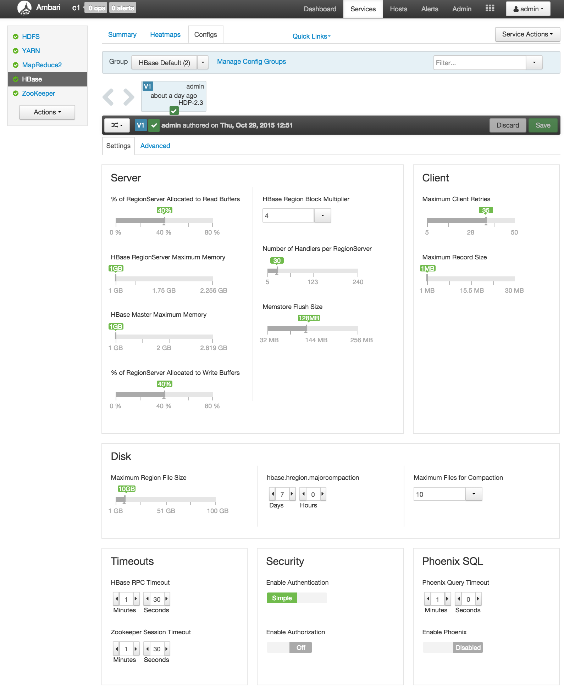

- Define theme with custom layout of configs

  - Tabs
  - Sections
  - Sub-sections
- Place selected configs in the layout defined above
- Associate UI widget to use for a config

  - Radio Buttons
  - Slider
  - Combo
  - Time Interval Spinner
  - Toggle
  - Directory
  - Directories
  - List
  - Password
  - Text Field
  - Checkbox
  - Text Area
- Automatic unit conversion for configs which have to be shown in units different from the units being saved as.

  - Memory - B, KB, MB, GB, TB, PB
  - Time - milliseconds, seconds, minutes, hours, days, months, years
  - Percentage - float, percentage
- Ability to define dependencies between configurations across services (depends-on, depended-by).
- Ability to dynamically update values of other depended-by configs when a config is changed.

The first step is to create a theme for your service in the stack definition folder. A theme provides necessary information of the UI to construct the enhanced configs. UI information like layout (tabs, sections, sub-sections), placement of configs in the sub-sections, and which widgets and units to use for each config

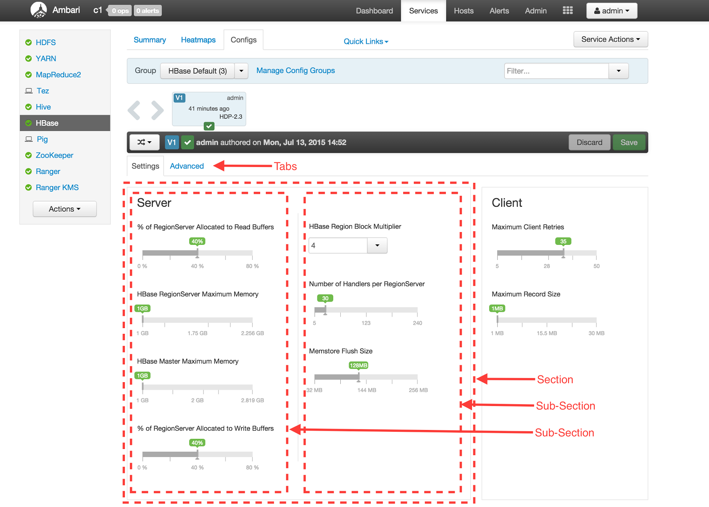

1. Modify metainfo.xml to define a theme by including a themes block.

```text
themes-dir      theme.json    true 
```

2. The optional element can be used if the default theme folder of ' *themes*' is not desired, or taken by another service in the same *metainfo.xml*.
3. Multiple themes can be defined, however only the first \_default\_theme will be used for the service.
4. Each theme points to a theme JSON file (via \_fileName\_element) in the \_themes-dir\_folder.
5. The \_theme.json\_file contains one \_configuration\_block containing three main keys
6. *layouts*- specify tabs, sections and sub-section layout
7. *placement*- specify configurations to place in sub-sections
8. *widgets*- specify which UI widgets to use for each config

```json
{   
  "configuration": {    
  "layouts": [      ...    ],   
  "placement": {      ...    },     
  "widgets": [      ...    ]   
  } 
} 
```

6. Layouts - Multiple layouts can be defined in a theme. Currently only the first layout will be used while rendering. A *layout* has following content:
7. Tabs: Multiple tabs can be defined in a layout. Each tab can have its contents laid out using a simple grid-layout using the \_tab-columns\_and \_tab-rows\_keys.

In below example the \_Settings\_tab has a grid of 3 rows and 2 columns in which sections can be placed.

```json
"layouts": [   
  {     
    "name": "default",    
     "tabs": [      
       {         
        "name": "settings",         
        "display-name": "Settings",        
         "layout": {          
           "tab-columns": "2",           
           "tab-rows": "3",           
           "sections": [ ... ]         
           }       
      } 
     ]  
    } 
] 
```

2. Sections: Each section is defined inside a tab and specifies its location and size inside the tab's grid-layout by using the *row-index*, *column-index*, \_row-span\_and \_column-span\_keys. Being a container itself, it can further define a grid-layout for the sub-sections it contains using the \_section-rows\_and \_section-columns\_keys.

In below example the \_MapReduce\_section occupies the first cell of the \_Settings\_tab grid, and itself has a grid-layout of 1 row and 3 columns.

```text
"sections": [  {    "name": "section-mr-scheduler",    "display-name": "MapReduce",    "row-index": "0",    "column-index": "0",    "row-span": "1",    "column-span": "1",    "section-columns": "3",    "section-rows": "1",    "subsections": [ ... ]  },  ...] 
```

3. Sub-sections: Each sub-section is defined inside a section and specifies its location and size inside the section's grid-layout using the *row-index*, *column-index*, \_row-span\_and \_column-span\_keys. Each section also has an optional \_border\_boolean key which tells if a border should encapsulate its content.

```text
"subsections": [  {    "name": "subsection-mr-scheduler-row1-col1",    "display-name": "MapReduce Framework",    "row-index": "0",    "column-index": "0",    "row-span": "1",    "column-span": "1"  },  ...] 
```

7. Placement: Specifies the order of configurations that are to be placed into each sub-section. Each placement identifies a config, and which sub-section it should appear in. The placement specifies which layout it applies to using the \_configuration-layout\_key.

```text
"placement": {  "configuration-layout": "default",  "configs": [    {      "config": "mapred-site/mapreduce.map.memory.mb",      "subsection-name": "subsection-mr-scheduler-row1-col1"    },    {      "config": "mapred-site/mapreduce.reduce.memory.mb",      "subsection-name": "subsection-mr-scheduler-row1-col2"    },    ...  ]} 
```

8. Wigets: The widgets array specifies which UI widget should be used to show a specific config. It also contains extra UI specific metadata required to show the widget.

In the example below, both configs are using the slider widget. However the unit varies, resulting in one config being shown in bytes and another being shown as percentage. This unit is purely for showing a config - which is different from the units in which it is actually persisted in Ambari. For example, the percent unit below maybe persisted as a *float*, while the MB config below can be persisted in B (bytes).

```text
"widgets": [  {    "config": "yarn-site/yarn.nodemanager.resource.memory-mb",    "widget": {      "type": "slider",      "units": [        {          "unit-name": "MB"        }      ]    }  },  {    "config": "yarn-site/yarn.nodemanager.resource.percentage-physical-cpu-limit",    "widget": {      "type": "slider",      "units": [        {          "unit-name": "percent"        }      ]   } }, {   "config": "yarn-site/yarn.node-labels.enabled",   "widget": {     "type": "toggle"   } }, ...] 
```

For a complete reference to what UI widgets are available and what metadata can be specified per widget, please refer to *Appendix A*.

Each configuration that is used by the service's theme has to provide extra metadata about the configuration. The list of available metadata are:

- display-name
- value-attributes
  - type
    - string
    - value-list
    - float
    - int
    - boolean
  - minimum
  - maximum
  - unit
  - increment-step
  - entries
    - entry
      - value
      - description
- depends-on
  - property
    - type
    - name

The value-attributes provide meta information about the value that can used as hints by the appropriate widget. For example the slider widget can make use of the minimum and maximum values in its working.

Examples:

```xml
<property> 
  <name>namenode_heapsize</name> 
  <value>1024</value> 
  <description>NameNode Java heap size</description> 
  <display-name>NameNode Java heap size</display-name> 
  <value-attributes> 
    <type>int</type> 
    <minimum>0</minimum> 
    <maximum>268435456</maximum> 
    <unit>MB</unit> 
    <increment-step>256</increment-step> 
  </value-attributes> 
  <depends-on> 
    <property> 
      <type>hdfs-site</type> 
      <name>dfs.datanode.data.dir</name> 
    </property> 
  </depends-on> 
</property> 
 
```

```xml
<property> 
  <name>hive.default.fileformat</name> 
  <value>TextFile</value> 
  <description>Default file format for CREATE TABLE statement.</description> 
  <display-name>Default File Format</display-name> 
  <value-attributes> 
    <type>value-list</type> 
    <entries> 
      <entry> 
        <value>ORC</value> 
        <description>The Optimized Row Columnar (ORC) file format provides a highly efficient way to store Hive data. It was designed to overcome limitations of the other Hive file formats. Using ORC files improves performance when Hive is reading, writing, and processi 
      </entry> 
      <entry> 
        <value>TextFile</value> 
        <description>Text file format saves Hive data as normal text.</description> 
      </entry> 
    </entries> 
  </value-attributes> 
</property> 
```

The depends-on is useful in building a dependency graph between different configs in Ambari. Ambari uses these bi-directional relationships (depends-on and depended-by) to automatically update dependent configs using the stack-advisor functionality in Ambari.

Dependencies between configurations is a directed-acyclic-graph (DAG). When a configuration is updated, the UI has to determine its effect on other configs in the graph. To determine this, the /recommendations\_endpoint should be provided an array of what configurations have been just changed in the changed\_configurations field. Based on the provided changed-configs, only its dependencies are updated in the response.

Example:

Figure below shows some config dependencies - A effects B and C, each of which effects DE and FG respectively.

![]( "Enhanced Configs Dependencies")

Now assume user changes B to B' - a call to */* \_recommendations\_will only change D and E to D' and E' respectively (AB'CD'E'FG). No other config will be changed. Now assume that C is changed to C' -/recommendations will only change F and G to F' and G' while still keeping the values of B' D' E' intact (AB'C'D'E'F'G'). Now if you change A to A', it will affect all its children (A'B''C''D''E''F''G''). The user will have chance to pick and choose which he wants to apply.

The call to */recommendations* happens whenever a configuration with dependencies is changed. The POST call has the action configuration-dependencies - which will only change the configurations and its dependencies identified by the changed\_configurations field.

Restarting ambari-server is required for any changes in the themes or the stack-definition to be loaded.

- HDFS HDP-2.2 [theme.json](https://github.com/apache/ambari/blob/branch-2.1.2/ambari-server/src/main/resources/stacks/HDP/2.2/services/HDFS/themes/theme.json)
- YARN HDP-2.2 [theme.json](https://github.com/apache/ambari/blob/branch-2.1.2/ambari-server/src/main/resources/stacks/HDP/2.2/services/YARN/themes/theme.json)
- HIVE HDP-2.2 [theme.json](https://github.com/apache/ambari/blob/branch-2.1.2/ambari-server/src/main/resources/stacks/HDP/2.2/services/HIVE/themes/theme.json)
- RANGER HDP-2.3 [theme\_version\_2.json](https://github.com/apache/ambari/blob/trunk/ambari-server/src/main/resources/stacks/HDP/2.3/services/RANGER/themes/theme_version_2.json)

| Widget | Metadata Used |
| --- | --- |
| Slider | <value-attributes> <type>int</type> <minimum>1073741824</minimum> <maximum>17179869184</maximum> <unit>B</unit> <increment-step>1073741824</increment-step> </value-attributes> |
| Combo | <value-attributes> <type>value-list</type> <entries> <entry> <value>2</value> </entry> <entry> <value>4</value> </entry> <entry> <value>8</value> </entry> </entries> <selection-cardinality>1</selection-cardinality> </value-attributes> |
| Directory, Directories, Password, Text Field, Text Area | No value-attributes required |
| List | <value-attributes> <type>value-list</type> <entries> <entry> <value>2</value> </entry> <entry> <value>4</value> </entry> <entry> <value>8</value> </entry> </entries> <selection-cardinality>2+</selection-cardinality> </value-attributes> |
| Radio-Buttons | <value-attributes> <type>value-list</type> <entries> <entry> <value>1</value> <label>Radio Option 1</label> </entry> <entry> <value>2</value> <label>Radio Option 2</label> </entry> <entry> <value>3</value> <label>Radio Option 3</label> </entry> </entries> <selection-cardinality>1</selection-cardinality> </value-attributes> |
| Time Interval Spinner | <value-attributes> <type>int</type> <minimum>0</minimum> <maximum>2592000000</maximum> <unit>milliseconds</unit> </value-attributes> |
| Toggle, Checkbox | <value-attributes> <type>value-list</type> <entries> <entry> <value>true</value> <label>Native</label> </entry> <entry> <value>false</value> <label>Off</label> </entry> </entries> <selection-cardinality>1</selection-cardinality> </value-attributes> |

---

<a id="ambari-design-service-dashboard"></a>

<!-- source_url: https://ambari.apache.org/docs/3.0.0/ambari-design/service-dashboard/ -->

<!-- page_index: 19 -->

# Enhanced Service Dashboard

Version: 3.0.0

> [!WARNING]
> **caution**
> This document assumes that the service metrics are being exposed via Ambari. If this is not the case then please refer to [Metrics](https://cwiki.apache.org/confluence/display/AMBARI/Metrics)  document for more related information.

---

<a id="ambari-design-metrics"></a>

<!-- source_url: https://ambari.apache.org/docs/3.0.0/ambari-design/metrics/ -->

<!-- page_index: 20 -->

# Metrics

Version: 3.0.0

**Ambari Metrics System** ("AMS") is a system for collecting, aggregating and serving Hadoop and system metrics in Ambari-managed clusters.

| Term | Definition |
| --- | --- |
| Ambari Metrics System (“AMS”) | The built-in metrics collection system for Ambari. |
| Metrics Collector | The standalone server that collects metrics, aggregates metrics, serves metrics from the Hadoop service sinks and the Metrics Monitor. |
| Metrics Monitor | Installed on each host in the cluster to collect system-level metrics and forward to the Metrics Collector. |
| Metrics Hadoop Sinks | Plugs into the various Hadoop components sinks to send Hadoop metrics to the Metrics Collector. |

Following image depicts the high level conceptual architecture of the new Ambari Metrics System:

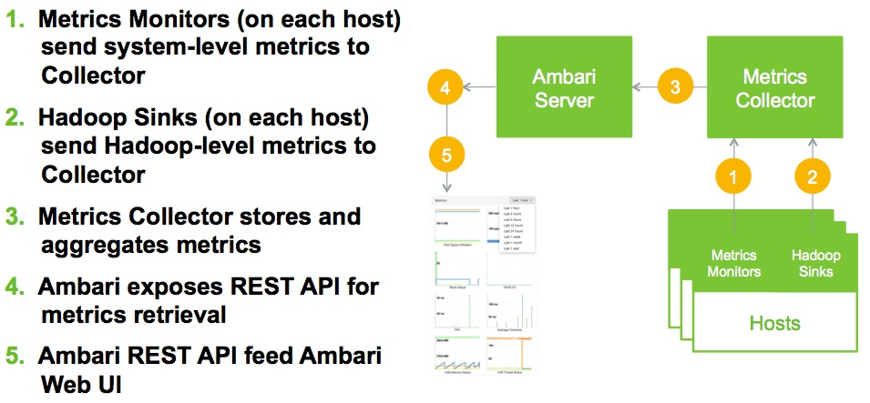

The **Metrics Collector** is daemon that receives data from registered publishers (the Monitors and Sinks). The Collector itself is build using Hadoop technologies such as HBase Phoenix and ATS. The Collector can store data on the local filesystem (referred to as "embedded mode") or use an external HDFS (referred to as "distributed mode").

Browse the following to learn more about the [Ambari Metrics REST API](#ambari-design-metrics-metrics-api-specification) specification and about advanced [Configuration](#ambari-design-metrics-configuration) of AMS.

---

<a id="ambari-design-metrics-metrics-collector-api-specification"></a>

<!-- source_url: https://ambari.apache.org/docs/3.0.0/ambari-design/metrics/metrics-collector-api-specification/ -->

<!-- page_index: 21 -->

# Metrics Collector API Specification

Version: 3.0.0

Sending metrics to Ambari Metrics Service can be achieved through the following API call.

The Sink implementations responsible for sending metrics to AMS, buffer data for 1 minute before sending. TimelineMetricCache provides a simple cache implementation to achieve this behavior.

Sample sink implementation use by Hadoop daemons: <https://github.com/apache/ambari/tree/trunk/ambari-metrics/ambari-metrics-hadoop-sink>

```uri
POST http://<ambari-metrics-collector>:6188/ws/v1/timeline/metrics 
```

```json
{ 
  "metrics": [ 
    { 
      "metricname": "AMBARI_METRICS.SmokeTest.FakeMetric", 
      "appid": "amssmoketestfake", 
      "hostname": "ambari20-5.c.pramod-thangali.internal", 
      "timestamp": 1432075898000, 
      "starttime": 1432075898000, 
      "metrics": { 
        "1432075898000": 0.963781711428, 
        "1432075899000": 1432075898000 
      } 
    } 
  ] 
} 
```

```text
Connecting (POST) to <ambari-metrics-collector>:6188/ws/v1/timeline/metrics/ 
Http response: 200 OK 
```

**Sample call**

```text
GET http://<ambari-metrics-collector>:6188/ws/v1/timeline/metrics?metricNames=AMBARI_METRICS.SmokeTest.FakeMetric&appId=amssmoketestfake&hostname=<hostname>&precision=seconds&startTime=1432075838000&endTime=1432075959000 
Http response: 200 OK 
Http data: 
{ 
   "metrics": [ 
      { 
         "timestamp": 1432075898089, 
         "metricname": "AMBARI_METRICS.SmokeTest.FakeMetric", 
         "appid": "amssmoketestfake", 
         "hostname": "ambari20-5.c.pramod-thangali.internal", 
         "starttime": 1432075898000, 
         "metrics": { 
            "1432075898000": 0.963781711428, 
            "1432075899000": 1432075898000 
         } 
      } 
   ] 
} 
```

**Generic GET call format**

```uri
http://<AMS_HOST>:6188/ws/v1/timeline/metrics?metricNames=<>&hostname=<>&appId=<>&startTime=<>&endTime=<>&precision=<> 
```

**Query Parameters Explanation**

| Parameter | Optional/Mandatory | Explanation | Values it can take |
| --- | --- | --- | --- |
| metricNames | Mandatory Comma | separated list of metrics that are required. | disk\_free,mem\_free... etc |
| appId | Mandatory | The AppId that corresponds to the metricNames that were requested. Currently, only 1 AppId is required and allowed. | HOST/namenode/datanode/nimbus/hbase/kafka\_broker/FLUME\_HANDLER etc |
| hostname | Optional | Comma separated list of hostnames. When no specified, cluster aggregates are returned. | h1,h2..etc |
| startTime, endTime | Optional | Start and End time values. If not specified, the last data point of the metric is returned. | epoch times in seconds or milliseconds |
| precision | Optional | What precision the data needs to be returned. If not specified, the precision is calculated based on the time range requested (Table below) | SECONDS/MINUTES/DAYS/HOURS |

**Precision query parameter (Default resolution)**

<table class="confluenceTable"><colgroup><col/><col/><col/></colgroup><tbody><tr><th><p><span>Query Time</span></p><p><span>range</span></p></th><th><p><span>Resolution of </span><span>returned metrics</span></p></th><th><p><span>Comments</span></p></th></tr><tr><td><p><span>Upto 2 hours</span></p></td><td><p><span>SECONDS</span></p></td><td><ul><li><span><span>10 second data for host metrics</span></span></li><li><span><span>30 second data for Aggregated query (No host specified)</span> </span></li></ul></td></tr><tr><td><p><span>2 hours - 1 day</span></p></td><td><p><span>MINUTES</span></p></td><td><p><span>5 minute data</span></p></td></tr><tr><td><p><span><span>1 day</span> - 30 days</span></p></td><td><p>HOURS</p></td><td><p><span>1 hour data</span></p></td></tr><tr><td><p><span>&gt; 30 days</span></p></td><td><p><span>DAYS</span></p></td><td>1 day data</td></tr></tbody></table>

**Specifying Aggregate Functions**

The metricName can have a specific aggregate function qualifier after the metricName (as shown below) to request specific aggregates. Valid values are .\_avg, .\_max, .\_min, .\_sum. When an aggregate query is requested without an aggregate function in the metricName, the default is AVG.
Examples

```text
http://<AMS_HOST>:6188/ws/v1/timeline/metrics?metricNames=regionserver.Server.totalRequestCount._avg,regionserver.Server.writeRequestCount._max&appId=hbase&startTime=14000000&endTime=14200000 
 
http://<AMS_HOST>:6188/ws/v1/timeline/metrics?metricNames=regionserver.Server.readRequestCount,regionserver.Server.writeRequestCount._max&appId=hbase&startTime=14000000&endTime=14200000 
```

**Specifying Post processing Functions**

Similar to aggregate functions, post processing functions can also be specified. Currently, we have 2 post processing functions - rate (Rate per second) and diff (difference between consecutive values). Post processing functions can also be applied after aggregate functions.
Examples

```text
http://<AMS_HOST>:6188/ws/v1/timeline/metrics?metricNames=regionserver.Server.totalRequestCount._rate,regionserver.Server.writeRequestCount._diff&appId=hbase&startTime=14000000&endTime=14200000 
 
http://<AMS_HOST>:6188/ws/v1/timeline/metrics?metricNames=regionserver.Server.readRequestCount._max._diff&appId=hbase&startTime=14000000&endTime=14200000 
```

**Specifying Wild Cards**

Both metricNames and hostname take wildcard (%) values for a group of metric (or hosts). A query can have a combination of full metric names and names with wildcards also.

Examples

```text
http://<AMS_HOST>:6188/ws/v1/timeline/metrics?metricNames=regionserver.Server.%&appId=hbase&startTime=14000000&endTime=14200000 
 
http://<AMS_HOST>:6188/ws/v1/timeline/metrics?metricNames=regionserver.Server.%&hostname=abc.testdomain124.devlocal&appId=hbase&startTime=14000000&endTime=14200000 
 
http://<AMS_HOST>:6188/ws/v1/timeline/metrics?metricNames=master.AssignmentManger.ritCount,regionserver.Server.%&hostname=abc.testdomain124.devlocal&appId=hbase&startTime=14000000&endTime=14200000 
 
http://<AMS_HOST>:6188/ws/v1/timeline/metrics?metricNames=regionserver.Server.%&hostname=abc.testdomain12%.devlocal&appId=hbase&startTime=14000000&endTime=14200000 
```

**Downsampling**

As discussed before, AMS downsamples data when higher time ranges are requested. The default "downsampled across time" data returned is AVG. Specific downsamples can be requested by adding the aggregate function qualifiers ( .\_avg, .\_max, .\_min, .\_sum ) to the metric names the same way like requesting aggregates across the cluster.
Example

```text
 http://<AMS_HOST>:6188/ws/v1/timeline/metrics?metricNames=regionserver.Server.totalRequestCount._max&hostname=abc.testdomain124.devlocal&appId=hbase&startTime=14000000&endTime=14200000&precision=MINUTES 
```

The above query returns 5 minute data for the metric, where the data point value is the MAX of the values found in every 5 minute range.

AMS has 2 metadata endpoints that are useful for finding out the set of metrics it received, as well as the topology of the cluster.

**METRICS METADATA**

Endpoint :

```text
 http://<AMS_HOST>:6188/ws/v1/timeline/metrics/metadata 
```

Data returned : A mapping between the set of APP\_IDs to the list of metrics received with that AppId.

Sample data returned

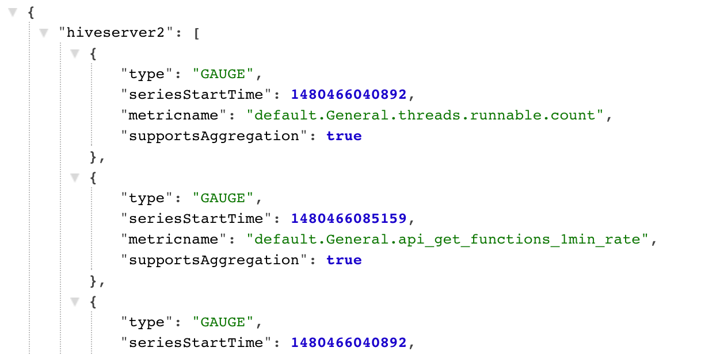

**HOSTS METADATA**

Endpoint :

```text
 http://<AMS_HOST>:6188/ws/v1/timeline/metrics/hosts 
```

Data returned : A mapping between the hosts in the cluster and the set of APP\_IDs on the host.

Sample data returned

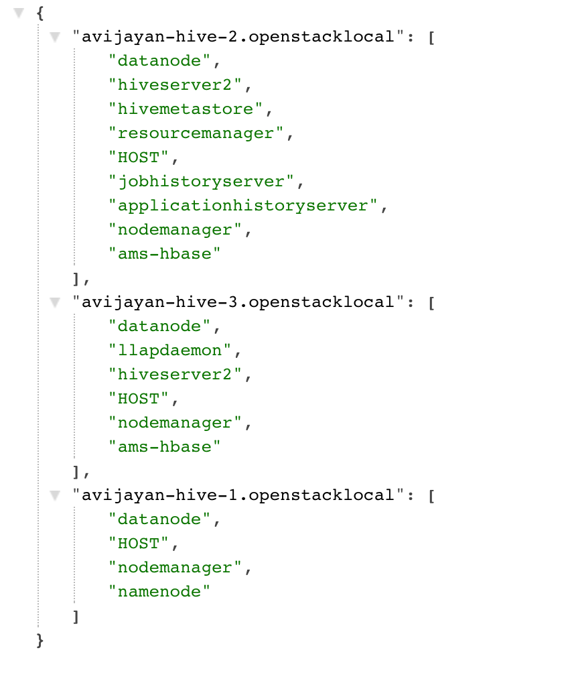

- Include the ambari-metrics-common artifacts from source or maven-central (when available) into your project
- Find below helpful info regarding common data-structures to use from the ambari-metrics-common module
- Extend the org.apache.hadoop.metrics2.sink.timeline.AbstractTimelineMetricsSink class and implement the required methods
- Use the org.apache.hadoop.metrics2.sink.timeline.cache.TimelineMetricsCache to store intermediate data until it is time to send (example: collection interval = 10 seconds, send interval = 1 minute). The cache implementation provides the logic needed for buffering and local aggregation.
- Use org.apache.hadoop.metrics2.sink.timeline.AbstractTimelineMetricsSink#emitMetrics to send metrics to AMS backend.

**METRIC DATA STRUCTURE**

Source location for common data structures module: <https://github.com/apache/ambari/tree/trunk/ambari-metrics/ambari-metrics-common/>

Example sink implementation: <https://github.com/apache/ambari/blob/trunk/ambari-metrics/ambari-metrics-hadoop-sink/>

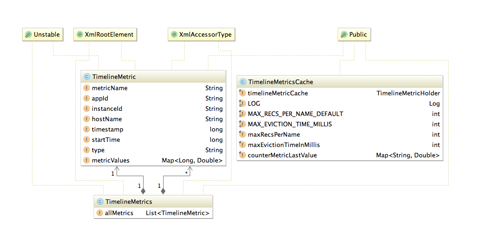

**INTERNAL PHOENIX KEY STRUCTURE**

The Metric Record Key data structure is described below:

| Property | Type | Comment | Optional |
| --- | --- | --- | --- |
| Metric Name | String | First key part, important consideration while querying from HFile storage | N |
| Hostname | String | Second key part | N |
| Server time | Long | Timestamp on server when first metric write request was received | N |
| Application Id | String | Uniquely identify service | N |
| Instance Id | String | Second key part to identify instance/ component | Y |
| Start time | Long | Start of the timeseries data |  |

**HOW AGGREGATION WORKS**

- The granularity of aggregate data can be controlled by setting wake up interval for each of the aggregator threads.
- Presently we support 2 types of aggregators, HOST and APPLICATION with 3 time dimensions, per minute, per hour and per day.
  - The HOST aggregates are just aggregates on precision data across the supported time dimensions.
  - The APP aggregates are across appId. Note: We ignore instanceId for APP level aggregates. Same time dimensions apply for APP level aggregates.
  - We also support HOST level metrics for APP, meaning you can expect a system metric example: "cpu\_user" to be aggregated across datanodes, effectively calculating system metric for hosted apps.
- Each aggregator performs checkpointing by storing last successful time of completion in a file. If the checkpoint is too old, the aggregators will discard checkpoint and aggregate data for the configured interval, meaning data in between (now - interval) time.
- Refer to [Phoenix table schema](#ambari-design-metrics-operations) for details of tables and records.

---

<a id="ambari-design-metrics-configuration"></a>

<!-- source_url: https://ambari.apache.org/docs/3.0.0/ambari-design/metrics/configuration/ -->

<!-- page_index: 22 -->

# Configuration

Version: 3.0.0

> [!TIP]
> If you upgrade Ambari to a newer version, you will need to re-apply this change to the template file.

---

<a id="ambari-design-metrics-operations"></a>

<!-- source_url: https://ambari.apache.org/docs/3.0.0/ambari-design/metrics/operations/ -->

<!-- page_index: 23 -->

# Operations

Version: 3.0.0

**Pid file locations**

| Daemon | Default User | Pid File Path |
| --- | --- | --- |
| Metrics Collector API | ams | /var/run/ambari-metrics-collector/ambari-metrics-collector.pid |
| Metrics Collector Hbase | ams | /var/run/ambari-metrics-collector/hbase-ams-master.pid |

**Log file locations**

| Daemon | Log File Path |
| --- | --- |
| Metrics Collector API | /var/log/ambari-metrics-collector/ambari-metrics-collector.log /var/log/ambari-metrics-collector/ambari-metrics-collector.out |
| Metrics Collector HBase | /var/log/ambari-metrics-collector/hbase-ams-master-<hostname>.log /var/log/ambari-metrics-collector/hbase-ams-master-<hostname>.out |

**Manually restart Metrics Collector**

Stop command

```bash
su - ams -c '/usr/sbin/ambari-metrics-collector --config /etc/ambari-metrics-collector/conf/ stop' 
```

Start command

```bash
su - ams -c '/usr/sbin/ambari-metrics-collector --config /etc/ambari-metrics-collector/conf/ start' 
```

**Pid File location**

```text
/var/run/ambari-metrics-monitor/ambari-metrics-monitor.pid 
```

**Log File location**

```text
/var/log/ambari-metrics-monitor/ambari-metrics-monitor.out 
```

**Manually restart Metrics Monitor**
Stop command

```bash
su - ams -c '/usr/sbin/ambari-metrics-monitor --config /etc/ambari-metrics-monitor/conf stop' 
```

Start command

```bash
su - ams -c '/usr/sbin/ambari-metrics-monitor --config /etc/ambari-metrics-monitor/conf start' 
```

The ambari-metrics-assembly package builds the assemblies (rpm/deb/msi) for various platforms.

Following binaries can be found in the ambari-metrics-assembly/target folder after build is successful.

```text
ambari-metrics-collecor-<ambari-version>.<arch> 
ambari-metrics-monitor-<ambari-version>.<arch> 
ambari-hadoop-sink-<ambari-version>.<arch> 
```

> [!NOTE]
> : Ambari Metrics needs to be built before Ambari Server

```bash
cd ambari-metrics 
mvn clean package -Dbuild-rpm 
```

Same instruction as above, change the maven target to build-deb

TBU

| Parameter | Default Value | Comment |
| --- | --- | --- |
| hbase.tar | <http://public-repo-1.hortonworks.com/HDP/centos6/2.x/updates/2.3.0.0/tars/hbase-1.1.1.2.3.0.0-2557.tar.gz> | HBase tarball. This is default version for Ambari 2.1.2 |
| hbase.folder | hbase-1.1.1.2.3.0.0-2557 | - |
| hadoop.tar | <http://public-repo-1.hortonworks.com/HDP/centos6/2.x/updates/2.3.0.0/tars/hadoop-2.7.1.2.3.0.0-2557.tar.gz> | Hadoop tarball, used for native libs. This is default version for Ambari 2.1.2 |
| hadoop.folder | hadoop-2.7.1.2.3.0.0-2557 | - |

> [!NOTE]
>

After the change introducted by [AMBARI-18915](https://issues.apache.org/jira/browse/AMBARI-18915) - Update AMS pom to use Apache hbase,hadoop,phoenix tarballs REOPENED AMS uses hadoop tars downloaded from Apache by default. Since that version of libhadoop is not built with libsnappy, the following config change in ams-site is needed to make AMS start up correctly.

**timeline.metrics.hbase.compression.scheme = None**

| Num of Nodes | METRIC\_RECORD (MB) | METRIC\_RECORD\_MINUTE (MB) | METRIC\_RECORD\_HOURLY (MB) | METRIC\_RECORD\_DAILY (MB) | METRIC\_AGGREGATE (MB) | METRIC\_AGGREGATE\_MINUTE (MB) | METRIC\_AGGREGATE\_HOURLY (MB) | METRIC\_AGGREGATE\_DAILY (MB) | TOTAL (GB) |
| --- | --- | --- | --- | --- | --- | --- | --- | --- | --- |
| 50 | 5120 | 2700 | 245 | 10 | 1500 | 305 | 28 | 1 | 10 |
| 100 | 10240 | 5400 | 490 | 20 | 1500 | 305 | 28 | 1 | 18 |
| 300 | 30720 | 16200 | 1470 | 60 | 1500 | 305 | 28 | 1 | 49 |
| 500 | 51200 | 27000 | 2450 | 100 | 1500 | 305 | 28 | 1 | 81 |
| 800 | 81920 | 43200 | 3920 | 160 | 1500 | 305 | 28 | 1 | 128 |

> [!NOTE]
> :

The above guidance has been derived from looking at AMS disk utilization in actual clusters.
The ACTUAL numbers have been obtained by observing an actual cluster with the basic services (HDFS, YARN, HBase) installed along with Storm, Kafka and Flume.
Kafka and Flume generate metrics only while a job is running. If those services are being used heavily, additional disk space is recommended. We ran sample jobs with STORM and KAFKA while deriving these numbers to make sure there is some contribution.

**Actual disk utilization data**

| Num of Nodes | METRIC\_RECORD (MB) | METRIC\_RECORD\_MINUTE (MB) | METRIC\_RECORD\_HOURLY (MB) | METRIC\_RECORD\_DAILY (MB) | METRIC\_AGGREGATE (MB) | METRIC\_AGGREGATE\_MINUTE (MB) | METRIC\_AGGREGATE\_HOURLY (MB) | METRIC\_AGGREGATE\_DAILY (MB) | TOTAL (GB) |
| --- | --- | --- | --- | --- | --- | --- | --- | --- | --- |
| 2 | 120 | 175 | 17 | 1 | 545 | 136 | 16 | 1 | 1 |
| 3 | 294 | 51 | 3.4 | 1 | 104 | 26 | 1.8 | 1 | 0.5 |
| 10 | 1024 | 540 | 49 | 2 | 1433.6 | 305 | 28 | 1 | 3.3 |

| Table Name | Description | Purge Interval(default) |
| --- | --- | --- |
| METRIC\_RECORD | Data per metric per host at 10 seconds precision with 1 minute aggregates. | 1 day |
| METRIC\_RECORD\_MINUTE | Data per metric per host at 5 minute precision | 1 week |
| METRIC\_RECORD\_HOURLY | Data per metric per host at 1 hour precision | 30 days |
| METRIC\_RECORD\_DAILY | Data per metric per host at 1 day precision | 1 year |
| METRIC\_AGGREGATE | Cluster wide aggregates per metric at 30 seconds precision | 1 week |
| METRIC\_AGGREGATE\_MINUTE | Cluster wide aggregates per metric at 5 minute precision | 30 days |
| METRIC\_AGGREGATE\_HOURLY | Cluster wide aggregates per metric at 1 hour precision | 1 year |
| METRIC\_AGGREGATE\_DAILY | Cluster wide aggregates per metric at 1 day precision | 2 years |

- Unpack Phoenix (4.2.0+) tarball onto the Metric Collector host
- Change director to phonenix-4.\*/bin
- Edit sqlline.py and search for "java", replace java with full path to the java executable, example: "/usr/jdk64/jdk1.8.0\_40/bin/java"
- Connect command:
  Ambari versions 2.2.0 and below : ./sqlline.py localhost:61181:/hbase
  Ambari versions > 2.2.0 :

```bash
./sqlline.py localhost:61181:/ams-hbase-unsecure (embedded mode) and <cluster-zookeeper-quorum-host>:<cluster_zookeeper_port>:/ams-hbase-unsecure (distributed mode) 
```

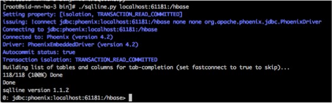

---

<a id="ambari-design-metrics-troubleshooting"></a>

<!-- source_url: https://ambari.apache.org/docs/3.0.0/ambari-design/metrics/troubleshooting/ -->

<!-- page_index: 24 -->

# Troubleshooting

Version: 3.0.0

Following steps would help in cleaning up Ambari Metrics System data in a given cluster.

Important Note:

1. Cleaning up the AMS data would remove all the historical AMS data available
2. The hbase parameters mentioned above are specific to AMS and they are different from the Cluster Hbase parameters

1. Using Ambari
   - Set AMS to maintenance
   - Stop AMS from Ambari. Identify the following from the AMS Configs screen
     - 'Metrics Service operation mode' (embedded or distributed)
     - hbase.rootdir
     - hbase.zookeeper.property.dataDir
2. AMS data would be stored in 'hbase.rootdir' identified above. Backup and remove the AMS data.
   - If the Metrics Service operation mode
     - is 'embedded', then the data is stored in OS files. Use regular OS commands to backup and remove the files in hbase.rootdir
     - is 'distributed', then the data is stored in HDFS. Use 'hdfs dfs' commands to backup and remove the files in hbase.rootdir
3. Remove the AMS zookeeper data by backing up and removing the contents of 'hbase.tmp.dir'/zookeeper
4. Remove any Phoenix spool files from 'hbase.tmp.dir'/phoenix-spool folder
   5 Restart AMS using Ambari

1. Stop AMS Service
2. Execute the following API call to Delete Metric Collector. (Replace server-host, cluster-name and host-name with the Metrics Collector host)

```text
curl -u admin:admin  -H "X-Requested-By:ambari" -i -X DELETE http://<server-host>:8080/api/v1/clusters/<cluster-name>/hosts/<host-name>/host_components/METRICS_COLLECTOR 
```

3. Execute the following API call to add Metrics collector to a new host. (Replace, server-host, cluster-name, host-name)

```text
curl -u admin:admin  -H "X-Requested-By:ambari" -i -X POST http://<server-host>:8080/api/v1/clusters/<cluster-name>/hosts/<host-name>/host_components/METRICS_COLLECTOR 
```

4. Install the Metrics Collector component from the Host page of the new host.
5. If the AMS is in embedded mode, copy the AMS data from old node to new node.

   - For embedded mode (ams-site: timeline.metrics.service.operation.mode), copy over the hbase.rootdir and tmpdir to new host from the old collector host.
   - For distributed mode, since AMS HBase is writing to HDFS, no change will be necessary.
   - Ensure that ams:hbase-site:hbase.rootdir and hbase.tmp.dir are pointing to the correct location in the new AMS node
6. Start the Metrics Service.
7. The service daemons will be pointing to the old metrics collector host. Perform a rolling restart of slave components and a normal restart of Master components for them to pick up the new collector host.

Note : Restart of services is not needed post Ambari-2.5.0 since live collector information is maintained in the cluster zookeeper.

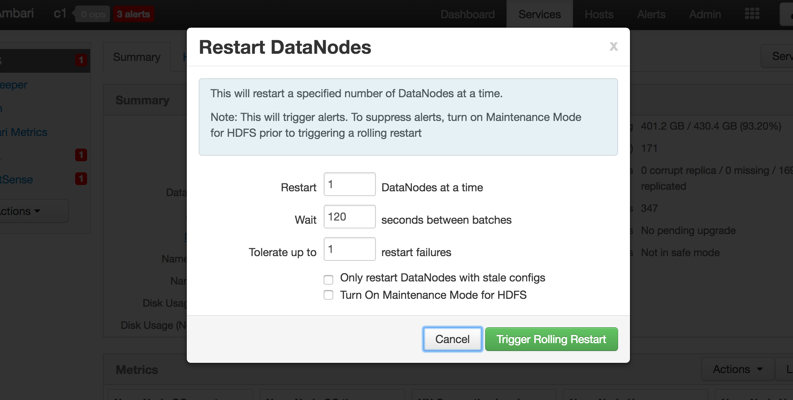

The following page documents common problems discovered with Ambari Metrics Service and provides a guide for things to look out for and already solved problems.

**Important facts to collect from the system**:

Problems with Metric Collector host

- Output of "rpm -qa | grep ambari" on the collector host.
- Total available System memory, output of : "free -g"
- Total available disk space and available partitions, output of : "df -h "
- Total number of hosts in the cluster
- Configs: /etc/ams-hbase/conf/hbase-env.sh, /etc/ams-hbase/conf/hbase-site.xml, /etc/ambari-metrics-collector/conf/ams-env.sh, /etc/ambari-metrics-collector/conf/ams-site.xml
- Collector logs:

```text
/var/log/ambari-metrics-collector/ambari-metrics-collector.log, /var/log/ambari-metrics-collector/hbase-ams-master-<host>.log, /var/log/ambari-metrics-collector/hbase-ams-master-<host>.out 
Note: Additionally, If distributed mode is enabled, /var/log/ambari-metrics-collector/hbase-ams-zookeeper-<host>.log, /var/log/ambari-metrics-collector/hbase-ams-regionserver-<host>.log 
```

- Response to the following URLs -

```text
http://<ams-host>:6188/ws/v1/timeline/metrics/metadata 
http://<ams-host>:6188/ws/v1/timeline/metrics/hosts  
```

- The response will be JSON and can be attached as a file.
- From AMS HBase Master UI - http://<METRICS\_COLLECTOR\_HOST>:61310

  - Region Count
  - StoreFile Count
  - JMX Snapshot - http://<METRICS\_COLLECTOR\_HOST>:61310/jmx

**Problems with Metric Monitor host**

```text
Monitor log file: /etc/ambari-metrics-monitor/ambari-metrics-monitor.out 
```

**Check out [Configurations - Tuning](https://cwiki.apache.org/confluence/display/AMBARI/Configurations+-+Tuning) for scale issue troubleshooting.**

**Issue 1: AMS HBase process slow disk writes**

The symptoms and resolutions below address the **embedded** mode of AMS only.

*Symptoms*:

| Behavior | How to detect |
| --- | --- |
| High CPU usage | HBase process on Collector host taking up close to 100% of every core |
| HBase Log: Compaction times | grep hbase-ams-master-<host>.log |
| HBase Log: ZK timeout | HBase crashes saying zookeeper session timed out. This happens because in embedded mode the zk session timeout is limited to max of 30 seconds (HBase issue: fix planned for 2.1.3). The cause is again slow disk reads. |
| Collector Log : "waiting for some tasks to finish" | ambari-metric-collector log shows messages where AsyncProcess writes are queued up |

*Resolutions*:

| Configuration Change | Description |
| --- | --- |
| ams-hbase-site :: hbase.rootdir | Change this path to a disk mount that is not heavily contended. |
| ams-hbase-ste :: hbase.tmp.dir | Change this path to a location different from hbase.rootdir |
| ams-hbase-env :: hbase\_master\_heapsize ams-hbase-site :: hbase.hregion.memstore.flush.size | Bump this value up so more data is held in memory to address I/O speeds. If heap size is increased and resident memory usage does not go up, this parameter can be changed to address how much data can be stored in a memstore per Region. Default is set to 128 MB. The size is in bytes. Be careful with modifying this value, generally limit the setting between 64 MB (small heap with fast disk write), to 512 MB (large heap > 8 GB, and average write speed), since more data held in memory means longer time to write it to disk during a Flush operation. |

**Issue 2: Ambari Metrics take a long time to load**

*Symptoms*:

| Behavior | How to detect |
| --- | --- |
| Graphs: Loading time too long Graphs: No data available | Check out service pages / host pages for metric graphs |
| Socket read timeouts | ambari-server.log shows: Error message saying socket timeout for metrics |
| Ambari UI slowing down | Host page loading time is high, heatmaps do not show data Dashboard loading time is too high Multiple sessions result in slowness |

*Resolutions*:

Upgrade to 2.1.2+ is highly recommended.

Following is a list of fixes in 2.1.2 release that should greatly help to alleviate the slow loading and timeouts:

<https://issues.apache.org/jira/browse/AMBARI-12654>

<https://issues.apache.org/jira/browse/AMBARI-12983>

<https://issues.apache.org/jira/browse/AMBARI-13108>

---

<a id="ambari-design-metrics-metrics-api-specification"></a>

<!-- source_url: https://ambari.apache.org/docs/3.0.0/ambari-design/metrics/metrics-api-specification/ -->

<!-- page_index: 25 -->

# Ambari Metrics API specification

Version: 3.0.0

The Ambari REST API supports metric queries at CLUSTER, HOST, COMPONENT and HOST COMPONENT levels.

Broadly, the types of metrics queries supported are: **time range** or **point in time**.

Following is an illustration of an API call that fetches metrics from the Metrics backend service using Ambari API.

E.g.: Dashboard metrics : Fetch load average across all nodes of a cluster

```text
http://<ambari-server>:8080/api/v1/clusters/<cluster-name>?fields=metrics/load[1430844925,1430848525,15]&_=1430848532904 
```

The above API call retrieves the load average, aggregated across all hosts in the cluster.

The request part of the API call selects the cluster instance while the predicate includes the metric with the time range query, followed by current time in milliseconds.

Time range query:

| Field | Value | Comment |
| --- | --- | --- |
| Start time | 1430844925 | Start time for the time range. (Epoch) |
| End time | 1430848525 | End time of the time range. (Epoch) |
| Step | 15 | Default step, this is used only for zero padding or null padding if the padding interval cannot be determined from the retrieved data. |

E.g.: Host metrics: Get the cpu utilization on a particular host in the cluster

```text
http://<ambari-server>:8080/api/v1/clusters/<cluster-name>/hosts/<host-name>?fields=metrics/cpu/cpu_user[1430844610,1430848210,15],metrics/cpu/cpu_wio[1430844610,1430848210,15],metrics/cpu/cpu_nice[1430844610,1430848210,15],metrics/cpu/cpu_aidle[1430844610,1430848210,15],metrics/cpu/cpu_system[1430844610,1430848210,15],metrics/cpu/cpu_idle[1430844610,1430848210,15]&_=1430848217591 
```

The above API call retrieves all cpu related metrics required to chart out cpu utilization on a host page.

The request part of the above API call selects the host which is queried while the predicate part includes the metric names with time range query.

E.g.: Service metrics: Get the capacity utilization metrics aggregated across all datanodes but only the latest value (point in time)

```text
 http://<ambari-server>:8080/api/v1/clusters/<cluster-name>/services/HDFS/components/DATANODE?fields=metrics/dfs/datanode/DfsUsed,metrics/dfs/datanode/Capacity&_=1430849798630 
```

The above API call retrieves two metrics values which represent the point in time metric value for the requested metrics obtained for the Metrics Service backend. (non JMX)

For a call to get JMX metrics directly from a Hadoop daemon, use the metrics name that corresponds to the JMX MBean metric, example: metrics/dfs/FSNamesystem/CapacityUsedGB (Refer to Stack Defined Metrics for more info)

The request part of the above API call selects the service from the cluster while predicate part includes the metrics names.

E.g.: Daemon metrics: Get the heap memory usage for active Namenode

```text
http://<ambari-server>:8080/api/v1/clusters/<cluster-name>/hosts/<host-name>/host_components/NAMENODE?fields=metrics/jvm/memHeapCommittedM[1430847303,1430850903,15],metrics/jvm/memHeapUsedM[1430847303,1430850903,15]&_=1430850903846 
The above API call retrieves JVM heap metrics for the Active Namenode in the cluster. 
```

The request part of the api selects the Namenode host component while predicate part includes metrics with time range query.

---

<a id="ambari-design-metrics-stack-defined-metrics"></a>

<!-- source_url: https://ambari.apache.org/docs/3.0.0/ambari-design/metrics/stack-defined-metrics/ -->

<!-- page_index: 26 -->

# Stack Defined Metrics

Version: 3.0.0

The Ambari Stack definition represents the complete declarative description of Services that are comprised in a cluster.

The stack definition also contains a definition file for all metrics that are supported by the Service.

Presently the metrics.json describes the mapping between the metrics name requested in the REST API and the metrics name to use for making a call to the Metrics Service.

Location of the **metrics.json** in the stack:

| Level | Location | Comment |
| --- | --- | --- |
| Cluster & Host | ganglia\_properties.json | Presently, this file defines metrics for Host Component and Service Components as well but these are only used for older versions of stack < 2.0 and unit tests. The Cluster and Host sections of this json file drive the Dashboard graphs. |
| Component & Host Component | common-services.<SERVICE\_NAME> | This file contains definition of metrics mapping for Ambari Metrics (type = ganglia) and JMX. |

> [!NOTE]
> : The individual stacks that override behavior from common services can redefine the metrics.json file, the inheritance is all-or-nothing, meaning if metrics.json file is present in the child stack, it will override the metrics.json from common-services

**Structure of metrics.json file**

| Key | Allowed Values | Comments |
| --- | --- | --- |
| Type | "ganglia" / "jmx" | type = ganglia implies Metrics Service request fulfilled by either a Ganglia (up to version 2.0) or Ambari Metrics (2.0 and above) backend service, this decision is taken by Ambari server at runtime. |
| Category | "default" / "performance" ... | This is to group metrics into subsets for better navigability |
| Metrics | metricKey : `{ "metricName": "", "pointInTime": "", "temporal": "" }` | metricKey = Key to be used by REST API. This is unique for a service and identifies the requested metric as well as what endpoint to use for serving the data (AMS vs JMX) |

- metricName = Name to use for the Metrics Service backend
- pointInTime = Get latest value, no time range query allowed
- temporal = Time range query supported

Example:

```json
{ 
 
  "NAMENODE": { 
 
    "Component": [ 
 
      { 
 
        "type": "ganglia", 
 
        "metrics": { 
 
          "default": { 
 
            "metrics/dfs/FSNamesystem/TotalLoad": { 
 
              "metric": "dfs.FSNamesystem.TotalLoad", 
 
              "pointInTime": false, 
 
              "temporal": true 
 
            } 
 
        } ] 
 
    }, 
 
    "HostComponent" : [ 
 
         { "type" : "ganglia", ... } 
 
         {  "type" : "jmx", .... } 
 
   ] 
 
} 
```

**Sample API calls to retrieve metric definitions**:

Service metrics:

```text
Template => http://<ambari-server>:<port>/api/v1/stacks/<stackName>/versions/<stackVersion>/services/<serviceName>/artifacts/metrics_descriptor 
Example => http://localhost:8080/api/v1/stacks/HDP/versions/2.3/services/HDFS/artifacts/metrics_descriptor 
```

Cluster & Host metrics:

```text
Template => http://<ambari-server>:<port>/api/v1/stacks/<stackName>/versions/<stackVersion>/artifacts/metrics_descriptor 
Example => http://localhost:8080/api/v1/stacks/HDP/versions/2.3/artifacts/metrics_descriptor 
```

---

<a id="ambari-design-metrics-upgrading-ambari-metrics-system"></a>

<!-- source_url: https://ambari.apache.org/docs/3.0.0/ambari-design/metrics/upgrading-ambari-metrics-system/ -->

<!-- page_index: 27 -->

# Upgrading Ambari Metrics System

Version: 3.0.0

**Upgrading from Ambari 2.0 or 2.0.1 to 2.1**

1. Upgrade ambari server and perform needed post-upgrade checks. (make sure all services are up and running)
2. Stop Ambari Metrics service
3. Execute the following command on all hosts.

```bash
 yum upgrade -y ambari-metrics-monitor  ambari-metrics-hadoop-sink 
```

(Use appropriate package manager on ubuntu and windows)

4. Execute the following command on host running Metrics Collector


```bash
yum upgrade -y ambari-metrics-collector 
```

5. Start Ambari Metrics Service
6. The Sink jars will be deployed on every host, the daemons will pick the changes to sink implementations when they are restarted. (E.g.: HDFS Namenode / Datanode)

---

<a id="ambari-design-metrics-ambari-server-metrics"></a>

<!-- source_url: https://ambari.apache.org/docs/3.0.0/ambari-design/metrics/ambari-server-metrics/ -->

<!-- page_index: 28 -->

# Ambari Server Metrics

Version: 3.0.0

Ambari Server can be used to manage a few tens of nodes to 1000+ nodes. In large clusters, or clusters with sub-optimal infrastructure, capturing Ambari Server performance can be useful for tuning the server as well as guiding future performance optimization efforts. Through this feature, a Metrics Source-Sink framework has been implemented within the AmbariServer which facilitates fine grained control of the various metric sources as well as eases addition of future metrics sources.

Specifically, Ambari server JVM and database (EclipseLink) metric sources have been wired up to send metrics to AMS, and visualized through Grafana dashboards.

- To enable Ambari Server metrics, make sure the following config file exists during Ambari Server start/restart - /etc/ambari-server/conf/metrics.properties.
- Currently, only 2 metric sources have been implemented - JVM Metric Source and Database Metric Source.
- To add / remove a metric source to be tracked the following config needs to be modified in the metrics.properties file.


```text
    metric.sources=jvm,database 
```

- Source specific configs are discussed in the metrics source section.

| Name | Functionality | Interface | Implementation(s) |
| --- | --- | --- | --- |
| Metrics Service | Serves as a starting point for the Metrics system. Loads metrics configuration. Initializes the sink. If the sink is not properly initialized (AMS is not yet deployed), it tries to re-initialize every 5 minutes asynchronously. Initializes and starts configured sources. | org.apache.ambari.server.metrics.system.MetricsService | org.apache.ambari.server.metrics.system.impl.MetricsServiceImpl |
| Metric Source | Any sub-component of Ambari Server that has metrics of interest. Needs subset of metrics configuration corresponding to the source and the Sink to be initialized. Periodically publishes metrics to the Sink. Example - JVM, database etc. | org.apache.ambari.server.metrics.system.MetricsSource | org.apache.ambari.server.metrics.system.impl.JvmMetricsSource org.apache.ambari.server.metrics.system.impl.DatabaseMetricsSource |
| Metric Sink | Flushes the metrics to an external metrics collection system (Metrics Collector) | org.apache.ambari.server.metrics.system.MetricsSink | org.apache.ambari.server.metrics.system.impl.AmbariMetricSinkImp |

**Working**

- Collects and publishes Ambari Server JVM related metrics using Codahale library.
- Metrics collected for GC, Buffers, Threads, Memory and File descriptor.
- To enable this source, add "jvm" to the metric.sources config in metrics.properties and restart Ambari Server.

**Configs**

| Config Name | Default Value | Explanation |
| --- | --- | --- |
| source.jvm.class | org.apache.ambari.server.metrics.system.impl.JvmMetricsSource | Class used to collect JVM Metrics. |
| source.jvm.interval | 10 | Interval, in seconds, used to denote how often metrics should be collected. |

**Grafana dashboard**

- The 'Ambari Server - JVM' dashboard represents the metrics captured from the JvmMetricsSource.
- Contains memory, GC and threads related graphs that might be of interest on a non performing syste

**Working**

The EclipseLink PeformanceMonitor has been extended to support a custom Ambari Database Metrics source. It provides us with monitoring data per entity and per operation on the entity.

The Performance Monitor provides 2 kinds of metrics -

- Counter - Number of occurrences of the operation / query. For such type of metrics, the metric name will start with Counter.
- Timer - Total cumulative time spent on the operation / query. For such type of metrics, the metric name will start with Timer.
  For example, some of the metrics being collected tothe Database Metrics Source.
- Counter.ReadObjectQuery.HostRoleCommandEntity.readHostRoleCommandEntity
- Timer.ReadAllQuery.StackEntity.StackEntity.findByNameAndVersion.ObjectBuilding

In addition to the Counter & Timer metrics collected from EclipseLink, a computed metric of Timer/Counter (divided by) is also sent. This metrics provides the average time taken for an operation across time.

For example, if

```text
 Counter Metric : Counter.ReadAllQuery.HostRoleCommandEntity = 10000 
 Timer Metric : Timer.ReadAllQuery.HostRoleCommandEntity = 50 
 Computed Metric (Avg time for the operation) : ReadAllQuery.HostRoleCommandEntity = 200 (10000 div by 50) 
```

As seen above, the computed metric name will be the same as the Timer & Counter metric except without the 'Timer.' / 'Counter.' prefix.

To enable this source, add "**database**" to the **metric.sources** config in metrics.properties and restart Ambari Server.

**configs**

| Config Name | Default Value | Explanation |
| --- | --- | --- |
| source.database.class | org.apache.ambari.server.metrics.system.impl.DatabaseMetricsSource | Class used to collect Database Metrics from extended Performance Monitor class - org.apache.ambari.server.metrics.system.impl.AmbariPerformanceMonitor. |
| source.database.performance.monitor.query.weight | HEAVY | EclipseLink Performance monitor granularity : NONE / NORMAL / HEAVY / ALL |
| source.database.monitor.dumptime | 60000 | Collection interval in milliseconds |
| source.database.monitor.entities | Cluster(.*)Entity,Host(.*)Entity,ExecutionCommandEntity, ServiceComponentDesiredStateEntity,Alert(.\*)Entity,StackEntity,StageEntity | Only these entities' metrics will be collected and tracked. (org.apache.ambari.server.orm.entities). |
| source.database.monitor.query.keywords.include | CacheMisses | Include some metrics which have the keyword even if they are not part of requested Entities. |

**Grafana dashboards**

Ambari database metrics have been represented in 2 Grafana dashboards.

- 'Ambari Server - Database' dashboard
  - An aggregate dashboard that displays Total ReadAllQuery, Cache Hits, Cache Misses, Query Stages, Query Types across all entities.
  - It also contains an example of how to visualize Timer, Counter and Avg Timing data for a specific entity - HostRoleCommandEntity.
- 'Ambari Server - Top N Entities' dashboard
  - Shows Top N entities that have maximum number of ReadAllQuery operations done on them.
  - Shows Top N entities that the database spent the most time in ReadAllQuery operations.
  - Shows Top N entities that have maximum Cache Misses
    These dashboard graphs are meant to provide an example of how to create graphs to query specific entities or operations in an Ad Hoc manner.

- Add the following config to /etc/ambari-server/conf/ambari.properties
  - ambariserver.metrics.disable=true
- Restart Ambari Server

[AMBARI-17589](https://issues.apache.org/jira/browse/AMBARI-17589)

---

<a id="ambari-design-metrics-ambari-metrics-whitelisting"></a>

<!-- source_url: https://ambari.apache.org/docs/3.0.0/ambari-design/metrics/ambari-metrics-whitelisting/ -->

<!-- page_index: 29 -->

# Ambari Metrics - Whitelisting

Version: 3.0.0

In large clusters (500+ nodes), sometimes there are performance issues seen in AMS aggregations. In the ambari-metrics-collector log file, we can see log lines that look like

```text
20:51:30,952 INFO 2080712366@qtp-974606690-381 AsyncProcess:1597 - #1, waiting for 13948 actions to finish 
20:51:31,601 INFO 1279097595@qtp-974606690-359 AsyncProcess:1597 - #1, waiting for 19376 actions to finish 
```

In Ambari 3.0.0, we are tackling these performance issues through a complete schema and aggregation logic revamp. Until then, we can use AMS whitelisting to reduce the number of metrics tracked by AMS, there by solving this scale problem.

**Until Ambari 2.4.3**
A metric whitelist file can be used to track the set of metrics in AMS. All other metrics will be discarded.

**STEPS**

- Metric whitelist file is present in /etc/ambari-metrics-collector/conf. If not present in older Ambari versions, it can be downloaded from <https://github.com/apache/ambari/blob/trunk/ambari-metrics/ambari-metrics-timelineservice/conf/unix/metrics_whitelist> to the collector host.
- Adding config ams-site : timeline.metrics.whitelist.file = `/path/to/whitelist_file`
- Restart AMS collector
- Verify whitelisting config was used. In ambari-metrics-collector log file, verify the line 'Whitelisting # metrics'.

**From Ambari 2.5.0 onwards**
From Ambari 2.5.0, more refinements for whitelisting were included.

- **App Blacklisting** - Blacklist metrics from one or more services. Other service metrics will be entirely allowed or controlled through a whitelist file.


```text
ams-site : timeline.metrics.apps.blacklist = hbase,namenode 
```

- **App Whitelisting** - Whitelist metrics from one or more services.


```text
ams-site:timeline.metrics.apps.whitelist = nimbus,datanode    
```

  NOTE : The App name can be found from the metadata URL :


```text
http://<metrics_collector_host>:6188/ws/v1/timeline/metrics/metadata 
```

- **Metric Whitelisting** - Same as the whitelisting method in Ambari 2.4.3 (through a whitelist file).
  In addition to supplying metric names in the whitelist file, patterns can also be supplied using the .*p* perfix. For example, a pattern can be specified as follows

.\_p\_dfs.FSNamesystem.\*

.\_p\_jvm.JvmMetrics\*

An example of a metric whitelisting file that has both metrics and patterns - <https://github.com/apache/ambari/blob/trunk/ambari-metrics/ambari-metrics-timelineservice/src/test/resources/test_data/metric_whitelist.dat>.

These whitelisting/blacklisting techniques can be used together.

- If you just have timeline.metrics.whitelist.file = `/path/to/whitelist_file`, only metrics in that file will be allowed (irrespective of whatever apps might be sending them).
- If you just have timeline.metrics.apps.blacklist = datanode, all datanode metrics will be disallowed. Metrics from all other services will be allowed.
- If you just have timeline.metrics.apps.whitelist = namenode, it is not useful since there is no blacklisting at all.
- If you have metric whitelisting enabled (through a file), and have timeline.metrics.apps.blacklist = datanode, all datanode metrics will be disallowed. The whitelisted metrics from other services will be allowed.
- If you have timeline.metrics.apps.blacklist = datanode, timeline.metrics.apps.whitelist = namenode and metric whitelisting enabled (through a file), datanode metrics will be blacklisted, all namenode metrics will be allowed, and whitelisted metrics from other services will be allowed.

---

<a id="ambari-design-quick-links"></a>

<!-- source_url: https://ambari.apache.org/docs/3.0.0/ambari-design/quick-links/ -->

<!-- page_index: 30 -->

# Quick Links

Version: 3.0.0

A service can add a list of quick links to the Ambari web UI by adding meta info to a file following a predefined JSON format. Ambari server parses the quick link JSON file and provides its content to the UI. So that Ambari web UI can calculate quick link URLs based on the information and populate the quick links drop-down list accordingly.

By default, the JSON file is called quicklinks.json and is located in the quicklinks directory under the service root directory. For example, for Oozie, the file is OOZIE/quicklinks/quicklinks.json. You can also name the file differently as well as put it in a custom directory under the service root directory.

Use YARN as an example, the following is what the metainfo.xml looks like with the quick links configurations.

```xml
<services> 
    <service> 
    <name>YARN</name> 
    <version>2.7.1.2.3</version> 
    <quickLinksConfigurations> 
        <quickLinksConfiguration> 
            <fileName>quicklinks.json</fileName> 
            <default>true</default> 
        </quickLinksConfiguration> 
    </quickLinksConfigurations> 
```

The metainfo.xml can have different quick links configuration as shown here for MapReduce2.

The \_quickLinksConfigurations-dir\_is an optional field that tells Ambari Server where to load the quicklinks.json file. We can skip it if we want the service to use the default \_quicklinks\_directory.

```xml
<service> 
    <name>MAPREDUCE2</name> 
    <version>2.7.1.2.3</version> 
    <quickLinksConfigurations-dir>quicklinks-mapred</quickLinksConfigurations-dir> 
    <quickLinksConfigurations> 
        <quickLinksConfiguration> 
            <fileName>quicklinks.json</fileName> 
            <default>true</default> 
        </quickLinksConfiguration> 
    </quickLinksConfigurations> 
```

A quick link JSON file has two major sections, the "configuration" section for determine the protocol (HTTP vs HTTPS), and the "links" section for meta information of each quick link to be displayed on the Ambari web UI. The JSON file also includes a "name" section at the top that defines the name of the quick links JSON file that server uses for identification.

Ambari web UI uses information provided in the "configuration" section to determine if the service is running against HTTP or HTTPS. The result is used to construct all quick link URLs defined in the "links" section.

Use YARN as an example, the following is what the quicklinks.json looks like

```json
{ 
	"name": "default", 
	"description": "default quick links configuration", 
	"configuration": { 
		"protocol": { 
			# type tells the UI which protocol to use if all checks meet. 
 
            # Use https_only or http_only with empty checks section to explicitly specify the type 
			"type":"https", 
			"checks":[ # There can be more than one check needed. 
				{ 
					"property":"yarn.http.policy", 
					# Desired section here either is a specific value for the property specified 
                    # Or whether the property value should exit or not_exist, blank or not_blank 
					"desired":"HTTPS_ONLY", 
					"site":"yarn-site" 
				} 
			] 
		}, 
		#configuration for individual links 
		"links": [ 
			{ 
				"name": "resourcemanager_ui", 
				"label": "ResourceManager UI", 
				"requires_user_name": "false", #set this to true if UI should attach log in user name to the end of the quick link url 
				"url": "%@://%@:%@", 
 
				#section calculate the port numbe. 
				"port":{ 
					#use a property for the whole url if the service does not have a property for the port. 
					#Specify the regex so the url can be parsed for the port value. 
					"http_property": "yarn.timeline-service.webapp.address", 
                    "http_default_port": "8080", 
					"https_property": "yarn.timeline-service.webapp.https.address", 
					"https_default_port": "8090", 
					"regex": "\\w*:(\\d+)", 
					"site": "yarn-site" 
				} 
			}, 
			{ 
				"name": "resourcemanager_logs", 
				"label": "ResourceManager logs", 
				"requires_user_name": "false", 
				"url": "%@://%@:%@/logs", 
				"port":{ 
					"http_property": "yarn.timeline-service.webapp.address", 
					"http_default_port": "8088", 
					"https_property": "yarn.timeline-service.webapp.https.address", 
					"https_default_port": "8090", 
					"regex": "\\w*:(\\d+)", 
					"site": "yarn-site" 
				} 
			} 
		] 
	} 
} 
```

# REST API

You can examine the quick link information made available to the Ambari web UI by running the following REST API as an HTTP GET request.

REST API

```text
/api/v1/stacks/[stack_name]versions/[stack_version]/services/[service_name]/quicklinks?QuickLinkInfo/default=true&fields=* 
```

Response sent to the Ambari web UI.

```json
{ 
  "href" : "http://localhost:8080/api/v1/stacks/HDP/versions/2.3/services/YARN/quicklinks?QuickLinkInfo/default=true&fields=*", 
  "items" : [ 
    { 
      "href" : "http://localhost:8080/api/v1/stacks/HDP/versions/2.3/services/YARN/quicklinks/quicklinks.json", 
      "QuickLinkInfo" : { 
        "default" : true, 
        "file_name" : "quicklinks.json", 
        "service_name" : "YARN", 
        "stack_name" : "HDP", 
        "stack_version" : "2.3", 
        "quicklink_data" : { 
          "QuickLinksConfiguration" : { 
            "description" : "default quick links configuration", 
            "name" : "default", 
            "configuration" : { 
              "protocol" : { 
                "type" : "https", 
                "checks" : [ 
                  { 
                    "property" : "yarn.http.policy", 
                    "desired" : "HTTPS_ONLY", 
                    "site" : "yarn-site" 
                  } 
                ] 
              }, 
              "links" : [ 
                { 
                  "name" : "resourcemanager_jmx", 
                  "label" : "ResourceManager JMX", 
                  "url" : "%@://%@:%@/jmx", 
                  "port" : { 
                    "regex" : "\\w*:(\\d+)", 
                    "site" : "yarn-site", 
                    "http_property" : "yarn.timeline-service.webapp.address", 
                    "http_default_port" : "8088", 
                    "https_property" : "yarn.timeline-service.webapp.https.address", 
                    "https_default_port" : "8090" 
                  }, 
                  "removed" : false, 
                  "component_name" : "RESOURCEMANAGER", 
                  "requires_user_name" : "false" 
                }, 
                { 
                  "name" : "resourcemanager_logs", 
                  "label" : "ResourceManager logs", 
                  "url" : "%@://%@:%@/logs", 
                  "port" : { 
                    "regex" : "\\w*:(\\d+)", 
                    "site" : "yarn-site", 
                    "http_property" : "yarn.timeline-service.webapp.address", 
                    "http_default_port" : "8088", 
                    "https_property" : "yarn.timeline-service.webapp.https.address", 
                    "https_default_port" : "8090" 
                  }, 
                  "removed" : false, 
                  "component_name" : "RESOURCEMANAGER", 
                  "requires_user_name" : "false" 
                }, 
                { 
                  "name" : "resourcemanager_ui", 
                  "label" : "ResourceManager UI", 
                  "url" : "%@://%@:%@", 
                  "port" : { 
                    "regex" : "\\w*:(\\d+)", 
                    "site" : "yarn-site", 
                    "http_property" : "yarn.resourcemanager.webapp.address", 
                    "http_default_port" : "8088", 
                    "https_property" : "yarn.resourcemanager.webapp.https.address", 
                    "https_default_port" : "8090" 
                  }, 
                  "removed" : false, 
                  "component_name" : "RESOURCEMANAGER", 
                  "requires_user_name" : "false" 
                }, 
                { 
                  "name" : "thread_stacks", 
                  "label" : "Thread Stacks", 
                  "url" : "%@://%@:%@/stacks", 
                  "port" : { 
                    "regex" : "\\w*:(\\d+)", 
                    "site" : "yarn-site", 
                    "http_property" : "yarn.timeline-service.webapp.address", 
                    "http_default_port" : "8088", 
                    "https_property" : "yarn.timeline-service.webapp.https.address", 
                    "https_default_port" : "8090" 
                  }, 
                  "removed" : false, 
                  "component_name" : "RESOURCEMANAGER", 
                  "requires_user_name" : "false" 
                } 
              ] 
            } 
          } 
        } 
      } 
    } 
  ] 
} 
```

The changes for the stack driven quick links are hidden from the UI presentation. The quick links drop-down list behavior remains unchanged.

---

<a id="ambari-design-stack-and-services"></a>

<!-- source_url: https://ambari.apache.org/docs/3.0.0/ambari-design/stack-and-services/ -->

<!-- page_index: 31 -->

# Stacks and Services

Version: 3.0.0

**Introduction**

Ambari supports the concept of Stacks and associated Services in a Stack Definition. By leveraging the Stack Definition, Ambari has a consistent and defined interface to install, manage and monitor a set of Services and provides extensibility model for new Stacks + Services to be introduced.

From Ambari 2.4, there is also support for the concept of Extensions and its associated custom Services in an Extension Definition.

Terminology

| Term | Description |
| --- | --- |
| Stack | Defines a set of Services and where to obtain the software packages for those Services. A Stack can have one or more versions, and each version can be active/inactive. For example, Stack = "HDP-1.3.3". |
| Extension | Defines a set of custom Services which can be added to a stack version. An Extension can have one or more versions. |
| Service | Defines the Components (MASTER, SLAVE, CLIENT) that make up the Service. For example, Service = "HDFS" |
| Component | The individual Components that adhere to a certain defined lifecycle (start, stop, install, etc). For example, Service = "HDFS" has Components = "NameNode (MASTER)", "Secondary NameNode (MASTER)", "DataNode (SLAVE)" and "HDFS Client (CLIENT)" |

---

<a id="ambari-design-stack-and-services-overview"></a>

<!-- source_url: https://ambari.apache.org/docs/3.0.0/ambari-design/stack-and-services/overview/ -->

<!-- page_index: 32 -->

# Overview

Version: 3.0.0

> [!WARNING]
> **caution**
> The ability to add custom services via Ambari Web is new as of Ambari 1.7.0.

---

<a id="ambari-design-stack-and-services-custom-services"></a>

<!-- source_url: https://ambari.apache.org/docs/3.0.0/ambari-design/stack-and-services/custom-services/ -->

<!-- page_index: 33 -->

# Custom Services

Version: 3.0.0

There are many aspects to creating custom services. At its most basic a service must include its metainfo.xml and command script. It also must be packaged to allow adding it to a cluster. Some of the further sub-sections define optional elements of the service definition which can be included.

The `metainfo.xml` file in a Service describes the service, the components of the service and the management scripts to use for executing commands. A component of a service must be either a **MASTER**, **SLAVE** or **CLIENT** category. The

For each Component you must specify the <commandScript> to use when executing commands. There is a defined set of default commands the component must support depending on the components category.

| Component Category | Default Lifestyle Commands |
| --- | --- |
| MASTER | install, start, stop, configure, status |
| SLAVE | install, start, stop, configure, status |
| CLIENT | install, configure, status |

Ambari supports different commands scripts written in **PYTHON**. The type is used to know how to execute the command scripts. You can also create **custom commands** if there are other commands beyond the default lifecycle commands your component needs to support.

For example, in the YARN Service describes the ResourceManager component as follows in [`metainfo.xml`](https://github.com/apache/ambari/blob/trunk/ambari-server/src/main/resources/stacks/HDP/2.0.6/services/YARN/metainfo.xml):

```xml
<component> 
  <name>RESOURCEMANAGER</name> 
  <category>MASTER</category> 
  <commandScript> 
    <script>scripts/resourcemanager.py</script> 
    <scriptType>PYTHON</scriptType> 
    <timeout>600</timeout> 
  </commandScript> 
  <customCommands> 
    <customCommand> 
      <name>DECOMMISSION</name> 
      <commandScript> 
        <script>scripts/resourcemanager.py</script> 
        <scriptType>PYTHON</scriptType> 
        <timeout>600</timeout> 
      </commandScript> 
    </customCommand> 
  </customCommands> 
</component> 
```

The ResourceManager is a MASTER component, and the command script is `<a href="https://github.com/apache/ambari/blob/trunk/ambari-server/src/main/resources/stacks/HDP/2.0.6/services/YARN/package/scripts/resourcemanager.py">scripts/resourcemanager.py</a>`, which can be found in the `services/YARN/package` directory. That command script is **PYTHON** and that script implements the default lifecycle commands as python methods. This is the **install** method for the default **INSTALL** command:

```python
class Resourcemanager(Script): 
  def install(self, env): 
    self.install_packages(env) 
    self.configure(env) 
```

You can also see a custom command is defined **DECOMMISSION**, which means there is also a **decommission** method in that python command script:

```python
def decommission(self, env): 
    import params 
 
    ... 
 
    Execute(yarn_refresh_cmd, 
            user=yarn_user 
    ) 
    pass 
```

In this example, we will create a custom service called "SAMPLESRV". This service includes MASTER, SLAVE and CLIENT components.

1. Create a directory named `<strong>SAMPLESRV</strong>` that will contain the service definition for **SAMPLESRV**.

```bash
mkdir SAMPLESRV 
cd SAMPLESRV 
```

2. Within the `SAMPLESRV` directory, create a `metainfo.xml` file that describes the new service. For example:

```xml
<?xml version="1.0"?> 
<metainfo> 
    <schemaVersion>2.0</schemaVersion> 
    <services> 
        <service> 
            <name>SAMPLESRV</name> 
            <displayName>New Sample Service</displayName> 
            <comment>A New Sample Service</comment> 
            <version>1.0.0</version> 
            <components> 
                <component> 
                    <name>SAMPLESRV_MASTER</name> 
                    <displayName>Sample Srv Master</displayName> 
                    <category>MASTER</category> 
                    <cardinality>1</cardinality> 
                    <commandScript> 
                        <script>scripts/master.py</script> 
                        <scriptType>PYTHON</scriptType> 
                        <timeout>600</timeout> 
                    </commandScript> 
                </component> 
                <component> 
                    <name>SAMPLESRV_SLAVE</name> 
                    <displayName>Sample Srv Slave</displayName> 
                    <category>SLAVE</category> 
                    <cardinality>1+</cardinality> 
                    <commandScript> 
                        <script>scripts/slave.py</script> 
                        <scriptType>PYTHON</scriptType> 
                        <timeout>600</timeout> 
                    </commandScript> 
                </component> 
                <component> 
                    <name>SAMPLESRV_CLIENT</name> 
                    <displayName>Sample Srv Client</displayName> 
                    <category>CLIENT</category> 
                    <cardinality>1+</cardinality> 
                    <commandScript> 
                        <script>scripts/sample_client.py</script> 
                        <scriptType>PYTHON</scriptType> 
                        <timeout>600</timeout> 
                    </commandScript> 
                </component> 
            </components> 
            <osSpecifics> 
                <osSpecific> 
                    <osFamily>any</osFamily> 
                </osSpecific> 
            </osSpecifics> 
        </service> 
    </services> 
</metainfo> 
```

3. In the above, the service name is " **SAMPLESRV**", and it contains:

- one **MASTER** component " **SAMPLESRV\_MASTER**"
- one **SLAVE** component " **SAMPLESRV\_SLAVE**"
- one **CLIENT** component " **SAMPLESRV\_CLIENT**"

4. Next, let's create that command script. Create a directory for the command script `SAMPLESRV` `/` \*\* `package/scripts`\*\* that we designated in the service metainfo.

```bash
mkdir -p package/scripts 
cd package/scripts 
```

5. Within the scripts directory, create the `.py` command script files mentioned in the metainfo. For example `master.py` file:

```python
import sys 
from resource_management import * 
class Master(Script): 
  def install(self, env): 
    print 'Install the Sample Srv Master'; 
  def configure(self, env): 
    print 'Configure the Sample Srv Master'; 
  def stop(self, env): 
    print 'Stop the Sample Srv Master'; 
  def start(self, env): 
    print 'Start the Sample Srv Master'; 
  def status(self, env): 
    print 'Status of the Sample Srv Master'; 
if __name__ == "__main__": 
  Master().execute() 
```

For example `slave` `.py` file:

```python
import sys 
from resource_management import * 
class Slave(Script): 
  def install(self, env): 
    print 'Install the Sample Srv Slave'; 
  def configure(self, env): 
    print 'Configure the Sample Srv Slave'; 
  def stop(self, env): 
    print 'Stop the Sample Srv Slave'; 
  def start(self, env): 
    print 'Start the Sample Srv Slave'; 
  def status(self, env): 
    print 'Status of the Sample Srv Slave'; 
if __name__ == "__main__": 
  Slave().execute() 
```

For example `sample_client` `.py` file:

```python
import sys 
from resource_management import * 
class SampleClient(Script): 
  def install(self, env): 
    print 'Install the Sample Srv Client'; 
  def configure(self, env): 
    print 'Configure the Sample Srv Client'; 
if __name__ == "__main__": 
  SampleClient().execute() 
```

1. Browse to the `SAMPLESRV` directory, and edit the `metainfo.xml` file that describes the service. For example, adding a custom command to the SAMPLESRV\_CLIENT:

```xml
 
                <component> 
                    <name>SAMPLESRV_CLIENT</name> 
                    <displayName>Sample Srv Client</displayName> 
                    <category>CLIENT</category> 
                    <cardinality>1+</cardinality> 
                    <commandScript> 
                        <script>scripts/sample_client.py</script> 
                        <scriptType>PYTHON</scriptType> 
                        <timeout>600</timeout> 
                    </commandScript> 
                    <customCommands> 
                      <customCommand> 
                        <name>SOMETHINGCUSTOM</name> 
                        <commandScript> 
                          <script>scripts/sample_client.py</script> 
                          <scriptType>PYTHON</scriptType> 
                          <timeout>600</timeout> 
                        </commandScript> 
                      </customCommand> 
                    </customCommands> 
                </component> 
```

2. Next, let's create that command script by editing the package/scripts/sample\_client.py file that we designated in the service metainfo.

```python
import sys 
from resource_management import * 
 
class SampleClient(Script): 
  def install(self, env): 
    print 'Install the Sample Srv Client'; 
  def configure(self, env): 
    print 'Configure the Sample Srv Client'; 
  def somethingcustom(self, env): 
    print 'Something custom'; 
 
if __name__ == "__main__": 
  SampleClient().execute() 
```

In this example, we will add a configuration type "test-config" to our SAMPLESRV.

1. Modify the metainfo.xml Add the configuration files to the CLIENT component will make it available in the client tar ball downloaded from Ambari.

```xml
<component> 
    <name>SAMPLESRV_CLIENT</name> 
    <displayName>Sample Srv Client</displayName> 
    <category>CLIENT</category> 
    <cardinality>1+</cardinality> 
    <commandScript> 
        <script>scripts/sample_client.py</script> 
        <scriptType>PYTHON</scriptType> 
        <timeout>600</timeout> 
    </commandScript> 
    <configFiles> 
      <configFile> 
        <type>xml</type> 
        <fileName>test-config.xml</fileName> 
        <dictionaryName>test-config</dictionaryName> 
      </configFile> 
    </configFiles> 
</component> 
```

2. Create a directory for the configuration dictionary file `SAMPLESRV` `/` **`configuration`**.

```bash
mkdir -p configuration 
cd configuration 
```

3. Create the `test-config.xml` file. For example:

```xml
<?xml version="1.0"?> 
<?xml-stylesheet type="text/xsl" href="configuration.xsl"?> 
  
<configuration> 
  <property> 
    <name>some.test.property</name> 
    <value>this.is.the.default.value</value> 
    <description>This is a test description.</description> 
  </property> 
  <property> 
    <name>another.test.property</name> 
    <value>5</value> 
    <description>This is a second test description.</description> 
  </property> 
</configuration> 
 
```

4. There is an optional setting "configuration-dir". Custom services should either not include the setting or should leave it as the default value "configuration".

```xml
<configuration-dir>configuration</configuration-dir> 
```

5. Configuration dependencies can be included in the metainfo.xml in the a " `configuration-dependencies`" section. This section can be added to the service as a whole or a particular component. One of the implications of this dependency is that whenever the config-type is updated, Ambari automatically marks the component or service as requiring restart.

For example, HIVE defines a component level configuration dependencies for the HIVE\_METASTORE component

```xml
      <component> 
          <name>HIVE_METASTORE</name> 
          <displayName>Hive Metastore</displayName> 
          <category>MASTER</category> 
          <cardinality>1</cardinality> 
          <versionAdvertised>true</versionAdvertised> 
          <reassignAllowed>true</reassignAllowed> 
          <clientsToUpdateConfigs></clientsToUpdateConfigs> 
... ... 
          <configuration-dependencies> 
            <config-type>hive-site</config-type> 
          </configuration-dependencies> 
        </component> 
```

HIVE also defines service level configuration dependencies.

```xml
<configuration-dependencies> 
   <config-type>core-site</config-type> 
   <config-type>hive-log4j</config-type> 
   <config-type>hive-exec-log4j</config-type> 
   <config-type>hive-env</config-type> 
   <config-type>hivemetastore-site.xml</config-type> 
   <config-type>webhcat-site</config-type> 
   <config-type>webhcat-env</config-type> 
   <config-type>parquet-logging</config-type> 
   <config-type>ranger-hive-plugin-properties</config-type> 
   <config-type>ranger-hive-audit</config-type> 
   <config-type>ranger-hive-policymgr-ssl</config-type> 
   <config-type>ranger-hive-security</config-type> 
   <config-type>mapred-site</config-type> 
   <config-type>application.properties</config-type> 
   <config-type>druid-common</config-type> 
 </configuration-dependencies> 
```

Custom services in Apache Ambari can be packaged and installed in many ways. Ideally, they should all be packaged and installed in the same manner. This document describes how to package and install custom services using Extensions and Management Packs. Using this approach, the custom service definitions do not get inserted under the stack versions services directory. This keeps the stack clean and allows users to easily see which services were installed by which package (stack or extension).

A [management pack](#ambari-design-stack-and-services-management-packs) is a mechanism for installing stacks, extensions and custom services. A management pack is packaged as a tar.gz file which expands as a directory that includes an mpack.json file and the stack, extension and custom service definitions that it defines.

myext-mpack1.0.0.0

├── mpack.json

└──

The mpacks.json file allows you to specify the name, version and description of the management pack along with the prerequisites for installing the management pack. For extension management packs, the only important prerequisite is the min\_ambari\_version. The most important part is the artifacts section. For the purpose here, the artifact type will always be "extension-definitions". You can provide any name for the artifact and you can potentially change the source\_dir if you wish to package your extensions under a different directory than "extensions". For consistency, it is recommended that you use the default source\_dir "extensions".

```json
{ 
 
"type" : "full-release", 
 
"name" : "myextension-mpack", 
 
"version": "1.0.0.0", 
 
"description" : "MyExtension Management Pack", 
 
"prerequisites": { 
 
"min_ambari_version" : "2.4.0.0" 
 
}, 
 
"artifacts": [ 
 
{ 
 
"name" : "myextension-extension-definitions", 
 
"type" : "extension-definitions", 
 
"source_dir": "extensions" 
 
} 
 
] 
 
} 
```

An [extension](#ambari-design-stack-and-services-extensions)is a collection of one or more custom services which are packaged together. Much like stacks, each extension has a name which needs to be unique in the cluster. It also has a version folder to distinguish different releases of the extension which go in the resources/extensions folder with

An extension version is similar to a stack version but it only includes the metainfo.xml and the services directory. This means that the alerts, kerberos, metrics, role command order and widgets files are not supported and should be included at the service level. In addition, the repositories, hooks, configurations, and upgrades directories are not supported although upgrade support can be added at the service level.

```text
MY_EXT 
 
└── 1.0 
 
        ├── metainfo.xml 
 
        └── services 
 
                ├── SERVICEA 
 
                ├── ... 
```

The extension metainfo.xml is very simple, it just specifies the minimum stack versions which are supported.

```xml
<metainfo> 
 
  <prerequisites> 
 
    <min-stack-versions> 
 
      <stack> 
 
        <name>BIGTOP</name> 
 
        <version>1.0.*</version> 
 
      </stack> 
 
    </min-stack-versions> 
 
  </prerequisites> 
 
</metainfo> 
```

Extension versions can *extend* other Extension versions in order to share command scripts and configurations. This reduces duplication of code across Extensions with the following:

- add new Services in the child Extension version (not in the parent Extension version)
- override command scripts of the parent Services
- override configurations of the parent Services

For example, **MyExtension 2.0**could extend **MyExtension 1.0** so only the changes applicable to **the MyExtension 2.0** extension are present in that Extension definition. This extension is defined in the metainfo.xml for **MyExtension 2.0**:

```xml
<metainfo> 
  <extends>1.0</extends> 
 
```

```text
myext-mpack1.0.0.0 
 
├── mpack.json 
 
└── extensions 
 
        └── MY_EXT 
 
                └── 1.0 
 
                        ├── metainfo.xml 
 
                        └── services 
 
                                └── SERVICEA 
 
                └── 2.0 
 
                         ├── metainfo.xml 
 
                         └── services 
 
                                 ├── SERVICEA 
 
                                 └── … 
 
 
```

In order to install an extension management pack, you run the following command with or without the "-v" option:

ambari-server install-mpack --mpack=/dir/to/myext-mpack-1.0.0.0.tar.gz -v

This will check to see if the management pack's prerequisites are met (min\_ambari\_version). In addition it will check to see if there are any errors in the management pack format. Assuming everything is correct, the management pack will be extracted in:

/var/lib/ambariserver/resources/mpacks.

It will then create symlinks from /var/lib/ambari-server/resources/extensions for each extension version in /var/lib/ambari-server/resources/mpacks/

| Extension Directory | Target Management Pack Symlink |
| --- | --- |
| resources/extensions/MY\_EXT/1.0 | resources/mpacks/myext-mpack1.0.0.0/extensions/MY\_EXT/1.0 |
| resources/extensions/MY\_EXT/2.0 | resources/mpacks/myext-mpack1.0.0.0/extensions/MY\_EXT/2.0 |

Once you have installed the extension management pack, you can restart ambari-server.

```bash
ambari-server restart 
```

After ambari-server has been restarted, you will see in the ambari DB your extension listed in the extension table:

```text
ambari=> select * from extension; 
 
extension_id | extension_name | extension_version 
 
--------------+----------------+------------------- 
 
1 | EXT | 1.0 
 
(1 row) 
```

You can also query for extensions by calling REST APIs.

```text
curl -u admin:admin -H 'X-Requested-By:ambari' -X GET 'http:// 
 
{ 
 
"href" : "http:// 
 
"items" : [{ 
 
"href" : "http:// 
 
"Extensions" : { 
 
"extension_name" : "EXT" 
 
} 
 
}] 
 
} 
 
curl -u admin:admin -H 'X-Requested-By:ambari' -X GET 'http:// 
 
{ 
 
"href" : "http:// 
 
"Extensions" : { 
 
"extension_name" : "EXT" 
 
}, 
 
"versions" : [{ 
 
"href" : "http:// 
 
"Versions" : { 
 
"extension_name" : "EXT", 
 
"extension_version" : "1.0" 
 
} 
 
}] 
 
} 
 
curl -u admin:admin -H 'X-Requested-By:ambari' -X GET 'http:// 
 
{ 
 
"href" : "http:// 
 
"Versions" : { 
 
"extension-errors" : [ ], 
 
"extension_name" : "EXT", 
 
"extension_version" : "1.0", 
 
"parent_extension_version" : null, 
 
"valid" : true 
 
} 
 
} 
```

Once you have verified that Ambari knows about your extension, the next step is linking the extension version to the current stack version. Linking adds the extension version's services to the list of stack version services. This allows you to install the extension services on the cluster. Linking an extension version to a stack version, will first verify whether the extension supports the given stack version. This is determined by the stack versions listed in the extension version's metainfo.xml.

The following REST API call, will link an extension version to a stack version. In this example it is linking EXT/1.0 with the BIGTOP/1.0 stack version.

```bash
curl -u admin:admin -H 'X-Requested-By: ambari' -X POST -d '{"ExtensionLink": {"stack_name": "BIGTOP", "stack_version": "1.0", "extension_name": "EXT", "extension_version": "1.0"}}' http:// 
```

You can examine links (or extension links) either in the Ambari DB or with REST API calls.

```text
ambari=> select * from extensionlink; 
 
link_id | stack_id | extension_id 
 
---------+----------+-------------- 
 
1 | 2 | 1 
 
(1 row) 
 
curl -u admin:admin -H 'X-Requested-By:ambari' -X GET 'http:// 
 
{ 
 
"href" : "http:// 
 
"items" : [{ 
 
"href" : "http:// 
 
"ExtensionLink" : { 
 
"extension_name" : "EXT", 
 
"extension_version" : "1.0", 
 
"link_id" : 1, 
 
"stack_name" : "BIGTOP", 
 
"stack_version" : "1.0" 
 
} 
 
}] 
 
} 
```

Each service can define its own role command order by including a role\_command\_order.json file in its service folder. The service should only specify the relationship of its components to other components. In other words, if a service only includes COMP\_X, it should only list dependencies related to COMP\_X. If when COMP\_X starts it is dependent on the NameNode start and when the NameNode stops it should wait for COMP\_X to stop, the following would be included in the role command order:

```json
{ 
  "_comment" : "Record format:", 
  "_comment" : "blockedRole-blockedCommand: [blockerRole1-blockerCommand1, blockerRole2-blockerCommand2, ...]", 
  "general_deps" : { 
    "_comment" : "dependencies for all cases" 
  }, 
  "_comment" : "Dependencies that are used when GLUSTERFS is not present in cluster", 
  "optional_no_glusterfs": { 
    "COMP_X-START": ["NAMENODE-START"], 
    "NAMENODE-STOP": ["COMP_X-STOP"] 
  } 
} 
```

The entries in the service's role command order will be merged with the role command order defined in the stack. For example, since the stack already has a dependency for NAMENODE-STOP, in the example above COMP\_X-STOP would be added to the rest of the NAMENODE-STOP dependencies and the COMP\_X-START dependency on NAMENODE-START would be added as a new dependency.

**Sections**
Ambari uses the below sections only:

| Section Name | When Used |
| --- | --- |
| general\_deps | Command orders are applied in all situations |
| optional\_glusterfs | Command orders are applied when cluster has instance of GLUSTERFS service |
| optional\_no\_glusterfs | Command orders are applied when cluster does not have instance of GLUSTERFS service |
| namenode\_optional\_ha | Command orders are applied when HDFS service is installed and JOURNALNODE component exists (HDFS HA is enabled) |
| resourcemanager\_optional\_ha | Command orders are applied when YARN service is installed and multiple RESOURCEMANAGER host-components exist (YARN HA is enabled) |

**Commands**
Commands currently supported by Ambari are

- INSTALL
- UNINSTALL
- START
- RESTART
- STOP
- EXECUTE
- ABORT
- UPGRADE
- SERVICE\_CHECK
- CUSTOM\_COMMAND
- ACTIONEXECUTE

Each custom service can provide a service advisor as a Python script named service-advisor.py in their service folder. A Service Advisor allows custom services to integrate into the stack advisor behavior which only applies to the services within the stack.

Unlike the Stack-advisor scripts, the service-advisor scripts do not automatically extend the parent service's service-advisor scripts. The service-advisor script needs to explicitly extend their parent's service service-advisor script. The following code sample shows how you would refer to a parent's service\_advisor.py. In this case it is extending the root service-advisor.py file in the resources/stacks directory.

**Sample service-advisor.py file inheritance**

```python
SCRIPT_DIR = os.path.dirname(os.path.abspath(__file__)) 
STACKS_DIR = os.path.join(SCRIPT_DIR, '../../../stacks/') 
PARENT_FILE = os.path.join(STACKS_DIR, 'service_advisor.py') 
  
try: 
  with open(PARENT_FILE, 'rb') as fp: 
    service_advisor = imp.load_module('service_advisor', fp, PARENT_FILE, ('.py', 'rb', imp.PY_SOURCE)) 
except Exception as e: 
  traceback.print_exc() 
  print "Failed to load parent" 
  
class HAWQ200ServiceAdvisor(service_advisor.ServiceAdvisor): 
```

Like the stack advisors, service advisors provide information on 4 important aspects for the service:

1. Recommend layout of the service on cluster
2. Recommend service configurations
3. Validate layout of the service on cluster
4. Validate service configurations

By providing the service-advisor.py file, one can control dynamically each of the above for the service.

The [main interface for the service-advisor](https://github.com/apache/ambari/blob/trunk/ambari-server/src/main/resources/stacks/service_advisor.py#L51) scripts contains documentation on how each of the above are called, and what data is provided.

**Base service\_advisor.py from resources/stacks**

```python
 
class ServiceAdvisor(DefaultStackAdvisor): 
  
  def colocateService(self, hostsComponentsMap, serviceComponents): 
    pass 
  
  def getServiceConfigurationRecommendations(self, configurations, clusterSummary, services, hosts): 
    pass 
  
  def getServiceComponentLayoutValidations(self, services, hosts): 
    return [] 
  
  def getServiceConfigurationsValidationItems(self, configurations, recommendedDefaults, services, hosts): 
    return [] 
```

**Examples**
[Service Advisor interface](https://github.com/apache/ambari/blob/trunk/ambari-server/src/main/resources/stacks/service_advisor.py#L51)
[HAWQ 2.0.0 Service Advisor implementation](https://github.com/apache/ambari/blob/trunk/ambari-server/src/main/resources/common-services/HAWQ/2.0.0/service_advisor.py)
[PXF 3.0.0 Service Advisor implementation](https://github.com/apache/ambari/blob/trunk/ambari-server/src/main/resources/common-services/PXF/3.0.0/service_advisor.py)

A service can inherit through the stack but may also inherit directly from common-services. This is declared in the metainfo.xml:

```xml
<metainfo> 
  <schemaVersion>2.0</schemaVersion> 
  <services> 
    <service> 
      <name>HDFS</name> 
      <extends>common-services/HDFS/2.1.0.2.0</extends> 
```

When a service inherits from another service version, how its defining files and directories are inherited follows a number of different patterns.

The following files if defined in the current service version replace the definitions from the parent service version:

- alerts.json
- kerberos.json
- metrics.json
- role\_command\_order.json
- service\_advisor.py
- widgets.json

Note: All the services' role command orders will be merge with the stack's role command order to provide a master list.

The following files if defined in the current service version are merged with the parent service version (supports removing/deleting parent entries):

- quicklinks/quicklinks.json
- themes/theme.json

The following directories if defined in the current service version replace those from the parent service version:

- packages
- upgrades

This means the files included in those directories at the parent level will not be inherited. You will need to copy all the files you wish to keep from that directory structure.

The configurations directory in the current service version merges the configuration files with those from the parent service version. Configuration files defined at any level can be omitted from the services configurations by specifying the config-type in the excluded-config-types list:

```xml
      <excluded-config-types> 
        <config-type>storm-site</config-type> 
      </excluded-config-types> 
```

For an individual configuration file (or configuration type) like core-site.xml, it will by default merge with the configuration type from the parent. If the `supports_do_not_extend` attribute is specified as `true`, the configuration type will **not** be merged.

```xml
<configuration supports_do_not_extend="true"> 
```

By default all attributes of the service and components if defined in the metainfo.xml of the current service version will replace those of the parent service version unless specified in the sections that follow.

```xml
<metainfo> 
  <schemaVersion>2.0</schemaVersion> 
  <services> 
    <service> 
      <name>HDFS</name> 
      <displayName>HDFS</displayName> 
      <comment>Apache Hadoop Distributed File System</comment> 
      <version>2.1.0.2.0</version> 
      <components> 
        <component> 
          <name>NAMENODE</name> 
          <displayName>NameNode</displayName> 
          <category>MASTER</category> 
          <cardinality>1-2</cardinality> 
          <versionAdvertised>true</versionAdvertised> 
          <reassignAllowed>true</reassignAllowed> 
          <commandScript> 
            <script>scripts/namenode.py</script> 
            <scriptType>PYTHON</scriptType> 
            <timeout>1800</timeout> 
          </commandScript> 
          ... 
```

The custom commands defined in the metainfo.xml of the current service version are merged with those of the parent service version.

```xml
          <customCommands> 
            <customCommand> 
              <name>DECOMMISSION</name> 
              <commandScript> 
                <script>scripts/namenode.py</script> 
                <scriptType>PYTHON</scriptType> 
                <timeout>600</timeout> 
              </commandScript> 
            </customCommand> 
```

The configuration dependencies defined in the metainfo.xml of the current service version are merged with those of the parent service version.

```xml
      <configuration-dependencies> 
        <config-type>core-site</config-type> 
        <config-type>hdfs-site</config-type> 
        ... 
      </configuration-dependencies> 
 
```

The components defined in the metainfo.xml of the current service are merged with those of the parent (supports delete).

```xml
        <component> 
          <name>ZKFC</name> 
          <displayName>ZKFailoverController</displayName> 
          <category>SLAVE</category> 
```

Each custom service can define its upgrade within its service definition. This allows the custom service to be integrated within the [stack's upgrade](https://cwiki.apache.org/confluence/display/AMBARI/How-To+Define+Stacks+and+Services#How-ToDefineStacksandServices-StackUpgrades).

Each service can define *upgrade-packs*, which are XML files describing the upgrade process of that particular service and how the upgrade pack relates to the overall stack upgrade-packs. These *upgrade-pack* XML files are placed in the service's *upgrades/* folder in separate sub-folders specific to the stack-version they are meant to extend. Some examples of this can be seen in the testing code.

**Examples**

- [Upgrades folder](https://github.com/apache/ambari/blob/trunk/ambari-server/src/test/resources/stacks/HDP/2.0.5/services/HDFS/upgrades/)
- [Upgrade-pack XML](https://github.com/apache/ambari/blob/trunk/ambari-server/src/test/resources/stacks/HDP/2.0.5/services/HDFS/upgrades/HDP/2.2.0/upgrade_test_15388.xml)

Each upgrade-pack that the service defines should match the file name of the service defined by a particular stack version. For example in the testing code, HDP 2.2.0 had an [upgrade\_test\_15388.xml](https://github.com/apache/ambari/blob/trunk/ambari-server/src/test/resources/stacks/HDP/2.2.0/upgrades/upgrade_test_15388.xml) upgrade-pack. The HDFS service defined an extension to that upgrade pack [HDP/2.0.5/services/HDFS/upgrades/HDP/2.2.0/upgrade\_test\_15388.xml](https://github.com/apache/ambari/blob/trunk/ambari-server/src/test/resources/stacks/HDP/2.0.5/services/HDFS/upgrades/HDP/2.2.0/upgrade_test_15388.xml). In this case the upgrade-pack was defined in the HDP/2.0.5 stack. The upgrade-pack is an extension to HDP/2.2.0 because it is defined in upgrade/HDP/2.2.0 directory. Finally the name of the service's extension to the upgrade-pack upgrade\_test\_15388.xml matches the name of the upgrade-pack in HDP/2.2.0/upgrades.

**Upgrade XML Format**

The file format for the service is much the same as that of the stack. The target, target-stack and type attributes should all be the same as the stack's upgrade-pack.

**Prerequisite Checks**

The service is able to add its own prerequisite checks.

**General Attributes and Prerequisite Checks**

```xml
<upgrade xmlns:xsi="http://www.w3.org/2001/XMLSchema-instance"> 
  <target>2.4.*</target> 
  <target-stack>HDP-2.4.0</target-stack> 
  <type>ROLLING</type> 
  <prerequisite-checks> 
    <check>org.apache.ambari.server.checks.FooCheck</check> 
  </prerequisite-checks> 
```

**Order Section**

The order section of the upgrade-pack, consists of group elements just like the stack's upgrade-pack. The key difference is defining how these groups relate to groups in the stack's upgrade pack or other service upgrade-packs. In the first example we are referencing the PRE\_CLUSTER group and adding a new execute-stage for the service FOO. The entry is supposed to be added after the execute-stage for HDFS based on the

**Order Section - Add After Group Entry**

```xml
 
<order> 
  <group xsi:type="cluster" name="PRE_CLUSTER" title="Pre {{direction.text.proper}}"> 
    <add-after-group-entry>HDFS</add-after-group-entry> 
    <execute-stage service="FOO" component="BAR" title="Backup FOO"> 
      <task xsi:type="manual"> 
        <message>Back FOO up.</message> 
      </task> 
    </execute-stage> 
  </group> 
 
```

The same syntax can be used to order other sections like service check priorities and group services.

**Order Section - Further Add After Group Entry Examples**

```xml
<group name="SERVICE_CHECK1" title="All Service Checks" xsi:type="service-check"> 
  <add-after-group-entry>ZOOKEEPER</add-after-group-entry> 
  <priority> 
    <service>HBASE</service> 
  </priority> 
</group> 
  
<group name="CORE_MASTER" title="Core Masters"> 
  <add-after-group-entry>YARN</add-after-group-entry> 
  <service name="HBASE"> 
    <component>HBASE_MASTER</component> 
  </service> 
</group> 
```

It is also possible to add new groups and order them after other groups in the stack's upgrade-packs. In the following example, we are adding the FOO group after the HIVE group using the add-after-group tag.

**Order Section - Add After Group**

```xml
<group name="FOO" title="Foo"> 
  <add-after-group>HIVE</add-after-group> 
  <skippable>true</skippable> 
  <allow-retry>false</allow-retry> 
  <service name="FOO"> 
    <component>BAR</component> 
  </service> 
</group> 
```

You could also include both the add-after-group and the add-after-group-entry tags in the same group. This will create a new group if it doesn't already exist and will order it after the add-after-group's group name. The add-after-group-entry will determine the internal ordering of that group's services, priorities or execute stages.

**Order Section - Add After Group**

```xml
<group name="FOO" title="Foo"> 
  <add-after-group>HIVE</add-after-group> 
  <add-after-group-entry>FOO</add-after-group-entry> 
  <skippable>true</skippable> 
  <allow-retry>false</allow-retry> 
  <service name="FOO2"> 
    <component>BAR2</component> 
  </service> 
</group> 
```

**Processing Section**

The processing section of the upgrade-pack remains the same as what it would be in the stack's upgrade-pack.

**Processing Section**

```xml
   <processing> 
    <service name="FOO"> 
      <component name="BAR"> 
        <upgrade> 
          <task xsi:type="restart-task" /> 
        </upgrade> 
      </component> 
      <component name="BAR2"> 
        <upgrade> 
          <task xsi:type="restart-task" /> 
        </upgrade> 
      </component> 
    </service> 
  </processing> 
```

Each service can define its own repo info by adding repos/repoinfo.xml in its service folder. The service specific repo will be included in the list of repos defined for the stack.

**Example**: <https://github.com/apache/ambari/blob/trunk/contrib/management-packs/microsoft-r_mpack/src/main/resources/custom-services/MICROSOFT_R_SERVER/8.0.5/repos/repoinfo.xml>

```xml
 
<reposinfo> 
  <os family="redhat6"> 
    <repo> 
      <baseurl>http://cust.service.lab.com/Services/centos6/1.1/myservices</baseurl> 
      <repoid>CUSTOM-1.1</repoid> 
      <reponame>CUSTOM</reponame> 
    </repo> 
  </os> 
</reposinfo> 
```

Each service is capable of defining which alerts Ambari should track by providing an [alerts.json](https://github.com/apache/ambari/blob/trunk/ambari-server/src/main/resources/common-services/HDFS/2.1.0.2.0/alerts.json) file.

Ambari is capable of enabling and disabling Kerberos for a cluster. To inform Ambari of the identities and configurations to be used for the service and its components, each service can provide a *kerberos.json* file.

Ambari provides the [Ambari Metrics System ("AMS")](#ambari-design-metrics)service for collecting, aggregating and serving Hadoop and system metrics in Ambari-managed clusters.

Each service can define which metrics AMS should collect and provide by defining a [metrics.json](https://github.com/apache/ambari/blob/trunk/ambari-server/src/main/resources/common-services/HDFS/2.1.0.2.0/metrics.json) file.

Read more about the metrics.json file format in the [Stack Defined Metrics](#ambari-design-metrics-stack-defined-metrics) page.

A service can add a list of quick links to the Ambari web UI by adding a quick links JSON file. Ambari server parses the quick links JSON file and provides its content to the Ambari web UI. The UI can calculate quick link URLs based on that information and populate the quick links drop-down list accordingly.

Each service can define which widgets and heat maps show up by default on the service summary page by defining a [widgets.json](https://github.com/apache/ambari/blob/trunk/ambari-server/src/main/resources/common-services/HDFS/2.1.0.2.0/widgets.json) file.

---

<a id="ambari-design-stack-and-services-defining-a-custom-stack-and-services"></a>

<!-- source_url: https://ambari.apache.org/docs/3.0.0/ambari-design/stack-and-services/defining-a-custom-stack-and-services/ -->

<!-- page_index: 34 -->

# Defining a Custom Stack and Services

Version: 3.0.0

> [!WARNING]
> **caution**
> The ability to add custom services via Ambari Web is new as of Ambari 1.7.0.

---

<a id="ambari-design-stack-and-services-extensions"></a>

<!-- source_url: https://ambari.apache.org/docs/3.0.0/ambari-design/stack-and-services/extensions/ -->

<!-- page_index: 35 -->

# Extensions

Version: 3.0.0

Added in Ambari 2.4.

An Extension is a collection of one or more custom services which are packaged together. Much like stacks, each extension has a name which needs to be unique in the cluster. It also has a version directory to distinguish different releases of the extension. Much like stack versions which go in `/var/lib/ambari-server/resources/stacks with <stack_name>/<stack_version>` sub-directories, extension versions go in `/var/lib/ambari-server/resources/extensions with <extension_name>/<extension_version>` sub-directories.

An extension can be linked to supported stack versions. Once an extension version has been linked to the currently installed stack version, the custom services contained in the extension version may be added to the cluster in the same manner as if they were actually contained in the stack version.

Third party developers can release Extensions which can be added to a cluster.

The structure of an Extension definition is as follows:

```text
|_ extensions 
   |_ <extension_name> 
      |_ <extension_version> 
         |_ metainfo.xml 
         |_ services 
            |_ <service_name> 
               |_ metainfo.xml 
               |_ metrics.json 
               |_ configuration 
                  |_ {configuration files} 
               |_ package 
                  |_ {files, scripts, templates} 
```

An extension version is similar to a stack version but it only includes the metainfo.xml and the services directory. This means that the alerts, kerberos, metrics, role command order, widgets files are not supported and should be included at the service level. In addition, the repositories, hooks, configurations, and upgrades directories are not supported although upgrade support can be added at the service level.

Extension versions can extend other Extension versions in order to share command scripts and configurations. This reduces duplication of code across Extensions with the following:

- add new Services in the child Extension version (not in the parent Extension version)
- override command scripts of the parent Services
- override configurations of the parent Services

For example, **MyExtension 2.0** could extend **MyExtension 1.0** so only the changes applicable to the **MyExtension 2.0** extension are present in that Extension definition. This extension is defined in the metainfo.xml for **MyExtension 2.0**:

```xml
<metainfo> 
  <extends>1.0</extends> 
```

**Each Extension Version must support one or more Stack Versions.** The Extension Version specifies the minimum Stack Version which it supports. This is included in the extension's metainfo.xml in the prerequisites section like so:

```xml
<metainfo> 
  <prerequisites> 
    <min-stack-versions> 
      <stack> 
        <name>HDP</name> 
        <version>2.4</version> 
      </stack> 
      <stack> 
        <name>OTHER</name> 
        <version>1.0</version> 
      </stack> 
    </min-stack-versions> 
  </prerequisites> 
</metainfo> 
 
```

It is recommended to install extensions using [management packs](#ambari-design-stack-and-services-management-packs). For more details see the [instructions on packaging custom services using extensions and management packs](#ambari-design-stack-and-services-custom-services).

Once the extension version directory has been created under the resource/extensions directory with the required metainfo.xml file, you can restart ambari-server.

You can query for extensions by calling REST APIs.

```bash
curl -u admin:admin -H 'X-Requested-By:ambari' -X GET 'http://<server>:<port>/api/v1/extensions' 
{ 
  "href" : "http://<server>:<port>/api/v1/extensions/", 
  "items" : [ 
    { 
      "href" : "http://<server>:<port>/api/v1/extensions/EXT", 
      "Extensions" : { 
        "extension_name" : "EXT" 
      } 
    } 
  ] 
} 
```

```bash
curl -u admin:admin -H 'X-Requested-By:ambari' -X GET 'http://<server>:<port>/api/v1/extensions/EXT' 
 
{ 
  "href" : "http://<server>:<port>/api/v1/extensions/EXT", 
  "Extensions" : { 
    "extension_name" : "EXT" 
  }, 
  "versions" : [ 
    { 
      "href" : "http://<server>:<port>/api/v1/extensions/EXT/versions/1.0", 
      "Versions" : { 
        "extension_name" : "EXT", 
        "extension_version" : "1.0" 
      } 
    } 
  ] 
} 
```

```bash
curl -u admin:admin -H 'X-Requested-By:ambari' -X GET 'http://<server>:<port>/api/v1/extensions/EXT/versions/1.0' 
 
{ 
  "href" : "http://<server>:<port>/api/v1/extensions/EXT/versions/1.0/", 
  "Versions" : { 
    "extension-errors" : [], 
    "extension_name" : "EXT", 
    "extension_version" : "1.0", 
    "parent_extension_version" : null, 
    "valid" : true 
  } 
} 
```

An Extension Link is a link between a stack version and an extension version. Once an extension version has been linked to the currently installed stack version, the custom services contained in the extension version may be added to the cluster in the same manner as if they were actually contained in the stack version.

It is only possible to link an extension version to a stack version if the stack version is supported by the extension version. The stack name must be specified in the prerequisites section of the extension's metainfo.xml and the stack version must be greater than or equal to the minimum version number specified.

You can retrieve, create, update and delete extension links by calling REST APIs.

```text
The following curl command will link an extension EXT/1.0 to the stack HDP/2.4 
 
curl -u admin:admin -H 'X-Requested-By: ambari' -X POST -d '{"ExtensionLink": {"stack_name": "HDP", "stack_version": 
 
"2.4", "extension_name": "EXT", "extension_version": "1.0"}}' http://<server>:<port>/api/v1/links/ 
```

```bash
curl -u admin:admin -H 'X-Requested-By:ambari' -X GET 'http://<server>:<port>/api/v1/links' 
 
{ 
  "href" : "http://<server>:<port>/api/v1/links/", 
  "items" : [ 
    { 
      "href" : "http://<server>:<port>:8080/api/v1/links/1", 
      "ExtensionLink" : { 
        "extension_name" : "EXT", 
        "extension_version" : "1.0", 
        "link_id" : 1, 
        "stack_name" : "HDP", 
        "stack_version" : "2.4" 
      } 
    } 
  ] 
} 
```

```bash
curl -u admin:admin -H 'X-Requested-By:ambari' -X GET 'http://<server>:<port>/api/v1/link/1' 
{ 
  "href" : "http://<server>:<port>/api/v1/links/1", 
  "ExtensionLink" : { 
    "extension_name" : "EXT", 
    "extension_version" : "1.0", 
    "link_id" : 1, 
    "stack_name" : "HDP", 
    "stack_version" : "2.4" 
  } 
} 
```

```text
You must specify the ID of the Extension Link to be deleted. 
 
curl -u admin:admin -H 'X-Requested-By: ambari' -X DELETE http://<server>:<port>/api/v1/links/<link_id> 
```

```text
This will reread the stacks, extensions and services in order to make sure the state of the stack is up to date in memory. 
 
curl -u admin:admin -H 'X-Requested-By: ambari' -X PUT http://<server>:<port>/api/v1/links/ 
```

---

<a id="ambari-design-stack-and-services-how-to-define-stacks-and-services"></a>

<!-- source_url: https://ambari.apache.org/docs/3.0.0/ambari-design/stack-and-services/how-to-define-stacks-and-services/ -->

<!-- page_index: 36 -->

# How-To Define Stacks and Services

Version: 3.0.0

Services managed by Ambari are defined in its *stacks* folder .

To define your own services and stacks to be managed by Ambari, follow the steps below.

There is also an example you can follow on how to [create your custom stack and service](#ambari-design-stack-and-services-defining-a-custom-stack-and-services).

A stack is a collection of services. Multiple versions of a stack can be defined, each with its own set of services. Stacks in Ambari are defined in [ambari-server/src/main/resources/stacks ;](https://github.com/apache/ambari/tree/trunk/ambari-server/src/main/resources/stacks)folder, which can be found at **/var/lib/ambari-server/resources/stacks** folder after install.

Services managed by a stack can be defined either in [ambari-server/src/main/resources/common-services](https://github.com/apache/ambari/tree/trunk/ambari-server/src/main/resources/common-services)or [ambari-server/src/main/resources/stacks](https://github.com/apache/ambari/tree/trunk/ambari-server/src/main/resources/stacks)folders. These folders after install can be found at */var/lib/ambari-server/resources/common-services* or */var/lib/ambari-server/resources/stacks* folders respectively.

> **Question: When do I define service in *common-services* vs. *stacks* folders?**
> One would define services in the [common-services](https://github.com/apache/ambari/tree/trunk/ambari-server/src/main/resources/common-services)folder if there is possibility of the service being used in multiple stacks. For example, almost all stacks would need the HDFS service - so instead of redefining HDFS in each stack, the one defined in common-services is referenced .Likewise, if a service is never going to be shared, it can be defined in the [stacks](https://github.com/apache/ambari/tree/trunk/ambari-server/src/main/resources/stacks)folder.Basically services defined in stacks folder are used by containment, whereas the ones defined in common-services are used by reference.

Shown below is how to define a service in *common-services* folder. The same approach can be taken when defining services in the *stacks* folder, which will be discussed in the *Define Stack* section.

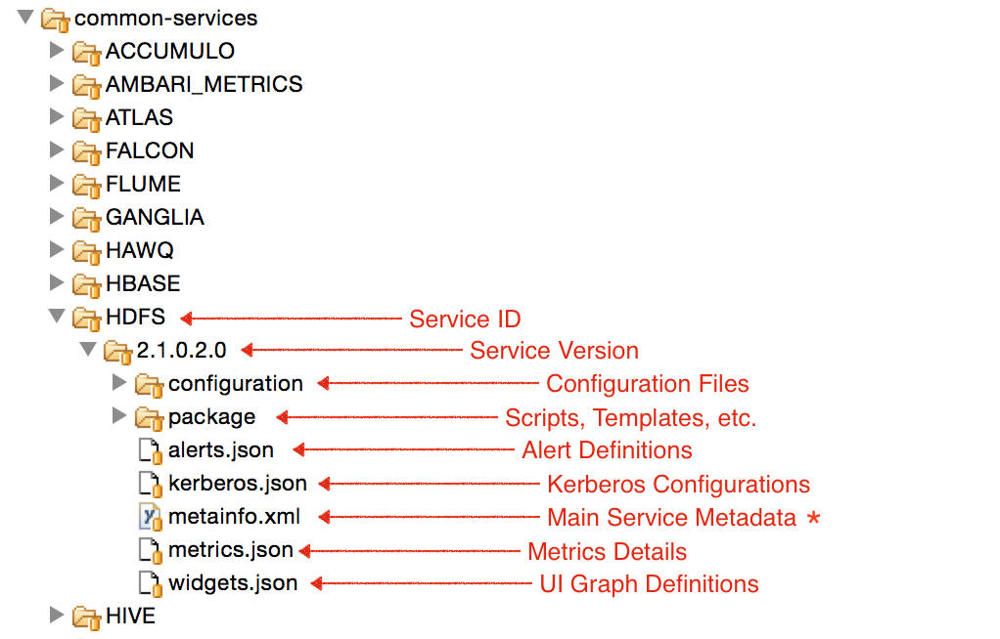

Services **MUST** provide the main *metainfo.xml* file which provides important metadata about the service.

Apart from that, other files can be provided to give more information about the service. More details about these files are provided below.

A service may also inherit from either a previous stack version or common services. For more information see the [Service Inheritance](#ambari-design-stack-and-services-stack-inheritance) page.

In the *metainfo.xml* service descriptor, one can first define the service and its components.

Complete reference can be found in the [Writing metainfo.xml](#ambari-design-stack-and-services-writing-metainfo) page.

A good reference implementation is the [HDFS metainfo.xml](https://github.com/apache/ambari/blob/trunk/ambari-server/src/main/resources/common-services/HDFS/2.1.0.2.0/metainfo.xml#L27).

> **Question: Is it possible to define multiple services in the same metainfo.xml?**
> Yes. Though it is possible, it is discouraged to define multiple services in the same service folder.

YARN and MapReduce2 are services that are defined together in the [YARN folder](https://github.com/apache/ambari/tree/trunk/ambari-server/src/main/resources/common-services/YARN/2.1.0.2.0). Its [metainfo.xml](https://github.com/apache/ambari/blob/trunk/ambari-server/src/main/resources/common-services/YARN/2.1.0.2.0/metainfo.xml) defines both services.

With the components defined, we need to provide scripts which can handle the various stages of the service and component's lifecycle.

The scripts necessary to manage service and components are specified in the *metainfo.xml* ([HDFS](https://github.com/apache/ambari/blob/trunk/ambari-server/src/main/resources/common-services/HDFS/2.1.0.2.0/metainfo.xml#L35))
Each of these scripts should extend the [Script](https://github.com/apache/ambari/blob/branch-2.2.1/ambari-common/src/main/python/resource_management/libraries/script/script.py) class which provides useful methods. Example: [NameNode script](https://github.com/apache/ambari/blob/branch-2.2.1/ambari-server/src/main/resources/common-services/HDFS/2.1.0.2.0/package/scripts/namenode.py#L68)

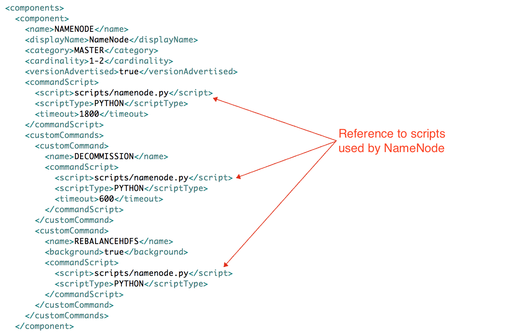

These scripts should be provided in the \_\_ folder.

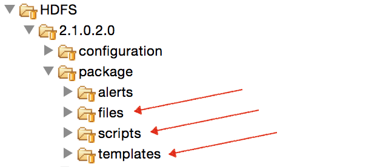

**package/scripts**

| Folder | Purpose |
| --- | --- |
| **package/scripts** | Contains scripts invoked by Ambari. These scripts are loaded into the execution path with the correct environment. Example: [HDFS](https://github.com/apache/ambari/tree/trunk/ambari-server/src/main/resources/common-services/HDFS/2.1.0.2.0/package/scripts) |
| **package/files** | Contains files used by above scripts. Generally these are other scripts (bash, python, etc.) invoked as a separate process. Example: [checkWebUI.py](https://github.com/apache/ambari/blob/trunk/ambari-server/src/main/resources/common-services/HDFS/2.1.0.2.0/package/files/checkWebUI.py) is run in HDFS service-check to determine if Journal Nodes are available |
| **package/templates** | Template files used by above scripts to generate files on managed hosts. These are generally configuration files required by the service to operate. Example: [exclude\_hosts\_list.j2](https://github.com/apache/ambari/blob/trunk/ambari-server/src/main/resources/common-services/HDFS/2.1.0.2.0/package/templates/exclude_hosts_list.j2) which is used by scripts to generate */etc/hadoop/conf/dfs.exclude* |

Ambari by default supports Python scripts for management of service and components.

Component scripts should extend `resource_management.Script` class and provide methods required for that component's lifecycle.

Taken from the page on [how to create custom stack](#ambari-design-stack-and-services-defining-a-custom-stack-and-services), the following methods are needed for MASTER, SLAVE and CLIENT components to go through their lifecycle.

```python
import sys 
from resource_management import Script 
class Master(Script): 
  def install(self, env): 
    print 'Install the Sample Srv Master'; 
  def stop(self, env): 
    print 'Stop the Sample Srv Master'; 
  def start(self, env): 
    print 'Start the Sample Srv Master'; 
  def status(self, env): 
    print 'Status of the Sample Srv Master'; 
  def configure(self, env): 
    print 'Configure the Sample Srv Master'; 
if __name__ == "__main__": 
  Master().execute() 
```

```python
import sys 
from resource_management import Script 
class Slave(Script): 
  def install(self, env): 
    print 'Install the Sample Srv Slave'; 
  def stop(self, env): 
    print 'Stop the Sample Srv Slave'; 
  def start(self, env): 
    print 'Start the Sample Srv Slave'; 
  def status(self, env): 
    print 'Status of the Sample Srv Slave'; 
  def configure(self, env): 
    print 'Configure the Sample Srv Slave'; 
if __name__ == "__main__": 
  Slave().execute() 
```

```python
import sys 
from resource_management import Script 
class SampleClient(Script): 
  def install(self, env): 
    print 'Install the Sample Srv Client'; 
  def configure(self, env): 
    print 'Configure the Sample Srv Client'; 
if __name__ == "__main__": 
  SampleClient().execute() 
```

Ambari provides helpful Python libraries below which are useful in writing service scripts. For complete reference on these libraries visit the [Ambari Python Libraries](https://cwiki.apache.org/confluence/display/AMBARI/Ambari+Python+Libraries) page.

- resource\_management
- ambari\_commons
- ambari\_simplejson

If the service is supported on multiple OSes which requires separate scripts, the base *resource\_management.Script* class can be extended with different *@OsFamilyImpl()* annotations.

This allows for the separation of only OS specific methods of the component.

Example: [NameNode default script](https://github.com/apache/ambari/blob/trunk/ambari-server/src/main/resources/common-services/HDFS/2.1.0.2.0/package/scripts/namenode.py#L126), [NameNode Windows script](https://github.com/apache/ambari/blob/trunk/ambari-server/src/main/resources/common-services/HDFS/2.1.0.2.0/package/scripts/namenode.py#L346).

> **Examples**
> NameNode [Start](https://github.com/apache/ambari/blob/trunk/ambari-server/src/main/resources/common-services/HDFS/2.1.0.2.0/package/scripts/hdfs_namenode.py#L93), [Stop](https://github.com/apache/ambari/blob/trunk/ambari-server/src/main/resources/common-services/HDFS/2.1.0.2.0/package/scripts/hdfs_namenode.py#L208).

DataNode [Start and Stop](https://github.com/apache/ambari/blob/trunk/ambari-server/src/main/resources/common-services/HDFS/2.1.0.2.0/package/scripts/hdfs_datanode.py#L68).

HDFS [configurations persistence](https://github.com/apache/ambari/blob/trunk/ambari-server/src/main/resources/common-services/HDFS/2.1.0.2.0/package/scripts/hdfs.py#L31)

Sometimes services need to perform actions unique to that service which go beyond the default actions provided by Ambari (like *install* , *start, stop, configure,* etc.).

Services can define such actions and expose them to the user in UI so that they can be easily invoked.

As an example, we show the *Rebalance HDFS* custom action implemented by HDFS.

1. [Define custom command inside the *customCommands* section](https://github.com/apache/ambari/blob/branch-2.2.1/ambari-server/src/main/resources/common-services/HDFS/2.1.0.2.0/metainfo.xml#L49) of the component in *metainfo.xml*.
2. [Implement method with same name as custom command](https://github.com/apache/ambari/blob/branch-2.2.1/ambari-server/src/main/resources/common-services/HDFS/2.1.0.2.0/package/scripts/namenode.py#L273) in script referenced from *metainfo.xml*.
3. If custom command does not have OS variants, it can be implemented in the same class that extends *resource\_management.Script*
4. If there are OS variants, different methods can be implemented in each class annotated by *@OsFamilyImpl(os\_family=...)*. [Default rebalancehdfs](https://github.com/apache/ambari/blob/branch-2.2.1/ambari-server/src/main/resources/common-services/HDFS/2.1.0.2.0/package/scripts/namenode.py#L273),[Windows rebalancehdfs](https://github.com/apache/ambari/blob/branch-2.2.1/ambari-server/src/main/resources/common-services/HDFS/2.1.0.2.0/package/scripts/namenode.py#L354).

This will provide ability by the backend to run the script on all managed hosts where the service is installed.

No UI changes are necessary to see the custom action on the host page.

The action should show up in the host-component's list of actions. Any master-component actions will automatically show up on the service's action menu.

When the action is clicked in UI, the POST call is made automatically to trigger the script defined above.

> **Question: How do I provide my own label and icon for the custom action in UI?**
> In Ambari UI, add your component action to the *App.HostComponentActionMap* object with custom icon and name. Ex: [REBALANCEHDFS](https://github.com/apache/ambari/blob/branch-2.2.1/ambari-web/app/models/host_component.js#L351).

Configuration files for a service should be placed by default in the \_ [configuration](https://github.com/apache/ambari/tree/branch-2.2.1/ambari-server/src/main/resources/common-services/HDFS/2.1.0.2.0/configuration)\_ folder.

If a different named folder has to be used, the [< *configuration-dir>*](https://github.com/apache/ambari/blob/branch-2.2.1/ambari-server/src/main/resources/common-services/YARN/2.1.0.2.0/metainfo.xml#L249) element can be used in *metainfo.xml* to point to that folder.

The important sections of the metainfo.xml with regards to configurations are:

```xml
<?xml version="1.0"?> 
<metainfo> 
  <schemaVersion>2.0</schemaVersion> 
  <services> 
    <service> 
      <name>HDFS</name> 
      <displayName>HDFS</displayName> 
      <comment>Apache Hadoop Distributed File System</comment> 
      <version>2.1.0.2.0</version> 
      <components> 
        ... 
        <component> 
          <name>HDFS_CLIENT</name> 
          ... 
          <configFiles> 
            <configFile> 
              <type>xml</type> 
              <fileName>hdfs-site.xml</fileName> 
              <dictionaryName>hdfs-site</dictionaryName> 
            </configFile> 
            <configFile> 
              <type>xml</type> 
              <fileName>core-site.xml</fileName> 
              <dictionaryName>core-site</dictionaryName> 
            </configFile> 
            <configFile> 
              <type>env</type> 
              <fileName>log4j.properties</fileName> 
              <dictionaryName>hdfs-log4j,yarn-log4j</dictionaryName> 
            </configFile>                          
            <configFile> 
              <type>env</type> 
              <fileName>hadoop-env.sh</fileName> 
              <dictionaryName>hadoop-env</dictionaryName> 
            </configFile> 
          </configFiles> 
          ... 
          <configuration-dependencies> 
             <config-type>core-site</config-type> 
             <config-type>hdfs-site</config-type> 
          </configuration-dependencies> 
        </component> 
          ... 
      </components> 
   
      <configuration-dir>configuration</configuration-dir> 
      <configuration-dependencies> 
        <config-type>core-site</config-type> 
        <config-type>hdfs-site</config-type> 
        <config-type>hadoop-env</config-type> 
        <config-type>hadoop-policy</config-type> 
        <config-type>hdfs-log4j</config-type> 
        <config-type>ranger-hdfs-plugin-properties</config-type> 
        <config-type>ssl-client</config-type> 
        <config-type>ssl-server</config-type> 
        <config-type>ranger-hdfs-audit</config-type> 
        <config-type>ranger-hdfs-policymgr-ssl</config-type> 
        <config-type>ranger-hdfs-security</config-type> 
        <config-type>ams-ssl-client</config-type> 
      </configuration-dependencies> 
    </service> 
  </services> 
</metainfo> 
```

- **config-type** - String representing a group of configurations. Example: *core-site, hdfs-site, yarn-site*, etc. When configurations are saved in Ambari, they are persisted within a version of config-type which is immutable. If you change and save HDFS core-site configs 4 times, you will have 4 versions of config-type core-site. Also, when a service's configs are saved, only the changed config-types are updated.
- **configFiles** - lists the config-files handled by the enclosing component
- **configFile** - represents one config-file of a certain type

  - **type** - type of file based on which contents are generated differently

    - **xml** - XML file generated in Hadoop friendly format. Ex:[hdfs-site.xml](https://github.com/apache/ambari/blob/trunk/ambari-server/src/main/resources/common-services/HDFS/2.1.0.2.0/configuration/hdfs-site.xml)
    - **env** - Generally used for scripts where the content value is used as a template. The template has config-tags whose values are populated at runtime during file generation. Ex:[hadoop-env.sh](https://github.com/apache/ambari/blob/trunk/ambari-server/src/main/resources/common-services/HDFS/2.1.0.2.0/configuration/hadoop-env.xml)
    - **properties** - Generates property files where entries are in key=value format. Ex:[falcon-runtime.properties](https://github.com/apache/ambari/blob/trunk/ambari-server/src/main/resources/common-services/FALCON/0.5.0.2.1/configuration/falcon-runtime.properties.xml)
  - **dictionaryName** - Name of the config-type as which key/values of this config file will be stored
- **configuration-dependencies** - Lists the config-types on which this component or service depends on. One of the implications of this dependency is that whenever the config-type is updated, Ambari automatically marks the component or service as requiring restart. From the code section above, whenever *core-site* is updated, both HDFS service as well as HDFS\_CLIENT component will be marked as requiring restart.
- **configuration-dir** - Directory where files listed in *configFiles* will be. Optional. Default value is *configuration*.

There are a number of different parameters that can be specified to a config item when it is added to a config-type. These have been covered [here](https://cwiki.apache.org/confluence/display/AMBARI/Configuration+support+in+Ambari).

Configurations defined above show up in the service's *Configs* page.

To customize categories and ordering of configurations in UI, the following files have to be updated.

**Create Category** - Update the \_ [ambari-web/app/models/stack\_service.js](https://github.com/apache/ambari/blob/trunk/ambari-web/app/models/stack_service.js#L226)\_ file to add your own service, along with your new categories.

**Use Category** - To place configs inside a defined category, and specify an order in which configs are placed, add configs to [ambari-web/app/data/HDP2/site\_properties.js](https://github.com/apache/ambari/blob/trunk/ambari-web/app/data/HDP2/site_properties.js) file. In this file one can specify the category to use, and the index where a config should be placed. The stack folders in [ambari-web/app/data](https://github.com/apache/ambari/tree/trunk/ambari-web/app/data) are hierarchical and inherit from previous versions. The mapping of configurations into sections is defined here. Example [Hive Categories](https://github.com/apache/ambari/blob/trunk/ambari-web/app/data/HDP2.2/hive_properties.js), [Tez Categories](https://github.com/apache/ambari/blob/trunk/ambari-web/app/data/HDP2.2/tez_properties.js).

The \_Enhanced Configs\_feature makes it possible for service providers to customize their service's configs to a great deal and determine which configs are prominently shown to user without making any UI code changes. Customization includes providing a service friendly layout, better controls (sliders, combos, lists, toggles, spinners, etc.), better validation (minimum, maximum, enums), automatic unit conversion (MB, GB, seconds, milliseconds, etc.), configuration dependencies and improved dynamic recommendations of default values.

A service provider can accomplish all the above just by changing their service definition in the *stacks*/folder.

Read more in the \_ [Enhanced Configs](https://cwiki.apache.org/confluence/display/AMBARI/Enhanced+Configs)\_ page

Each service is capable of defining which alerts Ambari should track by providing an [alerts.json](https://github.com/apache/ambari/blob/trunk/ambari-server/src/main/resources/common-services/HDFS/2.1.0.2.0/alerts.json) file.

Read more about Ambari Alerts framework [in the Alerts wiki page](https://cwiki.apache.org/confluence/display/AMBARI/Alerts) and the alerts.json format in the [Alerts definition documentation](https://github.com/apache/ambari/blob/branch-2.1/ambari-server/docs/api/v1/alert-definitions.md).

Ambari is capable of enabling and disabling Kerberos for a cluster. To inform Ambari of the identities and configurations to be used for the service and its components, each service can provide a *kerberos.json* file.

Read more about Kerberos support in the \_ [Automated Kerberization](https://cwiki.apache.org/confluence/display/AMBARI/Automated+Kerberizaton)\_ wiki page and the Kerberos descriptor in the [Kerberos Descriptor documentation](https://github.com/apache/ambari/blob/trunk/ambari-server/docs/security/kerberos/kerberos_descriptor.md).

Ambari provides the [Ambari Metrics System ("AMS")](https://cwiki.apache.org/confluence/display/AMBARI/Metrics)service for collecting, aggregating and serving Hadoop and system metrics in Ambari-managed clusters.

Each service can define which metrics AMS should collect and provide by defining a [metrics.json](https://github.com/apache/ambari/blob/trunk/ambari-server/src/main/resources/common-services/HDFS/2.1.0.2.0/metrics.json) file.

You can read about the metrics.json file format in the [Stack Defined Metrics](https://cwiki.apache.org/confluence/display/AMBARI/Stack+Defined+Metrics) page.

A service can add a list of quick links to the Ambari web UI by adding metainfo to a text file following a predefined JSON format. Ambari server parses the quicklink JSON file and provides its content to the UI. So that Ambari web UI can calculate quick link URLs based on the information and populate the quicklinks drop-down list accordingly.

Read more about quick links JSON file design in the [Quick Links](#ambari-design-quick-links) page.

Each service can define which widgets and heatmaps show up by default on the service summary page by defining a [widgets.json](https://github.com/apache/ambari/blob/trunk/ambari-server/src/main/resources/common-services/HDFS/2.1.0.2.0/widgets.json) file.

You can read more about the widgets descriptor in the [Enhanced Service Dashboard](https://cwiki.apache.org/confluence/display/AMBARI/Enhanced+Service+Dashboard) page.

From Ambari 2.2, each service can define its own role command order by including the [role\_command\_order.json](https://github.com/apache/ambari/blob/trunk/ambari-server/src/main/resources/stacks/HDP/2.0.6/role_command_order.json) file in its service folder. The service should only specify the relationship of its components to other components. In other words, if a service only includes COMP\_X, it should only list dependencies related to COMP\_X. If when COMP\_X starts it is dependent on the NameNode start and when the NameNode stops it should wait for COMP\_X to stop, the following would be included in the role command order:

**Example service role\_command\_order.json**

```json
"COMP_X-START": ["NAMENODE-START"], 
    "NAMENODE-STOP": ["COMP_X-STOP"] 
```

The entries in the service's role command order will be merged with the role command order defined in the stack. For example, since the stack already has a dependency for NAMENODE-STOP, in the example above COMP\_X-STOP would be added to the rest of the NAMENODE-STOP dependencies and in addition the COMP\_X-START dependency on NAMENODE-START would just be added as a new dependency.

For more details on role command order, see the [Role Command Order](https://cwiki.apache.org/confluence/display/AMBARI/How-To+Define+Stacks+and+Services#How-ToDefineStacksandServices-RoleCommandOrder) section below.

From Ambari 2.4, each service can choose to define its own service advisor rather than define the details of its configuration and layout in the stack advisor. This is particularly useful for custom services which are not defined in the stack. Ambari provides the *Service Advisor* capability where a service can write a Python script named *service-advisor.py* in their service folder. This folder can be in the stack's services directory where the service is defined or can be inherited from the service definition in common-services or elsewhere. Example: [common-services/HAWQ/2.0.0](https://github.com/apache/ambari/tree/trunk/ambari-server/src/main/resources/common-services/HAWQ/2.0.0).

Unlike the Stack-advisor scripts, the service-advisor scripts do not automatically extend the parent service's service-advisor scripts. The service-advisor script needs to explicitly extend their parent's service service-advisor script. The following code sample shows how you would refer to a parent's service\_advisor.py. In this case it is extending the root service-advisor.py file in the resources/stacks directory.

**Sample service-advisor.py file inheritance**

```python
SCRIPT_DIR = os.path.dirname(os.path.abspath(__file__)) 
STACKS_DIR = os.path.join(SCRIPT_DIR, '../../../stacks/') 
PARENT_FILE = os.path.join(STACKS_DIR, 'service_advisor.py') 
 
try: 
  with open(PARENT_FILE, 'rb') as fp: 
    service_advisor = imp.load_module('service_advisor', fp, PARENT_FILE, ('.py', 'rb', imp.PY_SOURCE)) 
except Exception as e: 
  traceback.print_exc() 
  print "Failed to load parent" 
 
class HAWQ200ServiceAdvisor(service_advisor.ServiceAdvisor): 
```

Like the stack advisors, service advisors provide information on 4 important aspects:

1. Recommend layout of the service on cluster
2. Recommend service configurations
3. Validate layout of the service on cluster
4. Validate service configurations

By providing the service-advisor.py file, one can control dynamically each of the above for the service.

The main interface for the service-advisor scripts contains documentation on how each of the above are called, and what data is provided.

```python
class ServiceAdvisor(DefaultStackAdvisor): 
""" 
  Abstract class implemented by all service advisors. 
 
""" 
 
""" 
  If any components of the service should be colocated with other services, 
  this is where you should set up that layout.  Example: 
 
    # colocate HAWQSEGMENT with DATANODE, if no hosts have been allocated for HAWQSEGMENT 
    hawqSegment = [component for component in serviceComponents if component["StackServiceComponents"]["component_name"] == "HAWQSEGMENT"][0] 
    if not self.isComponentHostsPopulated(hawqSegment): 
      for hostName in hostsComponentsMap.keys(): 
        hostComponents = hostsComponentsMap[hostName] 
        if {"name": "DATANODE"} in hostComponents and {"name": "HAWQSEGMENT"} not in hostComponents: 
          hostsComponentsMap[hostName].append( { "name": "HAWQSEGMENT" } ) 
        if {"name": "DATANODE"} not in hostComponents and {"name": "HAWQSEGMENT"} in hostComponents: 
          hostComponents.remove({"name": "HAWQSEGMENT"}) 
""" 
  def colocateService(self, hostsComponentsMap, serviceComponents): 
    pass 
 
""" 
  Any configuration recommendations for the service should be defined in this function. 
 
  This should be similar to any of the recommendXXXXConfigurations functions in the stack_advisor.py 
  such as recommendYARNConfigurations(). 
 
""" 
  def getServiceConfigurationRecommendations(self, configurations, clusterSummary, services, hosts): 
    pass 
 
""" 
  Returns an array of Validation objects about issues with the hostnames to which components are assigned. 
 
  This should detect validation issues which are different than those the stack_advisor.py detects. 
 
  The default validations are in stack_advisor.py getComponentLayoutValidations function. 
 
""" 
  def getServiceComponentLayoutValidations(self, services, hosts): 
    return [] 
 
""" 
  Any configuration validations for the service should be defined in this function. 
 
  This should be similar to any of the validateXXXXConfigurations functions in the stack_advisor.py 
  such as validateHDFSConfigurations. 
 
""" 
  def getServiceConfigurationsValidationItems(self, configurations, recommendedDefaults, services, hosts): 
    return [] 
```

- [Service Advisor interface](https://github.com/apache/ambari/blob/trunk/ambari-server/src/main/resources/stacks/service_advisor.py#L51)
- [HAWQ 2.0.0 Service Advisor implementation](https://github.com/apache/ambari/blob/trunk/ambari-server/src/main/resources/common-services/HAWQ/2.0.0/service_advisor.py)
- [PXF 3.0.0 Service Advisor implementation](https://github.com/apache/ambari/blob/trunk/ambari-server/src/main/resources/common-services/PXF/3.0.0/service_advisor.py)

From Ambari 2.4, each service can now define its upgrade within its service definition. This is particularly useful for custom services which no longer need to modify the stack's upgrade-packs in order to integrate themselves into the [cluster upgrade](https://cwiki.apache.org/confluence/display/AMBARI/How-To+Define+Stacks+and+Services#How-ToDefineStacksandServices-StackUpgrades).

Each service can define *upgrade-packs*, which are XML files describing the upgrade process of that particular service and how the upgrade pack relates to the overall stack upgrade-packs. These *upgrade-pack* XML files are placed in the service's *upgrades/* folder in separate sub-folders specific to the stack-version they are meant to extend. Some examples of this can be seen in the testing code.

- [Upgrades folder](https://github.com/apache/ambari/blob/trunk/ambari-server/src/test/resources/stacks/HDP/2.0.5/services/HDFS/upgrades/)
- [Upgrade-pack XML](https://github.com/apache/ambari/blob/trunk/ambari-server/src/test/resources/stacks/HDP/2.0.5/services/HDFS/upgrades/HDP/2.2.0/upgrade_test_15388.xml)

Each upgrade-pack that the service defines should match the file name of the service defined by a particular stack version. For example in the testing code, HDP 2.2.0 had an [upgrade\_test\_15388.xml](https://github.com/apache/ambari/blob/trunk/ambari-server/src/test/resources/stacks/HDP/2.2.0/upgrades/upgrade_test_15388.xml) upgrade-pack. The HDFS service defined an extension to that upgrade pack [HDP/2.0.5/services/HDFS/upgrades/HDP/2.2.0/upgrade\_test\_15388.xml](https://github.com/apache/ambari/blob/trunk/ambari-server/src/test/resources/stacks/HDP/2.0.5/services/HDFS/upgrades/HDP/2.2.0/upgrade_test_15388.xml). In this case the upgrade-pack was defined in the HDP/2.0.5 stack. The upgrade-pack is an extension to HDP/2.2.0 because it is defined in upgrade/HDP/2.2.0 directory. Finally the name of the service's extension to the upgrade-pack upgrade\_test\_15388.xml matches the name of the upgrade-pack in HDP/2.2.0/upgrades.

The file format for the service is much the same as that of the stack. The target, target-stack and type attributes should all be the same as the stack's upgrade-pack. The service is able to add its own prerequisite checks.

**General Attributes and Prerequisite Checks**

```text
<upgrade xmlns:xsi="http://www.w3.org/2001/XMLSchema-instance"> 
  <target>2.4.*</target> 
  <target-stack>HDP-2.4.0</target-stack> 
  <type>ROLLING</type> 
  <prerequisite-checks> 
    <check>org.apache.ambari.server.checks.FooCheck</check> 
  </prerequisite-checks> 
```

The order section of the upgrade-pack, consists of group elements just like the stack's upgrade-pack. The key difference is defining how these groups relate to groups in the stack's upgrade pack or other service upgrade-packs. In the first example we are referencing the PRE\_CLUSTER group and adding a new execute-stage for the service FOO. The entry is supposed to be added after the execute-stage for HDFS based on the `<add-after-group-entry>` tag.

```xml
<order> 
  <group xsi:type="cluster" name="PRE_CLUSTER" title="Pre {{direction.text.proper}}"> 
    <add-after-group-entry>HDFS</add-after-group-entry> 
    <execute-stage service="FOO" component="BAR" title="Backup FOO"> 
      <task xsi:type="manual"> 
        <message>Back FOO up.</message> 
      </task> 
    </execute-stage> 
  </group> 
 
```

The same syntax can be used to order other sections like service check priorities and group services.

```xml
<group name="SERVICE_CHECK1" title="All Service Checks" xsi:type="service-check"> 
  <add-after-group-entry>ZOOKEEPER</add-after-group-entry> 
  <priority> 
    <service>HBASE</service> 
  </priority> 
</group> 
  
<group name="CORE_MASTER" title="Core Masters"> 
  <add-after-group-entry>YARN</add-after-group-entry> 
  <service name="HBASE"> 
    <component>HBASE_MASTER</component> 
  </service> 
</group> 
```

It is also possible to add new groups and order them after other groups in the stack's upgrade-packs. In the following example, we are adding the FOO group after the HIVE group using the add-after-group tag.

```xml
<group name="FOO" title="Foo"> 
  <add-after-group>HIVE</add-after-group> 
  <skippable>true</skippable> 
  <allow-retry>false</allow-retry> 
  <service name="FOO"> 
    <component>BAR</component> 
  </service> 
</group> 
```

You could also include both the add-after-group and the add-after-group-entry tags in the same group. This will create a new group if it doesn't already exist and will order it after the add-after-group's group name. The add-after-group-entry will determine the internal ordering of that group's services, priorities or execute stages.

```xml
<group name="FOO" title="Foo"> 
  <add-after-group>HIVE</add-after-group> 
  <add-after-group-entry>FOO</add-after-group-entry> 
  <skippable>true</skippable> 
  <allow-retry>false</allow-retry> 
  <service name="FOO2"> 
    <component>BAR2</component> 
  </service> 
</group> 
```

The processing section of the upgrade-pack remains the same as what it would be in the stack's upgrade-pack.

```xml
   <processing> 
    <service name="FOO"> 
      <component name="BAR"> 
        <upgrade> 
          <task xsi:type="restart-task" /> 
        </upgrade> 
      </component> 
      <component name="BAR2"> 
        <upgrade> 
          <task xsi:type="restart-task" /> 
        </upgrade> 
      </component> 
    </service> 
  </processing> 
```

A stack is a versioned collection of services. Each stack is a folder is defined in [ambari-server/src/main/resources/stacks](https://github.com/apache/ambari/tree/trunk/ambari-server/src/main/resources/stacks) source. Once installed, these stack definitions are available on the ambari-server machine at */var/lib/ambari-server/resources/stacks*.

Each stack folder contains one sub-folder per version of the stack. Some of these stack-versions are active while some are not. Each stack-version includes services which are either referenced from *common-services*, or defined inside the stack-version's *services* folder.

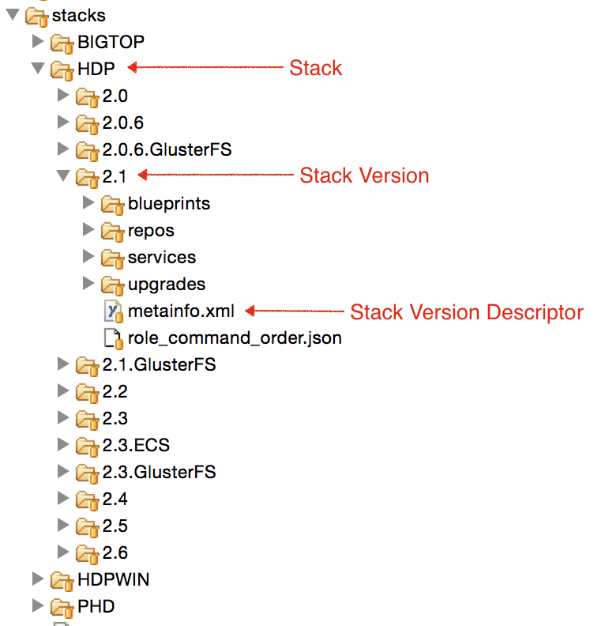

Example: [HDP stack](https://github.com/apache/ambari/tree/trunk/ambari-server/src/main/resources/stacks/HDP). [HDP-2.4 stack version](https://github.com/apache/ambari/tree/trunk/ambari-server/src/main/resources/stacks/HDP/2.4).

Each stack-version should provide a *metainfo.xml* (Example: [HDP-2.3](https://github.com/apache/ambari/blob/trunk/ambari-server/src/main/resources/stacks/HDP/2.3/metainfo.xml), [HDP-2.4](https://github.com/apache/ambari/blob/trunk/ambari-server/src/main/resources/stacks/HDP/2.4/metainfo.xml)) descriptor file which describes the following about this stack-version:

```xml
<metainfo> 
    <versions> 
      <active>true</active> 
    </versions> 
    <extends>2.3</extends> 
    <minJdk>1.7</minJdk> 
    <maxJdk>1.8</maxJdk> 
</metainfo> 
```

- **versions/active** - Whether this stack-version is still available for install. If not available, this version will not show up in UI during install.
- **extends** - The stack-version in this stack that is being extended. Extended stack-versions inherit services along with almost all aspects of the parent stack-version.
- **minJdk** - Minimum JDK with which this stack-version is supported. Users are warned during installer wizard if the JDK used by Ambari is lower than this version.
- **maxJdk** - Maximum JDK with which this stack-version is supported. Users are warned during installer wizard if the JDK used by Ambari is greater than this version.

The stack must contain or inherit a properties directory which contains two files: [stack\_features.json](https://github.com/apache/ambari/blob/trunk/ambari-server/src/main/resources/stacks/HDP/2.0.6/properties/stack_features.json) and [stack\_tools.json](https://github.com/apache/ambari/blob/trunk/ambari-server/src/main/resources/stacks/HDP/2.0.6/properties/stack_tools.json). This [directory](https://github.com/apache/ambari/tree/trunk/ambari-server/src/main/resources/stacks/HDP/2.0.6/properties) is new in Ambari 2.4.

The stack\_features.json contains a list of features that are included in Ambari and allows the stack to specify which versions of the stack include those features. The list of features are determined by the particular Ambari release. The reference list for a particular Ambari version should be found in the [HDP/2.0.6/properties/stack\_features.json](https://github.com/apache/ambari/blob/branch-2.4/ambari-server/src/main/resources/stacks/HDP/2.0.6/properties/stack_features.json) in the branch for that Ambari release. Each feature has a name and description and the stack can provide the minimum and maximum version where that feature is supported.

```json
{ 
 
"stack_features": [ 
 
{ 
 
"name": "snappy", 
 
"description": "Snappy compressor/decompressor support", 
 
"min_version": "2.0.0.0", 
 
"max_version": "2.2.0.0" 
 
}, 
 
... 
 
} 
```

The stack\_tools.json includes the name and location where the stack\_selector and conf\_selector tools are installed.

```json
{ 
 
"stack_selector": ["hdp-select", "/usr/bin/hdp-select", "hdp-select"], 
 
"conf_selector": ["conf-select", "/usr/bin/conf-select", "conf-select"] 
 
} 
```

Any custom stack must include these two JSON files. For further information see the [Stack Properties](#ambari-design-stack-and-services-stack-properties) wiki page.

Each stack-version includes services which are either referenced from *common-services*, or defined inside the stack-version's *services* folder.

Services are defined in *common-services* if they will be shared across multiple stacks. If they will never be shared, then they can be defined inside the stack-version.

To reference a service from common-services, the service descriptor file should use the < *extends>* element. (Example: [HDFS in HDP-2.0.6](https://github.com/apache/ambari/blob/trunk/ambari-server/src/main/resources/stacks/HDP/2.0.6/services/HDFS/metainfo.xml))

```xml
<metainfo> 
  <schemaVersion>2.0</schemaVersion> 
  <services> 
    <service> 
      <name>HDFS</name> 
      <extends>common-services/HDFS/2.1.0.2.0</extends> 
    </service> 
  </services> 
</metainfo> 
```

In exactly the same format as services defined in *common-services*, a new service can be defined inside the *services* folder.

Examples:

- [HDFS in BIGTOP-0.8](https://github.com/apache/ambari/tree/trunk/ambari-server/src/main/resources/stacks/BIGTOP/0.8/services/HDFS)
- [GlusterFS in HDP-2.3.GlusterFS](https://github.com/apache/ambari/tree/trunk/ambari-server/src/main/resources/stacks/HDP/2.3.GlusterFS/services/GLUSTERFS)

When a stack-version extends another stack-version, it inherits all details of the parent service. It is also free to override and remove any portion of the inherited service definition.

Examples:

- HDP-2.3 / HDFS -[Adding NFS\_GATEWAY component, updating service version and OS specific packages](https://github.com/apache/ambari/blob/trunk/ambari-server/src/main/resources/stacks/HDP/2.3/services/HDFS/metainfo.xml)
- HDP-2.2 / Storm -[Deleting STORM\_REST\_API component, updating service version and OS specific packages](https://github.com/apache/ambari/blob/trunk/ambari-server/src/main/resources/stacks/HDP/2.2/services/STORM/metainfo.xml)
- HDP-2.3 / YARN -[Deleting YARN node-label configuration from capacity-scheduler.xml](https://github.com/apache/ambari/blob/trunk/ambari-server/src/main/resources/stacks/HDP/2.3/services/YARN/configuration/capacity-scheduler.xml)
- HDP-2.3 / Kafka -[Add Kafka Broker Process alert](https://github.com/apache/ambari/blob/trunk/ambari-server/src/main/resources/stacks/HDP/2.3/services/KAFKA/alerts.json)

***Role*** is another name for **Component** (Ex: NAMENODE, DATANODE, RESOURCEMANAGER, HBASE\_MASTER, etc.)

As the name implies, it is possible to tell Ambari about the order in which commands should be run for the components defined in your stack.

For example: "*ZooKeeper Server* should be started before starting *NameNode*". Or "*HBase Master* should be started only after *NameNode* and *DataNodes* are started".

This can be specified by including the [role\_command\_order.json](https://github.com/apache/ambari/blob/trunk/ambari-server/src/main/resources/stacks/HDP/2.0.6/role_command_order.json) file in the stack-version folder.

Specified in JSON format, the file contains a JSON object with top-level keys being either section names or comments Ex: [HDP-2.0.6](https://github.com/apache/ambari/blob/trunk/ambari-server/src/main/resources/stacks/HDP/2.0.6/role_command_order.json).

Inside each section object, the key describes the dependent component-action, and the value lists the component-actions which should be done before it.

```json
{ 
  "_comment": "Section 1 comment", 
  "section_name_1": { 
    "_comment": "Section containing role command orders", 
    "-": ["-", "-"], 
    "-": ["-"], 
    ... 
 
  }, 
  "_comment": "Next section comment", 
  ... 
 
} 
```

Ambari uses the below sections only:

| Section Name | When Used |
| --- | --- |
| general\_deps | Command orders are applied in all situations |
| optional\_glusterfs | Command orders are applied when cluster has instance of GLUSTERFS service |
| optional\_no\_glusterfs | Command orders are applied when cluster does not have instance of GLUSTERFS service |
| namenode\_optional\_ha | Command orders are applied when HDFS service is installed and JOURNALNODE component exists (HDFS HA is enabled) |
| resourcemanager\_optional\_ha | Command orders are applied when YARN service is installed and multiple RESOURCEMANAGER host-components exist (YARN HA is enabled) |

Commands currently supported by Ambari are

- INSTALL
- UNINSTALL
- START
- RESTART
- STOP
- EXECUTE
- ABORT
- UPGRADE
- SERVICE\_CHECK
- CUSTOM\_COMMAND
- ACTIONEXECUTE

| Role Command Order | Explanation |
| --- | --- |
| "HIVE\_METASTORE-START": ["MYSQL\_SERVER-START", "NAMENODE-START"] | Start MySQL and NameNode components before starting Hive Metastore |
| "MAPREDUCE\_SERVICE\_CHECK-SERVICE\_CHECK": ["NODEMANAGER-START", "RESOURCEMANAGER-START"], | MapReduce service check needs ResourceManager and NodeManagers started |
| "ZOOKEEPER\_SERVER-STOP" : ["HBASE\_MASTER-STOP", "HBASE\_REGIONSERVER-STOP", "METRICS\_COLLECTOR-STOP"], | Before stopping ZooKeeper servers, make sure HBase Masters, HBase RegionServers and AMS Metrics Collector are stopped. |

Each stack-version can provide the location of package repositories to use, by providing a *repos/repoinfo.xml* (Ex: [HDP-2.0.6](https://github.com/apache/ambari/blob/trunk/ambari-server/src/main/resources/stacks/HDP/2.0.6/repos/repoinfo.xml))
The *repoinfo.xml* file contains repositories grouped by operating systems. Each OS specifies a list of repositories that are shown to the user when the stack-version is selected for install.

These repositories are used in conjunction with the [*packages* defined in a service's metainfo.xml](https://github.com/apache/ambari/blob/trunk/ambari-server/src/main/resources/common-services/HDFS/2.1.0.2.0/metainfo.xml#L161) to install appropriate bits on the system.

```xml
<reposinfo> 
  <os family="redhat6"> 
    <repo> 
      <baseurl>http://public-repo-1.hortonworks.com/HDP/centos6/2.x/updates/2.0.6.1</baseurl> 
      <repoid>HDP-2.0.6</repoid> 
      <reponame>HDP</reponame> 
    </repo> 
    <repo> 
      <baseurl>http://public-repo-1.hortonworks.com/HDP-UTILS-1.1.0.17/repos/centos6</baseurl> 
      <repoid>HDP-UTILS-1.1.0.17</repoid> 
      <reponame>HDP-UTILS</reponame> 
    </repo> 
  </os> 
<reposinfo> 
```

baseurl- URL of the RPM repository where provided *repoid* can be found
**repoid** - Repo ID to use that are hosted at \_baseurl
**reponame** - Display name for the repo being used.

Though repository base URL is capable of providing updates to a particular repo, it has to be defined at build time. This could be an issue later when the repository changes location, or update builds are hosted at a different site.

For such scenarios, a stack-version can provide the location of a JSON file which can provide details of other repo URLs to use.

Example: [HDP-2.3 repoinfo.xml uses](https://github.com/apache/ambari/blob/trunk/ambari-server/src/main/resources/stacks/HDP/2.3/repos/repoinfo.xml), which then points to alternate repository URLs where latest builds can be found:

```json
{ 
    ... 
 
    "HDP-2.3":{ 
        "latest":{ 
            "centos6":"http://s3.amazonaws.com/dev.hortonworks.com/HDP/centos6/2.x/BUILDS/2.3.6.0-3586/", 
            "centos7":"http://s3.amazonaws.com/dev.hortonworks.com/HDP/centos7/2.x/BUILDS/2.3.6.0-3586/", 
            "debian6":"http://s3.amazonaws.com/dev.hortonworks.com/HDP/debian6/2.x/BUILDS/2.3.6.0-3586/", 
            "debian7":"http://s3.amazonaws.com/dev.hortonworks.com/HDP/debian7/2.x/BUILDS/2.3.6.0-3586/", 
            "suse11":"http://s3.amazonaws.com/dev.hortonworks.com/HDP/suse11sp3/2.x/BUILDS/2.3.6.0-3586/", 
            "ubuntu12":"http://s3.amazonaws.com/dev.hortonworks.com/HDP/ubuntu12/2.x/BUILDS/2.3.6.0-3586/", 
            "ubuntu14":"http://s3.amazonaws.com/dev.hortonworks.com/HDP/ubuntu14/2.x/BUILDS/2.3.6.0-3586/" 
        } 
    }, 
    ... 
 
} 
```

A stack-version could have very basic and common instructions that need to be run before or after certain Ambari commands, across all services.

Instead of duplicating this code across all service scripts and asking users to worry about them, Ambari provides the *Hooks* ability where common before and after code can be pulled away into the *hooks* folder. (Ex: [HDP-2.0.6](https://github.com/apache/ambari/tree/trunk/ambari-server/src/main/resources/stacks/HDP/2.0.6/hooks))


The general naming pattern for hooks sub-folders is `"<before|after>-<ANY|<CommandName>>"`.
What this means is that the scripts/hook.py file under the sub-folder is run either before or after the command.

**Examples:**

| Sub-Folder | Purpose | Example |
| --- | --- | --- |
| before-START | Hook script called before START command is run on any component of the stack-version. | [HDP-2.0.6](https://github.com/apache/ambari/blob/trunk/ambari-server/src/main/resources/stacks/HDP/2.0.6/hooks/before-START/scripts/hook.py#L30) sets up Hadoop log and pid directories creates Java Home symlink Creates /etc/hadoop/conf/topology\_script.py etc. |
| before-INSTALL | Hook script called before installing of any component of the stack-version | [HDP-2.0.6](https://github.com/apache/ambari/blob/trunk/ambari-server/src/main/resources/stacks/HDP/2.0.6/hooks/before-INSTALL/scripts/hook.py#L33) Creates repo files in /etc/yum.repos.d Installs basic packages like curl, unzip, etc. |

Based on the commands currently supported by Ambari, the following sub-folders can be created based on necessity

| Prefix | - | Command |
| --- | --- | --- |
| before | - | INSTALL UNINSTALL START RESTART STOP |
| after | - | EXECUTE ABORT UPGRADE SERVICE\_CHECK `<custom_command>`-Custom commands specified by the user like the DECOMMISSION or REBALANCEHDFS commands specified by HDFS |

The *scripts/hook.py* script should import [resource\_management.libraries.script.hook](https://github.com/apache/ambari/blob/trunk/ambari-common/src/main/python/resource_management/libraries/script/hook.py) module and extend the Hook class

```python
from resource_management.libraries.script.hook import Hook 
 
class CustomHook(Hook): 
  def hook(self, env): 
    # Do custom work 
 
if __name__ == "__main__": 
  CustomHook().execute() 
```

Though most configurations are set at the service level, there can be configurations which apply across all services to indicate the state of the cluster installed with this stack.

For example, things like ["is security enabled?"](https://github.com/apache/ambari/blob/trunk/ambari-server/src/main/resources/stacks/HDP/2.0.6/configuration/cluster-env.xml#L25), ["what user runs smoke tests?"](https://github.com/apache/ambari/blob/trunk/ambari-server/src/main/resources/stacks/HDP/2.0.6/configuration/cluster-env.xml#L46) etc.

Such configurations can be defined in the [configuration folder](https://github.com/apache/ambari/tree/trunk/ambari-server/src/main/resources/stacks/HDP/2.0.6/configuration) of the stack. They are available for access just like the service-level configs.

With each stack containing multiple complex services, it becomes necessary to dynamically determine how the services are laid out on the cluster, and for determining values of certain configurations.

Ambari provides the *Stack Advisor* capability where stacks can write a Python script named *stack-advisor.py* in the *services/* folder. Example: [HDP-2.0.6](https://github.com/apache/ambari/blob/trunk/ambari-server/src/main/resources/stacks/HDP/2.0.6/services/stack_advisor.py).

Stack-advisor scripts automatically extend the parent stack-version's stack-advisor scripts. This allows newer stack-versions to change behavior without effecting earlier behavior.

Stack advisors provide information on 4 important aspects:

1. Recommend layout of services on cluster
2. Recommend service configurations
3. Validate layout of services on cluster
4. Validate service configurations

By providing the stack-advisor.py file, one can control dynamically each of the above.

The main interface for the stack-advisor scripts contains documentation on how each of the above are called, and what data is provided

```python
class StackAdvisor(object): 
""" 
  Abstract class implemented by all stack advisors. Stack advisors advise on stack specific questions. 
 
  Currently stack advisors provide following abilities: 
  - Recommend where services should be installed in cluster 
  - Recommend configurations based on host hardware 
  - Validate user selection of where services are installed on cluster 
  - Validate user configuration values 
 
  Each of the above methods is passed in parameters about services and hosts involved as described below. 
 
    @type services: dictionary 
    @param services: Dictionary containing all information about services selected by the user. 
 
      Example: { 
      "services": [ 
        { 
          "StackServices": { 
            "service_name" : "HDFS", 
            "service_version" : "2.6.0.2.2", 
          }, 
          "components" : [ 
            { 
              "StackServiceComponents" : { 
                "cardinality" : "1+", 
                "component_category" : "SLAVE", 
                "component_name" : "DATANODE", 
                "display_name" : "DataNode", 
                "service_name" : "HDFS", 
                "hostnames" : [] 
              }, 
              "dependencies" : [] 
            }, { 
              "StackServiceComponents" : { 
                "cardinality" : "1-2", 
                "component_category" : "MASTER", 
                "component_name" : "NAMENODE", 
                "display_name" : "NameNode", 
                "service_name" : "HDFS", 
                "hostnames" : [] 
              }, 
              "dependencies" : [] 
            }, 
            ... 
 
          ] 
        }, 
        ... 
 
      ] 
    } 
  @type hosts: dictionary 
  @param hosts: Dictionary containing all information about hosts in this cluster 
    Example: { 
      "items": [ 
        { 
          Hosts: { 
            "host_name": "c6401.ambari.apache.org", 
            "public_host_name" : "c6401.ambari.apache.org", 
            "ip": "192.168.1.101", 
            "cpu_count" : 1, 
            "disk_info" : [ 
              { 
              "available" : "4564632", 
              "used" : "5230344", 
              "percent" : "54%", 
              "size" : "10319160", 
              "type" : "ext4", 
              "mountpoint" : "/" 
              }, 
              { 
              "available" : "1832436", 
              "used" : "0", 
              "percent" : "0%", 
              "size" : "1832436", 
              "type" : "tmpfs", 
              "mountpoint" : "/dev/shm" 
              } 
            ], 
            "host_state" : "HEALTHY", 
            "os_arch" : "x86_64", 
            "os_type" : "centos6", 
            "total_mem" : 3664872 
          } 
        }, 
        ... 
 
      ] 
    } 
 
    Each of the methods can either return recommendations or validations. 
 
    Recommendations are made in a Ambari Blueprints friendly format. 
 
    Validations are an array of validation objects. 
 
""" 
 
  def recommendComponentLayout(self, services, hosts): 
""" 
    Returns recommendation of which hosts various service components should be installed on. 
 
    This function takes as input all details about services being installed, and hosts 
    they are being installed into, to generate hostname assignments to various components 
    of each service. 
 
    @type services: dictionary 
    @param services: Dictionary containing all information about services selected by the user. 
 
    @type hosts: dictionary 
    @param hosts: Dictionary containing all information about hosts in this cluster 
    @rtype: dictionary 
    @return: Layout recommendation of service components on cluster hosts in Ambari Blueprints friendly format. 
 
        Example: { 
          "resources" : [ 
            { 
              "hosts" : [ 
                "c6402.ambari.apache.org", 
                "c6401.ambari.apache.org" 
              ], 
              "services" : [ 
                "HDFS" 
              ], 
              "recommendations" : { 
                "blueprint" : { 
                  "host_groups" : [ 
                    { 
                      "name" : "host-group-2", 
                      "components" : [ 
                        { "name" : "JOURNALNODE" }, 
                        { "name" : "ZKFC" }, 
                        { "name" : "DATANODE" }, 
                        { "name" : "SECONDARY_NAMENODE" } 
                      ] 
                    }, 
                    { 
                      "name" : "host-group-1", 
                      "components" : 
                        { "name" : "HDFS_CLIENT" }, 
                        { "name" : "NAMENODE" }, 
                        { "name" : "JOURNALNODE" }, 
                        { "name" : "ZKFC" }, 
                        { "name" : "DATANODE" } 
                      ] 
                    } 
                  ] 
                }, 
                "blueprint_cluster_binding" : { 
                  "host_groups" : [ 
                    { 
                      "name" : "host-group-1", 
                      "hosts" : [ { "fqdn" : "c6401.ambari.apache.org" } ] 
                    }, 
                    { 
                      "name" : "host-group-2", 
                      "hosts" : [ { "fqdn" : "c6402.ambari.apache.org" } ] 
                    } 
                  ] 
                } 
              } 
            } 
          ] 
        } 
""" 
    pass 
 
  def validateComponentLayout(self, services, hosts): 
""" 
    Returns array of Validation issues with service component layout on hosts 
 
    This function takes as input all details about services being installed along with 
    hosts the components are being installed on (hostnames property is populated for 
    each component). 
 
    @type services: dictionary 
    @param services: Dictionary containing information about services and host layout selected by the user. 
 
    @type hosts: dictionary 
    @param hosts: Dictionary containing all information about hosts in this cluster 
    @rtype: dictionary 
    @return: Dictionary containing array of validation items 
        Example: { 
          "items": [ 
            { 
              "type" : "host-group", 
              "level" : "ERROR", 
              "message" : "NameNode and Secondary NameNode should not be hosted on the same machine", 
              "component-name" : "NAMENODE", 
              "host" : "c6401.ambari.apache.org" 
            }, 
            ... 
 
          ] 
        } 
""" 
    pass 
 
  def recommendConfigurations(self, services, hosts): 
""" 
    Returns recommendation of service configurations based on host-specific layout of components. 
 
    This function takes as input all details about services being installed, and hosts 
    they are being installed into, to recommend host-specific configurations. 
 
    @type services: dictionary 
    @param services: Dictionary containing all information about services and component layout selected by the user. 
 
    @type hosts: dictionary 
    @param hosts: Dictionary containing all information about hosts in this cluster 
    @rtype: dictionary 
    @return: Layout recommendation of service components on cluster hosts in Ambari Blueprints friendly format. 
 
        Example: { 
         "services": [ 
          "HIVE", 
          "TEZ", 
          "YARN" 
         ], 
         "recommendations": { 
          "blueprint": { 
           "host_groups": [], 
           "configurations": { 
            "yarn-site": { 
             "properties": { 
              "yarn.scheduler.minimum-allocation-mb": "682", 
              "yarn.scheduler.maximum-allocation-mb": "2048", 
              "yarn.nodemanager.resource.memory-mb": "2048" 
             } 
            }, 
            "tez-site": { 
             "properties": { 
              "tez.am.java.opts": "-server -Xmx546m -Djava.net.preferIPv4Stack=true -XX:+UseNUMA -XX:+UseParallelGC", 
              "tez.am.resource.memory.mb": "682" 
             } 
            }, 
            "hive-site": { 
             "properties": { 
              "hive.tez.container.size": "682", 
              "hive.tez.java.opts": "-server -Xmx546m -Djava.net.preferIPv4Stack=true -XX:NewRatio=8 -XX:+UseNUMA -XX:+UseParallelGC", 
              "hive.auto.convert.join.noconditionaltask.size": "238026752" 
             } 
            } 
           } 
          }, 
          "blueprint_cluster_binding": { 
           "host_groups": [] 
          } 
         }, 
         "hosts": [ 
          "c6401.ambari.apache.org", 
          "c6402.ambari.apache.org", 
          "c6403.ambari.apache.org" 
         ] 
        } 
""" 
    pass 
 
  def validateConfigurations(self, services, hosts): 
"""" 
    Returns array of Validation issues with configurations provided by user 
    This function takes as input all details about services being installed along with 
    configuration values entered by the user. These configurations can be validated against 
    service requirements, or host hardware to generate validation issues. 
 
    @type services: dictionary 
    @param services: Dictionary containing information about services and user configurations. 
 
    @type hosts: dictionary 
    @param hosts: Dictionary containing all information about hosts in this cluster 
    @rtype: dictionary 
    @return: Dictionary containing array of validation items 
        Example: { 
         "items": [ 
          { 
           "config-type": "yarn-site", 
           "message": "Value is less than the recommended default of 682", 
           "type": "configuration", 
           "config-name": "yarn.scheduler.minimum-allocation-mb", 
           "level": "WARN" 
          } 
         ] 
       } 
""" 
    pass 
```

- [Stack Advisor interface](https://github.com/apache/ambari/blob/trunk/ambari-server/src/main/resources/stacks/stack_advisor.py#L23)
- [Default Stack Advisor implementation - for all stacks](https://github.com/apache/ambari/blob/trunk/ambari-server/src/main/resources/stacks/stack_advisor.py#L303)
- [HDP (2.0.6) Default Stack Advisor implementation](https://github.com/apache/ambari/blob/trunk/ambari-server/src/main/resources/stacks/HDP/2.0.6/services/stack_advisor.py#L28)
- [YARN container size calculated](https://github.com/apache/ambari/blob/trunk/ambari-server/src/main/resources/stacks/HDP/2.0.6/services/stack_advisor.py#L807)
- Recommended configurations -[HDFS](https://github.com/apache/ambari/blob/branch-2.2.1/ambari-server/src/main/resources/stacks/HDP/2.0.6/services/stack_advisor.py#L222),[YARN](https://github.com/apache/ambari/blob/branch-2.2.1/ambari-server/src/main/resources/stacks/HDP/2.0.6/services/stack_advisor.py#L133),[MapReduce2](https://github.com/apache/ambari/blob/branch-2.2.1/ambari-server/src/main/resources/stacks/HDP/2.0.6/services/stack_advisor.py#L148),[HBase](https://github.com/apache/ambari/blob/branch-2.2.1/ambari-server/src/main/resources/stacks/HDP/2.0.6/services/stack_advisor.py#L245) (HDP-2.0.6),[HBase](https://github.com/apache/ambari/blob/branch-2.2.1/ambari-server/src/main/resources/stacks/HDP/2.0.6/services/stack_advisor.py#L148) (HDP-2.3)
- [Delete HBase Bucket Cache configs on smaller machines](https://github.com/apache/ambari/blob/branch-2.2.1/ambari-server/src/main/resources/stacks/HDP/2.3/services/stack_advisor.py#L272)
- [Specify maximum value for Tez config](https://github.com/apache/ambari/blob/branch-2.2.1/ambari-server/src/main/resources/stacks/HDP/2.3/services/stack_advisor.py#L184)

Similar to stack configurations, most properties are defined at the service level, however there are global properties which can be defined at the stack-version level affecting across all services.

Some examples are: [stack-selector and conf-selector](https://github.com/apache/ambari/blob/trunk/ambari-server/src/main/resources/stacks/HDP/2.0.6/properties/stack_tools.json#L2) specific names or what [stack versions certain stack features](https://github.com/apache/ambari/blob/trunk/ambari-server/src/main/resources/stacks/HDP/2.0.6/properties/stack_features.json#L5) are supported by. Most of these properties were introduced in Ambari 2.4 version in the effort of parameterize stack information and facilitate the reuse of common-services code by other distributions.

Such properties can be defined in .json format in the [properties folder](https://github.com/apache/ambari/tree/trunk/ambari-server/src/main/resources/stacks/HDP/2.0.6/properties) of the stack.

More details about stack properties can be found on [Stack Properties section](https://cwiki.apache.org/confluence/x/pgPiAw).

At the stack-version level one can contribute heatmap entries to the main dashboard of the cluster.

Generally these heatmaps would be ones which apply to all services - like host level heatmaps.

Example: [HDP-2.0.6 contributes host level heatmaps](https://github.com/apache/ambari/blob/branch-2.2.1/ambari-server/src/main/resources/stacks/HDP/2.0.6/widgets.json)

We have seen previously the Kerberos descriptor at the service level.

One can be defined at the stack-version level also to describe identities across all services.

Read more about the Kerberos support and the Kerberos Descriptor in the \_ [Automated Kerberization](https://cwiki.apache.org/confluence/display/AMBARI/Automated+Kerberizaton)\_ page.

Example: [Smoke tests user and SPNEGO user defined in HDP-2.0.6](https://github.com/apache/ambari/blob/branch-2.2.1/ambari-server/src/main/resources/stacks/HDP/2.0.6/kerberos.json)

Ambari provides the ability to upgrade your cluster from a lower stack-version to a higher stack-version.

Each stack-version can define *upgrade-packs*, which are XML files describing the upgrade process. These *upgrade-pack* XML files are placed in the stack-version's *upgrades/* folder.

Example: [HDP-2.3](https://github.com/apache/ambari/tree/branch-2.2.1/ambari-server/src/main/resources/stacks/HDP/2.3/upgrades), [HDP-2.4](https://github.com/apache/ambari/tree/branch-2.2.1/ambari-server/src/main/resources/stacks/HDP/2.4/upgrades)

Each stack-version should have an upgrade-pack for the next stack-version a cluster can **upgrade to**.

Ex: [Upgrade-pack from HDP-2.3 to HDP-2.4](https://github.com/apache/ambari/blob/branch-2.2.1/ambari-server/src/main/resources/stacks/HDP/2.3/upgrades/upgrade-2.4.xml)

There are two types of upgrades:

| Upgrade Type | Pros | Cons |
| --- | --- | --- |
| Express Upgrade (EU) | Cluster unavailable - services are stopped during upgrade process | Much faster - clusters can be upgraded in a couple of hours |
| Rolling Upgrade (RU) | Minimal cluster downtime - services available throughout upgrade process | Takes time (sometimes days depending on cluster size) due to incremental upgrade approach |

Each component which has to be upgraded by Ambari should specify the **versionAdvertised** flag in the metainfo.xml.

This will tell Ambari to use the component's version and perform upgrade. Not specifying this flag will result in Ambari not upgrading the component.

Example: [HDFS NameNode](https://github.com/apache/ambari/blob/branch-2.2.1/ambari-server/src/main/resources/common-services/HDFS/2.1.0.2.0/metainfo.xml#L33) (versionAdvertised=true), [AMS Metrics Collector](https://github.com/apache/ambari/blob/branch-2.2.1/ambari-server/src/main/resources/common-services/AMBARI_METRICS/0.1.0/metainfo.xml#L33) (versionAdvertised=false).

In Rolling Upgrade each service is upgraded with minimal downtime in mind. The general approach is to quickly upgrade the master components, followed by upgrading of workers in batches.

The service will not be available when masters are restarting. However when master components are in High Availability (HA), the service continues to be available through restart of each master.

You can read more about the Rolling Upgrade process via this [blog post](http://hortonworks.com/blog/introducing-automated-rolling-upgrades-with-apache-ambari-2-0/) and [documentation](https://docs.hortonworks.com/HDPDocuments/Ambari-2.2.1.0/bk_upgrading_Ambari/content/_upgrading_HDP_perform_rolling_upgrade.html).

Examples

- [HDP-2.2.x to HDP-2.2.y](https://github.com/apache/ambari/blob/branch-2.2.1/ambari-server/src/main/resources/stacks/HDP/2.2/upgrades/upgrade-2.2.xml)
- [HDP-2.2 to HDP-2.3](https://github.com/apache/ambari/blob/branch-2.2.1/ambari-server/src/main/resources/stacks/HDP/2.2/upgrades/upgrade-2.3.xml)
- [HDP-2.2 to HDP-2.4](https://github.com/apache/ambari/blob/branch-2.2.1/ambari-server/src/main/resources/stacks/HDP/2.2/upgrades/upgrade-2.4.xml)
- [HDP-2.3 to HDP-2.4](https://github.com/apache/ambari/blob/branch-2.2.1/ambari-server/src/main/resources/stacks/HDP/2.3/upgrades/upgrade-2.4.xml)

In Express Upgrade the goal is to upgrade entire cluster as fast as possible - even if it means cluster downtime. It is generally much faster than Rolling Upgrade.

For each service the components are first stopped, upgraded and then started.

You can read about Express Upgrade steps in this [documentation](https://docs.hortonworks.com/HDPDocuments/Ambari-2.2.1.0/bk_upgrading_Ambari/content/_upgrading_HDP_perform_express_upgrade.html).

Examples

- [HDP-2.1 to HDP-2.3](https://github.com/apache/ambari/blob/branch-2.2.1/ambari-server/src/main/resources/stacks/HDP/2.1/upgrades/nonrolling-upgrade-2.3.xml)
- [HDP-2.2 to HDP-2.4](https://github.com/apache/ambari/blob/branch-2.2.1/ambari-server/src/main/resources/stacks/HDP/2.2/upgrades/nonrolling-upgrade-2.4.xml)

[Configuration support in Ambari](https://cwiki.apache.org/confluence/display/AMBARI/Configuration+support+in+Ambari)

---

<a id="ambari-design-stack-and-services-management-packs"></a>

<!-- source_url: https://ambari.apache.org/docs/3.0.0/ambari-design/stack-and-services/management-packs/ -->

<!-- page_index: 37 -->

# Management Packs

Version: 3.0.0

At present, stack definitions are bundled with Ambari core and are part of Apache Ambari releases. This enforces having to do an Ambari release with updated stack definitions whenever a new version of a stack is released. Also to add an "add-on" service (custom service) to the stack definition, one has to manually add the add-on service to the stack definition on an Ambari Server. There is no release vehicle that can be used to ship add-on services.

Apache Ambari Management Packs addresses this issue by decoupling Ambari's core functionality (cluster management and monitoring) from stack management and definition. An Apache Ambari Management Pack (Mpack) can bundle multiple service definitions, stack definitions, stack add-on service definitions, view definitions services so that releasing these artifacts don't enforce an Apache Ambari release. Apache Ambari Management Packs will be released as separate release artifacts and will follow its own release cadence instead of being tightly coupled with Apache Ambari releases.

Management packs are released as tarballs, however they contain a metadata file (mpack.json) that specify the contents of the management pack and actions to perform when installing the management pack.

[AMBARI-14854](https://issues.apache.org/jira/browse/AMBARI-14854)

- Short Term Goals (Apache Ambari 2.4.0.0 release)

  1. Provide a release vehicle for stack definitions (example:HDP management pack, IOP management pack).
  2. Provide a release vehicle for add-on/custom services (example: Microsoft-R management pack)
  3. Retrofit in existing stack processing infrastructure
  4. Command line to update stack definitions and service definitions
- Long Term Goals (Ambari 2.4+)

  1. Release HDP stacks as mpacks
  2. Build management pack processing infrastructure that will replace the stack processing infrastructure.
  3. Dynamic creation of stack definitions by processing management packs
  4. Provide a REST API adding/removing /upgrading managment packs.

Management pack should contain following metadata information in mpack.json.

- **Name**: Unique management pack name
- **Version**: Management pack version
- **Description**: Friendly description of the management pack
- **Prerequisites**:

  - Minimum Ambari Version on which the management pack is installable.

    - **Example**: To install stackXYZ-ambari-mpack1.0.0.0 management pack, Ambari should be atleast on Apache Ambari 2.4.0.0 version.
  - Minimum management pack version that should be installed before upgrading to this management pack.

    - **Example**: To upgrade to stackXYZ-ambari-mpack-2.0.0.0 management pack, stackXYZ-ambari-mpack-1.8.0.0 management pack or higher should be installed.
  - Minimum stack version that should already be present in the stack definitions for this management pack to be applicable.

    - **Example**: To add a add-on service management pack myservice-ambari-mpack-1.0.0.0 management pack stackXYZ-2.1 stack definition should be present.
- **Artifacts**:

  - List of release artifacts (service definitions, stack definitions, stack-addon-service-definitions, view-definitions) bundled in the management pack.
  - Metadata for each artifact like source directory, additional applicability for that artifact etc.
  - Supported Artifact Types

    - **service-definitions**: Contains service definitions similar to common-services/serviceA/1.0.0
    - **stack-definitions**: Contains stack definitions similar to stacks/stackXYZ/1.0
    - **extension-definitions**: Contains dynamic stack extensions (Refer:[Extensions](#ambari-design-stack-and-services-extensions))
    - **stack-addon-service-definitions**: Defines add-on service applicability for stacks and how to merge the add-on service into the stack definition.
    - **view-definitions** (Not supported in Apache Ambari 2.4.0.0)
  - A management pack can have more than one release artifacts.

    - **Example**: It should be possible to create a management pack that bundles together
      - **stack-definitions**: stackXYZ-1.0, stackXYZ-1.1, stackXYZ-2.0
      - **service-definitions**: HAWQ, HDFS, ZOOKEEPER
      - **stack-addon-service-definitions**: HAWQ/2.0.0 is applicable to stackXYZ-2.0, stackABC-1.0
      - **view-definitions**: Hive, Jobs, Slider (Apache Ambari 2.4.0.0)

*stackXYZ-ambari-mpack-1.0.0.0*

```text
├── mpack.json 
 
├── common-services 
 
│     └── HDFS 
 
│         └── 2.1.0.2.0 
 
│            └── configuration 
 
└── stacks 
 
    └── stackXYZ 
 
       └── 1.0 
 
           ├── metainfo.xml 
 
           ├── repos 
 
           │     └── repoinfo.xml 
 
           ├── role_command_order.json 
 
           └── services 
 
           ├── HDFS 
 
           │      ├── configuration 
 
           │      │     └── hdfs-site.xml 
 
           │     └── metainfo.xml 
 
           ├── stack_advisor.py 
 
           └── ZOOKEEPER 
 
                   └── metainfo.xml 
```

*stackXYZ-ambari-mpack1.0.0.0/mpack.json*

```json
{ 
 
    "type" : "full-release", 
 
    "name" : "stackXYZ-ambari-mpack", 
 
    "version": "1.0.0.0", 
 
    "description" : "StackXYZ Management Pack", 
 
    "prerequisites": { 
 
        "min_ambari_version" : "2.4.0.0" 
 
    }, 
 
    "artifacts": [ 
 
        { 
 
            "name" : "stackXYZ-service-definitions", 
 
            "type" : "service-definitions", 
 
            "source_dir": "common-services" 
 
        }, 
 
       { 
 
           "name" : "stackXYZ-stack-definitions", 
 
           "type" : "stack-definitions", 
 
           "source_dir": "stacks" 
 
        } 
 
    ] 
 
} 
```

*myservice-ambari-mpack-1.0.0.0*

```text
├── common-services 
 
│     └── MYSERVICE 
 
│         └── 1.0.0 
 
│         ├── configuration 
 
│         │     └── myserviceconfig.xml 
 
│         ├── metainfo.xml 
 
│         ├── package 
 
│         │     └── scripts 
 
│         │         ├── client.py 
 
│         │         ├── master.py 
 
│         │         └── slave.py 
 
│         └── role_command_order.json 
 
├── custom-services 
 
│     └── MYSERVICE 
 
│     ├── 1.0.0 
 
│     │    └── metainfo.xml 
 
│     └── 2.0.0 
 
│         └── metainfo.xml 
 
└── mpack.json 
```

*myservice-ambari-mpack-1.0.0.0/mpack.json*

```json
{ 
 
    "type" : "full-release", 
 
    "name" : "myservice-ambari-mpack", 
 
    "version": "1.0.0.0", 
 
    "description" : "MyService Management Pack", 
 
    "prerequisites": { 
 
        "min-ambari-version" : "2.4.0.0", 
 
        "min-stack-versions" : [ 
 
            { 
 
                "stack_name" : "stackXYZ", 
 
                "stack_version" : "2.2" 
 
           } 
 
        ] 
 
    }, 
 
    "artifacts": [ 
 
        { 
 
            "name" : "MYSERVICE-service-definition", 
 
            "type" : "service-definition", 
 
           "source_dir" : "common-services/MYSERVICE/1.0.0", 
 
           "service_name" : "MYSERVICE", 
 
           "service_version" : "1.0.0" 
 
        }, 
 
       {   
 
           "name" : "MYSERVICE-1.0.0", 
 
           "type" : "stack-addon-service-definition", 
 
           "source_dir": "addon-services/MYSERVICE/1.0.0", 
 
           "service_name" : "MYSERVICE", 
 
           "service_version" : "1.0.0", 
 
           "applicable_stacks" : [ 
 
               { 
 
                   "stack_name" : "stackXYZ", "stack_version" : "2.2" 
 
               } 
 
            ] 
 
        }, 
 
       { 
 
           "name" : "MYSERVICE-2.0.0", 
 
           "type" : "stack-addon-service-definition", 
 
           "source_dir": "custom-services/MYSERVICE/2.0.0", 
 
           "service_name" : "MYSERVICE", 
 
           "service_version" : "2.0.0", 
 
           "applicable_stacks" : [ 
 
               { 
 
                   "stack_name" : "stackXYZ", 
 
                   "stack_version" : "2.4" 
 
                } 
 
            ] 
 
        } 
 
    ] 
 
} 
```

```bash
ambari-server install-mpack --mpack=/path/to/mpack.tar.gz --purge --verbose 
```

> [!NOTE]
> : Do not pass the "--purge" command line parameter when installing an add-on service management pack. The "--purge" flag is used to purge any existing stack definition (HDP is included in Ambari release) and should be included only when installing a Stack Management Pack.

```bash
ambari-server upgrade-mpack --mpack=/path/to/mpack.tar.gz --verbose 
```

---

<a id="ambari-design-stack-and-services-stack-inheritance"></a>

<!-- source_url: https://ambari.apache.org/docs/3.0.0/ambari-design/stack-and-services/stack-inheritance/ -->

<!-- page_index: 38 -->

# Stack Inheritance

Version: 3.0.0

Each stack version must provide a metainfo.xml descriptor file which can declare whether the stack inherits from another stack version:

```xml
<metainfo> 
    <versions> 
      <active>true</active> 
    </versions> 
    <extends>2.3</extends> 
         ... 
</metainfo> 
```

When a stack inherits from another stack version, how its defining files and directories are inherited follows a number of different patterns.

The following files should not be redefined at the child stack version level:

- properties/stack\_features.json
- properties/stack\_tools.json

Note: These files should only exist at the base stack level.

The following files if defined in the current stack version replace the definitions from the parent stack version:

- kerberos.json
- widgets.json

The following files if defined in the current stack version are merged with the parent stack version:

- configuration/cluster-env.xml
- role\_command\_order.json

Note: All the services' role command orders will be merge with the stack's role command order to provide a master list.

All attributes of the current stack version's metainfo.xml will replace those defined in the parent stack version.

The following directories if defined in the current stack version replace those from the parent stack version:

- hooks

This means the files included in those directories at the parent level will not be inherited. You will need to copy all the files you wish to keep from that directory structure.

The following directories are not inherited:

- repos
- upgrades

The repos/repoinfo.xml file should be defined in every stack version. The upgrades directory and its corresponding XML files should be defined in all stack versions that support upgrade.

The services folder is a special case. There are two inheritance mechanisms at work here. First the stack\_advisor.py will automatically import the parent stack version's stack\_advisor.py script but the rest of the inheritance behavior is up to the script's author. There are several examples of [stack\_advisor.py](https://github.com/apache/ambari/blob/trunk/ambari-server/src/main/resources/stacks/HDP/2.3/services/stack_advisor.py) files in the Ambari server source.

```python
    class HDP23StackAdvisor(HDP22StackAdvisor): 
      def __init__(self): 
        super(HDP23StackAdvisor, self).__init__() 
        Logger.initialize_logger() 
 
      def getComponentLayoutValidations(self, services, hosts): 
        parentItems = super(HDP23StackAdvisor, self).getComponentLayoutValidations(services, hosts) 
                 ... 
```

Services defined within the services folder follow the rules for [service inheritance](#ambari-design-stack-and-services-custom-services--service-inheritance). By default if a service does not declare an explicit inheritance (via the **extends** tag), the service will inherit from the service defined at the parent stack version.

---

<a id="ambari-design-stack-and-services-stack-properties"></a>

<!-- source_url: https://ambari.apache.org/docs/3.0.0/ambari-design/stack-and-services/stack-properties/ -->

<!-- page_index: 39 -->

# Stack Properties

Version: 3.0.0

Similar to stack configurations, most properties are defined at the service level, however there are global properties which can be defined at the stack-version level affecting across all services.

Some examples are: [stack-selector and conf-selector](https://github.com/apache/ambari/blob/trunk/ambari-server/src/main/resources/stacks/HDP/2.0.6/properties/stack_tools.json#L2) specific names or what [stack versions certain stack features](https://github.com/apache/ambari/blob/trunk/ambari-server/src/main/resources/stacks/HDP/2.0.6/properties/stack_features.json#L5) are supported by. Most of these properties were introduced in Ambari 2.4 version in the effort of parameterize stack information and facilitate the reuse of common-services code by other distributions.

Such properties can be defined in .json format in the [properties folder](https://github.com/apache/ambari/tree/trunk/ambari-server/src/main/resources/stacks/HDP/2.0.6/properties) of the stack.

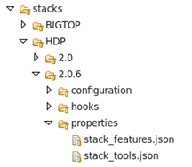

# Stack features

Stacks can support different features depending on their version, for example: upgrade support, NFS support, support for specific new components (such as Ranger, Phoenix )...

Stack featurization was added as part of the HDP stack configurations on [HDP/2.0.6/configuration/cluster-env.xml](http://github.com/apache/ambari/blob/trunk/ambari-server/src/main/resources/stacks/HDP/2.0.6/configuration/cluster-env.xml), introducing a new stack\_features property which value is processed in the stack engine from an external property file.

```xml
<!-- Define stack_features property in the base stack. DO NOT override this property for each stack version --> 
<property> 
  <name>stack_features</name> 
  <value/> 
  <description>List of features supported by the stack</description> 
  <property-type>VALUE_FROM_PROPERTY_FILE</property-type> 
  <value-attributes> 
    <property-file-name>stack_features.json</property-file-name> 
    <property-file-type>json</property-file-type> 
    <read-only>true</read-only> 
    <overridable>false</overridable> 
    <visible>false</visible> 
  </value-attributes> 
  <on-ambari-upgrade add="true"/> 
</property> 
```

Stack Features properties are defined in [stack\_features.json](https://github.com/apache/ambari/blob/trunk/ambari-server/src/main/resources/stacks/HDP/2.0.6/properties/stack_features.json) file under /HDP/2.0.6/properties. These features support is now available for access at service-level code to change certain service behaviors or configurations. This is an example of features described in stack\_features.jon file:

```json
"stack_features": [ 
    { 
      "name": "snappy", 
      "description": "Snappy compressor/decompressor support", 
      "min_version": "2.0.0.0", 
      "max_version": "2.2.0.0" 
    }, 
    { 
      "name": "lzo", 
      "description": "LZO libraries support", 
      "min_version": "2.2.1.0" 
    }, 
    { 
      "name": "express_upgrade", 
      "description": "Express upgrade support", 
      "min_version": "2.1.0.0" 
    }, 
    { 
      "name": "rolling_upgrade", 
      "description": "Rolling upgrade support", 
      "min_version": "2.2.0.0" 
    } 
  ] 
} 
```

where min\_version/max\_version are optional constraints.

Feature constants, matching features names, such has ROLLING\_UPGRADE = "rolling\_upgrade" has been added to a new StackFeature class in [resource\_management/libraries/functions/constants.py](https://github.com/apache/ambari/blob/trunk/ambari-common/src/main/python/resource_management/libraries/functions/constants.py#L38)

```python
class StackFeature: 
""" 
  Stack Feature supported 
""" 
  SNAPPY = "snappy" 
  LZO = "lzo" 
  EXPRESS_UPGRADE = "express_upgrade" 
  ROLLING_UPGRADE = "rolling_upgrade" 
```

Additionally, corresponding helper functions has been introduced in [resource\_management/libraries/functions/stack\_fetaures.py](https://github.com/apache/ambari/blob/trunk/ambari-common/src/main/python/resource_management/libraries/functions/stack_features.py) to parse the .json file content and called from service code to check if the stack supports the specific feature.

This is an example where the new stack featurization design is used in service code:

```python
if params.version and check_stack_feature(StackFeature.ROLLING_UPGRADE, params.version): 
      conf_select.select(params.stack_name, "hive", params.version) 
      stack_select.select("hive-server2", params.version) 
```

# Stack Tools

Similar to stack features, stack-selector and conf-selector tools are now stack-driven instead of hardcoding hdp-select and conf-select. They are defined in [stack\_tools.json](https://github.com/apache/ambari/blob/trunk/ambari-server/src/main/resources/stacks/HDP/2.0.6/properties/stack_tools.json) file under /HDP/2.0.6/properties

And declared as part of the HDP stack configurations as a new property on [/HDP/2.0.6/configuration/cluster-env.xml](https://github.com/apache/ambari/blob/trunk/ambari-server/src/main/resources/stacks/HDP/2.0.6/configuration/cluster-env.xml)

```xml
<!-- Define stack_tools property in the base stack. DO NOT override this property for each stack version --> 
<property> 
  <name>stack_tools</name> 
  <value/> 
  <description>Stack specific tools</description> 
  <property-type>VALUE_FROM_PROPERTY_FILE</property-type> 
  <value-attributes> 
    <property-file-name>stack_tools.json</property-file-name> 
    <property-file-type>json</property-file-type> 
    <read-only>true</read-only> 
    <overridable>false</overridable> 
    <visible>false</visible> 
  </value-attributes> 
  <on-ambari-upgrade add="true"/> 
</property> 
```

Corresponding helper functions have been added in [resource\_management/libraries/functions/stack\_tools.py](https://github.com/apache/ambari/blob/trunk/ambari-common/src/main/python/resource_management/libraries/functions/stack_tools.py). These helper functions are used to remove hardcodings in resource\_management library.

---

<a id="ambari-design-stack-and-services-writing-metainfo"></a>

<!-- source_url: https://ambari.apache.org/docs/3.0.0/ambari-design/stack-and-services/writing-metainfo/ -->

<!-- page_index: 40 -->

# Writing metainfo.xml

Version: 3.0.0

metainfo.xml is a declarative definition of an Ambari managed service describing its content. Itis the most critical file for any service definition. This section describes various key sub-sections within a metainfo.xml file.

*Non-mandatory fields are described in italics.*

The top level fields to describe a service are as follows:

| Feild | What is it used for | Sample Values |
| --- | --- | --- |
| name | the name of the service. A name has to be unique among all the services that are included in the stack definition containing the service. | HDFS |
| displayName | the display name of the service | HDFS |
| version | the version of the service. name and version together uniquely identify a service. Usually, the version is the version of the service binary itself. | 2.1.0.2.0 |
| components | the list of component that the service is comprised of | `<check out HDFS metainfo>` |
| osSpecifics | OS specific package information for the service | `<check out HDFS metainfo>` |
| commandScript | service level commands may also be defined. The command is executed on a component instance that is a client | `<check out HDFS metainfo>` |
| comment | a short description describing the service | Apache Hadoop Distributed File System |
| requiredServices | what other services that should be present on the cluster | `<check out HDFS metainfo>` |
| configuration-dependencies | configuration files that are expected by the service (config files owned by other services are specified in this list) | `<check out HDFS metainfo>` |
| restartRequiredAfterRackChange | Restart Required After Rack Change | true / false |
| configuration-dir | Use this to specify a different config directory if not 'configuration' | - |

**service/components - A service contains several components. The fields associated with a component are**:

| Feild | What is it used for | Sample Values |
| --- | --- | --- |
| name | name of the component | HDFS |
| displayName | display name of the component. | HDFS |
| category | type of the component - MASTER, SLAVE, and CLIENT | 2.1.0.2.0 |
| commandScript | application wide commands may also be defined. The command is executed on a component instance that is a client | `<check out HDFS metainfo>` |
| cardinality | allowed/expected number of instances | For example, 1-2 for MASTER, 1+ for Slave |
| reassignAllowed | whether the component can be reassigned / moved to a different host. | true / false |
| versionAdvertised | does the component advertise its version - used during rolling/express upgrade | Apache Hadoop Distributed File System |
| timelineAppid | This will be the component name under which the metrics from this component will be collected. | `<check out HDFS metainfo>` |
| dependencies | the list of components that this component depends on | `<check out HDFS metainfo>` |
| customCommands | a set of custom commands associated with the component in addition to standard commands. | RESTART\_LLAP (Check out HIVE metainfo) |

**service/osSpecifics - OS specific package names (rpm or deb packages)**

| Feild | What is it used for | Sample Values |
| --- | --- | --- |
| osFamily | the os family for which the package is applicable | any => all amazon2015,redhat6,debian7,ubuntu12,ubuntu14,ubuntu16 |
| packages | list of packages that are needed to deploy the service | `<check out HDFS metainfo>` |
| package/name | name of the package (will be used by the yum/zypper/apt commands) | Eg hadoop-lzo. |

**service/commandScript - the script that implements service check**

| Feild | What is it used for |
| --- | --- |
| script | the relative path to the script |
| scriptType | the type of the script, currently only supported type is PYTHON |
| timeout | custom timeout for the command - this supersedes ambari default |

sample values:

```xml
<commandScript> 
  <script>scripts/service_check.py</script> 
  <scriptType>PYTHON</scriptType> 
  <timeout>300</timeout> 
</commandScript> 
```

**service/component/dependencies/dependency**

| Feild | What is it used for |
| --- | --- |
| name | name of the component it depends on |
| scope | cluster / host. specifies whether the dependent component should be present in the same cluster or the same host. |
| auto-deploy | custom timeout for the command - this supersedes ambari default |
| conditions | Conditions in which this dependency exists. For example, the presence of a property in a config. |

sample values:

```xml
<dependency> 
  <name>HDFS/ZKFC</name> 
  <scope>cluster</scope> 
  <auto-deploy> 
    <enabled>false</enabled> 
  </auto-deploy> 
  <conditions> 
    <condition xsi:type="propertyExists"> 
      <configType>hdfs-site</configType> 
      <property>dfs.nameservices</property> 
    </condition> 
  </conditions> 
</dependency> 
```

**service/component/commandScript - the script that implements components specific default commands (Similar to service/commandScript )**

**service/component/logs - provides log search integration.**

| Feild | What is it used for |
| --- | --- |
| logId | logid of the component |
| primary | primary log id or not. |

sample values:

```xml
<log> 
  <logId>hdfs_namenode</logId> 
  <primary>true</primary> 
</log> 
```

**service/component/customCommand - custom commands can be added to components.**

- **name**: name of the custom command
- **commandScript**: the details of the script that implements the custom command
- commandScript/script: the relative path to the script
- commandScript/scriptType: the type of the script, currently only supported type is PYTHON
- commandScript/timeout: custom timeout for the command - this supersedes ambari default

**service/component/configFiles - list of config files to be available when client config is to be downloaded (used to configure service clients that are not managed by Ambari)**

- **type**: the type of file to be generated, xml or env sh, yaml, etc
- **fileName**: name of the generated file
- **dictionary**: data dictionary that contains the config properties (relevant to how ambari manages config bags internally)

```xml
<metainfo> 
  <schemaVersion>2.0</schemaVersion> 
  <services> 
    <service> 
      <name>HBASE</name> 
      <displayName>HBase</displayName> 
      <comment>Non-relational distributed database and centralized service for configuration management &amp; 
 synchronization 
      </comment> 
      <version>0.96.0.2.0</version> 
      <components> 
        <component> 
          <name>HBASE_MASTER</name> 
          <displayName>HBase Master</displayName> 
          <category>MASTER</category> 
          <cardinality>1+</cardinality> 
          <versionAdvertised>true</versionAdvertised> 
          <timelineAppid>HBASE</timelineAppid> 
          <dependencies> 
            <dependency> 
              <name>HDFS/HDFS_CLIENT</name> 
              <scope>host</scope> 
              <auto-deploy> 
                <enabled>true</enabled> 
              </auto-deploy> 
            </dependency> 
            <dependency> 
              <name>ZOOKEEPER/ZOOKEEPER_SERVER</name> 
              <scope>cluster</scope> 
              <auto-deploy> 
                <enabled>true</enabled> 
                <co-locate>HBASE/HBASE_MASTER</co-locate> 
              </auto-deploy> 
            </dependency> 
          </dependencies> 
          <commandScript> 
            <script>scripts/hbase_master.py</script> 
            <scriptType>PYTHON</scriptType> 
            <timeout>1200</timeout> 
          </commandScript> 
          <customCommands> 
            <customCommand> 
              <name>DECOMMISSION</name> 
              <commandScript> 
                <script>scripts/hbase_master.py</script> 
                <scriptType>PYTHON</scriptType> 
                <timeout>600</timeout> 
              </commandScript> 
            </customCommand> 
          </customCommands> 
        </component> 
 
        <component> 
          <name>HBASE_REGIONSERVER</name> 
          <displayName>RegionServer</displayName> 
          <category>SLAVE</category> 
          <cardinality>1+</cardinality> 
          <versionAdvertised>true</versionAdvertised> 
          <timelineAppid>HBASE</timelineAppid> 
          <commandScript> 
            <script>scripts/hbase_regionserver.py</script> 
            <scriptType>PYTHON</scriptType> 
          </commandScript> 
        </component> 
 
        <component> 
          <name>HBASE_CLIENT</name> 
          <displayName>HBase Client</displayName> 
          <category>CLIENT</category> 
          <cardinality>1+</cardinality> 
          <versionAdvertised>true</versionAdvertised> 
          <commandScript> 
            <script>scripts/hbase_client.py</script> 
            <scriptType>PYTHON</scriptType> 
          </commandScript> 
          <configFiles> 
            <configFile> 
              <type>xml</type> 
              <fileName>hbase-site.xml</fileName> 
              <dictionaryName>hbase-site</dictionaryName> 
            </configFile> 
            <configFile> 
              <type>env</type> 
              <fileName>hbase-env.sh</fileName> 
              <dictionaryName>hbase-env</dictionaryName> 
            </configFile> 
          </configFiles> 
        </component> 
      </components> 
 
      <osSpecifics> 
        <osSpecific> 
          <osFamily>any</osFamily> 
          <packages> 
            <package> 
              <name>hbase</name> 
            </package> 
          </packages> 
        </osSpecific> 
      </osSpecifics> 
 
      <commandScript> 
        <script>scripts/service_check.py</script> 
        <scriptType>PYTHON</scriptType> 
        <timeout>300</timeout> 
      </commandScript> 
       
      <requiredServices> 
        <service>ZOOKEEPER</service> 
        <service>HDFS</service> 
      </requiredServices> 
 
      <configuration-dependencies> 
        <config-type>core-site</config-type> 
        <config-type>hbase-site</config-type> 
        <config-type>ranger-hbase-policymgr-ssl</config-type> 
        <config-type>ranger-hbase-security</config-type> 
      </configuration-dependencies> 
 
    </service> 
  </services> 
</metainfo> 
```

---

<a id="ambari-design-stack-and-services-faq"></a>

<!-- source_url: https://ambari.apache.org/docs/3.0.0/ambari-design/stack-and-services/faq/ -->

<!-- page_index: 41 -->

# FAQ

Version: 3.0.0

**If a component exists in the parent stack and is defined again in the child stack with just a few attributes, are these values just to override the parent's values or the whole component definition is replaced? What about other elements in metainfo.xml -- which rules apply?**

Ambari goes property by property and merge them from parent to child. So if you remove a category for example from the child it will be inherited from parent, that goes for pretty much all properties.

So, the question is how do we tackle existence of a property in both parent and child. Here, most of the decision still follow same paradigm as take the child value instead of parent and every property in parent, not explicitly deleted from child using a marker like

- For config-dependencies, we take all or nothing approach, if this property exists in child use it and all of its children else take it from parent.
- The custom commands are merged based on names, such that merged definition is a union of commands with child commands with same name overriding those fro parent.
- Cardinality is overwritten by a child or take from the parent if child has not provided one.

You could look at this method for more details: `org.apache.ambari.server.api.util.StackExtensionHelper#mergeServices`

For more information see the [Service Inheritance](#ambari-design-stack-and-services-custom-services--service-inheritance) wiki page.

**If a component is missing in the new definition but is present in the parent, does it get inherited?**

Generally yes.

**Configuration dependencies for the service -- are they overwritten or merged?**

Overwritten.

---

<a id="ambari-design-stack-and-services-hooks"></a>

<!-- source_url: https://ambari.apache.org/docs/3.0.0/ambari-design/stack-and-services/hooks/ -->

<!-- page_index: 42 -->

# Hooks

Version: 3.0.0

A stack can add during the following points in Ambari actions:

- before ANY
- before and after INSTALL
- before RESTART
- before START

As mentioned in [Stack Inheritance](#ambari-design-stack-and-services-stack-inheritance), the hooks directory if defined in the current stack version replace those from the parent stack version. This means the files included in those directories at the parent level will not be inherited. You will need to copy all the files you wish to keep from that directory structure.

The hooks directory should have 5 sub-directories:

- after-INSTALL
- before-ANY
- before-INSTALL
- before-RESTART
- before-START

Each hook directory can have 3 sub-directories:

- files
- scripts
- templates

The scripts directory is the main directory and must be supplied. This must contain a hook.py file. It may contain other python scripts which initialize variables (like a params.py file) or other utility files contain functions used in the hook.py file.

The files directory can any non-python files such as scripts, jar or properties files.

The templates folder can contain any required j2 files that are used to set up properties files.

The hook.py file should extend the Hook class defined in resource\_management/libraries/script/hook.py. The naming convention is to name the hook class after the hook folder such as AfterInstallHook if the class is in the after-INSTALL folder. The hook.py file must define the hook(self, env) function. Here is an example hook:

```py
from resource_management.libraries.script.hook import Hook 
  
class AfterInstallHook(Hook): 
  
  def hook(self, env): 
    import params 
    env.set_params(params) 
    # Call any functions to set up the stack after install 
  
if __name__ == "__main__": 
  AfterInstallHook().execute() 
```

---

<a id="ambari-design-stack-and-services-version-functions-conf-select-and-stack-select"></a>

<!-- source_url: https://ambari.apache.org/docs/3.0.0/ambari-design/stack-and-services/version-functions-conf-select-and-stack-select/ -->

<!-- page_index: 43 -->

# Version functions: conf-select and stack-select

Version: 3.0.0

Especially during upgrade, it is important to be able to set the current stack and configuration versions. For non-custom services, these functions are implemented in the conf-select and stack-select functions. These can be imported in a service's scripts with the following imports:

```py
from resource_management.libraries.functions import conf_select 
 
from resource_management.libraries.functions import stack_select 
```

Typically the select functions, which is used to set the stack and configuration versions, are called in the pre\_upgrade\_restart function during a rolling upgrade:

```py
  def pre_upgrade_restart(self, env, upgrade_type=None): 
    import params 
    env.set_params(params) 
 
    # this function should not execute if the version can't be determined or 
    # the stack does not support rolling upgrade 
    if not (params.version and check_stack_feature(StackFeature.ROLLING_UPGRADE, params.version)): 
      return 
 
    Logger.info("Executing <My Service> Stack Upgrade pre-restart") 
    conf_select.select(params.stack_name, "<my_service>", params.version) 
    stack_select.select("<my_service>", params.version) 
```

The select functions will set up symlinks for the current stack or configuration version. For the stack, this will set up the links from the stack root current directory to the particular stack version. For example:

```text
/usr/hdp/current/hadoop-client -> /usr/hdp/2.5.0.0/hadoop 
```

For the configuration version, this will set up the links for all the configuration directories, as follows:

```text
/etc/hadoop/conf -> /usr/hdp/current/hadoop-client/conf 
 
/usr/hdp/current/hadoop-client/conf -> /etc/hadoop/2.5.0.0/0 
```

The stack\_select and conf\_select functions can also be used to return the hadoop directories:

```text
hadoop_prefix = stack_select.get_hadoop_dir("home") 
 
hadoop_bin_dir = stack_select.get_hadoop_dir("bin") 
 
hadoop_conf_dir = conf_select.get_hadoop_conf_dir() 
```

The conf\_select api is as follows:

```py
def select(stack_name, package, version, try_create=True, ignore_errors=False) 
 
def get_hadoop_conf_dir(force_latest_on_upgrade=False) 
```

The stack\_select api is as follows:

```py
def select(component, version) 
 
def get_hadoop_dir(target, force_latest_on_upgrade=False) 
```

Unfortunately for custom services these functions are not available to set up their configuration or stack versions. A custom service could implement their own functions to set up the proper links.

---

<a id="ambari-design-technology-stack"></a>

<!-- source_url: https://ambari.apache.org/docs/3.0.0/ambari-design/technology-stack/ -->

<!-- page_index: 44 -->

# Technology Stack

Version: 3.0.0

- Server code: Java 1.7 / 1.8
- Agent scripts: Python
- Database: Postgres, Oracle, MySQL
- ORM: EclipseLink
- Security: Spring Security with remote LDAP integration and local database
- REST server: Jersey (JAX-RS)
- Dependency Injection: Guice
- Unit Testing: JUnit
- Mocks: EasyMock
- Configuration management: Python

- Frontend code: JavaScript
- Client-side MVC framework: Ember.js / AngularJS
- Templating: Handlebars.js (integrated with Ember.js)
- DOM manipulation: jQuery
- Look and feel: Bootstrap 2
- CSS preprocessor: LESS
- Unit Testing: Mocha
- Mocks: Sinon.js
- Application assembler/tester: Brunch / Grunt / Gulp

---

<a id="ambari-design-views"></a>

<!-- source_url: https://ambari.apache.org/docs/3.0.0/ambari-design/views/ -->

<!-- page_index: 45 -->

# Views

Version: 3.0.0

> [!NOTE]
> **This capability is currently under development. :::info**
> **Ambari Views** offer a systematic way to plug-in UI capabilities to surface custom visualization, management and monitoring features in Ambari Web. A " **view**" is a way of extending Ambari that allows 3rd parties to plug in new resource types along with the APIs, providers and UI to support them. In other words, a view is an application that is deployed into the Ambari container.
>
> | Resource | Link |
> | --- | --- |
> | Views Overview | <http://www.slideshare.net/hortonworks/ambari-views-overview> |
> | Views Framework API Docs | <https://github.com/apache/ambari/blob/trunk/ambari-views/docs/index.md> |
> | Views Framework Examples | <https://github.com/apache/ambari/tree/trunk/ambari-views/examples> |
>
> The following section describes the basic terminology associated with views.
>
> | Term | Description |
> | --- | --- |
> | View Name | The name of the view. The view name identifies the view to Ambari. |
> | View Version | The version of the view. A unique view name can have multiple versions deployed in Ambari. |
> | View Package | This is the JAR package that contains the **view definition** and all view resources (server-side resources and client-side assets) for a given view version. See [View Package](#ambari-design-views--view-package) for more information on the contents and structure of the package. |
> | View Definition | This defines the view name, version, resources and required/optional configuration parameters for a view. The view definition file is included in the view package. See View Definition for more information on the view definition file syntax and features. |
> | View Instance | An unique instance of a view, that is based on a view definition and specific version that is configured. See Versions and Instances for more information. |
> | View API | The REST API for viewing the list of deployed views and creating view instances. See View API for more information. |
> | Framework Services | The server-side of the view framework exposes certain services for use with your views. This includes persistence of view instance data and view eventing. See Framework Services for more information. |
>
> A view can consist of **client-side assets** (i.e. the UI that is exposed in Ambari Web) and **server-side resources** (i.e. the classes that expose REST end points). When the view loads into Ambari Web, the view UI can use the view server-side resources as necessary to deliver the view functionality.
>
> 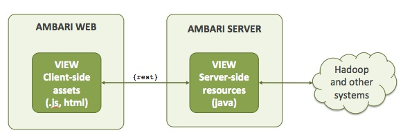
>
> The view does not limit or restrict what client-side technologies a view uses. You can package client-side dependencies (such as JavaScript and CSS frameworks) with your view.
>
> A view can expose resources as REST end points to be used in conjunction with the client-side to deliver the functionality of your view application. Thees resources are written in Java and can be anything from a servlet to a regular REST service to an Ambari ResourceProvider (i.e. a special type of REST service that handles some REST capabilities such as partial response and pagination – if you adhere to the Ambari ResourceProvider interface). See [Framework Services](#ambari-design-views-framework-services) for more information on capabilities that the framework exposes on the server-side for views.
>
> > [!NOTE]
> > **Checkout the Weather View as an example of a view that exposes servlet and REST endpoints.**
> > <https://github.com/apache/ambari/tree/trunk/ambari-views/examples/weather-view> :::
> >
> > The assets associated with a view are delivered as a JAR package. The **view definition file** must be at the root of the package. UI assets and server-side classes are served from the root. Dependent Java libraries are placed in the `WEB-INF/lib` directory.
> >
> > ```text
> > view.jar
> > |
> > |- view.xml
> > |
> > |-
> > |
> > |- index.html
> > | |
> > | |_
> > |
> > |_ WEB-INF
> >   |
> >   |_ lib/*.jar
> > ```
> >
> > Multiple versions of a given view can be deployed into Ambari and multiple instances of each view can be created for each version. For example, I can have a view named FILES and deploy versions 0.1.0 and 0.2.0. I can then create instances of each version `FILES_0.1.0` and `FILES_0.2.0` allowing some Ambari users to have an older version of FILES (0.1.0), and other users to have a newer version (0.2.0).
> >
> > Using the example above, I can create two instances of the `FILES_0.2.0` version, one instance that is configured a certain way and the second that is configured differently. This allows some Ambari users to use FILES one way, and other users a different way.
> >
> > See [Framework Services](#ambari-design-views-framework-services) for more information on instance configuration properties.
> >
> > The lifecycle of a view is shown below. As you deploy a view and create instances of a view, server-side framework events are invoked. See [Framework Services](#ambari-design-views-framework-services) for more information on capabilities that the framework exposes on the server-side for views.
> >
> > 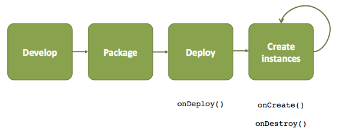

---

<a id="ambari-design-views-framework-services"></a>

<!-- source_url: https://ambari.apache.org/docs/3.0.0/ambari-design/views/framework-services/ -->

<!-- page_index: 46 -->

# Framework Services

Version: 3.0.0

This section describes the framework services that are available for views.

The view server-side resources have access to a [ViewContext](https://github.com/apache/ambari/blob/trunk/ambari-views/src/main/java/org/apache/ambari/view/ViewContext.java) object. The view context provides information about the current authenticated user, the view definition, the instance configuration properties, instance data and the view controller.

```java
/** 
   * The view context. 
 
   */ 
  @Inject 
  ViewContext context; 
```

The view framework exposes a way to store key/value pair "instance data". This data is scoped to a given view instance and user. Instance data is meant to be used for information such as "user prefs" or other lightweight information that supports the experience of your view application. You can access the instance data get and put methods from the [ViewContext](https://github.com/apache/ambari/blob/trunk/ambari-views/src/main/java/org/apache/ambari/view/ViewContext.java) object.

Checkout the **Favorite View** for example usage of the instance data API.

<https://github.com/apache/ambari/tree/trunk/ambari-views/examples/favorite-view>

```java
/** 
 * Context object available to the view components to provide access to 
 * the view and instance attributes as well as run time information about 
 * the current execution context. 
 
 */ 
public interface ViewContext { 
 
 /** 
   * Save an instance data value for the given key. 
 
   * 
   * @param key    the key 
   * @param value  the value 
   * 
   * @throws IllegalStateException if no instance is associated 
   */ 
  public void putInstanceData(String key, String value); 
  /** 
   * Get the instance data value for the given key. 
 
   * 
   * @param key  the key 
   * 
   * @return the instance data value; null if no instance is associated 
   */ 
  public String getInstanceData(String key); 
 
} 
```

The instance configuration properties (set when you created your view instance) are accessible from the view context:

```java
viewContext.getProperties(); 
```

Configuration properties also supports a set of pre-defined **variables** that will be replaced when you read the property from the view context. For example, if your view requires a configuration parameter "hdfs.file.path" and that path is going to be set based on the username, when you configure the view instance, set the configuration property like so:

```text
"hdfs.file.path" : "/this/is/some/path/${username}" 
```

When you get this property from the view context, the `${username}` variable will be replaced automatically.

```java
viewContext.getProperties().get("hdfs.file.path") returns "/this/is/some/path/pramod" 
```

Instance parameters support the following pre-defined variables: `${username}`, `${viewName}` and `${instanceName}`

Events are an important component of the views framework. Events allow the view to interact with the framework on lifecycle changes (i.e. "Framework Events") such as deploy, create and destroy. As well, once a user has collection of views available, eventing allows the views to communicate with other views (i.e. "View Events").

To register to receive framework events, in the `view.xml`, specify a `<view-class>this.is.my.view-clazz</view-class>` which is a class that implements the [View](https://github.com/apache/ambari/blob/trunk/ambari-views/src/main/java/org/apache/ambari/view/View.java) interface.

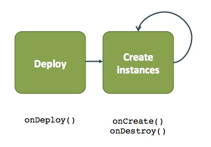

| Event | Description |
| --- | --- |
| onDeploy() | Called when a view is deployed. |
| onCreate() | Called when a view instance is created. |
| onDestroy() | Called when a view instance is destroy. |

Views can pass events between views. Obtain the [ViewController](https://github.com/apache/ambari/blob/trunk/ambari-views/src/main/java/org/apache/ambari/view/ViewController.java) object that allows you to **register listeners** for view events and to **fire events** for other listeners. A view can register an event [Listener](https://github.com/apache/ambari/blob/trunk/ambari-views/src/main/java/org/apache/ambari/view/events/Listener.java) (via the [ViewController](https://github.com/apache/ambari/blob/trunk/ambari-views/src/main/java/org/apache/ambari/view/ViewController.java)) for other views by **view name**, or by **view name + version**. When an [Event](http://github.com/apache/ambari/blob/trunk/ambari-views/src/main/java/org/apache/ambari/view/events/Event.java) is fired from the source view, all registered listeners will receive the event.

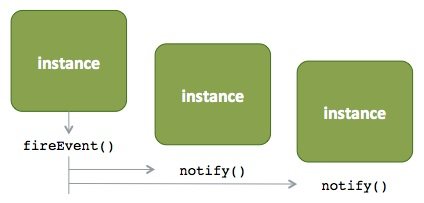

1. Obtain the view controller and register a listener.

```java
viewContext.getViewController().registerListener(...); 
```

2. Fire the event. `viewContext.getViewController().fireEvent(...);`
3. The framework will notify all registered listeners. The listener implementation can process the event as appropriate. `listener.notify(...)`

---

<a id="ambari-design-views-view-api"></a>

<!-- source_url: https://ambari.apache.org/docs/3.0.0/ambari-design/views/view-api/ -->

<!-- page_index: 47 -->

# View API

Version: 3.0.0

> [!NOTE]
> **info**
> When creating your view instance, be sure to provide all required view instance properties, otherwise you will receive a 500 with a message explaining the properties that are required.

---

<a id="ambari-design-views-view-definition"></a>

<!-- source_url: https://ambari.apache.org/docs/3.0.0/ambari-design/views/view-definition/ -->

<!-- page_index: 48 -->

# View Definition

Version: 3.0.0

The following describes the syntax of the View Definition File (`view.xml`) as part of the View Package.

An XML Schema Definition is available [here](https://github.com/apache/ambari/blob/trunk/ambari-views/src/main/resources/view.xsd).

The `<view>` element is the enclosing element in the Definition File. The following table describes the elements you can include in the `<view>` element:

| Element | Requred | Description |
| --- | --- | --- |
| name | Yes | The unique name of the view. See `<name>` for more information. |
| label | Yes | The display label of the view. See `<label>` for more information. |
| version | Yes | The version of the view. See `<version>` for more information. |
| min-ambari-version max-ambari-version | No | The minimum and maximum Ambari version this view can be deployed with. See `<min-ambari-version>` for more information. |
| description | No | The description of the view. See `<description>` for more information. |
| icon | No | The 32x32 icon to display for this view. Suggested size is 32x32 and will be displayed as 8x8 and 16x16 as necessary. If this property is not set, a default view framework icon is used. |
| icon64 | No | The 64x64 icon to display for this view. If this property is not set, the 32x32 sized icon will be used. |
| permission | No | Defines a custom permission for this view. See `<permission>` for more information. |
| parameter | No | Defines a configuration parameter that is used to when creating a view instance. See `<parameter>` for more information. |
| resource | No | Defines a resource that is exposed by the view. See `<resource>` for more information. |
| instance | No | Defines a static instance of the view. See `<instance>` for more information. |
| view-class | No | Registers a view class to receive framework events. See `<view-class>` for more information. |
| validator-class | No | Registers a validator class to receive framework events. See `<validator-class>` for more information. |

The unique name of the view. Example:

```xml
<name>MY_COOL_VIEW</name> 
```

The label of the view. Example:

```xml
<label>My Cool View</label> 
```

The version of the view. Example:

```xml
<version>0.1.0</version> 
```

The minimum and maximum version of Ambari server that can run this view. Example:

```xml
<min-ambari-version>1.7.0</min-ambari-version> 
<min-ambari-version>1.7.*</min-ambari-version> 
<max-ambari-version>2.0</max-ambari-version> 
```

The description of the view. Example:

```xml
<description>This view is used to display information.</description> 
 
```

| Element | Requred | Description |
| --- | --- | --- |
| name | Yes | The name of the configuration parameter. |
| description | Yes | The description of the configuration parameter. |
| label | No | The user friendly name of the configuration parameter (used in the Ambari Administration Interface UI). |
| placeholder | No | The placeholder value for the configuration parameter (used in the Ambari Administration Interface UI). |
| default-value | No | The default value for the configuration parameter (used in the Ambari Administration Interface UI). |
| required | Yes | If true, the configuration parameter is required in order to create a view instance. |
| masked | No | Indicated this parameter value is to be "masked" in the Ambari Web UI (i.e. not shown in the clear). Omitting this element default to not-masked. Otherwise, if true, the parameter value will be "masked" in the Web UI. |

```xml
<parameter> 
    <name>someParameter</name> 
    <description>Some parameter this is used to configure an instance of this view</description> 
    <required>false</required> 
</parameter> 
```

```xml
<parameter> 
    <name>name.label.descr.default.place</name> 
    <description>Name, label, description, default and placeholder</description> 
    <label>NameLabelDescDefaultPlace</label> 
    <placeholder>this is placeholder text but you should see default</placeholder> 
    <default-value>youshouldseethisdefault</default-value> 
    <required>true</required> 
</parameter> 
```

See the [Property View Example](https://github.com/apache/ambari/blob/trunk/ambari-views/examples/property-view/docs/index.md) to see the different parameter options in use.

| Element | Requred | Description |
| --- | --- | --- |
| name | Yes | The unique name of the permission. |
| description | Yes | The description of the permission. |

```xml
<permission> 
  <name>SOME_CUSTOM_PERM</name> 
  <description>A custom permission for this view</description> 
</permission> 
<permission> 
  <name>SOME_OTHER_PERM</name> 
  <description>Another custom permission for this view</description> 
</permission> 
```

| Element | Requred | Description |
| --- | --- | --- |
| name | Yes | The name of the resource. This will be the resource endpoint name of the view instance. |
| plural-name | No | The plural name of the resource. |
| service-class | No | The JAX-RS annotated resource service class. |
| id-property | No | The resource identifier. |
| provider-class | No | The Ambari ResourceProvider resource class. |
| resource-class | No | The JavaBean resource class. |

```xml
<resource> 
  <name>calculator</name> 
  <service-class>org.apache.ambari.view.proxy.CalculatorResource</service-class> 
</resource> 
```

See the [Calculator View Example](https://github.com/apache/ambari/blob/trunk/ambari-views/examples/calculator-view/docs/index.md) to see a REST service endpoint view implementation.

```xml
<resource> 
  <name>city</name> 
  <plural-name>cities</plural-name> 
  <id-property>id</id-property> 
  <resource-class>org.apache.ambari.view.weather.CityResource</resource-class> 
  <provider-class>org.apache.ambari.view.weather.CityResourceProvider</provider-class> 
  <service-class>org.apache.ambari.view.weather.CityService</service-class> 
</resource> 
```

See the [Weather View Example](https://github.com/apache/ambari/blob/trunk/ambari-views/examples/weather-view/docs/index.md) to see an Ambari ResourceProvider view implementation..

| Element | Requred | Description |
| --- | --- | --- |
| name | Yes | The unique name of the view instance. |
| label | No | The display label of the view instance. If not set, the view definition `<label>` is used. |
| description | No | The description of the view instance. If not set, the view definition `<description>` is used. |
| visible | No | If true, for the view instance to show up in the users view instance list. |
| icon | No | Overrides the view icon for this specific view instance. |
| icon64 | No | Overrides the view icon64 for this specific view instance. |
| property | No | Specifies any necessary configuration parameters for the view instance. See `<property>` for more information. |

```xml
<instance> 
  <name>US_WEST</name> 
  <property> 
    <key>cities</key> 
    <value>Palo Alto, US;Los Angeles, US;Portland, US;Seattle, US</value> 
  </property> 
  <property> 
    <key>units</key> 
    <value>imperial</value> 
  </property> 
</instance> 
```

| Element | Requred | Description |
| --- | --- | --- |
| key | Yes | The property key (for the configuration parameter to set). |
| value | Yes | The property value (for the configuration parameter to set). |

```xml
<property> 
  <key>units</key> 
  <value>imperial</value> 
</property> 
```

Registers a view class to receive framework events. The view class must implement the [View](https://github.com/apache/ambari/blob/trunk/ambari-views/src/main/java/org/apache/ambari/view/View.java) interface.

```xml
<view-class>this.is.my.viewclazz</view-class> 
```

Registers a validator class to receive property and instance validation requests. The validator class must implement the [Validator](https://github.com/apache/ambari/blob/trunk/ambari-views/src/main/java/org/apache/ambari/view/validation/Validator.java) interface.

```xml
<validator-class>org.apache.ambari.view.property.MyValidator</validator-class> 
```

See [Property Validator View Example](https://github.com/apache/ambari/blob/trunk/ambari-views/examples/property-validator-view/docs/index.md) to see view property and instance validation in use.

---

<a id="ambari-dev"></a>

<!-- source_url: https://ambari.apache.org/docs/3.0.0/ambari-dev/ -->

<!-- page_index: 49 -->

# Ambari Development

Version: 3.0.0

Follow the instructions under [Checkout source code](#ambari-dev-how-to-contribute) section of "How to contribute" guide.

We'll refer to the top-level "ambari" directory as `AMBARI_DIR` in this document.

The following tools are needed to build Ambari from source.

Alternatively, you can easily launch a VM that is preconfigured with all the tools that you need. See the **Pre-Configured Development Environment** section in the [Quick Start Guide](#quick-start-quick-start-guide).

- xCode (if using Mac - free download from the apple store)
- JDK 8 (Ambari 2.6 and below can be compiled with JDK 7, from Ambari 2.7, it can be compiled with at least JDK 8)
- [Apache Maven](http://maven.apache.org/download.html) 3.3.9 or later Tip:In order to persist your changes to the JAVA\_HOME environment variable and add Maven to your path, create the following files: File: ~/.profile

```bash
source ~/.bashrc 
```

File: ~/.bashrc

```bash
export PATH=/usr/local/apache-maven-3.3.9/bin:$PATH 
export JAVA_HOME=$(/usr/libexec/java_home) 
export _JAVA_OPTIONS="-Xmx2048m -XX:MaxPermSize=512m -Djava.awt.headless=true" 
```

- Python 2.6 (Ambari 2.7 or later require Python 2.7 as minimum supported version)
- Python setuptools: for Python 2.6: D [ownload](http://pypi.python.org/packages/2.6/s/setuptools/setuptools-0.6c11-py2.6.egg#md5=bfa92100bd772d5a213eedd356d64086) setuptools and run:

```bash
sh setuptools-0.6c11-py2.6.egg 
```

for Python 2.7: D [ownload](https://pypi.python.org/packages/2.7/s/setuptools/setuptools-0.6c11-py2.7.egg#md5=fe1f997bc722265116870bc7919059ea) setuptools and run:

```bash
sh setuptools-0.6c11-py2.7.egg 
```

- rpmbuild (rpm-build package)
- g++ (gcc-c++ package)

- `mvn clean test`
- Run unit tests in a single module:

```bash
mvn -pl ambari-server test 
```

- Run only Java tests:

```bash
mvn -pl ambari-server -DskipPythonTests 
```

- Run only specific Java tests:

```bash
mvn -pl ambari-server -DskipPythonTests -Dtest=AgentHostInfoTest test 
```

- Run only Python tests:

```bash
mvn -pl ambari-server -DskipSurefireTests test 
```

- Run only specific Python tests:

```bash
mvn -pl ambari-server -DskipSurefireTests -Dpython.test.mask=TestUtils.py test 
```

- Run only Checkstyle and RAT checks:

```bash
mvn -pl ambari-server -DskipTests test 
```

NOTE: Please make sure you have npm in the path before running the unit tests.

- mvn clean install

This will generate xml and html report unders target/findbugs. You can also add flags to skip unit tests to generate report faster.

Note: if you can an error that too many files are open while building, then run: ulimit -n 10000 (for example)

To build Ambari RPMs, run the following.

Note: Replace `${AMBARI_VERSION}` with a 4-digit version you want the artifacts to be (e.g., -DnewVersion=1.6.1.1)

> [!NOTE]
> : If running into errors while compiling the ambari-metrics package due to missing the artifacts of jms, jmxri, jmxtools:

```text
[ERROR] Failed to execute goal on project ambari-metrics-kafka-sink: Could not resolve dependencies for project org.apache.ambari:ambari-metrics-kafka-sink:jar:2.0.0-0: The following artifacts could not be resolved: javax.jms:jms:jar:1.1, com.sun.jdmk:jmxtools:jar:1.2.1, com.sun.jmx:jmxri:jar:1.2.1: Could not transfer artifact javax.jms:jms:jar:1.1 from/to java.net (https://maven-repository.dev.java.net/nonav/repository): No connector available to access repository java.net (https://maven-repository.dev.java.net/nonav/repository) of type legacy using the available factories WagonRepositoryConnectorFactory 
```

The work around is to manually install the three missing artifacts:

```text
mvn install:install-file -Dfile=jms-1.1.pom -DgroupId=javax.jms -DartifactId=jms -Dversion=1.1 -Dpackaging=jar 
mvn install:install-file -Dfile=jmxtools-1.2.1.pom -DgroupId=com.sun.jdmk -DartifactId=jmxtools -Dversion=1.2.1 -Dpackaging=jar 
mvn install:install-file -Dfile=jmxri-1.2.1.pom -DgroupId=com.sun.jmx -DartifactId=jmxri -Dversion=1.2.1 -Dpackaging=jar 
 
If when compiling it seems stuck, and you've already increased Java and Maven heapsize, it could be that Ambari Views has a lot of artifacts, and the rat-check is choking up. In this case, try running 
 
git clean -df (this will remove untracked files and directories) 
mvn clean package -DskipTests -Drat.ignoreErrors=true 
or 
mvn clean package -DskipTests -Drat.skip 
```

Ambari 2.8+ uses a newer method to update the version when building Ambari.

**RHEL/CentOS 6**:

```text
# Update the revision property to the release version 
mvn versions:set-property -Dproperty=revision -DnewVersion=2.8.0.0.0 
 
mvn -B clean install package rpm:rpm -DskipTests -Dpython.ver="python >= 2.6" -Preplaceurl 
```

**SUSE/SLES 11**

```text
# Update the revision property to the release version 
mvn versions:set-property -Dproperty=revision -DnewVersion=2.8.0.0.0 
 
mvn -B clean install package rpm:rpm -DskipTests -Psuse11 -Dpython.ver="python >= 2.6" -Preplaceurl 
```

**Ubuntu 12**:

```text
# Update the revision property to the release version 
mvn versions:set-property -Dproperty=revision -DnewVersion=2.8.0.0.0 
 
mvn -B clean install package jdeb:jdeb -DskipTests -Dpython.ver="python >= 2.6" -Preplaceurl 
```

Ambari Server will create following packages

- RPM will be created under `AMBARI_DIR`/ambari-server/target/rpm/ambari-server/RPMS/noarch.
- DEB will be created under `AMBARI_DIR`/ambari-server/target/

Ambari Agent will create following packages

- RPM will be created under `AMBARI_DIR`/ambari-agent/target/rpm/ambari-agent/RPMS/x86\_64.
- DEB will be created under `AMBARI_DIR`/ambari-agent/target

Optional parameters:

- -X -e: add these options for more verbose output by Maven. Useful when debugging Maven issues.
- -DdefaultStackVersion=STACK-VERSION
- Sets the default stack and version to be used for installation (e.g., -DdefaultStackVersion=HDP-1.3.0)
- -DenableExperimental=true
- Enables experimental features to be available via Ambari Web (default is false)
- All views can be packaged in RPM by adding *-Dviews* parameter

  - *mvn -B clean install package rpm:rpm -Dviews -DskipTests*
- Specific views can be built by adding `--projects` parameter to the *-Dviews*

  - *mvn -B clean install package rpm:rpm --projects ambari-web,ambari-project,ambari-views,ambari-admin,contrib/views/files,contrib/views/pig,ambari-server,ambari-agent,ambari-client,ambari-shell -Dviews -DskipTests*

*NOTE: Run everything as `root` below.*

If you plan on installing the Ambari Metrics service, you will also need to build the Ambari Metrics project.

```bash
cd ambari-metrics 
mvn clean package -Dbuild-rpm -DskipTests 
 
For Ubuntu: 
cd ambari-metrics 
mvn clean package -Dbuild-deb -DskipTests 
```

**Note:**

The metrics rpms will be found at: ambari-metrics-assembly/target/. These would be need for installing the Ambari Metrics service.

First, install the Ambari Server RPM.

**On RHEL/CentOS:**

```bash
yum install ambari-server/target/rpm/ambari-server/RPMS/noarch/ambari-server-*.noarch.rpm 
```

On SUSE/SLES:

```bash
zypper install ambari-server/target/rpm/ambari-server/RPMS/noarch/ambari-server-*.noarch.rpm 
```

**On Ubuntu 12:**

```bash
dpkg --install ambari-server/target/ambari-server-*.deb          # Will fail with missing dependencies errors 
apt-get update                                                   # Update locations of dependencies 
apt-get install -f                                               # Install all failed dependencies 
dpkg --install ambari-server/target/ambari-server-*.deb          # Will succeed 
```

Initialize Ambari Server:

```bash
ambari-server setup 
```

Start up Ambari Server:

```text
ambari-server start 
```

See Ambari Server log:

```bash
tail -f /var/log/ambari-server/ambari-server.log 
```

To access Ambari, go to

```text
http://{ambari-server-hostname}:8080 
```

from your web browser and log in with username *admin* and password *admin*.

Install the Ambari Agent RPM.

On RHEL/CentOS:

SUSE/SLES:

```bash
zypper install ambari-agent/target/rpm/ambari-agent/RPMS/x86_64/ambari-agent-*.rpm 
```

Ubuntu12:

```bash
dpkg --install ambari-agent/target/ambari-agent-*.deb 
```

Edit the location of Ambari Server in /etc/ambari-agent/conf/ambari-agent.ini by editing the *hostname* line.

Start Ambari Agent:

```text
ambari-agent start 
```

See Ambari Agent log:

```bash
tail -f /var/log/ambari-agent/ambari-agent.log 
```

```text
$ mvn clean eclipse:eclipse 
```

After doing the above you should be able to import the project via Eclipse "Import > Maven > Existing Maven Project". Choose the root directory where you cloned the git repository. You should be able to see the following projects on eclipse:

```text
ambari 
| 
|- ambari-project 
|- ambari-server 
|- ambari-agent 
|- ambari-web 
```

Select the top-level "ambari pom.xml" and click Finish.

---

<a id="ambari-dev-building-from-source"></a>

<!-- source_url: https://ambari.apache.org/docs/3.0.0/ambari-dev/building-from-source/ -->

<!-- page_index: 50 -->

# Building Apache Ambari from Source

Version: 3.0.0

This guide explains how to build Apache Ambari 3.0 and its related subprojects from source code.

Before you begin, ensure you have the following requirements installed:

- Operating System: Rocky Linux 8 or 9 (recommended)
- Python 3 Development Tools (`python3-devel`)

- Ambari Main Project: JDK 17
- Ambari Metrics: JDK 8
- Ambari Infra: JDK 8

```bash
git clone git@github.com:apache/ambari.git 
cd ambari 
```

To build Ambari without creating RPM packages:

```bash
mvn -B -T 2C clean install package \ 
    -Drat.skip=true \ 
    -DskipTests \ 
    -Dmaven.test.skip=true \ 
    -Dfindbugs.skip=true \ 
    -Dcheckstyle.skip=true 
```

To build Ambari and create RPM packages:

```bash
mvn -B -T 2C clean install package rpm:rpm \ 
    -Drat.skip=true \ 
    -DskipTests \ 
    -Dmaven.test.skip=true \ 
    -Dfindbugs.skip=true \ 
    -Dcheckstyle.skip=true 
```

The RPM packages will be generated at:

- Ambari Agent: `ambari/ambari-agent/target/rpm/ambari-agent/RPMS/x86_64/ambari-agent-3.0.0.0-SNAPSHOT.x86_64.rpm`
- Ambari Server: `ambari/ambari-server/target/rpm/ambari-server/RPMS/x86_64/ambari-server-3.0.0.0-SNAPSHOT.x86_64.rpm`

> [!TIP]
> **Performance Optimization**
> To significantly improve build performance, download binary dependencies locally before building:
>
> 1. Create a local directory for dependencies:
>
> ```bash
> mkdir -p /ws/dl/
> ```
>
> 2. Download the required binary files:
>
> ```bash
> wget -P /ws/dl/ http://repo.bigtop.apache.org.s3.amazonaws.com/bigtop-stack-binary/3.2.0/centos-7/x86_64/hbase-2.4.13-bin.tar.gz
> wget -P /ws/dl/ http://repo.bigtop.apache.org.s3.amazonaws.com/bigtop-stack-binary/3.2.0/centos-7/x86_64/hadoop-3.3.4.tar.gz
> wget -P /ws/dl/ https://dl.grafana.com/oss/release/grafana-11.1.4.linux-amd64.tar.gz
> wget -P /ws/dl/ http://repo.bigtop.apache.org.s3.amazonaws.com/bigtop-stack-binary/3.2.0/centos-7/x86_64/phoenix-hbase-2.4-5.1.2-bin.tar.gz
> ```
>
> 3. Modify the `pom.xml` in ambari-metrics project to use local files:
>
> ```xml
> <!-- Update these properties to use local files -->
> <properties>
>     <hbase.tar>file:///ws/dl/hbase-2.4.13-bin.tar.gz</hbase.tar>
>     <hadoop.tar>file:///ws/dl/hadoop-3.3.4.tar.gz</hadoop.tar>
>     <grafana.tar>file:///ws/dl/grafana-11.1.4.linux-amd64.tar.gz</grafana.tar>
>     <phoenix.tar>file:///ws/dl/phoenix-hbase-2.4-5.1.2-bin.tar.gz</phoenix.tar>
> </properties>
> ```
>
> This optimization will save significant time during repeated builds by avoiding large downloads.

```bash
git clone git@github.com:apache/ambari-metrics.git 
cd ambari-metrics 
```

To build Ambari Metrics without creating RPM packages:

```bash
mvn -T 2C clean install -DskipTests 
```

To build Ambari Metrics and create RPM packages:

```bash
mvn -T 2C clean install -DskipTests -Dbuild-rpm 
```

To locate the generated RPM packages:

```bash
find ./ -name "*.rpm" 
```

```bash
git clone git@github.com:apache/ambari-infra.git 
cd ambari-infra 
```

```bash
make rpm 
```

---

<a id="ambari-dev-running-tests"></a>

<!-- source_url: https://ambari.apache.org/docs/3.0.0/ambari-dev/running-tests/ -->

<!-- page_index: 51 -->

# Running Tests in Apache Ambari

Version: 3.0.0

> [!TIP]
> When debugging test failures, check these report directories for detailed test execution logs and stack traces.

---

<a id="ambari-dev-development-process-for-new-major-features"></a>

<!-- source_url: https://ambari.apache.org/docs/3.0.0/ambari-dev/development-process-for-new-major-features/ -->

<!-- page_index: 52 -->

# Development Process for New Major Features

Version: 3.0.0

- Make it clear to the community of new feature development happening at a high level
- Make it easier to correlate features with JIRAs
- Make it easier to track progress for features in development
- Make it easier to understand estimated release schedule for features in development

- Create a JIRA of type "Epic" for the new feature in [Apache Ambari JIRA](https://issues.apache.org/jira/browse/AMBARI)
- Add the feature to the [Features + Roadmap](https://cwiki.apache.org/confluence/pages/viewpage.action?pageId=30755705) wiki and link it to the Epic created
- The Epic should contain a high-level description that is easy to understand
- The Epic should also contain the initial, detailed design (this can be in the form of a shared Google Doc for ease of collaboration,Word doc, pdf, etc)
- Once the initial design is posted, announce to the dev mailing list to elicit feedback (Subject: [DISCUSS] *Epic Name*. Be sure include a link to the Epic JIRA in the body).It is recommended to ask for review feedback to be given by a certain date so that the review process does not drag on.
- Iterate on the design based on community feedback. Incorporate multiple review cycles as needed.
- Once the design is finalized, break it down into Tasks that are linked to the Epic
- (Nice to have) Once the Tasks are defined, schedule them into sprints using the Agile Board so that it's easy to see who is working on what/when, what tasks remain but unassigned so the community can pick up work from the backlog, etc.

The use of feature branches allows for the large, potentially destabilizing changes to be made without affecting the stability of the trunk.

- Sometimes, we want to have the ability for the users to experiment with a new feature, but not make expose it as a general feature since it has not gone through rigorous testing. In other cases, we want to provide an escape hatch for certain edge-case scenarios that we may not want to expose in general because using the escape hatch is potentially dangerous and should only be reserved special occasions. For these purposes, Ambari has a notion of **feature flags**. Make use of Feature Flags when adding new features that follow under these categories. [Feature Flags](#ambari-dev-feature-flags) has more details on this.

<https://docs.google.com/document/d/1hz7qjGKkNeckMibEs67ZmAa2kxjie0zkG6H_IiC2RgA/edit?pli=1>

The Git feature branch workflow is a simple, yet powerful way to develop new features in an encapsulated environment while at the same time fostering collaboration within the community. The idea is create short-lived branches where new development will take place and eventually merge the completed feature branch back into `trunk`. A short-lived branch could mean anywhere from several days to several months depending on the extent of the feature and how often the branch is merged back into `trunk`.

Feature branches are also useful for changes which are not necessarily considered to be new features. They can be for proof-of-concept changes or architectural changes which have the likelihood of destabilizing `trunk`.

- Allows incremental work to proceed without destabilizing the main trunk of source control.
- Smaller commits means smaller and clearer code reviews.
- Each code review is not required to be fully functional allowing a more agile approach to gathering feedback on the progress of the feature.
- Maintains Git history and allows for code to be backed out easily after merging.

- Requires frequent merges from `trunk` into your feature branch to keep merge conflicts to a minimum.
- May require periodic merges of the feature branch back into trunk during development to help mitigate frequent merge conflicts.
- No continuous integration coverage on feature branches. Although this is not really a drawback since most feature branches will break some aspects of CI in the early stages of the feature.

The following simple rules can help in keeping Ambari's approach to feature branch development simple and consistent.

- When creating a feature branch, it should be given a meaningful name. Acceptable names include either the name of the feature or the name of the Ambari JIRA. The branch should also always start with the text `branch-feature-`. Some examples of properly named feature branches include:

  - `branch-feature-patch-upgrades`
  - `branch-feature-AMBARI-12345`
- Every commit in your feature branch should have an associated `AMBARI-XXXXX` JIRA. This way, when your branch is merged back into trunk, the commit history follows Ambari's conventions.
- Merge frequently from trunk into your branch to keep your branch up-to-date and lessen the number of potential merge conflicts.
- Do **NOT** squash commits. Every commit in your feature branch must have an `AMBARI-XXXXX` association with it.
- Once a feature has been completed and the branch has been merged into trunk, the branch can be safely removed. Feature branches should only exist while the work is still in progress.

The following steps outline the lifecycle of a feature branch. You'll notice that once the feature has been completed and merged back into trunk, the feature branch is deleted. This is an important step to keep the git branch listing as clean as possible.

```text
$ git checkout -b branch-feature-AMBARI-12345 trunk 
Switched to a new branch 'branch-feature-AMBARI-12345' 
 
$ git push -u origin branch-feature-AMBARI-12345 
Total 0 (delta 0), reused 0 (delta 0) 
To https://git-wip-us.apache.org/repos/asf/ambari.git 
 * [new branch]      branch-feature-AMBARI-12345 -> branch-feature-AMBARI-12345 
Branch branch-feature-AMBARI-12345 set up to track remote branch branch-feature-AMBARI-12345 from origin by rebasing. 
 
```

- Branch is correctly named
- Branch is pushed to Apache so it can be visible to other developers

```bash
$ git checkout -b branch-feature-AMBARI-12345 trunk Switched to a new branch 'branch-feature-AMBARI-12345'
 
$ git add
$ git commit -m 'AMBARI-28375 - Some Change (me)'
 
$ git add
$ git commit -m 'AMBARI-28499 - Another Change (me)'
 
$ git push
```

- Each commit to the feature branch has its own AMBARI-XXXXX JIRA
- Multiple commits are allowed before pushing the changes to the feature branch

```bash
$ git checkout branch-feature-AMBARI-12345 Switched to branch 'branch-feature-AMBARI-18456'
 
$ git merge trunk Updating ed28ff4..3ab2a7c Fast-forward ambari-server/include.xml | 0 1 file changed, 0 insertions(+), 0 deletions(-) create mode 100644 ambari-server/include.xml
```

- Merging trunk into the feature branch often (daily, hourly) allows for faster and easier merge conflict resolution
- Fast-forwards are OK here since trunk is always the source of truth and we don't need extra "merge" commits in the feature branch

```bash
$ git checkout trunk Switched to branch 'trunk'
 
$ git merge --no-ff branch-feature-AMBARI-12345 Updating ed28ff4..3ab2a7c ambari-server/include.xml | 0 1 file changed, 0 insertions(+), 0 deletions(-) create mode 100644 ambari-server/include.xml
```

Notice that the `--no-ff` option was provided when merging back into `trunk`. This is to ensure that an additional "merge" commit is created which references all feature branch commits. With this single merge commit, the entire merge can be easily backed out if a problem was discovered which destabilized trunk.

- The feature is merged successfully with a "merge" commit back to trunk
- This can be done multiple times during the course of the feature development as long as the code merged back to trunk is stable

```bash
$ git checkout trunk Switched to branch 'trunk'
 
$ git branch -d branch-feature-AMBARI-12345 Deleted branch branch-feature-AMBARI-12345 (was ed28ff4).
 
$ git push origin --delete branch-feature-AMBARI-12345 To https://git-wip-us.apache.org/repos/asf/ambari.git - [deleted] branch-feature-AMBARI-12345
 
$ git remote update origin --prune Fetching origin From https://git-wip-us.apache.org/repos/asf/ambari x [deleted] (none) -> branch-feature-AMBARI-56789
```

- Cleanup the branch when done, both locally and remotely
- Prune your local branches which no longer track remote branches

---

<a id="ambari-dev-ambari-code-layout"></a>

<!-- source_url: https://ambari.apache.org/docs/3.0.0/ambari-dev/ambari-code-layout/ -->

<!-- page_index: 53 -->

# Ambari Code Layout

Version: 3.0.0

*Ambari code checkout and build instructions are available in Ambari Development page.*
*Ambari design and architecture is detailed in [Ambari Design](#ambari-design) page.*
*Understanding the architecture of Ambari is helpful in navigating code easily.*

Ambari's source has the following layout

```text
ambari/ 
   ambari-agent/ 
   ambari-common/ 
   ambari-project/ 
   ambari-server/ 
   ambari-views/ 
   ambari-web/ 
   contrib/ 
   docs/ 
```

Major components of Ambari reside in their own sub-folders under the root folder, to maintain clean separation of code.

| Folder | Components or Purpose |
| --- | --- |
| ambari-server | Code for the main Ambari server which manages Hadoop through the agents installed on each node. |
| ambari-agent | Code for the Ambari agents which run on each node that the server above manages. |
| ambari-web | Code for Ambari Web UI which interacts with the Ambari server above. |
| ambari-views | Code for Ambari Views, the framework for extending the Ambari Web UI. |
| ambari-common | Any common code between Ambari Server and Agents. |
| contrib | Code for any custom contributions Ambari makes to other third party software or libraries. |
| docs | Basic Ambari documentation, including the Ambari REST API. |

Ambari Server and Agents interact with each other via an internal JSON protocol.
Ambari Web UI interacts with Ambari Server through the documented Ambari REST APIs.

The Ambari Web UI is a purely browser side JavaScript application based on the [Ember](http://emberjs.com/) JavaScript framework. A good understanding of [Ember](http://emberjs.com/) is necessary to easily understand the code and its layout.

Being a pure JavaScript application, all UI is rendered locally in browser; with data coming from the Ambari REST APIs provided by the Ambari Server.

```text
ambari-web/ 
   app/ 
   config.coffee 
   package.json 
   pom.xml 
   test/ 
   vendor/ 
```

| Folder | Description |
| --- | --- |
| app/ | The main application code. This contains Ember's views, templates, controllers, models, routes, etc. for rendering Ambari UI |
| config.coffee | [Brunch](http://brunch.io/) application builder configuration file |
| package.json | [npm](https://npmjs.org/) package manager configuration file |
| test/ | Javascript test files testing functionality written in app/ folder |
| vendor/ | Third party javascript libraries and stylesheets used. Full list of third party libraries is documented in /ambari/ambari-web/app/assets/licenses/NOTICE.txt |

Developers mainly work on javascript and other files in the app/ folder. Once that is done, the final javascript is built using Brunch (a HTML5 application assembler based on node.js) into the /ambari/ambari-web/public/ folder. This folder contains the index.html which bootstraps the Ambari web application.

Developers while working should use the

```bash
brunch w 
```

command to launch Brunch in watch mode where it re-generates the final application on any change. Similarly

```bash
brunch watch --server (or use the shorthand: brunch w -s) 
```

launches a HTTP server at <http://localhost:3333> serving the final application. This is helpful in seeing UI with mock data, without the entire Ambari server deployed.

Note: see "[Coding Guidelines for Ambari](#ambari-dev-coding-guidelines-for-ambari)" for more details on building and running Ambari Web locally.

**ambari-web/app**

Since ambari-web/app/ folder is where developers spend a majority of time, the major files and their purpose is listed below.

| Folder or File | Description |
| --- | --- |
| assets/ | Mock data under assets/data. Static files given from server via assets/font, assets/img. |
| controllers/ | The C in MVC. Ember controllers for the main application controllers/main, installer controllers/wizard, and common controllers controllers/global |
| data/ | Meta data for the application (UI metadata, server data metadata, etc.) |
| mappers/ | Classes which map server side JSON data structures into client side Ember models. |
| models/ | The M in MVC. [Ember Data](http://emberjs.com/guides/models/) models used. Clusters, Services, Hosts, Alerts, etc. models are defined here |
| routes/ | [Ember routes](http://emberjs.com/guides/routing/) defining the various page redirections in the application. main.js contains the main application routes. installer.js contains installer routes. Others are routings in various wizards etc. |
| styles/ | CSS stylesheets represented in the [less](http://lesscss.org/) format. This is compiled by Brunch into the ambari-web/public/stylesheets/app.css |
| views/ | The V in MVC. Contains all the Ember views of the application. Main application views under views/main, installer views under views/installer, and common views under views/commons |
| templates/ | The HTML templates used by the views above. Generally a view will have a template file. Sometimes views define the template content in themselves as strings |
| app.js | The main Ember application |
| config.js | Main configuration file for the javascript application. Developer can keep application in test mode using the App.testMode property etc. |

If a developer adds, removes, or renames a model, view, controller, template, route, they should update the corresponding entry in models.js, views.js, controllers.js, templates.js, routes.js files.

---

<a id="ambari-dev-apache-ambari-jira"></a>

<!-- source_url: https://ambari.apache.org/docs/3.0.0/ambari-dev/apache-ambari-jira/ -->

<!-- page_index: 54 -->

# Apache Ambari JIRA

Version: 3.0.0

The following page describes the [Apache Ambari JIRA](https://issues.apache.org/jira/browse/AMBARI) components for tasks, bugs and improvements across the core project + contributions.

| Proposed Rename | Description |
| --- | --- |
| alerts | JIRAs related to Ambari Alerts system. |
| ambari-admin | New component specifically for Ambari Admin. |
| ambari-agent | JIRAs related to the Ambari Agent. |
| ambari-client | JIRAs related to the Ambari Client. |
| ambari-metrics | JIRAs related to Ambari Metrics system. |
| ambari-server | JIRAs related to the Ambari Server. |
| ambari-shell | New component specifically for Ambari Shell. |
| ambari-views | JIRAs related to the [Ambari Views framework](#ambari-design-views). Specific Views that are built on the framework will be handled with labels. |
| ambari-web | New component specifically for Ambari Web. |
| blueprints | JIRAs related to [Ambari Blueprints](#blueprints). |
| contrib | JIRAs related to contributions under "contrib", such as Ambari SCOM |
| documentation | JIRAs related to project documentation including the wiki. |
| infra | JIRAs related to project infrastructure including builds, releases mechanics and automation |
| security | JIRAs related to Ambari security features, including Kerberos. |
| site | JIRAs related to the project site <http://ambari.apache.org/> |
| stacks | JIRAs related to Ambari Stacks. |
| test | JIRAs related to unit tests and test automation |

In certain cases, the component listed above might be "too broad" and you want to designate JIRAs to a specific area of that component. To handle these scenarios, use a combination of component + labels. Some examples:

| Feature Area | Description | Component | Label |
| --- | --- | --- | --- |
| HDP Stack | These are specific Stack implements for HDP. | stacks | HDP |
| BigTop | This is a specific Stack implement for BigTop. | stacks | BigTop |
| Files View | This is a specific view implementation for Files. | ambari-views | Files |
| Ambari SCOM | This is a specific contribution of a Management Pack for Microsoft System Center. | contrib | Ambari-SCOM |

---

<a id="ambari-dev-coding-guidelines-for-ambari"></a>

<!-- source_url: https://ambari.apache.org/docs/3.0.0/ambari-dev/coding-guidelines-for-ambari/ -->

<!-- page_index: 55 -->

# Coding Guidelines for Ambari

Version: 3.0.0

- Brunch was used to create the application skeleton for Ambari Web.
- Brunch builds and deploys code automatically in the background as you modify the source files. This lets you break up the application into a number of JS files for code organization and reuse without worrying about development turnaround or runtime load performance.
- Run a Node.js-based web server with a single command so that you can easily run Ambari Web without setting up Ambari Server (you still need to run Ambari Server for true end-to-end testing).

To check out Ambari Web from the Github repository and run it:

- Install Node.js from <http://nodejs.org>
- Execute the following:

```bash
git clone https://git-wip-us.apache.org/repos/asf/ambari.git 
cd ambari/ambari-web 
sudo npm install -g brunch@1.7.20 
rm -rf node_modules public 
npm install 
brunch build 
```

*Note: if you receive a "gyp + xcodebuild" error when running "npm install", confirm you have Xcode CLI tools installed (Xcode > Preferences > Downloads)*
*Note: if you receive "Error: EMFILE, open" errors when running "brunch build", increase the ulimit for file descriptors (for example, "ulimit -n 10000")*

To run the web server in isolation with Ambari Server:

```text
brunch watch --server (or use the shorthand: brunch w -s) 
```

The above runs Ambari Web with a local test server at localhost:3333. The login/password is admin/admin

All Ambari front-end developers are highly recommended to use PhpStorm by JetBrains. JetBrains has kindly granted Apache Ambari an open-source license for PhpStorm and IntelliJ. These products are available to Ambari committers (if you are an Ambari committer, email [private@ambari.apache.org](mailto:private@ambari.apache.org) to request license keys). You can also use Eclipse if that is your preference.

- IDE Plugins

Go to Preferences->Plugins->Browse repositories and install "Node.js" and "Handlebars" plugins.

For any JavaScript/Handlebars/LESS files, they should be formatted with the IDE to maintain consistency.

Also, the IDE will give warnings in the editor about implicit globals, etc. Fix these warnings before submitting patches.

We will use all default settings for Code Style in the IDE, except for the following:

```text
Go to Preferences 
Code Style->General 
Line separator (for new files): Unix 
Make sure "Use tab character" is NOT checked 
Tab size: 2 
Indent: 2 
Continuation indent: 2 
Code Style->JavaScript: 
Tabs and Indents 
Make sure "use tab character" is NOT checked 
Set Tab size, Indent, and Continuation indent to "2". 
 
Spaces->Other 
Turn on "After name-value property separator ':' 
```

In general, the following conventions should be followed for all JavaScript code: <http://javascript.crockford.com/code.html>

Exceptions to the rule from the above:

- We use 2 spaces instead of 4.
- Variable Declarations:
  "It is preferred that each variable be given its own line and comment. They should be listed in alphabetical order."
  Comment only where it makes sense. - No need to do alphabetical sorting.
- "JavaScript does not have block scope, so defining variables in blocks can confuse programmers who are experienced with other C family languages. Define all variables at the top of the function." - This does not need to be followed.

Some IDEs define their default import order differently and this can cause a lot of problems when creating patches and merging commits to different branches. The following are the checkstyle rules which are applied while executing the test phase of the build. Your IDE of choice should be updated to match these settings:

- The use of the wild card character, '\*', should be avoided and all imports should be explicitly stated.
- The following order should be used for all import statements:

  - java
  - javax
  - org
  - com
  - other

All patches must be accompanied by unit tests ensuring good coverage. When unit tests are not applicable (e.g., stylistic or layout changes, etc.), you must explicitly state in the JIRA that unit tests are not applicable.

Unit tests are written using Mocha and run with the PhantomJS headless browser.

To run unit tests for ambari-web, run:

```bash
cd ambari-web 
mvn test 
```

**Following points are borrowed from hadoop wiki:**

- All public classes and methods should have informative Javadoc comments.
- Do not use @author tags.
- Code must be formatted according to Sun's conventions, with one exception:
- Indent two spaces per level, not four.
- Contributions must pass existing unit tests.
- The code changes must be accompanied by unit tests. In cases where unit tests are not possible or don't make sense an explanation should be provided on the jira.
- New unit tests should be provided to demonstrate bugs and fixes. JUnit (junit4) is our test framework:
- You must implement a class that uses @Test annotations for all test methods.
- Define methods within your class whose names begin with test, and call JUnit's many assert methods to verify conditions. Please add meaningful messages to the assert statement to facilitate diagnostics.
- By default, do not let tests write any temporary files to /tmp. Instead, the tests should write to the location specified by the test.build.data system property.
- Logging levels should conform to Log4j levels
- Use slf4j instead of commons logging as the logging facade.
- Logger name should be the class name as far as possible.

**Unit tests**

- Developers should always run full unit tests before submitting their patch for code review and before committing to Apache. From the top-level directory,

```bash
mvn clean test 
```

Sometimes it is useful to run unit tests just for the feature you are working on (e.g., Kerberos, Rolling/Express Upgrade, Stack Inheritance, Alerts, etc.). For this purpose, you can run unit tests with a given profile.

The profiles run all test classes/cases annotated with a given Category, E.g.,

```java
@Category({ category.AlertTest.class}) 
```

To run one of the profiles, look at the available names in the top-level pom.xml . E.g.,

```bash
mvn clean test -P AlertTests # Other options are AmbariUpgradeTests, BlueprintTests, KerberosTests, MetricsTests, StackUpgradeTests 
```

After you're done testing just that suite, **you should run a full unit test using "mvn clean test".**

- <http://wiki.apache.org/hadoop/HowToDevelopUnitTests>
- The tests should be named \*Test.java
- **Unit testing with databases**

  - We should use JavaDB as the in-memory database for unit-test. The database layer/ORM should be configurable to use in memory database. Two things are important for the db in testing.
  - Ability to bootstrap the db with any initial data dynamically.
  - Ability to modify the db state out of band to simulate certain test cases. One way to achieve the above could be to implement a database access layer only for testing purposes, but it might cause inconsistency in ORM objects, which needs to be figured out.
- **Stub Heartbeat handler**

  - For testing purpose it may be a good idea to implement a stub heartbeat handler that only simulates interaction with the agents but doesn't interact with any real agent: It will expose an action queue similar to the real heartbeat handler, but will not send anything anywhere, will just periodically remove the action from the queue. It will expose an interface to inject artificial responses for each of the actions, which can be used in tests to simulate agent responses. It will also expose an interface to inject node state to simulate failure of nodes or lost heartbeats. Guice framework can be used to inject stub heartbeat handler in testing.
- **EasyMock**

  - EasyMock is our mocking framework of choice. It has been successfully used in hadoop.A few important points: An example of a scenario where Easymock is apt: Suppose we are testing deployment of a service but want to bypass a service dependency or want to inject an artificial component dependency, the dependency tracker object can be mocked to simulate the desired dependency scenario. Ambari server is by and large a state driven system. EasyMock can be used to bypass the state changes and test components narrowly. However, it is probably better to rather use in-memory database to simulate state changes and use EasyMock only when certain behavior cannot be easily simulated. For example consider testing API implementation to get status of a transaction. It can be tested by mocking the action manager object, alternatively, it can be tested by setting the state in the in-memory database. In this case, the later is a more comprehensive test.
    Avoid static methods and objects, Easymock cannot mock these. Use configuration or dependency injection to initialize static objects if they are likely to be mocked.
    EasyMock cannot mock final classes, so those should be avoided for classes likely to be mocked. Take a look at:<http://www.easymock.org/EasyMock3_1_Documentation.html> for docs.

**Guice**

Guice is a dependency injection framework and can be used to dynamically inject pluggable components.
Please refer <http://code.google.com/p/google-guice/wikJamiroquaii/Motivation>. We can use Guice in following scenarios:

- Pluggable manifest generator: It may be desirable to have different implementation of manifest generator for non-puppet setup or for testing.
- Injecting in-memory database (if possible) instead of a real persistent database for testing. It needs to be investigated how Guice fits with the ORM tools.
- Injecting a stub implementation of heartbeat handler.
- It may be a good idea to bind API implementations for management or monitoring via Guice. This will allow testing of APIs and the server independent of the implementation via mock implementations. For example, the management api implementation in coordinator can be mocked so that API definitions and URIs can be independently tested.
- Injecting mock objects for dependency tracker, or stage planner for testing.

---

<a id="ambari-dev-how-to-commit"></a>

<!-- source_url: https://ambari.apache.org/docs/3.0.0/ambari-dev/how-to-commit/ -->

<!-- page_index: 56 -->

# How to Commit

Version: 3.0.0

This document describes how to commit changes to Ambari. It assumes a knowledge of Git. While it is for committers to use as a guide, it also provides contributors an idea of how the commit process actually works.

In general we are very conservative about changing the Apache Ambari code base. It is ground truth for systems that use it, so we need to make sure that it is reliable. For this reason we use Review Then Commit (RTC) <http://www.apache.org/foundation/glossary.html#ReviewThenCommit> change policy.

Except for some very rare cases any change to the Apache Ambari code base will start off as a Jira. (In some cases a change may relate to more than one Jira. Also, there are cases when a Jira results in multiple commits.) Generally, the process of getting ready to commit when the Jira has a patch associated with it and the contributor decides that it is ready for review and marks it patch available.

A committer must sign off on a patch. It is very helpful if the community also reviews the patch, but in the end a committer must take responsibility for the correctness of the patch. If the patch is simple enough and the committer feels confident in the review, a single +1 from a committer is sufficient to commit the patch. (Remember committers cannot review their own patch. If a committer submits a patch, they should make sure that another committer reviews it.)

Follow the instructions in [How to Contribute](#ambari-dev-how-to-contribute) guide to commit changes to Ambari.

If the Jira is a bug fix you may also need to commit the patch to the latest branch in git (trunk).

---

<a id="ambari-dev-how-to-contribute"></a>

<!-- source_url: https://ambari.apache.org/docs/3.0.0/ambari-dev/how-to-contribute/ -->

<!-- page_index: 57 -->

# How to Contribute

Version: 3.0.0

- Fork the project from Github at <https://github.com/apache/ambari> if you haven't already
- Clone this fork:

```bash
# Replace [forked-repository-url] with your git clone url git clone [forked-repository-url] ambari
```

- Set upstream remote:

```bash
cd ambari 
git remote add upstream https://github.com/apache/ambari.git 
```

```bash
# Fetch from upstream remote git fetch upstream
# Checkout the branch that needs to sync git checkout trunk
# Merge with remote git merge upstream/trunk
```

Repeat these steps for all the branches that needs to be synced with the remote.

Apache Ambari uses JIRA to track issues including bugs and improvements, and uses Github pull requests to manage code reviews and code merges. Major design changes are discussed in JIRA and implementation changes are discussed in pull requests after a pull request is created.

> [!NOTE]
> **Important Changes to JIRA Registration**
> - JIRA registration is currently closed to the public
> - To get a JIRA account:
>   1. Register on [Apache JIRA](https://issues.apache.org/jira)
>   2. Contact a PMC member to approve your registration
> - Alternatively, you can:
>   1. Submit your Pull Request first
>   2. Community members will help create the corresponding JIRA ticket for you

- Find an existing Apache JIRA that the change pertains to

  - Do not create a new JIRA if the change is minor and relates to an existing JIRA; add to the existing discussion and work instead
  - Look for existing pull requests that are linked from the JIRA, to understand if someone is already working on the JIRA
- If the change is new and you have JIRA access, then create a new JIRA:

  - Provide a descriptive Title
  - Write a detailed Description. For bug reports, this should ideally include a short reproduction of the problem. For new features, it may include a design document.
  - Fill the required fields:
    - Issue Type. Bug and Task are the most frequently used issue types in Ambari.
    - Priority. Their meaning is roughly:
      - Blocker: pointless to release without this change as the release would be unusable to a large minority of users
      - Critical: a large minority of users are missing important functionality without this, and/or a workaround is difficult
      - Major: a small minority of users are missing important functionality without this, and there is a workaround
      - Minor: a niche use case is missing some support, but it does not affect usage or is easily worked around
      - Trivial: a nice-to-have change but unlikely to be any problem in practice otherwise
    - Component. Choose the components that are affected by this change. Choose from Ambari Components
    - Affects Version. For Bugs, assign at least one version that is known to exhibit the problem or need the change
  - Do not include a patch file; pull requests are used to propose the actual change.
- If you don't have JIRA access:

  - Submit your Pull Request first
  - In the PR description, clearly describe the issue or improvement
  - A community member will create a JIRA ticket and link it to your PR

Apache Ambari uses [Github pull requests](https://github.com/apache/ambari/pulls) to review and merge changes to the source code. Before creating a pull request, one must have a fork of apache/ambari checked out. Follow instructions in step 1 to create a fork if you haven't already.

- Create a branch AMBARI-XXXXX-branchName before starting to make any code changes. Ex: If the Fix Version of the JIRA you are working on is 2.6.2, then create a branch based on branch-2.6


```bash
git checkout branch-2.6 
git pull upstream branch-2.6 
git checkout -b AMBARI-XXXXX-branch-2.6 
```

- Mark the status of the related JIRA as "In Progress" to let others know that you have started working on the JIRA.
- Make changes to the code and commit them to the newly created branch.
- Run all the tests that are applicable and make sure that all unit tests pass
- Push your changes. Provide your Github user id and [personal access token](https://help.github.com/articles/creating-a-personal-access-token-for-the-command-line/) when asked for user name and password


```bash
git push origin AMBARI-XXXXX-branch-2.6 
```

Navigate to your fork in Github and [create a pull request](https://help.github.com/articles/creating-a-pull-request-from-a-fork/). The pull request needs to be opened against the branch you want the patch to land.

The pull request title should be of the form **[AMBARI-xxxx] Title**, where AMBARI-xxxx is the relevant JIRA number

- If the pull request is still a work in progress, and so is not ready to be merged, but needs to be pushed to Github to facilitate review, then add **[WIP]** after the **AMBARI-XXXX**
- Consider identifying committers or other contributors who have worked on the code being changed. Find the file(s) in Github and click “Blame” to see a line-by-line annotation of who changed the code last. You can add @username in the PR description or as a comment to request review from a developer.
- Note: Contributors do not have access to edit or add reviewers in the "Reviewers" widget. Contributors can only @mention to get the attention of committers.
- The related JIRA will automatically have a link to the PR as shown below. Mark the status of JIRA as "Patch Available" manually.

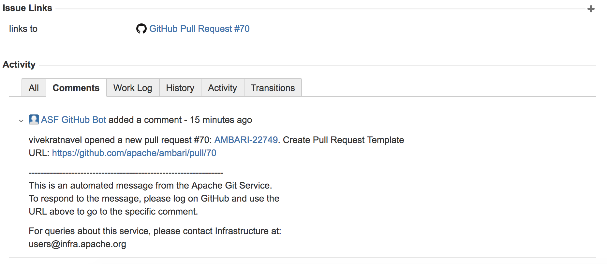

- A Jenkins Job is configured to be triggered everytime a new pull request is created. The job is configured to perform the following tasks:
  - Validate the merge
  - Build Ambari
  - Run unit tests
- It reports the outcome of the build as an integrated check in the pull request as shown below.

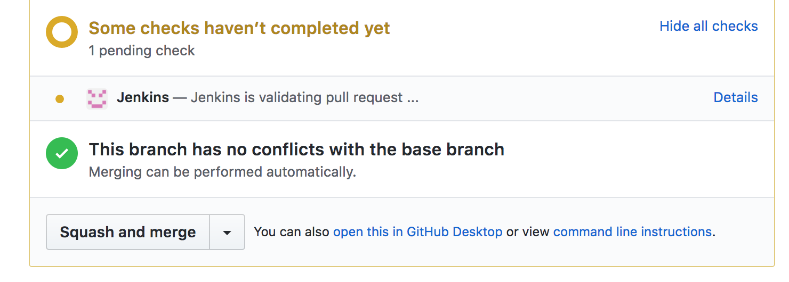

- It is the responsibility of the contributor of the pull request to make sure that the build passes. Pull requests should not be merged if the Jenkins job fails to validate the merge.
- To re-trigger the build job, just comment "retest this please" in the PR. Visit this page to check the latest build jobs.

Repeat the above steps for patches that needs to land in multiple branches. Ex: If a patch needs to be committed to branches branch-2.6 and trunk, then you need to create two branches and open two pull requests by following the above steps.

Ambari uses Github for code reviews. All committers are required to follow the instructions in this [page](https://gitbox.apache.org/setup/) and link their github accounts with gitbox to gain Merge access to [apache/ambari](https://github.com/apache/ambari) in github.

To try out the changes locally, you can checkout the pull request locally by following the instructions in this [guide](https://help.github.com/articles/checking-out-pull-requests-locally/).

- Other reviewers, including committers can try out the changes locally and either approve or give their comments as suggestions on the pull request by submitting a review on the pull request. More help can be found here.
- If more changes are required, reviewers are encouraged to leave their comments on the lines of code that require changes. The author of the pull request can then update the code and push another commit to the same branch to update the pull request and notify the committers.
- The pull request can be merged if atleast one committer has approved it or commented "LGTM" which means "Looks Good To Me" and the jenkins job validated the merge successfully. If you comment LGTM you will be expected to help with bugs or follow-up issues on the patch. (Remember committers cannot review their own patch. If a committer opens a PR, they should make sure that another committer reviews it.)
- Sometimes, other changes might be merged which conflict with the pull request’s changes. The PR can’t be merged until the conflict is resolved. This can be resolved by running **git fetch** upstream followed by git rebase **upstream/[branch-name]** and resolving the conflicts by hand, then pushing the result to your branch.
- If a PR is merged, promptly close the PR and resolve the JIRA as "Fixed".

Please read more on Apache Committers at: <http://www.apache.org/dev/committers.html>

In general a contributor that makes sustained, welcome contributions to the project may be invited to become a committer, though the exact timing of such invitations depends on many factors. Sustained contributions over 6 months is a welcome sign of contributor showing interest in the project. A contributor receptive to feedback and following development guidelines stated above is a good sign for being a committer to the project. We have seen contributors contributing 20-30 patches become committers but again this is very subjective and can vary on the patches submitted to the project. Ultimately it is the Ambari PMC that suggests and votes for committers in the project.

---

<a id="ambari-dev-bigtop-guide"></a>

<!-- source_url: https://ambari.apache.org/docs/3.0.0/ambari-dev/bigtop-guide/ -->

<!-- page_index: 58 -->

# Compiling Components for Ambari Bigtop Stack

Version: 3.0.0

Apache Bigtop is designed for infrastructure engineers and data scientists seeking comprehensive packaging, testing, and configuration of leading open-source big data components. Bigtop supports a wide range of components/projects, including but not limited to Hadoop, HBase, and Spark. This guide specifically focuses on how to compile components for the **Ambari Bigtop Stack**.

1. **Simplified Package Building**: Bigtop significantly simplifies the process of compiling RPM or DEB packages for big data components across different operating systems through pre-configured Docker images, making it quick and efficient.
2. **Dependency Management**: Bigtop integrates complex dependencies required during the compilation process, effectively resolving common compilation errors and ensuring a smooth compilation experience through patches in the code. This means users no longer need to worry about official packages failing to compile or setting up complex compilation environments.
3. **Apache Ambari Support**: Bigtop provides support for Apache Ambari, allowing users to easily package big data software that is compatible with Ambari and meets installation requirements.

This guide uses the official Bigtop 3.3.0 as an example, with CentOS 7 as the compilation operating system. The same operations apply to other systems and versions.

- Linux environment
- Docker installed on your system
- Git

```bash
mkdir ~/dev/ 
```

```bash
cd ~/dev/ 
git clone https://github.com/apache/bigtop.git 
```

```bash
cd bigtop 
git checkout release-3.3.0 
```

```bash
# If you need to compile for other operating systems or architectures (e.g., ARM),
# you can search for the corresponding Bigtop version in the image repository
# https://hub.docker.com/r/bigtop/slaves/tags docker pull bigtop/slaves:3.3.0-centos-7
```

**Scenario 1**: If you've previously compiled big data components locally and have a Maven repository cache, it's best to map this directory to the container's default Maven download directory to avoid downloading packages again.

For example, if your local Maven repository directory is `/data/repository`:

```bash
cd ~/dev/bigtop 
docker run -d -it --network host -v `pwd`:/ws -v /data/repository:/root/.m2/repository --workdir /ws --name bigtopr bigtop/slaves:3.3.0-centos-7 
```

**Scenario 2**: If you don't have a Maven cache locally or are unfamiliar with this, you should still map a directory to the Bigtop container to facilitate repeated compilations using downloaded Maven cache. Otherwise, when the container is deleted, your Maven cache will be lost, and dependency downloading is the most time-consuming stage of recompilation.

```bash
mkdir -p ~/m2/repository 
cd ~/dev/bigtop 
docker run -d -it --network host -v `pwd`:/ws -v ~/m2/repository:/root/.m2/repository --workdir /ws --name bigtopr bigtop/slaves:3.3.0-centos-7 
```

You can configure Maven to use mirrors that are faster for your location. This step is optional but can significantly improve download speeds.

1. Enter the container:

```bash
docker exec -it bigtopr /bin/bash 
```

2. Edit the Maven settings file:

```bash
vi /usr/local/maven/conf/settings.xml 
```

3. Add appropriate mirror repositories based on your location. For example:

```xml
<mirrors> 
  <mirror> 
    <id>central-mirror</id> 
    <mirrorOf>central</mirrorOf> 
    <name>Central Repository Mirror</name> 
    <url>https://repo1.maven.org/maven2/</url> 
  </mirror> 
  <!-- Add other mirrors as needed --> 
</mirrors> 
```

Enter your running container:

```bash
docker exec -it bigtopr /bin/bash 
```

Compile components:

```bash
. /etc/profile.d/bigtop.sh 
./gradlew flink-clean flink-pkg -PparentDir=/usr/bigtop -PpkgSuffix -PbuildThreads=2C repo 
```

**Explanation of compilation parameters**:

- `-PparentDir=/usr/bigtop`: Changes the default installation path of the package, making Bigtop-built packages conform to Ambari installation specifications.
- `-PpkgSuffix`: Makes the output package include the Bigtop version number (e.g., hadoop\_3\_3\_0), conforming to Ambari Bigtop service specifications.
- `-PbuildThreads=2C`: Sets the number of threads for compilation (2 times the number of CPU cores).

A pull request for parallel compilation to speed up the build process has been submitted to the community and is currently under review. Once merged, all Java components in Bigtop will be able to compile in parallel, expected to be available in versions after Bigtop 3.3.1.

Performance comparison for parallel compilation (after all dependencies are downloaded):

| Component | Time Before | Time After |
| --- | --- | --- |
| Alluxio | 21min | 07:43min |
| Hive | 05:33min | 03:04min |
| HBase | 06:18min | 02:55min |
| Zookeeper | 01:25min | 35s |
| Livy | 03:29min | 03:12min |
| Phoenix | 11:23min | 05:32min |
| Zeppelin | 14:15min | 13:19min |
| Flink | 36:27min | 14:16min |
| Hadoop | 50min | 16min |

Example of parallel compilation command:

```bash
docker run -d -it --network host -v `pwd`:/ws -v /data/repository:/data/repository --workdir /ws --name bigtop bigtop/slaves:trunk-centos-7 --cpus 16 
source /etc/profile.d/bigtop.sh 
./gradlew alluxio-clean alluxio-pkg -PcompileThreads=2C 
```

This approach shows a 2-3x improvement in compilation speed, with even more significant effects during initial compilation (e.g., Hadoop initial compilation time reduced from 3 hours to 1 hour).

---

<a id="ambari-dev-code-review-guidelines"></a>

<!-- source_url: https://ambari.apache.org/docs/3.0.0/ambari-dev/code-review-guidelines/ -->

<!-- page_index: 59 -->

# Code Review Guidelines

Version: 3.0.0

Please refer to [How to Contribute](#ambari-dev-how-to-contribute) for instructions how to submit a code review to Github.

**What makes a good code review?**

- Authors should annotate source code before the review. This makes it easier for devs reviewing your code and may even help you spot bugs before they do.
- Send small code-reviews if possible. Reviewing more than 400 lines per hour diminishes our ability to find defects.
- Reviewing code for more than one hour also reduces our ability to find bugs.
- If possible, try to break up large reviews into separate but functional stages. If you need to temporarily comment out unit tests, do so. Sending gigantic patches means your review will take longer since reviewers need to block out more time to go through it, and you may spend more time revving iterations and rebasing.

We have a global community of committers, so please be mindful that you should **wait at least 24 hours** before merging your pull request even though you may already have the necessary +1.

This encourages others to take an interest in your pull request and helps us find more bugs (it's ok to slow down in order to speed up).

**Always include** **at least two committers that are familiar with that code area**.

If you want to subscribe to code reviews for a particular area, [feel free to edit this section](https://cwiki.apache.org/confluence/display/AMBARI/Code+Review+Guidelines).

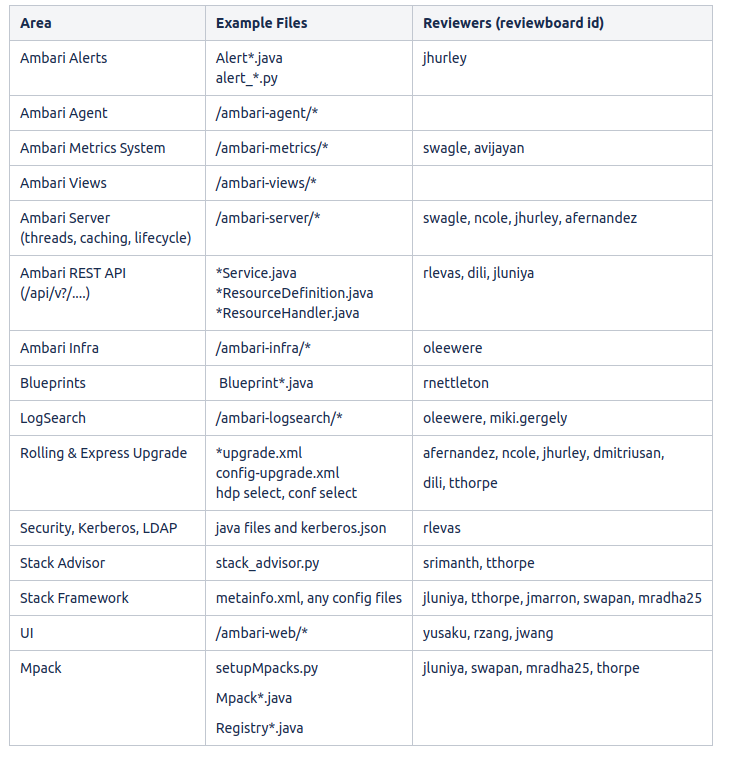

---

<a id="ambari-dev-releasing-ambari"></a>

<!-- source_url: https://ambari.apache.org/docs/3.0.0/ambari-dev/releasing-ambari/ -->

<!-- page_index: 60 -->

# Releasing Ambari

Version: 3.0.0

- Setting up release signing keys
- Uploading artifacts to staging and release repositories

- Release requirements
- Process for staging

Setup for first time release managers

If you are being a release manager for the first time, you will need to run the following additional steps so that you are not blocked during the actual release process.

**Configure SSH/SFTP to home.apache.org**

SFTP to home.apache.org supports only Key-Based SSH Logins

```bash
# Generate RSA Keys mkdir ~/.ssh chmod 700 ~/.ssh ssh-keygen -t rsa -b 4096
 
# Note: This will create ~/.ssh/id_rsa and ~/.ssh/id_rsa.pub files will be generated
 
# Upload Public RSA Key Login at http://id.apache.org Add Public SSH Key to your profile from ~/.ssh/id_rsa.pub SSH Key (authorized_keys line):Submit changes
 
# Verify SSH to minotaur.apache.org works ssh -i ~/.ssh/id_rsa {username}@minotaur.apache.org
 
# SFTP to home.apache.org sftp {username}@home.apache.org mkdir public_html cd public_html put test #This test file is a sample empty file present in current working directory from which you sftp.
 
Verify URL http://home.apache.org/{username}/test 
```

**Generate OpenGPG Key**

You should get a signing key, keep it in a safe place, upload the public key to apache, and build a web of trust.

Ref: <http://zacharyvoase.com/2009/08/20/openpgp/>

```bash
gpg2 --gen-key 
gpg2 --keyserver pgp.mit.edu --send-key {key} 
gpg2 --armor --export {username}@apache.org > {username}.asc 
Copy over {username}.asc to {username}@home.apache.org:public_html/~{username}.asc 
Verify URL http://home.apache.org/~{username}/{username}.asc 
Query PGP KeyServer http://pgp.mit.edu:11371/pks/lookup?search=0x{key}&op=vindex 
 
Web of Trust: 
Request others to sign your PGP key. 
 
Login at http://id.apache.org 
Add OpenPGP Fingerprint to your profile 
OpenPGP Public Key Primary Fingerprint: XXXX YYYY ZZZZ .... 
Submit changes 
Verify that the public PGP key is exported to http://home.apache.org/keys/committer/{username}.asc 
```

**Email [dev@ambari.apache.org](mailto:dev@ambari.apache.org) mailing list notifying that you will be creating the release branch at least one week in advance**

```text
Subject: Preparing Ambari X.Y.Z branch 
 
Hi developers and PMCs, 
 
I am proposing cutting a new branch branch-X.Y for Ambari X.Y.Z on __________  as per the outlined tasks in the Ambari Feature + Roadmap page (https://cwiki.apache.org/confluence/pages/viewpage.action?pageId=30755705). 
 
After making the branch, we (i.e., development community) should only accept blocker or critical bug fixes into the branch and harden it until it meets a high enough quality bar. 
 
If you have a bug fix, it should first be committed to trunk, and after ensuring that it does not break any tests (including smoke tests), then it should be integrated to the Ambari branch-X.Y 
If you have any doubts whether a fix should be committed into branch-X.Y, please email me for input at ____________ 
Stay tuned for updates on the release process. 
 
Thanks 
```

**Create the release branch**

Create a branch for a release using branch-X.Y (ex: branch-2.1) as the name of the branch.

Note: Going forward, we should be creating branch-[majorVersion].[minorVersion], so that the same branch can be used for maintenance releases.

**Checkout the release branch**

```bash
git checkout branch-X.Y 
```

**Update Ambari REST API docs**

Starting with Ambari's `<span>trunk</span>` branch as of Ambari 2.8, the release manager should generate documentation from existing source code. The documentation should be checked back into the branch before performing the release.

```bash
# Generate the following artifacts:
# - Configuration markdown at docs/configuration/index.md
# - swagger.json and index.html at docs/api/generated/cd ambari-server/mvn clean compile exec:java@configuration-markdown test -Drat.skip -Dcheckstyle.skip -DskipTests -Dgenerate.swagger.resources
 
# Review and Commit the changes to branch-X.Y git commit
```

**Update release version**

Once the branch has been created, the release version must be set and committed. The changes should be committed to the release branch.

**Ambari 2.8+**

Starting with Ambari 2.8, the build process relies on [Maven 3.5+ which allows the](https://maven.apache.org/maven-ci-friendly.html) [use of the `${revision}` tag](https://maven.apache.org/maven-ci-friendly.html). This means that the release version can be defined once in the root `pom.xml` and then inherited by all submodules. In order to build Ambari with a specific build number, there are two methods:

```bash
mvn -Drevision=2.8.0.0.0 ... 
Editing the root pom.xml to include the new build number 
<revision>2.8.0.0-SNAPSHOT</revision> 
```

To be consistent with prior releases, the `pom.xml` should be updated in order to contain the new version.

**Steps followed for 2.8.0 release as a reference**

```bash
# Update the revision property to the release version mvn versions:set-property -Dproperty=revision -DnewVersion=2.8.0.0.0
 
# Remove .versionsBackup files git clean -f -x
 
# Review and commit the changes to branch-X.Y git commit
```

> [!CAUTION]
> **Ambari 2.7 and Earlier Releases (Deprecated) :::**
> Older Ambari branches still required that you update every `pom.xml` manually through the below process:
>
> **Steps followed for 2.2.0 release as a reference**
>
> ```bash
> # Update the release version mvn versions:set -DnewVersion=2.2.0.0.0 pushd ambari-metrics mvn versions:set -DnewVersion=2.2.0.0.0 popd pushd contrib/ambari-log4j mvn versions:set -DnewVersion=2.2.0.0.0 popd pushd contrib/ambari-scom mvn versions:set -DnewVersion=2.2.0.0.0 popd pushd docs mvn versions:set -DnewVersion=2.2.0.0.0 popd
>
> # Update the ambari.version properties in all pom.xml
> $ find . -name "pom.xml" | xargs grep "ambari\.version"
>
> ./contrib/ambari-scom/ambari-scom-server/pom.xml:        2.1.0-SNAPSHOT
> ./contrib/ambari-scom/ambari-scom-server/pom.xml:            ${ambari.version}
> ./contrib/views/hive/pom.xml:    2.1.0.0.0
> ./contrib/views/jobs/pom.xml:        ${ambari.version}
> ./contrib/views/pig/pom.xml:    2.1.0.0.0
> ./contrib/views/pom.xml:    2.1.0.0.0
> ./contrib/views/storm/pom.xml:      ${ambari.version}
> ./contrib/views/tez/pom.xml:      ${ambari.version}
> ./docs/pom.xml:        2.1.0
> ./docs/pom.xml:        ${project.artifactId}-${ambari.version}
>
> # Update any 2.1.0-SNAPSHOT references in pom.xml
> $ grep -r --include "pom.xml" "2.1.0-SNAPSHOT" .
>
> # Remove .versionsBackup files git clean -f -x -d
>
> # Review and commit the changes to branch-X.Y git commit
> ```
>
> **Update KEYS**
>
> If this is the first time you have taken release management responsibilities, make sure to update the KEYS file and commit the updated KEYS in both the ambari trunk branch and the release branch. Also in addition to updating the KEYS file in the tree, you also need to p ush the KEYS file to <https://dist.apache.org/repos/dist/release/ambari/>
>
> ```bash
> gpg2 --list-keys jluniya@apache.org >> KEYS
> gpg2 --armor --export jluniya@apache.org >> KEYS
>
> # commit the changes to both trunk and new release branch git commit
>
> # push the updated KEYS file to https://dist.apache.org/repos/dist/release/ambari/.
>
> # Only PMCs members can do this 'svn' step.
>
> svn co https://dist.apache.org/repos/dist/release/ambari ambari_svn
> cp {path_to_keys_file}/KEYS ambari_svn/KEYS
> svn update KEYS
> svn commit -m "Updating KEYS for Ambari"
> ```
>
> **Setup Build**
>
> Setup Jenkins Job for the new branch on <http://builds.apache.org>
>
> ```text
> Note: The first release candidate is rc0. The following documented process assumes rc0, but replace it with the appropriate rc number as required.
>
> ```
>
> **Checkout the release branch**
>
> ```text
> git checkout branch-X.Y
> ```
>
> **Create a Release Tag from the release branch**
>
> ```bash
> git tag -a release-X.Y.Z-rc0 -m 'Ambari X.Y.Z RC0'
> git push origin release-X.Y.Z-rc0
> ```
>
> **Create a tarball**
>
> ```bash
> # create a clean copy of the source cd ambari-git-X.Y.Z git clean -f -x -d cd ..
>
>  cp -R ambari-git-X.Y.Z apache-ambari-X.Y.Z-src
>
>  # create ambari-web/public by running the build instructions per https://cwiki.apache.org/confluence/display/AMBARI/Ambari+Development
> # once ambari-web/public is created, copy it as ambari-web/public-static cp -R ambari-git-X.Y.Z/ambari-web/public apache-ambari-X.Y.Z-src/ambari-web/public-static
>
> # make sure apache rat tool runs successfully cp -R apache-ambari-X.Y.Z-src apache-ambari-X.Y.Z-ratcheck cd apache-ambari-X.Y.Z-ratcheck mvn clean apache-rat:check cd ..
>
>  # if rat check fails, file JIRAs and fix them before proceeding.
>
> # tar it up, but exclude git artifacts tar --exclude=.git --exclude=.gitignore --exclude=.gitattributes -zcvf apache-ambari-X.Y.Z-src.tar.gz apache-ambari-X.Y.Z-src
> ```
>
> **Sign the tarball**
>
> ```bash
> gpg2  --armor --output apache-ambari-X.Y.Z-src.tar.gz.asc --detach-sig apache-ambari-X.Y.Z-src.tar.gz
> ```
>
> **Generate SHA512 checksums:**
>
> ```text
> sha512sum apache-ambari-X.Y.Z-src.tar.gz > apache-ambari-X.Y.Z-src.tar.gz.sha512
> ```
>
> or
>
> ```text
> openssl sha512 apache-ambari-X.Y.Z-src.tar.gz > apache-ambari-X.Y.Z-src.tar.gz.sha512
> ```
>
> **Upload the artifacts to your apache home:**
>
> The artifacts then need to be copied over (SFTP) to
>
> ```text
> public_html/apache-ambari-X.Y.Z-rc0
> ```
>
> **Call for a vote on the [dev@ambari.apache.org](mailto:dev@ambari.apache.org) mailing list with something like this:**
>
> I have created an ambari-\*\* release candidate.
>
> GIT source tag (r\*\*\*)
>
> ```text
> https://git-wip-us.apache.org/repos/asf/ambari/repo?p=ambari.git;a=log;h=refs/tags/release-x.y.z-rc0
> ```
>
> Staging site: <http://home.apache.org/user_name/apache-ambari-X.Y.Z-rc0>
>
> Vote will be open for 72 hours.
>
> ```text
> [ ] +1 approve
> [ ] +0 no opinion
> [ ] -1 disapprove (and reason why)
> ```
>
> Once the vote passes/fails, send out an email with subject like "[RESULT] [VOTE] Apache Ambari x.y.z rc0" to [dev@ambari.apache.org](mailto:dev@ambari.apache.org). For the vote to pass, 3 +1 votes are required. If the vote does not pass another release candidate will need to be created after addressing the feedback from the community.
>
> - Login to <https://id.apache.org> and verify the fingerprint of PGP key used to sign above is provided. (gpg --fingerprint)
> - Upload your PGP public key only to */home/*
>
> Publish the release as below:
>
> ```bash
> svn co https://dist.apache.org/repos/dist/release/ambari ambari
>
> # Note : Only PMCs members can do this 'svn' step.
>
> cd ambari
> mkdir ambari-X.Y.Z
> scp ~/public_html/apache-ambari-X.Y.Z-rc0/* ambari-X.Y.Z
> svn add ambari-X.Y.Z
> svn rm ambari-A.B.C  # Remove the older release from the mirror.  Only the latest version should appear in dist.
>
> svn commit -m "Committing Release X.Y.Z"
> ```
>
> Create the release tag:
>
> ```bash
> git tag -a release-X.Y.Z -m 'Ambari X.Y.Z'
> git push origin release-X.Y.Z
> ```
>
> Note that it takes 24 hours for the changes to propagate to the mirrors.
>
> Wait 24 hours and verify that the bits are available in the mirrors before sending an announcement.
>
> **Update Ambari Website and Wiki**
>
> [http://ambari.apache.org](http://ambari.apache.org/) is checked in Git in `/ambari/docs/src/site` folder.
>
> ```bash
> cd docs
> mvn versions:set -DnewVersion=X.Y.Z
>
> # Make necessary changes, typically to pom.xml, site.xml, index.apt, and whats-new.apt mvn clean site
> ```
>
> Examine the changes under */ambari/docs/target* folder.
>
> Update the wiki to add pages for installation of the new version. *Usually you can copy the pages for the last release and make the URL changes to point to new repo/tarball location.*
>
> **Send out Announcement to [dev@ambari.apache.org](mailto:dev@ambari.apache.org) and [user@ambari.apache.org](mailto:user@ambari.apache.org).**
>
> Subject: [ANNOUNCE] Apache Ambari X.Y.Z.
>
> The Apache Ambari team is proud to announce Apache Ambari version X.Y.Z
>
> Apache Ambari is a tool for provisioning, managing, and monitoring Apache Hadoop clusters. Ambari consists of a set of RESTful APIs and a browser-based management console UI.
>
> The release bits are at: <http://www.apache.org/dyn/closer.cgi/ambari/ambari-X.Y.Z>.
>
> To use the released bits please use the following documentation:
>
> <https://cwiki.apache.org/confluence/display/AMBARI/Installation+Guide+for+Ambari+X.Y.Z>
>
> We would like to thank all the contributors that made the release possible.
>
> Regards,
>
> The Ambari Team
>
> **Submit release data to Apache reporter database.**
>
> This step can be done only by a project PMC. If release manager is not an Ambari PMC then please reach out to an existing Ambari PMC or contact Ambari PMC chair to complete this step.
>
> - Login to <https://reporter.apache.org/addrelease.html?ambari> with apache credentials.
> - Fill out the fields:
>   - Committe: ambari
>   - Full version name: 2.2.0
>   - Date of release (YYYY-MM-DD): 2015-12-19
> - Submit the data
> - Verify that the submitted data is reflected at <https://reporter.apache.org/?ambari>
>
> Performing this step keeps <https://reporter.apache.org/?ambari> site updated and people using the Apache Reporter Service will be able to see the latest release data for Ambari.
>
> Please use the following [document](https://docs.google.com/document/d/1RjWQOaTUne6t8DPJorPhOMWAfOb6Xou6sAdHk96CHDw/edit) to publish Ambari artifacts to Maven central.

---

<a id="ambari-dev-admin-view-ambari-admin-development"></a>

<!-- source_url: https://ambari.apache.org/docs/3.0.0/ambari-dev/admin-view-ambari-admin-development/ -->

<!-- page_index: 61 -->

# Admin View (ambari-admin) Development

Version: 3.0.0

Follow the instructions here to ease frontend development for Admin View (ambari-admin module):

1. Follow the Quick Start Guide to install and start Ambari Server (cluster need not be deployed).
2. Follow the "Frontend Development" section in Quick Start Guide to check out the Ambari source using git. This makes the entire Ambari source available via /vagrant/ambari from the Vagrant VM.
3. From the Ambari Server host:


```bash
cd /var/lib/ambari-server/resources/views/work  <- if this directory does not exist, you have      not started ambari-server; run "ambari-server start" to start it 
mv ADMIN_VIEW\{2.5.0.0\} /tmp 
ln -s /vagrant/ambari/ambari-admin/src/main/resources/ui/admin-web/dist ADMIN_VIEW\{2.5.0.0\} 
cp /tmp/ADMIN_VIEW\{2.5.0.0\}/view.xml ADMIN_VIEW\{2.5.0.0\}/  
ambari-server restart 
```

4. Now you can change the source code for Admin View and run gulp locally, and the changes are automatically reflected on the server.

To run end-to-end functional tests on the browser, execute:

npm run update-webdriver
npm start (This starts http server at 8000 port)

Open another terminal at same path and execute: npm run protractor (does e2e test in the browser. This library works on top of selenium jar).

To run unit tests:

Go to path: `/ambari/ambari-admin/src/main/resources/ui/admin-web`
Execute npm run test-single-run (this uses PhantomJS headless browser; it's the same used by the ambari-web unit tests)

Note:
"npm test" command starts karma server at <http://localhost:9876/> and runs unit tests. This server remain up, autoreloads any changes in the test code and reruns the tests. This is useful while developing unit tests.

---

<a id="ambari-dev-unit-test-reports"></a>

<!-- source_url: https://ambari.apache.org/docs/3.0.0/ambari-dev/unit-test-reports/ -->

<!-- page_index: 62 -->

# Unit Test Reports

Version: 3.0.0

| Branch | Unit Test Report URL |
| --- | --- |
| trunk | <https://builds.apache.org/job/Ambari-trunk-Commit/> |
| branch-2.2 | <https://builds.apache.org/job/Ambari-branch-2.2/> |

---

<a id="ambari-dev-development-in-docker"></a>

<!-- source_url: https://ambari.apache.org/docs/3.0.0/ambari-dev/development-in-docker/ -->

<!-- page_index: 63 -->

# Development in Docker

Version: 3.0.0

This page describes how to develop, build and test Ambari on Docker.

In order to build Ambari, there are a quite few steps to execute and it is a bit cumbersome. You can build an environment in Docker and are good to go!

This is NOT meant for running production level Ambari in Docker (though you can run Ambari and deploy Hadoop in a single Docker container for testing purpose)

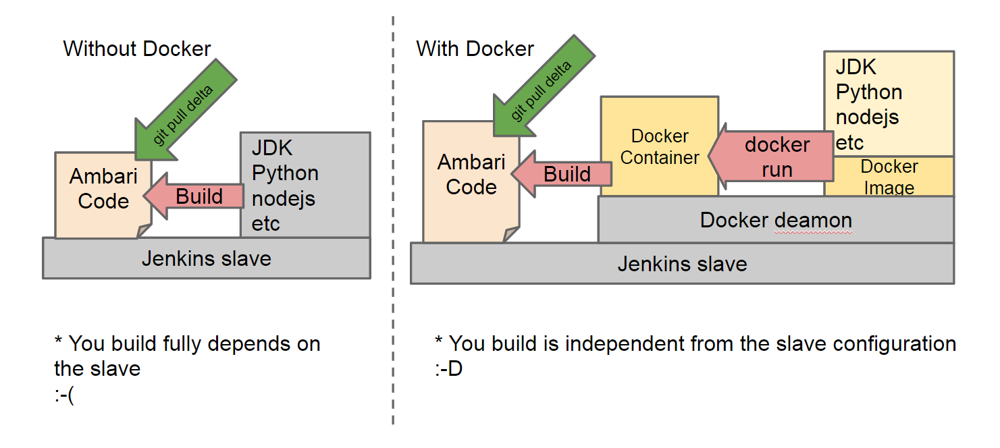

(This is not only about Jenkins slaves but think it is your laptop)

First, we will make a Docker image that has all third party libraries Ambari requires.

Second, prepare your code on Docker host machine. It can be trunk or a branch, or your developing code or with a patch applied. Note that your code does not reside inside of Docker container, but on the Docker host and we link it by Docker volume (like mount)

And you are ready to go!

This code has been migrated to Ambari trunk.

<https://github.com/apache/ambari/tree/trunk/dev-support/docker>

There are a few system requirements if you want to play with this document.

- Docker <https://docs.docker.com/#installation-guides>

First thing first, we have to build an Docker image for this solution. This will setup libraries including ones from yum and maven dependencies. In my environment (Centos 6.5 VM with 8GB and 4CPUs) takes 30mins. Good news is this is one time.

```bash
git clone https://github.com/apache/ambari.git 
cd ambari 
docker build -t ambari/build ./dev-support/docker/docker 
```

This is going to build a image named "ambari/build" from configuration files under ./dev-support/docker/docker

For example our unit test Jenkins job on trunk runs on Docker. If you want to replicate the environment, read this section.

The basic

```bash
cd {ambari_root} 
docker run --privileged -h node1.mydomain.com -v $(pwd):/tmp/ambari ambari/build /tmp/ambari/dev-support/docker/docker/bin/ambaribuild.py test -b 
```

- 'docker run' is the command to run a container from a image. Which image was run? It is 'ambari/build'
- -h sets a host name in the container.
- -v is to mount your Ambari code on the host to the container's /tmp. Make sure you are at the Ambari root directory.
- ambaribuild.py runs some script to eventually run 'mvn test' for ambari.
- -b option is to rebuild the entire source tree. It runs test as is on your host if omitted.

You want to run Ambari and Hadoop to test your improvements that you have just coded on your host. Here is the way!

```bash
cd {ambari_root} 
docker run --privileged -t -p 80:80 -p 5005:5005 -p 8080:8080 -h node1.mydomain.com --name ambari1 -v $(pwd):/tmp/ambari ambari/build /tmp/ambari-build-docker/bin/ambaribuild.py deploy -b 
   
# once your are done docker kill ambari1 && docker rm ambari1
```

- --privileged is important as ambari-server accessing to /proc/??/exe
- -p 80:80 to ensure you can access to web UI from your host.
- -p 5005 is java debug port
- 'deploy' to build, install rpms and start ambari-server and ambari-agent and deploy Hadoop through blueprint.

You can take a look at <https://github.com/apache/ambari/tree/trunk/dev-support/docker/docker/blueprints> to see what is actually deployed.

There are a few other parameters you can play.

```bash
cd {ambari_root} 
docker run --privileged -t -p 80:80 -p 5005:5005 -p 8080:8080 -h node1.mydomain.com --name ambari1 -v ${AMBARI_SRC:-$(pwd)}:/tmp/ambari ambari/build /tmp/ambari-build-docker/bin/ambaribuild.py [test|server|agent|deploy] [-b] [-s [HDP|BIGTOP|PHD]] 
```

- test: mvn test
- server: install and run ambari-server
- agent: install and run ambari-server and ambari-agent
- deploy: install and run ambari-server and ambari-agent, and deploy a hadoop

---

<a id="ambari-dev-developer-tools"></a>

<!-- source_url: https://ambari.apache.org/docs/3.0.0/ambari-dev/developer-tools/ -->

<!-- page_index: 64 -->

# Developer Tools

Version: 3.0.0

Araxis has been kind enough to give us free licenses for Araxis Merge if you work on open source, just submit a request at <http://www.araxis.com/buy/open-source>

Download from <http://www.araxis.com/url/merge/download.uri>

You will be prompted for your serial number when you run the application for the first time. To enter a new serial number into an existing installation, click the Re-Register... button in the About window.

After installing Araxis Merge,

On Mac OS X,

- Drag Araxis across to your ~/Applications folder as normal
- Copy the contents of the Utilities folder to (e.g.) /usr/local/araxis/bin
- Add the path to your startup script: export PATH="$PATH:/usr/local/araxis/bin"

In your .gitconfig file (tested on Mac OS X),

```text
[diff] 
        tool = araxis 
[difftool] 
        prompt = false 
[merge] 
        tool = araxis_merge 
[mergetool "araxis_merge"] 
        cmd = araxisgitmerge "$PWD/$REMOTE" "$PWD/$BASE" "$PWD/$LOCAL" "$PWD/$MERGED" 
```

This is just a personal preference, but it may be easier to create one Git branch per Jira/feature. E.g.,

```bash
git checkout trunk 
git checkout -b AMBARI12345                             # create the branch and switch to it 
git branch --set-upstream-to=origin/trunk AMBARI12345   # set the upstream so that git pull --rebase will get the HEAD from trunk 
# Do work,git commit -m "AMBARI-12345. Foo (username)"
# Do more work git commit --amend # edit the last commit git pull --rebase
   
# If conflicts are detected, then run git mergetool # should be easy if you have Araxis Merge setup to do a 3-way merge git rebase --continue git push origin HEAD:trunk
```

In your .gitconfig file,

```bash
[alias] 
        st = status 
        ci = commit 
        br = branch 
        co = checkout 
        dc = diff --cached 
        dtc = difftool --cached 
        lg = log -p 
        lsd = log --graph --decorate --pretty=oneline --abbrev-commit --all 
        slast = show --stat --oneline HEAD 
        pshow = show --no-prefix --format=format:%H --full-index 
        pconfig = config --list 
```

Also, in your ~/.bashrc or ~/.profile file,

```bash
alias branchshow='for k in `git branch|perl -pe s/^..//`;do echo -e `git show --pretty=format:"%Cgreen%ci %Cblue%cr%Creset" $k|head -n 1`\\t$k;done|sort' 
```

This command will show all of your branches sorted by the last commit times, which is useful if you develop one feature per branch.

---

<a id="ambari-dev-feature-flags"></a>

<!-- source_url: https://ambari.apache.org/docs/3.0.0/ambari-dev/feature-flags/ -->

<!-- page_index: 65 -->

# Feature Flags

Version: 3.0.0

- Sometimes, we want to have the ability for the end users to experiment with a new feature, but not expose it as a general feature since it has not gone through rigorous testing and use of the feature could result in problems. In other cases, we want to provide an escape hatch for certain edge-case scenarios that we may not want to expose in general because using the escape hatch is potentially dangerous and should only be reserved special occasions. For these purposes, Ambari has a notion of **feature flags**.
- Feature flags can be created as an attribute of App.supports map under <https://github.com/apache/ambari/blob/trunk/ambari-web/app/config.js>
- Those boolean flags are exposed in the Ambari Web UI via `<ambari-server-protocol>://<ambari-server-host>:<ambari-server-port>/#/experimental`

  - The end user can go to the above URL to turn certain experimental features on.

    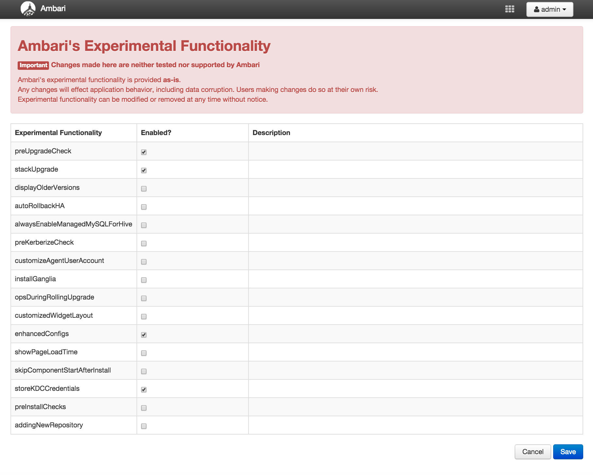
- In Ambari Web code, we should toggle experimental features on/off via the App.supports object.
- You will see sample usage if you recursively grep for "App.supports" under the ambari-web project.

---

<a id="ambari-dev-verifying-release-candidate"></a>

<!-- source_url: https://ambari.apache.org/docs/3.0.0/ambari-dev/verifying-release-candidate/ -->

<!-- page_index: 66 -->

# Verifying Release Candidate

Version: 3.0.0

[Apache Release Process](http://www.apache.org/dev/release-publishing)

The steps are based on what is needed on a fresh centos6 VM created based on [Quick Start Guide](#quick-start-quick-start-guide)

```bash
mkdir -p /usr/work/ambari 
pushd /usr/work/ambari 
```

*Download the src tarball, asc signature, and md5/sha1 hashes.*

Verify the hashes

```text
openssl md5 apache-ambari-2.4.1-src.tar.gz | diff apache-ambari-2.4.1-src.tar.gz.md5 - 
openssl sha1 apache-ambari-2.4.1-src.tar.gz | diff apache-ambari-2.4.1-src.tar.gz.sha1 - 
```

Verify the signature

```bash
gpg --keyserver pgpkeys.mit.edu --recv-key <key ID> 
gpg apache-ambari-2.4.1-src.tar.gz.asc 
```

If you are verifying the release on a clean machine (e.g. freshly installed VM) then you need to run several preparatory step.

```bash
mkdir /usr/local/apache-maven 
cd /usr/local/apache-maven 
wget http://mirror.olnevhost.net/pub/apache/maven/binaries/apache-maven-3.2.1-bin.tar.gz 
tar -xvf apache-maven-3.2.1-bin.tar.gz 
export M2_HOME=/usr/local/apache-maven/apache-maven-3.2.1 
export M2=$M2_HOME/bin 
export PATH=$M2:$PATH 
```

```bash
mkdir /usr/jdk 
cd /usr/jdk 
cp "FROM SOURCE"/jdk-7u67-linux-x64.tar.gz . (or download the latest) 
tar -xvf jdk-7u67-linux-x64.tar.gz 
export PATH=$PATH:/usr/jdk/jdk1.7.0_67/bin 
export JAVA_HOME=/usr/jdk/jdk1.7.0_67 
export _JAVA_OPTIONS="-Xmx2048m -XX:MaxPermSize=1024m -Djava.awt.headless=true" 
```

```bash
yum install -y git 
curl --silent --location https://rpm.nodesource.com/setup | bash - 
yum install -y nodejs 
yum install -y gcc-c++ make 
npm install -g brunch@1.7.20 
yum install -y libfreetype.so.6 
yum install -y freetype 
yum install -y fontconfig 
yum install -y python-devel 
yum install -y rpm-build 
```

```bash
wget http://pypi.python.org/packages/2.6/s/setuptools/setuptools-0.6c11-py2.6.egg --no-check-certificate 
 
sh setuptools-0.6c11-py2.6.egg 
```

These steps may not be needed in every environment. You can either perform these steps before build or after, and if, you encounter specific errors.

*Install pom files needed by ambari-metrics-kafka-sink*

```bash
mkdir /tmp/pom-files 
pushd /tmp/pom-files 
cp "FROM SOURCE"/jms-1.1.pom . 
cp "FROM SOURCE"/jmxri-1.2.1.pom . 
cp "FROM SOURCE"/jmxtools-1.2.1.pom . 
mvn install:install-file -Dfile=jmxri-1.2.1.pom -DgroupId=com.sun.jmx -DartifactId=jmxri -Dversion=1.2.1 -Dpackaging=jar 
mvn install:install-file -Dfile=jms-1.1.pom -DgroupId=javax.jms -DartifactId=jms -Dversion=1.1 -Dpackaging=jar 
mvn install:install-file -Dfile=jmxtools-1.2.1.pom -DgroupId=com.sun.jdmk -DartifactId=jmxtools -Dversion=1.2.1 -Dpackaging=jar 
popd 
```

```bash
pushd /usr/work/ambari 
tar -xvf apache-ambari-2.4.1-src.tar.gz 
cd apache-ambari-2.4.1-src 
mvn clean install -DskipTests 
```

---

<a id="ambari-plugin-contribution"></a>

<!-- source_url: https://ambari.apache.org/docs/3.0.0/ambari-plugin-contribution/ -->

<!-- page_index: 67 -->

# Ambari Plugin Contributions

Version: 3.0.0

These are independent extensions that are contributed to the Ambari codebase.

[## 🗃️ Ambari SCOM Management Pack

1 item](#ambari-plugin-contribution-scom)

[## 📄️ Step-by-step guide on adding a dashboard widget for a host.

Create your own dashboard widget for hosts:](#ambari-plugin-contribution-step-by-step)

---

<a id="ambari-plugin-contribution-scom"></a>

<!-- source_url: https://ambari.apache.org/docs/3.0.0/ambari-plugin-contribution/scom/ -->

<!-- page_index: 68 -->

# Ambari SCOM Management Pack

Version: 3.0.0

This information is intended for **Apache Hadoop** and **Microsoft System Center Operations Manager** users who want to monitor their Hadoop clusters using the **Ambari SCOM Management Pack**.

The Ambari SCOM Management Pack extends the functionality of Microsoft System Center Operations Manager to monitor Apache Hadoop clusters. It leverages Ambari and the Ambari REST API to obtain Hadoop metrics and provide comprehensive monitoring capabilities.

Ambari SCOM Management Pack is compatible with the following versions:

| Ambari SCOM Version | Compatible Ambari Server Versions | Notes |
| --- | --- | --- |
| 3.0.0 | 3.0.0 | Latest version with improved metrics collection |
| 2.0.0 | 1.5.1+ | Legacy support |
| 1.0.0 | 1.4.4 | Legacy support |

> **Note:** For the best experience, it's recommended to use matching versions of Ambari Server and the Ambari SCOM Management Pack.

The Ambari SCOM contribution can be found in the Apache Ambari project repository:

- [GitHub: apache/ambari/contrib/ambari-scom](https://github.com/apache/ambari/tree/trunk/contrib/ambari-scom)

The Ambari SCOM Management Pack provides the following key features:

- **Automatic Discovery**: Automatically discovers all nodes within Hadoop cluster(s)
- **Proactive Monitoring**: Continuously monitors the availability and capacity of your Hadoop services
- **Health Notifications**: Proactively notifies administrators when the health is critical
- **Intuitive Dashboards**: Efficiently visualizes the health of Hadoop clusters through comprehensive dashboards
- **Detailed Metrics**: Collects and displays detailed metrics for all Hadoop components

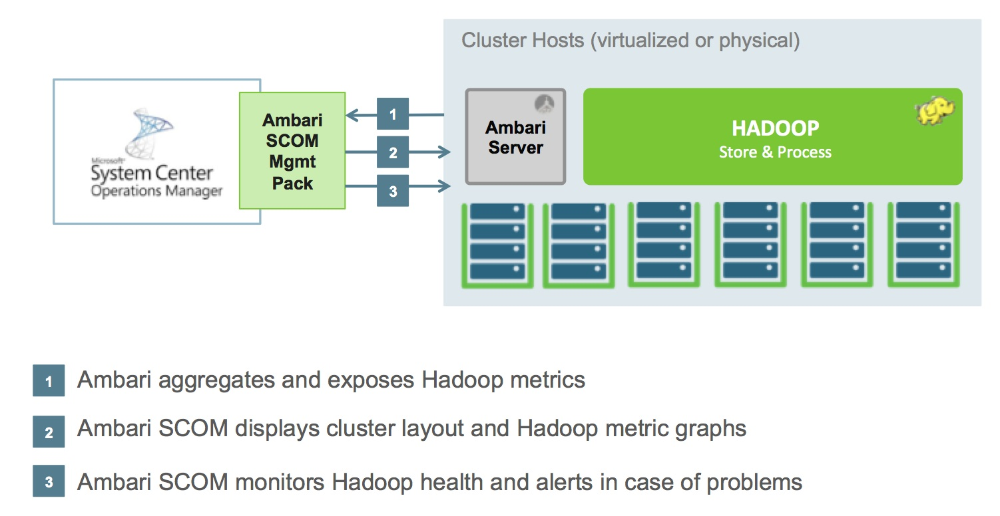

Ambari SCOM consists of the following components:

1. **Ambari Server**: Collects metrics from Hadoop clusters
2. **SCOM Management Server**: Processes and stores monitoring data
3. **SCOM Console**: Provides the user interface for monitoring and alerts
4. **Ambari SCOM Management Pack**: Connects Ambari with SCOM and defines monitoring rules

To get started with the Ambari SCOM Management Pack:

1. Ensure you have a functioning Ambari Server (version 3.0.0 or compatible)
2. Install Microsoft System Center Operations Manager
3. Follow the [Installation Guide](#ambari-plugin-contribution-scom-installation) to install the management pack
4. Configure the necessary Run As accounts and discovery rules

The following links provide information about common tasks associated with System Center Management Packs:

- [Administering the Management Pack Life Cycle](http://go.microsoft.com/fwlink/?LinkId=211463)
- [How to Import a Management Pack in Operations Manager](http://go.microsoft.com/fwlink/?LinkID=142351)
- [How to Monitor Using Overrides](http://go.microsoft.com/fwlink/?LinkID=117777)
- [How to Create a Run As Account in Operations Manager](http://technet.microsoft.com/en-us/library/hh321655.aspx)
- [Microsoft System Center Documentation](https://docs.microsoft.com/en-us/system-center/scom/)

For questions about Operations Manager and monitoring packs, visit the [Microsoft Q&A for System Center](https://docs.microsoft.com/en-us/answers/topics/system-center-operations-manager.html) or the [System Center blog](https://techcommunity.microsoft.com/t5/system-center-blog/bg-p/SystemCenterBlog).

---

<a id="ambari-plugin-contribution-scom-installation"></a>

<!-- source_url: https://ambari.apache.org/docs/3.0.0/ambari-plugin-contribution/scom/installation/ -->

<!-- page_index: 69 -->

# Installation

Version: 3.0.0

Setting up Ambari SCOM assumes the following prerequisite software:

- Ambari SCOM 1.0
  - Apache Hadoop 1.x cluster (HDFS and MapReduce) 1
- Ambari SCOM 2.0
  - Apache Hadoop 2.x cluster (HDFS and YARN/MapReduce) 2
- JDK 1.7
- Microsoft SQL Server 2012
- Microsoft JDBC Driver 4.0 for SQL Server 3
- Microsoft System Center Operations Manager (SCOM) 2012 SP1 or later
- System Center Monitoring Agent installed on **Watcher Node** 4

1 *Ambari SCOM* 1.0 has been tested with a Hadoop cluster based on **Hortonworks Data Platform 1.3 for Windows** ("[HDP 1.3 for Windows](http://hortonworks.com/products/releases/hdp-1-3-for-windows/)")

2 *Ambari SCOM* 2.0 has been tested with a Hadoop cluster based on **Hortonworks Data Platform 2.1 for Windows** ("[HDP 2.1 for Windows](http://docs.hortonworks.com/HDPDocuments/HDP2/HDP-2.1-Win-latest/bk_installing_hdp_for_windows/content/win-getting-ready.html)")

3 Obtain the *Microsoft JDBC Driver 4.0 for SQL Server* JAR file (`sqljdbc4.jar`) at <http://technet.microsoft.com/en-us/library/ms378749.aspx>

4 See Microsoft TechNet topic for [Managing Discovery and Agents](http://technet.microsoft.com/en-us/library/hh212772.aspx). Minimum Agent requirements *.NET 4* and *PowerShell 2.0 + 3.0*

```text
├─ ambari-scom- _**version**_.zip 
├── README.md 
├── server.zip 
├── metrics-sink.zip 
├── mp.zip 
└── ambari-scom.msi 
```

| File | Name | Description |
| --- | --- | --- |
| server.zip | Server Package | Contains the required software for configuring the Ambari SCOM Server software. |
| metrics-sink.zip | Metrics Sink Package | Contains the required software for manually configuring SQL Server and the Hadoop Metrics Sink. |
| ambari-scom.msi | MSI Installer | The Ambari SCOM MSI Installer for configuring the Ambari SCOM Server and Hadoop Metrics Sink |
| mp.zip | Management Pack Package | Contains the Ambari SCOM Management Pack software. |

> [!WARNING]
> **The Ambari SCOM Management Pack must connect to an Ambari SCOM Server to retrieve cluster metrics. Therefore, you need to have an Ambari SCOM Server running in your cluster. If you have already installed your Hadoop cluster (including the Ganglia Service) with Ambari (minimum Ambari 1.5.1 for SCOM 2.0.0 ) and have an Ambari Server already running + managing your Hadoop 1.x cluster, you can use that Ambari Server and point the Management Pack that host. You can proceed directly to Installing Ambari SCOM Management Pack and skip these steps to install an Ambari SCOM Server. If you do not have an Ambari Server running + managing your cluster, you must install an Ambari SCOM Server using one of the methods described below. :::**
> The following methods are available for installing Ambari SCOM Server:
>
> - **Manual Installation** - This installation method requires you to configure the SQL Server database, setup the Ambari SCOM Server and configure the Hadoop Metrics Sink. This provides the most flexible install option based on your environment.
> - **MSI Installation** - This installation method installs the Ambari SCOM Server and configures the Hadoop Metrics Sink on all hosts in the cluster automatically using an MSI Installer. After launching the MSI, you provide information about your SQL Server database and the cluster for the installer to handle configuration.
>
> 1. Configure an existing SQL Server instance for "mixed mode" authentication.
> 2. Confirm SQL Server is installed with TCP/IP active and enabled. (default port: 1433)
> 3. Create a user and password. Remember this user and password as this will be the account used by the Hadoop metrics interface for capturing metrics. (default user: sa)
> 4. Extract the contents of the `metrics-sink.zip` package to obtain the DDL script.
> 5. Create the Ambari SCOM database schema by running the `Hadoop-Metrics-SQLServer-CREATE.ddl` script.
>
> > [!NOTE]
> > **The Hadoop Metrics DDL script will create a database called "HadoopMetrics". :::**
> > 1. Extract the contents of the `metrics-sink.zip` package to obtain the `metrics-sink-<strong><em>version</em></strong>.jar` file.
> > 2. Obtain the *Microsoft JDBC Driver 4.0 for SQL Server* `sqljdbc4.jar` file.
> > 3. Copy `sqljdbc4.jar` and `metrics-sink-version.jar` to each host in the cluster. For example, copy to `C:\Ambari\metrics-sink-version.jar` and `C:\Ambari\sqljdbc4.jar` on each host.
> >
> > 1. On each host in the cluster, setup the Hadoop metrics2 interface to use the `SQLServerSink`.
> >
> > Edit the `hadoop-metrics2.properties` file (located in the `<strong><em>{C:\hadoop\install\dir}</em></strong>\bin` folder of each host in the cluster):
> >
> > ```text
> > *.sink.sql.class=org.apache.hadoop.metrics2.sink.SqlServerSink
> >
> > namenode.sink.sql.databaseUrl=jdbc:sqlserver://[server]:[port];databaseName=HadoopMetrics;user=[user];password=[password]
> > datanode.sink.sql.databaseUrl=jdbc:sqlserver://[server]:[port];databaseName=HadoopMetrics;user=[user];password=[password]
> > jobtracker.sink.sql.databaseUrl=jdbc:sqlserver://[server]:[port];databaseName=HadoopMetrics;user=[user];password=[password]
> > tasktracker.sink.sql.databaseUrl=jdbc:sqlserver://[server]:[port];databaseName=HadoopMetrics;user=[user];password=[password]
> > maptask.sink.sql.databaseUrl=jdbc:sqlserver://[server]:[port];databaseName=HadoopMetrics;user=[user];password=[password]
> > reducetask.sink.sql.databaseUrl=jdbc:sqlserver://[server]:[port];databaseName=HadoopMetrics;user=[user];password=[password]
> > ```
> >
> > > [!NOTE]
> > > **Where:**
> > > - *server = the SQL Server hostname*
> > > - *port = the SQL Server port (for example, 1433)*
> > > - *user = the SQL Server user (for example, sa)*
> > > - *password = the SQL Server password (for example, BigData1)* :::
> > >
> > > 1. Update the Java classpath for each Hadoop service to include the `metrics-sink-<strong><em>version</em></strong>.jar` and `sqljdbc4.jar` files.
> > >
> > >    - Example: Updating the Java classpath for *HDP for Windows* clusters
> > >
> > >      The `service.xml` files will be located in the `C:\hadoop\install\dir\bin` folder of each host in the cluster. The Java classpath is specified for each service in the `<arguments>` element of the `service.xml` file. For example, to update the Java classpath for the `NameNode` component, edit the `C:\hadoop\bin\namenode.xml` file.
> > >
> > > ```text
> > > ...
> > >
> > > ... -classpath ...;C:\Ambari\metrics-sink-1.5.1.2.0.0.0-673.jar;C:\Ambari\sqljdbc4.jar ...
> > >
> > > ...
> > >
> > > ```
> > >
> > > 2. Restart Hadoop for these changes to take affect.
> > >
> > > 1. Confirm metrics are being captured in the SQL Server database by querying the `MetricRecord` table:
> > >
> > > ```sql
> > > select * from HadoopMetrics.dbo.MetricRecord
> > > ```
> > >
> > > > [!NOTE]
> > > > **In the above SQL statement, HadoopMetrics is the database name. :::**
> > > > 1. Designate a machine in the cluster to run the Ambari SCOM Server.
> > > > 2. Extract the contents of the `server.zip` package to obtain the Ambari SCOM Server packages.
> > > >
> > > > ```text
> > > > ├── ambari-scom-server- **_version_**-conf.zip
> > > > ├── ambari-scom-server- **_version_**-lib.zip
> > > > └── ambari-scom-server- **_version_**.jar
> > > > ```
> > > >
> > > > 3. Extract the contents of the `ambari-scom-server-version-lib.zip` package to obtain the Ambari SCOM dependencies.
> > > > 4. Extract the contents of the `ambari-scom-server-version-conf.zip` package to obtain the Ambari SCOM configuration files.
> > > > 5. From the configuration files, edit the `ambari.properties` file:
> > > >
> > > > ```text
> > > > scom.sink.db.driver=com.microsoft.sqlserver.jdbc.SQLServerDriver
> > > > scom.sink.db.url=jdbc:sqlserver://[server]:[port];databaseName=HadoopMetrics;user=[user];password=[password]
> > > > ```
> > > >
> > > > > [!NOTE]
> > > > > **Where:**
> > > > > - *server = the SQL Server hostname*
> > > > > - *port = the SQL Server port (for example, 1433)*
> > > > > - *user = the SQL Server user (for example, sa)*
> > > > > - *password = the SQL Server password (for example, BigData1)* :::
> > > > >
> > > > > 6. Run the `org.apache.ambari.scom.AmbariServer` class from the Java command line to start the Ambari SCOM Server.
> > > > >
> > > > > > [!NOTE]
> > > > > > **Be sure to include the following in the classpath:**
> > > > > > - `ambari-scom-server-version.jar` file
> > > > > > - configuration folder containing the Ambari SCOM configuration files
> > > > > > - lib folder containing the Ambari SCOM dependencies
> > > > > > - folder containing the `clusterproperties.txt` file from the Hadoop install. For example, `c:\hadoop\install\dir`
> > > > > > - `sqljdbc4.jar` SQLServer JDBC Driver file ::
> > > > > >
> > > > > > For example:
> > > > > >
> > > > > > ```bash
> > > > > > java -server -XX:NewRatio=3 -XX:+UseConcMarkSweepGC -XX:-UseGCOverheadLimit -XX:CMSInitiatingOccupancyFraction=60 -Xms512m -Xmx2048m -cp "c:\ambari-scom\server\conf;c:\ambari-scom\server\lib\*;c:\jdbc\sqljdbc4.jar;c:\hadoop\install\dir;c:\ambari-scom\server\ambari-scom-server-1.5.1.2.0.0.0-673.jar" org.apache.ambari.scom.AmbariServer
> > > > > > ```
> > > > > >
> > > > > > > [!NOTE]
> > > > > > > **In the above command, be sure to replace the Ambari SCOM version in the ambari-scom-server-version.jar and replace c:\\hadoop\\install\\dir with the folder containing the clusterproperties.txt file. :::**
> > > > > > > 1. From a browser access the API
> > > > > > >
> > > > > > > ```text
> > > > > > > http://[ambari-scom-server]:8080/api/v1/clusters
> > > > > > > ```
> > > > > > >
> > > > > > > 2. Verify that metrics are being reported.
> > > > > > >
> > > > > > > ```text
> > > > > > > http://[ambari-scom-server]:8080/api/v1/clusters/ambari/services/HDFS/components/NAMENODE
> > > > > > > ```
> > > > > > >
> > > > > > > 1. Configure an existing SQL Server instance for "mixed mode" authentication.
> > > > > > > 2. Confirm SQL Server is installed with TCP/IP active and enabled. (default port: 1433)
> > > > > > > 3. Create a user and password. (default user: sa)
> > > > > > >
> > > > > > > 1. Designate a machine in the cluster to run the Ambari SCOM Server.
> > > > > > > 2. Extract the contents of the `server.zip` package to obtain the Ambari SCOM Server packages.
> > > > > > > 3. Run the `ambari-scom.msi` installer. The "Ambari SCOM Setup" dialog appears:
> > > > > > >
> > > > > > >    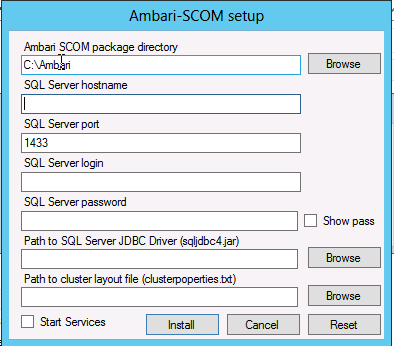
> > > > > > > 4. Provide the following information:
> > > > > > >
> > > > > > > | Field | Description |
> > > > > > > | --- | --- |
> > > > > > > | Ambari SCOM package directory | The directory where the installer will place the Ambari SCOM Server packages. For example: C:\Ambari |
> > > > > > > | SQL Server hostname | The hostname of the SQL Server instance for Ambari SCOM Server to use to store Hadoop metrics. |
> > > > > > > | SQL Server port | The port of the SQL Server instance. |
> > > > > > > | SQL Server login | The login username. |
> > > > > > > | SQL Server password | The login password |
> > > > > > > | Path to SQL Server JDBC Driver (sqljdbc4.jar) | The path to the JDBC Driver JAR file. |
> > > > > > > | Path to the cluster layout file (clusterproperties.txt) | The path to the cluster layout properties file. |
> > > > > > >
> > > > > > > 5. You can optionally select to Start Services
> > > > > > > 6. Click Install
> > > > > > > 7. After completion, links are created on the desktop to "Start Ambari SCOM Server", "Browse Ambari API" and "Browse Ambari API Metrics". After starting the Ambari SCOM Server, browse the API and Metrics to confirm the server is working properly.
> > > > > > >
> > > > > > > > [!NOTE]
> > > > > > > > **The MSI installer installation log can be found at C:\\AmbariInstallFiles\\AmbariSetupTools\\ambari.winpkg.install.log :::**
> > > > > > > > > [!NOTE]
> > > > > > > > > **Before installing the Management pack, be sure to install the Ambari SCOM Server using the Ambari SCOM Server Installation instructions. :::**
> > > > > > > > > Perform the following to import the Ambari SCOM Management Pack into System Center Operations Manager.
> > > > > > > > >
> > > > > > > > > 1. Extract the contents of the `mp.zip` package to obtain the Ambari SCOM management pack (`.mpb`) files.
> > > > > > > > > 2. Ensure Windows Server 2012 running SCOM with SQL Server (full text search).
> > > > > > > > > 3. Open System Center Operations Manager.
> > > > > > > > > 4. Go to Administration -> Management Packs.
> > > > > > > > > 5. From the Tasks panel, select Import Management Packs...
> > > > > > > > > 6. In the Import Management Packs dialog, select Add -> Add from disk...
> > > > > > > > > 7. You are prompted to search the Online Catalog. Click "No".
> > > > > > > > > 8. Browse for the Ambari SCOM management pack files.
> > > > > > > > > 9. Select the following files:
> > > > > > > > >
> > > > > > > > > ```text
> > > > > > > > > Ambari.SCOM.Monitoring.mpb
> > > > > > > > > Ambari.SCOM.Management.mpb
> > > > > > > > > Ambari.SCOM.Presentation.mpb
> > > > > > > > > ```
> > > > > > > > >
> > > > > > > > > 10. Click "Open"
> > > > > > > > > 11. Review the Import list and click "Install".
> > > > > > > > > 12. The Ambari SCOM Management Pack installation will start.
> > > > > > > > >
> > > > > > > > > > [!NOTE]
> > > > > > > > > > **The Ambari SCOM package also includes AmbariSCOMManagementPack.msi which is an alternative packaging of the mp.zip . This MSI is being made in beta form in this release. :::**
> > > > > > > > > > Perform the following to configure a account to use when the Ambari SCOM Management Pack talks to the Ambari SCOM Server.
> > > > > > > > > >
> > > > > > > > > > 1. After Importing the Management Pack is complete, go to Administration -> Run As Configuration -> Accounts.
> > > > > > > > > > 2. In the Tasks panel, select "Create Run as Account..."
> > > > > > > > > > 3. You are presented with the Create Run As Account Wizard.
> > > > > > > > > > 4. Go thru the wizard, select Run As account type "Basic Authentication".
> > > > > > > > > > 5. Give the account a Display name and click "Next".
> > > > > > > > > > 6. Enter the account name and password for the Ambari SCOM Server. This account will be used to connect to the Ambari SCOM Server to access the Ambari REST API. Default is account name is "admin" and password is "admin".
> > > > > > > > > > 7. Click "Next"
> > > > > > > > > > 8. Select the "Less secure" distribution security option.
> > > > > > > > > > 9. Click "Next" and complete the wizard.
> > > > > > > > > >
> > > > > > > > > > Perform the following to configure the Ambari SCOM Management Pack to talk to the Ambari SCOM Server.
> > > > > > > > > >
> > > > > > > > > > 1. Go to Authoring -> Management Pack Templates -> Ambari SCOM
> > > > > > > > > > 2. In the Tasks panel, select "Add Monitoring Wizard".
> > > > > > > > > > 3. Select monitoring type "Ambari SCOM"
> > > > > > > > > > 4. Provide a name and select the destination management pack.
> > > > > > > > > > 5. Provide the Ambari URI with is the address of the Ambari SCOM Server in the format:
> > > > > > > > > >
> > > > > > > > > > ```text
> > > > > > > > > > http://[ambari-scom-server]:8080/api/
> > > > > > > > > > ```
> > > > > > > > > >
> > > > > > > > > > > [!NOTE]
> > > > > > > > > > > **In the above Ambari URI, ambari-scom-server is the Ambari SCOM Server. :::**
> > > > > > > > > > > 6. Select the Run As Account that you created in Create Run As Account.
> > > > > > > > > > > 7. Select "Watcher Node". If node is not listed, click "Add" and browse for the node. Click "Next".
> > > > > > > > > > > 8. Complete the Add Monitoring Wizard and proceed to the Monitoring Scenariosfor information on using the management pack.
> > > > > > > > > > >
> > > > > > > > > > > By default, Operations Manager saves all customizations such as overrides to the **Default Management Pack**. As a best practice, you should instead create a separate management pack for each sealed management pack you want to customize.
> > > > > > > > > > >
> > > > > > > > > > > When you create a management pack for the purpose of storing customized settings for a sealed management pack, it is helpful to base the name of the new management pack on the name of the management pack that it is customizing, such as **Ambari SCOM Customizations**.
> > > > > > > > > > >
> > > > > > > > > > > Creating a new management pack for storing customizations of each sealed management pack makes it easier to export the customizations from a test environment to a production environment. It also makes it easier to delete a management pack, because you must delete any dependencies before you can delete a management pack. If customizations for all management packs are saved in the **Default Management Pack** and you need to delete a single management pack, you must first delete the **Default Management Pack**, which also deletes customizations to other management packs.
> > > > > > > > > > >
> > > > > > > > > > > [Monitoring Scenarios](https://cwiki.apache.org/confluence/display/AMBARI/3.+Monitoring+Scenarios)

---

<a id="ambari-plugin-contribution-step-by-step"></a>

<!-- source_url: https://ambari.apache.org/docs/3.0.0/ambari-plugin-contribution/step-by-step/ -->

<!-- page_index: 70 -->

# Step-by-step guide on adding a dashboard widget for a host.

Version: 3.0.0

Requirements:

- Jmxtrans
  - Jmxtrans is the application chosen to compile rrd files in order to produce graphing data on ganglia.
    <https://github.com/jmxtrans/jmxtrans>
- .rrd files
  - All the Ganglia rrd files are stored in the /var/lib/rrds directory on the host machine where the Ganglia server is installed.
  - In this example I’ll be using the “**Nimbus\_JVM\_Memory\_Heap\_used.rrd**” file for the data of my custom widget.

**Step 1**:

First we need to go add the rrd file in the “**ganglia\_properties.json**” file which is located in the `ambari\ambari-server\src\main\resources` directory of your Ambari source code. This is necessary so that the Ambari-server can call your rrd file from Ganglia via the Ambari API.

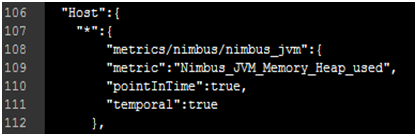

Line 108: Create the path for the metrics to be included in the API.

Line 109: Specify the rrd file.

**Step 2**:

Now we are going to add the API path created in step 1 at line 108, to the “**update\_controller.js**” file located in the `ambari\ambari-web\app\controllers\global` directory, so that our graph data can be updated frequently.

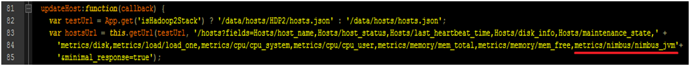

**Step 3**:

Create a JavaScript file for the view of the template of our custom widget and save it in the `ambari\ambari-web\app\views\main\host\metrics` directory of your Ambari source code. In this case I saved my file as “**nimbus.js**”

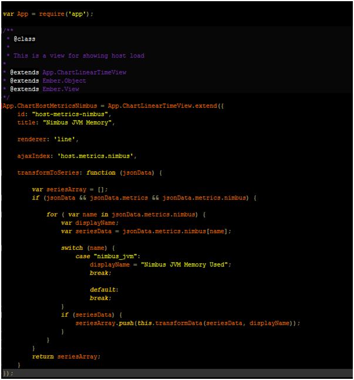

**Step 4**:

Add the JavaScript file you created in the previous step into the “**views.js**” file located in the `ambari\ambari-web\app` directory.

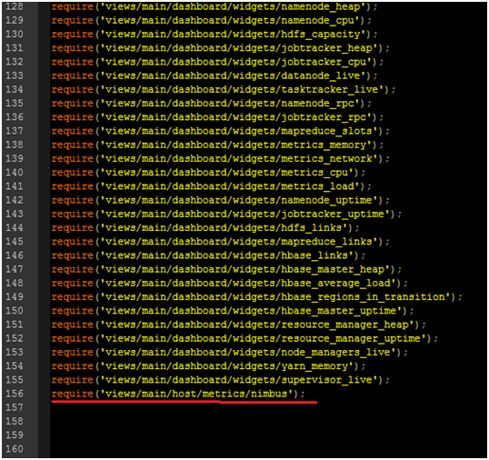

**Step 5**:

Add the .js file view created in step 3 in the “**metrics.hbs**” template file located in the `ambari\ambari-web\app\templates\main\host` directory.

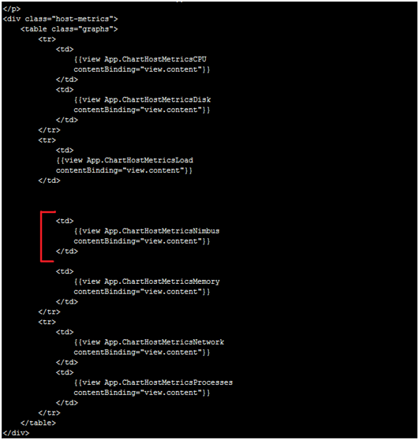

**Step 6**:

Add the API call to the “**ajax.js**” file located in the `ambari\ambari-web\app\utils` directory.

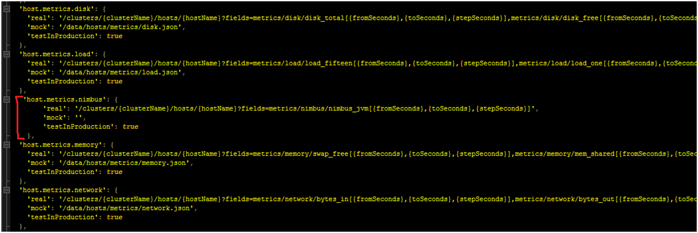

---

<a id="ambari-alerts"></a>

<!-- source_url: https://ambari.apache.org/docs/3.0.0/ambari-alerts/ -->

<!-- page_index: 71 -->

# Ambari Alerts

Version: 3.0.0

Help page for Alerts defined in Ambari.

**Service**: Ambari
**Component**: Ambari Server
**Type**: SERVER
**Groups**: AMBARI Default
**Description**: This alert is triggered if the server has lost contact with an agent.

If this alert is generated then the alert text will contain the host name (e.g. c6401.ambari.apache.org is not sending heartbeats.). Check that the agent is running and if its running tail the log to see if its receiving and heartbeat response from the server. Check if the server host name is correct in /etc/ambari-agent/conf/ambari-agent.ini file and is reachable.

---
