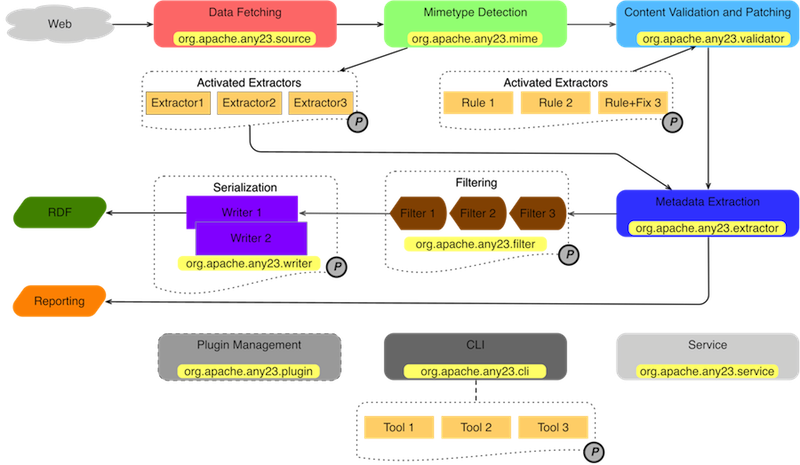

# Apache Any23 – Apache Any23 - Getting started

## Navigation

- Apache Any23
  - [Introduction](#index)
  - [Downloads](#download)
    - [Sources](#download)
    - [Core](#download)
    - [Basic Crawler](#download)
    - [HTML Scraper](#download)
    - [Office Scraper](#download)
    - [Service](#download)
  - [Install](#install)
- Documentation
  - [Getting Started](#getting-started)
  - [Supported Formats](#supported-formats)
  - [Extractors](#extractors)
  - [Configuration](#configuration)
  - [REST Service](#service)
  - [Any23 Plugins](#any23-plugins)
  - [APIs Doc](https://any23.apache.org/apidocs/index.html)
  - [Developers Guide](#developers)
    - [Build from sources](#build-src)
    - [Data Extraction](#dev-data-extraction)
    - [Data Conversion](#dev-data-conversion)
    - [Validation and Fixing](#dev-validation-fix)
    - [XPath Extractor](#dev-xpath-extractor)
    - [Microformat Extractors](#dev-microformat-extractors)
    - [Microdata Extractor](#dev-microdata-extractor)
    - [CSV Extractor](#dev-csv-extractor)
    - [HowTo Release](#release-howto)
- Project Documentation
  - [Project Information](#project-info)
    - [CI Management](#ci-management)
    - [Dependency Convergence](#dependency-convergence)
    - [Dependency Information](#dependency-info)
    - [Dependency Management](#dependency-management)
    - [Distribution Management](#distribution-management)
    - [About](#index)
    - [Issue Management](#issue-management)
    - [Licenses](#licenses)
    - [Mailing Lists](#mailing-lists)
    - [Project Modules](#modules)
    - [Plugin Management](#plugin-management)
    - [Plugins](#plugins)
    - [Source Code Management](#scm)
    - [Summary](#summary)
    - [Team](#team)
  - [Project Reports](#project-reports)
    - [Javadoc](https://any23.apache.org/apidocs/index.html)
    - [Checkstyle](#checkstyle-aggregate)
- Misc
  - [Acknowledgements](#acknowledgements)
  - [PoweredBy](#poweredby)
- ASF
  - [How Apache Works](http://www.apache.org/foundation/how-it-works.html)
  - [Foundation](http://www.apache.org/foundation/)
  - [Sponsoring Apache](http://www.apache.org/foundation/sponsorship.html)
  - [Thanks](http://www.apache.org/foundation/thanks.html)
- Other pages
  - [Apache Any23 – Apache Any23 - Plugins - HTML Scraper](#plugin-html-scraper)
  - [Apache Any23 – Apache Any23 - Plugins - Office Scraper](#plugin-office-scraper)

## Content

<a id="index"></a>

<!-- source_url: https://any23.apache.org/index.html -->

<!-- page_index: 1 -->

## Introduction to Apache Any23

### Library

**Anything To Triples (any23)** is a library, a web service and a command line tool that extracts structured data in RDF format from a variety of Web documents. Currently it supports the following input formats:

- [RDF/XML](http://www.w3.org/TR/REC-rdf-syntax/), [Turtle](http://www.w3.org/TeamSubmission/turtle/), [Notation 3](http://www.w3.org/DesignIssues/Notation3)
- [RDFa](http://www.w3.org/TR/xhtml-rdfa-primer/) with [RDFa1.1 prefix mechanism](http://www.w3.org/TR/2010/WD-rdfa-core-20100422/#scoping-of-prefix-mappings)
- [Microformats1](http://microformats.org/) and [Microformats2](http://microformats.org/wiki/microformats-2): hAdr, hCard, hCalendar, hEntry, hEvent, hGeo, hItem, hListing, hProduct, hProduct, hRecipie, hResume, hReview, License, Species, XFN, etc
- [JSON-LD](http://json-ld.org/): JSON for Linking Data. a lightweight Linked Data format based on the already successful JSON format and provides a way to help JSON data interoperate at Web-scale.
- [HTML5 Microdata](http://dev.w3.org/html5/md/): (such as [Schema.org](http://schema.org))
- [CSV](http://www.ietf.org/rfc/rfc4180.txt): Comma Separated Values with separator autodetection.
- Vocabularies: Extraction support for [Dublin Core Terms](http://dublincore.org/), [Description of a Career](http://www.w3.org/wiki/DescriptionOfACareerVocabulary), [Description Of A Project](https://github.com/edumbill/doap/wiki), [Friend Of A Friend](http://xmlns.com/foaf/spec/), [GEO Names](http://www.geonames.org/ontology/), [ICAL](http://www.w3.org/2002/12/cal/icaltzd#), [lkif-core](https://github.com/RinkeHoekstra/lkif-core), [Open Graph Protocol](http://ogp.me/), [BBC Programmes Ontology](http://purl.org/ontology/po/), [RDF Review Vocabulary](http://vocab.org/review/terms.html), [schema.org](http://schema.org/), [VCard](http://www.w3.org/2006/vcard/ns), [BBC Wildlife Ontology](http://purl.org/ontology/wo/) and [XHTML](http://www.w3.org/1999/xhtml/vocab/)... and more!
- [YAML](http://www.yaml.org/): human friendly data serialization standard for all programming languages.
- Additionally, as of 2.1 Any23 provides functionality to extract triples using the [Open Information Extraction (Open IE) system](https://github.com/allenai/openie-standalone). The Open IE system runs over sentences and creates extractions that represent relations in text, in the case of Any23, this results in triples.

A detailed description of available extractors is [here](#extractors).

**Apache Any23** is written in Java and licensed under the [Apache License v2.0](https://www.apache.org/licenses/LICENSE-2.0). **Apache Any23** can be used in various ways:

- As a library in Java applications that consume structured data from the Web.
- As a command-line tool for extracting and converting between the supported formats.
- As online service API available at [any23.org](http://any23.org/).

You can **download** the latest release from our [Apache Mirrors](#download).

Previous versions are available from the [Apache Archives site](http://archive.apache.org/dist/any23/).

### Documentation Content

[Introduction](#index): this page.

[Install](#install): how to install **Apache Any23** library and service.

[Getting Started](#getting-started): start using **Apache Any23** command-line tools.

[Supported Formats](#supported-formats): complete list of **Semantic Web** formats supported by **Apache Any23**.

[Configuration](#configuration): learn how to change default library and service configuration.

[REST Service](#service): discover how to use the **Apache Any23 REST Service**.

[Plugins](#any23-plugins): read how to install and configure the **Apache Any23** plugins.

[Developers](#developers): understand the **Apache Any23** code internals, how to write plugins, fixing rules and customize the code.

### Community

Questions, comments? Get in touch on the [mailing lists](https://any23.apache.org/mail-lists.html)! Bugs, feature requests, patches? Please submit to the [issue tracker](https://issues.apache.org/jira/browse/ANY23). You can access the source through Git, see the [Installation Guide](#install) for details.

---

<a id="download"></a>

<!-- source_url: https://any23.apache.org/download.html -->

<!-- page_index: 2 -->

## Download Apache Any23

Apache Any23 is distributed in several formats for your convenience. Use a source archive if you intend to build Apache Any23 yourself. Otherwise, simply pick a ready-made binary distribution and follow the installation instructions given inside the archives.

You will be prompted for a mirror - if the file is not found on yours, please be patient, as it may take 24 hours to reach all mirrors.

In order to guard against corrupted downloads/installations, it is highly recommended to [verify the signature](https://www.apache.org/dev/release-signing#verifying-signature) of the release bundles against the public [KEYS](https://apache.org/dist/any23/KEYS) used by the Apache Any23 developers.

Apache Any23 is distributed under the [Apache License, version 2.0](https://any23.apache.org/license.html).

### Apache Any23 Maven Artifacts

You can use Any23 as a [Maven](https://maven.apache.org) dependency. See the most recent release artifacts on [Maven Central](https://search.maven.org/#search%7Cga%7C1%7Cg%3A%22org.apache.any23%22). For example you could add the `apache-any23-core` artifact to your project POM as follows:

`<dependency>
    <groupId>org.apache.any23</groupId>
    <artifactId>apache-any23-core</artifactId>
    <version>2.7</version>
</dependency>`

Also see [dependency information](#dependency-info) for defining Any23 as a dependency in other popular build systems.

### Apache Any23 Sources

|  | Mirror Download | ASCII Signature | SHA512 Checksum |
| --- | --- | --- | --- |
| Apache Any23 2.7 (Source tar.gz) | [apache-any23-2.7-src.tar.gz](https://www.apache.org/dyn/closer.lua/any23/2.7/apache-any23-2.7-src.tar.gz) | [apache-any23-2.7-src.tar.gz.asc](https://www.apache.org/dist/any23/2.7/apache-any23-2.7-src.tar.gz.asc) | [apache-any23-2.7-src.tar.gz.sha512](https://www.apache.org/dist/any23/2.7/apache-any23-2.7-src.tar.gz.sha512) |
| Apache Any23 2.7 (Source zip) | [apache-any23-2.7-src.zip](https://www.apache.org/dyn/closer.lua/any23/2.7/apache-any23-2.7-src.zip) | [apache-any23-2.7-src.zip.asc](https://www.apache.org/dist/any23/2.7/apache-any23-2.7-src.zip.asc) | [apache-any23-2.7-src.zip.sha512](https://www.apache.org/dist/any23/2.7/apache-any23-2.7-src.zip.sha512) |

### Apache Any23 Command Line Interface

|  | Mirror Download | ASCII Signature | SHA512 Checksum |
| --- | --- | --- | --- |
| Apache Any23 2.7 CLI (Binary tar.gz) | [apache-any23-cli-2.7.tar.gz](https://www.apache.org/dyn/closer.lua/any23/2.7/apache-any23-cli-2.7.tar.gz) | [apache-any23-cli-2.7.tar.gz.asc](https://www.apache.org/dist/any23/2.7/apache-any23-cli-2.7.tar.gz.asc) | [apache-any23-cli-2.7.tar.gz.sha512](https://www.apache.org/dist/any23/2.7/apache-any23-cli-2.7.tar.gz.sha512) |
| Apache Any23 2.7 CLI (Binary zip) | [apache-any23-cli-2.7.zip](https://www.apache.org/dyn/closer.lua/any23/2.7/apache-any23-cli-2.7.zip) | [apache-any23-cli-2.7.zip.asc](https://www.apache.org/dist/any23/2.7/apache-any23-cli-2.7.zip.asc) | [apache-any23-cli-2.7.zip.sha512](https://www.apache.org/dist/any23/2.7/apache-any23-cli-2.7.zip.sha512) |

## Apache Any23 Plugins

### plugins

Various plugins were made available for Any23 releases prior to 2.4. As of 2.4, this is not longer the case. Reasoning behind this relates to the size of the artifcts post introduction of the [Open Information Extraction (Open IE) module](https://github.com/apache/any23-plugins/tree/master/openie). This grew the artifacts to ~1GB which became too large to distribute across the Apache global mirror network.

Any23 plugins can be obtained by [downloading and building from source](https://github.com/apache/any23-plugins).

Plugin artifacts prior to 2.4 can be found in the [Apache Any23 Artifact Archive](http://archive.apache.org/dist/any23/).

## Apache Any23 Service

### WAR packages

Various WAR artifacts were made available for Any23 releases prior to 2.2. Post 2.2, this is not longer the case. Reasoning behind this relates to the size of the WAR artifcts post introduction of the [Open Information Extraction (Open IE) module](https://github.com/apache/any23-plugins/tree/master/openie). This grew the artifacts to ~1GB which became too large to distribute across the Apache global mirror network.

The Any23 WAR artifact can be obtained by [downloading ans building from source](https://github.com/apache/any23-server).

WAR artifacts prior to 2.2 can be found in the [Apache Any23 Artifact Archive](http://archive.apache.org/dist/any23/).

For users merely wanting to see what the Any23 Service looks like and does, visit .

## Verify Releases

###

It is essential that you verify the integrity of the downloaded files using the PGP, and/or SHA signatures. published with every Any23 release. Please read [Verifying Apache HTTP Server Releases](http://httpd.apache.org/dev/verification.html) for more information on why you should verify our releases. We strongly recommend you verify your downloads with at least PGP Guidance for doing so is provided below.

### PGP Signatures

The PGP signatures can be verified using PGP or GPG. First download the [KEYS](https://www.apache.org/dist/any23/KEYS) as well as the asc signature file for the relevant distribution. **N.B.** Make sure you get these files from the main distribution directory, rather than from a mirror. Then verify the signatures using the following example

`$ gpg --import KEYS`
`$ gpg --verify apache-any23-2.7-src.tar.gz.asc apache-any23-2.7-src.tar.gz`

The files in the most recent release are signed by Lewis John McGibbney (CODE SIGNING KEY) lewismc@apache.org 48BAEBF6

### SHA512 Signatures

Alternatively, you can verify the SHA512 signatures on the files. A unix program called md5 or md5sum is included in many unix distributions. Use the following example

`$ sha512sum apache-any23-2.7-src.tar.gz`

... output should match the string in **apache-any23-2.7-src.tar.gz.sha512**

---

<a id="install"></a>

<!-- source_url: https://any23.apache.org/install.html -->

<!-- page_index: 3 -->

## Apache Any23 Installation Guide

This page describes how to install **Apache Any23**.

### Download a Stable Distribution

Most users probably don't need to have day to day access to the source code as it changes. For these users we provide distribution packages via our  [downloads page](#download). Download either the **".zip"** or **".tar.gz"** file and extract the archive.

## Installing the Core

### Windows 2000/XP

1. Unzip the distribution archive, i.e. `apache-any23-2.8-SNAPSHOT-bin.zip` to the directory you wish to install Apache Any23 2.8-SNAPSHOT. These instructions assume you chose `C:\Program Files\Apache Software Foundation`. The subdirectory `apache-any23-2.8-SNAPSHOT` will be created from the archive.
2. Add the `ANY23_HOME` environment variable by opening up the system properties (WinKey + Pause), selecting the "Advanced" tab, and the "Environment Variables" button, then adding the `ANY23_HOME` variable in the user variables with the value `C:\Program Files\Apache Software Foundation\apache-any23-2.8-SNAPSHOT`.
3. In the same dialog, add the `ANY23` environment variable in the user variables with the value `%ANY23_HOME%\bin`.
4. Optional: In the same dialog, add the `EXTRA_JVM_ARGUMENTS` environment variable in the user variables to specify JVM properties, e.g. the value `-Xms256m -Xmx512m`. This environment variable can be used to supply extra options. By default, it is set to: `-Xms500m -Xmx500m -XX:PermSize=128m -XX:-UseGCOverheadLimit`.
5. In the same dialog, update/create the Path environment variable in the user variables and prepend the value `%ANY23%` to add Apache Any23 available in the command line.
6. In the same dialog, make sure that `JAVA_HOME` exists in your user variables or in the system variables and it is set to the location of your JDK, e.g. `C:\Program Files\Java\jdk1.5.0_02` and that `%JAVA_HOME%\bin` is in your Path environment variable.
7. Open a new command prompt (Winkey + R then type cmd) and run `any23 --version` to verify that it is correctly installed.

### Unix-based Operating Systems (Linux, Solaris and Mac OS X)

1. Extract the distribution archive, i.e. `apache-any23-2.8-SNAPSHOT-bin.tar.gz` to the directory you wish to install Apache Any23 2.8-SNAPSHOT. These instructions assume you chose `/usr/local/apache-any23`. The subdirectory `apache-any23-2.8-SNAPSHOT` will be created from the archive.
2. In a command terminal, add the `ANY23_HOME` environment variable, e.g. `export ANY23_HOME=/usr/local/apache-any23/apache-any23-2.8-SNAPSHOT`.
3. Add the `ANY23` environment variable, e.g. `export ANY23=$ANY23_HOME/bin`.
4. Optional: Add the `EXTRA_JVM_ARGUMENTS` environment variable to specify JVM properties, e.g. `export EXTRA_JVM_ARGUMENTS="-Xms256m -Xmx512m"`. This environment variable can be used to supply extra options.
5. Add M2 environment variable to your path, e.g. `export PATH=$ANY23:$PATH`.
6. Make sure that `JAVA_HOME` is set to the location of your JDK, e.g. `export JAVA_HOME=/usr/java/jdk1.5.0_02` and that `$JAVA_HOME/bin` is in your PATH environment variable.
7. Run `any23 --version` to verify that it is correctly installed.

## Installing a plugin

### Windows 2000/XP

1. Unzip the distribution archive, i.e. `apache-$plugin.name-bin.zip` The subdirectory `apache-$plugin.name` will be created from the archive.
2. Copy the jar files under `C:\Documents and Settings<username>\.any23\plugins`

### Unix-based Operating Systems (Linux, Solaris and Mac OS X)

1. Extract the distribution archive, i.e. `apache-$plugin.name-bin.tar.gz`. The subdirectory `apache-$plugin.name` will be created from the archive.
2. Copy the jar files under `~/.any23/plugins`

## Installing the service

### Installing the standalone server

#### Windows 2000/XP

1. Unzip the distribution archive, i.e. `apache-any23-service-2.8-SNAPSHOT-bin-server-embedded.zip` to the directory you wish to install Apache Any23 2.8-SNAPSHOT. These instructions assume you chose `C:\Program Files\Apache Software Foundation`. The subdirectory `apache-2.8-SNAPSHOT-server-embedded` will be created from the archive.
2. Add the `ANY23_HOME` environment variable by opening up the system properties (WinKey + Pause), selecting the "Advanced" tab, and the "Environment Variables" button, then adding the `ANY23_HOME` variable in the user variables with the value `C:\Program Files\Apache Software Foundation\apache-2.8-SNAPSHOT`.
3. In the same dialog, add the `ANY23` environment variable in the user variables with the value `%ANY23_HOME%\bin`.
4. Optional: In the same dialog, add the `EXTRA_JVM_ARGUMENTS` environment variable in the user variables to specify JVM properties, e.g. the value `-Xms256m -Xmx512m`. This environment variable can be used to supply extra options. By default, it is set to: `-Xms500m -Xmx500m -XX:PermSize=128m -XX:-UseGCOverheadLimit`.
5. In the same dialog, update/create the Path environment variable in the user variables and prepend the value `%ANY23%` to add Apache Any23 available in the command line.
6. In the same dialog, make sure that `JAVA_HOME` exists in your user variables or in the system variables and it is set to the location of your JDK, e.g. `C:\Program Files\Java\jdk1.5.0_02` and that `%JAVA_HOME%\bin` is in your Path environment variable.
7. Open a new command prompt (Winkey + R then type cmd) and run `any23server` to launch the service.

#### Unix-based Operating Systems (Linux, Solaris and Mac OS X)

1. Extract the distribution archive, i.e. `apache-2.8-SNAPSHOT-bin-server-embedded.tar.gz` to the directory you wish to install Apache Any23 2.8-SNAPSHOT. These instructions assume you chose `/usr/local/apache-any23`. The subdirectory `apache-2.8-SNAPSHOT-server-embedded` will be created from the archive.
2. In a command terminal, add the `ANY23_HOME` environment variable, e.g. `export ANY23_HOME=/usr/local/apache-any23/apache-2.8-SNAPSHOT-server-embedded`.
3. Add the `ANY23` environment variable, e.g. `export ANY23=$ANY23_HOME/bin`.
4. Optional: Add the `EXTRA_JVM_ARGUMENTS` environment variable to specify JVM properties, e.g. `export EXTRA_JVM_ARGUMENTS="-Xms256m -Xmx512m"`. This environment variable can be used to supply extra options.
5. Add `ANY23` environment variable to your path, e.g. `export PATH=$ANY23:$PATH`.
6. Make sure that `JAVA_HOME` is set to the location of your JDK, e.g. `export JAVA_HOME=/usr/java/jdk1.5.0_02` and that `$JAVA_HOME/bin` is in your PATH environment variable.
7. Run `any23server` to launch the service.

---

<a id="getting-started"></a>

<!-- source_url: https://any23.apache.org/getting-started.html -->

<!-- page_index: 4 -->

## Getting started with **Apache Any23**

**Apache Any23** can be used:

- via CLI (command line interface) from your preferred shell environment;
- as a RESTful Webservice;
- as a library.

### **Apache Any23** Modules

**Apache Any23** is composed of the following modules:

- `api/` The base API definitions e.g. The Any23 API.
- `core/` The core library containing all extractor functionality.
- `cli/` A command line interface enabling easy invocation of Any23 tools.
- `csvutils/` Utility code for CSV extractions.
- `encoding/` Characterset detection and encoding.
- `mime/` Media-type detection.
- `service/` The REST service.
- `plugins/` The core additional plugins.
- `openie/` Additional extractor logic for the [Open Information Extraction (Open IE) system](https://github.com/allenai/openie-standalone).

### Use the **Apache Any23** CLI

The command-line tools support is provided by the **cli** module.

Once **Apache Any23** has been correctly [installed](#install), if you want to use it as a command line tool, use the shell script within the `cli/target/appassembler/bin/` directory. These are provided both for Unix (Linux/OSX) and Windows.

The `any23` script provides analysis, documentation, testing and debugging utilities.

Simply running *./any23* without options will show the *usage* options.

```
$ cli/target/appassembler/bin/any23

A command must be specified.
Usage: any23 [options] [command] [command options]
  Options:
    -h, --help
       Display help information.
       Default: false
        --plugins-dir
       The Any23 plugins directory.
       Default: /Users/lmcgibbn/.any23/plugins
    -X, --verbose
       Produce execution verbose output.
       Default: false
    -v, --version
       Display version information.
       Default: false
  Commands:
    extractor      Utility for obtaining documentation about metadata extractors.
      Usage: extractor [options] Extractor name
        Options:
          -a, --all
             shows a report about all available extractors
             Default: false
          -i, --input
             shows example input for the given extractor
             Default: false
          -l, --list
             shows the names of all available extractors
             Default: false
          -o, --outut
             shows example output for the given extractor
             Default: false

    microdata      Commandline Tool for extracting Microdata from file/HTTP source.
      Usage: microdata [options] Input document URL, {http://path/to/resource.html|file:/path/to/localFile.html}

    mimes      MIME Type Detector Tool.
      Usage: mimes [options] Input document URL, {http://path/to/resource.html|file:///path/to/local.file|inline:// some inline content}

    verify      Utility for plugin management verification.
      Usage: verify [options] plugins-dir

    rover      Any23 Command Line Tool.
      Usage: rover [options] input IRIs {<url>|<file>}+
        Options:
          -d, --defaultns
             Override the default namespace used to produce statements.
          -e, --extractors
             a comma-separated list of extractors, e.g. rdf-xml,rdf-turtle
             Default: []
          -f, --format
             the output format
             Default: json
          -l, --log
             Produce log within a file.
          -n, --nesting
             Disable production of nesting triples.
             Default: false
          -t, --notrivial
             Filter trivial statements (e.g. CSS related ones).
             Default: false
          -o, --output
             Specify Output file (defaults to standard output)
             Default: java.io.PrintStream@5204062d
          -p, --pedantic
             Validate and fixes HTML content detecting commons issues.
             Default: false
          -s, --stats
             Print out extraction statistics.
             Default: false

    vocab      Prints out the RDF Schema of the vocabularies used by Any23.
      Usage: vocab [options]
        Options:
          -f, --format
             Vocabulary output format
             Default: N-Quads (mimeTypes=application/n-quads, text/x-nquads, text/nquads; ext=nq)
```

The `any23` script detects a list of available utilities within the **core** and **plugins** classpath and allows to activate them.

The *any23-core* CLI tools are:

- `extractor`: a utility for obtaining useful information about extractors.
- `microdata`: commandline parser to extract specific Microdata content from a web page (local or remote) and produce a JSON output compliant with the Microdata specification (<http://www.w3.org/TR/microdata/>).
- `mimes`: detects the MIME Type for any HTTP / file / direct input resource.
- `verify`: a utility for verifying *Apache Any23* plugins.
- `rover`: the RDF extraction tool.
- `vocab`: allows to dump all the **RDFSchema** vocabularies declared within Apache Any23.

#### The Rover tool

Rover is the main extraction tool. It allows to extract metadata from local and remote (HTTP) resources, specify a custom list of extractors, specify the desired output format and other flags to suppress noise and generate advanced reports.

Extract metadata from an **HTML** page:

```
cli$ any23 rover http://yourdomain/yourfile
```

Extract metadata from a **local** resource:

```
cli$ any23 rover myfoaf.rdf
```

Specify the output format, use the option **"-f"** or **"--format"**: (Default output format is **TURTLE**).

```
cli$ any23 rover -f quad myfoaf.rdf
```

Filtering trivial statements

By default, **Apache Any23** will extract *HTML/head* meta information, such as links to *CSS stylesheets* or meta information like the author or the software used to create the *html*. Hence, if the user is only interested in the structured content from the *HTML/body* tag we offer a filter functionality, activated by the **"-t"** command line argument.

```
core$ any23 rover -t -f quad myfoaf.rdf
```

#### The ExtractorDocumentation tool

The ExtractorDocumentation returns human readable information about the registered extractors.

List all the available extractors:

```
cli$ any23 extractor --list
                      csv [org.apache.any23.extractor.csv.CSVExtractorFactory] [text/csv;q=0.1]
     html-embedded-jsonld [org.apache.any23.extractor.html.EmbeddedJSONLDExtractorFactory] [text/html;q=0.02, application/xhtml+xml;q=0.02]
           html-head-icbm [org.apache.any23.extractor.html.ICBMExtractorFactory] [text/html;q=0.01, application/xhtml+xml;q=0.01]
          html-head-links [org.apache.any23.extractor.html.HeadLinkExtractorFactory] [text/html;q=0.05, application/xhtml+xml;q=0.05]
           html-head-meta [org.apache.any23.extractor.html.HTMLMetaExtractorFactory] [text/html;q=0.02, application/xhtml+xml;q=0.02]
          html-head-title [org.apache.any23.extractor.html.TitleExtractorFactory] [text/html;q=0.02, application/xhtml+xml;q=0.02]
              html-mf-adr [org.apache.any23.extractor.html.AdrExtractorFactory] [text/html;q=0.1, application/xhtml+xml;q=0.1]
              html-mf-geo [org.apache.any23.extractor.html.GeoExtractorFactory] [text/html;q=0.1, application/xhtml+xml;q=0.1]
        html-mf-hcalendar [org.apache.any23.extractor.html.HCalendarExtractorFactory] [text/html;q=0.1, application/xhtml+xml;q=0.1]
            html-mf-hcard [org.apache.any23.extractor.html.HCardExtractorFactory] [text/html;q=0.1, application/xhtml+xml;q=0.1]
         html-mf-hlisting [org.apache.any23.extractor.html.HListingExtractorFactory] [text/html;q=0.1, application/xhtml+xml;q=0.1]
          html-mf-hrecipe [org.apache.any23.extractor.html.HRecipeExtractorFactory] [text/html;q=0.1, application/xhtml+xml;q=0.1]
          html-mf-hresume [org.apache.any23.extractor.html.HResumeExtractorFactory] [text/html;q=0.1, application/xhtml+xml;q=0.1]
          html-mf-hreview [org.apache.any23.extractor.html.HReviewExtractorFactory] [text/html;q=0.1, application/xhtml+xml;q=0.1]
html-mf-hreview-aggregate [org.apache.any23.extractor.html.HReviewAggregateExtractorFactory] [text/html;q=0.1, application/xhtml+xml;q=0.1]
          html-mf-license [org.apache.any23.extractor.html.LicenseExtractorFactory] [text/html;q=0.01, application/xhtml+xml;q=0.01]
          html-mf-species [org.apache.any23.extractor.html.SpeciesExtractorFactory] [text/html;q=0.1, application/xhtml+xml;q=0.1]
              html-mf-xfn [org.apache.any23.extractor.html.XFNExtractorFactory] [text/html;q=0.1, application/xhtml+xml;q=0.1]
           html-microdata [org.apache.any23.extractor.microdata.MicrodataExtractorFactory] [text/html;q=0.1, application/xhtml+xml;q=0.1]
              html-rdfa11 [org.apache.any23.extractor.rdfa.RDFa11ExtractorFactory] [application/xhtml+xml;q=0.3, application/html;q=0.3, text/html;q=0.3]
               html-xpath [org.apache.any23.extractor.xpath.XPathExtractorFactory] [text/html;q=0.02, application/xhtml+xml;q=0.02]
                     ical [org.apache.any23.extractor.calendar.ICalExtractorFactory] [text/calendar]
                     jcal [org.apache.any23.extractor.calendar.JCalExtractorFactory] [application/calendar+json]
           owl-functional [org.apache.any23.extractor.rdf.FunctionalSyntaxExtractorFactory] [text/owl-functional]
           owl-manchester [org.apache.any23.extractor.rdf.ManchesterSyntaxExtractorFactory] [text/owl-manchester]
               rdf-jsonld [org.apache.any23.extractor.rdf.JSONLDExtractorFactory] [application/ld+json;q=0.1]
                   rdf-nq [org.apache.any23.extractor.rdf.NQuadsExtractorFactory] [application/n-quads, text/x-nquads;q=0.1, text/rdf+nq;q=0.1, text/nq;q=0.1, text/nquads;q=0.1, text/n-quads;q=0.1]
                   rdf-nt [org.apache.any23.extractor.rdf.NTriplesExtractorFactory] [application/n-triples;q=0.1, text/nt;q=0.1, text/ntriples;q=0.1, text/plain;q=0.1]
                 rdf-trix [org.apache.any23.extractor.rdf.TriXExtractorFactory] [application/trix]
               rdf-turtle [org.apache.any23.extractor.rdf.TurtleExtractorFactory] [text/turtle, text/rdf+n3, text/n3, application/n3, application/x-turtle, application/turtle]
                  rdf-xml [org.apache.any23.extractor.rdf.RDFXMLExtractorFactory] [application/rdf+xml, text/rdf, text/rdf+xml, application/rdf]
                     xcal [org.apache.any23.extractor.calendar.XCalExtractorFactory] [application/calendar+xml]
                     yaml [org.apache.any23.extractor.yaml.YAMLExtractorFactory] [text/x-yaml;q=0.5]
```

#### The MicrodataParser tool

The *MicrodataParser* tool allows to apply the only MicrodataExtractor on a specific input source and returns the extracted data in the JSON format declared in the Microdata specification section [JSON](http://www.w3.org/TR/microdata/#json).

```
cli$ any23 microdata http://path/to/resource.html
```

#### The VocabPrinter tool

The VocabPrinter Tool prints out the RDFSchema declared by all the **Apache Any23** declared vocabularies.

Just launch the command below to see all the managed vocabularies.

```
cli$ any23 vocab
```

*NOTE*: **This tool is still in beta version.**

#### The MimeDetector tool

The MimeDetector Tool extracts the **MIME Type** for a given source (http:// file:// inline://).

Examples:

```
cli$ any23 mimes http://www.michelemostarda.com/foaf.rdf
application/rdf+xml
```

```
cli$ any23 mimes file://../src/test/resources/application/trix/test1.trx
application/trix
```

```
cli$ any23 mimes 'inline://<http://s> <http://p> <http://o> .'
text/n3
```

#### The PluginVerifier tool

The PluginVerifier tool allows checking installed plugin in the specified input directory

Just launch the command below to sanity-check the input plugins directory

```
cli$ any23 verify [/path/to/plugins/dir]
```

### **Apache Any23** CLI *Plugins*

The **Apache Any23** ToolRunner CLI (*bin/any23*) supports the auto detection of Tool plugins within the classpath. For further details see [Plugins](#any23-plugins) section.

The default **any23** CLI plugins are enlisted below.

#### Crawler Plugin

crawler-tool The *Crawler Plugin* provides basic site crawling and metadata extraction capabilities.

```
cli$ any23 -h
[...]
    crawler      Any23 Crawler Command Line Tool.
      Usage: crawler [options] input IRIs {<url>|<file>}+
  Options:
          -d, --defaultns          Override the default namespace used to
                                   produce statements.
          -e, --extractors         a comma-separated list of extractors, e.g.
                                   rdf-xml,rdf-turtle
                                   Default: []
          -f, --format             the output format
                                   Default: turtle
          -l, --log                Produce log within a file.
          -md, --maxdepth          Max allowed crawler depth.
                                   Default: 2147483647
          -mp, --maxpages          Max number of pages before interrupting
                                   crawl.
                                   Default: 2147483647
          -n, --nesting            Disable production of nesting triples.
                                   Default: false
          -t, --notrivial          Filter trivial statements (e.g. CSS related
                                   ones).
                                   Default: false
          -nc, --numcrawlers       Sets the number of crawlers.
                                   Default: 10
          -o, --output             Specify Output file (defaults to standard
                                   output)
                                   Default: java.io.PrintStream@2911a3a4
          -pf, --pagefilter        Regex used to filter out page URLs during
                                   crawling.
                                   Default: .*(\.(css|js|bmp|gif|jpe?g|png|tiff?|mid|mp2|mp3|mp4|wav|wma|avi|mov|mpeg|ram|m4v|wmv|rm|smil|pdf|swf|zip|rar|gz|xml|txt))$
          -p, --pedantic           Validate and fixes HTML content detecting
                                   commons issues.
                                   Default: false
          -pd, --politenessdelay   Politeness delay in milliseconds.
                                   Default: 2147483647
          -s, --stats              Print out extraction statistics.
                                   Default: false
          -sf, --storagefolder     Folder used to store crawler temporary data.
                                   Default: /var/folders/zz/9vvv_lbn1cs8dpwz859nmq080000gn/T/crawler-metadata-9ff4c650-10c2-41a1-9d99-ebeb3e7d21ce
```

A usage example:

```
cli$ any23 crawler -s -f ntriples http://www.repubblica.it 1> out.nt 2> repubblica.log
```

### Use **Apache Any23** as a RESTful Web Service

**Apache Any23** provides a Web Service that can be used to extract *RDF* from Web documents. **Apache Any23** services can be accessed through a [RESTful API](#service).

Running the server

The server command line tool is defined within the **service** module. Run the `any23server` script

```
service$ ./bin/any23server
```

from the command line in order to start up the server, then go to  to access the web interface. A live demo version of such service is running at . You can also start the server from Java by running the [Apache Any23 Servlet](https://any23.apache.org/apidocs/org/apache/any23/servlet/Servlet.html) class. Maven can be used to create a WAR file for deployment into an existing servlet container such as [Apache Tomcat](http://tomcat.apache.org/).

### Use **Apache Any23** as a Library

See our [Developers guide](#developers) for more details.

---

<a id="supported-formats"></a>

<!-- source_url: https://any23.apache.org/supported-formats.html -->

<!-- page_index: 5 -->

## Supported Formats in Apache Any23

**Apache Any23** supports all the main standard formats introduced by the **Semantic Web** community.

### **Input Formats**

The following list shows the accepted input formats and for each one the support level.

- **(X)HTML** with **RDFa 1.0**, **RDFa 1.1**, **Microdata** and **Microformats**. **Apache Any23** fully supports the [(X)HTML5](http://www.w3.org/TR/html5/) input format and in particular provides a set of extractors for processing embedded [RDFa 1.0](http://www.w3.org/TR/rdfa-syntax/), [RDFa 1.1](http://www.w3.org/TR/rdfa-core/), [Microformats](http://microformats.org/) and [Microdata](http://www.w3.org/TR/microdata/).
- **Turtle** **Apache Any23** fully supports the [Turtle](http://www.w3.org/TeamSubmission/turtle/) specification.
- **N-Triples** **Apache Any23** fully supports the [N-Triples](http://www.w3.org/TR/rdf-testcases/#ntriples) specification.
- **N-Quads** **Apache Any23** Version 1.1 supports the 2012 [N-Quads](https://web.archive.org/web/20150322024714/http://sw.deri.org/2008/07/n-quads/) specification (last accessed: 2016-06-17). **Apache Any23** Version 1.2 will support the current [N-Quads](https://www.w3.org/TR/n-quads/) specification.
- **RDF/XML** **Apache Any23** fully supports the [RDF/XML](http://www.w3.org/TR/rdf-syntax-grammar/) specification.
- **CSV** **Apache Any23** allows you to represent header-provided [CSV](http://www.ietf.org/rfc/rfc4180.txt) files with RDF using a specific [algorithm](#dev-csv-extractor).
- **YAML** **Apache Any23** support [YAML](http://yaml.org/spec/1.2/spec.html) a human friendly data serialization standard for all programming languages.

### **Output Formats**

The supported output formats are enlisted below.

- **Turtle** **Apache Any23** is able to produce output in [Turtle](http://www.w3.org/TeamSubmission/turtle/).
- **N-Triples** **Apache Any23** is able to produce output in [N-Triples](http://www.w3.org/TR/rdf-testcases/#ntriples).
- **N-Quads** **Apache Any23** is able to produce output in the 2012 [N-Quads](https://web.archive.org/web/20150322024714/http://sw.deri.org/2008/07/n-quads/) format (last accessed: 2016-06-17). **Apache Any23** Version 1.2 will support the current [N-Quads](https://www.w3.org/TR/n-quads/) specification.
- **RDF/XML** **Apache Any23** is able to produce output in [RDF/XML](http://www.w3.org/TR/rdf-syntax-grammar/).
- **JSON-LD** **Apache Any23** is able to produce output in [JSON-LD](http://www.w3.org/TR/json-ld/).
- **JSON Statements** **Apache Any23** is able to produce output in [JSON](http://www.json.org/) . See the specific [format](#supported-formats--json-statements).
- **XML Report** **Apache Any23** is able to produce a detailed report of the latest document extraction if required. See further details [here](#service--report-format).

### JSON Statements Format

json-statements

Apache Any23 is able to produce JSON output following the format described below.

Given the following example statements (expressed in N-Quads format):

```
_:bn1          <http://pred/1> <http://value/1>         <http://graph/1> .
<http://sub/2> <http://pred/2> "language literal"@en    <http://graph/2> .
<http://sub/3> <http://pred/3> "123"^^<http://datatype> <http://graph/3> .
```

these will be represented as:

```
{
    "quads" : [
        [
            {
                "type" : "bnode",
                "value" : "bn1"
            },
            "http://pred/1",
            {
                "type" : "uri",
                "value" : "http://value/1"
            },
            "http://graph/1"
        ],
        [
            {
                "type" : "uri",
                "value" : "http://sub/2"
            },
            "http://pred/2",
            {
                "type" : "literal",
                "value" : "language literal",
                "lang" : "en",
                "datatype" : null
            },
            "http://graph/2"
        ],
        [
            {
                "type" : "uri",
                "value" : "http://sub/3"
            },
            "http://pred/3",
            {
                "type" : "literal",
                "value" : "123",
                "lang" : null,
                "datatype" : "http://datatype"
            },
            "http://graph/3"
        ]
    ]
}
```

The **JSON object** structure is described by the following **BNF** rules, where quotes are omitted to improve readability:

```
<json-response> ::= { "quads" : <statements> }
<statements>    ::= [ <statement>+ ]
<statement>     ::= [ <subject> , <predicate> , <object> , <graph> ]
<subject>       ::= { "type" : <subject-type> , "value" : <value> }
<predicate>     ::= <uri>
<object>        ::= { "type" : <object-type> , "value" : <value> , "lang" : <lang> , "datatype" : <datatype> }
<graph>         ::= <uri> | null
<subject-type>  ::= "uri" | "bnode"
<object-type>   ::= "uri" | "bnode"| "literal"
<value>         ::= String
<lang>          ::= String | null
<datatype>      ::= <uri>  | null
<uri>           ::= String
```

---

<a id="extractors"></a>

<!-- source_url: https://any23.apache.org/extractors.html -->

<!-- page_index: 6 -->

## Apache Any23 Extractors

This page enlists all the Apache Any23 Extractors (see source code [package](https://any23.apache.org/apidocs/org/apache/any23/extractor/package-summary.html)).

### Microformat Extractors

The following extractors refer to the [Microformats specifications](http://microformats.org/).

Specific details about \*Microformats\* extractors can be found [here](#dev-microformat-extractors). In particular the \*Microformats Nesting\* representation policy is described [here](#dev-microformat-extractors--microformat-nesting).

[AdrExtractor](https://any23.apache.org/apidocs/org/apache/any23/extractor/html/AdrExtractor.html)

[GeoExtractor](https://any23.apache.org/apidocs/org/apache/any23/extractor/html/GeoExtractor.html)

[HCalendar](https://any23.apache.org/apidocs/org/apache/any23/extractor/html/HCalendarExtractor.html)

[HCard](https://any23.apache.org/apidocs/org/apache/any23/extractor/html/HCardExtractor.html)

[HListing](https://any23.apache.org/apidocs/org/apache/any23/extractor/html/HListingExtractor.html)

[HResume](https://any23.apache.org/apidocs/org/apache/any23/extractor/html/HResumeExtractor.html)

[HReview](https://any23.apache.org/apidocs/org/apache/any23/extractor/html/HReviewExtractor.html)

[SpeciesExtractor](https://any23.apache.org/apidocs/org/apache/any23/extractor/html/SpeciesExtractor.html)

[LicenseExtractor](https://any23.apache.org/apidocs/org/apache/any23/extractor/html/LicenseExtractor.html)

[XFNExtractor](https://any23.apache.org/apidocs/org/apache/any23/extractor/html/XFNExtractor.html)

[HRecipeExtractor](https://any23.apache.org/apidocs/org/apache/any23/extractor/html/HRecipeExtractor.html)

### RDFa [1.0 , 1.1]

The following extractors refer to the [RDFa 1.0](http://www.w3.org/TR/rdfa-syntax/) and [RDFa 1.1](http://www.w3.org/TR/rdfa-core/) specifications.

[RDFaExtractor](https://any23.apache.org/apidocs/org/apache/any23/extractor/rdfa/RDFaExtractor.html)

### Microdata

The following extractors refer to the [Microdata specifications](http://dev.w3.org/html5/md/).

[MicrodataExtractor](https://any23.apache.org/apidocs/org/apache/any23/extractor/microdata/MicrodataExtractor.html)

### RDF

[RDFXMLExtractor](https://any23.apache.org/apidocs/org/apache/any23/extractor/rdf/RDFXMLExtractor.html)

[NQuadsExtractor](https://any23.apache.org/apidocs/org/apache/any23/extractor/rdf/NQuadsExtractor.html)

[TurtleExtractor](https://any23.apache.org/apidocs/org/apache/any23/extractor/rdf/TurtleExtractor.html)

[NTriplesExtractor](https://any23.apache.org/apidocs/org/apache/any23/extractor/rdf/NTriplesExtractor.html)

### Metadata Extractors

[TitleExtractor](https://any23.apache.org/apidocs/org/apache/any23/extractor/html/TitleExtractor.html)

[HTMLMetaExtractor](https://any23.apache.org/apidocs/org/apache/any23/extractor/html/HTMLMetaExtractor.html)

[HeadLinkExtractor](https://any23.apache.org/apidocs/org/apache/any23/extractor/html/HeadLinkExtractor.html)

[ICBMExtractor](https://any23.apache.org/apidocs/org/apache/any23/extractor/html/ICBMExtractor.html)

[TurtleHTMLExtractor](https://any23.apache.org/apidocs/org/apache/any23/extractor/html/TurtleHTMLExtractor.html)

### Content Extractors

[XPath Extractor](https://any23.apache.org/apidocs/org/apache/any23/extractor/xpath/XPathExtractor.html) (**Experimental**)

[CSV Extractor](https://any23.apache.org/apidocs/org/apache/any23/extractor/csv/CSVExtractor.html) (See the extraction [algorithm](#dev-csv-extractor).)

## Get more documentation

It is possible to generate the list of all the available extractors invoking the following command:

```
<any23-core>/bin$ any23tools ExtractorDocumentation -list
```

---

<a id="configuration"></a>

<!-- source_url: https://any23.apache.org/configuration.html -->

<!-- page_index: 7 -->

## Configuration

### Configure the Core Module

The core module contains the main library code and the command-line implementation.

The main library configuration parameters are managed by the  [Configuration](https://any23.apache.org/apidocs/org/apache/any23/configuration/DefaultConfiguration.html) class. The default values are declared within the  [default-configuration.properties](https://github.com/apache/any23/blob/master/api/src/main/resources/default-configuration.properties) file. The following sections explain how to override the default configuration.

#### Override Default Configuration from Command-line

The default configuration can be overriden via command-line by passing to the **java** command system properties with the same name of the ones declared in configuration.

For example to override the **HTTP Max Client Connections** parameter it is sufficient to add the following option to the **java** command-line invocation:

```
-Dany23.http.client.max.connections=10
```

any23 and any23server scripts accept the variable **ANY23\_OPTS** to specify custom options. It is possible to customize the **HTTP Max Client Connections** for the **any23** script simply using:

```
cli/target/appassembler/bin/$ ANY23_OPTS="-Dany23.http.client.max.connections=10" any23 http://path/to/resource
```

#### Override Default Configuration Programmatically

The  [Configuration](https://any23.apache.org/apidocs/org/apache/any23/configuration/Configuration.html) properties can be accessed in read-only mode just retrieving the configuration **singleton** instance. Such instance is *immutable*:

```
final Configuration immutableConf = DefaultConfiguration.singleton();
final String propertyValue = immutableConf.getProperty("propertyName", "default value");
...
```

To obtain a *modifiable*  [Configuration](https://any23.apache.org/apidocs/org/apache/any23/configuration/Configuration.html) instead it is possible to use the **copy()** method. One of the **Apache Any23** constructors accepts a **Configuration** object that allows to customize the behavior of the **Apache Any23** instance for its entire life-cycle.

```
final ModifiableConfiguration modifiableConf = DefaultConfiguration.copy();
final String oldPropertyValue = modifiableConf.setProperty("propertyName", "new property value");
final Apache Any23 any23 = new Apache Any23(modifiableConf, "extractor1", ...);
...
```

### Use of ExtractionParameters

It is possible to customize the behavior of a single data extraction by providing an  [ExtractionParameters](https://any23.apache.org/apidocs/org/apache/any23/extractor/ExtractionParameters.html) instance to one the *Apache Any23#extract()* methods accepting it. **ExtractionParameters** allows to customize any *property* and *flag* other then the **specific extraction options**. If no custom parameters are specified the default configuration values are used.

```
final Any23 any23 = ...
final TripleHandler tripleHandler = ...
final ExtractionParameters extractionParameters = ExtractionParameters.getDefault();
extractionParameters.setFlag("any23.microdata.strict", true);
any23.extract(extractionParameters, "http://path/to/doc", tripleHandler);
```

### Apache Any23 Core Module Default Configuration

|  |  |  |
| --- | --- | --- |
| Property Name | Default Property Value | Description |
| any23.core.version | *current any23 core version* | String declaring the Apache Any23 Core module version. |
| any23.http.user.agent.default | Apache Any23-CLI | User Agent Name used for HTTP requests. |
| any23.http.client.timeout | 10000 (10 secs) | Timeout in milliseconds for a HTTP request. |
| any23.http.client.max.connections | 5 | Max number of concurrent HTTP connections allowed by the internal Apache Any23 HTTP client. |
| any23.rdfa.extractor.xslt | rdfa.xslt | XSLT Stylesheet to be used to perform HTML to RDF extraction of RDFa. |
| any23.extraction.metadata.timesize | off (possible values: on/off) | Activates/deactivates the generation of time and size metadata triples. |
| any23.extraction.metadata.nesting | on (possible values: on/off) | Activates/deactivates the generation of nesting triples for Microformat entities. |
| any23.extraction.metadata.domain.per.entity | on (possible values: on/off) | Activates/deactivates the generation of domain triple per entity. |
| any23.extraction.rdfa.programmatic | on (possible values: on/off) | Switches between the programmatic RDFa 1.1 Extractor and the RDFa 1.0 XSLT base one. |
| any23.extraction.context.iri | ?(means current document IRI) | Default value for extraction content IRI. |
| any23.plugin.dirs | ./plugins | Directory containing Apache Any23 plugins. |
| any23.microdata.strict | on (possible values: on/off) | Activates/deactivates the microdata strict validation. |
| any23.microdata.ns.default | http://schema.org/ | Microdata default namespace. |
| any23.extraction.head.meta | on (possible values: on/off) | Activates/deactivates the HTMLMetaExtractor. |
| any23.extraction.csv.field | , | CSVExtractor field separator. |
| any23.extraction.csv.comment | # | CSVExtractor line comment marker. |

---

<a id="service"></a>

<!-- source_url: https://any23.apache.org/service.html -->

<!-- page_index: 8 -->

## Apache Any23 REST Service

*Apache Any23* provides REST Service module *any23-service* able to provide useful processing methods.

### Compact API

HTTP GET requests can be made to IRIs of the shape:

```
http://<any23-service-host>/<output-format>/<input-uri>
```

Where *input-uri* is the input HTTP resource to be processed and *output-format* is the desired output format for the extracted RDF data.

Example requests:

```
http://any23.org/best/twitter.com/cygri
http://any23.org/rdfxml/http://data.gov
http://any23.org/ttl/http://www.w3.org/People/Berners-Lee/card
http://any23.org/?uri=http://dbpedia.org/resource/Berlin
http://any23.org/?format=nt&uri=http://dbpedia.org/resource/Berlin
```

Supported input and output formats are described  [here](#supported-formats).

Form-style GET API

HTTP GET requests can be made to the IRI http://any23.org/ with the following query parameters:

```
uri         IRI of an input document
format      Desired output format; defaults to best
```

### Direct POST API

HTTP POSTing a document body to http://any23.org/format will convert the document to the specified output format. The media type of the input has to be specified in the Content-Type HTTP header. Depending on the servlet container, a Content-Length header specifying the length of the input document in bytes might also be required. Typical media types for supported input formats are:

```
Input format        Media type
-------------------------------
HTML        text/html
RDF/XML     application/rdf+xml
Turtle      text/turtle
N-Triples   text/plain
N-Quads     text/plain
```

Example POST request:

```
POST /rdfxml HTTP/1.0
Host: any23.org
Content-Type: text/turtle
Content-Length: 174

@prefix foaf: <http://xmlns.com/foaf/0.1/> .

[] a foaf:Person;
    foaf:name "John X. Foobar";
    foaf:mbox_sha1sum "cef817456278b70cee8e5a1611539ef9d928810e";
    .
```

### Form-style POST API

A document body can also be converted by HTTP POSTing form data to http://any23.org/. The Content-Type HTTP header must be set to *application/x-www-form-urlencoded*. The following parameters are supported:

|  |  |
| --- | --- |
| type | Media type of the input, see the table above. If not present, auto-detection will be attempted. |
| body | Document body to be converted. |
| format | Desired output format; defaults to **best**. |
| validation | The validation level to be applied, supported values: **none** (default), **validate** and **validate-fix**. |

### Output Formats

Supported input and output formats are described  [here](#supported-formats).

### Error reporting

Processing errors are indicated via HTTP status codes and brief text/plain error messages. The following status codes can be returned:

```
Code                        Reason
-------------------------------------------------------------------------------------------------------------
200 OK                      Success.
400 Bad                     Request     Missing or malformed input parameter.
404 Not                     Found       Malformed request IRI.
406 Not                     Acceptable  None of the media types specified in the Accept header are supported.
415 Unsupported Media Type      Document body with unsupported media type was POSTed.
501 Not Implemented             Extraction from input was successful, but yielded zero triples.
502 Bad Gateway             Input document from a remote server could not be fetched or parsed.
```

### XML Report Format

report-format

The *Apache Any23 Service* can optionally return an XML report and attempt error fix if the flags *fix* and *report* are activated ( *fix=on&report=on* ). The following URL shows how to use these flags.

```
http://any23.org/any23-service/any23/?format=best&uri=http%3A%2F%2Fpath%2Fto%2Fresource&validation=none&report=on
```

The *fix* functionality is described [here](#dev-validation-fix).

A report format example is listed below. In particular ath path *response/extractors/extractor* it is possible to find the list of all extractors activated during the page processing. The section *response/report/message* contains an eventual error message while the *response/report/error* section the error stack trace if available.

The result of validation is contained within the *response/report/validationReport* node. Within that node there is the list of the activated rules, the issues detected and the errors generated.

```
<?xml version="1.0" encoding="UTF-8" ?>
<response>
  <!-- List of activated extractors. -->
  <extractors>
    <extractor><!-- Extractor name. --></extractor>
    <!-- ... -->
  </extractors>
  <report>
    <message></message>
    <error></error>
    <!-- Validation specific report, contains all errors and issues detected within the document. -->
    <validationReport>
      <!-- List of errors found while validating the document. -->
      <errors>
      </errors>
      <!-- List of issues found while validating the document. -->
      <issues>
      </issues>
      <!-- List of rules activated to solve the detected issues. -->
      <ruleActivations>
      </ruleActivations>
    </validationReport>
  </report>
  <data>
  <![CDATA[
  -- Actual Data in the format specified as output. --
  ]]>
  </data>
</response>
```

---

<a id="any23-plugins"></a>

<!-- source_url: https://any23.apache.org/any23-plugins.html -->

<!-- page_index: 9 -->

## Apache Any23 Plugins

### Introduction

This section describes the *Apache Any23* plugins support.

*Apache Any23* comes with a set of predefined plugins. Such plugins are located under the *$ANY23\_HOME*/**plugins** dir.

A plugin is a standard *Maven3* module containing any implementation of

- [Extractor](https://any23.apache.org/apidocs/index.html?org%2Fapache%2Fany23%2Fextractor%2FExtractor.html=)
- [Tool](https://any23.apache.org/apidocs/org/apache/any23/cli/Tool.html)

### How to Register a Plugin

A plugin can be added to the *Apache Any23 CLI* interface by:

- adding its *JAR* to the *Apache Any23* *JVM classpath*;
- adding its *JAR* to the CLASSPATH\_PREFIX environment variable as:


```
export CLASSPATH_PREFIX=../../../plugins/basic-crawler/target/any23-basic-crawler-VERSION.jar
```

- adding its *JAR* to the *$HOME/.any23/plugins* directory.

  A plugin can be added to the *Apache Any23 library API* by first creating a static instance of [Any23PluginManager](https://any23.apache.org/apidocs/org/apache/any23/plugin/Any23PluginManager.html)#getInstance(). Once this is done there is a variety of options to configure and register a plugins, etc. An example of dynamic plugin loading can be seen via the way that the OpenIE toggling is implemented within the Any23 Webservice e.g.


```
if (openie) {
    Any23PluginManager pManager = Any23PluginManager.getInstance();
    //Dynamically adding Jar's to the Classpath via the following logic
    //is absolutely dependant on the 'apache-any23-openie' directory being
    //present within the webapp /lib directory. This is specified within 
    //the maven-dependency-plugin.
    File webappClasspath = new File(getClass().getClassLoader().getResource("").getPath());
    File openIEJarPath = new File(webappClasspath.getParentFile().getPath() + "/lib/apache-any23-openie");
    boolean loadedJars = pManager.loadJARDir(openIEJarPath);
    if (loadedJars) {
        ExtractorRegistry r = ExtractorRegistryImpl.getInstance();
        try {
            pManager.getExtractors().forEachRemaining(r::register);
        } catch (IOException e) {
            LOG.error("Error during dynamic classloading of JARs from OpenIE runtime directory {}", openIEJarPath.toString(), e);
        }
        LOG.info("Successful dynamic classloading of JARs from OpenIE runtime directory {}", openIEJarPath.toString());
    }
}
```

  Any implementation of *ExtractorPlugin* will automatically registered to the [ExtractorRegistry](https://any23.apache.org/apidocs/org/apache/any23/extractor/ExtractorRegistry.html).

  Any detected implementation of *Tool* will be listed by the *ToolRunner* command-line tool in *any23-root/***cli/bin/any23** .

### How to Build a Plugin

*Apache Any23* takes care to *test* and *package* plugins when distributed from its reactor *POM*. It is aways possible to rebuild a plugin using the command:

```
<plugin-dir>$ mvn clean assembly:assembly
```

### How to Write an Extractor Plugin

An *Extractor Plugin* is a class:

- implementing one of the [Extractor](https://any23.apache.org/apidocs/index.html?org%2Fapache%2Fany23%2Fextractor%2FExtractor.html=) subinterfaces;
- packaged under **org.apache.any23.plugin** .

  An example of plugin is defined below.


```
@Author(name="Michele Mostarda (mostarda@fbk.eu)")
public class HTMLScraperExtractor implements Extractor.ContentExtractor {

    private static final Logger logger = LoggerFactory.getLogger(HTMLScraperPlugin.class);

    @Override
    public void run(
            ExtractionParameters extractionParameters,
            ExtractionContext extractionContext,
            InputStream inputStream,
            ExtractionResult extractionResult
    ) throws IOException, ExtractionException {
        ...
    }

    @Override
    public ExtractorDescription getDescription() {
        return HTMLScraperExtractorFactory.getDescriptionInstance();
    }

    @Override
    public void setStopAtFirstError(boolean b) {
        // Ignored.
    }

}
```

### How to Write a Tool Plugin

A *Tool Plugin* is a Java class that:

- implementing the [Tool](https://any23.apache.org/apidocs/org/apache/any23/cli/Tool.html) interface;
- CLI parameters are extracted by annotating the class members with [JCommander](http://jcommander.org/) annotations.
- have to be found using the [ServiceLoader](https://docs.oracle.com/javase/8/docs/api/java/util/ServiceLoader.html) (we usually plug the Kohsuke's [generator](http://weblogs.java.net/blog/kohsuke/archive/2009/03/my_project_of_t.html))

  An example of plugin is defined below.


```
@Parameters(commandNames = { "myexec" }, commandDescription = "Prints out XXX used by Any23.")
public class MyExecutableTool implements Tool {

    @Parameter(names = { "-u", "--urls" }, description = "URLs to process")
    private List<URL> pairs;

    public void run() throws Exception;
        
    }

}
```

So when executing `any23>>, the <<<myexec` will be available in the commands list.

### Available Extractor Plugins

- HTML Scraper Plugin

  The *HTMLScraperPlugin* is able to scrape plain text content from any HTML page and transform it into statement literals.

  This plugin is documented [here](#plugin-html-scraper).
- Office Scraper Plugins

  The *Office Scraper Plugins* allow to extract semantic content from several *Microsoft Office* document formats.

  These plugins are documented [here](#plugin-office-scraper).
- OpenIE Extractor Plugin

  As of 2.1 Any23 provides functionality to extract triples using the [Open Information Extraction (Open IE) system](https://github.com/allenai/openie-standalone). The Open IE system runs over input sentences and creates extractions that represent relations in text, in the case of Any23, this results in triples. Se the above example on how to register a plugin to see how the OpenIE Extractor plugin is currently used within the Any23 Service.

### Available CLI Tool Plugins

- Crawler CLI Tool

  The [Crawler CLI Tool](https://any23.apache.org/apidocs/org/apache/any23/cli/Crawler.html) is an extension of the [Rover CLI Tool](https://any23.apache.org/apidocs/org/apache/any23/cli/Rover.html) to add site crawling basic capabilities. More information about the *CLI* can be found at [Getting Started - Crawler Tool](#getting-started--crawler-tool) section.

---

<a id="developers"></a>

<!-- source_url: https://any23.apache.org/developers.html -->

<!-- page_index: 10 -->

## Architectural Overview



The informal architectural diagram above shows the **Any23** logical modules, the main data flow and the code packages implementing such modules.

The first module, **Data Fetching**, is responsible for retrieving raw data from the Web, its implementation package is **org.apache.any23.source**. The data collected by *Data Fetching* is analyzed by the **MIMEtype Detection** module, implemented in package **org.apache.any23**. Such module will determine the data encoding and the content *MIME* type. The identification of the MIME type is used to select a list of activable *Extractors* for the subsequent metadata extraction.

The next phase is performed by the **Content Validation and Patching** module (**org.apache.any23.validator**), and it is required because the most part of data exposed on the Web is affected by minor issues which compromise the correct working of some *Extractors*. To overcome such problems **Any23** introduced a mechanism to detect issues and in most cases to fix them. The detection and fixing is performed using an extensible collection of **Rules**. Currently the Validation and Patching is applied only on *DOM* based documents (*HTML*).

The **Metadata Extraction** module, implemented within the **org.apache.any23.extraction** package, applies all the *Extractors* activated by the analysis phase and generates an RDF statements stream together with an issue report. The statements produced by the *Extractor*s can be filtered to remove spurious, repeated or unwanted triples using the **Metadata Filtering** module (**org.apache.any23.filter**).

The last metadata extraction phase consists in the conversion of the filtered statements in an RDF representation format. This can be done by using one of the available RDF writers provided by the **Serialization** module (**org.apache.any23.writer**).

The other modules represented at the bottom of the diagram add auxiliary functionalities over the core application. The **Plugin Management** module (**org.apache.ay23.plugin**) is responsible for the extension of the platform through the runtime detection and registration of additional components included within the classpath. The Plugin Manager is currently able to detect and register new Extractors, Writers and CLI tools. It is foreseen the plugin support implementation for all the modules marked as (P).

The **CLI Tool** module (org.apache.any23.cli) allows to run all the available CLI tools through a unified interface.

The **Service** module (org.apache.any23.service) implements a REST service to use Any23 as a Web service implementing a *REST* interface.

## Developers Guide

This section introduces some **Apache Any23** programming fundamentals.

### [Data Extraction](#dev-data-extraction)

Explains how to extract RDF data from HTTP resources with **Apache Any23**.

### [Data Conversion](#dev-data-conversion)

Shows how to perform RDF data conversion with **Apache Any23**.

### [Validation and Fixing](#dev-validation-fix)

Demonstrates how to define validation and correction rules for HTML content with **Apache Any23**.

### [XPath Extractor](#dev-xpath-extractor)

Explains how to write custom scraping rules for extracting RDF data from any HTML content with **Apache Any23**.

### [Microformat Extractors](#dev-microformat-extractors)

Explains how to write new Microformat extractors with **Apache Any23** and also report interesting notes on microformat nesting representation.

### [Microdata Extractor](#dev-microdata-extractor)

Explains how it works the Microdata Extractor embedded in **Apache Any23**.

### [CSV Extractor](#dev-csv-extractor)

Explains how it works the CSV Extractor embedded in **Apache Any23**.

---

<a id="build-src"></a>

<!-- source_url: https://any23.apache.org/build-src.html -->

<!-- page_index: 11 -->

## Build Apache Any23 from sources

This page describes how to build **Apache Any23**.

### Access a Snapshot Version

For the latest snapshot please checkout the code from the public Git repository and build the library. Checkout the code from Github:

```
$ git clone https://github.com/apache/any23.git
```

### Build **Apache Any23**

The following instructions describe how to build the library with [Maven 3.x.y+](http://maven.apache.org/). For specific information about Maven see:  Go to the any23 folder:

```
$ cd any23/
```

and execute the following command:

```
any23$ mvn clean install
```

This will install the **Apache Any23** artifact and its dependencies in your local M2 repository.

### Generate Documentation

To generate the project site locally execute the following command from the any23 dir:

```
any23$ MAVEN_OPTS='-Xmx1024m' mvn clean site
```

You can speed up the site generation process specifying the offline option ( -o ), but it works only if all the involved plugin dependencies has been already downloaded in the local M2 repository:

```
any23$ MAVEN_OPTS='-Xmx1024m' mvn -o clean site
```

If you're interested in generating the Javadoc enriched with navigable UML graphs, you can activate the umlgraphdoc profile. This profile relies on [Graphviz](http://www.graphviz.org/) that must be installed in your system.

```
any23$ MAVEN_OPTS='-Xmx256m' mvn -P umlgraphdoc clean site
```

---

<a id="dev-data-extraction"></a>

<!-- source_url: https://any23.apache.org/dev-data-extraction.html -->

<!-- page_index: 12 -->

## Data Extraction

```
/*1*/ Any23 runner = new Any23();
/*2*/ runner.setHTTPUserAgent("test-user-agent");
/*3*/ HTTPClient httpClient = runner.getHTTPClient();
/*4*/ DocumentSource source = new HTTPDocumentSource(
         httpClient,
         "http://www.rentalinrome.com/semanticloft/semanticloft.htm"
      );
/*5*/ ByteArrayOutputStream out = new ByteArrayOutputStream();
/*6*/ TripleHandler handler = new NTriplesWriter(out);
      try {
/*7*/     runner.extract(source, handler);
      } finally {
/*8*/     handler.close();
      }
/*9*/ String n3 = out.toString("UTF-8");
```

This example demonstrates the data extraction, that is the main purpose of **Apache Any23** library. At **line 1** we define the **Apache Any23** facade instance. As described before, the constructor allows to enforce the usage of specific extractors.

The **line 2** defines the *HTTP User Agent*, used to identify the client during *HTTP* data collection. At **line 3** we use the runner to create an instance of [HTTPClient](https://any23.apache.org/apidocs/org/apache/any23/http/HTTPClient.html), used by [HTTPDocumentSource](https://any23.apache.org/apidocs/org/apache/any23/source/HTTPDocumentSource.html) for *HTTP* content fetching.

The **line 4** instantiates an [HTTPDocumentSource](https://any23.apache.org/apidocs/org/apache/any23/source/HTTPDocumentSource.html) instance, specifying the [HTTPClient](https://any23.apache.org/apidocs/org/apache/any23/http/HTTPClient.html) and the URL addressing the content to be processed.

At **line 5** we define a buffered output stream used to store data produced by the [TripleHandler](https://any23.apache.org/apidocs/org/apache/any23/writer/TripleHandler.html) defined at **line 6**.

The extraction method at **line 7** will run the metadata extraction. The produced metadata will be written within the passed [TripleHandler](https://any23.apache.org/apidocs/org/apache/any23/writer/TripleHandler.html) instance.

The [TripleHandler](https://any23.apache.org/apidocs/org/apache/any23/writer/TripleHandler.html) needs to be explicitly closed, this is done safely in a **finally** block at **line 8**.

The expected output is *UTF-8* encoded at **line 9** and is:

```
<http://www.rentalinrome.com/semanticloft/semanticloft.htm> <http://purl.org/dc/terms/title>
"Semantic Loft (beta) - Trastevere apartments | Rental in Rome - rentalinrome.com" .

<http://www.rentalinrome.com/semanticloft/semanticloft.htm#semanticloft>
<http://www.w3.org/1999/02/22-rdf-syntax-ns#type>
<http://purl.org/goodrelations/v1#Offering> .

<http://www.rentalinrome.com>
<http://purl.org/goodrelations/v1#offers>
<http://www.rentalinrome.com/semanticloft/semanticloft.htm#semanticloft> .

<http://www.rentalinrome.com/semanticloft/semanticloft.htm#semanticloft>
<http://www.w3.org/2000/01/rdf-schema#seeAlso>
<http://rentalinrome.com/semanticloft/semanticloft.htm> .

<http://www.rentalinrome.com/semanticloft/semanticloft.htm#semanticloft>
<http://purl.org/goodrelations/v1#hasBusinessFunction>
<http://purl.org/goodrelations/v1#ProvideService> .

<http://www.rentalinrome.com/semanticloft/semanticloft.htm#semanticloft>
<http://www.w3.org/2006/vcard/ns#adr>
_:node14r93a8dex1 .

[The complete output is omitted for brevity.]
```

## Filter Out Accidental Triples

To remove accidental triples **Apache Any23** provides a set of useful filters, located within the **org.apache.any23.filter** package.

The filter [IgnoreTitlesOfEmptyDocuments](https://any23.apache.org/apidocs/org/apache/any23/filter/IgnoreTitlesOfEmptyDocuments.html) removes triples generated by the [TitleExtractor](https://any23.apache.org/apidocs/org/apache/any23/extractor/html/TitleExtractor.html) whether the document is empty.

The filter [IgnoreAccidentalRDFa](https://any23.apache.org/apidocs/org/apache/any23/filter/IgnoreAccidentalRDFa.html) removes accidental **CSS** related triples.

```
RDFWriter rdfWriter = ...
TripleHandler rdfWriterHandler = RDFWriterTripleHandler(rdfWriter);
TripleHandler tripleHandler = new ReportingTripleHandler(
        new IgnoreAccidentalRDFa(
                new IgnoreTitlesOfEmptyDocuments(rdfWriterHandler),
                true // if true the CSS triples will be removed in any case.
        )
);
DocumentSource documentSource = ...
any23.extract(documentSource, rdfWriterHandler);
```

---

<a id="dev-data-conversion"></a>

<!-- source_url: https://any23.apache.org/dev-data-conversion.html -->

<!-- page_index: 13 -->

## Data Conversion

```
/*1*/ Any23 runner = new Any23();
/*2*/ final String content = "@prefix foo: <http://example.org/ns#> .   " +
                             "@prefix : <http://other.example.org/ns#> ." +
                             "foo:bar foo: : .                          " +
                             ":bar : foo:bar .                           ";
//    The second argument of StringDocumentSource() must be a valid IRI.
/*3*/ DocumentSource source = new StringDocumentSource(content, "http://host.com/service");
/*4*/ ByteArrayOutputStream out = new ByteArrayOutputStream();
/*5*/ TripleHandler handler = new NTriplesWriter(out);
      try {
/*6*/     runner.extract(source, handler);
      } finally {
/*7*/     handler.close();
      }
/*8*/ String nt = out.toString("UTF-8");
```

This example aims to demonstrate how to use **Apache Any23** to perform RDF data conversion. In this code we provide some input data expressed as **Turtle** and convert it in **NTriples** format.

At **line 1** we define a new instance of the **Apache Any23** facade, that provides all the methods useful for the transformation. The facade constructor accepts a list of extractor names, if specified the extraction will be done only over this list, otherwise the data *MIME Type* will detected and will be applied all the compatible extractors declared within the [ExtractorRegistry](https://any23.apache.org/apidocs/org/apache/any23/extractor/ExtractorRegistry.html).

The **line 2** defines the input string containing some [Turtle](http://www.w3.org/TeamSubmission/turtle/) data.

At **line 3** we instantiate a [StringDocumentSource](https://any23.apache.org/apidocs/org/apache/any23/source/StringDocumentSource.html), specifying a content and a the source *IRI*. The *IRI* should be the source of the content data, and must be valid. Besides the [StringDocumentSource](https://any23.apache.org/apidocs/org/apache/any23/source/StringDocumentSource.html), you can also provide input from other sources, such as *HTTP* requests and local files. See the classes in the sources [package](https://any23.apache.org/apidocs/org/apache/any23/source/package-summary.html).

The **line 4** defines a buffered output stream that will be used to store the data produced by the writer declared at **line 5**.

A writer stores the extracted triples in some destination. We use an [NTriplesWriter](https://any23.apache.org/apidocs/org/apache/any23/writer/NTriplesWriter.html) here that writes into a **ByteArrayOutputStream**. The main **RDF** formats writers are available and it is possible also to store the triples directly into an **RDF4J** repository to query them via **SPARQL**. See [RepositoryWriter](https://any23.apache.org/apidocs/org/apache/any23/writer/RepositoryWriter.html) and the writer [package](https://any23.apache.org/apidocs/org/apache/any23/writer/package-summary.html).

The extractor method invoked at **line 6** performs the metadata extraction. This method accepts as first argument a [DocumentSource](https://any23.apache.org/apidocs/org/apache/any23/source/DocumentSource.html) and as second argument a [TripleHandler](https://any23.apache.org/apidocs/org/apache/any23/writer/TripleHandler.html), that will receive the sequence parsing events generated by the applied extractors. The extract method defines also another signature where it is possible to specify a charset encoding for the input data. If **null**, the charset will be auto detected.

The [TripleHandler](https://any23.apache.org/apidocs/org/apache/any23/writer/TripleHandler.html) needs to be explicitly closed, this is done safely in a **finally** block at **line 7**.

The expected output is *UTF-8* encoded at **line 8**:

```
<http://example.org/ns#bar> <http://example.org/ns#> <http://other.example.org/ns#> .
<http://other.example.org/ns#bar> <http://other.example.org/ns#> <http://example.org/ns#bar> .
```

---

<a id="dev-validation-fix"></a>

<!-- source_url: https://any23.apache.org/dev-validation-fix.html -->

<!-- page_index: 14 -->

## Validation and Fixing

Introduction

**Apache Any23** Is able to detect **ill-formed HTML DOM content** and apply fixes over it.

This section will show how to write RDFa validation Rule and Fix for RDFa.

It's widely recognized that RDFa is subjected to a plethora of different and [common mistakes](http://rdfa.info/wiki/Common-publishing-mistakes). These errors may lead to a failures during RDF extraction process from HTML pages but since they are, typically, syntax errors they could be easily detected and fixed with some heuristics.

This pages describes the **Apache Any23** rule-based approach, that allows it to detect, fix and correctly extract RDF from those ill-formed RDFa in XHTML pages.

More specifically, **Apache Any23** allows you to write a [Rule](https://any23.apache.org/apidocs/org/apache/any23/validator/Rule.html) able to detect the errors, a [Fix](https://any23.apache.org/apidocs/org/apache/any23/validator/Fix.html) containing the logic to fix the problem and a [Validator](https://any23.apache.org/apidocs/org/apache/any23/validator/Validator.html) which acts as a register of rules and fixes. The Validator calls all the registered rules and when one of them is applied it calls the associated Fix.

The following code snipped shows how to programmatically detect and fix a very common data error with **Apache Any23**.

Fix Missing Prefix Mappings Declaration

Sometimes, web authors forget to declare prefix mappings. For example, you can't just use something like dcterms:title without first declaring the dcterms prefix mapping. If a prefix mapping isn't declared, the RDFa parser won't understand the prefix when it is used in your document. This may lead **Apache Any23** to don't extract such embedded RDF triples.

This:

```
<div>
  The title of this document is <span property="dcterms:title">Why RDFa is Awesome</span>.
</div>
```

Should be:

```
<div xmlns:dcterms="http://purl.org/dc/terms/">
  The title of this document is <span property="dcterms:title">Why RDFa is Awesome</span>.
</div>
```

With the **Apache Any23** [Validator](https://any23.apache.org/apidocs/org/apache/any23/validator/package-summary.html) classes it's possible to solve this problem simply implementing the [Rule](https://any23.apache.org/apidocs/org/apache/any23/validator/Rule.html) interface as described below:

```
public class MissingOpenGraphNamespaceRule implements Rule {

    public String getHRName() {
        return "missing-opengraph-namespace-rule";
    }

    public boolean applyOn(DOMDocument document, RuleContext context, ValidationReport validationReport) {
        List<Node> metas = document.getNodes("/HTML/HEAD/META");
        boolean foundPrecondition = false;
        for (Node meta : metas) {
            Node propertyNode = meta.getAttributes().getNamedItem("property");
            if( propertyNode != null && propertyNode.getTextContent().indexOf("og:") == 0) {
                foundPrecondition = true;
                break;
            }
        }
        if (foundPrecondition) {
            Node htmlNode = document.getNode("/HTML");
            if (htmlNode.getAttributes().getNamedItem("xmlns:og") == null) {
                validationReport.reportIssue(
                        ValidationReport.IssueLevel.error,
                        "Missing OpenGraph namespace declaration.",
                        htmlNode
                );
                return true;
            }
        }
        return false;
    }
}
```

The [MissingOpenGraphNamespaceRule](https://any23.apache.org/apidocs/org/apache/any23/validator/rule/MissingOpenGraphNamespaceRule.html) inspects the DOM structure of the HTML page and if it finds some META tags with some RDFa property (of the OpenGraph Protocol vocabulary, in this case) it looks for the declaration of that name space. If there is no declaration it return **true**, that means that an error has been detected within the document.

Writing a fix for the Rule depicted above it's quite simple:

```
public class OpenGraphNamespaceFix implements Fix {

    public static final String OPENGRAPH_PROTOCOL_NS = "http://opengraphprotocol.org/schema/";

    public String getHRName() {
        return "opengraph-namespace-fix";
    }

    public void execute(Rule rule, RuleContext context, DOMDocument document) {
        document.addAttribute("/HTML", "xmlns:og", OPENGRAPH_PROTOCOL_NS);
    }

}
```

At this point it's enough to register the Rule and the relative Fix to the Validator:

```
validator.addRule(MissingOpenGraphNamespaceRule.class, OpenGraphNamespaceFix.class);
```

When the Rule precondition is matched, then the Fix is triggered modifying the DOM structure.

---

<a id="dev-xpath-extractor"></a>

<!-- source_url: https://any23.apache.org/dev-xpath-extractor.html -->

<!-- page_index: 15 -->

## XPath Extractor

The XPath extractor is a specific extractor meant to scrape data from pages not containing RDF information. Such extractor is based on a set of configurable extraction rules activated by a regular expression over the page URL. When an extraction rule is activated all the variables it defines are evaluated and then a NQuads template is expanded for generating statements. See [Javadoc](https://any23.apache.org/apidocs/org/apache/any23/extractor/xpath/package-summary.html).

---

<a id="dev-microformat-extractors"></a>

<!-- source_url: https://any23.apache.org/dev-microformat-extractors.html -->

<!-- page_index: 16 -->

## Microformat Extractors

This section describes some extractions corner-cases and their relative RDF representations. Main aim of this section is to describe how some specific cases are processed with **Apache Any23** showing the correspondences between the extracted RDF triples.

## microformat-nesting \* Nesting different Microformats


This section describes how **Apache Any23** represents, with RDF, the content of an HTML fragments containing different nested Microformats. **Apache Any23** performs the extraction executing different extractors for every supported Microformat on a input HTML page. There are two different possibilities to write extractors able to produce a set of RDF triples that coherently represents this nesting.

More specifically:

- Embedding explicitly the logic within the [Microformats Extractors](https://any23.apache.org/apidocs/org/apache/any23/extractor/html/package-summary.html)
- Using the default **Apache Any23** nesting feature.

In the first case, the logic for representing the nested values, is directly embedded in the upper-level Extractor. For example, the following HTML fragment shows an hCard that contains an hAddress Microformat.

```
<span class="vcard">
  <span class="fn">L'Amourita Pizza</span>
   Located at
  <span class="adr">
    <span class="street-address">123 Main St</span>,
    <span class="locality">Albequerque</span>,
    <span class="region">NM</span>.
  </span>
  <a href="http://pizza.example.com" class="url">http://pizza.example.com</a>
</span>
```

Since, as shown below, the [HCardExtractor](https://any23.apache.org/apidocs/org/apache/any23/extractor/html/HCardExtractor.html) contains the code to handle nested hAddress,

```

foundSomething |= addSubMicroformat("adr", card, VCARD.adr);

...

private boolean addSubMicroformat(String className, Resource resource, IRI property) {
    List<Node> nodes = fragment.findAllByClassName(className);
    if (nodes.isEmpty()) return false;
    for (Node node : nodes) {
        addBNodeProperty(
            getDescription().getExtractorName(),
            node,
            resource, property, getBlankNodeFor(node)
        );
    }
    return true;
}
```

it explicitly produces the triples claiming the native nesting relationship:

```
<rdf:Description rdf:nodeID="nodee2296b803cbf5c7953614ce9998c4083">
  <vcard:url rdf:resource="http://pizza.example.com"/>
  <vcard:adr rdf:nodeID="nodea8badeafb65268ab3269455dd5377a5e"/>
  <rdf:type rdf:resource="http://www.w3.org/2006/vcard/ns#VCard"/>

  <rdf:Description rdf:nodeID="nodea8badeafb65268ab3269455dd5377a5e">
  <rdf:type rdf:resource="http://www.w3.org/2006/vcard/ns#Address"/>
  <vcard:street-address>123 Main St</vcard:street-address>
  <vcard:locality>Albequerque</vcard:locality>
  <vcard:region>NM</vcard:region>
</rdf:Description>
```

It is higly recommended to decorate the extractors who natively handle the nesting relatioship using the [@Includes](https://any23.apache.org/apidocs/org/apache/any23/extractor/html/annotations/Includes.html) annotation. This annotation, if present, avoid the production of *nesting\_original* and *nesting\_structured* RDF statements.

The following example shows how the [@Includes](https://any23.apache.org/apidocs/org/apache/any23/extractor/html/annotations/Includes.html) annotation could be used to claim the fact that [HCardExtractor](https://any23.apache.org/apidocs/org/apache/any23/extractor/html/HCardExtractor.html) natively embedds the [AdrExtractor](https://any23.apache.org/apidocs/org/apache/any23/extractor/html/AdrExtractor.html).

```
@Includes( extractors = AdrExtractor.class )
public class HCardExtractor extends EntityBasedMicroformatExtractor {

    // code omitted for brevity

}
```

Instead, the second manner is to leave to **Apache Any23** the responsibility of identifying nested Microformats and produce a set of descriptive RDF triples. More specifically, the following HTML fragment, provided as a reference example on the [Google Webmaster tools blog](http://www.google.com/support/webmasters/bin/answer.py?answer=146862), shows a vEvent Microformat with a nested vCard.

```
<p class="schedule vevent">
  <span class="summary">
    <span style="font-weight:bold; color: #3E4876;">
       This event is organized by
      <span class="vcard">
        <a class="url fn" href="http://tantek.com/">Tantek Celik</a>
        <span class="org">Technorati</span>
      </span>
    </span>
    <a href="/cs/web2005/view/e_spkr/1852">Tantek Celik</a>
  </span>
</p>
```

Due to the fact that the **Apache Any23** provided extractors don't explicitly foresee the possibility of nesting such two Microformats, it automatically identifies the nesting relationship and represents it with the following triples:

```
<rdf:Description rdf:nodeID="node755b2b367973b6854ec68c77bec9b3">
  <nesting_original xmlns="http://vocab.sindice.net/" rdf:resource="http://www.w3.org/2002/12/cal/icaltzd#summary"/>
  <nesting_structured xmlns="http://vocab.sindice.net/" rdf:nodeID="node985d8f2b9afb02eeddf2e72b5eeb74"/>
</rdf:Description>

<rdf:Description rdf:nodeID="node150ldsavbx29">
  <nesting xmlns="http://vocab.sindice.net/" rdf:nodeID="node755b2b367973b6854ec68c77bec9b3"/>
</rdf:Description>
```

That informally means that the vEvent Microformat has a nested hCard through the property http://www.w3.org/2002/12/cal/icaltzd#summary providing for them two blank nodes.

---

<a id="dev-microdata-extractor"></a>

<!-- source_url: https://any23.apache.org/dev-microdata-extractor.html -->

<!-- page_index: 17 -->

## Microdata Extractor

The **Microdata** extractor is compliant with the **W3C** draft specification at <http://www.w3.org/TR/microdata/>.

Such extractor produces an RDF representation of the detected Microdata within an **XHTML5** document, following the algorithm at section <http://www.w3.org/TR/microdata/#rdf>.

It is possible to retrieve the **JSON** representation of the same Microdata as defined at section <http://www.w3.org/TR/microdata/#json> by using the Microdata commandline tool, see [Getting Started - Apache Any23 Tools](#getting-started--any23tools_script).

---

<a id="dev-csv-extractor"></a>

<!-- source_url: https://any23.apache.org/dev-csv-extractor.html -->

<!-- page_index: 18 -->

## CSV Extractor Algorithm

The [CSV Extractor](https://any23.apache.org/apidocs/org/apache/any23/extractor/csv/CSVExtractor.html) produces an RDF representation of a CSV file compliant with the [RFC 4180](http://www.ietf.org/rfc/rfc4180.txt) and that foresees an header. Such extractor relies on the presence of an header to use the named fields as RDF properties. Field delimiter could be automatically guessed or specified via [Apache Any23 Configuration](#configuration).

Given a document with URL *url*, **Apache Any23** uses the following algorithm to extract RDF:

- It tries to guess the fields delimiter and to detect the header
- for each field *name*:
  - if *name* is a valid IRI keep it as an IRI since could be derefenceable.
  - if *name* is not a valid IRI, the associated RDF Property IRI *propUri* will be in the form of: *url* concatenated *name*
  - add label statement: *propUri* rdfs:label *name*
  - add column index statement: *propUri* <http://vocab.sindice.net/csv/rowPosition> *index*
- for each *row*:
  - add RDFS type statement: <url/row/*index*> rdfs:type <http://vocab.sindice.net/csv/Row>, where *index* is the column index number.
  - for each *cell* value:
    - write statement, <url/row/<index>> *propUri* *cell* where: *cell* could be an IRI if the cell value is an IRI, or a typed literal according the value of the CSV actual value *cell*.
- add RDF statements claiming number of rows and columns.

For example, given this trivial CSV with an header and just two rows:

```
first name; last name; http://xmlns.com/foaf/0.1/knows; age
Davide; Palmisano; http://michelemostarda.com; 30; value should not appear
Michele; Mostarda; http://g1o.net;
```

the following RDF (serialized in RDF/XML) is produced:

```
<rdf:RDF xmlns:rdf="http://www.w3.org/1999/02/22-rdf-syntax-ns#">

  <rdf:Description rdf:about="http://bob.example.com/firstName">
    <label xmlns="http://www.w3.org/2000/01/rdf-schema#">first name</label>
    <columnPosition xmlns="http://vocab.sindice.net/csv/"
    rdf:datatype="http://www.w3.org/2001/XMLSchema#integer">0</columnPosition>
  </rdf:Description>

  <rdf:Description rdf:about="http://bob.example.com/lastName">
    <label xmlns="http://www.w3.org/2000/01/rdf-schema#">last name</label>
    <columnPosition xmlns="http://vocab.sindice.net/csv/"
    rdf:datatype="http://www.w3.org/2001/XMLSchema#integer">1</columnPosition>
  </rdf:Description>

  <rdf:Description rdf:about="http://xmlns.com/foaf/0.1/knows">
    <columnPosition xmlns="http://vocab.sindice.net/csv/"
    rdf:datatype="http://www.w3.org/2001/XMLSchema#integer">2</columnPosition>
  </rdf:Description>

  <rdf:Description rdf:about="http://bob.example.com/age">
    <label xmlns="http://www.w3.org/2000/01/rdf-schema#">age</label>
    <columnPosition xmlns="http://vocab.sindice.net/csv/"
    rdf:datatype="http://www.w3.org/2001/XMLSchema#integer">3</columnPosition>
  </rdf:Description>

  <rdf:Description rdf:about="http://bob.example.com/row/0">
    <rdf:type rdf:resource="http://vocab.sindice.net/csv/Row"/>
    <firstName xmlns="http://bob.example.com/"
    rdf:datatype="http://www.w3.org/2001/XMLSchema#string">Davide</firstName>
    <lastName xmlns="http://bob.example.com/"
    rdf:datatype="http://www.w3.org/2001/XMLSchema#string">Palmisano</lastName>
    <knows xmlns="http://xmlns.com/foaf/0.1/"
    rdf:resource="http://michelemostarda.com"/
    <age xmlns="http://bob.example.com/"
    rdf:datatype="http://www.w3.org/2001/XMLSchema#integer">30</age>
  </rdf:Description>

  <rdf:Description rdf:about="http://bob.example.com/">
    <row xmlns="http://vocab.sindice.net/csv/" rdf:resource="http://bob.example.com/row/0"/>
  </rdf:Description>

  <rdf:Description rdf:about="http://bob.example.com/row/0">
    <rowPosition xmlns="http://vocab.sindice.net/csv/">0</rowPosition>
  </rdf:Description>

  <rdf:Description rdf:about="http://bob.example.com/row/1">
    <rdf:type rdf:resource="http://vocab.sindice.net/csv/Row"/>
    <firstName xmlns="http://bob.example.com/"
    rdf:datatype="http://www.w3.org/2001/XMLSchema#string">Michele</firstName>
    <lastName xmlns="http://bob.example.com/"
    rdf:datatype="http://www.w3.org/2001/XMLSchema#string">Mostarda</lastName>
    <knows xmlns="http://xmlns.com/foaf/0.1/" rdf:resource="http://g1o.net" />
  </rdf:Description>

  <rdf:Description rdf:about="http://bob.example.com/">
    <row xmlns="http://vocab.sindice.net/csv/"
    rdf:resource="http://bob.example.com/row/1"/>
  </rdf:Description>

  <rdf:Description rdf:about="http://bob.example.com/row/1">
    <rowPosition xmlns="http://vocab.sindice.net/csv/">1</rowPosition>
  </rdf:Description>

  <rdf:Description rdf:about="http://bob.example.com/">
    <numberOfRows xmlns="http://vocab.sindice.net/csv/"
    rdf:datatype="http://www.w3.org/2001/XMLSchema#integer">2</numberOfRows>
    <numberOfColumns xmlns="http://vocab.sindice.net/csv/"
    rdf:datatype="http://www.w3.org/2001/XMLSchema#integer">4</numberOfColumns>
  </rdf:Description>

</rdf:RDF>
```

---

<a id="release-howto"></a>

<!-- source_url: https://any23.apache.org/release-howto.html -->

<!-- page_index: 19 -->

## HowTo Release Apache Any23

This short guide is for volunteers that intend to cover the role of Release Manager

## Prerequisites

- Install/Configure `GPG` - The artifacts that are deployed to the ASF central repository need to
  be signed. To do this you will need to have a public and private keypair. There is a very good
  [guide](http://www.sonatype.com/people/2010/01/how-to-generate-pgp-signatures-with-maven/) that will
  walk you though this.
- Install the latest version of [Apache Maven](https://maven.apache.org/download.cgi).

## Configuration

### Apache Maven

We highly recommend that you follow this
[guide](http://maven.apache.org/guides/mini/guide-encryption.html) to set your master password and
use it to encrypt your ASF password in the next section.

### ASF settings

Using the instructions from the previous step encrypt your Sonatype password and add the following servers to
your `~/.m2/settings.xml` file. You may already have other servers in this file. If not just create
the file.

```
<?xml version="1.0" encoding="UTF-8"?>
<settings>
  ...
  <servers>
    <server>
      <id>apache.snapshots.https</id>
      <username>simonetripodi</username>
      <password>{put your encrypted password here}</password>
    </server>
    <server>
      <id>apache.releases.https</id>
      <username>simonetripodi</username>
      <password>{put your encrypted password here}</password>
    </server>
  </servers>
  ...
  <profiles>
    <profile>
      <id>apache</id>
      <activation>
        <activeByDefault>false</activeByDefault>
      </activation>
      <properties>
        <mavenExecutorId>forked-path</mavenExecutorId>
        <gpg.keyname>19FEA27D</gpg.keyname>\
        <!-- optional -->
        <gpg.passphrase>your-gpg-passphrase</gpg.passphrase>
      </properties>
    </profile>
  </profiles>
  ...
</settings>
```

You can find a [`settings.xml`](https://raw.githubusercontent.com/apache/any23-committers/master/maven/settings.xml)
template in our Github committers space

## Release steps

### Prepare the source for release

1. Clean up JIRA so the **Fix Version** in issues resolved since the last release includes this release
   version correctly. Also, transition any **Resolved** issues to the **Closed** state.
2. Update the text files in a working copy of the project root:
   1. Update the `RELEASE-NOTES.md` based on the text release reports from JIRA.
   2. Review and update `README.md` if needed.
   3. Review and update dates in `NOTICE.txt` if needed.
   4. Commit any changes back to Git:


```
git add -A && git commit -m "updating files for release"
```

      .
3. Perform a full build and deploy the SNAPSHOT artifacts:


```
mvn clean deploy
```

### Get source tree

1. ***Only for new major releases (like 1.0.0 to 1.1.0):***
   Create a sub-branch from which to make the release.
   Releasing from a branch will allow any cosmetic changes that need to be made for the release to be
   approved to be done without preventing other more disruptive advances in the trunk from potentially
   causing problems with the release. It also provides a future maintenance branch (like 1.0.x.)
   A branch can be made by running:


```
mvn release:branch -DbranchName=1.0.x
```

2. Checkout a clean copy of the trunk/branch to release using command line Git:


```
git clone https://git-wip-us.apache.org/repos/asf/any23.git
```

### Prepare the release

1. Do a dry run of the `release:prepare` step.


```
mvn release:prepare -DdryRun=true
```

   The dry run will not commit any changes back to SVN and gives you the opportunity to verify that the
   release process will complete as expected.

   *If you cancel a `release:prepare` before it updates the pom.xml versions, then use the
   `release:clean` goal to just remove the extra files that were created.*
2. Verify that the release process completed as expected:
   1. The release plugin will create `pom.xml.tag` files which contain the changes that would
      have been committed to SVN. The only differences between `pom.xml.tag` and its corresponding
      `pom.xml` file should be the version
      number.
   2. If other formatting changes have been made you should review the changes and then commit them:


```
git add -A && git commit -m "fixing formatting for release"
```

   3. Assuming the `.tag` files look OK you may proceed and do any other validation you feel
      necessary. The following list may be helpful:
      1. Check `release.properties` and make sure that the scm properties have the right version.
         Sometimes the scm location can be the previous version not the next version.
      2. Verify signatures: On Un\*x platforms the following command can be executed:


```
for file in `find . -type f -iname '*.asc'`
do
  gpg --verify ${file}
done
```

         You'll need to look at the output to ensure it contains only good signatures:


```
gpg: Good signature from ...
gpg: Signature made ...
```

   4. Once any failures or required updates have been committed to git, rollback the release prepare files:


```
mvn release:rollback
```

3. Run the `release:prepare` step for real this time. You'll be prompted for the same version
   information and optionally your GPG passphrase again.


```
mvn release:prepare
```

### Perform the release

1. From the directory where you have launched `release:prepare` execute (this step will create a maven staging repository):


```
mvn release:perform [-Duser.name=<your_apache_uid>]
```

   *If your local OS userid doesn't match your Apache userid, then you'll have to also override the value
   provided by the OS to Maven for the site-deploy step to work. This is known to work for Linux,
   but not for Mac and unknown for Windows.*

   1. Verify the staged artifacts in the Nexus repository:
      1. [https://repository.apache.org/](https://repository.apache.org/index.html)
      2. **Enterprise --> Staging**
      3. **Staging tab --> Name column --> org.apache.any23**
      4. Navigate through the artifact tree and make sure that all binary,
         `javadoc`,
         `sources`, and
         `tests` jars, as well as
         `pom`s, ... have
         `.asc` (GPG signature) and checksum files (see
         [Repository FAQ](http://people.apache.org/~henkp/repo/faq.html) and
         [Detached Signatures](http://www.apache.org/dev/release-signing.html#openpgp-ascii-detach-sig)).
         The `any23-sources-dist-X.Y.tar.gz` and
         `any23-sources-dist-X.Y.zip` files shall likewise have signature and checksum files.
   2. Close the Nexus staging repo:
      1. [https://repository.apache.org/](https://repository.apache.org/index.html)
      2. **Enterprise --> Staging**
      3. **Staging tab --> Name column --> org.apache.any23**
      4. Right click on the open `org.apache.any23-XXX` staging repo and select
         **Close**.
   3. Add the distribution artifacts to the dev staging area at <https://dist.apache.org/repos/dist/dev/any23/> ensuring that you provide SHA512 and ASC signatures all relevant artifacts.

### Vote the Release

1. Create a `VOTE` email thread on [dev@any23.apache.org](mailto:dev@any23.apache.org) and [user@any23.apache.org](mailto:user@any23.apache.org)
   to record votes as replies, e.g.:


```
To: "Apache Any23 Developers List" <dev@any23.apache.org>, "Apache Any23 Users List" <user@any23.apache.org>
Subject: [VOTE] Release Apache Any23 X.Y

Hi,

Please VOTE on the release candidate for Apache Any23 ${latestStableRelease}

Note, this release candidate requires JDK11 to build and run.

We solved N issues:
http://issues.apache.org/jira/secure/ReleaseNote.jspa?projectId=12312323&styleName=Html&version=X.Y

Git source tag (r9999999):
https://gitbox.apache.org/repos/asf/any23.git ...

Staging repo:
https://repository.apache.org/content/repositories/orgapacheany23-[YOUR REPOSITORY ID]/

Sources and CLI binaries area:
https://dist.apache.org/repos/dist/dev/any23/${latestStableRelease}

PGP release keys (signed using ABCDEFG):
https://dist.apache.org/repos/dist/release/any23/KEYS

Vote will be open for 72 hours.

[ ] +1, Release as Apache Any23 ${latestStableRelease}
[ ] +/-0, fine, but consider to fix few issues before...
[ ] -1, nope, because... (and please explain why)
```

2. Perform a review of the release and cast your vote. For more details on Apache releases see
   <http://www.apache.org/legal/release-policy.html>.
3. A `-1` vote does not necessarily mean that the vote must be redone, however it is usually a
   good idea to rollback the release if a `-1` vote is received
   (see "Recovering from a vetoed release" below).
4. After the vote has been open for at least 72 hours, has at least three +1 PMC votes and no -1 votes, then
   post the results to the vote thread, replying to the initial email prepending `[RESULT]` to the
   original subject and include a list of every binding `+1`, `0` and `-1` vote.


```
To: "Apache Any23 Developers List" <dev@any23.apache.org>, "Apache Any23 Users List" <user@any23.apache.org>
Subject: [RESULT] [VOTE] Release Apache Any23 X.Y

Hi,
The vote has passed with the following result :

+1 (binding):

    Chris Mattmann
    Lewis John Mcgibbney
    Michele Mostarda
    Simone Tripodi

+1 (non binding):

    Mario Rossi
    John Doe

I will promote the artifacts to the central repo.
```

### Finalize the Release

1. Promote the staged nexus artifacts:
   1. [https://repository.apache.org/](https://repository.apache.org/index.html)
   2. **Enterprise --> Staging**
   3. **Staging tab --> Name column --> org.apache.any23**
   4. Right click on the closed `org.apache.any23-XXX` staging repo and select **Release**.
2. Move the distribution artifacts from the dev staging area at <https://dist.apache.org/repos/dist/dev/any23/> to the release area at <https://dist.apache.org/repos/dist/release/any23/> ensuring that you provide SHA512 and ASC signatures all relevant artifacts.
3. Update the
   [JIRA versions](https://issues.apache.org/jira/plugins/servlet/project-config/ANY23/versions)
   page to mark the version as **Released**, and set the date to the date that
   the release was approved. You may also need to make a new release entry for the next release.
4. [Update the Any23 website](https://cwiki.apache.org/confluence/display/ANY23/Building+Apache+Any23+Website+HOW_TO)

### Announce the Release

Make an announcement about the release on the
[any23-user](mailto:user@any23.apache.org), [any23-dev](mailto:dev@any23.apache.org), [Web Data Commons - Google Group](https://groups.google.com/d/forum/web-data-commons), [nutch-dev](mailto:dev@nutch.apache.org), [camel-dev](mailto:dev@camel.apache.org), [servicemix-dev](mailto:dev@servicemix.apache.org), maybe some other relevant W3C and/or OGC groups as you see fit, and
[announce@apache.org](mailto:announce@apache.org) lists as per
[the Apache Announcement Mailing Lists page](http://www.apache.org/foundation/mailinglists.html#foundation-announce)

```
From: YOUR_APACHE_USERNAME@apache.org
To: "ASF Announcements" <announce@apache.org>, "Apache Any23 Users List" <user@any23.apache.org>
CC: "Apache Any23 Developers List" <dev@any23.apache.org>
Subject: [ANNOUNCE] Apache Any23 X.Y

The Apache Any23 Team is pleased to announce the release of Apache Any23 ${latestStableRelease}.

Apache Anything To Triples (Any23) is a library, a web service and a command line tool that extracts structured data in RDF format from a variety of Web documents.

Any23 ${latestStableRelease} requires JDK11 to build and run.

Release Notes: https://github.com/apache/any23/blob/any23-${latestStableRelease}/RELEASE-NOTES.md

Download: http://any23.apache.org/download.html

Maven Artifacts: https://s.apache.org/mwOE

DOAP: https://github.com/apache/any23-committers/blob/master/doap_Any23.rdf

Have Fun,
(Lewis), on behalf of the Apache Any23 PMC
N.B. The release artifacts can take a bit of time to reach the distribution servers, please be patient.
```

## Recovering from a vetoed release

1. Reply to the initial vote email prepending `[CANCELED]` to the original subject.
2. Rollback the version upgrades in trunk by *either*:
   1. Restore the 0.1-rc1.tar.gz and run


```
mvn release:rollback
```

      *or*
      manually revert the versions in trunk to the prior version and commit
3. Delete the git tag created by the `release:perform` step (N.B. replace ${tag\_name} with the actual tag name):


```
git tag -d ${tag_name} && git push origin :refs/tags/${tag_name}
```

4. Drop the Nexus staging repo:
   1. [https://repository.apache.org/](https://repository.apache.org/index.html)
   2. **Enterprise --> Staging**
   3. **Staging tab --> Name column --> org.apache.any23**
   4. Right click on the closed `org.apache.any23-XXX` staging repo and select **Drop**.
5. Make the required updates that caused the vote to be canceled.
6. Spin another release attempt!

---

<a id="project-info"></a>

<!-- source_url: https://any23.apache.org/project-info.html -->

<!-- page_index: 20 -->

## Project Information

This document provides an overview of the various documents and links that are part of this project's general information. All of this content is automatically generated by [Maven](http://maven.apache.org) on behalf of the project.

### Overview

| Document | Description |
| --- | --- |
| [CI Management](#ci-management) | This document lists the continuous integration management system of this project for building and testing code on a frequent, regular basis. |
| [Dependency Convergence](#dependency-convergence) | This document presents the convergence of dependency versions across the entire project, and its sub modules. |
| [Dependency Information](#dependency-info) | This document describes how to include this project as a dependency using various dependency management tools. |
| [Dependency Management](#dependency-management) | This document lists the dependencies that are defined through dependencyManagement. |
| [Distribution Management](#distribution-management) | This document provides informations on the distribution management of this project. |
| [About](#index) | Anything To Triples (any23) is a library, a web service and a command line tool that extracts structured data in RDF format from a variety of Web documents. |
| [Issue Management](#issue-management) | This document provides information on the issue management system used in this project. |
| [Licenses](#licenses) | This document lists the project license(s). |
| [Mailing Lists](#mailing-lists) | This document provides subscription and archive information for this project's mailing lists. |
| [Project Modules](#modules) | This document lists the modules (sub-projects) of this project. |
| [Plugin Management](#plugin-management) | This document lists the plugins that are defined through pluginManagement. |
| [Plugins](#plugins) | This document lists the build plugins and the report plugins used by this project. |
| [Source Code Management](#scm) | This document lists ways to access the online source repository. |
| [Summary](#summary) | This document lists other related information of this project |
| [Team](#team) | This document provides information on the members of this project. These are the individuals who have contributed to the project in one form or another. |

---

<a id="ci-management"></a>

<!-- source_url: https://any23.apache.org/ci-management.html -->

<!-- page_index: 21 -->

## Overview

This project uses [Jenkins](https://www.jenkins.io/).

## Access

The following is a link to the continuous integration system used by the project:

```
https://ci-builds.apache.org/job/Any23/
```

## Notifiers

Configuration for notifying developers/users when a build is unsuccessful, including user information and notification mode.

| Type | Address | Configuration |
| --- | --- | --- |
| mail | - | address=dev@any23.apache.org |

---

<a id="dependency-convergence"></a>

<!-- source_url: https://any23.apache.org/dependency-convergence.html -->

<!-- page_index: 22 -->

## Reactor Dependency Convergence

**Statistics:**

| Number of modules: | 8 |
| Number of dependencies (NOD): | 181 |
| Number of unique artifacts (NOA): | 181 |
| Number of version-conflicting artifacts (NOC): | 0 |
| Number of SNAPSHOT artifacts (NOS): | 0 |
| Convergence (NOD/NOA): | [Success] **100 %** |
| Ready for release (100% convergence and no SNAPSHOTS): | [Success] **Success** |

---

<a id="dependency-info"></a>

<!-- source_url: https://any23.apache.org/dependency-info.html -->

<!-- page_index: 23 -->

## Dependency Information

### Apache Maven

```
<dependency>
  <groupId>org.apache.any23</groupId>
  <artifactId>apache-any23</artifactId>
  <version>2.8-SNAPSHOT</version>
  <type>pom</type>
</dependency>
```

### Apache Buildr

```
'org.apache.any23:apache-any23:pom:2.8-SNAPSHOT'
```

### Apache Ivy

```
<dependency org="org.apache.any23" name="apache-any23" rev="2.8-SNAPSHOT">
  <artifact name="apache-any23" type="pom" />
</dependency>
```

### Groovy Grape

```
@Grapes(
@Grab(group='org.apache.any23', module='apache-any23', version='2.8-SNAPSHOT')
)
```

### Gradle/Grails

```
compile 'org.apache.any23:apache-any23:2.8-SNAPSHOT'
```

### Scala SBT

```
libraryDependencies += "org.apache.any23" % "apache-any23" % "2.8-SNAPSHOT"
```

### Leiningen

```
[org.apache.any23/apache-any23 "2.8-SNAPSHOT"]
```

---

<a id="dependency-management"></a>

<!-- source_url: https://any23.apache.org/dependency-management.html -->

<!-- page_index: 24 -->

## Project Dependency Management

### compile

The following is a list of compile dependencies in the DependencyManagement of this project. These dependencies can be included in the submodules to compile and run the submodule:

| GroupId | ArtifactId | Version | Type | License |
| --- | --- | --- | --- | --- |
| com.beust | [jcommander](https://jcommander.org) | 1.82 | jar | [Apache License, Version 2.0](https://www.apache.org/licenses/LICENSE-2.0.txt) |
| com.github.jsonld-java | [jsonld-java](http://github.com/jsonld-java/jsonld-java/jsonld-java/) | 0.13.4 | jar | [Revised BSD License](https://raw.github.com/jsonld-java/jsonld-java/master/LICENCE) |
| commons-codec | [commons-codec](https://commons.apache.org/proper/commons-codec/) | 1.15 | jar | [Apache License, Version 2.0](https://www.apache.org/licenses/LICENSE-2.0.txt) |
| commons-io | [commons-io](https://commons.apache.org/proper/commons-io/) | 2.11.0 | jar | [Apache License, Version 2.0](https://www.apache.org/licenses/LICENSE-2.0.txt) |
| de.l3s.boilerpipe | [boilerpipe](http://code.google.com/p/boilerpipe/) | 1.1.0 | jar | Apache License 2.0 |
| net.sf.biweekly | [biweekly](http://github.com/mangstadt/biweekly) | 0.6.6 | jar | [FreeBSD License](http://opensource.org/licenses/bsd-license.php) |
| net.sourceforge.owlapi | [owlapi-api](http://owlcs.github.io/owlapi/owlapi-api/) | 5.1.20 | jar | [Apache License Version 2.0, January 2004](http://www.apache.org/licenses/), [GNU LGPL Version 3.0](http://www.gnu.org/licenses/lgpl.txt) |
| net.sourceforge.owlapi | [owlapi-apibinding](http://owlcs.github.io/owlapi/owlapi-apibinding/) | 5.1.20 | jar | [Apache License Version 2.0, January 2004](http://www.apache.org/licenses/), [GNU LGPL Version 3.0](http://www.gnu.org/licenses/lgpl.txt) |
| net.sourceforge.owlapi | [owlapi-parsers](http://owlcs.github.io/owlapi/owlapi-parsers/) | 5.1.20 | jar | [Apache License Version 2.0, January 2004](http://www.apache.org/licenses/), [GNU LGPL Version 3.0](http://www.gnu.org/licenses/lgpl.txt) |
| net.sourceforge.owlapi | [owlapi-rio](http://owlcs.github.io/owlapi/owlapi-rio/) | 5.1.20 | jar | [Apache License Version 2.0, January 2004](http://www.apache.org/licenses/), [GNU LGPL Version 3.0](http://www.gnu.org/licenses/lgpl.txt) |
| org.apache.commons | [commons-compress](https://commons.apache.org/proper/commons-compress/) | 1.21 | jar | [Apache License, Version 2.0](https://www.apache.org/licenses/LICENSE-2.0.txt) |
| org.apache.commons | [commons-csv](https://commons.apache.org/proper/commons-csv/) | 1.9.0 | jar | [Apache License, Version 2.0](https://www.apache.org/licenses/LICENSE-2.0.txt) |
| org.apache.commons | [commons-lang3](https://commons.apache.org/proper/commons-lang/) | 3.12.0 | jar | [Apache License, Version 2.0](https://www.apache.org/licenses/LICENSE-2.0.txt) |
| org.apache.httpcomponents | [httpclient](http://hc.apache.org/httpcomponents-client) | 4.5.13 | jar | [Apache License, Version 2.0](http://www.apache.org/licenses/LICENSE-2.0.txt) |
| org.apache.httpcomponents | [httpclient-cache](http://hc.apache.org/httpcomponents-client) | 4.5.13 | jar | [Apache License, Version 2.0](http://www.apache.org/licenses/LICENSE-2.0.txt) |
| org.apache.httpcomponents | [httpcore](http://hc.apache.org/httpcomponents-core-ga) | 4.4.15 | jar | [Apache License, Version 2.0](http://www.apache.org/licenses/LICENSE-2.0.txt) |
| org.apache.httpcomponents | [httpmime](http://hc.apache.org/httpcomponents-client) | 4.5.13 | jar | [Apache License, Version 2.0](http://www.apache.org/licenses/LICENSE-2.0.txt) |
| org.apache.logging.log4j | [log4j-core](https://logging.apache.org/log4j/2.x/log4j-core/) | 2.17.1 | jar | [Apache License, Version 2.0](https://www.apache.org/licenses/LICENSE-2.0.txt) |
| org.apache.logging.log4j | [log4j-slf4j-impl](https://logging.apache.org/log4j/2.x/log4j-slf4j-impl/) | 2.17.1 | jar | [Apache License, Version 2.0](https://www.apache.org/licenses/LICENSE-2.0.txt) |
| org.apache.maven.plugin-tools | [maven-plugin-annotations](https://maven.apache.org/plugin-tools/maven-plugin-annotations) | 3.6.4 | jar | [Apache License, Version 2.0](https://www.apache.org/licenses/LICENSE-2.0.txt) |
| org.apache.tika | [tika-core](https://tika.apache.org/) | 2.3.0 | jar | [Apache License, Version 2.0](https://www.apache.org/licenses/LICENSE-2.0.txt) |
| org.apache.tika | [tika-parsers-standard-package](https://tika.apache.org/tika-parsers/tika-parsers-standard/tika-parsers-standard-package/) | 2.3.0 | jar | [Apache License, Version 2.0](https://www.apache.org/licenses/LICENSE-2.0.txt) |
| org.eclipse.rdf4j | [rdf4j-model](https://rdf4j.org/rdf4j-core/rdf4j-model/) | 3.7.4 | jar | [Eclipse Distribution License v1.0](https://eclipse.org/org/documents/edl-v10.php) |
| org.eclipse.rdf4j | [rdf4j-repository-api](https://rdf4j.org/rdf4j-core/rdf4j-repository/rdf4j-repository-api/) | 3.7.4 | jar | [Eclipse Distribution License v1.0](https://eclipse.org/org/documents/edl-v10.php) |
| org.eclipse.rdf4j | [rdf4j-repository-sail](https://rdf4j.org/rdf4j-core/rdf4j-repository/rdf4j-repository-sail/) | 3.7.4 | jar | [Eclipse Distribution License v1.0](https://eclipse.org/org/documents/edl-v10.php) |
| org.eclipse.rdf4j | [rdf4j-rio-api](https://rdf4j.org/rdf4j-core/rdf4j-rio/rdf4j-rio-api/) | 3.7.4 | jar | [Eclipse Distribution License v1.0](https://eclipse.org/org/documents/edl-v10.php) |
| org.eclipse.rdf4j | [rdf4j-rio-binary](https://rdf4j.org/rdf4j-core/rdf4j-rio/rdf4j-rio-binary/) | 3.7.4 | jar | [Eclipse Distribution License v1.0](https://eclipse.org/org/documents/edl-v10.php) |
| org.eclipse.rdf4j | [rdf4j-rio-datatypes](https://rdf4j.org/rdf4j-core/rdf4j-rio/rdf4j-rio-datatypes/) | 3.7.4 | jar | [Eclipse Distribution License v1.0](https://eclipse.org/org/documents/edl-v10.php) |
| org.eclipse.rdf4j | [rdf4j-rio-jsonld](https://rdf4j.org/rdf4j-core/rdf4j-rio/rdf4j-rio-jsonld/) | 3.7.4 | jar | [Eclipse Distribution License v1.0](https://eclipse.org/org/documents/edl-v10.php) |
| org.eclipse.rdf4j | [rdf4j-rio-languages](https://rdf4j.org/rdf4j-core/rdf4j-rio/rdf4j-rio-languages/) | 3.7.4 | jar | [Eclipse Distribution License v1.0](https://eclipse.org/org/documents/edl-v10.php) |
| org.eclipse.rdf4j | [rdf4j-rio-n3](https://rdf4j.org/rdf4j-core/rdf4j-rio/rdf4j-rio-n3/) | 3.7.4 | jar | [Eclipse Distribution License v1.0](https://eclipse.org/org/documents/edl-v10.php) |
| org.eclipse.rdf4j | [rdf4j-rio-nquads](https://rdf4j.org/rdf4j-core/rdf4j-rio/rdf4j-rio-nquads/) | 3.7.4 | jar | [Eclipse Distribution License v1.0](https://eclipse.org/org/documents/edl-v10.php) |
| org.eclipse.rdf4j | [rdf4j-rio-ntriples](https://rdf4j.org/rdf4j-core/rdf4j-rio/rdf4j-rio-ntriples/) | 3.7.4 | jar | [Eclipse Distribution License v1.0](https://eclipse.org/org/documents/edl-v10.php) |
| org.eclipse.rdf4j | [rdf4j-rio-rdfjson](https://rdf4j.org/rdf4j-core/rdf4j-rio/rdf4j-rio-rdfjson/) | 3.7.4 | jar | [Eclipse Distribution License v1.0](https://eclipse.org/org/documents/edl-v10.php) |
| org.eclipse.rdf4j | [rdf4j-rio-rdfxml](https://rdf4j.org/rdf4j-core/rdf4j-rio/rdf4j-rio-rdfxml/) | 3.7.4 | jar | [Eclipse Distribution License v1.0](https://eclipse.org/org/documents/edl-v10.php) |
| org.eclipse.rdf4j | [rdf4j-rio-trig](https://rdf4j.org/rdf4j-core/rdf4j-rio/rdf4j-rio-trig/) | 3.7.4 | jar | [Eclipse Distribution License v1.0](https://eclipse.org/org/documents/edl-v10.php) |
| org.eclipse.rdf4j | [rdf4j-rio-trix](https://rdf4j.org/rdf4j-core/rdf4j-rio/rdf4j-rio-trix/) | 3.7.4 | jar | [Eclipse Distribution License v1.0](https://eclipse.org/org/documents/edl-v10.php) |
| org.eclipse.rdf4j | [rdf4j-rio-turtle](https://rdf4j.org/rdf4j-core/rdf4j-rio/rdf4j-rio-turtle/) | 3.7.4 | jar | [Eclipse Distribution License v1.0](https://eclipse.org/org/documents/edl-v10.php) |
| org.eclipse.rdf4j | [rdf4j-sail-memory](https://rdf4j.org/rdf4j-core/rdf4j-sail/rdf4j-sail-memory/) | 3.7.4 | jar | [Eclipse Distribution License v1.0](https://eclipse.org/org/documents/edl-v10.php) |
| org.jsoup | [jsoup](https://jsoup.org/) | 1.14.3 | jar | [The MIT License](https://jsoup.org/license) |
| org.semarglproject | [semargl-rdf4j](http://semarglproject.org/semargl-integration/semargl-rdf4j) | 0.7 | jar | [Apache Public License 2.0](http://www.apache.org/licenses/LICENSE-2.0) |
| org.slf4j | [slf4j-api](http://www.slf4j.org) | 1.7.35 | jar | [MIT License](http://www.opensource.org/licenses/mit-license.php) |
| org.yaml | [snakeyaml](https://bitbucket.org/snakeyaml/snakeyaml) | 1.30 | jar | [Apache License, Version 2.0](http://www.apache.org/licenses/LICENSE-2.0.txt) |
| xerces | [xercesImpl](https://xerces.apache.org/xerces2-j/) | 2.12.2 | jar | [The Apache Software License, Version 2.0](http://www.apache.org/licenses/LICENSE-2.0.txt) |

### test

The following is a list of test dependencies in the DependencyManagement of this project. These dependencies can be included in the submodules to compile and run unit tests for the submodule:

| GroupId | ArtifactId | Version | Type | License |
| --- | --- | --- | --- | --- |
| junit | [junit](http://junit.org) | 4.13.2 | jar | [Eclipse Public License 1.0](http://www.eclipse.org/legal/epl-v10.html) |
| org.mockito | [mockito-core](https://github.com/mockito/mockito) | 4.3.1 | jar | [The MIT License](https://github.com/mockito/mockito/blob/main/LICENSE) |

---

<a id="distribution-management"></a>

<!-- source_url: https://any23.apache.org/distribution-management.html -->

<!-- page_index: 25 -->

## Overview

The following is the distribution management information used by this project.

### Repository - apache.releases.https

<https://repository.apache.org/service/local/staging/deploy/maven2>

### Snapshot Repository - apache.snapshots.https

<https://repository.apache.org/content/repositories/snapshots>

### Site - any23.website

file:///Users/lmcgibbn/Downloads/any23/any23-site/

---

<a id="issue-management"></a>

<!-- source_url: https://any23.apache.org/issue-management.html -->

<!-- page_index: 26 -->

## Overview

This project uses [JIRA](http://www.atlassian.com/software/jira).

## Issue Management

Issues, bugs, and feature requests should be submitted to the following issue management system for this project.

```
https://issues.apache.org/jira/browse/ANY23
```

---

<a id="licenses"></a>

<!-- source_url: https://any23.apache.org/licenses.html -->

<!-- page_index: 27 -->

## Overview

Typically the licenses listed for the project are that of the project itself, and not of dependencies.

## Project Licenses

### Apache License, Version 2.0

```

                                 Apache License
                           Version 2.0, January 2004
                        http://www.apache.org/licenses/

   TERMS AND CONDITIONS FOR USE, REPRODUCTION, AND DISTRIBUTION

   1. Definitions.

      "License" shall mean the terms and conditions for use, reproduction,
      and distribution as defined by Sections 1 through 9 of this document.

      "Licensor" shall mean the copyright owner or entity authorized by
      the copyright owner that is granting the License.

      "Legal Entity" shall mean the union of the acting entity and all
      other entities that control, are controlled by, or are under common
      control with that entity. For the purposes of this definition,
      "control" means (i) the power, direct or indirect, to cause the
      direction or management of such entity, whether by contract or
      otherwise, or (ii) ownership of fifty percent (50%) or more of the
      outstanding shares, or (iii) beneficial ownership of such entity.

      "You" (or "Your") shall mean an individual or Legal Entity
      exercising permissions granted by this License.

      "Source" form shall mean the preferred form for making modifications,
      including but not limited to software source code, documentation
      source, and configuration files.

      "Object" form shall mean any form resulting from mechanical
      transformation or translation of a Source form, including but
      not limited to compiled object code, generated documentation,
      and conversions to other media types.

      "Work" shall mean the work of authorship, whether in Source or
      Object form, made available under the License, as indicated by a
      copyright notice that is included in or attached to the work
      (an example is provided in the Appendix below).

      "Derivative Works" shall mean any work, whether in Source or Object
      form, that is based on (or derived from) the Work and for which the
      editorial revisions, annotations, elaborations, or other modifications
      represent, as a whole, an original work of authorship. For the purposes
      of this License, Derivative Works shall not include works that remain
      separable from, or merely link (or bind by name) to the interfaces of,
      the Work and Derivative Works thereof.

      "Contribution" shall mean any work of authorship, including
      the original version of the Work and any modifications or additions
      to that Work or Derivative Works thereof, that is intentionally
      submitted to Licensor for inclusion in the Work by the copyright owner
      or by an individual or Legal Entity authorized to submit on behalf of
      the copyright owner. For the purposes of this definition, "submitted"
      means any form of electronic, verbal, or written communication sent
      to the Licensor or its representatives, including but not limited to
      communication on electronic mailing lists, source code control systems,
      and issue tracking systems that are managed by, or on behalf of, the
      Licensor for the purpose of discussing and improving the Work, but
      excluding communication that is conspicuously marked or otherwise
      designated in writing by the copyright owner as "Not a Contribution."

      "Contributor" shall mean Licensor and any individual or Legal Entity
      on behalf of whom a Contribution has been received by Licensor and
      subsequently incorporated within the Work.

   2. Grant of Copyright License. Subject to the terms and conditions of
      this License, each Contributor hereby grants to You a perpetual,
      worldwide, non-exclusive, no-charge, royalty-free, irrevocable
      copyright license to reproduce, prepare Derivative Works of,
      publicly display, publicly perform, sublicense, and distribute the
      Work and such Derivative Works in Source or Object form.

   3. Grant of Patent License. Subject to the terms and conditions of
      this License, each Contributor hereby grants to You a perpetual,
      worldwide, non-exclusive, no-charge, royalty-free, irrevocable
      (except as stated in this section) patent license to make, have made,
      use, offer to sell, sell, import, and otherwise transfer the Work,
      where such license applies only to those patent claims licensable
      by such Contributor that are necessarily infringed by their
      Contribution(s) alone or by combination of their Contribution(s)
      with the Work to which such Contribution(s) was submitted. If You
      institute patent litigation against any entity (including a
      cross-claim or counterclaim in a lawsuit) alleging that the Work
      or a Contribution incorporated within the Work constitutes direct
      or contributory patent infringement, then any patent licenses
      granted to You under this License for that Work shall terminate
      as of the date such litigation is filed.

   4. Redistribution. You may reproduce and distribute copies of the
      Work or Derivative Works thereof in any medium, with or without
      modifications, and in Source or Object form, provided that You
      meet the following conditions:

      (a) You must give any other recipients of the Work or
          Derivative Works a copy of this License; and

      (b) You must cause any modified files to carry prominent notices
          stating that You changed the files; and

      (c) You must retain, in the Source form of any Derivative Works
          that You distribute, all copyright, patent, trademark, and
          attribution notices from the Source form of the Work,
          excluding those notices that do not pertain to any part of
          the Derivative Works; and

      (d) If the Work includes a "NOTICE" text file as part of its
          distribution, then any Derivative Works that You distribute must
          include a readable copy of the attribution notices contained
          within such NOTICE file, excluding those notices that do not
          pertain to any part of the Derivative Works, in at least one
          of the following places: within a NOTICE text file distributed
          as part of the Derivative Works; within the Source form or
          documentation, if provided along with the Derivative Works; or,
          within a display generated by the Derivative Works, if and
          wherever such third-party notices normally appear. The contents
          of the NOTICE file are for informational purposes only and
          do not modify the License. You may add Your own attribution
          notices within Derivative Works that You distribute, alongside
          or as an addendum to the NOTICE text from the Work, provided
          that such additional attribution notices cannot be construed
          as modifying the License.

      You may add Your own copyright statement to Your modifications and
      may provide additional or different license terms and conditions
      for use, reproduction, or distribution of Your modifications, or
      for any such Derivative Works as a whole, provided Your use,
      reproduction, and distribution of the Work otherwise complies with
      the conditions stated in this License.

   5. Submission of Contributions. Unless You explicitly state otherwise,
      any Contribution intentionally submitted for inclusion in the Work
      by You to the Licensor shall be under the terms and conditions of
      this License, without any additional terms or conditions.
      Notwithstanding the above, nothing herein shall supersede or modify
      the terms of any separate license agreement you may have executed
      with Licensor regarding such Contributions.

   6. Trademarks. This License does not grant permission to use the trade
      names, trademarks, service marks, or product names of the Licensor,
      except as required for reasonable and customary use in describing the
      origin of the Work and reproducing the content of the NOTICE file.

   7. Disclaimer of Warranty. Unless required by applicable law or
      agreed to in writing, Licensor provides the Work (and each
      Contributor provides its Contributions) on an "AS IS" BASIS,
      WITHOUT WARRANTIES OR CONDITIONS OF ANY KIND, either express or
      implied, including, without limitation, any warranties or conditions
      of TITLE, NON-INFRINGEMENT, MERCHANTABILITY, or FITNESS FOR A
      PARTICULAR PURPOSE. You are solely responsible for determining the
      appropriateness of using or redistributing the Work and assume any
      risks associated with Your exercise of permissions under this License.

   8. Limitation of Liability. In no event and under no legal theory,
      whether in tort (including negligence), contract, or otherwise,
      unless required by applicable law (such as deliberate and grossly
      negligent acts) or agreed to in writing, shall any Contributor be
      liable to You for damages, including any direct, indirect, special,
      incidental, or consequential damages of any character arising as a
      result of this License or out of the use or inability to use the
      Work (including but not limited to damages for loss of goodwill,
      work stoppage, computer failure or malfunction, or any and all
      other commercial damages or losses), even if such Contributor
      has been advised of the possibility of such damages.

   9. Accepting Warranty or Additional Liability. While redistributing
      the Work or Derivative Works thereof, You may choose to offer,
      and charge a fee for, acceptance of support, warranty, indemnity,
      or other liability obligations and/or rights consistent with this
      License. However, in accepting such obligations, You may act only
      on Your own behalf and on Your sole responsibility, not on behalf
      of any other Contributor, and only if You agree to indemnify,
      defend, and hold each Contributor harmless for any liability
      incurred by, or claims asserted against, such Contributor by reason
      of your accepting any such warranty or additional liability.

   END OF TERMS AND CONDITIONS

   APPENDIX: How to apply the Apache License to your work.

      To apply the Apache License to your work, attach the following
      boilerplate notice, with the fields enclosed by brackets "[]"
      replaced with your own identifying information. (Don't include
      the brackets!)  The text should be enclosed in the appropriate
      comment syntax for the file format. We also recommend that a
      file or class name and description of purpose be included on the
      same "printed page" as the copyright notice for easier
      identification within third-party archives.

   Copyright [yyyy] [name of copyright owner]

   Licensed under the Apache License, Version 2.0 (the "License");
   you may not use this file except in compliance with the License.
   You may obtain a copy of the License at

       http://www.apache.org/licenses/LICENSE-2.0

   Unless required by applicable law or agreed to in writing, software
   distributed under the License is distributed on an "AS IS" BASIS,
   WITHOUT WARRANTIES OR CONDITIONS OF ANY KIND, either express or implied.
   See the License for the specific language governing permissions and
   limitations under the License.
```

---

<a id="mailing-lists"></a>

<!-- source_url: https://any23.apache.org/mailing-lists.html -->

<!-- page_index: 28 -->

## Project Mailing Lists

These are the mailing lists that have been established for this project. For each list, there is a subscribe, unsubscribe, and an archive link.

| Name | Subscribe | Unsubscribe | Post | Archive |
| --- | --- | --- | --- | --- |
| Dev Mailing List | [Subscribe](mailto:dev-subscribe@any23.apache.org) | [Unsubscribe](mailto:dev-unsubscribe@any23.apache.org) | [Post](mailto:dev@any23.apache.org) | [lists.apache.org](https://lists.apache.org/list.html?dev@any23.apache.org) |
| User Mailing List | [Subscribe](mailto:user-subscribe@any23.apache.org) | [Unsubscribe](mailto:user-unsubscribe@any23.apache.org) | [Post](mailto:user@any23.apache.org) | [lists.apache.org](https://lists.apache.org/list.html?user@any23.apache.org) |
| Commits Mailing List | [Subscribe](mailto:commits-subscribe@any23.apache.org) | [Unsubscribe](mailto:commits-unsubscribe@any23.apache.org) | [Post](mailto:commits@any23.apache.org) | [lists.apache.org](https://lists.apache.org/list.html?commits@any23.apache.org) |

---

<a id="modules"></a>

<!-- source_url: https://any23.apache.org/modules.html -->

<!-- page_index: 29 -->

## Project Modules

This project has declared the following modules:

| Name | Description |
| --- | --- |
| [Apache Any23 :: Base API](https://any23.apache.org/api/any23-site/apache-any23-api/index.html) | Any23 library external API. |
| [Apache Any23 :: Test Resources](https://any23.apache.org/test-resources/any23-site/apache-any23-test-resources/index.html) | Anything To Triples (any23) is a library, a web service and a command line tool that extracts structured data in RDF format from a variety of Web documents. |
| [Apache Any23 :: CSV Utilities](https://any23.apache.org/csvutils/any23-site/apache-any23-csvutils/index.html) | CSV specific library. |
| [Apache Any23 :: Mime Type Detection](https://any23.apache.org/mime/any23-site/apache-any23-mime/index.html) | MIME Type detection library. |
| [Apache Any23 :: Encoding Detection](https://any23.apache.org/encoding/any23-site/apache-any23-encoding/index.html) | Encoding detection library. |
| [Apache Any23 :: Core](https://any23.apache.org/core/any23-site/apache-any23-core/index.html) | Core Any23 library implementation. |
| [Apache Any23 :: CLI](https://any23.apache.org/cli/any23-site/apache-any23-cli/index.html) | Command line interface. |

---

<a id="plugin-management"></a>

<!-- source_url: https://any23.apache.org/plugin-management.html -->

<!-- page_index: 30 -->

## Project Plugin Management

| GroupId | ArtifactId | Version |
| --- | --- | --- |
| org.apache.maven.plugins | [maven-antrun-plugin](https://maven.apache.org/plugins/maven-antrun-plugin/) | 3.0.0 |
| org.apache.maven.plugins | [maven-assembly-plugin](https://maven.apache.org/plugins/maven-assembly-plugin/) | 3.3.0 |
| org.apache.maven.plugins | [maven-clean-plugin](https://maven.apache.org/plugins/maven-clean-plugin/) | 3.1.0 |
| org.apache.maven.plugins | [maven-compiler-plugin](https://maven.apache.org/plugins/maven-compiler-plugin/) | 3.10.0 |
| org.apache.maven.plugins | [maven-dependency-plugin](https://maven.apache.org/plugins/maven-dependency-plugin/) | 3.2.0 |
| org.apache.maven.plugins | [maven-deploy-plugin](https://maven.apache.org/plugins/maven-deploy-plugin/) | 3.0.0-M2 |
| org.apache.maven.plugins | [maven-docck-plugin](http://maven.apache.org/plugins/maven-docck-plugin/) | 1.1 |
| org.apache.maven.plugins | [maven-ear-plugin](https://maven.apache.org/plugins/maven-ear-plugin/) | 3.2.0 |
| org.apache.maven.plugins | [maven-enforcer-plugin](https://maven.apache.org/enforcer/maven-enforcer-plugin/) | 3.0.0 |
| org.apache.maven.plugins | [maven-failsafe-plugin](https://maven.apache.org/surefire/maven-failsafe-plugin/) | 2.22.2 |
| org.apache.maven.plugins | [maven-gpg-plugin](https://maven.apache.org/plugins/maven-gpg-plugin/) | 3.0.1 |
| org.apache.maven.plugins | [maven-help-plugin](https://maven.apache.org/plugins/maven-help-plugin/) | 3.2.0 |
| org.apache.maven.plugins | [maven-install-plugin](https://maven.apache.org/plugins/maven-install-plugin/) | 3.0.0-M1 |
| org.apache.maven.plugins | [maven-invoker-plugin](https://maven.apache.org/plugins/maven-invoker-plugin/) | 3.2.2 |
| org.apache.maven.plugins | [maven-jar-plugin](https://maven.apache.org/plugins/maven-jar-plugin/) | 3.2.2 |
| org.apache.maven.plugins | [maven-javadoc-plugin](https://maven.apache.org/plugins/maven-javadoc-plugin/) | 3.3.2 |
| org.apache.maven.plugins | [maven-plugin-plugin](https://maven.apache.org/plugin-tools/maven-plugin-plugin) | 3.6.4 |
| org.apache.maven.plugins | [maven-project-info-reports-plugin](https://maven.apache.org/plugins/maven-project-info-reports-plugin/) | 3.1.2 |
| org.apache.maven.plugins | [maven-release-plugin](http://maven.apache.org/maven-release/maven-release-plugin/) | 2.5.3 |
| org.apache.maven.plugins | [maven-remote-resources-plugin](https://maven.apache.org/plugins/maven-remote-resources-plugin/) | 1.7.0 |
| org.apache.maven.plugins | [maven-resources-plugin](https://maven.apache.org/plugins/maven-resources-plugin/) | 3.2.0 |
| org.apache.maven.plugins | [maven-scm-plugin](https://maven.apache.org/scm/maven-scm-plugin/) | 1.12.2 |
| org.apache.maven.plugins | [maven-scm-publish-plugin](https://maven.apache.org/plugins/maven-scm-publish-plugin/) | 3.1.0 |
| org.apache.maven.plugins | [maven-shade-plugin](https://maven.apache.org/plugins/maven-shade-plugin/) | 3.2.4 |
| org.apache.maven.plugins | [maven-site-plugin](https://maven.apache.org/plugins/maven-site-plugin/) | 3.11.0 |
| org.apache.maven.plugins | [maven-source-plugin](https://maven.apache.org/plugins/maven-source-plugin/) | 3.2.1 |
| org.apache.maven.plugins | [maven-surefire-plugin](https://maven.apache.org/surefire/maven-surefire-plugin/) | 2.22.2 |
| org.apache.maven.plugins | [maven-surefire-report-plugin](https://maven.apache.org/surefire/maven-surefire-report-plugin/) | 2.22.2 |
| org.apache.maven.plugins | [maven-war-plugin](https://maven.apache.org/plugins/maven-war-plugin/) | 3.3.2 |
| org.apache.rat | [apache-rat-plugin](https://creadur.apache.org/rat/apache-rat-plugin/) | 0.13 |
| org.codehaus.mojo | [appassembler-maven-plugin](http://www.mojohaus.org/appassembler-maven-plugin/appassembler/appassembler-maven-plugin) | 2.1.0 |

---

<a id="plugins"></a>

<!-- source_url: https://any23.apache.org/plugins.html -->

<!-- page_index: 31 -->

## Project Build Plugins

| GroupId | ArtifactId | Version |
| --- | --- | --- |
| com.github.spotbugs | [spotbugs-maven-plugin](https://spotbugs.github.io/spotbugs-maven-plugin/) | 4.5.3.0 |
| de.thetaphi | [forbiddenapis](https://github.com/policeman-tools/forbidden-apis) | 3.2 |
| net.revelc.code.formatter | [formatter-maven-plugin](https://github.com/revelc/formatter-maven-plugin/) | 2.17.1 |
| org.apache.maven.plugins | [maven-assembly-plugin](https://maven.apache.org/plugins/maven-assembly-plugin/) | 3.3.0 |
| org.apache.maven.plugins | [maven-clean-plugin](https://maven.apache.org/plugins/maven-clean-plugin/) | 3.1.0 |
| org.apache.maven.plugins | [maven-compiler-plugin](https://maven.apache.org/plugins/maven-compiler-plugin/) | 3.10.0 |
| org.apache.maven.plugins | [maven-deploy-plugin](https://maven.apache.org/plugins/maven-deploy-plugin/) | 3.0.0-M2 |
| org.apache.maven.plugins | [maven-enforcer-plugin](https://maven.apache.org/enforcer/maven-enforcer-plugin/) | 3.0.0 |
| org.apache.maven.plugins | [maven-install-plugin](https://maven.apache.org/plugins/maven-install-plugin/) | 3.0.0-M1 |
| org.apache.maven.plugins | [maven-jar-plugin](https://maven.apache.org/plugins/maven-jar-plugin/) | 3.2.2 |
| org.apache.maven.plugins | [maven-javadoc-plugin](https://maven.apache.org/plugins/maven-javadoc-plugin/) | 3.3.2 |
| org.apache.maven.plugins | [maven-remote-resources-plugin](https://maven.apache.org/plugins/maven-remote-resources-plugin/) | 1.7.0 |
| org.apache.maven.plugins | [maven-scm-publish-plugin](https://maven.apache.org/plugins/maven-scm-publish-plugin/) | 3.1.0 |
| org.apache.maven.plugins | [maven-site-plugin](https://maven.apache.org/plugins/maven-site-plugin/) | 3.11.0 |
| org.apache.maven.plugins | [maven-surefire-plugin](https://maven.apache.org/surefire/maven-surefire-plugin/) | 3.0.0-M5 |
| org.codehaus.mojo | [buildnumber-maven-plugin](https://www.mojohaus.org/buildnumber-maven-plugin/) | 3.0.0 |
| org.jacoco | [jacoco-maven-plugin](https://www.jacoco.org/jacoco/trunk/doc/maven.html) | 0.8.7 |
| org.sonatype.ossindex.maven | [ossindex-maven-plugin](https://sonatype.github.io/ossindex-maven/ossindex-maven-plugin/) | 3.2.0 |

## Project Report Plugins

| GroupId | ArtifactId | Version |
| --- | --- | --- |
| com.github.spotbugs | [spotbugs-maven-plugin](https://spotbugs.github.io/spotbugs-maven-plugin/) | 4.5.3.0 |
| org.apache.maven.plugins | [maven-checkstyle-plugin](https://maven.apache.org/plugins/maven-checkstyle-plugin/) | 3.1.2 |
| org.apache.maven.plugins | [maven-javadoc-plugin](https://maven.apache.org/plugins/maven-javadoc-plugin/) | 3.3.2 |
| org.apache.maven.plugins | [maven-project-info-reports-plugin](https://maven.apache.org/plugins/maven-project-info-reports-plugin/) | 3.2.1 |

---

<a id="scm"></a>

<!-- source_url: https://any23.apache.org/scm.html -->

<!-- page_index: 32 -->

## Overview

This project uses [Git](https://git-scm.com/) to manage its source code. Instructions on Git use can be found at <https://git-scm.com/documentation>.

## Web Browser Access

The following is a link to a browsable version of the source repository:

```
https://github.com/apache/any23/tree/master
```

## Anonymous Access

The source can be checked out anonymously from Git with this command (See <https://git-scm.com/docs/git-clone>):

```
$ git clone --branch master http://gitbox.apache.org/repos/asf/any23.git
```

## Developer Access

Only project developers can access the Git tree via this method (See <https://git-scm.com/docs/git-clone>).

```
$ git clone --branch master https://gitbox.apache.org/repos/asf/any23.git
```

## Access from Behind a Firewall

Refer to the documentation of the SCM used for more information about access behind a firewall.

---

<a id="summary"></a>

<!-- source_url: https://any23.apache.org/summary.html -->

<!-- page_index: 33 -->

## Project Summary

### Project Information

| Field | Value |
| --- | --- |
| Name | Apache Any23 |
| Description | Anything To Triples (any23) is a library, a web service and a command line tool that extracts structured data in RDF format from a variety of Web documents. |
| Homepage | [https://any23.apache.org](https://any23.apache.org/) |

### Project Organization

| Field | Value |
| --- | --- |
| Name | The Apache Software Foundation |
| URL | <https://www.apache.org/> |

### Build Information

| Field | Value |
| --- | --- |
| GroupId | org.apache.any23 |
| ArtifactId | apache-any23 |
| Version | 2.8-SNAPSHOT |
| Type | pom |

---

<a id="team"></a>

<!-- source_url: https://any23.apache.org/team.html -->

<!-- page_index: 34 -->

## Project Team

A successful project requires many people to play many roles. Some members write code or documentation, while others are valuable as testers, submitting patches and suggestions.

The project team is comprised of Members and Contributors. Members have direct access to the source of a project and actively evolve the code-base. Contributors improve the project through submission of patches and suggestions to the Members. The number of Contributors to the project is unbounded. Get involved today. All contributions to the project are greatly appreciated.

### Members

The following is a list of developers with commit privileges that have directly contributed to the project in one way or another.

| Image | Id | Name | Email | Roles |
| --- | --- | --- | --- | --- |
|  | andy | Andy Seaborne | [andy@apache.org](mailto:andy@apache.org) | Committer, PMC Member |
|  | ansell | Peter Ansell | [ansell@apache.org](mailto:ansell@apache.org) | Committer, PMC Member |
|  | band | Bill Anderson | [band@apache.org](mailto:band@apache.org) | Committer, PMC Member |
|  | dpalmisano | Davide Palmisano | [dpalmisano@apache.org](mailto:dpalmisano@apache.org) | Committer, PMC Member |
|  | giovanni | Giovanni Tummarello | [giovanni@apache.org](mailto:giovanni@apache.org) | Committer, PMC Member |
|  | hansbrende | Hans Brende | [hansbrende@apache.org](mailto:hansbrende@apache.org) | Committer, PMC Member |
|  | jgrzebyta | Jacek Grzebyta | [jgrzebyta@apache.org](mailto:jgrzebyta@apache.org) | Committer, PMC Member |
|  | lewismc | Lewis John McGibbney | [lewismc@apache.org](mailto:lewismc@apache.org) | Committer, PMC Member |
|  | mattmann | Chris Mattmann | [mattmann@apache.org](mailto:mattmann@apache.org) | Champion, Committer, PMC Member, Mentor |
|  | mostarda | Michele Mostarda | [mostarda@apache.org](mailto:mostarda@apache.org) | Committer, PMC Member |
|  | niq | Nick Kew | [niq@apache.org](mailto:niq@apache.org) | Committer, PMC Member, Mentor |
|  | pramirez | Paul Michael Ramirez | [pramirez@apache.org](mailto:pramirez@apache.org) | Committer, PMC Member, Mentor |
|  | reto | Reto Bachmann-Gmür | [reto@apache.org](mailto:reto@apache.org) | Committer, PMC Member |
|  | scor | Stephane Corlosquet | [scor@apache.org](mailto:scor@apache.org) | Committer, PMC Member |
|  | simonetripodi | Simone Tripodi | [simonetripodi@apache.org](mailto:simonetripodi@apache.org) | Committer, PMC Member, Mentor |
|  | szydan | Szymon Danielczyk | [szydan@apache.org](mailto:szydan@apache.org) | Committer, PMC Member |
|  | tommaso | Tommaso Teofili | [tommaso@apache.org](mailto:tommaso@apache.org) | Committer, PMC Member, Mentor |

### Contributors

There are no contributors listed for this project. Please check back again later.

---

<a id="project-reports"></a>

<!-- source_url: https://any23.apache.org/project-reports.html -->

<!-- page_index: 35 -->

## Generated Reports

This document provides an overview of the various reports that are automatically generated by [Maven](http://maven.apache.org) . Each report is briefly described below.

### Overview

| Document | Description |
| --- | --- |
| [Javadoc](https://any23.apache.org/apidocs/index.html) | Javadoc API documentation. |
| [Checkstyle](#checkstyle-aggregate) | Report on coding style conventions. |

---

<a id="checkstyle-aggregate"></a>

<!-- source_url: https://any23.apache.org/checkstyle-aggregate.html -->

<!-- page_index: 36 -->

## Checkstyle Results

The following document contains the results of [Checkstyle](http://checkstyle.sourceforge.net/) 8.29 with sun\_checks.xml ruleset. [rss feed

](https://any23.apache.org/checkstyle.rss)

## Summary

| Files | Info | Warnings | Errors |
| --- | --- | --- | --- |
| 350 | 0 | 0 | 11969 |

## Files

| File | I | W | E |
| --- | --- | --- | --- |
| [cli/src/test/resources/log4j.properties](#checkstyle-aggregate--cli.src.test.resources.log4j.properties) | 0 | 0 | 6 |
| [core/src/test/resources/log4j.properties](#checkstyle-aggregate--core.src.test.resources.log4j.properties) | 0 | 0 | 6 |
| [csvutils/src/test/resources/log4j.properties](#checkstyle-aggregate--csvutils.src.test.resources.log4j.properties) | 0 | 0 | 120 |
| [mime/src/test/resources/log4j.properties](#checkstyle-aggregate--mime.src.test.resources.log4j.properties) | 0 | 0 | 120 |
| [org/apache/any23/Any23.java](#checkstyle-aggregate--org.apache.any23.any23.java) | 0 | 0 | 153 |
| [org/apache/any23/ExtractionReport.java](#checkstyle-aggregate--org.apache.any23.extractionreport.java) | 0 | 0 | 31 |
| [org/apache/any23/cli/BaseTool.java](#checkstyle-aggregate--org.apache.any23.cli.basetool.java) | 0 | 0 | 19 |
| [org/apache/any23/cli/ExtractorDocumentation.java](#checkstyle-aggregate--org.apache.any23.cli.extractordocumentation.java) | 0 | 0 | 48 |
| [org/apache/any23/cli/MicrodataParser.java](#checkstyle-aggregate--org.apache.any23.cli.microdataparser.java) | 0 | 0 | 25 |
| [org/apache/any23/cli/MimeDetector.java](#checkstyle-aggregate--org.apache.any23.cli.mimedetector.java) | 0 | 0 | 23 |
| [org/apache/any23/cli/PluginVerifier.java](#checkstyle-aggregate--org.apache.any23.cli.pluginverifier.java) | 0 | 0 | 23 |
| [org/apache/any23/cli/Rover.java](#checkstyle-aggregate--org.apache.any23.cli.rover.java) | 0 | 0 | 100 |
| [org/apache/any23/cli/Tool.java](#checkstyle-aggregate--org.apache.any23.cli.tool.java) | 0 | 0 | 2 |
| [org/apache/any23/cli/ToolRunner.java](#checkstyle-aggregate--org.apache.any23.cli.toolrunner.java) | 0 | 0 | 43 |
| [org/apache/any23/cli/VocabPrinter.java](#checkstyle-aggregate--org.apache.any23.cli.vocabprinter.java) | 0 | 0 | 14 |
| [org/apache/any23/cli/package-info.java](#checkstyle-aggregate--org.apache.any23.cli.package-info.java) | 0 | 0 | 2 |
| [org/apache/any23/configuration/Configuration.java](#checkstyle-aggregate--org.apache.any23.configuration.configuration.java) | 0 | 0 | 17 |
| [org/apache/any23/configuration/DefaultConfiguration.java](#checkstyle-aggregate--org.apache.any23.configuration.defaultconfiguration.java) | 0 | 0 | 41 |
| [org/apache/any23/configuration/DefaultModifiableConfiguration.java](#checkstyle-aggregate--org.apache.any23.configuration.defaultmodifiableconfiguration.java) | 0 | 0 | 9 |
| [org/apache/any23/configuration/ModifiableConfiguration.java](#checkstyle-aggregate--org.apache.any23.configuration.modifiableconfiguration.java) | 0 | 0 | 2 |
| [org/apache/any23/configuration/Setting.java](#checkstyle-aggregate--org.apache.any23.configuration.setting.java) | 0 | 0 | 131 |
| [org/apache/any23/configuration/Settings.java](#checkstyle-aggregate--org.apache.any23.configuration.settings.java) | 0 | 0 | 45 |
| [org/apache/any23/configuration/package-info.java](#checkstyle-aggregate--org.apache.any23.configuration.package-info.java) | 0 | 0 | 1 |
| [org/apache/any23/encoding/EncodingDetector.java](#checkstyle-aggregate--org.apache.any23.encoding.encodingdetector.java) | 0 | 0 | 7 |
| [org/apache/any23/encoding/EncodingUtils.java](#checkstyle-aggregate--org.apache.any23.encoding.encodingutils.java) | 0 | 0 | 93 |
| [org/apache/any23/encoding/TikaEncodingDetector.java](#checkstyle-aggregate--org.apache.any23.encoding.tikaencodingdetector.java) | 0 | 0 | 55 |
| [org/apache/any23/extractor/ExampleInputOutput.java](#checkstyle-aggregate--org.apache.any23.extractor.exampleinputoutput.java) | 0 | 0 | 19 |
| [org/apache/any23/extractor/ExtractionContext.java](#checkstyle-aggregate--org.apache.any23.extractor.extractioncontext.java) | 0 | 0 | 51 |
| [org/apache/any23/extractor/ExtractionException.java](#checkstyle-aggregate--org.apache.any23.extractor.extractionexception.java) | 0 | 0 | 17 |
| [org/apache/any23/extractor/ExtractionParameters.java](#checkstyle-aggregate--org.apache.any23.extractor.extractionparameters.java) | 0 | 0 | 74 |
| [org/apache/any23/extractor/ExtractionResult.java](#checkstyle-aggregate--org.apache.any23.extractor.extractionresult.java) | 0 | 0 | 8 |
| [org/apache/any23/extractor/ExtractionResultImpl.java](#checkstyle-aggregate--org.apache.any23.extractor.extractionresultimpl.java) | 0 | 0 | 96 |
| [org/apache/any23/extractor/Extractor.java](#checkstyle-aggregate--org.apache.any23.extractor.extractor.java) | 0 | 0 | 7 |
| [org/apache/any23/extractor/ExtractorDescription.java](#checkstyle-aggregate--org.apache.any23.extractor.extractordescription.java) | 0 | 0 | 2 |
| [org/apache/any23/extractor/ExtractorFactory.java](#checkstyle-aggregate--org.apache.any23.extractor.extractorfactory.java) | 0 | 0 | 9 |
| [org/apache/any23/extractor/ExtractorGroup.java](#checkstyle-aggregate--org.apache.any23.extractor.extractorgroup.java) | 0 | 0 | 24 |
| [org/apache/any23/extractor/ExtractorRegistry.java](#checkstyle-aggregate--org.apache.any23.extractor.extractorregistry.java) | 0 | 0 | 22 |
| [org/apache/any23/extractor/ExtractorRegistryImpl.java](#checkstyle-aggregate--org.apache.any23.extractor.extractorregistryimpl.java) | 0 | 0 | 27 |
| [org/apache/any23/extractor/IssueReport.java](#checkstyle-aggregate--org.apache.any23.extractor.issuereport.java) | 0 | 0 | 26 |
| [org/apache/any23/extractor/SimpleExtractorFactory.java](#checkstyle-aggregate--org.apache.any23.extractor.simpleextractorfactory.java) | 0 | 0 | 19 |
| [org/apache/any23/extractor/SingleDocumentExtraction.java](#checkstyle-aggregate--org.apache.any23.extractor.singledocumentextraction.java) | 0 | 0 | 277 |
| [org/apache/any23/extractor/SingleDocumentExtractionReport.java](#checkstyle-aggregate--org.apache.any23.extractor.singledocumentextractionreport.java) | 0 | 0 | 15 |
| [org/apache/any23/extractor/TagSoupExtractionResult.java](#checkstyle-aggregate--org.apache.any23.extractor.tagsoupextractionresult.java) | 0 | 0 | 40 |
| [org/apache/any23/extractor/calendar/BaseCalendarExtractor.java](#checkstyle-aggregate--org.apache.any23.extractor.calendar.basecalendarextractor.java) | 0 | 0 | 98 |
| [org/apache/any23/extractor/calendar/ICalExtractor.java](#checkstyle-aggregate--org.apache.any23.extractor.calendar.icalextractor.java) | 0 | 0 | 3 |
| [org/apache/any23/extractor/calendar/ICalExtractorFactory.java](#checkstyle-aggregate--org.apache.any23.extractor.calendar.icalextractorfactory.java) | 0 | 0 | 9 |
| [org/apache/any23/extractor/calendar/JCalExtractor.java](#checkstyle-aggregate--org.apache.any23.extractor.calendar.jcalextractor.java) | 0 | 0 | 3 |
| [org/apache/any23/extractor/calendar/JCalExtractorFactory.java](#checkstyle-aggregate--org.apache.any23.extractor.calendar.jcalextractorfactory.java) | 0 | 0 | 10 |
| [org/apache/any23/extractor/calendar/XCalExtractor.java](#checkstyle-aggregate--org.apache.any23.extractor.calendar.xcalextractor.java) | 0 | 0 | 3 |
| [org/apache/any23/extractor/calendar/XCalExtractorFactory.java](#checkstyle-aggregate--org.apache.any23.extractor.calendar.xcalextractorfactory.java) | 0 | 0 | 10 |
| [org/apache/any23/extractor/calendar/package-info.java](#checkstyle-aggregate--org.apache.any23.extractor.calendar.package-info.java) | 0 | 0 | 1 |
| [org/apache/any23/extractor/csv/CSVExtractor.java](#checkstyle-aggregate--org.apache.any23.extractor.csv.csvextractor.java) | 0 | 0 | 53 |
| [org/apache/any23/extractor/csv/CSVExtractorFactory.java](#checkstyle-aggregate--org.apache.any23.extractor.csv.csvextractorfactory.java) | 0 | 0 | 9 |
| [org/apache/any23/extractor/csv/CSVReaderBuilder.java](#checkstyle-aggregate--org.apache.any23.extractor.csv.csvreaderbuilder.java) | 0 | 0 | 47 |
| [org/apache/any23/extractor/csv/package-info.java](#checkstyle-aggregate--org.apache.any23.extractor.csv.package-info.java) | 0 | 0 | 2 |
| [org/apache/any23/extractor/html/AdrExtractor.java](#checkstyle-aggregate--org.apache.any23.extractor.html.adrextractor.java) | 0 | 0 | 18 |
| [org/apache/any23/extractor/html/AdrExtractorFactory.java](#checkstyle-aggregate--org.apache.any23.extractor.html.adrextractorfactory.java) | 0 | 0 | 10 |
| [org/apache/any23/extractor/html/DocumentReport.java](#checkstyle-aggregate--org.apache.any23.extractor.html.documentreport.java) | 0 | 0 | 13 |
| [org/apache/any23/extractor/html/DomUtils.java](#checkstyle-aggregate--org.apache.any23.extractor.html.domutils.java) | 0 | 0 | 172 |
| [org/apache/any23/extractor/html/EmbeddedJSONLDExtractor.java](#checkstyle-aggregate--org.apache.any23.extractor.html.embeddedjsonldextractor.java) | 0 | 0 | 46 |
| [org/apache/any23/extractor/html/EmbeddedJSONLDExtractorFactory.java](#checkstyle-aggregate--org.apache.any23.extractor.html.embeddedjsonldextractorfactory.java) | 0 | 0 | 12 |
| [org/apache/any23/extractor/html/EntityBasedMicroformatExtractor.java](#checkstyle-aggregate--org.apache.any23.extractor.html.entitybasedmicroformatextractor.java) | 0 | 0 | 14 |
| [org/apache/any23/extractor/html/GeoExtractor.java](#checkstyle-aggregate--org.apache.any23.extractor.html.geoextractor.java) | 0 | 0 | 17 |
| [org/apache/any23/extractor/html/GeoExtractorFactory.java](#checkstyle-aggregate--org.apache.any23.extractor.html.geoextractorfactory.java) | 0 | 0 | 10 |
| [org/apache/any23/extractor/html/HCalendarExtractor.java](#checkstyle-aggregate--org.apache.any23.extractor.html.hcalendarextractor.java) | 0 | 0 | 53 |
| [org/apache/any23/extractor/html/HCalendarExtractorFactory.java](#checkstyle-aggregate--org.apache.any23.extractor.html.hcalendarextractorfactory.java) | 0 | 0 | 12 |
| [org/apache/any23/extractor/html/HCardExtractor.java](#checkstyle-aggregate--org.apache.any23.extractor.html.hcardextractor.java) | 0 | 0 | 91 |
| [org/apache/any23/extractor/html/HCardExtractorFactory.java](#checkstyle-aggregate--org.apache.any23.extractor.html.hcardextractorfactory.java) | 0 | 0 | 11 |
| [org/apache/any23/extractor/html/HCardName.java](#checkstyle-aggregate--org.apache.any23.extractor.html.hcardname.java) | 0 | 0 | 80 |
| [org/apache/any23/extractor/html/HListingExtractor.java](#checkstyle-aggregate--org.apache.any23.extractor.html.hlistingextractor.java) | 0 | 0 | 82 |
| [org/apache/any23/extractor/html/HListingExtractorFactory.java](#checkstyle-aggregate--org.apache.any23.extractor.html.hlistingextractorfactory.java) | 0 | 0 | 11 |
| [org/apache/any23/extractor/html/HRecipeExtractor.java](#checkstyle-aggregate--org.apache.any23.extractor.html.hrecipeextractor.java) | 0 | 0 | 80 |
| [org/apache/any23/extractor/html/HRecipeExtractorFactory.java](#checkstyle-aggregate--org.apache.any23.extractor.html.hrecipeextractorfactory.java) | 0 | 0 | 11 |
| [org/apache/any23/extractor/html/HResumeExtractor.java](#checkstyle-aggregate--org.apache.any23.extractor.html.hresumeextractor.java) | 0 | 0 | 39 |
| [org/apache/any23/extractor/html/HResumeExtractorFactory.java](#checkstyle-aggregate--org.apache.any23.extractor.html.hresumeextractorfactory.java) | 0 | 0 | 11 |
| [org/apache/any23/extractor/html/HReviewAggregateExtractor.java](#checkstyle-aggregate--org.apache.any23.extractor.html.hreviewaggregateextractor.java) | 0 | 0 | 48 |
| [org/apache/any23/extractor/html/HReviewAggregateExtractorFactory.java](#checkstyle-aggregate--org.apache.any23.extractor.html.hreviewaggregateextractorfactory.java) | 0 | 0 | 13 |
| [org/apache/any23/extractor/html/HReviewExtractor.java](#checkstyle-aggregate--org.apache.any23.extractor.html.hreviewextractor.java) | 0 | 0 | 41 |
| [org/apache/any23/extractor/html/HReviewExtractorFactory.java](#checkstyle-aggregate--org.apache.any23.extractor.html.hreviewextractorfactory.java) | 0 | 0 | 11 |
| [org/apache/any23/extractor/html/HTMLDocument.java](#checkstyle-aggregate--org.apache.any23.extractor.html.htmldocument.java) | 0 | 0 | 125 |
| [org/apache/any23/extractor/html/HTMLMetaExtractor.java](#checkstyle-aggregate--org.apache.any23.extractor.html.htmlmetaextractor.java) | 0 | 0 | 75 |
| [org/apache/any23/extractor/html/HTMLMetaExtractorFactory.java](#checkstyle-aggregate--org.apache.any23.extractor.html.htmlmetaextractorfactory.java) | 0 | 0 | 11 |
| [org/apache/any23/extractor/html/HeadLinkExtractor.java](#checkstyle-aggregate--org.apache.any23.extractor.html.headlinkextractor.java) | 0 | 0 | 15 |
| [org/apache/any23/extractor/html/HeadLinkExtractorFactory.java](#checkstyle-aggregate--org.apache.any23.extractor.html.headlinkextractorfactory.java) | 0 | 0 | 11 |
| [org/apache/any23/extractor/html/ICBMExtractor.java](#checkstyle-aggregate--org.apache.any23.extractor.html.icbmextractor.java) | 0 | 0 | 18 |
| [org/apache/any23/extractor/html/ICBMExtractorFactory.java](#checkstyle-aggregate--org.apache.any23.extractor.html.icbmextractorfactory.java) | 0 | 0 | 10 |
| [org/apache/any23/extractor/html/JsoupUtils.java](#checkstyle-aggregate--org.apache.any23.extractor.html.jsouputils.java) | 0 | 0 | 17 |
| [org/apache/any23/extractor/html/LicenseExtractor.java](#checkstyle-aggregate--org.apache.any23.extractor.html.licenseextractor.java) | 0 | 0 | 13 |
| [org/apache/any23/extractor/html/LicenseExtractorFactory.java](#checkstyle-aggregate--org.apache.any23.extractor.html.licenseextractorfactory.java) | 0 | 0 | 11 |
| [org/apache/any23/extractor/html/MicroformatExtractor.java](#checkstyle-aggregate--org.apache.any23.extractor.html.microformatextractor.java) | 0 | 0 | 93 |
| [org/apache/any23/extractor/html/SpanCloserInputStream.java](#checkstyle-aggregate--org.apache.any23.extractor.html.spancloserinputstream.java) | 0 | 0 | 24 |
| [org/apache/any23/extractor/html/SpeciesExtractor.java](#checkstyle-aggregate--org.apache.any23.extractor.html.speciesextractor.java) | 0 | 0 | 37 |
| [org/apache/any23/extractor/html/SpeciesExtractorFactory.java](#checkstyle-aggregate--org.apache.any23.extractor.html.speciesextractorfactory.java) | 0 | 0 | 11 |
| [org/apache/any23/extractor/html/TagSoupParser.java](#checkstyle-aggregate--org.apache.any23.extractor.html.tagsoupparser.java) | 0 | 0 | 59 |
| [org/apache/any23/extractor/html/TagSoupParsingConfiguration.java](#checkstyle-aggregate--org.apache.any23.extractor.html.tagsoupparsingconfiguration.java) | 0 | 0 | 39 |
| [org/apache/any23/extractor/html/TitleExtractor.java](#checkstyle-aggregate--org.apache.any23.extractor.html.titleextractor.java) | 0 | 0 | 11 |
| [org/apache/any23/extractor/html/TitleExtractorFactory.java](#checkstyle-aggregate--org.apache.any23.extractor.html.titleextractorfactory.java) | 0 | 0 | 11 |
| [org/apache/any23/extractor/html/TurtleHTMLExtractor.java](#checkstyle-aggregate--org.apache.any23.extractor.html.turtlehtmlextractor.java) | 0 | 0 | 30 |
| [org/apache/any23/extractor/html/TurtleHTMLExtractorFactory.java](#checkstyle-aggregate--org.apache.any23.extractor.html.turtlehtmlextractorfactory.java) | 0 | 0 | 11 |
| [org/apache/any23/extractor/html/XFNExtractor.java](#checkstyle-aggregate--org.apache.any23.extractor.html.xfnextractor.java) | 0 | 0 | 36 |
| [org/apache/any23/extractor/html/XFNExtractorFactory.java](#checkstyle-aggregate--org.apache.any23.extractor.html.xfnextractorfactory.java) | 0 | 0 | 10 |
| [org/apache/any23/extractor/html/annotations/Includes.java](#checkstyle-aggregate--org.apache.any23.extractor.html.annotations.includes.java) | 0 | 0 | 2 |
| [org/apache/any23/extractor/html/annotations/package-info.java](#checkstyle-aggregate--org.apache.any23.extractor.html.annotations.package-info.java) | 0 | 0 | 2 |
| [org/apache/any23/extractor/html/microformats2/HAdrExtractor.java](#checkstyle-aggregate--org.apache.any23.extractor.html.microformats2.hadrextractor.java) | 0 | 0 | 29 |
| [org/apache/any23/extractor/html/microformats2/HAdrExtractorFactory.java](#checkstyle-aggregate--org.apache.any23.extractor.html.microformats2.hadrextractorfactory.java) | 0 | 0 | 10 |
| [org/apache/any23/extractor/html/microformats2/HCardExtractor.java](#checkstyle-aggregate--org.apache.any23.extractor.html.microformats2.hcardextractor.java) | 0 | 0 | 180 |
| [org/apache/any23/extractor/html/microformats2/HCardExtractorFactory.java](#checkstyle-aggregate--org.apache.any23.extractor.html.microformats2.hcardextractorfactory.java) | 0 | 0 | 11 |
| [org/apache/any23/extractor/html/microformats2/HEntryExtractor.java](#checkstyle-aggregate--org.apache.any23.extractor.html.microformats2.hentryextractor.java) | 0 | 0 | 97 |
| [org/apache/any23/extractor/html/microformats2/HEntryExtractorFactory.java](#checkstyle-aggregate--org.apache.any23.extractor.html.microformats2.hentryextractorfactory.java) | 0 | 0 | 12 |
| [org/apache/any23/extractor/html/microformats2/HEventExtractor.java](#checkstyle-aggregate--org.apache.any23.extractor.html.microformats2.heventextractor.java) | 0 | 0 | 92 |
| [org/apache/any23/extractor/html/microformats2/HEventExtractorFactory.java](#checkstyle-aggregate--org.apache.any23.extractor.html.microformats2.heventextractorfactory.java) | 0 | 0 | 11 |
| [org/apache/any23/extractor/html/microformats2/HGeoExtractor.java](#checkstyle-aggregate--org.apache.any23.extractor.html.microformats2.hgeoextractor.java) | 0 | 0 | 22 |
| [org/apache/any23/extractor/html/microformats2/HGeoExtractorFactory.java](#checkstyle-aggregate--org.apache.any23.extractor.html.microformats2.hgeoextractorfactory.java) | 0 | 0 | 10 |
| [org/apache/any23/extractor/html/microformats2/HItemExtractor.java](#checkstyle-aggregate--org.apache.any23.extractor.html.microformats2.hitemextractor.java) | 0 | 0 | 35 |
| [org/apache/any23/extractor/html/microformats2/HItemExtractorFactory.java](#checkstyle-aggregate--org.apache.any23.extractor.html.microformats2.hitemextractorfactory.java) | 0 | 0 | 12 |
| [org/apache/any23/extractor/html/microformats2/HProductExtractor.java](#checkstyle-aggregate--org.apache.any23.extractor.html.microformats2.hproductextractor.java) | 0 | 0 | 63 |
| [org/apache/any23/extractor/html/microformats2/HProductExtractorFactory.java](#checkstyle-aggregate--org.apache.any23.extractor.html.microformats2.hproductextractorfactory.java) | 0 | 0 | 11 |
| [org/apache/any23/extractor/html/microformats2/HRecipeExtractor.java](#checkstyle-aggregate--org.apache.any23.extractor.html.microformats2.hrecipeextractor.java) | 0 | 0 | 68 |
| [org/apache/any23/extractor/html/microformats2/HRecipeExtractorFactory.java](#checkstyle-aggregate--org.apache.any23.extractor.html.microformats2.hrecipeextractorfactory.java) | 0 | 0 | 11 |
| [org/apache/any23/extractor/html/microformats2/HResumeExtractor.java](#checkstyle-aggregate--org.apache.any23.extractor.html.microformats2.hresumeextractor.java) | 0 | 0 | 59 |
| [org/apache/any23/extractor/html/microformats2/HResumeExtractorFactory.java](#checkstyle-aggregate--org.apache.any23.extractor.html.microformats2.hresumeextractorfactory.java) | 0 | 0 | 11 |
| [org/apache/any23/extractor/html/microformats2/Microformats2Prefixes.java](#checkstyle-aggregate--org.apache.any23.extractor.html.microformats2.microformats2prefixes.java) | 0 | 0 | 8 |
| [org/apache/any23/extractor/html/microformats2/annotations/Includes.java](#checkstyle-aggregate--org.apache.any23.extractor.html.microformats2.annotations.includes.java) | 0 | 0 | 2 |
| [org/apache/any23/extractor/html/microformats2/annotations/package-info.java](#checkstyle-aggregate--org.apache.any23.extractor.html.microformats2.annotations.package-info.java) | 0 | 0 | 2 |
| [org/apache/any23/extractor/html/microformats2/package-info.java](#checkstyle-aggregate--org.apache.any23.extractor.html.microformats2.package-info.java) | 0 | 0 | 3 |
| [org/apache/any23/extractor/html/package-info.java](#checkstyle-aggregate--org.apache.any23.extractor.html.package-info.java) | 0 | 0 | 3 |
| [org/apache/any23/extractor/microdata/Item.java](#checkstyle-aggregate--org.apache.any23.extractor.microdata.item.java) | 0 | 0 | 5 |
| [org/apache/any23/extractor/microdata/ItemProp.java](#checkstyle-aggregate--org.apache.any23.extractor.microdata.itemprop.java) | 0 | 0 | 22 |
| [org/apache/any23/extractor/microdata/ItemPropValue.java](#checkstyle-aggregate--org.apache.any23.extractor.microdata.itempropvalue.java) | 0 | 0 | 43 |
| [org/apache/any23/extractor/microdata/ItemScope.java](#checkstyle-aggregate--org.apache.any23.extractor.microdata.itemscope.java) | 0 | 0 | 56 |
| [org/apache/any23/extractor/microdata/MicrodataExtractor.java](#checkstyle-aggregate--org.apache.any23.extractor.microdata.microdataextractor.java) | 0 | 0 | 75 |
| [org/apache/any23/extractor/microdata/MicrodataExtractorFactory.java](#checkstyle-aggregate--org.apache.any23.extractor.microdata.microdataextractorfactory.java) | 0 | 0 | 12 |
| [org/apache/any23/extractor/microdata/MicrodataParser.java](#checkstyle-aggregate--org.apache.any23.extractor.microdata.microdataparser.java) | 0 | 0 | 135 |
| [org/apache/any23/extractor/microdata/MicrodataParserException.java](#checkstyle-aggregate--org.apache.any23.extractor.microdata.microdataparserexception.java) | 0 | 0 | 30 |
| [org/apache/any23/extractor/microdata/MicrodataParserReport.java](#checkstyle-aggregate--org.apache.any23.extractor.microdata.microdataparserreport.java) | 0 | 0 | 19 |
| [org/apache/any23/extractor/microdata/package-info.java](#checkstyle-aggregate--org.apache.any23.extractor.microdata.package-info.java) | 0 | 0 | 2 |
| [org/apache/any23/extractor/package-info.java](#checkstyle-aggregate--org.apache.any23.extractor.package-info.java) | 0 | 0 | 2 |
| [org/apache/any23/extractor/rdf/BaseRDFExtractor.java](#checkstyle-aggregate--org.apache.any23.extractor.rdf.baserdfextractor.java) | 0 | 0 | 35 |
| [org/apache/any23/extractor/rdf/FunctionalSyntaxExtractor.java](#checkstyle-aggregate--org.apache.any23.extractor.rdf.functionalsyntaxextractor.java) | 0 | 0 | 13 |
| [org/apache/any23/extractor/rdf/FunctionalSyntaxExtractorFactory.java](#checkstyle-aggregate--org.apache.any23.extractor.rdf.functionalsyntaxextractorfactory.java) | 0 | 0 | 11 |
| [org/apache/any23/extractor/rdf/JSONLDExtractor.java](#checkstyle-aggregate--org.apache.any23.extractor.rdf.jsonldextractor.java) | 0 | 0 | 42 |
| [org/apache/any23/extractor/rdf/JSONLDExtractorFactory.java](#checkstyle-aggregate--org.apache.any23.extractor.rdf.jsonldextractorfactory.java) | 0 | 0 | 10 |
| [org/apache/any23/extractor/rdf/JSONLDJavaSink.java](#checkstyle-aggregate--org.apache.any23.extractor.rdf.jsonldjavasink.java) | 0 | 0 | 26 |
| [org/apache/any23/extractor/rdf/JsonCleaningInputStream.java](#checkstyle-aggregate--org.apache.any23.extractor.rdf.jsoncleaninginputstream.java) | 0 | 0 | 55 |
| [org/apache/any23/extractor/rdf/ManchesterSyntaxExtractor.java](#checkstyle-aggregate--org.apache.any23.extractor.rdf.manchestersyntaxextractor.java) | 0 | 0 | 13 |
| [org/apache/any23/extractor/rdf/ManchesterSyntaxExtractorFactory.java](#checkstyle-aggregate--org.apache.any23.extractor.rdf.manchestersyntaxextractorfactory.java) | 0 | 0 | 11 |
| [org/apache/any23/extractor/rdf/NQuadsExtractor.java](#checkstyle-aggregate--org.apache.any23.extractor.rdf.nquadsextractor.java) | 0 | 0 | 11 |
| [org/apache/any23/extractor/rdf/NQuadsExtractorFactory.java](#checkstyle-aggregate--org.apache.any23.extractor.rdf.nquadsextractorfactory.java) | 0 | 0 | 11 |
| [org/apache/any23/extractor/rdf/NTriplesExtractor.java](#checkstyle-aggregate--org.apache.any23.extractor.rdf.ntriplesextractor.java) | 0 | 0 | 11 |
| [org/apache/any23/extractor/rdf/NTriplesExtractorFactory.java](#checkstyle-aggregate--org.apache.any23.extractor.rdf.ntriplesextractorfactory.java) | 0 | 0 | 11 |
| [org/apache/any23/extractor/rdf/RDFHandlerAdapter.java](#checkstyle-aggregate--org.apache.any23.extractor.rdf.rdfhandleradapter.java) | 0 | 0 | 18 |
| [org/apache/any23/extractor/rdf/RDFParserFactory.java](#checkstyle-aggregate--org.apache.any23.extractor.rdf.rdfparserfactory.java) | 0 | 0 | 89 |
| [org/apache/any23/extractor/rdf/RDFXMLExtractor.java](#checkstyle-aggregate--org.apache.any23.extractor.rdf.rdfxmlextractor.java) | 0 | 0 | 14 |
| [org/apache/any23/extractor/rdf/RDFXMLExtractorFactory.java](#checkstyle-aggregate--org.apache.any23.extractor.rdf.rdfxmlextractorfactory.java) | 0 | 0 | 10 |
| [org/apache/any23/extractor/rdf/TriXExtractor.java](#checkstyle-aggregate--org.apache.any23.extractor.rdf.trixextractor.java) | 0 | 0 | 13 |
| [org/apache/any23/extractor/rdf/TriXExtractorFactory.java](#checkstyle-aggregate--org.apache.any23.extractor.rdf.trixextractorfactory.java) | 0 | 0 | 9 |
| [org/apache/any23/extractor/rdf/TurtleExtractor.java](#checkstyle-aggregate--org.apache.any23.extractor.rdf.turtleextractor.java) | 0 | 0 | 14 |
| [org/apache/any23/extractor/rdf/TurtleExtractorFactory.java](#checkstyle-aggregate--org.apache.any23.extractor.rdf.turtleextractorfactory.java) | 0 | 0 | 11 |
| [org/apache/any23/extractor/rdf/package-info.java](#checkstyle-aggregate--org.apache.any23.extractor.rdf.package-info.java) | 0 | 0 | 2 |
| [org/apache/any23/extractor/rdfa/BaseRDFaExtractor.java](#checkstyle-aggregate--org.apache.any23.extractor.rdfa.baserdfaextractor.java) | 0 | 0 | 18 |
| [org/apache/any23/extractor/rdfa/JsoupScanner.java](#checkstyle-aggregate--org.apache.any23.extractor.rdfa.jsoupscanner.java) | 0 | 0 | 38 |
| [org/apache/any23/extractor/rdfa/RDFa11Extractor.java](#checkstyle-aggregate--org.apache.any23.extractor.rdfa.rdfa11extractor.java) | 0 | 0 | 20 |
| [org/apache/any23/extractor/rdfa/RDFa11ExtractorFactory.java](#checkstyle-aggregate--org.apache.any23.extractor.rdfa.rdfa11extractorfactory.java) | 0 | 0 | 10 |
| [org/apache/any23/extractor/rdfa/RDFa11Parser.java](#checkstyle-aggregate--org.apache.any23.extractor.rdfa.rdfa11parser.java) | 0 | 0 | 346 |
| [org/apache/any23/extractor/rdfa/RDFa11ParserException.java](#checkstyle-aggregate--org.apache.any23.extractor.rdfa.rdfa11parserexception.java) | 0 | 0 | 7 |
| [org/apache/any23/extractor/rdfa/RDFaExtractor.java](#checkstyle-aggregate--org.apache.any23.extractor.rdfa.rdfaextractor.java) | 0 | 0 | 21 |
| [org/apache/any23/extractor/rdfa/RDFaExtractorFactory.java](#checkstyle-aggregate--org.apache.any23.extractor.rdfa.rdfaextractorfactory.java) | 0 | 0 | 9 |
| [org/apache/any23/extractor/rdfa/SemarglSink.java](#checkstyle-aggregate--org.apache.any23.extractor.rdfa.semarglsink.java) | 0 | 0 | 41 |
| [org/apache/any23/extractor/rdfa/XSLTStylesheet.java](#checkstyle-aggregate--org.apache.any23.extractor.rdfa.xsltstylesheet.java) | 0 | 0 | 27 |
| [org/apache/any23/extractor/rdfa/XSLTStylesheetException.java](#checkstyle-aggregate--org.apache.any23.extractor.rdfa.xsltstylesheetexception.java) | 0 | 0 | 6 |
| [org/apache/any23/extractor/rdfa/package-info.java](#checkstyle-aggregate--org.apache.any23.extractor.rdfa.package-info.java) | 0 | 0 | 2 |
| [org/apache/any23/extractor/xpath/QuadTemplate.java](#checkstyle-aggregate--org.apache.any23.extractor.xpath.quadtemplate.java) | 0 | 0 | 31 |
| [org/apache/any23/extractor/xpath/TemplateGraph.java](#checkstyle-aggregate--org.apache.any23.extractor.xpath.templategraph.java) | 0 | 0 | 6 |
| [org/apache/any23/extractor/xpath/TemplateObject.java](#checkstyle-aggregate--org.apache.any23.extractor.xpath.templateobject.java) | 0 | 0 | 13 |
| [org/apache/any23/extractor/xpath/TemplatePredicate.java](#checkstyle-aggregate--org.apache.any23.extractor.xpath.templatepredicate.java) | 0 | 0 | 7 |
| [org/apache/any23/extractor/xpath/TemplateSubject.java](#checkstyle-aggregate--org.apache.any23.extractor.xpath.templatesubject.java) | 0 | 0 | 10 |
| [org/apache/any23/extractor/xpath/TemplateXPathExtractionRule.java](#checkstyle-aggregate--org.apache.any23.extractor.xpath.templatexpathextractionrule.java) | 0 | 0 | 9 |
| [org/apache/any23/extractor/xpath/TemplateXPathExtractionRuleImpl.java](#checkstyle-aggregate--org.apache.any23.extractor.xpath.templatexpathextractionruleimpl.java) | 0 | 0 | 47 |
| [org/apache/any23/extractor/xpath/Term.java](#checkstyle-aggregate--org.apache.any23.extractor.xpath.term.java) | 0 | 0 | 11 |
| [org/apache/any23/extractor/xpath/Variable.java](#checkstyle-aggregate--org.apache.any23.extractor.xpath.variable.java) | 0 | 0 | 6 |
| [org/apache/any23/extractor/xpath/XPathExtractionRule.java](#checkstyle-aggregate--org.apache.any23.extractor.xpath.xpathextractionrule.java) | 0 | 0 | 1 |
| [org/apache/any23/extractor/xpath/XPathExtractor.java](#checkstyle-aggregate--org.apache.any23.extractor.xpath.xpathextractor.java) | 0 | 0 | 23 |
| [org/apache/any23/extractor/xpath/XPathExtractorFactory.java](#checkstyle-aggregate--org.apache.any23.extractor.xpath.xpathextractorfactory.java) | 0 | 0 | 10 |
| [org/apache/any23/extractor/xpath/package-info.java](#checkstyle-aggregate--org.apache.any23.extractor.xpath.package-info.java) | 0 | 0 | 2 |
| [org/apache/any23/extractor/yaml/ElementsProcessor.java](#checkstyle-aggregate--org.apache.any23.extractor.yaml.elementsprocessor.java) | 0 | 0 | 56 |
| [org/apache/any23/extractor/yaml/YAMLExtractor.java](#checkstyle-aggregate--org.apache.any23.extractor.yaml.yamlextractor.java) | 0 | 0 | 18 |
| [org/apache/any23/extractor/yaml/YAMLExtractorFactory.java](#checkstyle-aggregate--org.apache.any23.extractor.yaml.yamlextractorfactory.java) | 0 | 0 | 10 |
| [org/apache/any23/extractor/yaml/YAMLProcessorException.java](#checkstyle-aggregate--org.apache.any23.extractor.yaml.yamlprocessorexception.java) | 0 | 0 | 29 |
| [org/apache/any23/extractor/yaml/package-info.java](#checkstyle-aggregate--org.apache.any23.extractor.yaml.package-info.java) | 0 | 0 | 1 |
| [org/apache/any23/filter/ExtractionContextBlocker.java](#checkstyle-aggregate--org.apache.any23.filter.extractioncontextblocker.java) | 0 | 0 | 97 |
| [org/apache/any23/filter/IgnoreAccidentalRDFa.java](#checkstyle-aggregate--org.apache.any23.filter.ignoreaccidentalrdfa.java) | 0 | 0 | 47 |
| [org/apache/any23/filter/IgnoreTitlesOfEmptyDocuments.java](#checkstyle-aggregate--org.apache.any23.filter.ignoretitlesofemptydocuments.java) | 0 | 0 | 38 |
| [org/apache/any23/filter/package-info.java](#checkstyle-aggregate--org.apache.any23.filter.package-info.java) | 0 | 0 | 2 |
| [org/apache/any23/http/AcceptHeaderBuilder.java](#checkstyle-aggregate--org.apache.any23.http.acceptheaderbuilder.java) | 0 | 0 | 26 |
| [org/apache/any23/http/DefaultHTTPClient.java](#checkstyle-aggregate--org.apache.any23.http.defaulthttpclient.java) | 0 | 0 | 49 |
| [org/apache/any23/http/DefaultHTTPClientConfiguration.java](#checkstyle-aggregate--org.apache.any23.http.defaulthttpclientconfiguration.java) | 0 | 0 | 37 |
| [org/apache/any23/http/HTTPClient.java](#checkstyle-aggregate--org.apache.any23.http.httpclient.java) | 0 | 0 | 8 |
| [org/apache/any23/http/package-info.java](#checkstyle-aggregate--org.apache.any23.http.package-info.java) | 0 | 0 | 2 |
| [org/apache/any23/mime/MIMEType.java](#checkstyle-aggregate--org.apache.any23.mime.mimetype.java) | 0 | 0 | 27 |
| [org/apache/any23/mime/MIMETypeDetector.java](#checkstyle-aggregate--org.apache.any23.mime.mimetypedetector.java) | 0 | 0 | 6 |
| [org/apache/any23/mime/NaiveMIMETypeDetector.java](#checkstyle-aggregate--org.apache.any23.mime.naivemimetypedetector.java) | 0 | 0 | 18 |
| [org/apache/any23/mime/TikaMIMETypeDetector.java](#checkstyle-aggregate--org.apache.any23.mime.tikamimetypedetector.java) | 0 | 0 | 85 |
| [org/apache/any23/mime/package-info.java](#checkstyle-aggregate--org.apache.any23.mime.package-info.java) | 0 | 0 | 1 |
| [org/apache/any23/mime/purifier/Purifier.java](#checkstyle-aggregate--org.apache.any23.mime.purifier.purifier.java) | 0 | 0 | 6 |
| [org/apache/any23/mime/purifier/WhiteSpacesPurifier.java](#checkstyle-aggregate--org.apache.any23.mime.purifier.whitespacespurifier.java) | 0 | 0 | 8 |
| [org/apache/any23/mime/purifier/package-info.java](#checkstyle-aggregate--org.apache.any23.mime.purifier.package-info.java) | 0 | 0 | 3 |
| [org/apache/any23/package-info.java](#checkstyle-aggregate--org.apache.any23.package-info.java) | 0 | 0 | 2 |
| [org/apache/any23/plugin/Any23PluginManager.java](#checkstyle-aggregate--org.apache.any23.plugin.any23pluginmanager.java) | 0 | 0 | 89 |
| [org/apache/any23/plugin/ExtractorPlugin.java](#checkstyle-aggregate--org.apache.any23.plugin.extractorplugin.java) | 0 | 0 | 8 |
| [org/apache/any23/plugin/package-info.java](#checkstyle-aggregate--org.apache.any23.plugin.package-info.java) | 0 | 0 | 1 |
| [org/apache/any23/rdf/Any23ValueFactoryWrapper.java](#checkstyle-aggregate--org.apache.any23.rdf.any23valuefactorywrapper.java) | 0 | 0 | 101 |
| [org/apache/any23/rdf/PopularPrefixes.java](#checkstyle-aggregate--org.apache.any23.rdf.popularprefixes.java) | 0 | 0 | 22 |
| [org/apache/any23/rdf/Prefixes.java](#checkstyle-aggregate--org.apache.any23.rdf.prefixes.java) | 0 | 0 | 82 |
| [org/apache/any23/rdf/RDFUtils.java](#checkstyle-aggregate--org.apache.any23.rdf.rdfutils.java) | 0 | 0 | 216 |
| [org/apache/any23/rdf/package-info.java](#checkstyle-aggregate--org.apache.any23.rdf.package-info.java) | 0 | 0 | 2 |
| [org/apache/any23/source/ByteArrayDocumentSource.java](#checkstyle-aggregate--org.apache.any23.source.bytearraydocumentsource.java) | 0 | 0 | 29 |
| [org/apache/any23/source/DocumentSource.java](#checkstyle-aggregate--org.apache.any23.source.documentsource.java) | 0 | 0 | 12 |
| [org/apache/any23/source/FileDocumentSource.java](#checkstyle-aggregate--org.apache.any23.source.filedocumentsource.java) | 0 | 0 | 21 |
| [org/apache/any23/source/HTTPDocumentSource.java](#checkstyle-aggregate--org.apache.any23.source.httpdocumentsource.java) | 0 | 0 | 25 |
| [org/apache/any23/source/LocalCopyFactory.java](#checkstyle-aggregate--org.apache.any23.source.localcopyfactory.java) | 0 | 0 | 2 |
| [org/apache/any23/source/MemCopyFactory.java](#checkstyle-aggregate--org.apache.any23.source.memcopyfactory.java) | 0 | 0 | 9 |
| [org/apache/any23/source/StringDocumentSource.java](#checkstyle-aggregate--org.apache.any23.source.stringdocumentsource.java) | 0 | 0 | 37 |
| [org/apache/any23/source/package-info.java](#checkstyle-aggregate--org.apache.any23.source.package-info.java) | 0 | 0 | 1 |
| [org/apache/any23/util/DiscoveryUtils.java](#checkstyle-aggregate--org.apache.any23.util.discoveryutils.java) | 0 | 0 | 40 |
| [org/apache/any23/util/FileUtils.java](#checkstyle-aggregate--org.apache.any23.util.fileutils.java) | 0 | 0 | 50 |
| [org/apache/any23/util/LogUtils.java](#checkstyle-aggregate--org.apache.any23.util.logutils.java) | 0 | 0 | 7 |
| [org/apache/any23/util/MathUtils.java](#checkstyle-aggregate--org.apache.any23.util.mathutils.java) | 0 | 0 | 8 |
| [org/apache/any23/util/ReaderInputStream.java](#checkstyle-aggregate--org.apache.any23.util.readerinputstream.java) | 0 | 0 | 23 |
| [org/apache/any23/util/StreamUtils.java](#checkstyle-aggregate--org.apache.any23.util.streamutils.java) | 0 | 0 | 37 |
| [org/apache/any23/util/StringUtils.java](#checkstyle-aggregate--org.apache.any23.util.stringutils.java) | 0 | 0 | 36 |
| [org/apache/any23/util/URLUtils.java](#checkstyle-aggregate--org.apache.any23.util.urlutils.java) | 0 | 0 | 5 |
| [org/apache/any23/validator/DOMDocument.java](#checkstyle-aggregate--org.apache.any23.validator.domdocument.java) | 0 | 0 | 4 |
| [org/apache/any23/validator/DefaultDOMDocument.java](#checkstyle-aggregate--org.apache.any23.validator.defaultdomdocument.java) | 0 | 0 | 28 |
| [org/apache/any23/validator/DefaultRuleContext.java](#checkstyle-aggregate--org.apache.any23.validator.defaultrulecontext.java) | 0 | 0 | 11 |
| [org/apache/any23/validator/DefaultValidationReport.java](#checkstyle-aggregate--org.apache.any23.validator.defaultvalidationreport.java) | 0 | 0 | 19 |
| [org/apache/any23/validator/DefaultValidationReportBuilder.java](#checkstyle-aggregate--org.apache.any23.validator.defaultvalidationreportbuilder.java) | 0 | 0 | 37 |
| [org/apache/any23/validator/DefaultValidator.java](#checkstyle-aggregate--org.apache.any23.validator.defaultvalidator.java) | 0 | 0 | 37 |
| [org/apache/any23/validator/EmptyValidationReport.java](#checkstyle-aggregate--org.apache.any23.validator.emptyvalidationreport.java) | 0 | 0 | 11 |
| [org/apache/any23/validator/Fix.java](#checkstyle-aggregate--org.apache.any23.validator.fix.java) | 0 | 0 | 2 |
| [org/apache/any23/validator/Rule.java](#checkstyle-aggregate--org.apache.any23.validator.rule.java) | 0 | 0 | 4 |
| [org/apache/any23/validator/RuleContext.java](#checkstyle-aggregate--org.apache.any23.validator.rulecontext.java) | 0 | 0 | 5 |
| [org/apache/any23/validator/SerializationException.java](#checkstyle-aggregate--org.apache.any23.validator.serializationexception.java) | 0 | 0 | 6 |
| [org/apache/any23/validator/ValidationReport.java](#checkstyle-aggregate--org.apache.any23.validator.validationreport.java) | 0 | 0 | 38 |
| [org/apache/any23/validator/ValidationReportBuilder.java](#checkstyle-aggregate--org.apache.any23.validator.validationreportbuilder.java) | 0 | 0 | 3 |
| [org/apache/any23/validator/ValidationReportSerializer.java](#checkstyle-aggregate--org.apache.any23.validator.validationreportserializer.java) | 0 | 0 | 2 |
| [org/apache/any23/validator/Validator.java](#checkstyle-aggregate--org.apache.any23.validator.validator.java) | 0 | 0 | 13 |
| [org/apache/any23/validator/ValidatorException.java](#checkstyle-aggregate--org.apache.any23.validator.validatorexception.java) | 0 | 0 | 6 |
| [org/apache/any23/validator/XMLValidationReportSerializer.java](#checkstyle-aggregate--org.apache.any23.validator.xmlvalidationreportserializer.java) | 0 | 0 | 34 |
| [org/apache/any23/validator/package-info.java](#checkstyle-aggregate--org.apache.any23.validator.package-info.java) | 0 | 0 | 3 |
| [org/apache/any23/validator/rule/AboutNotURIRule.java](#checkstyle-aggregate--org.apache.any23.validator.rule.aboutnoturirule.java) | 0 | 0 | 15 |
| [org/apache/any23/validator/rule/MetaNameMisuseFix.java](#checkstyle-aggregate--org.apache.any23.validator.rule.metanamemisusefix.java) | 0 | 0 | 10 |
| [org/apache/any23/validator/rule/MetaNameMisuseRule.java](#checkstyle-aggregate--org.apache.any23.validator.rule.metanamemisuserule.java) | 0 | 0 | 10 |
| [org/apache/any23/validator/rule/MissingItemscopeAttributeValueFix.java](#checkstyle-aggregate--org.apache.any23.validator.rule.missingitemscopeattributevaluefix.java) | 0 | 0 | 15 |
| [org/apache/any23/validator/rule/MissingItemscopeAttributeValueRule.java](#checkstyle-aggregate--org.apache.any23.validator.rule.missingitemscopeattributevaluerule.java) | 0 | 0 | 17 |
| [org/apache/any23/validator/rule/MissingOpenGraphNamespaceRule.java](#checkstyle-aggregate--org.apache.any23.validator.rule.missingopengraphnamespacerule.java) | 0 | 0 | 9 |
| [org/apache/any23/validator/rule/OpenGraphNamespaceFix.java](#checkstyle-aggregate--org.apache.any23.validator.rule.opengraphnamespacefix.java) | 0 | 0 | 8 |
| [org/apache/any23/validator/rule/package-info.java](#checkstyle-aggregate--org.apache.any23.validator.rule.package-info.java) | 0 | 0 | 2 |
| [org/apache/any23/vocab/CSV.java](#checkstyle-aggregate--org.apache.any23.vocab.csv.java) | 0 | 0 | 21 |
| [org/apache/any23/vocab/DCTerms.java](#checkstyle-aggregate--org.apache.any23.vocab.dcterms.java) | 0 | 0 | 17 |
| [org/apache/any23/vocab/DOAC.java](#checkstyle-aggregate--org.apache.any23.vocab.doac.java) | 0 | 0 | 91 |
| [org/apache/any23/vocab/DOAP.java](#checkstyle-aggregate--org.apache.any23.vocab.doap.java) | 0 | 0 | 126 |
| [org/apache/any23/vocab/FOAF.java](#checkstyle-aggregate--org.apache.any23.vocab.foaf.java) | 0 | 0 | 155 |
| [org/apache/any23/vocab/GeoNames.java](#checkstyle-aggregate--org.apache.any23.vocab.geonames.java) | 0 | 0 | 11 |
| [org/apache/any23/vocab/HCard.java](#checkstyle-aggregate--org.apache.any23.vocab.hcard.java) | 0 | 0 | 98 |
| [org/apache/any23/vocab/HEntry.java](#checkstyle-aggregate--org.apache.any23.vocab.hentry.java) | 0 | 0 | 33 |
| [org/apache/any23/vocab/HEvent.java](#checkstyle-aggregate--org.apache.any23.vocab.hevent.java) | 0 | 0 | 27 |
| [org/apache/any23/vocab/HItem.java](#checkstyle-aggregate--org.apache.any23.vocab.hitem.java) | 0 | 0 | 14 |
| [org/apache/any23/vocab/HListing.java](#checkstyle-aggregate--org.apache.any23.vocab.hlisting.java) | 0 | 0 | 83 |
| [org/apache/any23/vocab/HProduct.java](#checkstyle-aggregate--org.apache.any23.vocab.hproduct.java) | 0 | 0 | 25 |
| [org/apache/any23/vocab/HRecipe.java](#checkstyle-aggregate--org.apache.any23.vocab.hrecipe.java) | 0 | 0 | 54 |
| [org/apache/any23/vocab/HResume.java](#checkstyle-aggregate--org.apache.any23.vocab.hresume.java) | 0 | 0 | 21 |
| [org/apache/any23/vocab/ICAL.java](#checkstyle-aggregate--org.apache.any23.vocab.ical.java) | 0 | 0 | 221 |
| [org/apache/any23/vocab/LKIFCoreAction.java](#checkstyle-aggregate--org.apache.any23.vocab.lkifcoreaction.java) | 0 | 0 | 82 |
| [org/apache/any23/vocab/LKIFCoreExpression.java](#checkstyle-aggregate--org.apache.any23.vocab.lkifcoreexpression.java) | 0 | 0 | 190 |
| [org/apache/any23/vocab/LKIFCoreLegalAction.java](#checkstyle-aggregate--org.apache.any23.vocab.lkifcorelegalaction.java) | 0 | 0 | 76 |
| [org/apache/any23/vocab/LKIFCoreLegalRole.java](#checkstyle-aggregate--org.apache.any23.vocab.lkifcorelegalrole.java) | 0 | 0 | 18 |
| [org/apache/any23/vocab/LKIFCoreMereology.java](#checkstyle-aggregate--org.apache.any23.vocab.lkifcoremereology.java) | 0 | 0 | 60 |
| [org/apache/any23/vocab/LKIFCoreNorm.java](#checkstyle-aggregate--org.apache.any23.vocab.lkifcorenorm.java) | 0 | 0 | 228 |
| [org/apache/any23/vocab/LKIFCoreProcess.java](#checkstyle-aggregate--org.apache.any23.vocab.lkifcoreprocess.java) | 0 | 0 | 58 |
| [org/apache/any23/vocab/LKIFCoreRelativePlaces.java](#checkstyle-aggregate--org.apache.any23.vocab.lkifcorerelativeplaces.java) | 0 | 0 | 67 |
| [org/apache/any23/vocab/LKIFCoreRole.java](#checkstyle-aggregate--org.apache.any23.vocab.lkifcorerole.java) | 0 | 0 | 42 |
| [org/apache/any23/vocab/LKIFCoreRules.java](#checkstyle-aggregate--org.apache.any23.vocab.lkifcorerules.java) | 0 | 0 | 26 |
| [org/apache/any23/vocab/LKIFCoreTime.java](#checkstyle-aggregate--org.apache.any23.vocab.lkifcoretime.java) | 0 | 0 | 49 |
| [org/apache/any23/vocab/LKIFCoreTimeModification.java](#checkstyle-aggregate--org.apache.any23.vocab.lkifcoretimemodification.java) | 0 | 0 | 192 |
| [org/apache/any23/vocab/LKIFCoreTop.java](#checkstyle-aggregate--org.apache.any23.vocab.lkifcoretop.java) | 0 | 0 | 27 |
| [org/apache/any23/vocab/OGP.java](#checkstyle-aggregate--org.apache.any23.vocab.ogp.java) | 0 | 0 | 87 |
| [org/apache/any23/vocab/OGPArticle.java](#checkstyle-aggregate--org.apache.any23.vocab.ogparticle.java) | 0 | 0 | 32 |
| [org/apache/any23/vocab/OGPBook.java](#checkstyle-aggregate--org.apache.any23.vocab.ogpbook.java) | 0 | 0 | 23 |
| [org/apache/any23/vocab/OGPMusic.java](#checkstyle-aggregate--org.apache.any23.vocab.ogpmusic.java) | 0 | 0 | 42 |
| [org/apache/any23/vocab/OGPProfile.java](#checkstyle-aggregate--org.apache.any23.vocab.ogpprofile.java) | 0 | 0 | 22 |
| [org/apache/any23/vocab/OGPVideo.java](#checkstyle-aggregate--org.apache.any23.vocab.ogpvideo.java) | 0 | 0 | 34 |
| [org/apache/any23/vocab/Programme.java](#checkstyle-aggregate--org.apache.any23.vocab.programme.java) | 0 | 0 | 215 |
| [org/apache/any23/vocab/RDFSchemaUtils.java](#checkstyle-aggregate--org.apache.any23.vocab.rdfschemautils.java) | 0 | 0 | 52 |
| [org/apache/any23/vocab/Review.java](#checkstyle-aggregate--org.apache.any23.vocab.review.java) | 0 | 0 | 26 |
| [org/apache/any23/vocab/ReviewAggregate.java](#checkstyle-aggregate--org.apache.any23.vocab.reviewaggregate.java) | 0 | 0 | 16 |
| [org/apache/any23/vocab/SINDICE.java](#checkstyle-aggregate--org.apache.any23.vocab.sindice.java) | 0 | 0 | 30 |
| [org/apache/any23/vocab/SchemaOrg.java](#checkstyle-aggregate--org.apache.any23.vocab.schemaorg.java) | 0 | 0 | 3 |
| [org/apache/any23/vocab/VCard.java](#checkstyle-aggregate--org.apache.any23.vocab.vcard.java) | 0 | 0 | 97 |
| [org/apache/any23/vocab/Vocabulary.java](#checkstyle-aggregate--org.apache.any23.vocab.vocabulary.java) | 0 | 0 | 41 |
| [org/apache/any23/vocab/WO.java](#checkstyle-aggregate--org.apache.any23.vocab.wo.java) | 0 | 0 | 286 |
| [org/apache/any23/vocab/XFN.java](#checkstyle-aggregate--org.apache.any23.vocab.xfn.java) | 0 | 0 | 53 |
| [org/apache/any23/vocab/XHTML.java](#checkstyle-aggregate--org.apache.any23.vocab.xhtml.java) | 0 | 0 | 12 |
| [org/apache/any23/vocab/YAML.java](#checkstyle-aggregate--org.apache.any23.vocab.yaml.java) | 0 | 0 | 34 |
| [org/apache/any23/vocab/package-info.java](#checkstyle-aggregate--org.apache.any23.vocab.package-info.java) | 0 | 0 | 1 |
| [org/apache/any23/writer/BenchmarkTripleHandler.java](#checkstyle-aggregate--org.apache.any23.writer.benchmarktriplehandler.java) | 0 | 0 | 52 |
| [org/apache/any23/writer/CompositeTripleHandler.java](#checkstyle-aggregate--org.apache.any23.writer.compositetriplehandler.java) | 0 | 0 | 42 |
| [org/apache/any23/writer/CountingTripleHandler.java](#checkstyle-aggregate--org.apache.any23.writer.countingtriplehandler.java) | 0 | 0 | 42 |
| [org/apache/any23/writer/DecoratingWriterFactory.java](#checkstyle-aggregate--org.apache.any23.writer.decoratingwriterfactory.java) | 0 | 0 | 5 |
| [org/apache/any23/writer/FormatWriter.java](#checkstyle-aggregate--org.apache.any23.writer.formatwriter.java) | 0 | 0 | 2 |
| [org/apache/any23/writer/JSONLDWriter.java](#checkstyle-aggregate--org.apache.any23.writer.jsonldwriter.java) | 0 | 0 | 15 |
| [org/apache/any23/writer/JSONLDWriterFactory.java](#checkstyle-aggregate--org.apache.any23.writer.jsonldwriterfactory.java) | 0 | 0 | 9 |
| [org/apache/any23/writer/JSONWriter.java](#checkstyle-aggregate--org.apache.any23.writer.jsonwriter.java) | 0 | 0 | 36 |
| [org/apache/any23/writer/JSONWriterFactory.java](#checkstyle-aggregate--org.apache.any23.writer.jsonwriterfactory.java) | 0 | 0 | 12 |
| [org/apache/any23/writer/LoggingTripleHandler.java](#checkstyle-aggregate--org.apache.any23.writer.loggingtriplehandler.java) | 0 | 0 | 48 |
| [org/apache/any23/writer/NQuadsWriter.java](#checkstyle-aggregate--org.apache.any23.writer.nquadswriter.java) | 0 | 0 | 15 |
| [org/apache/any23/writer/NQuadsWriterFactory.java](#checkstyle-aggregate--org.apache.any23.writer.nquadswriterfactory.java) | 0 | 0 | 10 |
| [org/apache/any23/writer/NTriplesWriter.java](#checkstyle-aggregate--org.apache.any23.writer.ntripleswriter.java) | 0 | 0 | 16 |
| [org/apache/any23/writer/NTriplesWriterFactory.java](#checkstyle-aggregate--org.apache.any23.writer.ntripleswriterfactory.java) | 0 | 0 | 10 |
| [org/apache/any23/writer/RDFWriterTripleHandler.java](#checkstyle-aggregate--org.apache.any23.writer.rdfwritertriplehandler.java) | 0 | 0 | 49 |
| [org/apache/any23/writer/RDFXMLWriter.java](#checkstyle-aggregate--org.apache.any23.writer.rdfxmlwriter.java) | 0 | 0 | 13 |
| [org/apache/any23/writer/RDFXMLWriterFactory.java](#checkstyle-aggregate--org.apache.any23.writer.rdfxmlwriterfactory.java) | 0 | 0 | 10 |
| [org/apache/any23/writer/ReportingTripleHandler.java](#checkstyle-aggregate--org.apache.any23.writer.reportingtriplehandler.java) | 0 | 0 | 49 |
| [org/apache/any23/writer/RepositoryWriter.java](#checkstyle-aggregate--org.apache.any23.writer.repositorywriter.java) | 0 | 0 | 34 |
| [org/apache/any23/writer/TriXWriter.java](#checkstyle-aggregate--org.apache.any23.writer.trixwriter.java) | 0 | 0 | 13 |
| [org/apache/any23/writer/TriXWriterFactory.java](#checkstyle-aggregate--org.apache.any23.writer.trixwriterfactory.java) | 0 | 0 | 10 |
| [org/apache/any23/writer/TripleFormat.java](#checkstyle-aggregate--org.apache.any23.writer.tripleformat.java) | 0 | 0 | 97 |
| [org/apache/any23/writer/TripleHandler.java](#checkstyle-aggregate--org.apache.any23.writer.triplehandler.java) | 0 | 0 | 20 |
| [org/apache/any23/writer/TripleHandlerException.java](#checkstyle-aggregate--org.apache.any23.writer.triplehandlerexception.java) | 0 | 0 | 7 |
| [org/apache/any23/writer/TripleWriter.java](#checkstyle-aggregate--org.apache.any23.writer.triplewriter.java) | 0 | 0 | 14 |
| [org/apache/any23/writer/TripleWriterFactory.java](#checkstyle-aggregate--org.apache.any23.writer.triplewriterfactory.java) | 0 | 0 | 29 |
| [org/apache/any23/writer/TripleWriterHandler.java](#checkstyle-aggregate--org.apache.any23.writer.triplewriterhandler.java) | 0 | 0 | 47 |
| [org/apache/any23/writer/TurtleWriter.java](#checkstyle-aggregate--org.apache.any23.writer.turtlewriter.java) | 0 | 0 | 25 |
| [org/apache/any23/writer/TurtleWriterFactory.java](#checkstyle-aggregate--org.apache.any23.writer.turtlewriterfactory.java) | 0 | 0 | 10 |
| [org/apache/any23/writer/URIListWriter.java](#checkstyle-aggregate--org.apache.any23.writer.urilistwriter.java) | 0 | 0 | 28 |
| [org/apache/any23/writer/URIListWriterFactory.java](#checkstyle-aggregate--org.apache.any23.writer.urilistwriterfactory.java) | 0 | 0 | 9 |
| [org/apache/any23/writer/WriterFactory.java](#checkstyle-aggregate--org.apache.any23.writer.writerfactory.java) | 0 | 0 | 17 |
| [org/apache/any23/writer/WriterFactoryRegistry.java](#checkstyle-aggregate--org.apache.any23.writer.writerfactoryregistry.java) | 0 | 0 | 65 |
| [org/apache/any23/writer/WriterSettings.java](#checkstyle-aggregate--org.apache.any23.writer.writersettings.java) | 0 | 0 | 9 |
| [org/apache/any23/writer/package-info.java](#checkstyle-aggregate--org.apache.any23.writer.package-info.java) | 0 | 0 | 2 |
| [test-resources/src/test/resources/microdata/microdata-basic-expected.properties](#checkstyle-aggregate--test-resources.src.test.resources.microdata.microdata-basic-expected.properties) | 0 | 0 | 6 |
| [test-resources/src/test/resources/microdata/microdata-itemref-expected.properties](#checkstyle-aggregate--test-resources.src.test.resources.microdata.microdata-itemref-expected.properties) | 0 | 0 | 51 |
| [test-resources/src/test/resources/microdata/microdata-nested-expected.properties](#checkstyle-aggregate--test-resources.src.test.resources.microdata.microdata-nested-expected.properties) | 0 | 0 | 6 |

## Rules

<table border="0" class="table table-striped">
<tr>
<th>Category</th>
<th>Rule</th>
<th>Violations</th>
<th>Severity</th></tr>
<tr>
<td>blocks</td>
<td><a href="http://checkstyle.sourceforge.net/config_blocks.html#EmptyBlock">EmptyBlock</a></td>
<td>1</td>
<td><figure></figure> Error</td></tr>
<tr>
<td></td>
<td><a href="http://checkstyle.sourceforge.net/config_blocks.html#NeedBraces">NeedBraces</a></td>
<td>234</td>
<td><figure></figure> Error</td></tr>
<tr>
<td>coding</td>
<td><a href="http://checkstyle.sourceforge.net/config_coding.html#EmptyStatement">EmptyStatement</a></td>
<td>2</td>
<td><figure></figure> Error</td></tr>
<tr>
<td></td>
<td><a href="http://checkstyle.sourceforge.net/config_coding.html#HiddenField">HiddenField</a></td>
<td>262</td>
<td><figure></figure> Error</td></tr>
<tr>
<td></td>
<td><a href="http://checkstyle.sourceforge.net/config_coding.html#InnerAssignment">InnerAssignment</a></td>
<td>13</td>
<td><figure></figure> Error</td></tr>
<tr>
<td></td>
<td><a href="http://checkstyle.sourceforge.net/config_coding.html#MagicNumber">MagicNumber</a></td>
<td>140</td>
<td><figure></figure> Error</td></tr>
<tr>
<td></td>
<td><a href="http://checkstyle.sourceforge.net/config_coding.html#MultipleVariableDeclarations">MultipleVariableDeclarations</a></td>
<td>3</td>
<td><figure></figure> Error</td></tr>
<tr>
<td>design</td>
<td><a href="http://checkstyle.sourceforge.net/config_design.html#DesignForExtension">DesignForExtension</a></td>
<td>544</td>
<td><figure></figure> Error</td></tr>
<tr>
<td></td>
<td><a href="http://checkstyle.sourceforge.net/config_design.html#FinalClass">FinalClass</a></td>
<td>62</td>
<td><figure></figure> Error</td></tr>
<tr>
<td></td>
<td><a href="http://checkstyle.sourceforge.net/config_design.html#HideUtilityClassConstructor">HideUtilityClassConstructor</a></td>
<td>6</td>
<td><figure></figure> Error</td></tr>
<tr>
<td></td>
<td><a href="http://checkstyle.sourceforge.net/config_design.html#VisibilityModifier">VisibilityModifier</a></td>
<td>1127</td>
<td><figure></figure> Error</td></tr>
<tr>
<td>imports</td>
<td><a href="http://checkstyle.sourceforge.net/config_imports.html#UnusedImports">UnusedImports</a>
<ul>
<li>processJavadoc: <code>"false"</code></li></ul></td>
<td>9</td>
<td><figure></figure> Error</td></tr>
<tr>
<td>javadoc</td>
<td><a href="http://checkstyle.sourceforge.net/config_javadoc.html#JavadocMethod">JavadocMethod</a></td>
<td>28</td>
<td><figure></figure> Error</td></tr>
<tr>
<td></td>
<td><a href="http://checkstyle.sourceforge.net/config_javadoc.html#JavadocPackage">JavadocPackage</a></td>
<td>10</td>
<td><figure></figure> Error</td></tr>
<tr>
<td></td>
<td><a href="http://checkstyle.sourceforge.net/config_javadoc.html#JavadocStyle">JavadocStyle</a></td>
<td>86</td>
<td><figure></figure> Error</td></tr>
<tr>
<td></td>
<td><a href="http://checkstyle.sourceforge.net/config_javadoc.html#JavadocType">JavadocType</a></td>
<td>4</td>
<td><figure></figure> Error</td></tr>
<tr>
<td></td>
<td><a href="http://checkstyle.sourceforge.net/config_javadoc.html#JavadocVariable">JavadocVariable</a></td>
<td>1619</td>
<td><figure></figure> Error</td></tr>
<tr>
<td></td>
<td><a href="http://checkstyle.sourceforge.net/config_javadoc.html#MissingJavadocMethod">MissingJavadocMethod</a></td>
<td>522</td>
<td><figure></figure> Error</td></tr>
<tr>
<td>misc</td>
<td><a href="http://checkstyle.sourceforge.net/config_misc.html#ArrayTypeStyle">ArrayTypeStyle</a></td>
<td>2</td>
<td><figure></figure> Error</td></tr>
<tr>
<td></td>
<td><a href="http://checkstyle.sourceforge.net/config_misc.html#FinalParameters">FinalParameters</a></td>
<td>2180</td>
<td><figure></figure> Error</td></tr>
<tr>
<td></td>
<td><a href="http://checkstyle.sourceforge.net/config_misc.html#NewlineAtEndOfFile">NewlineAtEndOfFile</a></td>
<td>73</td>
<td><figure></figure> Error</td></tr>
<tr>
<td></td>
<td><a href="http://checkstyle.sourceforge.net/config_misc.html#TodoComment">TodoComment</a></td>
<td>16</td>
<td><figure></figure> Error</td></tr>
<tr>
<td>modifier</td>
<td><a href="http://checkstyle.sourceforge.net/config_modifier.html#ModifierOrder">ModifierOrder</a></td>
<td>8</td>
<td><figure></figure> Error</td></tr>
<tr>
<td></td>
<td><a href="http://checkstyle.sourceforge.net/config_modifier.html#RedundantModifier">RedundantModifier</a></td>
<td>29</td>
<td><figure></figure> Error</td></tr>
<tr>
<td>naming</td>
<td><a href="http://checkstyle.sourceforge.net/config_naming.html#ConstantName">ConstantName</a></td>
<td>214</td>
<td><figure></figure> Error</td></tr>
<tr>
<td></td>
<td><a href="http://checkstyle.sourceforge.net/config_naming.html#LocalFinalVariableName">LocalFinalVariableName</a></td>
<td>3</td>
<td><figure></figure> Error</td></tr>
<tr>
<td></td>
<td><a href="http://checkstyle.sourceforge.net/config_naming.html#LocalVariableName">LocalVariableName</a></td>
<td>3</td>
<td><figure></figure> Error</td></tr>
<tr>
<td></td>
<td><a href="http://checkstyle.sourceforge.net/config_naming.html#MemberName">MemberName</a></td>
<td>509</td>
<td><figure></figure> Error</td></tr>
<tr>
<td></td>
<td><a href="http://checkstyle.sourceforge.net/config_naming.html#MethodName">MethodName</a></td>
<td>2</td>
<td><figure></figure> Error</td></tr>
<tr>
<td></td>
<td><a href="http://checkstyle.sourceforge.net/config_naming.html#ParameterName">ParameterName</a></td>
<td>2</td>
<td><figure></figure> Error</td></tr>
<tr>
<td></td>
<td><a href="http://checkstyle.sourceforge.net/config_naming.html#StaticVariableName">StaticVariableName</a></td>
<td>1</td>
<td><figure></figure> Error</td></tr>
<tr>
<td>regexp</td>
<td><a href="http://checkstyle.sourceforge.net/config_regexp.html#RegexpSingleline">RegexpSingleline</a>
<ul>
<li>format: <code>"\s+$"</code></li>
<li>maximum: <code>"0"</code></li>
<li>message: <code>"Line has trailing spaces."</code></li>
<li>minimum: <code>"0"</code></li></ul></td>
<td>923</td>
<td><figure></figure> Error</td></tr>
<tr>
<td>sizes</td>
<td><a href="http://checkstyle.sourceforge.net/config_sizes.html#LineLength">LineLength</a>
<ul>
<li>fileExtensions: <code>"java"</code></li></ul></td>
<td>3282</td>
<td><figure></figure> Error</td></tr>
<tr>
<td></td>
<td><a href="http://checkstyle.sourceforge.net/config_sizes.html#MethodLength">MethodLength</a></td>
<td>1</td>
<td><figure></figure> Error</td></tr>
<tr>
<td>whitespace</td>
<td><a href="http://checkstyle.sourceforge.net/config_whitespace.html#GenericWhitespace">GenericWhitespace</a></td>
<td>11</td>
<td><figure></figure> Error</td></tr>
<tr>
<td></td>
<td><a href="http://checkstyle.sourceforge.net/config_whitespace.html#NoWhitespaceAfter">NoWhitespaceAfter</a></td>
<td>38</td>
<td><figure></figure> Error</td></tr></table>

## Details

<a id="checkstyle-aggregate--cli.src.test.resources.log4j.properties"></a>

### cli/src/test/resources/log4j.properties

| Severity | Category | Rule | Message | Line |
| --- | --- | --- | --- | --- |
| Error | regexp | RegexpSingleline | Line has trailing spaces. | 9 |
| Error | regexp | RegexpSingleline | Line has trailing spaces. | 9 |
| Error | regexp | RegexpSingleline | Line has trailing spaces. | 9 |
| Error | regexp | RegexpSingleline | Line has trailing spaces. | 9 |
| Error | regexp | RegexpSingleline | Line has trailing spaces. | 9 |
| Error | regexp | RegexpSingleline | Line has trailing spaces. | 9 |

<a id="checkstyle-aggregate--core.src.test.resources.log4j.properties"></a>

### core/src/test/resources/log4j.properties

| Severity | Category | Rule | Message | Line |
| --- | --- | --- | --- | --- |
| Error | regexp | RegexpSingleline | Line has trailing spaces. | 19 |
| Error | regexp | RegexpSingleline | Line has trailing spaces. | 19 |
| Error | regexp | RegexpSingleline | Line has trailing spaces. | 19 |
| Error | regexp | RegexpSingleline | Line has trailing spaces. | 19 |
| Error | regexp | RegexpSingleline | Line has trailing spaces. | 19 |
| Error | regexp | RegexpSingleline | Line has trailing spaces. | 19 |

<a id="checkstyle-aggregate--csvutils.src.test.resources.log4j.properties"></a>

### csvutils/src/test/resources/log4j.properties

| Severity | Category | Rule | Message | Line |
| --- | --- | --- | --- | --- |
| Error | regexp | RegexpSingleline | Line has trailing spaces. | 15 |
| Error | regexp | RegexpSingleline | Line has trailing spaces. | 16 |
| Error | regexp | RegexpSingleline | Line has trailing spaces. | 17 |
| Error | regexp | RegexpSingleline | Line has trailing spaces. | 18 |
| Error | regexp | RegexpSingleline | Line has trailing spaces. | 19 |
| Error | regexp | RegexpSingleline | Line has trailing spaces. | 20 |
| Error | regexp | RegexpSingleline | Line has trailing spaces. | 21 |
| Error | regexp | RegexpSingleline | Line has trailing spaces. | 22 |
| Error | regexp | RegexpSingleline | Line has trailing spaces. | 23 |
| Error | regexp | RegexpSingleline | Line has trailing spaces. | 24 |
| Error | regexp | RegexpSingleline | Line has trailing spaces. | 25 |
| Error | regexp | RegexpSingleline | Line has trailing spaces. | 26 |
| Error | regexp | RegexpSingleline | Line has trailing spaces. | 27 |
| Error | regexp | RegexpSingleline | Line has trailing spaces. | 28 |
| Error | regexp | RegexpSingleline | Line has trailing spaces. | 29 |
| Error | regexp | RegexpSingleline | Line has trailing spaces. | 30 |
| Error | regexp | RegexpSingleline | Line has trailing spaces. | 31 |
| Error | regexp | RegexpSingleline | Line has trailing spaces. | 32 |
| Error | regexp | RegexpSingleline | Line has trailing spaces. | 33 |
| Error | regexp | RegexpSingleline | Line has trailing spaces. | 34 |
| Error | regexp | RegexpSingleline | Line has trailing spaces. | 15 |
| Error | regexp | RegexpSingleline | Line has trailing spaces. | 16 |
| Error | regexp | RegexpSingleline | Line has trailing spaces. | 17 |
| Error | regexp | RegexpSingleline | Line has trailing spaces. | 18 |
| Error | regexp | RegexpSingleline | Line has trailing spaces. | 19 |
| Error | regexp | RegexpSingleline | Line has trailing spaces. | 20 |
| Error | regexp | RegexpSingleline | Line has trailing spaces. | 21 |
| Error | regexp | RegexpSingleline | Line has trailing spaces. | 22 |
| Error | regexp | RegexpSingleline | Line has trailing spaces. | 23 |
| Error | regexp | RegexpSingleline | Line has trailing spaces. | 24 |
| Error | regexp | RegexpSingleline | Line has trailing spaces. | 25 |
| Error | regexp | RegexpSingleline | Line has trailing spaces. | 26 |
| Error | regexp | RegexpSingleline | Line has trailing spaces. | 27 |
| Error | regexp | RegexpSingleline | Line has trailing spaces. | 28 |
| Error | regexp | RegexpSingleline | Line has trailing spaces. | 29 |
| Error | regexp | RegexpSingleline | Line has trailing spaces. | 30 |
| Error | regexp | RegexpSingleline | Line has trailing spaces. | 31 |
| Error | regexp | RegexpSingleline | Line has trailing spaces. | 32 |
| Error | regexp | RegexpSingleline | Line has trailing spaces. | 33 |
| Error | regexp | RegexpSingleline | Line has trailing spaces. | 34 |
| Error | regexp | RegexpSingleline | Line has trailing spaces. | 15 |
| Error | regexp | RegexpSingleline | Line has trailing spaces. | 16 |
| Error | regexp | RegexpSingleline | Line has trailing spaces. | 17 |
| Error | regexp | RegexpSingleline | Line has trailing spaces. | 18 |
| Error | regexp | RegexpSingleline | Line has trailing spaces. | 19 |
| Error | regexp | RegexpSingleline | Line has trailing spaces. | 20 |
| Error | regexp | RegexpSingleline | Line has trailing spaces. | 21 |
| Error | regexp | RegexpSingleline | Line has trailing spaces. | 22 |
| Error | regexp | RegexpSingleline | Line has trailing spaces. | 23 |
| Error | regexp | RegexpSingleline | Line has trailing spaces. | 24 |
| Error | regexp | RegexpSingleline | Line has trailing spaces. | 25 |
| Error | regexp | RegexpSingleline | Line has trailing spaces. | 26 |
| Error | regexp | RegexpSingleline | Line has trailing spaces. | 27 |
| Error | regexp | RegexpSingleline | Line has trailing spaces. | 28 |
| Error | regexp | RegexpSingleline | Line has trailing spaces. | 29 |
| Error | regexp | RegexpSingleline | Line has trailing spaces. | 30 |
| Error | regexp | RegexpSingleline | Line has trailing spaces. | 31 |
| Error | regexp | RegexpSingleline | Line has trailing spaces. | 32 |
| Error | regexp | RegexpSingleline | Line has trailing spaces. | 33 |
| Error | regexp | RegexpSingleline | Line has trailing spaces. | 34 |
| Error | regexp | RegexpSingleline | Line has trailing spaces. | 15 |
| Error | regexp | RegexpSingleline | Line has trailing spaces. | 16 |
| Error | regexp | RegexpSingleline | Line has trailing spaces. | 17 |
| Error | regexp | RegexpSingleline | Line has trailing spaces. | 18 |
| Error | regexp | RegexpSingleline | Line has trailing spaces. | 19 |
| Error | regexp | RegexpSingleline | Line has trailing spaces. | 20 |
| Error | regexp | RegexpSingleline | Line has trailing spaces. | 21 |
| Error | regexp | RegexpSingleline | Line has trailing spaces. | 22 |
| Error | regexp | RegexpSingleline | Line has trailing spaces. | 23 |
| Error | regexp | RegexpSingleline | Line has trailing spaces. | 24 |
| Error | regexp | RegexpSingleline | Line has trailing spaces. | 25 |
| Error | regexp | RegexpSingleline | Line has trailing spaces. | 26 |
| Error | regexp | RegexpSingleline | Line has trailing spaces. | 27 |
| Error | regexp | RegexpSingleline | Line has trailing spaces. | 28 |
| Error | regexp | RegexpSingleline | Line has trailing spaces. | 29 |
| Error | regexp | RegexpSingleline | Line has trailing spaces. | 30 |
| Error | regexp | RegexpSingleline | Line has trailing spaces. | 31 |
| Error | regexp | RegexpSingleline | Line has trailing spaces. | 32 |
| Error | regexp | RegexpSingleline | Line has trailing spaces. | 33 |
| Error | regexp | RegexpSingleline | Line has trailing spaces. | 34 |
| Error | regexp | RegexpSingleline | Line has trailing spaces. | 15 |
| Error | regexp | RegexpSingleline | Line has trailing spaces. | 16 |
| Error | regexp | RegexpSingleline | Line has trailing spaces. | 17 |
| Error | regexp | RegexpSingleline | Line has trailing spaces. | 18 |
| Error | regexp | RegexpSingleline | Line has trailing spaces. | 19 |
| Error | regexp | RegexpSingleline | Line has trailing spaces. | 20 |
| Error | regexp | RegexpSingleline | Line has trailing spaces. | 21 |
| Error | regexp | RegexpSingleline | Line has trailing spaces. | 22 |
| Error | regexp | RegexpSingleline | Line has trailing spaces. | 23 |
| Error | regexp | RegexpSingleline | Line has trailing spaces. | 24 |
| Error | regexp | RegexpSingleline | Line has trailing spaces. | 25 |
| Error | regexp | RegexpSingleline | Line has trailing spaces. | 26 |
| Error | regexp | RegexpSingleline | Line has trailing spaces. | 27 |
| Error | regexp | RegexpSingleline | Line has trailing spaces. | 28 |
| Error | regexp | RegexpSingleline | Line has trailing spaces. | 29 |
| Error | regexp | RegexpSingleline | Line has trailing spaces. | 30 |
| Error | regexp | RegexpSingleline | Line has trailing spaces. | 31 |
| Error | regexp | RegexpSingleline | Line has trailing spaces. | 32 |
| Error | regexp | RegexpSingleline | Line has trailing spaces. | 33 |
| Error | regexp | RegexpSingleline | Line has trailing spaces. | 34 |
| Error | regexp | RegexpSingleline | Line has trailing spaces. | 15 |
| Error | regexp | RegexpSingleline | Line has trailing spaces. | 16 |
| Error | regexp | RegexpSingleline | Line has trailing spaces. | 17 |
| Error | regexp | RegexpSingleline | Line has trailing spaces. | 18 |
| Error | regexp | RegexpSingleline | Line has trailing spaces. | 19 |
| Error | regexp | RegexpSingleline | Line has trailing spaces. | 20 |
| Error | regexp | RegexpSingleline | Line has trailing spaces. | 21 |
| Error | regexp | RegexpSingleline | Line has trailing spaces. | 22 |
| Error | regexp | RegexpSingleline | Line has trailing spaces. | 23 |
| Error | regexp | RegexpSingleline | Line has trailing spaces. | 24 |
| Error | regexp | RegexpSingleline | Line has trailing spaces. | 25 |
| Error | regexp | RegexpSingleline | Line has trailing spaces. | 26 |
| Error | regexp | RegexpSingleline | Line has trailing spaces. | 27 |
| Error | regexp | RegexpSingleline | Line has trailing spaces. | 28 |
| Error | regexp | RegexpSingleline | Line has trailing spaces. | 29 |
| Error | regexp | RegexpSingleline | Line has trailing spaces. | 30 |
| Error | regexp | RegexpSingleline | Line has trailing spaces. | 31 |
| Error | regexp | RegexpSingleline | Line has trailing spaces. | 32 |
| Error | regexp | RegexpSingleline | Line has trailing spaces. | 33 |
| Error | regexp | RegexpSingleline | Line has trailing spaces. | 34 |

<a id="checkstyle-aggregate--mime.src.test.resources.log4j.properties"></a>

### mime/src/test/resources/log4j.properties

| Severity | Category | Rule | Message | Line |
| --- | --- | --- | --- | --- |
| Error | regexp | RegexpSingleline | Line has trailing spaces. | 15 |
| Error | regexp | RegexpSingleline | Line has trailing spaces. | 16 |
| Error | regexp | RegexpSingleline | Line has trailing spaces. | 17 |
| Error | regexp | RegexpSingleline | Line has trailing spaces. | 18 |
| Error | regexp | RegexpSingleline | Line has trailing spaces. | 19 |
| Error | regexp | RegexpSingleline | Line has trailing spaces. | 20 |
| Error | regexp | RegexpSingleline | Line has trailing spaces. | 21 |
| Error | regexp | RegexpSingleline | Line has trailing spaces. | 22 |
| Error | regexp | RegexpSingleline | Line has trailing spaces. | 23 |
| Error | regexp | RegexpSingleline | Line has trailing spaces. | 24 |
| Error | regexp | RegexpSingleline | Line has trailing spaces. | 25 |
| Error | regexp | RegexpSingleline | Line has trailing spaces. | 26 |
| Error | regexp | RegexpSingleline | Line has trailing spaces. | 27 |
| Error | regexp | RegexpSingleline | Line has trailing spaces. | 28 |
| Error | regexp | RegexpSingleline | Line has trailing spaces. | 29 |
| Error | regexp | RegexpSingleline | Line has trailing spaces. | 30 |
| Error | regexp | RegexpSingleline | Line has trailing spaces. | 31 |
| Error | regexp | RegexpSingleline | Line has trailing spaces. | 32 |
| Error | regexp | RegexpSingleline | Line has trailing spaces. | 33 |
| Error | regexp | RegexpSingleline | Line has trailing spaces. | 34 |
| Error | regexp | RegexpSingleline | Line has trailing spaces. | 15 |
| Error | regexp | RegexpSingleline | Line has trailing spaces. | 16 |
| Error | regexp | RegexpSingleline | Line has trailing spaces. | 17 |
| Error | regexp | RegexpSingleline | Line has trailing spaces. | 18 |
| Error | regexp | RegexpSingleline | Line has trailing spaces. | 19 |
| Error | regexp | RegexpSingleline | Line has trailing spaces. | 20 |
| Error | regexp | RegexpSingleline | Line has trailing spaces. | 21 |
| Error | regexp | RegexpSingleline | Line has trailing spaces. | 22 |
| Error | regexp | RegexpSingleline | Line has trailing spaces. | 23 |
| Error | regexp | RegexpSingleline | Line has trailing spaces. | 24 |
| Error | regexp | RegexpSingleline | Line has trailing spaces. | 25 |
| Error | regexp | RegexpSingleline | Line has trailing spaces. | 26 |
| Error | regexp | RegexpSingleline | Line has trailing spaces. | 27 |
| Error | regexp | RegexpSingleline | Line has trailing spaces. | 28 |
| Error | regexp | RegexpSingleline | Line has trailing spaces. | 29 |
| Error | regexp | RegexpSingleline | Line has trailing spaces. | 30 |
| Error | regexp | RegexpSingleline | Line has trailing spaces. | 31 |
| Error | regexp | RegexpSingleline | Line has trailing spaces. | 32 |
| Error | regexp | RegexpSingleline | Line has trailing spaces. | 33 |
| Error | regexp | RegexpSingleline | Line has trailing spaces. | 34 |
| Error | regexp | RegexpSingleline | Line has trailing spaces. | 15 |
| Error | regexp | RegexpSingleline | Line has trailing spaces. | 16 |
| Error | regexp | RegexpSingleline | Line has trailing spaces. | 17 |
| Error | regexp | RegexpSingleline | Line has trailing spaces. | 18 |
| Error | regexp | RegexpSingleline | Line has trailing spaces. | 19 |
| Error | regexp | RegexpSingleline | Line has trailing spaces. | 20 |
| Error | regexp | RegexpSingleline | Line has trailing spaces. | 21 |
| Error | regexp | RegexpSingleline | Line has trailing spaces. | 22 |
| Error | regexp | RegexpSingleline | Line has trailing spaces. | 23 |
| Error | regexp | RegexpSingleline | Line has trailing spaces. | 24 |
| Error | regexp | RegexpSingleline | Line has trailing spaces. | 25 |
| Error | regexp | RegexpSingleline | Line has trailing spaces. | 26 |
| Error | regexp | RegexpSingleline | Line has trailing spaces. | 27 |
| Error | regexp | RegexpSingleline | Line has trailing spaces. | 28 |
| Error | regexp | RegexpSingleline | Line has trailing spaces. | 29 |
| Error | regexp | RegexpSingleline | Line has trailing spaces. | 30 |
| Error | regexp | RegexpSingleline | Line has trailing spaces. | 31 |
| Error | regexp | RegexpSingleline | Line has trailing spaces. | 32 |
| Error | regexp | RegexpSingleline | Line has trailing spaces. | 33 |
| Error | regexp | RegexpSingleline | Line has trailing spaces. | 34 |
| Error | regexp | RegexpSingleline | Line has trailing spaces. | 15 |
| Error | regexp | RegexpSingleline | Line has trailing spaces. | 16 |
| Error | regexp | RegexpSingleline | Line has trailing spaces. | 17 |
| Error | regexp | RegexpSingleline | Line has trailing spaces. | 18 |
| Error | regexp | RegexpSingleline | Line has trailing spaces. | 19 |
| Error | regexp | RegexpSingleline | Line has trailing spaces. | 20 |
| Error | regexp | RegexpSingleline | Line has trailing spaces. | 21 |
| Error | regexp | RegexpSingleline | Line has trailing spaces. | 22 |
| Error | regexp | RegexpSingleline | Line has trailing spaces. | 23 |
| Error | regexp | RegexpSingleline | Line has trailing spaces. | 24 |
| Error | regexp | RegexpSingleline | Line has trailing spaces. | 25 |
| Error | regexp | RegexpSingleline | Line has trailing spaces. | 26 |
| Error | regexp | RegexpSingleline | Line has trailing spaces. | 27 |
| Error | regexp | RegexpSingleline | Line has trailing spaces. | 28 |
| Error | regexp | RegexpSingleline | Line has trailing spaces. | 29 |
| Error | regexp | RegexpSingleline | Line has trailing spaces. | 30 |
| Error | regexp | RegexpSingleline | Line has trailing spaces. | 31 |
| Error | regexp | RegexpSingleline | Line has trailing spaces. | 32 |
| Error | regexp | RegexpSingleline | Line has trailing spaces. | 33 |
| Error | regexp | RegexpSingleline | Line has trailing spaces. | 34 |
| Error | regexp | RegexpSingleline | Line has trailing spaces. | 15 |
| Error | regexp | RegexpSingleline | Line has trailing spaces. | 16 |
| Error | regexp | RegexpSingleline | Line has trailing spaces. | 17 |
| Error | regexp | RegexpSingleline | Line has trailing spaces. | 18 |
| Error | regexp | RegexpSingleline | Line has trailing spaces. | 19 |
| Error | regexp | RegexpSingleline | Line has trailing spaces. | 20 |
| Error | regexp | RegexpSingleline | Line has trailing spaces. | 21 |
| Error | regexp | RegexpSingleline | Line has trailing spaces. | 22 |
| Error | regexp | RegexpSingleline | Line has trailing spaces. | 23 |
| Error | regexp | RegexpSingleline | Line has trailing spaces. | 24 |
| Error | regexp | RegexpSingleline | Line has trailing spaces. | 25 |
| Error | regexp | RegexpSingleline | Line has trailing spaces. | 26 |
| Error | regexp | RegexpSingleline | Line has trailing spaces. | 27 |
| Error | regexp | RegexpSingleline | Line has trailing spaces. | 28 |
| Error | regexp | RegexpSingleline | Line has trailing spaces. | 29 |
| Error | regexp | RegexpSingleline | Line has trailing spaces. | 30 |
| Error | regexp | RegexpSingleline | Line has trailing spaces. | 31 |
| Error | regexp | RegexpSingleline | Line has trailing spaces. | 32 |
| Error | regexp | RegexpSingleline | Line has trailing spaces. | 33 |
| Error | regexp | RegexpSingleline | Line has trailing spaces. | 34 |
| Error | regexp | RegexpSingleline | Line has trailing spaces. | 15 |
| Error | regexp | RegexpSingleline | Line has trailing spaces. | 16 |
| Error | regexp | RegexpSingleline | Line has trailing spaces. | 17 |
| Error | regexp | RegexpSingleline | Line has trailing spaces. | 18 |
| Error | regexp | RegexpSingleline | Line has trailing spaces. | 19 |
| Error | regexp | RegexpSingleline | Line has trailing spaces. | 20 |
| Error | regexp | RegexpSingleline | Line has trailing spaces. | 21 |
| Error | regexp | RegexpSingleline | Line has trailing spaces. | 22 |
| Error | regexp | RegexpSingleline | Line has trailing spaces. | 23 |
| Error | regexp | RegexpSingleline | Line has trailing spaces. | 24 |
| Error | regexp | RegexpSingleline | Line has trailing spaces. | 25 |
| Error | regexp | RegexpSingleline | Line has trailing spaces. | 26 |
| Error | regexp | RegexpSingleline | Line has trailing spaces. | 27 |
| Error | regexp | RegexpSingleline | Line has trailing spaces. | 28 |
| Error | regexp | RegexpSingleline | Line has trailing spaces. | 29 |
| Error | regexp | RegexpSingleline | Line has trailing spaces. | 30 |
| Error | regexp | RegexpSingleline | Line has trailing spaces. | 31 |
| Error | regexp | RegexpSingleline | Line has trailing spaces. | 32 |
| Error | regexp | RegexpSingleline | Line has trailing spaces. | 33 |
| Error | regexp | RegexpSingleline | Line has trailing spaces. | 34 |

<a id="checkstyle-aggregate--org.apache.any23.any23.java"></a>

### org/apache/any23/Any23.java

| Severity | Category | Rule | Message | Line |
| --- | --- | --- | --- | --- |
| Error | sizes | LineLength | Line is longer than 80 characters (found 84). | 57 |
| Error | sizes | LineLength | Line is longer than 80 characters (found 101). | 65 |
| Error | sizes | LineLength | Line is longer than 80 characters (found 114). | 67 |
| Error | sizes | LineLength | Line is longer than 80 characters (found 96). | 72 |
| Error | javadoc | JavadocVariable | Missing a Javadoc comment. | 75 |
| Error | naming | ConstantName | Name 'logger' must match pattern '^[A-Z][A-Z0-9]\*(\_[A-Z0-9]+)\*$'. | 75 |
| Error | javadoc | JavadocVariable | Missing a Javadoc comment. | 77 |
| Error | javadoc | JavadocVariable | Missing a Javadoc comment. | 78 |
| Error | sizes | LineLength | Line is longer than 80 characters (found 100). | 80 |
| Error | javadoc | JavadocVariable | Missing a Javadoc comment. | 80 |
| Error | javadoc | JavadocVariable | Missing a Javadoc comment. | 82 |
| Error | javadoc | JavadocVariable | Missing a Javadoc comment. | 84 |
| Error | javadoc | JavadocVariable | Missing a Javadoc comment. | 86 |
| Error | javadoc | JavadocVariable | Missing a Javadoc comment. | 87 |
| Error | javadoc | JavadocVariable | Missing a Javadoc comment. | 88 |
| Error | sizes | LineLength | Line is longer than 80 characters (found 103). | 91 |
| Error | misc | FinalParameters | Parameter configuration should be final. | 98 |
| Error | coding | HiddenField | 'configuration' hides a field. | 98 |
| Error | misc | FinalParameters | Parameter extractorGroup should be final. | 98 |
| Error | blocks | NeedBraces | 'if' construct must use '{}'s. | 99 |
| Error | sizes | LineLength | Line is longer than 80 characters (found 97). | 106 |
| Error | sizes | LineLength | Line is longer than 80 characters (found 107). | 108 |
| Error | misc | FinalParameters | Parameter extractorGroup should be final. | 119 |
| Error | sizes | LineLength | Line is longer than 80 characters (found 106). | 124 |
| Error | misc | FinalParameters | Parameter configuration should be final. | 131 |
| Error | coding | HiddenField | 'configuration' hides a field. | 131 |
| Error | misc | FinalParameters | Parameter extractorNames should be final. | 131 |
| Error | sizes | LineLength | Line is longer than 80 characters (found 104). | 133 |
| Error | misc | FinalParameters | Parameter extractorNames should be final. | 142 |
| Error | regexp | RegexpSingleline | Line has trailing spaces. | 148 |
| Error | misc | FinalParameters | Parameter configuration should be final. | 152 |
| Error | coding | HiddenField | 'configuration' hides a field. | 152 |
| Error | misc | FinalParameters | Parameter userAgent should be final. | 169 |
| Error | coding | HiddenField | 'userAgent' hides a field. | 169 |
| Error | sizes | LineLength | Line is longer than 80 characters (found 114). | 171 |
| Error | sizes | LineLength | Line is longer than 80 characters (found 114). | 177 |
| Error | sizes | LineLength | Line is longer than 80 characters (found 119). | 192 |
| Error | regexp | RegexpSingleline | Line has trailing spaces. | 197 |
| Error | misc | FinalParameters | Parameter httpClient should be final. | 201 |
| Error | coding | HiddenField | 'httpClient' hides a field. | 201 |
| Error | sizes | LineLength | Line is longer than 80 characters (found 114). | 206 |
| Error | sizes | LineLength | Line is longer than 80 characters (found 83). | 212 |
| Error | regexp | RegexpSingleline | Line has trailing spaces. | 215 |
| Error | sizes | LineLength | Line is longer than 80 characters (found 87). | 223 |
| Error | sizes | LineLength | Line is longer than 80 characters (found 88). | 225 |
| Error | sizes | LineLength | Line is longer than 80 characters (found 81). | 232 |
| Error | misc | FinalParameters | Parameter cache should be final. | 237 |
| Error | sizes | LineLength | Line is longer than 80 characters (found 83). | 245 |
| Error | sizes | LineLength | Line is longer than 80 characters (found 97). | 248 |
| Error | misc | FinalParameters | Parameter detector should be final. | 250 |
| Error | sizes | LineLength | Line is longer than 80 characters (found 97). | 256 |
| Error | sizes | LineLength | Line is longer than 80 characters (found 113). | 259 |
| Error | regexp | RegexpSingleline | Line has trailing spaces. | 265 |
| Error | regexp | RegexpSingleline | Line has trailing spaces. | 267 |
| Error | sizes | LineLength | Line is longer than 80 characters (found 97). | 269 |
| Error | sizes | LineLength | Line is longer than 80 characters (found 111). | 271 |
| Error | sizes | LineLength | Line is longer than 80 characters (found 107). | 273 |
| Error | misc | FinalParameters | Parameter documentIRI should be final. | 273 |
| Error | blocks | NeedBraces | 'if' construct must use '{}'s. | 274 |
| Error | sizes | LineLength | Line is longer than 80 characters (found 114). | 284 |
| Error | sizes | LineLength | Line is longer than 80 characters (found 120). | 289 |
| Error | sizes | LineLength | Line is longer than 80 characters (found 106). | 299 |
| Error | regexp | RegexpSingleline | Line has trailing spaces. | 301 |
| Error | sizes | LineLength | Line is longer than 80 characters (found 91). | 302 |
| Error | regexp | RegexpSingleline | Line has trailing spaces. | 303 |
| Error | sizes | LineLength | Line is longer than 80 characters (found 98). | 305 |
| Error | sizes | LineLength | Line is longer than 80 characters (found 109). | 309 |
| Error | misc | FinalParameters | Parameter eps should be final. | 309 |
| Error | misc | FinalParameters | Parameter in should be final. | 309 |
| Error | misc | FinalParameters | Parameter outputHandler should be final. | 309 |
| Error | misc | FinalParameters | Parameter encoding should be final. | 310 |
| Error | sizes | LineLength | Line is longer than 80 characters (found 118). | 311 |
| Error | sizes | LineLength | Line is longer than 80 characters (found 113). | 316 |
| Error | sizes | LineLength | Line is longer than 80 characters (found 113). | 321 |
| Error | sizes | LineLength | Line is longer than 80 characters (found 115). | 322 |
| Error | regexp | RegexpSingleline | Line has trailing spaces. | 335 |
| Error | sizes | LineLength | Line is longer than 80 characters (found 91). | 336 |
| Error | regexp | RegexpSingleline | Line has trailing spaces. | 337 |
| Error | sizes | LineLength | Line is longer than 80 characters (found 98). | 339 |
| Error | sizes | LineLength | Line is longer than 80 characters (found 103). | 343 |
| Error | misc | FinalParameters | Parameter in should be final. | 343 |
| Error | misc | FinalParameters | Parameter documentIRI should be final. | 343 |
| Error | misc | FinalParameters | Parameter contentType should be final. | 343 |
| Error | misc | FinalParameters | Parameter encoding should be final. | 343 |
| Error | sizes | LineLength | Line is longer than 80 characters (found 82). | 344 |
| Error | misc | FinalParameters | Parameter outputHandler should be final. | 344 |
| Error | sizes | LineLength | Line is longer than 80 characters (found 104). | 345 |
| Error | sizes | LineLength | Line is longer than 80 characters (found 113). | 349 |
| Error | regexp | RegexpSingleline | Line has trailing spaces. | 358 |
| Error | sizes | LineLength | Line is longer than 80 characters (found 91). | 359 |
| Error | regexp | RegexpSingleline | Line has trailing spaces. | 360 |
| Error | sizes | LineLength | Line is longer than 80 characters (found 98). | 362 |
| Error | sizes | LineLength | Line is longer than 80 characters (found 95). | 366 |
| Error | misc | FinalParameters | Parameter in should be final. | 366 |
| Error | misc | FinalParameters | Parameter documentIRI should be final. | 366 |
| Error | misc | FinalParameters | Parameter outputHandler should be final. | 366 |
| Error | sizes | LineLength | Line is longer than 80 characters (found 81). | 368 |
| Error | sizes | LineLength | Line is longer than 80 characters (found 119). | 372 |
| Error | regexp | RegexpSingleline | Line has trailing spaces. | 379 |
| Error | sizes | LineLength | Line is longer than 80 characters (found 91). | 380 |
| Error | regexp | RegexpSingleline | Line has trailing spaces. | 381 |
| Error | sizes | LineLength | Line is longer than 80 characters (found 98). | 383 |
| Error | sizes | LineLength | Line is longer than 80 characters (found 117). | 387 |
| Error | misc | FinalParameters | Parameter file should be final. | 387 |
| Error | misc | FinalParameters | Parameter outputHandler should be final. | 387 |
| Error | sizes | LineLength | Line is longer than 80 characters (found 119). | 392 |
| Error | sizes | LineLength | Line is longer than 80 characters (found 114). | 393 |
| Error | regexp | RegexpSingleline | Line has trailing spaces. | 402 |
| Error | sizes | LineLength | Line is longer than 80 characters (found 91). | 403 |
| Error | regexp | RegexpSingleline | Line has trailing spaces. | 404 |
| Error | sizes | LineLength | Line is longer than 80 characters (found 98). | 406 |
| Error | sizes | LineLength | Line is longer than 80 characters (found 110). | 410 |
| Error | misc | FinalParameters | Parameter eps should be final. | 410 |
| Error | misc | FinalParameters | Parameter documentIRI should be final. | 410 |
| Error | misc | FinalParameters | Parameter outputHandler should be final. | 410 |
| Error | sizes | LineLength | Line is longer than 80 characters (found 82). | 413 |
| Error | sizes | LineLength | Line is longer than 80 characters (found 96). | 415 |
| Error | sizes | LineLength | Line is longer than 80 characters (found 119). | 420 |
| Error | sizes | LineLength | Line is longer than 80 characters (found 114). | 421 |
| Error | regexp | RegexpSingleline | Line has trailing spaces. | 428 |
| Error | sizes | LineLength | Line is longer than 80 characters (found 91). | 429 |
| Error | regexp | RegexpSingleline | Line has trailing spaces. | 430 |
| Error | sizes | LineLength | Line is longer than 80 characters (found 98). | 432 |
| Error | sizes | LineLength | Line is longer than 80 characters (found 84). | 436 |
| Error | misc | FinalParameters | Parameter documentIRI should be final. | 436 |
| Error | misc | FinalParameters | Parameter outputHandler should be final. | 436 |
| Error | sizes | LineLength | Line is longer than 80 characters (found 120). | 442 |
| Error | sizes | LineLength | Line is longer than 80 characters (found 106). | 450 |
| Error | regexp | RegexpSingleline | Line has trailing spaces. | 452 |
| Error | sizes | LineLength | Line is longer than 80 characters (found 91). | 453 |
| Error | regexp | RegexpSingleline | Line has trailing spaces. | 454 |
| Error | sizes | LineLength | Line is longer than 80 characters (found 98). | 456 |
| Error | sizes | LineLength | Line is longer than 80 characters (found 100). | 460 |
| Error | misc | FinalParameters | Parameter in should be final. | 460 |
| Error | misc | FinalParameters | Parameter outputHandler should be final. | 460 |
| Error | misc | FinalParameters | Parameter encoding should be final. | 460 |
| Error | sizes | LineLength | Line is longer than 80 characters (found 120). | 466 |
| Error | regexp | RegexpSingleline | Line has trailing spaces. | 473 |
| Error | sizes | LineLength | Line is longer than 80 characters (found 91). | 474 |
| Error | regexp | RegexpSingleline | Line has trailing spaces. | 475 |
| Error | sizes | LineLength | Line is longer than 80 characters (found 98). | 477 |
| Error | sizes | LineLength | Line is longer than 80 characters (found 83). | 481 |
| Error | misc | FinalParameters | Parameter in should be final. | 481 |
| Error | misc | FinalParameters | Parameter outputHandler should be final. | 481 |
| Error | sizes | LineLength | Line is longer than 80 characters (found 120). | 487 |
| Error | regexp | RegexpSingleline | Line has trailing spaces. | 496 |
| Error | sizes | LineLength | Line is longer than 80 characters (found 91). | 497 |
| Error | regexp | RegexpSingleline | Line has trailing spaces. | 498 |
| Error | sizes | LineLength | Line is longer than 80 characters (found 98). | 500 |
| Error | sizes | LineLength | Line is longer than 80 characters (found 109). | 504 |
| Error | misc | FinalParameters | Parameter eps should be final. | 504 |
| Error | misc | FinalParameters | Parameter in should be final. | 504 |
| Error | misc | FinalParameters | Parameter outputHandler should be final. | 504 |

<a id="checkstyle-aggregate--org.apache.any23.extractionreport.java"></a>

### org/apache/any23/ExtractionReport.java

| Severity | Category | Rule | Message | Line |
| --- | --- | --- | --- | --- |
| Error | sizes | LineLength | Line is longer than 80 characters (found 83). | 30 |
| Error | regexp | RegexpSingleline | Line has trailing spaces. | 33 |
| Error | javadoc | JavadocVariable | Missing a Javadoc comment. | 39 |
| Error | javadoc | JavadocVariable | Missing a Javadoc comment. | 41 |
| Error | javadoc | JavadocVariable | Missing a Javadoc comment. | 43 |
| Error | javadoc | JavadocVariable | Missing a Javadoc comment. | 45 |
| Error | javadoc | JavadocVariable | Missing a Javadoc comment. | 47 |
| Error | sizes | LineLength | Line is longer than 80 characters (found 111). | 49 |
| Error | javadoc | MissingJavadocMethod | Missing a Javadoc comment. | 49 |
| Error | coding | HiddenField | 'matchingExtractors' hides a field. | 49 |
| Error | misc | FinalParameters | Parameter encoding should be final. | 49 |
| Error | coding | HiddenField | 'encoding' hides a field. | 49 |
| Error | misc | FinalParameters | Parameter detectedMimeType should be final. | 49 |
| Error | coding | HiddenField | 'detectedMimeType' hides a field. | 49 |
| Error | sizes | LineLength | Line is longer than 80 characters (found 108). | 50 |
| Error | misc | FinalParameters | Parameter validationReport should be final. | 50 |
| Error | coding | HiddenField | 'validationReport' hides a field. | 50 |
| Error | misc | FinalParameters | Parameter extractorIssues should be final. | 50 |
| Error | coding | HiddenField | 'extractorIssues' hides a field. | 50 |
| Error | blocks | NeedBraces | 'if' construct must use '{}'s. | 51 |
| Error | sizes | LineLength | Line is longer than 80 characters (found 90). | 52 |
| Error | blocks | NeedBraces | 'if' construct must use '{}'s. | 53 |
| Error | sizes | LineLength | Line is longer than 80 characters (found 109). | 55 |
| Error | blocks | NeedBraces | 'if' construct must use '{}'s. | 56 |
| Error | sizes | LineLength | Line is longer than 80 characters (found 83). | 59 |
| Error | sizes | LineLength | Line is longer than 80 characters (found 117). | 67 |
| Error | regexp | RegexpSingleline | Line has trailing spaces. | 104 |
| Error | sizes | LineLength | Line is longer than 80 characters (found 83). | 107 |
| Error | misc | FinalParameters | Parameter extractorName should be final. | 107 |
| Error | sizes | LineLength | Line is longer than 80 characters (found 88). | 108 |
| Error | whitespace | GenericWhitespace | '>' is followed by whitespace. | 109 |

<a id="checkstyle-aggregate--org.apache.any23.cli.basetool.java"></a>

### org/apache/any23/cli/BaseTool.java

| Severity | Category | Rule | Message | Line |
| --- | --- | --- | --- | --- |
| Error | sizes | LineLength | Line is longer than 80 characters (found 105). | 26 |
| Error | sizes | LineLength | Line is longer than 80 characters (found 84). | 27 |
| Error | misc | FinalParameters | Parameter concise should be final. | 37 |
| Error | misc | FinalParameters | Parameter stream should be final. | 47 |
| Error | misc | FinalParameters | Parameter out should be final. | 57 |
| Error | misc | FinalParameters | Parameter concise should be final. | 57 |
| Error | sizes | LineLength | Line is longer than 80 characters (found 102). | 59 |
| Error | sizes | LineLength | Line is longer than 80 characters (found 97). | 60 |
| Error | sizes | LineLength | Line is longer than 80 characters (found 100). | 62 |
| Error | javadoc | JavadocVariable | Missing a Javadoc comment. | 68 |
| Error | sizes | LineLength | Line is longer than 80 characters (found 89). | 70 |
| Error | misc | FinalParameters | Parameter out should be final. | 70 |
| Error | coding | HiddenField | 'out' hides a field. | 70 |
| Error | design | VisibilityModifier | Variable 'sb' must be private and have accessor methods. | 72 |
| Error | design | VisibilityModifier | Variable 'lineCount' must be private and have accessor methods. | 73 |
| Error | design | VisibilityModifier | Variable 'truncated' must be private and have accessor methods. | 74 |
| Error | misc | FinalParameters | Parameter b should be final. | 77 |
| Error | coding | MagicNumber | '200' is a magic number. | 84 |
| Error | sizes | LineLength | Line is longer than 80 characters (found 104). | 100 |

<a id="checkstyle-aggregate--org.apache.any23.cli.extractordocumentation.java"></a>

### org/apache/any23/cli/ExtractorDocumentation.java

| Severity | Category | Rule | Message | Line |
| --- | --- | --- | --- | --- |
| Error | sizes | LineLength | Line is longer than 80 characters (found 98). | 37 |
| Error | sizes | LineLength | Line is longer than 80 characters (found 109). | 40 |
| Error | javadoc | JavadocVariable | Missing a Javadoc comment. | 43 |
| Error | sizes | LineLength | Line is longer than 80 characters (found 116). | 44 |
| Error | sizes | LineLength | Line is longer than 80 characters (found 104). | 47 |
| Error | javadoc | JavadocVariable | Missing a Javadoc comment. | 47 |
| Error | sizes | LineLength | Line is longer than 80 characters (found 106). | 50 |
| Error | javadoc | JavadocVariable | Missing a Javadoc comment. | 50 |
| Error | sizes | LineLength | Line is longer than 80 characters (found 104). | 53 |
| Error | javadoc | JavadocVariable | Missing a Javadoc comment. | 53 |
| Error | javadoc | JavadocVariable | Missing a Javadoc comment. | 56 |
| Error | design | DesignForExtension | Class 'ExtractorDocumentation' looks like designed for extension (can be subclassed), but the method 'getOut' does not have javadoc that explains how to do that safely. If class is not designed for extension consider making the class 'ExtractorDocumentation' final or making the method 'getOut' static/final/abstract/empty, or adding allowed annotation for the method. | 58 |
| Error | design | DesignForExtension | Class 'ExtractorDocumentation' looks like designed for extension (can be subclassed), but the method 'setOut' does not have javadoc that explains how to do that safely. If class is not designed for extension consider making the class 'ExtractorDocumentation' final or making the method 'setOut' static/final/abstract/empty, or adding allowed annotation for the method. | 63 |
| Error | misc | FinalParameters | Parameter out should be final. | 64 |
| Error | coding | HiddenField | 'out' hides a field. | 64 |
| Error | design | DesignForExtension | Class 'ExtractorDocumentation' looks like designed for extension (can be subclassed), but the method 'run' does not have javadoc that explains how to do that safely. If class is not designed for extension consider making the class 'ExtractorDocumentation' final or making the method 'run' static/final/abstract/empty, or adding allowed annotation for the method. | 68 |
| Error | misc | FinalParameters | Parameter msg should be final. | 87 |
| Error | sizes | LineLength | Line is longer than 80 characters (found 92). | 92 |
| Error | regexp | RegexpSingleline | Line has trailing spaces. | 93 |
| Error | sizes | LineLength | Line is longer than 80 characters (found 100). | 95 |
| Error | misc | FinalParameters | Parameter registry should be final. | 97 |
| Error | sizes | LineLength | Line is longer than 80 characters (found 98). | 99 |
| Error | sizes | LineLength | Line is longer than 80 characters (found 83). | 100 |
| Error | sizes | LineLength | Line is longer than 80 characters (found 100). | 110 |
| Error | regexp | RegexpSingleline | Line has trailing spaces. | 111 |
| Error | sizes | LineLength | Line is longer than 80 characters (found 104). | 115 |
| Error | misc | FinalParameters | Parameter extractorName should be final. | 115 |
| Error | misc | FinalParameters | Parameter registry should be final. | 115 |
| Error | coding | HiddenField | 'input' hides a field. | 118 |
| Error | sizes | LineLength | Line is longer than 80 characters (found 108). | 120 |
| Error | sizes | LineLength | Line is longer than 80 characters (found 100). | 131 |
| Error | regexp | RegexpSingleline | Line has trailing spaces. | 132 |
| Error | sizes | LineLength | Line is longer than 80 characters (found 84). | 138 |
| Error | misc | FinalParameters | Parameter extractorName should be final. | 138 |
| Error | misc | FinalParameters | Parameter registry should be final. | 138 |
| Error | coding | HiddenField | 'output' hides a field. | 142 |
| Error | sizes | LineLength | Line is longer than 80 characters (found 109). | 144 |
| Error | sizes | LineLength | Line is longer than 80 characters (found 100). | 153 |
| Error | regexp | RegexpSingleline | Line has trailing spaces. | 154 |
| Error | sizes | LineLength | Line is longer than 80 characters (found 97). | 160 |
| Error | misc | FinalParameters | Parameter registry should be final. | 160 |
| Error | coding | HiddenField | 'output' hides a field. | 174 |
| Error | sizes | LineLength | Line is longer than 80 characters (found 110). | 175 |
| Error | sizes | LineLength | Line is longer than 80 characters (found 85). | 182 |
| Error | misc | FinalParameters | Parameter registry should be final. | 182 |
| Error | misc | FinalParameters | Parameter name should be final. | 182 |
| Error | sizes | LineLength | Line is longer than 80 characters (found 82). | 184 |
| Error | misc | FinalParameters | Parameter factory should be final. | 189 |

<a id="checkstyle-aggregate--org.apache.any23.cli.microdataparser.java"></a>

### org/apache/any23/cli/MicrodataParser.java

| Severity | Category | Rule | Message | Line |
| --- | --- | --- | --- | --- |
| Error | sizes | LineLength | Line is longer than 80 characters (found 119). | 41 |
| Error | sizes | LineLength | Line is longer than 80 characters (found 118). | 42 |
| Error | sizes | LineLength | Line is longer than 80 characters (found 111). | 47 |
| Error | sizes | LineLength | Line is longer than 80 characters (found 89). | 50 |
| Error | javadoc | JavadocVariable | Missing a Javadoc comment. | 50 |
| Error | sizes | LineLength | Line is longer than 80 characters (found 88). | 52 |
| Error | javadoc | JavadocVariable | Missing a Javadoc comment. | 52 |
| Error | sizes | LineLength | Line is longer than 80 characters (found 180). | 54 |
| Error | javadoc | JavadocVariable | Missing a Javadoc comment. | 54 |
| Error | javadoc | JavadocVariable | Missing a Javadoc comment. | 57 |
| Error | design | DesignForExtension | Class 'MicrodataParser' looks like designed for extension (can be subclassed), but the method 'getOut' does not have javadoc that explains how to do that safely. If class is not designed for extension consider making the class 'MicrodataParser' final or making the method 'getOut' static/final/abstract/empty, or adding allowed annotation for the method. | 59 |
| Error | design | DesignForExtension | Class 'MicrodataParser' looks like designed for extension (can be subclassed), but the method 'setOut' does not have javadoc that explains how to do that safely. If class is not designed for extension consider making the class 'MicrodataParser' final or making the method 'setOut' static/final/abstract/empty, or adding allowed annotation for the method. | 64 |
| Error | misc | FinalParameters | Parameter out should be final. | 65 |
| Error | coding | HiddenField | 'out' hides a field. | 65 |
| Error | design | DesignForExtension | Class 'MicrodataParser' looks like designed for extension (can be subclassed), but the method 'run' does not have javadoc that explains how to do that safely. If class is not designed for extension consider making the class 'MicrodataParser' final or making the method 'run' static/final/abstract/empty, or adding allowed annotation for the method. | 69 |
| Error | javadoc | MissingJavadocMethod | Missing a Javadoc comment. | 69 |
| Error | sizes | LineLength | Line is longer than 80 characters (found 82). | 71 |
| Error | sizes | LineLength | Line is longer than 80 characters (found 91). | 77 |
| Error | sizes | LineLength | Line is longer than 80 characters (found 113). | 79 |
| Error | blocks | NeedBraces | 'if' construct must use '{}'s. | 81 |
| Error | sizes | LineLength | Line is longer than 80 characters (found 114). | 86 |
| Error | misc | FinalParameters | Parameter value should be final. | 89 |
| Error | sizes | LineLength | Line is longer than 80 characters (found 106). | 93 |
| Error | sizes | LineLength | Line is longer than 80 characters (found 88). | 95 |
| Error | sizes | LineLength | Line is longer than 80 characters (found 85). | 102 |

<a id="checkstyle-aggregate--org.apache.any23.cli.mimedetector.java"></a>

### org/apache/any23/cli/MimeDetector.java

| Severity | Category | Rule | Message | Line |
| --- | --- | --- | --- | --- |
| Error | sizes | LineLength | Line is longer than 80 characters (found 116). | 41 |
| Error | sizes | LineLength | Line is longer than 80 characters (found 88). | 46 |
| Error | javadoc | JavadocVariable | Missing a Javadoc comment. | 49 |
| Error | javadoc | JavadocVariable | Missing a Javadoc comment. | 51 |
| Error | javadoc | JavadocVariable | Missing a Javadoc comment. | 53 |
| Error | sizes | LineLength | Line is longer than 80 characters (found 205). | 55 |
| Error | javadoc | JavadocVariable | Missing a Javadoc comment. | 55 |
| Error | javadoc | JavadocVariable | Missing a Javadoc comment. | 58 |
| Error | design | DesignForExtension | Class 'MimeDetector' looks like designed for extension (can be subclassed), but the method 'getOut' does not have javadoc that explains how to do that safely. If class is not designed for extension consider making the class 'MimeDetector' final or making the method 'getOut' static/final/abstract/empty, or adding allowed annotation for the method. | 60 |
| Error | design | DesignForExtension | Class 'MimeDetector' looks like designed for extension (can be subclassed), but the method 'setOut' does not have javadoc that explains how to do that safely. If class is not designed for extension consider making the class 'MimeDetector' final or making the method 'setOut' static/final/abstract/empty, or adding allowed annotation for the method. | 65 |
| Error | misc | FinalParameters | Parameter out should be final. | 66 |
| Error | coding | HiddenField | 'out' hides a field. | 66 |
| Error | design | DesignForExtension | Class 'MimeDetector' looks like designed for extension (can be subclassed), but the method 'run' does not have javadoc that explains how to do that safely. If class is not designed for extension consider making the class 'MimeDetector' final or making the method 'run' static/final/abstract/empty, or adding allowed annotation for the method. | 70 |
| Error | javadoc | MissingJavadocMethod | Missing a Javadoc comment. | 70 |
| Error | sizes | LineLength | Line is longer than 80 characters (found 82). | 72 |
| Error | sizes | LineLength | Line is longer than 80 characters (found 89). | 77 |
| Error | sizes | LineLength | Line is longer than 80 characters (found 99). | 78 |
| Error | sizes | LineLength | Line is longer than 80 characters (found 111). | 82 |
| Error | misc | FinalParameters | Parameter document should be final. | 85 |
| Error | sizes | LineLength | Line is longer than 80 characters (found 107). | 87 |
| Error | sizes | LineLength | Line is longer than 80 characters (found 105). | 90 |
| Error | sizes | LineLength | Line is longer than 80 characters (found 97). | 98 |
| Error | sizes | LineLength | Line is longer than 80 characters (found 96). | 101 |

<a id="checkstyle-aggregate--org.apache.any23.cli.pluginverifier.java"></a>

### org/apache/any23/cli/PluginVerifier.java

| Severity | Category | Rule | Message | Line |
| --- | --- | --- | --- | --- |
| Error | sizes | LineLength | Line is longer than 80 characters (found 88). | 36 |
| Error | sizes | LineLength | Line is longer than 80 characters (found 108). | 40 |
| Error | javadoc | JavadocVariable | Missing a Javadoc comment. | 43 |
| Error | javadoc | JavadocVariable | Missing a Javadoc comment. | 45 |
| Error | javadoc | JavadocVariable | Missing a Javadoc comment. | 48 |
| Error | design | DesignForExtension | Class 'PluginVerifier' looks like designed for extension (can be subclassed), but the method 'getOut' does not have javadoc that explains how to do that safely. If class is not designed for extension consider making the class 'PluginVerifier' final or making the method 'getOut' static/final/abstract/empty, or adding allowed annotation for the method. | 50 |
| Error | design | DesignForExtension | Class 'PluginVerifier' looks like designed for extension (can be subclassed), but the method 'setOut' does not have javadoc that explains how to do that safely. If class is not designed for extension consider making the class 'PluginVerifier' final or making the method 'setOut' static/final/abstract/empty, or adding allowed annotation for the method. | 55 |
| Error | misc | FinalParameters | Parameter out should be final. | 56 |
| Error | coding | HiddenField | 'out' hides a field. | 56 |
| Error | design | DesignForExtension | Class 'PluginVerifier' looks like designed for extension (can be subclassed), but the method 'run' does not have javadoc that explains how to do that safely. If class is not designed for extension consider making the class 'PluginVerifier' final or making the method 'run' static/final/abstract/empty, or adding allowed annotation for the method. | 60 |
| Error | javadoc | MissingJavadocMethod | Missing a Javadoc comment. | 60 |
| Error | sizes | LineLength | Line is longer than 80 characters (found 81). | 62 |
| Error | sizes | LineLength | Line is longer than 80 characters (found 85). | 67 |
| Error | sizes | LineLength | Line is longer than 80 characters (found 81). | 72 |
| Error | sizes | LineLength | Line is longer than 80 characters (found 100). | 76 |
| Error | misc | FinalParameters | Parameter mimeTypes should be final. | 80 |
| Error | sizes | LineLength | Line is longer than 80 characters (found 88). | 88 |
| Error | misc | FinalParameters | Parameter extractorFactory should be final. | 88 |
| Error | misc | FinalParameters | Parameter ps should be final. | 88 |
| Error | sizes | LineLength | Line is longer than 80 characters (found 96). | 89 |
| Error | sizes | LineLength | Line is longer than 80 characters (found 82). | 91 |
| Error | sizes | LineLength | Line is longer than 80 characters (found 87). | 92 |
| Error | sizes | LineLength | Line is longer than 80 characters (found 117). | 93 |

<a id="checkstyle-aggregate--org.apache.any23.cli.rover.java"></a>

### org/apache/any23/cli/Rover.java

| Severity | Category | Rule | Message | Line |
| --- | --- | --- | --- | --- |
| Error | imports | UnusedImports | Unused import - org.apache.any23.extractor.ExtractorFactory. | 32 |
| Error | imports | UnusedImports | Unused import - org.apache.any23.extractor.ExtractorGroup. | 33 |
| Error | sizes | LineLength | Line is longer than 80 characters (found 119). | 72 |
| Error | sizes | LineLength | Line is longer than 80 characters (found 95). | 80 |
| Error | javadoc | JavadocVariable | Missing a Javadoc comment. | 83 |
| Error | naming | ConstantName | Name 'logger' must match pattern '^[A-Z][A-Z0-9]\*(\_[A-Z0-9]+)\*$'. | 83 |
| Error | sizes | LineLength | Line is longer than 80 characters (found 91). | 85 |
| Error | javadoc | JavadocVariable | Missing a Javadoc comment. | 85 |
| Error | naming | ConstantName | Name 'eRegistry' must match pattern '^[A-Z][A-Z0-9]\*(\_[A-Z0-9]+)\*$'. | 85 |
| Error | sizes | LineLength | Line is longer than 80 characters (found 94). | 86 |
| Error | javadoc | JavadocVariable | Missing a Javadoc comment. | 86 |
| Error | naming | ConstantName | Name 'registry' must match pattern '^[A-Z][A-Z0-9]\*(\_[A-Z0-9]+)\*$'. | 86 |
| Error | sizes | LineLength | Line is longer than 80 characters (found 93). | 87 |
| Error | javadoc | JavadocVariable | Missing a Javadoc comment. | 87 |
| Error | sizes | LineLength | Line is longer than 80 characters (found 118). | 90 |
| Error | naming | LocalFinalVariableName | Name 'ALWAYS\_SUPPRESS\_CSS\_TRIPLES' must match pattern '^[a-z][a-zA-Z0-9]\*$'. | 90 |
| Error | sizes | LineLength | Line is longer than 80 characters (found 84). | 91 |
| Error | sizes | LineLength | Line is longer than 80 characters (found 93). | 96 |
| Error | misc | FinalParameters | Parameter delegate should be final. | 96 |
| Error | misc | FinalParameters | Parameter settings should be final. | 96 |
| Error | sizes | LineLength | Line is longer than 80 characters (found 100). | 98 |
| Error | javadoc | JavadocVariable | Missing a Javadoc comment. | 113 |
| Error | sizes | LineLength | Line is longer than 80 characters (found 132). | 114 |
| Error | sizes | LineLength | Line is longer than 80 characters (found 100). | 117 |
| Error | javadoc | JavadocVariable | Missing a Javadoc comment. | 117 |
| Error | design | VisibilityModifier | Variable 'inputIRIs' must be private and have accessor methods. | 118 |
| Error | sizes | LineLength | Line is longer than 80 characters (found 103). | 120 |
| Error | javadoc | JavadocVariable | Missing a Javadoc comment. | 120 |
| Error | sizes | LineLength | Line is longer than 80 characters (found 124). | 121 |
| Error | javadoc | JavadocVariable | Missing a Javadoc comment. | 128 |
| Error | sizes | LineLength | Line is longer than 80 characters (found 145). | 129 |
| Error | sizes | LineLength | Line is longer than 80 characters (found 118). | 136 |
| Error | javadoc | JavadocVariable | Missing a Javadoc comment. | 136 |
| Error | sizes | LineLength | Line is longer than 80 characters (found 93). | 139 |
| Error | javadoc | JavadocVariable | Missing a Javadoc comment. | 139 |
| Error | javadoc | JavadocVariable | Missing a Javadoc comment. | 142 |
| Error | sizes | LineLength | Line is longer than 80 characters (found 151). | 143 |
| Error | javadoc | JavadocVariable | Missing a Javadoc comment. | 146 |
| Error | sizes | LineLength | Line is longer than 80 characters (found 102). | 147 |
| Error | sizes | LineLength | Line is longer than 80 characters (found 101). | 150 |
| Error | javadoc | JavadocVariable | Missing a Javadoc comment. | 150 |
| Error | javadoc | JavadocVariable | Missing a Javadoc comment. | 153 |
| Error | sizes | LineLength | Line is longer than 80 characters (found 104). | 154 |
| Error | javadoc | JavadocVariable | Missing a Javadoc comment. | 159 |
| Error | javadoc | JavadocVariable | Missing a Javadoc comment. | 161 |
| Error | javadoc | JavadocVariable | Missing a Javadoc comment. | 163 |
| Error | javadoc | JavadocVariable | Missing a Javadoc comment. | 165 |
| Error | javadoc | JavadocVariable | Missing a Javadoc comment. | 167 |
| Error | design | DesignForExtension | Class 'Rover' looks like designed for extension (can be subclassed), but the method 'getOut' does not have javadoc that explains how to do that safely. If class is not designed for extension consider making the class 'Rover' final or making the method 'getOut' static/final/abstract/empty, or adding allowed annotation for the method. | 169 |
| Error | design | DesignForExtension | Class 'Rover' looks like designed for extension (can be subclassed), but the method 'setOut' does not have javadoc that explains how to do that safely. If class is not designed for extension consider making the class 'Rover' final or making the method 'setOut' static/final/abstract/empty, or adding allowed annotation for the method. | 174 |
| Error | misc | FinalParameters | Parameter out should be final. | 175 |
| Error | misc | FinalParameters | Parameter id should be final. | 179 |
| Error | misc | FinalParameters | Parameter os should be final. | 179 |
| Error | sizes | LineLength | Line is longer than 80 characters (found 89). | 180 |
| Error | sizes | LineLength | Line is longer than 80 characters (found 103). | 182 |
| Error | sizes | LineLength | Line is longer than 80 characters (found 105). | 183 |
| Error | misc | FinalParameters | Parameter id should be final. | 186 |
| Error | misc | FinalParameters | Parameter delegate should be final. | 186 |
| Error | sizes | LineLength | Line is longer than 80 characters (found 97). | 187 |
| Error | sizes | LineLength | Line is longer than 80 characters (found 103). | 189 |
| Error | sizes | LineLength | Line is longer than 80 characters (found 107). | 190 |
| Error | design | DesignForExtension | Class 'Rover' looks like designed for extension (can be subclassed), but the method 'configure' does not have javadoc that explains how to do that safely. If class is not designed for extension consider making the class 'Rover' final or making the method 'configure' static/final/abstract/empty, or adding allowed annotation for the method. | 193 |
| Error | coding | HiddenField | 'formats' hides a field. | 194 |
| Error | sizes | LineLength | Line is longer than 80 characters (found 120). | 208 |
| Error | sizes | LineLength | Line is longer than 80 characters (found 114). | 210 |
| Error | sizes | LineLength | Line is longer than 80 characters (found 120). | 221 |
| Error | sizes | LineLength | Line is longer than 80 characters (found 122). | 222 |
| Error | sizes | LineLength | Line is longer than 80 characters (found 120). | 223 |
| Error | sizes | LineLength | Line is longer than 80 characters (found 107). | 230 |
| Error | sizes | LineLength | Line is longer than 80 characters (found 96). | 231 |
| Error | sizes | LineLength | Line is longer than 80 characters (found 110). | 233 |
| Error | sizes | LineLength | Line is longer than 80 characters (found 116). | 236 |
| Error | sizes | LineLength | Line is longer than 80 characters (found 91). | 237 |
| Error | design | DesignForExtension | Class 'Rover' looks like designed for extension (can be subclassed), but the method 'printReports' does not have javadoc that explains how to do that safely. If class is not designed for extension consider making the class 'Rover' final or making the method 'printReports' static/final/abstract/empty, or adding allowed annotation for the method. | 240 |
| Error | blocks | NeedBraces | 'if' construct must use '{}'s. | 242 |
| Error | blocks | NeedBraces | 'if' construct must use '{}'s. | 244 |
| Error | sizes | LineLength | Line is longer than 80 characters (found 86). | 249 |
| Error | design | DesignForExtension | Class 'Rover' looks like designed for extension (can be subclassed), but the method 'performExtraction' does not have javadoc that explains how to do that safely. If class is not designed for extension consider making the class 'Rover' final or making the method 'performExtraction' static/final/abstract/empty, or adding allowed annotation for the method. | 249 |
| Error | misc | FinalParameters | Parameter documentSource should be final. | 249 |
| Error | sizes | LineLength | Line is longer than 80 characters (found 115). | 250 |
| Error | sizes | LineLength | Line is longer than 80 characters (found 120). | 252 |
| Error | design | DesignForExtension | Class 'Rover' looks like designed for extension (can be subclassed), but the method 'close' does not have javadoc that explains how to do that safely. If class is not designed for extension consider making the class 'Rover' final or making the method 'close' static/final/abstract/empty, or adding allowed annotation for the method. | 256 |
| Error | sizes | LineLength | Line is longer than 80 characters (found 85). | 261 |
| Error | misc | TodoComment | Comment matches to-do format 'TODO:'. | 265 |
| Error | sizes | LineLength | Line is longer than 80 characters (found 118). | 265 |
| Error | design | DesignForExtension | Class 'Rover' looks like designed for extension (can be subclassed), but the method 'run' does not have javadoc that explains how to do that safely. If class is not designed for extension consider making the class 'Rover' final or making the method 'run' static/final/abstract/empty, or adding allowed annotation for the method. | 271 |
| Error | javadoc | MissingJavadocMethod | Missing a Javadoc comment. | 271 |
| Error | sizes | LineLength | Line is longer than 80 characters (found 90). | 293 |
| Error | sizes | LineLength | Line is longer than 80 characters (found 98). | 294 |
| Error | sizes | LineLength | Line is longer than 80 characters (found 90). | 300 |
| Error | misc | FinalParameters | Parameter uri should be final. | 303 |
| Error | sizes | LineLength | Line is longer than 80 characters (found 120). | 305 |
| Error | sizes | LineLength | Line is longer than 80 characters (found 120). | 309 |
| Error | sizes | LineLength | Line is longer than 80 characters (found 109). | 315 |
| Error | sizes | LineLength | Line is longer than 80 characters (found 114). | 318 |
| Error | sizes | LineLength | Line is longer than 80 characters (found 93). | 325 |
| Error | misc | FinalParameters | Parameter value should be final. | 328 |
| Error | sizes | LineLength | Line is longer than 80 characters (found 82). | 331 |
| Error | sizes | LineLength | Line is longer than 80 characters (found 120). | 333 |
| Error | sizes | LineLength | Line is longer than 80 characters (found 102). | 335 |

<a id="checkstyle-aggregate--org.apache.any23.cli.tool.java"></a>

### org/apache/any23/cli/Tool.java

| Severity | Category | Rule | Message | Line |
| --- | --- | --- | --- | --- |
| Error | javadoc | JavadocPackage | Missing package-info.java file. | 1 |
| Error | regexp | RegexpSingleline | Line has trailing spaces. | 29 |

<a id="checkstyle-aggregate--org.apache.any23.cli.toolrunner.java"></a>

### org/apache/any23/cli/ToolRunner.java

| Severity | Category | Rule | Message | Line |
| --- | --- | --- | --- | --- |
| Error | sizes | LineLength | Line is longer than 80 characters (found 120). | 40 |
| Error | sizes | LineLength | Line is longer than 80 characters (found 120). | 48 |
| Error | javadoc | JavadocVariable | Missing a Javadoc comment. | 48 |
| Error | javadoc | JavadocVariable | Missing a Javadoc comment. | 50 |
| Error | naming | ConstantName | Name 'infoStream' must match pattern '^[A-Z][A-Z0-9]\*(\_[A-Z0-9]+)\*$'. | 50 |
| Error | sizes | LineLength | Line is longer than 80 characters (found 85). | 52 |
| Error | javadoc | JavadocVariable | Missing a Javadoc comment. | 52 |
| Error | sizes | LineLength | Line is longer than 80 characters (found 91). | 55 |
| Error | javadoc | JavadocVariable | Missing a Javadoc comment. | 55 |
| Error | sizes | LineLength | Line is longer than 80 characters (found 96). | 58 |
| Error | javadoc | JavadocVariable | Missing a Javadoc comment. | 58 |
| Error | javadoc | JavadocVariable | Missing a Javadoc comment. | 61 |
| Error | sizes | LineLength | Line is longer than 80 characters (found 109). | 62 |
| Error | javadoc | MissingJavadocMethod | Missing a Javadoc comment. | 65 |
| Error | misc | FinalParameters | Parameter args should be final. | 65 |
| Error | javadoc | MissingJavadocMethod | Missing a Javadoc comment. | 69 |
| Error | misc | FinalParameters | Parameter args should be final. | 69 |
| Error | misc | FinalParameters | Parameter concise should be final. | 73 |
| Error | misc | FinalParameters | Parameter args should be final. | 73 |
| Error | sizes | LineLength | Line is longer than 80 characters (found 93). | 77 |
| Error | sizes | LineLength | Line is longer than 80 characters (found 103). | 125 |
| Error | sizes | LineLength | Line is longer than 80 characters (found 103). | 127 |
| Error | sizes | LineLength | Line is longer than 80 characters (found 89). | 131 |
| Error | sizes | LineLength | Line is longer than 80 characters (found 107). | 142 |
| Error | sizes | LineLength | Line is longer than 80 characters (found 101). | 143 |
| Error | sizes | LineLength | Line is longer than 80 characters (found 113). | 152 |
| Error | sizes | LineLength | Line is longer than 80 characters (found 104). | 158 |
| Error | coding | MagicNumber | '1000' is a magic number. | 158 |
| Error | sizes | LineLength | Line is longer than 80 characters (found 113). | 164 |
| Error | sizes | LineLength | Line is longer than 80 characters (found 107). | 166 |
| Error | sizes | LineLength | Line is longer than 80 characters (found 82). | 173 |
| Error | sizes | LineLength | Line is longer than 80 characters (found 98). | 183 |
| Error | sizes | LineLength | Line is longer than 80 characters (found 108). | 200 |
| Error | sizes | LineLength | Line is longer than 80 characters (found 91). | 202 |
| Error | sizes | LineLength | Line is longer than 80 characters (found 88). | 203 |
| Error | sizes | LineLength | Line is longer than 80 characters (found 88). | 204 |
| Error | sizes | LineLength | Line is longer than 80 characters (found 106). | 206 |
| Error | sizes | LineLength | Line is longer than 80 characters (found 111). | 207 |
| Error | modifier | RedundantModifier | Redundant 'final' modifier. | 211 |
| Error | misc | FinalParameters | Parameter args should be final. | 241 |
| Error | blocks | NeedBraces | 'if' construct must use '{}'s. | 248 |
| Error | sizes | LineLength | Line is longer than 80 characters (found 93). | 252 |
| Error | sizes | LineLength | Line is longer than 80 characters (found 103). | 256 |

<a id="checkstyle-aggregate--org.apache.any23.cli.vocabprinter.java"></a>

### org/apache/any23/cli/VocabPrinter.java

| Severity | Category | Rule | Message | Line |
| --- | --- | --- | --- | --- |
| Error | regexp | RegexpSingleline | Line has trailing spaces. | 33 |
| Error | sizes | LineLength | Line is longer than 80 characters (found 103). | 37 |
| Error | javadoc | JavadocVariable | Missing a Javadoc comment. | 40 |
| Error | sizes | LineLength | Line is longer than 80 characters (found 105). | 41 |
| Error | javadoc | JavadocVariable | Missing a Javadoc comment. | 44 |
| Error | design | DesignForExtension | Class 'VocabPrinter' looks like designed for extension (can be subclassed), but the method 'getOut' does not have javadoc that explains how to do that safely. If class is not designed for extension consider making the class 'VocabPrinter' final or making the method 'getOut' static/final/abstract/empty, or adding allowed annotation for the method. | 46 |
| Error | design | DesignForExtension | Class 'VocabPrinter' looks like designed for extension (can be subclassed), but the method 'setOut' does not have javadoc that explains how to do that safely. If class is not designed for extension consider making the class 'VocabPrinter' final or making the method 'setOut' static/final/abstract/empty, or adding allowed annotation for the method. | 51 |
| Error | misc | FinalParameters | Parameter out should be final. | 52 |
| Error | coding | HiddenField | 'out' hides a field. | 52 |
| Error | design | DesignForExtension | Class 'VocabPrinter' looks like designed for extension (can be subclassed), but the method 'run' does not have javadoc that explains how to do that safely. If class is not designed for extension consider making the class 'VocabPrinter' final or making the method 'run' static/final/abstract/empty, or adding allowed annotation for the method. | 56 |
| Error | javadoc | MissingJavadocMethod | Missing a Javadoc comment. | 56 |
| Error | sizes | LineLength | Line is longer than 80 characters (found 89). | 60 |
| Error | misc | FinalParameters | Parameter value should be final. | 63 |
| Error | sizes | LineLength | Line is longer than 80 characters (found 82). | 64 |

<a id="checkstyle-aggregate--org.apache.any23.cli.package-info.java"></a>

### org/apache/any23/cli/package-info.java

| Severity | Category | Rule | Message | Line |
| --- | --- | --- | --- | --- |
| Error | misc | NewlineAtEndOfFile | File does not end with a newline. | 1 |
| Error | sizes | LineLength | Line is longer than 80 characters (found 112). | 19 |

<a id="checkstyle-aggregate--org.apache.any23.configuration.configuration.java"></a>

### org/apache/any23/configuration/Configuration.java

| Severity | Category | Rule | Message | Line |
| --- | --- | --- | --- | --- |
| Error | misc | NewlineAtEndOfFile | File does not end with a newline. | 1 |
| Error | regexp | RegexpSingleline | Line has trailing spaces. | 37 |
| Error | sizes | LineLength | Line is longer than 80 characters (found 98). | 43 |
| Error | regexp | RegexpSingleline | Line has trailing spaces. | 49 |
| Error | sizes | LineLength | Line is longer than 80 characters (found 119). | 55 |
| Error | regexp | RegexpSingleline | Line has trailing spaces. | 60 |
| Error | regexp | RegexpSingleline | Line has trailing spaces. | 62 |
| Error | sizes | LineLength | Line is longer than 80 characters (found 101). | 64 |
| Error | sizes | LineLength | Line is longer than 80 characters (found 109). | 69 |
| Error | regexp | RegexpSingleline | Line has trailing spaces. | 74 |
| Error | regexp | RegexpSingleline | Line has trailing spaces. | 76 |
| Error | sizes | LineLength | Line is longer than 80 characters (found 96). | 87 |
| Error | sizes | LineLength | Line is longer than 80 characters (found 81). | 90 |
| Error | regexp | RegexpSingleline | Line has trailing spaces. | 95 |
| Error | sizes | LineLength | Line is longer than 80 characters (found 94). | 96 |
| Error | regexp | RegexpSingleline | Line has trailing spaces. | 97 |
| Error | modifier | RedundantModifier | Redundant 'final' modifier. | 101 |

<a id="checkstyle-aggregate--org.apache.any23.configuration.defaultconfiguration.java"></a>

### org/apache/any23/configuration/DefaultConfiguration.java

| Severity | Category | Rule | Message | Line |
| --- | --- | --- | --- | --- |
| Error | sizes | LineLength | Line is longer than 80 characters (found 97). | 27 |
| Error | sizes | LineLength | Line is longer than 80 characters (found 89). | 37 |
| Error | javadoc | JavadocVariable | Missing a Javadoc comment. | 39 |
| Error | javadoc | JavadocVariable | Missing a Javadoc comment. | 41 |
| Error | sizes | LineLength | Line is longer than 80 characters (found 95). | 43 |
| Error | javadoc | JavadocVariable | Missing a Javadoc comment. | 43 |
| Error | naming | ConstantName | Name 'logger' must match pattern '^[A-Z][A-Z0-9]\*(\_[A-Z0-9]+)\*$'. | 43 |
| Error | sizes | LineLength | Line is longer than 80 characters (found 87). | 45 |
| Error | javadoc | JavadocVariable | Missing a Javadoc comment. | 45 |
| Error | naming | ConstantName | Name 'singleton' must match pattern '^[A-Z][A-Z0-9]\*(\_[A-Z0-9]+)\*$'. | 45 |
| Error | javadoc | JavadocVariable | Missing a Javadoc comment. | 47 |
| Error | design | VisibilityModifier | Variable 'properties' must be private and have accessor methods. | 47 |
| Error | misc | FinalParameters | Parameter properties should be final. | 49 |
| Error | coding | HiddenField | 'properties' hides a field. | 49 |
| Error | sizes | LineLength | Line is longer than 80 characters (found 83). | 58 |
| Error | sizes | LineLength | Line is longer than 80 characters (found 84). | 68 |
| Error | sizes | LineLength | Line is longer than 80 characters (found 97). | 75 |
| Error | sizes | LineLength | Line is longer than 80 characters (found 95). | 77 |
| Error | design | DesignForExtension | Class 'DefaultConfiguration' looks like designed for extension (can be subclassed), but the method 'getProperties' does not have javadoc that explains how to do that safely. If class is not designed for extension consider making the class 'DefaultConfiguration' final or making the method 'getProperties' static/final/abstract/empty, or adding allowed annotation for the method. | 82 |
| Error | design | DesignForExtension | Class 'DefaultConfiguration' looks like designed for extension (can be subclassed), but the method 'defineProperty' does not have javadoc that explains how to do that safely. If class is not designed for extension consider making the class 'DefaultConfiguration' final or making the method 'defineProperty' static/final/abstract/empty, or adding allowed annotation for the method. | 87 |
| Error | misc | FinalParameters | Parameter propertyName should be final. | 88 |
| Error | design | DesignForExtension | Class 'DefaultConfiguration' looks like designed for extension (can be subclassed), but the method 'getProperty' does not have javadoc that explains how to do that safely. If class is not designed for extension consider making the class 'DefaultConfiguration' final or making the method 'getProperty' static/final/abstract/empty, or adding allowed annotation for the method. | 92 |
| Error | sizes | LineLength | Line is longer than 80 characters (found 86). | 93 |
| Error | misc | FinalParameters | Parameter propertyName should be final. | 93 |
| Error | misc | FinalParameters | Parameter defaultValue should be final. | 93 |
| Error | design | DesignForExtension | Class 'DefaultConfiguration' looks like designed for extension (can be subclassed), but the method 'getPropertyOrFail' does not have javadoc that explains how to do that safely. If class is not designed for extension consider making the class 'DefaultConfiguration' final or making the method 'getPropertyOrFail' static/final/abstract/empty, or adding allowed annotation for the method. | 101 |
| Error | misc | FinalParameters | Parameter propertyName should be final. | 102 |
| Error | sizes | LineLength | Line is longer than 80 characters (found 114). | 105 |
| Error | sizes | LineLength | Line is longer than 80 characters (found 97). | 109 |
| Error | design | DesignForExtension | Class 'DefaultConfiguration' looks like designed for extension (can be subclassed), but the method 'getPropertyIntOrFail' does not have javadoc that explains how to do that safely. If class is not designed for extension consider making the class 'DefaultConfiguration' final or making the method 'getPropertyIntOrFail' static/final/abstract/empty, or adding allowed annotation for the method. | 114 |
| Error | misc | FinalParameters | Parameter propertyName should be final. | 115 |
| Error | sizes | LineLength | Line is longer than 80 characters (found 114). | 121 |
| Error | design | DesignForExtension | Class 'DefaultConfiguration' looks like designed for extension (can be subclassed), but the method 'getFlagProperty' does not have javadoc that explains how to do that safely. If class is not designed for extension consider making the class 'DefaultConfiguration' final or making the method 'getFlagProperty' static/final/abstract/empty, or adding allowed annotation for the method. | 125 |
| Error | sizes | LineLength | Line is longer than 80 characters (found 109). | 138 |
| Error | design | DesignForExtension | Class 'DefaultConfiguration' looks like designed for extension (can be subclassed), but the method 'getConfigurationDump' does not have javadoc that explains how to do that safely. If class is not designed for extension consider making the class 'DefaultConfiguration' final or making the method 'getConfigurationDump' static/final/abstract/empty, or adding allowed annotation for the method. | 142 |
| Error | sizes | LineLength | Line is longer than 80 characters (found 98). | 146 |
| Error | sizes | LineLength | Line is longer than 80 characters (found 106). | 148 |
| Error | sizes | LineLength | Line is longer than 80 characters (found 96). | 150 |
| Error | misc | FinalParameters | Parameter propertyName should be final. | 154 |
| Error | sizes | LineLength | Line is longer than 80 characters (found 105). | 158 |
| Error | sizes | LineLength | Line is longer than 80 characters (found 84). | 163 |

<a id="checkstyle-aggregate--org.apache.any23.configuration.defaultmodifiableconfiguration.java"></a>

### org/apache/any23/configuration/DefaultModifiableConfiguration.java

| Severity | Category | Rule | Message | Line |
| --- | --- | --- | --- | --- |
| Error | sizes | LineLength | Line is longer than 80 characters (found 109). | 27 |
| Error | misc | FinalParameters | Parameter properties should be final. | 29 |
| Error | design | DesignForExtension | Class 'DefaultModifiableConfiguration' looks like designed for extension (can be subclassed), but the method 'setProperty' does not have javadoc that explains how to do that safely. If class is not designed for extension consider making the class 'DefaultModifiableConfiguration' final or making the method 'setProperty' static/final/abstract/empty, or adding allowed annotation for the method. | 33 |
| Error | sizes | LineLength | Line is longer than 80 characters (found 87). | 34 |
| Error | misc | FinalParameters | Parameter propertyName should be final. | 34 |
| Error | misc | FinalParameters | Parameter propertyValue should be final. | 34 |
| Error | blocks | NeedBraces | 'if' construct must use '{}'s. | 35 |
| Error | sizes | LineLength | Line is longer than 80 characters (found 83). | 36 |
| Error | sizes | LineLength | Line is longer than 80 characters (found 85). | 37 |

<a id="checkstyle-aggregate--org.apache.any23.configuration.modifiableconfiguration.java"></a>

### org/apache/any23/configuration/ModifiableConfiguration.java

| Severity | Category | Rule | Message | Line |
| --- | --- | --- | --- | --- |
| Error | sizes | LineLength | Line is longer than 80 characters (found 101). | 28 |
| Error | regexp | RegexpSingleline | Line has trailing spaces. | 34 |

<a id="checkstyle-aggregate--org.apache.any23.configuration.setting.java"></a>

### org/apache/any23/configuration/Setting.java

| Severity | Category | Rule | Message | Line |
| --- | --- | --- | --- | --- |
| Error | javadoc | JavadocType | Type Javadoc comment is missing @param <V> tag. | 34 |
| Error | javadoc | JavadocVariable | Missing a Javadoc comment. | 36 |
| Error | javadoc | JavadocVariable | Missing a Javadoc comment. | 37 |
| Error | sizes | LineLength | Line is longer than 80 characters (found 117). | 40 |
| Error | regexp | RegexpSingleline | Line has trailing spaces. | 42 |
| Error | regexp | RegexpSingleline | Line has trailing spaces. | 47 |
| Error | misc | FinalParameters | Parameter identifier should be final. | 51 |
| Error | misc | FinalParameters | Parameter defaultValue should be final. | 51 |
| Error | sizes | LineLength | Line is longer than 80 characters (found 102). | 53 |
| Error | sizes | LineLength | Line is longer than 80 characters (found 93). | 58 |
| Error | regexp | RegexpSingleline | Line has trailing spaces. | 59 |
| Error | regexp | RegexpSingleline | Line has trailing spaces. | 66 |
| Error | sizes | LineLength | Line is longer than 80 characters (found 112). | 68 |
| Error | misc | FinalParameters | Parameter identifier should be final. | 70 |
| Error | misc | FinalParameters | Parameter valueType should be final. | 70 |
| Error | misc | FinalParameters | Parameter defaultValue should be final. | 70 |
| Error | sizes | LineLength | Line is longer than 80 characters (found 94). | 73 |
| Error | sizes | LineLength | Line is longer than 80 characters (found 113). | 76 |
| Error | sizes | LineLength | Line is longer than 80 characters (found 96). | 80 |
| Error | misc | FinalParameters | Parameter identifier should be final. | 84 |
| Error | misc | FinalParameters | Parameter defaultValue should be final. | 84 |
| Error | misc | FinalParameters | Parameter valueType should be final. | 84 |
| Error | sizes | LineLength | Line is longer than 80 characters (found 107). | 98 |
| Error | sizes | LineLength | Line is longer than 80 characters (found 116). | 99 |
| Error | regexp | RegexpSingleline | Line has trailing spaces. | 104 |
| Error | misc | FinalParameters | Parameter newValue should be final. | 108 |
| Error | sizes | LineLength | Line is longer than 80 characters (found 81). | 130 |
| Error | regexp | RegexpSingleline | Line has trailing spaces. | 133 |
| Error | sizes | LineLength | Line is longer than 80 characters (found 85). | 134 |
| Error | misc | FinalParameters | Parameter setting should be final. | 137 |
| Error | sizes | LineLength | Line is longer than 80 characters (found 92). | 138 |
| Error | regexp | RegexpSingleline | Line has trailing spaces. | 144 |
| Error | sizes | LineLength | Line is longer than 80 characters (found 91). | 145 |
| Error | regexp | RegexpSingleline | Line has trailing spaces. | 149 |
| Error | misc | FinalParameters | Parameter newValue should be final. | 156 |
| Error | sizes | LineLength | Line is longer than 80 characters (found 115). | 171 |
| Error | misc | FinalParameters | Parameter o should be final. | 175 |
| Error | blocks | NeedBraces | 'if' construct must use '{}'s. | 176 |
| Error | blocks | NeedBraces | 'if' construct must use '{}'s. | 178 |
| Error | design | DesignForExtension | Class 'Setting' looks like designed for extension (can be subclassed), but the method 'toString' does not have javadoc that explains how to do that safely. If class is not designed for extension consider making the class 'Setting' final or making the method 'toString' static/final/abstract/empty, or adding allowed annotation for the method. | 190 |
| Error | sizes | LineLength | Line is longer than 80 characters (found 98). | 196 |
| Error | regexp | RegexpSingleline | Line has trailing spaces. | 197 |
| Error | regexp | RegexpSingleline | Line has trailing spaces. | 202 |
| Error | regexp | RegexpSingleline | Line has trailing spaces. | 204 |
| Error | sizes | LineLength | Line is longer than 80 characters (found 84). | 208 |
| Error | misc | FinalParameters | Parameter identifier should be final. | 208 |
| Error | misc | FinalParameters | Parameter defaultValue should be final. | 208 |
| Error | sizes | LineLength | Line is longer than 80 characters (found 98). | 213 |
| Error | regexp | RegexpSingleline | Line has trailing spaces. | 214 |
| Error | regexp | RegexpSingleline | Line has trailing spaces. | 219 |
| Error | regexp | RegexpSingleline | Line has trailing spaces. | 221 |
| Error | sizes | LineLength | Line is longer than 80 characters (found 82). | 225 |
| Error | misc | FinalParameters | Parameter identifier should be final. | 225 |
| Error | misc | FinalParameters | Parameter defaultValue should be final. | 225 |
| Error | sizes | LineLength | Line is longer than 80 characters (found 98). | 230 |
| Error | regexp | RegexpSingleline | Line has trailing spaces. | 231 |
| Error | regexp | RegexpSingleline | Line has trailing spaces. | 236 |
| Error | regexp | RegexpSingleline | Line has trailing spaces. | 238 |
| Error | sizes | LineLength | Line is longer than 80 characters (found 84). | 242 |
| Error | misc | FinalParameters | Parameter identifier should be final. | 242 |
| Error | misc | FinalParameters | Parameter defaultValue should be final. | 242 |
| Error | sizes | LineLength | Line is longer than 80 characters (found 98). | 247 |
| Error | regexp | RegexpSingleline | Line has trailing spaces. | 248 |
| Error | regexp | RegexpSingleline | Line has trailing spaces. | 253 |
| Error | regexp | RegexpSingleline | Line has trailing spaces. | 255 |
| Error | misc | FinalParameters | Parameter identifier should be final. | 259 |
| Error | misc | FinalParameters | Parameter defaultValue should be final. | 259 |
| Error | sizes | LineLength | Line is longer than 80 characters (found 98). | 264 |
| Error | regexp | RegexpSingleline | Line has trailing spaces. | 265 |
| Error | regexp | RegexpSingleline | Line has trailing spaces. | 270 |
| Error | regexp | RegexpSingleline | Line has trailing spaces. | 272 |
| Error | misc | FinalParameters | Parameter identifier should be final. | 276 |
| Error | misc | FinalParameters | Parameter defaultValue should be final. | 276 |
| Error | sizes | LineLength | Line is longer than 80 characters (found 98). | 281 |
| Error | regexp | RegexpSingleline | Line has trailing spaces. | 282 |
| Error | regexp | RegexpSingleline | Line has trailing spaces. | 287 |
| Error | regexp | RegexpSingleline | Line has trailing spaces. | 289 |
| Error | sizes | LineLength | Line is longer than 80 characters (found 82). | 293 |
| Error | misc | FinalParameters | Parameter identifier should be final. | 293 |
| Error | misc | FinalParameters | Parameter defaultValue should be final. | 293 |
| Error | sizes | LineLength | Line is longer than 80 characters (found 111). | 298 |
| Error | regexp | RegexpSingleline | Line has trailing spaces. | 299 |
| Error | regexp | RegexpSingleline | Line has trailing spaces. | 308 |
| Error | regexp | RegexpSingleline | Line has trailing spaces. | 310 |
| Error | sizes | LineLength | Line is longer than 80 characters (found 112). | 312 |
| Error | sizes | LineLength | Line is longer than 80 characters (found 96). | 314 |
| Error | misc | FinalParameters | Parameter identifier should be final. | 314 |
| Error | misc | FinalParameters | Parameter valueType should be final. | 314 |
| Error | misc | FinalParameters | Parameter defaultValue should be final. | 314 |
| Error | sizes | LineLength | Line is longer than 80 characters (found 87). | 322 |
| Error | sizes | LineLength | Line is longer than 80 characters (found 85). | 323 |
| Error | design | FinalClass | Class Impl should be declared as final. | 324 |
| Error | misc | FinalParameters | Parameter identifier should be final. | 326 |
| Error | misc | FinalParameters | Parameter defaultValue should be final. | 326 |
| Error | misc | FinalParameters | Parameter valueType should be final. | 326 |
| Error | misc | FinalParameters | Parameter identifier should be final. | 331 |
| Error | misc | FinalParameters | Parameter valueType should be final. | 331 |
| Error | misc | FinalParameters | Parameter defaultValue should be final. | 331 |
| Error | javadoc | JavadocVariable | Missing a Javadoc comment. | 337 |
| Error | design | VisibilityModifier | Variable 'identifier' must be private and have accessor methods. | 337 |
| Error | javadoc | JavadocVariable | Missing a Javadoc comment. | 338 |
| Error | design | VisibilityModifier | Variable 'valueType' must be private and have accessor methods. | 338 |
| Error | javadoc | JavadocVariable | Missing a Javadoc comment. | 339 |
| Error | design | VisibilityModifier | Variable 'nonnull' must be private and have accessor methods. | 339 |
| Error | misc | FinalParameters | Parameter identifier should be final. | 341 |
| Error | coding | HiddenField | 'identifier' hides a field. | 341 |
| Error | misc | FinalParameters | Parameter valueType should be final. | 341 |
| Error | coding | HiddenField | 'valueType' hides a field. | 341 |
| Error | misc | FinalParameters | Parameter nonnull should be final. | 341 |
| Error | coding | HiddenField | 'nonnull' hides a field. | 341 |
| Error | misc | FinalParameters | Parameter setting should be final. | 349 |
| Error | misc | FinalParameters | Parameter newValue should be final. | 349 |
| Error | sizes | LineLength | Line is longer than 80 characters (found 120). | 353 |
| Error | sizes | LineLength | Line is longer than 80 characters (found 106). | 357 |
| Error | sizes | LineLength | Line is longer than 80 characters (found 107). | 367 |
| Error | javadoc | JavadocVariable | Missing a Javadoc comment. | 367 |
| Error | naming | ConstantName | Name 'identifierPattern' must match pattern '^[A-Z][A-Z0-9]\*(\_[A-Z0-9]+)\*$'. | 367 |
| Error | misc | FinalParameters | Parameter identifier should be final. | 369 |
| Error | sizes | LineLength | Line is longer than 80 characters (found 107). | 374 |
| Error | misc | FinalParameters | Parameter rawType should be final. | 378 |
| Error | misc | FinalParameters | Parameter identifier should be final. | 378 |
| Error | sizes | LineLength | Line is longer than 80 characters (found 83). | 384 |
| Error | sizes | LineLength | Line is longer than 80 characters (found 88). | 385 |
| Error | sizes | LineLength | Line is longer than 80 characters (found 110). | 391 |
| Error | sizes | LineLength | Line is longer than 80 characters (found 87). | 392 |
| Error | sizes | LineLength | Line is longer than 80 characters (found 120). | 393 |
| Error | sizes | LineLength | Line is longer than 80 characters (found 106). | 397 |
| Error | sizes | LineLength | Line is longer than 80 characters (found 119). | 400 |
| Error | sizes | LineLength | Line is longer than 80 characters (found 111). | 403 |
| Error | sizes | LineLength | Line is longer than 80 characters (found 89). | 410 |
| Error | sizes | LineLength | Line is longer than 80 characters (found 100). | 415 |

<a id="checkstyle-aggregate--org.apache.any23.configuration.settings.java"></a>

### org/apache/any23/configuration/Settings.java

| Severity | Category | Rule | Message | Line |
| --- | --- | --- | --- | --- |
| Error | imports | UnusedImports | Unused import - java.util.Set. | 27 |
| Error | sizes | LineLength | Line is longer than 80 characters (found 118). | 30 |
| Error | sizes | LineLength | Line is longer than 80 characters (found 112). | 31 |
| Error | sizes | LineLength | Line is longer than 80 characters (found 88). | 38 |
| Error | javadoc | JavadocVariable | Missing a Javadoc comment. | 38 |
| Error | javadoc | JavadocVariable | Missing a Javadoc comment. | 40 |
| Error | misc | FinalParameters | Parameter values should be final. | 42 |
| Error | coding | HiddenField | 'values' hides a field. | 42 |
| Error | regexp | RegexpSingleline | Line has trailing spaces. | 49 |
| Error | misc | FinalParameters | Parameter identifier should be final. | 52 |
| Error | javadoc | JavadocStyle | First sentence should end with a period. | 56 |
| Error | regexp | RegexpSingleline | Line has trailing spaces. | 59 |
| Error | regexp | RegexpSingleline | Line has trailing spaces. | 63 |
| Error | regexp | RegexpSingleline | Line has trailing spaces. | 68 |
| Error | sizes | LineLength | Line is longer than 80 characters (found 89). | 69 |
| Error | misc | FinalParameters | Parameter setting should be final. | 71 |
| Error | javadoc | JavadocStyle | First sentence should end with a period. | 76 |
| Error | regexp | RegexpSingleline | Line has trailing spaces. | 79 |
| Error | regexp | RegexpSingleline | Line has trailing spaces. | 83 |
| Error | regexp | RegexpSingleline | Line has trailing spaces. | 88 |
| Error | sizes | LineLength | Line is longer than 80 characters (found 118). | 89 |
| Error | misc | FinalParameters | Parameter defaultSetting should be final. | 92 |
| Error | misc | FinalParameters | Parameter o should be final. | 101 |
| Error | regexp | RegexpSingleline | Line has trailing spaces. | 124 |
| Error | sizes | LineLength | Line is longer than 80 characters (found 89). | 132 |
| Error | regexp | RegexpSingleline | Line has trailing spaces. | 133 |
| Error | regexp | RegexpSingleline | Line has trailing spaces. | 136 |
| Error | misc | FinalParameters | Parameter s should be final. | 139 |
| Error | regexp | RegexpSingleline | Line has trailing spaces. | 146 |
| Error | sizes | LineLength | Line is longer than 80 characters (found 120). | 147 |
| Error | regexp | RegexpSingleline | Line has trailing spaces. | 149 |
| Error | misc | FinalParameters | Parameter settings should be final. | 153 |
| Error | blocks | NeedBraces | 'for' construct must use '{}'s. | 155 |
| Error | sizes | LineLength | Line is longer than 80 characters (found 110). | 162 |
| Error | regexp | RegexpSingleline | Line has trailing spaces. | 163 |
| Error | regexp | RegexpSingleline | Line has trailing spaces. | 165 |
| Error | misc | FinalParameters | Parameter c should be final. | 169 |
| Error | blocks | NeedBraces | 'for' construct must use '{}'s. | 178 |
| Error | misc | FinalParameters | Parameter map should be final. | 187 |
| Error | misc | FinalParameters | Parameter map should be final. | 191 |
| Error | misc | FinalParameters | Parameter setting should be final. | 191 |
| Error | sizes | LineLength | Line is longer than 80 characters (found 96). | 194 |
| Error | javadoc | JavadocVariable | Missing a Javadoc comment. | 198 |
| Error | naming | ConstantName | Name 'loadFactor' must match pattern '^[A-Z][A-Z0-9]\*(\_[A-Z0-9]+)\*$'. | 198 |
| Error | misc | FinalParameters | Parameter size should be final. | 200 |

<a id="checkstyle-aggregate--org.apache.any23.configuration.package-info.java"></a>

### org/apache/any23/configuration/package-info.java

| Severity | Category | Rule | Message | Line |
| --- | --- | --- | --- | --- |
| Error | misc | NewlineAtEndOfFile | File does not end with a newline. | 1 |

<a id="checkstyle-aggregate--org.apache.any23.encoding.encodingdetector.java"></a>

### org/apache/any23/encoding/EncodingDetector.java

| Severity | Category | Rule | Message | Line |
| --- | --- | --- | --- | --- |
| Error | regexp | RegexpSingleline | Line has trailing spaces. | 35 |
| Error | sizes | LineLength | Line is longer than 80 characters (found 106). | 36 |
| Error | regexp | RegexpSingleline | Line has trailing spaces. | 38 |
| Error | regexp | RegexpSingleline | Line has trailing spaces. | 51 |
| Error | sizes | LineLength | Line is longer than 80 characters (found 106). | 52 |
| Error | regexp | RegexpSingleline | Line has trailing spaces. | 54 |
| Error | sizes | LineLength | Line is longer than 80 characters (found 92). | 58 |

<a id="checkstyle-aggregate--org.apache.any23.encoding.encodingutils.java"></a>

### org/apache/any23/encoding/EncodingUtils.java

| Severity | Category | Rule | Message | Line |
| --- | --- | --- | --- | --- |
| Error | design | HideUtilityClassConstructor | Utility classes should not have a public or default constructor. | 38 |
| Error | javadoc | JavadocStyle | First sentence should end with a period. | 40 |
| Error | sizes | LineLength | Line is longer than 80 characters (found 96). | 41 |
| Error | javadoc | JavadocMethod | Expected @return tag. | 43 |
| Error | naming | MethodName | Name 'iso\_8859\_1' must match pattern '^[a-z][a-zA-Z0-9]\*$'. | 43 |
| Error | misc | FinalParameters | Parameter is should be final. | 43 |
| Error | javadoc | JavadocMethod | Expected @param tag for 'is'. | 43 |
| Error | coding | MagicNumber | '8192' is a magic number. | 44 |
| Error | coding | MagicNumber | '8192' is a magic number. | 45 |
| Error | coding | MagicNumber | '0xFF' is a magic number. | 49 |
| Error | misc | FinalParameters | Parameter stats should be final. | 56 |
| Error | misc | FinalParameters | Parameter charset should be final. | 56 |
| Error | sizes | LineLength | Line is longer than 80 characters (found 97). | 63 |
| Error | sizes | LineLength | Line is longer than 80 characters (found 107). | 67 |
| Error | sizes | LineLength | Line is longer than 80 characters (found 93). | 76 |
| Error | sizes | LineLength | Line is longer than 80 characters (found 91). | 91 |
| Error | sizes | LineLength | Line is longer than 80 characters (found 90). | 107 |
| Error | sizes | LineLength | Line is longer than 80 characters (found 90). | 124 |
| Error | sizes | LineLength | Line is longer than 80 characters (found 91). | 139 |
| Error | naming | MethodName | Name 'iso\_8859\_1\_or\_15' must match pattern '^[a-z][a-zA-Z0-9]\*$'. | 151 |
| Error | misc | FinalParameters | Parameter stats should be final. | 151 |
| Error | coding | MagicNumber | '0xa4' is a magic number. | 154 |
| Error | sizes | LineLength | Line is longer than 80 characters (found 86). | 164 |
| Error | javadoc | JavadocVariable | Missing a Javadoc comment. | 164 |
| Error | naming | ConstantName | Name 'windows1252Illegals' must match pattern '^[A-Z][A-Z0-9]\*(\_[A-Z0-9]+)\*$'. | 164 |
| Error | whitespace | NoWhitespaceAfter | '{' is followed by whitespace. | 164 |
| Error | sizes | LineLength | Line is longer than 80 characters (found 86). | 165 |
| Error | javadoc | JavadocVariable | Missing a Javadoc comment. | 165 |
| Error | naming | ConstantName | Name 'windows1250Illegals' must match pattern '^[A-Z][A-Z0-9]\*(\_[A-Z0-9]+)\*$'. | 165 |
| Error | whitespace | NoWhitespaceAfter | '{' is followed by whitespace. | 165 |
| Error | javadoc | JavadocVariable | Missing a Javadoc comment. | 166 |
| Error | naming | ConstantName | Name 'iso\_8859\_7Illegals' must match pattern '^[A-Z][A-Z0-9]\*(\_[A-Z0-9]+)\*$'. | 166 |
| Error | whitespace | NoWhitespaceAfter | '{' is followed by whitespace. | 166 |
| Error | sizes | LineLength | Line is longer than 80 characters (found 120). | 167 |
| Error | javadoc | JavadocVariable | Missing a Javadoc comment. | 167 |
| Error | naming | ConstantName | Name 'windows1253Illegals' must match pattern '^[A-Z][A-Z0-9]\*(\_[A-Z0-9]+)\*$'. | 167 |
| Error | whitespace | NoWhitespaceAfter | '{' is followed by whitespace. | 167 |
| Error | sizes | LineLength | Line is longer than 80 characters (found 120). | 170 |
| Error | javadoc | JavadocVariable | Missing a Javadoc comment. | 170 |
| Error | naming | ConstantName | Name 'windows1255Illegals' must match pattern '^[A-Z][A-Z0-9]\*(\_[A-Z0-9]+)\*$'. | 170 |
| Error | whitespace | NoWhitespaceAfter | '{' is followed by whitespace. | 170 |
| Error | sizes | LineLength | Line is longer than 80 characters (found 85). | 171 |
| Error | sizes | LineLength | Line is longer than 80 characters (found 119). | 173 |
| Error | javadoc | JavadocVariable | Missing a Javadoc comment. | 173 |
| Error | naming | ConstantName | Name 'iso\_8859\_8Illegals' must match pattern '^[A-Z][A-Z0-9]\*(\_[A-Z0-9]+)\*$'. | 173 |
| Error | whitespace | NoWhitespaceAfter | '{' is followed by whitespace. | 173 |
| Error | sizes | LineLength | Line is longer than 80 characters (found 119). | 174 |
| Error | sizes | LineLength | Line is longer than 80 characters (found 98). | 177 |
| Error | javadoc | JavadocVariable | Missing a Javadoc comment. | 177 |
| Error | naming | ConstantName | Name 'windows1254Illegals' must match pattern '^[A-Z][A-Z0-9]\*(\_[A-Z0-9]+)\*$'. | 177 |
| Error | whitespace | NoWhitespaceAfter | '{' is followed by whitespace. | 177 |
| Error | javadoc | JavadocVariable | Missing a Javadoc comment. | 179 |
| Error | naming | ConstantName | Name 'windows1251Illegals' must match pattern '^[A-Z][A-Z0-9]\*(\_[A-Z0-9]+)\*$'. | 179 |
| Error | whitespace | NoWhitespaceAfter | '{' is followed by whitespace. | 179 |
| Error | sizes | LineLength | Line is longer than 80 characters (found 119). | 181 |
| Error | javadoc | JavadocVariable | Missing a Javadoc comment. | 181 |
| Error | naming | ConstantName | Name 'iso\_8859\_6Illegals' must match pattern '^[A-Z][A-Z0-9]\*(\_[A-Z0-9]+)\*$'. | 181 |
| Error | whitespace | NoWhitespaceAfter | '{' is followed by whitespace. | 181 |
| Error | sizes | LineLength | Line is longer than 80 characters (found 119). | 182 |
| Error | sizes | LineLength | Line is longer than 80 characters (found 109). | 183 |
| Error | misc | FinalParameters | Parameter stats should be final. | 185 |
| Error | misc | FinalParameters | Parameter illegals should be final. | 185 |
| Error | misc | FinalParameters | Parameter ts should be final. | 194 |
| Error | coding | MagicNumber | '0x80' is a magic number. | 195 |
| Error | coding | MagicNumber | '0xA0' is a magic number. | 195 |
| Error | javadoc | JavadocVariable | Missing a Javadoc comment. | 205 |
| Error | misc | FinalParameters | Parameter buffer should be final. | 208 |
| Error | misc | FinalParameters | Parameter offset should be final. | 208 |
| Error | misc | FinalParameters | Parameter length should be final. | 208 |
| Error | sizes | LineLength | Line is longer than 80 characters (found 89). | 220 |
| Error | misc | FinalParameters | Parameter stream should be final. | 222 |
| Error | sizes | LineLength | Line is longer than 80 characters (found 84). | 223 |
| Error | coding | MagicNumber | '8192' is a magic number. | 224 |
| Error | misc | FinalParameters | Parameter charset should be final. | 232 |
| Error | misc | FinalParameters | Parameter charset should be final. | 251 |
| Error | sizes | LineLength | Line is longer than 80 characters (found 116). | 259 |
| Error | javadoc | JavadocVariable | Missing a Javadoc comment. | 259 |
| Error | naming | ConstantName | Name 'charsetMetas' must match pattern '^[A-Z][A-Z0-9]\*(\_[A-Z0-9]+)\*$'. | 259 |
| Error | misc | FinalParameters | Parameter stats should be final. | 261 |
| Error | misc | FinalParameters | Parameter root should be final. | 261 |
| Error | sizes | LineLength | Line is longer than 80 characters (found 88). | 263 |
| Error | sizes | LineLength | Line is longer than 80 characters (found 91). | 267 |
| Error | javadoc | JavadocVariable | Missing a Javadoc comment. | 275 |
| Error | naming | ConstantName | Name 'contentTypeCharsetPattern' must match pattern '^[A-Z][A-Z0-9]\*(\_[A-Z0-9]+)\*$'. | 275 |
| Error | misc | FinalParameters | Parameter contentType should be final. | 278 |
| Error | blocks | NeedBraces | 'if' construct must use '{}'s. | 279 |
| Error | javadoc | JavadocVariable | Missing a Javadoc comment. | 292 |
| Error | naming | ConstantName | Name 'xmlEncoding' must match pattern '^[A-Z][A-Z0-9]\*(\_[A-Z0-9]+)\*$'. | 292 |
| Error | sizes | LineLength | Line is longer than 80 characters (found 104). | 293 |
| Error | misc | FinalParameters | Parameter stats should be final. | 295 |
| Error | misc | FinalParameters | Parameter str should be final. | 295 |
| Error | sizes | LineLength | Line is longer than 80 characters (found 82). | 326 |
| Error | sizes | LineLength | Line is longer than 80 characters (found 95). | 328 |

<a id="checkstyle-aggregate--org.apache.any23.encoding.tikaencodingdetector.java"></a>

### org/apache/any23/encoding/TikaEncodingDetector.java

| Severity | Category | Rule | Message | Line |
| --- | --- | --- | --- | --- |
| Error | javadoc | JavadocPackage | Missing package-info.java file. | 1 |
| Error | sizes | LineLength | Line is longer than 80 characters (found 108). | 46 |
| Error | regexp | RegexpSingleline | Line has trailing spaces. | 51 |
| Error | design | DesignForExtension | Class 'TikaEncodingDetector' looks like designed for extension (can be subclassed), but the method 'guessEncoding' does not have javadoc that explains how to do that safely. If class is not designed for extension consider making the class 'TikaEncodingDetector' final or making the method 'guessEncoding' static/final/abstract/empty, or adding allowed annotation for the method. | 56 |
| Error | misc | FinalParameters | Parameter input should be final. | 57 |
| Error | javadoc | JavadocVariable | Missing a Javadoc comment. | 61 |
| Error | javadoc | JavadocVariable | Missing a Javadoc comment. | 62 |
| Error | javadoc | JavadocVariable | Missing a Javadoc comment. | 63 |
| Error | sizes | LineLength | Line is longer than 80 characters (found 95). | 65 |
| Error | misc | FinalParameters | Parameter is should be final. | 65 |
| Error | misc | FinalParameters | Parameter declared should be final. | 65 |
| Error | sizes | LineLength | Line is longer than 80 characters (found 89). | 72 |
| Error | sizes | LineLength | Line is longer than 80 characters (found 90). | 74 |
| Error | sizes | LineLength | Line is longer than 80 characters (found 112). | 85 |
| Error | sizes | LineLength | Line is longer than 80 characters (found 94). | 86 |
| Error | naming | LocalVariableName | Name 'iso\_8859\_1' must match pattern '^[a-z][a-zA-Z0-9]\*$'. | 87 |
| Error | sizes | LineLength | Line is longer than 80 characters (found 83). | 104 |
| Error | sizes | LineLength | Line is longer than 80 characters (found 107). | 108 |
| Error | sizes | LineLength | Line is longer than 80 characters (found 103). | 109 |
| Error | sizes | LineLength | Line is longer than 80 characters (found 82). | 113 |
| Error | sizes | LineLength | Line is longer than 80 characters (found 90). | 115 |
| Error | coding | MagicNumber | '5' is a magic number. | 117 |
| Error | coding | MagicNumber | '5' is a magic number. | 117 |
| Error | coding | MagicNumber | '100' is a magic number. | 121 |
| Error | coding | MagicNumber | '600' is a magic number. | 121 |
| Error | sizes | LineLength | Line is longer than 80 characters (found 114). | 136 |
| Error | sizes | LineLength | Line is longer than 80 characters (found 87). | 139 |
| Error | sizes | LineLength | Line is longer than 80 characters (found 110). | 148 |
| Error | sizes | LineLength | Line is longer than 80 characters (found 107). | 152 |
| Error | design | DesignForExtension | Class 'TikaEncodingDetector' looks like designed for extension (can be subclassed), but the method 'guessEncoding' does not have javadoc that explains how to do that safely. If class is not designed for extension consider making the class 'TikaEncodingDetector' final or making the method 'guessEncoding' static/final/abstract/empty, or adding allowed annotation for the method. | 157 |
| Error | sizes | LineLength | Line is longer than 80 characters (found 88). | 158 |
| Error | misc | FinalParameters | Parameter is should be final. | 158 |
| Error | misc | FinalParameters | Parameter contentType should be final. | 158 |
| Error | sizes | LineLength | Line is longer than 80 characters (found 110). | 172 |
| Error | misc | FinalParameters | Parameter is should be final. | 172 |
| Error | misc | FinalParameters | Parameter function should be final. | 172 |
| Error | misc | FinalParameters | Parameter html should be final. | 181 |
| Error | misc | FinalParameters | Parameter errors should be final. | 181 |
| Error | sizes | LineLength | Line is longer than 80 characters (found 94). | 183 |
| Error | misc | FinalParameters | Parameter node should be final. | 193 |
| Error | whitespace | NoWhitespaceAfter | '{' is followed by whitespace. | 194 |
| Error | misc | FinalParameters | Parameter node should be final. | 197 |
| Error | misc | FinalParameters | Parameter depth should be final. | 197 |
| Error | sizes | LineLength | Line is longer than 80 characters (found 84). | 198 |
| Error | sizes | LineLength | Line is longer than 80 characters (found 105). | 202 |
| Error | misc | FinalParameters | Parameter node should be final. | 208 |
| Error | misc | FinalParameters | Parameter depth should be final. | 208 |
| Error | misc | FinalParameters | Parameter node should be final. | 214 |
| Error | misc | FinalParameters | Parameter node should be final. | 218 |
| Error | misc | FinalParameters | Parameter depth should be final. | 218 |
| Error | sizes | LineLength | Line is longer than 80 characters (found 104). | 227 |
| Error | sizes | LineLength | Line is longer than 80 characters (found 99). | 238 |
| Error | sizes | LineLength | Line is longer than 80 characters (found 101). | 243 |
| Error | misc | FinalParameters | Parameter node should be final. | 249 |
| Error | misc | FinalParameters | Parameter depth should be final. | 249 |

<a id="checkstyle-aggregate--org.apache.any23.extractor.exampleinputoutput.java"></a>

### org/apache/any23/extractor/ExampleInputOutput.java

| Severity | Category | Rule | Message | Line |
| --- | --- | --- | --- | --- |
| Error | sizes | LineLength | Line is longer than 80 characters (found 120). | 31 |
| Error | sizes | LineLength | Line is longer than 80 characters (found 114). | 32 |
| Error | javadoc | JavadocVariable | Missing a Javadoc comment. | 38 |
| Error | javadoc | MissingJavadocMethod | Missing a Javadoc comment. | 40 |
| Error | misc | FinalParameters | Parameter extractorName should be final. | 40 |
| Error | javadoc | MissingJavadocMethod | Missing a Javadoc comment. | 44 |
| Error | misc | FinalParameters | Parameter factory should be final. | 44 |
| Error | coding | HiddenField | 'factory' hides a field. | 44 |
| Error | design | DesignForExtension | Class 'ExampleInputOutput' looks like designed for extension (can be subclassed), but the method 'getExampleInput' does not have javadoc that explains how to do that safely. If class is not designed for extension consider making the class 'ExampleInputOutput' final or making the method 'getExampleInput' static/final/abstract/empty, or adding allowed annotation for the method. | 48 |
| Error | javadoc | MissingJavadocMethod | Missing a Javadoc comment. | 48 |
| Error | sizes | LineLength | Line is longer than 80 characters (found 109). | 55 |
| Error | sizes | LineLength | Line is longer than 80 characters (found 96). | 57 |
| Error | sizes | LineLength | Line is longer than 80 characters (found 85). | 58 |
| Error | design | DesignForExtension | Class 'ExampleInputOutput' looks like designed for extension (can be subclassed), but the method 'getExampleIRI' does not have javadoc that explains how to do that safely. If class is not designed for extension consider making the class 'ExampleInputOutput' final or making the method 'getExampleIRI' static/final/abstract/empty, or adding allowed annotation for the method. | 63 |
| Error | javadoc | MissingJavadocMethod | Missing a Javadoc comment. | 63 |
| Error | design | DesignForExtension | Class 'ExampleInputOutput' looks like designed for extension (can be subclassed), but the method 'getExampleOutput' does not have javadoc that explains how to do that safely. If class is not designed for extension consider making the class 'ExampleInputOutput' final or making the method 'getExampleOutput' static/final/abstract/empty, or adding allowed annotation for the method. | 73 |
| Error | javadoc | MissingJavadocMethod | Missing a Javadoc comment. | 73 |
| Error | sizes | LineLength | Line is longer than 80 characters (found 115). | 79 |
| Error | sizes | LineLength | Line is longer than 80 characters (found 87). | 84 |

<a id="checkstyle-aggregate--org.apache.any23.extractor.extractioncontext.java"></a>

### org/apache/any23/extractor/ExtractionContext.java

| Severity | Category | Rule | Message | Line |
| --- | --- | --- | --- | --- |
| Error | misc | NewlineAtEndOfFile | File does not end with a newline. | 1 |
| Error | sizes | LineLength | Line is longer than 80 characters (found 84). | 23 |
| Error | sizes | LineLength | Line is longer than 80 characters (found 87). | 27 |
| Error | javadoc | JavadocVariable | Missing a Javadoc comment. | 27 |
| Error | sizes | LineLength | Line is longer than 80 characters (found 109). | 49 |
| Error | javadoc | MissingJavadocMethod | Missing a Javadoc comment. | 49 |
| Error | misc | FinalParameters | Parameter extractorName should be final. | 49 |
| Error | coding | HiddenField | 'extractorName' hides a field. | 49 |
| Error | misc | FinalParameters | Parameter documentIRI should be final. | 49 |
| Error | coding | HiddenField | 'documentIRI' hides a field. | 49 |
| Error | misc | FinalParameters | Parameter defaultLanguage should be final. | 49 |
| Error | coding | HiddenField | 'defaultLanguage' hides a field. | 49 |
| Error | misc | FinalParameters | Parameter localID should be final. | 49 |
| Error | sizes | LineLength | Line is longer than 80 characters (found 116). | 55 |
| Error | sizes | LineLength | Line is longer than 80 characters (found 93). | 58 |
| Error | javadoc | MissingJavadocMethod | Missing a Javadoc comment. | 58 |
| Error | misc | FinalParameters | Parameter extractorName should be final. | 58 |
| Error | coding | HiddenField | 'extractorName' hides a field. | 58 |
| Error | misc | FinalParameters | Parameter documentIRI should be final. | 58 |
| Error | coding | HiddenField | 'documentIRI' hides a field. | 58 |
| Error | misc | FinalParameters | Parameter defaultLanguage should be final. | 58 |
| Error | coding | HiddenField | 'defaultLanguage' hides a field. | 58 |
| Error | sizes | LineLength | Line is longer than 80 characters (found 85). | 59 |
| Error | javadoc | MissingJavadocMethod | Missing a Javadoc comment. | 62 |
| Error | misc | FinalParameters | Parameter extractorName should be final. | 62 |
| Error | coding | HiddenField | 'extractorName' hides a field. | 62 |
| Error | misc | FinalParameters | Parameter documentIRI should be final. | 62 |
| Error | coding | HiddenField | 'documentIRI' hides a field. | 62 |
| Error | design | DesignForExtension | Class 'ExtractionContext' looks like designed for extension (can be subclassed), but the method 'copy' does not have javadoc that explains how to do that safely. If class is not designed for extension consider making the class 'ExtractionContext' final or making the method 'copy' static/final/abstract/empty, or adding allowed annotation for the method. | 66 |
| Error | javadoc | MissingJavadocMethod | Missing a Javadoc comment. | 66 |
| Error | misc | FinalParameters | Parameter localID should be final. | 66 |
| Error | sizes | LineLength | Line is longer than 80 characters (found 106). | 67 |
| Error | design | DesignForExtension | Class 'ExtractionContext' looks like designed for extension (can be subclassed), but the method 'getExtractorName' does not have javadoc that explains how to do that safely. If class is not designed for extension consider making the class 'ExtractionContext' final or making the method 'getExtractorName' static/final/abstract/empty, or adding allowed annotation for the method. | 70 |
| Error | javadoc | MissingJavadocMethod | Missing a Javadoc comment. | 70 |
| Error | design | DesignForExtension | Class 'ExtractionContext' looks like designed for extension (can be subclassed), but the method 'getDocumentIRI' does not have javadoc that explains how to do that safely. If class is not designed for extension consider making the class 'ExtractionContext' final or making the method 'getDocumentIRI' static/final/abstract/empty, or adding allowed annotation for the method. | 74 |
| Error | javadoc | MissingJavadocMethod | Missing a Javadoc comment. | 74 |
| Error | design | DesignForExtension | Class 'ExtractionContext' looks like designed for extension (can be subclassed), but the method 'getDefaultLanguage' does not have javadoc that explains how to do that safely. If class is not designed for extension consider making the class 'ExtractionContext' final or making the method 'getDefaultLanguage' static/final/abstract/empty, or adding allowed annotation for the method. | 78 |
| Error | javadoc | MissingJavadocMethod | Missing a Javadoc comment. | 78 |
| Error | design | DesignForExtension | Class 'ExtractionContext' looks like designed for extension (can be subclassed), but the method 'getUniqueID' does not have javadoc that explains how to do that safely. If class is not designed for extension consider making the class 'ExtractionContext' final or making the method 'getUniqueID' static/final/abstract/empty, or adding allowed annotation for the method. | 82 |
| Error | javadoc | MissingJavadocMethod | Missing a Javadoc comment. | 82 |
| Error | design | DesignForExtension | Class 'ExtractionContext' looks like designed for extension (can be subclassed), but the method 'hashCode' does not have javadoc that explains how to do that safely. If class is not designed for extension consider making the class 'ExtractionContext' final or making the method 'hashCode' static/final/abstract/empty, or adding allowed annotation for the method. | 86 |
| Error | javadoc | MissingJavadocMethod | Missing a Javadoc comment. | 86 |
| Error | design | DesignForExtension | Class 'ExtractionContext' looks like designed for extension (can be subclassed), but the method 'equals' does not have javadoc that explains how to do that safely. If class is not designed for extension consider making the class 'ExtractionContext' final or making the method 'equals' static/final/abstract/empty, or adding allowed annotation for the method. | 90 |
| Error | javadoc | MissingJavadocMethod | Missing a Javadoc comment. | 90 |
| Error | misc | FinalParameters | Parameter other should be final. | 90 |
| Error | blocks | NeedBraces | 'if' construct must use '{}'s. | 91 |
| Error | design | DesignForExtension | Class 'ExtractionContext' looks like designed for extension (can be subclassed), but the method 'toString' does not have javadoc that explains how to do that safely. If class is not designed for extension consider making the class 'ExtractionContext' final or making the method 'toString' static/final/abstract/empty, or adding allowed annotation for the method. | 96 |
| Error | javadoc | MissingJavadocMethod | Missing a Javadoc comment. | 96 |
| Error | misc | FinalParameters | Parameter data should be final. | 100 |
| Error | misc | FinalParameters | Parameter desc should be final. | 100 |
| Error | blocks | NeedBraces | 'if' construct must use '{}'s. | 101 |

<a id="checkstyle-aggregate--org.apache.any23.extractor.extractionexception.java"></a>

### org/apache/any23/extractor/ExtractionException.java

| Severity | Category | Rule | Message | Line |
| --- | --- | --- | --- | --- |
| Error | javadoc | JavadocVariable | Missing a Javadoc comment. | 32 |
| Error | javadoc | MissingJavadocMethod | Missing a Javadoc comment. | 34 |
| Error | misc | FinalParameters | Parameter message should be final. | 34 |
| Error | javadoc | MissingJavadocMethod | Missing a Javadoc comment. | 38 |
| Error | misc | FinalParameters | Parameter message should be final. | 38 |
| Error | misc | FinalParameters | Parameter cause should be final. | 38 |
| Error | sizes | LineLength | Line is longer than 80 characters (found 86). | 42 |
| Error | javadoc | MissingJavadocMethod | Missing a Javadoc comment. | 42 |
| Error | misc | FinalParameters | Parameter message should be final. | 42 |
| Error | misc | FinalParameters | Parameter cause should be final. | 42 |
| Error | misc | FinalParameters | Parameter er should be final. | 42 |
| Error | design | DesignForExtension | Class 'ExtractionException' looks like designed for extension (can be subclassed), but the method 'printStackTrace' does not have javadoc that explains how to do that safely. If class is not designed for extension consider making the class 'ExtractionException' final or making the method 'printStackTrace' static/final/abstract/empty, or adding allowed annotation for the method. | 47 |
| Error | misc | FinalParameters | Parameter ps should be final. | 48 |
| Error | sizes | LineLength | Line is longer than 80 characters (found 104). | 49 |
| Error | design | DesignForExtension | Class 'ExtractionException' looks like designed for extension (can be subclassed), but the method 'printStackTrace' does not have javadoc that explains how to do that safely. If class is not designed for extension consider making the class 'ExtractionException' final or making the method 'printStackTrace' static/final/abstract/empty, or adding allowed annotation for the method. | 53 |
| Error | misc | FinalParameters | Parameter pw should be final. | 54 |
| Error | misc | FinalParameters | Parameter ps should be final. | 59 |

<a id="checkstyle-aggregate--org.apache.any23.extractor.extractionparameters.java"></a>

### org/apache/any23/extractor/ExtractionParameters.java

| Severity | Category | Rule | Message | Line |
| --- | --- | --- | --- | --- |
| Error | sizes | LineLength | Line is longer than 80 characters (found 117). | 27 |
| Error | regexp | RegexpSingleline | Line has trailing spaces. | 28 |
| Error | javadoc | JavadocVariable | Missing a Javadoc comment. | 33 |
| Error | javadoc | JavadocVariable | Missing a Javadoc comment. | 35 |
| Error | javadoc | JavadocVariable | Missing a Javadoc comment. | 37 |
| Error | javadoc | JavadocVariable | Missing a Javadoc comment. | 39 |
| Error | sizes | LineLength | Line is longer than 80 characters (found 111). | 41 |
| Error | javadoc | JavadocVariable | Missing a Javadoc comment. | 41 |
| Error | sizes | LineLength | Line is longer than 80 characters (found 91). | 43 |
| Error | javadoc | JavadocVariable | Missing a Javadoc comment. | 43 |
| Error | sizes | LineLength | Line is longer than 80 characters (found 93). | 45 |
| Error | javadoc | JavadocVariable | Missing a Javadoc comment. | 45 |
| Error | sizes | LineLength | Line is longer than 80 characters (found 96). | 47 |
| Error | javadoc | JavadocVariable | Missing a Javadoc comment. | 47 |
| Error | sizes | LineLength | Line is longer than 80 characters (found 115). | 57 |
| Error | sizes | LineLength | Line is longer than 80 characters (found 120). | 60 |
| Error | sizes | LineLength | Line is longer than 80 characters (found 91). | 63 |
| Error | misc | FinalParameters | Parameter configuration should be final. | 63 |
| Error | coding | HiddenField | 'configuration' hides a field. | 63 |
| Error | misc | FinalParameters | Parameter extractionMode should be final. | 63 |
| Error | coding | HiddenField | 'extractionMode' hides a field. | 63 |
| Error | sizes | LineLength | Line is longer than 80 characters (found 93). | 64 |
| Error | misc | FinalParameters | Parameter extractionFlags should be final. | 64 |
| Error | coding | HiddenField | 'extractionFlags' hides a field. | 64 |
| Error | misc | FinalParameters | Parameter extractionProperties should be final. | 64 |
| Error | coding | HiddenField | 'extractionProperties' hides a field. | 64 |
| Error | sizes | LineLength | Line is longer than 80 characters (found 106). | 73 |
| Error | sizes | LineLength | Line is longer than 80 characters (found 82). | 74 |
| Error | sizes | LineLength | Line is longer than 80 characters (found 93). | 86 |
| Error | misc | FinalParameters | Parameter configuration should be final. | 86 |
| Error | coding | HiddenField | 'configuration' hides a field. | 86 |
| Error | misc | FinalParameters | Parameter extractionMode should be final. | 86 |
| Error | coding | HiddenField | 'extractionMode' hides a field. | 86 |
| Error | sizes | LineLength | Line is longer than 80 characters (found 111). | 91 |
| Error | sizes | LineLength | Line is longer than 80 characters (found 116). | 100 |
| Error | misc | FinalParameters | Parameter configuration should be final. | 100 |
| Error | coding | HiddenField | 'configuration' hides a field. | 100 |
| Error | misc | FinalParameters | Parameter extractionMode should be final. | 100 |
| Error | coding | HiddenField | 'extractionMode' hides a field. | 100 |
| Error | regexp | RegexpSingleline | Line has trailing spaces. | 103 |
| Error | regexp | RegexpSingleline | Line has trailing spaces. | 115 |
| Error | misc | FinalParameters | Parameter c should be final. | 118 |
| Error | sizes | LineLength | Line is longer than 80 characters (found 114). | 123 |
| Error | sizes | LineLength | Line is longer than 80 characters (found 95). | 128 |
| Error | javadoc | JavadocVariable | Missing a Javadoc comment. | 135 |
| Error | javadoc | JavadocVariable | Missing a Javadoc comment. | 135 |
| Error | javadoc | JavadocVariable | Missing a Javadoc comment. | 135 |
| Error | sizes | LineLength | Line is longer than 80 characters (found 110). | 142 |
| Error | sizes | LineLength | Line is longer than 80 characters (found 119). | 153 |
| Error | regexp | RegexpSingleline | Line has trailing spaces. | 158 |
| Error | misc | FinalParameters | Parameter flagName should be final. | 161 |
| Error | regexp | RegexpSingleline | Line has trailing spaces. | 176 |
| Error | misc | FinalParameters | Parameter flagName should be final. | 179 |
| Error | misc | FinalParameters | Parameter value should be final. | 179 |
| Error | sizes | LineLength | Line is longer than 80 characters (found 119). | 186 |
| Error | regexp | RegexpSingleline | Line has trailing spaces. | 191 |
| Error | regexp | RegexpSingleline | Line has trailing spaces. | 193 |
| Error | misc | FinalParameters | Parameter propertyName should be final. | 197 |
| Error | regexp | RegexpSingleline | Line has trailing spaces. | 212 |
| Error | misc | FinalParameters | Parameter propertyName should be final. | 215 |
| Error | misc | FinalParameters | Parameter propertyValue should be final. | 215 |
| Error | design | DesignForExtension | Class 'ExtractionParameters' looks like designed for extension (can be subclassed), but the method 'equals' does not have javadoc that explains how to do that safely. If class is not designed for extension consider making the class 'ExtractionParameters' final or making the method 'equals' static/final/abstract/empty, or adding allowed annotation for the method. | 222 |
| Error | misc | FinalParameters | Parameter obj should be final. | 223 |
| Error | sizes | LineLength | Line is longer than 80 characters (found 106). | 232 |
| Error | design | DesignForExtension | Class 'ExtractionParameters' looks like designed for extension (can be subclassed), but the method 'hashCode' does not have javadoc that explains how to do that safely. If class is not designed for extension consider making the class 'ExtractionParameters' final or making the method 'hashCode' static/final/abstract/empty, or adding allowed annotation for the method. | 238 |
| Error | sizes | LineLength | Line is longer than 80 characters (found 116). | 240 |
| Error | coding | MagicNumber | '3' is a magic number. | 240 |
| Error | coding | MagicNumber | '5' is a magic number. | 240 |
| Error | misc | FinalParameters | Parameter propertyName should be final. | 243 |
| Error | sizes | LineLength | Line is longer than 80 characters (found 119). | 246 |
| Error | misc | FinalParameters | Parameter desc should be final. | 250 |
| Error | misc | FinalParameters | Parameter value should be final. | 250 |
| Error | blocks | NeedBraces | 'if' construct must use '{}'s. | 251 |
| Error | sizes | LineLength | Line is longer than 80 characters (found 118). | 252 |

<a id="checkstyle-aggregate--org.apache.any23.extractor.extractionresult.java"></a>

### org/apache/any23/extractor/ExtractionResult.java

| Severity | Category | Rule | Message | Line |
| --- | --- | --- | --- | --- |
| Error | misc | NewlineAtEndOfFile | File does not end with a newline. | 1 |
| Error | sizes | LineLength | Line is longer than 80 characters (found 90). | 25 |
| Error | sizes | LineLength | Line is longer than 80 characters (found 89). | 30 |
| Error | sizes | LineLength | Line is longer than 80 characters (found 88). | 44 |
| Error | naming | ParameterName | Name 'IRI' must match pattern '^[a-z][a-zA-Z0-9]\*$'. | 63 |
| Error | sizes | LineLength | Line is longer than 80 characters (found 115). | 69 |
| Error | sizes | LineLength | Line is longer than 80 characters (found 93). | 70 |
| Error | regexp | RegexpSingleline | Line has trailing spaces. | 79 |

<a id="checkstyle-aggregate--org.apache.any23.extractor.extractionresultimpl.java"></a>

### org/apache/any23/extractor/ExtractionResultImpl.java

| Severity | Category | Rule | Message | Line |
| --- | --- | --- | --- | --- |
| Error | sizes | LineLength | Line is longer than 80 characters (found 113). | 40 |
| Error | sizes | LineLength | Line is longer than 80 characters (found 119). | 41 |
| Error | sizes | LineLength | Line is longer than 80 characters (found 95). | 42 |
| Error | sizes | LineLength | Line is longer than 80 characters (found 91). | 45 |
| Error | sizes | LineLength | Line is longer than 80 characters (found 100). | 48 |
| Error | regexp | RegexpSingleline | Line has trailing spaces. | 53 |
| Error | javadoc | JavadocVariable | Missing a Javadoc comment. | 59 |
| Error | javadoc | JavadocVariable | Missing a Javadoc comment. | 61 |
| Error | javadoc | JavadocVariable | Missing a Javadoc comment. | 63 |
| Error | javadoc | JavadocVariable | Missing a Javadoc comment. | 65 |
| Error | javadoc | JavadocVariable | Missing a Javadoc comment. | 67 |
| Error | javadoc | JavadocVariable | Missing a Javadoc comment. | 69 |
| Error | javadoc | JavadocVariable | Missing a Javadoc comment. | 71 |
| Error | javadoc | JavadocVariable | Missing a Javadoc comment. | 73 |
| Error | javadoc | JavadocVariable | Missing a Javadoc comment. | 75 |
| Error | javadoc | JavadocVariable | Missing a Javadoc comment. | 77 |
| Error | sizes | LineLength | Line is longer than 80 characters (found 113). | 79 |
| Error | javadoc | MissingJavadocMethod | Missing a Javadoc comment. | 79 |
| Error | misc | FinalParameters | Parameter context should be final. | 79 |
| Error | coding | HiddenField | 'context' hides a field. | 79 |
| Error | misc | FinalParameters | Parameter extractor should be final. | 79 |
| Error | coding | HiddenField | 'extractor' hides a field. | 79 |
| Error | misc | FinalParameters | Parameter tripleHandler should be final. | 79 |
| Error | coding | HiddenField | 'tripleHandler' hides a field. | 79 |
| Error | sizes | LineLength | Line is longer than 80 characters (found 112). | 83 |
| Error | misc | FinalParameters | Parameter context should be final. | 83 |
| Error | coding | HiddenField | 'context' hides a field. | 83 |
| Error | misc | FinalParameters | Parameter extractor should be final. | 83 |
| Error | coding | HiddenField | 'extractor' hides a field. | 83 |
| Error | misc | FinalParameters | Parameter tripleHandler should be final. | 83 |
| Error | coding | HiddenField | 'tripleHandler' hides a field. | 83 |
| Error | misc | FinalParameters | Parameter issues should be final. | 84 |
| Error | coding | HiddenField | 'issues' hides a field. | 84 |
| Error | design | DesignForExtension | Class 'ExtractionResultImpl' looks like designed for extension (can be subclassed), but the method 'hasIssues' does not have javadoc that explains how to do that safely. If class is not designed for extension consider making the class 'ExtractionResultImpl' final or making the method 'hasIssues' static/final/abstract/empty, or adding allowed annotation for the method. | 112 |
| Error | javadoc | MissingJavadocMethod | Missing a Javadoc comment. | 112 |
| Error | design | DesignForExtension | Class 'ExtractionResultImpl' looks like designed for extension (can be subclassed), but the method 'getIssuesCount' does not have javadoc that explains how to do that safely. If class is not designed for extension consider making the class 'ExtractionResultImpl' final or making the method 'getIssuesCount' static/final/abstract/empty, or adding allowed annotation for the method. | 116 |
| Error | javadoc | MissingJavadocMethod | Missing a Javadoc comment. | 116 |
| Error | design | DesignForExtension | Class 'ExtractionResultImpl' looks like designed for extension (can be subclassed), but the method 'printReport' does not have javadoc that explains how to do that safely. If class is not designed for extension consider making the class 'ExtractionResultImpl' final or making the method 'printReport' static/final/abstract/empty, or adding allowed annotation for the method. | 120 |
| Error | misc | FinalParameters | Parameter ps should be final. | 121 |
| Error | sizes | LineLength | Line is longer than 80 characters (found 104). | 122 |
| Error | design | DesignForExtension | Class 'ExtractionResultImpl' looks like designed for extension (can be subclassed), but the method 'getIssues' does not have javadoc that explains how to do that safely. If class is not designed for extension consider making the class 'ExtractionResultImpl' final or making the method 'getIssues' static/final/abstract/empty, or adding allowed annotation for the method. | 134 |
| Error | sizes | LineLength | Line is longer than 80 characters (found 105). | 136 |
| Error | whitespace | GenericWhitespace | '>' is followed by whitespace. | 136 |
| Error | design | DesignForExtension | Class 'ExtractionResultImpl' looks like designed for extension (can be subclassed), but the method 'openSubResult' does not have javadoc that explains how to do that safely. If class is not designed for extension consider making the class 'ExtractionResultImpl' final or making the method 'openSubResult' static/final/abstract/empty, or adding allowed annotation for the method. | 139 |
| Error | misc | FinalParameters | Parameter context should be final. | 140 |
| Error | coding | HiddenField | 'context' hides a field. | 140 |
| Error | sizes | LineLength | Line is longer than 80 characters (found 84). | 143 |
| Error | sizes | LineLength | Line is longer than 80 characters (found 107). | 148 |
| Error | design | DesignForExtension | Class 'ExtractionResultImpl' looks like designed for extension (can be subclassed), but the method 'getExtractionContext' does not have javadoc that explains how to do that safely. If class is not designed for extension consider making the class 'ExtractionResultImpl' final or making the method 'getExtractionContext' static/final/abstract/empty, or adding allowed annotation for the method. | 153 |
| Error | javadoc | MissingJavadocMethod | Missing a Javadoc comment. | 153 |
| Error | design | DesignForExtension | Class 'ExtractionResultImpl' looks like designed for extension (can be subclassed), but the method 'writeTriple' does not have javadoc that explains how to do that safely. If class is not designed for extension consider making the class 'ExtractionResultImpl' final or making the method 'writeTriple' static/final/abstract/empty, or adding allowed annotation for the method. | 157 |
| Error | misc | FinalParameters | Parameter s should be final. | 158 |
| Error | misc | FinalParameters | Parameter p should be final. | 158 |
| Error | misc | FinalParameters | Parameter o should be final. | 158 |
| Error | misc | FinalParameters | Parameter g should be final. | 158 |
| Error | blocks | NeedBraces | 'if' construct must use '{}'s. | 159 |
| Error | sizes | LineLength | Line is longer than 80 characters (found 83). | 161 |
| Error | sizes | LineLength | Line is longer than 80 characters (found 92). | 162 |
| Error | sizes | LineLength | Line is longer than 80 characters (found 92). | 163 |
| Error | sizes | LineLength | Line is longer than 80 characters (found 120). | 169 |
| Error | design | DesignForExtension | Class 'ExtractionResultImpl' looks like designed for extension (can be subclassed), but the method 'wasTouched' does not have javadoc that explains how to do that safely. If class is not designed for extension consider making the class 'ExtractionResultImpl' final or making the method 'wasTouched' static/final/abstract/empty, or adding allowed annotation for the method. | 173 |
| Error | design | DesignForExtension | Class 'ExtractionResultImpl' looks like designed for extension (can be subclassed), but the method 'writeTriple' does not have javadoc that explains how to do that safely. If class is not designed for extension consider making the class 'ExtractionResultImpl' final or making the method 'writeTriple' static/final/abstract/empty, or adding allowed annotation for the method. | 177 |
| Error | misc | FinalParameters | Parameter s should be final. | 178 |
| Error | misc | FinalParameters | Parameter p should be final. | 178 |
| Error | misc | FinalParameters | Parameter o should be final. | 178 |
| Error | design | DesignForExtension | Class 'ExtractionResultImpl' looks like designed for extension (can be subclassed), but the method 'writeNamespace' does not have javadoc that explains how to do that safely. If class is not designed for extension consider making the class 'ExtractionResultImpl' final or making the method 'writeNamespace' static/final/abstract/empty, or adding allowed annotation for the method. | 182 |
| Error | misc | FinalParameters | Parameter prefix should be final. | 183 |
| Error | misc | FinalParameters | Parameter uri should be final. | 183 |
| Error | sizes | LineLength | Line is longer than 80 characters (found 118). | 188 |
| Error | design | DesignForExtension | Class 'ExtractionResultImpl' looks like designed for extension (can be subclassed), but the method 'notifyIssue' does not have javadoc that explains how to do that safely. If class is not designed for extension consider making the class 'ExtractionResultImpl' final or making the method 'notifyIssue' static/final/abstract/empty, or adding allowed annotation for the method. | 193 |
| Error | misc | FinalParameters | Parameter level should be final. | 194 |
| Error | misc | FinalParameters | Parameter msg should be final. | 194 |
| Error | misc | FinalParameters | Parameter row should be final. | 194 |
| Error | misc | FinalParameters | Parameter col should be final. | 194 |
| Error | design | DesignForExtension | Class 'ExtractionResultImpl' looks like designed for extension (can be subclassed), but the method 'close' does not have javadoc that explains how to do that safely. If class is not designed for extension consider making the class 'ExtractionResultImpl' final or making the method 'close' static/final/abstract/empty, or adding allowed annotation for the method. | 198 |
| Error | blocks | NeedBraces | 'if' construct must use '{}'s. | 200 |
| Error | sizes | LineLength | Line is longer than 80 characters (found 105). | 219 |
| Error | sizes | LineLength | Line is longer than 80 characters (found 118). | 221 |
| Error | design | DesignForExtension | Class 'ExtractionResultImpl' looks like designed for extension (can be subclassed), but the method 'addResourceRoot' does not have javadoc that explains how to do that safely. If class is not designed for extension consider making the class 'ExtractionResultImpl' final or making the method 'addResourceRoot' static/final/abstract/empty, or adding allowed annotation for the method. | 231 |
| Error | sizes | LineLength | Line is longer than 80 characters (found 112). | 232 |
| Error | misc | FinalParameters | Parameter path should be final. | 232 |
| Error | misc | FinalParameters | Parameter root should be final. | 232 |
| Error | misc | FinalParameters | Parameter extractor should be final. | 232 |
| Error | coding | HiddenField | 'extractor' hides a field. | 232 |
| Error | design | DesignForExtension | Class 'ExtractionResultImpl' looks like designed for extension (can be subclassed), but the method 'getResourceRoots' does not have javadoc that explains how to do that safely. If class is not designed for extension consider making the class 'ExtractionResultImpl' final or making the method 'getResourceRoots' static/final/abstract/empty, or adding allowed annotation for the method. | 239 |
| Error | design | DesignForExtension | Class 'ExtractionResultImpl' looks like designed for extension (can be subclassed), but the method 'addPropertyPath' does not have javadoc that explains how to do that safely. If class is not designed for extension consider making the class 'ExtractionResultImpl' final or making the method 'addPropertyPath' static/final/abstract/empty, or adding allowed annotation for the method. | 254 |
| Error | sizes | LineLength | Line is longer than 80 characters (found 106). | 255 |
| Error | misc | FinalParameters | Parameter extractor should be final. | 255 |
| Error | coding | HiddenField | 'extractor' hides a field. | 255 |
| Error | misc | FinalParameters | Parameter propertySubject should be final. | 255 |
| Error | misc | FinalParameters | Parameter property should be final. | 256 |
| Error | misc | FinalParameters | Parameter object should be final. | 256 |
| Error | misc | FinalParameters | Parameter path should be final. | 256 |
| Error | sizes | LineLength | Line is longer than 80 characters (found 96). | 260 |
| Error | design | DesignForExtension | Class 'ExtractionResultImpl' looks like designed for extension (can be subclassed), but the method 'getPropertyPaths' does not have javadoc that explains how to do that safely. If class is not designed for extension consider making the class 'ExtractionResultImpl' final or making the method 'getPropertyPaths' static/final/abstract/empty, or adding allowed annotation for the method. | 263 |
| Error | design | DesignForExtension | Class 'ExtractionResultImpl' looks like designed for extension (can be subclassed), but the method 'toString' does not have javadoc that explains how to do that safely. If class is not designed for extension consider making the class 'ExtractionResultImpl' final or making the method 'toString' static/final/abstract/empty, or adding allowed annotation for the method. | 278 |

<a id="checkstyle-aggregate--org.apache.any23.extractor.extractor.java"></a>

### org/apache/any23/extractor/Extractor.java

| Severity | Category | Rule | Message | Line |
| --- | --- | --- | --- | --- |
| Error | sizes | LineLength | Line is longer than 80 characters (found 117). | 35 |
| Error | sizes | LineLength | Line is longer than 80 characters (found 114). | 42 |
| Error | sizes | LineLength | Line is longer than 80 characters (found 120). | 47 |
| Error | sizes | LineLength | Line is longer than 80 characters (found 115). | 58 |
| Error | sizes | LineLength | Line is longer than 80 characters (found 86). | 64 |
| Error | regexp | RegexpSingleline | Line has trailing spaces. | 74 |
| Error | sizes | LineLength | Line is longer than 80 characters (found 114). | 80 |

<a id="checkstyle-aggregate--org.apache.any23.extractor.extractordescription.java"></a>

### org/apache/any23/extractor/ExtractorDescription.java

| Severity | Category | Rule | Message | Line |
| --- | --- | --- | --- | --- |
| Error | regexp | RegexpSingleline | Line has trailing spaces. | 38 |
| Error | sizes | LineLength | Line is longer than 80 characters (found 90). | 39 |

<a id="checkstyle-aggregate--org.apache.any23.extractor.extractorfactory.java"></a>

### org/apache/any23/extractor/ExtractorFactory.java

| Severity | Category | Rule | Message | Line |
| --- | --- | --- | --- | --- |
| Error | sizes | LineLength | Line is longer than 80 characters (found 88). | 30 |
| Error | sizes | LineLength | Line is longer than 80 characters (found 107). | 40 |
| Error | regexp | RegexpSingleline | Line has trailing spaces. | 41 |
| Error | sizes | LineLength | Line is longer than 80 characters (found 99). | 47 |
| Error | sizes | LineLength | Line is longer than 80 characters (found 118). | 48 |
| Error | sizes | LineLength | Line is longer than 80 characters (found 90). | 49 |
| Error | sizes | LineLength | Line is longer than 80 characters (found 120). | 50 |
| Error | sizes | LineLength | Line is longer than 80 characters (found 117). | 51 |
| Error | regexp | RegexpSingleline | Line has trailing spaces. | 53 |

<a id="checkstyle-aggregate--org.apache.any23.extractor.extractorgroup.java"></a>

### org/apache/any23/extractor/ExtractorGroup.java

| Severity | Category | Rule | Message | Line |
| --- | --- | --- | --- | --- |
| Error | sizes | LineLength | Line is longer than 80 characters (found 91). | 27 |
| Error | javadoc | JavadocVariable | Missing a Javadoc comment. | 31 |
| Error | javadoc | MissingJavadocMethod | Missing a Javadoc comment. | 33 |
| Error | misc | FinalParameters | Parameter factories should be final. | 33 |
| Error | coding | HiddenField | 'factories' hides a field. | 33 |
| Error | design | DesignForExtension | Class 'ExtractorGroup' looks like designed for extension (can be subclassed), but the method 'isEmpty' does not have javadoc that explains how to do that safely. If class is not designed for extension consider making the class 'ExtractorGroup' final or making the method 'isEmpty' static/final/abstract/empty, or adding allowed annotation for the method. | 37 |
| Error | javadoc | MissingJavadocMethod | Missing a Javadoc comment. | 37 |
| Error | design | DesignForExtension | Class 'ExtractorGroup' looks like designed for extension (can be subclassed), but the method 'getNumOfExtractors' does not have javadoc that explains how to do that safely. If class is not designed for extension consider making the class 'ExtractorGroup' final or making the method 'getNumOfExtractors' static/final/abstract/empty, or adding allowed annotation for the method. | 41 |
| Error | javadoc | MissingJavadocMethod | Missing a Javadoc comment. | 41 |
| Error | sizes | LineLength | Line is longer than 80 characters (found 111). | 46 |
| Error | regexp | RegexpSingleline | Line has trailing spaces. | 47 |
| Error | regexp | RegexpSingleline | Line has trailing spaces. | 50 |
| Error | misc | FinalParameters | Parameter mimeType should be final. | 53 |
| Error | sizes | LineLength | Line is longer than 80 characters (found 82). | 57 |
| Error | design | DesignForExtension | Class 'ExtractorGroup' looks like designed for extension (can be subclassed), but the method 'iterator' does not have javadoc that explains how to do that safely. If class is not designed for extension consider making the class 'ExtractorGroup' final or making the method 'iterator' static/final/abstract/empty, or adding allowed annotation for the method. | 64 |
| Error | sizes | LineLength | Line is longer than 80 characters (found 116). | 70 |
| Error | blocks | NeedBraces | 'if' construct must use '{}'s. | 74 |
| Error | misc | FinalParameters | Parameter factory should be final. | 80 |
| Error | misc | FinalParameters | Parameter factory should be final. | 84 |
| Error | misc | FinalParameters | Parameter mimeType should be final. | 84 |
| Error | blocks | NeedBraces | 'if' construct must use '{}'s. | 86 |
| Error | blocks | NeedBraces | 'if' construct must use '{}'s. | 88 |
| Error | sizes | LineLength | Line is longer than 80 characters (found 101). | 88 |
| Error | blocks | NeedBraces | 'if' construct must use '{}'s. | 90 |

<a id="checkstyle-aggregate--org.apache.any23.extractor.extractorregistry.java"></a>

### org/apache/any23/extractor/ExtractorRegistry.java

| Severity | Category | Rule | Message | Line |
| --- | --- | --- | --- | --- |
| Error | misc | NewlineAtEndOfFile | File does not end with a newline. | 1 |
| Error | sizes | LineLength | Line is longer than 80 characters (found 112). | 23 |
| Error | regexp | RegexpSingleline | Line has trailing spaces. | 24 |
| Error | regexp | RegexpSingleline | Line has trailing spaces. | 31 |
| Error | regexp | RegexpSingleline | Line has trailing spaces. | 34 |
| Error | sizes | LineLength | Line is longer than 80 characters (found 104). | 36 |
| Error | javadoc | JavadocStyle | First sentence should end with a period. | 40 |
| Error | regexp | RegexpSingleline | Line has trailing spaces. | 41 |
| Error | regexp | RegexpSingleline | Line has trailing spaces. | 43 |
| Error | regexp | RegexpSingleline | Line has trailing spaces. | 46 |
| Error | regexp | RegexpSingleline | Line has trailing spaces. | 48 |
| Error | sizes | LineLength | Line is longer than 80 characters (found 95). | 50 |
| Error | sizes | LineLength | Line is longer than 80 characters (found 83). | 55 |
| Error | sizes | LineLength | Line is longer than 80 characters (found 117). | 60 |
| Error | regexp | RegexpSingleline | Line has trailing spaces. | 61 |
| Error | sizes | LineLength | Line is longer than 80 characters (found 104). | 63 |
| Error | regexp | RegexpSingleline | Line has trailing spaces. | 64 |
| Error | regexp | RegexpSingleline | Line has trailing spaces. | 70 |
| Error | regexp | RegexpSingleline | Line has trailing spaces. | 73 |
| Error | sizes | LineLength | Line is longer than 80 characters (found 104). | 74 |
| Error | regexp | RegexpSingleline | Line has trailing spaces. | 80 |
| Error | javadoc | MissingJavadocMethod | Missing a Javadoc comment. | 85 |

<a id="checkstyle-aggregate--org.apache.any23.extractor.extractorregistryimpl.java"></a>

### org/apache/any23/extractor/ExtractorRegistryImpl.java

| Severity | Category | Rule | Message | Line |
| --- | --- | --- | --- | --- |
| Error | sizes | LineLength | Line is longer than 80 characters (found 118). | 34 |
| Error | sizes | LineLength | Line is longer than 80 characters (found 86). | 42 |
| Error | sizes | LineLength | Line is longer than 80 characters (found 81). | 58 |
| Error | sizes | LineLength | Line is longer than 80 characters (found 82). | 69 |
| Error | sizes | LineLength | Line is longer than 80 characters (found 85). | 81 |
| Error | regexp | RegexpSingleline | Line has trailing spaces. | 82 |
| Error | sizes | LineLength | Line is longer than 80 characters (found 111). | 84 |
| Error | misc | FinalParameters | Parameter factory should be final. | 87 |
| Error | regexp | RegexpSingleline | Line has trailing spaces. | 93 |
| Error | misc | FinalParameters | Parameter name should be final. | 98 |
| Error | javadoc | JavadocStyle | First sentence should end with a period. | 104 |
| Error | regexp | RegexpSingleline | Line has trailing spaces. | 110 |
| Error | regexp | RegexpSingleline | Line has trailing spaces. | 112 |
| Error | sizes | LineLength | Line is longer than 80 characters (found 94). | 114 |
| Error | sizes | LineLength | Line is longer than 80 characters (found 118). | 118 |
| Error | sizes | LineLength | Line is longer than 80 characters (found 83). | 122 |
| Error | sizes | LineLength | Line is longer than 80 characters (found 117). | 130 |
| Error | regexp | RegexpSingleline | Line has trailing spaces. | 131 |
| Error | sizes | LineLength | Line is longer than 80 characters (found 104). | 133 |
| Error | regexp | RegexpSingleline | Line has trailing spaces. | 134 |
| Error | misc | FinalParameters | Parameter names should be final. | 138 |
| Error | regexp | RegexpSingleline | Line has trailing spaces. | 147 |
| Error | regexp | RegexpSingleline | Line has trailing spaces. | 150 |
| Error | sizes | LineLength | Line is longer than 80 characters (found 104). | 151 |
| Error | misc | FinalParameters | Parameter name should be final. | 154 |
| Error | design | DesignForExtension | Class 'ExtractorRegistryImpl' looks like designed for extension (can be subclassed), but the method 'getKey' does not have javadoc that explains how to do that safely. If class is not designed for extension consider making the class 'ExtractorRegistryImpl' final or making the method 'getKey' static/final/abstract/empty, or adding allowed annotation for the method. | 168 |
| Error | misc | FinalParameters | Parameter service should be final. | 169 |

<a id="checkstyle-aggregate--org.apache.any23.extractor.issuereport.java"></a>

### org/apache/any23/extractor/IssueReport.java

| Severity | Category | Rule | Message | Line |
| --- | --- | --- | --- | --- |
| Error | javadoc | JavadocPackage | Missing package-info.java file. | 1 |
| Error | sizes | LineLength | Line is longer than 80 characters (found 84). | 31 |
| Error | sizes | LineLength | Line is longer than 80 characters (found 81). | 48 |
| Error | sizes | LineLength | Line is longer than 80 characters (found 85). | 55 |
| Error | javadoc | JavadocVariable | Missing a Javadoc comment. | 63 |
| Error | javadoc | JavadocVariable | Missing a Javadoc comment. | 63 |
| Error | javadoc | JavadocVariable | Missing a Javadoc comment. | 63 |
| Error | modifier | RedundantModifier | Redundant 'public' modifier. | 69 |
| Error | javadoc | JavadocVariable | Missing a Javadoc comment. | 71 |
| Error | javadoc | JavadocVariable | Missing a Javadoc comment. | 72 |
| Error | coding | MultipleVariableDeclarations | Each variable declaration must be in its own statement. | 73 |
| Error | javadoc | JavadocVariable | Missing a Javadoc comment. | 73 |
| Error | misc | FinalParameters | Parameter l should be final. | 75 |
| Error | misc | FinalParameters | Parameter msg should be final. | 75 |
| Error | misc | FinalParameters | Parameter r should be final. | 75 |
| Error | misc | FinalParameters | Parameter c should be final. | 75 |
| Error | design | DesignForExtension | Class 'Issue' looks like designed for extension (can be subclassed), but the method 'getLevel' does not have javadoc that explains how to do that safely. If class is not designed for extension consider making the class 'Issue' final or making the method 'getLevel' static/final/abstract/empty, or adding allowed annotation for the method. | 82 |
| Error | javadoc | MissingJavadocMethod | Missing a Javadoc comment. | 82 |
| Error | design | DesignForExtension | Class 'Issue' looks like designed for extension (can be subclassed), but the method 'getMessage' does not have javadoc that explains how to do that safely. If class is not designed for extension consider making the class 'Issue' final or making the method 'getMessage' static/final/abstract/empty, or adding allowed annotation for the method. | 86 |
| Error | javadoc | MissingJavadocMethod | Missing a Javadoc comment. | 86 |
| Error | design | DesignForExtension | Class 'Issue' looks like designed for extension (can be subclassed), but the method 'getRow' does not have javadoc that explains how to do that safely. If class is not designed for extension consider making the class 'Issue' final or making the method 'getRow' static/final/abstract/empty, or adding allowed annotation for the method. | 90 |
| Error | javadoc | MissingJavadocMethod | Missing a Javadoc comment. | 90 |
| Error | design | DesignForExtension | Class 'Issue' looks like designed for extension (can be subclassed), but the method 'getCol' does not have javadoc that explains how to do that safely. If class is not designed for extension consider making the class 'Issue' final or making the method 'getCol' static/final/abstract/empty, or adding allowed annotation for the method. | 94 |
| Error | javadoc | MissingJavadocMethod | Missing a Javadoc comment. | 94 |
| Error | design | DesignForExtension | Class 'Issue' looks like designed for extension (can be subclassed), but the method 'toString' does not have javadoc that explains how to do that safely. If class is not designed for extension consider making the class 'Issue' final or making the method 'toString' static/final/abstract/empty, or adding allowed annotation for the method. | 98 |
| Error | sizes | LineLength | Line is longer than 80 characters (found 106). | 100 |

<a id="checkstyle-aggregate--org.apache.any23.extractor.simpleextractorfactory.java"></a>

### org/apache/any23/extractor/SimpleExtractorFactory.java

| Severity | Category | Rule | Message | Line |
| --- | --- | --- | --- | --- |
| Error | sizes | LineLength | Line is longer than 80 characters (found 86). | 27 |
| Error | sizes | LineLength | Line is longer than 80 characters (found 101). | 32 |
| Error | javadoc | JavadocVariable | Missing a Javadoc comment. | 34 |
| Error | javadoc | JavadocVariable | Missing a Javadoc comment. | 36 |
| Error | javadoc | JavadocVariable | Missing a Javadoc comment. | 38 |
| Error | javadoc | JavadocVariable | Missing a Javadoc comment. | 40 |
| Error | misc | FinalParameters | Parameter name should be final. | 42 |
| Error | coding | HiddenField | 'name' hides a field. | 42 |
| Error | misc | FinalParameters | Parameter prefixes should be final. | 42 |
| Error | coding | HiddenField | 'prefixes' hides a field. | 42 |
| Error | sizes | LineLength | Line is longer than 80 characters (found 107). | 47 |
| Error | misc | FinalParameters | Parameter name should be final. | 47 |
| Error | coding | HiddenField | 'name' hides a field. | 47 |
| Error | misc | FinalParameters | Parameter prefixes should be final. | 47 |
| Error | coding | HiddenField | 'prefixes' hides a field. | 47 |
| Error | misc | FinalParameters | Parameter supportedMIMETypes should be final. | 47 |
| Error | coding | HiddenField | 'supportedMIMETypes' hides a field. | 47 |
| Error | misc | FinalParameters | Parameter exampleInput should be final. | 48 |
| Error | coding | HiddenField | 'exampleInput' hides a field. | 48 |

<a id="checkstyle-aggregate--org.apache.any23.extractor.singledocumentextraction.java"></a>

### org/apache/any23/extractor/SingleDocumentExtraction.java

| Severity | Category | Rule | Message | Line |
| --- | --- | --- | --- | --- |
| Error | imports | UnusedImports | Unused import - java.nio.charset.StandardCharsets. | 58 |
| Error | sizes | LineLength | Line is longer than 80 characters (found 110). | 74 |
| Error | javadoc | JavadocVariable | Missing a Javadoc comment. | 79 |
| Error | naming | ConstantName | Name 'vSINDICE' must match pattern '^[A-Z][A-Z0-9]\*(\_[A-Z0-9]+)\*$'. | 79 |
| Error | sizes | LineLength | Line is longer than 80 characters (found 94). | 81 |
| Error | javadoc | JavadocVariable | Missing a Javadoc comment. | 81 |
| Error | naming | ConstantName | Name 'log' must match pattern '^[A-Z][A-Z0-9]\*(\_[A-Z0-9]+)\*$'. | 81 |
| Error | javadoc | JavadocVariable | Missing a Javadoc comment. | 83 |
| Error | javadoc | JavadocVariable | Missing a Javadoc comment. | 85 |
| Error | javadoc | JavadocVariable | Missing a Javadoc comment. | 87 |
| Error | javadoc | JavadocVariable | Missing a Javadoc comment. | 89 |
| Error | javadoc | JavadocVariable | Missing a Javadoc comment. | 91 |
| Error | javadoc | JavadocVariable | Missing a Javadoc comment. | 93 |
| Error | javadoc | JavadocVariable | Missing a Javadoc comment. | 95 |
| Error | javadoc | JavadocVariable | Missing a Javadoc comment. | 97 |
| Error | javadoc | JavadocVariable | Missing a Javadoc comment. | 99 |
| Error | javadoc | JavadocVariable | Missing a Javadoc comment. | 101 |
| Error | javadoc | JavadocVariable | Missing a Javadoc comment. | 103 |
| Error | javadoc | JavadocVariable | Missing a Javadoc comment. | 105 |
| Error | javadoc | JavadocVariable | Missing a Javadoc comment. | 107 |
| Error | javadoc | JavadocVariable | Missing a Javadoc comment. | 109 |
| Error | sizes | LineLength | Line is longer than 80 characters (found 113). | 112 |
| Error | sizes | LineLength | Line is longer than 80 characters (found 110). | 123 |
| Error | misc | FinalParameters | Parameter configuration should be final. | 123 |
| Error | coding | HiddenField | 'configuration' hides a field. | 123 |
| Error | misc | FinalParameters | Parameter in should be final. | 123 |
| Error | coding | HiddenField | 'in' hides a field. | 123 |
| Error | misc | FinalParameters | Parameter extractors should be final. | 123 |
| Error | coding | HiddenField | 'extractors' hides a field. | 123 |
| Error | misc | FinalParameters | Parameter output should be final. | 124 |
| Error | coding | HiddenField | 'output' hides a field. | 124 |
| Error | blocks | NeedBraces | 'if' construct must use '{}'s. | 125 |
| Error | blocks | NeedBraces | 'if' construct must use '{}'s. | 127 |
| Error | sizes | LineLength | Line is longer than 80 characters (found 113). | 141 |
| Error | sizes | LineLength | Line is longer than 80 characters (found 112). | 152 |
| Error | misc | FinalParameters | Parameter configuration should be final. | 152 |
| Error | coding | HiddenField | 'configuration' hides a field. | 152 |
| Error | misc | FinalParameters | Parameter in should be final. | 152 |
| Error | coding | HiddenField | 'in' hides a field. | 152 |
| Error | misc | FinalParameters | Parameter factory should be final. | 152 |
| Error | misc | FinalParameters | Parameter output should be final. | 153 |
| Error | coding | HiddenField | 'output' hides a field. | 153 |
| Error | sizes | LineLength | Line is longer than 80 characters (found 118). | 154 |
| Error | whitespace | GenericWhitespace | '>' is followed by whitespace. | 154 |
| Error | sizes | LineLength | Line is longer than 80 characters (found 119). | 159 |
| Error | sizes | LineLength | Line is longer than 80 characters (found 107). | 169 |
| Error | misc | FinalParameters | Parameter in should be final. | 169 |
| Error | coding | HiddenField | 'in' hides a field. | 169 |
| Error | misc | FinalParameters | Parameter factory should be final. | 169 |
| Error | misc | FinalParameters | Parameter output should be final. | 169 |
| Error | coding | HiddenField | 'output' hides a field. | 169 |
| Error | sizes | LineLength | Line is longer than 80 characters (found 102). | 171 |
| Error | whitespace | GenericWhitespace | '>' is followed by whitespace. | 171 |
| Error | sizes | LineLength | Line is longer than 80 characters (found 97). | 176 |
| Error | regexp | RegexpSingleline | Line has trailing spaces. | 181 |
| Error | misc | FinalParameters | Parameter copyFactory should be final. | 184 |
| Error | coding | HiddenField | 'copyFactory' hides a field. | 184 |
| Error | sizes | LineLength | Line is longer than 80 characters (found 119). | 189 |
| Error | misc | FinalParameters | Parameter detector should be final. | 195 |
| Error | coding | HiddenField | 'detector' hides a field. | 195 |
| Error | sizes | LineLength | Line is longer than 80 characters (found 114). | 200 |
| Error | regexp | RegexpSingleline | Line has trailing spaces. | 205 |
| Error | regexp | RegexpSingleline | Line has trailing spaces. | 207 |
| Error | sizes | LineLength | Line is longer than 80 characters (found 88). | 213 |
| Error | misc | FinalParameters | Parameter extractionParameters should be final. | 213 |
| Error | sizes | LineLength | Line is longer than 80 characters (found 82). | 216 |
| Error | sizes | LineLength | Line is longer than 80 characters (found 83). | 220 |
| Error | sizes | LineLength | Line is longer than 80 characters (found 93). | 223 |
| Error | sizes | LineLength | Line is longer than 80 characters (found 90). | 224 |
| Error | sizes | LineLength | Line is longer than 80 characters (found 90). | 226 |
| Error | sizes | LineLength | Line is longer than 80 characters (found 93). | 245 |
| Error | sizes | LineLength | Line is longer than 80 characters (found 102). | 251 |
| Error | sizes | LineLength | Line is longer than 80 characters (found 103). | 253 |
| Error | sizes | LineLength | Line is longer than 80 characters (found 81). | 260 |
| Error | sizes | LineLength | Line is longer than 80 characters (found 119). | 261 |
| Error | sizes | LineLength | Line is longer than 80 characters (found 84). | 262 |
| Error | sizes | LineLength | Line is longer than 80 characters (found 118). | 266 |
| Error | sizes | LineLength | Line is longer than 80 characters (found 92). | 269 |
| Error | sizes | LineLength | Line is longer than 80 characters (found 91). | 270 |
| Error | sizes | LineLength | Line is longer than 80 characters (found 99). | 273 |
| Error | sizes | LineLength | Line is longer than 80 characters (found 106). | 274 |
| Error | sizes | LineLength | Line is longer than 80 characters (found 105). | 275 |
| Error | sizes | LineLength | Line is longer than 80 characters (found 104). | 276 |
| Error | sizes | LineLength | Line is longer than 80 characters (found 103). | 277 |
| Error | sizes | LineLength | Line is longer than 80 characters (found 91). | 279 |
| Error | sizes | LineLength | Line is longer than 80 characters (found 83). | 281 |
| Error | sizes | LineLength | Line is longer than 80 characters (found 103). | 284 |
| Error | sizes | LineLength | Line is longer than 80 characters (found 105). | 285 |
| Error | sizes | LineLength | Line is longer than 80 characters (found 103). | 286 |
| Error | sizes | LineLength | Line is longer than 80 characters (found 101). | 287 |
| Error | sizes | LineLength | Line is longer than 80 characters (found 81). | 294 |
| Error | sizes | LineLength | Line is longer than 80 characters (found 98). | 297 |
| Error | sizes | LineLength | Line is longer than 80 characters (found 100). | 298 |
| Error | sizes | LineLength | Line is longer than 80 characters (found 101). | 299 |
| Error | sizes | LineLength | Line is longer than 80 characters (found 109). | 300 |
| Error | sizes | LineLength | Line is longer than 80 characters (found 89). | 301 |
| Error | sizes | LineLength | Line is longer than 80 characters (found 100). | 304 |
| Error | sizes | LineLength | Line is longer than 80 characters (found 83). | 309 |
| Error | sizes | LineLength | Line is longer than 80 characters (found 91). | 311 |
| Error | sizes | LineLength | Line is longer than 80 characters (found 115). | 313 |
| Error | sizes | LineLength | Line is longer than 80 characters (found 119). | 316 |
| Error | sizes | LineLength | Line is longer than 80 characters (found 92). | 320 |
| Error | sizes | LineLength | Line is longer than 80 characters (found 120). | 326 |
| Error | sizes | LineLength | Line is longer than 80 characters (found 104). | 334 |
| Error | sizes | LineLength | Line is longer than 80 characters (found 105). | 336 |
| Error | sizes | LineLength | Line is longer than 80 characters (found 106). | 341 |
| Error | misc | FinalParameters | Parameter type should be final. | 345 |
| Error | sizes | LineLength | Line is longer than 80 characters (found 112). | 350 |
| Error | sizes | LineLength | Line is longer than 80 characters (found 119). | 354 |
| Error | regexp | RegexpSingleline | Line has trailing spaces. | 361 |
| Error | sizes | LineLength | Line is longer than 80 characters (found 89). | 364 |
| Error | sizes | LineLength | Line is longer than 80 characters (found 98). | 369 |
| Error | regexp | RegexpSingleline | Line has trailing spaces. | 372 |
| Error | sizes | LineLength | Line is longer than 80 characters (found 114). | 382 |
| Error | sizes | LineLength | Line is longer than 80 characters (found 101). | 385 |
| Error | regexp | RegexpSingleline | Line has trailing spaces. | 386 |
| Error | sizes | LineLength | Line is longer than 80 characters (found 117). | 396 |
| Error | misc | FinalParameters | Parameter encoding should be final. | 423 |
| Error | sizes | LineLength | Line is longer than 80 characters (found 105). | 429 |
| Error | regexp | RegexpSingleline | Line has trailing spaces. | 432 |
| Error | sizes | LineLength | Line is longer than 80 characters (found 91). | 438 |
| Error | sizes | LineLength | Line is longer than 80 characters (found 89). | 445 |
| Error | regexp | RegexpSingleline | Line has trailing spaces. | 446 |
| Error | regexp | RegexpSingleline | Line has trailing spaces. | 448 |
| Error | sizes | LineLength | Line is longer than 80 characters (found 85). | 453 |
| Error | misc | FinalParameters | Parameter extractionParameters should be final. | 453 |
| Error | sizes | LineLength | Line is longer than 80 characters (found 91). | 460 |
| Error | blocks | NeedBraces | 'if' construct must use '{}'s. | 474 |
| Error | sizes | LineLength | Line is longer than 80 characters (found 83). | 477 |
| Error | sizes | LineLength | Line is longer than 80 characters (found 91). | 482 |
| Error | sizes | LineLength | Line is longer than 80 characters (found 101). | 483 |
| Error | sizes | LineLength | Line is longer than 80 characters (found 109). | 484 |
| Error | regexp | RegexpSingleline | Line has trailing spaces. | 491 |
| Error | regexp | RegexpSingleline | Line has trailing spaces. | 496 |
| Error | regexp | RegexpSingleline | Line has trailing spaces. | 501 |
| Error | regexp | RegexpSingleline | Line has trailing spaces. | 503 |
| Error | sizes | LineLength | Line is longer than 80 characters (found 96). | 507 |
| Error | javadoc | JavadocMethod | Expected @param tag for 'documentLanguage'. | 508 |
| Error | sizes | LineLength | Line is longer than 80 characters (found 102). | 511 |
| Error | sizes | LineLength | Line is longer than 80 characters (found 120). | 514 |
| Error | sizes | LineLength | Line is longer than 80 characters (found 117). | 516 |
| Error | sizes | LineLength | Line is longer than 80 characters (found 81). | 519 |
| Error | sizes | LineLength | Line is longer than 80 characters (found 107). | 520 |
| Error | sizes | LineLength | Line is longer than 80 characters (found 87). | 523 |
| Error | sizes | LineLength | Line is longer than 80 characters (found 116). | 524 |
| Error | sizes | LineLength | Line is longer than 80 characters (found 96). | 527 |
| Error | sizes | LineLength | Line is longer than 80 characters (found 90). | 528 |
| Error | coding | HiddenField | 'documentReport' hides a field. | 528 |
| Error | sizes | LineLength | Line is longer than 80 characters (found 110). | 529 |
| Error | sizes | LineLength | Line is longer than 80 characters (found 105). | 532 |
| Error | sizes | LineLength | Line is longer than 80 characters (found 85). | 535 |
| Error | sizes | LineLength | Line is longer than 80 characters (found 117). | 536 |
| Error | sizes | LineLength | Line is longer than 80 characters (found 98). | 539 |
| Error | sizes | LineLength | Line is longer than 80 characters (found 83). | 546 |
| Error | sizes | LineLength | Line is longer than 80 characters (found 112). | 553 |
| Error | blocks | NeedBraces | 'if' construct must use '{}'s. | 564 |
| Error | sizes | LineLength | Line is longer than 80 characters (found 114). | 577 |
| Error | regexp | RegexpSingleline | Line has trailing spaces. | 582 |
| Error | regexp | RegexpSingleline | Line has trailing spaces. | 584 |
| Error | sizes | LineLength | Line is longer than 80 characters (found 83). | 590 |
| Error | misc | FinalParameters | Parameter extractionParameters should be final. | 590 |
| Error | sizes | LineLength | Line is longer than 80 characters (found 98). | 592 |
| Error | sizes | LineLength | Line is longer than 80 characters (found 98). | 594 |
| Error | sizes | LineLength | Line is longer than 80 characters (found 116). | 598 |
| Error | sizes | LineLength | Line is longer than 80 characters (found 93). | 600 |
| Error | sizes | LineLength | Line is longer than 80 characters (found 113). | 602 |
| Error | regexp | RegexpSingleline | Line has trailing spaces. | 611 |
| Error | sizes | LineLength | Line is longer than 80 characters (found 92). | 617 |
| Error | sizes | LineLength | Line is longer than 80 characters (found 107). | 618 |
| Error | sizes | LineLength | Line is longer than 80 characters (found 106). | 622 |
| Error | sizes | LineLength | Line is longer than 80 characters (found 100). | 627 |
| Error | regexp | RegexpSingleline | Line has trailing spaces. | 633 |
| Error | sizes | LineLength | Line is longer than 80 characters (found 115). | 634 |
| Error | misc | FinalParameters | Parameter list should be final. | 636 |
| Error | misc | FinalParameters | Parameter candidateSub should be final. | 636 |
| Error | regexp | RegexpSingleline | Line has trailing spaces. | 655 |
| Error | sizes | LineLength | Line is longer than 80 characters (found 110). | 658 |
| Error | misc | FinalParameters | Parameter resourceRoots should be final. | 658 |
| Error | misc | FinalParameters | Parameter context should be final. | 658 |
| Error | sizes | LineLength | Line is longer than 80 characters (found 120). | 666 |
| Error | sizes | LineLength | Line is longer than 80 characters (found 102). | 671 |
| Error | sizes | LineLength | Line is longer than 80 characters (found 99). | 672 |
| Error | sizes | LineLength | Line is longer than 80 characters (found 83). | 676 |
| Error | sizes | LineLength | Line is longer than 80 characters (found 81). | 681 |
| Error | misc | FinalParameters | Parameter defaultLanguage should be final. | 689 |
| Error | javadoc | JavadocMethod | Expected @param tag for 'defaultLanguage'. | 689 |
| Error | sizes | LineLength | Line is longer than 80 characters (found 93). | 690 |
| Error | sizes | LineLength | Line is longer than 80 characters (found 112). | 695 |
| Error | regexp | RegexpSingleline | Line has trailing spaces. | 700 |
| Error | sizes | LineLength | Line is longer than 80 characters (found 107). | 703 |
| Error | misc | FinalParameters | Parameter resourceRoots should be final. | 703 |
| Error | misc | FinalParameters | Parameter propertyPaths should be final. | 703 |
| Error | misc | FinalParameters | Parameter context should be final. | 704 |
| Error | sizes | LineLength | Line is longer than 80 characters (found 120). | 711 |
| Error | sizes | LineLength | Line is longer than 80 characters (found 120). | 712 |
| Error | sizes | LineLength | Line is longer than 80 characters (found 88). | 714 |
| Error | sizes | LineLength | Line is longer than 80 characters (found 112). | 718 |
| Error | sizes | LineLength | Line is longer than 80 characters (found 92). | 721 |
| Error | sizes | LineLength | Line is longer than 80 characters (found 105). | 722 |
| Error | sizes | LineLength | Line is longer than 80 characters (found 99). | 729 |
| Error | sizes | LineLength | Line is longer than 80 characters (found 97). | 731 |
| Error | sizes | LineLength | Line is longer than 80 characters (found 114). | 732 |
| Error | regexp | RegexpSingleline | Line has trailing spaces. | 735 |
| Error | sizes | LineLength | Line is longer than 80 characters (found 120). | 737 |
| Error | sizes | LineLength | Line is longer than 80 characters (found 116). | 739 |
| Error | regexp | RegexpSingleline | Line has trailing spaces. | 744 |
| Error | regexp | RegexpSingleline | Line has trailing spaces. | 746 |
| Error | javadoc | JavadocMethod | Expected @return tag. | 749 |
| Error | sizes | LineLength | Line is longer than 80 characters (found 118). | 749 |
| Error | misc | FinalParameters | Parameter resourceRoots should be final. | 749 |
| Error | misc | FinalParameters | Parameter propertyPaths should be final. | 749 |
| Error | sizes | LineLength | Line is longer than 80 characters (found 112). | 750 |
| Error | misc | FinalParameters | Parameter addDomainTriples should be final. | 750 |
| Error | misc | FinalParameters | Parameter output should be final. | 750 |
| Error | coding | HiddenField | 'output' hides a field. | 750 |
| Error | misc | FinalParameters | Parameter defaultLanguage should be final. | 750 |
| Error | javadoc | JavadocMethod | Expected @param tag for 'defaultLanguage'. | 750 |
| Error | sizes | LineLength | Line is longer than 80 characters (found 83). | 751 |
| Error | sizes | LineLength | Line is longer than 80 characters (found 103). | 757 |
| Error | sizes | LineLength | Line is longer than 80 characters (found 85). | 766 |
| Error | sizes | LineLength | Line is longer than 80 characters (found 81). | 771 |
| Error | sizes | LineLength | Line is longer than 80 characters (found 99). | 779 |
| Error | sizes | LineLength | Line is longer than 80 characters (found 97). | 781 |
| Error | regexp | RegexpSingleline | Line has trailing spaces. | 783 |
| Error | sizes | LineLength | Line is longer than 80 characters (found 120). | 785 |
| Error | regexp | RegexpSingleline | Line has trailing spaces. | 790 |
| Error | regexp | RegexpSingleline | Line has trailing spaces. | 792 |
| Error | javadoc | JavadocMethod | Expected @return tag. | 795 |
| Error | sizes | LineLength | Line is longer than 80 characters (found 110). | 795 |
| Error | misc | FinalParameters | Parameter resourceRoots should be final. | 795 |
| Error | misc | FinalParameters | Parameter addDomainTriples should be final. | 795 |
| Error | sizes | LineLength | Line is longer than 80 characters (found 86). | 796 |
| Error | misc | FinalParameters | Parameter output should be final. | 796 |
| Error | coding | HiddenField | 'output' hides a field. | 796 |
| Error | misc | FinalParameters | Parameter defaultLanguage should be final. | 796 |
| Error | javadoc | JavadocMethod | Expected @param tag for 'defaultLanguage'. | 796 |
| Error | sizes | LineLength | Line is longer than 80 characters (found 83). | 797 |
| Error | sizes | LineLength | Line is longer than 80 characters (found 103). | 803 |
| Error | sizes | LineLength | Line is longer than 80 characters (found 83). | 814 |
| Error | sizes | LineLength | Line is longer than 80 characters (found 101). | 822 |
| Error | regexp | RegexpSingleline | Line has trailing spaces. | 825 |
| Error | sizes | LineLength | Line is longer than 80 characters (found 108). | 828 |
| Error | misc | FinalParameters | Parameter context should be final. | 828 |
| Error | sizes | LineLength | Line is longer than 80 characters (found 96). | 831 |
| Error | sizes | LineLength | Line is longer than 80 characters (found 115). | 832 |
| Error | sizes | LineLength | Line is longer than 80 characters (found 96). | 843 |
| Error | sizes | LineLength | Line is longer than 80 characters (found 127). | 844 |
| Error | sizes | LineLength | Line is longer than 80 characters (found 130). | 845 |
| Error | sizes | LineLength | Line is longer than 80 characters (found 126). | 846 |
| Error | sizes | LineLength | Line is longer than 80 characters (found 131). | 847 |
| Error | sizes | LineLength | Line is longer than 80 characters (found 128). | 848 |
| Error | sizes | LineLength | Line is longer than 80 characters (found 130). | 849 |
| Error | regexp | RegexpSingleline | Line has trailing spaces. | 855 |
| Error | regexp | RegexpSingleline | Line has trailing spaces. | 864 |
| Error | sizes | LineLength | Line is longer than 80 characters (found 118). | 867 |
| Error | misc | FinalParameters | Parameter from should be final. | 867 |
| Error | misc | FinalParameters | Parameter to should be final. | 867 |
| Error | misc | FinalParameters | Parameter th should be final. | 867 |
| Error | misc | FinalParameters | Parameter ec should be final. | 867 |
| Error | sizes | LineLength | Line is longer than 80 characters (found 115). | 870 |
| Error | sizes | LineLength | Line is longer than 80 characters (found 110). | 872 |
| Error | sizes | LineLength | Line is longer than 80 characters (found 81). | 873 |
| Error | sizes | LineLength | Line is longer than 80 characters (found 86). | 874 |
| Error | sizes | LineLength | Line is longer than 80 characters (found 100). | 875 |
| Error | javadoc | JavadocVariable | Missing a Javadoc comment. | 882 |
| Error | javadoc | JavadocVariable | Missing a Javadoc comment. | 883 |
| Error | javadoc | JavadocVariable | Missing a Javadoc comment. | 884 |
| Error | javadoc | JavadocVariable | Missing a Javadoc comment. | 885 |
| Error | sizes | LineLength | Line is longer than 80 characters (found 109). | 887 |
| Error | modifier | RedundantModifier | Redundant 'public' modifier. | 887 |
| Error | misc | FinalParameters | Parameter issues should be final. | 887 |
| Error | coding | HiddenField | 'issues' hides a field. | 887 |
| Error | misc | FinalParameters | Parameter resourceRoots should be final. | 887 |
| Error | coding | HiddenField | 'resourceRoots' hides a field. | 887 |
| Error | misc | FinalParameters | Parameter propertyPaths should be final. | 888 |
| Error | coding | HiddenField | 'propertyPaths' hides a field. | 888 |
| Error | misc | FinalParameters | Parameter wasTouched should be final. | 888 |

<a id="checkstyle-aggregate--org.apache.any23.extractor.singledocumentextractionreport.java"></a>

### org/apache/any23/extractor/SingleDocumentExtractionReport.java

| Severity | Category | Rule | Message | Line |
| --- | --- | --- | --- | --- |
| Error | regexp | RegexpSingleline | Line has trailing spaces. | 29 |
| Error | javadoc | JavadocVariable | Missing a Javadoc comment. | 34 |
| Error | javadoc | JavadocVariable | Missing a Javadoc comment. | 36 |
| Error | javadoc | MissingJavadocMethod | Missing a Javadoc comment. | 38 |
| Error | misc | FinalParameters | Parameter validationReport should be final. | 38 |
| Error | coding | HiddenField | 'validationReport' hides a field. | 38 |
| Error | misc | FinalParameters | Parameter extractorToIssues should be final. | 39 |
| Error | coding | HiddenField | 'extractorToIssues' hides a field. | 39 |
| Error | blocks | NeedBraces | 'if' construct must use '{}'s. | 40 |
| Error | blocks | NeedBraces | 'if' construct must use '{}'s. | 42 |
| Error | sizes | LineLength | Line is longer than 80 characters (found 83). | 43 |
| Error | design | DesignForExtension | Class 'SingleDocumentExtractionReport' looks like designed for extension (can be subclassed), but the method 'getValidationReport' does not have javadoc that explains how to do that safely. If class is not designed for extension consider making the class 'SingleDocumentExtractionReport' final or making the method 'getValidationReport' static/final/abstract/empty, or adding allowed annotation for the method. | 48 |
| Error | javadoc | MissingJavadocMethod | Missing a Javadoc comment. | 48 |
| Error | design | DesignForExtension | Class 'SingleDocumentExtractionReport' looks like designed for extension (can be subclassed), but the method 'getExtractorToIssues' does not have javadoc that explains how to do that safely. If class is not designed for extension consider making the class 'SingleDocumentExtractionReport' final or making the method 'getExtractorToIssues' static/final/abstract/empty, or adding allowed annotation for the method. | 52 |
| Error | javadoc | MissingJavadocMethod | Missing a Javadoc comment. | 52 |

<a id="checkstyle-aggregate--org.apache.any23.extractor.tagsoupextractionresult.java"></a>

### org/apache/any23/extractor/TagSoupExtractionResult.java

| Severity | Category | Rule | Message | Line |
| --- | --- | --- | --- | --- |
| Error | sizes | LineLength | Line is longer than 80 characters (found 112). | 29 |
| Error | sizes | LineLength | Line is longer than 80 characters (found 119). | 37 |
| Error | sizes | LineLength | Line is longer than 80 characters (found 84). | 38 |
| Error | sizes | LineLength | Line is longer than 80 characters (found 111). | 41 |
| Error | sizes | LineLength | Line is longer than 80 characters (found 104). | 47 |
| Error | sizes | LineLength | Line is longer than 80 characters (found 92). | 52 |
| Error | sizes | LineLength | Line is longer than 80 characters (found 91). | 60 |
| Error | sizes | LineLength | Line is longer than 80 characters (found 102). | 68 |
| Error | sizes | LineLength | Line is longer than 80 characters (found 118). | 70 |
| Error | javadoc | JavadocVariable | Missing a Javadoc comment. | 84 |
| Error | javadoc | JavadocVariable | Missing a Javadoc comment. | 85 |
| Error | javadoc | JavadocVariable | Missing a Javadoc comment. | 86 |
| Error | sizes | LineLength | Line is longer than 80 characters (found 108). | 88 |
| Error | misc | FinalParameters | Parameter path should be final. | 88 |
| Error | coding | HiddenField | 'path' hides a field. | 88 |
| Error | misc | FinalParameters | Parameter root should be final. | 88 |
| Error | coding | HiddenField | 'root' hides a field. | 88 |
| Error | misc | FinalParameters | Parameter extractor should be final. | 88 |
| Error | coding | HiddenField | 'extractor' hides a field. | 88 |
| Error | sizes | LineLength | Line is longer than 80 characters (found 99). | 91 |
| Error | sizes | LineLength | Line is longer than 80 characters (found 84). | 94 |
| Error | sizes | LineLength | Line is longer than 80 characters (found 88). | 97 |
| Error | sizes | LineLength | Line is longer than 80 characters (found 119). | 118 |
| Error | javadoc | JavadocVariable | Missing a Javadoc comment. | 128 |
| Error | javadoc | JavadocVariable | Missing a Javadoc comment. | 129 |
| Error | javadoc | JavadocVariable | Missing a Javadoc comment. | 130 |
| Error | javadoc | JavadocVariable | Missing a Javadoc comment. | 131 |
| Error | javadoc | JavadocVariable | Missing a Javadoc comment. | 132 |
| Error | sizes | LineLength | Line is longer than 80 characters (found 93). | 134 |
| Error | misc | FinalParameters | Parameter path should be final. | 134 |
| Error | coding | HiddenField | 'path' hides a field. | 134 |
| Error | misc | FinalParameters | Parameter subject should be final. | 134 |
| Error | coding | HiddenField | 'subject' hides a field. | 134 |
| Error | misc | FinalParameters | Parameter property should be final. | 134 |
| Error | coding | HiddenField | 'property' hides a field. | 134 |
| Error | misc | FinalParameters | Parameter object should be final. | 134 |
| Error | coding | HiddenField | 'object' hides a field. | 134 |
| Error | misc | FinalParameters | Parameter extractor should be final. | 135 |
| Error | coding | HiddenField | 'extractor' hides a field. | 135 |
| Error | sizes | LineLength | Line is longer than 80 characters (found 110). | 177 |

<a id="checkstyle-aggregate--org.apache.any23.extractor.calendar.basecalendarextractor.java"></a>

### org/apache/any23/extractor/calendar/BaseCalendarExtractor.java

| Severity | Category | Rule | Message | Line |
| --- | --- | --- | --- | --- |
| Error | misc | FinalParameters | Parameter b should be final. | 82 |
| Error | javadoc | JavadocVariable | Missing a Javadoc comment. | 86 |
| Error | naming | ConstantName | Name 'f' must match pattern '^[A-Z][A-Z0-9]\*(\_[A-Z0-9]+)\*$'. | 86 |
| Error | javadoc | JavadocVariable | Missing a Javadoc comment. | 87 |
| Error | naming | ConstantName | Name 'vICAL' must match pattern '^[A-Z][A-Z0-9]\*(\_[A-Z0-9]+)\*$'. | 87 |
| Error | sizes | LineLength | Line is longer than 80 characters (found 105). | 92 |
| Error | misc | FinalParameters | Parameter extractionParameters should be final. | 92 |
| Error | misc | FinalParameters | Parameter extractionContext should be final. | 92 |
| Error | sizes | LineLength | Line is longer than 80 characters (found 103). | 93 |
| Error | misc | FinalParameters | Parameter inputStream should be final. | 93 |
| Error | misc | FinalParameters | Parameter result should be final. | 93 |
| Error | sizes | LineLength | Line is longer than 80 characters (found 92). | 106 |
| Error | sizes | LineLength | Line is longer than 80 characters (found 100). | 108 |
| Error | sizes | LineLength | Line is longer than 80 characters (found 99). | 114 |
| Error | sizes | LineLength | Line is longer than 80 characters (found 82). | 118 |
| Error | misc | FinalParameters | Parameter th should be final. | 122 |
| Error | coding | MagicNumber | '200' is a magic number. | 128 |
| Error | coding | MagicNumber | '197' is a magic number. | 129 |
| Error | misc | FinalParameters | Parameter typeName should be final. | 134 |
| Error | misc | FinalParameters | Parameter propertyName should be final. | 138 |
| Error | misc | FinalParameters | Parameter name should be final. | 142 |
| Error | misc | FinalParameters | Parameter forProperty should be final. | 142 |
| Error | sizes | LineLength | Line is longer than 80 characters (found 100). | 153 |
| Error | misc | FinalParameters | Parameter originalName should be final. | 159 |
| Error | sizes | LineLength | Line is longer than 80 characters (found 91). | 162 |
| Error | misc | FinalParameters | Parameter originalName should be final. | 174 |
| Error | misc | FinalParameters | Parameter result should be final. | 174 |
| Error | sizes | LineLength | Line is longer than 80 characters (found 95). | 177 |
| Error | sizes | LineLength | Line is longer than 80 characters (found 114). | 187 |
| Error | javadoc | JavadocVariable | Missing a Javadoc comment. | 192 |
| Error | naming | ConstantName | Name 'NaN' must match pattern '^[A-Z][A-Z0-9]\*(\_[A-Z0-9]+)\*$'. | 192 |
| Error | misc | FinalParameters | Parameter d should be final. | 194 |
| Error | sizes | LineLength | Line is longer than 80 characters (found 116). | 198 |
| Error | misc | FinalParameters | Parameter subject should be final. | 198 |
| Error | misc | FinalParameters | Parameter predicate should be final. | 198 |
| Error | misc | FinalParameters | Parameter params should be final. | 198 |
| Error | misc | FinalParameters | Parameter result should be final. | 198 |
| Error | sizes | LineLength | Line is longer than 80 characters (found 100). | 205 |
| Error | misc | FinalParameters | Parameter subject should be final. | 205 |
| Error | misc | FinalParameters | Parameter params should be final. | 205 |
| Error | misc | FinalParameters | Parameter result should be final. | 205 |
| Error | sizes | LineLength | Line is longer than 80 characters (found 82). | 206 |
| Error | misc | FinalParameters | Parameter dataType should be final. | 217 |
| Error | misc | FinalParameters | Parameter isFloating should be final. | 217 |
| Error | sizes | LineLength | Line is longer than 80 characters (found 89). | 228 |
| Error | sizes | LineLength | Line is longer than 80 characters (found 107). | 229 |
| Error | sizes | LineLength | Line is longer than 80 characters (found 88). | 251 |
| Error | javadoc | JavadocVariable | Missing a Javadoc comment. | 251 |
| Error | naming | ConstantName | Name 'durationWeeksPattern' must match pattern '^[A-Z][A-Z0-9]\*(\_[A-Z0-9]+)\*$'. | 251 |
| Error | sizes | LineLength | Line is longer than 80 characters (found 119). | 253 |
| Error | misc | FinalParameters | Parameter s should be final. | 253 |
| Error | misc | FinalParameters | Parameter dataType should be final. | 253 |
| Error | misc | FinalParameters | Parameter zone should be final. | 253 |
| Error | misc | FinalParameters | Parameter result should be final. | 253 |
| Error | coding | MagicNumber | '7' is a magic number. | 261 |
| Error | sizes | LineLength | Line is longer than 80 characters (found 92). | 272 |
| Error | sizes | LineLength | Line is longer than 80 characters (found 115). | 294 |
| Error | misc | FinalParameters | Parameter subject should be final. | 294 |
| Error | misc | FinalParameters | Parameter predicate should be final. | 294 |
| Error | misc | FinalParameters | Parameter jsonValue should be final. | 294 |
| Error | misc | FinalParameters | Parameter lang should be final. | 294 |
| Error | misc | FinalParameters | Parameter dataType should be final. | 294 |
| Error | misc | FinalParameters | Parameter zone should be final. | 295 |
| Error | misc | FinalParameters | Parameter result should be final. | 295 |
| Error | sizes | LineLength | Line is longer than 80 characters (found 97). | 321 |
| Error | sizes | LineLength | Line is longer than 80 characters (found 108). | 338 |
| Error | sizes | LineLength | Line is longer than 80 characters (found 109). | 341 |
| Error | sizes | LineLength | Line is longer than 80 characters (found 109). | 343 |
| Error | sizes | LineLength | Line is longer than 80 characters (found 98). | 362 |
| Error | sizes | LineLength | Line is longer than 80 characters (found 86). | 367 |
| Error | sizes | LineLength | Line is longer than 80 characters (found 119). | 378 |
| Error | misc | FinalParameters | Parameter tzId should be final. | 386 |
| Error | sizes | LineLength | Line is longer than 80 characters (found 107). | 401 |
| Error | misc | FinalParameters | Parameter subject should be final. | 401 |
| Error | misc | FinalParameters | Parameter scribe should be final. | 401 |
| Error | misc | FinalParameters | Parameter property should be final. | 402 |
| Error | misc | FinalParameters | Parameter ctx should be final. | 402 |
| Error | misc | FinalParameters | Parameter result should be final. | 402 |
| Error | sizes | LineLength | Line is longer than 80 characters (found 82). | 427 |
| Error | sizes | LineLength | Line is longer than 80 characters (found 100). | 432 |
| Error | sizes | LineLength | Line is longer than 80 characters (found 81). | 446 |
| Error | sizes | LineLength | Line is longer than 80 characters (found 83). | 447 |
| Error | sizes | LineLength | Line is longer than 80 characters (found 101). | 464 |
| Error | sizes | LineLength | Line is longer than 80 characters (found 102). | 492 |
| Error | sizes | LineLength | Line is longer than 80 characters (found 96). | 495 |
| Error | sizes | LineLength | Line is longer than 80 characters (found 105). | 503 |
| Error | misc | FinalParameters | Parameter index should be final. | 503 |
| Error | misc | FinalParameters | Parameter ctx should be final. | 503 |
| Error | misc | FinalParameters | Parameter node should be final. | 503 |
| Error | misc | FinalParameters | Parameter component should be final. | 503 |
| Error | misc | FinalParameters | Parameter result should be final. | 504 |
| Error | misc | FinalParameters | Parameter writeTimezones should be final. | 504 |
| Error | sizes | LineLength | Line is longer than 80 characters (found 90). | 507 |
| Error | sizes | LineLength | Line is longer than 80 characters (found 87). | 510 |
| Error | sizes | LineLength | Line is longer than 80 characters (found 114). | 514 |
| Error | sizes | LineLength | Line is longer than 80 characters (found 115). | 516 |
| Error | sizes | LineLength | Line is longer than 80 characters (found 86). | 521 |
| Error | sizes | LineLength | Line is longer than 80 characters (found 86). | 525 |

<a id="checkstyle-aggregate--org.apache.any23.extractor.calendar.icalextractor.java"></a>

### org/apache/any23/extractor/calendar/ICalExtractor.java

| Severity | Category | Rule | Message | Line |
| --- | --- | --- | --- | --- |
| Error | design | DesignForExtension | Class 'ICalExtractor' looks like designed for extension (can be subclassed), but the method 'reader' does not have javadoc that explains how to do that safely. If class is not designed for extension consider making the class 'ICalExtractor' final or making the method 'reader' static/final/abstract/empty, or adding allowed annotation for the method. | 31 |
| Error | misc | FinalParameters | Parameter inputStream should be final. | 32 |
| Error | design | DesignForExtension | Class 'ICalExtractor' looks like designed for extension (can be subclassed), but the method 'getDescription' does not have javadoc that explains how to do that safely. If class is not designed for extension consider making the class 'ICalExtractor' final or making the method 'getDescription' static/final/abstract/empty, or adding allowed annotation for the method. | 36 |

<a id="checkstyle-aggregate--org.apache.any23.extractor.calendar.icalextractorfactory.java"></a>

### org/apache/any23/extractor/calendar/ICalExtractorFactory.java

| Severity | Category | Rule | Message | Line |
| --- | --- | --- | --- | --- |
| Error | sizes | LineLength | Line is longer than 80 characters (found 81). | 29 |
| Error | javadoc | JavadocVariable | Missing a Javadoc comment. | 31 |
| Error | javadoc | JavadocVariable | Missing a Javadoc comment. | 32 |
| Error | sizes | LineLength | Line is longer than 80 characters (found 95). | 33 |
| Error | javadoc | JavadocVariable | Missing a Javadoc comment. | 33 |
| Error | naming | ConstantName | Name 'descriptionInstance' must match pattern '^[A-Z][A-Z0-9]\*(\_[A-Z0-9]+)\*$'. | 33 |
| Error | javadoc | MissingJavadocMethod | Missing a Javadoc comment. | 35 |
| Error | javadoc | MissingJavadocMethod | Missing a Javadoc comment. | 39 |
| Error | design | DesignForExtension | Class 'ICalExtractorFactory' looks like designed for extension (can be subclassed), but the method 'createExtractor' does not have javadoc that explains how to do that safely. If class is not designed for extension consider making the class 'ICalExtractorFactory' final or making the method 'createExtractor' static/final/abstract/empty, or adding allowed annotation for the method. | 43 |

<a id="checkstyle-aggregate--org.apache.any23.extractor.calendar.jcalextractor.java"></a>

### org/apache/any23/extractor/calendar/JCalExtractor.java

| Severity | Category | Rule | Message | Line |
| --- | --- | --- | --- | --- |
| Error | design | DesignForExtension | Class 'JCalExtractor' looks like designed for extension (can be subclassed), but the method 'reader' does not have javadoc that explains how to do that safely. If class is not designed for extension consider making the class 'JCalExtractor' final or making the method 'reader' static/final/abstract/empty, or adding allowed annotation for the method. | 31 |
| Error | misc | FinalParameters | Parameter inputStream should be final. | 32 |
| Error | design | DesignForExtension | Class 'JCalExtractor' looks like designed for extension (can be subclassed), but the method 'getDescription' does not have javadoc that explains how to do that safely. If class is not designed for extension consider making the class 'JCalExtractor' final or making the method 'getDescription' static/final/abstract/empty, or adding allowed annotation for the method. | 36 |

<a id="checkstyle-aggregate--org.apache.any23.extractor.calendar.jcalextractorfactory.java"></a>

### org/apache/any23/extractor/calendar/JCalExtractorFactory.java

| Severity | Category | Rule | Message | Line |
| --- | --- | --- | --- | --- |
| Error | sizes | LineLength | Line is longer than 80 characters (found 81). | 29 |
| Error | javadoc | JavadocVariable | Missing a Javadoc comment. | 31 |
| Error | javadoc | JavadocVariable | Missing a Javadoc comment. | 32 |
| Error | sizes | LineLength | Line is longer than 80 characters (found 95). | 33 |
| Error | javadoc | JavadocVariable | Missing a Javadoc comment. | 33 |
| Error | naming | ConstantName | Name 'descriptionInstance' must match pattern '^[A-Z][A-Z0-9]\*(\_[A-Z0-9]+)\*$'. | 33 |
| Error | javadoc | MissingJavadocMethod | Missing a Javadoc comment. | 35 |
| Error | sizes | LineLength | Line is longer than 80 characters (found 92). | 36 |
| Error | javadoc | MissingJavadocMethod | Missing a Javadoc comment. | 39 |
| Error | design | DesignForExtension | Class 'JCalExtractorFactory' looks like designed for extension (can be subclassed), but the method 'createExtractor' does not have javadoc that explains how to do that safely. If class is not designed for extension consider making the class 'JCalExtractorFactory' final or making the method 'createExtractor' static/final/abstract/empty, or adding allowed annotation for the method. | 43 |

<a id="checkstyle-aggregate--org.apache.any23.extractor.calendar.xcalextractor.java"></a>

### org/apache/any23/extractor/calendar/XCalExtractor.java

| Severity | Category | Rule | Message | Line |
| --- | --- | --- | --- | --- |
| Error | design | DesignForExtension | Class 'XCalExtractor' looks like designed for extension (can be subclassed), but the method 'reader' does not have javadoc that explains how to do that safely. If class is not designed for extension consider making the class 'XCalExtractor' final or making the method 'reader' static/final/abstract/empty, or adding allowed annotation for the method. | 31 |
| Error | misc | FinalParameters | Parameter inputStream should be final. | 32 |
| Error | design | DesignForExtension | Class 'XCalExtractor' looks like designed for extension (can be subclassed), but the method 'getDescription' does not have javadoc that explains how to do that safely. If class is not designed for extension consider making the class 'XCalExtractor' final or making the method 'getDescription' static/final/abstract/empty, or adding allowed annotation for the method. | 36 |

<a id="checkstyle-aggregate--org.apache.any23.extractor.calendar.xcalextractorfactory.java"></a>

### org/apache/any23/extractor/calendar/XCalExtractorFactory.java

| Severity | Category | Rule | Message | Line |
| --- | --- | --- | --- | --- |
| Error | sizes | LineLength | Line is longer than 80 characters (found 81). | 29 |
| Error | javadoc | JavadocVariable | Missing a Javadoc comment. | 31 |
| Error | javadoc | JavadocVariable | Missing a Javadoc comment. | 32 |
| Error | sizes | LineLength | Line is longer than 80 characters (found 95). | 33 |
| Error | javadoc | JavadocVariable | Missing a Javadoc comment. | 33 |
| Error | naming | ConstantName | Name 'descriptionInstance' must match pattern '^[A-Z][A-Z0-9]\*(\_[A-Z0-9]+)\*$'. | 33 |
| Error | javadoc | MissingJavadocMethod | Missing a Javadoc comment. | 35 |
| Error | sizes | LineLength | Line is longer than 80 characters (found 91). | 36 |
| Error | javadoc | MissingJavadocMethod | Missing a Javadoc comment. | 39 |
| Error | design | DesignForExtension | Class 'XCalExtractorFactory' looks like designed for extension (can be subclassed), but the method 'createExtractor' does not have javadoc that explains how to do that safely. If class is not designed for extension consider making the class 'XCalExtractorFactory' final or making the method 'createExtractor' static/final/abstract/empty, or adding allowed annotation for the method. | 43 |

<a id="checkstyle-aggregate--org.apache.any23.extractor.calendar.package-info.java"></a>

### org/apache/any23/extractor/calendar/package-info.java

| Severity | Category | Rule | Message | Line |
| --- | --- | --- | --- | --- |
| Error | misc | NewlineAtEndOfFile | File does not end with a newline. | 1 |

<a id="checkstyle-aggregate--org.apache.any23.extractor.csv.csvextractor.java"></a>

### org/apache/any23/extractor/csv/CSVExtractor.java

| Severity | Category | Rule | Message | Line |
| --- | --- | --- | --- | --- |
| Error | sizes | LineLength | Line is longer than 80 characters (found 119). | 46 |
| Error | regexp | RegexpSingleline | Line has trailing spaces. | 50 |
| Error | javadoc | JavadocVariable | Missing a Javadoc comment. | 55 |
| Error | javadoc | JavadocVariable | Missing a Javadoc comment. | 57 |
| Error | javadoc | JavadocVariable | Missing a Javadoc comment. | 59 |
| Error | misc | FinalParameters | Parameter f should be final. | 65 |
| Error | sizes | LineLength | Line is longer than 80 characters (found 115). | 73 |
| Error | misc | FinalParameters | Parameter extractionParameters should be final. | 73 |
| Error | misc | FinalParameters | Parameter extractionContext should be final. | 73 |
| Error | misc | FinalParameters | Parameter in should be final. | 73 |
| Error | misc | FinalParameters | Parameter out should be final. | 74 |
| Error | sizes | LineLength | Line is longer than 80 characters (found 85). | 91 |
| Error | sizes | LineLength | Line is longer than 80 characters (found 91). | 100 |
| Error | regexp | RegexpSingleline | Line has trailing spaces. | 111 |
| Error | javadoc | JavadocMethod | Expected @return tag. | 114 |
| Error | misc | FinalParameters | Parameter number should be final. | 114 |
| Error | regexp | RegexpSingleline | Line has trailing spaces. | 127 |
| Error | javadoc | JavadocMethod | Expected @return tag. | 130 |
| Error | misc | FinalParameters | Parameter number should be final. | 130 |
| Error | sizes | LineLength | Line is longer than 80 characters (found 88). | 145 |
| Error | misc | FinalParameters | Parameter header should be final. | 145 |
| Error | misc | FinalParameters | Parameter out should be final. | 145 |
| Error | sizes | LineLength | Line is longer than 80 characters (found 120). | 153 |
| Error | sizes | LineLength | Line is longer than 80 characters (found 104). | 156 |
| Error | sizes | LineLength | Line is longer than 80 characters (found 114). | 162 |
| Error | sizes | LineLength | Line is longer than 80 characters (found 103). | 163 |
| Error | regexp | RegexpSingleline | Line has trailing spaces. | 167 |
| Error | misc | FinalParameters | Parameter header should be final. | 170 |
| Error | misc | FinalParameters | Parameter documentIRI should be final. | 170 |
| Error | javadoc | JavadocMethod | Expected @param tag for 'documentIRI'. | 170 |
| Error | blocks | NeedBraces | 'if' construct must use '{}'s. | 171 |
| Error | sizes | LineLength | Line is longer than 80 characters (found 86). | 179 |
| Error | misc | FinalParameters | Parameter toBeNormalized should be final. | 188 |
| Error | misc | FinalParameters | Parameter documentIRI should be final. | 188 |
| Error | sizes | LineLength | Line is longer than 80 characters (found 116). | 189 |
| Error | sizes | LineLength | Line is longer than 80 characters (found 87). | 197 |
| Error | sizes | LineLength | Line is longer than 80 characters (found 120). | 204 |
| Error | sizes | LineLength | Line is longer than 80 characters (found 105). | 205 |
| Error | sizes | LineLength | Line is longer than 80 characters (found 95). | 211 |
| Error | misc | FinalParameters | Parameter rowSubject should be final. | 211 |
| Error | misc | FinalParameters | Parameter values should be final. | 211 |
| Error | misc | FinalParameters | Parameter out should be final. | 211 |
| Error | sizes | LineLength | Line is longer than 80 characters (found 85). | 215 |
| Error | misc | FinalParameters | Parameter cell should be final. | 229 |
| Error | sizes | LineLength | Line is longer than 80 characters (found 87). | 241 |
| Error | sizes | LineLength | Line is longer than 80 characters (found 113). | 247 |
| Error | sizes | LineLength | Line is longer than 80 characters (found 100). | 255 |
| Error | misc | FinalParameters | Parameter documentIRI should be final. | 255 |
| Error | misc | FinalParameters | Parameter out should be final. | 255 |
| Error | misc | FinalParameters | Parameter numberOfRows should be final. | 255 |
| Error | misc | FinalParameters | Parameter numberOfColumns should be final. | 256 |
| Error | sizes | LineLength | Line is longer than 80 characters (found 107). | 258 |
| Error | sizes | LineLength | Line is longer than 80 characters (found 110). | 260 |

<a id="checkstyle-aggregate--org.apache.any23.extractor.csv.csvextractorfactory.java"></a>

### org/apache/any23/extractor/csv/CSVExtractorFactory.java

| Severity | Category | Rule | Message | Line |
| --- | --- | --- | --- | --- |
| Error | javadoc | JavadocVariable | Missing a Javadoc comment. | 34 |
| Error | javadoc | JavadocVariable | Missing a Javadoc comment. | 36 |
| Error | sizes | LineLength | Line is longer than 80 characters (found 94). | 38 |
| Error | javadoc | JavadocVariable | Missing a Javadoc comment. | 38 |
| Error | naming | ConstantName | Name 'descriptionInstance' must match pattern '^[A-Z][A-Z0-9]\*(\_[A-Z0-9]+)\*$'. | 38 |
| Error | javadoc | MissingJavadocMethod | Missing a Javadoc comment. | 40 |
| Error | sizes | LineLength | Line is longer than 80 characters (found 102). | 41 |
| Error | design | DesignForExtension | Class 'CSVExtractorFactory' looks like designed for extension (can be subclassed), but the method 'createExtractor' does not have javadoc that explains how to do that safely. If class is not designed for extension consider making the class 'CSVExtractorFactory' final or making the method 'createExtractor' static/final/abstract/empty, or adding allowed annotation for the method. | 45 |
| Error | javadoc | MissingJavadocMethod | Missing a Javadoc comment. | 50 |

<a id="checkstyle-aggregate--org.apache.any23.extractor.csv.csvreaderbuilder.java"></a>

### org/apache/any23/extractor/csv/CSVReaderBuilder.java

| Severity | Category | Rule | Message | Line |
| --- | --- | --- | --- | --- |
| Error | javadoc | JavadocPackage | Missing package-info.java file. | 1 |
| Error | sizes | LineLength | Line is longer than 80 characters (found 118). | 32 |
| Error | sizes | LineLength | Line is longer than 80 characters (found 84). | 33 |
| Error | design | HideUtilityClassConstructor | Utility classes should not have a public or default constructor. | 38 |
| Error | javadoc | JavadocVariable | Missing a Javadoc comment. | 40 |
| Error | javadoc | JavadocVariable | Missing a Javadoc comment. | 42 |
| Error | javadoc | JavadocVariable | Missing a Javadoc comment. | 44 |
| Error | naming | ConstantName | Name 'popularDelimiters' must match pattern '^[A-Z][A-Z0-9]\*(\_[A-Z0-9]+)\*$'. | 44 |
| Error | whitespace | NoWhitespaceAfter | '{' is followed by whitespace. | 44 |
| Error | sizes | LineLength | Line is longer than 80 characters (found 96). | 46 |
| Error | javadoc | JavadocVariable | Missing a Javadoc comment. | 46 |
| Error | javadoc | JavadocVariable | Missing a Javadoc comment. | 48 |
| Error | naming | ConstantName | Name 'strategies' must match pattern '^[A-Z][A-Z0-9]\*(\_[A-Z0-9]+)\*$'. | 48 |
| Error | sizes | LineLength | Line is longer than 80 characters (found 116). | 60 |
| Error | sizes | LineLength | Line is longer than 80 characters (found 91). | 64 |
| Error | regexp | RegexpSingleline | Line has trailing spaces. | 65 |
| Error | regexp | RegexpSingleline | Line has trailing spaces. | 67 |
| Error | misc | FinalParameters | Parameter is should be final. | 71 |
| Error | blocks | NeedBraces | 'if' construct must use '{}'s. | 73 |
| Error | sizes | LineLength | Line is longer than 80 characters (found 94). | 75 |
| Error | regexp | RegexpSingleline | Line has trailing spaces. | 83 |
| Error | sizes | LineLength | Line is longer than 80 characters (found 105). | 84 |
| Error | regexp | RegexpSingleline | Line has trailing spaces. | 86 |
| Error | misc | FinalParameters | Parameter is should be final. | 90 |
| Error | sizes | LineLength | Line is longer than 80 characters (found 81). | 94 |
| Error | misc | FinalParameters | Parameter is should be final. | 94 |
| Error | sizes | LineLength | Line is longer than 80 characters (found 115). | 104 |
| Error | sizes | LineLength | Line is longer than 80 characters (found 93). | 105 |
| Error | sizes | LineLength | Line is longer than 80 characters (found 99). | 107 |
| Error | sizes | LineLength | Line is longer than 80 characters (found 93). | 110 |
| Error | misc | FinalParameters | Parameter property should be final. | 110 |
| Error | misc | FinalParameters | Parameter defaultValue should be final. | 110 |
| Error | sizes | LineLength | Line is longer than 80 characters (found 84). | 111 |
| Error | sizes | LineLength | Line is longer than 80 characters (found 87). | 113 |
| Error | sizes | LineLength | Line is longer than 80 characters (found 119). | 119 |
| Error | regexp | RegexpSingleline | Line has trailing spaces. | 126 |
| Error | regexp | RegexpSingleline | Line has trailing spaces. | 128 |
| Error | regexp | RegexpSingleline | Line has trailing spaces. | 130 |
| Error | javadoc | JavadocMethod | Unused @param tag for 'is'. | 131 |
| Error | javadoc | JavadocMethod | Expected @return tag. | 133 |
| Error | sizes | LineLength | Line is longer than 80 characters (found 96). | 133 |
| Error | misc | FinalParameters | Parameter is should be final. | 133 |
| Error | misc | FinalParameters | Parameter strategy should be final. | 133 |
| Error | naming | LocalFinalVariableName | Name 'MIN\_COLUMNS' must match pattern '^[a-z][a-zA-Z0-9]\*$'. | 134 |
| Error | sizes | LineLength | Line is longer than 80 characters (found 119). | 139 |
| Error | coding | MagicNumber | '5' is a magic number. | 141 |
| Error | sizes | LineLength | Line is longer than 80 characters (found 102). | 150 |

<a id="checkstyle-aggregate--org.apache.any23.extractor.csv.package-info.java"></a>

### org/apache/any23/extractor/csv/package-info.java

| Severity | Category | Rule | Message | Line |
| --- | --- | --- | --- | --- |
| Error | misc | NewlineAtEndOfFile | File does not end with a newline. | 1 |
| Error | sizes | LineLength | Line is longer than 80 characters (found 119). | 19 |

<a id="checkstyle-aggregate--org.apache.any23.extractor.html.adrextractor.java"></a>

### org/apache/any23/extractor/html/AdrExtractor.java

| Severity | Category | Rule | Message | Line |
| --- | --- | --- | --- | --- |
| Error | sizes | LineLength | Line is longer than 80 characters (found 84). | 29 |
| Error | javadoc | JavadocVariable | Missing a Javadoc comment. | 35 |
| Error | naming | ConstantName | Name 'vVCARD' must match pattern '^[A-Z][A-Z0-9]\*(\_[A-Z0-9]+)\*$'. | 35 |
| Error | sizes | LineLength | Line is longer than 80 characters (found 120). | 37 |
| Error | javadoc | JavadocVariable | Missing a Javadoc comment. | 37 |
| Error | naming | ConstantName | Name 'addressFields' must match pattern '^[A-Z][A-Z0-9]\*(\_[A-Z0-9]+)\*$'. | 37 |
| Error | whitespace | NoWhitespaceAfter | '{' is followed by whitespace. | 37 |
| Error | design | DesignForExtension | Class 'AdrExtractor' looks like designed for extension (can be subclassed), but the method 'getBaseClassName' does not have javadoc that explains how to do that safely. If class is not designed for extension consider making the class 'AdrExtractor' final or making the method 'getBaseClassName' static/final/abstract/empty, or adding allowed annotation for the method. | 40 |
| Error | design | DesignForExtension | Class 'AdrExtractor' looks like designed for extension (can be subclassed), but the method 'extractEntity' does not have javadoc that explains how to do that safely. If class is not designed for extension consider making the class 'AdrExtractor' final or making the method 'extractEntity' static/final/abstract/empty, or adding allowed annotation for the method. | 49 |
| Error | misc | FinalParameters | Parameter node should be final. | 49 |
| Error | misc | FinalParameters | Parameter out should be final. | 49 |
| Error | blocks | NeedBraces | 'if' construct must use '{}'s. | 50 |
| Error | sizes | LineLength | Line is longer than 80 characters (found 81). | 58 |
| Error | sizes | LineLength | Line is longer than 80 characters (found 106). | 60 |
| Error | sizes | LineLength | Line is longer than 80 characters (found 95). | 65 |
| Error | sizes | LineLength | Line is longer than 80 characters (found 100). | 68 |
| Error | sizes | LineLength | Line is longer than 80 characters (found 82). | 69 |
| Error | design | DesignForExtension | Class 'AdrExtractor' looks like designed for extension (can be subclassed), but the method 'getDescription' does not have javadoc that explains how to do that safely. If class is not designed for extension consider making the class 'AdrExtractor' final or making the method 'getDescription' static/final/abstract/empty, or adding allowed annotation for the method. | 74 |

<a id="checkstyle-aggregate--org.apache.any23.extractor.html.adrextractorfactory.java"></a>

### org/apache/any23/extractor/html/AdrExtractorFactory.java

| Severity | Category | Rule | Message | Line |
| --- | --- | --- | --- | --- |
| Error | javadoc | JavadocVariable | Missing a Javadoc comment. | 35 |
| Error | sizes | LineLength | Line is longer than 80 characters (found 89). | 37 |
| Error | javadoc | JavadocVariable | Missing a Javadoc comment. | 37 |
| Error | sizes | LineLength | Line is longer than 80 characters (found 94). | 39 |
| Error | javadoc | JavadocVariable | Missing a Javadoc comment. | 39 |
| Error | naming | ConstantName | Name 'descriptionInstance' must match pattern '^[A-Z][A-Z0-9]\*(\_[A-Z0-9]+)\*$'. | 39 |
| Error | javadoc | MissingJavadocMethod | Missing a Javadoc comment. | 41 |
| Error | sizes | LineLength | Line is longer than 80 characters (found 104). | 43 |
| Error | design | DesignForExtension | Class 'AdrExtractorFactory' looks like designed for extension (can be subclassed), but the method 'createExtractor' does not have javadoc that explains how to do that safely. If class is not designed for extension consider making the class 'AdrExtractorFactory' final or making the method 'createExtractor' static/final/abstract/empty, or adding allowed annotation for the method. | 46 |
| Error | javadoc | MissingJavadocMethod | Missing a Javadoc comment. | 51 |

<a id="checkstyle-aggregate--org.apache.any23.extractor.html.documentreport.java"></a>

### org/apache/any23/extractor/html/DocumentReport.java

| Severity | Category | Rule | Message | Line |
| --- | --- | --- | --- | --- |
| Error | sizes | LineLength | Line is longer than 80 characters (found 115). | 24 |
| Error | javadoc | JavadocVariable | Missing a Javadoc comment. | 32 |
| Error | javadoc | JavadocVariable | Missing a Javadoc comment. | 33 |
| Error | sizes | LineLength | Line is longer than 80 characters (found 81). | 35 |
| Error | javadoc | MissingJavadocMethod | Missing a Javadoc comment. | 35 |
| Error | misc | FinalParameters | Parameter validationReport should be final. | 35 |
| Error | coding | HiddenField | 'validationReport' hides a field. | 35 |
| Error | misc | FinalParameters | Parameter document should be final. | 35 |
| Error | coding | HiddenField | 'document' hides a field. | 35 |
| Error | design | DesignForExtension | Class 'DocumentReport' looks like designed for extension (can be subclassed), but the method 'getReport' does not have javadoc that explains how to do that safely. If class is not designed for extension consider making the class 'DocumentReport' final or making the method 'getReport' static/final/abstract/empty, or adding allowed annotation for the method. | 40 |
| Error | javadoc | MissingJavadocMethod | Missing a Javadoc comment. | 40 |
| Error | design | DesignForExtension | Class 'DocumentReport' looks like designed for extension (can be subclassed), but the method 'getDocument' does not have javadoc that explains how to do that safely. If class is not designed for extension consider making the class 'DocumentReport' final or making the method 'getDocument' static/final/abstract/empty, or adding allowed annotation for the method. | 44 |
| Error | javadoc | MissingJavadocMethod | Missing a Javadoc comment. | 44 |

<a id="checkstyle-aggregate--org.apache.any23.extractor.html.domutils.java"></a>

### org/apache/any23/extractor/html/DomUtils.java

| Severity | Category | Rule | Message | Line |
| --- | --- | --- | --- | --- |
| Error | sizes | LineLength | Line is longer than 80 characters (found 114). | 54 |
| Error | sizes | LineLength | Line is longer than 80 characters (found 91). | 55 |
| Error | sizes | LineLength | Line is longer than 80 characters (found 91). | 59 |
| Error | design | FinalClass | Class DomUtils should be declared as final. | 61 |
| Error | javadoc | JavadocVariable | Missing a Javadoc comment. | 63 |
| Error | sizes | LineLength | Line is longer than 80 characters (found 83). | 65 |
| Error | javadoc | JavadocVariable | Missing a Javadoc comment. | 65 |
| Error | modifier | ModifierOrder | 'static' modifier out of order with the JLS suggestions. | 65 |
| Error | naming | ConstantName | Name 'xPathEngine' must match pattern '^[A-Z][A-Z0-9]\*(\_[A-Z0-9]+)\*$'. | 65 |
| Error | sizes | LineLength | Line is longer than 80 characters (found 115). | 71 |
| Error | regexp | RegexpSingleline | Line has trailing spaces. | 76 |
| Error | misc | FinalParameters | Parameter n should be final. | 79 |
| Error | sizes | LineLength | Line is longer than 80 characters (found 108). | 88 |
| Error | sizes | LineLength | Line is longer than 80 characters (found 92). | 95 |
| Error | sizes | LineLength | Line is longer than 80 characters (found 115). | 99 |
| Error | sizes | LineLength | Line is longer than 80 characters (found 99). | 100 |
| Error | regexp | RegexpSingleline | Line has trailing spaces. | 104 |
| Error | misc | FinalParameters | Parameter node should be final. | 107 |
| Error | sizes | LineLength | Line is longer than 80 characters (found 107). | 122 |
| Error | regexp | RegexpSingleline | Line has trailing spaces. | 126 |
| Error | misc | FinalParameters | Parameter n should be final. | 129 |
| Error | sizes | LineLength | Line is longer than 80 characters (found 98). | 134 |
| Error | sizes | LineLength | Line is longer than 80 characters (found 115). | 137 |
| Error | regexp | RegexpSingleline | Line has trailing spaces. | 148 |
| Error | sizes | LineLength | Line is longer than 80 characters (found 120). | 150 |
| Error | misc | FinalParameters | Parameter n should be final. | 153 |
| Error | blocks | NeedBraces | 'if' construct must use '{}'s. | 154 |
| Error | sizes | LineLength | Line is longer than 80 characters (found 95). | 156 |
| Error | blocks | NeedBraces | 'if' construct must use '{}'s. | 158 |
| Error | sizes | LineLength | Line is longer than 80 characters (found 104). | 160 |
| Error | whitespace | NoWhitespaceAfter | '{' is followed by whitespace. | 160 |
| Error | sizes | LineLength | Line is longer than 80 characters (found 91). | 161 |
| Error | sizes | LineLength | Line is longer than 80 characters (found 105). | 172 |
| Error | regexp | RegexpSingleline | Line has trailing spaces. | 173 |
| Error | sizes | LineLength | Line is longer than 80 characters (found 111). | 174 |
| Error | sizes | LineLength | Line is longer than 80 characters (found 103). | 177 |
| Error | misc | FinalParameters | Parameter candidateAncestor should be final. | 177 |
| Error | misc | FinalParameters | Parameter candidateSibling should be final. | 177 |
| Error | misc | FinalParameters | Parameter strict should be final. | 177 |
| Error | blocks | NeedBraces | 'if' construct must use '{}'s. | 178 |
| Error | sizes | LineLength | Line is longer than 80 characters (found 86). | 179 |
| Error | blocks | NeedBraces | 'if' construct must use '{}'s. | 180 |
| Error | sizes | LineLength | Line is longer than 80 characters (found 85). | 181 |
| Error | blocks | NeedBraces | 'if' construct must use '{}'s. | 182 |
| Error | blocks | NeedBraces | 'if' construct must use '{}'s. | 186 |
| Error | sizes | LineLength | Line is longer than 80 characters (found 105). | 195 |
| Error | regexp | RegexpSingleline | Line has trailing spaces. | 201 |
| Error | sizes | LineLength | Line is longer than 80 characters (found 111). | 202 |
| Error | sizes | LineLength | Line is longer than 80 characters (found 87). | 205 |
| Error | misc | FinalParameters | Parameter candidateAncestor should be final. | 205 |
| Error | misc | FinalParameters | Parameter candidateSibling should be final. | 205 |
| Error | sizes | LineLength | Line is longer than 80 characters (found 116). | 210 |
| Error | regexp | RegexpSingleline | Line has trailing spaces. | 212 |
| Error | regexp | RegexpSingleline | Line has trailing spaces. | 217 |
| Error | misc | FinalParameters | Parameter root should be final. | 220 |
| Error | misc | FinalParameters | Parameter className should be final. | 220 |
| Error | sizes | LineLength | Line is longer than 80 characters (found 82). | 221 |
| Error | sizes | LineLength | Line is longer than 80 characters (found 120). | 225 |
| Error | regexp | RegexpSingleline | Line has trailing spaces. | 227 |
| Error | regexp | RegexpSingleline | Line has trailing spaces. | 232 |
| Error | sizes | LineLength | Line is longer than 80 characters (found 81). | 235 |
| Error | misc | FinalParameters | Parameter root should be final. | 235 |
| Error | misc | FinalParameters | Parameter attrName should be final. | 235 |
| Error | sizes | LineLength | Line is longer than 80 characters (found 106). | 239 |
| Error | javadoc | MissingJavadocMethod | Missing a Javadoc comment. | 239 |
| Error | misc | FinalParameters | Parameter node should be final. | 239 |
| Error | misc | FinalParameters | Parameter attrName should be final. | 239 |
| Error | misc | FinalParameters | Parameter attrContains should be final. | 239 |
| Error | javadoc | MissingJavadocMethod | Missing a Javadoc comment. | 243 |
| Error | misc | FinalParameters | Parameter root should be final. | 243 |
| Error | misc | FinalParameters | Parameter tagName should be final. | 243 |
| Error | sizes | LineLength | Line is longer than 80 characters (found 112). | 247 |
| Error | javadoc | MissingJavadocMethod | Missing a Javadoc comment. | 247 |
| Error | misc | FinalParameters | Parameter root should be final. | 247 |
| Error | javadoc | JavadocStyle | First sentence should end with a period. | 251 |
| Error | regexp | RegexpSingleline | Line has trailing spaces. | 253 |
| Error | regexp | RegexpSingleline | Line has trailing spaces. | 258 |
| Error | misc | FinalParameters | Parameter root should be final. | 261 |
| Error | misc | FinalParameters | Parameter id should be final. | 261 |
| Error | sizes | LineLength | Line is longer than 80 characters (found 81). | 265 |
| Error | sizes | LineLength | Line is longer than 80 characters (found 104). | 273 |
| Error | regexp | RegexpSingleline | Line has trailing spaces. | 274 |
| Error | regexp | RegexpSingleline | Line has trailing spaces. | 279 |
| Error | misc | FinalParameters | Parameter node should be final. | 282 |
| Error | misc | FinalParameters | Parameter xpath should be final. | 282 |
| Error | sizes | LineLength | Line is longer than 80 characters (found 98). | 287 |
| Error | sizes | LineLength | Line is longer than 80 characters (found 89). | 294 |
| Error | regexp | RegexpSingleline | Line has trailing spaces. | 300 |
| Error | regexp | RegexpSingleline | Line has trailing spaces. | 305 |
| Error | misc | FinalParameters | Parameter node should be final. | 308 |
| Error | misc | FinalParameters | Parameter xpath should be final. | 308 |
| Error | sizes | LineLength | Line is longer than 80 characters (found 91). | 310 |
| Error | blocks | NeedBraces | 'if' construct must use '{}'s. | 311 |
| Error | sizes | LineLength | Line is longer than 80 characters (found 89). | 315 |
| Error | sizes | LineLength | Line is longer than 80 characters (found 117). | 320 |
| Error | regexp | RegexpSingleline | Line has trailing spaces. | 322 |
| Error | regexp | RegexpSingleline | Line has trailing spaces. | 327 |
| Error | misc | FinalParameters | Parameter node should be final. | 330 |
| Error | misc | FinalParameters | Parameter className should be final. | 330 |
| Error | sizes | LineLength | Line is longer than 80 characters (found 117). | 335 |
| Error | sizes | LineLength | Line is longer than 80 characters (found 87). | 336 |
| Error | regexp | RegexpSingleline | Line has trailing spaces. | 337 |
| Error | regexp | RegexpSingleline | Line has trailing spaces. | 344 |
| Error | sizes | LineLength | Line is longer than 80 characters (found 91). | 347 |
| Error | misc | FinalParameters | Parameter node should be final. | 347 |
| Error | misc | FinalParameters | Parameter attributeName should be final. | 347 |
| Error | misc | FinalParameters | Parameter className should be final. | 347 |
| Error | blocks | NeedBraces | 'for' construct must use '{}'s. | 351 |
| Error | blocks | NeedBraces | 'if' construct must use '{}'s. | 352 |
| Error | regexp | RegexpSingleline | Line has trailing spaces. | 364 |
| Error | misc | FinalParameters | Parameter node should be final. | 367 |
| Error | misc | FinalParameters | Parameter attributeName should be final. | 367 |
| Error | regexp | RegexpSingleline | Line has trailing spaces. | 376 |
| Error | sizes | LineLength | Line is longer than 80 characters (found 101). | 377 |
| Error | misc | FinalParameters | Parameter target should be final. | 379 |
| Error | sizes | LineLength | Line is longer than 80 characters (found 117). | 384 |
| Error | regexp | RegexpSingleline | Line has trailing spaces. | 393 |
| Error | sizes | LineLength | Line is longer than 80 characters (found 90). | 396 |
| Error | misc | FinalParameters | Parameter node should be final. | 396 |
| Error | misc | FinalParameters | Parameter attribute should be final. | 396 |
| Error | misc | FinalParameters | Parameter defaultValue should be final. | 396 |
| Error | blocks | NeedBraces | 'if' construct must use '{}'s. | 398 |
| Error | blocks | NeedBraces | 'if' construct must use '{}'s. | 401 |
| Error | sizes | LineLength | Line is longer than 80 characters (found 120). | 407 |
| Error | regexp | RegexpSingleline | Line has trailing spaces. | 416 |
| Error | sizes | LineLength | Line is longer than 80 characters (found 106). | 419 |
| Error | misc | FinalParameters | Parameter node should be final. | 419 |
| Error | misc | FinalParameters | Parameter attributePrefix should be final. | 419 |
| Error | misc | FinalParameters | Parameter defaultValue should be final. | 419 |
| Error | sizes | LineLength | Line is longer than 80 characters (found 95). | 435 |
| Error | regexp | RegexpSingleline | Line has trailing spaces. | 441 |
| Error | misc | FinalParameters | Parameter node should be final. | 444 |
| Error | misc | FinalParameters | Parameter attribute should be final. | 444 |
| Error | sizes | LineLength | Line is longer than 80 characters (found 113). | 449 |
| Error | regexp | RegexpSingleline | Line has trailing spaces. | 455 |
| Error | regexp | RegexpSingleline | Line has trailing spaces. | 457 |
| Error | sizes | LineLength | Line is longer than 80 characters (found 92). | 459 |
| Error | sizes | LineLength | Line is longer than 80 characters (found 109). | 463 |
| Error | misc | FinalParameters | Parameter node should be final. | 463 |
| Error | misc | FinalParameters | Parameter indent should be final. | 463 |
| Error | sizes | LineLength | Line is longer than 80 characters (found 90). | 465 |
| Error | sizes | LineLength | Line is longer than 80 characters (found 92). | 471 |
| Error | sizes | LineLength | Line is longer than 80 characters (found 85). | 481 |
| Error | regexp | RegexpSingleline | Line has trailing spaces. | 491 |
| Error | sizes | LineLength | Line is longer than 80 characters (found 118). | 494 |
| Error | misc | FinalParameters | Parameter root should be final. | 494 |
| Error | misc | FinalParameters | Parameter attrContains should be final. | 494 |
| Error | sizes | LineLength | Line is longer than 80 characters (found 90). | 495 |
| Error | sizes | LineLength | Line is longer than 80 characters (found 114). | 502 |
| Error | sizes | LineLength | Line is longer than 80 characters (found 103). | 508 |
| Error | misc | FinalParameters | Parameter node should be final. | 511 |
| Error | sizes | LineLength | Line is longer than 80 characters (found 113). | 513 |
| Error | sizes | LineLength | Line is longer than 80 characters (found 96). | 519 |
| Error | sizes | LineLength | Line is longer than 80 characters (found 110). | 526 |
| Error | blocks | NeedBraces | 'while' construct must use '{}'s. | 538 |
| Error | coding | EmptyStatement | Empty statement. | 539 |
| Error | sizes | LineLength | Line is longer than 80 characters (found 99). | 541 |
| Error | sizes | LineLength | Line is longer than 80 characters (found 111). | 548 |
| Error | regexp | RegexpSingleline | Line has trailing spaces. | 549 |
| Error | regexp | RegexpSingleline | Line has trailing spaces. | 552 |
| Error | misc | FinalParameters | Parameter doc should be final. | 555 |
| Error | sizes | LineLength | Line is longer than 80 characters (found 88). | 560 |
| Error | sizes | LineLength | Line is longer than 80 characters (found 109). | 562 |
| Error | sizes | LineLength | Line is longer than 80 characters (found 97). | 564 |
| Error | sizes | LineLength | Line is longer than 80 characters (found 117). | 566 |
| Error | sizes | LineLength | Line is longer than 80 characters (found 84). | 571 |
| Error | sizes | LineLength | Line is longer than 80 characters (found 91). | 573 |
| Error | javadoc | JavadocStyle | First sentence should end with a period. | 578 |
| Error | regexp | RegexpSingleline | Line has trailing spaces. | 580 |
| Error | regexp | RegexpSingleline | Line has trailing spaces. | 583 |
| Error | misc | FinalParameters | Parameter node should be final. | 586 |
| Error | sizes | LineLength | Line is longer than 80 characters (found 93). | 601 |

<a id="checkstyle-aggregate--org.apache.any23.extractor.html.embeddedjsonldextractor.java"></a>

### org/apache/any23/extractor/html/EmbeddedJSONLDExtractor.java

| Severity | Category | Rule | Message | Line |
| --- | --- | --- | --- | --- |
| Error | sizes | LineLength | Line is longer than 80 characters (found 118). | 46 |
| Error | sizes | LineLength | Line is longer than 80 characters (found 118). | 47 |
| Error | sizes | LineLength | Line is longer than 80 characters (found 120). | 48 |
| Error | javadoc | JavadocVariable | Missing a Javadoc comment. | 53 |
| Error | naming | ConstantName | Name 'vSINDICE' must match pattern '^[A-Z][A-Z0-9]\*(\_[A-Z0-9]+)\*$'. | 53 |
| Error | javadoc | JavadocVariable | Missing a Javadoc comment. | 55 |
| Error | javadoc | JavadocVariable | Missing a Javadoc comment. | 57 |
| Error | javadoc | JavadocVariable | Missing a Javadoc comment. | 59 |
| Error | javadoc | JavadocVariable | Missing a Javadoc comment. | 61 |
| Error | sizes | LineLength | Line is longer than 80 characters (found 112). | 67 |
| Error | misc | FinalParameters | Parameter extractionParameters should be final. | 67 |
| Error | misc | FinalParameters | Parameter extractionContext should be final. | 67 |
| Error | misc | FinalParameters | Parameter in should be final. | 67 |
| Error | misc | FinalParameters | Parameter out should be final. | 68 |
| Error | sizes | LineLength | Line is longer than 80 characters (found 119). | 79 |
| Error | blocks | EmptyBlock | Must have at least one statement. | 81 |
| Error | sizes | LineLength | Line is longer than 80 characters (found 96). | 87 |
| Error | sizes | LineLength | Line is longer than 80 characters (found 86). | 92 |
| Error | regexp | RegexpSingleline | Line has trailing spaces. | 96 |
| Error | misc | FinalParameters | Parameter in should be final. | 99 |
| Error | misc | FinalParameters | Parameter in should be final. | 107 |
| Error | coding | HiddenField | 'profile' hides a field. | 108 |
| Error | misc | FinalParameters | Parameter in should be final. | 120 |
| Error | sizes | LineLength | Line is longer than 80 characters (found 84). | 129 |
| Error | sizes | LineLength | Line is longer than 80 characters (found 82). | 134 |
| Error | misc | FinalParameters | Parameter in should be final. | 134 |
| Error | misc | FinalParameters | Parameter baseProfile should be final. | 134 |
| Error | sizes | LineLength | Line is longer than 80 characters (found 113). | 135 |
| Error | misc | FinalParameters | Parameter extractionParameters should be final. | 135 |
| Error | misc | FinalParameters | Parameter extractionContext should be final. | 135 |
| Error | misc | FinalParameters | Parameter out should be final. | 135 |
| Error | sizes | LineLength | Line is longer than 80 characters (found 98). | 143 |
| Error | sizes | LineLength | Line is longer than 80 characters (found 109). | 145 |
| Error | sizes | LineLength | Line is longer than 80 characters (found 91). | 158 |
| Error | sizes | LineLength | Line is longer than 80 characters (found 84). | 160 |
| Error | misc | FinalParameters | Parameter name should be final. | 166 |
| Error | sizes | LineLength | Line is longer than 80 characters (found 97). | 169 |
| Error | design | DesignForExtension | Class 'EmbeddedJSONLDExtractor' looks like designed for extension (can be subclassed), but the method 'getDescription' does not have javadoc that explains how to do that safely. If class is not designed for extension consider making the class 'EmbeddedJSONLDExtractor' final or making the method 'getDescription' static/final/abstract/empty, or adding allowed annotation for the method. | 174 |
| Error | javadoc | JavadocVariable | Missing a Javadoc comment. | 181 |
| Error | modifier | RedundantModifier | Redundant 'public' modifier. | 183 |
| Error | misc | FinalParameters | Parameter xpath should be final. | 183 |
| Error | coding | HiddenField | 'xpath' hides a field. | 183 |
| Error | misc | FinalParameters | Parameter name should be final. | 183 |
| Error | misc | FinalParameters | Parameter content should be final. | 183 |
| Error | misc | FinalParameters | Parameter o should be final. | 188 |
| Error | sizes | LineLength | Line is longer than 80 characters (found 81). | 201 |

<a id="checkstyle-aggregate--org.apache.any23.extractor.html.embeddedjsonldextractorfactory.java"></a>

### org/apache/any23/extractor/html/EmbeddedJSONLDExtractorFactory.java

| Severity | Category | Rule | Message | Line |
| --- | --- | --- | --- | --- |
| Error | sizes | LineLength | Line is longer than 80 characters (found 99). | 31 |
| Error | javadoc | JavadocVariable | Missing a Javadoc comment. | 34 |
| Error | sizes | LineLength | Line is longer than 80 characters (found 83). | 36 |
| Error | javadoc | JavadocVariable | Missing a Javadoc comment. | 36 |
| Error | sizes | LineLength | Line is longer than 80 characters (found 105). | 38 |
| Error | javadoc | JavadocVariable | Missing a Javadoc comment. | 38 |
| Error | naming | ConstantName | Name 'descriptionInstance' must match pattern '^[A-Z][A-Z0-9]\*(\_[A-Z0-9]+)\*$'. | 38 |
| Error | javadoc | MissingJavadocMethod | Missing a Javadoc comment. | 40 |
| Error | sizes | LineLength | Line is longer than 80 characters (found 91). | 41 |
| Error | sizes | LineLength | Line is longer than 80 characters (found 115). | 42 |
| Error | design | DesignForExtension | Class 'EmbeddedJSONLDExtractorFactory' looks like designed for extension (can be subclassed), but the method 'createExtractor' does not have javadoc that explains how to do that safely. If class is not designed for extension consider making the class 'EmbeddedJSONLDExtractorFactory' final or making the method 'createExtractor' static/final/abstract/empty, or adding allowed annotation for the method. | 45 |
| Error | javadoc | MissingJavadocMethod | Missing a Javadoc comment. | 50 |

<a id="checkstyle-aggregate--org.apache.any23.extractor.html.entitybasedmicroformatextractor.java"></a>

### org/apache/any23/extractor/html/EntityBasedMicroformatExtractor.java

| Severity | Category | Rule | Message | Line |
| --- | --- | --- | --- | --- |
| Error | misc | NewlineAtEndOfFile | File does not end with a newline. | 1 |
| Error | sizes | LineLength | Line is longer than 80 characters (found 84). | 33 |
| Error | sizes | LineLength | Line is longer than 80 characters (found 93). | 43 |
| Error | regexp | RegexpSingleline | Line has trailing spaces. | 54 |
| Error | sizes | LineLength | Line is longer than 80 characters (found 104). | 55 |
| Error | regexp | RegexpSingleline | Line has trailing spaces. | 56 |
| Error | sizes | LineLength | Line is longer than 80 characters (found 105). | 60 |
| Error | design | DesignForExtension | Class 'EntityBasedMicroformatExtractor' looks like designed for extension (can be subclassed), but the method 'extract' does not have javadoc that explains how to do that safely. If class is not designed for extension consider making the class 'EntityBasedMicroformatExtractor' final or making the method 'extract' static/final/abstract/empty, or adding allowed annotation for the method. | 62 |
| Error | sizes | LineLength | Line is longer than 80 characters (found 108). | 64 |
| Error | sizes | LineLength | Line is longer than 80 characters (found 95). | 70 |
| Error | regexp | RegexpSingleline | Line has trailing spaces. | 81 |
| Error | sizes | LineLength | Line is longer than 80 characters (found 102). | 82 |
| Error | misc | FinalParameters | Parameter node should be final. | 85 |
| Error | sizes | LineLength | Line is longer than 80 characters (found 90). | 86 |

<a id="checkstyle-aggregate--org.apache.any23.extractor.html.geoextractor.java"></a>

### org/apache/any23/extractor/html/GeoExtractor.java

| Severity | Category | Rule | Message | Line |
| --- | --- | --- | --- | --- |
| Error | sizes | LineLength | Line is longer than 80 characters (found 84). | 29 |
| Error | javadoc | JavadocVariable | Missing a Javadoc comment. | 35 |
| Error | naming | ConstantName | Name 'vVCARD' must match pattern '^[A-Z][A-Z0-9]\*(\_[A-Z0-9]+)\*$'. | 35 |
| Error | design | DesignForExtension | Class 'GeoExtractor' looks like designed for extension (can be subclassed), but the method 'getDescription' does not have javadoc that explains how to do that safely. If class is not designed for extension consider making the class 'GeoExtractor' final or making the method 'getDescription' static/final/abstract/empty, or adding allowed annotation for the method. | 37 |
| Error | design | DesignForExtension | Class 'GeoExtractor' looks like designed for extension (can be subclassed), but the method 'getBaseClassName' does not have javadoc that explains how to do that safely. If class is not designed for extension consider making the class 'GeoExtractor' final or making the method 'getBaseClassName' static/final/abstract/empty, or adding allowed annotation for the method. | 42 |
| Error | design | DesignForExtension | Class 'GeoExtractor' looks like designed for extension (can be subclassed), but the method 'extractEntity' does not have javadoc that explains how to do that safely. If class is not designed for extension consider making the class 'GeoExtractor' final or making the method 'extractEntity' static/final/abstract/empty, or adding allowed annotation for the method. | 51 |
| Error | misc | FinalParameters | Parameter node should be final. | 51 |
| Error | misc | FinalParameters | Parameter out should be final. | 51 |
| Error | blocks | NeedBraces | 'if' construct must use '{}'s. | 52 |
| Error | sizes | LineLength | Line is longer than 80 characters (found 83). | 56 |
| Error | sizes | LineLength | Line is longer than 80 characters (found 84). | 57 |
| Error | sizes | LineLength | Line is longer than 80 characters (found 83). | 61 |
| Error | blocks | NeedBraces | 'if' construct must use '{}'s. | 62 |
| Error | sizes | LineLength | Line is longer than 80 characters (found 84). | 69 |
| Error | sizes | LineLength | Line is longer than 80 characters (found 85). | 70 |
| Error | sizes | LineLength | Line is longer than 80 characters (found 100). | 72 |
| Error | sizes | LineLength | Line is longer than 80 characters (found 82). | 73 |

<a id="checkstyle-aggregate--org.apache.any23.extractor.html.geoextractorfactory.java"></a>

### org/apache/any23/extractor/html/GeoExtractorFactory.java

| Severity | Category | Rule | Message | Line |
| --- | --- | --- | --- | --- |
| Error | javadoc | JavadocVariable | Missing a Javadoc comment. | 35 |
| Error | sizes | LineLength | Line is longer than 80 characters (found 89). | 37 |
| Error | javadoc | JavadocVariable | Missing a Javadoc comment. | 37 |
| Error | sizes | LineLength | Line is longer than 80 characters (found 94). | 39 |
| Error | javadoc | JavadocVariable | Missing a Javadoc comment. | 39 |
| Error | naming | ConstantName | Name 'descriptionInstance' must match pattern '^[A-Z][A-Z0-9]\*(\_[A-Z0-9]+)\*$'. | 39 |
| Error | javadoc | MissingJavadocMethod | Missing a Javadoc comment. | 41 |
| Error | sizes | LineLength | Line is longer than 80 characters (found 104). | 43 |
| Error | design | DesignForExtension | Class 'GeoExtractorFactory' looks like designed for extension (can be subclassed), but the method 'createExtractor' does not have javadoc that explains how to do that safely. If class is not designed for extension consider making the class 'GeoExtractorFactory' final or making the method 'createExtractor' static/final/abstract/empty, or adding allowed annotation for the method. | 46 |
| Error | javadoc | MissingJavadocMethod | Missing a Javadoc comment. | 51 |

<a id="checkstyle-aggregate--org.apache.any23.extractor.html.hcalendarextractor.java"></a>

### org/apache/any23/extractor/html/HCalendarExtractor.java

| Severity | Category | Rule | Message | Line |
| --- | --- | --- | --- | --- |
| Error | sizes | LineLength | Line is longer than 80 characters (found 96). | 38 |
| Error | javadoc | JavadocVariable | Missing a Javadoc comment. | 44 |
| Error | naming | ConstantName | Name 'vICAL' must match pattern '^[A-Z][A-Z0-9]\*(\_[A-Z0-9]+)\*$'. | 44 |
| Error | sizes | LineLength | Line is longer than 80 characters (found 94). | 46 |
| Error | javadoc | JavadocVariable | Missing a Javadoc comment. | 46 |
| Error | naming | ConstantName | Name 'Components' must match pattern '^[A-Z][A-Z0-9]\*(\_[A-Z0-9]+)\*$'. | 46 |
| Error | whitespace | NoWhitespaceAfter | '{' is followed by whitespace. | 46 |
| Error | javadoc | JavadocVariable | Missing a Javadoc comment. | 48 |
| Error | sizes | LineLength | Line is longer than 80 characters (found 111). | 50 |
| Error | javadoc | JavadocVariable | Missing a Javadoc comment. | 50 |
| Error | whitespace | NoWhitespaceAfter | '{' is followed by whitespace. | 50 |
| Error | javadoc | JavadocVariable | Missing a Javadoc comment. | 52 |
| Error | whitespace | NoWhitespaceAfter | '{' is followed by whitespace. | 52 |
| Error | design | DesignForExtension | Class 'HCalendarExtractor' looks like designed for extension (can be subclassed), but the method 'getDescription' does not have javadoc that explains how to do that safely. If class is not designed for extension consider making the class 'HCalendarExtractor' final or making the method 'getDescription' static/final/abstract/empty, or adding allowed annotation for the method. | 54 |
| Error | design | DesignForExtension | Class 'HCalendarExtractor' looks like designed for extension (can be subclassed), but the method 'extract' does not have javadoc that explains how to do that safely. If class is not designed for extension consider making the class 'HCalendarExtractor' final or making the method 'extract' static/final/abstract/empty, or adding allowed annotation for the method. | 59 |
| Error | blocks | NeedBraces | 'if' construct must use '{}'s. | 63 |
| Error | blocks | NeedBraces | 'if' construct must use '{}'s. | 66 |
| Error | blocks | NeedBraces | 'for' construct must use '{}'s. | 70 |
| Error | misc | FinalParameters | Parameter node should be final. | 76 |
| Error | sizes | LineLength | Line is longer than 80 characters (found 87). | 82 |
| Error | misc | FinalParameters | Parameter node should be final. | 82 |
| Error | misc | FinalParameters | Parameter cal should be final. | 82 |
| Error | blocks | NeedBraces | 'if' construct must use '{}'s. | 86 |
| Error | blocks | NeedBraces | 'for' construct must use '{}'s. | 88 |
| Error | sizes | LineLength | Line is longer than 80 characters (found 108). | 94 |
| Error | misc | FinalParameters | Parameter node should be final. | 94 |
| Error | misc | FinalParameters | Parameter cal should be final. | 94 |
| Error | misc | FinalParameters | Parameter component should be final. | 94 |
| Error | sizes | LineLength | Line is longer than 80 characters (found 100). | 105 |
| Error | sizes | LineLength | Line is longer than 80 characters (found 83). | 106 |
| Error | misc | FinalParameters | Parameter compoNode should be final. | 111 |
| Error | misc | FinalParameters | Parameter evt should be final. | 111 |
| Error | sizes | LineLength | Line is longer than 80 characters (found 93). | 113 |
| Error | sizes | LineLength | Line is longer than 80 characters (found 90). | 116 |
| Error | misc | FinalParameters | Parameter compoNode should be final. | 116 |
| Error | misc | FinalParameters | Parameter evt should be final. | 116 |
| Error | blocks | NeedBraces | 'if' construct must use '{}'s. | 118 |
| Error | sizes | LineLength | Line is longer than 80 characters (found 82). | 120 |
| Error | misc | FinalParameters | Parameter compoNode should be final. | 123 |
| Error | misc | FinalParameters | Parameter evt should be final. | 123 |
| Error | sizes | LineLength | Line is longer than 80 characters (found 81). | 127 |
| Error | sizes | LineLength | Line is longer than 80 characters (found 91). | 128 |
| Error | misc | FinalParameters | Parameter compoNode should be final. | 133 |
| Error | misc | FinalParameters | Parameter evt should be final. | 133 |
| Error | sizes | LineLength | Line is longer than 80 characters (found 90). | 137 |
| Error | sizes | LineLength | Line is longer than 80 characters (found 107). | 138 |
| Error | misc | FinalParameters | Parameter node should be final. | 143 |
| Error | misc | FinalParameters | Parameter evt should be final. | 143 |
| Error | sizes | LineLength | Line is longer than 80 characters (found 100). | 146 |
| Error | sizes | LineLength | Line is longer than 80 characters (found 90). | 152 |
| Error | sizes | LineLength | Line is longer than 80 characters (found 104). | 156 |
| Error | sizes | LineLength | Line is longer than 80 characters (found 104). | 159 |
| Error | sizes | LineLength | Line is longer than 80 characters (found 93). | 165 |

<a id="checkstyle-aggregate--org.apache.any23.extractor.html.hcalendarextractorfactory.java"></a>

### org/apache/any23/extractor/html/HCalendarExtractorFactory.java

| Severity | Category | Rule | Message | Line |
| --- | --- | --- | --- | --- |
| Error | sizes | LineLength | Line is longer than 80 characters (found 89). | 32 |
| Error | javadoc | JavadocVariable | Missing a Javadoc comment. | 35 |
| Error | sizes | LineLength | Line is longer than 80 characters (found 88). | 37 |
| Error | javadoc | JavadocVariable | Missing a Javadoc comment. | 37 |
| Error | sizes | LineLength | Line is longer than 80 characters (found 100). | 39 |
| Error | javadoc | JavadocVariable | Missing a Javadoc comment. | 39 |
| Error | naming | ConstantName | Name 'descriptionInstance' must match pattern '^[A-Z][A-Z0-9]\*(\_[A-Z0-9]+)\*$'. | 39 |
| Error | javadoc | MissingJavadocMethod | Missing a Javadoc comment. | 41 |
| Error | sizes | LineLength | Line is longer than 80 characters (found 81). | 42 |
| Error | sizes | LineLength | Line is longer than 80 characters (found 110). | 43 |
| Error | design | DesignForExtension | Class 'HCalendarExtractorFactory' looks like designed for extension (can be subclassed), but the method 'createExtractor' does not have javadoc that explains how to do that safely. If class is not designed for extension consider making the class 'HCalendarExtractorFactory' final or making the method 'createExtractor' static/final/abstract/empty, or adding allowed annotation for the method. | 46 |
| Error | javadoc | MissingJavadocMethod | Missing a Javadoc comment. | 51 |

<a id="checkstyle-aggregate--org.apache.any23.extractor.html.hcardextractor.java"></a>

### org/apache/any23/extractor/html/HCardExtractor.java

| Severity | Category | Rule | Message | Line |
| --- | --- | --- | --- | --- |
| Error | sizes | LineLength | Line is longer than 80 characters (found 88). | 42 |
| Error | javadoc | JavadocVariable | Missing a Javadoc comment. | 49 |
| Error | naming | ConstantName | Name 'vCARD' must match pattern '^[A-Z][A-Z0-9]\*(\_[A-Z0-9]+)\*$'. | 49 |
| Error | javadoc | JavadocVariable | Missing a Javadoc comment. | 51 |
| Error | javadoc | JavadocVariable | Missing a Javadoc comment. | 53 |
| Error | design | DesignForExtension | Class 'HCardExtractor' looks like designed for extension (can be subclassed), but the method 'getDescription' does not have javadoc that explains how to do that safely. If class is not designed for extension consider making the class 'HCardExtractor' final or making the method 'getDescription' static/final/abstract/empty, or adding allowed annotation for the method. | 55 |
| Error | design | DesignForExtension | Class 'HCardExtractor' looks like designed for extension (can be subclassed), but the method 'getBaseClassName' does not have javadoc that explains how to do that safely. If class is not designed for extension consider making the class 'HCardExtractor' final or making the method 'getBaseClassName' static/final/abstract/empty, or adding allowed annotation for the method. | 60 |
| Error | design | DesignForExtension | Class 'HCardExtractor' looks like designed for extension (can be subclassed), but the method 'resetExtractor' does not have javadoc that explains how to do that safely. If class is not designed for extension consider making the class 'HCardExtractor' final or making the method 'resetExtractor' static/final/abstract/empty, or adding allowed annotation for the method. | 65 |
| Error | sizes | LineLength | Line is longer than 80 characters (found 84). | 70 |
| Error | misc | FinalParameters | Parameter document should be final. | 70 |
| Error | misc | FinalParameters | Parameter node should be final. | 70 |
| Error | misc | FinalParameters | Parameter report should be final. | 70 |
| Error | sizes | LineLength | Line is longer than 80 characters (found 94). | 73 |
| Error | sizes | LineLength | Line is longer than 80 characters (found 95). | 83 |
| Error | blocks | NeedBraces | 'if' construct must use '{}'s. | 84 |
| Error | blocks | NeedBraces | 'if' construct must use '{}'s. | 91 |
| Error | blocks | NeedBraces | 'if' construct must use '{}'s. | 94 |
| Error | sizes | LineLength | Line is longer than 80 characters (found 102). | 96 |
| Error | blocks | NeedBraces | 'if' construct must use '{}'s. | 98 |
| Error | sizes | LineLength | Line is longer than 80 characters (found 117). | 102 |
| Error | sizes | LineLength | Line is longer than 80 characters (found 114). | 103 |
| Error | design | DesignForExtension | Class 'HCardExtractor' looks like designed for extension (can be subclassed), but the method 'extractEntity' does not have javadoc that explains how to do that safely. If class is not designed for extension consider making the class 'HCardExtractor' final or making the method 'extractEntity' static/final/abstract/empty, or adding allowed annotation for the method. | 110 |
| Error | sizes | LineLength | Line is longer than 80 characters (found 97). | 111 |
| Error | misc | FinalParameters | Parameter node should be final. | 111 |
| Error | misc | FinalParameters | Parameter out should be final. | 111 |
| Error | sizes | LineLength | Line is longer than 80 characters (found 84). | 123 |
| Error | blocks | NeedBraces | 'if' construct must use '{}'s. | 142 |
| Error | sizes | LineLength | Line is longer than 80 characters (found 88). | 147 |
| Error | misc | FinalParameters | Parameter card should be final. | 152 |
| Error | sizes | LineLength | Line is longer than 80 characters (found 103). | 154 |
| Error | sizes | LineLength | Line is longer than 80 characters (found 98). | 159 |
| Error | sizes | LineLength | Line is longer than 80 characters (found 88). | 171 |
| Error | sizes | LineLength | Line is longer than 80 characters (found 85). | 176 |
| Error | misc | FinalParameters | Parameter card should be final. | 183 |
| Error | misc | FinalParameters | Parameter type should be final. | 183 |
| Error | misc | FinalParameters | Parameter value should be final. | 183 |
| Error | sizes | LineLength | Line is longer than 80 characters (found 90). | 196 |
| Error | misc | FinalParameters | Parameter className should be final. | 196 |
| Error | misc | FinalParameters | Parameter resource should be final. | 196 |
| Error | misc | FinalParameters | Parameter property should be final. | 196 |
| Error | blocks | NeedBraces | 'if' construct must use '{}'s. | 198 |
| Error | sizes | LineLength | Line is longer than 80 characters (found 90). | 206 |
| Error | misc | FinalParameters | Parameter className should be final. | 206 |
| Error | misc | FinalParameters | Parameter resource should be final. | 206 |
| Error | misc | FinalParameters | Parameter property should be final. | 206 |
| Error | sizes | LineLength | Line is longer than 80 characters (found 90). | 207 |
| Error | sizes | LineLength | Line is longer than 80 characters (found 105). | 208 |
| Error | regexp | RegexpSingleline | Line has trailing spaces. | 217 |
| Error | sizes | LineLength | Line is longer than 80 characters (found 100). | 218 |
| Error | sizes | LineLength | Line is longer than 80 characters (found 95). | 220 |
| Error | misc | FinalParameters | Parameter className should be final. | 220 |
| Error | misc | FinalParameters | Parameter resource should be final. | 220 |
| Error | misc | FinalParameters | Parameter property should be final. | 220 |
| Error | sizes | LineLength | Line is longer than 80 characters (found 81). | 221 |
| Error | sizes | LineLength | Line is longer than 80 characters (found 103). | 224 |
| Error | misc | FinalParameters | Parameter card should be final. | 229 |
| Error | sizes | LineLength | Line is longer than 80 characters (found 86). | 230 |
| Error | sizes | LineLength | Line is longer than 80 characters (found 111). | 233 |
| Error | misc | FinalParameters | Parameter card should be final. | 238 |
| Error | sizes | LineLength | Line is longer than 80 characters (found 100). | 240 |
| Error | misc | FinalParameters | Parameter card should be final. | 243 |
| Error | naming | LocalVariableName | Name 'class\_' must match pattern '^[a-z][a-zA-Z0-9]\*$'. | 244 |
| Error | sizes | LineLength | Line is longer than 80 characters (found 106). | 245 |
| Error | misc | FinalParameters | Parameter card should be final. | 248 |
| Error | sizes | LineLength | Line is longer than 80 characters (found 116). | 252 |
| Error | misc | FinalParameters | Parameter card should be final. | 257 |
| Error | sizes | LineLength | Line is longer than 80 characters (found 117). | 261 |
| Error | misc | FinalParameters | Parameter card should be final. | 266 |
| Error | sizes | LineLength | Line is longer than 80 characters (found 82). | 267 |
| Error | sizes | LineLength | Line is longer than 80 characters (found 93). | 268 |
| Error | misc | FinalParameters | Parameter mail should be final. | 271 |
| Error | blocks | NeedBraces | 'if' construct must use '{}'s. | 272 |
| Error | sizes | LineLength | Line is longer than 80 characters (found 81). | 279 |
| Error | blocks | NeedBraces | 'if' construct must use '{}'s. | 281 |
| Error | sizes | LineLength | Line is longer than 80 characters (found 88). | 288 |
| Error | misc | FinalParameters | Parameter n should be final. | 288 |
| Error | misc | FinalParameters | Parameter bn should be final. | 288 |
| Error | misc | FinalParameters | Parameter fieldName should be final. | 288 |
| Error | misc | FinalParameters | Parameter fieldValue should be final. | 288 |
| Error | sizes | LineLength | Line is longer than 80 characters (found 117). | 289 |
| Error | misc | FinalParameters | Parameter card should be final. | 292 |
| Error | sizes | LineLength | Line is longer than 80 characters (found 86). | 302 |
| Error | misc | FinalParameters | Parameter card should be final. | 321 |
| Error | sizes | LineLength | Line is longer than 80 characters (found 117). | 326 |
| Error | blocks | NeedBraces | 'if' construct must use '{}'s. | 331 |
| Error | misc | FinalParameters | Parameter card should be final. | 347 |
| Error | blocks | NeedBraces | 'if' construct must use '{}'s. | 348 |
| Error | sizes | LineLength | Line is longer than 80 characters (found 101). | 354 |
| Error | sizes | LineLength | Line is longer than 80 characters (found 108). | 358 |
| Error | misc | FinalParameters | Parameter card should be final. | 364 |
| Error | sizes | LineLength | Line is longer than 80 characters (found 115). | 368 |

<a id="checkstyle-aggregate--org.apache.any23.extractor.html.hcardextractorfactory.java"></a>

### org/apache/any23/extractor/html/HCardExtractorFactory.java

| Severity | Category | Rule | Message | Line |
| --- | --- | --- | --- | --- |
| Error | sizes | LineLength | Line is longer than 80 characters (found 81). | 32 |
| Error | javadoc | JavadocVariable | Missing a Javadoc comment. | 35 |
| Error | sizes | LineLength | Line is longer than 80 characters (found 89). | 37 |
| Error | javadoc | JavadocVariable | Missing a Javadoc comment. | 37 |
| Error | sizes | LineLength | Line is longer than 80 characters (found 96). | 39 |
| Error | javadoc | JavadocVariable | Missing a Javadoc comment. | 39 |
| Error | naming | ConstantName | Name 'descriptionInstance' must match pattern '^[A-Z][A-Z0-9]\*(\_[A-Z0-9]+)\*$'. | 39 |
| Error | javadoc | MissingJavadocMethod | Missing a Javadoc comment. | 41 |
| Error | sizes | LineLength | Line is longer than 80 characters (found 106). | 43 |
| Error | design | DesignForExtension | Class 'HCardExtractorFactory' looks like designed for extension (can be subclassed), but the method 'createExtractor' does not have javadoc that explains how to do that safely. If class is not designed for extension consider making the class 'HCardExtractorFactory' final or making the method 'createExtractor' static/final/abstract/empty, or adding allowed annotation for the method. | 46 |
| Error | javadoc | MissingJavadocMethod | Missing a Javadoc comment. | 51 |

<a id="checkstyle-aggregate--org.apache.any23.extractor.html.hcardname.java"></a>

### org/apache/any23/extractor/html/HCardName.java

| Severity | Category | Rule | Message | Line |
| --- | --- | --- | --- | --- |
| Error | misc | NewlineAtEndOfFile | File does not end with a newline. | 1 |
| Error | sizes | LineLength | Line is longer than 80 characters (found 119). | 33 |
| Error | javadoc | JavadocVariable | Missing a Javadoc comment. | 40 |
| Error | javadoc | JavadocVariable | Missing a Javadoc comment. | 41 |
| Error | javadoc | JavadocVariable | Missing a Javadoc comment. | 42 |
| Error | javadoc | JavadocVariable | Missing a Javadoc comment. | 43 |
| Error | javadoc | JavadocVariable | Missing a Javadoc comment. | 44 |
| Error | javadoc | JavadocVariable | Missing a Javadoc comment. | 45 |
| Error | sizes | LineLength | Line is longer than 80 characters (found 113). | 47 |
| Error | javadoc | JavadocVariable | Missing a Javadoc comment. | 47 |
| Error | whitespace | NoWhitespaceAfter | '{' is followed by whitespace. | 47 |
| Error | sizes | LineLength | Line is longer than 80 characters (found 113). | 50 |
| Error | javadoc | JavadocVariable | Missing a Javadoc comment. | 50 |
| Error | whitespace | NoWhitespaceAfter | '{' is followed by whitespace. | 50 |
| Error | javadoc | JavadocVariable | Missing a Javadoc comment. | 53 |
| Error | javadoc | JavadocVariable | Missing a Javadoc comment. | 54 |
| Error | javadoc | JavadocVariable | Missing a Javadoc comment. | 55 |
| Error | javadoc | JavadocVariable | Missing a Javadoc comment. | 56 |
| Error | misc | FinalParameters | Parameter sarray should be final. | 58 |
| Error | misc | FinalParameters | Parameter delimiter should be final. | 58 |
| Error | design | DesignForExtension | Class 'HCardName' looks like designed for extension (can be subclassed), but the method 'setField' does not have javadoc that explains how to do that safely. If class is not designed for extension consider making the class 'HCardName' final or making the method 'setField' static/final/abstract/empty, or adding allowed annotation for the method. | 80 |
| Error | javadoc | MissingJavadocMethod | Missing a Javadoc comment. | 80 |
| Error | misc | FinalParameters | Parameter fieldName should be final. | 80 |
| Error | misc | FinalParameters | Parameter nd should be final. | 80 |
| Error | blocks | NeedBraces | 'if' construct must use '{}'s. | 82 |
| Error | design | DesignForExtension | Class 'HCardName' looks like designed for extension (can be subclassed), but the method 'setFullName' does not have javadoc that explains how to do that safely. If class is not designed for extension consider making the class 'HCardName' final or making the method 'setFullName' static/final/abstract/empty, or adding allowed annotation for the method. | 92 |
| Error | javadoc | MissingJavadocMethod | Missing a Javadoc comment. | 92 |
| Error | misc | FinalParameters | Parameter nd should be final. | 92 |
| Error | blocks | NeedBraces | 'if' construct must use '{}'s. | 94 |
| Error | sizes | LineLength | Line is longer than 80 characters (found 85). | 97 |
| Error | design | DesignForExtension | Class 'HCardName' looks like designed for extension (can be subclassed), but the method 'setOrganization' does not have javadoc that explains how to do that safely. If class is not designed for extension consider making the class 'HCardName' final or making the method 'setOrganization' static/final/abstract/empty, or adding allowed annotation for the method. | 112 |
| Error | javadoc | MissingJavadocMethod | Missing a Javadoc comment. | 112 |
| Error | misc | FinalParameters | Parameter nd should be final. | 112 |
| Error | blocks | NeedBraces | 'if' construct must use '{}'s. | 114 |
| Error | design | DesignForExtension | Class 'HCardName' looks like designed for extension (can be subclassed), but the method 'isMultiField' does not have javadoc that explains how to do that safely. If class is not designed for extension consider making the class 'HCardName' final or making the method 'isMultiField' static/final/abstract/empty, or adding allowed annotation for the method. | 119 |
| Error | javadoc | MissingJavadocMethod | Missing a Javadoc comment. | 119 |
| Error | misc | FinalParameters | Parameter fieldName should be final. | 119 |
| Error | design | DesignForExtension | Class 'HCardName' looks like designed for extension (can be subclassed), but the method 'containsField' does not have javadoc that explains how to do that safely. If class is not designed for extension consider making the class 'HCardName' final or making the method 'containsField' static/final/abstract/empty, or adding allowed annotation for the method. | 124 |
| Error | javadoc | MissingJavadocMethod | Missing a Javadoc comment. | 124 |
| Error | misc | FinalParameters | Parameter fieldName should be final. | 124 |
| Error | sizes | LineLength | Line is longer than 80 characters (found 110). | 125 |
| Error | design | DesignForExtension | Class 'HCardName' looks like designed for extension (can be subclassed), but the method 'getField' does not have javadoc that explains how to do that safely. If class is not designed for extension consider making the class 'HCardName' final or making the method 'getField' static/final/abstract/empty, or adding allowed annotation for the method. | 128 |
| Error | javadoc | MissingJavadocMethod | Missing a Javadoc comment. | 128 |
| Error | misc | FinalParameters | Parameter fieldName should be final. | 128 |
| Error | design | DesignForExtension | Class 'HCardName' looks like designed for extension (can be subclassed), but the method 'getFields' does not have javadoc that explains how to do that safely. If class is not designed for extension consider making the class 'HCardName' final or making the method 'getFields' static/final/abstract/empty, or adding allowed annotation for the method. | 139 |
| Error | javadoc | MissingJavadocMethod | Missing a Javadoc comment. | 139 |
| Error | misc | FinalParameters | Parameter fieldName should be final. | 139 |
| Error | whitespace | GenericWhitespace | '>' is followed by whitespace. | 141 |
| Error | misc | FinalParameters | Parameter fieldName should be final. | 144 |
| Error | misc | FinalParameters | Parameter index should be final. | 144 |
| Error | blocks | NeedBraces | 'if' construct must use '{}'s. | 148 |
| Error | sizes | LineLength | Line is longer than 80 characters (found 99). | 150 |
| Error | sizes | LineLength | Line is longer than 80 characters (found 87). | 151 |
| Error | blocks | NeedBraces | 'if' construct must use '{}'s. | 154 |
| Error | sizes | LineLength | Line is longer than 80 characters (found 82). | 156 |
| Error | design | DesignForExtension | Class 'HCardName' looks like designed for extension (can be subclassed), but the method 'hasField' does not have javadoc that explains how to do that safely. If class is not designed for extension consider making the class 'HCardName' final or making the method 'hasField' static/final/abstract/empty, or adding allowed annotation for the method. | 159 |
| Error | javadoc | MissingJavadocMethod | Missing a Javadoc comment. | 159 |
| Error | misc | FinalParameters | Parameter fieldName should be final. | 159 |
| Error | design | DesignForExtension | Class 'HCardName' looks like designed for extension (can be subclassed), but the method 'hasAnyField' does not have javadoc that explains how to do that safely. If class is not designed for extension consider making the class 'HCardName' final or making the method 'hasAnyField' static/final/abstract/empty, or adding allowed annotation for the method. | 163 |
| Error | javadoc | MissingJavadocMethod | Missing a Javadoc comment. | 163 |
| Error | blocks | NeedBraces | 'if' construct must use '{}'s. | 165 |
| Error | design | DesignForExtension | Class 'HCardName' looks like designed for extension (can be subclassed), but the method 'getFullName' does not have javadoc that explains how to do that safely. If class is not designed for extension consider making the class 'HCardName' final or making the method 'getFullName' static/final/abstract/empty, or adding allowed annotation for the method. | 171 |
| Error | javadoc | MissingJavadocMethod | Missing a Javadoc comment. | 171 |
| Error | blocks | NeedBraces | 'if' construct must use '{}'s. | 172 |
| Error | blocks | NeedBraces | 'if' construct must use '{}'s. | 179 |
| Error | blocks | NeedBraces | 'if' construct must use '{}'s. | 191 |
| Error | design | DesignForExtension | Class 'HCardName' looks like designed for extension (can be subclassed), but the method 'getOrganization' does not have javadoc that explains how to do that safely. If class is not designed for extension consider making the class 'HCardName' final or making the method 'getOrganization' static/final/abstract/empty, or adding allowed annotation for the method. | 196 |
| Error | javadoc | MissingJavadocMethod | Missing a Javadoc comment. | 196 |
| Error | design | DesignForExtension | Class 'HCardName' looks like designed for extension (can be subclassed), but the method 'setOrganizationUnit' does not have javadoc that explains how to do that safely. If class is not designed for extension consider making the class 'HCardName' final or making the method 'setOrganizationUnit' static/final/abstract/empty, or adding allowed annotation for the method. | 200 |
| Error | javadoc | MissingJavadocMethod | Missing a Javadoc comment. | 200 |
| Error | misc | FinalParameters | Parameter nd should be final. | 200 |
| Error | blocks | NeedBraces | 'if' construct must use '{}'s. | 202 |
| Error | design | DesignForExtension | Class 'HCardName' looks like designed for extension (can be subclassed), but the method 'getOrganizationUnit' does not have javadoc that explains how to do that safely. If class is not designed for extension consider making the class 'HCardName' final or making the method 'getOrganizationUnit' static/final/abstract/empty, or adding allowed annotation for the method. | 207 |
| Error | javadoc | MissingJavadocMethod | Missing a Javadoc comment. | 207 |
| Error | misc | FinalParameters | Parameter s should be final. | 211 |
| Error | blocks | NeedBraces | 'if' construct must use '{}'s. | 212 |
| Error | blocks | NeedBraces | 'if' construct must use '{}'s. | 215 |
| Error | javadoc | JavadocVariable | Missing a Javadoc comment. | 225 |
| Error | javadoc | JavadocVariable | Missing a Javadoc comment. | 226 |
| Error | misc | FinalParameters | Parameter v should be final. | 231 |

<a id="checkstyle-aggregate--org.apache.any23.extractor.html.hlistingextractor.java"></a>

### org/apache/any23/extractor/html/HListingExtractor.java

| Severity | Category | Rule | Message | Line |
| --- | --- | --- | --- | --- |
| Error | misc | NewlineAtEndOfFile | File does not end with a newline. | 1 |
| Error | sizes | LineLength | Line is longer than 80 characters (found 94). | 41 |
| Error | javadoc | JavadocVariable | Missing a Javadoc comment. | 47 |
| Error | naming | ConstantName | Name 'hLISTING' must match pattern '^[A-Z][A-Z0-9]\*(\_[A-Z0-9]+)\*$'. | 47 |
| Error | javadoc | JavadocVariable | Missing a Javadoc comment. | 48 |
| Error | naming | ConstantName | Name 'foaf' must match pattern '^[A-Z][A-Z0-9]\*(\_[A-Z0-9]+)\*$'. | 48 |
| Error | javadoc | JavadocVariable | Missing a Javadoc comment. | 50 |
| Error | naming | ConstantName | Name 'ActionClasses' must match pattern '^[A-Z][A-Z0-9]\*(\_[A-Z0-9]+)\*$'. | 50 |
| Error | sizes | LineLength | Line is longer than 80 characters (found 115). | 64 |
| Error | javadoc | JavadocVariable | Missing a Javadoc comment. | 64 |
| Error | naming | ConstantName | Name 'validClassesForAddress' must match pattern '^[A-Z][A-Z0-9]\*(\_[A-Z0-9]+)\*$'. | 64 |
| Error | sizes | LineLength | Line is longer than 80 characters (found 83). | 65 |
| Error | javadoc | JavadocVariable | Missing a Javadoc comment. | 67 |
| Error | design | DesignForExtension | Class 'HListingExtractor' looks like designed for extension (can be subclassed), but the method 'getDescription' does not have javadoc that explains how to do that safely. If class is not designed for extension consider making the class 'HListingExtractor' final or making the method 'getDescription' static/final/abstract/empty, or adding allowed annotation for the method. | 69 |
| Error | design | DesignForExtension | Class 'HListingExtractor' looks like designed for extension (can be subclassed), but the method 'getBaseClassName' does not have javadoc that explains how to do that safely. If class is not designed for extension consider making the class 'HListingExtractor' final or making the method 'getBaseClassName' static/final/abstract/empty, or adding allowed annotation for the method. | 74 |
| Error | design | DesignForExtension | Class 'HListingExtractor' looks like designed for extension (can be subclassed), but the method 'extractEntity' does not have javadoc that explains how to do that safely. If class is not designed for extension consider making the class 'HListingExtractor' final or making the method 'extractEntity' static/final/abstract/empty, or adding allowed annotation for the method. | 83 |
| Error | sizes | LineLength | Line is longer than 80 characters (found 97). | 84 |
| Error | misc | FinalParameters | Parameter node should be final. | 84 |
| Error | misc | FinalParameters | Parameter out should be final. | 84 |
| Error | sizes | LineLength | Line is longer than 80 characters (found 81). | 90 |
| Error | sizes | LineLength | Line is longer than 80 characters (found 91). | 101 |
| Error | misc | FinalParameters | Parameter listing should be final. | 106 |
| Error | blocks | NeedBraces | 'if' construct must use '{}'s. | 108 |
| Error | sizes | LineLength | Line is longer than 80 characters (found 93). | 118 |
| Error | misc | FinalParameters | Parameter doc should be final. | 123 |
| Error | misc | FinalParameters | Parameter blankItem should be final. | 123 |
| Error | sizes | LineLength | Line is longer than 80 characters (found 82). | 125 |
| Error | sizes | LineLength | Line is longer than 80 characters (found 103). | 126 |
| Error | blocks | NeedBraces | 'for' construct must use '{}'s. | 127 |
| Error | sizes | LineLength | Line is longer than 80 characters (found 91). | 130 |
| Error | sizes | LineLength | Line is longer than 80 characters (found 118). | 133 |
| Error | misc | FinalParameters | Parameter listing should be final. | 139 |
| Error | sizes | LineLength | Line is longer than 80 characters (found 103). | 140 |
| Error | sizes | LineLength | Line is longer than 80 characters (found 98). | 141 |
| Error | misc | FinalParameters | Parameter listing should be final. | 144 |
| Error | sizes | LineLength | Line is longer than 80 characters (found 95). | 146 |
| Error | misc | FinalParameters | Parameter listing should be final. | 149 |
| Error | sizes | LineLength | Line is longer than 80 characters (found 113). | 151 |
| Error | misc | FinalParameters | Parameter listing should be final. | 154 |
| Error | sizes | LineLength | Line is longer than 80 characters (found 101). | 156 |
| Error | misc | FinalParameters | Parameter listing should be final. | 159 |
| Error | sizes | LineLength | Line is longer than 80 characters (found 100). | 161 |
| Error | sizes | LineLength | Line is longer than 80 characters (found 84). | 162 |
| Error | sizes | LineLength | Line is longer than 80 characters (found 103). | 163 |
| Error | blocks | NeedBraces | 'if' construct must use '{}'s. | 170 |
| Error | misc | FinalParameters | Parameter doc should be final. | 182 |
| Error | misc | FinalParameters | Parameter blankLister should be final. | 182 |
| Error | sizes | LineLength | Line is longer than 80 characters (found 93). | 184 |
| Error | sizes | LineLength | Line is longer than 80 characters (found 98). | 187 |
| Error | misc | FinalParameters | Parameter doc should be final. | 187 |
| Error | misc | FinalParameters | Parameter blankLister should be final. | 187 |
| Error | sizes | LineLength | Line is longer than 80 characters (found 117). | 189 |
| Error | misc | FinalParameters | Parameter doc should be final. | 192 |
| Error | misc | FinalParameters | Parameter blankLister should be final. | 192 |
| Error | sizes | LineLength | Line is longer than 80 characters (found 99). | 194 |
| Error | misc | FinalParameters | Parameter doc should be final. | 197 |
| Error | misc | FinalParameters | Parameter blankLister should be final. | 197 |
| Error | sizes | LineLength | Line is longer than 80 characters (found 98). | 199 |
| Error | sizes | LineLength | Line is longer than 80 characters (found 99). | 202 |
| Error | misc | FinalParameters | Parameter doc should be final. | 202 |
| Error | misc | FinalParameters | Parameter blankLister should be final. | 202 |
| Error | sizes | LineLength | Line is longer than 80 characters (found 119). | 204 |
| Error | misc | FinalParameters | Parameter doc should be final. | 207 |
| Error | misc | FinalParameters | Parameter blankLister should be final. | 207 |
| Error | sizes | LineLength | Line is longer than 80 characters (found 99). | 209 |
| Error | misc | FinalParameters | Parameter item should be final. | 212 |
| Error | misc | FinalParameters | Parameter blankItem should be final. | 212 |
| Error | sizes | LineLength | Line is longer than 80 characters (found 94). | 214 |
| Error | sizes | LineLength | Line is longer than 80 characters (found 95). | 217 |
| Error | misc | FinalParameters | Parameter item should be final. | 217 |
| Error | misc | FinalParameters | Parameter blankItem should be final. | 217 |
| Error | sizes | LineLength | Line is longer than 80 characters (found 113). | 219 |
| Error | sizes | LineLength | Line is longer than 80 characters (found 98). | 222 |
| Error | misc | FinalParameters | Parameter doc should be final. | 222 |
| Error | misc | FinalParameters | Parameter blankLister should be final. | 222 |
| Error | sizes | LineLength | Line is longer than 80 characters (found 85). | 224 |
| Error | sizes | LineLength | Line is longer than 80 characters (found 109). | 225 |
| Error | sizes | LineLength | Line is longer than 80 characters (found 109). | 227 |
| Error | sizes | LineLength | Line is longer than 80 characters (found 109). | 230 |
| Error | misc | FinalParameters | Parameter doc should be final. | 233 |
| Error | blocks | NeedBraces | 'if' construct must use '{}'s. | 238 |
| Error | blocks | NeedBraces | 'if' construct must use '{}'s. | 244 |

<a id="checkstyle-aggregate--org.apache.any23.extractor.html.hlistingextractorfactory.java"></a>

### org/apache/any23/extractor/html/HListingExtractorFactory.java

| Severity | Category | Rule | Message | Line |
| --- | --- | --- | --- | --- |
| Error | sizes | LineLength | Line is longer than 80 characters (found 87). | 32 |
| Error | javadoc | JavadocVariable | Missing a Javadoc comment. | 35 |
| Error | sizes | LineLength | Line is longer than 80 characters (found 92). | 37 |
| Error | javadoc | JavadocVariable | Missing a Javadoc comment. | 37 |
| Error | sizes | LineLength | Line is longer than 80 characters (found 99). | 39 |
| Error | javadoc | JavadocVariable | Missing a Javadoc comment. | 39 |
| Error | naming | ConstantName | Name 'descriptionInstance' must match pattern '^[A-Z][A-Z0-9]\*(\_[A-Z0-9]+)\*$'. | 39 |
| Error | javadoc | MissingJavadocMethod | Missing a Javadoc comment. | 41 |
| Error | sizes | LineLength | Line is longer than 80 characters (found 109). | 43 |
| Error | design | DesignForExtension | Class 'HListingExtractorFactory' looks like designed for extension (can be subclassed), but the method 'createExtractor' does not have javadoc that explains how to do that safely. If class is not designed for extension consider making the class 'HListingExtractorFactory' final or making the method 'createExtractor' static/final/abstract/empty, or adding allowed annotation for the method. | 46 |
| Error | javadoc | MissingJavadocMethod | Missing a Javadoc comment. | 51 |

<a id="checkstyle-aggregate--org.apache.any23.extractor.html.hrecipeextractor.java"></a>

### org/apache/any23/extractor/html/HRecipeExtractor.java

| Severity | Category | Rule | Message | Line |
| --- | --- | --- | --- | --- |
| Error | sizes | LineLength | Line is longer than 80 characters (found 92). | 30 |
| Error | javadoc | JavadocVariable | Missing a Javadoc comment. | 36 |
| Error | naming | ConstantName | Name 'vHRECIPE' must match pattern '^[A-Z][A-Z0-9]\*(\_[A-Z0-9]+)\*$'. | 36 |
| Error | design | DesignForExtension | Class 'HRecipeExtractor' looks like designed for extension (can be subclassed), but the method 'getDescription' does not have javadoc that explains how to do that safely. If class is not designed for extension consider making the class 'HRecipeExtractor' final or making the method 'getDescription' static/final/abstract/empty, or adding allowed annotation for the method. | 38 |
| Error | design | DesignForExtension | Class 'HRecipeExtractor' looks like designed for extension (can be subclassed), but the method 'getBaseClassName' does not have javadoc that explains how to do that safely. If class is not designed for extension consider making the class 'HRecipeExtractor' final or making the method 'getBaseClassName' static/final/abstract/empty, or adding allowed annotation for the method. | 43 |
| Error | design | DesignForExtension | Class 'HRecipeExtractor' looks like designed for extension (can be subclassed), but the method 'extractEntity' does not have javadoc that explains how to do that safely. If class is not designed for extension consider making the class 'HRecipeExtractor' final or making the method 'extractEntity' static/final/abstract/empty, or adding allowed annotation for the method. | 53 |
| Error | sizes | LineLength | Line is longer than 80 characters (found 97). | 54 |
| Error | misc | FinalParameters | Parameter node should be final. | 54 |
| Error | misc | FinalParameters | Parameter out should be final. | 54 |
| Error | sizes | LineLength | Line is longer than 80 characters (found 109). | 80 |
| Error | misc | FinalParameters | Parameter fragment should be final. | 80 |
| Error | misc | FinalParameters | Parameter recipe should be final. | 80 |
| Error | misc | FinalParameters | Parameter fieldClass should be final. | 80 |
| Error | misc | FinalParameters | Parameter property should be final. | 80 |
| Error | sizes | LineLength | Line is longer than 80 characters (found 81). | 81 |
| Error | sizes | LineLength | Line is longer than 80 characters (found 88). | 82 |
| Error | misc | FinalParameters | Parameter fragment should be final. | 91 |
| Error | misc | FinalParameters | Parameter recipe should be final. | 91 |
| Error | regexp | RegexpSingleline | Line has trailing spaces. | 100 |
| Error | javadoc | JavadocMethod | Expected @return tag. | 103 |
| Error | sizes | LineLength | Line is longer than 80 characters (found 91). | 103 |
| Error | misc | FinalParameters | Parameter fragment should be final. | 103 |
| Error | misc | FinalParameters | Parameter ingredient should be final. | 103 |
| Error | sizes | LineLength | Line is longer than 80 characters (found 101). | 106 |
| Error | sizes | LineLength | Line is longer than 80 characters (found 94). | 108 |
| Error | sizes | LineLength | Line is longer than 80 characters (found 97). | 109 |
| Error | regexp | RegexpSingleline | Line has trailing spaces. | 118 |
| Error | misc | FinalParameters | Parameter fragment should be final. | 121 |
| Error | misc | FinalParameters | Parameter recipe should be final. | 121 |
| Error | sizes | LineLength | Line is longer than 80 characters (found 95). | 122 |
| Error | sizes | LineLength | Line is longer than 80 characters (found 95). | 124 |
| Error | misc | FinalParameters | Parameter fragment should be final. | 134 |
| Error | misc | FinalParameters | Parameter recipe should be final. | 134 |
| Error | sizes | LineLength | Line is longer than 80 characters (found 86). | 135 |
| Error | misc | FinalParameters | Parameter fragment should be final. | 145 |
| Error | misc | FinalParameters | Parameter recipe should be final. | 145 |
| Error | regexp | RegexpSingleline | Line has trailing spaces. | 154 |
| Error | misc | TodoComment | Comment matches to-do format 'TODO:'. | 157 |
| Error | sizes | LineLength | Line is longer than 80 characters (found 94). | 157 |
| Error | javadoc | JavadocMethod | Expected @return tag. | 158 |
| Error | sizes | LineLength | Line is longer than 80 characters (found 87). | 158 |
| Error | misc | FinalParameters | Parameter fragment should be final. | 158 |
| Error | misc | FinalParameters | Parameter duration should be final. | 158 |
| Error | sizes | LineLength | Line is longer than 80 characters (found 114). | 161 |
| Error | sizes | LineLength | Line is longer than 80 characters (found 93). | 162 |
| Error | misc | FinalParameters | Parameter fragment should be final. | 172 |
| Error | misc | FinalParameters | Parameter recipe should be final. | 172 |
| Error | sizes | LineLength | Line is longer than 80 characters (found 91). | 173 |
| Error | sizes | LineLength | Line is longer than 80 characters (found 89). | 175 |
| Error | regexp | RegexpSingleline | Line has trailing spaces. | 184 |
| Error | sizes | LineLength | Line is longer than 80 characters (found 91). | 187 |
| Error | misc | FinalParameters | Parameter fragment should be final. | 187 |
| Error | misc | FinalParameters | Parameter recipe should be final. | 187 |
| Error | sizes | LineLength | Line is longer than 80 characters (found 84). | 188 |
| Error | sizes | LineLength | Line is longer than 80 characters (found 87). | 190 |
| Error | misc | FinalParameters | Parameter fragment should be final. | 200 |
| Error | misc | FinalParameters | Parameter recipe should be final. | 200 |
| Error | misc | FinalParameters | Parameter fragment should be final. | 210 |
| Error | misc | FinalParameters | Parameter recipe should be final. | 210 |
| Error | sizes | LineLength | Line is longer than 80 characters (found 87). | 211 |
| Error | sizes | LineLength | Line is longer than 80 characters (found 101). | 213 |
| Error | misc | TodoComment | Comment matches to-do format 'TODO:'. | 223 |
| Error | sizes | LineLength | Line is longer than 80 characters (found 94). | 223 |
| Error | misc | FinalParameters | Parameter fragment should be final. | 224 |
| Error | misc | FinalParameters | Parameter recipe should be final. | 224 |
| Error | regexp | RegexpSingleline | Line has trailing spaces. | 233 |
| Error | javadoc | JavadocMethod | Expected @return tag. | 236 |
| Error | sizes | LineLength | Line is longer than 80 characters (found 89). | 236 |
| Error | misc | FinalParameters | Parameter fragment should be final. | 236 |
| Error | misc | FinalParameters | Parameter nutrition should be final. | 236 |
| Error | sizes | LineLength | Line is longer than 80 characters (found 119). | 239 |
| Error | sizes | LineLength | Line is longer than 80 characters (found 89). | 240 |
| Error | sizes | LineLength | Line is longer than 80 characters (found 92). | 241 |
| Error | misc | FinalParameters | Parameter fragment should be final. | 251 |
| Error | misc | FinalParameters | Parameter recipe should be final. | 251 |
| Error | sizes | LineLength | Line is longer than 80 characters (found 87). | 252 |
| Error | sizes | LineLength | Line is longer than 80 characters (found 92). | 254 |
| Error | misc | FinalParameters | Parameter fragment should be final. | 264 |
| Error | misc | FinalParameters | Parameter recipe should be final. | 264 |
| Error | sizes | LineLength | Line is longer than 80 characters (found 92). | 267 |

<a id="checkstyle-aggregate--org.apache.any23.extractor.html.hrecipeextractorfactory.java"></a>

### org/apache/any23/extractor/html/HRecipeExtractorFactory.java

| Severity | Category | Rule | Message | Line |
| --- | --- | --- | --- | --- |
| Error | sizes | LineLength | Line is longer than 80 characters (found 85). | 32 |
| Error | javadoc | JavadocVariable | Missing a Javadoc comment. | 35 |
| Error | sizes | LineLength | Line is longer than 80 characters (found 91). | 37 |
| Error | javadoc | JavadocVariable | Missing a Javadoc comment. | 37 |
| Error | sizes | LineLength | Line is longer than 80 characters (found 98). | 39 |
| Error | javadoc | JavadocVariable | Missing a Javadoc comment. | 39 |
| Error | naming | ConstantName | Name 'descriptionInstance' must match pattern '^[A-Z][A-Z0-9]\*(\_[A-Z0-9]+)\*$'. | 39 |
| Error | javadoc | MissingJavadocMethod | Missing a Javadoc comment. | 41 |
| Error | sizes | LineLength | Line is longer than 80 characters (found 108). | 43 |
| Error | design | DesignForExtension | Class 'HRecipeExtractorFactory' looks like designed for extension (can be subclassed), but the method 'createExtractor' does not have javadoc that explains how to do that safely. If class is not designed for extension consider making the class 'HRecipeExtractorFactory' final or making the method 'createExtractor' static/final/abstract/empty, or adding allowed annotation for the method. | 46 |
| Error | javadoc | MissingJavadocMethod | Missing a Javadoc comment. | 51 |

<a id="checkstyle-aggregate--org.apache.any23.extractor.html.hresumeextractor.java"></a>

### org/apache/any23/extractor/html/HResumeExtractor.java

| Severity | Category | Rule | Message | Line |
| --- | --- | --- | --- | --- |
| Error | sizes | LineLength | Line is longer than 80 characters (found 92). | 33 |
| Error | javadoc | JavadocVariable | Missing a Javadoc comment. | 39 |
| Error | naming | ConstantName | Name 'vFOAF' must match pattern '^[A-Z][A-Z0-9]\*(\_[A-Z0-9]+)\*$'. | 39 |
| Error | javadoc | JavadocVariable | Missing a Javadoc comment. | 40 |
| Error | naming | ConstantName | Name 'vDOAC' must match pattern '^[A-Z][A-Z0-9]\*(\_[A-Z0-9]+)\*$'. | 40 |
| Error | design | DesignForExtension | Class 'HResumeExtractor' looks like designed for extension (can be subclassed), but the method 'getDescription' does not have javadoc that explains how to do that safely. If class is not designed for extension consider making the class 'HResumeExtractor' final or making the method 'getDescription' static/final/abstract/empty, or adding allowed annotation for the method. | 42 |
| Error | design | DesignForExtension | Class 'HResumeExtractor' looks like designed for extension (can be subclassed), but the method 'getBaseClassName' does not have javadoc that explains how to do that safely. If class is not designed for extension consider making the class 'HResumeExtractor' final or making the method 'getBaseClassName' static/final/abstract/empty, or adding allowed annotation for the method. | 47 |
| Error | design | DesignForExtension | Class 'HResumeExtractor' looks like designed for extension (can be subclassed), but the method 'extractEntity' does not have javadoc that explains how to do that safely. If class is not designed for extension consider making the class 'HResumeExtractor' final or making the method 'extractEntity' static/final/abstract/empty, or adding allowed annotation for the method. | 57 |
| Error | misc | FinalParameters | Parameter node should be final. | 58 |
| Error | misc | FinalParameters | Parameter out should be final. | 58 |
| Error | blocks | NeedBraces | 'if' construct must use '{}'s. | 59 |
| Error | sizes | LineLength | Line is longer than 80 characters (found 90). | 73 |
| Error | misc | FinalParameters | Parameter doc should be final. | 78 |
| Error | misc | FinalParameters | Parameter person should be final. | 78 |
| Error | sizes | LineLength | Line is longer than 80 characters (found 97). | 80 |
| Error | misc | FinalParameters | Parameter doc should be final. | 83 |
| Error | misc | FinalParameters | Parameter person should be final. | 83 |
| Error | blocks | NeedBraces | 'if' construct must use '{}'s. | 85 |
| Error | sizes | LineLength | Line is longer than 80 characters (found 106). | 86 |
| Error | misc | FinalParameters | Parameter doc should be final. | 89 |
| Error | misc | FinalParameters | Parameter person should be final. | 89 |
| Error | blocks | NeedBraces | 'if' construct must use '{}'s. | 93 |
| Error | misc | FinalParameters | Parameter exp should be final. | 98 |
| Error | misc | FinalParameters | Parameter document should be final. | 98 |
| Error | sizes | LineLength | Line is longer than 80 characters (found 95). | 104 |
| Error | sizes | LineLength | Line is longer than 80 characters (found 98). | 108 |
| Error | sizes | LineLength | Line is longer than 80 characters (found 96). | 112 |
| Error | sizes | LineLength | Line is longer than 80 characters (found 100). | 116 |
| Error | misc | FinalParameters | Parameter doc should be final. | 121 |
| Error | misc | FinalParameters | Parameter person should be final. | 121 |
| Error | blocks | NeedBraces | 'if' construct must use '{}'s. | 125 |
| Error | misc | FinalParameters | Parameter doc should be final. | 130 |
| Error | misc | FinalParameters | Parameter person should be final. | 130 |
| Error | sizes | LineLength | Line is longer than 80 characters (found 85). | 133 |
| Error | misc | FinalParameters | Parameter doc should be final. | 137 |
| Error | misc | FinalParameters | Parameter person should be final. | 137 |
| Error | sizes | LineLength | Line is longer than 80 characters (found 95). | 143 |
| Error | sizes | LineLength | Line is longer than 80 characters (found 88). | 151 |
| Error | misc | FinalParameters | Parameter n should be final. | 156 |

<a id="checkstyle-aggregate--org.apache.any23.extractor.html.hresumeextractorfactory.java"></a>

### org/apache/any23/extractor/html/HResumeExtractorFactory.java

| Severity | Category | Rule | Message | Line |
| --- | --- | --- | --- | --- |
| Error | sizes | LineLength | Line is longer than 80 characters (found 85). | 32 |
| Error | javadoc | JavadocVariable | Missing a Javadoc comment. | 35 |
| Error | sizes | LineLength | Line is longer than 80 characters (found 96). | 37 |
| Error | javadoc | JavadocVariable | Missing a Javadoc comment. | 37 |
| Error | sizes | LineLength | Line is longer than 80 characters (found 98). | 39 |
| Error | javadoc | JavadocVariable | Missing a Javadoc comment. | 39 |
| Error | naming | ConstantName | Name 'descriptionInstance' must match pattern '^[A-Z][A-Z0-9]\*(\_[A-Z0-9]+)\*$'. | 39 |
| Error | javadoc | MissingJavadocMethod | Missing a Javadoc comment. | 41 |
| Error | sizes | LineLength | Line is longer than 80 characters (found 108). | 43 |
| Error | design | DesignForExtension | Class 'HResumeExtractorFactory' looks like designed for extension (can be subclassed), but the method 'createExtractor' does not have javadoc that explains how to do that safely. If class is not designed for extension consider making the class 'HResumeExtractorFactory' final or making the method 'createExtractor' static/final/abstract/empty, or adding allowed annotation for the method. | 46 |
| Error | javadoc | MissingJavadocMethod | Missing a Javadoc comment. | 51 |

<a id="checkstyle-aggregate--org.apache.any23.extractor.html.hreviewaggregateextractor.java"></a>

### org/apache/any23/extractor/html/HReviewAggregateExtractor.java

| Severity | Category | Rule | Message | Line |
| --- | --- | --- | --- | --- |
| Error | sizes | LineLength | Line is longer than 80 characters (found 112). | 36 |
| Error | regexp | RegexpSingleline | Line has trailing spaces. | 37 |
| Error | javadoc | JavadocVariable | Missing a Javadoc comment. | 41 |
| Error | naming | ConstantName | Name 'vREVIEW' must match pattern '^[A-Z][A-Z0-9]\*(\_[A-Z0-9]+)\*$'. | 41 |
| Error | sizes | LineLength | Line is longer than 80 characters (found 84). | 42 |
| Error | javadoc | JavadocVariable | Missing a Javadoc comment. | 42 |
| Error | naming | ConstantName | Name 'vREVIEWAGG' must match pattern '^[A-Z][A-Z0-9]\*(\_[A-Z0-9]+)\*$'. | 42 |
| Error | javadoc | JavadocVariable | Missing a Javadoc comment. | 43 |
| Error | naming | ConstantName | Name 'vVCARD' must match pattern '^[A-Z][A-Z0-9]\*(\_[A-Z0-9]+)\*$'. | 43 |
| Error | design | DesignForExtension | Class 'HReviewAggregateExtractor' looks like designed for extension (can be subclassed), but the method 'getDescription' does not have javadoc that explains how to do that safely. If class is not designed for extension consider making the class 'HReviewAggregateExtractor' final or making the method 'getDescription' static/final/abstract/empty, or adding allowed annotation for the method. | 45 |
| Error | design | DesignForExtension | Class 'HReviewAggregateExtractor' looks like designed for extension (can be subclassed), but the method 'getBaseClassName' does not have javadoc that explains how to do that safely. If class is not designed for extension consider making the class 'HReviewAggregateExtractor' final or making the method 'getBaseClassName' static/final/abstract/empty, or adding allowed annotation for the method. | 50 |
| Error | design | DesignForExtension | Class 'HReviewAggregateExtractor' looks like designed for extension (can be subclassed), but the method 'extractEntity' does not have javadoc that explains how to do that safely. If class is not designed for extension consider making the class 'HReviewAggregateExtractor' final or making the method 'extractEntity' static/final/abstract/empty, or adding allowed annotation for the method. | 60 |
| Error | sizes | LineLength | Line is longer than 80 characters (found 97). | 61 |
| Error | misc | FinalParameters | Parameter node should be final. | 61 |
| Error | misc | FinalParameters | Parameter out should be final. | 61 |
| Error | sizes | LineLength | Line is longer than 80 characters (found 87). | 76 |
| Error | misc | FinalParameters | Parameter doc should be final. | 81 |
| Error | misc | FinalParameters | Parameter rev should be final. | 81 |
| Error | sizes | LineLength | Line is longer than 80 characters (found 89). | 83 |
| Error | sizes | LineLength | Line is longer than 80 characters (found 83). | 86 |
| Error | misc | FinalParameters | Parameter root should be final. | 86 |
| Error | misc | FinalParameters | Parameter rev should be final. | 86 |
| Error | misc | FinalParameters | Parameter item should be final. | 94 |
| Error | sizes | LineLength | Line is longer than 80 characters (found 84). | 97 |
| Error | sizes | LineLength | Line is longer than 80 characters (found 103). | 99 |
| Error | misc | ArrayTypeStyle | Array brackets at illegal position. | 100 |
| Error | sizes | LineLength | Line is longer than 80 characters (found 91). | 102 |
| Error | misc | FinalParameters | Parameter doc should be final. | 107 |
| Error | misc | FinalParameters | Parameter rev should be final. | 107 |
| Error | sizes | LineLength | Line is longer than 80 characters (found 91). | 109 |
| Error | misc | FinalParameters | Parameter doc should be final. | 112 |
| Error | misc | FinalParameters | Parameter rev should be final. | 112 |
| Error | sizes | LineLength | Line is longer than 80 characters (found 93). | 114 |
| Error | misc | FinalParameters | Parameter doc should be final. | 117 |
| Error | misc | FinalParameters | Parameter rev should be final. | 117 |
| Error | sizes | LineLength | Line is longer than 80 characters (found 92). | 119 |
| Error | misc | FinalParameters | Parameter doc should be final. | 122 |
| Error | misc | FinalParameters | Parameter rev should be final. | 122 |
| Error | sizes | LineLength | Line is longer than 80 characters (found 95). | 124 |
| Error | misc | FinalParameters | Parameter doc should be final. | 127 |
| Error | misc | FinalParameters | Parameter rev should be final. | 127 |
| Error | sizes | LineLength | Line is longer than 80 characters (found 93). | 129 |
| Error | misc | FinalParameters | Parameter doc should be final. | 132 |
| Error | misc | FinalParameters | Parameter rev should be final. | 132 |
| Error | sizes | LineLength | Line is longer than 80 characters (found 93). | 134 |
| Error | misc | FinalParameters | Parameter doc should be final. | 137 |
| Error | misc | FinalParameters | Parameter rev should be final. | 137 |
| Error | sizes | LineLength | Line is longer than 80 characters (found 90). | 139 |

<a id="checkstyle-aggregate--org.apache.any23.extractor.html.hreviewaggregateextractorfactory.java"></a>

### org/apache/any23/extractor/html/HReviewAggregateExtractorFactory.java

| Severity | Category | Rule | Message | Line |
| --- | --- | --- | --- | --- |
| Error | regexp | RegexpSingleline | Line has trailing spaces. | 29 |
| Error | sizes | LineLength | Line is longer than 80 characters (found 103). | 32 |
| Error | javadoc | JavadocVariable | Missing a Javadoc comment. | 35 |
| Error | sizes | LineLength | Line is longer than 80 characters (found 96). | 37 |
| Error | javadoc | JavadocVariable | Missing a Javadoc comment. | 37 |
| Error | sizes | LineLength | Line is longer than 80 characters (found 107). | 39 |
| Error | javadoc | JavadocVariable | Missing a Javadoc comment. | 39 |
| Error | naming | ConstantName | Name 'descriptionInstance' must match pattern '^[A-Z][A-Z0-9]\*(\_[A-Z0-9]+)\*$'. | 39 |
| Error | javadoc | MissingJavadocMethod | Missing a Javadoc comment. | 41 |
| Error | sizes | LineLength | Line is longer than 80 characters (found 95). | 42 |
| Error | sizes | LineLength | Line is longer than 80 characters (found 118). | 43 |
| Error | design | DesignForExtension | Class 'HReviewAggregateExtractorFactory' looks like designed for extension (can be subclassed), but the method 'createExtractor' does not have javadoc that explains how to do that safely. If class is not designed for extension consider making the class 'HReviewAggregateExtractorFactory' final or making the method 'createExtractor' static/final/abstract/empty, or adding allowed annotation for the method. | 46 |
| Error | javadoc | MissingJavadocMethod | Missing a Javadoc comment. | 51 |

<a id="checkstyle-aggregate--org.apache.any23.extractor.html.hreviewextractor.java"></a>

### org/apache/any23/extractor/html/HReviewExtractor.java

| Severity | Category | Rule | Message | Line |
| --- | --- | --- | --- | --- |
| Error | misc | NewlineAtEndOfFile | File does not end with a newline. | 1 |
| Error | sizes | LineLength | Line is longer than 80 characters (found 92). | 37 |
| Error | javadoc | JavadocVariable | Missing a Javadoc comment. | 43 |
| Error | naming | ConstantName | Name 'vREVIEW' must match pattern '^[A-Z][A-Z0-9]\*(\_[A-Z0-9]+)\*$'. | 43 |
| Error | javadoc | JavadocVariable | Missing a Javadoc comment. | 44 |
| Error | naming | ConstantName | Name 'vVCARD' must match pattern '^[A-Z][A-Z0-9]\*(\_[A-Z0-9]+)\*$'. | 44 |
| Error | javadoc | JavadocVariable | Missing a Javadoc comment. | 45 |
| Error | naming | ConstantName | Name 'vDCTERMS' must match pattern '^[A-Z][A-Z0-9]\*(\_[A-Z0-9]+)\*$'. | 45 |
| Error | design | DesignForExtension | Class 'HReviewExtractor' looks like designed for extension (can be subclassed), but the method 'getDescription' does not have javadoc that explains how to do that safely. If class is not designed for extension consider making the class 'HReviewExtractor' final or making the method 'getDescription' static/final/abstract/empty, or adding allowed annotation for the method. | 47 |
| Error | design | DesignForExtension | Class 'HReviewExtractor' looks like designed for extension (can be subclassed), but the method 'getBaseClassName' does not have javadoc that explains how to do that safely. If class is not designed for extension consider making the class 'HReviewExtractor' final or making the method 'getBaseClassName' static/final/abstract/empty, or adding allowed annotation for the method. | 52 |
| Error | design | DesignForExtension | Class 'HReviewExtractor' looks like designed for extension (can be subclassed), but the method 'extractEntity' does not have javadoc that explains how to do that safely. If class is not designed for extension consider making the class 'HReviewExtractor' final or making the method 'extractEntity' static/final/abstract/empty, or adding allowed annotation for the method. | 62 |
| Error | sizes | LineLength | Line is longer than 80 characters (found 97). | 63 |
| Error | misc | FinalParameters | Parameter node should be final. | 63 |
| Error | misc | FinalParameters | Parameter out should be final. | 63 |
| Error | sizes | LineLength | Line is longer than 80 characters (found 87). | 76 |
| Error | misc | FinalParameters | Parameter doc should be final. | 81 |
| Error | misc | FinalParameters | Parameter rev should be final. | 81 |
| Error | sizes | LineLength | Line is longer than 80 characters (found 89). | 83 |
| Error | misc | FinalParameters | Parameter doc should be final. | 86 |
| Error | misc | FinalParameters | Parameter rev should be final. | 86 |
| Error | sizes | LineLength | Line is longer than 80 characters (found 83). | 90 |
| Error | sizes | LineLength | Line is longer than 80 characters (found 83). | 94 |
| Error | misc | FinalParameters | Parameter root should be final. | 94 |
| Error | misc | FinalParameters | Parameter rev should be final. | 94 |
| Error | misc | FinalParameters | Parameter item should be final. | 102 |
| Error | sizes | LineLength | Line is longer than 80 characters (found 84). | 105 |
| Error | sizes | LineLength | Line is longer than 80 characters (found 103). | 107 |
| Error | misc | ArrayTypeStyle | Array brackets at illegal position. | 108 |
| Error | sizes | LineLength | Line is longer than 80 characters (found 91). | 110 |
| Error | misc | FinalParameters | Parameter doc should be final. | 115 |
| Error | misc | FinalParameters | Parameter rev should be final. | 115 |
| Error | sizes | LineLength | Line is longer than 80 characters (found 91). | 117 |
| Error | misc | FinalParameters | Parameter doc should be final. | 120 |
| Error | misc | FinalParameters | Parameter rev should be final. | 120 |
| Error | sizes | LineLength | Line is longer than 80 characters (found 90). | 122 |
| Error | misc | FinalParameters | Parameter doc should be final. | 125 |
| Error | misc | FinalParameters | Parameter rev should be final. | 125 |
| Error | sizes | LineLength | Line is longer than 80 characters (found 90). | 127 |
| Error | misc | FinalParameters | Parameter doc should be final. | 130 |
| Error | misc | FinalParameters | Parameter rev should be final. | 130 |
| Error | sizes | LineLength | Line is longer than 80 characters (found 89). | 132 |

<a id="checkstyle-aggregate--org.apache.any23.extractor.html.hreviewextractorfactory.java"></a>

### org/apache/any23/extractor/html/HReviewExtractorFactory.java

| Severity | Category | Rule | Message | Line |
| --- | --- | --- | --- | --- |
| Error | sizes | LineLength | Line is longer than 80 characters (found 85). | 32 |
| Error | javadoc | JavadocVariable | Missing a Javadoc comment. | 35 |
| Error | sizes | LineLength | Line is longer than 80 characters (found 96). | 37 |
| Error | javadoc | JavadocVariable | Missing a Javadoc comment. | 37 |
| Error | sizes | LineLength | Line is longer than 80 characters (found 98). | 39 |
| Error | javadoc | JavadocVariable | Missing a Javadoc comment. | 39 |
| Error | naming | ConstantName | Name 'descriptionInstance' must match pattern '^[A-Z][A-Z0-9]\*(\_[A-Z0-9]+)\*$'. | 39 |
| Error | javadoc | MissingJavadocMethod | Missing a Javadoc comment. | 41 |
| Error | sizes | LineLength | Line is longer than 80 characters (found 108). | 43 |
| Error | design | DesignForExtension | Class 'HReviewExtractorFactory' looks like designed for extension (can be subclassed), but the method 'createExtractor' does not have javadoc that explains how to do that safely. If class is not designed for extension consider making the class 'HReviewExtractorFactory' final or making the method 'createExtractor' static/final/abstract/empty, or adding allowed annotation for the method. | 46 |
| Error | javadoc | MissingJavadocMethod | Missing a Javadoc comment. | 51 |

<a id="checkstyle-aggregate--org.apache.any23.extractor.html.htmldocument.java"></a>

### org/apache/any23/extractor/html/HTMLDocument.java

| Severity | Category | Rule | Message | Line |
| --- | --- | --- | --- | --- |
| Error | sizes | LineLength | Line is longer than 80 characters (found 115). | 42 |
| Error | sizes | LineLength | Line is longer than 80 characters (found 83). | 50 |
| Error | javadoc | JavadocVariable | Missing a Javadoc comment. | 50 |
| Error | modifier | ModifierOrder | 'static' modifier out of order with the JLS suggestions. | 50 |
| Error | naming | ConstantName | Name 'xPathEngine' must match pattern '^[A-Z][A-Z0-9]\*(\_[A-Z0-9]+)\*$'. | 50 |
| Error | sizes | LineLength | Line is longer than 80 characters (found 82). | 51 |
| Error | javadoc | JavadocVariable | Missing a Javadoc comment. | 51 |
| Error | modifier | ModifierOrder | 'static' modifier out of order with the JLS suggestions. | 51 |
| Error | naming | ConstantName | Name 'log' must match pattern '^[A-Z][A-Z0-9]\*(\_[A-Z0-9]+)\*$'. | 51 |
| Error | javadoc | JavadocVariable | Missing a Javadoc comment. | 53 |
| Error | javadoc | JavadocVariable | Missing a Javadoc comment. | 54 |
| Error | sizes | LineLength | Line is longer than 80 characters (found 87). | 56 |
| Error | javadoc | JavadocVariable | Missing a Javadoc comment. | 56 |
| Error | sizes | LineLength | Line is longer than 80 characters (found 94). | 60 |
| Error | regexp | RegexpSingleline | Line has trailing spaces. | 64 |
| Error | misc | FinalParameters | Parameter node should be final. | 67 |
| Error | blocks | NeedBraces | 'for' construct must use '{}'s. | 79 |
| Error | sizes | LineLength | Line is longer than 80 characters (found 90). | 84 |
| Error | blocks | NeedBraces | 'else' construct must use '{}'s. | 89 |
| Error | sizes | LineLength | Line is longer than 80 characters (found 109). | 91 |
| Error | sizes | LineLength | Line is longer than 80 characters (found 88). | 92 |
| Error | sizes | LineLength | Line is longer than 80 characters (found 94). | 100 |
| Error | sizes | LineLength | Line is longer than 80 characters (found 106). | 103 |
| Error | misc | FinalParameters | Parameter res should be final. | 107 |
| Error | misc | FinalParameters | Parameter node should be final. | 107 |
| Error | sizes | LineLength | Line is longer than 80 characters (found 84). | 131 |
| Error | misc | FinalParameters | Parameter node should be final. | 144 |
| Error | sizes | LineLength | Line is longer than 80 characters (found 84). | 147 |
| Error | misc | FinalParameters | Parameter nodes should be final. | 155 |
| Error | misc | FinalParameters | Parameter b should be final. | 155 |
| Error | misc | FinalParameters | Parameter nodes should be final. | 169 |
| Error | misc | FinalParameters | Parameter b should be final. | 169 |
| Error | sizes | LineLength | Line is longer than 80 characters (found 116). | 181 |
| Error | regexp | RegexpSingleline | Line has trailing spaces. | 186 |
| Error | misc | FinalParameters | Parameter hrefAttributeContent should be final. | 189 |
| Error | sizes | LineLength | Line is longer than 80 characters (found 116). | 201 |
| Error | regexp | RegexpSingleline | Line has trailing spaces. | 206 |
| Error | misc | FinalParameters | Parameter attributes should be final. | 209 |
| Error | sizes | LineLength | Line is longer than 80 characters (found 118). | 214 |
| Error | regexp | RegexpSingleline | Line has trailing spaces. | 221 |
| Error | misc | FinalParameters | Parameter node should be final. | 224 |
| Error | misc | FinalParameters | Parameter prettify should be final. | 224 |
| Error | sizes | LineLength | Line is longer than 80 characters (found 96). | 226 |
| Error | regexp | RegexpSingleline | Line has trailing spaces. | 231 |
| Error | misc | FinalParameters | Parameter document should be final. | 235 |
| Error | coding | HiddenField | 'document' hides a field. | 235 |
| Error | blocks | NeedBraces | 'if' construct must use '{}'s. | 236 |
| Error | sizes | LineLength | Line is longer than 80 characters (found 104). | 237 |
| Error | regexp | RegexpSingleline | Line has trailing spaces. | 244 |
| Error | regexp | RegexpSingleline | Line has trailing spaces. | 246 |
| Error | misc | FinalParameters | Parameter uri should be final. | 250 |
| Error | design | DesignForExtension | Class 'HTMLDocument' looks like designed for extension (can be subclassed), but the method 'find' does not have javadoc that explains how to do that safely. If class is not designed for extension consider making the class 'HTMLDocument' final or making the method 'find' static/final/abstract/empty, or adding allowed annotation for the method. | 254 |
| Error | javadoc | MissingJavadocMethod | Missing a Javadoc comment. | 254 |
| Error | misc | FinalParameters | Parameter xpath should be final. | 254 |
| Error | design | DesignForExtension | Class 'HTMLDocument' looks like designed for extension (can be subclassed), but the method 'findNodeById' does not have javadoc that explains how to do that safely. If class is not designed for extension consider making the class 'HTMLDocument' final or making the method 'findNodeById' static/final/abstract/empty, or adding allowed annotation for the method. | 258 |
| Error | javadoc | MissingJavadocMethod | Missing a Javadoc comment. | 258 |
| Error | misc | FinalParameters | Parameter id should be final. | 258 |
| Error | design | DesignForExtension | Class 'HTMLDocument' looks like designed for extension (can be subclassed), but the method 'findAll' does not have javadoc that explains how to do that safely. If class is not designed for extension consider making the class 'HTMLDocument' final or making the method 'findAll' static/final/abstract/empty, or adding allowed annotation for the method. | 262 |
| Error | javadoc | MissingJavadocMethod | Missing a Javadoc comment. | 262 |
| Error | misc | FinalParameters | Parameter xpath should be final. | 262 |
| Error | sizes | LineLength | Line is longer than 80 characters (found 119). | 266 |
| Error | design | DesignForExtension | Class 'HTMLDocument' looks like designed for extension (can be subclassed), but the method 'findMicroformattedValue' does not have javadoc that explains how to do that safely. If class is not designed for extension consider making the class 'HTMLDocument' final or making the method 'findMicroformattedValue' static/final/abstract/empty, or adding allowed annotation for the method. | 266 |
| Error | javadoc | MissingJavadocMethod | Missing a Javadoc comment. | 266 |
| Error | misc | FinalParameters | Parameter objectTag should be final. | 266 |
| Error | misc | FinalParameters | Parameter object should be final. | 266 |
| Error | misc | FinalParameters | Parameter fieldTag should be final. | 266 |
| Error | misc | FinalParameters | Parameter field should be final. | 266 |
| Error | misc | FinalParameters | Parameter key should be final. | 266 |
| Error | blocks | NeedBraces | 'if' construct must use '{}'s. | 268 |
| Error | blocks | NeedBraces | 'if' construct must use '{}'s. | 271 |
| Error | sizes | LineLength | Line is longer than 80 characters (found 91). | 276 |
| Error | sizes | LineLength | Line is longer than 80 characters (found 93). | 277 |
| Error | sizes | LineLength | Line is longer than 80 characters (found 99). | 283 |
| Error | design | DesignForExtension | Class 'HTMLDocument' looks like designed for extension (can be subclassed), but the method 'getDocument' does not have javadoc that explains how to do that safely. If class is not designed for extension consider making the class 'HTMLDocument' final or making the method 'getDocument' static/final/abstract/empty, or adding allowed annotation for the method. | 288 |
| Error | javadoc | MissingJavadocMethod | Missing a Javadoc comment. | 288 |
| Error | regexp | RegexpSingleline | Line has trailing spaces. | 297 |
| Error | sizes | LineLength | Line is longer than 80 characters (found 115). | 298 |
| Error | misc | FinalParameters | Parameter className should be final. | 301 |
| Error | blocks | NeedBraces | 'if' construct must use '{}'s. | 303 |
| Error | regexp | RegexpSingleline | Line has trailing spaces. | 310 |
| Error | regexp | RegexpSingleline | Line has trailing spaces. | 313 |
| Error | misc | FinalParameters | Parameter className should be final. | 316 |
| Error | sizes | LineLength | Line is longer than 80 characters (found 81). | 318 |
| Error | sizes | LineLength | Line is longer than 80 characters (found 82). | 326 |
| Error | regexp | RegexpSingleline | Line has trailing spaces. | 330 |
| Error | sizes | LineLength | Line is longer than 80 characters (found 115). | 331 |
| Error | misc | FinalParameters | Parameter className should be final. | 334 |
| Error | blocks | NeedBraces | 'if' construct must use '{}'s. | 336 |
| Error | sizes | LineLength | Line is longer than 80 characters (found 92). | 342 |
| Error | regexp | RegexpSingleline | Line has trailing spaces. | 346 |
| Error | misc | FinalParameters | Parameter className should be final. | 349 |
| Error | sizes | LineLength | Line is longer than 80 characters (found 81). | 351 |
| Error | blocks | NeedBraces | 'for' construct must use '{}'s. | 352 |
| Error | design | DesignForExtension | Class 'HTMLDocument' looks like designed for extension (can be subclassed), but the method 'findMicroformattedObjectNode' does not have javadoc that explains how to do that safely. If class is not designed for extension consider making the class 'HTMLDocument' final or making the method 'findMicroformattedObjectNode' static/final/abstract/empty, or adding allowed annotation for the method. | 357 |
| Error | javadoc | MissingJavadocMethod | Missing a Javadoc comment. | 357 |
| Error | misc | FinalParameters | Parameter objectTag should be final. | 357 |
| Error | misc | FinalParameters | Parameter name should be final. | 357 |
| Error | sizes | LineLength | Line is longer than 80 characters (found 93). | 358 |
| Error | blocks | NeedBraces | 'if' construct must use '{}'s. | 359 |
| Error | sizes | LineLength | Line is longer than 80 characters (found 112). | 365 |
| Error | regexp | RegexpSingleline | Line has trailing spaces. | 369 |
| Error | misc | FinalParameters | Parameter attribute should be final. | 372 |
| Error | regexp | RegexpSingleline | Line has trailing spaces. | 381 |
| Error | misc | FinalParameters | Parameter clazz should be final. | 384 |
| Error | sizes | LineLength | Line is longer than 80 characters (found 85). | 389 |
| Error | sizes | LineLength | Line is longer than 80 characters (found 101). | 410 |
| Error | sizes | LineLength | Line is longer than 80 characters (found 93). | 422 |
| Error | sizes | LineLength | Line is longer than 80 characters (found 93). | 436 |
| Error | sizes | LineLength | Line is longer than 80 characters (found 90). | 449 |
| Error | misc | TodoComment | Comment matches to-do format 'TODO:'. | 452 |
| Error | sizes | LineLength | Line is longer than 80 characters (found 108). | 454 |
| Error | sizes | LineLength | Line is longer than 80 characters (found 99). | 458 |
| Error | sizes | LineLength | Line is longer than 80 characters (found 94). | 464 |
| Error | sizes | LineLength | Line is longer than 80 characters (found 120). | 479 |
| Error | javadoc | JavadocVariable | Missing a Javadoc comment. | 483 |
| Error | javadoc | JavadocVariable | Missing a Javadoc comment. | 484 |
| Error | javadoc | MissingJavadocMethod | Missing a Javadoc comment. | 486 |
| Error | misc | FinalParameters | Parameter value should be final. | 486 |
| Error | coding | HiddenField | 'value' hides a field. | 486 |
| Error | misc | FinalParameters | Parameter source should be final. | 486 |
| Error | coding | HiddenField | 'source' hides a field. | 486 |
| Error | design | DesignForExtension | Class 'TextField' looks like designed for extension (can be subclassed), but the method 'value' does not have javadoc that explains how to do that safely. If class is not designed for extension consider making the class 'TextField' final or making the method 'value' static/final/abstract/empty, or adding allowed annotation for the method. | 491 |
| Error | javadoc | MissingJavadocMethod | Missing a Javadoc comment. | 491 |
| Error | design | DesignForExtension | Class 'TextField' looks like designed for extension (can be subclassed), but the method 'source' does not have javadoc that explains how to do that safely. If class is not designed for extension consider making the class 'TextField' final or making the method 'source' static/final/abstract/empty, or adding allowed annotation for the method. | 495 |
| Error | javadoc | MissingJavadocMethod | Missing a Javadoc comment. | 495 |

<a id="checkstyle-aggregate--org.apache.any23.extractor.html.htmlmetaextractor.java"></a>

### org/apache/any23/extractor/html/HTMLMetaExtractor.java

| Severity | Category | Rule | Message | Line |
| --- | --- | --- | --- | --- |
| Error | sizes | LineLength | Line is longer than 80 characters (found 93). | 43 |
| Error | javadoc | JavadocVariable | Missing a Javadoc comment. | 49 |
| Error | naming | ConstantName | Name 'vSINDICE' must match pattern '^[A-Z][A-Z0-9]\*(\_[A-Z0-9]+)\*$'. | 49 |
| Error | javadoc | JavadocVariable | Missing a Javadoc comment. | 51 |
| Error | javadoc | JavadocVariable | Missing a Javadoc comment. | 53 |
| Error | javadoc | JavadocVariable | Missing a Javadoc comment. | 55 |
| Error | sizes | LineLength | Line is longer than 80 characters (found 112). | 61 |
| Error | misc | FinalParameters | Parameter extractionParameters should be final. | 61 |
| Error | misc | FinalParameters | Parameter extractionContext should be final. | 61 |
| Error | misc | FinalParameters | Parameter in should be final. | 61 |
| Error | misc | FinalParameters | Parameter out should be final. | 62 |
| Error | sizes | LineLength | Line is longer than 80 characters (found 101). | 82 |
| Error | sizes | LineLength | Line is longer than 80 characters (found 95). | 85 |
| Error | sizes | LineLength | Line is longer than 80 characters (found 101). | 90 |
| Error | sizes | LineLength | Line is longer than 80 characters (found 95). | 93 |
| Error | sizes | LineLength | Line is longer than 80 characters (found 86). | 100 |
| Error | regexp | RegexpSingleline | Line has trailing spaces. | 104 |
| Error | misc | FinalParameters | Parameter in should be final. | 107 |
| Error | misc | FinalParameters | Parameter in should be final. | 115 |
| Error | coding | HiddenField | 'profile' hides a field. | 116 |
| Error | misc | FinalParameters | Parameter in should be final. | 128 |
| Error | sizes | LineLength | Line is longer than 80 characters (found 84). | 137 |
| Error | misc | FinalParameters | Parameter in should be final. | 142 |
| Error | misc | FinalParameters | Parameter baseProfile should be final. | 142 |
| Error | blocks | NeedBraces | 'if' construct must use '{}'s. | 150 |
| Error | sizes | LineLength | Line is longer than 80 characters (found 103). | 151 |
| Error | sizes | LineLength | Line is longer than 80 characters (found 84). | 157 |
| Error | sizes | LineLength | Line is longer than 80 characters (found 105). | 164 |
| Error | sizes | LineLength | Line is longer than 80 characters (found 95). | 174 |
| Error | misc | FinalParameters | Parameter name should be final. | 183 |
| Error | sizes | LineLength | Line is longer than 80 characters (found 97). | 186 |
| Error | design | DesignForExtension | Class 'HTMLMetaExtractor' looks like designed for extension (can be subclassed), but the method 'getDescription' does not have javadoc that explains how to do that safely. If class is not designed for extension consider making the class 'HTMLMetaExtractor' final or making the method 'getDescription' static/final/abstract/empty, or adding allowed annotation for the method. | 191 |
| Error | javadoc | JavadocVariable | Missing a Javadoc comment. | 198 |
| Error | javadoc | JavadocVariable | Missing a Javadoc comment. | 200 |
| Error | javadoc | JavadocVariable | Missing a Javadoc comment. | 202 |
| Error | javadoc | JavadocVariable | Missing a Javadoc comment. | 204 |
| Error | javadoc | JavadocVariable | Missing a Javadoc comment. | 206 |
| Error | javadoc | JavadocVariable | Missing a Javadoc comment. | 208 |
| Error | modifier | RedundantModifier | Redundant 'public' modifier. | 210 |
| Error | misc | FinalParameters | Parameter xpath should be final. | 210 |
| Error | coding | HiddenField | 'xpath' hides a field. | 210 |
| Error | misc | FinalParameters | Parameter content should be final. | 210 |
| Error | coding | HiddenField | 'content' hides a field. | 210 |
| Error | misc | FinalParameters | Parameter httpEquiv should be final. | 210 |
| Error | coding | HiddenField | 'httpEquiv' hides a field. | 210 |
| Error | modifier | RedundantModifier | Redundant 'public' modifier. | 218 |
| Error | misc | FinalParameters | Parameter xpath should be final. | 218 |
| Error | coding | HiddenField | 'xpath' hides a field. | 218 |
| Error | misc | FinalParameters | Parameter content should be final. | 218 |
| Error | coding | HiddenField | 'content' hides a field. | 218 |
| Error | misc | FinalParameters | Parameter httpEquiv should be final. | 218 |
| Error | coding | HiddenField | 'httpEquiv' hides a field. | 218 |
| Error | misc | FinalParameters | Parameter lang should be final. | 218 |
| Error | coding | HiddenField | 'lang' hides a field. | 218 |
| Error | modifier | RedundantModifier | Redundant 'public' modifier. | 223 |
| Error | misc | FinalParameters | Parameter xpath should be final. | 223 |
| Error | coding | HiddenField | 'xpath' hides a field. | 223 |
| Error | misc | FinalParameters | Parameter name should be final. | 223 |
| Error | coding | HiddenField | 'name' hides a field. | 223 |
| Error | misc | FinalParameters | Parameter content should be final. | 223 |
| Error | coding | HiddenField | 'content' hides a field. | 223 |
| Error | modifier | RedundantModifier | Redundant 'public' modifier. | 230 |
| Error | misc | FinalParameters | Parameter xpath should be final. | 230 |
| Error | coding | HiddenField | 'xpath' hides a field. | 230 |
| Error | misc | FinalParameters | Parameter name should be final. | 230 |
| Error | coding | HiddenField | 'name' hides a field. | 230 |
| Error | misc | FinalParameters | Parameter content should be final. | 230 |
| Error | coding | HiddenField | 'content' hides a field. | 230 |
| Error | misc | FinalParameters | Parameter lang should be final. | 230 |
| Error | coding | HiddenField | 'lang' hides a field. | 230 |
| Error | misc | FinalParameters | Parameter value should be final. | 235 |
| Error | misc | FinalParameters | Parameter o should be final. | 256 |
| Error | blocks | NeedBraces | 'if' construct must use '{}'s. | 257 |
| Error | blocks | NeedBraces | 'if' construct must use '{}'s. | 259 |
| Error | blocks | NeedBraces | 'if' construct must use '{}'s. | 264 |

<a id="checkstyle-aggregate--org.apache.any23.extractor.html.htmlmetaextractorfactory.java"></a>

### org/apache/any23/extractor/html/HTMLMetaExtractorFactory.java

| Severity | Category | Rule | Message | Line |
| --- | --- | --- | --- | --- |
| Error | sizes | LineLength | Line is longer than 80 characters (found 87). | 32 |
| Error | javadoc | JavadocVariable | Missing a Javadoc comment. | 35 |
| Error | sizes | LineLength | Line is longer than 80 characters (found 84). | 37 |
| Error | javadoc | JavadocVariable | Missing a Javadoc comment. | 37 |
| Error | sizes | LineLength | Line is longer than 80 characters (found 99). | 39 |
| Error | javadoc | JavadocVariable | Missing a Javadoc comment. | 39 |
| Error | naming | ConstantName | Name 'descriptionInstance' must match pattern '^[A-Z][A-Z0-9]\*(\_[A-Z0-9]+)\*$'. | 39 |
| Error | javadoc | MissingJavadocMethod | Missing a Javadoc comment. | 41 |
| Error | sizes | LineLength | Line is longer than 80 characters (found 104). | 43 |
| Error | design | DesignForExtension | Class 'HTMLMetaExtractorFactory' looks like designed for extension (can be subclassed), but the method 'createExtractor' does not have javadoc that explains how to do that safely. If class is not designed for extension consider making the class 'HTMLMetaExtractorFactory' final or making the method 'createExtractor' static/final/abstract/empty, or adding allowed annotation for the method. | 46 |
| Error | javadoc | MissingJavadocMethod | Missing a Javadoc comment. | 51 |

<a id="checkstyle-aggregate--org.apache.any23.extractor.html.headlinkextractor.java"></a>

### org/apache/any23/extractor/html/HeadLinkExtractor.java

| Severity | Category | Rule | Message | Line |
| --- | --- | --- | --- | --- |
| Error | sizes | LineLength | Line is longer than 80 characters (found 120). | 37 |
| Error | sizes | LineLength | Line is longer than 80 characters (found 112). | 42 |
| Error | design | DesignForExtension | Class 'HeadLinkExtractor' looks like designed for extension (can be subclassed), but the method 'run' does not have javadoc that explains how to do that safely. If class is not designed for extension consider making the class 'HeadLinkExtractor' final or making the method 'run' static/final/abstract/empty, or adding allowed annotation for the method. | 42 |
| Error | javadoc | MissingJavadocMethod | Missing a Javadoc comment. | 42 |
| Error | misc | FinalParameters | Parameter extractionParameters should be final. | 42 |
| Error | misc | FinalParameters | Parameter extractionContext should be final. | 42 |
| Error | misc | FinalParameters | Parameter in should be final. | 42 |
| Error | misc | FinalParameters | Parameter out should be final. | 43 |
| Error | sizes | LineLength | Line is longer than 80 characters (found 96). | 48 |
| Error | sizes | LineLength | Line is longer than 80 characters (found 95). | 49 |
| Error | sizes | LineLength | Line is longer than 80 characters (found 103). | 50 |
| Error | sizes | LineLength | Line is longer than 80 characters (found 100). | 54 |
| Error | sizes | LineLength | Line is longer than 80 characters (found 119). | 57 |
| Error | sizes | LineLength | Line is longer than 80 characters (found 119). | 61 |
| Error | design | DesignForExtension | Class 'HeadLinkExtractor' looks like designed for extension (can be subclassed), but the method 'getDescription' does not have javadoc that explains how to do that safely. If class is not designed for extension consider making the class 'HeadLinkExtractor' final or making the method 'getDescription' static/final/abstract/empty, or adding allowed annotation for the method. | 66 |

<a id="checkstyle-aggregate--org.apache.any23.extractor.html.headlinkextractorfactory.java"></a>

### org/apache/any23/extractor/html/HeadLinkExtractorFactory.java

| Severity | Category | Rule | Message | Line |
| --- | --- | --- | --- | --- |
| Error | sizes | LineLength | Line is longer than 80 characters (found 87). | 32 |
| Error | javadoc | JavadocVariable | Missing a Javadoc comment. | 35 |
| Error | sizes | LineLength | Line is longer than 80 characters (found 93). | 37 |
| Error | javadoc | JavadocVariable | Missing a Javadoc comment. | 37 |
| Error | sizes | LineLength | Line is longer than 80 characters (found 99). | 39 |
| Error | javadoc | JavadocVariable | Missing a Javadoc comment. | 39 |
| Error | naming | ConstantName | Name 'descriptionInstance' must match pattern '^[A-Z][A-Z0-9]\*(\_[A-Z0-9]+)\*$'. | 39 |
| Error | javadoc | MissingJavadocMethod | Missing a Javadoc comment. | 41 |
| Error | sizes | LineLength | Line is longer than 80 characters (found 109). | 43 |
| Error | design | DesignForExtension | Class 'HeadLinkExtractorFactory' looks like designed for extension (can be subclassed), but the method 'createExtractor' does not have javadoc that explains how to do that safely. If class is not designed for extension consider making the class 'HeadLinkExtractorFactory' final or making the method 'createExtractor' static/final/abstract/empty, or adding allowed annotation for the method. | 46 |
| Error | javadoc | MissingJavadocMethod | Missing a Javadoc comment. | 51 |

<a id="checkstyle-aggregate--org.apache.any23.extractor.html.icbmextractor.java"></a>

### org/apache/any23/extractor/html/ICBMExtractor.java

| Severity | Category | Rule | Message | Line |
| --- | --- | --- | --- | --- |
| Error | misc | NewlineAtEndOfFile | File does not end with a newline. | 1 |
| Error | sizes | LineLength | Line is longer than 80 characters (found 89). | 36 |
| Error | design | DesignForExtension | Class 'ICBMExtractor' looks like designed for extension (can be subclassed), but the method 'run' does not have javadoc that explains how to do that safely. If class is not designed for extension consider making the class 'ICBMExtractor' final or making the method 'run' static/final/abstract/empty, or adding allowed annotation for the method. | 43 |
| Error | sizes | LineLength | Line is longer than 80 characters (found 112). | 44 |
| Error | misc | FinalParameters | Parameter extractionParameters should be final. | 44 |
| Error | misc | FinalParameters | Parameter extractionContext should be final. | 44 |
| Error | misc | FinalParameters | Parameter in should be final. | 44 |
| Error | misc | FinalParameters | Parameter out should be final. | 45 |
| Error | sizes | LineLength | Line is longer than 80 characters (found 99). | 47 |
| Error | sizes | LineLength | Line is longer than 80 characters (found 102). | 48 |
| Error | blocks | NeedBraces | 'if' construct must use '{}'s. | 49 |
| Error | coding | MultipleVariableDeclarations | Each variable declaration must be in its own statement. | 53 |
| Error | sizes | LineLength | Line is longer than 80 characters (found 105). | 61 |
| Error | sizes | LineLength | Line is longer than 80 characters (found 94). | 63 |
| Error | sizes | LineLength | Line is longer than 80 characters (found 94). | 65 |
| Error | sizes | LineLength | Line is longer than 80 characters (found 95). | 66 |
| Error | misc | FinalParameters | Parameter curie should be final. | 69 |
| Error | design | DesignForExtension | Class 'ICBMExtractor' looks like designed for extension (can be subclassed), but the method 'getDescription' does not have javadoc that explains how to do that safely. If class is not designed for extension consider making the class 'ICBMExtractor' final or making the method 'getDescription' static/final/abstract/empty, or adding allowed annotation for the method. | 73 |

<a id="checkstyle-aggregate--org.apache.any23.extractor.html.icbmextractorfactory.java"></a>

### org/apache/any23/extractor/html/ICBMExtractorFactory.java

| Severity | Category | Rule | Message | Line |
| --- | --- | --- | --- | --- |
| Error | javadoc | JavadocVariable | Missing a Javadoc comment. | 35 |
| Error | sizes | LineLength | Line is longer than 80 characters (found 87). | 37 |
| Error | javadoc | JavadocVariable | Missing a Javadoc comment. | 37 |
| Error | sizes | LineLength | Line is longer than 80 characters (found 95). | 39 |
| Error | javadoc | JavadocVariable | Missing a Javadoc comment. | 39 |
| Error | naming | ConstantName | Name 'descriptionInstance' must match pattern '^[A-Z][A-Z0-9]\*(\_[A-Z0-9]+)\*$'. | 39 |
| Error | javadoc | MissingJavadocMethod | Missing a Javadoc comment. | 41 |
| Error | sizes | LineLength | Line is longer than 80 characters (found 104). | 43 |
| Error | design | DesignForExtension | Class 'ICBMExtractorFactory' looks like designed for extension (can be subclassed), but the method 'createExtractor' does not have javadoc that explains how to do that safely. If class is not designed for extension consider making the class 'ICBMExtractorFactory' final or making the method 'createExtractor' static/final/abstract/empty, or adding allowed annotation for the method. | 46 |
| Error | javadoc | MissingJavadocMethod | Missing a Javadoc comment. | 51 |

<a id="checkstyle-aggregate--org.apache.any23.extractor.html.jsouputils.java"></a>

### org/apache/any23/extractor/html/JsoupUtils.java

| Severity | Category | Rule | Message | Line |
| --- | --- | --- | --- | --- |
| Error | design | HideUtilityClassConstructor | Utility classes should not have a public or default constructor. | 34 |
| Error | sizes | LineLength | Line is longer than 80 characters (found 109). | 36 |
| Error | javadoc | MissingJavadocMethod | Missing a Javadoc comment. | 36 |
| Error | misc | FinalParameters | Parameter input should be final. | 36 |
| Error | misc | FinalParameters | Parameter documentIRI should be final. | 36 |
| Error | misc | FinalParameters | Parameter encoding should be final. | 36 |
| Error | coding | MagicNumber | '256' is a magic number. | 51 |
| Error | sizes | LineLength | Line is longer than 80 characters (found 83). | 71 |
| Error | coding | MagicNumber | '20' is a magic number. | 71 |
| Error | sizes | LineLength | Line is longer than 80 characters (found 116). | 72 |
| Error | coding | MagicNumber | '4' is a magic number. | 72 |
| Error | sizes | LineLength | Line is longer than 80 characters (found 111). | 74 |
| Error | sizes | LineLength | Line is longer than 80 characters (found 91). | 76 |
| Error | sizes | LineLength | Line is longer than 80 characters (found 87). | 77 |
| Error | sizes | LineLength | Line is longer than 80 characters (found 81). | 78 |
| Error | sizes | LineLength | Line is longer than 80 characters (found 84). | 79 |
| Error | sizes | LineLength | Line is longer than 80 characters (found 99). | 96 |

<a id="checkstyle-aggregate--org.apache.any23.extractor.html.licenseextractor.java"></a>

### org/apache/any23/extractor/html/LicenseExtractor.java

| Severity | Category | Rule | Message | Line |
| --- | --- | --- | --- | --- |
| Error | sizes | LineLength | Line is longer than 80 characters (found 100). | 36 |
| Error | javadoc | JavadocVariable | Missing a Javadoc comment. | 43 |
| Error | naming | ConstantName | Name 'vXHTML' must match pattern '^[A-Z][A-Z0-9]\*(\_[A-Z0-9]+)\*$'. | 43 |
| Error | design | DesignForExtension | Class 'LicenseExtractor' looks like designed for extension (can be subclassed), but the method 'run' does not have javadoc that explains how to do that safely. If class is not designed for extension consider making the class 'LicenseExtractor' final or making the method 'run' static/final/abstract/empty, or adding allowed annotation for the method. | 45 |
| Error | sizes | LineLength | Line is longer than 80 characters (found 112). | 46 |
| Error | misc | FinalParameters | Parameter extractionParameters should be final. | 46 |
| Error | misc | FinalParameters | Parameter extractionContext should be final. | 46 |
| Error | misc | FinalParameters | Parameter in should be final. | 46 |
| Error | misc | FinalParameters | Parameter out should be final. | 47 |
| Error | sizes | LineLength | Line is longer than 80 characters (found 90). | 53 |
| Error | sizes | LineLength | Line is longer than 80 characters (found 108). | 54 |
| Error | sizes | LineLength | Line is longer than 80 characters (found 84). | 57 |
| Error | design | DesignForExtension | Class 'LicenseExtractor' looks like designed for extension (can be subclassed), but the method 'getDescription' does not have javadoc that explains how to do that safely. If class is not designed for extension consider making the class 'LicenseExtractor' final or making the method 'getDescription' static/final/abstract/empty, or adding allowed annotation for the method. | 61 |

<a id="checkstyle-aggregate--org.apache.any23.extractor.html.licenseextractorfactory.java"></a>

### org/apache/any23/extractor/html/LicenseExtractorFactory.java

| Severity | Category | Rule | Message | Line |
| --- | --- | --- | --- | --- |
| Error | sizes | LineLength | Line is longer than 80 characters (found 85). | 32 |
| Error | javadoc | JavadocVariable | Missing a Javadoc comment. | 35 |
| Error | sizes | LineLength | Line is longer than 80 characters (found 82). | 37 |
| Error | javadoc | JavadocVariable | Missing a Javadoc comment. | 37 |
| Error | sizes | LineLength | Line is longer than 80 characters (found 98). | 39 |
| Error | javadoc | JavadocVariable | Missing a Javadoc comment. | 39 |
| Error | naming | ConstantName | Name 'descriptionInstance' must match pattern '^[A-Z][A-Z0-9]\*(\_[A-Z0-9]+)\*$'. | 39 |
| Error | javadoc | MissingJavadocMethod | Missing a Javadoc comment. | 41 |
| Error | sizes | LineLength | Line is longer than 80 characters (found 110). | 43 |
| Error | design | DesignForExtension | Class 'LicenseExtractorFactory' looks like designed for extension (can be subclassed), but the method 'createExtractor' does not have javadoc that explains how to do that safely. If class is not designed for extension consider making the class 'LicenseExtractorFactory' final or making the method 'createExtractor' static/final/abstract/empty, or adding allowed annotation for the method. | 46 |
| Error | javadoc | MissingJavadocMethod | Missing a Javadoc comment. | 51 |

<a id="checkstyle-aggregate--org.apache.any23.extractor.html.microformatextractor.java"></a>

### org/apache/any23/extractor/html/MicroformatExtractor.java

| Severity | Category | Rule | Message | Line |
| --- | --- | --- | --- | --- |
| Error | misc | NewlineAtEndOfFile | File does not end with a newline. | 1 |
| Error | sizes | LineLength | Line is longer than 80 characters (found 103). | 42 |
| Error | javadoc | JavadocVariable | Missing a Javadoc comment. | 46 |
| Error | javadoc | JavadocVariable | Missing a Javadoc comment. | 47 |
| Error | javadoc | JavadocVariable | Missing a Javadoc comment. | 49 |
| Error | javadoc | JavadocVariable | Missing a Javadoc comment. | 51 |
| Error | javadoc | JavadocVariable | Missing a Javadoc comment. | 53 |
| Error | javadoc | JavadocVariable | Missing a Javadoc comment. | 55 |
| Error | sizes | LineLength | Line is longer than 80 characters (found 89). | 57 |
| Error | javadoc | JavadocVariable | Missing a Javadoc comment. | 57 |
| Error | design | VisibilityModifier | Variable 'valueFactory' must be private and have accessor methods. | 57 |
| Error | sizes | LineLength | Line is longer than 80 characters (found 118). | 68 |
| Error | sizes | LineLength | Line is longer than 80 characters (found 117). | 69 |
| Error | sizes | LineLength | Line is longer than 80 characters (found 104). | 70 |
| Error | regexp | RegexpSingleline | Line has trailing spaces. | 71 |
| Error | regexp | RegexpSingleline | Line has trailing spaces. | 73 |
| Error | design | DesignForExtension | Class 'MicroformatExtractor' looks like designed for extension (can be subclassed), but the method 'getHTMLDocument' does not have javadoc that explains how to do that safely. If class is not designed for extension consider making the class 'MicroformatExtractor' final or making the method 'getHTMLDocument' static/final/abstract/empty, or adding allowed annotation for the method. | 79 |
| Error | javadoc | MissingJavadocMethod | Missing a Javadoc comment. | 79 |
| Error | design | DesignForExtension | Class 'MicroformatExtractor' looks like designed for extension (can be subclassed), but the method 'getExtractionContext' does not have javadoc that explains how to do that safely. If class is not designed for extension consider making the class 'MicroformatExtractor' final or making the method 'getExtractionContext' static/final/abstract/empty, or adding allowed annotation for the method. | 83 |
| Error | javadoc | MissingJavadocMethod | Missing a Javadoc comment. | 83 |
| Error | design | DesignForExtension | Class 'MicroformatExtractor' looks like designed for extension (can be subclassed), but the method 'getDocumentIRI' does not have javadoc that explains how to do that safely. If class is not designed for extension consider making the class 'MicroformatExtractor' final or making the method 'getDocumentIRI' static/final/abstract/empty, or adding allowed annotation for the method. | 87 |
| Error | javadoc | MissingJavadocMethod | Missing a Javadoc comment. | 87 |
| Error | sizes | LineLength | Line is longer than 80 characters (found 118). | 91 |
| Error | javadoc | MissingJavadocMethod | Missing a Javadoc comment. | 91 |
| Error | misc | FinalParameters | Parameter extractionParameters should be final. | 91 |
| Error | misc | FinalParameters | Parameter extractionContext should be final. | 91 |
| Error | misc | FinalParameters | Parameter in should be final. | 91 |
| Error | misc | FinalParameters | Parameter out should be final. | 92 |
| Error | coding | HiddenField | 'out' hides a field. | 92 |
| Error | sizes | LineLength | Line is longer than 80 characters (found 108). | 106 |
| Error | design | DesignForExtension | Class 'MicroformatExtractor' looks like designed for extension (can be subclassed), but the method 'setCurrentExtractionResult' does not have javadoc that explains how to do that safely. If class is not designed for extension consider making the class 'MicroformatExtractor' final or making the method 'setCurrentExtractionResult' static/final/abstract/empty, or adding allowed annotation for the method. | 114 |
| Error | misc | FinalParameters | Parameter out should be final. | 114 |
| Error | coding | HiddenField | 'out' hides a field. | 114 |
| Error | design | DesignForExtension | Class 'MicroformatExtractor' looks like designed for extension (can be subclassed), but the method 'openSubResult' does not have javadoc that explains how to do that safely. If class is not designed for extension consider making the class 'MicroformatExtractor' final or making the method 'openSubResult' static/final/abstract/empty, or adding allowed annotation for the method. | 118 |
| Error | misc | FinalParameters | Parameter context should be final. | 118 |
| Error | coding | HiddenField | 'context' hides a field. | 118 |
| Error | sizes | LineLength | Line is longer than 80 characters (found 115). | 123 |
| Error | sizes | LineLength | Line is longer than 80 characters (found 88). | 126 |
| Error | regexp | RegexpSingleline | Line has trailing spaces. | 133 |
| Error | sizes | LineLength | Line is longer than 80 characters (found 112). | 134 |
| Error | sizes | LineLength | Line is longer than 80 characters (found 101). | 136 |
| Error | misc | FinalParameters | Parameter n should be final. | 136 |
| Error | misc | FinalParameters | Parameter subject should be final. | 136 |
| Error | misc | FinalParameters | Parameter p should be final. | 136 |
| Error | misc | FinalParameters | Parameter value should be final. | 136 |
| Error | blocks | NeedBraces | 'if' construct must use '{}'s. | 137 |
| Error | sizes | LineLength | Line is longer than 80 characters (found 119). | 140 |
| Error | sizes | LineLength | Line is longer than 80 characters (found 88). | 147 |
| Error | regexp | RegexpSingleline | Line has trailing spaces. | 154 |
| Error | sizes | LineLength | Line is longer than 80 characters (found 114). | 155 |
| Error | sizes | LineLength | Line is longer than 80 characters (found 112). | 157 |
| Error | misc | FinalParameters | Parameter n should be final. | 157 |
| Error | misc | FinalParameters | Parameter subject should be final. | 157 |
| Error | misc | FinalParameters | Parameter property should be final. | 157 |
| Error | misc | FinalParameters | Parameter literal should be final. | 157 |
| Error | sizes | LineLength | Line is longer than 80 characters (found 104). | 161 |
| Error | sizes | LineLength | Line is longer than 80 characters (found 104). | 166 |
| Error | regexp | RegexpSingleline | Line has trailing spaces. | 172 |
| Error | regexp | RegexpSingleline | Line has trailing spaces. | 179 |
| Error | sizes | LineLength | Line is longer than 80 characters (found 98). | 180 |
| Error | sizes | LineLength | Line is longer than 80 characters (found 97). | 182 |
| Error | misc | FinalParameters | Parameter subject should be final. | 182 |
| Error | misc | FinalParameters | Parameter property should be final. | 182 |
| Error | misc | FinalParameters | Parameter uri should be final. | 182 |
| Error | blocks | NeedBraces | 'if' construct must use '{}'s. | 183 |
| Error | sizes | LineLength | Line is longer than 80 characters (found 90). | 201 |
| Error | misc | FinalParameters | Parameter n should be final. | 201 |
| Error | misc | FinalParameters | Parameter subject should be final. | 201 |
| Error | misc | FinalParameters | Parameter property should be final. | 201 |
| Error | misc | FinalParameters | Parameter bnode should be final. | 201 |
| Error | sizes | LineLength | Line is longer than 80 characters (found 105). | 204 |
| Error | sizes | LineLength | Line is longer than 80 characters (found 82). | 217 |
| Error | misc | FinalParameters | Parameter subject should be final. | 217 |
| Error | misc | FinalParameters | Parameter property should be final. | 217 |
| Error | misc | FinalParameters | Parameter bnode should be final. | 217 |
| Error | misc | FinalParameters | Parameter subject should be final. | 231 |
| Error | misc | FinalParameters | Parameter property should be final. | 231 |
| Error | misc | FinalParameters | Parameter object should be final. | 231 |
| Error | design | DesignForExtension | Class 'MicroformatExtractor' looks like designed for extension (can be subclassed), but the method 'fixLink' does not have javadoc that explains how to do that safely. If class is not designed for extension consider making the class 'MicroformatExtractor' final or making the method 'fixLink' static/final/abstract/empty, or adding allowed annotation for the method. | 235 |
| Error | misc | FinalParameters | Parameter link should be final. | 235 |
| Error | design | DesignForExtension | Class 'MicroformatExtractor' looks like designed for extension (can be subclassed), but the method 'fixLink' does not have javadoc that explains how to do that safely. If class is not designed for extension consider making the class 'MicroformatExtractor' final or making the method 'fixLink' static/final/abstract/empty, or adding allowed annotation for the method. | 239 |
| Error | misc | FinalParameters | Parameter link should be final. | 239 |
| Error | misc | FinalParameters | Parameter defaultSchema should be final. | 239 |
| Error | misc | FinalParameters | Parameter in should be final. | 243 |
| Error | sizes | LineLength | Line is longer than 80 characters (found 89). | 249 |
| Error | sizes | LineLength | Line is longer than 80 characters (found 109). | 253 |
| Error | regexp | RegexpSingleline | Line has trailing spaces. | 256 |
| Error | regexp | RegexpSingleline | Line has trailing spaces. | 261 |
| Error | sizes | LineLength | Line is longer than 80 characters (found 83). | 264 |
| Error | misc | FinalParameters | Parameter including should be final. | 264 |
| Error | misc | FinalParameters | Parameter included should be final. | 265 |
| Error | sizes | LineLength | Line is longer than 80 characters (found 87). | 268 |
| Error | sizes | LineLength | Line is longer than 80 characters (found 84). | 270 |

<a id="checkstyle-aggregate--org.apache.any23.extractor.html.spancloserinputstream.java"></a>

### org/apache/any23/extractor/html/SpanCloserInputStream.java

| Severity | Category | Rule | Message | Line |
| --- | --- | --- | --- | --- |
| Error | javadoc | JavadocStyle | First sentence should end with a period. | 23 |
| Error | sizes | LineLength | Line is longer than 80 characters (found 109). | 24 |
| Error | regexp | RegexpSingleline | Line has trailing spaces. | 25 |
| Error | regexp | RegexpSingleline | Line has trailing spaces. | 29 |
| Error | regexp | RegexpSingleline | Line has trailing spaces. | 31 |
| Error | javadoc | JavadocVariable | Missing a Javadoc comment. | 40 |
| Error | javadoc | JavadocVariable | Missing a Javadoc comment. | 41 |
| Error | javadoc | JavadocVariable | Missing a Javadoc comment. | 42 |
| Error | javadoc | JavadocVariable | Missing a Javadoc comment. | 44 |
| Error | javadoc | JavadocVariable | Missing a Javadoc comment. | 46 |
| Error | javadoc | JavadocVariable | Missing a Javadoc comment. | 47 |
| Error | javadoc | JavadocVariable | Missing a Javadoc comment. | 48 |
| Error | javadoc | JavadocVariable | Missing a Javadoc comment. | 49 |
| Error | javadoc | JavadocVariable | Missing a Javadoc comment. | 50 |
| Error | javadoc | JavadocVariable | Missing a Javadoc comment. | 51 |
| Error | javadoc | MissingJavadocMethod | Missing a Javadoc comment. | 53 |
| Error | misc | FinalParameters | Parameter is should be final. | 53 |
| Error | design | DesignForExtension | Class 'SpanCloserInputStream' looks like designed for extension (can be subclassed), but the method 'read' does not have javadoc that explains how to do that safely. If class is not designed for extension consider making the class 'SpanCloserInputStream' final or making the method 'read' static/final/abstract/empty, or adding allowed annotation for the method. | 57 |
| Error | sizes | LineLength | Line is longer than 80 characters (found 94). | 59 |
| Error | sizes | LineLength | Line is longer than 80 characters (found 83). | 66 |
| Error | sizes | LineLength | Line is longer than 80 characters (found 114). | 73 |
| Error | sizes | LineLength | Line is longer than 80 characters (found 82). | 81 |
| Error | misc | FinalParameters | Parameter c should be final. | 87 |
| Error | sizes | LineLength | Line is longer than 80 characters (found 99). | 88 |

<a id="checkstyle-aggregate--org.apache.any23.extractor.html.speciesextractor.java"></a>

### org/apache/any23/extractor/html/SpeciesExtractor.java

| Severity | Category | Rule | Message | Line |
| --- | --- | --- | --- | --- |
| Error | sizes | LineLength | Line is longer than 80 characters (found 117). | 34 |
| Error | sizes | LineLength | Line is longer than 80 characters (found 119). | 35 |
| Error | regexp | RegexpSingleline | Line has trailing spaces. | 38 |
| Error | javadoc | JavadocVariable | Missing a Javadoc comment. | 43 |
| Error | naming | ConstantName | Name 'vWO' must match pattern '^[A-Z][A-Z0-9]\*(\_[A-Z0-9]+)\*$'. | 43 |
| Error | sizes | LineLength | Line is longer than 80 characters (found 117). | 45 |
| Error | javadoc | JavadocVariable | Missing a Javadoc comment. | 45 |
| Error | naming | ConstantName | Name 'classes' must match pattern '^[A-Z][A-Z0-9]\*(\_[A-Z0-9]+)\*$'. | 45 |
| Error | whitespace | NoWhitespaceAfter | '{' is followed by whitespace. | 45 |
| Error | sizes | LineLength | Line is longer than 80 characters (found 93). | 68 |
| Error | regexp | RegexpSingleline | Line has trailing spaces. | 82 |
| Error | sizes | LineLength | Line is longer than 80 characters (found 104). | 83 |
| Error | regexp | RegexpSingleline | Line has trailing spaces. | 84 |
| Error | sizes | LineLength | Line is longer than 80 characters (found 97). | 90 |
| Error | misc | FinalParameters | Parameter node should be final. | 90 |
| Error | misc | FinalParameters | Parameter out should be final. | 90 |
| Error | sizes | LineLength | Line is longer than 80 characters (found 89). | 99 |
| Error | sizes | LineLength | Line is longer than 80 characters (found 88). | 104 |
| Error | misc | FinalParameters | Parameter doc should be final. | 104 |
| Error | misc | FinalParameters | Parameter biota should be final. | 104 |
| Error | sizes | LineLength | Line is longer than 80 characters (found 103). | 106 |
| Error | sizes | LineLength | Line is longer than 80 characters (found 83). | 107 |
| Error | sizes | LineLength | Line is longer than 80 characters (found 104). | 108 |
| Error | sizes | LineLength | Line is longer than 80 characters (found 94). | 111 |
| Error | misc | FinalParameters | Parameter doc should be final. | 111 |
| Error | misc | FinalParameters | Parameter biota should be final. | 111 |
| Error | sizes | LineLength | Line is longer than 80 characters (found 84). | 113 |
| Error | sizes | LineLength | Line is longer than 80 characters (found 102). | 114 |
| Error | sizes | LineLength | Line is longer than 80 characters (found 90). | 119 |
| Error | misc | FinalParameters | Parameter doc should be final. | 119 |
| Error | misc | FinalParameters | Parameter biota should be final. | 119 |
| Error | sizes | LineLength | Line is longer than 80 characters (found 83). | 121 |
| Error | sizes | LineLength | Line is longer than 80 characters (found 96). | 125 |
| Error | sizes | LineLength | Line is longer than 80 characters (found 82). | 126 |
| Error | misc | FinalParameters | Parameter clazz should be final. | 132 |
| Error | misc | FinalParameters | Parameter clazz should be final. | 136 |
| Error | sizes | LineLength | Line is longer than 80 characters (found 113). | 139 |

<a id="checkstyle-aggregate--org.apache.any23.extractor.html.speciesextractorfactory.java"></a>

### org/apache/any23/extractor/html/SpeciesExtractorFactory.java

| Severity | Category | Rule | Message | Line |
| --- | --- | --- | --- | --- |
| Error | sizes | LineLength | Line is longer than 80 characters (found 85). | 32 |
| Error | javadoc | JavadocVariable | Missing a Javadoc comment. | 35 |
| Error | sizes | LineLength | Line is longer than 80 characters (found 86). | 37 |
| Error | javadoc | JavadocVariable | Missing a Javadoc comment. | 37 |
| Error | sizes | LineLength | Line is longer than 80 characters (found 98). | 39 |
| Error | javadoc | JavadocVariable | Missing a Javadoc comment. | 39 |
| Error | naming | ConstantName | Name 'descriptionInstance' must match pattern '^[A-Z][A-Z0-9]\*(\_[A-Z0-9]+)\*$'. | 39 |
| Error | javadoc | MissingJavadocMethod | Missing a Javadoc comment. | 41 |
| Error | sizes | LineLength | Line is longer than 80 characters (found 108). | 43 |
| Error | design | DesignForExtension | Class 'SpeciesExtractorFactory' looks like designed for extension (can be subclassed), but the method 'createExtractor' does not have javadoc that explains how to do that safely. If class is not designed for extension consider making the class 'SpeciesExtractorFactory' final or making the method 'createExtractor' static/final/abstract/empty, or adding allowed annotation for the method. | 46 |
| Error | javadoc | MissingJavadocMethod | Missing a Javadoc comment. | 51 |

<a id="checkstyle-aggregate--org.apache.any23.extractor.html.tagsoupparser.java"></a>

### org/apache/any23/extractor/html/TagSoupParser.java

| Severity | Category | Rule | Message | Line |
| --- | --- | --- | --- | --- |
| Error | misc | NewlineAtEndOfFile | File does not end with a newline. | 1 |
| Error | sizes | LineLength | Line is longer than 80 characters (found 120). | 40 |
| Error | sizes | LineLength | Line is longer than 80 characters (found 86). | 41 |
| Error | sizes | LineLength | Line is longer than 80 characters (found 114). | 42 |
| Error | sizes | LineLength | Line is longer than 80 characters (found 119). | 43 |
| Error | javadoc | JavadocVariable | Missing a Javadoc comment. | 54 |
| Error | sizes | LineLength | Line is longer than 80 characters (found 86). | 56 |
| Error | javadoc | JavadocVariable | Missing a Javadoc comment. | 56 |
| Error | modifier | ModifierOrder | 'static' modifier out of order with the JLS suggestions. | 56 |
| Error | naming | ConstantName | Name 'logger' must match pattern '^[A-Z][A-Z0-9]\*(\_[A-Z0-9]+)\*$'. | 56 |
| Error | javadoc | JavadocVariable | Missing a Javadoc comment. | 58 |
| Error | javadoc | JavadocVariable | Missing a Javadoc comment. | 60 |
| Error | javadoc | JavadocVariable | Missing a Javadoc comment. | 62 |
| Error | javadoc | JavadocVariable | Missing a Javadoc comment. | 64 |
| Error | javadoc | JavadocVariable | Missing a Javadoc comment. | 66 |
| Error | javadoc | MissingJavadocMethod | Missing a Javadoc comment. | 68 |
| Error | misc | FinalParameters | Parameter input should be final. | 68 |
| Error | coding | HiddenField | 'input' hides a field. | 68 |
| Error | misc | FinalParameters | Parameter documentIRI should be final. | 68 |
| Error | coding | HiddenField | 'documentIRI' hides a field. | 68 |
| Error | sizes | LineLength | Line is longer than 80 characters (found 82). | 76 |
| Error | javadoc | MissingJavadocMethod | Missing a Javadoc comment. | 76 |
| Error | misc | FinalParameters | Parameter input should be final. | 76 |
| Error | coding | HiddenField | 'input' hides a field. | 76 |
| Error | misc | FinalParameters | Parameter documentIRI should be final. | 76 |
| Error | coding | HiddenField | 'documentIRI' hides a field. | 76 |
| Error | misc | FinalParameters | Parameter encoding should be final. | 76 |
| Error | coding | HiddenField | 'encoding' hides a field. | 76 |
| Error | blocks | NeedBraces | 'if' construct must use '{}'s. | 77 |
| Error | sizes | LineLength | Line is longer than 80 characters (found 119). | 78 |
| Error | regexp | RegexpSingleline | Line has trailing spaces. | 91 |
| Error | sizes | LineLength | Line is longer than 80 characters (found 105). | 102 |
| Error | sizes | LineLength | Line is longer than 80 characters (found 104). | 110 |
| Error | regexp | RegexpSingleline | Line has trailing spaces. | 114 |
| Error | sizes | LineLength | Line is longer than 80 characters (found 110). | 115 |
| Error | sizes | LineLength | Line is longer than 80 characters (found 118). | 116 |
| Error | regexp | RegexpSingleline | Line has trailing spaces. | 118 |
| Error | sizes | LineLength | Line is longer than 80 characters (found 100). | 124 |
| Error | misc | FinalParameters | Parameter applyFix should be final. | 124 |
| Error | sizes | LineLength | Line is longer than 80 characters (found 108). | 129 |
| Error | sizes | LineLength | Line is longer than 80 characters (found 90). | 133 |
| Error | design | FinalClass | Class ElementLocation should be declared as final. | 139 |
| Error | javadoc | JavadocVariable | Missing a Javadoc comment. | 141 |
| Error | javadoc | JavadocVariable | Missing a Javadoc comment. | 142 |
| Error | javadoc | JavadocVariable | Missing a Javadoc comment. | 143 |
| Error | javadoc | JavadocVariable | Missing a Javadoc comment. | 144 |
| Error | sizes | LineLength | Line is longer than 80 characters (found 117). | 146 |
| Error | misc | FinalParameters | Parameter beginLineNumber should be final. | 146 |
| Error | coding | HiddenField | 'beginLineNumber' hides a field. | 146 |
| Error | misc | FinalParameters | Parameter beginColumnNumber should be final. | 146 |
| Error | coding | HiddenField | 'beginColumnNumber' hides a field. | 146 |
| Error | misc | FinalParameters | Parameter endLineNumber should be final. | 146 |
| Error | coding | HiddenField | 'endLineNumber' hides a field. | 146 |
| Error | misc | FinalParameters | Parameter endColumnNumber should be final. | 146 |
| Error | coding | HiddenField | 'endColumnNumber' hides a field. | 146 |
| Error | javadoc | MissingJavadocMethod | Missing a Javadoc comment. | 153 |
| Error | javadoc | MissingJavadocMethod | Missing a Javadoc comment. | 157 |
| Error | javadoc | MissingJavadocMethod | Missing a Javadoc comment. | 161 |
| Error | javadoc | MissingJavadocMethod | Missing a Javadoc comment. | 165 |

<a id="checkstyle-aggregate--org.apache.any23.extractor.html.tagsoupparsingconfiguration.java"></a>

### org/apache/any23/extractor/html/TagSoupParsingConfiguration.java

| Severity | Category | Rule | Message | Line |
| --- | --- | --- | --- | --- |
| Error | javadoc | JavadocStyle | First sentence should end with a period. | 30 |
| Error | regexp | RegexpSingleline | Line has trailing spaces. | 32 |
| Error | sizes | LineLength | Line is longer than 80 characters (found 103). | 41 |
| Error | javadoc | JavadocVariable | Missing a Javadoc comment. | 49 |
| Error | naming | ConstantName | Name 'instance' must match pattern '^[A-Z][A-Z0-9]\*(\_[A-Z0-9]+)\*$'. | 49 |
| Error | sizes | LineLength | Line is longer than 80 characters (found 99). | 52 |
| Error | misc | FinalParameters | Parameter input should be final. | 52 |
| Error | misc | FinalParameters | Parameter documentIRI should be final. | 52 |
| Error | misc | FinalParameters | Parameter encoding should be final. | 52 |
| Error | sizes | LineLength | Line is longer than 80 characters (found 95). | 54 |
| Error | misc | FinalParameters | Parameter document should be final. | 59 |
| Error | javadoc | JavadocVariable | Missing a Javadoc comment. | 72 |
| Error | javadoc | JavadocVariable | Missing a Javadoc comment. | 73 |
| Error | misc | FinalParameters | Parameter doc should be final. | 75 |
| Error | coding | HiddenField | 'doc' hides a field. | 75 |
| Error | misc | FinalParameters | Parameter source should be final. | 80 |
| Error | misc | FinalParameters | Parameter depth should be final. | 80 |
| Error | sizes | LineLength | Line is longer than 80 characters (found 88). | 82 |
| Error | sizes | LineLength | Line is longer than 80 characters (found 83). | 84 |
| Error | sizes | LineLength | Line is longer than 80 characters (found 92). | 93 |
| Error | sizes | LineLength | Line is longer than 80 characters (found 93). | 97 |
| Error | sizes | LineLength | Line is longer than 80 characters (found 81). | 98 |
| Error | sizes | LineLength | Line is longer than 80 characters (found 92). | 101 |
| Error | sizes | LineLength | Line is longer than 80 characters (found 90). | 102 |
| Error | misc | FinalParameters | Parameter source should be final. | 108 |
| Error | misc | FinalParameters | Parameter depth should be final. | 108 |
| Error | sizes | LineLength | Line is longer than 80 characters (found 119). | 109 |
| Error | sizes | LineLength | Line is longer than 80 characters (found 94). | 114 |
| Error | misc | FinalParameters | Parameter source should be final. | 114 |
| Error | misc | FinalParameters | Parameter el should be final. | 114 |
| Error | sizes | LineLength | Line is longer than 80 characters (found 87). | 117 |
| Error | blocks | NeedBraces | 'if' construct must use '{}'s. | 118 |
| Error | misc | FinalParameters | Parameter string should be final. | 124 |
| Error | sizes | LineLength | Line is longer than 80 characters (found 100). | 128 |
| Error | misc | FinalParameters | Parameter string should be final. | 128 |
| Error | misc | FinalParameters | Parameter startMarker should be final. | 128 |
| Error | misc | FinalParameters | Parameter endMarker should be final. | 128 |
| Error | sizes | LineLength | Line is longer than 80 characters (found 104). | 138 |
| Error | sizes | LineLength | Line is longer than 80 characters (found 117). | 151 |

<a id="checkstyle-aggregate--org.apache.any23.extractor.html.titleextractor.java"></a>

### org/apache/any23/extractor/html/TitleExtractor.java

| Severity | Category | Rule | Message | Line |
| --- | --- | --- | --- | --- |
| Error | javadoc | JavadocVariable | Missing a Javadoc comment. | 40 |
| Error | naming | ConstantName | Name 'vDCTERMS' must match pattern '^[A-Z][A-Z0-9]\*(\_[A-Z0-9]+)\*$'. | 40 |
| Error | design | DesignForExtension | Class 'TitleExtractor' looks like designed for extension (can be subclassed), but the method 'run' does not have javadoc that explains how to do that safely. If class is not designed for extension consider making the class 'TitleExtractor' final or making the method 'run' static/final/abstract/empty, or adding allowed annotation for the method. | 42 |
| Error | sizes | LineLength | Line is longer than 80 characters (found 112). | 43 |
| Error | misc | FinalParameters | Parameter extractionParameters should be final. | 43 |
| Error | misc | FinalParameters | Parameter extractionContext should be final. | 43 |
| Error | misc | FinalParameters | Parameter in should be final. | 43 |
| Error | misc | FinalParameters | Parameter out should be final. | 44 |
| Error | sizes | LineLength | Line is longer than 80 characters (found 116). | 45 |
| Error | sizes | LineLength | Line is longer than 80 characters (found 119). | 51 |
| Error | design | DesignForExtension | Class 'TitleExtractor' looks like designed for extension (can be subclassed), but the method 'getDescription' does not have javadoc that explains how to do that safely. If class is not designed for extension consider making the class 'TitleExtractor' final or making the method 'getDescription' static/final/abstract/empty, or adding allowed annotation for the method. | 58 |

<a id="checkstyle-aggregate--org.apache.any23.extractor.html.titleextractorfactory.java"></a>

### org/apache/any23/extractor/html/TitleExtractorFactory.java

| Severity | Category | Rule | Message | Line |
| --- | --- | --- | --- | --- |
| Error | sizes | LineLength | Line is longer than 80 characters (found 81). | 32 |
| Error | javadoc | JavadocVariable | Missing a Javadoc comment. | 35 |
| Error | sizes | LineLength | Line is longer than 80 characters (found 84). | 37 |
| Error | javadoc | JavadocVariable | Missing a Javadoc comment. | 37 |
| Error | sizes | LineLength | Line is longer than 80 characters (found 96). | 39 |
| Error | javadoc | JavadocVariable | Missing a Javadoc comment. | 39 |
| Error | naming | ConstantName | Name 'descriptionInstance' must match pattern '^[A-Z][A-Z0-9]\*(\_[A-Z0-9]+)\*$'. | 39 |
| Error | javadoc | MissingJavadocMethod | Missing a Javadoc comment. | 41 |
| Error | sizes | LineLength | Line is longer than 80 characters (found 105). | 43 |
| Error | design | DesignForExtension | Class 'TitleExtractorFactory' looks like designed for extension (can be subclassed), but the method 'createExtractor' does not have javadoc that explains how to do that safely. If class is not designed for extension consider making the class 'TitleExtractorFactory' final or making the method 'createExtractor' static/final/abstract/empty, or adding allowed annotation for the method. | 46 |
| Error | javadoc | MissingJavadocMethod | Missing a Javadoc comment. | 51 |

<a id="checkstyle-aggregate--org.apache.any23.extractor.html.turtlehtmlextractor.java"></a>

### org/apache/any23/extractor/html/TurtleHTMLExtractor.java

| Severity | Category | Rule | Message | Line |
| --- | --- | --- | --- | --- |
| Error | misc | NewlineAtEndOfFile | File does not end with a newline. | 1 |
| Error | sizes | LineLength | Line is longer than 80 characters (found 88). | 41 |
| Error | javadoc | JavadocVariable | Missing a Javadoc comment. | 49 |
| Error | design | DesignForExtension | Class 'TurtleHTMLExtractor' looks like designed for extension (can be subclassed), but the method 'run' does not have javadoc that explains how to do that safely. If class is not designed for extension consider making the class 'TurtleHTMLExtractor' final or making the method 'run' static/final/abstract/empty, or adding allowed annotation for the method. | 51 |
| Error | sizes | LineLength | Line is longer than 80 characters (found 112). | 52 |
| Error | misc | FinalParameters | Parameter extractionParameters should be final. | 52 |
| Error | misc | FinalParameters | Parameter extractionContext should be final. | 52 |
| Error | misc | FinalParameters | Parameter in should be final. | 52 |
| Error | misc | FinalParameters | Parameter out should be final. | 53 |
| Error | sizes | LineLength | Line is longer than 80 characters (found 87). | 58 |
| Error | sizes | LineLength | Line is longer than 80 characters (found 83). | 61 |
| Error | sizes | LineLength | Line is longer than 80 characters (found 86). | 64 |
| Error | design | DesignForExtension | Class 'TurtleHTMLExtractor' looks like designed for extension (can be subclassed), but the method 'getDescription' does not have javadoc that explains how to do that safely. If class is not designed for extension consider making the class 'TurtleHTMLExtractor' final or making the method 'getDescription' static/final/abstract/empty, or adding allowed annotation for the method. | 68 |
| Error | sizes | LineLength | Line is longer than 80 characters (found 87). | 74 |
| Error | sizes | LineLength | Line is longer than 80 characters (found 112). | 83 |
| Error | misc | FinalParameters | Parameter documentIRI should be final. | 83 |
| Error | misc | FinalParameters | Parameter ec should be final. | 83 |
| Error | javadoc | JavadocMethod | Expected @param tag for 'ec'. | 83 |
| Error | misc | FinalParameters | Parameter er should be final. | 83 |
| Error | misc | FinalParameters | Parameter ns should be final. | 83 |
| Error | sizes | LineLength | Line is longer than 80 characters (found 103). | 85 |
| Error | sizes | LineLength | Line is longer than 80 characters (found 106). | 104 |
| Error | misc | FinalParameters | Parameter turtleParser should be final. | 104 |
| Error | coding | HiddenField | 'turtleParser' hides a field. | 104 |
| Error | misc | FinalParameters | Parameter documentIRI should be final. | 104 |
| Error | misc | FinalParameters | Parameter n should be final. | 104 |
| Error | misc | FinalParameters | Parameter er should be final. | 104 |
| Error | sizes | LineLength | Line is longer than 80 characters (found 82). | 107 |
| Error | sizes | LineLength | Line is longer than 80 characters (found 119). | 112 |
| Error | sizes | LineLength | Line is longer than 80 characters (found 113). | 116 |

<a id="checkstyle-aggregate--org.apache.any23.extractor.html.turtlehtmlextractorfactory.java"></a>

### org/apache/any23/extractor/html/TurtleHTMLExtractorFactory.java

| Severity | Category | Rule | Message | Line |
| --- | --- | --- | --- | --- |
| Error | sizes | LineLength | Line is longer than 80 characters (found 91). | 32 |
| Error | javadoc | JavadocVariable | Missing a Javadoc comment. | 35 |
| Error | javadoc | JavadocVariable | Missing a Javadoc comment. | 37 |
| Error | sizes | LineLength | Line is longer than 80 characters (found 101). | 39 |
| Error | javadoc | JavadocVariable | Missing a Javadoc comment. | 39 |
| Error | naming | ConstantName | Name 'descriptionInstance' must match pattern '^[A-Z][A-Z0-9]\*(\_[A-Z0-9]+)\*$'. | 39 |
| Error | javadoc | MissingJavadocMethod | Missing a Javadoc comment. | 41 |
| Error | sizes | LineLength | Line is longer than 80 characters (found 83). | 42 |
| Error | sizes | LineLength | Line is longer than 80 characters (found 113). | 43 |
| Error | design | DesignForExtension | Class 'TurtleHTMLExtractorFactory' looks like designed for extension (can be subclassed), but the method 'createExtractor' does not have javadoc that explains how to do that safely. If class is not designed for extension consider making the class 'TurtleHTMLExtractorFactory' final or making the method 'createExtractor' static/final/abstract/empty, or adding allowed annotation for the method. | 46 |
| Error | javadoc | MissingJavadocMethod | Missing a Javadoc comment. | 51 |

<a id="checkstyle-aggregate--org.apache.any23.extractor.html.xfnextractor.java"></a>

### org/apache/any23/extractor/html/XFNExtractor.java

| Severity | Category | Rule | Message | Line |
| --- | --- | --- | --- | --- |
| Error | misc | NewlineAtEndOfFile | File does not end with a newline. | 1 |
| Error | sizes | LineLength | Line is longer than 80 characters (found 84). | 40 |
| Error | javadoc | JavadocVariable | Missing a Javadoc comment. | 46 |
| Error | naming | ConstantName | Name 'vFOAF' must match pattern '^[A-Z][A-Z0-9]\*(\_[A-Z0-9]+)\*$'. | 46 |
| Error | javadoc | JavadocVariable | Missing a Javadoc comment. | 47 |
| Error | naming | ConstantName | Name 'vXFN' must match pattern '^[A-Z][A-Z0-9]\*(\_[A-Z0-9]+)\*$'. | 47 |
| Error | sizes | LineLength | Line is longer than 80 characters (found 96). | 49 |
| Error | javadoc | JavadocVariable | Missing a Javadoc comment. | 49 |
| Error | modifier | ModifierOrder | 'static' modifier out of order with the JLS suggestions. | 49 |
| Error | naming | ConstantName | Name 'factoryWrapper' must match pattern '^[A-Z][A-Z0-9]\*(\_[A-Z0-9]+)\*$'. | 49 |
| Error | javadoc | JavadocVariable | Missing a Javadoc comment. | 52 |
| Error | javadoc | JavadocVariable | Missing a Javadoc comment. | 53 |
| Error | design | DesignForExtension | Class 'XFNExtractor' looks like designed for extension (can be subclassed), but the method 'getDescription' does not have javadoc that explains how to do that safely. If class is not designed for extension consider making the class 'XFNExtractor' final or making the method 'getDescription' static/final/abstract/empty, or adding allowed annotation for the method. | 55 |
| Error | design | DesignForExtension | Class 'XFNExtractor' looks like designed for extension (can be subclassed), but the method 'run' does not have javadoc that explains how to do that safely. If class is not designed for extension consider making the class 'XFNExtractor' final or making the method 'run' static/final/abstract/empty, or adding allowed annotation for the method. | 60 |
| Error | sizes | LineLength | Line is longer than 80 characters (found 112). | 61 |
| Error | misc | FinalParameters | Parameter extractionParameters should be final. | 61 |
| Error | misc | FinalParameters | Parameter extractionContext should be final. | 61 |
| Error | misc | FinalParameters | Parameter in should be final. | 61 |
| Error | misc | FinalParameters | Parameter out should be final. | 62 |
| Error | coding | HiddenField | 'out' hides a field. | 62 |
| Error | blocks | NeedBraces | 'if' construct must use '{}'s. | 74 |
| Error | sizes | LineLength | Line is longer than 80 characters (found 108). | 83 |
| Error | misc | FinalParameters | Parameter firstLink should be final. | 83 |
| Error | misc | FinalParameters | Parameter subject should be final. | 83 |
| Error | misc | FinalParameters | Parameter documentIRI should be final. | 83 |
| Error | sizes | LineLength | Line is longer than 80 characters (found 82). | 96 |
| Error | sizes | LineLength | Line is longer than 80 characters (found 88). | 104 |
| Error | misc | FinalParameters | Parameter rels should be final. | 115 |
| Error | misc | FinalParameters | Parameter rels should be final. | 124 |
| Error | sizes | LineLength | Line is longer than 80 characters (found 89). | 126 |
| Error | sizes | LineLength | Line is longer than 80 characters (found 94). | 133 |
| Error | misc | FinalParameters | Parameter rel should be final. | 133 |
| Error | misc | FinalParameters | Parameter person1 should be final. | 133 |
| Error | misc | FinalParameters | Parameter uri1 should be final. | 133 |
| Error | misc | FinalParameters | Parameter person2 should be final. | 133 |
| Error | misc | FinalParameters | Parameter uri2 should be final. | 133 |

<a id="checkstyle-aggregate--org.apache.any23.extractor.html.xfnextractorfactory.java"></a>

### org/apache/any23/extractor/html/XFNExtractorFactory.java

| Severity | Category | Rule | Message | Line |
| --- | --- | --- | --- | --- |
| Error | javadoc | JavadocVariable | Missing a Javadoc comment. | 35 |
| Error | sizes | LineLength | Line is longer than 80 characters (found 95). | 37 |
| Error | javadoc | JavadocVariable | Missing a Javadoc comment. | 37 |
| Error | sizes | LineLength | Line is longer than 80 characters (found 94). | 39 |
| Error | javadoc | JavadocVariable | Missing a Javadoc comment. | 39 |
| Error | naming | ConstantName | Name 'descriptionInstance' must match pattern '^[A-Z][A-Z0-9]\*(\_[A-Z0-9]+)\*$'. | 39 |
| Error | javadoc | MissingJavadocMethod | Missing a Javadoc comment. | 41 |
| Error | sizes | LineLength | Line is longer than 80 characters (found 104). | 43 |
| Error | design | DesignForExtension | Class 'XFNExtractorFactory' looks like designed for extension (can be subclassed), but the method 'createExtractor' does not have javadoc that explains how to do that safely. If class is not designed for extension consider making the class 'XFNExtractorFactory' final or making the method 'createExtractor' static/final/abstract/empty, or adding allowed annotation for the method. | 46 |
| Error | javadoc | MissingJavadocMethod | Missing a Javadoc comment. | 51 |

<a id="checkstyle-aggregate--org.apache.any23.extractor.html.annotations.includes.java"></a>

### org/apache/any23/extractor/html/annotations/Includes.java

| Severity | Category | Rule | Message | Line |
| --- | --- | --- | --- | --- |
| Error | sizes | LineLength | Line is longer than 80 characters (found 107). | 29 |
| Error | javadoc | MissingJavadocMethod | Missing a Javadoc comment. | 39 |

<a id="checkstyle-aggregate--org.apache.any23.extractor.html.annotations.package-info.java"></a>

### org/apache/any23/extractor/html/annotations/package-info.java

| Severity | Category | Rule | Message | Line |
| --- | --- | --- | --- | --- |
| Error | misc | NewlineAtEndOfFile | File does not end with a newline. | 1 |
| Error | sizes | LineLength | Line is longer than 80 characters (found 104). | 19 |

<a id="checkstyle-aggregate--org.apache.any23.extractor.html.microformats2.hadrextractor.java"></a>

### org/apache/any23/extractor/html/microformats2/HAdrExtractor.java

| Severity | Category | Rule | Message | Line |
| --- | --- | --- | --- | --- |
| Error | sizes | LineLength | Line is longer than 80 characters (found 88). | 34 |
| Error | javadoc | JavadocVariable | Missing a Javadoc comment. | 41 |
| Error | naming | ConstantName | Name 'vVCARD' must match pattern '^[A-Z][A-Z0-9]\*(\_[A-Z0-9]+)\*$'. | 41 |
| Error | sizes | LineLength | Line is longer than 80 characters (found 111). | 43 |
| Error | javadoc | JavadocVariable | Missing a Javadoc comment. | 43 |
| Error | naming | ConstantName | Name 'addressFields' must match pattern '^[A-Z][A-Z0-9]\*(\_[A-Z0-9]+)\*$'. | 43 |
| Error | whitespace | NoWhitespaceAfter | '{' is followed by whitespace. | 43 |
| Error | sizes | LineLength | Line is longer than 80 characters (found 86). | 46 |
| Error | javadoc | JavadocVariable | Missing a Javadoc comment. | 46 |
| Error | naming | ConstantName | Name 'geoFields' must match pattern '^[A-Z][A-Z0-9]\*(\_[A-Z0-9]+)\*$'. | 46 |
| Error | whitespace | NoWhitespaceAfter | '{' is followed by whitespace. | 46 |
| Error | design | DesignForExtension | Class 'HAdrExtractor' looks like designed for extension (can be subclassed), but the method 'getBaseClassName' does not have javadoc that explains how to do that safely. If class is not designed for extension consider making the class 'HAdrExtractor' final or making the method 'getBaseClassName' static/final/abstract/empty, or adding allowed annotation for the method. | 48 |
| Error | sizes | LineLength | Line is longer than 80 characters (found 97). | 57 |
| Error | design | DesignForExtension | Class 'HAdrExtractor' looks like designed for extension (can be subclassed), but the method 'extractEntity' does not have javadoc that explains how to do that safely. If class is not designed for extension consider making the class 'HAdrExtractor' final or making the method 'extractEntity' static/final/abstract/empty, or adding allowed annotation for the method. | 57 |
| Error | misc | FinalParameters | Parameter node should be final. | 57 |
| Error | misc | FinalParameters | Parameter out should be final. | 57 |
| Error | blocks | NeedBraces | 'if' construct must use '{}'s. | 58 |
| Error | sizes | LineLength | Line is longer than 80 characters (found 87). | 66 |
| Error | sizes | LineLength | Line is longer than 80 characters (found 110). | 69 |
| Error | sizes | LineLength | Line is longer than 80 characters (found 81). | 72 |
| Error | sizes | LineLength | Line is longer than 80 characters (found 113). | 73 |
| Error | sizes | LineLength | Line is longer than 80 characters (found 100). | 81 |
| Error | sizes | LineLength | Line is longer than 80 characters (found 82). | 82 |
| Error | sizes | LineLength | Line is longer than 80 characters (found 103). | 86 |
| Error | misc | FinalParameters | Parameter card should be final. | 86 |
| Error | misc | FinalParameters | Parameter document should be final. | 86 |
| Error | sizes | LineLength | Line is longer than 80 characters (found 119). | 87 |
| Error | sizes | LineLength | Line is longer than 80 characters (found 107). | 89 |
| Error | design | DesignForExtension | Class 'HAdrExtractor' looks like designed for extension (can be subclassed), but the method 'getDescription' does not have javadoc that explains how to do that safely. If class is not designed for extension consider making the class 'HAdrExtractor' final or making the method 'getDescription' static/final/abstract/empty, or adding allowed annotation for the method. | 93 |

<a id="checkstyle-aggregate--org.apache.any23.extractor.html.microformats2.hadrextractorfactory.java"></a>

### org/apache/any23/extractor/html/microformats2/HAdrExtractorFactory.java

| Severity | Category | Rule | Message | Line |
| --- | --- | --- | --- | --- |
| Error | javadoc | JavadocVariable | Missing a Javadoc comment. | 35 |
| Error | sizes | LineLength | Line is longer than 80 characters (found 89). | 37 |
| Error | javadoc | JavadocVariable | Missing a Javadoc comment. | 37 |
| Error | sizes | LineLength | Line is longer than 80 characters (found 95). | 39 |
| Error | javadoc | JavadocVariable | Missing a Javadoc comment. | 39 |
| Error | naming | ConstantName | Name 'descriptionInstance' must match pattern '^[A-Z][A-Z0-9]\*(\_[A-Z0-9]+)\*$'. | 39 |
| Error | javadoc | MissingJavadocMethod | Missing a Javadoc comment. | 41 |
| Error | sizes | LineLength | Line is longer than 80 characters (found 107). | 43 |
| Error | design | DesignForExtension | Class 'HAdrExtractorFactory' looks like designed for extension (can be subclassed), but the method 'createExtractor' does not have javadoc that explains how to do that safely. If class is not designed for extension consider making the class 'HAdrExtractorFactory' final or making the method 'createExtractor' static/final/abstract/empty, or adding allowed annotation for the method. | 46 |
| Error | javadoc | MissingJavadocMethod | Missing a Javadoc comment. | 51 |

<a id="checkstyle-aggregate--org.apache.any23.extractor.html.microformats2.hcardextractor.java"></a>

### org/apache/any23/extractor/html/microformats2/HCardExtractor.java

| Severity | Category | Rule | Message | Line |
| --- | --- | --- | --- | --- |
| Error | sizes | LineLength | Line is longer than 80 characters (found 89). | 37 |
| Error | javadoc | JavadocVariable | Missing a Javadoc comment. | 43 |
| Error | naming | ConstantName | Name 'vCARD' must match pattern '^[A-Z][A-Z0-9]\*(\_[A-Z0-9]+)\*$'. | 43 |
| Error | sizes | LineLength | Line is longer than 80 characters (found 109). | 45 |
| Error | javadoc | JavadocVariable | Missing a Javadoc comment. | 45 |
| Error | naming | ConstantName | Name 'cardFields' must match pattern '^[A-Z][A-Z0-9]\*(\_[A-Z0-9]+)\*$'. | 45 |
| Error | whitespace | NoWhitespaceAfter | '{' is followed by whitespace. | 45 |
| Error | sizes | LineLength | Line is longer than 80 characters (found 113). | 46 |
| Error | sizes | LineLength | Line is longer than 80 characters (found 115). | 47 |
| Error | sizes | LineLength | Line is longer than 80 characters (found 111). | 50 |
| Error | javadoc | JavadocVariable | Missing a Javadoc comment. | 50 |
| Error | naming | ConstantName | Name 'addressFields' must match pattern '^[A-Z][A-Z0-9]\*(\_[A-Z0-9]+)\*$'. | 50 |
| Error | whitespace | NoWhitespaceAfter | '{' is followed by whitespace. | 50 |
| Error | sizes | LineLength | Line is longer than 80 characters (found 86). | 53 |
| Error | javadoc | JavadocVariable | Missing a Javadoc comment. | 53 |
| Error | naming | ConstantName | Name 'geoFields' must match pattern '^[A-Z][A-Z0-9]\*(\_[A-Z0-9]+)\*$'. | 53 |
| Error | whitespace | NoWhitespaceAfter | '{' is followed by whitespace. | 53 |
| Error | design | DesignForExtension | Class 'HCardExtractor' looks like designed for extension (can be subclassed), but the method 'getDescription' does not have javadoc that explains how to do that safely. If class is not designed for extension consider making the class 'HCardExtractor' final or making the method 'getDescription' static/final/abstract/empty, or adding allowed annotation for the method. | 55 |
| Error | design | DesignForExtension | Class 'HCardExtractor' looks like designed for extension (can be subclassed), but the method 'getBaseClassName' does not have javadoc that explains how to do that safely. If class is not designed for extension consider making the class 'HCardExtractor' final or making the method 'getBaseClassName' static/final/abstract/empty, or adding allowed annotation for the method. | 60 |
| Error | design | DesignForExtension | Class 'HCardExtractor' looks like designed for extension (can be subclassed), but the method 'extractEntity' does not have javadoc that explains how to do that safely. If class is not designed for extension consider making the class 'HCardExtractor' final or making the method 'extractEntity' static/final/abstract/empty, or adding allowed annotation for the method. | 70 |
| Error | sizes | LineLength | Line is longer than 80 characters (found 97). | 71 |
| Error | misc | FinalParameters | Parameter node should be final. | 71 |
| Error | misc | FinalParameters | Parameter out should be final. | 71 |
| Error | sizes | LineLength | Line is longer than 80 characters (found 88). | 103 |
| Error | sizes | LineLength | Line is longer than 80 characters (found 108). | 107 |
| Error | design | DesignForExtension | Class 'HCardExtractor' looks like designed for extension (can be subclassed), but the method 'extractEntityAsEmbeddedProperty' does not have javadoc that explains how to do that safely. If class is not designed for extension consider making the class 'HCardExtractor' final or making the method 'extractEntityAsEmbeddedProperty' static/final/abstract/empty, or adding allowed annotation for the method. | 107 |
| Error | javadoc | MissingJavadocMethod | Missing a Javadoc comment. | 107 |
| Error | misc | FinalParameters | Parameter fragment should be final. | 107 |
| Error | misc | FinalParameters | Parameter card should be final. | 107 |
| Error | misc | FinalParameters | Parameter out should be final. | 107 |
| Error | sizes | LineLength | Line is longer than 80 characters (found 107). | 140 |
| Error | misc | FinalParameters | Parameter fragment should be final. | 140 |
| Error | misc | FinalParameters | Parameter card should be final. | 140 |
| Error | misc | FinalParameters | Parameter fieldClass should be final. | 140 |
| Error | misc | FinalParameters | Parameter property should be final. | 140 |
| Error | sizes | LineLength | Line is longer than 80 characters (found 81). | 141 |
| Error | sizes | LineLength | Line is longer than 80 characters (found 86). | 142 |
| Error | misc | FinalParameters | Parameter fragment should be final. | 145 |
| Error | misc | FinalParameters | Parameter card should be final. | 145 |
| Error | sizes | LineLength | Line is longer than 80 characters (found 112). | 146 |
| Error | misc | FinalParameters | Parameter fragment should be final. | 149 |
| Error | misc | FinalParameters | Parameter card should be final. | 149 |
| Error | sizes | LineLength | Line is longer than 80 characters (found 99). | 150 |
| Error | misc | FinalParameters | Parameter fragment should be final. | 154 |
| Error | misc | FinalParameters | Parameter card should be final. | 154 |
| Error | sizes | LineLength | Line is longer than 80 characters (found 118). | 155 |
| Error | misc | FinalParameters | Parameter fragment should be final. | 158 |
| Error | misc | FinalParameters | Parameter card should be final. | 158 |
| Error | sizes | LineLength | Line is longer than 80 characters (found 99). | 159 |
| Error | coding | MagicNumber | '3' is a magic number. | 159 |
| Error | misc | FinalParameters | Parameter fragment should be final. | 163 |
| Error | misc | FinalParameters | Parameter card should be final. | 163 |
| Error | sizes | LineLength | Line is longer than 80 characters (found 119). | 164 |
| Error | coding | MagicNumber | '4' is a magic number. | 164 |
| Error | misc | FinalParameters | Parameter fragment should be final. | 167 |
| Error | misc | FinalParameters | Parameter card should be final. | 167 |
| Error | sizes | LineLength | Line is longer than 80 characters (found 119). | 168 |
| Error | coding | MagicNumber | '5' is a magic number. | 168 |
| Error | misc | FinalParameters | Parameter fragment should be final. | 171 |
| Error | misc | FinalParameters | Parameter card should be final. | 171 |
| Error | sizes | LineLength | Line is longer than 80 characters (found 99). | 172 |
| Error | coding | MagicNumber | '6' is a magic number. | 172 |
| Error | misc | FinalParameters | Parameter fragment should be final. | 176 |
| Error | misc | FinalParameters | Parameter card should be final. | 176 |
| Error | sizes | LineLength | Line is longer than 80 characters (found 116). | 177 |
| Error | coding | MagicNumber | '7' is a magic number. | 177 |
| Error | sizes | LineLength | Line is longer than 80 characters (found 90). | 180 |
| Error | misc | FinalParameters | Parameter fragment should be final. | 180 |
| Error | misc | FinalParameters | Parameter card should be final. | 180 |
| Error | sizes | LineLength | Line is longer than 80 characters (found 94). | 182 |
| Error | coding | MagicNumber | '8' is a magic number. | 182 |
| Error | sizes | LineLength | Line is longer than 80 characters (found 82). | 184 |
| Error | sizes | LineLength | Line is longer than 80 characters (found 88). | 189 |
| Error | misc | FinalParameters | Parameter fragment should be final. | 189 |
| Error | misc | FinalParameters | Parameter card should be final. | 189 |
| Error | sizes | LineLength | Line is longer than 80 characters (found 96). | 191 |
| Error | coding | MagicNumber | '9' is a magic number. | 191 |
| Error | blocks | NeedBraces | 'if' construct must use '{}'s. | 192 |
| Error | sizes | LineLength | Line is longer than 80 characters (found 89). | 197 |
| Error | misc | FinalParameters | Parameter fragment should be final. | 197 |
| Error | misc | FinalParameters | Parameter card should be final. | 197 |
| Error | sizes | LineLength | Line is longer than 80 characters (found 97). | 199 |
| Error | coding | MagicNumber | '10' is a magic number. | 199 |
| Error | blocks | NeedBraces | 'if' construct must use '{}'s. | 200 |
| Error | sizes | LineLength | Line is longer than 80 characters (found 88). | 205 |
| Error | misc | FinalParameters | Parameter fragment should be final. | 205 |
| Error | misc | FinalParameters | Parameter card should be final. | 205 |
| Error | sizes | LineLength | Line is longer than 80 characters (found 95). | 207 |
| Error | coding | MagicNumber | '11' is a magic number. | 207 |
| Error | sizes | LineLength | Line is longer than 80 characters (found 87). | 214 |
| Error | misc | FinalParameters | Parameter fragment should be final. | 214 |
| Error | misc | FinalParameters | Parameter card should be final. | 214 |
| Error | sizes | LineLength | Line is longer than 80 characters (found 97). | 216 |
| Error | coding | MagicNumber | '12' is a magic number. | 216 |
| Error | blocks | NeedBraces | 'if' construct must use '{}'s. | 217 |
| Error | misc | FinalParameters | Parameter fragment should be final. | 222 |
| Error | misc | FinalParameters | Parameter entry should be final. | 222 |
| Error | sizes | LineLength | Line is longer than 80 characters (found 92). | 224 |
| Error | coding | MagicNumber | '13' is a magic number. | 224 |
| Error | sizes | LineLength | Line is longer than 80 characters (found 103). | 226 |
| Error | misc | FinalParameters | Parameter fragment should be final. | 230 |
| Error | misc | FinalParameters | Parameter card should be final. | 230 |
| Error | sizes | LineLength | Line is longer than 80 characters (found 92). | 232 |
| Error | coding | MagicNumber | '14' is a magic number. | 232 |
| Error | sizes | LineLength | Line is longer than 80 characters (found 91). | 236 |
| Error | sizes | LineLength | Line is longer than 80 characters (found 104). | 238 |
| Error | misc | FinalParameters | Parameter fragment should be final. | 243 |
| Error | misc | FinalParameters | Parameter entry should be final. | 243 |
| Error | sizes | LineLength | Line is longer than 80 characters (found 92). | 245 |
| Error | coding | MagicNumber | '15' is a magic number. | 245 |
| Error | sizes | LineLength | Line is longer than 80 characters (found 99). | 247 |
| Error | misc | FinalParameters | Parameter fragment should be final. | 251 |
| Error | misc | FinalParameters | Parameter card should be final. | 251 |
| Error | sizes | LineLength | Line is longer than 80 characters (found 99). | 253 |
| Error | coding | MagicNumber | '16' is a magic number. | 253 |
| Error | blocks | NeedBraces | 'if' construct must use '{}'s. | 254 |
| Error | sizes | LineLength | Line is longer than 80 characters (found 90). | 259 |
| Error | sizes | LineLength | Line is longer than 80 characters (found 102). | 261 |
| Error | sizes | LineLength | Line is longer than 80 characters (found 87). | 266 |
| Error | misc | FinalParameters | Parameter fragment should be final. | 266 |
| Error | misc | FinalParameters | Parameter card should be final. | 266 |
| Error | sizes | LineLength | Line is longer than 80 characters (found 98). | 268 |
| Error | coding | MagicNumber | '17' is a magic number. | 268 |
| Error | blocks | NeedBraces | 'if' construct must use '{}'s. | 269 |
| Error | misc | FinalParameters | Parameter fragment should be final. | 274 |
| Error | misc | FinalParameters | Parameter card should be final. | 274 |
| Error | sizes | LineLength | Line is longer than 80 characters (found 112). | 275 |
| Error | coding | MagicNumber | '18' is a magic number. | 275 |
| Error | misc | FinalParameters | Parameter fragment should be final. | 278 |
| Error | misc | FinalParameters | Parameter card should be final. | 278 |
| Error | sizes | LineLength | Line is longer than 80 characters (found 118). | 279 |
| Error | coding | MagicNumber | '19' is a magic number. | 279 |
| Error | misc | FinalParameters | Parameter fragment should be final. | 282 |
| Error | misc | FinalParameters | Parameter card should be final. | 282 |
| Error | sizes | LineLength | Line is longer than 80 characters (found 113). | 283 |
| Error | coding | MagicNumber | '20' is a magic number. | 283 |
| Error | sizes | LineLength | Line is longer than 80 characters (found 88). | 286 |
| Error | misc | FinalParameters | Parameter fragment should be final. | 286 |
| Error | misc | FinalParameters | Parameter card should be final. | 286 |
| Error | sizes | LineLength | Line is longer than 80 characters (found 98). | 288 |
| Error | coding | MagicNumber | '21' is a magic number. | 288 |
| Error | blocks | NeedBraces | 'if' construct must use '{}'s. | 289 |
| Error | misc | FinalParameters | Parameter fragment should be final. | 294 |
| Error | misc | FinalParameters | Parameter card should be final. | 294 |
| Error | sizes | LineLength | Line is longer than 80 characters (found 112). | 295 |
| Error | coding | MagicNumber | '22' is a magic number. | 295 |
| Error | misc | FinalParameters | Parameter fragment should be final. | 298 |
| Error | misc | FinalParameters | Parameter card should be final. | 298 |
| Error | sizes | LineLength | Line is longer than 80 characters (found 100). | 299 |
| Error | coding | MagicNumber | '23' is a magic number. | 299 |
| Error | misc | FinalParameters | Parameter fragment should be final. | 303 |
| Error | misc | FinalParameters | Parameter card should be final. | 303 |
| Error | sizes | LineLength | Line is longer than 80 characters (found 99). | 305 |
| Error | coding | MagicNumber | '24' is a magic number. | 305 |
| Error | blocks | NeedBraces | 'if' construct must use '{}'s. | 306 |
| Error | sizes | LineLength | Line is longer than 80 characters (found 87). | 309 |
| Error | sizes | LineLength | Line is longer than 80 characters (found 104). | 311 |
| Error | sizes | LineLength | Line is longer than 80 characters (found 109). | 313 |
| Error | sizes | LineLength | Line is longer than 80 characters (found 85). | 318 |
| Error | misc | FinalParameters | Parameter doc should be final. | 318 |
| Error | misc | FinalParameters | Parameter card should be final. | 318 |
| Error | sizes | LineLength | Line is longer than 80 characters (found 104). | 319 |
| Error | coding | MagicNumber | '25' is a magic number. | 319 |
| Error | sizes | LineLength | Line is longer than 80 characters (found 111). | 320 |
| Error | coding | MagicNumber | '25' is a magic number. | 320 |
| Error | blocks | NeedBraces | 'if' construct must use '{}'s. | 321 |
| Error | sizes | LineLength | Line is longer than 80 characters (found 91). | 329 |
| Error | sizes | LineLength | Line is longer than 80 characters (found 118). | 332 |
| Error | sizes | LineLength | Line is longer than 80 characters (found 85). | 341 |
| Error | misc | FinalParameters | Parameter doc should be final. | 341 |
| Error | misc | FinalParameters | Parameter card should be final. | 341 |
| Error | sizes | LineLength | Line is longer than 80 characters (found 104). | 342 |
| Error | coding | MagicNumber | '26' is a magic number. | 342 |
| Error | sizes | LineLength | Line is longer than 80 characters (found 111). | 343 |
| Error | coding | MagicNumber | '26' is a magic number. | 343 |
| Error | blocks | NeedBraces | 'if' construct must use '{}'s. | 344 |
| Error | sizes | LineLength | Line is longer than 80 characters (found 91). | 352 |
| Error | sizes | LineLength | Line is longer than 80 characters (found 88). | 354 |
| Error | sizes | LineLength | Line is longer than 80 characters (found 118). | 356 |
| Error | sizes | LineLength | Line is longer than 80 characters (found 104). | 358 |

<a id="checkstyle-aggregate--org.apache.any23.extractor.html.microformats2.hcardextractorfactory.java"></a>

### org/apache/any23/extractor/html/microformats2/HCardExtractorFactory.java

| Severity | Category | Rule | Message | Line |
| --- | --- | --- | --- | --- |
| Error | sizes | LineLength | Line is longer than 80 characters (found 81). | 32 |
| Error | javadoc | JavadocVariable | Missing a Javadoc comment. | 35 |
| Error | sizes | LineLength | Line is longer than 80 characters (found 89). | 37 |
| Error | javadoc | JavadocVariable | Missing a Javadoc comment. | 37 |
| Error | sizes | LineLength | Line is longer than 80 characters (found 96). | 39 |
| Error | javadoc | JavadocVariable | Missing a Javadoc comment. | 39 |
| Error | naming | ConstantName | Name 'descriptionInstance' must match pattern '^[A-Z][A-Z0-9]\*(\_[A-Z0-9]+)\*$'. | 39 |
| Error | javadoc | MissingJavadocMethod | Missing a Javadoc comment. | 41 |
| Error | sizes | LineLength | Line is longer than 80 characters (found 108). | 43 |
| Error | design | DesignForExtension | Class 'HCardExtractorFactory' looks like designed for extension (can be subclassed), but the method 'createExtractor' does not have javadoc that explains how to do that safely. If class is not designed for extension consider making the class 'HCardExtractorFactory' final or making the method 'createExtractor' static/final/abstract/empty, or adding allowed annotation for the method. | 46 |
| Error | javadoc | MissingJavadocMethod | Missing a Javadoc comment. | 51 |

<a id="checkstyle-aggregate--org.apache.any23.extractor.html.microformats2.hentryextractor.java"></a>

### org/apache/any23/extractor/html/microformats2/HEntryExtractor.java

| Severity | Category | Rule | Message | Line |
| --- | --- | --- | --- | --- |
| Error | sizes | LineLength | Line is longer than 80 characters (found 92). | 36 |
| Error | javadoc | JavadocVariable | Missing a Javadoc comment. | 42 |
| Error | naming | ConstantName | Name 'vEntry' must match pattern '^[A-Z][A-Z0-9]\*(\_[A-Z0-9]+)\*$'. | 42 |
| Error | javadoc | JavadocVariable | Missing a Javadoc comment. | 43 |
| Error | naming | ConstantName | Name 'vVCARD' must match pattern '^[A-Z][A-Z0-9]\*(\_[A-Z0-9]+)\*$'. | 43 |
| Error | sizes | LineLength | Line is longer than 80 characters (found 115). | 45 |
| Error | javadoc | JavadocVariable | Missing a Javadoc comment. | 45 |
| Error | naming | ConstantName | Name 'entryFields' must match pattern '^[A-Z][A-Z0-9]\*(\_[A-Z0-9]+)\*$'. | 45 |
| Error | whitespace | NoWhitespaceAfter | '{' is followed by whitespace. | 45 |
| Error | sizes | LineLength | Line is longer than 80 characters (found 86). | 50 |
| Error | javadoc | JavadocVariable | Missing a Javadoc comment. | 50 |
| Error | naming | ConstantName | Name 'geoFields' must match pattern '^[A-Z][A-Z0-9]\*(\_[A-Z0-9]+)\*$'. | 50 |
| Error | whitespace | NoWhitespaceAfter | '{' is followed by whitespace. | 50 |
| Error | design | DesignForExtension | Class 'HEntryExtractor' looks like designed for extension (can be subclassed), but the method 'getDescription' does not have javadoc that explains how to do that safely. If class is not designed for extension consider making the class 'HEntryExtractor' final or making the method 'getDescription' static/final/abstract/empty, or adding allowed annotation for the method. | 52 |
| Error | design | DesignForExtension | Class 'HEntryExtractor' looks like designed for extension (can be subclassed), but the method 'getBaseClassName' does not have javadoc that explains how to do that safely. If class is not designed for extension consider making the class 'HEntryExtractor' final or making the method 'getBaseClassName' static/final/abstract/empty, or adding allowed annotation for the method. | 57 |
| Error | design | DesignForExtension | Class 'HEntryExtractor' looks like designed for extension (can be subclassed), but the method 'extractEntity' does not have javadoc that explains how to do that safely. If class is not designed for extension consider making the class 'HEntryExtractor' final or making the method 'extractEntity' static/final/abstract/empty, or adding allowed annotation for the method. | 67 |
| Error | sizes | LineLength | Line is longer than 80 characters (found 97). | 68 |
| Error | misc | FinalParameters | Parameter node should be final. | 68 |
| Error | misc | FinalParameters | Parameter out should be final. | 68 |
| Error | sizes | LineLength | Line is longer than 80 characters (found 90). | 87 |
| Error | misc | FinalParameters | Parameter doc should be final. | 87 |
| Error | misc | FinalParameters | Parameter entry should be final. | 87 |
| Error | sizes | LineLength | Line is longer than 80 characters (found 105). | 88 |
| Error | coding | MagicNumber | '10' is a magic number. | 88 |
| Error | sizes | LineLength | Line is longer than 80 characters (found 103). | 89 |
| Error | blocks | NeedBraces | 'if' construct must use '{}'s. | 90 |
| Error | sizes | LineLength | Line is longer than 80 characters (found 116). | 97 |
| Error | sizes | LineLength | Line is longer than 80 characters (found 108). | 101 |
| Error | misc | FinalParameters | Parameter fragment should be final. | 101 |
| Error | misc | FinalParameters | Parameter entry should be final. | 101 |
| Error | misc | FinalParameters | Parameter fieldClass should be final. | 101 |
| Error | misc | FinalParameters | Parameter property should be final. | 101 |
| Error | sizes | LineLength | Line is longer than 80 characters (found 81). | 102 |
| Error | sizes | LineLength | Line is longer than 80 characters (found 87). | 103 |
| Error | misc | FinalParameters | Parameter fragment should be final. | 106 |
| Error | misc | FinalParameters | Parameter entry should be final. | 106 |
| Error | sizes | LineLength | Line is longer than 80 characters (found 115). | 107 |
| Error | misc | FinalParameters | Parameter fragment should be final. | 110 |
| Error | misc | FinalParameters | Parameter entry should be final. | 110 |
| Error | sizes | LineLength | Line is longer than 80 characters (found 118). | 111 |
| Error | misc | FinalParameters | Parameter fragment should be final. | 114 |
| Error | misc | FinalParameters | Parameter entry should be final. | 114 |
| Error | sizes | LineLength | Line is longer than 80 characters (found 110). | 115 |
| Error | misc | FinalParameters | Parameter fragment should be final. | 119 |
| Error | misc | FinalParameters | Parameter entry should be final. | 119 |
| Error | sizes | LineLength | Line is longer than 80 characters (found 97). | 121 |
| Error | coding | MagicNumber | '3' is a magic number. | 121 |
| Error | sizes | LineLength | Line is longer than 80 characters (found 88). | 123 |
| Error | sizes | LineLength | Line is longer than 80 characters (found 109). | 125 |
| Error | sizes | LineLength | Line is longer than 80 characters (found 117). | 127 |
| Error | misc | FinalParameters | Parameter fragment should be final. | 132 |
| Error | misc | FinalParameters | Parameter entry should be final. | 132 |
| Error | sizes | LineLength | Line is longer than 80 characters (found 97). | 134 |
| Error | coding | MagicNumber | '4' is a magic number. | 134 |
| Error | sizes | LineLength | Line is longer than 80 characters (found 88). | 136 |
| Error | sizes | LineLength | Line is longer than 80 characters (found 107). | 138 |
| Error | sizes | LineLength | Line is longer than 80 characters (found 115). | 140 |
| Error | misc | FinalParameters | Parameter fragment should be final. | 145 |
| Error | misc | FinalParameters | Parameter entry should be final. | 145 |
| Error | sizes | LineLength | Line is longer than 80 characters (found 92). | 147 |
| Error | coding | MagicNumber | '5' is a magic number. | 147 |
| Error | sizes | LineLength | Line is longer than 80 characters (found 104). | 149 |
| Error | sizes | LineLength | Line is longer than 80 characters (found 89). | 153 |
| Error | misc | FinalParameters | Parameter fragment should be final. | 153 |
| Error | misc | FinalParameters | Parameter entry should be final. | 153 |
| Error | sizes | LineLength | Line is longer than 80 characters (found 95). | 155 |
| Error | coding | MagicNumber | '6' is a magic number. | 155 |
| Error | sizes | LineLength | Line is longer than 80 characters (found 88). | 161 |
| Error | misc | FinalParameters | Parameter fragment should be final. | 161 |
| Error | misc | FinalParameters | Parameter entry should be final. | 161 |
| Error | sizes | LineLength | Line is longer than 80 characters (found 98). | 163 |
| Error | coding | MagicNumber | '7' is a magic number. | 163 |
| Error | blocks | NeedBraces | 'if' construct must use '{}'s. | 164 |
| Error | sizes | LineLength | Line is longer than 80 characters (found 97). | 169 |
| Error | misc | FinalParameters | Parameter fragment should be final. | 169 |
| Error | misc | FinalParameters | Parameter entry should be final. | 169 |
| Error | sizes | LineLength | Line is longer than 80 characters (found 95). | 171 |
| Error | coding | MagicNumber | '8' is a magic number. | 171 |
| Error | sizes | LineLength | Line is longer than 80 characters (found 96). | 173 |
| Error | sizes | LineLength | Line is longer than 80 characters (found 94). | 177 |
| Error | misc | FinalParameters | Parameter fragment should be final. | 177 |
| Error | misc | FinalParameters | Parameter entry should be final. | 177 |
| Error | sizes | LineLength | Line is longer than 80 characters (found 98). | 179 |
| Error | coding | MagicNumber | '9' is a magic number. | 179 |
| Error | blocks | NeedBraces | 'if' construct must use '{}'s. | 180 |
| Error | sizes | LineLength | Line is longer than 80 characters (found 90). | 182 |
| Error | sizes | LineLength | Line is longer than 80 characters (found 92). | 185 |
| Error | misc | FinalParameters | Parameter doc should be final. | 185 |
| Error | misc | FinalParameters | Parameter entry should be final. | 185 |
| Error | sizes | LineLength | Line is longer than 80 characters (found 105). | 186 |
| Error | coding | MagicNumber | '11' is a magic number. | 186 |
| Error | sizes | LineLength | Line is longer than 80 characters (found 102). | 187 |
| Error | blocks | NeedBraces | 'if' construct must use '{}'s. | 188 |
| Error | sizes | LineLength | Line is longer than 80 characters (found 91). | 196 |
| Error | sizes | LineLength | Line is longer than 80 characters (found 88). | 198 |
| Error | sizes | LineLength | Line is longer than 80 characters (found 119). | 200 |
| Error | sizes | LineLength | Line is longer than 80 characters (found 105). | 202 |

<a id="checkstyle-aggregate--org.apache.any23.extractor.html.microformats2.hentryextractorfactory.java"></a>

### org/apache/any23/extractor/html/microformats2/HEntryExtractorFactory.java

| Severity | Category | Rule | Message | Line |
| --- | --- | --- | --- | --- |
| Error | sizes | LineLength | Line is longer than 80 characters (found 92). | 29 |
| Error | sizes | LineLength | Line is longer than 80 characters (found 83). | 33 |
| Error | javadoc | JavadocVariable | Missing a Javadoc comment. | 36 |
| Error | sizes | LineLength | Line is longer than 80 characters (found 90). | 38 |
| Error | javadoc | JavadocVariable | Missing a Javadoc comment. | 38 |
| Error | sizes | LineLength | Line is longer than 80 characters (found 97). | 40 |
| Error | javadoc | JavadocVariable | Missing a Javadoc comment. | 40 |
| Error | naming | ConstantName | Name 'descriptionInstance' must match pattern '^[A-Z][A-Z0-9]\*(\_[A-Z0-9]+)\*$'. | 40 |
| Error | javadoc | MissingJavadocMethod | Missing a Javadoc comment. | 42 |
| Error | sizes | LineLength | Line is longer than 80 characters (found 109). | 44 |
| Error | design | DesignForExtension | Class 'HEntryExtractorFactory' looks like designed for extension (can be subclassed), but the method 'createExtractor' does not have javadoc that explains how to do that safely. If class is not designed for extension consider making the class 'HEntryExtractorFactory' final or making the method 'createExtractor' static/final/abstract/empty, or adding allowed annotation for the method. | 47 |
| Error | javadoc | MissingJavadocMethod | Missing a Javadoc comment. | 52 |

<a id="checkstyle-aggregate--org.apache.any23.extractor.html.microformats2.heventextractor.java"></a>

### org/apache/any23/extractor/html/microformats2/HEventExtractor.java

| Severity | Category | Rule | Message | Line |
| --- | --- | --- | --- | --- |
| Error | sizes | LineLength | Line is longer than 80 characters (found 92). | 38 |
| Error | javadoc | JavadocVariable | Missing a Javadoc comment. | 44 |
| Error | naming | ConstantName | Name 'vEvent' must match pattern '^[A-Z][A-Z0-9]\*(\_[A-Z0-9]+)\*$'. | 44 |
| Error | javadoc | JavadocVariable | Missing a Javadoc comment. | 45 |
| Error | naming | ConstantName | Name 'vVCARD' must match pattern '^[A-Z][A-Z0-9]\*(\_[A-Z0-9]+)\*$'. | 45 |
| Error | sizes | LineLength | Line is longer than 80 characters (found 117). | 47 |
| Error | javadoc | JavadocVariable | Missing a Javadoc comment. | 47 |
| Error | whitespace | NoWhitespaceAfter | '{' is followed by whitespace. | 47 |
| Error | sizes | LineLength | Line is longer than 80 characters (found 86). | 50 |
| Error | javadoc | JavadocVariable | Missing a Javadoc comment. | 50 |
| Error | naming | ConstantName | Name 'geoFields' must match pattern '^[A-Z][A-Z0-9]\*(\_[A-Z0-9]+)\*$'. | 50 |
| Error | whitespace | NoWhitespaceAfter | '{' is followed by whitespace. | 50 |
| Error | design | DesignForExtension | Class 'HEventExtractor' looks like designed for extension (can be subclassed), but the method 'getDescription' does not have javadoc that explains how to do that safely. If class is not designed for extension consider making the class 'HEventExtractor' final or making the method 'getDescription' static/final/abstract/empty, or adding allowed annotation for the method. | 52 |
| Error | design | DesignForExtension | Class 'HEventExtractor' looks like designed for extension (can be subclassed), but the method 'getBaseClassName' does not have javadoc that explains how to do that safely. If class is not designed for extension consider making the class 'HEventExtractor' final or making the method 'getBaseClassName' static/final/abstract/empty, or adding allowed annotation for the method. | 57 |
| Error | design | DesignForExtension | Class 'HEventExtractor' looks like designed for extension (can be subclassed), but the method 'extractEntity' does not have javadoc that explains how to do that safely. If class is not designed for extension consider making the class 'HEventExtractor' final or making the method 'extractEntity' static/final/abstract/empty, or adding allowed annotation for the method. | 67 |
| Error | sizes | LineLength | Line is longer than 80 characters (found 97). | 68 |
| Error | misc | FinalParameters | Parameter node should be final. | 68 |
| Error | misc | FinalParameters | Parameter out should be final. | 68 |
| Error | sizes | LineLength | Line is longer than 80 characters (found 109). | 85 |
| Error | design | DesignForExtension | Class 'HEventExtractor' looks like designed for extension (can be subclassed), but the method 'extractEntityAsEmbeddedProperty' does not have javadoc that explains how to do that safely. If class is not designed for extension consider making the class 'HEventExtractor' final or making the method 'extractEntityAsEmbeddedProperty' static/final/abstract/empty, or adding allowed annotation for the method. | 85 |
| Error | javadoc | MissingJavadocMethod | Missing a Javadoc comment. | 85 |
| Error | misc | FinalParameters | Parameter fragment should be final. | 85 |
| Error | misc | FinalParameters | Parameter event should be final. | 85 |
| Error | misc | FinalParameters | Parameter out should be final. | 85 |
| Error | sizes | LineLength | Line is longer than 80 characters (found 92). | 101 |
| Error | misc | FinalParameters | Parameter doc should be final. | 101 |
| Error | misc | FinalParameters | Parameter entry should be final. | 101 |
| Error | sizes | LineLength | Line is longer than 80 characters (found 104). | 102 |
| Error | coding | MagicNumber | '9' is a magic number. | 102 |
| Error | sizes | LineLength | Line is longer than 80 characters (found 103). | 103 |
| Error | blocks | NeedBraces | 'if' construct must use '{}'s. | 104 |
| Error | sizes | LineLength | Line is longer than 80 characters (found 118). | 111 |
| Error | sizes | LineLength | Line is longer than 80 characters (found 109). | 115 |
| Error | misc | FinalParameters | Parameter fragment should be final. | 115 |
| Error | misc | FinalParameters | Parameter recipe should be final. | 115 |
| Error | misc | FinalParameters | Parameter fieldClass should be final. | 115 |
| Error | misc | FinalParameters | Parameter property should be final. | 115 |
| Error | sizes | LineLength | Line is longer than 80 characters (found 81). | 116 |
| Error | sizes | LineLength | Line is longer than 80 characters (found 88). | 117 |
| Error | misc | FinalParameters | Parameter fragment should be final. | 120 |
| Error | misc | FinalParameters | Parameter event should be final. | 120 |
| Error | sizes | LineLength | Line is longer than 80 characters (found 115). | 121 |
| Error | misc | FinalParameters | Parameter fragment should be final. | 124 |
| Error | misc | FinalParameters | Parameter event should be final. | 124 |
| Error | sizes | LineLength | Line is longer than 80 characters (found 118). | 125 |
| Error | misc | FinalParameters | Parameter fragment should be final. | 128 |
| Error | misc | FinalParameters | Parameter event should be final. | 128 |
| Error | sizes | LineLength | Line is longer than 80 characters (found 99). | 130 |
| Error | blocks | NeedBraces | 'if' construct must use '{}'s. | 131 |
| Error | sizes | LineLength | Line is longer than 80 characters (found 81). | 133 |
| Error | sizes | LineLength | Line is longer than 80 characters (found 95). | 135 |
| Error | sizes | LineLength | Line is longer than 80 characters (found 106). | 137 |
| Error | misc | FinalParameters | Parameter fragment should be final. | 141 |
| Error | misc | FinalParameters | Parameter event should be final. | 141 |
| Error | sizes | LineLength | Line is longer than 80 characters (found 99). | 143 |
| Error | coding | MagicNumber | '3' is a magic number. | 143 |
| Error | blocks | NeedBraces | 'if' construct must use '{}'s. | 144 |
| Error | sizes | LineLength | Line is longer than 80 characters (found 89). | 148 |
| Error | sizes | LineLength | Line is longer than 80 characters (found 102). | 150 |
| Error | misc | FinalParameters | Parameter fragment should be final. | 154 |
| Error | misc | FinalParameters | Parameter event should be final. | 154 |
| Error | sizes | LineLength | Line is longer than 80 characters (found 99). | 156 |
| Error | coding | MagicNumber | '4' is a magic number. | 156 |
| Error | blocks | NeedBraces | 'if' construct must use '{}'s. | 157 |
| Error | sizes | LineLength | Line is longer than 80 characters (found 84). | 159 |
| Error | sizes | LineLength | Line is longer than 80 characters (found 104). | 161 |
| Error | sizes | LineLength | Line is longer than 80 characters (found 112). | 163 |
| Error | misc | FinalParameters | Parameter fragment should be final. | 167 |
| Error | misc | FinalParameters | Parameter event should be final. | 167 |
| Error | sizes | LineLength | Line is longer than 80 characters (found 101). | 168 |
| Error | coding | MagicNumber | '5' is a magic number. | 168 |
| Error | sizes | LineLength | Line is longer than 80 characters (found 89). | 172 |
| Error | misc | FinalParameters | Parameter fragment should be final. | 172 |
| Error | misc | FinalParameters | Parameter event should be final. | 172 |
| Error | sizes | LineLength | Line is longer than 80 characters (found 95). | 174 |
| Error | coding | MagicNumber | '6' is a magic number. | 174 |
| Error | misc | FinalParameters | Parameter fragment should be final. | 180 |
| Error | misc | FinalParameters | Parameter event should be final. | 180 |
| Error | sizes | LineLength | Line is longer than 80 characters (found 92). | 182 |
| Error | coding | MagicNumber | '7' is a magic number. | 182 |
| Error | sizes | LineLength | Line is longer than 80 characters (found 104). | 184 |
| Error | sizes | LineLength | Line is longer than 80 characters (found 92). | 188 |
| Error | misc | FinalParameters | Parameter doc should be final. | 188 |
| Error | misc | FinalParameters | Parameter entry should be final. | 188 |
| Error | sizes | LineLength | Line is longer than 80 characters (found 104). | 189 |
| Error | coding | MagicNumber | '8' is a magic number. | 189 |
| Error | sizes | LineLength | Line is longer than 80 characters (found 102). | 190 |
| Error | blocks | NeedBraces | 'if' construct must use '{}'s. | 191 |
| Error | sizes | LineLength | Line is longer than 80 characters (found 91). | 199 |
| Error | sizes | LineLength | Line is longer than 80 characters (found 88). | 201 |
| Error | sizes | LineLength | Line is longer than 80 characters (found 119). | 203 |
| Error | sizes | LineLength | Line is longer than 80 characters (found 105). | 205 |

<a id="checkstyle-aggregate--org.apache.any23.extractor.html.microformats2.heventextractorfactory.java"></a>

### org/apache/any23/extractor/html/microformats2/HEventExtractorFactory.java

| Severity | Category | Rule | Message | Line |
| --- | --- | --- | --- | --- |
| Error | sizes | LineLength | Line is longer than 80 characters (found 83). | 32 |
| Error | javadoc | JavadocVariable | Missing a Javadoc comment. | 35 |
| Error | sizes | LineLength | Line is longer than 80 characters (found 90). | 37 |
| Error | javadoc | JavadocVariable | Missing a Javadoc comment. | 37 |
| Error | sizes | LineLength | Line is longer than 80 characters (found 97). | 39 |
| Error | javadoc | JavadocVariable | Missing a Javadoc comment. | 39 |
| Error | naming | ConstantName | Name 'descriptionInstance' must match pattern '^[A-Z][A-Z0-9]\*(\_[A-Z0-9]+)\*$'. | 39 |
| Error | javadoc | MissingJavadocMethod | Missing a Javadoc comment. | 41 |
| Error | sizes | LineLength | Line is longer than 80 characters (found 109). | 43 |
| Error | design | DesignForExtension | Class 'HEventExtractorFactory' looks like designed for extension (can be subclassed), but the method 'createExtractor' does not have javadoc that explains how to do that safely. If class is not designed for extension consider making the class 'HEventExtractorFactory' final or making the method 'createExtractor' static/final/abstract/empty, or adding allowed annotation for the method. | 46 |
| Error | javadoc | MissingJavadocMethod | Missing a Javadoc comment. | 51 |

<a id="checkstyle-aggregate--org.apache.any23.extractor.html.microformats2.hgeoextractor.java"></a>

### org/apache/any23/extractor/html/microformats2/HGeoExtractor.java

| Severity | Category | Rule | Message | Line |
| --- | --- | --- | --- | --- |
| Error | sizes | LineLength | Line is longer than 80 characters (found 88). | 33 |
| Error | javadoc | JavadocVariable | Missing a Javadoc comment. | 39 |
| Error | naming | ConstantName | Name 'vVCARD' must match pattern '^[A-Z][A-Z0-9]\*(\_[A-Z0-9]+)\*$'. | 39 |
| Error | sizes | LineLength | Line is longer than 80 characters (found 86). | 41 |
| Error | javadoc | JavadocVariable | Missing a Javadoc comment. | 41 |
| Error | naming | ConstantName | Name 'geoFields' must match pattern '^[A-Z][A-Z0-9]\*(\_[A-Z0-9]+)\*$'. | 41 |
| Error | whitespace | NoWhitespaceAfter | '{' is followed by whitespace. | 41 |
| Error | design | DesignForExtension | Class 'HGeoExtractor' looks like designed for extension (can be subclassed), but the method 'getDescription' does not have javadoc that explains how to do that safely. If class is not designed for extension consider making the class 'HGeoExtractor' final or making the method 'getDescription' static/final/abstract/empty, or adding allowed annotation for the method. | 43 |
| Error | design | DesignForExtension | Class 'HGeoExtractor' looks like designed for extension (can be subclassed), but the method 'getBaseClassName' does not have javadoc that explains how to do that safely. If class is not designed for extension consider making the class 'HGeoExtractor' final or making the method 'getBaseClassName' static/final/abstract/empty, or adding allowed annotation for the method. | 48 |
| Error | design | DesignForExtension | Class 'HGeoExtractor' looks like designed for extension (can be subclassed), but the method 'extractEntity' does not have javadoc that explains how to do that safely. If class is not designed for extension consider making the class 'HGeoExtractor' final or making the method 'extractEntity' static/final/abstract/empty, or adding allowed annotation for the method. | 57 |
| Error | misc | FinalParameters | Parameter node should be final. | 57 |
| Error | misc | FinalParameters | Parameter out should be final. | 57 |
| Error | blocks | NeedBraces | 'if' construct must use '{}'s. | 58 |
| Error | sizes | LineLength | Line is longer than 80 characters (found 93). | 64 |
| Error | sizes | LineLength | Line is longer than 80 characters (found 103). | 66 |
| Error | sizes | LineLength | Line is longer than 80 characters (found 112). | 69 |
| Error | sizes | LineLength | Line is longer than 80 characters (found 111). | 73 |
| Error | sizes | LineLength | Line is longer than 80 characters (found 83). | 74 |
| Error | sizes | LineLength | Line is longer than 80 characters (found 83). | 78 |
| Error | sizes | LineLength | Line is longer than 80 characters (found 95). | 79 |
| Error | sizes | LineLength | Line is longer than 80 characters (found 100). | 82 |
| Error | sizes | LineLength | Line is longer than 80 characters (found 82). | 83 |

<a id="checkstyle-aggregate--org.apache.any23.extractor.html.microformats2.hgeoextractorfactory.java"></a>

### org/apache/any23/extractor/html/microformats2/HGeoExtractorFactory.java

| Severity | Category | Rule | Message | Line |
| --- | --- | --- | --- | --- |
| Error | javadoc | JavadocVariable | Missing a Javadoc comment. | 35 |
| Error | sizes | LineLength | Line is longer than 80 characters (found 89). | 37 |
| Error | javadoc | JavadocVariable | Missing a Javadoc comment. | 37 |
| Error | sizes | LineLength | Line is longer than 80 characters (found 95). | 39 |
| Error | javadoc | JavadocVariable | Missing a Javadoc comment. | 39 |
| Error | naming | ConstantName | Name 'descriptionInstance' must match pattern '^[A-Z][A-Z0-9]\*(\_[A-Z0-9]+)\*$'. | 39 |
| Error | javadoc | MissingJavadocMethod | Missing a Javadoc comment. | 41 |
| Error | sizes | LineLength | Line is longer than 80 characters (found 107). | 43 |
| Error | design | DesignForExtension | Class 'HGeoExtractorFactory' looks like designed for extension (can be subclassed), but the method 'createExtractor' does not have javadoc that explains how to do that safely. If class is not designed for extension consider making the class 'HGeoExtractorFactory' final or making the method 'createExtractor' static/final/abstract/empty, or adding allowed annotation for the method. | 46 |
| Error | javadoc | MissingJavadocMethod | Missing a Javadoc comment. | 51 |

<a id="checkstyle-aggregate--org.apache.any23.extractor.html.microformats2.hitemextractor.java"></a>

### org/apache/any23/extractor/html/microformats2/HItemExtractor.java

| Severity | Category | Rule | Message | Line |
| --- | --- | --- | --- | --- |
| Error | sizes | LineLength | Line is longer than 80 characters (found 90). | 33 |
| Error | javadoc | JavadocVariable | Missing a Javadoc comment. | 39 |
| Error | naming | ConstantName | Name 'vHITEM' must match pattern '^[A-Z][A-Z0-9]\*(\_[A-Z0-9]+)\*$'. | 39 |
| Error | javadoc | JavadocVariable | Missing a Javadoc comment. | 41 |
| Error | naming | ConstantName | Name 'itemFields' must match pattern '^[A-Z][A-Z0-9]\*(\_[A-Z0-9]+)\*$'. | 41 |
| Error | whitespace | NoWhitespaceAfter | '{' is followed by whitespace. | 41 |
| Error | design | DesignForExtension | Class 'HItemExtractor' looks like designed for extension (can be subclassed), but the method 'getDescription' does not have javadoc that explains how to do that safely. If class is not designed for extension consider making the class 'HItemExtractor' final or making the method 'getDescription' static/final/abstract/empty, or adding allowed annotation for the method. | 43 |
| Error | design | DesignForExtension | Class 'HItemExtractor' looks like designed for extension (can be subclassed), but the method 'getBaseClassName' does not have javadoc that explains how to do that safely. If class is not designed for extension consider making the class 'HItemExtractor' final or making the method 'getBaseClassName' static/final/abstract/empty, or adding allowed annotation for the method. | 48 |
| Error | sizes | LineLength | Line is longer than 80 characters (found 97). | 57 |
| Error | design | DesignForExtension | Class 'HItemExtractor' looks like designed for extension (can be subclassed), but the method 'extractEntity' does not have javadoc that explains how to do that safely. If class is not designed for extension consider making the class 'HItemExtractor' final or making the method 'extractEntity' static/final/abstract/empty, or adding allowed annotation for the method. | 57 |
| Error | misc | FinalParameters | Parameter node should be final. | 57 |
| Error | misc | FinalParameters | Parameter out should be final. | 57 |
| Error | blocks | NeedBraces | 'if' construct must use '{}'s. | 58 |
| Error | sizes | LineLength | Line is longer than 80 characters (found 100). | 67 |
| Error | sizes | LineLength | Line is longer than 80 characters (found 83). | 68 |
| Error | sizes | LineLength | Line is longer than 80 characters (found 107). | 72 |
| Error | misc | FinalParameters | Parameter fragment should be final. | 72 |
| Error | misc | FinalParameters | Parameter item should be final. | 72 |
| Error | misc | FinalParameters | Parameter fieldClass should be final. | 72 |
| Error | misc | FinalParameters | Parameter property should be final. | 72 |
| Error | sizes | LineLength | Line is longer than 80 characters (found 81). | 73 |
| Error | sizes | LineLength | Line is longer than 80 characters (found 86). | 74 |
| Error | misc | FinalParameters | Parameter fragment should be final. | 77 |
| Error | misc | FinalParameters | Parameter item should be final. | 77 |
| Error | sizes | LineLength | Line is longer than 80 characters (found 113). | 78 |
| Error | sizes | LineLength | Line is longer than 80 characters (found 90). | 81 |
| Error | misc | FinalParameters | Parameter fragment should be final. | 81 |
| Error | misc | FinalParameters | Parameter item should be final. | 81 |
| Error | sizes | LineLength | Line is longer than 80 characters (found 94). | 83 |
| Error | sizes | LineLength | Line is longer than 80 characters (found 83). | 85 |
| Error | sizes | LineLength | Line is longer than 80 characters (found 88). | 89 |
| Error | misc | FinalParameters | Parameter fragment should be final. | 89 |
| Error | misc | FinalParameters | Parameter item should be final. | 89 |
| Error | sizes | LineLength | Line is longer than 80 characters (found 94). | 91 |
| Error | sizes | LineLength | Line is longer than 80 characters (found 107). | 93 |

<a id="checkstyle-aggregate--org.apache.any23.extractor.html.microformats2.hitemextractorfactory.java"></a>

### org/apache/any23/extractor/html/microformats2/HItemExtractorFactory.java

| Severity | Category | Rule | Message | Line |
| --- | --- | --- | --- | --- |
| Error | misc | NewlineAtEndOfFile | File does not end with a newline. | 1 |
| Error | sizes | LineLength | Line is longer than 80 characters (found 81). | 32 |
| Error | javadoc | JavadocVariable | Missing a Javadoc comment. | 35 |
| Error | sizes | LineLength | Line is longer than 80 characters (found 89). | 37 |
| Error | javadoc | JavadocVariable | Missing a Javadoc comment. | 37 |
| Error | sizes | LineLength | Line is longer than 80 characters (found 96). | 39 |
| Error | javadoc | JavadocVariable | Missing a Javadoc comment. | 39 |
| Error | naming | ConstantName | Name 'descriptionInstance' must match pattern '^[A-Z][A-Z0-9]\*(\_[A-Z0-9]+)\*$'. | 39 |
| Error | javadoc | MissingJavadocMethod | Missing a Javadoc comment. | 41 |
| Error | sizes | LineLength | Line is longer than 80 characters (found 108). | 43 |
| Error | design | DesignForExtension | Class 'HItemExtractorFactory' looks like designed for extension (can be subclassed), but the method 'createExtractor' does not have javadoc that explains how to do that safely. If class is not designed for extension consider making the class 'HItemExtractorFactory' final or making the method 'createExtractor' static/final/abstract/empty, or adding allowed annotation for the method. | 46 |
| Error | javadoc | MissingJavadocMethod | Missing a Javadoc comment. | 51 |

<a id="checkstyle-aggregate--org.apache.any23.extractor.html.microformats2.hproductextractor.java"></a>

### org/apache/any23/extractor/html/microformats2/HProductExtractor.java

| Severity | Category | Rule | Message | Line |
| --- | --- | --- | --- | --- |
| Error | sizes | LineLength | Line is longer than 80 characters (found 96). | 35 |
| Error | javadoc | JavadocVariable | Missing a Javadoc comment. | 41 |
| Error | naming | ConstantName | Name 'vProduct' must match pattern '^[A-Z][A-Z0-9]\*(\_[A-Z0-9]+)\*$'. | 41 |
| Error | sizes | LineLength | Line is longer than 80 characters (found 111). | 43 |
| Error | javadoc | JavadocVariable | Missing a Javadoc comment. | 43 |
| Error | naming | ConstantName | Name 'productFields' must match pattern '^[A-Z][A-Z0-9]\*(\_[A-Z0-9]+)\*$'. | 43 |
| Error | whitespace | NoWhitespaceAfter | '{' is followed by whitespace. | 43 |
| Error | design | DesignForExtension | Class 'HProductExtractor' looks like designed for extension (can be subclassed), but the method 'getDescription' does not have javadoc that explains how to do that safely. If class is not designed for extension consider making the class 'HProductExtractor' final or making the method 'getDescription' static/final/abstract/empty, or adding allowed annotation for the method. | 47 |
| Error | design | DesignForExtension | Class 'HProductExtractor' looks like designed for extension (can be subclassed), but the method 'getBaseClassName' does not have javadoc that explains how to do that safely. If class is not designed for extension consider making the class 'HProductExtractor' final or making the method 'getBaseClassName' static/final/abstract/empty, or adding allowed annotation for the method. | 52 |
| Error | design | DesignForExtension | Class 'HProductExtractor' looks like designed for extension (can be subclassed), but the method 'extractEntity' does not have javadoc that explains how to do that safely. If class is not designed for extension consider making the class 'HProductExtractor' final or making the method 'extractEntity' static/final/abstract/empty, or adding allowed annotation for the method. | 62 |
| Error | sizes | LineLength | Line is longer than 80 characters (found 97). | 63 |
| Error | misc | FinalParameters | Parameter node should be final. | 63 |
| Error | misc | FinalParameters | Parameter out should be final. | 63 |
| Error | sizes | LineLength | Line is longer than 80 characters (found 110). | 78 |
| Error | misc | FinalParameters | Parameter fragment should be final. | 78 |
| Error | misc | FinalParameters | Parameter product should be final. | 78 |
| Error | misc | FinalParameters | Parameter fieldClass should be final. | 78 |
| Error | misc | FinalParameters | Parameter property should be final. | 78 |
| Error | sizes | LineLength | Line is longer than 80 characters (found 81). | 79 |
| Error | sizes | LineLength | Line is longer than 80 characters (found 89). | 80 |
| Error | misc | FinalParameters | Parameter fragment should be final. | 83 |
| Error | misc | FinalParameters | Parameter product should be final. | 83 |
| Error | sizes | LineLength | Line is longer than 80 characters (found 105). | 84 |
| Error | sizes | LineLength | Line is longer than 80 characters (found 92). | 88 |
| Error | misc | FinalParameters | Parameter fragment should be final. | 88 |
| Error | misc | FinalParameters | Parameter product should be final. | 88 |
| Error | sizes | LineLength | Line is longer than 80 characters (found 97). | 90 |
| Error | sizes | LineLength | Line is longer than 80 characters (found 88). | 92 |
| Error | misc | FinalParameters | Parameter fragment should be final. | 96 |
| Error | misc | FinalParameters | Parameter product should be final. | 96 |
| Error | sizes | LineLength | Line is longer than 80 characters (found 94). | 98 |
| Error | coding | MagicNumber | '3' is a magic number. | 98 |
| Error | sizes | LineLength | Line is longer than 80 characters (found 108). | 100 |
| Error | misc | FinalParameters | Parameter fragment should be final. | 104 |
| Error | misc | FinalParameters | Parameter product should be final. | 104 |
| Error | sizes | LineLength | Line is longer than 80 characters (found 114). | 105 |
| Error | coding | MagicNumber | '4' is a magic number. | 105 |
| Error | sizes | LineLength | Line is longer than 80 characters (found 91). | 109 |
| Error | misc | FinalParameters | Parameter fragment should be final. | 109 |
| Error | misc | FinalParameters | Parameter product should be final. | 109 |
| Error | sizes | LineLength | Line is longer than 80 characters (found 97). | 111 |
| Error | coding | MagicNumber | '5' is a magic number. | 111 |
| Error | sizes | LineLength | Line is longer than 80 characters (found 84). | 113 |
| Error | sizes | LineLength | Line is longer than 80 characters (found 98). | 117 |
| Error | misc | FinalParameters | Parameter fragment should be final. | 117 |
| Error | misc | FinalParameters | Parameter product should be final. | 117 |
| Error | sizes | LineLength | Line is longer than 80 characters (found 97). | 119 |
| Error | coding | MagicNumber | '6' is a magic number. | 119 |
| Error | sizes | LineLength | Line is longer than 80 characters (found 98). | 121 |
| Error | misc | FinalParameters | Parameter fragment should be final. | 125 |
| Error | misc | FinalParameters | Parameter product should be final. | 125 |
| Error | sizes | LineLength | Line is longer than 80 characters (found 96). | 127 |
| Error | coding | MagicNumber | '8' is a magic number. | 127 |
| Error | blocks | NeedBraces | 'if' construct must use '{}'s. | 128 |
| Error | sizes | LineLength | Line is longer than 80 characters (found 99). | 132 |
| Error | sizes | LineLength | Line is longer than 80 characters (found 110). | 134 |
| Error | sizes | LineLength | Line is longer than 80 characters (found 90). | 138 |
| Error | misc | FinalParameters | Parameter doc should be final. | 138 |
| Error | misc | FinalParameters | Parameter product should be final. | 138 |
| Error | sizes | LineLength | Line is longer than 80 characters (found 106). | 139 |
| Error | sizes | LineLength | Line is longer than 80 characters (found 103). | 140 |
| Error | blocks | NeedBraces | 'if' construct must use '{}'s. | 141 |
| Error | sizes | LineLength | Line is longer than 80 characters (found 115). | 148 |

<a id="checkstyle-aggregate--org.apache.any23.extractor.html.microformats2.hproductextractorfactory.java"></a>

### org/apache/any23/extractor/html/microformats2/HProductExtractorFactory.java

| Severity | Category | Rule | Message | Line |
| --- | --- | --- | --- | --- |
| Error | sizes | LineLength | Line is longer than 80 characters (found 87). | 31 |
| Error | javadoc | JavadocVariable | Missing a Javadoc comment. | 34 |
| Error | sizes | LineLength | Line is longer than 80 characters (found 92). | 36 |
| Error | javadoc | JavadocVariable | Missing a Javadoc comment. | 36 |
| Error | sizes | LineLength | Line is longer than 80 characters (found 99). | 38 |
| Error | javadoc | JavadocVariable | Missing a Javadoc comment. | 38 |
| Error | naming | ConstantName | Name 'descriptionInstance' must match pattern '^[A-Z][A-Z0-9]\*(\_[A-Z0-9]+)\*$'. | 38 |
| Error | javadoc | MissingJavadocMethod | Missing a Javadoc comment. | 40 |
| Error | sizes | LineLength | Line is longer than 80 characters (found 111). | 42 |
| Error | design | DesignForExtension | Class 'HProductExtractorFactory' looks like designed for extension (can be subclassed), but the method 'createExtractor' does not have javadoc that explains how to do that safely. If class is not designed for extension consider making the class 'HProductExtractorFactory' final or making the method 'createExtractor' static/final/abstract/empty, or adding allowed annotation for the method. | 45 |
| Error | javadoc | MissingJavadocMethod | Missing a Javadoc comment. | 50 |

<a id="checkstyle-aggregate--org.apache.any23.extractor.html.microformats2.hrecipeextractor.java"></a>

### org/apache/any23/extractor/html/microformats2/HRecipeExtractor.java

| Severity | Category | Rule | Message | Line |
| --- | --- | --- | --- | --- |
| Error | sizes | LineLength | Line is longer than 80 characters (found 92). | 32 |
| Error | javadoc | JavadocVariable | Missing a Javadoc comment. | 38 |
| Error | naming | ConstantName | Name 'vHRECIPE' must match pattern '^[A-Z][A-Z0-9]\*(\_[A-Z0-9]+)\*$'. | 38 |
| Error | sizes | LineLength | Line is longer than 80 characters (found 118). | 40 |
| Error | javadoc | JavadocVariable | Missing a Javadoc comment. | 40 |
| Error | naming | ConstantName | Name 'recipeFields' must match pattern '^[A-Z][A-Z0-9]\*(\_[A-Z0-9]+)\*$'. | 40 |
| Error | whitespace | NoWhitespaceAfter | '{' is followed by whitespace. | 40 |
| Error | design | DesignForExtension | Class 'HRecipeExtractor' looks like designed for extension (can be subclassed), but the method 'getDescription' does not have javadoc that explains how to do that safely. If class is not designed for extension consider making the class 'HRecipeExtractor' final or making the method 'getDescription' static/final/abstract/empty, or adding allowed annotation for the method. | 43 |
| Error | design | DesignForExtension | Class 'HRecipeExtractor' looks like designed for extension (can be subclassed), but the method 'getBaseClassName' does not have javadoc that explains how to do that safely. If class is not designed for extension consider making the class 'HRecipeExtractor' final or making the method 'getBaseClassName' static/final/abstract/empty, or adding allowed annotation for the method. | 48 |
| Error | design | DesignForExtension | Class 'HRecipeExtractor' looks like designed for extension (can be subclassed), but the method 'extractEntity' does not have javadoc that explains how to do that safely. If class is not designed for extension consider making the class 'HRecipeExtractor' final or making the method 'extractEntity' static/final/abstract/empty, or adding allowed annotation for the method. | 58 |
| Error | sizes | LineLength | Line is longer than 80 characters (found 97). | 59 |
| Error | misc | FinalParameters | Parameter node should be final. | 59 |
| Error | misc | FinalParameters | Parameter out should be final. | 59 |
| Error | sizes | LineLength | Line is longer than 80 characters (found 109). | 76 |
| Error | misc | FinalParameters | Parameter fragment should be final. | 76 |
| Error | misc | FinalParameters | Parameter recipe should be final. | 76 |
| Error | misc | FinalParameters | Parameter fieldClass should be final. | 76 |
| Error | misc | FinalParameters | Parameter property should be final. | 76 |
| Error | sizes | LineLength | Line is longer than 80 characters (found 81). | 77 |
| Error | sizes | LineLength | Line is longer than 80 characters (found 88). | 78 |
| Error | misc | FinalParameters | Parameter fragment should be final. | 81 |
| Error | misc | FinalParameters | Parameter recipe should be final. | 81 |
| Error | sizes | LineLength | Line is longer than 80 characters (found 117). | 82 |
| Error | misc | FinalParameters | Parameter fragment should be final. | 85 |
| Error | misc | FinalParameters | Parameter recipe should be final. | 85 |
| Error | sizes | LineLength | Line is longer than 80 characters (found 93). | 87 |
| Error | sizes | LineLength | Line is longer than 80 characters (found 113). | 89 |
| Error | misc | FinalParameters | Parameter fragment should be final. | 93 |
| Error | misc | FinalParameters | Parameter recipe should be final. | 93 |
| Error | sizes | LineLength | Line is longer than 80 characters (found 112). | 94 |
| Error | misc | FinalParameters | Parameter fragment should be final. | 98 |
| Error | misc | FinalParameters | Parameter recipe should be final. | 98 |
| Error | sizes | LineLength | Line is longer than 80 characters (found 120). | 99 |
| Error | coding | MagicNumber | '3' is a magic number. | 99 |
| Error | misc | FinalParameters | Parameter fragment should be final. | 102 |
| Error | misc | FinalParameters | Parameter recipe should be final. | 102 |
| Error | sizes | LineLength | Line is longer than 80 characters (found 98). | 104 |
| Error | coding | MagicNumber | '4' is a magic number. | 104 |
| Error | sizes | LineLength | Line is longer than 80 characters (found 88). | 106 |
| Error | sizes | LineLength | Line is longer than 80 characters (found 111). | 108 |
| Error | sizes | LineLength | Line is longer than 80 characters (found 119). | 110 |
| Error | sizes | LineLength | Line is longer than 80 characters (found 91). | 117 |
| Error | misc | FinalParameters | Parameter fragment should be final. | 117 |
| Error | misc | FinalParameters | Parameter recipe should be final. | 117 |
| Error | sizes | LineLength | Line is longer than 80 characters (found 96). | 119 |
| Error | coding | MagicNumber | '5' is a magic number. | 119 |
| Error | sizes | LineLength | Line is longer than 80 characters (found 87). | 121 |
| Error | misc | FinalParameters | Parameter fragment should be final. | 125 |
| Error | misc | FinalParameters | Parameter recipe should be final. | 125 |
| Error | sizes | LineLength | Line is longer than 80 characters (found 103). | 126 |
| Error | coding | MagicNumber | '6' is a magic number. | 126 |
| Error | misc | FinalParameters | Parameter fragment should be final. | 130 |
| Error | misc | FinalParameters | Parameter recipe should be final. | 130 |
| Error | sizes | LineLength | Line is longer than 80 characters (found 93). | 132 |
| Error | coding | MagicNumber | '7' is a magic number. | 132 |
| Error | sizes | LineLength | Line is longer than 80 characters (found 101). | 134 |
| Error | misc | FinalParameters | Parameter fragment should be final. | 138 |
| Error | misc | FinalParameters | Parameter recipe should be final. | 138 |
| Error | sizes | LineLength | Line is longer than 80 characters (found 98). | 140 |
| Error | coding | MagicNumber | '8' is a magic number. | 140 |
| Error | sizes | LineLength | Line is longer than 80 characters (found 88). | 142 |
| Error | sizes | LineLength | Line is longer than 80 characters (found 112). | 144 |
| Error | sizes | LineLength | Line is longer than 80 characters (found 120). | 146 |
| Error | misc | FinalParameters | Parameter fragment should be final. | 151 |
| Error | misc | FinalParameters | Parameter recipe should be final. | 151 |
| Error | sizes | LineLength | Line is longer than 80 characters (found 93). | 153 |
| Error | coding | MagicNumber | '9' is a magic number. | 153 |
| Error | sizes | LineLength | Line is longer than 80 characters (found 110). | 155 |

<a id="checkstyle-aggregate--org.apache.any23.extractor.html.microformats2.hrecipeextractorfactory.java"></a>

### org/apache/any23/extractor/html/microformats2/HRecipeExtractorFactory.java

| Severity | Category | Rule | Message | Line |
| --- | --- | --- | --- | --- |
| Error | sizes | LineLength | Line is longer than 80 characters (found 85). | 32 |
| Error | javadoc | JavadocVariable | Missing a Javadoc comment. | 35 |
| Error | sizes | LineLength | Line is longer than 80 characters (found 91). | 37 |
| Error | javadoc | JavadocVariable | Missing a Javadoc comment. | 37 |
| Error | sizes | LineLength | Line is longer than 80 characters (found 98). | 39 |
| Error | javadoc | JavadocVariable | Missing a Javadoc comment. | 39 |
| Error | naming | ConstantName | Name 'descriptionInstance' must match pattern '^[A-Z][A-Z0-9]\*(\_[A-Z0-9]+)\*$'. | 39 |
| Error | javadoc | MissingJavadocMethod | Missing a Javadoc comment. | 41 |
| Error | sizes | LineLength | Line is longer than 80 characters (found 110). | 43 |
| Error | design | DesignForExtension | Class 'HRecipeExtractorFactory' looks like designed for extension (can be subclassed), but the method 'createExtractor' does not have javadoc that explains how to do that safely. If class is not designed for extension consider making the class 'HRecipeExtractorFactory' final or making the method 'createExtractor' static/final/abstract/empty, or adding allowed annotation for the method. | 46 |
| Error | javadoc | MissingJavadocMethod | Missing a Javadoc comment. | 51 |

<a id="checkstyle-aggregate--org.apache.any23.extractor.html.microformats2.hresumeextractor.java"></a>

### org/apache/any23/extractor/html/microformats2/HResumeExtractor.java

| Severity | Category | Rule | Message | Line |
| --- | --- | --- | --- | --- |
| Error | sizes | LineLength | Line is longer than 80 characters (found 92). | 35 |
| Error | javadoc | JavadocVariable | Missing a Javadoc comment. | 41 |
| Error | naming | ConstantName | Name 'vResume' must match pattern '^[A-Z][A-Z0-9]\*(\_[A-Z0-9]+)\*$'. | 41 |
| Error | sizes | LineLength | Line is longer than 80 characters (found 116). | 43 |
| Error | javadoc | JavadocVariable | Missing a Javadoc comment. | 43 |
| Error | naming | ConstantName | Name 'resumeFields' must match pattern '^[A-Z][A-Z0-9]\*(\_[A-Z0-9]+)\*$'. | 43 |
| Error | whitespace | NoWhitespaceAfter | '{' is followed by whitespace. | 43 |
| Error | design | DesignForExtension | Class 'HResumeExtractor' looks like designed for extension (can be subclassed), but the method 'getDescription' does not have javadoc that explains how to do that safely. If class is not designed for extension consider making the class 'HResumeExtractor' final or making the method 'getDescription' static/final/abstract/empty, or adding allowed annotation for the method. | 46 |
| Error | design | DesignForExtension | Class 'HResumeExtractor' looks like designed for extension (can be subclassed), but the method 'getBaseClassName' does not have javadoc that explains how to do that safely. If class is not designed for extension consider making the class 'HResumeExtractor' final or making the method 'getBaseClassName' static/final/abstract/empty, or adding allowed annotation for the method. | 51 |
| Error | design | DesignForExtension | Class 'HResumeExtractor' looks like designed for extension (can be subclassed), but the method 'extractEntity' does not have javadoc that explains how to do that safely. If class is not designed for extension consider making the class 'HResumeExtractor' final or making the method 'extractEntity' static/final/abstract/empty, or adding allowed annotation for the method. | 61 |
| Error | sizes | LineLength | Line is longer than 80 characters (found 97). | 62 |
| Error | misc | FinalParameters | Parameter node should be final. | 62 |
| Error | misc | FinalParameters | Parameter out should be final. | 62 |
| Error | blocks | NeedBraces | 'if' construct must use '{}'s. | 63 |
| Error | sizes | LineLength | Line is longer than 80 characters (found 90). | 80 |
| Error | sizes | LineLength | Line is longer than 80 characters (found 91). | 85 |
| Error | misc | FinalParameters | Parameter doc should be final. | 85 |
| Error | misc | FinalParameters | Parameter entry should be final. | 85 |
| Error | sizes | LineLength | Line is longer than 80 characters (found 105). | 86 |
| Error | sizes | LineLength | Line is longer than 80 characters (found 103). | 87 |
| Error | blocks | NeedBraces | 'if' construct must use '{}'s. | 88 |
| Error | sizes | LineLength | Line is longer than 80 characters (found 117). | 95 |
| Error | sizes | LineLength | Line is longer than 80 characters (found 95). | 99 |
| Error | misc | FinalParameters | Parameter doc should be final. | 99 |
| Error | misc | FinalParameters | Parameter entry should be final. | 99 |
| Error | sizes | LineLength | Line is longer than 80 characters (found 105). | 100 |
| Error | coding | MagicNumber | '6' is a magic number. | 100 |
| Error | sizes | LineLength | Line is longer than 80 characters (found 103). | 101 |
| Error | blocks | NeedBraces | 'if' construct must use '{}'s. | 102 |
| Error | sizes | LineLength | Line is longer than 80 characters (found 90). | 109 |
| Error | misc | FinalParameters | Parameter doc should be final. | 114 |
| Error | misc | FinalParameters | Parameter person should be final. | 114 |
| Error | sizes | LineLength | Line is longer than 80 characters (found 120). | 115 |
| Error | sizes | LineLength | Line is longer than 80 characters (found 90). | 116 |
| Error | misc | FinalParameters | Parameter doc should be final. | 119 |
| Error | misc | FinalParameters | Parameter person should be final. | 119 |
| Error | sizes | LineLength | Line is longer than 80 characters (found 95). | 121 |
| Error | sizes | LineLength | Line is longer than 80 characters (found 99). | 122 |
| Error | misc | FinalParameters | Parameter doc should be final. | 125 |
| Error | misc | FinalParameters | Parameter person should be final. | 125 |
| Error | sizes | LineLength | Line is longer than 80 characters (found 93). | 127 |
| Error | coding | MagicNumber | '5' is a magic number. | 127 |
| Error | sizes | LineLength | Line is longer than 80 characters (found 97). | 129 |
| Error | sizes | LineLength | Line is longer than 80 characters (found 95). | 134 |
| Error | misc | FinalParameters | Parameter doc should be final. | 134 |
| Error | misc | FinalParameters | Parameter person should be final. | 134 |
| Error | sizes | LineLength | Line is longer than 80 characters (found 105). | 135 |
| Error | coding | MagicNumber | '4' is a magic number. | 135 |
| Error | sizes | LineLength | Line is longer than 80 characters (found 104). | 136 |
| Error | blocks | NeedBraces | 'if' construct must use '{}'s. | 137 |
| Error | sizes | LineLength | Line is longer than 80 characters (found 115). | 144 |
| Error | sizes | LineLength | Line is longer than 80 characters (found 94). | 148 |
| Error | misc | FinalParameters | Parameter doc should be final. | 148 |
| Error | misc | FinalParameters | Parameter person should be final. | 148 |
| Error | sizes | LineLength | Line is longer than 80 characters (found 105). | 149 |
| Error | coding | MagicNumber | '3' is a magic number. | 149 |
| Error | sizes | LineLength | Line is longer than 80 characters (found 104). | 150 |
| Error | blocks | NeedBraces | 'if' construct must use '{}'s. | 151 |
| Error | sizes | LineLength | Line is longer than 80 characters (found 115). | 158 |

<a id="checkstyle-aggregate--org.apache.any23.extractor.html.microformats2.hresumeextractorfactory.java"></a>

### org/apache/any23/extractor/html/microformats2/HResumeExtractorFactory.java

| Severity | Category | Rule | Message | Line |
| --- | --- | --- | --- | --- |
| Error | sizes | LineLength | Line is longer than 80 characters (found 85). | 32 |
| Error | javadoc | JavadocVariable | Missing a Javadoc comment. | 35 |
| Error | sizes | LineLength | Line is longer than 80 characters (found 96). | 37 |
| Error | javadoc | JavadocVariable | Missing a Javadoc comment. | 37 |
| Error | sizes | LineLength | Line is longer than 80 characters (found 98). | 39 |
| Error | javadoc | JavadocVariable | Missing a Javadoc comment. | 39 |
| Error | naming | ConstantName | Name 'descriptionInstance' must match pattern '^[A-Z][A-Z0-9]\*(\_[A-Z0-9]+)\*$'. | 39 |
| Error | javadoc | MissingJavadocMethod | Missing a Javadoc comment. | 41 |
| Error | sizes | LineLength | Line is longer than 80 characters (found 110). | 43 |
| Error | design | DesignForExtension | Class 'HResumeExtractorFactory' looks like designed for extension (can be subclassed), but the method 'createExtractor' does not have javadoc that explains how to do that safely. If class is not designed for extension consider making the class 'HResumeExtractorFactory' final or making the method 'createExtractor' static/final/abstract/empty, or adding allowed annotation for the method. | 46 |
| Error | javadoc | MissingJavadocMethod | Missing a Javadoc comment. | 51 |

<a id="checkstyle-aggregate--org.apache.any23.extractor.html.microformats2.microformats2prefixes.java"></a>

### org/apache/any23/extractor/html/microformats2/Microformats2Prefixes.java

| Severity | Category | Rule | Message | Line |
| --- | --- | --- | --- | --- |
| Error | misc | NewlineAtEndOfFile | File does not end with a newline. | 1 |
| Error | design | HideUtilityClassConstructor | Utility classes should not have a public or default constructor. | 20 |
| Error | javadoc | JavadocVariable | Missing a Javadoc comment. | 21 |
| Error | javadoc | JavadocVariable | Missing a Javadoc comment. | 22 |
| Error | javadoc | JavadocVariable | Missing a Javadoc comment. | 23 |
| Error | javadoc | JavadocVariable | Missing a Javadoc comment. | 24 |
| Error | javadoc | JavadocVariable | Missing a Javadoc comment. | 25 |
| Error | javadoc | JavadocVariable | Missing a Javadoc comment. | 26 |

<a id="checkstyle-aggregate--org.apache.any23.extractor.html.microformats2.annotations.includes.java"></a>

### org/apache/any23/extractor/html/microformats2/annotations/Includes.java

| Severity | Category | Rule | Message | Line |
| --- | --- | --- | --- | --- |
| Error | sizes | LineLength | Line is longer than 80 characters (found 107). | 29 |
| Error | javadoc | MissingJavadocMethod | Missing a Javadoc comment. | 39 |

<a id="checkstyle-aggregate--org.apache.any23.extractor.html.microformats2.annotations.package-info.java"></a>

### org/apache/any23/extractor/html/microformats2/annotations/package-info.java

| Severity | Category | Rule | Message | Line |
| --- | --- | --- | --- | --- |
| Error | misc | NewlineAtEndOfFile | File does not end with a newline. | 1 |
| Error | sizes | LineLength | Line is longer than 80 characters (found 104). | 19 |

<a id="checkstyle-aggregate--org.apache.any23.extractor.html.microformats2.package-info.java"></a>

### org/apache/any23/extractor/html/microformats2/package-info.java

| Severity | Category | Rule | Message | Line |
| --- | --- | --- | --- | --- |
| Error | misc | NewlineAtEndOfFile | File does not end with a newline. | 1 |
| Error | sizes | LineLength | Line is longer than 80 characters (found 97). | 20 |
| Error | sizes | LineLength | Line is longer than 80 characters (found 99). | 21 |

<a id="checkstyle-aggregate--org.apache.any23.extractor.html.package-info.java"></a>

### org/apache/any23/extractor/html/package-info.java

| Severity | Category | Rule | Message | Line |
| --- | --- | --- | --- | --- |
| Error | misc | NewlineAtEndOfFile | File does not end with a newline. | 1 |
| Error | sizes | LineLength | Line is longer than 80 characters (found 97). | 20 |
| Error | sizes | LineLength | Line is longer than 80 characters (found 99). | 21 |

<a id="checkstyle-aggregate--org.apache.any23.extractor.microdata.item.java"></a>

### org/apache/any23/extractor/microdata/Item.java

| Severity | Category | Rule | Message | Line |
| --- | --- | --- | --- | --- |
| Error | misc | FinalParameters | Parameter xpath should be final. | 38 |
| Error | coding | HiddenField | 'xpath' hides a field. | 38 |
| Error | design | DesignForExtension | Class 'Item' looks like designed for extension (can be subclassed), but the method 'hashCode' does not have javadoc that explains how to do that safely. If class is not designed for extension consider making the class 'Item' final or making the method 'hashCode' static/final/abstract/empty, or adding allowed annotation for the method. | 57 |
| Error | design | DesignForExtension | Class 'Item' looks like designed for extension (can be subclassed), but the method 'equals' does not have javadoc that explains how to do that safely. If class is not designed for extension consider making the class 'Item' final or making the method 'equals' static/final/abstract/empty, or adding allowed annotation for the method. | 62 |
| Error | misc | FinalParameters | Parameter obj should be final. | 63 |

<a id="checkstyle-aggregate--org.apache.any23.extractor.microdata.itemprop.java"></a>

### org/apache/any23/extractor/microdata/ItemProp.java

| Severity | Category | Rule | Message | Line |
| --- | --- | --- | --- | --- |
| Error | misc | FinalParameters | Parameter xpath should be final. | 49 |
| Error | misc | FinalParameters | Parameter name should be final. | 49 |
| Error | coding | HiddenField | 'name' hides a field. | 49 |
| Error | misc | FinalParameters | Parameter value should be final. | 49 |
| Error | coding | HiddenField | 'value' hides a field. | 49 |
| Error | javadoc | JavadocVariable | Missing a Javadoc comment. | 53 |
| Error | design | VisibilityModifier | Variable 'reverse' must be private and have accessor methods. | 53 |
| Error | misc | FinalParameters | Parameter xpath should be final. | 55 |
| Error | misc | FinalParameters | Parameter name should be final. | 55 |
| Error | coding | HiddenField | 'name' hides a field. | 55 |
| Error | misc | FinalParameters | Parameter value should be final. | 55 |
| Error | coding | HiddenField | 'value' hides a field. | 55 |
| Error | misc | FinalParameters | Parameter reverse should be final. | 55 |
| Error | coding | HiddenField | 'reverse' hides a field. | 55 |
| Error | sizes | LineLength | Line is longer than 80 characters (found 87). | 62 |
| Error | design | DesignForExtension | Class 'ItemProp' looks like designed for extension (can be subclassed), but the method 'toJSON' does not have javadoc that explains how to do that safely. If class is not designed for extension consider making the class 'ItemProp' final or making the method 'toJSON' static/final/abstract/empty, or adding allowed annotation for the method. | 86 |
| Error | sizes | LineLength | Line is longer than 80 characters (found 120). | 88 |
| Error | design | DesignForExtension | Class 'ItemProp' looks like designed for extension (can be subclassed), but the method 'toString' does not have javadoc that explains how to do that safely. If class is not designed for extension consider making the class 'ItemProp' final or making the method 'toString' static/final/abstract/empty, or adding allowed annotation for the method. | 92 |
| Error | design | DesignForExtension | Class 'ItemProp' looks like designed for extension (can be subclassed), but the method 'hashCode' does not have javadoc that explains how to do that safely. If class is not designed for extension consider making the class 'ItemProp' final or making the method 'hashCode' static/final/abstract/empty, or adding allowed annotation for the method. | 97 |
| Error | coding | MagicNumber | '3' is a magic number. | 99 |
| Error | design | DesignForExtension | Class 'ItemProp' looks like designed for extension (can be subclassed), but the method 'equals' does not have javadoc that explains how to do that safely. If class is not designed for extension consider making the class 'ItemProp' final or making the method 'equals' static/final/abstract/empty, or adding allowed annotation for the method. | 102 |
| Error | misc | FinalParameters | Parameter obj should be final. | 103 |

<a id="checkstyle-aggregate--org.apache.any23.extractor.microdata.itempropvalue.java"></a>

### org/apache/any23/extractor/microdata/ItemPropValue.java

| Severity | Category | Rule | Message | Line |
| --- | --- | --- | --- | --- |
| Error | sizes | LineLength | Line is longer than 80 characters (found 81). | 49 |
| Error | javadoc | JavadocVariable | Missing a Javadoc comment. | 49 |
| Error | naming | ConstantName | Name 'sdf' must match pattern '^[A-Z][A-Z0-9]\*(\_[A-Z0-9]+)\*$'. | 49 |
| Error | sizes | LineLength | Line is longer than 80 characters (found 91). | 55 |
| Error | javadoc | JavadocVariable | Missing a Javadoc comment. | 55 |
| Error | javadoc | JavadocVariable | Missing a Javadoc comment. | 55 |
| Error | javadoc | JavadocVariable | Missing a Javadoc comment. | 55 |
| Error | javadoc | JavadocVariable | Missing a Javadoc comment. | 55 |
| Error | misc | FinalParameters | Parameter contentClass should be final. | 57 |
| Error | coding | HiddenField | 'contentClass' hides a field. | 57 |
| Error | javadoc | JavadocVariable | Missing a Javadoc comment. | 61 |
| Error | misc | FinalParameters | Parameter content should be final. | 63 |
| Error | coding | HiddenField | 'content' hides a field. | 63 |
| Error | sizes | LineLength | Line is longer than 80 characters (found 97). | 67 |
| Error | javadoc | MissingJavadocMethod | Missing a Javadoc comment. | 73 |
| Error | misc | FinalParameters | Parameter dateStr should be final. | 73 |
| Error | javadoc | MissingJavadocMethod | Missing a Javadoc comment. | 77 |
| Error | misc | FinalParameters | Parameter in should be final. | 77 |
| Error | misc | FinalParameters | Parameter content should be final. | 98 |
| Error | coding | HiddenField | 'content' hides a field. | 98 |
| Error | misc | FinalParameters | Parameter type should be final. | 98 |
| Error | coding | HiddenField | 'type' hides a field. | 98 |
| Error | misc | FinalParameters | Parameter literal should be final. | 104 |
| Error | coding | HiddenField | 'literal' hides a field. | 104 |
| Error | coding | HiddenField | 'type' hides a field. | 107 |
| Error | coding | HiddenField | 'content' hides a field. | 108 |
| Error | sizes | LineLength | Line is longer than 80 characters (found 99). | 111 |
| Error | javadoc | JavadocVariable | Missing a Javadoc comment. | 127 |
| Error | design | VisibilityModifier | Variable 'literal' must be private and have accessor methods. | 127 |
| Error | blocks | NeedBraces | 'if' construct must use '{}'s. | 175 |
| Error | blocks | NeedBraces | 'if' construct must use '{}'s. | 189 |
| Error | regexp | RegexpSingleline | Line has trailing spaces. | 208 |
| Error | regexp | RegexpSingleline | Line has trailing spaces. | 220 |
| Error | sizes | LineLength | Line is longer than 80 characters (found 81). | 231 |
| Error | regexp | RegexpSingleline | Line has trailing spaces. | 232 |
| Error | design | DesignForExtension | Class 'ItemPropValue' looks like designed for extension (can be subclassed), but the method 'toJSON' does not have javadoc that explains how to do that safely. If class is not designed for extension consider making the class 'ItemPropValue' final or making the method 'toJSON' static/final/abstract/empty, or adding allowed annotation for the method. | 258 |
| Error | javadoc | MissingJavadocMethod | Missing a Javadoc comment. | 258 |
| Error | sizes | LineLength | Line is longer than 80 characters (found 88). | 261 |
| Error | sizes | LineLength | Line is longer than 80 characters (found 103). | 268 |
| Error | design | DesignForExtension | Class 'ItemPropValue' looks like designed for extension (can be subclassed), but the method 'toString' does not have javadoc that explains how to do that safely. If class is not designed for extension consider making the class 'ItemPropValue' final or making the method 'toString' static/final/abstract/empty, or adding allowed annotation for the method. | 271 |
| Error | design | DesignForExtension | Class 'ItemPropValue' looks like designed for extension (can be subclassed), but the method 'hashCode' does not have javadoc that explains how to do that safely. If class is not designed for extension consider making the class 'ItemPropValue' final or making the method 'hashCode' static/final/abstract/empty, or adding allowed annotation for the method. | 276 |
| Error | design | DesignForExtension | Class 'ItemPropValue' looks like designed for extension (can be subclassed), but the method 'equals' does not have javadoc that explains how to do that safely. If class is not designed for extension consider making the class 'ItemPropValue' final or making the method 'equals' static/final/abstract/empty, or adding allowed annotation for the method. | 281 |
| Error | misc | FinalParameters | Parameter obj should be final. | 282 |

<a id="checkstyle-aggregate--org.apache.any23.extractor.microdata.itemscope.java"></a>

### org/apache/any23/extractor/microdata/ItemScope.java

| Severity | Category | Rule | Message | Line |
| --- | --- | --- | --- | --- |
| Error | sizes | LineLength | Line is longer than 80 characters (found 82). | 74 |
| Error | sizes | LineLength | Line is longer than 80 characters (found 85). | 78 |
| Error | sizes | LineLength | Line is longer than 80 characters (found 108). | 80 |
| Error | sizes | LineLength | Line is longer than 80 characters (found 112). | 86 |
| Error | misc | FinalParameters | Parameter xpath should be final. | 86 |
| Error | misc | FinalParameters | Parameter itemProps should be final. | 86 |
| Error | misc | FinalParameters | Parameter id should be final. | 86 |
| Error | coding | HiddenField | 'id' hides a field. | 86 |
| Error | misc | FinalParameters | Parameter refs should be final. | 86 |
| Error | coding | HiddenField | 'refs' hides a field. | 86 |
| Error | misc | FinalParameters | Parameter type should be final. | 86 |
| Error | coding | HiddenField | 'type' hides a field. | 86 |
| Error | misc | FinalParameters | Parameter itemId should be final. | 86 |
| Error | coding | HiddenField | 'itemId' hides a field. | 86 |
| Error | sizes | LineLength | Line is longer than 80 characters (found 117). | 90 |
| Error | javadoc | JavadocVariable | Missing a Javadoc comment. | 90 |
| Error | naming | ConstantName | Name 'looksLikeStartsWithHost' must match pattern '^[A-Z][A-Z0-9]\*(\_[A-Z0-9]+)\*$'. | 90 |
| Error | misc | FinalParameters | Parameter type should be final. | 92 |
| Error | sizes | LineLength | Line is longer than 80 characters (found 118). | 98 |
| Error | sizes | LineLength | Line is longer than 80 characters (found 90). | 102 |
| Error | sizes | LineLength | Line is longer than 80 characters (found 109). | 113 |
| Error | misc | FinalParameters | Parameter xpath should be final. | 113 |
| Error | misc | FinalParameters | Parameter itemProps should be final. | 113 |
| Error | misc | FinalParameters | Parameter id should be final. | 113 |
| Error | coding | HiddenField | 'id' hides a field. | 113 |
| Error | misc | FinalParameters | Parameter refs should be final. | 113 |
| Error | coding | HiddenField | 'refs' hides a field. | 113 |
| Error | misc | FinalParameters | Parameter types should be final. | 113 |
| Error | misc | FinalParameters | Parameter itemId should be final. | 113 |
| Error | coding | HiddenField | 'itemId' hides a field. | 113 |
| Error | coding | HiddenField | 'properties' hides a field. | 135 |
| Error | sizes | LineLength | Line is longer than 80 characters (found 92). | 136 |
| Error | sizes | LineLength | Line is longer than 80 characters (found 81). | 138 |
| Error | sizes | LineLength | Line is longer than 80 characters (found 85). | 146 |
| Error | sizes | LineLength | Line is longer than 80 characters (found 92). | 176 |
| Error | design | DesignForExtension | Class 'ItemScope' looks like designed for extension (can be subclassed), but the method 'getTypes' does not have javadoc that explains how to do that safely. If class is not designed for extension consider making the class 'ItemScope' final or making the method 'getTypes' static/final/abstract/empty, or adding allowed annotation for the method. | 183 |
| Error | design | DesignForExtension | Class 'ItemScope' looks like designed for extension (can be subclassed), but the method 'toJSON' does not have javadoc that explains how to do that safely. If class is not designed for extension consider making the class 'ItemScope' final or making the method 'toJSON' static/final/abstract/empty, or adding allowed annotation for the method. | 194 |
| Error | sizes | LineLength | Line is longer than 80 characters (found 123). | 216 |
| Error | sizes | LineLength | Line is longer than 80 characters (found 109). | 217 |
| Error | sizes | LineLength | Line is longer than 80 characters (found 112). | 218 |
| Error | design | DesignForExtension | Class 'ItemScope' looks like designed for extension (can be subclassed), but the method 'toString' does not have javadoc that explains how to do that safely. If class is not designed for extension consider making the class 'ItemScope' final or making the method 'toString' static/final/abstract/empty, or adding allowed annotation for the method. | 222 |
| Error | design | DesignForExtension | Class 'ItemScope' looks like designed for extension (can be subclassed), but the method 'hashCode' does not have javadoc that explains how to do that safely. If class is not designed for extension consider making the class 'ItemScope' final or making the method 'hashCode' static/final/abstract/empty, or adding allowed annotation for the method. | 227 |
| Error | design | DesignForExtension | Class 'ItemScope' looks like designed for extension (can be subclassed), but the method 'equals' does not have javadoc that explains how to do that safely. If class is not designed for extension consider making the class 'ItemScope' final or making the method 'equals' static/final/abstract/empty, or adding allowed annotation for the method. | 237 |
| Error | misc | FinalParameters | Parameter obj should be final. | 238 |
| Error | sizes | LineLength | Line is longer than 80 characters (found 108). | 248 |
| Error | sizes | LineLength | Line is longer than 80 characters (found 92). | 250 |
| Error | sizes | LineLength | Line is longer than 80 characters (found 84). | 251 |
| Error | sizes | LineLength | Line is longer than 80 characters (found 93). | 252 |
| Error | design | DesignForExtension | Class 'ItemScope' looks like designed for extension (can be subclassed), but the method 'acquireProperty' does not have javadoc that explains how to do that safely. If class is not designed for extension consider making the class 'ItemScope' final or making the method 'acquireProperty' static/final/abstract/empty, or adding allowed annotation for the method. | 257 |
| Error | misc | FinalParameters | Parameter itemProp should be final. | 257 |
| Error | sizes | LineLength | Line is longer than 80 characters (found 106). | 258 |
| Error | blocks | NeedBraces | 'if' construct must use '{}'s. | 259 |
| Error | design | DesignForExtension | Class 'ItemScope' looks like designed for extension (can be subclassed), but the method 'disownProperty' does not have javadoc that explains how to do that safely. If class is not designed for extension consider making the class 'ItemScope' final or making the method 'disownProperty' static/final/abstract/empty, or adding allowed annotation for the method. | 263 |
| Error | misc | FinalParameters | Parameter itemProp should be final. | 263 |
| Error | blocks | NeedBraces | 'if' construct must use '{}'s. | 265 |
| Error | misc | FinalParameters | Parameter in should be final. | 269 |

<a id="checkstyle-aggregate--org.apache.any23.extractor.microdata.microdataextractor.java"></a>

### org/apache/any23/extractor/microdata/MicrodataExtractor.java

| Severity | Category | Rule | Message | Line |
| --- | --- | --- | --- | --- |
| Error | misc | NewlineAtEndOfFile | File does not end with a newline. | 1 |
| Error | sizes | LineLength | Line is longer than 80 characters (found 105). | 43 |
| Error | sizes | LineLength | Line is longer than 80 characters (found 98). | 52 |
| Error | javadoc | JavadocVariable | Missing a Javadoc comment. | 52 |
| Error | javadoc | JavadocVariable | Missing a Javadoc comment. | 54 |
| Error | design | DesignForExtension | Class 'MicrodataExtractor' looks like designed for extension (can be subclassed), but the method 'getDescription' does not have javadoc that explains how to do that safely. If class is not designed for extension consider making the class 'MicrodataExtractor' final or making the method 'getDescription' static/final/abstract/empty, or adding allowed annotation for the method. | 56 |
| Error | sizes | LineLength | Line is longer than 80 characters (found 110). | 62 |
| Error | sizes | LineLength | Line is longer than 80 characters (found 112). | 66 |
| Error | misc | FinalParameters | Parameter extractionParameters should be final. | 66 |
| Error | misc | FinalParameters | Parameter extractionContext should be final. | 66 |
| Error | misc | FinalParameters | Parameter in should be final. | 66 |
| Error | misc | FinalParameters | Parameter out should be final. | 67 |
| Error | sizes | LineLength | Line is longer than 80 characters (found 84). | 69 |
| Error | sizes | LineLength | Line is longer than 80 characters (found 88). | 79 |
| Error | sizes | LineLength | Line is longer than 80 characters (found 82). | 81 |
| Error | sizes | LineLength | Line is longer than 80 characters (found 108). | 84 |
| Error | sizes | LineLength | Line is longer than 80 characters (found 97). | 86 |
| Error | misc | TodoComment | Comment matches to-do format 'TODO:'. | 89 |
| Error | sizes | LineLength | Line is longer than 80 characters (found 94). | 90 |
| Error | sizes | LineLength | Line is longer than 80 characters (found 106). | 96 |
| Error | sizes | LineLength | Line is longer than 80 characters (found 117). | 106 |
| Error | javadoc | JavadocMethod | Expected @return tag. | 108 |
| Error | sizes | LineLength | Line is longer than 80 characters (found 98). | 108 |
| Error | misc | FinalParameters | Parameter itemScope should be final. | 108 |
| Error | javadoc | JavadocMethod | Expected @param tag for 'itemScope'. | 108 |
| Error | misc | FinalParameters | Parameter documentIRI should be final. | 108 |
| Error | javadoc | JavadocMethod | Expected @param tag for 'documentIRI'. | 108 |
| Error | misc | FinalParameters | Parameter out should be final. | 108 |
| Error | javadoc | JavadocMethod | Expected @param tag for 'out'. | 108 |
| Error | sizes | LineLength | Line is longer than 80 characters (found 97). | 109 |
| Error | misc | FinalParameters | Parameter mappings should be final. | 109 |
| Error | javadoc | JavadocMethod | Expected @param tag for 'mappings'. | 109 |
| Error | misc | FinalParameters | Parameter defaultNamespace should be final. | 109 |
| Error | javadoc | JavadocMethod | Expected @param tag for 'defaultNamespace'. | 109 |
| Error | sizes | LineLength | Line is longer than 80 characters (found 81). | 111 |
| Error | sizes | LineLength | Line is longer than 80 characters (found 98). | 120 |
| Error | sizes | LineLength | Line is longer than 80 characters (found 112). | 128 |
| Error | sizes | LineLength | Line is longer than 80 characters (found 117). | 131 |
| Error | sizes | LineLength | Line is longer than 80 characters (found 90). | 138 |
| Error | misc | FinalParameters | Parameter documentIRI should be final. | 138 |
| Error | misc | FinalParameters | Parameter itemId should be final. | 138 |
| Error | sizes | LineLength | Line is longer than 80 characters (found 107). | 149 |
| Error | misc | FinalParameters | Parameter subject should be final. | 149 |
| Error | misc | FinalParameters | Parameter predicate should be final. | 149 |
| Error | misc | FinalParameters | Parameter itemProp should be final. | 149 |
| Error | misc | FinalParameters | Parameter documentIRI should be final. | 149 |
| Error | sizes | LineLength | Line is longer than 80 characters (found 90). | 150 |
| Error | misc | FinalParameters | Parameter mappings should be final. | 150 |
| Error | misc | FinalParameters | Parameter out should be final. | 150 |
| Error | misc | FinalParameters | Parameter defaultNamespace should be final. | 150 |
| Error | sizes | LineLength | Line is longer than 80 characters (found 101). | 159 |
| Error | misc | TodoComment | Comment matches to-do format 'TODO:'. | 162 |
| Error | sizes | LineLength | Line is longer than 80 characters (found 85). | 163 |
| Error | sizes | LineLength | Line is longer than 80 characters (found 104). | 172 |
| Error | sizes | LineLength | Line is longer than 80 characters (found 86). | 181 |
| Error | javadoc | JavadocVariable | Missing a Javadoc comment. | 181 |
| Error | naming | ConstantName | Name 'hcardPrefix' must match pattern '^[A-Z][A-Z0-9]\*(\_[A-Z0-9]+)\*$'. | 181 |
| Error | sizes | LineLength | Line is longer than 80 characters (found 104). | 182 |
| Error | javadoc | JavadocVariable | Missing a Javadoc comment. | 182 |
| Error | naming | ConstantName | Name 'hcardNamespaceIRI' must match pattern '^[A-Z][A-Z0-9]\*(\_[A-Z0-9]+)\*$'. | 182 |
| Error | misc | FinalParameters | Parameter itemType should be final. | 184 |
| Error | misc | TodoComment | Comment matches to-do format 'TODO:'. | 185 |
| Error | sizes | LineLength | Line is longer than 80 characters (found 93). | 186 |
| Error | misc | FinalParameters | Parameter namespaceIRI should be final. | 189 |
| Error | misc | FinalParameters | Parameter localName should be final. | 189 |
| Error | sizes | LineLength | Line is longer than 80 characters (found 113). | 191 |
| Error | misc | FinalParameters | Parameter urlString should be final. | 194 |
| Error | sizes | LineLength | Line is longer than 80 characters (found 100). | 208 |
| Error | misc | FinalParameters | Parameter documentIRI should be final. | 208 |
| Error | misc | FinalParameters | Parameter part should be final. | 208 |
| Error | sizes | LineLength | Line is longer than 80 characters (found 104). | 216 |
| Error | sizes | LineLength | Line is longer than 80 characters (found 87). | 221 |
| Error | misc | FinalParameters | Parameter errors should be final. | 221 |
| Error | misc | FinalParameters | Parameter out should be final. | 221 |
| Error | sizes | LineLength | Line is longer than 80 characters (found 103). | 223 |

<a id="checkstyle-aggregate--org.apache.any23.extractor.microdata.microdataextractorfactory.java"></a>

### org/apache/any23/extractor/microdata/MicrodataExtractorFactory.java

| Severity | Category | Rule | Message | Line |
| --- | --- | --- | --- | --- |
| Error | sizes | LineLength | Line is longer than 80 characters (found 89). | 32 |
| Error | javadoc | JavadocVariable | Missing a Javadoc comment. | 35 |
| Error | sizes | LineLength | Line is longer than 80 characters (found 96). | 37 |
| Error | javadoc | JavadocVariable | Missing a Javadoc comment. | 37 |
| Error | sizes | LineLength | Line is longer than 80 characters (found 100). | 39 |
| Error | javadoc | JavadocVariable | Missing a Javadoc comment. | 39 |
| Error | naming | ConstantName | Name 'descriptionInstance' must match pattern '^[A-Z][A-Z0-9]\*(\_[A-Z0-9]+)\*$'. | 39 |
| Error | javadoc | MissingJavadocMethod | Missing a Javadoc comment. | 41 |
| Error | sizes | LineLength | Line is longer than 80 characters (found 81). | 42 |
| Error | sizes | LineLength | Line is longer than 80 characters (found 107). | 43 |
| Error | design | DesignForExtension | Class 'MicrodataExtractorFactory' looks like designed for extension (can be subclassed), but the method 'createExtractor' does not have javadoc that explains how to do that safely. If class is not designed for extension consider making the class 'MicrodataExtractorFactory' final or making the method 'createExtractor' static/final/abstract/empty, or adding allowed annotation for the method. | 46 |
| Error | javadoc | MissingJavadocMethod | Missing a Javadoc comment. | 51 |

<a id="checkstyle-aggregate--org.apache.any23.extractor.microdata.microdataparser.java"></a>

### org/apache/any23/extractor/microdata/MicrodataParser.java

| Severity | Category | Rule | Message | Line |
| --- | --- | --- | --- | --- |
| Error | sizes | LineLength | Line is longer than 80 characters (found 114). | 50 |
| Error | javadoc | JavadocVariable | Missing a Javadoc comment. | 64 |
| Error | sizes | LineLength | Line is longer than 80 characters (found 120). | 67 |
| Error | sizes | LineLength | Line is longer than 80 characters (found 110). | 68 |
| Error | sizes | LineLength | Line is longer than 80 characters (found 120). | 69 |
| Error | sizes | LineLength | Line is longer than 80 characters (found 96). | 85 |
| Error | sizes | LineLength | Line is longer than 80 characters (found 108). | 96 |
| Error | javadoc | JavadocVariable | Missing a Javadoc comment. | 100 |
| Error | javadoc | JavadocVariable | Missing a Javadoc comment. | 101 |
| Error | javadoc | JavadocVariable | Missing a Javadoc comment. | 102 |
| Error | sizes | LineLength | Line is longer than 80 characters (found 117). | 107 |
| Error | sizes | LineLength | Line is longer than 80 characters (found 117). | 108 |
| Error | sizes | LineLength | Line is longer than 80 characters (found 86). | 114 |
| Error | javadoc | MissingJavadocMethod | Missing a Javadoc comment. | 116 |
| Error | misc | FinalParameters | Parameter document should be final. | 116 |
| Error | coding | HiddenField | 'document' hides a field. | 116 |
| Error | regexp | RegexpSingleline | Line has trailing spaces. | 128 |
| Error | misc | FinalParameters | Parameter node should be final. | 131 |
| Error | regexp | RegexpSingleline | Line has trailing spaces. | 140 |
| Error | sizes | LineLength | Line is longer than 80 characters (found 99). | 141 |
| Error | misc | FinalParameters | Parameter node should be final. | 143 |
| Error | regexp | RegexpSingleline | Line has trailing spaces. | 152 |
| Error | misc | FinalParameters | Parameter node should be final. | 155 |
| Error | regexp | RegexpSingleline | Line has trailing spaces. | 164 |
| Error | sizes | LineLength | Line is longer than 80 characters (found 98). | 165 |
| Error | misc | FinalParameters | Parameter node should be final. | 167 |
| Error | misc | FinalParameters | Parameter node should be final. | 171 |
| Error | sizes | LineLength | Line is longer than 80 characters (found 83). | 174 |
| Error | misc | FinalParameters | Parameter node should be final. | 181 |
| Error | misc | FinalParameters | Parameter ids should be final. | 181 |
| Error | regexp | RegexpSingleline | Line has trailing spaces. | 197 |
| Error | misc | FinalParameters | Parameter node should be final. | 200 |
| Error | sizes | LineLength | Line is longer than 80 characters (found 120). | 205 |
| Error | sizes | LineLength | Line is longer than 80 characters (found 95). | 213 |
| Error | sizes | LineLength | Line is longer than 80 characters (found 94). | 227 |
| Error | regexp | RegexpSingleline | Line has trailing spaces. | 233 |
| Error | regexp | RegexpSingleline | Line has trailing spaces. | 235 |
| Error | sizes | LineLength | Line is longer than 80 characters (found 135). | 238 |
| Error | sizes | LineLength | Line is longer than 80 characters (found 92). | 241 |
| Error | misc | FinalParameters | Parameter document should be final. | 241 |
| Error | misc | FinalParameters | Parameter errorMode should be final. | 241 |
| Error | sizes | LineLength | Line is longer than 80 characters (found 114). | 250 |
| Error | sizes | LineLength | Line is longer than 80 characters (found 115). | 254 |
| Error | regexp | RegexpSingleline | Line has trailing spaces. | 259 |
| Error | misc | FinalParameters | Parameter document should be final. | 262 |
| Error | sizes | LineLength | Line is longer than 80 characters (found 92). | 271 |
| Error | sizes | LineLength | Line is longer than 80 characters (found 87). | 272 |
| Error | misc | FinalParameters | Parameter document should be final. | 279 |
| Error | misc | FinalParameters | Parameter ps should be final. | 279 |
| Error | design | DesignForExtension | Class 'MicrodataParser' looks like designed for extension (can be subclassed), but the method 'setErrorMode' does not have javadoc that explains how to do that safely. If class is not designed for extension consider making the class 'MicrodataParser' final or making the method 'setErrorMode' static/final/abstract/empty, or adding allowed annotation for the method. | 312 |
| Error | javadoc | MissingJavadocMethod | Missing a Javadoc comment. | 312 |
| Error | misc | FinalParameters | Parameter errorMode should be final. | 312 |
| Error | coding | HiddenField | 'errorMode' hides a field. | 312 |
| Error | blocks | NeedBraces | 'if' construct must use '{}'s. | 313 |
| Error | design | DesignForExtension | Class 'MicrodataParser' looks like designed for extension (can be subclassed), but the method 'getErrorMode' does not have javadoc that explains how to do that safely. If class is not designed for extension consider making the class 'MicrodataParser' final or making the method 'getErrorMode' static/final/abstract/empty, or adding allowed annotation for the method. | 318 |
| Error | javadoc | MissingJavadocMethod | Missing a Javadoc comment. | 318 |
| Error | design | DesignForExtension | Class 'MicrodataParser' looks like designed for extension (can be subclassed), but the method 'getErrors' does not have javadoc that explains how to do that safely. If class is not designed for extension consider making the class 'MicrodataParser' final or making the method 'getErrors' static/final/abstract/empty, or adding allowed annotation for the method. | 322 |
| Error | javadoc | MissingJavadocMethod | Missing a Javadoc comment. | 322 |
| Error | regexp | RegexpSingleline | Line has trailing spaces. | 332 |
| Error | regexp | RegexpSingleline | Line has trailing spaces. | 334 |
| Error | sizes | LineLength | Line is longer than 80 characters (found 86). | 338 |
| Error | misc | FinalParameters | Parameter node should be final. | 338 |
| Error | blocks | NeedBraces | 'if' construct must use '{}'s. | 340 |
| Error | sizes | LineLength | Line is longer than 80 characters (found 84). | 344 |
| Error | misc | FinalParameters | Parameter node should be final. | 405 |
| Error | sizes | LineLength | Line is longer than 80 characters (found 88). | 411 |
| Error | misc | FinalParameters | Parameter s0 should be final. | 411 |
| Error | misc | FinalParameters | Parameter s1 should be final. | 411 |
| Error | sizes | LineLength | Line is longer than 80 characters (found 95). | 433 |
| Error | misc | FinalParameters | Parameter node should be final. | 433 |
| Error | misc | FinalParameters | Parameter sb should be final. | 433 |
| Error | misc | FinalParameters | Parameter needsNewline should be final. | 433 |
| Error | sizes | LineLength | Line is longer than 80 characters (found 83). | 446 |
| Error | sizes | LineLength | Line is longer than 80 characters (found 102). | 447 |
| Error | sizes | LineLength | Line is longer than 80 characters (found 101). | 451 |
| Error | misc | FinalParameters | Parameter node should be final. | 459 |
| Error | misc | FinalParameters | Parameter attrName should be final. | 459 |
| Error | misc | FinalParameters | Parameter node should be final. | 474 |
| Error | misc | FinalParameters | Parameter attrName should be final. | 474 |
| Error | sizes | LineLength | Line is longer than 80 characters (found 91). | 476 |
| Error | misc | FinalParameters | Parameter node should be final. | 479 |
| Error | misc | FinalParameters | Parameter attrName should be final. | 479 |
| Error | misc | FinalParameters | Parameter node should be final. | 486 |
| Error | sizes | LineLength | Line is longer than 80 characters (found 114). | 508 |
| Error | regexp | RegexpSingleline | Line has trailing spaces. | 510 |
| Error | sizes | LineLength | Line is longer than 80 characters (found 87). | 511 |
| Error | regexp | RegexpSingleline | Line has trailing spaces. | 512 |
| Error | sizes | LineLength | Line is longer than 80 characters (found 112). | 516 |
| Error | misc | FinalParameters | Parameter skipRoot should be final. | 516 |
| Error | sizes | LineLength | Line is longer than 80 characters (found 85). | 523 |
| Error | sizes | LineLength | Line is longer than 80 characters (found 107). | 532 |
| Error | sizes | LineLength | Line is longer than 80 characters (found 114). | 533 |
| Error | misc | FinalParameters | Parameter node should be final. | 536 |
| Error | sizes | LineLength | Line is longer than 80 characters (found 88). | 539 |
| Error | sizes | LineLength | Line is longer than 80 characters (found 103). | 540 |
| Error | sizes | LineLength | Line is longer than 80 characters (found 91). | 545 |
| Error | sizes | LineLength | Line is longer than 80 characters (found 95). | 546 |
| Error | blocks | NeedBraces | 'while' construct must use '{}'s. | 555 |
| Error | coding | EmptyStatement | Empty statement. | 556 |
| Error | sizes | LineLength | Line is longer than 80 characters (found 99). | 561 |
| Error | sizes | LineLength | Line is longer than 80 characters (found 110). | 562 |
| Error | sizes | LineLength | Line is longer than 80 characters (found 116). | 568 |
| Error | sizes | LineLength | Line is longer than 80 characters (found 118). | 582 |
| Error | sizes | LineLength | Line is longer than 80 characters (found 119). | 587 |
| Error | sizes | LineLength | Line is longer than 80 characters (found 120). | 592 |
| Error | sizes | LineLength | Line is longer than 80 characters (found 106). | 600 |
| Error | regexp | RegexpSingleline | Line has trailing spaces. | 601 |
| Error | regexp | RegexpSingleline | Line has trailing spaces. | 604 |
| Error | regexp | RegexpSingleline | Line has trailing spaces. | 606 |
| Error | sizes | LineLength | Line is longer than 80 characters (found 87). | 610 |
| Error | misc | FinalParameters | Parameter refs should be final. | 610 |
| Error | coding | HiddenField | 'document' hides a field. | 611 |
| Error | sizes | LineLength | Line is longer than 80 characters (found 81). | 617 |
| Error | sizes | LineLength | Line is longer than 80 characters (found 94). | 618 |
| Error | sizes | LineLength | Line is longer than 80 characters (found 96). | 625 |
| Error | blocks | NeedBraces | 'if' construct must use '{}'s. | 631 |
| Error | blocks | NeedBraces | 'else' construct must use '{}'s. | 633 |
| Error | sizes | LineLength | Line is longer than 80 characters (found 92). | 637 |
| Error | javadoc | JavadocVariable | Missing a Javadoc comment. | 644 |
| Error | misc | FinalParameters | Parameter node should be final. | 646 |
| Error | sizes | LineLength | Line is longer than 80 characters (found 91). | 648 |
| Error | sizes | LineLength | Line is longer than 80 characters (found 95). | 652 |
| Error | regexp | RegexpSingleline | Line has trailing spaces. | 656 |
| Error | regexp | RegexpSingleline | Line has trailing spaces. | 658 |
| Error | misc | FinalParameters | Parameter node should be final. | 662 |
| Error | blocks | NeedBraces | 'if' construct must use '{}'s. | 664 |
| Error | sizes | LineLength | Line is longer than 80 characters (found 117). | 683 |
| Error | sizes | LineLength | Line is longer than 80 characters (found 88). | 698 |
| Error | sizes | LineLength | Line is longer than 80 characters (found 102). | 704 |
| Error | sizes | LineLength | Line is longer than 80 characters (found 92). | 708 |
| Error | sizes | LineLength | Line is longer than 80 characters (found 88). | 712 |
| Error | sizes | LineLength | Line is longer than 80 characters (found 84). | 718 |
| Error | sizes | LineLength | Line is longer than 80 characters (found 98). | 719 |
| Error | sizes | LineLength | Line is longer than 80 characters (found 92). | 724 |
| Error | misc | FinalParameters | Parameter mpe should be final. | 724 |

<a id="checkstyle-aggregate--org.apache.any23.extractor.microdata.microdataparserexception.java"></a>

### org/apache/any23/extractor/microdata/MicrodataParserException.java

| Severity | Category | Rule | Message | Line |
| --- | --- | --- | --- | --- |
| Error | regexp | RegexpSingleline | Line has trailing spaces. | 29 |
| Error | javadoc | JavadocVariable | Missing a Javadoc comment. | 34 |
| Error | javadoc | JavadocVariable | Missing a Javadoc comment. | 35 |
| Error | javadoc | MissingJavadocMethod | Missing a Javadoc comment. | 37 |
| Error | misc | FinalParameters | Parameter message should be final. | 37 |
| Error | misc | FinalParameters | Parameter errorNode should be final. | 37 |
| Error | sizes | LineLength | Line is longer than 80 characters (found 86). | 42 |
| Error | javadoc | MissingJavadocMethod | Missing a Javadoc comment. | 42 |
| Error | misc | FinalParameters | Parameter message should be final. | 42 |
| Error | misc | FinalParameters | Parameter cause should be final. | 42 |
| Error | misc | FinalParameters | Parameter errorNode should be final. | 42 |
| Error | design | DesignForExtension | Class 'MicrodataParserException' looks like designed for extension (can be subclassed), but the method 'getErrorPath' does not have javadoc that explains how to do that safely. If class is not designed for extension consider making the class 'MicrodataParserException' final or making the method 'getErrorPath' static/final/abstract/empty, or adding allowed annotation for the method. | 47 |
| Error | javadoc | MissingJavadocMethod | Missing a Javadoc comment. | 47 |
| Error | design | DesignForExtension | Class 'MicrodataParserException' looks like designed for extension (can be subclassed), but the method 'getErrorLocationBeginRow' does not have javadoc that explains how to do that safely. If class is not designed for extension consider making the class 'MicrodataParserException' final or making the method 'getErrorLocationBeginRow' static/final/abstract/empty, or adding allowed annotation for the method. | 51 |
| Error | javadoc | MissingJavadocMethod | Missing a Javadoc comment. | 51 |
| Error | design | DesignForExtension | Class 'MicrodataParserException' looks like designed for extension (can be subclassed), but the method 'getErrorLocationBeginCol' does not have javadoc that explains how to do that safely. If class is not designed for extension consider making the class 'MicrodataParserException' final or making the method 'getErrorLocationBeginCol' static/final/abstract/empty, or adding allowed annotation for the method. | 55 |
| Error | javadoc | MissingJavadocMethod | Missing a Javadoc comment. | 55 |
| Error | design | DesignForExtension | Class 'MicrodataParserException' looks like designed for extension (can be subclassed), but the method 'getErrorLocationEndRow' does not have javadoc that explains how to do that safely. If class is not designed for extension consider making the class 'MicrodataParserException' final or making the method 'getErrorLocationEndRow' static/final/abstract/empty, or adding allowed annotation for the method. | 59 |
| Error | javadoc | MissingJavadocMethod | Missing a Javadoc comment. | 59 |
| Error | design | DesignForExtension | Class 'MicrodataParserException' looks like designed for extension (can be subclassed), but the method 'getErrorLocationEndCol' does not have javadoc that explains how to do that safely. If class is not designed for extension consider making the class 'MicrodataParserException' final or making the method 'getErrorLocationEndCol' static/final/abstract/empty, or adding allowed annotation for the method. | 63 |
| Error | javadoc | MissingJavadocMethod | Missing a Javadoc comment. | 63 |
| Error | coding | MagicNumber | '3' is a magic number. | 64 |
| Error | design | DesignForExtension | Class 'MicrodataParserException' looks like designed for extension (can be subclassed), but the method 'toJSON' does not have javadoc that explains how to do that safely. If class is not designed for extension consider making the class 'MicrodataParserException' final or making the method 'toJSON' static/final/abstract/empty, or adding allowed annotation for the method. | 67 |
| Error | javadoc | MissingJavadocMethod | Missing a Javadoc comment. | 67 |
| Error | sizes | LineLength | Line is longer than 80 characters (found 111). | 69 |
| Error | sizes | LineLength | Line is longer than 80 characters (found 94). | 71 |
| Error | sizes | LineLength | Line is longer than 80 characters (found 96). | 72 |
| Error | design | DesignForExtension | Class 'MicrodataParserException' looks like designed for extension (can be subclassed), but the method 'toString' does not have javadoc that explains how to do that safely. If class is not designed for extension consider making the class 'MicrodataParserException' final or making the method 'toString' static/final/abstract/empty, or adding allowed annotation for the method. | 75 |
| Error | design | DesignForExtension | Class 'MicrodataParserException' looks like designed for extension (can be subclassed), but the method 'setErrorNode' does not have javadoc that explains how to do that safely. If class is not designed for extension consider making the class 'MicrodataParserException' final or making the method 'setErrorNode' static/final/abstract/empty, or adding allowed annotation for the method. | 80 |
| Error | misc | FinalParameters | Parameter n should be final. | 80 |

<a id="checkstyle-aggregate--org.apache.any23.extractor.microdata.microdataparserreport.java"></a>

### org/apache/any23/extractor/microdata/MicrodataParserReport.java

| Severity | Category | Rule | Message | Line |
| --- | --- | --- | --- | --- |
| Error | sizes | LineLength | Line is longer than 80 characters (found 119). | 21 |
| Error | sizes | LineLength | Line is longer than 80 characters (found 96). | 28 |
| Error | javadoc | JavadocVariable | Missing a Javadoc comment. | 28 |
| Error | javadoc | JavadocVariable | Missing a Javadoc comment. | 30 |
| Error | javadoc | JavadocVariable | Missing a Javadoc comment. | 32 |
| Error | sizes | LineLength | Line is longer than 80 characters (found 101). | 34 |
| Error | javadoc | MissingJavadocMethod | Missing a Javadoc comment. | 34 |
| Error | misc | FinalParameters | Parameter detectedItemScopes should be final. | 34 |
| Error | coding | HiddenField | 'detectedItemScopes' hides a field. | 34 |
| Error | misc | FinalParameters | Parameter errors should be final. | 34 |
| Error | coding | HiddenField | 'errors' hides a field. | 34 |
| Error | sizes | LineLength | Line is longer than 80 characters (found 88). | 36 |
| Error | javadoc | MissingJavadocMethod | Missing a Javadoc comment. | 42 |
| Error | misc | FinalParameters | Parameter detectedItemScopes should be final. | 42 |
| Error | coding | HiddenField | 'detectedItemScopes' hides a field. | 42 |
| Error | design | DesignForExtension | Class 'MicrodataParserReport' looks like designed for extension (can be subclassed), but the method 'getDetectedItemScopes' does not have javadoc that explains how to do that safely. If class is not designed for extension consider making the class 'MicrodataParserReport' final or making the method 'getDetectedItemScopes' static/final/abstract/empty, or adding allowed annotation for the method. | 46 |
| Error | javadoc | MissingJavadocMethod | Missing a Javadoc comment. | 46 |
| Error | design | DesignForExtension | Class 'MicrodataParserReport' looks like designed for extension (can be subclassed), but the method 'getErrors' does not have javadoc that explains how to do that safely. If class is not designed for extension consider making the class 'MicrodataParserReport' final or making the method 'getErrors' static/final/abstract/empty, or adding allowed annotation for the method. | 50 |
| Error | javadoc | MissingJavadocMethod | Missing a Javadoc comment. | 50 |

<a id="checkstyle-aggregate--org.apache.any23.extractor.microdata.package-info.java"></a>

### org/apache/any23/extractor/microdata/package-info.java

| Severity | Category | Rule | Message | Line |
| --- | --- | --- | --- | --- |
| Error | misc | NewlineAtEndOfFile | File does not end with a newline. | 1 |
| Error | sizes | LineLength | Line is longer than 80 characters (found 117). | 19 |

<a id="checkstyle-aggregate--org.apache.any23.extractor.package-info.java"></a>

### org/apache/any23/extractor/package-info.java

| Severity | Category | Rule | Message | Line |
| --- | --- | --- | --- | --- |
| Error | misc | NewlineAtEndOfFile | File does not end with a newline. | 1 |
| Error | sizes | LineLength | Line is longer than 80 characters (found 117). | 19 |

<a id="checkstyle-aggregate--org.apache.any23.extractor.rdf.baserdfextractor.java"></a>

### org/apache/any23/extractor/rdf/BaseRDFExtractor.java

| Severity | Category | Rule | Message | Line |
| --- | --- | --- | --- | --- |
| Error | sizes | LineLength | Line is longer than 80 characters (found 101). | 34 |
| Error | javadoc | JavadocVariable | Missing a Javadoc comment. | 41 |
| Error | javadoc | JavadocVariable | Missing a Javadoc comment. | 42 |
| Error | javadoc | MissingJavadocMethod | Missing a Javadoc comment. | 44 |
| Error | sizes | LineLength | Line is longer than 80 characters (found 81). | 49 |
| Error | sizes | LineLength | Line is longer than 80 characters (found 110). | 52 |
| Error | sizes | LineLength | Line is longer than 80 characters (found 117). | 54 |
| Error | misc | FinalParameters | Parameter verifyDataType should be final. | 57 |
| Error | coding | HiddenField | 'verifyDataType' hides a field. | 57 |
| Error | misc | FinalParameters | Parameter stopAtFirstError should be final. | 57 |
| Error | coding | HiddenField | 'stopAtFirstError' hides a field. | 57 |
| Error | sizes | LineLength | Line is longer than 80 characters (found 115). | 62 |
| Error | design | DesignForExtension | Class 'BaseRDFExtractor' looks like designed for extension (can be subclassed), but the method 'isVerifyDataType' does not have javadoc that explains how to do that safely. If class is not designed for extension consider making the class 'BaseRDFExtractor' final or making the method 'isVerifyDataType' static/final/abstract/empty, or adding allowed annotation for the method. | 64 |
| Error | javadoc | MissingJavadocMethod | Missing a Javadoc comment. | 64 |
| Error | design | DesignForExtension | Class 'BaseRDFExtractor' looks like designed for extension (can be subclassed), but the method 'setVerifyDataType' does not have javadoc that explains how to do that safely. If class is not designed for extension consider making the class 'BaseRDFExtractor' final or making the method 'setVerifyDataType' static/final/abstract/empty, or adding allowed annotation for the method. | 68 |
| Error | javadoc | MissingJavadocMethod | Missing a Javadoc comment. | 68 |
| Error | misc | FinalParameters | Parameter verifyDataType should be final. | 68 |
| Error | coding | HiddenField | 'verifyDataType' hides a field. | 68 |
| Error | design | DesignForExtension | Class 'BaseRDFExtractor' looks like designed for extension (can be subclassed), but the method 'isStopAtFirstError' does not have javadoc that explains how to do that safely. If class is not designed for extension consider making the class 'BaseRDFExtractor' final or making the method 'isStopAtFirstError' static/final/abstract/empty, or adding allowed annotation for the method. | 72 |
| Error | javadoc | MissingJavadocMethod | Missing a Javadoc comment. | 72 |
| Error | design | DesignForExtension | Class 'BaseRDFExtractor' looks like designed for extension (can be subclassed), but the method 'setStopAtFirstError' does not have javadoc that explains how to do that safely. If class is not designed for extension consider making the class 'BaseRDFExtractor' final or making the method 'setStopAtFirstError' static/final/abstract/empty, or adding allowed annotation for the method. | 76 |
| Error | misc | FinalParameters | Parameter b should be final. | 77 |
| Error | design | DesignForExtension | Class 'BaseRDFExtractor' looks like designed for extension (can be subclassed), but the method 'run' does not have javadoc that explains how to do that safely. If class is not designed for extension consider making the class 'BaseRDFExtractor' final or making the method 'run' static/final/abstract/empty, or adding allowed annotation for the method. | 81 |
| Error | sizes | LineLength | Line is longer than 80 characters (found 115). | 82 |
| Error | misc | FinalParameters | Parameter extractionParameters should be final. | 82 |
| Error | misc | FinalParameters | Parameter extractionContext should be final. | 82 |
| Error | misc | FinalParameters | Parameter in should be final. | 82 |
| Error | sizes | LineLength | Line is longer than 80 characters (found 88). | 83 |
| Error | misc | FinalParameters | Parameter extractionResult should be final. | 83 |
| Error | sizes | LineLength | Line is longer than 80 characters (found 84). | 85 |
| Error | sizes | LineLength | Line is longer than 80 characters (found 93). | 88 |
| Error | sizes | LineLength | Line is longer than 80 characters (found 101). | 92 |
| Error | misc | FinalParameters | Parameter th should be final. | 93 |
| Error | coding | MagicNumber | '1024' is a magic number. | 99 |
| Error | coding | MagicNumber | '1021' is a magic number. | 100 |

<a id="checkstyle-aggregate--org.apache.any23.extractor.rdf.functionalsyntaxextractor.java"></a>

### org/apache/any23/extractor/rdf/FunctionalSyntaxExtractor.java

| Severity | Category | Rule | Message | Line |
| --- | --- | --- | --- | --- |
| Error | sizes | LineLength | Line is longer than 80 characters (found 100). | 26 |
| Error | sizes | LineLength | Line is longer than 80 characters (found 88). | 27 |
| Error | sizes | LineLength | Line is longer than 80 characters (found 88). | 33 |
| Error | javadoc | MissingJavadocMethod | Missing a Javadoc comment. | 33 |
| Error | misc | FinalParameters | Parameter verifyDataType should be final. | 33 |
| Error | misc | FinalParameters | Parameter stopAtFirstError should be final. | 33 |
| Error | javadoc | MissingJavadocMethod | Missing a Javadoc comment. | 37 |
| Error | design | DesignForExtension | Class 'FunctionalSyntaxExtractor' looks like designed for extension (can be subclassed), but the method 'getDescription' does not have javadoc that explains how to do that safely. If class is not designed for extension consider making the class 'FunctionalSyntaxExtractor' final or making the method 'getDescription' static/final/abstract/empty, or adding allowed annotation for the method. | 41 |
| Error | design | DesignForExtension | Class 'FunctionalSyntaxExtractor' looks like designed for extension (can be subclassed), but the method 'getParser' does not have javadoc that explains how to do that safely. If class is not designed for extension consider making the class 'FunctionalSyntaxExtractor' final or making the method 'getParser' static/final/abstract/empty, or adding allowed annotation for the method. | 46 |
| Error | sizes | LineLength | Line is longer than 80 characters (found 107). | 47 |
| Error | misc | FinalParameters | Parameter extractionContext should be final. | 47 |
| Error | misc | FinalParameters | Parameter extractionResult should be final. | 47 |
| Error | sizes | LineLength | Line is longer than 80 characters (found 113). | 48 |

<a id="checkstyle-aggregate--org.apache.any23.extractor.rdf.functionalsyntaxextractorfactory.java"></a>

### org/apache/any23/extractor/rdf/FunctionalSyntaxExtractorFactory.java

| Severity | Category | Rule | Message | Line |
| --- | --- | --- | --- | --- |
| Error | sizes | LineLength | Line is longer than 80 characters (found 103). | 32 |
| Error | javadoc | JavadocVariable | Missing a Javadoc comment. | 35 |
| Error | javadoc | JavadocVariable | Missing a Javadoc comment. | 37 |
| Error | sizes | LineLength | Line is longer than 80 characters (found 107). | 39 |
| Error | javadoc | JavadocVariable | Missing a Javadoc comment. | 39 |
| Error | naming | ConstantName | Name 'descriptionInstance' must match pattern '^[A-Z][A-Z0-9]\*(\_[A-Z0-9]+)\*$'. | 39 |
| Error | javadoc | MissingJavadocMethod | Missing a Javadoc comment. | 41 |
| Error | sizes | LineLength | Line is longer than 80 characters (found 95). | 42 |
| Error | sizes | LineLength | Line is longer than 80 characters (found 116). | 43 |
| Error | design | DesignForExtension | Class 'FunctionalSyntaxExtractorFactory' looks like designed for extension (can be subclassed), but the method 'createExtractor' does not have javadoc that explains how to do that safely. If class is not designed for extension consider making the class 'FunctionalSyntaxExtractorFactory' final or making the method 'createExtractor' static/final/abstract/empty, or adding allowed annotation for the method. | 46 |
| Error | javadoc | MissingJavadocMethod | Missing a Javadoc comment. | 51 |

<a id="checkstyle-aggregate--org.apache.any23.extractor.rdf.jsonldextractor.java"></a>

### org/apache/any23/extractor/rdf/JSONLDExtractor.java

| Severity | Category | Rule | Message | Line |
| --- | --- | --- | --- | --- |
| Error | sizes | LineLength | Line is longer than 80 characters (found 100). | 43 |
| Error | javadoc | JavadocVariable | Missing a Javadoc comment. | 49 |
| Error | sizes | LineLength | Line is longer than 80 characters (found 120). | 50 |
| Error | sizes | LineLength | Line is longer than 80 characters (found 108). | 51 |
| Error | sizes | LineLength | Line is longer than 80 characters (found 113). | 52 |
| Error | sizes | LineLength | Line is longer than 80 characters (found 112). | 53 |
| Error | sizes | LineLength | Line is longer than 80 characters (found 108). | 54 |
| Error | sizes | LineLength | Line is longer than 80 characters (found 108). | 55 |
| Error | sizes | LineLength | Line is longer than 80 characters (found 120). | 59 |
| Error | regexp | RegexpSingleline | Line has trailing spaces. | 60 |
| Error | misc | FinalParameters | Parameter verifyDataType should be final. | 67 |
| Error | misc | FinalParameters | Parameter stopAtFirstError should be final. | 67 |
| Error | javadoc | MissingJavadocMethod | Missing a Javadoc comment. | 71 |
| Error | design | DesignForExtension | Class 'JSONLDExtractor' looks like designed for extension (can be subclassed), but the method 'getDescription' does not have javadoc that explains how to do that safely. If class is not designed for extension consider making the class 'JSONLDExtractor' final or making the method 'getDescription' static/final/abstract/empty, or adding allowed annotation for the method. | 75 |
| Error | design | DesignForExtension | Class 'JSONLDExtractor' looks like designed for extension (can be subclassed), but the method 'run' does not have javadoc that explains how to do that safely. If class is not designed for extension consider making the class 'JSONLDExtractor' final or making the method 'run' static/final/abstract/empty, or adding allowed annotation for the method. | 80 |
| Error | sizes | LineLength | Line is longer than 80 characters (found 115). | 81 |
| Error | misc | FinalParameters | Parameter extractionParameters should be final. | 81 |
| Error | misc | FinalParameters | Parameter extractionContext should be final. | 81 |
| Error | misc | FinalParameters | Parameter in should be final. | 81 |
| Error | sizes | LineLength | Line is longer than 80 characters (found 88). | 82 |
| Error | misc | FinalParameters | Parameter extractionResult should be final. | 82 |
| Error | sizes | LineLength | Line is longer than 80 characters (found 99). | 83 |
| Error | sizes | LineLength | Line is longer than 80 characters (found 109). | 84 |
| Error | sizes | LineLength | Line is longer than 80 characters (found 100). | 86 |
| Error | sizes | LineLength | Line is longer than 80 characters (found 110). | 91 |
| Error | sizes | LineLength | Line is longer than 80 characters (found 109). | 96 |
| Error | sizes | LineLength | Line is longer than 80 characters (found 115). | 98 |
| Error | sizes | LineLength | Line is longer than 80 characters (found 82). | 102 |
| Error | sizes | LineLength | Line is longer than 80 characters (found 92). | 103 |
| Error | sizes | LineLength | Line is longer than 80 characters (found 90). | 110 |
| Error | regexp | RegexpSingleline | Line has trailing spaces. | 111 |
| Error | misc | FinalParameters | Parameter stopAtFirstError should be final. | 117 |
| Error | sizes | LineLength | Line is longer than 80 characters (found 90). | 122 |
| Error | regexp | RegexpSingleline | Line has trailing spaces. | 123 |
| Error | misc | FinalParameters | Parameter verifyDataType should be final. | 129 |
| Error | sizes | LineLength | Line is longer than 80 characters (found 112). | 134 |
| Error | regexp | RegexpSingleline | Line has trailing spaces. | 135 |
| Error | regexp | RegexpSingleline | Line has trailing spaces. | 140 |
| Error | sizes | LineLength | Line is longer than 80 characters (found 107). | 145 |
| Error | misc | FinalParameters | Parameter extractionContext should be final. | 145 |
| Error | misc | FinalParameters | Parameter extractionResult should be final. | 145 |
| Error | sizes | LineLength | Line is longer than 80 characters (found 103). | 146 |

<a id="checkstyle-aggregate--org.apache.any23.extractor.rdf.jsonldextractorfactory.java"></a>

### org/apache/any23/extractor/rdf/JSONLDExtractorFactory.java

| Severity | Category | Rule | Message | Line |
| --- | --- | --- | --- | --- |
| Error | sizes | LineLength | Line is longer than 80 characters (found 83). | 30 |
| Error | javadoc | JavadocVariable | Missing a Javadoc comment. | 33 |
| Error | javadoc | JavadocVariable | Missing a Javadoc comment. | 35 |
| Error | sizes | LineLength | Line is longer than 80 characters (found 97). | 37 |
| Error | javadoc | JavadocVariable | Missing a Javadoc comment. | 37 |
| Error | naming | ConstantName | Name 'descriptionInstance' must match pattern '^[A-Z][A-Z0-9]\*(\_[A-Z0-9]+)\*$'. | 37 |
| Error | javadoc | MissingJavadocMethod | Missing a Javadoc comment. | 39 |
| Error | sizes | LineLength | Line is longer than 80 characters (found 119). | 40 |
| Error | design | DesignForExtension | Class 'JSONLDExtractorFactory' looks like designed for extension (can be subclassed), but the method 'createExtractor' does not have javadoc that explains how to do that safely. If class is not designed for extension consider making the class 'JSONLDExtractorFactory' final or making the method 'createExtractor' static/final/abstract/empty, or adding allowed annotation for the method. | 44 |
| Error | javadoc | MissingJavadocMethod | Missing a Javadoc comment. | 49 |

<a id="checkstyle-aggregate--org.apache.any23.extractor.rdf.jsonldjavasink.java"></a>

### org/apache/any23/extractor/rdf/JSONLDJavaSink.java

| Severity | Category | Rule | Message | Line |
| --- | --- | --- | --- | --- |
| Error | javadoc | JavadocVariable | Missing a Javadoc comment. | 37 |
| Error | javadoc | JavadocVariable | Missing a Javadoc comment. | 39 |
| Error | javadoc | JavadocVariable | Missing a Javadoc comment. | 40 |
| Error | javadoc | JavadocVariable | Missing a Javadoc comment. | 41 |
| Error | misc | FinalParameters | Parameter handler should be final. | 43 |
| Error | coding | HiddenField | 'handler' hides a field. | 43 |
| Error | misc | FinalParameters | Parameter valueFactory should be final. | 43 |
| Error | coding | HiddenField | 'valueFactory' hides a field. | 43 |
| Error | sizes | LineLength | Line is longer than 80 characters (found 89). | 46 |
| Error | misc | FinalParameters | Parameter resource should be final. | 49 |
| Error | sizes | LineLength | Line is longer than 80 characters (found 103). | 54 |
| Error | coding | MagicNumber | '32' is a magic number. | 54 |
| Error | sizes | LineLength | Line is longer than 80 characters (found 85). | 56 |
| Error | sizes | LineLength | Line is longer than 80 characters (found 101). | 66 |
| Error | misc | FinalParameters | Parameter sNode should be final. | 66 |
| Error | misc | FinalParameters | Parameter pNode should be final. | 66 |
| Error | misc | FinalParameters | Parameter o should be final. | 66 |
| Error | misc | FinalParameters | Parameter graphName should be final. | 66 |
| Error | sizes | LineLength | Line is longer than 80 characters (found 107). | 76 |
| Error | sizes | LineLength | Line is longer than 80 characters (found 88). | 85 |
| Error | sizes | LineLength | Line is longer than 80 characters (found 85). | 86 |
| Error | sizes | LineLength | Line is longer than 80 characters (found 93). | 101 |
| Error | sizes | LineLength | Line is longer than 80 characters (found 93). | 102 |
| Error | sizes | LineLength | Line is longer than 80 characters (found 94). | 103 |
| Error | sizes | LineLength | Line is longer than 80 characters (found 110). | 105 |
| Error | sizes | LineLength | Line is longer than 80 characters (found 88). | 108 |

<a id="checkstyle-aggregate--org.apache.any23.extractor.rdf.jsoncleaninginputstream.java"></a>

### org/apache/any23/extractor/rdf/JsonCleaningInputStream.java

| Severity | Category | Rule | Message | Line |
| --- | --- | --- | --- | --- |
| Error | javadoc | JavadocStyle | First sentence should end with a period. | 25 |
| Error | sizes | LineLength | Line is longer than 80 characters (found 82). | 26 |
| Error | javadoc | JavadocVariable | Missing a Javadoc comment. | 42 |
| Error | javadoc | JavadocVariable | Missing a Javadoc comment. | 43 |
| Error | javadoc | JavadocVariable | Missing a Javadoc comment. | 45 |
| Error | javadoc | JavadocVariable | Missing a Javadoc comment. | 46 |
| Error | javadoc | JavadocVariable | Missing a Javadoc comment. | 48 |
| Error | javadoc | JavadocVariable | Missing a Javadoc comment. | 49 |
| Error | javadoc | JavadocVariable | Missing a Javadoc comment. | 50 |
| Error | javadoc | JavadocVariable | Missing a Javadoc comment. | 51 |
| Error | javadoc | JavadocVariable | Missing a Javadoc comment. | 53 |
| Error | javadoc | JavadocVariable | Missing a Javadoc comment. | 54 |
| Error | javadoc | JavadocVariable | Missing a Javadoc comment. | 61 |
| Error | misc | FinalParameters | Parameter in should be final. | 63 |
| Error | coding | HiddenField | 'in' hides a field. | 63 |
| Error | coding | MagicNumber | '256' is a magic number. | 64 |
| Error | sizes | LineLength | Line is longer than 80 characters (found 82). | 67 |
| Error | misc | FinalParameters | Parameter in should be final. | 67 |
| Error | misc | FinalParameters | Parameter c should be final. | 67 |
| Error | sizes | LineLength | Line is longer than 80 characters (found 99). | 73 |
| Error | misc | FinalParameters | Parameter in should be final. | 73 |
| Error | misc | FinalParameters | Parameter next should be final. | 73 |
| Error | sizes | MethodLength | Method length is 187 lines (max allowed is 150). | 89 |
| Error | coding | HiddenField | 'in' hides a field. | 91 |
| Error | sizes | LineLength | Line is longer than 80 characters (found 93). | 106 |
| Error | coding | MagicNumber | '0x09' is a magic number. | 192 |
| Error | coding | MagicNumber | '0x0b' is a magic number. | 193 |
| Error | coding | MagicNumber | '0x0c' is a magic number. | 194 |
| Error | coding | MagicNumber | '0x1c' is a magic number. | 195 |
| Error | coding | MagicNumber | '0x1d' is a magic number. | 196 |
| Error | coding | MagicNumber | '0x1e' is a magic number. | 197 |
| Error | coding | MagicNumber | '0x1f' is a magic number. | 198 |
| Error | coding | MagicNumber | '0x20' is a magic number. | 199 |
| Error | coding | MagicNumber | '0xc2' is a magic number. | 201 |
| Error | coding | MagicNumber | '0xa0' is a magic number. | 202 |
| Error | coding | MagicNumber | '0xe1' is a magic number. | 206 |
| Error | sizes | LineLength | Line is longer than 80 characters (found 91). | 207 |
| Error | coding | MagicNumber | '0x9a' is a magic number. | 207 |
| Error | coding | MagicNumber | '0x80' is a magic number. | 207 |
| Error | coding | MagicNumber | '0xa0' is a magic number. | 207 |
| Error | coding | MagicNumber | '0x8e' is a magic number. | 207 |
| Error | coding | MagicNumber | '0xe2' is a magic number. | 211 |
| Error | coding | MagicNumber | '0x80' is a magic number. | 213 |
| Error | coding | MagicNumber | '0x80' is a magic number. | 216 |
| Error | coding | MagicNumber | '0x8a' is a magic number. | 216 |
| Error | coding | MagicNumber | '0xaf' is a magic number. | 216 |
| Error | coding | MagicNumber | '0xa8' is a magic number. | 218 |
| Error | coding | MagicNumber | '0xa9' is a magic number. | 218 |
| Error | coding | MagicNumber | '0x80' is a magic number. | 222 |
| Error | coding | MagicNumber | '0x81' is a magic number. | 223 |
| Error | coding | MagicNumber | '0x9f' is a magic number. | 225 |
| Error | coding | MagicNumber | '0x81' is a magic number. | 229 |
| Error | coding | MagicNumber | '0xe3' is a magic number. | 234 |
| Error | coding | MagicNumber | '0x80' is a magic number. | 235 |
| Error | coding | MagicNumber | '0x80' is a magic number. | 235 |

<a id="checkstyle-aggregate--org.apache.any23.extractor.rdf.manchestersyntaxextractor.java"></a>

### org/apache/any23/extractor/rdf/ManchesterSyntaxExtractor.java

| Severity | Category | Rule | Message | Line |
| --- | --- | --- | --- | --- |
| Error | sizes | LineLength | Line is longer than 80 characters (found 100). | 26 |
| Error | sizes | LineLength | Line is longer than 80 characters (found 87). | 27 |
| Error | sizes | LineLength | Line is longer than 80 characters (found 88). | 33 |
| Error | javadoc | MissingJavadocMethod | Missing a Javadoc comment. | 33 |
| Error | misc | FinalParameters | Parameter verifyDataType should be final. | 33 |
| Error | misc | FinalParameters | Parameter stopAtFirstError should be final. | 33 |
| Error | javadoc | MissingJavadocMethod | Missing a Javadoc comment. | 37 |
| Error | design | DesignForExtension | Class 'ManchesterSyntaxExtractor' looks like designed for extension (can be subclassed), but the method 'getDescription' does not have javadoc that explains how to do that safely. If class is not designed for extension consider making the class 'ManchesterSyntaxExtractor' final or making the method 'getDescription' static/final/abstract/empty, or adding allowed annotation for the method. | 41 |
| Error | design | DesignForExtension | Class 'ManchesterSyntaxExtractor' looks like designed for extension (can be subclassed), but the method 'getParser' does not have javadoc that explains how to do that safely. If class is not designed for extension consider making the class 'ManchesterSyntaxExtractor' final or making the method 'getParser' static/final/abstract/empty, or adding allowed annotation for the method. | 46 |
| Error | sizes | LineLength | Line is longer than 80 characters (found 107). | 47 |
| Error | misc | FinalParameters | Parameter extractionContext should be final. | 47 |
| Error | misc | FinalParameters | Parameter extractionResult should be final. | 47 |
| Error | sizes | LineLength | Line is longer than 80 characters (found 113). | 48 |

<a id="checkstyle-aggregate--org.apache.any23.extractor.rdf.manchestersyntaxextractorfactory.java"></a>

### org/apache/any23/extractor/rdf/ManchesterSyntaxExtractorFactory.java

| Severity | Category | Rule | Message | Line |
| --- | --- | --- | --- | --- |
| Error | sizes | LineLength | Line is longer than 80 characters (found 103). | 32 |
| Error | javadoc | JavadocVariable | Missing a Javadoc comment. | 35 |
| Error | javadoc | JavadocVariable | Missing a Javadoc comment. | 37 |
| Error | sizes | LineLength | Line is longer than 80 characters (found 107). | 39 |
| Error | javadoc | JavadocVariable | Missing a Javadoc comment. | 39 |
| Error | naming | ConstantName | Name 'descriptionInstance' must match pattern '^[A-Z][A-Z0-9]\*(\_[A-Z0-9]+)\*$'. | 39 |
| Error | javadoc | MissingJavadocMethod | Missing a Javadoc comment. | 41 |
| Error | sizes | LineLength | Line is longer than 80 characters (found 95). | 42 |
| Error | sizes | LineLength | Line is longer than 80 characters (found 116). | 43 |
| Error | design | DesignForExtension | Class 'ManchesterSyntaxExtractorFactory' looks like designed for extension (can be subclassed), but the method 'createExtractor' does not have javadoc that explains how to do that safely. If class is not designed for extension consider making the class 'ManchesterSyntaxExtractorFactory' final or making the method 'createExtractor' static/final/abstract/empty, or adding allowed annotation for the method. | 46 |
| Error | javadoc | MissingJavadocMethod | Missing a Javadoc comment. | 51 |

<a id="checkstyle-aggregate--org.apache.any23.extractor.rdf.nquadsextractor.java"></a>

### org/apache/any23/extractor/rdf/NQuadsExtractor.java

| Severity | Category | Rule | Message | Line |
| --- | --- | --- | --- | --- |
| Error | sizes | LineLength | Line is longer than 80 characters (found 100). | 26 |
| Error | javadoc | MissingJavadocMethod | Missing a Javadoc comment. | 33 |
| Error | misc | FinalParameters | Parameter verifyDataType should be final. | 33 |
| Error | misc | FinalParameters | Parameter stopAtFirstError should be final. | 33 |
| Error | javadoc | MissingJavadocMethod | Missing a Javadoc comment. | 37 |
| Error | design | DesignForExtension | Class 'NQuadsExtractor' looks like designed for extension (can be subclassed), but the method 'getDescription' does not have javadoc that explains how to do that safely. If class is not designed for extension consider making the class 'NQuadsExtractor' final or making the method 'getDescription' static/final/abstract/empty, or adding allowed annotation for the method. | 41 |
| Error | design | DesignForExtension | Class 'NQuadsExtractor' looks like designed for extension (can be subclassed), but the method 'getParser' does not have javadoc that explains how to do that safely. If class is not designed for extension consider making the class 'NQuadsExtractor' final or making the method 'getParser' static/final/abstract/empty, or adding allowed annotation for the method. | 46 |
| Error | sizes | LineLength | Line is longer than 80 characters (found 107). | 47 |
| Error | misc | FinalParameters | Parameter extractionContext should be final. | 47 |
| Error | misc | FinalParameters | Parameter extractionResult should be final. | 47 |
| Error | sizes | LineLength | Line is longer than 80 characters (found 103). | 48 |

<a id="checkstyle-aggregate--org.apache.any23.extractor.rdf.nquadsextractorfactory.java"></a>

### org/apache/any23/extractor/rdf/NQuadsExtractorFactory.java

| Severity | Category | Rule | Message | Line |
| --- | --- | --- | --- | --- |
| Error | sizes | LineLength | Line is longer than 80 characters (found 83). | 32 |
| Error | javadoc | JavadocVariable | Missing a Javadoc comment. | 35 |
| Error | javadoc | JavadocVariable | Missing a Javadoc comment. | 37 |
| Error | sizes | LineLength | Line is longer than 80 characters (found 97). | 39 |
| Error | javadoc | JavadocVariable | Missing a Javadoc comment. | 39 |
| Error | naming | ConstantName | Name 'descriptionInstance' must match pattern '^[A-Z][A-Z0-9]\*(\_[A-Z0-9]+)\*$'. | 39 |
| Error | javadoc | MissingJavadocMethod | Missing a Javadoc comment. | 41 |
| Error | sizes | LineLength | Line is longer than 80 characters (found 112). | 43 |
| Error | sizes | LineLength | Line is longer than 80 characters (found 84). | 44 |
| Error | design | DesignForExtension | Class 'NQuadsExtractorFactory' looks like designed for extension (can be subclassed), but the method 'createExtractor' does not have javadoc that explains how to do that safely. If class is not designed for extension consider making the class 'NQuadsExtractorFactory' final or making the method 'createExtractor' static/final/abstract/empty, or adding allowed annotation for the method. | 48 |
| Error | javadoc | MissingJavadocMethod | Missing a Javadoc comment. | 53 |

<a id="checkstyle-aggregate--org.apache.any23.extractor.rdf.ntriplesextractor.java"></a>

### org/apache/any23/extractor/rdf/NTriplesExtractor.java

| Severity | Category | Rule | Message | Line |
| --- | --- | --- | --- | --- |
| Error | sizes | LineLength | Line is longer than 80 characters (found 109). | 26 |
| Error | javadoc | MissingJavadocMethod | Missing a Javadoc comment. | 31 |
| Error | misc | FinalParameters | Parameter verifyDataType should be final. | 31 |
| Error | misc | FinalParameters | Parameter stopAtFirstError should be final. | 31 |
| Error | sizes | LineLength | Line is longer than 80 characters (found 90). | 36 |
| Error | design | DesignForExtension | Class 'NTriplesExtractor' looks like designed for extension (can be subclassed), but the method 'getDescription' does not have javadoc that explains how to do that safely. If class is not designed for extension consider making the class 'NTriplesExtractor' final or making the method 'getDescription' static/final/abstract/empty, or adding allowed annotation for the method. | 42 |
| Error | design | DesignForExtension | Class 'NTriplesExtractor' looks like designed for extension (can be subclassed), but the method 'getParser' does not have javadoc that explains how to do that safely. If class is not designed for extension consider making the class 'NTriplesExtractor' final or making the method 'getParser' static/final/abstract/empty, or adding allowed annotation for the method. | 47 |
| Error | sizes | LineLength | Line is longer than 80 characters (found 107). | 48 |
| Error | misc | FinalParameters | Parameter extractionContext should be final. | 48 |
| Error | misc | FinalParameters | Parameter extractionResult should be final. | 48 |
| Error | sizes | LineLength | Line is longer than 80 characters (found 105). | 49 |

<a id="checkstyle-aggregate--org.apache.any23.extractor.rdf.ntriplesextractorfactory.java"></a>

### org/apache/any23/extractor/rdf/NTriplesExtractorFactory.java

| Severity | Category | Rule | Message | Line |
| --- | --- | --- | --- | --- |
| Error | sizes | LineLength | Line is longer than 80 characters (found 87). | 31 |
| Error | javadoc | JavadocVariable | Missing a Javadoc comment. | 34 |
| Error | javadoc | JavadocVariable | Missing a Javadoc comment. | 36 |
| Error | sizes | LineLength | Line is longer than 80 characters (found 99). | 38 |
| Error | javadoc | JavadocVariable | Missing a Javadoc comment. | 38 |
| Error | naming | ConstantName | Name 'descriptionInstance' must match pattern '^[A-Z][A-Z0-9]\*(\_[A-Z0-9]+)\*$'. | 38 |
| Error | javadoc | MissingJavadocMethod | Missing a Javadoc comment. | 40 |
| Error | sizes | LineLength | Line is longer than 80 characters (found 86). | 41 |
| Error | sizes | LineLength | Line is longer than 80 characters (found 115). | 42 |
| Error | design | DesignForExtension | Class 'NTriplesExtractorFactory' looks like designed for extension (can be subclassed), but the method 'createExtractor' does not have javadoc that explains how to do that safely. If class is not designed for extension consider making the class 'NTriplesExtractorFactory' final or making the method 'createExtractor' static/final/abstract/empty, or adding allowed annotation for the method. | 46 |
| Error | javadoc | MissingJavadocMethod | Missing a Javadoc comment. | 51 |

<a id="checkstyle-aggregate--org.apache.any23.extractor.rdf.rdfhandleradapter.java"></a>

### org/apache/any23/extractor/rdf/RDFHandlerAdapter.java

| Severity | Category | Rule | Message | Line |
| --- | --- | --- | --- | --- |
| Error | sizes | LineLength | Line is longer than 80 characters (found 119). | 28 |
| Error | javadoc | JavadocVariable | Missing a Javadoc comment. | 35 |
| Error | javadoc | MissingJavadocMethod | Missing a Javadoc comment. | 37 |
| Error | misc | FinalParameters | Parameter target should be final. | 37 |
| Error | coding | HiddenField | 'target' hides a field. | 37 |
| Error | javadoc | MissingJavadocMethod | Missing a Javadoc comment. | 41 |
| Error | design | DesignForExtension | Class 'RDFHandlerAdapter' looks like designed for extension (can be subclassed), but the method 'handleNamespace' does not have javadoc that explains how to do that safely. If class is not designed for extension consider making the class 'RDFHandlerAdapter' final or making the method 'handleNamespace' static/final/abstract/empty, or adding allowed annotation for the method. | 44 |
| Error | javadoc | MissingJavadocMethod | Missing a Javadoc comment. | 44 |
| Error | misc | FinalParameters | Parameter prefix should be final. | 44 |
| Error | misc | FinalParameters | Parameter uri should be final. | 44 |
| Error | design | DesignForExtension | Class 'RDFHandlerAdapter' looks like designed for extension (can be subclassed), but the method 'handleStatement' does not have javadoc that explains how to do that safely. If class is not designed for extension consider making the class 'RDFHandlerAdapter' final or making the method 'handleStatement' static/final/abstract/empty, or adding allowed annotation for the method. | 48 |
| Error | javadoc | MissingJavadocMethod | Missing a Javadoc comment. | 48 |
| Error | misc | FinalParameters | Parameter stmt should be final. | 48 |
| Error | sizes | LineLength | Line is longer than 80 characters (found 108). | 52 |
| Error | sizes | LineLength | Line is longer than 80 characters (found 93). | 54 |
| Error | javadoc | MissingJavadocMethod | Missing a Javadoc comment. | 59 |
| Error | misc | FinalParameters | Parameter comment should be final. | 59 |
| Error | javadoc | MissingJavadocMethod | Missing a Javadoc comment. | 63 |

<a id="checkstyle-aggregate--org.apache.any23.extractor.rdf.rdfparserfactory.java"></a>

### org/apache/any23/extractor/rdf/RDFParserFactory.java

| Severity | Category | Rule | Message | Line |
| --- | --- | --- | --- | --- |
| Error | sizes | LineLength | Line is longer than 80 characters (found 116). | 47 |
| Error | sizes | LineLength | Line is longer than 80 characters (found 89). | 54 |
| Error | javadoc | JavadocVariable | Missing a Javadoc comment. | 54 |
| Error | naming | ConstantName | Name 'logger' must match pattern '^[A-Z][A-Z0-9]\*(\_[A-Z0-9]+)\*$'. | 54 |
| Error | javadoc | JavadocVariable | Missing a Javadoc comment. | 57 |
| Error | naming | ConstantName | Name 'instance' must match pattern '^[A-Z][A-Z0-9]\*(\_[A-Z0-9]+)\*$'. | 57 |
| Error | javadoc | MissingJavadocMethod | Missing a Javadoc comment. | 60 |
| Error | regexp | RegexpSingleline | Line has trailing spaces. | 75 |
| Error | sizes | LineLength | Line is longer than 80 characters (found 106). | 78 |
| Error | sizes | LineLength | Line is longer than 80 characters (found 97). | 79 |
| Error | sizes | LineLength | Line is longer than 80 characters (found 103). | 84 |
| Error | sizes | LineLength | Line is longer than 80 characters (found 93). | 89 |
| Error | regexp | RegexpSingleline | Line has trailing spaces. | 99 |
| Error | sizes | LineLength | Line is longer than 80 characters (found 98). | 102 |
| Error | sizes | LineLength | Line is longer than 80 characters (found 97). | 103 |
| Error | sizes | LineLength | Line is longer than 80 characters (found 98). | 105 |
| Error | sizes | LineLength | Line is longer than 80 characters (found 103). | 106 |
| Error | sizes | LineLength | Line is longer than 80 characters (found 93). | 111 |
| Error | regexp | RegexpSingleline | Line has trailing spaces. | 121 |
| Error | sizes | LineLength | Line is longer than 80 characters (found 98). | 124 |
| Error | sizes | LineLength | Line is longer than 80 characters (found 97). | 125 |
| Error | sizes | LineLength | Line is longer than 80 characters (found 98). | 127 |
| Error | sizes | LineLength | Line is longer than 80 characters (found 103). | 128 |
| Error | regexp | RegexpSingleline | Line has trailing spaces. | 143 |
| Error | sizes | LineLength | Line is longer than 80 characters (found 98). | 146 |
| Error | sizes | LineLength | Line is longer than 80 characters (found 97). | 147 |
| Error | sizes | LineLength | Line is longer than 80 characters (found 103). | 149 |
| Error | regexp | RegexpSingleline | Line has trailing spaces. | 164 |
| Error | sizes | LineLength | Line is longer than 80 characters (found 100). | 167 |
| Error | sizes | LineLength | Line is longer than 80 characters (found 97). | 168 |
| Error | sizes | LineLength | Line is longer than 80 characters (found 103). | 170 |
| Error | regexp | RegexpSingleline | Line has trailing spaces. | 185 |
| Error | sizes | LineLength | Line is longer than 80 characters (found 98). | 188 |
| Error | sizes | LineLength | Line is longer than 80 characters (found 97). | 189 |
| Error | sizes | LineLength | Line is longer than 80 characters (found 103). | 191 |
| Error | regexp | RegexpSingleline | Line has trailing spaces. | 206 |
| Error | sizes | LineLength | Line is longer than 80 characters (found 108). | 209 |
| Error | sizes | LineLength | Line is longer than 80 characters (found 97). | 210 |
| Error | sizes | LineLength | Line is longer than 80 characters (found 82). | 211 |
| Error | sizes | LineLength | Line is longer than 80 characters (found 103). | 212 |
| Error | regexp | RegexpSingleline | Line has trailing spaces. | 227 |
| Error | sizes | LineLength | Line is longer than 80 characters (found 108). | 230 |
| Error | sizes | LineLength | Line is longer than 80 characters (found 97). | 231 |
| Error | sizes | LineLength | Line is longer than 80 characters (found 82). | 232 |
| Error | sizes | LineLength | Line is longer than 80 characters (found 103). | 233 |
| Error | regexp | RegexpSingleline | Line has trailing spaces. | 248 |
| Error | sizes | LineLength | Line is longer than 80 characters (found 96). | 251 |
| Error | sizes | LineLength | Line is longer than 80 characters (found 97). | 252 |
| Error | sizes | LineLength | Line is longer than 80 characters (found 103). | 254 |
| Error | regexp | RegexpSingleline | Line has trailing spaces. | 260 |
| Error | regexp | RegexpSingleline | Line has trailing spaces. | 269 |
| Error | sizes | LineLength | Line is longer than 80 characters (found 98). | 272 |
| Error | sizes | LineLength | Line is longer than 80 characters (found 97). | 273 |
| Error | sizes | LineLength | Line is longer than 80 characters (found 103). | 275 |
| Error | sizes | LineLength | Line is longer than 80 characters (found 116). | 280 |
| Error | misc | TodoComment | Comment matches to-do format 'TODO:'. | 294 |
| Error | sizes | LineLength | Line is longer than 80 characters (found 92). | 294 |
| Error | sizes | LineLength | Line is longer than 80 characters (found 118). | 295 |
| Error | sizes | LineLength | Line is longer than 80 characters (found 97). | 296 |
| Error | sizes | LineLength | Line is longer than 80 characters (found 106). | 298 |
| Error | sizes | LineLength | Line is longer than 80 characters (found 81). | 299 |
| Error | sizes | LineLength | Line is longer than 80 characters (found 82). | 300 |
| Error | sizes | LineLength | Line is longer than 80 characters (found 87). | 303 |
| Error | sizes | LineLength | Line is longer than 80 characters (found 111). | 304 |
| Error | sizes | LineLength | Line is longer than 80 characters (found 83). | 312 |
| Error | javadoc | JavadocVariable | Missing a Javadoc comment. | 314 |
| Error | modifier | RedundantModifier | Redundant 'public' modifier. | 316 |
| Error | misc | FinalParameters | Parameter er should be final. | 316 |
| Error | misc | FinalParameters | Parameter msg should be final. | 321 |
| Error | misc | FinalParameters | Parameter lineNo should be final. | 321 |
| Error | misc | FinalParameters | Parameter colNo should be final. | 321 |
| Error | sizes | LineLength | Line is longer than 80 characters (found 97). | 323 |
| Error | misc | FinalParameters | Parameter msg should be final. | 330 |
| Error | misc | FinalParameters | Parameter lineNo should be final. | 330 |
| Error | misc | FinalParameters | Parameter colNo should be final. | 330 |
| Error | sizes | LineLength | Line is longer than 80 characters (found 95). | 332 |
| Error | misc | FinalParameters | Parameter msg should be final. | 339 |
| Error | misc | FinalParameters | Parameter lineNo should be final. | 339 |
| Error | misc | FinalParameters | Parameter colNo should be final. | 339 |
| Error | sizes | LineLength | Line is longer than 80 characters (found 95). | 341 |
| Error | misc | FinalParameters | Parameter e should be final. | 347 |
| Error | sizes | LineLength | Line is longer than 80 characters (found 83). | 349 |
| Error | sizes | LineLength | Line is longer than 80 characters (found 97). | 355 |
| Error | sizes | LineLength | Line is longer than 80 characters (found 117). | 359 |
| Error | misc | FinalParameters | Parameter reader should be final. | 359 |
| Error | misc | FinalParameters | Parameter baseIRI should be final. | 359 |
| Error | sizes | LineLength | Line is longer than 80 characters (found 118). | 365 |
| Error | misc | FinalParameters | Parameter in should be final. | 365 |
| Error | misc | FinalParameters | Parameter baseIRI should be final. | 365 |

<a id="checkstyle-aggregate--org.apache.any23.extractor.rdf.rdfxmlextractor.java"></a>

### org/apache/any23/extractor/rdf/RDFXMLExtractor.java

| Severity | Category | Rule | Message | Line |
| --- | --- | --- | --- | --- |
| Error | sizes | LineLength | Line is longer than 80 characters (found 111). | 26 |
| Error | sizes | LineLength | Line is longer than 80 characters (found 86). | 27 |
| Error | sizes | LineLength | Line is longer than 80 characters (found 81). | 32 |
| Error | sizes | LineLength | Line is longer than 80 characters (found 110). | 35 |
| Error | sizes | LineLength | Line is longer than 80 characters (found 117). | 37 |
| Error | misc | FinalParameters | Parameter verifyDataType should be final. | 40 |
| Error | misc | FinalParameters | Parameter stopAtFirstError should be final. | 40 |
| Error | sizes | LineLength | Line is longer than 80 characters (found 91). | 45 |
| Error | design | DesignForExtension | Class 'RDFXMLExtractor' looks like designed for extension (can be subclassed), but the method 'getDescription' does not have javadoc that explains how to do that safely. If class is not designed for extension consider making the class 'RDFXMLExtractor' final or making the method 'getDescription' static/final/abstract/empty, or adding allowed annotation for the method. | 51 |
| Error | design | DesignForExtension | Class 'RDFXMLExtractor' looks like designed for extension (can be subclassed), but the method 'getParser' does not have javadoc that explains how to do that safely. If class is not designed for extension consider making the class 'RDFXMLExtractor' final or making the method 'getParser' static/final/abstract/empty, or adding allowed annotation for the method. | 56 |
| Error | sizes | LineLength | Line is longer than 80 characters (found 107). | 57 |
| Error | misc | FinalParameters | Parameter extractionContext should be final. | 57 |
| Error | misc | FinalParameters | Parameter extractionResult should be final. | 57 |
| Error | sizes | LineLength | Line is longer than 80 characters (found 103). | 58 |

<a id="checkstyle-aggregate--org.apache.any23.extractor.rdf.rdfxmlextractorfactory.java"></a>

### org/apache/any23/extractor/rdf/RDFXMLExtractorFactory.java

| Severity | Category | Rule | Message | Line |
| --- | --- | --- | --- | --- |
| Error | sizes | LineLength | Line is longer than 80 characters (found 83). | 31 |
| Error | javadoc | JavadocVariable | Missing a Javadoc comment. | 34 |
| Error | javadoc | JavadocVariable | Missing a Javadoc comment. | 36 |
| Error | sizes | LineLength | Line is longer than 80 characters (found 97). | 38 |
| Error | javadoc | JavadocVariable | Missing a Javadoc comment. | 38 |
| Error | naming | ConstantName | Name 'descriptionInstance' must match pattern '^[A-Z][A-Z0-9]\*(\_[A-Z0-9]+)\*$'. | 38 |
| Error | javadoc | MissingJavadocMethod | Missing a Javadoc comment. | 40 |
| Error | sizes | LineLength | Line is longer than 80 characters (found 100). | 42 |
| Error | design | DesignForExtension | Class 'RDFXMLExtractorFactory' looks like designed for extension (can be subclassed), but the method 'createExtractor' does not have javadoc that explains how to do that safely. If class is not designed for extension consider making the class 'RDFXMLExtractorFactory' final or making the method 'createExtractor' static/final/abstract/empty, or adding allowed annotation for the method. | 46 |
| Error | javadoc | MissingJavadocMethod | Missing a Javadoc comment. | 51 |

<a id="checkstyle-aggregate--org.apache.any23.extractor.rdf.trixextractor.java"></a>

### org/apache/any23/extractor/rdf/TriXExtractor.java

| Severity | Category | Rule | Message | Line |
| --- | --- | --- | --- | --- |
| Error | sizes | LineLength | Line is longer than 80 characters (found 116). | 26 |
| Error | sizes | LineLength | Line is longer than 80 characters (found 81). | 34 |
| Error | sizes | LineLength | Line is longer than 80 characters (found 110). | 37 |
| Error | sizes | LineLength | Line is longer than 80 characters (found 117). | 39 |
| Error | misc | FinalParameters | Parameter verifyDataType should be final. | 42 |
| Error | misc | FinalParameters | Parameter stopAtFirstError should be final. | 42 |
| Error | sizes | LineLength | Line is longer than 80 characters (found 91). | 47 |
| Error | design | DesignForExtension | Class 'TriXExtractor' looks like designed for extension (can be subclassed), but the method 'getDescription' does not have javadoc that explains how to do that safely. If class is not designed for extension consider making the class 'TriXExtractor' final or making the method 'getDescription' static/final/abstract/empty, or adding allowed annotation for the method. | 53 |
| Error | design | DesignForExtension | Class 'TriXExtractor' looks like designed for extension (can be subclassed), but the method 'getParser' does not have javadoc that explains how to do that safely. If class is not designed for extension consider making the class 'TriXExtractor' final or making the method 'getParser' static/final/abstract/empty, or adding allowed annotation for the method. | 58 |
| Error | sizes | LineLength | Line is longer than 80 characters (found 107). | 59 |
| Error | misc | FinalParameters | Parameter extractionContext should be final. | 59 |
| Error | misc | FinalParameters | Parameter extractionResult should be final. | 59 |
| Error | sizes | LineLength | Line is longer than 80 characters (found 120). | 60 |

<a id="checkstyle-aggregate--org.apache.any23.extractor.rdf.trixextractorfactory.java"></a>

### org/apache/any23/extractor/rdf/TriXExtractorFactory.java

| Severity | Category | Rule | Message | Line |
| --- | --- | --- | --- | --- |
| Error | javadoc | JavadocVariable | Missing a Javadoc comment. | 34 |
| Error | javadoc | JavadocVariable | Missing a Javadoc comment. | 36 |
| Error | sizes | LineLength | Line is longer than 80 characters (found 95). | 38 |
| Error | javadoc | JavadocVariable | Missing a Javadoc comment. | 38 |
| Error | naming | ConstantName | Name 'descriptionInstance' must match pattern '^[A-Z][A-Z0-9]\*(\_[A-Z0-9]+)\*$'. | 38 |
| Error | javadoc | MissingJavadocMethod | Missing a Javadoc comment. | 40 |
| Error | sizes | LineLength | Line is longer than 80 characters (found 106). | 41 |
| Error | design | DesignForExtension | Class 'TriXExtractorFactory' looks like designed for extension (can be subclassed), but the method 'createExtractor' does not have javadoc that explains how to do that safely. If class is not designed for extension consider making the class 'TriXExtractorFactory' final or making the method 'createExtractor' static/final/abstract/empty, or adding allowed annotation for the method. | 45 |
| Error | javadoc | MissingJavadocMethod | Missing a Javadoc comment. | 50 |

<a id="checkstyle-aggregate--org.apache.any23.extractor.rdf.turtleextractor.java"></a>

### org/apache/any23/extractor/rdf/TurtleExtractor.java

| Severity | Category | Rule | Message | Line |
| --- | --- | --- | --- | --- |
| Error | sizes | LineLength | Line is longer than 80 characters (found 111). | 27 |
| Error | sizes | LineLength | Line is longer than 80 characters (found 89). | 28 |
| Error | sizes | LineLength | Line is longer than 80 characters (found 81). | 34 |
| Error | sizes | LineLength | Line is longer than 80 characters (found 110). | 37 |
| Error | sizes | LineLength | Line is longer than 80 characters (found 117). | 39 |
| Error | misc | FinalParameters | Parameter verifyDataType should be final. | 42 |
| Error | misc | FinalParameters | Parameter stopAtFirstError should be final. | 42 |
| Error | sizes | LineLength | Line is longer than 80 characters (found 90). | 47 |
| Error | design | DesignForExtension | Class 'TurtleExtractor' looks like designed for extension (can be subclassed), but the method 'getDescription' does not have javadoc that explains how to do that safely. If class is not designed for extension consider making the class 'TurtleExtractor' final or making the method 'getDescription' static/final/abstract/empty, or adding allowed annotation for the method. | 53 |
| Error | design | DesignForExtension | Class 'TurtleExtractor' looks like designed for extension (can be subclassed), but the method 'getParser' does not have javadoc that explains how to do that safely. If class is not designed for extension consider making the class 'TurtleExtractor' final or making the method 'getParser' static/final/abstract/empty, or adding allowed annotation for the method. | 58 |
| Error | sizes | LineLength | Line is longer than 80 characters (found 107). | 59 |
| Error | misc | FinalParameters | Parameter extractionContext should be final. | 59 |
| Error | misc | FinalParameters | Parameter extractionResult should be final. | 59 |
| Error | sizes | LineLength | Line is longer than 80 characters (found 111). | 60 |

<a id="checkstyle-aggregate--org.apache.any23.extractor.rdf.turtleextractorfactory.java"></a>

### org/apache/any23/extractor/rdf/TurtleExtractorFactory.java

| Severity | Category | Rule | Message | Line |
| --- | --- | --- | --- | --- |
| Error | sizes | LineLength | Line is longer than 80 characters (found 83). | 31 |
| Error | javadoc | JavadocVariable | Missing a Javadoc comment. | 34 |
| Error | javadoc | JavadocVariable | Missing a Javadoc comment. | 36 |
| Error | sizes | LineLength | Line is longer than 80 characters (found 97). | 38 |
| Error | javadoc | JavadocVariable | Missing a Javadoc comment. | 38 |
| Error | naming | ConstantName | Name 'descriptionInstance' must match pattern '^[A-Z][A-Z0-9]\*(\_[A-Z0-9]+)\*$'. | 38 |
| Error | javadoc | MissingJavadocMethod | Missing a Javadoc comment. | 40 |
| Error | sizes | LineLength | Line is longer than 80 characters (found 119). | 41 |
| Error | sizes | LineLength | Line is longer than 80 characters (found 114). | 42 |
| Error | design | DesignForExtension | Class 'TurtleExtractorFactory' looks like designed for extension (can be subclassed), but the method 'createExtractor' does not have javadoc that explains how to do that safely. If class is not designed for extension consider making the class 'TurtleExtractorFactory' final or making the method 'createExtractor' static/final/abstract/empty, or adding allowed annotation for the method. | 45 |
| Error | javadoc | MissingJavadocMethod | Missing a Javadoc comment. | 50 |

<a id="checkstyle-aggregate--org.apache.any23.extractor.rdf.package-info.java"></a>

### org/apache/any23/extractor/rdf/package-info.java

| Severity | Category | Rule | Message | Line |
| --- | --- | --- | --- | --- |
| Error | misc | NewlineAtEndOfFile | File does not end with a newline. | 1 |
| Error | sizes | LineLength | Line is longer than 80 characters (found 120). | 19 |

<a id="checkstyle-aggregate--org.apache.any23.extractor.rdfa.baserdfaextractor.java"></a>

### org/apache/any23/extractor/rdfa/BaseRDFaExtractor.java

| Severity | Category | Rule | Message | Line |
| --- | --- | --- | --- | --- |
| Error | javadoc | JavadocVariable | Missing a Javadoc comment. | 48 |
| Error | misc | FinalParameters | Parameter version should be final. | 50 |
| Error | coding | HiddenField | 'version' hides a field. | 50 |
| Error | sizes | LineLength | Line is longer than 80 characters (found 115). | 56 |
| Error | misc | FinalParameters | Parameter extractionParameters should be final. | 56 |
| Error | misc | FinalParameters | Parameter extractionContext should be final. | 56 |
| Error | misc | FinalParameters | Parameter in should be final. | 56 |
| Error | sizes | LineLength | Line is longer than 80 characters (found 88). | 57 |
| Error | misc | FinalParameters | Parameter extractionResult should be final. | 57 |
| Error | sizes | LineLength | Line is longer than 80 characters (found 94). | 59 |
| Error | sizes | LineLength | Line is longer than 80 characters (found 109). | 60 |
| Error | sizes | LineLength | Line is longer than 80 characters (found 88). | 63 |
| Error | sizes | LineLength | Line is longer than 80 characters (found 81). | 68 |
| Error | sizes | LineLength | Line is longer than 80 characters (found 112). | 72 |
| Error | sizes | LineLength | Line is longer than 80 characters (found 92). | 78 |
| Error | misc | FinalParameters | Parameter th should be final. | 83 |
| Error | coding | MagicNumber | '1024' is a magic number. | 89 |
| Error | coding | MagicNumber | '1021' is a magic number. | 90 |

<a id="checkstyle-aggregate--org.apache.any23.extractor.rdfa.jsoupscanner.java"></a>

### org/apache/any23/extractor/rdfa/JsoupScanner.java

| Severity | Category | Rule | Message | Line |
| --- | --- | --- | --- | --- |
| Error | javadoc | JavadocVariable | Missing a Javadoc comment. | 39 |
| Error | javadoc | JavadocVariable | Missing a Javadoc comment. | 40 |
| Error | javadoc | JavadocVariable | Missing a Javadoc comment. | 41 |
| Error | coding | MagicNumber | '3' is a magic number. | 41 |
| Error | javadoc | JavadocVariable | Missing a Javadoc comment. | 43 |
| Error | misc | FinalParameters | Parameter handler should be final. | 45 |
| Error | coding | HiddenField | 'handler' hides a field. | 45 |
| Error | misc | FinalParameters | Parameter str should be final. | 49 |
| Error | sizes | LineLength | Line is longer than 80 characters (found 96). | 53 |
| Error | javadoc | JavadocVariable | Missing a Javadoc comment. | 53 |
| Error | naming | ConstantName | Name 'commonHashDelimitedVocabs' must match pattern '^[A-Z][A-Z0-9]\*(\_[A-Z0-9]+)\*$'. | 53 |
| Error | whitespace | NoWhitespaceAfter | '{' is followed by whitespace. | 53 |
| Error | sizes | LineLength | Line is longer than 80 characters (found 119). | 54 |
| Error | sizes | LineLength | Line is longer than 80 characters (found 89). | 55 |
| Error | sizes | LineLength | Line is longer than 80 characters (found 88). | 56 |
| Error | sizes | LineLength | Line is longer than 80 characters (found 118). | 57 |
| Error | sizes | LineLength | Line is longer than 80 characters (found 92). | 58 |
| Error | misc | FinalParameters | Parameter e should be final. | 61 |
| Error | coding | MagicNumber | '5' is a magic number. | 70 |
| Error | coding | MagicNumber | '5' is a magic number. | 74 |
| Error | coding | MagicNumber | '6' is a magic number. | 75 |
| Error | sizes | LineLength | Line is longer than 80 characters (found 114). | 86 |
| Error | coding | InnerAssignment | Inner assignments should be avoided. | 86 |
| Error | sizes | LineLength | Line is longer than 80 characters (found 99). | 104 |
| Error | sizes | LineLength | Line is longer than 80 characters (found 88). | 114 |
| Error | misc | FinalParameters | Parameter e should be final. | 119 |
| Error | coding | MagicNumber | '5' is a magic number. | 132 |
| Error | coding | MagicNumber | '5' is a magic number. | 134 |
| Error | coding | MagicNumber | '6' is a magic number. | 135 |
| Error | misc | FinalParameters | Parameter str should be final. | 144 |
| Error | misc | FinalParameters | Parameter str should be final. | 148 |
| Error | misc | FinalParameters | Parameter node should be final. | 153 |
| Error | misc | FinalParameters | Parameter depth should be final. | 153 |
| Error | sizes | LineLength | Line is longer than 80 characters (found 111). | 165 |
| Error | misc | FinalParameters | Parameter node should be final. | 175 |
| Error | misc | FinalParameters | Parameter depth should be final. | 175 |
| Error | sizes | LineLength | Line is longer than 80 characters (found 81). | 191 |
| Error | misc | FinalParameters | Parameter e should be final. | 191 |

<a id="checkstyle-aggregate--org.apache.any23.extractor.rdfa.rdfa11extractor.java"></a>

### org/apache/any23/extractor/rdfa/RDFa11Extractor.java

| Severity | Category | Rule | Message | Line |
| --- | --- | --- | --- | --- |
| Error | sizes | LineLength | Line is longer than 80 characters (found 113). | 28 |
| Error | sizes | LineLength | Line is longer than 80 characters (found 120). | 37 |
| Error | regexp | RegexpSingleline | Line has trailing spaces. | 38 |
| Error | misc | FinalParameters | Parameter verifyDataType should be final. | 45 |
| Error | misc | FinalParameters | Parameter stopAtFirstError should be final. | 45 |
| Error | sizes | LineLength | Line is longer than 80 characters (found 90). | 50 |
| Error | regexp | RegexpSingleline | Line has trailing spaces. | 51 |
| Error | misc | FinalParameters | Parameter stopAtFirstError should be final. | 57 |
| Error | sizes | LineLength | Line is longer than 80 characters (found 90). | 62 |
| Error | regexp | RegexpSingleline | Line has trailing spaces. | 63 |
| Error | misc | FinalParameters | Parameter verifyDataType should be final. | 69 |
| Error | javadoc | MissingJavadocMethod | Missing a Javadoc comment. | 73 |
| Error | design | DesignForExtension | Class 'RDFa11Extractor' looks like designed for extension (can be subclassed), but the method 'getDescription' does not have javadoc that explains how to do that safely. If class is not designed for extension consider making the class 'RDFa11Extractor' final or making the method 'getDescription' static/final/abstract/empty, or adding allowed annotation for the method. | 77 |
| Error | sizes | LineLength | Line is longer than 80 characters (found 112). | 83 |
| Error | regexp | RegexpSingleline | Line has trailing spaces. | 84 |
| Error | regexp | RegexpSingleline | Line has trailing spaces. | 89 |
| Error | sizes | LineLength | Line is longer than 80 characters (found 107). | 94 |
| Error | misc | FinalParameters | Parameter extractionContext should be final. | 94 |
| Error | misc | FinalParameters | Parameter extractionResult should be final. | 94 |
| Error | sizes | LineLength | Line is longer than 80 characters (found 103). | 95 |

<a id="checkstyle-aggregate--org.apache.any23.extractor.rdfa.rdfa11extractorfactory.java"></a>

### org/apache/any23/extractor/rdfa/RDFa11ExtractorFactory.java

| Severity | Category | Rule | Message | Line |
| --- | --- | --- | --- | --- |
| Error | sizes | LineLength | Line is longer than 80 characters (found 83). | 31 |
| Error | javadoc | JavadocVariable | Missing a Javadoc comment. | 34 |
| Error | javadoc | JavadocVariable | Missing a Javadoc comment. | 36 |
| Error | sizes | LineLength | Line is longer than 80 characters (found 97). | 38 |
| Error | javadoc | JavadocVariable | Missing a Javadoc comment. | 38 |
| Error | naming | ConstantName | Name 'descriptionInstance' must match pattern '^[A-Z][A-Z0-9]\*(\_[A-Z0-9]+)\*$'. | 38 |
| Error | javadoc | MissingJavadocMethod | Missing a Javadoc comment. | 40 |
| Error | sizes | LineLength | Line is longer than 80 characters (found 106). | 42 |
| Error | design | DesignForExtension | Class 'RDFa11ExtractorFactory' looks like designed for extension (can be subclassed), but the method 'createExtractor' does not have javadoc that explains how to do that safely. If class is not designed for extension consider making the class 'RDFa11ExtractorFactory' final or making the method 'createExtractor' static/final/abstract/empty, or adding allowed annotation for the method. | 46 |
| Error | javadoc | MissingJavadocMethod | Missing a Javadoc comment. | 51 |

<a id="checkstyle-aggregate--org.apache.any23.extractor.rdfa.rdfa11parser.java"></a>

### org/apache/any23/extractor/rdfa/RDFa11Parser.java

| Severity | Category | Rule | Message | Line |
| --- | --- | --- | --- | --- |
| Error | sizes | LineLength | Line is longer than 80 characters (found 94). | 48 |
| Error | sizes | LineLength | Line is longer than 80 characters (found 102). | 49 |
| Error | regexp | RegexpSingleline | Line has trailing spaces. | 50 |
| Error | sizes | LineLength | Line is longer than 80 characters (found 110). | 51 |
| Error | sizes | LineLength | Line is longer than 80 characters (found 90). | 52 |
| Error | sizes | LineLength | Line is longer than 80 characters (found 87). | 53 |
| Error | regexp | RegexpSingleline | Line has trailing spaces. | 54 |
| Error | sizes | LineLength | Line is longer than 80 characters (found 85). | 60 |
| Error | javadoc | JavadocVariable | Missing a Javadoc comment. | 60 |
| Error | naming | ConstantName | Name 'logger' must match pattern '^[A-Z][A-Z0-9]\*(\_[A-Z0-9]+)\*$'. | 60 |
| Error | javadoc | JavadocVariable | Missing a Javadoc comment. | 62 |
| Error | javadoc | JavadocVariable | Missing a Javadoc comment. | 63 |
| Error | javadoc | JavadocVariable | Missing a Javadoc comment. | 64 |
| Error | javadoc | JavadocVariable | Missing a Javadoc comment. | 65 |
| Error | javadoc | JavadocVariable | Missing a Javadoc comment. | 67 |
| Error | javadoc | JavadocVariable | Missing a Javadoc comment. | 68 |
| Error | javadoc | JavadocVariable | Missing a Javadoc comment. | 70 |
| Error | javadoc | JavadocVariable | Missing a Javadoc comment. | 71 |
| Error | javadoc | JavadocVariable | Missing a Javadoc comment. | 73 |
| Error | javadoc | JavadocVariable | Missing a Javadoc comment. | 74 |
| Error | javadoc | JavadocVariable | Missing a Javadoc comment. | 76 |
| Error | javadoc | JavadocVariable | Missing a Javadoc comment. | 77 |
| Error | javadoc | JavadocVariable | Missing a Javadoc comment. | 78 |
| Error | javadoc | JavadocVariable | Missing a Javadoc comment. | 79 |
| Error | javadoc | JavadocVariable | Missing a Javadoc comment. | 81 |
| Error | javadoc | JavadocVariable | Missing a Javadoc comment. | 82 |
| Error | sizes | LineLength | Line is longer than 80 characters (found 107). | 84 |
| Error | javadoc | JavadocVariable | Missing a Javadoc comment. | 84 |
| Error | whitespace | NoWhitespaceAfter | '{' is followed by whitespace. | 84 |
| Error | javadoc | JavadocVariable | Missing a Javadoc comment. | 87 |
| Error | javadoc | JavadocVariable | Missing a Javadoc comment. | 88 |
| Error | javadoc | JavadocVariable | Missing a Javadoc comment. | 89 |
| Error | javadoc | JavadocVariable | Missing a Javadoc comment. | 90 |
| Error | javadoc | JavadocVariable | Missing a Javadoc comment. | 91 |
| Error | javadoc | JavadocVariable | Missing a Javadoc comment. | 92 |
| Error | misc | TodoComment | Comment matches to-do format 'TODO:'. | 93 |
| Error | sizes | LineLength | Line is longer than 80 characters (found 94). | 93 |
| Error | javadoc | JavadocVariable | Missing a Javadoc comment. | 94 |
| Error | javadoc | JavadocVariable | Missing a Javadoc comment. | 96 |
| Error | javadoc | JavadocVariable | Missing a Javadoc comment. | 98 |
| Error | javadoc | JavadocVariable | Missing a Javadoc comment. | 100 |
| Error | javadoc | JavadocVariable | Missing a Javadoc comment. | 102 |
| Error | javadoc | JavadocVariable | Missing a Javadoc comment. | 104 |
| Error | naming | MemberName | Name 'IRIMappingStack' must match pattern '^[a-z][a-zA-Z0-9]\*$'. | 104 |
| Error | javadoc | JavadocVariable | Missing a Javadoc comment. | 106 |
| Error | sizes | LineLength | Line is longer than 80 characters (found 85). | 108 |
| Error | javadoc | JavadocVariable | Missing a Javadoc comment. | 108 |
| Error | sizes | LineLength | Line is longer than 80 characters (found 82). | 110 |
| Error | javadoc | JavadocVariable | Missing a Javadoc comment. | 110 |
| Error | javadoc | MissingJavadocMethod | Missing a Javadoc comment. | 112 |
| Error | sizes | LineLength | Line is longer than 80 characters (found 107). | 116 |
| Error | misc | FinalParameters | Parameter documentURL should be final. | 116 |
| Error | misc | FinalParameters | Parameter document should be final. | 116 |
| Error | sizes | LineLength | Line is longer than 80 characters (found 88). | 118 |
| Error | blocks | NeedBraces | 'if' construct must use '{}'s. | 119 |
| Error | sizes | LineLength | Line is longer than 80 characters (found 100). | 121 |
| Error | blocks | NeedBraces | 'if' construct must use '{}'s. | 122 |
| Error | sizes | LineLength | Line is longer than 80 characters (found 116). | 128 |
| Error | regexp | RegexpSingleline | Line has trailing spaces. | 133 |
| Error | sizes | LineLength | Line is longer than 80 characters (found 81). | 136 |
| Error | misc | FinalParameters | Parameter prefixesDeclaration should be final. | 136 |
| Error | blocks | NeedBraces | 'while' construct must use '{}'s. | 148 |
| Error | misc | FinalParameters | Parameter iri should be final. | 160 |
| Error | misc | FinalParameters | Parameter curie should be final. | 164 |
| Error | blocks | NeedBraces | 'if' construct must use '{}'s. | 168 |
| Error | blocks | NeedBraces | 'if' construct must use '{}'s. | 172 |
| Error | sizes | LineLength | Line is longer than 80 characters (found 94). | 175 |
| Error | misc | FinalParameters | Parameter curie should be final. | 178 |
| Error | sizes | LineLength | Line is longer than 80 characters (found 110). | 179 |
| Error | misc | FinalParameters | Parameter node should be final. | 182 |
| Error | blocks | NeedBraces | 'if' construct must use '{}'s. | 183 |
| Error | sizes | LineLength | Line is longer than 80 characters (found 104). | 185 |
| Error | sizes | LineLength | Line is longer than 80 characters (found 83). | 189 |
| Error | misc | FinalParameters | Parameter node should be final. | 189 |
| Error | misc | FinalParameters | Parameter currentLanguage should be final. | 189 |
| Error | sizes | LineLength | Line is longer than 80 characters (found 85). | 190 |
| Error | blocks | NeedBraces | 'if' construct must use '{}'s. | 191 |
| Error | blocks | NeedBraces | 'if' construct must use '{}'s. | 194 |
| Error | sizes | LineLength | Line is longer than 80 characters (found 106). | 198 |
| Error | sizes | LineLength | Line is longer than 80 characters (found 98). | 201 |
| Error | misc | FinalParameters | Parameter node should be final. | 201 |
| Error | sizes | LineLength | Line is longer than 80 characters (found 87). | 202 |
| Error | blocks | NeedBraces | 'if' construct must use '{}'s. | 203 |
| Error | misc | FinalParameters | Parameter document should be final. | 210 |
| Error | sizes | LineLength | Line is longer than 80 characters (found 98). | 211 |
| Error | blocks | NeedBraces | 'if' construct must use '{}'s. | 212 |
| Error | sizes | LineLength | Line is longer than 80 characters (found 94). | 218 |
| Error | sizes | LineLength | Line is longer than 80 characters (found 83). | 223 |
| Error | sizes | LineLength | Line is longer than 80 characters (found 81). | 225 |
| Error | regexp | RegexpSingleline | Line has trailing spaces. | 226 |
| Error | sizes | LineLength | Line is longer than 80 characters (found 102). | 230 |
| Error | misc | FinalParameters | Parameter documentURL should be final. | 230 |
| Error | misc | FinalParameters | Parameter document should be final. | 230 |
| Error | misc | FinalParameters | Parameter extractionResult should be final. | 230 |
| Error | sizes | LineLength | Line is longer than 80 characters (found 106). | 239 |
| Error | sizes | LineLength | Line is longer than 80 characters (found 85). | 246 |
| Error | sizes | LineLength | Line is longer than 80 characters (found 116). | 255 |
| Error | sizes | LineLength | Line is longer than 80 characters (found 81). | 273 |
| Error | misc | FinalParameters | Parameter currentNode should be final. | 278 |
| Error | sizes | LineLength | Line is longer than 80 characters (found 96). | 279 |
| Error | blocks | NeedBraces | 'if' construct must use '{}'s. | 280 |
| Error | sizes | LineLength | Line is longer than 80 characters (found 106). | 286 |
| Error | sizes | LineLength | Line is longer than 80 characters (found 86). | 291 |
| Error | misc | FinalParameters | Parameter node should be final. | 296 |
| Error | blocks | NeedBraces | 'if' construct must use '{}'s. | 298 |
| Error | sizes | LineLength | Line is longer than 80 characters (found 108). | 307 |
| Error | blocks | NeedBraces | 'if' construct must use '{}'s. | 314 |
| Error | regexp | RegexpSingleline | Line has trailing spaces. | 324 |
| Error | misc | FinalParameters | Parameter prefix should be final. | 327 |
| Error | naming | LocalVariableName | Name 'IRIMapping' must match pattern '^[a-z][a-zA-Z0-9]\*$'. | 328 |
| Error | sizes | LineLength | Line is longer than 80 characters (found 82). | 338 |
| Error | regexp | RegexpSingleline | Line has trailing spaces. | 346 |
| Error | regexp | RegexpSingleline | Line has trailing spaces. | 348 |
| Error | sizes | LineLength | Line is longer than 80 characters (found 93). | 352 |
| Error | misc | FinalParameters | Parameter n should be final. | 352 |
| Error | misc | FinalParameters | Parameter curieOrIRIList should be final. | 352 |
| Error | misc | FinalParameters | Parameter termAllowed should be final. | 352 |
| Error | blocks | NeedBraces | 'if' construct must use '{}'s. | 354 |
| Error | sizes | LineLength | Line is longer than 80 characters (found 108). | 365 |
| Error | regexp | RegexpSingleline | Line has trailing spaces. | 377 |
| Error | misc | FinalParameters | Parameter iriStr should be final. | 380 |
| Error | sizes | LineLength | Line is longer than 80 characters (found 119). | 381 |
| Error | regexp | RegexpSingleline | Line has trailing spaces. | 391 |
| Error | sizes | LineLength | Line is longer than 80 characters (found 82). | 394 |
| Error | misc | FinalParameters | Parameter curieOrIRI should be final. | 394 |
| Error | misc | FinalParameters | Parameter termAllowed should be final. | 394 |
| Error | sizes | LineLength | Line is longer than 80 characters (found 119). | 396 |
| Error | blocks | NeedBraces | 'if' construct must use '{}'s. | 398 |
| Error | sizes | LineLength | Line is longer than 80 characters (found 93). | 401 |
| Error | sizes | LineLength | Line is longer than 80 characters (found 102). | 405 |
| Error | misc | FinalParameters | Parameter current should be final. | 410 |
| Error | misc | FinalParameters | Parameter ec should be final. | 410 |
| Error | misc | FinalParameters | Parameter current should be final. | 428 |
| Error | misc | FinalParameters | Parameter currentNode should be final. | 443 |
| Error | misc | FinalParameters | Parameter vocab should be final. | 443 |
| Error | blocks | NeedBraces | 'if' construct must use '{}'s. | 451 |
| Error | misc | FinalParameters | Parameter current should be final. | 461 |
| Error | blocks | NeedBraces | 'if' construct must use '{}'s. | 462 |
| Error | sizes | LineLength | Line is longer than 80 characters (found 85). | 464 |
| Error | sizes | LineLength | Line is longer than 80 characters (found 102). | 470 |
| Error | misc | FinalParameters | Parameter current should be final. | 474 |
| Error | sizes | LineLength | Line is longer than 80 characters (found 89). | 477 |
| Error | misc | FinalParameters | Parameter n should be final. | 493 |
| Error | misc | FinalParameters | Parameter msg should be final. | 493 |
| Error | sizes | LineLength | Line is longer than 80 characters (found 101). | 494 |
| Error | sizes | LineLength | Line is longer than 80 characters (found 110). | 498 |
| Error | misc | FinalParameters | Parameter node should be final. | 508 |
| Error | misc | FinalParameters | Parameter extractionResult should be final. | 508 |
| Error | blocks | NeedBraces | 'if' construct must use '{}'s. | 512 |
| Error | sizes | LineLength | Line is longer than 80 characters (found 91). | 526 |
| Error | misc | FinalParameters | Parameter nodeList should be final. | 526 |
| Error | misc | FinalParameters | Parameter extractionResult should be final. | 526 |
| Error | sizes | LineLength | Line is longer than 80 characters (found 93). | 544 |
| Error | misc | FinalParameters | Parameter s should be final. | 544 |
| Error | misc | FinalParameters | Parameter p should be final. | 544 |
| Error | misc | FinalParameters | Parameter o should be final. | 544 |
| Error | misc | FinalParameters | Parameter extractionResult should be final. | 544 |
| Error | sizes | LineLength | Line is longer than 80 characters (found 117). | 552 |
| Error | regexp | RegexpSingleline | Line has trailing spaces. | 558 |
| Error | misc | TodoComment | Comment matches to-do format 'TODO:'. | 561 |
| Error | sizes | LineLength | Line is longer than 80 characters (found 103). | 562 |
| Error | misc | FinalParameters | Parameter currentElement should be final. | 562 |
| Error | misc | FinalParameters | Parameter extractionResult should be final. | 562 |
| Error | blocks | NeedBraces | 'if' construct must use '{}'s. | 565 |
| Error | sizes | LineLength | Line is longer than 80 characters (found 120). | 565 |
| Error | sizes | LineLength | Line is longer than 80 characters (found 99). | 583 |
| Error | sizes | LineLength | Line is longer than 80 characters (found 102). | 587 |
| Error | sizes | LineLength | Line is longer than 80 characters (found 112). | 588 |
| Error | blocks | NeedBraces | 'if' construct must use '{}'s. | 591 |
| Error | blocks | NeedBraces | 'if' construct must use '{}'s. | 593 |
| Error | sizes | LineLength | Line is longer than 80 characters (found 83). | 594 |
| Error | sizes | LineLength | Line is longer than 80 characters (found 99). | 599 |
| Error | sizes | LineLength | Line is longer than 80 characters (found 94). | 608 |
| Error | sizes | LineLength | Line is longer than 80 characters (found 84). | 611 |
| Error | sizes | LineLength | Line is longer than 80 characters (found 83). | 612 |
| Error | sizes | LineLength | Line is longer than 80 characters (found 84). | 616 |
| Error | sizes | LineLength | Line is longer than 80 characters (found 106). | 617 |
| Error | sizes | LineLength | Line is longer than 80 characters (found 84). | 620 |
| Error | sizes | LineLength | Line is longer than 80 characters (found 106). | 621 |
| Error | sizes | LineLength | Line is longer than 80 characters (found 113). | 630 |
| Error | sizes | LineLength | Line is longer than 80 characters (found 100). | 635 |
| Error | sizes | LineLength | Line is longer than 80 characters (found 83). | 636 |
| Error | sizes | LineLength | Line is longer than 80 characters (found 103). | 637 |
| Error | sizes | LineLength | Line is longer than 80 characters (found 110). | 646 |
| Error | sizes | LineLength | Line is longer than 80 characters (found 86). | 648 |
| Error | sizes | LineLength | Line is longer than 80 characters (found 97). | 653 |
| Error | sizes | LineLength | Line is longer than 80 characters (found 100). | 655 |
| Error | sizes | LineLength | Line is longer than 80 characters (found 81). | 658 |
| Error | sizes | LineLength | Line is longer than 80 characters (found 107). | 659 |
| Error | sizes | LineLength | Line is longer than 80 characters (found 96). | 661 |
| Error | sizes | LineLength | Line is longer than 80 characters (found 99). | 663 |
| Error | sizes | LineLength | Line is longer than 80 characters (found 86). | 666 |
| Error | misc | FinalParameters | Parameter node should be final. | 679 |
| Error | misc | FinalParameters | Parameter prefixMapList should be final. | 679 |
| Error | sizes | LineLength | Line is longer than 80 characters (found 92). | 680 |
| Error | blocks | NeedBraces | 'if' construct must use '{}'s. | 681 |
| Error | sizes | LineLength | Line is longer than 80 characters (found 119). | 689 |
| Error | sizes | LineLength | Line is longer than 80 characters (found 118). | 697 |
| Error | sizes | LineLength | Line is longer than 80 characters (found 88). | 711 |
| Error | misc | FinalParameters | Parameter node should be final. | 711 |
| Error | misc | FinalParameters | Parameter currentEvaluationContext should be final. | 711 |
| Error | sizes | LineLength | Line is longer than 80 characters (found 96). | 712 |
| Error | blocks | NeedBraces | 'if' construct must use '{}'s. | 713 |
| Error | sizes | LineLength | Line is longer than 80 characters (found 120). | 718 |
| Error | regexp | RegexpSingleline | Line has trailing spaces. | 723 |
| Error | sizes | LineLength | Line is longer than 80 characters (found 119). | 726 |
| Error | misc | FinalParameters | Parameter node should be final. | 726 |
| Error | misc | FinalParameters | Parameter currentEvaluationContext should be final. | 726 |
| Error | sizes | LineLength | Line is longer than 80 characters (found 87). | 729 |
| Error | sizes | LineLength | Line is longer than 80 characters (found 100). | 731 |
| Error | sizes | LineLength | Line is longer than 80 characters (found 109). | 736 |
| Error | sizes | LineLength | Line is longer than 80 characters (found 103). | 737 |
| Error | sizes | LineLength | Line is longer than 80 characters (found 99). | 750 |
| Error | sizes | LineLength | Line is longer than 80 characters (found 100). | 760 |
| Error | regexp | RegexpSingleline | Line has trailing spaces. | 764 |
| Error | sizes | LineLength | Line is longer than 80 characters (found 112). | 767 |
| Error | misc | FinalParameters | Parameter node should be final. | 767 |
| Error | misc | FinalParameters | Parameter currentEvaluationContext should be final. | 767 |
| Error | sizes | LineLength | Line is longer than 80 characters (found 82). | 771 |
| Error | sizes | LineLength | Line is longer than 80 characters (found 96). | 773 |
| Error | sizes | LineLength | Line is longer than 80 characters (found 84). | 775 |
| Error | sizes | LineLength | Line is longer than 80 characters (found 86). | 777 |
| Error | sizes | LineLength | Line is longer than 80 characters (found 117). | 779 |
| Error | sizes | LineLength | Line is longer than 80 characters (found 111). | 780 |
| Error | sizes | LineLength | Line is longer than 80 characters (found 115). | 786 |
| Error | sizes | LineLength | Line is longer than 80 characters (found 85). | 794 |
| Error | sizes | LineLength | Line is longer than 80 characters (found 107). | 796 |
| Error | sizes | LineLength | Line is longer than 80 characters (found 81). | 800 |
| Error | sizes | LineLength | Line is longer than 80 characters (found 93). | 802 |
| Error | misc | FinalParameters | Parameter node should be final. | 808 |
| Error | sizes | LineLength | Line is longer than 80 characters (found 83). | 809 |
| Error | misc | FinalParameters | Parameter node should be final. | 813 |
| Error | misc | FinalParameters | Parameter node should be final. | 818 |
| Error | misc | FinalParameters | Parameter node should be final. | 823 |
| Error | sizes | LineLength | Line is longer than 80 characters (found 91). | 824 |
| Error | blocks | NeedBraces | 'if' construct must use '{}'s. | 825 |
| Error | sizes | LineLength | Line is longer than 80 characters (found 115). | 831 |
| Error | regexp | RegexpSingleline | Line has trailing spaces. | 835 |
| Error | regexp | RegexpSingleline | Line has trailing spaces. | 837 |
| Error | javadoc | JavadocMethod | Expected @return tag. | 842 |
| Error | sizes | LineLength | Line is longer than 80 characters (found 108). | 842 |
| Error | misc | FinalParameters | Parameter node should be final. | 842 |
| Error | sizes | LineLength | Line is longer than 80 characters (found 90). | 843 |
| Error | sizes | LineLength | Line is longer than 80 characters (found 117). | 851 |
| Error | misc | FinalParameters | Parameter node should be final. | 851 |
| Error | blocks | NeedBraces | 'if' construct must use '{}'s. | 856 |
| Error | blocks | NeedBraces | 'if' construct must use '{}'s. | 866 |
| Error | misc | FinalParameters | Parameter node should be final. | 872 |
| Error | sizes | LineLength | Line is longer than 80 characters (found 94). | 873 |
| Error | blocks | NeedBraces | 'if' construct must use '{}'s. | 874 |
| Error | sizes | LineLength | Line is longer than 80 characters (found 113). | 880 |
| Error | regexp | RegexpSingleline | Line has trailing spaces. | 883 |
| Error | regexp | RegexpSingleline | Line has trailing spaces. | 885 |
| Error | javadoc | JavadocMethod | Expected @return tag. | 888 |
| Error | misc | FinalParameters | Parameter node should be final. | 888 |
| Error | sizes | LineLength | Line is longer than 80 characters (found 87). | 889 |
| Error | sizes | LineLength | Line is longer than 80 characters (found 112). | 890 |
| Error | sizes | LineLength | Line is longer than 80 characters (found 107). | 894 |
| Error | misc | FinalParameters | Parameter sourceNode should be final. | 897 |
| Error | misc | FinalParameters | Parameter prefixMapList should be final. | 897 |
| Error | misc | FinalParameters | Parameter node should be final. | 906 |
| Error | blocks | NeedBraces | 'if' construct must use '{}'s. | 907 |
| Error | sizes | LineLength | Line is longer than 80 characters (found 113). | 916 |
| Error | regexp | RegexpSingleline | Line has trailing spaces. | 921 |
| Error | javadoc | JavadocMethod | Expected @return tag. | 924 |
| Error | sizes | LineLength | Line is longer than 80 characters (found 94). | 924 |
| Error | misc | FinalParameters | Parameter mapping should be final. | 924 |
| Error | misc | FinalParameters | Parameter resolutionPolicy should be final. | 924 |
| Error | sizes | LineLength | Line is longer than 80 characters (found 116). | 933 |
| Error | sizes | LineLength | Line is longer than 80 characters (found 109). | 948 |
| Error | sizes | LineLength | Line is longer than 80 characters (found 111). | 950 |
| Error | sizes | LineLength | Line is longer than 80 characters (found 116). | 955 |
| Error | sizes | LineLength | Line is longer than 80 characters (found 81). | 957 |
| Error | sizes | LineLength | Line is longer than 80 characters (found 108). | 962 |
| Error | javadoc | JavadocVariable | Missing a Javadoc comment. | 965 |
| Error | javadoc | JavadocVariable | Missing a Javadoc comment. | 965 |
| Error | javadoc | JavadocVariable | Missing a Javadoc comment. | 965 |
| Error | javadoc | JavadocVariable | Missing a Javadoc comment. | 972 |
| Error | javadoc | JavadocVariable | Missing a Javadoc comment. | 973 |
| Error | javadoc | JavadocVariable | Missing a Javadoc comment. | 974 |
| Error | javadoc | JavadocVariable | Missing a Javadoc comment. | 975 |
| Error | javadoc | JavadocVariable | Missing a Javadoc comment. | 976 |
| Error | javadoc | JavadocVariable | Missing a Javadoc comment. | 977 |
| Error | javadoc | JavadocVariable | Missing a Javadoc comment. | 978 |
| Error | javadoc | JavadocVariable | Missing a Javadoc comment. | 979 |
| Error | javadoc | JavadocVariable | Missing a Javadoc comment. | 980 |
| Error | sizes | LineLength | Line is longer than 80 characters (found 93). | 983 |
| Error | misc | FinalParameters | Parameter base should be final. | 987 |
| Error | coding | HiddenField | 'base' hides a field. | 987 |
| Error | javadoc | JavadocVariable | Missing a Javadoc comment. | 1003 |
| Error | design | VisibilityModifier | Variable 'prefix' must be private and have accessor methods. | 1003 |
| Error | javadoc | JavadocVariable | Missing a Javadoc comment. | 1004 |
| Error | naming | MemberName | Name 'IRI' must match pattern '^[a-z][a-zA-Z0-9]\*$'. | 1004 |
| Error | design | VisibilityModifier | Variable 'IRI' must be private and have accessor methods. | 1004 |
| Error | modifier | RedundantModifier | Redundant 'public' modifier. | 1006 |
| Error | misc | FinalParameters | Parameter prefix should be final. | 1006 |
| Error | coding | HiddenField | 'prefix' hides a field. | 1006 |
| Error | misc | FinalParameters | Parameter IRI should be final. | 1006 |
| Error | coding | HiddenField | 'IRI' hides a field. | 1006 |
| Error | naming | ParameterName | Name 'IRI' must match pattern '^[a-z][a-zA-Z0-9]\*$'. | 1006 |
| Error | javadoc | JavadocVariable | Missing a Javadoc comment. | 1016 |
| Error | design | VisibilityModifier | Variable 'sourceNode' must be private and have accessor methods. | 1016 |
| Error | javadoc | JavadocVariable | Missing a Javadoc comment. | 1017 |
| Error | design | VisibilityModifier | Variable 'map' must be private and have accessor methods. | 1017 |
| Error | modifier | RedundantModifier | Redundant 'public' modifier. | 1019 |
| Error | misc | FinalParameters | Parameter sourceNode should be final. | 1019 |
| Error | coding | HiddenField | 'sourceNode' hides a field. | 1019 |
| Error | misc | FinalParameters | Parameter map should be final. | 1019 |
| Error | coding | HiddenField | 'map' hides a field. | 1019 |
| Error | javadoc | JavadocVariable | Missing a Javadoc comment. | 1029 |
| Error | javadoc | JavadocVariable | Missing a Javadoc comment. | 1029 |
| Error | javadoc | JavadocVariable | Missing a Javadoc comment. | 1036 |
| Error | design | VisibilityModifier | Variable 'originatingNode' must be private and have accessor methods. | 1036 |
| Error | javadoc | JavadocVariable | Missing a Javadoc comment. | 1037 |
| Error | design | VisibilityModifier | Variable 'subject' must be private and have accessor methods. | 1037 |
| Error | javadoc | JavadocVariable | Missing a Javadoc comment. | 1038 |
| Error | design | VisibilityModifier | Variable 'predicate' must be private and have accessor methods. | 1038 |
| Error | javadoc | JavadocVariable | Missing a Javadoc comment. | 1039 |
| Error | design | VisibilityModifier | Variable 'direction' must be private and have accessor methods. | 1039 |
| Error | sizes | LineLength | Line is longer than 80 characters (found 86). | 1041 |
| Error | modifier | RedundantModifier | Redundant 'public' modifier. | 1041 |
| Error | misc | FinalParameters | Parameter originatingNode should be final. | 1041 |
| Error | coding | HiddenField | 'originatingNode' hides a field. | 1041 |
| Error | misc | FinalParameters | Parameter subject should be final. | 1041 |
| Error | coding | HiddenField | 'subject' hides a field. | 1041 |
| Error | misc | FinalParameters | Parameter predicate should be final. | 1041 |
| Error | coding | HiddenField | 'predicate' hides a field. | 1041 |
| Error | misc | FinalParameters | Parameter direction should be final. | 1042 |
| Error | coding | HiddenField | 'direction' hides a field. | 1042 |
| Error | blocks | NeedBraces | 'if' construct must use '{}'s. | 1043 |
| Error | sizes | LineLength | Line is longer than 80 characters (found 101). | 1043 |
| Error | sizes | LineLength | Line is longer than 80 characters (found 104). | 1052 |
| Error | misc | FinalParameters | Parameter resourceNode should be final. | 1052 |
| Error | misc | FinalParameters | Parameter r should be final. | 1052 |
| Error | misc | FinalParameters | Parameter extractionResult should be final. | 1052 |
| Error | blocks | NeedBraces | 'if' construct must use '{}'s. | 1053 |
| Error | blocks | NeedBraces | 'if' construct must use '{}'s. | 1056 |
| Error | javadoc | JavadocVariable | Missing a Javadoc comment. | 1076 |
| Error | design | VisibilityModifier | Variable 'originatingNode' must be private and have accessor methods. | 1076 |
| Error | javadoc | JavadocVariable | Missing a Javadoc comment. | 1077 |
| Error | design | VisibilityModifier | Variable 'prefix' must be private and have accessor methods. | 1077 |
| Error | modifier | RedundantModifier | Redundant 'public' modifier. | 1079 |
| Error | misc | FinalParameters | Parameter originatingNode should be final. | 1079 |
| Error | coding | HiddenField | 'originatingNode' hides a field. | 1079 |
| Error | misc | FinalParameters | Parameter prefix should be final. | 1079 |
| Error | coding | HiddenField | 'prefix' hides a field. | 1079 |

<a id="checkstyle-aggregate--org.apache.any23.extractor.rdfa.rdfa11parserexception.java"></a>

### org/apache/any23/extractor/rdfa/RDFa11ParserException.java

| Severity | Category | Rule | Message | Line |
| --- | --- | --- | --- | --- |
| Error | sizes | LineLength | Line is longer than 80 characters (found 102). | 23 |
| Error | regexp | RegexpSingleline | Line has trailing spaces. | 24 |
| Error | javadoc | MissingJavadocMethod | Missing a Javadoc comment. | 30 |
| Error | misc | FinalParameters | Parameter message should be final. | 30 |
| Error | javadoc | MissingJavadocMethod | Missing a Javadoc comment. | 34 |
| Error | misc | FinalParameters | Parameter message should be final. | 34 |
| Error | misc | FinalParameters | Parameter cause should be final. | 34 |

<a id="checkstyle-aggregate--org.apache.any23.extractor.rdfa.rdfaextractor.java"></a>

### org/apache/any23/extractor/rdfa/RDFaExtractor.java

| Severity | Category | Rule | Message | Line |
| --- | --- | --- | --- | --- |
| Error | misc | NewlineAtEndOfFile | File does not end with a newline. | 1 |
| Error | sizes | LineLength | Line is longer than 80 characters (found 115). | 28 |
| Error | sizes | LineLength | Line is longer than 80 characters (found 118). | 37 |
| Error | regexp | RegexpSingleline | Line has trailing spaces. | 38 |
| Error | misc | FinalParameters | Parameter verifyDataType should be final. | 45 |
| Error | misc | FinalParameters | Parameter stopAtFirstError should be final. | 45 |
| Error | sizes | LineLength | Line is longer than 80 characters (found 90). | 50 |
| Error | regexp | RegexpSingleline | Line has trailing spaces. | 51 |
| Error | misc | FinalParameters | Parameter stopAtFirstError should be final. | 57 |
| Error | sizes | LineLength | Line is longer than 80 characters (found 90). | 62 |
| Error | regexp | RegexpSingleline | Line has trailing spaces. | 63 |
| Error | misc | FinalParameters | Parameter verifyDataType should be final. | 69 |
| Error | javadoc | MissingJavadocMethod | Missing a Javadoc comment. | 73 |
| Error | design | DesignForExtension | Class 'RDFaExtractor' looks like designed for extension (can be subclassed), but the method 'getDescription' does not have javadoc that explains how to do that safely. If class is not designed for extension consider making the class 'RDFaExtractor' final or making the method 'getDescription' static/final/abstract/empty, or adding allowed annotation for the method. | 77 |
| Error | sizes | LineLength | Line is longer than 80 characters (found 112). | 83 |
| Error | regexp | RegexpSingleline | Line has trailing spaces. | 84 |
| Error | regexp | RegexpSingleline | Line has trailing spaces. | 89 |
| Error | sizes | LineLength | Line is longer than 80 characters (found 107). | 94 |
| Error | misc | FinalParameters | Parameter extractionContext should be final. | 94 |
| Error | misc | FinalParameters | Parameter extractionResult should be final. | 94 |
| Error | sizes | LineLength | Line is longer than 80 characters (found 103). | 95 |

<a id="checkstyle-aggregate--org.apache.any23.extractor.rdfa.rdfaextractorfactory.java"></a>

### org/apache/any23/extractor/rdfa/RDFaExtractorFactory.java

| Severity | Category | Rule | Message | Line |
| --- | --- | --- | --- | --- |
| Error | javadoc | JavadocVariable | Missing a Javadoc comment. | 34 |
| Error | javadoc | JavadocVariable | Missing a Javadoc comment. | 36 |
| Error | sizes | LineLength | Line is longer than 80 characters (found 95). | 38 |
| Error | javadoc | JavadocVariable | Missing a Javadoc comment. | 38 |
| Error | naming | ConstantName | Name 'descriptionInstance' must match pattern '^[A-Z][A-Z0-9]\*(\_[A-Z0-9]+)\*$'. | 38 |
| Error | javadoc | MissingJavadocMethod | Missing a Javadoc comment. | 40 |
| Error | sizes | LineLength | Line is longer than 80 characters (found 87). | 42 |
| Error | design | DesignForExtension | Class 'RDFaExtractorFactory' looks like designed for extension (can be subclassed), but the method 'createExtractor' does not have javadoc that explains how to do that safely. If class is not designed for extension consider making the class 'RDFaExtractorFactory' final or making the method 'createExtractor' static/final/abstract/empty, or adding allowed annotation for the method. | 45 |
| Error | javadoc | MissingJavadocMethod | Missing a Javadoc comment. | 50 |

<a id="checkstyle-aggregate--org.apache.any23.extractor.rdfa.semarglsink.java"></a>

### org/apache/any23/extractor/rdfa/SemarglSink.java

| Severity | Category | Rule | Message | Line |
| --- | --- | --- | --- | --- |
| Error | sizes | LineLength | Line is longer than 80 characters (found 117). | 29 |
| Error | sizes | LineLength | Line is longer than 80 characters (found 89). | 31 |
| Error | javadoc | JavadocVariable | Missing a Javadoc comment. | 31 |
| Error | javadoc | JavadocVariable | Missing a Javadoc comment. | 33 |
| Error | javadoc | JavadocVariable | Missing a Javadoc comment. | 34 |
| Error | misc | FinalParameters | Parameter handler should be final. | 36 |
| Error | coding | HiddenField | 'handler' hides a field. | 36 |
| Error | misc | FinalParameters | Parameter valueFactory should be final. | 36 |
| Error | coding | HiddenField | 'valueFactory' hides a field. | 36 |
| Error | misc | FinalParameters | Parameter arg should be final. | 41 |
| Error | sizes | LineLength | Line is longer than 80 characters (found 82). | 43 |
| Error | misc | FinalParameters | Parameter s should be final. | 48 |
| Error | misc | FinalParameters | Parameter p should be final. | 48 |
| Error | misc | FinalParameters | Parameter o should be final. | 48 |
| Error | modifier | RedundantModifier | Redundant 'final' modifier. | 53 |
| Error | misc | FinalParameters | Parameter s should be final. | 53 |
| Error | misc | FinalParameters | Parameter p should be final. | 53 |
| Error | misc | FinalParameters | Parameter o should be final. | 53 |
| Error | sizes | LineLength | Line is longer than 80 characters (found 82). | 58 |
| Error | modifier | RedundantModifier | Redundant 'final' modifier. | 58 |
| Error | misc | FinalParameters | Parameter s should be final. | 58 |
| Error | misc | FinalParameters | Parameter p should be final. | 58 |
| Error | misc | FinalParameters | Parameter o should be final. | 58 |
| Error | misc | FinalParameters | Parameter lang should be final. | 58 |
| Error | sizes | LineLength | Line is longer than 80 characters (found 110). | 59 |
| Error | sizes | LineLength | Line is longer than 80 characters (found 82). | 63 |
| Error | modifier | RedundantModifier | Redundant 'final' modifier. | 63 |
| Error | misc | FinalParameters | Parameter s should be final. | 63 |
| Error | misc | FinalParameters | Parameter p should be final. | 63 |
| Error | misc | FinalParameters | Parameter o should be final. | 63 |
| Error | misc | FinalParameters | Parameter type should be final. | 63 |
| Error | sizes | LineLength | Line is longer than 80 characters (found 87). | 64 |
| Error | misc | FinalParameters | Parameter key should be final. | 77 |
| Error | misc | FinalParameters | Parameter value should be final. | 77 |
| Error | misc | FinalParameters | Parameter baseUri should be final. | 82 |
| Error | misc | FinalParameters | Parameter infoClass should be final. | 86 |
| Error | misc | FinalParameters | Parameter message should be final. | 86 |
| Error | misc | FinalParameters | Parameter warningClass should be final. | 91 |
| Error | misc | FinalParameters | Parameter message should be final. | 91 |
| Error | misc | FinalParameters | Parameter errorClass should be final. | 96 |
| Error | misc | FinalParameters | Parameter message should be final. | 96 |

<a id="checkstyle-aggregate--org.apache.any23.extractor.rdfa.xsltstylesheet.java"></a>

### org/apache/any23/extractor/rdfa/XSLTStylesheet.java

| Severity | Category | Rule | Message | Line |
| --- | --- | --- | --- | --- |
| Error | misc | NewlineAtEndOfFile | File does not end with a newline. | 1 |
| Error | sizes | LineLength | Line is longer than 80 characters (found 120). | 38 |
| Error | sizes | LineLength | Line is longer than 80 characters (found 84). | 45 |
| Error | javadoc | JavadocVariable | Missing a Javadoc comment. | 45 |
| Error | modifier | ModifierOrder | 'static' modifier out of order with the JLS suggestions. | 45 |
| Error | naming | ConstantName | Name 'log' must match pattern '^[A-Z][A-Z0-9]\*(\_[A-Z0-9]+)\*$'. | 45 |
| Error | javadoc | JavadocVariable | Missing a Javadoc comment. | 47 |
| Error | javadoc | MissingJavadocMethod | Missing a Javadoc comment. | 49 |
| Error | misc | FinalParameters | Parameter xsltFile should be final. | 49 |
| Error | sizes | LineLength | Line is longer than 80 characters (found 99). | 56 |
| Error | javadoc | JavadocStyle | First sentence should end with a period. | 60 |
| Error | regexp | RegexpSingleline | Line has trailing spaces. | 62 |
| Error | regexp | RegexpSingleline | Line has trailing spaces. | 67 |
| Error | sizes | LineLength | Line is longer than 80 characters (found 103). | 71 |
| Error | misc | FinalParameters | Parameter document should be final. | 71 |
| Error | misc | FinalParameters | Parameter output should be final. | 71 |
| Error | javadoc | JavadocStyle | First sentence should end with a period. | 75 |
| Error | regexp | RegexpSingleline | Line has trailing spaces. | 77 |
| Error | sizes | LineLength | Line is longer than 80 characters (found 116). | 83 |
| Error | regexp | RegexpSingleline | Line has trailing spaces. | 85 |
| Error | sizes | LineLength | Line is longer than 80 characters (found 102). | 89 |
| Error | misc | FinalParameters | Parameter document should be final. | 89 |
| Error | misc | FinalParameters | Parameter output should be final. | 89 |
| Error | misc | FinalParameters | Parameter parameters should be final. | 89 |
| Error | sizes | LineLength | Line is longer than 80 characters (found 81). | 92 |
| Error | sizes | LineLength | Line is longer than 80 characters (found 108). | 95 |
| Error | sizes | LineLength | Line is longer than 80 characters (found 103). | 103 |

<a id="checkstyle-aggregate--org.apache.any23.extractor.rdfa.xsltstylesheetexception.java"></a>

### org/apache/any23/extractor/rdfa/XSLTStylesheetException.java

| Severity | Category | Rule | Message | Line |
| --- | --- | --- | --- | --- |
| Error | regexp | RegexpSingleline | Line has trailing spaces. | 24 |
| Error | javadoc | MissingJavadocMethod | Missing a Javadoc comment. | 29 |
| Error | misc | FinalParameters | Parameter message should be final. | 29 |
| Error | javadoc | MissingJavadocMethod | Missing a Javadoc comment. | 33 |
| Error | misc | FinalParameters | Parameter message should be final. | 33 |
| Error | misc | FinalParameters | Parameter cause should be final. | 33 |

<a id="checkstyle-aggregate--org.apache.any23.extractor.rdfa.package-info.java"></a>

### org/apache/any23/extractor/rdfa/package-info.java

| Severity | Category | Rule | Message | Line |
| --- | --- | --- | --- | --- |
| Error | misc | NewlineAtEndOfFile | File does not end with a newline. | 1 |
| Error | sizes | LineLength | Line is longer than 80 characters (found 102). | 19 |

<a id="checkstyle-aggregate--org.apache.any23.extractor.xpath.quadtemplate.java"></a>

### org/apache/any23/extractor/xpath/QuadTemplate.java

| Severity | Category | Rule | Message | Line |
| --- | --- | --- | --- | --- |
| Error | sizes | LineLength | Line is longer than 80 characters (found 108). | 29 |
| Error | javadoc | JavadocVariable | Missing a Javadoc comment. | 35 |
| Error | javadoc | JavadocVariable | Missing a Javadoc comment. | 37 |
| Error | javadoc | JavadocVariable | Missing a Javadoc comment. | 39 |
| Error | javadoc | JavadocVariable | Missing a Javadoc comment. | 41 |
| Error | sizes | LineLength | Line is longer than 80 characters (found 100). | 55 |
| Error | misc | FinalParameters | Parameter subject should be final. | 55 |
| Error | coding | HiddenField | 'subject' hides a field. | 55 |
| Error | misc | FinalParameters | Parameter predicate should be final. | 55 |
| Error | coding | HiddenField | 'predicate' hides a field. | 55 |
| Error | misc | FinalParameters | Parameter object should be final. | 55 |
| Error | coding | HiddenField | 'object' hides a field. | 55 |
| Error | misc | FinalParameters | Parameter graph should be final. | 56 |
| Error | coding | HiddenField | 'graph' hides a field. | 56 |
| Error | sizes | LineLength | Line is longer than 80 characters (found 86). | 77 |
| Error | sizes | LineLength | Line is longer than 80 characters (found 88). | 79 |
| Error | sizes | LineLength | Line is longer than 80 characters (found 85). | 81 |
| Error | sizes | LineLength | Line is longer than 80 characters (found 102). | 83 |
| Error | misc | FinalParameters | Parameter subject should be final. | 83 |
| Error | coding | HiddenField | 'subject' hides a field. | 83 |
| Error | misc | FinalParameters | Parameter predicate should be final. | 83 |
| Error | coding | HiddenField | 'predicate' hides a field. | 83 |
| Error | misc | FinalParameters | Parameter object should be final. | 83 |
| Error | coding | HiddenField | 'object' hides a field. | 83 |
| Error | sizes | LineLength | Line is longer than 80 characters (found 119). | 116 |
| Error | sizes | LineLength | Line is longer than 80 characters (found 95). | 120 |
| Error | sizes | LineLength | Line is longer than 80 characters (found 87). | 124 |
| Error | misc | FinalParameters | Parameter er should be final. | 124 |
| Error | misc | FinalParameters | Parameter variableAssignment should be final. | 124 |
| Error | design | DesignForExtension | Class 'QuadTemplate' looks like designed for extension (can be subclassed), but the method 'toString' does not have javadoc that explains how to do that safely. If class is not designed for extension consider making the class 'QuadTemplate' final or making the method 'toString' static/final/abstract/empty, or adding allowed annotation for the method. | 137 |
| Error | sizes | LineLength | Line is longer than 80 characters (found 92). | 139 |

<a id="checkstyle-aggregate--org.apache.any23.extractor.xpath.templategraph.java"></a>

### org/apache/any23/extractor/xpath/TemplateGraph.java

| Severity | Category | Rule | Message | Line |
| --- | --- | --- | --- | --- |
| Error | sizes | LineLength | Line is longer than 80 characters (found 112). | 36 |
| Error | misc | FinalParameters | Parameter value should be final. | 38 |
| Error | misc | FinalParameters | Parameter isVar should be final. | 38 |
| Error | design | DesignForExtension | Class 'TemplateGraph' looks like designed for extension (can be subclassed), but the method 'getValueInternal' does not have javadoc that explains how to do that safely. If class is not designed for extension consider making the class 'TemplateGraph' final or making the method 'getValueInternal' static/final/abstract/empty, or adding allowed annotation for the method. | 42 |
| Error | misc | FinalParameters | Parameter value should be final. | 43 |
| Error | design | DesignForExtension | Class 'TemplateGraph' looks like designed for extension (can be subclassed), but the method 'toString' does not have javadoc that explains how to do that safely. If class is not designed for extension consider making the class 'TemplateGraph' final or making the method 'toString' static/final/abstract/empty, or adding allowed annotation for the method. | 47 |

<a id="checkstyle-aggregate--org.apache.any23.extractor.xpath.templateobject.java"></a>

### org/apache/any23/extractor/xpath/TemplateObject.java

| Severity | Category | Rule | Message | Line |
| --- | --- | --- | --- | --- |
| Error | javadoc | JavadocVariable | Missing a Javadoc comment. | 36 |
| Error | javadoc | JavadocVariable | Missing a Javadoc comment. | 36 |
| Error | javadoc | JavadocVariable | Missing a Javadoc comment. | 36 |
| Error | sizes | LineLength | Line is longer than 80 characters (found 112). | 52 |
| Error | misc | FinalParameters | Parameter type should be final. | 54 |
| Error | coding | HiddenField | 'type' hides a field. | 54 |
| Error | misc | FinalParameters | Parameter value should be final. | 54 |
| Error | misc | FinalParameters | Parameter isVar should be final. | 54 |
| Error | design | DesignForExtension | Class 'TemplateObject' looks like designed for extension (can be subclassed), but the method 'getValueInternal' does not have javadoc that explains how to do that safely. If class is not designed for extension consider making the class 'TemplateObject' final or making the method 'getValueInternal' static/final/abstract/empty, or adding allowed annotation for the method. | 62 |
| Error | misc | FinalParameters | Parameter value should be final. | 63 |
| Error | misc | FinalParameters | Parameter value should be final. | 76 |
| Error | sizes | LineLength | Line is longer than 80 characters (found 116). | 81 |
| Error | design | DesignForExtension | Class 'TemplateObject' looks like designed for extension (can be subclassed), but the method 'toString' does not have javadoc that explains how to do that safely. If class is not designed for extension consider making the class 'TemplateObject' final or making the method 'toString' static/final/abstract/empty, or adding allowed annotation for the method. | 85 |

<a id="checkstyle-aggregate--org.apache.any23.extractor.xpath.templatepredicate.java"></a>

### org/apache/any23/extractor/xpath/TemplatePredicate.java

| Severity | Category | Rule | Message | Line |
| --- | --- | --- | --- | --- |
| Error | sizes | LineLength | Line is longer than 80 characters (found 112). | 38 |
| Error | misc | FinalParameters | Parameter value should be final. | 40 |
| Error | misc | FinalParameters | Parameter isVar should be final. | 40 |
| Error | design | DesignForExtension | Class 'TemplatePredicate' looks like designed for extension (can be subclassed), but the method 'getValueInternal' does not have javadoc that explains how to do that safely. If class is not designed for extension consider making the class 'TemplatePredicate' final or making the method 'getValueInternal' static/final/abstract/empty, or adding allowed annotation for the method. | 44 |
| Error | misc | FinalParameters | Parameter value should be final. | 45 |
| Error | sizes | LineLength | Line is longer than 80 characters (found 119). | 50 |
| Error | design | DesignForExtension | Class 'TemplatePredicate' looks like designed for extension (can be subclassed), but the method 'toString' does not have javadoc that explains how to do that safely. If class is not designed for extension consider making the class 'TemplatePredicate' final or making the method 'toString' static/final/abstract/empty, or adding allowed annotation for the method. | 54 |

<a id="checkstyle-aggregate--org.apache.any23.extractor.xpath.templatesubject.java"></a>

### org/apache/any23/extractor/xpath/TemplateSubject.java

| Severity | Category | Rule | Message | Line |
| --- | --- | --- | --- | --- |
| Error | javadoc | JavadocVariable | Missing a Javadoc comment. | 34 |
| Error | javadoc | JavadocVariable | Missing a Javadoc comment. | 34 |
| Error | sizes | LineLength | Line is longer than 80 characters (found 112). | 50 |
| Error | misc | FinalParameters | Parameter type should be final. | 52 |
| Error | coding | HiddenField | 'type' hides a field. | 52 |
| Error | misc | FinalParameters | Parameter value should be final. | 52 |
| Error | misc | FinalParameters | Parameter isVar should be final. | 52 |
| Error | design | DesignForExtension | Class 'TemplateSubject' looks like designed for extension (can be subclassed), but the method 'getValueInternal' does not have javadoc that explains how to do that safely. If class is not designed for extension consider making the class 'TemplateSubject' final or making the method 'getValueInternal' static/final/abstract/empty, or adding allowed annotation for the method. | 60 |
| Error | misc | FinalParameters | Parameter value should be final. | 61 |
| Error | design | DesignForExtension | Class 'TemplateSubject' looks like designed for extension (can be subclassed), but the method 'toString' does not have javadoc that explains how to do that safely. If class is not designed for extension consider making the class 'TemplateSubject' final or making the method 'toString' static/final/abstract/empty, or adding allowed annotation for the method. | 72 |

<a id="checkstyle-aggregate--org.apache.any23.extractor.xpath.templatexpathextractionrule.java"></a>

### org/apache/any23/extractor/xpath/TemplateXPathExtractionRule.java

| Severity | Category | Rule | Message | Line |
| --- | --- | --- | --- | --- |
| Error | sizes | LineLength | Line is longer than 80 characters (found 110). | 21 |
| Error | modifier | RedundantModifier | Redundant 'public' modifier. | 30 |
| Error | modifier | RedundantModifier | Redundant 'public' modifier. | 38 |
| Error | regexp | RegexpSingleline | Line has trailing spaces. | 45 |
| Error | modifier | RedundantModifier | Redundant 'public' modifier. | 48 |
| Error | modifier | RedundantModifier | Redundant 'public' modifier. | 56 |
| Error | regexp | RegexpSingleline | Line has trailing spaces. | 63 |
| Error | sizes | LineLength | Line is longer than 80 characters (found 81). | 64 |
| Error | modifier | RedundantModifier | Redundant 'public' modifier. | 66 |

<a id="checkstyle-aggregate--org.apache.any23.extractor.xpath.templatexpathextractionruleimpl.java"></a>

### org/apache/any23/extractor/xpath/TemplateXPathExtractionRuleImpl.java

| Severity | Category | Rule | Message | Line |
| --- | --- | --- | --- | --- |
| Error | sizes | LineLength | Line is longer than 80 characters (found 85). | 37 |
| Error | javadoc | JavadocVariable | Missing a Javadoc comment. | 39 |
| Error | javadoc | JavadocVariable | Missing a Javadoc comment. | 41 |
| Error | javadoc | JavadocVariable | Missing a Javadoc comment. | 43 |
| Error | javadoc | JavadocVariable | Missing a Javadoc comment. | 45 |
| Error | javadoc | JavadocVariable | Missing a Javadoc comment. | 47 |
| Error | javadoc | MissingJavadocMethod | Missing a Javadoc comment. | 49 |
| Error | misc | FinalParameters | Parameter name should be final. | 49 |
| Error | coding | HiddenField | 'name' hides a field. | 49 |
| Error | misc | FinalParameters | Parameter uriRegex should be final. | 49 |
| Error | coding | HiddenField | 'uriRegex' hides a field. | 49 |
| Error | sizes | LineLength | Line is longer than 80 characters (found 82). | 58 |
| Error | sizes | LineLength | Line is longer than 80 characters (found 81). | 60 |
| Error | design | DesignForExtension | Class 'TemplateXPathExtractionRuleImpl' looks like designed for extension (can be subclassed), but the method 'add' does not have javadoc that explains how to do that safely. If class is not designed for extension consider making the class 'TemplateXPathExtractionRuleImpl' final or making the method 'add' static/final/abstract/empty, or adding allowed annotation for the method. | 73 |
| Error | javadoc | MissingJavadocMethod | Missing a Javadoc comment. | 73 |
| Error | misc | FinalParameters | Parameter variable should be final. | 73 |
| Error | design | DesignForExtension | Class 'TemplateXPathExtractionRuleImpl' looks like designed for extension (can be subclassed), but the method 'remove' does not have javadoc that explains how to do that safely. If class is not designed for extension consider making the class 'TemplateXPathExtractionRuleImpl' final or making the method 'remove' static/final/abstract/empty, or adding allowed annotation for the method. | 78 |
| Error | javadoc | MissingJavadocMethod | Missing a Javadoc comment. | 78 |
| Error | misc | FinalParameters | Parameter variable should be final. | 78 |
| Error | design | DesignForExtension | Class 'TemplateXPathExtractionRuleImpl' looks like designed for extension (can be subclassed), but the method 'add' does not have javadoc that explains how to do that safely. If class is not designed for extension consider making the class 'TemplateXPathExtractionRuleImpl' final or making the method 'add' static/final/abstract/empty, or adding allowed annotation for the method. | 82 |
| Error | javadoc | MissingJavadocMethod | Missing a Javadoc comment. | 82 |
| Error | misc | FinalParameters | Parameter template should be final. | 82 |
| Error | design | DesignForExtension | Class 'TemplateXPathExtractionRuleImpl' looks like designed for extension (can be subclassed), but the method 'remove' does not have javadoc that explains how to do that safely. If class is not designed for extension consider making the class 'TemplateXPathExtractionRuleImpl' final or making the method 'remove' static/final/abstract/empty, or adding allowed annotation for the method. | 87 |
| Error | javadoc | MissingJavadocMethod | Missing a Javadoc comment. | 87 |
| Error | misc | FinalParameters | Parameter template should be final. | 87 |
| Error | design | DesignForExtension | Class 'TemplateXPathExtractionRuleImpl' looks like designed for extension (can be subclassed), but the method 'getName' does not have javadoc that explains how to do that safely. If class is not designed for extension consider making the class 'TemplateXPathExtractionRuleImpl' final or making the method 'getName' static/final/abstract/empty, or adding allowed annotation for the method. | 91 |
| Error | javadoc | MissingJavadocMethod | Missing a Javadoc comment. | 91 |
| Error | design | DesignForExtension | Class 'TemplateXPathExtractionRuleImpl' looks like designed for extension (can be subclassed), but the method 'acceptIRI' does not have javadoc that explains how to do that safely. If class is not designed for extension consider making the class 'TemplateXPathExtractionRuleImpl' final or making the method 'acceptIRI' static/final/abstract/empty, or adding allowed annotation for the method. | 95 |
| Error | javadoc | MissingJavadocMethod | Missing a Javadoc comment. | 95 |
| Error | misc | FinalParameters | Parameter uri should be final. | 95 |
| Error | design | DesignForExtension | Class 'TemplateXPathExtractionRuleImpl' looks like designed for extension (can be subclassed), but the method 'process' does not have javadoc that explains how to do that safely. If class is not designed for extension consider making the class 'TemplateXPathExtractionRuleImpl' final or making the method 'process' static/final/abstract/empty, or adding allowed annotation for the method. | 102 |
| Error | javadoc | MissingJavadocMethod | Missing a Javadoc comment. | 102 |
| Error | misc | FinalParameters | Parameter in should be final. | 102 |
| Error | misc | FinalParameters | Parameter er should be final. | 102 |
| Error | sizes | LineLength | Line is longer than 80 characters (found 84). | 106 |
| Error | misc | FinalParameters | Parameter varName should be final. | 115 |
| Error | misc | FinalParameters | Parameter varName should be final. | 124 |
| Error | sizes | LineLength | Line is longer than 80 characters (found 104). | 127 |
| Error | misc | FinalParameters | Parameter varName should be final. | 131 |
| Error | sizes | LineLength | Line is longer than 80 characters (found 107). | 134 |
| Error | misc | FinalParameters | Parameter template should be final. | 138 |
| Error | blocks | NeedBraces | 'if' construct must use '{}'s. | 139 |
| Error | blocks | NeedBraces | 'if' construct must use '{}'s. | 141 |
| Error | sizes | LineLength | Line is longer than 80 characters (found 82). | 142 |
| Error | blocks | NeedBraces | 'if' construct must use '{}'s. | 143 |
| Error | design | DesignForExtension | Class 'TemplateXPathExtractionRuleImpl' looks like designed for extension (can be subclassed), but the method 'toString' does not have javadoc that explains how to do that safely. If class is not designed for extension consider making the class 'TemplateXPathExtractionRuleImpl' final or making the method 'toString' static/final/abstract/empty, or adding allowed annotation for the method. | 150 |
| Error | sizes | LineLength | Line is longer than 80 characters (found 95). | 159 |

<a id="checkstyle-aggregate--org.apache.any23.extractor.xpath.term.java"></a>

### org/apache/any23/extractor/xpath/Term.java

| Severity | Category | Rule | Message | Line |
| --- | --- | --- | --- | --- |
| Error | javadoc | JavadocType | Type Javadoc comment is missing @param <T> tag. | 30 |
| Error | sizes | LineLength | Line is longer than 80 characters (found 101). | 48 |
| Error | misc | FinalParameters | Parameter internalValue should be final. | 50 |
| Error | coding | HiddenField | 'internalValue' hides a field. | 50 |
| Error | misc | FinalParameters | Parameter isVar should be final. | 50 |
| Error | coding | HiddenField | 'isVar' hides a field. | 50 |
| Error | sizes | LineLength | Line is longer than 80 characters (found 107). | 70 |
| Error | regexp | RegexpSingleline | Line has trailing spaces. | 75 |
| Error | misc | FinalParameters | Parameter varMapping should be final. | 78 |
| Error | sizes | LineLength | Line is longer than 80 characters (found 114). | 84 |
| Error | design | DesignForExtension | Class 'Term' looks like designed for extension (can be subclassed), but the method 'toString' does not have javadoc that explains how to do that safely. If class is not designed for extension consider making the class 'Term' final or making the method 'toString' static/final/abstract/empty, or adding allowed annotation for the method. | 94 |

<a id="checkstyle-aggregate--org.apache.any23.extractor.xpath.variable.java"></a>

### org/apache/any23/extractor/xpath/Variable.java

| Severity | Category | Rule | Message | Line |
| --- | --- | --- | --- | --- |
| Error | regexp | RegexpSingleline | Line has trailing spaces. | 24 |
| Error | javadoc | MissingJavadocMethod | Missing a Javadoc comment. | 39 |
| Error | misc | FinalParameters | Parameter name should be final. | 39 |
| Error | coding | HiddenField | 'name' hides a field. | 39 |
| Error | misc | FinalParameters | Parameter xPath should be final. | 39 |
| Error | coding | HiddenField | 'xPath' hides a field. | 39 |

<a id="checkstyle-aggregate--org.apache.any23.extractor.xpath.xpathextractionrule.java"></a>

### org/apache/any23/extractor/xpath/XPathExtractionRule.java

| Severity | Category | Rule | Message | Line |
| --- | --- | --- | --- | --- |
| Error | regexp | RegexpSingleline | Line has trailing spaces. | 41 |

<a id="checkstyle-aggregate--org.apache.any23.extractor.xpath.xpathextractor.java"></a>

### org/apache/any23/extractor/xpath/XPathExtractor.java

| Severity | Category | Rule | Message | Line |
| --- | --- | --- | --- | --- |
| Error | sizes | LineLength | Line is longer than 80 characters (found 102). | 34 |
| Error | regexp | RegexpSingleline | Line has trailing spaces. | 38 |
| Error | sizes | LineLength | Line is longer than 80 characters (found 85). | 43 |
| Error | javadoc | JavadocVariable | Missing a Javadoc comment. | 43 |
| Error | javadoc | MissingJavadocMethod | Missing a Javadoc comment. | 45 |
| Error | javadoc | MissingJavadocMethod | Missing a Javadoc comment. | 49 |
| Error | misc | FinalParameters | Parameter rules should be final. | 49 |
| Error | design | DesignForExtension | Class 'XPathExtractor' looks like designed for extension (can be subclassed), but the method 'add' does not have javadoc that explains how to do that safely. If class is not designed for extension consider making the class 'XPathExtractor' final or making the method 'add' static/final/abstract/empty, or adding allowed annotation for the method. | 53 |
| Error | javadoc | MissingJavadocMethod | Missing a Javadoc comment. | 53 |
| Error | misc | FinalParameters | Parameter rule should be final. | 53 |
| Error | design | DesignForExtension | Class 'XPathExtractor' looks like designed for extension (can be subclassed), but the method 'remove' does not have javadoc that explains how to do that safely. If class is not designed for extension consider making the class 'XPathExtractor' final or making the method 'remove' static/final/abstract/empty, or adding allowed annotation for the method. | 57 |
| Error | javadoc | MissingJavadocMethod | Missing a Javadoc comment. | 57 |
| Error | misc | FinalParameters | Parameter rule should be final. | 57 |
| Error | design | DesignForExtension | Class 'XPathExtractor' looks like designed for extension (can be subclassed), but the method 'contains' does not have javadoc that explains how to do that safely. If class is not designed for extension consider making the class 'XPathExtractor' final or making the method 'contains' static/final/abstract/empty, or adding allowed annotation for the method. | 61 |
| Error | javadoc | MissingJavadocMethod | Missing a Javadoc comment. | 61 |
| Error | misc | FinalParameters | Parameter rule should be final. | 61 |
| Error | design | DesignForExtension | Class 'XPathExtractor' looks like designed for extension (can be subclassed), but the method 'run' does not have javadoc that explains how to do that safely. If class is not designed for extension consider making the class 'XPathExtractor' final or making the method 'run' static/final/abstract/empty, or adding allowed annotation for the method. | 65 |
| Error | sizes | LineLength | Line is longer than 80 characters (found 112). | 66 |
| Error | misc | FinalParameters | Parameter extractionParameters should be final. | 66 |
| Error | misc | FinalParameters | Parameter extractionContext should be final. | 66 |
| Error | misc | FinalParameters | Parameter in should be final. | 66 |
| Error | misc | FinalParameters | Parameter out should be final. | 67 |
| Error | design | DesignForExtension | Class 'XPathExtractor' looks like designed for extension (can be subclassed), but the method 'getDescription' does not have javadoc that explains how to do that safely. If class is not designed for extension consider making the class 'XPathExtractor' final or making the method 'getDescription' static/final/abstract/empty, or adding allowed annotation for the method. | 76 |

<a id="checkstyle-aggregate--org.apache.any23.extractor.xpath.xpathextractorfactory.java"></a>

### org/apache/any23/extractor/xpath/XPathExtractorFactory.java

| Severity | Category | Rule | Message | Line |
| --- | --- | --- | --- | --- |
| Error | sizes | LineLength | Line is longer than 80 characters (found 81). | 31 |
| Error | javadoc | JavadocVariable | Missing a Javadoc comment. | 34 |
| Error | javadoc | JavadocVariable | Missing a Javadoc comment. | 36 |
| Error | sizes | LineLength | Line is longer than 80 characters (found 96). | 38 |
| Error | javadoc | JavadocVariable | Missing a Javadoc comment. | 38 |
| Error | naming | ConstantName | Name 'descriptionInstance' must match pattern '^[A-Z][A-Z0-9]\*(\_[A-Z0-9]+)\*$'. | 38 |
| Error | javadoc | MissingJavadocMethod | Missing a Javadoc comment. | 40 |
| Error | sizes | LineLength | Line is longer than 80 characters (found 89). | 42 |
| Error | design | DesignForExtension | Class 'XPathExtractorFactory' looks like designed for extension (can be subclassed), but the method 'createExtractor' does not have javadoc that explains how to do that safely. If class is not designed for extension consider making the class 'XPathExtractorFactory' final or making the method 'createExtractor' static/final/abstract/empty, or adding allowed annotation for the method. | 45 |
| Error | javadoc | MissingJavadocMethod | Missing a Javadoc comment. | 50 |

<a id="checkstyle-aggregate--org.apache.any23.extractor.xpath.package-info.java"></a>

### org/apache/any23/extractor/xpath/package-info.java

| Severity | Category | Rule | Message | Line |
| --- | --- | --- | --- | --- |
| Error | misc | NewlineAtEndOfFile | File does not end with a newline. | 1 |
| Error | sizes | LineLength | Line is longer than 80 characters (found 118). | 19 |

<a id="checkstyle-aggregate--org.apache.any23.extractor.yaml.elementsprocessor.java"></a>

### org/apache/any23/extractor/yaml/ElementsProcessor.java

| Severity | Category | Rule | Message | Line |
| --- | --- | --- | --- | --- |
| Error | imports | UnusedImports | Unused import - org.eclipse.rdf4j.model.Literal. | 27 |
| Error | imports | UnusedImports | Unused import - org.eclipse.rdf4j.model.util.Literals. | 35 |
| Error | sizes | LineLength | Line is longer than 80 characters (found 117). | 41 |
| Error | sizes | LineLength | Line is longer than 80 characters (found 90). | 47 |
| Error | design | FinalClass | Class ElementsProcessor should be declared as final. | 53 |
| Error | javadoc | JavadocVariable | Missing a Javadoc comment. | 55 |
| Error | javadoc | JavadocVariable | Missing a Javadoc comment. | 56 |
| Error | javadoc | JavadocVariable | Missing a Javadoc comment. | 57 |
| Error | design | VisibilityModifier | Variable 'vf' must be private and have accessor methods. | 57 |
| Error | javadoc | JavadocVariable | Missing a Javadoc comment. | 59 |
| Error | naming | ConstantName | Name '\_ep' must match pattern '^[A-Z][A-Z0-9]\*(\_[A-Z0-9]+)\*$'. | 59 |
| Error | sizes | LineLength | Line is longer than 80 characters (found 116). | 66 |
| Error | javadoc | JavadocVariable | Missing a Javadoc comment. | 70 |
| Error | javadoc | JavadocVariable | Missing a Javadoc comment. | 71 |
| Error | javadoc | MissingJavadocMethod | Missing a Javadoc comment. | 73 |
| Error | misc | FinalParameters | Parameter root should be final. | 73 |
| Error | coding | HiddenField | 'root' hides a field. | 73 |
| Error | misc | FinalParameters | Parameter model should be final. | 73 |
| Error | coding | HiddenField | 'model' hides a field. | 73 |
| Error | design | DesignForExtension | Class 'ModelHolder' looks like designed for extension (can be subclassed), but the method 'getRoot' does not have javadoc that explains how to do that safely. If class is not designed for extension consider making the class 'ModelHolder' final or making the method 'getRoot' static/final/abstract/empty, or adding allowed annotation for the method. | 78 |
| Error | javadoc | MissingJavadocMethod | Missing a Javadoc comment. | 78 |
| Error | design | DesignForExtension | Class 'ModelHolder' looks like designed for extension (can be subclassed), but the method 'getModel' does not have javadoc that explains how to do that safely. If class is not designed for extension consider making the class 'ModelHolder' final or making the method 'getModel' static/final/abstract/empty, or adding allowed annotation for the method. | 82 |
| Error | javadoc | MissingJavadocMethod | Missing a Javadoc comment. | 82 |
| Error | misc | FinalParameters | Parameter v should be final. | 87 |
| Error | misc | FinalParameters | Parameter m should be final. | 87 |
| Error | sizes | LineLength | Line is longer than 80 characters (found 120). | 92 |
| Error | sizes | LineLength | Line is longer than 80 characters (found 115). | 95 |
| Error | sizes | LineLength | Line is longer than 80 characters (found 82). | 103 |
| Error | regexp | RegexpSingleline | Line has trailing spaces. | 104 |
| Error | misc | FinalParameters | Parameter namespace should be final. | 108 |
| Error | misc | FinalParameters | Parameter rootNode should be final. | 108 |
| Error | sizes | LineLength | Line is longer than 80 characters (found 98). | 115 |
| Error | sizes | LineLength | Line is longer than 80 characters (found 83). | 117 |
| Error | sizes | LineLength | Line is longer than 80 characters (found 85). | 119 |
| Error | regexp | RegexpSingleline | Line has trailing spaces. | 125 |
| Error | sizes | LineLength | Line is longer than 80 characters (found 94). | 126 |
| Error | regexp | RegexpSingleline | Line has trailing spaces. | 127 |
| Error | sizes | LineLength | Line is longer than 80 characters (found 98). | 133 |
| Error | regexp | RegexpSingleline | Line has trailing spaces. | 134 |
| Error | sizes | LineLength | Line is longer than 80 characters (found 92). | 137 |
| Error | misc | FinalParameters | Parameter ns should be final. | 137 |
| Error | misc | FinalParameters | Parameter object should be final. | 137 |
| Error | misc | FinalParameters | Parameter parentNode should be final. | 137 |
| Error | sizes | LineLength | Line is longer than 80 characters (found 102). | 150 |
| Error | sizes | LineLength | Line is longer than 80 characters (found 87). | 153 |
| Error | sizes | LineLength | Line is longer than 80 characters (found 111). | 157 |
| Error | sizes | LineLength | Line is longer than 80 characters (found 114). | 162 |
| Error | sizes | LineLength | Line is longer than 80 characters (found 86). | 165 |
| Error | sizes | LineLength | Line is longer than 80 characters (found 120). | 171 |
| Error | sizes | LineLength | Line is longer than 80 characters (found 97). | 174 |
| Error | misc | FinalParameters | Parameter ns should be final. | 184 |
| Error | misc | FinalParameters | Parameter object should be final. | 184 |
| Error | sizes | LineLength | Line is longer than 80 characters (found 81). | 205 |
| Error | sizes | LineLength | Line is longer than 80 characters (found 83). | 208 |
| Error | sizes | LineLength | Line is longer than 80 characters (found 82). | 212 |
| Error | javadoc | MissingJavadocMethod | Missing a Javadoc comment. | 225 |

<a id="checkstyle-aggregate--org.apache.any23.extractor.yaml.yamlextractor.java"></a>

### org/apache/any23/extractor/yaml/YAMLExtractor.java

| Severity | Category | Rule | Message | Line |
| --- | --- | --- | --- | --- |
| Error | javadoc | JavadocVariable | Missing a Javadoc comment. | 43 |
| Error | javadoc | JavadocVariable | Missing a Javadoc comment. | 45 |
| Error | naming | ConstantName | Name 'yml' must match pattern '^[A-Z][A-Z0-9]\*(\_[A-Z0-9]+)\*$'. | 45 |
| Error | javadoc | JavadocVariable | Missing a Javadoc comment. | 47 |
| Error | naming | ConstantName | Name 'vocab' must match pattern '^[A-Z][A-Z0-9]\*(\_[A-Z0-9]+)\*$'. | 47 |
| Error | javadoc | JavadocVariable | Missing a Javadoc comment. | 49 |
| Error | javadoc | JavadocVariable | Missing a Javadoc comment. | 51 |
| Error | misc | FinalParameters | Parameter f should be final. | 54 |
| Error | design | DesignForExtension | Class 'YAMLExtractor' looks like designed for extension (can be subclassed), but the method 'run' does not have javadoc that explains how to do that safely. If class is not designed for extension consider making the class 'YAMLExtractor' final or making the method 'run' static/final/abstract/empty, or adding allowed annotation for the method. | 57 |
| Error | sizes | LineLength | Line is longer than 80 characters (found 105). | 58 |
| Error | misc | FinalParameters | Parameter extractionParameters should be final. | 58 |
| Error | misc | FinalParameters | Parameter context should be final. | 58 |
| Error | misc | FinalParameters | Parameter in should be final. | 58 |
| Error | misc | FinalParameters | Parameter out should be final. | 59 |
| Error | sizes | LineLength | Line is longer than 80 characters (found 90). | 77 |
| Error | sizes | LineLength | Line is longer than 80 characters (found 82). | 87 |
| Error | sizes | LineLength | Line is longer than 80 characters (found 81). | 90 |
| Error | design | DesignForExtension | Class 'YAMLExtractor' looks like designed for extension (can be subclassed), but the method 'getDescription' does not have javadoc that explains how to do that safely. If class is not designed for extension consider making the class 'YAMLExtractor' final or making the method 'getDescription' static/final/abstract/empty, or adding allowed annotation for the method. | 97 |

<a id="checkstyle-aggregate--org.apache.any23.extractor.yaml.yamlextractorfactory.java"></a>

### org/apache/any23/extractor/yaml/YAMLExtractorFactory.java

| Severity | Category | Rule | Message | Line |
| --- | --- | --- | --- | --- |
| Error | javadoc | JavadocVariable | Missing a Javadoc comment. | 31 |
| Error | javadoc | JavadocVariable | Missing a Javadoc comment. | 33 |
| Error | naming | ConstantName | Name 'prefixes' must match pattern '^[A-Z][A-Z0-9]\*(\_[A-Z0-9]+)\*$'. | 33 |
| Error | sizes | LineLength | Line is longer than 80 characters (found 95). | 35 |
| Error | javadoc | JavadocVariable | Missing a Javadoc comment. | 35 |
| Error | naming | ConstantName | Name 'descriptionInstance' must match pattern '^[A-Z][A-Z0-9]\*(\_[A-Z0-9]+)\*$'. | 35 |
| Error | javadoc | MissingJavadocMethod | Missing a Javadoc comment. | 37 |
| Error | sizes | LineLength | Line is longer than 80 characters (found 82). | 38 |
| Error | design | DesignForExtension | Class 'YAMLExtractorFactory' looks like designed for extension (can be subclassed), but the method 'createExtractor' does not have javadoc that explains how to do that safely. If class is not designed for extension consider making the class 'YAMLExtractorFactory' final or making the method 'createExtractor' static/final/abstract/empty, or adding allowed annotation for the method. | 41 |
| Error | javadoc | MissingJavadocMethod | Missing a Javadoc comment. | 46 |

<a id="checkstyle-aggregate--org.apache.any23.extractor.yaml.yamlprocessorexception.java"></a>

### org/apache/any23/extractor/yaml/YAMLProcessorException.java

| Severity | Category | Rule | Message | Line |
| --- | --- | --- | --- | --- |
| Error | javadoc | JavadocVariable | Missing a Javadoc comment. | 27 |
| Error | design | DesignForExtension | Class 'YAMLProcessorException' looks like designed for extension (can be subclassed), but the method 'getReason' does not have javadoc that explains how to do that safely. If class is not designed for extension consider making the class 'YAMLProcessorException' final or making the method 'getReason' static/final/abstract/empty, or adding allowed annotation for the method. | 30 |
| Error | javadoc | MissingJavadocMethod | Missing a Javadoc comment. | 30 |
| Error | javadoc | MissingJavadocMethod | Missing a Javadoc comment. | 34 |
| Error | javadoc | MissingJavadocMethod | Missing a Javadoc comment. | 38 |
| Error | misc | FinalParameters | Parameter reason should be final. | 38 |
| Error | coding | HiddenField | 'reason' hides a field. | 38 |
| Error | javadoc | MissingJavadocMethod | Missing a Javadoc comment. | 42 |
| Error | misc | FinalParameters | Parameter reason should be final. | 42 |
| Error | coding | HiddenField | 'reason' hides a field. | 42 |
| Error | misc | FinalParameters | Parameter message should be final. | 42 |
| Error | sizes | LineLength | Line is longer than 80 characters (found 83). | 47 |
| Error | javadoc | MissingJavadocMethod | Missing a Javadoc comment. | 47 |
| Error | misc | FinalParameters | Parameter reason should be final. | 47 |
| Error | coding | HiddenField | 'reason' hides a field. | 47 |
| Error | misc | FinalParameters | Parameter message should be final. | 47 |
| Error | misc | FinalParameters | Parameter cause should be final. | 47 |
| Error | javadoc | MissingJavadocMethod | Missing a Javadoc comment. | 52 |
| Error | misc | FinalParameters | Parameter reason should be final. | 52 |
| Error | coding | HiddenField | 'reason' hides a field. | 52 |
| Error | misc | FinalParameters | Parameter cause should be final. | 52 |
| Error | sizes | LineLength | Line is longer than 80 characters (found 108). | 57 |
| Error | javadoc | MissingJavadocMethod | Missing a Javadoc comment. | 57 |
| Error | misc | FinalParameters | Parameter reason should be final. | 57 |
| Error | coding | HiddenField | 'reason' hides a field. | 57 |
| Error | misc | FinalParameters | Parameter message should be final. | 57 |
| Error | misc | FinalParameters | Parameter cause should be final. | 57 |
| Error | misc | FinalParameters | Parameter enableSuppression should be final. | 57 |
| Error | misc | FinalParameters | Parameter writableStackTrace should be final. | 58 |

<a id="checkstyle-aggregate--org.apache.any23.extractor.yaml.package-info.java"></a>

### org/apache/any23/extractor/yaml/package-info.java

| Severity | Category | Rule | Message | Line |
| --- | --- | --- | --- | --- |
| Error | sizes | LineLength | Line is longer than 80 characters (found 116). | 19 |

<a id="checkstyle-aggregate--org.apache.any23.filter.extractioncontextblocker.java"></a>

### org/apache/any23/filter/ExtractionContextBlocker.java

| Severity | Category | Rule | Message | Line |
| --- | --- | --- | --- | --- |
| Error | sizes | LineLength | Line is longer than 80 characters (found 114). | 34 |
| Error | sizes | LineLength | Line is longer than 80 characters (found 113). | 35 |
| Error | sizes | LineLength | Line is longer than 80 characters (found 113). | 36 |
| Error | javadoc | JavadocVariable | Missing a Javadoc comment. | 43 |
| Error | sizes | LineLength | Line is longer than 80 characters (found 98). | 45 |
| Error | javadoc | JavadocVariable | Missing a Javadoc comment. | 45 |
| Error | javadoc | JavadocVariable | Missing a Javadoc comment. | 47 |
| Error | javadoc | MissingJavadocMethod | Missing a Javadoc comment. | 49 |
| Error | misc | FinalParameters | Parameter wrapped should be final. | 49 |
| Error | coding | HiddenField | 'wrapped' hides a field. | 49 |
| Error | design | DesignForExtension | Class 'ExtractionContextBlocker' looks like designed for extension (can be subclassed), but the method 'isDocBlocked' does not have javadoc that explains how to do that safely. If class is not designed for extension consider making the class 'ExtractionContextBlocker' final or making the method 'isDocBlocked' static/final/abstract/empty, or adding allowed annotation for the method. | 53 |
| Error | javadoc | MissingJavadocMethod | Missing a Javadoc comment. | 53 |
| Error | design | DesignForExtension | Class 'ExtractionContextBlocker' looks like designed for extension (can be subclassed), but the method 'blockContext' does not have javadoc that explains how to do that safely. If class is not designed for extension consider making the class 'ExtractionContextBlocker' final or making the method 'blockContext' static/final/abstract/empty, or adding allowed annotation for the method. | 57 |
| Error | javadoc | MissingJavadocMethod | Missing a Javadoc comment. | 57 |
| Error | misc | FinalParameters | Parameter context should be final. | 57 |
| Error | blocks | NeedBraces | 'if' construct must use '{}'s. | 58 |
| Error | design | DesignForExtension | Class 'ExtractionContextBlocker' looks like designed for extension (can be subclassed), but the method 'unblockContext' does not have javadoc that explains how to do that safely. If class is not designed for extension consider making the class 'ExtractionContextBlocker' final or making the method 'unblockContext' static/final/abstract/empty, or adding allowed annotation for the method. | 67 |
| Error | javadoc | MissingJavadocMethod | Missing a Javadoc comment. | 67 |
| Error | misc | FinalParameters | Parameter context should be final. | 67 |
| Error | sizes | LineLength | Line is longer than 80 characters (found 91). | 75 |
| Error | design | DesignForExtension | Class 'ExtractionContextBlocker' looks like designed for extension (can be subclassed), but the method 'startDocument' does not have javadoc that explains how to do that safely. If class is not designed for extension consider making the class 'ExtractionContextBlocker' final or making the method 'startDocument' static/final/abstract/empty, or adding allowed annotation for the method. | 75 |
| Error | javadoc | MissingJavadocMethod | Missing a Javadoc comment. | 75 |
| Error | misc | FinalParameters | Parameter documentIRI should be final. | 75 |
| Error | sizes | LineLength | Line is longer than 80 characters (found 99). | 80 |
| Error | design | DesignForExtension | Class 'ExtractionContextBlocker' looks like designed for extension (can be subclassed), but the method 'openContext' does not have javadoc that explains how to do that safely. If class is not designed for extension consider making the class 'ExtractionContextBlocker' final or making the method 'openContext' static/final/abstract/empty, or adding allowed annotation for the method. | 80 |
| Error | javadoc | MissingJavadocMethod | Missing a Javadoc comment. | 80 |
| Error | misc | FinalParameters | Parameter context should be final. | 80 |
| Error | javadoc | MissingJavadocMethod | Missing a Javadoc comment. | 84 |
| Error | misc | FinalParameters | Parameter context should be final. | 84 |
| Error | design | DesignForExtension | Class 'ExtractionContextBlocker' looks like designed for extension (can be subclassed), but the method 'unblockDocument' does not have javadoc that explains how to do that safely. If class is not designed for extension consider making the class 'ExtractionContextBlocker' final or making the method 'unblockDocument' static/final/abstract/empty, or adding allowed annotation for the method. | 88 |
| Error | javadoc | MissingJavadocMethod | Missing a Javadoc comment. | 88 |
| Error | blocks | NeedBraces | 'if' construct must use '{}'s. | 89 |
| Error | sizes | LineLength | Line is longer than 80 characters (found 104). | 101 |
| Error | design | DesignForExtension | Class 'ExtractionContextBlocker' looks like designed for extension (can be subclassed), but the method 'receiveTriple' does not have javadoc that explains how to do that safely. If class is not designed for extension consider making the class 'ExtractionContextBlocker' final or making the method 'receiveTriple' static/final/abstract/empty, or adding allowed annotation for the method. | 101 |
| Error | javadoc | MissingJavadocMethod | Missing a Javadoc comment. | 101 |
| Error | misc | FinalParameters | Parameter s should be final. | 101 |
| Error | misc | FinalParameters | Parameter p should be final. | 101 |
| Error | misc | FinalParameters | Parameter o should be final. | 101 |
| Error | misc | FinalParameters | Parameter g should be final. | 101 |
| Error | misc | FinalParameters | Parameter context should be final. | 101 |
| Error | sizes | LineLength | Line is longer than 80 characters (found 101). | 107 |
| Error | sizes | LineLength | Line is longer than 80 characters (found 99). | 111 |
| Error | design | DesignForExtension | Class 'ExtractionContextBlocker' looks like designed for extension (can be subclassed), but the method 'receiveNamespace' does not have javadoc that explains how to do that safely. If class is not designed for extension consider making the class 'ExtractionContextBlocker' final or making the method 'receiveNamespace' static/final/abstract/empty, or adding allowed annotation for the method. | 111 |
| Error | javadoc | MissingJavadocMethod | Missing a Javadoc comment. | 111 |
| Error | misc | FinalParameters | Parameter prefix should be final. | 111 |
| Error | misc | FinalParameters | Parameter uri should be final. | 111 |
| Error | misc | FinalParameters | Parameter context should be final. | 111 |
| Error | sizes | LineLength | Line is longer than 80 characters (found 83). | 114 |
| Error | sizes | LineLength | Line is longer than 80 characters (found 105). | 117 |
| Error | design | DesignForExtension | Class 'ExtractionContextBlocker' looks like designed for extension (can be subclassed), but the method 'close' does not have javadoc that explains how to do that safely. If class is not designed for extension consider making the class 'ExtractionContextBlocker' final or making the method 'close' static/final/abstract/empty, or adding allowed annotation for the method. | 121 |
| Error | javadoc | MissingJavadocMethod | Missing a Javadoc comment. | 121 |
| Error | sizes | LineLength | Line is longer than 80 characters (found 89). | 126 |
| Error | design | DesignForExtension | Class 'ExtractionContextBlocker' looks like designed for extension (can be subclassed), but the method 'endDocument' does not have javadoc that explains how to do that safely. If class is not designed for extension consider making the class 'ExtractionContextBlocker' final or making the method 'endDocument' static/final/abstract/empty, or adding allowed annotation for the method. | 126 |
| Error | javadoc | MissingJavadocMethod | Missing a Javadoc comment. | 126 |
| Error | misc | FinalParameters | Parameter documentIRI should be final. | 126 |
| Error | javadoc | MissingJavadocMethod | Missing a Javadoc comment. | 131 |
| Error | misc | FinalParameters | Parameter contentLength should be final. | 131 |
| Error | design | FinalClass | Class ValvedTriplePipeException should be declared as final. | 146 |
| Error | misc | FinalParameters | Parameter s should be final. | 148 |
| Error | misc | FinalParameters | Parameter throwable should be final. | 152 |
| Error | misc | FinalParameters | Parameter s should be final. | 156 |
| Error | misc | FinalParameters | Parameter throwable should be final. | 156 |
| Error | javadoc | JavadocVariable | Missing a Javadoc comment. | 164 |
| Error | javadoc | JavadocVariable | Missing a Javadoc comment. | 166 |
| Error | javadoc | JavadocVariable | Missing a Javadoc comment. | 168 |
| Error | javadoc | JavadocVariable | Missing a Javadoc comment. | 170 |
| Error | javadoc | JavadocVariable | Missing a Javadoc comment. | 172 |
| Error | javadoc | JavadocVariable | Missing a Javadoc comment. | 174 |
| Error | javadoc | JavadocVariable | Missing a Javadoc comment. | 176 |
| Error | javadoc | JavadocVariable | Missing a Javadoc comment. | 178 |
| Error | javadoc | JavadocVariable | Missing a Javadoc comment. | 180 |
| Error | misc | FinalParameters | Parameter context should be final. | 182 |
| Error | coding | HiddenField | 'context' hides a field. | 182 |
| Error | sizes | LineLength | Line is longer than 80 characters (found 96). | 186 |
| Error | misc | FinalParameters | Parameter s should be final. | 186 |
| Error | misc | FinalParameters | Parameter p should be final. | 186 |
| Error | misc | FinalParameters | Parameter o should be final. | 186 |
| Error | misc | FinalParameters | Parameter g should be final. | 186 |
| Error | sizes | LineLength | Line is longer than 80 characters (found 91). | 197 |
| Error | misc | FinalParameters | Parameter prefix should be final. | 197 |
| Error | misc | FinalParameters | Parameter uri should be final. | 197 |
| Error | blocks | NeedBraces | 'if' construct must use '{}'s. | 207 |
| Error | blocks | NeedBraces | 'if' construct must use '{}'s. | 213 |
| Error | sizes | LineLength | Line is longer than 80 characters (found 94). | 220 |
| Error | sizes | LineLength | Line is longer than 80 characters (found 101). | 229 |
| Error | sizes | LineLength | Line is longer than 80 characters (found 101). | 234 |
| Error | misc | FinalParameters | Parameter s should be final. | 234 |
| Error | misc | FinalParameters | Parameter p should be final. | 234 |
| Error | misc | FinalParameters | Parameter o should be final. | 234 |
| Error | misc | FinalParameters | Parameter g should be final. | 234 |
| Error | sizes | LineLength | Line is longer than 80 characters (found 101). | 239 |
| Error | sizes | LineLength | Line is longer than 80 characters (found 97). | 246 |
| Error | sizes | LineLength | Line is longer than 80 characters (found 96). | 250 |
| Error | misc | FinalParameters | Parameter prefix should be final. | 250 |
| Error | misc | FinalParameters | Parameter uri should be final. | 250 |
| Error | sizes | LineLength | Line is longer than 80 characters (found 96). | 255 |
| Error | sizes | LineLength | Line is longer than 80 characters (found 94). | 262 |

<a id="checkstyle-aggregate--org.apache.any23.filter.ignoreaccidentalrdfa.java"></a>

### org/apache/any23/filter/IgnoreAccidentalRDFa.java

| Severity | Category | Rule | Message | Line |
| --- | --- | --- | --- | --- |
| Error | javadoc | JavadocStyle | First sentence should end with a period. | 29 |
| Error | sizes | LineLength | Line is longer than 80 characters (found 117). | 30 |
| Error | javadoc | JavadocVariable | Missing a Javadoc comment. | 37 |
| Error | naming | ConstantName | Name 'vXHTML' must match pattern '^[A-Z][A-Z0-9]\*(\_[A-Z0-9]+)\*$'. | 37 |
| Error | javadoc | JavadocVariable | Missing a Javadoc comment. | 39 |
| Error | javadoc | JavadocVariable | Missing a Javadoc comment. | 41 |
| Error | sizes | LineLength | Line is longer than 80 characters (found 115). | 49 |
| Error | sizes | LineLength | Line is longer than 80 characters (found 120). | 50 |
| Error | sizes | LineLength | Line is longer than 80 characters (found 90). | 52 |
| Error | misc | FinalParameters | Parameter wrapped should be final. | 52 |
| Error | misc | FinalParameters | Parameter alwaysSuppressCSSTriples should be final. | 52 |
| Error | coding | HiddenField | 'alwaysSuppressCSSTriples' hides a field. | 52 |
| Error | javadoc | MissingJavadocMethod | Missing a Javadoc comment. | 57 |
| Error | misc | FinalParameters | Parameter wrapped should be final. | 57 |
| Error | design | DesignForExtension | Class 'IgnoreAccidentalRDFa' looks like designed for extension (can be subclassed), but the method 'startDocument' does not have javadoc that explains how to do that safely. If class is not designed for extension consider making the class 'IgnoreAccidentalRDFa' final or making the method 'startDocument' static/final/abstract/empty, or adding allowed annotation for the method. | 61 |
| Error | javadoc | MissingJavadocMethod | Missing a Javadoc comment. | 61 |
| Error | misc | FinalParameters | Parameter documentIRI should be final. | 61 |
| Error | sizes | LineLength | Line is longer than 80 characters (found 86). | 65 |
| Error | design | DesignForExtension | Class 'IgnoreAccidentalRDFa' looks like designed for extension (can be subclassed), but the method 'openContext' does not have javadoc that explains how to do that safely. If class is not designed for extension consider making the class 'IgnoreAccidentalRDFa' final or making the method 'openContext' static/final/abstract/empty, or adding allowed annotation for the method. | 65 |
| Error | javadoc | MissingJavadocMethod | Missing a Javadoc comment. | 65 |
| Error | misc | FinalParameters | Parameter context should be final. | 65 |
| Error | sizes | LineLength | Line is longer than 80 characters (found 91). | 72 |
| Error | design | DesignForExtension | Class 'IgnoreAccidentalRDFa' looks like designed for extension (can be subclassed), but the method 'receiveTriple' does not have javadoc that explains how to do that safely. If class is not designed for extension consider making the class 'IgnoreAccidentalRDFa' final or making the method 'receiveTriple' static/final/abstract/empty, or adding allowed annotation for the method. | 72 |
| Error | javadoc | MissingJavadocMethod | Missing a Javadoc comment. | 72 |
| Error | misc | FinalParameters | Parameter s should be final. | 72 |
| Error | misc | FinalParameters | Parameter p should be final. | 72 |
| Error | misc | FinalParameters | Parameter o should be final. | 72 |
| Error | misc | FinalParameters | Parameter g should be final. | 72 |
| Error | misc | FinalParameters | Parameter context should be final. | 72 |
| Error | sizes | LineLength | Line is longer than 80 characters (found 98). | 75 |
| Error | sizes | LineLength | Line is longer than 80 characters (found 118). | 84 |
| Error | design | DesignForExtension | Class 'IgnoreAccidentalRDFa' looks like designed for extension (can be subclassed), but the method 'receiveNamespace' does not have javadoc that explains how to do that safely. If class is not designed for extension consider making the class 'IgnoreAccidentalRDFa' final or making the method 'receiveNamespace' static/final/abstract/empty, or adding allowed annotation for the method. | 84 |
| Error | javadoc | MissingJavadocMethod | Missing a Javadoc comment. | 84 |
| Error | misc | FinalParameters | Parameter prefix should be final. | 84 |
| Error | misc | FinalParameters | Parameter uri should be final. | 84 |
| Error | misc | FinalParameters | Parameter context should be final. | 84 |
| Error | design | DesignForExtension | Class 'IgnoreAccidentalRDFa' looks like designed for extension (can be subclassed), but the method 'closeContext' does not have javadoc that explains how to do that safely. If class is not designed for extension consider making the class 'IgnoreAccidentalRDFa' final or making the method 'closeContext' static/final/abstract/empty, or adding allowed annotation for the method. | 88 |
| Error | javadoc | MissingJavadocMethod | Missing a Javadoc comment. | 88 |
| Error | misc | FinalParameters | Parameter context should be final. | 88 |
| Error | design | DesignForExtension | Class 'IgnoreAccidentalRDFa' looks like designed for extension (can be subclassed), but the method 'close' does not have javadoc that explains how to do that safely. If class is not designed for extension consider making the class 'IgnoreAccidentalRDFa' final or making the method 'close' static/final/abstract/empty, or adding allowed annotation for the method. | 92 |
| Error | javadoc | MissingJavadocMethod | Missing a Javadoc comment. | 92 |
| Error | misc | FinalParameters | Parameter context should be final. | 96 |
| Error | design | DesignForExtension | Class 'IgnoreAccidentalRDFa' looks like designed for extension (can be subclassed), but the method 'endDocument' does not have javadoc that explains how to do that safely. If class is not designed for extension consider making the class 'IgnoreAccidentalRDFa' final or making the method 'endDocument' static/final/abstract/empty, or adding allowed annotation for the method. | 100 |
| Error | javadoc | MissingJavadocMethod | Missing a Javadoc comment. | 100 |
| Error | misc | FinalParameters | Parameter documentIRI should be final. | 100 |
| Error | javadoc | MissingJavadocMethod | Missing a Javadoc comment. | 104 |
| Error | misc | FinalParameters | Parameter contentLength should be final. | 104 |

<a id="checkstyle-aggregate--org.apache.any23.filter.ignoretitlesofemptydocuments.java"></a>

### org/apache/any23/filter/IgnoreTitlesOfEmptyDocuments.java

| Severity | Category | Rule | Message | Line |
| --- | --- | --- | --- | --- |
| Error | imports | UnusedImports | Unused import - org.apache.any23.extractor.html.TitleExtractor. | 21 |
| Error | sizes | LineLength | Line is longer than 80 characters (found 114). | 30 |
| Error | sizes | LineLength | Line is longer than 80 characters (found 116). | 31 |
| Error | javadoc | JavadocVariable | Missing a Javadoc comment. | 38 |
| Error | javadoc | MissingJavadocMethod | Missing a Javadoc comment. | 40 |
| Error | misc | FinalParameters | Parameter wrapped should be final. | 40 |
| Error | design | DesignForExtension | Class 'IgnoreTitlesOfEmptyDocuments' looks like designed for extension (can be subclassed), but the method 'startDocument' does not have javadoc that explains how to do that safely. If class is not designed for extension consider making the class 'IgnoreTitlesOfEmptyDocuments' final or making the method 'startDocument' static/final/abstract/empty, or adding allowed annotation for the method. | 44 |
| Error | javadoc | MissingJavadocMethod | Missing a Javadoc comment. | 44 |
| Error | misc | FinalParameters | Parameter documentIRI should be final. | 44 |
| Error | sizes | LineLength | Line is longer than 80 characters (found 86). | 48 |
| Error | design | DesignForExtension | Class 'IgnoreTitlesOfEmptyDocuments' looks like designed for extension (can be subclassed), but the method 'openContext' does not have javadoc that explains how to do that safely. If class is not designed for extension consider making the class 'IgnoreTitlesOfEmptyDocuments' final or making the method 'openContext' static/final/abstract/empty, or adding allowed annotation for the method. | 48 |
| Error | javadoc | MissingJavadocMethod | Missing a Javadoc comment. | 48 |
| Error | misc | FinalParameters | Parameter context should be final. | 48 |
| Error | sizes | LineLength | Line is longer than 80 characters (found 91). | 55 |
| Error | design | DesignForExtension | Class 'IgnoreTitlesOfEmptyDocuments' looks like designed for extension (can be subclassed), but the method 'receiveTriple' does not have javadoc that explains how to do that safely. If class is not designed for extension consider making the class 'IgnoreTitlesOfEmptyDocuments' final or making the method 'receiveTriple' static/final/abstract/empty, or adding allowed annotation for the method. | 55 |
| Error | javadoc | MissingJavadocMethod | Missing a Javadoc comment. | 55 |
| Error | misc | FinalParameters | Parameter s should be final. | 55 |
| Error | misc | FinalParameters | Parameter p should be final. | 55 |
| Error | misc | FinalParameters | Parameter o should be final. | 55 |
| Error | misc | FinalParameters | Parameter g should be final. | 55 |
| Error | misc | FinalParameters | Parameter context should be final. | 55 |
| Error | sizes | LineLength | Line is longer than 80 characters (found 118). | 63 |
| Error | design | DesignForExtension | Class 'IgnoreTitlesOfEmptyDocuments' looks like designed for extension (can be subclassed), but the method 'receiveNamespace' does not have javadoc that explains how to do that safely. If class is not designed for extension consider making the class 'IgnoreTitlesOfEmptyDocuments' final or making the method 'receiveNamespace' static/final/abstract/empty, or adding allowed annotation for the method. | 63 |
| Error | javadoc | MissingJavadocMethod | Missing a Javadoc comment. | 63 |
| Error | misc | FinalParameters | Parameter prefix should be final. | 63 |
| Error | misc | FinalParameters | Parameter uri should be final. | 63 |
| Error | misc | FinalParameters | Parameter context should be final. | 63 |
| Error | design | DesignForExtension | Class 'IgnoreTitlesOfEmptyDocuments' looks like designed for extension (can be subclassed), but the method 'closeContext' does not have javadoc that explains how to do that safely. If class is not designed for extension consider making the class 'IgnoreTitlesOfEmptyDocuments' final or making the method 'closeContext' static/final/abstract/empty, or adding allowed annotation for the method. | 67 |
| Error | javadoc | MissingJavadocMethod | Missing a Javadoc comment. | 67 |
| Error | misc | FinalParameters | Parameter context should be final. | 67 |
| Error | design | DesignForExtension | Class 'IgnoreTitlesOfEmptyDocuments' looks like designed for extension (can be subclassed), but the method 'close' does not have javadoc that explains how to do that safely. If class is not designed for extension consider making the class 'IgnoreTitlesOfEmptyDocuments' final or making the method 'close' static/final/abstract/empty, or adding allowed annotation for the method. | 71 |
| Error | javadoc | MissingJavadocMethod | Missing a Javadoc comment. | 71 |
| Error | misc | FinalParameters | Parameter context should be final. | 75 |
| Error | design | DesignForExtension | Class 'IgnoreTitlesOfEmptyDocuments' looks like designed for extension (can be subclassed), but the method 'endDocument' does not have javadoc that explains how to do that safely. If class is not designed for extension consider making the class 'IgnoreTitlesOfEmptyDocuments' final or making the method 'endDocument' static/final/abstract/empty, or adding allowed annotation for the method. | 79 |
| Error | javadoc | MissingJavadocMethod | Missing a Javadoc comment. | 79 |
| Error | misc | FinalParameters | Parameter documentIRI should be final. | 79 |
| Error | javadoc | MissingJavadocMethod | Missing a Javadoc comment. | 83 |
| Error | misc | FinalParameters | Parameter contentLength should be final. | 83 |

<a id="checkstyle-aggregate--org.apache.any23.filter.package-info.java"></a>

### org/apache/any23/filter/package-info.java

| Severity | Category | Rule | Message | Line |
| --- | --- | --- | --- | --- |
| Error | misc | NewlineAtEndOfFile | File does not end with a newline. | 1 |
| Error | sizes | LineLength | Line is longer than 80 characters (found 120). | 19 |

<a id="checkstyle-aggregate--org.apache.any23.http.acceptheaderbuilder.java"></a>

### org/apache/any23/http/AcceptHeaderBuilder.java

| Severity | Category | Rule | Message | Line |
| --- | --- | --- | --- | --- |
| Error | sizes | LineLength | Line is longer than 80 characters (found 113). | 31 |
| Error | sizes | LineLength | Line is longer than 80 characters (found 113). | 32 |
| Error | sizes | LineLength | Line is longer than 80 characters (found 117). | 33 |
| Error | javadoc | JavadocVariable | Missing a Javadoc comment. | 39 |
| Error | javadoc | JavadocVariable | Missing a Javadoc comment. | 41 |
| Error | sizes | LineLength | Line is longer than 80 characters (found 86). | 43 |
| Error | javadoc | JavadocVariable | Missing a Javadoc comment. | 43 |
| Error | sizes | LineLength | Line is longer than 80 characters (found 88). | 45 |
| Error | javadoc | JavadocVariable | Missing a Javadoc comment. | 45 |
| Error | sizes | LineLength | Line is longer than 80 characters (found 86). | 47 |
| Error | javadoc | MissingJavadocMethod | Missing a Javadoc comment. | 47 |
| Error | misc | FinalParameters | Parameter typesAsStrings should be final. | 47 |
| Error | sizes | LineLength | Line is longer than 80 characters (found 84). | 48 |
| Error | javadoc | MissingJavadocMethod | Missing a Javadoc comment. | 55 |
| Error | misc | FinalParameters | Parameter mimeTypes should be final. | 55 |
| Error | coding | HiddenField | 'mimeTypes' hides a field. | 55 |
| Error | regexp | RegexpSingleline | Line has trailing spaces. | 61 |
| Error | blocks | NeedBraces | 'if' construct must use '{}'s. | 65 |
| Error | blocks | NeedBraces | 'if' construct must use '{}'s. | 83 |
| Error | misc | FinalParameters | Parameter newAccept should be final. | 93 |
| Error | sizes | LineLength | Line is longer than 80 characters (found 97). | 95 |
| Error | sizes | LineLength | Line is longer than 80 characters (found 111). | 100 |
| Error | sizes | LineLength | Line is longer than 80 characters (found 112). | 105 |
| Error | sizes | LineLength | Line is longer than 80 characters (found 106). | 114 |
| Error | blocks | NeedBraces | 'if' construct must use '{}'s. | 118 |
| Error | blocks | NeedBraces | 'if' construct must use '{}'s. | 128 |

<a id="checkstyle-aggregate--org.apache.any23.http.defaulthttpclient.java"></a>

### org/apache/any23/http/DefaultHTTPClient.java

| Severity | Category | Rule | Message | Line |
| --- | --- | --- | --- | --- |
| Error | misc | NewlineAtEndOfFile | File does not end with a newline. | 1 |
| Error | sizes | LineLength | Line is longer than 80 characters (found 119). | 40 |
| Error | sizes | LineLength | Line is longer than 80 characters (found 104). | 47 |
| Error | javadoc | JavadocVariable | Missing a Javadoc comment. | 47 |
| Error | javadoc | JavadocVariable | Missing a Javadoc comment. | 49 |
| Error | javadoc | JavadocVariable | Missing a Javadoc comment. | 51 |
| Error | javadoc | JavadocVariable | Missing a Javadoc comment. | 53 |
| Error | naming | MemberName | Name '\_contentLength' must match pattern '^[a-z][a-zA-Z0-9]\*$'. | 53 |
| Error | javadoc | JavadocVariable | Missing a Javadoc comment. | 55 |
| Error | javadoc | JavadocVariable | Missing a Javadoc comment. | 57 |
| Error | javadoc | JavadocStyle | First sentence should end with a period. | 59 |
| Error | design | DesignForExtension | Class 'DefaultHTTPClient' looks like designed for extension (can be subclassed), but the method 'init' does not have javadoc that explains how to do that safely. If class is not designed for extension consider making the class 'DefaultHTTPClient' final or making the method 'init' static/final/abstract/empty, or adding allowed annotation for the method. | 70 |
| Error | javadoc | MissingJavadocMethod | Missing a Javadoc comment. | 70 |
| Error | misc | FinalParameters | Parameter configuration should be final. | 70 |
| Error | coding | HiddenField | 'configuration' hides a field. | 70 |
| Error | blocks | NeedBraces | 'if' construct must use '{}'s. | 71 |
| Error | sizes | LineLength | Line is longer than 80 characters (found 85). | 72 |
| Error | sizes | LineLength | Line is longer than 80 characters (found 83). | 78 |
| Error | regexp | RegexpSingleline | Line has trailing spaces. | 82 |
| Error | regexp | RegexpSingleline | Line has trailing spaces. | 84 |
| Error | sizes | LineLength | Line is longer than 80 characters (found 99). | 86 |
| Error | misc | FinalParameters | Parameter uri should be final. | 88 |
| Error | sizes | LineLength | Line is longer than 80 characters (found 86). | 97 |
| Error | sizes | LineLength | Line is longer than 80 characters (found 85). | 101 |
| Error | sizes | LineLength | Line is longer than 80 characters (found 90). | 102 |
| Error | coding | MagicNumber | '200' is a magic number. | 103 |
| Error | sizes | LineLength | Line is longer than 80 characters (found 118). | 104 |
| Error | sizes | LineLength | Line is longer than 80 characters (found 82). | 108 |
| Error | design | DesignForExtension | Class 'DefaultHTTPClient' looks like designed for extension (can be subclassed), but the method 'getContentLength' does not have javadoc that explains how to do that safely. If class is not designed for extension consider making the class 'DefaultHTTPClient' final or making the method 'getContentLength' static/final/abstract/empty, or adding allowed annotation for the method. | 125 |
| Error | javadoc | MissingJavadocMethod | Missing a Javadoc comment. | 125 |
| Error | design | DesignForExtension | Class 'DefaultHTTPClient' looks like designed for extension (can be subclassed), but the method 'getActualDocumentIRI' does not have javadoc that explains how to do that safely. If class is not designed for extension consider making the class 'DefaultHTTPClient' final or making the method 'getActualDocumentIRI' static/final/abstract/empty, or adding allowed annotation for the method. | 129 |
| Error | javadoc | MissingJavadocMethod | Missing a Javadoc comment. | 129 |
| Error | design | DesignForExtension | Class 'DefaultHTTPClient' looks like designed for extension (can be subclassed), but the method 'getContentType' does not have javadoc that explains how to do that safely. If class is not designed for extension consider making the class 'DefaultHTTPClient' final or making the method 'getContentType' static/final/abstract/empty, or adding allowed annotation for the method. | 133 |
| Error | javadoc | MissingJavadocMethod | Missing a Javadoc comment. | 133 |
| Error | design | DesignForExtension | Class 'DefaultHTTPClient' looks like designed for extension (can be subclassed), but the method 'getConnectionTimeout' does not have javadoc that explains how to do that safely. If class is not designed for extension consider making the class 'DefaultHTTPClient' final or making the method 'getConnectionTimeout' static/final/abstract/empty, or adding allowed annotation for the method. | 137 |
| Error | design | DesignForExtension | Class 'DefaultHTTPClient' looks like designed for extension (can be subclassed), but the method 'getSoTimeout' does not have javadoc that explains how to do that safely. If class is not designed for extension consider making the class 'DefaultHTTPClient' final or making the method 'getSoTimeout' static/final/abstract/empty, or adding allowed annotation for the method. | 141 |
| Error | blocks | NeedBraces | 'if' construct must use '{}'s. | 146 |
| Error | sizes | LineLength | Line is longer than 80 characters (found 81). | 147 |
| Error | blocks | NeedBraces | 'if' construct must use '{}'s. | 148 |
| Error | sizes | LineLength | Line is longer than 80 characters (found 102). | 151 |
| Error | sizes | LineLength | Line is longer than 80 characters (found 84). | 152 |
| Error | sizes | LineLength | Line is longer than 80 characters (found 95). | 154 |
| Error | sizes | LineLength | Line is longer than 80 characters (found 81). | 157 |
| Error | sizes | LineLength | Line is longer than 80 characters (found 84). | 159 |
| Error | misc | TodoComment | Comment matches to-do format 'TODO:'. | 161 |
| Error | sizes | LineLength | Line is longer than 80 characters (found 120). | 161 |
| Error | sizes | LineLength | Line is longer than 80 characters (found 89). | 163 |
| Error | sizes | LineLength | Line is longer than 80 characters (found 106). | 165 |
| Error | sizes | LineLength | Line is longer than 80 characters (found 104). | 166 |

<a id="checkstyle-aggregate--org.apache.any23.http.defaulthttpclientconfiguration.java"></a>

### org/apache/any23/http/DefaultHTTPClientConfiguration.java

| Severity | Category | Rule | Message | Line |
| --- | --- | --- | --- | --- |
| Error | misc | NewlineAtEndOfFile | File does not end with a newline. | 1 |
| Error | javadoc | JavadocVariable | Missing a Javadoc comment. | 29 |
| Error | javadoc | MissingJavadocMethod | Missing a Javadoc comment. | 31 |
| Error | javadoc | JavadocVariable | Missing a Javadoc comment. | 38 |
| Error | javadoc | JavadocVariable | Missing a Javadoc comment. | 39 |
| Error | javadoc | JavadocVariable | Missing a Javadoc comment. | 40 |
| Error | javadoc | JavadocVariable | Missing a Javadoc comment. | 41 |
| Error | sizes | LineLength | Line is longer than 80 characters (found 84). | 51 |
| Error | sizes | LineLength | Line is longer than 80 characters (found 99). | 55 |
| Error | misc | FinalParameters | Parameter userAgent should be final. | 55 |
| Error | coding | HiddenField | 'userAgent' hides a field. | 55 |
| Error | misc | FinalParameters | Parameter defaultTimeout should be final. | 55 |
| Error | coding | HiddenField | 'defaultTimeout' hides a field. | 55 |
| Error | misc | FinalParameters | Parameter maxConnections should be final. | 55 |
| Error | coding | HiddenField | 'maxConnections' hides a field. | 55 |
| Error | misc | FinalParameters | Parameter acceptHeader should be final. | 56 |
| Error | coding | HiddenField | 'acceptHeader' hides a field. | 56 |
| Error | blocks | NeedBraces | 'if' construct must use '{}'s. | 57 |
| Error | blocks | NeedBraces | 'if' construct must use '{}'s. | 59 |
| Error | sizes | LineLength | Line is longer than 80 characters (found 82). | 60 |
| Error | blocks | NeedBraces | 'if' construct must use '{}'s. | 61 |
| Error | sizes | LineLength | Line is longer than 80 characters (found 82). | 62 |
| Error | sizes | LineLength | Line is longer than 80 characters (found 84). | 70 |
| Error | misc | FinalParameters | Parameter acceptHeader should be final. | 75 |
| Error | coding | HiddenField | 'acceptHeader' hides a field. | 75 |
| Error | sizes | LineLength | Line is longer than 80 characters (found 97). | 76 |
| Error | sizes | LineLength | Line is longer than 80 characters (found 99). | 77 |
| Error | sizes | LineLength | Line is longer than 80 characters (found 107). | 78 |
| Error | sizes | LineLength | Line is longer than 80 characters (found 120). | 83 |
| Error | design | DesignForExtension | Class 'DefaultHTTPClientConfiguration' looks like designed for extension (can be subclassed), but the method 'getUserAgent' does not have javadoc that explains how to do that safely. If class is not designed for extension consider making the class 'DefaultHTTPClientConfiguration' final or making the method 'getUserAgent' static/final/abstract/empty, or adding allowed annotation for the method. | 89 |
| Error | javadoc | MissingJavadocMethod | Missing a Javadoc comment. | 89 |
| Error | design | DesignForExtension | Class 'DefaultHTTPClientConfiguration' looks like designed for extension (can be subclassed), but the method 'getDefaultTimeout' does not have javadoc that explains how to do that safely. If class is not designed for extension consider making the class 'DefaultHTTPClientConfiguration' final or making the method 'getDefaultTimeout' static/final/abstract/empty, or adding allowed annotation for the method. | 93 |
| Error | javadoc | MissingJavadocMethod | Missing a Javadoc comment. | 93 |
| Error | design | DesignForExtension | Class 'DefaultHTTPClientConfiguration' looks like designed for extension (can be subclassed), but the method 'getMaxConnections' does not have javadoc that explains how to do that safely. If class is not designed for extension consider making the class 'DefaultHTTPClientConfiguration' final or making the method 'getMaxConnections' static/final/abstract/empty, or adding allowed annotation for the method. | 97 |
| Error | javadoc | MissingJavadocMethod | Missing a Javadoc comment. | 97 |
| Error | design | DesignForExtension | Class 'DefaultHTTPClientConfiguration' looks like designed for extension (can be subclassed), but the method 'getAcceptHeader' does not have javadoc that explains how to do that safely. If class is not designed for extension consider making the class 'DefaultHTTPClientConfiguration' final or making the method 'getAcceptHeader' static/final/abstract/empty, or adding allowed annotation for the method. | 101 |
| Error | javadoc | MissingJavadocMethod | Missing a Javadoc comment. | 101 |

<a id="checkstyle-aggregate--org.apache.any23.http.httpclient.java"></a>

### org/apache/any23/http/HTTPClient.java

| Severity | Category | Rule | Message | Line |
| --- | --- | --- | --- | --- |
| Error | misc | NewlineAtEndOfFile | File does not end with a newline. | 1 |
| Error | regexp | RegexpSingleline | Line has trailing spaces. | 43 |
| Error | regexp | RegexpSingleline | Line has trailing spaces. | 45 |
| Error | sizes | LineLength | Line is longer than 80 characters (found 115). | 52 |
| Error | sizes | LineLength | Line is longer than 80 characters (found 88). | 53 |
| Error | sizes | LineLength | Line is longer than 80 characters (found 93). | 58 |
| Error | sizes | LineLength | Line is longer than 80 characters (found 107). | 70 |
| Error | sizes | LineLength | Line is longer than 80 characters (found 111). | 71 |

<a id="checkstyle-aggregate--org.apache.any23.http.package-info.java"></a>

### org/apache/any23/http/package-info.java

| Severity | Category | Rule | Message | Line |
| --- | --- | --- | --- | --- |
| Error | misc | NewlineAtEndOfFile | File does not end with a newline. | 1 |
| Error | sizes | LineLength | Line is longer than 80 characters (found 116). | 19 |

<a id="checkstyle-aggregate--org.apache.any23.mime.mimetype.java"></a>

### org/apache/any23/mime/MIMEType.java

| Severity | Category | Rule | Message | Line |
| --- | --- | --- | --- | --- |
| Error | design | FinalClass | Class MIMEType should be declared as final. | 25 |
| Error | sizes | LineLength | Line is longer than 80 characters (found 104). | 27 |
| Error | javadoc | JavadocVariable | Missing a Javadoc comment. | 27 |
| Error | javadoc | JavadocVariable | Missing a Javadoc comment. | 29 |
| Error | javadoc | JavadocVariable | Missing a Javadoc comment. | 31 |
| Error | javadoc | JavadocVariable | Missing a Javadoc comment. | 33 |
| Error | misc | FinalParameters | Parameter type should be final. | 35 |
| Error | coding | HiddenField | 'type' hides a field. | 35 |
| Error | misc | FinalParameters | Parameter subtype should be final. | 35 |
| Error | coding | HiddenField | 'subtype' hides a field. | 35 |
| Error | misc | FinalParameters | Parameter q should be final. | 35 |
| Error | coding | HiddenField | 'q' hides a field. | 35 |
| Error | sizes | LineLength | Line is longer than 80 characters (found 107). | 42 |
| Error | sizes | LineLength | Line is longer than 80 characters (found 101). | 43 |
| Error | regexp | RegexpSingleline | Line has trailing spaces. | 48 |
| Error | regexp | RegexpSingleline | Line has trailing spaces. | 50 |
| Error | misc | FinalParameters | Parameter mimeType should be final. | 54 |
| Error | sizes | LineLength | Line is longer than 80 characters (found 100). | 67 |
| Error | sizes | LineLength | Line is longer than 80 characters (found 84). | 88 |
| Error | sizes | LineLength | Line is longer than 80 characters (found 85). | 89 |
| Error | javadoc | MissingJavadocMethod | Missing a Javadoc comment. | 102 |
| Error | javadoc | MissingJavadocMethod | Missing a Javadoc comment. | 106 |
| Error | javadoc | MissingJavadocMethod | Missing a Javadoc comment. | 110 |
| Error | javadoc | MissingJavadocMethod | Missing a Javadoc comment. | 114 |
| Error | javadoc | MissingJavadocMethod | Missing a Javadoc comment. | 118 |
| Error | javadoc | MissingJavadocMethod | Missing a Javadoc comment. | 122 |
| Error | misc | FinalParameters | Parameter other should be final. | 135 |

<a id="checkstyle-aggregate--org.apache.any23.mime.mimetypedetector.java"></a>

### org/apache/any23/mime/MIMETypeDetector.java

| Severity | Category | Rule | Message | Line |
| --- | --- | --- | --- | --- |
| Error | javadoc | JavadocPackage | Missing package-info.java file. | 1 |
| Error | sizes | LineLength | Line is longer than 80 characters (found 87). | 23 |
| Error | regexp | RegexpSingleline | Line has trailing spaces. | 36 |
| Error | sizes | LineLength | Line is longer than 80 characters (found 88). | 37 |
| Error | sizes | LineLength | Line is longer than 80 characters (found 101). | 39 |
| Error | modifier | RedundantModifier | Redundant 'public' modifier. | 39 |

<a id="checkstyle-aggregate--org.apache.any23.mime.naivemimetypedetector.java"></a>

### org/apache/any23/mime/NaiveMIMETypeDetector.java

| Severity | Category | Rule | Message | Line |
| --- | --- | --- | --- | --- |
| Error | sizes | LineLength | Line is longer than 80 characters (found 89). | 35 |
| Error | javadoc | JavadocVariable | Missing a Javadoc comment. | 35 |
| Error | modifier | ModifierOrder | 'static' modifier out of order with the JLS suggestions. | 35 |
| Error | naming | ConstantName | Name 'extensions' must match pattern '^[A-Z][A-Z0-9]\*(\_[A-Z0-9]+)\*$'. | 35 |
| Error | regexp | RegexpSingleline | Line has trailing spaces. | 37 |
| Error | sizes | LineLength | Line is longer than 80 characters (found 86). | 54 |
| Error | javadoc | JavadocVariable | Missing a Javadoc comment. | 54 |
| Error | modifier | ModifierOrder | 'static' modifier out of order with the JLS suggestions. | 54 |
| Error | naming | ConstantName | Name 'extensionRegex' must match pattern '^[A-Z][A-Z0-9]\*(\_[A-Z0-9]+)\*$'. | 54 |
| Error | design | DesignForExtension | Class 'NaiveMIMETypeDetector' looks like designed for extension (can be subclassed), but the method 'guessMIMEType' does not have javadoc that explains how to do that safely. If class is not designed for extension consider making the class 'NaiveMIMETypeDetector' final or making the method 'guessMIMEType' static/final/abstract/empty, or adding allowed annotation for the method. | 56 |
| Error | javadoc | MissingJavadocMethod | Missing a Javadoc comment. | 56 |
| Error | misc | FinalParameters | Parameter fileName should be final. | 56 |
| Error | misc | FinalParameters | Parameter input should be final. | 56 |
| Error | misc | FinalParameters | Parameter mimeTypeFromMetadata should be final. | 58 |
| Error | sizes | LineLength | Line is longer than 80 characters (found 101). | 63 |
| Error | sizes | LineLength | Line is longer than 80 characters (found 86). | 65 |
| Error | misc | FinalParameters | Parameter filename should be final. | 79 |
| Error | blocks | NeedBraces | 'if' construct must use '{}'s. | 81 |

<a id="checkstyle-aggregate--org.apache.any23.mime.tikamimetypedetector.java"></a>

### org/apache/any23/mime/TikaMIMETypeDetector.java

| Severity | Category | Rule | Message | Line |
| --- | --- | --- | --- | --- |
| Error | sizes | LineLength | Line is longer than 80 characters (found 105). | 44 |
| Error | javadoc | JavadocVariable | Missing a Javadoc comment. | 51 |
| Error | javadoc | JavadocVariable | Missing a Javadoc comment. | 53 |
| Error | sizes | LineLength | Line is longer than 80 characters (found 88). | 55 |
| Error | javadoc | JavadocVariable | Missing a Javadoc comment. | 55 |
| Error | sizes | LineLength | Line is longer than 80 characters (found 118). | 60 |
| Error | whitespace | NoWhitespaceAfter | '{' is followed by whitespace. | 60 |
| Error | sizes | LineLength | Line is longer than 80 characters (found 81). | 61 |
| Error | sizes | LineLength | Line is longer than 80 characters (found 92). | 62 |
| Error | sizes | LineLength | Line is longer than 80 characters (found 96). | 63 |
| Error | sizes | LineLength | Line is longer than 80 characters (found 124). | 69 |
| Error | whitespace | NoWhitespaceAfter | '{' is followed by whitespace. | 69 |
| Error | sizes | LineLength | Line is longer than 80 characters (found 126). | 70 |
| Error | sizes | LineLength | Line is longer than 80 characters (found 126). | 71 |
| Error | sizes | LineLength | Line is longer than 80 characters (found 126). | 72 |
| Error | sizes | LineLength | Line is longer than 80 characters (found 124). | 73 |
| Error | sizes | LineLength | Line is longer than 80 characters (found 97). | 74 |
| Error | sizes | LineLength | Line is longer than 80 characters (found 108). | 75 |
| Error | sizes | LineLength | Line is longer than 80 characters (found 112). | 76 |
| Error | javadoc | JavadocVariable | Missing a Javadoc comment. | 79 |
| Error | javadoc | JavadocVariable | Missing a Javadoc comment. | 81 |
| Error | javadoc | JavadocVariable | Missing a Javadoc comment. | 83 |
| Error | regexp | RegexpSingleline | Line has trailing spaces. | 90 |
| Error | sizes | LineLength | Line is longer than 80 characters (found 98). | 91 |
| Error | regexp | RegexpSingleline | Line has trailing spaces. | 92 |
| Error | misc | FinalParameters | Parameter is should be final. | 96 |
| Error | regexp | RegexpSingleline | Line has trailing spaces. | 105 |
| Error | sizes | LineLength | Line is longer than 80 characters (found 98). | 106 |
| Error | regexp | RegexpSingleline | Line has trailing spaces. | 107 |
| Error | misc | FinalParameters | Parameter is should be final. | 111 |
| Error | regexp | RegexpSingleline | Line has trailing spaces. | 120 |
| Error | sizes | LineLength | Line is longer than 80 characters (found 102). | 121 |
| Error | regexp | RegexpSingleline | Line has trailing spaces. | 122 |
| Error | misc | FinalParameters | Parameter is should be final. | 126 |
| Error | sizes | LineLength | Line is longer than 80 characters (found 102). | 130 |
| Error | regexp | RegexpSingleline | Line has trailing spaces. | 144 |
| Error | sizes | LineLength | Line is longer than 80 characters (found 99). | 145 |
| Error | regexp | RegexpSingleline | Line has trailing spaces. | 146 |
| Error | misc | FinalParameters | Parameter is should be final. | 150 |
| Error | regexp | RegexpSingleline | Line has trailing spaces. | 163 |
| Error | sizes | LineLength | Line is longer than 80 characters (found 93). | 164 |
| Error | regexp | RegexpSingleline | Line has trailing spaces. | 165 |
| Error | sizes | LineLength | Line is longer than 80 characters (found 98). | 167 |
| Error | sizes | LineLength | Line is longer than 80 characters (found 115). | 169 |
| Error | misc | FinalParameters | Parameter patterns should be final. | 169 |
| Error | misc | FinalParameters | Parameter delimiterChar should be final. | 169 |
| Error | misc | FinalParameters | Parameter is should be final. | 169 |
| Error | sizes | LineLength | Line is longer than 80 characters (found 110). | 180 |
| Error | regexp | RegexpSingleline | Line has trailing spaces. | 186 |
| Error | regexp | RegexpSingleline | Line has trailing spaces. | 188 |
| Error | sizes | LineLength | Line is longer than 80 characters (found 96). | 192 |
| Error | misc | FinalParameters | Parameter is should be final. | 192 |
| Error | misc | FinalParameters | Parameter breakChar should be final. | 192 |
| Error | sizes | LineLength | Line is longer than 80 characters (found 98). | 193 |
| Error | naming | LocalFinalVariableName | Name 'MAX\_SIZE' must match pattern '^[a-z][a-zA-Z0-9]\*$'. | 195 |
| Error | javadoc | MissingJavadocMethod | Missing a Javadoc comment. | 225 |
| Error | misc | FinalParameters | Parameter purifier should be final. | 225 |
| Error | coding | HiddenField | 'purifier' hides a field. | 225 |
| Error | sizes | LineLength | Line is longer than 80 characters (found 97). | 234 |
| Error | javadoc | MissingJavadocMethod | Missing a Javadoc comment. | 247 |
| Error | sizes | LineLength | Line is longer than 80 characters (found 117). | 252 |
| Error | sizes | LineLength | Line is longer than 80 characters (found 88). | 257 |
| Error | regexp | RegexpSingleline | Line has trailing spaces. | 260 |
| Error | sizes | LineLength | Line is longer than 80 characters (found 88). | 261 |
| Error | regexp | RegexpSingleline | Line has trailing spaces. | 262 |
| Error | sizes | LineLength | Line is longer than 80 characters (found 82). | 264 |
| Error | sizes | LineLength | Line is longer than 80 characters (found 102). | 266 |
| Error | misc | FinalParameters | Parameter fileName should be final. | 266 |
| Error | misc | FinalParameters | Parameter input should be final. | 266 |
| Error | misc | FinalParameters | Parameter mimeTypeFromMetadata should be final. | 266 |
| Error | sizes | LineLength | Line is longer than 80 characters (found 90). | 271 |
| Error | blocks | NeedBraces | 'if' construct must use '{}'s. | 276 |
| Error | blocks | NeedBraces | 'if' construct must use '{}'s. | 278 |
| Error | sizes | LineLength | Line is longer than 80 characters (found 81). | 300 |
| Error | sizes | LineLength | Line is longer than 80 characters (found 104). | 315 |
| Error | sizes | LineLength | Line is longer than 80 characters (found 114). | 327 |
| Error | sizes | LineLength | Line is longer than 80 characters (found 120). | 330 |
| Error | regexp | RegexpSingleline | Line has trailing spaces. | 337 |
| Error | regexp | RegexpSingleline | Line has trailing spaces. | 339 |
| Error | sizes | LineLength | Line is longer than 80 characters (found 112). | 343 |
| Error | misc | FinalParameters | Parameter stream should be final. | 343 |
| Error | sizes | LineLength | Line is longer than 80 characters (found 87). | 369 |
| Error | misc | FinalParameters | Parameter type should be final. | 385 |
| Error | sizes | LineLength | Line is longer than 80 characters (found 88). | 386 |
| Error | misc | FinalParameters | Parameter type should be final. | 389 |

<a id="checkstyle-aggregate--org.apache.any23.mime.package-info.java"></a>

### org/apache/any23/mime/package-info.java

| Severity | Category | Rule | Message | Line |
| --- | --- | --- | --- | --- |
| Error | misc | NewlineAtEndOfFile | File does not end with a newline. | 1 |

<a id="checkstyle-aggregate--org.apache.any23.mime.purifier.purifier.java"></a>

### org/apache/any23/mime/purifier/Purifier.java

| Severity | Category | Rule | Message | Line |
| --- | --- | --- | --- | --- |
| Error | sizes | LineLength | Line is longer than 80 characters (found 117). | 24 |
| Error | regexp | RegexpSingleline | Line has trailing spaces. | 26 |
| Error | sizes | LineLength | Line is longer than 80 characters (found 88). | 32 |
| Error | regexp | RegexpSingleline | Line has trailing spaces. | 33 |
| Error | regexp | RegexpSingleline | Line has trailing spaces. | 36 |
| Error | sizes | LineLength | Line is longer than 80 characters (found 81). | 38 |

<a id="checkstyle-aggregate--org.apache.any23.mime.purifier.whitespacespurifier.java"></a>

### org/apache/any23/mime/purifier/WhiteSpacesPurifier.java

| Severity | Category | Rule | Message | Line |
| --- | --- | --- | --- | --- |
| Error | javadoc | JavadocPackage | Missing package-info.java file. | 1 |
| Error | sizes | LineLength | Line is longer than 80 characters (found 119). | 24 |
| Error | misc | FinalParameters | Parameter inputStream should be final. | 34 |
| Error | blocks | NeedBraces | 'if' construct must use '{}'s. | 35 |
| Error | sizes | LineLength | Line is longer than 80 characters (found 94). | 36 |
| Error | sizes | LineLength | Line is longer than 80 characters (found 81). | 43 |
| Error | misc | FinalParameters | Parameter c should be final. | 52 |
| Error | sizes | LineLength | Line is longer than 80 characters (found 89). | 53 |

<a id="checkstyle-aggregate--org.apache.any23.mime.purifier.package-info.java"></a>

### org/apache/any23/mime/purifier/package-info.java

| Severity | Category | Rule | Message | Line |
| --- | --- | --- | --- | --- |
| Error | misc | NewlineAtEndOfFile | File does not end with a newline. | 1 |
| Error | sizes | LineLength | Line is longer than 80 characters (found 114). | 19 |
| Error | sizes | LineLength | Line is longer than 80 characters (found 114). | 20 |

<a id="checkstyle-aggregate--org.apache.any23.package-info.java"></a>

### org/apache/any23/package-info.java

| Severity | Category | Rule | Message | Line |
| --- | --- | --- | --- | --- |
| Error | misc | NewlineAtEndOfFile | File does not end with a newline. | 1 |
| Error | sizes | LineLength | Line is longer than 80 characters (found 113). | 19 |

<a id="checkstyle-aggregate--org.apache.any23.plugin.any23pluginmanager.java"></a>

### org/apache/any23/plugin/Any23PluginManager.java

| Severity | Category | Rule | Message | Line |
| --- | --- | --- | --- | --- |
| Error | sizes | LineLength | Line is longer than 80 characters (found 119). | 42 |
| Error | design | FinalClass | Class Any23PluginManager should be declared as final. | 46 |
| Error | sizes | LineLength | Line is longer than 80 characters (found 91). | 66 |
| Error | naming | ConstantName | Name 'logger' must match pattern '^[A-Z][A-Z0-9]\*(\_[A-Z0-9]+)\*$'. | 66 |
| Error | naming | ConstantName | Name 'instance' must match pattern '^[A-Z][A-Z0-9]\*(\_[A-Z0-9]+)\*$'. | 71 |
| Error | regexp | RegexpSingleline | Line has trailing spaces. | 97 |
| Error | sizes | LineLength | Line is longer than 80 characters (found 119). | 98 |
| Error | misc | FinalParameters | Parameter jar should be final. | 100 |
| Error | sizes | LineLength | Line is longer than 80 characters (found 83). | 105 |
| Error | sizes | LineLength | Line is longer than 80 characters (found 91). | 106 |
| Error | regexp | RegexpSingleline | Line has trailing spaces. | 116 |
| Error | misc | FinalParameters | Parameter jars should be final. | 119 |
| Error | sizes | LineLength | Line is longer than 80 characters (found 116). | 126 |
| Error | regexp | RegexpSingleline | Line has trailing spaces. | 138 |
| Error | sizes | LineLength | Line is longer than 80 characters (found 114). | 139 |
| Error | misc | FinalParameters | Parameter classDir should be final. | 142 |
| Error | sizes | LineLength | Line is longer than 80 characters (found 83). | 147 |
| Error | sizes | LineLength | Line is longer than 80 characters (found 102). | 148 |
| Error | regexp | RegexpSingleline | Line has trailing spaces. | 158 |
| Error | misc | FinalParameters | Parameter classDirs should be final. | 161 |
| Error | sizes | LineLength | Line is longer than 80 characters (found 92). | 167 |
| Error | sizes | LineLength | Line is longer than 80 characters (found 95). | 168 |
| Error | sizes | LineLength | Line is longer than 80 characters (found 125). | 179 |
| Error | regexp | RegexpSingleline | Line has trailing spaces. | 180 |
| Error | misc | FinalParameters | Parameter jarDir should be final. | 183 |
| Error | blocks | NeedBraces | 'if' construct must use '{}'s. | 184 |
| Error | blocks | NeedBraces | 'if' construct must use '{}'s. | 186 |
| Error | sizes | LineLength | Line is longer than 80 characters (found 108). | 187 |
| Error | blocks | NeedBraces | 'if' construct must use '{}'s. | 188 |
| Error | sizes | LineLength | Line is longer than 80 characters (found 96). | 190 |
| Error | misc | FinalParameters | Parameter dir should be final. | 194 |
| Error | misc | FinalParameters | Parameter name should be final. | 194 |
| Error | sizes | LineLength | Line is longer than 80 characters (found 81). | 204 |
| Error | regexp | RegexpSingleline | Line has trailing spaces. | 208 |
| Error | misc | FinalParameters | Parameter files should be final. | 211 |
| Error | sizes | LineLength | Line is longer than 80 characters (found 103). | 224 |
| Error | sizes | LineLength | Line is longer than 80 characters (found 120). | 234 |
| Error | sizes | LineLength | Line is longer than 80 characters (found 119). | 235 |
| Error | regexp | RegexpSingleline | Line has trailing spaces. | 242 |
| Error | regexp | RegexpSingleline | Line has trailing spaces. | 244 |
| Error | sizes | LineLength | Line is longer than 80 characters (found 92). | 248 |
| Error | sizes | LineLength | Line is longer than 80 characters (found 86). | 253 |
| Error | regexp | RegexpSingleline | Line has trailing spaces. | 256 |
| Error | sizes | LineLength | Line is longer than 80 characters (found 105). | 258 |
| Error | regexp | RegexpSingleline | Line has trailing spaces. | 268 |
| Error | sizes | LineLength | Line is longer than 80 characters (found 87). | 273 |
| Error | regexp | RegexpSingleline | Line has trailing spaces. | 282 |
| Error | misc | FinalParameters | Parameter pluginLocations should be final. | 285 |
| Error | sizes | LineLength | Line is longer than 80 characters (found 85). | 295 |
| Error | sizes | LineLength | Line is longer than 80 characters (found 119). | 306 |
| Error | sizes | LineLength | Line is longer than 80 characters (found 91). | 307 |
| Error | regexp | RegexpSingleline | Line has trailing spaces. | 311 |
| Error | regexp | RegexpSingleline | Line has trailing spaces. | 313 |
| Error | sizes | LineLength | Line is longer than 80 characters (found 89). | 321 |
| Error | sizes | LineLength | Line is longer than 80 characters (found 101). | 335 |
| Error | sizes | LineLength | Line is longer than 80 characters (found 119). | 351 |
| Error | sizes | LineLength | Line is longer than 80 characters (found 88). | 352 |
| Error | regexp | RegexpSingleline | Line has trailing spaces. | 356 |
| Error | regexp | RegexpSingleline | Line has trailing spaces. | 358 |
| Error | sizes | LineLength | Line is longer than 80 characters (found 96). | 366 |
| Error | misc | FinalParameters | Parameter initialExtractorGroup should be final. | 366 |
| Error | sizes | LineLength | Line is longer than 80 characters (found 107). | 368 |
| Error | sizes | LineLength | Line is longer than 80 characters (found 88). | 374 |
| Error | sizes | LineLength | Line is longer than 80 characters (found 93). | 375 |
| Error | regexp | RegexpSingleline | Line has trailing spaces. | 376 |
| Error | regexp | RegexpSingleline | Line has trailing spaces. | 383 |
| Error | sizes | LineLength | Line is longer than 80 characters (found 115). | 391 |
| Error | misc | FinalParameters | Parameter registry should be final. | 391 |
| Error | misc | FinalParameters | Parameter pluginLocations should be final. | 391 |
| Error | sizes | LineLength | Line is longer than 80 characters (found 103). | 397 |
| Error | regexp | RegexpSingleline | Line has trailing spaces. | 401 |
| Error | regexp | RegexpSingleline | Line has trailing spaces. | 403 |
| Error | sizes | LineLength | Line is longer than 80 characters (found 85). | 405 |
| Error | sizes | LineLength | Line is longer than 80 characters (found 103). | 407 |
| Error | misc | FinalParameters | Parameter pluginLocations should be final. | 407 |
| Error | regexp | RegexpSingleline | Line has trailing spaces. | 417 |
| Error | javadoc | JavadocMethod | Expected @return tag. | 420 |
| Error | misc | FinalParameters | Parameter pluginDirsList should be final. | 420 |
| Error | sizes | LineLength | Line is longer than 80 characters (found 87). | 421 |
| Error | sizes | LineLength | Line is longer than 80 characters (found 116). | 427 |
| Error | javadoc | JavadocVariable | Missing a Javadoc comment. | 439 |
| Error | javadoc | JavadocVariable | Missing a Javadoc comment. | 441 |
| Error | javadoc | JavadocVariable | Missing a Javadoc comment. | 443 |
| Error | modifier | RedundantModifier | Redundant 'public' modifier. | 445 |
| Error | misc | FinalParameters | Parameter urls should be final. | 445 |
| Error | modifier | RedundantModifier | Redundant 'public' modifier. | 451 |
| Error | misc | FinalParameters | Parameter classDir should be final. | 455 |
| Error | misc | FinalParameters | Parameter jar should be final. | 468 |
| Error | misc | FinalParameters | Parameter urlPath should be final. | 481 |

<a id="checkstyle-aggregate--org.apache.any23.plugin.extractorplugin.java"></a>

### org/apache/any23/plugin/ExtractorPlugin.java

| Severity | Category | Rule | Message | Line |
| --- | --- | --- | --- | --- |
| Error | sizes | LineLength | Line is longer than 80 characters (found 115). | 24 |
| Error | regexp | RegexpSingleline | Line has trailing spaces. | 27 |
| Error | sizes | LineLength | Line is longer than 80 characters (found 118). | 29 |
| Error | sizes | LineLength | Line is longer than 80 characters (found 89). | 30 |
| Error | regexp | RegexpSingleline | Line has trailing spaces. | 31 |
| Error | sizes | LineLength | Line is longer than 80 characters (found 116). | 32 |
| Error | javadoc | JavadocType | Type Javadoc comment is missing @param <T> tag. | 35 |
| Error | sizes | LineLength | Line is longer than 80 characters (found 86). | 39 |

<a id="checkstyle-aggregate--org.apache.any23.plugin.package-info.java"></a>

### org/apache/any23/plugin/package-info.java

| Severity | Category | Rule | Message | Line |
| --- | --- | --- | --- | --- |
| Error | misc | NewlineAtEndOfFile | File does not end with a newline. | 1 |

<a id="checkstyle-aggregate--org.apache.any23.rdf.any23valuefactorywrapper.java"></a>

### org/apache/any23/rdf/Any23ValueFactoryWrapper.java

| Severity | Category | Rule | Message | Line |
| --- | --- | --- | --- | --- |
| Error | sizes | LineLength | Line is longer than 80 characters (found 117). | 40 |
| Error | misc | TodoComment | Comment matches to-do format 'TODO:'. | 43 |
| Error | sizes | LineLength | Line is longer than 80 characters (found 97). | 46 |
| Error | javadoc | JavadocVariable | Missing a Javadoc comment. | 46 |
| Error | naming | ConstantName | Name 'logger' must match pattern '^[A-Z][A-Z0-9]\*(\_[A-Z0-9]+)\*$'. | 46 |
| Error | javadoc | JavadocVariable | Missing a Javadoc comment. | 48 |
| Error | javadoc | JavadocVariable | Missing a Javadoc comment. | 50 |
| Error | javadoc | JavadocVariable | Missing a Javadoc comment. | 52 |
| Error | sizes | LineLength | Line is longer than 80 characters (found 108). | 64 |
| Error | misc | FinalParameters | Parameter er should be final. | 64 |
| Error | misc | FinalParameters | Parameter defaultLitLanguage should be final. | 64 |
| Error | sizes | LineLength | Line is longer than 80 characters (found 82). | 73 |
| Error | javadoc | MissingJavadocMethod | Missing a Javadoc comment. | 73 |
| Error | misc | FinalParameters | Parameter er should be final. | 73 |
| Error | javadoc | MissingJavadocMethod | Missing a Javadoc comment. | 77 |
| Error | design | DesignForExtension | Class 'Any23ValueFactoryWrapper' looks like designed for extension (can be subclassed), but the method 'getIssueReport' does not have javadoc that explains how to do that safely. If class is not designed for extension consider making the class 'Any23ValueFactoryWrapper' final or making the method 'getIssueReport' static/final/abstract/empty, or adding allowed annotation for the method. | 81 |
| Error | javadoc | MissingJavadocMethod | Missing a Javadoc comment. | 81 |
| Error | design | DesignForExtension | Class 'Any23ValueFactoryWrapper' looks like designed for extension (can be subclassed), but the method 'setIssueReport' does not have javadoc that explains how to do that safely. If class is not designed for extension consider making the class 'Any23ValueFactoryWrapper' final or making the method 'setIssueReport' static/final/abstract/empty, or adding allowed annotation for the method. | 85 |
| Error | javadoc | MissingJavadocMethod | Missing a Javadoc comment. | 85 |
| Error | misc | FinalParameters | Parameter er should be final. | 85 |
| Error | design | DesignForExtension | Class 'Any23ValueFactoryWrapper' looks like designed for extension (can be subclassed), but the method 'getDefaultLiteralLanguage' does not have javadoc that explains how to do that safely. If class is not designed for extension consider making the class 'Any23ValueFactoryWrapper' final or making the method 'getDefaultLiteralLanguage' static/final/abstract/empty, or adding allowed annotation for the method. | 89 |
| Error | javadoc | MissingJavadocMethod | Missing a Javadoc comment. | 89 |
| Error | design | DesignForExtension | Class 'Any23ValueFactoryWrapper' looks like designed for extension (can be subclassed), but the method 'createBNode' does not have javadoc that explains how to do that safely. If class is not designed for extension consider making the class 'Any23ValueFactoryWrapper' final or making the method 'createBNode' static/final/abstract/empty, or adding allowed annotation for the method. | 93 |
| Error | design | DesignForExtension | Class 'Any23ValueFactoryWrapper' looks like designed for extension (can be subclassed), but the method 'createBNode' does not have javadoc that explains how to do that safely. If class is not designed for extension consider making the class 'Any23ValueFactoryWrapper' final or making the method 'createBNode' static/final/abstract/empty, or adding allowed annotation for the method. | 98 |
| Error | misc | FinalParameters | Parameter id should be final. | 99 |
| Error | blocks | NeedBraces | 'if' construct must use '{}'s. | 100 |
| Error | design | DesignForExtension | Class 'Any23ValueFactoryWrapper' looks like designed for extension (can be subclassed), but the method 'createLiteral' does not have javadoc that explains how to do that safely. If class is not designed for extension consider making the class 'Any23ValueFactoryWrapper' final or making the method 'createLiteral' static/final/abstract/empty, or adding allowed annotation for the method. | 105 |
| Error | misc | FinalParameters | Parameter content should be final. | 106 |
| Error | blocks | NeedBraces | 'if' construct must use '{}'s. | 107 |
| Error | sizes | LineLength | Line is longer than 80 characters (found 81). | 112 |
| Error | design | DesignForExtension | Class 'Any23ValueFactoryWrapper' looks like designed for extension (can be subclassed), but the method 'createLiteral' does not have javadoc that explains how to do that safely. If class is not designed for extension consider making the class 'Any23ValueFactoryWrapper' final or making the method 'createLiteral' static/final/abstract/empty, or adding allowed annotation for the method. | 116 |
| Error | misc | FinalParameters | Parameter b should be final. | 117 |
| Error | design | DesignForExtension | Class 'Any23ValueFactoryWrapper' looks like designed for extension (can be subclassed), but the method 'createLiteral' does not have javadoc that explains how to do that safely. If class is not designed for extension consider making the class 'Any23ValueFactoryWrapper' final or making the method 'createLiteral' static/final/abstract/empty, or adding allowed annotation for the method. | 121 |
| Error | misc | FinalParameters | Parameter b should be final. | 122 |
| Error | design | DesignForExtension | Class 'Any23ValueFactoryWrapper' looks like designed for extension (can be subclassed), but the method 'createLiteral' does not have javadoc that explains how to do that safely. If class is not designed for extension consider making the class 'Any23ValueFactoryWrapper' final or making the method 'createLiteral' static/final/abstract/empty, or adding allowed annotation for the method. | 126 |
| Error | misc | FinalParameters | Parameter i should be final. | 127 |
| Error | design | DesignForExtension | Class 'Any23ValueFactoryWrapper' looks like designed for extension (can be subclassed), but the method 'createLiteral' does not have javadoc that explains how to do that safely. If class is not designed for extension consider making the class 'Any23ValueFactoryWrapper' final or making the method 'createLiteral' static/final/abstract/empty, or adding allowed annotation for the method. | 131 |
| Error | misc | FinalParameters | Parameter i should be final. | 132 |
| Error | design | DesignForExtension | Class 'Any23ValueFactoryWrapper' looks like designed for extension (can be subclassed), but the method 'createLiteral' does not have javadoc that explains how to do that safely. If class is not designed for extension consider making the class 'Any23ValueFactoryWrapper' final or making the method 'createLiteral' static/final/abstract/empty, or adding allowed annotation for the method. | 136 |
| Error | misc | FinalParameters | Parameter l should be final. | 137 |
| Error | design | DesignForExtension | Class 'Any23ValueFactoryWrapper' looks like designed for extension (can be subclassed), but the method 'createLiteral' does not have javadoc that explains how to do that safely. If class is not designed for extension consider making the class 'Any23ValueFactoryWrapper' final or making the method 'createLiteral' static/final/abstract/empty, or adding allowed annotation for the method. | 141 |
| Error | misc | FinalParameters | Parameter v should be final. | 142 |
| Error | design | DesignForExtension | Class 'Any23ValueFactoryWrapper' looks like designed for extension (can be subclassed), but the method 'createLiteral' does not have javadoc that explains how to do that safely. If class is not designed for extension consider making the class 'Any23ValueFactoryWrapper' final or making the method 'createLiteral' static/final/abstract/empty, or adding allowed annotation for the method. | 146 |
| Error | misc | FinalParameters | Parameter v should be final. | 147 |
| Error | design | DesignForExtension | Class 'Any23ValueFactoryWrapper' looks like designed for extension (can be subclassed), but the method 'createLiteral' does not have javadoc that explains how to do that safely. If class is not designed for extension consider making the class 'Any23ValueFactoryWrapper' final or making the method 'createLiteral' static/final/abstract/empty, or adding allowed annotation for the method. | 151 |
| Error | misc | FinalParameters | Parameter v should be final. | 152 |
| Error | design | DesignForExtension | Class 'Any23ValueFactoryWrapper' looks like designed for extension (can be subclassed), but the method 'createLiteral' does not have javadoc that explains how to do that safely. If class is not designed for extension consider making the class 'Any23ValueFactoryWrapper' final or making the method 'createLiteral' static/final/abstract/empty, or adding allowed annotation for the method. | 156 |
| Error | misc | FinalParameters | Parameter v should be final. | 157 |
| Error | design | DesignForExtension | Class 'Any23ValueFactoryWrapper' looks like designed for extension (can be subclassed), but the method 'createLiteral' does not have javadoc that explains how to do that safely. If class is not designed for extension consider making the class 'Any23ValueFactoryWrapper' final or making the method 'createLiteral' static/final/abstract/empty, or adding allowed annotation for the method. | 161 |
| Error | misc | FinalParameters | Parameter calendar should be final. | 162 |
| Error | design | DesignForExtension | Class 'Any23ValueFactoryWrapper' looks like designed for extension (can be subclassed), but the method 'createLiteral' does not have javadoc that explains how to do that safely. If class is not designed for extension consider making the class 'Any23ValueFactoryWrapper' final or making the method 'createLiteral' static/final/abstract/empty, or adding allowed annotation for the method. | 166 |
| Error | misc | FinalParameters | Parameter label should be final. | 167 |
| Error | misc | FinalParameters | Parameter language should be final. | 167 |
| Error | blocks | NeedBraces | 'if' construct must use '{}'s. | 168 |
| Error | blocks | NeedBraces | 'if' construct must use '{}'s. | 170 |
| Error | design | DesignForExtension | Class 'Any23ValueFactoryWrapper' looks like designed for extension (can be subclassed), but the method 'createLiteral' does not have javadoc that explains how to do that safely. If class is not designed for extension consider making the class 'Any23ValueFactoryWrapper' final or making the method 'createLiteral' static/final/abstract/empty, or adding allowed annotation for the method. | 175 |
| Error | misc | FinalParameters | Parameter pref should be final. | 176 |
| Error | misc | FinalParameters | Parameter value should be final. | 176 |
| Error | blocks | NeedBraces | 'if' construct must use '{}'s. | 177 |
| Error | blocks | NeedBraces | 'if' construct must use '{}'s. | 179 |
| Error | design | DesignForExtension | Class 'Any23ValueFactoryWrapper' looks like designed for extension (can be subclassed), but the method 'createLiteral' does not have javadoc that explains how to do that safely. If class is not designed for extension consider making the class 'Any23ValueFactoryWrapper' final or making the method 'createLiteral' static/final/abstract/empty, or adding allowed annotation for the method. | 184 |
| Error | misc | FinalParameters | Parameter date should be final. | 185 |
| Error | design | DesignForExtension | Class 'Any23ValueFactoryWrapper' looks like designed for extension (can be subclassed), but the method 'createStatement' does not have javadoc that explains how to do that safely. If class is not designed for extension consider making the class 'Any23ValueFactoryWrapper' final or making the method 'createStatement' static/final/abstract/empty, or adding allowed annotation for the method. | 189 |
| Error | misc | FinalParameters | Parameter sub should be final. | 190 |
| Error | misc | FinalParameters | Parameter pre should be final. | 190 |
| Error | misc | FinalParameters | Parameter obj should be final. | 190 |
| Error | design | DesignForExtension | Class 'Any23ValueFactoryWrapper' looks like designed for extension (can be subclassed), but the method 'createStatement' does not have javadoc that explains how to do that safely. If class is not designed for extension consider making the class 'Any23ValueFactoryWrapper' final or making the method 'createStatement' static/final/abstract/empty, or adding allowed annotation for the method. | 197 |
| Error | sizes | LineLength | Line is longer than 80 characters (found 90). | 198 |
| Error | misc | FinalParameters | Parameter sub should be final. | 198 |
| Error | misc | FinalParameters | Parameter pre should be final. | 198 |
| Error | misc | FinalParameters | Parameter obj should be final. | 198 |
| Error | misc | FinalParameters | Parameter context should be final. | 198 |
| Error | blocks | NeedBraces | 'if' construct must use '{}'s. | 199 |
| Error | regexp | RegexpSingleline | Line has trailing spaces. | 207 |
| Error | misc | FinalParameters | Parameter uriStr should be final. | 211 |
| Error | blocks | NeedBraces | 'if' construct must use '{}'s. | 212 |
| Error | sizes | LineLength | Line is longer than 80 characters (found 82). | 215 |
| Error | misc | FinalParameters | Parameter namespace should be final. | 226 |
| Error | misc | FinalParameters | Parameter localName should be final. | 226 |
| Error | blocks | NeedBraces | 'if' construct must use '{}'s. | 227 |
| Error | sizes | LineLength | Line is longer than 80 characters (found 92). | 229 |
| Error | sizes | LineLength | Line is longer than 80 characters (found 83). | 233 |
| Error | regexp | RegexpSingleline | Line has trailing spaces. | 239 |
| Error | misc | FinalParameters | Parameter uri should be final. | 242 |
| Error | misc | FinalParameters | Parameter baseIRI should be final. | 242 |
| Error | sizes | LineLength | Line is longer than 80 characters (found 107). | 244 |
| Error | regexp | RegexpSingleline | Line has trailing spaces. | 254 |
| Error | misc | FinalParameters | Parameter iri should be final. | 257 |
| Error | sizes | LineLength | Line is longer than 80 characters (found 104). | 267 |
| Error | regexp | RegexpSingleline | Line has trailing spaces. | 268 |
| Error | regexp | RegexpSingleline | Line has trailing spaces. | 273 |
| Error | misc | FinalParameters | Parameter link should be final. | 276 |
| Error | misc | FinalParameters | Parameter defaultSchema should be final. | 276 |
| Error | blocks | NeedBraces | 'if' construct must use '{}'s. | 277 |
| Error | blocks | NeedBraces | 'if' construct must use '{}'s. | 280 |
| Error | design | DesignForExtension | Class 'Any23ValueFactoryWrapper' looks like designed for extension (can be subclassed), but the method 'fixWhiteSpace' does not have javadoc that explains how to do that safely. If class is not designed for extension consider making the class 'Any23ValueFactoryWrapper' final or making the method 'fixWhiteSpace' static/final/abstract/empty, or adding allowed annotation for the method. | 288 |
| Error | javadoc | MissingJavadocMethod | Missing a Javadoc comment. | 288 |
| Error | misc | FinalParameters | Parameter name should be final. | 288 |
| Error | regexp | RegexpSingleline | Line has trailing spaces. | 294 |
| Error | misc | FinalParameters | Parameter e should be final. | 298 |
| Error | sizes | LineLength | Line is longer than 80 characters (found 92). | 302 |

<a id="checkstyle-aggregate--org.apache.any23.rdf.popularprefixes.java"></a>

### org/apache/any23/rdf/PopularPrefixes.java

| Severity | Category | Rule | Message | Line |
| --- | --- | --- | --- | --- |
| Error | sizes | LineLength | Line is longer than 80 characters (found 99). | 32 |
| Error | design | HideUtilityClassConstructor | Utility classes should not have a public or default constructor. | 34 |
| Error | sizes | LineLength | Line is longer than 80 characters (found 88). | 36 |
| Error | javadoc | JavadocVariable | Missing a Javadoc comment. | 36 |
| Error | naming | ConstantName | Name 'logger' must match pattern '^[A-Z][A-Z0-9]\*(\_[A-Z0-9]+)\*$'. | 36 |
| Error | sizes | LineLength | Line is longer than 80 characters (found 97). | 38 |
| Error | javadoc | JavadocVariable | Missing a Javadoc comment. | 38 |
| Error | javadoc | JavadocVariable | Missing a Javadoc comment. | 40 |
| Error | naming | ConstantName | Name 'popularPrefixes' must match pattern '^[A-Z][A-Z0-9]\*(\_[A-Z0-9]+)\*$'. | 40 |
| Error | sizes | LineLength | Line is longer than 80 characters (found 96). | 46 |
| Error | sizes | LineLength | Line is longer than 80 characters (found 111). | 49 |
| Error | sizes | LineLength | Line is longer than 80 characters (found 103). | 51 |
| Error | sizes | LineLength | Line is longer than 80 characters (found 81). | 55 |
| Error | sizes | LineLength | Line is longer than 80 characters (found 112). | 57 |
| Error | sizes | LineLength | Line is longer than 80 characters (found 116). | 65 |
| Error | regexp | RegexpSingleline | Line has trailing spaces. | 70 |
| Error | sizes | LineLength | Line is longer than 80 characters (found 89). | 71 |
| Error | misc | FinalParameters | Parameter prefixes should be final. | 73 |
| Error | regexp | RegexpSingleline | Line has trailing spaces. | 89 |
| Error | sizes | LineLength | Line is longer than 80 characters (found 99). | 90 |
| Error | misc | FinalParameters | Parameter stringUri should be final. | 92 |
| Error | sizes | LineLength | Line is longer than 80 characters (found 95). | 110 |

<a id="checkstyle-aggregate--org.apache.any23.rdf.prefixes.java"></a>

### org/apache/any23/rdf/Prefixes.java

| Severity | Category | Rule | Message | Line |
| --- | --- | --- | --- | --- |
| Error | javadoc | JavadocPackage | Missing package-info.java file. | 1 |
| Error | sizes | LineLength | Line is longer than 80 characters (found 116). | 31 |
| Error | sizes | LineLength | Line is longer than 80 characters (found 118). | 32 |
| Error | sizes | LineLength | Line is longer than 80 characters (found 120). | 33 |
| Error | javadoc | MissingJavadocMethod | Missing a Javadoc comment. | 40 |
| Error | misc | FinalParameters | Parameter prefix should be final. | 40 |
| Error | misc | FinalParameters | Parameter namespaceIRI should be final. | 40 |
| Error | sizes | LineLength | Line is longer than 80 characters (found 108). | 46 |
| Error | javadoc | MissingJavadocMethod | Missing a Javadoc comment. | 46 |
| Error | misc | FinalParameters | Parameter prefixesToNamespaceIRIs should be final. | 46 |
| Error | misc | FinalParameters | Parameter areVolatile should be final. | 46 |
| Error | sizes | LineLength | Line is longer than 80 characters (found 89). | 58 |
| Error | javadoc | JavadocVariable | Missing a Javadoc comment. | 58 |
| Error | naming | StaticVariableName | Name 'EMPTY' must match pattern '^[a-z][a-zA-Z0-9]\*$'. | 58 |
| Error | design | VisibilityModifier | Variable 'EMPTY' must be private and have accessor methods. | 58 |
| Error | whitespace | GenericWhitespace | '>' is followed by whitespace. | 58 |
| Error | javadoc | JavadocVariable | Missing a Javadoc comment. | 60 |
| Error | javadoc | JavadocVariable | Missing a Javadoc comment. | 61 |
| Error | javadoc | MissingJavadocMethod | Missing a Javadoc comment. | 63 |
| Error | javadoc | MissingJavadocMethod | Missing a Javadoc comment. | 67 |
| Error | misc | FinalParameters | Parameter initial should be final. | 67 |
| Error | misc | FinalParameters | Parameter mappings should be final. | 72 |
| Error | coding | HiddenField | 'mappings' hides a field. | 72 |
| Error | design | DesignForExtension | Class 'Prefixes' looks like designed for extension (can be subclassed), but the method 'expand' does not have javadoc that explains how to do that safely. If class is not designed for extension consider making the class 'Prefixes' final or making the method 'expand' static/final/abstract/empty, or adding allowed annotation for the method. | 76 |
| Error | javadoc | MissingJavadocMethod | Missing a Javadoc comment. | 76 |
| Error | misc | FinalParameters | Parameter curie should be final. | 76 |
| Error | sizes | LineLength | Line is longer than 80 characters (found 110). | 81 |
| Error | design | DesignForExtension | Class 'Prefixes' looks like designed for extension (can be subclassed), but the method 'abbreviate' does not have javadoc that explains how to do that safely. If class is not designed for extension consider making the class 'Prefixes' final or making the method 'abbreviate' static/final/abstract/empty, or adding allowed annotation for the method. | 84 |
| Error | javadoc | MissingJavadocMethod | Missing a Javadoc comment. | 84 |
| Error | misc | FinalParameters | Parameter uri should be final. | 84 |
| Error | sizes | LineLength | Line is longer than 80 characters (found 95). | 87 |
| Error | design | DesignForExtension | Class 'Prefixes' looks like designed for extension (can be subclassed), but the method 'canExpand' does not have javadoc that explains how to do that safely. If class is not designed for extension consider making the class 'Prefixes' final or making the method 'canExpand' static/final/abstract/empty, or adding allowed annotation for the method. | 93 |
| Error | javadoc | MissingJavadocMethod | Missing a Javadoc comment. | 93 |
| Error | misc | FinalParameters | Parameter curie should be final. | 93 |
| Error | design | DesignForExtension | Class 'Prefixes' looks like designed for extension (can be subclassed), but the method 'canAbbreviate' does not have javadoc that explains how to do that safely. If class is not designed for extension consider making the class 'Prefixes' final or making the method 'canAbbreviate' static/final/abstract/empty, or adding allowed annotation for the method. | 98 |
| Error | javadoc | MissingJavadocMethod | Missing a Javadoc comment. | 98 |
| Error | misc | FinalParameters | Parameter uri should be final. | 98 |
| Error | design | DesignForExtension | Class 'Prefixes' looks like designed for extension (can be subclassed), but the method 'getNamespaceIRIFor' does not have javadoc that explains how to do that safely. If class is not designed for extension consider making the class 'Prefixes' final or making the method 'getNamespaceIRIFor' static/final/abstract/empty, or adding allowed annotation for the method. | 107 |
| Error | javadoc | MissingJavadocMethod | Missing a Javadoc comment. | 107 |
| Error | misc | FinalParameters | Parameter prefix should be final. | 107 |
| Error | design | DesignForExtension | Class 'Prefixes' looks like designed for extension (can be subclassed), but the method 'hasNamespaceIRI' does not have javadoc that explains how to do that safely. If class is not designed for extension consider making the class 'Prefixes' final or making the method 'hasNamespaceIRI' static/final/abstract/empty, or adding allowed annotation for the method. | 111 |
| Error | javadoc | MissingJavadocMethod | Missing a Javadoc comment. | 111 |
| Error | misc | FinalParameters | Parameter uri should be final. | 111 |
| Error | design | DesignForExtension | Class 'Prefixes' looks like designed for extension (can be subclassed), but the method 'hasPrefix' does not have javadoc that explains how to do that safely. If class is not designed for extension consider making the class 'Prefixes' final or making the method 'hasPrefix' static/final/abstract/empty, or adding allowed annotation for the method. | 115 |
| Error | javadoc | MissingJavadocMethod | Missing a Javadoc comment. | 115 |
| Error | misc | FinalParameters | Parameter prefix should be final. | 115 |
| Error | design | DesignForExtension | Class 'Prefixes' looks like designed for extension (can be subclassed), but the method 'allPrefixes' does not have javadoc that explains how to do that safely. If class is not designed for extension consider making the class 'Prefixes' final or making the method 'allPrefixes' static/final/abstract/empty, or adding allowed annotation for the method. | 119 |
| Error | javadoc | MissingJavadocMethod | Missing a Javadoc comment. | 119 |
| Error | design | DesignForExtension | Class 'Prefixes' looks like designed for extension (can be subclassed), but the method 'isEmpty' does not have javadoc that explains how to do that safely. If class is not designed for extension consider making the class 'Prefixes' final or making the method 'isEmpty' static/final/abstract/empty, or adding allowed annotation for the method. | 123 |
| Error | javadoc | MissingJavadocMethod | Missing a Javadoc comment. | 123 |
| Error | design | DesignForExtension | Class 'Prefixes' looks like designed for extension (can be subclassed), but the method 'add' does not have javadoc that explains how to do that safely. If class is not designed for extension consider making the class 'Prefixes' final or making the method 'add' static/final/abstract/empty, or adding allowed annotation for the method. | 127 |
| Error | javadoc | MissingJavadocMethod | Missing a Javadoc comment. | 127 |
| Error | misc | FinalParameters | Parameter prefix should be final. | 127 |
| Error | misc | FinalParameters | Parameter namespaceIRI should be final. | 127 |
| Error | sizes | LineLength | Line is longer than 80 characters (found 88). | 133 |
| Error | sizes | LineLength | Line is longer than 80 characters (found 115). | 135 |
| Error | sizes | LineLength | Line is longer than 80 characters (found 81). | 136 |
| Error | design | DesignForExtension | Class 'Prefixes' looks like designed for extension (can be subclassed), but the method 'add' does not have javadoc that explains how to do that safely. If class is not designed for extension consider making the class 'Prefixes' final or making the method 'add' static/final/abstract/empty, or adding allowed annotation for the method. | 142 |
| Error | javadoc | MissingJavadocMethod | Missing a Javadoc comment. | 142 |
| Error | misc | FinalParameters | Parameter other should be final. | 142 |
| Error | design | DesignForExtension | Class 'Prefixes' looks like designed for extension (can be subclassed), but the method 'removePrefix' does not have javadoc that explains how to do that safely. If class is not designed for extension consider making the class 'Prefixes' final or making the method 'removePrefix' static/final/abstract/empty, or adding allowed annotation for the method. | 152 |
| Error | javadoc | MissingJavadocMethod | Missing a Javadoc comment. | 152 |
| Error | misc | FinalParameters | Parameter prefix should be final. | 152 |
| Error | design | DesignForExtension | Class 'Prefixes' looks like designed for extension (can be subclassed), but the method 'createSubset' does not have javadoc that explains how to do that safely. If class is not designed for extension consider making the class 'Prefixes' final or making the method 'createSubset' static/final/abstract/empty, or adding allowed annotation for the method. | 157 |
| Error | javadoc | MissingJavadocMethod | Missing a Javadoc comment. | 157 |
| Error | misc | FinalParameters | Parameter prefixes should be final. | 157 |
| Error | sizes | LineLength | Line is longer than 80 characters (found 101). | 161 |
| Error | design | DesignForExtension | Class 'Prefixes' looks like designed for extension (can be subclassed), but the method 'addVolatile' does not have javadoc that explains how to do that safely. If class is not designed for extension consider making the class 'Prefixes' final or making the method 'addVolatile' static/final/abstract/empty, or adding allowed annotation for the method. | 168 |
| Error | javadoc | MissingJavadocMethod | Missing a Javadoc comment. | 168 |
| Error | misc | FinalParameters | Parameter prefix should be final. | 168 |
| Error | misc | FinalParameters | Parameter namespaceIRI should be final. | 168 |
| Error | design | DesignForExtension | Class 'Prefixes' looks like designed for extension (can be subclassed), but the method 'addVolatile' does not have javadoc that explains how to do that safely. If class is not designed for extension consider making the class 'Prefixes' final or making the method 'addVolatile' static/final/abstract/empty, or adding allowed annotation for the method. | 176 |
| Error | javadoc | MissingJavadocMethod | Missing a Javadoc comment. | 176 |
| Error | misc | FinalParameters | Parameter other should be final. | 176 |
| Error | design | DesignForExtension | Class 'Prefixes' looks like designed for extension (can be subclassed), but the method 'isVolatile' does not have javadoc that explains how to do that safely. If class is not designed for extension consider making the class 'Prefixes' final or making the method 'isVolatile' static/final/abstract/empty, or adding allowed annotation for the method. | 182 |
| Error | javadoc | MissingJavadocMethod | Missing a Javadoc comment. | 182 |
| Error | misc | FinalParameters | Parameter prefix should be final. | 182 |
| Error | javadoc | JavadocVariable | Missing a Javadoc comment. | 186 |
| Error | design | DesignForExtension | Class 'Prefixes' looks like designed for extension (can be subclassed), but the method 'asMap' does not have javadoc that explains how to do that safely. If class is not designed for extension consider making the class 'Prefixes' final or making the method 'asMap' static/final/abstract/empty, or adding allowed annotation for the method. | 188 |
| Error | javadoc | MissingJavadocMethod | Missing a Javadoc comment. | 188 |
| Error | misc | FinalParameters | Parameter curie should be final. | 196 |
| Error | misc | FinalParameters | Parameter curie should be final. | 204 |

<a id="checkstyle-aggregate--org.apache.any23.rdf.rdfutils.java"></a>

### org/apache/any23/rdf/RDFUtils.java

| Severity | Category | Rule | Message | Line |
| --- | --- | --- | --- | --- |
| Error | design | FinalClass | Class RDFUtils should be declared as final. | 67 |
| Error | javadoc | JavadocVariable | Missing a Javadoc comment. | 69 |
| Error | sizes | LineLength | Line is longer than 80 characters (found 86). | 71 |
| Error | javadoc | JavadocVariable | Missing a Javadoc comment. | 71 |
| Error | naming | ConstantName | Name 'valueFactory' must match pattern '^[A-Z][A-Z0-9]\*(\_[A-Z0-9]+)\*$'. | 71 |
| Error | javadoc | JavadocVariable | Missing a Javadoc comment. | 73 |
| Error | javadoc | JavadocVariable | Missing a Javadoc comment. | 75 |
| Error | sizes | LineLength | Line is longer than 80 characters (found 97). | 81 |
| Error | sizes | LineLength | Line is longer than 80 characters (found 89). | 84 |
| Error | regexp | RegexpSingleline | Line has trailing spaces. | 85 |
| Error | sizes | LineLength | Line is longer than 80 characters (found 115). | 86 |
| Error | regexp | RegexpSingleline | Line has trailing spaces. | 87 |
| Error | misc | FinalParameters | Parameter uri should be final. | 91 |
| Error | blocks | NeedBraces | 'if' construct must use '{}'s. | 93 |
| Error | sizes | LineLength | Line is longer than 80 characters (found 101). | 94 |
| Error | sizes | LineLength | Line is longer than 80 characters (found 92). | 95 |
| Error | sizes | LineLength | Line is longer than 80 characters (found 117). | 103 |
| Error | sizes | LineLength | Line is longer than 80 characters (found 89). | 104 |
| Error | regexp | RegexpSingleline | Line has trailing spaces. | 110 |
| Error | regexp | RegexpSingleline | Line has trailing spaces. | 112 |
| Error | misc | FinalParameters | Parameter dateToBeParsed should be final. | 118 |
| Error | misc | FinalParameters | Parameter format should be final. | 118 |
| Error | sizes | LineLength | Line is longer than 80 characters (found 86). | 120 |
| Error | sizes | LineLength | Line is longer than 80 characters (found 89). | 122 |
| Error | sizes | LineLength | Line is longer than 80 characters (found 93). | 124 |
| Error | regexp | RegexpSingleline | Line has trailing spaces. | 134 |
| Error | misc | FinalParameters | Parameter date should be final. | 137 |
| Error | sizes | LineLength | Line is longer than 80 characters (found 104). | 138 |
| Error | coding | MagicNumber | '22' is a magic number. | 141 |
| Error | sizes | LineLength | Line is longer than 80 characters (found 118). | 149 |
| Error | sizes | LineLength | Line is longer than 80 characters (found 115). | 150 |
| Error | sizes | LineLength | Line is longer than 80 characters (found 119). | 151 |
| Error | regexp | RegexpSingleline | Line has trailing spaces. | 156 |
| Error | misc | FinalParameters | Parameter unescapedIRI should be final. | 159 |
| Error | blocks | NeedBraces | 'if' construct must use '{}'s. | 160 |
| Error | sizes | LineLength | Line is longer than 80 characters (found 87). | 161 |
| Error | blocks | NeedBraces | 'if' construct must use '{}'s. | 173 |
| Error | blocks | NeedBraces | 'if' construct must use '{}'s. | 176 |
| Error | sizes | LineLength | Line is longer than 80 characters (found 88). | 179 |
| Error | blocks | NeedBraces | 'if' construct must use '{}'s. | 180 |
| Error | sizes | LineLength | Line is longer than 80 characters (found 111). | 181 |
| Error | blocks | NeedBraces | 'if' construct must use '{}'s. | 184 |
| Error | sizes | LineLength | Line is longer than 80 characters (found 118). | 185 |
| Error | sizes | LineLength | Line is longer than 80 characters (found 81). | 190 |
| Error | blocks | NeedBraces | 'if' construct must use '{}'s. | 194 |
| Error | sizes | LineLength | Line is longer than 80 characters (found 116). | 195 |
| Error | regexp | RegexpSingleline | Line has trailing spaces. | 202 |
| Error | regexp | RegexpSingleline | Line has trailing spaces. | 205 |
| Error | misc | FinalParameters | Parameter iri should be final. | 208 |
| Error | regexp | RegexpSingleline | Line has trailing spaces. | 214 |
| Error | regexp | RegexpSingleline | Line has trailing spaces. | 219 |
| Error | sizes | LineLength | Line is longer than 80 characters (found 87). | 222 |
| Error | misc | FinalParameters | Parameter namespace should be final. | 222 |
| Error | misc | FinalParameters | Parameter localName should be final. | 222 |
| Error | regexp | RegexpSingleline | Line has trailing spaces. | 228 |
| Error | sizes | LineLength | Line is longer than 80 characters (found 86). | 230 |
| Error | regexp | RegexpSingleline | Line has trailing spaces. | 231 |
| Error | misc | FinalParameters | Parameter s should be final. | 234 |
| Error | regexp | RegexpSingleline | Line has trailing spaces. | 240 |
| Error | sizes | LineLength | Line is longer than 80 characters (found 87). | 242 |
| Error | regexp | RegexpSingleline | Line has trailing spaces. | 243 |
| Error | misc | FinalParameters | Parameter b should be final. | 246 |
| Error | regexp | RegexpSingleline | Line has trailing spaces. | 252 |
| Error | sizes | LineLength | Line is longer than 80 characters (found 84). | 254 |
| Error | regexp | RegexpSingleline | Line has trailing spaces. | 255 |
| Error | misc | FinalParameters | Parameter b should be final. | 258 |
| Error | regexp | RegexpSingleline | Line has trailing spaces. | 264 |
| Error | sizes | LineLength | Line is longer than 80 characters (found 85). | 266 |
| Error | regexp | RegexpSingleline | Line has trailing spaces. | 267 |
| Error | misc | FinalParameters | Parameter s should be final. | 270 |
| Error | regexp | RegexpSingleline | Line has trailing spaces. | 276 |
| Error | sizes | LineLength | Line is longer than 80 characters (found 83). | 278 |
| Error | regexp | RegexpSingleline | Line has trailing spaces. | 279 |
| Error | misc | FinalParameters | Parameter i should be final. | 282 |
| Error | regexp | RegexpSingleline | Line has trailing spaces. | 288 |
| Error | sizes | LineLength | Line is longer than 80 characters (found 84). | 290 |
| Error | regexp | RegexpSingleline | Line has trailing spaces. | 291 |
| Error | misc | FinalParameters | Parameter l should be final. | 294 |
| Error | regexp | RegexpSingleline | Line has trailing spaces. | 300 |
| Error | sizes | LineLength | Line is longer than 80 characters (found 85). | 302 |
| Error | regexp | RegexpSingleline | Line has trailing spaces. | 303 |
| Error | misc | FinalParameters | Parameter f should be final. | 306 |
| Error | regexp | RegexpSingleline | Line has trailing spaces. | 312 |
| Error | sizes | LineLength | Line is longer than 80 characters (found 86). | 314 |
| Error | regexp | RegexpSingleline | Line has trailing spaces. | 315 |
| Error | misc | FinalParameters | Parameter d should be final. | 318 |
| Error | regexp | RegexpSingleline | Line has trailing spaces. | 324 |
| Error | regexp | RegexpSingleline | Line has trailing spaces. | 329 |
| Error | misc | FinalParameters | Parameter s should be final. | 332 |
| Error | misc | FinalParameters | Parameter l should be final. | 332 |
| Error | sizes | LineLength | Line is longer than 80 characters (found 83). | 334 |
| Error | regexp | RegexpSingleline | Line has trailing spaces. | 343 |
| Error | regexp | RegexpSingleline | Line has trailing spaces. | 348 |
| Error | sizes | LineLength | Line is longer than 80 characters (found 83). | 351 |
| Error | misc | FinalParameters | Parameter s should be final. | 351 |
| Error | misc | FinalParameters | Parameter datatype should be final. | 351 |
| Error | regexp | RegexpSingleline | Line has trailing spaces. | 357 |
| Error | sizes | LineLength | Line is longer than 80 characters (found 84). | 359 |
| Error | regexp | RegexpSingleline | Line has trailing spaces. | 360 |
| Error | misc | TodoComment | Comment matches to-do format 'TODO:'. | 363 |
| Error | misc | FinalParameters | Parameter id should be final. | 364 |
| Error | regexp | RegexpSingleline | Line has trailing spaces. | 377 |
| Error | sizes | LineLength | Line is longer than 80 characters (found 120). | 379 |
| Error | regexp | RegexpSingleline | Line has trailing spaces. | 381 |
| Error | misc | FinalParameters | Parameter id should be final. | 384 |
| Error | regexp | RegexpSingleline | Line has trailing spaces. | 390 |
| Error | regexp | RegexpSingleline | Line has trailing spaces. | 397 |
| Error | sizes | LineLength | Line is longer than 80 characters (found 88). | 400 |
| Error | misc | FinalParameters | Parameter s should be final. | 400 |
| Error | misc | FinalParameters | Parameter p should be final. | 400 |
| Error | misc | FinalParameters | Parameter o should be final. | 400 |
| Error | javadoc | JavadocStyle | First sentence should end with a period. | 404 |
| Error | sizes | LineLength | Line is longer than 80 characters (found 83). | 405 |
| Error | regexp | RegexpSingleline | Line has trailing spaces. | 413 |
| Error | misc | FinalParameters | Parameter s should be final. | 416 |
| Error | misc | FinalParameters | Parameter p should be final. | 416 |
| Error | misc | FinalParameters | Parameter o should be final. | 416 |
| Error | sizes | LineLength | Line is longer than 80 characters (found 108). | 417 |
| Error | regexp | RegexpSingleline | Line has trailing spaces. | 423 |
| Error | regexp | RegexpSingleline | Line has trailing spaces. | 432 |
| Error | sizes | LineLength | Line is longer than 80 characters (found 98). | 435 |
| Error | misc | FinalParameters | Parameter s should be final. | 435 |
| Error | misc | FinalParameters | Parameter p should be final. | 435 |
| Error | misc | FinalParameters | Parameter o should be final. | 435 |
| Error | misc | FinalParameters | Parameter g should be final. | 435 |
| Error | javadoc | JavadocStyle | First sentence should end with a period. | 439 |
| Error | sizes | LineLength | Line is longer than 80 characters (found 95). | 440 |
| Error | regexp | RegexpSingleline | Line has trailing spaces. | 441 |
| Error | regexp | RegexpSingleline | Line has trailing spaces. | 450 |
| Error | misc | FinalParameters | Parameter s should be final. | 453 |
| Error | misc | FinalParameters | Parameter p should be final. | 453 |
| Error | misc | FinalParameters | Parameter o should be final. | 453 |
| Error | misc | FinalParameters | Parameter g should be final. | 453 |
| Error | sizes | LineLength | Line is longer than 80 characters (found 120). | 454 |
| Error | sizes | LineLength | Line is longer than 80 characters (found 88). | 459 |
| Error | sizes | LineLength | Line is longer than 80 characters (found 110). | 460 |
| Error | regexp | RegexpSingleline | Line has trailing spaces. | 464 |
| Error | misc | FinalParameters | Parameter s should be final. | 467 |
| Error | blocks | NeedBraces | 'if' construct must use '{}'s. | 468 |
| Error | regexp | RegexpSingleline | Line has trailing spaces. | 491 |
| Error | regexp | RegexpSingleline | Line has trailing spaces. | 493 |
| Error | misc | FinalParameters | Parameter format should be final. | 497 |
| Error | regexp | RegexpSingleline | Line has trailing spaces. | 508 |
| Error | regexp | RegexpSingleline | Line has trailing spaces. | 510 |
| Error | misc | FinalParameters | Parameter format should be final. | 514 |
| Error | misc | FinalParameters | Parameter writer should be final. | 514 |
| Error | regexp | RegexpSingleline | Line has trailing spaces. | 525 |
| Error | regexp | RegexpSingleline | Line has trailing spaces. | 527 |
| Error | misc | FinalParameters | Parameter format should be final. | 531 |
| Error | misc | FinalParameters | Parameter os should be final. | 531 |
| Error | regexp | RegexpSingleline | Line has trailing spaces. | 540 |
| Error | regexp | RegexpSingleline | Line has trailing spaces. | 542 |
| Error | misc | FinalParameters | Parameter ext should be final. | 546 |
| Error | blocks | NeedBraces | 'if' construct must use '{}'s. | 547 |
| Error | sizes | LineLength | Line is longer than 80 characters (found 104). | 553 |
| Error | regexp | RegexpSingleline | Line has trailing spaces. | 562 |
| Error | regexp | RegexpSingleline | Line has trailing spaces. | 564 |
| Error | sizes | LineLength | Line is longer than 80 characters (found 109). | 568 |
| Error | misc | FinalParameters | Parameter format should be final. | 568 |
| Error | misc | FinalParameters | Parameter is should be final. | 568 |
| Error | misc | FinalParameters | Parameter baseIRI should be final. | 568 |
| Error | sizes | LineLength | Line is longer than 80 characters (found 87). | 571 |
| Error | sizes | LineLength | Line is longer than 80 characters (found 120). | 579 |
| Error | regexp | RegexpSingleline | Line has trailing spaces. | 586 |
| Error | regexp | RegexpSingleline | Line has trailing spaces. | 588 |
| Error | sizes | LineLength | Line is longer than 80 characters (found 93). | 592 |
| Error | misc | FinalParameters | Parameter format should be final. | 592 |
| Error | misc | FinalParameters | Parameter is should be final. | 592 |
| Error | sizes | LineLength | Line is longer than 80 characters (found 117). | 597 |
| Error | regexp | RegexpSingleline | Line has trailing spaces. | 604 |
| Error | regexp | RegexpSingleline | Line has trailing spaces. | 606 |
| Error | sizes | LineLength | Line is longer than 80 characters (found 88). | 610 |
| Error | misc | FinalParameters | Parameter format should be final. | 610 |
| Error | misc | FinalParameters | Parameter in should be final. | 610 |
| Error | sizes | LineLength | Line is longer than 80 characters (found 95). | 611 |
| Error | sizes | LineLength | Line is longer than 80 characters (found 107). | 615 |
| Error | regexp | RegexpSingleline | Line has trailing spaces. | 619 |
| Error | regexp | RegexpSingleline | Line has trailing spaces. | 621 |
| Error | misc | FinalParameters | Parameter resource should be final. | 625 |
| Error | blocks | NeedBraces | 'if' construct must use '{}'s. | 627 |
| Error | sizes | LineLength | Line is longer than 80 characters (found 115). | 628 |
| Error | sizes | LineLength | Line is longer than 80 characters (found 102). | 630 |
| Error | regexp | RegexpSingleline | Line has trailing spaces. | 639 |
| Error | sizes | LineLength | Line is longer than 80 characters (found 96). | 640 |
| Error | misc | FinalParameters | Parameter href should be final. | 642 |
| Error | sizes | LineLength | Line is longer than 80 characters (found 81). | 657 |
| Error | regexp | RegexpSingleline | Line has trailing spaces. | 658 |
| Error | sizes | LineLength | Line is longer than 80 characters (found 120). | 660 |
| Error | regexp | RegexpSingleline | Line has trailing spaces. | 662 |
| Error | misc | FinalParameters | Parameter docUri should be final. | 665 |
| Error | sizes | LineLength | Line is longer than 80 characters (found 81). | 670 |
| Error | regexp | RegexpSingleline | Line has trailing spaces. | 671 |
| Error | sizes | LineLength | Line is longer than 80 characters (found 83). | 673 |
| Error | sizes | LineLength | Line is longer than 80 characters (found 120). | 676 |
| Error | regexp | RegexpSingleline | Line has trailing spaces. | 678 |
| Error | misc | FinalParameters | Parameter type should be final. | 681 |
| Error | misc | FinalParameters | Parameter docIRI should be final. | 681 |
| Error | sizes | LineLength | Line is longer than 80 characters (found 102). | 686 |
| Error | regexp | RegexpSingleline | Line has trailing spaces. | 687 |
| Error | sizes | LineLength | Line is longer than 80 characters (found 89). | 689 |
| Error | regexp | RegexpSingleline | Line has trailing spaces. | 690 |
| Error | sizes | LineLength | Line is longer than 80 characters (found 83). | 692 |
| Error | sizes | LineLength | Line is longer than 80 characters (found 120). | 695 |
| Error | sizes | LineLength | Line is longer than 80 characters (found 98). | 698 |
| Error | regexp | RegexpSingleline | Line has trailing spaces. | 700 |
| Error | misc | FinalParameters | Parameter type should be final. | 703 |
| Error | misc | FinalParameters | Parameter docIRI should be final. | 703 |
| Error | misc | FinalParameters | Parameter addId should be final. | 703 |
| Error | sizes | LineLength | Line is longer than 80 characters (found 81). | 710 |
| Error | regexp | RegexpSingleline | Line has trailing spaces. | 729 |
| Error | sizes | LineLength | Line is longer than 80 characters (found 119). | 730 |
| Error | regexp | RegexpSingleline | Line has trailing spaces. | 732 |
| Error | sizes | LineLength | Line is longer than 80 characters (found 86). | 734 |
| Error | regexp | RegexpSingleline | Line has trailing spaces. | 735 |
| Error | misc | FinalParameters | Parameter inString should be final. | 738 |
| Error | javadoc | MissingJavadocMethod | Missing a Javadoc comment. | 746 |

<a id="checkstyle-aggregate--org.apache.any23.rdf.package-info.java"></a>

### org/apache/any23/rdf/package-info.java

| Severity | Category | Rule | Message | Line |
| --- | --- | --- | --- | --- |
| Error | misc | NewlineAtEndOfFile | File does not end with a newline. | 1 |
| Error | sizes | LineLength | Line is longer than 80 characters (found 87). | 19 |

<a id="checkstyle-aggregate--org.apache.any23.source.bytearraydocumentsource.java"></a>

### org/apache/any23/source/ByteArrayDocumentSource.java

| Severity | Category | Rule | Message | Line |
| --- | --- | --- | --- | --- |
| Error | regexp | RegexpSingleline | Line has trailing spaces. | 26 |
| Error | javadoc | JavadocVariable | Missing a Javadoc comment. | 31 |
| Error | javadoc | JavadocVariable | Missing a Javadoc comment. | 33 |
| Error | javadoc | JavadocVariable | Missing a Javadoc comment. | 35 |
| Error | sizes | LineLength | Line is longer than 80 characters (found 90). | 37 |
| Error | javadoc | MissingJavadocMethod | Missing a Javadoc comment. | 37 |
| Error | misc | FinalParameters | Parameter bytes should be final. | 37 |
| Error | coding | HiddenField | 'bytes' hides a field. | 37 |
| Error | misc | FinalParameters | Parameter documentIRI should be final. | 37 |
| Error | coding | HiddenField | 'documentIRI' hides a field. | 37 |
| Error | misc | FinalParameters | Parameter contentType should be final. | 37 |
| Error | coding | HiddenField | 'contentType' hides a field. | 37 |
| Error | sizes | LineLength | Line is longer than 80 characters (found 120). | 43 |
| Error | javadoc | MissingJavadocMethod | Missing a Javadoc comment. | 43 |
| Error | misc | FinalParameters | Parameter inputStream should be final. | 43 |
| Error | misc | FinalParameters | Parameter documentIRI should be final. | 43 |
| Error | coding | HiddenField | 'documentIRI' hides a field. | 43 |
| Error | misc | FinalParameters | Parameter contentType should be final. | 43 |
| Error | coding | HiddenField | 'contentType' hides a field. | 43 |
| Error | design | DesignForExtension | Class 'ByteArrayDocumentSource' looks like designed for extension (can be subclassed), but the method 'openInputStream' does not have javadoc that explains how to do that safely. If class is not designed for extension consider making the class 'ByteArrayDocumentSource' final or making the method 'openInputStream' static/final/abstract/empty, or adding allowed annotation for the method. | 47 |
| Error | javadoc | MissingJavadocMethod | Missing a Javadoc comment. | 47 |
| Error | design | DesignForExtension | Class 'ByteArrayDocumentSource' looks like designed for extension (can be subclassed), but the method 'getContentLength' does not have javadoc that explains how to do that safely. If class is not designed for extension consider making the class 'ByteArrayDocumentSource' final or making the method 'getContentLength' static/final/abstract/empty, or adding allowed annotation for the method. | 51 |
| Error | javadoc | MissingJavadocMethod | Missing a Javadoc comment. | 51 |
| Error | design | DesignForExtension | Class 'ByteArrayDocumentSource' looks like designed for extension (can be subclassed), but the method 'getDocumentIRI' does not have javadoc that explains how to do that safely. If class is not designed for extension consider making the class 'ByteArrayDocumentSource' final or making the method 'getDocumentIRI' static/final/abstract/empty, or adding allowed annotation for the method. | 55 |
| Error | javadoc | MissingJavadocMethod | Missing a Javadoc comment. | 55 |
| Error | design | DesignForExtension | Class 'ByteArrayDocumentSource' looks like designed for extension (can be subclassed), but the method 'getContentType' does not have javadoc that explains how to do that safely. If class is not designed for extension consider making the class 'ByteArrayDocumentSource' final or making the method 'getContentType' static/final/abstract/empty, or adding allowed annotation for the method. | 59 |
| Error | javadoc | MissingJavadocMethod | Missing a Javadoc comment. | 59 |
| Error | design | DesignForExtension | Class 'ByteArrayDocumentSource' looks like designed for extension (can be subclassed), but the method 'isLocal' does not have javadoc that explains how to do that safely. If class is not designed for extension consider making the class 'ByteArrayDocumentSource' final or making the method 'isLocal' static/final/abstract/empty, or adding allowed annotation for the method. | 63 |
| Error | javadoc | MissingJavadocMethod | Missing a Javadoc comment. | 63 |

<a id="checkstyle-aggregate--org.apache.any23.source.documentsource.java"></a>

### org/apache/any23/source/DocumentSource.java

| Severity | Category | Rule | Message | Line |
| --- | --- | --- | --- | --- |
| Error | javadoc | JavadocPackage | Missing package-info.java file. | 1 |
| Error | sizes | LineLength | Line is longer than 80 characters (found 111). | 24 |
| Error | regexp | RegexpSingleline | Line has trailing spaces. | 34 |
| Error | sizes | LineLength | Line is longer than 80 characters (found 98). | 36 |
| Error | modifier | RedundantModifier | Redundant 'public' modifier. | 44 |
| Error | modifier | RedundantModifier | Redundant 'public' modifier. | 49 |
| Error | modifier | RedundantModifier | Redundant 'public' modifier. | 54 |
| Error | sizes | LineLength | Line is longer than 80 characters (found 120). | 57 |
| Error | sizes | LineLength | Line is longer than 80 characters (found 119). | 58 |
| Error | regexp | RegexpSingleline | Line has trailing spaces. | 60 |
| Error | sizes | LineLength | Line is longer than 80 characters (found 92). | 61 |
| Error | modifier | RedundantModifier | Redundant 'public' modifier. | 63 |

<a id="checkstyle-aggregate--org.apache.any23.source.filedocumentsource.java"></a>

### org/apache/any23/source/FileDocumentSource.java

| Severity | Category | Rule | Message | Line |
| --- | --- | --- | --- | --- |
| Error | javadoc | JavadocVariable | Missing a Javadoc comment. | 33 |
| Error | javadoc | JavadocVariable | Missing a Javadoc comment. | 35 |
| Error | javadoc | MissingJavadocMethod | Missing a Javadoc comment. | 37 |
| Error | misc | FinalParameters | Parameter file should be final. | 37 |
| Error | coding | HiddenField | 'file' hides a field. | 37 |
| Error | javadoc | MissingJavadocMethod | Missing a Javadoc comment. | 42 |
| Error | misc | FinalParameters | Parameter file should be final. | 42 |
| Error | coding | HiddenField | 'file' hides a field. | 42 |
| Error | misc | FinalParameters | Parameter baseIRI should be final. | 42 |
| Error | design | DesignForExtension | Class 'FileDocumentSource' looks like designed for extension (can be subclassed), but the method 'openInputStream' does not have javadoc that explains how to do that safely. If class is not designed for extension consider making the class 'FileDocumentSource' final or making the method 'openInputStream' static/final/abstract/empty, or adding allowed annotation for the method. | 47 |
| Error | javadoc | MissingJavadocMethod | Missing a Javadoc comment. | 47 |
| Error | design | DesignForExtension | Class 'FileDocumentSource' looks like designed for extension (can be subclassed), but the method 'getContentLength' does not have javadoc that explains how to do that safely. If class is not designed for extension consider making the class 'FileDocumentSource' final or making the method 'getContentLength' static/final/abstract/empty, or adding allowed annotation for the method. | 51 |
| Error | javadoc | MissingJavadocMethod | Missing a Javadoc comment. | 51 |
| Error | design | DesignForExtension | Class 'FileDocumentSource' looks like designed for extension (can be subclassed), but the method 'getDocumentIRI' does not have javadoc that explains how to do that safely. If class is not designed for extension consider making the class 'FileDocumentSource' final or making the method 'getDocumentIRI' static/final/abstract/empty, or adding allowed annotation for the method. | 55 |
| Error | javadoc | MissingJavadocMethod | Missing a Javadoc comment. | 55 |
| Error | design | DesignForExtension | Class 'FileDocumentSource' looks like designed for extension (can be subclassed), but the method 'getContentType' does not have javadoc that explains how to do that safely. If class is not designed for extension consider making the class 'FileDocumentSource' final or making the method 'getContentType' static/final/abstract/empty, or adding allowed annotation for the method. | 59 |
| Error | javadoc | MissingJavadocMethod | Missing a Javadoc comment. | 59 |
| Error | design | DesignForExtension | Class 'FileDocumentSource' looks like designed for extension (can be subclassed), but the method 'isLocal' does not have javadoc that explains how to do that safely. If class is not designed for extension consider making the class 'FileDocumentSource' final or making the method 'isLocal' static/final/abstract/empty, or adding allowed annotation for the method. | 63 |
| Error | javadoc | MissingJavadocMethod | Missing a Javadoc comment. | 63 |
| Error | design | DesignForExtension | Class 'FileDocumentSource' looks like designed for extension (can be subclassed), but the method 'readStream' does not have javadoc that explains how to do that safely. If class is not designed for extension consider making the class 'FileDocumentSource' final or making the method 'readStream' static/final/abstract/empty, or adding allowed annotation for the method. | 67 |
| Error | javadoc | MissingJavadocMethod | Missing a Javadoc comment. | 67 |

<a id="checkstyle-aggregate--org.apache.any23.source.httpdocumentsource.java"></a>

### org/apache/any23/source/HTTPDocumentSource.java

| Severity | Category | Rule | Message | Line |
| --- | --- | --- | --- | --- |
| Error | sizes | LineLength | Line is longer than 80 characters (found 88). | 34 |
| Error | javadoc | JavadocVariable | Missing a Javadoc comment. | 34 |
| Error | javadoc | JavadocVariable | Missing a Javadoc comment. | 36 |
| Error | javadoc | JavadocVariable | Missing a Javadoc comment. | 38 |
| Error | javadoc | JavadocVariable | Missing a Javadoc comment. | 40 |
| Error | javadoc | JavadocVariable | Missing a Javadoc comment. | 42 |
| Error | sizes | LineLength | Line is longer than 80 characters (found 88). | 44 |
| Error | javadoc | MissingJavadocMethod | Missing a Javadoc comment. | 44 |
| Error | misc | FinalParameters | Parameter client should be final. | 44 |
| Error | coding | HiddenField | 'client' hides a field. | 44 |
| Error | misc | FinalParameters | Parameter uri should be final. | 44 |
| Error | coding | HiddenField | 'uri' hides a field. | 44 |
| Error | misc | FinalParameters | Parameter uri should be final. | 49 |
| Error | coding | HiddenField | 'uri' hides a field. | 49 |
| Error | blocks | NeedBraces | 'if' construct must use '{}'s. | 61 |
| Error | design | DesignForExtension | Class 'HTTPDocumentSource' looks like designed for extension (can be subclassed), but the method 'openInputStream' does not have javadoc that explains how to do that safely. If class is not designed for extension consider making the class 'HTTPDocumentSource' final or making the method 'openInputStream' static/final/abstract/empty, or adding allowed annotation for the method. | 70 |
| Error | javadoc | MissingJavadocMethod | Missing a Javadoc comment. | 70 |
| Error | design | DesignForExtension | Class 'HTTPDocumentSource' looks like designed for extension (can be subclassed), but the method 'getContentLength' does not have javadoc that explains how to do that safely. If class is not designed for extension consider making the class 'HTTPDocumentSource' final or making the method 'getContentLength' static/final/abstract/empty, or adding allowed annotation for the method. | 80 |
| Error | javadoc | MissingJavadocMethod | Missing a Javadoc comment. | 80 |
| Error | design | DesignForExtension | Class 'HTTPDocumentSource' looks like designed for extension (can be subclassed), but the method 'getDocumentIRI' does not have javadoc that explains how to do that safely. If class is not designed for extension consider making the class 'HTTPDocumentSource' final or making the method 'getDocumentIRI' static/final/abstract/empty, or adding allowed annotation for the method. | 84 |
| Error | javadoc | MissingJavadocMethod | Missing a Javadoc comment. | 84 |
| Error | design | DesignForExtension | Class 'HTTPDocumentSource' looks like designed for extension (can be subclassed), but the method 'getContentType' does not have javadoc that explains how to do that safely. If class is not designed for extension consider making the class 'HTTPDocumentSource' final or making the method 'getContentType' static/final/abstract/empty, or adding allowed annotation for the method. | 88 |
| Error | javadoc | MissingJavadocMethod | Missing a Javadoc comment. | 88 |
| Error | design | DesignForExtension | Class 'HTTPDocumentSource' looks like designed for extension (can be subclassed), but the method 'isLocal' does not have javadoc that explains how to do that safely. If class is not designed for extension consider making the class 'HTTPDocumentSource' final or making the method 'isLocal' static/final/abstract/empty, or adding allowed annotation for the method. | 92 |
| Error | javadoc | MissingJavadocMethod | Missing a Javadoc comment. | 92 |

<a id="checkstyle-aggregate--org.apache.any23.source.localcopyfactory.java"></a>

### org/apache/any23/source/LocalCopyFactory.java

| Severity | Category | Rule | Message | Line |
| --- | --- | --- | --- | --- |
| Error | sizes | LineLength | Line is longer than 80 characters (found 115). | 23 |
| Error | javadoc | MissingJavadocMethod | Missing a Javadoc comment. | 30 |

<a id="checkstyle-aggregate--org.apache.any23.source.memcopyfactory.java"></a>

### org/apache/any23/source/MemCopyFactory.java

| Severity | Category | Rule | Message | Line |
| --- | --- | --- | --- | --- |
| Error | sizes | LineLength | Line is longer than 80 characters (found 119). | 25 |
| Error | javadoc | JavadocVariable | Missing a Javadoc comment. | 32 |
| Error | javadoc | MissingJavadocMethod | Missing a Javadoc comment. | 34 |
| Error | misc | FinalParameters | Parameter in should be final. | 34 |
| Error | blocks | NeedBraces | 'if' construct must use '{}'s. | 39 |
| Error | sizes | LineLength | Line is longer than 80 characters (found 87). | 46 |
| Error | design | DesignForExtension | Class 'MemCopyFactory' looks like designed for extension (can be subclassed), but the method 'createLocalCopy' does not have javadoc that explains how to do that safely. If class is not designed for extension consider making the class 'MemCopyFactory' final or making the method 'createLocalCopy' static/final/abstract/empty, or adding allowed annotation for the method. | 46 |
| Error | javadoc | MissingJavadocMethod | Missing a Javadoc comment. | 46 |
| Error | sizes | LineLength | Line is longer than 80 characters (found 107). | 47 |

<a id="checkstyle-aggregate--org.apache.any23.source.stringdocumentsource.java"></a>

### org/apache/any23/source/StringDocumentSource.java

| Severity | Category | Rule | Message | Line |
| --- | --- | --- | --- | --- |
| Error | javadoc | JavadocVariable | Missing a Javadoc comment. | 30 |
| Error | javadoc | JavadocVariable | Missing a Javadoc comment. | 32 |
| Error | javadoc | JavadocVariable | Missing a Javadoc comment. | 34 |
| Error | javadoc | JavadocVariable | Missing a Javadoc comment. | 36 |
| Error | javadoc | MissingJavadocMethod | Missing a Javadoc comment. | 38 |
| Error | misc | FinalParameters | Parameter in should be final. | 38 |
| Error | coding | HiddenField | 'in' hides a field. | 38 |
| Error | misc | FinalParameters | Parameter uri should be final. | 38 |
| Error | coding | HiddenField | 'uri' hides a field. | 38 |
| Error | javadoc | MissingJavadocMethod | Missing a Javadoc comment. | 42 |
| Error | misc | FinalParameters | Parameter in should be final. | 42 |
| Error | coding | HiddenField | 'in' hides a field. | 42 |
| Error | misc | FinalParameters | Parameter uri should be final. | 42 |
| Error | coding | HiddenField | 'uri' hides a field. | 42 |
| Error | misc | FinalParameters | Parameter contentType should be final. | 42 |
| Error | coding | HiddenField | 'contentType' hides a field. | 42 |
| Error | sizes | LineLength | Line is longer than 80 characters (found 93). | 46 |
| Error | javadoc | MissingJavadocMethod | Missing a Javadoc comment. | 46 |
| Error | misc | FinalParameters | Parameter in should be final. | 46 |
| Error | coding | HiddenField | 'in' hides a field. | 46 |
| Error | misc | FinalParameters | Parameter uri should be final. | 46 |
| Error | coding | HiddenField | 'uri' hides a field. | 46 |
| Error | misc | FinalParameters | Parameter contentType should be final. | 46 |
| Error | coding | HiddenField | 'contentType' hides a field. | 46 |
| Error | misc | FinalParameters | Parameter encoding should be final. | 46 |
| Error | coding | HiddenField | 'encoding' hides a field. | 46 |
| Error | design | DesignForExtension | Class 'StringDocumentSource' looks like designed for extension (can be subclassed), but the method 'openInputStream' does not have javadoc that explains how to do that safely. If class is not designed for extension consider making the class 'StringDocumentSource' final or making the method 'openInputStream' static/final/abstract/empty, or adding allowed annotation for the method. | 53 |
| Error | javadoc | MissingJavadocMethod | Missing a Javadoc comment. | 53 |
| Error | sizes | LineLength | Line is longer than 80 characters (found 81). | 55 |
| Error | design | DesignForExtension | Class 'StringDocumentSource' looks like designed for extension (can be subclassed), but the method 'getContentLength' does not have javadoc that explains how to do that safely. If class is not designed for extension consider making the class 'StringDocumentSource' final or making the method 'getContentLength' static/final/abstract/empty, or adding allowed annotation for the method. | 60 |
| Error | javadoc | MissingJavadocMethod | Missing a Javadoc comment. | 60 |
| Error | design | DesignForExtension | Class 'StringDocumentSource' looks like designed for extension (can be subclassed), but the method 'getDocumentIRI' does not have javadoc that explains how to do that safely. If class is not designed for extension consider making the class 'StringDocumentSource' final or making the method 'getDocumentIRI' static/final/abstract/empty, or adding allowed annotation for the method. | 64 |
| Error | javadoc | MissingJavadocMethod | Missing a Javadoc comment. | 64 |
| Error | design | DesignForExtension | Class 'StringDocumentSource' looks like designed for extension (can be subclassed), but the method 'getContentType' does not have javadoc that explains how to do that safely. If class is not designed for extension consider making the class 'StringDocumentSource' final or making the method 'getContentType' static/final/abstract/empty, or adding allowed annotation for the method. | 68 |
| Error | javadoc | MissingJavadocMethod | Missing a Javadoc comment. | 68 |
| Error | design | DesignForExtension | Class 'StringDocumentSource' looks like designed for extension (can be subclassed), but the method 'isLocal' does not have javadoc that explains how to do that safely. If class is not designed for extension consider making the class 'StringDocumentSource' final or making the method 'isLocal' static/final/abstract/empty, or adding allowed annotation for the method. | 72 |
| Error | javadoc | MissingJavadocMethod | Missing a Javadoc comment. | 72 |

<a id="checkstyle-aggregate--org.apache.any23.source.package-info.java"></a>

### org/apache/any23/source/package-info.java

| Severity | Category | Rule | Message | Line |
| --- | --- | --- | --- | --- |
| Error | sizes | LineLength | Line is longer than 80 characters (found 110). | 19 |

<a id="checkstyle-aggregate--org.apache.any23.util.discoveryutils.java"></a>

### org/apache/any23/util/DiscoveryUtils.java

| Severity | Category | Rule | Message | Line |
| --- | --- | --- | --- | --- |
| Error | design | FinalClass | Class DiscoveryUtils should be declared as final. | 37 |
| Error | javadoc | JavadocVariable | Missing a Javadoc comment. | 39 |
| Error | javadoc | JavadocVariable | Missing a Javadoc comment. | 40 |
| Error | sizes | LineLength | Line is longer than 80 characters (found 117). | 43 |
| Error | regexp | RegexpSingleline | Line has trailing spaces. | 47 |
| Error | misc | FinalParameters | Parameter packageName should be final. | 50 |
| Error | sizes | LineLength | Line is longer than 80 characters (found 87). | 51 |
| Error | sizes | LineLength | Line is longer than 80 characters (found 99). | 58 |
| Error | sizes | LineLength | Line is longer than 80 characters (found 94). | 68 |
| Error | sizes | LineLength | Line is longer than 80 characters (found 120). | 81 |
| Error | sizes | LineLength | Line is longer than 80 characters (found 83). | 82 |
| Error | regexp | RegexpSingleline | Line has trailing spaces. | 88 |
| Error | sizes | LineLength | Line is longer than 80 characters (found 88). | 91 |
| Error | misc | FinalParameters | Parameter packageName should be final. | 91 |
| Error | misc | FinalParameters | Parameter filter should be final. | 91 |
| Error | sizes | LineLength | Line is longer than 80 characters (found 111). | 101 |
| Error | regexp | RegexpSingleline | Line has trailing spaces. | 115 |
| Error | misc | FinalParameters | Parameter location should be final. | 118 |
| Error | misc | FinalParameters | Parameter packageName should be final. | 118 |
| Error | sizes | LineLength | Line is longer than 80 characters (found 120). | 127 |
| Error | javadoc | JavadocStyle | Unclosed HTML tag found: <code>file:<path/to.jar>!<path/to/package>. | 127 |
| Error | regexp | RegexpSingleline | Line has trailing spaces. | 131 |
| Error | misc | FinalParameters | Parameter location should be final. | 134 |
| Error | sizes | LineLength | Line is longer than 80 characters (found 113). | 155 |
| Error | sizes | LineLength | Line is longer than 80 characters (found 118). | 158 |
| Error | sizes | LineLength | Line is longer than 80 characters (found 101). | 162 |
| Error | sizes | LineLength | Line is longer than 80 characters (found 83). | 174 |
| Error | regexp | RegexpSingleline | Line has trailing spaces. | 180 |
| Error | sizes | LineLength | Line is longer than 80 characters (found 85). | 183 |
| Error | misc | FinalParameters | Parameter directory should be final. | 183 |
| Error | misc | FinalParameters | Parameter packageName should be final. | 183 |
| Error | sizes | LineLength | Line is longer than 80 characters (found 85). | 194 |
| Error | sizes | LineLength | Line is longer than 80 characters (found 112). | 199 |
| Error | coding | MagicNumber | '6' is a magic number. | 199 |
| Error | sizes | LineLength | Line is longer than 80 characters (found 120). | 202 |
| Error | sizes | LineLength | Line is longer than 80 characters (found 118). | 205 |
| Error | coding | MagicNumber | '6' is a magic number. | 205 |
| Error | sizes | LineLength | Line is longer than 80 characters (found 97). | 210 |
| Error | misc | FinalParameters | Parameter list should be final. | 217 |
| Error | misc | FinalParameters | Parameter t should be final. | 217 |

<a id="checkstyle-aggregate--org.apache.any23.util.fileutils.java"></a>

### org/apache/any23/util/FileUtils.java

| Severity | Category | Rule | Message | Line |
| --- | --- | --- | --- | --- |
| Error | design | FinalClass | Class FileUtils should be declared as final. | 43 |
| Error | regexp | RegexpSingleline | Line has trailing spaces. | 52 |
| Error | misc | FinalParameters | Parameter target should be final. | 55 |
| Error | misc | FinalParameters | Parameter dest should be final. | 55 |
| Error | sizes | LineLength | Line is longer than 80 characters (found 83). | 57 |
| Error | sizes | LineLength | Line is longer than 80 characters (found 117). | 64 |
| Error | sizes | LineLength | Line is longer than 80 characters (found 103). | 70 |
| Error | misc | FinalParameters | Parameter is should be final. | 77 |
| Error | misc | FinalParameters | Parameter dest should be final. | 77 |
| Error | coding | MagicNumber | '1024' is a magic number. | 87 |
| Error | coding | MagicNumber | '4' is a magic number. | 87 |
| Error | sizes | LineLength | Line is longer than 80 characters (found 83). | 97 |
| Error | regexp | RegexpSingleline | Line has trailing spaces. | 111 |
| Error | misc | FinalParameters | Parameter src should be final. | 115 |
| Error | misc | FinalParameters | Parameter dest should be final. | 115 |
| Error | regexp | RegexpSingleline | Line has trailing spaces. | 132 |
| Error | misc | FinalParameters | Parameter f should be final. | 136 |
| Error | misc | FinalParameters | Parameter content should be final. | 136 |
| Error | sizes | LineLength | Line is longer than 80 characters (found 89). | 139 |
| Error | regexp | RegexpSingleline | Line has trailing spaces. | 153 |
| Error | misc | FinalParameters | Parameter f should be final. | 157 |
| Error | misc | FinalParameters | Parameter t should be final. | 157 |
| Error | sizes | LineLength | Line is longer than 80 characters (found 107). | 159 |
| Error | regexp | RegexpSingleline | Line has trailing spaces. | 172 |
| Error | regexp | RegexpSingleline | Line has trailing spaces. | 174 |
| Error | sizes | LineLength | Line is longer than 80 characters (found 95). | 178 |
| Error | misc | FinalParameters | Parameter clazz should be final. | 178 |
| Error | misc | FinalParameters | Parameter resource should be final. | 178 |
| Error | regexp | RegexpSingleline | Line has trailing spaces. | 187 |
| Error | regexp | RegexpSingleline | Line has trailing spaces. | 189 |
| Error | sizes | LineLength | Line is longer than 80 characters (found 82). | 193 |
| Error | misc | FinalParameters | Parameter resource should be final. | 193 |
| Error | regexp | RegexpSingleline | Line has trailing spaces. | 202 |
| Error | regexp | RegexpSingleline | Line has trailing spaces. | 204 |
| Error | misc | FinalParameters | Parameter f should be final. | 208 |
| Error | regexp | RegexpSingleline | Line has trailing spaces. | 218 |
| Error | sizes | LineLength | Line is longer than 80 characters (found 85). | 219 |
| Error | regexp | RegexpSingleline | Line has trailing spaces. | 220 |
| Error | misc | FinalParameters | Parameter f should be final. | 224 |
| Error | regexp | RegexpSingleline | Line has trailing spaces. | 236 |
| Error | sizes | LineLength | Line is longer than 80 characters (found 88). | 239 |
| Error | misc | FinalParameters | Parameter dir should be final. | 239 |
| Error | misc | FinalParameters | Parameter filenameFilter should be final. | 239 |
| Error | sizes | LineLength | Line is longer than 80 characters (found 96). | 241 |
| Error | sizes | LineLength | Line is longer than 80 characters (found 103). | 249 |
| Error | sizes | LineLength | Line is longer than 80 characters (found 107). | 258 |
| Error | misc | FinalParameters | Parameter dir should be final. | 258 |
| Error | misc | FinalParameters | Parameter filenameFilter should be final. | 258 |
| Error | misc | FinalParameters | Parameter result should be final. | 258 |
| Error | sizes | LineLength | Line is longer than 80 characters (found 91). | 261 |

<a id="checkstyle-aggregate--org.apache.any23.util.logutils.java"></a>

### org/apache/any23/util/LogUtils.java

| Severity | Category | Rule | Message | Line |
| --- | --- | --- | --- | --- |
| Error | regexp | RegexpSingleline | Line has trailing spaces. | 27 |
| Error | design | HideUtilityClassConstructor | Utility classes should not have a public or default constructor. | 30 |
| Error | sizes | LineLength | Line is longer than 80 characters (found 103). | 33 |
| Error | javadoc | JavadocVariable | Missing a Javadoc comment. | 33 |
| Error | naming | ConstantName | Name 'logger' must match pattern '^[A-Z][A-Z0-9]\*(\_[A-Z0-9]+)\*$'. | 33 |
| Error | javadoc | MissingJavadocMethod | Missing a Javadoc comment. | 35 |
| Error | javadoc | MissingJavadocMethod | Missing a Javadoc comment. | 39 |

<a id="checkstyle-aggregate--org.apache.any23.util.mathutils.java"></a>

### org/apache/any23/util/MathUtils.java

| Severity | Category | Rule | Message | Line |
| --- | --- | --- | --- | --- |
| Error | design | FinalClass | Class MathUtils should be declared as final. | 30 |
| Error | sizes | LineLength | Line is longer than 80 characters (found 108). | 40 |
| Error | sizes | LineLength | Line is longer than 80 characters (found 115). | 41 |
| Error | sizes | LineLength | Line is longer than 80 characters (found 120). | 44 |
| Error | sizes | LineLength | Line is longer than 80 characters (found 83). | 50 |
| Error | misc | FinalParameters | Parameter s should be final. | 52 |
| Error | coding | MagicNumber | '0xFF' is a magic number. | 60 |
| Error | sizes | LineLength | Line is longer than 80 characters (found 83). | 64 |

<a id="checkstyle-aggregate--org.apache.any23.util.readerinputstream.java"></a>

### org/apache/any23/util/ReaderInputStream.java

| Severity | Category | Rule | Message | Line |
| --- | --- | --- | --- | --- |
| Error | sizes | LineLength | Line is longer than 80 characters (found 108). | 25 |
| Error | javadoc | JavadocStyle | First sentence should end with a period. | 30 |
| Error | javadoc | JavadocVariable | Missing a Javadoc comment. | 33 |
| Error | javadoc | JavadocVariable | Missing a Javadoc comment. | 35 |
| Error | javadoc | JavadocVariable | Missing a Javadoc comment. | 37 |
| Error | sizes | LineLength | Line is longer than 80 characters (found 88). | 40 |
| Error | misc | FinalParameters | Parameter reader should be final. | 45 |
| Error | sizes | LineLength | Line is longer than 80 characters (found 117). | 50 |
| Error | misc | FinalParameters | Parameter reader should be final. | 57 |
| Error | misc | FinalParameters | Parameter encoding should be final. | 57 |
| Error | coding | HiddenField | 'encoding' hides a field. | 57 |
| Error | coding | MagicNumber | '256' is a magic number. | 94 |
| Error | javadoc | JavadocStyle | First sentence should end with a period. | 100 |
| Error | regexp | RegexpSingleline | Line has trailing spaces. | 109 |
| Error | sizes | LineLength | Line is longer than 80 characters (found 86). | 110 |
| Error | regexp | RegexpSingleline | Line has trailing spaces. | 111 |
| Error | sizes | LineLength | Line is longer than 80 characters (found 81). | 115 |
| Error | misc | FinalParameters | Parameter b should be final. | 115 |
| Error | misc | FinalParameters | Parameter off should be final. | 115 |
| Error | misc | FinalParameters | Parameter len should be final. | 115 |
| Error | coding | InnerAssignment | Inner assignments should be avoided. | 138 |
| Error | sizes | LineLength | Line is longer than 80 characters (found 102). | 149 |
| Error | regexp | RegexpSingleline | Line has trailing spaces. | 161 |

<a id="checkstyle-aggregate--org.apache.any23.util.streamutils.java"></a>

### org/apache/any23/util/StreamUtils.java

| Severity | Category | Rule | Message | Line |
| --- | --- | --- | --- | --- |
| Error | design | FinalClass | Class StreamUtils should be declared as final. | 56 |
| Error | sizes | LineLength | Line is longer than 80 characters (found 84). | 58 |
| Error | javadoc | JavadocVariable | Missing a Javadoc comment. | 58 |
| Error | naming | ConstantName | Name 'logger' must match pattern '^[A-Z][A-Z0-9]\*(\_[A-Z0-9]+)\*$'. | 58 |
| Error | regexp | RegexpSingleline | Line has trailing spaces. | 68 |
| Error | regexp | RegexpSingleline | Line has trailing spaces. | 70 |
| Error | sizes | LineLength | Line is longer than 80 characters (found 81). | 72 |
| Error | misc | FinalParameters | Parameter is should be final. | 74 |
| Error | sizes | LineLength | Line is longer than 80 characters (found 104). | 75 |
| Error | regexp | RegexpSingleline | Line has trailing spaces. | 95 |
| Error | regexp | RegexpSingleline | Line has trailing spaces. | 97 |
| Error | sizes | LineLength | Line is longer than 80 characters (found 81). | 99 |
| Error | sizes | LineLength | Line is longer than 80 characters (found 90). | 101 |
| Error | misc | FinalParameters | Parameter is should be final. | 101 |
| Error | misc | FinalParameters | Parameter preserveNL should be final. | 101 |
| Error | sizes | LineLength | Line is longer than 80 characters (found 104). | 105 |
| Error | blocks | NeedBraces | 'if' construct must use '{}'s. | 111 |
| Error | regexp | RegexpSingleline | Line has trailing spaces. | 125 |
| Error | regexp | RegexpSingleline | Line has trailing spaces. | 127 |
| Error | sizes | LineLength | Line is longer than 80 characters (found 81). | 129 |
| Error | misc | FinalParameters | Parameter is should be final. | 131 |
| Error | misc | FinalParameters | Parameter closable should be final. | 141 |
| Error | javadoc | JavadocStyle | First sentence should end with a period. | 151 |
| Error | regexp | RegexpSingleline | Line has trailing spaces. | 153 |
| Error | regexp | RegexpSingleline | Line has trailing spaces. | 156 |
| Error | sizes | LineLength | Line is longer than 80 characters (found 113). | 157 |
| Error | regexp | RegexpSingleline | Line has trailing spaces. | 158 |
| Error | sizes | LineLength | Line is longer than 80 characters (found 99). | 160 |
| Error | misc | FinalParameters | Parameter doc should be final. | 164 |
| Error | sizes | LineLength | Line is longer than 80 characters (found 92). | 165 |
| Error | sizes | LineLength | Line is longer than 80 characters (found 97). | 170 |
| Error | sizes | LineLength | Line is longer than 80 characters (found 104). | 177 |
| Error | javadoc | MissingJavadocMethod | Missing a Javadoc comment. | 177 |
| Error | misc | FinalParameters | Parameter is should be final. | 177 |
| Error | sizes | LineLength | Line is longer than 80 characters (found 93). | 184 |
| Error | sizes | LineLength | Line is longer than 80 characters (found 102). | 191 |
| Error | sizes | LineLength | Line is longer than 80 characters (found 92). | 192 |

<a id="checkstyle-aggregate--org.apache.any23.util.stringutils.java"></a>

### org/apache/any23/util/StringUtils.java

| Severity | Category | Rule | Message | Line |
| --- | --- | --- | --- | --- |
| Error | design | FinalClass | Class StringUtils should be declared as final. | 26 |
| Error | sizes | LineLength | Line is longer than 80 characters (found 101). | 29 |
| Error | regexp | RegexpSingleline | Line has trailing spaces. | 35 |
| Error | misc | FinalParameters | Parameter delimiter should be final. | 38 |
| Error | misc | FinalParameters | Parameter data should be final. | 38 |
| Error | sizes | LineLength | Line is longer than 80 characters (found 115). | 51 |
| Error | regexp | RegexpSingleline | Line has trailing spaces. | 57 |
| Error | misc | FinalParameters | Parameter container should be final. | 60 |
| Error | misc | FinalParameters | Parameter content should be final. | 60 |
| Error | coding | MultipleVariableDeclarations | Each variable declaration must be in its own statement. | 61 |
| Error | regexp | RegexpSingleline | Line has trailing spaces. | 78 |
| Error | misc | FinalParameters | Parameter in should be final. | 81 |
| Error | sizes | LineLength | Line is longer than 80 characters (found 100). | 86 |
| Error | regexp | RegexpSingleline | Line has trailing spaces. | 92 |
| Error | sizes | LineLength | Line is longer than 80 characters (found 120). | 93 |
| Error | misc | FinalParameters | Parameter candidatePrefix should be final. | 96 |
| Error | misc | FinalParameters | Parameter container should be final. | 96 |
| Error | sizes | LineLength | Line is longer than 80 characters (found 100). | 112 |
| Error | regexp | RegexpSingleline | Line has trailing spaces. | 118 |
| Error | sizes | LineLength | Line is longer than 80 characters (found 120). | 119 |
| Error | misc | FinalParameters | Parameter candidateSuffix should be final. | 122 |
| Error | misc | FinalParameters | Parameter container should be final. | 122 |
| Error | regexp | RegexpSingleline | Line has trailing spaces. | 143 |
| Error | misc | FinalParameters | Parameter in should be final. | 146 |
| Error | sizes | LineLength | Line is longer than 80 characters (found 113). | 163 |
| Error | regexp | RegexpSingleline | Line has trailing spaces. | 167 |
| Error | misc | FinalParameters | Parameter in should be final. | 170 |
| Error | sizes | LineLength | Line is longer than 80 characters (found 86). | 175 |
| Error | regexp | RegexpSingleline | Line has trailing spaces. | 181 |
| Error | misc | FinalParameters | Parameter c should be final. | 184 |
| Error | misc | FinalParameters | Parameter times should be final. | 184 |
| Error | sizes | LineLength | Line is longer than 80 characters (found 89). | 186 |
| Error | sizes | LineLength | Line is longer than 80 characters (found 105). | 199 |
| Error | regexp | RegexpSingleline | Line has trailing spaces. | 205 |
| Error | misc | FinalParameters | Parameter in should be final. | 208 |
| Error | sizes | LineLength | Line is longer than 80 characters (found 81). | 221 |

<a id="checkstyle-aggregate--org.apache.any23.util.urlutils.java"></a>

### org/apache/any23/util/URLUtils.java

| Severity | Category | Rule | Message | Line |
| --- | --- | --- | --- | --- |
| Error | design | FinalClass | Class URLUtils should be declared as final. | 30 |
| Error | regexp | RegexpSingleline | Line has trailing spaces. | 37 |
| Error | sizes | LineLength | Line is longer than 80 characters (found 95). | 38 |
| Error | regexp | RegexpSingleline | Line has trailing spaces. | 39 |
| Error | misc | FinalParameters | Parameter url should be final. | 43 |

<a id="checkstyle-aggregate--org.apache.any23.validator.domdocument.java"></a>

### org/apache/any23/validator/DOMDocument.java

| Severity | Category | Rule | Message | Line |
| --- | --- | --- | --- | --- |
| Error | regexp | RegexpSingleline | Line has trailing spaces. | 51 |
| Error | sizes | LineLength | Line is longer than 80 characters (found 106). | 57 |
| Error | regexp | RegexpSingleline | Line has trailing spaces. | 61 |
| Error | regexp | RegexpSingleline | Line has trailing spaces. | 83 |

<a id="checkstyle-aggregate--org.apache.any23.validator.defaultdomdocument.java"></a>

### org/apache/any23/validator/DefaultDOMDocument.java

| Severity | Category | Rule | Message | Line |
| --- | --- | --- | --- | --- |
| Error | misc | NewlineAtEndOfFile | File does not end with a newline. | 1 |
| Error | javadoc | JavadocVariable | Missing a Javadoc comment. | 38 |
| Error | javadoc | JavadocVariable | Missing a Javadoc comment. | 40 |
| Error | javadoc | MissingJavadocMethod | Missing a Javadoc comment. | 42 |
| Error | misc | FinalParameters | Parameter documentIRI should be final. | 42 |
| Error | coding | HiddenField | 'documentIRI' hides a field. | 42 |
| Error | misc | FinalParameters | Parameter document should be final. | 42 |
| Error | coding | HiddenField | 'document' hides a field. | 42 |
| Error | design | DesignForExtension | Class 'DefaultDOMDocument' looks like designed for extension (can be subclassed), but the method 'getDocumentIRI' does not have javadoc that explains how to do that safely. If class is not designed for extension consider making the class 'DefaultDOMDocument' final or making the method 'getDocumentIRI' static/final/abstract/empty, or adding allowed annotation for the method. | 53 |
| Error | javadoc | MissingJavadocMethod | Missing a Javadoc comment. | 53 |
| Error | design | DesignForExtension | Class 'DefaultDOMDocument' looks like designed for extension (can be subclassed), but the method 'getOriginalDocument' does not have javadoc that explains how to do that safely. If class is not designed for extension consider making the class 'DefaultDOMDocument' final or making the method 'getOriginalDocument' static/final/abstract/empty, or adding allowed annotation for the method. | 57 |
| Error | javadoc | MissingJavadocMethod | Missing a Javadoc comment. | 57 |
| Error | design | DesignForExtension | Class 'DefaultDOMDocument' looks like designed for extension (can be subclassed), but the method 'getNodes' does not have javadoc that explains how to do that safely. If class is not designed for extension consider making the class 'DefaultDOMDocument' final or making the method 'getNodes' static/final/abstract/empty, or adding allowed annotation for the method. | 61 |
| Error | javadoc | MissingJavadocMethod | Missing a Javadoc comment. | 61 |
| Error | misc | FinalParameters | Parameter xPath should be final. | 61 |
| Error | design | DesignForExtension | Class 'DefaultDOMDocument' looks like designed for extension (can be subclassed), but the method 'getNode' does not have javadoc that explains how to do that safely. If class is not designed for extension consider making the class 'DefaultDOMDocument' final or making the method 'getNode' static/final/abstract/empty, or adding allowed annotation for the method. | 65 |
| Error | javadoc | MissingJavadocMethod | Missing a Javadoc comment. | 65 |
| Error | misc | FinalParameters | Parameter xPath should be final. | 65 |
| Error | sizes | LineLength | Line is longer than 80 characters (found 116). | 68 |
| Error | sizes | LineLength | Line is longer than 80 characters (found 114). | 72 |
| Error | design | DesignForExtension | Class 'DefaultDOMDocument' looks like designed for extension (can be subclassed), but the method 'addAttribute' does not have javadoc that explains how to do that safely. If class is not designed for extension consider making the class 'DefaultDOMDocument' final or making the method 'addAttribute' static/final/abstract/empty, or adding allowed annotation for the method. | 77 |
| Error | javadoc | MissingJavadocMethod | Missing a Javadoc comment. | 77 |
| Error | misc | FinalParameters | Parameter xPath should be final. | 77 |
| Error | misc | FinalParameters | Parameter attrName should be final. | 77 |
| Error | misc | FinalParameters | Parameter attrValue should be final. | 77 |
| Error | design | DesignForExtension | Class 'DefaultDOMDocument' looks like designed for extension (can be subclassed), but the method 'getNodesWithAttribute' does not have javadoc that explains how to do that safely. If class is not designed for extension consider making the class 'DefaultDOMDocument' final or making the method 'getNodesWithAttribute' static/final/abstract/empty, or adding allowed annotation for the method. | 85 |
| Error | javadoc | MissingJavadocMethod | Missing a Javadoc comment. | 85 |
| Error | misc | FinalParameters | Parameter attrName should be final. | 85 |

<a id="checkstyle-aggregate--org.apache.any23.validator.defaultrulecontext.java"></a>

### org/apache/any23/validator/DefaultRuleContext.java

| Severity | Category | Rule | Message | Line |
| --- | --- | --- | --- | --- |
| Error | javadoc | JavadocVariable | Missing a Javadoc comment. | 31 |
| Error | design | DesignForExtension | Class 'DefaultRuleContext' looks like designed for extension (can be subclassed), but the method 'putData' does not have javadoc that explains how to do that safely. If class is not designed for extension consider making the class 'DefaultRuleContext' final or making the method 'putData' static/final/abstract/empty, or adding allowed annotation for the method. | 33 |
| Error | javadoc | MissingJavadocMethod | Missing a Javadoc comment. | 33 |
| Error | misc | FinalParameters | Parameter name should be final. | 33 |
| Error | misc | FinalParameters | Parameter value should be final. | 33 |
| Error | design | DesignForExtension | Class 'DefaultRuleContext' looks like designed for extension (can be subclassed), but the method 'getData' does not have javadoc that explains how to do that safely. If class is not designed for extension consider making the class 'DefaultRuleContext' final or making the method 'getData' static/final/abstract/empty, or adding allowed annotation for the method. | 37 |
| Error | javadoc | MissingJavadocMethod | Missing a Javadoc comment. | 37 |
| Error | misc | FinalParameters | Parameter name should be final. | 37 |
| Error | design | DesignForExtension | Class 'DefaultRuleContext' looks like designed for extension (can be subclassed), but the method 'removeData' does not have javadoc that explains how to do that safely. If class is not designed for extension consider making the class 'DefaultRuleContext' final or making the method 'removeData' static/final/abstract/empty, or adding allowed annotation for the method. | 41 |
| Error | javadoc | MissingJavadocMethod | Missing a Javadoc comment. | 41 |
| Error | misc | FinalParameters | Parameter name should be final. | 41 |

<a id="checkstyle-aggregate--org.apache.any23.validator.defaultvalidationreport.java"></a>

### org/apache/any23/validator/DefaultValidationReport.java

| Severity | Category | Rule | Message | Line |
| --- | --- | --- | --- | --- |
| Error | regexp | RegexpSingleline | Line has trailing spaces. | 24 |
| Error | javadoc | JavadocVariable | Missing a Javadoc comment. | 30 |
| Error | javadoc | JavadocVariable | Missing a Javadoc comment. | 31 |
| Error | javadoc | JavadocVariable | Missing a Javadoc comment. | 32 |
| Error | sizes | LineLength | Line is longer than 80 characters (found 114). | 34 |
| Error | javadoc | MissingJavadocMethod | Missing a Javadoc comment. | 34 |
| Error | misc | FinalParameters | Parameter issues should be final. | 34 |
| Error | coding | HiddenField | 'issues' hides a field. | 34 |
| Error | misc | FinalParameters | Parameter ruleActivations should be final. | 34 |
| Error | coding | HiddenField | 'ruleActivations' hides a field. | 34 |
| Error | misc | FinalParameters | Parameter errors should be final. | 34 |
| Error | coding | HiddenField | 'errors' hides a field. | 34 |
| Error | design | DesignForExtension | Class 'DefaultValidationReport' looks like designed for extension (can be subclassed), but the method 'getIssues' does not have javadoc that explains how to do that safely. If class is not designed for extension consider making the class 'DefaultValidationReport' final or making the method 'getIssues' static/final/abstract/empty, or adding allowed annotation for the method. | 40 |
| Error | javadoc | MissingJavadocMethod | Missing a Javadoc comment. | 40 |
| Error | design | DesignForExtension | Class 'DefaultValidationReport' looks like designed for extension (can be subclassed), but the method 'getRuleActivations' does not have javadoc that explains how to do that safely. If class is not designed for extension consider making the class 'DefaultValidationReport' final or making the method 'getRuleActivations' static/final/abstract/empty, or adding allowed annotation for the method. | 44 |
| Error | javadoc | MissingJavadocMethod | Missing a Javadoc comment. | 44 |
| Error | design | DesignForExtension | Class 'DefaultValidationReport' looks like designed for extension (can be subclassed), but the method 'getErrors' does not have javadoc that explains how to do that safely. If class is not designed for extension consider making the class 'DefaultValidationReport' final or making the method 'getErrors' static/final/abstract/empty, or adding allowed annotation for the method. | 48 |
| Error | javadoc | MissingJavadocMethod | Missing a Javadoc comment. | 48 |
| Error | design | DesignForExtension | Class 'DefaultValidationReport' looks like designed for extension (can be subclassed), but the method 'toString' does not have javadoc that explains how to do that safely. If class is not designed for extension consider making the class 'DefaultValidationReport' final or making the method 'toString' static/final/abstract/empty, or adding allowed annotation for the method. | 52 |

<a id="checkstyle-aggregate--org.apache.any23.validator.defaultvalidationreportbuilder.java"></a>

### org/apache/any23/validator/DefaultValidationReportBuilder.java

| Severity | Category | Rule | Message | Line |
| --- | --- | --- | --- | --- |
| Error | javadoc | JavadocVariable | Missing a Javadoc comment. | 34 |
| Error | javadoc | JavadocVariable | Missing a Javadoc comment. | 35 |
| Error | javadoc | JavadocVariable | Missing a Javadoc comment. | 36 |
| Error | javadoc | MissingJavadocMethod | Missing a Javadoc comment. | 38 |
| Error | design | DesignForExtension | Class 'DefaultValidationReportBuilder' looks like designed for extension (can be subclassed), but the method 'getReport' does not have javadoc that explains how to do that safely. If class is not designed for extension consider making the class 'DefaultValidationReportBuilder' final or making the method 'getReport' static/final/abstract/empty, or adding allowed annotation for the method. | 42 |
| Error | javadoc | MissingJavadocMethod | Missing a Javadoc comment. | 42 |
| Error | sizes | LineLength | Line is longer than 80 characters (found 118). | 43 |
| Error | whitespace | GenericWhitespace | '>' is followed by whitespace. | 43 |
| Error | sizes | LineLength | Line is longer than 80 characters (found 118). | 44 |
| Error | whitespace | GenericWhitespace | '>' is followed by whitespace. | 44 |
| Error | sizes | LineLength | Line is longer than 80 characters (found 92). | 45 |
| Error | whitespace | GenericWhitespace | '>' is followed by whitespace. | 45 |
| Error | sizes | LineLength | Line is longer than 80 characters (found 93). | 48 |
| Error | design | DesignForExtension | Class 'DefaultValidationReportBuilder' looks like designed for extension (can be subclassed), but the method 'reportIssue' does not have javadoc that explains how to do that safely. If class is not designed for extension consider making the class 'DefaultValidationReportBuilder' final or making the method 'reportIssue' static/final/abstract/empty, or adding allowed annotation for the method. | 48 |
| Error | javadoc | MissingJavadocMethod | Missing a Javadoc comment. | 48 |
| Error | misc | FinalParameters | Parameter issueLevel should be final. | 48 |
| Error | misc | FinalParameters | Parameter message should be final. | 48 |
| Error | misc | FinalParameters | Parameter n should be final. | 48 |
| Error | sizes | LineLength | Line is longer than 80 characters (found 85). | 55 |
| Error | design | DesignForExtension | Class 'DefaultValidationReportBuilder' looks like designed for extension (can be subclassed), but the method 'reportIssue' does not have javadoc that explains how to do that safely. If class is not designed for extension consider making the class 'DefaultValidationReportBuilder' final or making the method 'reportIssue' static/final/abstract/empty, or adding allowed annotation for the method. | 55 |
| Error | javadoc | MissingJavadocMethod | Missing a Javadoc comment. | 55 |
| Error | misc | FinalParameters | Parameter issueLevel should be final. | 55 |
| Error | misc | FinalParameters | Parameter message should be final. | 55 |
| Error | design | DesignForExtension | Class 'DefaultValidationReportBuilder' looks like designed for extension (can be subclassed), but the method 'traceRuleActivation' does not have javadoc that explains how to do that safely. If class is not designed for extension consider making the class 'DefaultValidationReportBuilder' final or making the method 'traceRuleActivation' static/final/abstract/empty, or adding allowed annotation for the method. | 59 |
| Error | javadoc | MissingJavadocMethod | Missing a Javadoc comment. | 59 |
| Error | misc | FinalParameters | Parameter r should be final. | 59 |
| Error | design | DesignForExtension | Class 'DefaultValidationReportBuilder' looks like designed for extension (can be subclassed), but the method 'reportRuleError' does not have javadoc that explains how to do that safely. If class is not designed for extension consider making the class 'DefaultValidationReportBuilder' final or making the method 'reportRuleError' static/final/abstract/empty, or adding allowed annotation for the method. | 66 |
| Error | javadoc | MissingJavadocMethod | Missing a Javadoc comment. | 66 |
| Error | misc | FinalParameters | Parameter r should be final. | 66 |
| Error | misc | FinalParameters | Parameter e should be final. | 66 |
| Error | misc | FinalParameters | Parameter msg should be final. | 66 |
| Error | design | DesignForExtension | Class 'DefaultValidationReportBuilder' looks like designed for extension (can be subclassed), but the method 'reportFixError' does not have javadoc that explains how to do that safely. If class is not designed for extension consider making the class 'DefaultValidationReportBuilder' final or making the method 'reportFixError' static/final/abstract/empty, or adding allowed annotation for the method. | 73 |
| Error | javadoc | MissingJavadocMethod | Missing a Javadoc comment. | 73 |
| Error | misc | FinalParameters | Parameter f should be final. | 73 |
| Error | misc | FinalParameters | Parameter e should be final. | 73 |
| Error | misc | FinalParameters | Parameter msg should be final. | 73 |
| Error | design | DesignForExtension | Class 'DefaultValidationReportBuilder' looks like designed for extension (can be subclassed), but the method 'toString' does not have javadoc that explains how to do that safely. If class is not designed for extension consider making the class 'DefaultValidationReportBuilder' final or making the method 'toString' static/final/abstract/empty, or adding allowed annotation for the method. | 81 |

<a id="checkstyle-aggregate--org.apache.any23.validator.defaultvalidator.java"></a>

### org/apache/any23/validator/DefaultValidator.java

| Severity | Category | Rule | Message | Line |
| --- | --- | --- | --- | --- |
| Error | javadoc | JavadocVariable | Missing a Javadoc comment. | 44 |
| Error | javadoc | JavadocVariable | Missing a Javadoc comment. | 46 |
| Error | javadoc | MissingJavadocMethod | Missing a Javadoc comment. | 48 |
| Error | design | DesignForExtension | Class 'DefaultValidator' looks like designed for extension (can be subclassed), but the method 'validate' does not have javadoc that explains how to do that safely. If class is not designed for extension consider making the class 'DefaultValidator' final or making the method 'validate' static/final/abstract/empty, or adding allowed annotation for the method. | 54 |
| Error | sizes | LineLength | Line is longer than 80 characters (found 104). | 55 |
| Error | misc | FinalParameters | Parameter document should be final. | 55 |
| Error | misc | FinalParameters | Parameter applyFix should be final. | 55 |
| Error | sizes | LineLength | Line is longer than 80 characters (found 101). | 56 |
| Error | sizes | LineLength | Line is longer than 80 characters (found 87). | 63 |
| Error | sizes | LineLength | Line is longer than 80 characters (found 97). | 65 |
| Error | sizes | LineLength | Line is longer than 80 characters (found 102). | 76 |
| Error | design | DesignForExtension | Class 'DefaultValidator' looks like designed for extension (can be subclassed), but the method 'validate' does not have javadoc that explains how to do that safely. If class is not designed for extension consider making the class 'DefaultValidator' final or making the method 'validate' static/final/abstract/empty, or adding allowed annotation for the method. | 84 |
| Error | sizes | LineLength | Line is longer than 80 characters (found 118). | 85 |
| Error | misc | FinalParameters | Parameter documentIRI should be final. | 85 |
| Error | misc | FinalParameters | Parameter document should be final. | 85 |
| Error | misc | FinalParameters | Parameter applyFix should be final. | 85 |
| Error | sizes | LineLength | Line is longer than 80 characters (found 81). | 86 |
| Error | design | DesignForExtension | Class 'DefaultValidator' looks like designed for extension (can be subclassed), but the method 'addRule' does not have javadoc that explains how to do that safely. If class is not designed for extension consider making the class 'DefaultValidator' final or making the method 'addRule' static/final/abstract/empty, or adding allowed annotation for the method. | 89 |
| Error | sizes | LineLength | Line is longer than 80 characters (found 92). | 90 |
| Error | misc | FinalParameters | Parameter rule should be final. | 90 |
| Error | misc | FinalParameters | Parameter fix should be final. | 90 |
| Error | design | DesignForExtension | Class 'DefaultValidator' looks like designed for extension (can be subclassed), but the method 'addRule' does not have javadoc that explains how to do that safely. If class is not designed for extension consider making the class 'DefaultValidator' final or making the method 'addRule' static/final/abstract/empty, or adding allowed annotation for the method. | 102 |
| Error | misc | FinalParameters | Parameter rule should be final. | 103 |
| Error | design | DesignForExtension | Class 'DefaultValidator' looks like designed for extension (can be subclassed), but the method 'removeRule' does not have javadoc that explains how to do that safely. If class is not designed for extension consider making the class 'DefaultValidator' final or making the method 'removeRule' static/final/abstract/empty, or adding allowed annotation for the method. | 107 |
| Error | misc | FinalParameters | Parameter rule should be final. | 108 |
| Error | design | DesignForExtension | Class 'DefaultValidator' looks like designed for extension (can be subclassed), but the method 'getAllRules' does not have javadoc that explains how to do that safely. If class is not designed for extension consider making the class 'DefaultValidator' final or making the method 'getAllRules' static/final/abstract/empty, or adding allowed annotation for the method. | 113 |
| Error | design | DesignForExtension | Class 'DefaultValidator' looks like designed for extension (can be subclassed), but the method 'getFixes' does not have javadoc that explains how to do that safely. If class is not designed for extension consider making the class 'DefaultValidator' final or making the method 'getFixes' static/final/abstract/empty, or adding allowed annotation for the method. | 118 |
| Error | misc | FinalParameters | Parameter rule should be final. | 119 |
| Error | whitespace | GenericWhitespace | '>' is followed by whitespace. | 121 |
| Error | sizes | LineLength | Line is longer than 80 characters (found 82). | 127 |
| Error | sizes | LineLength | Line is longer than 80 characters (found 99). | 129 |
| Error | sizes | LineLength | Line is longer than 80 characters (found 85). | 132 |
| Error | misc | FinalParameters | Parameter cFix should be final. | 132 |
| Error | sizes | LineLength | Line is longer than 80 characters (found 92). | 136 |
| Error | sizes | LineLength | Line is longer than 80 characters (found 89). | 140 |
| Error | misc | FinalParameters | Parameter cRule should be final. | 140 |
| Error | sizes | LineLength | Line is longer than 80 characters (found 93). | 144 |

<a id="checkstyle-aggregate--org.apache.any23.validator.emptyvalidationreport.java"></a>

### org/apache/any23/validator/EmptyValidationReport.java

| Severity | Category | Rule | Message | Line |
| --- | --- | --- | --- | --- |
| Error | design | FinalClass | Class EmptyValidationReport should be declared as final. | 30 |
| Error | sizes | LineLength | Line is longer than 80 characters (found 86). | 33 |
| Error | javadoc | JavadocVariable | Missing a Javadoc comment. | 33 |
| Error | javadoc | JavadocVariable | Missing a Javadoc comment. | 35 |
| Error | sizes | LineLength | Line is longer than 80 characters (found 95). | 36 |
| Error | javadoc | JavadocVariable | Missing a Javadoc comment. | 36 |
| Error | javadoc | JavadocVariable | Missing a Javadoc comment. | 37 |
| Error | javadoc | MissingJavadocMethod | Missing a Javadoc comment. | 39 |
| Error | javadoc | MissingJavadocMethod | Missing a Javadoc comment. | 46 |
| Error | javadoc | MissingJavadocMethod | Missing a Javadoc comment. | 50 |
| Error | javadoc | MissingJavadocMethod | Missing a Javadoc comment. | 54 |

<a id="checkstyle-aggregate--org.apache.any23.validator.fix.java"></a>

### org/apache/any23/validator/Fix.java

| Severity | Category | Rule | Message | Line |
| --- | --- | --- | --- | --- |
| Error | regexp | RegexpSingleline | Line has trailing spaces. | 24 |
| Error | sizes | LineLength | Line is longer than 80 characters (found 101). | 45 |

<a id="checkstyle-aggregate--org.apache.any23.validator.rule.java"></a>

### org/apache/any23/validator/Rule.java

| Severity | Category | Rule | Message | Line |
| --- | --- | --- | --- | --- |
| Error | regexp | RegexpSingleline | Line has trailing spaces. | 24 |
| Error | regexp | RegexpSingleline | Line has trailing spaces. | 44 |
| Error | sizes | LineLength | Line is longer than 80 characters (found 96). | 45 |
| Error | sizes | LineLength | Line is longer than 80 characters (found 115). | 47 |

<a id="checkstyle-aggregate--org.apache.any23.validator.rulecontext.java"></a>

### org/apache/any23/validator/RuleContext.java

| Severity | Category | Rule | Message | Line |
| --- | --- | --- | --- | --- |
| Error | regexp | RegexpSingleline | Line has trailing spaces. | 24 |
| Error | javadoc | JavadocType | Type Javadoc comment is missing @param <T> tag. | 28 |
| Error | regexp | RegexpSingleline | Line has trailing spaces. | 42 |
| Error | regexp | RegexpSingleline | Line has trailing spaces. | 45 |
| Error | regexp | RegexpSingleline | Line has trailing spaces. | 52 |

<a id="checkstyle-aggregate--org.apache.any23.validator.serializationexception.java"></a>

### org/apache/any23/validator/SerializationException.java

| Severity | Category | Rule | Message | Line |
| --- | --- | --- | --- | --- |
| Error | regexp | RegexpSingleline | Line has trailing spaces. | 24 |
| Error | javadoc | MissingJavadocMethod | Missing a Javadoc comment. | 29 |
| Error | misc | FinalParameters | Parameter message should be final. | 29 |
| Error | javadoc | MissingJavadocMethod | Missing a Javadoc comment. | 33 |
| Error | misc | FinalParameters | Parameter message should be final. | 33 |
| Error | misc | FinalParameters | Parameter cause should be final. | 33 |

<a id="checkstyle-aggregate--org.apache.any23.validator.validationreport.java"></a>

### org/apache/any23/validator/ValidationReport.java

| Severity | Category | Rule | Message | Line |
| --- | --- | --- | --- | --- |
| Error | sizes | LineLength | Line is longer than 80 characters (found 91). | 28 |
| Error | regexp | RegexpSingleline | Line has trailing spaces. | 32 |
| Error | misc | TodoComment | Comment matches to-do format 'TODO:'. | 36 |
| Error | javadoc | JavadocVariable | Missing a Javadoc comment. | 43 |
| Error | javadoc | JavadocVariable | Missing a Javadoc comment. | 43 |
| Error | javadoc | JavadocVariable | Missing a Javadoc comment. | 43 |
| Error | regexp | RegexpSingleline | Line has trailing spaces. | 73 |
| Error | javadoc | JavadocVariable | Missing a Javadoc comment. | 76 |
| Error | javadoc | JavadocVariable | Missing a Javadoc comment. | 77 |
| Error | javadoc | JavadocVariable | Missing a Javadoc comment. | 78 |
| Error | misc | FinalParameters | Parameter level should be final. | 80 |
| Error | coding | HiddenField | 'level' hides a field. | 80 |
| Error | misc | FinalParameters | Parameter message should be final. | 80 |
| Error | coding | HiddenField | 'message' hides a field. | 80 |
| Error | misc | FinalParameters | Parameter origin should be final. | 80 |
| Error | coding | HiddenField | 'origin' hides a field. | 80 |
| Error | sizes | LineLength | Line is longer than 80 characters (found 116). | 109 |
| Error | regexp | RegexpSingleline | Line has trailing spaces. | 119 |
| Error | javadoc | JavadocVariable | Missing a Javadoc comment. | 122 |
| Error | misc | FinalParameters | Parameter r should be final. | 124 |
| Error | regexp | RegexpSingleline | Line has trailing spaces. | 147 |
| Error | javadoc | JavadocVariable | Missing a Javadoc comment. | 150 |
| Error | javadoc | JavadocVariable | Missing a Javadoc comment. | 151 |
| Error | misc | FinalParameters | Parameter e should be final. | 153 |
| Error | misc | FinalParameters | Parameter msg should be final. | 153 |
| Error | sizes | LineLength | Line is longer than 80 characters (found 101). | 174 |
| Error | regexp | RegexpSingleline | Line has trailing spaces. | 184 |
| Error | javadoc | JavadocVariable | Missing a Javadoc comment. | 187 |
| Error | misc | FinalParameters | Parameter r should be final. | 189 |
| Error | misc | FinalParameters | Parameter e should be final. | 189 |
| Error | misc | FinalParameters | Parameter msg should be final. | 189 |
| Error | sizes | LineLength | Line is longer than 80 characters (found 95). | 203 |
| Error | regexp | RegexpSingleline | Line has trailing spaces. | 213 |
| Error | javadoc | JavadocVariable | Missing a Javadoc comment. | 216 |
| Error | misc | FinalParameters | Parameter f should be final. | 218 |
| Error | misc | FinalParameters | Parameter e should be final. | 218 |
| Error | misc | FinalParameters | Parameter msg should be final. | 218 |
| Error | sizes | LineLength | Line is longer than 80 characters (found 95). | 229 |

<a id="checkstyle-aggregate--org.apache.any23.validator.validationreportbuilder.java"></a>

### org/apache/any23/validator/ValidationReportBuilder.java

| Severity | Category | Rule | Message | Line |
| --- | --- | --- | --- | --- |
| Error | sizes | LineLength | Line is longer than 80 characters (found 85). | 45 |
| Error | regexp | RegexpSingleline | Line has trailing spaces. | 59 |
| Error | regexp | RegexpSingleline | Line has trailing spaces. | 79 |

<a id="checkstyle-aggregate--org.apache.any23.validator.validationreportserializer.java"></a>

### org/apache/any23/validator/ValidationReportSerializer.java

| Severity | Category | Rule | Message | Line |
| --- | --- | --- | --- | --- |
| Error | regexp | RegexpSingleline | Line has trailing spaces. | 36 |
| Error | sizes | LineLength | Line is longer than 80 characters (found 87). | 40 |

<a id="checkstyle-aggregate--org.apache.any23.validator.validator.java"></a>

### org/apache/any23/validator/Validator.java

| Severity | Category | Rule | Message | Line |
| --- | --- | --- | --- | --- |
| Error | sizes | LineLength | Line is longer than 80 characters (found 119). | 26 |
| Error | sizes | LineLength | Line is longer than 80 characters (found 94). | 38 |
| Error | regexp | RegexpSingleline | Line has trailing spaces. | 41 |
| Error | regexp | RegexpSingleline | Line has trailing spaces. | 43 |
| Error | sizes | LineLength | Line is longer than 80 characters (found 96). | 47 |
| Error | regexp | RegexpSingleline | Line has trailing spaces. | 58 |
| Error | regexp | RegexpSingleline | Line has trailing spaces. | 60 |
| Error | sizes | LineLength | Line is longer than 80 characters (found 110). | 64 |
| Error | javadoc | JavadocStyle | First sentence should end with a period. | 66 |
| Error | sizes | LineLength | Line is longer than 80 characters (found 83). | 75 |
| Error | sizes | LineLength | Line is longer than 80 characters (found 86). | 80 |
| Error | sizes | LineLength | Line is longer than 80 characters (found 84). | 85 |
| Error | regexp | RegexpSingleline | Line has trailing spaces. | 104 |

<a id="checkstyle-aggregate--org.apache.any23.validator.validatorexception.java"></a>

### org/apache/any23/validator/ValidatorException.java

| Severity | Category | Rule | Message | Line |
| --- | --- | --- | --- | --- |
| Error | regexp | RegexpSingleline | Line has trailing spaces. | 24 |
| Error | javadoc | MissingJavadocMethod | Missing a Javadoc comment. | 30 |
| Error | misc | FinalParameters | Parameter message should be final. | 30 |
| Error | javadoc | MissingJavadocMethod | Missing a Javadoc comment. | 34 |
| Error | misc | FinalParameters | Parameter message should be final. | 34 |
| Error | misc | FinalParameters | Parameter cause should be final. | 34 |

<a id="checkstyle-aggregate--org.apache.any23.validator.xmlvalidationreportserializer.java"></a>

### org/apache/any23/validator/XMLValidationReportSerializer.java

| Severity | Category | Rule | Message | Line |
| --- | --- | --- | --- | --- |
| Error | sizes | LineLength | Line is longer than 80 characters (found 82). | 43 |
| Error | design | DesignForExtension | Class 'XMLValidationReportSerializer' looks like designed for extension (can be subclassed), but the method 'serialize' does not have javadoc that explains how to do that safely. If class is not designed for extension consider making the class 'XMLValidationReportSerializer' final or making the method 'serialize' static/final/abstract/empty, or adding allowed annotation for the method. | 45 |
| Error | sizes | LineLength | Line is longer than 80 characters (found 95). | 46 |
| Error | misc | FinalParameters | Parameter vr should be final. | 46 |
| Error | misc | FinalParameters | Parameter os should be final. | 46 |
| Error | sizes | LineLength | Line is longer than 80 characters (found 98). | 51 |
| Error | sizes | LineLength | Line is longer than 80 characters (found 90). | 60 |
| Error | misc | FinalParameters | Parameter o should be final. | 60 |
| Error | misc | FinalParameters | Parameter ps should be final. | 60 |
| Error | misc | FinalParameters | Parameter oClass should be final. | 78 |
| Error | sizes | LineLength | Line is longer than 80 characters (found 85). | 84 |
| Error | misc | FinalParameters | Parameter c should be final. | 87 |
| Error | sizes | LineLength | Line is longer than 80 characters (found 118). | 95 |
| Error | coding | MagicNumber | '3' is a magic number. | 95 |
| Error | sizes | LineLength | Line is longer than 80 characters (found 85). | 96 |
| Error | sizes | LineLength | Line is longer than 80 characters (found 104). | 103 |
| Error | design | DesignForExtension | Class 'XMLValidationReportSerializer' looks like designed for extension (can be subclassed), but the method 'serializeGetterValue' does not have javadoc that explains how to do that safely. If class is not designed for extension consider making the class 'XMLValidationReportSerializer' final or making the method 'serializeGetterValue' static/final/abstract/empty, or adding allowed annotation for the method. | 103 |
| Error | javadoc | MissingJavadocMethod | Missing a Javadoc comment. | 103 |
| Error | misc | FinalParameters | Parameter o should be final. | 103 |
| Error | misc | FinalParameters | Parameter m should be final. | 103 |
| Error | misc | FinalParameters | Parameter ps should be final. | 103 |
| Error | sizes | LineLength | Line is longer than 80 characters (found 119). | 109 |
| Error | misc | FinalParameters | Parameter methodName should be final. | 125 |
| Error | sizes | LineLength | Line is longer than 80 characters (found 89). | 128 |
| Error | coding | MagicNumber | '3' is a magic number. | 128 |
| Error | sizes | LineLength | Line is longer than 80 characters (found 85). | 130 |
| Error | coding | MagicNumber | '3' is a magic number. | 130 |
| Error | coding | MagicNumber | '4' is a magic number. | 130 |
| Error | sizes | LineLength | Line is longer than 80 characters (found 86). | 133 |
| Error | misc | FinalParameters | Parameter o should be final. | 133 |
| Error | misc | FinalParameters | Parameter ps should be final. | 133 |
| Error | misc | FinalParameters | Parameter o should be final. | 164 |
| Error | sizes | LineLength | Line is longer than 80 characters (found 106). | 165 |
| Error | javadoc | MissingJavadocMethod | Missing a Javadoc comment. | 176 |

<a id="checkstyle-aggregate--org.apache.any23.validator.package-info.java"></a>

### org/apache/any23/validator/package-info.java

| Severity | Category | Rule | Message | Line |
| --- | --- | --- | --- | --- |
| Error | misc | NewlineAtEndOfFile | File does not end with a newline. | 1 |
| Error | sizes | LineLength | Line is longer than 80 characters (found 118). | 20 |
| Error | sizes | LineLength | Line is longer than 80 characters (found 94). | 21 |

<a id="checkstyle-aggregate--org.apache.any23.validator.rule.aboutnoturirule.java"></a>

### org/apache/any23/validator/rule/AboutNotURIRule.java

| Severity | Category | Rule | Message | Line |
| --- | --- | --- | --- | --- |
| Error | sizes | LineLength | Line is longer than 80 characters (found 106). | 33 |
| Error | sizes | LineLength | Line is longer than 80 characters (found 85). | 40 |
| Error | javadoc | JavadocVariable | Missing a Javadoc comment. | 40 |
| Error | design | DesignForExtension | Class 'AboutNotURIRule' looks like designed for extension (can be subclassed), but the method 'getHRName' does not have javadoc that explains how to do that safely. If class is not designed for extension consider making the class 'AboutNotURIRule' final or making the method 'getHRName' static/final/abstract/empty, or adding allowed annotation for the method. | 42 |
| Error | design | DesignForExtension | Class 'AboutNotURIRule' looks like designed for extension (can be subclassed), but the method 'applyOn' does not have javadoc that explains how to do that safely. If class is not designed for extension consider making the class 'AboutNotURIRule' final or making the method 'applyOn' static/final/abstract/empty, or adding allowed annotation for the method. | 47 |
| Error | sizes | LineLength | Line is longer than 80 characters (found 99). | 49 |
| Error | misc | FinalParameters | Parameter document should be final. | 49 |
| Error | misc | FinalParameters | Parameter context should be final. | 49 |
| Error | misc | FinalParameters | Parameter validationReportBuilder should be final. | 50 |
| Error | sizes | LineLength | Line is longer than 80 characters (found 82). | 51 |
| Error | sizes | LineLength | Line is longer than 80 characters (found 86). | 55 |
| Error | sizes | LineLength | Line is longer than 80 characters (found 92). | 56 |
| Error | misc | FinalParameters | Parameter n should be final. | 67 |
| Error | sizes | LineLength | Line is longer than 80 characters (found 93). | 68 |
| Error | misc | FinalParameters | Parameter candidateIRIStr should be final. | 76 |

<a id="checkstyle-aggregate--org.apache.any23.validator.rule.metanamemisusefix.java"></a>

### org/apache/any23/validator/rule/MetaNameMisuseFix.java

| Severity | Category | Rule | Message | Line |
| --- | --- | --- | --- | --- |
| Error | regexp | RegexpSingleline | Line has trailing spaces. | 32 |
| Error | design | DesignForExtension | Class 'MetaNameMisuseFix' looks like designed for extension (can be subclassed), but the method 'getHRName' does not have javadoc that explains how to do that safely. If class is not designed for extension consider making the class 'MetaNameMisuseFix' final or making the method 'getHRName' static/final/abstract/empty, or adding allowed annotation for the method. | 38 |
| Error | design | DesignForExtension | Class 'MetaNameMisuseFix' looks like designed for extension (can be subclassed), but the method 'execute' does not have javadoc that explains how to do that safely. If class is not designed for extension consider making the class 'MetaNameMisuseFix' final or making the method 'execute' static/final/abstract/empty, or adding allowed annotation for the method. | 43 |
| Error | sizes | LineLength | Line is longer than 80 characters (found 109). | 45 |
| Error | misc | FinalParameters | Parameter rule should be final. | 45 |
| Error | misc | FinalParameters | Parameter context should be final. | 45 |
| Error | misc | FinalParameters | Parameter document should be final. | 45 |
| Error | sizes | LineLength | Line is longer than 80 characters (found 95). | 46 |
| Error | sizes | LineLength | Line is longer than 80 characters (found 96). | 48 |
| Error | sizes | LineLength | Line is longer than 80 characters (found 91). | 50 |

<a id="checkstyle-aggregate--org.apache.any23.validator.rule.metanamemisuserule.java"></a>

### org/apache/any23/validator/rule/MetaNameMisuseRule.java

| Severity | Category | Rule | Message | Line |
| --- | --- | --- | --- | --- |
| Error | regexp | RegexpSingleline | Line has trailing spaces. | 34 |
| Error | javadoc | JavadocVariable | Missing a Javadoc comment. | 40 |
| Error | design | DesignForExtension | Class 'MetaNameMisuseRule' looks like designed for extension (can be subclassed), but the method 'getHRName' does not have javadoc that explains how to do that safely. If class is not designed for extension consider making the class 'MetaNameMisuseRule' final or making the method 'getHRName' static/final/abstract/empty, or adding allowed annotation for the method. | 42 |
| Error | design | DesignForExtension | Class 'MetaNameMisuseRule' looks like designed for extension (can be subclassed), but the method 'applyOn' does not have javadoc that explains how to do that safely. If class is not designed for extension consider making the class 'MetaNameMisuseRule' final or making the method 'applyOn' static/final/abstract/empty, or adding allowed annotation for the method. | 47 |
| Error | sizes | LineLength | Line is longer than 80 characters (found 99). | 49 |
| Error | misc | FinalParameters | Parameter document should be final. | 49 |
| Error | misc | FinalParameters | Parameter context should be final. | 49 |
| Error | misc | FinalParameters | Parameter validationReportBuilder should be final. | 50 |
| Error | sizes | LineLength | Line is longer than 80 characters (found 86). | 59 |
| Error | sizes | LineLength | Line is longer than 80 characters (found 107). | 60 |

<a id="checkstyle-aggregate--org.apache.any23.validator.rule.missingitemscopeattributevaluefix.java"></a>

### org/apache/any23/validator/rule/MissingItemscopeAttributeValueFix.java

| Severity | Category | Rule | Message | Line |
| --- | --- | --- | --- | --- |
| Error | javadoc | JavadocStyle | First sentence should end with a period. | 28 |
| Error | sizes | LineLength | Line is longer than 80 characters (found 112). | 29 |
| Error | javadoc | JavadocVariable | Missing a Javadoc comment. | 33 |
| Error | javadoc | JavadocVariable | Missing a Javadoc comment. | 35 |
| Error | javadoc | JavadocStyle | First sentence should end with a period. | 37 |
| Error | design | DesignForExtension | Class 'MissingItemscopeAttributeValueFix' looks like designed for extension (can be subclassed), but the method 'getHRName' does not have javadoc that explains how to do that safely. If class is not designed for extension consider making the class 'MissingItemscopeAttributeValueFix' final or making the method 'getHRName' static/final/abstract/empty, or adding allowed annotation for the method. | 44 |
| Error | design | DesignForExtension | Class 'MissingItemscopeAttributeValueFix' looks like designed for extension (can be subclassed), but the method 'execute' does not have javadoc that explains how to do that safely. If class is not designed for extension consider making the class 'MissingItemscopeAttributeValueFix' final or making the method 'execute' static/final/abstract/empty, or adding allowed annotation for the method. | 49 |
| Error | sizes | LineLength | Line is longer than 80 characters (found 109). | 50 |
| Error | misc | FinalParameters | Parameter rule should be final. | 50 |
| Error | misc | FinalParameters | Parameter context should be final. | 50 |
| Error | misc | FinalParameters | Parameter document should be final. | 50 |
| Error | sizes | LineLength | Line is longer than 80 characters (found 90). | 52 |
| Error | sizes | LineLength | Line is longer than 80 characters (found 102). | 55 |
| Error | sizes | LineLength | Line is longer than 80 characters (found 97). | 56 |
| Error | sizes | LineLength | Line is longer than 80 characters (found 82). | 57 |

<a id="checkstyle-aggregate--org.apache.any23.validator.rule.missingitemscopeattributevaluerule.java"></a>

### org/apache/any23/validator/rule/MissingItemscopeAttributeValueRule.java

| Severity | Category | Rule | Message | Line |
| --- | --- | --- | --- | --- |
| Error | imports | UnusedImports | Unused import - org.apache.any23.extractor.html.DomUtils. | 21 |
| Error | sizes | LineLength | Line is longer than 80 characters (found 114). | 30 |
| Error | sizes | LineLength | Line is longer than 80 characters (found 118). | 31 |
| Error | regexp | RegexpSingleline | Line has trailing spaces. | 33 |
| Error | sizes | LineLength | Line is longer than 80 characters (found 130). | 36 |
| Error | regexp | RegexpSingleline | Line has trailing spaces. | 39 |
| Error | javadoc | JavadocStyle | First sentence should end with a period. | 45 |
| Error | design | DesignForExtension | Class 'MissingItemscopeAttributeValueRule' looks like designed for extension (can be subclassed), but the method 'getHRName' does not have javadoc that explains how to do that safely. If class is not designed for extension consider making the class 'MissingItemscopeAttributeValueRule' final or making the method 'getHRName' static/final/abstract/empty, or adding allowed annotation for the method. | 52 |
| Error | sizes | LineLength | Line is longer than 80 characters (found 91). | 58 |
| Error | sizes | LineLength | Line is longer than 80 characters (found 103). | 59 |
| Error | sizes | LineLength | Line is longer than 80 characters (found 99). | 62 |
| Error | misc | FinalParameters | Parameter document should be final. | 62 |
| Error | misc | FinalParameters | Parameter context should be final. | 62 |
| Error | misc | FinalParameters | Parameter validationReportBuilder should be final. | 63 |
| Error | sizes | LineLength | Line is longer than 80 characters (found 90). | 70 |
| Error | sizes | LineLength | Line is longer than 80 characters (found 82). | 77 |
| Error | sizes | LineLength | Line is longer than 80 characters (found 123). | 78 |

<a id="checkstyle-aggregate--org.apache.any23.validator.rule.missingopengraphnamespacerule.java"></a>

### org/apache/any23/validator/rule/MissingOpenGraphNamespaceRule.java

| Severity | Category | Rule | Message | Line |
| --- | --- | --- | --- | --- |
| Error | regexp | RegexpSingleline | Line has trailing spaces. | 33 |
| Error | design | DesignForExtension | Class 'MissingOpenGraphNamespaceRule' looks like designed for extension (can be subclassed), but the method 'getHRName' does not have javadoc that explains how to do that safely. If class is not designed for extension consider making the class 'MissingOpenGraphNamespaceRule' final or making the method 'getHRName' static/final/abstract/empty, or adding allowed annotation for the method. | 39 |
| Error | design | DesignForExtension | Class 'MissingOpenGraphNamespaceRule' looks like designed for extension (can be subclassed), but the method 'applyOn' does not have javadoc that explains how to do that safely. If class is not designed for extension consider making the class 'MissingOpenGraphNamespaceRule' final or making the method 'applyOn' static/final/abstract/empty, or adding allowed annotation for the method. | 44 |
| Error | sizes | LineLength | Line is longer than 80 characters (found 99). | 45 |
| Error | misc | FinalParameters | Parameter document should be final. | 45 |
| Error | misc | FinalParameters | Parameter context should be final. | 45 |
| Error | misc | FinalParameters | Parameter validationReportBuilder should be final. | 46 |
| Error | sizes | LineLength | Line is longer than 80 characters (found 92). | 51 |
| Error | sizes | LineLength | Line is longer than 80 characters (found 86). | 59 |

<a id="checkstyle-aggregate--org.apache.any23.validator.rule.opengraphnamespacefix.java"></a>

### org/apache/any23/validator/rule/OpenGraphNamespaceFix.java

| Severity | Category | Rule | Message | Line |
| --- | --- | --- | --- | --- |
| Error | regexp | RegexpSingleline | Line has trailing spaces. | 30 |
| Error | javadoc | JavadocVariable | Missing a Javadoc comment. | 36 |
| Error | design | DesignForExtension | Class 'OpenGraphNamespaceFix' looks like designed for extension (can be subclassed), but the method 'getHRName' does not have javadoc that explains how to do that safely. If class is not designed for extension consider making the class 'OpenGraphNamespaceFix' final or making the method 'getHRName' static/final/abstract/empty, or adding allowed annotation for the method. | 38 |
| Error | design | DesignForExtension | Class 'OpenGraphNamespaceFix' looks like designed for extension (can be subclassed), but the method 'execute' does not have javadoc that explains how to do that safely. If class is not designed for extension consider making the class 'OpenGraphNamespaceFix' final or making the method 'execute' static/final/abstract/empty, or adding allowed annotation for the method. | 43 |
| Error | sizes | LineLength | Line is longer than 80 characters (found 109). | 44 |
| Error | misc | FinalParameters | Parameter rule should be final. | 44 |
| Error | misc | FinalParameters | Parameter context should be final. | 44 |
| Error | misc | FinalParameters | Parameter document should be final. | 44 |

<a id="checkstyle-aggregate--org.apache.any23.validator.rule.package-info.java"></a>

### org/apache/any23/validator/rule/package-info.java

| Severity | Category | Rule | Message | Line |
| --- | --- | --- | --- | --- |
| Error | misc | NewlineAtEndOfFile | File does not end with a newline. | 1 |
| Error | sizes | LineLength | Line is longer than 80 characters (found 89). | 19 |

<a id="checkstyle-aggregate--org.apache.any23.vocab.csv.java"></a>

### org/apache/any23/vocab/CSV.java

| Severity | Category | Rule | Message | Line |
| --- | --- | --- | --- | --- |
| Error | misc | NewlineAtEndOfFile | File does not end with a newline. | 1 |
| Error | design | FinalClass | Class CSV should be declared as final. | 28 |
| Error | javadoc | JavadocVariable | Missing a Javadoc comment. | 30 |
| Error | javadoc | JavadocVariable | Missing a Javadoc comment. | 32 |
| Error | javadoc | JavadocVariable | Missing a Javadoc comment. | 34 |
| Error | javadoc | JavadocVariable | Missing a Javadoc comment. | 36 |
| Error | javadoc | JavadocVariable | Missing a Javadoc comment. | 38 |
| Error | javadoc | JavadocVariable | Missing a Javadoc comment. | 40 |
| Error | sizes | LineLength | Line is longer than 80 characters (found 90). | 43 |
| Error | design | VisibilityModifier | Variable 'row' must be private and have accessor methods. | 45 |
| Error | design | VisibilityModifier | Variable 'rowPosition' must be private and have accessor methods. | 50 |
| Error | design | VisibilityModifier | Variable 'numberOfRows' must be private and have accessor methods. | 55 |
| Error | design | VisibilityModifier | Variable 'numberOfColumns' must be private and have accessor methods. | 60 |
| Error | design | VisibilityModifier | Variable 'rowType' must be private and have accessor methods. | 65 |
| Error | design | VisibilityModifier | Variable 'columnPosition' must be private and have accessor methods. | 70 |
| Error | javadoc | JavadocVariable | Missing a Javadoc comment. | 77 |
| Error | javadoc | MissingJavadocMethod | Missing a Javadoc comment. | 83 |
| Error | javadoc | MissingJavadocMethod | Missing a Javadoc comment. | 90 |
| Error | misc | FinalParameters | Parameter localName should be final. | 90 |
| Error | regexp | RegexpSingleline | Line has trailing spaces. | 98 |
| Error | misc | FinalParameters | Parameter localName should be final. | 101 |

<a id="checkstyle-aggregate--org.apache.any23.vocab.dcterms.java"></a>

### org/apache/any23/vocab/DCTerms.java

| Severity | Category | Rule | Message | Line |
| --- | --- | --- | --- | --- |
| Error | sizes | LineLength | Line is longer than 80 characters (found 87). | 23 |
| Error | design | FinalClass | Class DCTerms should be declared as final. | 25 |
| Error | javadoc | JavadocVariable | Missing a Javadoc comment. | 27 |
| Error | javadoc | JavadocVariable | Missing a Javadoc comment. | 30 |
| Error | design | VisibilityModifier | Variable 'license' must be private and have accessor methods. | 30 |
| Error | javadoc | JavadocVariable | Missing a Javadoc comment. | 31 |
| Error | design | VisibilityModifier | Variable 'title' must be private and have accessor methods. | 31 |
| Error | javadoc | JavadocVariable | Missing a Javadoc comment. | 32 |
| Error | design | VisibilityModifier | Variable 'creator' must be private and have accessor methods. | 32 |
| Error | javadoc | JavadocVariable | Missing a Javadoc comment. | 33 |
| Error | design | VisibilityModifier | Variable 'related' must be private and have accessor methods. | 33 |
| Error | javadoc | JavadocVariable | Missing a Javadoc comment. | 34 |
| Error | design | VisibilityModifier | Variable 'date' must be private and have accessor methods. | 34 |
| Error | javadoc | JavadocVariable | Missing a Javadoc comment. | 35 |
| Error | design | VisibilityModifier | Variable 'source' must be private and have accessor methods. | 35 |
| Error | javadoc | JavadocVariable | Missing a Javadoc comment. | 41 |
| Error | javadoc | MissingJavadocMethod | Missing a Javadoc comment. | 43 |

<a id="checkstyle-aggregate--org.apache.any23.vocab.doac.java"></a>

### org/apache/any23/vocab/DOAC.java

| Severity | Category | Rule | Message | Line |
| --- | --- | --- | --- | --- |
| Error | sizes | LineLength | Line is longer than 80 characters (found 90). | 23 |
| Error | design | FinalClass | Class DOAC should be declared as final. | 25 |
| Error | javadoc | JavadocVariable | Missing a Javadoc comment. | 27 |
| Error | javadoc | JavadocVariable | Missing a Javadoc comment. | 29 |
| Error | javadoc | MissingJavadocMethod | Missing a Javadoc comment. | 31 |
| Error | javadoc | JavadocVariable | Missing a Javadoc comment. | 39 |
| Error | design | VisibilityModifier | Variable 'summary' must be private and have accessor methods. | 39 |
| Error | javadoc | JavadocVariable | Missing a Javadoc comment. | 40 |
| Error | naming | MemberName | Name 'end\_date' must match pattern '^[a-z][a-zA-Z0-9]\*$'. | 40 |
| Error | design | VisibilityModifier | Variable 'end\_date' must be private and have accessor methods. | 40 |
| Error | javadoc | JavadocVariable | Missing a Javadoc comment. | 41 |
| Error | design | VisibilityModifier | Variable 'publication' must be private and have accessor methods. | 41 |
| Error | javadoc | JavadocVariable | Missing a Javadoc comment. | 42 |
| Error | design | VisibilityModifier | Variable 'title' must be private and have accessor methods. | 42 |
| Error | javadoc | JavadocVariable | Missing a Javadoc comment. | 43 |
| Error | design | VisibilityModifier | Variable 'reference' must be private and have accessor methods. | 43 |
| Error | javadoc | JavadocVariable | Missing a Javadoc comment. | 44 |
| Error | design | VisibilityModifier | Variable 'language' must be private and have accessor methods. | 44 |
| Error | javadoc | JavadocVariable | Missing a Javadoc comment. | 45 |
| Error | design | VisibilityModifier | Variable 'experience' must be private and have accessor methods. | 45 |
| Error | javadoc | JavadocVariable | Missing a Javadoc comment. | 46 |
| Error | design | VisibilityModifier | Variable 'organization' must be private and have accessor methods. | 46 |
| Error | javadoc | JavadocVariable | Missing a Javadoc comment. | 47 |
| Error | design | VisibilityModifier | Variable 'affiliation' must be private and have accessor methods. | 47 |
| Error | javadoc | JavadocVariable | Missing a Javadoc comment. | 48 |
| Error | design | VisibilityModifier | Variable 'writes' must be private and have accessor methods. | 48 |
| Error | javadoc | JavadocVariable | Missing a Javadoc comment. | 49 |
| Error | naming | MemberName | Name 'start\_date' must match pattern '^[a-z][a-zA-Z0-9]\*$'. | 49 |
| Error | design | VisibilityModifier | Variable 'start\_date' must be private and have accessor methods. | 49 |
| Error | javadoc | JavadocVariable | Missing a Javadoc comment. | 50 |
| Error | design | VisibilityModifier | Variable 'education' must be private and have accessor methods. | 50 |
| Error | javadoc | JavadocVariable | Missing a Javadoc comment. | 51 |
| Error | design | VisibilityModifier | Variable 'skill' must be private and have accessor methods. | 51 |
| Error | javadoc | JavadocVariable | Missing a Javadoc comment. | 52 |
| Error | design | VisibilityModifier | Variable 'referer' must be private and have accessor methods. | 52 |
| Error | javadoc | JavadocVariable | Missing a Javadoc comment. | 53 |
| Error | naming | MemberName | Name 'isco88\_code' must match pattern '^[a-z][a-zA-Z0-9]\*$'. | 53 |
| Error | design | VisibilityModifier | Variable 'isco88\_code' must be private and have accessor methods. | 53 |
| Error | javadoc | JavadocVariable | Missing a Javadoc comment. | 54 |
| Error | design | VisibilityModifier | Variable 'speaks' must be private and have accessor methods. | 54 |
| Error | javadoc | JavadocVariable | Missing a Javadoc comment. | 55 |
| Error | design | VisibilityModifier | Variable 'reads' must be private and have accessor methods. | 55 |
| Error | javadoc | JavadocVariable | Missing a Javadoc comment. | 56 |
| Error | naming | MemberName | Name 'reference\_type' must match pattern '^[a-z][a-zA-Z0-9]\*$'. | 56 |
| Error | design | VisibilityModifier | Variable 'reference\_type' must be private and have accessor methods. | 56 |
| Error | javadoc | JavadocVariable | Missing a Javadoc comment. | 59 |
| Error | naming | MemberName | Name 'Publication' must match pattern '^[a-z][a-zA-Z0-9]\*$'. | 59 |
| Error | design | VisibilityModifier | Variable 'Publication' must be private and have accessor methods. | 59 |
| Error | javadoc | JavadocVariable | Missing a Javadoc comment. | 60 |
| Error | naming | MemberName | Name 'Education' must match pattern '^[a-z][a-zA-Z0-9]\*$'. | 60 |
| Error | design | VisibilityModifier | Variable 'Education' must be private and have accessor methods. | 60 |
| Error | sizes | LineLength | Line is longer than 80 characters (found 82). | 61 |
| Error | javadoc | JavadocVariable | Missing a Javadoc comment. | 61 |
| Error | naming | MemberName | Name 'OrganisationalSkill' must match pattern '^[a-z][a-zA-Z0-9]\*$'. | 61 |
| Error | design | VisibilityModifier | Variable 'OrganisationalSkill' must be private and have accessor methods. | 61 |
| Error | javadoc | JavadocVariable | Missing a Javadoc comment. | 62 |
| Error | naming | MemberName | Name 'PrimarySchool' must match pattern '^[a-z][a-zA-Z0-9]\*$'. | 62 |
| Error | design | VisibilityModifier | Variable 'PrimarySchool' must be private and have accessor methods. | 62 |
| Error | javadoc | JavadocVariable | Missing a Javadoc comment. | 63 |
| Error | naming | MemberName | Name 'Reference' must match pattern '^[a-z][a-zA-Z0-9]\*$'. | 63 |
| Error | design | VisibilityModifier | Variable 'Reference' must be private and have accessor methods. | 63 |
| Error | javadoc | JavadocVariable | Missing a Javadoc comment. | 64 |
| Error | naming | MemberName | Name 'DrivingSkill' must match pattern '^[a-z][a-zA-Z0-9]\*$'. | 64 |
| Error | design | VisibilityModifier | Variable 'DrivingSkill' must be private and have accessor methods. | 64 |
| Error | javadoc | JavadocVariable | Missing a Javadoc comment. | 65 |
| Error | naming | MemberName | Name 'Degree' must match pattern '^[a-z][a-zA-Z0-9]\*$'. | 65 |
| Error | design | VisibilityModifier | Variable 'Degree' must be private and have accessor methods. | 65 |
| Error | javadoc | JavadocVariable | Missing a Javadoc comment. | 66 |
| Error | naming | MemberName | Name 'LanguageSkill' must match pattern '^[a-z][a-zA-Z0-9]\*$'. | 66 |
| Error | design | VisibilityModifier | Variable 'LanguageSkill' must be private and have accessor methods. | 66 |
| Error | javadoc | JavadocVariable | Missing a Javadoc comment. | 67 |
| Error | naming | MemberName | Name 'Skill' must match pattern '^[a-z][a-zA-Z0-9]\*$'. | 67 |
| Error | design | VisibilityModifier | Variable 'Skill' must be private and have accessor methods. | 67 |
| Error | javadoc | JavadocVariable | Missing a Javadoc comment. | 68 |
| Error | naming | MemberName | Name 'SecondarySchool' must match pattern '^[a-z][a-zA-Z0-9]\*$'. | 68 |
| Error | design | VisibilityModifier | Variable 'SecondarySchool' must be private and have accessor methods. | 68 |
| Error | javadoc | JavadocVariable | Missing a Javadoc comment. | 69 |
| Error | naming | MemberName | Name 'Course' must match pattern '^[a-z][a-zA-Z0-9]\*$'. | 69 |
| Error | design | VisibilityModifier | Variable 'Course' must be private and have accessor methods. | 69 |
| Error | javadoc | JavadocVariable | Missing a Javadoc comment. | 70 |
| Error | naming | MemberName | Name 'Experience' must match pattern '^[a-z][a-zA-Z0-9]\*$'. | 70 |
| Error | design | VisibilityModifier | Variable 'Experience' must be private and have accessor methods. | 70 |
| Error | javadoc | JavadocVariable | Missing a Javadoc comment. | 71 |
| Error | naming | MemberName | Name 'SocialSkill' must match pattern '^[a-z][a-zA-Z0-9]\*$'. | 71 |
| Error | design | VisibilityModifier | Variable 'SocialSkill' must be private and have accessor methods. | 71 |
| Error | javadoc | JavadocVariable | Missing a Javadoc comment. | 72 |
| Error | naming | MemberName | Name 'ComputerSkill' must match pattern '^[a-z][a-zA-Z0-9]\*$'. | 72 |
| Error | design | VisibilityModifier | Variable 'ComputerSkill' must be private and have accessor methods. | 72 |
| Error | javadoc | JavadocVariable | Missing a Javadoc comment. | 73 |
| Error | naming | MemberName | Name 'LanguageLevel' must match pattern '^[a-z][a-zA-Z0-9]\*$'. | 73 |
| Error | design | VisibilityModifier | Variable 'LanguageLevel' must be private and have accessor methods. | 73 |

<a id="checkstyle-aggregate--org.apache.any23.vocab.doap.java"></a>

### org/apache/any23/vocab/DOAP.java

| Severity | Category | Rule | Message | Line |
| --- | --- | --- | --- | --- |
| Error | sizes | LineLength | Line is longer than 80 characters (found 95). | 22 |
| Error | regexp | RegexpSingleline | Line has trailing spaces. | 23 |
| Error | design | FinalClass | Class DOAP should be declared as final. | 26 |
| Error | javadoc | JavadocVariable | Missing a Javadoc comment. | 28 |
| Error | javadoc | JavadocVariable | Missing a Javadoc comment. | 30 |
| Error | javadoc | MissingJavadocMethod | Missing a Javadoc comment. | 32 |
| Error | javadoc | JavadocVariable | Missing a Javadoc comment. | 40 |
| Error | naming | MemberName | Name 'Project' must match pattern '^[a-z][a-zA-Z0-9]\*$'. | 40 |
| Error | design | VisibilityModifier | Variable 'Project' must be private and have accessor methods. | 40 |
| Error | javadoc | JavadocVariable | Missing a Javadoc comment. | 41 |
| Error | naming | MemberName | Name 'Version' must match pattern '^[a-z][a-zA-Z0-9]\*$'. | 41 |
| Error | design | VisibilityModifier | Variable 'Version' must be private and have accessor methods. | 41 |
| Error | javadoc | JavadocVariable | Missing a Javadoc comment. | 42 |
| Error | naming | MemberName | Name 'Specification' must match pattern '^[a-z][a-zA-Z0-9]\*$'. | 42 |
| Error | design | VisibilityModifier | Variable 'Specification' must be private and have accessor methods. | 42 |
| Error | javadoc | JavadocVariable | Missing a Javadoc comment. | 43 |
| Error | naming | MemberName | Name 'Repository' must match pattern '^[a-z][a-zA-Z0-9]\*$'. | 43 |
| Error | design | VisibilityModifier | Variable 'Repository' must be private and have accessor methods. | 43 |
| Error | javadoc | JavadocVariable | Missing a Javadoc comment. | 44 |
| Error | naming | MemberName | Name 'SVNRepository' must match pattern '^[a-z][a-zA-Z0-9]\*$'. | 44 |
| Error | design | VisibilityModifier | Variable 'SVNRepository' must be private and have accessor methods. | 44 |
| Error | javadoc | JavadocVariable | Missing a Javadoc comment. | 45 |
| Error | naming | MemberName | Name 'BKRepository' must match pattern '^[a-z][a-zA-Z0-9]\*$'. | 45 |
| Error | design | VisibilityModifier | Variable 'BKRepository' must be private and have accessor methods. | 45 |
| Error | javadoc | JavadocVariable | Missing a Javadoc comment. | 46 |
| Error | naming | MemberName | Name 'CVSRepository' must match pattern '^[a-z][a-zA-Z0-9]\*$'. | 46 |
| Error | design | VisibilityModifier | Variable 'CVSRepository' must be private and have accessor methods. | 46 |
| Error | javadoc | JavadocVariable | Missing a Javadoc comment. | 47 |
| Error | naming | MemberName | Name 'ArchRepository' must match pattern '^[a-z][a-zA-Z0-9]\*$'. | 47 |
| Error | design | VisibilityModifier | Variable 'ArchRepository' must be private and have accessor methods. | 47 |
| Error | javadoc | JavadocVariable | Missing a Javadoc comment. | 48 |
| Error | naming | MemberName | Name 'BazaarBranch' must match pattern '^[a-z][a-zA-Z0-9]\*$'. | 48 |
| Error | design | VisibilityModifier | Variable 'BazaarBranch' must be private and have accessor methods. | 48 |
| Error | javadoc | JavadocVariable | Missing a Javadoc comment. | 49 |
| Error | naming | MemberName | Name 'GitRepository' must match pattern '^[a-z][a-zA-Z0-9]\*$'. | 49 |
| Error | design | VisibilityModifier | Variable 'GitRepository' must be private and have accessor methods. | 49 |
| Error | javadoc | JavadocVariable | Missing a Javadoc comment. | 50 |
| Error | naming | MemberName | Name 'HgRepository' must match pattern '^[a-z][a-zA-Z0-9]\*$'. | 50 |
| Error | design | VisibilityModifier | Variable 'HgRepository' must be private and have accessor methods. | 50 |
| Error | javadoc | JavadocVariable | Missing a Javadoc comment. | 51 |
| Error | naming | MemberName | Name 'DarcsRepository' must match pattern '^[a-z][a-zA-Z0-9]\*$'. | 51 |
| Error | design | VisibilityModifier | Variable 'DarcsRepository' must be private and have accessor methods. | 51 |
| Error | javadoc | JavadocVariable | Missing a Javadoc comment. | 54 |
| Error | design | VisibilityModifier | Variable 'name' must be private and have accessor methods. | 54 |
| Error | javadoc | JavadocVariable | Missing a Javadoc comment. | 55 |
| Error | design | VisibilityModifier | Variable 'homepage' must be private and have accessor methods. | 55 |
| Error | javadoc | JavadocVariable | Missing a Javadoc comment. | 56 |
| Error | naming | MemberName | Name 'old\_homepage' must match pattern '^[a-z][a-zA-Z0-9]\*$'. | 56 |
| Error | design | VisibilityModifier | Variable 'old\_homepage' must be private and have accessor methods. | 56 |
| Error | javadoc | JavadocVariable | Missing a Javadoc comment. | 57 |
| Error | design | VisibilityModifier | Variable 'created' must be private and have accessor methods. | 57 |
| Error | javadoc | JavadocVariable | Missing a Javadoc comment. | 58 |
| Error | design | VisibilityModifier | Variable 'shortdesc' must be private and have accessor methods. | 58 |
| Error | javadoc | JavadocVariable | Missing a Javadoc comment. | 59 |
| Error | design | VisibilityModifier | Variable 'description' must be private and have accessor methods. | 59 |
| Error | javadoc | JavadocVariable | Missing a Javadoc comment. | 60 |
| Error | design | VisibilityModifier | Variable 'release' must be private and have accessor methods. | 60 |
| Error | javadoc | JavadocVariable | Missing a Javadoc comment. | 61 |
| Error | naming | MemberName | Name 'mailing\_list' must match pattern '^[a-z][a-zA-Z0-9]\*$'. | 61 |
| Error | design | VisibilityModifier | Variable 'mailing\_list' must be private and have accessor methods. | 61 |
| Error | javadoc | JavadocVariable | Missing a Javadoc comment. | 62 |
| Error | design | VisibilityModifier | Variable 'category' must be private and have accessor methods. | 62 |
| Error | javadoc | JavadocVariable | Missing a Javadoc comment. | 63 |
| Error | design | VisibilityModifier | Variable 'license' must be private and have accessor methods. | 63 |
| Error | javadoc | JavadocVariable | Missing a Javadoc comment. | 64 |
| Error | design | VisibilityModifier | Variable 'repository' must be private and have accessor methods. | 64 |
| Error | javadoc | JavadocVariable | Missing a Javadoc comment. | 65 |
| Error | naming | MemberName | Name 'anon\_root' must match pattern '^[a-z][a-zA-Z0-9]\*$'. | 65 |
| Error | design | VisibilityModifier | Variable 'anon\_root' must be private and have accessor methods. | 65 |
| Error | javadoc | JavadocVariable | Missing a Javadoc comment. | 66 |
| Error | design | VisibilityModifier | Variable 'browse' must be private and have accessor methods. | 66 |
| Error | javadoc | JavadocVariable | Missing a Javadoc comment. | 67 |
| Error | design | VisibilityModifier | Variable 'module' must be private and have accessor methods. | 67 |
| Error | javadoc | JavadocVariable | Missing a Javadoc comment. | 68 |
| Error | design | VisibilityModifier | Variable 'location' must be private and have accessor methods. | 68 |
| Error | javadoc | JavadocVariable | Missing a Javadoc comment. | 69 |
| Error | naming | MemberName | Name 'download\_page' must match pattern '^[a-z][a-zA-Z0-9]\*$'. | 69 |
| Error | design | VisibilityModifier | Variable 'download\_page' must be private and have accessor methods. | 69 |
| Error | javadoc | JavadocVariable | Missing a Javadoc comment. | 70 |
| Error | naming | MemberName | Name 'download\_mirror' must match pattern '^[a-z][a-zA-Z0-9]\*$'. | 70 |
| Error | design | VisibilityModifier | Variable 'download\_mirror' must be private and have accessor methods. | 70 |
| Error | javadoc | JavadocVariable | Missing a Javadoc comment. | 71 |
| Error | design | VisibilityModifier | Variable 'revision' must be private and have accessor methods. | 71 |
| Error | javadoc | JavadocVariable | Missing a Javadoc comment. | 72 |
| Error | naming | MemberName | Name 'file\_release' must match pattern '^[a-z][a-zA-Z0-9]\*$'. | 72 |
| Error | design | VisibilityModifier | Variable 'file\_release' must be private and have accessor methods. | 72 |
| Error | javadoc | JavadocVariable | Missing a Javadoc comment. | 73 |
| Error | design | VisibilityModifier | Variable 'wiki' must be private and have accessor methods. | 73 |
| Error | javadoc | JavadocVariable | Missing a Javadoc comment. | 74 |
| Error | naming | MemberName | Name 'bug\_database' must match pattern '^[a-z][a-zA-Z0-9]\*$'. | 74 |
| Error | design | VisibilityModifier | Variable 'bug\_database' must be private and have accessor methods. | 74 |
| Error | javadoc | JavadocVariable | Missing a Javadoc comment. | 75 |
| Error | design | VisibilityModifier | Variable 'screenshots' must be private and have accessor methods. | 75 |
| Error | javadoc | JavadocVariable | Missing a Javadoc comment. | 76 |
| Error | design | VisibilityModifier | Variable 'maintainer' must be private and have accessor methods. | 76 |
| Error | javadoc | JavadocVariable | Missing a Javadoc comment. | 77 |
| Error | design | VisibilityModifier | Variable 'developer' must be private and have accessor methods. | 77 |
| Error | javadoc | JavadocVariable | Missing a Javadoc comment. | 78 |
| Error | design | VisibilityModifier | Variable 'documenter' must be private and have accessor methods. | 78 |
| Error | javadoc | JavadocVariable | Missing a Javadoc comment. | 79 |
| Error | design | VisibilityModifier | Variable 'translator' must be private and have accessor methods. | 79 |
| Error | javadoc | JavadocVariable | Missing a Javadoc comment. | 80 |
| Error | design | VisibilityModifier | Variable 'tester' must be private and have accessor methods. | 80 |
| Error | javadoc | JavadocVariable | Missing a Javadoc comment. | 81 |
| Error | design | VisibilityModifier | Variable 'helper' must be private and have accessor methods. | 81 |
| Error | sizes | LineLength | Line is longer than 80 characters (found 87). | 82 |
| Error | javadoc | JavadocVariable | Missing a Javadoc comment. | 82 |
| Error | naming | MemberName | Name 'programming\_language' must match pattern '^[a-z][a-zA-Z0-9]\*$'. | 82 |
| Error | design | VisibilityModifier | Variable 'programming\_language' must be private and have accessor methods. | 82 |
| Error | javadoc | JavadocVariable | Missing a Javadoc comment. | 83 |
| Error | design | VisibilityModifier | Variable 'os' must be private and have accessor methods. | 83 |
| Error | javadoc | JavadocVariable | Missing a Javadoc comment. | 84 |
| Error | design | VisibilityModifier | Variable 'implement' must be private and have accessor methods. | 84 |
| Error | javadoc | JavadocVariable | Missing a Javadoc comment. | 85 |
| Error | naming | MemberName | Name 'service\_endpoint' must match pattern '^[a-z][a-zA-Z0-9]\*$'. | 85 |
| Error | design | VisibilityModifier | Variable 'service\_endpoint' must be private and have accessor methods. | 85 |
| Error | javadoc | JavadocVariable | Missing a Javadoc comment. | 86 |
| Error | design | VisibilityModifier | Variable 'language' must be private and have accessor methods. | 86 |
| Error | javadoc | JavadocVariable | Missing a Javadoc comment. | 87 |
| Error | design | VisibilityModifier | Variable 'vendor' must be private and have accessor methods. | 87 |
| Error | javadoc | JavadocVariable | Missing a Javadoc comment. | 88 |
| Error | design | VisibilityModifier | Variable 'platform' must be private and have accessor methods. | 88 |
| Error | javadoc | JavadocVariable | Missing a Javadoc comment. | 89 |
| Error | design | VisibilityModifier | Variable 'audience' must be private and have accessor methods. | 89 |
| Error | javadoc | JavadocVariable | Missing a Javadoc comment. | 90 |
| Error | design | VisibilityModifier | Variable 'blog' must be private and have accessor methods. | 90 |

<a id="checkstyle-aggregate--org.apache.any23.vocab.foaf.java"></a>

### org/apache/any23/vocab/FOAF.java

| Severity | Category | Rule | Message | Line |
| --- | --- | --- | --- | --- |
| Error | design | FinalClass | Class FOAF should be declared as final. | 25 |
| Error | javadoc | JavadocVariable | Missing a Javadoc comment. | 27 |
| Error | javadoc | JavadocVariable | Missing a Javadoc comment. | 29 |
| Error | javadoc | MissingJavadocMethod | Missing a Javadoc comment. | 31 |
| Error | javadoc | JavadocVariable | Missing a Javadoc comment. | 39 |
| Error | naming | MemberName | Name 'topic\_interest' must match pattern '^[a-z][a-zA-Z0-9]\*$'. | 39 |
| Error | design | VisibilityModifier | Variable 'topic\_interest' must be private and have accessor methods. | 39 |
| Error | javadoc | JavadocVariable | Missing a Javadoc comment. | 40 |
| Error | design | VisibilityModifier | Variable 'phone' must be private and have accessor methods. | 40 |
| Error | javadoc | JavadocVariable | Missing a Javadoc comment. | 41 |
| Error | design | VisibilityModifier | Variable 'icqChatID' must be private and have accessor methods. | 41 |
| Error | javadoc | JavadocVariable | Missing a Javadoc comment. | 42 |
| Error | design | VisibilityModifier | Variable 'yahooChatID' must be private and have accessor methods. | 42 |
| Error | javadoc | JavadocVariable | Missing a Javadoc comment. | 43 |
| Error | design | VisibilityModifier | Variable 'member' must be private and have accessor methods. | 43 |
| Error | javadoc | JavadocVariable | Missing a Javadoc comment. | 44 |
| Error | design | VisibilityModifier | Variable 'givenname' must be private and have accessor methods. | 44 |
| Error | javadoc | JavadocVariable | Missing a Javadoc comment. | 45 |
| Error | design | VisibilityModifier | Variable 'birthday' must be private and have accessor methods. | 45 |
| Error | javadoc | JavadocVariable | Missing a Javadoc comment. | 46 |
| Error | design | VisibilityModifier | Variable 'img' must be private and have accessor methods. | 46 |
| Error | javadoc | JavadocVariable | Missing a Javadoc comment. | 47 |
| Error | design | VisibilityModifier | Variable 'name' must be private and have accessor methods. | 47 |
| Error | javadoc | JavadocVariable | Missing a Javadoc comment. | 48 |
| Error | design | VisibilityModifier | Variable 'maker' must be private and have accessor methods. | 48 |
| Error | javadoc | JavadocVariable | Missing a Javadoc comment. | 49 |
| Error | design | VisibilityModifier | Variable 'tipjar' must be private and have accessor methods. | 49 |
| Error | javadoc | JavadocVariable | Missing a Javadoc comment. | 50 |
| Error | design | VisibilityModifier | Variable 'membershipClass' must be private and have accessor methods. | 50 |
| Error | javadoc | JavadocVariable | Missing a Javadoc comment. | 51 |
| Error | design | VisibilityModifier | Variable 'accountName' must be private and have accessor methods. | 51 |
| Error | javadoc | JavadocVariable | Missing a Javadoc comment. | 52 |
| Error | naming | MemberName | Name 'mbox\_sha1sum' must match pattern '^[a-z][a-zA-Z0-9]\*$'. | 52 |
| Error | design | VisibilityModifier | Variable 'mbox\_sha1sum' must be private and have accessor methods. | 52 |
| Error | javadoc | JavadocVariable | Missing a Javadoc comment. | 53 |
| Error | design | VisibilityModifier | Variable 'geekcode' must be private and have accessor methods. | 53 |
| Error | javadoc | JavadocVariable | Missing a Javadoc comment. | 54 |
| Error | design | VisibilityModifier | Variable 'interest' must be private and have accessor methods. | 54 |
| Error | javadoc | JavadocVariable | Missing a Javadoc comment. | 55 |
| Error | design | VisibilityModifier | Variable 'depicts' must be private and have accessor methods. | 55 |
| Error | javadoc | JavadocVariable | Missing a Javadoc comment. | 56 |
| Error | design | VisibilityModifier | Variable 'knows' must be private and have accessor methods. | 56 |
| Error | javadoc | JavadocVariable | Missing a Javadoc comment. | 57 |
| Error | design | VisibilityModifier | Variable 'homepage' must be private and have accessor methods. | 57 |
| Error | javadoc | JavadocVariable | Missing a Javadoc comment. | 58 |
| Error | design | VisibilityModifier | Variable 'firstName' must be private and have accessor methods. | 58 |
| Error | javadoc | JavadocVariable | Missing a Javadoc comment. | 59 |
| Error | design | VisibilityModifier | Variable 'surname' must be private and have accessor methods. | 59 |
| Error | javadoc | JavadocVariable | Missing a Javadoc comment. | 60 |
| Error | design | VisibilityModifier | Variable 'isPrimaryTopicOf' must be private and have accessor methods. | 60 |
| Error | javadoc | JavadocVariable | Missing a Javadoc comment. | 61 |
| Error | design | VisibilityModifier | Variable 'page' must be private and have accessor methods. | 61 |
| Error | sizes | LineLength | Line is longer than 80 characters (found 91). | 62 |
| Error | javadoc | JavadocVariable | Missing a Javadoc comment. | 62 |
| Error | design | VisibilityModifier | Variable 'accountServiceHomepage' must be private and have accessor methods. | 62 |
| Error | javadoc | JavadocVariable | Missing a Javadoc comment. | 63 |
| Error | design | VisibilityModifier | Variable 'depiction' must be private and have accessor methods. | 63 |
| Error | javadoc | JavadocVariable | Missing a Javadoc comment. | 64 |
| Error | design | VisibilityModifier | Variable 'fundedBy' must be private and have accessor methods. | 64 |
| Error | javadoc | JavadocVariable | Missing a Javadoc comment. | 65 |
| Error | design | VisibilityModifier | Variable 'title' must be private and have accessor methods. | 65 |
| Error | javadoc | JavadocVariable | Missing a Javadoc comment. | 66 |
| Error | design | VisibilityModifier | Variable 'weblog' must be private and have accessor methods. | 66 |
| Error | javadoc | JavadocVariable | Missing a Javadoc comment. | 67 |
| Error | design | VisibilityModifier | Variable 'logo' must be private and have accessor methods. | 67 |
| Error | sizes | LineLength | Line is longer than 80 characters (found 81). | 68 |
| Error | javadoc | JavadocVariable | Missing a Javadoc comment. | 68 |
| Error | design | VisibilityModifier | Variable 'workplaceHomepage' must be private and have accessor methods. | 68 |
| Error | javadoc | JavadocVariable | Missing a Javadoc comment. | 69 |
| Error | naming | MemberName | Name 'based\_near' must match pattern '^[a-z][a-zA-Z0-9]\*$'. | 69 |
| Error | design | VisibilityModifier | Variable 'based\_near' must be private and have accessor methods. | 69 |
| Error | javadoc | JavadocVariable | Missing a Javadoc comment. | 70 |
| Error | design | VisibilityModifier | Variable 'thumbnail' must be private and have accessor methods. | 70 |
| Error | javadoc | JavadocVariable | Missing a Javadoc comment. | 71 |
| Error | design | VisibilityModifier | Variable 'primaryTopic' must be private and have accessor methods. | 71 |
| Error | javadoc | JavadocVariable | Missing a Javadoc comment. | 72 |
| Error | design | VisibilityModifier | Variable 'aimChatID' must be private and have accessor methods. | 72 |
| Error | javadoc | JavadocVariable | Missing a Javadoc comment. | 73 |
| Error | design | VisibilityModifier | Variable 'made' must be private and have accessor methods. | 73 |
| Error | javadoc | JavadocVariable | Missing a Javadoc comment. | 74 |
| Error | design | VisibilityModifier | Variable 'workInfoHomepage' must be private and have accessor methods. | 74 |
| Error | javadoc | JavadocVariable | Missing a Javadoc comment. | 75 |
| Error | design | VisibilityModifier | Variable 'currentProject' must be private and have accessor methods. | 75 |
| Error | javadoc | JavadocVariable | Missing a Javadoc comment. | 76 |
| Error | design | VisibilityModifier | Variable 'holdsAccount' must be private and have accessor methods. | 76 |
| Error | javadoc | JavadocVariable | Missing a Javadoc comment. | 77 |
| Error | design | VisibilityModifier | Variable 'publications' must be private and have accessor methods. | 77 |
| Error | javadoc | JavadocVariable | Missing a Javadoc comment. | 78 |
| Error | design | VisibilityModifier | Variable 'sha1' must be private and have accessor methods. | 78 |
| Error | javadoc | JavadocVariable | Missing a Javadoc comment. | 79 |
| Error | design | VisibilityModifier | Variable 'gender' must be private and have accessor methods. | 79 |
| Error | javadoc | JavadocVariable | Missing a Javadoc comment. | 80 |
| Error | design | VisibilityModifier | Variable 'mbox' must be private and have accessor methods. | 80 |
| Error | javadoc | JavadocVariable | Missing a Javadoc comment. | 81 |
| Error | design | VisibilityModifier | Variable 'myersBriggs' must be private and have accessor methods. | 81 |
| Error | javadoc | JavadocVariable | Missing a Javadoc comment. | 82 |
| Error | design | VisibilityModifier | Variable 'plan' must be private and have accessor methods. | 82 |
| Error | javadoc | JavadocVariable | Missing a Javadoc comment. | 83 |
| Error | design | VisibilityModifier | Variable 'pastProject' must be private and have accessor methods. | 83 |
| Error | javadoc | JavadocVariable | Missing a Javadoc comment. | 84 |
| Error | design | VisibilityModifier | Variable 'schoolHomepage' must be private and have accessor methods. | 84 |
| Error | javadoc | JavadocVariable | Missing a Javadoc comment. | 85 |
| Error | naming | MemberName | Name 'family\_name' must match pattern '^[a-z][a-zA-Z0-9]\*$'. | 85 |
| Error | design | VisibilityModifier | Variable 'family\_name' must be private and have accessor methods. | 85 |
| Error | javadoc | JavadocVariable | Missing a Javadoc comment. | 86 |
| Error | design | VisibilityModifier | Variable 'msnChatID' must be private and have accessor methods. | 86 |
| Error | javadoc | JavadocVariable | Missing a Javadoc comment. | 87 |
| Error | design | VisibilityModifier | Variable 'theme' must be private and have accessor methods. | 87 |
| Error | javadoc | JavadocVariable | Missing a Javadoc comment. | 88 |
| Error | design | VisibilityModifier | Variable 'topic' must be private and have accessor methods. | 88 |
| Error | javadoc | JavadocVariable | Missing a Javadoc comment. | 89 |
| Error | design | VisibilityModifier | Variable 'dnaChecksum' must be private and have accessor methods. | 89 |
| Error | javadoc | JavadocVariable | Missing a Javadoc comment. | 90 |
| Error | design | VisibilityModifier | Variable 'nick' must be private and have accessor methods. | 90 |
| Error | javadoc | JavadocVariable | Missing a Javadoc comment. | 91 |
| Error | design | VisibilityModifier | Variable 'jabberID' must be private and have accessor methods. | 91 |
| Error | javadoc | JavadocVariable | Missing a Javadoc comment. | 94 |
| Error | naming | MemberName | Name 'Person' must match pattern '^[a-z][a-zA-Z0-9]\*$'. | 94 |
| Error | design | VisibilityModifier | Variable 'Person' must be private and have accessor methods. | 94 |
| Error | sizes | LineLength | Line is longer than 80 characters (found 90). | 95 |
| Error | javadoc | JavadocVariable | Missing a Javadoc comment. | 95 |
| Error | naming | MemberName | Name 'PersonalProfileDocument' must match pattern '^[a-z][a-zA-Z0-9]\*$'. | 95 |
| Error | design | VisibilityModifier | Variable 'PersonalProfileDocument' must be private and have accessor methods. | 95 |
| Error | javadoc | JavadocVariable | Missing a Javadoc comment. | 96 |
| Error | naming | MemberName | Name 'Project' must match pattern '^[a-z][a-zA-Z0-9]\*$'. | 96 |
| Error | design | VisibilityModifier | Variable 'Project' must be private and have accessor methods. | 96 |
| Error | javadoc | JavadocVariable | Missing a Javadoc comment. | 97 |
| Error | naming | MemberName | Name 'OnlineChatAccount' must match pattern '^[a-z][a-zA-Z0-9]\*$'. | 97 |
| Error | design | VisibilityModifier | Variable 'OnlineChatAccount' must be private and have accessor methods. | 97 |
| Error | javadoc | JavadocVariable | Missing a Javadoc comment. | 98 |
| Error | naming | MemberName | Name 'OnlineAccount' must match pattern '^[a-z][a-zA-Z0-9]\*$'. | 98 |
| Error | design | VisibilityModifier | Variable 'OnlineAccount' must be private and have accessor methods. | 98 |
| Error | javadoc | JavadocVariable | Missing a Javadoc comment. | 99 |
| Error | naming | MemberName | Name 'Agent' must match pattern '^[a-z][a-zA-Z0-9]\*$'. | 99 |
| Error | design | VisibilityModifier | Variable 'Agent' must be private and have accessor methods. | 99 |
| Error | javadoc | JavadocVariable | Missing a Javadoc comment. | 100 |
| Error | naming | MemberName | Name 'Group' must match pattern '^[a-z][a-zA-Z0-9]\*$'. | 100 |
| Error | design | VisibilityModifier | Variable 'Group' must be private and have accessor methods. | 100 |
| Error | sizes | LineLength | Line is longer than 80 characters (found 82). | 101 |
| Error | javadoc | JavadocVariable | Missing a Javadoc comment. | 101 |
| Error | naming | MemberName | Name 'OnlineGamingAccount' must match pattern '^[a-z][a-zA-Z0-9]\*$'. | 101 |
| Error | design | VisibilityModifier | Variable 'OnlineGamingAccount' must be private and have accessor methods. | 101 |
| Error | sizes | LineLength | Line is longer than 80 characters (found 88). | 102 |
| Error | javadoc | JavadocVariable | Missing a Javadoc comment. | 102 |
| Error | naming | MemberName | Name 'OnlineEcommerceAccount' must match pattern '^[a-z][a-zA-Z0-9]\*$'. | 102 |
| Error | design | VisibilityModifier | Variable 'OnlineEcommerceAccount' must be private and have accessor methods. | 102 |
| Error | javadoc | JavadocVariable | Missing a Javadoc comment. | 103 |
| Error | naming | MemberName | Name 'Document' must match pattern '^[a-z][a-zA-Z0-9]\*$'. | 103 |
| Error | design | VisibilityModifier | Variable 'Document' must be private and have accessor methods. | 103 |
| Error | javadoc | JavadocVariable | Missing a Javadoc comment. | 104 |
| Error | naming | MemberName | Name 'Organization' must match pattern '^[a-z][a-zA-Z0-9]\*$'. | 104 |
| Error | design | VisibilityModifier | Variable 'Organization' must be private and have accessor methods. | 104 |
| Error | javadoc | JavadocVariable | Missing a Javadoc comment. | 105 |
| Error | naming | MemberName | Name 'Image' must match pattern '^[a-z][a-zA-Z0-9]\*$'. | 105 |
| Error | design | VisibilityModifier | Variable 'Image' must be private and have accessor methods. | 105 |

<a id="checkstyle-aggregate--org.apache.any23.vocab.geonames.java"></a>

### org/apache/any23/vocab/GeoNames.java

| Severity | Category | Rule | Message | Line |
| --- | --- | --- | --- | --- |
| Error | design | FinalClass | Class GeoNames should be declared as final. | 25 |
| Error | javadoc | JavadocVariable | Missing a Javadoc comment. | 27 |
| Error | javadoc | JavadocVariable | Missing a Javadoc comment. | 29 |
| Error | javadoc | MissingJavadocMethod | Missing a Javadoc comment. | 31 |
| Error | javadoc | JavadocVariable | Missing a Javadoc comment. | 39 |
| Error | naming | MemberName | Name 'Point' must match pattern '^[a-z][a-zA-Z0-9]\*$'. | 39 |
| Error | design | VisibilityModifier | Variable 'Point' must be private and have accessor methods. | 39 |
| Error | javadoc | JavadocVariable | Missing a Javadoc comment. | 42 |
| Error | design | VisibilityModifier | Variable 'lat' must be private and have accessor methods. | 42 |
| Error | javadoc | JavadocVariable | Missing a Javadoc comment. | 43 |
| Error | design | VisibilityModifier | Variable 'lon' must be private and have accessor methods. | 43 |

<a id="checkstyle-aggregate--org.apache.any23.vocab.hcard.java"></a>

### org/apache/any23/vocab/HCard.java

| Severity | Category | Rule | Message | Line |
| --- | --- | --- | --- | --- |
| Error | sizes | LineLength | Line is longer than 80 characters (found 93). | 23 |
| Error | design | FinalClass | Class HCard should be declared as final. | 27 |
| Error | javadoc | JavadocVariable | Missing a Javadoc comment. | 28 |
| Error | javadoc | JavadocVariable | Missing a Javadoc comment. | 30 |
| Error | javadoc | MissingJavadocMethod | Missing a Javadoc comment. | 32 |
| Error | javadoc | JavadocVariable | Missing a Javadoc comment. | 39 |
| Error | naming | MemberName | Name 'Card' must match pattern '^[a-z][a-zA-Z0-9]\*$'. | 39 |
| Error | design | VisibilityModifier | Variable 'Card' must be private and have accessor methods. | 39 |
| Error | javadoc | JavadocVariable | Missing a Javadoc comment. | 40 |
| Error | naming | MemberName | Name 'Address' must match pattern '^[a-z][a-zA-Z0-9]\*$'. | 40 |
| Error | design | VisibilityModifier | Variable 'Address' must be private and have accessor methods. | 40 |
| Error | javadoc | JavadocVariable | Missing a Javadoc comment. | 41 |
| Error | naming | MemberName | Name 'Geo' must match pattern '^[a-z][a-zA-Z0-9]\*$'. | 41 |
| Error | design | VisibilityModifier | Variable 'Geo' must be private and have accessor methods. | 41 |
| Error | javadoc | JavadocVariable | Missing a Javadoc comment. | 43 |
| Error | design | VisibilityModifier | Variable 'name' must be private and have accessor methods. | 43 |
| Error | javadoc | JavadocVariable | Missing a Javadoc comment. | 44 |
| Error | naming | MemberName | Name 'honorific\_prefix' must match pattern '^[a-z][a-zA-Z0-9]\*$'. | 44 |
| Error | design | VisibilityModifier | Variable 'honorific\_prefix' must be private and have accessor methods. | 44 |
| Error | javadoc | JavadocVariable | Missing a Javadoc comment. | 45 |
| Error | naming | MemberName | Name 'given\_name' must match pattern '^[a-z][a-zA-Z0-9]\*$'. | 45 |
| Error | design | VisibilityModifier | Variable 'given\_name' must be private and have accessor methods. | 45 |
| Error | javadoc | JavadocVariable | Missing a Javadoc comment. | 46 |
| Error | naming | MemberName | Name 'additional\_name' must match pattern '^[a-z][a-zA-Z0-9]\*$'. | 46 |
| Error | design | VisibilityModifier | Variable 'additional\_name' must be private and have accessor methods. | 46 |
| Error | javadoc | JavadocVariable | Missing a Javadoc comment. | 47 |
| Error | naming | MemberName | Name 'family\_name' must match pattern '^[a-z][a-zA-Z0-9]\*$'. | 47 |
| Error | design | VisibilityModifier | Variable 'family\_name' must be private and have accessor methods. | 47 |
| Error | javadoc | JavadocVariable | Missing a Javadoc comment. | 48 |
| Error | naming | MemberName | Name 'sort\_string' must match pattern '^[a-z][a-zA-Z0-9]\*$'. | 48 |
| Error | design | VisibilityModifier | Variable 'sort\_string' must be private and have accessor methods. | 48 |
| Error | javadoc | JavadocVariable | Missing a Javadoc comment. | 49 |
| Error | naming | MemberName | Name 'honorific\_suffix' must match pattern '^[a-z][a-zA-Z0-9]\*$'. | 49 |
| Error | design | VisibilityModifier | Variable 'honorific\_suffix' must be private and have accessor methods. | 49 |
| Error | javadoc | JavadocVariable | Missing a Javadoc comment. | 50 |
| Error | design | VisibilityModifier | Variable 'nickname' must be private and have accessor methods. | 50 |
| Error | javadoc | JavadocVariable | Missing a Javadoc comment. | 51 |
| Error | design | VisibilityModifier | Variable 'email' must be private and have accessor methods. | 51 |
| Error | javadoc | JavadocVariable | Missing a Javadoc comment. | 52 |
| Error | design | VisibilityModifier | Variable 'logo' must be private and have accessor methods. | 52 |
| Error | javadoc | JavadocVariable | Missing a Javadoc comment. | 53 |
| Error | design | VisibilityModifier | Variable 'photo' must be private and have accessor methods. | 53 |
| Error | javadoc | JavadocVariable | Missing a Javadoc comment. | 54 |
| Error | design | VisibilityModifier | Variable 'url' must be private and have accessor methods. | 54 |
| Error | javadoc | JavadocVariable | Missing a Javadoc comment. | 55 |
| Error | design | VisibilityModifier | Variable 'uid' must be private and have accessor methods. | 55 |
| Error | javadoc | JavadocVariable | Missing a Javadoc comment. | 56 |
| Error | design | VisibilityModifier | Variable 'category' must be private and have accessor methods. | 56 |
| Error | javadoc | JavadocVariable | Missing a Javadoc comment. | 57 |
| Error | design | VisibilityModifier | Variable 'tel' must be private and have accessor methods. | 57 |
| Error | javadoc | JavadocVariable | Missing a Javadoc comment. | 58 |
| Error | design | VisibilityModifier | Variable 'note' must be private and have accessor methods. | 58 |
| Error | javadoc | JavadocVariable | Missing a Javadoc comment. | 59 |
| Error | design | VisibilityModifier | Variable 'bday' must be private and have accessor methods. | 59 |
| Error | javadoc | JavadocVariable | Missing a Javadoc comment. | 60 |
| Error | design | VisibilityModifier | Variable 'key' must be private and have accessor methods. | 60 |
| Error | javadoc | JavadocVariable | Missing a Javadoc comment. | 61 |
| Error | design | VisibilityModifier | Variable 'org' must be private and have accessor methods. | 61 |
| Error | javadoc | JavadocVariable | Missing a Javadoc comment. | 62 |
| Error | naming | MemberName | Name 'job\_title' must match pattern '^[a-z][a-zA-Z0-9]\*$'. | 62 |
| Error | design | VisibilityModifier | Variable 'job\_title' must be private and have accessor methods. | 62 |
| Error | javadoc | JavadocVariable | Missing a Javadoc comment. | 63 |
| Error | design | VisibilityModifier | Variable 'role' must be private and have accessor methods. | 63 |
| Error | javadoc | JavadocVariable | Missing a Javadoc comment. | 64 |
| Error | design | VisibilityModifier | Variable 'impp' must be private and have accessor methods. | 64 |
| Error | javadoc | JavadocVariable | Missing a Javadoc comment. | 65 |
| Error | design | VisibilityModifier | Variable 'sex' must be private and have accessor methods. | 65 |
| Error | javadoc | JavadocVariable | Missing a Javadoc comment. | 66 |
| Error | naming | MemberName | Name 'gender\_identity' must match pattern '^[a-z][a-zA-Z0-9]\*$'. | 66 |
| Error | design | VisibilityModifier | Variable 'gender\_identity' must be private and have accessor methods. | 66 |
| Error | javadoc | JavadocVariable | Missing a Javadoc comment. | 67 |
| Error | design | VisibilityModifier | Variable 'anniversary' must be private and have accessor methods. | 67 |
| Error | javadoc | JavadocVariable | Missing a Javadoc comment. | 68 |
| Error | design | VisibilityModifier | Variable 'geo' must be private and have accessor methods. | 68 |
| Error | javadoc | JavadocVariable | Missing a Javadoc comment. | 69 |
| Error | design | VisibilityModifier | Variable 'adr' must be private and have accessor methods. | 69 |
| Error | javadoc | JavadocVariable | Missing a Javadoc comment. | 71 |
| Error | naming | MemberName | Name 'street\_address' must match pattern '^[a-z][a-zA-Z0-9]\*$'. | 71 |
| Error | design | VisibilityModifier | Variable 'street\_address' must be private and have accessor methods. | 71 |
| Error | javadoc | JavadocVariable | Missing a Javadoc comment. | 72 |
| Error | naming | MemberName | Name 'extended\_address' must match pattern '^[a-z][a-zA-Z0-9]\*$'. | 72 |
| Error | design | VisibilityModifier | Variable 'extended\_address' must be private and have accessor methods. | 72 |
| Error | javadoc | JavadocVariable | Missing a Javadoc comment. | 73 |
| Error | design | VisibilityModifier | Variable 'locality' must be private and have accessor methods. | 73 |
| Error | javadoc | JavadocVariable | Missing a Javadoc comment. | 74 |
| Error | design | VisibilityModifier | Variable 'region' must be private and have accessor methods. | 74 |
| Error | javadoc | JavadocVariable | Missing a Javadoc comment. | 75 |
| Error | naming | MemberName | Name 'postal\_code' must match pattern '^[a-z][a-zA-Z0-9]\*$'. | 75 |
| Error | design | VisibilityModifier | Variable 'postal\_code' must be private and have accessor methods. | 75 |
| Error | javadoc | JavadocVariable | Missing a Javadoc comment. | 76 |
| Error | naming | MemberName | Name 'country\_name' must match pattern '^[a-z][a-zA-Z0-9]\*$'. | 76 |
| Error | design | VisibilityModifier | Variable 'country\_name' must be private and have accessor methods. | 76 |
| Error | javadoc | JavadocVariable | Missing a Javadoc comment. | 78 |
| Error | design | VisibilityModifier | Variable 'latitude' must be private and have accessor methods. | 78 |
| Error | javadoc | JavadocVariable | Missing a Javadoc comment. | 79 |
| Error | design | VisibilityModifier | Variable 'longitude' must be private and have accessor methods. | 79 |
| Error | javadoc | JavadocVariable | Missing a Javadoc comment. | 80 |
| Error | design | VisibilityModifier | Variable 'altitude' must be private and have accessor methods. | 80 |

<a id="checkstyle-aggregate--org.apache.any23.vocab.hentry.java"></a>

### org/apache/any23/vocab/HEntry.java

| Severity | Category | Rule | Message | Line |
| --- | --- | --- | --- | --- |
| Error | sizes | LineLength | Line is longer than 80 characters (found 95). | 23 |
| Error | design | FinalClass | Class HEntry should be declared as final. | 27 |
| Error | javadoc | JavadocVariable | Missing a Javadoc comment. | 29 |
| Error | javadoc | JavadocVariable | Missing a Javadoc comment. | 31 |
| Error | javadoc | MissingJavadocMethod | Missing a Javadoc comment. | 33 |
| Error | javadoc | JavadocVariable | Missing a Javadoc comment. | 40 |
| Error | naming | MemberName | Name 'Entry' must match pattern '^[a-z][a-zA-Z0-9]\*$'. | 40 |
| Error | design | VisibilityModifier | Variable 'Entry' must be private and have accessor methods. | 40 |
| Error | javadoc | JavadocVariable | Missing a Javadoc comment. | 41 |
| Error | design | VisibilityModifier | Variable 'author' must be private and have accessor methods. | 41 |
| Error | javadoc | JavadocVariable | Missing a Javadoc comment. | 42 |
| Error | design | VisibilityModifier | Variable 'location' must be private and have accessor methods. | 42 |
| Error | javadoc | JavadocVariable | Missing a Javadoc comment. | 44 |
| Error | design | VisibilityModifier | Variable 'name' must be private and have accessor methods. | 44 |
| Error | javadoc | JavadocVariable | Missing a Javadoc comment. | 45 |
| Error | design | VisibilityModifier | Variable 'summary' must be private and have accessor methods. | 45 |
| Error | javadoc | JavadocVariable | Missing a Javadoc comment. | 46 |
| Error | design | VisibilityModifier | Variable 'content' must be private and have accessor methods. | 46 |
| Error | javadoc | JavadocVariable | Missing a Javadoc comment. | 47 |
| Error | design | VisibilityModifier | Variable 'published' must be private and have accessor methods. | 47 |
| Error | javadoc | JavadocVariable | Missing a Javadoc comment. | 48 |
| Error | design | VisibilityModifier | Variable 'updated' must be private and have accessor methods. | 48 |
| Error | javadoc | JavadocVariable | Missing a Javadoc comment. | 49 |
| Error | design | VisibilityModifier | Variable 'category' must be private and have accessor methods. | 49 |
| Error | javadoc | JavadocVariable | Missing a Javadoc comment. | 50 |
| Error | design | VisibilityModifier | Variable 'url' must be private and have accessor methods. | 50 |
| Error | javadoc | JavadocVariable | Missing a Javadoc comment. | 51 |
| Error | design | VisibilityModifier | Variable 'uid' must be private and have accessor methods. | 51 |
| Error | javadoc | JavadocVariable | Missing a Javadoc comment. | 52 |
| Error | design | VisibilityModifier | Variable 'syndication' must be private and have accessor methods. | 52 |
| Error | javadoc | JavadocVariable | Missing a Javadoc comment. | 53 |
| Error | naming | MemberName | Name 'in\_reply\_to' must match pattern '^[a-z][a-zA-Z0-9]\*$'. | 53 |
| Error | design | VisibilityModifier | Variable 'in\_reply\_to' must be private and have accessor methods. | 53 |

<a id="checkstyle-aggregate--org.apache.any23.vocab.hevent.java"></a>

### org/apache/any23/vocab/HEvent.java

| Severity | Category | Rule | Message | Line |
| --- | --- | --- | --- | --- |
| Error | sizes | LineLength | Line is longer than 80 characters (found 96). | 23 |
| Error | design | FinalClass | Class HEvent should be declared as final. | 27 |
| Error | javadoc | JavadocVariable | Missing a Javadoc comment. | 28 |
| Error | javadoc | JavadocVariable | Missing a Javadoc comment. | 30 |
| Error | javadoc | MissingJavadocMethod | Missing a Javadoc comment. | 32 |
| Error | javadoc | JavadocVariable | Missing a Javadoc comment. | 39 |
| Error | design | VisibilityModifier | Variable 'event' must be private and have accessor methods. | 39 |
| Error | javadoc | JavadocVariable | Missing a Javadoc comment. | 41 |
| Error | design | VisibilityModifier | Variable 'name' must be private and have accessor methods. | 41 |
| Error | javadoc | JavadocVariable | Missing a Javadoc comment. | 42 |
| Error | design | VisibilityModifier | Variable 'summary' must be private and have accessor methods. | 42 |
| Error | javadoc | JavadocVariable | Missing a Javadoc comment. | 43 |
| Error | design | VisibilityModifier | Variable 'start' must be private and have accessor methods. | 43 |
| Error | javadoc | JavadocVariable | Missing a Javadoc comment. | 44 |
| Error | design | VisibilityModifier | Variable 'end' must be private and have accessor methods. | 44 |
| Error | javadoc | JavadocVariable | Missing a Javadoc comment. | 45 |
| Error | design | VisibilityModifier | Variable 'duration' must be private and have accessor methods. | 45 |
| Error | javadoc | JavadocVariable | Missing a Javadoc comment. | 46 |
| Error | design | VisibilityModifier | Variable 'description' must be private and have accessor methods. | 46 |
| Error | javadoc | JavadocVariable | Missing a Javadoc comment. | 47 |
| Error | design | VisibilityModifier | Variable 'url' must be private and have accessor methods. | 47 |
| Error | javadoc | JavadocVariable | Missing a Javadoc comment. | 48 |
| Error | design | VisibilityModifier | Variable 'category' must be private and have accessor methods. | 48 |
| Error | javadoc | JavadocVariable | Missing a Javadoc comment. | 49 |
| Error | design | VisibilityModifier | Variable 'location' must be private and have accessor methods. | 49 |
| Error | javadoc | JavadocVariable | Missing a Javadoc comment. | 50 |
| Error | design | VisibilityModifier | Variable 'attendee' must be private and have accessor methods. | 50 |

<a id="checkstyle-aggregate--org.apache.any23.vocab.hitem.java"></a>

### org/apache/any23/vocab/HItem.java

| Severity | Category | Rule | Message | Line |
| --- | --- | --- | --- | --- |
| Error | sizes | LineLength | Line is longer than 80 characters (found 93). | 23 |
| Error | design | FinalClass | Class HItem should be declared as final. | 27 |
| Error | javadoc | JavadocVariable | Missing a Javadoc comment. | 29 |
| Error | javadoc | JavadocVariable | Missing a Javadoc comment. | 31 |
| Error | javadoc | MissingJavadocMethod | Missing a Javadoc comment. | 33 |
| Error | javadoc | JavadocVariable | Missing a Javadoc comment. | 40 |
| Error | naming | MemberName | Name 'Item' must match pattern '^[a-z][a-zA-Z0-9]\*$'. | 40 |
| Error | design | VisibilityModifier | Variable 'Item' must be private and have accessor methods. | 40 |
| Error | javadoc | JavadocVariable | Missing a Javadoc comment. | 41 |
| Error | design | VisibilityModifier | Variable 'name' must be private and have accessor methods. | 41 |
| Error | javadoc | JavadocVariable | Missing a Javadoc comment. | 42 |
| Error | design | VisibilityModifier | Variable 'url' must be private and have accessor methods. | 42 |
| Error | javadoc | JavadocVariable | Missing a Javadoc comment. | 43 |
| Error | design | VisibilityModifier | Variable 'photo' must be private and have accessor methods. | 43 |

<a id="checkstyle-aggregate--org.apache.any23.vocab.hlisting.java"></a>

### org/apache/any23/vocab/HListing.java

| Severity | Category | Rule | Message | Line |
| --- | --- | --- | --- | --- |
| Error | sizes | LineLength | Line is longer than 80 characters (found 103). | 23 |
| Error | regexp | RegexpSingleline | Line has trailing spaces. | 26 |
| Error | design | FinalClass | Class HListing should be declared as final. | 28 |
| Error | javadoc | JavadocVariable | Missing a Javadoc comment. | 30 |
| Error | javadoc | JavadocVariable | Missing a Javadoc comment. | 32 |
| Error | javadoc | MissingJavadocMethod | Missing a Javadoc comment. | 34 |
| Error | javadoc | JavadocVariable | Missing a Javadoc comment. | 42 |
| Error | naming | MemberName | Name 'Listing' must match pattern '^[a-z][a-zA-Z0-9]\*$'. | 42 |
| Error | design | VisibilityModifier | Variable 'Listing' must be private and have accessor methods. | 42 |
| Error | javadoc | JavadocVariable | Missing a Javadoc comment. | 43 |
| Error | naming | MemberName | Name 'Lister' must match pattern '^[a-z][a-zA-Z0-9]\*$'. | 43 |
| Error | design | VisibilityModifier | Variable 'Lister' must be private and have accessor methods. | 43 |
| Error | javadoc | JavadocVariable | Missing a Javadoc comment. | 44 |
| Error | naming | MemberName | Name 'Item' must match pattern '^[a-z][a-zA-Z0-9]\*$'. | 44 |
| Error | design | VisibilityModifier | Variable 'Item' must be private and have accessor methods. | 44 |
| Error | javadoc | JavadocVariable | Missing a Javadoc comment. | 47 |
| Error | design | VisibilityModifier | Variable 'action' must be private and have accessor methods. | 47 |
| Error | javadoc | JavadocVariable | Missing a Javadoc comment. | 48 |
| Error | design | VisibilityModifier | Variable 'lister' must be private and have accessor methods. | 48 |
| Error | javadoc | JavadocVariable | Missing a Javadoc comment. | 49 |
| Error | design | VisibilityModifier | Variable 'item' must be private and have accessor methods. | 49 |
| Error | javadoc | JavadocVariable | Missing a Javadoc comment. | 51 |
| Error | design | VisibilityModifier | Variable 'sell' must be private and have accessor methods. | 51 |
| Error | javadoc | JavadocVariable | Missing a Javadoc comment. | 52 |
| Error | design | VisibilityModifier | Variable 'rent' must be private and have accessor methods. | 52 |
| Error | javadoc | JavadocVariable | Missing a Javadoc comment. | 53 |
| Error | design | VisibilityModifier | Variable 'trade' must be private and have accessor methods. | 53 |
| Error | javadoc | JavadocVariable | Missing a Javadoc comment. | 54 |
| Error | design | VisibilityModifier | Variable 'meet' must be private and have accessor methods. | 54 |
| Error | javadoc | JavadocVariable | Missing a Javadoc comment. | 55 |
| Error | design | VisibilityModifier | Variable 'announce' must be private and have accessor methods. | 55 |
| Error | javadoc | JavadocVariable | Missing a Javadoc comment. | 56 |
| Error | design | VisibilityModifier | Variable 'offer' must be private and have accessor methods. | 56 |
| Error | javadoc | JavadocVariable | Missing a Javadoc comment. | 57 |
| Error | design | VisibilityModifier | Variable 'wanted' must be private and have accessor methods. | 57 |
| Error | javadoc | JavadocVariable | Missing a Javadoc comment. | 58 |
| Error | design | VisibilityModifier | Variable 'event' must be private and have accessor methods. | 58 |
| Error | javadoc | JavadocVariable | Missing a Javadoc comment. | 59 |
| Error | design | VisibilityModifier | Variable 'service' must be private and have accessor methods. | 59 |
| Error | javadoc | JavadocVariable | Missing a Javadoc comment. | 61 |
| Error | design | VisibilityModifier | Variable 'tel' must be private and have accessor methods. | 61 |
| Error | javadoc | JavadocVariable | Missing a Javadoc comment. | 62 |
| Error | design | VisibilityModifier | Variable 'dtlisted' must be private and have accessor methods. | 62 |
| Error | javadoc | JavadocVariable | Missing a Javadoc comment. | 63 |
| Error | design | VisibilityModifier | Variable 'dtexpired' must be private and have accessor methods. | 63 |
| Error | javadoc | JavadocVariable | Missing a Javadoc comment. | 64 |
| Error | design | VisibilityModifier | Variable 'price' must be private and have accessor methods. | 64 |
| Error | javadoc | JavadocVariable | Missing a Javadoc comment. | 66 |
| Error | design | VisibilityModifier | Variable 'description' must be private and have accessor methods. | 66 |
| Error | javadoc | JavadocVariable | Missing a Javadoc comment. | 67 |
| Error | design | VisibilityModifier | Variable 'summary' must be private and have accessor methods. | 67 |
| Error | javadoc | JavadocVariable | Missing a Javadoc comment. | 68 |
| Error | design | VisibilityModifier | Variable 'permalink' must be private and have accessor methods. | 68 |
| Error | javadoc | JavadocVariable | Missing a Javadoc comment. | 70 |
| Error | design | VisibilityModifier | Variable 'region' must be private and have accessor methods. | 70 |
| Error | javadoc | JavadocVariable | Missing a Javadoc comment. | 71 |
| Error | design | VisibilityModifier | Variable 'postOfficeBox' must be private and have accessor methods. | 71 |
| Error | javadoc | JavadocVariable | Missing a Javadoc comment. | 72 |
| Error | design | VisibilityModifier | Variable 'locality' must be private and have accessor methods. | 72 |
| Error | javadoc | JavadocVariable | Missing a Javadoc comment. | 73 |
| Error | design | VisibilityModifier | Variable 'extendedAddress' must be private and have accessor methods. | 73 |
| Error | javadoc | JavadocVariable | Missing a Javadoc comment. | 74 |
| Error | design | VisibilityModifier | Variable 'streetAddress' must be private and have accessor methods. | 74 |
| Error | javadoc | JavadocVariable | Missing a Javadoc comment. | 75 |
| Error | design | VisibilityModifier | Variable 'postalCode' must be private and have accessor methods. | 75 |
| Error | javadoc | JavadocVariable | Missing a Javadoc comment. | 76 |
| Error | design | VisibilityModifier | Variable 'countryName' must be private and have accessor methods. | 76 |
| Error | javadoc | JavadocVariable | Missing a Javadoc comment. | 78 |
| Error | design | VisibilityModifier | Variable 'listerUrl' must be private and have accessor methods. | 78 |
| Error | javadoc | JavadocVariable | Missing a Javadoc comment. | 79 |
| Error | design | VisibilityModifier | Variable 'listerName' must be private and have accessor methods. | 79 |
| Error | javadoc | JavadocVariable | Missing a Javadoc comment. | 80 |
| Error | design | VisibilityModifier | Variable 'itemName' must be private and have accessor methods. | 80 |
| Error | javadoc | JavadocVariable | Missing a Javadoc comment. | 81 |
| Error | design | VisibilityModifier | Variable 'itemUrl' must be private and have accessor methods. | 81 |
| Error | javadoc | JavadocVariable | Missing a Javadoc comment. | 82 |
| Error | design | VisibilityModifier | Variable 'itemPhoto' must be private and have accessor methods. | 82 |
| Error | javadoc | JavadocVariable | Missing a Javadoc comment. | 83 |
| Error | design | VisibilityModifier | Variable 'listerOrg' must be private and have accessor methods. | 83 |
| Error | javadoc | JavadocVariable | Missing a Javadoc comment. | 84 |
| Error | design | VisibilityModifier | Variable 'listerLogo' must be private and have accessor methods. | 84 |
| Error | misc | FinalParameters | Parameter localName should be final. | 86 |
| Error | misc | FinalParameters | Parameter localName should be final. | 90 |

<a id="checkstyle-aggregate--org.apache.any23.vocab.hproduct.java"></a>

### org/apache/any23/vocab/HProduct.java

| Severity | Category | Rule | Message | Line |
| --- | --- | --- | --- | --- |
| Error | sizes | LineLength | Line is longer than 80 characters (found 100). | 23 |
| Error | design | FinalClass | Class HProduct should be declared as final. | 28 |
| Error | javadoc | JavadocVariable | Missing a Javadoc comment. | 29 |
| Error | javadoc | JavadocVariable | Missing a Javadoc comment. | 31 |
| Error | javadoc | MissingJavadocMethod | Missing a Javadoc comment. | 33 |
| Error | javadoc | JavadocVariable | Missing a Javadoc comment. | 40 |
| Error | design | VisibilityModifier | Variable 'product' must be private and have accessor methods. | 40 |
| Error | javadoc | JavadocVariable | Missing a Javadoc comment. | 42 |
| Error | design | VisibilityModifier | Variable 'name' must be private and have accessor methods. | 42 |
| Error | javadoc | JavadocVariable | Missing a Javadoc comment. | 43 |
| Error | design | VisibilityModifier | Variable 'photo' must be private and have accessor methods. | 43 |
| Error | javadoc | JavadocVariable | Missing a Javadoc comment. | 44 |
| Error | design | VisibilityModifier | Variable 'brand' must be private and have accessor methods. | 44 |
| Error | javadoc | JavadocVariable | Missing a Javadoc comment. | 45 |
| Error | design | VisibilityModifier | Variable 'category' must be private and have accessor methods. | 45 |
| Error | javadoc | JavadocVariable | Missing a Javadoc comment. | 46 |
| Error | design | VisibilityModifier | Variable 'description' must be private and have accessor methods. | 46 |
| Error | javadoc | JavadocVariable | Missing a Javadoc comment. | 47 |
| Error | design | VisibilityModifier | Variable 'url' must be private and have accessor methods. | 47 |
| Error | javadoc | JavadocVariable | Missing a Javadoc comment. | 48 |
| Error | design | VisibilityModifier | Variable 'identifier' must be private and have accessor methods. | 48 |
| Error | javadoc | JavadocVariable | Missing a Javadoc comment. | 49 |
| Error | design | VisibilityModifier | Variable 'price' must be private and have accessor methods. | 49 |
| Error | javadoc | JavadocVariable | Missing a Javadoc comment. | 50 |
| Error | design | VisibilityModifier | Variable 'review' must be private and have accessor methods. | 50 |

<a id="checkstyle-aggregate--org.apache.any23.vocab.hrecipe.java"></a>

### org/apache/any23/vocab/HRecipe.java

| Severity | Category | Rule | Message | Line |
| --- | --- | --- | --- | --- |
| Error | sizes | LineLength | Line is longer than 80 characters (found 96). | 23 |
| Error | design | FinalClass | Class HRecipe should be declared as final. | 27 |
| Error | javadoc | JavadocVariable | Missing a Javadoc comment. | 29 |
| Error | javadoc | JavadocVariable | Missing a Javadoc comment. | 31 |
| Error | javadoc | MissingJavadocMethod | Missing a Javadoc comment. | 33 |
| Error | javadoc | JavadocVariable | Missing a Javadoc comment. | 41 |
| Error | naming | MemberName | Name 'Recipe' must match pattern '^[a-z][a-zA-Z0-9]\*$'. | 41 |
| Error | design | VisibilityModifier | Variable 'Recipe' must be private and have accessor methods. | 41 |
| Error | javadoc | JavadocVariable | Missing a Javadoc comment. | 42 |
| Error | naming | MemberName | Name 'Duration' must match pattern '^[a-z][a-zA-Z0-9]\*$'. | 42 |
| Error | design | VisibilityModifier | Variable 'Duration' must be private and have accessor methods. | 42 |
| Error | javadoc | JavadocVariable | Missing a Javadoc comment. | 43 |
| Error | naming | MemberName | Name 'Ingredient' must match pattern '^[a-z][a-zA-Z0-9]\*$'. | 43 |
| Error | design | VisibilityModifier | Variable 'Ingredient' must be private and have accessor methods. | 43 |
| Error | javadoc | JavadocVariable | Missing a Javadoc comment. | 44 |
| Error | naming | MemberName | Name 'Nutrition' must match pattern '^[a-z][a-zA-Z0-9]\*$'. | 44 |
| Error | design | VisibilityModifier | Variable 'Nutrition' must be private and have accessor methods. | 44 |
| Error | javadoc | JavadocVariable | Missing a Javadoc comment. | 47 |
| Error | design | VisibilityModifier | Variable 'fn' must be private and have accessor methods. | 47 |
| Error | javadoc | JavadocVariable | Missing a Javadoc comment. | 48 |
| Error | design | VisibilityModifier | Variable 'duration' must be private and have accessor methods. | 48 |
| Error | javadoc | JavadocVariable | Missing a Javadoc comment. | 49 |
| Error | design | VisibilityModifier | Variable 'durationTitle' must be private and have accessor methods. | 49 |
| Error | javadoc | JavadocVariable | Missing a Javadoc comment. | 50 |
| Error | design | VisibilityModifier | Variable 'durationTime' must be private and have accessor methods. | 50 |
| Error | javadoc | JavadocVariable | Missing a Javadoc comment. | 51 |
| Error | design | VisibilityModifier | Variable 'photo' must be private and have accessor methods. | 51 |
| Error | javadoc | JavadocVariable | Missing a Javadoc comment. | 52 |
| Error | design | VisibilityModifier | Variable 'summary' must be private and have accessor methods. | 52 |
| Error | javadoc | JavadocVariable | Missing a Javadoc comment. | 53 |
| Error | design | VisibilityModifier | Variable 'author' must be private and have accessor methods. | 53 |
| Error | javadoc | JavadocVariable | Missing a Javadoc comment. | 54 |
| Error | design | VisibilityModifier | Variable 'published' must be private and have accessor methods. | 54 |
| Error | javadoc | JavadocVariable | Missing a Javadoc comment. | 55 |
| Error | design | VisibilityModifier | Variable 'nutrition' must be private and have accessor methods. | 55 |
| Error | javadoc | JavadocVariable | Missing a Javadoc comment. | 56 |
| Error | design | VisibilityModifier | Variable 'nutritionValue' must be private and have accessor methods. | 56 |
| Error | javadoc | JavadocVariable | Missing a Javadoc comment. | 57 |
| Error | design | VisibilityModifier | Variable 'nutritionValueType' must be private and have accessor methods. | 57 |
| Error | javadoc | JavadocVariable | Missing a Javadoc comment. | 58 |
| Error | design | VisibilityModifier | Variable 'tag' must be private and have accessor methods. | 58 |
| Error | javadoc | JavadocVariable | Missing a Javadoc comment. | 59 |
| Error | design | VisibilityModifier | Variable 'ingredient' must be private and have accessor methods. | 59 |
| Error | javadoc | JavadocVariable | Missing a Javadoc comment. | 60 |
| Error | design | VisibilityModifier | Variable 'ingredientName' must be private and have accessor methods. | 60 |
| Error | javadoc | JavadocVariable | Missing a Javadoc comment. | 61 |
| Error | design | VisibilityModifier | Variable 'ingredientQuantity' must be private and have accessor methods. | 61 |
| Error | sizes | LineLength | Line is longer than 80 characters (found 85). | 62 |
| Error | javadoc | JavadocVariable | Missing a Javadoc comment. | 62 |
| Error | design | VisibilityModifier | Variable 'ingredientQuantityType' must be private and have accessor methods. | 62 |
| Error | javadoc | JavadocVariable | Missing a Javadoc comment. | 63 |
| Error | design | VisibilityModifier | Variable 'instructions' must be private and have accessor methods. | 63 |
| Error | javadoc | JavadocVariable | Missing a Javadoc comment. | 64 |
| Error | design | VisibilityModifier | Variable 'yield' must be private and have accessor methods. | 64 |

<a id="checkstyle-aggregate--org.apache.any23.vocab.hresume.java"></a>

### org/apache/any23/vocab/HResume.java

| Severity | Category | Rule | Message | Line |
| --- | --- | --- | --- | --- |
| Error | design | FinalClass | Class HResume should be declared as final. | 26 |
| Error | javadoc | JavadocVariable | Missing a Javadoc comment. | 28 |
| Error | javadoc | JavadocVariable | Missing a Javadoc comment. | 30 |
| Error | javadoc | MissingJavadocMethod | Missing a Javadoc comment. | 32 |
| Error | javadoc | JavadocVariable | Missing a Javadoc comment. | 39 |
| Error | naming | MemberName | Name 'Resume' must match pattern '^[a-z][a-zA-Z0-9]\*$'. | 39 |
| Error | design | VisibilityModifier | Variable 'Resume' must be private and have accessor methods. | 39 |
| Error | javadoc | JavadocVariable | Missing a Javadoc comment. | 40 |
| Error | design | VisibilityModifier | Variable 'education' must be private and have accessor methods. | 40 |
| Error | javadoc | JavadocVariable | Missing a Javadoc comment. | 41 |
| Error | design | VisibilityModifier | Variable 'experience' must be private and have accessor methods. | 41 |
| Error | javadoc | JavadocVariable | Missing a Javadoc comment. | 42 |
| Error | design | VisibilityModifier | Variable 'contact' must be private and have accessor methods. | 42 |
| Error | javadoc | JavadocVariable | Missing a Javadoc comment. | 43 |
| Error | design | VisibilityModifier | Variable 'affiliation' must be private and have accessor methods. | 43 |
| Error | javadoc | JavadocVariable | Missing a Javadoc comment. | 45 |
| Error | design | VisibilityModifier | Variable 'name' must be private and have accessor methods. | 45 |
| Error | javadoc | JavadocVariable | Missing a Javadoc comment. | 46 |
| Error | design | VisibilityModifier | Variable 'summary' must be private and have accessor methods. | 46 |
| Error | javadoc | JavadocVariable | Missing a Javadoc comment. | 47 |
| Error | design | VisibilityModifier | Variable 'skill' must be private and have accessor methods. | 47 |

<a id="checkstyle-aggregate--org.apache.any23.vocab.ical.java"></a>

### org/apache/any23/vocab/ICAL.java

| Severity | Category | Rule | Message | Line |
| --- | --- | --- | --- | --- |
| Error | javadoc | JavadocStyle | First sentence should end with a period. | 22 |
| Error | design | FinalClass | Class ICAL should be declared as final. | 25 |
| Error | javadoc | JavadocStyle | First sentence should end with a period. | 32 |
| Error | javadoc | JavadocVariable | Missing a Javadoc comment. | 38 |
| Error | naming | ConstantName | Name 'instance' must match pattern '^[A-Z][A-Z0-9]\*(\_[A-Z0-9]+)\*$'. | 38 |
| Error | javadoc | MissingJavadocMethod | Missing a Javadoc comment. | 41 |
| Error | naming | MemberName | Name 'NAMESPACE' must match pattern '^[a-z][a-zA-Z0-9]\*$'. | 48 |
| Error | design | VisibilityModifier | Variable 'NAMESPACE' must be private and have accessor methods. | 48 |
| Error | javadoc | JavadocVariable | Missing a Javadoc comment. | 50 |
| Error | naming | MemberName | Name 'DomainOf\_rrule' must match pattern '^[a-z][a-zA-Z0-9]\*$'. | 50 |
| Error | design | VisibilityModifier | Variable 'DomainOf\_rrule' must be private and have accessor methods. | 50 |
| Error | javadoc | JavadocVariable | Missing a Javadoc comment. | 51 |
| Error | naming | MemberName | Name 'List\_of\_Float' must match pattern '^[a-z][a-zA-Z0-9]\*$'. | 51 |
| Error | design | VisibilityModifier | Variable 'List\_of\_Float' must be private and have accessor methods. | 51 |
| Error | naming | MemberName | Name 'Valarm' must match pattern '^[a-z][a-zA-Z0-9]\*$'. | 56 |
| Error | design | VisibilityModifier | Variable 'Valarm' must be private and have accessor methods. | 56 |
| Error | javadoc | JavadocVariable | Missing a Javadoc comment. | 58 |
| Error | naming | MemberName | Name 'Value\_CAL\_ADDRESS' must match pattern '^[a-z][a-zA-Z0-9]\*$'. | 58 |
| Error | design | VisibilityModifier | Variable 'Value\_CAL\_ADDRESS' must be private and have accessor methods. | 58 |
| Error | javadoc | JavadocVariable | Missing a Javadoc comment. | 60 |
| Error | naming | MemberName | Name 'Value\_DATE' must match pattern '^[a-z][a-zA-Z0-9]\*$'. | 60 |
| Error | design | VisibilityModifier | Variable 'Value\_DATE' must be private and have accessor methods. | 60 |
| Error | javadoc | JavadocVariable | Missing a Javadoc comment. | 62 |
| Error | naming | MemberName | Name 'Value\_DATE\_TIME' must match pattern '^[a-z][a-zA-Z0-9]\*$'. | 62 |
| Error | design | VisibilityModifier | Variable 'Value\_DATE\_TIME' must be private and have accessor methods. | 62 |
| Error | javadoc | JavadocStyle | First sentence should end with a period. | 64 |
| Error | naming | MemberName | Name 'DATE\_TIME' must match pattern '^[a-z][a-zA-Z0-9]\*$'. | 67 |
| Error | design | VisibilityModifier | Variable 'DATE\_TIME' must be private and have accessor methods. | 67 |
| Error | javadoc | JavadocVariable | Missing a Javadoc comment. | 69 |
| Error | naming | MemberName | Name 'Value\_DURATION' must match pattern '^[a-z][a-zA-Z0-9]\*$'. | 69 |
| Error | design | VisibilityModifier | Variable 'Value\_DURATION' must be private and have accessor methods. | 69 |
| Error | javadoc | JavadocVariable | Missing a Javadoc comment. | 71 |
| Error | naming | MemberName | Name 'Value\_PERIOD' must match pattern '^[a-z][a-zA-Z0-9]\*$'. | 71 |
| Error | design | VisibilityModifier | Variable 'Value\_PERIOD' must be private and have accessor methods. | 71 |
| Error | javadoc | JavadocVariable | Missing a Javadoc comment. | 73 |
| Error | naming | MemberName | Name 'Value\_RECUR' must match pattern '^[a-z][a-zA-Z0-9]\*$'. | 73 |
| Error | design | VisibilityModifier | Variable 'Value\_RECUR' must be private and have accessor methods. | 73 |
| Error | javadoc | JavadocVariable | Missing a Javadoc comment. | 75 |
| Error | naming | MemberName | Name 'Vcalendar' must match pattern '^[a-z][a-zA-Z0-9]\*$'. | 75 |
| Error | design | VisibilityModifier | Variable 'Vcalendar' must be private and have accessor methods. | 75 |
| Error | naming | MemberName | Name 'Vevent' must match pattern '^[a-z][a-zA-Z0-9]\*$'. | 80 |
| Error | design | VisibilityModifier | Variable 'Vevent' must be private and have accessor methods. | 80 |
| Error | sizes | LineLength | Line is longer than 80 characters (found 120). | 83 |
| Error | sizes | LineLength | Line is longer than 80 characters (found 81). | 84 |
| Error | naming | MemberName | Name 'Vfreebusy' must match pattern '^[a-z][a-zA-Z0-9]\*$'. | 86 |
| Error | design | VisibilityModifier | Variable 'Vfreebusy' must be private and have accessor methods. | 86 |
| Error | sizes | LineLength | Line is longer than 80 characters (found 81). | 89 |
| Error | naming | MemberName | Name 'Vjournal' must match pattern '^[a-z][a-zA-Z0-9]\*$'. | 91 |
| Error | design | VisibilityModifier | Variable 'Vjournal' must be private and have accessor methods. | 91 |
| Error | naming | MemberName | Name 'Vtimezone' must match pattern '^[a-z][a-zA-Z0-9]\*$'. | 96 |
| Error | design | VisibilityModifier | Variable 'Vtimezone' must be private and have accessor methods. | 96 |
| Error | naming | MemberName | Name 'Vtodo' must match pattern '^[a-z][a-zA-Z0-9]\*$'. | 101 |
| Error | design | VisibilityModifier | Variable 'Vtodo' must be private and have accessor methods. | 101 |
| Error | sizes | LineLength | Line is longer than 80 characters (found 120). | 104 |
| Error | design | VisibilityModifier | Variable 'attach' must be private and have accessor methods. | 106 |
| Error | sizes | LineLength | Line is longer than 80 characters (found 89). | 109 |
| Error | design | VisibilityModifier | Variable 'attendee' must be private and have accessor methods. | 111 |
| Error | javadoc | JavadocVariable | Missing a Javadoc comment. | 112 |
| Error | design | VisibilityModifier | Variable 'calAddress' must be private and have accessor methods. | 112 |
| Error | javadoc | JavadocVariable | Missing a Javadoc comment. | 113 |
| Error | design | VisibilityModifier | Variable 'component' must be private and have accessor methods. | 113 |
| Error | javadoc | JavadocVariable | Missing a Javadoc comment. | 114 |
| Error | design | VisibilityModifier | Variable 'daylight' must be private and have accessor methods. | 114 |
| Error | design | VisibilityModifier | Variable 'duration' must be private and have accessor methods. | 119 |
| Error | sizes | LineLength | Line is longer than 80 characters (found 107). | 122 |
| Error | design | VisibilityModifier | Variable 'exrule' must be private and have accessor methods. | 124 |
| Error | sizes | LineLength | Line is longer than 80 characters (found 82). | 127 |
| Error | design | VisibilityModifier | Variable 'freebusy' must be private and have accessor methods. | 129 |
| Error | sizes | LineLength | Line is longer than 80 characters (found 120). | 132 |
| Error | design | VisibilityModifier | Variable 'geo' must be private and have accessor methods. | 135 |
| Error | sizes | LineLength | Line is longer than 80 characters (found 86). | 138 |
| Error | design | VisibilityModifier | Variable 'organizer' must be private and have accessor methods. | 140 |
| Error | sizes | LineLength | Line is longer than 80 characters (found 118). | 143 |
| Error | design | VisibilityModifier | Variable 'rrule' must be private and have accessor methods. | 146 |
| Error | javadoc | JavadocVariable | Missing a Javadoc comment. | 148 |
| Error | design | VisibilityModifier | Variable 'standard' must be private and have accessor methods. | 148 |
| Error | sizes | LineLength | Line is longer than 80 characters (found 82). | 151 |
| Error | design | VisibilityModifier | Variable 'trigger' must be private and have accessor methods. | 153 |
| Error | sizes | LineLength | Line is longer than 80 characters (found 119). | 156 |
| Error | design | VisibilityModifier | Variable 'tzurl' must be private and have accessor methods. | 159 |
| Error | sizes | LineLength | Line is longer than 80 characters (found 105). | 162 |
| Error | design | VisibilityModifier | Variable 'url' must be private and have accessor methods. | 164 |
| Error | sizes | LineLength | Line is longer than 80 characters (found 100). | 167 |
| Error | naming | MemberName | Name 'X\_' must match pattern '^[a-z][a-zA-Z0-9]\*$'. | 169 |
| Error | design | VisibilityModifier | Variable 'X\_' must be private and have accessor methods. | 169 |
| Error | sizes | LineLength | Line is longer than 80 characters (found 93). | 172 |
| Error | design | VisibilityModifier | Variable 'action' must be private and have accessor methods. | 174 |
| Error | design | VisibilityModifier | Variable 'altrep' must be private and have accessor methods. | 179 |
| Error | javadoc | JavadocVariable | Missing a Javadoc comment. | 181 |
| Error | design | VisibilityModifier | Variable 'byday' must be private and have accessor methods. | 181 |
| Error | javadoc | JavadocVariable | Missing a Javadoc comment. | 183 |
| Error | design | VisibilityModifier | Variable 'byhour' must be private and have accessor methods. | 183 |
| Error | javadoc | JavadocVariable | Missing a Javadoc comment. | 185 |
| Error | design | VisibilityModifier | Variable 'byminute' must be private and have accessor methods. | 185 |
| Error | javadoc | JavadocVariable | Missing a Javadoc comment. | 187 |
| Error | design | VisibilityModifier | Variable 'bymonth' must be private and have accessor methods. | 187 |
| Error | javadoc | JavadocVariable | Missing a Javadoc comment. | 189 |
| Error | design | VisibilityModifier | Variable 'bysecond' must be private and have accessor methods. | 189 |
| Error | javadoc | JavadocVariable | Missing a Javadoc comment. | 191 |
| Error | design | VisibilityModifier | Variable 'bysetpos' must be private and have accessor methods. | 191 |
| Error | javadoc | JavadocVariable | Missing a Javadoc comment. | 193 |
| Error | design | VisibilityModifier | Variable 'byweekno' must be private and have accessor methods. | 193 |
| Error | javadoc | JavadocVariable | Missing a Javadoc comment. | 195 |
| Error | design | VisibilityModifier | Variable 'byyearday' must be private and have accessor methods. | 195 |
| Error | javadoc | JavadocVariable | Missing a Javadoc comment. | 197 |
| Error | design | VisibilityModifier | Variable 'wkst' must be private and have accessor methods. | 197 |
| Error | sizes | LineLength | Line is longer than 80 characters (found 119). | 200 |
| Error | design | VisibilityModifier | Variable 'calscale' must be private and have accessor methods. | 203 |
| Error | sizes | LineLength | Line is longer than 80 characters (found 81). | 206 |
| Error | design | VisibilityModifier | Variable 'categories' must be private and have accessor methods. | 208 |
| Error | sizes | LineLength | Line is longer than 80 characters (found 92). | 211 |
| Error | naming | MemberName | Name 'class\_' must match pattern '^[a-z][a-zA-Z0-9]\*$'. | 213 |
| Error | design | VisibilityModifier | Variable 'class\_' must be private and have accessor methods. | 213 |
| Error | sizes | LineLength | Line is longer than 80 characters (found 96). | 216 |
| Error | design | VisibilityModifier | Variable 'cn' must be private and have accessor methods. | 218 |
| Error | sizes | LineLength | Line is longer than 80 characters (found 114). | 221 |
| Error | design | VisibilityModifier | Variable 'comment' must be private and have accessor methods. | 224 |
| Error | sizes | LineLength | Line is longer than 80 characters (found 100). | 227 |
| Error | design | VisibilityModifier | Variable 'completed' must be private and have accessor methods. | 229 |
| Error | sizes | LineLength | Line is longer than 80 characters (found 109). | 232 |
| Error | design | VisibilityModifier | Variable 'contact' must be private and have accessor methods. | 235 |
| Error | javadoc | JavadocVariable | Missing a Javadoc comment. | 237 |
| Error | design | VisibilityModifier | Variable 'count' must be private and have accessor methods. | 237 |
| Error | sizes | LineLength | Line is longer than 80 characters (found 119). | 240 |
| Error | sizes | LineLength | Line is longer than 80 characters (found 118). | 241 |
| Error | design | VisibilityModifier | Variable 'created' must be private and have accessor methods. | 244 |
| Error | design | VisibilityModifier | Variable 'cutype' must be private and have accessor methods. | 249 |
| Error | sizes | LineLength | Line is longer than 80 characters (found 120). | 252 |
| Error | design | VisibilityModifier | Variable 'delegatedFrom' must be private and have accessor methods. | 254 |
| Error | sizes | LineLength | Line is longer than 80 characters (found 113). | 257 |
| Error | design | VisibilityModifier | Variable 'delegatedTo' must be private and have accessor methods. | 259 |
| Error | sizes | LineLength | Line is longer than 80 characters (found 117). | 262 |
| Error | design | VisibilityModifier | Variable 'description' must be private and have accessor methods. | 265 |
| Error | sizes | LineLength | Line is longer than 80 characters (found 105). | 268 |
| Error | design | VisibilityModifier | Variable 'dir' must be private and have accessor methods. | 270 |
| Error | sizes | LineLength | Line is longer than 80 characters (found 105). | 273 |
| Error | design | VisibilityModifier | Variable 'dtend' must be private and have accessor methods. | 275 |
| Error | sizes | LineLength | Line is longer than 80 characters (found 115). | 278 |
| Error | design | VisibilityModifier | Variable 'dtstamp' must be private and have accessor methods. | 280 |
| Error | sizes | LineLength | Line is longer than 80 characters (found 91). | 283 |
| Error | design | VisibilityModifier | Variable 'dtstart' must be private and have accessor methods. | 285 |
| Error | sizes | LineLength | Line is longer than 80 characters (found 113). | 288 |
| Error | design | VisibilityModifier | Variable 'due' must be private and have accessor methods. | 290 |
| Error | design | VisibilityModifier | Variable 'encoding' must be private and have accessor methods. | 295 |
| Error | sizes | LineLength | Line is longer than 80 characters (found 110). | 298 |
| Error | design | VisibilityModifier | Variable 'exdate' must be private and have accessor methods. | 301 |
| Error | design | VisibilityModifier | Variable 'fbtype' must be private and have accessor methods. | 306 |
| Error | design | VisibilityModifier | Variable 'fmttype' must be private and have accessor methods. | 311 |
| Error | javadoc | JavadocVariable | Missing a Javadoc comment. | 313 |
| Error | design | VisibilityModifier | Variable 'freq' must be private and have accessor methods. | 313 |
| Error | javadoc | JavadocVariable | Missing a Javadoc comment. | 315 |
| Error | design | VisibilityModifier | Variable 'interval' must be private and have accessor methods. | 315 |
| Error | design | VisibilityModifier | Variable 'language' must be private and have accessor methods. | 320 |
| Error | sizes | LineLength | Line is longer than 80 characters (found 113). | 323 |
| Error | sizes | LineLength | Line is longer than 80 characters (found 120). | 324 |
| Error | design | VisibilityModifier | Variable 'lastModified' must be private and have accessor methods. | 327 |
| Error | sizes | LineLength | Line is longer than 80 characters (found 108). | 330 |
| Error | design | VisibilityModifier | Variable 'location' must be private and have accessor methods. | 332 |
| Error | sizes | LineLength | Line is longer than 80 characters (found 90). | 335 |
| Error | design | VisibilityModifier | Variable 'member' must be private and have accessor methods. | 337 |
| Error | sizes | LineLength | Line is longer than 80 characters (found 105). | 340 |
| Error | design | VisibilityModifier | Variable 'method' must be private and have accessor methods. | 342 |
| Error | sizes | LineLength | Line is longer than 80 characters (found 87). | 345 |
| Error | design | VisibilityModifier | Variable 'partstat' must be private and have accessor methods. | 347 |
| Error | sizes | LineLength | Line is longer than 80 characters (found 119). | 350 |
| Error | design | VisibilityModifier | Variable 'percentComplete' must be private and have accessor methods. | 353 |
| Error | sizes | LineLength | Line is longer than 80 characters (found 90). | 356 |
| Error | design | VisibilityModifier | Variable 'priority' must be private and have accessor methods. | 358 |
| Error | sizes | LineLength | Line is longer than 80 characters (found 108). | 361 |
| Error | design | VisibilityModifier | Variable 'prodid' must be private and have accessor methods. | 363 |
| Error | sizes | LineLength | Line is longer than 80 characters (found 118). | 366 |
| Error | design | VisibilityModifier | Variable 'range' must be private and have accessor methods. | 369 |
| Error | sizes | LineLength | Line is longer than 80 characters (found 98). | 372 |
| Error | design | VisibilityModifier | Variable 'rdate' must be private and have accessor methods. | 374 |
| Error | sizes | LineLength | Line is longer than 80 characters (found 115). | 377 |
| Error | sizes | LineLength | Line is longer than 80 characters (found 112). | 378 |
| Error | design | VisibilityModifier | Variable 'recurrenceId' must be private and have accessor methods. | 381 |
| Error | sizes | LineLength | Line is longer than 80 characters (found 116). | 384 |
| Error | design | VisibilityModifier | Variable 'related' must be private and have accessor methods. | 386 |
| Error | sizes | LineLength | Line is longer than 80 characters (found 118). | 389 |
| Error | design | VisibilityModifier | Variable 'relatedTo' must be private and have accessor methods. | 392 |
| Error | sizes | LineLength | Line is longer than 80 characters (found 117). | 395 |
| Error | design | VisibilityModifier | Variable 'reltype' must be private and have accessor methods. | 397 |
| Error | sizes | LineLength | Line is longer than 80 characters (found 119). | 400 |
| Error | design | VisibilityModifier | Variable 'repeat' must be private and have accessor methods. | 402 |
| Error | sizes | LineLength | Line is longer than 80 characters (found 91). | 405 |
| Error | design | VisibilityModifier | Variable 'requestStatus' must be private and have accessor methods. | 407 |
| Error | sizes | LineLength | Line is longer than 80 characters (found 118). | 410 |
| Error | design | VisibilityModifier | Variable 'resources' must be private and have accessor methods. | 413 |
| Error | sizes | LineLength | Line is longer than 80 characters (found 85). | 416 |
| Error | design | VisibilityModifier | Variable 'role' must be private and have accessor methods. | 418 |
| Error | sizes | LineLength | Line is longer than 80 characters (found 115). | 421 |
| Error | design | VisibilityModifier | Variable 'rsvp' must be private and have accessor methods. | 424 |
| Error | sizes | LineLength | Line is longer than 80 characters (found 104). | 427 |
| Error | design | VisibilityModifier | Variable 'sentBy' must be private and have accessor methods. | 429 |
| Error | sizes | LineLength | Line is longer than 80 characters (found 118). | 432 |
| Error | design | VisibilityModifier | Variable 'sequence' must be private and have accessor methods. | 435 |
| Error | sizes | LineLength | Line is longer than 80 characters (found 103). | 438 |
| Error | design | VisibilityModifier | Variable 'status' must be private and have accessor methods. | 440 |
| Error | sizes | LineLength | Line is longer than 80 characters (found 95). | 443 |
| Error | design | VisibilityModifier | Variable 'summary' must be private and have accessor methods. | 445 |
| Error | sizes | LineLength | Line is longer than 80 characters (found 102). | 448 |
| Error | design | VisibilityModifier | Variable 'transp' must be private and have accessor methods. | 450 |
| Error | sizes | LineLength | Line is longer than 80 characters (found 120). | 453 |
| Error | sizes | LineLength | Line is longer than 80 characters (found 97). | 454 |
| Error | design | VisibilityModifier | Variable 'tzid' must be private and have accessor methods. | 456 |
| Error | sizes | LineLength | Line is longer than 80 characters (found 97). | 459 |
| Error | design | VisibilityModifier | Variable 'tzname' must be private and have accessor methods. | 461 |
| Error | sizes | LineLength | Line is longer than 80 characters (found 111). | 464 |
| Error | design | VisibilityModifier | Variable 'tzoffsetfrom' must be private and have accessor methods. | 466 |
| Error | sizes | LineLength | Line is longer than 80 characters (found 105). | 469 |
| Error | design | VisibilityModifier | Variable 'tzoffsetto' must be private and have accessor methods. | 471 |
| Error | sizes | LineLength | Line is longer than 80 characters (found 111). | 474 |
| Error | design | VisibilityModifier | Variable 'uid' must be private and have accessor methods. | 476 |
| Error | javadoc | JavadocVariable | Missing a Javadoc comment. | 478 |
| Error | design | VisibilityModifier | Variable 'until' must be private and have accessor methods. | 478 |
| Error | sizes | LineLength | Line is longer than 80 characters (found 119). | 481 |
| Error | sizes | LineLength | Line is longer than 80 characters (found 113). | 482 |
| Error | design | VisibilityModifier | Variable 'version' must be private and have accessor methods. | 484 |
| Error | misc | FinalParameters | Parameter string should be final. | 486 |
| Error | misc | FinalParameters | Parameter string should be final. | 490 |

<a id="checkstyle-aggregate--org.apache.any23.vocab.lkifcoreaction.java"></a>

### org/apache/any23/vocab/LKIFCoreAction.java

| Severity | Category | Rule | Message | Line |
| --- | --- | --- | --- | --- |
| Error | sizes | LineLength | Line is longer than 80 characters (found 116). | 23 |
| Error | sizes | LineLength | Line is longer than 80 characters (found 117). | 24 |
| Error | regexp | RegexpSingleline | Line has trailing spaces. | 27 |
| Error | sizes | LineLength | Line is longer than 80 characters (found 114). | 29 |
| Error | sizes | LineLength | Line is longer than 80 characters (found 114). | 30 |
| Error | regexp | RegexpSingleline | Line has trailing spaces. | 33 |
| Error | regexp | RegexpSingleline | Line has trailing spaces. | 35 |
| Error | design | FinalClass | Class LKIFCoreAction should be declared as final. | 38 |
| Error | sizes | LineLength | Line is longer than 80 characters (found 91). | 43 |
| Error | javadoc | JavadocVariable | Missing a Javadoc comment. | 45 |
| Error | javadoc | MissingJavadocMethod | Missing a Javadoc comment. | 47 |
| Error | javadoc | JavadocVariable | Missing a Javadoc comment. | 58 |
| Error | naming | MemberName | Name 'Action' must match pattern '^[a-z][a-zA-Z0-9]\*$'. | 58 |
| Error | design | VisibilityModifier | Variable 'Action' must be private and have accessor methods. | 58 |
| Error | javadoc | JavadocVariable | Missing a Javadoc comment. | 59 |
| Error | naming | MemberName | Name 'Agent' must match pattern '^[a-z][a-zA-Z0-9]\*$'. | 59 |
| Error | design | VisibilityModifier | Variable 'Agent' must be private and have accessor methods. | 59 |
| Error | javadoc | JavadocVariable | Missing a Javadoc comment. | 60 |
| Error | naming | MemberName | Name 'Artifact' must match pattern '^[a-z][a-zA-Z0-9]\*$'. | 60 |
| Error | design | VisibilityModifier | Variable 'Artifact' must be private and have accessor methods. | 60 |
| Error | javadoc | JavadocVariable | Missing a Javadoc comment. | 61 |
| Error | naming | MemberName | Name 'Collaborative\_Plan' must match pattern '^[a-z][a-zA-Z0-9]\*$'. | 61 |
| Error | design | VisibilityModifier | Variable 'Collaborative\_Plan' must be private and have accessor methods. | 61 |
| Error | javadoc | JavadocVariable | Missing a Javadoc comment. | 62 |
| Error | naming | MemberName | Name 'Creation\_C' must match pattern '^[a-z][a-zA-Z0-9]\*$'. | 62 |
| Error | design | VisibilityModifier | Variable 'Creation\_C' must be private and have accessor methods. | 62 |
| Error | javadoc | JavadocVariable | Missing a Javadoc comment. | 63 |
| Error | naming | MemberName | Name 'Natural\_Object' must match pattern '^[a-z][a-zA-Z0-9]\*$'. | 63 |
| Error | design | VisibilityModifier | Variable 'Natural\_Object' must be private and have accessor methods. | 63 |
| Error | javadoc | JavadocVariable | Missing a Javadoc comment. | 64 |
| Error | naming | MemberName | Name 'Organisation' must match pattern '^[a-z][a-zA-Z0-9]\*$'. | 64 |
| Error | design | VisibilityModifier | Variable 'Organisation' must be private and have accessor methods. | 64 |
| Error | javadoc | JavadocVariable | Missing a Javadoc comment. | 65 |
| Error | naming | MemberName | Name 'Person' must match pattern '^[a-z][a-zA-Z0-9]\*$'. | 65 |
| Error | design | VisibilityModifier | Variable 'Person' must be private and have accessor methods. | 65 |
| Error | javadoc | JavadocVariable | Missing a Javadoc comment. | 66 |
| Error | naming | MemberName | Name 'Personal\_Plan' must match pattern '^[a-z][a-zA-Z0-9]\*$'. | 66 |
| Error | design | VisibilityModifier | Variable 'Personal\_Plan' must be private and have accessor methods. | 66 |
| Error | javadoc | JavadocVariable | Missing a Javadoc comment. | 67 |
| Error | naming | MemberName | Name 'Plan' must match pattern '^[a-z][a-zA-Z0-9]\*$'. | 67 |
| Error | design | VisibilityModifier | Variable 'Plan' must be private and have accessor methods. | 67 |
| Error | javadoc | JavadocVariable | Missing a Javadoc comment. | 68 |
| Error | naming | MemberName | Name 'Reaction' must match pattern '^[a-z][a-zA-Z0-9]\*$'. | 68 |
| Error | design | VisibilityModifier | Variable 'Reaction' must be private and have accessor methods. | 68 |
| Error | javadoc | JavadocVariable | Missing a Javadoc comment. | 69 |
| Error | naming | MemberName | Name 'Transaction' must match pattern '^[a-z][a-zA-Z0-9]\*$'. | 69 |
| Error | design | VisibilityModifier | Variable 'Transaction' must be private and have accessor methods. | 69 |
| Error | javadoc | JavadocVariable | Missing a Javadoc comment. | 70 |
| Error | naming | MemberName | Name 'Mental\_Object' must match pattern '^[a-z][a-zA-Z0-9]\*$'. | 70 |
| Error | design | VisibilityModifier | Variable 'Mental\_Object' must be private and have accessor methods. | 70 |
| Error | javadoc | JavadocVariable | Missing a Javadoc comment. | 71 |
| Error | naming | MemberName | Name 'Change' must match pattern '^[a-z][a-zA-Z0-9]\*$'. | 71 |
| Error | design | VisibilityModifier | Variable 'Change' must be private and have accessor methods. | 71 |
| Error | javadoc | JavadocVariable | Missing a Javadoc comment. | 72 |
| Error | naming | MemberName | Name 'Physical\_Object' must match pattern '^[a-z][a-zA-Z0-9]\*$'. | 72 |
| Error | design | VisibilityModifier | Variable 'Physical\_Object' must be private and have accessor methods. | 72 |
| Error | javadoc | JavadocVariable | Missing a Javadoc comment. | 73 |
| Error | naming | MemberName | Name 'Process' must match pattern '^[a-z][a-zA-Z0-9]\*$'. | 73 |
| Error | design | VisibilityModifier | Variable 'Process' must be private and have accessor methods. | 73 |
| Error | javadoc | JavadocVariable | Missing a Javadoc comment. | 78 |
| Error | design | VisibilityModifier | Variable 'actor' must be private and have accessor methods. | 78 |
| Error | javadoc | JavadocVariable | Missing a Javadoc comment. | 79 |
| Error | naming | MemberName | Name 'actor\_in' must match pattern '^[a-z][a-zA-Z0-9]\*$'. | 79 |
| Error | design | VisibilityModifier | Variable 'actor\_in' must be private and have accessor methods. | 79 |
| Error | javadoc | JavadocVariable | Missing a Javadoc comment. | 80 |
| Error | naming | MemberName | Name 'direct\_part' must match pattern '^[a-z][a-zA-Z0-9]\*$'. | 80 |
| Error | design | VisibilityModifier | Variable 'direct\_part' must be private and have accessor methods. | 80 |
| Error | javadoc | JavadocVariable | Missing a Javadoc comment. | 81 |
| Error | design | VisibilityModifier | Variable 'member' must be private and have accessor methods. | 81 |
| Error | javadoc | JavadocVariable | Missing a Javadoc comment. | 82 |
| Error | design | VisibilityModifier | Variable 'part' must be private and have accessor methods. | 82 |
| Error | javadoc | JavadocVariable | Missing a Javadoc comment. | 83 |
| Error | naming | MemberName | Name 'creation\_P' must match pattern '^[a-z][a-zA-Z0-9]\*$'. | 83 |
| Error | design | VisibilityModifier | Variable 'creation\_P' must be private and have accessor methods. | 83 |
| Error | javadoc | JavadocVariable | Missing a Javadoc comment. | 84 |
| Error | design | VisibilityModifier | Variable 'participant' must be private and have accessor methods. | 84 |
| Error | javadoc | JavadocVariable | Missing a Javadoc comment. | 85 |
| Error | naming | MemberName | Name 'participant\_in' must match pattern '^[a-z][a-zA-Z0-9]\*$'. | 85 |
| Error | design | VisibilityModifier | Variable 'participant\_in' must be private and have accessor methods. | 85 |
| Error | javadoc | JavadocVariable | Missing a Javadoc comment. | 86 |
| Error | naming | MemberName | Name 'result\_of' must match pattern '^[a-z][a-zA-Z0-9]\*$'. | 86 |
| Error | design | VisibilityModifier | Variable 'result\_of' must be private and have accessor methods. | 86 |

<a id="checkstyle-aggregate--org.apache.any23.vocab.lkifcoreexpression.java"></a>

### org/apache/any23/vocab/LKIFCoreExpression.java

| Severity | Category | Rule | Message | Line |
| --- | --- | --- | --- | --- |
| Error | sizes | LineLength | Line is longer than 80 characters (found 116). | 23 |
| Error | sizes | LineLength | Line is longer than 80 characters (found 117). | 24 |
| Error | regexp | RegexpSingleline | Line has trailing spaces. | 27 |
| Error | sizes | LineLength | Line is longer than 80 characters (found 113). | 29 |
| Error | sizes | LineLength | Line is longer than 80 characters (found 118). | 30 |
| Error | design | FinalClass | Class LKIFCoreExpression should be declared as final. | 36 |
| Error | sizes | LineLength | Line is longer than 80 characters (found 95). | 41 |
| Error | javadoc | JavadocVariable | Missing a Javadoc comment. | 43 |
| Error | javadoc | MissingJavadocMethod | Missing a Javadoc comment. | 45 |
| Error | javadoc | JavadocVariable | Missing a Javadoc comment. | 56 |
| Error | naming | MemberName | Name 'Argument' must match pattern '^[a-z][a-zA-Z0-9]\*$'. | 56 |
| Error | design | VisibilityModifier | Variable 'Argument' must be private and have accessor methods. | 56 |
| Error | javadoc | JavadocVariable | Missing a Javadoc comment. | 57 |
| Error | naming | MemberName | Name 'Assertion' must match pattern '^[a-z][a-zA-Z0-9]\*$'. | 57 |
| Error | design | VisibilityModifier | Variable 'Assertion' must be private and have accessor methods. | 57 |
| Error | javadoc | JavadocVariable | Missing a Javadoc comment. | 58 |
| Error | naming | MemberName | Name 'Assumption' must match pattern '^[a-z][a-zA-Z0-9]\*$'. | 58 |
| Error | design | VisibilityModifier | Variable 'Assumption' must be private and have accessor methods. | 58 |
| Error | javadoc | JavadocVariable | Missing a Javadoc comment. | 59 |
| Error | naming | MemberName | Name 'Belief' must match pattern '^[a-z][a-zA-Z0-9]\*$'. | 59 |
| Error | design | VisibilityModifier | Variable 'Belief' must be private and have accessor methods. | 59 |
| Error | javadoc | JavadocVariable | Missing a Javadoc comment. | 60 |
| Error | naming | MemberName | Name 'Cause' must match pattern '^[a-z][a-zA-Z0-9]\*$'. | 60 |
| Error | design | VisibilityModifier | Variable 'Cause' must be private and have accessor methods. | 60 |
| Error | sizes | LineLength | Line is longer than 80 characters (found 86). | 61 |
| Error | javadoc | JavadocVariable | Missing a Javadoc comment. | 61 |
| Error | naming | MemberName | Name 'Communicated\_Attitude' must match pattern '^[a-z][a-zA-Z0-9]\*$'. | 61 |
| Error | design | VisibilityModifier | Variable 'Communicated\_Attitude' must be private and have accessor methods. | 61 |
| Error | javadoc | JavadocVariable | Missing a Javadoc comment. | 62 |
| Error | naming | MemberName | Name 'Declaration' must match pattern '^[a-z][a-zA-Z0-9]\*$'. | 62 |
| Error | design | VisibilityModifier | Variable 'Declaration' must be private and have accessor methods. | 62 |
| Error | javadoc | JavadocVariable | Missing a Javadoc comment. | 63 |
| Error | naming | MemberName | Name 'Desire' must match pattern '^[a-z][a-zA-Z0-9]\*$'. | 63 |
| Error | design | VisibilityModifier | Variable 'Desire' must be private and have accessor methods. | 63 |
| Error | javadoc | JavadocVariable | Missing a Javadoc comment. | 64 |
| Error | naming | MemberName | Name 'Document' must match pattern '^[a-z][a-zA-Z0-9]\*$'. | 64 |
| Error | design | VisibilityModifier | Variable 'Document' must be private and have accessor methods. | 64 |
| Error | sizes | LineLength | Line is longer than 80 characters (found 82). | 65 |
| Error | javadoc | JavadocVariable | Missing a Javadoc comment. | 65 |
| Error | naming | MemberName | Name 'Evaluative\_Attitude' must match pattern '^[a-z][a-zA-Z0-9]\*$'. | 65 |
| Error | design | VisibilityModifier | Variable 'Evaluative\_Attitude' must be private and have accessor methods. | 65 |
| Error | sizes | LineLength | Line is longer than 80 characters (found 88). | 66 |
| Error | javadoc | JavadocVariable | Missing a Javadoc comment. | 66 |
| Error | naming | MemberName | Name 'Evaluative\_Proposition' must match pattern '^[a-z][a-zA-Z0-9]\*$'. | 66 |
| Error | design | VisibilityModifier | Variable 'Evaluative\_Proposition' must be private and have accessor methods. | 66 |
| Error | javadoc | JavadocVariable | Missing a Javadoc comment. | 67 |
| Error | naming | MemberName | Name 'Evidence' must match pattern '^[a-z][a-zA-Z0-9]\*$'. | 67 |
| Error | design | VisibilityModifier | Variable 'Evidence' must be private and have accessor methods. | 67 |
| Error | javadoc | JavadocVariable | Missing a Javadoc comment. | 68 |
| Error | naming | MemberName | Name 'Exception' must match pattern '^[a-z][a-zA-Z0-9]\*$'. | 68 |
| Error | design | VisibilityModifier | Variable 'Exception' must be private and have accessor methods. | 68 |
| Error | javadoc | JavadocVariable | Missing a Javadoc comment. | 69 |
| Error | naming | MemberName | Name 'Expectation' must match pattern '^[a-z][a-zA-Z0-9]\*$'. | 69 |
| Error | design | VisibilityModifier | Variable 'Expectation' must be private and have accessor methods. | 69 |
| Error | javadoc | JavadocVariable | Missing a Javadoc comment. | 70 |
| Error | naming | MemberName | Name 'Expression' must match pattern '^[a-z][a-zA-Z0-9]\*$'. | 70 |
| Error | design | VisibilityModifier | Variable 'Expression' must be private and have accessor methods. | 70 |
| Error | javadoc | JavadocVariable | Missing a Javadoc comment. | 71 |
| Error | naming | MemberName | Name 'Fact' must match pattern '^[a-z][a-zA-Z0-9]\*$'. | 71 |
| Error | design | VisibilityModifier | Variable 'Fact' must be private and have accessor methods. | 71 |
| Error | javadoc | JavadocVariable | Missing a Javadoc comment. | 72 |
| Error | naming | MemberName | Name 'Intention' must match pattern '^[a-z][a-zA-Z0-9]\*$'. | 72 |
| Error | design | VisibilityModifier | Variable 'Intention' must be private and have accessor methods. | 72 |
| Error | javadoc | JavadocVariable | Missing a Javadoc comment. | 73 |
| Error | naming | MemberName | Name 'Lie' must match pattern '^[a-z][a-zA-Z0-9]\*$'. | 73 |
| Error | design | VisibilityModifier | Variable 'Lie' must be private and have accessor methods. | 73 |
| Error | javadoc | JavadocVariable | Missing a Javadoc comment. | 74 |
| Error | naming | MemberName | Name 'Medium' must match pattern '^[a-z][a-zA-Z0-9]\*$'. | 74 |
| Error | design | VisibilityModifier | Variable 'Medium' must be private and have accessor methods. | 74 |
| Error | javadoc | JavadocVariable | Missing a Javadoc comment. | 75 |
| Error | naming | MemberName | Name 'Observation' must match pattern '^[a-z][a-zA-Z0-9]\*$'. | 75 |
| Error | design | VisibilityModifier | Variable 'Observation' must be private and have accessor methods. | 75 |
| Error | javadoc | JavadocVariable | Missing a Javadoc comment. | 76 |
| Error | naming | MemberName | Name 'Problem' must match pattern '^[a-z][a-zA-Z0-9]\*$'. | 76 |
| Error | design | VisibilityModifier | Variable 'Problem' must be private and have accessor methods. | 76 |
| Error | javadoc | JavadocVariable | Missing a Javadoc comment. | 77 |
| Error | naming | MemberName | Name 'Promise' must match pattern '^[a-z][a-zA-Z0-9]\*$'. | 77 |
| Error | design | VisibilityModifier | Variable 'Promise' must be private and have accessor methods. | 77 |
| Error | javadoc | JavadocVariable | Missing a Javadoc comment. | 78 |
| Error | naming | MemberName | Name 'Proposition' must match pattern '^[a-z][a-zA-Z0-9]\*$'. | 78 |
| Error | design | VisibilityModifier | Variable 'Proposition' must be private and have accessor methods. | 78 |
| Error | sizes | LineLength | Line is longer than 80 characters (found 88). | 79 |
| Error | javadoc | JavadocVariable | Missing a Javadoc comment. | 79 |
| Error | naming | MemberName | Name 'Propositional\_Attitude' must match pattern '^[a-z][a-zA-Z0-9]\*$'. | 79 |
| Error | design | VisibilityModifier | Variable 'Propositional\_Attitude' must be private and have accessor methods. | 79 |
| Error | javadoc | JavadocVariable | Missing a Javadoc comment. | 80 |
| Error | naming | MemberName | Name 'Qualification' must match pattern '^[a-z][a-zA-Z0-9]\*$'. | 80 |
| Error | design | VisibilityModifier | Variable 'Qualification' must be private and have accessor methods. | 80 |
| Error | javadoc | JavadocVariable | Missing a Javadoc comment. | 81 |
| Error | naming | MemberName | Name 'Qualified' must match pattern '^[a-z][a-zA-Z0-9]\*$'. | 81 |
| Error | design | VisibilityModifier | Variable 'Qualified' must be private and have accessor methods. | 81 |
| Error | javadoc | JavadocVariable | Missing a Javadoc comment. | 82 |
| Error | naming | MemberName | Name 'Reason' must match pattern '^[a-z][a-zA-Z0-9]\*$'. | 82 |
| Error | design | VisibilityModifier | Variable 'Reason' must be private and have accessor methods. | 82 |
| Error | javadoc | JavadocVariable | Missing a Javadoc comment. | 83 |
| Error | naming | MemberName | Name 'Speech\_Act' must match pattern '^[a-z][a-zA-Z0-9]\*$'. | 83 |
| Error | design | VisibilityModifier | Variable 'Speech\_Act' must be private and have accessor methods. | 83 |
| Error | sizes | LineLength | Line is longer than 80 characters (found 84). | 84 |
| Error | javadoc | JavadocVariable | Missing a Javadoc comment. | 84 |
| Error | naming | MemberName | Name 'Statement\_In\_Writing' must match pattern '^[a-z][a-zA-Z0-9]\*$'. | 84 |
| Error | design | VisibilityModifier | Variable 'Statement\_In\_Writing' must be private and have accessor methods. | 84 |
| Error | javadoc | JavadocVariable | Missing a Javadoc comment. | 85 |
| Error | naming | MemberName | Name 'Surprise' must match pattern '^[a-z][a-zA-Z0-9]\*$'. | 85 |
| Error | design | VisibilityModifier | Variable 'Surprise' must be private and have accessor methods. | 85 |
| Error | javadoc | JavadocVariable | Missing a Javadoc comment. | 90 |
| Error | design | VisibilityModifier | Variable 'addressee' must be private and have accessor methods. | 90 |
| Error | javadoc | JavadocVariable | Missing a Javadoc comment. | 91 |
| Error | naming | MemberName | Name 'asserted\_by' must match pattern '^[a-z][a-zA-Z0-9]\*$'. | 91 |
| Error | design | VisibilityModifier | Variable 'asserted\_by' must be private and have accessor methods. | 91 |
| Error | javadoc | JavadocVariable | Missing a Javadoc comment. | 92 |
| Error | design | VisibilityModifier | Variable 'asserts' must be private and have accessor methods. | 92 |
| Error | javadoc | JavadocVariable | Missing a Javadoc comment. | 93 |
| Error | design | VisibilityModifier | Variable 'attitude' must be private and have accessor methods. | 93 |
| Error | javadoc | JavadocVariable | Missing a Javadoc comment. | 94 |
| Error | design | VisibilityModifier | Variable 'author' must be private and have accessor methods. | 94 |
| Error | javadoc | JavadocVariable | Missing a Javadoc comment. | 95 |
| Error | design | VisibilityModifier | Variable 'bears' must be private and have accessor methods. | 95 |
| Error | javadoc | JavadocVariable | Missing a Javadoc comment. | 96 |
| Error | naming | MemberName | Name 'believed\_by' must match pattern '^[a-z][a-zA-Z0-9]\*$'. | 96 |
| Error | design | VisibilityModifier | Variable 'believed\_by' must be private and have accessor methods. | 96 |
| Error | javadoc | JavadocVariable | Missing a Javadoc comment. | 97 |
| Error | design | VisibilityModifier | Variable 'believes' must be private and have accessor methods. | 97 |
| Error | javadoc | JavadocVariable | Missing a Javadoc comment. | 98 |
| Error | design | VisibilityModifier | Variable 'declares' must be private and have accessor methods. | 98 |
| Error | javadoc | JavadocVariable | Missing a Javadoc comment. | 99 |
| Error | naming | MemberName | Name 'declared\_by' must match pattern '^[a-z][a-zA-Z0-9]\*$'. | 99 |
| Error | design | VisibilityModifier | Variable 'declared\_by' must be private and have accessor methods. | 99 |
| Error | javadoc | JavadocVariable | Missing a Javadoc comment. | 100 |
| Error | naming | MemberName | Name 'evaluated\_by' must match pattern '^[a-z][a-zA-Z0-9]\*$'. | 100 |
| Error | design | VisibilityModifier | Variable 'evaluated\_by' must be private and have accessor methods. | 100 |
| Error | javadoc | JavadocVariable | Missing a Javadoc comment. | 101 |
| Error | design | VisibilityModifier | Variable 'evaluates' must be private and have accessor methods. | 101 |
| Error | sizes | LineLength | Line is longer than 80 characters (found 93). | 102 |
| Error | javadoc | JavadocVariable | Missing a Javadoc comment. | 102 |
| Error | naming | MemberName | Name 'evaluatively\_comparable' must match pattern '^[a-z][a-zA-Z0-9]\*$'. | 102 |
| Error | design | VisibilityModifier | Variable 'evaluatively\_comparable' must be private and have accessor methods. | 102 |
| Error | javadoc | JavadocVariable | Missing a Javadoc comment. | 103 |
| Error | naming | MemberName | Name 'held\_by' must match pattern '^[a-z][a-zA-Z0-9]\*$'. | 103 |
| Error | design | VisibilityModifier | Variable 'held\_by' must be private and have accessor methods. | 103 |
| Error | javadoc | JavadocVariable | Missing a Javadoc comment. | 104 |
| Error | design | VisibilityModifier | Variable 'holds' must be private and have accessor methods. | 104 |
| Error | javadoc | JavadocVariable | Missing a Javadoc comment. | 105 |
| Error | naming | MemberName | Name 'intended\_by' must match pattern '^[a-z][a-zA-Z0-9]\*$'. | 105 |
| Error | design | VisibilityModifier | Variable 'intended\_by' must be private and have accessor methods. | 105 |
| Error | javadoc | JavadocVariable | Missing a Javadoc comment. | 106 |
| Error | design | VisibilityModifier | Variable 'intends' must be private and have accessor methods. | 106 |
| Error | javadoc | JavadocVariable | Missing a Javadoc comment. | 107 |
| Error | design | VisibilityModifier | Variable 'medium' must be private and have accessor methods. | 107 |
| Error | javadoc | JavadocVariable | Missing a Javadoc comment. | 108 |
| Error | design | VisibilityModifier | Variable 'observer' must be private and have accessor methods. | 108 |
| Error | javadoc | JavadocVariable | Missing a Javadoc comment. | 109 |
| Error | design | VisibilityModifier | Variable 'observes' must be private and have accessor methods. | 109 |
| Error | javadoc | JavadocVariable | Missing a Javadoc comment. | 110 |
| Error | naming | MemberName | Name 'promised\_by' must match pattern '^[a-z][a-zA-Z0-9]\*$'. | 110 |
| Error | design | VisibilityModifier | Variable 'promised\_by' must be private and have accessor methods. | 110 |
| Error | javadoc | JavadocVariable | Missing a Javadoc comment. | 111 |
| Error | design | VisibilityModifier | Variable 'promises' must be private and have accessor methods. | 111 |
| Error | javadoc | JavadocVariable | Missing a Javadoc comment. | 112 |
| Error | naming | MemberName | Name 'qualified\_by' must match pattern '^[a-z][a-zA-Z0-9]\*$'. | 112 |
| Error | design | VisibilityModifier | Variable 'qualified\_by' must be private and have accessor methods. | 112 |
| Error | javadoc | JavadocVariable | Missing a Javadoc comment. | 113 |
| Error | design | VisibilityModifier | Variable 'qualifies' must be private and have accessor methods. | 113 |
| Error | sizes | LineLength | Line is longer than 80 characters (found 95). | 114 |
| Error | javadoc | JavadocVariable | Missing a Javadoc comment. | 114 |
| Error | naming | MemberName | Name 'qualitatively\_comparable' must match pattern '^[a-z][a-zA-Z0-9]\*$'. | 114 |
| Error | design | VisibilityModifier | Variable 'qualitatively\_comparable' must be private and have accessor methods. | 114 |
| Error | javadoc | JavadocVariable | Missing a Javadoc comment. | 115 |
| Error | naming | MemberName | Name 'stated\_by' must match pattern '^[a-z][a-zA-Z0-9]\*$'. | 115 |
| Error | design | VisibilityModifier | Variable 'stated\_by' must be private and have accessor methods. | 115 |
| Error | javadoc | JavadocVariable | Missing a Javadoc comment. | 116 |
| Error | design | VisibilityModifier | Variable 'states' must be private and have accessor methods. | 116 |
| Error | javadoc | JavadocVariable | Missing a Javadoc comment. | 117 |
| Error | design | VisibilityModifier | Variable 'towards' must be private and have accessor methods. | 117 |
| Error | javadoc | JavadocVariable | Missing a Javadoc comment. | 118 |
| Error | design | VisibilityModifier | Variable 'utterer' must be private and have accessor methods. | 118 |
| Error | javadoc | JavadocVariable | Missing a Javadoc comment. | 119 |
| Error | design | VisibilityModifier | Variable 'utters' must be private and have accessor methods. | 119 |
| Error | javadoc | JavadocVariable | Missing a Javadoc comment. | 120 |
| Error | design | VisibilityModifier | Variable 'creation' must be private and have accessor methods. | 120 |
| Error | javadoc | JavadocVariable | Missing a Javadoc comment. | 121 |
| Error | naming | MemberName | Name 'counts\_as' must match pattern '^[a-z][a-zA-Z0-9]\*$'. | 121 |
| Error | design | VisibilityModifier | Variable 'counts\_as' must be private and have accessor methods. | 121 |
| Error | javadoc | JavadocVariable | Missing a Javadoc comment. | 122 |
| Error | naming | MemberName | Name 'imposed\_on' must match pattern '^[a-z][a-zA-Z0-9]\*$'. | 122 |
| Error | design | VisibilityModifier | Variable 'imposed\_on' must be private and have accessor methods. | 122 |
| Error | javadoc | JavadocVariable | Missing a Javadoc comment. | 123 |
| Error | naming | MemberName | Name 'played\_by' must match pattern '^[a-z][a-zA-Z0-9]\*$'. | 123 |
| Error | design | VisibilityModifier | Variable 'played\_by' must be private and have accessor methods. | 123 |
| Error | javadoc | JavadocVariable | Missing a Javadoc comment. | 124 |
| Error | design | VisibilityModifier | Variable 'plays' must be private and have accessor methods. | 124 |

<a id="checkstyle-aggregate--org.apache.any23.vocab.lkifcorelegalaction.java"></a>

### org/apache/any23/vocab/LKIFCoreLegalAction.java

| Severity | Category | Rule | Message | Line |
| --- | --- | --- | --- | --- |
| Error | sizes | LineLength | Line is longer than 80 characters (found 116). | 23 |
| Error | sizes | LineLength | Line is longer than 80 characters (found 117). | 24 |
| Error | regexp | RegexpSingleline | Line has trailing spaces. | 27 |
| Error | sizes | LineLength | Line is longer than 80 characters (found 118). | 29 |
| Error | design | FinalClass | Class LKIFCoreLegalAction should be declared as final. | 36 |
| Error | sizes | LineLength | Line is longer than 80 characters (found 97). | 41 |
| Error | javadoc | JavadocVariable | Missing a Javadoc comment. | 43 |
| Error | javadoc | MissingJavadocMethod | Missing a Javadoc comment. | 45 |
| Error | javadoc | JavadocVariable | Missing a Javadoc comment. | 56 |
| Error | naming | MemberName | Name 'Limited\_Company' must match pattern '^[a-z][a-zA-Z0-9]\*$'. | 56 |
| Error | design | VisibilityModifier | Variable 'Limited\_Company' must be private and have accessor methods. | 56 |
| Error | sizes | LineLength | Line is longer than 80 characters (found 84). | 57 |
| Error | javadoc | JavadocVariable | Missing a Javadoc comment. | 57 |
| Error | naming | MemberName | Name 'Private\_Legal\_Person' must match pattern '^[a-z][a-zA-Z0-9]\*$'. | 57 |
| Error | design | VisibilityModifier | Variable 'Private\_Legal\_Person' must be private and have accessor methods. | 57 |
| Error | javadoc | JavadocVariable | Missing a Javadoc comment. | 58 |
| Error | naming | MemberName | Name 'Society' must match pattern '^[a-z][a-zA-Z0-9]\*$'. | 58 |
| Error | design | VisibilityModifier | Variable 'Society' must be private and have accessor methods. | 58 |
| Error | javadoc | JavadocVariable | Missing a Javadoc comment. | 59 |
| Error | naming | MemberName | Name 'Natural\_Person' must match pattern '^[a-z][a-zA-Z0-9]\*$'. | 59 |
| Error | design | VisibilityModifier | Variable 'Natural\_Person' must be private and have accessor methods. | 59 |
| Error | javadoc | JavadocVariable | Missing a Javadoc comment. | 60 |
| Error | naming | MemberName | Name 'Mandate' must match pattern '^[a-z][a-zA-Z0-9]\*$'. | 60 |
| Error | design | VisibilityModifier | Variable 'Mandate' must be private and have accessor methods. | 60 |
| Error | javadoc | JavadocVariable | Missing a Javadoc comment. | 61 |
| Error | naming | MemberName | Name 'Corporation' must match pattern '^[a-z][a-zA-Z0-9]\*$'. | 61 |
| Error | design | VisibilityModifier | Variable 'Corporation' must be private and have accessor methods. | 61 |
| Error | javadoc | JavadocVariable | Missing a Javadoc comment. | 62 |
| Error | naming | MemberName | Name 'Legal\_Person' must match pattern '^[a-z][a-zA-Z0-9]\*$'. | 62 |
| Error | design | VisibilityModifier | Variable 'Legal\_Person' must be private and have accessor methods. | 62 |
| Error | javadoc | JavadocVariable | Missing a Javadoc comment. | 63 |
| Error | naming | MemberName | Name 'Public\_Body' must match pattern '^[a-z][a-zA-Z0-9]\*$'. | 63 |
| Error | design | VisibilityModifier | Variable 'Public\_Body' must be private and have accessor methods. | 63 |
| Error | javadoc | JavadocVariable | Missing a Javadoc comment. | 64 |
| Error | naming | MemberName | Name 'Foundation' must match pattern '^[a-z][a-zA-Z0-9]\*$'. | 64 |
| Error | design | VisibilityModifier | Variable 'Foundation' must be private and have accessor methods. | 64 |
| Error | javadoc | JavadocVariable | Missing a Javadoc comment. | 65 |
| Error | naming | MemberName | Name 'Co\_operative' must match pattern '^[a-z][a-zA-Z0-9]\*$'. | 65 |
| Error | design | VisibilityModifier | Variable 'Co\_operative' must be private and have accessor methods. | 65 |
| Error | javadoc | JavadocVariable | Missing a Javadoc comment. | 66 |
| Error | naming | MemberName | Name 'Legislative\_Body' must match pattern '^[a-z][a-zA-Z0-9]\*$'. | 66 |
| Error | design | VisibilityModifier | Variable 'Legislative\_Body' must be private and have accessor methods. | 66 |
| Error | javadoc | JavadocVariable | Missing a Javadoc comment. | 67 |
| Error | naming | MemberName | Name 'Delegation' must match pattern '^[a-z][a-zA-Z0-9]\*$'. | 67 |
| Error | design | VisibilityModifier | Variable 'Delegation' must be private and have accessor methods. | 67 |
| Error | javadoc | JavadocVariable | Missing a Javadoc comment. | 68 |
| Error | naming | MemberName | Name 'Legal\_Speech\_Act' must match pattern '^[a-z][a-zA-Z0-9]\*$'. | 68 |
| Error | design | VisibilityModifier | Variable 'Legal\_Speech\_Act' must be private and have accessor methods. | 68 |
| Error | javadoc | JavadocVariable | Missing a Javadoc comment. | 69 |
| Error | naming | MemberName | Name 'Public\_Act' must match pattern '^[a-z][a-zA-Z0-9]\*$'. | 69 |
| Error | design | VisibilityModifier | Variable 'Public\_Act' must be private and have accessor methods. | 69 |
| Error | javadoc | JavadocVariable | Missing a Javadoc comment. | 70 |
| Error | naming | MemberName | Name 'Company' must match pattern '^[a-z][a-zA-Z0-9]\*$'. | 70 |
| Error | design | VisibilityModifier | Variable 'Company' must be private and have accessor methods. | 70 |
| Error | javadoc | JavadocVariable | Missing a Javadoc comment. | 71 |
| Error | naming | MemberName | Name 'Decision' must match pattern '^[a-z][a-zA-Z0-9]\*$'. | 71 |
| Error | design | VisibilityModifier | Variable 'Decision' must be private and have accessor methods. | 71 |
| Error | sizes | LineLength | Line is longer than 80 characters (found 88). | 72 |
| Error | javadoc | JavadocVariable | Missing a Javadoc comment. | 72 |
| Error | naming | MemberName | Name 'Public\_Limited\_Company' must match pattern '^[a-z][a-zA-Z0-9]\*$'. | 72 |
| Error | design | VisibilityModifier | Variable 'Public\_Limited\_Company' must be private and have accessor methods. | 72 |
| Error | javadoc | JavadocVariable | Missing a Javadoc comment. | 73 |
| Error | naming | MemberName | Name 'Incorporated' must match pattern '^[a-z][a-zA-Z0-9]\*$'. | 73 |
| Error | design | VisibilityModifier | Variable 'Incorporated' must be private and have accessor methods. | 73 |
| Error | javadoc | JavadocVariable | Missing a Javadoc comment. | 74 |
| Error | naming | MemberName | Name 'Act\_of\_Law' must match pattern '^[a-z][a-zA-Z0-9]\*$'. | 74 |
| Error | design | VisibilityModifier | Variable 'Act\_of\_Law' must be private and have accessor methods. | 74 |
| Error | javadoc | JavadocVariable | Missing a Javadoc comment. | 75 |
| Error | naming | MemberName | Name 'Association' must match pattern '^[a-z][a-zA-Z0-9]\*$'. | 75 |
| Error | design | VisibilityModifier | Variable 'Association' must be private and have accessor methods. | 75 |
| Error | javadoc | JavadocVariable | Missing a Javadoc comment. | 76 |
| Error | naming | MemberName | Name 'Assignment' must match pattern '^[a-z][a-zA-Z0-9]\*$'. | 76 |
| Error | design | VisibilityModifier | Variable 'Assignment' must be private and have accessor methods. | 76 |
| Error | javadoc | JavadocVariable | Missing a Javadoc comment. | 77 |
| Error | naming | MemberName | Name 'Unincorporated' must match pattern '^[a-z][a-zA-Z0-9]\*$'. | 77 |
| Error | design | VisibilityModifier | Variable 'Unincorporated' must be private and have accessor methods. | 77 |

<a id="checkstyle-aggregate--org.apache.any23.vocab.lkifcorelegalrole.java"></a>

### org/apache/any23/vocab/LKIFCoreLegalRole.java

| Severity | Category | Rule | Message | Line |
| --- | --- | --- | --- | --- |
| Error | sizes | LineLength | Line is longer than 80 characters (found 116). | 23 |
| Error | sizes | LineLength | Line is longer than 80 characters (found 117). | 24 |
| Error | regexp | RegexpSingleline | Line has trailing spaces. | 27 |
| Error | sizes | LineLength | Line is longer than 80 characters (found 110). | 29 |
| Error | design | FinalClass | Class LKIFCoreLegalRole should be declared as final. | 36 |
| Error | sizes | LineLength | Line is longer than 80 characters (found 95). | 41 |
| Error | javadoc | JavadocVariable | Missing a Javadoc comment. | 43 |
| Error | javadoc | MissingJavadocMethod | Missing a Javadoc comment. | 45 |
| Error | javadoc | JavadocVariable | Missing a Javadoc comment. | 56 |
| Error | naming | MemberName | Name 'Social\_Legal\_Role' must match pattern '^[a-z][a-zA-Z0-9]\*$'. | 56 |
| Error | design | VisibilityModifier | Variable 'Social\_Legal\_Role' must be private and have accessor methods. | 56 |
| Error | javadoc | JavadocVariable | Missing a Javadoc comment. | 57 |
| Error | naming | MemberName | Name 'Legal\_Role' must match pattern '^[a-z][a-zA-Z0-9]\*$'. | 57 |
| Error | design | VisibilityModifier | Variable 'Legal\_Role' must be private and have accessor methods. | 57 |
| Error | sizes | LineLength | Line is longer than 80 characters (found 90). | 58 |
| Error | javadoc | JavadocVariable | Missing a Javadoc comment. | 58 |
| Error | naming | MemberName | Name 'Professional\_Legal\_Role' must match pattern '^[a-z][a-zA-Z0-9]\*$'. | 58 |
| Error | design | VisibilityModifier | Variable 'Professional\_Legal\_Role' must be private and have accessor methods. | 58 |

<a id="checkstyle-aggregate--org.apache.any23.vocab.lkifcoremereology.java"></a>

### org/apache/any23/vocab/LKIFCoreMereology.java

| Severity | Category | Rule | Message | Line |
| --- | --- | --- | --- | --- |
| Error | sizes | LineLength | Line is longer than 80 characters (found 116). | 23 |
| Error | sizes | LineLength | Line is longer than 80 characters (found 117). | 24 |
| Error | regexp | RegexpSingleline | Line has trailing spaces. | 27 |
| Error | sizes | LineLength | Line is longer than 80 characters (found 119). | 29 |
| Error | design | FinalClass | Class LKIFCoreMereology should be declared as final. | 36 |
| Error | sizes | LineLength | Line is longer than 80 characters (found 94). | 41 |
| Error | javadoc | JavadocVariable | Missing a Javadoc comment. | 43 |
| Error | javadoc | MissingJavadocMethod | Missing a Javadoc comment. | 45 |
| Error | javadoc | JavadocVariable | Missing a Javadoc comment. | 56 |
| Error | naming | MemberName | Name 'Atom' must match pattern '^[a-z][a-zA-Z0-9]\*$'. | 56 |
| Error | design | VisibilityModifier | Variable 'Atom' must be private and have accessor methods. | 56 |
| Error | javadoc | JavadocVariable | Missing a Javadoc comment. | 57 |
| Error | naming | MemberName | Name 'Composition' must match pattern '^[a-z][a-zA-Z0-9]\*$'. | 57 |
| Error | design | VisibilityModifier | Variable 'Composition' must be private and have accessor methods. | 57 |
| Error | javadoc | JavadocVariable | Missing a Javadoc comment. | 58 |
| Error | naming | MemberName | Name 'Pair' must match pattern '^[a-z][a-zA-Z0-9]\*$'. | 58 |
| Error | design | VisibilityModifier | Variable 'Pair' must be private and have accessor methods. | 58 |
| Error | javadoc | JavadocVariable | Missing a Javadoc comment. | 59 |
| Error | naming | MemberName | Name 'Part' must match pattern '^[a-z][a-zA-Z0-9]\*$'. | 59 |
| Error | design | VisibilityModifier | Variable 'Part' must be private and have accessor methods. | 59 |
| Error | javadoc | JavadocVariable | Missing a Javadoc comment. | 60 |
| Error | naming | MemberName | Name 'Whole' must match pattern '^[a-z][a-zA-Z0-9]\*$'. | 60 |
| Error | design | VisibilityModifier | Variable 'Whole' must be private and have accessor methods. | 60 |
| Error | javadoc | JavadocVariable | Missing a Javadoc comment. | 65 |
| Error | design | VisibilityModifier | Variable 'component' must be private and have accessor methods. | 65 |
| Error | javadoc | JavadocVariable | Missing a Javadoc comment. | 66 |
| Error | naming | MemberName | Name 'component\_of' must match pattern '^[a-z][a-zA-Z0-9]\*$'. | 66 |
| Error | design | VisibilityModifier | Variable 'component\_of' must be private and have accessor methods. | 66 |
| Error | javadoc | JavadocVariable | Missing a Javadoc comment. | 67 |
| Error | naming | MemberName | Name 'composed\_of' must match pattern '^[a-z][a-zA-Z0-9]\*$'. | 67 |
| Error | design | VisibilityModifier | Variable 'composed\_of' must be private and have accessor methods. | 67 |
| Error | javadoc | JavadocVariable | Missing a Javadoc comment. | 68 |
| Error | design | VisibilityModifier | Variable 'composes' must be private and have accessor methods. | 68 |
| Error | javadoc | JavadocVariable | Missing a Javadoc comment. | 69 |
| Error | naming | MemberName | Name 'contained\_in' must match pattern '^[a-z][a-zA-Z0-9]\*$'. | 69 |
| Error | design | VisibilityModifier | Variable 'contained\_in' must be private and have accessor methods. | 69 |
| Error | javadoc | JavadocVariable | Missing a Javadoc comment. | 70 |
| Error | design | VisibilityModifier | Variable 'contains' must be private and have accessor methods. | 70 |
| Error | javadoc | JavadocVariable | Missing a Javadoc comment. | 71 |
| Error | naming | MemberName | Name 'direct\_part' must match pattern '^[a-z][a-zA-Z0-9]\*$'. | 71 |
| Error | design | VisibilityModifier | Variable 'direct\_part' must be private and have accessor methods. | 71 |
| Error | javadoc | JavadocVariable | Missing a Javadoc comment. | 72 |
| Error | naming | MemberName | Name 'direct\_part\_of' must match pattern '^[a-z][a-zA-Z0-9]\*$'. | 72 |
| Error | design | VisibilityModifier | Variable 'direct\_part\_of' must be private and have accessor methods. | 72 |
| Error | javadoc | JavadocVariable | Missing a Javadoc comment. | 73 |
| Error | design | VisibilityModifier | Variable 'member' must be private and have accessor methods. | 73 |
| Error | javadoc | JavadocVariable | Missing a Javadoc comment. | 74 |
| Error | naming | MemberName | Name 'member\_of' must match pattern '^[a-z][a-zA-Z0-9]\*$'. | 74 |
| Error | design | VisibilityModifier | Variable 'member\_of' must be private and have accessor methods. | 74 |
| Error | javadoc | JavadocVariable | Missing a Javadoc comment. | 75 |
| Error | design | VisibilityModifier | Variable 'part' must be private and have accessor methods. | 75 |
| Error | javadoc | JavadocVariable | Missing a Javadoc comment. | 76 |
| Error | naming | MemberName | Name 'part\_of' must match pattern '^[a-z][a-zA-Z0-9]\*$'. | 76 |
| Error | design | VisibilityModifier | Variable 'part\_of' must be private and have accessor methods. | 76 |
| Error | javadoc | JavadocVariable | Missing a Javadoc comment. | 77 |
| Error | naming | MemberName | Name 'strict\_part' must match pattern '^[a-z][a-zA-Z0-9]\*$'. | 77 |
| Error | design | VisibilityModifier | Variable 'strict\_part' must be private and have accessor methods. | 77 |
| Error | javadoc | JavadocVariable | Missing a Javadoc comment. | 78 |
| Error | naming | MemberName | Name 'strict\_part\_of' must match pattern '^[a-z][a-zA-Z0-9]\*$'. | 78 |
| Error | design | VisibilityModifier | Variable 'strict\_part\_of' must be private and have accessor methods. | 78 |

<a id="checkstyle-aggregate--org.apache.any23.vocab.lkifcorenorm.java"></a>

### org/apache/any23/vocab/LKIFCoreNorm.java

| Severity | Category | Rule | Message | Line |
| --- | --- | --- | --- | --- |
| Error | sizes | LineLength | Line is longer than 80 characters (found 116). | 23 |
| Error | sizes | LineLength | Line is longer than 80 characters (found 117). | 24 |
| Error | regexp | RegexpSingleline | Line has trailing spaces. | 27 |
| Error | sizes | LineLength | Line is longer than 80 characters (found 119). | 29 |
| Error | sizes | LineLength | Line is longer than 80 characters (found 120). | 30 |
| Error | sizes | LineLength | Line is longer than 80 characters (found 115). | 31 |
| Error | design | FinalClass | Class LKIFCoreNorm should be declared as final. | 38 |
| Error | sizes | LineLength | Line is longer than 80 characters (found 89). | 43 |
| Error | javadoc | JavadocVariable | Missing a Javadoc comment. | 45 |
| Error | javadoc | MissingJavadocMethod | Missing a Javadoc comment. | 47 |
| Error | javadoc | JavadocVariable | Missing a Javadoc comment. | 58 |
| Error | naming | MemberName | Name 'Hohfeldian\_Power' must match pattern '^[a-z][a-zA-Z0-9]\*$'. | 58 |
| Error | design | VisibilityModifier | Variable 'Hohfeldian\_Power' must be private and have accessor methods. | 58 |
| Error | sizes | LineLength | Line is longer than 80 characters (found 86). | 59 |
| Error | javadoc | JavadocVariable | Missing a Javadoc comment. | 59 |
| Error | naming | MemberName | Name 'Normatively\_Qualified' must match pattern '^[a-z][a-zA-Z0-9]\*$'. | 59 |
| Error | design | VisibilityModifier | Variable 'Normatively\_Qualified' must be private and have accessor methods. | 59 |
| Error | javadoc | JavadocVariable | Missing a Javadoc comment. | 60 |
| Error | naming | MemberName | Name 'Code\_of\_Conduct' must match pattern '^[a-z][a-zA-Z0-9]\*$'. | 60 |
| Error | design | VisibilityModifier | Variable 'Code\_of\_Conduct' must be private and have accessor methods. | 60 |
| Error | javadoc | JavadocVariable | Missing a Javadoc comment. | 61 |
| Error | naming | MemberName | Name 'Regulation' must match pattern '^[a-z][a-zA-Z0-9]\*$'. | 61 |
| Error | design | VisibilityModifier | Variable 'Regulation' must be private and have accessor methods. | 61 |
| Error | javadoc | JavadocVariable | Missing a Javadoc comment. | 62 |
| Error | naming | MemberName | Name 'Soft\_Law' must match pattern '^[a-z][a-zA-Z0-9]\*$'. | 62 |
| Error | design | VisibilityModifier | Variable 'Soft\_Law' must be private and have accessor methods. | 62 |
| Error | sizes | LineLength | Line is longer than 80 characters (found 82). | 63 |
| Error | javadoc | JavadocVariable | Missing a Javadoc comment. | 63 |
| Error | naming | MemberName | Name 'Strictly\_Disallowed' must match pattern '^[a-z][a-zA-Z0-9]\*$'. | 63 |
| Error | design | VisibilityModifier | Variable 'Strictly\_Disallowed' must be private and have accessor methods. | 63 |
| Error | javadoc | JavadocVariable | Missing a Javadoc comment. | 64 |
| Error | naming | MemberName | Name 'Permissive\_Right' must match pattern '^[a-z][a-zA-Z0-9]\*$'. | 64 |
| Error | design | VisibilityModifier | Variable 'Permissive\_Right' must be private and have accessor methods. | 64 |
| Error | javadoc | JavadocVariable | Missing a Javadoc comment. | 65 |
| Error | naming | MemberName | Name 'Proclamation' must match pattern '^[a-z][a-zA-Z0-9]\*$'. | 65 |
| Error | design | VisibilityModifier | Variable 'Proclamation' must be private and have accessor methods. | 65 |
| Error | javadoc | JavadocVariable | Missing a Javadoc comment. | 66 |
| Error | naming | MemberName | Name 'Legal\_Expression' must match pattern '^[a-z][a-zA-Z0-9]\*$'. | 66 |
| Error | design | VisibilityModifier | Variable 'Legal\_Expression' must be private and have accessor methods. | 66 |
| Error | sizes | LineLength | Line is longer than 80 characters (found 92). | 67 |
| Error | javadoc | JavadocVariable | Missing a Javadoc comment. | 67 |
| Error | naming | MemberName | Name 'Qualificatory\_Expression' must match pattern '^[a-z][a-zA-Z0-9]\*$'. | 67 |
| Error | design | VisibilityModifier | Variable 'Qualificatory\_Expression' must be private and have accessor methods. | 67 |
| Error | javadoc | JavadocVariable | Missing a Javadoc comment. | 68 |
| Error | naming | MemberName | Name 'Enabling\_Power' must match pattern '^[a-z][a-zA-Z0-9]\*$'. | 68 |
| Error | design | VisibilityModifier | Variable 'Enabling\_Power' must be private and have accessor methods. | 68 |
| Error | sizes | LineLength | Line is longer than 80 characters (found 88). | 69 |
| Error | javadoc | JavadocVariable | Missing a Javadoc comment. | 69 |
| Error | naming | MemberName | Name 'Existential\_Expression' must match pattern '^[a-z][a-zA-Z0-9]\*$'. | 69 |
| Error | design | VisibilityModifier | Variable 'Existential\_Expression' must be private and have accessor methods. | 69 |
| Error | sizes | LineLength | Line is longer than 80 characters (found 84). | 70 |
| Error | javadoc | JavadocVariable | Missing a Javadoc comment. | 70 |
| Error | naming | MemberName | Name 'Persuasive\_Precedent' must match pattern '^[a-z][a-zA-Z0-9]\*$'. | 70 |
| Error | design | VisibilityModifier | Variable 'Persuasive\_Precedent' must be private and have accessor methods. | 70 |
| Error | sizes | LineLength | Line is longer than 80 characters (found 82). | 71 |
| Error | javadoc | JavadocVariable | Missing a Javadoc comment. | 71 |
| Error | naming | MemberName | Name 'Belief\_In\_Violation' must match pattern '^[a-z][a-zA-Z0-9]\*$'. | 71 |
| Error | design | VisibilityModifier | Variable 'Belief\_In\_Violation' must be private and have accessor methods. | 71 |
| Error | javadoc | JavadocVariable | Missing a Javadoc comment. | 72 |
| Error | naming | MemberName | Name 'Strictly\_Allowed' must match pattern '^[a-z][a-zA-Z0-9]\*$'. | 72 |
| Error | design | VisibilityModifier | Variable 'Strictly\_Allowed' must be private and have accessor methods. | 72 |
| Error | javadoc | JavadocVariable | Missing a Javadoc comment. | 73 |
| Error | naming | MemberName | Name 'Legal\_Doctrine' must match pattern '^[a-z][a-zA-Z0-9]\*$'. | 73 |
| Error | design | VisibilityModifier | Variable 'Legal\_Doctrine' must be private and have accessor methods. | 73 |
| Error | javadoc | JavadocVariable | Missing a Javadoc comment. | 74 |
| Error | naming | MemberName | Name 'Resolution' must match pattern '^[a-z][a-zA-Z0-9]\*$'. | 74 |
| Error | design | VisibilityModifier | Variable 'Resolution' must be private and have accessor methods. | 74 |
| Error | sizes | LineLength | Line is longer than 80 characters (found 86). | 75 |
| Error | javadoc | JavadocVariable | Missing a Javadoc comment. | 75 |
| Error | naming | MemberName | Name 'Evaluative\_Expression' must match pattern '^[a-z][a-zA-Z0-9]\*$'. | 75 |
| Error | design | VisibilityModifier | Variable 'Evaluative\_Expression' must be private and have accessor methods. | 75 |
| Error | javadoc | JavadocVariable | Missing a Javadoc comment. | 76 |
| Error | naming | MemberName | Name 'Liberty\_Right' must match pattern '^[a-z][a-zA-Z0-9]\*$'. | 76 |
| Error | design | VisibilityModifier | Variable 'Liberty\_Right' must be private and have accessor methods. | 76 |
| Error | javadoc | JavadocVariable | Missing a Javadoc comment. | 77 |
| Error | naming | MemberName | Name 'Declarative\_Power' must match pattern '^[a-z][a-zA-Z0-9]\*$'. | 77 |
| Error | design | VisibilityModifier | Variable 'Declarative\_Power' must be private and have accessor methods. | 77 |
| Error | javadoc | JavadocVariable | Missing a Javadoc comment. | 78 |
| Error | naming | MemberName | Name 'Contract' must match pattern '^[a-z][a-zA-Z0-9]\*$'. | 78 |
| Error | design | VisibilityModifier | Variable 'Contract' must be private and have accessor methods. | 78 |
| Error | javadoc | JavadocVariable | Missing a Javadoc comment. | 79 |
| Error | naming | MemberName | Name 'Custom' must match pattern '^[a-z][a-zA-Z0-9]\*$'. | 79 |
| Error | design | VisibilityModifier | Variable 'Custom' must be private and have accessor methods. | 79 |
| Error | javadoc | JavadocVariable | Missing a Javadoc comment. | 80 |
| Error | naming | MemberName | Name 'Exclusionary\_Right' must match pattern '^[a-z][a-zA-Z0-9]\*$'. | 80 |
| Error | design | VisibilityModifier | Variable 'Exclusionary\_Right' must be private and have accessor methods. | 80 |
| Error | sizes | LineLength | Line is longer than 80 characters (found 90). | 81 |
| Error | javadoc | JavadocVariable | Missing a Javadoc comment. | 81 |
| Error | naming | MemberName | Name 'International\_Agreement' must match pattern '^[a-z][a-zA-Z0-9]\*$'. | 81 |
| Error | design | VisibilityModifier | Variable 'International\_Agreement' must be private and have accessor methods. | 81 |
| Error | javadoc | JavadocVariable | Missing a Javadoc comment. | 82 |
| Error | naming | MemberName | Name 'Customary\_Law' must match pattern '^[a-z][a-zA-Z0-9]\*$'. | 82 |
| Error | design | VisibilityModifier | Variable 'Customary\_Law' must be private and have accessor methods. | 82 |
| Error | javadoc | JavadocVariable | Missing a Javadoc comment. | 83 |
| Error | naming | MemberName | Name 'Action\_Power' must match pattern '^[a-z][a-zA-Z0-9]\*$'. | 83 |
| Error | design | VisibilityModifier | Variable 'Action\_Power' must be private and have accessor methods. | 83 |
| Error | javadoc | JavadocVariable | Missing a Javadoc comment. | 84 |
| Error | naming | MemberName | Name 'Legal\_Source' must match pattern '^[a-z][a-zA-Z0-9]\*$'. | 84 |
| Error | design | VisibilityModifier | Variable 'Legal\_Source' must be private and have accessor methods. | 84 |
| Error | javadoc | JavadocVariable | Missing a Javadoc comment. | 85 |
| Error | naming | MemberName | Name 'Statute' must match pattern '^[a-z][a-zA-Z0-9]\*$'. | 85 |
| Error | design | VisibilityModifier | Variable 'Statute' must be private and have accessor methods. | 85 |
| Error | sizes | LineLength | Line is longer than 80 characters (found 94). | 86 |
| Error | javadoc | JavadocVariable | Missing a Javadoc comment. | 86 |
| Error | naming | MemberName | Name 'International\_Arbitration' must match pattern '^[a-z][a-zA-Z0-9]\*$'. | 86 |
| Error | design | VisibilityModifier | Variable 'International\_Arbitration' must be private and have accessor methods. | 86 |
| Error | javadoc | JavadocVariable | Missing a Javadoc comment. | 87 |
| Error | naming | MemberName | Name 'Immunity' must match pattern '^[a-z][a-zA-Z0-9]\*$'. | 87 |
| Error | design | VisibilityModifier | Variable 'Immunity' must be private and have accessor methods. | 87 |
| Error | javadoc | JavadocVariable | Missing a Javadoc comment. | 88 |
| Error | naming | MemberName | Name 'Treaty' must match pattern '^[a-z][a-zA-Z0-9]\*$'. | 88 |
| Error | design | VisibilityModifier | Variable 'Treaty' must be private and have accessor methods. | 88 |
| Error | sizes | LineLength | Line is longer than 80 characters (found 82). | 89 |
| Error | javadoc | JavadocVariable | Missing a Javadoc comment. | 89 |
| Error | naming | MemberName | Name 'Mandatory\_Precedent' must match pattern '^[a-z][a-zA-Z0-9]\*$'. | 89 |
| Error | design | VisibilityModifier | Variable 'Mandatory\_Precedent' must be private and have accessor methods. | 89 |
| Error | javadoc | JavadocVariable | Missing a Javadoc comment. | 90 |
| Error | naming | MemberName | Name 'Code' must match pattern '^[a-z][a-zA-Z0-9]\*$'. | 90 |
| Error | design | VisibilityModifier | Variable 'Code' must be private and have accessor methods. | 90 |
| Error | javadoc | JavadocVariable | Missing a Javadoc comment. | 91 |
| Error | naming | MemberName | Name 'Allowed' must match pattern '^[a-z][a-zA-Z0-9]\*$'. | 91 |
| Error | design | VisibilityModifier | Variable 'Allowed' must be private and have accessor methods. | 91 |
| Error | sizes | LineLength | Line is longer than 80 characters (found 92). | 92 |
| Error | javadoc | JavadocVariable | Missing a Javadoc comment. | 92 |
| Error | naming | MemberName | Name 'Observation\_of\_Violation' must match pattern '^[a-z][a-zA-Z0-9]\*$'. | 92 |
| Error | design | VisibilityModifier | Variable 'Observation\_of\_Violation' must be private and have accessor methods. | 92 |
| Error | javadoc | JavadocVariable | Missing a Javadoc comment. | 93 |
| Error | naming | MemberName | Name 'Legal\_Document' must match pattern '^[a-z][a-zA-Z0-9]\*$'. | 93 |
| Error | design | VisibilityModifier | Variable 'Legal\_Document' must be private and have accessor methods. | 93 |
| Error | sizes | LineLength | Line is longer than 80 characters (found 88). | 94 |
| Error | javadoc | JavadocVariable | Missing a Javadoc comment. | 94 |
| Error | naming | MemberName | Name 'Potestative\_Expression' must match pattern '^[a-z][a-zA-Z0-9]\*$'. | 94 |
| Error | design | VisibilityModifier | Variable 'Potestative\_Expression' must be private and have accessor methods. | 94 |
| Error | javadoc | JavadocVariable | Missing a Javadoc comment. | 95 |
| Error | naming | MemberName | Name 'Norm' must match pattern '^[a-z][a-zA-Z0-9]\*$'. | 95 |
| Error | design | VisibilityModifier | Variable 'Norm' must be private and have accessor methods. | 95 |
| Error | javadoc | JavadocVariable | Missing a Javadoc comment. | 96 |
| Error | naming | MemberName | Name 'Potestative\_Right' must match pattern '^[a-z][a-zA-Z0-9]\*$'. | 96 |
| Error | design | VisibilityModifier | Variable 'Potestative\_Right' must be private and have accessor methods. | 96 |
| Error | sizes | LineLength | Line is longer than 80 characters (found 88). | 97 |
| Error | javadoc | JavadocVariable | Missing a Javadoc comment. | 97 |
| Error | naming | MemberName | Name 'Allowed\_And\_Disallowed' must match pattern '^[a-z][a-zA-Z0-9]\*$'. | 97 |
| Error | design | VisibilityModifier | Variable 'Allowed\_And\_Disallowed' must be private and have accessor methods. | 97 |
| Error | javadoc | JavadocVariable | Missing a Javadoc comment. | 98 |
| Error | naming | MemberName | Name 'Obligation' must match pattern '^[a-z][a-zA-Z0-9]\*$'. | 98 |
| Error | design | VisibilityModifier | Variable 'Obligation' must be private and have accessor methods. | 98 |
| Error | sizes | LineLength | Line is longer than 80 characters (found 84). | 99 |
| Error | javadoc | JavadocVariable | Missing a Javadoc comment. | 99 |
| Error | naming | MemberName | Name 'Disallowed\_Intention' must match pattern '^[a-z][a-zA-Z0-9]\*$'. | 99 |
| Error | design | VisibilityModifier | Variable 'Disallowed\_Intention' must be private and have accessor methods. | 99 |
| Error | javadoc | JavadocVariable | Missing a Javadoc comment. | 100 |
| Error | naming | MemberName | Name 'Permission' must match pattern '^[a-z][a-zA-Z0-9]\*$'. | 100 |
| Error | design | VisibilityModifier | Variable 'Permission' must be private and have accessor methods. | 100 |
| Error | javadoc | JavadocVariable | Missing a Javadoc comment. | 101 |
| Error | naming | MemberName | Name 'Liability\_Right' must match pattern '^[a-z][a-zA-Z0-9]\*$'. | 101 |
| Error | design | VisibilityModifier | Variable 'Liability\_Right' must be private and have accessor methods. | 101 |
| Error | javadoc | JavadocVariable | Missing a Javadoc comment. | 102 |
| Error | naming | MemberName | Name 'Right' must match pattern '^[a-z][a-zA-Z0-9]\*$'. | 102 |
| Error | design | VisibilityModifier | Variable 'Right' must be private and have accessor methods. | 102 |
| Error | javadoc | JavadocVariable | Missing a Javadoc comment. | 103 |
| Error | naming | MemberName | Name 'Obliged' must match pattern '^[a-z][a-zA-Z0-9]\*$'. | 103 |
| Error | design | VisibilityModifier | Variable 'Obliged' must be private and have accessor methods. | 103 |
| Error | sizes | LineLength | Line is longer than 80 characters (found 114). | 104 |
| Error | javadoc | JavadocVariable | Missing a Javadoc comment. | 104 |
| Error | naming | MemberName | Name 'Non\_binding\_International\_Agreement' must match pattern '^[a-z][a-zA-Z0-9]\*$'. | 104 |
| Error | design | VisibilityModifier | Variable 'Non\_binding\_International\_Agreement' must be private and have accessor methods. | 104 |
| Error | javadoc | JavadocVariable | Missing a Javadoc comment. | 105 |
| Error | naming | MemberName | Name 'Directive' must match pattern '^[a-z][a-zA-Z0-9]\*$'. | 105 |
| Error | design | VisibilityModifier | Variable 'Directive' must be private and have accessor methods. | 105 |
| Error | javadoc | JavadocVariable | Missing a Javadoc comment. | 106 |
| Error | naming | MemberName | Name 'Disallowed' must match pattern '^[a-z][a-zA-Z0-9]\*$'. | 106 |
| Error | design | VisibilityModifier | Variable 'Disallowed' must be private and have accessor methods. | 106 |
| Error | sizes | LineLength | Line is longer than 80 characters (found 90). | 107 |
| Error | javadoc | JavadocVariable | Missing a Javadoc comment. | 107 |
| Error | naming | MemberName | Name 'Definitional\_Expression' must match pattern '^[a-z][a-zA-Z0-9]\*$'. | 107 |
| Error | design | VisibilityModifier | Variable 'Definitional\_Expression' must be private and have accessor methods. | 107 |
| Error | javadoc | JavadocVariable | Missing a Javadoc comment. | 108 |
| Error | naming | MemberName | Name 'Prohibition' must match pattern '^[a-z][a-zA-Z0-9]\*$'. | 108 |
| Error | design | VisibilityModifier | Variable 'Prohibition' must be private and have accessor methods. | 108 |
| Error | javadoc | JavadocVariable | Missing a Javadoc comment. | 109 |
| Error | naming | MemberName | Name 'Precedent' must match pattern '^[a-z][a-zA-Z0-9]\*$'. | 109 |
| Error | design | VisibilityModifier | Variable 'Precedent' must be private and have accessor methods. | 109 |
| Error | javadoc | JavadocVariable | Missing a Javadoc comment. | 110 |
| Error | naming | MemberName | Name 'Obligative\_Right' must match pattern '^[a-z][a-zA-Z0-9]\*$'. | 110 |
| Error | design | VisibilityModifier | Variable 'Obligative\_Right' must be private and have accessor methods. | 110 |
| Error | sizes | LineLength | Line is longer than 80 characters (found 91). | 115 |
| Error | javadoc | JavadocVariable | Missing a Javadoc comment. | 115 |
| Error | naming | MemberName | Name 'normatively\_comparable' must match pattern '^[a-z][a-zA-Z0-9]\*$'. | 115 |
| Error | design | VisibilityModifier | Variable 'normatively\_comparable' must be private and have accessor methods. | 115 |
| Error | sizes | LineLength | Line is longer than 80 characters (found 111). | 116 |
| Error | javadoc | JavadocVariable | Missing a Javadoc comment. | 116 |
| Error | naming | MemberName | Name 'normatively\_equivalent\_or\_better' must match pattern '^[a-z][a-zA-Z0-9]\*$'. | 116 |
| Error | design | VisibilityModifier | Variable 'normatively\_equivalent\_or\_better' must be private and have accessor methods. | 116 |
| Error | javadoc | JavadocVariable | Missing a Javadoc comment. | 117 |
| Error | design | VisibilityModifier | Variable 'disallows' must be private and have accessor methods. | 117 |
| Error | sizes | LineLength | Line is longer than 80 characters (found 99). | 118 |
| Error | javadoc | JavadocVariable | Missing a Javadoc comment. | 118 |
| Error | naming | MemberName | Name 'normatively\_strictly\_worse' must match pattern '^[a-z][a-zA-Z0-9]\*$'. | 118 |
| Error | design | VisibilityModifier | Variable 'normatively\_strictly\_worse' must be private and have accessor methods. | 118 |
| Error | sizes | LineLength | Line is longer than 80 characters (found 99). | 119 |
| Error | javadoc | JavadocVariable | Missing a Javadoc comment. | 119 |
| Error | naming | MemberName | Name 'normatively\_not\_equivalent' must match pattern '^[a-z][a-zA-Z0-9]\*$'. | 119 |
| Error | design | VisibilityModifier | Variable 'normatively\_not\_equivalent' must be private and have accessor methods. | 119 |
| Error | sizes | LineLength | Line is longer than 80 characters (found 101). | 120 |
| Error | javadoc | JavadocVariable | Missing a Javadoc comment. | 120 |
| Error | naming | MemberName | Name 'normatively\_strictly\_better' must match pattern '^[a-z][a-zA-Z0-9]\*$'. | 120 |
| Error | design | VisibilityModifier | Variable 'normatively\_strictly\_better' must be private and have accessor methods. | 120 |
| Error | javadoc | JavadocVariable | Missing a Javadoc comment. | 121 |
| Error | naming | MemberName | Name 'allowed\_by' must match pattern '^[a-z][a-zA-Z0-9]\*$'. | 121 |
| Error | design | VisibilityModifier | Variable 'allowed\_by' must be private and have accessor methods. | 121 |
| Error | javadoc | JavadocVariable | Missing a Javadoc comment. | 122 |
| Error | naming | MemberName | Name 'disallowed\_by' must match pattern '^[a-z][a-zA-Z0-9]\*$'. | 122 |
| Error | design | VisibilityModifier | Variable 'disallowed\_by' must be private and have accessor methods. | 122 |
| Error | javadoc | JavadocVariable | Missing a Javadoc comment. | 123 |
| Error | design | VisibilityModifier | Variable 'allows' must be private and have accessor methods. | 123 |
| Error | sizes | LineLength | Line is longer than 80 characters (found 109). | 124 |
| Error | javadoc | JavadocVariable | Missing a Javadoc comment. | 124 |
| Error | naming | MemberName | Name 'normatively\_equivalent\_or\_worse' must match pattern '^[a-z][a-zA-Z0-9]\*$'. | 124 |
| Error | design | VisibilityModifier | Variable 'normatively\_equivalent\_or\_worse' must be private and have accessor methods. | 124 |
| Error | javadoc | JavadocVariable | Missing a Javadoc comment. | 125 |
| Error | design | VisibilityModifier | Variable 'commands' must be private and have accessor methods. | 125 |
| Error | javadoc | JavadocVariable | Missing a Javadoc comment. | 126 |
| Error | naming | MemberName | Name 'commanded\_by' must match pattern '^[a-z][a-zA-Z0-9]\*$'. | 126 |
| Error | design | VisibilityModifier | Variable 'commanded\_by' must be private and have accessor methods. | 126 |
| Error | sizes | LineLength | Line is longer than 80 characters (found 85). | 127 |
| Error | javadoc | JavadocVariable | Missing a Javadoc comment. | 127 |
| Error | naming | MemberName | Name 'strictly\_equivalent' must match pattern '^[a-z][a-zA-Z0-9]\*$'. | 127 |
| Error | design | VisibilityModifier | Variable 'strictly\_equivalent' must be private and have accessor methods. | 127 |

<a id="checkstyle-aggregate--org.apache.any23.vocab.lkifcoreprocess.java"></a>

### org/apache/any23/vocab/LKIFCoreProcess.java

| Severity | Category | Rule | Message | Line |
| --- | --- | --- | --- | --- |
| Error | sizes | LineLength | Line is longer than 80 characters (found 116). | 23 |
| Error | sizes | LineLength | Line is longer than 80 characters (found 117). | 24 |
| Error | regexp | RegexpSingleline | Line has trailing spaces. | 27 |
| Error | sizes | LineLength | Line is longer than 80 characters (found 112). | 29 |
| Error | sizes | LineLength | Line is longer than 80 characters (found 111). | 30 |
| Error | design | FinalClass | Class LKIFCoreProcess should be declared as final. | 37 |
| Error | sizes | LineLength | Line is longer than 80 characters (found 92). | 42 |
| Error | javadoc | JavadocVariable | Missing a Javadoc comment. | 44 |
| Error | javadoc | MissingJavadocMethod | Missing a Javadoc comment. | 46 |
| Error | javadoc | JavadocVariable | Missing a Javadoc comment. | 57 |
| Error | naming | MemberName | Name 'Change' must match pattern '^[a-z][a-zA-Z0-9]\*$'. | 57 |
| Error | design | VisibilityModifier | Variable 'Change' must be private and have accessor methods. | 57 |
| Error | javadoc | JavadocVariable | Missing a Javadoc comment. | 58 |
| Error | naming | MemberName | Name 'Continuation' must match pattern '^[a-z][a-zA-Z0-9]\*$'. | 58 |
| Error | design | VisibilityModifier | Variable 'Continuation' must be private and have accessor methods. | 58 |
| Error | javadoc | JavadocVariable | Missing a Javadoc comment. | 59 |
| Error | naming | MemberName | Name 'Initiation' must match pattern '^[a-z][a-zA-Z0-9]\*$'. | 59 |
| Error | design | VisibilityModifier | Variable 'Initiation' must be private and have accessor methods. | 59 |
| Error | javadoc | JavadocVariable | Missing a Javadoc comment. | 60 |
| Error | naming | MemberName | Name 'Mental\_Process' must match pattern '^[a-z][a-zA-Z0-9]\*$'. | 60 |
| Error | design | VisibilityModifier | Variable 'Mental\_Process' must be private and have accessor methods. | 60 |
| Error | javadoc | JavadocVariable | Missing a Javadoc comment. | 61 |
| Error | naming | MemberName | Name 'Physical\_Object' must match pattern '^[a-z][a-zA-Z0-9]\*$'. | 61 |
| Error | design | VisibilityModifier | Variable 'Physical\_Object' must be private and have accessor methods. | 61 |
| Error | javadoc | JavadocVariable | Missing a Javadoc comment. | 62 |
| Error | naming | MemberName | Name 'Physical\_Process' must match pattern '^[a-z][a-zA-Z0-9]\*$'. | 62 |
| Error | design | VisibilityModifier | Variable 'Physical\_Process' must be private and have accessor methods. | 62 |
| Error | javadoc | JavadocVariable | Missing a Javadoc comment. | 63 |
| Error | naming | MemberName | Name 'Process' must match pattern '^[a-z][a-zA-Z0-9]\*$'. | 63 |
| Error | design | VisibilityModifier | Variable 'Process' must be private and have accessor methods. | 63 |
| Error | javadoc | JavadocVariable | Missing a Javadoc comment. | 64 |
| Error | naming | MemberName | Name 'Termination' must match pattern '^[a-z][a-zA-Z0-9]\*$'. | 64 |
| Error | design | VisibilityModifier | Variable 'Termination' must be private and have accessor methods. | 64 |
| Error | javadoc | JavadocVariable | Missing a Javadoc comment. | 69 |
| Error | naming | MemberName | Name 'created\_by' must match pattern '^[a-z][a-zA-Z0-9]\*$'. | 69 |
| Error | design | VisibilityModifier | Variable 'created\_by' must be private and have accessor methods. | 69 |
| Error | javadoc | JavadocVariable | Missing a Javadoc comment. | 70 |
| Error | design | VisibilityModifier | Variable 'creation' must be private and have accessor methods. | 70 |
| Error | javadoc | JavadocVariable | Missing a Javadoc comment. | 71 |
| Error | design | VisibilityModifier | Variable 'participant' must be private and have accessor methods. | 71 |
| Error | javadoc | JavadocVariable | Missing a Javadoc comment. | 72 |
| Error | naming | MemberName | Name 'participant\_in' must match pattern '^[a-z][a-zA-Z0-9]\*$'. | 72 |
| Error | design | VisibilityModifier | Variable 'participant\_in' must be private and have accessor methods. | 72 |
| Error | javadoc | JavadocVariable | Missing a Javadoc comment. | 73 |
| Error | design | VisibilityModifier | Variable 'requirement' must be private and have accessor methods. | 73 |
| Error | javadoc | JavadocVariable | Missing a Javadoc comment. | 74 |
| Error | naming | MemberName | Name 'requirement\_of' must match pattern '^[a-z][a-zA-Z0-9]\*$'. | 74 |
| Error | design | VisibilityModifier | Variable 'requirement\_of' must be private and have accessor methods. | 74 |
| Error | javadoc | JavadocVariable | Missing a Javadoc comment. | 75 |
| Error | design | VisibilityModifier | Variable 'resource' must be private and have accessor methods. | 75 |
| Error | javadoc | JavadocVariable | Missing a Javadoc comment. | 76 |
| Error | naming | MemberName | Name 'resource\_for' must match pattern '^[a-z][a-zA-Z0-9]\*$'. | 76 |
| Error | design | VisibilityModifier | Variable 'resource\_for' must be private and have accessor methods. | 76 |
| Error | javadoc | JavadocVariable | Missing a Javadoc comment. | 77 |
| Error | design | VisibilityModifier | Variable 'result' must be private and have accessor methods. | 77 |
| Error | javadoc | JavadocVariable | Missing a Javadoc comment. | 78 |
| Error | naming | MemberName | Name 'result\_of' must match pattern '^[a-z][a-zA-Z0-9]\*$'. | 78 |
| Error | design | VisibilityModifier | Variable 'result\_of' must be private and have accessor methods. | 78 |

<a id="checkstyle-aggregate--org.apache.any23.vocab.lkifcorerelativeplaces.java"></a>

### org/apache/any23/vocab/LKIFCoreRelativePlaces.java

| Severity | Category | Rule | Message | Line |
| --- | --- | --- | --- | --- |
| Error | sizes | LineLength | Line is longer than 80 characters (found 116). | 23 |
| Error | sizes | LineLength | Line is longer than 80 characters (found 117). | 24 |
| Error | regexp | RegexpSingleline | Line has trailing spaces. | 27 |
| Error | sizes | LineLength | Line is longer than 80 characters (found 98). | 29 |
| Error | design | FinalClass | Class LKIFCoreRelativePlaces should be declared as final. | 35 |
| Error | sizes | LineLength | Line is longer than 80 characters (found 100). | 40 |
| Error | javadoc | JavadocVariable | Missing a Javadoc comment. | 42 |
| Error | javadoc | MissingJavadocMethod | Missing a Javadoc comment. | 44 |
| Error | javadoc | JavadocVariable | Missing a Javadoc comment. | 55 |
| Error | naming | MemberName | Name 'Absolute\_Place' must match pattern '^[a-z][a-zA-Z0-9]\*$'. | 55 |
| Error | design | VisibilityModifier | Variable 'Absolute\_Place' must be private and have accessor methods. | 55 |
| Error | sizes | LineLength | Line is longer than 80 characters (found 82). | 56 |
| Error | javadoc | JavadocVariable | Missing a Javadoc comment. | 56 |
| Error | naming | MemberName | Name 'Comprehensive\_Place' must match pattern '^[a-z][a-zA-Z0-9]\*$'. | 56 |
| Error | design | VisibilityModifier | Variable 'Comprehensive\_Place' must be private and have accessor methods. | 56 |
| Error | javadoc | JavadocVariable | Missing a Javadoc comment. | 57 |
| Error | naming | MemberName | Name 'Location\_Complex' must match pattern '^[a-z][a-zA-Z0-9]\*$'. | 57 |
| Error | design | VisibilityModifier | Variable 'Location\_Complex' must be private and have accessor methods. | 57 |
| Error | javadoc | JavadocVariable | Missing a Javadoc comment. | 58 |
| Error | naming | MemberName | Name 'Place' must match pattern '^[a-z][a-zA-Z0-9]\*$'. | 58 |
| Error | design | VisibilityModifier | Variable 'Place' must be private and have accessor methods. | 58 |
| Error | javadoc | JavadocVariable | Missing a Javadoc comment. | 59 |
| Error | naming | MemberName | Name 'Relative\_Place' must match pattern '^[a-z][a-zA-Z0-9]\*$'. | 59 |
| Error | design | VisibilityModifier | Variable 'Relative\_Place' must be private and have accessor methods. | 59 |
| Error | javadoc | JavadocVariable | Missing a Javadoc comment. | 64 |
| Error | design | VisibilityModifier | Variable 'abut' must be private and have accessor methods. | 64 |
| Error | javadoc | JavadocVariable | Missing a Javadoc comment. | 65 |
| Error | design | VisibilityModifier | Variable 'connect' must be private and have accessor methods. | 65 |
| Error | javadoc | JavadocVariable | Missing a Javadoc comment. | 66 |
| Error | design | VisibilityModifier | Variable 'cover' must be private and have accessor methods. | 66 |
| Error | javadoc | JavadocVariable | Missing a Javadoc comment. | 67 |
| Error | naming | MemberName | Name 'covered\_by' must match pattern '^[a-z][a-zA-Z0-9]\*$'. | 67 |
| Error | design | VisibilityModifier | Variable 'covered\_by' must be private and have accessor methods. | 67 |
| Error | javadoc | JavadocVariable | Missing a Javadoc comment. | 68 |
| Error | naming | MemberName | Name 'exactly\_coincide' must match pattern '^[a-z][a-zA-Z0-9]\*$'. | 68 |
| Error | design | VisibilityModifier | Variable 'exactly\_coincide' must be private and have accessor methods. | 68 |
| Error | sizes | LineLength | Line is longer than 80 characters (found 83). | 69 |
| Error | javadoc | JavadocVariable | Missing a Javadoc comment. | 69 |
| Error | naming | MemberName | Name 'externally\_connect' must match pattern '^[a-z][a-zA-Z0-9]\*$'. | 69 |
| Error | design | VisibilityModifier | Variable 'externally\_connect' must be private and have accessor methods. | 69 |
| Error | javadoc | JavadocVariable | Missing a Javadoc comment. | 70 |
| Error | design | VisibilityModifier | Variable 'in' must be private and have accessor methods. | 70 |
| Error | javadoc | JavadocVariable | Missing a Javadoc comment. | 71 |
| Error | naming | MemberName | Name 'location\_complex' must match pattern '^[a-z][a-zA-Z0-9]\*$'. | 71 |
| Error | design | VisibilityModifier | Variable 'location\_complex' must be private and have accessor methods. | 71 |
| Error | sizes | LineLength | Line is longer than 80 characters (found 87). | 72 |
| Error | javadoc | JavadocVariable | Missing a Javadoc comment. | 72 |
| Error | naming | MemberName | Name 'location\_complex\_for' must match pattern '^[a-z][a-zA-Z0-9]\*$'. | 72 |
| Error | design | VisibilityModifier | Variable 'location\_complex\_for' must be private and have accessor methods. | 72 |
| Error | javadoc | JavadocVariable | Missing a Javadoc comment. | 73 |
| Error | design | VisibilityModifier | Variable 'meet' must be private and have accessor methods. | 73 |
| Error | javadoc | JavadocVariable | Missing a Javadoc comment. | 74 |
| Error | design | VisibilityModifier | Variable 'overlap' must be private and have accessor methods. | 74 |
| Error | sizes | LineLength | Line is longer than 80 characters (found 83). | 75 |
| Error | javadoc | JavadocVariable | Missing a Javadoc comment. | 75 |
| Error | naming | MemberName | Name 'partially\_coincide' must match pattern '^[a-z][a-zA-Z0-9]\*$'. | 75 |
| Error | design | VisibilityModifier | Variable 'partially\_coincide' must be private and have accessor methods. | 75 |
| Error | javadoc | JavadocVariable | Missing a Javadoc comment. | 76 |
| Error | naming | MemberName | Name 'relatively\_fixed' must match pattern '^[a-z][a-zA-Z0-9]\*$'. | 76 |
| Error | design | VisibilityModifier | Variable 'relatively\_fixed' must be private and have accessor methods. | 76 |
| Error | sizes | LineLength | Line is longer than 80 characters (found 81). | 77 |
| Error | javadoc | JavadocVariable | Missing a Javadoc comment. | 77 |
| Error | naming | MemberName | Name 'spatial\_reference' must match pattern '^[a-z][a-zA-Z0-9]\*$'. | 77 |
| Error | design | VisibilityModifier | Variable 'spatial\_reference' must be private and have accessor methods. | 77 |
| Error | javadoc | JavadocVariable | Missing a Javadoc comment. | 78 |
| Error | naming | MemberName | Name 'spatial\_relation' must match pattern '^[a-z][a-zA-Z0-9]\*$'. | 78 |
| Error | design | VisibilityModifier | Variable 'spatial\_relation' must be private and have accessor methods. | 78 |

<a id="checkstyle-aggregate--org.apache.any23.vocab.lkifcorerole.java"></a>

### org/apache/any23/vocab/LKIFCoreRole.java

| Severity | Category | Rule | Message | Line |
| --- | --- | --- | --- | --- |
| Error | sizes | LineLength | Line is longer than 80 characters (found 116). | 23 |
| Error | sizes | LineLength | Line is longer than 80 characters (found 117). | 24 |
| Error | regexp | RegexpSingleline | Line has trailing spaces. | 27 |
| Error | sizes | LineLength | Line is longer than 80 characters (found 117). | 29 |
| Error | design | FinalClass | Class LKIFCoreRole should be declared as final. | 36 |
| Error | sizes | LineLength | Line is longer than 80 characters (found 89). | 41 |
| Error | javadoc | JavadocVariable | Missing a Javadoc comment. | 43 |
| Error | javadoc | MissingJavadocMethod | Missing a Javadoc comment. | 45 |
| Error | javadoc | JavadocVariable | Missing a Javadoc comment. | 56 |
| Error | naming | MemberName | Name 'Epistemic\_Role' must match pattern '^[a-z][a-zA-Z0-9]\*$'. | 56 |
| Error | design | VisibilityModifier | Variable 'Epistemic\_Role' must be private and have accessor methods. | 56 |
| Error | javadoc | JavadocVariable | Missing a Javadoc comment. | 57 |
| Error | naming | MemberName | Name 'Function' must match pattern '^[a-z][a-zA-Z0-9]\*$'. | 57 |
| Error | design | VisibilityModifier | Variable 'Function' must be private and have accessor methods. | 57 |
| Error | javadoc | JavadocVariable | Missing a Javadoc comment. | 58 |
| Error | naming | MemberName | Name 'Organisation\_Role' must match pattern '^[a-z][a-zA-Z0-9]\*$'. | 58 |
| Error | design | VisibilityModifier | Variable 'Organisation\_Role' must be private and have accessor methods. | 58 |
| Error | javadoc | JavadocVariable | Missing a Javadoc comment. | 59 |
| Error | naming | MemberName | Name 'Person\_Role' must match pattern '^[a-z][a-zA-Z0-9]\*$'. | 59 |
| Error | design | VisibilityModifier | Variable 'Person\_Role' must be private and have accessor methods. | 59 |
| Error | javadoc | JavadocVariable | Missing a Javadoc comment. | 60 |
| Error | naming | MemberName | Name 'Role' must match pattern '^[a-z][a-zA-Z0-9]\*$'. | 60 |
| Error | design | VisibilityModifier | Variable 'Role' must be private and have accessor methods. | 60 |
| Error | javadoc | JavadocVariable | Missing a Javadoc comment. | 61 |
| Error | naming | MemberName | Name 'Social\_Role' must match pattern '^[a-z][a-zA-Z0-9]\*$'. | 61 |
| Error | design | VisibilityModifier | Variable 'Social\_Role' must be private and have accessor methods. | 61 |
| Error | javadoc | JavadocVariable | Missing a Javadoc comment. | 62 |
| Error | naming | MemberName | Name 'Subjective\_Entity' must match pattern '^[a-z][a-zA-Z0-9]\*$'. | 62 |
| Error | design | VisibilityModifier | Variable 'Subjective\_Entity' must be private and have accessor methods. | 62 |
| Error | javadoc | JavadocVariable | Missing a Javadoc comment. | 67 |
| Error | design | VisibilityModifier | Variable 'context' must be private and have accessor methods. | 67 |
| Error | javadoc | JavadocVariable | Missing a Javadoc comment. | 68 |
| Error | naming | MemberName | Name 'counts\_as' must match pattern '^[a-z][a-zA-Z0-9]\*$'. | 68 |
| Error | design | VisibilityModifier | Variable 'counts\_as' must be private and have accessor methods. | 68 |
| Error | javadoc | JavadocVariable | Missing a Javadoc comment. | 69 |
| Error | naming | MemberName | Name 'imposed\_on' must match pattern '^[a-z][a-zA-Z0-9]\*$'. | 69 |
| Error | design | VisibilityModifier | Variable 'imposed\_on' must be private and have accessor methods. | 69 |
| Error | javadoc | JavadocVariable | Missing a Javadoc comment. | 70 |
| Error | naming | MemberName | Name 'played\_by' must match pattern '^[a-z][a-zA-Z0-9]\*$'. | 70 |
| Error | design | VisibilityModifier | Variable 'played\_by' must be private and have accessor methods. | 70 |
| Error | javadoc | JavadocVariable | Missing a Javadoc comment. | 71 |
| Error | design | VisibilityModifier | Variable 'plays' must be private and have accessor methods. | 71 |

<a id="checkstyle-aggregate--org.apache.any23.vocab.lkifcorerules.java"></a>

### org/apache/any23/vocab/LKIFCoreRules.java

| Severity | Category | Rule | Message | Line |
| --- | --- | --- | --- | --- |
| Error | sizes | LineLength | Line is longer than 80 characters (found 116). | 23 |
| Error | sizes | LineLength | Line is longer than 80 characters (found 117). | 24 |
| Error | regexp | RegexpSingleline | Line has trailing spaces. | 27 |
| Error | sizes | LineLength | Line is longer than 80 characters (found 117). | 29 |
| Error | sizes | LineLength | Line is longer than 80 characters (found 120). | 30 |
| Error | design | FinalClass | Class LKIFCoreRules should be declared as final. | 37 |
| Error | sizes | LineLength | Line is longer than 80 characters (found 95). | 42 |
| Error | javadoc | JavadocVariable | Missing a Javadoc comment. | 44 |
| Error | javadoc | MissingJavadocMethod | Missing a Javadoc comment. | 46 |
| Error | javadoc | JavadocVariable | Missing a Javadoc comment. | 57 |
| Error | naming | MemberName | Name 'Valid\_Rule' must match pattern '^[a-z][a-zA-Z0-9]\*$'. | 57 |
| Error | design | VisibilityModifier | Variable 'Valid\_Rule' must be private and have accessor methods. | 57 |
| Error | javadoc | JavadocVariable | Missing a Javadoc comment. | 58 |
| Error | naming | MemberName | Name 'Rule' must match pattern '^[a-z][a-zA-Z0-9]\*$'. | 58 |
| Error | design | VisibilityModifier | Variable 'Rule' must be private and have accessor methods. | 58 |
| Error | javadoc | JavadocVariable | Missing a Javadoc comment. | 63 |
| Error | naming | MemberName | Name 'rule\_predicate' must match pattern '^[a-z][a-zA-Z0-9]\*$'. | 63 |
| Error | design | VisibilityModifier | Variable 'rule\_predicate' must be private and have accessor methods. | 63 |
| Error | javadoc | JavadocVariable | Missing a Javadoc comment. | 64 |
| Error | design | VisibilityModifier | Variable 'prior' must be private and have accessor methods. | 64 |
| Error | javadoc | JavadocVariable | Missing a Javadoc comment. | 65 |
| Error | design | VisibilityModifier | Variable 'excluded' must be private and have accessor methods. | 65 |
| Error | javadoc | JavadocVariable | Missing a Javadoc comment. | 66 |
| Error | design | VisibilityModifier | Variable 'applies' must be private and have accessor methods. | 66 |
| Error | javadoc | JavadocVariable | Missing a Javadoc comment. | 67 |
| Error | design | VisibilityModifier | Variable 'rebuts' must be private and have accessor methods. | 67 |

<a id="checkstyle-aggregate--org.apache.any23.vocab.lkifcoretime.java"></a>

### org/apache/any23/vocab/LKIFCoreTime.java

| Severity | Category | Rule | Message | Line |
| --- | --- | --- | --- | --- |
| Error | sizes | LineLength | Line is longer than 80 characters (found 116). | 23 |
| Error | sizes | LineLength | Line is longer than 80 characters (found 117). | 24 |
| Error | regexp | RegexpSingleline | Line has trailing spaces. | 27 |
| Error | sizes | LineLength | Line is longer than 80 characters (found 91). | 29 |
| Error | design | FinalClass | Class LKIFCoreTime should be declared as final. | 35 |
| Error | sizes | LineLength | Line is longer than 80 characters (found 89). | 40 |
| Error | javadoc | JavadocVariable | Missing a Javadoc comment. | 42 |
| Error | javadoc | MissingJavadocMethod | Missing a Javadoc comment. | 44 |
| Error | javadoc | JavadocVariable | Missing a Javadoc comment. | 55 |
| Error | naming | MemberName | Name 'Interval' must match pattern '^[a-z][a-zA-Z0-9]\*$'. | 55 |
| Error | design | VisibilityModifier | Variable 'Interval' must be private and have accessor methods. | 55 |
| Error | javadoc | JavadocVariable | Missing a Javadoc comment. | 56 |
| Error | naming | MemberName | Name 'Moment' must match pattern '^[a-z][a-zA-Z0-9]\*$'. | 56 |
| Error | design | VisibilityModifier | Variable 'Moment' must be private and have accessor methods. | 56 |
| Error | javadoc | JavadocVariable | Missing a Javadoc comment. | 57 |
| Error | naming | MemberName | Name 'Pair\_Of\_Periods' must match pattern '^[a-z][a-zA-Z0-9]\*$'. | 57 |
| Error | design | VisibilityModifier | Variable 'Pair\_Of\_Periods' must be private and have accessor methods. | 57 |
| Error | sizes | LineLength | Line is longer than 80 characters (found 82). | 58 |
| Error | javadoc | JavadocVariable | Missing a Javadoc comment. | 58 |
| Error | naming | MemberName | Name 'Temporal\_Occurrence' must match pattern '^[a-z][a-zA-Z0-9]\*$'. | 58 |
| Error | design | VisibilityModifier | Variable 'Temporal\_Occurrence' must be private and have accessor methods. | 58 |
| Error | javadoc | JavadocVariable | Missing a Javadoc comment. | 63 |
| Error | design | VisibilityModifier | Variable 'after' must be private and have accessor methods. | 63 |
| Error | javadoc | JavadocVariable | Missing a Javadoc comment. | 64 |
| Error | design | VisibilityModifier | Variable 'before' must be private and have accessor methods. | 64 |
| Error | javadoc | JavadocVariable | Missing a Javadoc comment. | 65 |
| Error | design | VisibilityModifier | Variable 'between' must be private and have accessor methods. | 65 |
| Error | javadoc | JavadocVariable | Missing a Javadoc comment. | 66 |
| Error | design | VisibilityModifier | Variable 'during' must be private and have accessor methods. | 66 |
| Error | javadoc | JavadocVariable | Missing a Javadoc comment. | 67 |
| Error | design | VisibilityModifier | Variable 'finishes' must be private and have accessor methods. | 67 |
| Error | sizes | LineLength | Line is longer than 80 characters (found 81). | 68 |
| Error | javadoc | JavadocVariable | Missing a Javadoc comment. | 68 |
| Error | naming | MemberName | Name 'immediately\_after' must match pattern '^[a-z][a-zA-Z0-9]\*$'. | 68 |
| Error | design | VisibilityModifier | Variable 'immediately\_after' must be private and have accessor methods. | 68 |
| Error | sizes | LineLength | Line is longer than 80 characters (found 83). | 69 |
| Error | javadoc | JavadocVariable | Missing a Javadoc comment. | 69 |
| Error | naming | MemberName | Name 'immediately\_before' must match pattern '^[a-z][a-zA-Z0-9]\*$'. | 69 |
| Error | design | VisibilityModifier | Variable 'immediately\_before' must be private and have accessor methods. | 69 |
| Error | javadoc | JavadocVariable | Missing a Javadoc comment. | 70 |
| Error | design | VisibilityModifier | Variable 'overlap' must be private and have accessor methods. | 70 |
| Error | javadoc | JavadocVariable | Missing a Javadoc comment. | 71 |
| Error | design | VisibilityModifier | Variable 'preceeds' must be private and have accessor methods. | 71 |
| Error | javadoc | JavadocVariable | Missing a Javadoc comment. | 72 |
| Error | design | VisibilityModifier | Variable 'starts' must be private and have accessor methods. | 72 |
| Error | sizes | LineLength | Line is longer than 80 characters (found 81). | 73 |
| Error | javadoc | JavadocVariable | Missing a Javadoc comment. | 73 |
| Error | naming | MemberName | Name 'temporal\_relation' must match pattern '^[a-z][a-zA-Z0-9]\*$'. | 73 |
| Error | design | VisibilityModifier | Variable 'temporal\_relation' must be private and have accessor methods. | 73 |

<a id="checkstyle-aggregate--org.apache.any23.vocab.lkifcoretimemodification.java"></a>

### org/apache/any23/vocab/LKIFCoreTimeModification.java

| Severity | Category | Rule | Message | Line |
| --- | --- | --- | --- | --- |
| Error | sizes | LineLength | Line is longer than 80 characters (found 116). | 23 |
| Error | sizes | LineLength | Line is longer than 80 characters (found 117). | 24 |
| Error | regexp | RegexpSingleline | Line has trailing spaces. | 27 |
| Error | sizes | LineLength | Line is longer than 80 characters (found 114). | 29 |
| Error | sizes | LineLength | Line is longer than 80 characters (found 114). | 30 |
| Error | sizes | LineLength | Line is longer than 80 characters (found 112). | 31 |
| Error | design | FinalClass | Class LKIFCoreTimeModification should be declared as final. | 38 |
| Error | sizes | LineLength | Line is longer than 80 characters (found 102). | 43 |
| Error | javadoc | JavadocVariable | Missing a Javadoc comment. | 45 |
| Error | javadoc | MissingJavadocMethod | Missing a Javadoc comment. | 47 |
| Error | sizes | LineLength | Line is longer than 80 characters (found 82). | 58 |
| Error | javadoc | JavadocVariable | Missing a Javadoc comment. | 58 |
| Error | naming | MemberName | Name 'Semantic\_Annotation' must match pattern '^[a-z][a-zA-Z0-9]\*$'. | 58 |
| Error | design | VisibilityModifier | Variable 'Semantic\_Annotation' must be private and have accessor methods. | 58 |
| Error | javadoc | JavadocVariable | Missing a Javadoc comment. | 59 |
| Error | naming | MemberName | Name 'Modification' must match pattern '^[a-z][a-zA-Z0-9]\*$'. | 59 |
| Error | design | VisibilityModifier | Variable 'Modification' must be private and have accessor methods. | 59 |
| Error | javadoc | JavadocVariable | Missing a Javadoc comment. | 60 |
| Error | naming | MemberName | Name 'Transposition' must match pattern '^[a-z][a-zA-Z0-9]\*$'. | 60 |
| Error | design | VisibilityModifier | Variable 'Transposition' must be private and have accessor methods. | 60 |
| Error | javadoc | JavadocVariable | Missing a Javadoc comment. | 61 |
| Error | naming | MemberName | Name 'Ultractivity' must match pattern '^[a-z][a-zA-Z0-9]\*$'. | 61 |
| Error | design | VisibilityModifier | Variable 'Ultractivity' must be private and have accessor methods. | 61 |
| Error | javadoc | JavadocVariable | Missing a Javadoc comment. | 62 |
| Error | naming | MemberName | Name 'Annulment' must match pattern '^[a-z][a-zA-Z0-9]\*$'. | 62 |
| Error | design | VisibilityModifier | Variable 'Annulment' must be private and have accessor methods. | 62 |
| Error | javadoc | JavadocVariable | Missing a Javadoc comment. | 63 |
| Error | naming | MemberName | Name 'End\_efficacy' must match pattern '^[a-z][a-zA-Z0-9]\*$'. | 63 |
| Error | design | VisibilityModifier | Variable 'End\_efficacy' must be private and have accessor methods. | 63 |
| Error | sizes | LineLength | Line is longer than 80 characters (found 87). | 64 |
| Error | javadoc | JavadocVariable | Missing a Javadoc comment. | 64 |
| Error | naming | MemberName | Name 'Efficacy\_Modification' must match pattern '^[a-z][a-zA-Z0-9]\*$'. | 64 |
| Error | design | VisibilityModifier | Variable 'Efficacy\_Modification' must be private and have accessor methods. | 64 |
| Error | sizes | LineLength | Line is longer than 80 characters (found 89). | 65 |
| Error | javadoc | JavadocVariable | Missing a Javadoc comment. | 65 |
| Error | naming | MemberName | Name 'Modification\_of\_System' must match pattern '^[a-z][a-zA-Z0-9]\*$'. | 65 |
| Error | design | VisibilityModifier | Variable 'Modification\_of\_System' must be private and have accessor methods. | 65 |
| Error | sizes | LineLength | Line is longer than 80 characters (found 91). | 66 |
| Error | javadoc | JavadocVariable | Missing a Javadoc comment. | 66 |
| Error | naming | MemberName | Name 'Dynamic\_Temporal\_Entity' must match pattern '^[a-z][a-zA-Z0-9]\*$'. | 66 |
| Error | design | VisibilityModifier | Variable 'Dynamic\_Temporal\_Entity' must be private and have accessor methods. | 66 |
| Error | javadoc | JavadocVariable | Missing a Javadoc comment. | 67 |
| Error | naming | MemberName | Name 'Remaking' must match pattern '^[a-z][a-zA-Z0-9]\*$'. | 67 |
| Error | design | VisibilityModifier | Variable 'Remaking' must be private and have accessor methods. | 67 |
| Error | javadoc | JavadocVariable | Missing a Javadoc comment. | 68 |
| Error | naming | MemberName | Name 'Application' must match pattern '^[a-z][a-zA-Z0-9]\*$'. | 68 |
| Error | design | VisibilityModifier | Variable 'Application' must be private and have accessor methods. | 68 |
| Error | javadoc | JavadocVariable | Missing a Javadoc comment. | 69 |
| Error | naming | MemberName | Name 'Ratification' must match pattern '^[a-z][a-zA-Z0-9]\*$'. | 69 |
| Error | design | VisibilityModifier | Variable 'Ratification' must be private and have accessor methods. | 69 |
| Error | sizes | LineLength | Line is longer than 80 characters (found 85). | 70 |
| Error | javadoc | JavadocVariable | Missing a Javadoc comment. | 70 |
| Error | naming | MemberName | Name 'Textual\_Modification' must match pattern '^[a-z][a-zA-Z0-9]\*$'. | 70 |
| Error | design | VisibilityModifier | Variable 'Textual\_Modification' must be private and have accessor methods. | 70 |
| Error | sizes | LineLength | Line is longer than 80 characters (found 85). | 71 |
| Error | javadoc | JavadocVariable | Missing a Javadoc comment. | 71 |
| Error | naming | MemberName | Name 'Prorogation\_in\_Force' must match pattern '^[a-z][a-zA-Z0-9]\*$'. | 71 |
| Error | design | VisibilityModifier | Variable 'Prorogation\_in\_Force' must be private and have accessor methods. | 71 |
| Error | javadoc | JavadocVariable | Missing a Javadoc comment. | 72 |
| Error | naming | MemberName | Name 'Application\_Date' must match pattern '^[a-z][a-zA-Z0-9]\*$'. | 72 |
| Error | design | VisibilityModifier | Variable 'Application\_Date' must be private and have accessor methods. | 72 |
| Error | javadoc | JavadocVariable | Missing a Javadoc comment. | 73 |
| Error | naming | MemberName | Name 'Retroactivity' must match pattern '^[a-z][a-zA-Z0-9]\*$'. | 73 |
| Error | design | VisibilityModifier | Variable 'Retroactivity' must be private and have accessor methods. | 73 |
| Error | sizes | LineLength | Line is longer than 80 characters (found 85). | 74 |
| Error | javadoc | JavadocVariable | Missing a Javadoc comment. | 74 |
| Error | naming | MemberName | Name 'Modification\_of\_Term' must match pattern '^[a-z][a-zA-Z0-9]\*$'. | 74 |
| Error | design | VisibilityModifier | Variable 'Modification\_of\_Term' must be private and have accessor methods. | 74 |
| Error | javadoc | JavadocVariable | Missing a Javadoc comment. | 75 |
| Error | naming | MemberName | Name 'Efficacy\_Interval' must match pattern '^[a-z][a-zA-Z0-9]\*$'. | 75 |
| Error | design | VisibilityModifier | Variable 'Efficacy\_Interval' must be private and have accessor methods. | 75 |
| Error | javadoc | JavadocVariable | Missing a Javadoc comment. | 76 |
| Error | naming | MemberName | Name 'Start\_Efficacy' must match pattern '^[a-z][a-zA-Z0-9]\*$'. | 76 |
| Error | design | VisibilityModifier | Variable 'Start\_Efficacy' must be private and have accessor methods. | 76 |
| Error | javadoc | JavadocVariable | Missing a Javadoc comment. | 77 |
| Error | naming | MemberName | Name 'Substitution' must match pattern '^[a-z][a-zA-Z0-9]\*$'. | 77 |
| Error | design | VisibilityModifier | Variable 'Substitution' must be private and have accessor methods. | 77 |
| Error | sizes | LineLength | Line is longer than 80 characters (found 87). | 78 |
| Error | javadoc | JavadocVariable | Missing a Javadoc comment. | 78 |
| Error | naming | MemberName | Name 'Temporal\_Modification' must match pattern '^[a-z][a-zA-Z0-9]\*$'. | 78 |
| Error | design | VisibilityModifier | Variable 'Temporal\_Modification' must be private and have accessor methods. | 78 |
| Error | javadoc | JavadocVariable | Missing a Javadoc comment. | 79 |
| Error | naming | MemberName | Name 'Suspension' must match pattern '^[a-z][a-zA-Z0-9]\*$'. | 79 |
| Error | design | VisibilityModifier | Variable 'Suspension' must be private and have accessor methods. | 79 |
| Error | sizes | LineLength | Line is longer than 80 characters (found 87). | 80 |
| Error | javadoc | JavadocVariable | Missing a Javadoc comment. | 80 |
| Error | naming | MemberName | Name 'In\_Force\_Modification' must match pattern '^[a-z][a-zA-Z0-9]\*$'. | 80 |
| Error | design | VisibilityModifier | Variable 'In\_Force\_Modification' must be private and have accessor methods. | 80 |
| Error | javadoc | JavadocVariable | Missing a Javadoc comment. | 81 |
| Error | naming | MemberName | Name 'Publication\_Date' must match pattern '^[a-z][a-zA-Z0-9]\*$'. | 81 |
| Error | design | VisibilityModifier | Variable 'Publication\_Date' must be private and have accessor methods. | 81 |
| Error | javadoc | JavadocVariable | Missing a Javadoc comment. | 82 |
| Error | naming | MemberName | Name 'Exception' must match pattern '^[a-z][a-zA-Z0-9]\*$'. | 82 |
| Error | design | VisibilityModifier | Variable 'Exception' must be private and have accessor methods. | 82 |
| Error | sizes | LineLength | Line is longer than 80 characters (found 91). | 83 |
| Error | javadoc | JavadocVariable | Missing a Javadoc comment. | 83 |
| Error | naming | MemberName | Name 'Modification\_of\_Meaning' must match pattern '^[a-z][a-zA-Z0-9]\*$'. | 83 |
| Error | design | VisibilityModifier | Variable 'Modification\_of\_Meaning' must be private and have accessor methods. | 83 |
| Error | sizes | LineLength | Line is longer than 80 characters (found 89). | 84 |
| Error | javadoc | JavadocVariable | Missing a Javadoc comment. | 84 |
| Error | naming | MemberName | Name 'Static\_Temporal\_Entity' must match pattern '^[a-z][a-zA-Z0-9]\*$'. | 84 |
| Error | design | VisibilityModifier | Variable 'Static\_Temporal\_Entity' must be private and have accessor methods. | 84 |
| Error | javadoc | JavadocVariable | Missing a Javadoc comment. | 85 |
| Error | naming | MemberName | Name 'End\_in\_Force' must match pattern '^[a-z][a-zA-Z0-9]\*$'. | 85 |
| Error | design | VisibilityModifier | Variable 'End\_in\_Force' must be private and have accessor methods. | 85 |
| Error | javadoc | JavadocVariable | Missing a Javadoc comment. | 86 |
| Error | naming | MemberName | Name 'Start\_in\_Force' must match pattern '^[a-z][a-zA-Z0-9]\*$'. | 86 |
| Error | design | VisibilityModifier | Variable 'Start\_in\_Force' must be private and have accessor methods. | 86 |
| Error | javadoc | JavadocVariable | Missing a Javadoc comment. | 87 |
| Error | naming | MemberName | Name 'Integration' must match pattern '^[a-z][a-zA-Z0-9]\*$'. | 87 |
| Error | design | VisibilityModifier | Variable 'Integration' must be private and have accessor methods. | 87 |
| Error | sizes | LineLength | Line is longer than 80 characters (found 85). | 88 |
| Error | javadoc | JavadocVariable | Missing a Javadoc comment. | 88 |
| Error | naming | MemberName | Name 'Application\_Interval' must match pattern '^[a-z][a-zA-Z0-9]\*$'. | 88 |
| Error | design | VisibilityModifier | Variable 'Application\_Interval' must be private and have accessor methods. | 88 |
| Error | javadoc | JavadocVariable | Missing a Javadoc comment. | 89 |
| Error | naming | MemberName | Name 'Interpretation' must match pattern '^[a-z][a-zA-Z0-9]\*$'. | 89 |
| Error | design | VisibilityModifier | Variable 'Interpretation' must be private and have accessor methods. | 89 |
| Error | javadoc | JavadocVariable | Missing a Javadoc comment. | 90 |
| Error | naming | MemberName | Name 'Deregulation' must match pattern '^[a-z][a-zA-Z0-9]\*$'. | 90 |
| Error | design | VisibilityModifier | Variable 'Deregulation' must be private and have accessor methods. | 90 |
| Error | javadoc | JavadocVariable | Missing a Javadoc comment. | 91 |
| Error | naming | MemberName | Name 'In\_Force\_Interval' must match pattern '^[a-z][a-zA-Z0-9]\*$'. | 91 |
| Error | design | VisibilityModifier | Variable 'In\_Force\_Interval' must be private and have accessor methods. | 91 |
| Error | javadoc | JavadocVariable | Missing a Javadoc comment. | 92 |
| Error | naming | MemberName | Name 'Repeal' must match pattern '^[a-z][a-zA-Z0-9]\*$'. | 92 |
| Error | design | VisibilityModifier | Variable 'Repeal' must be private and have accessor methods. | 92 |
| Error | sizes | LineLength | Line is longer than 80 characters (found 87). | 93 |
| Error | javadoc | JavadocVariable | Missing a Javadoc comment. | 93 |
| Error | naming | MemberName | Name 'Modification\_of\_Scope' must match pattern '^[a-z][a-zA-Z0-9]\*$'. | 93 |
| Error | design | VisibilityModifier | Variable 'Modification\_of\_Scope' must be private and have accessor methods. | 93 |
| Error | javadoc | JavadocVariable | Missing a Javadoc comment. | 94 |
| Error | naming | MemberName | Name 'Delivery\_Date' must match pattern '^[a-z][a-zA-Z0-9]\*$'. | 94 |
| Error | design | VisibilityModifier | Variable 'Delivery\_Date' must be private and have accessor methods. | 94 |
| Error | sizes | LineLength | Line is longer than 80 characters (found 83). | 95 |
| Error | javadoc | JavadocVariable | Missing a Javadoc comment. | 95 |
| Error | naming | MemberName | Name 'Enter\_in\_Force\_Date' must match pattern '^[a-z][a-zA-Z0-9]\*$'. | 95 |
| Error | design | VisibilityModifier | Variable 'Enter\_in\_Force\_Date' must be private and have accessor methods. | 95 |
| Error | javadoc | JavadocVariable | Missing a Javadoc comment. | 96 |
| Error | naming | MemberName | Name 'Variation' must match pattern '^[a-z][a-zA-Z0-9]\*$'. | 96 |
| Error | design | VisibilityModifier | Variable 'Variation' must be private and have accessor methods. | 96 |
| Error | javadoc | JavadocVariable | Missing a Javadoc comment. | 97 |
| Error | naming | MemberName | Name 'Existence\_Date' must match pattern '^[a-z][a-zA-Z0-9]\*$'. | 97 |
| Error | design | VisibilityModifier | Variable 'Existence\_Date' must be private and have accessor methods. | 97 |
| Error | javadoc | JavadocVariable | Missing a Javadoc comment. | 98 |
| Error | naming | MemberName | Name 'Relocation' must match pattern '^[a-z][a-zA-Z0-9]\*$'. | 98 |
| Error | design | VisibilityModifier | Variable 'Relocation' must be private and have accessor methods. | 98 |
| Error | sizes | LineLength | Line is longer than 80 characters (found 85). | 99 |
| Error | javadoc | JavadocVariable | Missing a Javadoc comment. | 99 |
| Error | naming | MemberName | Name 'Prorogation\_Efficacy' must match pattern '^[a-z][a-zA-Z0-9]\*$'. | 99 |
| Error | design | VisibilityModifier | Variable 'Prorogation\_Efficacy' must be private and have accessor methods. | 99 |
| Error | javadoc | JavadocVariable | Missing a Javadoc comment. | 100 |
| Error | naming | MemberName | Name 'Extension' must match pattern '^[a-z][a-zA-Z0-9]\*$'. | 100 |
| Error | design | VisibilityModifier | Variable 'Extension' must be private and have accessor methods. | 100 |
| Error | javadoc | JavadocVariable | Missing a Javadoc comment. | 101 |
| Error | naming | MemberName | Name 'Renewal' must match pattern '^[a-z][a-zA-Z0-9]\*$'. | 101 |
| Error | design | VisibilityModifier | Variable 'Renewal' must be private and have accessor methods. | 101 |
| Error | javadoc | JavadocVariable | Missing a Javadoc comment. | 106 |
| Error | naming | MemberName | Name 'initial\_date' must match pattern '^[a-z][a-zA-Z0-9]\*$'. | 106 |
| Error | design | VisibilityModifier | Variable 'initial\_date' must be private and have accessor methods. | 106 |
| Error | javadoc | JavadocVariable | Missing a Javadoc comment. | 107 |
| Error | naming | MemberName | Name 'in\_force' must match pattern '^[a-z][a-zA-Z0-9]\*$'. | 107 |
| Error | design | VisibilityModifier | Variable 'in\_force' must be private and have accessor methods. | 107 |
| Error | javadoc | JavadocVariable | Missing a Javadoc comment. | 108 |
| Error | naming | MemberName | Name 'final\_date\_of' must match pattern '^[a-z][a-zA-Z0-9]\*$'. | 108 |
| Error | design | VisibilityModifier | Variable 'final\_date\_of' must be private and have accessor methods. | 108 |
| Error | javadoc | JavadocVariable | Missing a Javadoc comment. | 109 |
| Error | design | VisibilityModifier | Variable 'efficacy' must be private and have accessor methods. | 109 |
| Error | javadoc | JavadocVariable | Missing a Javadoc comment. | 110 |
| Error | naming | MemberName | Name 'initial\_date\_of' must match pattern '^[a-z][a-zA-Z0-9]\*$'. | 110 |
| Error | design | VisibilityModifier | Variable 'initial\_date\_of' must be private and have accessor methods. | 110 |
| Error | sizes | LineLength | Line is longer than 80 characters (found 105). | 111 |
| Error | javadoc | JavadocVariable | Missing a Javadoc comment. | 111 |
| Error | naming | MemberName | Name 'produce\_efficacy\_modification' must match pattern '^[a-z][a-zA-Z0-9]\*$'. | 111 |
| Error | design | VisibilityModifier | Variable 'produce\_efficacy\_modification' must be private and have accessor methods. | 111 |
| Error | javadoc | JavadocVariable | Missing a Javadoc comment. | 112 |
| Error | design | VisibilityModifier | Variable 'duration' must be private and have accessor methods. | 112 |
| Error | javadoc | JavadocVariable | Missing a Javadoc comment. | 113 |
| Error | naming | MemberName | Name 'final\_date' must match pattern '^[a-z][a-zA-Z0-9]\*$'. | 113 |
| Error | design | VisibilityModifier | Variable 'final\_date' must be private and have accessor methods. | 113 |
| Error | javadoc | JavadocVariable | Missing a Javadoc comment. | 114 |
| Error | design | VisibilityModifier | Variable 'application' must be private and have accessor methods. | 114 |
| Error | javadoc | JavadocVariable | Missing a Javadoc comment. | 115 |
| Error | design | VisibilityModifier | Variable 'date' must be private and have accessor methods. | 115 |
| Error | sizes | LineLength | Line is longer than 80 characters (found 103). | 116 |
| Error | javadoc | JavadocVariable | Missing a Javadoc comment. | 116 |
| Error | naming | MemberName | Name 'produce\_textual\_modification' must match pattern '^[a-z][a-zA-Z0-9]\*$'. | 116 |
| Error | design | VisibilityModifier | Variable 'produce\_textual\_modification' must be private and have accessor methods. | 116 |
| Error | sizes | LineLength | Line is longer than 80 characters (found 103). | 117 |
| Error | javadoc | JavadocVariable | Missing a Javadoc comment. | 117 |
| Error | naming | MemberName | Name 'produce\_inforce\_modification' must match pattern '^[a-z][a-zA-Z0-9]\*$'. | 117 |
| Error | design | VisibilityModifier | Variable 'produce\_inforce\_modification' must be private and have accessor methods. | 117 |

<a id="checkstyle-aggregate--org.apache.any23.vocab.lkifcoretop.java"></a>

### org/apache/any23/vocab/LKIFCoreTop.java

| Severity | Category | Rule | Message | Line |
| --- | --- | --- | --- | --- |
| Error | sizes | LineLength | Line is longer than 80 characters (found 116). | 23 |
| Error | sizes | LineLength | Line is longer than 80 characters (found 117). | 24 |
| Error | regexp | RegexpSingleline | Line has trailing spaces. | 27 |
| Error | sizes | LineLength | Line is longer than 80 characters (found 119). | 29 |
| Error | design | FinalClass | Class LKIFCoreTop should be declared as final. | 36 |
| Error | sizes | LineLength | Line is longer than 80 characters (found 93). | 41 |
| Error | javadoc | JavadocVariable | Missing a Javadoc comment. | 43 |
| Error | javadoc | MissingJavadocMethod | Missing a Javadoc comment. | 45 |
| Error | javadoc | JavadocVariable | Missing a Javadoc comment. | 56 |
| Error | naming | MemberName | Name 'Abstract\_Entity' must match pattern '^[a-z][a-zA-Z0-9]\*$'. | 56 |
| Error | design | VisibilityModifier | Variable 'Abstract\_Entity' must be private and have accessor methods. | 56 |
| Error | javadoc | JavadocVariable | Missing a Javadoc comment. | 57 |
| Error | naming | MemberName | Name 'Mental\_Entity' must match pattern '^[a-z][a-zA-Z0-9]\*$'. | 57 |
| Error | design | VisibilityModifier | Variable 'Mental\_Entity' must be private and have accessor methods. | 57 |
| Error | javadoc | JavadocVariable | Missing a Javadoc comment. | 58 |
| Error | naming | MemberName | Name 'Mental\_Object' must match pattern '^[a-z][a-zA-Z0-9]\*$'. | 58 |
| Error | design | VisibilityModifier | Variable 'Mental\_Object' must be private and have accessor methods. | 58 |
| Error | javadoc | JavadocVariable | Missing a Javadoc comment. | 59 |
| Error | naming | MemberName | Name 'Occurrence' must match pattern '^[a-z][a-zA-Z0-9]\*$'. | 59 |
| Error | design | VisibilityModifier | Variable 'Occurrence' must be private and have accessor methods. | 59 |
| Error | javadoc | JavadocVariable | Missing a Javadoc comment. | 60 |
| Error | naming | MemberName | Name 'Physical\_Entity' must match pattern '^[a-z][a-zA-Z0-9]\*$'. | 60 |
| Error | design | VisibilityModifier | Variable 'Physical\_Entity' must be private and have accessor methods. | 60 |
| Error | sizes | LineLength | Line is longer than 80 characters (found 96). | 61 |
| Error | javadoc | JavadocVariable | Missing a Javadoc comment. | 61 |
| Error | naming | MemberName | Name 'Spatio\_Temporal\_Occurrence' must match pattern '^[a-z][a-zA-Z0-9]\*$'. | 61 |
| Error | design | VisibilityModifier | Variable 'Spatio\_Temporal\_Occurrence' must be private and have accessor methods. | 61 |

<a id="checkstyle-aggregate--org.apache.any23.vocab.ogp.java"></a>

### org/apache/any23/vocab/OGP.java

| Severity | Category | Rule | Message | Line |
| --- | --- | --- | --- | --- |
| Error | design | FinalClass | Class OGP should be declared as final. | 27 |
| Error | javadoc | JavadocVariable | Missing a Javadoc comment. | 33 |
| Error | sizes | LineLength | Line is longer than 80 characters (found 91). | 37 |
| Error | sizes | LineLength | Line is longer than 80 characters (found 116). | 41 |
| Error | sizes | LineLength | Line is longer than 80 characters (found 97). | 47 |
| Error | sizes | LineLength | Line is longer than 80 characters (found 116). | 66 |
| Error | sizes | LineLength | Line is longer than 80 characters (found 97). | 67 |
| Error | sizes | LineLength | Line is longer than 80 characters (found 104). | 72 |
| Error | naming | ConstantName | Name 'LOCALE\_\_ALTERNATE' must match pattern '^[A-Z][A-Z0-9]\*(\_[A-Z0-9]+)\*$'. | 78 |
| Error | sizes | LineLength | Line is longer than 80 characters (found 114). | 81 |
| Error | naming | ConstantName | Name 'IMAGE\_\_URL' must match pattern '^[A-Z][A-Z0-9]\*(\_[A-Z0-9]+)\*$'. | 94 |
| Error | naming | ConstantName | Name 'IMAGE\_\_SECURE\_URL' must match pattern '^[A-Z][A-Z0-9]\*(\_[A-Z0-9]+)\*$'. | 97 |
| Error | naming | ConstantName | Name 'IMAGE\_\_TYPE' must match pattern '^[A-Z][A-Z0-9]\*(\_[A-Z0-9]+)\*$'. | 100 |
| Error | naming | ConstantName | Name 'IMAGE\_\_WIDTH' must match pattern '^[A-Z][A-Z0-9]\*(\_[A-Z0-9]+)\*$'. | 103 |
| Error | naming | ConstantName | Name 'IMAGE\_\_HEIGHT' must match pattern '^[A-Z][A-Z0-9]\*(\_[A-Z0-9]+)\*$'. | 106 |
| Error | sizes | LineLength | Line is longer than 80 characters (found 113). | 109 |
| Error | naming | ConstantName | Name 'IMAGE\_\_ALT' must match pattern '^[A-Z][A-Z0-9]\*(\_[A-Z0-9]+)\*$'. | 112 |
| Error | naming | ConstantName | Name 'VIDEO\_\_URL' must match pattern '^[A-Z][A-Z0-9]\*(\_[A-Z0-9]+)\*$'. | 115 |
| Error | naming | ConstantName | Name 'VIDEO\_\_SECURE\_URL' must match pattern '^[A-Z][A-Z0-9]\*(\_[A-Z0-9]+)\*$'. | 118 |
| Error | naming | ConstantName | Name 'VIDEO\_\_TYPE' must match pattern '^[A-Z][A-Z0-9]\*(\_[A-Z0-9]+)\*$'. | 121 |
| Error | naming | ConstantName | Name 'VIDEO\_\_WIDTH' must match pattern '^[A-Z][A-Z0-9]\*(\_[A-Z0-9]+)\*$'. | 124 |
| Error | naming | ConstantName | Name 'VIDEO\_\_HEIGHT' must match pattern '^[A-Z][A-Z0-9]\*(\_[A-Z0-9]+)\*$'. | 127 |
| Error | sizes | LineLength | Line is longer than 80 characters (found 113). | 130 |
| Error | naming | ConstantName | Name 'VIDEO\_\_ALT' must match pattern '^[A-Z][A-Z0-9]\*(\_[A-Z0-9]+)\*$'. | 133 |
| Error | naming | ConstantName | Name 'AUDIO\_\_SECURE\_URL' must match pattern '^[A-Z][A-Z0-9]\*(\_[A-Z0-9]+)\*$'. | 136 |
| Error | naming | ConstantName | Name 'AUDIO\_\_TYPE' must match pattern '^[A-Z][A-Z0-9]\*(\_[A-Z0-9]+)\*$'. | 139 |
| Error | sizes | LineLength | Line is longer than 80 characters (found 118). | 142 |
| Error | naming | ConstantName | Name 'AUDIO\_\_ALT' must match pattern '^[A-Z][A-Z0-9]\*(\_[A-Z0-9]+)\*$'. | 145 |
| Error | javadoc | JavadocVariable | Missing a Javadoc comment. | 149 |
| Error | javadoc | MissingJavadocMethod | Missing a Javadoc comment. | 151 |
| Error | javadoc | JavadocVariable | Missing a Javadoc comment. | 158 |
| Error | naming | MemberName | Name 'NAMESPACE' must match pattern '^[a-z][a-zA-Z0-9]\*$'. | 158 |
| Error | design | VisibilityModifier | Variable 'NAMESPACE' must be private and have accessor methods. | 158 |
| Error | javadoc | JavadocVariable | Missing a Javadoc comment. | 160 |
| Error | design | VisibilityModifier | Variable 'title' must be private and have accessor methods. | 160 |
| Error | javadoc | JavadocVariable | Missing a Javadoc comment. | 161 |
| Error | design | VisibilityModifier | Variable 'type' must be private and have accessor methods. | 161 |
| Error | javadoc | JavadocVariable | Missing a Javadoc comment. | 162 |
| Error | design | VisibilityModifier | Variable 'url' must be private and have accessor methods. | 162 |
| Error | javadoc | JavadocVariable | Missing a Javadoc comment. | 163 |
| Error | design | VisibilityModifier | Variable 'image' must be private and have accessor methods. | 163 |
| Error | javadoc | JavadocVariable | Missing a Javadoc comment. | 164 |
| Error | design | VisibilityModifier | Variable 'description' must be private and have accessor methods. | 164 |
| Error | javadoc | JavadocVariable | Missing a Javadoc comment. | 165 |
| Error | design | VisibilityModifier | Variable 'determiner' must be private and have accessor methods. | 165 |
| Error | javadoc | JavadocVariable | Missing a Javadoc comment. | 166 |
| Error | design | VisibilityModifier | Variable 'locale' must be private and have accessor methods. | 166 |
| Error | javadoc | JavadocVariable | Missing a Javadoc comment. | 167 |
| Error | design | VisibilityModifier | Variable 'localeAlternate' must be private and have accessor methods. | 167 |
| Error | javadoc | JavadocVariable | Missing a Javadoc comment. | 168 |
| Error | design | VisibilityModifier | Variable 'siteName' must be private and have accessor methods. | 168 |
| Error | javadoc | JavadocVariable | Missing a Javadoc comment. | 169 |
| Error | design | VisibilityModifier | Variable 'video' must be private and have accessor methods. | 169 |
| Error | javadoc | JavadocVariable | Missing a Javadoc comment. | 171 |
| Error | design | VisibilityModifier | Variable 'imageURL' must be private and have accessor methods. | 171 |
| Error | javadoc | JavadocVariable | Missing a Javadoc comment. | 172 |
| Error | design | VisibilityModifier | Variable 'imageSecureURL' must be private and have accessor methods. | 172 |
| Error | javadoc | JavadocVariable | Missing a Javadoc comment. | 173 |
| Error | design | VisibilityModifier | Variable 'imageType' must be private and have accessor methods. | 173 |
| Error | javadoc | JavadocVariable | Missing a Javadoc comment. | 174 |
| Error | design | VisibilityModifier | Variable 'imageWidth' must be private and have accessor methods. | 174 |
| Error | javadoc | JavadocVariable | Missing a Javadoc comment. | 175 |
| Error | design | VisibilityModifier | Variable 'imageHeight' must be private and have accessor methods. | 175 |
| Error | javadoc | JavadocVariable | Missing a Javadoc comment. | 176 |
| Error | design | VisibilityModifier | Variable 'imageAlt' must be private and have accessor methods. | 176 |
| Error | javadoc | JavadocVariable | Missing a Javadoc comment. | 178 |
| Error | design | VisibilityModifier | Variable 'videoURL' must be private and have accessor methods. | 178 |
| Error | javadoc | JavadocVariable | Missing a Javadoc comment. | 179 |
| Error | design | VisibilityModifier | Variable 'videoSecureURL' must be private and have accessor methods. | 179 |
| Error | javadoc | JavadocVariable | Missing a Javadoc comment. | 180 |
| Error | design | VisibilityModifier | Variable 'videoType' must be private and have accessor methods. | 180 |
| Error | javadoc | JavadocVariable | Missing a Javadoc comment. | 181 |
| Error | design | VisibilityModifier | Variable 'videoWidth' must be private and have accessor methods. | 181 |
| Error | javadoc | JavadocVariable | Missing a Javadoc comment. | 182 |
| Error | design | VisibilityModifier | Variable 'videoHeight' must be private and have accessor methods. | 182 |
| Error | javadoc | JavadocVariable | Missing a Javadoc comment. | 183 |
| Error | design | VisibilityModifier | Variable 'videoAlt' must be private and have accessor methods. | 183 |
| Error | javadoc | JavadocVariable | Missing a Javadoc comment. | 185 |
| Error | design | VisibilityModifier | Variable 'audio' must be private and have accessor methods. | 185 |
| Error | javadoc | JavadocVariable | Missing a Javadoc comment. | 186 |
| Error | design | VisibilityModifier | Variable 'audioSecureURL' must be private and have accessor methods. | 186 |
| Error | javadoc | JavadocVariable | Missing a Javadoc comment. | 187 |
| Error | design | VisibilityModifier | Variable 'audioType' must be private and have accessor methods. | 187 |
| Error | javadoc | JavadocVariable | Missing a Javadoc comment. | 188 |
| Error | design | VisibilityModifier | Variable 'audioAlt' must be private and have accessor methods. | 188 |
| Error | misc | FinalParameters | Parameter localName should be final. | 191 |
| Error | misc | FinalParameters | Parameter localName should be final. | 195 |

<a id="checkstyle-aggregate--org.apache.any23.vocab.ogparticle.java"></a>

### org/apache/any23/vocab/OGPArticle.java

| Severity | Category | Rule | Message | Line |
| --- | --- | --- | --- | --- |
| Error | design | FinalClass | Class OGPArticle should be declared as final. | 25 |
| Error | javadoc | JavadocVariable | Missing a Javadoc comment. | 31 |
| Error | sizes | LineLength | Line is longer than 80 characters (found 82). | 36 |
| Error | naming | ConstantName | Name 'ARTICLE\_\_PUBLISHED\_TIME' must match pattern '^[A-Z][A-Z0-9]\*(\_[A-Z0-9]+)\*$'. | 36 |
| Error | naming | ConstantName | Name 'ARTICLE\_\_MODIFIED\_TIME' must match pattern '^[A-Z][A-Z0-9]\*(\_[A-Z0-9]+)\*$'. | 39 |
| Error | sizes | LineLength | Line is longer than 80 characters (found 84). | 42 |
| Error | naming | ConstantName | Name 'ARTICLE\_\_EXPIRATION\_TIME' must match pattern '^[A-Z][A-Z0-9]\*(\_[A-Z0-9]+)\*$'. | 42 |
| Error | naming | ConstantName | Name 'ARTICLE\_\_AUTHOR' must match pattern '^[A-Z][A-Z0-9]\*(\_[A-Z0-9]+)\*$'. | 45 |
| Error | naming | ConstantName | Name 'ARTICLE\_\_SECTION' must match pattern '^[A-Z][A-Z0-9]\*(\_[A-Z0-9]+)\*$'. | 48 |
| Error | naming | ConstantName | Name 'ARTICLE\_\_TAG' must match pattern '^[A-Z][A-Z0-9]\*(\_[A-Z0-9]+)\*$'. | 51 |
| Error | javadoc | JavadocVariable | Missing a Javadoc comment. | 55 |
| Error | javadoc | MissingJavadocMethod | Missing a Javadoc comment. | 57 |
| Error | javadoc | JavadocVariable | Missing a Javadoc comment. | 64 |
| Error | naming | MemberName | Name 'NAMESPACE' must match pattern '^[a-z][a-zA-Z0-9]\*$'. | 64 |
| Error | design | VisibilityModifier | Variable 'NAMESPACE' must be private and have accessor methods. | 64 |
| Error | sizes | LineLength | Line is longer than 80 characters (found 84). | 66 |
| Error | javadoc | JavadocVariable | Missing a Javadoc comment. | 66 |
| Error | design | VisibilityModifier | Variable 'articlePublishedTime' must be private and have accessor methods. | 66 |
| Error | sizes | LineLength | Line is longer than 80 characters (found 82). | 67 |
| Error | javadoc | JavadocVariable | Missing a Javadoc comment. | 67 |
| Error | design | VisibilityModifier | Variable 'articleModifiedTime' must be private and have accessor methods. | 67 |
| Error | sizes | LineLength | Line is longer than 80 characters (found 86). | 68 |
| Error | javadoc | JavadocVariable | Missing a Javadoc comment. | 68 |
| Error | design | VisibilityModifier | Variable 'articleExpirationTime' must be private and have accessor methods. | 68 |
| Error | javadoc | JavadocVariable | Missing a Javadoc comment. | 69 |
| Error | design | VisibilityModifier | Variable 'articleAuthor' must be private and have accessor methods. | 69 |
| Error | javadoc | JavadocVariable | Missing a Javadoc comment. | 70 |
| Error | design | VisibilityModifier | Variable 'articleSection' must be private and have accessor methods. | 70 |
| Error | javadoc | JavadocVariable | Missing a Javadoc comment. | 71 |
| Error | design | VisibilityModifier | Variable 'articleTag' must be private and have accessor methods. | 71 |
| Error | misc | FinalParameters | Parameter localName should be final. | 74 |
| Error | misc | FinalParameters | Parameter localName should be final. | 78 |

<a id="checkstyle-aggregate--org.apache.any23.vocab.ogpbook.java"></a>

### org/apache/any23/vocab/OGPBook.java

| Severity | Category | Rule | Message | Line |
| --- | --- | --- | --- | --- |
| Error | sizes | LineLength | Line is longer than 80 characters (found 87). | 23 |
| Error | design | FinalClass | Class OGPBook should be declared as final. | 25 |
| Error | javadoc | JavadocVariable | Missing a Javadoc comment. | 31 |
| Error | naming | ConstantName | Name 'BOOK\_\_AUTHOR' must match pattern '^[A-Z][A-Z0-9]\*(\_[A-Z0-9]+)\*$'. | 36 |
| Error | javadoc | JavadocStyle | First sentence should end with a period. | 38 |
| Error | naming | ConstantName | Name 'BOOK\_\_ISBN' must match pattern '^[A-Z][A-Z0-9]\*(\_[A-Z0-9]+)\*$'. | 39 |
| Error | naming | ConstantName | Name 'BOOK\_\_RELEASE\_DATE' must match pattern '^[A-Z][A-Z0-9]\*(\_[A-Z0-9]+)\*$'. | 42 |
| Error | naming | ConstantName | Name 'BOOK\_\_TAG' must match pattern '^[A-Z][A-Z0-9]\*(\_[A-Z0-9]+)\*$'. | 45 |
| Error | javadoc | JavadocVariable | Missing a Javadoc comment. | 49 |
| Error | javadoc | MissingJavadocMethod | Missing a Javadoc comment. | 51 |
| Error | javadoc | JavadocVariable | Missing a Javadoc comment. | 58 |
| Error | naming | MemberName | Name 'NAMESPACE' must match pattern '^[a-z][a-zA-Z0-9]\*$'. | 58 |
| Error | design | VisibilityModifier | Variable 'NAMESPACE' must be private and have accessor methods. | 58 |
| Error | javadoc | JavadocVariable | Missing a Javadoc comment. | 60 |
| Error | design | VisibilityModifier | Variable 'bookAuthor' must be private and have accessor methods. | 60 |
| Error | javadoc | JavadocVariable | Missing a Javadoc comment. | 61 |
| Error | design | VisibilityModifier | Variable 'bookIsbn' must be private and have accessor methods. | 61 |
| Error | javadoc | JavadocVariable | Missing a Javadoc comment. | 62 |
| Error | design | VisibilityModifier | Variable 'bookReleaseDate' must be private and have accessor methods. | 62 |
| Error | javadoc | JavadocVariable | Missing a Javadoc comment. | 63 |
| Error | design | VisibilityModifier | Variable 'bookTag' must be private and have accessor methods. | 63 |
| Error | misc | FinalParameters | Parameter localName should be final. | 66 |
| Error | misc | FinalParameters | Parameter localName should be final. | 70 |

<a id="checkstyle-aggregate--org.apache.any23.vocab.ogpmusic.java"></a>

### org/apache/any23/vocab/OGPMusic.java

| Severity | Category | Rule | Message | Line |
| --- | --- | --- | --- | --- |
| Error | sizes | LineLength | Line is longer than 80 characters (found 89). | 23 |
| Error | design | FinalClass | Class OGPMusic should be declared as final. | 26 |
| Error | javadoc | JavadocVariable | Missing a Javadoc comment. | 32 |
| Error | naming | ConstantName | Name 'MUSIC\_\_DURATION' must match pattern '^[A-Z][A-Z0-9]\*(\_[A-Z0-9]+)\*$'. | 37 |
| Error | naming | ConstantName | Name 'MUSIC\_\_ALBUM' must match pattern '^[A-Z][A-Z0-9]\*(\_[A-Z0-9]+)\*$'. | 40 |
| Error | naming | ConstantName | Name 'MUSIC\_\_ALBUM\_DISC' must match pattern '^[A-Z][A-Z0-9]\*(\_[A-Z0-9]+)\*$'. | 43 |
| Error | naming | ConstantName | Name 'MUSIC\_\_ALBUM\_TRACK' must match pattern '^[A-Z][A-Z0-9]\*(\_[A-Z0-9]+)\*$'. | 46 |
| Error | naming | ConstantName | Name 'MUSIC\_\_MUSICIAN' must match pattern '^[A-Z][A-Z0-9]\*(\_[A-Z0-9]+)\*$'. | 49 |
| Error | naming | ConstantName | Name 'MUSIC\_\_SONG' must match pattern '^[A-Z][A-Z0-9]\*(\_[A-Z0-9]+)\*$'. | 56 |
| Error | naming | ConstantName | Name 'MUSIC\_\_SONG\_DISC' must match pattern '^[A-Z][A-Z0-9]\*(\_[A-Z0-9]+)\*$'. | 59 |
| Error | naming | ConstantName | Name 'MUSIC\_\_SONG\_TRACK' must match pattern '^[A-Z][A-Z0-9]\*(\_[A-Z0-9]+)\*$'. | 62 |
| Error | naming | ConstantName | Name 'MUSIC\_\_RELEASE\_DATE' must match pattern '^[A-Z][A-Z0-9]\*(\_[A-Z0-9]+)\*$'. | 65 |
| Error | javadoc | JavadocStyle | First sentence should end with a period. | 71 |
| Error | sizes | LineLength | Line is longer than 80 characters (found 111). | 72 |
| Error | naming | ConstantName | Name 'MUSIC\_\_CREATOR' must match pattern '^[A-Z][A-Z0-9]\*(\_[A-Z0-9]+)\*$'. | 74 |
| Error | javadoc | JavadocVariable | Missing a Javadoc comment. | 78 |
| Error | javadoc | MissingJavadocMethod | Missing a Javadoc comment. | 80 |
| Error | javadoc | JavadocVariable | Missing a Javadoc comment. | 87 |
| Error | naming | MemberName | Name 'NAMESPACE' must match pattern '^[a-z][a-zA-Z0-9]\*$'. | 87 |
| Error | design | VisibilityModifier | Variable 'NAMESPACE' must be private and have accessor methods. | 87 |
| Error | javadoc | JavadocVariable | Missing a Javadoc comment. | 89 |
| Error | design | VisibilityModifier | Variable 'musicDuration' must be private and have accessor methods. | 89 |
| Error | javadoc | JavadocVariable | Missing a Javadoc comment. | 90 |
| Error | design | VisibilityModifier | Variable 'musicAlbum' must be private and have accessor methods. | 90 |
| Error | javadoc | JavadocVariable | Missing a Javadoc comment. | 91 |
| Error | design | VisibilityModifier | Variable 'musicAlbumDisc' must be private and have accessor methods. | 91 |
| Error | javadoc | JavadocVariable | Missing a Javadoc comment. | 92 |
| Error | design | VisibilityModifier | Variable 'musicAlbumTrack' must be private and have accessor methods. | 92 |
| Error | javadoc | JavadocVariable | Missing a Javadoc comment. | 93 |
| Error | design | VisibilityModifier | Variable 'musicMusician' must be private and have accessor methods. | 93 |
| Error | javadoc | JavadocVariable | Missing a Javadoc comment. | 95 |
| Error | design | VisibilityModifier | Variable 'musicSong' must be private and have accessor methods. | 95 |
| Error | javadoc | JavadocVariable | Missing a Javadoc comment. | 96 |
| Error | design | VisibilityModifier | Variable 'musicSongDisc' must be private and have accessor methods. | 96 |
| Error | javadoc | JavadocVariable | Missing a Javadoc comment. | 97 |
| Error | design | VisibilityModifier | Variable 'musicSongTrack' must be private and have accessor methods. | 97 |
| Error | javadoc | JavadocVariable | Missing a Javadoc comment. | 98 |
| Error | design | VisibilityModifier | Variable 'musicReleaseDate' must be private and have accessor methods. | 98 |
| Error | javadoc | JavadocVariable | Missing a Javadoc comment. | 100 |
| Error | design | VisibilityModifier | Variable 'musicCreator' must be private and have accessor methods. | 100 |
| Error | misc | FinalParameters | Parameter localName should be final. | 103 |
| Error | misc | FinalParameters | Parameter localName should be final. | 107 |

<a id="checkstyle-aggregate--org.apache.any23.vocab.ogpprofile.java"></a>

### org/apache/any23/vocab/OGPProfile.java

| Severity | Category | Rule | Message | Line |
| --- | --- | --- | --- | --- |
| Error | design | FinalClass | Class OGPProfile should be declared as final. | 25 |
| Error | javadoc | JavadocVariable | Missing a Javadoc comment. | 31 |
| Error | naming | ConstantName | Name 'PROFILE\_\_FIRST\_NAME' must match pattern '^[A-Z][A-Z0-9]\*(\_[A-Z0-9]+)\*$'. | 36 |
| Error | sizes | LineLength | Line is longer than 80 characters (found 100). | 38 |
| Error | naming | ConstantName | Name 'PROFILE\_\_LAST\_NAME' must match pattern '^[A-Z][A-Z0-9]\*(\_[A-Z0-9]+)\*$'. | 39 |
| Error | naming | ConstantName | Name 'PROFILE\_\_USERNAME' must match pattern '^[A-Z][A-Z0-9]\*(\_[A-Z0-9]+)\*$'. | 42 |
| Error | naming | ConstantName | Name 'PROFILE\_\_GENDER' must match pattern '^[A-Z][A-Z0-9]\*(\_[A-Z0-9]+)\*$'. | 45 |
| Error | javadoc | JavadocVariable | Missing a Javadoc comment. | 49 |
| Error | javadoc | MissingJavadocMethod | Missing a Javadoc comment. | 51 |
| Error | javadoc | JavadocVariable | Missing a Javadoc comment. | 58 |
| Error | naming | MemberName | Name 'NAMESPACE' must match pattern '^[a-z][a-zA-Z0-9]\*$'. | 58 |
| Error | design | VisibilityModifier | Variable 'NAMESPACE' must be private and have accessor methods. | 58 |
| Error | javadoc | JavadocVariable | Missing a Javadoc comment. | 60 |
| Error | design | VisibilityModifier | Variable 'profileFirstName' must be private and have accessor methods. | 60 |
| Error | javadoc | JavadocVariable | Missing a Javadoc comment. | 61 |
| Error | design | VisibilityModifier | Variable 'profileLastName' must be private and have accessor methods. | 61 |
| Error | javadoc | JavadocVariable | Missing a Javadoc comment. | 62 |
| Error | design | VisibilityModifier | Variable 'profileUsername' must be private and have accessor methods. | 62 |
| Error | javadoc | JavadocVariable | Missing a Javadoc comment. | 63 |
| Error | design | VisibilityModifier | Variable 'profileGender' must be private and have accessor methods. | 63 |
| Error | misc | FinalParameters | Parameter localName should be final. | 66 |
| Error | misc | FinalParameters | Parameter localName should be final. | 70 |

<a id="checkstyle-aggregate--org.apache.any23.vocab.ogpvideo.java"></a>

### org/apache/any23/vocab/OGPVideo.java

| Severity | Category | Rule | Message | Line |
| --- | --- | --- | --- | --- |
| Error | sizes | LineLength | Line is longer than 80 characters (found 89). | 23 |
| Error | design | FinalClass | Class OGPVideo should be declared as final. | 25 |
| Error | javadoc | JavadocVariable | Missing a Javadoc comment. | 31 |
| Error | naming | ConstantName | Name 'VIDEO\_\_ACTOR' must match pattern '^[A-Z][A-Z0-9]\*(\_[A-Z0-9]+)\*$'. | 36 |
| Error | naming | ConstantName | Name 'VIDEO\_\_ACTOR\_ROLE' must match pattern '^[A-Z][A-Z0-9]\*(\_[A-Z0-9]+)\*$'. | 39 |
| Error | naming | ConstantName | Name 'VIDEO\_\_DIRECTOR' must match pattern '^[A-Z][A-Z0-9]\*(\_[A-Z0-9]+)\*$'. | 42 |
| Error | naming | ConstantName | Name 'VIDEO\_\_WRITER' must match pattern '^[A-Z][A-Z0-9]\*(\_[A-Z0-9]+)\*$'. | 45 |
| Error | naming | ConstantName | Name 'VIDEO\_\_DURATION' must match pattern '^[A-Z][A-Z0-9]\*(\_[A-Z0-9]+)\*$'. | 48 |
| Error | naming | ConstantName | Name 'VIDEO\_\_RELEASE\_DATE' must match pattern '^[A-Z][A-Z0-9]\*(\_[A-Z0-9]+)\*$'. | 51 |
| Error | naming | ConstantName | Name 'VIDEO\_\_TAG' must match pattern '^[A-Z][A-Z0-9]\*(\_[A-Z0-9]+)\*$'. | 54 |
| Error | naming | ConstantName | Name 'VIDEO\_\_SERIES' must match pattern '^[A-Z][A-Z0-9]\*(\_[A-Z0-9]+)\*$'. | 57 |
| Error | javadoc | JavadocVariable | Missing a Javadoc comment. | 60 |
| Error | javadoc | MissingJavadocMethod | Missing a Javadoc comment. | 62 |
| Error | javadoc | JavadocVariable | Missing a Javadoc comment. | 69 |
| Error | naming | MemberName | Name 'NAMESPACE' must match pattern '^[a-z][a-zA-Z0-9]\*$'. | 69 |
| Error | design | VisibilityModifier | Variable 'NAMESPACE' must be private and have accessor methods. | 69 |
| Error | javadoc | JavadocVariable | Missing a Javadoc comment. | 71 |
| Error | design | VisibilityModifier | Variable 'videoActor' must be private and have accessor methods. | 71 |
| Error | javadoc | JavadocVariable | Missing a Javadoc comment. | 72 |
| Error | design | VisibilityModifier | Variable 'videoActorRole' must be private and have accessor methods. | 72 |
| Error | javadoc | JavadocVariable | Missing a Javadoc comment. | 73 |
| Error | design | VisibilityModifier | Variable 'videoDirector' must be private and have accessor methods. | 73 |
| Error | javadoc | JavadocVariable | Missing a Javadoc comment. | 74 |
| Error | design | VisibilityModifier | Variable 'videoWriter' must be private and have accessor methods. | 74 |
| Error | javadoc | JavadocVariable | Missing a Javadoc comment. | 75 |
| Error | design | VisibilityModifier | Variable 'videoDuration' must be private and have accessor methods. | 75 |
| Error | javadoc | JavadocVariable | Missing a Javadoc comment. | 76 |
| Error | design | VisibilityModifier | Variable 'videoReleaseDate' must be private and have accessor methods. | 76 |
| Error | javadoc | JavadocVariable | Missing a Javadoc comment. | 77 |
| Error | design | VisibilityModifier | Variable 'videoTag' must be private and have accessor methods. | 77 |
| Error | javadoc | JavadocVariable | Missing a Javadoc comment. | 78 |
| Error | design | VisibilityModifier | Variable 'videoSeries' must be private and have accessor methods. | 78 |
| Error | misc | FinalParameters | Parameter localName should be final. | 81 |
| Error | misc | FinalParameters | Parameter localName should be final. | 85 |

<a id="checkstyle-aggregate--org.apache.any23.vocab.programme.java"></a>

### org/apache/any23/vocab/Programme.java

| Severity | Category | Rule | Message | Line |
| --- | --- | --- | --- | --- |
| Error | sizes | LineLength | Line is longer than 80 characters (found 115). | 23 |
| Error | sizes | LineLength | Line is longer than 80 characters (found 118). | 27 |
| Error | sizes | LineLength | Line is longer than 80 characters (found 92). | 28 |
| Error | regexp | RegexpSingleline | Line has trailing spaces. | 30 |
| Error | design | FinalClass | Class Programme should be declared as final. | 33 |
| Error | javadoc | JavadocVariable | Missing a Javadoc comment. | 35 |
| Error | javadoc | JavadocVariable | Missing a Javadoc comment. | 37 |
| Error | javadoc | MissingJavadocMethod | Missing a Javadoc comment. | 39 |
| Error | sizes | LineLength | Line is longer than 80 characters (found 86). | 48 |
| Error | naming | MemberName | Name 'AudioDescribedVersion' must match pattern '^[a-z][a-zA-Z0-9]\*$'. | 48 |
| Error | design | VisibilityModifier | Variable 'AudioDescribedVersion' must be private and have accessor methods. | 48 |
| Error | naming | MemberName | Name 'Brand' must match pattern '^[a-z][a-zA-Z0-9]\*$'. | 51 |
| Error | design | VisibilityModifier | Variable 'Brand' must be private and have accessor methods. | 51 |
| Error | sizes | LineLength | Line is longer than 80 characters (found 116). | 54 |
| Error | naming | MemberName | Name 'Broadcast' must match pattern '^[a-z][a-zA-Z0-9]\*$'. | 57 |
| Error | design | VisibilityModifier | Variable 'Broadcast' must be private and have accessor methods. | 57 |
| Error | sizes | LineLength | Line is longer than 80 characters (found 108). | 60 |
| Error | naming | MemberName | Name 'Broadcaster' must match pattern '^[a-z][a-zA-Z0-9]\*$'. | 62 |
| Error | design | VisibilityModifier | Variable 'Broadcaster' must be private and have accessor methods. | 62 |
| Error | sizes | LineLength | Line is longer than 80 characters (found 119). | 65 |
| Error | sizes | LineLength | Line is longer than 80 characters (found 90). | 66 |
| Error | naming | MemberName | Name 'Category' must match pattern '^[a-z][a-zA-Z0-9]\*$'. | 68 |
| Error | design | VisibilityModifier | Variable 'Category' must be private and have accessor methods. | 68 |
| Error | sizes | LineLength | Line is longer than 80 characters (found 113). | 71 |
| Error | sizes | LineLength | Line is longer than 80 characters (found 99). | 72 |
| Error | naming | MemberName | Name 'Channel' must match pattern '^[a-z][a-zA-Z0-9]\*$'. | 74 |
| Error | design | VisibilityModifier | Variable 'Channel' must be private and have accessor methods. | 74 |
| Error | naming | MemberName | Name 'Clip' must match pattern '^[a-z][a-zA-Z0-9]\*$'. | 77 |
| Error | design | VisibilityModifier | Variable 'Clip' must be private and have accessor methods. | 77 |
| Error | javadoc | JavadocStyle | First sentence should end with a period. | 79 |
| Error | naming | MemberName | Name 'DAB' must match pattern '^[a-z][a-zA-Z0-9]\*$'. | 82 |
| Error | design | VisibilityModifier | Variable 'DAB' must be private and have accessor methods. | 82 |
| Error | javadoc | JavadocStyle | First sentence should end with a period. | 84 |
| Error | naming | MemberName | Name 'DVB' must match pattern '^[a-z][a-zA-Z0-9]\*$'. | 85 |
| Error | design | VisibilityModifier | Variable 'DVB' must be private and have accessor methods. | 85 |
| Error | sizes | LineLength | Line is longer than 80 characters (found 111). | 88 |
| Error | naming | MemberName | Name 'Episode' must match pattern '^[a-z][a-zA-Z0-9]\*$'. | 91 |
| Error | design | VisibilityModifier | Variable 'Episode' must be private and have accessor methods. | 91 |
| Error | javadoc | JavadocStyle | First sentence should end with a period. | 93 |
| Error | naming | MemberName | Name 'FM' must match pattern '^[a-z][a-zA-Z0-9]\*$'. | 94 |
| Error | design | VisibilityModifier | Variable 'FM' must be private and have accessor methods. | 94 |
| Error | naming | MemberName | Name 'FirstBroadcast' must match pattern '^[a-z][a-zA-Z0-9]\*$'. | 97 |
| Error | design | VisibilityModifier | Variable 'FirstBroadcast' must be private and have accessor methods. | 97 |
| Error | sizes | LineLength | Line is longer than 80 characters (found 118). | 100 |
| Error | naming | MemberName | Name 'Format' must match pattern '^[a-z][a-zA-Z0-9]\*$'. | 103 |
| Error | design | VisibilityModifier | Variable 'Format' must be private and have accessor methods. | 103 |
| Error | sizes | LineLength | Line is longer than 80 characters (found 87). | 106 |
| Error | naming | MemberName | Name 'Genre' must match pattern '^[a-z][a-zA-Z0-9]\*$'. | 108 |
| Error | design | VisibilityModifier | Variable 'Genre' must be private and have accessor methods. | 108 |
| Error | javadoc | JavadocStyle | First sentence should end with a period. | 110 |
| Error | naming | MemberName | Name 'IPStream' must match pattern '^[a-z][a-zA-Z0-9]\*$'. | 111 |
| Error | design | VisibilityModifier | Variable 'IPStream' must be private and have accessor methods. | 111 |
| Error | naming | MemberName | Name 'LW' must match pattern '^[a-z][a-zA-Z0-9]\*$'. | 114 |
| Error | design | VisibilityModifier | Variable 'LW' must be private and have accessor methods. | 114 |
| Error | naming | MemberName | Name 'LocalRadio' must match pattern '^[a-z][a-zA-Z0-9]\*$'. | 117 |
| Error | design | VisibilityModifier | Variable 'LocalRadio' must be private and have accessor methods. | 117 |
| Error | sizes | LineLength | Line is longer than 80 characters (found 100). | 120 |
| Error | naming | MemberName | Name 'MusicSegment' must match pattern '^[a-z][a-zA-Z0-9]\*$'. | 122 |
| Error | design | VisibilityModifier | Variable 'MusicSegment' must be private and have accessor methods. | 122 |
| Error | naming | MemberName | Name 'NationalRadio' must match pattern '^[a-z][a-zA-Z0-9]\*$'. | 125 |
| Error | design | VisibilityModifier | Variable 'NationalRadio' must be private and have accessor methods. | 125 |
| Error | naming | MemberName | Name 'OriginalVersion' must match pattern '^[a-z][a-zA-Z0-9]\*$'. | 128 |
| Error | design | VisibilityModifier | Variable 'OriginalVersion' must be private and have accessor methods. | 128 |
| Error | sizes | LineLength | Line is longer than 80 characters (found 113). | 131 |
| Error | sizes | LineLength | Line is longer than 80 characters (found 118). | 132 |
| Error | sizes | LineLength | Line is longer than 80 characters (found 115). | 133 |
| Error | naming | MemberName | Name 'Outlet' must match pattern '^[a-z][a-zA-Z0-9]\*$'. | 136 |
| Error | design | VisibilityModifier | Variable 'Outlet' must be private and have accessor methods. | 136 |
| Error | naming | MemberName | Name 'Person' must match pattern '^[a-z][a-zA-Z0-9]\*$'. | 139 |
| Error | design | VisibilityModifier | Variable 'Person' must be private and have accessor methods. | 139 |
| Error | naming | MemberName | Name 'Place' must match pattern '^[a-z][a-zA-Z0-9]\*$'. | 142 |
| Error | design | VisibilityModifier | Variable 'Place' must be private and have accessor methods. | 142 |
| Error | naming | MemberName | Name 'Programme' must match pattern '^[a-z][a-zA-Z0-9]\*$'. | 145 |
| Error | design | VisibilityModifier | Variable 'Programme' must be private and have accessor methods. | 145 |
| Error | sizes | LineLength | Line is longer than 80 characters (found 118). | 148 |
| Error | naming | MemberName | Name 'ProgrammeItem' must match pattern '^[a-z][a-zA-Z0-9]\*$'. | 151 |
| Error | design | VisibilityModifier | Variable 'ProgrammeItem' must be private and have accessor methods. | 151 |
| Error | naming | MemberName | Name 'Radio' must match pattern '^[a-z][a-zA-Z0-9]\*$'. | 154 |
| Error | design | VisibilityModifier | Variable 'Radio' must be private and have accessor methods. | 154 |
| Error | naming | MemberName | Name 'RegionalRadio' must match pattern '^[a-z][a-zA-Z0-9]\*$'. | 157 |
| Error | design | VisibilityModifier | Variable 'RegionalRadio' must be private and have accessor methods. | 157 |
| Error | naming | MemberName | Name 'RepeatBroadcast' must match pattern '^[a-z][a-zA-Z0-9]\*$'. | 160 |
| Error | design | VisibilityModifier | Variable 'RepeatBroadcast' must be private and have accessor methods. | 160 |
| Error | naming | MemberName | Name 'Season' must match pattern '^[a-z][a-zA-Z0-9]\*$'. | 163 |
| Error | design | VisibilityModifier | Variable 'Season' must be private and have accessor methods. | 163 |
| Error | sizes | LineLength | Line is longer than 80 characters (found 96). | 166 |
| Error | naming | MemberName | Name 'Segment' must match pattern '^[a-z][a-zA-Z0-9]\*$'. | 168 |
| Error | design | VisibilityModifier | Variable 'Segment' must be private and have accessor methods. | 168 |
| Error | naming | MemberName | Name 'Series' must match pattern '^[a-z][a-zA-Z0-9]\*$'. | 171 |
| Error | design | VisibilityModifier | Variable 'Series' must be private and have accessor methods. | 171 |
| Error | sizes | LineLength | Line is longer than 80 characters (found 119). | 174 |
| Error | sizes | LineLength | Line is longer than 80 characters (found 115). | 175 |
| Error | sizes | LineLength | Line is longer than 80 characters (found 111). | 176 |
| Error | sizes | LineLength | Line is longer than 80 characters (found 119). | 177 |
| Error | sizes | LineLength | Line is longer than 80 characters (found 112). | 178 |
| Error | naming | MemberName | Name 'Service' must match pattern '^[a-z][a-zA-Z0-9]\*$'. | 181 |
| Error | design | VisibilityModifier | Variable 'Service' must be private and have accessor methods. | 181 |
| Error | naming | MemberName | Name 'ShortenedVersion' must match pattern '^[a-z][a-zA-Z0-9]\*$'. | 184 |
| Error | design | VisibilityModifier | Variable 'ShortenedVersion' must be private and have accessor methods. | 184 |
| Error | naming | MemberName | Name 'SpeechSegment' must match pattern '^[a-z][a-zA-Z0-9]\*$'. | 187 |
| Error | design | VisibilityModifier | Variable 'SpeechSegment' must be private and have accessor methods. | 187 |
| Error | naming | MemberName | Name 'SignedVersion' must match pattern '^[a-z][a-zA-Z0-9]\*$'. | 190 |
| Error | design | VisibilityModifier | Variable 'SignedVersion' must be private and have accessor methods. | 190 |
| Error | naming | MemberName | Name 'Subject' must match pattern '^[a-z][a-zA-Z0-9]\*$'. | 193 |
| Error | design | VisibilityModifier | Variable 'Subject' must be private and have accessor methods. | 193 |
| Error | sizes | LineLength | Line is longer than 80 characters (found 97). | 195 |
| Error | naming | MemberName | Name 'Subtitle' must match pattern '^[a-z][a-zA-Z0-9]\*$'. | 196 |
| Error | design | VisibilityModifier | Variable 'Subtitle' must be private and have accessor methods. | 196 |
| Error | naming | MemberName | Name 'TV' must match pattern '^[a-z][a-zA-Z0-9]\*$'. | 199 |
| Error | design | VisibilityModifier | Variable 'TV' must be private and have accessor methods. | 199 |
| Error | sizes | LineLength | Line is longer than 80 characters (found 120). | 202 |
| Error | naming | MemberName | Name 'Version' must match pattern '^[a-z][a-zA-Z0-9]\*$'. | 205 |
| Error | design | VisibilityModifier | Variable 'Version' must be private and have accessor methods. | 205 |
| Error | naming | MemberName | Name 'Web' must match pattern '^[a-z][a-zA-Z0-9]\*$'. | 208 |
| Error | design | VisibilityModifier | Variable 'Web' must be private and have accessor methods. | 208 |
| Error | sizes | LineLength | Line is longer than 80 characters (found 94). | 212 |
| Error | design | VisibilityModifier | Variable 'actor' must be private and have accessor methods. | 214 |
| Error | design | VisibilityModifier | Variable 'anchor' must be private and have accessor methods. | 217 |
| Error | naming | MemberName | Name 'aspect\_ratio' must match pattern '^[a-z][a-zA-Z0-9]\*$'. | 220 |
| Error | design | VisibilityModifier | Variable 'aspect\_ratio' must be private and have accessor methods. | 220 |
| Error | javadoc | JavadocStyle | First sentence should end with a period. | 222 |
| Error | sizes | LineLength | Line is longer than 80 characters (found 81). | 222 |
| Error | design | VisibilityModifier | Variable 'author' must be private and have accessor methods. | 223 |
| Error | sizes | LineLength | Line is longer than 80 characters (found 109). | 226 |
| Error | naming | MemberName | Name 'broadcast\_of' must match pattern '^[a-z][a-zA-Z0-9]\*$'. | 228 |
| Error | design | VisibilityModifier | Variable 'broadcast\_of' must be private and have accessor methods. | 228 |
| Error | sizes | LineLength | Line is longer than 80 characters (found 120). | 231 |
| Error | naming | MemberName | Name 'broadcast\_on' must match pattern '^[a-z][a-zA-Z0-9]\*$'. | 233 |
| Error | design | VisibilityModifier | Variable 'broadcast\_on' must be private and have accessor methods. | 233 |
| Error | design | VisibilityModifier | Variable 'broadcaster' must be private and have accessor methods. | 236 |
| Error | sizes | LineLength | Line is longer than 80 characters (found 85). | 238 |
| Error | design | VisibilityModifier | Variable 'category' must be private and have accessor methods. | 239 |
| Error | sizes | LineLength | Line is longer than 80 characters (found 94). | 242 |
| Error | design | VisibilityModifier | Variable 'channel' must be private and have accessor methods. | 244 |
| Error | design | VisibilityModifier | Variable 'clip' must be private and have accessor methods. | 247 |
| Error | javadoc | JavadocStyle | First sentence should end with a period. | 249 |
| Error | design | VisibilityModifier | Variable 'commentator' must be private and have accessor methods. | 250 |
| Error | javadoc | JavadocStyle | First sentence should end with a period. | 252 |
| Error | design | VisibilityModifier | Variable 'credit' must be private and have accessor methods. | 253 |
| Error | sizes | LineLength | Line is longer than 80 characters (found 113). | 256 |
| Error | sizes | LineLength | Line is longer than 80 characters (found 110). | 257 |
| Error | sizes | LineLength | Line is longer than 80 characters (found 118). | 258 |
| Error | design | VisibilityModifier | Variable 'director' must be private and have accessor methods. | 261 |
| Error | design | VisibilityModifier | Variable 'duration' must be private and have accessor methods. | 264 |
| Error | design | VisibilityModifier | Variable 'episode' must be private and have accessor methods. | 267 |
| Error | sizes | LineLength | Line is longer than 80 characters (found 117). | 270 |
| Error | sizes | LineLength | Line is longer than 80 characters (found 119). | 271 |
| Error | sizes | LineLength | Line is longer than 80 characters (found 83). | 274 |
| Error | naming | MemberName | Name 'executive\_producer' must match pattern '^[a-z][a-zA-Z0-9]\*$'. | 274 |
| Error | design | VisibilityModifier | Variable 'executive\_producer' must be private and have accessor methods. | 274 |
| Error | sizes | LineLength | Line is longer than 80 characters (found 93). | 276 |
| Error | design | VisibilityModifier | Variable 'format' must be private and have accessor methods. | 277 |
| Error | javadoc | JavadocStyle | First sentence should end with a period. | 279 |
| Error | design | VisibilityModifier | Variable 'frequency' must be private and have accessor methods. | 280 |
| Error | design | VisibilityModifier | Variable 'genre' must be private and have accessor methods. | 283 |
| Error | sizes | LineLength | Line is longer than 80 characters (found 109). | 286 |
| Error | design | VisibilityModifier | Variable 'location' must be private and have accessor methods. | 288 |
| Error | sizes | LineLength | Line is longer than 80 characters (found 85). | 290 |
| Error | naming | MemberName | Name 'long\_synopsis' must match pattern '^[a-z][a-zA-Z0-9]\*$'. | 291 |
| Error | design | VisibilityModifier | Variable 'long\_synopsis' must be private and have accessor methods. | 291 |
| Error | javadoc | JavadocStyle | First sentence should end with a period. | 293 |
| Error | design | VisibilityModifier | Variable 'masterbrand' must be private and have accessor methods. | 294 |
| Error | sizes | LineLength | Line is longer than 80 characters (found 87). | 296 |
| Error | naming | MemberName | Name 'medium\_synopsis' must match pattern '^[a-z][a-zA-Z0-9]\*$'. | 297 |
| Error | design | VisibilityModifier | Variable 'medium\_synopsis' must be private and have accessor methods. | 297 |
| Error | sizes | LineLength | Line is longer than 80 characters (found 104). | 300 |
| Error | design | VisibilityModifier | Variable 'microsite' must be private and have accessor methods. | 303 |
| Error | javadoc | JavadocStyle | First sentence should end with a period. | 305 |
| Error | naming | MemberName | Name 'news\_reader' must match pattern '^[a-z][a-zA-Z0-9]\*$'. | 306 |
| Error | design | VisibilityModifier | Variable 'news\_reader' must be private and have accessor methods. | 306 |
| Error | design | VisibilityModifier | Variable 'outlet' must be private and have accessor methods. | 309 |
| Error | naming | MemberName | Name 'parent\_series' must match pattern '^[a-z][a-zA-Z0-9]\*$'. | 312 |
| Error | design | VisibilityModifier | Variable 'parent\_series' must be private and have accessor methods. | 312 |
| Error | sizes | LineLength | Line is longer than 80 characters (found 100). | 314 |
| Error | naming | MemberName | Name 'parent\_service' must match pattern '^[a-z][a-zA-Z0-9]\*$'. | 315 |
| Error | design | VisibilityModifier | Variable 'parent\_service' must be private and have accessor methods. | 315 |
| Error | javadoc | JavadocStyle | First sentence should end with a period. | 317 |
| Error | design | VisibilityModifier | Variable 'participant' must be private and have accessor methods. | 318 |
| Error | javadoc | JavadocStyle | First sentence should end with a period. | 320 |
| Error | sizes | LineLength | Line is longer than 80 characters (found 101). | 320 |
| Error | design | VisibilityModifier | Variable 'performer' must be private and have accessor methods. | 321 |
| Error | javadoc | JavadocStyle | First sentence should end with a period. | 323 |
| Error | design | VisibilityModifier | Variable 'person' must be private and have accessor methods. | 324 |
| Error | design | VisibilityModifier | Variable 'place' must be private and have accessor methods. | 327 |
| Error | sizes | LineLength | Line is longer than 80 characters (found 120). | 330 |
| Error | design | VisibilityModifier | Variable 'position' must be private and have accessor methods. | 333 |
| Error | javadoc | JavadocStyle | First sentence should end with a period. | 335 |
| Error | sizes | LineLength | Line is longer than 80 characters (found 116). | 336 |
| Error | sizes | LineLength | Line is longer than 80 characters (found 117). | 337 |
| Error | design | VisibilityModifier | Variable 'producer' must be private and have accessor methods. | 340 |
| Error | naming | MemberName | Name 'schedule\_date' must match pattern '^[a-z][a-zA-Z0-9]\*$'. | 343 |
| Error | design | VisibilityModifier | Variable 'schedule\_date' must be private and have accessor methods. | 343 |
| Error | javadoc | JavadocStyle | First sentence should end with a period. | 345 |
| Error | naming | MemberName | Name 'season\_broadcast' must match pattern '^[a-z][a-zA-Z0-9]\*$'. | 346 |
| Error | design | VisibilityModifier | Variable 'season\_broadcast' must be private and have accessor methods. | 346 |
| Error | design | VisibilityModifier | Variable 'series' must be private and have accessor methods. | 349 |
| Error | design | VisibilityModifier | Variable 'service' must be private and have accessor methods. | 352 |
| Error | sizes | LineLength | Line is longer than 80 characters (found 86). | 354 |
| Error | naming | MemberName | Name 'short\_synopsis' must match pattern '^[a-z][a-zA-Z0-9]\*$'. | 355 |
| Error | design | VisibilityModifier | Variable 'short\_synopsis' must be private and have accessor methods. | 355 |
| Error | naming | MemberName | Name 'sound\_format' must match pattern '^[a-z][a-zA-Z0-9]\*$'. | 358 |
| Error | design | VisibilityModifier | Variable 'sound\_format' must be private and have accessor methods. | 358 |
| Error | design | VisibilityModifier | Variable 'subject' must be private and have accessor methods. | 361 |
| Error | sizes | LineLength | Line is longer than 80 characters (found 81). | 364 |
| Error | naming | MemberName | Name 'subtitle\_language' must match pattern '^[a-z][a-zA-Z0-9]\*$'. | 364 |
| Error | design | VisibilityModifier | Variable 'subtitle\_language' must be private and have accessor methods. | 364 |
| Error | design | VisibilityModifier | Variable 'synopsis' must be private and have accessor methods. | 367 |
| Error | design | VisibilityModifier | Variable 'tag' must be private and have accessor methods. | 370 |
| Error | design | VisibilityModifier | Variable 'text' must be private and have accessor methods. | 373 |
| Error | sizes | LineLength | Line is longer than 80 characters (found 119). | 376 |
| Error | sizes | LineLength | Line is longer than 80 characters (found 110). | 377 |
| Error | design | VisibilityModifier | Variable 'time' must be private and have accessor methods. | 379 |
| Error | design | VisibilityModifier | Variable 'track' must be private and have accessor methods. | 382 |
| Error | sizes | LineLength | Line is longer than 80 characters (found 114). | 385 |
| Error | design | VisibilityModifier | Variable 'version' must be private and have accessor methods. | 388 |

<a id="checkstyle-aggregate--org.apache.any23.vocab.rdfschemautils.java"></a>

### org/apache/any23/vocab/RDFSchemaUtils.java

| Severity | Category | Rule | Message | Line |
| --- | --- | --- | --- | --- |
| Error | javadoc | JavadocPackage | Missing package-info.java file. | 1 |
| Error | sizes | LineLength | Line is longer than 80 characters (found 113). | 39 |
| Error | design | FinalClass | Class RDFSchemaUtils should be declared as final. | 43 |
| Error | sizes | LineLength | Line is longer than 80 characters (found 83). | 45 |
| Error | javadoc | JavadocVariable | Missing a Javadoc comment. | 45 |
| Error | sizes | LineLength | Line is longer than 80 characters (found 103). | 51 |
| Error | regexp | RegexpSingleline | Line has trailing spaces. | 64 |
| Error | sizes | LineLength | Line is longer than 80 characters (found 117). | 68 |
| Error | misc | FinalParameters | Parameter namespace should be final. | 68 |
| Error | misc | FinalParameters | Parameter classes should be final. | 68 |
| Error | misc | FinalParameters | Parameter properties should be final. | 68 |
| Error | misc | FinalParameters | Parameter comments should be final. | 68 |
| Error | misc | FinalParameters | Parameter writer should be final. | 69 |
| Error | sizes | LineLength | Line is longer than 80 characters (found 90). | 72 |
| Error | sizes | LineLength | Line is longer than 80 characters (found 92). | 73 |
| Error | blocks | NeedBraces | 'if' construct must use '{}'s. | 75 |
| Error | sizes | LineLength | Line is longer than 80 characters (found 113). | 76 |
| Error | sizes | LineLength | Line is longer than 80 characters (found 95). | 79 |
| Error | sizes | LineLength | Line is longer than 80 characters (found 95). | 80 |
| Error | blocks | NeedBraces | 'if' construct must use '{}'s. | 82 |
| Error | sizes | LineLength | Line is longer than 80 characters (found 116). | 83 |
| Error | sizes | LineLength | Line is longer than 80 characters (found 98). | 89 |
| Error | regexp | RegexpSingleline | Line has trailing spaces. | 95 |
| Error | sizes | LineLength | Line is longer than 80 characters (found 85). | 99 |
| Error | misc | FinalParameters | Parameter vocabulary should be final. | 99 |
| Error | misc | FinalParameters | Parameter writer should be final. | 99 |
| Error | sizes | LineLength | Line is longer than 80 characters (found 107). | 100 |
| Error | sizes | LineLength | Line is longer than 80 characters (found 98). | 105 |
| Error | sizes | LineLength | Line is longer than 80 characters (found 88). | 112 |
| Error | regexp | RegexpSingleline | Line has trailing spaces. | 115 |
| Error | sizes | LineLength | Line is longer than 80 characters (found 110). | 119 |
| Error | misc | FinalParameters | Parameter vocabulary should be final. | 119 |
| Error | misc | FinalParameters | Parameter format should be final. | 119 |
| Error | misc | FinalParameters | Parameter willFollowAnother should be final. | 119 |
| Error | misc | FinalParameters | Parameter ps should be final. | 120 |
| Error | blocks | NeedBraces | 'if' construct must use '{}'s. | 124 |
| Error | sizes | LineLength | Line is longer than 80 characters (found 95). | 135 |
| Error | regexp | RegexpSingleline | Line has trailing spaces. | 141 |
| Error | regexp | RegexpSingleline | Line has trailing spaces. | 143 |
| Error | sizes | LineLength | Line is longer than 80 characters (found 87). | 147 |
| Error | misc | FinalParameters | Parameter vocabulary should be final. | 147 |
| Error | misc | FinalParameters | Parameter format should be final. | 147 |
| Error | sizes | LineLength | Line is longer than 80 characters (found 110). | 153 |
| Error | sizes | LineLength | Line is longer than 80 characters (found 113). | 160 |
| Error | sizes | LineLength | Line is longer than 80 characters (found 85). | 165 |
| Error | misc | FinalParameters | Parameter format should be final. | 172 |
| Error | misc | FinalParameters | Parameter ps should be final. | 172 |
| Error | sizes | LineLength | Line is longer than 80 characters (found 115). | 175 |
| Error | sizes | LineLength | Line is longer than 80 characters (found 87). | 181 |
| Error | sizes | LineLength | Line is longer than 80 characters (found 106). | 185 |
| Error | sizes | LineLength | Line is longer than 80 characters (found 98). | 188 |
| Error | sizes | LineLength | Line is longer than 80 characters (found 89). | 190 |

<a id="checkstyle-aggregate--org.apache.any23.vocab.review.java"></a>

### org/apache/any23/vocab/Review.java

| Severity | Category | Rule | Message | Line |
| --- | --- | --- | --- | --- |
| Error | javadoc | JavadocStyle | First sentence should end with a period. | 22 |
| Error | design | FinalClass | Class Review should be declared as final. | 25 |
| Error | javadoc | JavadocVariable | Missing a Javadoc comment. | 27 |
| Error | javadoc | MissingJavadocMethod | Missing a Javadoc comment. | 29 |
| Error | naming | MemberName | Name 'NAMESPACE' must match pattern '^[a-z][a-zA-Z0-9]\*$'. | 44 |
| Error | design | VisibilityModifier | Variable 'NAMESPACE' must be private and have accessor methods. | 44 |
| Error | design | VisibilityModifier | Variable 'commenter' must be private and have accessor methods. | 49 |
| Error | design | VisibilityModifier | Variable 'hasComment' must be private and have accessor methods. | 54 |
| Error | design | VisibilityModifier | Variable 'hasFeedback' must be private and have accessor methods. | 59 |
| Error | design | VisibilityModifier | Variable 'hasReview' must be private and have accessor methods. | 64 |
| Error | design | VisibilityModifier | Variable 'maxRating' must be private and have accessor methods. | 69 |
| Error | design | VisibilityModifier | Variable 'minRating' must be private and have accessor methods. | 74 |
| Error | design | VisibilityModifier | Variable 'positiveVotes' must be private and have accessor methods. | 79 |
| Error | design | VisibilityModifier | Variable 'rating' must be private and have accessor methods. | 84 |
| Error | design | VisibilityModifier | Variable 'reviewer' must be private and have accessor methods. | 89 |
| Error | design | VisibilityModifier | Variable 'text' must be private and have accessor methods. | 94 |
| Error | design | VisibilityModifier | Variable 'title' must be private and have accessor methods. | 99 |
| Error | design | VisibilityModifier | Variable 'totalVotes' must be private and have accessor methods. | 104 |
| Error | design | VisibilityModifier | Variable 'type' must be private and have accessor methods. | 109 |
| Error | naming | MemberName | Name 'Comment' must match pattern '^[a-z][a-zA-Z0-9]\*$'. | 114 |
| Error | design | VisibilityModifier | Variable 'Comment' must be private and have accessor methods. | 114 |
| Error | naming | MemberName | Name 'Feedback' must match pattern '^[a-z][a-zA-Z0-9]\*$'. | 119 |
| Error | design | VisibilityModifier | Variable 'Feedback' must be private and have accessor methods. | 119 |
| Error | naming | MemberName | Name 'Review' must match pattern '^[a-z][a-zA-Z0-9]\*$'. | 124 |
| Error | design | VisibilityModifier | Variable 'Review' must be private and have accessor methods. | 124 |
| Error | misc | FinalParameters | Parameter localName should be final. | 126 |

<a id="checkstyle-aggregate--org.apache.any23.vocab.reviewaggregate.java"></a>

### org/apache/any23/vocab/ReviewAggregate.java

| Severity | Category | Rule | Message | Line |
| --- | --- | --- | --- | --- |
| Error | design | FinalClass | Class ReviewAggregate should be declared as final. | 22 |
| Error | javadoc | JavadocVariable | Missing a Javadoc comment. | 23 |
| Error | javadoc | MissingJavadocMethod | Missing a Javadoc comment. | 25 |
| Error | naming | MemberName | Name 'NAMESPACE' must match pattern '^[a-z][a-zA-Z0-9]\*$'. | 40 |
| Error | design | VisibilityModifier | Variable 'NAMESPACE' must be private and have accessor methods. | 40 |
| Error | design | VisibilityModifier | Variable 'votes' must be private and have accessor methods. | 45 |
| Error | design | VisibilityModifier | Variable 'count' must be private and have accessor methods. | 50 |
| Error | javadoc | JavadocStyle | First sentence should end with a period. | 52 |
| Error | design | VisibilityModifier | Variable 'average' must be private and have accessor methods. | 55 |
| Error | javadoc | JavadocVariable | Missing a Javadoc comment. | 57 |
| Error | design | VisibilityModifier | Variable 'worst' must be private and have accessor methods. | 57 |
| Error | javadoc | JavadocVariable | Missing a Javadoc comment. | 59 |
| Error | design | VisibilityModifier | Variable 'best' must be private and have accessor methods. | 59 |
| Error | naming | MemberName | Name 'ReviewAggregate' must match pattern '^[a-z][a-zA-Z0-9]\*$'. | 64 |
| Error | design | VisibilityModifier | Variable 'ReviewAggregate' must be private and have accessor methods. | 64 |
| Error | misc | FinalParameters | Parameter localName should be final. | 66 |

<a id="checkstyle-aggregate--org.apache.any23.vocab.sindice.java"></a>

### org/apache/any23/vocab/SINDICE.java

| Severity | Category | Rule | Message | Line |
| --- | --- | --- | --- | --- |
| Error | misc | NewlineAtEndOfFile | File does not end with a newline. | 1 |
| Error | sizes | LineLength | Line is longer than 80 characters (found 111). | 23 |
| Error | design | FinalClass | Class SINDICE should be declared as final. | 29 |
| Error | javadoc | JavadocVariable | Missing a Javadoc comment. | 31 |
| Error | javadoc | JavadocVariable | Missing a Javadoc comment. | 33 |
| Error | javadoc | JavadocVariable | Missing a Javadoc comment. | 35 |
| Error | javadoc | JavadocVariable | Missing a Javadoc comment. | 37 |
| Error | javadoc | JavadocVariable | Missing a Javadoc comment. | 39 |
| Error | javadoc | JavadocVariable | Missing a Javadoc comment. | 41 |
| Error | javadoc | JavadocVariable | Missing a Javadoc comment. | 48 |
| Error | javadoc | MissingJavadocMethod | Missing a Javadoc comment. | 50 |
| Error | naming | MemberName | Name 'NAMESPACE' must match pattern '^[a-z][a-zA-Z0-9]\*$'. | 60 |
| Error | design | VisibilityModifier | Variable 'NAMESPACE' must be private and have accessor methods. | 60 |
| Error | sizes | LineLength | Line is longer than 80 characters (found 119). | 63 |
| Error | design | VisibilityModifier | Variable 'domain' must be private and have accessor methods. | 66 |
| Error | sizes | LineLength | Line is longer than 80 characters (found 112). | 69 |
| Error | design | VisibilityModifier | Variable 'nesting' must be private and have accessor methods. | 71 |
| Error | sizes | LineLength | Line is longer than 80 characters (found 86). | 74 |
| Error | naming | MemberName | Name 'nesting\_original' must match pattern '^[a-z][a-zA-Z0-9]\*$'. | 76 |
| Error | design | VisibilityModifier | Variable 'nesting\_original' must be private and have accessor methods. | 76 |
| Error | javadoc | JavadocStyle | First sentence should end with a period. | 78 |
| Error | sizes | LineLength | Line is longer than 80 characters (found 101). | 79 |
| Error | regexp | RegexpSingleline | Line has trailing spaces. | 80 |
| Error | naming | MemberName | Name 'nesting\_structured' must match pattern '^[a-z][a-zA-Z0-9]\*$'. | 82 |
| Error | design | VisibilityModifier | Variable 'nesting\_structured' must be private and have accessor methods. | 82 |
| Error | sizes | LineLength | Line is longer than 80 characters (found 87). | 85 |
| Error | design | VisibilityModifier | Variable 'size' must be private and have accessor methods. | 87 |
| Error | design | VisibilityModifier | Variable 'date' must be private and have accessor methods. | 92 |
| Error | misc | FinalParameters | Parameter localName should be final. | 94 |
| Error | misc | FinalParameters | Parameter localName should be final. | 98 |

<a id="checkstyle-aggregate--org.apache.any23.vocab.schemaorg.java"></a>

### org/apache/any23/vocab/SchemaOrg.java

| Severity | Category | Rule | Message | Line |
| --- | --- | --- | --- | --- |
| Error | design | FinalClass | Class SchemaOrg should be declared as final. | 25 |
| Error | javadoc | JavadocVariable | Missing a Javadoc comment. | 32 |
| Error | javadoc | MissingJavadocMethod | Missing a Javadoc comment. | 34 |

<a id="checkstyle-aggregate--org.apache.any23.vocab.vcard.java"></a>

### org/apache/any23/vocab/VCard.java

| Severity | Category | Rule | Message | Line |
| --- | --- | --- | --- | --- |
| Error | javadoc | JavadocStyle | First sentence should end with a period. | 22 |
| Error | javadoc | JavadocVariable | Missing a Javadoc comment. | 32 |
| Error | javadoc | MissingJavadocMethod | Missing a Javadoc comment. | 34 |
| Error | naming | MemberName | Name 'NAMESPACE' must match pattern '^[a-z][a-zA-Z0-9]\*$'. | 44 |
| Error | design | VisibilityModifier | Variable 'NAMESPACE' must be private and have accessor methods. | 44 |
| Error | naming | MemberName | Name 'additional\_name' must match pattern '^[a-z][a-zA-Z0-9]\*$'. | 49 |
| Error | design | VisibilityModifier | Variable 'additional\_name' must be private and have accessor methods. | 49 |
| Error | design | VisibilityModifier | Variable 'adr' must be private and have accessor methods. | 54 |
| Error | design | VisibilityModifier | Variable 'agent' must be private and have accessor methods. | 59 |
| Error | design | VisibilityModifier | Variable 'altitude' must be private and have accessor methods. | 64 |
| Error | design | VisibilityModifier | Variable 'bday' must be private and have accessor methods. | 69 |
| Error | design | VisibilityModifier | Variable 'category' must be private and have accessor methods. | 74 |
| Error | naming | MemberName | Name 'class\_' must match pattern '^[a-z][a-zA-Z0-9]\*$'. | 79 |
| Error | design | VisibilityModifier | Variable 'class\_' must be private and have accessor methods. | 79 |
| Error | naming | MemberName | Name 'country\_name' must match pattern '^[a-z][a-zA-Z0-9]\*$'. | 84 |
| Error | design | VisibilityModifier | Variable 'country\_name' must be private and have accessor methods. | 84 |
| Error | design | VisibilityModifier | Variable 'email' must be private and have accessor methods. | 89 |
| Error | naming | MemberName | Name 'extended\_address' must match pattern '^[a-z][a-zA-Z0-9]\*$'. | 94 |
| Error | design | VisibilityModifier | Variable 'extended\_address' must be private and have accessor methods. | 94 |
| Error | naming | MemberName | Name 'family\_name' must match pattern '^[a-z][a-zA-Z0-9]\*$'. | 99 |
| Error | design | VisibilityModifier | Variable 'family\_name' must be private and have accessor methods. | 99 |
| Error | design | VisibilityModifier | Variable 'fax' must be private and have accessor methods. | 104 |
| Error | design | VisibilityModifier | Variable 'fn' must be private and have accessor methods. | 109 |
| Error | design | VisibilityModifier | Variable 'geo' must be private and have accessor methods. | 114 |
| Error | naming | MemberName | Name 'given\_name' must match pattern '^[a-z][a-zA-Z0-9]\*$'. | 119 |
| Error | design | VisibilityModifier | Variable 'given\_name' must be private and have accessor methods. | 119 |
| Error | design | VisibilityModifier | Variable 'homeAdr' must be private and have accessor methods. | 124 |
| Error | design | VisibilityModifier | Variable 'homeTel' must be private and have accessor methods. | 129 |
| Error | naming | MemberName | Name 'honorific\_prefix' must match pattern '^[a-z][a-zA-Z0-9]\*$'. | 134 |
| Error | design | VisibilityModifier | Variable 'honorific\_prefix' must be private and have accessor methods. | 134 |
| Error | naming | MemberName | Name 'honorific\_suffix' must match pattern '^[a-z][a-zA-Z0-9]\*$'. | 139 |
| Error | design | VisibilityModifier | Variable 'honorific\_suffix' must be private and have accessor methods. | 139 |
| Error | design | VisibilityModifier | Variable 'key' must be private and have accessor methods. | 144 |
| Error | sizes | LineLength | Line is longer than 80 characters (found 105). | 147 |
| Error | design | VisibilityModifier | Variable 'label' must be private and have accessor methods. | 149 |
| Error | design | VisibilityModifier | Variable 'latitude' must be private and have accessor methods. | 154 |
| Error | design | VisibilityModifier | Variable 'locality' must be private and have accessor methods. | 159 |
| Error | design | VisibilityModifier | Variable 'logo' must be private and have accessor methods. | 164 |
| Error | design | VisibilityModifier | Variable 'longitude' must be private and have accessor methods. | 169 |
| Error | design | VisibilityModifier | Variable 'mailer' must be private and have accessor methods. | 174 |
| Error | design | VisibilityModifier | Variable 'mobileEmail' must be private and have accessor methods. | 179 |
| Error | design | VisibilityModifier | Variable 'mobileTel' must be private and have accessor methods. | 184 |
| Error | design | VisibilityModifier | Variable 'n' must be private and have accessor methods. | 189 |
| Error | design | VisibilityModifier | Variable 'nickname' must be private and have accessor methods. | 194 |
| Error | design | VisibilityModifier | Variable 'note' must be private and have accessor methods. | 199 |
| Error | design | VisibilityModifier | Variable 'org' must be private and have accessor methods. | 204 |
| Error | naming | MemberName | Name 'organization\_name' must match pattern '^[a-z][a-zA-Z0-9]\*$'. | 209 |
| Error | design | VisibilityModifier | Variable 'organization\_name' must be private and have accessor methods. | 209 |
| Error | naming | MemberName | Name 'organization\_unit' must match pattern '^[a-z][a-zA-Z0-9]\*$'. | 214 |
| Error | design | VisibilityModifier | Variable 'organization\_unit' must be private and have accessor methods. | 214 |
| Error | sizes | LineLength | Line is longer than 80 characters (found 108). | 217 |
| Error | design | VisibilityModifier | Variable 'personalEmail' must be private and have accessor methods. | 219 |
| Error | design | VisibilityModifier | Variable 'photo' must be private and have accessor methods. | 224 |
| Error | naming | MemberName | Name 'post\_office\_box' must match pattern '^[a-z][a-zA-Z0-9]\*$'. | 229 |
| Error | design | VisibilityModifier | Variable 'post\_office\_box' must be private and have accessor methods. | 229 |
| Error | naming | MemberName | Name 'postal\_code' must match pattern '^[a-z][a-zA-Z0-9]\*$'. | 234 |
| Error | design | VisibilityModifier | Variable 'postal\_code' must be private and have accessor methods. | 234 |
| Error | design | VisibilityModifier | Variable 'region' must be private and have accessor methods. | 239 |
| Error | design | VisibilityModifier | Variable 'rev' must be private and have accessor methods. | 244 |
| Error | design | VisibilityModifier | Variable 'role' must be private and have accessor methods. | 249 |
| Error | naming | MemberName | Name 'sort\_string' must match pattern '^[a-z][a-zA-Z0-9]\*$'. | 254 |
| Error | design | VisibilityModifier | Variable 'sort\_string' must be private and have accessor methods. | 254 |
| Error | design | VisibilityModifier | Variable 'sound' must be private and have accessor methods. | 259 |
| Error | naming | MemberName | Name 'street\_address' must match pattern '^[a-z][a-zA-Z0-9]\*$'. | 264 |
| Error | design | VisibilityModifier | Variable 'street\_address' must be private and have accessor methods. | 264 |
| Error | design | VisibilityModifier | Variable 'tel' must be private and have accessor methods. | 269 |
| Error | design | VisibilityModifier | Variable 'title' must be private and have accessor methods. | 274 |
| Error | design | VisibilityModifier | Variable 'tz' must be private and have accessor methods. | 279 |
| Error | design | VisibilityModifier | Variable 'uid' must be private and have accessor methods. | 284 |
| Error | design | VisibilityModifier | Variable 'unlabeledAdr' must be private and have accessor methods. | 289 |
| Error | design | VisibilityModifier | Variable 'unlabeledEmail' must be private and have accessor methods. | 294 |
| Error | design | VisibilityModifier | Variable 'unlabeledTel' must be private and have accessor methods. | 299 |
| Error | design | VisibilityModifier | Variable 'url' must be private and have accessor methods. | 304 |
| Error | design | VisibilityModifier | Variable 'workAdr' must be private and have accessor methods. | 309 |
| Error | design | VisibilityModifier | Variable 'workEmail' must be private and have accessor methods. | 314 |
| Error | design | VisibilityModifier | Variable 'workTel' must be private and have accessor methods. | 319 |
| Error | sizes | LineLength | Line is longer than 80 characters (found 84). | 324 |
| Error | naming | MemberName | Name 'Address' must match pattern '^[a-z][a-zA-Z0-9]\*$'. | 324 |
| Error | design | VisibilityModifier | Variable 'Address' must be private and have accessor methods. | 324 |
| Error | javadoc | JavadocVariable | Missing a Javadoc comment. | 326 |
| Error | design | VisibilityModifier | Variable 'addressType' must be private and have accessor methods. | 326 |
| Error | sizes | LineLength | Line is longer than 80 characters (found 86). | 331 |
| Error | naming | MemberName | Name 'Telephone' must match pattern '^[a-z][a-zA-Z0-9]\*$'. | 331 |
| Error | design | VisibilityModifier | Variable 'Telephone' must be private and have accessor methods. | 331 |
| Error | sizes | LineLength | Line is longer than 80 characters (found 86). | 336 |
| Error | naming | MemberName | Name 'Location' must match pattern '^[a-z][a-zA-Z0-9]\*$'. | 336 |
| Error | design | VisibilityModifier | Variable 'Location' must be private and have accessor methods. | 336 |
| Error | naming | MemberName | Name 'Name' must match pattern '^[a-z][a-zA-Z0-9]\*$'. | 341 |
| Error | design | VisibilityModifier | Variable 'Name' must be private and have accessor methods. | 341 |
| Error | sizes | LineLength | Line is longer than 80 characters (found 94). | 346 |
| Error | naming | MemberName | Name 'Organization' must match pattern '^[a-z][a-zA-Z0-9]\*$'. | 346 |
| Error | design | VisibilityModifier | Variable 'Organization' must be private and have accessor methods. | 346 |
| Error | javadoc | JavadocStyle | First sentence should end with a period. | 348 |
| Error | naming | MemberName | Name 'VCard' must match pattern '^[a-z][a-zA-Z0-9]\*$'. | 351 |
| Error | design | VisibilityModifier | Variable 'VCard' must be private and have accessor methods. | 351 |
| Error | misc | FinalParameters | Parameter localName should be final. | 353 |
| Error | javadoc | MissingJavadocMethod | Missing a Javadoc comment. | 357 |

<a id="checkstyle-aggregate--org.apache.any23.vocab.vocabulary.java"></a>

### org/apache/any23/vocab/Vocabulary.java

| Severity | Category | Rule | Message | Line |
| --- | --- | --- | --- | --- |
| Error | regexp | RegexpSingleline | Line has trailing spaces. | 37 |
| Error | sizes | LineLength | Line is longer than 80 characters (found 107). | 43 |
| Error | misc | FinalParameters | Parameter namespace should be final. | 77 |
| Error | coding | HiddenField | 'namespace' hides a field. | 77 |
| Error | sizes | LineLength | Line is longer than 80 characters (found 83). | 79 |
| Error | sizes | LineLength | Line is longer than 80 characters (found 91). | 81 |
| Error | regexp | RegexpSingleline | Line has trailing spaces. | 97 |
| Error | misc | FinalParameters | Parameter name should be final. | 100 |
| Error | sizes | LineLength | Line is longer than 80 characters (found 87). | 103 |
| Error | regexp | RegexpSingleline | Line has trailing spaces. | 113 |
| Error | misc | FinalParameters | Parameter name should be final. | 116 |
| Error | sizes | LineLength | Line is longer than 80 characters (found 87). | 119 |
| Error | sizes | LineLength | Line is longer than 80 characters (found 118). | 125 |
| Error | regexp | RegexpSingleline | Line has trailing spaces. | 131 |
| Error | misc | FinalParameters | Parameter name should be final. | 134 |
| Error | misc | FinalParameters | Parameter defaultValue should be final. | 134 |
| Error | sizes | LineLength | Line is longer than 80 characters (found 118). | 143 |
| Error | regexp | RegexpSingleline | Line has trailing spaces. | 148 |
| Error | misc | FinalParameters | Parameter property should be final. | 151 |
| Error | sizes | LineLength | Line is longer than 80 characters (found 105). | 156 |
| Error | regexp | RegexpSingleline | Line has trailing spaces. | 198 |
| Error | misc | FinalParameters | Parameter resource should be final. | 201 |
| Error | regexp | RegexpSingleline | Line has trailing spaces. | 211 |
| Error | misc | FinalParameters | Parameter iriStr should be final. | 214 |
| Error | regexp | RegexpSingleline | Line has trailing spaces. | 225 |
| Error | misc | FinalParameters | Parameter namespace should be final. | 228 |
| Error | coding | HiddenField | 'namespace' hides a field. | 228 |
| Error | misc | FinalParameters | Parameter resource should be final. | 228 |
| Error | coding | MagicNumber | '10' is a magic number. | 231 |
| Error | regexp | RegexpSingleline | Line has trailing spaces. | 244 |
| Error | misc | FinalParameters | Parameter namespace should be final. | 247 |
| Error | coding | HiddenField | 'namespace' hides a field. | 247 |
| Error | misc | FinalParameters | Parameter property should be final. | 247 |
| Error | coding | MagicNumber | '10' is a magic number. | 250 |
| Error | regexp | RegexpSingleline | Line has trailing spaces. | 261 |
| Error | javadoc | JavadocMethod | Expected @return tag. | 264 |
| Error | misc | FinalParameters | Parameter namespace should be final. | 264 |
| Error | misc | FinalParameters | Parameter localName should be final. | 264 |
| Error | blocks | NeedBraces | 'if' construct must use '{}'s. | 269 |
| Error | blocks | NeedBraces | 'if' construct must use '{}'s. | 277 |
| Error | sizes | LineLength | Line is longer than 80 characters (found 97). | 281 |

<a id="checkstyle-aggregate--org.apache.any23.vocab.wo.java"></a>

### org/apache/any23/vocab/WO.java

| Severity | Category | Rule | Message | Line |
| --- | --- | --- | --- | --- |
| Error | misc | NewlineAtEndOfFile | File does not end with a newline. | 1 |
| Error | sizes | LineLength | Line is longer than 80 characters (found 118). | 26 |
| Error | sizes | LineLength | Line is longer than 80 characters (found 118). | 27 |
| Error | regexp | RegexpSingleline | Line has trailing spaces. | 29 |
| Error | design | FinalClass | Class WO should be declared as final. | 33 |
| Error | javadoc | JavadocVariable | Missing a Javadoc comment. | 40 |
| Error | javadoc | MissingJavadocMethod | Missing a Javadoc comment. | 42 |
| Error | naming | MemberName | Name 'NAMESPACE' must match pattern '^[a-z][a-zA-Z0-9]\*$'. | 52 |
| Error | design | VisibilityModifier | Variable 'NAMESPACE' must be private and have accessor methods. | 52 |
| Error | sizes | LineLength | Line is longer than 80 characters (found 120). | 59 |
| Error | sizes | LineLength | Line is longer than 80 characters (found 120). | 60 |
| Error | naming | MemberName | Name 'Adaption' must match pattern '^[a-z][a-zA-Z0-9]\*$'. | 63 |
| Error | design | VisibilityModifier | Variable 'Adaption' must be private and have accessor methods. | 63 |
| Error | sizes | LineLength | Line is longer than 80 characters (found 114). | 66 |
| Error | sizes | LineLength | Line is longer than 80 characters (found 118). | 67 |
| Error | naming | MemberName | Name 'Animal\_Intelligence' must match pattern '^[a-z][a-zA-Z0-9]\*$'. | 70 |
| Error | design | VisibilityModifier | Variable 'Animal\_Intelligence' must be private and have accessor methods. | 70 |
| Error | sizes | LineLength | Line is longer than 80 characters (found 119). | 73 |
| Error | naming | MemberName | Name 'BehaviouralPattern' must match pattern '^[a-z][a-zA-Z0-9]\*$'. | 76 |
| Error | design | VisibilityModifier | Variable 'BehaviouralPattern' must be private and have accessor methods. | 76 |
| Error | sizes | LineLength | Line is longer than 80 characters (found 113). | 79 |
| Error | sizes | LineLength | Line is longer than 80 characters (found 112). | 80 |
| Error | naming | MemberName | Name 'Class' must match pattern '^[a-z][a-zA-Z0-9]\*$'. | 83 |
| Error | design | VisibilityModifier | Variable 'Class' must be private and have accessor methods. | 83 |
| Error | sizes | LineLength | Line is longer than 80 characters (found 117). | 86 |
| Error | sizes | LineLength | Line is longer than 80 characters (found 118). | 87 |
| Error | sizes | LineLength | Line is longer than 80 characters (found 118). | 88 |
| Error | naming | MemberName | Name 'Collection' must match pattern '^[a-z][a-zA-Z0-9]\*$'. | 90 |
| Error | design | VisibilityModifier | Variable 'Collection' must be private and have accessor methods. | 90 |
| Error | sizes | LineLength | Line is longer than 80 characters (found 119). | 93 |
| Error | sizes | LineLength | Line is longer than 80 characters (found 82). | 96 |
| Error | naming | MemberName | Name 'CommunicationAdaption' must match pattern '^[a-z][a-zA-Z0-9]\*$'. | 96 |
| Error | design | VisibilityModifier | Variable 'CommunicationAdaption' must be private and have accessor methods. | 96 |
| Error | sizes | LineLength | Line is longer than 80 characters (found 117). | 99 |
| Error | naming | MemberName | Name 'ConservationStatus' must match pattern '^[a-z][a-zA-Z0-9]\*$'. | 102 |
| Error | design | VisibilityModifier | Variable 'ConservationStatus' must be private and have accessor methods. | 102 |
| Error | sizes | LineLength | Line is longer than 80 characters (found 120). | 105 |
| Error | sizes | LineLength | Line is longer than 80 characters (found 112). | 106 |
| Error | sizes | LineLength | Line is longer than 80 characters (found 113). | 107 |
| Error | naming | MemberName | Name 'EcosystemRole' must match pattern '^[a-z][a-zA-Z0-9]\*$'. | 110 |
| Error | design | VisibilityModifier | Variable 'EcosystemRole' must be private and have accessor methods. | 110 |
| Error | sizes | LineLength | Line is longer than 80 characters (found 119). | 113 |
| Error | sizes | LineLength | Line is longer than 80 characters (found 117). | 114 |
| Error | sizes | LineLength | Line is longer than 80 characters (found 111). | 115 |
| Error | naming | MemberName | Name 'Ecozone' must match pattern '^[a-z][a-zA-Z0-9]\*$'. | 117 |
| Error | design | VisibilityModifier | Variable 'Ecozone' must be private and have accessor methods. | 117 |
| Error | sizes | LineLength | Line is longer than 80 characters (found 113). | 120 |
| Error | sizes | LineLength | Line is longer than 80 characters (found 116). | 121 |
| Error | naming | MemberName | Name 'ExtremesAdaptiation' must match pattern '^[a-z][a-zA-Z0-9]\*$'. | 123 |
| Error | design | VisibilityModifier | Variable 'ExtremesAdaptiation' must be private and have accessor methods. | 123 |
| Error | sizes | LineLength | Line is longer than 80 characters (found 120). | 126 |
| Error | sizes | LineLength | Line is longer than 80 characters (found 120). | 127 |
| Error | sizes | LineLength | Line is longer than 80 characters (found 116). | 128 |
| Error | naming | MemberName | Name 'Family' must match pattern '^[a-z][a-zA-Z0-9]\*$'. | 131 |
| Error | design | VisibilityModifier | Variable 'Family' must be private and have accessor methods. | 131 |
| Error | sizes | LineLength | Line is longer than 80 characters (found 115). | 134 |
| Error | naming | MemberName | Name 'FeedingHabit' must match pattern '^[a-z][a-zA-Z0-9]\*$'. | 137 |
| Error | design | VisibilityModifier | Variable 'FeedingHabit' must be private and have accessor methods. | 137 |
| Error | sizes | LineLength | Line is longer than 80 characters (found 119). | 140 |
| Error | sizes | LineLength | Line is longer than 80 characters (found 114). | 141 |
| Error | sizes | LineLength | Line is longer than 80 characters (found 82). | 142 |
| Error | naming | MemberName | Name 'FreshwaterHabitat' must match pattern '^[a-z][a-zA-Z0-9]\*$'. | 144 |
| Error | design | VisibilityModifier | Variable 'FreshwaterHabitat' must be private and have accessor methods. | 144 |
| Error | sizes | LineLength | Line is longer than 80 characters (found 120). | 147 |
| Error | sizes | LineLength | Line is longer than 80 characters (found 116). | 148 |
| Error | sizes | LineLength | Line is longer than 80 characters (found 111). | 149 |
| Error | naming | MemberName | Name 'Genus' must match pattern '^[a-z][a-zA-Z0-9]\*$'. | 152 |
| Error | design | VisibilityModifier | Variable 'Genus' must be private and have accessor methods. | 152 |
| Error | sizes | LineLength | Line is longer than 80 characters (found 115). | 155 |
| Error | sizes | LineLength | Line is longer than 80 characters (found 112). | 156 |
| Error | sizes | LineLength | Line is longer than 80 characters (found 93). | 157 |
| Error | naming | MemberName | Name 'Habitat' must match pattern '^[a-z][a-zA-Z0-9]\*$'. | 160 |
| Error | design | VisibilityModifier | Variable 'Habitat' must be private and have accessor methods. | 160 |
| Error | sizes | LineLength | Line is longer than 80 characters (found 117). | 163 |
| Error | sizes | LineLength | Line is longer than 80 characters (found 120). | 164 |
| Error | sizes | LineLength | Line is longer than 80 characters (found 108). | 165 |
| Error | sizes | LineLength | Line is longer than 80 characters (found 106). | 166 |
| Error | sizes | LineLength | Line is longer than 80 characters (found 85). | 167 |
| Error | naming | MemberName | Name 'Infraorder' must match pattern '^[a-z][a-zA-Z0-9]\*$'. | 169 |
| Error | design | VisibilityModifier | Variable 'Infraorder' must be private and have accessor methods. | 169 |
| Error | sizes | LineLength | Line is longer than 80 characters (found 113). | 172 |
| Error | sizes | LineLength | Line is longer than 80 characters (found 113). | 173 |
| Error | sizes | LineLength | Line is longer than 80 characters (found 107). | 174 |
| Error | sizes | LineLength | Line is longer than 80 characters (found 93). | 175 |
| Error | naming | MemberName | Name 'Kingdom' must match pattern '^[a-z][a-zA-Z0-9]\*$'. | 177 |
| Error | design | VisibilityModifier | Variable 'Kingdom' must be private and have accessor methods. | 177 |
| Error | sizes | LineLength | Line is longer than 80 characters (found 115). | 180 |
| Error | naming | MemberName | Name 'Lifecycle' must match pattern '^[a-z][a-zA-Z0-9]\*$'. | 183 |
| Error | design | VisibilityModifier | Variable 'Lifecycle' must be private and have accessor methods. | 183 |
| Error | sizes | LineLength | Line is longer than 80 characters (found 94). | 186 |
| Error | naming | MemberName | Name 'LocomotionAdaption' must match pattern '^[a-z][a-zA-Z0-9]\*$'. | 188 |
| Error | design | VisibilityModifier | Variable 'LocomotionAdaption' must be private and have accessor methods. | 188 |
| Error | sizes | LineLength | Line is longer than 80 characters (found 114). | 191 |
| Error | sizes | LineLength | Line is longer than 80 characters (found 120). | 192 |
| Error | naming | MemberName | Name 'MarineHabitat' must match pattern '^[a-z][a-zA-Z0-9]\*$'. | 195 |
| Error | design | VisibilityModifier | Variable 'MarineHabitat' must be private and have accessor methods. | 195 |
| Error | sizes | LineLength | Line is longer than 80 characters (found 114). | 198 |
| Error | naming | MemberName | Name 'Morphology' must match pattern '^[a-z][a-zA-Z0-9]\*$'. | 200 |
| Error | design | VisibilityModifier | Variable 'Morphology' must be private and have accessor methods. | 200 |
| Error | sizes | LineLength | Line is longer than 80 characters (found 117). | 203 |
| Error | sizes | LineLength | Line is longer than 80 characters (found 112). | 204 |
| Error | sizes | LineLength | Line is longer than 80 characters (found 89). | 205 |
| Error | naming | MemberName | Name 'Order' must match pattern '^[a-z][a-zA-Z0-9]\*$'. | 207 |
| Error | design | VisibilityModifier | Variable 'Order' must be private and have accessor methods. | 207 |
| Error | sizes | LineLength | Line is longer than 80 characters (found 117). | 210 |
| Error | sizes | LineLength | Line is longer than 80 characters (found 119). | 211 |
| Error | sizes | LineLength | Line is longer than 80 characters (found 114). | 212 |
| Error | sizes | LineLength | Line is longer than 80 characters (found 114). | 213 |
| Error | naming | MemberName | Name 'Phylum' must match pattern '^[a-z][a-zA-Z0-9]\*$'. | 215 |
| Error | design | VisibilityModifier | Variable 'Phylum' must be private and have accessor methods. | 215 |
| Error | sizes | LineLength | Line is longer than 80 characters (found 118). | 218 |
| Error | naming | MemberName | Name 'PredationStrategy' must match pattern '^[a-z][a-zA-Z0-9]\*$'. | 221 |
| Error | design | VisibilityModifier | Variable 'PredationStrategy' must be private and have accessor methods. | 221 |
| Error | sizes | LineLength | Line is longer than 80 characters (found 102). | 225 |
| Error | naming | MemberName | Name 'RedListStatus' must match pattern '^[a-z][a-zA-Z0-9]\*$'. | 227 |
| Error | design | VisibilityModifier | Variable 'RedListStatus' must be private and have accessor methods. | 227 |
| Error | sizes | LineLength | Line is longer than 80 characters (found 118). | 230 |
| Error | sizes | LineLength | Line is longer than 80 characters (found 120). | 231 |
| Error | naming | MemberName | Name 'ReproductionStrategy' must match pattern '^[a-z][a-zA-Z0-9]\*$'. | 234 |
| Error | design | VisibilityModifier | Variable 'ReproductionStrategy' must be private and have accessor methods. | 234 |
| Error | sizes | LineLength | Line is longer than 80 characters (found 120). | 237 |
| Error | sizes | LineLength | Line is longer than 80 characters (found 117). | 238 |
| Error | naming | MemberName | Name 'SocialBehaviour' must match pattern '^[a-z][a-zA-Z0-9]\*$'. | 241 |
| Error | design | VisibilityModifier | Variable 'SocialBehaviour' must be private and have accessor methods. | 241 |
| Error | sizes | LineLength | Line is longer than 80 characters (found 105). | 244 |
| Error | naming | MemberName | Name 'Species' must match pattern '^[a-z][a-zA-Z0-9]\*$'. | 247 |
| Error | design | VisibilityModifier | Variable 'Species' must be private and have accessor methods. | 247 |
| Error | sizes | LineLength | Line is longer than 80 characters (found 117). | 250 |
| Error | sizes | LineLength | Line is longer than 80 characters (found 118). | 251 |
| Error | sizes | LineLength | Line is longer than 80 characters (found 111). | 252 |
| Error | sizes | LineLength | Line is longer than 80 characters (found 116). | 253 |
| Error | naming | MemberName | Name 'Suborder' must match pattern '^[a-z][a-zA-Z0-9]\*$'. | 255 |
| Error | design | VisibilityModifier | Variable 'Suborder' must be private and have accessor methods. | 255 |
| Error | sizes | LineLength | Line is longer than 80 characters (found 120). | 258 |
| Error | sizes | LineLength | Line is longer than 80 characters (found 115). | 259 |
| Error | sizes | LineLength | Line is longer than 80 characters (found 117). | 260 |
| Error | sizes | LineLength | Line is longer than 80 characters (found 115). | 261 |
| Error | sizes | LineLength | Line is longer than 80 characters (found 111). | 262 |
| Error | sizes | LineLength | Line is longer than 80 characters (found 85). | 263 |
| Error | naming | MemberName | Name 'Subspecies' must match pattern '^[a-z][a-zA-Z0-9]\*$'. | 265 |
| Error | design | VisibilityModifier | Variable 'Subspecies' must be private and have accessor methods. | 265 |
| Error | sizes | LineLength | Line is longer than 80 characters (found 120). | 268 |
| Error | sizes | LineLength | Line is longer than 80 characters (found 120). | 269 |
| Error | sizes | LineLength | Line is longer than 80 characters (found 117). | 270 |
| Error | naming | MemberName | Name 'Superclass' must match pattern '^[a-z][a-zA-Z0-9]\*$'. | 273 |
| Error | design | VisibilityModifier | Variable 'Superclass' must be private and have accessor methods. | 273 |
| Error | sizes | LineLength | Line is longer than 80 characters (found 109). | 276 |
| Error | sizes | LineLength | Line is longer than 80 characters (found 117). | 277 |
| Error | sizes | LineLength | Line is longer than 80 characters (found 117). | 278 |
| Error | sizes | LineLength | Line is longer than 80 characters (found 95). | 279 |
| Error | naming | MemberName | Name 'Superfamily' must match pattern '^[a-z][a-zA-Z0-9]\*$'. | 282 |
| Error | design | VisibilityModifier | Variable 'Superfamily' must be private and have accessor methods. | 282 |
| Error | sizes | LineLength | Line is longer than 80 characters (found 117). | 285 |
| Error | sizes | LineLength | Line is longer than 80 characters (found 118). | 286 |
| Error | sizes | LineLength | Line is longer than 80 characters (found 113). | 287 |
| Error | sizes | LineLength | Line is longer than 80 characters (found 113). | 288 |
| Error | naming | MemberName | Name 'Superorder' must match pattern '^[a-z][a-zA-Z0-9]\*$'. | 290 |
| Error | design | VisibilityModifier | Variable 'Superorder' must be private and have accessor methods. | 290 |
| Error | sizes | LineLength | Line is longer than 80 characters (found 113). | 293 |
| Error | naming | MemberName | Name 'SurvivalStrategy' must match pattern '^[a-z][a-zA-Z0-9]\*$'. | 296 |
| Error | design | VisibilityModifier | Variable 'SurvivalStrategy' must be private and have accessor methods. | 296 |
| Error | sizes | LineLength | Line is longer than 80 characters (found 89). | 298 |
| Error | naming | MemberName | Name 'TaxonName' must match pattern '^[a-z][a-zA-Z0-9]\*$'. | 299 |
| Error | design | VisibilityModifier | Variable 'TaxonName' must be private and have accessor methods. | 299 |
| Error | sizes | LineLength | Line is longer than 80 characters (found 88). | 302 |
| Error | naming | MemberName | Name 'TaxonRank' must match pattern '^[a-z][a-zA-Z0-9]\*$'. | 305 |
| Error | design | VisibilityModifier | Variable 'TaxonRank' must be private and have accessor methods. | 305 |
| Error | sizes | LineLength | Line is longer than 80 characters (found 119). | 308 |
| Error | sizes | LineLength | Line is longer than 80 characters (found 116). | 309 |
| Error | naming | MemberName | Name 'TerrestrialHabitat' must match pattern '^[a-z][a-zA-Z0-9]\*$'. | 312 |
| Error | design | VisibilityModifier | Variable 'TerrestrialHabitat' must be private and have accessor methods. | 312 |
| Error | sizes | LineLength | Line is longer than 80 characters (found 117). | 315 |
| Error | sizes | LineLength | Line is longer than 80 characters (found 116). | 316 |
| Error | sizes | LineLength | Line is longer than 80 characters (found 116). | 317 |
| Error | sizes | LineLength | Line is longer than 80 characters (found 110). | 318 |
| Error | sizes | LineLength | Line is longer than 80 characters (found 85). | 319 |
| Error | naming | MemberName | Name 'Tribe' must match pattern '^[a-z][a-zA-Z0-9]\*$'. | 321 |
| Error | design | VisibilityModifier | Variable 'Tribe' must be private and have accessor methods. | 321 |
| Error | javadoc | JavadocStyle | First sentence should end with a period. | 326 |
| Error | design | VisibilityModifier | Variable 'adaptation' must be private and have accessor methods. | 329 |
| Error | javadoc | JavadocStyle | First sentence should end with a period. | 331 |
| Error | design | VisibilityModifier | Variable 'clazz' must be private and have accessor methods. | 334 |
| Error | javadoc | JavadocStyle | First sentence should end with a period. | 336 |
| Error | sizes | LineLength | Line is longer than 80 characters (found 96). | 337 |
| Error | design | VisibilityModifier | Variable 'collection' must be private and have accessor methods. | 339 |
| Error | javadoc | JavadocStyle | First sentence should end with a period. | 341 |
| Error | sizes | LineLength | Line is longer than 80 characters (found 99). | 342 |
| Error | design | VisibilityModifier | Variable 'conservationStatus' must be private and have accessor methods. | 344 |
| Error | javadoc | JavadocStyle | First sentence should end with a period. | 346 |
| Error | sizes | LineLength | Line is longer than 80 characters (found 101). | 347 |
| Error | design | VisibilityModifier | Variable 'distributionMap' must be private and have accessor methods. | 349 |
| Error | javadoc | JavadocStyle | First sentence should end with a period. | 351 |
| Error | sizes | LineLength | Line is longer than 80 characters (found 82). | 351 |
| Error | design | VisibilityModifier | Variable 'ecozone' must be private and have accessor methods. | 352 |
| Error | javadoc | JavadocStyle | First sentence should end with a period. | 354 |
| Error | design | VisibilityModifier | Variable 'family' must be private and have accessor methods. | 355 |
| Error | javadoc | JavadocStyle | First sentence should end with a period. | 357 |
| Error | design | VisibilityModifier | Variable 'genus' must be private and have accessor methods. | 358 |
| Error | sizes | LineLength | Line is longer than 80 characters (found 114). | 361 |
| Error | design | VisibilityModifier | Variable 'growsIn' must be private and have accessor methods. | 364 |
| Error | javadoc | JavadocStyle | First sentence should end with a period. | 366 |
| Error | sizes | LineLength | Line is longer than 80 characters (found 84). | 366 |
| Error | design | VisibilityModifier | Variable 'habitat' must be private and have accessor methods. | 367 |
| Error | javadoc | JavadocStyle | First sentence should end with a period. | 369 |
| Error | design | VisibilityModifier | Variable 'infraorder' must be private and have accessor methods. | 370 |
| Error | javadoc | JavadocStyle | First sentence should end with a period. | 372 |
| Error | design | VisibilityModifier | Variable 'kingdom' must be private and have accessor methods. | 373 |
| Error | sizes | LineLength | Line is longer than 80 characters (found 117). | 376 |
| Error | design | VisibilityModifier | Variable 'livesIn' must be private and have accessor methods. | 379 |
| Error | javadoc | JavadocStyle | First sentence should end with a period. | 381 |
| Error | design | VisibilityModifier | Variable 'name' must be private and have accessor methods. | 382 |
| Error | javadoc | JavadocStyle | First sentence should end with a period. | 384 |
| Error | design | VisibilityModifier | Variable 'order' must be private and have accessor methods. | 385 |
| Error | javadoc | JavadocStyle | First sentence should end with a period. | 387 |
| Error | design | VisibilityModifier | Variable 'phylum' must be private and have accessor methods. | 388 |
| Error | javadoc | JavadocStyle | First sentence should end with a period. | 390 |
| Error | design | VisibilityModifier | Variable 'redListStatus' must be private and have accessor methods. | 391 |
| Error | javadoc | JavadocStyle | First sentence should end with a period. | 393 |
| Error | design | VisibilityModifier | Variable 'species' must be private and have accessor methods. | 394 |
| Error | javadoc | JavadocStyle | First sentence should end with a period. | 396 |
| Error | design | VisibilityModifier | Variable 'subspecies' must be private and have accessor methods. | 397 |
| Error | javadoc | JavadocStyle | First sentence should end with a period. | 399 |
| Error | design | VisibilityModifier | Variable 'suborder' must be private and have accessor methods. | 400 |
| Error | javadoc | JavadocStyle | First sentence should end with a period. | 402 |
| Error | design | VisibilityModifier | Variable 'superclass' must be private and have accessor methods. | 403 |
| Error | javadoc | JavadocStyle | First sentence should end with a period. | 405 |
| Error | design | VisibilityModifier | Variable 'superfamily' must be private and have accessor methods. | 406 |
| Error | javadoc | JavadocStyle | First sentence should end with a period. | 408 |
| Error | design | VisibilityModifier | Variable 'superorder' must be private and have accessor methods. | 409 |
| Error | javadoc | JavadocStyle | First sentence should end with a period. | 411 |
| Error | design | VisibilityModifier | Variable 'tribe' must be private and have accessor methods. | 412 |
| Error | javadoc | JavadocStyle | First sentence should end with a period. | 418 |
| Error | design | VisibilityModifier | Variable 'clazzName' must be private and have accessor methods. | 419 |
| Error | sizes | LineLength | Line is longer than 80 characters (found 120). | 422 |
| Error | design | VisibilityModifier | Variable 'commonName' must be private and have accessor methods. | 425 |
| Error | javadoc | JavadocStyle | First sentence should end with a period. | 427 |
| Error | design | VisibilityModifier | Variable 'familyName' must be private and have accessor methods. | 428 |
| Error | sizes | LineLength | Line is longer than 80 characters (found 113). | 431 |
| Error | sizes | LineLength | Line is longer than 80 characters (found 113). | 432 |
| Error | sizes | LineLength | Line is longer than 80 characters (found 97). | 433 |
| Error | design | VisibilityModifier | Variable 'genusName' must be private and have accessor methods. | 435 |
| Error | javadoc | JavadocStyle | First sentence should end with a period. | 437 |
| Error | design | VisibilityModifier | Variable 'infraorderName' must be private and have accessor methods. | 438 |
| Error | javadoc | JavadocStyle | First sentence should end with a period. | 440 |
| Error | design | VisibilityModifier | Variable 'kingdomName' must be private and have accessor methods. | 441 |
| Error | javadoc | JavadocStyle | First sentence should end with a period. | 443 |
| Error | design | VisibilityModifier | Variable 'orderName' must be private and have accessor methods. | 444 |
| Error | javadoc | JavadocStyle | First sentence should end with a period. | 446 |
| Error | design | VisibilityModifier | Variable 'phylumName' must be private and have accessor methods. | 447 |
| Error | sizes | LineLength | Line is longer than 80 characters (found 119). | 450 |
| Error | sizes | LineLength | Line is longer than 80 characters (found 119). | 451 |
| Error | design | VisibilityModifier | Variable 'populationTrend' must be private and have accessor methods. | 454 |
| Error | sizes | LineLength | Line is longer than 80 characters (found 118). | 457 |
| Error | sizes | LineLength | Line is longer than 80 characters (found 118). | 458 |
| Error | sizes | LineLength | Line is longer than 80 characters (found 120). | 459 |
| Error | design | VisibilityModifier | Variable 'scientificName' must be private and have accessor methods. | 462 |
| Error | design | VisibilityModifier | Variable 'shortDescription' must be private and have accessor methods. | 465 |
| Error | sizes | LineLength | Line is longer than 80 characters (found 115). | 468 |
| Error | sizes | LineLength | Line is longer than 80 characters (found 113). | 469 |
| Error | sizes | LineLength | Line is longer than 80 characters (found 97). | 470 |
| Error | design | VisibilityModifier | Variable 'speciesName' must be private and have accessor methods. | 472 |
| Error | javadoc | JavadocStyle | First sentence should end with a period. | 474 |
| Error | design | VisibilityModifier | Variable 'suborderName' must be private and have accessor methods. | 475 |
| Error | javadoc | JavadocStyle | First sentence should end with a period. | 477 |
| Error | design | VisibilityModifier | Variable 'subspeciesName' must be private and have accessor methods. | 478 |
| Error | javadoc | JavadocStyle | First sentence should end with a period. | 480 |
| Error | design | VisibilityModifier | Variable 'superspeciesName' must be private and have accessor methods. | 481 |
| Error | javadoc | JavadocStyle | First sentence should end with a period. | 483 |
| Error | design | VisibilityModifier | Variable 'superclassName' must be private and have accessor methods. | 484 |
| Error | javadoc | JavadocStyle | First sentence should end with a period. | 486 |
| Error | design | VisibilityModifier | Variable 'superfamilyName' must be private and have accessor methods. | 487 |
| Error | javadoc | JavadocStyle | First sentence should end with a period. | 489 |
| Error | design | VisibilityModifier | Variable 'superorderName' must be private and have accessor methods. | 490 |
| Error | sizes | LineLength | Line is longer than 80 characters (found 120). | 493 |
| Error | sizes | LineLength | Line is longer than 80 characters (found 117). | 494 |
| Error | design | VisibilityModifier | Variable 'taxonomicName' must be private and have accessor methods. | 496 |
| Error | javadoc | JavadocStyle | First sentence should end with a period. | 498 |
| Error | sizes | LineLength | Line is longer than 80 characters (found 119). | 499 |
| Error | design | VisibilityModifier | Variable 'threatDescription' must be private and have accessor methods. | 502 |
| Error | javadoc | JavadocStyle | First sentence should end with a period. | 504 |
| Error | design | VisibilityModifier | Variable 'tribeName' must be private and have accessor methods. | 505 |
| Error | design | VisibilityModifier | Variable 'yearAssessed' must be private and have accessor methods. | 508 |
| Error | misc | FinalParameters | Parameter name should be final. | 510 |
| Error | coding | HiddenField | 'name' hides a field. | 510 |
| Error | misc | FinalParameters | Parameter name should be final. | 514 |
| Error | coding | HiddenField | 'name' hides a field. | 514 |

<a id="checkstyle-aggregate--org.apache.any23.vocab.xfn.java"></a>

### org/apache/any23/vocab/XFN.java

| Severity | Category | Rule | Message | Line |
| --- | --- | --- | --- | --- |
| Error | design | FinalClass | Class XFN should be declared as final. | 31 |
| Error | javadoc | JavadocVariable | Missing a Javadoc comment. | 33 |
| Error | javadoc | JavadocVariable | Missing a Javadoc comment. | 35 |
| Error | javadoc | MissingJavadocMethod | Missing a Javadoc comment. | 37 |
| Error | javadoc | JavadocVariable | Missing a Javadoc comment. | 44 |
| Error | design | VisibilityModifier | Variable 'contact' must be private and have accessor methods. | 44 |
| Error | javadoc | JavadocVariable | Missing a Javadoc comment. | 45 |
| Error | design | VisibilityModifier | Variable 'acquaintance' must be private and have accessor methods. | 45 |
| Error | javadoc | JavadocVariable | Missing a Javadoc comment. | 46 |
| Error | design | VisibilityModifier | Variable 'friend' must be private and have accessor methods. | 46 |
| Error | javadoc | JavadocVariable | Missing a Javadoc comment. | 47 |
| Error | design | VisibilityModifier | Variable 'met' must be private and have accessor methods. | 47 |
| Error | javadoc | JavadocVariable | Missing a Javadoc comment. | 48 |
| Error | design | VisibilityModifier | Variable 'coWorker' must be private and have accessor methods. | 48 |
| Error | javadoc | JavadocVariable | Missing a Javadoc comment. | 49 |
| Error | design | VisibilityModifier | Variable 'colleague' must be private and have accessor methods. | 49 |
| Error | javadoc | JavadocVariable | Missing a Javadoc comment. | 50 |
| Error | design | VisibilityModifier | Variable 'coResident' must be private and have accessor methods. | 50 |
| Error | javadoc | JavadocVariable | Missing a Javadoc comment. | 51 |
| Error | design | VisibilityModifier | Variable 'neighbor' must be private and have accessor methods. | 51 |
| Error | javadoc | JavadocVariable | Missing a Javadoc comment. | 52 |
| Error | design | VisibilityModifier | Variable 'child' must be private and have accessor methods. | 52 |
| Error | javadoc | JavadocVariable | Missing a Javadoc comment. | 53 |
| Error | design | VisibilityModifier | Variable 'parent' must be private and have accessor methods. | 53 |
| Error | javadoc | JavadocVariable | Missing a Javadoc comment. | 54 |
| Error | design | VisibilityModifier | Variable 'spouse' must be private and have accessor methods. | 54 |
| Error | javadoc | JavadocVariable | Missing a Javadoc comment. | 55 |
| Error | design | VisibilityModifier | Variable 'kin' must be private and have accessor methods. | 55 |
| Error | javadoc | JavadocVariable | Missing a Javadoc comment. | 56 |
| Error | design | VisibilityModifier | Variable 'muse' must be private and have accessor methods. | 56 |
| Error | javadoc | JavadocVariable | Missing a Javadoc comment. | 57 |
| Error | design | VisibilityModifier | Variable 'crush' must be private and have accessor methods. | 57 |
| Error | javadoc | JavadocVariable | Missing a Javadoc comment. | 58 |
| Error | design | VisibilityModifier | Variable 'date' must be private and have accessor methods. | 58 |
| Error | javadoc | JavadocVariable | Missing a Javadoc comment. | 59 |
| Error | design | VisibilityModifier | Variable 'sweetheart' must be private and have accessor methods. | 59 |
| Error | javadoc | JavadocVariable | Missing a Javadoc comment. | 60 |
| Error | design | VisibilityModifier | Variable 'me' must be private and have accessor methods. | 60 |
| Error | javadoc | JavadocVariable | Missing a Javadoc comment. | 62 |
| Error | design | VisibilityModifier | Variable 'mePage' must be private and have accessor methods. | 62 |
| Error | javadoc | JavadocVariable | Missing a Javadoc comment. | 64 |
| Error | naming | MemberName | Name 'PeopleXFNProperties' must match pattern '^[a-z][a-zA-Z0-9]\*$'. | 64 |
| Error | javadoc | JavadocVariable | Missing a Javadoc comment. | 66 |
| Error | naming | MemberName | Name 'HyperlinkXFNProperties' must match pattern '^[a-z][a-zA-Z0-9]\*$'. | 66 |
| Error | javadoc | MissingJavadocMethod | Missing a Javadoc comment. | 68 |
| Error | misc | FinalParameters | Parameter localName should be final. | 68 |
| Error | javadoc | MissingJavadocMethod | Missing a Javadoc comment. | 72 |
| Error | misc | FinalParameters | Parameter localName should be final. | 72 |
| Error | javadoc | MissingJavadocMethod | Missing a Javadoc comment. | 76 |
| Error | misc | FinalParameters | Parameter localName should be final. | 76 |
| Error | javadoc | MissingJavadocMethod | Missing a Javadoc comment. | 80 |
| Error | misc | FinalParameters | Parameter localName should be final. | 80 |
| Error | misc | FinalParameters | Parameter localName should be final. | 84 |

<a id="checkstyle-aggregate--org.apache.any23.vocab.xhtml.java"></a>

### org/apache/any23/vocab/XHTML.java

| Severity | Category | Rule | Message | Line |
| --- | --- | --- | --- | --- |
| Error | design | FinalClass | Class XHTML should be declared as final. | 25 |
| Error | javadoc | JavadocVariable | Missing a Javadoc comment. | 27 |
| Error | javadoc | JavadocVariable | Missing a Javadoc comment. | 29 |
| Error | javadoc | MissingJavadocMethod | Missing a Javadoc comment. | 31 |
| Error | javadoc | JavadocVariable | Missing a Javadoc comment. | 38 |
| Error | design | VisibilityModifier | Variable 'license' must be private and have accessor methods. | 38 |
| Error | javadoc | JavadocVariable | Missing a Javadoc comment. | 39 |
| Error | design | VisibilityModifier | Variable 'meta' must be private and have accessor methods. | 39 |
| Error | javadoc | JavadocVariable | Missing a Javadoc comment. | 40 |
| Error | design | VisibilityModifier | Variable 'alternate' must be private and have accessor methods. | 40 |
| Error | javadoc | JavadocVariable | Missing a Javadoc comment. | 41 |
| Error | design | VisibilityModifier | Variable 'stylesheet' must be private and have accessor methods. | 41 |

<a id="checkstyle-aggregate--org.apache.any23.vocab.yaml.java"></a>

### org/apache/any23/vocab/YAML.java

| Severity | Category | Rule | Message | Line |
| --- | --- | --- | --- | --- |
| Error | regexp | RegexpSingleline | Line has trailing spaces. | 23 |
| Error | design | FinalClass | Class YAML should be declared as final. | 26 |
| Error | javadoc | JavadocVariable | Missing a Javadoc comment. | 31 |
| Error | javadoc | JavadocVariable | Missing a Javadoc comment. | 33 |
| Error | javadoc | JavadocVariable | Missing a Javadoc comment. | 35 |
| Error | javadoc | JavadocVariable | Missing a Javadoc comment. | 37 |
| Error | javadoc | JavadocVariable | Missing a Javadoc comment. | 39 |
| Error | javadoc | JavadocVariable | Missing a Javadoc comment. | 41 |
| Error | javadoc | JavadocVariable | Missing a Javadoc comment. | 43 |
| Error | javadoc | JavadocVariable | Missing a Javadoc comment. | 45 |
| Error | javadoc | JavadocVariable | Missing a Javadoc comment. | 47 |
| Error | javadoc | JavadocVariable | Missing a Javadoc comment. | 49 |
| Error | naming | ConstantName | Name '\_instance' must match pattern '^[A-Z][A-Z0-9]\*(\_[A-Z0-9]+)\*$'. | 49 |
| Error | javadoc | MissingJavadocMethod | Missing a Javadoc comment. | 55 |
| Error | sizes | LineLength | Line is longer than 80 characters (found 118). | 62 |
| Error | regexp | RegexpSingleline | Line has trailing spaces. | 67 |
| Error | regexp | RegexpSingleline | Line has trailing spaces. | 68 |
| Error | regexp | RegexpSingleline | Line has trailing spaces. | 69 |
| Error | regexp | RegexpSingleline | Line has trailing spaces. | 70 |
| Error | regexp | RegexpSingleline | Line has trailing spaces. | 71 |
| Error | regexp | RegexpSingleline | Line has trailing spaces. | 72 |
| Error | design | VisibilityModifier | Variable 'root' must be private and have accessor methods. | 77 |
| Error | javadoc | JavadocVariable | Missing a Javadoc comment. | 79 |
| Error | design | VisibilityModifier | Variable 'document' must be private and have accessor methods. | 79 |
| Error | javadoc | JavadocVariable | Missing a Javadoc comment. | 81 |
| Error | design | VisibilityModifier | Variable 'node' must be private and have accessor methods. | 81 |
| Error | javadoc | JavadocVariable | Missing a Javadoc comment. | 83 |
| Error | design | VisibilityModifier | Variable 'sequence' must be private and have accessor methods. | 83 |
| Error | javadoc | JavadocVariable | Missing a Javadoc comment. | 85 |
| Error | design | VisibilityModifier | Variable 'mapping' must be private and have accessor methods. | 85 |
| Error | javadoc | JavadocVariable | Missing a Javadoc comment. | 87 |
| Error | design | VisibilityModifier | Variable 'contains' must be private and have accessor methods. | 87 |
| Error | javadoc | JavadocVariable | Missing a Javadoc comment. | 89 |
| Error | design | VisibilityModifier | Variable 'nullValue' must be private and have accessor methods. | 89 |

<a id="checkstyle-aggregate--org.apache.any23.vocab.package-info.java"></a>

### org/apache/any23/vocab/package-info.java

| Severity | Category | Rule | Message | Line |
| --- | --- | --- | --- | --- |
| Error | misc | NewlineAtEndOfFile | File does not end with a newline. | 1 |

<a id="checkstyle-aggregate--org.apache.any23.writer.benchmarktriplehandler.java"></a>

### org/apache/any23/writer/BenchmarkTripleHandler.java

| Severity | Category | Rule | Message | Line |
| --- | --- | --- | --- | --- |
| Error | regexp | RegexpSingleline | Line has trailing spaces. | 47 |
| Error | misc | FinalParameters | Parameter tripleHandler should be final. | 51 |
| Error | blocks | NeedBraces | 'if' construct must use '{}'s. | 73 |
| Error | sizes | LineLength | Line is longer than 80 characters (found 83). | 74 |
| Error | blocks | NeedBraces | 'if' construct must use '{}'s. | 75 |
| Error | sizes | LineLength | Line is longer than 80 characters (found 86). | 76 |
| Error | sizes | LineLength | Line is longer than 80 characters (found 93). | 84 |
| Error | blocks | NeedBraces | 'if' construct must use '{}'s. | 85 |
| Error | sizes | LineLength | Line is longer than 80 characters (found 109). | 86 |
| Error | blocks | NeedBraces | 'if' construct must use '{}'s. | 87 |
| Error | sizes | LineLength | Line is longer than 80 characters (found 112). | 88 |
| Error | design | DesignForExtension | Class 'BenchmarkTripleHandler' looks like designed for extension (can be subclassed), but the method 'startDocument' does not have javadoc that explains how to do that safely. If class is not designed for extension consider making the class 'BenchmarkTripleHandler' final or making the method 'startDocument' static/final/abstract/empty, or adding allowed annotation for the method. | 95 |
| Error | javadoc | MissingJavadocMethod | Missing a Javadoc comment. | 95 |
| Error | misc | FinalParameters | Parameter documentIRI should be final. | 95 |
| Error | design | DesignForExtension | Class 'BenchmarkTripleHandler' looks like designed for extension (can be subclassed), but the method 'close' does not have javadoc that explains how to do that safely. If class is not designed for extension consider making the class 'BenchmarkTripleHandler' final or making the method 'close' static/final/abstract/empty, or adding allowed annotation for the method. | 99 |
| Error | javadoc | MissingJavadocMethod | Missing a Javadoc comment. | 99 |
| Error | sizes | LineLength | Line is longer than 80 characters (found 87). | 103 |
| Error | design | DesignForExtension | Class 'BenchmarkTripleHandler' looks like designed for extension (can be subclassed), but the method 'closeContext' does not have javadoc that explains how to do that safely. If class is not designed for extension consider making the class 'BenchmarkTripleHandler' final or making the method 'closeContext' static/final/abstract/empty, or adding allowed annotation for the method. | 103 |
| Error | javadoc | MissingJavadocMethod | Missing a Javadoc comment. | 103 |
| Error | misc | FinalParameters | Parameter context should be final. | 103 |
| Error | sizes | LineLength | Line is longer than 80 characters (found 86). | 111 |
| Error | design | DesignForExtension | Class 'BenchmarkTripleHandler' looks like designed for extension (can be subclassed), but the method 'openContext' does not have javadoc that explains how to do that safely. If class is not designed for extension consider making the class 'BenchmarkTripleHandler' final or making the method 'openContext' static/final/abstract/empty, or adding allowed annotation for the method. | 111 |
| Error | javadoc | MissingJavadocMethod | Missing a Javadoc comment. | 111 |
| Error | misc | FinalParameters | Parameter context should be final. | 111 |
| Error | sizes | LineLength | Line is longer than 80 characters (found 91). | 122 |
| Error | design | DesignForExtension | Class 'BenchmarkTripleHandler' looks like designed for extension (can be subclassed), but the method 'receiveTriple' does not have javadoc that explains how to do that safely. If class is not designed for extension consider making the class 'BenchmarkTripleHandler' final or making the method 'receiveTriple' static/final/abstract/empty, or adding allowed annotation for the method. | 122 |
| Error | javadoc | MissingJavadocMethod | Missing a Javadoc comment. | 122 |
| Error | misc | FinalParameters | Parameter s should be final. | 122 |
| Error | misc | FinalParameters | Parameter p should be final. | 122 |
| Error | misc | FinalParameters | Parameter o should be final. | 122 |
| Error | misc | FinalParameters | Parameter g should be final. | 122 |
| Error | misc | FinalParameters | Parameter context should be final. | 122 |
| Error | sizes | LineLength | Line is longer than 80 characters (found 118). | 132 |
| Error | design | DesignForExtension | Class 'BenchmarkTripleHandler' looks like designed for extension (can be subclassed), but the method 'receiveNamespace' does not have javadoc that explains how to do that safely. If class is not designed for extension consider making the class 'BenchmarkTripleHandler' final or making the method 'receiveNamespace' static/final/abstract/empty, or adding allowed annotation for the method. | 132 |
| Error | javadoc | MissingJavadocMethod | Missing a Javadoc comment. | 132 |
| Error | misc | FinalParameters | Parameter prefix should be final. | 132 |
| Error | misc | FinalParameters | Parameter uri should be final. | 132 |
| Error | misc | FinalParameters | Parameter context should be final. | 132 |
| Error | design | DesignForExtension | Class 'BenchmarkTripleHandler' looks like designed for extension (can be subclassed), but the method 'endDocument' does not have javadoc that explains how to do that safely. If class is not designed for extension consider making the class 'BenchmarkTripleHandler' final or making the method 'endDocument' static/final/abstract/empty, or adding allowed annotation for the method. | 136 |
| Error | javadoc | MissingJavadocMethod | Missing a Javadoc comment. | 136 |
| Error | misc | FinalParameters | Parameter documentIRI should be final. | 136 |
| Error | design | DesignForExtension | Class 'BenchmarkTripleHandler' looks like designed for extension (can be subclassed), but the method 'setContentLength' does not have javadoc that explains how to do that safely. If class is not designed for extension consider making the class 'BenchmarkTripleHandler' final or making the method 'setContentLength' static/final/abstract/empty, or adding allowed annotation for the method. | 140 |
| Error | javadoc | MissingJavadocMethod | Missing a Javadoc comment. | 140 |
| Error | misc | FinalParameters | Parameter contentLength should be final. | 140 |
| Error | javadoc | JavadocVariable | Missing a Javadoc comment. | 149 |
| Error | design | VisibilityModifier | Variable 'methodCalls' must be private and have accessor methods. | 149 |
| Error | javadoc | JavadocVariable | Missing a Javadoc comment. | 150 |
| Error | design | VisibilityModifier | Variable 'triples' must be private and have accessor methods. | 150 |
| Error | javadoc | JavadocVariable | Missing a Javadoc comment. | 151 |
| Error | design | VisibilityModifier | Variable 'runtime' must be private and have accessor methods. | 151 |
| Error | javadoc | JavadocVariable | Missing a Javadoc comment. | 152 |
| Error | design | VisibilityModifier | Variable 'intStart' must be private and have accessor methods. | 152 |

<a id="checkstyle-aggregate--org.apache.any23.writer.compositetriplehandler.java"></a>

### org/apache/any23/writer/CompositeTripleHandler.java

| Severity | Category | Rule | Message | Line |
| --- | --- | --- | --- | --- |
| Error | sizes | LineLength | Line is longer than 80 characters (found 118). | 30 |
| Error | javadoc | JavadocVariable | Missing a Javadoc comment. | 37 |
| Error | whitespace | GenericWhitespace | '>' is followed by whitespace. | 43 |
| Error | regexp | RegexpSingleline | Line has trailing spaces. | 48 |
| Error | misc | FinalParameters | Parameter children should be final. | 52 |
| Error | coding | HiddenField | 'children' hides a field. | 52 |
| Error | misc | FinalParameters | Parameter child should be final. | 62 |
| Error | design | DesignForExtension | Class 'CompositeTripleHandler' looks like designed for extension (can be subclassed), but the method 'getChilds' does not have javadoc that explains how to do that safely. If class is not designed for extension consider making the class 'CompositeTripleHandler' final or making the method 'getChilds' static/final/abstract/empty, or adding allowed annotation for the method. | 66 |
| Error | javadoc | MissingJavadocMethod | Missing a Javadoc comment. | 66 |
| Error | design | DesignForExtension | Class 'CompositeTripleHandler' looks like designed for extension (can be subclassed), but the method 'startDocument' does not have javadoc that explains how to do that safely. If class is not designed for extension consider making the class 'CompositeTripleHandler' final or making the method 'startDocument' static/final/abstract/empty, or adding allowed annotation for the method. | 70 |
| Error | javadoc | MissingJavadocMethod | Missing a Javadoc comment. | 70 |
| Error | misc | FinalParameters | Parameter documentIRI should be final. | 70 |
| Error | sizes | LineLength | Line is longer than 80 characters (found 86). | 76 |
| Error | design | DesignForExtension | Class 'CompositeTripleHandler' looks like designed for extension (can be subclassed), but the method 'openContext' does not have javadoc that explains how to do that safely. If class is not designed for extension consider making the class 'CompositeTripleHandler' final or making the method 'openContext' static/final/abstract/empty, or adding allowed annotation for the method. | 76 |
| Error | javadoc | MissingJavadocMethod | Missing a Javadoc comment. | 76 |
| Error | misc | FinalParameters | Parameter context should be final. | 76 |
| Error | sizes | LineLength | Line is longer than 80 characters (found 87). | 82 |
| Error | design | DesignForExtension | Class 'CompositeTripleHandler' looks like designed for extension (can be subclassed), but the method 'closeContext' does not have javadoc that explains how to do that safely. If class is not designed for extension consider making the class 'CompositeTripleHandler' final or making the method 'closeContext' static/final/abstract/empty, or adding allowed annotation for the method. | 82 |
| Error | javadoc | MissingJavadocMethod | Missing a Javadoc comment. | 82 |
| Error | misc | FinalParameters | Parameter context should be final. | 82 |
| Error | sizes | LineLength | Line is longer than 80 characters (found 91). | 88 |
| Error | design | DesignForExtension | Class 'CompositeTripleHandler' looks like designed for extension (can be subclassed), but the method 'receiveTriple' does not have javadoc that explains how to do that safely. If class is not designed for extension consider making the class 'CompositeTripleHandler' final or making the method 'receiveTriple' static/final/abstract/empty, or adding allowed annotation for the method. | 88 |
| Error | javadoc | MissingJavadocMethod | Missing a Javadoc comment. | 88 |
| Error | misc | FinalParameters | Parameter s should be final. | 88 |
| Error | misc | FinalParameters | Parameter p should be final. | 88 |
| Error | misc | FinalParameters | Parameter o should be final. | 88 |
| Error | misc | FinalParameters | Parameter g should be final. | 88 |
| Error | misc | FinalParameters | Parameter context should be final. | 88 |
| Error | sizes | LineLength | Line is longer than 80 characters (found 118). | 95 |
| Error | design | DesignForExtension | Class 'CompositeTripleHandler' looks like designed for extension (can be subclassed), but the method 'receiveNamespace' does not have javadoc that explains how to do that safely. If class is not designed for extension consider making the class 'CompositeTripleHandler' final or making the method 'receiveNamespace' static/final/abstract/empty, or adding allowed annotation for the method. | 95 |
| Error | javadoc | MissingJavadocMethod | Missing a Javadoc comment. | 95 |
| Error | misc | FinalParameters | Parameter prefix should be final. | 95 |
| Error | misc | FinalParameters | Parameter uri should be final. | 95 |
| Error | misc | FinalParameters | Parameter context should be final. | 95 |
| Error | design | DesignForExtension | Class 'CompositeTripleHandler' looks like designed for extension (can be subclassed), but the method 'close' does not have javadoc that explains how to do that safely. If class is not designed for extension consider making the class 'CompositeTripleHandler' final or making the method 'close' static/final/abstract/empty, or adding allowed annotation for the method. | 101 |
| Error | javadoc | MissingJavadocMethod | Missing a Javadoc comment. | 101 |
| Error | design | DesignForExtension | Class 'CompositeTripleHandler' looks like designed for extension (can be subclassed), but the method 'endDocument' does not have javadoc that explains how to do that safely. If class is not designed for extension consider making the class 'CompositeTripleHandler' final or making the method 'endDocument' static/final/abstract/empty, or adding allowed annotation for the method. | 107 |
| Error | javadoc | MissingJavadocMethod | Missing a Javadoc comment. | 107 |
| Error | misc | FinalParameters | Parameter documentIRI should be final. | 107 |
| Error | design | DesignForExtension | Class 'CompositeTripleHandler' looks like designed for extension (can be subclassed), but the method 'setContentLength' does not have javadoc that explains how to do that safely. If class is not designed for extension consider making the class 'CompositeTripleHandler' final or making the method 'setContentLength' static/final/abstract/empty, or adding allowed annotation for the method. | 113 |
| Error | javadoc | MissingJavadocMethod | Missing a Javadoc comment. | 113 |
| Error | misc | FinalParameters | Parameter contentLength should be final. | 113 |

<a id="checkstyle-aggregate--org.apache.any23.writer.countingtriplehandler.java"></a>

### org/apache/any23/writer/CountingTripleHandler.java

| Severity | Category | Rule | Message | Line |
| --- | --- | --- | --- | --- |
| Error | sizes | LineLength | Line is longer than 80 characters (found 91). | 30 |
| Error | sizes | LineLength | Line is longer than 80 characters (found 94). | 37 |
| Error | javadoc | JavadocVariable | Missing a Javadoc comment. | 37 |
| Error | naming | ConstantName | Name 'logger' must match pattern '^[A-Z][A-Z0-9]\*(\_[A-Z0-9]+)\*$'. | 37 |
| Error | javadoc | JavadocVariable | Missing a Javadoc comment. | 39 |
| Error | javadoc | JavadocVariable | Missing a Javadoc comment. | 41 |
| Error | javadoc | MissingJavadocMethod | Missing a Javadoc comment. | 43 |
| Error | misc | FinalParameters | Parameter logTriples should be final. | 43 |
| Error | coding | HiddenField | 'logTriples' hides a field. | 43 |
| Error | javadoc | MissingJavadocMethod | Missing a Javadoc comment. | 47 |
| Error | design | DesignForExtension | Class 'CountingTripleHandler' looks like designed for extension (can be subclassed), but the method 'getCount' does not have javadoc that explains how to do that safely. If class is not designed for extension consider making the class 'CountingTripleHandler' final or making the method 'getCount' static/final/abstract/empty, or adding allowed annotation for the method. | 51 |
| Error | javadoc | MissingJavadocMethod | Missing a Javadoc comment. | 51 |
| Error | design | DesignForExtension | Class 'CountingTripleHandler' looks like designed for extension (can be subclassed), but the method 'reset' does not have javadoc that explains how to do that safely. If class is not designed for extension consider making the class 'CountingTripleHandler' final or making the method 'reset' static/final/abstract/empty, or adding allowed annotation for the method. | 55 |
| Error | javadoc | MissingJavadocMethod | Missing a Javadoc comment. | 55 |
| Error | javadoc | MissingJavadocMethod | Missing a Javadoc comment. | 59 |
| Error | misc | FinalParameters | Parameter documentIRI should be final. | 59 |
| Error | sizes | LineLength | Line is longer than 80 characters (found 86). | 63 |
| Error | javadoc | MissingJavadocMethod | Missing a Javadoc comment. | 63 |
| Error | misc | FinalParameters | Parameter context should be final. | 63 |
| Error | sizes | LineLength | Line is longer than 80 characters (found 87). | 67 |
| Error | javadoc | MissingJavadocMethod | Missing a Javadoc comment. | 67 |
| Error | misc | FinalParameters | Parameter context should be final. | 67 |
| Error | sizes | LineLength | Line is longer than 80 characters (found 91). | 71 |
| Error | design | DesignForExtension | Class 'CountingTripleHandler' looks like designed for extension (can be subclassed), but the method 'receiveTriple' does not have javadoc that explains how to do that safely. If class is not designed for extension consider making the class 'CountingTripleHandler' final or making the method 'receiveTriple' static/final/abstract/empty, or adding allowed annotation for the method. | 71 |
| Error | javadoc | MissingJavadocMethod | Missing a Javadoc comment. | 71 |
| Error | misc | FinalParameters | Parameter s should be final. | 71 |
| Error | misc | FinalParameters | Parameter p should be final. | 71 |
| Error | misc | FinalParameters | Parameter o should be final. | 71 |
| Error | misc | FinalParameters | Parameter g should be final. | 71 |
| Error | misc | FinalParameters | Parameter context should be final. | 71 |
| Error | blocks | NeedBraces | 'if' construct must use '{}'s. | 74 |
| Error | sizes | LineLength | Line is longer than 80 characters (found 94). | 75 |
| Error | sizes | LineLength | Line is longer than 80 characters (found 118). | 78 |
| Error | javadoc | MissingJavadocMethod | Missing a Javadoc comment. | 78 |
| Error | misc | FinalParameters | Parameter prefix should be final. | 78 |
| Error | misc | FinalParameters | Parameter uri should be final. | 78 |
| Error | misc | FinalParameters | Parameter context should be final. | 78 |
| Error | javadoc | MissingJavadocMethod | Missing a Javadoc comment. | 82 |
| Error | javadoc | MissingJavadocMethod | Missing a Javadoc comment. | 86 |
| Error | misc | FinalParameters | Parameter documentIRI should be final. | 86 |
| Error | javadoc | MissingJavadocMethod | Missing a Javadoc comment. | 90 |
| Error | misc | FinalParameters | Parameter contentLength should be final. | 90 |

<a id="checkstyle-aggregate--org.apache.any23.writer.decoratingwriterfactory.java"></a>

### org/apache/any23/writer/DecoratingWriterFactory.java

| Severity | Category | Rule | Message | Line |
| --- | --- | --- | --- | --- |
| Error | sizes | LineLength | Line is longer than 80 characters (found 92). | 23 |
| Error | regexp | RegexpSingleline | Line has trailing spaces. | 24 |
| Error | sizes | LineLength | Line is longer than 80 characters (found 83). | 27 |
| Error | regexp | RegexpSingleline | Line has trailing spaces. | 41 |
| Error | regexp | RegexpSingleline | Line has trailing spaces. | 43 |

<a id="checkstyle-aggregate--org.apache.any23.writer.formatwriter.java"></a>

### org/apache/any23/writer/FormatWriter.java

| Severity | Category | Rule | Message | Line |
| --- | --- | --- | --- | --- |
| Error | sizes | LineLength | Line is longer than 80 characters (found 119). | 26 |
| Error | sizes | LineLength | Line is longer than 80 characters (found 117). | 37 |

<a id="checkstyle-aggregate--org.apache.any23.writer.jsonldwriter.java"></a>

### org/apache/any23/writer/JSONLDWriter.java

| Severity | Category | Rule | Message | Line |
| --- | --- | --- | --- | --- |
| Error | sizes | LineLength | Line is longer than 80 characters (found 141). | 34 |
| Error | javadoc | JavadocVariable | Missing a Javadoc comment. | 34 |
| Error | naming | ConstantName | Name 'rdf4j' must match pattern '^[A-Z][A-Z0-9]\*(\_[A-Z0-9]+)\*$'. | 34 |
| Error | javadoc | JavadocVariable | Missing a Javadoc comment. | 36 |
| Error | sizes | LineLength | Line is longer than 80 characters (found 92). | 38 |
| Error | javadoc | JavadocVariable | Missing a Javadoc comment. | 38 |
| Error | design | DesignForExtension | Class 'JSONLDWriter' looks like designed for extension (can be subclassed), but the method 'configure' does not have javadoc that explains how to do that safely. If class is not designed for extension consider making the class 'JSONLDWriter' final or making the method 'configure' static/final/abstract/empty, or adding allowed annotation for the method. | 41 |
| Error | misc | FinalParameters | Parameter config should be final. | 42 |
| Error | misc | FinalParameters | Parameter settings should be final. | 42 |
| Error | sizes | LineLength | Line is longer than 80 characters (found 96). | 43 |
| Error | javadoc | MissingJavadocMethod | Missing a Javadoc comment. | 46 |
| Error | misc | FinalParameters | Parameter os should be final. | 46 |
| Error | javadoc | MissingJavadocMethod | Missing a Javadoc comment. | 50 |
| Error | misc | FinalParameters | Parameter os should be final. | 50 |
| Error | misc | FinalParameters | Parameter settings should be final. | 50 |

<a id="checkstyle-aggregate--org.apache.any23.writer.jsonldwriterfactory.java"></a>

### org/apache/any23/writer/JSONLDWriterFactory.java

| Severity | Category | Rule | Message | Line |
| --- | --- | --- | --- | --- |
| Error | sizes | LineLength | Line is longer than 80 characters (found 86). | 30 |
| Error | javadoc | JavadocVariable | Missing a Javadoc comment. | 30 |
| Error | javadoc | JavadocVariable | Missing a Javadoc comment. | 31 |
| Error | design | DesignForExtension | Class 'JSONLDWriterFactory' looks like designed for extension (can be subclassed), but the method 'getTripleFormat' does not have javadoc that explains how to do that safely. If class is not designed for extension consider making the class 'JSONLDWriterFactory' final or making the method 'getTripleFormat' static/final/abstract/empty, or adding allowed annotation for the method. | 33 |
| Error | design | DesignForExtension | Class 'JSONLDWriterFactory' looks like designed for extension (can be subclassed), but the method 'getIdentifier' does not have javadoc that explains how to do that safely. If class is not designed for extension consider making the class 'JSONLDWriterFactory' final or making the method 'getIdentifier' static/final/abstract/empty, or adding allowed annotation for the method. | 38 |
| Error | design | DesignForExtension | Class 'JSONLDWriterFactory' looks like designed for extension (can be subclassed), but the method 'getTripleWriter' does not have javadoc that explains how to do that safely. If class is not designed for extension consider making the class 'JSONLDWriterFactory' final or making the method 'getTripleWriter' static/final/abstract/empty, or adding allowed annotation for the method. | 43 |
| Error | misc | FinalParameters | Parameter out should be final. | 44 |
| Error | misc | FinalParameters | Parameter settings should be final. | 44 |
| Error | design | DesignForExtension | Class 'JSONLDWriterFactory' looks like designed for extension (can be subclassed), but the method 'getSupportedSettings' does not have javadoc that explains how to do that safely. If class is not designed for extension consider making the class 'JSONLDWriterFactory' final or making the method 'getSupportedSettings' static/final/abstract/empty, or adding allowed annotation for the method. | 48 |

<a id="checkstyle-aggregate--org.apache.any23.writer.jsonwriter.java"></a>

### org/apache/any23/writer/JSONWriter.java

| Severity | Category | Rule | Message | Line |
| --- | --- | --- | --- | --- |
| Error | javadoc | JavadocVariable | Missing a Javadoc comment. | 42 |
| Error | javadoc | JavadocVariable | Missing a Javadoc comment. | 43 |
| Error | javadoc | MissingJavadocMethod | Missing a Javadoc comment. | 45 |
| Error | misc | FinalParameters | Parameter os should be final. | 45 |
| Error | sizes | LineLength | Line is longer than 80 characters (found 98). | 51 |
| Error | sizes | LineLength | Line is longer than 80 characters (found 119). | 52 |
| Error | misc | FinalParameters | Parameter throwIfStarted should be final. | 57 |
| Error | sizes | LineLength | Line is longer than 80 characters (found 86). | 70 |
| Error | design | DesignForExtension | Class 'JSONWriter' looks like designed for extension (can be subclassed), but the method 'startDocument' does not have javadoc that explains how to do that safely. If class is not designed for extension consider making the class 'JSONWriter' final or making the method 'startDocument' static/final/abstract/empty, or adding allowed annotation for the method. | 74 |
| Error | misc | FinalParameters | Parameter documentIRI should be final. | 75 |
| Error | design | DesignForExtension | Class 'JSONWriter' looks like designed for extension (can be subclassed), but the method 'writeTriple' does not have javadoc that explains how to do that safely. If class is not designed for extension consider making the class 'JSONWriter' final or making the method 'writeTriple' static/final/abstract/empty, or adding allowed annotation for the method. | 79 |
| Error | sizes | LineLength | Line is longer than 80 characters (found 99). | 80 |
| Error | misc | FinalParameters | Parameter s should be final. | 80 |
| Error | misc | FinalParameters | Parameter p should be final. | 80 |
| Error | misc | FinalParameters | Parameter o should be final. | 80 |
| Error | misc | FinalParameters | Parameter g should be final. | 80 |
| Error | sizes | LineLength | Line is longer than 80 characters (found 82). | 105 |
| Error | sizes | LineLength | Line is longer than 80 characters (found 89). | 110 |
| Error | misc | FinalParameters | Parameter prefix should be final. | 110 |
| Error | misc | FinalParameters | Parameter uri should be final. | 110 |
| Error | design | DesignForExtension | Class 'JSONWriter' looks like designed for extension (can be subclassed), but the method 'endDocument' does not have javadoc that explains how to do that safely. If class is not designed for extension consider making the class 'JSONWriter' final or making the method 'endDocument' static/final/abstract/empty, or adding allowed annotation for the method. | 114 |
| Error | misc | FinalParameters | Parameter documentIRI should be final. | 115 |
| Error | design | DesignForExtension | Class 'JSONWriter' looks like designed for extension (can be subclassed), but the method 'close' does not have javadoc that explains how to do that safely. If class is not designed for extension consider making the class 'JSONWriter' final or making the method 'close' static/final/abstract/empty, or adding allowed annotation for the method. | 119 |
| Error | sizes | LineLength | Line is longer than 80 characters (found 85). | 128 |
| Error | misc | FinalParameters | Parameter uri should be final. | 140 |
| Error | misc | FinalParameters | Parameter uri should be final. | 144 |
| Error | misc | FinalParameters | Parameter bnode should be final. | 148 |
| Error | misc | FinalParameters | Parameter literal should be final. | 152 |
| Error | sizes | LineLength | Line is longer than 80 characters (found 95). | 158 |
| Error | sizes | LineLength | Line is longer than 80 characters (found 90). | 161 |
| Error | misc | FinalParameters | Parameter type should be final. | 165 |
| Error | misc | FinalParameters | Parameter value should be final. | 165 |
| Error | misc | FinalParameters | Parameter value should be final. | 172 |
| Error | design | DesignForExtension | Class 'JSONWriter' looks like designed for extension (can be subclassed), but the method 'isAnnotated' does not have javadoc that explains how to do that safely. If class is not designed for extension consider making the class 'JSONWriter' final or making the method 'isAnnotated' static/final/abstract/empty, or adding allowed annotation for the method. | 176 |
| Error | misc | TodoComment | Comment matches to-do format 'TODO:'. | 178 |
| Error | misc | FinalParameters | Parameter f should be final. | 182 |

<a id="checkstyle-aggregate--org.apache.any23.writer.jsonwriterfactory.java"></a>

### org/apache/any23/writer/JSONWriterFactory.java

| Severity | Category | Rule | Message | Line |
| --- | --- | --- | --- | --- |
| Error | javadoc | JavadocVariable | Missing a Javadoc comment. | 35 |
| Error | javadoc | JavadocVariable | Missing a Javadoc comment. | 36 |
| Error | sizes | LineLength | Line is longer than 80 characters (found 104). | 38 |
| Error | javadoc | JavadocVariable | Missing a Javadoc comment. | 38 |
| Error | sizes | LineLength | Line is longer than 80 characters (found 86). | 39 |
| Error | regexp | RegexpSingleline | Line has trailing spaces. | 42 |
| Error | design | DesignForExtension | Class 'JSONWriterFactory' looks like designed for extension (can be subclassed), but the method 'getTripleFormat' does not have javadoc that explains how to do that safely. If class is not designed for extension consider making the class 'JSONWriterFactory' final or making the method 'getTripleFormat' static/final/abstract/empty, or adding allowed annotation for the method. | 47 |
| Error | design | DesignForExtension | Class 'JSONWriterFactory' looks like designed for extension (can be subclassed), but the method 'getSupportedSettings' does not have javadoc that explains how to do that safely. If class is not designed for extension consider making the class 'JSONWriterFactory' final or making the method 'getSupportedSettings' static/final/abstract/empty, or adding allowed annotation for the method. | 52 |
| Error | design | DesignForExtension | Class 'JSONWriterFactory' looks like designed for extension (can be subclassed), but the method 'getIdentifier' does not have javadoc that explains how to do that safely. If class is not designed for extension consider making the class 'JSONWriterFactory' final or making the method 'getIdentifier' static/final/abstract/empty, or adding allowed annotation for the method. | 57 |
| Error | design | DesignForExtension | Class 'JSONWriterFactory' looks like designed for extension (can be subclassed), but the method 'getTripleWriter' does not have javadoc that explains how to do that safely. If class is not designed for extension consider making the class 'JSONWriterFactory' final or making the method 'getTripleWriter' static/final/abstract/empty, or adding allowed annotation for the method. | 62 |
| Error | misc | FinalParameters | Parameter out should be final. | 63 |
| Error | misc | FinalParameters | Parameter settings should be final. | 63 |

<a id="checkstyle-aggregate--org.apache.any23.writer.loggingtriplehandler.java"></a>

### org/apache/any23/writer/LoggingTripleHandler.java

| Severity | Category | Rule | Message | Line |
| --- | --- | --- | --- | --- |
| Error | sizes | LineLength | Line is longer than 80 characters (found 89). | 43 |
| Error | javadoc | JavadocVariable | Missing a Javadoc comment. | 43 |
| Error | javadoc | JavadocVariable | Missing a Javadoc comment. | 44 |
| Error | javadoc | JavadocVariable | Missing a Javadoc comment. | 45 |
| Error | javadoc | JavadocVariable | Missing a Javadoc comment. | 46 |
| Error | sizes | LineLength | Line is longer than 80 characters (found 87). | 48 |
| Error | javadoc | MissingJavadocMethod | Missing a Javadoc comment. | 48 |
| Error | misc | FinalParameters | Parameter tripleHandler should be final. | 48 |
| Error | misc | FinalParameters | Parameter destination should be final. | 48 |
| Error | coding | HiddenField | 'destination' hides a field. | 48 |
| Error | design | DesignForExtension | Class 'LoggingTripleHandler' looks like designed for extension (can be subclassed), but the method 'startDocument' does not have javadoc that explains how to do that safely. If class is not designed for extension consider making the class 'LoggingTripleHandler' final or making the method 'startDocument' static/final/abstract/empty, or adding allowed annotation for the method. | 61 |
| Error | javadoc | MissingJavadocMethod | Missing a Javadoc comment. | 61 |
| Error | misc | FinalParameters | Parameter documentIRI should be final. | 61 |
| Error | design | DesignForExtension | Class 'LoggingTripleHandler' looks like designed for extension (can be subclassed), but the method 'close' does not have javadoc that explains how to do that safely. If class is not designed for extension consider making the class 'LoggingTripleHandler' final or making the method 'close' static/final/abstract/empty, or adding allowed annotation for the method. | 66 |
| Error | javadoc | MissingJavadocMethod | Missing a Javadoc comment. | 66 |
| Error | sizes | LineLength | Line is longer than 80 characters (found 87). | 72 |
| Error | design | DesignForExtension | Class 'LoggingTripleHandler' looks like designed for extension (can be subclassed), but the method 'closeContext' does not have javadoc that explains how to do that safely. If class is not designed for extension consider making the class 'LoggingTripleHandler' final or making the method 'closeContext' static/final/abstract/empty, or adding allowed annotation for the method. | 72 |
| Error | javadoc | MissingJavadocMethod | Missing a Javadoc comment. | 72 |
| Error | misc | FinalParameters | Parameter context should be final. | 72 |
| Error | sizes | LineLength | Line is longer than 80 characters (found 86). | 76 |
| Error | design | DesignForExtension | Class 'LoggingTripleHandler' looks like designed for extension (can be subclassed), but the method 'openContext' does not have javadoc that explains how to do that safely. If class is not designed for extension consider making the class 'LoggingTripleHandler' final or making the method 'openContext' static/final/abstract/empty, or adding allowed annotation for the method. | 76 |
| Error | javadoc | MissingJavadocMethod | Missing a Javadoc comment. | 76 |
| Error | misc | FinalParameters | Parameter context should be final. | 76 |
| Error | sizes | LineLength | Line is longer than 80 characters (found 91). | 80 |
| Error | design | DesignForExtension | Class 'LoggingTripleHandler' looks like designed for extension (can be subclassed), but the method 'receiveTriple' does not have javadoc that explains how to do that safely. If class is not designed for extension consider making the class 'LoggingTripleHandler' final or making the method 'receiveTriple' static/final/abstract/empty, or adding allowed annotation for the method. | 80 |
| Error | javadoc | MissingJavadocMethod | Missing a Javadoc comment. | 80 |
| Error | misc | FinalParameters | Parameter s should be final. | 80 |
| Error | misc | FinalParameters | Parameter p should be final. | 80 |
| Error | misc | FinalParameters | Parameter o should be final. | 80 |
| Error | misc | FinalParameters | Parameter g should be final. | 80 |
| Error | misc | FinalParameters | Parameter context should be final. | 80 |
| Error | blocks | NeedBraces | 'if' construct must use '{}'s. | 84 |
| Error | sizes | LineLength | Line is longer than 80 characters (found 118). | 89 |
| Error | design | DesignForExtension | Class 'LoggingTripleHandler' looks like designed for extension (can be subclassed), but the method 'receiveNamespace' does not have javadoc that explains how to do that safely. If class is not designed for extension consider making the class 'LoggingTripleHandler' final or making the method 'receiveNamespace' static/final/abstract/empty, or adding allowed annotation for the method. | 89 |
| Error | javadoc | MissingJavadocMethod | Missing a Javadoc comment. | 89 |
| Error | misc | FinalParameters | Parameter prefix should be final. | 89 |
| Error | misc | FinalParameters | Parameter uri should be final. | 89 |
| Error | misc | FinalParameters | Parameter context should be final. | 89 |
| Error | design | DesignForExtension | Class 'LoggingTripleHandler' looks like designed for extension (can be subclassed), but the method 'endDocument' does not have javadoc that explains how to do that safely. If class is not designed for extension consider making the class 'LoggingTripleHandler' final or making the method 'endDocument' static/final/abstract/empty, or adding allowed annotation for the method. | 93 |
| Error | misc | FinalParameters | Parameter documentIRI should be final. | 94 |
| Error | sizes | LineLength | Line is longer than 80 characters (found 81). | 104 |
| Error | sizes | LineLength | Line is longer than 80 characters (found 119). | 109 |
| Error | design | DesignForExtension | Class 'LoggingTripleHandler' looks like designed for extension (can be subclassed), but the method 'setContentLength' does not have javadoc that explains how to do that safely. If class is not designed for extension consider making the class 'LoggingTripleHandler' final or making the method 'setContentLength' static/final/abstract/empty, or adding allowed annotation for the method. | 113 |
| Error | javadoc | MissingJavadocMethod | Missing a Javadoc comment. | 113 |
| Error | misc | FinalParameters | Parameter contentLength should be final. | 113 |
| Error | coding | HiddenField | 'contentLength' hides a field. | 113 |
| Error | misc | FinalParameters | Parameter writer should be final. | 118 |
| Error | sizes | LineLength | Line is longer than 80 characters (found 100). | 119 |

<a id="checkstyle-aggregate--org.apache.any23.writer.nquadswriter.java"></a>

### org/apache/any23/writer/NQuadsWriter.java

| Severity | Category | Rule | Message | Line |
| --- | --- | --- | --- | --- |
| Error | sizes | LineLength | Line is longer than 80 characters (found 141). | 35 |
| Error | javadoc | JavadocVariable | Missing a Javadoc comment. | 35 |
| Error | naming | ConstantName | Name 'rdf4j' must match pattern '^[A-Z][A-Z0-9]\*(\_[A-Z0-9]+)\*$'. | 35 |
| Error | javadoc | JavadocVariable | Missing a Javadoc comment. | 37 |
| Error | sizes | LineLength | Line is longer than 80 characters (found 91). | 39 |
| Error | javadoc | JavadocVariable | Missing a Javadoc comment. | 39 |
| Error | design | DesignForExtension | Class 'NQuadsWriter' looks like designed for extension (can be subclassed), but the method 'configure' does not have javadoc that explains how to do that safely. If class is not designed for extension consider making the class 'NQuadsWriter' final or making the method 'configure' static/final/abstract/empty, or adding allowed annotation for the method. | 42 |
| Error | misc | FinalParameters | Parameter config should be final. | 43 |
| Error | misc | FinalParameters | Parameter settings should be final. | 43 |
| Error | sizes | LineLength | Line is longer than 80 characters (found 100). | 44 |
| Error | javadoc | MissingJavadocMethod | Missing a Javadoc comment. | 47 |
| Error | misc | FinalParameters | Parameter os should be final. | 47 |
| Error | javadoc | MissingJavadocMethod | Missing a Javadoc comment. | 51 |
| Error | misc | FinalParameters | Parameter os should be final. | 51 |
| Error | misc | FinalParameters | Parameter settings should be final. | 51 |

<a id="checkstyle-aggregate--org.apache.any23.writer.nquadswriterfactory.java"></a>

### org/apache/any23/writer/NQuadsWriterFactory.java

| Severity | Category | Rule | Message | Line |
| --- | --- | --- | --- | --- |
| Error | sizes | LineLength | Line is longer than 80 characters (found 86). | 30 |
| Error | javadoc | JavadocVariable | Missing a Javadoc comment. | 30 |
| Error | javadoc | JavadocVariable | Missing a Javadoc comment. | 31 |
| Error | regexp | RegexpSingleline | Line has trailing spaces. | 34 |
| Error | design | DesignForExtension | Class 'NQuadsWriterFactory' looks like designed for extension (can be subclassed), but the method 'getTripleFormat' does not have javadoc that explains how to do that safely. If class is not designed for extension consider making the class 'NQuadsWriterFactory' final or making the method 'getTripleFormat' static/final/abstract/empty, or adding allowed annotation for the method. | 39 |
| Error | design | DesignForExtension | Class 'NQuadsWriterFactory' looks like designed for extension (can be subclassed), but the method 'getSupportedSettings' does not have javadoc that explains how to do that safely. If class is not designed for extension consider making the class 'NQuadsWriterFactory' final or making the method 'getSupportedSettings' static/final/abstract/empty, or adding allowed annotation for the method. | 44 |
| Error | design | DesignForExtension | Class 'NQuadsWriterFactory' looks like designed for extension (can be subclassed), but the method 'getIdentifier' does not have javadoc that explains how to do that safely. If class is not designed for extension consider making the class 'NQuadsWriterFactory' final or making the method 'getIdentifier' static/final/abstract/empty, or adding allowed annotation for the method. | 49 |
| Error | design | DesignForExtension | Class 'NQuadsWriterFactory' looks like designed for extension (can be subclassed), but the method 'getTripleWriter' does not have javadoc that explains how to do that safely. If class is not designed for extension consider making the class 'NQuadsWriterFactory' final or making the method 'getTripleWriter' static/final/abstract/empty, or adding allowed annotation for the method. | 54 |
| Error | misc | FinalParameters | Parameter os should be final. | 55 |
| Error | misc | FinalParameters | Parameter settings should be final. | 55 |

<a id="checkstyle-aggregate--org.apache.any23.writer.ntripleswriter.java"></a>

### org/apache/any23/writer/NTriplesWriter.java

| Severity | Category | Rule | Message | Line |
| --- | --- | --- | --- | --- |
| Error | regexp | RegexpSingleline | Line has trailing spaces. | 28 |
| Error | sizes | LineLength | Line is longer than 80 characters (found 149). | 34 |
| Error | javadoc | JavadocVariable | Missing a Javadoc comment. | 34 |
| Error | naming | ConstantName | Name 'rdf4j' must match pattern '^[A-Z][A-Z0-9]\*(\_[A-Z0-9]+)\*$'. | 34 |
| Error | javadoc | JavadocVariable | Missing a Javadoc comment. | 36 |
| Error | sizes | LineLength | Line is longer than 80 characters (found 91). | 38 |
| Error | javadoc | JavadocVariable | Missing a Javadoc comment. | 38 |
| Error | design | DesignForExtension | Class 'NTriplesWriter' looks like designed for extension (can be subclassed), but the method 'configure' does not have javadoc that explains how to do that safely. If class is not designed for extension consider making the class 'NTriplesWriter' final or making the method 'configure' static/final/abstract/empty, or adding allowed annotation for the method. | 41 |
| Error | misc | FinalParameters | Parameter config should be final. | 42 |
| Error | misc | FinalParameters | Parameter settings should be final. | 42 |
| Error | sizes | LineLength | Line is longer than 80 characters (found 100). | 43 |
| Error | javadoc | MissingJavadocMethod | Missing a Javadoc comment. | 46 |
| Error | misc | FinalParameters | Parameter out should be final. | 46 |
| Error | javadoc | MissingJavadocMethod | Missing a Javadoc comment. | 50 |
| Error | misc | FinalParameters | Parameter os should be final. | 50 |
| Error | misc | FinalParameters | Parameter settings should be final. | 50 |

<a id="checkstyle-aggregate--org.apache.any23.writer.ntripleswriterfactory.java"></a>

### org/apache/any23/writer/NTriplesWriterFactory.java

| Severity | Category | Rule | Message | Line |
| --- | --- | --- | --- | --- |
| Error | sizes | LineLength | Line is longer than 80 characters (found 88). | 30 |
| Error | javadoc | JavadocVariable | Missing a Javadoc comment. | 30 |
| Error | javadoc | JavadocVariable | Missing a Javadoc comment. | 31 |
| Error | regexp | RegexpSingleline | Line has trailing spaces. | 34 |
| Error | design | DesignForExtension | Class 'NTriplesWriterFactory' looks like designed for extension (can be subclassed), but the method 'getTripleFormat' does not have javadoc that explains how to do that safely. If class is not designed for extension consider making the class 'NTriplesWriterFactory' final or making the method 'getTripleFormat' static/final/abstract/empty, or adding allowed annotation for the method. | 39 |
| Error | design | DesignForExtension | Class 'NTriplesWriterFactory' looks like designed for extension (can be subclassed), but the method 'getSupportedSettings' does not have javadoc that explains how to do that safely. If class is not designed for extension consider making the class 'NTriplesWriterFactory' final or making the method 'getSupportedSettings' static/final/abstract/empty, or adding allowed annotation for the method. | 44 |
| Error | design | DesignForExtension | Class 'NTriplesWriterFactory' looks like designed for extension (can be subclassed), but the method 'getIdentifier' does not have javadoc that explains how to do that safely. If class is not designed for extension consider making the class 'NTriplesWriterFactory' final or making the method 'getIdentifier' static/final/abstract/empty, or adding allowed annotation for the method. | 49 |
| Error | design | DesignForExtension | Class 'NTriplesWriterFactory' looks like designed for extension (can be subclassed), but the method 'getTripleWriter' does not have javadoc that explains how to do that safely. If class is not designed for extension consider making the class 'NTriplesWriterFactory' final or making the method 'getTripleWriter' static/final/abstract/empty, or adding allowed annotation for the method. | 54 |
| Error | misc | FinalParameters | Parameter os should be final. | 55 |
| Error | misc | FinalParameters | Parameter settings should be final. | 55 |

<a id="checkstyle-aggregate--org.apache.any23.writer.rdfwritertriplehandler.java"></a>

### org/apache/any23/writer/RDFWriterTripleHandler.java

| Severity | Category | Rule | Message | Line |
| --- | --- | --- | --- | --- |
| Error | sizes | LineLength | Line is longer than 80 characters (found 120). | 41 |
| Error | sizes | LineLength | Line is longer than 80 characters (found 98). | 48 |
| Error | javadoc | JavadocVariable | Missing a Javadoc comment. | 50 |
| Error | naming | MemberName | Name '\_writer' must match pattern '^[a-z][a-zA-Z0-9]\*$'. | 50 |
| Error | javadoc | JavadocVariable | Missing a Javadoc comment. | 51 |
| Error | javadoc | JavadocVariable | Missing a Javadoc comment. | 52 |
| Error | javadoc | JavadocVariable | Missing a Javadoc comment. | 53 |
| Error | misc | FinalParameters | Parameter rdf4j should be final. | 60 |
| Error | sizes | LineLength | Line is longer than 80 characters (found 110). | 64 |
| Error | misc | FinalParameters | Parameter rdf4j should be final. | 64 |
| Error | misc | FinalParameters | Parameter format should be final. | 64 |
| Error | coding | HiddenField | 'format' hides a field. | 64 |
| Error | misc | FinalParameters | Parameter out should be final. | 64 |
| Error | coding | HiddenField | 'out' hides a field. | 64 |
| Error | misc | FinalParameters | Parameter settings should be final. | 64 |
| Error | coding | InnerAssignment | Inner assignments should be avoided. | 70 |
| Error | sizes | LineLength | Line is longer than 80 characters (found 96). | 73 |
| Error | coding | InnerAssignment | Inner assignments should be avoided. | 75 |
| Error | design | DesignForExtension | Class 'RDFWriterTripleHandler' looks like designed for extension (can be subclassed), but the method 'writer' does not have javadoc that explains how to do that safely. If class is not designed for extension consider making the class 'RDFWriterTripleHandler' final or making the method 'writer' static/final/abstract/empty, or adding allowed annotation for the method. | 82 |
| Error | sizes | LineLength | Line is longer than 80 characters (found 85). | 92 |
| Error | sizes | LineLength | Line is longer than 80 characters (found 119). | 99 |
| Error | sizes | LineLength | Line is longer than 80 characters (found 117). | 113 |
| Error | misc | FinalParameters | Parameter f should be final. | 117 |
| Error | design | DesignForExtension | Class 'RDFWriterTripleHandler' looks like designed for extension (can be subclassed), but the method 'startDocument' does not have javadoc that explains how to do that safely. If class is not designed for extension consider making the class 'RDFWriterTripleHandler' final or making the method 'startDocument' static/final/abstract/empty, or adding allowed annotation for the method. | 121 |
| Error | misc | FinalParameters | Parameter documentIRI should be final. | 122 |
| Error | design | DesignForExtension | Class 'RDFWriterTripleHandler' looks like designed for extension (can be subclassed), but the method 'openContext' does not have javadoc that explains how to do that safely. If class is not designed for extension consider making the class 'RDFWriterTripleHandler' final or making the method 'openContext' static/final/abstract/empty, or adding allowed annotation for the method. | 126 |
| Error | sizes | LineLength | Line is longer than 80 characters (found 86). | 127 |
| Error | misc | FinalParameters | Parameter context should be final. | 127 |
| Error | design | DesignForExtension | Class 'RDFWriterTripleHandler' looks like designed for extension (can be subclassed), but the method 'writeTriple' does not have javadoc that explains how to do that safely. If class is not designed for extension consider making the class 'RDFWriterTripleHandler' final or making the method 'writeTriple' static/final/abstract/empty, or adding allowed annotation for the method. | 131 |
| Error | sizes | LineLength | Line is longer than 80 characters (found 99). | 132 |
| Error | misc | FinalParameters | Parameter s should be final. | 132 |
| Error | misc | FinalParameters | Parameter p should be final. | 132 |
| Error | misc | FinalParameters | Parameter o should be final. | 132 |
| Error | misc | FinalParameters | Parameter g should be final. | 132 |
| Error | sizes | LineLength | Line is longer than 80 characters (found 109). | 137 |
| Error | design | DesignForExtension | Class 'RDFWriterTripleHandler' looks like designed for extension (can be subclassed), but the method 'writeNamespace' does not have javadoc that explains how to do that safely. If class is not designed for extension consider making the class 'RDFWriterTripleHandler' final or making the method 'writeNamespace' static/final/abstract/empty, or adding allowed annotation for the method. | 141 |
| Error | sizes | LineLength | Line is longer than 80 characters (found 89). | 142 |
| Error | misc | FinalParameters | Parameter prefix should be final. | 142 |
| Error | misc | FinalParameters | Parameter uri should be final. | 142 |
| Error | sizes | LineLength | Line is longer than 80 characters (found 107). | 147 |
| Error | design | DesignForExtension | Class 'RDFWriterTripleHandler' looks like designed for extension (can be subclassed), but the method 'closeContext' does not have javadoc that explains how to do that safely. If class is not designed for extension consider making the class 'RDFWriterTripleHandler' final or making the method 'closeContext' static/final/abstract/empty, or adding allowed annotation for the method. | 151 |
| Error | sizes | LineLength | Line is longer than 80 characters (found 87). | 152 |
| Error | misc | FinalParameters | Parameter context should be final. | 152 |
| Error | design | DesignForExtension | Class 'RDFWriterTripleHandler' looks like designed for extension (can be subclassed), but the method 'close' does not have javadoc that explains how to do that safely. If class is not designed for extension consider making the class 'RDFWriterTripleHandler' final or making the method 'close' static/final/abstract/empty, or adding allowed annotation for the method. | 156 |
| Error | design | DesignForExtension | Class 'RDFWriterTripleHandler' looks like designed for extension (can be subclassed), but the method 'endDocument' does not have javadoc that explains how to do that safely. If class is not designed for extension consider making the class 'RDFWriterTripleHandler' final or making the method 'endDocument' static/final/abstract/empty, or adding allowed annotation for the method. | 173 |
| Error | misc | FinalParameters | Parameter documentIRI should be final. | 174 |
| Error | misc | FinalParameters | Parameter comment should be final. | 182 |
| Error | blocks | NeedBraces | 'if' construct must use '{}'s. | 183 |
| Error | sizes | LineLength | Line is longer than 80 characters (found 84). | 188 |

<a id="checkstyle-aggregate--org.apache.any23.writer.rdfxmlwriter.java"></a>

### org/apache/any23/writer/RDFXMLWriter.java

| Severity | Category | Rule | Message | Line |
| --- | --- | --- | --- | --- |
| Error | regexp | RegexpSingleline | Line has trailing spaces. | 27 |
| Error | sizes | LineLength | Line is longer than 80 characters (found 141). | 33 |
| Error | javadoc | JavadocVariable | Missing a Javadoc comment. | 33 |
| Error | naming | ConstantName | Name 'rdf4j' must match pattern '^[A-Z][A-Z0-9]\*(\_[A-Z0-9]+)\*$'. | 33 |
| Error | javadoc | JavadocVariable | Missing a Javadoc comment. | 37 |
| Error | javadoc | JavadocVariable | Missing a Javadoc comment. | 39 |
| Error | misc | FinalParameters | Parameter config should be final. | 43 |
| Error | misc | FinalParameters | Parameter settings should be final. | 43 |
| Error | javadoc | MissingJavadocMethod | Missing a Javadoc comment. | 46 |
| Error | misc | FinalParameters | Parameter os should be final. | 46 |
| Error | javadoc | MissingJavadocMethod | Missing a Javadoc comment. | 50 |
| Error | misc | FinalParameters | Parameter os should be final. | 50 |
| Error | misc | FinalParameters | Parameter settings should be final. | 50 |

<a id="checkstyle-aggregate--org.apache.any23.writer.rdfxmlwriterfactory.java"></a>

### org/apache/any23/writer/RDFXMLWriterFactory.java

| Severity | Category | Rule | Message | Line |
| --- | --- | --- | --- | --- |
| Error | sizes | LineLength | Line is longer than 80 characters (found 86). | 30 |
| Error | javadoc | JavadocVariable | Missing a Javadoc comment. | 30 |
| Error | javadoc | JavadocVariable | Missing a Javadoc comment. | 31 |
| Error | regexp | RegexpSingleline | Line has trailing spaces. | 34 |
| Error | design | DesignForExtension | Class 'RDFXMLWriterFactory' looks like designed for extension (can be subclassed), but the method 'getTripleFormat' does not have javadoc that explains how to do that safely. If class is not designed for extension consider making the class 'RDFXMLWriterFactory' final or making the method 'getTripleFormat' static/final/abstract/empty, or adding allowed annotation for the method. | 39 |
| Error | design | DesignForExtension | Class 'RDFXMLWriterFactory' looks like designed for extension (can be subclassed), but the method 'getSupportedSettings' does not have javadoc that explains how to do that safely. If class is not designed for extension consider making the class 'RDFXMLWriterFactory' final or making the method 'getSupportedSettings' static/final/abstract/empty, or adding allowed annotation for the method. | 44 |
| Error | design | DesignForExtension | Class 'RDFXMLWriterFactory' looks like designed for extension (can be subclassed), but the method 'getIdentifier' does not have javadoc that explains how to do that safely. If class is not designed for extension consider making the class 'RDFXMLWriterFactory' final or making the method 'getIdentifier' static/final/abstract/empty, or adding allowed annotation for the method. | 49 |
| Error | design | DesignForExtension | Class 'RDFXMLWriterFactory' looks like designed for extension (can be subclassed), but the method 'getTripleWriter' does not have javadoc that explains how to do that safely. If class is not designed for extension consider making the class 'RDFXMLWriterFactory' final or making the method 'getTripleWriter' static/final/abstract/empty, or adding allowed annotation for the method. | 54 |
| Error | misc | FinalParameters | Parameter os should be final. | 55 |
| Error | misc | FinalParameters | Parameter settings should be final. | 55 |

<a id="checkstyle-aggregate--org.apache.any23.writer.reportingtriplehandler.java"></a>

### org/apache/any23/writer/ReportingTripleHandler.java

| Severity | Category | Rule | Message | Line |
| --- | --- | --- | --- | --- |
| Error | misc | NewlineAtEndOfFile | File does not end with a newline. | 1 |
| Error | sizes | LineLength | Line is longer than 80 characters (found 118). | 31 |
| Error | javadoc | JavadocVariable | Missing a Javadoc comment. | 38 |
| Error | javadoc | JavadocVariable | Missing a Javadoc comment. | 40 |
| Error | javadoc | JavadocVariable | Missing a Javadoc comment. | 41 |
| Error | javadoc | JavadocVariable | Missing a Javadoc comment. | 42 |
| Error | javadoc | MissingJavadocMethod | Missing a Javadoc comment. | 44 |
| Error | misc | FinalParameters | Parameter wrapped should be final. | 44 |
| Error | coding | HiddenField | 'wrapped' hides a field. | 44 |
| Error | design | DesignForExtension | Class 'ReportingTripleHandler' looks like designed for extension (can be subclassed), but the method 'getExtractorNames' does not have javadoc that explains how to do that safely. If class is not designed for extension consider making the class 'ReportingTripleHandler' final or making the method 'getExtractorNames' static/final/abstract/empty, or adding allowed annotation for the method. | 51 |
| Error | javadoc | MissingJavadocMethod | Missing a Javadoc comment. | 51 |
| Error | design | DesignForExtension | Class 'ReportingTripleHandler' looks like designed for extension (can be subclassed), but the method 'getTotalTriples' does not have javadoc that explains how to do that safely. If class is not designed for extension consider making the class 'ReportingTripleHandler' final or making the method 'getTotalTriples' static/final/abstract/empty, or adding allowed annotation for the method. | 55 |
| Error | javadoc | MissingJavadocMethod | Missing a Javadoc comment. | 55 |
| Error | design | DesignForExtension | Class 'ReportingTripleHandler' looks like designed for extension (can be subclassed), but the method 'getTotalDocuments' does not have javadoc that explains how to do that safely. If class is not designed for extension consider making the class 'ReportingTripleHandler' final or making the method 'getTotalDocuments' static/final/abstract/empty, or adding allowed annotation for the method. | 59 |
| Error | javadoc | MissingJavadocMethod | Missing a Javadoc comment. | 59 |
| Error | sizes | LineLength | Line is longer than 80 characters (found 104). | 67 |
| Error | design | DesignForExtension | Class 'ReportingTripleHandler' looks like designed for extension (can be subclassed), but the method 'startDocument' does not have javadoc that explains how to do that safely. If class is not designed for extension consider making the class 'ReportingTripleHandler' final or making the method 'startDocument' static/final/abstract/empty, or adding allowed annotation for the method. | 71 |
| Error | javadoc | MissingJavadocMethod | Missing a Javadoc comment. | 71 |
| Error | misc | FinalParameters | Parameter documentIRI should be final. | 71 |
| Error | sizes | LineLength | Line is longer than 80 characters (found 86). | 76 |
| Error | design | DesignForExtension | Class 'ReportingTripleHandler' looks like designed for extension (can be subclassed), but the method 'openContext' does not have javadoc that explains how to do that safely. If class is not designed for extension consider making the class 'ReportingTripleHandler' final or making the method 'openContext' static/final/abstract/empty, or adding allowed annotation for the method. | 76 |
| Error | javadoc | MissingJavadocMethod | Missing a Javadoc comment. | 76 |
| Error | misc | FinalParameters | Parameter context should be final. | 76 |
| Error | sizes | LineLength | Line is longer than 80 characters (found 118). | 80 |
| Error | design | DesignForExtension | Class 'ReportingTripleHandler' looks like designed for extension (can be subclassed), but the method 'receiveNamespace' does not have javadoc that explains how to do that safely. If class is not designed for extension consider making the class 'ReportingTripleHandler' final or making the method 'receiveNamespace' static/final/abstract/empty, or adding allowed annotation for the method. | 80 |
| Error | javadoc | MissingJavadocMethod | Missing a Javadoc comment. | 80 |
| Error | misc | FinalParameters | Parameter prefix should be final. | 80 |
| Error | misc | FinalParameters | Parameter uri should be final. | 80 |
| Error | misc | FinalParameters | Parameter context should be final. | 80 |
| Error | sizes | LineLength | Line is longer than 80 characters (found 91). | 84 |
| Error | design | DesignForExtension | Class 'ReportingTripleHandler' looks like designed for extension (can be subclassed), but the method 'receiveTriple' does not have javadoc that explains how to do that safely. If class is not designed for extension consider making the class 'ReportingTripleHandler' final or making the method 'receiveTriple' static/final/abstract/empty, or adding allowed annotation for the method. | 84 |
| Error | javadoc | MissingJavadocMethod | Missing a Javadoc comment. | 84 |
| Error | misc | FinalParameters | Parameter s should be final. | 84 |
| Error | misc | FinalParameters | Parameter p should be final. | 84 |
| Error | misc | FinalParameters | Parameter o should be final. | 84 |
| Error | misc | FinalParameters | Parameter g should be final. | 84 |
| Error | misc | FinalParameters | Parameter context should be final. | 84 |
| Error | design | DesignForExtension | Class 'ReportingTripleHandler' looks like designed for extension (can be subclassed), but the method 'setContentLength' does not have javadoc that explains how to do that safely. If class is not designed for extension consider making the class 'ReportingTripleHandler' final or making the method 'setContentLength' static/final/abstract/empty, or adding allowed annotation for the method. | 91 |
| Error | javadoc | MissingJavadocMethod | Missing a Javadoc comment. | 91 |
| Error | misc | FinalParameters | Parameter contentLength should be final. | 91 |
| Error | sizes | LineLength | Line is longer than 80 characters (found 87). | 95 |
| Error | design | DesignForExtension | Class 'ReportingTripleHandler' looks like designed for extension (can be subclassed), but the method 'closeContext' does not have javadoc that explains how to do that safely. If class is not designed for extension consider making the class 'ReportingTripleHandler' final or making the method 'closeContext' static/final/abstract/empty, or adding allowed annotation for the method. | 95 |
| Error | javadoc | MissingJavadocMethod | Missing a Javadoc comment. | 95 |
| Error | misc | FinalParameters | Parameter context should be final. | 95 |
| Error | design | DesignForExtension | Class 'ReportingTripleHandler' looks like designed for extension (can be subclassed), but the method 'endDocument' does not have javadoc that explains how to do that safely. If class is not designed for extension consider making the class 'ReportingTripleHandler' final or making the method 'endDocument' static/final/abstract/empty, or adding allowed annotation for the method. | 99 |
| Error | javadoc | MissingJavadocMethod | Missing a Javadoc comment. | 99 |
| Error | misc | FinalParameters | Parameter documentIRI should be final. | 99 |
| Error | design | DesignForExtension | Class 'ReportingTripleHandler' looks like designed for extension (can be subclassed), but the method 'close' does not have javadoc that explains how to do that safely. If class is not designed for extension consider making the class 'ReportingTripleHandler' final or making the method 'close' static/final/abstract/empty, or adding allowed annotation for the method. | 103 |
| Error | javadoc | MissingJavadocMethod | Missing a Javadoc comment. | 103 |

<a id="checkstyle-aggregate--org.apache.any23.writer.repositorywriter.java"></a>

### org/apache/any23/writer/RepositoryWriter.java

| Severity | Category | Rule | Message | Line |
| --- | --- | --- | --- | --- |
| Error | javadoc | JavadocVariable | Missing a Javadoc comment. | 36 |
| Error | javadoc | JavadocVariable | Missing a Javadoc comment. | 37 |
| Error | javadoc | MissingJavadocMethod | Missing a Javadoc comment. | 39 |
| Error | misc | FinalParameters | Parameter conn should be final. | 39 |
| Error | coding | HiddenField | 'conn' hides a field. | 39 |
| Error | sizes | LineLength | Line is longer than 80 characters (found 82). | 43 |
| Error | javadoc | MissingJavadocMethod | Missing a Javadoc comment. | 43 |
| Error | misc | FinalParameters | Parameter conn should be final. | 43 |
| Error | coding | HiddenField | 'conn' hides a field. | 43 |
| Error | misc | FinalParameters | Parameter overrideContext should be final. | 43 |
| Error | coding | HiddenField | 'overrideContext' hides a field. | 43 |
| Error | misc | FinalParameters | Parameter documentIRI should be final. | 49 |
| Error | sizes | LineLength | Line is longer than 80 characters (found 86). | 54 |
| Error | misc | FinalParameters | Parameter context should be final. | 54 |
| Error | design | DesignForExtension | Class 'RepositoryWriter' looks like designed for extension (can be subclassed), but the method 'receiveTriple' does not have javadoc that explains how to do that safely. If class is not designed for extension consider making the class 'RepositoryWriter' final or making the method 'receiveTriple' static/final/abstract/empty, or adding allowed annotation for the method. | 58 |
| Error | sizes | LineLength | Line is longer than 80 characters (found 91). | 59 |
| Error | misc | FinalParameters | Parameter s should be final. | 59 |
| Error | misc | FinalParameters | Parameter p should be final. | 59 |
| Error | misc | FinalParameters | Parameter o should be final. | 59 |
| Error | misc | FinalParameters | Parameter g should be final. | 59 |
| Error | misc | FinalParameters | Parameter context should be final. | 59 |
| Error | sizes | LineLength | Line is longer than 80 characters (found 119). | 62 |
| Error | sizes | LineLength | Line is longer than 80 characters (found 103). | 65 |
| Error | design | DesignForExtension | Class 'RepositoryWriter' looks like designed for extension (can be subclassed), but the method 'receiveNamespace' does not have javadoc that explains how to do that safely. If class is not designed for extension consider making the class 'RepositoryWriter' final or making the method 'receiveNamespace' static/final/abstract/empty, or adding allowed annotation for the method. | 69 |
| Error | sizes | LineLength | Line is longer than 80 characters (found 118). | 70 |
| Error | misc | FinalParameters | Parameter prefix should be final. | 70 |
| Error | misc | FinalParameters | Parameter uri should be final. | 70 |
| Error | misc | FinalParameters | Parameter context should be final. | 70 |
| Error | sizes | LineLength | Line is longer than 80 characters (found 107). | 75 |
| Error | sizes | LineLength | Line is longer than 80 characters (found 87). | 80 |
| Error | misc | FinalParameters | Parameter context should be final. | 80 |
| Error | misc | FinalParameters | Parameter documentIRI should be final. | 90 |
| Error | misc | FinalParameters | Parameter contentLength should be final. | 95 |
| Error | misc | FinalParameters | Parameter fromExtractor should be final. | 99 |

<a id="checkstyle-aggregate--org.apache.any23.writer.trixwriter.java"></a>

### org/apache/any23/writer/TriXWriter.java

| Severity | Category | Rule | Message | Line |
| --- | --- | --- | --- | --- |
| Error | sizes | LineLength | Line is longer than 80 characters (found 90). | 26 |
| Error | sizes | LineLength | Line is longer than 80 characters (found 133). | 34 |
| Error | javadoc | JavadocVariable | Missing a Javadoc comment. | 34 |
| Error | naming | ConstantName | Name 'rdf4j' must match pattern '^[A-Z][A-Z0-9]\*(\_[A-Z0-9]+)\*$'. | 34 |
| Error | javadoc | JavadocVariable | Missing a Javadoc comment. | 36 |
| Error | javadoc | JavadocVariable | Missing a Javadoc comment. | 38 |
| Error | misc | FinalParameters | Parameter config should be final. | 42 |
| Error | misc | FinalParameters | Parameter settings should be final. | 42 |
| Error | javadoc | MissingJavadocMethod | Missing a Javadoc comment. | 45 |
| Error | misc | FinalParameters | Parameter os should be final. | 45 |
| Error | javadoc | MissingJavadocMethod | Missing a Javadoc comment. | 49 |
| Error | misc | FinalParameters | Parameter os should be final. | 49 |
| Error | misc | FinalParameters | Parameter settings should be final. | 49 |

<a id="checkstyle-aggregate--org.apache.any23.writer.trixwriterfactory.java"></a>

### org/apache/any23/writer/TriXWriterFactory.java

| Severity | Category | Rule | Message | Line |
| --- | --- | --- | --- | --- |
| Error | sizes | LineLength | Line is longer than 80 characters (found 84). | 30 |
| Error | javadoc | JavadocVariable | Missing a Javadoc comment. | 30 |
| Error | javadoc | JavadocVariable | Missing a Javadoc comment. | 31 |
| Error | regexp | RegexpSingleline | Line has trailing spaces. | 34 |
| Error | design | DesignForExtension | Class 'TriXWriterFactory' looks like designed for extension (can be subclassed), but the method 'getTripleFormat' does not have javadoc that explains how to do that safely. If class is not designed for extension consider making the class 'TriXWriterFactory' final or making the method 'getTripleFormat' static/final/abstract/empty, or adding allowed annotation for the method. | 39 |
| Error | design | DesignForExtension | Class 'TriXWriterFactory' looks like designed for extension (can be subclassed), but the method 'getSupportedSettings' does not have javadoc that explains how to do that safely. If class is not designed for extension consider making the class 'TriXWriterFactory' final or making the method 'getSupportedSettings' static/final/abstract/empty, or adding allowed annotation for the method. | 44 |
| Error | design | DesignForExtension | Class 'TriXWriterFactory' looks like designed for extension (can be subclassed), but the method 'getIdentifier' does not have javadoc that explains how to do that safely. If class is not designed for extension consider making the class 'TriXWriterFactory' final or making the method 'getIdentifier' static/final/abstract/empty, or adding allowed annotation for the method. | 49 |
| Error | design | DesignForExtension | Class 'TriXWriterFactory' looks like designed for extension (can be subclassed), but the method 'getTripleWriter' does not have javadoc that explains how to do that safely. If class is not designed for extension consider making the class 'TriXWriterFactory' final or making the method 'getTripleWriter' static/final/abstract/empty, or adding allowed annotation for the method. | 54 |
| Error | misc | FinalParameters | Parameter os should be final. | 55 |
| Error | misc | FinalParameters | Parameter settings should be final. | 55 |

<a id="checkstyle-aggregate--org.apache.any23.writer.tripleformat.java"></a>

### org/apache/any23/writer/TripleFormat.java

| Severity | Category | Rule | Message | Line |
| --- | --- | --- | --- | --- |
| Error | javadoc | JavadocPackage | Missing package-info.java file. | 1 |
| Error | design | FinalClass | Class TripleFormat should be declared as final. | 36 |
| Error | javadoc | JavadocVariable | Missing a Javadoc comment. | 37 |
| Error | javadoc | JavadocVariable | Missing a Javadoc comment. | 38 |
| Error | javadoc | JavadocVariable | Missing a Javadoc comment. | 39 |
| Error | javadoc | JavadocVariable | Missing a Javadoc comment. | 40 |
| Error | javadoc | JavadocVariable | Missing a Javadoc comment. | 41 |
| Error | javadoc | JavadocVariable | Missing a Javadoc comment. | 42 |
| Error | javadoc | JavadocVariable | Missing a Javadoc comment. | 43 |
| Error | design | VisibilityModifier | Variable 'rdfFormat' must be private and have accessor methods. | 43 |
| Error | javadoc | JavadocVariable | Missing a Javadoc comment. | 45 |
| Error | naming | ConstantName | Name 'vf' must match pattern '^[A-Z][A-Z0-9]\*(\_[A-Z0-9]+)\*$'. | 45 |
| Error | javadoc | JavadocVariable | Missing a Javadoc comment. | 47 |
| Error | javadoc | JavadocVariable | Missing a Javadoc comment. | 48 |
| Error | javadoc | JavadocVariable | Missing a Javadoc comment. | 49 |
| Error | javadoc | JavadocVariable | Missing a Javadoc comment. | 51 |
| Error | javadoc | JavadocVariable | Missing a Javadoc comment. | 52 |
| Error | sizes | LineLength | Line is longer than 80 characters (found 94). | 53 |
| Error | javadoc | JavadocVariable | Missing a Javadoc comment. | 53 |
| Error | sizes | LineLength | Line is longer than 80 characters (found 87). | 54 |
| Error | javadoc | JavadocVariable | Missing a Javadoc comment. | 54 |
| Error | sizes | LineLength | Line is longer than 80 characters (found 83). | 55 |
| Error | javadoc | JavadocVariable | Missing a Javadoc comment. | 55 |
| Error | design | FinalClass | Class Capabilities should be declared as final. | 57 |
| Error | javadoc | JavadocVariable | Missing a Javadoc comment. | 58 |
| Error | misc | FinalParameters | Parameter raw should be final. | 60 |
| Error | coding | HiddenField | 'raw' hides a field. | 60 |
| Error | javadoc | MissingJavadocMethod | Missing a Javadoc comment. | 64 |
| Error | misc | FinalParameters | Parameter other should be final. | 64 |
| Error | misc | TodoComment | Comment matches to-do format 'TODO:'. | 73 |
| Error | misc | FinalParameters | Parameter mt should be final. | 76 |
| Error | misc | FinalParameters | Parameter ext should be final. | 80 |
| Error | misc | FinalParameters | Parameter object should be final. | 84 |
| Error | misc | FinalParameters | Parameter name should be final. | 84 |
| Error | misc | FinalParameters | Parameter mts should be final. | 92 |
| Error | sizes | LineLength | Line is longer than 80 characters (found 88). | 98 |
| Error | sizes | LineLength | Line is longer than 80 characters (found 120). | 100 |
| Error | coding | MagicNumber | '127' is a magic number. | 100 |
| Error | sizes | LineLength | Line is longer than 80 characters (found 115). | 101 |
| Error | misc | FinalParameters | Parameter exts should be final. | 119 |
| Error | sizes | LineLength | Line is longer than 80 characters (found 90). | 122 |
| Error | sizes | LineLength | Line is longer than 80 characters (found 107). | 124 |
| Error | coding | MagicNumber | '127' is a magic number. | 124 |
| Error | misc | FinalParameters | Parameter mt should be final. | 138 |
| Error | misc | FinalParameters | Parameter ext should be final. | 142 |
| Error | sizes | LineLength | Line is longer than 80 characters (found 119). | 146 |
| Error | misc | FinalParameters | Parameter name should be final. | 146 |
| Error | coding | HiddenField | 'name' hides a field. | 146 |
| Error | misc | FinalParameters | Parameter mimeTypes should be final. | 146 |
| Error | coding | HiddenField | 'mimeTypes' hides a field. | 146 |
| Error | misc | FinalParameters | Parameter charset should be final. | 146 |
| Error | coding | HiddenField | 'charset' hides a field. | 146 |
| Error | misc | FinalParameters | Parameter fileExtensions should be final. | 146 |
| Error | coding | HiddenField | 'fileExtensions' hides a field. | 146 |
| Error | misc | FinalParameters | Parameter standardIRI should be final. | 147 |
| Error | coding | HiddenField | 'standardIRI' hides a field. | 147 |
| Error | misc | FinalParameters | Parameter capabilities should be final. | 147 |
| Error | coding | HiddenField | 'capabilities' hides a field. | 147 |
| Error | coding | InnerAssignment | Inner assignments should be avoided. | 149 |
| Error | sizes | LineLength | Line is longer than 80 characters (found 114). | 150 |
| Error | coding | InnerAssignment | Inner assignments should be avoided. | 151 |
| Error | sizes | LineLength | Line is longer than 80 characters (found 85). | 152 |
| Error | coding | InnerAssignment | Inner assignments should be avoided. | 154 |
| Error | sizes | LineLength | Line is longer than 80 characters (found 120). | 155 |
| Error | sizes | LineLength | Line is longer than 80 characters (found 82). | 156 |
| Error | sizes | LineLength | Line is longer than 80 characters (found 107). | 160 |
| Error | javadoc | MissingJavadocMethod | Missing a Javadoc comment. | 160 |
| Error | misc | FinalParameters | Parameter displayName should be final. | 160 |
| Error | misc | FinalParameters | Parameter mimeTypes should be final. | 160 |
| Error | misc | FinalParameters | Parameter defaultCharset should be final. | 160 |
| Error | sizes | LineLength | Line is longer than 80 characters (found 95). | 161 |
| Error | misc | FinalParameters | Parameter fileExtensions should be final. | 161 |
| Error | misc | FinalParameters | Parameter standardIRI should be final. | 161 |
| Error | misc | FinalParameters | Parameter capabilities should be final. | 161 |
| Error | sizes | LineLength | Line is longer than 80 characters (found 115). | 162 |
| Error | javadoc | MissingJavadocMethod | Missing a Javadoc comment. | 165 |
| Error | misc | FinalParameters | Parameter format should be final. | 169 |
| Error | sizes | LineLength | Line is longer than 80 characters (found 82). | 173 |
| Error | misc | FinalParameters | Parameter iri should be final. | 177 |
| Error | misc | FinalParameters | Parameter format should be final. | 181 |
| Error | sizes | LineLength | Line is longer than 80 characters (found 117). | 182 |
| Error | coding | HiddenField | 'capabilities' hides a field. | 193 |
| Error | sizes | LineLength | Line is longer than 80 characters (found 94). | 195 |
| Error | sizes | LineLength | Line is longer than 80 characters (found 107). | 197 |
| Error | coding | InnerAssignment | Inner assignments should be avoided. | 197 |
| Error | sizes | LineLength | Line is longer than 80 characters (found 108). | 198 |
| Error | javadoc | MissingJavadocMethod | Missing a Javadoc comment. | 201 |
| Error | javadoc | MissingJavadocMethod | Missing a Javadoc comment. | 205 |
| Error | javadoc | MissingJavadocMethod | Missing a Javadoc comment. | 209 |
| Error | javadoc | MissingJavadocMethod | Missing a Javadoc comment. | 213 |
| Error | javadoc | MissingJavadocMethod | Missing a Javadoc comment. | 217 |
| Error | sizes | LineLength | Line is longer than 80 characters (found 106). | 218 |
| Error | javadoc | MissingJavadocMethod | Missing a Javadoc comment. | 221 |
| Error | javadoc | MissingJavadocMethod | Missing a Javadoc comment. | 225 |
| Error | javadoc | MissingJavadocMethod | Missing a Javadoc comment. | 229 |
| Error | sizes | LineLength | Line is longer than 80 characters (found 106). | 230 |
| Error | sizes | LineLength | Line is longer than 80 characters (found 94). | 231 |

<a id="checkstyle-aggregate--org.apache.any23.writer.triplehandler.java"></a>

### org/apache/any23/writer/TripleHandler.java

| Severity | Category | Rule | Message | Line |
| --- | --- | --- | --- | --- |
| Error | misc | NewlineAtEndOfFile | File does not end with a newline. | 1 |
| Error | javadoc | MissingJavadocMethod | Missing a Javadoc comment. | 30 |
| Error | sizes | LineLength | Line is longer than 80 characters (found 119). | 33 |
| Error | regexp | RegexpSingleline | Line has trailing spaces. | 35 |
| Error | sizes | LineLength | Line is longer than 80 characters (found 86). | 37 |
| Error | regexp | RegexpSingleline | Line has trailing spaces. | 38 |
| Error | sizes | LineLength | Line is longer than 80 characters (found 103). | 40 |
| Error | sizes | LineLength | Line is longer than 80 characters (found 81). | 45 |
| Error | regexp | RegexpSingleline | Line has trailing spaces. | 57 |
| Error | sizes | LineLength | Line is longer than 80 characters (found 115). | 61 |
| Error | sizes | LineLength | Line is longer than 80 characters (found 84). | 64 |
| Error | regexp | RegexpSingleline | Line has trailing spaces. | 72 |
| Error | sizes | LineLength | Line is longer than 80 characters (found 110). | 76 |
| Error | sizes | LineLength | Line is longer than 80 characters (found 119). | 79 |
| Error | sizes | LineLength | Line is longer than 80 characters (found 117). | 80 |
| Error | regexp | RegexpSingleline | Line has trailing spaces. | 85 |
| Error | sizes | LineLength | Line is longer than 80 characters (found 105). | 87 |
| Error | regexp | RegexpSingleline | Line has trailing spaces. | 96 |
| Error | regexp | RegexpSingleline | Line has trailing spaces. | 112 |
| Error | sizes | LineLength | Line is longer than 80 characters (found 113). | 114 |

<a id="checkstyle-aggregate--org.apache.any23.writer.triplehandlerexception.java"></a>

### org/apache/any23/writer/TripleHandlerException.java

| Severity | Category | Rule | Message | Line |
| --- | --- | --- | --- | --- |
| Error | sizes | LineLength | Line is longer than 80 characters (found 84). | 21 |
| Error | regexp | RegexpSingleline | Line has trailing spaces. | 22 |
| Error | javadoc | MissingJavadocMethod | Missing a Javadoc comment. | 27 |
| Error | misc | FinalParameters | Parameter s should be final. | 27 |
| Error | javadoc | MissingJavadocMethod | Missing a Javadoc comment. | 31 |
| Error | misc | FinalParameters | Parameter s should be final. | 31 |
| Error | misc | FinalParameters | Parameter exception should be final. | 31 |

<a id="checkstyle-aggregate--org.apache.any23.writer.triplewriter.java"></a>

### org/apache/any23/writer/TripleWriter.java

| Severity | Category | Rule | Message | Line |
| --- | --- | --- | --- | --- |
| Error | javadoc | JavadocStyle | First sentence should end with a period. | 24 |
| Error | sizes | LineLength | Line is longer than 80 characters (found 91). | 25 |
| Error | regexp | RegexpSingleline | Line has trailing spaces. | 33 |
| Error | regexp | RegexpSingleline | Line has trailing spaces. | 42 |
| Error | sizes | LineLength | Line is longer than 80 characters (found 91). | 46 |
| Error | sizes | LineLength | Line is longer than 80 characters (found 120). | 50 |
| Error | sizes | LineLength | Line is longer than 80 characters (found 85). | 51 |
| Error | regexp | RegexpSingleline | Line has trailing spaces. | 52 |
| Error | regexp | RegexpSingleline | Line has trailing spaces. | 57 |
| Error | sizes | LineLength | Line is longer than 80 characters (found 81). | 59 |
| Error | sizes | LineLength | Line is longer than 80 characters (found 81). | 61 |
| Error | sizes | LineLength | Line is longer than 80 characters (found 116). | 64 |
| Error | sizes | LineLength | Line is longer than 80 characters (found 114). | 65 |
| Error | regexp | RegexpSingleline | Line has trailing spaces. | 67 |

<a id="checkstyle-aggregate--org.apache.any23.writer.triplewriterfactory.java"></a>

### org/apache/any23/writer/TripleWriterFactory.java

| Severity | Category | Rule | Message | Line |
| --- | --- | --- | --- | --- |
| Error | imports | UnusedImports | Unused import - org.eclipse.rdf4j.common.lang.FileFormat. | 22 |
| Error | sizes | LineLength | Line is longer than 80 characters (found 119). | 31 |
| Error | regexp | RegexpSingleline | Line has trailing spaces. | 33 |
| Error | sizes | LineLength | Line is longer than 80 characters (found 118). | 53 |
| Error | sizes | LineLength | Line is longer than 80 characters (found 91). | 62 |
| Error | sizes | LineLength | Line is longer than 80 characters (found 84). | 68 |
| Error | misc | FinalParameters | Parameter f should be final. | 75 |
| Error | sizes | LineLength | Line is longer than 80 characters (found 86). | 79 |
| Error | misc | FinalParameters | Parameter documentIRI should be final. | 79 |
| Error | sizes | LineLength | Line is longer than 80 characters (found 94). | 84 |
| Error | misc | FinalParameters | Parameter context should be final. | 84 |
| Error | sizes | LineLength | Line is longer than 80 characters (found 99). | 89 |
| Error | misc | FinalParameters | Parameter s should be final. | 89 |
| Error | misc | FinalParameters | Parameter p should be final. | 89 |
| Error | misc | FinalParameters | Parameter o should be final. | 89 |
| Error | misc | FinalParameters | Parameter g should be final. | 89 |
| Error | misc | FinalParameters | Parameter context should be final. | 89 |
| Error | sizes | LineLength | Line is longer than 80 characters (found 94). | 95 |
| Error | misc | FinalParameters | Parameter prefix should be final. | 95 |
| Error | misc | FinalParameters | Parameter uri should be final. | 95 |
| Error | misc | FinalParameters | Parameter context should be final. | 95 |
| Error | sizes | LineLength | Line is longer than 80 characters (found 95). | 101 |
| Error | misc | FinalParameters | Parameter context should be final. | 101 |
| Error | sizes | LineLength | Line is longer than 80 characters (found 84). | 106 |
| Error | misc | FinalParameters | Parameter documentIRI should be final. | 106 |
| Error | misc | FinalParameters | Parameter contentLength should be final. | 111 |
| Error | regexp | RegexpSingleline | Line has trailing spaces. | 134 |
| Error | sizes | LineLength | Line is longer than 80 characters (found 89). | 135 |
| Error | regexp | RegexpSingleline | Line has trailing spaces. | 136 |

<a id="checkstyle-aggregate--org.apache.any23.writer.triplewriterhandler.java"></a>

### org/apache/any23/writer/TripleWriterHandler.java

| Severity | Category | Rule | Message | Line |
| --- | --- | --- | --- | --- |
| Error | sizes | LineLength | Line is longer than 80 characters (found 98). | 26 |
| Error | sizes | LineLength | Line is longer than 80 characters (found 82). | 30 |
| Error | sizes | LineLength | Line is longer than 80 characters (found 119). | 33 |
| Error | regexp | RegexpSingleline | Line has trailing spaces. | 34 |
| Error | sizes | LineLength | Line is longer than 80 characters (found 105). | 36 |
| Error | regexp | RegexpSingleline | Line has trailing spaces. | 38 |
| Error | regexp | RegexpSingleline | Line has trailing spaces. | 49 |
| Error | sizes | LineLength | Line is longer than 80 characters (found 91). | 54 |
| Error | misc | FinalParameters | Parameter s should be final. | 54 |
| Error | misc | FinalParameters | Parameter p should be final. | 54 |
| Error | misc | FinalParameters | Parameter o should be final. | 54 |
| Error | misc | FinalParameters | Parameter g should be final. | 54 |
| Error | misc | FinalParameters | Parameter context should be final. | 54 |
| Error | sizes | LineLength | Line is longer than 80 characters (found 90). | 56 |
| Error | sizes | LineLength | Line is longer than 80 characters (found 115). | 60 |
| Error | regexp | RegexpSingleline | Line has trailing spaces. | 62 |
| Error | regexp | RegexpSingleline | Line has trailing spaces. | 66 |
| Error | regexp | RegexpSingleline | Line has trailing spaces. | 73 |
| Error | sizes | LineLength | Line is longer than 80 characters (found 118). | 78 |
| Error | misc | FinalParameters | Parameter prefix should be final. | 78 |
| Error | misc | FinalParameters | Parameter uri should be final. | 78 |
| Error | misc | FinalParameters | Parameter context should be final. | 78 |
| Error | sizes | LineLength | Line is longer than 80 characters (found 117). | 83 |
| Error | regexp | RegexpSingleline | Line has trailing spaces. | 85 |
| Error | regexp | RegexpSingleline | Line has trailing spaces. | 88 |
| Error | sizes | LineLength | Line is longer than 80 characters (found 95). | 90 |
| Error | misc | FinalParameters | Parameter documentIRI should be final. | 93 |
| Error | sizes | LineLength | Line is longer than 80 characters (found 116). | 97 |
| Error | regexp | RegexpSingleline | Line has trailing spaces. | 99 |
| Error | regexp | RegexpSingleline | Line has trailing spaces. | 102 |
| Error | sizes | LineLength | Line is longer than 80 characters (found 95). | 104 |
| Error | sizes | LineLength | Line is longer than 80 characters (found 86). | 107 |
| Error | misc | FinalParameters | Parameter context should be final. | 107 |
| Error | sizes | LineLength | Line is longer than 80 characters (found 116). | 111 |
| Error | regexp | RegexpSingleline | Line has trailing spaces. | 113 |
| Error | regexp | RegexpSingleline | Line has trailing spaces. | 116 |
| Error | sizes | LineLength | Line is longer than 80 characters (found 94). | 118 |
| Error | sizes | LineLength | Line is longer than 80 characters (found 87). | 121 |
| Error | misc | FinalParameters | Parameter context should be final. | 121 |
| Error | sizes | LineLength | Line is longer than 80 characters (found 116). | 125 |
| Error | regexp | RegexpSingleline | Line has trailing spaces. | 127 |
| Error | regexp | RegexpSingleline | Line has trailing spaces. | 130 |
| Error | sizes | LineLength | Line is longer than 80 characters (found 93). | 132 |
| Error | misc | FinalParameters | Parameter documentIRI should be final. | 135 |
| Error | sizes | LineLength | Line is longer than 80 characters (found 120). | 139 |
| Error | regexp | RegexpSingleline | Line has trailing spaces. | 141 |
| Error | misc | FinalParameters | Parameter contentLength should be final. | 146 |

<a id="checkstyle-aggregate--org.apache.any23.writer.turtlewriter.java"></a>

### org/apache/any23/writer/TurtleWriter.java

| Severity | Category | Rule | Message | Line |
| --- | --- | --- | --- | --- |
| Error | regexp | RegexpSingleline | Line has trailing spaces. | 32 |
| Error | sizes | LineLength | Line is longer than 80 characters (found 142). | 41 |
| Error | javadoc | JavadocVariable | Missing a Javadoc comment. | 41 |
| Error | naming | ConstantName | Name 'rdf4j' must match pattern '^[A-Z][A-Z0-9]\*(\_[A-Z0-9]+)\*$'. | 41 |
| Error | misc | FinalParameters | Parameter out should be final. | 43 |
| Error | sizes | LineLength | Line is longer than 80 characters (found 100). | 48 |
| Error | misc | FinalParameters | Parameter out should be final. | 48 |
| Error | misc | FinalParameters | Parameter baseURI should be final. | 48 |
| Error | sizes | LineLength | Line is longer than 80 characters (found 98). | 49 |
| Error | misc | FinalParameters | Parameter writer should be final. | 53 |
| Error | sizes | LineLength | Line is longer than 80 characters (found 97). | 58 |
| Error | misc | FinalParameters | Parameter writer should be final. | 58 |
| Error | misc | FinalParameters | Parameter baseURI should be final. | 58 |
| Error | sizes | LineLength | Line is longer than 80 characters (found 101). | 59 |
| Error | javadoc | JavadocVariable | Missing a Javadoc comment. | 63 |
| Error | sizes | LineLength | Line is longer than 80 characters (found 92). | 65 |
| Error | javadoc | JavadocVariable | Missing a Javadoc comment. | 65 |
| Error | design | DesignForExtension | Class 'TurtleWriter' looks like designed for extension (can be subclassed), but the method 'configure' does not have javadoc that explains how to do that safely. If class is not designed for extension consider making the class 'TurtleWriter' final or making the method 'configure' static/final/abstract/empty, or adding allowed annotation for the method. | 68 |
| Error | misc | FinalParameters | Parameter config should be final. | 69 |
| Error | misc | FinalParameters | Parameter settings should be final. | 69 |
| Error | sizes | LineLength | Line is longer than 80 characters (found 96). | 70 |
| Error | misc | FinalParameters | Parameter out should be final. | 79 |
| Error | javadoc | MissingJavadocMethod | Missing a Javadoc comment. | 83 |
| Error | misc | FinalParameters | Parameter os should be final. | 83 |
| Error | misc | FinalParameters | Parameter settings should be final. | 83 |

<a id="checkstyle-aggregate--org.apache.any23.writer.turtlewriterfactory.java"></a>

### org/apache/any23/writer/TurtleWriterFactory.java

| Severity | Category | Rule | Message | Line |
| --- | --- | --- | --- | --- |
| Error | sizes | LineLength | Line is longer than 80 characters (found 86). | 30 |
| Error | javadoc | JavadocVariable | Missing a Javadoc comment. | 30 |
| Error | javadoc | JavadocVariable | Missing a Javadoc comment. | 31 |
| Error | regexp | RegexpSingleline | Line has trailing spaces. | 34 |
| Error | design | DesignForExtension | Class 'TurtleWriterFactory' looks like designed for extension (can be subclassed), but the method 'getTripleFormat' does not have javadoc that explains how to do that safely. If class is not designed for extension consider making the class 'TurtleWriterFactory' final or making the method 'getTripleFormat' static/final/abstract/empty, or adding allowed annotation for the method. | 39 |
| Error | design | DesignForExtension | Class 'TurtleWriterFactory' looks like designed for extension (can be subclassed), but the method 'getSupportedSettings' does not have javadoc that explains how to do that safely. If class is not designed for extension consider making the class 'TurtleWriterFactory' final or making the method 'getSupportedSettings' static/final/abstract/empty, or adding allowed annotation for the method. | 44 |
| Error | design | DesignForExtension | Class 'TurtleWriterFactory' looks like designed for extension (can be subclassed), but the method 'getIdentifier' does not have javadoc that explains how to do that safely. If class is not designed for extension consider making the class 'TurtleWriterFactory' final or making the method 'getIdentifier' static/final/abstract/empty, or adding allowed annotation for the method. | 49 |
| Error | design | DesignForExtension | Class 'TurtleWriterFactory' looks like designed for extension (can be subclassed), but the method 'getTripleWriter' does not have javadoc that explains how to do that safely. If class is not designed for extension consider making the class 'TurtleWriterFactory' final or making the method 'getTripleWriter' static/final/abstract/empty, or adding allowed annotation for the method. | 54 |
| Error | misc | FinalParameters | Parameter os should be final. | 55 |
| Error | misc | FinalParameters | Parameter settings should be final. | 55 |

<a id="checkstyle-aggregate--org.apache.any23.writer.urilistwriter.java"></a>

### org/apache/any23/writer/URIListWriter.java

| Severity | Category | Rule | Message | Line |
| --- | --- | --- | --- | --- |
| Error | sizes | LineLength | Line is longer than 80 characters (found 114). | 34 |
| Error | regexp | RegexpSingleline | Line has trailing spaces. | 36 |
| Error | javadoc | JavadocVariable | Missing a Javadoc comment. | 42 |
| Error | naming | ConstantName | Name 'charset' must match pattern '^[A-Z][A-Z0-9]\*(\_[A-Z0-9]+)\*$'. | 42 |
| Error | sizes | LineLength | Line is longer than 80 characters (found 120). | 44 |
| Error | javadoc | JavadocVariable | Missing a Javadoc comment. | 44 |
| Error | sizes | LineLength | Line is longer than 80 characters (found 83). | 45 |
| Error | javadoc | JavadocVariable | Missing a Javadoc comment. | 47 |
| Error | javadoc | JavadocVariable | Missing a Javadoc comment. | 49 |
| Error | javadoc | MissingJavadocMethod | Missing a Javadoc comment. | 51 |
| Error | misc | FinalParameters | Parameter outputStream should be final. | 51 |
| Error | sizes | LineLength | Line is longer than 80 characters (found 100). | 52 |
| Error | design | DesignForExtension | Class 'URIListWriter' looks like designed for extension (can be subclassed), but the method 'writeTriple' does not have javadoc that explains how to do that safely. If class is not designed for extension consider making the class 'URIListWriter' final or making the method 'writeTriple' static/final/abstract/empty, or adding allowed annotation for the method. | 55 |
| Error | sizes | LineLength | Line is longer than 80 characters (found 99). | 56 |
| Error | misc | FinalParameters | Parameter s should be final. | 56 |
| Error | misc | FinalParameters | Parameter p should be final. | 56 |
| Error | misc | FinalParameters | Parameter o should be final. | 56 |
| Error | misc | FinalParameters | Parameter g should be final. | 56 |
| Error | coding | InnerAssignment | Inner assignments should be avoided. | 58 |
| Error | coding | InnerAssignment | Inner assignments should be avoided. | 61 |
| Error | sizes | LineLength | Line is longer than 80 characters (found 89). | 67 |
| Error | misc | FinalParameters | Parameter prefix should be final. | 67 |
| Error | misc | FinalParameters | Parameter uri should be final. | 67 |
| Error | design | DesignForExtension | Class 'URIListWriter' looks like designed for extension (can be subclassed), but the method 'endDocument' does not have javadoc that explains how to do that safely. If class is not designed for extension consider making the class 'URIListWriter' final or making the method 'endDocument' static/final/abstract/empty, or adding allowed annotation for the method. | 70 |
| Error | misc | FinalParameters | Parameter documentIRI should be final. | 71 |
| Error | design | DesignForExtension | Class 'URIListWriter' looks like designed for extension (can be subclassed), but the method 'close' does not have javadoc that explains how to do that safely. If class is not designed for extension consider making the class 'URIListWriter' final or making the method 'close' static/final/abstract/empty, or adding allowed annotation for the method. | 75 |
| Error | design | DesignForExtension | Class 'URIListWriter' looks like designed for extension (can be subclassed), but the method 'isAnnotated' does not have javadoc that explains how to do that safely. If class is not designed for extension consider making the class 'URIListWriter' final or making the method 'isAnnotated' static/final/abstract/empty, or adding allowed annotation for the method. | 82 |
| Error | misc | FinalParameters | Parameter f should be final. | 88 |

<a id="checkstyle-aggregate--org.apache.any23.writer.urilistwriterfactory.java"></a>

### org/apache/any23/writer/URIListWriterFactory.java

| Severity | Category | Rule | Message | Line |
| --- | --- | --- | --- | --- |
| Error | javadoc | JavadocVariable | Missing a Javadoc comment. | 30 |
| Error | javadoc | JavadocVariable | Missing a Javadoc comment. | 31 |
| Error | regexp | RegexpSingleline | Line has trailing spaces. | 34 |
| Error | design | DesignForExtension | Class 'URIListWriterFactory' looks like designed for extension (can be subclassed), but the method 'getTripleFormat' does not have javadoc that explains how to do that safely. If class is not designed for extension consider making the class 'URIListWriterFactory' final or making the method 'getTripleFormat' static/final/abstract/empty, or adding allowed annotation for the method. | 39 |
| Error | design | DesignForExtension | Class 'URIListWriterFactory' looks like designed for extension (can be subclassed), but the method 'getSupportedSettings' does not have javadoc that explains how to do that safely. If class is not designed for extension consider making the class 'URIListWriterFactory' final or making the method 'getSupportedSettings' static/final/abstract/empty, or adding allowed annotation for the method. | 44 |
| Error | design | DesignForExtension | Class 'URIListWriterFactory' looks like designed for extension (can be subclassed), but the method 'getIdentifier' does not have javadoc that explains how to do that safely. If class is not designed for extension consider making the class 'URIListWriterFactory' final or making the method 'getIdentifier' static/final/abstract/empty, or adding allowed annotation for the method. | 49 |
| Error | design | DesignForExtension | Class 'URIListWriterFactory' looks like designed for extension (can be subclassed), but the method 'getTripleWriter' does not have javadoc that explains how to do that safely. If class is not designed for extension consider making the class 'URIListWriterFactory' final or making the method 'getTripleWriter' static/final/abstract/empty, or adding allowed annotation for the method. | 54 |
| Error | misc | FinalParameters | Parameter os should be final. | 55 |
| Error | misc | FinalParameters | Parameter settings should be final. | 55 |

<a id="checkstyle-aggregate--org.apache.any23.writer.writerfactory.java"></a>

### org/apache/any23/writer/WriterFactory.java

| Severity | Category | Rule | Message | Line |
| --- | --- | --- | --- | --- |
| Error | misc | NewlineAtEndOfFile | File does not end with a newline. | 1 |
| Error | sizes | LineLength | Line is longer than 80 characters (found 112). | 26 |
| Error | sizes | LineLength | Line is longer than 80 characters (found 110). | 27 |
| Error | regexp | RegexpSingleline | Line has trailing spaces. | 28 |
| Error | sizes | LineLength | Line is longer than 80 characters (found 88). | 35 |
| Error | regexp | RegexpSingleline | Line has trailing spaces. | 36 |
| Error | javadoc | MissingJavadocMethod | Missing a Javadoc comment. | 42 |
| Error | sizes | LineLength | Line is longer than 80 characters (found 113). | 45 |
| Error | regexp | RegexpSingleline | Line has trailing spaces. | 47 |
| Error | sizes | LineLength | Line is longer than 80 characters (found 110). | 54 |
| Error | regexp | RegexpSingleline | Line has trailing spaces. | 55 |
| Error | sizes | LineLength | Line is longer than 80 characters (found 90). | 57 |
| Error | regexp | RegexpSingleline | Line has trailing spaces. | 58 |
| Error | sizes | LineLength | Line is longer than 80 characters (found 85). | 59 |
| Error | sizes | LineLength | Line is longer than 80 characters (found 94). | 74 |
| Error | sizes | LineLength | Line is longer than 80 characters (found 93). | 80 |
| Error | sizes | LineLength | Line is longer than 80 characters (found 94). | 86 |

<a id="checkstyle-aggregate--org.apache.any23.writer.writerfactoryregistry.java"></a>

### org/apache/any23/writer/WriterFactoryRegistry.java

| Severity | Category | Rule | Message | Line |
| --- | --- | --- | --- | --- |
| Error | sizes | LineLength | Line is longer than 80 characters (found 91). | 48 |
| Error | javadoc | JavadocVariable | Missing a Javadoc comment. | 48 |
| Error | sizes | LineLength | Line is longer than 80 characters (found 90). | 54 |
| Error | javadoc | JavadocVariable | Missing a Javadoc comment. | 54 |
| Error | naming | ConstantName | Name 'instance' must match pattern '^[A-Z][A-Z0-9]\*(\_[A-Z0-9]+)\*$'. | 54 |
| Error | javadoc | JavadocVariable | Missing a Javadoc comment. | 57 |
| Error | sizes | LineLength | Line is longer than 80 characters (found 111). | 67 |
| Error | javadoc | JavadocVariable | Missing a Javadoc comment. | 74 |
| Error | javadoc | JavadocVariable | Missing a Javadoc comment. | 76 |
| Error | javadoc | MissingJavadocMethod | Missing a Javadoc comment. | 78 |
| Error | sizes | LineLength | Line is longer than 80 characters (found 102). | 79 |
| Error | sizes | LineLength | Line is longer than 80 characters (found 116). | 84 |
| Error | blocks | NeedBraces | 'if' construct must use '{}'s. | 90 |
| Error | regexp | RegexpSingleline | Line has trailing spaces. | 106 |
| Error | misc | FinalParameters | Parameter writerClass should be final. | 109 |
| Error | regexp | RegexpSingleline | Line has trailing spaces. | 118 |
| Error | misc | FinalParameters | Parameter writerClass should be final. | 121 |
| Error | sizes | LineLength | Line is longer than 80 characters (found 87). | 123 |
| Error | misc | FinalParameters | Parameter f should be final. | 139 |
| Error | sizes | LineLength | Line is longer than 80 characters (found 95). | 140 |
| Error | sizes | LineLength | Line is longer than 80 characters (found 113). | 147 |
| Error | sizes | LineLength | Line is longer than 80 characters (found 96). | 154 |
| Error | sizes | LineLength | Line is longer than 80 characters (found 109). | 155 |
| Error | misc | FinalParameters | Parameter f should be final. | 158 |
| Error | sizes | LineLength | Line is longer than 80 characters (found 86). | 168 |
| Error | misc | FinalParameters | Parameter os should be final. | 168 |
| Error | misc | FinalParameters | Parameter settings should be final. | 168 |
| Error | regexp | RegexpSingleline | Line has trailing spaces. | 189 |
| Error | sizes | LineLength | Line is longer than 80 characters (found 117). | 191 |
| Error | misc | FinalParameters | Parameter f should be final. | 193 |
| Error | blocks | NeedBraces | 'if' construct must use '{}'s. | 194 |
| Error | whitespace | NoWhitespaceAfter | '{' is followed by whitespace. | 196 |
| Error | misc | FinalParameters | Parameter factories should be final. | 199 |
| Error | sizes | LineLength | Line is longer than 80 characters (found 93). | 210 |
| Error | coding | InnerAssignment | Inner assignments should be avoided. | 211 |
| Error | coding | InnerAssignment | Inner assignments should be avoided. | 213 |
| Error | sizes | LineLength | Line is longer than 80 characters (found 97). | 215 |
| Error | sizes | LineLength | Line is longer than 80 characters (found 92). | 218 |
| Error | sizes | LineLength | Line is longer than 80 characters (found 100). | 220 |
| Error | coding | HiddenField | 'idToWriter' hides a field. | 228 |
| Error | coding | InnerAssignment | Inner assignments should be avoided. | 229 |
| Error | sizes | LineLength | Line is longer than 80 characters (found 107). | 234 |
| Error | sizes | LineLength | Line is longer than 80 characters (found 84). | 241 |
| Error | sizes | LineLength | Line is longer than 80 characters (found 111). | 244 |
| Error | sizes | LineLength | Line is longer than 80 characters (found 101). | 249 |
| Error | regexp | RegexpSingleline | Line has trailing spaces. | 253 |
| Error | sizes | LineLength | Line is longer than 80 characters (found 101). | 254 |
| Error | misc | FinalParameters | Parameter id should be final. | 256 |
| Error | sizes | LineLength | Line is longer than 80 characters (found 96). | 271 |
| Error | regexp | RegexpSingleline | Line has trailing spaces. | 291 |
| Error | sizes | LineLength | Line is longer than 80 characters (found 104). | 292 |
| Error | misc | FinalParameters | Parameter id should be final. | 294 |
| Error | regexp | RegexpSingleline | Line has trailing spaces. | 305 |
| Error | misc | FinalParameters | Parameter mimeType should be final. | 308 |
| Error | sizes | LineLength | Line is longer than 80 characters (found 93). | 310 |
| Error | sizes | LineLength | Line is longer than 80 characters (found 91). | 312 |
| Error | sizes | LineLength | Line is longer than 80 characters (found 100). | 316 |
| Error | regexp | RegexpSingleline | Line has trailing spaces. | 322 |
| Error | regexp | RegexpSingleline | Line has trailing spaces. | 324 |
| Error | sizes | LineLength | Line is longer than 80 characters (found 92). | 328 |
| Error | sizes | LineLength | Line is longer than 80 characters (found 95). | 329 |
| Error | sizes | LineLength | Line is longer than 80 characters (found 83). | 332 |
| Error | misc | FinalParameters | Parameter id should be final. | 332 |
| Error | misc | FinalParameters | Parameter os should be final. | 332 |
| Error | sizes | LineLength | Line is longer than 80 characters (found 118). | 333 |

<a id="checkstyle-aggregate--org.apache.any23.writer.writersettings.java"></a>

### org/apache/any23/writer/WriterSettings.java

| Severity | Category | Rule | Message | Line |
| --- | --- | --- | --- | --- |
| Error | sizes | LineLength | Line is longer than 80 characters (found 96). | 24 |
| Error | design | FinalClass | Class WriterSettings should be declared as final. | 28 |
| Error | sizes | LineLength | Line is longer than 80 characters (found 84). | 35 |
| Error | sizes | LineLength | Line is longer than 80 characters (found 81). | 38 |
| Error | sizes | LineLength | Line is longer than 80 characters (found 84). | 41 |
| Error | sizes | LineLength | Line is longer than 80 characters (found 96). | 46 |
| Error | sizes | LineLength | Line is longer than 80 characters (found 95). | 48 |
| Error | sizes | LineLength | Line is longer than 80 characters (found 84). | 51 |
| Error | sizes | LineLength | Line is longer than 80 characters (found 94). | 53 |

<a id="checkstyle-aggregate--org.apache.any23.writer.package-info.java"></a>

### org/apache/any23/writer/package-info.java

| Severity | Category | Rule | Message | Line |
| --- | --- | --- | --- | --- |
| Error | misc | NewlineAtEndOfFile | File does not end with a newline. | 1 |
| Error | sizes | LineLength | Line is longer than 80 characters (found 114). | 19 |

<a id="checkstyle-aggregate--test-resources.src.test.resources.microdata.microdata-basic-expected.properties"></a>

### test-resources/src/test/resources/microdata/microdata-basic-expected.properties

| Severity | Category | Rule | Message | Line |
| --- | --- | --- | --- | --- |
| Error | misc | NewlineAtEndOfFile | File does not end with a newline. | 1 |
| Error | misc | NewlineAtEndOfFile | File does not end with a newline. | 1 |
| Error | misc | NewlineAtEndOfFile | File does not end with a newline. | 1 |
| Error | misc | NewlineAtEndOfFile | File does not end with a newline. | 1 |
| Error | misc | NewlineAtEndOfFile | File does not end with a newline. | 1 |
| Error | misc | NewlineAtEndOfFile | File does not end with a newline. | 1 |

<a id="checkstyle-aggregate--test-resources.src.test.resources.microdata.microdata-itemref-expected.properties"></a>

### test-resources/src/test/resources/microdata/microdata-itemref-expected.properties

| Severity | Category | Rule | Message | Line |
| --- | --- | --- | --- | --- |
| Error | misc | NewlineAtEndOfFile | File does not end with a newline. | 1 |
| Error | misc | NewlineAtEndOfFile | File does not end with a newline. | 1 |
| Error | misc | NewlineAtEndOfFile | File does not end with a newline. | 1 |
| Error | misc | NewlineAtEndOfFile | File does not end with a newline. | 1 |
| Error | misc | NewlineAtEndOfFile | File does not end with a newline. | 1 |
| Error | regexp | RegexpSingleline | Line has trailing spaces. | 15 |
| Error | regexp | RegexpSingleline | Line has trailing spaces. | 16 |
| Error | regexp | RegexpSingleline | Line has trailing spaces. | 17 |
| Error | regexp | RegexpSingleline | Line has trailing spaces. | 18 |
| Error | regexp | RegexpSingleline | Line has trailing spaces. | 19 |
| Error | regexp | RegexpSingleline | Line has trailing spaces. | 20 |
| Error | regexp | RegexpSingleline | Line has trailing spaces. | 21 |
| Error | regexp | RegexpSingleline | Line has trailing spaces. | 22 |
| Error | regexp | RegexpSingleline | Line has trailing spaces. | 23 |
| Error | regexp | RegexpSingleline | Line has trailing spaces. | 24 |
| Error | regexp | RegexpSingleline | Line has trailing spaces. | 25 |
| Error | regexp | RegexpSingleline | Line has trailing spaces. | 26 |
| Error | regexp | RegexpSingleline | Line has trailing spaces. | 27 |
| Error | regexp | RegexpSingleline | Line has trailing spaces. | 28 |
| Error | regexp | RegexpSingleline | Line has trailing spaces. | 29 |
| Error | regexp | RegexpSingleline | Line has trailing spaces. | 30 |
| Error | regexp | RegexpSingleline | Line has trailing spaces. | 31 |
| Error | regexp | RegexpSingleline | Line has trailing spaces. | 32 |
| Error | regexp | RegexpSingleline | Line has trailing spaces. | 33 |
| Error | regexp | RegexpSingleline | Line has trailing spaces. | 34 |
| Error | misc | NewlineAtEndOfFile | File does not end with a newline. | 1 |
| Error | regexp | RegexpSingleline | Line has trailing spaces. | 15 |
| Error | regexp | RegexpSingleline | Line has trailing spaces. | 16 |
| Error | regexp | RegexpSingleline | Line has trailing spaces. | 17 |
| Error | regexp | RegexpSingleline | Line has trailing spaces. | 18 |
| Error | regexp | RegexpSingleline | Line has trailing spaces. | 19 |
| Error | regexp | RegexpSingleline | Line has trailing spaces. | 20 |
| Error | regexp | RegexpSingleline | Line has trailing spaces. | 21 |
| Error | regexp | RegexpSingleline | Line has trailing spaces. | 22 |
| Error | regexp | RegexpSingleline | Line has trailing spaces. | 23 |
| Error | regexp | RegexpSingleline | Line has trailing spaces. | 24 |
| Error | regexp | RegexpSingleline | Line has trailing spaces. | 25 |
| Error | regexp | RegexpSingleline | Line has trailing spaces. | 26 |
| Error | regexp | RegexpSingleline | Line has trailing spaces. | 27 |
| Error | regexp | RegexpSingleline | Line has trailing spaces. | 28 |
| Error | regexp | RegexpSingleline | Line has trailing spaces. | 29 |
| Error | regexp | RegexpSingleline | Line has trailing spaces. | 30 |
| Error | regexp | RegexpSingleline | Line has trailing spaces. | 31 |
| Error | regexp | RegexpSingleline | Line has trailing spaces. | 32 |
| Error | regexp | RegexpSingleline | Line has trailing spaces. | 33 |
| Error | regexp | RegexpSingleline | Line has trailing spaces. | 34 |
| Error | misc | NewlineAtEndOfFile | File does not end with a newline. | 1 |
| Error | misc | NewlineAtEndOfFile | File does not end with a newline. | 1 |
| Error | regexp | RegexpSingleline | Line has trailing spaces. | 19 |
| Error | misc | NewlineAtEndOfFile | File does not end with a newline. | 1 |
| Error | regexp | RegexpSingleline | Line has trailing spaces. | 9 |

<a id="checkstyle-aggregate--test-resources.src.test.resources.microdata.microdata-nested-expected.properties"></a>

### test-resources/src/test/resources/microdata/microdata-nested-expected.properties

| Severity | Category | Rule | Message | Line |
| --- | --- | --- | --- | --- |
| Error | misc | NewlineAtEndOfFile | File does not end with a newline. | 1 |
| Error | misc | NewlineAtEndOfFile | File does not end with a newline. | 1 |
| Error | misc | NewlineAtEndOfFile | File does not end with a newline. | 1 |
| Error | misc | NewlineAtEndOfFile | File does not end with a newline. | 1 |
| Error | misc | NewlineAtEndOfFile | File does not end with a newline. | 1 |
| Error | misc | NewlineAtEndOfFile | File does not end with a newline. | 1 |

---

<a id="acknowledgements"></a>

<!-- source_url: https://any23.apache.org/acknowledgements.html -->

<!-- page_index: 37 -->

## Acknowledgments

The original code base comes from open-sourcing the *"RDFizer"* component of the [Sindice](http://www.sindice.com) search engine. The project is supported by [DERI, NUI Galway](http://www.apache.ie/), [Web of Data - FBK](http://wed.fbk.eu/en/home) and the [OKKAM project (ICT-215032)](http://www.okkam.org/).

Initial developers who have contributed to **Any23** include (in alphabetic order): Michele Catasta, Richard Cyganiak, Michele Mostarda, Davide Palmisano, Gabriele Renzi, Juergen Umbrich. A more recent collection of contributors can be seen in the [GitHub contributors graph](https://github.com/apache/any23/graphs/contributors).

Below the initial sponsors of the *Any23* project.


[Sindice](http://sindice.com/)

Sindice is a platform to build applications on top of this data. Sindice collects Web Data in many ways, following existing web standards, and offers Search and Querying across this data, updated live every few minutes.


[Digital Enterprise Research Institute](http://www.deri.ie/)

The vision of the Digital Enterprise Research Institute (DERI) is to be recognised as one of the leading international Web Science research institutes interlinking technologies, information and people to advance business and benefit society.


[Fondazione Bruno Kessler](http://www.fbk.eu/)

FBK is a research organization of the Autonomous Province of Trento that promotes research in the areas of science, technology, and humanities. Thanks to a close network of alliances and collaborations, FBK also conducts research in theoretical nuclear physics, networking, telecommunications, and social sciences.


[OKKAM](http://www.okkam.org/)

The OKKAM project aims at enabling the Web of Entities, namely a virtual space where any collection of data and information about any type of entities (e.g. people, locations, organizations, events, products, ...) published on the Web can be integrated into a single virtual, decentralized, open knowledge base.


[LOD2](http://lod2.eu/)

The LOD2 consortium comprises expertise in Semantic Web technologies, ontological engineering, machine learning, Web search, information retrieval, databases and knowledge stores. With CWI's reputation in the database world, LOD2 aims to substantially contribute to cross-fertilization between database and semantic web research.

---

<a id="poweredby"></a>

<!-- source_url: https://any23.apache.org/poweredby.html -->

<!-- page_index: 38 -->

## PoweredBy

This page collects a set of project and web initiatives which use *Apache Any23*.


Sindice was a platform to build applications on top of structured data. Sindice collected Web Data in many ways, following web standards, and offered search and querying across this data, updated live every few minutes.


[WebDataCommons](http://webdatacommons.org/)

The Web Data Commons project extracts structured data from the [Common Crawl](http://commoncrawl.org/), the largest web corpus available to the public, and provides the extracted data for public download in order to support researchers and companies in exploiting the wealth of information that is available on the Web.


[Apache Nutch](http://nutch.apache.org)

Apache Nutch is a well matured, production ready Web crawler. Nutch enables fine grained configuration, relying on Apache Hadoop data structures, which are great for batch processing. Nutch uses Any23 within it's plugin infrastructure to extract structured data markup from Webpages. This data can then be indexed into one of the Nutch supported storage mechanisms.


[Apache Camel](http://camel.apache.org)

Camel is an Open Source integration framework that empowers you to quickly and easily integrate various systems consuming or producing data.


[Apache ServiceMix](http://servicemix.apache.org)

Apache ServiceMix is a flexible, open-source integration container that unifies the features and functionality of Apache ActiveMQ, Camel, CXF, and Karaf into a powerful runtime platform you can use to build your own integrations solutions. It provides a complete, enterprise ready ESB exclusively powered by OSGi.

---

<a id="plugin-html-scraper"></a>

<!-- source_url: https://any23.apache.org/plugin-html-scraper.html -->

<!-- page_index: 39 -->

## HTML Scraper Plugin

The HTML Scraper Plugin is meant to scrape any HTML page extracting human readable text only. Such plugin will generate a set of triples like:

```
<http://source-page-url> <http://vocab.sindice.net/pagecontent/de>  "<DE  Extractor Result>" .
<http://source-page-url> <http://vocab.sindice.net/pagecontent/ae>  "<AE  Extractor Result>" .
<http://source-page-url> <http://vocab.sindice.net/pagecontent/lce> "<LCE Extractor Result>" .
<http://source-page-url> <http://vocab.sindice.net/pagecontent/ce>  "<CE  Extractor Result>" .
```

The plugin engine is based on the  [Boilerpipe](http://code.google.com/p/boilerpipe/) library extractor. The extractors mentioned as **DE**, **AE**, **LCE** and **CE** are the ones defined within the library.

---

<a id="plugin-office-scraper"></a>

<!-- source_url: https://any23.apache.org/plugin-office-scraper.html -->

<!-- page_index: 40 -->

## Office Scraper Plugins

- *Excel Plugin*

  The [ExcelPlugin](https://any23.apache.org/apidocs/org/apache/any23/plugin/officescraper/ExcelPlugin.html) converts any **Microsoft Excel** *97-2007* document to *RDF*.

  **TODO: add conversion schema.**
- *Word Plugin*

  **NOTE: Under development.**

---
