# Apache Arrow #

## Navigation

- Section Navigation
  - [Bug reports and feature requests](#developers-bug_reports)
  - [New Contributor’s Guide](#developers-guide)
    - [Architectural Overview](#developers-guide-architectural_overview)
    - [Communication](#developers-guide-communication)
    - [Steps in making your first PR](#developers-guide-step_by_step)
      - [Set up](#developers-guide-step_by_step-set_up)
      - [Building the Arrow libraries 🏋🏿♀️](#developers-guide-step_by_step-building)
      - [Finding good first issues 🔎](#developers-guide-step_by_step-finding_issues)
      - [Working on the Arrow codebase 🧐](#developers-guide-step_by_step-arrow_codebase)
      - [Testing 🧪](#developers-guide-step_by_step-testing)
      - [Styling 😎](#developers-guide-step_by_step-styling)
      - [Lifecycle of a pull request](#developers-guide-step_by_step-pr_lifecycle)
    - [Helping with documentation](#developers-guide-documentation)
    - [Tutorials](#developers-guide-tutorials)
      - [Python tutorial](#developers-guide-tutorials-python_tutorial)
      - [R tutorials](#developers-guide-tutorials-r_tutorial)
    - [Additional information and resources](#developers-guide-resources)
  - [Contributing Overview](#developers-overview)
  - [Reviewing contributions](#developers-reviewing)
  - [C++ Development](#developers-cpp)
    - [Building Arrow C++](#developers-cpp-building)
    - [Development Guidelines](#developers-cpp-development)
    - [Developing on Windows](#developers-cpp-windows)
    - [Cross compiling for WebAssembly with Emscripten](#developers-cpp-emscripten)
    - [Conventions](#developers-cpp-conventions)
    - [Fuzzing Arrow C++](#developers-cpp-fuzzing)
    - [Developing Arrow C++ Compute](#developers-cpp-compute)
    - [Developing Acero](#developers-cpp-acero)
      - [Swiss Table](#developers-cpp-acero-swiss_table)
  - [Java Development](#developers-java)
    - [Building Arrow Java](#developers-java-building)
    - [Development Guidelines](#developers-java-development)
  - [Python Development](#developers-python)
    - [Building PyArrow](#developers-python-building)
    - [Developing PyArrow](#developers-python-development)
  - [Continuous Integration](#developers-continuous_integration)
    - [Continuous Integration](#developers-continuous_integration-overview)
    - [Running Docker Builds](#developers-continuous_integration-docker)
    - [Daily Development using Archery](#developers-continuous_integration-archery)
    - [Packaging and Testing with Crossbow](#developers-continuous_integration-crossbow)
  - [Benchmarks](#developers-benchmarks)
  - [Building the Documentation](#developers-documentation)
  - [Release Management Guide](https://arrow.apache.org/docs/developers/release.html)
  - [Release Verification Process](#developers-release_verification)
  - [Introduction](#format-intro)
  - [Arrow Columnar Format](#format-columnar)
  - [Format Versioning and Stability](#format-versioning)
  - [Changing the Apache Arrow Format Specification](#format-changing)
  - [Canonical Extension Types](#format-canonicalextensions)
    - [Canonical Extension Examples](#format-canonicalextensions-examples)
  - [Other Data Structures](#format-other)
  - [The Arrow C data interface](#format-cdatainterface)
    - [The Arrow PyCapsule Interface](#format-cdatainterface-pycapsuleinterface)
  - [The Arrow C stream interface](#format-cstreaminterface)
  - [The Arrow C Device data interface](#format-cdevicedatainterface)
  - [Statistics schema](#format-statisticsschema)
  - [Dissociated IPC Protocol](#format-dissociatedipc)
  - [Arrow Flight RPC](#format-flight)
  - [Arrow Flight SQL](#format-flightsql)
  - [ADBC: Arrow Database Connectivity](#format-adbc)
  - [Security Considerations](#format-security)
  - [Integration Testing](#format-integration)
  - [Glossary](#format-glossary)
- [Specifications](#format)
- [Development](#developers)
- [Implementations](#implementations)
- [GitHub](https://github.com/apache/arrow)
- [LinkedIn](https://www.linkedin.com/company/apache-arrow/)
- [BlueSky](https://bsky.app/profile/arrow.apache.org)
- Other pages
  - [Apache Arrow #](#index)

## Content

<a id="developers-bug_reports"></a>

<!-- source_url: https://arrow.apache.org/docs/developers/bug_reports.html -->

<!-- page_index: 1 -->

# Bug reports and feature requests #

[Skip to main content](#developers-bug_reports--main-content)

Back to top

# Bug reports and feature requests

Arrow relies upon user feedback to identify defects and improvement
opportunities. All users are encouraged to participate by creating bug reports
and feature requests or commenting on existing issues. Even if you cannot
contribute solutions to the issues yourself, your feedback helps us understand
problems and prioritize work to improve the libraries.

## GitHub issues

The Arrow project uses [GitHub issues](https://github.com/apache/arrow/issues)
to track issues - both bug reports and feature requests.

## Creating issues

Apache Arrow relies upon community contributions to address reported bugs and
feature requests. As with most software projects, contributor time and
resources are finite. The following guidelines aim to produce high-quality
bug reports and feature requests, enabling community contributors to respond
to more issues, faster:

### Check existing issues

Before you create a new issue, we recommend you first
[search](https://github.com/apache/arrow/issues)
for unresolved existing issues identifying the same problem or feature request.

### Issue description

A clear description of the problem or requested feature is the most important
element of any issue. An effective description helps developers understand
and efficiently engage on reported issues, and may include the following:

- **Clear, minimal steps to reproduce the issue, with as few non-Arrow
  dependencies as possible.** If there’s a problem on reading a file, try to
  provide as small of an example file as possible, or code to create one.
  If your bug report says “it crashes trying to read my file, but I can’t
  share it with you,” it’s really hard for us to debug.
- Any relevant operating system, language, and library version information
- If it isn’t obvious, clearly state the expected behavior and what actually
  happened.
- Avoid overloading a single issue with multiple problems or feature requests.
  Each issue should deal with a single bug or feature.

If a developer can’t get a failing unit test, they won’t be able to know that
the issue has been identified, and they won’t know when it has been fixed.
Try to anticipate the questions you might be asked by someone working to
understand the issue and provide those supporting details up front.

Examples of good bug reports are found below:

Python

The `print` method of a timestamp with timezone errors:

```

import
 
pyarrow
 
as
 
pa
a
=
pa
.
array
([
0
],
pa
.
timestamp
(
's'
,
tz
=
'+02:00'
))
print
(
a
)
# representation not correct?
# <pyarrow.lib.TimestampArray object at 0x7f834c7cb9a8>
# [
#  1970-01-01 00:00:00
# ] print (a [0]) #Traceback (most recent call last):
#  File "<stdin>", line 1, in <module>
#  File "pyarrow/scalar.pxi", line 80, in pyarrow.lib.Scalar.__repr__
#  File "pyarrow/scalar.pxi", line 463, in pyarrow.lib.TimestampScalar.as_py
# File "pyarrow/scalar.pxi", line 393, in pyarrow.lib._datetime_from_int #ValueError: fromutc: dt.tzinfo is not self
```

R

Error when reading a CSV file with `col_types` option `"T"` or `"t"` when source data is in millisecond precision:

```

library
(
arrow
,
 
warn.conflicts
 
=
 
FALSE
)
tf
 
<-
 
tempfile
()
write.csv
(
data.frame
(
x
 
=
 
'2018-10-07 19:04:05.005'
),
 
tf
,
 
row.names
 
=
 
FALSE
)
# successfully read in file read_csv_arrow (tf,
 
as_data_frame
 
=
 
TRUE
)
#> # A tibble: 1 × 1
#>   x
#>   <dttm>
#> 1 2018-10-07 20:04:05
# the unit here is seconds - doesn't work read_csv_arrow (
  
tf
,
  
col_names
 
=
 
"x"
,
  
col_types
 
=
 
"T"
,
  
skip
 
=
 
1
)
#> Error in `handle_csv_read_error()`:
#> ! Invalid: In CSV column #0: CSV conversion error to timestamp[s]: invalid value '2018-10-07 19:04:05.005'
# the unit here is ms - doesn't work read_csv_arrow (
  
tf
,
  
col_names
 
=
 
"x"
,
  
col_types
 
=
 
"t"
,
  
skip
 
=
 
1
)
#> Error in `handle_csv_read_error()`:
#> ! Invalid: In CSV column #0: CSV conversion error to time32[ms]: invalid value '2018-10-07 19:04:05.005'
# the unit here is inferred as ns - does work! read_csv_arrow (
  
tf
,
  
col_names
 
=
 
"x"
,
  
col_types
 
=
 
"?"
,
  
skip
 
=
 
1
,
  
as_data_frame
 
=
 
FALSE
)
#> Table
#> 1 rows x 1 columns
#> $x <timestamp[ns]>
```

Other resources for producing useful bug reports:

- [Python: Craft Minimal Bug Reports by Matthew Rocklin](https://matthewrocklin.com/blog/work/2018/02/28/minimal-bug-reports)
- [R: Tidyverse: Make a reprex](https://www.tidyverse.org/help/#reprex)
- [R: Tidyverse’s Reprex do’s and don’ts](https://reprex.tidyverse.org/articles/reprex-dos-and-donts.html)
- [Mozilla’s bug-reporting guidelines](https://developer.mozilla.org/en-US/docs/Mozilla/QA/Bug_writing_guidelines)

### Identify Arrow component

Arrow is an expansive project supporting many languages and organized into a
number of components. Identifying the affected component(s) helps new issues
get attention from appropriate contributors.

- **Component label**, which can be added by a committer of the Apache Arrow
  project, is used to indicate the area of the project that your issue pertains
  to (for example “Component: Python” or “Component: C++”).
- Prefix the issue title with the component name in brackets, for example
  `[Python] issue summary` ; this helps when navigating lists of open issues,
  and it also makes our changelogs more readable. Most prefixes are exactly the
  same as the **Component** name, with the following exceptions:

  - **Component:** Continuous Integration — **Summary prefix:** [CI]
  - **Component:** Developer Tools — **Summary prefix:** [Dev]
  - **Component:** Documentation — **Summary prefix:** [Docs]

## Issue lifecycle

Both bug reports and feature requests follow a defined lifecycle. If an issue
is currently worked on, it should have a developer assigned. When an issue has
reached a terminal status, it is closed with one of two outcomes:

- **Closed as completed** - indicates the issue is complete; the PR that
  resolved the issue should have been automatically linked by GitHub
  (assuming the PR correctly mentioned the issue number).

  If you are merging a PR it is good practice to add a comment
  to the linked issue about which PR is resolving it. This way
  GitHub creates a notification for anybody that collaborated on
  the issue.
- **closed as not planned** - indicates the issue is closed and should
  not receive any further updates, but *without* action being taken.

### Issue assignment

Assignment signals commitment to work on an issue, and contributors should
self-assign issues when that work starts. Anyone can now self-assign issues
by commenting `take`.

---

<a id="developers-guide"></a>

<!-- source_url: https://arrow.apache.org/docs/developers/guide/index.html -->

<!-- page_index: 2 -->

# New Contributor’s Guide #

[Skip to main content](#developers-guide--main-content)

Back to top

> [!NOTE]
> # New Contributor’s Guide
>
> This guide is a resource for contributing to
> Apache Arrow for new contributors.
>
> No matter what your current skills are, you can try and make
> your first time contribution to Arrow.
>
> Starting to contribute to a project like Apache Arrow can be
> intimidating. Taking small steps will make this task
> easier.
>
> ## Why contribute to Arrow?
>
> There can be various reasons why you might want to contribute
> to Arrow:
>
> - You find the project interesting and would like to try making
>   a contribution to learn more about the library and grow your skills.
> - You use Arrow in a project you are working on and you would like
>   to implement a new feature or fix a bug you encountered.
>
> Read more about the project in the [Architectural Overview](#developers-guide-architectural_overview--architectural-overview) section.
>
> > [!NOTE]
> > **Contributors at Apache Arrow are following ASF’s Code of Conduct .**
> >
>
> ## Quick Reference
>
> Here are the basic steps needed to get set up and contribute to Arrow.
> This is meant both as a checklist and also to provide an overall picture of the process.
>
> For complete instructions please follow [Steps in making your first PR](#developers-guide-step_by_step--step-by-step) (a
> step-by-step guide) or R and Python [Tutorials](#developers-guide-tutorials--tutorial-index) for an example
> of adding a basic feature.
>
> 1. **Install and set up Git, and fork the Arrow repository**
>
>    See detailed instructions on how to [Set up](#developers-guide-step_by_step-set_up--set-up) Git and fork the
>    Arrow repository.
> 2. **Build Arrow**
>
>    Arrow libraries include a wide range of functionalities and may require
>    the installation of third-party packages, depending on which build
>    options and components you enable. The C++ build guide
>    has suggestions for commonly encountered issues - you can find it
>    [here](#developers-cpp--cpp-development).
>    Anytime you are stuck, feel free to reach out via
>    appropriate [Communication](#developers-guide-communication--communication) channel.
>
>    See a short description about the building process of
>    [PyArrow or the R package](#developers-guide-step_by_step-building--build-arrow-guide) or go straight to detailed
>    instructions on how to build one of Arrow libraries in the
>    [documentation](#index) .
> 3. **Run the tests**
>
>    We should run the tests to check if everything is working correctly. For example,
>    you can run the tests from a terminal for Python
>
> ```
> $ pytest pyarrow
> ```
>
>    or in R console for R
>
> ```
>
> devtools
> ::
> test
> ()
> ```
>
>    See also the section on [Testing 🧪](#developers-guide-step_by_step-testing--testing).
> 4. **Find an issue (if needed), create a new branch and work on the problem**
>
>    **Finding an issue**
>
>    You might already have a bug to fix in mind, or a new feature that you want to
>    implement. But if you don’t and you need an issue to work on, then you may need
>    help finding it. Read through the [Finding good first issues 🔎](#developers-guide-step_by_step-finding_issues--finding-issues) section to get some ideas.
>
>    **Finding your way through the project**
>
>    The first step when starting a new project is the hardest and so we’ve
>    wrote some guides to help you with this.
>
>    You can start by reading through [Working on the Arrow codebase 🧐](#developers-guide-step_by_step-arrow_codebase--arrow-codebase) section.
>
>    **Communication**
>
>    Communication is very important. You may need some help solving problems
>    you encounter on the way (this happens to developers all the time). Also,
>    if you have a GitHub issue you want to solve, then it is advisable to let the team
>    know you are working on it and may need some help.
>
>    See possible channels of [Communication](#developers-guide-communication--communication).
> 5. **Once you implemented the planned fix or feature, write and run tests for it**
>
>    See detailed instructions on how to [test](#developers-guide-step_by_step-testing--testing). Also run the linter
>    to make sure the code is [styled](#developers-guide-step_by_step-styling--styling) correctly before proceeding
>    to the next step!
> 6. **Push the branch on your fork and create a Pull Request**
>
>    See detailed instructions on [Creating a pull request](#developers-guide-step_by_step-pr_lifecycle--create-pr). If you have used AI tools
>    to help generate your contribution, please also read our guidance on
>    [AI-generated code](#developers-overview--ai-generated-code).
>
> If you are ready you can start with building Arrow or choose to follow
> one of the [Tutorials](#developers-guide-tutorials--tutorial-index) on writing an R binding or Python feature.
>
> ## Different ways to contribute
>
> There are lots of ways to contribute to the project besides writing code!
>
> - Improving the **documentation** is a great way to start contributing!
>   For more information visit [Helping with documentation](#developers-guide-documentation--documentation) section of the guide.
> - **Apache Arrow Cookbooks** are a collection of recipes for solving various problems
>   and completing different tasks using Apache Arrow. They are also a great way to start
>   contributing. For more information visit
>   [How to contribute to Apache Arrow Cookbook](https://github.com/apache/arrow-cookbook/blob/main/CONTRIBUTING.md)
>   located in the Apache Arrow Cookbook repository.
>
> You are also welcome to take a look at [Additional information and resources](#developers-guide-resources--other-resources) section.
>
> **We want to encourage everyone to contribute to Arrow!**
>
> ## Full Table of Contents

---

<a id="developers-guide-architectural_overview"></a>

<!-- source_url: https://arrow.apache.org/docs/developers/guide/architectural_overview.html -->

<!-- page_index: 3 -->

# Architectural Overview #

[Skip to main content](#developers-guide-architectural_overview--main-content)

Back to top

# Architectural Overview

A general overview of Apache Arrow project can be found on the
[front page](https://arrow.apache.org/) and in the
[Apache Arrow Overview](https://arrow.apache.org/overview/).
You can also have a look at the
[Frequently Asked Questions](https://arrow.apache.org/faq/).

For an Architectural Overview of Arrow’s libraries please
refer to:

## R package Architectural Overview

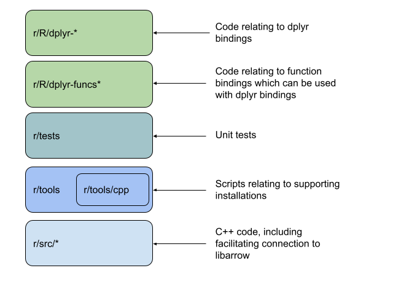

- The `r/R/dplyr-*` files define the verbs used in a regular
  dplyr syntax on Arrow objects.
- The `r/R/dplyr-funcs*` files define bindings to Arrow C++
  functions that can be used with already defined dplyr verbs.
- All the C++ code connected to the R package lives in `arrow/r/src`.
  It also includes C++ code which connects libarrow (the Arrow C++
  library) and the R code in package.
- If the libarrow source package is bundled with R package using
  `make sync-cpp` command then it will be included in the
  `r/tools/cpp` folder.

**Additionally**

- The `r/man` directory includes generated R documentation that
  shouldn’t be updated directly but in the corresponding `.R` file.
- The vignettes are
  [“a long-form guide to the package”](https://r-pkgs.org/vignettes.html#introduction)
  and can be found in `r/vignettes`.

---

<a id="developers-guide-communication"></a>

<!-- source_url: https://arrow.apache.org/docs/developers/guide/communication.html -->

<!-- page_index: 4 -->

# Communication #

[Skip to main content](#developers-guide-communication--main-content)

Back to top

> [!NOTE]
> # Communication
>
> **About the contributors**
>
> The group of contributors is full of experts, software engineers and core
> developers but also full of users, learners and enthusiasts that love doing
> what we do and we want to spread this enthusiasm to you also.
>
> We all have silly questions and we all need help lots of times.
> We encourage you to be open to communication and we will help as much as
> we can.
>
> Due to the scale of the project which includes many languages, everybody
> contributing will be faced with new things needed to be learned. Even the most
> seasoned C++ developer will need to ask basic questions about R for example.
>
> When communicating, it’s important you mark your communication with appropriate
> tags ([C++], [R], [Ruby] etc.) so it gets noticed by the right people.
>
> ## Where to get help 👋
>
> For any question you may have or problems you are facing you can write to
> user or development [Mailing Lists](#developers-guide-communication--mailing-list), [GitHub Discussions](https://github.com/apache/arrow/discussions) or you can
> create an issue on [GitHub](#developers-guide-communication--github). Also use GitHub to search through the issues, report bugs and create feature requests or proposals.
>
> ### GitHub
>
> Different options of communicating are provided through GitHub where the project
> is hosted. What we use are [GitHub Issues](https://github.com/apache/arrow/issues), [Discussions](https://github.com/apache/arrow/discussions) and
> [Pull Requests](https://github.com/apache/arrow/pulls).
>
> You can use GitHub issues to:
>
> If you have **a new contribution already written**, you can create a Pull
> Request after creating a GitHub issue and mentioning the way you plan to
> implement it. It is important to have one of the Arrow developers agree with
> your basic proposal for fixing it. Better to ask before you spend too much of
> your time on something that we might think is not a good idea.
>
> If you want to **solve an issue that is already in GitHub**, you should
> connect with other contributors in the issue comments.
>
> ### Mailing Lists
>
> You can subscribe to the **user** or **development** mailing list and browse for
> previous topics or ask questions. Whereas discussion on GitHub only notifies people
> who are mentioned or are collaborating on a Pull Request, the mailing list allows
> you to broadcast to all users or developers. Use these when you want to get feedback
> or answers from a wider audience.
>
> > [!NOTE]
> > [GitHub Discussions](https://github.com/apache/arrow/discussions) has all posts
> > mirrored to the <[user@arrow.apache.org](mailto:user%40arrow.apache.org)> mailing list. **Users are welcome to ask
> > usage questions in either location.**
>
> There is also a **biweekly developers sync call** that anyone is welcome to join.
> It is announced on the development mailing list together with the link to join.
>
> > [!NOTE]
> > **See also**
> > More information and links for subscribing to the mailing lists [can be found here](https://arrow.apache.org/community/).
>
> ### Recommended learning resources
>
> To find articles on concepts important to Arrow as well as recommended books for
> learning languages visit [Additional information and resources](#developers-guide-resources--other-resources).

---

<a id="developers-guide-step_by_step"></a>

<!-- source_url: https://arrow.apache.org/docs/developers/guide/step_by_step/index.html -->

<!-- page_index: 5 -->

# Steps in making your first PR #

[Skip to main content](#developers-guide-step_by_step--main-content)

Back to top

# Steps in making your first PR

---

<a id="developers-guide-step_by_step-set_up"></a>

<!-- source_url: https://arrow.apache.org/docs/developers/guide/step_by_step/set_up.html -->

<!-- page_index: 6 -->

# Set up #

[Skip to main content](#developers-guide-step_by_step-set_up--main-content)

Back to top

> [!NOTE]
> # Set up
>
> ## Install and set up Git
>
> The Arrow project is developed using [Git](https://git-scm.com/)
> for version control which is easily available for all common
> operating systems.
>
> You can follow the instructions to install Git from GitHub
> where Arrow repository is hosted, following
> [the quickstart instructions](https://docs.github.com/en/get-started/quickstart/set-up-git).
>
> When Git is set up do not forget to configure your name and email
>
> ```
> $ git config --global user.name "Your Name"
> $ git config --global user.email your.email@example.com
> ```
>
> and [authenticate with GitHub](https://docs.github.com/en/get-started/quickstart/set-up-git#next-steps-authenticating-with-github-from-git)
> as this will allow you to interact with GitHub without typing
> a username and password each time you execute a git command.
>
> > [!NOTE]
> > This guide assumes you are comfortable working from the command line.
> > Some IDEs allow you to manage a Git repository, but may implicitly run
> > unwanted operations when doing so (such as creating project files).
> >
> > For example, cloning it in RStudio assumes the whole repository is an
> > RStudio project and will create a `.Rproj` file in the root directory.
> > For this reason it is *highly recommended* to clone the repository using
> > the command line or a Git client.
>
> ## Get the source code
>
> ### Fork the repository
>
> The Arrow GitHub repository contains both the Arrow C++ library plus
> libraries for other languages such as Go, Java, Matlab, Python, R, etc.
> The first step to contributing is to create a fork of the repository
> in your own GitHub account.
>
> 1. Go to <https://github.com/apache/arrow>.
> 2. Press Fork in the top right corner.
>
>    [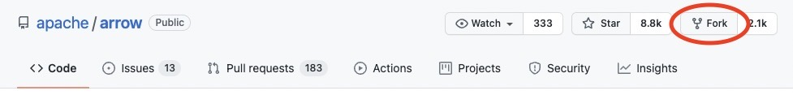](assets/images/github-fork_64a52d52134d593e.jpeg)
>
>    The icon to fork the Apache Arrow repository on GitHub.
> 3. Choose to fork the repository to your username so the fork will be
>    created at `https://github.com/<your username>/arrow`.
>
> ### Clone the repository
>
> Next you need to clone the repository
>
> ```
> $ git clone https://github.com/<your username>/arrow.git
> ```
>
> and add Apache Arrow repository as a remote called `upstream`.
>
> ```
> $ cd arrow
> $ git remote add upstream https://github.com/apache/arrow
> ```
>
> ### Verify your upstream
>
> Your upstream should be pointing at the Arrow GitHub repo.
>
> Running in the shell:
>
> ```
> $ git remote -v
> ```
>
> Should give you a result similar to this:
>
> ```
>
> origin    https://github.com/<your username>/arrow.git (fetch)
> origin    https://github.com/<your username>/arrow.git (push)
> upstream  https://github.com/apache/arrow (fetch)
> upstream  https://github.com/apache/arrow (push)
> ```
>
> If you did everything correctly, you should now have a copy of the code
> in the `arrow` directory and two remotes that refer to your own GitHub
> fork (`origin`) and the official Arrow repository (`upstream`).

---

<a id="developers-guide-step_by_step-building"></a>

<!-- source_url: https://arrow.apache.org/docs/developers/guide/step_by_step/building.html -->

<!-- page_index: 7 -->

# Building the Arrow libraries 🏋🏿♀️ #

[Skip to main content](#developers-guide-step_by_step-building--main-content)

Back to top

# Building the Arrow libraries 🏋🏿♀️

The Arrow project contains a number of libraries that enable
work in many languages. Most libraries (C++, C#, Go, Java, JavaScript, Julia, and Rust) already contain distinct implementations
of Arrow.

This is different for C (Glib), MATLAB, Python, R, and Ruby as they
are built on top of the C++ library. In this section of the guide
we will try to make a friendly introduction to the build, dealing with some of these libraries as well has how they work with
the C++ library.

If you decide to contribute to Arrow you might need to compile the
C++ source code. This is done using a tool called CMake, which you
may or may not have experience with. If not, this section of the
guide will help you better understand CMake and the process
of building Arrow’s C++ code.

This content is intended to help explain the concepts related to
and tools required for building Arrow’s C++ library from source.
If you are looking for the specific required steps, or already feel comfortable
with compiling Arrow’s C++ library, then feel free to proceed
to the [C++](#developers-cpp-building--building-arrow-cpp), [PyArrow](#developers-python-building--build-pyarrow) or
[R package build section](https://arrow.apache.org/docs/r/articles/developing.html).

## Building Arrow C++

### Why build Arrow C++ from source?

For Arrow implementations which are built on top of the C++ implementation
(e.g. Python and R), wrappers and interfaces have been written to the
underlying C++ functions. If you want to work on PyArrow or the R package, you may need to edit the source code of the C++ library too.

Detailed instructions on building C++ library from source can
be found [here](#developers-cpp-building--building-arrow-cpp).

### About CMake

CMake is a cross-platform build system generator and it defers
to another program such as `make` or `ninja` for the actual build.
If you are running into errors with the build process, the first thing to
do is to look at the error message thoroughly and check the building
documentation for any similar error advice. Also changing the CMake flags
for compiling Arrow could be useful.

#### CMake presets

You could also try to build with CMake presets which are a collection of
build and test recipes for Arrow’s CMake. They are a very useful
starting points.

More detailed information about CMake presets can be found in
the [CMake presets](#developers-cpp-building--cmake-presets) section.

#### Optional flags and environment variables

Flags used in the CMake build are used to include additional components
and to handle third-party dependencies.
The build for C++ library can be minimal with no use of flags or can
be changed with adding optional components from the
[list](#developers-cpp-building--cpp-build-optional-components).

> [!NOTE]
> **See also**
> Full list of optional flags: [Optional Components](#developers-cpp-building--cpp-build-optional-components)

R and Python have specific lists of flags in their respective builds
that need to be included. You can find the links at the end
of this section.

In general on Python side, the options are set with CMake flags and
paths with environment variables. In R the environment variables are used
for all things connected to the build, also for setting CMake flags.

## Building other Arrow libraries

Building PyArrow

After building the Arrow C++ library, you need to build PyArrow on top
of it also. The reason is the same; so you can edit the code and run
tests on the edited code you have locally.

**Why do we have to do builds separately?**

As mentioned at the beginning of this page, the Python part of the Arrow
project is built on top of the C++ library. In order to make changes in
the Python part of Arrow as well as the C++ part of Arrow, you need to
build them separately.

We hope this introduction was enough to help you start with the building
process.

> [!NOTE]
> **See also**
> Follow the instructions to build PyArrow together with the C++ library

When you will make change to the code, you may need to recompile
PyArrow or Arrow C++:

**Recompiling Cython**

If you only make changes to `.py` files, you do not need to
recompile PyArrow. However, you should recompile it if you make
changes in `.pyx` or `.pxd` files.

To do that run this command again:

```
$ pip install --no-build-isolation --editable . -vv
```

**Recompiling C++**

Similarly, you will need to recompile the C++ code if you have
made changes to any C++ files. In this case, re-run the build commands again.

Building the R package

When working on code in the R package, depending on your OS and planned
changes, you may or may not need to build the Arrow C++ library (often
referred to in the R documentation as ‘libarrow’) from source.

More information on this and full instructions on setting up the Arrow C++
library and Arrow R package can be found in the
[R developer docs](https://arrow.apache.org/docs/r/articles/developing.html).

**Reinstalling R package and running ‘make clean’**

If you make changes to the Arrow C++ part of the code, also
called libarrow, you will need to:

1. reinstall libarrow, 2. run `make clean`, 3. reinstall the R package.

The `make clean` function is defined in `r/Makefile` and will
remove any cached object code in the `r/src/` directory, ensuring
you have a clean reinstall. The `Makefile` also includes functions
like `make test`, `make doc`, etc. and was added to help with
common tasks from the command line.

See more in the [Troubleshooting](https://arrow.apache.org/docs/dev/r/articles/developers/setup.html#troubleshooting)
section of the R Developer environment setup article.

**Building from source vs. using binaries**

Using binaries is a fast and simple way of working with the last release
of Arrow. However, if you use these it means that you will be unable to
make changes to the Arrow C++ library.

> [!NOTE]
> Every language has its own way of dealing with binaries.
> To get more information navigate to the section of the language you are
> interested to find more information.

---

<a id="developers-guide-step_by_step-finding_issues"></a>

<!-- source_url: https://arrow.apache.org/docs/developers/guide/step_by_step/finding_issues.html -->

<!-- page_index: 8 -->

# Finding good first issues 🔎 #

[Skip to main content](#developers-guide-step_by_step-finding_issues--main-content)

Back to top

# Finding good first issues 🔎

You have successfully built the Arrow library; congrats!

The next step is finding something to work on. As mentioned before, you might already have a bug to fix in mind, or a new feature that
you want to implement. Or you still need an issue to work on and
you need some help with finding one.

For both cases, GitHub is the issue tracker that we use.

- If you do not have a GitHub account yet, navigate to the
  [GitHub login page](https://github.com/join) to create one.
- If you need help with creating a new GitHub issue see the
  [GitHub documentation](https://docs.github.com/en/issues/tracking-your-work-with-issues/creating-an-issue).

When the ticket is created you can start a discussion about it in the GitHub comments.

## GitHub labels

To make it easier for you to find issues that are well-suited for new
contributors, we have added a label **“good-first-issue”** to some
GitHub issues.

> [!NOTE]
> **See also**
> Search for good first issues [good-first-issue label listing](https://github.com/apache/arrow/labels/good-first-issue)

The issues labeled as good first issues should take no more than two days or
a weekend to fix them. Once you dig into the code you may find that the issue
is not easy at all - this can happen as the problem could be harder than the
person who triaged the ticket expected it to be. Don’t hesitate to write that
in the comments.

> [!NOTE]
> When you find a GitHub issue you would like to work on, please mention
> your interest in the comment section of that issue; that way we will know
> you are working on it.
> Consider assigning yourself to the issue ([Issue assignment](#developers-bug_reports--issue-assignment)) when the work starts.

Also, do not hesitate to ask questions in the comment. You can get some
pointers about where to start and similar issues already solved.

**What if an issue is already assigned?**
When in doubt, comment on the issue asking if they mind if you try to put
together a pull request; interpret no response to mean that you’re free to
proceed.

**Ask questions**
Please do ask questions, either on the GitHub issue itself or on the dev
mailing list, if you have doubts about where to begin or what approach to
take. This is particularly a good idea if this is your first code contribution, so you can get some sense of what the core developers in this part of the
project think a good solution looks like. For best results, ask specific, direct questions, such as:

- Do you think $PROPOSED\_APPROACH is the right one?
- In which file(s) should I be looking to make changes?
- Is there anything related in the codebase I can look at to learn?

If you ask these questions and do not get an answer, it is OK to ask again.

> [!NOTE]
> **Do not forget to create a new branch once you have created or chosen an
> issue you will be working on!** Follow the instructions in the
> [Lifecycle of a pull request](#developers-guide-step_by_step-pr_lifecycle--pr-lifecycle) section or follow the next section: [Working on the Arrow codebase 🧐](#developers-guide-step_by_step-arrow_codebase--arrow-codebase).

---

<a id="developers-guide-step_by_step-arrow_codebase"></a>

<!-- source_url: https://arrow.apache.org/docs/developers/guide/step_by_step/arrow_codebase.html -->

<!-- page_index: 9 -->

# Working on the Arrow codebase 🧐 #

[Skip to main content](#developers-guide-step_by_step-arrow_codebase--main-content)

Back to top

> [!NOTE]
> # Working on the Arrow codebase 🧐
>
> ## Finding your way around Arrow
>
> The [Apache Arrow repository](https://github.com/apache/arrow) includes
> implementations for most of the libraries for which Arrow is available.
>
> Languages like GLib (`c_glib/`), C++ (`cpp/`), MATLAB
> (`matlab/`), Python (`python/`), R (`r/`) and Ruby (`ruby/`)
> have their own subdirectories in the main folder as written here.
>
> The following language implementations have their own repositories:
>
> - [.NET](https://github.com/apache/arrow-dotnet)
> - [Go](https://github.com/apache/arrow-go)
> - [Java](https://github.com/apache/arrow-java)
> - [JavaScript](https://github.com/apache/arrow-js)
> - [Julia](https://github.com/apache/arrow-julia)
> - [Rust](https://github.com/apache/arrow-rs)
> - [Swift](https://github.com/apache/arrow-swift)
>
> In the **language-specific subdirectories** you can find the code
> connected to that language. For example:
>
> - The `python/` folder includes `pyarrow/` folder which contains
>   the code for the pyarrow package and requirements files that you
>   need when building pyarrow.
>
>   The `pyarrow/` includes Python and Cython code.
>
>   The `pyarrow/` also includes `test/` folder where all the tests
>   for the pyarrow modules are located.
> - The `r/` directory contains the R package.
>
> Other subdirectories included in the arrow repository are:
>
> ## Bindings, features, fixes and tests
>
> You can read through this section to get some ideas on how
> to work around the library on the issue you have.
>
> Depending on the problem you want to solve (adding a simple
> binding, adding a feature, writing a test, …) there are
> different ways to get the necessary information.
>
> **For all the cases** you can help yourself with
> searching for functions via some kind of search tool.
> In our experience there are two good ways:
>
> 1. Via **GitHub Search** in the Arrow repository (not a forked one)
>    This way is great as GitHub lets you search for function
>    definitions and references also.
> 2. **IDE** of your choice.
>
> **Bindings**
>
> The term “binding” is used to refer to a function in the C++ implementation which
> can be called from a function in another language. After a function is defined in
> C++ we must create the binding manually to use it in that implementation.
>
> > [!NOTE]
> > **There is much you can learn by checking Pull Requests and unit tests for similar issues.**
> >
>
> Python
>
> **Adding a fix in Python**
>
> If you are updating an existing function, the
> easiest way is to run Python interactively or run Jupyter
> Notebook and research
> the issue until you understand what needs to be done.
>
> After, you can search on GitHub for the function name, to
> see where the function is defined.
>
> Also, if there are errors produced, the errors will most
> likely point you towards the file you need to take a look at.
>
> **Python - Cython - C++**
>
> It is quite likely that you will bump into Cython code when
> working on Python issues. It’s less likely is that the C++ code
> needs updating, though it can happen.
>
> As mentioned before, the underlying code is written in C++.
> Python then connects to it via Cython. If you
> are not familiar with it you can ask for help and remember,
> **look for similar Pull Requests and GitHub issues!**
>
> **Adding tests**
>
> There are some issues where only tests are missing. Here you
> can search for similar functions and see how the unit tests for
> those functions are written and how they can apply in your case.
>
> This also holds true for adding a test for the issue you have solved.
>
> **New feature**
>
> If you are adding a new future in Python you can look at
> the [tutorial](#developers-guide-tutorials-python_tutorial--python-tutorial) for ideas.
>
> R
>
> **Philosophy behind R bindings**
>
> When writing bindings between C++ compute functions and R functions, the aim is to expose the C++ functionality via the same interface as
> existing R functions.

---

<a id="developers-guide-step_by_step-testing"></a>

<!-- source_url: https://arrow.apache.org/docs/developers/guide/step_by_step/testing.html -->

<!-- page_index: 10 -->

# Testing 🧪 #

[Skip to main content](#developers-guide-step_by_step-testing--main-content)

Back to top

# Testing 🧪

In this section we outline steps needed for unit testing in Arrow.

PyArrow

We use [pytest](https://docs.pytest.org/en/latest/) for
unit tests in Python. For more info about the required
packages see
[Python unit testing section](#developers-python-development--python-unit-testing).

**Structure**

Test layout in PyArrow follows `pytest` structure for
[Tests as part of application code](https://docs.pytest.org/en/6.2.x/goodpractices.html#tests-as-part-of-application-code):

```

pyarrow
/
__init__
.
py
csv
.
py
dataset
.
py
...
tests
/
__init__
.
py
test_csv
.
py
test_dataset
.
py
...
```

Tests for Parquet are located in a separate folder `pyarrow/tests/parquet/`.

**Running tests**

To run a specific unit test, use this command in
the terminal from the `arrow/python` folder:

```
$ pytest pyarrow/tests/test_file.py -k test_your_unit_test
```

Run all the tests from one file:

```
$ pytest pyarrow/tests/test_file.py
```

Run all the tests:

```
$ pytest pyarrow
```

You can also run the tests with `python -m pytest [...]`
which is almost equivalent to using `pytest [...]` directly, except that calling via python will also add the current
directory to `sys.path` and can in some cases help if
`pytest [...]` results in an ImportError.

**Recompiling PyArrow or Arrow C++**

If the tests start failing, try to recompile PyArrow or
Arrow C++. See note in the [Building other Arrow libraries](#developers-guide-step_by_step-building--build-libraries-guide)
section under the PyArrow tab.

**Fixtures**

Inside PyArrow test files there can be helper functions
and fixtures defined. Also other pytest decorators such as
`@parametrize` or `@skipif` are used.

For example:

- `_alltypes_example` in `test_pandas` supplies a
  dataframe with 100 rows for all data types.
- `_check_pandas_roundtrip` in `test_pandas` asserts if the
  roundtrip from `Pandas` through `pa.Table` or
  `pa.RecordBatch` back to `Pandas` yields the same result.
- `large_buffer` fixture supplying a PyArrow buffer of fixed
  size to the function `test_primitive_serialization(large_buffer)`
  in `test_serialization.py`.

For this reason it is good to look through the file you
are planning to add the tests to and see if any of
the defined functions or fixtures will be helpful.

For more information about `pytest` in general visit
[Full pytest documentation](https://docs.pytest.org/en/stable/contents.html)

R package

We use [testthat](https://testthat.r-lib.org/index.html) for
unit testing in R. More specifically, we use the [3rd edition
of testthat](https://testthat.r-lib.org/articles/third-edition.html).
On rare occasions we might want the behaviour of the 2nd edition
of testthat, which is indicated by `testthat::local_edition(2)`.

**Structure**

Expect the usual testthat folder structure:

```
tests
 ├── testthat      # test files live here
 └── testthat.R    # runs tests when R CMD check runs (e.g. with devtools::check())
```

This is the fundamental structure of testing in R with
`testthat`. Files such as `testthat.R` are not
expected to change very often. For the `arrow` R
package `testthat.R` also defines how the results of
the various tests are displayed / reported in the console.

Usually, most files in the `R/` sub-folder have a
corresponding test file in `tests/testthat`.

**Running tests**

To run all tests in a package locally call

```

devtools
::
test
()
```

in the R console. Alternatively, you can use

```
$ make test
```

in the shell.

You can run the tests in a single test file you have open with

```

devtools
::
test_active_file
()
```

All tests are also run as part of our continuous
integration (CI) pipelines.

The [Arrow R Developer guide also has a section](https://arrow.apache.org/docs/r/articles/developing.html#running-tests)
on running tests.

**Good practice**

In general any change to source code needs to be
accompanied by unit tests. All tests are expected
to pass before a pull request is merged.

- Add functionality -> add unit tests
- Modify functionality -> update unit tests
- Solve a bug -> add unit test before solving it,
  which helps prove the bug and its fix
- Performance improvements should be reflected in
  benchmarks (which are also tests)
- An exception could be refactoring functionality that
  is fully covered by unit tests

A good rule of thumb is: If the new functionality is
a user-facing or API change, you will almost certainly
need to change tests — if no tests need to be changed, it might mean the tests aren’t right! If the new
functionality is a refactor and no APIs are changing, there might not need to be test changes.

**Testing helpers**

To complement the `testthat` functionality, the `arrow`
R package has defined a series of specific utility
functions (called helpers), such as:

- expectations - these start with `expect_` and are used
  to compare objects

  - for example, the `expect_…_roundtrip()` functions
    take an input, convert it to some other format
    (e.g. arrow, altrep) and then convert it back,
    confirming that the values are the same.


```

x
 
<-
 
c
(
1
,
 
2
,
 
3
,
 
NA_real_
)
expect_altrep_roundtrip
(
x
,
 
min
,
 
na.rm
 
=
 
TRUE
)
```

- `skip_` - skips a unit test - think of them as acceptable
  fails. Situations in which we might want to skip unit tests:

  - `skip_if_r_version()` - this is a specific `arrow` skip.
    For example, we use this to skip a unit test when the R
    version is 3.5.0 and below (`skip_if_r_version(“3.5.0”)`).
    You will likely see it used when the functionality we are
    testing depends on features introduced after version 3.5.0
    of R (such as the alternative representation of vectors,
    Altrep, introduced in R 3.5.0, but with significant additions
    in subsequent releases). As part of our CI workflow we test
    against different versions of R and this is where this
    feature comes in.
  - `skip_if_not_available()` - another specific {arrow} skip.
    Arrow (libarrow) has a number of optional features that can be
    switched on or off (which happens at build time). If a unit
    test depends on such a feature and this feature is not
    available (i.e. was not selected when libarrow was built)
    the test is skipped, as opposed to having a failed test.
  - `skip_if_offline()` - will not run tests that require an
    internet connection
  - `skip_on_os()` - for unit tests that are OS specific.

  *Important*: Once the conditions for a `skip_()` statement is met,
  no other line of code in the same `test_that()` test block will
  get executed. If the `skip` is outside of a `test_that()` code
  block, it will skip the rest of the file.

For more information about unit testing in R in general:

- the `testthat` [website](https://testthat.r-lib.org/index.html)
- the **R Packages** [book](https://r-pkgs.org) by Hadley Wickham and Jenny Bryan

---

<a id="developers-guide-step_by_step-styling"></a>

<!-- source_url: https://arrow.apache.org/docs/developers/guide/step_by_step/styling.html -->

<!-- page_index: 11 -->

# Styling 😎 #

[Skip to main content](#developers-guide-step_by_step-styling--main-content)

Back to top

# Styling 😎

Each language in the Apache Arrow project follows its own style guides.

In this section we will provide links to the existing documentation
to make it easier for you to find the relevant information about
linters and styling of the code.

PyArrow

[Coding Style](#developers-python-development--python-coding-style).

R package

For the R package you can use
[air](https://posit-dev.github.io/air/) to format the code, and

`{lintr}`
to check if the code follows the
[tidyverse style](https://style.tidyverse.org/).

The instructions on how to use air and `{lintr}`
can be found in the
[Styling and Linting section of the Common developer workflow tasks](https://arrow.apache.org/docs/r/articles/developers/workflow.html#styling-and-linting).

## Pre-commit

It is useful to set up [pre-commit](https://pre-commit.com/), a multi-language package manager for pre-commit hooks. It will
check your code and will stop the commit process, described in
the following section, if there are any errors.

- [Pre-commit installation instructions](https://pre-commit.com/#installation)
- [Pre-commit hooks](https://pre-commit.com/hooks.html)

---

<a id="developers-guide-step_by_step-pr_lifecycle"></a>

<!-- source_url: https://arrow.apache.org/docs/developers/guide/step_by_step/pr_lifecycle.html -->

<!-- page_index: 12 -->

# Lifecycle of a pull request #

[Skip to main content](#developers-guide-step_by_step-pr_lifecycle--main-content)

Back to top

> [!NOTE]
> # Lifecycle of a pull request
>
> [As mentioned before](#developers-guide-step_by_step-set_up--set-up), the Arrow project uses Git
> for version control and a workflow based on pull requests. That
> means that you contribute the changes, or “patches”, to the code
> by creating a branch in Git, make changes to the code, push the
> changes to your `origin` which is your fork of the Arrow
> repository on GitHub and then you create a **pull request** against
> the official Arrow repository which is saved in your set up as
> `upstream`.
>
> You should have Git set up by now, have cloned the repository, have successfully built Arrow and have a GitHub issue to work on.
>
> **Before making changes to the code, you should create a new
> branch in Git.**
>
> 1. Update your fork’s main branch with `upstream/main`.
>    Run this in the shell from the `arrow` directory.
>
> ```
> $ git checkout main # select the main Arrow branch
> $ git fetch upstream # check for changes in upstream/main
> $ git pull --ff-only upstream main # save the changes from upstream/main
> ```
>
>    Note: `--ff-only` applies changes only if they can be fast-forwarded
>    without conflicts or creating merge commits.
> 2. Create a new branch
>
> ```
> $ git checkout -b <branch-name>
> ```
>
>    or (does the same thing)
>
> ```
> $ git switch --create <branch-name>
> ```
>
> Now you can make changes to the code. To see the changes
> made in the library use this two commands:
>
> ```
> $ git status # to see what files are changed
> $ git diff # to see code change per file
> ```
>
> ## Creating a pull request
>
> Once you are satisfied with the changes, run the [tests](#developers-guide-step_by_step-testing--testing)
> and [linters](#developers-guide-step_by_step-styling--styling) and then go ahead and commit the changes.
>
> 3. Add and commit the changes
>
> ```
> $ git add <filenames>
> $ git commit -m "<message>"
> ```
>
>    Alternatively, you can add and commit in one step, if all the files changed
>    are to be committed (-a to add all, -m for message)
>
> ```
> $ git commit -am "<message>"
> ```
>
> 4. Then push your work to your Arrow fork
>
> ```
> $ git push origin <branch-name>
> ```
>
> > [!NOTE]
> > **Until you make the pull request, nothing is visible on the Arrow repository and you are free to experiment.**
> > Your work is now still under your watchful eye so it’s not a problem
> > if you see any errors you would like to correct. You can make an
> > additional commit to correct, and Git has lots of ways to
> > amend, delete, revise, etc. See <https://git-scm.com/docs> for more
> > information.
>
> If all is set, you can make the pull request!
>
> ### Continuous Integration (CI)
>
> Continuous integration (CI) is an automated way to run tests and
> builds on different environments with the changed code made by a
> specific pull request. It serves as a stability check before it
> gets merged or integrated into the main repository of the project.
>
> Once the pull request is created, the CI will trigger checks on the
> code. Depending on what part of the code was changed (documentation, C++ or other languages for example) the CI is configured to run
> the relevant checks.
>
> You will see checks running at the bottom of the pull request page
> on GitHub. In case of an error, click on the details and research the cause
> of the failing build.
>
> [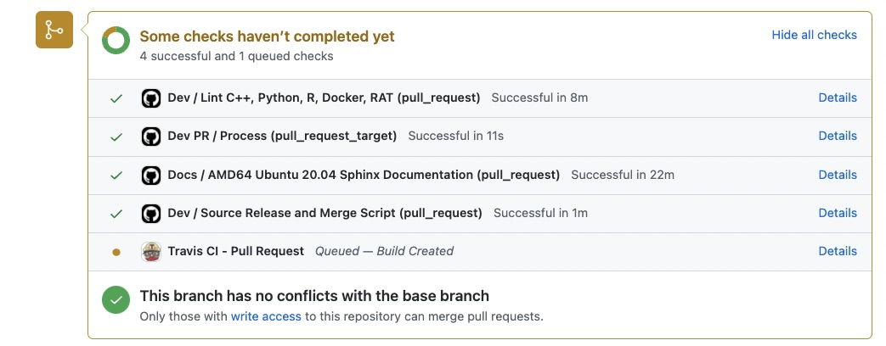](assets/images/ci-process-docs_805d2ba5eb48bc7f.jpeg)
>
> CI checks for changes made to the documentation.
>
> [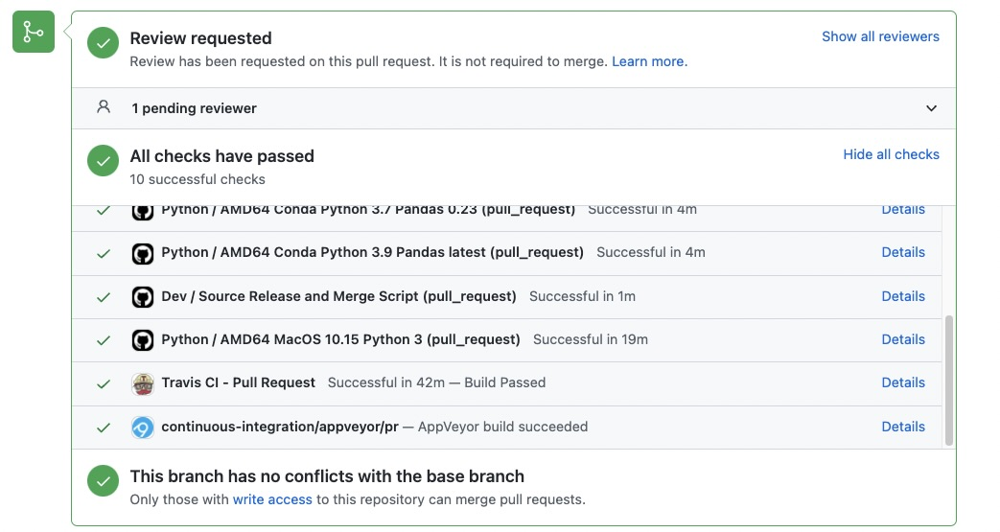](assets/images/ci-process-python_073cacd43e0924bf.jpeg)
>
> CI checks for changes made to the python files.
>
> [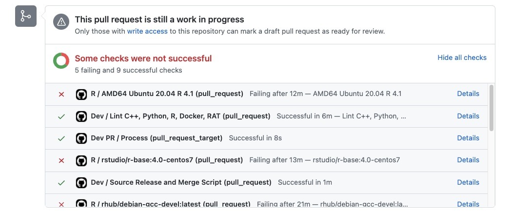](assets/images/ci-process-r_470abbc19efcc7f8.jpeg)
>
> CI checks for changes made to the R files.
>
> Besides the CI jobs that check the changes in GitHub repository
> (opening or merging of a pull request) we also use CI for nightly
> builds and releases of the Apache Arrow library.
>
> Also, extended triggering jobs can be used in your pull request for
> example adding a comment with `@github-actions crossbow submit python`
> will run PyArrow tests via GitHub actions. These are mostly used to run
> tests on environments that are less common and are normally
> not needed in first time contributions.
>
> To read more about this topic visit [Continuous Integration](#developers-continuous_integration-overview--continuous-integration).
>
> ## Reviews and merge of the pull request
>
> When the pull request is submitted it waits to get reviewed. One of
> great things about open source is that your work can get lots of feedback and
> so it gets perfected. Do not be discouraged by the time it takes for
> the PR to get merged due to reviews and corrections. It is a process
> that supports quality and with it you can learn a lot.
>
> If it still takes too long to get merged, do not hesitate to remind
> maintainers in the comment section of the pull request and post
> reminders on the GitHub issue also.
>
> ### How to get your pull request to be reviewed?
>
> Arrow maintainers will be notified when a pull request is created and
> they will get to it as soon as possible. If days pass and it still had
> not been reviewed go ahead and mention the reporter of the GitHub issue
> or a developer that you communicated with via mailing list or GitHub.
>
> To put a **mention** in GitHub insert @ in the comment and select the
> username from the list.
>
> ### Commenting on a pull request
>
> When a pull request is open in the repository you and other developers
> can comment on the proposed solution.
>
> To create a general comment navigate to the **Conversation** tab of
> your pull request and start writing in the comment box at the bottom of
> the page.
>
> You can also comment on a section of the file to point out something
> specific from your code. To do this navigate to **Files changed** tab and
> select a line you want to insert the comment to. Hovering over the beginning
> of the line you will see a **blue plus icon**. You can click on it or drag
> it to select multiple lines and then click the icon to insert the comment.
>
> ### Resolve conversation
>
> You can resolve a conversion in a pull request review by clicking
> **Resolve conversation** in the **Files changed** tab. This way the
> conversation will be collapsed and marked as resolved which will make it
> easier for you to organize what is done and what still needs to be addressed.
>
> ### Updating your pull request
>
> The procedure after getting reviews is similar to creating the initial pull request.
> You need to update your code locally, make a commit, update the branch to sync
> it with upstream and push your code to origin. It will automatically be updated
> in your pull request as well.
>
> The steps for updating the pull request would then be as follows:
>
> 1. Updating the code locally and making a commit as before:
>
> ```
> $ git commit -am "<message>" #if all changed files are to be committed
> ```
>
> 2. **Important!** In case there are commits from other developers on the pull
>    request branch or if you committed suggestions from the GitHub you need
>    to update you code with `origin` before rebasing! To do this run:
>
> ```
> $ git pull origin <branch-name>
> ```
>
>    Here we merge the new commits with our local branch and we do not rebase.
> 3. Now we have to update the branch to sync with upstream main Arrow branch.
>    This way the pull request will be able to get merged. We use rebase in this
>    case.
>
> ```
> $ git pull upstream main --rebase
> ```
>
>    This will rebase your local commits on top of the tip of `upstream/main`.
> 4. Now you can push the changes by running:
>
> ```
> $ git push origin <branch-name> --force
> ```
>
>    *Note about force pushing to a branch that is being reviewed:* if you want
>    reviewers to look at your updates, please ensure you comment on the PR on
>    GitHub as simply force pushing does not trigger a notification in the
>    GitHub user interface.
>
> > [!NOTE]
> > **See also**
> > See more about updating the branch (we use `rebase`, not `merge`)
> > and squashing local commits in [Local git conventions](#developers-overview--git-conventions).
>
> If the review process is successful your pull request will get merged.
>
> ## Congratulations! 🎉

---

<a id="developers-guide-documentation"></a>

<!-- source_url: https://arrow.apache.org/docs/developers/guide/documentation.html -->

<!-- page_index: 13 -->

# Helping with documentation #

[Skip to main content](#developers-guide-documentation--main-content)

Back to top

> [!NOTE]
> > [!NOTE]
> > # Helping with documentation
> >
> > **A great way to contribute to the project is to improve
> > documentation.**
> >
> > If you are an Arrow user and you found some docs to be
> > incomplete or inaccurate, share your hard-earned knowledge
> > with the rest of the community.
> >
> > If you didn’t come across something to improve in the
> > documentation itself, you can search for an issue in GitHub.
> >
> > > [!NOTE]
> > > **See Example search.**
> > > When searching for an issue that deals with documentation, navigate to [GitHub labels](https://github.com/apache/arrow/labels)
> > > and select **Component: Documentation** or search for **Documentation**
> > > in the “Search all labels” window.
> >
> > Documentation improvements are also a great way to gain some
> > experience with our submission and review process without
> > requiring a lot of local development environment setup.
> >
> > > [!NOTE]
> > > Many documentation-only changes can be made directly in the
> > > GitHub web interface by clicking the **Edit this page**
> > > on the right top corner of the documentations page. This
> > > will handle making a fork and a pull request for you.
> > >
> > > [](assets/images/edit-page_269ed88dfef99fc9.jpeg)
> > >
> > > On the right corner of the file in GitHub click on pen icon.
> > >
> > > [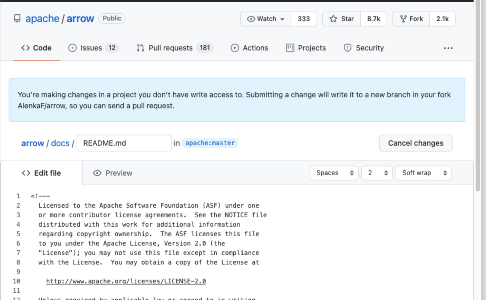](assets/images/github-edit-page_8161c391e4eccb96.jpeg)
> > >
> > > Now you can edit the file in GitHub.
> >
> > You could also build the entire project, make the change locally on
> > your branch and make the PR this way. But it is by no means superior
> > to simply editing via GitHub.
> >
> > If you wish to build the documentation locally, follow detailed instructions
> > on [Building the Documentation](#developers-documentation--building-docs).
> >
> > ## Where to find the correct file to change?
> >
> > Most of the documentation is located in the `docs/source` of the Arrow
> > library. Source folder includes:
> >
> > **Cookbooks** have their own repository <https://github.com/apache/arrow-cookbook>
> > and can be separately cloned and built.

---

<a id="developers-guide-tutorials"></a>

<!-- source_url: https://arrow.apache.org/docs/developers/guide/tutorials/index.html -->

<!-- page_index: 14 -->

# Tutorials #

[Skip to main content](#developers-guide-tutorials--main-content)

Back to top

# Tutorials

- [Python tutorial](#developers-guide-tutorials-python_tutorial)

---

<a id="developers-guide-tutorials-python_tutorial"></a>

<!-- source_url: https://arrow.apache.org/docs/developers/guide/tutorials/python_tutorial.html -->

<!-- page_index: 15 -->

# Python tutorial #

[Skip to main content](#developers-guide-tutorials-python_tutorial--main-content)

Back to top

# Python tutorial

In this tutorial we will make an actual feature contribution to
Arrow following the steps specified by [Quick Reference](#developers-guide--quick-ref-guide)
section of the guide and a more detailed [Steps in making your first PR](#developers-guide-step_by_step--step-by-step)
section. Navigate there whenever there is some information
you may find is missing here.

The feature contribution will be added to the compute module
in PyArrow. But you can also follow the steps in case you are
correcting a bug or adding a binding.

This tutorial is different from the [Steps in making your first PR](#developers-guide-step_by_step--step-by-step) as we
will be working on a specific case. This tutorial is not meant
as a step-by-step guide.

**Let’s start!**

## Set up

Let’s set up the Arrow repository. We presume here that Git is
already installed. Otherwise please see the [Set up](#developers-guide-step_by_step-set_up--set-up) section.

Once the [Apache Arrow repository](https://github.com/apache/arrow)
is forked we will clone it and add the link of the main repository
to our upstream.

```
$ git clone https://github.com/<your username>/arrow.git
$ cd arrow
$ git remote add upstream https://github.com/apache/arrow
```

## Building PyArrow

Script for building PyArrow differs depending on the Operating
System you are using. For this reason we will only refer to
the instructions for the building process in this tutorial.

> [!NOTE]
> **See also**
> For the **introduction** to the building process refer to the
> [Building the Arrow libraries 🏋🏿♀️](#developers-guide-step_by_step-building--build-arrow-guide) section.
>
> For the **instructions** on how to build PyArrow refer to the
> [Building PyArrow](#developers-python-building--build-pyarrow) section.

## Create a GitHub issue for the new feature

We will add a new feature that imitates an existing function
`min_max` from the `arrow.compute` module but makes the
interval bigger by 1 in both directions. Note that this is a
made-up function for the purpose of this guide.

See the example of the `pc.min_max` in
[this link](https://arrow.apache.org/cookbook/py/data.html#computing-mean-min-max-values-of-an-array).

First we need to create a GitHub issue as it doesn’t exist yet.
With a GitHub account created we will navigate to the
[GitHub issue dashboard](https://github.com/apache/arrow/issues)
and click on the **New issue** button.

We should make sure to assign ourselves to the issue to let others
know we are working on it. You can do that with adding a comment
`take` to the issue created.

> [!NOTE]
> **See also**
> To get more information on GitHub issues go to
> [Finding good first issues 🔎](#developers-guide-step_by_step-finding_issues--finding-issues) part of the guide.

> [!NOTE]
> ## Start the work on a new branch
>
> Before we start working on adding the feature we should
> create a new branch from the updated main branch.
>
> ```
> $ git checkout main
> $ git fetch upstream
> $ git pull --ff-only upstream main
> $ git checkout -b ARROW-14977
> ```
>
> Let’s research the Arrow library to see where the `pc.min_max`
> function is defined/connected with the C++ and get an idea
> where we could implement the new feature.
>
> [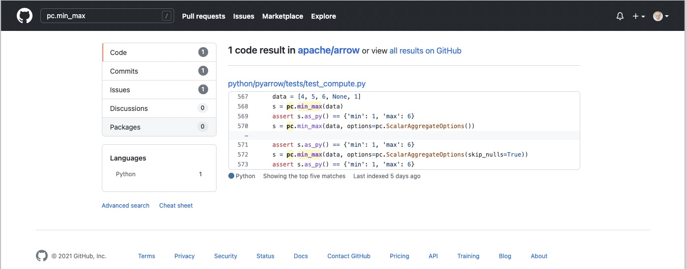](assets/images/python-tutorial-github-search_66a0928fd285b248.jpeg)
>
> We could try to search for the function reference in a
> GitHub Apache Arrow repository.
>
> [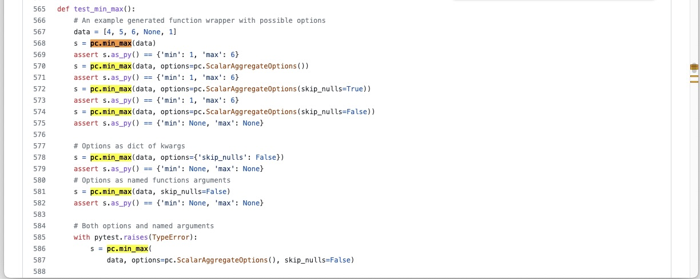](assets/images/python-tutorial-github-find-in-file_9115568069cec0fe.jpeg)
>
> And search through the `test_compute.py` file in `pyarrow`
> folder.
>
> From the search we can see that the function is tested in the
> `python/pyarrow/tests/test_compute.py` file that would mean the
> function is defined in the `compute.py` file.
>
> After examining the `compute.py` file we can see that together
> with `_compute.pyx` the functions from C++ get wrapped into Python.
> We will define the new feature at the end of the `compute.py` file.
>
> Lets run some code in the Python console from `arrow/python`
> directory in order to learn more about `pc.min_max`.
>
> ```
> $ cd python
> $ python
>
> Python 3.9.7 (default, Oct 22 2021, 13:24:00)
> [Clang 13.0.0 (clang-1300.0.29.3)] on darwin
> Type "help", "copyright", "credits" or "license" for more information.
> ```
>
> We have entered into the Python console from the shell and we can
> do some research:
>
> ```
>
> >>>
> import
>
> pyarrow.compute
>
> as
>
> pc
> >>>
> data
> =
> [
> 4
> ,
> 5
> ,
> 6
> ,
> None
> ,
> 1
> ]
> >>>
> data
> [4, 5, 6, None, 1]
> >>>
> pc
> .
> min_max
> (
> data
> )
> <pyarrow.StructScalar: [('min', 1), ('max', 6)]>
> >>>
> pc
> .
> min_max
> (
> data
> ,
> skip_nulls
> =
> False
> )
> <pyarrow.StructScalar: [('min', None), ('max', None)]>
> ```
>
> We will call our new feature `pc.tutorial_min_max`. We want the
> result from our function, that takes the same input data, to be
> `[('min-', 0), ('max+', 7)]`. If we specify that the null value should be
> included, the result should be equal to `pc.min_max` that is
> `[('min', None), ('max', None)]`.
>
> Lets add the first trial code into `arrow/python/pyarrow/compute.py`
> where we first test the call to the “min\_max” function from C++:
>
> ```
>
> def
>
> tutorial_min_max
> (
> values
> ,
> skip_nulls
> =
> True
> ):
>
> """
>     Add docstrings
>     Parameters
>     ----------
>     values : Array
>     Returns
>     -------
>     result : TODO
>     Examples
>     --------
>     >>> import pyarrow.compute as pc
>     >>> data = [4, 5, 6, None, 1]
>     >>> pc.tutorial_min_max(data)
>     <pyarrow.StructScalar: [('min-', 0), ('max+', 7)]>
>     """
> options
> =
> ScalarAggregateOptions
> (
> skip_nulls
> =
> skip_nulls
> )
> return
> call_function
> (
> "min_max"
> ,
> [
> values
> ],
> options
> )
> ```
>
> To see if this works we will need to import `pyarrow.compute`
> again and try:
>
> ```
>
> >>>
> import
>
> pyarrow.compute
>
> as
>
> pc
> >>>
> data
> =
> [
> 4
> ,
> 5
> ,
> 6
> ,
> None
> ,
> 1
> ]
> >>>
> pc
> .
> tutorial_min_max
> (
> data
> )
> <pyarrow.StructScalar: [('min', 1), ('max', 6)]>
> ```
>
> It’s working. Now we must correct the limits to get the corrected
> interval. To do that we have to do some research on `pyarrow.StructScalar`.
> In [test\_scalars.py](https://github.com/apache/arrow/blob/994074d2e7ff073301e0959dbc5bb595a1e2a41b/python/pyarrow/tests/test_scalars.py#L547-L553)
> under the `test_struct_duplicate_fields` we can see an example
> of how the `StructScalar` is created. We could again run the
> Python console and try creating one ourselves.
>
> ```
>
> >>>
> import
>
> pyarrow
>
> as
>
> pa
> >>>
> ty
> =
> pa
> .
> struct
> ([
> ...
> pa
> .
> field
> (
> 'min-'
> ,
> pa
> .
> int64
> ()),
> ...
> pa
> .
> field
> (
> 'max+'
> ,
> pa
> .
> int64
> ()),
> ...
> ])
> >>>
> pa
> .
> scalar
> ([(
> 'min-'
> ,
> 3
> ),
> (
> 'max+'
> ,
> 9
> )],
> type
> =
> ty
> )
> <pyarrow.StructScalar: [('min-', 3), ('max+', 9)]>
> ```
>
> > [!NOTE]
> > **In cases where we don’t yet have good documentation, unit tests can be a good place to look for code examples.**
> >
>
> With the new gained knowledge about `StructScalar` and additional
> options for the `pc.min_max` function we can finish the work.
>
> ```
>
> def
>
> tutorial_min_max
> (
> values
> ,
> skip_nulls
> =
> True
> ):
>
> """
>    Compute the minimum-1 and maximum+1 values of a numeric array.
>    This is a made-up feature for the tutorial purposes.
>    Parameters
>    ----------
>    values : Array
>    skip_nulls : bool, default True
>        If True, ignore nulls in the input.
>    Returns
>    -------
>    result : StructScalar of min-1 and max+1
>    Examples
>    --------
>    >>> import pyarrow.compute as pc
>    >>> data = [4, 5, 6, None, 1]
>    >>> pc.tutorial_min_max(data)
>    <pyarrow.StructScalar: [('min-', 0), ('max+', 7)]>
>    """
> options
> =
> ScalarAggregateOptions
> (
> skip_nulls
> =
> skip_nulls
> )
> min_max
> =
> call_function
> (
> "min_max"
> ,
> [
> values
> ],
> options
> )
> if
> min_max
> [
> 0
> ]
> .
> as_py
> ()
> is
> not
> None
> :
> min_t
> =
> min_max
> [
> 0
> ]
> .
> as_py
> ()
> -
> 1
> max_t
> =
> min_max
> [
> 1
> ]
> .
> as_py
> ()
> +
> 1
> else
> :
> min_t
> =
> min_max
> [
> 0
> ]
> .
> as_py
> ()
> max_t
> =
> min_max
> [
> 1
> ]
> .
> as_py
> ()
> ty
> =
> pa
> .
> struct
> ([
> pa
> .
> field
> (
> 'min-'
> ,
> pa
> .
> int64
> ()),
> pa
> .
> field
> (
> 'max+'
> ,
> pa
> .
> int64
> ()),
> ])
> return
> pa
> .
> scalar
> ([(
> 'min-'
> ,
> min_t
> ),
> (
> 'max+'
> ,
> max_t
> )],
> type
> =
> ty
> )
> ```

## Adding a test

Now we should add a unit test to `python/pyarrow/tests/test_compute.py`
and run the pytest.

```

def
 
test_tutorial_min_max
():
arr
=
[
4
,
5
,
6
,
None
,
1
]
l1
=
{
'min-'
:
0
,
'max+'
:
7
}
l2
=
{
'min-'
:
None
,
'max+'
:
None
}
assert
pc
.
tutorial_min_max
(
arr
)
.
as_py
()
==
l1
assert
pc
.
tutorial_min_max
(
arr
,
skip_nulls
=
False
)
.
as_py
()
==
l2
```

With the unit test added we can run the pytest from the shell. To run
a specific unit test, pass in the test name to the `-k` parameter.

```
$ cd python
$ python -m pytest pyarrow/tests/test_compute.py -k test_tutorial_min_max======================== test session starts ==========================platform darwin -- Python 3.9.7, pytest-6.2.5, py-1.10.0, pluggy-1.0.0 rootdir: /Users/alenkafrim/repos/arrow/python, configfile: setup.cfg plugins: hypothesis-6.24.1, lazy-fixture-0.6.3 collected 204 items / 203 deselected / 1 selected

pyarrow/tests/test_compute.py .                                  [100%]

======================== 1 passed, 203 deselected in 0.16s ============


$ python -m pytest pyarrow/tests/test_compute.py======================== test session starts ===========================platform darwin -- Python 3.9.7, pytest-6.2.5, py-1.10.0, pluggy-1.0.0 rootdir: /Users/alenkafrim/repos/arrow/python, configfile: setup.cfg plugins: hypothesis-6.24.1, lazy-fixture-0.6.3 collected 204 items

pyarrow/tests/test_compute.py ................................... [ 46%]
.................................................                 [100%]

========================= 204 passed in 0.49s ==========================
```

> [!NOTE]
> **See also**
> For more information about testing see [Testing 🧪](#developers-guide-step_by_step-testing--testing) section.

## Check styling

At the end we also need to check the styling. In Arrow we use a
utility called [pre-commit](https://pre-commit.com/) to check if
code is in line with PEP 8 style guide.

```
$ pre-commit run --show-diff-on-failure --color=always --all-files python
```

Done. Now lets make the Pull Request!

## Creating a Pull Request

First let’s review our changes in the shell using
`git status` to see which files have been changed and to
commit only the ones we are working on.

```
$ git status On branch ARROW-14977 Changes not staged for commit:(use "git add <file>..." to update what will be committed) (use "git restore <file>..." to discard changes in working directory) modified: python/pyarrow/compute.py modified: python/pyarrow/tests/test_compute.py

no changes added to commit (use "git add" and/or "git commit -a")
```

And `git diff` to see the changes in the files
in order to spot any error we might have made.

```
$ git diff diff --git a/python/pyarrow/compute.py b/python/pyarrow/compute.py index 9dac606c3..e8fc775d8 100644 --- a/python/pyarrow/compute.py +++ b/python/pyarrow/compute.py @@ -774,3 +774,45 @@ def bottom_k_unstable(values, k, sort_keys=None, *, memory_pool=None):
         sort_keys = map(lambda key_name: (key_name, "ascending"), sort_keys)
     options = SelectKOptions(k, sort_keys)
     return call_function("select_k_unstable", [values], options, memory_pool)
+
+
+def tutorial_min_max(values, skip_nulls=True):
+    """
+    Compute the minimum-1 and maximum-1 values of a numeric array.
+
+    This is a made-up feature for the tutorial purposes.
+
+    Parameters
+    ----------
+    values : Array
+    skip_nulls : bool, default True
+        If True, ignore nulls in the input.
+
+    Returns
+    -------
+    result : StructScalar of min-1 and max+1
+
+    Examples
+    --------
+    >>> import pyarrow.compute as pc
+    >>> data = [4, 5, 6, None, 1]
+    >>> pc.tutorial_min_max(data)
+    <pyarrow.StructScalar: [('min-', 0), ('max+', 7)]>
+    """
+
+    options = ScalarAggregateOptions(skip_nulls=skip_nulls)
+    min_max = call_function("min_max", [values], options)
+
...
```

Everything looks OK. Now we can make the commit (save our changes
to the branch history):

```
$ git commit -am "Adding a new compute feature for tutorial purposes" [ARROW-14977 170ef85be] Adding a new compute feature for tutorial purposes 2 files changed, 51 insertions(+)
```

We can use `git log` to check the history of commits:

```
$ git log commit 170ef85beb8ee629be651e3f93bcc4a69e29cfb8 (HEAD -> ARROW-14977) Author: Alenka Frim <frim.alenka@gmail.com> Date: Tue Dec 7 13:45:06 2021 +0100

    Adding a new compute feature for tutorial purposes

commit 8cebc4948ab5c5792c20a3f463e2043e01c49828 (main)
Author: Sutou Kouhei <kou@clear-code.com>
Date:   Sun Dec 5 15:19:46 2021 +0900

    ARROW-14981: [CI][Docs] Upload built documents

    We can use this in release process instead of building on release
    manager's local environment.

    Closes #11856 from kou/ci-docs-upload

    Authored-by: Sutou Kouhei <kou@clear-code.com>
    Signed-off-by: Sutou Kouhei <kou@clear-code.com>
...
```

If we would started the branch some time ago, we may need to rebase to
upstream main to make sure there are no merge conflicts:

```
$ git pull upstream main --rebase
```

And now we can push our work to the forked Arrow repository on GitHub
called `origin`.

```
$ git push origin ARROW-14977 Enumerating objects: 13, done. Counting objects: 100% (13/13), done. Delta compression using up to 8 threads Compressing objects: 100% (7/7), done. Writing objects: 100% (7/7), 1.19 KiB | 1.19 MiB/s, done. Total 7 (delta 6), reused 0 (delta 0), pack-reused 0 remote: Resolving deltas: 100% (6/6), completed with 6 local objects. remote:remote: Create a pull request for 'ARROW-14977' on GitHub by visiting:remote: https://github.com/AlenkaF/arrow/pull/new/ARROW-14977 remote:To https://github.com/AlenkaF/arrow.git * [new branch] ARROW-14977 -> ARROW-14977
```

Now we have to go to the [Arrow repository on GitHub](https://github.com/apache/arrow)
to create a Pull Request. On the GitHub Arrow
page (main or forked) we will see a yellow notice
bar with a note that we made recent pushes to the branch
ARROW-14977. That’s great, now we can make the Pull Request
by clicking on **Compare & pull request**.

[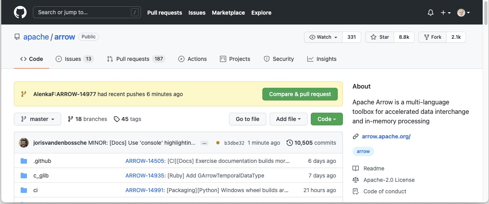](assets/images/python-tutorial-github-pr-notice_616dc97fbdfbe28e.jpeg)

Notice bar on the Apache Arrow repository.

First we need to change the Title to *ARROW-14977: [Python] Add a “made-up”
feature for the guide tutorial* in order to match it
with the issue. Note a punctuation mark was added!

*Extra note: when this tutorial was created, we had been using the Jira issue
tracker. As we are currently using GitHub issues, the title would be prefixed
with GH-14977: [Python] Add a “made-up” feature for the guide tutorial*.

We will also add a description to make it clear to others what we are
trying to do.

Once I click **Create pull request** my code can be reviewed as a
Pull Request in the Apache Arrow repository.

[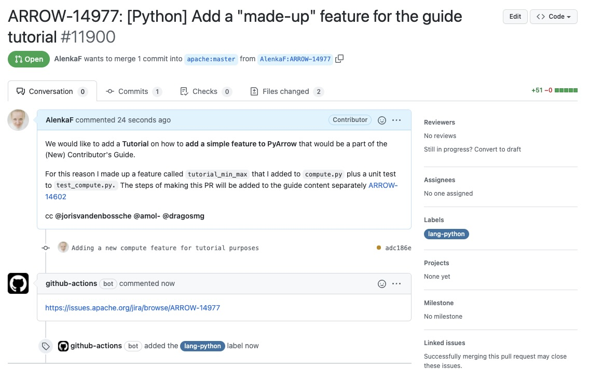](assets/images/python-tutorial-pr_8384aa762bf09640.jpeg)

Here it is, our Pull Request!

The Pull Request gets connected to the issue and the CI is
running. After some time passes and we get a review we can correct
the code, comment, resolve conversations and so on. The Pull Request
we made can be viewed [here](https://github.com/apache/arrow/pull/11900).

> [!NOTE]
> **See also**
> For more information about Pull Request workflow see [Lifecycle of a pull request](#developers-guide-step_by_step-pr_lifecycle--pr-lifecycle).

---

<a id="developers-guide-tutorials-r_tutorial"></a>

<!-- source_url: https://arrow.apache.org/docs/developers/guide/tutorials/r_tutorial.html -->

<!-- page_index: 16 -->

# R tutorials #

[Skip to main content](#developers-guide-tutorials-r_tutorial--main-content)

Back to top

# R tutorials

## R tutorial on adding a lubridate binding

In this tutorial, we will document the contribution of a binding
to Arrow R package following the steps specified by the
[Quick Reference](#developers-guide--quick-ref-guide) section of the guide and a more detailed
[Steps in making your first PR](#developers-guide-step_by_step--step-by-step) section. Navigate there whenever there is
some information you may find is missing here.

The binding will be added to the `expression.R` file in the
R package. But you can also follow these steps in case you are
adding a binding that will live somewhere else.

This tutorial is different from the [Steps in making your first PR](#developers-guide-step_by_step--step-by-step) as we
will be working on a specific case. This tutorial is not meant
as a step-by-step guide.

**Let’s start!**

### Set up

Let’s set up the Arrow repository. We presume here that Git is
already installed. Otherwise please see the [Set up](#developers-guide-step_by_step-set_up--set-up) section.

Once the [Apache Arrow repository](https://github.com/apache/arrow)
is forked (see [Fork the repository](#developers-guide-step_by_step-set_up--fork-repo-guide)) we will clone it and add the
link of the main repository to our upstream.

```
$ git clone https://github.com/<your username>/arrow.git
$ cd arrow
$ git remote add upstream https://github.com/apache/arrow
```

### Building R package

The steps to follow for building the R package differs depending on the operating
system you are using. For this reason we will only refer to
the instructions for the building process in this tutorial.

> [!NOTE]
> **See also**
> For the **introduction** to the building process refer to the
> [Building the Arrow libraries 🏋🏿♀️](#developers-guide-step_by_step-building--build-arrow-guide) section.
>
> For the **instructions** on how to build the R package refer to the
> [R developer docs](https://arrow.apache.org/docs/r/articles/developing.html).

> [!NOTE]
> ### The issue
>
> In this tutorial we will be tackling an issue for implementing
> a simple binding for `mday()` function that will match that of the
> existing R function from `lubridate`.
>
> > [!NOTE]
> > **If you do not have an issue and you need help finding one please refer to the Finding good first issues 🔎 part of the guide.**
> >
>
> Once you have an issue picked out and assigned to yourself, you can
> proceed to the next step.

### Start the work on a new branch

Before we start working on adding the binding we should
create a new branch from the updated main.

```
$ git checkout main
$ git fetch upstream
$ git pull --ff-only upstream main
$ git checkout -b ARROW-14816
```

Now we can start with researching the R function and the C++ Arrow
compute function we want to expose or connect to.

**Examine the lubridate mday() function**

Going through the [lubridate documentation](https://lubridate.tidyverse.org/reference/day.html)
we can see that `mday()` takes a date object
and returns the day of the month as a numeric object.

We can run some examples in the R console to help us understand
the function better:

```

>
 
library
(
lubridate
)
>
 
mday
(
as.Date
(
"2000-12-31"
))
[
1
]
 
31
>
 
mday
(
ymd
(
080306
))
[
1
]
 
6
```

**Examine the Arrow C++ day() function**

From the [compute function documentation](https://arrow.apache.org/docs/cpp/compute.html#containment-tests)
we can see that `day` is a unary function, which means that it takes
a single data input. The data input must be a `Temporal class` and
the returned value is an `Integer/numeric` type.

The `Temporal class` is specified as: Date types (Date32, Date64), Time types (Time32, Time64), Timestamp, Duration, Interval.

We can call an Arrow C++ function from an R console using `call_function`
to see how it works:

```

>
 
call_function
(
"day"
,
 
Scalar
$ create (lubridate::ymd ("2000-12-31"))) Scalar 31
```

We can see that lubridate and Arrow functions operate on and return
equivalent data types. lubridate’s `mday()` function has no additional
arguments and there are also no option classes associated with Arrow C++
function `day()`.

Looking at the code in `expressions.R` we can see the day function
is already specified/mapped on the R package side:
<https://github.com/apache/arrow/blob/658bec37aa5cbdd53b5e4cdc81b8ba3962e67f11/r/R/expression.R#L63-L64>

We only need to add `mday()` to the list of expressions connecting
it to the C++ `day` function.

```

# second is defined in dplyr-functions.R
# wday is defined in dplyr-functions.R "mday"
 
=
 
"day"
,
"yday"
 
=
 
"day_of_year"
,
"year"
 
=
 
"year"
,
```

### Adding a test

Now we need to add a test that checks if everything works well.
If there are additional options or edge cases, we would have to
add more. Looking at tests for similar functions (for example
`yday()` or `day())` we can see that a good place to add two
tests we have is in `test-dplyr-funcs-datetime.R`:

```

test_that
(
"extract mday from timestamp"
,
 
{
  
compare_dplyr_binding
(
    
.input
 
%>%
      
mutate
(
x
 
=
 
mday
(
datetime
))
 
%>%
      
collect
(),
    
test_df
  
)
})
```

And

```

test_that
(
"extract mday from date"
,
 
{
  
compare_dplyr_binding
(
    
.input
 
%>%
      
mutate
(
x
 
=
 
mday
(
date
))
 
%>%
      
collect
(),
    
test_df
  
)
})
```

Now we need to see if the tests are passing or we need to do some
more research and code corrections.

```
devtools::test(filter="datetime")

> devtools::test(filter="datetime") ℹ Loading arrow See arrow_info() for available features ℹ Testing arrow See arrow_info() for available features ✔ | F W S OK | Context ✖ | 1 230 | dplyr-funcs-datetime [1.4s] ──────────────────────────────────────────────────────────────────────────────────────────────────────────────────────────────────────── Failure (test-dplyr-funcs-datetime.R:187:3): strftime ``%>%`(...)` did not throw the expected error. Backtrace:1. testthat::expect_error(...) test-dplyr-funcs-datetime.R:187:2 2. testthat:::expect_condition_matching(...) ────────────────────────────────────────────────────────────────────────────────────────────────────────────────────────────────────────

══ Results ═════════════════════════════════════════════════════════════════════════════════════════════════════════════════════════════
Duration: 1.4 s

[ FAIL 1 | WARN 0 | SKIP 0 | PASS 230 ]
```

There is a failure we get for the `strftime` function but looking
at the code we see is not connected to our work. We can move on and
maybe ask others if they are getting similar fail when running the tests.
It could be we only need to rebuild the library.

### Check styling

We should also run linters to check that the styling of the code
follows the [tidyverse style](https://style.tidyverse.org/). To
do that we run the following command in the shell:

```
$ make style R -s -e 'setwd(".."); if (requireNamespace("styler")) styler::style_file(setdiff(system("git diff --name-only | grep r/.*R$", intern = TRUE), file.path("r", source("r/.styler_excludes.R")$value)))' Loading required namespace: styler Styling 2 files:r/R/expression.R ✔ r/tests/testthat/test-dplyr-funcs-datetime.R ℹ ──────────────────────────────────────────── Status Count Legend ✔ 1 File unchanged. ℹ 1 File changed. ✖ 0 Styling threw an error. ──────────────────────────────────────────── Please review the changes carefully!
```

### Creating a Pull Request

First let’s review our changes in the shell using `git status` to see
which files have been changed and to commit only the ones we are working on.

```
$ git status On branch ARROW-14816 Changes not staged for commit:(use "git add <file>..." to update what will be committed) (use "git restore <file>..." to discard changes in working directory) modified: R/expression.R modified: tests/testthat/test-dplyr-funcs-datetime.R
```

And `git diff` to see the changes in the files in order to spot any error we might have made.

```
$ git diff diff --git a/r/R/expression.R b/r/R/expression.R index 37fc21c25..0e71803ec 100644 --- a/r/R/expression.R +++ b/r/R/expression.R @@ -70,6 +70,7 @@ "quarter" = "quarter",
   # second is defined in dplyr-functions.R
# wday is defined in dplyr-functions.R + "mday" = "day","yday" = "day_of_year","year" = "year",

diff --git a/r/tests/testthat/test-dplyr-funcs-datetime.R b/r/tests/testthat/test-dplyr-funcs-datetime.R
index 359a5403a..228eca56a 100644
--- a/r/tests/testthat/test-dplyr-funcs-datetime.R
+++ b/r/tests/testthat/test-dplyr-funcs-datetime.R
@@ -444,6 +444,15 @@ test_that("extract wday from timestamp", {
   )
 })

+test_that("extract mday from timestamp", {
+  compare_dplyr_binding(
+    .input %>%
+      mutate(x = mday(datetime)) %>%
+      collect(),
+    test_df
+  )
+})
+
 test_that("extract yday from timestamp", {
   compare_dplyr_binding(
     .input %>%
@@ -626,6 +635,15 @@ test_that("extract wday from date", {
   )
 })

+test_that("extract mday from date", {
+  compare_dplyr_binding(
+    .input %>%
+      mutate(x = mday(date)) %>%
+      collect(),
+    test_df
+  )
+})
+
 test_that("extract yday from date", {
   compare_dplyr_binding(
     .input %>%
```

Everything looks OK. Now we can make the commit
(save our changes to the branch history):

```
$ git commit -am "Adding a binding and a test for mday() lubridate" [ARROW-14816 ed37d3a3b] Adding a binding and a test for mday() lubridate 2 files changed, 19 insertions(+)
```

We can use `git log` to check the history of commits:

```
$ git log commit ed37d3a3b3eef76b696532f10562fea85f809fab (HEAD -> ARROW-14816) Author: Alenka Frim <frim.alenka@gmail.com> Date: Fri Jan 21 09:15:31 2022 +0100

    Adding a binding and a test for mday() lubridate

commit c5358787ee8f7b80f067292f49e5f032854041b9 (upstream/main, upstream/HEAD, main, ARROW-15346, ARROW-10643)
Author: Krisztián Szűcs <szucs.krisztian@gmail.com>
Date:   Thu Jan 20 09:45:59 2022 +0900

    ARROW-15372: [C++][Gandiva] Gandiva now depends on boost/crc.hpp which is missing from the trimmed boost archive

    See build error https://github.com/ursacomputing/crossbow/runs/4871392838?check_suite_focus=true#step:5:11762

    Closes #12190 from kszucs/ARROW-15372

    Authored-by: Krisztián Szűcs <szucs.krisztian@gmail.com>
    Signed-off-by: Sutou Kouhei <kou@clear-code.com>
```

If we started the branch some time ago, we may need to rebase
to upstream main to make sure there are no merge conflicts:

```
$ git pull upstream main --rebase
```

And now we can push our work to the forked Arrow repository
on GitHub called origin.

```
$ git push origin ARROW-14816 Enumerating objects: 233, done. Counting objects: 100% (233/233), done. Delta compression using up to 8 threads Compressing objects: 100% (130/130), done. Writing objects: 100% (151/151), 35.78 KiB | 8.95 MiB/s, done. Total 151 (delta 129), reused 33 (delta 20), pack-reused 0 remote: Resolving deltas: 100% (129/129), completed with 80 local objects. remote:remote: Create a pull request for 'ARROW-14816' on GitHub by visiting:remote: https://github.com/AlenkaF/arrow/pull/new/ARROW-14816 remote:To https://github.com/AlenkaF/arrow.git * [new branch] ARROW-14816 -> ARROW-14816
```

Now we have to go to the [Arrow repository on GitHub](https://github.com/apache/arrow)
to create a Pull Request. On the GitHub Arrow
page (main or forked) we will see a yellow notice
bar with a note that we made recent pushes to the branch
ARROW-14816. That’s great, now we can make the Pull Request
by clicking on **Compare & pull request**.

[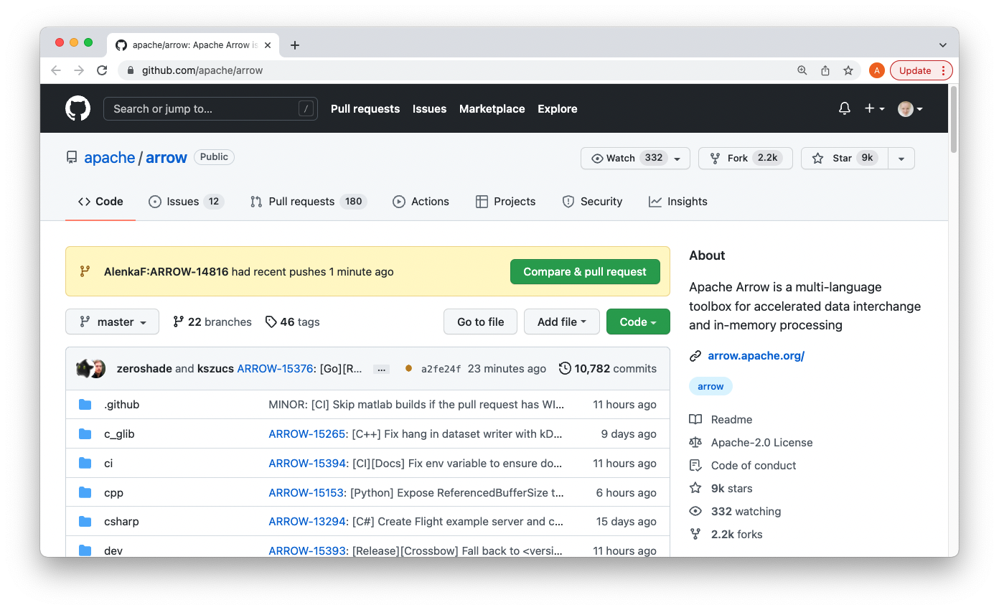](assets/images/r-tutorial-create-pr-notice_10e731ab6e2b0c37.jpeg)

Notice bar on the Apache Arrow repository.

First we need to change the Title to **ARROW-14816: [R] Implement
bindings for lubridate::mday()** in order to match it with the
issue. Note a punctuation mark was added!

*Extra note: when this tutorial was created, we had been using the Jira issue
tracker. As we are currently using GitHub issues, the title would be prefixed
with GH-14816: [R] Implement bindings for lubridate::mday()*.

We will also add a description to make it clear to others what we are trying to do.

[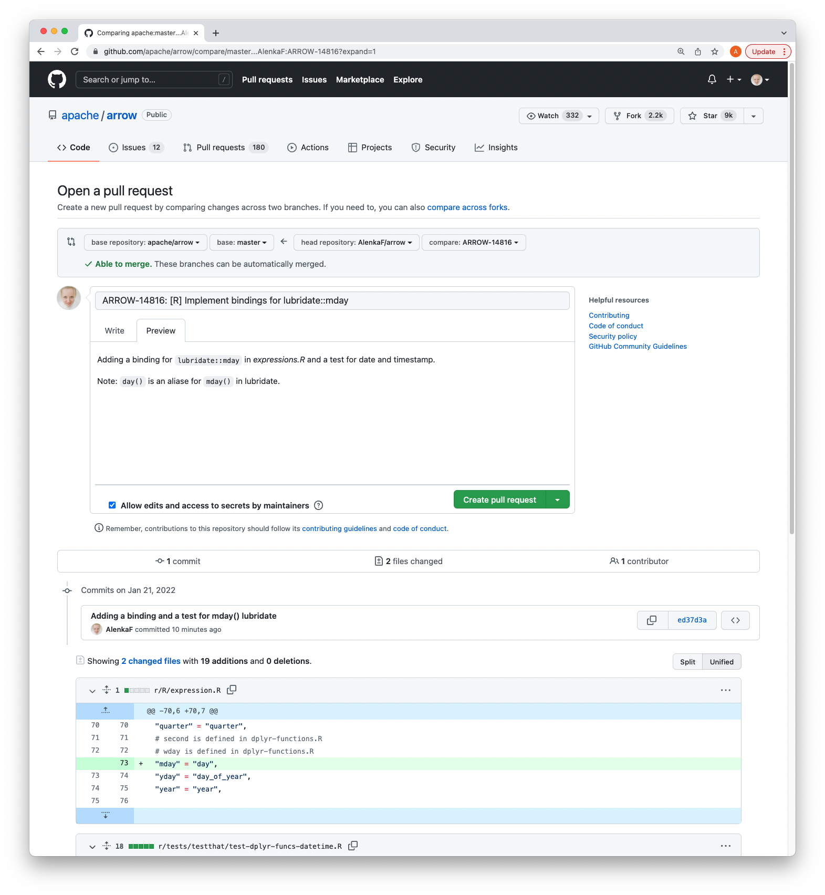](assets/images/r-tutorial-pr-descr_4ae7b939872f56bf.jpeg)

Editing the title and the description of our Pull Request.

Once we click **Create pull request** our code can be reviewed as
a Pull Request in the Apache Arrow repository.

[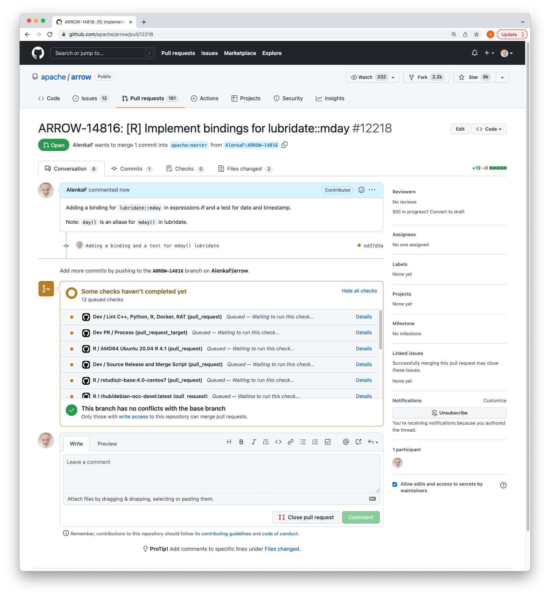](assets/images/r-tutorial-pr_71981c1dc9b2a3d1.jpeg)

Here it is, our Pull Request!

The pull request gets connected to the issue and the CI is running.
After some time passes and we get a review we can correct the code, comment, resolve conversations and so on.

> [!NOTE]
> **See also**
> For more information about Pull Request workflow see [Lifecycle of a pull request](#developers-guide-step_by_step-pr_lifecycle--pr-lifecycle).

The Pull Request we made can be viewed [here](https://github.com/apache/arrow/pull/12218).

---

<a id="developers-guide-resources"></a>

<!-- source_url: https://arrow.apache.org/docs/developers/guide/resources.html -->

<!-- page_index: 17 -->

# Additional information and resources #

[Skip to main content](#developers-guide-resources--main-content)

Back to top

# Additional information and resources

On this page we have listed resources that may be relevant or useful for
contributors who want to learn more about different parts of Apache Arrow.

## Glossary

List of common terms in Apache Arrow project with a short description can
be found in [the glossary](#format-glossary).

## Additional information

- GitHub Actions

  GitHub Actions is a continuous integration and continuous delivery (CI/CD) platform.
  Apache Arrow has a set of workflows that run via GitHub Actions to build and test
  every pull request that is opened, merged, etc.

  - [Apache Arrow Actions on GitHub](https://github.com/apache/arrow/actions)
  - [Location of the workflows in Arrow: arrow/.github/workflows/](https://github.com/apache/arrow/tree/main/.github/workflows)
  - [GitHub Documentation on GitHub Actions](https://docs.github.com/en/actions)
- Nightly builds

  It is possible to install the Arrow R package from the nightly builds which are daily development
  builds of the R package and are not the official releases. See more on the
  [Install R package article](https://arrow.apache.org/docs/dev/r/articles/install.html#install-the-nightly-build).
- [Apache Arrow releases](https://arrow.apache.org/release/)

## Other resources

GitHub

- [GitHub docs: Fork a repo](https://docs.github.com/en/get-started/quickstart/fork-a-repo)
- [GitHub: Creating a pull request from a fork](https://docs.github.com/en/pull-requests/collaborating-with-pull-requests/proposing-changes-to-your-work-with-pull-requests/creating-a-pull-request-from-a-fork)

Contributing

Reproducible examples:

- [Tidyverse: Make a reprex](https://www.tidyverse.org/help/#reprex)
- [Craft Minimal Bug Reports by Matthew Rocklin](https://matthewrocklin.com/blog/work/2018/02/28/minimal-bug-reports)

## Recommended references

- Slatkin, Brett, *Effective Python: 90 Specific Ways to Write Better Python*, Addison-Wesley Professional, 2019
- Stroustrup, Bjarne, *A Tour of C++ (Second edition)*, Addison-Wesley, 2018
- Wickham, Hadley, [R Packages: Organize, Test, Document, and Share Your Code](https://r-pkgs.org/)
- Wickham, Hadley, [Advanced R](https://adv-r.hadley.nz/)

---

<a id="developers-overview"></a>

<!-- source_url: https://arrow.apache.org/docs/developers/overview.html -->

<!-- page_index: 18 -->

# Contributing Overview #

[Skip to main content](#developers-overview--main-content)

Back to top

# Contributing Overview

## Local git conventions

If you are tracking the Arrow source repository locally, here is a
checklist for using `git`:

- Work off of your **personal fork** of `apache/arrow` and submit pull requests
  “upstream”.
- Keep your fork’s **main branch synced** with `upstream/main`.
- **Develop on branches**, rather than your own “main” branch.
- It does not matter what you call your branch. Some people like to use the GitHub
  issue number as branch name, others use descriptive names.
- **Sync your branch** with `upstream/main` **regularly**, as many commits are
  merged to main every day.
- It is recommended to use `git rebase` rather than `git merge`.
- In case there are conflicts, and your local commit history has multiple commits,
  you may simplify the conflict resolution process by **squashing your local commits
  into a single commit**. Preserving the commit history isn’t as important because
  when your feature branch is merged upstream, a squash happens automatically.


<details class="sd-sphinx-override sd-dropdown sd-card sd-mb-3 sd-shadow-none sd-fade-in-slide-down">
<summary>
<span>How to squash local commits?</span><span></span></summary><div>
<p>Abort the rebase with:</p>
<div><div><pre><span></span><span>$ </span>git<span> </span>rebase<span> </span>--abort
</pre></div>
</div>
<p>Following which, the local commits can be squashed interactively by running:</p>
<div><div><pre><span></span><span>$ </span>git<span> </span>rebase<span> </span>--interactive<span> </span>ORIG_HEAD~n
</pre></div>
</div>
<p>Where <code><span>n</span></code> is the number of commits you have in your local branch.  After the squash, you can try the merge again, and this time conflict resolution should be relatively
straightforward.</p>
<p>Once you have an updated local copy, you can push to your remote repo.  Note, since your
remote repo still holds the old history, you would need to do a force push.  Most pushes
should use <code><span>--force-with-lease</span></code>:</p>
<div><div><pre><span></span><span>$ </span>git<span> </span>push<span> </span>--force-with-lease<span> </span>origin<span> </span>branch
</pre></div>
</div>
<p>The option <code><span>--force-with-lease</span></code> will fail if the remote has commits that are not available
locally, for example if additional commits have been made by a colleague.  By using
<code><span>--force-with-lease</span></code> instead of <code><span>--force</span></code>, you ensure those commits are not overwritten
and can fetch those changes if desired.</p>
</div>
</details>


<details class="sd-sphinx-override sd-dropdown sd-card sd-mb-3 sd-shadow-none sd-fade-in-slide-down">
<summary>
<span>Setting rebase to be default</span><span></span></summary><div>
<p>If you set the following in your repo’s <code><span>.git/config</span></code>, the <code><span>--rebase</span></code> option can be
omitted from the <code><span>git</span> <span>pull</span></code> command, as it is implied by default.</p>
<div><div><pre><span></span><span>[pull]</span>
<span>      rebase = true</span>
</pre></div>
</div>
</div>
</details>

## Pull request and review

When contributing a patch, use this list as a checklist of Apache Arrow workflow:

- Submit the patch as a **GitHub pull request** against the **main branch**.
- So that your pull request syncs with the GitHub issue, **prefix your pull request
  title with the GitHub issue id** (ex:
  [GH-14866: [C++] Remove internal GroupBy implementation](https://github.com/apache/arrow/pull/14867)).
- Give the pull request a **clear, brief description**: when the pull request is
  merged, this will be retained in the extended commit message.
- Make sure that your code **passes the unit tests**. You can find instructions how
  to run the unit tests for each Arrow component in its respective README file.

Core developers and others with a stake in the part of the project your change
affects will review, request changes, and hopefully indicate their approval
in the end. To make the review process smooth for everyone, try to

- **Break your work into small, single-purpose patches if possible.**

  It’s much harder to merge in a large change with a lot of disjoint features,
  and particularly if you’re new to the project, smaller changes are much easier
  for maintainers to accept.
- **Add new unit tests for your code.**
- **Follow the style guides** for the part(s) of the project you’re modifying.

  Some languages (C++ and Python, for example) run a lint check in
  continuous integration. For all languages, see their respective developer
  documentation and READMEs for style guidance.
- Try to make it look as if the codebase has a single author,
  and emulate any conventions you see, whether or not they are officially
  documented or checked.

When tests are passing and the pull request has been approved by the interested
parties, a [committer](https://arrow.apache.org/committers/)
will merge the pull request. This is done with a
**command-line utility that does a squash merge**.

<details class="sd-sphinx-override sd-dropdown sd-card sd-mb-3 sd-shadow-none sd-fade-in-slide-down">
<summary>
<span>Details on squash merge</span><span></span></summary><div>
<p>A pull request is merged with a squash merge so that all of your commits will be
registered as a single commit to the main branch; this simplifies the
connection between GitHub issues and commits, makes it easier to bisect
history to identify where changes were introduced, and helps us be able to
cherry-pick individual patches onto a maintenance branch.</p>
<p>Your pull request will appear in the GitHub interface to have been “merged”.
In the commit message of that commit, the merge tool adds the pull request
description, a link back to the pull request, and attribution to the contributor
and any co-authors.</p>
</div>
</details>

### AI-generated code

We recognise that AI coding assistants are now a regular part of many
developers’ workflows and can improve productivity. Thoughtful use of these
tools can be beneficial, but AI-generated PRs can sometimes lead to
undesirable additional maintainer burden. PRs that appear to be fully
generated by AI with little to no engagement from the author may be closed
without further review.

Human-generated mistakes tend to be easier to spot and reason about, and
code review is intended to be a collaborative learning experience that
benefits both submitter and reviewer. When a PR appears to have been
generated without much engagement from the submitter, reviewers with access
to AI tools could more efficiently generate the code directly, and since
the submitter is not likely to learn from the review process, their time is
more productively spent researching and reporting on the issue.

We are not opposed to the use of AI tools in generating PRs, but recommend
the following:

- Only submit a PR if you are able to debug and own the changes yourself -
  review all generated code to understand every detail
- Match the style and conventions used in the rest of the codebase, including
  PR titles and descriptions
- Be upfront about AI usage and summarise what was AI-generated
- If there are parts you don’t fully understand, leave comments on your own PR
  explaining what steps you took to verify correctness
- Watch for AI’s tendency to generate overly verbose comments, unnecessary
  test cases, and incorrect fixes
- Break down large PRs into smaller ones to make review easier

PR authors are also responsible for disclosing any copyrighted materials in
submitted contributions. See the [ASF’s guidance on AI-generated code](https://www.apache.org/legal/generative-tooling.html) for further
information on licensing considerations.

## Experimental repositories

Apache Arrow has an explicit policy over developing experimental repositories
in the context of
[rules for revolutionaries](https://grep.codeconsult.ch/2020/04/07/rules-for-revolutionaries-2000-edition/).

The main motivation for this policy is to offer a lightweight mechanism to
conduct experimental work, with the necessary creative freedom, within the ASF
and the Apache Arrow governance model. This policy allows committers to work on
new repositories, as they offer many important tools to manage it (e.g. github
issues, “watch”, “github stars” to measure overall interest).

### Process

- A committer *may* initiate experimental work by creating a separate git
  repository within the Apache Arrow (e.g. via [selfserve](https://selfserve.apache.org/))
  and announcing it on the mailing list, together with its goals, and a link to the
  newly created repository.
- The committer *must* initiate an email thread with the sole purpose of
  presenting updates to the community about the status of the repo.
- There *must not* be official releases from the repository.
- Any decision to make the experimental repo official in any way, whether by merging or migrating, *must* be discussed and voted on in the mailing list.
- The committer is responsible for managing issues, documentation, CI of the repository,
  including licensing checks.
- The committer decides when the repository is archived.

### Repository management

- The repository *must* be under `apache/`
- The repository’s name *must* be prefixed by `arrow-experimental-`
- The committer has full permissions over the repository (within possible in ASF)
- Push / merge permissions *must only* be granted to Apache Arrow committers

### Development process

- The repository must follow the ASF requirements about 3rd party code.
- The committer decides how to manage issues, PRs, etc.

### Divergences

- If any of the “must” above fails to materialize and no correction measure
  is taken by the committer upon request, the PMC *should* take ownership
  and decide what to do.

## Guidance for specific features

From time to time the community has discussions on specific types of features
and improvements that they expect to support. This section outlines decisions
that have been made in this regard.

### Endianness

The Arrow format allows setting endianness. Due to the popularity of
little endian architectures, most of the implementations assume little endian by
default. There has been some effort to support big endian platforms as well.
Based on a [mailing-list discussion](https://mail-archives.apache.org/mod_mbox/arrow-dev/202009.mbox/%3cCAK7Z5T--HHhr9Dy43PYhD6m-XoU4qoGwQVLwZsG-kOxXjPTyZA@mail.gmail.com%3e), the requirements for a new platform are:

1. A robust (non-flaky, returning results in a reasonable time) Continuous
   Integration setup.
2. Benchmarks for performance critical parts of the code to demonstrate
   no regression.

Furthermore, for big-endian support, there are two levels that an
implementation can support:

The decision on what level to support is based on maintainers’ preferences for
complexity and technical risk. In general all implementations should be open
to native endianness support (provided the CI and performance requirements
are met). Cross endianness support is a question for individual maintainers.

The current implementations aiming for cross endian support are:

1. C++

Implementations that do not intend to implement cross endian support:

1. Java

For other libraries, a discussion to gather consensus on the mailing-list
should be had before submitting PRs.

---

<a id="developers-reviewing"></a>

<!-- source_url: https://arrow.apache.org/docs/developers/reviewing.html -->

<!-- page_index: 19 -->

# Reviewing contributions #

[Skip to main content](#developers-reviewing--main-content)

Back to top

# Reviewing contributions

## Principles

Arrow is a foundational project that will need to evolve over many years
or even decades, while serving potentially millions of users. We believe
that being meticulous when reviewing brings greater rewards to the project
than being lenient and aiming for quick merges.

Code reviews like this lead to better quality code, more people who are
engaged with and understand the code being changed, and a generally
healthier project with more room to grow and accommodate emerging needs.

## Guidelines

### Meta

**Use your own judgement**. These guidelines are not hard rules.
Committers are expected to have sufficient expertise on their work
areas to be able to adjust their approach based on any concerns they have.

These guidelines are not listed in a particular order and are not intended
to be used as a checklist.

Finally, these guidelines are not exhaustive.

### Scope and completeness

- Our general policy is to not introduce regressions or merge PRs that require
  follow-ons to function correctly (though exceptions to this can be made).
  Making necessary changes after a merge is more costly both for the
  contributor and the reviewer, but also for other developers who may be
  confused if they hit problems introduced by a merged PR.
- What changes are in-scope for a PR and what changes might/could/should be
  pushed out of scope and have a follow-up issue created should be determined
  in collaboration between the authors and the reviewers.
- When a large piece of functionality is being contributed and it seems
  desirable to integrate it piecewise, favour functional cohesion when
  deciding how to divide changes (for example, if a filesystem implementation
  is being contributed, a first PR may contribute directory metadata
  operations, a second PR file reading facilities and a third PR file writing
  facilities).

### Public API design

### Robustness

- Arrow is a set of open source libraries that will be used in a very wide
  array of contexts (including fiddling with deliberately artificial data
  at a Jupyter interpreter prompt). If you are writing a public API, make
  sure that it won’t crash or produce undefined behaviour on unusual (but
  valid) inputs.
- When a non-trivial algorithm is implemented, defensive coding can
  be useful to catch potential problems (such as debug-only assertions, if
  the language allows them).
- APIs ingesting potentially untrusted data, such as on-disk file formats,
  should try to avoid crashing or produce silent bugs when invalid or
  corrupt data is fed to them. This can require a lot of care that is
  out of the scope of regular code reviews (such as setting up
  [fuzz testing](#developers-cpp-fuzzing--cpp-fuzzing)), but basic checks can still be
  suggested at the code review stage.
- When calling foreign APIs, especially system functions or APIs dealing with
  input / output, do check for errors and propagate them (if the language
  does not propagate errors automatically, such as C++).

### Performance

- Think about performance, but do not obsess over it. Algorithmic complexity
  is important if input size may be “large” (the meaning of large depends
  on the context: use your own expertise to decide!). Micro-optimizations
  improving performance by 20% or more on performance-sensitive functionality
  may be useful as well; lesser micro-optimizations may not be worth the
  time spent on them, especially if they lead to more complicated code.
- If performance is important, measure it. Do not satisfy yourself with
  guesses and intuitions (which may be founded on incorrect assumptions
  about the compiler or the hardware).


> [!NOTE]
> **See also**
> [Benchmarking Arrow](#developers-benchmarks--benchmarks)

- Try to avoid trying to trick the compiler/interpreter/runtime by writing
  the code in a certain way, unless it’s really important. These tricks
  are generally brittle and dependent on platform details that may become
  obsolete, and they can make code harder to maintain (a common question
  that can block contributors is “what should I do about this weird hack
  that my changes would like to remove”?).
- Avoiding rough edges or degenerate behaviour (such as memory blowups when
  a size estimate is inaccurately large) may be more important than trying to
  improve the common case by a small amount.

### Documentation

These guidelines should ideally apply to both prose documentation and
in-code docstrings.

- Look for ambiguous / poorly informative wording. For example, *“it is an
  error if …”* is less informative than either *“An error is raised if … “*
  or *“Behaviour is undefined if …”* (the first phrasing doesn’t tell the
  reader what actually *happens* on such an error).
- When reviewing documentation changes (or prose snippets, in general),
  be mindful about spelling, grammar, expression, and concision. Clear
  communication is essential for effective collaboration with people
  from a wide range of backgrounds, and contributes to better documentation.
- Some contributors do not have English as a native language (and perhaps
  neither do you). It is advised to help them and/or ask for external help
  if needed.
- Cross-linking increases the global value of documentation. Sphinx especially
  has great cross-linking capabilities (including topic references, glossary
  terms, API references), so be sure to make use of them!

### Testing

- When adding an API, all nominal cases should have test cases. Does a function
  allow null values? Then null values should be tested (alongside non-null
  values, of course). Does a function allow different input types? etc.
- If some aspect of a functionality is delicate (either by definition or
  as an implementation detail), it should be tested.
- Corner cases should be exercised, especially in low-level implementation
  languages such as C++. Examples: empty arrays, zero-chunk arrays, arrays
  with only nulls, etc.
- Stress tests can be useful, for example to uncover synchronizations bugs
  if non-trivial parallelization is being added, or to validate a computational
  argument against a slow and straightforward reference implementation.
- A mitigating concern, however, is the overall cost of running the test
  suite. Continuous Integration (CI) runtimes can be painfully long and
  we should be wary of increasing them too much. Sometimes it is
  worthwhile to fine-tune testing parameters to balance the usefulness
  of tests against the cost of running them (especially where stress tests
  are involved, since they tend to imply execution over large datasets).

## Social aspects

- Reviewing is a communication between the contributor and the reviewer.
  Avoid letting questions or comments remain unanswered for too long
  (“too long” is of course very subjective, but two weeks can be a reasonable
  heuristic). If you cannot allocate time soon, do say it explicitly.
  If you don’t have the answer to a question, do say it explicitly.
  Saying *“I don’t have time immediately but I will come back later,
  feel free to ping if I seem to have forgotten”* or *“Sorry, I am out of
  my depth here”* is always better than saying nothing and leaving the
  other person wondering.
- If you know someone who has the competence to help on a blocking issue
  and past experience suggests they may be willing to do so, feel free to
  add them to the discussion (for example by gently pinging their GitHub
  handle).
- If the contributor has stopped giving feedback or updating their PR,
  perhaps they’re not interested anymore, but perhaps also they’re stuck
  on some issue and feel unable to push their contribution any further.
  Don’t hesitate to ask (*“I see this PR hasn’t seen any updates recently,
  are you stuck on something? Do you need any help?”*).
- If the contribution is genuinely desirable and the contributor is not making
  any progress, it is also possible to take it up. Out of politeness,
  it is however better to ask the contributor first.
- Some contributors are looking for a quick fix to a specific problem and
  don’t want to spend too much time on it. Others on the contrary are eager
  to learn and improve their contribution to make it conform to the
  project’s standards. The latter kind of contributors are especially
  valuable as they may become long-term contributors or even committers
  to the project.
- Some contributors may respond *“I will fix it later, can we merge anyway?”*
  when a problem is pointed out to them. Unfortunately, whether the fix will
  really be contributed soon in a later PR is difficult to predict or enforce.
  If the contributor has previously demonstrated that they are reliable,
  it may be acceptable to do as suggested. Otherwise, it is better to
  decline the suggestion.
- If a PR is generally ready for merge apart from trivial or uncontroversial
  concerns, the reviewer may decide to push changes themselves to the
  PR instead of asking the contributor to make the changes.
- Ideally, contributing code should be a rewarding process. Of course,
  it will not always be, but we should strive to reduce contributor
  frustration while keeping the above issues in mind.
- Like any communication, code reviews are governed by the Apache
  [Code of Conduct](https://www.apache.org/foundation/policies/conduct.html).
  This applies to both reviewers and contributors.

## Labelling

While reviewing PRs, we should try to identify whether the corresponding issue
needs to be marked with one or both of the following issue labels:

- **Critical Fix**: The change fixes either: (a) a security vulnerability;
  (b) a bug that causes incorrect or invalid data to be produced;
  or (c) a bug that causes a crash (while the API contract is upheld).
  This is intended to mark fixes to issues that may affect users without their
  knowledge. For this reason, fixing bugs that cause errors don’t count, since
  those bugs are usually obvious. Bugs that cause crashes are considered critical
  because they are a possible vector of Denial-of-Service attacks.
- **Breaking Change**: The change breaks backwards compatibility in a public API.
  For changes in C++, this does not include changes that simply break ABI
  compatibility, except for the few places where we do guarantee ABI
  compatibility (such as C Data Interface). Experimental APIs are *not*
  exempt from this; they are just more likely to be associated with this tag.

Breaking changes and critical fixes are separate: breaking changes alter the
API contract, while critical fixes make the implementation align with the
existing API contract. For example, fixing a bug that caused a Parquet reader
to skip rows containing the number 42 is a critical fix but not a breaking change, since the row skipping wasn’t behavior a reasonable user would rely on.

These labels are used in the release to highlight changes that users ought to be
aware of when they consider upgrading library versions. Breaking changes help
identify reasons when users may wish to wait to upgrade until they have time to
adapt their code, while critical fixes highlight the risk in *not* upgrading.

In addition, we use the following labels to indicate priority:

- **Priority: Blocker**: Indicates the changes **must** be merged before the next
  release can happen. This includes fixes to test or packaging failures that
  would prevent the release from succeeding final packaging or verification.
- **Priority: Critical**: Indicates issues that are high priority. This is a
  superset of issues marked “Critical Fix”, as it also contains certain fixes
  to issues causing errors and crashes.

## Collaborators

The collaborator role allows users to be given triage role to be able to help triaging
issues. The role allows users to label and assign issues.

A user can ask to become a collaborator or can be proposed by another community member
when they have been collaborating in the project for a period of time. Collaborations
can be but are not limited to: creating PRs, answering questions, creating
issues, reviewing PRs, etcetera.

In order to propose someone as a collaborator you must create a PR adding the user to
the collaborators list on [.asf.yaml](https://github.com/apache/arrow/blob/main/.asf.yaml).
Committers can review the past collaborations for the user and approve.

Collaborators that have been inactive for a period of time can be removed from the
list of collaborators.

---

<a id="developers-cpp"></a>

<!-- source_url: https://arrow.apache.org/docs/developers/cpp/index.html -->

<!-- page_index: 20 -->

# C++ Development #

[Skip to main content](#developers-cpp--main-content)

Back to top

# C++ Development

---

<a id="developers-cpp-building"></a>

<!-- source_url: https://arrow.apache.org/docs/developers/cpp/building.html -->

<!-- page_index: 21 -->

# Building Arrow C++ #

[Skip to main content](#developers-cpp-building--main-content)

Back to top

> [!NOTE]
> # Building Arrow C++
>
> ## System setup
>
> Arrow uses CMake as a build configuration system. We recommend building
> out-of-source. If you are not familiar with this terminology:
>
> - **In-source build**: `cmake` is invoked directly from the `cpp`
>   directory. This can be inflexible when you wish to maintain multiple build
>   environments (e.g. one for debug builds and another for release builds)
> - **Out-of-source build**: `cmake` is invoked from another directory,
>   creating an isolated build environment that does not interact with any other
>   build environment. For example, you could create `cpp/build-debug` and
>   invoke `cmake $CMAKE_ARGS ..` from this directory
>
> Building requires:
>
> On Ubuntu/Debian you can install the requirements with:
>
> ```
> sudo apt-get install \
>      build-essential \
>      ninja-build \
>      cmake
> ```
>
> On Alpine Linux:
>
> ```
> apk add autoconf \
>         bash \
>         cmake \
>         g++ \
>         gcc \
>         ninja \
>         make
> ```
>
> On Fedora Linux:
>
> ```
> sudo dnf install \
>      cmake \
>      gcc \
>      gcc-c++ \
>      ninja-build \
>      make
> ```
>
> On Arch Linux:
>
> ```
> sudo pacman -S --needed \
>      base-devel \
>      ninja \
>      cmake
> ```
>
> On macOS, you can use [Homebrew](https://brew.sh/):
>
> ```
> git clone https://github.com/apache/arrow.git
> cd arrow
> brew update && brew bundle --file=cpp/Brewfile
> ```
>
> With [vcpkg](https://github.com/Microsoft/vcpkg):
>
> ```
> git clone https://github.com/apache/arrow.git
> cd arrow
> vcpkg install \
>   --x-manifest-root cpp \
>   --feature-flags=versions \
>   --clean-after-build
> ```
>
> On MSYS2:
>
> ```
> pacman --sync --refresh --noconfirm \
>   ccache \
>   git \
>   mingw-w64-${MSYSTEM_CARCH}-boost \
>   mingw-w64-${MSYSTEM_CARCH}-brotli \
>   mingw-w64-${MSYSTEM_CARCH}-cmake \
>   mingw-w64-${MSYSTEM_CARCH}-gcc \
>   mingw-w64-${MSYSTEM_CARCH}-gflags \
>   mingw-w64-${MSYSTEM_CARCH}-glog \
>   mingw-w64-${MSYSTEM_CARCH}-gtest \
>   mingw-w64-${MSYSTEM_CARCH}-lz4 \
>   mingw-w64-${MSYSTEM_CARCH}-protobuf \
>   mingw-w64-${MSYSTEM_CARCH}-python3-numpy \
>   mingw-w64-${MSYSTEM_CARCH}-rapidjson \
>   mingw-w64-${MSYSTEM_CARCH}-snappy \
>   mingw-w64-${MSYSTEM_CARCH}-thrift \
>   mingw-w64-${MSYSTEM_CARCH}-zlib \
>   mingw-w64-${MSYSTEM_CARCH}-zstd
> ```
>
> ## Building
>
> All the instructions below assume that you have cloned the Arrow git
> repository and navigated to the `cpp` subdirectory:
>
> ```
> $ git clone https://github.com/apache/arrow.git
> $ cd arrow/cpp
> ```
>
> ### CMake presets
>
> Using CMake version 3.21.0 or higher, some presets for various build
> configurations are provided. You can get a list of the available presets
> using `cmake --list-presets`:
>
> ```
> $ cmake --list-presets # from inside the `cpp` subdirectory Available configure presets:
>
>   "ninja-debug-minimal"     - Debug build without anything enabled
>   "ninja-debug-basic"       - Debug build with tests and reduced dependencies
>   "ninja-debug"             - Debug build with tests and more optional components
>    [ etc. ]
> ```
>
> You can inspect the specific options enabled by a given preset using
> `cmake -N --preset <preset name>`:
>
> ```
> $ cmake --preset -N ninja-debug-minimal Preset CMake variables:
>
>   ARROW_BUILD_INTEGRATION="OFF"
>   ARROW_BUILD_STATIC="OFF"
>   ARROW_BUILD_TESTS="OFF"
>   ARROW_EXTRA_ERROR_CONTEXT="ON"
>   ARROW_WITH_RE2="OFF"
>   ARROW_WITH_UTF8PROC="OFF"
>   CMAKE_BUILD_TYPE="Debug"
> ```
>
> You can also create a build from a given preset:
>
> ```
> $ mkdir build   # from inside the `cpp` subdirectory
> $ cd build
> $ cmake .. --preset ninja-debug-minimal Preset CMake variables:
>
>      ARROW_BUILD_INTEGRATION="OFF"
>      ARROW_BUILD_STATIC="OFF"
>      ARROW_BUILD_TESTS="OFF"
>      ARROW_EXTRA_ERROR_CONTEXT="ON"
>      ARROW_WITH_RE2="OFF"
>      ARROW_WITH_UTF8PROC="OFF"
>      CMAKE_BUILD_TYPE="Debug"
>
>    -- Building using CMake version: 3.21.3
>    [ etc. ]
> ```
>
> and then ask to compile the build targets:
>
> ```
> $ cmake --build . [142/142] Creating library symlink debug/libarrow.so.700 debug/libarrow.so
>
> $ tree debug/
> debug/
> ├── libarrow.so -> libarrow.so.700
> ├── libarrow.so.700 -> libarrow.so.700.0.0
> └── libarrow.so.700.0.0
>
> 0 directories, 3 files
>
> $ cmake --install .
> ```
>
> When creating a build, it is possible to pass custom options besides
> the preset-defined ones, for example:
>
> ```
> $ cmake .. --preset ninja-debug-minimal -DCMAKE_INSTALL_PREFIX=/usr/local
> ```
>
> > [!NOTE]
> > The CMake presets are provided as a help to get started with Arrow
> > development and understand common build configurations. They are not
> > guaranteed to be immutable but may change in the future based on
> > feedback.
> >
> > Instead of relying on CMake presets, it is **highly recommended** that
> > automated builds, continuous integration, release scripts, etc. use
> > manual configuration, as outlined below.
>
> > [!NOTE]
> > **See also**
> > [Official documentation for CMake presets](https://cmake.org/cmake/help/v3.21/manual/cmake-presets.7.html).
>
> > [!NOTE]
> > ### Manual configuration
> >
> > The build system uses `CMAKE_BUILD_TYPE=release` by default, so if this
> > argument is omitted then a release build will be produced.
> >
> > > [!NOTE]
> > > **You need to set more options to build on Windows. See Developing on Windows for details.**
> > >
> >
> > Several build types are possible:
> >
> > - `Debug`: doesn’t apply any compiler optimizations and adds debugging
> >   information in the binary.
> > - `RelWithDebInfo`: applies compiler optimizations while adding debug
> >   information in the binary.
> > - `Release`: applies compiler optimizations and removes debug information
> >   from the binary.
> >
> > > [!NOTE]
> > > These build types provide suitable optimization/debug flags by
> > > default but you can change them by specifying
> > > `-DARROW_C_FLAGS_${BUILD_TYPE}=...` and/or
> > > `-DARROW_CXX_FLAGS_${BUILD_TYPE}=...`. `${BUILD_TYPE}` is upper
> > > case of build type. For example, `DEBUG`
> > > (`-DARROW_C_FLAGS_DEBUG=...` / `-DARROW_CXX_FLAGS_DEBUG=...`) for the
> > > `Debug` build type and `RELWITHDEBINFO`
> > > (`-DARROW_C_FLAGS_RELWITHDEBINFO=...` /
> > > `-DARROW_CXX_FLAGS_RELWITHDEBINFO=...`) for the `RelWithDebInfo`
> > > build type.
> > >
> > > For example, you can use `-O3` as an optimization flag for the `Release`
> > > build type by passing `-DARROW_CXX_FLAGS_RELEASE=-O3` .
> > > You can use `-g3` as a debug flag for the `Debug` build type
> > > by passing `-DARROW_CXX_FLAGS_DEBUG=-g3` .
> > >
> > > You can also use the standard `CMAKE_C_FLAGS_${BUILD_TYPE}`
> > > and `CMAKE_CXX_FLAGS_${BUILD_TYPE}` variables but
> > > the `ARROW_C_FLAGS_${BUILD_TYPE}` and
> > > `ARROW_CXX_FLAGS_${BUILD_TYPE}` variables are
> > > recommended. The `CMAKE_C_FLAGS_${BUILD_TYPE}` and
> > > `CMAKE_CXX_FLAGS_${BUILD_TYPE}` variables replace all default
> > > flags provided by CMake, while `ARROW_C_FLAGS_${BUILD_TYPE}` and
> > > `ARROW_CXX_FLAGS_${BUILD_TYPE}` just append the
> > > flags specified, which allows selectively overriding some of the defaults.
> >
> > You can also run default build with flag `-DARROW_EXTRA_ERROR_CONTEXT=ON`, see
> > [Extra debugging help](#developers-cpp-building--cpp-extra-debugging).
> >
> > Minimal release build (1GB of RAM for building or more recommended):
> >
> > ```
> > $ mkdir build-release
> > $ cd build-release
> > $ cmake ..
> > $ make -j8       # if you have 8 CPU cores, otherwise adjust
> > $ make install
> > ```
> >
> > Minimal debug build with unit tests (4GB of RAM for building or more recommended):
> >
> > ```
> > $ git submodule update --init --recursive
> > $ export ARROW_TEST_DATA=$PWD/../testing/data
> > $ mkdir build-debug
> > $ cd build-debug
> > $ cmake -DCMAKE_BUILD_TYPE=Debug -DARROW_BUILD_TESTS=ON ..
> > $ make -j8       # if you have 8 CPU cores, otherwise adjust
> > $ make unittest  # to run the tests
> > $ make install
> > ```
> >
> > The unit tests are not built by default. After building, one can also invoke
> > the unit tests using the `ctest` tool provided by CMake (note that `test`
> > depends on `python` being available).
> >
> > On some Linux distributions, running the test suite might require setting an
> > explicit locale. If you see any locale-related errors, try setting the
> > environment variable (which requires the `locales` package or equivalent):
> >
> > ```
> >
> > $ export
> >
> > LC_ALL
> > =
> > "en_US.UTF-8"
> > ```
> >
> > #### Faster builds with Ninja
> >
> > Many contributors use the [Ninja build system](https://ninja-build.org/) to
> > get faster builds. It especially speeds up incremental builds. To use
> > `ninja`, pass `-GNinja` when calling `cmake` and then use the `ninja`
> > command instead of `make`.
> >
> > #### Unity builds
> >
> > The CMake
> > [unity builds](https://cmake.org/cmake/help/latest/prop_tgt/UNITY_BUILD.html)
> > option can make full builds significantly faster, but it also increases the
> > memory requirements. Consider turning it on (using `-DCMAKE_UNITY_BUILD=ON`)
> > if memory consumption is not an issue.
> >
> > > [!NOTE]
> > > #### Optional Components
> > >
> > > By default, the C++ build system creates a fairly minimal build. We have
> > > several optional system components which you can opt into building by passing
> > > boolean flags to `cmake`.
> > >
> > > - `-DARROW_BUILD_UTILITIES=ON` : Build Arrow commandline utilities
> > > - `-DARROW_COMPUTE=ON`: Build all computational kernel functions
> > > - `-DARROW_CSV=ON`: CSV reader module
> > > - `-DARROW_CUDA=ON`: CUDA integration for GPU development. Depends on NVIDIA
> > >   CUDA toolkit. The CUDA toolchain used to build the library can be customized
> > >   by using the `$CUDA_HOME` environment variable.
> > > - `-DARROW_DATASET=ON`: Dataset API, implies the Filesystem API
> > > - `-DARROW_FILESYSTEM=ON`: Filesystem API for accessing local and remote
> > >   filesystems
> > > - `-DARROW_FLIGHT=ON`: Arrow Flight RPC system, which depends at least on
> > >   gRPC
> > > - `-DARROW_FLIGHT_SQL=ON`: Arrow Flight SQL
> > > - `-DARROW_GANDIVA=ON`: Gandiva expression compiler, depends on LLVM,
> > >   Protocol Buffers, and re2
> > > - `-DARROW_GANDIVA_JAVA=ON`: Gandiva JNI bindings for Java
> > > - `-DARROW_GCS=ON`: Build Arrow with GCS support (requires the GCloud SDK for C++)
> > > - `-DARROW_HDFS=ON`: Arrow integration with libhdfs for accessing the Hadoop
> > >   Filesystem
> > > - `-DARROW_JEMALLOC=ON`: Build the Arrow jemalloc-based allocator, on by default
> > > - `-DARROW_JSON=ON`: JSON reader module
> > > - `-DARROW_MIMALLOC=ON`: Build the Arrow mimalloc-based allocator
> > > - `-DARROW_ORC=ON`: Arrow integration with Apache ORC
> > > - `-DARROW_PARQUET=ON`: Apache Parquet libraries and Arrow integration
> > > - `-DPARQUET_REQUIRE_ENCRYPTION=ON`: Parquet Modular Encryption
> > > - `-DARROW_PYTHON=ON`: This option is deprecated since 10.0.0. This
> > >   will be removed in a future release. Use CMake presets instead. Or
> > >   you can enable `ARROW_COMPUTE`, `ARROW_CSV`, `ARROW_DATASET`,
> > >   `ARROW_FILESYSTEM`, `ARROW_HDFS`, and `ARROW_JSON` directly
> > >   instead.
> > > - `-DARROW_S3=ON`: Support for Amazon S3-compatible filesystems
> > > - `-DARROW_SUBSTRAIT=ON`: Build with support for Substrait
> > > - `-DARROW_WITH_RE2=ON`: Build with support for regular expressions using the re2
> > >   library, on by default and used when `ARROW_COMPUTE` or `ARROW_GANDIVA` is `ON`
> > > - `-DARROW_WITH_UTF8PROC=ON`: Build with support for Unicode properties using
> > >   the utf8proc library, on by default and used when `ARROW_COMPUTE` or `ARROW_GANDIVA`
> > >   is `ON`
> > > - `-DARROW_TENSORFLOW=ON`: Build Arrow with TensorFlow support enabled
> > >
> > > Compression options available in Arrow are:
> > >
> > > - `-DARROW_WITH_BROTLI=ON`: Build support for Brotli compression
> > > - `-DARROW_WITH_BZ2=ON`: Build support for BZ2 compression
> > > - `-DARROW_WITH_LZ4=ON`: Build support for lz4 compression
> > > - `-DARROW_WITH_SNAPPY=ON`: Build support for Snappy compression
> > > - `-DARROW_WITH_ZLIB=ON`: Build support for zlib (gzip) compression
> > > - `-DARROW_WITH_ZSTD=ON`: Build support for ZSTD compression
> > >
> > > Some features of the core Arrow shared library can be switched off for improved
> > > build times if they are not required for your application:
> > >
> > > - `-DARROW_IPC=ON`: build the IPC extensions
> > >
> > > > [!NOTE]
> > > > If your use-case is limited to reading/writing Arrow data then the default
> > > > options should be sufficient. However, if you wish to build any tests/benchmarks
> > > > then `ARROW_JSON` is also required (it will be enabled automatically).
> > > > If extended format support is desired then adding `ARROW_PARQUET`, `ARROW_CSV`, `ARROW_JSON`, or `ARROW_ORC` shouldn’t enable any additional components.
> > >
> > > > [!NOTE]
> > > > In general, it’s a good idea to enable `ARROW_COMPUTE` if you anticipate using
> > > > any compute kernels beyond `cast`. While there are (as of 12.0.0) a handful of
> > > > additional kernels built in by default, this list may change in the future as it’s
> > > > partly based on kernel usage in the current format implementations.
> >
> > #### Optional Targets
> >
> > For development builds, you will often want to enable additional targets in
> > enable to exercise your changes, using the following `cmake` options.
> >
> > - `-DARROW_BUILD_BENCHMARKS=ON`: Build executable benchmarks.
> > - `-DARROW_BUILD_EXAMPLES=ON`: Build examples of using the Arrow C++ API.
> > - `-DARROW_BUILD_INTEGRATION=ON`: Build additional executables that are
> >   used to exercise protocol interoperability between the different Arrow
> >   implementations.
> > - `-DARROW_BUILD_UTILITIES=ON`: Build executable utilities.
> > - `-DARROW_BUILD_TESTS=ON`: Build executable unit tests.
> > - `-DARROW_ENABLE_TIMING_TESTS=ON`: If building unit tests, enable those
> >   unit tests that rely on wall-clock timing (this flag is disabled on CI
> >   because it can make test results flaky).
> > - `-DARROW_FUZZING=ON`: Build fuzz targets and related executables.
> >
> > #### Optional Checks
> >
> > The following special checks are available as well. They instrument the
> > generated code in various ways so as to detect select classes of problems
> > at runtime (for example when executing unit tests).
> >
> > - `-DARROW_USE_ASAN=ON`: Enable Address Sanitizer to check for memory leaks,
> >   buffer overflows or other kinds of memory management issues.
> > - `-DARROW_USE_TSAN=ON`: Enable Thread Sanitizer to check for races in
> >   multi-threaded code.
> > - `-DARROW_USE_UBSAN=ON`: Enable Undefined Behavior Sanitizer to check for
> >   situations which trigger C++ undefined behavior.
> >
> > Some of those options are mutually incompatible, so you may have to build
> > several times with different options if you want to exercise all of them.
> >
> > #### CMake version requirements
> >
> > We support CMake 3.25 and higher.
> >
> > #### LLVM and Clang Tools
> >
> > We are currently using LLVM for library builds and for other developer tools
> > such as code formatting with `clang-format`. LLVM can be installed via most
> > modern package managers (apt, yum, conda, Homebrew, vcpkg, chocolatey).
>
> > [!NOTE]
> > ## Build Dependency Management
> >
> > The build system supports a number of third-party dependencies
> >
> > > - `AWSSDK`: for S3 support, requires system cURL and can use the
> > >   `BUNDLED` method described below
> > > - `benchmark`: Google benchmark, for testing
> > > - `Boost`: for cross-platform support
> > > - `Brotli`: for data compression
> > > - `BZip2`: for data compression
> > > - `c-ares`: a dependency of gRPC
> > > - `gflags`: for command line utilities (formerly Googleflags)
> > > - `GLOG`: for logging
> > > - `google_cloud_cpp_storage`: for Google Cloud Storage support, requires
> > >   system cURL and can use the `BUNDLED` method described below
> > > - `gRPC`: for remote procedure calls
> > > - `GTest`: Googletest, for testing
> > > - `LLVM`: a dependency of Gandiva
> > > - `Lz4`: for data compression
> > > - `ORC`: for Apache ORC format support
> > > - `re2`: for compute kernels and Gandiva, a dependency of gRPC
> > > - `Protobuf`: Google Protocol Buffers, for data serialization
> > > - `RapidJSON`: for data serialization
> > > - `Snappy`: for data compression
> > > - `Thrift`: Apache Thrift, for data serialization
> > > - `utf8proc`: for compute kernels
> > > - `ZLIB`: for data compression
> > > - `zstd`: for data compression
> >
> > The CMake option `ARROW_DEPENDENCY_SOURCE` is a global option that instructs
> > the build system how to resolve each dependency. There are a few options:
> >
> > - `AUTO`: Try to find package in the system default locations and build from
> >   source if not found
> > - `BUNDLED`: Building the dependency automatically from source
> > - `SYSTEM`: Finding the dependency in system paths using CMake’s built-in
> >   `find_package` function, or using `pkg-config` for packages that do not
> >   have this feature
> > - `CONDA`: Use `$CONDA_PREFIX` as alternative `SYSTEM` PATH
> > - `VCPKG`: Find dependencies installed by vcpkg, and if not found, run
> >   `vcpkg install` to install them
> > - `BREW`: Use Homebrew default paths as an alternative `SYSTEM` path
> >
> > The default method is `AUTO` unless you are developing within an active conda
> > environment (detected by presence of the `$CONDA_PREFIX` environment
> > variable), in which case it is `CONDA`.
> >
> > ### Individual Dependency Resolution
> >
> > While `-DARROW_DEPENDENCY_SOURCE=$SOURCE` sets a global default for all
> > packages, the resolution strategy can be overridden for individual packages by
> > setting `-D$PACKAGE_NAME_SOURCE=..`. For example, to build Protocol Buffers
> > from source, set
> >
> > ```
> > -DProtobuf_SOURCE=BUNDLED
> > ```
> >
> > This variable is unfortunately case-sensitive; the name used for each package
> > is listed above, but the most up-to-date listing can be found in
> > [cpp/cmake\_modules/ThirdpartyToolchain.cmake](https://github.com/apache/arrow/blob/main/cpp/cmake_modules/ThirdpartyToolchain.cmake).
> >
> > ### Bundled Dependency Versions
> >
> > When using the `BUNDLED` method to build a dependency from source, the
> > version number from `cpp/thirdparty/versions.txt` is used. There is also a
> > dependency source downloader script (see below), which can be used to set up
> > offline builds.
> >
> > When using `BUNDLED` for dependency resolution (and if you use either the
> > jemalloc or mimalloc allocators, which are recommended), statically linking the
> > Arrow libraries in a third party project is more complex. See below for
> > instructions about how to configure your build system in this case.
> >
> > ### Boost-related Options
> >
> > We depend on some Boost C++ libraries for cross-platform support. In most cases, the Boost version available in your package manager may be new enough, and the
> > build system will find it automatically. If you have Boost installed in a
> > non-standard location, you can specify it by passing
> > `-DBOOST_ROOT=$MY_BOOST_ROOT` or setting the `BOOST_ROOT` environment
> > variable.
> >
> > ### Offline Builds
> >
> > If you do not use the above variables to direct the Arrow build system to
> > preinstalled dependencies, they will be built automatically by the Arrow build
> > system. The source archive for each dependency will be downloaded via the
> > internet, which can cause issues in environments with limited access to the
> > internet.
> >
> > To enable offline builds, you can download the source artifacts yourself and
> > use environment variables of the form `ARROW_$LIBRARY_URL` to direct the
> > build system to read from a local file rather than accessing the internet.
> >
> > To make this easier for you, we have prepared a script
> > `thirdparty/download_dependencies.sh` which will download the correct version
> > of each dependency to a directory of your choosing. It will print a list of
> > bash-style environment variable statements at the end to use for your build
> > script.
> >
> > ```
> > # Download tarballs into $HOME/arrow-thirdparty
> > $ ./thirdparty/download_dependencies.sh $HOME/arrow-thirdparty
> > ```
> >
> > You can then invoke CMake to create the build directory and it will use the
> > declared environment variable pointing to downloaded archives instead of
> > downloading them (one for each build dir!).
> >
> > ### Statically Linking
> >
> > When `-DARROW_BUILD_STATIC=ON`, all build dependencies built as static
> > libraries by the Arrow build system will be merged together to create a static
> > library `arrow_bundled_dependencies`. In UNIX-like environments (Linux, macOS, MinGW), this is called `libarrow_bundled_dependencies.a` and on Windows with
> > Visual Studio `arrow_bundled_dependencies.lib`. This “dependency bundle”
> > library is installed in the same place as the other Arrow static libraries.
> >
> > If you are using CMake, the bundled dependencies will automatically be included
> > when linking if you use the `arrow_static` CMake target. In other build
> > systems, you may need to explicitly link to the dependency bundle. We created
> > an [example CMake-based build configuration](https://github.com/apache/arrow/tree/main/cpp/examples/minimal_build) to
> > show you a working example.
> >
> > On Linux and macOS, if your application does not link to the `pthread`
> > library already, you must include `-pthread` in your linker setup. In CMake
> > this can be accomplished with the `Threads` built-in package:
> >
> > ```
> >
> > set
> > (
> > THREADS_PREFER_PTHREAD_FLAG
> >
> > ON
> > )
> > find_package
> > (
> > Threads
> >
> > REQUIRED
> > )
> > target_link_libraries
> > (
> > my_target
> >
> > PRIVATE
> >
> > Threads::Threads
> > )
> > ```
> >
> > ### Extra debugging help
> >
> > If you use the CMake option `-DARROW_EXTRA_ERROR_CONTEXT=ON` it will compile
> > the libraries with extra debugging information on error checks inside the
> > `RETURN_NOT_OK` macro. In unit tests with `ASSERT_OK`, this will yield error
> > outputs like:
> >
> > ```
> > ../src/arrow/ipc/ipc-read-write-test.cc:609: Failure
> > Failed
> > ../src/arrow/ipc/metadata-internal.cc:508 code: TypeToFlatbuffer(fbb, *field.type(), &children, &layout, &type_enum, dictionary_memo, &type_offset)
> > ../src/arrow/ipc/metadata-internal.cc:598 code: FieldToFlatbuffer(fbb, *schema.field(i), dictionary_memo, &offset)
> > ../src/arrow/ipc/metadata-internal.cc:651 code: SchemaToFlatbuffer(fbb, schema, dictionary_memo, &fb_schema)
> > ../src/arrow/ipc/writer.cc:697 code: WriteSchemaMessage(schema_, dictionary_memo_, &schema_fb)
> > ../src/arrow/ipc/writer.cc:730 code: WriteSchema()
> > ../src/arrow/ipc/writer.cc:755 code: schema_writer.Write(&dictionaries_)
> > ../src/arrow/ipc/writer.cc:778 code: CheckStarted()
> > ../src/arrow/ipc/ipc-read-write-test.cc:574 code: writer->WriteRecordBatch(batch)
> > NotImplemented: Unable to convert type: decimal(19, 4)
> > ```
> >
> > ### Deprecations and API Changes
> >
> > We use the marco `ARROW_DEPRECATED` which wraps C++ deprecated attribute for
> > APIs that have been deprecated. It is a good practice to compile third party
> > applications with `-Werror=deprecated-declarations` (for GCC/Clang or similar
> > flags of other compilers) to proactively catch and account for API changes.
> >
> > ### Modular Build Targets
> >
> > Since there are several major parts of the C++ project, we have provided
> > modular CMake targets for building each library component, group of unit tests
> > and benchmarks, and their dependencies:
> >
> > - `make arrow` for Arrow core libraries
> > - `make parquet` for Parquet libraries
> > - `make gandiva` for Gandiva (LLVM expression compiler) libraries
> >
> > > [!NOTE]
> > > **If you have selected Ninja as CMake generator, replace make arrow with ninja arrow , and so on.**
> > >
> >
> > To build the unit tests or benchmarks, add `-tests` or `-benchmarks`
> > to the target name. So `make arrow-tests` will build the Arrow core unit
> > tests. Using the `-all` target, e.g. `parquet-all`, will build everything.
> >
> > If you wish to only build and install one or more project subcomponents, we
> > have provided the CMake option `ARROW_OPTIONAL_INSTALL` to only install
> > targets that have been built. For example, if you only wish to build the
> > Parquet libraries, its tests, and its dependencies, you can run:
> >
> > ```
> > cmake .. -DARROW_PARQUET=ON \
> >       -DARROW_OPTIONAL_INSTALL=ON \
> >       -DARROW_BUILD_TESTS=ON
> > make parquet
> > make install
> > ```
> >
> > If you omit an explicit target when invoking `make`, all targets will be
> > built.
> >
> > ### Debugging with Xcode on macOS
> >
> > Xcode is the IDE provided with macOS and can be use to develop and debug Arrow
> > by generating an Xcode project:
> >
> > ```
> > cd cpp
> > mkdir xcode-build
> > cd xcode-build
> > cmake .. -G Xcode -DARROW_BUILD_TESTS=ON -DCMAKE_BUILD_TYPE=DEBUG
> > open arrow.xcodeproj
> > ```
> >
> > This will generate a project and open it in the Xcode app. As an alternative, the command `xcodebuild` will perform a command-line build using the
> > generated project. It is recommended to use the “Automatically Create Schemes”
> > option when first launching the project. Selecting an auto-generated scheme
> > will allow you to build and run a unittest with breakpoints enabled.

---

<a id="developers-cpp-development"></a>

<!-- source_url: https://arrow.apache.org/docs/developers/cpp/development.html -->

<!-- page_index: 22 -->

# Development Guidelines #

[Skip to main content](#developers-cpp-development--main-content)

Back to top

> [!NOTE]
> > [!NOTE]
> > # Development Guidelines
> >
> > This section provides information for developers who wish to contribute to the
> > C++ codebase.
> >
> > > [!NOTE]
> > > Since most of the project’s developers work on Linux or macOS, not all
> > > features or developer tools are uniformly supported on Windows. If you are
> > > on Windows, have a look at [Developing on Windows](#developers-cpp-windows--developers-cpp-windows).
> >
> > ## Compiler warning levels
> >
> > The `BUILD_WARNING_LEVEL` CMake option switches between sets of predetermined
> > compiler warning levels that we use for code tidiness. For release builds, the
> > default warning level is `PRODUCTION`, while for debug builds the default is
> > `CHECKIN`.
> >
> > When using `CHECKIN` for debug builds, `-Werror` is added when using gcc
> > and clang, causing build failures for any warning, and `/WX` is set with MSVC
> > having the same effect.
> >
> > ## Running unit tests
> >
> > The `-DARROW_BUILD_TESTS=ON` CMake option enables building of unit test
> > executables. You can then either run them individually, by launching the
> > desired executable, or run them all at once by launching the `ctest`
> > executable (which is part of the CMake suite).
> >
> > A possible invocation is something like:
> >
> > ```
> > $ ctest -j16 --output-on-failure
> > ```
> >
> > where the `-j16` option runs up to 16 tests in parallel, taking advantage
> > of multiple CPU cores and hardware threads.
> >
> > ## Running benchmarks
> >
> > The `-DARROW_BUILD_BENCHMARKS=ON` CMake option enables building of benchmark
> > executables. You can then run benchmarks individually by launching the
> > corresponding executable from the command line, e.g.:
> >
> > ```
> > $ ./build/release/arrow-builder-benchmark
> > ```
> >
> > > [!NOTE]
> > > **For meaningful benchmark numbers, it is very strongly recommended to build in Release mode, so as to enable compiler optimizations.**
> > >
> >
> > ## Code Style, Linting, and CI
> >
> > This project follows [Google’s C++ Style Guide](https://google.github.io/styleguide/cppguide.html) with these exceptions:
> >
> > - We relax the line length restriction to 90 characters.
> > - We use the `NULLPTR` macro in header files (instead of `nullptr`) defined
> >   in `src/arrow/util/macros.h` to support building C++/CLI (ARROW-1134).
> > - We relax the guide’s rules regarding structs. For public headers we should
> >   use struct only for objects that are principally simple data containers where
> >   it is OK to expose all the internal members and any methods are primarily
> >   conveniences. For private headers the rules are relaxed further and structs
> >   can be used where convenient for types that do not need access control even
> >   though they may not be simple data containers.
> > - We prefer pointers for output and input/output parameters (the
> >   style guide recommends mutable references in some cases).
> >
> > Our continuous integration builds on GitHub Actions run the unit test
> > suites on a variety of platforms and configuration, including using
> > Address Sanitizer and Undefined Behavior Sanitizer to check for various
> > patterns of misbehaviour such as memory leaks. In addition, the
> > codebase is subjected to a number of code style and code cleanliness checks.
> >
> > In order to have a passing CI build, your modified Git branch must pass the
> > following checks:
> >
> > - C++ builds with the project’s active version of `clang` without
> >   compiler warnings with `-DBUILD_WARNING_LEVEL=CHECKIN`. Note that
> >   there are classes of warnings (such as `-Wdocumentation`, see more
> >   on this below) that are not caught by `gcc`.
> > - Passes various C++ (and others) style checks by running
> >   `pre-commit run --show-diff-on-failure --color=always --all-files
> >   cpp`.
> >
> > On pull requests, the “Dev / Lint” pipeline will run these checks, and report
> > what files/lines need to be fixed, if any.
> >
> > ### Checking for ABI and API stability
> >
> > To build ABI compliance reports, you need to install the two tools
> > `abi-dumper` and `abi-compliance-checker`.
> >
> > Build Arrow C++ in Debug mode, alternatively you could use `-Og` which also
> > builds with the necessary symbols but includes a bit of code optimization.
> > Once the build has finished, you can generate ABI reports using:
> >
> > ```
> > abi-dumper -lver 9 debug/libarrow.so -o ABI-9.dump
> > ```
> >
> > The above version number is freely selectable. As we want to compare versions, you should now `git checkout` the version you want to compare it to and re-run
> > the above command using a different version number. Once both reports are
> > generated, you can build a comparison report using
> >
> > ```
> > abi-compliance-checker -l libarrow -d1 ABI-PY-9.dump -d2 ABI-PY-10.dump
> > ```
> >
> > The report is then generated in `compat_reports/libarrow` as a HTML.
> >
> > ## API Documentation
> >
> > We use Doxygen style comments (`///`) in header files for comments
> > that we wish to show up in API documentation for classes and
> > functions.
> >
> > When using `clang` and building with
> > `-DBUILD_WARNING_LEVEL=CHECKIN`, the `-Wdocumentation` flag is
> > used which checks for some common documentation inconsistencies, like
> > documenting some, but not all function parameters with `\param`. See
> > the [LLVM documentation warnings section](https://releases.llvm.org/7.0.1/tools/clang/docs/DiagnosticsReference.html#wdocumentation)
> > for more about this.
> >
> > While we publish the API documentation as part of the main Sphinx-based
> > documentation site, you can also build the C++ API documentation anytime using
> > Doxygen. Run the following command from the `cpp/apidoc` directory:
> >
> > ```
> > doxygen Doxyfile
> > ```
> >
> > This requires [Doxygen](https://www.doxygen.org) to be installed.
> >
> > ## Apache Parquet Development
> >
> > To build the C++ libraries for Apache Parquet, add the flag
> > `-DARROW_PARQUET=ON` when invoking CMake.
> > To build Apache Parquet with encryption support, add the flag
> > `-DPARQUET_REQUIRE_ENCRYPTION=ON` when invoking CMake. The Parquet libraries and unit tests
> > can be built with the `parquet` make target:
> >
> > ```
> > make parquet
> > ```
> >
> > On Linux and macOS if you do not have Apache Thrift installed on your system, or you are building with `-DThrift_SOURCE=BUNDLED`, you must install
> > `bison` and `flex` packages. On Windows we handle these build dependencies
> > automatically when building Thrift from source.
> >
> > Running `ctest -L unittest` will run all built C++ unit tests, while `ctest -L
> > parquet` will run only the Parquet unit tests. The unit tests depend on an
> > environment variable `PARQUET_TEST_DATA` that depends on a git submodule to the
> > repository <https://github.com/apache/parquet-testing>:
> >
> > ```
> > git submodule update --init
> > export PARQUET_TEST_DATA=$ARROW_ROOT/cpp/submodules/parquet-testing/data
> > ```
> >
> > Here `$ARROW_ROOT` is the absolute path to the Arrow codebase.
> >
> > ## Arrow Flight RPC
> >
> > In addition to the Arrow dependencies, Flight requires:
> >
> > - gRPC (>= 1.14, roughly)
> > - Protobuf (>= 3.6, earlier versions may work)
> > - c-ares (used by gRPC)
> >
> > By default, Arrow will try to download and build these dependencies
> > when building Flight.
> >
> > The optional `flight` libraries and tests can be built by passing
> > `-DARROW_FLIGHT=ON`.
> >
> > ```
> > cmake .. -DARROW_FLIGHT=ON -DARROW_BUILD_TESTS=ON
> > make
> > ```
> >
> > You can also use existing installations of the extra dependencies.
> > When building, set the environment variables `gRPC_ROOT` and/or
> > `Protobuf_ROOT` and/or `c-ares_ROOT`.
> >
> > We are developing against recent versions of gRPC, and the versions. The
> > `libgrpc` package available from <https://conda-forge.org/> is one reliable
> > way to obtain gRPC in a cross-platform way. You may try using system libraries
> > for gRPC and Protobuf, but these are likely to be too old. On macOS, you can
> > try [Homebrew](https://brew.sh/):
> >
> > ```
> > brew install grpc
> > ```

---

<a id="developers-cpp-windows"></a>

<!-- source_url: https://arrow.apache.org/docs/developers/cpp/windows.html -->

<!-- page_index: 23 -->

# Developing on Windows #

[Skip to main content](#developers-cpp-windows--main-content)

Back to top

> [!NOTE]
> # Developing on Windows
>
> Like Linux and macOS, we have worked to enable builds to work “out of the box”
> with CMake for a reasonably large subset of the project.
>
> ## System Setup
>
> Microsoft provides the free Visual Studio Community edition. When doing
> development in the shell, you must initialize the development environment
> each time you open the shell.
>
> For Visual Studio 2017, execute the following batch script:
>
> ```
> "C:\Program Files (x86)\Microsoft Visual Studio\2017\Community\Common7\Tools\VsDevCmd.bat" -arch=amd64
> ```
>
> For Visual Studio 2019, the script is:
>
> ```
> "C:\Program Files (x86)\Microsoft Visual Studio\2019\Community\Common7\Tools\VsDevCmd.bat" -arch=amd64
> ```
>
> One can configure a console emulator like [cmder](https://cmder.app/) to
> automatically launch this when starting a new development console.
>
> ## Using conda-forge for build dependencies
>
> [Miniconda](https://conda.io/miniconda.html) is a minimal Python distribution
> including the [conda](https://conda.io) package manager. Some members of the
> Apache Arrow community participate in the maintenance of [conda-forge](https://conda-forge.org/), a community-maintained cross-platform package
> repository for conda.
>
> To use `conda-forge` for your C++ build dependencies on Windows, first
> download and install a 64-bit distribution from the [Miniconda homepage](https://conda.io/miniconda.html)
>
> To configure `conda` to use the `conda-forge` channel by default, launch a
> command prompt (`cmd.exe`), run the initialization command shown
> [above](#developers-cpp-windows--windows-system-setup) (`vcvarsall.bat` or `VsDevCmd.bat`), then
> run the command:
>
> ```
> conda config --add channels conda-forge
> ```
>
> Now, you can bootstrap a build environment (call from the root directory of the
> Arrow codebase):
>
> ```
> conda create -y -n arrow-dev --file=ci\conda_env_cpp.txt
> ```
>
> Then “activate” this conda environment with:
>
> ```
> activate arrow-dev
> ```
>
> If the environment has been activated, the Arrow build system will
> automatically see the `%CONDA_PREFIX%` environment variable and use that for
> resolving the build dependencies. This is equivalent to setting
>
> ```
> -DARROW_DEPENDENCY_SOURCE=SYSTEM ^
> -DARROW_PACKAGE_PREFIX=%CONDA_PREFIX%\Library
> ```
>
> To use the Visual Studio IDE with this conda environment activated, launch it by
> running the command `devenv` from the same command prompt.
>
> Note that dependencies installed as conda packages are built in release mode and
> cannot link with debug builds. If you intend to use `-DCMAKE_BUILD_TYPE=debug`
> then you must build the packages from source.
> `-DCMAKE_BUILD_TYPE=relwithdebinfo` is also available, which produces a build
> that can both be linked with release libraries and be debugged.
>
> > [!NOTE]
> > If you run into any problems using conda packages for dependencies, a very
> > common problem is mixing packages from the `defaults` channel with those
> > from `conda-forge`. You can examine the installed packages in your
> > environment (and their origin) with `conda list`
>
> ## Using vcpkg for build dependencies
>
> [vcpkg](https://github.com/microsoft/vcpkg) is an open source package manager
> from Microsoft. It hosts community-contributed ports of C and C++ packages and
> their dependencies. Arrow includes a manifest file [cpp/vcpkg.json](https://github.com/apache/arrow/blob/main/cpp/vcpkg.json) that specifies
> which vcpkg packages are required to build the C++ library.
>
> To use vcpkg for C++ build dependencies on Windows, first
> [install](https://docs.microsoft.com/en-us/cpp/build/install-vcpkg) and
> [integrate](https://docs.microsoft.com/en-us/cpp/build/integrate-vcpkg)
> vcpkg. Then change working directory in `cmd.exe` to the root directory
> of Arrow and run the command:
>
> ```
> vcpkg install ^
>   --triplet x64-windows ^
>   --x-manifest-root cpp  ^
>   --feature-flags=versions ^
>   --clean-after-build
> ```
>
> On Windows, vcpkg builds dynamic link libraries by default. Use the triplet
> `x64-windows-static` to build static libraries. vcpkg downloads source
> packages and compiles them locally, so installing dependencies with vcpkg is
> more time-consuming than with conda.
>
> Then in your `cmake` command, to use dependencies installed by vcpkg, set:
>
> ```
> -DARROW_DEPENDENCY_SOURCE=VCPKG
> ```
>
> You can optionally set other variables to override the default CMake
> configurations for vcpkg, including:
>
> - `-DCMAKE_TOOLCHAIN_FILE`: by default, the CMake scripts automatically find
>   the location of the vcpkg CMake toolchain file `vcpkg.cmake`; use this to
>   instead specify its location
> - `-DVCPKG_TARGET_TRIPLET`: by default, the CMake scripts attempt to infer the
>   vcpkg
>   [triplet](https://github.com/microsoft/vcpkg/blob/master/docs/users/triplets.md);
>   use this to instead specify the triplet
> - `-DARROW_DEPENDENCY_USE_SHARED`: default is `ON`; set to `OFF` for
>   static libraries
> - `-DVCPKG_MANIFEST_MODE`: default is `ON`; set to `OFF` to ignore the
>   `vcpkg.json` manifest file and only look for vcpkg packages that are
>   already installed under the directory where vcpkg is installed
>
> ## Building using Visual Studio (MSVC) Solution Files
>
> Change working directory in `cmd.exe` to the root directory of Arrow and do
> an out of source build by generating a MSVC solution:
>
> ```
> cd cpp
> mkdir build
> cd build
> cmake .. -G "Visual Studio 16 2019" -A x64 ^
>       -DARROW_BUILD_TESTS=ON
> cmake --build . --config Release
> ```
>
> For newer versions of Visual Studio, specify the generator
> `Visual Studio 17 2022` or see `cmake --help` for available
> generators.
>
> ## Building with Ninja and sccache
>
> The [Ninja](https://ninja-build.org/) build system offers better build
> parallelization, and the optional [sccache](https://github.com/mozilla/sccache#local) compiler cache keeps track of
> past compilations to avoid running them over and over again (in a way similar
> to the Unix-specific `ccache`).
>
> Newer versions of Visual Studio include Ninja. To see if your Visual Studio
> includes Ninja, run the initialization command shown
> [above](#developers-cpp-windows--windows-system-setup) (`vcvarsall.bat` or `VsDevCmd.bat`), then
> run `ninja --version`.
>
> If Ninja is not included in your version of Visual Studio, and you are using
> conda, activate your conda environment and install Ninja:
>
> ```
> activate arrow-dev
> conda install -c conda-forge ninja
> ```
>
> If you are not using conda, [install Ninja from another source](https://github.com/ninja-build/ninja/wiki/Pre-built-Ninja-packages)
> .
>
> After installation is complete, change working directory in `cmd.exe` to the root directory of Arrow and
> do an out of source build by generating Ninja files:
>
> ```
> cd cpp
> mkdir build
> cd build
> cmake -G "Ninja" ^
>       -DARROW_BUILD_TESTS=ON ^
>       -DGTest_SOURCE=BUNDLED ..
> cmake --build . --config Release
> ```
>
> To use `sccache` in local storage mode you need to set `SCCACHE_DIR`
> environment variable before calling `cmake`:
>
> ```
> ...
> set SCCACHE_DIR=%LOCALAPPDATA%\Mozilla\sccache
> cmake -G "Ninja" ^
> ...
> ```
>
> ## Building with NMake
>
> Change working directory in `cmd.exe` to the root directory of Arrow and
> do an out of source build using `nmake`:
>
> ```
> cd cpp
> mkdir build
> cd build
> cmake -G "NMake Makefiles" ..
> nmake
> ```
>
> ## Building on MSYS2
>
> You can build on MSYS2 terminal, `cmd.exe` or PowerShell terminal.
>
> On MSYS2 terminal:
>
> ```
> cd cpp
> mkdir build
> cd build
> cmake -G "MSYS Makefiles" ..
> make
> ```
>
> On `cmd.exe` or PowerShell terminal, you can use the following batch
> file:
>
> ```
> setlocal
>
> REM For 64bit
> set MINGW_PACKAGE_PREFIX=mingw-w64-x86_64
> set MINGW_PREFIX=c:\msys64\mingw64
> set MSYSTEM=MINGW64
>
> set PATH=%MINGW_PREFIX%\bin;c:\msys64\usr\bin;%PATH%
>
> rmdir /S /Q cpp\build
> mkdir cpp\build
> pushd cpp\build
> cmake -G "MSYS Makefiles" .. || exit /B
> make || exit /B
> popd
> ```
>
> ## Building on Windows/ARM64 using Ninja and Clang
>
> Ninja and clang can be used for building library on windows/arm64 platform.
>
> ```
> cd cpp
> mkdir build
> cd build
>
> set CC=clang-cl
> set CXX=clang-cl
>
> cmake -G "Ninja" ..
>
> cmake --build . --config Release
> ```
>
> LLVM toolchain for Windows on ARM64 can be downloaded from LLVM release page [LLVM release page](https://releases.llvm.org)
>
> Visual Studio (MSVC) cannot be yet used for compiling win/arm64 build due to compatibility issues for dependencies like xsimd and boost library.
>
> Note: This is only an experimental build for WoA64 as all features are not extensively tested through CI due to lack of infrastructure.
>
> ## Debug builds
>
> To build a Debug version of Arrow, you should have pre-installed a Debug
> version of Boost. It’s recommended to configure `cmake` with the following
> variables for Debug build:
>
> - `-DARROW_BOOST_USE_SHARED=OFF`: enables static linking with boost debug
>   libs and simplifies run-time loading of 3rd parties
> - `-DBOOST_ROOT`: sets the root directory of boost libs. (Optional)
> - `-DBOOST_LIBRARYDIR`: sets the directory with boost lib files. (Optional)
>
> The command line to build Arrow in Debug mode will look something like this:
>
> ```
> cd cpp
> mkdir build
> cd build
> cmake .. -G "Visual Studio 15 2017" -A x64 ^
>       -DARROW_BOOST_USE_SHARED=OFF ^
>       -DCMAKE_BUILD_TYPE=Debug ^
>       -DBOOST_ROOT=C:/local/boost_1_63_0  ^
>       -DBOOST_LIBRARYDIR=C:/local/boost_1_63_0/lib64-msvc-14.0
> cmake --build . --config Debug
> ```
>
> Depending on the CMake variables or preset you use, you may need to have the
> `patch` utility in your `PATH`. There are a number of ways to do this. For
> example, if you’re already using [Git for Windows](https://git-scm.com/downloads/win), you could add `C:\Program
> Files\Git\usr\bin` to your `PATH`.
>
> ## Windows dependency resolution issues
>
> Because Windows uses `.lib` files for both static and dynamic linking of
> dependencies, the static library sometimes may be named something different
> like `%PACKAGE%_static.lib` to distinguish itself. If you are statically
> linking some dependencies, we provide some options
>
> - `-DBROTLI_MSVC_STATIC_LIB_SUFFIX=%BROTLI_SUFFIX%`
> - `-DSNAPPY_MSVC_STATIC_LIB_SUFFIX=%SNAPPY_SUFFIX%`
> - `-LZ4_MSVC_STATIC_LIB_SUFFIX=%LZ4_SUFFIX%`
> - `-ZSTD_MSVC_STATIC_LIB_SUFFIX=%ZSTD_SUFFIX%`
>
> ## Statically linking to Arrow on Windows
>
> The Arrow headers on Windows static library builds (enabled by the CMake
> option `ARROW_BUILD_STATIC`) use the preprocessor macro `ARROW_STATIC` to
> suppress dllimport/dllexport marking of symbols. Projects that statically link
> against Arrow on Windows additionally need this definition. The Unix builds do
> not use the macro.
>
> In addition if using `-DARROW_FLIGHT=ON`, `ARROW_FLIGHT_STATIC` needs to
> be defined, and similarly for `-DARROW_FLIGHT_SQL=ON`.
>
> ```
>
> project
> (
> MyExample
> )
> find_package
> (
> Arrow
>
> REQUIRED
> )
> add_executable
> (
> my_example
>
> my_example.cc
> )
> target_link_libraries
> (
> my_example
>
> PRIVATE
>
> arrow_static
>
> arrow_flight_static
>
> arrow_flight_sql_static
> )
> target_compile_definitions
> (
> my_example
>
> PUBLIC
>
> ARROW_STATIC
>
> ARROW_FLIGHT_STATIC
>
> ARROW_FLIGHT_SQL_STATIC
> )
> ```
>
> ## Downloading the Timezone Database
>
> When building with MSVC or recent MinGW GCC (version 13+), Arrow uses the
> Windows timezone database or the system-provided tzdata respectively, and
> no additional setup is needed.
>
> When building with Clang/libc++ (e.g., MSYS2 Clang64), the IANA timezone
> database and the Windows timezone mapping need to be downloaded first to run
> some of the compute unit tests. See [Runtime Dependencies](https://arrow.apache.org/docs/cpp/build_system.html#download-timezone-database) for
> download instructions. To set a non-default path for the timezone database
> while running the unit tests, set the `ARROW_TIMEZONE_DATABASE` environment
> variable.
>
> ## Replicating Windows CI Builds
>
> For people more familiar with Linux development but need to replicate a failing
> Windows CI build, here are some rough notes (make unittest will probably still
> fail but many unit tests can be made with their individual make targets).
>
> 1. Microsoft offers trial VMs for [Windows with Microsoft Visual Studio](https://developer.microsoft.com/en-us/windows/downloads/virtual-machines).
>    Download and install a version.
> 2. Run the VM and install [Git](https://git-scm.com/), [CMake](https://cmake.org/), and Miniconda or Anaconda (these instructions assume
>    Anaconda). Also install the [“Build Tools for Visual Studio”](https://visualstudio.microsoft.com/downloads/#build-tools-for-visual-studio-2019).
>    Make sure to select the C++ toolchain in the installer wizard, and reboot
>    after installation.
> 3. Download [pre-built Boost debug binaries](https://sourceforge.net/projects/boost/files/boost-binaries/) and install
>    it.
>
>    Run this from an Anaconda/Miniconda command prompt (*not* PowerShell prompt),
>    and make sure to run “vcvarsall.bat x64” first. The location of vcvarsall.bat
>    will depend, it may be under a different path than commonly indicated,
>    e.g. “`C:\Program Files (x86)\Microsoft Visual Studio\2019\BuildTools\VC\Auxiliary\Build\vcvarsall.bat`”
>    with the 2019 build tools.
>
> ```
> cd $EXTRACT_BOOST_DIRECTORY
> .\bootstrap.bat
> @rem This is for static libraries needed for static_crt_build
> .\b2 link=static --with-filesystem --with-regex --with-system install
> @rem this should put libraries and headers in c:\Boost
> ```
>
> 4. Activate anaconda/miniconda:
>
> ```
> @rem this might differ for miniconda
> C:\Users\User\Anaconda3\Scripts\activate
> ```
>
> 5. Clone and change directories to the arrow source code (you might need to
>    install git).
> 6. Setup environment variables:
>
> ```
> SET JOB=Static_Crt_Build
> SET GENERATOR=Ninja
> SET USE_CLCACHE=false
> SET ARROW_BUILD_GANDIVA=OFF
> SET ARROW_LLVM_VERSION=8.0.*
> SET PYTHON=3.9
> SET ARCH=64
> SET PATH=C:\Users\User\Anaconda3;C:\Users\User\Anaconda3\Scripts;C:\Users\User\Anaconda3\Library\bin;%PATH%
> SET BOOST_LIBRARYDIR=C:\Boost\lib
> SET BOOST_ROOT=C:\Boost
> ```
>
> 7. Install dependencies and build:
>
> ```
> conda install -c conda-forge --file .\ci\conda_env_cpp.txt
> git submodule update --init
> @rem you can also just invoke cmake directly with the desired options
> cmake --build . --config Release --target arrow-compute-hash-test
> ```

---

<a id="developers-cpp-emscripten"></a>

<!-- source_url: https://arrow.apache.org/docs/developers/cpp/emscripten.html -->

<!-- page_index: 24 -->

# Cross compiling for WebAssembly with Emscripten #

[Skip to main content](#developers-cpp-emscripten--main-content)

Back to top

# Cross compiling for WebAssembly with Emscripten

## Prerequisites

You need CMake and compilers etc. installed as per the normal build instructions. Before building with Emscripten, you also need to install Emscripten and
activate it using the commands below (see <https://emscripten.org/docs/getting_started/downloads.html> for details).

```
git clone https://github.com/emscripten-core/emsdk.git
cd emsdk
# replace <version> with the desired EMSDK version.
# e.g. for Pyodide 0.26, you need EMSDK version 3.1.58
# the versions can be found in the Makefile.envs file in the Pyodide repo:
# https://github.com/pyodide/pyodide/blob/10b484cfe427e076c929a55dc35cfff01ea8d3bc/Makefile.envs./emsdk install <version>./emsdk activate <version> source ./emsdk_env.sh
```

If you want to build PyArrow for [Pyodide](https://pyodide.org), you
need `pyodide-build` installed via `pip`, and to be running with the
same version of Python that Pyodide is built for, along with the same
versions of emsdk tools.

```
# install Pyodide build tools.
# e.g., for version 0.26 of Pyodide, pyodide-build 0.26 and later work pip install "pyodide-build>=0.26"
```

Then build with the `ninja-release-emscripten` CMake preset, like below:

```
emcmake cmake --preset "ninja-release-emscripten"
ninja install
```

This will install a built static library version of `libarrow` it into the
Emscripten sysroot cache, meaning you can build things that depend on it
and they will find `libarrow`.

e.g. if you want to build for Pyodide, run the commands above, and then
go to `arrow/python` and run

```
pyodide build
```

It should make a wheel targeting the currently enabled version of
Pyodide in the `dist` subdirectory.

## Manual Build

If you want to manually build for Emscripten, take a look at the
`CMakePresets.json` file in the `arrow/cpp` directory for a list of things
you will need to override. In particular you will need:

1. Build dependencies set to `BUNDLED`, so it uses properly cross
   compiled build dependencies.
2. `CMAKE_TOOLCHAIN_FILE` set by using `emcmake cmake` instead of just `cmake`.
3. You will need to set `ARROW_ENABLE_THREADING` to `OFF` for builds
   targeting single-threaded Emscripten environments such as Pyodide.
4. `ARROW_FLIGHT` and anything else that uses network probably won’t
   work.
5. `ARROW_JEMALLOC` and `ARROW_MIMALLOC` again probably need to be
   `OFF`
6. `ARROW_BUILD_STATIC` set to `ON` and `ARROW_BUILD_SHARED` set to
   `OFF` is most likely to work.

---

<a id="developers-cpp-conventions"></a>

<!-- source_url: https://arrow.apache.org/docs/developers/cpp/conventions.html -->

<!-- page_index: 25 -->

# Conventions #

[Skip to main content](#developers-cpp-conventions--main-content)

Back to top

# Conventions

This section provides some information about some of the abstractions and
development approaches we use to solve problems common to many parts of the C++
project.

## File Naming

C++ source and header files should use underscores for word separation, not hyphens.
Compiled executables, however, will automatically use hyphens (such that
e.g. `src/arrow/scalar_test.cc` will be compiled into `arrow-scalar-test`).

C++ header files use the `.h` extension. Any header file name not
containing `internal` is considered to be a public header, and will be
automatically installed by the build.

## Comments and Docstrings

Regular comments start with `//`.

Doxygen docstrings start with `///`, and Doxygen directives start with `\`, like this:

```

/// \brief Allocate a fixed size mutable buffer from a memory pool, zero its padding.
///
/// \param[in] size size of buffer to allocate
/// \param[in] pool a memory pool
ARROW_EXPORT
Result
<
std
::
unique_ptr
<
Buffer
>>
 
AllocateBuffer
(
const
 
int64_t
 
size
,
                                               
MemoryPool
*
 
pool
 
=
 
NULLPTR
);
```

The summary line of a docstring uses the infinitive, not the indicative
(for example, “Allocate a buffer” rather than “Allocates a buffer”).

## Memory Pools

We provide a default memory pool with `arrow::default_memory_pool()`.

## Error Handling and Exceptions

For error handling, we return `arrow::Status` values instead of throwing C++
exceptions. Since the Arrow C++ libraries are intended to be useful as a
component in larger C++ projects, using `Status` objects can help with good
code hygiene by making explicit when a function is expected to be able to fail.

A more recent option is to return a `arrow::Result<T>` object that can
represent either a successful result with a `T` value, or an error result
with a `Status` value.

For expressing internal invariants and “cannot fail” errors, we use `DCHECK` macros
defined in `arrow/util/logging.h`. These checks are disabled in release builds
and are intended to catch internal development errors, particularly when
refactoring. These macros are not to be included in any public header files.

Since we do not use exceptions, we avoid doing expensive work in object
constructors. Objects that are expensive to construct may often have private
constructors, with public static factory methods that return `Status` or
`Result<T>`.

There are a number of object constructors, like `arrow::Schema` and
`arrow::RecordBatch` where larger STL container objects like `std::vector` may
be created. While it is possible for `std::bad_alloc` to be thrown in these
constructors, the circumstances where they would are somewhat esoteric, and it
is likely that an application would have encountered other more serious
problems prior to having `std::bad_alloc` thrown in a constructor.

---

<a id="developers-cpp-fuzzing"></a>

<!-- source_url: https://arrow.apache.org/docs/developers/cpp/fuzzing.html -->

<!-- page_index: 26 -->

# Fuzzing Arrow C++ #

[Skip to main content](#developers-cpp-fuzzing--main-content)

Back to top

# Fuzzing Arrow C++

To make the handling of invalid input more robust, we have enabled
fuzz testing on several parts of the Arrow C++ feature set, currently:

- the IPC stream reader
- the IPC file reader
- the Parquet file reader
- the Parquet encoders and decoders
- the CSV file reader

We welcome any contribution to expand the scope of fuzz testing and cover
areas ingesting potentially invalid or malicious data.

## Fuzz Targets and Utilities

By passing the `-DARROW_FUZZING=ON` CMake option (or equivalently, using
the `fuzzing` preset), you will build the fuzz targets corresponding to
the aforementioned Arrow features, as well as additional related utilities.

### Generating the seed corpus

Fuzzing essentially explores the domain space by randomly mutating previously
tested inputs, without having any high-level understanding of the area being
fuzz-tested. However, the domain space is so huge that this strategy alone
may fail to actually produce any “interesting” inputs.

To guide the process, it is therefore important to provide a *seed corpus*
of valid (or invalid, but remarkable) inputs from which the fuzzing
infrastructure can derive new inputs for testing. A script is provided
to automate that task. Assuming the fuzzing executables can be found in
`build/debug`, the seed corpus can be generated thusly:

```
$ ./build-support/fuzzing/generate_corpuses.sh build/debug
```

## Continuous fuzzing infrastructure

The process of fuzz testing is computationally intensive and therefore
benefits from dedicated computing facilities. Arrow C++ is exercised by
the [OSS-Fuzz](https://google.github.io/oss-fuzz/) continuous fuzzing infrastructure operated by Google.

Issues found by OSS-Fuzz are notified and available to a limited set of
[core developers](https://github.com/google/oss-fuzz/blob/master/projects/arrow/project.yaml).
If you are a Arrow core developer and want to be added to that list, you can
ask on the [mailing-list](#developers--contributing).

## Reproducing locally

When a crash is found by fuzzing, it is often useful to download the data
used to produce the crash, and use it to reproduce the crash so as to debug
and investigate.

Assuming you are in a subdirectory inside `cpp`, the following command
would allow you to build the fuzz targets with debug information and the
various sanitizer checks enabled.

```
$ cmake .. --preset=fuzzing
```

Then, assuming you have downloaded the crashing data file (let’s call it
`testcase-arrow-ipc-file-fuzz-123465`), you can reproduce the crash
by running the affected fuzz target on that file:

```
$ build/debug/arrow-ipc-file-fuzz testcase-arrow-ipc-file-fuzz-123465
```

(you may want to run that command under a debugger so as to inspect the
program state more closely)

### Using conda

The fuzzing executables must be compiled with clang and linked to libraries
which provide a fuzzing runtime. If you are using conda to provide your
dependencies, you may need to install these before building the fuzz targets:

```
$ conda install clang clangxx compiler-rt
$ cmake .. --preset=fuzzing
```

## Regression files

When a fuzzer-detected bug is found and fixed, the corresponding reproducer
must be stored in the [arrow-testing](https://github.com/apache/arrow-testing/)
repository to ensure that the code doesn’t regress.

The locations for these files are as follows:

- IPC streams: in the `data/arrow-ipc-stream` [directory](https://github.com/apache/arrow-testing/tree/master/data/arrow-ipc-stream)
- IPC files: in the `data/arrow-ipc-file` [directory](https://github.com/apache/arrow-testing/tree/master/data/arrow-ipc-file)
- Parquet files: in the `data/parquet/fuzzing` [directory](https://github.com/apache/arrow-testing/tree/master/data/parquet/fuzzing)
- CSV files: in the `data/csv/fuzzing` [directory](https://github.com/apache/arrow-testing/tree/master/data/csv/fuzzing)

Most of those files are invalid files for their respective formats and stress
proper error detection and reporting in the implementation code.

---

<a id="developers-cpp-compute"></a>

<!-- source_url: https://arrow.apache.org/docs/developers/cpp/compute.html -->

<!-- page_index: 27 -->

# Developing Arrow C++ Compute #

[Skip to main content](#developers-cpp-compute--main-content)

Back to top

> [!NOTE]
> # Developing Arrow C++ Compute
>
> This section provides information for developers of the Arrow C++ Compute module.
>
> ## Row Table
>
> The row table in Arrow represents data stored in row-major format. This format
> is particularly useful for scenarios involving random access to individual rows
> and where all columns are frequently accessed together. It is especially
> advantageous for hash-table keys and facilitates efficient operations such as
> grouping and hash joins by optimizing memory access patterns and data locality.
>
> ### Metadata
>
> A row table is defined by its metadata, `RowTableMetadata`, which includes
> information about its schema, alignment, and derived properties.
>
> The schema specifies the types and order of columns. Each row in the row table
> contains the data for each column in that logical order (the physical order may
> vary; see [Row Encoding](#developers-cpp-compute--row-encoding) for details).
>
> > [!NOTE]
> > **Columns of nested types or large binary types are not supported in the row table.**
> >
>
> One important property derived from the schema is whether the row table is
> fixed-length or varying-length. A fixed-length row table contains only
> fixed-length columns, while a varying-length row table includes at least one
> varying-length column. This distinction determines how data is stored and
> accessed in the row table.
>
> Each row in the row table is aligned to `RowTableMetadata::row_alignment`
> bytes. Fixed-length columns with non-power-of-2 lengths are also aligned to
> `RowTableMetadata::row_alignment` bytes. Varying-length columns are aligned to
> `RowTableMetadata::string_alignment` bytes.
>
> ### Buffer Layout
>
> Similar to most Arrow `Array`s, the row table consists of three buffers:
>
> - **Null Masks Buffer**: Indicates null values for each column in each row.
> - **Fixed-length Buffer**: Stores row data for fixed-length tables or offsets to
>   varying-length data for varying-length tables.
> - **Varying-length Buffer** (Optional): Contains row data for varying-length
>   tables; unused for fixed-length tables.
>
> ### Row Format
>
> #### Null Masks
>
> For each row, a contiguous sequence of bits represents whether each column in
> that row is null. Each bit corresponds to a specific column, with `1`
> indicating the value is null and `0` indicating the value is valid. Note that
> this is the opposite of how the validity bitmap works for `Array`s. The null
> mask for a row occupies `RowTableMetadata::null_masks_bytes_per_row` bytes.
>
> #### Fixed-length Row Data
>
> In a fixed-length row table, row data is directly stored in the fixed-length
> buffer. All columns in each row are stored sequentially. Notably, a `boolean`
> column is special because, in a normal Arrow `Array`, it is stored using 1
> bit, whereas in a row table, it occupies 1 byte. The varying-length buffer is
> not used in this case.
>
> For example, a row table with the schema `(int32, boolean)` and rows
> `[[7, false], [8, true], [9, false], ...]` is stored in the fixed-length
> buffer as follows:
>
> | Row 0 | Row 1 | Row 2 | … |
> | --- | --- | --- | --- |
> | `7 0 0 0, 0 (padding)` | `8 0 0 0, 1 (padding)` | `9 0 0 0, 0 (padding)` | … |
>
> #### Offsets for Varying-length Row Data
>
> In a varying-length row table, the fixed-length buffer contains offsets to the
> varying-length row data, which is stored separately in the optional
> varying-length buffer. The offsets are of type `RowTableMetadata::offset_type`
> (fixed as `int64_t`) and indicate the starting position of the row data for
> each row.
>
> #### Varying-length Row Data
>
> In a varying-length row table, the varying-length buffer contains the actual row
> data, stored contiguously. The offsets in the fixed-length buffer point to the
> starting position of each row’s data.
>
> ##### Row Encoding
>
> A varying-length row is encoded as follows:
>
> - Fixed-length columns are stored first.
> - A sequence of offsets to each varying-length column follows. Each offset is
>   32-bit and indicates the **end** position within the row data of the
>   corresponding varying-length column.
> - Varying-length columns are stored last.
>
> For example, a row table with the schema `(int32, string, string, int32)` and
> rows `[[7, 'Alice', 'x', 0], [8, 'Bob', 'y', 1], [9, 'Charlotte', 'z', 2], ...]`
> is stored as follows (assuming 8-byte alignment for varying-length columns):
>
> Fixed-length buffer (row offsets):
>
> | Row 0 | Row 1 | Row 2 | Row 3 | … |
> | --- | --- | --- | --- | --- |
> | `0 0 0 0 0 0 0 0` | `32 0 0 0 0 0 0 0` | `64 0 0 0 0 0 0 0` | `104 0 0 0 0 0 0 0` | … |
>
> Varying-length buffer (row data):
>
> | Row | Fixed-length Cols | Varying-length Offsets | Varying-length Cols |
> | --- | --- | --- | --- |
> | 0 | `7 0 0 0, 0 0 0 0` | `21 0 0 0, 25 0 0 0` | `Alice~~~x~~~~~~~` |
> | 1 | `8 0 0 0, 1 0 0 0` | `19 0 0 0, 25 0 0 0` | `Bob~~~~~y~~~~~~~` |
> | 2 | `9 0 0 0, 2 0 0 0` | `25 0 0 0, 33 0 0 0` | `Charlotte~~~~~~~z~~~~~~~` |
> | 3 | … | … | … |

---

<a id="developers-cpp-acero"></a>

<!-- source_url: https://arrow.apache.org/docs/developers/cpp/acero.html -->

<!-- page_index: 28 -->

# Developing Acero #

[Skip to main content](#developers-cpp-acero--main-content)

Back to top

> [!NOTE]
> > [!WARNING]
> > > [!NOTE]
> > > > [!NOTE]
> > > > # Developing Acero
> > > >
> > > > This page goes into more detail into the design of Acero. It discusses how
> > > > to create custom exec nodes and describes some of the philosophies behind Acero’s
> > > > design and implementation. Finally, it gives an overview of how to extend Acero
> > > > with new behaviors and how this new behavior can be upstreamed into the core Arrow
> > > > repository.
> > > >
> > > > ## Understanding ExecNode
> > > >
> > > > ExecNode is an abstract class with several pure virtual methods that control how the node operates:
> > > >
> > > > ### [`ExecNode::StartProducing()`](https://arrow.apache.org/docs/cpp/api/acero.html#_CPPv4N5arrow5acero8ExecNode14StartProducingEv "arrow::acero::ExecNode::StartProducing")
> > > >
> > > > This method is called once at the start of the plan. Most nodes ignore this method (any
> > > > necessary initialization should happen in the constructor or Init). However, source nodes
> > > > will typically provide a custom implementation. Source nodes should schedule whatever tasks
> > > > are needed to start reading and providing the data. Source nodes are usually the primary
> > > > creator of tasks in a plan.
> > > >
> > > > > [!NOTE]
> > > > > The ExecPlan operates on a push-based model. Sources are often pull-based. For example, your source may be an iterator. The source node will typically then schedule tasks to pull one
> > > > > item from the source and push that item into the source’s output node (via `InputReceived`).
> > > >
> > > > #### Examples
> > > >
> > > > - In the `table_source` node the input table is divided into batches. A task is created for
> > > >   each batch and that task calls `InputReceived` on the node’s output.
> > > > - In the `scan` node a task is created to start listing fragments from the dataset. Each listing
> > > >   task then creates tasks to read batches from the fragment, asynchronously. When the batch is
> > > >   full read in then a continuation schedules a new task with the exec plan. This task calls
> > > >   `InputReceived` on the scan node’s output.
> > > >
> > > > ### [`ExecNode::InputReceived()`](https://arrow.apache.org/docs/cpp/api/acero.html#_CPPv4N5arrow5acero8ExecNode13InputReceivedEP8ExecNode9ExecBatch "arrow::acero::ExecNode::InputReceived")
> > > >
> > > > This method is called many times during the execution of a plan. It is how nodes pass data
> > > > to each other. An input node will call InputReceived on its output. Acero’s execution model
> > > > is push-based. Each node pushes data into its output by calling InputReceived and passing in
> > > > a batch of data.
> > > >
> > > > The InputReceived method is often where the actual work happens for the node. For example, a project node will execute its expressions and create a new expanded output batch. It will then
> > > > call InputReceived on its output. InputReceived will never be called on a source node. Sink
> > > > nodes will never call InputReceived. All other nodes will experience both.
> > > >
> > > > Some nodes (often called “pipeline breakers”) must accumulate input before they can generate
> > > > any output. For example, a sort node must accumulate all input before it can sort the data and
> > > > generate output. In these nodes the InputReceived method will typically place the data into
> > > > some kind of accumulation queue. If the node doesn’t have enough data to operate then it will
> > > > not call InputReceived. This will then be the end of the current task.
> > > >
> > > > #### Examples
> > > >
> > > > - The `project` node runs its expressions, using the received batch as input for the expression.
> > > >   A new batch is created from the input batch and the result of the expressions. The new batch is
> > > >   given the same order index as the input batch and the node then calls `InputReceived` on its
> > > >   output.
> > > > - The `order_by` node inserts the batch into an accumulation queue. If this was the last batch
> > > >   then the node will sort everything in the accumulation queue. The node will then call
> > > >   `InputReceived` on the output for each batch in the sorted result. A new batch index will be
> > > >   assigned to each batch. Note that this final output step might also occur as a result of a call
> > > >   to `InputFinished` (described below).
> > > >
> > > > ### [`ExecNode::InputFinished()`](https://arrow.apache.org/docs/cpp/api/acero.html#_CPPv4N5arrow5acero8ExecNode13InputFinishedEP8ExecNodei "arrow::acero::ExecNode::InputFinished")
> > > >
> > > > This method will be called once per input. A node will call InputFinished on its output once it
> > > > knows how many batches it will be sending to that output. Normally this happens when the node is
> > > > finished working. For example, a scan node will call InputFinished once it has finished reading
> > > > its files. However, it could call it earlier if it knows (maybe from file metadata) how many
> > > > batches will be created.
> > > >
> > > > Some nodes will use this signal to trigger some processing. For example, a sort node need to
> > > > wait until it has received all of its input before it can sort the data. It relies on the InputFinished
> > > > call to know this has happened.
> > > >
> > > > Even if a node is not doing any special processing when finished (e.g. a project node or filter node
> > > > doesn’t need to do any end-of-stream processing) that node will still call InputFinished on its
> > > > output.
> > > >
> > > > > [!WARNING]
> > > > > The InputFinished call might arrive before the final call to InputReceived. In fact, it could
> > > > > even be sent out before any calls to InputReceived begin. For example, the table source node
> > > > > always knows exactly how many batches it will be producing. It could choose to call InputFinished
> > > > > before it ever calls InputReceived. If a node needs to do “end-of-stream” processing then it typically
> > > > > uses an AtomicCounter which is a helper class to figure out when all of the data has arrived.
> > > >
> > > > #### Examples
> > > >
> > > > - The `order_by` checks to see if it has already received all its batches. If it has then it performs
> > > >   the sorting step described in the `InputReceived` example. Before it starts sending output data it
> > > >   checks to see how many output batches it has (it’s possible the batch size changed as part of the
> > > >   accumulating or sorting) and calls `InputFinished` on the node’s output.
> > > > - The `fetch` node, during a call to `InputReceived` realizes it has received all the rows it was
> > > >   asked for. It calls `InputFinished` on its output immediately (even though its own `InputFinished`
> > > >   method has not yet been called)
> > > >
> > > > ### [`ExecNode::PauseProducing()`](https://arrow.apache.org/docs/cpp/api/acero.html#_CPPv4N5arrow5acero8ExecNode14PauseProducingEP8ExecNode7int32_t "arrow::acero::ExecNode::PauseProducing") / [`ExecNode::ResumeProducing()`](https://arrow.apache.org/docs/cpp/api/acero.html#_CPPv4N5arrow5acero8ExecNode15ResumeProducingEP8ExecNode7int32_t "arrow::acero::ExecNode::ResumeProducing")
> > > >
> > > > These methods control backpressure. Some nodes may need to pause their input to avoid accumulating
> > > > too much data. For example, when the user is consuming the plan with a RecordBatchReader we use a
> > > > SinkNode. The SinkNode places data in a queue that the RecordBatchReader pulls from (this is a
> > > > conversion from a push-model to a pull-model). If the user is reading the RecordBatchReader slowly then
> > > > it is possible this queue will start to fill up. For another example we can consider the write node.
> > > > This node writes data to a filesystem. If the writes are slow then data might accumulate at the
> > > > write node. As a result, the write node would need to apply backpressure.
> > > >
> > > > When a node realizes that it needs to apply some backpressure it will call PauseProducing on its input.
> > > > Once the node has enough space to continue it will then call ResumeProducing on its input. For example, the SinkNode would pause when its queue gets too full. As the user continues to read from the
> > > > RecordBatchReader we can expect the queue to slowly drain. Once the queue has drained enough then the
> > > > SinkNode can call ResumeProducing.
> > > >
> > > > Source nodes typically need to provide special behavior for PauseProducing and ResumeProducing. For
> > > > example, a scan node that is reading from a file can pause reading the file. However, some source nodes
> > > > may not be able to pause in any meaningful way. There is not much point in a table source node pausing
> > > > because its data is already in memory.
> > > >
> > > > Nodes that are neither source or sink should still forward backpressure signals. For example, when
> > > > PauseProducing is called on a project node it should call PauseProducing on its input. If a node has
> > > > multiple inputs then it should forward the signal to every input.
> > > >
> > > > #### Examples
> > > >
> > > > - The `write` node, in its `InputReceived` method, adds a batch to a dataset writer’s queue. If the
> > > >   dataset writer is then full it will return an unfinished future that will complete when it has more room.
> > > >   The `write` node then calls `PauseProducing` on its input. It then adds a continuation to the future
> > > >   that will call `ResumeProducing` on its input.
> > > > - The `scan` node uses an `AsyncTaskScheduler` to keep track of all the tasks it schedules. This
> > > >   scheduler is throttled to limit how much concurrent I/O the `scan` node is allowed to perform. When
> > > >   `PauseProducing` is called then the node will pause the scheduler. This means that any tasks queued
> > > >   behind the throttle will not be submitted. However, any ongoing I/O will continue (backpressure can’t
> > > >   take effect immediately). When `ResumeProducing` is called the `scan` node will unpause the scheduler.
> > > >
> > > > ### [`ExecNode::StopProducing()`](https://arrow.apache.org/docs/cpp/api/acero.html#_CPPv4N5arrow5acero8ExecNode13StopProducingEv "arrow::acero::ExecNode::StopProducing")
> > > >
> > > > StopProducing is called when a plan needs to end early. This can happen because the user cancelled
> > > > the plan and it can happen because an error occurred. Most nodes do not need to do anything here.
> > > > There is no expectation or requirement that a node sends any remaining data it has. Any node that
> > > > schedules tasks (e.g. a source node) should stop producing new data.
> > > >
> > > > In addition to plan-wide cancellation, a node may call this method on its input if it has decided
> > > > that it has received all the data that it needs. However, because of parallelism, a node may still
> > > > receive a few calls to `InputReceived` after it has stopped its input.
> > > >
> > > > If any external resources are used then cleanup should happen as part of this call.
> > > >
> > > > #### Examples
> > > >
> > > > - The `asofjoin` node has a dedicated processing thread the communicates with the main Acero threads
> > > >   using a queue. When `StopProducing` is called the node inserts a poison pill into the queue. This
> > > >   tells the processing thread to stop immediately. Once the processing thread stops it marks its external
> > > >   task (described below) as completed which allows the plan to finish.
> > > > - The `fetch` node, in `InputReceived`, may decide that it has all the data it needs. It can then call
> > > >   `StopProducing` on its input.
> > > >
> > > > ### Initialization / Construction / Destruction
> > > >
> > > > Simple initialization logic (that cannot error) can be done in the constructor. If the initialization
> > > > logic may return an invalid status then it can either be done in the exec node’s factory method or
> > > > the `Init` method. The factory method is preferred for simple validation. The `Init` method is
> > > > preferred if the initialization might do expensive allocation or other resource consumption. `Init` will
> > > > always be called before `StartProducing` is called. Initialization could also be done in
> > > > `StartProducing` but keep in mind that other nodes may have started by that point.
> > > >
> > > > In addition, there is a `Validate` method that can be overloaded to provide custom validation. This
> > > > method is normally called before `Init` but after all inputs and outputs have been added.
> > > >
> > > > Finalization happens today in the destructor. There are a few examples today where that might be slow.
> > > > For example, in the write node, if there was an error during the plan, then we might close out some open
> > > > files here. Should there be significant finalization that is either asynchronous or could potentially
> > > > trigger an error then we could introduce a Finalize method to the ExecNode lifecycle. It hasn’t been
> > > > done yet only because it hasn’t been needed.
> > > >
> > > > ### Summary
> > > >
> > > > ExecNode Lifecycle
> > > >
> > > > | Method Name | This is called when… | A node calls this when… |
> > > > | --- | --- | --- |
> > > > | StartProducing | The plan is starting | N/A |
> > > > | InputReceived | Data is received from the input | To send data to the output |
> > > > | InputFinished | The input knows how many batches there are | The node can tell its output how many batches there are |
> > > > | StopProducing | A plan is aborted or an output has enough data | A node has all the data it needs |
> > > >
> > > > ## Extending Acero
> > > >
> > > > Acero instantiates a singleton [`ExecFactoryRegistry`](https://arrow.apache.org/docs/cpp/api/acero.html#_CPPv4N5arrow5acero19ExecFactoryRegistryE "arrow::acero::ExecFactoryRegistry") which maps between names and exec node
> > > > factories (methods which create an ExecNode from options). To create a new ExecNode you can register
> > > > the node with this registry and your node will now be usable by Acero. If you would like to be able
> > > > to use this node with Substrait plans you will also need to configure the Substrait registry so that it
> > > > knows how to map Substrait to your custom node.
> > > >
> > > > This means that you can create and add new nodes to Acero without recompiling Acero from source.
> > > >
> > > > ## Scheduling and Parallelism
> > > >
> > > > There are many ways in that data engines can utilize multiple compute resources (e.g. multiple cores).
> > > > Before we get into the details of Acero’s scheduling we will cover a few high level topics.
> > > >
> > > > ### Parallel Execution of Plans
> > > >
> > > > Users may want to execute multiple plans concurrently and they are welcome to do so. However, Acero has no
> > > > concept of inter-plan scheduling. Each plan will attempt to maximize its usage of compute resources and
> > > > there will likely be contention of CPU and memory and disk resources. If plans are using the default CPU &
> > > > I/O thread pools this will be mitigated somewhat since they will share the same thread pool.
> > > >
> > > > ### Locally Distributed Plans
> > > >
> > > > A common way to tackle multi-threading is to split the input into partitions and then create a plan for
> > > > each partition and then merge the results from these plans in some way. For example, let’s assume you
> > > > have 20 files and 10 cores and you want to read and sort all the data. You could create a plan for every
> > > > 2 files to read and sort those files. Then you could create one extra plan that takes the input from these
> > > > 10 child plans and merges the 10 input streams in a sorted fashion.
> > > >
> > > > This approach is popular because it is how queries are distributed across multiple servers and so it
> > > > is widely supported and well understood. Acero does not do this today but there is no reason to prevent it.
> > > > Adding shuffle & partition nodes to Acero should be a high priority and would enable Acero to be used by
> > > > distributed systems. Once that has been done then it should be possible to do a local shuffle (local
> > > > meaning exchanging between multiple exec plan instances on a single system) if desired.
> > > >
> > > > 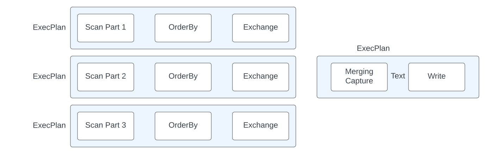
> > > >
> > > > A distributed plan can provide parallelism even if the plans themselves run serially
> > > >
> > > > ### Pipeline Parallelism
> > > >
> > > > Acero attempts to maximize parallelism using pipeline parallelism. As each batch of data arrives from the
> > > > source we immediately create a task and start processing it. This means we will likely start processing
> > > > batch X before the processing of batch X-1 has completed. This is very flexible and powerful. However, it also
> > > > means that properly implementing an ExecNode is difficult.
> > > >
> > > > For example, an ExecNode’s InputReceived method should be reentrant. In other words, it should be expected
> > > > that InputReceived will be called before the previous call to InputReceived has completed. This means that
> > > > nodes with any kind of mutable state will need mutexes or similar mechanisms to protect that state from race
> > > > conditions. It also means that tasks can easily get out of order and nodes should not expect any particular ordering
> > > > of their input (more on this later).
> > > >
> > > > 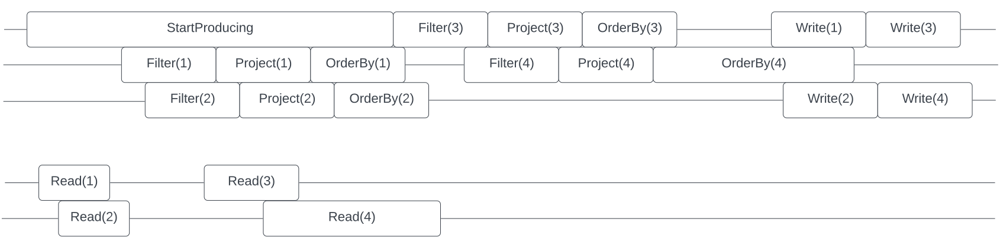
> > > >
> > > > An example of pipeline parallelism on a system with 3 CPU threads and 2 I/O threads
> > > >
> > > > ### Asynchronicity
> > > >
> > > > Some operations take a long time and may not require the CPU. Reading data from the filesystem is one example. If we
> > > > only have one thread per core then time will be wasted while we wait for these operations to complete. There
> > > > are two common solutions to this problem. A synchronous solution is often to create more threads than there are
> > > > cores with the expectation that some of them will be blocked and that is ok. This approach tends to be simpler
> > > > but it can lead to excess thread contention and requires fine-tuning.
> > > >
> > > > Another solution is to make the slow operations asynchronous. When the slow operation starts the caller gives up
> > > > the thread and allows other tasks to run in the meantime. Once the slow operation finishes then a new task is
> > > > created to take the result and continue processing. This helps to minimize thread contention but tends to be
> > > > more complex to implement.
> > > >
> > > > Due to a lack of standard C++ async APIs, Acero uses a combination of the two approaches. Acero has two thread pools.
> > > > The first is the CPU thread pool. This thread pool has one thread per core. Tasks in this thread pool should never
> > > > block (beyond minor delays for synchronization) and should generally be actively using CPU as much as possible. Threads
> > > > on the I/O thread pool are expected to spend most of the time idle. They should avoid doing any CPU-intensive work.
> > > > Their job is basically to wait for data to be available and schedule follow-up tasks on the CPU thread pool.
> > > >
> > > > 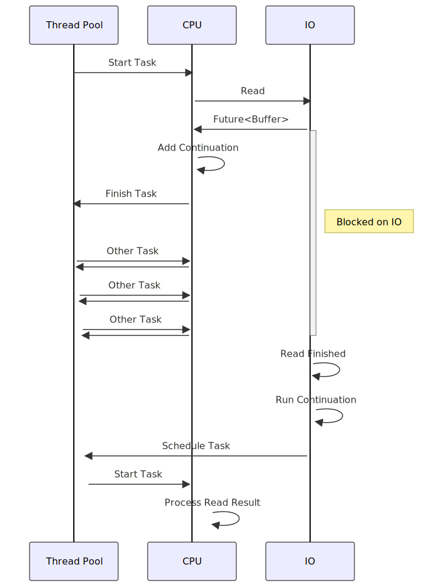
> > > >
> > > > Arrow achieves asynchronous execution by combining CPU & I/O thread pools
> > > >
> > > > > [!NOTE]
> > > > > **Most nodes in Acero do not need to worry about asynchronicity. They are fully synchronous and do not spawn tasks.**
> > > > >
> > > >
> > > > ### Task per Pipeline (and sometimes beyond)
> > > >
> > > > An engine could choose to create a thread task for every execution of a node. However, without careful scheduling, this leads to problems with cache locality. For example, let’s assume we have a basic plan consisting of three
> > > > exec nodes, scan, project, and then filter (this is a very common use case). Now let’s assume there are 100 batches.
> > > > In a task-per-operator model we would have tasks like “Scan Batch 5”, “Project Batch 5”, and “Filter Batch 5”. Each
> > > > of those tasks is potentially going to access the same data. For example, maybe the `project` and `filter` nodes need
> > > > to read the same column. A column which is initially created in a decode phase of the `scan` node. To maximize cache
> > > > utilization we would need to carefully schedule our tasks to ensure that all three of those tasks are run consecutively
> > > > and assigned to the same CPU core.
> > > >
> > > > To avoid this problem we design tasks that run through as many nodes as possible before the task ends. This sequence
> > > > of nodes is often referred to as a “pipeline” and the nodes that end the pipeline (and thus end the task) are often
> > > > called “pipeline breakers”. Some nodes might even fall somewhere in between. For example, in a hash join node, when
> > > > we receive a batch on the probe side, and the hash table has been built, we do not need to end the task and instead keep
> > > > on running. This means that tasks might sometimes end at the join node and might sometimes continue past the join node.
> > > >
> > > > 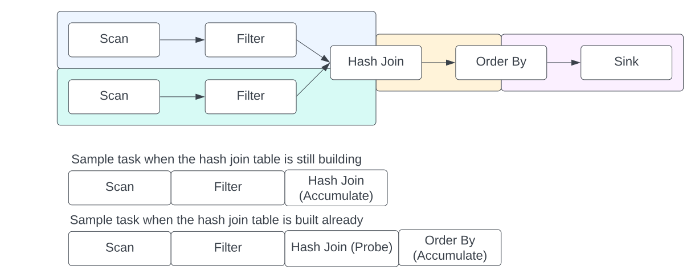
> > > >
> > > > A logical view of pipelines in a plan and two tasks, showing that pipeline boundaries may vary during a plan
> > > >
> > > > ### Thread Pools and Schedulers
> > > >
> > > > The CPU and I/O thread pools are a part of the core Arrow-C++ library. They contain a FIFO queue of tasks and will
> > > > execute them as a thread is available. For Acero we need additional capabilities. For this we use the
> > > > AsyncTaskScheduler. In the simplest mode of operation the scheduler simply submits tasks to an underlying thread pool.
> > > > However, it is also capable of creating sub-schedulers which can apply throttling, prioritization, and task tracking:
> > > >
> > > > > - A throttled scheduler associates a cost with each task. Tasks are only submitted to the underlying scheduler
> > > > >   if there is room. If there is not then the tasks are placed in a queue. The write node uses a throttle of size
> > > > >   1 to avoid reentrantly calling the dataset writer (the dataset writer does its own internal scheduling). A throttled
> > > > >   scheduler can be manually paused and unpaused. When paused all tasks are queued and queued tasks will not be submitted
> > > > >   even if there is room. This can be useful in source nodes to implement PauseProducing and ResumeProducing.
> > > > > - Priority can be applied to throttled schedulers to control the order in which queued tasks are submitted. If
> > > > >   there is room a task is submitted immediately (regardless of priority). However, if the throttle is full then
> > > > >   the task is queued and subject to prioritization. The scan node throttles how many read requests it generates
> > > > >   and prioritizes reading a dataset in order, if possible.
> > > > > - A task group can be used to keep track of a collection of tasks and run a finalization task when all of the
> > > > >   tasks have completed. This is useful for fork-join style problems. The write node uses a task group to close
> > > > >   a file once all outstanding write tasks for the file have completed.
> > > >
> > > > There is research and examples out there for different ways to prioritize tasks in an execution engine. Acero has not
> > > > yet had to address this problem. Let’s go through some common situations:
> > > >
> > > > > - Engines will often prioritize reading from the build side of a join node before reading from the probe side. This
> > > > >   would be more easily handled in Acero by applying backpressure.
> > > > > - Another common use case is to control memory accumulation. Engines will prioritize tasks which are closer to the
> > > > >   sink node in an effort to relieve memory pressure. However, Acero currently assumes that spilling will be added
> > > > >   at pipeline breakers and that memory usage in a plan will be more or less static (per core) and well below the
> > > > >   limits of the hardware. This might change if Acero needs to be used in an environment where there are many compute
> > > > >   resources and limited memory (e.g. a GPU)
> > > > > - Engines will often use work stealing algorithms to prioritize running tasks on the same core to improve cache
> > > > >   locality. However, since Acero uses a task-per-pipeline model there isn’t much lost opportunity for cache
> > > > >   parallelism that a scheduler could reclaim. Tasks only end when there is no more work that can be done with the data.
> > > >
> > > > While there is not much prioritization in place in Acero today we do have the tools to apply it should we need to.
> > > >
> > > > > [!NOTE]
> > > > > In addition to the AsyncTaskScheduler there is another class called the TaskScheduler. This class predates the
> > > > > AsyncTaskScheduler and was designed to offer task tracking for highly efficient synchronous fork-join workloads.
> > > > > If this specialized purpose meets your needs then you may consider using it. It would be interesting to profile
> > > > > this against the AsyncTaskScheduler and see how closely the two compare.
> > > >
> > > > ### Intra-node Parallelism
> > > >
> > > > Some nodes can potentially exploit parallelism within a task. For example, in the scan node we can decode
> > > > columns in parallel. In the hash join node, parallelism is sometimes exploited for complex tasks such as
> > > > building the hash table. This sort of parallelism is less common but not necessarily discouraged. Profiling should
> > > > be done first though to ensure that this extra parallelism will be helpful in your workload.
> > > >
> > > > ### All Work Happens in Tasks
> > > >
> > > > All work in Acero happens as part of a task. When a plan is started the AsyncTaskScheduler is created and given an
> > > > initial task. This initial task calls StartProducing on the nodes. Tasks may schedule additional tasks. For example, source nodes will usually schedule tasks during the call to StartProducing. Pipeline breakers will often schedule tasks
> > > > when they have accumulated all the data they need. Once all tasks in a plan are finished then the plan is considered
> > > > done.
> > > >
> > > > Some nodes use external threads. These threads must be registered as external tasks using the BeginExternalTask method.
> > > > For example, the asof join node uses a dedicated processing thread to achieve serial execution. This dedicated thread
> > > > is registered as an external task. External tasks should be avoided where possible because they require careful
> > > > handling to avoid deadlock in error situations.
> > > >
> > > > ## Ordered Execution
> > > >
> > > > Some nodes either establish an ordering to their outgoing batches or they need to be able to process batches in order.
> > > > Acero handles ordering using the `batch_index` property on an ExecBatch. If a node has a deterministic output order
> > > > then it should apply a batch index on batches that it emits. For example, the OrderByNode applies a new ordering to
> > > > batches (regardless of the incoming ordering). The scan node is able to attach an implicit ordering to batches which
> > > > reflects the order of the rows in the files being scanned.
> > > >
> > > > If a node needs to process data in order then it is a bit more complicated. Because of the parallel nature of execution
> > > > we cannot guarantee that batches will arrive at a node in order. However, they can generally be expected to be “mostly
> > > > ordered”. As a result, we can insert the batches into a sequencing queue. The sequencing queue is given a callback which
> > > > is guaranteed to run on the batches, serially, in order. For example, the fetch node uses a sequencing queue. The callback
> > > > checks to see if we need to include part or all of the batch, and then slices the batch if needed.
> > > >
> > > > Even if a node does not care about order it should try and maintain the batch index if it can. The project and filter
> > > > nodes do not care about order but they ensure that output batches keep the same index as their input batches. The filter
> > > > node will even emit empty batches if it needs to so that it can maintain the batch order without gaps.
> > > >
> > > > 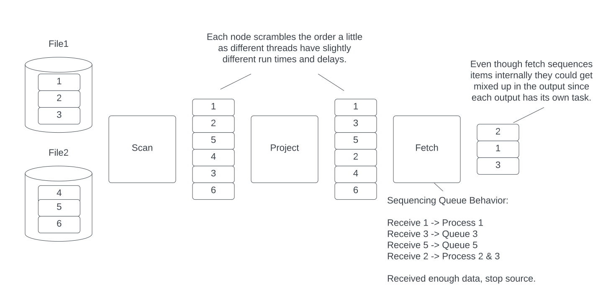
> > > >
> > > > An example of ordered execution
> > > >
> > > > ## Partitioned Execution
> > > >
> > > > A stream is partitioned (or sometimes called segmented) if rows are grouped together in some way. Currently there is not
> > > > a formal notion of partitioning. However, one is starting to develop (e.g. segmented aggregation) and we may end up
> > > > introducing a more formal notion of partitions to Acero at some point as well.
> > > >
> > > > ## Spillover
> > > >
> > > > Spillover has not yet been implemented in Acero.
> > > >
> > > > ## Distributed Execution
> > > >
> > > > There are certain exec nodes which are useful when an engine is used in a distributed environment. The terminology
> > > > can vary so we will use the Substrait terminology. An exchange node sends data to different workers. Often this is
> > > > a partitioned exchange so that Acero is expected to partition each batch and distribute partitions across N different
> > > > workers. On the other end we have the capture node. This node receives data from different workers.
> > > >
> > > > These nodes do not exist in Acero today. However, they would be in scope and we hope to have such nodes someday.
> > > >
> > > > ## Profiling & Tracing
> > > >
> > > > Acero’s tracing is currently half-implemented and there are major gaps in profiling tools. However, there has been some
> > > > effort at tracing with open telemetry and most of the necessary pieces are in place. The main thing currently lacking is
> > > > some kind of effective visualization of the tracing results.
> > > >
> > > > In order to use the tracing that is present today you will need to build with Arrow with `ARROW_WITH_OPENTELEMETRY=ON`.
> > > > Then you will need to set the environment variable `ARROW_TRACING_BACKEND=otlp_http`. This will configure open telemetry
> > > > to export trace results (as OTLP) to the HTTP endpoint <http://localhost:4318/v1/traces>. You will need to configure an
> > > > open telemetry collector to collect results on that endpoint and you will need to configure a trace viewer of some kind
> > > > such as Jaeger: <https://www.jaegertracing.io/docs/1.21/opentelemetry/>
> > > >
> > > > ## Benchmarking
> > > >
> > > > The most complete macro benchmarking for Acero is provided by <https://github.com/voltrondata-labs/arrowbench>
> > > > These include a set of TPC-H benchmarks, executed from the R-dplyr integration, which are run on every Arrow commit and
> > > > reported to Conbench at <https://conbench.ursa.dev/>
> > > >
> > > > In addition to these TPC-H benchmarks there are a number of micro-benchmarks for various nodes (hash-join, asof-join, etc.) Finally, the compute functions themselves should mostly have micro-benchmarks. For more on micro benchmarks you
> > > > can refer to [https://arrow.apache.org/docs/developers/benchmarks.html](#developers-benchmarks)
> > > >
> > > > Any new functionality should include micro benchmarks to avoid regressions.
> > > >
> > > > ## Bindings
> > > >
> > > > ### Public API
> > > >
> > > > The public API for Acero consists of Declaration and the various DeclarationToXyz methods. In addition the
> > > > options classes for each node are part of the public API. However, nodes are extensible and so this API is
> > > > extensible.
> > > >
> > > > ### R (dplyr)
> > > >
> > > > Dplyr is an R library for programmatically building queries. The arrow-r package has dplyr bindings which
> > > > adapt the dplyr API to create Acero execution plans. In addition, there is a dplyr-substrait backend that
> > > > is in development which could eventually replace the Acero-aware binding.
> > > >
> > > > ### Python
> > > >
> > > > The pyarrow library binds to Acero in two different ways. First, there is a direct binding in pyarrow.acero
> > > > which directly binds to the public API. Second, there are a number of compute utilities like
> > > > pyarrow.Table.group\_by which uses Acero, though this is invisible to the user.
> > > >
> > > > ### Java
> > > >
> > > > The Java implementation exposes some capabilities from Arrow datasets. These use Acero implicitly. There
> > > > are no direct bindings to Acero or Substrait in the Java implementation today.
> > > >
> > > > ## Design Philosophies
> > > >
> > > > ### Engine Independent Compute
> > > >
> > > > If a node requires complex computation then it should encapsulate that work in abstractions that don’t depend on
> > > > any particular engine design. For example, the hash join node uses utilities such as a row encoder, a hash table, and an exec batch builder. Other places share implementations of sequencing queues and row segmenters. The node
> > > > itself should be kept minimal and simply maps from Acero to the abstraction.
> > > >
> > > > This helps to decouple designs from Acero’s design details and allows them to be more resilient to changes in the
> > > > engine. It also helps to promote these abstractions as capabilities on their own. Either for use in other engines
> > > > or for potential new additions to pyarrow as compute utilities.
> > > >
> > > > ### Make Tasks not Threads
> > > >
> > > > If you need to run something in parallel then you should use thread tasks and not dedicated threads.
> > > >
> > > > > - This keeps the thread count down (reduces thread contention and context switches)
> > > > > - This prevents deadlock (tasks get cancelled automatically in the event of a failure)
> > > > > - This simplifies profiling (Tasks can be easily measured, easier to know where all the work is)
> > > > > - This makes it possible to run without threads (sometimes users are doing their own threading and
> > > > >   sometimes we need to run in thread-restricted environments like emscripten)
> > > >
> > > > Note: we do not always follow this advice currently. There is a dedicated process thread in the asof join
> > > > node. Dedicated threads are “ok” for experimental use but we’d like to migrate away from them.
> > > >
> > > > ### Don’t Block on CPU Threads
> > > >
> > > > If you need to run a potentially long running activity that is not actively using CPU resources (e.g. reading from
> > > > disk, network I/O, waiting on an external library using its own threads) then you should use asynchronous utilities
> > > > to ensure that you do not block CPU threads.
> > > >
> > > > ### Don’t Reinvent the Wheel
> > > >
> > > > Each node should not be a standalone island of utilities. Where possible, computation should be pushed
> > > > either into compute functions or into common shared utilities. This is the only way a project as large as
> > > > this can hope to be maintained.
> > > >
> > > > ### Avoid Query Optimization
> > > >
> > > > Writing an efficient Acero plan can be challenging. For example, filter expressions and column selection
> > > > should be pushed down into the scan node so that the data isn’t read from disk. Expressions should be
> > > > simplified and common sub-expressions factored out. The build side of a hash join node should be the
> > > > smaller of the two inputs.
> > > >
> > > > However, figuring these problems out is a challenge reserved for a query planner or a query optimizer.
> > > > Creating a query optimizer is a challenging task beyond the scope of Acero. With adoption of Substrait
> > > > we hope utilities will eventually emerge that solve these problems. As a result, we generally avoid doing
> > > > any kind of query optimization within Acero. Acero should interpret declarations as literally as possible.
> > > > This helps reduce maintenance and avoids surprises.
> > > >
> > > > We also realize that this is not always possible. For example, the hash join node currently detects if there
> > > > is a chain of hash join operators and, if there is, it configure bloom filters between the operators. This is
> > > > technically a task that could be left to a query optimizer. However, this behavior is rather specific to Acero
> > > > and fairly niche and so it is unlikely it will be introduced to an optimizer anytime soon.
> > > >
> > > > ## Performance Guidelines
> > > >
> > > > ### Batch Size
> > > >
> > > > Perhaps the most discussed performance criteria is batch size. Acero was originally
> > > > designed based on research to follow a morsel-batch model. Tasks are created based on
> > > > a large batch of rows (a morsel). The goal is for the morsel to be large enough to justify
> > > > the overhead of a task. Within a task the data is further subdivided into batches.
> > > > Each batch should be small enough to fit comfortable into CPU cache (often the L2 cache).
> > > >
> > > > This sets up two loops. The outer loop is parallel and the inner loop is not:
> > > >
> > > > ```
> > > >
> > > > for
> > > > morsel
> > > > in
> > > > dataset
> > > > :
> > > > # parallel for batch in morsel:run_pipeline (batch)
> > > > ```
> > > >
> > > > The advantage of this style of execution is that successive nodes (or successive operations
> > > > within an exec node) that access the same column are likely to benefit from cache. It also
> > > > is essential for functions that require random access to data. It maximizes parallelism while
> > > > minimizing the data transfer from main memory to CPU cache.
> > > >
> > > > 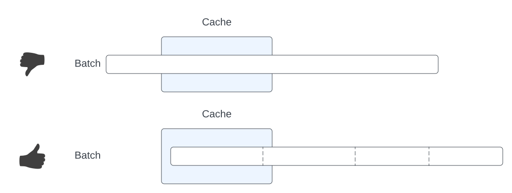
> > > >
> > > > If multiple passes through the data are needed (or random access) and the batch is much bigger
> > > > then the cache then performance suffers. Breaking the task into smaller batches helps improve
> > > > task locality.
> > > >
> > > > The morsel/batch model is reflected in a few places in Acero:
> > > >
> > > > > - In most source nodes we will try and grab batches of 1Mi rows. This is often configurable.
> > > > > - In the source node we then iterate and slice off batches of 32Ki rows. This is not currently
> > > > >   configurable.
> > > > > - The hash join node currently requires that a batches contain at 32Ki rows or less as it uses
> > > > >   16-bit signed integers as row indices in some places.
> > > >
> > > > However, this guidance is debateable. Profiling has shown that we do not get any real benefit
> > > > from moving to a smaller batch size. It seems any advantage we do get is lost in per-batch
> > > > overhead. Most of this overhead appears to be due to various per-batch allocations. In addition, depending on your hardware, it’s not clear that CPU Cache<->RAM will always be the bottleneck. A
> > > > combination of linear access, pre-fetch, and high CPU<->RAM bandwidth can alleviate the penalty
> > > > of cache misses.
> > > >
> > > > As a result, this section is included in the guide to provide historical context, but should not
> > > > be considered binding.
> > > >
> > > > ## Ongoing & Deprecated Work
> > > >
> > > > The following efforts are ongoing. They are described here to explain certain duplication in the
> > > > code base as well as explain types that are going away.
> > > >
> > > > ### Scanner v2
> > > >
> > > > The scanner is currently a node in the datasets module registered with the factory registry as “scan”.
> > > > This node was written prior to Acero and made extensive use of AsyncGenerator to scan multiple files
> > > > in parallel. Unfortunately, the use of AsyncGenerator made the scan difficult to profile, difficult
> > > > to debug, and impossible to cancel. A new scan node is in progress. It is currently registered with
> > > > the name “scan2”. The new scan node uses the AsyncTaskScheduler instead of AsyncGenerator and should
> > > > provide additional features such as the ability to skip rows and handle nested column projection (for
> > > > formats that support it)
> > > >
> > > > ### OrderBySink and SelectKSink
> > > >
> > > > These two exec nodes provided custom sink implementations. They were written before ordered execution
> > > > was added to Acero and were the only way to generate ordered output. However, they had to be placed
> > > > at the end of a plan and the fact that they were custom sink nodes made them difficult to describe with
> > > > Declaration. The OrderByNode and FetchNode replace these. These are kept at the moment until existing
> > > > bindings move away from them.
> > > >
> > > > ## Upstreaming Changes
> > > >
> > > > Acero is designed so that it can be extended without recompilation. You can easily add new compute
> > > > functions and exec nodes without creating a fork or compiling Acero. However, as you develop new
> > > > features that are generally useful, we hope you will make time to upstream your changes.
> > > >
> > > > Even though we welcome these changes we have to admit that there is a cost to this process. Upstreaming
> > > > code requires that the new module behave correctly, but that is typically the easier part to review.
> > > > More importantly, upstreaming code is a process of transferring the maintenance burden from yourself to
> > > > the wider Arrow C++ project maintainers. This requires a deep understanding of the code by maintainers, it requires the code be consistent with the style of the project, and it requires that the code be well
> > > > tested with unit tests to aid in regression.
> > > >
> > > > Because of this, we highly recommend taking the following steps:
> > > >
> > > > - As you are starting out you should send a message to the mailing list announcing your intentions and
> > > >   design. This will help you determine if there is wider interest in the feature and others may have
> > > >   ideas or suggestions to contribute early on in the process.
> > > >
> > > >   - If there is not much interest in the feature then keep in mind that it may be difficult to eventually
> > > >     upstream the change. The maintenance capacity of the team is limited and we try and prioritize
> > > >     features that are in high demand.
> > > > - We recommend developing and testing the change on your own fork until you get it to a point where you
> > > >   are fairly confident things are working correctly. If the change is large then you might also think
> > > >   about how you can break up the change into smaller pieces. As you do this you can share both the larger
> > > >   PR (as a draft PR or a branch on your local fork) and the smaller PRs. This way we can see the context
> > > >   of the smaller PRs. However, if you do break things up, smaller PRs should still ideally stand on their
> > > >   own.
> > > > - Any PR will need to have the following:
> > > >
> > > >   - Unit tests converting the new functionality
> > > >   - Microbenchmarks if there is any significant compute work going on
> > > >   - Examples demonstrating how to use the new feature
> > > >   - Updates to the API reference and this guide
> > > >   - Passing CI (you can enable GitHub Actions on your fork and that will allow most CI jobs to run before
> > > >     you create your PR)
> > > >
> > > > ## Others

---

<a id="developers-cpp-acero-swiss_table"></a>

<!-- source_url: https://arrow.apache.org/docs/developers/cpp/acero/swiss_table.html -->

<!-- page_index: 29 -->

# Swiss Table #

[Skip to main content](#developers-cpp-acero-swiss_table--main-content)

Back to top

> [!NOTE]
> > [!NOTE]
> > # Swiss Table
> >
> > A specialized hash table implementation used to dynamically map combinations of
> > key field values to a dense set of integer ids. Ids can later be used in place
> > of keys to identify groups of rows with equal keys.
> >
> > ## Introduction
> >
> > Hash group-by in Arrow uses a variant of a hash table based on a data structure
> > called Swiss table. Swiss table uses linear probing. There is an array of slots
> > and the information related to inserted keys is stored in these slots. A hash
> > function determines the slot where the search for a matching key will start
> > during hash table lookup. Then the slots are visited sequentially, wrapping
> > around the end of an array, until either a match or an empty slot is found, the
> > latter case meaning that there is no match. Swiss table organizes the slots in
> > blocks of 8 and has a design that enables data level parallelism at the block
> > level. More precisely, it allows for visiting all slots within a block at once
> > during lookups, by simply using 64-bit arithmetic. SIMD instructions can further
> > enhance this data level parallelism allowing to process multiple blocks related
> > to multiple input keys together using SIMD vectors of 64-bit elements. Occupied
> > slots within a block are always clustered together. The name Swiss table comes
> > from likening resulting sequences of empty slots to holes in a one dimensional
> > cheese.
> >
> > ## Interface
> >
> > Hash table used in query processing for implementing join and group-by operators
> > does not need to provide all of the operations that a general purpose hash table
> > would. Simplified requirements can help achieve a simpler and more efficient
> > design. For instance we do not need to be able to remove previously inserted
> > keys. It’s an append-only data structure: new keys can be added but old keys are
> > never erased. Also, only a single copy of each key can be inserted - it is like
> > `std::map` in that sense and not `std::multimap`.
> >
> > Our Swiss table is fully vectorized. That means that all methods work on vectors
> > of input keys processing them in batches. Specialized SIMD implementations of
> > processing functions are almost always provided for performance critical
> > operations. All callback interfaces used from the core hash table code are also
> > designed to work on batches of inputs instead of individual keys. The batch size
> > can be almost arbitrary and is selected by the client of the hash table. Batch
> > size should be the smallest number of input items, big enough so that the
> > benefits of vectorization and SIMD can be fully experienced. Keeping it small
> > means less memory used for temporary arrays storing intermediate results of
> > computation (vector equivalent of some temporary variables kept on the stack).
> > That in turn means smaller space in CPU caches, which also means less impact on
> > other memory access intensive operations. We pick 1024 as the default size of
> > the batch. We will call it a **mini-batch** to distinguish it from potentially
> > other forms of batches used at higher levels in the code, e.g. when scheduling
> > work for worker threads or relational operators inside an analytic query.
> >
> > The main functionality provided by Swiss table is mapping of arbitrarily complex
> > keys to unique integer ids. Let us call it **lookup-or-insert**. Given a
> > sequence of key values, return a corresponding sequence of integer ids, such
> > that all keys that are equal receive the same id and for K distinct keys the
> > integer ids will be assigned from the set of numbers 0 to (K-1). If we find a
> > matching key in a hash table for a given input, we return the **key id**
> > assigned when the key was first inserted into a hash table. If we fail to find
> > an already inserted match, we assign the first unused integer as a key id and
> > add a new entry to a hash table. Due to vectorized processing, which may result
> > in out-of-order processing of individual inputs, it is not guaranteed that if
> > there are two new key values in the same input batch and one of them appears
> > earlier in the input sequence, then it will receive a smaller key id. Additional
> > mapping functionality can be built on top of basic mapping to integer key id, for instance if we want to assign and perhaps keep updating some values to all
> > unique keys, we can keep these values in a resizable vector indexed by obtained
> > key id.
> >
> > The implementation of Swiss table does not need to have any information related
> > to the domain of the keys. It does not use their logical data type or
> > information about their physical representation and does not even use pointers
> > to keys. All access to keys is delegated to a separate class or classes that
> > provide callback functions for three operations:
> >
> > - computing hashes of keys;
> > - checking equality for given pairs of keys;
> > - appending a given sequence of keys to a stack maintained outside of Swiss
> >   table object, so that they can be referenced later on by key ids (key ids will
> >   be equal to their positions in the stack).
> >
> > When passing arguments to callback functions the keys are referenced using
> > integer ids. For the left side - that is the keys present in the input
> > mini-batch - ordinal positions within that mini-batch are used. For the right
> > side - that is the keys inserted into the hash table - these are identified by
> > key ids assigned to them and stored inside Swiss table when they were first
> > encountered and processed.
> >
> > Diagram with logical view of information passing in callbacks:
> >
> > 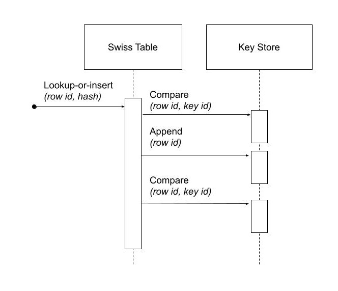
> >
> > Hash table values for inserted keys are also stored inside Swiss table. Because
> > of that, hash table logic does not need to ever re-evaluate the hash, and there
> > is actually no need for a hash function callback. It is enough that the caller
> > provides hash values for all entries in the batch when calling lookup-or-insert.
> >
> > ## Basic architecture and organization of data
> >
> > The hash table is an array of **slots**. Slots are grouped in groups of 8 called
> > **blocks**. The number of blocks is a power of 2. The empty hash table starts
> > with a single block, with all slots empty. Then, as the keys are getting
> > inserted and the amount of empty slots is shrinking, at some point resizing of
> > the hash table is triggered. The data stored in slots is moved to a new hash
> > table that has the double of the number of blocks.
> >
> > The diagram below shows the basic organization of data in our implementation of
> > Swiss table:
> >
> > 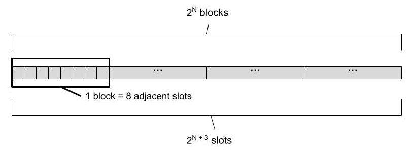
> >
> > N is the log of the number of blocks, \(2^{N+3}\) is the number of slots and
> > also the maximum number of inserted keys and hence (N + 3) is the number of bits
> > required to store a key id. We will refer to N as the **size of the hash table**.
> >
> > Index of a block within an array will be called **block id**, and similarly index
> > of a slot will be **slot id**. Sometimes we will focus on a single block and
> > refer to slots that belong to it by using a **local slot id**, which is an index
> > from 0 to 7.
> >
> > Every slot can either be **empty** or store data related to a single inserted
> > key. There are three pieces of information stored inside a slot:
> >
> > - status byte,
> > - key id,
> > - key hash.
> >
> > Status byte, as the name suggests, stores 8 bits. The highest bit indicates if
> > the slot is empty (the highest bit is set) or corresponds to one of inserted
> > keys (the highest bit is zero). The remaining 7 bits contain 7 bits of key hash
> > that we call a **stamp**. The stamp is used to eliminate some false positives
> > when searching for a matching key for a given input. Slot also stores **key id**, which is a non-negative integer smaller than the number of inserted keys, that is
> > used as a reference to the actual inserted key. The last piece of information
> > related to an inserted key is its **hash** value. We store hashes for all keys, so that they never need to be re-computed. That greatly simplifies some
> > operations, like resizing of a hash table, that may not even need to look at the
> > keys at all. For an empty slot, the status byte is 0x80, key id is zero and the
> > hash is not used and can be set to any number.
> >
> > A single block contains 8 slots and can be viewed as a micro-stack of up to 8
> > inserted keys. When the first key is inserted into an empty block, it will occupy
> > a slot with local id 0. The second inserted key will go into slot number 1 and so
> > on. We use N highest bits of hash to get an index of a **start block**, when
> > searching for a match or an empty slot to insert a previously not seen key when
> > that is the case. If the start block contains any empty slots, then the search
> > for either a match or place to insert a key will end at that block. We will call
> > such a block an **open block**. A block that is not open is a full block. In the
> > case of full block, the input key related search may continue in the next block
> > modulo the number of blocks. If the key is not inserted into its start block, we
> > will refer to it as an **overflow** entry, other entries being **non-overflow**.
> > Overflow entries are slower to process, since they require visiting more than one
> > block, so we want to keep their percentage low. This is done by choosing the
> > right **load factor** (percentage of occupied slots in the hash table) at which
> > the hash table gets resized and the number of blocks gets doubled. By tuning this
> > value we can control the probability of encountering an overflow entry.
> >
> > The most interesting part of each block is the set of status bytes of its slots, which is simply a single 64-bit word. The implementation of efficient searches
> > across these bytes during lookups require using either leading zero count or
> > trailing zero count intrinsic. Since there are cases when only the first one is
> > available, in order to take advantage of it, we order the bytes in the 64-bit
> > status word so that the first slot within a block uses the highest byte and the
> > last one uses the lowest byte (slots are in reversed bytes order). The diagram
> > below shows how the information about slots is stored within a 64-bit status
> > word:
> >
> > 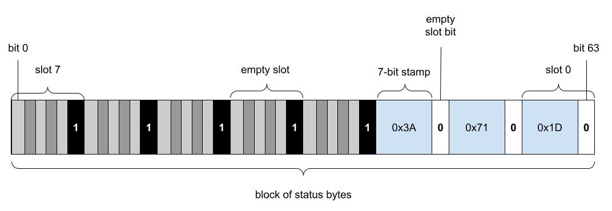
> >
> > Each status byte has a 7-bit fragment of hash value - a **stamp** - and an empty
> > slot bit. Empty slots have status byte equal to 0x80 - the highest bit is set to
> > 1 to indicate an empty slot and the lowest bits, which are used by a stamp, are
> > set to zero.
> >
> > The diagram below shows which bits of hash value are used by hash table:
> >
> > 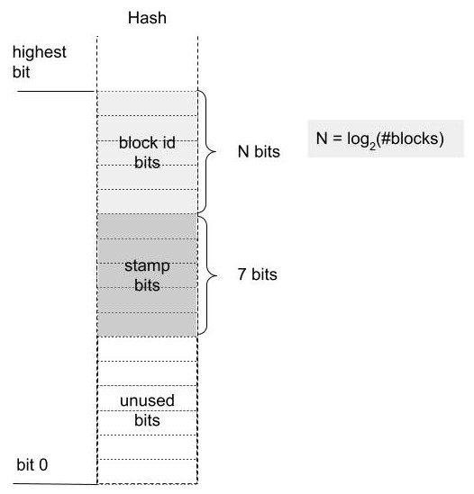
> >
> > If a hash table has \(2^{N}\) blocks, then we use N highest bits of a hash
> > to select a start block when searching for a match. The next 7 bits are used as
> > a stamp. Using the highest bits to pick a start block means that a range of hash
> > values can be easily mapped to a range of block ids of start blocks for hashes
> > in that range. This is useful when resizing a hash table or merging two hash
> > tables together.
> >
> > ### Interleaving status bytes and key ids
> >
> > Status bytes and key ids for all slots are stored in a single array of bytes.
> > They are first grouped by 8 into blocks, then each block of status bytes is
> > interleaved with a corresponding block of key ids. Finally key ids are
> > represented using the smallest possible number of bits and bit-packed (bits
> > representing each next key id start right after the last bit of the previous key
> > id). Note that regardless of the chosen number of bits, a block of bit-packed
> > key ids (that is 8 of them) will start and end on the byte boundary.
> >
> > The diagram below shows the organization of bytes and bits of a single block in
> > interleaved array:
> >
> > 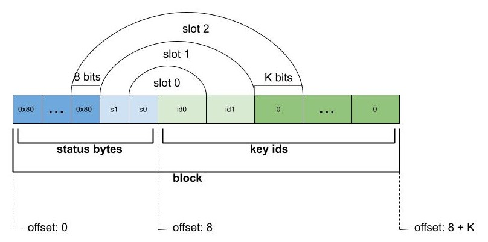
> >
> > From the size of the hash table we can derive the number K of bits needed in the
> > worst case to encode any key id. K is equal to the number of bits needed to
> > represent slot id (number of keys is not greater than the number of slots and any
> > key id is strictly less than the number of keys), which for a hash table of size
> > N (N blocks) equals (N+3). To simplify bit packing and unpacking and avoid
> > handling of special cases, we will round up K to full bytes for K > 24 bits.
> >
> > Status bytes are stored in a single 64-bit word in reverse byte order (the last
> > byte corresponds to the slot with local id 0). On the other hand key ids are
> > stored in the normal order (the order of slot ids).
> >
> > Since both status byte and key id for a given slot are stored in the same array
> > close to each other, we can expect that most of the lookups will read only one
> > CPU cache-line from memory inside Swiss table code (then at least another one
> > outside Swiss table to access the bytes of the key for the purpose of
> > comparison). Even if we hit an overflow entry, it is still likely to reside on
> > the same cache-line as the start block data. Hash values, which are stored
> > separately from status byte and key id, are only used when resizing and do not
> > impact the lookups outside these events.
> >
> > > [!NOTE]
> > > Improvement to consider:
> > > In addition to the Swiss table data, we need to store an array of inserted
> > > keys, one for each key id. If keys are of fixed length, then the address of
> > > the bytes of the key can be calculated by multiplying key id by the common
> > > length of the key. If keys are of varying length, then there will be an
> > > additional array with an offset of each key within the array of concatenated
> > > bytes of keys. That means that any key comparison during lookup will involve
> > > 3 arrays: one to get key id, one to get key offset and final one with bytes of
> > > the key. This could be reduced to 2 array lookups if we stored key offset
> > > instead of key id interleaved with slot status bytes. Offset indexed by key id
> > > and stored in its own array becomes offset indexed by slot id and stored
> > > interleaved with slot status bytes. At the same time key id indexed by slot id
> > > and interleaved with slot status bytes before becomes key id referenced using
> > > offset and stored with key bytes. There may be a slight increase in the total
> > > size of memory needed by the hash table, equal to the difference in the number
> > > of bits used to store offset and those used to store key id, multiplied by the
> > > number of slots, but that should be a small fraction of the total size.
> >
> > ### 32-bit hash vs 64-bit hash
> >
> > Currently we use 32-bit hash values in Swiss table code and 32-bit integers as
> > key ids. For the robust implementation, sooner or later we will need to support
> > 64-bit hash and 64-bit key ids. When we use 32-bit hash, it means that we run
> > out of hash bits when hash table size N is greater than 25 (25 bits of hash
> > needed to select a block and 7 bits needed to generate a stamp byte reach 32
> > total bits). When the number of inserted keys exceeds the maximal number of keys
> > stored in a hash table of size 25 (which is at least \(2^{24}\)), the chance
> > of false positives during lookups will start quickly growing. 32-bit hash should
> > not be used with more than about 16 million inserted keys.
> >
> > ### Low memory footprint and low chance of hash collisions
> >
> > Swiss table is a good choice of a hash table for modern hardware, because it
> > combines lookups that can take advantage of special CPU instructions with space
> > efficiency and low chance of hash collisions.
> >
> > Space efficiency is important for performance, because the cost of random array
> > accesses, often dominating the lookup cost for larger hash tables, increases with
> > the size of the arrays. This happens due to limited space of CPU caches. Let us
> > look at what is the amortized additional storage cost for a key in a hash table
> > apart from the essential cost of storing data of all those keys. Furthermore, we
> > can skip the storage of hash values, since these are only used during infrequent
> > hash table resize operations (should not have a big impact on CPU cache usage in
> > normal cases).
> >
> > Half full hash table of size N will use 2 status bytes per inserted key (because
> > for every filled slot there is one empty slot) and 2\*(N+3) bits for key id
> > (again, one for the occupied slot and one for the empty). For N = 16 for
> > instance this is slightly under 7 bytes per inserted key.
> >
> > Swiss table also has a low probability of false positives leading to wasted key
> > comparisons. Here is some rationale behind why this should be the case. Hash
> > table of size N can contain up to \(2^{N+3}\) keys. Search for a match
> > involves (N + 7) hash bits: N to select a start block and 7 to use as a stamp.
> > There are always at least 16 times more combinations of used hash bits than
> > there are keys in the hash table (32 times more if the hash table is half full).
> > These numbers mean that the probability of false positives resulting from a
> > search for a matching slot should be low. That corresponds to an expected number
> > of comparisons per lookup being close to 1 for keys already present and 0 for
> > new keys.
> >
> > ## Lookup
> >
> > Lookup-or-insert operation, given a hash of a key, finds a list of candidate
> > slots with corresponding keys that are likely to be equal to the input key. The
> > list may be empty, which means that the key does not exist yet in the hash
> > table. If it is not empty, then the callback function for key comparison is
> > called for each next candidate to verify that there is indeed a match. False
> > positives get rejected and we end up either finding an actual match or an empty
> > slot, which means that the key is new to the hash table. New keys get assigned
> > next available integers as key ids, and are appended to the set of keys stored in
> > the hash table. As a result of inserting new keys to the hash table, the density
> > of occupied slots may reach an upper limit, at which point the hash table will be
> > resized and will afterwards have twice as many slots. That is in summary
> > lookup-or-insert functionality, but the actual implementation is a bit more
> > involved, because of vectorization of the processing and various optimizations
> > for common cases.
> >
> > ### Search within a single block
> >
> > There are three possible cases that can occur when searching for a match for a
> > given key (that is, for a given stamp of a key) within a single block, illustrated below.
> >
> > 1. There is a matching stamp in the block of status bytes:
> >
> > 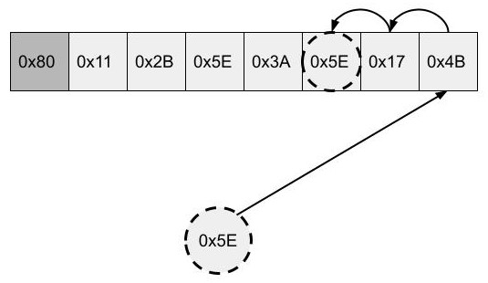
> >
> > 2. There is no matching stamp in the block, but there is an empty slot in the
> >    block:
> >
> > 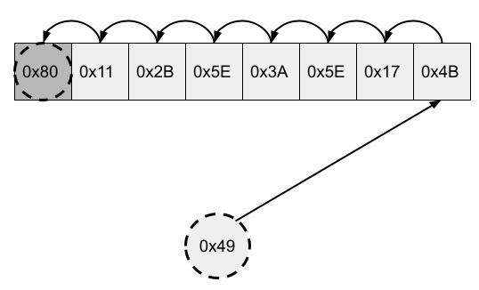
> >
> > 3. There is no matching stamp in the block and the block is full (there are no
> >    empty slots left):
> >
> > 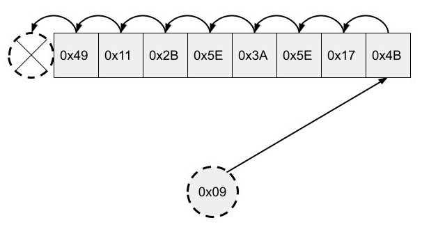
> >
> > 64-bit arithmetic can be used to search for a matching slot within the entire
> > single block at once, without iterating over all slots in it. Following is an
> > example of a sequence of steps to find the first status byte for a given stamp, returning the first empty slot on miss if the block is not full or 8 (one past
> > maximum local slot id) otherwise.
> >
> > Following is a sketch of the possible steps to execute when searching for the
> > matching stamp in a single block.
> >
> > *Example will use input stamp 0x5E and a 64-bit status bytes word with one empty
> > slot:*
> >
> > *0x 4B17 5E3A 5E2B 1180*
> >
> > 1. [1 instruction] Replicate stamp to all bytes by multiplying it by 0x 0101 0101
> >    0101 0101.
> >
> >    *We obtain: 0x 5E5E 5E5E 5E5E 5E5E.*
> > 2. [1 instruction] XOR replicated stamp with status bytes word. Bytes corresponding
> >    to a matching stamp will be 0, bytes corresponding to empty slots will have a
> >    value between 128 and 255, bytes corresponding to non-matching non-empty slots
> >    will have a value between 1 and 127.
> >
> >    *We obtain: 0x 1549 0064 0075 4FDE.*
> > 3. [2 instructions] In the next step we want to have information about a match in
> >    the highest bit of each byte. We can ignore here empty slot bytes, because they
> >    will be taken care of at a later step. Set the highest bit in each byte (OR with
> >    0x 8080 8080 8080 8080) and then subtract 1 from each byte (subtract 0x 0101 0101
> >    0101 0101 from 64-bit word). Now if a byte corresponds to a non-empty slot then
> >    the highest bit 0 indicates a match and 1 indicates a miss.
> >
> >    *We obtain: 0x 95C9 80E4 80F5 CFDE,*
> >
> >    *then 0x 94C8 7FE3 7FF4 CEDD.*
> > 4. [3 instructions] In the next step we want to obtain in each byte one of two
> >    values: 0x80 if it is either an empty slot or a match, 0x00 otherwise. We do
> >    it in three steps: NOT the result of the previous step to change the meaning
> >    of the highest bit; OR with the original status word to set highest bit in a
> >    byte to 1 for empty slots; mask out everything other than the highest bits in
> >    all bytes (AND with 0x 8080 8080 8080 8080).
> >
> >    *We obtain: 6B37 801C 800B 3122,*
> >
> >    *then 6B37 DE3E DE2B 31A2,*
> >
> >    *finally 0x0000 8000 8000 0080.*
> > 5. [2 instructions] Finally, use leading zero bits count and divide it by 8 to
> >    find an index of the last byte that corresponds either to a match or an empty
> >    slot. If the leading zero count intrinsic returns 64 for a 64-bit input zero,
> >    then after dividing by 8 we will also get the desired answer in case of a full
> >    block without any matches.
> >
> >    *We obtain: 16,*
> >
> >    *then 2 (index of the first slot within the block that matches the stamp).*
> >
> > If SIMD instructions with 64-bit lanes are available, multiple single block
> > searches for different keys can be executed together. For instance AVX2
> > instruction set allows to process quadruplets of 64-bit values in a single
> > instruction, four searches at once.
> >
> > ### Complete search potentially across multiple blocks
> >
> > Full implementation of a search for a matching key may involve visiting multiple
> > blocks beginning with the start block selected based on the hash of the key. We
> > move to the next block modulo the number of blocks, whenever we do not find a
> > match in the current block and the current block is full. The search may also
> > involve visiting one or more slots in each block. Visiting in this case means
> > calling a comparison callback to verify the match whenever a slot with a matching
> > stamp is encountered. Eventually the search stops when either:
> >
> > - the matching key is found in one of the slots matching the stamp, or
> > - an empty slot is reached. This is illustrated in the diagram below:
> >
> > 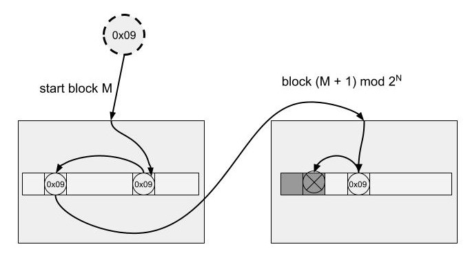
> >
> > ### Optimistic processing with two passes
> >
> > Hash table lookups may have high cost in the pessimistic case, when we encounter
> > cases of hash collisions and full blocks that lead to visiting further blocks. In
> > the majority of cases we can expect an optimistic situation - the start block is
> > not full, so we will only visit this one block, and all stamps in the block are
> > different, so we will need at most one comparison to find a match. We can expect
> > about 90% of the key lookups for an existing key to go through the optimistic
> > path of processing. For that reason it pays off to optimize especially for this
> > 90% of inputs.
> >
> > Lookups in Swiss table are split into two passes over an input batch of keys. The
> > **first pass: fast-path lookup**, is a highly optimized, vectorized, SIMD-friendly, branch-free code that fully handles optimistic cases. The **second
> > pass: slow-path lookup**, is normally executed only for the selection of inputs
> > that have not been finished in the first pass, although it can also be called
> > directly on all of the inputs, skipping fast-path lookup. It handles all special
> > cases and inserts but in order to be robust it is not as efficient as fast-path.
> > Slow-path lookup does not need to repeat the work done in fast-path lookup - it
> > can use the state reached at the end of fast-path lookup as a starting point.
> >
> > Fast-path lookup implements search only for the first stamp match and only within
> > the start block. It only makes sense when we already have at least one key
> > inserted into the hash table, since it does not handle inserts. It takes a vector
> > of key hashes as an input and based on it outputs three pieces of information for
> > each key:
> >
> > - Key id corresponding to the slot in which a matching stamp was found. Any valid
> >   key id if a matching stamp was not found.
> > - A flag indicating if a match was found or not.
> > - Slot id of a slot from which slow-path should pick up the search if the first
> >   match was either not found or it turns out to be false positive after
> >   evaluating key comparison.
> >
> > > [!NOTE]
> > > **Improvement to consider: precomputing 1st pass lookup results.**
> > > If the hash table is small, the number of inserted keys is small, we could
> > > further simplify and speed-up the first pass by storing in a lookup table
> > > pre-computed results for all combinations of hash bits. Let us consider the
> > > case of Swiss table of size 5 that has 256 slots and up to 128 inserted keys.
> > > Only 12 bits of hash are used by lookup in that case: 5 to select a block, 7
> > > to create a stamp. For all \(2^{12}\) combinations of those bits we could
> > > keep the result of first pass lookup in an array. Key id and a match
> > > indicating flag can use one byte: 7 bits for key id and 1 bit for the flag.
> > > Note that slot id is only needed if we go into 2nd pass lookup, so it can be
> > > stored separately and likely only accessed by a small subset of keys.
> > > Fast-path lookup becomes almost a single fetch of result from a 4KB array.
> > > Lookup arrays used to implement this need to be kept in sync with the main
> > > copy of data about slots, which requires extra care during inserts. Since the
> > > number of entries in lookup arrays is much higher than the number of slots, this technique only makes sense for small hash tables.
> >
> > ### Dense comparisons
> >
> > If there is at least one key inserted into a hash table, then every slot contains
> > a key id value that corresponds to some actual key that can be used in
> > comparison. That is because empty slots are initialized with 0 as their key id.
> > After the fast-path lookup we get a match-found flag for each input. If it is
> > set, then we need to run a comparison of the input key with the key in the hash
> > table identified by key id returned by fast-path code. The comparison will verify
> > that there is a true match between the keys. We only need to do this for a
> > subset of inputs that have a match candidate, but since we have key id values
> > corresponding to some real key for all inputs, we may as well execute
> > comparisons on all inputs unconditionally. If the majority (e.g. more than 80%)
> > of the keys have a match candidate, the cost of evaluating comparison for the
> > remaining fraction of keys but without filtering may actually be cheaper than the
> > cost of running evaluation only for required keys while referencing filter
> > information. This can be seen as a variant of general preconditioning techniques
> > used to avoid diverging conditional branches in the code. It may be used, based
> > on some heuristic, to verify matches reported by fast-path lookups and is
> > referred to as **dense comparisons**.
> >
> > ## Resizing
> >
> > New hash table is initialized as empty and has only a single block with a space
> > for only a few key entries. Doubling of the hash table size becomes necessary as
> > more keys get inserted. It is invoked during the 2nd pass of the lookups, which
> > also handles inserts. It happens immediately after the number of inserted keys
> > reaches a specific upper limit decided based on a current size of the hash table.
> > There may still be unprocessed entries from the input mini-batch after resizing, so the 2nd pass of the lookup is restarted right after, with the bigger hash
> > table and the remaining subset of unprocessed entries.
> >
> > Current policy, that should work reasonably well, is to resize a small hash table
> > (up to 8KB) when it is 50% full. Larger hash tables are resized when 75% full.
> > We want to keep size in memory as small as possible, while maintaining a low
> > probability of blocks becoming full.
> >
> > When discussing resizing we will be talking about **resize source** and **resize
> > target** tables. The diagram below shows how the same hash bits are interpreted
> > differently by the source and the target.
> >
> > 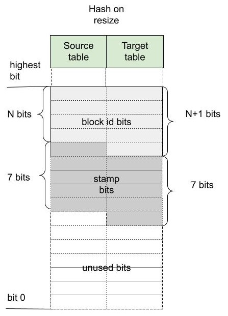
> >
> > For a given hash, if a start block id was L in the source table, it will be
> > either (2\*L+0) or (2\*L+1) in the target table. Based on that we can expect data
> > access locality when migrating the data between the tables.
> >
> > Resizing is cheap also thanks to the fact that hash values for keys in the hash
> > table are kept together with other slot data and do not need to be recomputed.
> > That means that resizing procedure does not ever need to access the actual bytes
> > of the key.
> >
> > ### 1st pass
> >
> > Based on the hash value for a given slot we can tell whether this slot contains
> > an overflow or non-overflow entry. In the first pass we go over all source slots
> > in sequence, filter out overflow entries and move to the target table all other
> > entries. Non-overflow entries from a block L will be distributed between blocks
> > (2\*L+0) and (2\*L+1) of the target table. None of these target blocks can
> > overflow, since they will be accommodating at most 8 input entries during this
> > pass.
> >
> > For every non-overflow entry, the highest bit of a stamp in the source slot
> > decides whether it will go to the left or to the right target block. It is
> > further possible to avoid any conditional branches in this partitioning code, so
> > that the result is friendly to the CPU execution pipeline.
> >
> > 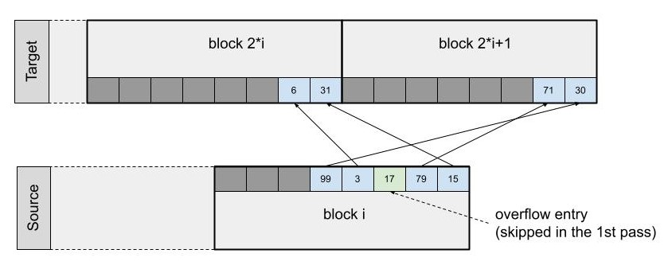
> >
> > ### 2nd pass
> >
> > In the second pass of resizing, we scan all source slots again, this time
> > focusing only on the overflow entries that were all skipped in the 1st pass. We
> > simply reinsert them in the target table using generic insertion code with one
> > exception. Since we know that all the source keys are different, there is no
> > need to search for a matching stamp or run key comparisons (or look at the key
> > values). We just need to find the first open block beginning with the start
> > block in the target table and use its first empty slot as the insert
> > destination.
> >
> > We expect overflow entries to be rare and therefore the relative cost of that
> > pass should stay low.

---

<a id="developers-java"></a>

<!-- source_url: https://arrow.apache.org/docs/developers/java/index.html -->

<!-- page_index: 30 -->

# Java Development #

[Skip to main content](#developers-java--main-content)

Back to top

# Java Development

- [Building Arrow Java](#developers-java-building)
  - [System Setup](#developers-java-building--system-setup)
  - [Building](#developers-java-building--building)
  - [Testing](#developers-java-building--testing)
  - [IDE Configuration](#developers-java-building--ide-configuration)
  - [Common Errors](#developers-java-building--common-errors)
  - [Installing Nightly Packages](#developers-java-building--installing-nightly-packages)
  - [Installing Staging Packages](#developers-java-building--installing-staging-packages)

---

<a id="developers-java-building"></a>

<!-- source_url: https://arrow.apache.org/docs/developers/java/building.html -->

<!-- page_index: 31 -->

# Building Arrow Java #

[Skip to main content](#developers-java-building--main-content)

Back to top

> [!NOTE]
> > [!NOTE]
> > > [!WARNING]
> > > > [!WARNING]
> > > > # [Building Arrow Java](#developers-java-building--id6)
> > > >
> > > > Contents
> > > >
> > > > - [Building Arrow Java](#developers-java-building--building-arrow-java)
> > > >
> > > >   - [System Setup](#developers-java-building--system-setup)
> > > >   - [Building](#developers-java-building--building)
> > > >
> > > >     - [Building Java Modules](#developers-java-building--building-java-modules)
> > > >
> > > >       - [Maven](#developers-java-building--id2)
> > > >       - [Docker compose](#developers-java-building--docker-compose)
> > > >       - [Archery](#developers-java-building--archery)
> > > >     - [Building JNI Libraries (\*.dylib / \*.so / \*.dll)](#developers-java-building--building-jni-libraries-dylib-so-dll)
> > > >
> > > >       - [Maven](#developers-java-building--id3)
> > > >       - [CMake](#developers-java-building--cmake)
> > > >       - [Archery](#developers-java-building--id4)
> > > >     - [Building Java JNI Modules](#developers-java-building--building-java-jni-modules)
> > > >   - [Testing](#developers-java-building--testing)
> > > >
> > > >     - [Configuring Maven toolchains](#developers-java-building--configuring-maven-toolchains)
> > > >     - [Testing with a specific JDK](#developers-java-building--testing-with-a-specific-jdk)
> > > >   - [IDE Configuration](#developers-java-building--ide-configuration)
> > > >
> > > >     - [IntelliJ](#developers-java-building--intellij)
> > > >   - [Common Errors](#developers-java-building--common-errors)
> > > >   - [Installing Nightly Packages](#developers-java-building--installing-nightly-packages)
> > > >
> > > >     - [Installing from Apache Nightlies](#developers-java-building--installing-from-apache-nightlies)
> > > >     - [Installing Manually](#developers-java-building--installing-manually)
> > > >   - [Installing Staging Packages](#developers-java-building--installing-staging-packages)
> > > >
> > > >     - [Installing from Apache Staging](#developers-java-building--installing-from-apache-staging)
> > > >
> > > > ## [System Setup](#developers-java-building--id7)
> > > >
> > > > Arrow Java uses the [Maven](https://maven.apache.org/) build system.
> > > >
> > > > Building requires:
> > > >
> > > > - JDK 11+
> > > > - Maven 3+
> > > >
> > > > > [!NOTE]
> > > > > **CI will test all supported JDK LTS versions, plus the latest non-LTS version.**
> > > > >
> > > >
> > > > ## [Building](#developers-java-building--id8)
> > > >
> > > > All the instructions below assume that you have cloned the Arrow git
> > > > repository:
> > > >
> > > > ```
> > > > $ git clone https://github.com/apache/arrow.git
> > > > $ cd arrow
> > > > $ git submodule update --init --recursive
> > > > ```
> > > >
> > > > These are the options available to compile Arrow Java modules with:
> > > >
> > > > - Maven build tool.
> > > > - Docker Compose.
> > > > - Archery.
> > > >
> > > > ### [Building Java Modules](#developers-java-building--id9)
> > > >
> > > > To build the default modules, go to the project root and execute:
> > > >
> > > > #### [Maven](#developers-java-building--id10)
> > > >
> > > > ```
> > > > $ cd arrow/java
> > > > $ export JAVA_HOME=<absolute path to your java home>
> > > > $ java --version
> > > > $ mvn clean install
> > > > ```
> > > >
> > > > #### [Docker compose](#developers-java-building--id11)
> > > >
> > > > ```
> > > > $ cd arrow/java
> > > > $ export JAVA_HOME=<absolute path to your java home>
> > > > $ java --version
> > > > $ docker compose run java
> > > > ```
> > > >
> > > > #### [Archery](#developers-java-building--id12)
> > > >
> > > > ```
> > > > $ cd arrow/java
> > > > $ export JAVA_HOME=<absolute path to your java home>
> > > > $ java --version
> > > > $ archery docker run java
> > > > ```
> > > >
> > > > ### [Building JNI Libraries (\*.dylib / \*.so / \*.dll)](#developers-java-building--id13)
> > > >
> > > > First, we need to build the [C++ shared libraries](https://arrow.apache.org/docs/cpp/build_system.html) that the JNI bindings will use.
> > > > We can build these manually or we can use [Archery](https://github.com/apache/arrow/blob/main/dev/archery/README.md) to build them using a Docker container
> > > > (This will require installing Docker, Docker Compose, and Archery).
> > > >
> > > > > [!NOTE]
> > > > > **If you are building on Apple Silicon, be sure to use a JDK version that was compiled for that architecture. See, for example, the Azul JDK .**
> > > > > If you are building on Windows OS, see [Developing on Windows](#developers-cpp-windows--developers-cpp-windows).
> > > >
> > > > #### [Maven](#developers-java-building--id14)
> > > >
> > > > - To build only the JNI C Data Interface library (macOS / Linux):
> > > >
> > > > ```
> > > > $ cd arrow/java
> > > > $ export JAVA_HOME=<absolute path to your java home>
> > > > $ java --version
> > > > $ mvn generate-resources -Pgenerate-libs-cdata-all-os -N
> > > > $ ls -latr ../java-dist/lib |__ arrow_cdata_jni/
> > > > ```
> > > >
> > > > - To build only the JNI C Data Interface library (Windows):
> > > >
> > > > ```
> > > > $ cd arrow/java
> > > > $ mvn generate-resources -Pgenerate-libs-cdata-all-os -N
> > > > $ dir "../java-dist/bin" |__ arrow_cdata_jni/
> > > > ```
> > > >
> > > > - To build all JNI libraries (macOS / Linux) except the JNI C Data Interface library:
> > > >
> > > > ```
> > > > $ cd arrow/java
> > > > $ export JAVA_HOME=<absolute path to your java home>
> > > > $ java --version
> > > > $ mvn generate-resources -Pgenerate-libs-jni-macos-linux -N
> > > > $ ls -latr java-dist/lib |__ arrow_dataset_jni/|__ arrow_orc_jni/|__ gandiva_jni/
> > > > ```
> > > >
> > > > - To build all JNI libraries (Windows) except the JNI C Data Interface library:
> > > >
> > > > ```
> > > > $ cd arrow/java
> > > > $ mvn generate-resources -Pgenerate-libs-jni-windows -N
> > > > $ dir "../java-dist/bin" |__ arrow_dataset_jni/
> > > > ```
> > > >
> > > > #### [CMake](#developers-java-building--id15)
> > > >
> > > > - To build only the JNI C Data Interface library (macOS / Linux):
> > > >
> > > > ```
> > > > $ cd arrow
> > > > $ mkdir -p java-dist java-cdata
> > > > $ cmake \ -S java \ -B java-cdata \
> > > >     -DARROW_JAVA_JNI_ENABLE_C=ON \
> > > >     -DARROW_JAVA_JNI_ENABLE_DEFAULT=OFF \
> > > >     -DBUILD_TESTING=OFF \
> > > >     -DCMAKE_BUILD_TYPE=Release \
> > > >     -DCMAKE_INSTALL_PREFIX=java-dist
> > > > $ cmake --build java-cdata --target install --config Release
> > > > $ ls -latr java-dist/lib |__ arrow_cdata_jni/
> > > > ```
> > > >
> > > > - To build only the JNI C Data Interface library (Windows):
> > > >
> > > > ```
> > > > $ cd arrow
> > > > $ mkdir java-dist, java-cdata
> > > > $ cmake ^ -S java ^ -B java-cdata ^
> > > >     -DARROW_JAVA_JNI_ENABLE_C=ON ^
> > > >     -DARROW_JAVA_JNI_ENABLE_DEFAULT=OFF ^
> > > >     -DBUILD_TESTING=OFF ^
> > > >     -DCMAKE_BUILD_TYPE=Release ^
> > > >     -DCMAKE_INSTALL_PREFIX=java-dist
> > > > $ cmake --build java-cdata --target install --config Release
> > > > $ dir "java-dist/bin" |__ arrow_cdata_jni/
> > > > ```
> > > >
> > > > - To build all JNI libraries (macOS / Linux) except the JNI C Data Interface library:
> > > >
> > > > ```
> > > > $ cd arrow
> > > > $ brew bundle --file=cpp/Brewfile
> > > > # Homebrew Bundle complete! 25 Brewfile dependencies now installed.
> > > > $ brew uninstall aws-sdk-cpp
> > > > #  (We can't use aws-sdk-cpp installed by Homebrew because it has
> > > > #  an issue: https://github.com/aws/aws-sdk-cpp/issues/1809 )
> > > > $ export JAVA_HOME=<absolute path to your java home>
> > > > $ mkdir -p java-dist cpp-jni
> > > > $ cmake \ -S cpp \ -B cpp-jni \
> > > >     -DARROW_BUILD_SHARED=OFF \
> > > >     -DARROW_CSV=ON \
> > > >     -DARROW_DATASET=ON \
> > > >     -DARROW_DEPENDENCY_SOURCE=BUNDLED \
> > > >     -DARROW_DEPENDENCY_USE_SHARED=OFF \
> > > >     -DARROW_FILESYSTEM=ON \
> > > >     -DARROW_GANDIVA=ON \
> > > >     -DARROW_GANDIVA_STATIC_LIBSTDCPP=ON \
> > > >     -DARROW_JSON=ON \
> > > >     -DARROW_ORC=ON \
> > > >     -DARROW_PARQUET=ON \
> > > >     -DARROW_S3=ON \
> > > >     -DARROW_SUBSTRAIT=ON \
> > > >     -DARROW_USE_CCACHE=ON \
> > > >     -DCMAKE_BUILD_TYPE=Release \
> > > >     -DCMAKE_INSTALL_PREFIX=java-dist \
> > > >     -DCMAKE_UNITY_BUILD=ON
> > > > $ cmake --build cpp-jni --target install --config Release
> > > > $ cmake \ -S java \ -B java-jni \
> > > >     -DARROW_JAVA_JNI_ENABLE_C=OFF \
> > > >     -DARROW_JAVA_JNI_ENABLE_DEFAULT=ON \
> > > >     -DBUILD_TESTING=OFF \
> > > >     -DCMAKE_BUILD_TYPE=Release \
> > > >     -DCMAKE_INSTALL_PREFIX=java-dist \
> > > >     -DCMAKE_PREFIX_PATH=$PWD/java-dist \
> > > >     -DProtobuf_ROOT=$PWD/../cpp-jni/protobuf_ep-install \
> > > >     -DProtobuf_USE_STATIC_LIBS=ON
> > > > $ cmake --build java-jni --target install --config Release
> > > > $ ls -latr java-dist/lib/|__ arrow_dataset_jni/|__ arrow_orc_jni/|__ gandiva_jni/
> > > > ```
> > > >
> > > > - To build all JNI libraries (Windows) except the JNI C Data Interface library:
> > > >
> > > > ```
> > > > $ cd arrow
> > > > $ mkdir java-dist, cpp-jni
> > > > $ cmake ^ -S cpp ^ -B cpp-jni ^
> > > >     -DARROW_BUILD_SHARED=OFF ^
> > > >     -DARROW_CSV=ON ^
> > > >     -DARROW_DATASET=ON ^
> > > >     -DARROW_DEPENDENCY_USE_SHARED=OFF ^
> > > >     -DARROW_FILESYSTEM=ON ^
> > > >     -DARROW_GANDIVA=OFF ^
> > > >     -DARROW_JSON=ON ^
> > > >     -DARROW_ORC=ON ^
> > > >     -DARROW_PARQUET=ON ^
> > > >     -DARROW_S3=ON ^
> > > >     -DARROW_SUBSTRAIT=ON ^
> > > >     -DARROW_USE_CCACHE=ON ^
> > > >     -DARROW_WITH_BROTLI=ON ^
> > > >     -DARROW_WITH_LZ4=ON ^
> > > >     -DARROW_WITH_SNAPPY=ON ^
> > > >     -DARROW_WITH_ZLIB=ON ^
> > > >     -DARROW_WITH_ZSTD=ON ^
> > > >     -DCMAKE_BUILD_TYPE=Release ^
> > > >     -DCMAKE_INSTALL_PREFIX=java-dist ^
> > > >     -DCMAKE_UNITY_BUILD=ON ^
> > > >     -GNinja
> > > > $ cd cpp-jni
> > > > $ ninja install
> > > > $ cd ../
> > > > $ cmake ^ -S java ^ -B java-jni ^
> > > >     -DARROW_JAVA_JNI_ENABLE_C=OFF ^
> > > >     -DARROW_JAVA_JNI_ENABLE_DATASET=ON ^
> > > >     -DARROW_JAVA_JNI_ENABLE_DEFAULT=ON ^
> > > >     -DARROW_JAVA_JNI_ENABLE_GANDIVA=OFF ^
> > > >     -DARROW_JAVA_JNI_ENABLE_ORC=ON ^
> > > >     -DBUILD_TESTING=OFF ^
> > > >     -DCMAKE_BUILD_TYPE=Release ^
> > > >     -DCMAKE_INSTALL_PREFIX=java-dist ^
> > > >     -DCMAKE_PREFIX_PATH=$PWD/java-dist
> > > > $ cmake --build java-jni --target install --config Release
> > > > $ dir "java-dist/bin" |__ arrow_orc_jni/|__ arrow_dataset_jni/
> > > > ```
> > > >
> > > > #### [Archery](#developers-java-building--id16)
> > > >
> > > > ```
> > > > $ cd arrow
> > > > $ archery docker run java-jni-manylinux-2014
> > > > $ ls -latr java-dist |__ arrow_cdata_jni/|__ arrow_dataset_jni/|__ arrow_orc_jni/|__ gandiva_jni/
> > > > ```
> > > >
> > > > ### [Building Java JNI Modules](#developers-java-building--id17)
> > > >
> > > > - To compile the JNI bindings, use the `arrow-c-data` Maven profile:
> > > >
> > > > ```
> > > > $ cd arrow/java
> > > > $ mvn -Darrow.c.jni.dist.dir=<absolute path to your arrow folder>/java-dist/lib -Parrow-c-data clean install
> > > > ```
> > > >
> > > > - To compile the JNI bindings for ORC / Gandiva / Dataset, use the `arrow-jni` Maven profile:
> > > >
> > > > ```
> > > > $ cd arrow/java
> > > > $ mvn \
> > > >     -Darrow.cpp.build.dir=<absolute path to your arrow folder>/java-dist/lib/ \
> > > >     -Darrow.c.jni.dist.dir=<absolute path to your arrow folder>/java-dist/lib/ \
> > > >     -Parrow-jni clean install
> > > > ```
> > > >
> > > > ## [Testing](#developers-java-building--id18)
> > > >
> > > > By default, Maven uses the same Java version to both build the code and run the tests.
> > > >
> > > > It is also possible to use a different JDK version for the tests. This requires Maven
> > > > toolchains to be configured beforehand, and then a specific test property needs to be set.
> > > >
> > > > ### [Configuring Maven toolchains](#developers-java-building--id19)
> > > >
> > > > To be able to use a JDK version for testing, it needs to be registered first in Maven `toolchains.xml`
> > > > configuration file usually located under `${HOME}/.m2` with the following snippet added to it:
> > > >
> > > > >
> > > > ```
> > > > <?xml version="1.0" encoding="UTF8"?>
> > > > <toolchains>
> > > >
> > > >   [...]
> > > >
> > > >   <toolchain>
> > > >     <type>jdk</type>
> > > >     <provides>
> > > >       <version>21</version> <!-- Replace with the corresponding JDK version: 11, 17, ... -->
> > > >       <vendor>temurin</vendor> <!-- Replace with the vendor/distribution: temurin, oracle, zulu ... -->
> > > >     </provides>
> > > >     <configuration>
> > > >       <jdkHome>path/to/jdk/home</jdkHome> <!-- Replace with the path to the JDK -->
> > > >     </configuration>
> > > >   </toolchain>
> > > >
> > > >   [...]
> > > >
> > > > </toolchains>
> > > > ```
> > > >
> > > > ### [Testing with a specific JDK](#developers-java-building--id20)
> > > >
> > > > To run Arrow tests with a specific JDK version, use the `arrow.test.jdk-version` property.
> > > >
> > > > For example, to run Arrow tests with JDK 17, use the following snippet:
> > > >
> > > > >
> > > > ```
> > > > $ cd arrow/java
> > > > $ mvn -Darrow.test.jdk-version=17 clean verify
> > > > ```
> > > >
> > > > ## [IDE Configuration](#developers-java-building--id21)
> > > >
> > > > ### [IntelliJ](#developers-java-building--id22)
> > > >
> > > > To start working on Arrow in IntelliJ: build the project once from the command
> > > > line using `mvn clean install`. Then open the `java/` subdirectory of the
> > > > Arrow repository, and update the following settings:
> > > >
> > > > - In the Files tool window, find the path `vector/target/generated-sources`,
> > > >   right click the directory, and select Mark Directory as > Generated Sources
> > > >   Root. There is no need to mark other generated sources directories, as only
> > > >   the `vector` module generates sources.
> > > > - For JDK 11, due to an [IntelliJ bug](https://youtrack.jetbrains.com/issue/IDEA-201168), you must go into
> > > >   Settings > Build, Execution, Deployment > Compiler > Java Compiler and disable
> > > >   “Use ‘–release’ option for cross-compilation (Java 9 and later)”. Otherwise
> > > >   you will get an error like “package sun.misc does not exist”.
> > > > - You may want to disable error-prone entirely if it gives spurious
> > > >   warnings (disable both error-prone profiles in the Maven tool window
> > > >   and “Reload All Maven Projects”).
> > > > - If using IntelliJ’s Maven integration to build, you may need to change
> > > >   `<fork>` to `false` in the pom.xml files due to an [IntelliJ bug](https://youtrack.jetbrains.com/issue/IDEA-278903).
> > > > - To enable debugging JNI-based modules like `dataset`,
> > > >   activate specific profiles in the Maven tab under “Profiles”.
> > > >   Ensure the profiles `arrow-c-data`, `arrow-jni`, `generate-libs-cdata-all-os`,
> > > >   `generate-libs-jni-macos-linux`, and `jdk11+` are enabled, so that the
> > > >   IDE can build them and enable debugging.
> > > >
> > > > You may not need to update all of these settings if you build/test with the
> > > > IntelliJ Maven integration instead of with IntelliJ directly.
> > > >
> > > > ## [Common Errors](#developers-java-building--id23)
> > > >
> > > > ## [Installing Nightly Packages](#developers-java-building--id24)
> > > >
> > > > > [!WARNING]
> > > > > **These packages are not official releases. Use them at your own risk.**
> > > > >
> > > >
> > > > Arrow nightly builds are posted on the mailing list at [builds@arrow.apache.org](https://lists.apache.org/list.html?builds@arrow.apache.org).
> > > > The artifacts are uploaded to GitHub. For example, for 2022/07/30, they can be found at [GitHub Nightly](https://github.com/ursacomputing/crossbow/releases/tag/nightly-packaging-2022-07-30-0-github-java-jars).
> > > >
> > > > ### [Installing from Apache Nightlies](#developers-java-building--id25)
> > > >
> > > > 1. Look up the nightly version number for the Arrow libraries used.
> > > >
> > > >    For example, for `arrow-memory`, visit <https://nightlies.apache.org/arrow/java/org/apache/arrow/arrow-memory/> and see what versions are available (e.g. 9.0.0.dev501).
> > > > 2. Add Apache Nightlies Repository to the Maven/Gradle project.
> > > >
> > > > ```
> > > > <properties>
> > > >    <arrow.version>9.0.0.dev501</arrow.version>
> > > > </properties>
> > > > ...
> > > > <repositories>
> > > >    <repository>
> > > >          <id>arrow-apache-nightlies</id>
> > > >          <url>https://nightlies.apache.org/arrow/java</url>
> > > >    </repository>
> > > > </repositories>
> > > > ...
> > > > <dependencies>
> > > >    <dependency>
> > > >          <groupId>org.apache.arrow</groupId>
> > > >          <artifactId>arrow-vector</artifactId>
> > > >          <version>${arrow.version}</version>
> > > >    </dependency>
> > > > </dependencies>
> > > > ...
> > > > ```
> > > >
> > > > ### [Installing Manually](#developers-java-building--id26)
> > > >
> > > > 1. Decide nightly packages repository to use, for example: <https://github.com/ursacomputing/crossbow/releases/tag/nightly-packaging-2022-07-30-0-github-java-jars>
> > > > 2. Add packages to your pom.xml, for example: flight-core (it depends on: arrow-format, arrow-vector, arrow-memory-core and arrow-memory-netty).
> > > >
> > > > ```
> > > > <properties>
> > > >    <maven.compiler.source>8</maven.compiler.source>
> > > >    <maven.compiler.target>8</maven.compiler.target>
> > > >    <arrow.version>9.0.0.dev501</arrow.version>
> > > > </properties>
> > > >
> > > > <dependencies>
> > > >    <dependency>
> > > >          <groupId>org.apache.arrow</groupId>
> > > >          <artifactId>flight-core</artifactId>
> > > >          <version>${arrow.version}</version>
> > > >    </dependency>
> > > > </dependencies>
> > > > ```
> > > >
> > > > 3. Download the necessary pom and jar files to a temporary directory:
> > > >
> > > > ```
> > > > $ mkdir nightly-packaging-2022-07-30-0-github-java-jars
> > > > $ cd nightly-packaging-2022-07-30-0-github-java-jars
> > > > $ wget https://github.com/ursacomputing/crossbow/releases/download/nightly-packaging-2022-07-30-0-github-java-jars/arrow-java-root-9.0.0.dev501.pom
> > > > $ wget https://github.com/ursacomputing/crossbow/releases/download/nightly-packaging-2022-07-30-0-github-java-jars/arrow-format-9.0.0.dev501.pom
> > > > $ wget https://github.com/ursacomputing/crossbow/releases/download/nightly-packaging-2022-07-30-0-github-java-jars/arrow-format-9.0.0.dev501.jar
> > > > $ wget https://github.com/ursacomputing/crossbow/releases/download/nightly-packaging-2022-07-30-0-github-java-jars/arrow-vector-9.0.0.dev501.pom
> > > > $ wget https://github.com/ursacomputing/crossbow/releases/download/nightly-packaging-2022-07-30-0-github-java-jars/arrow-vector-9.0.0.dev501.jar
> > > > $ wget https://github.com/ursacomputing/crossbow/releases/download/nightly-packaging-2022-07-30-0-github-java-jars/arrow-memory-9.0.0.dev501.pom
> > > > $ wget https://github.com/ursacomputing/crossbow/releases/download/nightly-packaging-2022-07-30-0-github-java-jars/arrow-memory-core-9.0.0.dev501.pom
> > > > $ wget https://github.com/ursacomputing/crossbow/releases/download/nightly-packaging-2022-07-30-0-github-java-jars/arrow-memory-netty-9.0.0.dev501.pom
> > > > $ wget https://github.com/ursacomputing/crossbow/releases/download/nightly-packaging-2022-07-30-0-github-java-jars/arrow-memory-core-9.0.0.dev501.jar
> > > > $ wget https://github.com/ursacomputing/crossbow/releases/download/nightly-packaging-2022-07-30-0-github-java-jars/arrow-memory-netty-9.0.0.dev501.jar
> > > > $ wget https://github.com/ursacomputing/crossbow/releases/download/nightly-packaging-2022-07-30-0-github-java-jars/arrow-flight-9.0.0.dev501.pom
> > > > $ wget https://github.com/ursacomputing/crossbow/releases/download/nightly-packaging-2022-07-30-0-github-java-jars/flight-core-9.0.0.dev501.pom
> > > > $ wget https://github.com/ursacomputing/crossbow/releases/download/nightly-packaging-2022-07-30-0-github-java-jars/flight-core-9.0.0.dev501.jar
> > > > $ tree. ├── arrow-flight-9.0.0.dev501.pom ├── arrow-format-9.0.0.dev501.jar ├── arrow-format-9.0.0.dev501.pom ├── arrow-java-root-9.0.0.dev501.pom ├── arrow-memory-9.0.0.dev501.pom ├── arrow-memory-core-9.0.0.dev501.jar ├── arrow-memory-core-9.0.0.dev501.pom ├── arrow-memory-netty-9.0.0.dev501.jar ├── arrow-memory-netty-9.0.0.dev501.pom ├── arrow-vector-9.0.0.dev501.jar ├── arrow-vector-9.0.0.dev501.pom ├── flight-core-9.0.0.dev501.jar └── flight-core-9.0.0.dev501.pom
> > > > ```
> > > >
> > > > 4. Install the artifacts to the local Maven repository with `mvn install:install-file`:
> > > >
> > > > ```
> > > > $ mvn install:install-file -Dfile="$(pwd)/arrow-java-root-9.0.0.dev501.pom" -DgroupId=org.apache.arrow -DartifactId=arrow-java-root -Dversion=9.0.0.dev501 -Dpackaging=pom
> > > > $ mvn install:install-file -Dfile="$(pwd)/arrow-format-9.0.0.dev501.pom" -DgroupId=org.apache.arrow -DartifactId=arrow-format -Dversion=9.0.0.dev501 -Dpackaging=pom
> > > > $ mvn install:install-file -Dfile="$(pwd)/arrow-format-9.0.0.dev501.jar" -DgroupId=org.apache.arrow -DartifactId=arrow-format -Dversion=9.0.0.dev501 -Dpackaging=jar
> > > > $ mvn install:install-file -Dfile="$(pwd)/arrow-vector-9.0.0.dev501.pom" -DgroupId=org.apache.arrow -DartifactId=arrow-vector -Dversion=9.0.0.dev501 -Dpackaging=pom
> > > > $ mvn install:install-file -Dfile="$(pwd)/arrow-vector-9.0.0.dev501.jar" -DgroupId=org.apache.arrow -DartifactId=arrow-vector -Dversion=9.0.0.dev501 -Dpackaging=jar
> > > > $ mvn install:install-file -Dfile="$(pwd)/arrow-memory-9.0.0.dev501.pom" -DgroupId=org.apache.arrow -DartifactId=arrow-memory -Dversion=9.0.0.dev501 -Dpackaging=pom
> > > > $ mvn install:install-file -Dfile="$(pwd)/arrow-memory-core-9.0.0.dev501.pom" -DgroupId=org.apache.arrow -DartifactId=arrow-memory-core -Dversion=9.0.0.dev501 -Dpackaging=pom
> > > > $ mvn install:install-file -Dfile="$(pwd)/arrow-memory-netty-9.0.0.dev501.pom" -DgroupId=org.apache.arrow -DartifactId=arrow-memory-netty -Dversion=9.0.0.dev501 -Dpackaging=pom
> > > > $ mvn install:install-file -Dfile="$(pwd)/arrow-memory-core-9.0.0.dev501.jar" -DgroupId=org.apache.arrow -DartifactId=arrow-memory-core -Dversion=9.0.0.dev501 -Dpackaging=jar
> > > > $ mvn install:install-file -Dfile="$(pwd)/arrow-memory-netty-9.0.0.dev501.jar" -DgroupId=org.apache.arrow -DartifactId=arrow-memory-netty -Dversion=9.0.0.dev501 -Dpackaging=jar
> > > > $ mvn install:install-file -Dfile="$(pwd)/arrow-flight-9.0.0.dev501.pom" -DgroupId=org.apache.arrow -DartifactId=arrow-flight -Dversion=9.0.0.dev501 -Dpackaging=pom
> > > > $ mvn install:install-file -Dfile="$(pwd)/flight-core-9.0.0.dev501.pom" -DgroupId=org.apache.arrow -DartifactId=flight-core -Dversion=9.0.0.dev501 -Dpackaging=pom
> > > > $ mvn install:install-file -Dfile="$(pwd)/flight-core-9.0.0.dev501.jar" -DgroupId=org.apache.arrow -DartifactId=flight-core -Dversion=9.0.0.dev501 -Dpackaging=jar
> > > > ```
> > > >
> > > > 5. Validate that the packages were installed:
> > > >
> > > > ```
> > > > $ tree ~/.m2/repository/org/apache/arrow. ├── arrow-flight │ ├── 9.0.0.dev501 │ │ └── arrow-flight-9.0.0.dev501.pom ├── arrow-format │ ├── 9.0.0.dev501 │ │ ├── arrow-format-9.0.0.dev501.jar │ │ └── arrow-format-9.0.0.dev501.pom ├── arrow-java-root │ ├── 9.0.0.dev501 │ │ └── arrow-java-root-9.0.0.dev501.pom ├── arrow-memory │ ├── 9.0.0.dev501 │ │ └── arrow-memory-9.0.0.dev501.pom ├── arrow-memory-core │ ├── 9.0.0.dev501 │ │ ├── arrow-memory-core-9.0.0.dev501.jar │ │ └── arrow-memory-core-9.0.0.dev501.pom ├── arrow-memory-netty │ ├── 9.0.0.dev501 │ │ ├── arrow-memory-netty-9.0.0.dev501.jar │ │ └── arrow-memory-netty-9.0.0.dev501.pom ├── arrow-vector │ ├── 9.0.0.dev501 │ │ ├── _remote.repositories │ │ ├── arrow-vector-9.0.0.dev501.jar │ │ └── arrow-vector-9.0.0.dev501.pom └── flight-core ├── 9.0.0.dev501 │ ├── flight-core-9.0.0.dev501.jar │ └── flight-core-9.0.0.dev501.pom
> > > > ```
> > > >
> > > > 6. Compile your project like usual with `mvn clean install`.
> > > >
> > > > ## [Installing Staging Packages](#developers-java-building--id27)
> > > >
> > > > > [!WARNING]
> > > > > **These packages are not official releases. Use them at your own risk.**
> > > > >
> > > >
> > > > Arrow staging builds are created when a Release Candidate (RC) is being prepared. This allows users to test the RC in their applications before voting on the release.
> > > >
> > > > ### [Installing from Apache Staging](#developers-java-building--id28)
> > > >
> > > > 1. Look up the next version number for the Arrow libraries used.
> > > > 2. Add Apache Staging Repository to the Maven/Gradle project.
> > > >
> > > > ```
> > > > <properties>
> > > >    <arrow.version>9.0.0</arrow.version>
> > > > </properties>
> > > > ...
> > > > <repositories>
> > > >    <repository>
> > > >          <id>arrow-apache-staging</id>
> > > >          <url>https://repository.apache.org/content/repositories/staging</url>
> > > >    </repository>
> > > > </repositories>
> > > > ...
> > > > <dependencies>
> > > >    <dependency>
> > > >          <groupId>org.apache.arrow</groupId>
> > > >          <artifactId>arrow-vector</artifactId>
> > > >          <version>${arrow.version}</version>
> > > >    </dependency>
> > > > </dependencies>
> > > > ...
> > > > ```

---

<a id="developers-java-development"></a>

<!-- source_url: https://arrow.apache.org/docs/developers/java/development.html -->

<!-- page_index: 32 -->

# Development Guidelines #

[Skip to main content](#developers-java-development--main-content)

Back to top

# [Development Guidelines](#developers-java-development--id2)

Contents

- [Development Guidelines](#developers-java-development--development-guidelines)

  - [Logger Abstraction](#developers-java-development--logger-abstraction)
  - [Unit Testing](#developers-java-development--unit-testing)
  - [Performance Testing](#developers-java-development--performance-testing)
  - [Integration Testing](#developers-java-development--integration-testing)
  - [Code Style](#developers-java-development--code-style)

    - [Automatically fixing code style issues](#developers-java-development--automatically-fixing-code-style-issues)
    - [Code Formatter for Intellij IDEA and Eclipse](#developers-java-development--code-formatter-for-intellij-idea-and-eclipse)
    - [Checkstyle](#developers-java-development--checkstyle)
  - [Build Caching](#developers-java-development--build-caching)
  - [ErrorProne](#developers-java-development--errorprone)

## [Logger Abstraction](#developers-java-development--id3)

Apache Arrow Java uses the SLF4J API, so please configure SLF4J to see logs (e.g. via Logback/Apache Log4j):

1. If no jar dependencies are added by the user via Logback or Apache Log4j then SLF4J will default
   to no-operation (NOP) logging.
2. If a user adds any dependencies via Logback or Apache Log4j but does not configure/add/define
   logback.xml/log4j2.xml, then logs will default to DEBUG mode.
3. To disable debug logs, the user must define their own rules within their logback.xml/log4j2.xml
   and define their own loggers.

## [Unit Testing](#developers-java-development--id4)

Unit tests are run by Maven during the build.

To speed up the build, you can skip them by passing -DskipTests.

```
$ cd arrow/java
$ mvn \
    -Darrow.cpp.build.dir=../java-dist/lib -Parrow-jni \
    -Darrow.c.jni.dist.dir=../java-dist/lib -Parrow-c-data \
    clean install
```

## [Performance Testing](#developers-java-development--id5)

The `arrow-performance` module contains benchmarks.

Let’s configure our environment to run performance tests:

- Install [benchmark](https://github.com/ursacomputing/benchmarks)
- Install [archery](https://github.com/apache/arrow/blob/main/dev/conbench_envs/README.md#L188)

In case you need to see your performance tests on the UI, then, configure (optional):

- Install [conbench](https://github.com/conbench/conbench)

Lets execute benchmark tests:

```
$ cd benchmarks
$ conbench java-micro --help
$ conbench java-micro
    --iterations=1
    --commit=e90472e35b40f58b17d408438bb8de1641bfe6ef
    --java-home=<absolute path to your java home>
    --src=<absolute path to your arrow project>
    --benchmark-filter=org.apache.arrow.adapter.AvroAdapterBenchmarks.testAvroToArrow
Benchmark                              Mode  Cnt       Score   Error  Units
AvroAdapterBenchmarks.testAvroToArrow  avgt       725545.783          ns/op
Time to POST http://localhost:5000/api/login/ 0.14911699295043945
Time to POST http://localhost:5000/api/benchmarks/ 0.06116318702697754
```

Then go to: <http://127.0.0.1:5000/> to see reports:

UI Home:

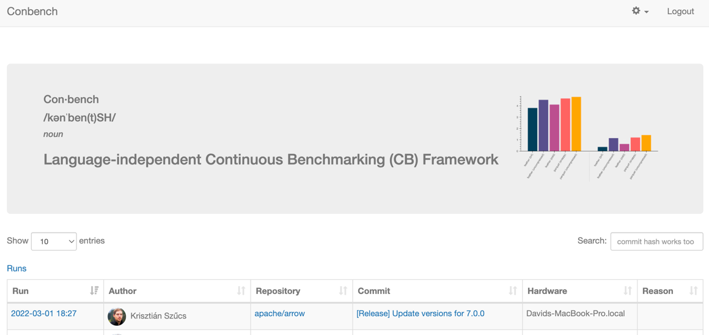

UI Runs:

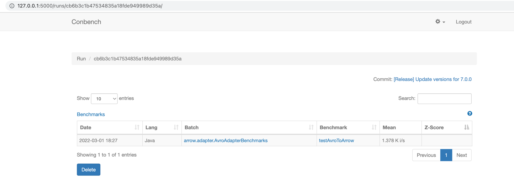

UI Benchmark:

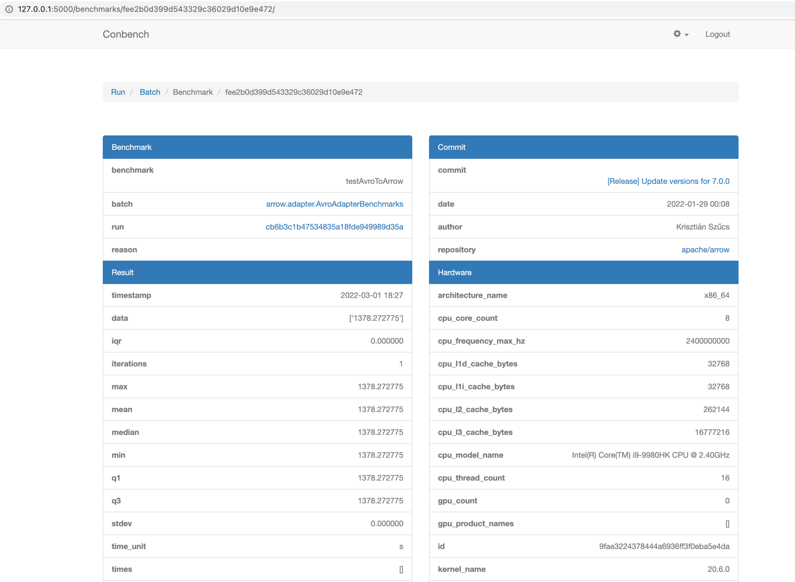

## [Integration Testing](#developers-java-development--id6)

Integration tests can be run [via Archery](#format-integration--running-integration-tests).
For example, assuming you only built Arrow Java and want to run the IPC
integration tests, you would do:

```
$ archery integration --run-ipc --with-java 1
```

## [Code Style](#developers-java-development--id7)

The current Java code follows the [Google Java Style](https://google.github.io/styleguide/javaguide.html) with Apache license headers.

Java code style is checked by [Spotless](https://github.com/diffplug/spotless) during the build, and the continuous integration build will verify
that changes adhere to the style guide.

### [Automatically fixing code style issues](#developers-java-development--id8)

- You can check the style without building the project with `mvn spotless:check`.
- You can autoformat the source with `mvn spotless:apply`.

Example:

```
The following files had format violations:
    src/main/java/org/apache/arrow/algorithm/rank/VectorRank.java
        @@ -15,7 +15,6 @@
        ·*·limitations·under·the·License.
        ·*/

        -
        package·org.apache.arrow.algorithm.rank;

        import·java.util.stream.IntStream;
Run 'mvn spotless:apply' to fix these violations.
```

### [Code Formatter for Intellij IDEA and Eclipse](#developers-java-development--id9)

Follow the instructions to set up google-java-format for:

- [Eclipse](https://github.com/google/google-java-format?tab=readme-ov-file#eclipse)
- [IntelliJ](https://github.com/google/google-java-format?tab=readme-ov-file#intellij-android-studio-and-other-jetbrains-ides)

### [Checkstyle](#developers-java-development--id10)

Checkstyle is also used for general linting. The configuration is located at [checkstyle](https://github.com/apache/arrow/blob/main/java/dev/checkstyle/checkstyle.xml).
You can also just check the style without building the project.
This checks the code style of all source code under the current directory or from within an individual module.

```
$ mvn checkstyle:check
```

Maven `pom.xml` style is enforced with Spotless using [Apache Maven pom.xml guidelines](https://maven.apache.org/developers/conventions/code.html#pom-code-convention)
You can also just check the style without building the project.
This checks the style of all pom.xml files under the current directory or from within an individual module.

```
$ mvn spotless:check
```

This applies the style to all pom.xml files under the current directory or from within an individual module.

```
$ mvn spotless:apply
```

## [Build Caching](#developers-java-development--id11)

Build caching is done through Develocity (formerly Maven Enterprise). To force
a build without the cache, run:

```

mvn clean install -Ddevelocity.cache.local.enabled=false -Ddevelocity.cache.remote.enabled=false
```

This can be useful to make sure you see all warnings from ErrorProne, for example.

## [ErrorProne](#developers-java-development--id12)

ErrorProne should be disabled for generated code.

---

<a id="developers-python"></a>

<!-- source_url: https://arrow.apache.org/docs/developers/python/index.html -->

<!-- page_index: 33 -->

# Python Development #

[Skip to main content](#developers-python--main-content)

Back to top

# Python Development

- [Building PyArrow](#developers-python-building)
  - [System Requirements](#developers-python-building--system-requirements)
  - [Environment setup](#developers-python-building--environment-setup)
  - [Build](#developers-python-building--build)
  - [Test](#developers-python-building--test)
  - [Relevant environment variables and build options](#developers-python-building--relevant-environment-variables-and-build-options)
  - [Relevant components](#developers-python-building--relevant-components)
  - [Installing Nightly Packages](#developers-python-building--installing-nightly-packages)

---

<a id="developers-python-building"></a>

<!-- source_url: https://arrow.apache.org/docs/developers/python/building.html -->

<!-- page_index: 34 -->

# Building PyArrow #

[Skip to main content](#developers-python-building--main-content)

Back to top

> [!WARNING]
> > [!NOTE]
> > > [!NOTE]
> > > # Building PyArrow
> > >
> > > This page provides source build instructions for PyArrow for all platforms.
> > >
> > > ## System Requirements
> > >
> > > Linux and macOS
> > >
> > > On macOS, any modern XCode or Xcode Command Line Tools (`xcode-select --install`)
> > > are sufficient.
> > >
> > > On Linux, for this guide, we require a minimum of gcc or clang 9.
> > > You can check your version by running
> > >
> > > ```
> > > $ gcc --version
> > > ```
> > >
> > > If the system compiler is older than gcc 9, it can be set to a newer version
> > > using the `$CC` and `$CXX` environment variables:
> > >
> > > ```
> > > $ export CC=gcc-9
> > > $ export CXX=g++-9
> > > ```
> > >
> > > Windows
> > >
> > > Building on Windows requires one of the following compilers to be
> > > installed:
> > >
> > > - [Build Tools for Visual Studio 2022](https://aka.ms/vs/17/release/vs_BuildTools.exe) or
> > > - Visual Studio 2022
> > >
> > > During the setup of Build Tools, ensure at least one Windows SDK
> > > is selected.
> > >
> > > ## Environment setup
> > >
> > > First, start from a fresh clone of Apache Arrow:
> > >
> > > ```
> > > $ git clone https://github.com/apache/arrow.git
> > > ```
> > >
> > > There are two supported ways to set up the build environment for PyArrow: using
> > > **Conda** to manage the dependencies or using **pip** with manual dependency
> > > management.
> > >
> > > Both methods are shown bellow for Linux and macOS. For Windows, only the
> > > Conda-based setup is currently documented, skipping some of the
> > > Linux/macOS-only packages.
> > >
> > > Note that in case you are not using conda on a Windows platform, Arrow C++
> > > libraries need to be bundled with `pyarrow`. For extra information see the
> > > Windows tab under the [Build PyArrow](#developers-python-building--pyarrow-build-section) section.
> > >
> > > Linux and macOS using conda
> > >
> > > Pull in the test data and setup the environment variables:
> > >
> > > ```
> > > $ pushd arrow
> > > $ git submodule update --init
> > > $ export PARQUET_TEST_DATA="${PWD}/cpp/submodules/parquet-testing/data"
> > > $ export ARROW_TEST_DATA="${PWD}/testing/data"
> > > $ popd
> > > ```
> > >
> > > The [conda](https://conda.io/) package manager allows installing build-time
> > > dependencies for Arrow C++ and PyArrow as pre-built binaries, which can make
> > > Arrow development easier and faster.
> > >
> > > Let’s create a conda environment with all the C++ build and Python dependencies
> > > from conda-forge, targeting development for Python 3.13:
> > >
> > > ```
> > > $ conda create -y -n pyarrow-dev -c conda-forge \ --file arrow/ci/conda_env_unix.txt \ --file arrow/ci/conda_env_cpp.txt \ --file arrow/ci/conda_env_python.txt \ --file arrow/ci/conda_env_gandiva.txt \ compilers \
> > >       python=3.13 \
> > >       pandas
> > > ```
> > >
> > > As of January 2019, the `compilers` package is needed on many Linux
> > > distributions to use packages from conda-forge.
> > >
> > > With this out of the way, you can now activate the conda environment
> > >
> > > ```
> > > $ conda activate pyarrow-dev
> > > ```
> > >
> > > We need to set some environment variables to let Arrow’s build system know
> > > about our build toolchain:
> > >
> > > ```
> > >
> > > $ export
> > >
> > > ARROW_HOME
> > > =
> > > $CONDA_PREFIX
> > > ```
> > >
> > > Linux and macOS using pip
> > >
> > > > [!WARNING]
> > > > If you installed Python using the Anaconda distribution or [Miniconda](https://conda.io/miniconda.html), you cannot currently use a
> > > > pip-based virtual environment. Please follow the conda-based development
> > > > instructions instead.
> > >
> > > Pull in the test data and setup the environment variables:
> > >
> > > ```
> > > $ pushd arrow
> > > $ git submodule update --init
> > > $ export PARQUET_TEST_DATA="${PWD}/cpp/submodules/parquet-testing/data"
> > > $ export ARROW_TEST_DATA="${PWD}/testing/data"
> > > $ popd
> > > ```
> > >
> > > **Using system and bundled dependencies**
> > >
> > > If not using conda, you must arrange for your system to provide the required
> > > build tools and dependencies. Note that if some dependencies are absent, the Arrow C++ build chain may still be able to download and compile them
> > > on the fly, but this will take a longer time than with pre-installed binaries.
> > >
> > > On macOS, use Homebrew to install all dependencies required for
> > > building Arrow C++:
> > >
> > > ```
> > > $ brew update && brew bundle --file=arrow/cpp/Brewfile
> > > ```
> > >
> > > See [here](#developers-cpp-building--cpp-build-dependency-management) for a list of dependencies you
> > > may need.
> > >
> > > On Debian/Ubuntu, you need the following minimal set of dependencies:
> > >
> > > ```
> > > $ sudo apt-get install build-essential ninja-build cmake python3-dev
> > > ```
> > >
> > > Now, let’s create a Python virtual environment with all Python dependencies
> > > in the same folder as the repositories, and a target installation folder:
> > >
> > > ```
> > > $ python3 -m venv pyarrow-dev
> > > $ source ./pyarrow-dev/bin/activate
> > > $ pip install -r arrow/python/requirements-build.txt
> > >
> > > $ # This is the folder where we will install the Arrow libraries during
> > > $ # development
> > > $ mkdir dist
> > > ```
> > >
> > > If your CMake version is too old on Linux, you could get a newer one via
> > > `pip install cmake`.
> > >
> > > We need to set some environment variables to let Arrow’s build system know
> > > about our build toolchain:
> > >
> > > ```
> > > $ export ARROW_HOME=$(pwd)/dist
> > > $ export LD_LIBRARY_PATH=$(pwd)/dist/lib:$LD_LIBRARY_PATH
> > > $ export CMAKE_PREFIX_PATH=$ARROW_HOME:$CMAKE_PREFIX_PATH
> > > ```
> > >
> > > Windows
> > >
> > > Let’s create a conda environment with all the C++ build and Python dependencies
> > > from conda-forge, targeting development for Python 3.13:
> > >
> > > ```
> > > $ conda create -y -n pyarrow-dev -c conda-forge ^ --file arrow\ci\conda_env_cpp.txt ^ --file arrow\ci\conda_env_python.txt ^ --file arrow\ci\conda_env_gandiva.txt ^
> > >       python=3.13
> > > $ conda activate pyarrow-dev
> > > ```
> > >
> > > Now, we can build and install Arrow C++ libraries.
> > >
> > > We set the path of the installation directory of the Arrow C++
> > > libraries as `ARROW_HOME`. When using a conda environment, Arrow C++ is installed in the environment directory, which path
> > > is saved in the [CONDA\_PREFIX](https://docs.conda.io/projects/conda-build/en/latest/user-guide/environment-variables.html#environment-variables-that-affect-the-build-process)
> > > environment variable.
> > >
> > > ```
> > > $ set ARROW_HOME=%CONDA_PREFIX%\Library
> > > ```
> > >
> > > ## Build
> > >
> > > First we need to configure, build and install the Arrow C++ libraries.
> > > Then we can build PyArrow.
> > >
> > > ### Build C++
> > >
> > > Linux and macOS
> > >
> > > Now build the Arrow C++ libraries and install them into the directory we
> > > created above (stored in `$ARROW_HOME`):
> > >
> > > ```
> > > $ cmake -S arrow/cpp -B arrow/cpp/build \
> > >       -DCMAKE_INSTALL_PREFIX=$ARROW_HOME \
> > >       --preset ninja-release-python
> > > $ cmake --build arrow/cpp/build --target install
> > > ```
> > >
> > > **About presets**
> > >
> > > `ninja-release-python` is not the only preset available - if you would like a
> > > build with more features like CUDA, Flight and Gandiva support you may opt for
> > > the `ninja-release-python-maximal` preset. If you wanted less features, (i.e.
> > > removing ORC and dataset support) you could opt for
> > > `ninja-release-python-minimal`. Changing the word `release` to `debug`
> > > with any of the aforementioned presets will generate a debug build of Arrow.
> > >
> > > **Individual components**
> > >
> > > The presets are provided as a convenience, but you may instead opt to
> > > specify the individual components:
> > >
> > > ```
> > > $ cmake -S arrow/cpp -B arrow/cpp/build \
> > >       -DCMAKE_INSTALL_PREFIX=$ARROW_HOME \
> > >       -DCMAKE_BUILD_TYPE=Debug \
> > >       -DARROW_BUILD_TESTS=ON \
> > >       -DARROW_COMPUTE=ON \
> > >       -DARROW_CSV=ON \
> > >       -DARROW_DATASET=ON \
> > >       -DARROW_FILESYSTEM=ON \
> > >       -DARROW_HDFS=ON \
> > >       -DARROW_JSON=ON \
> > >       -DARROW_PARQUET=ON \
> > >       -DARROW_WITH_BROTLI=ON \
> > >       -DARROW_WITH_BZ2=ON \
> > >       -DARROW_WITH_LZ4=ON \
> > >       -DARROW_WITH_SNAPPY=ON \
> > >       -DARROW_WITH_ZLIB=ON \
> > >       -DARROW_WITH_ZSTD=ON \
> > >       -DPARQUET_REQUIRE_ENCRYPTION=ON
> > > $ cmake --build arrow/cpp/build --target install -j4
> > > ```
> > >
> > > If multiple versions of Python are installed in your environment, you may have
> > > to pass additional parameters to CMake so that it can find the right
> > > executable, headers and libraries. For example, specifying
> > > `-DPython3_EXECUTABLE=<path/to/bin/python>` lets CMake choose the
> > > Python executable which you are using.
> > >
> > > > [!NOTE]
> > > > On Linux systems with support for building on multiple architectures, `make` may install libraries in the `lib64` directory by default. For
> > > > this reason we recommend passing `-DCMAKE_INSTALL_LIBDIR=lib` because the
> > > > Python build scripts assume the library directory is `lib`
> > >
> > > > [!NOTE]
> > > > If you have conda installed but are not using it to manage dependencies, and you have trouble building the C++ library, you may need to set
> > > > `-DARROW_DEPENDENCY_SOURCE=AUTO` or some other value (described
> > > > [here](#developers-cpp-building--cpp-build-dependency-management))
> > > > to explicitly tell CMake not to use conda.
> > >
> > > Windows
> > >
> > > There are presets provided as a convenience for building C++ (see Linux and macOS
> > > tab). Here we will instead specify the individual components:
> > >
> > > ```
> > > $ mkdir arrow\cpp\build
> > > $ pushd arrow\cpp\build
> > > $ cmake -G "Ninja" ^
> > >       -DCMAKE_INSTALL_PREFIX=%ARROW_HOME% ^
> > >       -DCMAKE_UNITY_BUILD=ON ^
> > >       -DARROW_COMPUTE=ON ^
> > >       -DARROW_CSV=ON ^
> > >       -DARROW_CXXFLAGS="/WX /MP" ^
> > >       -DARROW_DATASET=ON ^
> > >       -DARROW_FILESYSTEM=ON ^
> > >       -DARROW_HDFS=ON ^
> > >       -DARROW_JSON=ON ^
> > >       -DARROW_PARQUET=ON ^
> > >       -DARROW_WITH_LZ4=ON ^
> > >       -DARROW_WITH_SNAPPY=ON ^
> > >       -DARROW_WITH_ZLIB=ON ^
> > >       -DARROW_WITH_ZSTD=ON ^
> > >       ..
> > > $ cmake --build . --target install --config Release
> > > $ popd
> > > ```
> > >
> > > #### Optional build components
> > >
> > > There are several optional components that can be enabled or disabled by setting
> > > specific flags to `ON` or `OFF`, respectively. See the list of
> > > [Relevant components](#developers-python-building--python-dev-components) below.
> > >
> > > You may choose between different kinds of C++ build types:
> > >
> > > - `-DCMAKE_BUILD_TYPE=Release` (the default) produces a build with optimizations
> > >   enabled and debugging information disabled;
> > > - `-DCMAKE_BUILD_TYPE=Debug` produces a build with optimizations
> > >   disabled and debugging information enabled;
> > > - `-DCMAKE_BUILD_TYPE=RelWithDebInfo` produces a build with both optimizations
> > >   and debugging information enabled.
> > >
> > > > [!NOTE]
> > > > **See also**
> > > > [Building Arrow C++](#developers-cpp-building--cpp-building-building).
> > > >
> > > > For any other C++ build challenges, see [C++ Development](#developers-cpp--cpp-development).
> > >
> > > In case you may need to rebuild the C++ part due to errors in the process it is
> > > advisable to delete the build folder, see [Deleting stale build artifacts](#developers-python-building--stale-artifacts).
> > > If the build has passed successfully and you need to rebuild due to latest pull
> > > from git main, then this step is not needed.
> > >
> > > > [!NOTE]
> > > > ### Build PyArrow
> > > >
> > > > If you did build one of the optional components in C++, the equivalent components
> > > > will be enabled by default for building pyarrow. This default can be overridden
> > > > by setting the corresponding `PYARROW_WITH_$COMPONENT` environment variable
> > > > to 0 or 1, see [Relevant components](#developers-python-building--python-dev-components) below.
> > > >
> > > > To build PyArrow run:
> > > >
> > > > > [!NOTE]
> > > > > Linux and macOS
> > > > >
> > > > > ```
> > > > > $ pushd arrow/python
> > > > > $ pip install --no-build-isolation --editable . -vv
> > > > > $ popd
> > > > > ```
> > > > >
> > > > > Windows
> > > > >
> > > > > ```
> > > > > $ pushd arrow\python
> > > > > $ pip install --no-build-isolation --editable . -vv
> > > > > $ popd
> > > > > ```
> > > > >
> > > > > > [!NOTE]
> > > > > > **If you are using Conda with Python 3.9 or earlier, you must set CONDA\_DLL\_SEARCH\_MODIFICATION\_ENABLE=1 .**
> > > > > >
> > > > >
> > > > > > [!NOTE]
> > > > > > **Bundle Arrow C++ and PyArrow**
> > > > > > With the above instructions the Arrow C++ libraries are not bundled with
> > > > > > the Python extension. This is recommended for development as it allows the
> > > > > > C++ libraries to be re-built separately.
> > > > > >
> > > > > > If you are using the conda package manager then conda will ensure the Arrow C++
> > > > > > libraries are found. **In case you are NOT using conda** then you have to:
> > > > > >
> > > > > > - add the path of installed DLL libraries to `PATH` every time before
> > > > > >   importing `pyarrow`, or
> > > > > > - bundle the Arrow C++ libraries with `pyarrow`.
> > > > > >
> > > > > > If you want to bundle the Arrow C++ libraries with `pyarrow`, set the
> > > > > > `PYARROW_BUNDLE_ARROW_CPP` environment variable before building `pyarrow`:
> > > > > >
> > > > > > ```
> > > > > > $ set PYARROW_BUNDLE_ARROW_CPP=ON
> > > > > > $ pip install --no-build-isolation --editable . -vv
> > > > > > ```
> > > > > >
> > > > > > Note that bundled Arrow C++ libraries will not be automatically
> > > > > > updated when rebuilding Arrow C++.
> > > >
> > > > This creates an *editable install*, meaning changes to the Python source code
> > > > will be reflected immediately without needing to reinstall the package.
> > > > The `--no-build-isolation` flag ensures that the build uses your current
> > > > environment’s dependencies instead of creating an isolated one.
> > > >
> > > > To set the number of threads used to compile PyArrow’s C++/Cython components, set the `CMAKE_BUILD_PARALLEL_LEVEL` environment variable.
> > > >
> > > > If you build PyArrow but then make changes to the Arrow C++ or PyArrow code, you can end up with stale build artifacts. This can lead to
> > > > unexpected behavior or errors. To avoid this, you can clean the build
> > > > artifacts before rebuilding. See [Relevant environment variables and build options](#developers-python-building--python-dev-env-variables).
> > > >
> > > > By default, PyArrow will be built in release mode even if Arrow C++ has been
> > > > built in debug mode. To create a debug build of PyArrow, run
> > > > `pip install --no-build-isolation -vv -C cmake.build-type=Debug .`.
> > > > A `relwithdebinfo` build can be created similarly.
> > > >
> > > > #### Self-Contained Wheel
> > > >
> > > > If you’re preparing a PyArrow wheel for distribution (e.g., for PyPI), you’ll
> > > > need to build a self-contained wheel (including the Arrow and Parquet C++
> > > > libraries). This ensures that all necessary native libraries are bundled inside
> > > > the wheel, so users can install it without needing to have Arrow or Parquet
> > > > installed separately on their system.
> > > >
> > > > To do this, set the `PYARROW_BUNDLE_ARROW_CPP` environment variable before building `pyarrow`:
> > > >
> > > > ```
> > > > $ export PYARROW_BUNDLE_ARROW_CPP=ON
> > > > $ pip install build wheel  # if not installed
> > > > $ python -m build --sdist --wheel . --no-isolation
> > > > ```
> > > >
> > > > This option is typically only needed for releases or distribution scenarios, not for local development.
> > >
> > > > [!NOTE]
> > > > ### Deleting stale build artifacts
> > > >
> > > > When there have been changes to the structure of the Arrow C++ library or PyArrow, a thorough cleaning is recommended as a first attempt to fixing build errors.
> > > >
> > > > > [!NOTE]
> > > > > It is not necessarily intuitive from the error itself that the problem is due to stale artifacts.
> > > > > Example of a build error from stale artifacts is
> > > > > `Unknown CMake command "arrow_keep_backward_compatibility"`.
> > > >
> > > > To delete stale Arrow C++ build artifacts:
> > > >
> > > > ```
> > > > $ rm -rf arrow/cpp/build
> > > > ```
> > > >
> > > > To delete stale PyArrow build artifacts:
> > > >
> > > > ```
> > > > $ git clean -Xfd python
> > > > ```
> > > >
> > > > If using a Conda environment, there are some build artifacts that get installed in
> > > > `$ARROW_HOME` (aka `$CONDA_PREFIX`). For example, `$ARROW_HOME/lib/cmake/Arrow*`, `$ARROW_HOME/include/arrow`, `$ARROW_HOME/lib/libarrow*`, etc.
> > > >
> > > > These files can be manually deleted. If unsure which files to erase, one approach
> > > > is to recreate the Conda environment.
> > > >
> > > > Either delete the current one, and start fresh:
> > > >
> > > > ```
> > > > $ conda deactivate
> > > > $ conda remove -n pyarrow-dev
> > > > ```
> > > >
> > > > Or, less destructively, create a different environment with a different name.
> > >
> > > ### Docker examples
> > >
> > > If you are having difficulty building the Python library from source, take a
> > > look at the [python/examples/minimal\_build](https://github.com/apache/arrow/tree/main/python/examples/minimal_build)
> > > directory which illustrates a complete build and test from source both with
> > > the conda- and pip-based build methods.
> > >
> > > ## Test
> > >
> > > Now you are ready to install test dependencies and run [Unit Testing](#developers-python-development--python-unit-testing), as
> > > described in development section.
> > >
> > > ## Relevant environment variables and build options
> > >
> > > List of relevant environment variables that can be used to build
> > > PyArrow are:
> > >
> > > | PyArrow environment variable | Description | Default value |
> > > | --- | --- | --- |
> > > | `CMAKE_BUILD_PARALLEL_LEVEL` | Number of processes used to compile PyArrow’s C++/Cython components | `''` |
> > > | `CMAKE_GENERATOR` | Example: `'Visual Studio 17 2022 Win64'` | `''` |
> > > | `PYARROW_CXXFLAGS` | Extra C++ compiler flags | `''` |
> > > | `PYARROW_GENERATE_COVERAGE` | Setting `Xlinetrace` flag to true for the Cython compiler | `false` |
> > > | `PYARROW_BUNDLE_ARROW_CPP` | Bundle the Arrow C++ libraries | `0` (`OFF`) |
> > > | `PYARROW_BUNDLE_CYTHON_CPP` | Bundle the C++ files generated by Cython | `0` (`OFF`) |
> > >
> > > To set the build type (e.g. `Debug`, `Release`, `RelWithDebInfo`), pass
> > > `-C cmake.build-type=Debug` to `pip install` or to `python -m build`.
> > >
> > > For extra CMake arguments you can use the `-C cmake.args=`
> > > argument when building PyArrow. For example, to build a version of PyArrow
> > > with `ARROW_SIMD_LEVEL=NONE`, you can run
> > > `pip install --no-build-isolation -vv -C cmake.args="-DARROW_SIMD_LEVEL=NONE" .`.
> > >
> > > On PyArrow 24.0.0 we migrated our Python build backend from setuptools to
> > > scikit-build-core, which is a CMake-based build system. Previous versions used
> > > `PYARROW_BUILD_TYPE` and `PYARROW_CMAKE_OPTIONS` environment variables
> > > to customize the CMake invocation. This is no longer supported.
> > > Instead, use the `-C cmake.build-type=<build_type>` and `-C cmake.args=-D<OPTION>=<VALUE>` option as described above.
> > >
> > > To enable verbose output from the build tool, pass
> > > `-C build.verbose=true` to `pip install` or to `python -m build`.
> > >
> > > ## Relevant components
> > >
> > > The components being disabled or enabled when building PyArrow is by default
> > > based on how Arrow C++ is build (i.e. it follows the `ARROW_$COMPONENT` flags).
> > > However, the `PYARROW_WITH_$COMPONENT` environment variables can still be used
> > > to override this when building PyArrow (e.g. to disable components, or to enforce
> > > certain components to be built):
> > >
> > > | Arrow flags/options | Corresponding environment variables for PyArrow |
> > > | --- | --- |
> > > | `ARROW_GCS` | `PYARROW_WITH_GCS` |
> > > | `ARROW_S3` | `PYARROW_WITH_S3` |
> > > | `ARROW_AZURE` | `PYARROW_WITH_AZURE` |
> > > | `ARROW_HDFS` | `PYARROW_WITH_HDFS` |
> > > | `ARROW_CUDA` | `PYARROW_WITH_CUDA` |
> > > | `ARROW_SUBSTRAIT` | `PYARROW_WITH_SUBSTRAIT` |
> > > | `ARROW_FLIGHT` | `PYARROW_WITH_FLIGHT` |
> > > | `ARROW_ACERO` | `PYARROW_WITH_ACERO` |
> > > | `ARROW_DATASET` | `PYARROW_WITH_DATASET` |
> > > | `ARROW_PARQUET` | `PYARROW_WITH_PARQUET` |
> > > | `PARQUET_REQUIRE_ENCRYPTION` | `PYARROW_WITH_PARQUET_ENCRYPTION` |
> > > | `ARROW_ORC` | `PYARROW_WITH_ORC` |
> > > | `ARROW_GANDIVA` | `PYARROW_WITH_GANDIVA` (deprecated since version 24.0.0) |
> > >
> > > > [!WARNING]
> > > > ## Installing Nightly Packages
> > > >
> > > > > [!WARNING]
> > > > > **These packages are not official releases. Use them at your own risk.**
> > > > >
> > > >
> > > > PyArrow has nightly wheels for testing purposes hosted at
> > > > [scientific-python-nightly-wheels](https://anaconda.org/scientific-python-nightly-wheels/pyarrow).
> > > >
> > > > These may be suitable for downstream libraries in their continuous integration
> > > > setup to maintain compatibility with the upcoming PyArrow features, deprecations, and/or feature removals.
> > > >
> > > > To install the most recent nightly version of PyArrow, run:
> > > >
> > > > ```
> > > > pip install \
> > > >   -i https://pypi.anaconda.org/scientific-python-nightly-wheels/simple \
> > > >   pyarrow
> > > > ```

---

<a id="developers-python-development"></a>

<!-- source_url: https://arrow.apache.org/docs/developers/python/development.html -->

<!-- page_index: 35 -->

# Developing PyArrow #

[Skip to main content](#developers-python-development--main-content)

Back to top

> [!NOTE]
> > [!NOTE]
> > # Developing PyArrow
> >
> > ## Coding Style
> >
> > We follow a similar PEP8-like coding style to the [pandas project](https://github.com/pandas-dev/pandas). To fix style issues, use the
> > `pre-commit` command:
> >
> > ```
> > $ pre-commit run --show-diff-on-failure --color=always --all-files python
> > ```
> >
> > ## Unit Testing
> >
> > We are using [pytest](https://docs.pytest.org/en/latest/) to develop our unit
> > test suite. After [building the project](https://arrow.apache.org/docs/developers/python/build_pyarrow) you can run its unit tests
> > like so:
> >
> > ```
> > $ pushd arrow/python
> > $ python -m pytest pyarrow
> > $ popd
> > ```
> >
> > Package requirements to run the unit tests are found in
> > `requirements-test.txt` and can be installed if needed with `pip install -r
> > requirements-test.txt`.
> >
> > If you get import errors for `pyarrow._lib` or another PyArrow module when
> > trying to run the tests, run `python -m pytest arrow/python/pyarrow` and check
> > if the editable version of pyarrow was installed correctly.
> >
> > The project has a number of custom command line options for its test
> > suite. Some tests are disabled by default, for example. To see all the options, run
> >
> > ```
> > $ python -m pytest pyarrow --help
> > ```
> >
> > and look for the “custom options” section.
> >
> > > [!NOTE]
> > > There are a few low-level tests written directly in C++. These tests are
> > > implemented in [pyarrow/src/arrow/python/python\_test.cc](https://github.com/apache/arrow/blob/main/python/pyarrow/src/arrow/python/python_test.cc), but they are also wrapped in a `pytest`-based
> > > [test module](https://github.com/apache/arrow/blob/main/python/pyarrow/tests/test_cpp_internals.py)
> > > run automatically as part of the PyArrow test suite.
> >
> > ### Test Groups
> >
> > We have many tests that are grouped together using pytest marks. Some of these
> > are disabled by default. To enable a test group, pass `--$GROUP_NAME`, e.g. `--parquet`. To disable a test group, prepend `disable`, so
> > `--disable-parquet` for example. To run **only** the unit tests for a
> > particular group, prepend `only-` instead, for example `--only-parquet`.
> >
> > The test groups currently include:
> >
> > - `dataset`: Apache Arrow Dataset tests
> > - `flight`: Flight RPC tests
> > - `gandiva`: tests for Gandiva expression compiler (uses LLVM, deprecated since version 24.0.0)
> > - `hdfs`: tests that use libhdfs to access the Hadoop filesystem
> > - `hypothesis`: tests that use the `hypothesis` module for generating
> >   random test cases. Note that `--hypothesis` doesn’t work due to a quirk
> >   with pytest, so you have to pass `--enable-hypothesis`
> > - `large_memory`: Test requiring a large amount of system RAM
> > - `orc`: Apache ORC tests
> > - `parquet`: Apache Parquet tests
> > - `s3`: Tests for Amazon S3
> > - `tensorflow`: Tests that involve TensorFlow
> >
> > ## Type Checking
> >
> > PyArrow provides type stubs (`*.pyi` files) for static type checking. These
> > stubs are located in the `pyarrow-stubs/` directory and are automatically
> > included in the distributed wheel packages.
> >
> > ### Running Type Checkers
> >
> > We support multiple type checkers. Their configurations are in
> > `pyproject.toml`.
> >
> > **mypy**
> >
> > To run mypy on the PyArrow codebase:
> >
> > ```
> > $ cd arrow/python
> > $ mypy
> > ```
> >
> > The mypy configuration is in the `[tool.mypy]` section of `pyproject.toml`.
> >
> > **pyright**
> >
> > To run pyright:
> >
> > ```
> > $ cd arrow/python
> > $ pyright
> > ```
> >
> > The pyright configuration is in the `[tool.pyright]` section of `pyproject.toml`.
> >
> > **ty**
> >
> > To run ty (note: currently only partially configured):
> >
> > ```
> > $ cd arrow/python
> > $ ty check
> > ```
> >
> > ### Maintaining Type Stubs
> >
> > Type stubs for PyArrow are maintained in the `pyarrow-stubs/`
> > directory. These stubs mirror the structure of the main `pyarrow/` package.
> >
> > When adding or modifying public APIs:
> >
> > 1. **Update the corresponding ``.pyi`` stub file** in `pyarrow-stubs/`
> >    to reflect the new or changed function/class signatures.
> > 2. **Include type annotations** where possible. For Cython modules or
> >    dynamically generated APIs such as compute kernels add the corresponding
> >    stub in `pyarrow-stubs/`.
> > 3. **Run type checkers** to ensure the stubs are correct and complete.
> >
> > The stub files are automatically copied into the built wheel during the build
> > process and will be included when users install PyArrow, enabling type checking
> > in downstream projects and for users’ IDEs.
> >
> > Note: `py.typed` marker file in the `pyarrow/` directory indicates to type
> > checkers that PyArrow supports type checking according to [**PEP 561**](https://peps.python.org/pep-0561/).
> >
> > ## Doctest
> >
> > We are using [doctest](https://docs.python.org/3/library/doctest.html)
> > to check that docstring examples are up-to-date and correct. You can
> > also do that locally by running:
> >
> > ```
> > $ pushd arrow/python
> > $ python -m pytest --doctest-modules
> > $ python -m pytest --doctest-modules path/to/module.py # checking single file
> > $ popd
> > ```
> >
> > for `.py` files or
> >
> > ```
> > $ pushd arrow/python
> > $ python -m pytest --doctest-cython
> > $ python -m pytest --doctest-cython path/to/module.pyx # checking single file
> > $ popd
> > ```
> >
> > for `.pyx` and `.pxi` files. In this case you will also need to
> > install the [pytest-cython](https://github.com/lgpage/pytest-cython) plugin.
> >
> > > [!NOTE]
> > > **$ python -m pytest --doctest-cython path/to/lib.pyx**
> > > Cython `.pxi` files are included in `.pyx` files at compile time, so `--doctest-cython` cannot be run directly on `.pxi` files.
> > > In PyArrow, all `.pxi` files are included into `lib.pyx`, so run
> > > doctests on that file:
> > >
> > > Any doctest errors originating from `.pxi` files will appear under
> > > `lib.pyx`, not the original `.pxi` filename.
> >
> > ### Testing Documentation Examples
> >
> > Documentation examples in `.rst` files under `docs/source/python/` use
> > doctest syntax and can be tested locally using:
> >
> > ```
> > $ pushd arrow/python
> > $ pytest --doctest-glob="*.rst" docs/source/python/file.rst # checking single file
> > $ pytest --doctest-glob="*.rst" docs/source/python # checking entire directory
> > $ popd
> > ```
> >
> > The examples use standard doctest syntax with `>>>` for Python prompts and
> > `...` for continuation lines. The `conftest.py` fixture automatically
> > handles temporary directory setup for examples that create files.
> >
> > ## Debugging
> >
> > ### Debug build
> >
> > Since PyArrow depends on the Arrow C++ libraries, debugging can
> > frequently involve crossing between Python and C++ shared libraries.
> > For the best experience, make sure you’ve built both Arrow C++
> > (`-DCMAKE_BUILD_TYPE=Debug`) and PyArrow
> > (`pip install --no-build-isolation -C cmake.build-type=Debug .`)
> > in debug mode.
> >
> > ### Using gdb on Linux
> >
> > To debug the C++ libraries with gdb while running the Python unit
> > tests, first start pytest with gdb:
> >
> > ```
> > $ gdb --args python -m pytest pyarrow/tests/test_to_run.py -k $TEST_TO_MATCH
> > ```
> >
> > To set a breakpoint, use the same gdb syntax that you would when
> > debugging a C++ program, for example:
> >
> > ```
> >
> > (gdb)
> > b src/arrow/python/arrow_to_pandas.cc:1874
> > No source file named src/arrow/python/arrow_to_pandas.cc.
> > Make breakpoint pending on future shared library load? (y or [n]) y
> > Breakpoint 1 (src/arrow/python/arrow_to_pandas.cc:1874) pending.
> > ```
> >
> > > [!NOTE]
> > > **See also**
> > > The [GDB extension for Arrow C++](https://arrow.apache.org/docs/cpp/gdb.html#cpp-gdb-extension).
> >
> > Similarly, use lldb when debugging on macOS.
> >
> > ## Benchmarking
> >
> > For running the benchmarks, see [Benchmarks](#developers-benchmarks--benchmarks).

---

<a id="developers-continuous_integration"></a>

<!-- source_url: https://arrow.apache.org/docs/developers/continuous_integration/index.html -->

<!-- page_index: 36 -->

# Continuous Integration #

[Skip to main content](#developers-continuous_integration--main-content)

Back to top

# Continuous Integration

---

<a id="developers-continuous_integration-overview"></a>

<!-- source_url: https://arrow.apache.org/docs/developers/continuous_integration/overview.html -->

<!-- page_index: 37 -->

# Continuous Integration #

[Skip to main content](#developers-continuous_integration-overview--main-content)

Back to top

# Continuous Integration

Continuous Integration for Arrow is fairly complex as it needs to run across different combinations of package managers, compilers, versions of multiple software libraries, operating systems, and other potential sources of variation. In this article, we will give an overview of its main components and the relevant files and directories.

Some files central to Arrow CI are:

- `compose.yaml` - here we define docker services which can be configured using either environment variables, or the default values for these variables.
- `.env` - here we define default values to configure the services in `compose.yaml`

We use [Docker](#developers-continuous_integration-docker--docker-builds) in order to have portable and reproducible Linux builds, as well as running Windows builds in Windows containers. We use [Archery](#developers-continuous_integration-archery--archery) and [Crossbow](#developers-continuous_integration-crossbow--crossbow) to help coordinate the various CI tasks.

One thing to note is that some of the services defined in `compose.yaml` are interdependent. When running services locally, you must either manually build its dependencies first, or build it via the use of `archery docker run ...` which automatically finds and builds dependencies.

There are numerous important directories in the Arrow project which relate to CI:

- `.github/workflows` - workflows that are run via GitHub actions and are triggered by things like pull requests being submitted or merged
- `dev/tasks` - containing extended jobs triggered/submitted via `archery crossbow submit ...`, typically nightly builds or relating to the release process
- `ci/` - containing scripts, dockerfiles, and any supplemental files, e.g. patch files, conda environment files, vcpkg triplet files.

Instead of thinking about Arrow CI in terms of files and folders, it may be conceptually simpler to instead divide it into 2 main categories:

- **action-triggered builds**: CI jobs which are triggered based on specific actions on GitHub (pull requests opened, pull requests merged, etc)
- **extended builds**: manually triggered with many being run on a nightly basis

## Action-triggered builds

The `.yml` files in `.github/workflows` are workflows which are run on GitHub in response to specific actions. The majority of workflows in this directory are Arrow implementation-specific and are run when changes are made which affect code relevant to that language’s implementation, but other workflows worth noting are:

- `archery.yml` - if changes are made to the Archery tool or tasks which it runs, this workflow runs the necessary validation checks
- `comment_bot.yml` - triggers certain actions by listening on github pull request comments for the following strings:

  - `@github-actions crossbow submit ...` - runs the specified Crossbow command
  - `@github-actions rebase` - rebases the PR onto the main branch
- `dev.yml` - runs any time there is activity on a PR, or a PR is merged; it runs the linter and tests that the PR can be merged
- `dev_pr.yml` - runs any time a PR is opened or updated; checks the formatting of the PR title, adds assignee to the appropriate GitHub issue if needed (or adds a comment requesting the user to include the issue id in the title), and adds any relevant GitHub labels

## Extended builds

Crossbow is a subcomponent of Archery and can be used to manually trigger builds. The tasks which can be run on Crossbow can be found in the `dev/tasks` directory. This directory contains:

- the file `dev/tasks/tasks.yml` containing the configuration for various tasks which can be run via Crossbow
- subdirectories containing different task templates (specified using [jinja2 syntax](https://jinja.palletsprojects.com/)), divided roughly by language or package management system.

Most of these tasks are run as part of the nightly builds, though they can also be triggered manually by adding a comment to a PR which begins with `@github-actions crossbow submit` followed by the name of the task to be run.

For convenience purpose, the tasks in `dev/tasks/tasks.yml` are defined in groups, which makes it simpler for multiple tasks to be submitted to Crossbow at once. The task definitions here contain information about which service defined in `compose.yaml` to run, the CI service to run the task on, and which template file to use as the basis for that task.

---

<a id="developers-continuous_integration-docker"></a>

<!-- source_url: https://arrow.apache.org/docs/developers/continuous_integration/docker.html -->

<!-- page_index: 38 -->

# Running Docker Builds #

[Skip to main content](#developers-continuous_integration-docker--main-content)

Back to top

# Running Docker Builds

Most of our Linux based Continuous Integration tasks are decoupled from public
CI services using [Docker](https://docs.docker.com/) and
[Docker Compose](https://docs.docker.com/compose/). Keeping the CI configuration
minimal makes local reproducibility possible.

## Usage

There are multiple ways to execute the Docker based builds.
The recommended way is to use the [Archery](#developers-continuous_integration-archery--archery) tool:

### Examples

**List the available images:**

```
archery docker images
```

**Execute a build:**

```
archery docker run conda-python
```

Archery calls the following docker compose commands:

```
docker compose pull --ignore-pull-failures conda-cpp
docker compose pull --ignore-pull-failures conda-python
docker compose build conda-cpp
docker compose build conda-python
docker compose run --rm conda-python
```

**Show the Docker Compose commands instead of executing them:**

```
archery docker --dry-run run conda-python
```

**To disable the image pulling:**

```
archery docker run --no-cache conda-python
```

Which translates to:

```
docker compose build --no-cache conda-cpp
docker compose build --no-cache conda-python
docker compose run --rm conda-python
```

**To disable the cache only for the leaf image:**

Useful to force building the development version of a dependency.
In case of the example below the command builds the
`conda-cpp > conda-python > conda-python-pandas` branch of the image tree
where the leaf image is `conda-python-pandas`.

```
PANDAS=upstream_devel archery docker run --no-leaf-cache conda-python-pandas
```

Which translates to:

```
export PANDAS=upstream_devel
docker compose pull --ignore-pull-failures conda-cpp
docker compose pull --ignore-pull-failures conda-python
docker compose build conda-cpp
docker compose build conda-python
docker compose build --no-cache conda-python-pandas
docker compose run --rm conda-python-pandas
```

Note that it doesn’t pull the conda-python-pandas image and disable the cache
when building it.

`PANDAS` is a [build parameter](#developers-continuous_integration-docker--docker-build-parameters), see the
defaults in the `.env` file.

**To entirely skip building the image:**

The layer-caching mechanism of docker-compose can be less reliable than
docker’s, depending on the version, the `cache_from` build entry, and the
backend used (docker-py, docker-cli, docker-cli and buildkit). This can lead to
different layer hashes - even when executing the same build command
repeatedly - eventually causing cache misses full image rebuilds.

*If the image has been already built but the cache doesn’t work properly*, it
can be useful to skip the build phases:

```
# first run ensures that the image is built archery docker run conda-python

# if the second run tries the build the image again and none of the files
# referenced in the relevant dockerfile have changed, then it indicates a
# cache miss caused by the issue described above archery docker run conda-python

# since the image is properly built with the first command, there is no
# need to rebuild it, so manually disable the pull and build phases to
# spare the some time archery docker run --no-pull --no-build conda-python
```

**Pass environment variables to the container:**

Most of the build scripts used within the containers can be configured through
environment variables. Pass them using `--env` or `-e` CLI options -
similar to the `docker run` and `docker compose run` interface.

```
archery docker run --env CMAKE_BUILD_TYPE=release ubuntu-cpp
```

For the available environment variables in the C++ builds see the
`ci/scripts/cpp_build.sh` script.

**Run the image with custom command:**

Custom docker commands may be passed as the second argument to
`archery docker run`.

The following example starts an interactive `bash` session in the container
- useful for debugging the build interactively:

```
archery docker run ubuntu-cpp bash
```

**Build the image with increased debugging output:**

To enable additional logging output for debugging, pass the `--debug` flag
to `archery`.

```
archery --debug docker run ubuntu-cpp
```

In addition to enabling `DEBUG`-level logging, this also translates to
passing `--progress=plain` to docker(-compose) build command.

### Docker Volume Caches

Most of the compose container have specific directories mounted from the host
to reuse `ccache` and `maven` artifacts. These docker volumes are placed
in the `.docker` directory.

In order to clean up the cache simply delete one or more directories (or the
whole `.docker` directory).

## Development

The Docker Compose configuration is tuned towards reusable development
containers using hierarchical images. For example multiple language bindings
are dependent on the C++ implementation, so instead of redefining the
C++ environment multiple Dockerfiles, we can reuse the exact same base C++
image when building Glib, Ruby, R and Python bindings.
This reduces duplication and streamlines maintenance, but makes the
Docker Compose configuration more complicated.

### Docker Build Parameters

The build time parameters are pushed down to the dockerfiles to make the
image building more flexible. These parameters are usually called as docker
build args, but we pass these values as environment variables to
compose.yaml. The build parameters are extensively used for:

- defining the docker registry used for caching
- platform architectures
- operation systems and versions
- defining various versions if dependencies

The default parameter values are stored in the top level .env file.
For detailed examples see the compose.yaml.

### Build Scripts

The scripts maintained under ci/scripts directory should be kept
parameterizable but reasonably minimal to clearly encapsulate the tasks it is
responsible for. Like:

- `cpp_build.sh`: build the C++ implementation without running the tests.
- `cpp_test.sh`: execute the C++ tests.
- `python_build.sh`: build the Python bindings without running the tests.
- `python_test.sh`: execute the Python tests.
- `docs_build.sh`: build the Sphinx documentation.
- `integration_dask.sh`: execute the dask integration tests.
- `integration_pandas.sh`: execute the pandas integration tests.
- `install_minio.sh`: install minio server for multiple platforms.
- `install_conda.sh`: install miniconda for multiple platforms.
- `install_gcs_testbench.sh`: install the GCS testbench for multiple platforms.

The parametrization (like the C++ CMake options) is achieved via environment
variables with useful defaults to keep the build configurations declarative.

A good example is `cpp_build.sh` build script which forwards environment
variables as CMake options - so the same scripts can be invoked in various
configurations without the necessity of changing it. For examples see how the
environment variables are passed in the compose.yaml’s C++ images.

### Adding New Images

See the inline comments available in the compose.yaml file.

---

<a id="developers-continuous_integration-archery"></a>

<!-- source_url: https://arrow.apache.org/docs/developers/continuous_integration/archery.html -->

<!-- page_index: 39 -->

# Daily Development using Archery #

[Skip to main content](#developers-continuous_integration-archery--main-content)

Back to top

# Daily Development using Archery

To ease some of the daily development tasks, we developed a Python-written
utility called Archery.

## Installation

Archery requires Python 3.10 or later. It is recommended to install Archery in
*editable* mode with the `-e` flag to automatically update the installation
when pulling the Arrow repository. After cloning the Arrow repository, from
the top level directory install Archery by using the command

```
$ pip install -e "dev/archery[all]"
```

Many operations in Archery make use of [Docker](https://docs.docker.com/)
and [Docker Compose](https://docs.docker.com/compose/), which you may
also want to install.

## Usage

You can inspect Archery usage by passing the `--help` flag:

```
$ archery --help Usage: archery [OPTIONS] COMMAND [ARGS]...

  Apache Arrow developer utilities.

  See sub-commands help with `archery <cmd> --help`.

Options:
  --debug      Increase logging with debugging output.
  --pdb        Invoke pdb on uncaught exception.
  -q, --quiet  Silence executed commands.
  --help       Show this message and exit.

Commands:
  benchmark    Arrow benchmarking.
  build        Initialize an Arrow C++ build
  crossbow     Schedule packaging tasks or nightly builds on CI services.
  docker       Interact with Docker Compose based builds.
  integration  Execute protocol and Flight integration tests
  linking      Quick and dirty utilities for checking library linkage.
  lint         Check Arrow source tree for errors
  numpydoc     Lint python docstring with NumpyDoc
  release      Release related commands.
  trigger-bot
```

Archery exposes independent subcommands, each of which provides dedicated
help output, for example:

```
$ archery docker --help Usage: archery docker [OPTIONS] COMMAND [ARGS]...

  Interact with Docker Compose based builds.

Options:
  --src <arrow_src>  Specify Arrow source directory.
  --help             Show this message and exit.

Commands:
  images  List the available Docker Compose images.
  push    Push the generated Docker Compose image.
  run     Execute Docker Compose builds.
```

A more detailed introduction to using Docker with
Archery is available at [Running Docker Builds](#developers-continuous_integration-docker).

---

<a id="developers-continuous_integration-crossbow"></a>

<!-- source_url: https://arrow.apache.org/docs/developers/continuous_integration/crossbow.html -->

<!-- page_index: 40 -->

# Packaging and Testing with Crossbow #

[Skip to main content](#developers-continuous_integration-crossbow--main-content)

Back to top

# Packaging and Testing with Crossbow

The content of `arrow/dev/tasks` directory aims for automating the process of
Arrow packaging and integration testing.

Packages:

Integration tests:
:   - Various docker tests
    - Pandas
    - Dask
    - Turbodbc
    - HDFS
    - Spark

## Architecture

### Executors

Individual jobs are executed on public CI services, currently:

- Linux: GitHub Actions, Travis CI, Azure Pipelines
- macOS: GitHub Actions, Azure Pipelines
- Windows: GitHub Actions, Azure Pipelines

### Queue

Because of the nature of how the CI services work, the scheduling of
jobs happens through an additional git repository, which acts like a job
queue for the tasks. Anyone can host a `queue` repository (usually
named `<ghuser>/crossbow`).

A job is a git commit on a particular git branch, containing the required
configuration files to run the requested builds (like `.travis.yml`, `azure-pipelines.yml`, or `crossbow.yml` for [GitHub Actions](https://docs.github.com/en/actions/quickstart) ).

### Scheduler

Crossbow handles version generation, task rendering and
submission. The tasks are defined in `tasks.yml`.

## Install

The following guide depends on GitHub, but theoretically any git
server can be used.

If you are not using the [ursacomputing/crossbow](https://github.com/ursacomputing/crossbow)
repository, you will need to complete the first two steps, otherwise proceed
to step 3:

1. [Create the queue repository](https://docs.github.com/en/repositories/creating-and-managing-repositories/creating-a-new-repository)
2. Enable [Azure Pipelines](https://docs.microsoft.com/en-us/azure/devops/pipelines/get-started/pipelines-sign-up) integrations for the newly created queue
   repository.
3. Clone either [ursacomputing/crossbow](https://github.com/ursacomputing/crossbow) if you are using that, or the newly
   created repository next to the arrow repository:

   By default the scripts looks for a `crossbow` clone next to the `arrow`
   directory, but this can configured through command line arguments.


```
git clone https://github.com/<user>/crossbow crossbow
```

   **Important note:** Crossbow only supports GitHub token based
   authentication. Although it overwrites the repository urls provided with ssh
   protocol, it’s advisable to use the HTTPS repository URLs.
4. [Create a Personal Access Token](https://help.github.com/articles/creating-a-personal-access-token-for-the-command-line/) with `repo` and `workflow` permissions (other
   permissions are not needed)
5. Locally export the token as an environment variable:


```
export GH_TOKEN=<token>
```

   or pass as an argument to the CLI script `--github-token`
6. Install Python (minimum supported version is 3.10):

   Miniconda is preferred, see installation instructions:

   <https://conda.io/docs/user-guide/install/index.html>
7. Install the archery toolset containing crossbow itself:


```
$ pip install -e "arrow/dev/archery[crossbow]"
```

8. Try running it:


```
$ archery crossbow --help
```

## Usage

The script does the following:

1. Detects the current repository, thus supports forks. The following
   snippet will build kszucs’s fork instead of the upstream apache/arrow
   repository.


```
$ git clone https://github.com/kszucs/arrow
$ git clone https://github.com/kszucs/crossbow

$ cd arrow/dev/tasks
$ archery crossbow submit --help  # show the available options
$ archery crossbow submit conda-win conda-linux conda-osx
```

2. Gets the HEAD commit of the currently checked out branch and
   generates the version number based on [setuptools\_scm](https://pypi.python.org/pypi/setuptools_scm). So to build
   a particular branch check out before running the script:


```
$ git checkout ARROW-<ticket number>
$ archery crossbow submit --dry-run conda-linux conda-osx
```

   Note that the arrow branch must be pushed beforehand, because the
   script will clone the selected branch.
3. Reads and renders the required build configurations with the
   parameters substituted.
4. Create a branch per task, prefixed with the job id. For example, to
   build conda recipes on linux, it will create a new branch:
   `crossbow@build-<id>-conda-linux`.
5. Pushes the modified branches to GitHub which triggers the builds. For
   authentication it uses GitHub OAuth tokens described in the install
   section.

### Query the build status

Build id (which has a corresponding branch in the queue repository) is returned
by the `submit` command.

```
$ archery crossbow status <build id / branch name>
```

### Download the build artifacts

```
$ archery crossbow artifacts <build id / branch name>
```

### Examples

Submit command accepts a list of task names and/or a list of task-group names
to select which tasks to build.

Run multiple builds:

```
$ archery crossbow submit debian-stretch conda-linux-gcc-py37-r40 Repository: https://github.com/kszucs/arrow@tasks Commit SHA: 810a718836bb3a8cefc053055600bdcc440e6702 Version: 0.9.1.dev48+g810a7188.d20180414 Pushed branches:- debian-stretch - conda-linux-gcc-py37-r40
```

Just render without applying or committing the changes:

```
$ archery crossbow submit --dry-run task_name
```

Run only `conda` package builds and a C++ one:

```
$ archery crossbow submit --group conda test-ubuntu-24.04-cpp
```

Run `wheel` builds:

```
$ archery crossbow submit --group wheel
```

There are multiple task groups in the `tasks.yml` like docker, integration
and cpp-python for running docker based tests.

`archery crossbow submit` supports multiple options and arguments, for more
see its help page:

```
$ archery crossbow submit --help
```

---

<a id="developers-benchmarks"></a>

<!-- source_url: https://arrow.apache.org/docs/developers/benchmarks.html -->

<!-- page_index: 41 -->

# Benchmarks #

[Skip to main content](#developers-benchmarks--main-content)

Back to top

# Benchmarks

## Setup

First install the [Archery](#developers-continuous_integration-archery--archery) utility to run the benchmark suite.

## Running the benchmark suite

The benchmark suites can be run with the `benchmark run` sub-command.

```
# Run benchmarks in the current git workspace archery benchmark run
# Storing the results in a file archery benchmark run --output=run.json
```

Sometimes, it is required to pass custom CMake flags, e.g.

```
export CC=clang-8 CXX=clang++8
archery benchmark run --cmake-extras="-DARROW_SIMD_LEVEL=NONE"
```

Additionally a full CMake build directory may be specified.

```
archery benchmark run $HOME/arrow/cpp/release-build
```

## Comparison

One goal with benchmarking is to detect performance regressions. To this end, `archery` implements a benchmark comparison facility via the `benchmark
diff` sub-command.

In the default invocation, it will compare the current source (known as the
current workspace in git) with local main branch:

```
archery --quiet benchmark diff --benchmark-filter=FloatParsing
-----------------------------------------------------------------------------------
Non-regressions: (1)
-----------------------------------------------------------------------------------
               benchmark            baseline           contender  change % counters
 FloatParsing<FloatType>  105.983M items/sec  105.983M items/sec       0.0       {}

------------------------------------------------------------------------------------
Regressions: (1)
------------------------------------------------------------------------------------
                benchmark            baseline           contender  change % counters
 FloatParsing<DoubleType>  209.941M items/sec  109.941M items/sec   -47.632       {}
```

For more information, invoke the `archery benchmark diff --help` command for
multiple examples of invocation.

### Iterating efficiently

Iterating with benchmark development can be a tedious process due to long
build time and long run times. Multiple tricks can be used with
`archery benchmark diff` to reduce this overhead.

First, the benchmark command supports comparing existing
build directories, This can be paired with the `--preserve` flag to
avoid rebuilding sources from zero.

```
# First invocation clone and checkouts in a temporary directory. The
# directory is preserved with --preserve archery benchmark diff --preserve

# Modify C++ sources

# Re-run benchmark in the previously created build directory. archery benchmark diff /tmp/arrow-bench*/{WORKSPACE,master}/build
```

Second, a benchmark run result can be saved in a json file. This also avoids
rebuilding the sources, but also executing the (sometimes) heavy benchmarks.
This technique can be used as a poor’s man caching.

```
# Run the benchmarks on a given commit and save the result archery benchmark run --output=run-head-1.json HEAD~1
# Compare the previous captured result with HEAD archery benchmark diff HEAD run-head-1.json
```

Third, the benchmark command supports filtering suites (`--suite-filter`)
and benchmarks (`--benchmark-filter`), both options supports regular
expressions.

```
# Taking over a previous run, but only filtering for benchmarks matching
# `Kernel` and suite matching `compute-aggregate`. archery benchmark diff \
  --suite-filter=compute-aggregate --benchmark-filter=Kernel \
  /tmp/arrow-bench*/{WORKSPACE,master}/build
```

Instead of rerunning benchmarks on comparison, a JSON file (generated by
`archery benchmark run`) may be specified for the contender and/or the
baseline.

```
archery benchmark run --output=baseline.json $HOME/arrow/cpp/release-build
git checkout some-feature
archery benchmark run --output=contender.json $HOME/arrow/cpp/release-build
archery benchmark diff contender.json baseline.json
```

## Regression detection

### Writing a benchmark

1. The benchmark command will filter (by default) benchmarks with the regular
   expression `^Regression`. This way, not all benchmarks are run by default.
   Thus, if you want your benchmark to be verified for regression
   automatically, the name must match.
2. The benchmark command will run with the `--benchmark_repetitions=K`
   options for statistical significance. Thus, a benchmark should not override
   the repetitions in the (C++) benchmark’s arguments definition.
3. Due to #2, a benchmark should run sufficiently fast. Often, when the input
   does not fit in memory (L2/L3), the benchmark will be memory bound instead
   of CPU bound. In this case, the input can be downsized.
4. By default, google’s benchmark library will use the cputime metric, which
   is the sum of runtime dedicated on the CPU for all threads of the process.
   By contrast to realtime which is the wall clock time, e.g. the difference
   between end\_time - start\_time. In a single thread model, the cputime is
   preferable since it is less affected by context switching. In a multi thread
   scenario, the cputime will give incorrect result since it’ll be inflated by
   the number of threads and can be far off realtime. Thus, if the benchmark is
   multi threaded, it might be better to use
   `SetRealtime()`, see this [example](https://github.com/apache/arrow/blob/a9582ea6ab2db055656809a2c579165fe6a811ba/cpp/src/arrow/io/memory-benchmark.cc#L223-L227).

## Scripting

`archery` is written as a python library with a command line frontend. The
library can be imported to automate some tasks.

Some invocation of the command line interface can be quite verbose due to build
output. This can be controlled/avoided with the `--quiet` option or the
`--output=<file>` can be used, e.g.

```
archery benchmark diff --benchmark-filter=Kernel --output=compare.json ...
```

---

<a id="developers-documentation"></a>

<!-- source_url: https://arrow.apache.org/docs/developers/documentation.html -->

<!-- page_index: 42 -->

# Building the Documentation #

[Skip to main content](#developers-documentation--main-content)

Back to top

> [!NOTE]
> > [!NOTE]
> > > [!NOTE]
> > > > [!NOTE]
> > > > # Building the Documentation
> > > >
> > > > ## Prerequisites
> > > >
> > > > The documentation build process uses [Doxygen](http://www.doxygen.nl/) and
> > > > [Sphinx](http://www.sphinx-doc.org/) along with a few extensions.
> > > >
> > > > If you’re using Conda, the required software can be installed in a single line:
> > > >
> > > > ```
> > > > conda install -c conda-forge --file=arrow/ci/conda_env_sphinx.txt
> > > > ```
> > > >
> > > > > [!NOTE]
> > > > > **linuxdoc cannot be installed by Conda. It has to be installed via pip separately.**
> > > > >
> > > >
> > > > Otherwise, you’ll first need to install [Doxygen](http://www.doxygen.nl/)
> > > > yourself (for example from your distribution’s official repositories, if
> > > > using Linux). Then you can install the Python-based requirements with the
> > > > following command:
> > > >
> > > > ```
> > > > pip install -r arrow/docs/requirements.txt
> > > > ```
> > > >
> > > > ## Building
> > > >
> > > > > [!NOTE]
> > > > > **If you are building the documentation on Windows, not all sections may build properly.**
> > > > >
> > > >
> > > > These two steps are mandatory and must be executed in order.
> > > >
> > > > > [!NOTE]
> > > > > Note that building the documentation may fail if your build of pyarrow is
> > > > > not sufficiently comprehensive. Portions of the Python API documentation
> > > > > will also not build without CUDA support having been built.
> > > >
> > > > After these steps are completed, the documentation is rendered in HTML
> > > > format in `arrow/docs/_build/html`. In particular, you can point your browser
> > > > at `arrow/docs/_build/html/index.html` to read the docs and review any changes
> > > > you made.
> > > >
> > > > > [!NOTE]
> > > > > **pushd arrow/docs python -m pip install ../python --quiet make html popd**
> > > > > If you are working on the Python documentation and are building the documentation
> > > > > with `pyarrow` build from source on macOS Monterey, the Python section of the
> > > > > documentation might not be included in the `_build/html`. In this case, try
> > > > > installing `pyarrow` in non-editable mode first before running the `make html`
> > > > > command.
> > > >
> > > > ## Building with Docker
> > > >
> > > > You can use [Archery](#developers-continuous_integration-archery--archery) to build the documentation within a
> > > > Docker container.
> > > >
> > > > ```
> > > > archery docker run -v "${PWD}/docs:/build/docs" debian-docs
> > > > ```
> > > >
> > > > The final output is located under the `${PWD}/docs` directory.
> > > >
> > > > > [!NOTE]
> > > > > **See also**
> > > > > [Running Docker Builds](#developers-continuous_integration-docker--docker-builds).
> > > >
> > > > ## Building a docs preview in a Pull Request
> > > >
> > > > You can build and preview the documentation within a GitHub pull request you are working on.
> > > >
> > > > To do so, post the comment `@github-actions crossbow submit preview-docs`
> > > > to the pull request. The rendered documentation will then be available within the
> > > > GitHub Actions response, where you need to click on the Crossbow build badge:
> > > >
> > > > [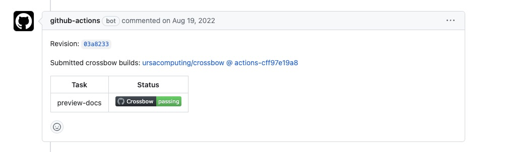](assets/images/docs-preview-1_d938d48db3d58262.jpeg)
> > > >
> > > > Crossbow build status
> > > >
> > > > and then in the summary of the workflow you can find the link to the Docs Preview
> > > > summary at the bottom of the page:
> > > >
> > > > [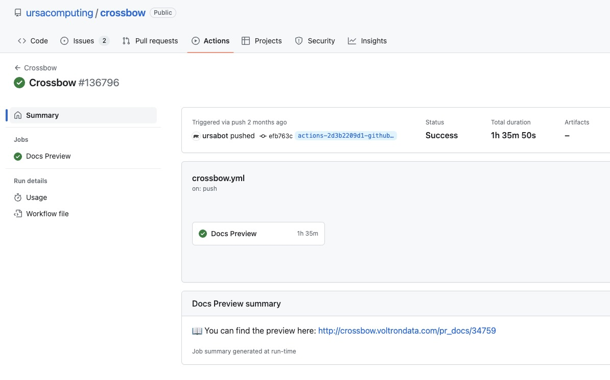](assets/images/docs-preview-2_b1b5e35fb2876480.jpeg)
> > > >
> > > > Docs Preview summary section
> > > >
> > > > > [!NOTE]
> > > > > ## Building for dev purposes
> > > > >
> > > > > ### Building subsections
> > > > >
> > > > > To make it easier for developers to update parts of the documentation, one can
> > > > > build only a subset of it. You can build:
> > > > >
> > > > > - Specifications and protocol section (`docs/source/format`) with:
> > > > >
> > > > > ```
> > > > > pushd arrow/docs
> > > > > make format
> > > > > popd
> > > > > ```
> > > > >
> > > > >   Rendered HTML format can be found in `arrow/docs/_build/html/format`.
> > > > > - Development section (`docs/source/developers`) with:
> > > > >
> > > > > ```
> > > > > pushd arrow/docs
> > > > > make dev
> > > > > popd
> > > > > ```
> > > > >
> > > > >   Rendered HTML format can be found in `arrow/docs/_build/html/developers`.
> > > > > - C++ section (`docs/source/cpp`) with:
> > > > >
> > > > > ```
> > > > > pushd arrow/docs
> > > > > make cpp
> > > > > popd
> > > > > ```
> > > > >
> > > > >   Rendered HTML format can be found in `arrow/docs/_build/html/cpp`.
> > > > > - Python section (`docs/source/python`) with:
> > > > >
> > > > > ```
> > > > > pushd arrow/docs
> > > > > make python
> > > > > popd
> > > > > ```
> > > > >
> > > > >   Rendered HTML format can be found in `arrow/docs/_build/html/python`.
> > > > >
> > > > > > [!NOTE]
> > > > > > **When building only a part of the documentation the links will get broken!**
> > > > > > For this reason building only a subset of the documentation should only be
> > > > > > used in the initial work as it makes the building faster and easier.
> > > > > >
> > > > > > To check for the correctness of the documentation overall one should
> > > > > > build the whole documentation with `make html` or use
> > > > > > [GitHub Actions](#developers-documentation--building-docs-pr-preview).
> > > > >
> > > > > ### Building live
> > > > >
> > > > > You can also build the documentation (or a part of it) live. This means the
> > > > > changes saved will automatically trigger the documentation to be rebuilt.
> > > > >
> > > > > ```
> > > > > pushd arrow/docs
> > > > > make html-live
> > > > > ```
> > > > >
> > > > > The same way one could use `make format-live`, `make dev-live`, `make cpp-live`
> > > > > or `make python-live` to auto-build part of the documentation.
> > > > >
> > > > > ### Building a single directory for dev purposes without all the pre-requisites
> > > > >
> > > > > You can build documentation in a single directory without needing to install
> > > > > all of the pre-requisites by installing sphinx, setting up a temporary
> > > > > index in the directory you want to build and then building that directory.
> > > > >
> > > > > The example below shows how to do this in the `arrow/docs/source/developers` directory.
> > > > >
> > > > > Install `sphinx`:
> > > > >
> > > > > ```
> > > > > pip install sphinx
> > > > > ```
> > > > >
> > > > > Navigate to the `arrow/docs` directory:
> > > > >
> > > > > ```
> > > > > cd arrow/docs
> > > > > ```
> > > > >
> > > > > Create an temporary index file `temp_index.rst` file in the target directory:
> > > > >
> > > > > ```
> > > > > echo $'.. toctree::\n\t:glob:\n\n\t*' > ./source/developers/temp_index.rst
> > > > > ```
> > > > >
> > > > > Build the docs in the target directory:
> > > > >
> > > > > ```
> > > > > sphinx-build ./source/developers ./source/developers/_build -c ./source -D master_doc=temp_index
> > > > > ```
> > > > >
> > > > > This builds everything in the target directory to a folder inside of it
> > > > > called `_build` using the config file in the `source` directory.
> > > > >
> > > > > Once you have verified the HTML documents, you can remove temporary index file:
> > > > >
> > > > > ```
> > > > > rm ./source/developers/temp_index.rst
> > > > > ```

---

<a id="developers-release_verification"></a>

<!-- source_url: https://arrow.apache.org/docs/developers/release_verification.html -->

<!-- page_index: 43 -->

# Release Verification Process #

[Skip to main content](#developers-release_verification--main-content)

Back to top

# Release Verification Process

This page provides detailed information on the steps followed to perform
a release verification on the major platforms.

## Principles

The Apache Arrow Release Approval process follows the guidelines defined at the
[Apache Software Foundation Release Approval](https://www.apache.org/legal/release-policy.html#release-approval).

For a release vote to pass, a minimum of three positive binding votes and more
positive binding votes than negative binding votes MUST be cast.
Releases may not be vetoed. Votes cast by PMC members are binding, however, non-binding votes are greatly encouraged and a sign of a healthy project.

## Running the release verification

### Linux and macOS

In order to run the verification script either for the source release or the
binary artifacts see the following guidelines:

#### Required source verification

Individuals are REQUIRED to download all signed source code packages onto their
own hardware, validate all cryptographic signatures, compile as provided, and test the result on their own platform in order to cast a +1 vote.

```
# this will create and automatically clean up a temporary directory for the verification environment and will run the source verification
TEST_DEFAULT=0 TEST_SOURCE=1 verify-release-candidate.sh $VERSION $RC_NUM

# to verify only certain implementations use the TEST_DEFAULT=0 and TEST_* variables
# here are a couple of examples, but see the source code for the available options
TEST_DEFAULT=0 TEST_CPP=1 verify-release-candidate.sh $VERSION $RC_NUM  # only C++ tests
TEST_DEFAULT=0 TEST_CPP=1 TEST_PYTHON=1 verify-release-candidate.sh $VERSION $RC_NUM  # C++ and Python tests
TEST_DEFAULT=0 TEST_INTEGRATION_CPP=1 TEST_INTEGRATION_JAVA=1 verify-release-candidate.sh $VERSION $RC_NUM  # C++ and Java integration tests
```

#### Binary verification

The binaries are generated from the source that has been verified. Those binaries are
tested on CI but can be tested locally for further validation. It is not necessary to
test them in order to cast a positive vote.

```
# this will create and automatically clean up a temporary directory for the verification environment and will run the binary verification
TEST_DEFAULT=0 TEST_BINARIES=1 dev/release/verify-release-candidate.sh $VERSION $RC_NUM

# to verify certain binaries use the TEST_* variables as:
TEST_DEFAULT=0 TEST_WHEELS=1 verify-release-candidate.sh $VERSION $RC_NUM  # only Wheels
TEST_DEFAULT=0 TEST_APT=1 verify-release-candidate.sh $VERSION $RC_NUM  # only APT packages
TEST_DEFAULT=0 TEST_YUM=1 verify-release-candidate.sh $VERSION $RC_NUM  # only YUM packages
TEST_DEFAULT=0 TEST_JARS=1 verify-release-candidate.sh $VERSION $RC_NUM  # only JARS
```

### Windows

In order to run the verification script on Windows you have to download
the source tarball from the SVN dist system that you wish to verify:

```
dev\release\verify-release-candidate.bat %VERSION% %RC_NUM%
```

## System Configuration Instructions

You will need some tools installed like curl, git, etcetera.

### Ubuntu

You might have to install some packages on your system. The following
utility script can be used to set your Ubuntu system. This wil install
the required packages to perform a source verification on a clean
Ubuntu:

```

# From the arrow clone sudo dev/release/setup -ubuntu. sh
```

### macOS ARM

```

# From the arrow clone brew install gpg brew bundle --file=cpp/Brewfile brew bundle --file=c_glib/Brewfile brew uninstall node
# You might need to add node, ruby java and maven to the PATH, follow
# instructions from brew after installing. brew install node @ 20 brew install ruby brew install openjdk brew install maven
```

### Windows 11

To be defined

## Casting your vote

Once you have performed the verification you can cast your vote by responding
to the vote thread on [dev@arrow.apache.org](mailto:dev%40arrow.apache.org) and supply your result.

If the verification was successful you can send your +1 vote. We usually send
along with the vote the command that was executed and the local versions used.
As an example:

```

+
1
I
've verified successfully the sources and binaries with:
TEST_DEFAULT
=
0
TEST_SOURCE
=
1
dev
/
release
/
verify
-
release
-
candidate
.
sh
15.0.0
1
with
:
*
Python
3.10.12
*
gcc
(
Ubuntu
11.4.0
-
1
ubuntu1
~
22.04
)
11.4.0
*
NVIDIA
CUDA
Build
cuda_11
.5
.
r11
.5
/
compiler
.30672275_0
*
openjdk
version
"17.0.9"
2023
-
10
-
17
*
ruby
3.0.2
p107
(
2021
-
07
-
07
revision
0
db68f0233
)
[
x86_64
-
linux
-
gnu
]
*
dotnet
8.0.204
*
Ubuntu
22.04
LTS
```

If there were some issues during verification please report them on the
mail thread to diagnose the issue.

---

<a id="format-intro"></a>

<!-- source_url: https://arrow.apache.org/docs/format/Intro.html -->

<!-- page_index: 44 -->

# Introduction #

> [!NOTE]
> > [!NOTE]
> > > [!NOTE]
> > > # Introduction
> > >
> > > Apache Arrow was born from the need for a set of standards around
> > > tabular data representation and interchange between systems.
> > > The adoption of these standards reduces computing costs of data
> > > serialization/deserialization and implementation costs across
> > > systems implemented in different programming languages.
> > >
> > > The Apache Arrow specification can be implemented in any programming
> > > language but official implementations for many languages are available.
> > > An implementation consists of format definitions using the constructs
> > > offered by the language and common in-memory data processing algorithms
> > > (e.g. slicing and concatenating). Users can extend and use the utilities
> > > provided by the Apache Arrow implementation in their programming
> > > language of choice. Some implementations are further ahead and feature a
> > > vast set of algorithms for in-memory analytical data processing. More detail
> > > about how implementations differ can be found on the [Implementation Status](https://arrow.apache.org/docs/status.html) page.
> > >
> > > Apart from this initial vision, Arrow has grown to also develop a
> > > multi-language collection of libraries for solving problems related to
> > > in-memory analytical data processing. This covers topics like:
> > >
> > > - Zero-copy shared memory and RPC-based data movement
> > > - Reading and writing file formats (like CSV, [Apache ORC](https://orc.apache.org/), and [Apache Parquet](https://parquet.apache.org/))
> > > - In-memory analytics and query processing
> > >
> > > ## Arrow Columnar Format
> > >
> > > Apache Arrow focuses on tabular data. For an example, let’s consider
> > > we have data that can be organized into a table:
> > >
> > > [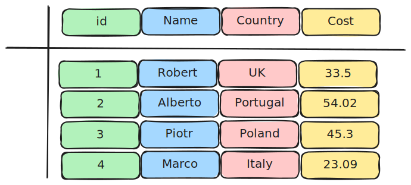](assets/images/columnar-diagram-1_243c4d94a3214eeb.svg)
> > >
> > > Diagram of a tabular data structure.
> > >
> > > Tabular data can be represented in memory using a row-based format or a
> > > column-based format. The row-based format stores data row-by-row, meaning the rows
> > > are adjacent in the computer memory:
> > >
> > > 
> > >
> > > Tabular data being saved in memory row by row.
> > >
> > > In a columnar format, the data is organized column-by-column instead.
> > > This organization makes analytical operations like filtering, grouping, aggregations and others, more efficient thanks to memory locality.
> > > When processing the data, the memory locations accessed by the CPU tend
> > > to be near one another. By keeping the data contiguous in memory, it also
> > > enables vectorization of the computations. Most modern CPUs have
> > > [SIMD instructions](https://en.wikipedia.org/wiki/Single_instruction,_multiple_data) (a single instruction that operates on multiple values at
> > > once) enabling parallel processing and execution of operations on vector data
> > > using a single CPU instruction.
> > >
> > > Apache Arrow is solving this exact problem. It is the specification that
> > > uses the columnar layout.
> > >
> > > 
> > >
> > > The same tabular data being saved in memory column by column.
> > >
> > > Each column is called an **Array** in Arrow terminology. Arrays can be of
> > > different data types and the way their values are stored in memory varies among
> > > the data types. The specification of how these values are arranged in memory is
> > > what we call a **physical memory layout**. One contiguous region of memory that
> > > stores data for arrays is called a **Buffer**. An array consists of one or more
> > > buffers.
> > >
> > > Next sections give an introduction to Arrow Columnar Format explaining the
> > > different physical layouts. The full specification of the format can be found
> > > at [Arrow Columnar Format](#format-columnar--format-columnar).
> > >
> > > ## Support for Null Values
> > >
> > > Arrow supports missing values or “nulls” for all data types: any value
> > > in an array may be semantically null, whether primitive or nested data type.
> > >
> > > In Arrow, a dedicated buffer, known as the validity (or “null”) bitmap, is used alongside the data indicating whether each value in the array is
> > > null or not: a value of 1 means that the value is not-null (“valid”), whereas
> > > a value of 0 indicates that the value is null.
> > >
> > > This validity bitmap is optional: if there are no missing values in
> > > the array the buffer does not need to be allocated (as in the example
> > > column 1 in the diagram below).
> > >
> > > > [!NOTE]
> > > > **We read validity bitmaps right-to-left within a group of 8 bits due to least-significant bit numbering being used.**
> > > > This is also how we have represented the validity bitmaps in the
> > > > diagrams included in this document.
> > >
> > > ## Primitive Layouts
> > >
> > > ### Fixed Size Primitive Layout
> > >
> > > A primitive column represents an array of values where each value
> > > has the same physical size measured in bytes. Data types that use the
> > > fixed size primitive layout are, for example, signed and unsigned
> > > integer data types, floating point numbers, boolean, decimal and temporal
> > > data types.
> > >
> > > 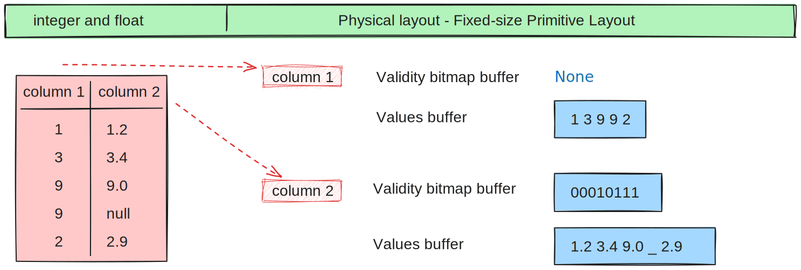
> > >
> > > Physical layout diagram for primitive data types.
> > >
> > > > [!NOTE]
> > > > The boolean data type is represented with a primitive layout where the
> > > > values are encoded in bits instead of bytes. That means the physical
> > > > layout includes a values bitmap buffer and possibly a validity bitmap
> > > > buffer.
> > > >
> > > > 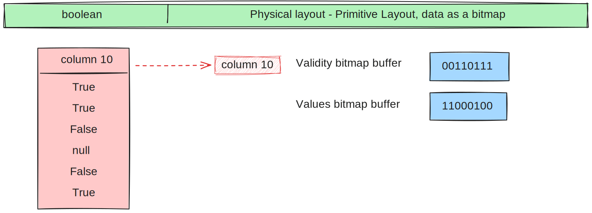
> > > >
> > > > Physical layout diagram for boolean data type.
> > >
> > > > [!NOTE]
> > > > **Arrow also has a concept of Null data type where all values are null. In this case no buffers are allocated.**
> > > >
> > >
> > > ### Variable length binary and string
> > >
> > > In contrast to the fixed size primitive layout, the variable length layout
> > > allows representing an array where each element can have a variable size
> > > in bytes. This layout is used for binary and string data.
> > >
> > > The bytes of all elements in a binary or string column are stored together
> > > consecutively in a single buffer or region of memory. To know where each element
> > > of the column starts and ends, the physical layout also includes integer offsets.
> > > The offsets buffer is always one element longer than the array.
> > > The last two offsets define the start and the end of the last
> > > binary/string element.
> > >
> > > Binary and string data types share the same physical layout. The only
> > > difference between them is that a string-typed array is assumed to contain
> > > valid UTF-8 string data.
> > >
> > > The difference between binary/string and large binary/string is in the offset
> > > data type. In the first case that is int32 and in the second it is int64.
> > >
> > > The limitation of data types using 32 bit offsets is that they have a maximum size of
> > > 2GB per array. One can still use the non-large variants for bigger data, but
> > > then multiple chunks are needed.
> > >
> > > 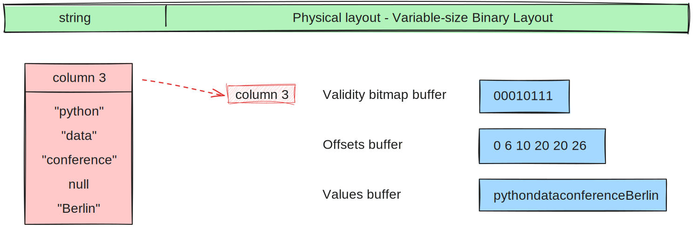
> > >
> > > Physical layout diagram for variable length string data types.
> > >
> > > ### Variable length binary and string view
> > >
> > > This layout is an alternative for the variable length binary layout and is adapted
> > > from TU Munich’s [UmbraDB](https://umbra-db.com/) and is similar to the string layout used in [DuckDB](https://duckdb.com) and
> > > [Velox](https://velox-lib.io/) (and sometimes also called “German strings”).
> > >
> > > The main difference to the classical binary and string layout is the views buffer.
> > > It includes the length of the string, and then either its characters appearing
> > > inline (for small strings) or only the first 4 bytes of the string and an offset into
> > > one of the potentially several data buffers. Because it uses an offset and length to refer
> > > to the data buffer, the bytes of all elements do not need to be stored
> > > consecutively in a single buffer. This enables out of order writing of
> > > variable length elements into the array.
> > >
> > > These properties are important for efficient string processing. The prefix
> > > enables a profitable fast path for string comparisons, which are frequently
> > > determined within the first four bytes. Selecting elements is a simple “gather”
> > > operation on the fixed-width views buffer and does not need to rewrite the
> > > values buffers.
> > >
> > > 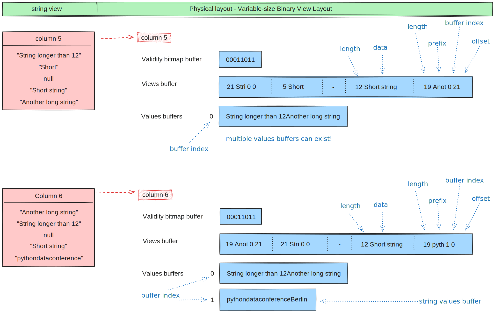
> > >
> > > Physical layout diagram for variable length string view data type.
> > >
> > > ## Nested Layouts
> > >
> > > Nested data types introduce the concept of parent and child arrays. They express
> > > relationships between physical value arrays in a nested data type structure.
> > >
> > > Nested data types depend on one or more other child data types. For instance, List
> > > is a nested data type (parent) that has one child (the data type of the values in
> > > the list).
> > >
> > > ### List
> > >
> > > The list data type enables representing an array where each element is a sequence
> > > of elements of the same data type. The layout is similar to variable-size binary
> > > or string layout as it has an offsets buffer to define where the sequence of values
> > > for each element starts and ends, with all the values being stored consecutively
> > > in a values child array.
> > >
> > > The offsets in the list data type are int32 while in the large list the offsets
> > > are int64.
> > >
> > > 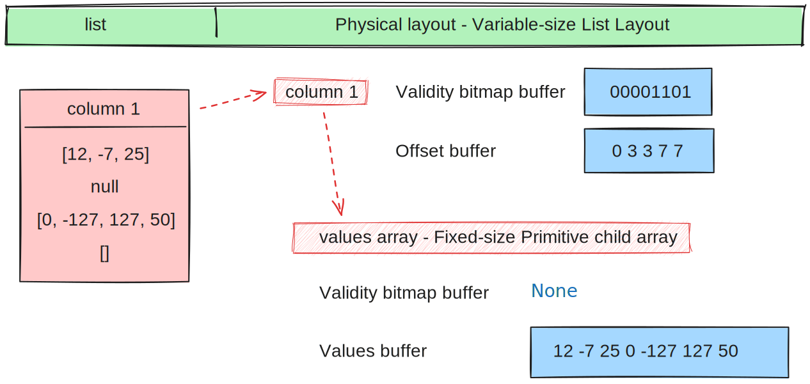
> > >
> > > Physical layout diagram for variable size list data type.
> > >
> > > ### Fixed Size List
> > >
> > > Fixed-size list is a special case of variable-size list where each column slot
> > > contains a fixed size sequence meaning all lists are the same size and so the
> > > offset buffer is no longer needed.
> > >
> > > 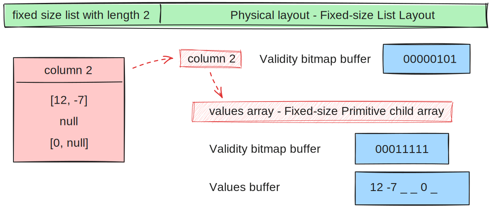
> > >
> > > Physical layout diagram for fixed size list data type.
> > >
> > > ### List View
> > >
> > > In contrast to the list type, list view type also has a size buffer together
> > > with an offset buffer. The offsets continue to indicate the start of each
> > > element but size is now saved in a separate size buffer. This allows
> > > out-of-order offsets as the sizes aren’t derived from the consecutive
> > > offsets anymore.
> > >
> > > 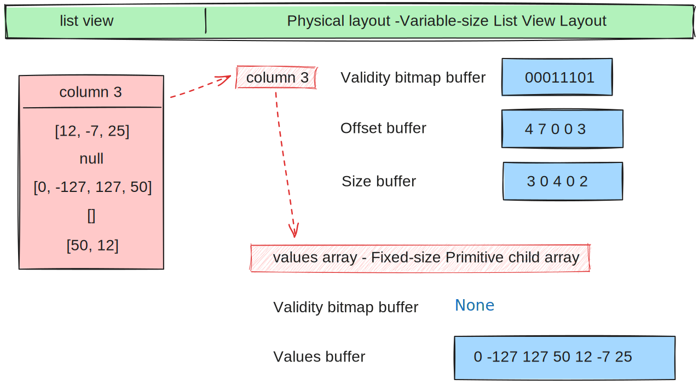
> > >
> > > Physical layout diagram for variable size list view data type.
> > >
> > > ### Struct
> > >
> > > A struct is a nested data type parameterized by an ordered sequence of fields
> > > (a data type and a name).
> > >
> > > - There is one child array for each field
> > > - Child arrays are independent and need not be adjacent to each other in
> > >   memory. They only need to have the same length.
> > >
> > > One can think of an individual struct field as a key-value pair where the
> > > key is the field name and the child array its values. The field (key) is
> > > saved in the schema and the values of a specific field (key) are saved in
> > > the child array.
> > >
> > > Since child arrays are independent, Arrow does not enforce physical
> > > consistency between the struct’s validity bitmap and those of it’s children.
> > > Logically, a struct row is only valid if both the parent and the child
> > > bitmaps have a value of 1 for that slot (a logical AND operation).
> > > This allows for “hidden” data to exist in child arrays at null struct
> > > positions (see `alice` below).
> > >
> > > 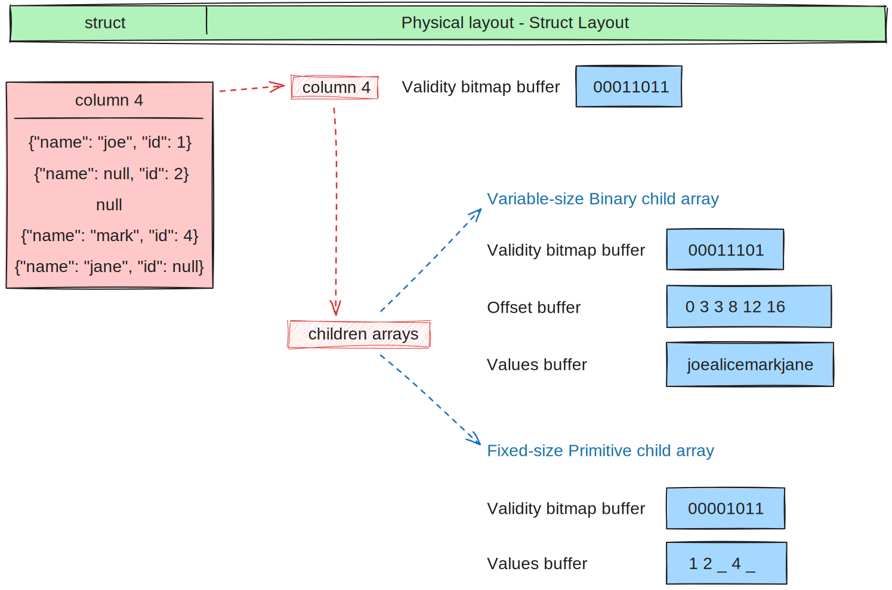
> > >
> > > Physical layout diagram for struct data type.
> > >
> > > ### Map
> > >
> > > The Map data type represents nested data where each value is a variable number of
> > > key-value pairs. Its physical representation is the same as a list of `{key, value}`
> > > structs.
> > >
> > > The difference between the struct and map data types is that a struct holds the key
> > > in the schema, requiring keys to be strings, and the values are stored in the
> > > child arrays, one for each field. There can be multiple keys and therefore multiple child arrays.
> > > The map, on the other hand, has one child array holding all the different keys (that
> > > thus all need to be of the same data type, but not necessarily strings) and a second
> > > child array holding all the values. The values need to be of the same data type; however, the data type doesn’t have to match that of the keys.
> > >
> > > Also, the map stores the struct in a list and needs an offset as the list is
> > > variable shape.
> > >
> > > 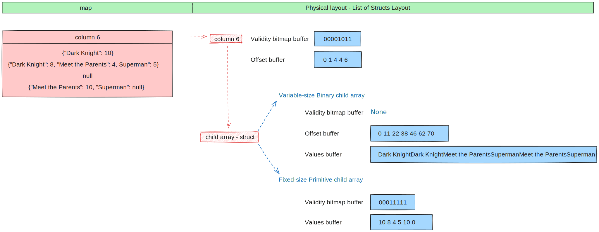
> > >
> > > Physical layout diagram for map data type.
> > >
> > > ### Union
> > >
> > > The union is a nested data type where each slot in the union has a value with a data type
> > > chosen from a subset of possible Arrow data types. That means that a union array represents
> > > a mixed-type array. Unlike other data types, unions do not have their own validity bitmap
> > > and the nullness is determined by the child arrays.
> > >
> > > Arrow defines two distinct union data types, “dense” and “sparse”.
> > >
> > > #### Dense Union
> > >
> > > A Dense Union has one child array for each data type present in the mixed-type array and
> > > two buffers of its own:
> > >
> > > - **Types buffer:** holds data type id for each slot of the array. Data type id is
> > >   frequently the index of the child array; however, the relationship between data type
> > >   ID and the child index is a parameter of the data type.
> > > - **Offsets buffer:** holds relative offset into the respective child array for each
> > >   array slot.
> > >
> > > 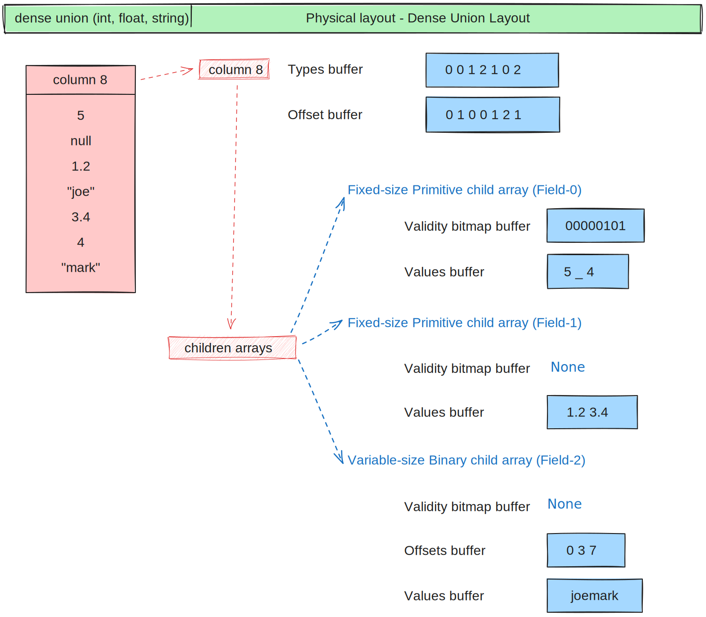
> > >
> > > Physical layout diagram for dense union data type.
> > >
> > > #### Sparse union
> > >
> > > A sparse union has the same structure as a dense union, with the omission of the offsets
> > > buffer. In this case, the child arrays are each equal in length to the length of the union.
> > >
> > > 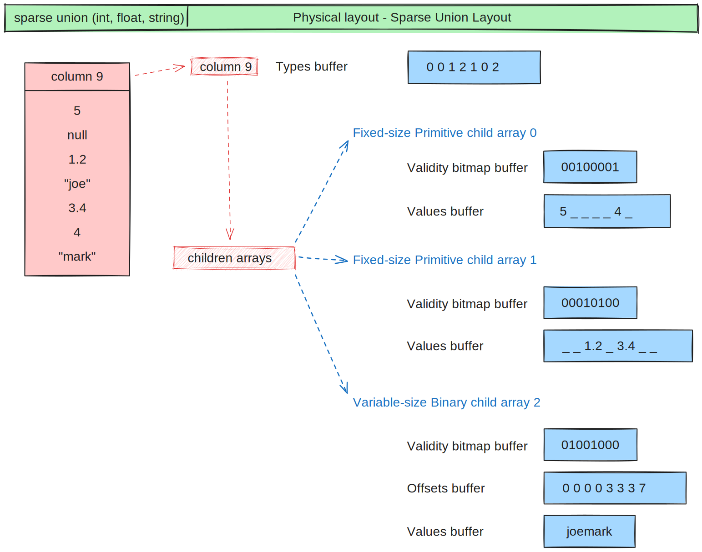
> > >
> > > Physical layout diagram for sparse union data type.
> > >
> > > ## Dictionary Encoded Layout
> > >
> > > Dictionary encoding can be effective when one has data with many repeated values.
> > > The values are represented by integers referencing a dictionary usually consisting of
> > > unique values.
> > >
> > > 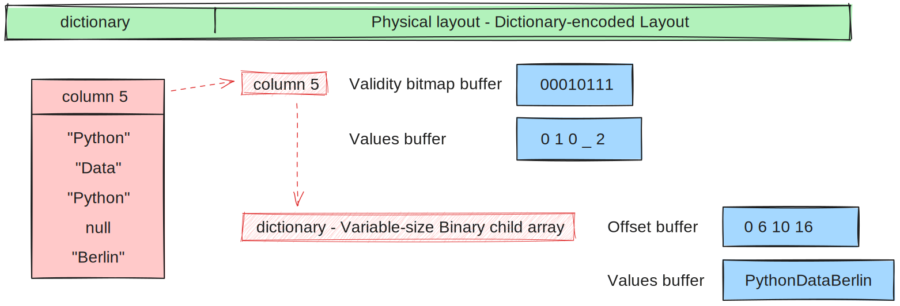
> > >
> > > Physical layout diagram for dictionary data type.
> > >
> > > ## Run-End Encoded Layout
> > >
> > > Run-end encoding is well-suited for representing data containing sequences of the
> > > same value. These sequences are called runs. A run-end encoded array has no buffers
> > > of its own, but has two child arrays:
> > >
> > > - **Run ends array:** holds the index in the array where each run ends. The number
> > >   of run ends is the same as the length of its parent array.
> > > - **Values array:** the actual values without repetitions (together with null values).
> > >
> > > Note that nulls of the parent array are strictly represented in the values array.
> > >
> > > 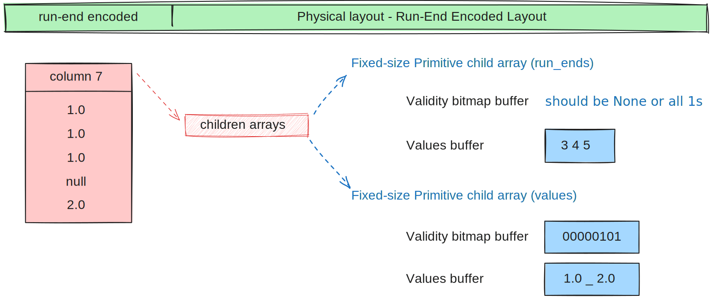
> > >
> > > Physical layout diagram for run-end encoded data type.
> > >
> > > > [!NOTE]
> > > > **See also**
> > > > Table of all Arrow [Data Types](#format-columnar--data-types).
> > >
> > > > [!NOTE]
> > > > ## Overview of Arrow Terminology
> > > >
> > > > **Physical layout**
> > > > A specification for how to represent values of an array in memory.
> > > >
> > > > **Buffer**
> > > > A contiguous region of memory with a given length in bytes. Buffers are used to store data
> > > > for arrays. Sometimes we use the notion of number of elements in a buffer which can only be
> > > > used if we know the data type of the array that wraps this specific buffer.
> > > >
> > > > **Array**
> > > > A contiguous, one-dimensional sequence of values with known length where all values have the
> > > > same data type. An array consists of zero or more buffers.
> > > >
> > > > **Chunked Array**
> > > > A discontiguous, one-dimensional sequence of values with known length where all values have
> > > > the same data type. Consists of zero or more arrays, the “chunks”.
> > > >
> > > > > [!NOTE]
> > > > > **Chunked Array is a concept specific to certain implementations such as Arrow C++ and PyArrow.**
> > > > >
> > > >
> > > > **RecordBatch**
> > > > A contiguous, two-dimensional data structure which consists of an ordered collection of arrays
> > > > of the same length.
> > > >
> > > > **Schema**
> > > > An ordered collection of fields that communicates all the data types of an object
> > > > like a RecordBatch or Table. Schemas can contain optional key/value metadata.
> > > >
> > > > **Field**
> > > > A Field includes a field name, a data type, a nullability flag and
> > > > optional key-value metadata for a specific column in a RecordBatch.
> > > >
> > > > **Table**
> > > > A discontiguous, two-dimensional chunk of data consisting of an ordered collection of Chunked
> > > > Arrays. All Chunked Arrays have the same length, but may have different types. Different columns
> > > > may be chunked differently.
> > > >
> > > > > [!NOTE]
> > > > > Table is a concept specific to certain implementations such as Arrow C++ and PyArrow. In Java
> > > > > implementation, for example, a Table is not a collection of Chunked Arrays but a collection of
> > > > > RecordBatches.
> > > >
> > > > 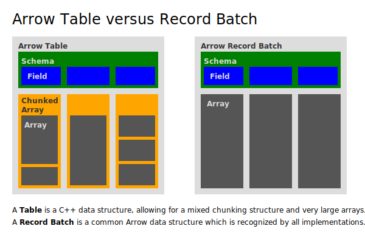
> > > >
> > > > > [!NOTE]
> > > > > **See also**
> > > > > The [Glossary](#format-glossary--glossary) for more terms.
> > >
> > > ## Extension Types
> > >
> > > In case the system or application needs to extend standard Arrow data types with
> > > custom semantics, this is enabled by defining extension types.
> > >
> > > Examples of an extension type are [UUID](#format-canonicalextensions--uuid-extension) or
> > > [Fixed shape tensor](#format-canonicalextensions--fixed-shape-tensor-extension) extension type.
> > >
> > > Extension types can be defined by annotating any of the built-in Arrow data types
> > > (the “storage type”) with a custom type name and optional serialized representation
> > > (`'ARROW:extension:name'` and `'ARROW:extension:metadata'` keys in the Field
> > > metadata structure).
> > >
> > > > [!NOTE]
> > > > **See also**
> > > > The [Extension Types](#format-columnar--format-metadata-extension-types) documentation.
> > >
> > > ### Canonical Extension Types
> > >
> > > It is beneficial to share the definitions of well-known extension types so as to
> > > improve interoperability between different systems integrating Arrow columnar data.
> > > For this reason canonical extension types are defined in Arrow itself.
> > >
> > > > [!NOTE]
> > > > **See also**
> > > > The [Canonical Extension Types](#format-canonicalextensions--format-canonical-extensions) documentation.
> > >
> > > ### Community Extension Types
> > >
> > > These are Arrow extension types that have been established as standards within specific
> > > domain areas.
> > >
> > > Example:
> > >
> > > - [GeoArrow](https://geoarrow.org): A collection of Arrow extension types for representing vector geometries
> > >
> > > ## Sharing Arrow data
> > >
> > > Arrow memory layout is meant to be a universal standard for representing tabular data in memory, not tied to a specific implementation. The Arrow standard defines two protocols for
> > > well-defined and unambiguous communication of Arrow data between applications:
> > >
> > > - Protocol to share Arrow data between processes or over the network is called [Serialization and Interprocess Communication (IPC)](#format-columnar--format-ipc).
> > >   The specification for sharing data is called IPC message format which defines how Arrow
> > >   array or record batch buffers are stacked together to be serialized and deserialized.
> > > - To share Arrow data in the same process [The Arrow C data interface](#format-cdatainterface--c-data-interface) is used, meant for sharing
> > >   the same buffer zero-copy in memory between different libraries within the same process.

---

<a id="format-columnar"></a>

<!-- source_url: https://arrow.apache.org/docs/format/Columnar.html -->

<!-- page_index: 45 -->

# Arrow Columnar Format

*Version: 1.5*

> [!NOTE]
> **See also**
> [Additions to the Arrow columnar format since version 1.0.0](#format-versioning--post-1-0-0-format-versions)

The **Arrow columnar format** includes a language-agnostic in-memory
data structure specification, metadata serialization, and a protocol
for serialization and generic data transport.

This document is intended to provide adequate detail to create a new
implementation of the columnar format without the aid of an existing
implementation. We utilize Google’s [Flatbuffers](http://github.com/google/flatbuffers) project for
metadata serialization, so it will be necessary to refer to the
project’s [Flatbuffers protocol definition files](https://github.com/apache/arrow/tree/main/format)
while reading this document.

The columnar format has some key features:

- Data adjacency for sequential access (scans)
- O(1) (constant-time) random access [[1]](#format-columnar--f1)
- SIMD and vectorization-friendly
- Relocatable without “pointer swizzling”, allowing for true zero-copy
  access in shared memory

The Arrow columnar format provides analytical performance and data
locality guarantees in exchange for comparatively more expensive
mutation operations. This document is concerned only with in-memory
data representation and serialization details; issues such as
coordinating mutation of data structures are left to be handled by
implementations.

[[1](#format-columnar--id1)]

Except for the [Run-End Encoded Layout](#format-columnar--run-end-encoded-layout) where random access is
O(log n).

## Terminology

Since different projects have used different words to describe various
concepts, here is a small glossary to help disambiguate.

- **Array** or **Vector**: a sequence of values with known length all
  having the same type. These terms are used interchangeably in
  different Arrow implementations, but we use “array” in this
  document.
- **Slot**: a single logical value in an array of some particular data type
- **Buffer** or **Contiguous memory region**: a sequential virtual
  address space with a given length. Any byte can be reached via a
  single pointer offset less than the region’s length.
- **Physical Layout**: The underlying memory layout for an array
  without taking into account any value semantics. For example, a
  32-bit signed integer array and 32-bit floating point array have the
  same layout.
- **Data type**: An application-facing semantic value type that is
  implemented using some physical layout. For example, Decimal128
  values are stored as 16 bytes in a fixed-size binary
  layout. A timestamp may be stored as 64-bit fixed-size layout.
- **Primitive type**: a data type having no child types. This includes
  such types as fixed bit-width, variable-size binary, and null types.
- **Nested type**: a data type whose full structure depends on one or
  more other child types. Two fully-specified nested types are equal
  if and only if their child types are equal. For example, `List<U>`
  is distinct from `List<V>` iff U and V are different types.
- **Parent** and **child arrays**: names to express relationships
  between physical value arrays in a nested type structure. For
  example, a `List<T>`-type parent array has a T-type array as its
  child (see more on lists below).
- **Parametric type**: a type which requires additional parameters
  for full determination of its semantics. For example, all nested types
  are parametric by construction. A timestamp is also parametric as it needs
  a unit (such as microseconds) and a timezone.

> [!NOTE]
> ## Data Types
>
> The file [Schema.fbs](https://github.com/apache/arrow/blob/main/format/Schema.fbs) defines built-in data types supported by the
> Arrow columnar format. Each data type uses a well-defined physical layout.
>
> [Schema.fbs](https://github.com/apache/arrow/blob/main/format/Schema.fbs) is the authoritative source for the description of the
> standard Arrow data types. However, we also provide the below table for
> convenience:
>
> | Type | Type Parameters *(1)* | Physical Memory Layout |
> | --- | --- | --- |
> | Null |  | Null |
> | Boolean |  | Fixed-size Primitive |
> | Int | - bit width - signedness | *“ (same as above)* |
> | Floating Point | - precision | *“* |
> | Decimal | - bit width - scale - precision | *“* |
> | Date | - unit | *“* |
> | Time | - bit width *(2)* - unit | *“* |
> | Timestamp | - unit - timezone | *“* |
> | Interval | - unit | *“* |
> | Duration | - unit | *“* |
> | Fixed-Size Binary | - byte width | Fixed-size Binary |
> | Binary |  | Variable-size Binary with 32-bit offsets |
> | Utf8 |  | *“* |
> | Large Binary |  | Variable-size Binary with 64-bit offsets |
> | Large Utf8 |  | *“* |
> | Binary View |  | Variable-size Binary View |
> | Utf8 View |  | *“* |
> | Fixed-Size List | - *value type* - list size | Fixed-size List |
> | List | - *value type* | Variable-size List with 32-bit offsets |
> | Large List | - *value type* | Variable-size List with 64-bit offsets |
> | List View | - *value type* | Variable-size List View with 32-bit offsets and sizes |
> | Large List View | - *value type* | Variable-size List View with 64-bit offsets and sizes |
> | Struct | - *children* | Struct |
> | Map | - *children* - keys sortedness | Variable-size List of Structs |
> | Union | - *children* - mode - type ids | Dense or Sparse Union *(3)* |
> | Dictionary | - *index type* *(4)* - *value type* - orderedness | Dictionary Encoded |
> | Run-End Encoded | - *run end type* *(5)* - *value type* | Run-End Encoded |
>
> - (1) Type parameters listed in *italics* denote a data type’s child types.
> - (2) The *bit width* parameter of a Time type is technically redundant as
>   each *unit* mandates a single bit width.
> - (3) Whether a Union type uses the Sparse or Dense layout is denoted by its
>   *mode* parameter.
> - (4) The *index type* of a Dictionary type can only be an integer type,
>   preferably signed, with width 8 to 64 bits.
> - (5) The *run end type* of a Run-End Encoded type can only be a signed integer type
>   with width 16 to 64 bits.
>
> > [!NOTE]
> > Sometimes the term “logical type” is used to denote the Arrow data types
> > and distinguish them from their respective physical layouts. However, unlike other type systems such as [Apache Parquet](https://parquet.apache.org/)’s, the Arrow type system doesn’t have separate notions of physical types and
> > logical types.
> >
> > The Arrow type system separately provides
> > [extension types](#format-columnar--format-metadata-extension-types), which allow
> > annotating standard Arrow data types with richer application-facing semantics
> > (for example defining a “JSON” type laid upon the standard String data type).

> [!NOTE]
> ## Physical Memory Layout
>
> Arrays are defined by a few pieces of metadata and data:
>
> - A data type.
> - A sequence of buffers.
> - A length as a 64-bit signed integer. Implementations are permitted
>   to be limited to 32-bit lengths, see more on this below.
> - A null count as a 64-bit signed integer.
> - An optional **dictionary**, for dictionary-encoded arrays.
>
> Nested arrays additionally have a sequence of one or more sets of
> these items, called the **child arrays**.
>
> Each data type has a well-defined physical layout. Here are the different
> physical layouts defined by Arrow:
>
> - **Primitive (fixed-size)**: a sequence of values each having the
>   same byte or bit width
> - **Variable-size Binary**: a sequence of values each having a variable
>   byte length. Two variants of this layout are supported using 32-bit
>   and 64-bit length encoding.
> - **View of Variable-size Binary**: a sequence of values each having a
>   variable byte length. In contrast to Variable-size Binary, the values
>   of this layout are distributed across potentially multiple buffers
>   instead of densely and sequentially packed in a single buffer.
> - **Fixed-size List**: a nested layout where each value has the same
>   number of elements taken from a child data type.
> - **Variable-size List**: a nested layout where each value is a
>   variable-length sequence of values taken from a child data type. Two
>   variants of this layout are supported using 32-bit and 64-bit length
>   encoding.
> - **View of Variable-size List**: a nested layout where each value is a
>   variable-length sequence of values taken from a child data type. This
>   layout differs from **Variable-size List** by having an additional
>   buffer containing the sizes of each list value. This removes a constraint
>   on the offsets buffer — it does not need to be in order.
> - **Struct**: a nested layout consisting of a collection of named
>   child **fields** each having the same length but possibly different
>   types.
> - **Sparse** and **Dense Union**: a nested layout representing a
>   sequence of values, each of which can have type chosen from a
>   collection of child array types.
> - **Dictionary-Encoded**: a layout consisting of a sequence of
>   integers (any bit-width) which represent indexes into a dictionary
>   which could be of any type.
> - **Run-End Encoded (REE)**: a nested layout consisting of two child arrays,
>   one representing values, and one representing the logical index where
>   the run of a corresponding value ends.
> - **Null**: a sequence of all null values.
>
> The Arrow columnar memory layout only applies to *data* and not
> *metadata*. Implementations are free to represent metadata in-memory
> in whichever form is convenient for them. We handle metadata
> **serialization** in an implementation-independent way using
> [Flatbuffers](http://github.com/google/flatbuffers), detailed below.
>
> ### Buffer Alignment and Padding
>
> Implementations are recommended to allocate memory on aligned
> addresses (multiple of 8- or 64-bytes) and pad (overallocate) to a
> length that is a multiple of 8 or 64 bytes. When serializing Arrow
> data for interprocess communication, these alignment and padding
> requirements are enforced. If possible, we suggest that you prefer
> using 64-byte alignment and padding. Unless otherwise noted, padded
> bytes do not need to have a specific value.
>
> The alignment requirement follows best practices for optimized memory
> access:
>
> - Elements in numeric arrays will be guaranteed to be retrieved via aligned access.
> - On some architectures alignment can help limit partially used cache lines.
>
> The recommendation for 64 byte alignment comes from the [Intel
> performance guide](https://web.archive.org/web/20151101074635/https://software.intel.com/en-us/articles/practical-intel-avx-optimization-on-2nd-generation-intel-core-processors) that recommends alignment of memory to match SIMD
> register width. The specific padding length was chosen because it
> matches the largest SIMD instruction registers available on widely
> deployed x86 architecture (Intel AVX-512).
>
> The recommended padding of 64 bytes allows for using [SIMD](https://www.intel.com/content/www/us/en/docs/cpp-compiler/developer-guide-reference/2021-8/simd-data-layout-templates.html)
> instructions consistently in loops without additional conditional
> checks. This should allow for simpler, efficient and CPU
> cache-friendly code. In other words, we can load the entire 64-byte
> buffer into a 512-bit wide SIMD register and get data-level
> parallelism on all the columnar values packed into the 64-byte
> buffer. Guaranteed padding can also allow certain compilers to
> generate more optimized code directly (e.g. One can safely use Intel’s
> `-qopt-assume-safe-padding`).
>
> ### Array lengths
>
> Array lengths are represented in the Arrow metadata as a 64-bit signed
> integer. An implementation of Arrow is considered valid even if it only
> supports lengths up to the maximum 32-bit signed integer, though. If using
> Arrow in a multi-language environment, we recommend limiting lengths to
> 2 31 - 1 elements or less. Larger data sets can be represented using
> multiple array chunks.
>
> ### Null count
>
> The number of null value slots is a property of the physical array and
> considered part of the data structure. The null count is represented
> in the Arrow metadata as a 64-bit signed integer, as it may be as
> large as the array length.
>
> ### Validity bitmaps
>
> Any value in an array may be semantically null, whether primitive or nested
> type.
>
> All array types, with the exception of union types (more on these later), utilize a dedicated memory buffer, known as the validity (or “null”) bitmap, to
> encode the nullness or non-nullness of each value slot. The validity bitmap
> must be large enough to have at least 1 bit for each array slot.
>
> Whether any array slot is valid (non-null) is encoded in the respective bits of
> this bitmap. A 1 (set bit) for index `j` indicates that the value is not null, while a 0 (bit not set) indicates that it is null. Bitmaps are to be
> initialized to be all unset at allocation time (this includes padding):
>
> ```
>
> is_valid
> [
> j
> ]
> ->
> bitmap
> [
> j
> /
> 8
> ]
> &
> (
> 1
> <<
> (
> j
> % 8))
> ```
>
> We use [least-significant bit (LSB) numbering](https://en.wikipedia.org/wiki/Bit_numbering) (also known as
> bit-endianness). This means that within a group of 8 bits, we read
> right-to-left:
>
> ```
>
> values
> =
> [
> 0
> ,
> 1
> ,
> null
> ,
> 2
> ,
> null
> ,
> 3
> ]
> bitmap
> j
> mod
> 8
> 7
> 6
> 5
> 4
> 3
> 2
> 1
> 0
> 0
> 0
> 1
> 0
> 1
> 0
> 1
> 1
> ```
>
> Arrays having a 0 null count may choose to not allocate the validity
> bitmap; how this is represented depends on the implementation (for
> example, a C++ implementation may represent such an “absent” validity
> bitmap using a NULL pointer). Implementations may choose to always allocate
> a validity bitmap anyway as a matter of convenience. Consumers of Arrow
> arrays should be ready to handle those two possibilities.
>
> Nested type arrays (except for union types as noted above) have their own
> top-level validity bitmap and null count, regardless of the null count and
> valid bits of their child arrays.
>
> Array slots which are null are not required to have a particular value;
> any “masked” memory can have any value and need not be zeroed, though
> implementations frequently choose to zero memory for null values.
>
> ### Fixed-size Primitive Layout
>
> A primitive value array represents an array of values each having the
> same physical slot width typically measured in bytes, though the spec
> also provides for bit-packed types (e.g. boolean values encoded in
> bits).
>
> Internally, the array contains a contiguous memory buffer whose total
> size is at least as large as the slot width multiplied by the array
> length. For bit-packed types, the size is rounded up to the nearest
> byte.
>
> The associated validity bitmap is contiguously allocated (as described
> above) but does not need to be adjacent in memory to the values
> buffer.
>
> **Example Layout: Int32 Array**
>
> For example a primitive array of int32s:
>
> ```
>
> [
> 1
> ,
> null
> ,
> 2
> ,
> 4
> ,
> 8
> ]
> ```
>
> Would look like:
>
> ```
>
> *
> Length
> :
> 5
> ,
> Null
> count
> :
> 1
> *
> Validity
> bitmap
> buffer
> :
> |
> Byte
> 0
> (
> validity
> bitmap
> )
> |
> Bytes
> 1
> -
> 63
> |
> |--------------------------|-----------------------|
> |
> 00011101
> |
> 0
> (
> padding
> )
> |
> *
> Value
> Buffer
> :
> |
> Bytes
> 0
> -
> 3
> |
> Bytes
> 4
> -
> 7
> |
> Bytes
> 8
> -
> 11
> |
> Bytes
> 12
> -
> 15
> |
> Bytes
> 16
> -
> 19
> |
> Bytes
> 20
> -
> 63
> |
> |-------------|-------------|-------------|-------------|-------------|-----------------------|
> |
> 1
> |
> unspecified
> |
> 2
> |
> 4
> |
> 8
> |
> unspecified
> (
> padding
> )
> |
> ```
>
> **Example Layout: Non-null int32 Array**
>
> `[1, 2, 3, 4, 8]` has two possible layouts:
>
> ```
>
> *
> Length
> :
> 5
> ,
> Null
> count
> :
> 0
> *
> Validity
> bitmap
> buffer
> :
> |
> Byte
> 0
> (
> validity
> bitmap
> )
> |
> Bytes
> 1
> -
> 63
> |
> |--------------------------|-----------------------|
> |
> 00011111
> |
> 0
> (
> padding
> )
> |
> *
> Value
> Buffer
> :
> |
> Bytes
> 0
> -
> 3
> |
> Bytes
> 4
> -
> 7
> |
> Bytes
> 8
> -
> 11
> |
> Bytes
> 12
> -
> 15
> |
> Bytes
> 16
> -
> 19
> |
> Bytes
> 20
> -
> 63
> |
> |-------------|-------------|-------------|-------------|-------------|-----------------------|
> |
> 1
> |
> 2
> |
> 3
> |
> 4
> |
> 8
> |
> unspecified
> (
> padding
> )
> |
> ```
>
> or with the bitmap elided:
>
> ```
>
> *
> Length
> 5
> ,
> Null
> count
> :
> 0
> *
> Validity
> bitmap
> buffer
> :
> Not
> required
> *
> Value
> Buffer
> :
> |
> Bytes
> 0
> -
> 3
> |
> Bytes
> 4
> -
> 7
> |
> Bytes
> 8
> -
> 11
> |
> bytes
> 12
> -
> 15
> |
> bytes
> 16
> -
> 19
> |
> Bytes
> 20
> -
> 63
> |
> |-------------|-------------|-------------|-------------|-------------|-----------------------|
> |
> 1
> |
> 2
> |
> 3
> |
> 4
> |
> 8
> |
> unspecified
> (
> padding
> )
> |
> ```
>
> ### Variable-size Binary Layout
>
> Each value in this layout consists of 0 or more bytes. While primitive
> arrays have a single values buffer, variable-size binary have an
> **offsets** buffer and **data** buffer.
>
> The offsets buffer contains `length + 1` signed integers (either
> 32-bit or 64-bit, depending on the data type), which encode the
> start position of each slot in the data buffer. The length of the
> value in each slot is computed using the difference between the offset
> at that slot’s index and the subsequent offset. For example, the
> position and length of slot j is computed as:
>
> ```
>
> slot_position
> =
> offsets
> [
> j
> ]
> slot_length
> =
> offsets
> [
> j
> +
> 1
> ]
> -
> offsets
> [
> j
> ]
> //
> (
> for
> 0
> <=
> j
> <
> length
> )
> ```
>
> It should be noted that a null value may have a positive slot length.
> That is, a null value may occupy a **non-empty** memory space in the data
> buffer. When this is true, the content of the corresponding memory space
> is undefined.
>
> Offsets must be monotonically increasing, that is `offsets[j+1] >= offsets[j]`
> for `0 <= j < length`, even for null slots. This property ensures the
> location for all values is valid and well defined.
>
> Generally the first slot in the offsets array is 0, and the last slot
> is the length of the values array. When serializing this layout, we
> recommend normalizing the offsets to start at 0.
>
> **Example Layout: ``VarBinary``**
>
> `['joe', null, null, 'mark']`
>
> will be represented as follows:
>
> ```
>
> *
> Length
> :
> 4
> ,
> Null
> count
> :
> 2
> *
> Validity
> bitmap
> buffer
> :
> |
> Byte
> 0
> (
> validity
> bitmap
> )
> |
> Bytes
> 1
> -
> 63
> |
> |--------------------------|-----------------------|
> |
> 00001001
> |
> 0
> (
> padding
> )
> |
> *
> Offsets
> buffer
> :
> |
> Bytes
> 0
> -
> 19
> |
> Bytes
> 20
> -
> 63
> |
> |----------------|-----------------------|
> |
> 0
> ,
> 3
> ,
> 3
> ,
> 3
> ,
> 7
> |
> unspecified
> (
> padding
> )
> |
> *
> Value
> buffer
> :
> |
> Bytes
> 0
> -
> 6
> |
> Bytes
> 7
> -
> 63
> |
> |----------------|-----------------------|
> |
> joemark
> |
> unspecified
> (
> padding
> )
> |
> ```
>
> ### Variable-size Binary View Layout
>
> > [!NOTE]
> > **New in Arrow Columnar Format 1.4**
> >
>
> Each value in this layout consists of 0 or more bytes. These bytes’
> locations are indicated using a **views** buffer, which may point to one
> of potentially several **data** buffers or may contain the characters
> inline.
>
> The views buffer contains `length` view structures with the following layout:
>
> ```
>
> *
> Short
> strings
> ,
> length
> <=
> 12
> |
> Bytes
> 0
> -
> 3
> |
> Bytes
> 4
> -
> 15
> |
> |------------|---------------------------------------|
> |
> length
> |
> data
> (
> padded
> with
> 0
> )
> |
> *
> Long
> strings
> ,
> length
> > 12 | Bytes 0 -3 | Bytes 4 -7 | Bytes 8 -11 | Bytes 12 -15 | |------------|------------|------------|-------------| | length | prefix | buf. index | offset |
> ```
>
> In both the long and short string cases, the first four bytes encode the
> length of the string and can be used to determine how the rest of the view
> should be interpreted.
>
> In the short string case the string’s bytes are inlined — stored inside the
> view itself, in the twelve bytes which follow the length. Any remaining bytes
> after the string itself are padded with `0`.
>
> In the long string case, a buffer index indicates which data buffer
> stores the data bytes and an offset indicates where in that buffer the
> data bytes begin. Buffer index 0 refers to the first data buffer, IE
> the first buffer **after** the validity buffer and the views buffer.
> The half-open range `[offset, offset + length)` must be entirely contained
> within the indicated buffer. A copy of the first four bytes of the string is
> stored inline in the prefix, after the length. This prefix enables a
> profitable fast path for string comparisons, which are frequently determined
> within the first four bytes.
>
> All integers (length, buffer index, and offset) are signed.
>
> This layout is adapted from TU Munich’s [UmbraDB](https://db.in.tum.de/~freitag/papers/p29-neumann-cidr20.pdf).
>
> Note that this layout uses one additional buffer to store the variadic buffer
> lengths in the [Arrow C data interface](#format-cdatainterface--c-data-interface-binary-view-arrays).
>
> > [!NOTE]
> > ### Variable-size List Layout
> >
> > List is a nested type which is semantically similar to variable-size
> > binary. There are two list layout variations — “list” and “list-view” —
> > and each variation can be delimited by either 32-bit or 64-bit offsets
> > integers.
> >
> > #### List Layout
> >
> > The List layout is defined by two buffers, a validity bitmap and an offsets
> > buffer, and a child array. The offsets are the same as in the
> > variable-size binary case, and both 32-bit and 64-bit signed integer
> > offsets are supported options for the offsets. Rather than referencing
> > an additional data buffer, instead these offsets reference the child
> > array.
> >
> > Similar to the layout of variable-size binary, a null value may
> > correspond to a **non-empty** segment in the child array. When this is
> > true, the content of the corresponding segment can be arbitrary.
> >
> > A list type is specified like `List<T>`, where `T` is any type
> > (primitive or nested). In these examples we use 32-bit offsets where
> > the 64-bit offset version would be denoted by `LargeList<T>`.
> >
> > **Example Layout: ``List<Int8>`` Array**
> >
> > We illustrate an example of `List<Int8>` with length 4 having values:
> >
> > ```
> >
> > [[
> > 12
> > ,
> > -
> > 7
> > ,
> > 25
> > ],
> > null
> > ,
> > [
> > 0
> > ,
> > -
> > 127
> > ,
> > 127
> > ,
> > 50
> > ],
> > []]
> > ```
> >
> > will have the following representation:
> >
> > ```
> >
> > *
> > Length
> > :
> > 4
> > ,
> > Null
> > count
> > :
> > 1
> > *
> > Validity
> > bitmap
> > buffer
> > :
> > |
> > Byte
> > 0
> > (
> > validity
> > bitmap
> > )
> > |
> > Bytes
> > 1
> > -
> > 63
> > |
> > |--------------------------|-----------------------|
> > |
> > 00001101
> > |
> > 0
> > (
> > padding
> > )
> > |
> > *
> > Offsets
> > buffer
> > (
> > int32
> > )
> > |
> > Bytes
> > 0
> > -
> > 3
> > |
> > Bytes
> > 4
> > -
> > 7
> > |
> > Bytes
> > 8
> > -
> > 11
> > |
> > Bytes
> > 12
> > -
> > 15
> > |
> > Bytes
> > 16
> > -
> > 19
> > |
> > Bytes
> > 20
> > -
> > 63
> > |
> > |------------|-------------|-------------|-------------|-------------|-----------------------|
> > |
> > 0
> > |
> > 3
> > |
> > 3
> > |
> > 7
> > |
> > 7
> > |
> > unspecified
> > (
> > padding
> > )
> > |
> > *
> > Values
> > array
> > (
> > Int8Array
> > ):
> > *
> > Length
> > :
> > 7
> > ,
> > Null
> > count
> > :
> > 0
> > *
> > Validity
> > bitmap
> > buffer
> > :
> > Not
> > required
> > *
> > Values
> > buffer
> > (
> > int8
> > )
> > |
> > Bytes
> > 0
> > -
> > 6
> > |
> > Bytes
> > 7
> > -
> > 63
> > |
> > |------------------------------|-----------------------|
> > |
> > 12
> > ,
> > -
> > 7
> > ,
> > 25
> > ,
> > 0
> > ,
> > -
> > 127
> > ,
> > 127
> > ,
> > 50
> > |
> > unspecified
> > (
> > padding
> > )
> > |
> > ```
> >
> > **Example Layout: ``List<List<Int8>>``**
> >
> > `[[[1, 2], [3, 4]], [[5, 6, 7], null, [8]], [[9, 10]]]`
> >
> > will be represented as follows:
> >
> > ```
> > * Length 3
> > * Nulls count: 0
> > * Validity bitmap buffer: Not required
> > * Offsets buffer (int32)
> >
> >   | Bytes 0-3  | Bytes 4-7  | Bytes 8-11 | Bytes 12-15 | Bytes 16-63           |
> >   |------------|------------|------------|-------------|-----------------------|
> >   | 0          |  2         |  5         |  6          | unspecified (padding) |
> >
> > * Values array (`List<Int8>`)
> >   * Length: 6, Null count: 1
> >   * Validity bitmap buffer:
> >
> >     | Byte 0 (validity bitmap) | Bytes 1-63  |
> >     |--------------------------|-------------|
> >     | 00110111                 | 0 (padding) |
> >
> >   * Offsets buffer (int32)
> >
> >     | Bytes 0-27           | Bytes 28-63           |
> >     |----------------------|-----------------------|
> >     | 0, 2, 4, 7, 7, 8, 10 | unspecified (padding) |
> >
> >   * Values array (Int8):
> >     * Length: 10, Null count: 0
> >     * Validity bitmap buffer: Not required
> >
> >       | Bytes 0-9                     | Bytes 10-63           |
> >       |-------------------------------|-----------------------|
> >       | 1, 2, 3, 4, 5, 6, 7, 8, 9, 10 | unspecified (padding) |
> > ```
> >
> > #### ListView Layout
> >
> > > [!NOTE]
> > > **New in Arrow Columnar Format 1.4**
> > >
> >
> > The ListView layout is defined by three buffers: a validity bitmap, an offsets
> > buffer, and an additional sizes buffer. Sizes and offsets have the identical bit
> > width and both 32-bit and 64-bit signed integer options are supported.
> >
> > As in the List layout, the offsets encode the start position of each slot in the
> > child array. In contrast to the List layout, list lengths are stored explicitly
> > in the sizes buffer instead of inferred. This allows offsets to be out of order.
> > Elements of the child array do not have to be stored in the same order they
> > logically appear in the list elements of the parent array.
> >
> > Every list-view value, including null values, has to guarantee the following
> > invariants:
> >
> > ```
> >
> > 0
> > <=
> > offsets
> > [
> > i
> > ]
> > <=
> > length
> > of
> > the
> > child
> > array
> > 0
> > <=
> > offsets
> > [
> > i
> > ]
> > +
> > size
> > [
> > i
> > ]
> > <=
> > length
> > of
> > the
> > child
> > array
> > ```
> >
> > A list-view type is specified like `ListView<T>`, where `T` is any type
> > (primitive or nested). In these examples we use 32-bit offsets and sizes where
> > the 64-bit version would be denoted by `LargeListView<T>`.
> >
> > **Example Layout: ``ListView<Int8>`` Array**
> >
> > We illustrate an example of `ListView<Int8>` with length 4 having values:
> >
> > ```
> >
> > [[
> > 12
> > ,
> > -
> > 7
> > ,
> > 25
> > ],
> > null
> > ,
> > [
> > 0
> > ,
> > -
> > 127
> > ,
> > 127
> > ,
> > 50
> > ],
> > []]
> > ```
> >
> > It may have the following representation:
> >
> > ```
> >
> > *
> > Length
> > :
> > 4
> > ,
> > Null
> > count
> > :
> > 1
> > *
> > Validity
> > bitmap
> > buffer
> > :
> > |
> > Byte
> > 0
> > (
> > validity
> > bitmap
> > )
> > |
> > Bytes
> > 1
> > -
> > 63
> > |
> > |--------------------------|-----------------------|
> > |
> > 00001101
> > |
> > 0
> > (
> > padding
> > )
> > |
> > *
> > Offsets
> > buffer
> > (
> > int32
> > )
> > |
> > Bytes
> > 0
> > -
> > 3
> > |
> > Bytes
> > 4
> > -
> > 7
> > |
> > Bytes
> > 8
> > -
> > 11
> > |
> > Bytes
> > 12
> > -
> > 15
> > |
> > Bytes
> > 16
> > -
> > 63
> > |
> > |------------|-------------|-------------|-------------|-----------------------|
> > |
> > 0
> > |
> > 7
> > |
> > 3
> > |
> > 0
> > |
> > unspecified
> > (
> > padding
> > )
> > |
> > *
> > Sizes
> > buffer
> > (
> > int32
> > )
> > |
> > Bytes
> > 0
> > -
> > 3
> > |
> > Bytes
> > 4
> > -
> > 7
> > |
> > Bytes
> > 8
> > -
> > 11
> > |
> > Bytes
> > 12
> > -
> > 15
> > |
> > Bytes
> > 16
> > -
> > 63
> > |
> > |------------|-------------|-------------|-------------|-----------------------|
> > |
> > 3
> > |
> > 0
> > |
> > 4
> > |
> > 0
> > |
> > unspecified
> > (
> > padding
> > )
> > |
> > *
> > Values
> > array
> > (
> > Int8Array
> > ):
> > *
> > Length
> > :
> > 7
> > ,
> > Null
> > count
> > :
> > 0
> > *
> > Validity
> > bitmap
> > buffer
> > :
> > Not
> > required
> > *
> > Values
> > buffer
> > (
> > int8
> > )
> > |
> > Bytes
> > 0
> > -
> > 6
> > |
> > Bytes
> > 7
> > -
> > 63
> > |
> > |------------------------------|-----------------------|
> > |
> > 12
> > ,
> > -
> > 7
> > ,
> > 25
> > ,
> > 0
> > ,
> > -
> > 127
> > ,
> > 127
> > ,
> > 50
> > |
> > unspecified
> > (
> > padding
> > )
> > |
> > ```
> >
> > **Example Layout: ``ListView<Int8>`` Array**
> >
> > We continue with the `ListView<Int8>` type, but this instance illustrates out
> > of order offsets and sharing of child array values. It is an array with length 5
> > having logical values:
> >
> > ```
> >
> > [[
> > 12
> > ,
> > -
> > 7
> > ,
> > 25
> > ],
> > null
> > ,
> > [
> > 0
> > ,
> > -
> > 127
> > ,
> > 127
> > ,
> > 50
> > ],
> > [],
> > [
> > 50
> > ,
> > 12
> > ]]
> > ```
> >
> > It may have the following representation:
> >
> > ```
> >
> > *
> > Length
> > :
> > 5
> > ,
> > Null
> > count
> > :
> > 1
> > *
> > Validity
> > bitmap
> > buffer
> > :
> > |
> > Byte
> > 0
> > (
> > validity
> > bitmap
> > )
> > |
> > Bytes
> > 1
> > -
> > 63
> > |
> > |--------------------------|-----------------------|
> > |
> > 00011101
> > |
> > 0
> > (
> > padding
> > )
> > |
> > *
> > Offsets
> > buffer
> > (
> > int32
> > )
> > |
> > Bytes
> > 0
> > -
> > 3
> > |
> > Bytes
> > 4
> > -
> > 7
> > |
> > Bytes
> > 8
> > -
> > 11
> > |
> > Bytes
> > 12
> > -
> > 15
> > |
> > Bytes
> > 16
> > -
> > 19
> > |
> > Bytes
> > 20
> > -
> > 63
> > |
> > |------------|-------------|-------------|-------------|-------------|-----------------------|
> > |
> > 4
> > |
> > 7
> > |
> > 0
> > |
> > 0
> > |
> > 3
> > |
> > unspecified
> > (
> > padding
> > )
> > |
> > *
> > Sizes
> > buffer
> > (
> > int32
> > )
> > |
> > Bytes
> > 0
> > -
> > 3
> > |
> > Bytes
> > 4
> > -
> > 7
> > |
> > Bytes
> > 8
> > -
> > 11
> > |
> > Bytes
> > 12
> > -
> > 15
> > |
> > Bytes
> > 16
> > -
> > 19
> > |
> > Bytes
> > 20
> > -
> > 63
> > |
> > |------------|-------------|-------------|-------------|-------------|-----------------------|
> > |
> > 3
> > |
> > 0
> > |
> > 4
> > |
> > 0
> > |
> > 2
> > |
> > unspecified
> > (
> > padding
> > )
> > |
> > *
> > Values
> > array
> > (
> > Int8Array
> > ):
> > *
> > Length
> > :
> > 7
> > ,
> > Null
> > count
> > :
> > 0
> > *
> > Validity
> > bitmap
> > buffer
> > :
> > Not
> > required
> > *
> > Values
> > buffer
> > (
> > int8
> > )
> > |
> > Bytes
> > 0
> > -
> > 6
> > |
> > Bytes
> > 7
> > -
> > 63
> > |
> > |------------------------------|-----------------------|
> > |
> > 0
> > ,
> > -
> > 127
> > ,
> > 127
> > ,
> > 50
> > ,
> > 12
> > ,
> > -
> > 7
> > ,
> > 25
> > |
> > unspecified
> > (
> > padding
> > )
> > |
> > ```
>
> ### Fixed-Size List Layout
>
> Fixed-Size List is a nested type in which each array slot contains a
> fixed-size sequence of values all having the same type.
>
> A fixed size list type is specified like `FixedSizeList<T>[N]`, where `T` is any type (primitive or nested) and `N` is a 32-bit
> signed integer representing the length of the lists.
>
> A fixed size list array is represented by a values array, which is a
> child array of type T. T may also be a nested type. The value in slot
> `j` of a fixed size list array is stored in an `N`-long slice of
> the values array, starting at an offset of `j * N`.
>
> **Example Layout: ``FixedSizeList<byte>[4]`` Array**
>
> Here we illustrate `FixedSizeList<byte>[4]`.
>
> For an array of length 4 with respective values:
>
> ```
>
> [[
> 192
> ,
> 168
> ,
> 0
> ,
> 12
> ],
> null
> ,
> [
> 192
> ,
> 168
> ,
> 0
> ,
> 25
> ],
> [
> 192
> ,
> 168
> ,
> 0
> ,
> 1
> ]]
> ```
>
> will have the following representation:
>
> ```
>
> *
> Length
> :
> 4
> ,
> Null
> count
> :
> 1
> *
> Validity
> bitmap
> buffer
> :
> |
> Byte
> 0
> (
> validity
> bitmap
> )
> |
> Bytes
> 1
> -
> 63
> |
> |--------------------------|-----------------------|
> |
> 00001101
> |
> 0
> (
> padding
> )
> |
> *
> Values
> array
> (
> byte
> array
> ):
> *
> Length
> :
> 16
> ,
> Null
> count
> :
> 0
> *
> validity
> bitmap
> buffer
> :
> Not
> required
> |
> Bytes
> 0
> -
> 3
> |
> Bytes
> 4
> -
> 7
> |
> Bytes
> 8
> -
> 15
> |
> |-----------------|-------------|---------------------------------|
> |
> 192
> ,
> 168
> ,
> 0
> ,
> 12
> |
> unspecified
> |
> 192
> ,
> 168
> ,
> 0
> ,
> 25
> ,
> 192
> ,
> 168
> ,
> 0
> ,
> 1
> |
> ```
>
> ### Struct Layout
>
> A struct is a nested type parameterized by an ordered sequence of
> types (which can all be distinct), called its fields. Each field must
> have a UTF8-encoded name, and these field names are part of the type
> metadata.
>
> Physically, a struct array has one child array for each field. The
> child arrays are independent and need not be adjacent to each other in
> memory. A struct array also has a validity bitmap to encode top-level
> validity information.
>
> For example, the struct (field names shown here as strings for illustration
> purposes):
>
> ```
>
> Struct
> <
> name
> :
> VarBinary
> age
> :
> Int32
> >
> ```
>
> has two child arrays, one `VarBinary` array (using variable-size binary
> layout) and one 4-byte primitive value array having `Int32` logical
> type.
>
> **Example Layout: ``Struct<VarBinary, Int32>``**
>
> The layout for `[{'joe', 1}, {null, 2}, null, {'mark', 4}]`, having
> child arrays `['joe', null, 'alice', 'mark']` and `[1, 2, null, 4]`
> would be:
>
> ```
> * Length: 4, Null count: 1
> * Validity bitmap buffer:
>
>   | Byte 0 (validity bitmap) | Bytes 1-63            |
>   |--------------------------|-----------------------|
>   | 00001011                 | 0 (padding)           |
>
> * Children arrays:
>   * field-0 array (`VarBinary`):
>     * Length: 4, Null count: 1
>     * Validity bitmap buffer:
>
>       | Byte 0 (validity bitmap) | Bytes 1-63            |
>       |--------------------------|-----------------------|
>       | 00001101                 | 0 (padding)           |
>
>     * Offsets buffer:
>
>       | Bytes 0-19     | Bytes 20-63           |
>       |----------------|-----------------------|
>       | 0, 3, 3, 8, 12 | unspecified (padding) |
>
>      * Value buffer:
>
>       | Bytes 0-11     | Bytes 12-63           |
>       |----------------|-----------------------|
>       | joealicemark   | unspecified (padding) |
>
>   * field-1 array (int32 array):
>     * Length: 4, Null count: 1
>     * Validity bitmap buffer:
>
>       | Byte 0 (validity bitmap) | Bytes 1-63            |
>       |--------------------------|-----------------------|
>       | 00001011                 | 0 (padding)           |
>
>     * Value Buffer:
>
>       | Bytes 0-3   | Bytes 4-7   | Bytes 8-11  | Bytes 12-15 | Bytes 16-63           |
>       |-------------|-------------|-------------|-------------|-----------------------|
>       | 1           | 2           | unspecified | 4           | unspecified (padding) |
> ```
>
> #### Struct Validity
>
> A struct array has its own validity bitmap that is independent of its
> child arrays’ validity bitmaps. The validity bitmap for the struct
> array might indicate a null when one or more of its child arrays has
> a non-null value in its corresponding slot; or conversely, a child
> array might indicate a null in its validity bitmap while the struct array’s
> validity bitmap shows a non-null value.
>
> Therefore, to know whether a particular child entry is valid, one must
> take the logical AND of the corresponding bits in the two validity bitmaps
> (the struct array’s and the child array’s).
>
> This is illustrated in the example above, one of the child arrays has a
> valid entry `'alice'` for the null struct but it is “hidden” by the
> struct array’s validity bitmap. However, when treated independently, corresponding entries of the children array will be non-null.
>
> ### Union Layout
>
> A union is defined by an ordered sequence of types; each slot in the
> union can have a value chosen from these types. The types are named
> like a struct’s fields, and the names are part of the type metadata.
>
> Unlike other data types, unions do not have their own validity bitmap. Instead, the nullness of each slot is determined exclusively by the child arrays which
> are composed to create the union.
>
> We define two distinct union types, “dense” and “sparse”, that are
> optimized for different use cases.
>
> #### Dense Union
>
> Dense union represents a mixed-type array with 5 bytes of overhead for
> each value. Its physical layout is as follows:
>
> - One child array for each type
> - Types buffer: A buffer of 8-bit signed integers. Each type in the
>   union has a corresponding type id whose values are found in this
>   buffer. A union with more than 128 possible types can be modeled as
>   a union of unions.
> - Offsets buffer: A buffer of signed Int32 values indicating the
>   relative offset into the respective child array for the type in a
>   given slot. The respective offsets for each child value array must
>   be in order / increasing.
>
> **Example Layout: ``DenseUnion<f: Float32, i: Int32>``**
>
> For the union array:
>
> ```
>
> [{
> f
> =
> 1.2
> },
> null
> ,
> {
> f
> =
> 3.4
> },
> {
> i
> =
> 5
> }]
> ```
>
> will have the following layout:
>
> ```
>
> *
> Length
> :
> 4
> ,
> Null
> count
> :
> 0
> *
> Types
> buffer
> :
> |
> Byte
> 0
> |
> Byte
> 1
> |
> Byte
> 2
> |
> Byte
> 3
> |
> Bytes
> 4
> -
> 63
> |
> |----------|-------------|----------|----------|-----------------------|
> |
> 0
> |
> 0
> |
> 0
> |
> 1
> |
> unspecified
> (
> padding
> )
> |
> *
> Offset
> buffer
> :
> |
> Bytes
> 0
> -
> 3
> |
> Bytes
> 4
> -
> 7
> |
> Bytes
> 8
> -
> 11
> |
> Bytes
> 12
> -
> 15
> |
> Bytes
> 16
> -
> 63
> |
> |-----------|-------------|------------|-------------|-----------------------|
> |
> 0
> |
> 1
> |
> 2
> |
> 0
> |
> unspecified
> (
> padding
> )
> |
> *
> Children
> arrays
> :
> *
> Field
> -
> 0
> array
> (
> f
> :
> Float32
> ):
> *
> Length
> :
> 3
> ,
> Null
> count
> :
> 1
> *
> Validity
> bitmap
> buffer
> :
> 00000101
> *
> Value
> Buffer
> :
> |
> Bytes
> 0
> -
> 11
> |
> Bytes
> 12
> -
> 63
> |
> |----------------|-----------------------|
> |
> 1.2
> ,
> null
> ,
> 3.4
> |
> unspecified
> (
> padding
> )
> |
> *
> Field
> -
> 1
> array
> (
> i
> :
> Int32
> ):
> *
> Length
> :
> 1
> ,
> Null
> count
> :
> 0
> *
> Validity
> bitmap
> buffer
> :
> Not
> required
> *
> Value
> Buffer
> :
> |
> Bytes
> 0
> -
> 3
> |
> Bytes
> 4
> -
> 63
> |
> |-----------|-----------------------|
> |
> 5
> |
> unspecified
> (
> padding
> )
> |
> ```
>
> #### Sparse Union
>
> A sparse union has the same structure as a dense union, with the omission of
> the offsets array. In this case, the child arrays are each equal in length to
> the length of the union.
>
> While a sparse union may use significantly more space compared with a
> dense union, it has some advantages that may be desirable in certain
> use cases:
>
> - A sparse union is more amenable to vectorized expression evaluation in some use cases.
> - Equal-length arrays can be interpreted as a union by only defining the types array.
>
> **Example layout: ``SparseUnion<i: Int32, f: Float32, s: VarBinary>``**
>
> For the union array:
>
> ```
>
> [{
> i
> =
> 5
> },
> {
> f
> =
> 1.2
> },
> {
> s
> =
> 'joe'
> },
> {
> f
> =
> 3.4
> },
> {
> i
> =
> 4
> },
> {
> s
> =
> 'mark'
> }]
> ```
>
> will have the following layout:
>
> ```
> * Length: 6, Null count: 0
> * Types buffer:
>
>  | Byte 0     | Byte 1      | Byte 2      | Byte 3      | Byte 4      | Byte 5       | Bytes  6-63           |
>  |------------|-------------|-------------|-------------|-------------|--------------|-----------------------|
>  | 0          | 1           | 2           | 1           | 0           | 2            | unspecified (padding) |
>
> * Children arrays:
>
>   * i (Int32):
>     * Length: 6, Null count: 4
>     * Validity bitmap buffer:
>
>       | Byte 0 (validity bitmap) | Bytes 1-63            |
>       |--------------------------|-----------------------|
>       | 00010001                 | 0 (padding)           |
>
>     * Value buffer:
>
>       | Bytes 0-3   | Bytes 4-7   | Bytes 8-11  | Bytes 12-15 | Bytes 16-19 | Bytes 20-23  | Bytes 24-63           |
>       |-------------|-------------|-------------|-------------|-------------|--------------|-----------------------|
>       | 5           | unspecified | unspecified | unspecified | 4           |  unspecified | unspecified (padding) |
>
>   * f (Float32):
>     * Length: 6, Null count: 4
>     * Validity bitmap buffer:
>
>       | Byte 0 (validity bitmap) | Bytes 1-63            |
>       |--------------------------|-----------------------|
>       | 00001010                 | 0 (padding)           |
>
>     * Value buffer:
>
>       | Bytes 0-3    | Bytes 4-7   | Bytes 8-11  | Bytes 12-15 | Bytes 16-19 | Bytes 20-23 | Bytes 24-63           |
>       |--------------|-------------|-------------|-------------|-------------|-------------|-----------------------|
>       | unspecified  | 1.2         | unspecified | 3.4         | unspecified | unspecified | unspecified (padding) |
>
>   * s (`VarBinary`)
>     * Length: 6, Null count: 4
>     * Validity bitmap buffer:
>
>       | Byte 0 (validity bitmap) | Bytes 1-63            |
>       |--------------------------|-----------------------|
>       | 00100100                 | 0 (padding)           |
>
>     * Offsets buffer (Int32)
>
>       | Bytes 0-3  | Bytes 4-7   | Bytes 8-11  | Bytes 12-15 | Bytes 16-19 | Bytes 20-23 | Bytes 24-27 | Bytes 28-63            |
>       |------------|-------------|-------------|-------------|-------------|-------------|-------------|------------------------|
>       | 0          | 0           | 0           | 3           | 3           | 3           | 7           | unspecified (padding)  |
>
>     * Values buffer:
>
>       | Bytes 0-6  | Bytes 7-63            |
>       |------------|-----------------------|
>       | joemark    | unspecified (padding) |
> ```
>
> Only the slot in the array corresponding to the type index is considered. All
> “unselected” values are ignored and could be any semantically correct array
> value.
>
> ### Null Layout
>
> We provide a simplified memory-efficient layout for the Null data type
> where all values are null. In this case no memory buffers are
> allocated.
>
> ### Dictionary-encoded Layout
>
> Dictionary encoding is a data representation technique to represent
> values by integers referencing a **dictionary** usually consisting of
> unique values. It can be effective when you have data with many
> repeated values.
>
> Any array can be dictionary-encoded. The dictionary is stored as an optional
> property of an array. When a field is dictionary encoded, the values are
> represented by an array of non-negative integers representing the index of the
> value in the dictionary. The memory layout for a dictionary-encoded array is
> the same as that of a primitive integer layout. The dictionary is handled as a
> separate columnar array with its own respective layout.
>
> As an example, you could have the following data:
>
> ```
>
> type
> :
> VarBinary
> [
> 'foo'
> ,
> 'bar'
> ,
> 'foo'
> ,
> 'bar'
> ,
> null
> ,
> 'baz'
> ]
> ```
>
> In dictionary-encoded form, this could appear as:
>
> ```
>
> data
> VarBinary
> (
> dictionary
> -
> encoded
> )
> index_type
> :
> Int32
> values
> :
> [
> 0
> ,
> 1
> ,
> 0
> ,
> 1
> ,
> null
> ,
> 2
> ]
> dictionary
> type
> :
> VarBinary
> values
> :
> [
> 'foo'
> ,
> 'bar'
> ,
> 'baz'
> ]
> ```
>
> Note that a dictionary is permitted to contain duplicate values or
> nulls:
>
> ```
>
> data
> VarBinary
> (
> dictionary
> -
> encoded
> )
> index_type
> :
> Int32
> values
> :
> [
> 0
> ,
> 1
> ,
> 3
> ,
> 1
> ,
> 4
> ,
> 2
> ]
> dictionary
> type
> :
> VarBinary
> values
> :
> [
> 'foo'
> ,
> 'bar'
> ,
> 'baz'
> ,
> 'foo'
> ,
> null
> ]
> ```
>
> The null count of such arrays is dictated only by the validity bitmap
> of its indices, irrespective of any null values in the dictionary.
>
> Since unsigned integers can be more difficult to work with in some cases
> (e.g. in the JVM), we recommend preferring signed integers over unsigned
> integers for representing dictionary indices. Additionally, we recommend
> avoiding using 64-bit unsigned integer indices unless they are required by an
> application.
>
> We discuss dictionary encoding as it relates to serialization further
> below.
>
> > [!NOTE]
> > ### Run-End Encoded Layout
> >
> > > [!NOTE]
> > > **New in Arrow Columnar Format 1.3**
> > >
> >
> > Run-end encoding (REE) is a variation of run-length encoding (RLE). These
> > encodings are well-suited for representing data containing sequences of the
> > same value, called runs. In run-end encoding, each run is represented as a
> > value and an integer giving the index in the array where the run ends.
> >
> > Any array can be run-end encoded. A run-end encoded array has no buffers
> > by itself, but has two child arrays. The first child array, called the run ends array, holds either 16, 32, or 64-bit signed integers. The actual values of each run
> > are held in the second child array.
> > For the purposes of determining field names and schemas, these child arrays
> > are prescribed the standard names of **run\_ends** and **values** respectively.
> >
> > The values in the first child array represent the accumulated length of all runs
> > from the first to the current one, i.e. the logical index where the
> > current run ends. This allows relatively efficient random access from a logical
> > index using binary search. The length of an individual run can be determined by
> > subtracting two adjacent values. (Contrast this with run-length encoding, in
> > which the lengths of the runs are represented directly, and in which random
> > access is less efficient.)
> >
> > > [!NOTE]
> > > Because the `run_ends` child array cannot have nulls, it’s reasonable
> > > to consider why the `run_ends` are a child array instead of just a
> > > buffer, like the offsets for a [Variable-size List Layout](#format-columnar--variable-size-list-layout). This
> > > layout was considered, but it was decided to use the child arrays.
> > >
> > > Child arrays allow us to keep the “logical length” (the decoded length)
> > > associated with the parent array and the “physical length” (the number
> > > of run ends) associated with the child arrays. If `run_ends` was a
> > > buffer in the parent array then the size of the buffer would be unrelated
> > > to the length of the array and this would be confusing.
> >
> > A run must have a length of at least 1. This means the values in the
> > run ends array all are positive and in strictly ascending order. A run end cannot be
> > null.
> >
> > The REE parent has no validity bitmap, and it’s null count field should always be 0.
> > Null values are encoded as runs with the value null.
> >
> > As an example, you could have the following data:
> >
> > ```
> >
> > type
> > :
> > Float32
> > [
> > 1.0
> > ,
> > 1.0
> > ,
> > 1.0
> > ,
> > 1.0
> > ,
> > null
> > ,
> > null
> > ,
> > 2.0
> > ]
> > ```
> >
> > In Run-end-encoded form, this could appear as:
> >
> > ```
> >
> > *
> > Length
> > :
> > 7
> > ,
> > Null
> > count
> > :
> > 0
> > *
> > Child
> > Arrays
> > :
> > *
> > run_ends
> > (
> > Int32
> > ):
> > *
> > Length
> > :
> > 3
> > ,
> > Null
> > count
> > :
> > 0
> > (
> > Run
> > Ends
> > cannot
> > be
> > null
> > )
> > *
> > Validity
> > bitmap
> > buffer
> > :
> > Not
> > required
> > (
> > if
> > it
> > exists
> > ,
> > it
> > should
> > be
> > all
> > 1
> > s
> > )
> > *
> > Values
> > buffer
> > |
> > Bytes
> > 0
> > -
> > 3
> > |
> > Bytes
> > 4
> > -
> > 7
> > |
> > Bytes
> > 8
> > -
> > 11
> > |
> > Bytes
> > 12
> > -
> > 63
> > |
> > |-------------|-------------|-------------|-----------------------|
> > |
> > 4
> > |
> > 6
> > |
> > 7
> > |
> > unspecified
> > (
> > padding
> > )
> > |
> > *
> > values
> > (
> > Float32
> > ):
> > *
> > Length
> > :
> > 3
> > ,
> > Null
> > count
> > :
> > 1
> > *
> > Validity
> > bitmap
> > buffer
> > :
> > |
> > Byte
> > 0
> > (
> > validity
> > bitmap
> > )
> > |
> > Bytes
> > 1
> > -
> > 63
> > |
> > |--------------------------|-----------------------|
> > |
> > 00000101
> > |
> > 0
> > (
> > padding
> > )
> > |
> > *
> > Values
> > buffer
> > |
> > Bytes
> > 0
> > -
> > 3
> > |
> > Bytes
> > 4
> > -
> > 7
> > |
> > Bytes
> > 8
> > -
> > 11
> > |
> > Bytes
> > 12
> > -
> > 63
> > |
> > |-------------|-------------|-------------|-----------------------|
> > |
> > 1.0
> > |
> > unspecified
> > |
> > 2.0
> > |
> > unspecified
> > (
> > padding
> > )
> > |
> > ```
>
> ### Buffer Listing for Each Layout
>
> For the avoidance of ambiguity, we provide listing the order and type
> of memory buffers for each layout.
>
> Buffer Layouts
>
> | Layout Type | Buffer 0 | Buffer 1 | Buffer 2 | Variadic Buffers |
> | --- | --- | --- | --- | --- |
> | Primitive | validity | data |  |  |
> | Variable Binary | validity | offsets | data |  |
> | Variable Binary View | validity | views |  | data |
> | List | validity | offsets |  |  |
> | List View | validity | offsets | sizes |  |
> | Fixed-size List | validity |  |  |  |
> | Struct | validity |  |  |  |
> | Sparse Union | type ids |  |  |  |
> | Dense Union | type ids | offsets |  |  |
> | Null |  |  |  |  |
> | Dictionary-encoded | validity | data (indices) |  |  |
> | Run-end encoded |  |  |  |  |

> [!NOTE]
> ## Serialization and Interprocess Communication (IPC)
>
> The primitive unit of serialized data in the columnar format is the
> “record batch”. Semantically, a record batch is an ordered collection
> of arrays, known as its **fields**, each having the same length as one
> another but potentially different data types. A record batch’s field
> names and types collectively form the batch’s **schema**.
>
> In this section we define a protocol for serializing record batches
> into a stream of binary payloads and reconstructing record batches
> from these payloads without need for memory copying.
>
> The columnar IPC protocol utilizes a one-way stream of binary messages
> of these types:
>
> - Schema
> - RecordBatch
> - DictionaryBatch
>
> We specify a so-called *encapsulated IPC message* format which
> includes a serialized Flatbuffer type along with an optional message
> body. We define this message format before describing how to serialize
> each constituent IPC message type.
>
> ### Encapsulated message format
>
> For simple streaming and file-based serialization, we define a
> “encapsulated” message format for interprocess communication. Such
> messages can be “deserialized” into in-memory Arrow array objects by
> examining only the message metadata without any need to copy or move
> any of the actual data.
>
> The encapsulated binary message format is as follows:
>
> - A 32-bit continuation indicator. The value `0xFFFFFFFF` indicates
>   a valid message. This component was introduced in version 0.15.0 in
>   part to address the 8-byte alignment requirement of Flatbuffers
> - A 32-bit little-endian length prefix indicating the metadata size
> - The message metadata as using the `Message` type defined in
>   [Message.fbs](https://github.com/apache/arrow/blob/main/format/Message.fbs)
> - Padding bytes to an 8-byte boundary
> - The message body, whose length must be a multiple of 8 bytes
>
> Schematically, we have:
>
> ```
>
> <
> continuation
> :
> 0xFFFFFFFF
> > < metadata_size:int32 > < metadata_flatbuffer:bytes > < padding > < message body >
> ```
>
> The complete serialized message must be a multiple of 8 bytes so that messages
> can be relocated between streams. Otherwise the amount of padding between the
> metadata and the message body could be non-deterministic.
>
> The `metadata_size` includes the size of the `Message` plus
> padding. The `metadata_flatbuffer` contains a serialized `Message`
> Flatbuffer value, which internally includes:
>
> - A version number
> - A particular message value (one of `Schema`, `RecordBatch`, or
>   `DictionaryBatch`)
> - The size of the message body
> - A `custom_metadata` field for any application-supplied metadata
>
> When read from an input stream, generally the `Message` metadata is
> initially parsed and validated to obtain the body size. Then the body
> can be read.
>
> ### Schema message
>
> The Flatbuffers files [Schema.fbs](https://github.com/apache/arrow/blob/main/format/Schema.fbs) contains the definitions for all
> built-in data types and the `Schema` metadata type which represents
> the schema of a given record batch. A schema consists of an ordered
> sequence of fields, each having a name and type. A serialized `Schema`
> does not contain any data buffers, only type metadata.
>
> The `Field` Flatbuffers type contains the metadata for a single
> array. This includes:
>
> - The field’s name
> - The field’s data type
> - Whether the field is semantically nullable. While this has no
>   bearing on the array’s physical layout, many systems distinguish
>   nullable and non-nullable fields and we want to allow them to
>   preserve this metadata to enable faithful schema round trips.
> - A collection of child `Field` values, for nested types
> - A `dictionary` property indicating whether the field is
>   dictionary-encoded or not. If it is, a dictionary “id” is assigned
>   to allow matching a subsequent dictionary IPC message with the
>   appropriate field.
>
> We additionally provide both schema-level and field-level
> `custom_metadata` attributes allowing for systems to insert their
> own application defined metadata to customize behavior.
>
> ### RecordBatch message
>
> A RecordBatch message contains the actual data buffers corresponding
> to the physical memory layout determined by a schema. The metadata for
> this message provides the location and size of each buffer, permitting
> Array data structures to be reconstructed using pointer arithmetic and
> thus no memory copying.
>
> The serialized form of the record batch is the following:
>
> - The `data header`, defined as the `RecordBatch` type in
>   [Message.fbs](https://github.com/apache/arrow/blob/main/format/Message.fbs).
> - The `body`, a flat sequence of memory buffers written end-to-end
>   with appropriate padding to ensure a minimum of 8-byte alignment
>
> The data header contains the following:
>
> - The length and null count for each flattened field in the record
>   batch
> - The memory offset and length of each constituent `Buffer` in the
>   record batch’s body
>
> Fields and buffers are flattened by a pre-order depth-first traversal
> of the fields in the record batch. For example, let’s consider the
> schema
>
> ```
>
> col1
> :
> Struct
> <
> a
> :
> Int32
> ,
> b
> :
> List
> <
> item
> :
> Int64
> >,c:Float64 > col2:Utf8
> ```
>
> The flattened version of this is:
>
> ```
>
> FieldNode
> 0
> :
> Struct
> name
> =
> 'col1'
> FieldNode
> 1
> :
> Int32
> name
> =
> 'a'
> FieldNode
> 2
> :
> List
> name
> =
> 'b'
> FieldNode
> 3
> :
> Int64
> name
> =
> 'item'
> FieldNode
> 4
> :
> Float64
> name
> =
> 'c'
> FieldNode
> 5
> :
> Utf8
> name
> =
> 'col2'
> ```
>
> For the buffers produced, we would have the following (refer to the
> table above):
>
> ```
>
> buffer
> 0
> :
> field
> 0
> validity
> buffer
> 1
> :
> field
> 1
> validity
> buffer
> 2
> :
> field
> 1
> values
> buffer
> 3
> :
> field
> 2
> validity
> buffer
> 4
> :
> field
> 2
> offsets
> buffer
> 5
> :
> field
> 3
> validity
> buffer
> 6
> :
> field
> 3
> values
> buffer
> 7
> :
> field
> 4
> validity
> buffer
> 8
> :
> field
> 4
> values
> buffer
> 9
> :
> field
> 5
> validity
> buffer
> 10
> :
> field
> 5
> offsets
> buffer
> 11
> :
> field
> 5
> data
> ```
>
> The `Buffer` Flatbuffers value describes the location and size of a
> piece of memory. Generally these are interpreted relative to the
> **encapsulated message format** defined below.
>
> The `size` field of `Buffer` is not required to account for padding
> bytes. Since this metadata can be used to communicate in-memory pointer
> addresses between libraries, it is recommended to set `size` to the actual
> memory size rather than the padded size.
>
> ### Variadic buffers
>
> > [!NOTE]
> > **New in Arrow Columnar Format 1.4**
> >
>
> Some types such as Utf8View are represented using a variable number of buffers.
> For each such Field in the pre-ordered flattened logical schema, there will be
> an entry in `variadicBufferCounts` to indicate the number of variadic buffers
> which belong to that Field in the current RecordBatch.
>
> For example, consider the schema
>
> ```
>
> col1
> :
> Struct
> <
> a
> :
> Int32
> ,
> b
> :
> BinaryView
> ,
> c
> :
> Float64
> > col2:Utf8View
> ```
>
> This has two fields with variadic buffers, so `variadicBufferCounts` will
> have two entries in each RecordBatch. For a RecordBatch of this schema with
> `variadicBufferCounts = [3, 2]`, the flattened buffers would be:
>
> ```
>
> buffer
> 0
> :
> col1
> validity
> buffer
> 1
> :
> col1
> .
> a
> validity
> buffer
> 2
> :
> col1
> .
> a
> values
> buffer
> 3
> :
> col1
> .
> b
> validity
> buffer
> 4
> :
> col1
> .
> b
> views
> buffer
> 5
> :
> col1
> .
> b
> data
> buffer
> 6
> :
> col1
> .
> b
> data
> buffer
> 7
> :
> col1
> .
> b
> data
> buffer
> 8
> :
> col1
> .
> c
> validity
> buffer
> 9
> :
> col1
> .
> c
> values
> buffer
> 10
> :
> col2
> validity
> buffer
> 11
> :
> col2
> views
> buffer
> 12
> :
> col2
> data
> buffer
> 13
> :
> col2
> data
> ```
>
> > [!NOTE]
> > ### Compression
> >
> > There are three different options for compression of record batch
> > body buffers: Buffers can be uncompressed, buffers can be
> > compressed with the `lz4` compression codec, or buffers can be
> > compressed with the `zstd` compression codec. Buffers in the
> > flat sequence of a message body must be compressed separately using
> > the same codec. Specific buffers in the sequence of compressed
> > buffers may be left uncompressed (for example if compressing those
> > specific buffers would not appreciably reduce their size).
> >
> > The compression type used is defined in the `data header`
> > of the [RecordBatch message](#format-columnar--ipc-recordbatch-message) in the optional `compression`
> > field with the default being uncompressed.
> >
> > > [!NOTE]
> > > **lz4 compression codec means the LZ4 frame format and should not to be confused with “raw” (also called “block”) format .**
> > >
> >
> > The difference between compressed and uncompressed buffers in the
> > serialized form is as follows:
> >
> > - If the buffers in the [RecordBatch message](#format-columnar--ipc-recordbatch-message) are **compressed**
> >
> >   - the `data header` includes the length and memory offset
> >     of each **compressed buffer** in the record batch’s body together
> >     with the compression type
> >   - the `body` includes a flat sequence of **compressed buffers**
> >     together with the **length of the uncompressed buffer** as a 64-bit
> >     little-endian signed integer stored in the first 8 bytes of each
> >     buffer in the sequence. This uncompressed length can be set to `-1` to indicate
> >     that that specific buffer is left uncompressed.
> > - If the buffers in the [RecordBatch message](#format-columnar--ipc-recordbatch-message) are **uncompressed**
> >
> >   - the `data header` includes the length and memory offset
> >     of each **uncompressed buffer** in the record batch’s body
> >   - the `body` includes a flat sequence of **uncompressed buffers**.
> >
> > > [!NOTE]
> > > Some Arrow implementations lack support for producing and consuming
> > > IPC data with compressed buffers using one or either of the codecs
> > > listed above. See [Implementation Status](https://arrow.apache.org/docs/status.html) for details.
> > >
> > > Some applications might apply compression in the protocol they use
> > > to store or transport Arrow IPC data. (For example, an HTTP server
> > > might serve gzip-compressed Arrow IPC streams.) Applications that
> > > already use compression in their storage or transport protocols
> > > should avoid using buffer compression. Double compression typically
> > > worsens performance and does not substantially improve compression
> > > ratios.
>
> ### Byte Order ([Endianness](https://en.wikipedia.org/wiki/Endianness))
>
> The Arrow format is little endian by default.
>
> Serialized Schema metadata has an endianness field indicating
> endianness of RecordBatches. Typically this is the endianness of the
> system where the RecordBatch was generated. The main use case is
> exchanging RecordBatches between systems with the same Endianness. At
> first we will return an error when trying to read a Schema with an
> endianness that does not match the underlying system. The reference
> implementation is focused on Little Endian and provides tests for
> it. Eventually we may provide automatic conversion via byte swapping.
>
> > [!NOTE]
> > ### IPC Streaming Format
> >
> > We provide a streaming protocol or “format” for record batches. It is
> > presented as a sequence of encapsulated messages, each of which
> > follows the format above. The schema comes first in the stream, and it
> > is the same for all of the record batches that follow. If any fields
> > in the schema are dictionary-encoded, one or more `DictionaryBatch`
> > messages will be included. `DictionaryBatch` and `RecordBatch`
> > messages may be interleaved, but before any dictionary key is used in
> > a `RecordBatch` it should be defined in a `DictionaryBatch`.
> >
> > ```
> >
> > <
> > SCHEMA
> > > < DICTIONARY 0 >... < DICTIONARY k -1 > < RECORD BATCH 0 >... < DICTIONARY x DELTA >... < DICTIONARY y DELTA >... < RECORD BATCH n -1 > < EOS [optional]:0xFFFFFFFF 0x00000000 >
> > ```
> >
> > > [!NOTE]
> > > An edge-case for interleaved dictionary and record batches occurs
> > > when the record batches contain dictionary encoded arrays that are
> > > completely null. In this case, the dictionary for the encoded column might
> > > appear after the first record batch.
> >
> > When a stream reader implementation is reading a stream, after each
> > message, it may read the next 8 bytes to determine both if the stream
> > continues and the size of the message metadata that follows. Once the
> > message flatbuffer is read, you can then read the message body.
> >
> > The stream writer can signal end-of-stream (EOS) either by writing 8 bytes
> > containing the 4-byte continuation indicator (`0xFFFFFFFF`) followed by 0
> > metadata length (`0x00000000`) or closing the stream interface. We
> > recommend the “.arrows” file extension for the streaming format although
> > in many cases these streams will not ever be stored as files.
>
> ### IPC File Format
>
> We define a “file format” supporting random access that is an extension of
> the stream format. The file starts and ends with a magic string `ARROW1`
> (plus padding). What follows in the file is identical to the stream format.
> At the end of the file, we write a *footer* containing a redundant copy of
> the schema (which is a part of the streaming format) plus memory offsets and
> sizes for each of the data blocks in the file. This enables random access to
> any record batch in the file. See [File.fbs](https://github.com/apache/arrow/blob/main/format/File.fbs) for the precise details of the
> file footer.
>
> Schematically we have:
>
> ```
>
> <
> magic
> number
> "ARROW1"
> > < empty padding bytes [to 8 byte boundary] > < STREAMING FORMAT with EOS > < FOOTER > < FOOTER SIZE:int32 > < magic number "ARROW1" >
> ```
>
> In the file format, there is no requirement that dictionary keys
> should be defined in a `DictionaryBatch` before they are used in a
> `RecordBatch`, as long as the keys are defined somewhere in the
> file. Further more, it is invalid to have more than one **non-delta**
> dictionary batch per dictionary ID (i.e. dictionary replacement is not
> supported). Delta dictionaries are applied in the order they appear in
> the file footer. We recommend the “.arrow” extension for files created with
> this format. Note that files created with this format are sometimes called
> “Feather V2” or with the “.feather” extension, the name and the extension
> derived from “Feather (V1)”, which was a proof of concept early in
> the Arrow project for language-agnostic fast data frame storage for
> Python (pandas) and R.
>
> ### Dictionary Messages
>
> Dictionaries are written in the stream and file formats as a sequence of record
> batches, each having a single field. The complete semantic schema for a
> sequence of record batches, therefore, consists of the schema along with all of
> the dictionaries. The dictionary types are found in the schema, so it is
> necessary to read the schema to first determine the dictionary types so that
> the dictionaries can be properly interpreted:
>
> ```
>
> table
> DictionaryBatch
> {
> id
> :
> long
> ;
> data
> :
> RecordBatch
> ;
> isDelta
> :
> boolean
> =
> false
> ;
> }
> ```
>
> The dictionary `id` in the message metadata can be referenced one or more times
> in the schema, so that dictionaries can even be used for multiple fields. See
> the [Dictionary-encoded Layout](#format-columnar--dictionary-encoded-layout) section for more about the semantics of
> dictionary-encoded data.
>
> The dictionary `isDelta` flag allows existing dictionaries to be
> expanded for future record batch materializations. A dictionary batch
> with `isDelta` set indicates that its vector should be concatenated
> with those of any previous batches with the same `id`. In a stream
> which encodes one column, the list of strings `["A", "B", "C", "B",
> "D", "C", "E", "A"]`, with a delta dictionary batch could take the
> form:
>
> ```
>
> <
> SCHEMA
> > < DICTIONARY 0 > (0) "A" (1) "B" (2) "C" < RECORD BATCH 0 > 0 1 2 1 < DICTIONARY 0 DELTA > (3) "D" (4) "E" < RECORD BATCH 1 > 3 2 4 0 EOS
> ```
>
> Alternatively, if `isDelta` is set to false, then the dictionary
> replaces the existing dictionary for the same ID. Using the same
> example as above, an alternate encoding could be:
>
> ```
>
> <
> SCHEMA
> > < DICTIONARY 0 > (0) "A" (1) "B" (2) "C" < RECORD BATCH 0 > 0 1 2 1 < DICTIONARY 0 > (0) "A" (1) "C" (2) "D" (3) "E" < RECORD BATCH 1 > 2 1 3 0 EOS
> ```
>
> ### Custom Application Metadata
>
> We provide a `custom_metadata` field at three levels to provide a
> mechanism for developers to pass application-specific metadata in
> Arrow protocol messages. This includes `Field`, `Schema`, and
> `Message`.
>
> The colon symbol `:` is to be used as a namespace separator. It can
> be used multiple times in a key.
>
> The `ARROW` pattern is a reserved namespace for internal Arrow use
> in the `custom_metadata` fields. For example, `ARROW:extension:name`.
>
> > [!NOTE]
> > ### Extension Types
> >
> > User-defined “extension” types can be defined setting certain
> > `KeyValue` pairs in `custom_metadata` in the `Field` metadata
> > structure. These extension keys are:
> >
> > - `'ARROW:extension:name'` for the string name identifying the
> >   custom data type. We recommend that you use a “namespace”-style
> >   prefix for extension type names to minimize the possibility of
> >   conflicts with multiple Arrow readers and writers in the same
> >   application. For example, use `myorg.name_of_type` instead of
> >   simply `name_of_type`
> > - `'ARROW:extension:metadata'` for a serialized representation
> >   of the `ExtensionType` necessary to reconstruct the custom type
> >
> > > [!NOTE]
> > > **Extension names beginning with arrow. are reserved for canonical extension types , they should not be used for third-party extension types.**
> > >
> >
> > This extension metadata can annotate any of the built-in Arrow logical
> > types. For example, Arrow specifies a canonical extension type that
> > represents a UUID as a `FixedSizeBinary(16)`. Arrow implementations are
> > not required to support canonical extensions, so an implementation that
> > does not support this UUID type will simply interpret it as a
> > `FixedSizeBinary(16)` and pass along the `custom_metadata` in
> > subsequent Arrow protocol messages.
> >
> > Extension types may or may not use the
> > `'ARROW:extension:metadata'` field. Let’s consider some example
> > extension types:
> >
> > - `uuid` represented as `FixedSizeBinary(16)` with empty metadata
> > - `latitude-longitude` represented as `struct<latitude: double,
> >   longitude: double>`, and empty metadata
> > - `tensor` (multidimensional array) stored as `Binary` values and
> >   having serialized metadata indicating the data type and shape of
> >   each value. This could be JSON like `{'type': 'int8', 'shape': [4,
> >   5]}` for a 4x5 cell tensor.
> > - `trading-time` represented as `Timestamp` with serialized
> >   metadata indicating the market trading calendar the data corresponds
> >   to
> >
> > > [!NOTE]
> > > **See also**
> > > [Canonical Extension Types](#format-canonicalextensions--format-canonical-extensions)

## Implementation guidelines

An execution engine (or framework, or UDF executor, or storage engine, etc) can implement only a subset of the Arrow spec and/or extend it
given the following constraints:

### Implementing a subset of the spec

- **If only producing (and not consuming) arrow vectors**: Any subset
  of the vector spec and the corresponding metadata can be implemented.
- **If consuming and producing vectors**: There is a minimal subset of
  vectors to be supported. Production of a subset of vectors and
  their corresponding metadata is always fine. Consumption of vectors
  should at least convert the unsupported input vectors to the
  supported subset (for example Timestamp.millis to timestamp.micros
  or int32 to int64).

### Extensibility

An execution engine implementor can also extend their memory
representation with their own vectors internally as long as they are
never exposed. Before sending data to another system expecting Arrow
data, these custom vectors should be converted to a type that exist in
the Arrow spec.

---

<a id="format-versioning"></a>

<!-- source_url: https://arrow.apache.org/docs/format/Versioning.html -->

<!-- page_index: 46 -->

# Format Versioning and Stability

Starting with version 1.0.0, Apache Arrow uses
**two versions** to describe each release of the project:
the **Format Version** and the **Library Version**. Each Library
Version has a corresponding Format Version, and multiple versions of
the library may have the same format version. For example, library
versions 2.0.0 and 3.0.0 may both track format version 1.0.0. See
[Implementation Status](https://arrow.apache.org/docs/status.html) for details about supported features in each library.

For library versions prior to 1.0.0, major releases may contain API
changes. From 1.0.0 onward, we follow [Semantic Versioning](https://semver.org/) with regards to communicating API changes. We
expect most releases to be major library releases.

## Backward Compatibility

A newer versioned client library will be able to read any data and
metadata produced by an older client library.

So long as the **major** format version is not changed, a newer
library is backward compatible with an older library.

## Forward Compatibility

An older client library must be able to either read data generated
from a new client library or detect that it cannot properly read the
data.

An increase in the **minor** version of the format version, such as
1.0.0 to 1.1.0, indicates that 1.1.0 contains new features not
available in 1.0.0. So long as these features are not used (such as a
new data type), forward compatibility is preserved.

## Long-Term Stability

A change in the format major version (e.g. from 1.0.0 to 2.0.0)
indicates a disruption to these compatibility guarantees in some way.
We **do not expect** this to be a frequent occurrence.
This would be an exceptional
event and, should this come to pass, we would exercise caution in
ensuring that production applications are not harmed.

## Pre-1.0.0 Versions

We made no forward or backward compatibility guarantees for
versions prior to 1.0.0. However, we made every effort to ensure
that new clients can read serialized data produced by library version
0.8.0 and onward.

## Post-1.0.0 Format Versions

Since version 1.0.0, there have been five new minor versions and zero new
major versions of the Arrow format. Each new minor version added new features.
When these new features are not used, the new minor format versions are
compatible with format version 1.0.0. The new features added in each minor
format version since 1.0.0 are as follows:

### Version 1.1

- Added 256-bit Decimal type.

### Version 1.2

- Added MonthDayNano interval type.

### Version 1.3

- Added [Run-End Encoded Layout](#format-columnar--run-end-encoded-layout).

### Version 1.4

- Added [Variable-size Binary View Layout](#format-columnar--variable-size-binary-view-layout) and the associated BinaryView
  and Utf8View types.
- Added [ListView Layout](#format-columnar--listview-layout) and the associated ListView and LargeListView
  types.
- Added [Variadic buffers](#format-columnar--variadic-buffers).

### Version 1.5

- Expanded Decimal type bit widths to allow 32-bit and 64-bit types.

---

<a id="format-changing"></a>

<!-- source_url: https://arrow.apache.org/docs/format/Changing.html -->

<!-- page_index: 47 -->

# Changing the Apache Arrow Format Specification #

> [!NOTE]
> > [!NOTE]
> > # Changing the Apache Arrow Format Specification
> >
> > **Cross-language** compatibility is important in Apache Arrow. To
> > maintain it, we use the following process when dealing with changes to
> > the format (files in
> > <https://github.com/apache/arrow/tree/main/format>):
> >
> > - We must discuss and vote on the changes on the public mailing list
> > - We must have at least two reference implementations and associated
> >   integration tests
> >
> > These do not have to be done in order. In most cases, having at least
> > one draft reference implementation is helpful for design discussion.
> >
> > > [!NOTE]
> > > **We must update the corresponding documentation (files in https://github.com/apache/arrow/tree/main/docs/source/format ) too.**
> > >
> >
> > ## Discussion and Voting Process
> >
> > Changes to the format should be discussed on the public mailing list.
> > Anyone can join the discussion. The discussion should be started by a
> > thread in [dev@arrow.apache.org](mailto:dev%40arrow.apache.org) with the `[DISCUSS]` prefixed
> > subject.
> >
> > > [!NOTE]
> > > **We sometimes use \[Discuss\] , DISCUSS: or something similar but \[DISCUSS\] is recommended.**
> > >
> >
> > Here are some examples:
> >
> > - [[Discuss][Format] Add 32-bit and 64-bit Decimals](https://lists.apache.org/thread/9ynjmjlxm44j2pt443mcr2hmdl7m43yz)
> > - [[DISCUSS][Format] Starting to do some concrete work on the new “StringView” columnar data type](https://lists.apache.org/thread/dccj1qrozo88qsxx133kcy308qwfwpfm)
> >
> > The voting process is used to verify we have reached consensus. We can
> > start a vote for the format changes after we reach consensus in the
> > preceding DISCUSS mailing list thread. Similar to discussion threads, voting thread must have the subject prefix `[VOTE]`.
> >
> > See also: [Apache Voting Process](https://www.apache.org/foundation/voting.html)
> >
> > ## At Least Two Reference Implementations
> >
> > We must have at least two reference implementations and associated
> > integration tests to confirm whether the format changes are compatible
> > across languages and consistent.
> >
> > Reference implementations must be within complete Arrow
> > implementations. For example, the C++ library is acceptable but the
> > Python library is not, since it is a wrapper around the C++
> > library. Here are candidate implementations:
> >
> > - The C++ implementation
> > - The Java implementation
> > - The Rust (arrow-rs) implementation
> > - The Go implementation
> >
> > We can discuss and vote to add more implementations to the list. We
> > may use [Implementation Status](https://arrow.apache.org/docs/status.html) to determine which implementations are
> > complete.
> >
> > ## Versioning
> >
> > The format version (which is separate from the library versions) must
> > also be incremented as new changed are made. See [Format Versioning and Stability](#format-versioning).

---

<a id="format-canonicalextensions"></a>

<!-- source_url: https://arrow.apache.org/docs/format/CanonicalExtensions.html -->

<!-- page_index: 48 -->

# Canonical Extension Types #

> [!NOTE]
> > [!NOTE]
> > > [!NOTE]
> > > > [!NOTE]
> > > > # Canonical Extension Types
> > > >
> > > > ## Introduction
> > > >
> > > > The Arrow columnar format allows defining
> > > > [extension types](#format-columnar--format-metadata-extension-types) so as to extend
> > > > standard Arrow data types with custom semantics. Often these semantics
> > > > will be specific to a system or application. However, it is beneficial
> > > > to share the definitions of well-known extension types so as to improve
> > > > interoperability between different systems integrating Arrow columnar data.
> > > >
> > > > ### Standardization
> > > >
> > > > These rules must be followed for the standardization of canonical extension
> > > > types:
> > > >
> > > > - Canonical extension types are described and maintained below in this document.
> > > > - Each canonical extension type requires a distinct discussion and vote
> > > >   on the [Arrow development mailing-list](https://arrow.apache.org/community/).
> > > > - The specification text to be added *must* follow these requirements:
> > > >
> > > >   1. It *must* define a well-defined extension name starting with “`arrow.`”.
> > > >   2. Its parameters, if any, *must* be described in the proposal.
> > > >   3. Its serialization *must* be described in the proposal and should
> > > >      not require unduly implementation work or unusual software dependencies
> > > >      (for example, a trivial custom text format or a JSON-based format would be acceptable).
> > > >   4. Its expected semantics *should* be described as well and any
> > > >      potential ambiguities or pain points addressed or at least mentioned.
> > > > - The extension type *should* have one implementation submitted;
> > > >   preferably two if non-trivial (for example if parameterized).
> > > >
> > > > ### Making Modifications
> > > >
> > > > Like standard Arrow data types, canonical extension types should be considered
> > > > stable once standardized. Modifying a canonical extension type (for example
> > > > to expand the set of parameters) should be an exceptional event, follow the
> > > > same rules as laid out above, and provide backwards compatibility guarantees.
> > > >
> > > > > [!NOTE]
> > > > > ## Official List
> > > > >
> > > > > ### Fixed shape tensor
> > > > >
> > > > > - Extension name: `arrow.fixed_shape_tensor`.
> > > > > - The storage type of the extension: `FixedSizeList` where:
> > > > >
> > > > >   - **value\_type** is the data type of individual tensor elements.
> > > > >   - **list\_size** is the product of all the elements in tensor shape.
> > > > > - Extension type parameters:
> > > > >
> > > > >   - **value\_type** = the Arrow data type of individual tensor elements.
> > > > >   - **shape** = the physical shape of the contained tensors
> > > > >     as an array.
> > > > >
> > > > >   Optional parameters describing the logical layout:
> > > > >
> > > > >   - **dim\_names** = explicit names to tensor dimensions
> > > > >     as an array. The length of it should be equal to the shape
> > > > >     length and equal to the number of dimensions.
> > > > >
> > > > >     `dim_names` can be used if the dimensions have well-known
> > > > >     names and they map to the physical layout (row-major).
> > > > >   - **permutation** = indices of the desired ordering of the
> > > > >     original dimensions, defined as an array.
> > > > >
> > > > >     The indices contain a permutation of the values [0, 1, .., N-1] where
> > > > >     N is the number of dimensions. The permutation indicates which
> > > > >     dimension of the logical layout corresponds to which dimension of the
> > > > >     physical tensor (the i-th dimension of the logical view corresponds
> > > > >     to the dimension with number `permutations[i]` of the physical tensor).
> > > > >
> > > > >     Permutation can be useful in case the logical order of
> > > > >     the tensor is a permutation of the physical order (row-major).
> > > > >
> > > > >     When logical and physical layout are equal, the permutation will always
> > > > >     be ([0, 1, .., N-1]) and can therefore be left out.
> > > > > - Description of the serialization:
> > > > >
> > > > >   The metadata must be a valid JSON object including shape of
> > > > >   the contained tensors as an array with key **“shape”** plus optional
> > > > >   dimension names with keys **“dim\_names”** and ordering of the
> > > > >   dimensions with key **“permutation”**.
> > > > >
> > > > >   - Example: `{ "shape": [2, 5]}`
> > > > >   - Example with `dim_names` metadata for NCHW ordered data:
> > > > >
> > > > >     `{ "shape": [100, 200, 500], "dim_names": ["C", "H", "W"]}`
> > > > >   - Example of permuted 3-dimensional tensor:
> > > > >
> > > > >     `{ "shape": [100, 200, 500], "permutation": [2, 0, 1]}`
> > > > >
> > > > >     This is the physical layout shape and the shape of the logical
> > > > >     layout would in this case be `[500, 100, 200]`.
> > > > >
> > > > > > [!NOTE]
> > > > > > **Elements in a fixed shape tensor extension array are stored in row-major/C-contiguous order.**
> > > > > >
> > > > >
> > > > > > [!NOTE]
> > > > > > Other Data Structures in Arrow include a
> > > > > > [Tensor (Multi-dimensional Array)](#format-other)
> > > > > > to be used as a message in the interprocess communication machinery (IPC).
> > > > > >
> > > > > > This structure has no relationship with the Fixed shape tensor extension type defined
> > > > > > by this specification. Instead, this extension type lets one use fixed shape tensors
> > > > > > as elements in a field of a RecordBatch or a Table.
> > > > >
> > > > > ### Variable shape tensor
> > > > >
> > > > > - Extension name: `arrow.variable_shape_tensor`.
> > > > > - The storage type of the extension is: `StructArray` where struct
> > > > >   is composed of **data** and **shape** fields describing a single
> > > > >   tensor per row:
> > > > >
> > > > >   - **data** is a `List` holding tensor elements (each list element is
> > > > >     a single tensor). The List’s value type is the value type of the tensor,
> > > > >     such as an integer or floating-point type.
> > > > >   - **shape** is a `FixedSizeList<int32>[ndim]` of the tensor shape where
> > > > >     the size of the list `ndim` is equal to the number of dimensions of the
> > > > >     tensor.
> > > > > - Extension type parameters:
> > > > >
> > > > >   - **value\_type** = the Arrow data type of individual tensor elements.
> > > > >
> > > > >   Optional parameters describing the logical layout:
> > > > >
> > > > >   - **dim\_names** = explicit names to tensor dimensions
> > > > >     as an array. The length of it should be equal to the shape
> > > > >     length and equal to the number of dimensions.
> > > > >
> > > > >     `dim_names` can be used if the dimensions have well-known
> > > > >     names and they map to the physical layout (row-major).
> > > > >   - **permutation** = indices of the desired ordering of the
> > > > >     original dimensions, defined as an array.
> > > > >
> > > > >     The indices contain a permutation of the values [0, 1, .., N-1] where
> > > > >     N is the number of dimensions. The permutation indicates which
> > > > >     dimension of the logical layout corresponds to which dimension of the
> > > > >     physical tensor (the i-th dimension of the logical view corresponds
> > > > >     to the dimension with number `permutations[i]` of the physical tensor).
> > > > >
> > > > >     Permutation can be useful in case the logical order of
> > > > >     the tensor is a permutation of the physical order (row-major).
> > > > >
> > > > >     When logical and physical layout are equal, the permutation will always
> > > > >     be ([0, 1, .., N-1]) and can therefore be left out.
> > > > >   - **uniform\_shape** = sizes of individual tensor’s dimensions which are
> > > > >     guaranteed to stay constant in uniform dimensions and can vary in
> > > > >     non-uniform dimensions. This holds over all tensors in the array.
> > > > >     Sizes in uniform dimensions are represented with int32 values, while
> > > > >     sizes of the non-uniform dimensions are not known in advance and are
> > > > >     represented with null. If `uniform_shape` is not provided it is assumed
> > > > >     that all dimensions are non-uniform.
> > > > >     An array containing a tensor with shape (2, 3, 4) and whose first and
> > > > >     last dimensions are uniform would have `uniform_shape` (2, null, 4).
> > > > >     This allows for interpreting the tensor correctly without accounting for
> > > > >     uniform dimensions while still permitting optional optimizations that
> > > > >     take advantage of the uniformity.
> > > > > - Description of the serialization:
> > > > >
> > > > >   The metadata must be a valid JSON object that optionally includes
> > > > >   dimension names with keys **“dim\_names”** and ordering of dimensions
> > > > >   with key **“permutation”**.
> > > > >   Shapes of tensors can be defined in a subset of dimensions by providing
> > > > >   key **“uniform\_shape”**.
> > > > >   Minimal metadata is an empty string.
> > > > >
> > > > >   - Example with `dim_names` metadata for NCHW ordered data (note that the first
> > > > >     logical dimension, `N`, is mapped to the **data** List array: each element in the List
> > > > >     is a CHW tensor and the List of tensors implicitly constitutes a single NCHW tensor):
> > > > >
> > > > >     `{ "dim_names": ["C", "H", "W"] }`
> > > > >   - Example with `uniform_shape` metadata for a set of color images
> > > > >     with fixed height, variable width and three color channels:
> > > > >
> > > > >     `{ "dim_names": ["H", "W", "C"], "uniform_shape": [400, null, 3] }`
> > > > >   - Example of permuted 3-dimensional tensor:
> > > > >
> > > > >     `{ "permutation": [2, 0, 1] }`
> > > > >
> > > > >     For example, if the physical **shape** of an individual tensor
> > > > >     is `[100, 200, 500]`, this permutation would denote a logical shape
> > > > >     of `[500, 100, 200]`.
> > > > >
> > > > > > [!NOTE]
> > > > > > **With the exception of permutation , the parameters and storage of VariableShapeTensor relate to the physical storage of the tensor.**
> > > > > > For example, consider a tensor with::
> > > > > > :   shape = [10, 20, 30]
> > > > > >     dim\_names = [x, y, z]
> > > > > >     permutations = [2, 0, 1]
> > > > > >
> > > > > > This means the logical tensor has names [z, x, y] and shape [30, 10, 20].
> > > > >
> > > > > > [!NOTE]
> > > > > > **Elements in a variable shape tensor extension array are stored in row-major/C-contiguous order.**
> > > > > >
> > > > >
> > > > > ### JSON
> > > > >
> > > > > - Extension name: `arrow.json`.
> > > > > - The storage type of this extension is `String` or
> > > > >   `LargeString` or `StringView`.
> > > > >   Only UTF-8 encoded JSON as specified in [rfc8259](https://datatracker.ietf.org/doc/html/rfc8259) is supported.
> > > > > - Extension type parameters:
> > > > >
> > > > >   This type does not have any parameters.
> > > > > - Description of the serialization:
> > > > >
> > > > >   Metadata is either an empty string or a JSON string with an empty object.
> > > > >   In the future, additional fields may be added, but they are not required
> > > > >   to interpret the array.
> > > > >
> > > > > ### UUID
> > > > >
> > > > > - Extension name: `arrow.uuid`.
> > > > > - The storage type of the extension is `FixedSizeBinary` with a length of 16 bytes.
> > > > >
> > > > > > [!NOTE]
> > > > > > A specific UUID version is not required or guaranteed. This extension represents
> > > > > > UUIDs as FixedSizeBinary(16) with big-endian notation and does not interpret the bytes in any way.
> > > > >
> > > > > ### Opaque
> > > > >
> > > > > Opaque represents a type that an Arrow-based system received from an external
> > > > > (often non-Arrow) system, but that it cannot interpret. In this case, it can
> > > > > pass on Opaque to its clients to at least show that a field exists and
> > > > > preserve metadata about the type from the other system.
> > > > >
> > > > > Extension parameters:
> > > > >
> > > > > - Extension name: `arrow.opaque`.
> > > > > - The storage type of this extension is any type. If there is no underlying
> > > > >   data, the storage type should be Null.
> > > > > - Extension type parameters:
> > > > >
> > > > >   - **type\_name** = the name of the unknown type in the external system.
> > > > >   - **vendor\_name** = the name of the external system.
> > > > > - Description of the serialization:
> > > > >
> > > > >   A valid JSON object containing the parameters as fields. In the future,
> > > > >   additional fields may be added, but all fields current and future are never
> > > > >   required to interpret the array.
> > > > >
> > > > >   Developers **should not** attempt to enable public semantic interoperability
> > > > >   of Opaque by canonicalizing specific values of these parameters.
> > > > >
> > > > > #### Rationale
> > > > >
> > > > > Interfacing with non-Arrow systems requires a way to handle data that doesn’t
> > > > > have an equivalent Arrow type. In this case, use the Opaque type, which
> > > > > explicitly represents an unsupported field. Other solutions are inadequate:
> > > > >
> > > > > - Raising an error means even one unsupported field makes all operations
> > > > >   impossible, even if (for instance) the user is just trying to view a schema.
> > > > > - Dropping unsupported columns misleads the user as to the actual schema.
> > > > > - An extension type may not exist for the unsupported type.
> > > > > - Generating an extension type on the fly would falsely imply support.
> > > > >
> > > > > Applications **should not** make conventions around vendor\_name and type\_name.
> > > > > These parameters are meant for human end users to understand what type wasn’t
> > > > > supported. Applications may try to interpret these fields, but must be
> > > > > prepared for breakage (e.g., when the type becomes supported with a custom
> > > > > extension type later on). Similarly, **Opaque is not a generic container for
> > > > > file formats**. Considerations such as MIME types are irrelevant. In both of
> > > > > these cases, create a custom extension type instead.
> > > > >
> > > > > Examples:
> > > > >
> > > > > - A Flight SQL service that supports connecting external databases may
> > > > >   encounter columns with unsupported types in external tables. In this case,
> > > > >   it can use the Opaque[Null] type to at least report that a column exists
> > > > >   with a particular name and type name. This lets clients know that a column
> > > > >   exists, but is not supported. Null is used as the storage type here because
> > > > >   only schemas are involved.
> > > > >
> > > > >   An example of the extension metadata would be:
> > > > >
> > > > > ```
> > > > >
> > > > > {
> > > > > "type_name"
> > > > > :
> > > > > "varray"
> > > > > ,
> > > > > "vendor_name"
> > > > > :
> > > > > "Oracle"
> > > > > }
> > > > > ```
> > > > >
> > > > > - The ADBC PostgreSQL driver gets results as a series of length-prefixed byte
> > > > >   fields. But the driver will not always know how to parse the bytes, as
> > > > >   there may be extensions (e.g. PostGIS). It can use Opaque[Binary] to still
> > > > >   return those bytes to the application, which may be able to parse the data
> > > > >   itself. Opaque differentiates the column from an actual binary column and
> > > > >   makes it clear that the value is directly from PostgreSQL. (A custom
> > > > >   extension type is preferred, but there will always be extensions that the
> > > > >   driver does not know about.)
> > > > >
> > > > >   An example of the extension metadata would be:
> > > > >
> > > > > ```
> > > > >
> > > > > {
> > > > > "type_name"
> > > > > :
> > > > > "geometry"
> > > > > ,
> > > > > "vendor_name"
> > > > > :
> > > > > "PostGIS"
> > > > > }
> > > > > ```
> > > > >
> > > > > - The ADBC PostgreSQL driver may also know how to parse the bytes, but not
> > > > >   know the intended semantics. For example, [composite types](https://www.postgresql.org/docs/current/rowtypes.html) can add new
> > > > >   semantics to existing types, somewhat like Arrow extension types. The
> > > > >   driver would be able to parse the underlying bytes in this case, but would
> > > > >   still use the Opaque type.
> > > > >
> > > > >   Consider the example in the PostgreSQL documentation of a `complex` type.
> > > > >   Mapping the type to a plain Arrow `struct` type would lose meaning, just
> > > > >   like how an Arrow system deciding to treat all extension types by dropping
> > > > >   the extension metadata would be undesirable. Instead, the driver can use
> > > > >   Opaque[Struct] to pass on the composite type info. (It would be wrong to
> > > > >   try to map this to an Arrow-defined complex type: it does not know the
> > > > >   proper semantics of a user-defined type, which cannot and should not be
> > > > >   hardcoded into the driver in the first place.)
> > > > >
> > > > >   An example of the extension metadata would be:
> > > > >
> > > > > ```
> > > > >
> > > > > {
> > > > > "type_name"
> > > > > :
> > > > > "database_name.schema_name.complex"
> > > > > ,
> > > > > "vendor_name"
> > > > > :
> > > > > "PostgreSQL"
> > > > > }
> > > > > ```
> > > > >
> > > > > - The JDBC adapter in the Arrow Java libraries converts JDBC result sets into
> > > > >   Arrow arrays, and can get Arrow schemas from result sets. JDBC, however,
> > > > >   allows drivers to return [arbitrary Java objects](https://docs.oracle.com/javase/8/docs/api/java/sql/Types.html#OTHER).
> > > > >
> > > > >   The driver can use Opaque[Null] as a placeholder during schema conversion,
> > > > >   only erroring if the application tries to fetch the actual data. That way,
> > > > >   clients can at least introspect result schemas to decide whether it can
> > > > >   proceed to fetch the data, or only query certain columns.
> > > > >
> > > > >   An example of the extension metadata would be:
> > > > >
> > > > > ```
> > > > >
> > > > > {
> > > > > "type_name"
> > > > > :
> > > > > "OTHER"
> > > > > ,
> > > > > "vendor_name"
> > > > > :
> > > > > "JDBC driver name"
> > > > > }
> > > > > ```
> > > > >
> > > > > ### 8-bit Boolean
> > > > >
> > > > > Bool8 represents a boolean value using 1 byte (8 bits) to store each value instead of only 1 bit as in
> > > > > the original Arrow Boolean type. Although less compact than the original representation, Bool8 may have
> > > > > better zero-copy compatibility with various systems that also store booleans using 1 byte.
> > > > >
> > > > > - Extension name: `arrow.bool8`.
> > > > > - The storage type of this extension is `Int8` where:
> > > > >
> > > > >   - **false** is denoted by the value `0`.
> > > > >   - **true** can be specified using any non-zero value. Preferably `1`.
> > > > > - Extension type parameters:
> > > > >
> > > > >   This type does not have any parameters.
> > > > > - Description of the serialization:
> > > > >
> > > > >   Metadata is an empty string.
> > > > >
> > > > > > [!NOTE]
> > > > > > ### Parquet Variant
> > > > > >
> > > > > > Variant represents a value that may be one of:
> > > > > >
> > > > > > - Primitive: a type and corresponding value (e.g. `INT`, `STRING`)
> > > > > > - Array: An ordered list of Variant values
> > > > > > - Object: An unordered collection of string/Variant pairs (i.e. key/value pairs). An object may not contain duplicate keys
> > > > > >
> > > > > > Particularly, this provides a way to represent semi-structured data which is stored as a
> > > > > > [Parquet Variant](https://github.com/apache/parquet-format/blob/master/VariantEncoding.md) value within Arrow columns in
> > > > > > a lossless fashion. This also provides the ability to represent [shredded](https://github.com/apache/parquet-format/blob/master/VariantShredding.md)
> > > > > > variant values. The canonical extension type allows systems to pass Variant encoded data around without special handling unless
> > > > > > they want to directly interact with the encoded variant data. See the Parquet format specification for details on what the actual
> > > > > > binary values look like.
> > > > > >
> > > > > > - Extension name: `arrow.parquet.variant`.
> > > > > > - The storage type of this extension is a `Struct` that obeys the following rules:
> > > > > >
> > > > > >   - A *non-nullable* field named `metadata` which is of type `Binary`, `LargeBinary`, or `BinaryView`.
> > > > > >   - At least one (or both) of the following:
> > > > > >
> > > > > >     - A field named `value` which is of type `Binary`, `LargeBinary`, or `BinaryView`.
> > > > > >       (unshredded variants consist of just the `metadata` and `value` fields only)
> > > > > >     - A field named `typed_value` which can be a [Primitive Type Mappings](#format-canonicalextensions--variant-primitive-type-mapping) or a `List`, `LargeList`, `ListView` or `Struct`
> > > > > >
> > > > > >       - If the `typed_value` field is a `List`, `LargeList` or `ListView` its elements **must** be *non-nullable* and **must**
> > > > > >         be a `Struct` consisting of at least one (or both) of the following:
> > > > > >
> > > > > >         - A field named `value` which is of type `Binary`, `LargeBinary`, or `BinaryView`.
> > > > > >         - A field named `typed_value` which follows the rules outlined above (this allows for arbitrarily nested data).
> > > > > >       - If the `typed_value` field is a `Struct`, then its fields **must** be *non-nullable*, representing the fields being shredded
> > > > > >         from the objects, and **must** be a `Struct` consisting of at least one (or both) of the following:
> > > > > >
> > > > > >         - A field named `value` which is of type `Binary`, `LargeBinary`, or `BinaryView`.
> > > > > >         - A field named `typed_value` which follows the rules outlined above (this allows for arbitrarily nested data).
> > > > > > - Extension type parameters:
> > > > > >
> > > > > >   This type does not have any parameters.
> > > > > > - Description of the serialization:
> > > > > >
> > > > > >   Extension metadata is an empty string.
> > > > > >
> > > > > > > [!NOTE]
> > > > > > > It is also *permissible* for the `metadata` field to be dictionary-encoded with a preferred (*but not required*) index type of `int8`, or run-end-encoded with a preferred (*but not required*) runs type of `int8`.
> > > > > >
> > > > > > > [!NOTE]
> > > > > > > The fields may be in any order, and thus must be accessed by **name** not by *position*. The field names are case sensitive.
> > > > > >
> > > > > > #### Primitive Type Mappings
> > > > > >
> > > > > > | Arrow Primitive Type | Variant Primitive Type |
> > > > > > | --- | --- |
> > > > > > | Null | Null |
> > > > > > | Boolean | Boolean (true/false) |
> > > > > > | Int8 | Int8 |
> > > > > > | Uint8 | Int16 |
> > > > > > | Int16 | Int16 |
> > > > > > | Uint16 | Int32 |
> > > > > > | Int32 | Int32 |
> > > > > > | Uint32 | Int64 |
> > > > > > | Int64 | Int64 |
> > > > > > | Float | Float |
> > > > > > | Double | Double |
> > > > > > | Decimal32 | decimal4 |
> > > > > > | Decimal64 | decimal8 |
> > > > > > | Decimal128 | decimal16 |
> > > > > > | Date32 | Date |
> > > > > > | Time64 | TimeNTZ |
> > > > > > | Timestamp(us, UTC) | Timestamp (micro) |
> > > > > > | Timestamp(us) | TimestampNTZ (micro) |
> > > > > > | Timestamp(ns, UTC) | Timestamp (nano) |
> > > > > > | Timestamp(ns) | TimestampNTZ (nano) |
> > > > > > | Binary | Binary |
> > > > > > | LargeBinary | Binary |
> > > > > > | BinaryView | Binary |
> > > > > > | String | String |
> > > > > > | LargeString | String |
> > > > > > | StringView | String |
> > > > > > | UUID extension type | UUID |
> > > > >
> > > > > > [!NOTE]
> > > > > > ### Timestamp With Offset
> > > > > >
> > > > > > This type represents a timestamp column that stores potentially different timezone offsets per value. The timestamp is stored in UTC alongside the original timezone offset in minutes.
> > > > > > This extension type is intended to be compatible with ANSI SQL’s `TIMESTAMP WITH TIME ZONE`, which is supported by multiple database engines.
> > > > > >
> > > > > > - Extension name: `arrow.timestamp_with_offset`.
> > > > > > - The storage type of the extension is a `Struct` with 2 fields, in order:
> > > > > >
> > > > > >   - `timestamp`: a non-nullable `Timestamp(time_unit, "UTC")`, where `time_unit` is any Arrow `TimeUnit` (s, ms, us or ns).
> > > > > >   - `offset_minutes`: a non-nullable signed 16-bit integer (`Int16`) representing the offset in minutes from the UTC timezone. Negative offsets represent time zones west of UTC, while positive offsets represent east. Offsets normally range from -779 (-12:59) to +780 (+13:00).
> > > > > > - Extension type parameters:
> > > > > >
> > > > > >   This type does not have any parameters.
> > > > > > - Description of the serialization:
> > > > > >
> > > > > >   Extension metadata is an empty string.
> > > > > >
> > > > > > > [!NOTE]
> > > > > > > **It is also permissible for the offset\_minutes field to be dictionary-encoded or run-end-encoded.**
> > > > > > >
> > > > >
> > > > > ### Community Extension Types
> > > > >
> > > > > In addition to the canonical extension types listed above, there exist Arrow
> > > > > extension types that have been established as standards within specific domain
> > > > > areas. These have not been officially designated as canonical through a
> > > > > discussion and vote on the Arrow development mailing list but are well known
> > > > > within subcommunities of Arrow developers.
> > > > >
> > > > > ### GeoArrow
> > > > >
> > > > > [GeoArrow](https://github.com/geoarrow/geoarrow) defines a collection of
> > > > > Arrow extension types for representing vector geometries. It is well known
> > > > > within the Arrow geospatial subcommunity. The GeoArrow specification is not yet
> > > > > finalized.

---

<a id="format-canonicalextensions-examples"></a>

<!-- source_url: https://arrow.apache.org/docs/format/CanonicalExtensions/Examples.html -->

<!-- page_index: 49 -->

# Canonical Extension Examples #

> [!NOTE]
> > [!NOTE]
> > # Canonical Extension Examples
> >
> > ## Parquet Variant Extension
> >
> > ### Unshredded
> >
> > The simplest case, an unshredded variant always consists of **exactly** two fields: `metadata` and `value`. Any of
> > the following storage types are valid (not an exhaustive list):
> >
> > - `struct<metadata: binary non-nullable, value: binary nullable>`
> > - `struct<value: binary nullable, metadata: binary non-nullable>`
> > - `struct<metadata: dictionary<int8, binary> non-nullable, value: binary_view nullable>`
> >
> > ### Simple Shredding
> >
> > Suppose we have a Variant field named *measurement* and we want to shred the `int64` values into a separate column for efficiency.
> > In Parquet, this could be represented as:
> >
> > ```
> >
> > required
> > group
> > measurement
> > (
> > VARIANT
> > )
> > {
> > required
> > binary
> > metadata
> > ;
> > optional
> > binary
> > value
> > ;
> > optional
> > int64
> > typed_value
> > ;
> > }
> > ```
> >
> > Thus the corresponding storage type for the `arrow.parquet.variant` Arrow extension type would be:
> >
> > ```
> >
> > struct
> > <
> > metadata
> > :
> > binary
> > non
> > -
> > nullable
> > ,
> > value
> > :
> > binary
> > nullable
> > ,
> > typed_value
> > :
> > int64
> > nullable
> > >
> > ```
> >
> > If we suppose a series of measurements consisting of:
> >
> > ```
> >
> > 34
> > ,
> > null
> > ,
> > "n/a"
> > ,
> > 100
> > ```
> >
> > The data should be stored/represented in Arrow as:
> >
> > ```
> > * Length: 4, Null count: 1
> > * Validity Bitmap buffer:
> >
> >   | Byte 0 (validity bitmap) | Bytes 1-63    |
> >   |--------------------------|---------------|
> >   | 00001011                 | 0 (padding)   |
> >
> > * Children arrays:
> >   * field-0 array (`VarBinary`)
> >     * Length: 4, Null count: 0
> >     * Offsets buffer:
> >
> >       | Bytes 0-19       | Bytes 20-63              |
> >       |------------------|--------------------------|
> >       | 0, 2, 4, 6, 8    | unspecified (padding)    |
> >
> >     * Value buffer: (01 00 -> indicates version 1 empty metadata)
> >
> >       | Bytes 0-7               | Bytes 8-63               |
> >       |-------------------------|--------------------------|
> >       | 01 00 01 00 01 00 01 00 | unspecified (padding)    |
> >
> >   * field-1 array (`VarBinary`)
> >     * Length: 4, Null count: 2
> >     * Validity Bitmap buffer:
> >
> >       | Byte 0 (validity bitmap) | Bytes 1-63    |
> >       |--------------------------|---------------|
> >       | 00000110                 | 0 (padding)   |
> >
> >     * Offsets buffer:
> >
> >       | Bytes 0-19       | Bytes 20-63              |
> >       |------------------|--------------------------|
> >       | 0, 0, 1, 5, 5    | unspecified (padding)    |
> >
> >     * Value buffer: (`00` -> null,
> >       `0x13 0x6E 0x2F 0x61` -> variant encoding literal string "n/a")
> >
> >       | Bytes 0-4              | Bytes 5-63               |
> >       |------------------------|--------------------------|
> >       | 00 0x13 0x6E 0x2F 0x61 | unspecified (padding)    |
> >
> >   * field-2 array (int64 array)
> >     * Length: 4, Null count: 2
> >     * Validity Bitmap buffer:
> >
> >       | Byte 0 (validity bitmap) | Bytes 1-63    |
> >       |--------------------------|---------------|
> >       | 00001001                 | 0 (padding)   |
> >
> >     * Value buffer:
> >
> >       | Bytes 0-31          | Bytes 32-63              |
> >       |---------------------|--------------------------|
> >       | 34, 00, 00, 100     | unspecified (padding)    |
> > ```
> >
> > > [!NOTE]
> > > Notice that there is a variant `literal null` in the `value` array, this is due to the
> > > [shredding specification](https://github.com/apache/parquet-format/blob/master/VariantShredding.md#value-shredding)
> > > so that a consumer can tell the difference between a *missing* field and a *null* field. A null
> > > element must be encoded as a Variant null: *basic type* `0` (primitive) and *physical type* `0` (null).
> >
> > ### Shredding an Array
> >
> > For our next example, we will represent a shredded array of strings. Let’s consider a column that looks like:
> >
> > ```
> >
> > [
> > "comedy"
> > ,
> > "drama"
> > ],
> > [
> > "horror"
> > ,
> > null
> > ],
> > [
> > "comedy"
> > ,
> > "drama"
> > ,
> > "romance"
> > ],
> > null
> > ```
> >
> > Representing this shredded variant in Parquet could look like:
> >
> > ```
> >
> > optional
> > group
> > tags
> > (
> > VARIANT
> > )
> > {
> > required
> > binary
> > metadata
> > ;
> > optional
> > binary
> > value
> > ;
> > optional
> > group
> > typed_value
> > (
> > LIST
> > )
> > {
> > # optional to allow null lists repeated group list {required group element {
> > # shredded element optional binary value; optional binary typed_value (STRING);}}}}
> > ```
> >
> > The array structure for Variant encoding does not allow missing elements, so all elements of the array must
> > be *non-nullable*. As such, either **typed\_value** or **value** (*but not both!*) must be *non-null*.
> >
> > The storage type to represent this in Arrow as a Variant extension type would be:
> >
> > ```
> >
> > struct
> > <
> > metadata
> > :
> > binary
> > non
> > -
> > nullable
> > ,
> > value
> > :
> > binary
> > nullable
> > ,
> > typed_value
> > :
> > list
> > <
> > element
> > :
> > struct
> > <
> > value
> > :
> > binary
> > nullable
> > ,
> > typed_value
> > :
> > string
> > nullable
> > > non -nullable > nullable >
> > ```
> >
> > > [!NOTE]
> > > As usual, **Binary** could also be **LargeBinary** or **BinaryView**, **String** could also be **LargeString** or **StringView**, and **List** could also be **LargeList** or **ListView**.
> >
> > The data would then be stored in Arrow as follows:
> >
> > ```
> > * Length: 4, Null count: 1
> > * Validity Bitmap buffer:
> >
> >   | Byte 0 (validity bitmap) | Bytes 1-63    |
> >   |--------------------------|---------------|
> >   | 00000111                 | 0 (padding)   |
> >
> > * Children arrays:
> >   * field-0 array (`VarBinary` metadata)
> >     * Length: 4, Null count: 0
> >     * Offsets buffer:
> >
> >       | Bytes 0-19       | Bytes 20-63              |
> >       |------------------|--------------------------|
> >       | 0, 2, 4, 6, 8    | unspecified (padding)    |
> >
> >     * Value buffer: (01 00 -> indicates version 1 empty metadata)
> >
> >       | Bytes 0-7               | Bytes 8-63               |
> >       |-------------------------|--------------------------|
> >       | 01 00 01 00 01 00 01 00 | unspecified (padding)    |
> >
> >   * field-1 array (`VarBinary` value)
> >     * Length: 4, Null count: 1
> >     * Validity bitmap buffer:
> >
> >       | Byte 0 (validity bitmap) | Bytes 1-63    |
> >       |--------------------------|---------------|
> >       | 00001000                 | 0 (padding)   |
> >
> >     * Offsets buffer:
> >
> >       | Bytes 0-19       | Bytes 20-63              |
> >       |------------------|--------------------------|
> >       | 0, 0, 0, 0, 1    | unspecified (padding)    |
> >
> >     * Value buffer: (00 -> variant null)
> >
> >       | Bytes 0            | Bytes 1-63               |
> >       |--------------------|--------------------------|
> >       | 00                 | unspecified (padding)    |
> >
> >   * field-2 array (`List<Struct<VarBinary, String>>` typed_value)
> >     * Length: 4, Null count: 1
> >     * Validity bitmap buffer:
> >
> >       | Byte 0 (validity bitmap) | Bytes 1-63  |
> >       |--------------------------|-------------|
> >       | 00000111                 | 0 (padding) |
> >
> >     * Offsets buffer (int32)
> >
> >       | Bytes 0-19        | Bytes 20-63           |
> >       |-------------------|-----------------------|
> >       | 0, 2, 4, 7, 7     | unspecified (padding) |
> >
> >     * Values array (`Struct<VarBinary, String>` element):
> >       * Length: 7, Null count: 0
> >       * Validity bitmap buffer: Not required
> >
> >       * Children arrays:
> >         * field-0 array (`VarBinary` value)
> >           * Length: 7, Null count: 6
> >           * Validity bitmap buffer:
> >
> >             | Byte 0 (validity bitmap) | Bytes 1-63  |
> >             |--------------------------|-------------|
> >             | 00001000                 | 0 (padding) |
> >
> >           * Offsets buffer (int32):
> >
> >             | Bytes 0-31                | Bytes 32-63              |
> >             |---------------------------|--------------------------|
> >             | 0, 0, 0, 0, 1, 1, 1, 1    | unspecified (padding)    |
> >
> >           * Values buffer (`00` -> variant null):
> >
> >             | Bytes 0            | Bytes 1-63               |
> >             |--------------------|--------------------------|
> >             | 00                 | unspecified (padding)    |
> >
> >         * field-1 array (`String` typed_value)
> >           * Length: 7, Null count: 1
> >           * Validity bitmap buffer:
> >
> >             | Byte 0 (validity bitmap) | Bytes 1-63  |
> >             |--------------------------|-------------|
> >             | 01110111                 | 0 (padding) |
> >
> >           * Offsets buffer (int32):
> >
> >             | Bytes 0-31                      | Bytes 32-63              |
> >             |---------------------------------|--------------------------|
> >             | 0, 6, 11, 17, 17, 23, 28, 35    | unspecified (padding)    |
> >
> >           * Values buffer:
> >
> >             | Bytes 0-35                           | Bytes 36-63              |
> >             |--------------------------------------|--------------------------|
> >             | comedydramahorrorcomedydramaromance  | unspecified (padding)    |
> > ```
> >
> > ### Shredding an Object
> >
> > Let’s consider a JSON column of “events” which contain a field named `event_type` (a string)
> > and a field named `event_ts` (a timestamp) that we wish to shred into separate columns, In Parquet, it could look something like this:
> >
> > ```
> >
> > optional
> > group
> > event
> > (
> > VARIANT
> > )
> > {
> > required
> > binary
> > metadata
> > ;
> > optional
> > binary
> > value
> > ;
> > # variant, remaining fields/values optional group typed_value {
> > # shredded fields for variant object required group event_type {
> > # event_type shredded field optional binary value; optional binary typed_value (STRING);} required group event_ts {
> > # event_ts shredded field optional binary value; optional int64 typed_value (TIMESTAMP (true,MICROS))}}}
> > ```
> >
> > We can then translate this into the expected extension storage type:
> >
> > ```
> >
> > struct
> > <
> > metadata
> > :
> > binary
> > non
> > -
> > nullable
> > ,
> > value
> > :
> > binary
> > nullable
> > ,
> > typed_value
> > :
> > struct
> > <
> > event_type
> > :
> > struct
> > <
> > value
> > :
> > binary
> > nullable
> > ,
> > typed_value
> > :
> > string
> > nullable
> > > non -nullable,event_ts:struct < value:binary nullable,typed_value:timestamp (us,UTC) nullable > non -nullable > nullable >
> > ```
> >
> > If a field *does not exist* in the variant object value, then both the **value** and **typed\_value** columns for that row
> > will be null. If a field is *present*, but the value is null, then **value** must contain a Variant null.
> >
> > It is *invalid* for both **value** and **typed\_value** to be non-null for a given index. A reader can choose not to error
> > in this scenario, but if so it **must** use the value in the **typed\_value** column for that index.
> >
> > Let’s consider the following series of objects:
> >
> > ```
> >
> > {
> > "event_type"
> > :
> > "noop"
> > ,
> > "event_ts"
> > :
> > 1729794114937
> > }
> > {
> > "event_type"
> > :
> > "login"
> > ,
> > "event_ts"
> > :
> > 1729794146402
> > ,
> > "email"
> > :
> > "user@example.com"
> > }
> > {
> > "error_msg"
> > :
> > "malformed..."
> > }
> > "malformed: not an object"
> > {
> > "event_ts"
> > :
> > 1729794240241
> > ,
> > "click"
> > :
> > "_button"
> > }
> > {
> > "event_ts"
> > :
> > null
> > ,
> > "event_ts"
> > :
> > 1729794954163
> > }
> > {
> > "event_type"
> > :
> > "noop"
> > ,
> > "event_ts"
> > :
> > "2024-10-24"
> > }
> > {}
> > null
> > *
> > Entirely
> > missing
> > *
> > ```
> >
> > To represent those values as a column of Variant values using the Variant extension type we get the following:
> >
> > ```
> > * Length: 10, Null count: 1
> > * Validity bitmap buffer:
> >
> >   | Byte 0 (validity bitmap) | Byte 1    | Bytes 2-63            |
> >   |--------------------------|-----------|-----------------------|
> >   | 11111111                 | 00000001  | 0 (padding)           |
> >
> > * Children arrays
> >   * field-0 array (`VarBinary` Metadata)
> >     * Length: 10, Null count: 0
> >     * Offsets buffer:
> >
> >       | Bytes 0-43 (int32)                       | Bytes 44-63             |
> >       |------------------------------------------|-------------------------|
> >       | 0, 2, 11, 24, 26, 35, 37, 39, 41, 43, 45 | unspecified (padding)   |
> >
> >     * Value buffer: (01 00 -> version 1 empty metadata,
> >                      01 01 00 XX ... -> Version 1, metadata with 1 elem, offset 0, offset XX == len(string), ... is dict string bytes)
> >
> >       | Bytes 0-1 | Bytes 2-10        | Bytes 11-23           | Bytes 24-25 | Bytes 26-34       |
> >       |-------------------------------|-----------------------|-------------|-------------------|
> >       | 01 00     | 01 01 00 05 email | 01 01 00 09 error_msg | 01 00       | 01 01 00 05 click |
> >
> >       | Bytes 35-36 | Bytes 37-38 | Bytes 39-40 | Bytes 41-42 | Bytes 43-44 | Bytes 45-63           |
> >       |-------------|-------------|-------------|-------------|-------------|-----------------------|
> >       | 01 00       | 01 00       | 01 00       | 01 00       | 01 00       | unspecified (padding) |
> >
> >   * field-1 array (`VarBinary` Value)
> >     * Length: 10, Null count: 5
> >     * Validity bitmap buffer:
> >
> >       | Byte 0 (validity bitmap)  | Byte 1    | Bytes 2-63            |
> >       |---------------------------|-----------|-----------------------|
> >       | 00011110                  | 00000001  | 0 (padding)           |
> >
> >     * Offsets buffer (filled in based on lengths of encoded variants):
> >
> >       | ... |
> >
> >     * Value buffer:
> >
> >       | VariantEncode({"email": "user@email.com"}) | VariantEncode({"error_msg": "malformed..."}) |
> >       | VariantEncode("malformed: not an object")  | VariantEncode({"click": "_button"})          | 00 (null) |
> >
> >   * field-2 array (`Struct<...>` typed_value)
> >     * Length: 10, Null count: 3
> >     * Validity bitmap buffer:
> >
> >       | Byte 0 (validity bitmap) | Byte 1    | Bytes 2-63            |
> >       |--------------------------|-----------|-----------------------|
> >       | 11110111                 | 00000000  | 0 (padding)           |
> >
> >     * Children arrays:
> >       * field-0 array (`Struct<VarBinary, String>` event_type)
> >         * Length: 10, Null count: 0
> >         * Validity bitmap buffer: not required
> >
> >         * Children arrays
> >           * field-0 array (`VarBinary` value)
> >             * Length: 10, Null count: 9
> >             * Validity bitmap buffer:
> >
> >               | Byte 0 (validity bitmap) | Byte 1    | Bytes 2-63            |
> >               |--------------------------|-----------|-----------------------|
> >               | 01000000                 | 00000000  | 0 (padding)           |
> >
> >             * Offsets buffer (int32)
> >
> >               | Bytes 0-43 (int32)              | Bytes 44-63             |
> >               |---------------------------------|-------------------------|
> >               | 0, 0, 0, 0, 0, 0, 1, 1, 1, 1, 1 | unspecified (padding)   |
> >
> >             * Value buffer:
> >
> >               | Byte 0 | Bytes 1-63             |
> >               |--------|------------------------|
> >               | 00     | unspecified (padding)  |
> >
> >           * field-1 array (`String` typed_value)
> >             * Length: 10, Null count: 7
> >             * Validity bitmap buffer:
> >
> >               | Byte 0 (validity bitmap) | Byte 1    | Bytes 2-63            |
> >               |--------------------------|-----------|-----------------------|
> >               | 01000011                 | 00000000  | 0 (padding)           |
> >
> >             * Offsets buffer (int32)
> >
> >               | Byte 0-43                           | Bytes 44-63            |
> >               |-------------------------------------|------------------------|
> >               | 0, 4, 9, 9, 9, 9, 9, 13, 13, 13, 13 | unspecified (padding)  |
> >
> >             * Value buffer:
> >
> >               | Bytes 0-3 | Bytes 4-8 | Bytes 9-12 | Bytes 13-63            |
> >               |-----------|-----------|------------|------------------------|
> >               | noop      | login     | noop       | unspecified (padding)  |
> >
> >       * field-1 array (`Struct<VarBinary, Timestamp>` event_ts)
> >         * Length: 10, Null count: 0
> >         * Validity bitmap buffer: not required
> >
> >         * Children arrays
> >           * field-0 array (`VarBinary` value)
> >             * Length: 10, Null count: 9
> >             * Validity bitmap buffer:
> >
> >               | Byte 0 (validity bitmap) | Byte 1    | Bytes 2-63            |
> >               |--------------------------|-----------|-----------------------|
> >               | 01000000                 | 00000000  | 0 (padding)           |
> >
> >             * Offsets buffer (int32)
> >
> >               | Bytes 0-43 (int32)              | Bytes 44-63             |
> >               |---------------------------------|-------------------------|
> >               | ...                             | unspecified (padding)   |
> >
> >             * Value buffer:
> >
> >               | VariantEncode("2024-10-24")     |
> >
> >           * field-1 array (`Timestamp(us, UTC)` typed_value)
> >             * Length: 10, Null count: 6
> >             * Validity bitmap buffer:
> >
> >               | Byte 0 (validity bitmap) | Byte 1    | Bytes 2-63            |
> >               |--------------------------|-----------|-----------------------|
> >               | 00110011                 | 00000000  | 0 (padding)           |
> >
> >             * Value buffer:
> >
> >               | Bytes 0-7     | Bytes 8-15    | Bytes 16-31  | Bytes 32-39   | Bytes 40-47   | Bytes 48-63            |
> >               |---------------|---------------|--------------|---------------|---------------|------------------------|
> >               | 1729794114937 | 1729794146402 | unspecified  | 1729794240241 | 1729794954163 | unspecified (padding)  |
> > ```
> >
> > ### Putting it all together
> >
> > As mentioned, the **typed\_value** field associated with a Variant **value** can be of any shredded type. As a result, as long as we follow the original rules we can have an arbitrary number of nested levels based on how you want to
> > shred the object. For example, we might have a few more fields alongside **event\_type** to shred out. Possibly an object
> > that looks like this:
> >
> > ```
> >
> > {
> > "event_type"
> > :
> > "login"
> > ,
> > "event_ts"
> > :
> > 1729794114937
> > ,
> > "location”: {"
> > longitude
> > ": 1.5, "
> > latitude
> > ": 5.5},
> > "tags"
> > :
> > [
> > "foo"
> > ,
> > "bar"
> > ,
> > "baz"
> > ]
> > }
> > ```
> >
> > If we shred the extra fields out and represent it as Parquet it looks like:
> >
> > ```
> >
> > optional
> > group
> > event
> > (
> > VARIANT
> > )
> > {
> > required
> > binary
> > metadata
> > ;
> > optional
> > binary
> > value
> > ;
> > # variant, remaining fields/values optional group typed_value {
> > # shredded fields for variant object required group event_type {
> > # event_type shredded field optional binary value; optional binary typed_value (STRING);} required group event_ts {
> > # event_ts shredded field optional binary value; optional int64 typed_value (TIMESTAMP (true,MICROS))} required group location {
> > # location shredded field optional binary value; optional group typed_value {required group longitude {optional binary value; optional float64 typed_value;} required group latitude {optional binary value; optional float64 typed_value;}}} required group tags {
> > # tags shredded field optional binary value; optional group typed_value (LIST) {repeated group list {required group element {optional binary value; optional binary typed_value (STRING);}}}}}}
> > ```
> >
> > Finally, following the rules we set forth on constructing the Variant Extension Type storage type, we end up with:
> >
> > ```
> >
> > struct
> > <
> > metadata
> > :
> > binary
> > non
> > -
> > nullable
> > ,
> > value
> > :
> > binary
> > nullable
> > ,
> > typed_value
> > :
> > struct
> > <
> > event_type
> > :
> > struct
> > <
> > value
> > :
> > binary
> > nullable
> > ,
> > typed_value
> > :
> > string
> > nullable
> > > non -nullable,event_ts:struct < value:binary nullable,typed_value:timestamp (us,UTC) nullable > non -nullable,location:struct < value:binary nullable,typed_value:struct < longitude:struct < value:binary nullable,typed_value:double nullable > non -nullable,latitude:struct < value:binary nullable,typed_value:double nullable > non -nullable > nullable > non -nullable,tags:struct < value:binary nullable,typed_value:list < struct < value:binary nullable,typed_value:string nullable > non -nullable > nullable > non -nullable > nullable >
> > ```

---

<a id="format-other"></a>

<!-- source_url: https://arrow.apache.org/docs/format/Other.html -->

<!-- page_index: 50 -->

# Other Data Structures

Our [Flatbuffers protocol definition files](https://github.com/apache/arrow/tree/main/format) have metadata for some other data
structures defined to allow other kinds of applications to take advantage of
common interprocess communication machinery. These data structures are not
considered to be part of the columnar format.

An Arrow columnar implementation is not required to implement these
types.

## Tensor (Multi-dimensional Array)

The `Tensor` message types provides a way to write a
multidimensional array of fixed-size values (such as a NumPy ndarray).

When writing a standalone encapsulated tensor message, we use the
encapsulated IPC format defined in the [Columnar Specification](#format-columnar--format-columnar), but additionally align the starting offset of the
tensor body to be a multiple of 64 bytes:

```

<
metadata
prefix
and
metadata
> < PADDING > < tensor body >
```

## Sparse Tensor

`SparseTensor` represents a multidimensional array whose elements
are generally almost all zeros.

When writing a standalone encapsulated sparse tensor message, we use
the encapsulated IPC format defined in the [Columnar Specification](#format-columnar--format-columnar), but additionally align the starting offsets of the
sparse index and the sparse tensor body (if writing to a shared memory
region) to be multiples of 64 bytes:

```

<
metadata
prefix
and
metadata
> < PADDING > < sparse index > < PADDING > < sparse tensor body >
```

The contents of the sparse tensor index depends on what kind of sparse
format is used.

---

<a id="format-cdatainterface"></a>

<!-- source_url: https://arrow.apache.org/docs/format/CDataInterface.html -->

<!-- page_index: 51 -->

# The Arrow C data interface #

> [!NOTE]
> > [!NOTE]
> > # The Arrow C data interface
> >
> > ## Rationale
> >
> > Apache Arrow is designed to be a universal in-memory format for the representation
> > of tabular (“columnar”) data. However, some projects may face a difficult
> > choice between either depending on a fast-evolving project such as the
> > Arrow C++ library, or having to reimplement adapters for data interchange, which may require significant, redundant development effort.
> >
> > The Arrow C data interface defines a very small, stable set of C definitions
> > that can be easily *copied* in any project’s source code and used for columnar
> > data interchange in the Arrow format. For non-C/C++ languages and runtimes, it should be almost as easy to translate the C definitions into the
> > corresponding C FFI declarations.
> >
> > Applications and libraries can therefore work with Arrow memory without
> > necessarily using Arrow libraries or reinventing the wheel. Developers can
> > choose between tight integration
> > with the Arrow *software project* (benefiting from the growing array of
> > facilities exposed by e.g. the C++ or Java implementations of Apache Arrow, but with the cost of a dependency) or minimal integration with the Arrow
> > *format* only.
> >
> > ### Goals
> >
> > - Expose an ABI-stable interface.
> > - Make it easy for third-party projects to implement support for (including partial
> >   support where sufficient), with little initial investment.
> > - Allow zero-copy sharing of Arrow data between independent runtimes
> >   and components running in the same process.
> > - Match the Arrow array concepts closely to avoid the development of
> >   yet another marshalling layer.
> > - Avoid the need for one-to-one adaptation layers such as the limited
> >   JPype-based bridge between Java and Python.
> > - Enable integration without an explicit dependency (either at compile-time
> >   or runtime) on the Arrow software project.
> >
> > Ideally, the Arrow C data interface can become a low-level *lingua franca*
> > for sharing columnar data at runtime and establish Arrow as the universal
> > building block in the columnar processing ecosystem.
> >
> > ### Non-goals
> >
> > - Expose a C API mimicking operations available in higher-level runtimes
> >   (such as C++, Java…).
> > - Data sharing between distinct processes or storage persistence.
> >
> > ### Comparison with the Arrow IPC format
> >
> > Pros of the C data interface vs. the IPC format:
> >
> > - No dependency on Flatbuffers.
> > - No buffer reassembly (data is already exposed in logical Arrow format).
> > - Zero-copy by design.
> > - Easy to reimplement from scratch.
> > - Minimal C definition that can be easily copied into other codebases.
> > - Resource lifetime management through a custom release callback.
> >
> > Pros of the IPC format vs. the data interface:
> >
> > - Works across processes and machines.
> > - Allows data storage and persistence.
> > - Being a streamable format, the IPC format has room for composing more features
> >   (such as integrity checks, compression…).
> > - Does not require explicit C data access.
> >
> > ## Data type description – format strings
> >
> > A data type is described using a format string. The format string only
> > encodes information about the top-level type; for nested type, child types
> > are described separately. Also, metadata is encoded in a separate string.
> >
> > The format strings are designed to be easily parsable, even from a language
> > such as C. The most common primitive formats have one-character format
> > strings:
> >
> > | Format string | Arrow data type | Notes |
> > | --- | --- | --- |
> > | `n` | null |  |
> > | `b` | boolean |  |
> > | `c` | int8 |  |
> > | `C` | uint8 |  |
> > | `s` | int16 |  |
> > | `S` | uint16 |  |
> > | `i` | int32 |  |
> > | `I` | uint32 |  |
> > | `l` | int64 |  |
> > | `L` | uint64 |  |
> > | `e` | float16 |  |
> > | `f` | float32 |  |
> > | `g` | float64 |  |
> >
> > | Format string | Arrow data type | Notes |
> > | --- | --- | --- |
> > | `z` | binary |  |
> > | `Z` | large binary |  |
> > | `vz` | binary view |  |
> > | `u` | utf-8 string |  |
> > | `U` | large utf-8 string |  |
> > | `vu` | utf-8 view |  |
> > | `d:19,10` | decimal128 [precision 19, scale 10] |  |
> > | `d:19,10,NNN` | decimal bitwidth = NNN [precision 19, scale 10] |  |
> > | `w:42` | fixed-width binary [42 bytes] |  |
> >
> > Temporal types have multi-character format strings starting with `t`:
> >
> > | Format string | Arrow data type | Notes |
> > | --- | --- | --- |
> > | `tdD` | date32 [days] |  |
> > | `tdm` | date64 [milliseconds] |  |
> > | `tts` | time32 [seconds] |  |
> > | `ttm` | time32 [milliseconds] |  |
> > | `ttu` | time64 [microseconds] |  |
> > | `ttn` | time64 [nanoseconds] |  |
> > | `tss:...` | timestamp [seconds] with timezone “…” | (1) |
> > | `tsm:...` | timestamp [milliseconds] with timezone “…” | (1) |
> > | `tsu:...` | timestamp [microseconds] with timezone “…” | (1) |
> > | `tsn:...` | timestamp [nanoseconds] with timezone “…” | (1) |
> > | `tDs` | duration [seconds] |  |
> > | `tDm` | duration [milliseconds] |  |
> > | `tDu` | duration [microseconds] |  |
> > | `tDn` | duration [nanoseconds] |  |
> > | `tiM` | interval [months] |  |
> > | `tiD` | interval [days, time] |  |
> > | `tin` | interval [month, day, nanoseconds] |  |
> >
> > Dictionary-encoded types do not have a specific format string. Instead, the
> > format string of the base array represents the dictionary index type, and the
> > value type can be read from the dependent dictionary array (see below
> > “Dictionary-encoded arrays”).
> >
> > Nested types have multiple-character format strings starting with `+`. The
> > names and types of child fields are read from the child arrays.
> >
> > | Format string | Arrow data type | Notes |
> > | --- | --- | --- |
> > | `+l` | list |  |
> > | `+L` | large list |  |
> > | `+vl` | list-view |  |
> > | `+vL` | large list-view |  |
> > | `+w:123` | fixed-sized list [123 items] |  |
> > | `+s` | struct |  |
> > | `+m` | map | (2) |
> > | `+ud:I,J,...` | dense union with type ids I,J… |  |
> > | `+us:I,J,...` | sparse union with type ids I,J… |  |
> > | `+r` | run-end encoded | (3) |
> >
> > Notes:
> >
> > 1. The timezone string is appended as-is after the colon character `:`, without
> >    any quotes. If the timezone is empty, the colon `:` must still be included.
> > 2. As specified in the Arrow columnar format, the map type has a single child type
> >    named `entries`, itself a 2-child struct type of `(key, value)`.
> > 3. As specified in the Arrow columnar format, the run-end encoded type has two
> >    children where the first is the (integral) `run_ends` and the second is the
> >    `values`.
> >
> > ### Examples
> >
> > - A dictionary-encoded `decimal128(precision = 12, scale = 5)` array
> >   with `int16` indices has format string `s`, and its dependent dictionary
> >   array has format string `d:12,5`.
> > - A `list<uint64>` array has format string `+l`, and its single child
> >   has format string `L`.
> > - A `large_list_view<uint64>` array has format string `+vL`, and its single
> >   child has format string `L`.
> > - A `struct<ints: int32, floats: float32>` has format string `+s`; its two
> >   children have names `ints` and `floats`, and format strings `i` and
> >   `f` respectively.
> > - A `map<string, float64>` array has format string `+m`; its single child
> >   has name `entries` and format string `+s`; its two grandchildren have names
> >   `key` and `value`, and format strings `u` and `g` respectively.
> > - A `sparse_union<ints: int32, floats: float32>` with type ids `4, 5`
> >   has format string `+us:4,5`; its two children have names `ints` and
> >   `floats`, and format strings `i` and `f` respectively.
> > - A `run_end_encoded<int32, float32>` has format string `+r`; its two
> >   children have names `run_ends` and `values`, and format strings
> >   `i` and `f` respectively.
> >
> > ## Structure definitions
> >
> > The following free-standing definitions are enough to support the Arrow
> > C data interface in your project. Like the rest of the Arrow project, they
> > are available under the Apache License 2.0.
> >
> > ```
> >
> > #ifndef ARROW_C_DATA_INTERFACE
> > #define ARROW_C_DATA_INTERFACE
> > #define ARROW_FLAG_DICTIONARY_ORDERED 1
> > #define ARROW_FLAG_NULLABLE 2
> > #define ARROW_FLAG_MAP_KEYS_SORTED 4
> > struct
> >
> > ArrowSchema
> >
> > {
> >
> > // Array type description
> >
> > const
> >
> > char
> > *
> >
> > format
> > ;
> >
> > const
> >
> > char
> > *
> >
> > name
> > ;
> >
> > const
> >
> > char
> > *
> >
> > metadata
> > ;
> >
> > int64_t
> >
> > flags
> > ;
> >
> > int64_t
> >
> > n_children
> > ;
> >
> > struct
> >
> > ArrowSchema
> > **
> >
> > children
> > ;
> >
> > struct
> >
> > ArrowSchema
> > *
> >
> > dictionary
> > ;
> >
> > // Release callback
> >
> > void
> >
> > (
> > *
> > release
> > )(
> > struct
> >
> > ArrowSchema
> > *
> > );
> >
> > // Opaque producer-specific data
> >
> > void
> > *
> >
> > private_data
> > ;
> > };
> > struct
> >
> > ArrowArray
> >
> > {
> >
> > // Array data description
> >
> > int64_t
> >
> > length
> > ;
> >
> > int64_t
> >
> > null_count
> > ;
> >
> > int64_t
> >
> > offset
> > ;
> >
> > int64_t
> >
> > n_buffers
> > ;
> >
> > int64_t
> >
> > n_children
> > ;
> >
> > const
> >
> > void
> > **
> >
> > buffers
> > ;
> >
> > struct
> >
> > ArrowArray
> > **
> >
> > children
> > ;
> >
> > struct
> >
> > ArrowArray
> > *
> >
> > dictionary
> > ;
> >
> > // Release callback
> >
> > void
> >
> > (
> > *
> > release
> > )(
> > struct
> >
> > ArrowArray
> > *
> > );
> >
> > // Opaque producer-specific data
> >
> > void
> > *
> >
> > private_data
> > ;
> > };
> > #endif
> > // ARROW_C_DATA_INTERFACE
> > ```
> >
> > > [!NOTE]
> > > The canonical guard `ARROW_C_DATA_INTERFACE` is meant to avoid
> > > duplicate definitions if two projects copy the C data interface
> > > definitions in their own headers, and a third-party project
> > > includes from these two projects. It is therefore important that
> > > this guard is kept exactly as-is when these definitions are copied.
> >
> > ### The ArrowSchema structure
> >
> > The `ArrowSchema` structure describes the type and metadata of an exported
> > array or record batch. It has the following fields:
> >
> > const char \*ArrowSchema.format
> > :   Mandatory. A null-terminated, UTF8-encoded string describing
> >     the data type. If the data type is nested, child types are not
> >     encoded here but in the [`ArrowSchema.children`](#format-cdatainterface--c.arrowschema.children "ArrowSchema.children") structures.
> >
> >     Consumers MAY decide not to support all data types, but they
> >     should document this limitation.
> >
> > const char \*ArrowSchema.name
> > :   Optional. A null-terminated, UTF8-encoded string of the field
> >     or array name. This is mainly used to reconstruct child fields
> >     of nested types.
> >
> >     Producers MAY decide not to provide this information, and consumers
> >     MAY decide to ignore it. If omitted, MAY be NULL or an empty string.
> >
> > const char \*ArrowSchema.metadata
> > :   Optional. A binary string describing the type’s metadata.
> >     If the data type is nested, child types are not encoded here but
> >     in the [`ArrowSchema.children`](#format-cdatainterface--c.arrowschema.children "ArrowSchema.children") structures.
> >
> >     This string is not null-terminated but follows a specific format:
> >
> > ```
> >
> > int32
> > :
> > number
> > of
> > key
> > /
> > value
> > pairs
> > (
> > noted
> > N
> > below
> > )
> > int32
> > :
> > byte
> > length
> > of
> > key
> > 0
> > key
> > 0
> > (
> > not
> > null
> > -
> > terminated
> > )
> > int32
> > :
> > byte
> > length
> > of
> > value
> > 0
> > value
> > 0
> > (
> > not
> > null
> > -
> > terminated
> > )
> > ...
> > int32
> > :
> > byte
> > length
> > of
> > key
> > N
> > -
> > 1
> > key
> > N
> > -
> > 1
> > (
> > not
> > null
> > -
> > terminated
> > )
> > int32
> > :
> > byte
> > length
> > of
> > value
> > N
> > -
> > 1
> > value
> > N
> > -
> > 1
> > (
> > not
> > null
> > -
> > terminated
> > )
> > ```
> >
> >     Integers are stored in native endianness. For example, the metadata
> >     `[('key1', 'value1')]` is encoded on a little-endian machine as:
> >
> > ```
> > \x01\x00\x00\x00\x04\x00\x00\x00key1\x06\x00\x00\x00value1
> > ```
> >
> >     On a big-endian machine, the same example would be encoded as:
> >
> > ```
> > \x00\x00\x00\x01\x00\x00\x00\x04key1\x00\x00\x00\x06value1
> > ```
> >
> >     If omitted, this field MUST be NULL (not an empty string).
> >
> >     Consumers MAY choose to ignore this information.
> >
> > int64\_t ArrowSchema.flags
> > :   Optional. A bitfield of flags enriching the type description.
> >     Its value is computed by OR’ing together the flag values.
> >     The following flags are available:
> >
> >     - `ARROW_FLAG_NULLABLE`: whether this field is semantically nullable
> >       (regardless of whether it actually has null values).
> >     - `ARROW_FLAG_DICTIONARY_ORDERED`: for dictionary-encoded types,
> >       whether the ordering of dictionary indices is semantically meaningful.
> >     - `ARROW_FLAG_MAP_KEYS_SORTED`: for map types, whether the keys within
> >       each map value are sorted.
> >
> >     If omitted, MUST be 0.
> >
> >     Consumers MAY choose to ignore some or all of the flags. Even then,
> >     they SHOULD keep this value around so as to propagate its information
> >     to their own consumers.
> >
> > int64\_t ArrowSchema.n\_children
> > :   Mandatory. The number of children this type has.
> >
> > ArrowSchema \*\*ArrowSchema.children
> > :   Optional. A C array of pointers to each child type of this type.
> >     There must be [`ArrowSchema.n_children`](#format-cdatainterface--c.arrowschema.n_children "ArrowSchema.n_children") pointers.
> >
> >     MAY be NULL only if [`ArrowSchema.n_children`](#format-cdatainterface--c.arrowschema.n_children "ArrowSchema.n_children") is 0.
> >
> > ArrowSchema \*ArrowSchema.dictionary
> > :   Optional. A pointer to the type of dictionary values.
> >
> >     MUST be present if the ArrowSchema represents a dictionary-encoded type.
> >     MUST be NULL otherwise.
> >
> > void (\*ArrowSchema.release)(struct ArrowSchema\*)
> > :   Mandatory. A pointer to a producer-provided release callback.
> >
> >     See below for memory management and release callback semantics.
> >
> > void \*ArrowSchema.private\_data
> > :   Optional. An opaque pointer to producer-provided private data.
> >
> >     Consumers MUST not process this member. Lifetime of this member
> >     is handled by the producer, and especially by the release callback.
> >
> > ### The ArrowArray structure
> >
> > The `ArrowArray` describes the data of an exported array or record batch.
> > For the `ArrowArray` structure to be interpreted type, the array type
> > or record batch schema must already be known. This is either done by
> > convention – for example a producer API that always produces the same data
> > type – or by passing a `ArrowSchema` on the side.
> >
> > It has the following fields:
> >
> > int64\_t ArrowArray.length
> > :   Mandatory. The logical length of the array (i.e. its number of items).
> >
> > int64\_t ArrowArray.null\_count
> > :   Mandatory. The number of null items in the array. MAY be -1 if not
> >     yet computed.
> >
> > int64\_t ArrowArray.offset
> > :   Mandatory. The logical offset inside the array (i.e. the number of items
> >     from the physical start of the buffers). MUST be 0 or positive.
> >
> >     Producers MAY specify that they will only produce 0-offset arrays to
> >     ease implementation of consumer code.
> >     Consumers MAY decide not to support non-0-offset arrays, but they
> >     should document this limitation.
> >
> > int64\_t ArrowArray.n\_buffers
> > :   Mandatory. The number of physical buffers backing this array. The
> >     number of buffers is a function of the data type, as described in the
> >     [Columnar format specification](#format-columnar--format-columnar), except for the
> >     the binary or utf-8 view type, which has one additional buffer compared
> >     to the Columnar format specification (see
> >     [Binary view arrays](#format-cdatainterface--c-data-interface-binary-view-arrays)).
> >
> >     Buffers of children arrays are not included.
> >
> > const void \*\*ArrowArray.buffers
> > :   Mandatory. A C array of pointers to the start of each physical buffer
> >     backing this array. Each void\* pointer is the physical start of
> >     a contiguous buffer. There must be [`ArrowArray.n_buffers`](#format-cdatainterface--c.arrowarray.n_buffers "ArrowArray.n_buffers") pointers.
> >
> >     The producer MUST ensure that each contiguous buffer is large enough to
> >     represent length + offset values encoded according to the
> >     [Columnar format specification](#format-columnar--format-columnar).
> >
> >     It is recommended, but not required, that the memory addresses of the
> >     buffers be aligned at least according to the type of primitive data that
> >     they contain. Consumers MAY decide not to support unaligned memory.
> >
> >     The buffer pointers MAY be null only in two situations:
> >
> >     1. for the null bitmap buffer, if [`ArrowArray.null_count`](#format-cdatainterface--c.arrowarray.null_count "ArrowArray.null_count") is 0;
> >     2. for any buffer, if the size in bytes of the corresponding buffer would be 0.
> >
> >     Buffers of children arrays are not included.
> >
> > int64\_t ArrowArray.n\_children
> > :   Mandatory. The number of children this array has. The number of children
> >     is a function of the data type, as described in the
> >     [Columnar format specification](#format-columnar--format-columnar).
> >
> > ArrowArray \*\*ArrowArray.children
> > :   Optional. A C array of pointers to each child array of this array.
> >     There must be [`ArrowArray.n_children`](#format-cdatainterface--c.arrowarray.n_children "ArrowArray.n_children") pointers.
> >
> >     MAY be NULL only if [`ArrowArray.n_children`](#format-cdatainterface--c.arrowarray.n_children "ArrowArray.n_children") is 0.
> >
> > ArrowArray \*ArrowArray.dictionary
> > :   Optional. A pointer to the underlying array of dictionary values.
> >
> >     MUST be present if the ArrowArray represents a dictionary-encoded array.
> >     MUST be NULL otherwise.
> >
> > void (\*ArrowArray.release)(struct ArrowArray\*)
> > :   Mandatory. A pointer to a producer-provided release callback.
> >
> >     See below for memory management and release callback semantics.
> >
> > void \*ArrowArray.private\_data
> > :   Optional. An opaque pointer to producer-provided private data.
> >
> >     Consumers MUST not process this member. Lifetime of this member
> >     is handled by the producer, and especially by the release callback.
> >
> > ### Dictionary-encoded arrays
> >
> > For dictionary-encoded arrays, the [`ArrowSchema.format`](#format-cdatainterface--c.arrowschema.format "ArrowSchema.format") string
> > encodes the *index* type. The dictionary *value* type can be read
> > from the [`ArrowSchema.dictionary`](#format-cdatainterface--c.arrowschema.dictionary "ArrowSchema.dictionary") structure.
> >
> > The same holds for `ArrowArray` structure: while the parent
> > structure points to the index data, the [`ArrowArray.dictionary`](#format-cdatainterface--c.arrowarray.dictionary "ArrowArray.dictionary")
> > points to the dictionary values array.
> >
> > ### Extension arrays
> >
> > For extension arrays, the [`ArrowSchema.format`](#format-cdatainterface--c.arrowschema.format "ArrowSchema.format") string encodes the
> > *storage* type. Information about the extension type is encoded in the
> > [`ArrowSchema.metadata`](#format-cdatainterface--c.arrowschema.metadata "ArrowSchema.metadata") string, similarly to the
> > [IPC format](#format-columnar--format-metadata-extension-types). Specifically, the
> > metadata key `ARROW:extension:name` encodes the extension type name, and the metadata key `ARROW:extension:metadata` encodes the
> > implementation-specific serialization of the extension type (for
> > parameterized extension types).
> >
> > The `ArrowArray` structure exported from an extension array simply points
> > to the storage data of the extension array.
> >
> > ### Binary view arrays
> >
> > For binary or utf-8 view arrays, an extra buffer is appended which stores
> > the lengths of each variadic data buffer as `int64_t`. This buffer is
> > necessary since these buffer lengths are not trivially extractable from
> > other data in an array of binary or utf-8 view type.
> >
> > ## Semantics
> >
> > ### Memory management
> >
> > The `ArrowSchema` and `ArrowArray` structures follow the same conventions
> > for memory management. The term *“base structure”* below refers to the
> > `ArrowSchema` or `ArrowArray` that is passed between producer and consumer
> > – not any child structure thereof.
> >
> > #### Member allocation
> >
> > It is intended for the base structure to be stack- or heap-allocated by the
> > consumer. In this case, the producer API should take a pointer to the
> > consumer-allocated structure.
> >
> > However, any data pointed to by the struct MUST be allocated and maintained
> > by the producer. This includes the format and metadata strings, the arrays
> > of buffer and children pointers, etc.
> >
> > Therefore, the consumer MUST not try to interfere with the producer’s
> > handling of these members’ lifetime. The only way the consumer influences
> > data lifetime is by calling the base structure’s `release` callback.
> >
> > #### Released structure
> >
> > A released structure is indicated by setting its `release` callback to NULL.
> > Before reading and interpreting a structure’s data, consumers SHOULD check
> > for a NULL release callback and treat it accordingly (probably by erroring
> > out).
> >
> > #### Release callback semantics – for consumers
> >
> > Consumers MUST call a base structure’s release callback when they won’t be using
> > it anymore, but they MUST not call any of its children’s release callbacks
> > (including the optional dictionary). The producer is responsible for releasing
> > the children.
> >
> > In any case, a consumer MUST not try to access the base structure anymore
> > after calling its release callback – including any associated data such
> > as its children.
> >
> > #### Release callback semantics – for producers
> >
> > If producers need additional information for lifetime handling (for
> > example, a C++ producer may want to use `shared_ptr` for array and
> > buffer lifetime), they MUST use the `private_data` member to locate the
> > required bookkeeping information.
> >
> > The release callback MUST not assume that the structure will be located
> > at the same memory location as when it was originally produced. The consumer
> > is free to move the structure around (see “Moving an array”).
> >
> > The release callback MUST walk all children structures (including the optional
> > dictionary) and call their own release callbacks.
> >
> > The release callback MUST free any data area directly owned by the structure
> > (such as the buffers and children members).
> >
> > The release callback MUST mark the structure as released, by setting
> > its `release` member to NULL.
> >
> > Below is a good starting point for implementing a release callback, where the
> > TODO area must be filled with producer-specific deallocation code:
> >
> > ```
> >
> > static
> >
> > void
> >
> > ReleaseExportedArray
> > (
> > struct
> >
> > ArrowArray
> > *
> >
> > array
> > )
> >
> > {
> >
> > // This should not be called on already released array
> >
> > assert
> > (
> > array
> > ->
> > release
> >
> > !=
> >
> > NULL
> > );
> >
> > // Release children
> >
> > for
> >
> > (
> > int64_t
> >
> > i
> >
> > =
> >
> > 0
> > ;
> >
> > i
> >
> > <
> >
> > array
> > ->
> > n_children
> > ;
> >
> > ++
> > i
> > )
> >
> > {
> >
> > struct
> >
> > ArrowArray
> > *
> >
> > child
> >
> > =
> >
> > array
> > ->
> > children
> > [
> > i
> > ];
> >
> > if
> >
> > (
> > child
> > ->
> > release
> >
> > !=
> >
> > NULL
> > )
> >
> > {
> >
> > child
> > ->
> > release
> > (
> > child
> > );
> >
> > assert
> > (
> > child
> > ->
> > release
> >
> > ==
> >
> > NULL
> > );
> >
> > }
> >
> > }
> >
> > // Release dictionary
> >
> > struct
> >
> > ArrowArray
> > *
> >
> > dict
> >
> > =
> >
> > array
> > ->
> > dictionary
> > ;
> >
> > if
> >
> > (
> > dict
> >
> > !=
> >
> > NULL
> >
> > &&
> >
> > dict
> > ->
> > release
> >
> > !=
> >
> > NULL
> > )
> >
> > {
> >
> > dict
> > ->
> > release
> > (
> > dict
> > );
> >
> > assert
> > (
> > dict
> > ->
> > release
> >
> > ==
> >
> > NULL
> > );
> >
> > }
> >
> > // TODO here: release and/or deallocate all data directly owned by
> >
> > // the ArrowArray struct, such as the private_data.
> >
> > // Mark array released
> >
> > array
> > ->
> > release
> >
> > =
> >
> > NULL
> > ;
> > }
> > ```
> >
> > #### Moving an array
> >
> > The consumer can *move* the `ArrowArray` structure by bitwise copying or
> > shallow member-wise copying. Then it MUST mark the source structure released
> > (see “released structure” above for how to do it) but *without* calling the
> > release callback. This ensures that only one live copy of the struct is
> > active at any given time and that lifetime is correctly communicated to
> > the producer.
> >
> > As usual, the release callback will be called on the destination structure
> > when it is not needed anymore.
> >
> > ##### Moving child arrays
> >
> > It is also possible to move one or several child arrays, but the parent
> > `ArrowArray` structure MUST be released immediately afterwards, as it
> > won’t point to valid child arrays anymore.
> >
> > The main use case for this is to keep alive only a subset of child arrays
> > (for example if you are only interested in certain columns of the data), while releasing the others.
> >
> > > [!NOTE]
> > > For moving to work correctly, the `ArrowArray` structure has to be
> > > trivially relocatable. Therefore, pointer members inside the `ArrowArray`
> > > structure (including `private_data`) MUST not point inside the structure
> > > itself. Also, external pointers to the structure MUST not be separately
> > > stored by the producer. Instead, the producer MUST use the `private_data`
> > > member so as to remember any necessary bookkeeping information.
> >
> > ### Record batches
> >
> > A record batch can be trivially considered as an equivalent struct array. In
> > this case the metadata of the top-level `ArrowSchema` can be used for the
> > schema-level metadata of the record batch.
> >
> > ### Mutability
> >
> > Both the producer and the consumer SHOULD consider the exported data
> > (that is, the data reachable through the `buffers` member of `ArrowArray`)
> > to be immutable, as either party could otherwise see inconsistent data while
> > the other is mutating it.
> >
> > ## Example use case
> >
> > A C++ database engine wants to provide the option to deliver results in Arrow
> > format, but without imposing themselves a dependency on the Arrow software
> > libraries. With the Arrow C data interface, the engine can let the caller pass
> > a pointer to a `ArrowArray` structure, and fill it with the next chunk of
> > results.
> >
> > It can do so without including the Arrow C++ headers or linking with the
> > Arrow DLLs. Furthermore, the database engine’s C API can benefit other
> > runtimes and libraries that know about the Arrow C data interface, through e.g. a C FFI layer.
> >
> > ## C producer examples
> >
> > ### Exporting a simple `int32` array
> >
> > Export a non-nullable `int32` type with empty metadata. In this case, all `ArrowSchema` members point to statically-allocated data, so the
> > release callback is trivial.
> >
> > ```
> >
> > static
> >
> > void
> >
> > release_int32_type
> > (
> > struct
> >
> > ArrowSchema
> > *
> >
> > schema
> > )
> >
> > {
> >
> > // Mark released
> >
> > schema
> > ->
> > release
> >
> > =
> >
> > NULL
> > ;
> > }
> > void
> >
> > export_int32_type
> > (
> > struct
> >
> > ArrowSchema
> > *
> >
> > schema
> > )
> >
> > {
> >
> > *
> > schema
> >
> > =
> >
> > (
> > struct
> >
> > ArrowSchema
> > )
> >
> > {
> >
> > // Type description
> >
> > .
> > format
> >
> > =
> >
> > "i"
> > ,
> >
> > .
> > name
> >
> > =
> >
> > ""
> > ,
> >
> > .
> > metadata
> >
> > =
> >
> > NULL
> > ,
> >
> > .
> > flags
> >
> > =
> >
> > 0
> > ,
> >
> > .
> > n_children
> >
> > =
> >
> > 0
> > ,
> >
> > .
> > children
> >
> > =
> >
> > NULL
> > ,
> >
> > .
> > dictionary
> >
> > =
> >
> > NULL
> > ,
> >
> > // Bookkeeping
> >
> > .
> > release
> >
> > =
> >
> > &
> > release_int32_type
> >
> > };
> > }
> > ```
> >
> > Export a C-malloc()ed array of the same type as a Arrow array, transferring
> > ownership to the consumer through the release callback:
> >
> > ```
> >
> > static
> >
> > void
> >
> > release_int32_array
> > (
> > struct
> >
> > ArrowArray
> > *
> >
> > array
> > )
> >
> > {
> >
> > assert
> > (
> > array
> > ->
> > n_buffers
> >
> > ==
> >
> > 2
> > );
> >
> > // Free the buffers and the buffers array
> >
> > free
> > ((
> > void
> >
> > *
> > )
> >
> > array
> > ->
> > buffers
> > [
> > 1
> > ]);
> >
> > free
> > (
> > array
> > ->
> > buffers
> > );
> >
> > // Mark released
> >
> > array
> > ->
> > release
> >
> > =
> >
> > NULL
> > ;
> > }
> > void
> >
> > export_int32_array
> > (
> > const
> >
> > int32_t
> > *
> >
> > data
> > ,
> >
> > int64_t
> >
> > nitems
> > ,
> >
> > struct
> >
> > ArrowArray
> > *
> >
> > array
> > )
> >
> > {
> >
> > // Initialize primitive fields
> >
> > *
> > array
> >
> > =
> >
> > (
> > struct
> >
> > ArrowArray
> > )
> >
> > {
> >
> > // Data description
> >
> > .
> > length
> >
> > =
> >
> > nitems
> > ,
> >
> > .
> > offset
> >
> > =
> >
> > 0
> > ,
> >
> > .
> > null_count
> >
> > =
> >
> > 0
> > ,
> >
> > .
> > n_buffers
> >
> > =
> >
> > 2
> > ,
> >
> > .
> > n_children
> >
> > =
> >
> > 0
> > ,
> >
> > .
> > children
> >
> > =
> >
> > NULL
> > ,
> >
> > .
> > dictionary
> >
> > =
> >
> > NULL
> > ,
> >
> > // Bookkeeping
> >
> > .
> > release
> >
> > =
> >
> > &
> > release_int32_array
> >
> > };
> >
> > // Allocate list of buffers
> >
> > array
> > ->
> > buffers
> >
> > =
> >
> > (
> > const
> >
> > void
> > **
> > )
> >
> > malloc
> > (
> > sizeof
> > (
> > void
> > *
> > )
> >
> > *
> >
> > array
> > ->
> > n_buffers
> > );
> >
> > assert
> > (
> > array
> > ->
> > buffers
> >
> > !=
> >
> > NULL
> > );
> >
> > array
> > ->
> > buffers
> > [
> > 0
> > ]
> >
> > =
> >
> > NULL
> > ;
> >
> > // no nulls, null bitmap can be omitted
> >
> > array
> > ->
> > buffers
> > [
> > 1
> > ]
> >
> > =
> >
> > data
> > ;
> > }
> > ```
> >
> > ### Exporting a `struct<float32, utf8>` array
> >
> > Export the array type as a `ArrowSchema` with C-malloc()ed children:
> >
> > ```
> >
> > static
> >
> > void
> >
> > release_malloced_type
> > (
> > struct
> >
> > ArrowSchema
> > *
> >
> > schema
> > )
> >
> > {
> >
> > int
> >
> > i
> > ;
> >
> > for
> >
> > (
> > i
> >
> > =
> >
> > 0
> > ;
> >
> > i
> >
> > <
> >
> > schema
> > ->
> > n_children
> > ;
> >
> > ++
> > i
> > )
> >
> > {
> >
> > struct
> >
> > ArrowSchema
> > *
> >
> > child
> >
> > =
> >
> > schema
> > ->
> > children
> > [
> > i
> > ];
> >
> > if
> >
> > (
> > child
> > ->
> > release
> >
> > !=
> >
> > NULL
> > )
> >
> > {
> >
> > child
> > ->
> > release
> > (
> > child
> > );
> >
> > }
> >
> > free
> > (
> > child
> > );
> >
> > }
> >
> > free
> > (
> > schema
> > ->
> > children
> > );
> >
> > // Mark released
> >
> > schema
> > ->
> > release
> >
> > =
> >
> > NULL
> > ;
> > }
> > void
> >
> > export_float32_utf8_type
> > (
> > struct
> >
> > ArrowSchema
> > *
> >
> > schema
> > )
> >
> > {
> >
> > struct
> >
> > ArrowSchema
> > *
> >
> > child
> > ;
> >
> > //
> >
> > // Initialize parent type
> >
> > //
> >
> > *
> > schema
> >
> > =
> >
> > (
> > struct
> >
> > ArrowSchema
> > )
> >
> > {
> >
> > // Type description
> >
> > .
> > format
> >
> > =
> >
> > "+s"
> > ,
> >
> > .
> > name
> >
> > =
> >
> > ""
> > ,
> >
> > .
> > metadata
> >
> > =
> >
> > NULL
> > ,
> >
> > .
> > flags
> >
> > =
> >
> > 0
> > ,
> >
> > .
> > n_children
> >
> > =
> >
> > 2
> > ,
> >
> > .
> > dictionary
> >
> > =
> >
> > NULL
> > ,
> >
> > // Bookkeeping
> >
> > .
> > release
> >
> > =
> >
> > &
> > release_malloced_type
> >
> > };
> >
> > // Allocate list of children types
> >
> > schema
> > ->
> > children
> >
> > =
> >
> > malloc
> > (
> > sizeof
> > (
> > struct
> >
> > ArrowSchema
> > *
> > )
> >
> > *
> >
> > schema
> > ->
> > n_children
> > );
> >
> > //
> >
> > // Initialize child type #0
> >
> > //
> >
> > child
> >
> > =
> >
> > schema
> > ->
> > children
> > [
> > 0
> > ]
> >
> > =
> >
> > malloc
> > (
> > sizeof
> > (
> > struct
> >
> > ArrowSchema
> > ));
> >
> > *
> > child
> >
> > =
> >
> > (
> > struct
> >
> > ArrowSchema
> > )
> >
> > {
> >
> > // Type description
> >
> > .
> > format
> >
> > =
> >
> > "f"
> > ,
> >
> > .
> > name
> >
> > =
> >
> > "floats"
> > ,
> >
> > .
> > metadata
> >
> > =
> >
> > NULL
> > ,
> >
> > .
> > flags
> >
> > =
> >
> > ARROW_FLAG_NULLABLE
> > ,
> >
> > .
> > n_children
> >
> > =
> >
> > 0
> > ,
> >
> > .
> > dictionary
> >
> > =
> >
> > NULL
> > ,
> >
> > .
> > children
> >
> > =
> >
> > NULL
> > ,
> >
> > // Bookkeeping
> >
> > .
> > release
> >
> > =
> >
> > &
> > release_malloced_type
> >
> > };
> >
> > //
> >
> > // Initialize child type #1
> >
> > //
> >
> > child
> >
> > =
> >
> > schema
> > ->
> > children
> > [
> > 1
> > ]
> >
> > =
> >
> > malloc
> > (
> > sizeof
> > (
> > struct
> >
> > ArrowSchema
> > ));
> >
> > *
> > child
> >
> > =
> >
> > (
> > struct
> >
> > ArrowSchema
> > )
> >
> > {
> >
> > // Type description
> >
> > .
> > format
> >
> > =
> >
> > "u"
> > ,
> >
> > .
> > name
> >
> > =
> >
> > "strings"
> > ,
> >
> > .
> > metadata
> >
> > =
> >
> > NULL
> > ,
> >
> > .
> > flags
> >
> > =
> >
> > ARROW_FLAG_NULLABLE
> > ,
> >
> > .
> > n_children
> >
> > =
> >
> > 0
> > ,
> >
> > .
> > dictionary
> >
> > =
> >
> > NULL
> > ,
> >
> > .
> > children
> >
> > =
> >
> > NULL
> > ,
> >
> > // Bookkeeping
> >
> > .
> > release
> >
> > =
> >
> > &
> > release_malloced_type
> >
> > };
> > }
> > ```
> >
> > Export C-malloc()ed arrays in Arrow-compatible layout as an Arrow struct array, transferring ownership to the consumer:
> >
> > ```
> >
> > static
> >
> > void
> >
> > release_malloced_array
> > (
> > struct
> >
> > ArrowArray
> > *
> >
> > array
> > )
> >
> > {
> >
> > int
> >
> > i
> > ;
> >
> > // Free children
> >
> > for
> >
> > (
> > i
> >
> > =
> >
> > 0
> > ;
> >
> > i
> >
> > <
> >
> > array
> > ->
> > n_children
> > ;
> >
> > ++
> > i
> > )
> >
> > {
> >
> > struct
> >
> > ArrowArray
> > *
> >
> > child
> >
> > =
> >
> > array
> > ->
> > children
> > [
> > i
> > ];
> >
> > if
> >
> > (
> > child
> > ->
> > release
> >
> > !=
> >
> > NULL
> > )
> >
> > {
> >
> > child
> > ->
> > release
> > (
> > child
> > );
> >
> > }
> >
> > free
> > (
> > child
> > );
> >
> > }
> >
> > free
> > (
> > array
> > ->
> > children
> > );
> >
> > // Free buffers
> >
> > for
> >
> > (
> > i
> >
> > =
> >
> > 0
> > ;
> >
> > i
> >
> > <
> >
> > array
> > ->
> > n_buffers
> > ;
> >
> > ++
> > i
> > )
> >
> > {
> >
> > free
> > ((
> > void
> >
> > *
> > )
> >
> > array
> > ->
> > buffers
> > [
> > i
> > ]);
> >
> > }
> >
> > free
> > (
> > array
> > ->
> > buffers
> > );
> >
> > // Mark released
> >
> > array
> > ->
> > release
> >
> > =
> >
> > NULL
> > ;
> > }
> > void
> >
> > export_float32_utf8_array
> > (
> >
> > int64_t
> >
> > nitems
> > ,
> >
> > const
> >
> > uint8_t
> > *
> >
> > float32_nulls
> > ,
> >
> > const
> >
> > float
> > *
> >
> > float32_data
> > ,
> >
> > const
> >
> > uint8_t
> > *
> >
> > utf8_nulls
> > ,
> >
> > const
> >
> > int32_t
> > *
> >
> > utf8_offsets
> > ,
> >
> > const
> >
> > uint8_t
> > *
> >
> > utf8_data
> > ,
> >
> > struct
> >
> > ArrowArray
> > *
> >
> > array
> > )
> >
> > {
> >
> > struct
> >
> > ArrowArray
> > *
> >
> > child
> > ;
> >
> > //
> >
> > // Initialize parent array
> >
> > //
> >
> > *
> > array
> >
> > =
> >
> > (
> > struct
> >
> > ArrowArray
> > )
> >
> > {
> >
> > // Data description
> >
> > .
> > length
> >
> > =
> >
> > nitems
> > ,
> >
> > .
> > offset
> >
> > =
> >
> > 0
> > ,
> >
> > .
> > null_count
> >
> > =
> >
> > 0
> > ,
> >
> > .
> > n_buffers
> >
> > =
> >
> > 1
> > ,
> >
> > .
> > n_children
> >
> > =
> >
> > 2
> > ,
> >
> > .
> > dictionary
> >
> > =
> >
> > NULL
> > ,
> >
> > // Bookkeeping
> >
> > .
> > release
> >
> > =
> >
> > &
> > release_malloced_array
> >
> > };
> >
> > // Allocate list of parent buffers
> >
> > array
> > ->
> > buffers
> >
> > =
> >
> > malloc
> > (
> > sizeof
> > (
> > void
> > *
> > )
> >
> > *
> >
> > array
> > ->
> > n_buffers
> > );
> >
> > array
> > ->
> > buffers
> > [
> > 0
> > ]
> >
> > =
> >
> > NULL
> > ;
> >
> > // no nulls, null bitmap can be omitted
> >
> > // Allocate list of children arrays
> >
> > array
> > ->
> > children
> >
> > =
> >
> > malloc
> > (
> > sizeof
> > (
> > struct
> >
> > ArrowArray
> > *
> > )
> >
> > *
> >
> > array
> > ->
> > n_children
> > );
> >
> > //
> >
> > // Initialize child array #0
> >
> > //
> >
> > child
> >
> > =
> >
> > array
> > ->
> > children
> > [
> > 0
> > ]
> >
> > =
> >
> > malloc
> > (
> > sizeof
> > (
> > struct
> >
> > ArrowArray
> > ));
> >
> > *
> > child
> >
> > =
> >
> > (
> > struct
> >
> > ArrowArray
> > )
> >
> > {
> >
> > // Data description
> >
> > .
> > length
> >
> > =
> >
> > nitems
> > ,
> >
> > .
> > offset
> >
> > =
> >
> > 0
> > ,
> >
> > .
> > null_count
> >
> > =
> >
> > -1
> > ,
> >
> > .
> > n_buffers
> >
> > =
> >
> > 2
> > ,
> >
> > .
> > n_children
> >
> > =
> >
> > 0
> > ,
> >
> > .
> > dictionary
> >
> > =
> >
> > NULL
> > ,
> >
> > .
> > children
> >
> > =
> >
> > NULL
> > ,
> >
> > // Bookkeeping
> >
> > .
> > release
> >
> > =
> >
> > &
> > release_malloced_array
> >
> > };
> >
> > child
> > ->
> > buffers
> >
> > =
> >
> > malloc
> > (
> > sizeof
> > (
> > void
> > *
> > )
> >
> > *
> >
> > child
> > ->
> > n_buffers
> > );
> >
> > child
> > ->
> > buffers
> > [
> > 0
> > ]
> >
> > =
> >
> > float32_nulls
> > ;
> >
> > child
> > ->
> > buffers
> > [
> > 1
> > ]
> >
> > =
> >
> > float32_data
> > ;
> >
> > //
> >
> > // Initialize child array #1
> >
> > //
> >
> > child
> >
> > =
> >
> > array
> > ->
> > children
> > [
> > 1
> > ]
> >
> > =
> >
> > malloc
> > (
> > sizeof
> > (
> > struct
> >
> > ArrowArray
> > ));
> >
> > *
> > child
> >
> > =
> >
> > (
> > struct
> >
> > ArrowArray
> > )
> >
> > {
> >
> > // Data description
> >
> > .
> > length
> >
> > =
> >
> > nitems
> > ,
> >
> > .
> > offset
> >
> > =
> >
> > 0
> > ,
> >
> > .
> > null_count
> >
> > =
> >
> > -1
> > ,
> >
> > .
> > n_buffers
> >
> > =
> >
> > 3
> > ,
> >
> > .
> > n_children
> >
> > =
> >
> > 0
> > ,
> >
> > .
> > dictionary
> >
> > =
> >
> > NULL
> > ,
> >
> > .
> > children
> >
> > =
> >
> > NULL
> > ,
> >
> > // Bookkeeping
> >
> > .
> > release
> >
> > =
> >
> > &
> > release_malloced_array
> >
> > };
> >
> > child
> > ->
> > buffers
> >
> > =
> >
> > malloc
> > (
> > sizeof
> > (
> > void
> > *
> > )
> >
> > *
> >
> > child
> > ->
> > n_buffers
> > );
> >
> > child
> > ->
> > buffers
> > [
> > 0
> > ]
> >
> > =
> >
> > utf8_nulls
> > ;
> >
> > child
> > ->
> > buffers
> > [
> > 1
> > ]
> >
> > =
> >
> > utf8_offsets
> > ;
> >
> > child
> > ->
> > buffers
> > [
> > 2
> > ]
> >
> > =
> >
> > utf8_data
> > ;
> > }
> > ```
> >
> > ## Why two distinct structures?
> >
> > In many cases, the same type or schema description applies to multiple, possibly short, batches of data. To avoid paying the cost of exporting
> > and importing the type description for each batch, the `ArrowSchema`
> > can be passed once, separately, at the beginning of the conversation between
> > producer and consumer.
> >
> > In other cases yet, the data type is fixed by the producer API, and may not
> > need to be communicated at all.
> >
> > However, if a producer is focused on one-shot exchange of data, it can
> > communicate the `ArrowSchema` and `ArrowArray` structures in the same
> > API call.
> >
> > ## Updating this specification
> >
> > Once this specification is supported in an official Arrow release, the C
> > ABI is frozen. This means the `ArrowSchema` and `ArrowArray` structure
> > definitions should not change in any way – including adding new members.
> >
> > Backwards-compatible changes are allowed, for example new
> > [`ArrowSchema.flags`](#format-cdatainterface--c.arrowschema.flags "ArrowSchema.flags") values or expanded possibilities for
> > the [`ArrowSchema.format`](#format-cdatainterface--c.arrowschema.format "ArrowSchema.format") string.
> >
> > Any incompatible changes should be part of a new specification, for example
> > “Arrow C data interface v2”.
> >
> > ## Inspiration
> >
> > The Arrow C data interface is inspired by the [Python buffer protocol](https://www.python.org/dev/peps/pep-3118/), which has proven immensely successful in allowing various Python libraries
> > exchange numerical data with no knowledge of each other and near-zero
> > adaptation cost.
> >
> > ## Language-specific protocols
> >
> > Some languages may define additional protocols on top of the Arrow C data
> > interface.
> >
> > - [The Arrow PyCapsule Interface](#format-cdatainterface-pycapsuleinterface)

---

<a id="format-cdatainterface-pycapsuleinterface"></a>

<!-- source_url: https://arrow.apache.org/docs/format/CDataInterface/PyCapsuleInterface.html -->

<!-- page_index: 52 -->

# The Arrow PyCapsule Interface

## Rationale

The [C data interface](#format-cdatainterface--c-data-interface), [C stream interface](#format-cstreaminterface--c-stream-interface)
and [C device interface](#format-cdevicedatainterface--c-device-data-interface) allow moving Arrow data between
different implementations of Arrow. However, these interfaces don’t specify how
Python libraries should expose these structs to other libraries. Prior to this, many libraries simply provided export to PyArrow data structures, using the
`_import_from_c` and `_export_to_c` methods. However, this always required
PyArrow to be installed. In addition, those APIs could cause memory leaks if
handled improperly.

This interface allows any library to export Arrow data structures to other
libraries that understand the same protocol.

### Goals

- Standardize the [PyCapsule](https://docs.python.org/3/c-api/capsule.html) objects that represent `ArrowSchema`, `ArrowArray`,
  `ArrowArrayStream`, `ArrowDeviceArray` and `ArrowDeviceArrayStream`.
- Define standard methods that export Arrow data into such capsule objects,
  so that any Python library wanting to accept Arrow data as input can call the
  corresponding method instead of hardcoding support for specific Arrow
  producers.

### Non-goals

- Standardize what public APIs should be used for import. This is left up to
  individual libraries.

## PyCapsule Standard

When exporting Arrow data through Python, the C Data Interface / C Stream Interface
structures should be wrapped in capsules. Capsules avoid invalid access by
attaching a name to the pointer and avoid memory leaks by attaching a destructor.
Thus, they are much safer than passing pointers as integers.

[PyCapsule](https://docs.python.org/3/c-api/capsule.html) allows for a `name` to be associated with the capsule, allowing
consumers to verify that the capsule contains the expected kind of data. To make sure
Arrow structures are recognized, the following names must be used:

| C Interface Type | PyCapsule Name |
| --- | --- |
| ArrowSchema | `arrow_schema` |
| ArrowArray | `arrow_array` |
| ArrowArrayStream | `arrow_array_stream` |
| ArrowDeviceArray | `arrow_device_array` |
| ArrowDeviceArrayStream | `arrow_device_array_stream` |

### Lifetime Semantics

The exported PyCapsules should have a destructor that calls the
[release callback](#format-cdatainterface--c-data-interface-released)
of the Arrow struct, if it is not already null. This prevents a memory leak in
case the capsule was never passed to another consumer.

If the capsule has been passed to a consumer, the consumer should have moved
the data and marked the release callback as null, so there isn’t a risk of
releasing data the consumer is using.
[Read more in the C Data Interface specification](#format-cdatainterface--c-data-interface-released).

In case of a device struct, the above mentioned release callback is the
`release` member of the embedded `ArrowArray` structure.
[Read more in the C Device Interface specification](#format-cdevicedatainterface--c-device-data-interface-semantics).

Just like in the C Data Interface, the PyCapsule objects defined here can only
be consumed once.

For an example of a PyCapsule with a destructor, see [Create a PyCapsule](#format-cdatainterface-pycapsuleinterface--create-a-pycapsule).

## Export Protocol

The interface consists of three separate protocols:

- `ArrowSchemaExportable`, which defines the `__arrow_c_schema__` method.
- `ArrowArrayExportable`, which defines the `__arrow_c_array__` method.
- `ArrowStreamExportable`, which defines the `__arrow_c_stream__` method.

Two additional protocols are defined for the Device interface:

- `ArrowDeviceArrayExportable`, which defines the `__arrow_c_device_array__` method.
- `ArrowDeviceStreamExportable`, which defines the `__arrow_c_device_stream__` method.

### ArrowSchema Export

Schemas, fields, and data types can implement the method `__arrow_c_schema__`.

\_\_arrow\_c\_schema\_\_(*self*)
:   Export the object as an ArrowSchema.

    Returns:
    :   A PyCapsule containing a C ArrowSchema representation of the
        object. The capsule must have a name of `"arrow_schema"`.

### ArrowArray Export

Arrays and record batches (contiguous tables) can implement the method
`__arrow_c_array__`.

\_\_arrow\_c\_array\_\_(*self*, *requested\_schema=None*)
:   Export the object as a pair of ArrowSchema and ArrowArray structures.

    Parameters:
    :   **requested\_schema** (*PyCapsule* *or* *None*) – A PyCapsule containing a C ArrowSchema representation
        of a requested schema. Conversion to this schema is best-effort. See
        [Schema Requests](#format-cdatainterface-pycapsuleinterface--schema-requests).

    Returns:
    :   A pair of PyCapsules containing a C ArrowSchema and ArrowArray,
        respectively. The schema capsule should have the name `"arrow_schema"`
        and the array capsule should have the name `"arrow_array"`.

Libraries supporting the Device interface can implement a `__arrow_c_device_array__`
method on those objects, which works the same as `__arrow_c_array__` except
for returning an ArrowDeviceArray structure instead of an ArrowArray structure:

\_\_arrow\_c\_device\_array\_\_(*self*, *requested\_schema=None*, *\*\*kwargs*)
:   Export the object as a pair of ArrowSchema and ArrowDeviceArray structures.

    Parameters:
    :   - **requested\_schema** (*PyCapsule* *or* *None*) – A PyCapsule containing a C ArrowSchema representation
          of a requested schema. Conversion to this schema is best-effort. See
          [Schema Requests](#format-cdatainterface-pycapsuleinterface--schema-requests).
        - **kwargs** – Additional keyword arguments should only be accepted if they have
          a default value of `None`, to allow for future addition of new keywords.
          See [Device Support](#format-cdatainterface-pycapsuleinterface--arrow-pycapsule-interface-device-support) for more details.

    Returns:
    :   A pair of PyCapsules containing a C ArrowSchema and ArrowDeviceArray,
        respectively. The schema capsule should have the name `"arrow_schema"`
        and the array capsule should have the name `"arrow_device_array"`.

### ArrowStream Export

Tables / DataFrames and streams can implement the method `__arrow_c_stream__`.

\_\_arrow\_c\_stream\_\_(*self*, *requested\_schema=None*)
:   Export the object as an ArrowArrayStream.

    Parameters:
    :   **requested\_schema** (*PyCapsule* *or* *None*) – A PyCapsule containing a C ArrowSchema representation
        of a requested schema. Conversion to this schema is best-effort. See
        [Schema Requests](#format-cdatainterface-pycapsuleinterface--schema-requests).

    Returns:
    :   A PyCapsule containing a C ArrowArrayStream representation of the
        object. The capsule must have a name of `"arrow_array_stream"`.

Libraries supporting the Device interface can implement a `__arrow_c_device_stream__`
method on those objects, which works the same as `__arrow_c_stream__` except
for returning an ArrowDeviceArrayStream structure instead of an ArrowArrayStream
structure:

\_\_arrow\_c\_device\_stream\_\_(*self*, *requested\_schema=None*, *\*\*kwargs*)
:   Export the object as an ArrowDeviceArrayStream.

    Parameters:
    :   - **requested\_schema** (*PyCapsule* *or* *None*) – A PyCapsule containing a C ArrowSchema representation
          of a requested schema. Conversion to this schema is best-effort. See
          [Schema Requests](#format-cdatainterface-pycapsuleinterface--schema-requests).
        - **kwargs** – Additional keyword arguments should only be accepted if they have
          a default value of `None`, to allow for future addition of new keywords.
          See [Device Support](#format-cdatainterface-pycapsuleinterface--arrow-pycapsule-interface-device-support) for more details.

    Returns:
    :   A PyCapsule containing a C ArrowDeviceArrayStream representation of the
        object. The capsule must have a name of `"arrow_device_array_stream"`.

### Schema Requests

In some cases, there might be multiple possible Arrow representations of the
same data. For example, a library might have a single integer type, but Arrow
has multiple integer types with different sizes and sign. As another example, Arrow has several possible encodings for an array of strings: 32-bit offsets, 64-bit offsets, string view, and dictionary-encoded. A sequence of strings could
export to any one of these Arrow representations.

In order to allow the caller to request a specific representation, the
[`__arrow_c_array__()`](#format-cdatainterface-pycapsuleinterface--arrow_c_array__ "__arrow_c_array__") and [`__arrow_c_stream__()`](#format-cdatainterface-pycapsuleinterface--arrow_c_stream__ "__arrow_c_stream__") methods take an optional
`requested_schema` parameter. This parameter is a PyCapsule containing an
`ArrowSchema`.

The callee should attempt to provide the data in the requested schema. However, if the callee cannot provide the data in the requested schema, they may return
with the same schema as if `None` were passed to `requested_schema`.

If the caller requests a schema that is not compatible with the data, say requesting a schema with a different number of fields, the callee should
raise an exception. The requested schema mechanism is only meant to negotiate
between different representations of the same data and not to allow arbitrary
schema transformations.

### Device Support

The PyCapsule interface has cross hardware support through using the
[C device interface](#format-cdevicedatainterface--c-device-data-interface). This means it is possible
to exchange data on non-CPU devices (e.g. CUDA GPUs) and to inspect on what
device the exchanged data lives.

For exchanging the data structures, this interface has two sets of protocol
methods: the standard CPU-only versions ([`__arrow_c_array__()`](#format-cdatainterface-pycapsuleinterface--arrow_c_array__ "__arrow_c_array__") and
[`__arrow_c_stream__()`](#format-cdatainterface-pycapsuleinterface--arrow_c_stream__ "__arrow_c_stream__")) and the equivalent device-aware versions
([`__arrow_c_device_array__()`](#format-cdatainterface-pycapsuleinterface--arrow_c_device_array__ "__arrow_c_device_array__"), and [`__arrow_c_device_stream__()`](#format-cdatainterface-pycapsuleinterface--arrow_c_device_stream__ "__arrow_c_device_stream__")).

For CPU-only producers, it is allowed to either implement only the standard
CPU-only protocol methods, or either implement both the CPU-only and device-aware
methods. The absence of the device version methods implies CPU-only data. For
CPU-only consumers, it is encouraged to be able to consume both versions of the
protocol.

For a device-aware producer whose data structures can only reside in
non-CPU memory, it is recommended to only implement the device version of the
protocol (e.g. only add `__arrow_c_device_array__`, and not add `__arrow_c_array__`).
Producers that have data structures that can live both on CPU or non-CPU devices
can implement both versions of the protocol, but the CPU-only versions
([`__arrow_c_array__()`](#format-cdatainterface-pycapsuleinterface--arrow_c_array__ "__arrow_c_array__") and [`__arrow_c_stream__()`](#format-cdatainterface-pycapsuleinterface--arrow_c_stream__ "__arrow_c_stream__")) should be guaranteed
to contain valid pointers for CPU memory (thus, when trying to export non-CPU data, either raise an error or make a copy to CPU memory).

Producing the `ArrowDeviceArray` and `ArrowDeviceArrayStream` structures
is expected to not involve any cross-device copying of data.

The device-aware methods ([`__arrow_c_device_array__()`](#format-cdatainterface-pycapsuleinterface--arrow_c_device_array__ "__arrow_c_device_array__"), and [`__arrow_c_device_stream__()`](#format-cdatainterface-pycapsuleinterface--arrow_c_device_stream__ "__arrow_c_device_stream__"))
should accept additional keyword arguments (`**kwargs`), if they have a
default value of `None`. This allows for future addition of new optional
keywords, where the default value for such a new keyword will always be `None`.
The implementor is responsible for raising a `NotImplementedError` for any
additional keyword being passed by the user which is not recognised. For
example:

```

def
 
__arrow_c_device_array__
(
self
,
requested_schema
=
None
,
**
kwargs
):
non_default_kwargs
=
[
name
for
name
,
value
in
kwargs
.
items
()
if
value
is
not
None
]
if
non_default_kwargs
:
raise
NotImplementedError
(
f
"Received unsupported keyword argument(s): 
{
non_default_kwargs
}
"
)
...
```

> [!NOTE]
> **The following typehints can be copied into your library to annotate that a function accepts an object implementing one of these protocols.**
> ### Protocol Typehints
>
> ```
>
> from
>
> typing
>
> import
> Tuple
> ,
> Protocol
> class
>
> ArrowSchemaExportable
> (
> Protocol
> ):
> def
>
> __arrow_c_schema__
> (
> self
> )
> ->
> object
> :
> ...
> class
>
> ArrowArrayExportable
> (
> Protocol
> ):
> def
>
> __arrow_c_array__
> (
> self
> ,
> requested_schema
> :
> object
> |
> None
> =
> None
> )
> ->
> Tuple
> [
> object
> ,
> object
> ]:
> ...
> class
>
> ArrowStreamExportable
> (
> Protocol
> ):
> def
>
> __arrow_c_stream__
> (
> self
> ,
> requested_schema
> :
> object
> |
> None
> =
> None
> )
> ->
> object
> :
> ...
> class
>
> ArrowDeviceArrayExportable
> (
> Protocol
> ):
> def
>
> __arrow_c_device_array__
> (
> self
> ,
> requested_schema
> :
> object
> |
> None
> =
> None
> ,
> **
> kwargs
> ,
> )
> ->
> Tuple
> [
> object
> ,
> object
> ]:
> ...
> class
>
> ArrowDeviceStreamExportable
> (
> Protocol
> ):
> def
>
> __arrow_c_device_stream__
> (
> self
> ,
> requested_schema
> :
> object
> |
> None
> =
> None
> ,
> **
> kwargs
> ,
> )
> ->
> object
> :
> ...
> ```

## Examples

### Create a PyCapsule

To create a PyCapsule, use the [PyCapsule\_New](https://docs.python.org/3/c-api/capsule.html#c.PyCapsule_New)
function. The function must be passed a destructor function that will be called
to release the data the capsule points to. It must first call the release
callback if it is not null, then free the struct.

Below is the code to create a PyCapsule for an `ArrowSchema`. The code for
`ArrowArray` and `ArrowArrayStream` is similar.

C

```

#include
 
<Python.h>
void
 
ReleaseArrowSchemaPyCapsule
(
PyObject
*
 
capsule
)
 
{
    
struct
 
ArrowSchema
*
 
schema
 
=
        
(
struct
 
ArrowSchema
*
)
PyCapsule_GetPointer
(
capsule
,
 
"arrow_schema"
);
    
if
 
(
schema
->
release
 
!=
 
NULL
)
 
{
        
schema
->
release
(
schema
);
    
}
    
free
(
schema
);
}
PyObject
*
 
ExportArrowSchemaPyCapsule
()
 
{
    
struct
 
ArrowSchema
*
 
schema
 
=
        
(
struct
 
ArrowSchema
*
)
malloc
(
sizeof
(
struct
 
ArrowSchema
));
    
// Fill in ArrowSchema fields
    
// ...
    
return
 
PyCapsule_New
(
schema
,
 
"arrow_schema"
,
 
ReleaseArrowSchemaPyCapsule
);
}
```

Cython

```
cimport cpython
from libc.stdlib cimport malloc, free

cdef void release_arrow_schema_py_capsule(object schema_capsule):
    cdef ArrowSchema* schema = <ArrowSchema*>cpython.PyCapsule_GetPointer(
        schema_capsule, 'arrow_schema'
    )
    if schema.release != NULL:
        schema.release(schema)

    free(schema)

cdef object export_arrow_schema_py_capsule():
    cdef ArrowSchema* schema = <ArrowSchema*>malloc(sizeof(ArrowSchema))
    # It's recommended to immediately wrap the struct in a capsule, so
    # if subsequent lines raise an exception memory will not be leaked.
    schema.release = NULL
    capsule = cpython.PyCapsule_New(
        <void*>schema, 'arrow_schema', release_arrow_schema_py_capsule
    )
    # Fill in ArrowSchema fields:
    # schema.format = ...
# ... return capsule
```

### Consume a PyCapsule

To consume a PyCapsule, use the [PyCapsule\_GetPointer](https://docs.python.org/3/c-api/capsule.html#c.PyCapsule_GetPointer) function
to get the pointer to the underlying struct. Import the struct using your
system’s Arrow C Data Interface import function. Only after that should the
capsule be freed.

The below example shows how to consume a PyCapsule for an `ArrowSchema`. The
code for `ArrowArray` and `ArrowArrayStream` is similar.

C

```

#include
 
<Python.h>
// If the capsule is not an ArrowSchema, will return NULL and set an exception.
struct
 
ArrowSchema
*
 
GetArrowSchemaPyCapsule
(
PyObject
*
 
capsule
)
 
{
  
return
 
PyCapsule_GetPointer
(
capsule
,
 
"arrow_schema"
);
}
```

Cython

```
cimport cpython

cdef ArrowSchema* get_arrow_schema_py_capsule(object capsule) except NULL:
    return <ArrowSchema*>cpython.PyCapsule_GetPointer(capsule, 'arrow_schema')
```

### Backwards Compatibility with PyArrow

When interacting with PyArrow, the PyCapsule interface should be preferred over
the `_export_to_c` and `_import_from_c` methods. However, many libraries will
want to support a range of PyArrow versions. This can be done via Duck typing.

For example, if your library had an import method such as:

```

# OLD METHOD def
 
from_arrow
(
arr
:
pa
.
Array
)
array_import_ptr
=
make_array_import_ptr
()
schema_import_ptr
=
make_schema_import_ptr
()
arr
.
_export_to_c
(
array_import_ptr
,
schema_import_ptr
)
return
import_c_data
(
array_import_ptr
,
schema_import_ptr
)
```

You can rewrite this method to support both PyArrow and other libraries that
implement the PyCapsule interface:

```

# NEW METHOD def
 
from_arrow
(
arr
)
# Newer versions of PyArrow as well as other libraries with Arrow data
# implement this method, so prefer it over _export_to_c. if hasattr (arr,"__arrow_c_array__"):schema_ptr,array_ptr=arr. __arrow_c_array__ () return import_c_capsule_data (schema_ptr,array_ptr) elif isinstance (arr,pa. Array):
# Deprecated method, used for older versions of PyArrow array_import_ptr=make_array_import_ptr () schema_import_ptr=make_schema_import_ptr () arr. _export_to_c (array_import_ptr,schema_import_ptr) return import_c_data (array_import_ptr,schema_import_ptr) else:raise TypeError (f "Cannot import {type (arr)} as Arrow array data.")
```

You may also wish to accept objects implementing the protocol in your
constructors. For example, in PyArrow, the `array()` and `record_batch()`
constructors accept any object that implements the [`__arrow_c_array__()`](#format-cdatainterface-pycapsuleinterface--arrow_c_array__ "__arrow_c_array__") method
protocol. Similarly, the PyArrow’s `schema()` constructor accepts any object
that implements the [`__arrow_c_schema__()`](#format-cdatainterface-pycapsuleinterface--arrow_c_schema__ "__arrow_c_schema__") method.

Now if your library has an export to PyArrow function, such as:

```

# OLD METHOD def
 
to_arrow
(
self
)
->
pa
.
Array
:
array_export_ptr
=
make_array_export_ptr
()
schema_export_ptr
=
make_schema_export_ptr
()
self
.
export_c_data
(
array_export_ptr
,
schema_export_ptr
)
return
pa
.
Array
.
_import_from_c
(
array_export_ptr
,
schema_export_ptr
)
```

You can rewrite this function to use the PyCapsule interface by passing your
object to the `array()` constructor, which accepts any object that
implements the protocol. An easy way to check if the PyArrow version is new
enough to support this is to check whether `pa.Array` has the
`__arrow_c_array__` method.

```

import
 
warnings
# NEW METHOD def
 
to_arrow
(
self
)
->
pa
.
Array
:
# PyArrow added support for constructing arrays from objects implementing
# __arrow_c_array__ in the same version it added the method for it's own
# arrays. So we can use hasattr to check if the method is available as
# a proxy for checking the PyArrow version. if hasattr (pa. Array,"__arrow_c_array__"):return pa. array (self) else:array_export_ptr=make_array_export_ptr () schema_export_ptr=make_schema_export_ptr () self. export_c_data (array_export_ptr,schema_export_ptr) return pa. Array. _import_from_c (array_export_ptr,schema_export_ptr)
```

## Comparison with Other Protocols

### Comparison to DataFrame Interchange Protocol

[The DataFrame Interchange Protocol](https://data-apis.org/dataframe-protocol/latest/)
is another protocol in Python that allows for the sharing of data between libraries.
This protocol is complementary to the DataFrame Interchange Protocol. Many of
the objects that implement this protocol will also implement the DataFrame
Interchange Protocol.

This protocol is specific to Arrow-based data structures, while the DataFrame
Interchange Protocol allows non-Arrow data frames and arrays to be shared as well.
Because of this, these PyCapsules can support Arrow-specific features such as
nested columns.

This protocol is also much more minimal than the DataFrame Interchange Protocol.
It just handles data export, rather than defining accessors for details like
number of rows or columns.

In summary, if you are implementing this protocol, you should also consider
implementing the DataFrame Interchange Protocol.

### Comparison to `__arrow_array__` protocol

The [Controlling conversion to pyarrow.Array with the \_\_arrow\_array\_\_ protocol](https://arrow.apache.org/docs/python/extending_types.html#arrow-array-protocol) protocol is a dunder method that
defines how PyArrow should import an object as an Arrow array. Unlike this
protocol, it is specific to PyArrow and isn’t used by other libraries. It is
also limited to arrays and does not support schemas, tabular structures, or streams.

---

<a id="format-cstreaminterface"></a>

<!-- source_url: https://arrow.apache.org/docs/format/CStreamInterface.html -->

<!-- page_index: 53 -->

# The Arrow C stream interface #

> [!NOTE]
> # The Arrow C stream interface
>
> The C stream interface builds on the structures defined in the
> [C data interface](#format-cdatainterface--c-data-interface) and combines them into a higher-level
> specification so as to ease the communication of streaming data within a single
> process.
>
> ## Semantics
>
> An Arrow C stream exposes a streaming source of data chunks, each with the
> same schema. Chunks are obtained by calling a blocking pull-style iteration
> function.
>
> ## Structure definition
>
> The C stream interface is defined by a single `struct` definition:
>
> ```
>
> #ifndef ARROW_C_STREAM_INTERFACE
> #define ARROW_C_STREAM_INTERFACE
> struct
>
> ArrowArrayStream
>
> {
>
> // Callbacks providing stream functionality
>
> int
>
> (
> *
> get_schema
> )(
> struct
>
> ArrowArrayStream
> *
> ,
>
> struct
>
> ArrowSchema
> *
>
> out
> );
>
> int
>
> (
> *
> get_next
> )(
> struct
>
> ArrowArrayStream
> *
> ,
>
> struct
>
> ArrowArray
> *
>
> out
> );
>
> const
>
> char
> *
>
> (
> *
> get_last_error
> )(
> struct
>
> ArrowArrayStream
> *
> );
>
> // Release callback
>
> void
>
> (
> *
> release
> )(
> struct
>
> ArrowArrayStream
> *
> );
>
> // Opaque producer-specific data
>
> void
> *
>
> private_data
> ;
> };
> #endif
> // ARROW_C_STREAM_INTERFACE
> ```
>
> > [!NOTE]
> > The canonical guard `ARROW_C_STREAM_INTERFACE` is meant to avoid
> > duplicate definitions if two projects copy the C data interface
> > definitions in their own headers, and a third-party project
> > includes from these two projects. It is therefore important that
> > this guard is kept exactly as-is when these definitions are copied.
>
> ### The ArrowArrayStream structure
>
> The `ArrowArrayStream` provides the required callbacks to interact with a
> streaming source of Arrow arrays. It has the following fields:
>
> int (\*ArrowArrayStream.get\_schema)(struct ArrowArrayStream\*, struct ArrowSchema \*out)
> :   *Mandatory.* This callback allows the consumer to query the schema of
>     the chunks of data in the stream. The schema is the same for all
>     data chunks.
>
>     This callback must NOT be called on a released `ArrowArrayStream`.
>
>     *Return value:* 0 on success, a non-zero
>     [error code](#format-cstreaminterface--c-stream-interface-error-codes) otherwise.
>
> int (\*ArrowArrayStream.get\_next)(struct ArrowArrayStream\*, struct ArrowArray \*out)
> :   *Mandatory.* This callback allows the consumer to get the next chunk
>     of data in the stream.
>
>     This callback must NOT be called on a released `ArrowArrayStream`.
>
>     *Return value:* 0 on success, a non-zero
>     [error code](#format-cstreaminterface--c-stream-interface-error-codes) otherwise.
>
>     On success, the consumer must check whether the `ArrowArray` is
>     marked [released](#format-cdatainterface--c-data-interface-released). If the
>     `ArrowArray` is released, then the end of stream has been reached.
>     Otherwise, the `ArrowArray` contains a valid data chunk.
>
> const char \*(\*ArrowArrayStream.get\_last\_error)(struct ArrowArrayStream\*)
> :   *Mandatory.* This callback allows the consumer to get a textual description
>     of the last error.
>
>     This callback must ONLY be called if the last operation on the
>     `ArrowArrayStream` returned an error. It must NOT be called on a
>     released `ArrowArrayStream`.
>
>     *Return value:* a pointer to a NULL-terminated character string (UTF8-encoded).
>     NULL can also be returned if no detailed description is available.
>
>     The returned pointer is only guaranteed to be valid until the next call of
>     one of the stream’s callbacks. The character string it points to should
>     be copied to consumer-managed storage if it is intended to survive longer.
>
> void (\*ArrowArrayStream.release)(struct ArrowArrayStream\*)
> :   *Mandatory.* A pointer to a producer-provided release callback.
>
> void \*ArrowArrayStream.private\_data
> :   *Optional.* An opaque pointer to producer-provided private data.
>
>     Consumers MUST not process this member. Lifetime of this member
>     is handled by the producer, and especially by the release callback.
>
> ### Error codes
>
> The `get_schema` and `get_next` callbacks may return an error under the form
> of a non-zero integer code. Such error codes should be interpreted like
> `errno` numbers (as defined by the local platform). Note that the symbolic
> forms of these constants are stable from platform to platform, but their numeric
> values are platform-specific.
>
> In particular, it is recommended to recognize the following values:
>
> - `EINVAL`: for a parameter or input validation error
> - `ENOMEM`: for a memory allocation failure (out of memory)
> - `EIO`: for a generic input/output error
>
> > [!NOTE]
> > **See also**
> > [Standard POSIX error codes](https://pubs.opengroup.org/onlinepubs/9699919799/basedefs/errno.h.html).
> >
> > [Error codes recognized by the Windows C runtime library](https://docs.microsoft.com/en-us/cpp/c-runtime-library/errno-doserrno-sys-errlist-and-sys-nerr).
>
> ### Result lifetimes
>
> The data returned by the `get_schema` and `get_next` callbacks must be
> released independently. Their lifetimes are not tied to that of the
> `ArrowArrayStream`.
>
> ### Stream lifetime
>
> Lifetime of the C stream is managed using a release callback with similar
> usage as in the [C data interface](#format-cdatainterface--c-data-interface-released).
>
> ### Thread safety
>
> The stream source is not assumed to be thread-safe. Consumers wanting to
> call `get_next` from several threads should ensure those calls are
> serialized.
>
> ## C consumer example
>
> Let’s say a particular database provides the following C API to execute
> a SQL query and return the result set as a Arrow C stream:
>
> ```
>
> void
>
> MyDB_Query
> (
> const
>
> char
> *
>
> query
> ,
>
> struct
>
> ArrowArrayStream
> *
>
> result_set
> );
> ```
>
> Then a consumer could use the following code to iterate over the results:
>
> ```
>
> static
>
> void
>
> handle_error
> (
> int
>
> errcode
> ,
>
> struct
>
> ArrowArrayStream
> *
>
> stream
> )
>
> {
>
> // Print stream error
>
> const
>
> char
> *
>
> errdesc
>
> =
>
> stream
> ->
> get_last_error
> (
> stream
> );
>
> if
>
> (
> errdesc
>
> !=
>
> NULL
> )
>
> {
>
> fputs
> (
> errdesc
> ,
>
> stderr
> );
>
> }
>
> else
>
> {
>
> fputs
> (
> strerror
> (
> errcode
> ),
>
> stderr
> );
>
> }
>
> // Release stream and abort
>
> stream
> ->
> release
> (
> stream
> ),
>
> exit
> (
> 1
> );
> }
> void
>
> run_query
> ()
>
> {
>
> struct
>
> ArrowArrayStream
>
> stream
> ;
>
> struct
>
> ArrowSchema
>
> schema
> ;
>
> struct
>
> ArrowArray
>
> chunk
> ;
>
> int
>
> errcode
> ;
>
> MyDB_Query
> (
> "SELECT * FROM my_table"
> ,
>
> &
> stream
> );
>
> // Query result set schema
>
> errcode
>
> =
>
> stream
> .
> get_schema
> (
> &
> stream
> ,
>
> &
> schema
> );
>
> if
>
> (
> errcode
>
> !=
>
> 0
> )
>
> {
>
> handle_error
> (
> errcode
> ,
>
> &
> stream
> );
>
> }
>
> int64_t
>
> num_rows
>
> =
>
> 0
> ;
>
> // Iterate over results: loop until error or end of stream
>
> while
>
> ((
> errcode
>
> =
>
> stream
> .
> get_next
> (
> &
> stream
> ,
>
> &
> chunk
> )
>
> ==
>
> 0
> )
>
> &&
>
> chunk
> .
> release
>
> !=
>
> NULL
> )
>
> {
>
> // Do something with chunk...
>
> fprintf
> (
> stderr
> ,
>
> "Result chunk: got %lld rows
> \n
> "
> ,
>
> chunk
> .
> length
> );
>
> num_rows
>
> +=
>
> chunk
> .
> length
> ;
>
> // Release chunk
>
> chunk
> .
> release
> (
> &
> chunk
> );
>
> }
>
> // Was it an error?
>
> if
>
> (
> errcode
>
> !=
>
> 0
> )
>
> {
>
> handle_error
> (
> errcode
> ,
>
> &
> stream
> );
>
> }
>
> fprintf
> (
> stderr
> ,
>
> "Result stream ended: total %lld rows
> \n
> "
> ,
>
> num_rows
> );
>
> // Release schema and stream
>
> schema
> .
> release
> (
> &
> schema
> );
>
> stream
> .
> release
> (
> &
> stream
> );
> }
> ```

---

<a id="format-cdevicedatainterface"></a>

<!-- source_url: https://arrow.apache.org/docs/format/CDeviceDataInterface.html -->

<!-- page_index: 54 -->

# The Arrow C Device data interface #

> [!WARNING]
> > [!NOTE]
> > # The Arrow C Device data interface
> >
> > > [!WARNING]
> > > **The Arrow C Device Data Interface should be considered experimental**
> > >
> >
> > ## Rationale
> >
> > The current [C Data Interface](#format-cdatainterface--c-data-interface), and most
> > implementations of it, make the assumption that all data buffers provided
> > are CPU buffers. Since Apache Arrow is designed to be a universal in-memory
> > format for representing tabular (“columnar”) data, there will be the desire
> > to leverage this data on non-CPU hardware such as GPUs. One example of such
> > a case is the [RAPIDS cuDF library](https://docs.rapids.ai/api/cudf/stable/) which uses the Arrow memory format with
> > CUDA for NVIDIA GPUs. Since copying data from host to device and back is
> > expensive, the ideal would be to be able to leave the data on the device
> > for as long as possible, even when passing it between runtimes and
> > libraries.
> >
> > The Arrow C Device data interface builds on the existing C data interface
> > by adding a very small, stable set of C definitions to it. These definitions
> > are equivalents to the `ArrowArray` and `ArrowArrayStream` structures
> > from the C Data Interface which add members to allow specifying the device
> > type and pass necessary information to synchronize with the producer.
> > For non-C/C++ languages and runtimes, translating the C definitions to
> > corresponding C FFI declarations should be just as simple as with the
> > current C data interface.
> >
> > Applications and libraries can then use Arrow schemas and Arrow formatted
> > memory on non-CPU devices to exchange data just as easily as they do
> > now with CPU data. This will enable leaving data on those devices longer
> > and avoiding costly copies back and forth between the host and device
> > just to leverage new libraries and runtimes.
> >
> > ### Goals
> >
> > - Expose an ABI-stable interface built on the existing C data interface.
> > - Make it easy for third-party projects to implement support with little
> >   initial investment.
> > - Allow zero-copy sharing of Arrow formatted device memory between
> >   independent runtimes and components running in the same process.
> > - Avoid the need for one-to-one adaptation layers such as the
> >   [CUDA Array Interface](https://numba.readthedocs.io/en/stable/cuda/cuda_array_interface.html) for Python processes to pass CUDA data.
> > - Enable integration without explicit dependencies (either at compile-time
> >   or runtime) on the Arrow software project itself.
> >
> > The intent is for the Arrow C Device data interface to expand the reach
> > of the current C data interface, allowing it to also become the standard
> > low-level building block for columnar processing on devices like GPUs or
> > FPGAs.
> >
> > ## Structure definitions
> >
> > Because this is built on the C data interface, the C Device data interface
> > uses the `ArrowSchema` and `ArrowArray` structures as defined in the
> > [C data interface spec](#format-cdatainterface--c-data-interface-struct-defs). It then adds the
> > following free-standing definitions. Like the rest of the Arrow project, they are available under the Apache License 2.0.
> >
> > ```
> >
> > #ifndef ARROW_C_DEVICE_DATA_INTERFACE
> > #define ARROW_C_DEVICE_DATA_INTERFACE
> > // Device type for the allocated memory
> > typedef
> >
> > int32_t
> >
> > ArrowDeviceType
> > ;
> > // CPU device, same as using ArrowArray directly
> > #define ARROW_DEVICE_CPU 1
> > // CUDA GPU Device
> > #define ARROW_DEVICE_CUDA 2
> > // Pinned CUDA CPU memory by cudaMallocHost
> > #define ARROW_DEVICE_CUDA_HOST 3
> > // OpenCL Device
> > #define ARROW_DEVICE_OPENCL 4
> > // Vulkan buffer for next-gen graphics
> > #define ARROW_DEVICE_VULKAN 7
> > // Metal for Apple GPU
> > #define ARROW_DEVICE_METAL 8
> > // Verilog simulator buffer
> > #define ARROW_DEVICE_VPI 9
> > // ROCm GPUs for AMD GPUs
> > #define ARROW_DEVICE_ROCM 10
> > // Pinned ROCm CPU memory allocated by hipMallocHost
> > #define ARROW_DEVICE_ROCM_HOST 11
> > // Reserved for extension
> > //
> > // used to quickly test extension devices, semantics
> > // can differ based on implementation
> > #define ARROW_DEVICE_EXT_DEV 12
> > // CUDA managed/unified memory allocated by cudaMallocManaged
> > #define ARROW_DEVICE_CUDA_MANAGED 13
> > // Unified shared memory allocated on a oneAPI
> > // non-partitioned device.
> > //
> > // A call to the oneAPI runtime is required to determine the
> > // device type, the USM allocation type and the sycl context
> > // that it is bound to.
> > #define ARROW_DEVICE_ONEAPI 14
> > // GPU support for next-gen WebGPU standard
> > #define ARROW_DEVICE_WEBGPU 15
> > // Qualcomm Hexagon DSP
> > #define ARROW_DEVICE_HEXAGON 16
> > struct
> >
> > ArrowDeviceArray
> >
> > {
> >
> > struct
> >
> > ArrowArray
> >
> > array
> > ;
> >
> > int64_t
> >
> > device_id
> > ;
> >
> > ArrowDeviceType
> >
> > device_type
> > ;
> >
> > void
> > *
> >
> > sync_event
> > ;
> >
> > // reserved bytes for future expansion
> >
> > int64_t
> >
> > reserved
> > [
> > 3
> > ];
> > };
> > #endif
> > // ARROW_C_DEVICE_DATA_INTERFACE
> > ```
> >
> > > [!NOTE]
> > > The canonical guard `ARROW_C_DEVICE_DATA_INTERFACE` is meant to avoid
> > > duplicate definitions if two projects copy the definitions in their own
> > > headers, and a third-party project includes from these two projects. It
> > > is therefore important that this guard is kept exactly as-is when these
> > > definitions are copied.
> >
> > ### ArrowDeviceType
> >
> > The `ArrowDeviceType` typedef is used to indicate what type of device the
> > provided memory buffers were allocated on. This, in conjunction with the
> > `device_id`, should be sufficient to reference the correct data buffers.
> >
> > We then use macros to define values for different device types. The provided
> > macro values are compatible with the widely used [dlpack](https://dmlc.github.io/dlpack/latest/c_api.html#c-api) `DLDeviceType`
> > definition values, using the same value for each as the equivalent
> > `kDL<type>` enum from `dlpack.h`. The list will be kept in sync with those
> > equivalent enum values over time to ensure compatibility, rather than
> > potentially diverging. To avoid the Arrow project having to be in the
> > position of vetting new hardware devices, new additions should first be
> > added to dlpack before we add a corresponding macro here.
> >
> > To ensure predictability with the ABI, we use macros instead of an `enum`
> > so the storage type is not compiler dependent.
> >
> > ARROW\_DEVICE\_CPU
> > :   CPU Device, equivalent to just using `ArrowArray` directly instead of
> >     using `ArrowDeviceArray`.
> >
> > ARROW\_DEVICE\_CUDA
> > :   A [CUDA](https://developer.nvidia.com/cuda-toolkit) GPU Device. This could represent data allocated either with the
> >     runtime library (`cudaMalloc`) or the device driver (`cuMemAlloc`).
> >
> > ARROW\_DEVICE\_CUDA\_HOST
> > :   CPU memory that was pinned and page-locked by CUDA by using
> >     `cudaMallocHost` or `cuMemAllocHost`.
> >
> > ARROW\_DEVICE\_OPENCL
> > :   Data allocated on the device by using the [OpenCL (Open Computing Language)](https://www.khronos.org/opencl/)
> >     framework.
> >
> > ARROW\_DEVICE\_VULKAN
> > :   Data allocated by the [Vulkan](https://www.vulkan.org/) framework and libraries.
> >
> > ARROW\_DEVICE\_METAL
> > :   Data on Apple GPU devices using the [Metal](https://developer.apple.com/metal/) framework and libraries.
> >
> > ARROW\_DEVICE\_VPI
> > :   Indicates usage of a Verilog simulator buffer.
> >
> > ARROW\_DEVICE\_ROCM
> > :   An AMD device using the [ROCm](https://www.amd.com/en/graphics/servers-solutions-rocm) stack.
> >
> > ARROW\_DEVICE\_ROCM\_HOST
> > :   CPU memory that was pinned and page-locked by ROCm by using `hipMallocHost`.
> >
> > ARROW\_DEVICE\_EXT\_DEV
> > :   This value is an escape-hatch for devices to extend which aren’t
> >     currently represented otherwise. Producers would need to provide
> >     additional information/context specific to the device if using
> >     this device type. This is used to quickly test extension devices
> >     and semantics can differ based on the implementation.
> >
> > ARROW\_DEVICE\_CUDA\_MANAGED
> > :   CUDA managed/unified memory which is allocated by `cudaMallocManaged`.
> >
> > ARROW\_DEVICE\_ONEAPI
> > :   Unified shared memory allocated on an Intel [oneAPI](https://www.intel.com/content/www/us/en/developer/tools/oneapi/overview.html) non-partitioned
> >     device. A call to the `oneAPI` runtime is required to determine
> >     the specific device type, the USM allocation type and the sycl context
> >     that it is bound to.
> >
> > ARROW\_DEVICE\_WEBGPU
> > :   GPU support for next-gen WebGPU standards
> >
> > ARROW\_DEVICE\_HEXAGON
> > :   Data allocated on a Qualcomm Hexagon DSP device.
> >
> > ### The ArrowDeviceArray structure
> >
> > The `ArrowDeviceArray` structure embeds the C data `ArrowArray` structure
> > and adds additional information necessary for consumers to use the data. It
> > has the following fields:
> >
> > struct ArrowArray ArrowDeviceArray.array
> > :   *Mandatory.* The allocated array data. The values in the `void**` buffers (along
> >     with the buffers of any children) are what is allocated on the device.
> >     The buffer values should be device pointers. The rest of the structure
> >     should be accessible to the CPU.
> >
> >     The `private_data` and `release` callback of this structure should
> >     contain any necessary information and structures related to freeing
> >     the array according to the device it is allocated on, rather than
> >     having a separate release callback and `private_data` pointer here.
> >
> > int64\_t ArrowDeviceArray.device\_id
> > :   *Mandatory.* The device id to identify a specific device if multiple devices of this
> >     type are on the system. The semantics of the id will be hardware dependent,
> >     but we use an `int64_t` to future-proof the id as devices change over time.
> >
> >     For device types that do not have an intrinsic notion of a device identifier (e.g.,
> >     `ARROW_DEVICE_CPU`), it is recommended to use a `device_id` of -1 as a
> >     convention.
> >
> > ArrowDeviceType ArrowDeviceArray.device\_type
> > :   *Mandatory.* The type of the device which can access the buffers in the array.
> >
> > void \*ArrowDeviceArray.sync\_event
> > :   *Optional.* An event-like object to synchronize on if needed.
> >
> >     Many devices, like GPUs, are primarily asynchronous with respect to
> >     CPU processing. As such, in order to safely access device memory, it is often
> >     necessary to have an object to synchronize processing with. Since
> >     different devices will use different types to specify this, we use a
> >     `void*` which can be coerced into a pointer to whatever the device
> >     appropriate type is.
> >
> >     If synchronization is not needed, this can be null. If this is non-null
> >     then it MUST be used to call the appropriate sync method for the device
> >     (e.g. `cudaStreamWaitEvent` or `hipStreamWaitEvent`) before attempting
> >     to access the memory in the buffers.
> >
> >     If an event is provided, then the producer MUST ensure that the exported
> >     data is available on the device before the event is triggered. The
> >     consumer SHOULD wait on the event before trying to access the exported
> >     data.
> >
> > > [!NOTE]
> > > **See also**
> > > The [synchronization event types](#format-cdevicedatainterface--c-device-data-interface-event-types)
> > > section below.
> >
> > int64\_t ArrowDeviceArray.reserved[3]
> > :   As non-CPU development expands, there may be a need to expand this
> >     structure. In order to do so without potentially breaking ABI changes,
> >     we reserve 24 bytes at the end of the object. These bytes MUST be zero’d
> >     out after initialization by the producer in order to ensure safe
> >     evolution of the ABI in the future.
> >
> > ### Synchronization event types
> >
> > The table below lists the expected event types for each device type.
> > If no event type is supported (“N/A”), then the `sync_event` member
> > should always be null.
> >
> > Remember that the event *CAN* be null if synchronization is not needed
> > to access the data.
> >
> > | Device Type | Actual Event Type | Notes |
> > | --- | --- | --- |
> > | ARROW\_DEVICE\_CPU | N/A |  |
> > | ARROW\_DEVICE\_CUDA | `cudaEvent_t*` |  |
> > | ARROW\_DEVICE\_CUDA\_HOST | `cudaEvent_t*` |  |
> > | ARROW\_DEVICE\_OPENCL | `cl_event*` |  |
> > | ARROW\_DEVICE\_VULKAN | `VkEvent*` |  |
> > | ARROW\_DEVICE\_METAL | `MTLEvent*` |  |
> > | ARROW\_DEVICE\_VPI | N/A |  |
> > | ARROW\_DEVICE\_ROCM | `hipEvent_t*` |  |
> > | ARROW\_DEVICE\_ROCM\_HOST | `hipEvent_t*` |  |
> > | ARROW\_DEVICE\_EXT\_DEV |  |  |
> > | ARROW\_DEVICE\_CUDA\_MANAGED | `cudaEvent_t*` |  |
> > | ARROW\_DEVICE\_ONEAPI | `sycl::event*` |  |
> > | ARROW\_DEVICE\_WEBGPU | N/A |  |
> > | ARROW\_DEVICE\_HEXAGON | N/A |  |
> >
> > Notes:
> >
> > - (1) Currently unknown if framework has an event type to support.
> > - (2) Extension Device has producer defined semantics and thus if
> >   synchronization is needed for an extension device, the producer
> >   should document the type.
> >
> > ## Semantics
> >
> > ### Memory management
> >
> > First and foremost: Out of everything in this interface, it is *only* the
> > data buffers themselves which reside in device memory (i.e. the `buffers`
> > member of the `ArrowArray` struct). Everything else should be in CPU
> > memory.
> >
> > The `ArrowDeviceArray` structure contains an `ArrowArray` object which
> > itself has [specific semantics](#format-cdatainterface--c-data-interface-semantics) for releasing
> > memory. The term *“base structure”* below refers to the `ArrowDeviceArray`
> > object that is passed directly between the producer and consumer – not any
> > child structure thereof.
> >
> > It is intended for the base structure to be stack- or heap-allocated by the
> > *consumer*. In this case, the producer API should take a pointer to the
> > consumer-allocated structure.
> >
> > However, any data pointed to by the struct MUST be allocated and maintained
> > by the producer. This includes the `sync_event` member if it is not null, along with any pointers in the `ArrowArray` object as usual. Data lifetime
> > is managed through the `release` callback of the `ArrowArray` member.
> >
> > For an `ArrowDeviceArray`, the semantics of a released structure and the
> > callback semantics are identical to those for
> > [ArrowArray itself](#format-cdatainterface--c-data-interface-released). Any producer specific context
> > information necessary for releasing the device data buffers, in addition to
> > any allocated event, should be stored in the `private_data` member of
> > the `ArrowArray` and managed by the `release` callback.
> >
> > #### Moving an array
> >
> > The consumer can *move* the `ArrowDeviceArray` structure by bitwise copying
> > or shallow member-wise copying. Then it MUST mark the source structure released
> > by setting the `release` member of the embedded `ArrowArray` structure to
> > `NULL`, but *without* calling that release callback. This ensures that only
> > one live copy of the struct is active at any given time and that lifetime is
> > correctly communicated to the producer.
> >
> > As usual, the release callback will be called on the destination structure
> > when it is not needed anymore.
> >
> > ### Record batches
> >
> > As with the C data interface itself, a record batch can be trivially considered
> > as an equivalent struct array. In this case the metadata of the top-level
> > `ArrowSchema` can be used for schema-level metadata of the record batch.
> >
> > ### Mutability
> >
> > Both the producer and the consumer SHOULD consider the exported data (that
> > is, the data reachable on the device through the `buffers` member of
> > the embedded `ArrowArray`) to be immutable, as either party could otherwise
> > see inconsistent data while the other is mutating it.
> >
> > ### Synchronization
> >
> > If the `sync_event` member is non-NULL, the consumer should not attempt
> > to access or read the data until they have synchronized on that event. If
> > the `sync_event` member is NULL, then it MUST be safe to access the data
> > without any synchronization necessary on the part of the consumer.
> >
> > ## C producer example
> >
> > ### Exporting a simple `int32` device array
> >
> > Export a non-nullable `int32` type with empty metadata. An example of this
> > can be seen in the [C data interface docs directly](#format-cdatainterface--c-data-interface-export-int32-schema).
> >
> > To export the data itself, we transfer ownership to the consumer through
> > the release callback. This example will use CUDA, but the equivalent calls
> > could be used for any device:
> >
> > ```
> >
> > static
> >
> > void
> >
> > release_int32_device_array
> > (
> > struct
> >
> > ArrowArray
> > *
> >
> > array
> > )
> >
> > {
> >
> > assert
> > (
> > array
> > ->
> > n_buffers
> >
> > ==
> >
> > 2
> > );
> >
> > // destroy the event
> >
> > cudaEvent_t
> > *
> >
> > ev_ptr
> >
> > =
> >
> > (
> > cudaEvent_t
> > *
> > )(
> > array
> > ->
> > private_data
> > );
> >
> > cudaError_t
> >
> > status
> >
> > =
> >
> > cudaEventDestroy
> > (
> > *
> > ev_ptr
> > );
> >
> > assert
> > (
> > status
> >
> > ==
> >
> > cudaSuccess
> > );
> >
> > free
> > (
> > ev_ptr
> > );
> >
> > // free the buffers and the buffers array
> >
> > status
> >
> > =
> >
> > cudaFree
> > (
> > array
> > ->
> > buffers
> > [
> > 1
> > ]);
> >
> > assert
> > (
> > status
> >
> > ==
> >
> > cudaSuccess
> > );
> >
> > free
> > (
> > array
> > ->
> > buffers
> > );
> >
> > // mark released
> >
> > array
> > ->
> > release
> >
> > =
> >
> > NULL
> > ;
> > }
> > void
> >
> > export_int32_device_array
> > (
> > void
> > *
> >
> > cudaAllocedPtr
> > ,
> >
> > cudaStream_t
> >
> > stream
> > ,
> >
> > int64_t
> >
> > length
> > ,
> >
> > struct
> >
> > ArrowDeviceArray
> > *
> >
> > array
> > )
> >
> > {
> >
> > // get device id
> >
> > int
> >
> > device
> > ;
> >
> > cudaError_t
> >
> > status
> > ;
> >
> > status
> >
> > =
> >
> > cudaGetDevice
> > (
> > &
> > device
> > );
> >
> > assert
> > (
> > status
> >
> > ==
> >
> > cudaSuccess
> > );
> >
> > cudaEvent_t
> > *
> >
> > ev_ptr
> >
> > =
> >
> > (
> > cudaEvent_t
> > *
> > )
> > malloc
> > (
> > sizeof
> > (
> > cudaEvent_t
> > ));
> >
> > assert
> > (
> > ev_ptr
> >
> > !=
> >
> > NULL
> > );
> >
> > status
> >
> > =
> >
> > cudaEventCreate
> > (
> > ev_ptr
> > );
> >
> > assert
> > (
> > status
> >
> > ==
> >
> > cudaSuccess
> > );
> >
> > // record event on the stream, assuming that the passed in
> >
> > // stream is where the work to produce the data will be processing.
> >
> > status
> >
> > =
> >
> > cudaEventRecord
> > (
> > *
> > ev_ptr
> > ,
> >
> > stream
> > );
> >
> > assert
> > (
> > status
> >
> > ==
> >
> > cudaSuccess
> > );
> >
> > memset
> > (
> > array
> > ,
> >
> > 0
> > ,
> >
> > sizeof
> > (
> > struct
> >
> > ArrowDeviceArray
> > ));
> >
> > // initialize fields
> >
> > *
> > array
> >
> > =
> >
> > (
> > struct
> >
> > ArrowDeviceArray
> > )
> >
> > {
> >
> > .
> > array
> >
> > =
> >
> > (
> > struct
> >
> > ArrowArray
> > )
> >
> > {
> >
> > .
> > length
> >
> > =
> >
> > length
> > ,
> >
> > .
> > null_count
> >
> > =
> >
> > 0
> > ,
> >
> > .
> > offset
> >
> > =
> >
> > 0
> > ,
> >
> > .
> > n_buffers
> >
> > =
> >
> > 2
> > ,
> >
> > .
> > n_children
> >
> > =
> >
> > 0
> > ,
> >
> > .
> > children
> >
> > =
> >
> > NULL
> > ,
> >
> > .
> > dictionary
> >
> > =
> >
> > NULL
> > ,
> >
> > // bookkeeping
> >
> > .
> > release
> >
> > =
> >
> > &
> > release_int32_device_array
> > ,
> >
> > // store the event pointer as private data in the array
> >
> > // so that we can access it in the release callback.
> >
> > .
> > private_data
> >
> > =
> >
> > (
> > void
> > *
> > )(
> > ev_ptr
> > ),
> >
> > },
> >
> > .
> > device_id
> >
> > =
> >
> > (
> > int64_t
> > )(
> > device
> > ),
> >
> > .
> > device_type
> >
> > =
> >
> > ARROW_DEVICE_CUDA
> > ,
> >
> > // pass the event pointer to the consumer
> >
> > .
> > sync_event
> >
> > =
> >
> > (
> > void
> > *
> > )(
> > ev_ptr
> > ),
> >
> > };
> >
> > // allocate list of buffers
> >
> > array
> > ->
> > array
> > .
> > buffers
> >
> > =
> >
> > (
> > const
> >
> > void
> > **
> > )
> > malloc
> > (
> > sizeof
> > (
> > void
> > *
> > )
> >
> > *
> >
> > array
> > ->
> > array
> > .
> > n_buffers
> > );
> >
> > assert
> > (
> > array
> > ->
> > array
> > .
> > buffers
> >
> > !=
> >
> > NULL
> > );
> >
> > array
> > ->
> > array
> > .
> > buffers
> > [
> > 0
> > ]
> >
> > =
> >
> > NULL
> > ;
> >
> > array
> > ->
> > array
> > .
> > buffers
> > [
> > 1
> > ]
> >
> > =
> >
> > cudaAllocedPtr
> > ;
> > }
> > // calling the release callback should be done using the array member
> > // of the device array.
> > static
> >
> > void
> >
> > release_device_array_helper
> > (
> > struct
> >
> > ArrowDeviceArray
> > *
> >
> > arr
> > )
> >
> > {
> >
> > arr
> > ->
> > array
> > .
> > release
> > (
> > &
> > arr
> > ->
> > array
> > );
> > }
> > ```
> >
> > > [!NOTE]
> > > ## Device Stream Interface
> > >
> > > Like the [C stream interface](#format-cstreaminterface--c-stream-interface), the C Device data
> > > interface also specifies a higher-level structure for easing communication
> > > of streaming data within a single process.
> > >
> > > ### Semantics
> > >
> > > An Arrow C device stream exposes a streaming source of data chunks, each with
> > > the same schema. Chunks are obtained by calling a blocking pull-style iteration
> > > function. It is expected that all chunks should be providing data on the same
> > > device type (but not necessarily the same device id). If it is necessary
> > > to provide a stream of data on multiple device types, a producer should
> > > provide a separate stream object for each device type.
> > >
> > > ### Structure definition
> > >
> > > The C device stream interface is defined by a single `struct` definition:
> > >
> > > ```
> > >
> > > #ifndef ARROW_C_DEVICE_STREAM_INTERFACE
> > > #define ARROW_C_DEVICE_STREAM_INTERFACE
> > > struct
> > >
> > > ArrowDeviceArrayStream
> > >
> > > {
> > >
> > > // device type that all arrays will be accessible from
> > >
> > > ArrowDeviceType
> > >
> > > device_type
> > > ;
> > >
> > > // callbacks
> > >
> > > int
> > >
> > > (
> > > *
> > > get_schema
> > > )(
> > > struct
> > >
> > > ArrowDeviceArrayStream
> > > *
> > > ,
> > >
> > > struct
> > >
> > > ArrowSchema
> > > *
> > > );
> > >
> > > int
> > >
> > > (
> > > *
> > > get_next
> > > )(
> > > struct
> > >
> > > ArrowDeviceArrayStream
> > > *
> > > ,
> > >
> > > struct
> > >
> > > ArrowDeviceArray
> > > *
> > > );
> > >
> > > const
> > >
> > > char
> > > *
> > >
> > > (
> > > *
> > > get_last_error
> > > )(
> > > struct
> > >
> > > ArrowDeviceArrayStream
> > > *
> > > );
> > >
> > > // release callback
> > >
> > > void
> > >
> > > (
> > > *
> > > release
> > > )(
> > > struct
> > >
> > > ArrowDeviceArrayStream
> > > *
> > > );
> > >
> > > // opaque producer-specific data
> > >
> > > void
> > > *
> > >
> > > private_data
> > > ;
> > > };
> > > #endif
> > > // ARROW_C_DEVICE_STREAM_INTERFACE
> > > ```
> > >
> > > > [!NOTE]
> > > > The canonical guard `ARROW_C_DEVICE_STREAM_INTERFACE` is meant to avoid
> > > > duplicate definitions if two projects copy the C device stream interface
> > > > definitions into their own headers, and a third-party project includes
> > > > from these two projects. It is therefore important that this guard is
> > > > kept exactly as-is when these definitions are copied.
> > >
> > > #### The ArrowDeviceArrayStream structure
> > >
> > > The `ArrowDeviceArrayStream` provides a device type that can access the
> > > resulting data along with the required callbacks to interact with a
> > > streaming source of Arrow arrays. It has the following fields:
> > >
> > > ArrowDeviceType device\_type
> > > :   *Mandatory.* The device type that this stream produces data on. All
> > >     `ArrowDeviceArray` s that are produced by this stream should have the
> > >     same device type as is set here. This is a convenience for the consumer
> > >     to not have to check every array that is retrieved and instead allows
> > >     higher-level coding constructs for streams.
> > >
> > > int (\*ArrowDeviceArrayStream.get\_schema)(struct ArrowDeviceArrayStream\*, struct ArrowSchema \*out)
> > > :   *Mandatory.* This callback allows the consumer to query the schema of
> > >     the chunks of data in the stream. The schema is the same for all data
> > >     chunks.
> > >
> > >     This callback must NOT be called on a released `ArrowDeviceArrayStream`.
> > >
> > >     *Return value:* 0 on success, a non-zero
> > >     [error code](#format-cstreaminterface--c-stream-interface-error-codes) otherwise.
> > >
> > > int (\*ArrowDeviceArrayStream.get\_next)(struct ArrowDeviceArrayStream\*, struct ArrowDeviceArray \*out)
> > > :   *Mandatory.* This callback allows the consumer to get the next chunk of
> > >     data in the stream.
> > >
> > >     This callback must NOT be called on a released `ArrowDeviceArrayStream`.
> > >
> > >     The next chunk of data MUST be accessible from a device type matching the
> > >     `ArrowDeviceArrayStream.device_type`.
> > >
> > >     *Return value:* 0 on success, a non-zero
> > >     [error code](#format-cstreaminterface--c-stream-interface-error-codes) otherwise.
> > >
> > >     On success, the consumer must check whether the `ArrowDeviceArray`’s
> > >     embedded `ArrowArray` is marked [released](#format-cdatainterface--c-data-interface-released).
> > >     If the embedded `ArrowDeviceArray.array` is released, then the end of the
> > >     stream has been reached. Otherwise, the `ArrowDeviceArray` contains a
> > >     valid data chunk.
> > >
> > > const char \*(\*ArrowDeviceArrayStream.get\_last\_error)(struct ArrowDeviceArrayStream\*)
> > > :   *Mandatory.* This callback allows the consumer to get a textual description
> > >     of the last error.
> > >
> > >     This callback must ONLY be called if the last operation on the
> > >     `ArrowDeviceArrayStream` returned an error. It must NOT be called on a
> > >     released `ArrowDeviceArrayStream`.
> > >
> > >     *Return value:* a pointer to a NULL-terminated character string
> > >     (UTF8-encoded). NULL can also be returned if no detailed description is
> > >     available.
> > >
> > >     The returned pointer is only guaranteed to be valid until the next call
> > >     of one of the stream’s callbacks. The character string it points to should
> > >     be copied to consumer-managed storage if it is intended to survive longer.
> > >
> > > void (\*ArrowDeviceArrayStream.release)(struct ArrowDeviceArrayStream\*)
> > > :   *Mandatory.* A pointer to a producer-provided release callback.
> > >
> > > void \*ArrowDeviceArrayStream.private\_data
> > > :   *Optional.* An opaque pointer to producer-provided private data.
> > >
> > >     Consumers MUST NOT process this member. Lifetime of this member is
> > >     handled by the producer, and especially by the release callback.
> > >
> > > #### Result lifetimes
> > >
> > > The data returned by the `get_schema` and `get_next` callbacks must be
> > > released independently. Their lifetimes are not tied to that of
> > > `ArrowDeviceArrayStream`.
> > >
> > > #### Stream lifetime
> > >
> > > Lifetime of the C stream is managed using a release callback with similar
> > > usage as in [C data interface](#format-cdatainterface--c-data-interface-released).
> > >
> > > #### Thread safety
> > >
> > > The stream source is not assumed to be thread-safe. Consumers wanting to
> > > call `get_next` from several threads should ensure those calls are
> > > serialized.
> >
> > > [!WARNING]
> > > ## Async Device Stream Interface
> > >
> > > > [!WARNING]
> > > > Experimental: The Async C Device Stream interface is experimental in its current
> > > > form. Based on feedback and usage the protocol definition may change until
> > > > it is fully standardized.
> > >
> > > The [C stream interface](#format-cdevicedatainterface--c-device-stream-interface) provides a synchronous
> > > API centered around the consumer calling the producer functions to retrieve
> > > the next record batch. For concurrent communication between producer and consumer, the `ArrowAsyncDeviceStreamHandler` can be used. This interface is non-opinionated
> > > and may fit into different concurrent communication models.
> > >
> > > ### Semantics
> > >
> > > Rather than the producer providing a structure of callbacks for a consumer to
> > > call and retrieve records, the Async interface is a structure allocated and populated by the consumer.
> > > The consumer allocated struct provides handler callbacks for the producer to call
> > > when the schema and chunks of data are available.
> > >
> > > In addition to the `ArrowAsyncDeviceStreamHandler`, there are also two additional
> > > structs used for the full data flow: `ArrowAsyncTask` and `ArrowAsyncProducer`.
> > >
> > > > [!NOTE]
> > > > ### Structure Definition
> > > >
> > > > The C device async stream interface consists of three `struct` definitions:
> > > >
> > > > ```
> > > >
> > > > #ifndef ARROW_C_ASYNC_STREAM_INTERFACE
> > > > #define ARROW_C_ASYNC_STREAM_INTERFACE
> > > > struct
> > > >
> > > > ArrowAsyncTask
> > > >
> > > > {
> > > >
> > > > int
> > > >
> > > > (
> > > > *
> > > > extract_data
> > > > )(
> > > > struct
> > > >
> > > > ArrowArrayTask
> > > > *
> > > >
> > > > self
> > > > ,
> > > >
> > > > struct
> > > >
> > > > ArrowDeviceArray
> > > > *
> > > >
> > > > out
> > > > );
> > > >
> > > > void
> > > > *
> > > >
> > > > private_data
> > > > ;
> > > > };
> > > > struct
> > > >
> > > > ArrowAsyncProducer
> > > >
> > > > {
> > > >
> > > > ArrowDeviceType
> > > >
> > > > device_type
> > > > ;
> > > >
> > > > void
> > > >
> > > > (
> > > > *
> > > > request
> > > > )(
> > > > struct
> > > >
> > > > ArrowAsyncProducer
> > > > *
> > > >
> > > > self
> > > > ,
> > > >
> > > > int64_t
> > > >
> > > > n
> > > > );
> > > >
> > > > void
> > > >
> > > > (
> > > > *
> > > > cancel
> > > > )(
> > > > struct
> > > >
> > > > ArrowAsyncProducer
> > > > *
> > > >
> > > > self
> > > > );
> > > >
> > > > void
> > > >
> > > > (
> > > > *
> > > > release
> > > > )(
> > > > struct
> > > >
> > > > ArrowAsyncProducer
> > > > *
> > > >
> > > > self
> > > > );
> > > >
> > > > const
> > > >
> > > > char
> > > > *
> > > >
> > > > additional_metadata
> > > > ;
> > > >
> > > > void
> > > > *
> > > >
> > > > private_data
> > > > ;
> > > > };
> > > > struct
> > > >
> > > > ArrowAsyncDeviceStreamHandler
> > > >
> > > > {
> > > >
> > > > // consumer-specific handlers
> > > >
> > > > int
> > > >
> > > > (
> > > > *
> > > > on_schema
> > > > )(
> > > > struct
> > > >
> > > > ArrowAsyncDeviceStreamHandler
> > > > *
> > > >
> > > > self
> > > > ,
> > > >
> > > > struct
> > > >
> > > > ArrowSchema
> > > > *
> > > >
> > > > stream_schema
> > > > );
> > > >
> > > > int
> > > >
> > > > (
> > > > *
> > > > on_next_task
> > > > )(
> > > > struct
> > > >
> > > > ArrowAsyncDeviceStreamHandler
> > > > *
> > > >
> > > > self
> > > > ,
> > > >
> > > > struct
> > > >
> > > > ArrowAsyncTask
> > > > *
> > > >
> > > > task
> > > > ,
> > > >
> > > > const
> > > >
> > > > char
> > > > *
> > > >
> > > > metadata
> > > > );
> > > >
> > > > void
> > > >
> > > > (
> > > > *
> > > > on_error
> > > > )(
> > > > struct
> > > >
> > > > ArrowAsyncDeviceStreamHandler
> > > > *
> > > >
> > > > self
> > > > ,
> > > >
> > > > int
> > > >
> > > > code
> > > > ,
> > > >
> > > > const
> > > >
> > > > char
> > > > *
> > > >
> > > > message
> > > > ,
> > > >
> > > > const
> > > >
> > > > char
> > > > *
> > > >
> > > > metadata
> > > > );
> > > >
> > > > // release callback
> > > >
> > > > void
> > > >
> > > > (
> > > > *
> > > > release
> > > > )(
> > > > struct
> > > >
> > > > ArrowAsyncDeviceStreamHandler
> > > > *
> > > >
> > > > self
> > > > );
> > > >
> > > > // must be populated before calling any callbacks
> > > >
> > > > struct
> > > >
> > > > ArrowAsyncProducer
> > > > *
> > > >
> > > > producer
> > > > ;
> > > >
> > > > // opaque handler-specific data
> > > >
> > > > void
> > > > *
> > > >
> > > > private_data
> > > > ;
> > > > };
> > > > #endif
> > > > // ARROW_C_ASYNC_STREAM_INTERFACE
> > > > ```
> > > >
> > > > > [!NOTE]
> > > > > The canonical guard `ARROW_C_ASYNC_STREAM_INTERFACE` is meant to avoid
> > > > > duplicate definitions if two projects copy the C async stream interface
> > > > > definitions into their own headers, and a third-party project includes
> > > > > from these two projects. It is therefore important that this guard is kept
> > > > > exactly as-is when these definitions are copied.
> > > >
> > > > #### The ArrowAsyncDeviceStreamHandler structure
> > > >
> > > > The structure has the following fields:
> > > >
> > > > int (\*ArrowAsyncDeviceStreamHandler.on\_schema)(struct ArrowAsyncDeviceStreamHandler\*, struct ArrowSchema\*)
> > > > :   *Mandatory.* Handler for receiving the schema of the stream. All incoming records should
> > > >     match the provided schema. If successful, the function should return 0, otherwise
> > > >     it should return an `errno`-compatible error code.
> > > >
> > > >     If there is any extra contextual information that the producer wants to provide, it can set
> > > >     [`ArrowAsyncProducer.additional_metadata`](#format-cdevicedatainterface--c.arrowasyncproducer.additional_metadata "ArrowAsyncProducer.additional_metadata") to a non-NULL value. This is encoded in the
> > > >     same format as [`ArrowSchema.metadata`](#format-cdatainterface--c.arrowschema.metadata "ArrowSchema.metadata"). The lifetime of this metadata, if not `NULL`,
> > > >     should be tied to the lifetime of the `ArrowAsyncProducer` object.
> > > >
> > > >     Unless the `on_error` handler is called, this will always get called exactly once and will be
> > > >     the first method called on this object. As such the producer *MUST* populate the `ArrowAsyncProducer`
> > > >     member before calling this function to allow the consumer to apply back-pressure and control the flow of data.
> > > >     The producer maintains ownership of the `ArrowAsyncProducer` and must clean it up *after*
> > > >     calling the release callback on the `ArrowAsyncDeviceStreamHandler`.
> > > >
> > > >     A producer that receives a non-zero result here must not subsequently call anything other than
> > > >     the release callback on this object.
> > > >
> > > > int (\*ArrowAsyncDeviceStreamHandler.on\_next\_task)(struct ArrowAsyncDeviceStreamHandler\*, struct ArrowAsyncTask\*, const char\*)
> > > > :   *Mandatory.* Handler to be called when a new record is available for processing. The
> > > >     schema for each record should be the same as the schema that `on_schema` was called with.
> > > >     If successfully handled, the function should return 0, otherwise it should return an
> > > >     `errno`-compatible error code.
> > > >
> > > >     Rather than passing the record itself it receives an `ArrowAsyncTask` instead to facilitate
> > > >     better consumer-focused thread control as far as receiving the data. A call to this function
> > > >     simply indicates that data is available via the provided task.
> > > >
> > > >     The producer signals the end of the stream by passing `NULL` for the `ArrowAsyncTask`
> > > >     pointer instead of a valid address. This task object is only valid during the lifetime of
> > > >     this function call. If the consumer wants to use the task beyond the scope of this method, it
> > > >     must copy or move its contents to a new ArrowAsyncTask object.
> > > >
> > > >     The `const char*` parameter exists for producers to provide any extra contextual information
> > > >     they want. This is encoded in the same format as [`ArrowSchema.metadata`](#format-cdatainterface--c.arrowschema.metadata "ArrowSchema.metadata"). If not `NULL`,
> > > >     the lifetime is only the scope of the call to this function. A consumer who wants to maintain
> > > >     the additional metadata beyond the lifetime of this call *MUST* copy the value themselves.
> > > >
> > > >     A producer *MUST NOT* call this concurrently from multiple threads.
> > > >
> > > >     The [`ArrowAsyncProducer.request`](#format-cdevicedatainterface--c.arrowasyncproducer.request "ArrowAsyncProducer.request") callback must be called to start receiving calls to this
> > > >     handler.
> > > >
> > > > void (\*ArrowAsyncDeviceStreamHandler.on\_error)(struct ArrowAsyncDeviceStreamHandler, int, const char\*, const char\*)
> > > > :   *Mandatory.* Handler to be called when an error is encountered by the producer. After calling
> > > >     this, the `release` callback will be called as the last call on this struct. The parameters
> > > >     are an `errno`-compatible error code and an optional error message and metadata.
> > > >
> > > >     If the message and metadata are not `NULL`, their lifetime is only valid during the scope
> > > >     of this call. A consumer who wants to maintain these values past the return of this function
> > > >     *MUST* copy the values themselves.
> > > >
> > > >     If the metadata parameter is not `NULL`, to provide key-value error metadata, then it should
> > > >     be encoded identically to the way that metadata is encoded in [`ArrowSchema.metadata`](#format-cdatainterface--c.arrowschema.metadata "ArrowSchema.metadata").
> > > >
> > > >     It is valid for this to be called by a producer with or without a preceding call to
> > > >     [`ArrowAsyncProducer.request`](#format-cdevicedatainterface--c.arrowasyncproducer.request "ArrowAsyncProducer.request"). This callback *MUST NOT* call any methods of an
> > > >     `ArrowAsyncProducer` object.
> > > >
> > > > void (\*ArrowAsyncDeviceStreamHandler.release)(struct ArrowAsyncDeviceStreamHandler\*)
> > > > :   *Mandatory.* A pointer to a consumer-provided release callback for the handler.
> > > >
> > > >     It is valid for this to be called by a producer with or without a preceding call to
> > > >     [`ArrowAsyncProducer.request`](#format-cdevicedatainterface--c.arrowasyncproducer.request "ArrowAsyncProducer.request"). This must not call any methods of an `ArrowAsyncProducer`
> > > >     object.
> > > >
> > > > struct ArrowAsyncProducer ArrowAsyncDeviceStreamHandler.producer
> > > > :   *Mandatory.* The producer object that the consumer will use to request additional data or cancel.
> > > >
> > > >     This object *MUST* be populated by the producer before calling the [`ArrowAsyncDeviceStreamHandler.on_schema`](#format-cdevicedatainterface--c.arrowasyncdevicestreamhandler.on_schema "ArrowAsyncDeviceStreamHandler.on_schema")
> > > >     callback. The producer maintains ownership of this object and must clean it up *after* calling
> > > >     the release callback on the `ArrowAsyncDeviceStreamHandler`.
> > > >
> > > >     The consumer *CANNOT* assume that this is valid until the `on_schema` callback is called.
> > > >
> > > > void \*ArrowAsyncDeviceStreamHandler.private\_data
> > > > :   *Optional.* An opaque pointer to consumer-provided private data.
> > > >
> > > >     Producers *MUST NOT* process this member. Lifetime of this member is handled by
> > > >     the consumer, and especially by the release callback.
> > > >
> > > > #### The ArrowAsyncTask structure
> > > >
> > > > The purpose of using a Task object rather than passing the array directly to the `on_next`
> > > > callback is to allow for more complex and efficient thread handling. Utilizing a Task
> > > > object allows for a producer to separate the “decoding” logic from the I/O, enabling a
> > > > consumer to avoid transferring data between CPU cores (e.g. from one L1/L2 cache to another).
> > > >
> > > > This producer-provided structure has the following fields:
> > > >
> > > > int (\*ArrowArrayTask.extract\_data)(struct ArrowArrayTask\*, struct ArrowDeviceArray\*)
> > > > :   *Mandatory.* A callback to populate the provided `ArrowDeviceArray` with the available data.
> > > >     The order of `ArrowAsyncTasks` provided by the producer enables a consumer to know the order of
> > > >     the data to process. If the consumer does not care about the data that is owned by this task,
> > > >     it must still call `extract_data` so that the producer can perform any required cleanup. `NULL`
> > > >     should be passed as the device array pointer to indicate that the consumer doesn’t want the
> > > >     actual data, letting the task perform necessary cleanup.
> > > >
> > > >     If a non-zero value is returned from this, it should be followed only by the producer calling
> > > >     the `on_error` callback of the `ArrowAsyncDeviceStreamHandler`. Because calling this method
> > > >     is likely to be separate from the current control flow, returning a non-zero value to signal
> > > >     an error occurring allows the current thread to decide handle the case accordingly, while still
> > > >     allowing all error logging and handling to be centralized in the
> > > >     [`ArrowAsyncDeviceStreamHandler.on_error`](#format-cdevicedatainterface--c.arrowasyncdevicestreamhandler.on_error "ArrowAsyncDeviceStreamHandler.on_error") callback.
> > > >
> > > >     Rather than having a separate release callback, any required cleanup should be performed as part
> > > >     of the invocation of this callback. Ownership of the Array is given to the pointer passed in as
> > > >     a parameter, and this array must be released separately.
> > > >
> > > >     It is only valid to call this method exactly once.
> > > >
> > > > void \*ArrowArrayTask.private\_data
> > > > :   *Optional.* An opaque pointer to producer-provided private data.
> > > >
> > > >     Consumers *MUST NOT* process this member. Lifetime of this member is handled by
> > > >     the producer who created this object, and should be cleaned up if necessary during
> > > >     the call to [`ArrowArrayTask.extract_data`](#format-cdevicedatainterface--c.arrowarraytask.extract_data "ArrowArrayTask.extract_data").
> > > >
> > > > #### The ArrowAsyncProducer structure
> > > >
> > > > This producer-provided and managed object has the following fields:
> > > >
> > > > ArrowDeviceType ArrowAsyncProducer.device\_type
> > > > :   *Mandatory.* The device type that this producer will provide data on. All
> > > >     `ArrowDeviceArray` structs that are produced by this producer should have the
> > > >     same device type as is set here.
> > > >
> > > > void (\*ArrowAsyncProducer.request)(struct ArrowAsyncProducer\*, uint64\_t)
> > > > :   *Mandatory.* This function must be called by a consumer to start receiving calls to
> > > >     [`ArrowAsyncDeviceStreamHandler.on_next_task`](#format-cdevicedatainterface--c.arrowasyncdevicestreamhandler.on_next_task "ArrowAsyncDeviceStreamHandler.on_next_task"). It *MUST* be valid to call
> > > >     this synchronously from within [`ArrowAsyncDeviceStreamHandler.on_next_task`](#format-cdevicedatainterface--c.arrowasyncdevicestreamhandler.on_next_task "ArrowAsyncDeviceStreamHandler.on_next_task")
> > > >     or [`ArrowAsyncDeviceStreamHandler.on_schema`](#format-cdevicedatainterface--c.arrowasyncdevicestreamhandler.on_schema "ArrowAsyncDeviceStreamHandler.on_schema"). As a result, this function
> > > >     *MUST NOT* synchronously call `on_next_task` or `on_error` to avoid recursive
> > > >     and reentrant callbacks.
> > > >
> > > >     After `cancel` is called, additional calls to this function must be a NOP, but allowed.
> > > >
> > > >     While not cancelled, calling this function registers the given number of additional
> > > >     arrays/batches to be produced by the producer. A producer should only call
> > > >     the appropriate `on_next_task` callback up to a maximum of the total sum of calls to
> > > >     this method before propagating back-pressure / waiting.
> > > >
> > > >     Any error encountered by calling request must be propagated by calling the `on_error`
> > > >     callback of the `ArrowAsyncDeviceStreamHandler`.
> > > >
> > > >     It is invalid to call this function with a value of `n` that is `<= 0`. Producers should
> > > >     error (e.g. call `on_error`) if receiving such a value for `n`.
> > > >
> > > > void (\*ArrowAsyncProducer.cancel)(struct ArrowAsyncProducer\*)
> > > > :   *Mandatory.* This function signals to the producer that it must *eventually* stop calling
> > > >     `on_next_task`. Calls to `cancel` must be idempotent and thread-safe. After calling
> > > >     it once, subsequent calls *MUST* be a NOP. This *MUST NOT* call any consumer-side handlers
> > > >     other than `on_error`.
> > > >
> > > >     It is not required that calling `cancel` affect the producer *immediately*, only that it
> > > >     must eventually stop calling `on_next_task` and then subsequently call `release`
> > > >     on the async handler object. As such, a consumer *MUST* be prepared to receive one or more
> > > >     calls to `on_next_task` or `on_error` even after calling `cancel` if there are still
> > > >     requested arrays pending.
> > > >
> > > >     Successful cancelling *MUST NOT* result in a producer calling
> > > >     [`ArrowAsyncDeviceStreamHandler.on_error`](#format-cdevicedatainterface--c.arrowasyncdevicestreamhandler.on_error "ArrowAsyncDeviceStreamHandler.on_error"), instead it should finish out any remaining
> > > >     tasks (calling `on_next_task` accordingly) and eventually just call `release`.
> > > >
> > > >     Any error encountered during handling a call to cancel must be reported via the `on_error`
> > > >     callback on the async stream handler.
> > > >
> > > > const char \*ArrowAsyncProducer.additional\_metadata
> > > > :   *Optional.* An additional metadata string to provide any extra context to the consumer. This *MUST*
> > > >     either be `NULL` or a valid string that is encoded in the same way as [`ArrowSchema.metadata`](#format-cdatainterface--c.arrowschema.metadata "ArrowSchema.metadata").
> > > >     As an example, a producer could utilize this metadata to provide the total number of rows and/or batches
> > > >     in the stream if known.
> > > >
> > > >     If not `NULL` it *MUST* be valid for at least the lifetime of this object.
> > > >
> > > > void \*ArrowAsyncProducer.private\_data
> > > > :   *Optional.* An opaque pointer to producer-provided specific data.
> > > >
> > > >     Consumers *MUST NOT* process this member, the lifetime is owned by the producer
> > > >     that constructed this object.
> > > >
> > > > #### Error Handling
> > > >
> > > > Unlike the regular C Stream interface, the Async interface allows for errors to flow in
> > > > both directions. As a result, error handling can be slightly more complex. Thus this spec
> > > > designates the following rules:
> > > >
> > > > - If the producer encounters an error during processing, it should call the `on_error`
> > > >   callback, and then call `release` after it returns.
> > > > - If `on_schema` or `on_next_task` returns a non-zero integer value, the producer *should not*
> > > >   call the `on_error` callback, but instead should eventually call `release` at some point
> > > >   before or after any logging or processing of the error code.
> > > >
> > > > #### Result lifetimes
> > > >
> > > > The `ArrowSchema` passed to the `on_schema` callback must be released independently, with the object itself needing to be moved to a consumer owned `ArrowSchema` object. The
> > > > `ArrowSchema*` passed as a parameter to the callback *MUST NOT* be stored and kept.
> > > >
> > > > The `ArrowAsyncTask` object provided to `on_next_task` is owned by the producer and
> > > > will be cleaned up during the invocation of calling `extract_data` on it. If the consumer
> > > > doesn’t care about the data, it should pass `NULL` instead of a valid `ArrowDeviceArray*`.
> > > >
> > > > The `const char*` error `message` and `metadata` which are passed to `on_error`
> > > > are only valid within the scope of the `on_error` function itself. They must be copied
> > > > if it is necessary for them to exist after it returns.
> > > >
> > > > #### Stream Handler Lifetime
> > > >
> > > > Lifetime of the async stream handler is managed using a release callback with similar
> > > > usage as in [C data interface](#format-cdatainterface--c-data-interface-released).
> > > >
> > > > #### ArrowAsyncProducer Lifetime
> > > >
> > > > The lifetime of the `ArrowAsyncProducer` is owned by the producer itself and should
> > > > be managed by it. It *MUST* be populated before calling any methods other than `release`
> > > > and *MUST* remain valid at least until just before calling `release` on the stream handler object.
> > > >
> > > > #### Thread safety
> > > >
> > > > All handler functions on the `ArrowAsyncDeviceStreamHandler` should only be called in a
> > > > serialized manner, but are not guaranteed to be called from the same thread every time. A
> > > > producer should wait for handler callbacks to return before calling the next handler callback, and before calling the `release` callback.
> > > >
> > > > Back-pressure is managed by the consumer making calls to [`ArrowAsyncProducer.request`](#format-cdevicedatainterface--c.arrowasyncproducer.request "ArrowAsyncProducer.request")
> > > > to indicate how many arrays it is ready to receive.
> > > >
> > > > The `ArrowAsyncDeviceStreamHandler` object should be able to handle callbacks as soon as
> > > > it is passed to the producer, any initialization should be performed before it is provided.
> > >
> > > ### Possible Sequence Diagram
> > >
> > > sequenceDiagram
> > > Consumer->>+Producer: ArrowAsyncDeviceStreamHandler\*
> > > Producer-->>+Consumer: on\_schema(ArrowAsyncProducer\*, ArrowSchema\*)
> > > Consumer->>Producer: ArrowAsyncProducer->request(n)
> > > par
> > > loop up to n times
> > > Producer-->>Consumer: on\_next\_task(ArrowAsyncTask\*)
> > > end
> > > and for each task
> > > Consumer-->>Producer: ArrowAsyncTask.extract\_data(...)
> > > Consumer-->>Producer: ArrowAsyncProducer->request(1)
> > > end
> > > break Optionally
> > > Consumer->>-Producer: ArrowAsyncProducer->cancel()
> > > end
> > > loop possible remaining
> > > Producer-->>Consumer: on\_next\_task(ArrowAsyncTask\*)
> > > end
> > > Producer->>-Consumer: ArrowAsyncDeviceStreamHandler->release()
> >
> > ## Interoperability with other interchange formats
> >
> > Other interchange APIs, such as the [CUDA Array Interface](https://numba.readthedocs.io/en/stable/cuda/cuda_array_interface.html), include
> > members to pass the shape and the data types of the data buffers being
> > exported. This information is necessary to interpret the raw bytes in the
> > device data buffers that are being shared. Rather than store the
> > shape / types of the data alongside the `ArrowDeviceArray`, users
> > should utilize the existing `ArrowSchema` structure to pass any data
> > type and shape information.
> >
> > > [!NOTE]
> > > ## Updating this specification
> > >
> > > > [!NOTE]
> > > > Since this specification is still considered experimental, there is the
> > > > (still very low) possibility it might change slightly. The reason for
> > > > tagging this as “experimental” is because we don’t know what we don’t know.
> > > > Work and research was done to ensure a generic ABI compatible with many
> > > > different frameworks, but it is always possible something was missed.
> > > > Once this is supported in an official Arrow release and usage is observed
> > > > to confirm there aren’t any modifications necessary, the “experimental”
> > > > tag will be removed and the ABI frozen.
> > >
> > > Once this specification is supported in an official Arrow release, the C ABI
> > > is frozen. This means that the `ArrowDeviceArray` structure definition
> > > should not change in any way – including adding new members.
> > >
> > > Backwards-compatible changes are allowed, for example new macro values for
> > > `ArrowDeviceType` or converting the reserved 24 bytes into a
> > > different type/member without changing the size of the structure.
> > >
> > > Any incompatible changes should be part of a new specification, for example
> > > `ArrowDeviceArrayV2`.

---

<a id="format-statisticsschema"></a>

<!-- source_url: https://arrow.apache.org/docs/format/StatisticsSchema.html -->

<!-- page_index: 55 -->

# Statistics schema #

> [!WARNING]
> # Statistics schema
>
> > [!WARNING]
> > **This specification should be considered experimental.**
> >
>
> ## Rationale
>
> Statistics are useful for fast query processing. Many query engines
> use statistics to optimize their query plan.
>
> Apache Arrow format doesn’t have statistics but other formats that can
> be read as Apache Arrow data may have statistics. For example, the
> Apache Parquet C++ implementation can read an Apache Parquet file as
> Apache Arrow data and the Apache Parquet file may have statistics.
>
> We standardize the representation of statistics as an Apache Arrow
> array for ease of exchange.
>
> ### Use case
>
> One of [The Arrow C stream interface](#format-cstreaminterface--c-stream-interface) use cases is the following:
>
> 1. Module A reads Apache Parquet file as Apache Arrow data.
> 2. Module A passes the read Apache Arrow data to module B through the
>    Arrow C stream interface.
> 3. Module B processes the passed Apache Arrow data.
>
> If module A can pass the statistics associated with the Apache Parquet
> file to module B, module B can use the statistics to optimize its
> query plan.
>
> For example, DuckDB uses this approach but DuckDB couldn’t use
> statistics because there wasn’t a standardized way to represent
> statistics for the Apache Arrow data.
>
> > [!NOTE]
> > **See also**
> > [duckdb::ArrowTableFunction::ArrowScanBind() in DuckDB 1.1.3](https://github.com/duckdb/duckdb/blob/v1.1.3/src/function/table/arrow.cpp#L373-L403)
>
> ### Goals
>
> - Establish a standard way to represent statistics as an Apache Arrow
>   array.
>
> ### Non-goals
>
> - Establish a standard way to pass an Apache Arrow array that
>   represents statistics.
> - Establish a standard way to embed statistics into an Apache Arrow
>   array itself.
>
> ## Schema
>
> This specification provides only the schema for statistics. This is
> the canonical schema to represent statistics about an Apache Arrow
> dataset as Apache Arrow data.
>
> Here is the outline of the schema for statistics:
>
> ```
>
> struct
> <
> column
> :
> int32
> ,
> statistics
> :
> map
> <
> key
> :
> dictionary
> <
> values
> :
> utf8
> ,
> indices
> :
> int32
> >,items:dense_union <... all needed types...> > >
> ```
>
> Here is the details of top-level `struct`:
>
> | Name | Data type | Nullable | Notes |
> | --- | --- | --- | --- |
> | `column` | `int32` | `true` | The zero-based column index, or null if the statistics describe the whole table or record batch.  The column index is computed as the same rule used by [RecordBatch message](#format-columnar--ipc-recordbatch-message). |
> | `statistics` | `map` | `false` | Statistics for the target column, table or record batch. See the separate table below for details. |
>
> Here is the details of the `map` of the `statistics`:
>
> | Key or items | Data type | Nullable | Notes |
> | --- | --- | --- | --- |
> | key | `dictionary<values: utf8, indices: int32>` | `false` | The string key is the name of the statistic. Dictionary-encoding is used for efficiency as the same statistic may be repeated for different columns. Different keys are assigned for exact and approximate statistic values. Each statistic has their own description below. |
> | items | `dense_union` | `false` | Statistics value is dense union. It has at least all needed types based on statistics kinds in the keys. For example, you need at least `int64` and `float64` types when you have a `int64` distinct count statistic and a `float64` average byte width statistic. See the description of each statistic below.  Dense union arrays have names for each field but we don’t standardize field names for these because we can access the proper field by type code instead. So we can use any valid name for the fields. |
>
> ### Standard statistics
>
> Each statistic kind has a name that appears as a key in the statistics
> map for each column or entire table. `dictionary<values: utf8, indices: int32>` is used to encode the name for space-efficiency.
>
> We assign different names for variations of the same statistic instead
> of using flags. For example, we assign different statistic names for
> exact and approximate values of the “distinct count” statistic.
>
> The colon symbol `:` is to be used as a namespace separator like
> [Custom Application Metadata](#format-columnar--format-metadata). It can be used multiple times in a name.
>
> The `ARROW` prefix is a reserved namespace for pre-defined statistic
> names in current and future versions of this specification.
> User-defined statistics must not use it. For example, you can use your
> product name as namespace such as `MY_PRODUCT:my_statistics:exact`.
>
> Here are pre-defined statistics names:
>
> | Name | Data type | Notes |
> | --- | --- | --- |
> | `ARROW:average_byte_width:exact` | `float64` | The average size in bytes of a row in the target column. (exact) |
> | `ARROW:average_byte_width:approximate` | `float64` | The average size in bytes of a row in the target column. (approximate) |
> | `ARROW:distinct_count:exact` | `int64` | The number of distinct values in the target column. (exact) |
> | `ARROW:distinct_count:approximate` | `float64` | The number of distinct values in the target column. (approximate) |
> | `ARROW:max_byte_width:exact` | `int64` | The maximum size in bytes of a row in the target column. (exact) |
> | `ARROW:max_byte_width:approximate` | `float64` | The maximum size in bytes of a row in the target column. (approximate) |
> | `ARROW:max_value:exact` | Target dependent | The maximum value in the target column. (exact) |
> | `ARROW:max_value:approximate` | Target dependent | The maximum value in the target column. (approximate) |
> | `ARROW:min_value:exact` | Target dependent | The minimum value in the target column. (exact) |
> | `ARROW:min_value:approximate` | Target dependent | The minimum value in the target column. (approximate) |
> | `ARROW:null_count:exact` | `int64` | The number of nulls in the target column. (exact) |
> | `ARROW:null_count:approximate` | `float64` | The number of nulls in the target column. (approximate) |
> | `ARROW:row_count:exact` | `int64` | The number of rows in the target table, record batch or array. (exact) |
> | `ARROW:row_count:approximate` | `float64` | The number of rows in the target table, record batch or array. (approximate) |
>
> If you find a statistic that might be useful to multiple systems, please propose it on the [Apache Arrow development mailing-list](https://arrow.apache.org/community/).
>
> Interoperability improves when producers and consumers of statistics
> follow a previously agreed upon statistic specification.
>
> ## Examples
>
> Here are some examples to help you understand.
>
> ### Simple record batch
>
> Schema:
>
> ```
>
> vendor_id
> :
> int32
> passenger_count
> :
> int64
> ```
>
> Data:
>
> ```
>
> vendor_id
> :
> [
> 5
> ,
> 1
> ,
> 5
> ,
> 1
> ,
> 5
> ]
> passenger_count
> :
> [
> 1
> ,
> 1
> ,
> 2
> ,
> 0
> ,
> null
> ]
> ```
>
> Statistics:
>
> | Target | Name | Value |
> | --- | --- | --- |
> | Record batch | The number of rows | `5` |
> | `vendor_id` | The number of nulls | `0` |
> | The number of distinct values | `2` |
> | The max value | `5` |
> | The min value | `1` |
> | `passenger_count` | The number of nulls | `1` |
> | The number of distinct values | `3` |
> | The max value | `2` |
> | The min value | `0` |
>
> Column indexes:
>
> | Index | Target |
> | --- | --- |
> | `0` | `vendor_id` |
> | `1` | `passenger_count` |
>
> Statistics schema:
>
> ```
>
> struct
> <
> column
> :
> int32
> ,
> statistics
> :
> map
> <
> key
> :
> dictionary
> <
> values
> :
> utf8
> ,
> indices
> :
> int32
> >,items:dense_union < 0:int64 > > >
> ```
>
> Statistics array:
>
> ```
>
> column
> :
> [
> null
> ,
> # record batch 0,
> # vendor_id 1,
> # passenger_count] statistics:offsets:[0,1,
> # record batch: 1 value: [0] 5,
> # vendor_id: 4 values: [1, 2, 3, 4] 9,
> # passenger_count: 4 values: [5, 6, 7, 8]] key:values:["ARROW:row_count:exact","ARROW:null_count:exact","ARROW:distinct_count:exact","ARROW:max_value:exact","ARROW:min_value:exact",] indices:[0,
> # "ARROW:row_count:exact" 1,
> # "ARROW:null_count:exact" 2,
> # "ARROW:distinct_count:exact" 3,
> # "ARROW:max_value:exact" 4,
> # "ARROW:min_value:exact" 1,
> # "ARROW:null_count:exact" 2,
> # "ARROW:distinct_count:exact" 3,
> # "ARROW:max_value:exact" 4,
> # "ARROW:min_value:exact"] items:children:0:[
> # int64 5,
> # record batch: "ARROW:row_count:exact" 0,
> # vendor_id: "ARROW:null_count:exact" 2,
> # vendor_id: "ARROW:distinct_count:exact" 5,
> # vendor_id: "ARROW:max_value:exact" 1,
> # vendor_id: "ARROW:min_value:exact" 1,
> # passenger_count: "ARROW:null_count:exact" 3,
> # passenger_count: "ARROW:distinct_count:exact" 2,
> # passenger_count: "ARROW:max_value:exact" 0,
> # passenger_count: "ARROW:min_value:exact"] types:[
> # all values are int64 0,0,0,0,0,0,0,0,0,] offsets:[0,1,2,3,4,5,6,7,8,]
> ```
>
> ### Complex record batch
>
> This uses nested types.
>
> Schema:
>
> ```
>
> col1
> :
> struct
> <
> a
> :
> int32
> ,
> b
> :
> list
> <
> item
> :
> int64
> >,c:float64 > col2:utf8
> ```
>
> Data:
>
> ```
>
> col1
> :
> [
> {
> a
> :
> 1
> ,
> b
> :
> [
> 20
> ,
> 30
> ,
> 40
> ],
> c
> :
> 2.9
> },
> {
> a
> :
> 2
> ,
> b
> :
> null
> ,
> c
> :
> -
> 2.9
> },
> {
> a
> :
> 3
> ,
> b
> :
> [
> 99
> ],
> c
> :
> null
> },
> ]
> col2
> :
> [
> "x"
> ,
> null
> ,
> "z"
> ]
> ```
>
> Statistics:
>
> | Target | Name | Value |
> | --- | --- | --- |
> | Record batch | The number of rows | `3` |
> | `col1` | The number of nulls | `0` |
> | `col1.a` | The number of nulls | `0` |
> | The number of distinct values | `3` |
> | The approximate max value | `5` |
> | The approximate min value | `0` |
> | `col1.b` | The number of nulls | `1` |
> | `col1.b.item` | The max value | `99` |
> | The min value | `20` |
> | `col1.c` | The number of nulls | `1` |
> | The approximate max value | `3.0` |
> | The approximate min value | `-3.0` |
> | `col2` | The number of nulls | `1` |
> | The number of distinct values | `2` |
>
> Column indexes:
>
> | Index | Target |
> | --- | --- |
> | `0` | `col1` |
> | `1` | `col1.a` |
> | `2` | `col1.b` |
> | `3` | `col1.b.item` |
> | `4` | `col1.c` |
> | `5` | `col2` |
>
> See also [RecordBatch message](#format-columnar--ipc-recordbatch-message) how to compute column indexes.
>
> Statistics schema:
>
> ```
>
> struct
> <
> column
> :
> int32
> ,
> statistics
> :
> map
> <
> key
> :
> dictionary
> <
> values
> :
> utf8
> ,
> indices
> :
> int32
> >,items:dense_union <
> # For the number of rows, the number of nulls and so on. 0:int64,
> # For the max/min values of col1.c. 1:float64 > > >
> ```
>
> Statistics array:
>
> ```
>
> column
> :
> [
> null
> ,
> # record batch 0,
> # col1 1,
> # col1.a 2,
> # col1.b 3,
> # col1.b.item 4,
> # col1.c 5,
> # col2] statistics:offsets:[0,1,
> # record batch: 1 value: [0] 2,
> # col1: 1 value: [1] 6,
> # col1.a: 4 values: [2, 3, 4, 5] 7,
> # col1.b: 1 value: [6] 9,
> # col1.b.item: 2 values: [7, 8] 12,
> # col1.c: 3 values: [9, 10, 11] 14,
> # col2: 2 values: [12, 13]] key:values:["ARROW:row_count:exact","ARROW:null_count:exact","ARROW:distinct_count:exact","ARROW:max_value:approximate","ARROW:min_value:approximate","ARROW:max_value:exact","ARROW:min_value:exact",] indices:[0,
> # "ARROW:row_count:exact" 1,
> # "ARROW:null_count:exact" 1,
> # "ARROW:null_count:exact" 2,
> # "ARROW:distinct_count:exact" 3,
> # "ARROW:max_value:approximate" 4,
> # "ARROW:min_value:approximate" 1,
> # "ARROW:null_count:exact" 5,
> # "ARROW:max_value:exact" 6,
> # "ARROW:min_value:exact" 1,
> # "ARROW:null_count:exact" 3,
> # "ARROW:max_value:approximate" 4,
> # "ARROW:min_value:approximate" 1,
> # "ARROW:null_count:exact" 2,
> # "ARROW:distinct_count:exact"] items:children:0:[
> # int64 3,
> # record batch: "ARROW:row_count:exact" 0,
> # col1: "ARROW:null_count:exact" 0,
> # col1.a: "ARROW:null_count:exact" 3,
> # col1.a: "ARROW:distinct_count:exact" 5,
> # col1.a: "ARROW:max_value:approximate" 0,
> # col1.a: "ARROW:min_value:approximate" 1,
> # col1.b: "ARROW:null_count:exact" 99,
> # col1.b.item: "ARROW:max_value:exact" 20,
> # col1.b.item: "ARROW:min_value:exact" 1,
> # col1.c: "ARROW:null_count:exact" 1,
> # col2: "ARROW:null_count:exact" 2,
> # col2: "ARROW:distinct_count:exact"] 1:[
> # float64 3.0,
> # col1.c: "ARROW:max_value:approximate" -3.0,
> # col1.c: "ARROW:min_value:approximate"] types:[0,
> # int64: record batch: "ARROW:row_count:exact" 0,
> # int64: col1: "ARROW:null_count:exact" 0,
> # int64: col1.a: "ARROW:null_count:exact" 0,
> # int64: col1.a: "ARROW:distinct_count:exact" 0,
> # int64: col1.a: "ARROW:max_value:approximate" 0,
> # int64: col1.a: "ARROW:min_value:approximate" 0,
> # int64: col1.b: "ARROW:null_count:exact" 0,
> # int64: col1.b.item: "ARROW:max_value:exact" 0,
> # int64: col1.b.item: "ARROW:min_value:exact" 0,
> # int64: col1.c: "ARROW:null_count:exact" 1,
> # float64: col1.c: "ARROW:max_value:approximate" 1,
> # float64: col1.c: "ARROW:min_value:approximate" 0,
> # int64: col2: "ARROW:null_count:exact" 0,
> # int64: col2: "ARROW:distinct_count:exact"] offsets:[0,
> # int64: record batch: "ARROW:row_count:exact" 1,
> # int64: col1: "ARROW:null_count:exact" 2,
> # int64: col1.a: "ARROW:null_count:exact" 3,
> # int64: col1.a: "ARROW:distinct_count:exact" 4,
> # int64: col1.a: "ARROW:max_value:approximate" 5,
> # int64: col1.a: "ARROW:min_value:approximate" 6,
> # int64: col1.b: "ARROW:null_count:exact" 7,
> # int64: col1.b.item: "ARROW:max_value:exact" 8,
> # int64: col1.b.item: "ARROW:min_value:exact" 9,
> # int64: col1.c: "ARROW:null_count:exact" 0,
> # float64: col1.c: "ARROW:max_value:approximate" 1,
> # float64: col1.c: "ARROW:min_value:approximate" 10,
> # int64: col2: "ARROW:null_count:exact" 11,
> # int64: col2: "ARROW:distinct_count:exact"]
> ```
>
> ### Simple array
>
> Schema:
>
> ```
>
> int64
> ```
>
> Data:
>
> ```
>
> [
> 1
> ,
> 1
> ,
> 2
> ,
> 0
> ,
> null
> ]
> ```
>
> Statistics:
>
> | Target | Name | Value |
> | --- | --- | --- |
> | Array | The number of rows | `5` |
> | The number of nulls | `1` |
> | The number of distinct values | `3` |
> | The max value | `2` |
> | The min value | `0` |
>
> Column indexes:
>
> | Index | Target |
> | --- | --- |
> | `0` | Array |
>
> Statistics schema:
>
> ```
>
> struct
> <
> column
> :
> int32
> ,
> statistics
> :
> map
> <
> key
> :
> dictionary
> <
> values
> :
> utf8
> ,
> indices
> :
> int32
> >,items:dense_union < 0:int64 > > >
> ```
>
> Statistics array:
>
> ```
>
> column
> :
> [
> 0
> ,
> # array] statistics:offsets:[0,5,
> # array: 5 values: [0, 1, 2, 3, 4]] key:values:["ARROW:row_count:exact","ARROW:null_count:exact","ARROW:distinct_count:exact","ARROW:max_value:exact","ARROW:min_value:exact",] indices:[0,
> # "ARROW:row_count:exact" 1,
> # "ARROW:null_count:exact" 2,
> # "ARROW:distinct_count:exact" 3,
> # "ARROW:max_value:exact" 4,
> # "ARROW:min_value:exact"] items:children:0:[
> # int64 5,
> # array: "ARROW:row_count:exact" 1,
> # array: "ARROW:null_count:exact" 3,
> # array: "ARROW:distinct_count:exact" 2,
> # array: "ARROW:max_value:exact" 0,
> # array: "ARROW:min_value:exact"] types:[
> # all values are int64 0,0,0,0,0,] offsets:[0,1,2,3,4,]
> ```
>
> ### Complex array
>
> This uses nested types.
>
> Schema:
>
> ```
>
> struct
> <
> a
> :
> int32
> ,
> b
> :
> list
> <
> item
> :
> int64
> >,c:float64 >
> ```
>
> Data:
>
> ```
>
> [
> {
> a
> :
> 1
> ,
> b
> :
> [
> 20
> ,
> 30
> ,
> 40
> ],
> c
> :
> 2.9
> },
> {
> a
> :
> 2
> ,
> b
> :
> null
> ,
> c
> :
> -
> 2.9
> },
> {
> a
> :
> 3
> ,
> b
> :
> [
> 99
> ],
> c
> :
> null
> },
> ]
> ```
>
> Statistics:
>
> | Target | Name | Value |
> | --- | --- | --- |
> | Array | The number of rows | `3` |
> | The number of nulls | `0` |
> | `a` | The number of nulls | `0` |
> | The number of distinct values | `3` |
> | The approximate max value | `5` |
> | The approximate min value | `0` |
> | `b` | The number of nulls | `1` |
> | `b.item` | The max value | `99` |
> | The min value | `20` |
> | `c` | The number of nulls | `1` |
> | The approximate max value | `3.0` |
> | The approximate min value | `-3.0` |
>
> Column indexes:
>
> | Index | Target |
> | --- | --- |
> | `0` | Array |
> | `1` | `a` |
> | `2` | `b` |
> | `3` | `b.item` |
> | `4` | `c` |
>
> See also [RecordBatch message](#format-columnar--ipc-recordbatch-message) how to compute column indexes.
>
> Statistics schema:
>
> ```
>
> struct
> <
> column
> :
> int32
> ,
> statistics
> :
> map
> <
> key
> :
> dictionary
> <
> values
> :
> utf8
> ,
> indices
> :
> int32
> >,items:dense_union <
> # For the number of rows, the number of nulls and so on. 0:int64,
> # For the max/min values of c. 1:float64 > > >
> ```
>
> Statistics array:
>
> ```
>
> column
> :
> [
> 0
> ,
> # array 1,
> # a 2,
> # b 3,
> # b.item 4,
> # c] statistics:offsets:[0,2,
> # array: 2 values: [0, 1] 6,
> # a: 4 values: [2, 3, 4, 5] 7,
> # b: 1 value: [6] 9,
> # b.item: 2 values: [7, 8] 12,
> # c: 3 values: [9, 10, 11]] key:values:["ARROW:row_count:exact","ARROW:null_count:exact","ARROW:distinct_count:exact","ARROW:max_value:approximate","ARROW:min_value:approximate","ARROW:max_value:exact","ARROW:min_value:exact",] indices:[0,
> # "ARROW:row_count:exact" 1,
> # "ARROW:null_count:exact" 1,
> # "ARROW:null_count:exact" 2,
> # "ARROW:distinct_count:exact" 3,
> # "ARROW:max_value:approximate" 4,
> # "ARROW:min_value:approximate" 1,
> # "ARROW:null_count:exact" 5,
> # "ARROW:max_value:exact" 6,
> # "ARROW:min_value:exact" 1,
> # "ARROW:null_count:exact" 3,
> # "ARROW:max_value:approximate" 4,
> # "ARROW:min_value:approximate"] items:children:0:[
> # int64 3,
> # array: "ARROW:row_count:exact" 0,
> # array: "ARROW:null_count:exact" 0,
> # a: "ARROW:null_count:exact" 3,
> # a: "ARROW:distinct_count:exact" 5,
> # a: "ARROW:max_value:approximate" 0,
> # a: "ARROW:min_value:approximate" 1,
> # b: "ARROW:null_count:exact" 99,
> # b.item: "ARROW:max_value:exact" 20,
> # b.item: "ARROW:min_value:exact" 1,
> # c: "ARROW:null_count:exact"] 1:[
> # float64 3.0,
> # c: "ARROW:max_value:approximate" -3.0,
> # c: "ARROW:min_value:approximate"] types:[0,
> # int64: array: "ARROW:row_count:exact" 0,
> # int64: array: "ARROW:null_count:exact" 0,
> # int64: a: "ARROW:null_count:exact" 0,
> # int64: a: "ARROW:distinct_count:exact" 0,
> # int64: a: "ARROW:max_value:approximate" 0,
> # int64: a: "ARROW:min_value:approximate" 0,
> # int64: b: "ARROW:null_count:exact" 0,
> # int64: b.item: "ARROW:max_value:exact" 0,
> # int64: b.item: "ARROW:min_value:exact" 0,
> # int64: c: "ARROW:null_count:exact" 1,
> # float64: c: "ARROW:max_value:approximate" 1,
> # float64: c: "ARROW:min_value:approximate"] offsets:[0,
> # int64: array: "ARROW:row_count:exact" 1,
> # int64: array: "ARROW:null_count:exact" 2,
> # int64: a: "ARROW:null_count:exact" 3,
> # int64: a: "ARROW:distinct_count:exact" 4,
> # int64: a: "ARROW:max_value:approximate" 5,
> # int64: a: "ARROW:min_value:approximate" 6,
> # int64: b: "ARROW:null_count:exact" 7,
> # int64: b.item: "ARROW:max_value:exact" 8,
> # int64: b.item: "ARROW:min_value:exact" 9,
> # int64: c: "ARROW:null_count:exact" 0,
> # float64: c: "ARROW:max_value:approximate" 1,
> # float64: c: "ARROW:min_value:approximate"]
> ```

---

<a id="format-dissociatedipc"></a>

<!-- source_url: https://arrow.apache.org/docs/format/DissociatedIPC.html -->

<!-- page_index: 56 -->

# Dissociated IPC Protocol #

> [!WARNING]
> > [!NOTE]
> > > [!NOTE]
> > > > [!NOTE]
> > > > # Dissociated IPC Protocol
> > > >
> > > > > [!WARNING]
> > > > > Experimental: The Dissociated IPC Protocol is experimental in its current
> > > > > form. Based on feedback and usage the protocol definition may change until
> > > > > it is fully standardized.
> > > >
> > > > ## Rationale
> > > >
> > > > The [Arrow IPC format](#format-columnar--format-ipc) describes a protocol for transferring
> > > > Arrow data as a stream of record batches. This protocol expects a continuous
> > > > stream of bytes divided into discrete messages (using a length prefix and
> > > > continuation indicator). Each discrete message consists of two portions:
> > > >
> > > > - A [Flatbuffers](http://github.com/google/flatbuffers) header message
> > > > - A series of bytes consisting of the flattened and packed body buffers (some
> > > >   message types, like Schema messages, do not have this section)
> > > >   - This is referred to as the *message body* in the IPC format spec.
> > > >
> > > > For most cases, the existing IPC format as it currently exists is sufficiently efficient:
> > > >
> > > > - Receiving data in the IPC format allows zero-copy utilization of the body
> > > >   buffer bytes, no deserialization is required to form Arrow Arrays
> > > > - An IPC file format can be memory-mapped because it is location agnostic
> > > >   and the bytes of the file are exactly what is expected in memory.
> > > >
> > > > However, there are use cases that aren’t handled by this:
> > > >
> > > > - Constructing the IPC record batch message requires allocating a contiguous
> > > >   chunk of bytes and copying all of the data buffers into it, packed together
> > > >   back-to-back. This pessimizes the common case of wrapping existing, directly
> > > >   consumable data into an IPC message.
> > > > - Even if Arrow data is located in a memory accessible across process boundaries
> > > >   or transports (such as UCX), there is no standard way to specify that shared
> > > >   location to consumers which could take advantage of it.
> > > > - Arrow data located on a non-CPU device (such as a GPU) cannot be sent using
> > > >   Arrow IPC without having to copy the data back to the host device or copying
> > > >   the Flatbuffers metadata bytes into device memory.
> > > >
> > > >   - By the same token, receiving IPC messages into device memory would require
> > > >     performing a copy of the Flatbuffers metadata back to the host CPU device. This
> > > >     is due to the fact that the IPC stream interleaves data and metadata across a
> > > >     single stream.
> > > >
> > > > This protocol attempts to solve these use cases in an efficient manner.
> > > >
> > > > ### Goals
> > > >
> > > > - Define a generic protocol for passing Arrow IPC data, not tied to any particular
> > > >   transport, that also allows for utilizing non-CPU device memory, shared memory, and
> > > >   newer “high performance” transports such as [UCX](https://openucx.org/) or [libfabric](https://ofiwg.github.io/libfabric/).
> > > >
> > > >   - This allows for the data in the body to be kept on non-CPU devices (like GPUs)
> > > >     without expensive device-to-host copies.
> > > > - Allow for using [Flight RPC](#format-flight--flight-rpc) purely for control flow by separating
> > > >   the stream of IPC metadata from IPC body bytes
> > > >
> > > > ### Definitions
> > > >
> > > > IPC Metadata
> > > > :   The Flatbuffers message bytes that encompass the header of an Arrow IPC message
> > > >
> > > > Tag
> > > > :   A little-endian `uint64` value used for flow control and used in determining
> > > >     how to interpret the body of a message. Specific bits can be masked to allow
> > > >     identifying messages by only a portion of the tag, leaving the rest of the bits
> > > >     to be used for control flow or other message metadata. Some transports, such as
> > > >     UCX, have built-in support for such tag values and will provide them in CPU
> > > >     memory regardless of whether or not the body of the message may reside on a
> > > >     non-CPU device.
> > > >
> > > > Sequence Number
> > > > :   A little-endian, 4-byte unsigned integer starting at 0 for a stream, indicating
> > > >     the sequence order of messages. It is also used to identify specific messages to
> > > >     tie the IPC metadata header to its corresponding body since the metadata and body
> > > >     can be sent across separate pipes/streams/transports.
> > > >
> > > >     If a sequence number reaches `UINT32_MAX`, it should be allowed to roll over as
> > > >     it is unlikely there would be enough unprocessed messages waiting to be processed
> > > >     that would cause an overlap of sequence numbers.
> > > >
> > > >     The sequence number serves two purposes: To identify corresponding metadata and
> > > >     tagged body data messages and to ensure we do not rely on messages having to arrive
> > > >     in order. A client should use the sequence number to correctly order messages as
> > > >     they arrive for processing.
> > > >
> > > > ## The Protocol
> > > >
> > > > A reference example implementation utilizing [libcudf](https://docs.rapids.ai/api) and [UCX](https://openucx.org/) can be found in the
> > > > [arrow-experiments repo](https://github.com/apache/arrow-experiments/tree/main/dissociated-ipc).
> > > >
> > > > ### Requirements
> > > >
> > > > A transport implementing this protocol **MUST** provide two pieces of functionality:
> > > >
> > > > - Message sending
> > > >
> > > >   - Delimited messages (like gRPC) as opposed to non-delimited streams (like plain TCP
> > > >     without further framing).
> > > >   - Alternatively, a framing mechanism like the [encapsulated message format](#format-columnar--ipc-message-format)
> > > >     for the IPC protocol can be used while leaving out the body bytes.
> > > > - Tagged message sending
> > > >
> > > >   - Sending a message that has an attached little-endian, unsigned 64-bit integral tag
> > > >     for control flow. A tag like this allows control flow to operate on a message whose body
> > > >     is on a non-CPU device without requiring the message itself to get copied off of the device.
> > > >
> > > > ### URI Specification
> > > >
> > > > When providing a URI to a consumer to contact for use with this protocol (such as via
> > > > the [Location URI for Flight](#format-flight--flight-location-uris)), the URI should specify a scheme
> > > > like *ucx:* or *fabric:*, that is easily identifiable. In addition, the URI should
> > > > encode the following URI query parameters:
> > > >
> > > > > [!NOTE]
> > > > > **As this protocol matures, this document will get updated with commonly recognized transport schemes that get used with it.**
> > > > >
> > > >
> > > > - `want_data` - **REQUIRED** - uint64 integer value
> > > >
> > > >   - This value should be used to tag an initial message to the server to initiate a
> > > >     data transfer. The body of the initiating message should be an opaque binary identifier
> > > >     of the data stream being requested (like the `Ticket` in the Flight RPC protocol)
> > > > - `free_data` - **OPTIONAL** - uint64 integer value
> > > >
> > > >   - If the server might send messages using offsets / addresses for remote memory accessing
> > > >     or shared memory locations, the URI should include this parameter. This value is used to
> > > >     tag messages sent from the client to the data server, containing specific offsets / addresses
> > > >     which were provided that are no longer required by the client (i.e. any operations that
> > > >     directly reference those memory locations, such as copying the remote data into local memory,
> > > >     have been completed).
> > > > - `remote_handle` - **OPTIONAL** - base64-encoded string
> > > >
> > > >   - When working with shared memory or remote memory, this value indicates any required
> > > >     handle or identifier that is necessary for accessing the memory.
> > > >
> > > >     - Using UCX, this would be an *rkey* value
> > > >     - With CUDA IPC, this would be the value of the base GPU pointer or memory handle,
> > > >       and subsequent addresses would be offsets from this base pointer.
> > > >
> > > > ### Handling of Backpressure
> > > >
> > > > *Currently* this proposal does not specify any way to manage the backpressure of
> > > > messages to throttle for memory and bandwidth reasons. For now, this will be
> > > > **transport-defined** rather than lock into something sub-optimal.
> > > >
> > > > As usage among different transports and libraries grows, common patterns will emerge
> > > > that will allow for a generic, but efficient, way to handle backpressure across
> > > > different use cases.
> > > >
> > > > > [!NOTE]
> > > > > While the protocol itself is transport agnostic, the current usage and examples
> > > > > only have been tested using UCX and libfabric transports so far, but that’s all.
> > > >
> > > > > [!NOTE]
> > > > > ## Protocol Description
> > > > >
> > > > > There are two possibilities that can occur:
> > > > >
> > > > > 1. The streams of metadata and body data are sent across separate connections
> > > > >
> > > > > %% Licensed to the Apache Software Foundation (ASF) under one
> > > > > %% or more contributor license agreements. See the NOTICE file
> > > > > %% distributed with this work for additional information
> > > > > %% regarding copyright ownership. The ASF licenses this file
> > > > > %% to you under the Apache License, Version 2.0 (the
> > > > > %% "License"); you may not use this file except in compliance
> > > > > %% with the License. You may obtain a copy of the License at
> > > > > %%
> > > > > %% http://www.apache.org/licenses/LICENSE-2.0
> > > > > %%
> > > > > %% Unless required by applicable law or agreed to in writing,
> > > > > %% software distributed under the License is distributed on an
> > > > > %% "AS IS" BASIS, WITHOUT WARRANTIES OR CONDITIONS OF ANY
> > > > > %% KIND, either express or implied. See the License for the
> > > > > %% specific language governing permissions and limitations
> > > > > %% under the License.
> > > > > sequenceDiagram
> > > > > participant D as Data Stream
> > > > > participant C as Client
> > > > > participant M as Metadata Stream
> > > > > activate C
> > > > > C-->>+M: TaggedMessage(server.want\_data, bytes=ID\_of\_desired\_data)
> > > > > C-->>+D: TaggedMessage(server.want\_data, bytes=ID\_of\_desired\_data)
> > > > > M-->>C: Message(bytes([1]) + le\_bytes(sequence\_number) + schema\_metadata)
> > > > > loop each batch
> > > > > par
> > > > > M-->>C: Message(bytes([1]) + le\_bytes(sequence\_number) + batch\_metadata)
> > > > > and
> > > > > alt
> > > > > D-->>C: TaggedMessage((bytes[0] << 55) | le\_bytes(sequence\_number),<br/>bytes=batch\_data)
> > > > > else
> > > > > D-->>C: TaggedMessage((bytes[1] << 55) | le\_bytes(sequence\_number),<br/>bytes=uint64\_pairs)
> > > > > end
> > > > > end
> > > > > end
> > > > > M-->>C: Message(bytes([0]) + le\_bytes(sequence\_number))
> > > > > deactivate M
> > > > > loop
> > > > > C-->>D: TaggedMessage(server.free\_data, bytes=uint64\_list)
> > > > > end
> > > > > deactivate D
> > > > > deactivate C
> > > > >
> > > > > 2. The streams of metadata and body data are sent simultaneously across the
> > > > >    same connection
> > > > >
> > > > > %% Licensed to the Apache Software Foundation (ASF) under one
> > > > > %% or more contributor license agreements. See the NOTICE file
> > > > > %% distributed with this work for additional information
> > > > > %% regarding copyright ownership. The ASF licenses this file
> > > > > %% to you under the Apache License, Version 2.0 (the
> > > > > %% "License"); you may not use this file except in compliance
> > > > > %% with the License. You may obtain a copy of the License at
> > > > > %%
> > > > > %% http://www.apache.org/licenses/LICENSE-2.0
> > > > > %%
> > > > > %% Unless required by applicable law or agreed to in writing,
> > > > > %% software distributed under the License is distributed on an
> > > > > %% "AS IS" BASIS, WITHOUT WARRANTIES OR CONDITIONS OF ANY
> > > > > %% KIND, either express or implied. See the License for the
> > > > > %% specific language governing permissions and limitations
> > > > > %% under the License.
> > > > > sequenceDiagram
> > > > > participant C as Client
> > > > > participant S as Server
> > > > > activate C
> > > > > C-->>+S: TaggedMessage(server.want\_data, bytes=ID\_of\_desired\_data)
> > > > > S-->>C: Message(bytes([1]) + le\_bytes(sequence\_number) + schema\_metadata)
> > > > > par
> > > > > loop each chunk
> > > > > S-->>C: Message(bytes([1]) + le\_bytes(sequence\_number) + batch\_metadata)
> > > > > end
> > > > > S-->>C: Message(bytes([0]) + le\_bytes(sequence\_number))
> > > > > and
> > > > > loop each chunk
> > > > > alt
> > > > > S-->>C: TaggedMessage((bytes[0] << 55) | le\_bytes(sequence\_number),<br/>bytes=batch\_data)
> > > > > else
> > > > > S-->>C: TaggedMessage((bytes[1] << 55) | le\_bytes(sequence\_number),<br/>bytes=uint64\_pairs)
> > > > > end
> > > > > end
> > > > > end
> > > > > loop
> > > > > C-->>S: TaggedMessage(server.free\_data, bytes=uint64\_list)
> > > > > end
> > > > > deactivate S
> > > > > deactivate C
> > > > >
> > > > > ### Server Sequence
> > > > >
> > > > > There can be either a single server handling both the IPC Metadata stream and the
> > > > > Body data streams, or separate servers for handling the IPC Metadata and the body
> > > > > data. This allows for streaming of data across either a single transport pipe or
> > > > > two pipes if desired.
> > > > >
> > > > > #### Metadata Stream Sequence
> > > > >
> > > > > The standing state of the server is waiting for a **tagged** message with a specific
> > > > > `<want_data>` tag value to initiate a transfer. This `<want_data>` value is defined
> > > > > by the server and propagated to any clients via the URI they are provided. This protocol
> > > > > does not prescribe any particular value so that it will not interfere with any other
> > > > > existing protocols that rely on tag values. The body of that message will contain an
> > > > > opaque, binary identifier to indicate a particular dataset / data stream to send.
> > > > >
> > > > > > [!NOTE]
> > > > > > For instance, the **ticket** that was passed with a *FlightInfo* message would be
> > > > > > the body of this message. Because it is opaque, it can be anything the server wants
> > > > > > to use. The URI and identifier do not need to be given to the client via Flight RPC, but could come across from any transport or protocol desired.
> > > > >
> > > > > Upon receiving a `<want_data>` request, the server *should* respond by sending a stream
> > > > > of messages consisting of the following:
> > > > >
> > > > > block-beta
> > > > > columns 8
> > > > > block:P["\n\n\n\nPrefix"]:5
> > > > > T["Message type\nByte 0"]
> > > > > S["Sequence number\nBytes 1-4"]
> > > > > end
> > > > > H["Flatbuffer bytes\nRest of the message"]:3
> > > > >
> > > > > - A 5-byte prefix
> > > > >
> > > > >   - The first byte of the message indicates the type of message, currently there are only
> > > > >     two allowed message types (more types may get added in the future):
> > > > >
> > > > >     0. End of Stream
> > > > >     1. Flatbuffers IPC Metadata Message
> > > > >   - the next 4-bytes are a little-endian, unsigned 32-bit integer indicating the sequence number of
> > > > >     the message. The first message in the stream (**MUST** always be a schema message) **MUST**
> > > > >     have a sequence number of `0`. Each subsequent message **MUST** increment the number by
> > > > >     `1`.
> > > > > - The full Flatbuffers bytes of an Arrow IPC header
> > > > >
> > > > > As defined in the Arrow IPC format, each metadata message can represent a chunk of data or
> > > > > dictionaries for use by the stream of data.
> > > > >
> > > > > After sending the last metadata message, the server **MUST** indicate the end of the stream
> > > > > by sending a message consisting of **exactly** 5 bytes:
> > > > >
> > > > > - The first byte is `0`, indicating an **End of Stream** message
> > > > > - The last 4 bytes are the sequence number (4-byte, unsigned integer in little-endian byte order)
> > > > >
> > > > > #### Data Stream Sequence
> > > > >
> > > > > If a single server is handling both the data and metadata streams, then the data messages
> > > > > **should** begin being sent to the client in parallel with the metadata messages. Otherwise, as with the metadata sequence, the standing state of the server is to wait for a **tagged**
> > > > > message with the `<want_data>` tag value, whose body indicates the dataset / data stream
> > > > > to send to the client.
> > > > >
> > > > > For each IPC message in the stream of data, a **tagged** message **MUST** be sent on the data
> > > > > stream if that message has a body (i.e. a Record Batch or Dictionary message). The
> > > > > [tag](#format-dissociatedipc--term-tag) for each message should be structured as follows:
> > > > >
> > > > > block-beta
> > > > > columns 8
> > > > > S["Sequence number\nBytes 0-3"]:4
> > > > > U["Unused (Reserved)\nBytes 4-6"]:3
> > > > > T["Message type\nByte 7"]:1
> > > > >
> > > > > - The *least significant* 4-bytes (bits 0 - 31) of the tag should be the unsigned 32-bit, little-endian sequence
> > > > >   number of the message.
> > > > > - The *most significant* byte (bits 56 - 63) of the tag indicates the message body **type** as an 8-bit
> > > > >   unsigned integer. Currently only two message types are specified, but more can be added as
> > > > >   needed to expand the protocol:
> > > > >
> > > > >   0. The body contains the raw body buffer bytes as a packed buffer (i.e. the standard IPC
> > > > >      format body bytes)
> > > > >   1. The body contains a series of unsigned, little-endian 64-bit integer pairs to represent
> > > > >      either shared or remote memory, schematically structured as
> > > > >
> > > > >      - The first two integers (e.g. the first 16 bytes) represent the *total* size (in bytes)
> > > > >        of all buffers and the number of buffers in this message (and thus the number of following
> > > > >        pairs of `uint64`)
> > > > >      - Each subsequent pair of `uint64` values are an address / offset followed the length of
> > > > >        that particular buffer.
> > > > > - All unspecified bits (bits 32 - 55) of the tag are *reserved* for future use by potential updates
> > > > >   to this protocol. For now they **MUST** be 0.
> > > > >
> > > > > > [!NOTE]
> > > > > > Any shared/remote memory addresses that are sent across **MUST** be kept alive by the server
> > > > > > until a corresponding tagged `<free_data>` message is received. If the client disconnects
> > > > > > before sending any `<free_data>` messages, it can be assumed to be safe to clean up the memory
> > > > > > if desired by the server.
> > > > >
> > > > > After sending the last tagged IPC body message, the server should maintain the connection and wait
> > > > > for tagged `<free_data>` messages. The structure of these `<free_data>` messages is simple:
> > > > > one or more unsigned, little-endian 64-bit integers which indicate the addresses/offsets that can
> > > > > be freed.
> > > > >
> > > > > Once there are no more outstanding addresses to be freed, the work for this stream is complete.
> > > > >
> > > > > ### Client Sequence
> > > > >
> > > > > A client for this protocol needs to concurrently handle both the data and metadata streams of
> > > > > messages which may either both come from the same server or different servers. Below is a flowchart
> > > > > showing how a client might handle the metadata and data streams:
> > > > >
> > > > > %% Licensed to the Apache Software Foundation (ASF) under one
> > > > > %% or more contributor license agreements. See the NOTICE file
> > > > > %% distributed with this work for additional information
> > > > > %% regarding copyright ownership. The ASF licenses this file
> > > > > %% to you under the Apache License, Version 2.0 (the
> > > > > %% "License"); you may not use this file except in compliance
> > > > > %% with the License. You may obtain a copy of the License at
> > > > > %% http://www.apache.org/licenses/LICENSE-2.0
> > > > > %% Unless required by applicable law or agreed to in writing,
> > > > > %% software distributed under the License is distributed on an
> > > > > %% "AS IS" BASIS, WITHOUT WARRANTIES OR CONDITIONS OF ANY
> > > > > %% KIND, either express or implied. See the License for the
> > > > > %% specific language governing permissions and limitations
> > > > > %% under the License.
> > > > > graph LR
> > > > > client((Client))-->c1{{Send #60;want\_data#gt; Msg}}
> > > > > subgraph meta [Meta Message]
> > > > > direction LR
> > > > > m1[/Msg Type #40;byte 0#41;<br/>Seq Num #40;bytes 1-5#41;/]-- type 1 -->m2[[Process IPC Header]]
> > > > > m2-- IPC has body -->m3[Get Corresponding<br/>Tagged Msg]
> > > > > m2-- Schema Msg -->m4[/Store Schema/]
> > > > > m1-- type 0 -->e[Indicate End of Stream]
> > > > > end
> > > > > subgraph data [Data Stream]
> > > > > direction LR
> > > > > d1[Request Msg<br/>for Seq Num]-->d2{Most Significant<br/>Byte}
> > > > > d2-- 0 -->d3[Construct from<br/>Metadata and Body]
> > > > > d2-- 1 -->d4[Get shared/remote<br/>buffers]
> > > > > d4 -->d5[Construct from<br/>Metadata and buffers]
> > > > > d3 & d5 -->e2[Output Batch]
> > > > > end
> > > > > client -- recv untagged msg --> meta
> > > > > client -- get tagged msg --> data
> > > > >
> > > > > 1. First the client sends a tagged message using the `<want_data>` value it was provided in the
> > > > >    URI as the tag, and the opaque ID as the body.
> > > > >
> > > > >    - If the metadata and data servers are separate, then a `<want_data>` message needs to be sent
> > > > >      separately to each.
> > > > >    - In either scenario, the metadata and data streams can be processed concurrently and/or asynchronously
> > > > >      depending on the nature of the transports.
> > > > > 2. For each **untagged** message the client receives in the metadata stream:
> > > > >
> > > > >    - The first byte of the message indicates whether it is an *End of Stream* message (value `0`)
> > > > >      or a metadata message (value `1`).
> > > > >    - The next 4 bytes are the sequence number of the message, an unsigned 32-bit integer in
> > > > >      little-endian byte order.
> > > > >    - If it is **not** an *End of Stream* message, the remaining bytes are the IPC Flatbuffer bytes which
> > > > >      can be interpreted as normal.
> > > > >
> > > > >      - If the message has a body (i.e. Record Batch or Dictionary message) then the client should retrieve
> > > > >        a tagged message from the Data Stream using the same sequence number.
> > > > >    - If it **is** an *End of Stream* message, then it is safe to close the metadata connection if there are
> > > > >      no gaps in the sequence numbers received.
> > > > > 3. When a metadata message that requires a body is received, the tag mask of `0x00000000FFFFFFFF` **should**
> > > > >    be used alongside the sequence number to match the message regardless of the higher bytes (e.g. we only
> > > > >    care about matching the lower 4 bytes to the sequence number)
> > > > >
> > > > >    - Once received, the Most Significant Byte’s value determines how the client processes the body data:
> > > > >
> > > > >      - If the most significant byte is 0: Then the body of the message is the raw IPC packed body buffers
> > > > >        allowing it to easily be processed with the corresponding metadata header bytes.
> > > > >      - If the most significant byte is 1: The body of the message will consist of a series of pairs of
> > > > >        unsigned, 64-bit integers in little-endian byte order.
> > > > >
> > > > >        - The first two integers represent *1)* the total size of all the body buffers together to allow
> > > > >          for easy allocation if an intermediate buffer is needed and *2)* the number of buffers being sent (`nbuf`).
> > > > >        - The rest of the message will be `nbuf` pairs of integers, one for each buffer. Each pair is
> > > > >          *1)* the address / offset of the buffer and *2)* the length of that buffer. Memory can then be retrieved
> > > > >          via shared or remote memory routines based on the underlying transport. These addresses / offsets **MUST**
> > > > >          be retained so they can be sent back in `<free_data>` messages later, indicating to the server that
> > > > >          the client no longer needs the shared memory.
> > > > > 4. Once an *End of Stream* message is received, the client should process any remaining un-processed
> > > > >    IPC metadata messages.
> > > > > 5. After individual memory addresses / offsets are able to be freed by the remote server (in the case where
> > > > >    it has sent these rather than the full body bytes), the client should send corresponding `<free_data>` messages
> > > > >    to the server.
> > > > >
> > > > >    - A single `<free_data>` message consists of an arbitrary number of unsigned 64-bit integer values, representing
> > > > >      the addresses / offsets which can be freed. The reason for it being an *arbitrary number* is to allow a client
> > > > >      to choose whether to send multiple messages to free multiple addresses or to coalesce multiple addresses into
> > > > >      fewer messages to be freed (thus making the protocol less “chatty” if desired)
> > > >
> > > > ## Continuing Development
> > > >
> > > > If you decide to try this protocol in your own environments and system, we’d love feedback and to learn about
> > > > your use case. As this is an **experimental** protocol currently, we need real-world usage in order to facilitate
> > > > improving it and finding the right generalizations to standardize on across transports.
> > > >
> > > > Please chime in using the Arrow Developers Mailing list: <https://arrow.apache.org/community/#mailing-lists>

---

<a id="format-flight"></a>

<!-- source_url: https://arrow.apache.org/docs/format/Flight.html -->

<!-- page_index: 57 -->

# Arrow Flight RPC #

> [!WARNING]
> # Arrow Flight RPC
>
> Arrow Flight is an RPC framework for high-performance data services
> based on Arrow data, and is built on top of [gRPC](https://grpc.io/) and the [IPC
> format](https://arrow.apache.org/docs/format/IPC.html).
>
> Flight is organized around streams of Arrow record batches, being
> either downloaded from or uploaded to another service. A set of
> metadata methods offers discovery and introspection of streams, as
> well as the ability to implement application-specific methods.
>
> Methods and message wire formats are defined by [Protobuf](https://developers.google.com/protocol-buffers/), enabling
> interoperability with clients that may support gRPC and Arrow
> separately, but not Flight. However, Flight implementations include
> further optimizations to avoid overhead in usage of Protobuf (mostly
> around avoiding excessive memory copies).
>
> ## RPC Methods and Request Patterns
>
> Flight defines a set of RPC methods for uploading/downloading data, retrieving metadata about a data stream, listing available data
> streams, and for implementing application-specific RPC methods. A
> Flight service implements some subset of these methods, while a Flight
> client can call any of these methods.
>
> Data streams are identified by descriptors (the `FlightDescriptor`
> message), which are either a path or an arbitrary binary command. For
> instance, the descriptor may encode a SQL query, a path to a file on a
> distributed file system, or even a pickled Python object; the
> application can use this message as it sees fit.
>
> Thus, one Flight client can connect to any service and perform basic
> operations. To facilitate this, Flight services are *expected* to
> support some common request patterns, described next. Of course, applications may ignore compatibility and simply treat the Flight RPC
> methods as low-level building blocks for their own purposes.
>
> See [Protocol Buffer Definitions](#format-flight--protocol-buffer-definitions) for full details on the methods and
> messages involved.
>
> ### Downloading Data
>
> A client that wishes to download the data would:
>
> %% Licensed to the Apache Software Foundation (ASF) under one
> %% or more contributor license agreements. See the NOTICE file
> %% distributed with this work for additional information
> %% regarding copyright ownership. The ASF licenses this file
> %% to you under the Apache License, Version 2.0 (the
> %% "License"); you may not use this file except in compliance
> %% with the License. You may obtain a copy of the License at
> %%
> %% http://www.apache.org/licenses/LICENSE-2.0
> %%
> %% Unless required by applicable law or agreed to in writing,
> %% software distributed under the License is distributed on an
> %% "AS IS" BASIS, WITHOUT WARRANTIES OR CONDITIONS OF ANY
> %% KIND, either express or implied. See the License for the
> %% specific language governing permissions and limitations
> %% under the License.
> sequenceDiagram
> autonumber
> participant Client
> participant Metadata Server
> participant Data Server
> Client->>Metadata Server: GetFlightInfo(FlightDescriptor)
> Metadata Server->>Client: FlightInfo{endpoints: [FlightEndpoint{ticket: Ticket}, …]}
> Note over Client, Data Server: This may be parallelized
> loop for each endpoint in FlightInfo.endpoints
> Client->>Data Server: DoGet(Ticket)
> Data Server->>Client: stream of FlightData
> end
>
> Retrieving data via `DoGet`.
>
> 1. Construct or acquire a `FlightDescriptor` for the data set they
>    are interested in.
>
>    A client may know what descriptor they want already, or they may
>    use methods like `ListFlights` to discover them.
> 2. Call `GetFlightInfo(FlightDescriptor)` to get a `FlightInfo`
>    message.
>
>    Flight does not require that data live on the same server as
>    metadata. Hence, `FlightInfo` contains details on where the data
>    is located, so the client can go fetch the data from an appropriate
>    server. This is encoded as a series of `FlightEndpoint` messages
>    inside `FlightInfo`. Each endpoint represents some location that
>    contains a subset of the response data.
>
>    An endpoint contains a list of locations (server addresses) where
>    this data can be retrieved from, and a `Ticket`, an opaque binary
>    token that the server will use to identify the data being
>    requested.
>
>    If `FlightInfo.ordered` is true, this signals there is some order
>    between data from different endpoints. Clients should produce the
>    same results as if the data returned from each of the endpoints was
>    concatenated, in order, from front to back.
>
>    If `FlightInfo.ordered` is false, the client may return data
>    from any of the endpoints in arbitrary order. Data from any
>    specific endpoint must be returned in order, but the data from
>    different endpoints may be interleaved to allow parallel fetches.
>
>    Note that since some clients may ignore `FlightInfo.ordered`, if
>    ordering is important and client support cannot be ensured,
>    servers should return a single endpoint.
>
>    The response also contains other metadata, like the schema, and
>    optionally an estimate of the dataset size.
> 3. Consume each endpoint returned by the server.
>
>    To consume an endpoint, the client should connect to one of the
>    locations in the endpoint, then call `DoGet(Ticket)` with the
>    ticket in the endpoint. This will give the client a stream of Arrow
>    record batches.
>
>    If the server wishes to indicate that the data is on the local
>    server and not a different location, then it can return an empty
>    list of locations. The client can then reuse the existing
>    connection to the original server to fetch data. Otherwise, the
>    client must connect to one of the indicated locations.
>
>    The server may list “itself” as a location alongside other server
>    locations. Normally this requires the server to know its public
>    address, but it may also use the special URI string
>    `arrow-flight-reuse-connection://?` to tell clients that they may
>    reuse an existing connection to the same server, without having to
>    be able to name itself. See [Connection Reuse](#format-flight--connection-reuse) below.
>
>    In this way, the locations inside an endpoint can also be thought
>    of as performing look-aside load balancing or service discovery
>    functions. And the endpoints can represent data that is partitioned
>    or otherwise distributed.
>
>    The client must consume all endpoints to retrieve the complete data
>    set. The client can consume endpoints in any order, or even in
>    parallel, or distribute the endpoints among multiple machines for
>    consumption; this is up to the application to implement. The client
>    can also use `FlightInfo.ordered`. See the previous item for
>    details of `FlightInfo.ordered`.
>
>    Each endpoint may have expiration time
>    (`FlightEndpoint.expiration_time`). If an endpoint has expiration
>    time, the client can get data multiple times by `DoGet` until the
>    expiration time is reached. Otherwise, it is application-defined
>    whether `DoGet` requests may be retried. The expiration time is
>    represented as [google.protobuf.Timestamp](https://protobuf.dev/reference/protobuf/google.protobuf/#timestamp).
>
>    If the expiration time is short, the client may be able to extend
>    the expiration time by `RenewFlightEndpoint` action. The client
>    need to use `DoAction` with `RenewFlightEndpoint` action type
>    to extend the expiration time. `Action.body` must be
>    `RenewFlightEndpointRequest` that has `FlightEndpoint` to be
>    renewed.
>
>    The client may be able to cancel the returned `FlightInfo` by
>    `CancelFlightInfo` action. The client need to use `DoAction`
>    with `CancelFlightInfo` action type to cancel the `FlightInfo`.
>
> ### Downloading Data by Running a Heavy Query
>
> A client may need to request a heavy query to download
> data. However, `GetFlightInfo` doesn’t return until the query
> completes, so the client is blocked. In this situation, the client
> can use `PollFlightInfo` instead of `GetFlightInfo`:
>
> %% Licensed to the Apache Software Foundation (ASF) under one
> %% or more contributor license agreements. See the NOTICE file
> %% distributed with this work for additional information
> %% regarding copyright ownership. The ASF licenses this file
> %% to you under the Apache License, Version 2.0 (the
> %% "License"); you may not use this file except in compliance
> %% with the License. You may obtain a copy of the License at
> %%
> %% http://www.apache.org/licenses/LICENSE-2.0
> %%
> %% Unless required by applicable law or agreed to in writing,
> %% software distributed under the License is distributed on an
> %% "AS IS" BASIS, WITHOUT WARRANTIES OR CONDITIONS OF ANY
> %% KIND, either express or implied. See the License for the
> %% specific language governing permissions and limitations
> %% under the License.
> sequenceDiagram
> autonumber
> participant Client
> participant Metadata Server
> participant Data Server
> Client->>Metadata Server: PollFlightInfo(FlightDescriptor)
> Metadata Server->>Client: PollInfo{descriptor: FlightDescriptor', ...}
> Client->>Metadata Server: PollFlightInfo(FlightDescriptor')
> Metadata Server->>Client: PollInfo{descriptor: FlightDescriptor'', ...}
> Client->>Metadata Server: PollFlightInfo(FlightDescriptor'')
> Metadata Server->>Client: PollInfo{descriptor: null, info: FlightInfo{endpoints: [FlightEndpoint{ticket: Ticket}, …]}
> Note over Client, Data Server: This may be parallelized
> Note over Client, Data Server: Some endpoints may be processed while polling
> loop for each endpoint in FlightInfo.endpoints
> Client->>Data Server: DoGet(Ticket)
> Data Server->>Client: stream of FlightData
> end
>
> Polling a long-running query by `PollFlightInfo`.
>
> 1. Construct or acquire a `FlightDescriptor`, as before.
> 2. Call `PollFlightInfo(FlightDescriptor)` to get a `PollInfo`
>    message.
>
>    A server should respond as quickly as possible on the first
>    call. So the client shouldn’t wait for the first `PollInfo`
>    response.
>
>    If the query isn’t finished, `PollInfo.flight_descriptor` has a
>    `FlightDescriptor`. The client should use the descriptor (not the
>    original `FlightDescriptor`) to call the next
>    `PollFlightInfo()`. A server should recognize a
>    `PollInfo.flight_descriptor` that is not necessarily the latest
>    in case the client misses an update in between.
>
>    If the query is finished, `PollInfo.flight_descriptor` is
>    unset.
>
>    `PollInfo.info` is the currently available results so far. It’s
>    a complete `FlightInfo` each time not just the delta between the
>    previous and current `FlightInfo`. A server should only append to
>    the endpoints in `PollInfo.info` each time. So the client can
>    run `DoGet(Ticket)` with the `Ticket` in the `PollInfo.info`
>    even when the query isn’t finished yet. `FlightInfo.ordered` is
>    also valid.
>
>    A server should not respond until the result would be different
>    from last time. That way, the client can “long poll” for updates
>    without constantly making requests. Clients can set a short timeout
>    to avoid blocking calls if desired.
>
>    `PollInfo.progress` may be set. It represents progress of the
>    query. If it’s set, the value must be in `[0.0, 1.0]`. The value
>    is not necessarily monotonic or nondecreasing. A server may respond by
>    only updating the `PollInfo.progress` value, though it shouldn’t
>    spam the client with updates.
>
>    `PollInfo.timestamp` is the expiration time for this
>    request. After this passes, a server might not accept the poll
>    descriptor anymore and the query may be cancelled. This may be
>    updated on a call to `PollFlightInfo`. The expiration time is
>    represented as [google.protobuf.Timestamp](https://protobuf.dev/reference/protobuf/google.protobuf/#timestamp).
>
>    A client may be able to cancel the query by the
>    `CancelFlightInfo` action.
>
>    A server should return an error status instead of a response if the
>    query fails. The client should not poll the request except for
>    `TIMED_OUT` and `UNAVAILABLE`, which may not originate from the
>    server.
> 3. Consume each endpoint returned by the server, as before.
>
> ### Uploading Data
>
> To upload data, a client would:
>
> %% Licensed to the Apache Software Foundation (ASF) under one
> %% or more contributor license agreements. See the NOTICE file
> %% distributed with this work for additional information
> %% regarding copyright ownership. The ASF licenses this file
> %% to you under the Apache License, Version 2.0 (the
> %% "License"); you may not use this file except in compliance
> %% with the License. You may obtain a copy of the License at
> %%
> %% http://www.apache.org/licenses/LICENSE-2.0
> %%
> %% Unless required by applicable law or agreed to in writing,
> %% software distributed under the License is distributed on an
> %% "AS IS" BASIS, WITHOUT WARRANTIES OR CONDITIONS OF ANY
> %% KIND, either express or implied. See the License for the
> %% specific language governing permissions and limitations
> %% under the License.
> sequenceDiagram
> autonumber
> participant Client
> participant Server
> Note right of Client: The first FlightData includes a FlightDescriptor
> Client->>Server: DoPut(FlightData)
> Client->>Server: stream of FlightData
> Server->>Client: PutResult{app\_metadata}
>
> Uploading data via `DoPut`.
>
> 1. Construct or acquire a `FlightDescriptor`, as before.
> 2. Call `DoPut(FlightData)` and upload a stream of Arrow record
>    batches.
>
>    The `FlightDescriptor` is included with the first message so the
>    server can identify the dataset.
>
> `DoPut` allows the server to send response messages back to the
> client with custom metadata. This can be used to implement things like
> resumable writes (e.g. the server can periodically send a message
> indicating how many rows have been committed so far).
>
> ### Exchanging Data
>
> Some use cases may require uploading and downloading data within a
> single call. While this can be emulated with multiple calls, this may
> be difficult if the application is stateful. For instance, the
> application may wish to implement a call where the client uploads data
> and the server responds with a transformation of that data; this would
> require being stateful if implemented using `DoGet` and
> `DoPut`. Instead, `DoExchange` allows this to be implemented as a
> single call. A client would:
>
> %% Licensed to the Apache Software Foundation (ASF) under one
> %% or more contributor license agreements. See the NOTICE file
> %% distributed with this work for additional information
> %% regarding copyright ownership. The ASF licenses this file
> %% to you under the Apache License, Version 2.0 (the
> %% "License"); you may not use this file except in compliance
> %% with the License. You may obtain a copy of the License at
> %%
> %% http://www.apache.org/licenses/LICENSE-2.0
> %%
> %% Unless required by applicable law or agreed to in writing,
> %% software distributed under the License is distributed on an
> %% "AS IS" BASIS, WITHOUT WARRANTIES OR CONDITIONS OF ANY
> %% KIND, either express or implied. See the License for the
> %% specific language governing permissions and limitations
> %% under the License.
> sequenceDiagram
> autonumber
> participant Client
> participant Server
> Note right of Client: The first FlightData includes a FlightDescriptor
> Client->>Server: DoExchange(FlightData)
> par [Client sends data]
> Client->>Server: stream of FlightData
> and [Server sends data]
> Server->>Client: stream of FlightData
> end
>
> Complex data flow with `DoExchange`.
>
> 1. Construct or acquire a `FlightDescriptor`, as before.
> 2. Call `DoExchange(FlightData)`.
>
>    The `FlightDescriptor` is included with the first message, as
>    with `DoPut`. At this point, both the client and the server may
>    simultaneously stream data to the other side.
>
> ## Authentication
>
> Flight supports a variety of authentication methods that applications
> can customize for their needs.
>
> “Handshake” authentication
> :   This is implemented in two parts. At connection time, the client
>     calls the `Handshake` RPC method, and the application-defined
>     authentication handler can exchange any number of messages with its
>     counterpart on the server. The handler then provides a binary
>     token. The Flight client will then include this token in the headers
>     of all future calls, which is validated by the server authentication
>     handler.
>
>     Applications may use any part of this; for instance, they may ignore
>     the initial handshake and send an externally acquired token (e.g. a
>     bearer token) on each call, or they may establish trust during the
>     handshake and not validate a token for each call, treating the
>     connection as stateful (a “login” pattern).
>
> > [!WARNING]
> > Unless a token is validated on every call, this pattern
> > is not secure, especially in the presence of a layer
> > 7 load balancer, as is common with gRPC, or if gRPC
> > transparently reconnects the client.
>
> Header-based/middleware-based authentication
> :   Clients may include custom headers with calls. Custom middleware can
>     then be implemented to validate and accept/reject calls on the
>     server side.
>
> [Mutual TLS (mTLS)](https://grpc.io/docs/guides/auth/#supported-auth-mechanisms)
> :   The client provides a certificate during connection establishment
>     which is verified by the server. The application does not need to
>     implement any authentication code, but must provision and distribute
>     certificates.
>
>     This may only be available in certain implementations, and is only
>     available when TLS is also enabled.
>
> Some Flight implementations may expose the underlying gRPC API as
> well, in which case any [authentication method supported by gRPC](https://grpc.io/docs/guides/auth/) is available.
>
> ## Location URIs
>
> Flight is primarily defined in terms of its Protobuf and gRPC
> specification below, but Arrow implementations may also support
> alternative transports (see [Flight RPC](https://arrow.apache.org/docs/status.html#status-flight-rpc)). Clients and
> servers need to know which transport to use for a given URI in a
> Location, so Flight implementations should use the following URI
> schemes for the given transports:
>
> | Transport | URI Scheme |
> | --- | --- |
> | gRPC (plaintext) | grpc: or grpc+tcp: |
> | gRPC (TLS) | grpc+tls: |
> | gRPC (Unix domain socket) | grpc+unix: |
> | (reuse connection) | arrow-flight-reuse-connection: |
> | HTTP (1) | http: or https: |
>
> Notes:
>
> - (1) See [Extended Location URIs](#format-flight--flight-extended-uris) for semantics when using
>   :   http/https as the transport. It should be accessible via a GET request.
>
> ### Connection Reuse
>
> “Reuse connection” above is not a particular transport. Instead, it
> means that the client may try to execute DoGet against the same server
> (and through the same connection) that it originally obtained the
> FlightInfo from (i.e., that it called GetFlightInfo against). This is
> interpreted the same way as when no specific `Location` are
> returned.
>
> This allows the server to return “itself” as one possible location to
> fetch data without having to know its own public address, which can be
> useful in deployments where knowing this would be difficult or
> impossible. For example, a developer may forward a remote service in
> a cloud environment to their local machine; in this case, the remote
> service would have no way to know the local hostname and port that it
> is being accessed over.
>
> For compatibility reasons, the URI should always be
> `arrow-flight-reuse-connection://?`, with the trailing empty query
> string. Java’s URI implementation does not accept `scheme:` or
> `scheme://`, and C++’s implementation does not accept an empty
> string, so the obvious candidates are not compatible. The chosen
> representation can be parsed by both implementations, as well as Go’s
> `net/url` and Python’s `urllib.parse`.
>
> ### Extended Location URIs
>
> In addition to alternative transports, a server may also return
> URIs that reference an external service or object storage location.
> This can be useful in cases where intermediate data is cached as
> Apache Parquet files on cloud storage or is otherwise accessible
> via an HTTP service. In these scenarios, it is more efficient to be
> able to provide a URI where the client may simply download the data
> directly, rather than requiring a Flight service to read it back into
> memory and serve it from a `DoGet` request.
>
> To avoid the complexities of Flight clients having to implement support
> for multiple different cloud storage vendors (e.g. AWS S3, Google Cloud), we extend the URIs to only allow an HTTP/HTTPS URI where the client can
> perform a simple GET request to download the data. Authentication can be
> handled either by negotiating externally to the Flight protocol or by the
> server sending a presigned URL that the client can make a GET request to.
> This should be supported by all current major cloud storage vendors, meaning
> only the server needs to know the semantics of the underlying object store APIs.
>
> When using an extended location URI, the client should ignore any
> value in the `Ticket` field of the `FlightEndpoint`. The
> `Ticket` is only used for identifying data in the context of a
> Flight service, and is not needed when the client is directly
> downloading data from an external service.
>
> Clients should assume that, unless otherwise specified, the data is
> being returned using the [Serialization and Interprocess Communication (IPC)](#format-columnar--format-ipc) just as it would
> via a `DoGet` call. If the returned `Content-Type` header is a generic
> media type such as `application/octet-stream`, the client should still assume
> it is an Arrow IPC stream. For other media types, such as Apache Parquet, the server should use the appropriate IANA Media Type that a client
> would recognize.
>
> Finally, the server may also allow the client to choose what format the
> data is returned in by respecting the `Accept` header in the request.
> If multiple formats are requested and supported, the choice of which to
> use is server-specific. If none of the requested content-types are
> supported, the server may respond with either 406 (Not Acceptable), 415 (Unsupported Media Type), or successfully respond with a different
> format that it does support, along with the correct `Content-Type`
> header.
>
> ## Error Handling
>
> Arrow Flight defines its own set of error codes. The implementation
> differs between languages (e.g. in C++, Unimplemented is a general
> Arrow error status while it’s a Flight-specific exception in Java), but the following set is exposed:
>
> | Error Code | Description |
> | --- | --- |
> | UNKNOWN | An unknown error. The default if no other error applies. |
> | INTERNAL | An error internal to the service implementation occurred. |
> | INVALID\_ARGUMENT | The client passed an invalid argument to the RPC. |
> | TIMED\_OUT | The operation exceeded a timeout or deadline. |
> | NOT\_FOUND | The requested resource (action, data stream) was not found. |
> | ALREADY\_EXISTS | The resource already exists. |
> | CANCELLED | The operation was cancelled (either by the client or the server). |
> | UNAUTHENTICATED | The client is not authenticated. |
> | UNAUTHORIZED | The client is authenticated, but does not have permissions for the requested operation. |
> | UNIMPLEMENTED | The RPC is not implemented. |
> | UNAVAILABLE | The server is not available. May be emitted by the client for connectivity reasons. |
>
> ## External Resources
>
> - <https://arrow.apache.org/blog/2019/10/13/introducing-arrow-flight/>
> - <https://arrow.apache.org/blog/2018/10/09/0.11.0-release/>
> - <https://www.slideshare.net/JacquesNadeau5/apache-arrow-flight-overview>
>
> ## Protocol Buffer Definitions
>
> ```
>
>   1
> /*
>   2
>  * Licensed to the Apache Software Foundation (ASF) under one
>   3
>  * or more contributor license agreements.  See the NOTICE file
>   4
>  * distributed with this work for additional information
>   5
>  * regarding copyright ownership.  The ASF licenses this file
>   6
>  * to you under the Apache License, Version 2.0 (the
>   7
>  * "License"); you may not use this file except in compliance
>   8
>  * with the License.  You may obtain a copy of the License at
>   9
>  * <p>
>  10
>  * http://www.apache.org/licenses/LICENSE-2.0
>  11
>  * <p>
>  12
>  * Unless required by applicable law or agreed to in writing, software
>  13
>  * distributed under the License is distributed on an "AS IS" BASIS,
>  14
>  * WITHOUT WARRANTIES OR CONDITIONS OF ANY KIND, either express or implied.
>  15
>  * See the License for the specific language governing permissions and
>  16
>  * limitations under the License.
>  17
>  */
>  18
>  19
> syntax
>
> =
>
> "proto3"
> ;
>  20
> import
>
> "google/protobuf/timestamp.proto"
> ;
>  21
>  22
> option
>
> java_package
>
> =
>
> "org.apache.arrow.flight.impl"
> ;
>  23
> option
>
> go_package
>
> =
>
> "github.com/apache/arrow-go/arrow/flight/gen/flight"
> ;
>  24
> option
>
> csharp_namespace
>
> =
>
> "Apache.Arrow.Flight.Protocol"
> ;
>  25
>  26
> package
>
> arrow.flight.protocol
> ;
>  27
>  28
> /*
>  29
>  * A flight service is an endpoint for retrieving or storing Arrow data. A
>  30
>  * flight service can expose one or more predefined endpoints that can be
>  31
>  * accessed using the Arrow Flight Protocol. Additionally, a flight service
>  32
>  * can expose a set of actions that are available.
>  33
>  */
>  34
> service
>
> FlightService
>
> {
>  35
>  36
>
> /*
>  37
>    * Handshake between client and server. Depending on the server, the
>  38
>    * handshake may be required to determine the token that should be used for
>  39
>    * future operations. Both request and response are streams to allow multiple
>  40
>    * round-trips depending on auth mechanism.
>  41
>    */
>  42
>
> rpc
>
> Handshake
> (
> stream
>
> HandshakeRequest
> )
>
> returns
>
> (
> stream
>
> HandshakeResponse
> )
>
> {}
>  43
>  44
>
> /*
>  45
>    * Get a list of available streams given a particular criteria. Most flight
>  46
>    * services will expose one or more streams that are readily available for
>  47
>    * retrieval. This api allows listing the streams available for
>  48
>    * consumption. A user can also provide a criteria. The criteria can limit
>  49
>    * the subset of streams that can be listed via this interface. Each flight
>  50
>    * service allows its own definition of how to consume criteria.
>  51
>    */
>  52
>
> rpc
>
> ListFlights
> (
> Criteria
> )
>
> returns
>
> (
> stream
>
> FlightInfo
> )
>
> {}
>  53
>  54
>
> /*
>  55
>    * For a given FlightDescriptor, get information about how the flight can be
>  56
>    * consumed. This is a useful interface if the consumer of the interface
>  57
>    * already can identify the specific flight to consume. This interface can
>  58
>    * also allow a consumer to generate a flight stream through a specified
>  59
>    * descriptor. For example, a flight descriptor might be something that
>  60
>    * includes a SQL statement or a Pickled Python operation that will be
>  61
>    * executed. In those cases, the descriptor will not be previously available
>  62
>    * within the list of available streams provided by ListFlights but will be
>  63
>    * available for consumption for the duration defined by the specific flight
>  64
>    * service.
>  65
>    */
>  66
>
> rpc
>
> GetFlightInfo
> (
> FlightDescriptor
> )
>
> returns
>
> (
> FlightInfo
> )
>
> {}
>  67
>  68
>
> /*
>  69
>    * For a given FlightDescriptor, start a query and get information
>  70
>    * to poll its execution status. This is a useful interface if the
>  71
>    * query may be a long-running query. The first PollFlightInfo call
>  72
>    * should return as quickly as possible. (GetFlightInfo doesn't
>  73
>    * return until the query is complete.)
>  74
>    *
>  75
>    * A client can consume any available results before
>  76
>    * the query is completed. See PollInfo.info for details.
>  77
>    *
>  78
>    * A client can poll the updated query status by calling
>  79
>    * PollFlightInfo() with PollInfo.flight_descriptor. A server
>  80
>    * should not respond until the result would be different from last
>  81
>    * time. That way, the client can "long poll" for updates
>  82
>    * without constantly making requests. Clients can set a short timeout
>  83
>    * to avoid blocking calls if desired.
>  84
>    *
>  85
>    * A client can't use PollInfo.flight_descriptor after
>  86
>    * PollInfo.expiration_time passes. A server might not accept the
>  87
>    * retry descriptor anymore and the query may be cancelled.
>  88
>    *
>  89
>    * A client may use the CancelFlightInfo action with
>  90
>    * PollInfo.info to cancel the running query.
>  91
>    */
>  92
>
> rpc
>
> PollFlightInfo
> (
> FlightDescriptor
> )
>
> returns
>
> (
> PollInfo
> )
>
> {}
>  93
>  94
>
> /*
>  95
>    * For a given FlightDescriptor, get the Schema as described in Schema.fbs::Schema
>  96
>    * This is used when a consumer needs the Schema of flight stream. Similar to
>  97
>    * GetFlightInfo this interface may generate a new flight that was not previously
>  98
>    * available in ListFlights.
>  99
>    */
> 100
>
> rpc
>
> GetSchema
> (
> FlightDescriptor
> )
>
> returns
>
> (
> SchemaResult
> )
>
> {}
> 101
> 102
>
> /*
> 103
>    * Retrieve a single stream associated with a particular descriptor
> 104
>    * associated with the referenced ticket. A Flight can be composed of one or
> 105
>    * more streams where each stream can be retrieved using a separate opaque
> 106
>    * ticket that the flight service uses for managing a collection of streams.
> 107
>    */
> 108
>
> rpc
>
> DoGet
> (
> Ticket
> )
>
> returns
>
> (
> stream
>
> FlightData
> )
>
> {}
> 109
> 110
>
> /*
> 111
>    * Push a stream to the flight service associated with a particular
> 112
>    * flight stream. This allows a client of a flight service to upload a stream
> 113
>    * of data. Depending on the particular flight service, a client consumer
> 114
>    * could be allowed to upload a single stream per descriptor or an unlimited
> 115
>    * number. In the latter, the service might implement a 'seal' action that
> 116
>    * can be applied to a descriptor once all streams are uploaded.
> 117
>    */
> 118
>
> rpc
>
> DoPut
> (
> stream
>
> FlightData
> )
>
> returns
>
> (
> stream
>
> PutResult
> )
>
> {}
> 119
> 120
>
> /*
> 121
>    * Open a bidirectional data channel for a given descriptor. This
> 122
>    * allows clients to send and receive arbitrary Arrow data and
> 123
>    * application-specific metadata in a single logical stream. In
> 124
>    * contrast to DoGet/DoPut, this is more suited for clients
> 125
>    * offloading computation (rather than storage) to a Flight service.
> 126
>    */
> 127
>
> rpc
>
> DoExchange
> (
> stream
>
> FlightData
> )
>
> returns
>
> (
> stream
>
> FlightData
> )
>
> {}
> 128
> 129
>
> /*
> 130
>    * Flight services can support an arbitrary number of simple actions in
> 131
>    * addition to the possible ListFlights, GetFlightInfo, DoGet, DoPut
> 132
>    * operations that are potentially available. DoAction allows a flight client
> 133
>    * to do a specific action against a flight service. An action includes
> 134
>    * opaque request and response objects that are specific to the type action
> 135
>    * being undertaken.
> 136
>    */
> 137
>
> rpc
>
> DoAction
> (
> Action
> )
>
> returns
>
> (
> stream
>
> Result
> )
>
> {}
> 138
> 139
>
> /*
> 140
>    * A flight service exposes all of the available action types that it has
> 141
>    * along with descriptions. This allows different flight consumers to
> 142
>    * understand the capabilities of the flight service.
> 143
>    */
> 144
>
> rpc
>
> ListActions
> (
> Empty
> )
>
> returns
>
> (
> stream
>
> ActionType
> )
>
> {}
> 145
> }
> 146
> 147
> /*
> 148
>  * The request that a client provides to a server on handshake.
> 149
>  */
> 150
> message
>
> HandshakeRequest
>
> {
> 151
> 152
>
> /*
> 153
>    * A defined protocol version
> 154
>    */
> 155
>
> uint64
>
> protocol_version
>
> =
>
> 1
> ;
> 156
> 157
>
> /*
> 158
>    * Arbitrary auth/handshake info.
> 159
>    */
> 160
>
> bytes
>
> payload
>
> =
>
> 2
> ;
> 161
> }
> 162
> 163
> message
>
> HandshakeResponse
>
> {
> 164
> 165
>
> /*
> 166
>    * A defined protocol version
> 167
>    */
> 168
>
> uint64
>
> protocol_version
>
> =
>
> 1
> ;
> 169
> 170
>
> /*
> 171
>    * Arbitrary auth/handshake info.
> 172
>    */
> 173
>
> bytes
>
> payload
>
> =
>
> 2
> ;
> 174
> }
> 175
> 176
> /*
> 177
>  * A message for doing simple auth.
> 178
>  */
> 179
> message
>
> BasicAuth
>
> {
> 180
>
> string
>
> username
>
> =
>
> 2
> ;
> 181
>
> string
>
> password
>
> =
>
> 3
> ;
> 182
> }
> 183
> 184
> message
>
> Empty
>
> {}
> 185
> 186
> /*
> 187
>  * Describes an available action, including both the name used for execution
> 188
>  * along with a short description of the purpose of the action.
> 189
>  */
> 190
> message
>
> ActionType
>
> {
> 191
>
> string
>
> type
>
> =
>
> 1
> ;
> 192
>
> string
>
> description
>
> =
>
> 2
> ;
> 193
> }
> 194
> 195
> /*
> 196
>  * A service specific expression that can be used to return a limited set
> 197
>  * of available Arrow Flight streams.
> 198
>  */
> 199
> message
>
> Criteria
>
> {
> 200
>
> bytes
>
> expression
>
> =
>
> 1
> ;
> 201
> }
> 202
> 203
> /*
> 204
>  * An opaque action specific for the service.
> 205
>  */
> 206
> message
>
> Action
>
> {
> 207
>
> string
>
> type
>
> =
>
> 1
> ;
> 208
>
> bytes
>
> body
>
> =
>
> 2
> ;
> 209
> }
> 210
> 211
> /*
> 212
>  * An opaque result returned after executing an action.
> 213
>  */
> 214
> message
>
> Result
>
> {
> 215
>
> bytes
>
> body
>
> =
>
> 1
> ;
> 216
> }
> 217
> 218
> /*
> 219
>  * Wrap the result of a getSchema call
> 220
>  */
> 221
> message
>
> SchemaResult
>
> {
> 222
>
> // The schema of the dataset in its IPC form:
> 223
>
> //   4 bytes - an optional IPC_CONTINUATION_TOKEN prefix
> 224
>
> //   4 bytes - the byte length of the payload
> 225
>
> //   a flatbuffer Message whose header is the Schema
> 226
>
> bytes
>
> schema
>
> =
>
> 1
> ;
> 227
> }
> 228
> 229
> /*
> 230
>  * The name or tag for a Flight. May be used as a way to retrieve or generate
> 231
>  * a flight or be used to expose a set of previously defined flights.
> 232
>  */
> 233
> message
>
> FlightDescriptor
>
> {
> 234
> 235
>
> /*
> 236
>    * Describes what type of descriptor is defined.
> 237
>    */
> 238
>
> enum
>
> DescriptorType
>
> {
> 239
> 240
>
> // Protobuf pattern, not used.
> 241
>
> UNKNOWN
>
> =
>
> 0
> ;
> 242
> 243
>
> /*
> 244
>      * A named path that identifies a dataset. A path is composed of a string
> 245
>      * or list of strings describing a particular dataset. This is conceptually
> 246
>      *  similar to a path inside a filesystem.
> 247
>      */
> 248
>
> PATH
>
> =
>
> 1
> ;
> 249
> 250
>
> /*
> 251
>      * An opaque command to generate a dataset.
> 252
>      */
> 253
>
> CMD
>
> =
>
> 2
> ;
> 254
>
> }
> 255
> 256
>
> DescriptorType
>
> type
>
> =
>
> 1
> ;
> 257
> 258
>
> /*
> 259
>    * Opaque value used to express a command. Should only be defined when
> 260
>    * type = CMD.
> 261
>    */
> 262
>
> bytes
>
> cmd
>
> =
>
> 2
> ;
> 263
> 264
>
> /*
> 265
>    * List of strings identifying a particular dataset. Should only be defined
> 266
>    * when type = PATH.
> 267
>    */
> 268
>
> repeated
>
> string
>
> path
>
> =
>
> 3
> ;
> 269
> }
> 270
> 271
> /*
> 272
>  * The access coordinates for retrieval of a dataset. With a FlightInfo, a
> 273
>  * consumer is able to determine how to retrieve a dataset.
> 274
>  */
> 275
> message
>
> FlightInfo
>
> {
> 276
>
> // The schema of the dataset in its IPC form:
> 277
>
> //   4 bytes - an optional IPC_CONTINUATION_TOKEN prefix
> 278
>
> //   4 bytes - the byte length of the payload
> 279
>
> //   a flatbuffer Message whose header is the Schema
> 280
>
> bytes
>
> schema
>
> =
>
> 1
> ;
> 281
> 282
>
> /*
> 283
>    * The descriptor associated with this info.
> 284
>    */
> 285
>
> FlightDescriptor
>
> flight_descriptor
>
> =
>
> 2
> ;
> 286
> 287
>
> /*
> 288
>    * A list of endpoints associated with the flight. To consume the
> 289
>    * whole flight, all endpoints (and hence all Tickets) must be
> 290
>    * consumed. Endpoints can be consumed in any order.
> 291
>    *
> 292
>    * In other words, an application can use multiple endpoints to
> 293
>    * represent partitioned data.
> 294
>    *
> 295
>    * If the returned data has an ordering, an application can use
> 296
>    * "FlightInfo.ordered = true" or should return all data in a
> 297
>    * single endpoint. Otherwise, there is no ordering defined on
> 298
>    * endpoints or the data within.
> 299
>    *
> 300
>    * A client can read ordered data by reading data from returned
> 301
>    * endpoints, in order, from front to back.
> 302
>    *
> 303
>    * Note that a client may ignore "FlightInfo.ordered = true". If an
> 304
>    * ordering is important for an application, an application must
> 305
>    * choose one of them:
> 306
>    *
> 307
>    * * An application requires that all clients must read data in
> 308
>    *   returned endpoints order.
> 309
>    * * An application must return all data in a single endpoint.
> 310
>    */
> 311
>
> repeated
>
> FlightEndpoint
>
> endpoint
>
> =
>
> 3
> ;
> 312
> 313
>
> // Set these to -1 if unknown.
> 314
>
> int64
>
> total_records
>
> =
>
> 4
> ;
> 315
>
> int64
>
> total_bytes
>
> =
>
> 5
> ;
> 316
> 317
>
> /*
> 318
>    * FlightEndpoints are in the same order as the data.
> 319
>    */
> 320
>
> bool
>
> ordered
>
> =
>
> 6
> ;
> 321
> 322
>
> /*
> 323
>    * Application-defined metadata.
> 324
>    *
> 325
>    * There is no inherent or required relationship between this
> 326
>    * and the app_metadata fields in the FlightEndpoints or resulting
> 327
>    * FlightData messages. Since this metadata is application-defined,
> 328
>    * a given application could define there to be a relationship,
> 329
>    * but there is none required by the spec.
> 330
>    */
> 331
>
> bytes
>
> app_metadata
>
> =
>
> 7
> ;
> 332
> }
> 333
> 334
> /*
> 335
>  * The information to process a long-running query.
> 336
>  */
> 337
> message
>
> PollInfo
>
> {
> 338
>
> /*
> 339
>    * The currently available results.
> 340
>    *
> 341
>    * If "flight_descriptor" is not specified, the query is complete
> 342
>    * and "info" specifies all results. Otherwise, "info" contains
> 343
>    * partial query results.
> 344
>    *
> 345
>    * Note that each PollInfo response contains a complete
> 346
>    * FlightInfo (not just the delta between the previous and current
> 347
>    * FlightInfo).
> 348
>    *
> 349
>    * Subsequent PollInfo responses may only append new endpoints to
> 350
>    * info.
> 351
>    *
> 352
>    * Clients can begin fetching results via DoGet(Ticket) with the
> 353
>    * ticket in the info before the query is
> 354
>    * completed. FlightInfo.ordered is also valid.
> 355
>    */
> 356
>
> FlightInfo
>
> info
>
> =
>
> 1
> ;
> 357
> 358
>
> /*
> 359
>    * The descriptor the client should use on the next try.
> 360
>    * If unset, the query is complete.
> 361
>    */
> 362
>
> FlightDescriptor
>
> flight_descriptor
>
> =
>
> 2
> ;
> 363
> 364
>
> /*
> 365
>    * Query progress. If known, must be in [0.0, 1.0] but need not be
> 366
>    * monotonic or nondecreasing. If unknown, do not set.
> 367
>    */
> 368
>
> optional
>
> double
>
> progress
>
> =
>
> 3
> ;
> 369
> 370
>
> /*
> 371
>    * Expiration time for this request. After this passes, the server
> 372
>    * might not accept the retry descriptor anymore (and the query may
> 373
>    * be cancelled). This may be updated on a call to PollFlightInfo.
> 374
>    */
> 375
>
> google.protobuf.Timestamp
>
> expiration_time
>
> =
>
> 4
> ;
> 376
> }
> 377
> 378
> /*
> 379
>  * The request of the CancelFlightInfo action.
> 380
>  *
> 381
>  * The request should be stored in Action.body.
> 382
>  */
> 383
> message
>
> CancelFlightInfoRequest
>
> {
> 384
>
> FlightInfo
>
> info
>
> =
>
> 1
> ;
> 385
> }
> 386
> 387
> /*
> 388
>  * The result of a cancel operation.
> 389
>  *
> 390
>  * This is used by CancelFlightInfoResult.status.
> 391
>  */
> 392
> enum
>
> CancelStatus
>
> {
> 393
>
> // The cancellation status is unknown. Servers should avoid using
> 394
>
> // this value (send a NOT_FOUND error if the requested query is
> 395
>
> // not known). Clients can retry the request.
> 396
>
> CANCEL_STATUS_UNSPECIFIED
>
> =
>
> 0
> ;
> 397
>
> // The cancellation request is complete. Subsequent requests with
> 398
>
> // the same payload may return CANCELLED or a NOT_FOUND error.
> 399
>
> CANCEL_STATUS_CANCELLED
>
> =
>
> 1
> ;
> 400
>
> // The cancellation request is in progress. The client may retry
> 401
>
> // the cancellation request.
> 402
>
> CANCEL_STATUS_CANCELLING
>
> =
>
> 2
> ;
> 403
>
> // The query is not cancellable. The client should not retry the
> 404
>
> // cancellation request.
> 405
>
> CANCEL_STATUS_NOT_CANCELLABLE
>
> =
>
> 3
> ;
> 406
> }
> 407
> 408
> /*
> 409
>  * The result of the CancelFlightInfo action.
> 410
>  *
> 411
>  * The result should be stored in Result.body.
> 412
>  */
> 413
> message
>
> CancelFlightInfoResult
>
> {
> 414
>
> CancelStatus
>
> status
>
> =
>
> 1
> ;
> 415
> }
> 416
> 417
> /*
> 418
>  * An opaque identifier that the service can use to retrieve a particular
> 419
>  * portion of a stream.
> 420
>  *
> 421
>  * Tickets are meant to be single use. It is an error/application-defined
> 422
>  * behavior to reuse a ticket.
> 423
>  */
> 424
> message
>
> Ticket
>
> {
> 425
>
> bytes
>
> ticket
>
> =
>
> 1
> ;
> 426
> }
> 427
> 428
> /*
> 429
>  * A location to retrieve a particular stream from. This URI should be one of
> 430
>  * the following:
> 431
>  *  - An empty string or the string 'arrow-flight-reuse-connection://?':
> 432
>  *    indicating that the ticket can be redeemed on the service where the
> 433
>  *    ticket was generated via a DoGet request.
> 434
>  *  - A valid grpc URI (grpc://, grpc+tls://, grpc+unix://, etc.):
> 435
>  *    indicating that the ticket can be redeemed on the service at the given
> 436
>  *    URI via a DoGet request.
> 437
>  *  - A valid HTTP URI (http://, https://, etc.):
> 438
>  *    indicating that the client should perform a GET request against the
> 439
>  *    given URI to retrieve the stream. The ticket should be empty
> 440
>  *    in this case and should be ignored by the client. Cloud object storage
> 441
>  *    can be utilized by presigned URLs or mediating the auth separately and
> 442
>  *    returning the full URL (e.g. https://amzn-s3-demo-bucket.s3.us-west-2.amazonaws.com/...).
> 443
>  *
> 444
>  * We allow non-Flight URIs for the purpose of allowing Flight services to indicate that
> 445
>  * results can be downloaded in formats other than Arrow (such as Parquet) or to allow
> 446
>  * direct fetching of results from a URI to reduce excess copying and data movement.
> 447
>  * In these cases, the following conventions should be followed by servers and clients:
> 448
>  *
> 449
>  *  - Unless otherwise specified by the 'Content-Type' header of the response,
> 450
>  *    a client should assume the response is using the Arrow IPC Streaming format.
> 451
>  *    Usage of an IANA media type like 'application/octet-stream' should be assumed to
> 452
>  *    be using the Arrow IPC Streaming format.
> 453
>  *  - The server may allow the client to choose a specific response format by
> 454
>  *    specifying an 'Accept' header in the request, such as 'application/vnd.apache.parquet'
> 455
>  *    or 'application/vnd.apache.arrow.stream'. If multiple types are requested and
> 456
>  *    supported by the server, the choice of which to use is server-specific. If
> 457
>  *    none of the requested content-types are supported, the server may respond with
> 458
>  *    either 406 (Not Acceptable) or 415 (Unsupported Media Type), or successfully
> 459
>  *    respond with a different format that it does support along with the correct
> 460
>  *    'Content-Type' header.
> 461
>  *
> 462
>  * Note: new schemes may be proposed in the future to allow for more flexibility based
> 463
>  * on community requests.
> 464
>  */
> 465
> message
>
> Location
>
> {
> 466
>
> string
>
> uri
>
> =
>
> 1
> ;
> 467
> }
> 468
> 469
> /*
> 470
>  * A particular stream or split associated with a flight.
> 471
>  */
> 472
> message
>
> FlightEndpoint
>
> {
> 473
> 474
>
> /*
> 475
>    * Token used to retrieve this stream.
> 476
>    */
> 477
>
> Ticket
>
> ticket
>
> =
>
> 1
> ;
> 478
> 479
>
> /*
> 480
>    * A list of URIs where this ticket can be redeemed via DoGet().
> 481
>    *
> 482
>    * If the list is empty, the expectation is that the ticket can only
> 483
>    * be redeemed on the current service where the ticket was
> 484
>    * generated.
> 485
>    *
> 486
>    * If the list is not empty, the expectation is that the ticket can be
> 487
>    * redeemed at any of the locations, and that the data returned will be
> 488
>    * equivalent. In this case, the ticket may only be redeemed at one of the
> 489
>    * given locations, and not (necessarily) on the current service. If one
> 490
>    * of the given locations is "arrow-flight-reuse-connection://?", the
> 491
>    * client may redeem the ticket on the service where the ticket was
> 492
>    * generated (i.e., the same as above), in addition to the other
> 493
>    * locations. (This URI was chosen to maximize compatibility, as 'scheme:'
> 494
>    * or 'scheme://' are not accepted by Java's java.net.URI.)
> 495
>    *
> 496
>    * In other words, an application can use multiple locations to
> 497
>    * represent redundant and/or load balanced services.
> 498
>    */
> 499
>
> repeated
>
> Location
>
> location
>
> =
>
> 2
> ;
> 500
> 501
>
> /*
> 502
>    * Expiration time of this stream. If present, clients may assume
> 503
>    * they can retry DoGet requests. Otherwise, it is
> 504
>    * application-defined whether DoGet requests may be retried.
> 505
>    */
> 506
>
> google.protobuf.Timestamp
>
> expiration_time
>
> =
>
> 3
> ;
> 507
> 508
>
> /*
> 509
>    * Application-defined metadata.
> 510
>    *
> 511
>    * There is no inherent or required relationship between this
> 512
>    * and the app_metadata fields in the FlightInfo or resulting
> 513
>    * FlightData messages. Since this metadata is application-defined,
> 514
>    * a given application could define there to be a relationship,
> 515
>    * but there is none required by the spec.
> 516
>    */
> 517
>
> bytes
>
> app_metadata
>
> =
>
> 4
> ;
> 518
> }
> 519
> 520
> /*
> 521
>  * The request of the RenewFlightEndpoint action.
> 522
>  *
> 523
>  * The request should be stored in Action.body.
> 524
>  */
> 525
> message
>
> RenewFlightEndpointRequest
>
> {
> 526
>
> FlightEndpoint
>
> endpoint
>
> =
>
> 1
> ;
> 527
> }
> 528
> 529
> /*
> 530
>  * A batch of Arrow data as part of a stream of batches.
> 531
>  */
> 532
> message
>
> FlightData
>
> {
> 533
> 534
>
> /*
> 535
>    * The descriptor of the data. This is only relevant when a client is
> 536
>    * starting a new DoPut stream.
> 537
>    */
> 538
>
> FlightDescriptor
>
> flight_descriptor
>
> =
>
> 1
> ;
> 539
> 540
>
> /*
> 541
>    * Header for message data as described in Message.fbs::Message.
> 542
>    */
> 543
>
> bytes
>
> data_header
>
> =
>
> 2
> ;
> 544
> 545
>
> /*
> 546
>    * Application-defined metadata.
> 547
>    */
> 548
>
> bytes
>
> app_metadata
>
> =
>
> 3
> ;
> 549
> 550
>
> /*
> 551
>    * The actual batch of Arrow data. Preferably handled with minimal-copies
> 552
>    * coming last in the definition to help with sidecar patterns (it is
> 553
>    * expected that some implementations will fetch this field off the wire
> 554
>    * with specialized code to avoid extra memory copies).
> 555
>    */
> 556
>
> bytes
>
> data_body
>
> =
>
> 1000
> ;
> 557
> }
> 558
> 559
> /**
> 560
>  * The response message associated with the submission of a DoPut.
> 561
>  */
> 562
> message
>
> PutResult
>
> {
> 563
>
> bytes
>
> app_metadata
>
> =
>
> 1
> ;
> 564
> }
> 565
> 566
> /*
> 567
>  * EXPERIMENTAL: Union of possible value types for a Session Option to be set to.
> 568
>  *
> 569
>  * By convention, an attempt to set a valueless SessionOptionValue should
> 570
>  * attempt to unset or clear the named option value on the server.
> 571
>  */
> 572
> message
>
> SessionOptionValue
>
> {
> 573
>
> message
>
> StringListValue
>
> {
> 574
>
> repeated
>
> string
>
> values
>
> =
>
> 1
> ;
> 575
>
> }
> 576
> 577
>
> oneof
>
> option_value
>
> {
> 578
>
> string
>
> string_value
>
> =
>
> 1
> ;
> 579
>
> bool
>
> bool_value
>
> =
>
> 2
> ;
> 580
>
> sfixed64
>
> int64_value
>
> =
>
> 3
> ;
> 581
>
> double
>
> double_value
>
> =
>
> 4
> ;
> 582
>
> StringListValue
>
> string_list_value
>
> =
>
> 5
> ;
> 583
>
> }
> 584
> }
> 585
> 586
> /*
> 587
>  * EXPERIMENTAL: A request to set session options for an existing or new (implicit)
> 588
>  * server session.
> 589
>  *
> 590
>  * Sessions are persisted and referenced via a transport-level state management, typically
> 591
>  * RFC 6265 HTTP cookies when using an HTTP transport.  The suggested cookie name or state
> 592
>  * context key is 'arrow_flight_session_id', although implementations may freely choose their
> 593
>  * own name.
> 594
>  *
> 595
>  * Session creation (if one does not already exist) is implied by this RPC request, however
> 596
>  * server implementations may choose to initiate a session that also contains client-provided
> 597
>  * session options at any other time, e.g. on authentication, or when any other call is made
> 598
>  * and the server wishes to use a session to persist any state (or lack thereof).
> 599
>  */
> 600
> message
>
> SetSessionOptionsRequest
>
> {
> 601
>
> map
> <
> string
> ,
>
> SessionOptionValue
> >
>
> session_options
>
> =
>
> 1
> ;
> 602
> }
> 603
> 604
> /*
> 605
>  * EXPERIMENTAL: The results (individually) of setting a set of session options.
> 606
>  *
> 607
>  * Option names should only be present in the response if they were not successfully
> 608
>  * set on the server; that is, a response without an Error for a name provided in the
> 609
>  * SetSessionOptionsRequest implies that the named option value was set successfully.
> 610
>  */
> 611
> message
>
> SetSessionOptionsResult
>
> {
> 612
>
> enum
>
> ErrorValue
>
> {
> 613
>
> // Protobuf deserialization fallback value: The status is unknown or unrecognized.
> 614
>
> // Servers should avoid using this value. The request may be retried by the client.
> 615
>
> UNSPECIFIED
>
> =
>
> 0
> ;
> 616
>
> // The given session option name is invalid.
> 617
>
> INVALID_NAME
>
> =
>
> 1
> ;
> 618
>
> // The session option value or type is invalid.
> 619
>
> INVALID_VALUE
>
> =
>
> 2
> ;
> 620
>
> // The session option cannot be set.
> 621
>
> ERROR
>
> =
>
> 3
> ;
> 622
>
> }
> 623
> 624
>
> message
>
> Error
>
> {
> 625
>
> ErrorValue
>
> value
>
> =
>
> 1
> ;
> 626
>
> }
> 627
> 628
>
> map
> <
> string
> ,
>
> Error
> >
>
> errors
>
> =
>
> 1
> ;
> 629
> }
> 630
> 631
> /*
> 632
>  * EXPERIMENTAL: A request to access the session options for the current server session.
> 633
>  *
> 634
>  * The existing session is referenced via a cookie header or similar (see
> 635
>  * SetSessionOptionsRequest above); it is an error to make this request with a missing,
> 636
>  * invalid, or expired session cookie header or other implementation-defined session
> 637
>  * reference token.
> 638
>  */
> 639
> message
>
> GetSessionOptionsRequest
>
> {
> 640
> }
> 641
> 642
> /*
> 643
>  * EXPERIMENTAL: The result containing the current server session options.
> 644
>  */
> 645
> message
>
> GetSessionOptionsResult
>
> {
> 646
>
> map
> <
> string
> ,
>
> SessionOptionValue
> >
>
> session_options
>
> =
>
> 1
> ;
> 647
> }
> 648
> 649
> /*
> 650
>  * Request message for the "Close Session" action.
> 651
>  *
> 652
>  * The existing session is referenced via a cookie header.
> 653
>  */
> 654
> message
>
> CloseSessionRequest
>
> {
> 655
> }
> 656
> 657
> /*
> 658
>  * The result of closing a session.
> 659
>  */
> 660
> message
>
> CloseSessionResult
>
> {
> 661
>
> enum
>
> Status
>
> {
> 662
>
> // Protobuf deserialization fallback value: The session close status is unknown or
> 663
>
> // not recognized. Servers should avoid using this value (send a NOT_FOUND error if
> 664
>
> // the requested session is not known or expired). Clients can retry the request.
> 665
>
> UNSPECIFIED
>
> =
>
> 0
> ;
> 666
>
> // The session close request is complete. Subsequent requests with
> 667
>
> // the same session produce a NOT_FOUND error.
> 668
>
> CLOSED
>
> =
>
> 1
> ;
> 669
>
> // The session close request is in progress. The client may retry
> 670
>
> // the close request.
> 671
>
> CLOSING
>
> =
>
> 2
> ;
> 672
>
> // The session is not closeable. The client should not retry the
> 673
>
> // close request.
> 674
>
> NOT_CLOSEABLE
>
> =
>
> 3
> ;
> 675
>
> }
> 676
> 677
>
> Status
>
> status
>
> =
>
> 1
> ;
> 678
> }
> ```

---

<a id="format-flightsql"></a>

<!-- source_url: https://arrow.apache.org/docs/format/FlightSql.html -->

<!-- page_index: 58 -->

# Arrow Flight SQL

Arrow Flight SQL is a protocol for interacting with SQL databases
using the Arrow in-memory format and the [Flight RPC](#format-flight) framework.

Generally, a database will implement the RPC methods according to the
specification, but does not need to implement a client-side driver. A
database client can use the provided Flight SQL client to interact
with any database that supports the necessary endpoints. Flight SQL
clients wrap the underlying Flight client to provide methods for the
new RPC methods described here.

## RPC Methods

Flight SQL reuses the predefined RPC methods in Arrow Flight, and
provides various commands that pair those methods with request/response
messages defined via Protobuf (see below).

### SQL Metadata

Flight SQL provides a variety of commands to fetch catalog metadata
about the database server.

All of these commands can be used with the GetFlightInfo and GetSchema
RPC methods. The Protobuf request message should be packed into a
google.protobuf.Any message, then serialized and packed as the `cmd`
field in a CMD-type FlightDescriptor.

If the command is used with GetFlightInfo, the server will return a
FlightInfo response. The client should then use the Ticket(s) in the
FlightInfo with the DoGet RPC method to fetch a Arrow data containing
the results of the command. In other words, SQL metadata is returned as
Arrow data, just like query results themselves.

The Arrow schema returned by GetSchema or DoGet for a particular
command is fixed according to the specification.

`CommandGetCatalogs`
:   List the catalogs available in the database. The definition varies
    by vendor.

`CommandGetCrossReference`
:   List the foreign key columns in a given table that reference
    columns in a given parent table.

`CommandGetDbSchemas`
:   List the schemas (note: a grouping of tables, *not* an Arrow
    schema) available in the database. The definition varies by
    vendor.

`CommandGetExportedKeys`
:   List foreign key columns that reference the primary key columns of
    a given table.

`CommandGetImportedKeys`
:   List foreign keys of a given table.

`CommandGetPrimaryKeys`
:   List the primary keys of a given table.

`CommandGetSqlInfo`
:   Fetch metadata about the database server and its supported SQL
    features.

`CommandGetTables`
:   List tables in the database.

`CommandGetTableTypes`
:   List table types in the database. The list of types varies by
    vendor.

### Query Execution

Flight SQL also provides commands to execute SQL queries and manage
prepared statements.

Many of these commands are also used with GetFlightInfo/GetSchema and
work identically to the metadata methods above. Some of these commands
can be used with the DoPut RPC method, but the command should still be
encoded in the request FlightDescriptor in the same way.

Commands beginning with “Action” are instead used with the DoAction
RPC method, in which case the command should be packed into a
google.protobuf.Any message, then serialized and packed into the
`body` of a Flight Action. Also, the action `type` should be set
to the command name (i.e. for `ActionClosePreparedStatementRequest`, the `type` should be `ClosePreparedStatement`).

Commands that execute updates such as `CommandStatementUpdate` and
`CommandStatementIngest` return a Flight SQL `DoPutUpdateResult`
after consuming the entire FlightData stream. This message is encoded
in the `app_metadata` field of the Flight RPC `PutResult` returned.

`ActionClosePreparedStatementRequest`
:   Close a previously created prepared statement.

`ActionCreatePreparedStatementRequest`
:   Create a new prepared statement for a SQL query.

    The response will contain an opaque handle used to identify the
    prepared statement. It may also contain two optional schemas: the
    Arrow schema of the result set, and the Arrow schema of the bind
    parameters (if any). Because the schema of the result set may
    depend on the bind parameters, the schemas may not necessarily be
    provided here as a result, or if provided, they may not be accurate.
    Clients should not assume the schema provided here will be the
    schema of any data actually returned by executing the prepared
    statement.

    Some statements may have bind parameters without any specific type.
    (As a trivial example for SQL, consider `SELECT ?`.) It is
    not currently specified how this should be handled in the bind
    parameter schema above. We suggest either using a union type to
    enumerate the possible types, or using the NA (null) type as a
    wildcard/placeholder.

`CommandPreparedStatementQuery`
:   Execute a previously created prepared statement and get the results.

    When used with DoPut: binds parameter values to the prepared statement.
    The server may optionally provide an updated handle in the response.
    Updating the handle allows the client to supply all state required to
    execute the query in an ActionPreparedStatementExecute message.
    For example, stateless servers can encode the bound parameter values into
    the new handle, and the client will send that new handle with parameters
    back to the server.

    Note that a handle returned from a DoPut call with
    CommandPreparedStatementQuery can itself be passed to a subsequent DoPut
    call with CommandPreparedStatementQuery to bind a new set of parameters.
    The subsequent call itself may return an updated handle which again should
    be used for subsequent requests.

    The server is responsible for detecting the case where the client does not
    use the updated handle and should return an error.

    When used with GetFlightInfo: execute the prepared statement. The
    prepared statement can be reused after fetching results.

    When used with GetSchema: get the expected Arrow schema of the
    result set. If the client has bound parameter values with DoPut
    previously, the server should take those values into account.

`CommandPreparedStatementUpdate`
:   Execute a previously created prepared statement that does not
    return results.

    When used with DoPut: execute the query and return the number of
    affected rows. The prepared statement can be reused afterwards.

`CommandStatementQuery`
:   Execute an ad-hoc SQL query.

    When used with GetFlightInfo: execute the query (call DoGet to
    fetch results).

    When used with GetSchema: return the schema of the query results.

`CommandStatementUpdate`
:   Execute an ad-hoc SQL query that does not return results.

    When used with DoPut: execute the query and return the number of
    affected rows.

`CommandStatementIngest`
:   Execute a bulk ingestion.

    When used with DoPut: load the stream of Arrow record batches into
    the specified target table and return the number of rows ingested
    via a `DoPutUpdateResult` message.

### Flight Server Session Management

Flight SQL provides commands to set and update server session variables
which affect the server behaviour in various ways. Common options may
include (depending on the server implementation) `catalog` and
`schema`, indicating the currently-selected catalog and schema for
queries to be run against.

Clients should prefer, where possible, setting options prior to issuing
queries and other commands, as some server implementations may require
these options be set exactly once and prior to any other activity which
may trigger their implicit setting.

For compatibility with Database Connectivity drivers (JDBC, ODBC, and
others), it is strongly recommended that server implementations accept
string representations of all option values which may be provided to the
driver as part of a server connection string and passed through to the
server without further conversion. For ease of use it is also recommended
to accept and convert other numeric types to the preferred type for an
option value, however this is not required.

Sessions are persisted between the client and server using an
implementation-defined mechanism, which is typically RFC 6265 cookies.
Servers may also combine other connection state opaquely with the
session token: Consider that the lifespan and semantics of a session
should make sense for any additional uses, e.g. CloseSession would also
invalidate any authentication context persisted via the session context.
A session may be initiated upon a nonempty (or empty) SetSessionOptions
call, or at any other time of the server’s choosing.

`SetSessionOptions`
Set server session option(s) by name/value.

`GetSessionOptions`
Get the current server session options, including those set by the client
and any defaulted or implicitly set by the server.

`CloseSession`
Close and invalidate the current session context.

## Sequence Diagrams

%% Licensed to the Apache Software Foundation (ASF) under one
%% or more contributor license agreements. See the NOTICE file
%% distributed with this work for additional information
%% regarding copyright ownership. The ASF licenses this file
%% to you under the Apache License, Version 2.0 (the
%% "License"); you may not use this file except in compliance
%% with the License. You may obtain a copy of the License at
%%
%% http://www.apache.org/licenses/LICENSE-2.0
%%
%% Unless required by applicable law or agreed to in writing,
%% software distributed under the License is distributed on an
%% "AS IS" BASIS, WITHOUT WARRANTIES OR CONDITIONS OF ANY
%% KIND, either express or implied. See the License for the
%% specific language governing permissions and limitations
%% under the License.
sequenceDiagram
autonumber
participant Client
participant Server
Client->>Server: GetFlightInfo(CommandGetTables)
Server->>Client: FlightInfo{…Ticket…}
Client->>Server: DoGet(Ticket)
Server->>Client: stream of FlightData

Listing available tables.

%% Licensed to the Apache Software Foundation (ASF) under one
%% or more contributor license agreements. See the NOTICE file
%% distributed with this work for additional information
%% regarding copyright ownership. The ASF licenses this file
%% to you under the Apache License, Version 2.0 (the
%% "License"); you may not use this file except in compliance
%% with the License. You may obtain a copy of the License at
%%
%% http://www.apache.org/licenses/LICENSE-2.0
%%
%% Unless required by applicable law or agreed to in writing,
%% software distributed under the License is distributed on an
%% "AS IS" BASIS, WITHOUT WARRANTIES OR CONDITIONS OF ANY
%% KIND, either express or implied. See the License for the
%% specific language governing permissions and limitations
%% under the License.
sequenceDiagram
autonumber
participant Client
participant Server
Client->>Server: GetFlightInfo(CommandStatementQuery)
Server->>Client: FlightInfo{endpoints: [FlightEndpoint{…}, …]}
loop for each endpoint in FlightInfo.endpoints
Client->>Server: DoGet(endpoint.ticket)
Server->>Client: stream of FlightData
end

Executing an ad-hoc query.

%% Licensed to the Apache Software Foundation (ASF) under one
%% or more contributor license agreements. See the NOTICE file
%% distributed with this work for additional information
%% regarding copyright ownership. The ASF licenses this file
%% to you under the Apache License, Version 2.0 (the
%% "License"); you may not use this file except in compliance
%% with the License. You may obtain a copy of the License at
%%
%% http://www.apache.org/licenses/LICENSE-2.0
%%
%% Unless required by applicable law or agreed to in writing,
%% software distributed under the License is distributed on an
%% "AS IS" BASIS, WITHOUT WARRANTIES OR CONDITIONS OF ANY
%% KIND, either express or implied. See the License for the
%% specific language governing permissions and limitations
%% under the License.
sequenceDiagram
autonumber
participant Client
participant Server
Client->>Server: DoAction(ActionCreatePreparedStatementRequest)
Server->>Client: ActionCreatePreparedStatementResult{handle}
loop for each invocation of the prepared statement
Client->>Server: DoPut(CommandPreparedStatementQuery)
Client->>Server: stream of FlightData
Server-->>Client: DoPutPreparedStatementResult{handle}
Note over Client,Server: optional response with updated handle
Client->>Server: GetFlightInfo(CommandPreparedStatementQuery)
Server->>Client: FlightInfo{endpoints: [FlightEndpoint{…}, …]}
loop for each endpoint in FlightInfo.endpoints
Client->>Server: DoGet(endpoint.ticket)
Server->>Client: stream of FlightData
end
end
Client->>Server: DoAction(ActionClosePreparedStatementRequest)
Server->>Client: ActionClosePreparedStatementRequest{}

Creating a prepared statement, then executing it.

%% Licensed to the Apache Software Foundation (ASF) under one
%% or more contributor license agreements. See the NOTICE file
%% distributed with this work for additional information
%% regarding copyright ownership. The ASF licenses this file
%% to you under the Apache License, Version 2.0 (the
%% "License"); you may not use this file except in compliance
%% with the License. You may obtain a copy of the License at
%%
%% http://www.apache.org/licenses/LICENSE-2.0
%%
%% Unless required by applicable law or agreed to in writing,
%% software distributed under the License is distributed on an
%% "AS IS" BASIS, WITHOUT WARRANTIES OR CONDITIONS OF ANY
%% KIND, either express or implied. See the License for the
%% specific language governing permissions and limitations
%% under the License.
sequenceDiagram
autonumber
participant Client
participant Server
Client->>Server: DoPut(CommandStatementIngest)
Client->>Server: stream of FlightData
Server->>Client: PutResult{DoPutUpdateResult{RecordCount: int64}}

Executing a bulk ingestion.

## External Resources

- [Introducing Apache Arrow Flight SQL: Accelerating Database Access](https://arrow.apache.org/blog/2022/02/16/introducing-arrow-flight-sql/)

## Protocol Buffer Definitions

```

   1
/*
   2
 * Licensed to the Apache Software Foundation (ASF) under one
   3
 * or more contributor license agreements.  See the NOTICE file
   4
 * distributed with this work for additional information
   5
 * regarding copyright ownership.  The ASF licenses this file
   6
 * to you under the Apache License, Version 2.0 (the
   7
 * "License"); you may not use this file except in compliance
   8
 * with the License.  You may obtain a copy of the License at
   9
 * <p>
  10
 * http://www.apache.org/licenses/LICENSE-2.0
  11
 * <p>
  12
 * Unless required by applicable law or agreed to in writing, software
  13
 * distributed under the License is distributed on an "AS IS" BASIS,
  14
 * WITHOUT WARRANTIES OR CONDITIONS OF ANY KIND, either express or implied.
  15
 * See the License for the specific language governing permissions and
  16
 * limitations under the License.
  17
 */
  18
  19
syntax
 
=
 
"proto3"
;
  20
import
 
"google/protobuf/descriptor.proto"
;
  21
  22
option
 
java_package
 
=
 
"org.apache.arrow.flight.sql.impl"
;
  23
option
 
go_package
 
=
 
"github.com/apache/arrow-go/arrow/flight/gen/flight"
;
  24
package
 
arrow.flight.protocol.sql
;
  25
  26
/*
  27
 * Represents a metadata request. Used in the command member of FlightDescriptor
  28
 * for the following RPC calls:
  29
 *  - GetSchema: return the Arrow schema of the query.
  30
 *  - GetFlightInfo: execute the metadata request.
  31
 *
  32
 * The returned Arrow schema will be:
  33
 * <
  34
 *  info_name: uint32 not null,
  35
 *  value: dense_union<
  36
 *              string_value: utf8,
  37
 *              bool_value: bool,
  38
 *              bigint_value: int64,
  39
 *              int32_bitmask: int32,
  40
 *              string_list: list<string_data: utf8>
  41
 *              int32_to_int32_list_map: map<key: int32, value: list<$data$: int32>>
  42
 * >
  43
 * where there is one row per requested piece of metadata information.
  44
 */
  45
message
 
CommandGetSqlInfo
 
{
  46
  47
  
/*
  48
   * Values are modelled after ODBC's SQLGetInfo() function. This information is intended to provide
  49
   * Flight SQL clients with basic, SQL syntax and SQL functions related information.
  50
   * More information types can be added in future releases.
  51
   * E.g. more SQL syntax support types, scalar functions support, type conversion support etc.
  52
   *
  53
   * Note that the set of metadata may expand.
  54
   *
  55
   * Initially, Flight SQL will support the following information types:
  56
   * - Server Information - Range [0-500)
  57
   * - Syntax Information - Range [500-1000)
  58
   * Range [0-10,000) is reserved for defaults (see SqlInfo enum for default options).
  59
   * Custom options should start at 10,000.
  60
   *
  61
   * If omitted, then all metadata will be retrieved.
  62
   * Flight SQL Servers may choose to include additional metadata above and beyond the specified set, however they must
  63
   * at least return the specified set. IDs ranging from 0 to 10,000 (exclusive) are reserved for future use.
  64
   * If additional metadata is included, the metadata IDs should start from 10,000.
  65
   */
  66
  
repeated
 
uint32
 
info
 
=
 
1
;
  67
}
  68
  69
// Options for CommandGetSqlInfo.
  70
enum
 
SqlInfo
 
{
  71
  72
  
// Server Information [0-500): Provides basic information about the Flight SQL Server.
  73
  74
  
// Retrieves a UTF-8 string with the name of the Flight SQL Server.
  75
  
FLIGHT_SQL_SERVER_NAME
 
=
 
0
;
  76
  77
  
// Retrieves a UTF-8 string with the native version of the Flight SQL Server.
  78
  
FLIGHT_SQL_SERVER_VERSION
 
=
 
1
;
  79
  80
  
// Retrieves a UTF-8 string with the Arrow format version of the Flight SQL Server.
  81
  
FLIGHT_SQL_SERVER_ARROW_VERSION
 
=
 
2
;
  82
  83
  
/*
  84
   * Retrieves a boolean value indicating whether the Flight SQL Server is read only.
  85
   *
  86
   * Returns:
  87
   * - false: if read-write
  88
   * - true: if read only
  89
   */
  90
  
FLIGHT_SQL_SERVER_READ_ONLY
 
=
 
3
;
  91
  92
  
/*
  93
   * Retrieves a boolean value indicating whether the Flight SQL Server supports executing
  94
   * SQL queries.
  95
   *
  96
   * Note that the absence of this info (as opposed to a false value) does not necessarily
  97
   * mean that SQL is not supported, as this property was not originally defined.
  98
   */
  99
  
FLIGHT_SQL_SERVER_SQL
 
=
 
4
;
 100
 101
  
/*
 102
   * Retrieves a boolean value indicating whether the Flight SQL Server supports executing
 103
   * Substrait plans.
 104
   */
 105
  
FLIGHT_SQL_SERVER_SUBSTRAIT
 
=
 
5
;
 106
 107
  
/*
 108
   * Retrieves a string value indicating the minimum supported Substrait version, or null
 109
   * if Substrait is not supported.
 110
   */
 111
  
FLIGHT_SQL_SERVER_SUBSTRAIT_MIN_VERSION
 
=
 
6
;
 112
 113
  
/*
 114
   * Retrieves a string value indicating the maximum supported Substrait version, or null
 115
   * if Substrait is not supported.
 116
   */
 117
  
FLIGHT_SQL_SERVER_SUBSTRAIT_MAX_VERSION
 
=
 
7
;
 118
 119
  
/*
 120
   * Retrieves an int32 indicating whether the Flight SQL Server supports the
 121
   * BeginTransaction/EndTransaction/BeginSavepoint/EndSavepoint actions.
 122
   *
 123
   * Even if this is not supported, the database may still support explicit "BEGIN
 124
   * TRANSACTION"/"COMMIT" SQL statements (see SQL_TRANSACTIONS_SUPPORTED); this property
 125
   * is only about whether the server implements the Flight SQL API endpoints.
 126
   *
 127
   * The possible values are listed in `SqlSupportedTransaction`.
 128
   */
 129
  
FLIGHT_SQL_SERVER_TRANSACTION
 
=
 
8
;
 130
 131
  
/*
 132
   * Retrieves a boolean value indicating whether the Flight SQL Server supports explicit
 133
   * query cancellation (the CancelQuery action).
 134
   */
 135
  
FLIGHT_SQL_SERVER_CANCEL
 
=
 
9
;
 136
 137
  
/*
 138
   * Retrieves a boolean value indicating whether the Flight SQL Server supports executing
 139
   * bulk ingestion.
 140
   */
 141
   
FLIGHT_SQL_SERVER_BULK_INGESTION
 
=
 
10
;
 142
 143
  
/*
 144
   * Retrieves a boolean value indicating whether transactions are supported for bulk ingestion. If not, invoking
 145
   * the method commit in the context of a bulk ingestion is a noop, and the isolation level is
 146
   * `arrow.flight.protocol.sql.SqlTransactionIsolationLevel.TRANSACTION_NONE`.
 147
   *
 148
   * Returns:
 149
   * - false: if bulk ingestion transactions are unsupported;
 150
   * - true: if bulk ingestion transactions are supported.
 151
   */
 152
   
FLIGHT_SQL_SERVER_INGEST_TRANSACTIONS_SUPPORTED
 
=
 
11
;
 153
 154
  
/*
 155
   * Retrieves an int32 indicating the timeout (in milliseconds) for prepared statement handles.
 156
   *
 157
   * If 0, there is no timeout.  Servers should reset the timeout when the handle is used in a command.
 158
   */
 159
  
FLIGHT_SQL_SERVER_STATEMENT_TIMEOUT
 
=
 
100
;
 160
 161
  
/*
 162
   * Retrieves an int32 indicating the timeout (in milliseconds) for transactions, since transactions are not tied to a connection.
 163
   *
 164
   * If 0, there is no timeout.  Servers should reset the timeout when the handle is used in a command.
 165
   */
 166
  
FLIGHT_SQL_SERVER_TRANSACTION_TIMEOUT
 
=
 
101
;
 167
 168
  
// SQL Syntax Information [500-1000): provides information about SQL syntax supported by the Flight SQL Server.
 169
 170
  
/*
 171
   * Retrieves a boolean value indicating whether the Flight SQL Server supports CREATE and DROP of catalogs.
 172
   *
 173
   * Returns:
 174
   * - false: if it doesn't support CREATE and DROP of catalogs.
 175
   * - true: if it supports CREATE and DROP of catalogs.
 176
   */
 177
  
SQL_DDL_CATALOG
 
=
 
500
;
 178
 179
  
/*
 180
   * Retrieves a boolean value indicating whether the Flight SQL Server supports CREATE and DROP of schemas.
 181
   *
 182
   * Returns:
 183
   * - false: if it doesn't support CREATE and DROP of schemas.
 184
   * - true: if it supports CREATE and DROP of schemas.
 185
   */
 186
  
SQL_DDL_SCHEMA
 
=
 
501
;
 187
 188
  
/*
 189
   * Indicates whether the Flight SQL Server supports CREATE and DROP of tables.
 190
   *
 191
   * Returns:
 192
   * - false: if it doesn't support CREATE and DROP of tables.
 193
   * - true: if it supports CREATE and DROP of tables.
 194
   */
 195
  
SQL_DDL_TABLE
 
=
 
502
;
 196
 197
  
/*
 198
   * Retrieves an int32 ordinal representing the case sensitivity of catalog, table, schema and table names.
 199
   *
 200
   * The possible values are listed in `arrow.flight.protocol.sql.SqlSupportedCaseSensitivity`.
 201
   */
 202
  
SQL_IDENTIFIER_CASE
 
=
 
503
;
 203
 204
  
// Retrieves a UTF-8 string with the supported character(s) used to surround a delimited identifier.
 205
  
SQL_IDENTIFIER_QUOTE_CHAR
 
=
 
504
;
 206
 207
  
/*
 208
   * Retrieves an int32 describing the case sensitivity of quoted identifiers.
 209
   *
 210
   * The possible values are listed in `arrow.flight.protocol.sql.SqlSupportedCaseSensitivity`.
 211
   */
 212
  
SQL_QUOTED_IDENTIFIER_CASE
 
=
 
505
;
 213
 214
  
/*
 215
   * Retrieves a boolean value indicating whether all tables are selectable.
 216
   *
 217
   * Returns:
 218
   * - false: if not all tables are selectable or if none are;
 219
   * - true: if all tables are selectable.
 220
   */
 221
  
SQL_ALL_TABLES_ARE_SELECTABLE
 
=
 
506
;
 222
 223
  
/*
 224
   * Retrieves the null ordering.
 225
   *
 226
   * Returns an int32 ordinal for the null ordering being used, as described in
 227
   * `arrow.flight.protocol.sql.SqlNullOrdering`.
 228
   */
 229
  
SQL_NULL_ORDERING
 
=
 
507
;
 230
 231
  
// Retrieves a UTF-8 string list with values of the supported keywords.
 232
  
SQL_KEYWORDS
 
=
 
508
;
 233
 234
  
// Retrieves a UTF-8 string list with values of the supported numeric functions.
 235
  
SQL_NUMERIC_FUNCTIONS
 
=
 
509
;
 236
 237
  
// Retrieves a UTF-8 string list with values of the supported string functions.
 238
  
SQL_STRING_FUNCTIONS
 
=
 
510
;
 239
 240
  
// Retrieves a UTF-8 string list with values of the supported system functions.
 241
  
SQL_SYSTEM_FUNCTIONS
 
=
 
511
;
 242
 243
  
// Retrieves a UTF-8 string list with values of the supported datetime functions.
 244
  
SQL_DATETIME_FUNCTIONS
 
=
 
512
;
 245
 246
  
/*
 247
   * Retrieves the UTF-8 string that can be used to escape wildcard characters.
 248
   * This is the string that can be used to escape '_' or '%' in the catalog search parameters that are a pattern
 249
   * (and therefore use one of the wildcard characters).
 250
   * The '_' character represents any single character; the '%' character represents any sequence of zero or more
 251
   * characters.
 252
   */
 253
  
SQL_SEARCH_STRING_ESCAPE
 
=
 
513
;
 254
 255
  
/*
 256
   * Retrieves a UTF-8 string with all the "extra" characters that can be used in unquoted identifier names
 257
   * (those beyond a-z, A-Z, 0-9 and _).
 258
   */
 259
  
SQL_EXTRA_NAME_CHARACTERS
 
=
 
514
;
 260
 261
  
/*
 262
   * Retrieves a boolean value indicating whether column aliasing is supported.
 263
   * If so, the SQL AS clause can be used to provide names for computed columns or to provide alias names for columns
 264
   * as required.
 265
   *
 266
   * Returns:
 267
   * - false: if column aliasing is unsupported;
 268
   * - true: if column aliasing is supported.
 269
   */
 270
  
SQL_SUPPORTS_COLUMN_ALIASING
 
=
 
515
;
 271
 272
  
/*
 273
   * Retrieves a boolean value indicating whether concatenations between null and non-null values being
 274
   * null are supported.
 275
   *
 276
   * Returns:
 277
   * - false: if concatenations between null and non-null values being null are unsupported;
 278
   * - true: if concatenations between null and non-null values being null are supported.
 279
   */
 280
  
SQL_NULL_PLUS_NULL_IS_NULL
 
=
 
516
;
 281
 282
  
/*
 283
   * Retrieves a map where the key is the type to convert from and the value is a list with the types to convert to,
 284
   * indicating the supported conversions. Each key and each item on the list value is a value to a predefined type on
 285
   * SqlSupportsConvert enum.
 286
   * The returned map will be:  map<int32, list<int32>>
 287
   */
 288
  
SQL_SUPPORTS_CONVERT
 
=
 
517
;
 289
 290
  
/*
 291
   * Retrieves a boolean value indicating whether, when table correlation names are supported,
 292
   * they are restricted to being different from the names of the tables.
 293
   *
 294
   * Returns:
 295
   * - false: if table correlation names are unsupported;
 296
   * - true: if table correlation names are supported.
 297
   */
 298
  
SQL_SUPPORTS_TABLE_CORRELATION_NAMES
 
=
 
518
;
 299
 300
  
/*
 301
   * Retrieves a boolean value indicating whether, when table correlation names are supported,
 302
   * they are restricted to being different from the names of the tables.
 303
   *
 304
   * Returns:
 305
   * - false: if different table correlation names are unsupported;
 306
   * - true: if different table correlation names are supported
 307
   */
 308
  
SQL_SUPPORTS_DIFFERENT_TABLE_CORRELATION_NAMES
 
=
 
519
;
 309
 310
  
/*
 311
   * Retrieves a boolean value indicating whether expressions in ORDER BY lists are supported.
 312
   *
 313
   * Returns:
 314
   * - false: if expressions in ORDER BY are unsupported;
 315
   * - true: if expressions in ORDER BY are supported;
 316
   */
 317
  
SQL_SUPPORTS_EXPRESSIONS_IN_ORDER_BY
 
=
 
520
;
 318
 319
  
/*
 320
   * Retrieves a boolean value indicating whether using a column that is not in the SELECT statement in a GROUP BY
 321
   * clause is supported.
 322
   *
 323
   * Returns:
 324
   * - false: if using a column that is not in the SELECT statement in a GROUP BY clause is unsupported;
 325
   * - true: if using a column that is not in the SELECT statement in a GROUP BY clause is supported.
 326
   */
 327
  
SQL_SUPPORTS_ORDER_BY_UNRELATED
 
=
 
521
;
 328
 329
  
/*
 330
   * Retrieves the supported GROUP BY commands;
 331
   *
 332
   * Returns an int32 bitmask value representing the supported commands.
 333
   * The returned bitmask should be parsed in order to retrieve the supported commands.
 334
   *
 335
   * For instance:
 336
   * - return 0 (\b0)   => [] (GROUP BY is unsupported);
 337
   * - return 1 (\b1)   => [SQL_GROUP_BY_UNRELATED];
 338
   * - return 2 (\b10)  => [SQL_GROUP_BY_BEYOND_SELECT];
 339
   * - return 3 (\b11)  => [SQL_GROUP_BY_UNRELATED, SQL_GROUP_BY_BEYOND_SELECT].
 340
   * Valid GROUP BY types are described under `arrow.flight.protocol.sql.SqlSupportedGroupBy`.
 341
   */
 342
  
SQL_SUPPORTED_GROUP_BY
 
=
 
522
;
 343
 344
  
/*
 345
   * Retrieves a boolean value indicating whether specifying a LIKE escape clause is supported.
 346
   *
 347
   * Returns:
 348
   * - false: if specifying a LIKE escape clause is unsupported;
 349
   * - true: if specifying a LIKE escape clause is supported.
 350
   */
 351
  
SQL_SUPPORTS_LIKE_ESCAPE_CLAUSE
 
=
 
523
;
 352
 353
  
/*
 354
   * Retrieves a boolean value indicating whether columns may be defined as non-nullable.
 355
   *
 356
   * Returns:
 357
   * - false: if columns cannot be defined as non-nullable;
 358
   * - true: if columns may be defined as non-nullable.
 359
   */
 360
  
SQL_SUPPORTS_NON_NULLABLE_COLUMNS
 
=
 
524
;
 361
 362
  
/*
 363
   * Retrieves the supported SQL grammar level as per the ODBC specification.
 364
   *
 365
   * Returns an int32 bitmask value representing the supported SQL grammar level.
 366
   * The returned bitmask should be parsed in order to retrieve the supported grammar levels.
 367
   *
 368
   * For instance:
 369
   * - return 0 (\b0)   => [] (SQL grammar is unsupported);
 370
   * - return 1 (\b1)   => [SQL_MINIMUM_GRAMMAR];
 371
   * - return 2 (\b10)  => [SQL_CORE_GRAMMAR];
 372
   * - return 3 (\b11)  => [SQL_MINIMUM_GRAMMAR, SQL_CORE_GRAMMAR];
 373
   * - return 4 (\b100) => [SQL_EXTENDED_GRAMMAR];
 374
   * - return 5 (\b101) => [SQL_MINIMUM_GRAMMAR, SQL_EXTENDED_GRAMMAR];
 375
   * - return 6 (\b110) => [SQL_CORE_GRAMMAR, SQL_EXTENDED_GRAMMAR];
 376
   * - return 7 (\b111) => [SQL_MINIMUM_GRAMMAR, SQL_CORE_GRAMMAR, SQL_EXTENDED_GRAMMAR].
 377
   * Valid SQL grammar levels are described under `arrow.flight.protocol.sql.SupportedSqlGrammar`.
 378
   */
 379
  
SQL_SUPPORTED_GRAMMAR
 
=
 
525
;
 380
 381
  
/*
 382
   * Retrieves the supported ANSI92 SQL grammar level.
 383
   *
 384
   * Returns an int32 bitmask value representing the supported ANSI92 SQL grammar level.
 385
   * The returned bitmask should be parsed in order to retrieve the supported commands.
 386
   *
 387
   * For instance:
 388
   * - return 0 (\b0)   => [] (ANSI92 SQL grammar is unsupported);
 389
   * - return 1 (\b1)   => [ANSI92_ENTRY_SQL];
 390
   * - return 2 (\b10)  => [ANSI92_INTERMEDIATE_SQL];
 391
   * - return 3 (\b11)  => [ANSI92_ENTRY_SQL, ANSI92_INTERMEDIATE_SQL];
 392
   * - return 4 (\b100) => [ANSI92_FULL_SQL];
 393
   * - return 5 (\b101) => [ANSI92_ENTRY_SQL, ANSI92_FULL_SQL];
 394
   * - return 6 (\b110) => [ANSI92_INTERMEDIATE_SQL, ANSI92_FULL_SQL];
 395
   * - return 7 (\b111) => [ANSI92_ENTRY_SQL, ANSI92_INTERMEDIATE_SQL, ANSI92_FULL_SQL].
 396
   * Valid ANSI92 SQL grammar levels are described under `arrow.flight.protocol.sql.SupportedAnsi92SqlGrammarLevel`.
 397
   */
 398
  
SQL_ANSI92_SUPPORTED_LEVEL
 
=
 
526
;
 399
 400
  
/*
 401
   * Retrieves a boolean value indicating whether the SQL Integrity Enhancement Facility is supported.
 402
   *
 403
   * Returns:
 404
   * - false: if the SQL Integrity Enhancement Facility is unsupported;
 405
   * - true: if the SQL Integrity Enhancement Facility is supported.
 406
   */
 407
  
SQL_SUPPORTS_INTEGRITY_ENHANCEMENT_FACILITY
 
=
 
527
;
 408
 409
  
/*
 410
   * Retrieves the support level for SQL OUTER JOINs.
 411
   *
 412
   * Returns an int32 ordinal for the SQL ordering being used, as described in
 413
   * `arrow.flight.protocol.sql.SqlOuterJoinsSupportLevel`.
 414
   */
 415
  
SQL_OUTER_JOINS_SUPPORT_LEVEL
 
=
 
528
;
 416
 417
  
// Retrieves a UTF-8 string with the preferred term for "schema".
 418
  
SQL_SCHEMA_TERM
 
=
 
529
;
 419
 420
  
// Retrieves a UTF-8 string with the preferred term for "procedure".
 421
  
SQL_PROCEDURE_TERM
 
=
 
530
;
 422
 423
  
/*
 424
   * Retrieves a UTF-8 string with the preferred term for "catalog".
 425
   * If an empty string is returned it is assumed that the server does NOT support catalogs.
 426
   */
 427
  
SQL_CATALOG_TERM
 
=
 
531
;
 428
 429
  
/*
 430
   * Retrieves a boolean value indicating whether a catalog appears at the start of a fully qualified table name.
 431
   *
 432
   * - false: if a catalog does not appear at the start of a fully qualified table name;
 433
   * - true: if a catalog appears at the start of a fully qualified table name.
 434
   */
 435
  
SQL_CATALOG_AT_START
 
=
 
532
;
 436
 437
  
/*
 438
   * Retrieves the supported actions for a SQL schema.
 439
   *
 440
   * Returns an int32 bitmask value representing the supported actions for a SQL schema.
 441
   * The returned bitmask should be parsed in order to retrieve the supported actions for a SQL schema.
 442
   *
 443
   * For instance:
 444
   * - return 0 (\b0)   => [] (no supported actions for SQL schema);
 445
   * - return 1 (\b1)   => [SQL_ELEMENT_IN_PROCEDURE_CALLS];
 446
   * - return 2 (\b10)  => [SQL_ELEMENT_IN_INDEX_DEFINITIONS];
 447
   * - return 3 (\b11)  => [SQL_ELEMENT_IN_PROCEDURE_CALLS, SQL_ELEMENT_IN_INDEX_DEFINITIONS];
 448
   * - return 4 (\b100) => [SQL_ELEMENT_IN_PRIVILEGE_DEFINITIONS];
 449
   * - return 5 (\b101) => [SQL_ELEMENT_IN_PROCEDURE_CALLS, SQL_ELEMENT_IN_PRIVILEGE_DEFINITIONS];
 450
   * - return 6 (\b110) => [SQL_ELEMENT_IN_INDEX_DEFINITIONS, SQL_ELEMENT_IN_PRIVILEGE_DEFINITIONS];
 451
   * - return 7 (\b111) => [SQL_ELEMENT_IN_PROCEDURE_CALLS, SQL_ELEMENT_IN_INDEX_DEFINITIONS, SQL_ELEMENT_IN_PRIVILEGE_DEFINITIONS].
 452
   * Valid actions for a SQL schema are described under `arrow.flight.protocol.sql.SqlSupportedElementActions`.
 453
   */
 454
  
SQL_SCHEMAS_SUPPORTED_ACTIONS
 
=
 
533
;
 455
 456
  
/*
 457
   * Retrieves the supported actions for a SQL catalog.
 458
   *
 459
   * Returns an int32 bitmask value representing the supported actions for a SQL catalog.
 460
   * The returned bitmask should be parsed in order to retrieve the supported actions for a SQL catalog.
 461
   *
 462
   * For instance:
 463
   * - return 0 (\b0)   => [] (no supported actions for SQL catalog);
 464
   * - return 1 (\b1)   => [SQL_ELEMENT_IN_PROCEDURE_CALLS];
 465
   * - return 2 (\b10)  => [SQL_ELEMENT_IN_INDEX_DEFINITIONS];
 466
   * - return 3 (\b11)  => [SQL_ELEMENT_IN_PROCEDURE_CALLS, SQL_ELEMENT_IN_INDEX_DEFINITIONS];
 467
   * - return 4 (\b100) => [SQL_ELEMENT_IN_PRIVILEGE_DEFINITIONS];
 468
   * - return 5 (\b101) => [SQL_ELEMENT_IN_PROCEDURE_CALLS, SQL_ELEMENT_IN_PRIVILEGE_DEFINITIONS];
 469
   * - return 6 (\b110) => [SQL_ELEMENT_IN_INDEX_DEFINITIONS, SQL_ELEMENT_IN_PRIVILEGE_DEFINITIONS];
 470
   * - return 7 (\b111) => [SQL_ELEMENT_IN_PROCEDURE_CALLS, SQL_ELEMENT_IN_INDEX_DEFINITIONS, SQL_ELEMENT_IN_PRIVILEGE_DEFINITIONS].
 471
   * Valid actions for a SQL catalog are described under `arrow.flight.protocol.sql.SqlSupportedElementActions`.
 472
   */
 473
  
SQL_CATALOGS_SUPPORTED_ACTIONS
 
=
 
534
;
 474
 475
  
/*
 476
   * Retrieves the supported SQL positioned commands.
 477
   *
 478
   * Returns an int32 bitmask value representing the supported SQL positioned commands.
 479
   * The returned bitmask should be parsed in order to retrieve the supported SQL positioned commands.
 480
   *
 481
   * For instance:
 482
   * - return 0 (\b0)   => [] (no supported SQL positioned commands);
 483
   * - return 1 (\b1)   => [SQL_POSITIONED_DELETE];
 484
   * - return 2 (\b10)  => [SQL_POSITIONED_UPDATE];
 485
   * - return 3 (\b11)  => [SQL_POSITIONED_DELETE, SQL_POSITIONED_UPDATE].
 486
   * Valid SQL positioned commands are described under `arrow.flight.protocol.sql.SqlSupportedPositionedCommands`.
 487
   */
 488
  
SQL_SUPPORTED_POSITIONED_COMMANDS
 
=
 
535
;
 489
 490
  
/*
 491
   * Retrieves a boolean value indicating whether SELECT FOR UPDATE statements are supported.
 492
   *
 493
   * Returns:
 494
   * - false: if SELECT FOR UPDATE statements are unsupported;
 495
   * - true: if SELECT FOR UPDATE statements are supported.
 496
   */
 497
  
SQL_SELECT_FOR_UPDATE_SUPPORTED
 
=
 
536
;
 498
 499
  
/*
 500
   * Retrieves a boolean value indicating whether stored procedure calls that use the stored procedure escape syntax
 501
   * are supported.
 502
   *
 503
   * Returns:
 504
   * - false: if stored procedure calls that use the stored procedure escape syntax are unsupported;
 505
   * - true: if stored procedure calls that use the stored procedure escape syntax are supported.
 506
   */
 507
  
SQL_STORED_PROCEDURES_SUPPORTED
 
=
 
537
;
 508
 509
  
/*
 510
   * Retrieves the supported SQL subqueries.
 511
   *
 512
   * Returns an int32 bitmask value representing the supported SQL subqueries.
 513
   * The returned bitmask should be parsed in order to retrieve the supported SQL subqueries.
 514
   *
 515
   * For instance:
 516
   * - return 0   (\b0)     => [] (no supported SQL subqueries);
 517
   * - return 1   (\b1)     => [SQL_SUBQUERIES_IN_COMPARISONS];
 518
   * - return 2   (\b10)    => [SQL_SUBQUERIES_IN_EXISTS];
 519
   * - return 3   (\b11)    => [SQL_SUBQUERIES_IN_COMPARISONS, SQL_SUBQUERIES_IN_EXISTS];
 520
   * - return 4   (\b100)   => [SQL_SUBQUERIES_IN_INS];
 521
   * - return 5   (\b101)   => [SQL_SUBQUERIES_IN_COMPARISONS, SQL_SUBQUERIES_IN_INS];
 522
   * - return 6   (\b110)   => [SQL_SUBQUERIES_IN_INS, SQL_SUBQUERIES_IN_EXISTS];
 523
   * - return 7   (\b111)   => [SQL_SUBQUERIES_IN_COMPARISONS, SQL_SUBQUERIES_IN_EXISTS, SQL_SUBQUERIES_IN_INS];
 524
   * - return 8   (\b1000)  => [SQL_SUBQUERIES_IN_QUANTIFIEDS];
 525
   * - return 9   (\b1001)  => [SQL_SUBQUERIES_IN_COMPARISONS, SQL_SUBQUERIES_IN_QUANTIFIEDS];
 526
   * - return 10  (\b1010)  => [SQL_SUBQUERIES_IN_EXISTS, SQL_SUBQUERIES_IN_QUANTIFIEDS];
 527
   * - return 11  (\b1011)  => [SQL_SUBQUERIES_IN_COMPARISONS, SQL_SUBQUERIES_IN_EXISTS, SQL_SUBQUERIES_IN_QUANTIFIEDS];
 528
   * - return 12  (\b1100)  => [SQL_SUBQUERIES_IN_INS, SQL_SUBQUERIES_IN_QUANTIFIEDS];
 529
   * - return 13  (\b1101)  => [SQL_SUBQUERIES_IN_COMPARISONS, SQL_SUBQUERIES_IN_INS, SQL_SUBQUERIES_IN_QUANTIFIEDS];
 530
   * - return 14  (\b1110)  => [SQL_SUBQUERIES_IN_EXISTS, SQL_SUBQUERIES_IN_INS, SQL_SUBQUERIES_IN_QUANTIFIEDS];
 531
   * - return 15  (\b1111)  => [SQL_SUBQUERIES_IN_COMPARISONS, SQL_SUBQUERIES_IN_EXISTS, SQL_SUBQUERIES_IN_INS, SQL_SUBQUERIES_IN_QUANTIFIEDS];
 532
   * - ...
 533
   * Valid SQL subqueries are described under `arrow.flight.protocol.sql.SqlSupportedSubqueries`.
 534
   */
 535
  
SQL_SUPPORTED_SUBQUERIES
 
=
 
538
;
 536
 537
  
/*
 538
   * Retrieves a boolean value indicating whether correlated subqueries are supported.
 539
   *
 540
   * Returns:
 541
   * - false: if correlated subqueries are unsupported;
 542
   * - true: if correlated subqueries are supported.
 543
   */
 544
  
SQL_CORRELATED_SUBQUERIES_SUPPORTED
 
=
 
539
;
 545
 546
  
/*
 547
   * Retrieves the supported SQL UNIONs.
 548
   *
 549
   * Returns an int32 bitmask value representing the supported SQL UNIONs.
 550
   * The returned bitmask should be parsed in order to retrieve the supported SQL UNIONs.
 551
   *
 552
   * For instance:
 553
   * - return 0 (\b0)   => [] (no supported SQL UNIONs);
 554
   * - return 1 (\b1)   => [SQL_UNION];
 555
   * - return 2 (\b10)  => [SQL_UNION_ALL];
 556
   * - return 3 (\b11)  => [SQL_UNION, SQL_UNION_ALL].
 557
   * Valid SQL UNIONs are described under `arrow.flight.protocol.sql.SqlSupportedUnions`.
 558
   */
 559
  
SQL_SUPPORTED_UNIONS
 
=
 
540
;
 560
 561
  
// Retrieves an int64 value representing the maximum number of hex characters allowed in an inline binary literal.
 562
  
SQL_MAX_BINARY_LITERAL_LENGTH
 
=
 
541
;
 563
 564
  
// Retrieves an int64 value representing the maximum number of characters allowed for a character literal.
 565
  
SQL_MAX_CHAR_LITERAL_LENGTH
 
=
 
542
;
 566
 567
  
// Retrieves an int64 value representing the maximum number of characters allowed for a column name.
 568
  
SQL_MAX_COLUMN_NAME_LENGTH
 
=
 
543
;
 569
 570
  
// Retrieves an int64 value representing the maximum number of columns allowed in a GROUP BY clause.
 571
  
SQL_MAX_COLUMNS_IN_GROUP_BY
 
=
 
544
;
 572
 573
  
// Retrieves an int64 value representing the maximum number of columns allowed in an index.
 574
  
SQL_MAX_COLUMNS_IN_INDEX
 
=
 
545
;
 575
 576
  
// Retrieves an int64 value representing the maximum number of columns allowed in an ORDER BY clause.
 577
  
SQL_MAX_COLUMNS_IN_ORDER_BY
 
=
 
546
;
 578
 579
  
// Retrieves an int64 value representing the maximum number of columns allowed in a SELECT list.
 580
  
SQL_MAX_COLUMNS_IN_SELECT
 
=
 
547
;
 581
 582
  
// Retrieves an int64 value representing the maximum number of columns allowed in a table.
 583
  
SQL_MAX_COLUMNS_IN_TABLE
 
=
 
548
;
 584
 585
  
// Retrieves an int64 value representing the maximum number of concurrent connections possible.
 586
  
SQL_MAX_CONNECTIONS
 
=
 
549
;
 587
 588
  
// Retrieves an int64 value representing the maximum number of characters allowed in a cursor name.
 589
  
SQL_MAX_CURSOR_NAME_LENGTH
 
=
 
550
;
 590
 591
  
/*
 592
   * Retrieves an int64 value representing the maximum number of bytes allowed for an index,
 593
   * including all of the parts of the index.
 594
   */
 595
  
SQL_MAX_INDEX_LENGTH
 
=
 
551
;
 596
 597
  
// Retrieves an int64 value representing the maximum number of characters allowed in a schema name.
 598
  
SQL_DB_SCHEMA_NAME_LENGTH
 
=
 
552
;
 599
 600
  
// Retrieves an int64 value representing the maximum number of characters allowed in a procedure name.
 601
  
SQL_MAX_PROCEDURE_NAME_LENGTH
 
=
 
553
;
 602
 603
  
// Retrieves an int64 value representing the maximum number of characters allowed in a catalog name.
 604
  
SQL_MAX_CATALOG_NAME_LENGTH
 
=
 
554
;
 605
 606
  
// Retrieves an int64 value representing the maximum number of bytes allowed in a single row.
 607
  
SQL_MAX_ROW_SIZE
 
=
 
555
;
 608
 609
  
/*
 610
   * Retrieves a boolean indicating whether the return value for the JDBC method getMaxRowSize includes the SQL
 611
   * data types LONGVARCHAR and LONGVARBINARY.
 612
   *
 613
   * Returns:
 614
   * - false: if return value for the JDBC method getMaxRowSize does
 615
   *          not include the SQL data types LONGVARCHAR and LONGVARBINARY;
 616
   * - true: if return value for the JDBC method getMaxRowSize includes
 617
   *         the SQL data types LONGVARCHAR and LONGVARBINARY.
 618
   */
 619
  
SQL_MAX_ROW_SIZE_INCLUDES_BLOBS
 
=
 
556
;
 620
 621
  
/*
 622
   * Retrieves an int64 value representing the maximum number of characters allowed for an SQL statement;
 623
   * a result of 0 (zero) means that there is no limit or the limit is not known.
 624
   */
 625
  
SQL_MAX_STATEMENT_LENGTH
 
=
 
557
;
 626
 627
  
// Retrieves an int64 value representing the maximum number of active statements that can be open at the same time.
 628
  
SQL_MAX_STATEMENTS
 
=
 
558
;
 629
 630
  
// Retrieves an int64 value representing the maximum number of characters allowed in a table name.
 631
  
SQL_MAX_TABLE_NAME_LENGTH
 
=
 
559
;
 632
 633
  
// Retrieves an int64 value representing the maximum number of tables allowed in a SELECT statement.
 634
  
SQL_MAX_TABLES_IN_SELECT
 
=
 
560
;
 635
 636
  
// Retrieves an int64 value representing the maximum number of characters allowed in a user name.
 637
  
SQL_MAX_USERNAME_LENGTH
 
=
 
561
;
 638
 639
  
/*
 640
   * Retrieves this database's default transaction isolation level as described in
 641
   * `arrow.flight.protocol.sql.SqlTransactionIsolationLevel`.
 642
   *
 643
   * Returns an int32 ordinal for the SQL transaction isolation level.
 644
   */
 645
  
SQL_DEFAULT_TRANSACTION_ISOLATION
 
=
 
562
;
 646
 647
  
/*
 648
   * Retrieves a boolean value indicating whether transactions are supported. If not, invoking the method commit is a
 649
   * noop, and the isolation level is `arrow.flight.protocol.sql.SqlTransactionIsolationLevel.TRANSACTION_NONE`.
 650
   *
 651
   * Returns:
 652
   * - false: if transactions are unsupported;
 653
   * - true: if transactions are supported.
 654
   */
 655
  
SQL_TRANSACTIONS_SUPPORTED
 
=
 
563
;
 656
 657
  
/*
 658
   * Retrieves the supported transactions isolation levels.
 659
   *
 660
   * Returns an int32 bitmask value representing the supported transactions isolation levels.
 661
   * The returned bitmask should be parsed in order to retrieve the supported transactions isolation levels.
 662
   *
 663
   * For instance:
 664
   * - return 0   (\b0)     => [] (no supported SQL transactions isolation levels);
 665
   * - return 1   (\b1)     => [SQL_TRANSACTION_NONE];
 666
   * - return 2   (\b10)    => [SQL_TRANSACTION_READ_UNCOMMITTED];
 667
   * - return 3   (\b11)    => [SQL_TRANSACTION_NONE, SQL_TRANSACTION_READ_UNCOMMITTED];
 668
   * - return 4   (\b100)   => [SQL_TRANSACTION_READ_COMMITTED];
 669
   * - return 5   (\b101)   => [SQL_TRANSACTION_NONE, SQL_TRANSACTION_READ_COMMITTED];
 670
   * - return 6   (\b110)   => [SQL_TRANSACTION_READ_UNCOMMITTED, SQL_TRANSACTION_READ_COMMITTED];
 671
   * - return 7   (\b111)   => [SQL_TRANSACTION_NONE, SQL_TRANSACTION_READ_UNCOMMITTED, SQL_TRANSACTION_READ_COMMITTED];
 672
   * - return 8   (\b1000)  => [SQL_TRANSACTION_REPEATABLE_READ];
 673
   * - return 9   (\b1001)  => [SQL_TRANSACTION_NONE, SQL_TRANSACTION_REPEATABLE_READ];
 674
   * - return 10  (\b1010)  => [SQL_TRANSACTION_READ_UNCOMMITTED, SQL_TRANSACTION_REPEATABLE_READ];
 675
   * - return 11  (\b1011)  => [SQL_TRANSACTION_NONE, SQL_TRANSACTION_READ_UNCOMMITTED, SQL_TRANSACTION_REPEATABLE_READ];
 676
   * - return 12  (\b1100)  => [SQL_TRANSACTION_READ_COMMITTED, SQL_TRANSACTION_REPEATABLE_READ];
 677
   * - return 13  (\b1101)  => [SQL_TRANSACTION_NONE, SQL_TRANSACTION_READ_COMMITTED, SQL_TRANSACTION_REPEATABLE_READ];
 678
   * - return 14  (\b1110)  => [SQL_TRANSACTION_READ_UNCOMMITTED, SQL_TRANSACTION_READ_COMMITTED, SQL_TRANSACTION_REPEATABLE_READ];
 679
   * - return 15  (\b1111)  => [SQL_TRANSACTION_NONE, SQL_TRANSACTION_READ_UNCOMMITTED, SQL_TRANSACTION_READ_COMMITTED, SQL_TRANSACTION_REPEATABLE_READ];
 680
   * - return 16  (\b10000) => [SQL_TRANSACTION_SERIALIZABLE];
 681
   * - ...
 682
   * Valid SQL transaction isolation levels are described under `arrow.flight.protocol.sql.SqlTransactionIsolationLevel`.
 683
   */
 684
  
SQL_SUPPORTED_TRANSACTIONS_ISOLATION_LEVELS
 
=
 
564
;
 685
 686
  
/*
 687
   * Retrieves a boolean value indicating whether a data definition statement within a transaction forces
 688
   * the transaction to commit.
 689
   *
 690
   * Returns:
 691
   * - false: if a data definition statement within a transaction does not force the transaction to commit;
 692
   * - true: if a data definition statement within a transaction forces the transaction to commit.
 693
   */
 694
  
SQL_DATA_DEFINITION_CAUSES_TRANSACTION_COMMIT
 
=
 
565
;
 695
 696
  
/*
 697
   * Retrieves a boolean value indicating whether a data definition statement within a transaction is ignored.
 698
   *
 699
   * Returns:
 700
   * - false: if a data definition statement within a transaction is taken into account;
 701
   * - true: a data definition statement within a transaction is ignored.
 702
   */
 703
  
SQL_DATA_DEFINITIONS_IN_TRANSACTIONS_IGNORED
 
=
 
566
;
 704
 705
  
/*
 706
   * Retrieves an int32 bitmask value representing the supported result set types.
 707
   * The returned bitmask should be parsed in order to retrieve the supported result set types.
 708
   *
 709
   * For instance:
 710
   * - return 0   (\b0)     => [] (no supported result set types);
 711
   * - return 1   (\b1)     => [SQL_RESULT_SET_TYPE_UNSPECIFIED];
 712
   * - return 2   (\b10)    => [SQL_RESULT_SET_TYPE_FORWARD_ONLY];
 713
   * - return 3   (\b11)    => [SQL_RESULT_SET_TYPE_UNSPECIFIED, SQL_RESULT_SET_TYPE_FORWARD_ONLY];
 714
   * - return 4   (\b100)   => [SQL_RESULT_SET_TYPE_SCROLL_INSENSITIVE];
 715
   * - return 5   (\b101)   => [SQL_RESULT_SET_TYPE_UNSPECIFIED, SQL_RESULT_SET_TYPE_SCROLL_INSENSITIVE];
 716
   * - return 6   (\b110)   => [SQL_RESULT_SET_TYPE_FORWARD_ONLY, SQL_RESULT_SET_TYPE_SCROLL_INSENSITIVE];
 717
   * - return 7   (\b111)   => [SQL_RESULT_SET_TYPE_UNSPECIFIED, SQL_RESULT_SET_TYPE_FORWARD_ONLY, SQL_RESULT_SET_TYPE_SCROLL_INSENSITIVE];
 718
   * - return 8   (\b1000)  => [SQL_RESULT_SET_TYPE_SCROLL_SENSITIVE];
 719
   * - ...
 720
   * Valid result set types are described under `arrow.flight.protocol.sql.SqlSupportedResultSetType`.
 721
   */
 722
  
SQL_SUPPORTED_RESULT_SET_TYPES
 
=
 
567
;
 723
 724
  
/*
 725
   * Returns an int32 bitmask value representing the concurrency types supported for
 726
   * `arrow.flight.protocol.sql.SqlSupportedResultSetType.SQL_RESULT_SET_TYPE_UNSPECIFIED`.
 727
   *
 728
   * For instance:
 729
   * - return 0 (\b0)   => [] (no supported concurrency types for this result set type)
 730
   * - return 1 (\b1)   => [SQL_RESULT_SET_CONCURRENCY_UNSPECIFIED]
 731
   * - return 2 (\b10)  => [SQL_RESULT_SET_CONCURRENCY_READ_ONLY]
 732
   * - return 3 (\b11)  => [SQL_RESULT_SET_CONCURRENCY_UNSPECIFIED, SQL_RESULT_SET_CONCURRENCY_READ_ONLY]
 733
   * - return 4 (\b100) => [SQL_RESULT_SET_CONCURRENCY_UPDATABLE]
 734
   * - return 5 (\b101) => [SQL_RESULT_SET_CONCURRENCY_UNSPECIFIED, SQL_RESULT_SET_CONCURRENCY_UPDATABLE]
 735
   * - return 6 (\b110)  => [SQL_RESULT_SET_CONCURRENCY_READ_ONLY, SQL_RESULT_SET_CONCURRENCY_UPDATABLE]
 736
   * - return 7 (\b111)  => [SQL_RESULT_SET_CONCURRENCY_UNSPECIFIED, SQL_RESULT_SET_CONCURRENCY_READ_ONLY, SQL_RESULT_SET_CONCURRENCY_UPDATABLE]
 737
   * Valid result set concurrency types are described under `arrow.flight.protocol.sql.SqlSupportedResultSetConcurrency`.
 738
   */
 739
  
SQL_SUPPORTED_CONCURRENCIES_FOR_RESULT_SET_UNSPECIFIED
 
=
 
568
;
 740
 741
  
/*
 742
   * Returns an int32 bitmask value representing the concurrency types supported for
 743
   * `arrow.flight.protocol.sql.SqlSupportedResultSetType.SQL_RESULT_SET_TYPE_FORWARD_ONLY`.
 744
   *
 745
   * For instance:
 746
   * - return 0 (\b0)   => [] (no supported concurrency types for this result set type)
 747
   * - return 1 (\b1)   => [SQL_RESULT_SET_CONCURRENCY_UNSPECIFIED]
 748
   * - return 2 (\b10)  => [SQL_RESULT_SET_CONCURRENCY_READ_ONLY]
 749
   * - return 3 (\b11)  => [SQL_RESULT_SET_CONCURRENCY_UNSPECIFIED, SQL_RESULT_SET_CONCURRENCY_READ_ONLY]
 750
   * - return 4 (\b100) => [SQL_RESULT_SET_CONCURRENCY_UPDATABLE]
 751
   * - return 5 (\b101) => [SQL_RESULT_SET_CONCURRENCY_UNSPECIFIED, SQL_RESULT_SET_CONCURRENCY_UPDATABLE]
 752
   * - return 6 (\b110)  => [SQL_RESULT_SET_CONCURRENCY_READ_ONLY, SQL_RESULT_SET_CONCURRENCY_UPDATABLE]
 753
   * - return 7 (\b111)  => [SQL_RESULT_SET_CONCURRENCY_UNSPECIFIED, SQL_RESULT_SET_CONCURRENCY_READ_ONLY, SQL_RESULT_SET_CONCURRENCY_UPDATABLE]
 754
   * Valid result set concurrency types are described under `arrow.flight.protocol.sql.SqlSupportedResultSetConcurrency`.
 755
   */
 756
  
SQL_SUPPORTED_CONCURRENCIES_FOR_RESULT_SET_FORWARD_ONLY
 
=
 
569
;
 757
 758
  
/*
 759
   * Returns an int32 bitmask value representing the concurrency types supported for
 760
   * `arrow.flight.protocol.sql.SqlSupportedResultSetType.SQL_RESULT_SET_TYPE_SCROLL_SENSITIVE`.
 761
   *
 762
   * For instance:
 763
   * - return 0 (\b0)   => [] (no supported concurrency types for this result set type)
 764
   * - return 1 (\b1)   => [SQL_RESULT_SET_CONCURRENCY_UNSPECIFIED]
 765
   * - return 2 (\b10)  => [SQL_RESULT_SET_CONCURRENCY_READ_ONLY]
 766
   * - return 3 (\b11)  => [SQL_RESULT_SET_CONCURRENCY_UNSPECIFIED, SQL_RESULT_SET_CONCURRENCY_READ_ONLY]
 767
   * - return 4 (\b100) => [SQL_RESULT_SET_CONCURRENCY_UPDATABLE]
 768
   * - return 5 (\b101) => [SQL_RESULT_SET_CONCURRENCY_UNSPECIFIED, SQL_RESULT_SET_CONCURRENCY_UPDATABLE]
 769
   * - return 6 (\b110)  => [SQL_RESULT_SET_CONCURRENCY_READ_ONLY, SQL_RESULT_SET_CONCURRENCY_UPDATABLE]
 770
   * - return 7 (\b111)  => [SQL_RESULT_SET_CONCURRENCY_UNSPECIFIED, SQL_RESULT_SET_CONCURRENCY_READ_ONLY, SQL_RESULT_SET_CONCURRENCY_UPDATABLE]
 771
   * Valid result set concurrency types are described under `arrow.flight.protocol.sql.SqlSupportedResultSetConcurrency`.
 772
   */
 773
  
SQL_SUPPORTED_CONCURRENCIES_FOR_RESULT_SET_SCROLL_SENSITIVE
 
=
 
570
;
 774
 775
  
/*
 776
   * Returns an int32 bitmask value representing the concurrency types supported for
 777
   * `arrow.flight.protocol.sql.SqlSupportedResultSetType.SQL_RESULT_SET_TYPE_SCROLL_INSENSITIVE`.
 778
   *
 779
   * For instance:
 780
   * - return 0 (\b0)   => [] (no supported concurrency types for this result set type)
 781
   * - return 1 (\b1)   => [SQL_RESULT_SET_CONCURRENCY_UNSPECIFIED]
 782
   * - return 2 (\b10)  => [SQL_RESULT_SET_CONCURRENCY_READ_ONLY]
 783
   * - return 3 (\b11)  => [SQL_RESULT_SET_CONCURRENCY_UNSPECIFIED, SQL_RESULT_SET_CONCURRENCY_READ_ONLY]
 784
   * - return 4 (\b100) => [SQL_RESULT_SET_CONCURRENCY_UPDATABLE]
 785
   * - return 5 (\b101) => [SQL_RESULT_SET_CONCURRENCY_UNSPECIFIED, SQL_RESULT_SET_CONCURRENCY_UPDATABLE]
 786
   * - return 6 (\b110)  => [SQL_RESULT_SET_CONCURRENCY_READ_ONLY, SQL_RESULT_SET_CONCURRENCY_UPDATABLE]
 787
   * - return 7 (\b111)  => [SQL_RESULT_SET_CONCURRENCY_UNSPECIFIED, SQL_RESULT_SET_CONCURRENCY_READ_ONLY, SQL_RESULT_SET_CONCURRENCY_UPDATABLE]
 788
   * Valid result set concurrency types are described under `arrow.flight.protocol.sql.SqlSupportedResultSetConcurrency`.
 789
   */
 790
  
SQL_SUPPORTED_CONCURRENCIES_FOR_RESULT_SET_SCROLL_INSENSITIVE
 
=
 
571
;
 791
 792
  
/*
 793
   * Retrieves a boolean value indicating whether this database supports batch updates.
 794
   *
 795
   * - false: if this database does not support batch updates;
 796
   * - true: if this database supports batch updates.
 797
   */
 798
  
SQL_BATCH_UPDATES_SUPPORTED
 
=
 
572
;
 799
 800
  
/*
 801
   * Retrieves a boolean value indicating whether this database supports savepoints.
 802
   *
 803
   * Returns:
 804
   * - false: if this database does not support savepoints;
 805
   * - true: if this database supports savepoints.
 806
   */
 807
  
SQL_SAVEPOINTS_SUPPORTED
 
=
 
573
;
 808
 809
  
/*
 810
   * Retrieves a boolean value indicating whether named parameters are supported in callable statements.
 811
   *
 812
   * Returns:
 813
   * - false: if named parameters in callable statements are unsupported;
 814
   * - true: if named parameters in callable statements are supported.
 815
   */
 816
  
SQL_NAMED_PARAMETERS_SUPPORTED
 
=
 
574
;
 817
 818
  
/*
 819
   * Retrieves a boolean value indicating whether updates made to a LOB are made on a copy or directly to the LOB.
 820
   *
 821
   * Returns:
 822
   * - false: if updates made to a LOB are made directly to the LOB;
 823
   * - true: if updates made to a LOB are made on a copy.
 824
   */
 825
  
SQL_LOCATORS_UPDATE_COPY
 
=
 
575
;
 826
 827
  
/*
 828
   * Retrieves a boolean value indicating whether invoking user-defined or vendor functions
 829
   * using the stored procedure escape syntax is supported.
 830
   *
 831
   * Returns:
 832
   * - false: if invoking user-defined or vendor functions using the stored procedure escape syntax is unsupported;
 833
   * - true: if invoking user-defined or vendor functions using the stored procedure escape syntax is supported.
 834
   */
 835
  
SQL_STORED_FUNCTIONS_USING_CALL_SYNTAX_SUPPORTED
 
=
 
576
;
 836
}
 837
 838
// The level of support for Flight SQL transaction RPCs.
 839
enum
 
SqlSupportedTransaction
 
{
 840
  
// Unknown/not indicated/no support
 841
  
SQL_SUPPORTED_TRANSACTION_NONE
 
=
 
0
;
 842
  
// Transactions, but not savepoints.
 843
  
// A savepoint is a mark within a transaction that can be individually
 844
  
// rolled back to. Not all databases support savepoints.
 845
  
SQL_SUPPORTED_TRANSACTION_TRANSACTION
 
=
 
1
;
 846
  
// Transactions and savepoints
 847
  
SQL_SUPPORTED_TRANSACTION_SAVEPOINT
 
=
 
2
;
 848
}
 849
 850
enum
 
SqlSupportedCaseSensitivity
 
{
 851
  
SQL_CASE_SENSITIVITY_UNKNOWN
 
=
 
0
;
 852
  
SQL_CASE_SENSITIVITY_CASE_INSENSITIVE
 
=
 
1
;
 853
  
SQL_CASE_SENSITIVITY_UPPERCASE
 
=
 
2
;
 854
  
SQL_CASE_SENSITIVITY_LOWERCASE
 
=
 
3
;
 855
}
 856
 857
enum
 
SqlNullOrdering
 
{
 858
  
SQL_NULLS_SORTED_HIGH
 
=
 
0
;
 859
  
SQL_NULLS_SORTED_LOW
 
=
 
1
;
 860
  
SQL_NULLS_SORTED_AT_START
 
=
 
2
;
 861
  
SQL_NULLS_SORTED_AT_END
 
=
 
3
;
 862
}
 863
 864
enum
 
SupportedSqlGrammar
 
{
 865
  
SQL_MINIMUM_GRAMMAR
 
=
 
0
;
 866
  
SQL_CORE_GRAMMAR
 
=
 
1
;
 867
  
SQL_EXTENDED_GRAMMAR
 
=
 
2
;
 868
}
 869
 870
enum
 
SupportedAnsi92SqlGrammarLevel
 
{
 871
  
ANSI92_ENTRY_SQL
 
=
 
0
;
 872
  
ANSI92_INTERMEDIATE_SQL
 
=
 
1
;
 873
  
ANSI92_FULL_SQL
 
=
 
2
;
 874
}
 875
 876
enum
 
SqlOuterJoinsSupportLevel
 
{
 877
  
SQL_JOINS_UNSUPPORTED
 
=
 
0
;
 878
  
SQL_LIMITED_OUTER_JOINS
 
=
 
1
;
 879
  
SQL_FULL_OUTER_JOINS
 
=
 
2
;
 880
}
 881
 882
enum
 
SqlSupportedGroupBy
 
{
 883
  
SQL_GROUP_BY_UNRELATED
 
=
 
0
;
 884
  
SQL_GROUP_BY_BEYOND_SELECT
 
=
 
1
;
 885
}
 886
 887
enum
 
SqlSupportedElementActions
 
{
 888
  
SQL_ELEMENT_IN_PROCEDURE_CALLS
 
=
 
0
;
 889
  
SQL_ELEMENT_IN_INDEX_DEFINITIONS
 
=
 
1
;
 890
  
SQL_ELEMENT_IN_PRIVILEGE_DEFINITIONS
 
=
 
2
;
 891
}
 892
 893
enum
 
SqlSupportedPositionedCommands
 
{
 894
  
SQL_POSITIONED_DELETE
 
=
 
0
;
 895
  
SQL_POSITIONED_UPDATE
 
=
 
1
;
 896
}
 897
 898
enum
 
SqlSupportedSubqueries
 
{
 899
  
SQL_SUBQUERIES_IN_COMPARISONS
 
=
 
0
;
 900
  
SQL_SUBQUERIES_IN_EXISTS
 
=
 
1
;
 901
  
SQL_SUBQUERIES_IN_INS
 
=
 
2
;
 902
  
SQL_SUBQUERIES_IN_QUANTIFIEDS
 
=
 
3
;
 903
}
 904
 905
enum
 
SqlSupportedUnions
 
{
 906
  
SQL_UNION
 
=
 
0
;
 907
  
SQL_UNION_ALL
 
=
 
1
;
 908
}
 909
 910
enum
 
SqlTransactionIsolationLevel
 
{
 911
  
SQL_TRANSACTION_NONE
 
=
 
0
;
 912
  
SQL_TRANSACTION_READ_UNCOMMITTED
 
=
 
1
;
 913
  
SQL_TRANSACTION_READ_COMMITTED
 
=
 
2
;
 914
  
SQL_TRANSACTION_REPEATABLE_READ
 
=
 
3
;
 915
  
SQL_TRANSACTION_SERIALIZABLE
 
=
 
4
;
 916
}
 917
 918
enum
 
SqlSupportedTransactions
 
{
 919
  
SQL_TRANSACTION_UNSPECIFIED
 
=
 
0
;
 920
  
SQL_DATA_DEFINITION_TRANSACTIONS
 
=
 
1
;
 921
  
SQL_DATA_MANIPULATION_TRANSACTIONS
 
=
 
2
;
 922
}
 923
 924
enum
 
SqlSupportedResultSetType
 
{
 925
  
SQL_RESULT_SET_TYPE_UNSPECIFIED
 
=
 
0
;
 926
  
SQL_RESULT_SET_TYPE_FORWARD_ONLY
 
=
 
1
;
 927
  
SQL_RESULT_SET_TYPE_SCROLL_INSENSITIVE
 
=
 
2
;
 928
  
SQL_RESULT_SET_TYPE_SCROLL_SENSITIVE
 
=
 
3
;
 929
}
 930
 931
enum
 
SqlSupportedResultSetConcurrency
 
{
 932
  
SQL_RESULT_SET_CONCURRENCY_UNSPECIFIED
 
=
 
0
;
 933
  
SQL_RESULT_SET_CONCURRENCY_READ_ONLY
 
=
 
1
;
 934
  
SQL_RESULT_SET_CONCURRENCY_UPDATABLE
 
=
 
2
;
 935
}
 936
 937
enum
 
SqlSupportsConvert
 
{
 938
  
SQL_CONVERT_BIGINT
 
=
 
0
;
 939
  
SQL_CONVERT_BINARY
 
=
 
1
;
 940
  
SQL_CONVERT_BIT
 
=
 
2
;
 941
  
SQL_CONVERT_CHAR
 
=
 
3
;
 942
  
SQL_CONVERT_DATE
 
=
 
4
;
 943
  
SQL_CONVERT_DECIMAL
 
=
 
5
;
 944
  
SQL_CONVERT_FLOAT
 
=
 
6
;
 945
  
SQL_CONVERT_INTEGER
 
=
 
7
;
 946
  
SQL_CONVERT_INTERVAL_DAY_TIME
 
=
 
8
;
 947
  
SQL_CONVERT_INTERVAL_YEAR_MONTH
 
=
 
9
;
 948
  
SQL_CONVERT_LONGVARBINARY
 
=
 
10
;
 949
  
SQL_CONVERT_LONGVARCHAR
 
=
 
11
;
 950
  
SQL_CONVERT_NUMERIC
 
=
 
12
;
 951
  
SQL_CONVERT_REAL
 
=
 
13
;
 952
  
SQL_CONVERT_SMALLINT
 
=
 
14
;
 953
  
SQL_CONVERT_TIME
 
=
 
15
;
 954
  
SQL_CONVERT_TIMESTAMP
 
=
 
16
;
 955
  
SQL_CONVERT_TINYINT
 
=
 
17
;
 956
  
SQL_CONVERT_VARBINARY
 
=
 
18
;
 957
  
SQL_CONVERT_VARCHAR
 
=
 
19
;
 958
}
 959
 960
/**
 961
 * The JDBC/ODBC-defined type of any object.
 962
 * All the values here are the same as in the JDBC and ODBC specs.
 963
 */
 964
enum
 
XdbcDataType
 
{
 965
  
XDBC_UNKNOWN_TYPE
 
=
 
0
;
 966
  
XDBC_CHAR
 
=
 
1
;
 967
  
XDBC_NUMERIC
 
=
 
2
;
 968
  
XDBC_DECIMAL
 
=
 
3
;
 969
  
XDBC_INTEGER
 
=
 
4
;
 970
  
XDBC_SMALLINT
 
=
 
5
;
 971
  
XDBC_FLOAT
 
=
 
6
;
 972
  
XDBC_REAL
 
=
 
7
;
 973
  
XDBC_DOUBLE
 
=
 
8
;
 974
  
XDBC_DATETIME
 
=
 
9
;
 975
  
XDBC_INTERVAL
 
=
 
10
;
 976
  
XDBC_VARCHAR
 
=
 
12
;
 977
  
XDBC_DATE
 
=
 
91
;
 978
  
XDBC_TIME
 
=
 
92
;
 979
  
XDBC_TIMESTAMP
 
=
 
93
;
 980
  
XDBC_LONGVARCHAR
 
=
 
-
1
;
 981
  
XDBC_BINARY
 
=
 
-
2
;
 982
  
XDBC_VARBINARY
 
=
 
-
3
;
 983
  
XDBC_LONGVARBINARY
 
=
 
-
4
;
 984
  
XDBC_BIGINT
 
=
 
-
5
;
 985
  
XDBC_TINYINT
 
=
 
-
6
;
 986
  
XDBC_BIT
 
=
 
-
7
;
 987
  
XDBC_WCHAR
 
=
 
-
8
;
 988
  
XDBC_WVARCHAR
 
=
 
-
9
;
 989
}
 990
 991
/**
 992
 * Detailed subtype information for XDBC_TYPE_DATETIME and XDBC_TYPE_INTERVAL.
 993
 */
 994
enum
 
XdbcDatetimeSubcode
 
{
 995
  
option
 
allow_alias
 
=
 
true
;
 996
  
XDBC_SUBCODE_UNKNOWN
 
=
 
0
;
 997
  
XDBC_SUBCODE_YEAR
 
=
 
1
;
 998
  
XDBC_SUBCODE_DATE
 
=
 
1
;
 999
  
XDBC_SUBCODE_TIME
 
=
 
2
;
1000
  
XDBC_SUBCODE_MONTH
 
=
 
2
;
1001
  
XDBC_SUBCODE_TIMESTAMP
 
=
 
3
;
1002
  
XDBC_SUBCODE_DAY
 
=
 
3
;
1003
  
XDBC_SUBCODE_TIME_WITH_TIMEZONE
 
=
 
4
;
1004
  
XDBC_SUBCODE_HOUR
 
=
 
4
;
1005
  
XDBC_SUBCODE_TIMESTAMP_WITH_TIMEZONE
 
=
 
5
;
1006
  
XDBC_SUBCODE_MINUTE
 
=
 
5
;
1007
  
XDBC_SUBCODE_SECOND
 
=
 
6
;
1008
  
XDBC_SUBCODE_YEAR_TO_MONTH
 
=
 
7
;
1009
  
XDBC_SUBCODE_DAY_TO_HOUR
 
=
 
8
;
1010
  
XDBC_SUBCODE_DAY_TO_MINUTE
 
=
 
9
;
1011
  
XDBC_SUBCODE_DAY_TO_SECOND
 
=
 
10
;
1012
  
XDBC_SUBCODE_HOUR_TO_MINUTE
 
=
 
11
;
1013
  
XDBC_SUBCODE_HOUR_TO_SECOND
 
=
 
12
;
1014
  
XDBC_SUBCODE_MINUTE_TO_SECOND
 
=
 
13
;
1015
  
XDBC_SUBCODE_INTERVAL_YEAR
 
=
 
101
;
1016
  
XDBC_SUBCODE_INTERVAL_MONTH
 
=
 
102
;
1017
  
XDBC_SUBCODE_INTERVAL_DAY
 
=
 
103
;
1018
  
XDBC_SUBCODE_INTERVAL_HOUR
 
=
 
104
;
1019
  
XDBC_SUBCODE_INTERVAL_MINUTE
 
=
 
105
;
1020
  
XDBC_SUBCODE_INTERVAL_SECOND
 
=
 
106
;
1021
  
XDBC_SUBCODE_INTERVAL_YEAR_TO_MONTH
 
=
 
107
;
1022
  
XDBC_SUBCODE_INTERVAL_DAY_TO_HOUR
 
=
 
108
;
1023
  
XDBC_SUBCODE_INTERVAL_DAY_TO_MINUTE
 
=
 
109
;
1024
  
XDBC_SUBCODE_INTERVAL_DAY_TO_SECOND
 
=
 
110
;
1025
  
XDBC_SUBCODE_INTERVAL_HOUR_TO_MINUTE
 
=
 
111
;
1026
  
XDBC_SUBCODE_INTERVAL_HOUR_TO_SECOND
 
=
 
112
;
1027
  
XDBC_SUBCODE_INTERVAL_MINUTE_TO_SECOND
 
=
 
113
;
1028
}
1029
1030
enum
 
Nullable
 
{
1031
  
/**
1032
   * Indicates that the field does not allow the use of null values.
1033
   */
1034
  
NULLABILITY_NO_NULLS
 
=
 
0
;
1035
1036
  
/**
1037
   * Indicates that the fields allow the use of null values.
1038
   */
1039
  
NULLABILITY_NULLABLE
 
=
 
1
;
1040
1041
  
/**
1042
   * Indicates that nullability of the fields cannot be determined.
1043
   */
1044
  
NULLABILITY_UNKNOWN
 
=
 
2
;
1045
}
1046
1047
enum
 
Searchable
 
{
1048
  
/**
1049
   * Indicates that column cannot be used in a WHERE clause.
1050
   */
1051
  
SEARCHABLE_NONE
 
=
 
0
;
1052
1053
  
/**
1054
   * Indicates that the column can be used in a WHERE clause if it is using a
1055
   * LIKE operator.
1056
   */
1057
  
SEARCHABLE_CHAR
 
=
 
1
;
1058
1059
  
/**
1060
   * Indicates that the column can be used In a WHERE clause with any
1061
   * operator other than LIKE.
1062
   *
1063
   * - Allowed operators: comparison, quantified comparison, BETWEEN,
1064
   *                      DISTINCT, IN, MATCH, and UNIQUE.
1065
   */
1066
  
SEARCHABLE_BASIC
 
=
 
2
;
1067
1068
  
/**
1069
   * Indicates that the column can be used in a WHERE clause using any operator.
1070
   */
1071
  
SEARCHABLE_FULL
 
=
 
3
;
1072
}
1073
1074
/*
1075
 * Represents a request to retrieve information about data type supported on a Flight SQL enabled backend.
1076
 * Used in the command member of FlightDescriptor for the following RPC calls:
1077
 *  - GetSchema: return the schema of the query.
1078
 *  - GetFlightInfo: execute the catalog metadata request.
1079
 *
1080
 * The returned schema will be:
1081
 * <
1082
 *   type_name: utf8 not null (The name of the data type, for example: VARCHAR, INTEGER, etc),
1083
 *   data_type: int32 not null (The SQL data type),
1084
 *   column_size: int32 (The maximum size supported by that column.
1085
 *                       In case of exact numeric types, this represents the maximum precision.
1086
 *                       In case of string types, this represents the character length.
1087
 *                       In case of datetime data types, this represents the length in characters of the string representation.
1088
 *                       NULL is returned for data types where column size is not applicable.),
1089
 *   literal_prefix: utf8 (Character or characters used to prefix a literal, NULL is returned for
1090
 *                         data types where a literal prefix is not applicable.),
1091
 *   literal_suffix: utf8 (Character or characters used to terminate a literal,
1092
 *                         NULL is returned for data types where a literal suffix is not applicable.),
1093
 *   create_params: list<utf8 not null>
1094
 *                        (A list of keywords corresponding to which parameters can be used when creating
1095
 *                         a column for that specific type.
1096
 *                         NULL is returned if there are no parameters for the data type definition.),
1097
 *   nullable: int32 not null (Shows if the data type accepts a NULL value. The possible values can be seen in the
1098
 *                             Nullable enum.),
1099
 *   case_sensitive: bool not null (Shows if a character data type is case-sensitive in collations and comparisons),
1100
 *   searchable: int32 not null (Shows how the data type is used in a WHERE clause. The possible values can be seen in the
1101
 *                               Searchable enum.),
1102
 *   unsigned_attribute: bool (Shows if the data type is unsigned. NULL is returned if the attribute is
1103
 *                             not applicable to the data type or the data type is not numeric.),
1104
 *   fixed_prec_scale: bool not null (Shows if the data type has predefined fixed precision and scale.),
1105
 *   auto_increment: bool (Shows if the data type is auto incremental. NULL is returned if the attribute
1106
 *                         is not applicable to the data type or the data type is not numeric.),
1107
 *   local_type_name: utf8 (Localized version of the data source-dependent name of the data type. NULL
1108
 *                          is returned if a localized name is not supported by the data source),
1109
 *   minimum_scale: int32 (The minimum scale of the data type on the data source.
1110
 *                         If a data type has a fixed scale, the MINIMUM_SCALE and MAXIMUM_SCALE
1111
 *                         columns both contain this value. NULL is returned if scale is not applicable.),
1112
 *   maximum_scale: int32 (The maximum scale of the data type on the data source.
1113
 *                         NULL is returned if scale is not applicable.),
1114
 *   sql_data_type: int32 not null (The value of the SQL DATA TYPE which has the same values
1115
 *                                  as data_type value. Except for interval and datetime, which
1116
 *                                  uses generic values. More info about those types can be
1117
 *                                  obtained through datetime_subcode. The possible values can be seen
1118
 *                                  in the XdbcDataType enum.),
1119
 *   datetime_subcode: int32 (Only used when the SQL DATA TYPE is interval or datetime. It contains
1120
 *                            its sub types. For type different from interval and datetime, this value
1121
 *                            is NULL. The possible values can be seen in the XdbcDatetimeSubcode enum.),
1122
 *   num_prec_radix: int32 (If the data type is an approximate numeric type, this column contains
1123
 *                          the value 2 to indicate that COLUMN_SIZE specifies a number of bits. For
1124
 *                          exact numeric types, this column contains the value 10 to indicate that
1125
 *                          column size specifies a number of decimal digits. Otherwise, this column is NULL.),
1126
 *   interval_precision: int32 (If the data type is an interval data type, then this column contains the value
1127
 *                              of the interval leading precision. Otherwise, this column is NULL. This fields
1128
 *                              is only relevant to be used by ODBC).
1129
 * >
1130
 * The returned data should be ordered by data_type and then by type_name.
1131
 */
1132
message
 
CommandGetXdbcTypeInfo
 
{
1133
1134
  
/*
1135
   * Specifies the data type to search for the info.
1136
   */
1137
  
optional
 
int32
 
data_type
 
=
 
1
;
1138
}
1139
1140
/*
1141
 * Represents a request to retrieve the list of catalogs on a Flight SQL enabled backend.
1142
 * The definition of a catalog depends on vendor/implementation. It is usually the database itself
1143
 * Used in the command member of FlightDescriptor for the following RPC calls:
1144
 *  - GetSchema: return the Arrow schema of the query.
1145
 *  - GetFlightInfo: execute the catalog metadata request.
1146
 *
1147
 * The returned Arrow schema will be:
1148
 * <
1149
 *  catalog_name: utf8 not null
1150
 * >
1151
 * The returned data should be ordered by catalog_name.
1152
 */
1153
message
 
CommandGetCatalogs
 
{
1154
}
1155
1156
/*
1157
 * Represents a request to retrieve the list of database schemas on a Flight SQL enabled backend.
1158
 * The definition of a database schema depends on vendor/implementation. It is usually a collection of tables.
1159
 * Used in the command member of FlightDescriptor for the following RPC calls:
1160
 *  - GetSchema: return the Arrow schema of the query.
1161
 *  - GetFlightInfo: execute the catalog metadata request.
1162
 *
1163
 * The returned Arrow schema will be:
1164
 * <
1165
 *  catalog_name: utf8,
1166
 *  db_schema_name: utf8 not null
1167
 * >
1168
 * The returned data should be ordered by catalog_name, then db_schema_name.
1169
 */
1170
message
 
CommandGetDbSchemas
 
{
1171
1172
  
/*
1173
   * Specifies the Catalog to search for the tables.
1174
   * An empty string retrieves those without a catalog.
1175
   * If omitted the catalog name should not be used to narrow the search.
1176
   */
1177
  
optional
 
string
 
catalog
 
=
 
1
;
1178
1179
  
/*
1180
   * Specifies a filter pattern for schemas to search for.
1181
   * When no db_schema_filter_pattern is provided, the pattern will not be used to narrow the search.
1182
   * In the pattern string, two special characters can be used to denote matching rules:
1183
   *    - "%" means to match any substring with 0 or more characters.
1184
   *    - "_" means to match any one character.
1185
   */
1186
  
optional
 
string
 
db_schema_filter_pattern
 
=
 
2
;
1187
}
1188
1189
/*
1190
 * Represents a request to retrieve the list of tables, and optionally their schemas, on a Flight SQL enabled backend.
1191
 * Used in the command member of FlightDescriptor for the following RPC calls:
1192
 *  - GetSchema: return the Arrow schema of the query.
1193
 *  - GetFlightInfo: execute the catalog metadata request.
1194
 *
1195
 * The returned Arrow schema will be:
1196
 * <
1197
 *  catalog_name: utf8,
1198
 *  db_schema_name: utf8,
1199
 *  table_name: utf8 not null,
1200
 *  table_type: utf8 not null,
1201
 *  [optional] table_schema: bytes not null (schema of the table as described in Schema.fbs::Schema,
1202
 *                                           it is serialized as an IPC message.)
1203
 * >
1204
 * Fields on table_schema may contain the following metadata:
1205
 *  - ARROW:FLIGHT:SQL:CATALOG_NAME      - Table's catalog name
1206
 *  - ARROW:FLIGHT:SQL:DB_SCHEMA_NAME    - Database schema name
1207
 *  - ARROW:FLIGHT:SQL:TABLE_NAME        - Table name
1208
 *  - ARROW:FLIGHT:SQL:TYPE_NAME         - The data source-specific name for the data type of the column.
1209
 *  - ARROW:FLIGHT:SQL:PRECISION         - Column precision/size
1210
 *  - ARROW:FLIGHT:SQL:SCALE             - Column scale/decimal digits if applicable
1211
 *  - ARROW:FLIGHT:SQL:IS_AUTO_INCREMENT - "1" indicates if the column is auto incremented, "0" otherwise.
1212
 *  - ARROW:FLIGHT:SQL:IS_CASE_SENSITIVE - "1" indicates if the column is case-sensitive, "0" otherwise.
1213
 *  - ARROW:FLIGHT:SQL:IS_READ_ONLY      - "1" indicates if the column is read only, "0" otherwise.
1214
 *  - ARROW:FLIGHT:SQL:IS_SEARCHABLE     - "1" indicates if the column is searchable via WHERE clause, "0" otherwise.
1215
 *  - ARROW:FLIGHT:SQL:REMARKS           - A comment describing the column. This field has been added after all others, clients should be prepared to find it missing.
1216
 * The returned data should be ordered by catalog_name, db_schema_name, table_name, then table_type, followed by table_schema if requested.
1217
 */
1218
message
 
CommandGetTables
 
{
1219
1220
  
/*
1221
   * Specifies the Catalog to search for the tables.
1222
   * An empty string retrieves those without a catalog.
1223
   * If omitted the catalog name should not be used to narrow the search.
1224
   */
1225
  
optional
 
string
 
catalog
 
=
 
1
;
1226
1227
  
/*
1228
   * Specifies a filter pattern for schemas to search for.
1229
   * When no db_schema_filter_pattern is provided, all schemas matching other filters are searched.
1230
   * In the pattern string, two special characters can be used to denote matching rules:
1231
   *    - "%" means to match any substring with 0 or more characters.
1232
   *    - "_" means to match any one character.
1233
   */
1234
  
optional
 
string
 
db_schema_filter_pattern
 
=
 
2
;
1235
1236
  
/*
1237
   * Specifies a filter pattern for tables to search for.
1238
   * When no table_name_filter_pattern is provided, all tables matching other filters are searched.
1239
   * In the pattern string, two special characters can be used to denote matching rules:
1240
   *    - "%" means to match any substring with 0 or more characters.
1241
   *    - "_" means to match any one character.
1242
   */
1243
  
optional
 
string
 
table_name_filter_pattern
 
=
 
3
;
1244
1245
  
/*
1246
   * Specifies a filter of table types which must match.
1247
   * The table types depend on vendor/implementation. It is usually used to separate tables from views or system tables.
1248
   * TABLE, VIEW, and SYSTEM TABLE are commonly supported.
1249
   */
1250
  
repeated
 
string
 
table_types
 
=
 
4
;
1251
1252
  
// Specifies if the Arrow schema should be returned for found tables.
1253
  
bool
 
include_schema
 
=
 
5
;
1254
}
1255
1256
/*
1257
 * Represents a request to retrieve the list of table types on a Flight SQL enabled backend.
1258
 * The table types depend on vendor/implementation. It is usually used to separate tables from views or system tables.
1259
 * TABLE, VIEW, and SYSTEM TABLE are commonly supported.
1260
 * Used in the command member of FlightDescriptor for the following RPC calls:
1261
 *  - GetSchema: return the Arrow schema of the query.
1262
 *  - GetFlightInfo: execute the catalog metadata request.
1263
 *
1264
 * The returned Arrow schema will be:
1265
 * <
1266
 *  table_type: utf8 not null
1267
 * >
1268
 * The returned data should be ordered by table_type.
1269
 */
1270
message
 
CommandGetTableTypes
 
{
1271
}
1272
1273
/*
1274
 * Represents a request to retrieve the primary keys of a table on a Flight SQL enabled backend.
1275
 * Used in the command member of FlightDescriptor for the following RPC calls:
1276
 *  - GetSchema: return the Arrow schema of the query.
1277
 *  - GetFlightInfo: execute the catalog metadata request.
1278
 *
1279
 * The returned Arrow schema will be:
1280
 * <
1281
 *  catalog_name: utf8,
1282
 *  db_schema_name: utf8,
1283
 *  table_name: utf8 not null,
1284
 *  column_name: utf8 not null,
1285
 *  key_name: utf8,
1286
 *  key_sequence: int32 not null
1287
 * >
1288
 * The returned data should be ordered by catalog_name, db_schema_name, table_name, key_name, then key_sequence.
1289
 */
1290
message
 
CommandGetPrimaryKeys
 
{
1291
1292
  
/*
1293
   * Specifies the catalog to search for the table.
1294
   * An empty string retrieves those without a catalog.
1295
   * If omitted the catalog name should not be used to narrow the search.
1296
   */
1297
  
optional
 
string
 
catalog
 
=
 
1
;
1298
1299
  
/*
1300
   * Specifies the schema to search for the table.
1301
   * An empty string retrieves those without a schema.
1302
   * If omitted the schema name should not be used to narrow the search.
1303
   */
1304
  
optional
 
string
 
db_schema
 
=
 
2
;
1305
1306
  
// Specifies the table to get the primary keys for.
1307
  
string
 
table
 
=
 
3
;
1308
}
1309
1310
enum
 
UpdateDeleteRules
 
{
1311
  
CASCADE
 
=
 
0
;
1312
  
RESTRICT
 
=
 
1
;
1313
  
SET_NULL
 
=
 
2
;
1314
  
NO_ACTION
 
=
 
3
;
1315
  
SET_DEFAULT
 
=
 
4
;
1316
}
1317
1318
/*
1319
 * Represents a request to retrieve a description of the foreign key columns that reference the given table's
1320
 * primary key columns (the foreign keys exported by a table) of a table on a Flight SQL enabled backend.
1321
 * Used in the command member of FlightDescriptor for the following RPC calls:
1322
 *  - GetSchema: return the Arrow schema of the query.
1323
 *  - GetFlightInfo: execute the catalog metadata request.
1324
 *
1325
 * The returned Arrow schema will be:
1326
 * <
1327
 *  pk_catalog_name: utf8,
1328
 *  pk_db_schema_name: utf8,
1329
 *  pk_table_name: utf8 not null,
1330
 *  pk_column_name: utf8 not null,
1331
 *  fk_catalog_name: utf8,
1332
 *  fk_db_schema_name: utf8,
1333
 *  fk_table_name: utf8 not null,
1334
 *  fk_column_name: utf8 not null,
1335
 *  key_sequence: int32 not null,
1336
 *  fk_key_name: utf8,
1337
 *  pk_key_name: utf8,
1338
 *  update_rule: uint8 not null,
1339
 *  delete_rule: uint8 not null
1340
 * >
1341
 * The returned data should be ordered by fk_catalog_name, fk_db_schema_name, fk_table_name, fk_key_name, then key_sequence.
1342
 * update_rule and delete_rule returns a byte that is equivalent to actions declared on UpdateDeleteRules enum.
1343
 */
1344
message
 
CommandGetExportedKeys
 
{
1345
1346
  
/*
1347
   * Specifies the catalog to search for the foreign key table.
1348
   * An empty string retrieves those without a catalog.
1349
   * If omitted the catalog name should not be used to narrow the search.
1350
   */
1351
  
optional
 
string
 
catalog
 
=
 
1
;
1352
1353
  
/*
1354
   * Specifies the schema to search for the foreign key table.
1355
   * An empty string retrieves those without a schema.
1356
   * If omitted the schema name should not be used to narrow the search.
1357
   */
1358
  
optional
 
string
 
db_schema
 
=
 
2
;
1359
1360
  
// Specifies the foreign key table to get the foreign keys for.
1361
  
string
 
table
 
=
 
3
;
1362
}
1363
1364
/*
1365
 * Represents a request to retrieve the foreign keys of a table on a Flight SQL enabled backend.
1366
 * Used in the command member of FlightDescriptor for the following RPC calls:
1367
 *  - GetSchema: return the Arrow schema of the query.
1368
 *  - GetFlightInfo: execute the catalog metadata request.
1369
 *
1370
 * The returned Arrow schema will be:
1371
 * <
1372
 *  pk_catalog_name: utf8,
1373
 *  pk_db_schema_name: utf8,
1374
 *  pk_table_name: utf8 not null,
1375
 *  pk_column_name: utf8 not null,
1376
 *  fk_catalog_name: utf8,
1377
 *  fk_db_schema_name: utf8,
1378
 *  fk_table_name: utf8 not null,
1379
 *  fk_column_name: utf8 not null,
1380
 *  key_sequence: int32 not null,
1381
 *  fk_key_name: utf8,
1382
 *  pk_key_name: utf8,
1383
 *  update_rule: uint8 not null,
1384
 *  delete_rule: uint8 not null
1385
 * >
1386
 * The returned data should be ordered by pk_catalog_name, pk_db_schema_name, pk_table_name, pk_key_name, then key_sequence.
1387
 * update_rule and delete_rule returns a byte that is equivalent to actions:
1388
 *    - 0 = CASCADE
1389
 *    - 1 = RESTRICT
1390
 *    - 2 = SET NULL
1391
 *    - 3 = NO ACTION
1392
 *    - 4 = SET DEFAULT
1393
 */
1394
message
 
CommandGetImportedKeys
 
{
1395
1396
  
/*
1397
   * Specifies the catalog to search for the primary key table.
1398
   * An empty string retrieves those without a catalog.
1399
   * If omitted the catalog name should not be used to narrow the search.
1400
   */
1401
  
optional
 
string
 
catalog
 
=
 
1
;
1402
1403
  
/*
1404
   * Specifies the schema to search for the primary key table.
1405
   * An empty string retrieves those without a schema.
1406
   * If omitted the schema name should not be used to narrow the search.
1407
   */
1408
  
optional
 
string
 
db_schema
 
=
 
2
;
1409
1410
  
// Specifies the primary key table to get the foreign keys for.
1411
  
string
 
table
 
=
 
3
;
1412
}
1413
1414
/*
1415
 * Represents a request to retrieve a description of the foreign key columns in the given foreign key table that
1416
 * reference the primary key or the columns representing a unique constraint of the parent table (could be the same
1417
 * or a different table) on a Flight SQL enabled backend.
1418
 * Used in the command member of FlightDescriptor for the following RPC calls:
1419
 *  - GetSchema: return the Arrow schema of the query.
1420
 *  - GetFlightInfo: execute the catalog metadata request.
1421
 *
1422
 * The returned Arrow schema will be:
1423
 * <
1424
 *  pk_catalog_name: utf8,
1425
 *  pk_db_schema_name: utf8,
1426
 *  pk_table_name: utf8 not null,
1427
 *  pk_column_name: utf8 not null,
1428
 *  fk_catalog_name: utf8,
1429
 *  fk_db_schema_name: utf8,
1430
 *  fk_table_name: utf8 not null,
1431
 *  fk_column_name: utf8 not null,
1432
 *  key_sequence: int32 not null,
1433
 *  fk_key_name: utf8,
1434
 *  pk_key_name: utf8,
1435
 *  update_rule: uint8 not null,
1436
 *  delete_rule: uint8 not null
1437
 * >
1438
 * The returned data should be ordered by pk_catalog_name, pk_db_schema_name, pk_table_name, pk_key_name, then key_sequence.
1439
 * update_rule and delete_rule returns a byte that is equivalent to actions:
1440
 *    - 0 = CASCADE
1441
 *    - 1 = RESTRICT
1442
 *    - 2 = SET NULL
1443
 *    - 3 = NO ACTION
1444
 *    - 4 = SET DEFAULT
1445
 */
1446
message
 
CommandGetCrossReference
 
{
1447
1448
  
/**
1449
   * The catalog name where the parent table is.
1450
   * An empty string retrieves those without a catalog.
1451
   * If omitted the catalog name should not be used to narrow the search.
1452
   */
1453
  
optional
 
string
 
pk_catalog
 
=
 
1
;
1454
1455
  
/**
1456
   * The Schema name where the parent table is.
1457
   * An empty string retrieves those without a schema.
1458
   * If omitted the schema name should not be used to narrow the search.
1459
   */
1460
  
optional
 
string
 
pk_db_schema
 
=
 
2
;
1461
1462
  
/**
1463
   * The parent table name. It cannot be null.
1464
   */
1465
  
string
 
pk_table
 
=
 
3
;
1466
1467
  
/**
1468
   * The catalog name where the foreign table is.
1469
   * An empty string retrieves those without a catalog.
1470
   * If omitted the catalog name should not be used to narrow the search.
1471
   */
1472
  
optional
 
string
 
fk_catalog
 
=
 
4
;
1473
1474
  
/**
1475
   * The schema name where the foreign table is.
1476
   * An empty string retrieves those without a schema.
1477
   * If omitted the schema name should not be used to narrow the search.
1478
   */
1479
  
optional
 
string
 
fk_db_schema
 
=
 
5
;
1480
1481
  
/**
1482
   * The foreign table name. It cannot be null.
1483
   */
1484
  
string
 
fk_table
 
=
 
6
;
1485
}
1486
1487
// Query Execution Action Messages
1488
1489
/*
1490
 * Request message for the "CreatePreparedStatement" action on a Flight SQL enabled backend.
1491
 */
1492
message
 
ActionCreatePreparedStatementRequest
 
{
1493
1494
  
// The valid SQL string to create a prepared statement for.
1495
  
string
 
query
 
=
 
1
;
1496
  
// Create/execute the prepared statement as part of this transaction (if
1497
  
// unset, executions of the prepared statement will be auto-committed).
1498
  
optional
 
bytes
 
transaction_id
 
=
 
2
;
1499
}
1500
1501
/*
1502
 * An embedded message describing a Substrait plan to execute.
1503
 */
1504
message
 
SubstraitPlan
 
{
1505
1506
  
// The serialized substrait.Plan to create a prepared statement for.
1507
  
// XXX(ARROW-16902): this is bytes instead of an embedded message
1508
  
// because Protobuf does not really support one DLL using Protobuf
1509
  
// definitions from another DLL.
1510
  
bytes
 
plan
 
=
 
1
;
1511
  
// The Substrait release, e.g. "0.12.0". This information is not
1512
  
// tracked in the plan itself, so this is the only way for consumers
1513
  
// to potentially know if they can handle the plan.
1514
  
string
 
version
 
=
 
2
;
1515
}
1516
1517
/*
1518
 * Request message for the "CreatePreparedSubstraitPlan" action on a Flight SQL enabled backend.
1519
 */
1520
message
 
ActionCreatePreparedSubstraitPlanRequest
 
{
1521
1522
  
// The serialized substrait.Plan to create a prepared statement for.
1523
  
SubstraitPlan
 
plan
 
=
 
1
;
1524
  
// Create/execute the prepared statement as part of this transaction (if
1525
  
// unset, executions of the prepared statement will be auto-committed).
1526
  
optional
 
bytes
 
transaction_id
 
=
 
2
;
1527
}
1528
1529
/*
1530
 * Wrap the result of a "CreatePreparedStatement" or "CreatePreparedSubstraitPlan" action.
1531
 *
1532
 * The resultant PreparedStatement can be closed either:
1533
 * - Manually, through the "ClosePreparedStatement" action;
1534
 * - Automatically, by a server timeout.
1535
 *
1536
 * The result should be wrapped in a google.protobuf.Any message.
1537
 */
1538
message
 
ActionCreatePreparedStatementResult
 
{
1539
1540
  
// Opaque handle for the prepared statement on the server.
1541
  
bytes
 
prepared_statement_handle
 
=
 
1
;
1542
1543
  
// If a result set generating query was provided, dataset_schema contains the
1544
  
// schema of the result set.  It should be an IPC-encapsulated Schema, as described in Schema.fbs.
1545
  
// For some queries, the schema of the results may depend on the schema of the parameters.  The server
1546
  
// should provide its best guess as to the schema at this point.  Clients must not assume that this
1547
  
// schema, if provided, will be accurate.
1548
  
bytes
 
dataset_schema
 
=
 
2
;
1549
1550
  
// If the query provided contained parameters, parameter_schema contains the
1551
  
// schema of the expected parameters.  It should be an IPC-encapsulated Schema, as described in Schema.fbs.
1552
  
bytes
 
parameter_schema
 
=
 
3
;
1553
}
1554
1555
/*
1556
 * Request message for the "ClosePreparedStatement" action on a Flight SQL enabled backend.
1557
 * Closes server resources associated with the prepared statement handle.
1558
 */
1559
message
 
ActionClosePreparedStatementRequest
 
{
1560
1561
  
// Opaque handle for the prepared statement on the server.
1562
  
bytes
 
prepared_statement_handle
 
=
 
1
;
1563
}
1564
1565
/*
1566
 * Request message for the "BeginTransaction" action.
1567
 * Begins a transaction.
1568
 */
1569
message
 
ActionBeginTransactionRequest
 
{
1570
}
1571
1572
/*
1573
 * Request message for the "BeginSavepoint" action.
1574
 * Creates a savepoint within a transaction.
1575
 *
1576
 * Only supported if FLIGHT_SQL_SERVER_TRANSACTION returns
1577
 * SQL_SUPPORTED_TRANSACTION_SAVEPOINT.
1578
 */
1579
message
 
ActionBeginSavepointRequest
 
{
1580
1581
  
// The transaction to which a savepoint belongs.
1582
  
bytes
 
transaction_id
 
=
 
1
;
1583
  
// Name for the savepoint.
1584
  
string
 
name
 
=
 
2
;
1585
}
1586
1587
/*
1588
 * The result of a "BeginTransaction" action.
1589
 *
1590
 * The transaction can be manipulated with the "EndTransaction" action, or
1591
 * automatically via server timeout. If the transaction times out, then it is
1592
 * automatically rolled back.
1593
 *
1594
 * The result should be wrapped in a google.protobuf.Any message.
1595
 */
1596
message
 
ActionBeginTransactionResult
 
{
1597
1598
  
// Opaque handle for the transaction on the server.
1599
  
bytes
 
transaction_id
 
=
 
1
;
1600
}
1601
1602
/*
1603
 * The result of a "BeginSavepoint" action.
1604
 *
1605
 * The transaction can be manipulated with the "EndSavepoint" action.
1606
 * If the associated transaction is committed, rolled back, or times
1607
 * out, then the savepoint is also invalidated.
1608
 *
1609
 * The result should be wrapped in a google.protobuf.Any message.
1610
 */
1611
message
 
ActionBeginSavepointResult
 
{
1612
1613
  
// Opaque handle for the savepoint on the server.
1614
  
bytes
 
savepoint_id
 
=
 
1
;
1615
}
1616
1617
/*
1618
 * Request message for the "EndTransaction" action.
1619
 *
1620
 * Commit (COMMIT) or rollback (ROLLBACK) the transaction.
1621
 *
1622
 * If the action completes successfully, the transaction handle is
1623
 * invalidated, as are all associated savepoints.
1624
 */
1625
message
 
ActionEndTransactionRequest
 
{
1626
1627
  
enum
 
EndTransaction
 
{
1628
    
END_TRANSACTION_UNSPECIFIED
 
=
 
0
;
1629
    
// Commit the transaction.
1630
    
END_TRANSACTION_COMMIT
 
=
 
1
;
1631
    
// Roll back the transaction.
1632
    
END_TRANSACTION_ROLLBACK
 
=
 
2
;
1633
  
}
1634
  
// Opaque handle for the transaction on the server.
1635
  
bytes
 
transaction_id
 
=
 
1
;
1636
  
// Whether to commit/rollback the given transaction.
1637
  
EndTransaction
 
action
 
=
 
2
;
1638
}
1639
1640
/*
1641
 * Request message for the "EndSavepoint" action.
1642
 *
1643
 * Release (RELEASE) the savepoint or rollback (ROLLBACK) to the
1644
 * savepoint.
1645
 *
1646
 * Releasing a savepoint invalidates that savepoint.  Rolling back to
1647
 * a savepoint does not invalidate the savepoint, but invalidates all
1648
 * savepoints created after the current savepoint.
1649
 */
1650
message
 
ActionEndSavepointRequest
 
{
1651
1652
  
enum
 
EndSavepoint
 
{
1653
    
END_SAVEPOINT_UNSPECIFIED
 
=
 
0
;
1654
    
// Release the savepoint.
1655
    
END_SAVEPOINT_RELEASE
 
=
 
1
;
1656
    
// Roll back to a savepoint.
1657
    
END_SAVEPOINT_ROLLBACK
 
=
 
2
;
1658
  
}
1659
  
// Opaque handle for the savepoint on the server.
1660
  
bytes
 
savepoint_id
 
=
 
1
;
1661
  
// Whether to rollback/release the given savepoint.
1662
  
EndSavepoint
 
action
 
=
 
2
;
1663
}
1664
1665
// Query Execution Messages.
1666
1667
/*
1668
 * Represents a SQL query. Used in the command member of FlightDescriptor
1669
 * for the following RPC calls:
1670
 *  - GetSchema: return the Arrow schema of the query.
1671
 *    Fields on this schema may contain the following metadata:
1672
 *    - ARROW:FLIGHT:SQL:CATALOG_NAME      - Table's catalog name
1673
 *    - ARROW:FLIGHT:SQL:DB_SCHEMA_NAME    - Database schema name
1674
 *    - ARROW:FLIGHT:SQL:TABLE_NAME        - Table name
1675
 *    - ARROW:FLIGHT:SQL:TYPE_NAME         - The data source-specific name for the data type of the column.
1676
 *    - ARROW:FLIGHT:SQL:PRECISION         - Column precision/size
1677
 *    - ARROW:FLIGHT:SQL:SCALE             - Column scale/decimal digits if applicable
1678
 *    - ARROW:FLIGHT:SQL:IS_AUTO_INCREMENT - "1" indicates if the column is auto incremented, "0" otherwise.
1679
 *    - ARROW:FLIGHT:SQL:IS_CASE_SENSITIVE - "1" indicates if the column is case-sensitive, "0" otherwise.
1680
 *    - ARROW:FLIGHT:SQL:IS_READ_ONLY      - "1" indicates if the column is read only, "0" otherwise.
1681
 *    - ARROW:FLIGHT:SQL:IS_SEARCHABLE     - "1" indicates if the column is searchable via WHERE clause, "0" otherwise.
1682
 *    - ARROW:FLIGHT:SQL:REMARKS           - A comment describing the column. This field has been added after all others, clients should be prepared to find it missing.
1683
 *  - GetFlightInfo: execute the query.
1684
 */
1685
message
 
CommandStatementQuery
 
{
1686
1687
  
// The SQL syntax.
1688
  
string
 
query
 
=
 
1
;
1689
  
// Include the query as part of this transaction (if unset, the query is auto-committed).
1690
  
optional
 
bytes
 
transaction_id
 
=
 
2
;
1691
}
1692
1693
/*
1694
 * Represents a Substrait plan. Used in the command member of FlightDescriptor
1695
 * for the following RPC calls:
1696
 *  - GetSchema: return the Arrow schema of the query.
1697
 *    Fields on this schema may contain the following metadata:
1698
 *    - ARROW:FLIGHT:SQL:CATALOG_NAME      - Table's catalog name
1699
 *    - ARROW:FLIGHT:SQL:DB_SCHEMA_NAME    - Database schema name
1700
 *    - ARROW:FLIGHT:SQL:TABLE_NAME        - Table name
1701
 *    - ARROW:FLIGHT:SQL:TYPE_NAME         - The data source-specific name for the data type of the column.
1702
 *    - ARROW:FLIGHT:SQL:PRECISION         - Column precision/size
1703
 *    - ARROW:FLIGHT:SQL:SCALE             - Column scale/decimal digits if applicable
1704
 *    - ARROW:FLIGHT:SQL:IS_AUTO_INCREMENT - "1" indicates if the column is auto incremented, "0" otherwise.
1705
 *    - ARROW:FLIGHT:SQL:IS_CASE_SENSITIVE - "1" indicates if the column is case-sensitive, "0" otherwise.
1706
 *    - ARROW:FLIGHT:SQL:IS_READ_ONLY      - "1" indicates if the column is read only, "0" otherwise.
1707
 *    - ARROW:FLIGHT:SQL:IS_SEARCHABLE     - "1" indicates if the column is searchable via WHERE clause, "0" otherwise.
1708
 *    - ARROW:FLIGHT:SQL:REMARKS           - A comment describing the column. This field has been added after all others, clients should be prepared to find it missing.
1709
 *  - GetFlightInfo: execute the query.
1710
 *  - DoPut: execute the query.
1711
 */
1712
message
 
CommandStatementSubstraitPlan
 
{
1713
1714
  
// A serialized substrait.Plan
1715
  
SubstraitPlan
 
plan
 
=
 
1
;
1716
  
// Include the query as part of this transaction (if unset, the query is auto-committed).
1717
  
optional
 
bytes
 
transaction_id
 
=
 
2
;
1718
}
1719
1720
/**
1721
 * Represents a ticket resulting from GetFlightInfo with a CommandStatementQuery.
1722
 * This should be used only once and treated as an opaque value, that is, clients should not attempt to parse this.
1723
 */
1724
message
 
TicketStatementQuery
 
{
1725
1726
  
// Unique identifier for the instance of the statement to execute.
1727
  
bytes
 
statement_handle
 
=
 
1
;
1728
}
1729
1730
/*
1731
 * Represents an instance of executing a prepared statement. Used in the command member of FlightDescriptor for
1732
 * the following RPC calls:
1733
 *  - GetSchema: return the Arrow schema of the query.
1734
 *    Fields on this schema may contain the following metadata:
1735
 *    - ARROW:FLIGHT:SQL:CATALOG_NAME      - Table's catalog name
1736
 *    - ARROW:FLIGHT:SQL:DB_SCHEMA_NAME    - Database schema name
1737
 *    - ARROW:FLIGHT:SQL:TABLE_NAME        - Table name
1738
 *    - ARROW:FLIGHT:SQL:TYPE_NAME         - The data source-specific name for the data type of the column.
1739
 *    - ARROW:FLIGHT:SQL:PRECISION         - Column precision/size
1740
 *    - ARROW:FLIGHT:SQL:SCALE             - Column scale/decimal digits if applicable
1741
 *    - ARROW:FLIGHT:SQL:IS_AUTO_INCREMENT - "1" indicates if the column is auto incremented, "0" otherwise.
1742
 *    - ARROW:FLIGHT:SQL:IS_CASE_SENSITIVE - "1" indicates if the column is case-sensitive, "0" otherwise.
1743
 *    - ARROW:FLIGHT:SQL:IS_READ_ONLY      - "1" indicates if the column is read only, "0" otherwise.
1744
 *    - ARROW:FLIGHT:SQL:IS_SEARCHABLE     - "1" indicates if the column is searchable via WHERE clause, "0" otherwise.
1745
 *    - ARROW:FLIGHT:SQL:REMARKS           - A comment describing the column. This field has been added after all others, clients should be prepared to find it missing.
1746
 *
1747
 *    If the schema is retrieved after parameter values have been bound with DoPut, then the server should account
1748
 *    for the parameters when determining the schema.
1749
 *  - DoPut: bind parameter values. All of the bound parameter sets will be executed as a single atomic execution.
1750
 *  - GetFlightInfo: execute the prepared statement instance.
1751
 */
1752
message
 
CommandPreparedStatementQuery
 
{
1753
1754
  
// Opaque handle for the prepared statement on the server.
1755
  
bytes
 
prepared_statement_handle
 
=
 
1
;
1756
}
1757
1758
/*
1759
 * Represents a SQL update query. Used in the command member of FlightDescriptor
1760
 * for the RPC call DoPut to cause the server to execute the included SQL update.
1761
 */
1762
message
 
CommandStatementUpdate
 
{
1763
1764
  
// The SQL syntax.
1765
  
string
 
query
 
=
 
1
;
1766
  
// Include the query as part of this transaction (if unset, the query is auto-committed).
1767
  
optional
 
bytes
 
transaction_id
 
=
 
2
;
1768
}
1769
1770
/*
1771
 * Represents a SQL update query. Used in the command member of FlightDescriptor
1772
 * for the RPC call DoPut to cause the server to execute the included
1773
 * prepared statement handle as an update.
1774
 */
1775
message
 
CommandPreparedStatementUpdate
 
{
1776
1777
  
// Opaque handle for the prepared statement on the server.
1778
  
bytes
 
prepared_statement_handle
 
=
 
1
;
1779
}
1780
1781
/*
1782
 * Represents a bulk ingestion request. Used in the command member of FlightDescriptor
1783
 * for the RPC call DoPut to cause the server load the contents of the stream's
1784
 * FlightData into the target destination.
1785
 */
1786
message
 
CommandStatementIngest
 
{
1787
1788
  
// Options for table definition behavior
1789
  
message
 
TableDefinitionOptions
 
{
1790
    
// The action to take if the target table does not exist
1791
    
enum
 
TableNotExistOption
 
{
1792
      
// Do not use. Servers should error if this is specified by a client.
1793
      
TABLE_NOT_EXIST_OPTION_UNSPECIFIED
 
=
 
0
;
1794
      
// Create the table if it does not exist
1795
      
TABLE_NOT_EXIST_OPTION_CREATE
 
=
 
1
;
1796
      
// Fail if the table does not exist
1797
      
TABLE_NOT_EXIST_OPTION_FAIL
 
=
 
2
;
1798
    
}
1799
    
// The action to take if the target table already exists
1800
    
enum
 
TableExistsOption
 
{
1801
      
// Do not use. Servers should error if this is specified by a client.
1802
      
TABLE_EXISTS_OPTION_UNSPECIFIED
 
=
 
0
;
1803
      
// Fail if the table already exists
1804
      
TABLE_EXISTS_OPTION_FAIL
 
=
 
1
;
1805
      
// Append to the table if it already exists
1806
      
TABLE_EXISTS_OPTION_APPEND
 
=
 
2
;
1807
      
// Drop and recreate the table if it already exists
1808
      
TABLE_EXISTS_OPTION_REPLACE
 
=
 
3
;
1809
    
}
1810
1811
    
TableNotExistOption
 
if_not_exist
 
=
 
1
;
1812
    
TableExistsOption
 
if_exists
 
=
 
2
;
1813
  
}
1814
1815
  
// The behavior for handling the table definition.
1816
  
TableDefinitionOptions
 
table_definition_options
 
=
 
1
;
1817
  
// The table to load data into.
1818
  
string
 
table
 
=
 
2
;
1819
  
// The db_schema of the destination table to load data into. If unset, a backend-specific default may be used.
1820
  
optional
 
string
 
schema
 
=
 
3
;
1821
  
// The catalog of the destination table to load data into. If unset, a backend-specific default may be used.
1822
  
optional
 
string
 
catalog
 
=
 
4
;
1823
  
/*
1824
   * Store ingested data in a temporary table.
1825
   * The effect of setting temporary is to place the table in a backend-defined namespace, and to drop the table at the end of the session.
1826
   * The namespacing may make use of a backend-specific schema and/or catalog.
1827
   * The server should return an error if an explicit choice of schema or catalog is incompatible with the server's namespacing decision.
1828
  */
1829
  
bool
 
temporary
 
=
 
5
;
1830
  
// Perform the ingestion as part of this transaction. If specified, results should not be committed in the event of an error/cancellation.
1831
  
optional
 
bytes
 
transaction_id
 
=
 
6
;
1832
1833
  
// Future extensions to the parameters of CommandStatementIngest should be added here, at a lower index than the generic 'options' parameter.
1834
1835
  
// Backend-specific options.
1836
  
map
<
string
,
 
string
>
 
options
 
=
 
1000
;
1837
}
1838
1839
/*
1840
 * Returned from the RPC call DoPut when a CommandStatementUpdate,
1841
 * CommandPreparedStatementUpdate, or CommandStatementIngest was
1842
 * in the request, containing results from the update.
1843
 */
1844
message
 
DoPutUpdateResult
 
{
1845
1846
  
// The number of records updated. A return value of -1 represents
1847
  
// an unknown updated record count.
1848
  
int64
 
record_count
 
=
 
1
;
1849
}
1850
1851
/* An *optional* response returned when `DoPut` is called with `CommandPreparedStatementQuery`.
1852
 *
1853
 * *Note on legacy behavior*: previous versions of the protocol did not return any result for
1854
 * this command, and that behavior should still be supported by clients. In that case, the client
1855
 * can continue as though the fields in this message were not provided or set to sensible default values.
1856
 */
1857
message
 
DoPutPreparedStatementResult
 
{
1858
1859
  
// Represents a (potentially updated) opaque handle for the prepared statement on the server.
1860
  
// Because the handle could potentially be updated, any previous handles for this prepared
1861
  
// statement should be considered invalid, and all subsequent requests for this prepared
1862
  
// statement must use this new handle.
1863
  
// The updated handle allows implementing query parameters with stateless services.
1864
  
//
1865
  
// When an updated handle is not provided by the server, clients should continue
1866
  
// using the previous handle provided by `ActionCreatePreparedStatementResult`.
1867
  
optional
 
bytes
 
prepared_statement_handle
 
=
 
1
;
1868
}
1869
1870
/*
1871
 * Request message for the "CancelQuery" action.
1872
 *
1873
 * Explicitly cancel a running query.
1874
 *
1875
 * This lets a single client explicitly cancel work, no matter how many clients
1876
 * are involved/whether the query is distributed or not, given server support.
1877
 * The transaction/statement is not rolled back; it is the application's job to
1878
 * commit or rollback as appropriate. This only indicates the client no longer
1879
 * wishes to read the remainder of the query results or continue submitting
1880
 * data.
1881
 *
1882
 * This command is idempotent.
1883
 *
1884
 * This command is deprecated since 13.0.0. Use the "CancelFlightInfo"
1885
 * action with DoAction instead.
1886
 */
1887
message
 
ActionCancelQueryRequest
 
{
1888
  
option
 
deprecated
 
=
 
true
;
1889
1890
  
// The result of the GetFlightInfo RPC that initiated the query.
1891
  
// XXX(ARROW-16902): this must be a serialized FlightInfo, but is
1892
  
// rendered as bytes because Protobuf does not really support one
1893
  
// DLL using Protobuf definitions from another DLL.
1894
  
bytes
 
info
 
=
 
1
;
1895
}
1896
1897
/*
1898
 * The result of cancelling a query.
1899
 *
1900
 * The result should be wrapped in a google.protobuf.Any message.
1901
 *
1902
 * This command is deprecated since 13.0.0. Use the "CancelFlightInfo"
1903
 * action with DoAction instead.
1904
 */
1905
message
 
ActionCancelQueryResult
 
{
1906
  
option
 
deprecated
 
=
 
true
;
1907
1908
  
enum
 
CancelResult
 
{
1909
    
// The cancellation status is unknown. Servers should avoid using
1910
    
// this value (send a NOT_FOUND error if the requested query is
1911
    
// not known). Clients can retry the request.
1912
    
CANCEL_RESULT_UNSPECIFIED
 
=
 
0
;
1913
    
// The cancellation request is complete. Subsequent requests with
1914
    
// the same payload may return CANCELLED or a NOT_FOUND error.
1915
    
CANCEL_RESULT_CANCELLED
 
=
 
1
;
1916
    
// The cancellation request is in progress. The client may retry
1917
    
// the cancellation request.
1918
    
CANCEL_RESULT_CANCELLING
 
=
 
2
;
1919
    
// The query is not cancellable. The client should not retry the
1920
    
// cancellation request.
1921
    
CANCEL_RESULT_NOT_CANCELLABLE
 
=
 
3
;
1922
  
}
1923
1924
  
CancelResult
 
result
 
=
 
1
;
1925
}
1926
1927
extend
 
google
.
protobuf.MessageOptions
 
{
1928
  
bool
 
experimental
 
=
 
1000
;
1929
}
```

---

<a id="format-adbc"></a>

<!-- source_url: https://arrow.apache.org/docs/format/ADBC.html -->

<!-- page_index: 59 -->

# ADBC: Arrow Database Connectivity

Full Documentation on ADBC can be found at <https://arrow.apache.org/adbc/>.

ADBC is:

- A set of abstract APIs in different languages (C/C++, Go, and Java, with
  more on the way) for working with databases and Arrow data.

  For example, result sets of queries in ADBC are all returned as streams of
  Arrow data, not row-by-row.
- A set of implementations of that API in different languages (C/C++, C#/.NET,
  Go, Java, Python, and Ruby) that target different databases
  (e.g. PostgreSQL, SQLite, any database supporting Flight SQL).

See the [ADBC Specification](https://arrow.apache.org/adbc/current/format/specification.html "(in ADBC v23)") for
details.

The ADBC specification is currently at version 1.1.0.

## Updating this specification

ADBC is versioned separately from the core Arrow project. The API
standard and components (driver manager, drivers) are also versioned
separately, but both follow semantic versioning.

For example: components may make backwards-compatible releases as
1.0.0, 1.0.1, 1.1.0, 1.2.0, etc. They may release
backwards-incompatible versions such as 2.0.0, but which still
implement the API standard version 1.0.0.

Similarly, this documentation describes the ADBC API standard version
1.1.0. If/when an ABI-compatible revision is made
(e.g. new standard options are defined), the next version would be
1.2.0. If incompatible changes are made (e.g. new API functions), the
next version would be 2.0.0.

---

<a id="format-security"></a>

<!-- source_url: https://arrow.apache.org/docs/format/Security.html -->

<!-- page_index: 60 -->

# Security Considerations #

> [!IMPORTANT]
> # Security Considerations
>
> This document describes security considerations when reading Arrow
> data from untrusted sources. It focuses specifically on data passed in a
> standardized serialized form (such as a IPC stream), as opposed to an
> implementation-specific native representation (such as `arrow::Array` in C++).
>
> > [!IMPORTANT]
> > Implementation-specific concerns, such as bad API usage, are out of scope
> > for this document. Please refer to the implementation’s own documentation.
>
> > [!NOTE]
> > **See also**
> > Arrow C++ [Security Considerations](https://arrow.apache.org/docs/cpp/security.html#cpp-security)
> > :   Security model for Arrow C++ APIs
>
> ## Who should read this
>
> You should read this document if you belong to either of these two categories:
>
> 1. *users* of Arrow: that is, developers of third-party libraries or applications
>    that don’t directly implement the Arrow formats or protocols, but instead
>    call language-specific APIs provided by an Arrow library (as defined below);
> 2. *implementors* of Arrow libraries: that is, libraries that provide APIs
>    abstracting away from the details of the Arrow formats and protocols; such
>    libraries include, but are not limited to, the official Arrow implementations
>    documented on [https://arrow.apache.org](https://arrow.apache.org/).
>
> > [!NOTE]
> > ## Columnar Format
> >
> > ### Invalid data
> >
> > The Arrow [columnar format](#format-columnar--format-columnar) is an efficient binary
> > representation with a focus on performance and efficiency. While the format
> > does not store raw pointers, the contents of Arrow buffers are often
> > combined and converted to pointers into the process’ address space.
> > Invalid Arrow data may therefore cause invalid memory accesses
> > (potentially crashing the process) or access to non-Arrow data
> > (potentially allowing an attacker to exfiltrate confidential information).
> >
> > For instance, to read a value from a Binary array, one needs to 1) read the
> > values’ offsets from the array’s offsets buffer, and 2) read the range of bytes
> > delimited by these offsets in the array’s data buffer. If the offsets are
> > invalid (deliberately or not), then step 2) can access memory outside of the
> > data buffer’s range.
> >
> > Another instance of invalid data lies in the values themselves. For example, a String array is only allowed to contain valid UTF-8 data, but an untrusted
> > source might have emitted invalid UTF-8 under the disguise of a String array.
> > An unsuspecting algorithm that is only specified for valid UTF-8 inputs might
> > lead to dangerous behavior (for example by reading memory out of bounds when
> > looking for an UTF-8 character boundary).
> >
> > Fortunately, knowing its schema, it is possible to validate Arrow data up front, so that reading this data will not pose any danger later on.
> >
> > #### Advice for users
> >
> > Arrow implementations often assume inputs follow the specification to provide
> > high speed processing. It is **extremely recommended** that your application
> > explicitly validates any Arrow data it receives under serialized form
> > from untrusted sources. Many Arrow implementations provide explicit APIs to
> > perform such validation.
> >
> > #### Advice for implementors
> >
> > It is **recommended** that you provide dedicated APIs to validate Arrow arrays
> > and/or record batches. Users will be able to utilize those APIs to assert whether
> > data coming from untrusted sources can be safely accessed.
> >
> > A typical validation API must return a well-defined error, not crash, if the
> > given Arrow data is invalid; it must always be safe to execute regardless of
> > whether the data is valid or not.
> >
> > ### Uninitialized data
> >
> > A less obvious pitfall is when some parts of an Arrow array are left uninitialized.
> > For example, if an element of a primitive Arrow array is marked null through its
> > validity bitmap, the corresponding value slot in the values buffer can be ignored
> > for all purposes. It is therefore tempting, when creating an array with null
> > values, to not initialize the corresponding value slots.
> >
> > However, this then introduces a serious security risk if the Arrow data is
> > serialized and published (e.g. using IPC or Flight) such that it can be
> > accessed by untrusted users. Indeed, the uninitialized value slot can
> > reveal data left by a previous memory allocation made in the same process.
> > Depending on the application, this data could contain confidential information.
> >
> > #### Advice for users and implementors
> >
> > When creating a Arrow array, it is **recommended** that you never leave any
> > data uninitialized in a buffer if the array might be sent to, or read by, an
> > untrusted third-party, even when the uninitialized data is logically
> > irrelevant. The easiest way to do this is to zero-initialize any buffer that
> > will not be populated in full.
> >
> > If it is determined, through benchmarking, that zero-initialization imposes
> > an excessive performance cost, a library or application may instead decide
> > to use uninitialized memory internally as an optimization; but it should then
> > ensure all such uninitialized values are cleared before passing the Arrow data
> > to another system.
> >
> > > [!NOTE]
> > > Sending Arrow data out of the current process can happen *indirectly*, for example if you produce it over the C Data Interface and the consumer
> > > persists it using the IPC format on some public storage.
>
> ## C Data Interface
>
> The C Data Interface contains raw pointers into the process’ address space.
> It is generally not possible to validate that those pointers are legitimate;
> read from such a pointer may crash or access unrelated or bogus data.
>
> ### Advice for users
>
> You should **never** consume a C Data Interface structure from an untrusted
> producer, as it is by construction impossible to guard against dangerous
> behavior in this case.
>
> ### Advice for implementors
>
> When consuming a C Data Interface structure, you can assume that it comes from
> a trusted producer, for the reason explained above. However, it is still
> **recommended** that you validate it for soundness (for example that the right
> number of buffers is passed for a given datatype), as a trusted producer can
> have bugs anyway.
>
> ## IPC Format
>
> The [IPC format](#format-columnar--ipc-message-format) is a serialization format for the
> columnar format with associated metadata. Reading an IPC stream or file from
> an untrusted source comes with similar caveats as reading the Arrow columnar
> format.
>
> The additional signalisation and metadata in the IPC format come with
> their own risks. For example, buffer offsets and sizes encoded in IPC messages
> may be out of bounds for the IPC stream; Flatbuffers-encoded metadata payloads
> may carry incorrect offsets pointing outside of the designated metadata area.
>
> ### Advice for users
>
> Arrow libraries will typically ensure IPC streams are structurally valid
> but may not also validate the underlying Array data. It is **extremely recommended**
> that you use the appropriate APIs to validate the Arrow data read from an untrusted IPC stream.
>
> ### Advice for implementors
>
> It is **extremely recommended** to run dedicated validation checks when decoding
> the IPC format, to make sure that the decoding can not induce unwanted behavior.
> Failing those checks should return a well-known error to the caller, not crash.
>
> ## Extension Types
>
> Extension types typically register a custom deserialization hook so that they
> can be automatically recreated when reading from an external source (for example
> using IPC). The deserialization hook has to decode the extension type’s parameters
> from a string or binary payload specific to the extension type.
> [Typical examples](#format-canonicalextensions--opaque-extension) use a bespoke JSON representation
> with object fields representing the various parameters.
>
> When reading data from an untrusted source, any registered deserialization hook
> could be called with an arbitrary payload. It is therefore of primary importance
> that the hook be safe to call on invalid, potentially malicious, data. This mandates
> the use of a robust metadata serialization schema (such as JSON, but not Python’s
> [pickle](https://docs.python.org/3/library/pickle.html) or R’s
> [serialize()](https://stat.ethz.ch/R-manual/R-devel/library/base/html/serialize.html), for example).
>
> ### Advice for users and implementors
>
> When designing an extension type, it is **extremely recommended** to choose a
> metadata serialization format that is robust against potentially malicious
> data.
>
> When implementing an extension type, it is **recommended** to ensure that the
> deserialization hook is able to detect, and error out gracefully, if the
> serialized metadata payload is invalid.
>
> ## Testing for robustness
>
> ### Advice for implementors
>
> For APIs that may process untrusted inputs, it is **extremely recommended**
> that your unit tests exercise your APIs against typical kinds of invalid data.
> For example, your validation APIs will have to be tested against invalid Binary
> or List offsets, invalid UTF-8 data in a String array, etc.
>
> #### Testing against known regression files
>
> The [arrow-testing](https://github.com/apache/arrow-testing/) repository
> contains regression files for various formats, such as the IPC format.
>
> Two categories of files are especially noteworthy and can serve to exercise
> an Arrow implementation’s robustness:
>
> 1. [gold integration files](#format-integration--format-gold-integration-files) that are valid
>    files to exercise compliance with Arrow IPC features;
> 2. [fuzz regression files](#developers-cpp-fuzzing--fuzz-regression-files) that have been automatically
>    generated each time a fuzzer founds a bug triggered by a specific (usually invalid)
>    input for a given format.
>
> #### Fuzzing
>
> It is **recommended** that you go one step further and set up some kind of
> automated robustness testing against unforeseen inputs. One typical approach
> is though fuzzing, possibly coupled with a runtime instrumentation framework
> that detects dangerous behavior (such as Address Sanitizer in C++ or
> Rust).
>
> A reasonable way of setting up fuzzing for Arrow is using the IPC format as
> a binary payload; the fuzz target should not only attempt to decode the IPC
> stream as Arrow data, but it should then validate the Arrow data.
> This will strengthen both the IPC decoder and the validation routines
> against invalid, potentially malicious data. Finally, if validation comes out
> successfully, the fuzz target may exercise some important core functionality, such as printing the data for human display; this will help ensure that the
> validation routine did not let through invalid data that may lead to dangerous
> behavior.
>
> ## Non-Arrow formats and protocols
>
> Arrow data can also be sent or stored using third-party formats such as Apache
> Parquet. Those formats may or may not present the same security risks as listed
> above (for example, the precautions around uninitialized data may not apply
> in a format like Parquet that does not create any value slots for null elements).
> We suggest you refer to these projects’ own documentation for more concrete
> guidelines.

---

<a id="format-integration"></a>

<!-- source_url: https://arrow.apache.org/docs/format/Integration.html -->

<!-- page_index: 61 -->

# Integration Testing

To ensure Arrow implementations are interoperable between each other, the Arrow project includes cross-language integration tests which are
regularly run as Continuous Integration tasks.

The integration tests exercise compliance with several Arrow specifications:
the [IPC format](#format-columnar--format-ipc), the [Flight RPC](#format-flight--flight-rpc) protocol, and the [C Data Interface](#format-cdatainterface--c-data-interface).

## Strategy

Our strategy for integration testing between Arrow implementations is:

- Test datasets are specified in a custom human-readable,
  [JSON-based format](#format-integration--format-json-integration) designed exclusively
  for Arrow’s integration tests.
- The JSON files are generated by the integration test harness. Different
  files are used to represent different data types and features, such as
  numerics, lists, dictionary encoding, etc. This makes it easier to pinpoint
  incompatibilities than if all data types were represented in a single file.
- Each implementation provides entry points capable of converting
  between the JSON and the Arrow in-memory representation, and of exposing
  Arrow in-memory data using the desired format.
- Each format (whether Arrow IPC, Flight or the C Data Interface) is tested for
  all supported pairs of (producer, consumer) implementations. The producer
  typically reads a JSON file, converts it to in-memory Arrow data, and exposes
  this data using the format under test. The consumer reads the data in the
  said format and converts it back to Arrow in-memory data; it also reads
  the same JSON file as the producer, and validates that both datasets are
  identical.

### Example: IPC format

Let’s say we are testing Arrow C++ as a producer and Arrow Java as a consumer
of the Arrow IPC format. Testing a JSON file would go as follows:

1. A C++ executable reads the JSON file, converts it into Arrow in-memory data
   and writes an Arrow IPC file (the file paths are typically given on the command
   line).
2. A Java executable reads the JSON file, converts it into Arrow in-memory data;
   it also reads the Arrow IPC file generated by C++. Finally, it validates that
   both Arrow in-memory datasets are equal.

### Example: C Data Interface

Now, let’s say we are testing Arrow Go as a producer and Arrow C# as a consumer
of the Arrow C Data Interface.

1. The integration testing harness allocates a C
   [ArrowArray](#format-cdatainterface--c-data-interface-struct-defs) structure on the heap.
2. A Go in-process entrypoint (for example a C-compatible function call)
   reads a JSON file and exports one of its [record batches](#format-glossary--term-record-batch)
   into the `ArrowArray` structure.
3. A C# in-process entrypoint reads the same JSON file, converts the
   same record batch into Arrow in-memory data; it also imports the
   record batch exported by Arrow Go in the `ArrowArray` structure.
   It validates that both record batches are equal, and then releases the
   imported record batch.
4. Depending on the implementation languages’ abilities, the integration
   testing harness may assert that memory consumption remained identical
   (i.e., that the exported record batch didn’t leak).
5. At the end, the integration testing harness deallocates the `ArrowArray`
   structure.

## Running integration tests

The integration test data generator and runner are implemented inside
the [Archery](#developers-continuous_integration-archery--archery) utility. You need to install the `integration`
component of archery:

```
$ pip install -e "dev/archery[integration]"
```

The integration tests are run using the `archery integration` command.

```
$ archery integration --help
```

In order to run integration tests, you’ll first need to build each component
you want to include. See the respective developer docs for C++, Java, etc.
for instructions on building those.

Some languages may require additional build options to enable integration
testing. For C++, for example, you need to add `-DARROW_BUILD_INTEGRATION=ON`
to your cmake command.

Depending on which components you have built, you can enable and add them to
the archery test run. For example, if you only have the C++ project built
and want to run the Arrow IPC integration tests, run:

```
archery integration --run-ipc --with-cpp=1
```

For Java, it may look like:

```
VERSION=14.0.0-SNAPSHOT
export ARROW_JAVA_INTEGRATION_JAR=$JAVA_DIR/tools/target/arrow-tools-$VERSION-jar-with-dependencies.jar
archery integration --run-ipc --with-cpp=1 --with-java=1
```

To run all tests, including Flight and C Data Interface integration tests, do:

```
archery integration --with-all --run-flight --run-ipc --run-c-data
```

Note that we run these tests in continuous integration, and the CI job uses
Docker Compose. You may also run the Docker Compose job locally, or at least
refer to it if you have questions about how to build other languages or enable
certain tests.

See [Running Docker Builds](#developers-continuous_integration-docker--docker-builds) for more information about the project’s
`docker compose` configuration.

## JSON test data format

A JSON representation of Arrow columnar data is provided for
cross-language integration testing purposes.
This representation is [not canonical](https://lists.apache.org/thread.html/6947fb7666a0f9cc27d9677d2dad0fb5990f9063b7cf3d80af5e270f%40%3Cdev.arrow.apache.org%3E)
but it provides a human-readable way of verifying language implementations.

See [here](https://github.com/apache/arrow/tree/main/docs/source/format/integration_json_examples)
for some examples of this JSON data.

The high level structure of a JSON integration test files is as follows:

**Data file**

```

{
"schema"
:
/*
Schema
*/
,
"batches"
:
[
/*
RecordBatch
*/
],
"dictionaries"
:
[
/*
DictionaryBatch
*/
],
}
```

All files contain `schema` and `batches`, while `dictionaries` is only
present if there are dictionary type fields in the schema.

**Schema**

```

{
"fields"
:
[
/*
Field
*/
],
"metadata"
:
/*
Metadata
*/
}
```

**Field**

```

{
"name"
:
"name_of_the_field"
,
"nullable"
:
/*
boolean
*/
,
"type"
:
/*
Type
*/
,
"children"
:
[
/*
Field
*/
],
"dictionary"
:
{
"id"
:
/*
integer
*/
,
"indexType"
:
/*
Type
*/
,
"isOrdered"
:
/*
boolean
*/
},
"metadata"
:
/*
Metadata
*/
}
```

The `dictionary` attribute is present if and only if the `Field` corresponds to a
dictionary type, and its `id` maps onto a column in the `DictionaryBatch`. In this
case the `type` attribute describes the value type of the dictionary.

For primitive types, `children` is an empty array.

**Metadata**

```

null
|
[
{
"key"
:
/*
string
*/
,
"value"
:
/*
string
*/
}
]
```

A key-value mapping of custom metadata. It may be omitted or null, in which case it is
considered equivalent to `[]` (no metadata). Duplicated keys are not forbidden here.

**Type**:

```

{
"name"
:
"null|struct|list|largelist|listview|largelistview|fixedsizelist|union|int|floatingpoint|utf8|largeutf8|binary|largebinary|utf8view|binaryview|fixedsizebinary|bool|decimal|date|time|timestamp|interval|duration|map|runendencoded"
}
```

A `Type` will have other fields as defined in
[Schema.fbs](https://github.com/apache/arrow/tree/main/format/Schema.fbs)
depending on its name.

Int:

```

{
"name"
:
"int"
,
"bitWidth"
:
/*
integer
*/
,
"isSigned"
:
/*
boolean
*/
}
```

FloatingPoint:

```

{
"name"
:
"floatingpoint"
,
"precision"
:
"HALF|SINGLE|DOUBLE"
}
```

FixedSizeBinary:

```

{
"name"
:
"fixedsizebinary"
,
"byteWidth"
:
/*
byte
width
*/
}
```

Decimal:

```

{
"name"
:
"decimal"
,
"precision"
:
/*
integer
*/
,
"scale"
:
/*
integer
*/
}
```

Timestamp:

```

{
"name"
:
"timestamp"
,
"unit"
:
"$TIME_UNIT"
,
"timezone"
:
"$timezone"
}
```

`$TIME_UNIT` is one of `"SECOND|MILLISECOND|MICROSECOND|NANOSECOND"`

“timezone” is an optional string.

Duration:

```

{
"name"
:
"duration"
,
"unit"
:
"$TIME_UNIT"
}
```

Date:

```

{
"name"
:
"date"
,
"unit"
:
"DAY|MILLISECOND"
}
```

Time:

```

{
"name"
:
"time"
,
"unit"
:
"$TIME_UNIT"
,
"bitWidth"
:
/*
integer
:
32
or
64
*/
}
```

Interval:

```

{
"name"
:
"interval"
,
"unit"
:
"YEAR_MONTH|DAY_TIME"
}
```

Union:

```

{
"name"
:
"union"
,
"mode"
:
"SPARSE|DENSE"
,
"typeIds"
:
[
/*
integer
*/
]
}
```

The `typeIds` field in `Union` are the codes used to denote which member of
the union is active in each array slot. Note that in general these discriminants are not identical
to the index of the corresponding child array.

List:

```

{
"name"
:
"list"
}
```

The type that the list is a “list of” will be included in the `Field`’s
“children” member, as a single `Field` there. For example, for a list of
`int32`,

```

{
"name"
:
"list_nullable"
,
"type"
:
{
"name"
:
"list"
},
"nullable"
:
true
,
"children"
:
[
{
"name"
:
"item"
,
"type"
:
{
"name"
:
"int"
,
"isSigned"
:
true
,
"bitWidth"
:
32
},
"nullable"
:
true
,
"children"
:
[]
}
]
}
```

FixedSizeList:

```

{
"name"
:
"fixedsizelist"
,
"listSize"
:
/*
integer
*/
}
```

This type likewise comes with a length-1 “children” array.

Struct:

```

{
"name"
:
"struct"
}
```

The `Field`’s “children” contains an array of `Fields` with meaningful
names and types.

Map:

```

{
"name"
:
"map"
,
"keysSorted"
:
/*
boolean
*/
}
```

The `Field`’s “children” contains a single `struct` field, which itself
contains 2 children, named “key” and “value”.

Null:

```

{
"name"
:
"null"
}
```

RunEndEncoded:

```

{
"name"
:
"runendencoded"
}
```

The `Field`’s “children” should be exactly two child fields. The first
child must be named “run\_ends”, be non-nullable and be either an `int16`, `int32`, or `int64` type field. The second child must be named “values”, but can be of any type.

Extension types are, as in the IPC format, represented as their underlying
storage type plus some dedicated field metadata to reconstruct the extension
type. For example, assuming a “rational” extension type backed by a
`struct<numer: int32, denom: int32>` storage, here is how a “rational” field
would be represented:

```

{
"name"
:
"name_of_the_field"
,
"nullable"
:
/*
boolean
*/
,
"type"
:
{
"name"
:
"struct"
},
"children"
:
[
{
"name"
:
"numer"
,
"type"
:
{
"name"
:
"int"
,
"bitWidth"
:
32
,
"isSigned"
:
true
}
},
{
"name"
:
"denom"
,
"type"
:
{
"name"
:
"int"
,
"bitWidth"
:
32
,
"isSigned"
:
true
}
}
],
"metadata"
:
[
{
"key"
:
"ARROW:extension:name"
,
"value"
:
"rational"
},
{
"key"
:
"ARROW:extension:metadata"
,
"value"
:
"rational-serialized"
}
]
}
```

**RecordBatch**:

```

{
"count"
:
/*
integer
number
of
rows
*/
,
"columns"
:
[
/*
FieldData
*/
]
}
```

**DictionaryBatch**:

```

{
"id"
:
/*
integer
*/
,
"data"
:
[
/*
RecordBatch
*/
]
}
```

**FieldData**:

```

{
"name"
:
"field_name"
,
"count"
"field_length"
,
"$BUFFER_TYPE"
:
/*
BufferData
*/
...
"$BUFFER_TYPE"
:
/*
BufferData
*/
"children"
:
[
/*
FieldData
*/
]
}
```

The “name” member of a `Field` in the `Schema` corresponds to the “name”
of a `FieldData` contained in the “columns” of a `RecordBatch`.
For nested types (list, struct, etc.), `Field`’s “children” each have a
“name” that corresponds to the “name” of a `FieldData` inside the
“children” of that `FieldData`.
For `FieldData` inside of a `DictionaryBatch`, the “name” field does not
correspond to anything.

Here `$BUFFER_TYPE` is one of `VALIDITY`, `OFFSET` (for
variable-length types, such as strings and lists), `TYPE_ID` (for unions), or `DATA`.

`BufferData` is encoded based on the type of buffer:

- `VALIDITY`: a JSON array of 1 (valid) and 0 (null). Data for non-nullable
  `Field` still has a `VALIDITY` array, even though all values are 1.
- `OFFSET`: a JSON array of integers for 32-bit offsets or
  string-formatted integers for 64-bit offsets.
- `TYPE_ID`: a JSON array of integers.
- `DATA`: a JSON array of encoded values.
- `VARIADIC_DATA_BUFFERS`: a JSON array of data buffers represented as
  hex encoded strings.
- `VIEWS`: a JSON array of encoded views, which are JSON objects with:

  - `SIZE`: an integer indicating the size of the view,
  - `INLINED`: an encoded value (this field will be present if `SIZE`
    is smaller than 12, otherwise the next three fields will be present),
  - `PREFIX_HEX`: the first four bytes of the view encoded as hex,
  - `BUFFER_INDEX`: the index in `VARIADIC_DATA_BUFFERS` of the buffer
    viewed,
  - `OFFSET`: the offset in the buffer viewed.

The value encoding for `DATA` is different depending on the logical
type:

- For boolean type: an array of 1 (true) and 0 (false).
- For integer-based types (including timestamps): an array of JSON numbers.
- For 64-bit integers: an array of integers formatted as JSON strings,
  so as to avoid loss of precision.
- For floating point types: an array of JSON numbers. Values are limited
  to 3 decimal places to avoid loss of precision.
- For binary types, an array of uppercase hex-encoded strings, so as
  to represent arbitrary binary data.
- For UTF-8 string types, an array of JSON strings.

For “list” and “largelist” types, `BufferData` has `VALIDITY` and
`OFFSET`, and the rest of the data is inside “children”. These child
`FieldData` contain all of the same attributes as non-child data, so in
the example of a list of `int32`, the child data has `VALIDITY` and
`DATA`.

For “fixedsizelist”, there is no `OFFSET` member because the offsets are
implied by the field’s “listSize”.

Note that the “count” for these child data may not match the parent “count”.
For example, if a `RecordBatch` has 7 rows and contains a `FixedSizeList`
of `listSize` 4, then the data inside the “children” of that `FieldData`
will have count 28.

For “null” type, `BufferData` does not contain any buffers.

## Archery Integration Test Cases

This list can make it easier to understand what manual testing may need to
be done for any future Arrow Format changes by knowing what cases the automated
integration testing actually tests.

There are two types of integration test cases: the ones populated on the fly
by the data generator in the Archery utility, and *gold* files that exist
in the [arrow-testing](https://github.com/apache/arrow-testing/tree/master/data/arrow-ipc-stream/integration)
repository.

### Data Generator Tests

This is the high-level description of the cases which are generated and
tested using the `archery integration` command (see `get_generated_json_files`
in `datagen.py`):

- Primitive Types
  - No Batches
  - Various Primitive Values
  - Batches with Zero Length
  - String and Binary Large offset cases
- Null Type
  \* Trivial Null batches
- Decimal128
- Decimal256
- DateTime with various units
- Durations with various units
- Intervals
  - MonthDayNano interval is a separate case
- Map Types
  - Non-Canonical Maps
- Nested Types
  - Lists
  - Structs
  - Lists with Large Offsets
- Unions
- Custom Metadata
- Schemas with Duplicate Field Names
- Dictionary Types
  - Signed indices
  - Unsigned indices
  - Nested dictionaries
- Run end encoded
- Binary view and string view
- List view and large list view
- Extension Types

### Gold File Integration Tests

Pre-generated json and arrow IPC files (both file and stream format) exist
in the [arrow-testing](https://github.com/apache/arrow-testing) repository
in the `data/arrow-ipc-stream/integration` directory. These serve as
*gold* files that are assumed to be correct for use in testing. They are
referenced by `runner.py` in the code for the [Archery](#developers-continuous_integration-archery--archery)
utility. Below are the test cases which are covered by them:

- Backwards Compatibility

  - The following cases are tested using the 0.14.1 format:

    - datetime
    - decimals
    - dictionaries
    - intervals
    - maps
    - nested types (list, struct)
    - primitives
    - primitive with no batches
    - primitive with zero length batches
  - The following is tested for 0.17.1 format:

    - unions
- Endianness

  - The following cases are tested with both Little Endian and Big Endian versions for auto conversion

    - custom metadata
    - datetime
    - decimals
    - decimal256
    - dictionaries
    - dictionaries with unsigned indices
    - record batches with duplicate fieldnames
    - extension types
    - interval types
    - map types
    - non-canonical map data
    - nested types (lists, structs)
    - nested dictionaries
    - nested large offset types
    - nulls
    - primitive data
    - large offset binary and strings
    - primitives with no batches included
    - primitive batches with zero length
    - recursive nested types
    - union types
- Compression tests

  - LZ4
  - ZSTD
- Batches with Shared Dictionaries

#### Generating new Gold Files

From time to time, it is desirable to add new gold files, for example when the
Columnar format or the IPC specification is update. Archery provides a dedicated
option to do that.

It is recommended to generate gold files using a well-known version of a Arrow
implementation. For example, if a build of Arrow C++ exists in `./build/release/`, one can generate new gold files in the `/tmp/gold-files` directory using the
following command:

```
export ARROW_CPP_EXE_PATH=./build/release/
archery integration --with-cpp 1 --write-gold-files=/tmp/gold-files
```

---

<a id="format-glossary"></a>

<!-- source_url: https://arrow.apache.org/docs/format/Glossary.html -->

<!-- page_index: 62 -->

# Glossary

array

vector
:   A *contiguous*, *one-dimensional* sequence of values with known
    length where all values have the same type. An array consists
    of zero or more [buffers](#format-glossary--term-buffer), a non-negative
    length, and a [data type](#format-glossary--term-data-type). The buffers of an array are
    laid out according to the data type as defined by the columnar
    format.

    Arrays are contiguous in the sense that iterating the values of
    an array will iterate through a single set of buffers, even
    though an array may consist of multiple disjoint buffers, or
    may consist of child arrays that themselves span multiple
    buffers.

    Arrays are one-dimensional in that they are a sequence of
    [slots](#format-glossary--term-slot) or singular values, even though for some
    data types (like structs or unions), a slot may represent
    multiple values.

    Defined by the [Arrow Columnar Format](#format-columnar).

buffer
:   A *contiguous* region of memory with a given length. Buffers
    are used to store data for arrays.

    Buffers may be in CPU memory, memory-mapped from a file, in
    device (e.g. GPU) memory, etc., though not all Arrow
    implementations support all of these possibilities.

canonical extension type
:   An [extension type](#format-glossary--term-extension-type) that has been standardized by the
    Arrow community so as to improve interoperability between
    implementations.


> [!NOTE]
> **See also**
> [Canonical Extension Types](#format-canonicalextensions--format-canonical-extensions).

child array

parent array
:   In an array of a [nested type](#format-glossary--term-nested-type), the parent array
    corresponds to the [parent type](#format-glossary--term-parent-type) and the child array(s)
    correspond to the [child type(s)](#format-glossary--term-child-type). For
    example, a `List[Int32]`-type parent array has an
    `Int32`-type child array.

child type

parent type
:   In a [nested type](#format-glossary--term-nested-type), the nested type is the parent type,
    and the child type(s) are its parameters. For example, in
    `List[Int32]`, `List` is the parent type and `Int32` is
    the child type.

chunked array
:   A *discontiguous*, *one-dimensional* sequence of values with
    known length where all values have the same type. Consists of
    zero or more [arrays](#format-glossary--term-array), the “chunks”.

    Chunked arrays are discontiguous in the sense that iterating
    the values of a chunked array may require iterating through
    different buffers for different indices.

    Not part of the columnar format; this term is specific to
    certain language implementations of Arrow (primarily C++ and
    its bindings).


> [!NOTE]
> **See also**
> [record batch](#format-glossary--term-record-batch), [table](#format-glossary--term-table)

complex type

nested type
:   A [data type](#format-glossary--term-data-type) whose structure depends on one or more
    other [child data types](#format-glossary--term-child-type). For instance,
    `List` is a nested type that has one child.

    Two nested types are equal if and only if their child types are
    also equal.

data type

type
:   A type that a value can take, such as `Int8` or
    `List[Utf8]`. The type of an array determines how its values
    are laid out in memory according to [Arrow Columnar Format](#format-columnar).


> [!NOTE]
> **See also**
> [nested type](#format-glossary--term-nested-type), [primitive type](#format-glossary--term-primitive-type)

dictionary
:   An array of values that accompany a [dictionary-encoded](#format-glossary--term-dictionary-encoding) array.

dictionary-encoding
:   An array that stores its values as indices into a
    [dictionary](#format-glossary--term-dictionary) array instead of storing the values
    directly.


> [!NOTE]
> **See also**
> [Dictionary-encoded Layout](#format-columnar--dictionary-encoded-layout)

extension type

storage type
:   An extension type is an user-defined [data type](#format-glossary--term-data-type) that adds
    additional semantics to an existing data type. This allows
    implementations that do not support a particular extension type to
    still handle the underlying data type (the “storage type”).

    For example, a UUID can be represented as a 16-byte fixed-size
    binary type.


> [!NOTE]
> **See also**
> [Extension Types](#format-columnar--format-metadata-extension-types)

field
:   A column in a [schema](#format-glossary--term-schema). Consists of a field name, a
    [data type](#format-glossary--term-data-type), a flag indicating whether the field is
    nullable or not, and optional key-value metadata.

IPC file format

file format

random-access format
:   An extension of the [IPC streaming format](#format-glossary--term-ipc-streaming-format) that can be
    used to serialize Arrow data to disk, then read it back with
    random access to individual record batches.

IPC format
:   A specification for how to serialize Arrow data, so it can be
    sent between processes/machines, or persisted on disk.


> [!NOTE]
> **See also**
> [IPC file format](#format-glossary--term-ipc-file-format), [IPC streaming format](#format-glossary--term-ipc-streaming-format)

IPC message

message
:   The IPC representation of a particular in-memory structure, like a [record
    batch](#format-glossary--term-record-batch) or [schema](#format-glossary--term-schema). Will always be one of the members of `MessageHeader`
    in the [Flatbuffers protocol file](https://github.com/apache/arrow/blob/main/format/Message.fbs).

IPC streaming format

streaming format
:   A protocol for streaming Arrow data or for serializing data to
    a file, consisting of a stream of [IPC messages](#format-glossary--term-ipc-message).

physical layout
:   A specification for how to arrange values in memory.


> [!NOTE]
> **See also**
> [Physical Memory Layout](#format-columnar--format-layout)

primitive type
:   A data type that does not have any child types.


> [!NOTE]
> **See also**
> [data type](#format-glossary--term-data-type)

record batch
:   **In the** [IPC format](#format-columnar--format-ipc): the primitive unit
    of data. A record batch consists of an ordered list of
    [buffers](#format-glossary--term-buffer) corresponding to a [schema](#format-glossary--term-schema).

    **In some implementations** (primarily C++ and its bindings): a
    *contiguous*, *two-dimensional* chunk of data. A record batch
    consists of an ordered collection of [arrays](#format-glossary--term-array) of
    the same length.

    Like arrays, record batches are contiguous in the sense that
    iterating the rows of a record batch will iterate through a
    single set of buffers.

schema
:   A collection of [fields](#format-glossary--term-field) with optional metadata
    that determines all the [data types](#format-glossary--term-data-type) of an
    object like a [record batch](#format-glossary--term-record-batch) or [table](#format-glossary--term-table).

slot
:   A single logical value within an array, i.e. a “row”.

table
:   A *discontiguous*, *two-dimensional* chunk of data consisting
    of an ordered collection of [chunked arrays](#format-glossary--term-chunked-array). All chunked arrays have the same length, but may have
    different types. Different columns may be chunked
    differently.

    Like chunked arrays, tables are discontiguous in the sense that
    iterating the rows of a table may require iterating through
    different buffers for different indices.

    Not part of the columnar format; this term is specific to
    certain language implementations of Arrow (for example C++ and
    its bindings, and Go).

    

> [!NOTE]
> **See also**
> [chunked array](#format-glossary--term-chunked-array), [record batch](#format-glossary--term-record-batch)

---

<a id="format"></a>

<!-- source_url: https://arrow.apache.org/docs/format/index.html -->

<!-- page_index: 63 -->

# Specifications #

[Skip to main content](#format--main-content)

Back to top

# Specifications

---

<a id="developers"></a>

<!-- source_url: https://arrow.apache.org/docs/developers/index.html -->

<!-- page_index: 64 -->

# Development #

[Skip to main content](#developers--main-content)

Back to top

# Development

Connection to the specific language development pages:

C++

- [C++ Development](#developers-cpp--cpp-development)
- [C++ Development Guidelines](#developers-cpp-development--development-cpp)
- [Building Arrow C++](#developers-cpp-building--building-arrow-cpp)

Java

- [Java Development](#developers-java)

Python

R

- [Arrow R Package: Developer environment setup](https://arrow.apache.org/docs/dev/r/articles/developers/setup.html)
- [Arrow R Package: Common developer workflow tasks](https://arrow.apache.org/docs/dev/r/articles/developers/workflow.html)

Ruby

- [Red Arrow - Apache Arrow Ruby](https://github.com/apache/arrow/tree/main/ruby/red-arrow#development)

# Contributing to Apache Arrow

**Thanks for your interest in the Apache Arrow project.**

Arrow is a large project and may seem overwhelming when you’re
first getting involved. Contributing code is great, but that’s
probably not the first place to start. There are lots of ways to
make valuable contributions to the project and community.

This page provides some orientation for how to get involved. It also offers
some recommendations on how to get the best results when engaging with the
community.

## Code of Conduct

All participation in the Apache Arrow project is governed by the ASF’s
[Code of Conduct](https://www.apache.org/foundation/policies/conduct.html).


Apache Arrow Community

A good first step to getting involved in the Arrow project is to join
the mailing lists and participate in discussions where you can.

[To Apache Arrow Community](https://arrow.apache.org/community/)


Bug reports and feature requests

Alerting us to unexpected behavior and missing features, even
if you can’t solve the problems yourself, help us understand
and prioritize work to improve the libraries.

[To Bug reports and feature requests](#developers-bug_reports--bug-reports)

<details class="sd-sphinx-override sd-dropdown sd-card sd-mb-3 sd-shadow-none sd-fade-in-slide-down">
<summary>
<span>Communicating through the mailing lists</span><span></span></summary><div>
<p>Projects in The Apache Software Foundation (“the ASF”) use public, archived
mailing lists to create a public record of each project’s development
activities and decision-making process.</p>
<p>While lacking the immediacy of chat or other forms of communication, the mailing lists give participants the opportunity to slow down and be
thoughtful in their responses, and they help developers who are spread across
many timezones to participate more equally.</p>
<p>Read more on the <a href="https://arrow.apache.org/community/">Apache Arrow Community</a>
page.</p>
</div>
</details>

<details class="sd-sphinx-override sd-dropdown sd-card sd-mb-3 sd-fade-in-slide-down">
<summary>
<span>Improve documentation</span><span></span></summary><div>
<p>A great way to contribute to the project is to improve documentation. If you
found some docs to be incomplete or inaccurate, share your hard-earned knowledge
with the rest of the community.</p>
<p>Documentation improvements are also a great way to gain some experience with
our submission and review process, discussed below, without requiring a lot
of local development environment setup. In fact, many documentation-only changes
can be made directly in the GitHub web interface by clicking the “edit” button.
This will handle making a fork and a pull request for you.</p>
<ul>
<li><p><a href="#developers-guide-documentation--documentation"><span>Helping with documentation</span></a></p></li>
<li><p><a href="#developers-documentation--building-docs"><span>Building the Documentation</span></a></p></li>
</ul>
</div>
</details>


New Contributor’s guide

First time contributing?

The New Contributor’s Guide provides necessary information for
contributing to the Apache Arrow project.

[To the New Contributor’s guide](#developers-guide--guide-introduction)

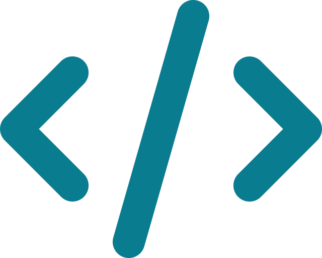

Contributing Overview

A short overview of the contributing process we follow
and some additional information you might need if you are not
new to the contributing process in general.

[To Contributing overview](#developers-overview--contrib-overview)

<details class="sd-sphinx-override sd-dropdown sd-card sd-mb-3 sd-shadow-none sd-fade-in-slide-down">
<summary>
<span>Continuous Integration</span><span></span></summary><div>
<p>Continuous Integration needs to run across different combinations of package managers, compilers, versions of multiple
software libraries, operating systems, and other potential sources of variation.</p>
<p>Read more on the <a href="#developers-continuous_integration--continuous-integration"><span>Continuous Integration</span></a> page.</p>
</div>
</details>

<details class="sd-sphinx-override sd-dropdown sd-card sd-mb-3 sd-shadow-none sd-fade-in-slide-down">
<summary>
<span>Benchmarks</span><span></span></summary><div>
<p>How to use the benchmark suite can be found on the <a href="#developers-benchmarks--benchmarks"><span>Benchmarks</span></a> page.</p>
</div>
</details>

<details class="sd-sphinx-override sd-dropdown sd-card sd-mb-3 sd-shadow-none sd-fade-in-slide-down">
<summary>
<span>Release Guide</span><span></span></summary><div>
<p>To learn about the detailed information on the steps followed to perform a release, see <a href="https://arrow.apache.org/docs/developers/release.html#release"><span>Release Management Guide</span></a>.</p>
</div>
</details>

<details class="sd-sphinx-override sd-dropdown sd-card sd-mb-3 sd-shadow-none sd-fade-in-slide-down">
<summary>
<span>Release Verification Process</span><span></span></summary><div>
<p>To learn how to verify a release, see <a href="#developers-release_verification--release-verification"><span>Release Verification Process</span></a>.</p>
</div>
</details>

---

<a id="implementations"></a>

<!-- source_url: https://arrow.apache.org/docs/implementations.html -->

<!-- page_index: 65 -->

# Implementations

## Official Implementations

The Apache Arrow project houses a collection of libraries for different
programming languages. Use the links in the table below to access the
documentation and source code for these libraries.

| Language | Docs | Source |
| --- | --- | --- |
| .NET | [.NET Docs](https://arrow.apache.org/dotnet/) | [.NET Source](https://github.com/apache/arrow-dotnet) |
| C++ | [C++ Docs](https://arrow.apache.org/docs/cpp/index.html) | [C++ Source](https://github.com/apache/arrow/tree/main/cpp) |
| C GLib | [C GLib Docs](https://arrow.apache.org/docs/c_glib/index.html) | [C GLib Source](https://github.com/apache/arrow/tree/main/c_glib) |
| Go | [Go Docs](https://arrow.apache.org/go/) | [Go Source](https://github.com/apache/arrow-go) |
| Java | [Java Docs](https://arrow.apache.org/java/) | [Java Source](https://github.com/apache/arrow-java) |
| JavaScript | [JavaScript Docs](https://arrow.apache.org/js/) | [JavaScript Source](https://github.com/apache/arrow-js) |
| Julia | [Julia Docs](https://arrow.apache.org/julia/) | [Julia Source](https://github.com/apache/arrow-julia) |
| MATLAB | [MATLAB Docs](https://github.com/apache/arrow/blob/main/matlab/README.md) | [MATLAB Source](https://github.com/apache/arrow/tree/main/matlab) |
| Python | [Python Docs](https://arrow.apache.org/docs/python/index.html) | [Python Source](https://github.com/apache/arrow/tree/main/python) |
| R | [R Docs](https://arrow.apache.org/docs/r/index.html) | [R Source](https://github.com/apache/arrow/tree/main/r) |
| Ruby | [Ruby Docs](https://github.com/apache/arrow/blob/main/ruby/README.md) | [Ruby Source](https://github.com/apache/arrow/tree/main/ruby) |
| Rust | [Rust Docs](https://docs.rs/arrow/latest) | [Rust Source](https://github.com/apache/arrow-rs) |
| Swift | [Swift Docs](https://arrow.apache.org/swift/) | [Swift Source](https://github.com/apache/arrow-swift) |

In addition to the libraries listed above, the Arrow project hosts the
**nanoarrow** subproject which provides a set of lightweight libraries
designed to help produce and consume Arrow data.

|  |  |  |
| --- | --- | --- |
| nanoarrow | [nanoarrow Docs](https://arrow.apache.org/nanoarrow) | [nanoarrow Source](http://github.com/apache/arrow-nanoarrow) |

## Implementation Status

The [Implementation Status](https://arrow.apache.org/docs/status.html) page provides an overview of the current capabilities of the
official Arrow libraries.

## Cookbook

The Apache Arrow Cookbook is a collection of recipes for using the Arrow
libraries for different programming languages.

- [C++ Cookbook](https://arrow.apache.org/cookbook/cpp/)
- [Java Cookbook](https://arrow.apache.org/cookbook/java/)
- [Python Cookbook](https://arrow.apache.org/cookbook/py/)
- [R Cookbook](https://arrow.apache.org/cookbook/r/)

The source files for the Cookbook are maintained in the
[Apache Arrow Cookbooks repository](https://github.com/apache/arrow-cookbook).

---

<a id="index"></a>

<!-- source_url: https://arrow.apache.org/docs/ -->

<!-- page_index: 66 -->

# Apache Arrow

Apache Arrow is a universal columnar format and multi-language toolbox for fast
data interchange and in-memory analytics.

The project specifies a language-independent column-oriented memory format
for flat and hierarchical data, organized for efficient analytic operations on
modern hardware. The project houses an actively developed collection of
libraries in many languages for solving problems related to data transfer and
in-memory analytical processing. This includes such topics as:

- Zero-copy shared memory and RPC-based data movement
- Reading and writing file formats (like CSV, Apache ORC, and Apache Parquet)
- In-memory analytics and query processing

**To learn how to use Arrow refer to the documentation specific to your
target environment.**

Specifications

Read about the Apache Arrow format and its related specifications and
protocols.

[To Specifications](#format--format)

Development

Find documentation on building the libraries from source, building the
documentation, contributing and code reviews, continuous integration, benchmarking, and the release process.

[To Development](#developers--developers)

Implementations

Browse the documentation and source code for Apache Arrow libraries
in C++, C GLib, C#, Go, Java, JavaScript, Julia, MATLAB, Python, R, Ruby, Rust, and Swift.

[To Implementations](#implementations--implementations)

Cookbook

Explore a collection of Apache Arrow recipes in C++, Java, Python, R, and Rust.

[To Cookbook](https://arrow.apache.org/cookbook/)

---
