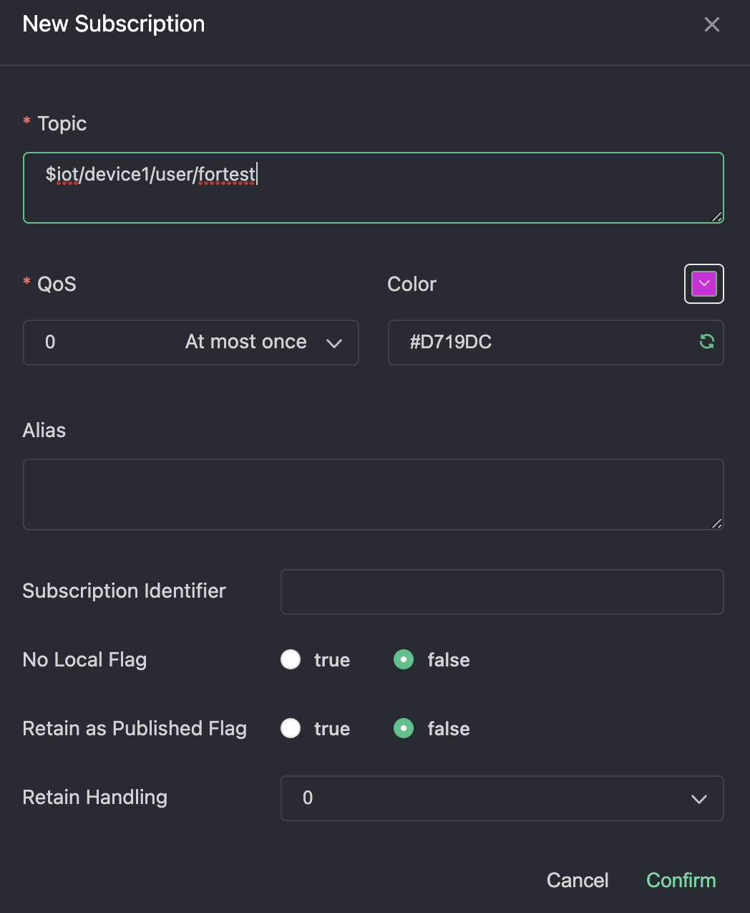

# Introduction

## Navigation

- [Get Started](#get_started-intro)
  - [Quick Install & Verify](#get_started-quick_install)
  - [Frequently Asked Questions](#get_started-faq)
  - [Road Map](#get_started-roadmap)
- [Installation](#installation-intro)
  - [Docker](#installation-docker)
  - [Linux](#installation-linux)
  - [Windows](#installation-windows)
  - [Install from Source](#installation-install_from_source)
  - [Configuration Convention & Migration](#installation-config_migration_between_versions)
  - [Notes on Kubernetes Deployment](#installation-nodes_on_k8s)
- [Cluster](#cluster-intro)
  - [Clustering](#cluster-clustering)
  - [Load Balancing](#cluster-loadbalance-intro)
    - [MQTT Server](#cluster-loadbalance-mqttserver)
    - [API Server](#cluster-loadbalance-apiserver)
    - [Internal RPC Server](#cluster-loadbalance-rpcserver)
    - [Stateful Server](#cluster-loadbalance-stateful-intro)
      - [Dist Worker](#cluster-loadbalance-stateful-distworker)
      - [Inbox Store](#cluster-loadbalance-stateful-inboxstore)
      - [Retain Store](#cluster-loadbalance-stateful-retainstore)
  - [Upgrade](#cluster-upgrade)
- [User Guide](#user_guide-intro)
  - [Basic MQTT Features](#user_guide-basic-intro)
    - [Connect to BifroMQ](#user_guide-basic-connect)
    - [Pub/Sub](#user_guide-basic-pubsub)
    - [Shared Subscriptions](#user_guide-basic-shared_sub)
  - [Data Integration](#user_guide-integration-intro)
  - [API Usage](#user_guide-api-intro)
    - [OpenAPI Reference](#user_guide-api-openapi)
- [Plugin](#plugin-intro)
  - [Auth Provider](#plugin-auth_provider)
  - [Client Balancer](#plugin-client_balancer)
  - [Event Collector](#plugin-event_collector)
  - [Resource Throttler](#plugin-resource_throttler)
  - [Setting Provider](#plugin-setting_provider-intro)
    - [Tenant-level Settings](#plugin-setting_provider-tenantsetting)
  - [Plugin Practice and Notice](#plugin-plugin_practice)
- [SPI](#spi-intro)
- [Administration](#admin_guide-overview)
  - [Configuration](#admin_guide-configuration-intro)
    - [Config File Manual](#admin_guide-configuration-config_file_manual)
    - [System Properties](#admin_guide-configuration-bifromq_sys_props)
    - [Configuration Printing](#admin_guide-configuration-configs_print)
  - [Tuning](#admin_guide-tuning-intro)
    - [Linux Kernel Tuning](#admin_guide-tuning-os_tuning_linux)
  - [Observability](#admin_guide-observability-intro)
    - [Logging](#admin_guide-observability-logging)
    - [Metrics](#admin_guide-observability-metrics-intro)
      - [Tenant-level Metrics](#admin_guide-observability-metrics-tenantmetrics)
    - [Events](#admin_guide-observability-events)
  - [Security](#admin_guide-security-intro)
- [Benchmark](#benchmark-overview)
- [Contribution Guide](#contribution_guide-intro)
  - [Code Contribution](#contribution_guide-code_contribution)
  - [Code Review](#contribution_guide-code_review)
  - [Documentation Contribution](#contribution_guide-documentation_contribution)

## Content

<a id="get_started-intro"></a>

<!-- source_url: https://bifromq.incubator.apache.org/docs/get_started/intro/ -->

<!-- page_index: 1 -->

# Introduction

Version: 4.0.0-incubating

BifroMQ (Incubating) is a Java-based, high-performance, distributed MQTT broker implementation that seamlessly integrates native multi-tenancy support. It is designed to facilitate the building of large-scale IoT device connections and messaging
systems.

`BifroMQ` derives its name from the Norse mythological Bifröst, a rainbow bridge that connects Midgard (the realm of humans) and Asgard (the domain of gods). Like Bifröst, BifroMQ serves as a flexible and sturdy bridge, linking different
systems or applications to enable communication through message exchange. This aligns with the core function of MQTT middleware, which is to manage and accelerate message delivery in distributed systems.

The robustness of Bifröst symbolizes BifroMQ's stability and reliability, while its flexibility signifies BifroMQ's scalability and adaptability. In a nutshell, "BifroMQ" epitomizes resilient, adaptable MQTT middleware that interconnects
various systems or applications.

- Full support for MQTT 3.1, 3.1.1 and 5.0 features over TCP, TLS, WS, WSS.
- Native support for multi-tenancy, resource sharing, and workload isolation.
- Built-in distributed storage engine optimized for MQTT workloads, with no third-party middleware dependencies.
- Extension mechanism for supporting:
  - Authentication/Authorization.
  - Tenant-level Client Balancing.
  - Tenant-level Resource Throttling.
  - Tenant-level Runtime Setting.
  - Event & Monitoring.

We use GitHub [Issues](https://github.com/apache/bifromq/issues) for tracking requests and bugs. Feel free to open an issue if you have any questions or problems.

We use Apache mailing lists for asynchronous discussion and announcements. Please choose the appropriate list for your needs:

- **`commits@bifromq.apache.org`** – Receives automated commit logs and code changes.
- **`dev@bifromq.apache.org`** – Used for general development discussions, proposals, questions, and community communication.

Follow these [steps](https://bifromq.incubator.apache.org/community/#how-to-subscribe) to subscribe or unsubscribe.

We also use [Discord](https://discord.gg/Pfs3QRadRB) for real-time chat and community discussion. Join our server to ask questions, share ideas, and stay up-to-date with the latest project progress. Please adhere to the Apache Code of Conduct while participating.

---

<a id="get_started-quick_install"></a>

<!-- source_url: https://bifromq.incubator.apache.org/docs/get_started/quick_install/ -->

<!-- page_index: 2 -->

# Quick Install

Version: 4.0.0-incubating

For a rapid setup, Docker is recommended:

```bash
docker run -d --name bifromq -p 1883:1883 apache/bifromq:4.0.0-incubating 
```

For further installation alternatives and comprehensive details, refer to [Installation](#installation-intro).

# Quick Verify

Below are the steps to quickly verify the basic MQTT functionality of BifroMQ using MQTTX.

1. Visit <https://mqttx.app/> to download MQTTX and install it.
2. Open MQTTX and click on **New Connection** (the “+” sign on the left sidebar) to create a new connection configuration.

   
3. Fill in the required fields:

   - **Name**: Any descriptive name of your choice.
   - **ClientID**: Can be set manually or generated randomly. Must consist of "a–z", "0–9", "\_", "-", ≤128 bytes, UTF8 encoded, and unique.
   - **Host**: The connection address, including protocol prefix:
     - `mqtt://<HOST>` for TCP
     - `mqtts://<HOST>` for TLS/SSL
     - `wss://<HOST>` for WebSocket Secure
   - **Port**: Select based on protocol:
     - TCP: `1883`
     - TLS/SSL: `1884`
     - WSS: `443`
   - **Username & Password**: Provide credentials if configured; otherwise leave blank for test environments.
   - **MQTT Version**: Choose from 3.1, 3.1.1, or 5.0.
4. After configuring, click **Connect** in the top right corner.
5. **Subscribe** to a topic: click **New Subscription**, enter the topic in the dialog, and confirm.

   
6. **Publish** a message: in the send/receive interface, enter the same topic, select QoS 0, type your message, and click **Send**.

   
7. You should see your published message appear in the interface.

---

<a id="get_started-faq"></a>

<!-- source_url: https://bifromq.incubator.apache.org/docs/get_started/faq/ -->

<!-- page_index: 3 -->

# Frequently Asked Questions

Version: 4.0.0-incubating

BifroMQ provides comprehensive support for the following MQTT protocol versions: v3.1, v3.1.1, and v5.0. This versatility ensures that BifroMQ can accommodate a wide range of IoT devices and applications, adhering to different protocol standards. Additionally, BifroMQ allows for dynamic control of protocol capabilities at the tenant level during runtime, offering tailored connectivity options to meet specific tenant requirements.

The Java version requirements for BifroMQ can be divided into two aspects:

- **BifroMQ runtime environment**: BifroMQ itself requires JDK 17 or higher for operation.
- **BifroMQ plugin development**: For developing BifroMQ plugins, there's no enforced requirement for a specific Java language version or JDK version. However, plugin developers need to ensure their plugins function properly in higher Java environments. To prevent compatibility issues, we suggest keeping the plugin's runtime environment consistent with BifroMQ's.

Unlike other products or projects providing MQTT protocol capabilities, BifroMQ's primary aim is to serve as a high-performance, multi-tenant, distributed middleware implementing the standard MQTT protocol. "Rule engines" are not part of the MQTT protocol specification and hence are not included in BifroMQ.
BifroMQ focuses on standard integrations with upstream and downstream systems, while “rule engines” represent additional functionality that can be implemented externally. We welcome contributions to a community-driven side project for rule engine implementations,allowing developers to build and share rule engine integrations with BifroMQ.

Integration with downstream systems should follow a **decoupled** and **dependency-inverted** approach. We recommend leveraging MQTT 5.0’s built-in shared subscription feature, which allows downstream consumers to control routing rules directly.

To bring this capability to earlier clients, BifroMQ has **backported shared subscriptions** into the MQTT 3.1.1 protocol, ensuring a consistent, standardized integration model across versions.

Additionally, we provide an **ordered shared subscription** mode for use cases that require strict message ordering. See the documentation for details: [Ordered Shared Subscriptions](#user_guide-basic-shared_sub).

BifroMQ's built-in storage engine is mainly used for the persistence of SessionState required by the MQTT protocol to be persistent and Retain Topic messages. This helps prevent loss of session state during a broker restart or crash. It's noteworthy that the persistence engine is not directly related to the message's QoS in most cases. For instance, when an MQTT connection starts a persistent session, offline QoS0 subscription messages will still be persisted until the session is restored and pushing is completed.

BifroMQ is designed as a core middleware component to be embedded within broader business systems. Management logic is therefore exposed for integration rather than provided as a standalone Web UI or CLI. The project itself does not include built-in management consoles; instead, it offers the following APIs and plugins to enable external systems to implement management capabilities:

- **[API](#user_guide-api-intro)**: Broker-side control logic, such as forcing disconnection.
- **[Metrics](#admin_guide-observability-metrics-intro)**: Runtime metrics that can be consumed by existing monitoring systems.
- **[AuthProvider Plugin](#plugin-auth_provider)**: Enable customized authentication and authorizaiton
- **[ClientBalancer Plugin](#plugin-client_balancer)**: Implements an active client‐balancing strategy, dynamically distributing incoming client connections across broker instances to ensure even load distribution.
- **[EventCollector Plugin](#plugin-event_collector)**: Emits operational events for custom Event Sourcing logic (e.g., connection counts, online/offline).
- **[ResourceThrottler Plugin](#plugin-resource_throttler)**: Controls tenant-level resource usage.
- **[SettingProvider Plugin](#plugin-setting_provider-intro)**: Adjusts tenant-level runtime settings.

As with rule-engine support, we welcome community-driven side projects to build Web UIs, CLI tools, or other management interfaces leveraging these integration points.

---

<a id="get_started-roadmap"></a>

<!-- source_url: https://bifromq.incubator.apache.org/docs/get_started/roadmap/ -->

<!-- page_index: 4 -->

# Road Map

Version: 4.0.0-incubating

This roadmap is organized into two categories:

- **Core BifroMQ Project**: Enhancements and new features within the main broker codebase, focusing on performance, resource efficiency, and protocol extensibility.
- **Satellite Projects**: Community-driven side projects that extend and complement the core broker with additional tooling, UIs, testing suites, and various plugin implementations.

The following lists are highlights of some directions (but not limited to):

1. **Runtime Efficiency**
   Continuously improve runtime performance and optimize memory usage.
2. **Native Image Support**
   Enable native image builds (e.g., GraalVM) to run BifroMQ in resource-constrained environments.
3. **Integration Extensibility**
   Incorporate user feedback to expand additional integration and customization extension points.
4. **Storage Engine Optimization**
   Continuously tune the built-in storage engine for different MQTT workload patterns.
5. **Efficient RPC Mechanism**
   Explore more efficient internal RPC implementations to better handle varying message payload sizes across use cases.

1. **Website Building**
   Contributions of translations, corrections, and additional content are welcome.
2. **General Rule Engine**
   A community-driven, generic MQTT broker rule engine for flexible message routing and processing.
3. **BifroMQ UI (Web & CLI)**
   A side project to build web-based dashboards and command-line tools for managing and monitoring BifroMQ.
4. **MQTT Load Testing Suite**
   A toolkit to simulate real-world MQTT workloads and stress-test BifroMQ deployments.
5. **Common Scenario Plugins**
   Prebuilt plugins for typical use cases, such as database-backed authentication/authorization and event diagnostics tools.
6. **Deployment Utilities**
   Various scripts/tools for deploying and operating in various environment, e.g. VM, Kubernetes

---

<a id="installation-intro"></a>

<!-- source_url: https://bifromq.incubator.apache.org/docs/installation/intro/ -->

<!-- page_index: 5 -->

# Installation Overview

Version: 4.0.0-incubating

BifroMQ requires **Java 17** or higher for its operation. Ensure your Java runtime environment is updated to meet these requirements before proceeding with the BifroMQ installation.

Upon installation, BifroMQ organizes its files within the following directory structure:

| Directory | Description |
| --- | --- |
| `bin` | Executable scripts for starting and managing BifroMQ. |
| `conf` | Configuration files necessary for customizing BifroMQ operations. |
| `lib` | Program libs for running BifroMQ. |
| `plugins` | BifroMQ plugins in [pf4j](https://pf4j.org) compatible format. |
| `data` | User's persistent data. |
| `logs` | Log files. |

The startup script for BifroMQ recognizes several environment variables that allow for customization and optimization of its runtime environment:

| Environment Variable | Description |
| --- | --- |
| `LOG_DIR` | Specifies the directory where BifroMQ should store its log files. Defaults to `./logs` if unset. |
| `DATA_DIR` | Determines the directory for storing BifroMQ data. Defaults to `./data` if unset. |
| `JAVA_HOME` | Specifies the path to the Java Runtime Environment (JRE) that BifroMQ should use. |
| `MEM_LIMIT` | Limits the maximum amount of memory that BifroMQ can use. |
| `JVM_PERF_OPTS` | Custom JVM performance options for tuning the JVM instance running BifroMQ. |
| `JVM_GC_OPTS` | Garbage Collection (GC) options to optimize memory management for BifroMQ. |
| `JVM_HEAP_OPTS` | Specifies JVM heap size and other memory settings directly impacting BifroMQ's performance. |
| `EXTRA_JVM_OPTS` | Additional JVM options that users may want to pass to customize the BifroMQ runtime environment. |
| `JVM_DEBUG` | Enables debugging options for the JVM, useful for development and troubleshooting. |
| `JAVA_DEBUG_PORT` | When `JVM_DEBUG` is enabled, sets the port for the JVM debugger to attach to. |

---

<a id="installation-docker"></a>

<!-- source_url: https://bifromq.incubator.apache.org/docs/installation/docker/ -->

<!-- page_index: 6 -->

# Docker

Version: 4.0.0-incubating

- [Docker](https://www.docker.com/) is installed.
- You have permission to use port 1883, and the port is available. If you do not have permission, please change to the corresponding port.

Run the following command, which will run Apache BifroMQ within a container as the Linux user `bifromq`.

```bash
docker run -d --name bifromq -p 1883:1883 apache/bifromq:4.0.0-incubating 
```

By default, upon Apache BifroMQ process initiation, it dynamically computes the relevant JVM parameters based on the physical memory of the hosting server. However, when launched within a containerized environment, it introspects the host
machine's physical memory, potentially causing conflicts with Docker or container-imposed memory constraints, consequently leading to the premature termination of the container.

To circumvent such challenges, it is advisable to proactively delimit the container's memory consumption and convey these limitations to the container runtime via environmental variables. During the startup of BifroMQ, priority is given to
the calculation of JVM parameters based on the `MEM_LIMIT` environmental variable. A specific illustration is provided below:

```bash
docker run -d -m 10G -e MEM_LIMIT='10737418240'--name bifromq -p 1883:1883 apache/bifromq:4.0.0-incubating 
```

***Note: The unit of MEM\_LIMIT is in bytes.***

Going a step further, it is possible to proactively configure the JVM heap memory and directly transmit it to the container runtime for utilization by BifroMQ. A specific illustration is provided below:

```bash
docker run -d -m 10G -e JVM_HEAP_OPTS='-Xms2G -Xmx4G -XX:MetaspaceSize=128m -XX:MaxMetaspaceSize=500m -XX:MaxDirectMemorySize=1G' --name bifromq -p 1883:1883 apache/bifromq:4.0.0-incubating 
```

You can build an Apache BifroMQ cluster using Docker Compose on a single host for development and testing. Suppose you want to create a cluster with three nodes: node1, node2, and node3. The directory structure should be as follows:

```text
|- docker-compose.yml 
|- node1 
|- node2 
|- node3 
```

Each node should have a configuration file, it is defined as follows:

```yml
clusterConfig: 
  env: "Test" 
  host: bifromq-node1 # Change this to bifromq-node2 for node2 and bifromq-node3 for node3 
  port: 8899 
  seedEndpoints: "bifromq-node1:8899,bifromq-node2:8899,bifromq-node3:8899" 
```

The `docker-compose.yml` file defines the services for the three nodes:

```yaml
services: 
bifromq-node1: 
  image: apache/bifromq:4.0.0-incubating 
  container_name: bifromq-node1 
  volumes: 
    - ./node1/standalone.yml:/home/bifromq/conf/standalone.yml 
  ports: 
    - "1883:1883" 
  environment: 
    - MEM_LIMIT=10737418240 # Adjust the value according to the actual host configuration. 
  networks: 
    - bifromq-net 
 
bifromq-node2: 
  image: apache/bifromq:4.0.0-incubating 
  container_name: bifromq-node2 
  volumes: 
    - ./node2/standalone.yml:/home/bifromq/conf/standalone.yml 
  ports: 
    - "1884:1883" 
  environment: 
    - MEM_LIMIT=2147483648 
  networks: 
    - bifromq-net 
 
bifromq-node3: 
  image: apache/bifromq:4.0.0-incubating 
  container_name: bifromq-node3 
  volumes: 
    - ./node3/standalone.yml:/home/bifromq/conf/standalone.yml 
  ports: 
    - "1885:1883" 
  environment: 
    - MEM_LIMIT=2147483648 
  networks: 
    - bifromq-net 
 
networks: 
bifromq-net: 
  driver: bridge 
```

To launch the cluster, run the following command:

```shell
docker compose up -d 
```

---

<a id="installation-linux"></a>

<!-- source_url: https://bifromq.incubator.apache.org/docs/installation/linux/ -->

<!-- page_index: 7 -->

# Linux

Version: 4.0.0-incubating

- JDK 17+
- Latest version BifroMQ [releases](https://bifromq.incubator.apache.org/download/)

```bash
tar -zxvf apache-bifromq-4.0.0-incubating.tar.gz --strip-components 1  -C /usr/share/bifromq/ 
cd /usr/share/bifromq && ./bin/standalone.sh start 
```

---

<a id="installation-windows"></a>

<!-- source_url: https://bifromq.incubator.apache.org/docs/installation/windows/ -->

<!-- page_index: 8 -->

# Windows

Version: 4.0.0-incubating

- JDK 17+
- Latest version from BifroMQ [releases](https://bifromq.incubator.apache.org/download/)

```bash
unzip -zxvf apache-bifromq-4.0.0-incubating-windows.zip 
cd bifromq\bin 
standalone.bat start 
```

---

<a id="installation-install_from_source"></a>

<!-- source_url: https://bifromq.incubator.apache.org/docs/installation/install_from_source/ -->

<!-- page_index: 9 -->

# Install from Source

Version: 4.0.0-incubating

- JDK 17+
- Maven 3.5.0+

Clone the repository to local workspace

```bash
cd <YOUR_WORKSPACE> 
git clone --branch 4.0.0-incubating https://github.com/apache/bifromq bifromq 
```

```bash
cd bifromq 
./mvnw -v 
./mvnw -U clean verify -DskipTests -Pbuild-release 
```

The build output consists of several archive files with sha512 checksum located under /target/output

- apache-bifromq-4.0.0-incubating-src.tar.gz
- apache-bifromq-4.0.0-incubating.tar.gz
- apache-bifromq-4.0.0-incubating-windows.zip

---

<a id="installation-config_migration_between_versions"></a>

<!-- source_url: https://bifromq.incubator.apache.org/docs/installation/config_migration_between_versions/ -->

<!-- page_index: 10 -->

# Configuration Convention & Migration

Version: 4.0.0-incubating

Configurations may vary between different versions. When deploying BifroMQ, you can use previous configuration files, and it won't prevent BifroMQ from starting. However, please be aware that these older configurations might not take effect.

To simplify the configuration process of BifroMQ, the configuration file standalone.yml includes only common configuration items. For unspecified configurations, default values will be used, and BifroMQ will output the complete content of the configuration file at the beginning of `info.log` after starting. Users can utilize the full configuration output in the log to compare and update their standalone.yml configuration.

---

<a id="installation-nodes_on_k8s"></a>

<!-- source_url: https://bifromq.incubator.apache.org/docs/installation/nodes_on_k8s/ -->

<!-- page_index: 11 -->

# Notes on Kubernetes Deployment

Version: 4.0.0-incubating

Deploying BifroMQ on Kubernetes requires careful consideration of its stateful service characteristics and understanding of Kubernetes-specific cluster operations and maintenance practices. Here are some key considerations and guidelines.

BifroMQ includes a built-in distributed storage engine, and users choosing to run BifroMQ in Kubernetes should carefully plan for:

- **Persistent Volume**
- **StatefulSets**
- **Headless Services**

Running BifroMQ on Kubernetes involves complexities including:

- **Networking**: Choosing the appropriate network policies and Ingress Controller to manage communication between internal and external clients to the cluster.
- **Configuration Management**: Using ConfigMaps or Secrets to manage BifroMQ configurations in a dynamic and scalable manner.
- **Resource Limits and Requests**: Defining appropriate CPU and memory limits and requests to ensure BifroMQ has sufficient resources for optimal performance without starving other applications.

Successful deployment of BifroMQ on Kubernetes requires a deep understanding of:

- **Cluster Monitoring and Logging**: Implementing comprehensive monitoring and logging to quickly identify and resolve issues.
- **Scalability**: Understanding how to scale BifroMQ appropriately in Kubernetes to handle varying loads without impacting performance.

---

<a id="cluster-intro"></a>

<!-- source_url: https://bifromq.incubator.apache.org/docs/cluster/intro/ -->

<!-- page_index: 12 -->

# BifroMQ Cluster Overview

Version: 4.0.0-incubating

BifroMQ employs a decentralized clustering approach, where MQTT protocol workloads are distributed across independent sub-clusters, each dedicated to specific functions. This design is built upon two foundational layers: the Underlay
Cluster and the Overlay Cluster, offering clarity and decoupled architecture for enhanced scalability and fault tolerance.

The Underlay Cluster forms the backbone of BifroMQ's cluster system. This layer
ensures high availability by eliminating single points of failure and maintaining accurate and timely cluster topology consistency.

- **Decentralized Construction**: Facilitates cluster formation without reliance on traditional registration centers, minimizing operational risks.
- **Failure Detection and Auto-Eviction**: Enhances cluster reliability through proactive failure detection and swift membership information synchronization.
- **Split-Brain Recovery**: Incorporates mechanisms to recover from network partitions, maintaining cluster integrity and consistency.

Built atop the Underlay Cluster, the Overlay Cluster, or Agent Cluster, focuses on specific functional services, leveraging the foundational cluster for membership management and inter-node communication. It simplifies deployment and
operational processes, automatically forming clusters to support stateless RPC services and stateful services built on distributed KV storage engines.

BifroMQ supports flexible deployment models, ranging from all-in-one processes(a.k.a `Standalone` cluster) to so-called `Independent Workload` clusters. See the [clustering guide](#cluster-clustering) for practical steps to configure, start, scale, and monitor a cluster.

---

<a id="cluster-clustering"></a>

<!-- source_url: https://bifromq.incubator.apache.org/docs/cluster/clustering/ -->

<!-- page_index: 13 -->

# Clustering

Version: 4.0.0-incubating

BifroMQ clusters are built on two logical layers: the Underlay Cluster, which provides decentralized membership and failure detection, and the Overlay Cluster, which hosts functional services such as MQTT brokering and data persistence. This guide focuses on practical steps to deploy and operate a BifroMQ cluster.

- Java 17 or later installed on all nodes.
- Sufficient CPU and memory for the expected workload.
- Required ports opened in firewalls (see configuration below).


BifroMQ uses a **two-tier clustering architecture**, consisting of:

- an **Underlay Cluster**, which provides decentralized membership, failure detection, and topology information, and
- multiple **Overlay Service Clusters**, enabled selectively inside each node to provide MQTT-related functionalities.

In practice:

- Every BifroMQ node must first join the **Underlay Cluster**.
- Overlay services (e.g., MQTT broker, distworker, inboxstore, retainstore) are **optional** and communicate directly with their peers once enabled.

The `clusterConfig` section in [config file](#admin_guide-configuration-config_file_manual) controls the Underlay Cluster. Key fields include:

```yaml
clusterConfig: 
  env: "Test" 
  host: 
  port: 
  clusterDomainName: 
  seedEndpoints: 
```

Field details:

- `env`: Logical cluster identifier. Nodes must share the same value to join.
- `host`: IP to bind for inter-node communication; leave blank to auto-select a local address.
- `port`: Port for membership messages. For seed nodes, set an explicit port to simplify discovery.
- `clusterDomainName`: Optional DNS domain for resolving seed nodes in container/Kubernetes environments.
- `seedEndpoints`: Comma-separated `IP:port` list of seed nodes to join at startup.

If you prefer DNS-based discovery, set `clusterDomainName` and ensure the cluster communication port is fixed and identical among all cluster nodes.

**Firewall note:** Besides `clusterConfig.port`, BifroMQ uses dedicated ports for inter-cluster RPC (e.g., `RPCServerConfig.port`). If not set explicitly, these ports are randomly chosen and may be blocked by firewalls. Refer to the [full configuration manual](#admin_guide-configuration-config_file_manual) to pin ports and adjust firewall rules.

Overlay services are enabled via configuration flags:

| Service | Config key | Description (see [config manual](#admin_guide-configuration-config_file_manual)) |
| --- | --- | --- |
| `mqttserver` | `mqttServiceConfig.server.enable` | Enable MQTT server |
| `distserver` | `distServiceConfig.server.enable` | Enable Dist server |
| `distworker` | `distServiceConfig.worker.enable` | Enable Dist worker |
| `inboxserver` | `inboxServiceConfig.server.enable` | Enable Inbox server |
| `inboxstore` | `inboxServiceConfig.store.enable` | Enable Inbox store |
| `retainserver` | `retainServiceConfig.server.enable` | Enable Retain server |
| `retainstore` | `retainServiceConfig.store.enable` | Enable Retain store |
| `sessiondictserver` | `sessionDictServiceConfig.server.enable` | Enable SessionDict server |
| `apiserver` | `apiServerConfig.enable` | Enable HTTP API server |

By default, all services are enabled in a BifroMQ process (standalone cluster). To run an independent workload cluster, disable services you do not need using their config keys. For example, a seed-only node can act purely as an Underlay Cluster member:

```yaml
clusterConfig: 
  env: <CLUSTER_ENV> 
  host: <SEED_HOST> 
  port: <SEED_PORT> 
  seedEndpoints: <SEED_LIST> 
# Disable all overlay services on a seed-only node 
mqttServiceConfig: 
  server: 
    enable: false 
distServiceConfig: 
  server: 
    enable: false 
  worker: 
    enable: false 
inboxServiceConfig: 
  server: 
    enable: false 
  store: 
    enable: false 
retainServiceConfig: 
  server: 
    enable: false 
  store: 
    enable: false 
sessionDictServiceConfig: 
  server: 
    enable: false 
apiServerConfig: 
  enable: false 
```

- Set `env` to the same value on all seed nodes.
- Specify each seed node's own IP in `host` and use a fixed `port`.
- Leave `seedEndpoints` blank on the first node; include it on subsequent seed nodes.
- Start the process:

```bash
./bin/standalone.sh start 
```

For each additional node, set the same `env` and point `seedEndpoints` to the seed nodes (by IPs or via `clusterDomainName`). Start the node via same command:

```text
./bin/standalone.sh start 
```

- Check `info.log` to confirm nodes recognize each other, e.g.:

```text
AgentHost joined seedEndpoint: 10.0.0.2:9000 
```

- If `apiserver` is enabled (see `apiServerConfig.*` in the config manual), query any BifroMQ node exposing the API to list Underlay Cluster members:

```bash
curl http://<API_HOST>:<API_PORT>/cluster 
```

Sample response:

```json
{ 
  "env": "Test", 
  "nodes": [ 
    { 
      "id": "...", // unique node id in the underlay cluster 
      "address": "10.0.0.1", // bind address 
      "port": 8890, // cluster bind port 
      "pid": 3098996 // process id of this node 
    }, 
    { "id": "...", "address": "10.0.0.2", "port": 42855, "pid": 45037 } 
  ], 
  "local": "..." // id of the local node 
} 
```

BifroMQ achieves high availability by running redundant instances of both **stateless** and **stateful** overlay service clusters.
Each category uses different mechanisms for reliability and scaling.

Stateless services do not maintain persistent state. They include:

- `mqttserver`
- `distserver`
- `inboxserver`
- `retainserver`
- `sessiondictserver`
- `apiserver`

High availability relies on **traffic distribution**:

- `mqttbroker` and `apiserver` should be placed **behind an L4 or L7 load balancer**.
- The load balancer ensures seamless failover and horizontal scaling.

- `distserver`, `inboxserver`, and `retainserver` use **RPC** for communication.
- Traffic distribution and routing behaviors are handled by **BifroMQ’s traffic governance mechanisms** (documented separately).

Because stateless services maintain no data, they can be **scaled in or out** at any time without special procedures.

Stateful services rely on the **base-kv** storage engine:

- `distworker`
- `inboxstore`
- `retainstore`

These services provide **strong consistency**, **replicated shards**, and **automatic sharding** across multiple nodes.

- **Shard replication with quorum semantics** enables continued operation even if nodes fail.
- The **Balancer framework** manages:
  - shard placement
  - leader distribution
  - range splitting and merging
  - replica redistribution

The Balancer framework is **highly extensible** and allows operators to implement **custom strategies** tuned to workload patterns, performance goals, or SLA requirements.

- When new nodes with stateful services enabled join the cluster, the Balancer **gradually redistributes shards**.
- When scaling in, ensure remaining nodes can maintain quorum before removing capacity.
- Shard movement and balancing occur **online**, without interrupting services.

- BifroMQ exposes extensive metrics via Micrometer covering underlay/overlay status and load; integrate them with your monitoring system (e.g., Prometheus) per the [observability guide](#admin_guide-observability-metrics-intro).
- The API Server provides cluster landscape and traffic/load governance APIs; use the relevant docs to query and manage these rules.

---

<a id="cluster-loadbalance-intro"></a>

<!-- source_url: https://bifromq.incubator.apache.org/docs/cluster/loadbalance/intro/ -->

<!-- page_index: 14 -->

# Load Balancing

Version: 4.0.0-incubating

BifroMQ applies different load-balancing mechanisms for client-facing services, internal RPC services, and stateful storage services.

**Purpose:**
Distribute external MQTT and API traffic across multiple nodes to improve availability and absorb load variations.

**Approach:**

- Use standard **Layer 4 or Layer 7 load balancers** in front of MQTT Server or API Server.
- In controlled network environments, MQTT clients may use **custom client-side balancing strategies**.

**Purpose:**
Balance internal request routing for subscription processing, inbox dispatching, and retained-message operations.

**Approach:**

- Use BifroMQ’s **traffic governance interfaces** to inspect service topology, define routing rules, and direct RPC traffic.

**Purpose:**
Distribute sharded storage and compute workloads for dynamic subscriptions, offline messages, and retained messages.

**Approach:**

- The storage layer manages **shard placement, leader roles, and adaptive load distribution** automatically.
- Landscape-level APIs provide visibility into shard layout and replica distribution.

---

<a id="cluster-loadbalance-mqttserver"></a>

<!-- source_url: https://bifromq.incubator.apache.org/docs/cluster/loadbalance/mqttserver/ -->

<!-- page_index: 15 -->

# MQTT Server Load Balancing

Version: 4.0.0-incubating

MQTT Broker nodes expose **TCP / TLS / WS / WSS** endpoints for MQTT 3.1.1 and MQTT 5.0 clients.
Two load-balancing approaches are available depending on deployment conditions.

**Use cases:**

- Horizontal distribution of client connections
- TLS offloading at the load balancer layer

**Supported balancers:**
Any standard **Layer-4 TCP load balancer** (e.g., NGINX stream, HAProxy, AWS NLB).

**Proxy Protocol Support:**
BifroMQ supports **Proxy Protocol v1 and v2**. It allows the load balancer to forward the real client IP and port.

Applicable when all clients use **MQTT 5** and the environment allows brokers to instruct clients to reconnect elsewhere.

**Mechanism:**
BifroMQ can actively redirect clients using MQTT 5 disconnect semantics:

- `Server moved (0x9D)` — permanent relocation
- `Use another server (0x9C)` — temporary relocation

Redirection logic is defined by the **[Client Balancer Plugin](#plugin-client_balancer)**, which can select target brokers based on metrics such as load, latency, or session distribution.

---

<a id="cluster-loadbalance-apiserver"></a>

<!-- source_url: https://bifromq.incubator.apache.org/docs/cluster/loadbalance/apiserver/ -->

<!-- page_index: 16 -->

# API Server Load Balancing

Version: 4.0.0-incubating

The API Server exposes **HTTP/HTTPS** endpoints for administrative operations such as proxy subscription, message publishing, session management, etc.

**Use cases:**

- SSL termination
- request routing
- authentication and authorization
- centralized rate limiting

**Approach:**
Place a **Layer-7 load balancer or API Gateway** (e.g., NGINX, Envoy, Kong, AWS ALB, GCP API Gateway) in front of API Server nodes.

The L7 load balancer:

- distributes API requests across all nodes with API service enabled
- shields clients from node failures
- provides policy control not included in BifroMQ (auth, quota, throttling)

The API Server forms a **logical service cluster** automatically on top of the Underlay cluster. Any BifroMQ node with the API server enabled (via `apiServerConfig.enable`) can process HTTP/HTTPS requests. No additional coordination is required beyond load balancer configuration.

---

<a id="cluster-loadbalance-rpcserver"></a>

<!-- source_url: https://bifromq.incubator.apache.org/docs/cluster/loadbalance/rpcserver/ -->

<!-- page_index: 17 -->

# Internal RPC Load Balancing

Version: 4.0.0-incubating

BifroMQ’s internal RPC framework supports **runtime traffic governing**, allowing operators to control how internal service requests are distributed across nodes at runtime.

The following internal RPC services support runtime traffic governance (the value shown is the required `service_name` header):

| Service | Internal role | `<SERVICE_NAME_HEADER>` |
| --- | --- | --- |
| Dist Server | subscription distribution | `DistService` |
| Inbox Server | offline message delivery | `InboxService` |
| Retain Server | retain message lookup | `RetainService` |
| Session Dict Server | shared session dictionary | `SessionDictService` |

These services form logically independent subclusters on top of the underlay cluster, each responsible for a specific class of internal workloads.

The traffic governance API provides introspection and control over routing weights and node groups within a service subcluster.

The Service Landscape API returns all active RPC service instances for a given service\_name.
It reflects the runtime topology of the service subcluster on the overlay layer, including node identity, bind address, port, static attributes, and dynamically assigned groups.

```text
GET /service/landscape 
Headers: 
  service_name: <SERVICE_NAME_HEADER> 
```

```json
[ 
  { 
    "hostId": "OTQ0OWE5NzAtNjliOC00ZDI3LTg5MjQtOWU3NDEyMWNhNDFj", // Identity of the node in the Underlay Cluster 
    "id": "342586ce-a8d4-4d85-9ae0-3bf596e982d5/1456250665", // Identity of the RPC server instance in the Overlay Cluster 
    "address": "10.0.0.2", // RPC server bind address 
    "port": 40469, // RPC server bind port 
    "attributes": {}, // Static metadata configured at startup (e.g., availability zone, rack ID). 
    "groups": [] // Runtime-assigned groups (via `/service/group`) 
  } 
] 
```

Traffic rules control how tenant-tagged requests are distributed across RPC service instances at runtime.
Rules are evaluated based on the `service_name` header and define a per-tenant routing policy.
Incoming requests from a tenant are distributed across one or more server groups according to their configured weights.
Each server group forwards requests to its RPC servers. If a selected server group has no available servers, the request is rejected.
Tenants without an explicit traffic rule use the default server group.

The traffic rule JSON:

```json
{ 
    "<TENANT_ID>": {          // tenant for which the rule applies 
        "<SERVER_GROUP>": <WEIGHT>   // server group name and its routing weight 
    } 
} 
```

Returns the current routing rules for the specified service.

```text
GET /service/traffic 
Headers: 
service_name: <SERVICE_NAME_HEADER> 
```

Same as the traffic rule JSON above.

Updates traffic rules by merging the provided JSON with the existing rules.

```text
PUT /service/traffic 
Headers: 
service_name: <SERVICE_NAME_HEADER> 
Body: traffic rule JSON shown above. 
```

Removes traffic rules for the specified tenants.
The request body must contain an array of `<TENANT_ID>` values.

```text
DELETE /service/traffic 
Headers: 
service_name: <SERVICE_NAME_HEADER> 
```

Service groups classify RPC server instances into logical buckets (e.g., AZ, rack, region).
Traffic rules reference these groups to determine how tenant traffic is routed.
A server may belong to multiple groups. Servers with no explicit groups are implicitly part of the 'default' group.
Server groups can be set in two ways:

- at startup via configuration file (static initial groups)
- at runtime via the /service/group API (dynamic override)

Assigns one or more group names to a specific RPC server instance.

```text
PUT /service/group 
Headers: 
  service_name: <SERVICE_NAME_HEADER> 
  server_id: <SERVER_ID>   # Returned from /service/landscape 
Body: JSON array of strings, each represents a group name 
```

Runtime group assignment:

- replaces any previously assigned groups
- may assign multiple groups
- if the array is empty → server belongs only to the 'default' group

Server groups may also be defined in the configuration file.
These groups become the server’s initial group list before any /service/group updates occur.

```yaml
distServiceConfig: 
  server: 
    attributes: 
      - "prod" 
      - "az1" 
```

---

<a id="cluster-loadbalance-stateful-intro"></a>

<!-- source_url: https://bifromq.incubator.apache.org/docs/cluster/loadbalance/stateful/intro/ -->

<!-- page_index: 18 -->

# Stateful Server Load Balancing

Version: 4.0.0-incubating

All stateful services in BifroMQ are built on top of the **base-kv** distributed storage engine.
base-kv provides **strong consistency**, **automatic sharding**, and **fault tolerance**, forming the foundation for high availability and elastic scaling of stateful workloads.
Load distribution and availability are jointly managed by **replicated shards** and the **Balancer framework**, which continuously adapts the cluster topology to runtime conditions.

Each stateful service cluster continuously replicates its data across multiple nodes using the Raft protocol.

- As long as a quorum of replicas for a shard (Range) remains alive, the service continues to serve reads and writes.
- Node failures are tolerated transparently without manual intervention.

- Each shard has a designated **leader** responsible for handling writes.
- Leaders are deliberately distributed across the cluster to avoid hotspots and ensure balanced utilization.

High availability therefore emerges from:

- Replica redundancy
- Deterministic leader placement
- Continuous topology adjustment

All BifroMQ stateful servers share the same architectural foundation but optimize their storage schema and access paths based on workload characteristics:

| Service | store\_name (for API headers) | Role/Workload |
| --- | --- | --- |
| [**DistWorker**](#cluster-loadbalance-stateful-distworker) | `dist.worker` | subscription routing |
| [**InboxStore**](#cluster-loadbalance-stateful-inboxstore) | `inbox.store` | persistent offline message queues |
| [**RetainStore**](#cluster-loadbalance-stateful-retainstore) | `retain.store` | retained message storage |

This design allows each service to:

- Use the same base-kv primitives
- Apply **deep, workload-specific optimizations**
- Reuse the same balancing and recovery mechanisms

Stateful services run on an overlay cluster just like RPC services. You can inspect the server topology via API and also inspect how Range replicas are placed across storage nodes.

List the nodes of the stateful service overlay cluster.

**Request**

```text
GET /store/landscape 
Headers: 
  store_name: <STORE_NAME_HEADER> 
```

**Response**

```json
[ 
  { 
    "hostId": "c3RvcmUtaWQ=", // Identity of the node in the Underlay Cluster 
    "id": "710dc192-4641-4b31-bde1-a36329b33273", // Identity of the stateful server instance in the Overlay Cluster 
    "address": "10.0.0.2", // server bind address 
    "port": 36801, // server bind port 
    "attributes": { 
        ... 
    } 
  } 
] 
```

List Range replicas hosted on a specific store server.

**Request**

```text
GET /store/ranges 
Headers: 
  store_name: <STORE_NAME_HEADER> 
  store_id: <STORE_ID_HEADER> 
```

**Response**

```json
[ 
  { 
    "id": "115240914861228032_0", // the range id 
    "ver": 14, // the version of range 
    "boundary": { 
      // the range boundary 
      "startKey": null, 
      "endKey": null 
    }, 
    "state": "Normal", // the range state 
    "role": "Leader", // the replica role 
    "clusterConfig": { 
      "voters": [ 
        "710dc192-4641-4b31-bde1-a36329b33273", 
        "c2784a36-4509-41be-96bc-5809026bce99", 
        "cd360c5f-7693-40c6-af9c-541cc2467a00" 
      ], 
      "learners": [], 
      "nextVoters": [], 
      "nextLearners": [] 
    } 
  } 
] 
```

The **Balancer framework** continuously shapes the base-kv cluster topology. Although a centralized coordinator is straightforward to implement, the framework is designed to enable **distributed convergence**, meaning there is:

- No central coordinator
- No single point of control
- No out-of-band orchestration

Achieving distributed convergence requires each balancer implementation to be deterministic:

- Every node observes the strong eventually consistent global cluster state
- Each balancer deterministically derives the same *expected* Range topology (the built-in balancers follow this pattern)
- Each node independently executes balance commands for the Ranges it currently leads

BifroMQ ships with several built-in Balancers that cover common scenarios and can serve as references for custom implementations.
The framework lets Balancer implementations expose runtime-tunable rules and be started/paused via API; which balancers to enable and their initial rules are set in configuration (for example, `BalancerOptions.balancers` keyed by balancerFactory FQN).

| Balancer | Focus | Rules |
| --- | --- | --- |
| `RangeLeaderBalancer` | Evenly spread Range leaders to avoid hotspots |  |
| `ReplicaCntBalancer` | Keep replica counts aligned with goals (voters/learners) | - `votersPerRange`: target voters per range (must be odd) - `learnersPerRange`: target learners per range (-1 means no limit) |
| `RangeSplitBalancer` | Split "hot" Ranges to sustain throughput | - `maxCpuUsagePerRange`: CPU threshold - `maxIODensityPerRange`: IO density cap - `ioNanosLimitPerRange`: IO latency cap (ns) - `maxRangesPerStore`: per-store range cap |

[`BalancerOptions`](#admin_guide-configuration-config_file_manual--balanceroptions) tells a BifroMQ process with DistWorker enabled which balancers to instantiate at startup and the initial values of their rules. `BalancerOptions.balancers` is a map keyed by the balancerFactory FQN, with a `Struct` payload for initial rules. For example, to start a `ReplicaCntBalancer` on DistWorker with default replica targets:

```yaml
distWorkerConfig: 
  balanceConfig: 
    balancers: 
      org.apache.bifromq.dist.worker.balance.ReplicaCntBalancerFactory: 
        votersPerRange: 3 
        learnersPerRange: -1 
```

Balancers can be started or paused via the runtime API without restarting the service. This lets operators temporarily disable a balancer for observation or mitigation, then re-enable it as needed; deterministic behavior preserves convergence when reactivated. Note: ensure the `balancer_factory_class` is correct when enabling the balancer instances initialized via `BalancerOptions`.

```text
PUT /store/balancer/enable 
Headers: 
  store_name: <STORE_NAME_HEADER> 
  balancer_factory_class: <BALANCER_FACTORY_CLASS_FQN> 
```

```text
PUT /store/balancer/disable 
Headers: 
  store_name: <STORE_NAME_HEADER> 
  balancer_factory_class: <BALANCER_FACTORY_CLASS_FQN> 
```

Balancer rules (the same `Struct` schema used in `BalancerOptions.balancers`) can be updated at runtime through the API. New rules take effect immediately, and subsequent balance cycles converge using the updated values.

Retrieve the rules override; a 404 is returned if no override is set.

**Request**

```text
GET /store/balancer/rules 
Headers: 
  store_name: <STORE_NAME_HEADER> 
  balancer_factory_class: <BALANCER_FACTORY_CLASS_FQN> 
```

**Response**

```json
{ 
  "votersPerRange": 1.0 
} 
```

Merge a rules override with existing rules; the caller must ensure the payload is structurally valid.

```text
PUT /store/balancer/rules 
Headers: 
  store_name: <STORE_NAME_HEADER> 
  balancer_factory_class: <BALANCER_FACTORY_CLASS_FQN> 
Body: balance rules override json 
```

Get the latest state of the balancer instances running on each stateful server.

**Request**

```text
GET /store/balancer 
Headers: 
  store_name: <STORE_NAME_HEADER> 
  balancer_factory_class: <BALANCER_FACTORY_CLASS_FQN> 
```

**Response**

```json
{ 
  "org.apache.bifromq.dist.worker.balance.ReplicaCntBalancerFactory": { 
    "710dc192-4641-4b31-bde1-a36329b33273": { // store id running the balancer instance 
      "disable": false, // whether the balancer is disabled 
      "loadRules": { // effective load rules 
        "votersPerRange": 1.0, 
        "learnersPerRange": -1.0 
      }, 
      "hlc": "115526170745044992" // hlc timestamp of last update 
    }, 
    ... 
  } 
} 
```

---

<a id="cluster-loadbalance-stateful-distworker"></a>

<!-- source_url: https://bifromq.incubator.apache.org/docs/cluster/loadbalance/stateful/distworker/ -->

<!-- page_index: 19 -->

# Dist Worker

Version: 4.0.0-incubating

DistWorker handles subscription routing and fan-out (read-heavy). It runs as a stateful service on the base-kv overlay cluster; `store_name` for API headers: `dist.worker`.

| balancerFactory FQN | Role | Default parameters (load rules) |
| --- | --- | --- |
| `org.apache.bifromq.dist.worker.balance.RangeLeaderBalancerFactory` | Spread range leaders evenly |  |
| `org.apache.bifromq.dist.worker.balance.ReplicaCntBalancerFactory` | Keep replica count per range to targets | - `votersPerRange: 3` - `learnersPerRange: -1` |

These defaults come from `distWorkerConfig.balanceConfig.balancers` in starter config.

---

<a id="cluster-loadbalance-stateful-inboxstore"></a>

<!-- source_url: https://bifromq.incubator.apache.org/docs/cluster/loadbalance/stateful/inboxstore/ -->

<!-- page_index: 20 -->

# Inbox Store

Version: 4.0.0-incubating

InboxStore provides persistent offline message queues (write-intensive). It runs as a stateful service on the base-kv overlay cluster; `store_name` for API headers: `inbox.store`.

| balancerFactory FQN | Role | Default parameters (load rules) |
| --- | --- | --- |
| `org.apache.bifromq.inbox.store.balance.RangeLeaderBalancerFactory` | Spread range leaders evenly |  |
| `org.apache.bifromq.inbox.store.balance.ReplicaCntBalancerFactory` | Keep replica count per range to targets | `votersPerRange: 3` |
| `org.apache.bifromq.inbox.store.balance.RangeSplitBalancerFactory` | Split hot/large ranges to sustain throughput | - `maxRangesPerStore: (availableProcessors / 4)` - `maxCPUUsage: 0.8` - `maxIODensity: 100` - `ioNanosLimit: 30000` |

Defaults are set in `inboxStoreConfig.balanceConfig.balancers` in starter config.

---

<a id="cluster-loadbalance-stateful-retainstore"></a>

<!-- source_url: https://bifromq.incubator.apache.org/docs/cluster/loadbalance/stateful/retainstore/ -->

<!-- page_index: 21 -->

# Retain Store

Version: 4.0.0-incubating

RetainStore serves retained messages (read-dominant). It runs as a stateful service on the base-kv overlay cluster; `store_name` for API headers: `retain.store`.

| balancerFactory FQN | Role | Default parameters (load rules) |
| --- | --- | --- |
| `org.apache.bifromq.retain.store.balance.ReplicaCntBalancerFactory` | Keep replica count per range to targets | - `votersPerRange: 3` - `learnersPerRange: -1` |
| `org.apache.bifromq.retain.store.balance.RangeSplitBalancerFactory` | Split hot/large ranges to sustain throughput | - `maxRangesPerStore: (availableProcessors / 4)` -`maxCPUUsage: 0.8` -`maxIODensity: 100` - `ioNanosLimit: 30000` |

Defaults are set in `retainStoreConfig.balanceConfig.balancers` in starter config.

---

<a id="cluster-upgrade"></a>

<!-- source_url: https://bifromq.incubator.apache.org/docs/cluster/upgrade/ -->

<!-- page_index: 22 -->

# Upgrade Guide

Version: 4.0.0-incubating

> [!WARNING]
> **Important:** Since BifroMQ joined the Apache Incubator, the Java package names have changed. Users of pre-incubation versions must migrate to the Apache-released BifroMQ versions to avoid package conflicts.

---

<a id="user_guide-intro"></a>

<!-- source_url: https://bifromq.incubator.apache.org/docs/user_guide/intro/ -->

<!-- page_index: 23 -->

# User Guide Overview

Version: 4.0.0-incubating

BifroMQ is a sophisticated, Java-based MQTT broker that excels in providing high-performance, distributed messaging capabilities. With its native support for multi-tenancy, BifroMQ stands out as a versatile tool for integrating MQTT
functionalities into a wide range of business systems, particularly those geared towards large-scale IoT device communications and messaging infrastructures.

- **Integration Flexibility with Multi-Tenancy Support**: BifroMQ is designed to seamlessly integrate with various business systems that require MQTT capabilities. A fundamental aspect of BifroMQ is its native support for multi-tenancy,
  which allows different tenants (clients or customer organizations) to operate in isolated environments within the same broker instance. Understanding the concept of **tenants** and BifroMQ's approach to multi-tenancy is crucial when
  planning your integration strategy.
- **Tenant Identification and Namespace Isolation**: In BifroMQ, tenants are uniquely identified by a ***tenantId*** and are defined as "namespaces". This design ensures that all MQTT connections and sessions are associated with a specific
  tenant namespace. MQTT connections within the same tenant namespace can publish and subscribe to messages amongst each other, while connections across different tenant namespaces remain isolated, enhancing security and data privacy.
- **Tenant Lifecycle Management by Integrators**: Unlike some systems that manage tenant lifecycles internally, BifroMQ delegates the definition and management of tenants to the integrating business. This is achieved by implementing
  an [Auth Provider Plugin](#plugin-auth_provider), where the business specifies the ***tenantId*** for each connection during the authentication process. This model supports a wide range of business scenarios,
  including the use of a single, "global" tenant namespace for businesses not requiring multi-tenancy features.
- **Resource and Load Isolation per Tenant**: Beyond logical isolation of MQTT sessions and message publication/subscription, BifroMQ uses tenant spaces as boundaries for resource and load isolation. This capability is facilitated
  by [Tenant Metrics](#admin_guide-observability-metrics-tenantmetrics) and the [Resource Throttler Plugin](#plugin-resource_throttler), ensuring efficient resource utilization and system stability.
- **Optimized Tenant Capability with Minimal Resource Overhead**: BifroMQ is specifically designed for multi-tenancy, yet the multi-tenant capability incurs a certain level of resource overhead. However, this overhead does not need to be a concern in the vast majority of multi-tenant business scenarios. It is important to note, though, that scaling the BifroMQ cluster horizontally cannot achieve an infinite increase in the number of tenants served simultaneously within the cluster. Therefore, when designing multi-tenant business, one should avoid mapping BifroMQ tenants to overly granular entities, such as "one tenant per connection".

---

<a id="user_guide-basic-intro"></a>

<!-- source_url: https://bifromq.incubator.apache.org/docs/user_guide/basic/intro/ -->

<!-- page_index: 24 -->

# MQTT Basic Features Highlights

Version: 4.0.0-incubating

BifroMQ provides extensive MQTT protocol support for IoT applications and services, demonstrated through compatibility with different protocol versions, customized configurations for tenants, dynamic adjustment capabilities, message interchangeability across protocol versions, and support for shared subscriptions in specific protocol versions.

- **Comprehensive Protocol Support**: BifroMQ supports MQTT versions 3.1, 3.1.1, and 5.0, compatible with all third-party clients that utilize these protocol versions. This ensures users can seamlessly integrate BifroMQ into their existing systems, offering a smooth experience for developers and administrators.
- **Tenant-Specific Configurations**: BifroMQ allows for protocol-related [settings](#plugin-setting_provider-tenantsetting) to be customized for each tenant, catering to the specific needs and application scenarios of each tenant.
- **Dynamic Adjustment via Plugins**: BifroMQ supports dynamic adjustments of protocol settings through the use of [setting provider plugins](#plugin-setting_provider-intro), offering flexibility and adaptability in rapidly changing business operations.
- **Interoperability Between Protocol Versions**: BifroMQ supports message exchange between sessions established with different MQTT protocol versions within the same tenant, ensuring seamless communication between devices and clients on different protocol versions.
- **Shared Subscriptions Support**: BifroMQ provides [shared subscriptions](#user_guide-basic-shared_sub) for MQTT versions 3.1 and 3.1.1, allowing multiple clients to subscribe to the same topic and balance the message load among them, improving the efficiency and reliability of message processing.

---

<a id="user_guide-basic-connect"></a>

<!-- source_url: https://bifromq.incubator.apache.org/docs/user_guide/basic/connect/ -->

<!-- page_index: 25 -->

# Connect to BifroMQ

Version: 4.0.0-incubating

BifroMQ is a standard MQTT messaging middleware, which allows you to connect using any client that supports MQTT version 3.1, 3.1.1 or 5.0.

Use the IP address or domain name corresponding to the launched service. Below are the default ports and their purposes:

| Port | Note |
| --- | --- |
| IP or Domain:1883 | TCP Connection |
| IP or Domain:1884 | TLS Connection |
| IP or Domain:80/mqtt | WS Connection |
| IP or Domain:443/mqtt | WSS Connection |

By default, without an AuthProvider plugin, BifroMQ does not enforce authentication or authorization. However, you can assign a connection to a specific tenant by specifying the username in the format `<TenantId>/<UserName>`. If you omit the tenant prefix, the connection will be assigned to the default `"DevOnly"` tenant.

For full authentication and authorization support, please refer to the [AuthProvider Plugin](#plugin-auth_provider).

---

<a id="user_guide-basic-pubsub"></a>

<!-- source_url: https://bifromq.incubator.apache.org/docs/user_guide/basic/pubsub/ -->

<!-- page_index: 26 -->

# Pub/Sub

Version: 4.0.0-incubating

According to the MQTT protocol, entities involved in sending and receiving messages can be categorized as Publishers and Subscribers. The basic model is depicted below:

- **Publishing Messages**: Clients can publish messages to the server through a connection. Messages are published based on `topics`, which describe the content of the communication and are hierarchical in nature (
  e.g., `home/bedroom/temperature`).

  When publishing a message, clients need to specify a topic, and the message payload contains the actual content of the communication. Additionally, the publisher must specify the Quality of Service (QoS) for the message. BifroMQ supports
  all MQTT QoS levels: QoS0, QoS1, and QoS2. Their meanings are as follows:


| QoS | Description |
| --- | --- |
| QoS0 | At most once delivery |
| QoS1 | At least once delivery |
| QoS2 | Exactly once delivery |

- **Subscribing to Topics**: In subscription, the subscribed topics are called `topicFilter`. The server receives subscription requests from clients and records these subscriptions. Generally, subscriptions can be either non-wildcard
  subscriptions or wildcard subscriptions.

  - For **non-wildcard subscriptions**: Clients subscribe to a specific topic without using wildcards. For example, if a client subscribes to `home/bedroom/temperature`, it will only match messages with the
    topic `home/bedroom/temperature`.
  - For **wildcard subscriptions**: The subscription topic includes wildcard characters (`+` or `#`). The `+` wildcard matches a single level in the topic hierarchy, while the `#` wildcard matches multiple levels. Below are examples of
    how to use wildcards for subscriptions:

    Using the `+` wildcard:

    - Subscribing to `sensor/+/temperature` matches topics like `sensor/bedroom/temperature`, `sensor/kitchen/temperature`, etc.
    - Subscribing to `home/+/light/+` matches topics like `home/livingroom/light/on`, `home/bedroom/light/off`, etc.

    Using the `#` wildcard:

    - Subscribing to `home/bedroom/#` matches topics like `home/bedroom/light/on`, `home/bedroom/temperature`, and their subtopics.
    - Subscribing to `home/+/#` matches topics like `home/bedroom/light/on`, `home/kitchen/temperature`, and their subtopics.
    - Subscribing to `#` matches all topics.

    Note that wildcard subscriptions can result in a large number of topics being subscribed to, so performance and resource consumption should be carefully considered when using wildcard subscriptions.

    Similar to publishing messages, when subscribing to topics, the client needs to specify the QoS for that topic. BifroMQ, according to the MQTT protocol, will take the minimum of the QoS of the published message and the subscribed
    topic when forwarding messages, i.e., `Min(PublishQoS, SubscribeQoS)`. This means that even if the subscriber has subscribed to a topic with QoS2, it might still receive messages with QoS0.

---

<a id="user_guide-basic-shared_sub"></a>

<!-- source_url: https://bifromq.incubator.apache.org/docs/user_guide/basic/shared_sub/ -->

<!-- page_index: 27 -->

# Shared Subscriptions

Version: 4.0.0-incubating

MQTT Shared Subscriptions are a feature of the MQTT protocol that enables multiple subscribers to receive messages from the same topic in a fair manner.

To initiate a shared subscription, you should subscribe to a topic using the `$share/{groupName}/{topicFilter}` format. `{groupName}` refers to the name of the group sharing the subscription, as demonstrated with `group1` in the diagram.
When subscribers choose to subscribe using the same topicFilter and groupName, they become part of the same shared group. Whenever a publisher sends a message, BifroMQ determines which subscriber in the group receives the message based on the defined sharing strategy.

Sharing strategies define the method used to decide which subscriber within the shared group receives the message when it is sent. The MQTT protocol does not explicitly detail these strategies, but based on the use cases for shared subscriptions, BifroMQ implements two strategies:

- **Random Selection (`$share/{groupName}/topicFilter`)**: Utilizing the `$share` prefix for shared subscriptions, this strategy is ideal for applications where the order of message processing is not crucial.
- **Ordered Binding (`$oshare/{groupName}/topicFilter`)**: By employing the `$oshare` prefix for shared subscriptions, this strategy ensures messages from the same client connection and topic are forwarded in the order they were published to the same subscriber. This is suitable for scenarios where the sequence of messages is important.

> [!NOTE]
> : The combination of a sharing strategy and group name creates a unique identifier, meaning that shared subscriptions with the same group name but different prefixes (`$share` and `$oshare`) will establish separate shared groups, each with its own sharing strategy.

---

<a id="user_guide-integration-intro"></a>

<!-- source_url: https://bifromq.incubator.apache.org/docs/user_guide/integration/intro/ -->

<!-- page_index: 28 -->

# Data Integration Overview

Version: 4.0.0-incubating

BifroMQ focuses on being deeply integrated, providing foundational MQTT capabilities for various messaging systems. This guide primarily introduces the recommended methods for data integration with BifroMQ.

Data integration with BifroMQ involves a bidirectional flow of messages between BifroMQ and external systems, including databases, rule-based message forwarding systems, other messaging middleware, or another MQTT Broker. This integration encompasses several key aspects:

- **Protocol Conversion**
- **Service Quality Matching**
- **Message Routing**
- **Flow Control**
- **Monitoring**
- **Scalability Considerations**

A common architectural pattern involves embedding downstream system clients directly within the MQTT Broker. This method utilizes specific communication mechanisms and mapping logic to achieve protocol conversion, treating the MQTT protocol implementation and integration with heterogeneous systems as a unified whole, providing out-of-the-box integration capabilities.

Contrary to the common practice, BifroMQ recommends a non-coupled approach for data integration: Integration logic directly utilizes the MQTT protocol as a client to subscribe to messages from BifroMQ. This architectural pattern allows the integration module to be reused across different MQTT Brokers, hence the BifroMQ project itself does not include out-of-the-box data integration functionalities.

There are two primary directions for message flow integration with BifroMQ:

BifroMQ recommends using the [shared subscription](#user_guide-basic-shared_sub) feature to balance the message load sent to downstream systems, utilizing MQTT's QoS capabilities for semantic message forwarding. This approach requires maintaining a set of MQTT client connections that subscribe to BifroMQ. Notably, BifroMQ supports shared subscriptions across MQTT versions 3.1, 3.1.1, and 5.0.

External systems can publish messages to BifroMQ using direct MQTT client connections or the [HTTP Restful API](#user_guide-api-intro), providing a straightforward method for message injection into the BifroMQ deployment.

When integrating data with BifroMQ, consider the following:

- **Bandwidth Limitations**: BifroMQ defaults to a bandwidth limit of 512kb/s per MQTT connection, adjustable via Tenant Settings. Calculating the number of connections needed based on actual business demands when receiving messages forwarded through shared subscriptions is crucial.
- **Flow Control**: Using MQTT as the forwarding protocol inherently provides flow control. Downstream systems must have sufficient resources to receive forwarded messages to avoid backpressure-induced message loss.
- **Monitoring**: Thanks to the use of the MQTT protocol, the monitoring metrics provided by BifroMQ can be directly reused during the message forwarding phase, simplifying the integration monitoring process.

This [project](https://github.com/bifromqio/bifromq-data-integration) showcases the concepts discussed in this guide and can serve as a reference for similar projects.

---

<a id="user_guide-api-intro"></a>

<!-- source_url: https://bifromq.incubator.apache.org/docs/user_guide/api/intro/ -->

<!-- page_index: 29 -->

# API Overview

Version: 4.0.0-incubating

BifroMQ incorporates built-in API capabilities, allowing for operations such as disconnecting client connections, querying session status, publishing messages, managing subscriptions and cluster state inspection. These features enable the integration of BifroMQ's management operations into custom management workflows.

By default, the API service functionality is automatically enabled on every BifroMQ service node using port 8091. For more setting options, refer to the [configuration file](#admin_guide-configuration-config_file_manual). API requests can be sent to any node; high availability comes from running the API Server as an overlay cluster with front-end L7 load balancing (see [API Server load balancing](#cluster-loadbalance-apiserver)).

The Swagger definition is generated automatically during build:

- `mvn -pl bifromq-apiserver -am package` produces `bifromq-apiserver/target/swagger/BifroMQ-API.yaml`.
- The build copies it to the aggregated output at `target/output/site/swagger/BifroMQ-API.yaml`.

See the [OpenAPI reference](#user_guide-api-openapi) to view the generated spec inline.

---

<a id="user_guide-api-openapi"></a>

<!-- source_url: https://bifromq.incubator.apache.org/docs/user_guide/api/openapi/ -->

<!-- page_index: 30 -->

# OpenAPI Reference

Version: 4.0.0-incubating

The full OpenAPI definition is generated from the codebase (see [Swagger generation](#user_guide-api-intro--swagger-generation)).

The live reference below renders `BifroMQ-API.yaml` directly.

- putDisable store balancer
- putEnable store balancer
- postRetain a message to given topic
- delExpire all retain messages using given expiry time
- getGet the session information of the given user and client id
- delExpire inactive persistent session using given expiry time
- getGet the store balancer state
- getGet cluster membership known from current node
- getGet the expected load rules of a store balancer
- putSet the expected load rules of a store balancer
- getGet the service landscape information
- getGet the inbox state of a mqtt session
- getGet the store landscape information
- getGet the ranges information in a store node
- getGet the traffic rules of a service
- putSet the traffic rules of a service
- delDisconnect a MQTT client connection
- getList the name of services in BifroMQ cluster
- getList the name of stores in BifroMQ cluster
- postPublish a message to given topic
- putSet group tag to a server in a service
- putAdd a topic subscription to a mqtt session
- delRemove a topic subscription from a mqtt session

[API docs by Redocly](https://redocly.com/redoc/)

<svg class="" height="15" style="transform:translate(2px, -4px) rotate(180deg);transition:transform 0.2s ease" version="1.1" viewbox="0 0 926.23699 573.74994" width="15" x="0px" y="0px"><g><path></path></g></svg>

<svg class="" height="15" style="transform:translate(2px, 4px);transition:transform 0.2s ease" version="1.1" viewbox="0 0 926.23699 573.74994" width="15" x="0px" y="0px"><g><path></path></g></svg>

# BifroMQ RESTful API (4.0.0-incubating)

Download OpenAPI specification:[Download](https://bifromq.apache.org/redocusaurus/bifromq.yaml)

## Disable store balancer

##### header Parameters

|  |  |
| --- | --- |
| req\_id | integer <int64>  optional caller provided request id |
| store\_name required | string  the store name |
| balancer\_factory\_class required | string  the full qualified name of balancer factory class configured for the store |

##### Request Body schema: application/json

 *Schema not provided*

### Responses

**200**

> [!TIP]
> **Success**
>

put/store/balancer/disable

<svg aria-hidden="true" class="sc-eTNem jDFKUE" style="margin-right:-25px" version="1.1" viewbox="0 0 24 24" x="0" xmlns="http://www.w3.org/2000/svg" y="0"><polygon></polygon></svg>

https://bifromq.apache.org/store/balancer/disable

## Enable store balancer

##### header Parameters

|  |  |
| --- | --- |
| req\_id | integer <int64>  optional caller provided request id |
| store\_name required | string  the store name |
| balancer\_factory\_class required | string  the full qualified name of balancer factory class configured for the store |

##### Request Body schema: application/json

 *Schema not provided*

### Responses

**200**

> [!TIP]
> **Success**
>

put/store/balancer/enable

<svg aria-hidden="true" class="sc-eTNem jDFKUE" style="margin-right:-25px" version="1.1" viewbox="0 0 24 24" x="0" xmlns="http://www.w3.org/2000/svg" y="0"><polygon></polygon></svg>

https://bifromq.apache.org/store/balancer/enable

## Retain a message to given topic

##### header Parameters

|  |  |
| --- | --- |
| req\_id | integer <int64>  optional, caller provided request id |
| tenant\_id required | string  the tenant id |
| topic required | string  the message topic |
| qos required | integer <int32>  Enum: 0 1 2  QoS of the message to be retained |
| expiry\_seconds | integer <int32>  the message expiry seconds |
| client\_type required | string  the caller client type |
| client\_meta\_\* | string  the metadata header about caller client, must be started with client\_meta\_ |

##### Request Body schema: application/octet-stream required

Message payload will be treated as binary

 *Schema not provided*

### Responses

<svg aria-hidden="true" class="sc-eTNem gSSIGk" version="1.1" viewbox="0 0 24 24" x="0" xmlns="http://www.w3.org/2000/svg" y="0"><polygon></polygon></svg>

**200**

> [!TIP]
> **Success**
>

<svg aria-hidden="true" class="sc-eTNem imkAqM" version="1.1" viewbox="0 0 24 24" x="0" xmlns="http://www.w3.org/2000/svg" y="0"><polygon></polygon></svg>

**400**

Invalid QoS or expiry seconds

<svg aria-hidden="true" class="sc-eTNem imkAqM" version="1.1" viewbox="0 0 24 24" x="0" xmlns="http://www.w3.org/2000/svg" y="0"><polygon></polygon></svg>

**403**

Unaccepted Topic

post/retain

<svg aria-hidden="true" class="sc-eTNem jDFKUE" style="margin-right:-25px" version="1.1" viewbox="0 0 24 24" x="0" xmlns="http://www.w3.org/2000/svg" y="0"><polygon></polygon></svg>

https://bifromq.apache.org/retain

## Expire all retain messages using given expiry time

##### header Parameters

|  |  |
| --- | --- |
| req\_id | integer <int64>  optional caller provided request id |
| tenant\_id required | string  the tenant id |
| expiry\_seconds required | integer <int32>  the overridden retain message expiry time in seconds |

### Responses

**200**

> [!TIP]
> **Success**
>

delete/retain

<svg aria-hidden="true" class="sc-eTNem jDFKUE" style="margin-right:-25px" version="1.1" viewbox="0 0 24 24" x="0" xmlns="http://www.w3.org/2000/svg" y="0"><polygon></polygon></svg>

https://bifromq.apache.org/retain

## Get the session information of the given user and client id

##### header Parameters

|  |  |
| --- | --- |
| req\_id | integer <int64>  optional caller provided request id |
| tenant\_id required | string  the id of tenant |
| user\_id required | string  the id of user who established the session |
| client\_id required | string  the client id of the mqtt session |

### Responses

**200**

> [!TIP]
> **Success**
>

<svg aria-hidden="true" class="sc-eTNem imkAqM" version="1.1" viewbox="0 0 24 24" x="0" xmlns="http://www.w3.org/2000/svg" y="0"><polygon></polygon></svg>

**404**

No session found for the given user and client id

get/session

<svg aria-hidden="true" class="sc-eTNem jDFKUE" style="margin-right:-25px" version="1.1" viewbox="0 0 24 24" x="0" xmlns="http://www.w3.org/2000/svg" y="0"><polygon></polygon></svg>

https://bifromq.apache.org/session

## Expire inactive persistent session using given expiry time

##### header Parameters

|  |  |
| --- | --- |
| req\_id | integer <int64>  optional caller provided request id |
| tenant\_id required | string  the tenant id |
| expiry\_seconds required | integer <int32>  the overridden session expiry time in seconds |

### Responses

**200**

> [!TIP]
> **Success**
>

delete/session

<svg aria-hidden="true" class="sc-eTNem jDFKUE" style="margin-right:-25px" version="1.1" viewbox="0 0 24 24" x="0" xmlns="http://www.w3.org/2000/svg" y="0"><polygon></polygon></svg>

https://bifromq.apache.org/session

## Get the store balancer state

##### header Parameters

|  |  |
| --- | --- |
| req\_id | integer <int64>  optional caller provided request id |
| store\_name required | string  the store name |
| balancer\_factory\_class required | string  the full qualified name of balancer factory class configured for the store |

### Responses

**200**

> [!TIP]
> **Success**
>

<svg aria-hidden="true" class="sc-eTNem imkAqM" version="1.1" viewbox="0 0 24 24" x="0" xmlns="http://www.w3.org/2000/svg" y="0"><polygon></polygon></svg>

**404**

Balancer not found for the store

get/store/balancer

<svg aria-hidden="true" class="sc-eTNem jDFKUE" style="margin-right:-25px" version="1.1" viewbox="0 0 24 24" x="0" xmlns="http://www.w3.org/2000/svg" y="0"><polygon></polygon></svg>

https://bifromq.apache.org/store/balancer

## Get cluster membership known from current node

##### header Parameters

|  |  |
| --- | --- |
| req\_id | integer <int64>  optional caller provided request id |

### Responses

**200**

> [!TIP]
> **Success**
>

get/cluster

<svg aria-hidden="true" class="sc-eTNem jDFKUE" style="margin-right:-25px" version="1.1" viewbox="0 0 24 24" x="0" xmlns="http://www.w3.org/2000/svg" y="0"><polygon></polygon></svg>

https://bifromq.apache.org/cluster

## Get the expected load rules of a store balancer

##### header Parameters

|  |  |
| --- | --- |
| req\_id | integer <int64>  optional caller provided request id |
| store\_name required | string  the service name |
| balancer\_factory\_class required | string  the full qualified name of balancer factory class configured for the store |

### Responses

**200**

> [!TIP]
> **Success**
>

<svg aria-hidden="true" class="sc-eTNem imkAqM" version="1.1" viewbox="0 0 24 24" x="0" xmlns="http://www.w3.org/2000/svg" y="0"><polygon></polygon></svg>

**404**

Not load rules ever set for the store balancer

get/store/balancer/rules

<svg aria-hidden="true" class="sc-eTNem jDFKUE" style="margin-right:-25px" version="1.1" viewbox="0 0 24 24" x="0" xmlns="http://www.w3.org/2000/svg" y="0"><polygon></polygon></svg>

https://bifromq.apache.org/store/balancer/rules

## Set the expected load rules of a store balancer

##### header Parameters

|  |  |
| --- | --- |
| req\_id | integer <int64>  optional caller provided request id |
| store\_name required | string  the store name |
| balancer\_factory\_class required | string  the full qualified name of balancer factory class configured for the store |

##### Request Body schema: application/json

 *Schema not provided*

### Responses

**200**

> [!TIP]
> **Success**
>

put/store/balancer/rules

<svg aria-hidden="true" class="sc-eTNem jDFKUE" style="margin-right:-25px" version="1.1" viewbox="0 0 24 24" x="0" xmlns="http://www.w3.org/2000/svg" y="0"><polygon></polygon></svg>

https://bifromq.apache.org/store/balancer/rules

## Get the service landscape information

##### header Parameters

|  |  |
| --- | --- |
| req\_id | integer <int64>  optional caller provided request id |
| service\_name required | string  the service name |

### Responses

**200**

> [!TIP]
> **Success**
>

<svg aria-hidden="true" class="sc-eTNem imkAqM" version="1.1" viewbox="0 0 24 24" x="0" xmlns="http://www.w3.org/2000/svg" y="0"><polygon></polygon></svg>

**404**

Service not found

get/service/landscape

<svg aria-hidden="true" class="sc-eTNem jDFKUE" style="margin-right:-25px" version="1.1" viewbox="0 0 24 24" x="0" xmlns="http://www.w3.org/2000/svg" y="0"><polygon></polygon></svg>

https://bifromq.apache.org/service/landscape

## Get the inbox state of a mqtt session

##### header Parameters

|  |  |
| --- | --- |
| req\_id | integer <int64>  optional caller provided request id |
| tenant\_id required | string  the id of tenant |
| user\_id required | string  the id of user who established the session |
| client\_id required | string  the client id of the mqtt session |

### Responses

**200**

> [!TIP]
> **Success**
>

<svg aria-hidden="true" class="sc-eTNem imkAqM" version="1.1" viewbox="0 0 24 24" x="0" xmlns="http://www.w3.org/2000/svg" y="0"><polygon></polygon></svg>

**404**

No session found for the given user and client id

<svg aria-hidden="true" class="sc-eTNem imkAqM" version="1.1" viewbox="0 0 24 24" x="0" xmlns="http://www.w3.org/2000/svg" y="0"><polygon></polygon></svg>

**409**

Try later

<svg aria-hidden="true" class="sc-eTNem imkAqM" version="1.1" viewbox="0 0 24 24" x="0" xmlns="http://www.w3.org/2000/svg" y="0"><polygon></polygon></svg>

**429**

Too many requests

get/session/inbox

<svg aria-hidden="true" class="sc-eTNem jDFKUE" style="margin-right:-25px" version="1.1" viewbox="0 0 24 24" x="0" xmlns="http://www.w3.org/2000/svg" y="0"><polygon></polygon></svg>

https://bifromq.apache.org/session/inbox

## Get the store landscape information

##### header Parameters

|  |  |
| --- | --- |
| req\_id | integer <int64>  optional caller provided request id |
| store\_name required | string  the store name |

### Responses

**200**

> [!TIP]
> **Success**
>

<svg aria-hidden="true" class="sc-eTNem imkAqM" version="1.1" viewbox="0 0 24 24" x="0" xmlns="http://www.w3.org/2000/svg" y="0"><polygon></polygon></svg>

**404**

Store not found

get/store/landscape

<svg aria-hidden="true" class="sc-eTNem jDFKUE" style="margin-right:-25px" version="1.1" viewbox="0 0 24 24" x="0" xmlns="http://www.w3.org/2000/svg" y="0"><polygon></polygon></svg>

https://bifromq.apache.org/store/landscape

## Get the ranges information in a store node

##### header Parameters

|  |  |
| --- | --- |
| req\_id | integer <int64>  optional caller provided request id |
| store\_name required | string  the store name |
| store\_id required | string  the store id |

### Responses

**200**

> [!TIP]
> **Success**
>

<svg aria-hidden="true" class="sc-eTNem imkAqM" version="1.1" viewbox="0 0 24 24" x="0" xmlns="http://www.w3.org/2000/svg" y="0"><polygon></polygon></svg>

**404**

Store or store server not found

get/store/ranges

<svg aria-hidden="true" class="sc-eTNem jDFKUE" style="margin-right:-25px" version="1.1" viewbox="0 0 24 24" x="0" xmlns="http://www.w3.org/2000/svg" y="0"><polygon></polygon></svg>

https://bifromq.apache.org/store/ranges

## Get the traffic rules of a service

##### header Parameters

|  |  |
| --- | --- |
| req\_id | integer <int64>  optional caller provided request id |
| service\_name required | string  the service name |

### Responses

**200**

> [!TIP]
> **Success**
>

<svg aria-hidden="true" class="sc-eTNem imkAqM" version="1.1" viewbox="0 0 24 24" x="0" xmlns="http://www.w3.org/2000/svg" y="0"><polygon></polygon></svg>

**404**

Service not found

get/service/traffic

<svg aria-hidden="true" class="sc-eTNem jDFKUE" style="margin-right:-25px" version="1.1" viewbox="0 0 24 24" x="0" xmlns="http://www.w3.org/2000/svg" y="0"><polygon></polygon></svg>

https://bifromq.apache.org/service/traffic

## Set the traffic rules of a service

##### header Parameters

|  |  |
| --- | --- |
| req\_id | integer <int64>  optional caller provided request id |
| service\_name required | string  the service name |

##### Request Body schema: application/json

 *Schema not provided*

### Responses

**200**

> [!TIP]
> **Success**
>

**400**

Bad Request

put/service/traffic

<svg aria-hidden="true" class="sc-eTNem jDFKUE" style="margin-right:-25px" version="1.1" viewbox="0 0 24 24" x="0" xmlns="http://www.w3.org/2000/svg" y="0"><polygon></polygon></svg>

https://bifromq.apache.org/service/traffic

## Disconnect a MQTT client connection

##### header Parameters

|  |  |
| --- | --- |
| req\_id | integer <int64>  optional caller provided request id |
| tenant\_id required | string  the tenant id |
| user\_id | string  the user id of the MQTT client connection to be disconnected |
| client\_id | string  the client id of the mqtt session |
| server\_redirect | string  Enum: "no" "move" "temp\_use"  indicate if the client should redirect to another server |
| server\_reference | string  <= 65535 characters  indicate the server reference to redirect to |
| client\_type required | string  the caller client type |
| client\_meta\_\* | string  the metadata header about the caller client, must be started with client\_meta\_ |

### Responses

**200**

> [!TIP]
> **Success**
>

<svg aria-hidden="true" class="sc-eTNem imkAqM" version="1.1" viewbox="0 0 24 24" x="0" xmlns="http://www.w3.org/2000/svg" y="0"><polygon></polygon></svg>

**404**

Not Found

delete/kill

<svg aria-hidden="true" class="sc-eTNem jDFKUE" style="margin-right:-25px" version="1.1" viewbox="0 0 24 24" x="0" xmlns="http://www.w3.org/2000/svg" y="0"><polygon></polygon></svg>

https://bifromq.apache.org/kill

## List the name of services in BifroMQ cluster

##### header Parameters

|  |  |
| --- | --- |
| req\_id | integer <int64>  optional caller provided request id |

### Responses

**200**

> [!TIP]
> **Success**
>

get/services

<svg aria-hidden="true" class="sc-eTNem jDFKUE" style="margin-right:-25px" version="1.1" viewbox="0 0 24 24" x="0" xmlns="http://www.w3.org/2000/svg" y="0"><polygon></polygon></svg>

https://bifromq.apache.org/services

## List the name of stores in BifroMQ cluster

##### header Parameters

|  |  |
| --- | --- |
| req\_id | integer <int64>  optional caller provided request id |

### Responses

**200**

> [!TIP]
> **Success**
>

get/stores

<svg aria-hidden="true" class="sc-eTNem jDFKUE" style="margin-right:-25px" version="1.1" viewbox="0 0 24 24" x="0" xmlns="http://www.w3.org/2000/svg" y="0"><polygon></polygon></svg>

https://bifromq.apache.org/stores

## Publish a message to given topic

##### header Parameters

|  |  |
| --- | --- |
| req\_id | integer <int64>  optional caller provided request id |
| tenant\_id required | string  the tenant id |
| topic required | string  the message topic |
| qos required | integer <int32>  Enum: 0 1 2  QoS of the message to be published |
| expiry\_seconds | integer <int32>  the message expiry seconds, must be positive |
| client\_type required | string  the caller client type |
| client\_meta\_\* | string  the metadata header about caller client, must be started with client\_meta\_ |

##### Request Body schema: application/octet-stream required

Message payload will be treated as binary

 *Schema not provided*

### Responses

<svg aria-hidden="true" class="sc-eTNem gSSIGk" version="1.1" viewbox="0 0 24 24" x="0" xmlns="http://www.w3.org/2000/svg" y="0"><polygon></polygon></svg>

**200**

> [!TIP]
> **Success**
>

<svg aria-hidden="true" class="sc-eTNem imkAqM" version="1.1" viewbox="0 0 24 24" x="0" xmlns="http://www.w3.org/2000/svg" y="0"><polygon></polygon></svg>

**400**

Invalid QoS or expiry seconds

<svg aria-hidden="true" class="sc-eTNem imkAqM" version="1.1" viewbox="0 0 24 24" x="0" xmlns="http://www.w3.org/2000/svg" y="0"><polygon></polygon></svg>

**403**

Unaccepted Topic

post/pub

<svg aria-hidden="true" class="sc-eTNem jDFKUE" style="margin-right:-25px" version="1.1" viewbox="0 0 24 24" x="0" xmlns="http://www.w3.org/2000/svg" y="0"><polygon></polygon></svg>

https://bifromq.apache.org/pub

## Set group tag to a server in a service

##### header Parameters

|  |  |
| --- | --- |
| req\_id | integer <int64>  optional caller provided request id |
| service\_name required | string  the service name |
| server\_id required | string  the service server id |

##### Request Body schema: application/json required

Array

string

### Responses

**200**

> [!TIP]
> **Success**
>

**400**

Bad Request

**404**

Service or server not found

put/service/group

<svg aria-hidden="true" class="sc-eTNem jDFKUE" style="margin-right:-25px" version="1.1" viewbox="0 0 24 24" x="0" xmlns="http://www.w3.org/2000/svg" y="0"><polygon></polygon></svg>

https://bifromq.apache.org/service/group

### Request samples

<ul class="react-tabs__tab-list" role="tablist"><li id="tab_R_2addaq7dalbah_0">Payload</li></ul>

Content type

application/json

Copy

`[

- "string"

]`

## Add a topic subscription to a mqtt session

##### header Parameters

|  |  |
| --- | --- |
| req\_id | integer <int64>  optional caller provided request id |
| tenant\_id required | string  the id of tenant |
| user\_id required | string  the id of user who established the session |
| client\_id required | string  the client id of the mqtt session |
| topic\_filter required | string  the topic filter to add |
| sub\_qos required | integer <int32>  Enum: 0 1 2  the qos of the subscription |

### Responses

**200**

> [!TIP]
> **Success**
>

**400**

Request is invalid

**401**

Unauthorized to make subscription using the given topic filter

**404**

No session found for the given user and client id

put/sub

<svg aria-hidden="true" class="sc-eTNem jDFKUE" style="margin-right:-25px" version="1.1" viewbox="0 0 24 24" x="0" xmlns="http://www.w3.org/2000/svg" y="0"><polygon></polygon></svg>

https://bifromq.apache.org/sub

## Remove a topic subscription from a mqtt session

##### header Parameters

|  |  |
| --- | --- |
| req\_id | integer <int64>  optional caller provided request id |
| tenant\_id required | string  the id of tenant |
| user\_id required | string  the id of user who established the session |
| client\_id required | string  the client id of the mqtt session |
| topic\_filter required | string  the topic filter to remove |

### Responses

**200**

> [!TIP]
> **Success**
>

**401**

Unauthorized to remove subscription of the given topic filter

**404**

No session found for the given user and client id

delete/unsub

<svg aria-hidden="true" class="sc-eTNem jDFKUE" style="margin-right:-25px" version="1.1" viewbox="0 0 24 24" x="0" xmlns="http://www.w3.org/2000/svg" y="0"><polygon></polygon></svg>

https://bifromq.apache.org/unsub

---

<a id="plugin-intro"></a>

<!-- source_url: https://bifromq.incubator.apache.org/docs/plugin/intro/ -->

<!-- page_index: 31 -->

# Plugin Overview

Version: 4.0.0-incubating

The plugin mechanism is a primary way for BifroMQ to deeply integrate with business systems. Currently, BifroMQ exposes five types of plugin extension interfaces to cater to different usage scenarios:

- **[Auth Provider](#plugin-auth_provider)**: Integrates authentication and topic Pub/Sub authorization logic.
- **[Client Balancer](#plugin-client_balancer)**: Inject your customized client balancing strategy in cooporative way.
- **[Event Collector](#plugin-event_collector)**: Collects runtime events to implement various event-driven business logic.
- **[Resource Throttler](#plugin-resource_throttler)**: Dynamically controls resource usage at the tenant level.
- **[Setting Provider](#plugin-setting_provider-intro)**: Dynamically adjusts tenant-specific MQTT protocol settings.

- Project Organization: A pf4j project can contain multiple plugin implementations.
- Singleton Plugins: Extensions of AuthProvider, ClientBalancer, Resource Throttler, and Setting Provider types are singletons at runtime. The specific type to be loaded needs to be specified through a configuration file.
- Multiple Instance Plugins: EventCollector allows for multiple different types of instances to exist, with interface methods of these EventCollector instances being called back simultaneously.
- Quick Start：We provide a plugin project scaffolding tool, allowing you to start plugin development quickly. See [Start a BifroMQ Plugin Project Quickly](#plugin-plugin_practice--start-a-bifromq-plugin-project-quickly)

- Plugin Directory: BifroMQ loads plugin implementations (JAR files or directories) from the plugins subdirectory within its installation directory.
- Classloader Isolation: Each plugin uses an independent ClassLoader to isolate its code from BifroMQ and other plugins.
- BifroMQ provides class loading for the following commonly used packages:
  - `org.apache.bifromq.type.*`
  - `org.apache.bifromq.plugin.*`
  - `io.micrometer.core.*`
  - `com.google.protobuf.*`

> [!NOTE]
> : Some 3rd party dependencies used in a plugin may use the `Thread.currentThread().getContextClassLoader()` to load classes, which can result in a `ClassNotFoundException`. To prevent this, you can include the logic for loading dependency classes within the following try-finally structure:

```java
public pluginMethod() { 
    ClassLoader contextLoader = Thread.currentThread().getContextClassLoader(); 
    // using PluginClassLoader for context class loader 
    Thread.currentThread().setContextClassLoader(this.getClass().getClassLoader()); 
    try { 
        // loading 3rd party dependencies 
    } finally { 
        Thread.currentThread().setContextClassLoader(contextLoader); 
    } 
} 
```

To ensure optimal compatibility and avoid potential issues, it is advised to deploy your custom plugin with the main version of the BifroMQ main program aligned.

Example:

- If BifroMQ's version is 4.x.y, then the version of the plugin interface definition modules used should also be 4.x.y.

BifroMQ calls plugin interface methods on worker threads. Ensure plugin interface implementations are lightweight and non-blocking to avoid negatively impacting performance.

BifroMQ supports configuring the demo plugin's Prometheus exporter via environment variables or JVM system properties:

- **Metrics path**: `PLUGIN_PROMETHEUS_CONTEXT` (env) or `-DPLUGIN_PROMETHEUS_CONTEXT=<path>` (JVM). Default `/metrics`. A leading `/` is added automatically if omitted.
- **Exporter port**: `PLUGIN_PROMETHEUS_PORT` (env) or `-DPLUGIN_PROMETHEUS_PORT=<port>` (JVM). Default `9090`. Non-numeric values fall back to `9090`.

Example:

```bash
export PLUGIN_PROMETHEUS_PORT=9200 
export PLUGIN_PROMETHEUS_CONTEXT=/demo-metrics 
# or pass as JVM args: -DPLUGIN_PROMETHEUS_PORT=9200 -DPLUGIN_PROMETHEUS_CONTEXT=/demo-metrics
```

---

<a id="plugin-auth_provider"></a>

<!-- source_url: https://bifromq.incubator.apache.org/docs/plugin/auth_provider/ -->

<!-- page_index: 32 -->

# Auth Provider

Version: 4.0.0-incubating

The Auth Provider plugin enhances BifroMQ by integrating authentication and authorization functionalities for MQTT clients and Pub/Sub operations. The plugin's interface is detailed in the following Maven module:

```xml
<dependency> 
  <groupId>org.apache.bifromq</groupId> 
  <artifactId>bifromq-plugin-auth-provider</artifactId> 
  <version>4.0.0-incubating</version> 
</dependency> 
```

BifroMQ operates with only one instance of the Auth Provider at any given time. The specific class to be loaded can be configured in [configuration file](#admin_guide-configuration-config_file_manual) by specifying its Fully
Qualified Name (FQN):

```yaml
authProviderFQN: "YOUR_AUTH_PROVIDER_CLASS" 
```

During the connection phase, BifroMQ invokes the Auth Provider Plugin's interface methods to authenticate MQTT client connections across versions 3.1, 3.1.1, and 5.0:

```java
// Authenticate MQTT 3.1 and 3.1.1 clients 
CompletableFuture<MQTT3AuthResult> auth(MQTT3AuthData authData); 
 
// Authenticate MQTT 5.0 clients 
CompletableFuture<MQTT5AuthResult> auth(MQTT5AuthData authData); 
 
// Enhanced authentication for MQTT 5.0 clients 
CompletableFuture<MQTT5ExtendedAuthResult> extendedAuth(MQTT5ExtendedAuthData authData); 
```

It's crucial to ensure that the implementations of these interface methods are efficient and non-blocking to avoid negatively impacting connection performance. For MQTT 5.0, BifroMQ supports two methods of authentication: Basic and
Extended. The Basic authentication provides compatibility with MQTT 3 behavior by default.

Protobuf objects are utilized for the parameters and return types of these interface methods.

```protobuf
message MQTT3AuthData{ 
  bool isMQIsdp = 1; // true indicates the client is using MQTT 3.1 
  optional string username = 2; // username specified by the client in Connect 
  optional bytes password = 3; // password specified by the client in Connect 
  optional bytes cert = 4; // TLS certificate used by the client in Base64 encoding 
  optional string clientId = 5; // client identifier specified by the client in Connect 
  string remoteAddr = 6; // source address of the client 
  uint32 remotePort = 7; // port of the client 
  string channelId = 8; // globally unique identifier for this connection 
} 
```

```protobuf
message Ok{ 
  string tenantId = 1; 
  string userId = 2; 
  map<string, string> attrs = 3; // additional attributes filled by auth provider plugin which will be copied to ClientInfo 
} 
 
message Reject{ 
  enum Code { 
    BadPass = 0; 
    NotAuthorized = 1; 
    Error = 2; 
  } 
  Code code = 1; 
  optional string tenantId = 2; // optional if tenant can be determined 
  optional string userId = 3; // optional if user can be determined 
  optional string reason = 4; // optional description} 
 
  message MQTT3AuthResult { 
    oneof Type{ 
      Ok ok = 1; 
      Reject reject = 2; 
    } 
  } 
```

```protobuf
message MQTT5AuthData{ 
  optional string username = 1; 
  optional bytes password = 2; 
  optional bytes cert = 3; 
  optional string clientId = 4; 
  string remoteAddr = 5; 
  uint32 remotePort = 6; 
  string channelId = 7; 
  bool responseInfo = 8; // for MQTT5 request/response use case 
  commontype.UserProperties userProps = 9; 
} 
 
message MQTT5ExtendedAuthData{ 
  message Initial{ 
    MQTT5AuthData basic = 1; 
    string authMethod = 2; 
    bytes authData = 3; 
  } 
  message Auth{ 
    string authMethod = 1; 
    bytes authData = 2; 
    commontype.UserProperties userProps = 3; 
    bool isReAuth = 4; 
  } 
  oneof Type{ 
    Initial initial = 1; 
    Auth auth = 2; 
  } 
} 
```

```protobuf
message Success{ 
  string tenantId = 1; 
  string userId = 2; 
  map<string, string> attrs = 3; // additional attributes filled by auth provider plugin which will be copied to ClientInfo 
  optional string ResponseInfo = 4; // for mqtt5 request/response use case 
  commontype.UserProperties userProps = 5; // user properties return back via mqtt5 connack 
} 
 
message Failed{ 
  enum Code { 
    BadPass = 0; 
    NotAuthorized = 1; 
    Banned = 2; 
    BadAuthMethod = 3; 
    Error = 4; 
  } 
  Code code = 1; 
  optional string tenantId = 2; // optional if tenant can be determined 
  optional string userId = 3; // optional if user can be determined 
  optional string reason = 4; // optional description 
  commontype.UserProperties userProps = 5; // user properties return back via mqtt5 connack 
} 
 
message Continue{ 
  bytes authData = 1; 
  optional string tenantId = 2; // optional if tenant can be determined 
  optional string userId = 3; // optional if user can be determined 
  optional string reason = 4; 
  commontype.UserProperties userProps = 5; 
} 
 
message MQTT5AuthResult { 
  oneof Type{ 
    Success success = 1; 
    Failed failed = 2; 
  } 
} 
 
message MQTT5ExtendedAuthResult { 
  oneof Type{ 
    Success success = 1; 
    Continue continue = 2; 
    Failed failed = 3; 
  } 
} 
```

Successful authentication returns an Ok structure with tenantId, userId, and optionally additional metadata in attrs, which is copied to ClientInfo. A Reject return indicates failure due to incorrect authentication info (BadPass), unauthorized access (NotAuthorized), or internal errors (Error), with detailed explanations in optional fields.

BifroMQ checks permissions for Publish, Subscribe, and Unsubscribe actions via:

```java
CompletableFuture<CheckResult> checkPermission(ClientInfo client, MQTTAction action); 
```

Ensuring the `checkPermission` method's implementation is efficient and non-blocking is critical to prevent any negative impact on messaging performance. The method leverages ClientInfo with metadata returned from authentication, enabling
JWT-like authentication and authorization mechanisms. Additionally, the permission check method is not differentiated by the client's MQTT protocol version. However, for clients using MQTT 5.0, the MQTTAction object will contain
UserProperties from the Control Packets.

In cases of authorization failure for MQTT 5.0 clients, UserProperties included in the result are relayed back to the client within the corresponding MQTT Control Packets' UserProperties, aiding in problem diagnosis.

The checkPermission method's parameters and return type are also defined by Protobuf.

```protobuf
message ClientInfo{ 
  string tenantId = 1; 
  string type = 2; // the type of the calling client, e.g. "mqtt" 
  map<string, string> metadata = 3; // the metadata of the client 
} 
```

BifroMQ will include the following predefined metadata in the `metadata` property of the `ClientInfo` object:

| Key | Description | Possible Values |
| --- | --- | --- |
| `ver` | MQTT protocol version | `"3"` (MQTT 3.1), `"4"` (MQTT 3.1.1), `"5"` (MQTT 5) |
| `userId` | User ID | User-defined string |
| `clientId` | Client ID | User-defined string |
| `channelId` | Channel ID | System-generated unique identifier |
| `address` | Client address | IP address or hostname of the client |
| `broker` | Broker the client is connected to | Broker identifier |
| `sessionType` | Type of session | `"t"` (Transient), `"p"` (Persistent) |
| `respInfo` | Response information for MQTT 5.0 request/response | User-defined string |

These metadata fields will not be overwritten by attributes (attrs) passed in the authentication result.

```protobuf
message PubAction { 
  string topic = 1; 
  commontype.QoS qos = 2; 
  bool isRetained = 3; 
  commontype.UserProperties userProps = 4; 
} 
 
message SubAction { 
  string topicFilter = 1; 
  commontype.QoS qos = 2; 
  commontype.UserProperties userProps = 5; 
} 
 
message UnsubAction { 
  string topicFilter = 1; 
  commontype.UserProperties userProps = 2; 
} 
 
message MQTTAction { 
  oneof Type{ 
    PubAction pub = 1; 
    SubAction sub = 2; 
    UnsubAction unsub = 3; 
  } 
} 
```

```protobuf
message Granted{ 
  commontype.UserProperties userProps = 1; // user properties return back via mqtt5 pubAck/pubRel 
} 
 
message Denied{ 
  optional string reason = 1; 
  commontype.UserProperties userProps = 2; // user properties return back via mqtt5 pubAck/pubRel or disconnect in case QoS0 
} 
 
message Error{ 
  optional string reason = 1; 
  commontype.UserProperties userProps = 2; // user properties return back via mqtt5 pubAck/pubRel or disconnect in case QoS0 
} 
 
message CheckResult { 
  oneof Type{ 
    Granted granted = 1; 
    Denied denied = 2; 
    Error error = 3; 
  } 
} 
```

Because the two methods of the AuthProvider Plugin are frequently called during connection authentication and the process of handling message publication and subscription forwarding, BifroMQ records and outputs the following metrics to help
plugin implementers observe the performance indicators of the plugin interface methods:

| Metric Name | Meter Type | Tag(`method`) | Description |
| --- | --- | --- | --- |
| `call.exec.timer` | TIMER | AuthProvider/auth | Latency for `auth` call |
| `call.exec.fail.count` | COUNTER | AuthProvider/auth | Fail counter for `auth` call |
| `call.exec.timer` | TIMER | AuthProvider/extAuth | Latency for `extendedAuth` call |
| `call.exec.fail.count` | COUNTER | AuthProvider/extAuth | Fail counter for `extendedAuth` call |
| `call.exec.timer` | TIMER | AuthProvider/check | Latency for `checkPermission` call |
| `call.exec.fail.count` | COUNTER | AuthProvider/check | Fail counter for `checkPermission` call |

By default, when no AuthPlugin type is specified, BifroMQ loads the [DevOnlyAuthProvider](https://github.com/apache/bifromq/blob/main/bifromq-plugin/bifromq-plugin-auth-provider-helper/src/main/java/org/apache/bifromq/plugin/authprovider/DevOnlyAuthProvider.java), bypassing client authentication and permission checks. This mode is strictly for development and testing purposes due to its lack of security.

BifroMQ includes a demonstration implementation of a WebHook-based AuthProvider that can be enabled by specifying `authProviderFQN` as `org.apache.bifromq.demo.plugin.DemoAuthProvider` in
the [configuration file](#admin_guide-configuration-config_file_manual). The example implementation uses the JVM startup parameter (`-Dplugin.authprovider.url`) to specify a webhook callback URL.

When BifroMQ triggers the auth method, the plugin initializes an HTTP POST request. Within this request, we transform the protobuf message `MQTT3AuthData` into JSON format to serve as its body. The content of the response body is then interpreted and converted into the appropriate `MQTT3AuthResult` value type.

Below is a simple Node implementation of a WebhookServer for testing the example plugin, with webhook URLs: `http://<ADDR>:<PORT>/auth`, `http://<ADDR>:<PORT>/check` and `http://<ADDR>:<PORT>/register` for authentication, checking pub/sub permission and registering users' information, respectively.

```js
const http = require("http"); 
const url = require("url"); 
 
const authMap = {}; 
const server = http.createServer((req, res) => { 
  const parsedUrl = url.parse(req.url, true); 
  const pathname = parsedUrl.pathname; 
 
  res.setHeader("Content-Type", "text/plain"); 
 
  if (pathname === "/auth") { 
    let body = ""; 
    req.on("data", (chunk) => { 
      body += chunk.toString(); 
    }); 
 
    req.on("end", () => { 
      let data = {}; 
      try { 
        data = JSON.parse(body); 
      } catch (error) { 
        res.writeHead(400, { "Content-Type": "text/plain" }); 
        res.end("Invalid JSON"); 
      } 
      if (data.username && data.password) { 
        const user = authMap[data.username]; 
        if (user && user.password === data.password) { 
          res.writeHead(200, { "Content-Type": "application/json" }); 
          res.end( 
            JSON.stringify({ 
              ok: { tenantId: user.tenantId, userId: data.username }, 
            }) 
          ); 
        } else { 
          res.writeHead(403, { "Content-Type": "application/json" }); 
          res.end(JSON.stringify({ reject: "NotAuthorized" })); 
        } 
      } else { 
        res.writeHead(400, { "Content-Type": "text/plain" }); 
        res.end("Missing username or password"); 
      } 
    }); 
  } else if (pathname === "/check") { 
    if (!req.method === "POST") { 
      res.writeHead(404); 
    } 
    const tenantId = req.headers["tenant_id"]; 
    const userId = req.headers["user_id"]; 
    if (tenantId && userId) { 
      res.writeHead(200, { "Content-Type": "text/plain" }); 
      if (userId in authMap) { 
        res.end("true"); 
      } else { 
        res.end("false"); 
      } 
    } else { 
      res.writeHead(400, { "Content-Type": "text/plain" }); 
      res.end("Missing user_id or tenant_id"); 
    } 
  } else if (pathname === "/register") { 
    const tenantId = req.headers["tenant_id"]; 
    const userId = req.headers["user_id"]; 
    const password = req.headers["password"]; 
 
    if (tenantId && userId && password) { 
      if (!authMap[userId]) { 
        authMap[userId] = { 
          password: btoa(password), 
          tenantId: tenantId, 
        }; 
        res.writeHead(200, { "Content-Type": "text/plain" }); 
        res.end("User registered successfully"); 
      } else { 
        res.writeHead(400, { "Content-Type": "application/json" }); 
        res.end("User already exists"); 
      } 
    } else { 
      res.writeHead(400, { "Content-Type": "text/plain" }); 
      res.end("Missing user_id, password or tenant_id"); 
    } 
  } else { 
    res.writeHead(404); 
    res.end("Not Found"); 
  } 
}); 
 
const args = process.argv.slice(2); 
const hostname = args[0] || "localhost"; 
const port = args[1] || 3000; 
 
server.listen(port, hostname, () => { 
  console.log(`Server listening on port ${server.address().port}`); 
}); 
```

In this example, we simply convert the registered password to Base64 format for storage. Please choose a more secure and reliable method for handling it in actual usage.

---

<a id="plugin-client_balancer"></a>

<!-- source_url: https://bifromq.incubator.apache.org/docs/plugin/client_balancer/ -->

<!-- page_index: 33 -->

# Client Balancer

Version: 4.0.0-incubating

The Client Balancer plugin enables BifroMQ to inject redirection strategies at runtime, providing active control over client connections to manage load distribution.

To integrate the Client Balancer plugin into your BifroMQ deployment, include the following Maven dependency:

```xml
<dependency> 
  <groupId>org.apache.bifromq</groupId> 
  <artifactId>bifromq-plugin-client-balancer</artifactId> 
  <version>4.0.0-incubating</version> 
</dependency> 
```

BifroMQ operates with a single `ClientBalancer` instance. You must specify the fully qualified class name (FQN) of your implementation in the [configuration file](#admin_guide-configuration-config_file_manual):

```yaml
clientBalancerFQN: "YOUR_CLIENT_BALANCER_CLASS" 
```

The `ClientBalancer` interface defines a single method that is invoked by BifroMQ to decide whether a client connection should be redirected:

```java
Optional<Redirection> needRedirect(ClientInfo clientInfo); 
```

When BifroMQ determines it's time to evaluate redirection, it calls this method. If a non-empty `Optional` is returned, the client connection will be actively disconnected based on the returned redirection hint.

The `Redirection` record carries the disconnection hint:

```java
public record Redirection(boolean permanentMove, Optional<String> serverReference) { } 
```

When the client uses the MQTT 5.0 protocol, BifroMQ maps the redirection information to MQTT disconnect semantics:

- If `permanentMove` is `true`, the client receives `Server moved (0x9D)` reason code.
- If `permanentMove` is `false`, the client receives `Use another server (0x9C)` reason code.
- If `serverReference` is present, its value is included in the `Server Reference` field of the disconnect packet.

- **Post-authentication check**: Immediately after a client's authentication, BifroMQ invokes `needRedirect` to determine if the connection should be redirected.
- **Periodic check**: For already established connections, BifroMQ periodically invokes `needRedirect` to evaluate if a redirection is needed.

The default periodic check interval is **600 seconds**. This interval can be adjusted using the [system property](#admin_guide-configuration-bifromq_sys_props): `client_redirect_check_interval_seconds`

The `ClientBalancer` executes within BifroMQ's core worker threads. Its implementation should remain lightweight and efficient to avoid degrading system performance.

BifroMQ collects metrics to monitor the plugin's performance:

- **`call.exec.timer`**: Tracks the execution duration and frequency of `needRedirect` invocations.
- **`call.exec.fail.count`**: Counts the number of exceptions thrown during `needRedirect` calls.

---

<a id="plugin-event_collector"></a>

<!-- source_url: https://bifromq.incubator.apache.org/docs/plugin/event_collector/ -->

<!-- page_index: 34 -->

# Event Collector

Version: 4.0.0-incubating

The Event Collector plugin is designed to capture a variety of events that occur during the running of BifroMQ. The interface for this plugin is defined in the following Maven module:

```xml
<dependency> 
  <groupId>org.apache.bifromq</groupId> 
  <artifactId>bifromq-plugin-event-collector</artifactId> 
  <version>4.0.0-incubating</version> 
</dependency> 
```

Upon startup, BifroMQ scans the plugins directory and loads all available EventCollector implementations. It is recommended that each EventCollector focuses only on a simple specific task by utilizing the EventType feature to filter out
events that are not relevant to their intended purpose.

The types of event objects generated during BifroMQ's runtime all inherit from
the [Event](https://github.com/apache/bifromq/blob/main/bifromq-plugin/bifromq-plugin-event-collector/src/main/java/org/apache/bifromq/plugin/eventcollector/Event.java) class. Each specific event class corresponds to
an [EventType](https://github.com/apache/bifromq/blob/main/bifromq-plugin/bifromq-plugin-event-collector/src/main/java/org/apache/bifromq/plugin/eventcollector/EventType.java) enumeration, which can be accessed through the type() method
on the object. This facilitates the implementation of event filtering logic. The hlc() method allows for retrieving an event object's timestamp. BifroMQ's timestamps are partially ordered, reflecting the sequence in which related events
occur. This feature is particularly useful for handling events in BifroMQ's distributed deployments.

When an event is generated, BifroMQ invokes the `report()` method on all loaded EventCollectors. The method signature is as follows:

```java
public void report(Event<?> event); 
```

This method is called on BifroMQ's worker thread. As the load increases, a large number of events will be generated. To avoid the creation of a multitude of event objects and excessive memory overhead, the event object passed into this
method will be reused after the method returns. Therefore, when implementing the Event Collector plugin, it's important to consider the following:

- Avoid including complex business logic within the report method to ensure it returns quickly; otherwise, it may negatively impact BifroMQ's performance.
- The ownership of the passed-in event object does not transfer. If the business logic is asynchronous and there's a need to access the content of the event after the report method returns, you should create a shallow copy of the object
  using the `clone()` method before returning.

Because the `report` method is frequently called, BifroMQ records and outputs the following metrics to help
plugin implementers observe the performance indicators of the plugin interface methods:

| Metric Name | Meter Type | Tag(`method`) | Description |
| --- | --- | --- | --- |
| `call.exec.timer` | TIMER | EventCollector/report | Latency for `report` call |

---

<a id="plugin-resource_throttler"></a>

<!-- source_url: https://bifromq.incubator.apache.org/docs/plugin/resource_throttler/ -->

<!-- page_index: 35 -->

# Resource Throttler

Version: 4.0.0-incubating

In BifroMQ's multi-tenant architecture, tenants share resources provided by a single cluster instance. To prevent any single tenant from overusing resources and impacting others, it is crucial to control each tenant's resource usage
globally at runtime. It is important to note that the ability to achieve load isolation among tenants through resource limitations presupposes the availability of surplus resources in the cluster during peak business periods.

Tenant-level global resource limitations require real-time monitoring of each tenant's cluster resource usage. BifroMQ provides [Tenant-level Metrics](#admin_guide-observability-metrics-tenantmetrics) for measuring resources in
terms of quantity and rate, including Gauge, Counter, and Summary metrics.

The interface for the plugin is defined in the following Maven module:

```xml
<dependency> 
  <groupId>org.apache.bifromq</groupId> 
  <artifactId>bifromq-plugin-resource-throttler</artifactId> 
  <version>4.0.0-incubating</version> 
</dependency> 
```

BifroMQ allows only one instance of the Resource Throttler to run at a time. The specific implementation class to be loaded must be specified in the [configuration file](#admin_guide-configuration-config_file_manual) by its
Fully Qualified Name (FQN):

```yaml
resourceThrottlerFQN: "YOUR_SETTING_PROVIDER_CLASS" 
```

```java
public boolean hasResource(String tenantId, TenantResourceType type); 
```

This method is called synchronously on BifroMQ's worker thread and must be implemented efficiently to avoid impacting BifroMQ performance. A return value of false triggers a limiting action, and a ResourceThrottling event is generated and
reported to the [Event Collector](#plugin-event_collector).

Here are the resource types defined in `TenantResourceType`:

| Enum Value | Description | Action on Limiting(MQTT3) | Action on Limiting(MQTT5) |
| --- | --- | --- | --- |
| `TotalConnections` | Total number of connections | ConnAck with code(0x03) | ConnAck with code(0x97) |
| `TotalSessionMemoryBytes` | Total session memory usage in bytes | ConnAck with code(0x03) | ConnAck with code(0x97) |
| `TotalPersistentSessions` | Total number of persistent sessions | Close connection by server | Disconnect with code(0x97) and close connection by server |
| `TotalPersistentSessionSpaceBytes` | Total persistent session storage space in bytes | Close connection by server | Disconnect with code(0x97) and close connection by server |
| `TotalSharedSubscriptions` | Total number of shared subscriptions | SubAck with code(0x80) | SubAck with code(0x97) |
| `TotalTransientSubscriptions` | Total number of transient subscriptions | SubAck with code(0x80) | SubAck with code(0x97) |
| `TotalPersistentSubscriptions` | Total number of persistent subscriptions | SubAck with code(0x80) | SubAck with code(0x97) |
| `TotalRetainMessageSpaceBytes` | Total storage space for Retain messages in bytes | Ignore | Ignore |
| `TotalRetainTopics` | Total number of Retain topics | Ignore | Ignore |
| `TotalConnectPerSecond` | Total connections per second | ConnAck with code(0x03) | ConnAck with code(0x97) |
| `TotalInboundBytesPerSecond` | Total inbound bytes per second | Slowdown throughput | Slowdown throughput |
| `TotalTransientSubscribePerSecond` | Total transient subscribes per second | SubAck with code(0x80) | SubAck with code(0x97) |
| `TotalPersistentSubscribePerSecond` | Total persistent subscribes per second | SubAck with code(0x80) | SubAck with code(0x97) |
| `TotalTransientUnsubscribePerSecond` | Total transient unsubscribes per second | UnsubAck only | UnsubAck with code(0x80) |
| `TotalPersistentUnsubscribePerSecond` | Total persistent unsubscribes per second | UnsubAck only | UnsubAck with code(0x80) |
| `TotalTransientFanOutBytesPerSeconds` | Total transient fan-out bytes per second | Throttled to one subscriber | Throttled |
| `TotalPersistentFanOutBytesPerSeconds` | Total persistent fan-out bytes per second | Throttled to one subscriber | Throttled |
| `TotalRetainedMessagesPerSeconds` | Total Retain messages per second | Ignore | Ignore |
| `TotalRetainedBytesPerSecond` | Total bytes for Retain messages per second | Ignore | Ignore |
| `TotalRetainMatchPerSeconds` | Total Retain message match requests per second | SubAck with code(0x80) | SubAck with code(0x97) |
| `TotalRetainMatchBytesPerSecond` | Total bytes for Retain match requests per second | SubAck with code(0x80) | SubAck with code(0x97) |

These enum values represent the types of resources that can be throttled in a multi-tenant BifroMQ setup, with different resource types triggering different limiting actions.

Because the `hasResource` method is frequently called, BifroMQ records and outputs the following metrics to help
plugin implementers observe the performance indicators of the plugin interface methods:

| Metric Name | Meter Type | Tag(`method`) | Description |
| --- | --- | --- | --- |
| `call.exec.timer` | TIMER | ResourceThrottler/hasResource | Latency for `hasResource` call |
| `call.exec.fail.count` | COUNTER | ResourceThrottler/hasResource | Fail counter for `hasResource` call |

Implementing multi-tenant services with BifroMQ involves several key considerations for effectively managing resource usage and ensuring fair access across tenants:

1. **Collection and Aggregation of Tenant Metrics**: Collect resource metrics from BifroMQ for each tenant to build and maintain a real-time view of resource usage. The real-time nature of this view determines the precision of throttling
   strategies.
2. **Resource Limitation Strategy**: Based on the real-time resource view, implement decision-making for tenant resource allocation and translate these into specific resource limitation instructions.
3. **Implementing Resource Limitations**: Resource limitation instructions need to be fed back to BifroMQ through the `hasResource` method in a non-blocking manner.

BifroMQ includes an example implementation of the Resource Throttler, which can be enabled by specifying `resourceThrottlerFQN` as `org.apache.bifromq.demo.plugin.DemoResourceThrottler` in
the [configuration file](#admin_guide-configuration-intro). The example uses a JVM startup argument (`-Dplugin.resourcethrottler.url`) to specify a callback URL for a webhook.

When BifroMQ calls the hasResource method, the plugin initiates a GET request that includes tenant\_id and resource\_type headers, corresponding to the two parameters of the hasResource method call. The request is asynchronous, and
hasResource always returns true before a response is received, ensuring processing is not blocked by the request.

The result of the request is cached for 60 seconds and refreshed every second. The response body's string is parsed into a boolean value, which becomes the return value of the hasResource method.

Below is a demonstration webhook server implementation (based on Node.js) that can be used to test the example plugin. The webhook URL address is `http://<ADDR>:<PORT>/query`. Two additional urls `http://<ADDR>:<PORT>/throttle`, and `http://<ADDR>:<PORT>/release` are for setting and cancelling the throttling state for a given tenant, respectively.

```js
const hasResourceMap = {}; 
 
const args = process.argv.slice(2); 
const hostname = args[0] || 'localhost'; 
const port = args[1] || 3000; 
 
const server = http.createServer((req, res) => { 
 
const parsedUrl = url.parse(req.url, true); 
const pathname = parsedUrl.pathname; 
 
res.setHeader('Content-Type', 'text/plain'); 
 
if (pathname === '/query') { 
    const tenantId = req.headers['tenant_id']; 
    const resourceType = req.headers['resource_type']; 
    const key = `${tenantId}${resourceType}`; 
 
    const exists = key in hasResourceMap ? hasResourceMap[key] : true; 
    res.end(`${exists}`); 
 
} 
else if (pathname === '/throttle') { 
    const tenantId = req.headers['tenant_id']; 
    the resourceType = req.headers['resource_type']; 
    const key = `${tenantId}${resourceType}`; 
 
    hasResourceMap[key] = false; 
    res.end('Throttled'); 
 
} 
else if (pathname === '/release') { 
    the tenantId = req.headers['tenant_id']; 
    the resourceType = req.headers['resource_type']; 
    const key = `${tenantId}${resourceType}`; 
 
    delete hasResourceMap[key]; 
    res.end('Released'); 
} 
else { 
    res.statusCode = 404; 
    res.end('Not Found'); 
} 
}); 
 
server.listen(port, hostname, () => { 
    console.log(`Server listening on port ${server.address().port} from address ${server.address().address}`); 
}); 
```

---

<a id="plugin-setting_provider-intro"></a>

<!-- source_url: https://bifromq.incubator.apache.org/docs/plugin/setting_provider/intro/ -->

<!-- page_index: 36 -->

# Setting Provider

Version: 4.0.0-incubating

BifroMQ defines a category of [Tenant-level Settings](#plugin-setting_provider-tenantsetting) that can be modified at runtime, allowing for dynamic adjustment of BifroMQ's service behavior per tenant. The purpose of the Setting Provider Plugin is to supply
custom values for these settings at runtime.

The Plugin's interface is defined in the following Maven module:

```xml
<dependency> 
  <groupId>org.apache.bifromq</groupId> 
  <artifactId>bifromq-plugin-setting-provider</artifactId> 
  <version>4.0.0-incubating</version> 
</dependency> 
```

BifroMQ allows only a single instance of the Setting Provider to run at a time. You can configure the specific implementation class to be loaded through a configuration file by specifying its fully qualified name (FQN) using the following
key:

```yaml
settingProviderFQN: "YOUR_SETTING_PROVIDER_CLASS" 
```

Each Setting has an initial value, for example, MaxTopicLength has an initial value of 255 and is validated to be an integer between 0 and 65535. A Setting’s initial value can be overridden by a System Property of the same name, for
example, adding `-DMaxTopicLength=128` to the JVM launch parameters of BifroMQ. Note that the initial value passed through the System Property must be correctly parsed to the corresponding data type, otherwise, the override will not be
successful.

BifroMQ updates the current value of a Setting by invoking the SettingProvider Plugin's `provide` method. The signature of the provide method is as follows:

```java
public <R> R provide(Setting setting, String tenantId); 
```

This method is called by BifroMQ's thread pool, hence when implementing the Setting Provider Plugin, keep the following in mind:

1. Avoid including heavy business logic within the provide method to ensure it returns quickly, as this can otherwise negatively impact BifroMQ's performance.
2. When it is not possible to quickly determine the value of a Setting, it can return `null`, in which case the Setting will continue to use its current value. This allows for the decision logic for the Setting to be made asynchronous.

The values of Settings for different tenants are cached to reduce the number of calls to the Setting Provider. The following JVM system properties control the caching behavior to balance the immediacy of runtime settings with the load of
requests:

| System Property Name | Default Value | Description |
| --- | --- | --- |
| `setting_provide_init_value` | false | Determines whether to call `provide` to populate the cache on a cache miss. By default, the initial value is used. |
| `setting_refresh_seconds` | 5 | The interval, in seconds, between refreshes of a cached setting. |
| `setting_expire_seconds` | 300 | The expiration time, in seconds, of a setting in the cache. |
| `setting_tenant_cache_limit` | 100 | The maximum number of tenants' values that can be cached. |

**Note:** Enabling `setting_provide_init_value` could potentially block BifroMQ's working threads and cause performance issues if the `provide` method is slow.

Because the `provide` method is frequently called, BifroMQ records and outputs the following metrics to help
plugin implementers observe the performance indicators of the plugin interface methods:

| Metric Name | Meter Type | Tag(`method`) | Description |
| --- | --- | --- | --- |
| `call.exec.timer` | TIMER | SettingProvider/provide | Latency for `provide` call |
| `call.exec.fail.count` | COUNTER | SettingProvider/provide | Fail counter for `provide` call |

BifroMQ includes a demonstration implementation of a WebHook-based SettingProvider that can be enabled by specifying `settingProviderFQN` as `org.apache.bifromq.demo.plugin.DemoSettingProvider` in
the [configuration file](#admin_guide-configuration-intro). The example implementation uses the JVM startup parameter (`-Dplugin.settingprovider.url`) to specify a webhook callback URL.

When BifroMQ calls the `provide` method, the plugin initiates an HTTP GET request containing the `tenant_id` and `setting_name` headers, corresponding to the two parameters of the `provide` method. The string contained in the response body
is parsed into the corresponding Setting value type as the return value.

Below is a simple Node implementation of a WebhookServer for testing the example plugin, with webhook URLs: `http://<ADDR>:<PORT>/query` and `http://<ADDR>:<PORT>/provide` for querying and setting runtime Settings for a given tenant, respectively.

```js
const http = require('http'); 
const url = require('url'); 
 
const settingMap = {}; 
const server = 
 
 http.createServer((req, res) => { 
  const parsedUrl = url.parse(req.url, true); 
  the pathname = parsedUrl.pathname; 
 
  res.setHeader('Content-Type', 'text/plain'); 
 
  if (pathname === '/query') { 
    const tenantId = req.headers['tenant_id']; 
    the settingName = req.headers['setting_name']; 
    const key = `${tenantId}${settingName}`; 
    if (key in settingMap) { 
      res.end(`${settingMap[key]}`); 
    } else { 
      res.statusCode = 404; 
      res.end(""); 
    } 
  } 
  else if (pathname === '/provide') { 
    const tenantId = req.headers['tenant_id']; 
    the settingName = req.headers['setting_name']; 
    const key = `${tenantId}${settingName}`; 
 
    let body = []; 
    req.on('data', (chunk) => { 
      body.push(chunk); 
    }).on('end', () => { 
      body = Buffer.concat(body).toString(); 
      settingMap[key] = body; 
      res.end('OK'); 
    }); 
  } 
  else { 
    res.statusCode = 404; 
    res.end('Not Found'); 
  } 
}); 
 
const args = process.argv.slice(2); 
const hostname = args[0] || 'localhost'; 
const port = args[1] || 3000; 
 
server.listen(port, hostname, () => { 
  console.log(`Server listening on port ${server.address().port} at ${server.address().address}`); 
}); 
```

---

<a id="plugin-setting_provider-tenantsetting"></a>

<!-- source_url: https://bifromq.incubator.apache.org/docs/plugin/setting_provider/tenantsetting/ -->

<!-- page_index: 37 -->

# Tenant-level Settings

Version: 4.0.0-incubating

Tenant-level settings allow for detailed control of BifroMQ's functionality and performance characteristics. Each setting can be adjusted per tenant, enabling customized behavior according to the specific requirements and preferences of
each
tenant. This granularity ensures that BifroMQ can cater to a wide variety of use cases and operational environments.

Initial values for these settings can be adjusted through JVM startup parameters. This allows for system-wide default adjustments before runtime customization per tenant. For example, to disable MQTT version 3.1 client connections by
default, you can start the JVM with the parameter `-DMQTT3Enabled=false`. This level of control provides the flexibility to optimize the broker's behavior based on the deployment context and operational requirements.

The management responsibility of tenant settings is inverted, meaning it is implemented by the business side. Customization and runtime adjustment of these settings are achieved through the development and integration of custom Setting
Provider plugins. This approach allows businesses to dynamically adjust settings in response to changing operational conditions, regulatory requirements, or specific business logic, enhancing the adaptability and scalability of BifroMQ
deployments.

| Name | Type | Initial Value | Description |
| --- | --- | --- | --- |
| `MQTT3Enabled` | Boolean | true | Enables or disables MQTT v3.1 support. |
| `MQTT4Enabled` | Boolean | true | Enables or disables MQTT v3.1.1 support. |
| `MQTT5Enabled` | Boolean | true | Enables or disables MQTT v5.0 support. |
| `NoLWTWhenServerShuttingDown` | Boolean | true | Suppresses Last Will delivery when the server is shutting down. |
| `DebugModeEnabled` | Boolean | false | Enables or disables debug mode. |
| `ForceTransient` | Boolean | false | Forces transient mode for connections. |
| `ByPassPermCheckError` | Boolean | true | Bypasses permission check errors. |
| `PayloadFormatValidationEnabled` | Boolean | true | Enables or disables payload format validation. |
| `RetainEnabled` | Boolean | true | Enables or disables message retain feature. |
| `WildcardSubscriptionEnabled` | Boolean | true | Enables or disables wildcard subscriptions. |
| `SubscriptionIdentifierEnabled` | Boolean | true | Enables or disables subscription identifiers. |
| `SharedSubscriptionEnabled` | Boolean | true | Enables or disables shared subscriptions. |
| `MaximumQoS` | Integer | 2 | Maximum QoS level. Valid values: 0, 1, 2. |
| `MaxTopicLevelLength` | Integer | 40 | Maximum length of each topic level (> 0). |
| `MaxTopicLevels` | Integer | 16 | Maximum number of topic levels (> 0). |
| `MaxTopicLength` | Integer | 255 | Maximum total topic length (< 65536). |
| `MaxTopicAlias` | Integer | 10 | Maximum number of topic aliases (< 65536). |
| `MaxSharedGroupMembers` | Integer | 200 | Maximum members in a shared subscription group (> 0). |
| `MaxTopicFiltersPerInbox` | Integer | 100 | Maximum topic filters per inbox (> 0). |
| `MsgPubPerSec` | Integer | 200 | Maximum publishes per second per connection (> 0, ≤ 1000). |
| `ReceivingMaximum` | Integer | 200 | Maximum in-flight QoS 1/2 messages per connection (> 0, ≤ 65535). |
| `InBoundBandWidth` | Long | 512 \* 1024L | Maximum inbound bandwidth per connection in bytes (≥ 0). |
| `OutBoundBandWidth` | Long | 512 \* 1024L | Maximum outbound bandwidth per connection in bytes (≥ 0). |
| `MaxLastWillBytes` | Integer | 128 | Maximum Last Will payload size in bytes (> 0, ≤ 250 \* 1024 \* 1024). |
| `MaxUserPayloadBytes` | Integer | 256 \* 1024 | Maximum user payload size in bytes (> 0, ≤ 256 \* 1024 \* 1024). |
| `MinSendPerSec` | Integer | 8 | Minimum allowed publishes per second per connection (> 0). |
| `MaxResendTimes` | Integer | 3 | Maximum resend attempts for QoS 1/2 messages (≥ 0). |
| `ResendTimeoutSeconds` | Integer | 10 | Timeout in seconds before a message is considered for resend (> 0). |
| `MaxTopicFiltersPerSub` | Integer | 10 | Maximum topic filters per subscription (> 0, ≤ 100). |
| `MaxGroupFanout` | Integer | 100 | Maximum fanout for group deliveries (> 0). |
| `MaxPersistentFanout` | Integer | Integer.MAX\_VALUE | Maximum persistent fanout concurrency (> 0). |
| `MaxPersistentFanoutBytes` | Long | Long.MAX\_VALUE | Maximum bytes allowed for persistent fanout (> 0). |
| `MaxSessionExpirySeconds` | Integer | 24 \* 60 \* 60 | Maximum session expiry time in seconds (> 0, ≤ 0xFFFFFFFF). |
| `MinSessionExpirySeconds` | Integer | 60 | Minimum session expiry time in seconds (> 0, ≤ MaxSessionExpirySeconds). |
| `MinKeepAliveSeconds` | Integer | 60 | Minimum keep alive in seconds (> 0, < 65535). |
| `SessionInboxSize` | Integer | 1000 | Maximum size of session inbox (> 0, ≤ 65535). |
| `QoS0DropOldest` | Boolean | false | Whether to drop the oldest QoS 0 messages first. |
| `RetainMessageMatchLimit` | Integer | 10 | Limit for retained message matches (≥ 0). |

---

<a id="plugin-plugin_practice"></a>

<!-- source_url: https://bifromq.incubator.apache.org/docs/plugin/plugin_practice/ -->

<!-- page_index: 38 -->

# Plugin Practice and Notice

Version: 4.0.0-incubating

This article outlines some practices and considerations when developing BifroMQ plugins.

To jump start your BifroMQ plugin development, execute the following Maven command (the version placeholders automatically use the current docs version):

```bash
mvn archetype:generate \ 
  -DarchetypeGroupId=org.apache.bifromq \ 
  -DarchetypeArtifactId=bifromq-plugin-archetype \ 
  -DarchetypeVersion=4.0.0-incubating \ 
  -DgroupId=<YOUR_GROUP_ID> \ 
  -DartifactId=<YOUR_ARTIFACT_ID> \ 
  -Dversion=<YOUR_PROJECT_VERSION> \ 
  -DpluginName=<YOUR_PLUGIN_CLASS_NAME> \ 
  -DpluginContextName=<YOUR_PLUGIN_CONTEXT_CLASS_NAME> \ 
  -DbifromqVersion=4.0.0-incubating \ 
  -DinteractiveMode=false 
```

Replace `<YOUR_GROUP_ID>`, `<YOUR_ARTIFACT_ID>`, `<YOUR_PROJECT_VERSION>`, `<YOUR_PLUGIN_CLASS_NAME>`, and `< YOUR_PLUGIN_CONTEXT_CLASS_NAME>` with your specific details. This command generates a ready-to-build multi-module
project structured for BifroMQ plugin development.

In addition to the foundational code framework for plugin development, the generated BifroMQ plugin project also includes the following features:

- PluginContext: Defines the plugin context to facilitate the transfer of necessary runtime information.
- Configuration File: Uses a standalone config.yaml file for plugin configuration.
- Logging Configuration: Uses a standalone logback.xml file for plugin logging configuration.

BifroMQ supports remote debugging, which can be activated through the `JVM_DEBUG` environment variable. Additionally, the remote debugging port can be specified through the `JAVA_DEBUG_PORT` environment variable. If not specified, the
default port is 8008. Before starting the BifroMQ process, specify these environment variables using shell:

```shell
export JVM_DEBUG=true 
export JAVA_DEBUG_PORT=8008 
export DEBUG_SUSPEND_FLAG=n 
```

Ensure the debugging port is correctly configured to avoid port conflicts. Remote debugging can be performed using an IDE (for example, IntelliJ or Eclipse). Setting DEBUG\_SUSPEND\_FLAG=y can assist in debugging the plugin's initialization
process.

BifroMQ uses separate ClassLoaders for each plugin to load classes from the plugin's classpath. Therefore, ensure your plugin's packaging includes all dependencies used (except those [provided](#plugin-intro--plugin-deployment) by BifroMQ). Some
third-party libraries might load classes in other ways, leading to class loading failures. Most situations can be resolved by swapping the Thread ContextLoader:

```java
class MyPlugin { 
    public void pluginMethod() { 
        ClassLoader originalLoader = Thread.currentThread().getContextClassLoader(); 
        try { 
            Thread.currentThread().setContextClassLoader(this.getClass().getClassLoader()); 
            // Initialize dependencies here 
            dependenciesInit(); 
        } finally { 
            Thread.currentThread().setContextClassLoader(originalLoader); 
        } 
    } 
} 
```

When developing plugins, ensure there are no unrelated jar files in the plugin directory. [pf4j](https://pf4j.org) recursively checks jar files in the plugin directory, and unrelated jars may lead to PF4J validation errors. Keeping the
plugin directory clean and containing only necessary jar files ensures smooth plugin loading and prevents conflicts or validation issues.

- For the Plugin project generated from BifroMQ Plugin Archetype. The plubin log output can be controlled using dedicated `log4j2.xml` file under plugin's own `conf` folder.
- BifroMQ captures and records metrics during invocations of plugin methods, offering useful insights for debugging and performance optimization.

---

<a id="spi-intro"></a>

<!-- source_url: https://bifromq.incubator.apache.org/docs/spi/intro/ -->

<!-- page_index: 39 -->

# SPI Overview

Version: 4.0.0-incubating

> [!IMPORTANT]
> - SPIs run inside BifroMQ’s process and share its execution context; a deep understanding of internal workflows is required to avoid stability and performance regressions.
> - ABI compatibility is **not guaranteed across releases**, and these interfaces are **not published to Maven**. Keep your SPI implementation version-aligned with the BifroMQ runtime you deploy.
> - SPIs may change or new ones may appear as the project evolves; verify compatibility before upgrading.

---

<a id="admin_guide-overview"></a>

<!-- source_url: https://bifromq.incubator.apache.org/docs/admin_guide/overview/ -->

<!-- page_index: 40 -->

# Admin Guide Overview

Version: 4.0.0-incubating

The administration of BifroMQ encompasses two levels: system-level management and tenant-level management. The former is mainly targeted at system administrators and operations personnel, while the requirements for tenant-level management
are often intertwined with specific business needs, thereby manifesting more prominently in integrated capabilities.

---

<a id="admin_guide-configuration-intro"></a>

<!-- source_url: https://bifromq.incubator.apache.org/docs/admin_guide/configuration/intro/ -->

<!-- page_index: 41 -->

# Configuration Overview

Version: 4.0.0-incubating

Based on different usage scenarios, BifroMQ divides configurations into system-level and tenant-level. System-level configurations are set at the system's startup and cannot be changed afterward. In contrast, tenant-level configurations can be dynamically adjusted during runtime as needed, and their initial values can also be customized at the system's startup. The capability for tenant-level settings requires the implementation of a custom [setting provider](#plugin-setting_provider-intro) plugin, which is not covered in this chapter.

System-level configurations are categorized based on criteria such as their common use, whether they are in an experimental phase, or whether they have not been finalized. They can be provided either through a [configuration file](#admin_guide-configuration-config_file_manual) (located in the conf directory's standalone.yml) or via JVM system [properties](#admin_guide-configuration-bifromq_sys_props) (in the format of -D`conf`=`value`).

The configuration file usually includes common and relatively stable configuration items, while other settings are provided through JVM system properties. Therefore, as versions are updated, the content and method of system-level configurations may change. To simplify the migration process of system-level configurations, BifroMQ provides auxiliary means, with detailed information available in [Configuration Convention & Migration](#installation-config_migration_between_versions).

---

<a id="admin_guide-configuration-config_file_manual"></a>

<!-- source_url: https://bifromq.incubator.apache.org/docs/admin_guide/configuration/config_file_manual/ -->

<!-- page_index: 42 -->

# Config File Manual

Version: 4.0.0-incubating

The configuration file for BifroMQ is a YAML file located in the `conf` directory under `standalone.yml`. This file contains all the configuration parameters for BifroMQ. When starting BifroMQ, you can specify the path to the configuration
file with the command-line parameter `-c` or `--config`. If the configuration file path is not specified, BifroMQ will attempt to load the `standalone.yml` file from the `conf` directory.

The complete configuration file is defined by a set of configuration objects, with the top-level object being `StandaloneConfig`.

| Configuration Name | Value Type | Default Value | Description |
| --- | --- | --- | --- |
| `authProviderFQN` | String | null | Fully qualified class name of the custom Auth Provider implementation. If not configured, authentication and authorization will not be performed. |
| `clientBalancerFQN` | String | null | Fully qualified class name of the custom Client Balancer implementation. If not configured, no active redirection happens. |
| `resourceThrottlerFQN` | String | null | Fully qualified class name of the custom Resource Throttler implementation. If not configured, resource limiting will not be performed. |
| `settingProviderFQN` | String | null | Fully qualified class name of the custom Setting Provider implementation. If not configured, default initial values defined in Settings will be used. |
| `bgTaskThreads` | Integer | max(available processor cores/4, 1) | Threads reserved for the starter's background task executor. |
| `clusterConfig.*` | Object | See [ClusterConfig](#admin_guide-configuration-config_file_manual--clusterconfig-clusterconfig) | Cluster join and addressing options. |
| `rpcConfig.*` | Object | See [RPCConfig](#admin_guide-configuration-config_file_manual--rpcconfig-rpcconfig) | RPC client/server options. |
| `mqttServiceConfig.*` | Object | See [MQTTServiceConfig](#admin_guide-configuration-config_file_manual--mqttserviceconfig-mqttserviceconfig) | MQTT service settings. |
| `distServiceConfig.*` | Object | See [DistServiceConfig](#admin_guide-configuration-config_file_manual--distserviceconfig-distserviceconfig) | Dist service settings. |
| `inboxServiceConfig.*` | Object | See [InboxServiceConfig](#admin_guide-configuration-config_file_manual--inboxserviceconfig-inboxserviceconfig) | Inbox service settings. |
| `retainServiceConfig.*` | Object | See [RetainServiceConfig](#admin_guide-configuration-config_file_manual--retainserviceconfig-retainserviceconfig) | Retain service settings. |
| `sessionDictServiceConfig.*` | Object | See [SessionDictServiceConfig](#admin_guide-configuration-config_file_manual--sessiondictserviceconfig-sessiondictserviceconfig) | Session dictionary service settings. |
| `apiServerConfig.*` | Object | See [APIServerConfig](#admin_guide-configuration-config_file_manual--apiserverconfig-apiserverconfig) | API server settings. |

| Configuration Name | Value Type | Default Value | Description |
| --- | --- | --- | --- |
| `clusterConfig.env` | String | "" | Cluster environment name. Cluster nodes with different environment names are isolated from each other. Cannot be null or empty. |
| `clusterConfig.host` | String | null | Communication address of the node as a cluster node. Resolution order: if `mqttServiceConfig.server.tcpListener.host` is not "0.0.0.0", use it; else if `rpcConfig.host` is set, use it; else use the SiteLocal address of the host. |
| `clusterConfig.port` | Integer | 0 | Communication port number of the node as a cluster node. `0` selects a free port. For bootstrap nodes, configure a fixed port. |
| `clusterConfig.seedEndpoints` | String | null | Seed node addresses to join the cluster, formatted as `ip:port` and separated by commas. Non-bootstrap nodes should point to a bootstrap node. |
| `clusterConfig.clusterDomainName` | String | null | Cluster domain name. If set, BifroMQ resolves the domain to find cluster contact nodes, simplifying fixed-domain deployments. |

| Configuration Name | Value Type | Default Value | Description |
| --- | --- | --- | --- |
| `rpcConfig.host` | String | null | Host used for intra-cluster RPC. If null, follows the same host resolution rule as `clusterConfig`. |
| `rpcConfig.port` | Integer | 0 | RPC server port. `0` lets the system pick a free port. |
| `rpcConfig.enableSSL` | Boolean | false | Whether to enable TLS for RPC. |
| `rpcConfig.clientEventLoopThreads` | Integer | max(4, available processor cores/8) | Netty client event-loop threads for RPC clients. |
| `rpcConfig.serverEventLoopThreads` | Integer | max(4, available processor cores/8) | Netty server event-loop threads for RPC servers. |
| `rpcConfig.clientSSLConfig` | See [SSLContextConfig](#admin_guide-configuration-config_file_manual--sslcontextconfig-serversslcontextconfig) | null | TLS settings for RPC clients (used when `enableSSL` is true). |
| `rpcConfig.serverSSLConfig` | See [ServerSSLContextConfig](#admin_guide-configuration-config_file_manual--sslcontextconfig-serversslcontextconfig) | null | TLS settings for RPC servers (used when `enableSSL` is true). |

| Configuration Name | Value Type | Default Value | Description |
| --- | --- | --- | --- |
| `mqttServiceConfig.client.workerThreads` | Integer | 0 | Worker threads for MQTT internal clients (0 = use caller thread). |
| `mqttServiceConfig.server.enable` | Boolean | true | Whether to enable the MQTT server. |
| `mqttServiceConfig.server.connTimeoutSec` | Integer | 20 | Timeout from TCP connect to MQTT CONNECT completion; exceeded connections are closed. |
| `mqttServiceConfig.server.maxConnPerSec` | Integer | 2000 | Max MQTT connect operations per second; excess connections are throttled/disconnected. |
| `mqttServiceConfig.server.maxDisconnPerSec` | Integer | 1000 | Max disconnect operations per second during graceful shutdown. |
| `mqttServiceConfig.server.maxMsgByteSize` | Integer | 262144 | Max MQTT CONNECT packet size (including Will); larger packets are rejected. |
| `mqttServiceConfig.server.maxConnBandwidth` | Integer | 524288 | Max per-connection bandwidth (inbound/outbound), in bytes per second. |
| `mqttServiceConfig.server.bossELGThreads` | Integer | 1 | Netty boss threads for accepting MQTT TCP connections. |
| `mqttServiceConfig.server.workerELGThreads` | Integer | max(available processor cores/2, 2) | Netty worker threads for MQTT protocol processing. |
| `mqttServiceConfig.server.userPropsCustomizerFactoryConfig` | `Map<String, Struct>` |  | Customizer factory settings for MQTT 5 user properties. |
| `mqttServiceConfig.server.tcpListener.enable` | Boolean | true | Enable MQTT over TCP. |
| `mqttServiceConfig.server.tcpListener.host` | String | "0.0.0.0" | Listen address for MQTT over TCP. |
| `mqttServiceConfig.server.tcpListener.port` | Integer | 1883 | Listen port for MQTT over TCP. |
| `mqttServiceConfig.server.tlsListener.enable` | Boolean | false | Enable MQTT over TLS. |
| `mqttServiceConfig.server.tlsListener.host` | String | null | Listen address for MQTT over TLS (defaults to resolved host when null). |
| `mqttServiceConfig.server.tlsListener.port` | Integer | 1884 | Listen port for MQTT over TLS. |
| `mqttServiceConfig.server.tlsListener.sslConfig` | See [ServerSSLContextConfig](#admin_guide-configuration-config_file_manual--sslcontextconfig-serversslcontextconfig) | null | TLS settings for MQTT over TLS. |
| `mqttServiceConfig.server.wsListener.enable` | Boolean | true | Enable MQTT over WebSocket. |
| `mqttServiceConfig.server.wsListener.host` | String | null | Listen address for MQTT over WebSocket (defaults to resolved host when null). |
| `mqttServiceConfig.server.wsListener.port` | Integer | 8080 | Listen port for MQTT over WebSocket. |
| `mqttServiceConfig.server.wsListener.wsPath` | String | "/mqtt" | WebSocket path for MQTT over WebSocket. |
| `mqttServiceConfig.server.wssListener.enable` | Boolean | false | Enable MQTT over WebSocket Secure. |
| `mqttServiceConfig.server.wssListener.host` | String | null | Listen address for MQTT over WebSocket Secure (defaults to resolved host when null). |
| `mqttServiceConfig.server.wssListener.port` | Integer | 8443 | Listen port for MQTT over WebSocket Secure. |
| `mqttServiceConfig.server.wssListener.wsPath` | String | "/mqtt" | WebSocket path for MQTT over WebSocket Secure. |
| `mqttServiceConfig.server.wssListener.sslConfig` | See [ServerSSLContextConfig](#admin_guide-configuration-config_file_manual--sslcontextconfig-serversslcontextconfig) | null | TLS settings for MQTT over WebSocket Secure. |

| Configuration Name | Value Type | Default Value | Description |
| --- | --- | --- | --- |
| `distServiceConfig.client.workerThreads` | Integer | 0 | Worker threads for Dist client. |
| `distServiceConfig.server.enable` | Boolean | true | Whether to enable Dist server. |
| `distServiceConfig.server.workerThreads` | Integer | max(2, available processor cores/4) | Dist server worker threads (0 = run on caller thread). |
| `distServiceConfig.server.attributes` | `Map<String,String>` |  | Custom attributes attached to Dist server nodes. |
| `distServiceConfig.server.defaultGroups` | `Set<String>` | [] | Default groups served by this Dist server. |
| `distServiceConfig.workerClient.workerThreads` | Integer | max(2, available processor cores/4) | Worker client threads for Dist worker communication. |
| `distServiceConfig.workerClient.queryPipelinePerStore` | Integer | 1000 | Query pipelines per Dist store. |
| `distServiceConfig.worker.enable` | Boolean | true | Whether to enable Dist worker. |
| `distServiceConfig.worker.workerThreads` | Integer | 0 | Dist worker threads (0 = use caller thread). |
| `distServiceConfig.worker.tickerThreads` | Integer | max(1, available processor cores/20) | Background ticker threads. |
| `distServiceConfig.worker.maxWALFetchSize` | Integer | 10MB | Max WAL fetch size in bytes. |
| `distServiceConfig.worker.compactWALThreshold` | Integer | 256MB | WAL compaction threshold in bytes. |
| `distServiceConfig.worker.minGCIntervalSeconds` | Integer | 30 | Minimum GC interval in seconds. |
| `distServiceConfig.worker.maxGCIntervalSeconds` | Integer | 86400 | Maximum GC interval in seconds. |
| `distServiceConfig.worker.dataEngineConfig` | See [StorageEngineConfig](#admin_guide-configuration-config_file_manual--storageengineconfig) | rocksdb with default settings for data engine | Data store engine settings for Dist worker. |
| `distServiceConfig.worker.walEngineConfig` | See [StorageEngineConfig](#admin_guide-configuration-config_file_manual--storageengineconfig) | rocksdb with default settings for wal engine | WAL store engine settings for Dist worker. |
| `distServiceConfig.worker.balanceConfig` | See [BalancerOptions](#admin_guide-configuration-config_file_manual--balanceroptions) | Default balancers for dist worker | Balancer settings for Dist worker. |
| `distServiceConfig.worker.splitHinterConfig` | See [SplitHinterOptions](#admin_guide-configuration-config_file_manual--splithinteroptions) | Default split hinters for dist worker | Split hinter settings for Dist worker. See [SplitHinterOptions](#admin_guide-configuration-config_file_manual--splithinteroptions). |
| `distServiceConfig.worker.attributes` | `Map<String,String>` | {} | Custom attributes attached to Dist worker. |

| Configuration Name | Value Type | Default Value | Description |
| --- | --- | --- | --- |
| `inboxServiceConfig.client.workerThreads` | Integer | 0 | Worker threads for Inbox client. |
| `inboxServiceConfig.server.enable` | Boolean | true | Whether to enable Inbox server. |
| `inboxServiceConfig.server.workerThreads` | Integer | max(2, available processor cores/4) | Inbox server worker threads. |
| `inboxServiceConfig.server.attributes` | `Map<String,String>` |  | Custom attributes attached to Inbox server. |
| `inboxServiceConfig.server.defaultGroups` | `Set<String>` | [] | Default groups served by this Inbox server. |
| `inboxServiceConfig.storeClient.workerThreads` | Integer | max(2, available processor cores/4) | Inbox store client worker threads. |
| `inboxServiceConfig.storeClient.queryPipelinePerStore` | Integer | 1000 | Query pipelines per Inbox store. |
| `inboxServiceConfig.store.enable` | Boolean | true | Whether to enable Inbox store. |
| `inboxServiceConfig.store.workerThreads` | Integer | 0 | Inbox store worker threads. |
| `inboxServiceConfig.store.tickerThreads` | Integer | max(1, available processor cores/20) | Inbox store ticker threads. |
| `inboxServiceConfig.store.maxWALFetchSize` | Integer | -1 | Max WAL fetch size in bytes (-1 means no limit). |
| `inboxServiceConfig.store.compactWALThreshold` | Integer | 256MB | WAL compaction threshold in bytes. |
| `inboxServiceConfig.store.expireRateLimit` | Integer | 1000 | Max expired Session cleanup rate per second. |
| `inboxServiceConfig.store.minGCIntervalSeconds` | Integer | 30 | Minimum GC interval in seconds. |
| `inboxServiceConfig.store.maxGCIntervalSeconds` | Integer | 86400 | Maximum GC interval in seconds. |
| `inboxServiceConfig.store.dataEngineConfig` | See [StorageEngineConfig](#admin_guide-configuration-config_file_manual--storageengineconfig) | rocksdb with default settings for data engine | Data store engine settings for Inbox store. |
| `inboxServiceConfig.store.walEngineConfig` | See [StorageEngineConfig](#admin_guide-configuration-config_file_manual--storageengineconfig) | rocksdb with default settings for wal engine | WAL store engine settings for Inbox store. |
| `inboxServiceConfig.store.balanceConfig` | See [BalancerOptions](#admin_guide-configuration-config_file_manual--balanceroptions) | Default balancers for inbox store | Balancer settings for Inbox store. |
| `inboxServiceConfig.store.splitHinterConfig` | See [SplitHinterOptions](#admin_guide-configuration-config_file_manual--splithinteroptions) | Default split hinter for inbox store | Split hinter settings for Inbox store. See [SplitHinterOptions](#admin_guide-configuration-config_file_manual--splithinteroptions). |
| `inboxServiceConfig.store.attributes` | `Map<String,String>` | {} | Custom attributes attached to Inbox store. |

| Configuration Name | Value Type | Default Value | Description |
| --- | --- | --- | --- |
| `retainServiceConfig.client.workerThreads` | Integer | 0 | Worker threads for Retain client. |
| `retainServiceConfig.server.enable` | Boolean | true | Whether to enable Retain server. |
| `retainServiceConfig.server.workerThreads` | Integer | max(2, available processor cores/4) | Retain server worker threads. |
| `retainServiceConfig.server.attributes` | `Map<String,String>` |  | Custom attributes attached to Retain server. |
| `retainServiceConfig.server.defaultGroups` | `Set<String>` | [] | Default groups served by this Retain server. |
| `retainServiceConfig.storeClient.workerThreads` | Integer | max(2, available processor cores/4) | Retain store client worker threads. |
| `retainServiceConfig.storeClient.queryPipelinePerStore` | Integer | 1000 | Query pipelines per Retain store. |
| `retainServiceConfig.store.enable` | Boolean | true | Whether to enable Retain store. |
| `retainServiceConfig.store.workerThreads` | Integer | 0 | Retain store worker threads. |
| `retainServiceConfig.store.tickerThreads` | Integer | max(1, available processor cores/20) | Retain store ticker threads. |
| `retainServiceConfig.store.maxWALFetchSize` | Integer | 50MB | Max WAL fetch size in bytes. |
| `retainServiceConfig.store.compactWALThreshold` | Integer | 256MB | WAL compaction threshold in bytes. |
| `retainServiceConfig.store.gcIntervalSeconds` | Integer | 600 | GC interval in seconds. |
| `retainServiceConfig.store.dataEngineConfig` | See [StorageEngineConfig](#admin_guide-configuration-config_file_manual--storageengineconfig) | rocksdb with default settings for data engine | Data store engine settings for Retain store. |
| `retainServiceConfig.store.walEngineConfig` | See [StorageEngineConfig](#admin_guide-configuration-config_file_manual--storageengineconfig) | rocksdb with default settings for wal engine | WAL store engine settings for Retain store. |
| `retainServiceConfig.store.balanceConfig` | See [BalancerOptions](#admin_guide-configuration-config_file_manual--balanceroptions) | Default balancers for retain store | Balancer settings for Retain store. |
| `retainServiceConfig.store.splitHinterConfig` | See [SplitHinterOptions](#admin_guide-configuration-config_file_manual--splithinteroptions) | Default split hinter for retain store | Split hinter settings for Retain store. See [SplitHinterOptions](#admin_guide-configuration-config_file_manual--splithinteroptions). |
| `retainServiceConfig.store.attributes` | `Map<String,String>` | {} | Custom attributes attached to Retain store. |

| Configuration Name | Value Type | Default Value | Description |
| --- | --- | --- | --- |
| `sessionDictServiceConfig.client.workerThreads` | Integer | 0 | Worker threads for SessionDict client. |
| `sessionDictServiceConfig.server.enable` | Boolean | true | Whether to enable SessionDict server. |
| `sessionDictServiceConfig.server.workerThreads` | Integer | 0 | SessionDict server worker threads (0 = use caller thread). |
| `sessionDictServiceConfig.server.attributes` | `Map<String,String>` | {} | Custom attributes attached to SessionDict server. |
| `sessionDictServiceConfig.server.defaultGroups` | `Set<String>` | [] | Default groups served by this SessionDict server. |

| Configuration Name | Value Type | Default Value | Description |
| --- | --- | --- | --- |
| `apiServerConfig.enable` | Boolean | true | Whether to enable HTTP API access. |
| `apiServerConfig.host` | String | null | API listen address; if null, follows the same host resolution rule. |
| `apiServerConfig.httpPort` | Integer | 8091 | HTTP API port. |
| `apiServerConfig.maxContentLength` | Integer | 262144 | Max request body size in bytes. |
| `apiServerConfig.workerThreads` | Integer | 2 | Worker threads handling HTTP API requests. |
| `apiServerConfig.enableSSL` | Boolean | false | Whether to enable HTTPS for the API. |
| `apiServerConfig.sslConfig` | See [ServerSSLContextConfig](#admin_guide-configuration-config_file_manual--sslcontextconfig-serversslcontextconfig) | null | TLS settings for the API server when HTTPS is enabled. |

SSLContextConfig is used to configure the SSL connection parameters for the client, while ServerSSLContextConfig is used to configure the SSL connection parameters for the server.

If you leave SSLContextConfig or ServerSSLContextConfig set to null while the corresponding `enable` flags are set to true, a self-signed certificate will be generated, which is not recommended for production environments.

| Configuration Name | Value Type | Default Value | Description |
| --- | --- | --- | --- |
| `certFile` | String | null | The filename of the public certificate for the client or server. |
| `keyFile` | String | null | The filename of the private key for the client or server. |
| `trustCertsFile` | String | null | The filename of the root certificate for the client or server. If null, peer certification will not be verified, when clientAuth is OPTIONAL or REQUIRE. |
| `clientAuth` | String | "OPTIONAL" | Only valid for ServerSSLContextConfig. Whether the server requires client verification. Possible values include: NONE: No verification required; OPTIONAL: Server requests client verification, but if the client does not provide a certificate, it will not fail; REQUIRE: Server requires client verification, and if the client does not provide a certificate, it will fail. |

StorageEngineConfig is used to set the configuration parameters for the data engine and WAL engine of the built-in stateful service. The shape of `props` depends on the engine type; defaults are applied per service in code.

| Configuration Name | Value Type | Default Value | Description |
| --- | --- | --- | --- |
| `type` | String | `rocksdb` | Storage engine type. `rocksdb` enables persistence; `memory` keeps state in memory only (lost on restart). |
| `props` (rocksdb) | `Map<String, Object>` | Service-specific defaults | Additional selectively exposed RocksDB options. Tune only if you understand RocksDB well. |
| `props` (memory) | `Map<String, Object>` | {} | No options for `memory` currently, normally for testing purpose |

BalancerOptions is used to set the configuration parameters for the Balancer of the built-in stateful service.

| Configuration Name | Value Type | Default Value | Description |
| --- | --- | --- | --- |
| `bootstrapDelayInMS` | Long | 15000 | Delay before the balancer starts; helps avoid rebalancing during initial bootstrap. |
| `zombieProbeDelayInMS` | Long | 15000 | Interval for probing zombie (stale) replicas. |
| `retryDelayInMS` | Long | 5000 | Delay between rebalance retries. |
| `balancers` | `Map<String, Struct>` | Service-specific defaults (see code) | Map of balancer implementation FQNs to their config. Multiple balancers can be enabled; defaults are set in each service (Dist/Inbox/Retain) per code. |

SplitHinterOptions configures how ranges are split for built-in stateful services.

| Configuration Name | Value Type | Default Value | Description |
| --- | --- | --- | --- |
| `hinters` | `Map<String, Struct>` | Service-specific defaults (see code) | A map of split hinter implementation FQNs to their config. Multiple hinters can be enabled. |

Note: Adjusting the parameters related to StorageEngineConfig, BalancerOptions, and SplitHinterOptions requires an in-depth understanding of the storage engine implementation of BifroMQ. Improper configuration may lead to abnormal behavior of the state storage
service.

---

<a id="admin_guide-configuration-bifromq_sys_props"></a>

<!-- source_url: https://bifromq.incubator.apache.org/docs/admin_guide/configuration/bifromq_sys_props/ -->

<!-- page_index: 43 -->

# System Properties

Version: 4.0.0-incubating

Before adjusting system properties in BifroMQ, it's necessary to have a thorough understanding of its internal mechanisms, as inappropriate modifications can lead to unexpected behavior. Additionally, these system properties are closely
linked with BifroMQ's internal implementation and may not be compatible across different versions. System properties can be set via JVM startup parameters, allowing for flexible customization of BifroMQ's behavior.
For example, setting `-Dmqtt_utf8_sanity_check=false` disables the check for MQTT protocol-defined UTF8 string formats.

Below is a table listing the system properties supported by the current version:

| Property Key | Default Value | Description |
| --- | --- | --- |
| `client_redirect_check_interval_seconds` | 600 | The client redirection check interval in seconds. |
| `cluster_domain_resolve_timeout_seconds` | 120L | Timeout for resolving the cluster domain to discover seed nodes. |
| `control_plane_burst_latency_ms` | 5000L | The max latency in milliseconds tolerated for the control plane burst. |
| `data_plane_burst_latency_ms` | 5000L | The max latency in milliseconds tolerated for the data plane burst. |
| `dist_server_dist_worker_call_queues` | CPU cores | Number of dist worker call queues. |
| `dist_worker_inline_fanout_threshold` | 1000 | The threshold of the fanout to be executed in the calling thread. |
| `dist_worker_fanout_parallelism` | Max(2, CPU cores / 8) | Parallelism level for fanout operations. |
| `dist_worker_cache_fanout_check_seconds` | 5 | Interval seconds for checking cached routes against fanout related settings. |
| `dist_worker_match_parallelism` | Max(2, CPU cores / 2) | Parallelism level for match operations. |
| `dist_worker_max_cached_subs_per_tenant` | 200\_000L | Maximum cached subscriptions per tenant. |
| `dist_worker_topic_match_expiry_seconds` | 60 | Expiry time in seconds for topic matches. |
| `inbox_check_queues_per_range` | 1 | Number of check queues per range. |
| `inbox_deliverers` | 100 | Number of inbox deliverers. |
| `inbox_fetch_queues_per_range` | Max(1, CPU cores / 4) | Number of fetch queues per range. |
| `inbox_meta_cache_expiry_second` | 300 | Timeout in seconds before cached inbox metadata expires. |
| `ingress_slowdown_direct_memory_usage` | 0.8 | Threshold for slowing down ingress traffic based on direct memory usage. |
| `ingress_slowdown_heap_memory_usage` | 0.9 | Threshold for slowing down ingress traffic based on heap memory usage. |
| `mqtt_utf8_sanity_check` | false | Enables/disables UTF8 sanity checks according to MQTT-1.5.3. |
| `max_mqtt3_client_id_length` | 65535 | Maximum client ID length for MQTT 3 clients. |
| `max_mqtt5_client_id_length` | 65535 | Maximum client ID length for MQTT 5 clients. |
| `max_slowdown_timeout_seconds` | 5 | Maximum duration (in seconds) that the slowdown mechanism is allowed to operate before further backpressure protection measures are taken. |
| `mqtt_deliverers_per_server` | CPU cores | Number of MQTT deliverers per server. |
| `persistent_session_detach_timeout_second` | 7200 | The timeout seconds to consider persistent session is probably detached from mqtt client. |
| `session_register_num` | 10 | Number of concurrent session registers. |
| `maxActiveDedupChannels` | 1024 | Maximum active deduplication channels per session. |
| `maxActiveDedupTopicsPerChannel` | 10 | Maximum active deduplication topics per channel. |

---

<a id="admin_guide-configuration-configs_print"></a>

<!-- source_url: https://bifromq.incubator.apache.org/docs/admin_guide/configuration/configs_print/ -->

<!-- page_index: 44 -->

# Configuration Printing

Version: 4.0.0-incubating

When BifroMQ starts, it prints the values of various configurations in the info logs. Printing configuration information helps you understand the specific settings of the BifroMQ service, facilitating troubleshooting. It is also recommended
to include the printed configuration information when seeking help in the community.

For information on how to view logs, refer to: [Logging](#admin_guide-observability-logging)

The printed configuration information in the logs consists of four main parts:

JVM parameters refer to the parameters passed to the JVM when starting BifroMQ using the `-D` parameter. An example of the printed output is as follows:

```text
15:21:46.890 [main] INFO o.a.b.starter.StandaloneStarter - JVM arguments: 
-Xms1045m 
-Xmx4096m 
-Xlog:gc:file=/usr/share/bifromq-standalone/bin/../logs/gc-%t.log:time,tid,tags:filecount=5,filesize=50m 
-DLOG_DIR=/usr/share/bifromq-standalone/bin/../logs 
-DCONF_DIR=/usr/share/bifromq-standalone/bin/../conf 
-DDATA_DIR=/usr/share/bifromq-standalone/bin/../data 
-Dpf4j.pluginsDir=/usr/share/bifromq-standalone/bin/../plugins 
-Dfile.encoding=UTF-8 
```

For information about Settings and their initial values, refer to: [Setting Provider Plugin](#plugin-setting_provider-intro).

It is important to note that the printed values here represent the initial values of Setting when BifroMQ starts. These values can be modified at runtime using your custom Setting Provider Plugin, so the values printed here may not
necessarily be the actual runtime values. An example of the printed output is as follows:

```text
15:21:46.890 [main] INFO o.a.b.starter.StandaloneStarter - Settings, which can be modified at runtime, allowing for dynamic adjustment of BifroMQ's service behavior per tenant. See https://bifromq.io/docs/plugin/setting_provider/ 
15:21:46.890 [main] INFO o.a.b.starter.StandaloneStarter - Following is the initial value of each setting: 
15:21:46.913 [main] INFO o.a.b.starter.StandaloneStarter - Setting: DebugModeEnabled=false 
15:21:46.913 [main] INFO o.a.b.starter.StandaloneStarter - Setting: MaxTopicLevelLength=40 
15:21:46.913 [main] INFO o.a.b.starter.StandaloneStarter - Setting: MaxTopicLevels=16 
15:21:46.913 [main] INFO o.a.b.starter.StandaloneStarter - Setting: MaxTopicLength=255 
15:21:46.913 [main] INFO o.a.b.starter.StandaloneStarter - Setting: MaxSharedGroupMembers=200 
15:21:46.913 [main] INFO o.a.b.starter.StandaloneStarter - Setting: MaxTopicFiltersPerInbox=100 
15:21:46.913 [main] INFO o.a.b.starter.StandaloneStarter - Setting: MsgPubPerSec=200 
... 
```

An example of the printed output is as follows:

```text
17:21:34.067 [main] INFO  o.a.b.starter.StandaloneStarter - BifroMQ system properties: 
17:21:34.070 [main] INFO  o.a.b.starter.StandaloneStarter - BifroMQSysProp: mqtt_utf8_sanity_check=false 
17:21:34.070 [main] INFO  o.a.b.starter.StandaloneStarter - BifroMQSysProp: max_client_id_length=65535 
17:21:34.070 [main] INFO  o.a.b.starter.StandaloneStarter - BifroMQSysProp: session_register_num=1000 
17:21:34.070 [main] INFO  o.a.b.starter.StandaloneStarter - BifroMQSysProp: data_plane_burst_latency_ms=1000 
17:21:34.070 [main] INFO  o.a.b.starter.StandaloneStarter - BifroMQSysProp: control_plane_burst_latency_ms=5000 
... 
```

The configuration file section will include the consolidated complete content of the configuration file, with an example of the output as follows:

```text
17:21:34.098 [main] INFO  o.a.b.starter.StandaloneStarter - Consolidated Config: 
--- 
clusterConfig: 
  env: "Test" 
  host: "127.0.0.1" 
  port: 0 
mqttServerConfig: 
  connTimeoutSec: 20 
  maxConnPerSec: 2000 
  maxDisconnPerSec: 1000 
  maxMsgByteSize: 262144 
  maxResendTimes: 5 
  maxConnBandwidth: 524288 
  defaultKeepAliveSec: 300 
  qos2ConfirmWindowSec: 5 
  bossELGThreads: 1 
  workerELGThreads: 4 
... 
```

---

<a id="admin_guide-tuning-intro"></a>

<!-- source_url: https://bifromq.incubator.apache.org/docs/admin_guide/tuning/intro/ -->

<!-- page_index: 45 -->

# Tuning Overview

Version: 4.0.0-incubating

Performance tuning in BifroMQ requires starting with adjustments in the running environment and specific optimizations for the workload.

The starting point for performance optimization in BifroMQ is the adjustment of its running environment. Adjustments in this area typically depend on the technical capabilities and recommendations of the hosting environment provider. For instance, when BifroMQ is deployed on the Linux operating system, there are several system-level tuning [options](#admin_guide-tuning-os_tuning_linux) that can significantly impact performance:

- **Network Stack Tuning**: Adjusting TCP settings, such as buffer sizes, backlog settings, and enabling TCP Fast Open, can reduce latency and increase throughput.
- **File Descriptor Limits**: Raising the limit on file descriptors can prevent bottlenecks associated with a high number of concurrent connections.
- **Disk I/O Optimization**: For deployments with heavy persistence requirements, optimizing disk I/O settings and choosing the appropriate filesystem can accelerate message storage and retrieval speeds.

A deep understanding and application of these tuning measures can significantly enhance BifroMQ's performance in specific environments. For detailed content, please refer to the optimization guide for the running environment.

BifroMQ is designed to handle various workload types inherent to the MQTT protocol, each with unique characteristics and optimization needs. Efficiently tuning these workloads begins with a detailed analysis of the MQTT traffic patterns generated by your applications. This analysis can help identify key areas for optimization, such as message throughput, client connection handling, session persistence, and topic subscription management. BifroMQ was designed with these needs in mind, offering a suite of specialized mechanisms and configuration options to optimize different aspects of MQTT workloads.

Key areas for workload-specific tuning include:

- **Connection and Session Management**: Optimizing parameters related to client connections and session states can enhance the broker's ability to handle a large number of concurrent clients efficiently.
- **Message Throughput and QoS Handling**: Adjusting settings for message queue sizes, delivery retry mechanisms, and QoS level handling can improve overall message throughput and delivery reliability.
- **Subscription and Topic Matching**: Fine-tuning the mechanisms for subscription management and topic matching can lead to faster and more efficient routing of messages to the appropriate clients.

---

<a id="admin_guide-tuning-os_tuning_linux"></a>

<!-- source_url: https://bifromq.incubator.apache.org/docs/admin_guide/tuning/os_tuning_linux/ -->

<!-- page_index: 46 -->

# Linux Kernel Tuning

Version: 4.0.0-incubating

The following Kernel parameters can affect the maximum number of connections that the machine hosting BifroMQ can accept.

- vm.max\_map\_count: Limits the number of VMAs (Virtual Memory Areas) that a process can have. It can be increased to 221184.

- nofile: Specifies the maximum number of files that a single process can open.
- nr\_open: Specifies the maximum number of files that can be allocated per process, usually defaulting to 1024 \* 1024 = 1048576.
- file-max: Specifies the maximum number of files that the system kernel can open, with a default value of 185745.

- nproc: Indicates the maximum number of processes that a single user can launch. For Java processes, each thread will also occupy a Linux proc resource. In certain versions, for non-root users, this parameter defaults to 4096 and may need to be appropriately increased.

Use `sysctl -a | grep conntrack` to view the current parameters. The following parameters determine the maximum number of connections:

- net.netfilter.nf\_conntrack\_buckets: The size of the hashtable buckets that record connection entries.
  - Modification command: `echo 262144 > /sys/module/nf_conntrack/parameters/hashsize`
- net.netfilter.nf\_conntrack\_max: The maximum number of entries in the hashtable, generally equal to nf\_conntrack\_buckets \* 4.
- net.nf\_conntrack\_max: Same as net.netfilter.nf\_conntrack\_max.
- net.netfilter.nf\_conntrack\_tcp\_timeout\_fin\_wait: Default 120s -> Recommended 30s.
- net.netfilter.nf\_conntrack\_tcp\_timeout\_time\_wait: Default 120s -> Recommended 30s.
- net.netfilter.nf\_conntrack\_tcp\_timeout\_close\_wait: Default 60s -> Recommended 15s.
- net.netfilter.nf\_conntrack\_tcp\_timeout\_established: Default 432000 seconds (5 days) -> Recommended 300s.

The following sysctl parameters can affect the performance of TCP channels under high load:

It is recommended to use the CentOS 7 and above environment for deployment and stress testing.

For CentOS 6, system parameter tuning is required:

- net.core.wmem\_max: Maximum TCP data send window size (bytes).
  - Modification command: `echo 'net.core.wmem_max=16777216' >> /etc/sysctl.conf`
- net.core.wmem\_default: Default TCP data send window size (bytes).
  - Modification command: `echo 'net.core.wmem_default=262144' >> /etc/sysctl.conf`
- net.core.rmem\_max: Maximum TCP data receive window size (bytes).
  - Modification command: `echo 'net.core.rmem_max=16777216' >> /etc/sysctl.conf`
- net.core.rmem\_default: Default TCP data receive window size (bytes).
  - Modification command: `echo 'net.core.rmem_default=262144' >> /etc/sysctl.conf`
- net.ipv4.tcp\_rmem: Memory usage of the socket receive buffer - minimum, warning, maximum.
  - Modification command: `echo 'net.ipv4.tcp_rmem= 1024 4096 16777216' >> /etc/sysctl.conf`
- net.ipv4.tcp\_wmem: Memory usage of the socket send buffer - minimum, warning, maximum.
  - Modification command: `echo 'net.ipv4.tcp_wmem= 1024 4096 16777216' >> /etc/sysctl.conf`
- net.core.optmem\_max: The maximum buffer size (in bytes) allowed for each socket.
  - Modification command: `echo 'net.core.optmem_max = 16777216' >> /etc/sysctl.conf`
- net.core.netdev\_max\_backlog: The length of the queue into which network device places requests.
  - Modification command:`echo 'net.core.netdev_max_backlog = 16384' >> /etc/sysctl.conf`

After making the modifications, use `sysctl -p` and restart the server for them to take effect.

---

<a id="admin_guide-observability-intro"></a>

<!-- source_url: https://bifromq.incubator.apache.org/docs/admin_guide/observability/intro/ -->

<!-- page_index: 47 -->

# Observability Overview

Version: 4.0.0-incubating

In the administration of BifroMQ, ensuring comprehensive system observability stands as a foundational element for conducting effective system operations and maintenance activities. Given BifroMQ's unique positioning as a multi-tenant capable MQTT broker, its observability features not only facilitate general operational excellence but are also crucial for the efficient management of multi-tenant business scenarios. This section explores the key components of BifroMQ's observability capabilities: logging, metrics, and events, with a particular focus on features designed to support multi-tenant environments.

---

<a id="admin_guide-observability-logging"></a>

<!-- source_url: https://bifromq.incubator.apache.org/docs/admin_guide/observability/logging/ -->

<!-- page_index: 48 -->

# Logging

Version: 4.0.0-incubating

BifroMQ utilizes the standard SLF4J interface for logging purposes and selects Apache Log4j as its logging backend. The logs are organized into five distinct levels: TRACE, DEBUG, INFO, WARN, and ERROR, with INFO set as the default log level.

The log4j configuration file, named `log4j2.xml`, is located in the `conf` directory within the BifroMQ installation folder. This file allows for detailed customization of logging behavior, including log level settings, output formats, and file rotation policies.

By default, BifroMQ stores log files in the `log` directory found in the installation folder. If necessary, an alternative logging directory can be designated by setting the `LOG_DIR` environment variable.

Plugin implementors can also leverage the standard SLF4J interface for logging.

---

<a id="admin_guide-observability-metrics-intro"></a>

<!-- source_url: https://bifromq.incubator.apache.org/docs/admin_guide/observability/metrics/intro/ -->

<!-- page_index: 49 -->

# Metrics

Version: 4.0.0-incubating

BifroMQ adopts [Micrometer](https://micrometer.io/) as its framework for metrics collection, analogous to its use of SLF4J and Logback for logging purposes. Micrometer acts as the "SLF4J for metrics" within BifroMQ, providing an easy way to collect metrics without binding users to a specific metrics backend. Instead, users are free to choose their preferred monitoring system and can direct metrics to it using BifroMQ's plugin mechanism.

BifroMQ offers out-of-the-box support for Prometheus through its bundled [DemoPlugin](https://github.com/apache/bifromq/blob/main/build/build-plugin-demo/src/main/java/org/apache/bifromq/demo/plugin/DemoPlugin.java) for **Demo and Testing Purpose Only**. By default the plubin exposes a Prometheus scraping endpoint (`http://<BIFROMQ_NODE_HOST>:9090/metrics`), enabling direct metrics collection by Prometheus.

BifroMQ introduces a set of tenant-level [metrics](#admin_guide-observability-metrics-tenantmetrics). These metrics enable the real-time collection and aggregation of data reflecting the resource usage and activity of individual tenants. When used in combination with the [Resource Throttler](#plugin-resource_throttler) plugin, tenant-level metrics facilitate effective load isolation strategies.

Beyond tenant-level insights, BifroMQ collects a broad array of internal metrics from its various functional modules. These metrics are indispensable for deep system tuning and runtime diagnostics. However, due to their close ties to BifroMQ's internal mechanisms and architecture, these deep metrics may vary between BifroMQ versions and are not guaranteed to remain consistent across updates. To avoid compatibility issues, these metrics have not been documented for general use.

---

<a id="admin_guide-observability-metrics-tenantmetrics"></a>

<!-- source_url: https://bifromq.incubator.apache.org/docs/admin_guide/observability/metrics/tenantmetrics/ -->

<!-- page_index: 50 -->

# Tenant-level Metrics

Version: 4.0.0-incubating

Below is a comprehensive table of BifroMQ's tenant metrics, including their MetricName (as recognized within Micrometer), the type of meter used, and a brief description of each metric's purpose.
It's important to note that the final naming convention of metrics as stored in the collection backend may vary depending on the specific collector used. For detailed mapping relationships, refer to the official Micrometer documentation.

| Metric Name | Meter Type | Description |
| --- | --- | --- |
| `mqtt.connection.num.gauge` | GAUGE | Current number of MQTT connections. |
| `mqtt.auth.failure.count` | COUNTER | the counter of authentication failures. |
| `mqtt.connect.count` | COUNTER | The counter of MQTT connect. |
| `mqtt.disconnect.count` | COUNTER | the counter of MQTT disconnect. |
| `mqtt.session.mem.gauge` | GAUGE | Memory usage by MQTT sessions. |
| `mqtt.psession.space.gauge` | GAUGE | Storage space used by persistent MQTT sessions. |
| `mqtt.psession.live.num.gauge` | GAUGE | Number of live persistent MQTT sessions. |
| `mqtt.psession.num.gauge` | GAUGE | Total number of persistent MQTT sessions. |
| `mqtt.ingress.bytes` | DISTRIBUTION\_SUMMARY | Bytes received by the broker. |
| `mqtt.egress.bytes` | DISTRIBUTION\_SUMMARY | Bytes sent from the broker. |
| `mqtt.channel.latency` | TIMER | Latency of network channels. |
| `mqtt.ingress.qos0.bytes` | DISTRIBUTION\_SUMMARY | Bytes received for QoS 0 messages. |
| `mqtt.qos0.dist.bytes` | DISTRIBUTION\_SUMMARY | Distribution of QoS 0 message bytes. |
| `mqtt.ingress.qos1.bytes` | DISTRIBUTION\_SUMMARY | Bytes received for QoS 1 messages. |
| `mqtt.qos1.dist.bytes` | DISTRIBUTION\_SUMMARY | Distribution of QoS 1 message bytes. |
| `mqtt.ingress.qos2.bytes` | DISTRIBUTION\_SUMMARY | Bytes received for QoS 2 messages. |
| `mqtt.qos2.dist.bytes` | DISTRIBUTION\_SUMMARY | Distribution of QoS 2 message bytes. |
| `mqtt.egress.qos0.bytes` | DISTRIBUTION\_SUMMARY | Bytes sent from broker for QoS 0 messages. |
| `mqtt.egress.qos1.bytes` | DISTRIBUTION\_SUMMARY | Bytes sent from broker for QoS 1 messages. |
| `mqtt.deliver.qos1.bytes` | DISTRIBUTION\_SUMMARY | Bytes delivered for QoS 1 messages. |
| `mqtt.egress.qos2.bytes` | DISTRIBUTION\_SUMMARY | Bytes sent from broker for QoS 2 messages. |
| `mqtt.deliver.qos2.bytes` | DISTRIBUTION\_SUMMARY | Bytes delivered for QoS 2 messages. |
| `mqtt.in.qos0.latency` | TIMER | Internal latency for QoS 0 message processing. |
| `mqtt.in.qos1.latency` | TIMER | Internal latency for QoS 1 message processing. |
| `mqtt.ex.qos1.latency` | TIMER | External latency for QoS 1 message delivery. |
| `mqtt.in.qos2.latency` | TIMER | Internal latency for QoS 2 message processing. |
| `mqtt.ex.qos2.latency` | TIMER | External latency for QoS 2 message delivery. |
| `mqtt.tfanout.bytes` | DISTRIBUTION\_SUMMARY | Bytes fanned out for transient messages. |
| `mqtt.pfanout.bytes` | DISTRIBUTION\_SUMMARY | Bytes fanned out for persistent messages. |
| `mqtt.route.space.gauge` | GAUGE | Space used for message routing. |
| `mqtt.shared.sub.num.gauge` | GAUGE | Number of shared subscriptions. |
| `mqtt.tsub.count` | COUNTER | Count of transient subscriptions. |
| `mqtt.tsub.latency` | TIMER | Latency in handling transient subscriptions. |
| `mqtt.psub.count` | COUNTER | Count of persistent subscriptions. |
| `mqtt.psub.latency` | TIMER | Latency in handling persistent subscriptions. |
| `mqtt.tunsub.count` | COUNTER | Count of transient unsubscriptions. |
| `mqtt.tunsub.latency` | TIMER | Latency in handling transient unsubscriptions. |
| `mqtt.punsub.count` | COUNTER | Count of persistent unsubscriptions. |
| `mqtt.punsub.latency` | TIMER | Latency in handling persistent unsubscriptions. |
| `mqtt.tsub.num.gauge` | GAUGE | Number of transient subscriptions currently active. |
| `mqtt.psub.num.gauge` | GAUGE | Number of persistent subscriptions currently active. |
| `mqtt.ingress.retain.bytes` | DISTRIBUTION\_SUMMARY | Bytes received for retained messages. |
| `mqtt.retained.bytes` | DISTRIBUTION\_SUMMARY | Total bytes of retained messages stored. |
| `mqtt.retained.num.gauge` | GAUGE | Number of retained messages stored. |
| `mqtt.retain.match.count` | COUNTER | Count of retained message matches. |
| `mqtt.retain.matched.bytes` | DISTRIBUTION\_SUMMARY | Bytes of retained messages delivered after matching. |
| `mqtt.retain.space.gauge` | GAUGE | Space used for storing retained messages. |

- **Internal** latency measures the time between the broker receiving a message and the broker sending the message to subscribing clients.
- **External** latency measures the time between the broker sending the message to subscribing clients and the broker got the acknowledgement from clients, so it's only applied to QoS1 messages(when PubAck received) and QoS2 messages(when
  PubComp received).

---

<a id="admin_guide-observability-events"></a>

<!-- source_url: https://bifromq.incubator.apache.org/docs/admin_guide/observability/events/ -->

<!-- page_index: 51 -->

# Events

Version: 4.0.0-incubating

BifroMQ generates events at crucial junctures in its workflow, providing users with the ability to implement custom event collector plugins to capture and process these events.

The implementation of an event collector plugin in BifroMQ enables the gathering of system-generated events, which can then be utilized across various business scenarios. While BifroMQ does not dictate specific uses for these events, common applications include billing, risk management, real-time diagnostics and more.

To assist users in developing their own event collection solutions, BifroMQ offers the DemoPlugin, which includes the [EventLogger](https://github.com/apache/bifromq/blob/main/build/build-plugin-demo/src/main/java/org/apache/bifromq/demo/plugin/EventLogger.java) as an example of an EventCollector implementation.

Although event objects form a crucial part of the Event Collector Plugin interface, their stability is considered to be relatively low due to their close association with BifroMQ's internal mechanisms. Given this, it is advisable for plugin developers to ensure their implementations remain in sync with the version of the interface definition they are based on. To prevent compatibility issues, deploying plugins across different interface versions within BifroMQ should be avoided.

For those interested in extending BifroMQ's capabilities through plugin development, including event collection, further guidance and best practices can be found in the relevant [sections](#plugin-plugin_practice).

---

<a id="admin_guide-security-intro"></a>

<!-- source_url: https://bifromq.incubator.apache.org/docs/admin_guide/security/intro/ -->

<!-- page_index: 52 -->

# Security Overview

Version: 4.0.0-incubating

Security, a broad and critical aspect of any system, is a key focus for BifroMQ. Recognizing the importance of securing MQTT broker deployments, BifroMQ offers a suite of features designed to address various security concerns, from cluster isolation to client authentication and risk management of malicious client behavior.

BifroMQ utilizes a decentralized approach for cluster building, allowing nodes to join a cluster by simply sending a `join` request to any existing cluster member. To prevent unintended cluster mergers due to operational errors, BifroMQ supports specifying a "cluster environment" in the [configuration file](#admin_guide-configuration-config_file_manual). This logical separation ensures that clusters intended for different purposes remain distinct, safeguarding against incorrect merges.

Node communication in BifroMQ occurs through two primary methods: P2P communication via `base-cluster` technology and RPC communication via `base-rpc` technology. Both methods offer configurable binding addresses and ports for finer control over firewall rules. Importantly, base-rpc supports TLS configuration, enabling end-to-end secure RPC communication between nodes.

Client security in BifroMQ encompasses both authentication (verifying client identity) and authorization (granting privileges to various actions). BifroMQ employs the [auth provider plugin](#plugin-auth_provider) as a unified approach to client security management.

BifroMQ supports MQTT over TLS and MQTT over WSS, enabling secure communication between clients and the broker. Businesses can choose between one-way and two-way authentication depending on their security requirements. For two-way authentication scenarios, the plugin implementation can access the complete certificate content, aiding in custom large-scale client certificate lifecycle management.

Identifying and managing bad-behavior clients—those that violate protocol standards or consume excessive system resources—is crucial for maintaining system integrity, especially in large-scale, multi-tenant MQTT deployments. BifroMQ addresses this challenge through real-time event collection and analysis via the EventCollector plugin. By identifying malicious client behaviors and integrating response strategies into the auth provider plugin, BifroMQ enables administrators to deny access to offending clients effectively. While the implementation of such strategies extends beyond BifroMQ's core functionality, the [BifroMQ team](mailto:hello@bifromq.io) offers extensive expertise and professional consulting services for users facing similar challenges.

---

<a id="benchmark-overview"></a>

<!-- source_url: https://bifromq.incubator.apache.org/docs/benchmark/overview/ -->

<!-- page_index: 53 -->

# Benchmark Overview

Version: 4.0.0-incubating

Coming Soon...

---

<a id="contribution_guide-intro"></a>

<!-- source_url: https://bifromq.incubator.apache.org/docs/contribution_guide/intro/ -->

<!-- page_index: 54 -->

# Contribution Guide

Version: 4.0.0-incubating

As an Apache Incubator project, BifroMQ adheres to the principles and processes of the Apache Way: open, transparent, community-driven development. Whether you're helping improve the broker engine, fixing a documentation typo, or proposing new ideas, your contribution makes a meaningful impact.

In this guide, you'll find everything you need to get started contributing to BifroMQ, including:

- [Contribute Code](#contribution_guide-code_contribution)
- [Help with Code Reviews](#contribution_guide-code_review)
- [Improve Documentation and Website](#contribution_guide-documentation_contribution)

---

<a id="contribution_guide-code_contribution"></a>

<!-- source_url: https://bifromq.incubator.apache.org/docs/contribution_guide/code_contribution/ -->

<!-- page_index: 55 -->

# Code Contribution

Version: 4.0.0-incubating

This guide will walk you through the process of proposing, developing, and submitting code changes to the project.

Before writing any code, we recommend the following:

- **Check for Existing Issues:** Browse open issues in [GitHub Issues](https://github.com/apache/bifromq/issues) to see if someone is already working on the task.
- **Propose a New Issue:** If your idea is new, open an issue describing the problem or feature clearly. Include motivation, background, and potential approaches.

> For larger changes, it's a good idea to discuss your proposal on the [dev@bifromq.apache.org](mailto:dev@bifromq.apache.org) mailing list before starting implementation.

Once an issue is assigned to you or you’ve received a green light from the community:

```bash
git clone https://github.com/apache/bifromq.git 
cd bifromq 
```

Please follow BifroMQ’s:

- Code style conventions (Java)
- Commit message format (`[Component] Description`)

> Tip: Include meaningful tests for your changes and ensure existing tests pass.

Once your changes are ready:

- Push your branch to your fork
- Open a Pull Request against the target branch
- Reference the corresponding issue in the PR description (e.g., “Fixes #123”)
- Include a clear summary of the changes and motivation

During the review phase:

- Engage constructively with feedback
- Revise your code as needed
- Rebase your branch to keep the commit history clean

Once your PR is approved, a committer will merge it. Congratulations!

The code will be merged by a committer once the review is finished.

After your contribution is merged:

- Consider picking up another issue
- Help review others’ PRs
- Share your experiences and ideas on the mailing list

---

<a id="contribution_guide-code_review"></a>

<!-- source_url: https://bifromq.incubator.apache.org/docs/contribution_guide/code_review/ -->

<!-- page_index: 56 -->

# Code Review

Version: 4.0.0-incubating

Here’s how you can effectively review a Pull Request (PR) in BifroMQ:

Before diving into the code:

- **Read the PR description carefully.** Understand what problem the change solves and how.
- **Check the linked issue**, if any. This gives insight into the motivation, discussion history, and design considerations.
- **Scan the commit message(s)** to ensure they follow the project’s format and are descriptive.

While reviewing, consider the following:

- Does the code behave as described?
- Are edge cases handled properly?
- Is it backwards-compatible?

- Are there new or updated tests that cover the change?
- Do tests pass locally or in CI?

- Is the code clear and easy to understand?
- Are any parts overly complex or in need of refactoring?
- Does the code follow BifroMQ’s style and conventions?

- Does the change align with the existing architecture?
- Could it introduce unnecessary coupling, duplication, or inefficiency?

- Are code comments helpful and accurate?
- For user-facing changes, is documentation updated where applicable?

Use GitHub’s review tools to:

- Ask clarifying questions
- Suggest improvements
- Point out potential bugs
- Praise good practices and elegant solutions

Be respectful and collaborative — we strive to foster a supportive and inclusive community. Assume positive intent and focus on shared learning and improvement.

Once you’re done reviewing:

- If the PR meets the quality bar, approve it.
- If changes are needed, submit a review with comments and select **“Request changes”**.
- If you're not sure, leave comments and mark the review as **“Comment only”** — others can follow up.

After leaving your review:

- Stay engaged if the author responds with updates or questions.
- Re-review the PR after updates and adjust your review status if needed.

---

<a id="contribution_guide-documentation_contribution"></a>

<!-- source_url: https://bifromq.incubator.apache.org/docs/contribution_guide/documentation_contribution/ -->

<!-- page_index: 57 -->

# Documentation Contribution

Version: 4.0.0-incubating

We welcome and encourage all kinds of documentation improvements.

Here are some ways you can help improve the documentation:

- Fix typos, grammar, or formatting issues
- Clarify instructions or explanations
- Update outdated content
- Add new sections (e.g., feature usage, configuration examples, deployment tips)
- Improve the structure or navigation
- Translate content (when relevant)
- Update or improve the project website

No contribution is too small — even fixing a broken link makes a difference!

BifroMQ’s documentation is hosted in the main [GitHub repository](https://github.com/apache/bifromq-sites) under: `docs/`

- `docs/` contains technical guides, usage examples, and system architecture.

1. **Fork the Repository**

   Fork [bifromq-sites](https://github.com/apache/bifromq-sites) to your own GitHub account.
2. **Create a Branch**


```bash
git checkout -b feat-xyz 
```

3. **Edit or Add Content**

   - Use Markdown for most files.
   - Follow the existing writing style and structure.
   - Preview locally if making website changes (e.g., using `npm install` then running `npm start`).
4. **Open a Pull Request**

   - Push your branch and open a PR targeting the `master` branch.
   - Use a clear title like: `[Docs] Clarify broker configuration options`.
   - Explain what you changed and why.

- Use clear, concise language.
- Favor practical examples and command-line snippets.
- Be consistent in tone (neutral and helpful).
- Link to relevant code or external references when useful.

If you're unsure about what or how to contribute:

- **Check open issues** labeled `documentation` or `good first issue`
- **Ask on the mailing list:** [dev@bifromq.apache.org](mailto:dev@bifromq.apache.org)

---
