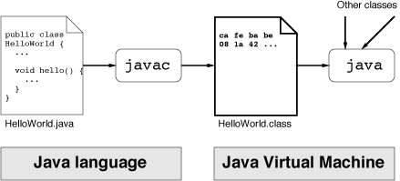
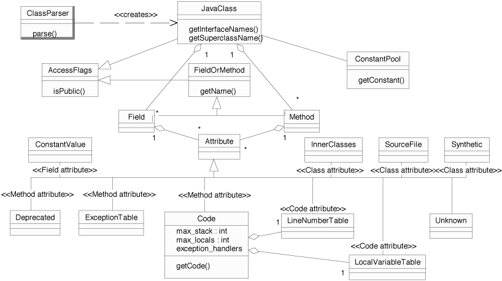

# Project Information

## Navigation

- [Commons BCEL](#index)
  - [About](#index_2)
  - [Asking Questions](https://commons.apache.org/proper/commons-bcel/mail-lists.html)
  - [Release History](#changes)
  - [Issue Tracking](#issue-management)
  - [Dependency Management](#dependency-info)
  - [Sources](#scm)
  - [Security](#security)
  - [License](https://www.apache.org/licenses/LICENSE-2.0)
  - [Code of Conduct](https://www.apache.org/foundation/policies/conduct.html)
  - [Download](https://commons.apache.org/proper/commons-bcel/download_bcel.cgi)
  - [Javadoc](#index)
    - [Javadoc Current](https://commons.apache.org/proper/commons-bcel/apidocs/index.html)
    - [Javadoc Archive](https://javadoc.io/doc/org.apache.bcel/bcel/)
  - [Manual](#manual-manual)
    - [Introduction](#manual-introduction)
    - [The JVM](#manual-jvm)
    - [The BCEL API](#manual-bcel-api)
    - [Application areas](#manual-application-areas)
    - [Appendix](#manual-appendix)
  - [FAQ](#faq)
  - [Used by](#projects)
- Project Documentation
  - [Project Information](#project-info)
    - [About](#index_2)
    - [Summary](#summary)
    - [Team](#team)
    - [Source Code Management](#scm)
    - [Issue Management](#issue-management)
    - [Mailing Lists](https://commons.apache.org/proper/commons-bcel/mailing-lists.html)
    - [Maven Coordinates](#dependency-info)
    - [Dependency Management](#dependency-management)
    - [Dependencies](#dependencies)
    - [Dependency Convergence](#dependency-convergence)
    - [CI Management](#ci-management)
    - [Distribution Management](#distribution-management)
  - [Project Reports](#project-reports)
    - [Changes](#changes)
    - [JIRA Report](#jira-changes)
    - [Javadoc](https://commons.apache.org/proper/commons-bcel/apidocs/index.html)
    - [Source Xref](https://commons.apache.org/proper/commons-bcel/xref/index.html)
    - [Test Source Xref](https://commons.apache.org/proper/commons-bcel/xref-test/index.html)
    - [Surefire](#surefire)
    - [RAT Report](#rat-report)
    - [JaCoCo](https://commons.apache.org/proper/commons-bcel/jacoco/index.html)
    - [japicmp](#japicmp)
    - [Checkstyle](#checkstyle)
    - [CPD](#cpd)
    - [PMD](#pmd)
    - [Tag List](#taglist)
    - [SpotBugs](#spotbugs)
- Commons
  - [Home](https://commons.apache.org/)
  - [License](https://www.apache.org/licenses/)
  - [Components](https://commons.apache.org/components.html)
  - [Sandbox](https://commons.apache.org/sandbox/index.html)
  - [Dormant](https://commons.apache.org/dormant/index.html)
- General Information
  - [Security](https://commons.apache.org/security.html)
  - [Volunteering](https://commons.apache.org/volunteering.html)
  - [Contributing Patches](https://commons.apache.org/patches.html)
  - [Building Components](https://commons.apache.org/building.html)
  - [Commons Parent POM](https://commons.apache.org/commons-parent-pom.html)
  - [Commons Build Plugin](https://commons.apache.org/build-plugin/index.html)
  - [Commons Release Plugin](https://commons.apache.org/release-plugin/index.html)
  - [Site Publication](https://commons.apache.org/site-publish.html)
  - [Releasing Components](https://commons.apache.org/releases/index.html)
  - [Wiki](https://cwiki.apache.org/confluence/display/commons/FrontPage)
- ASF
  - [How the ASF works](https://www.apache.org/foundation/how-it-works.html)
  - [Get Involved](https://www.apache.org/foundation/getinvolved.html)
  - [Developer Resources](https://www.apache.org/dev/)
  - [Code of Conduct](https://www.apache.org/foundation/policies/conduct.html)
  - [Privacy](https://privacy.apache.org/policies/privacy-policy-public.html)
  - [Sponsorship](https://www.apache.org/foundation/sponsorship.html)
  - [Thanks](https://www.apache.org/foundation/thanks.html)

## Content

<!-- source_url: https://commons.apache.org/proper/commons-bcel/ -->

<!-- page_index: 1 -->

# Commons BCEL

|  |  |
| --- | --- |
|  | Commons BCEL The Byte Code Engineering Library (Apache Commons BCEL™) is intended to give users a convenient way to analyze, create, and manipulate (binary) Java class files (those ending with .class). Classes are represented by objects which contain all the symbolic information of the given class: methods, fields and byte code instructions, in particular.  Such objects can be read from an existing file, be transformed by a program (e.g. a class loader at run-time) and written to a file again. An even more interesting application is the creation of classes from scratch at run-time. The Byte Code Engineering Library (BCEL) may be also useful if you want to learn about the Java Virtual Machine (JVM) and the format of Java .class files.  BCEL contains a byte code verifier named JustIce, which usually gives you much better information about what's wrong with your code than the standard JVM message.  BCEL is already being used successfully in several projects such as compilers, optimizers, obsfuscators, code generators and analysis tools. Unfortunately there hasn't been much development going on over the past few years. Feel free to help out or you might want to have a look into the ASM project at objectweb.  Documentation The package descriptions in the [Javadoc](https://commons.apache.org/proper/commons-bcel/apidocs/index.html) give an overview of the available features and various [project reports](#project-reports) are provided.  The [source repository](#scm) can be [browsed](https://gitbox.apache.org/repos/asf?p=commons-bcel.git), or you can browse/contribute via [GitHub](https://github.com/apache/commons-bcel).  Release Information The latest stable release of BCEL is here, you may:  Alternatively, you can pull it from the central Maven repositories through a [dependency](#dependency-info).  Getting Involved The [commons developer mailing list](https://commons.apache.org/proper/commons-bcel/mail-lists.html) is the main channel of communication for contributors. Please remember that the lists are shared between all commons components, so prefix your email by [bcel].  You can also peruse [JIRA](https://commons.apache.org/proper/commons-bcel/issue-tracking.html).  Alternatively you can go through the *Needs Work* tags in the [TagList report](#taglist).  If you'd like to offer up pull requests via GitHub rather than applying patches to JIRA, we have a [GitHub mirror](https://github.com/apache/commons-bcel/). |

Copyright © 2004-2026
[The Apache Software Foundation](https://www.apache.org/).
All Rights Reserved.

Apache Commons, Apache Commons BCEL, Apache, the Apache logo, and the Apache Commons project logos are trademarks of The Apache Software Foundation.
All other marks mentioned may be trademarks or registered trademarks of their respective owners.

---

<!-- source_url: https://commons.apache.org/proper/commons-bcel/index.html -->

<!-- page_index: 2 -->

# Commons BCEL

|  |  |
| --- | --- |
|  | Commons BCEL The Byte Code Engineering Library (Apache Commons BCEL™) is intended to give users a convenient way to analyze, create, and manipulate (binary) Java class files (those ending with .class). Classes are represented by objects which contain all the symbolic information of the given class: methods, fields and byte code instructions, in particular.  Such objects can be read from an existing file, be transformed by a program (e.g. a class loader at run-time) and written to a file again. An even more interesting application is the creation of classes from scratch at run-time. The Byte Code Engineering Library (BCEL) may be also useful if you want to learn about the Java Virtual Machine (JVM) and the format of Java .class files.  BCEL contains a byte code verifier named JustIce, which usually gives you much better information about what's wrong with your code than the standard JVM message.  BCEL is already being used successfully in several projects such as compilers, optimizers, obsfuscators, code generators and analysis tools. Unfortunately there hasn't been much development going on over the past few years. Feel free to help out or you might want to have a look into the ASM project at objectweb.  Documentation The package descriptions in the [Javadoc](https://commons.apache.org/proper/commons-bcel/apidocs/index.html) give an overview of the available features and various [project reports](#project-reports) are provided.  The [source repository](#scm) can be [browsed](https://gitbox.apache.org/repos/asf?p=commons-bcel.git), or you can browse/contribute via [GitHub](https://github.com/apache/commons-bcel).  Release Information The latest stable release of BCEL is here, you may:  Alternatively, you can pull it from the central Maven repositories through a [dependency](#dependency-info).  Getting Involved The [commons developer mailing list](https://commons.apache.org/proper/commons-bcel/mail-lists.html) is the main channel of communication for contributors. Please remember that the lists are shared between all commons components, so prefix your email by [bcel].  You can also peruse [JIRA](https://commons.apache.org/proper/commons-bcel/issue-tracking.html).  Alternatively you can go through the *Needs Work* tags in the [TagList report](#taglist).  If you'd like to offer up pull requests via GitHub rather than applying patches to JIRA, we have a [GitHub mirror](https://github.com/apache/commons-bcel/). |

Copyright © 2004-2026
[The Apache Software Foundation](https://www.apache.org/).
All Rights Reserved.

Apache Commons, Apache Commons BCEL, Apache, the Apache logo, and the Apache Commons project logos are trademarks of The Apache Software Foundation.
All other marks mentioned may be trademarks or registered trademarks of their respective owners.

---

<!-- source_url: https://commons.apache.org/proper/commons-bcel/changes.html -->

<!-- page_index: 3 -->

# Apache Commons BCEL Release Notes

<table class="layout-table">
<tr>
<td>
</td>
<td>
<section>
<h1>Apache Commons BCEL Release Notes</h1><section>
<h2>Release History</h2>
<table>
<tr>
<th>Version</th>
<th>Date</th>
<th>Description</th></tr>
<tr>
<td><a href="#changes--a6.12.0">6.12.0</a></td>
<td>2026-01-18</td>
<td>This is a feature and maintenance release. Java 8 or later is required.</td></tr>
<tr>
<td><a href="#changes--a6.11.0">6.11.0</a></td>
<td>2025-10-09</td>
<td>This is a feature and maintenance release. Java 8 or later is required.</td></tr>
<tr>
<td><a href="#changes--a6.10.0">6.10.0</a></td>
<td>2024-07-13</td>
<td>Maintenance and bug fix release. Requires a minimum of Java 8.</td></tr>
<tr>
<td><a href="#changes--a6.9.0">6.9.0</a></td>
<td>2024-04-21</td>
<td>Maintenance and bug fix release.</td></tr>
<tr>
<td><a href="#changes--a6.8.2">6.8.2</a></td>
<td>2024-02-21</td>
<td>Maintenance and bug fix release.</td></tr>
<tr>
<td><a href="#changes--a6.8.1">6.8.1</a></td>
<td>2024-01-07</td>
<td>Maintenance and bug fix release.</td></tr>
<tr>
<td><a href="#changes--a6.8.0">6.8.0</a></td>
<td>2023-12-03</td>
<td>Maintenance and bug fix release.</td></tr>
<tr>
<td><a href="#changes--a6.7.0">6.7.0</a></td>
<td>2022-11-28</td>
<td>Maintenance and bug fix release.</td></tr>
<tr>
<td><a href="#changes--a6.6.1">6.6.1</a></td>
<td>2022-10-29</td>
<td>Maintenance and bug fix release.</td></tr>
<tr>
<td><a href="#changes--a6.6.0">6.6.0</a></td>
<td>2022-10-08</td>
<td>Minor feature and bug fix release. Fixes CVE-2022-42920: Apache Commons BCEL prior to 6.6.0 allows producing arbitrary bytecode via out-of-bounds writing</td></tr>
<tr>
<td><a href="#changes--a6.5.0">6.5.0</a></td>
<td>2020-06-05</td>
<td>Minor feature and bug fix release.</td></tr>
<tr>
<td><a href="#changes--a6.4.1">6.4.1</a></td>
<td>2019-09-26</td>
<td>Bug fix release.</td></tr>
<tr>
<td><a href="#changes--a6.4.0">6.4.0</a></td>
<td>2019-09-20</td>
<td>Feature and bug fix release.</td></tr>
<tr>
<td><a href="#changes--a6.3.1">6.3.1</a></td>
<td>2019-03-20</td>
<td>Bug fix release</td></tr>
<tr>
<td><a href="#changes--a6.3">6.3</a></td>
<td>2019-01-23</td>
<td>Experimental Java 9, 10, 11, 12-EA, and 13-EA Support</td></tr>
<tr>
<td><a href="#changes--a6.2">6.2</a></td>
<td>2017-12-08</td>
<td>Experimental Java 9 Support</td></tr>
<tr>
<td><a href="#changes--a6.1">6.1</a></td>
<td>2017-09-14</td>
<td>Experimental Java 9 Support</td></tr>
<tr>
<td><a href="#changes--a6.0">6.0</a></td>
<td>2016-07-10</td>
<td>Apache Commons BCEL 6.0 is a major release supporting the new features  introduced in Java 6, 7 and 8.    It requires Java 7 or higher to run.   COMPATIBILITY with 5.2  ======================    Binary compatible - not strictly compatible  - The constant interface org.apache.bcel.Constants has been deprecated. Classes   which implemented this interface in 5.2 now use the constants defined in the   org.apache.bcel.Const class.  - The constant interface org.apache.bcel.generic.InstructionConstants has been   deprecated. Classes which implemented this interface in 5.2 now use the   constants defined in the org.apache.bcel.generic.InstructionConsts class.  - Return type of method 'public java.lang.Object getElementAt(int)' in   org.apache.bcel.verifier.VerifierFactoryListModel has been changed to   java.lang.String.  - The BCEL classes do no longer implement java.io.Serializable.    Source compatible - Yes, sort of;   - The org.apache.bcel.classfile.Visitor interface has been enhanced with   additional methods. If you implemented it directly instead of extending   the EmptyVisitor class you'll have to implement the new methods.   - The org.apache.bcel.generic.Visitor interface has been enhanced with an   additional method. If you implemented it directly instead of extending   the EmptyVisitor class you'll have to implement the new methods.    Semantic compatible - Yes, except:   - BCEL 6.0 handles new attributes such as code annotations that could only   be processed by implementing a custom AttributeReader in the previous   versions. Code relying on this behavior will have to be adjusted since   the AttributeReader will no longer be called in these cases.    For full information about API changes please see the extended Clirr report:      https://commons.apache.org/bcel/clirr-report.html</td></tr></table></section><section>
<h2>Release 6.12.0 – 2026-01-18</h2>
<table>
<tr>
<th>Type</th>
<th>Changes</th>
<th>By</th></tr>
<tr>
<td></td>
<td>Fix infinite loop in example.TransitiveHull #476. Thanks to fmantz, Gary Gregory.</td>
<td><a href="#team--ggregory">ggregory</a></td></tr>
<tr>
<td></td>
<td>Fix Apache RAT plugin console warnings. Thanks to Gary Gregory.</td>
<td><a href="#team--ggregory">ggregory</a></td></tr>
<tr>
<td></td>
<td>Fix malformed Javadoc comments. Thanks to Gary Gregory.</td>
<td><a href="#team--ggregory">ggregory</a></td></tr>
<tr>
<td></td>
<td>Make the build reproducible on the Azul JDK. Thanks to Gary Gregory.</td>
<td><a href="#team--ggregory">ggregory</a></td></tr>
<tr>
<td></td>
<td>Fix infinite loop in JavaClass.findField() on invalid input. Thanks to Gary Gregory, Pavel Kohout.</td>
<td><a href="#team--ggregory">ggregory</a></td></tr>
<tr>
<td></td>
<td>Fix infinite loop in JavaClass.getAllInterfaces() on invalid input. Thanks to Gary Gregory, Pavel Kohout.</td>
<td><a href="#team--ggregory">ggregory</a></td></tr>
<tr>
<td></td>
<td>Fix infinite loop in JavaClass.getSuperClasses() on invalid input. Thanks to Gary Gregory, Pavel Kohout.</td>
<td><a href="#team--ggregory">ggregory</a></td></tr>
<tr>
<td></td>
<td>Exception message in Args.requireU4() refers to the wrong data type. Thanks to Gary Gregory.</td>
<td><a href="#team--ggregory">ggregory</a></td></tr>
<tr>
<td></td>
<td>Exception message in Args.requireU2() refers to the wrong upper range value. Thanks to Gary Gregory.</td>
<td><a href="#team--ggregory">ggregory</a></td></tr>
<tr>
<td></td>
<td>Code.Code(int, int, DataInput, ConstantPool) now throws a ClassFormatException if the code array is greater than the JVM specification allows. Thanks to Gary Gregory, Stanislav Fort.</td>
<td><a href="#team--ggregory">ggregory</a></td></tr>
<tr>
<td></td>
<td>Code.Code(int, int, int, int, byte[], CodeException[], Attribute[], ConstantPool) now throws a ClassFormatException if the code array is greater than the JVM specification allows. Thanks to Gary Gregory, Stanislav Fort.</td>
<td><a href="#team--ggregory">ggregory</a></td></tr>
<tr>
<td></td>
<td>Code.setCode(byte[]) now throws a ClassFormatException if the code array is greater than the JVM specification allows. Thanks to Gary Gregory.</td>
<td><a href="#team--ggregory">ggregory</a></td></tr>
<tr>
<td></td>
<td>ClassDumper.dump() should not call the input stream it didn't open; fixes IOException when calling DumpClass.main(ClassDumper.java:351). Thanks to Gary Gregory.</td>
<td><a href="#team--ggregory">ggregory</a></td></tr>
<tr>
<td></td>
<td>org.apache.bcel.classfile.ConstantPool.ConstantPool(Constant[]) now uses varagrs: ConstantPool(Constant...). Thanks to Gary Gregory.</td>
<td><a href="#team--ggregory">ggregory</a></td></tr>
<tr>
<td></td>
<td>org.apache.bcel.classfile.Deprecated now requires its the attribute_length item be zero; see https://docs.oracle.com/javase/specs/jvms/se25/html/jvms-4.html#jvms-4.7.15. Thanks to Gary Gregory.</td>
<td><a href="#team--ggregory">ggregory</a></td></tr>
<tr>
<td></td>
<td>org.apache.bcel.classfile.Synthetic now requires its the attribute_length item be zero; see https://docs.oracle.com/javase/specs/jvms/se25/html/jvms-4.html#jvms-4.7.8. Thanks to Gary Gregory.</td>
<td><a href="#team--ggregory">ggregory</a></td></tr>
<tr>
<td></td>
<td>The size of an Attribute unknown to the JVM specification is limited to 1 MB and is overridden with the system property BCEL.Attribute.Unknown.max_attribute_length; see https://docs.oracle.com/javase/specs/jvms/se25/html/jvms-4.html#jvms-4.7. Thanks to Gary Gregory, Stanislav Fort.</td>
<td><a href="#team--ggregory">ggregory</a></td></tr>
<tr>
<td></td>
<td>Add Const.MAJOR_26. Thanks to Gary Gregory.</td>
<td><a href="#team--ggregory">ggregory</a></td></tr>
<tr>
<td></td>
<td>Add Const.MINOR_26. Thanks to Gary Gregory.</td>
<td><a href="#team--ggregory">ggregory</a></td></tr>
<tr>
<td></td>
<td>Bump org.apache.commons:commons-parent from 89 to 95 #482. Thanks to Gary Gregory.</td>
<td><a href="#team--ggregory">ggregory</a></td></tr>
<tr>
<td></td>
<td>[test] Bump org.jetbrains.kotlin:kotlin-stdlib from 2.2.20 to 2.3.0 #481. Thanks to Gary Gregory.</td>
<td><a href="#team--ggregory">ggregory</a></td></tr>
<tr>
<td></td>
<td>Bump commons-io:commons-io from 2.20.0 to 2.21.0. Thanks to Gary Gregory.</td>
<td><a href="#team--ggregory">ggregory</a></td></tr>
<tr>
<td></td>
<td>Bump commons-lang3 from 3.19.0 to 3.20.0. Thanks to Gary Gregory.</td>
<td><a href="#team--ggregory">ggregory</a></td></tr>
<tr>
<td></td>
<td>[test] Bump org.apache.commons:commons-exec from 1.5.0 to 1.6.0. Thanks to Gary Gregory.</td>
<td><a href="#team--ggregory">ggregory</a></td></tr></table></section><section>
<h2>Release 6.11.0 – 2025-10-09</h2>
<table>
<tr>
<th>Type</th>
<th>Changes</th>
<th>By</th></tr>
<tr>
<td></td>
<td>Replace internal use of Locale.ENGLISH with Locale.ROOT. Thanks to Gary Gregory.</td>
<td><a href="#team--ggregory">ggregory</a></td></tr>
<tr>
<td></td>
<td>Wrong permissions on bcel .jar file in binary .tar.gz distribution file. Fixes <a href="https://issues.apache.org/jira/browse/BCEL-375">BCEL-375</a>. Thanks to J. Lewis Muir, Gary Gregory.</td>
<td><a href="#team--ggregory">ggregory</a></td></tr>
<tr>
<td></td>
<td>ClassPath.close() throws UnsupportedOperationException when created with system-classpath. Fixes <a href="https://issues.apache.org/jira/browse/BCEL-376">BCEL-376</a>. Thanks to Dominik Stadler, Gary Gregory.</td>
<td><a href="#team--ggregory">ggregory</a></td></tr>
<tr>
<td></td>
<td>ClassPath.getResources(String) can use an ArrayList instead of a Vector. Thanks to Gary Gregory.</td>
<td><a href="#team--ggregory">ggregory</a></td></tr>
<tr>
<td></td>
<td>Fix SpotBugs [ERROR] Medium: Operation on the "created" shared variable in "ConstantUtf8" class is not atomic [org.apache.bcel.classfile.ConstantUtf8] At ConstantUtf8.java:[line 119] AT_NONATOMIC_OPERATIONS_ON_SHARED_VARIABLE. Thanks to Gary Gregory.</td>
<td><a href="#team--ggregory">ggregory</a></td></tr>
<tr>
<td></td>
<td>Fix SpotBugs [ERROR] Medium: Operation on the "considered" shared variable in "ConstantUtf8" class is not atomic [org.apache.bcel.classfile.ConstantUtf8] At ConstantUtf8.java:[line 137] AT_NONATOMIC_OPERATIONS_ON_SHARED_VARIABLE. Thanks to Gary Gregory.</td>
<td><a href="#team--ggregory">ggregory</a></td></tr>
<tr>
<td></td>
<td>Fix SpotBugs [ERROR] Medium: Operation on the "skipped" shared variable in "ConstantUtf8" class is not atomic [org.apache.bcel.classfile.ConstantUtf8] At ConstantUtf8.java:[line 134] AT_NONATOMIC_OPERATIONS_ON_SHARED_VARIABLE. Thanks to Gary Gregory.</td>
<td><a href="#team--ggregory">ggregory</a></td></tr>
<tr>
<td></td>
<td>org.apache.bcel.util.ClassPath.addJdkModules(String, List&lt;String&gt;) now reads the system property "jdk.module.path" instead of "java.modules.path"; see https://docs.oracle.com/en/java/javase/21/docs/api/java.base/java/lang/System.html#jdk.module.path. Thanks to Gary Gregory.</td>
<td><a href="#team--ggregory">ggregory</a></td></tr>
<tr>
<td></td>
<td>Fix ConstantPoolModuleAccessTest failures on Java 25. Thanks to Andrey Loskutov.</td>
<td><a href="#team--iloveeclipse">iloveeclipse</a></td></tr>
<tr>
<td></td>
<td>Fix testing on Java 24 and up. Fixes <a href="https://issues.apache.org/jira/browse/377">377</a>. Thanks to Dejan Stojadinović, Gary Gregory, Andrey Loskutov.</td>
<td><a href="#team--ggregory">ggregory</a></td></tr>
<tr>
<td></td>
<td>Add Const.MAJOR_25. Thanks to Gary Gregory.</td>
<td><a href="#team--ggregory">ggregory</a></td></tr>
<tr>
<td></td>
<td>Add Const.MINOR_25. Thanks to Gary Gregory.</td>
<td><a href="#team--ggregory">ggregory</a></td></tr>
<tr>
<td></td>
<td>Add experimental CycloneDX VEX file #446. Thanks to Piotr P. Karwasz, Gary Gregory.</td>
<td><a href="#team--ggregory">ggregory</a></td></tr>
<tr>
<td></td>
<td>Refactor to use new Maven POM variable ecj.version. Thanks to Gary Gregory.</td>
<td><a href="#team--ggregory">ggregory</a></td></tr>
<tr>
<td></td>
<td>Bump org.apache.commons:commons-parent from 72 to 89 #346, #349, #559, #364, #368, #378, #464. Thanks to Dependabot, Gary Gregory.</td>
<td><a href="#team--ggregory">ggregory</a></td></tr>
<tr>
<td></td>
<td>Bump org.apache.commons:commons-lang3 from 3.14.0 to 3.19.0 #334, #341, #351, #444. Thanks to Dependabot, Gary Gregory.</td>
<td><a href="#team--ggregory">ggregory</a></td></tr>
<tr>
<td></td>
<td>Bump org.jetbrains.kotlin:kotlin-stdlib from 2.0.0 to 2.2.20 #340, #347, #369, #390, #407, #422, #434, #441, #452, #462. Thanks to Dependabot, Gary Gregory.</td>
<td><a href="#team--ggregory">ggregory</a></td></tr>
<tr>
<td></td>
<td>Bump commons-io:commons-io from 2.16.1 to 2.20.0 #357, #387. Thanks to Dependabot, Gary Gregory.</td>
<td><a href="#team--ggregory">ggregory</a></td></tr>
<tr>
<td></td>
<td>Bump jna.version from 5.14.0 to 5.18.1 #358, #399, #466, #470. Thanks to Dependabot, Gary Gregory.</td>
<td><a href="#team--ggregory">ggregory</a></td></tr>
<tr>
<td></td>
<td>Bump org.codehaus.mojo:taglist-maven-plugin from 3.1.0 to 3.2.1 #376. Thanks to Dependabot, Gary Gregory.</td>
<td><a href="#team--ggregory">ggregory</a></td></tr>
<tr>
<td></td>
<td>Bump org.apache.commons:commons-collections4 from 4.5.0-M2 to 4.5.0 #395. Thanks to Dependabot, Gary Gregory.</td>
<td><a href="#team--ggregory">ggregory</a></td></tr>
<tr>
<td></td>
<td>Bump org.apache.commons:commons-exec from 1.4.0 to 1.5.0. Thanks to Dependabot, Gary Gregory.</td>
<td><a href="#team--ggregory">ggregory</a></td></tr></table></section><section>
<h2>Release 6.10.0 – 2024-07-13</h2>
<table>
<tr>
<th>Type</th>
<th>Changes</th>
<th>By</th></tr>
<tr>
<td></td>
<td>Fix PMD UnnecessaryFullyQualifiedName. Thanks to Gary Gregory.</td>
<td><a href="#team--ggregory">ggregory</a></td></tr>
<tr>
<td></td>
<td>Fix PMD EmptyCatchBlock by allowing commented blocks. Thanks to Gary Gregory.</td>
<td><a href="#team--ggregory">ggregory</a></td></tr>
<tr>
<td></td>
<td>Fix PMD EmptyControlStatement by allowing commented blocks. Thanks to Gary Gregory.</td>
<td><a href="#team--ggregory">ggregory</a></td></tr>
<tr>
<td></td>
<td>Fix SpotBugs RV_RETURN_VALUE_IGNORED_BAD_PRACTICE in JasminVisitor. Thanks to Gary Gregory.</td>
<td><a href="#team--ggregory">ggregory</a></td></tr>
<tr>
<td></td>
<td>SpotBugs checks should ignore code generated by JavaCC. Thanks to Gary Gregory.</td>
<td><a href="#team--ggregory">ggregory</a></td></tr>
<tr>
<td></td>
<td>Fix SpotBugs URF_UNREAD_FIELD in ClassDumper. Thanks to Gary Gregory.</td>
<td><a href="#team--ggregory">ggregory</a></td></tr>
<tr>
<td></td>
<td>Fix SpotBugs DM_DEFAULT_ENCODING in JasminVisitor. Thanks to Gary Gregory.</td>
<td><a href="#team--ggregory">ggregory</a></td></tr>
<tr>
<td></td>
<td>Fix SpotBugs RCN_REDUNDANT_NULLCHECK_WOULD_HAVE_BEEN_A_NPE in ASTFunAppl. Thanks to Gary Gregory.</td>
<td><a href="#team--ggregory">ggregory</a></td></tr>
<tr>
<td></td>
<td>Fix SpotBugs RV_ABSOLUTE_VALUE_OF_HASHCODE in Mini.Environment. Thanks to Gary Gregory.</td>
<td><a href="#team--ggregory">ggregory</a></td></tr>
<tr>
<td></td>
<td>Fix SpotBugs DM_DEFAULT_ENCODING in Mini.MiniC. Thanks to Gary Gregory.</td>
<td><a href="#team--ggregory">ggregory</a></td></tr>
<tr>
<td></td>
<td>Fix SpotBugs WMI_WRONG_MAP_ITERATOR in Package.go(String[]). Thanks to Gary Gregory.</td>
<td><a href="#team--ggregory">ggregory</a></td></tr>
<tr>
<td></td>
<td>Deprecate TransitiveHull.INGORED in favor of TransitiveHull.getIgnored(). Thanks to Gary Gregory.</td>
<td><a href="#team--ggregory">ggregory</a></td></tr>
<tr>
<td></td>
<td>Add accessors to model and unit tests, Javadoc #183. Thanks to nbauma109, Gary Gregory, Mark Roberts.</td>
<td><a href="#team--ggregory">ggregory</a></td></tr>
<tr>
<td></td>
<td>Add Const.MAJOR_22. Thanks to Gary Gregory.</td>
<td><a href="#team--ggregory">ggregory</a></td></tr>
<tr>
<td></td>
<td>Add Const.MINOR_22. Thanks to Gary Gregory.</td>
<td><a href="#team--ggregory">ggregory</a></td></tr>
<tr>
<td></td>
<td>Add Const.MAJOR_23. Thanks to Gary Gregory.</td>
<td><a href="#team--ggregory">ggregory</a></td></tr>
<tr>
<td></td>
<td>Add Const.MINOR_23. Thanks to Gary Gregory.</td>
<td><a href="#team--ggregory">ggregory</a></td></tr>
<tr>
<td></td>
<td>Add Const.MAJOR_24. Thanks to Gary Gregory.</td>
<td><a href="#team--ggregory">ggregory</a></td></tr>
<tr>
<td></td>
<td>Add Const.MINOR_24. Thanks to Gary Gregory.</td>
<td><a href="#team--ggregory">ggregory</a></td></tr>
<tr>
<td></td>
<td>Bump tests from org.assertj:assertj-core 3.25.3 to 3.26.3 #322, #332. Thanks to Dependabot.</td>
<td><a href="#team--ggregory">ggregory</a></td></tr>
<tr>
<td></td>
<td>Bump tests from org.jetbrains.kotlin:kotlin-stdlib 1.9.23 to 2.0.0 #309, #318. Thanks to Dependabot.</td>
<td><a href="#team--ggregory">ggregory</a></td></tr>
<tr>
<td></td>
<td>Bump tests from org.apache.commons:commons-collections4 4.4 to 4.5.0-M2. Thanks to Gary Gregory.</td>
<td><a href="#team--ggregory">ggregory</a></td></tr>
<tr>
<td></td>
<td>Bump org.apache.commons:commons-parent from 69 to 72 #336. Thanks to Gary Gregory.</td>
<td><a href="#team--ggregory">ggregory</a></td></tr>
<tr>
<td></td>
<td>Bump org.codehaus.mojo:taglist-maven-plugin from 3.0.0 to 3.1.0 #331. Thanks to Gary Gregory.</td>
<td><a href="#team--ggregory">ggregory</a></td></tr></table></section><section>
<h2>Release 6.9.0 – 2024-04-21</h2>
<table>
<tr>
<th>Type</th>
<th>Changes</th>
<th>By</th></tr>
<tr>
<td></td>
<td>Add Support for Java 16 records #290. Thanks to Pablo Nicolas Diaz, Gary Gregory, Paul King, Mark Roberts.</td>
<td><a href="#team--ggregory">ggregory</a></td></tr>
<tr>
<td></td>
<td>Add null guard for InstructionFactory.createInvoke() #289. Thanks to Heewon Lee.</td>
<td><a href="#team--ggregory">ggregory</a></td></tr>
<tr>
<td></td>
<td>Avoid possible NullPointerException in org.apache.bcel.classfile.DescendingVisitor.accept(E[]). Thanks to Gary Gregory.</td>
<td><a href="#team--ggregory">ggregory</a></td></tr>
<tr>
<td></td>
<td>Avoid possible NullPointerException in AnnotationEntryGen.getAnnotationAttributes(ConstantPoolGen, AnnotationEntryGen[]). Thanks to Gary Gregory.</td>
<td><a href="#team--ggregory">ggregory</a></td></tr>
<tr>
<td></td>
<td>Avoid possible NullPointerException in AnnotationEntryGen.copyValues(ElementValuePair[], ConstantPoolGen, boolean). Thanks to Gary Gregory.</td>
<td><a href="#team--ggregory">ggregory</a></td></tr>
<tr>
<td></td>
<td>Avoid possible NullPointerException in ArrayElementValueGen.ArrayElementValueGen(int, ElementValue[], ConstantPoolGen). Thanks to Gary Gregory.</td>
<td><a href="#team--ggregory">ggregory</a></td></tr>
<tr>
<td></td>
<td>Avoid possible NullPointerException in org.apache.bcel.generic.ClassGen.setMethods(Method[]). Thanks to Gary Gregory.</td>
<td><a href="#team--ggregory">ggregory</a></td></tr>
<tr>
<td></td>
<td>Avoid possible NullPointerException in org.apache.bcel.generic.ClassGen.unpackAnnotations(Attribute[]). Thanks to Gary Gregory.</td>
<td><a href="#team--ggregory">ggregory</a></td></tr>
<tr>
<td></td>
<td>Avoid possible NullPointerException in org.apache.bcel.classfile.ParameterAnnotationEntry.createParameterAnnotationEntries(Attribute[]). Thanks to Gary Gregory.</td>
<td><a href="#team--ggregory">ggregory</a></td></tr>
<tr>
<td></td>
<td>Avoid possible NullPointerException in org.apache.bcel.generic.ClassGen.ClassGen(JavaClass). Thanks to Gary Gregory.</td>
<td><a href="#team--ggregory">ggregory</a></td></tr>
<tr>
<td></td>
<td>Avoid possible NullPointerException in org.apache.bcel.generic.FieldGenOrMethodGen.addAll(Attribute[]). Thanks to Gary Gregory.</td>
<td><a href="#team--ggregory">ggregory</a></td></tr>
<tr>
<td></td>
<td>Avoid possible NullPointerException in org.apache.bcel.classfile.ParameterAnnotationEntry.createParameterAnnotationEntries(Attribute[]). Thanks to Gary Gregory.</td>
<td><a href="#team--ggregory">ggregory</a></td></tr>
<tr>
<td></td>
<td>Avoid NullPointerException after calling org.apache.bcel.classfile.MethodParameters.setParameters(MethodParameter[]) with null. Thanks to Gary Gregory.</td>
<td><a href="#team--ggregory">ggregory</a></td></tr>
<tr>
<td></td>
<td>Avoid NullPointerException after calling org.apache.bcel.classfile.ParameterAnnotations.setParameterAnnotationTable(ParameterAnnotationEntry[]) with null. Thanks to Gary Gregory.</td>
<td><a href="#team--ggregory">ggregory</a></td></tr>
<tr>
<td></td>
<td>Avoid NullPointerException after calling org.apache.bcel.classfile.LocalVariableTypeTable.setLocalVariableTable(LocalVariable[]) with null. Thanks to Gary Gregory.</td>
<td><a href="#team--ggregory">ggregory</a></td></tr>
<tr>
<td></td>
<td>Avoid NullPointerException after calling org.apache.bcel.classfile.LocalVariableTable.setLocalVariableTable(LocalVariable[]) with null. Thanks to Gary Gregory.</td>
<td><a href="#team--ggregory">ggregory</a></td></tr>
<tr>
<td></td>
<td>Avoid NullPointerException after calling org.apache.bcel.classfile.LineNumberTable.setLineNumberTable(LineNumber[]) with null. Thanks to Gary Gregory.</td>
<td><a href="#team--ggregory">ggregory</a></td></tr>
<tr>
<td></td>
<td>Avoid NullPointerException after calling org.apache.bcel.classfile.JavaClass.setMethods(Method[] with null. Thanks to Gary Gregory.</td>
<td><a href="#team--ggregory">ggregory</a></td></tr>
<tr>
<td></td>
<td>Avoid NullPointerException after calling org.apache.bcel.classfile.JavaClass.setInterfaces(int[]) with null. Thanks to Gary Gregory.</td>
<td><a href="#team--ggregory">ggregory</a></td></tr>
<tr>
<td></td>
<td>Avoid NullPointerException after calling org.apache.bcel.classfile.JavaClass.setInterfaceNames(String[]) with null. Thanks to Gary Gregory.</td>
<td><a href="#team--ggregory">ggregory</a></td></tr>
<tr>
<td></td>
<td>Avoid NullPointerException after calling org.apache.bcel.classfile.JavaClass.setFields(Field[]) with null. Thanks to Gary Gregory.</td>
<td><a href="#team--ggregory">ggregory</a></td></tr>
<tr>
<td></td>
<td>Avoid NullPointerException after calling org.apache.bcel.classfile.JavaClass.setAttributes(Attribute[]) with null. Thanks to Gary Gregory.</td>
<td><a href="#team--ggregory">ggregory</a></td></tr>
<tr>
<td></td>
<td>Avoid NullPointerException after calling org.apache.bcel.classfile.ConstantPool.setConstantPool(Constant[]) with null. Thanks to Gary Gregory.</td>
<td><a href="#team--ggregory">ggregory</a></td></tr>
<tr>
<td></td>
<td>Avoid NullPointerException after calling org.apache.bcel.classfile.FieldOrMethod.setAttributes(Attribute[]) with null. Thanks to Gary Gregory.</td>
<td><a href="#team--ggregory">ggregory</a></td></tr>
<tr>
<td></td>
<td>Avoid NullPointerException after calling org.apache.bcel.classfile.Annotations.setAnnotationTable(AnnotationEntry[]) with null. Thanks to Gary Gregory.</td>
<td><a href="#team--ggregory">ggregory</a></td></tr>
<tr>
<td></td>
<td>Avoid NullPointerException after calling org.apache.bcel.classfile.ArrayElementValue.ArrayElementValue(int, ElementValue[], ConstantPool) with null. Thanks to Gary Gregory.</td>
<td><a href="#team--ggregory">ggregory</a></td></tr>
<tr>
<td></td>
<td>Avoid NullPointerException after calling org.apache.bcel.classfile.BootstrapMethod.BootstrapMethod(int, int[]) with null. Thanks to Gary Gregory.</td>
<td><a href="#team--ggregory">ggregory</a></td></tr>
<tr>
<td></td>
<td>Avoid NullPointerException after calling org.apache.bcel.classfile.BootstrapMethod.setBootstrapArguments(int[]) with null. Thanks to Gary Gregory.</td>
<td><a href="#team--ggregory">ggregory</a></td></tr>
<tr>
<td></td>
<td>Avoid NullPointerException after calling org.apache.bcel.classfile.BootstrapMethods.BootstrapMethods(int, int, BootstrapMethod[], ConstantPool) with null. Thanks to Gary Gregory.</td>
<td><a href="#team--ggregory">ggregory</a></td></tr>
<tr>
<td></td>
<td>Avoid NullPointerException after calling org.apache.bcel.classfile.BootstrapMethods.setBootstrapMethods(BootstrapMethod[]) with null. Thanks to Gary Gregory.</td>
<td><a href="#team--ggregory">ggregory</a></td></tr>
<tr>
<td></td>
<td>Avoid NullPointerException calling org.apache.bcel.generic.InstructionList.redirectLocalVariables(LocalVariableGen[], InstructionHandle, InstructionHandle) with null. Thanks to Gary Gregory.</td>
<td><a href="#team--ggregory">ggregory</a></td></tr>
<tr>
<td></td>
<td>Avoid NullPointerException calling org.apache.bcel.generic.InstructionList.redirectExceptionHandlers(CodeExceptionGen[], InstructionHandle, InstructionHandle) with null. Thanks to Gary Gregory.</td>
<td><a href="#team--ggregory">ggregory</a></td></tr>
<tr>
<td></td>
<td>Avoid NullPointerException calling org.apache.bcel.generic.InstructionList.findHandle(InstructionHandle[], int[], int, int) with null. Thanks to Gary Gregory.</td>
<td><a href="#team--ggregory">ggregory</a></td></tr>
<tr>
<td></td>
<td>Avoid NullPointerException calling org.apache.bcel.generic.MethodGen.setArgumentTypes(Type[]) with null. Thanks to Gary Gregory.</td>
<td><a href="#team--ggregory">ggregory</a></td></tr>
<tr>
<td></td>
<td>Avoid NullPointerException calling org.apache.bcel.generic.MethodGen.setArgumentNames(String[]) with null. Thanks to Gary Gregory.</td>
<td><a href="#team--ggregory">ggregory</a></td></tr>
<tr>
<td></td>
<td>Avoid NullPointerException calling org.apache.bcel.generic.MethodGen.removeRuntimeAttributes(Attribute[]) with null. Thanks to Gary Gregory.</td>
<td><a href="#team--ggregory">ggregory</a></td></tr>
<tr>
<td></td>
<td>Avoid NullPointerException calling org.apache.bcel.generic.MethodGen.makeMutableVersion(AnnotationEntry[]) with null. Thanks to Gary Gregory.</td>
<td><a href="#team--ggregory">ggregory</a></td></tr>
<tr>
<td></td>
<td>Bump org.apache.commons:commons-parent from 66 to 69 #283, #297. Thanks to Dependabot.</td>
<td><a href="#team--ggregory">ggregory</a></td></tr>
<tr>
<td></td>
<td>Bump org.jetbrains.kotlin:kotlin-stdlib from 1.9.22 to 1.9.23 #284. Thanks to Dependabot.</td>
<td><a href="#team--ggregory">ggregory</a></td></tr>
<tr>
<td></td>
<td>Bump commons-io:commons-io from 2.15.1 to 2.16.1 #295, #300. Thanks to Dependabot.</td>
<td><a href="#team--ggregory">ggregory</a></td></tr></table></section><section>
<h2>Release 6.8.2 – 2024-02-21</h2>
<table>
<tr>
<th>Type</th>
<th>Changes</th>
<th>By</th></tr>
<tr>
<td></td>
<td>Fix ConcurrentModificationException in org.apache.bcel.util.SyntheticRepository.getInstance() #275. Thanks to Guillaume Nodet.</td>
<td><a href="#team--ggregory">ggregory</a></td></tr>
<tr>
<td></td>
<td>Add Maven property project.build.outputTimestamp for build reproducibility. Thanks to Gary Gregory.</td>
<td><a href="#team--ggregory">ggregory</a></td></tr>
<tr>
<td></td>
<td>Bump GitHub various actions for CI builds. Thanks to Dependabot.</td>
<td><a href="#team--ggregory">ggregory</a></td></tr>
<tr>
<td></td>
<td>Bump org.assertj:assertj-core from 3.25.1 to 3.25.2. Thanks to Dependabot.</td>
<td><a href="#team--ggregory">ggregory</a></td></tr>
<tr>
<td></td>
<td>Bump org.apache.commons:commons-parent from 65 to 66. Thanks to Dependabot.</td>
<td><a href="#team--ggregory">ggregory</a></td></tr></table></section><section>
<h2>Release 6.8.1 – 2024-01-07</h2>
<table>
<tr>
<th>Type</th>
<th>Changes</th>
<th>By</th></tr>
<tr>
<td></td>
<td>Replace internal use of StringBuffer with StringBuilder. Thanks to Gary Gregory.</td>
<td><a href="#team--ggregory">ggregory</a></td></tr>
<tr>
<td></td>
<td>CONSTANT_Dynamic is not handled in LDC #254. Fixes <a href="https://issues.apache.org/jira/browse/BCEL-370">BCEL-370</a>. Thanks to Gary Gregory.</td>
<td><a href="#team--ggregory">ggregory</a></td></tr>
<tr>
<td></td>
<td>BCELComparator now uses generics. Thanks to Gary Gregory.</td>
<td><a href="#team--ggregory">ggregory</a></td></tr>
<tr>
<td></td>
<td>Avoid NullPointerException in ClassGen.BCELComparator#equals() and ClassGen.BCELComparator#hashCode(). Thanks to Gary Gregory.</td>
<td><a href="#team--ggregory">ggregory</a></td></tr>
<tr>
<td></td>
<td>Avoid NullPointerException in Constant.BCELComparator#equals() and Constant.BCELComparator#hashCode(). Thanks to Gary Gregory.</td>
<td><a href="#team--ggregory">ggregory</a></td></tr>
<tr>
<td></td>
<td>Avoid NullPointerException in Field.BCELComparator#equals() and Field.BCELComparator#hashCode(). Thanks to Gary Gregory.</td>
<td><a href="#team--ggregory">ggregory</a></td></tr>
<tr>
<td></td>
<td>Avoid NullPointerException in FieldGen.BCELComparator#equals() and FieldGen.BCELComparator#hashCode(). Thanks to Gary Gregory.</td>
<td><a href="#team--ggregory">ggregory</a></td></tr>
<tr>
<td></td>
<td>Avoid NullPointerException in JavaClass.BCELComparator#equals() and JavaClass.BCELComparator#hashCode(). Thanks to Gary Gregory.</td>
<td><a href="#team--ggregory">ggregory</a></td></tr>
<tr>
<td></td>
<td>Avoid NullPointerException in Method.BCELComparator#equals() and Method.BCELComparator#hashCode(). Thanks to Gary Gregory.</td>
<td><a href="#team--ggregory">ggregory</a></td></tr>
<tr>
<td></td>
<td>Avoid NullPointerException in MethodGen.BCELComparator#equals() and MethodGen.BCELComparator#hashCode(). Thanks to Gary Gregory.</td>
<td><a href="#team--ggregory">ggregory</a></td></tr>
<tr>
<td></td>
<td>Bump GitHub various actions for CI builds. Thanks to Dependabot.</td>
<td><a href="#team--ggregory">ggregory</a></td></tr>
<tr>
<td></td>
<td>Bump jna.version from 5.13.0 to 5.14.0 #250. Thanks to Dependabot.</td>
<td><a href="#team--ggregory">ggregory</a></td></tr>
<tr>
<td></td>
<td>Bump org.jetbrains.kotlin:kotlin-stdlib from 1.9.21 to 1.9.22 #252. Thanks to Dependabot.</td>
<td><a href="#team--ggregory">ggregory</a></td></tr>
<tr>
<td></td>
<td>Bump org.apache.commons:commons-exec from 1.3 to 1.4.0 #255. Thanks to Dependabot.</td>
<td><a href="#team--ggregory">ggregory</a></td></tr></table></section><section>
<h2>Release 6.8.0 – 2023-12-03</h2>
<table>
<tr>
<th>Type</th>
<th>Changes</th>
<th>By</th></tr>
<tr>
<td></td>
<td>Add and use InvalidMethodSignatureException extending ClassFormatException. Thanks to Gary Gregory.</td>
<td><a href="#team--ggregory">ggregory</a></td></tr>
<tr>
<td></td>
<td>Increase code coverage in Class2HTMLTestCase with new test input Java4Example #186. Thanks to nbauma109.</td>
<td><a href="#team--ggregory">ggregory</a></td></tr>
<tr>
<td></td>
<td>Add verifier tests on some opcodes #180. Thanks to nbauma109.</td>
<td><a href="#team--ggregory">ggregory</a></td></tr>
<tr>
<td></td>
<td>Added signature test cases for class/method, and bad signatures #182. Thanks to nbauma109.</td>
<td><a href="#team--ggregory">ggregory</a></td></tr>
<tr>
<td></td>
<td>Add Const.MAJOR_20. Thanks to Gary Gregory.</td>
<td><a href="#team--ggregory">ggregory</a></td></tr>
<tr>
<td></td>
<td>Add Const.MINOR_20. Thanks to Gary Gregory.</td>
<td><a href="#team--ggregory">ggregory</a></td></tr>
<tr>
<td></td>
<td>Add Const.MAJOR_21. Thanks to Gary Gregory.</td>
<td><a href="#team--ggregory">ggregory</a></td></tr>
<tr>
<td></td>
<td>Add Const.MINOR_21. Thanks to Gary Gregory.</td>
<td><a href="#team--ggregory">ggregory</a></td></tr>
<tr>
<td></td>
<td>[Bcelifier] stackmap support to pass JDK verifier #177. Thanks to nbauma109, Gary Gregory, Mark Roberts.</td>
<td><a href="#team--ggregory">ggregory</a></td></tr>
<tr>
<td></td>
<td>Fix SpotBugs [ERROR] Class org.apache.bcel.util.ClassVector defines non-transient non-serializable instance field vec [org.apache.bcel.util.ClassVector] In ClassVector.java SE_BAD_FIELD. Thanks to Gary Gregory.</td>
<td><a href="#team--ggregory">ggregory</a></td></tr>
<tr>
<td></td>
<td>Fix SpotBugs [ERROR] Switch statement found in org.apache.bcel.util.BCELFactory.visitAllocationInstruction(AllocationInstruction) where one case falls through to the next case [org.apache.bcel.util.BCELFactory, org.apache.bcel.util.BCELFactory] At BCELFactory.java:[lines 188-191]Another occurrence at BCELFactory.java:[lines 192-196] SF_SWITCH_FALLTHROUGH. Thanks to Gary Gregory.</td>
<td><a href="#team--ggregory">ggregory</a></td></tr>
<tr>
<td></td>
<td>When parsing an class with an invalid constant reference, ensure ClassParser.parse() throws ClassFormatException, not NullPointerException. Thanks to OSS-Fuzz.</td>
<td><a href="#team--markt">markt</a></td></tr>
<tr>
<td></td>
<td>Ensure that references to a constant pool entry with index zero trigger a ClassFormatException, not a NullPointerException. Thanks to OSS-Fuzz.</td>
<td><a href="#team--markt">markt</a></td></tr>
<tr>
<td></td>
<td>Ensure that references to the unused constant pool entry after a long/double entry triggers a ClassFormatException, not a NullPointerException. Thanks to OSS-Fuzz.</td>
<td><a href="#team--markt">markt</a></td></tr>
<tr>
<td></td>
<td>Test and coverage of InstructionFactory #190. Thanks to nbauma109.</td>
<td><a href="#team--markt">markt</a></td></tr>
<tr>
<td></td>
<td>Verifier: test and coverage for SWAP instruction #188. Thanks to nbauma109.</td>
<td><a href="#team--ggregory">ggregory</a></td></tr>
<tr>
<td></td>
<td>Exception parsing Kotlin class with 'fun `method name with () in it`()' #205. Thanks to Jason Copenhaver, Gary Gregory.</td>
<td><a href="#team--ggregory">ggregory</a></td></tr>
<tr>
<td></td>
<td>Fix null pointers in AnnotationEntry #213. Thanks to nbauma109, Gary Gregory.</td>
<td><a href="#team--ggregory">ggregory</a></td></tr>
<tr>
<td></td>
<td>Field not found, search field in both super class and implemented interfaces (5x duplicated code to find field by name and type is refactored to a new method and now supports package-private) #181. Thanks to nbauma109.</td>
<td><a href="#team--ggregory">ggregory</a></td></tr>
<tr>
<td></td>
<td>Use alternative name for broken classes under test #220. Fixes <a href="https://issues.apache.org/jira/browse/BCEL-366">BCEL-366</a>. Thanks to Slawomir Jaranowski.</td>
<td><a href="#team--ggregory">ggregory</a></td></tr>
<tr>
<td></td>
<td>Fixes java.lang.IndexOutOfBoundsException for ATHROW on empty stack #223. Fixes <a href="https://issues.apache.org/jira/browse/BCEL-367">BCEL-367</a>. Thanks to Katherine Hough, Gary Gregory.</td>
<td><a href="#team--ggregory">ggregory</a></td></tr>
<tr>
<td></td>
<td>Fixes java.lang.StackOverflowError in Select#toString(boolean) #229. Fixes <a href="https://issues.apache.org/jira/browse/BCEL-368">BCEL-368</a>. Thanks to Katherine Hough, Gary Gregory.</td>
<td><a href="#team--ggregory">ggregory</a></td></tr>
<tr>
<td></td>
<td>Fix for type.getType(...) use on non-signature type names #221. Thanks to nbauma109, Judit Knoll, Gary Gregory.</td>
<td><a href="#team--ggregory">ggregory</a></td></tr>
<tr>
<td></td>
<td>Fix EmptyVisitorTestCase on Java 21. Thanks to Gary Gregory.</td>
<td><a href="#team--ggregory">ggregory</a></td></tr>
<tr>
<td></td>
<td>Bump commons-parent from 54 to 65 #189, #198, #222. Thanks to Gary Gregory, Dependabot.</td>
<td><a href="#team--ggregory">ggregory</a></td></tr>
<tr>
<td></td>
<td>Bump jna.version from 5.12.1 to 5.13.0 #203. Thanks to Dependabot.</td>
<td><a href="#team--ggregory">ggregory</a></td></tr>
<tr>
<td></td>
<td>Bump kotlin-stdlib from 1.8.10 to 1.9.21 #217, #219, #227, #231, #235, #245, #247. Thanks to Dependabot.</td>
<td><a href="#team--ggregory">ggregory</a></td></tr>
<tr>
<td></td>
<td>Bump commons-io from 2.11.0 to 2.15.1. Thanks to Dependabot.</td>
<td><a href="#team--ggregory">ggregory</a></td></tr>
<tr>
<td></td>
<td>Bump commons-lang3 from 3.12.0 to 3.14.0. Thanks to Gary Gregory.</td>
<td><a href="#team--ggregory">ggregory</a></td></tr>
<tr>
<td></td>
<td>Bump org.codehaus.mojo:exec-maven-plugin from 3.1.0 to 3.1.1 #246. Thanks to Gary Gregory.</td>
<td><a href="#team--ggregory">ggregory</a></td></tr></table></section><section>
<h2>Release 6.7.0 – 2022-11-28</h2>
<table>
<tr>
<th>Type</th>
<th>Changes</th>
<th>By</th></tr>
<tr>
<td></td>
<td>Add org.apache.bcel.classfile.ClassFormatException.ClassFormatException(Throwable). Thanks to Gary Gregory.</td>
<td><a href="#team--ggregory">ggregory</a></td></tr>
<tr>
<td></td>
<td>Add org.apache.bcel.classfile.JavaClass.EXTENSION. Thanks to Gary Gregory.</td>
<td><a href="#team--ggregory">ggregory</a></td></tr>
<tr>
<td></td>
<td>Add org.apache.bcel.classfile.Module.EXTENSION. Thanks to Gary Gregory.</td>
<td><a href="#team--ggregory">ggregory</a></td></tr>
<tr>
<td></td>
<td>Add org.apache.bcel.util.Args. Thanks to Gary Gregory.</td>
<td><a href="#team--ggregory">ggregory</a></td></tr>
<tr>
<td></td>
<td>Add org.apache.bcel.generic.ArrayType.getClassName(). Thanks to Gary Gregory.</td>
<td><a href="#team--ggregory">ggregory</a></td></tr>
<tr>
<td></td>
<td>Add org.apache.bcel.generic.Type.getClassName(). Thanks to Gary Gregory.</td>
<td><a href="#team--ggregory">ggregory</a></td></tr>
<tr>
<td></td>
<td>Add org.apache.bcel.classfile.Utility.packageToPath(String). Thanks to Gary Gregory.</td>
<td><a href="#team--ggregory">ggregory</a></td></tr>
<tr>
<td></td>
<td>org.apache.bcel.classfile.MethodParameter now implements org.apache.bcel.classfile.Node. Thanks to Gary Gregory, Mark Roberts.</td>
<td><a href="#team--ggregory">ggregory</a></td></tr>
<tr>
<td></td>
<td>Add org.apache.bcel.classfile.JavaClass.getSourceFilePath(). Thanks to nbauma109, Gary Gregory.</td>
<td><a href="#team--ggregory">ggregory</a></td></tr>
<tr>
<td></td>
<td>Add org.apache.bcel.generic.PUSH.PUSH(ConstantPoolGen, ArrayType). Thanks to nbauma109, Gary Gregory.</td>
<td><a href="#team--ggregory">ggregory</a></td></tr>
<tr>
<td></td>
<td>Avoid internal NPE in org.apache.bcel.util.ClassPath.getInputStream(String, String). Thanks to Gary Gregory.</td>
<td><a href="#team--ggregory">ggregory</a></td></tr>
<tr>
<td></td>
<td>InstructionConstants.ALOAD_0 value is wrong (regression from 6.6.0). Thanks to Gary Gregory.</td>
<td><a href="#team--ggregory">ggregory</a></td></tr>
<tr>
<td></td>
<td>InstructionConstants.DCONST_0 value is wrong (regression from 6.6.0). Thanks to Gary Gregory.</td>
<td><a href="#team--ggregory">ggregory</a></td></tr>
<tr>
<td></td>
<td>org.apache.bcel.classfile.Attribute constructors now throw ClassFormatException on invalid name index input. Thanks to Gary Gregory.</td>
<td><a href="#team--ggregory">ggregory</a></td></tr>
<tr>
<td></td>
<td>org.apache.bcel.classfile.CodeException constructors now throw ClassFormatException on invalid input. Thanks to Gary Gregory.</td>
<td><a href="#team--ggregory">ggregory</a></td></tr>
<tr>
<td></td>
<td>org.apache.bcel.classfile.ConstantInvokeDynamic.ConstantInvokeDynamic(DataInput). Thanks to Gary Gregory.</td>
<td><a href="#team--ggregory">ggregory</a></td></tr>
<tr>
<td></td>
<td>org.apache.bcel.classfile.ConstantValue constructors now throw ClassFormatException on invalid length input. Thanks to Gary Gregory.</td>
<td><a href="#team--ggregory">ggregory</a></td></tr>
<tr>
<td></td>
<td>org.apache.bcel.classfile.Deprecated constructors now throw ClassFormatException on invalid length input. Thanks to Gary Gregory.</td>
<td><a href="#team--ggregory">ggregory</a></td></tr>
<tr>
<td></td>
<td>org.apache.bcel.classfile.EnclosingMethod constructors now throw ClassFormatException on invalid length, class index, or method index input. Thanks to Gary Gregory.</td>
<td><a href="#team--ggregory">ggregory</a></td></tr>
<tr>
<td></td>
<td>org.apache.bcel.classfile.ExceptionTable constructors now throw ClassFormatException on invalid input. Thanks to Gary Gregory.</td>
<td><a href="#team--ggregory">ggregory</a></td></tr>
<tr>
<td></td>
<td>org.apache.bcel.classfile.InnerClasses constructors now throw ClassFormatException on invalid input. Thanks to Gary Gregory.</td>
<td><a href="#team--ggregory">ggregory</a></td></tr>
<tr>
<td></td>
<td>org.apache.bcel.classfile.LineNumber constructors now throw ClassFormatException on invalid input. Thanks to Gary Gregory.</td>
<td><a href="#team--ggregory">ggregory</a></td></tr>
<tr>
<td></td>
<td>org.apache.bcel.classfile.LocalVariable constructors now throw ClassFormatException on invalid input. Thanks to Gary Gregory.</td>
<td><a href="#team--ggregory">ggregory</a></td></tr>
<tr>
<td></td>
<td>org.apache.bcel.classfile.LocalVariableTable constructors now throw ClassFormatException on invalid input. Thanks to Gary Gregory.</td>
<td><a href="#team--ggregory">ggregory</a></td></tr>
<tr>
<td></td>
<td>org.apache.bcel.classfile.LocalVariableTypeTable constructors now throw ClassFormatException on invalid input. Thanks to Gary Gregory.</td>
<td><a href="#team--ggregory">ggregory</a></td></tr>
<tr>
<td></td>
<td>org.apache.bcel.classfile.ModuleMainClass constructors now throw ClassFormatException on invalid input. Thanks to Gary Gregory.</td>
<td><a href="#team--ggregory">ggregory</a></td></tr>
<tr>
<td></td>
<td>org.apache.bcel.classfile.ModulePackages constructors now throw ClassFormatException on invalid input. Thanks to Gary Gregory.</td>
<td><a href="#team--ggregory">ggregory</a></td></tr>
<tr>
<td></td>
<td>org.apache.bcel.classfile.NestHost constructors now throw ClassFormatException on invalid input. Thanks to Gary Gregory.</td>
<td><a href="#team--ggregory">ggregory</a></td></tr>
<tr>
<td></td>
<td>org.apache.bcel.classfile.NestMembers constructors now throw ClassFormatException on invalid input. Thanks to Gary Gregory.</td>
<td><a href="#team--ggregory">ggregory</a></td></tr>
<tr>
<td></td>
<td>org.apache.bcel.classfile.Signature constructors now throw ClassFormatException on invalid input. Thanks to Gary Gregory.</td>
<td><a href="#team--ggregory">ggregory</a></td></tr>
<tr>
<td></td>
<td>org.apache.bcel.classfile.SourceFile constructors now throw ClassFormatException on invalid input. Thanks to Gary Gregory.</td>
<td><a href="#team--ggregory">ggregory</a></td></tr>
<tr>
<td></td>
<td>org.apache.bcel.classfile.StackMap constructors now throw ClassFormatException on invalid input. Thanks to Gary Gregory.</td>
<td><a href="#team--ggregory">ggregory</a></td></tr>
<tr>
<td></td>
<td>org.apache.bcel.classfile.StackMapEntry.StackMapEntry(DataInput, ConstantPool) reads signed instead of unsigned shorts from its DataInput. Thanks to Gary Gregory.</td>
<td><a href="#team--ggregory">ggregory</a></td></tr>
<tr>
<td></td>
<td>org.apache.bcel.classfile.StackMapType.StackMapType(DataInput, ConstantPool) reads signed instead of unsigned shorts from its DataInput. Thanks to Gary Gregory.</td>
<td><a href="#team--ggregory">ggregory</a></td></tr>
<tr>
<td></td>
<td>org.apache.bcel.classfile.Synthetic constructors now throw ClassFormatException on invalid length input. Thanks to Gary Gregory.</td>
<td><a href="#team--ggregory">ggregory</a></td></tr>
<tr>
<td></td>
<td>org.apache.bcel.util.ClassPath hashCode() and equals() don't match. Thanks to Gary Gregory.</td>
<td><a href="#team--ggregory">ggregory</a></td></tr>
<tr>
<td></td>
<td>Fix code duplication in org.apache.bcel.verifier.structurals.ExceptionHandlers.ExceptionHandlers(MethodGen). Thanks to Mark Roberts, Gary Gregory.</td>
<td><a href="#team--ggregory">ggregory</a></td></tr>
<tr>
<td></td>
<td>Improve test coverage to bcel/generic and UtilityTest #162. Thanks to Sam Ng, Gary Gregory.</td>
<td><a href="#team--ggregory">ggregory</a></td></tr>
<tr>
<td></td>
<td>Code coverage and bug fixes for bcelifier #171. Thanks to nbauma109, Gary Gregory.</td>
<td><a href="#team--ggregory">ggregory</a></td></tr>
<tr>
<td></td>
<td>Code coverage and unit tests on the verifier #166. Thanks to nbauma109, Gary Gregory.</td>
<td><a href="#team--ggregory">ggregory</a></td></tr>
<tr>
<td></td>
<td>Typo in SimpleElementValue error message #161. Thanks to nbauma109, Gary Gregory.</td>
<td><a href="#team--ggregory">ggregory</a></td></tr>
<tr>
<td></td>
<td>org.apache.bcel.classfile.Attribute constructors now throw ClassFormatException on invalid length input. Thanks to Mark Thomas, Gary Gregory.</td>
<td><a href="#team--markt">markt</a></td></tr>
<tr>
<td></td>
<td>References to constant pool entries that are not of the expected type should throw ClassFormatException, not ClassCastException. Thanks to OSS-Fuzz.</td>
<td><a href="#team--markt">markt</a></td></tr>
<tr>
<td></td>
<td>When parsing an invalid class, ensure ClassParser.parse() throws ClassFormatException, not IllegalArgumentException. Thanks to OSS-Fuzz.</td>
<td><a href="#team--markt">markt</a></td></tr>
<tr>
<td></td>
<td>org.apache.bcel.classfile.Code constructors now throw ClassFormatException on invalid input. Thanks to OSS-Fuzz.</td>
<td><a href="#team--markt">markt</a></td></tr>
<tr>
<td></td>
<td>org.apache.bcel.classfile.StackMapType constructors now throw ClassFormatException on invalid input. Thanks to OSS-Fuzz.</td>
<td><a href="#team--markt">markt</a></td></tr>
<tr>
<td></td>
<td>When parsing class files, limit arrays to no more than 255 dimensions as per section 4.4.1 of the JVM specification. Thanks to OSS-Fuzz.</td>
<td><a href="#team--markt">markt</a></td></tr>
<tr>
<td></td>
<td>Tests and coverage for Utility class #175. Thanks to nbauma109.</td>
<td><a href="#team--ggregory">ggregory</a></td></tr>
<tr>
<td></td>
<td>Unit tests and coverage for binary operations #174. Thanks to nbauma109.</td>
<td><a href="#team--ggregory">ggregory</a></td></tr>
<tr>
<td></td>
<td>Fix possible NullPointerException in org.apache.bcel.classfile.StackMap.setStackMap(StackMapEntry[]). Thanks to Gary Gregory.</td>
<td><a href="#team--ggregory">ggregory</a></td></tr>
<tr>
<td></td>
<td>Bump spotbugs-maven-plugin from 4.7.2.2 to 4.7.3.0 #167. Thanks to Gary Gregory.</td>
<td><a href="#team--ggregory">ggregory</a></td></tr>
<tr>
<td></td>
<td>Bump jmh.version from 1.35 to 1.36 #170. Thanks to Dependabot.</td>
<td><a href="#team--ggregory">ggregory</a></td></tr>
<tr>
<td></td>
<td>Bump pmd from 6.51.0 to 6.52.0. Thanks to Gary Gregory.</td>
<td><a href="#team--ggregory">ggregory</a></td></tr>
<tr>
<td></td>
<td>Bump japicmp from 0.16.0 to 0.17.1. Thanks to Gary Gregory.</td>
<td><a href="#team--ggregory">ggregory</a></td></tr></table></section><section>
<h2>Release 6.6.1 – 2022-10-29</h2>
<table>
<tr>
<th>Type</th>
<th>Changes</th>
<th>By</th></tr>
<tr>
<td></td>
<td>Keep ConstantPool.getConstant(int) backward compatible with 6.5.0 #157. Thanks to Kengo TODA, Gary Gregory.</td>
<td><a href="#team--ggregory">ggregory</a></td></tr>
<tr>
<td></td>
<td>Bump actions/setup-java from 3.5.1 to 3.7.0 #159, #179. Thanks to Dependabot.</td>
<td><a href="#team--ggregory">ggregory</a></td></tr>
<tr>
<td></td>
<td>Bump spotbugs from 4.7.2 to 4.7.3. Thanks to Gary Gregory.</td>
<td><a href="#team--ggregory">ggregory</a></td></tr>
<tr>
<td></td>
<td>Bump spotbugs-maven-plugub from 4.7.2.1 to 4.7.2.2. Thanks to Gary Gregory.</td>
<td><a href="#team--ggregory">ggregory</a></td></tr>
<tr>
<td></td>
<td>Bump pmd from 6.50.0 to 6.51.0. Thanks to Gary Gregory.</td>
<td><a href="#team--ggregory">ggregory</a></td></tr></table></section><section>
<h2>Release 6.6.0 – 2022-10-08</h2>
<table>
<tr>
<th>Type</th>
<th>Changes</th>
<th>By</th></tr>
<tr>
<td></td>
<td>Improve test case coverage; fix Utility.encode bug #46. Thanks to Mark Roberts, Gary Gregory.</td>
<td><a href="#team--ggregory">ggregory</a></td></tr>
<tr>
<td></td>
<td>Migrate test suite to JUnit Jupiter #68. Fixes <a href="https://issues.apache.org/jira/browse/BCEL-342">BCEL-342</a>. Thanks to Allon Murienik, Gary Gregory.</td>
<td><a href="#team--ggregory">ggregory</a></td></tr>
<tr>
<td></td>
<td>JUnit Assertion improvement #69. Fixes <a href="https://issues.apache.org/jira/browse/BCEL-343">BCEL-343</a>. Thanks to Allon Murienik, Gary Gregory.</td>
<td><a href="#team--ggregory">ggregory</a></td></tr>
<tr>
<td></td>
<td>Minor improvements to comments and toString() methods #71. Thanks to Mark Roberts.</td>
<td><a href="#team--ggregory">ggregory</a></td></tr>
<tr>
<td></td>
<td>Minor Improvements #83. Thanks to Arturo Bernal.</td>
<td><a href="#team--ggregory">ggregory</a></td></tr>
<tr>
<td></td>
<td>Inline variable and avoid unnecessary variable. #94. Thanks to Arturo Bernal.</td>
<td><a href="#team--ggregory">ggregory</a></td></tr>
<tr>
<td></td>
<td>Formalize PerformanceTest #168. Thanks to Mark Roberts, Gary Gregory.</td>
<td><a href="#team--ggregory">ggregory</a></td></tr>
<tr>
<td></td>
<td>Java 8 improvements #95. Thanks to Arturo Bernal.</td>
<td><a href="#team--ggregory">ggregory</a></td></tr>
<tr>
<td></td>
<td>Make documentation wording more inclusive #98. Fixes <a href="https://issues.apache.org/jira/browse/BCEL-345">BCEL-345</a>. Thanks to Christine Poerschke.</td>
<td><a href="#team--ggregory">ggregory</a></td></tr>
<tr>
<td></td>
<td>Force unsigned short for LineNumber.toString() #118. Thanks to Mark Roberts, Gary Gregory.</td>
<td><a href="#team--ggregory">ggregory</a></td></tr>
<tr>
<td></td>
<td>Fix IllegalStateException when calling toString(ConstantPool) on a Module or ModuleRequires #125. Thanks to Tim Boudreau, Gary Gregory.</td>
<td><a href="#team--ggregory">ggregory</a></td></tr>
<tr>
<td></td>
<td>Generate HTML in UTF-8 instead of whatever happens to be the default platform encoding. Thanks to Gary Gregory.</td>
<td><a href="#team--ggregory">ggregory</a></td></tr>
<tr>
<td></td>
<td>Several fixes to the verifier #117. Fixes <a href="https://issues.apache.org/jira/browse/BCEL-303">BCEL-303</a>. Thanks to Mark Roberts, Gary Gregory.</td>
<td><a href="#team--ggregory">ggregory</a></td></tr>
<tr>
<td></td>
<td>Several fixes to the verifier #117. Fixes <a href="https://issues.apache.org/jira/browse/BCEL-307">BCEL-307</a>. Thanks to Mark Roberts, Gary Gregory.</td>
<td><a href="#team--ggregory">ggregory</a></td></tr>
<tr>
<td></td>
<td>Several fixes to the verifier #117. Fixes <a href="https://issues.apache.org/jira/browse/BCEL-308">BCEL-308</a>. Thanks to Mark Roberts, Gary Gregory.</td>
<td><a href="#team--ggregory">ggregory</a></td></tr>
<tr>
<td></td>
<td>Several fixes to the verifier #117. Fixes <a href="https://issues.apache.org/jira/browse/BCEL-309">BCEL-309</a>. Thanks to Mark Roberts, Gary Gregory.</td>
<td><a href="#team--ggregory">ggregory</a></td></tr>
<tr>
<td></td>
<td>Several fixes to the verifier #117. Fixes <a href="https://issues.apache.org/jira/browse/BCEL-311">BCEL-311</a>. Thanks to Mark Roberts, Gary Gregory.</td>
<td><a href="#team--ggregory">ggregory</a></td></tr>
<tr>
<td></td>
<td>Several fixes to the verifier #117. Fixes <a href="https://issues.apache.org/jira/browse/BCEL-312">BCEL-312</a>. Thanks to Mark Roberts, Gary Gregory.</td>
<td><a href="#team--ggregory">ggregory</a></td></tr>
<tr>
<td></td>
<td>Several fixes to the verifier #117. Fixes <a href="https://issues.apache.org/jira/browse/BCEL-313">BCEL-313</a>. Thanks to Mark Roberts, Gary Gregory.</td>
<td><a href="#team--ggregory">ggregory</a></td></tr>
<tr>
<td></td>
<td>Several fixes to the verifier #117. Fixes <a href="https://issues.apache.org/jira/browse/BCEL-337">BCEL-337</a>. Thanks to Mark Roberts, Gary Gregory.</td>
<td><a href="#team--ggregory">ggregory</a></td></tr>
<tr>
<td></td>
<td>Close resources #138. Thanks to Michael Ernst, Gary Gregory.</td>
<td><a href="#team--ggregory">ggregory</a></td></tr>
<tr>
<td></td>
<td>Improve condy (constant dynamic) support #139. Thanks to Alexander Kriegisch, Gary Gregory.</td>
<td><a href="#team--ggregory">ggregory</a></td></tr>
<tr>
<td></td>
<td>Fix typos #140. Thanks to Michael Ernst.</td>
<td><a href="#team--ggregory">ggregory</a></td></tr>
<tr>
<td></td>
<td>Enforce MAX_CP_ENTRIES in ConstantPoolGen and ConstantPool.dump #147. Fixes <a href="https://issues.apache.org/jira/browse/BCEL-363">BCEL-363</a>. Thanks to Richard Atkins, Gary Gregory.</td>
<td><a href="#team--ggregory">ggregory</a></td></tr>
<tr>
<td></td>
<td>Minor Changes #99. Thanks to Arturo Bernal, Gary Gregory.</td>
<td><a href="#team--ggregory">ggregory</a></td></tr>
<tr>
<td></td>
<td>Simplify boolean expressions #152. Thanks to Arturo Bernal.</td>
<td><a href="#team--ggregory">ggregory</a></td></tr>
<tr>
<td></td>
<td>Use Math.max #151. Thanks to Arturo Bernal.</td>
<td><a href="#team--ggregory">ggregory</a></td></tr>
<tr>
<td></td>
<td>org.apache.bcel.classfile.Signature.translate(String) does not detect EOF correctly. Thanks to Gary Gregory.</td>
<td><a href="#team--ggregory">ggregory</a></td></tr>
<tr>
<td></td>
<td>Fix SpotBugs [ERROR] High: Found reliance on default encoding in new org.apache.bcel.util.BCELifier(JavaClass, OutputStream): new java.io.PrintWriter(OutputStream) [org.apache.bcel.util.BCELifier] At BCELifier.java:[line 169] DM_DEFAULT_ENCODING. Thanks to Gary Gregory.</td>
<td><a href="#team--ggregory">ggregory</a></td></tr>
<tr>
<td></td>
<td>Fix SpotBugs [ERROR] Medium: Unread field: org.apache.bcel.verifier.GraphicalVerifier.packFrame; should this field be static? [org.apache.bcel.verifier.GraphicalVerifier] At GraphicalVerifier.java:[line 43] SS_SHOULD_BE_STATIC. Thanks to Gary Gregory.</td>
<td><a href="#team--ggregory">ggregory</a></td></tr>
<tr>
<td></td>
<td>Fix SpotBugs [ERROR] Medium: new org.apache.bcel.util.ModularRuntimeImage(String) creates a java.net.URLClassLoader classloader, which should be performed within a doPrivileged block [org.apache.bcel.util.ModularRuntimeImage] At ModularRuntimeImage.java:[line 68] DP_CREATE_CLASSLOADER_INSIDE_DO_PRIVILEGED. Thanks to Gary Gregory.</td>
<td><a href="#team--ggregory">ggregory</a></td></tr>
<tr>
<td></td>
<td>Add github/codeql-action.</td>
<td><a href="#team--ggregory">ggregory</a></td></tr>
<tr>
<td></td>
<td>Make Annotations implement Iterable&lt;AnnotationEntry&gt;. Thanks to Gary Gregory.</td>
<td><a href="#team--ggregory">ggregory</a></td></tr>
<tr>
<td></td>
<td>Make BootstrapMethods implement Iterable&lt;BootstrapMethod&gt;. Thanks to Gary Gregory.</td>
<td><a href="#team--ggregory">ggregory</a></td></tr>
<tr>
<td></td>
<td>Make ConstantPool implement Iterable&lt;Constant&gt;. Thanks to Gary Gregory.</td>
<td><a href="#team--ggregory">ggregory</a></td></tr>
<tr>
<td></td>
<td>Make InnerClasses implement Iterable&lt;InnerClass&gt;. Thanks to Gary Gregory.</td>
<td><a href="#team--ggregory">ggregory</a></td></tr>
<tr>
<td></td>
<td>Make LineNumberTable implement Iterable&lt;LineNumber&gt;. Thanks to Gary Gregory.</td>
<td><a href="#team--ggregory">ggregory</a></td></tr>
<tr>
<td></td>
<td>Make LocalVariableTable implement Iterable&lt;LocalVariable&gt;. Thanks to Gary Gregory.</td>
<td><a href="#team--ggregory">ggregory</a></td></tr>
<tr>
<td></td>
<td>Make LocalVariableTypeTable implement Iterable&lt;LocalVariable&gt;. Thanks to Gary Gregory.</td>
<td><a href="#team--ggregory">ggregory</a></td></tr>
<tr>
<td></td>
<td>Make MethodParameters implement Iterable&lt;MethodParameter&gt;. Thanks to Gary Gregory.</td>
<td><a href="#team--ggregory">ggregory</a></td></tr>
<tr>
<td></td>
<td>Make ParameterAnnotations implement Iterable&lt;ParameterAnnotationEntry&gt;. Thanks to Gary Gregory.</td>
<td><a href="#team--ggregory">ggregory</a></td></tr>
<tr>
<td></td>
<td>Add Const.MAJOR_15 Thanks to Gary Gregory.</td>
<td><a href="#team--ggregory">ggregory</a></td></tr>
<tr>
<td></td>
<td>Add Const.MAJOR_16 Thanks to Gary Gregory.</td>
<td><a href="#team--ggregory">ggregory</a></td></tr>
<tr>
<td></td>
<td>Add Const.MAJOR_17 Thanks to Gary Gregory.</td>
<td><a href="#team--ggregory">ggregory</a></td></tr>
<tr>
<td></td>
<td>Add Const.MAJOR_18 Thanks to Gary Gregory.</td>
<td><a href="#team--ggregory">ggregory</a></td></tr>
<tr>
<td></td>
<td>Add Const.MAJOR_19 Thanks to Gary Gregory.</td>
<td><a href="#team--ggregory">ggregory</a></td></tr>
<tr>
<td></td>
<td>Add Const.MINOR_15 Thanks to Gary Gregory.</td>
<td><a href="#team--ggregory">ggregory</a></td></tr>
<tr>
<td></td>
<td>Add Const.MINOR_16 Thanks to Gary Gregory.</td>
<td><a href="#team--ggregory">ggregory</a></td></tr>
<tr>
<td></td>
<td>Add Const.MINOR_17 Thanks to Gary Gregory.</td>
<td><a href="#team--ggregory">ggregory</a></td></tr>
<tr>
<td></td>
<td>Add Const.MINOR_18 Thanks to Gary Gregory.</td>
<td><a href="#team--ggregory">ggregory</a></td></tr>
<tr>
<td></td>
<td>Add Const.MINOR_19 Thanks to Gary Gregory.</td>
<td><a href="#team--ggregory">ggregory</a></td></tr>
<tr>
<td></td>
<td>Bump actions/cache from 2 to 3.0.11 #88, #93, #110, #119, #149, #154, #156. Thanks to Dependabot, Gary Gregory.</td>
<td><a href="#team--ggregory">ggregory</a></td></tr>
<tr>
<td></td>
<td>Bump actions/checkout from 2.3.1 to 3.1.0 #59, #66, #73, #108, #115, #153. Thanks to Dependabot, Gary Gregory.</td>
<td><a href="#team--ggregory">ggregory</a></td></tr>
<tr>
<td></td>
<td>Bump actions/setup-java from 1.4.0 to 3.5.1 #62, #67. Thanks to Dependabot, Gary Gregory.</td>
<td><a href="#team--ggregory">ggregory</a></td></tr>
<tr>
<td></td>
<td>Bump tests from Apache Commons Lang 3.10 to 3.12.0 Thanks to Gary Gregory.</td>
<td><a href="#team--ggregory">ggregory</a></td></tr>
<tr>
<td></td>
<td>Bump commons-parent from 50 to 54. Thanks to Gary Gregory.</td>
<td><a href="#team--ggregory">ggregory</a></td></tr>
<tr>
<td></td>
<td>Bump biz.aQute.bndlib from 5.1.0 to 6.3.1, #54, #72, #81, #111. Thanks to Dependabot, Gary Gregory.</td>
<td><a href="#team--ggregory">ggregory</a></td></tr>
<tr>
<td></td>
<td>Bump maven-surefire-plugin from 3.0.0-M4 to 3.0.0-M7 #53, #124, #129. Thanks to Dependabot.</td>
<td><a href="#team--ggregory">ggregory</a></td></tr>
<tr>
<td></td>
<td>Bump maven-checkstyle-plugin from 3.1.0 to 3.2.0, #77, #141. Thanks to Gary Gregory, Dependabot.</td>
<td><a href="#team--ggregory">ggregory</a></td></tr>
<tr>
<td></td>
<td>Bump Jacoco from 0.8.5 to 0.8.8. Thanks to Dependabot, Gary Gregory.</td>
<td><a href="#team--ggregory">ggregory</a></td></tr>
<tr>
<td></td>
<td>Bump commons-io from 2.7 to 2.11.0 #65, #96. Thanks to Dependabot, Gary Gregory.</td>
<td><a href="#team--ggregory">ggregory</a></td></tr>
<tr>
<td></td>
<td>Bump exec-maven-plugin from 1.6.0 to 3.1.0 #51, #134. Thanks to Dependabot.</td>
<td><a href="#team--ggregory">ggregory</a></td></tr>
<tr>
<td></td>
<td>Bump commons.japicmp.version from 0.14.3 to 0.16.0. Thanks to Gary Gregory.</td>
<td><a href="#team--ggregory">ggregory</a></td></tr>
<tr>
<td></td>
<td>Bump maven-pmd-plugin from 3.13.0 to 3.19. #74, #103, #116, #130, #142, #144. Thanks to Dependabot.</td>
<td><a href="#team--ggregory">ggregory</a></td></tr>
<tr>
<td></td>
<td>Bump pmd from 6.44.0 to 6.50.0. Thanks to Dependabot, Gary Gregory.</td>
<td><a href="#team--ggregory">ggregory</a></td></tr>
<tr>
<td></td>
<td>Bump junit-jupiter from 5.7.0 to 5.9.1 #78, #90, #101, #112, #135. Thanks to Dependabot, Gary Gregory.</td>
<td><a href="#team--ggregory">ggregory</a></td></tr>
<tr>
<td></td>
<td>Bump jna.version from 5.6.0 to 5.12.1 #84, #102, #109, #120, #131. Thanks to Dependabot.</td>
<td><a href="#team--ggregory">ggregory</a></td></tr>
<tr>
<td></td>
<td>Bump jmh.version from 1.19 to 1.35 #92, #100, #122. Thanks to Dependabot.</td>
<td><a href="#team--ggregory">ggregory</a></td></tr>
<tr>
<td></td>
<td>Bump maven-javadoc-plugin from 3.2.0 to 3.4.1. Thanks to Gary Gregory.</td>
<td><a href="#team--ggregory">ggregory</a></td></tr>
<tr>
<td></td>
<td>Bump maven-bundle-plugin from 5.1.1 to 5.1.8. Thanks to Gary Gregory.</td>
<td><a href="#team--ggregory">ggregory</a></td></tr>
<tr>
<td></td>
<td>Bump taglist-maven-plugin from 2.4 to 3.0.0 #114. Thanks to Dependabot.</td>
<td><a href="#team--ggregory">ggregory</a></td></tr>
<tr>
<td></td>
<td>Bump spotbugs-maven-plugin from 4.5.3.0 to 4.7.2.1 #128, #132, #136, #144, #155. Thanks to Gary Gregory, Dependabot.</td>
<td><a href="#team--ggregory">ggregory</a></td></tr>
<tr>
<td></td>
<td>Bump spotbugs from 4.5.3 to 4.7.1. Thanks to Gary Gregory.</td>
<td><a href="#team--ggregory">ggregory</a></td></tr></table></section><section>
<h2>Release 6.5.0 – 2020-06-05</h2>
<table>
<tr>
<th>Type</th>
<th>Changes</th>
<th>By</th></tr>
<tr>
<td></td>
<td>Remove unnecessary references to Constants. Fixes <a href="https://issues.apache.org/jira/browse/BCEL-330">BCEL-330</a>. Thanks to Mark Roberts.</td>
<td><a href="#team--ggregory">ggregory</a></td></tr>
<tr>
<td></td>
<td>MethodGen duplicates some attributes. Fixes <a href="https://issues.apache.org/jira/browse/BCEL-329">BCEL-329</a>. Thanks to Gary Gregory, Mark Roberts.</td>
<td><a href="#team--ggregory">ggregory</a></td></tr>
<tr>
<td></td>
<td>MethodGen throws NullPointerException upon Invalid Class File Missing Constructor Body. Fixes <a href="https://issues.apache.org/jira/browse/BCEL-336">BCEL-336</a>. Thanks to Tomo Suzuki, Gary Gregory.</td>
<td><a href="#team--ggregory">ggregory</a></td></tr>
<tr>
<td></td>
<td>Improve documentation of Pass3bVerifier (#37). Thanks to Michael Ernst.</td>
<td><a href="#team--ggregory">ggregory</a></td></tr>
<tr>
<td></td>
<td>Replaced deprecated constants in examples (#38). Thanks to Arthur Kupriyanov.</td>
<td><a href="#team--ggregory">ggregory</a></td></tr>
<tr>
<td></td>
<td>Update tests from JNA 5.4.0 to 5.5.0. Thanks to Gary Gregory.</td>
<td><a href="#team--ggregory">ggregory</a></td></tr>
<tr>
<td></td>
<td>Update tests JUnit from 4.12 to 4.13. Thanks to Gary Gregory.</td>
<td><a href="#team--ggregory">ggregory</a></td></tr>
<tr>
<td></td>
<td>Update tests from Apache Commons Lang 3.9 to 3.10. Thanks to Gary Gregory.</td>
<td><a href="#team--ggregory">ggregory</a></td></tr>
<tr>
<td></td>
<td>Update build maven-pmd-plugin 3.12.0 -&gt; 3.13.0. Thanks to Gary Gregory.</td>
<td><a href="#team--ggregory">ggregory</a></td></tr>
<tr>
<td></td>
<td>Update tests maven-surefire-plugin 3.0.0-M3 -&gt; 3.0.0-M4. Thanks to Gary Gregory.</td>
<td><a href="#team--ggregory">ggregory</a></td></tr>
<tr>
<td></td>
<td>Update build japicmp-maven-plugin 0.14.1 -&gt; 0.14.3. Thanks to Gary Gregory.</td>
<td><a href="#team--ggregory">ggregory</a></td></tr>
<tr>
<td></td>
<td>Update build jacoco-maven-plugin 0.8.4 -&gt; 0.8.5. Thanks to Gary Gregory.</td>
<td><a href="#team--ggregory">ggregory</a></td></tr>
<tr>
<td></td>
<td>Update tests from commons-io:commons-io 2.6 to 2.7. Thanks to Gary Gregory.</td>
<td><a href="#team--ggregory">ggregory</a></td></tr>
<tr>
<td></td>
<td>Add support for invokestatic of an InterfaceMethodref #39. Thanks to Mark Roberts.</td>
<td><a href="#team--ggregory">ggregory</a></td></tr>
<tr>
<td></td>
<td>Add attribute name(s) to Code.toString() #40. Thanks to Mark Roberts.</td>
<td><a href="#team--ggregory">ggregory</a></td></tr>
<tr>
<td></td>
<td>org.apache.bcel.generic.InstructionFactory.createInvoke() populates its internal ConstantPoolGen on bad input, then throws exception. Fixes <a href="https://issues.apache.org/jira/browse/BCEL-338">BCEL-338</a>. Thanks to Gary Gregory.</td>
<td><a href="#team--ggregory">ggregory</a></td></tr>
<tr>
<td></td>
<td>Throw IllegalArgumentException, IllegalStateException, UnsupportedOperationException instead of RuntimeException. Fixes <a href="https://issues.apache.org/jira/browse/BCEL-339">BCEL-339</a>. Thanks to Gary Gregory.</td>
<td><a href="#team--ggregory">ggregory</a></td></tr>
<tr>
<td></td>
<td>Make some annotation methods public (#45). Thanks to Mark Roberts.</td>
<td><a href="#team--ggregory">ggregory</a></td></tr>
<tr>
<td></td>
<td>Fix ConcurrentModificationException in the maven-bundle-plugin:4.2.1:manifest on Java 15-ea. Thanks to Gary Gregory.</td>
<td><a href="#team--ggregory">ggregory</a></td></tr></table></section><section>
<h2>Release 6.4.1 – 2019-09-26</h2>
<table>
<tr>
<th>Type</th>
<th>Changes</th>
<th>By</th></tr>
<tr>
<td></td>
<td>java.util.EmptyStackException at org.apache.bcel.classfile.DescendingVisitor.visitModule (DescendingVisitor.java:592). Fixes <a href="https://issues.apache.org/jira/browse/BCEL-328">BCEL-328</a>. Thanks to Gary Gregory, Mark Roberts.</td>
<td><a href="#team--ggregory">ggregory</a></td></tr>
<tr>
<td></td>
<td>Update build from Checkstyle Maven Plugin 3.0.0 to 3.1.0. Thanks to Gary Gregory.</td>
<td><a href="#team--ggregory">ggregory</a></td></tr></table></section><section>
<h2>Release 6.4.0 – 2019-09-20</h2>
<table>
<tr>
<th>Type</th>
<th>Changes</th>
<th>By</th></tr>
<tr>
<td></td>
<td>org.apache.bcel.classfile.Attribute class and subclasses should NOT log to the console by default. Fixes <a href="https://issues.apache.org/jira/browse/BCEL-316">BCEL-316</a>. Thanks to Gary Gregory.</td>
<td><a href="#team--ggregory">ggregory</a></td></tr>
<tr>
<td></td>
<td>InvokeInstruction.toString(final ConstantPool cp) throws NoSuchElementException #11. Fixes <a href="https://issues.apache.org/jira/browse/BCEL-278">BCEL-278</a>. Thanks to Valery Barysoky.</td>
<td><a href="#team--ggregory">ggregory</a></td></tr>
<tr>
<td></td>
<td>Add method org.apache.bcel.classfile.ConstantUtf8.clearCache(). Fixes <a href="https://issues.apache.org/jira/browse/BCEL-318">BCEL-318</a>. Thanks to Gary Gregory.</td>
<td><a href="#team--ggregory">ggregory</a></td></tr>
<tr>
<td></td>
<td>Pluggable cache for ConstantUtf8. Fixes <a href="https://issues.apache.org/jira/browse/BCEL-317">BCEL-317</a>. Thanks to Tomo Suzuki, Gary Gregory.</td>
<td><a href="#team--ggregory">ggregory</a></td></tr>
<tr>
<td></td>
<td>Add LruCacheClassPathRepository that can scan many JAR files without OutOfMemoryError. Fixes <a href="https://issues.apache.org/jira/browse/BCEL-320">BCEL-320</a>. Thanks to Tomo Suzuki, Gary Gregory.</td>
<td><a href="#team--ggregory">ggregory</a></td></tr>
<tr>
<td></td>
<td>Fix example src/examples/ClassDumper.java ClassDumper.processID(). Fixes <a href="https://issues.apache.org/jira/browse/BCEL-299">BCEL-299</a>. Thanks to Gary Gregory, zhangminglei.</td>
<td><a href="#team--ggregory">ggregory</a></td></tr>
<tr>
<td></td>
<td>Add constants to org.apache.bcel.Const for Java 14. Fixes <a href="https://issues.apache.org/jira/browse/BCEL-322">BCEL-322</a>. Thanks to Gary Gregory.</td>
<td><a href="#team--ggregory">ggregory</a></td></tr>
<tr>
<td></td>
<td>Calling toString(ConstantPool) on InvokeInstruction throws NullPointerException. Fixes <a href="https://issues.apache.org/jira/browse/BCEL-270">BCEL-270</a>. Thanks to Alexandru-Constantin Bledea.</td>
<td><a href="#team--ggregory">ggregory</a></td></tr>
<tr>
<td></td>
<td>Refactor subclasses of ClassPathRepository for differences in underlying cache. Fixes <a href="https://issues.apache.org/jira/browse/BCEL-321">BCEL-321</a>. Thanks to Tomo Suzuki.</td>
<td><a href="#team--ggregory">ggregory</a></td></tr>
<tr>
<td></td>
<td>org.apache.bcel.util.BCELifier to set major and minor versions. Fixes <a href="https://issues.apache.org/jira/browse/BCEL-323">BCEL-323</a>. Thanks to Tomo Suzuki.</td>
<td><a href="#team--ggregory">ggregory</a></td></tr>
<tr>
<td></td>
<td>Add missing Java 9 and Java 11 class file attributes. #33. Fixes <a href="https://issues.apache.org/jira/browse/BCEL-326">BCEL-326</a>. Thanks to Mark Roberts.</td>
<td><a href="#team--ggregory">ggregory</a></td></tr>
<tr>
<td></td>
<td>ClassDumper crashes on a module-info.class. #33. Fixes <a href="https://issues.apache.org/jira/browse/BCEL-325">BCEL-325</a>. Thanks to Mark Roberts.</td>
<td><a href="#team--ggregory">ggregory</a></td></tr>
<tr>
<td></td>
<td>Update signature scanning in Utility to support TypeParameters. #32. Fixes <a href="https://issues.apache.org/jira/browse/BCEL-327">BCEL-327</a>. Thanks to Mark Roberts.</td>
<td><a href="#team--ggregory">ggregory</a></td></tr>
<tr>
<td></td>
<td>Update tests from JNA 4.5.0 to 5.3.1. Thanks to Gary Gregory.</td>
<td><a href="#team--ggregory">ggregory</a></td></tr>
<tr>
<td></td>
<td>Update tests from JNA 5.3.1. to 5.4.0. Thanks to Gary Gregory.</td>
<td><a href="#team--ggregory">ggregory</a></td></tr></table></section><section>
<h2>Release 6.3.1 – 2019-03-20</h2>
<table>
<tr>
<th>Type</th>
<th>Changes</th>
<th>By</th></tr>
<tr>
<td></td>
<td>Race conditions on static fields in BranchHandle and InstructionHandle. Fixes <a href="https://issues.apache.org/jira/browse/BCEL-267">BCEL-267</a>. Thanks to Stephan Herrmann, Sebb, Gary Gregory, Torsten Curdt.</td>
<td><a href="#team--ggregory">ggregory</a></td></tr>
<tr>
<td></td>
<td>Possible NPE in override implementation of Object.equals (#20). Fixes <a href="https://issues.apache.org/jira/browse/BCEL-297">BCEL-297</a>. Thanks to Mark Roberts, mingleizhang.</td>
<td><a href="#team--ggregory">ggregory</a></td></tr>
<tr>
<td></td>
<td>Add some files to .gitignore (#19). Fixes <a href="https://issues.apache.org/jira/browse/BCEL-298">BCEL-298</a>. Thanks to mingleizhang.</td>
<td><a href="#team--ggregory">ggregory</a></td></tr>
<tr>
<td></td>
<td>NullPointerException at org.apache.bcel.classfile.FieldOrMethod.dump(). Fixes <a href="https://issues.apache.org/jira/browse/BCEL-315">BCEL-315</a>. Thanks to Gary Gregory.</td>
<td><a href="#team--ggregory">ggregory</a></td></tr></table></section><section>
<h2>Release 6.3 – 2019-01-23</h2>
<table>
<tr>
<th>Type</th>
<th>Changes</th>
<th>By</th></tr>
<tr>
<td></td>
<td>ClassPath.getClassFile() and friends do not work with JDK 9 and higher (PR #22.). Fixes <a href="https://issues.apache.org/jira/browse/BCEL-304">BCEL-304</a>. Thanks to Gary Gregory, Ed Pavlak.</td>
<td><a href="#team--ggregory">ggregory</a></td></tr>
<tr>
<td></td>
<td>ClassPath.getClassFile() and friends do not work with JRE 9 and higher. Fixes <a href="https://issues.apache.org/jira/browse/BCEL-305">BCEL-305</a>. Thanks to Gary Gregory.</td>
<td><a href="#team--ggregory">ggregory</a></td></tr>
<tr>
<td></td>
<td>Initial support for Java 11 Thanks to Mark Thomas, Gary Gregory.</td>
<td><a href="#team--ggregory">ggregory</a></td></tr>
<tr>
<td></td>
<td>Added org.apache.bcel.classfile.Visitor.visitConstantDynamic(ConstantDynamic) Thanks to Mark Thomas.</td>
<td><a href="#team--ggregory">ggregory</a></td></tr>
<tr>
<td></td>
<td>Added org.apache.bcel.classfile.ConstantDynamic Thanks to Mark Thomas.</td>
<td><a href="#team--ggregory">ggregory</a></td></tr>
<tr>
<td></td>
<td>Added fields in org.apache.bcel.Const for Java 9, 10, and 11. Thanks to Mark Thomas.</td>
<td><a href="#team--ggregory">ggregory</a></td></tr>
<tr>
<td></td>
<td>Added fields in org.apache.bcel.Const for Java 12 and 13 based on Java Early Access releases. Thanks to Mark Thomas.</td>
<td><a href="#team--ggregory">ggregory</a></td></tr>
<tr>
<td></td>
<td>Update Java requirement from Java 7 to Java 8. Thanks to Gary Gregory.</td>
<td><a href="#team--ggregory">ggregory</a></td></tr></table></section><section>
<h2>Release 6.2 – 2017-12-08</h2>
<table>
<tr>
<th>Type</th>
<th>Changes</th>
<th>By</th></tr>
<tr>
<td></td>
<td>Incorrect comment in StackMap.java. Fixes <a href="https://issues.apache.org/jira/browse/BCEL-294">BCEL-294</a>. Thanks to Mark Roberts.</td>
<td><a href="#team--britter">britter</a></td></tr>
<tr>
<td></td>
<td>Incorrect comment in several classes. Fixes <a href="https://issues.apache.org/jira/browse/BCEL-296">BCEL-296</a>. Thanks to Mark Roberts.</td>
<td><a href="#team--ggregory">ggregory</a></td></tr>
<tr>
<td></td>
<td>Fix local variable live range length; add test case. Fixes <a href="https://issues.apache.org/jira/browse/BCEL-295">BCEL-295</a>. Thanks to Mark Roberts.</td>
<td><a href="#team--ggregory">ggregory</a></td></tr>
<tr>
<td></td>
<td>org.apache.bcel.classfile.ClassFormatException: Invalid byte tag in constant pool: 19. Fixes <a href="https://issues.apache.org/jira/browse/BCEL-300">BCEL-300</a>.</td>
<td><a href="#team--ggregory">ggregory</a></td></tr>
<tr>
<td></td>
<td>org.apache.bcel.classfile.ClassFormatException: Invalid byte tag in constant pool: 20. Fixes <a href="https://issues.apache.org/jira/browse/BCEL-301">BCEL-301</a>.</td>
<td><a href="#team--ggregory">ggregory</a></td></tr></table></section><section>
<h2>Release 6.1 – 2017-09-14</h2>
<table>
<tr>
<th>Type</th>
<th>Changes</th>
<th>By</th></tr>
<tr>
<td></td>
<td>Add Automatic-Module-Name MANIFEST entry for Java 9 compatibility. Fixes <a href="https://issues.apache.org/jira/browse/BCEL-293">BCEL-293</a>.</td>
<td><a href="#team--britter">britter</a></td></tr>
<tr>
<td></td>
<td>Add minimal Java 9 support. Fixes <a href="https://issues.apache.org/jira/browse/BCEL-292">BCEL-292</a>.</td>
<td><a href="#team--markt">markt</a></td></tr>
<tr>
<td></td>
<td>Utility.signatureToString fails if a method has multiple type arguments. Fixes <a href="https://issues.apache.org/jira/browse/BCEL-286">BCEL-286</a>. Thanks to Mark Roberts.</td>
<td><a href="#team--britter">britter</a></td></tr>
<tr>
<td></td>
<td>IINC does not handle -128 properly. Fixes <a href="https://issues.apache.org/jira/browse/BCEL-287">BCEL-287</a>. Thanks to Mark Roberts.</td>
<td><a href="#team--britter">britter</a></td></tr>
<tr>
<td></td>
<td>Support for StackMap should be different from StackMapTable. Fixes <a href="https://issues.apache.org/jira/browse/BCEL-283">BCEL-283</a>. Thanks to Mark Roberts.</td>
<td><a href="#team--britter">britter</a></td></tr>
<tr>
<td></td>
<td>Crash when parsing constructor of inner classes with parameters annotated. Fixes <a href="https://issues.apache.org/jira/browse/BCEL-289">BCEL-289</a>.</td>
<td><a href="#team--kinow">kinow</a></td></tr>
<tr>
<td></td>
<td>LocalVariableTypeTable is not updated. Fixes <a href="https://issues.apache.org/jira/browse/BCEL-276">BCEL-276</a>. Thanks to Sam Yoon, Mark Roberts.</td>
<td><a href="#team--britter">britter</a></td></tr>
<tr>
<td></td>
<td>Resolving the String representation of a constant throws NoSuchElementException in case of CONSTANT_NameAndType constant. Fixes <a href="https://issues.apache.org/jira/browse/BCEL-277">BCEL-277</a>. Thanks to Sam Yoon.</td>
<td><a href="#team--britter">britter</a></td></tr></table></section><section>
<h2>Release 6.0 – 2016-07-10</h2>
<table>
<tr>
<th>Type</th>
<th>Changes</th>
<th>By</th></tr>
<tr>
<td></td>
<td>InvokeInstruction.getClassName(ConstantPoolGen)
                                          should not throw an exception when it detects an array. Fixes <a href="https://issues.apache.org/jira/browse/BCEL-262">BCEL-262</a>. Thanks to Mark Roberts.</td>
<td><a href="#team--britter">britter</a></td></tr>
<tr>
<td></td>
<td>non-empty final arrays should be private as they are mutable. Fixes <a href="https://issues.apache.org/jira/browse/BCEL-237">BCEL-237</a>.</td>
<td><a href="#team--sebb">sebb</a></td></tr>
<tr>
<td></td>
<td>Document the Java platform requirement clearly and early. Fixes <a href="https://issues.apache.org/jira/browse/BCEL-230">BCEL-230</a>.</td>
<td><a href="#team--britter">britter</a></td></tr>
<tr>
<td></td>
<td>Type.getType() needs to understand TypeVariableSignature(s). Fixes <a href="https://issues.apache.org/jira/browse/BCEL-243">BCEL-243</a>.</td>
<td>-</td></tr>
<tr>
<td></td>
<td>Add constants for Java 9 class file version 53. Fixes <a href="https://issues.apache.org/jira/browse/BCEL-272">BCEL-272</a>.</td>
<td>-</td></tr>
<tr>
<td></td>
<td>FCONST pattern does not include FCONST_2. Fixes <a href="https://issues.apache.org/jira/browse/BCEL-271">BCEL-271</a>.</td>
<td>-</td></tr>
<tr>
<td></td>
<td>Add missing Node.accept() implementations (ConstantMethodHandle,
                                          ConstantMethodType, ParameterAnnotationEntry). Fixes <a href="https://issues.apache.org/jira/browse/BCEL-264">BCEL-264</a>.</td>
<td>-</td></tr>
<tr>
<td></td>
<td>BCELifier is not working for Java8Example (incomplete). Fixes <a href="https://issues.apache.org/jira/browse/BCEL-221">BCEL-221</a>.</td>
<td>-</td></tr>
<tr>
<td></td>
<td>Addition of hashCode() to generic/Instruction.java breaks Targeters.
                                          Never make distinct BranchInstructions compare equal. Fixes <a href="https://issues.apache.org/jira/browse/BCEL-195">BCEL-195</a>.</td>
<td>-</td></tr>
<tr>
<td></td>
<td>Select constructor allows partially constructed instance to escape.
                                          Re-ordered code to delay the escape. Fixes <a href="https://issues.apache.org/jira/browse/BCEL-261">BCEL-261</a>.</td>
<td>-</td></tr>
<tr>
<td></td>
<td>Minor doc error in BranchInstruction.java. Fixes <a href="https://issues.apache.org/jira/browse/BCEL-259">BCEL-259</a>.</td>
<td>-</td></tr>
<tr>
<td></td>
<td>ClassDumper example duplicates field attribute types. Fixes <a href="https://issues.apache.org/jira/browse/BCEL-260">BCEL-260</a>.</td>
<td>-</td></tr>
<tr>
<td></td>
<td>No tests to check the output of dump methods. Fixes <a href="https://issues.apache.org/jira/browse/BCEL-258">BCEL-258</a>.</td>
<td>-</td></tr>
<tr>
<td></td>
<td>INVOKESPECIAL, INVOKESTATIC, INVOKEVIRTUAL need to define dump()
                                          methods. Fixes <a href="https://issues.apache.org/jira/browse/BCEL-257">BCEL-257</a>.</td>
<td>-</td></tr>
<tr>
<td></td>
<td>Two more methods that would be nice to be public. Fixes <a href="https://issues.apache.org/jira/browse/BCEL-254">BCEL-254</a>.</td>
<td>-</td></tr>
<tr>
<td></td>
<td>Type class includes constants that reference subclasses. Fixes <a href="https://issues.apache.org/jira/browse/BCEL-245">BCEL-245</a>.</td>
<td>-</td></tr>
<tr>
<td></td>
<td>Pass 3b verifier is too strict. Fixes <a href="https://issues.apache.org/jira/browse/BCEL-253">BCEL-253</a>.</td>
<td>-</td></tr>
<tr>
<td></td>
<td>StackMapTable[Entry] should be removed and improvements merged into
                                          StackMap[Entry]. Fixes <a href="https://issues.apache.org/jira/browse/BCEL-248">BCEL-248</a>.</td>
<td>-</td></tr>
<tr>
<td></td>
<td>StackMap[Table]Entry.copy() needs to be deep; Improved support for
                                          StackMaps. Fixes <a href="https://issues.apache.org/jira/browse/BCEL-202">BCEL-202</a>.</td>
<td>-</td></tr>
<tr>
<td></td>
<td>Pass3aVerifier visitANEWARRAY() does not allow 255 array dimensions. Fixes <a href="https://issues.apache.org/jira/browse/BCEL-251">BCEL-251</a>.</td>
<td>-</td></tr>
<tr>
<td></td>
<td>Some additional clone methods should be public. Fixes <a href="https://issues.apache.org/jira/browse/BCEL-211">BCEL-211</a>.</td>
<td>-</td></tr>
<tr>
<td></td>
<td>Check for max Short seems wrong. Fixes <a href="https://issues.apache.org/jira/browse/BCEL-249">BCEL-249</a>.</td>
<td>-</td></tr>
<tr>
<td></td>
<td>Document that Instruction Factory returns singleton instances. Fixes <a href="https://issues.apache.org/jira/browse/BCEL-127">BCEL-127</a>.</td>
<td>-</td></tr>
<tr>
<td></td>
<td>better support for clone/copy methods. Fixes <a href="https://issues.apache.org/jira/browse/BCEL-198">BCEL-198</a>.</td>
<td>-</td></tr>
<tr>
<td></td>
<td>Remove Serializable. Fixes <a href="https://issues.apache.org/jira/browse/BCEL-242">BCEL-242</a>.</td>
<td>-</td></tr>
<tr>
<td></td>
<td>Problem with JAXB if the bcel classloader is used; remove the broken
      ClassLoader class. Fixes <a href="https://issues.apache.org/jira/browse/BCEL-110">BCEL-110</a>.</td>
<td>-</td></tr>
<tr>
<td></td>
<td>modify several toString methods to make output similar to "javap". Fixes <a href="https://issues.apache.org/jira/browse/BCEL-201">BCEL-201</a>.</td>
<td>-</td></tr>
<tr>
<td></td>
<td>add javadoc comments to LineNumber.java and LineNumberTable.java. Fixes <a href="https://issues.apache.org/jira/browse/BCEL-205">BCEL-205</a>.</td>
<td>-</td></tr>
<tr>
<td></td>
<td>Need to check for an empty InstructionList. Fixes <a href="https://issues.apache.org/jira/browse/BCEL-208">BCEL-208</a>.</td>
<td>-</td></tr>
<tr>
<td></td>
<td>Inconsistent toString() results. Fixes <a href="https://issues.apache.org/jira/browse/BCEL-212">BCEL-212</a>.</td>
<td>-</td></tr>
<tr>
<td></td>
<td>long type instructions are not searched by InstructionFinder using
                                          regular expression. Fixes <a href="https://issues.apache.org/jira/browse/BCEL-217">BCEL-217</a>.</td>
<td>-</td></tr>
<tr>
<td></td>
<td>Update Java requirement from 5 to 7. Fixes <a href="https://issues.apache.org/jira/browse/BCEL-244">BCEL-244</a>.</td>
<td><a href="#team--ggregory">ggregory</a></td></tr>
<tr>
<td></td>
<td>Interfaces should not be used to define constants. Fixes <a href="https://issues.apache.org/jira/browse/BCEL-239">BCEL-239</a>.</td>
<td>-</td></tr>
<tr>
<td></td>
<td>Code must not swallow Throwable. Fixes <a href="https://issues.apache.org/jira/browse/BCEL-234">BCEL-234</a>.</td>
<td>-</td></tr>
<tr>
<td></td>
<td>Make org.apache.bcel.classfile.ConstantPool.ConstantPool(DataInput)
        public. Fixes <a href="https://issues.apache.org/jira/browse/BCEL-219">BCEL-219</a>. Thanks to Maxim Degtyarev.</td>
<td>-</td></tr>
<tr>
<td></td>
<td>Bug fixes and improvements to InvokeDynamic and BootStrapMethods
        implementation. Fixes <a href="https://issues.apache.org/jira/browse/BCEL-209">BCEL-209</a>. Thanks to Mark Roberts.</td>
<td>-</td></tr>
<tr>
<td></td>
<td>Verification error when an invoke references a method defined in
        superclass. Fixes <a href="https://issues.apache.org/jira/browse/BCEL-187">BCEL-187</a>. Thanks to Jérôme Leroux.</td>
<td>-</td></tr>
<tr>
<td></td>
<td>Remove ObjectType cache. Fixes <a href="https://issues.apache.org/jira/browse/BCEL-218">BCEL-218</a>. Thanks to chas.</td>
<td>-</td></tr>
<tr>
<td></td>
<td>The verifier now checks if methods with a void return type attempt
        to return an object. Fixes <a href="https://issues.apache.org/jira/browse/BCEL-184">BCEL-184</a>. Thanks to Jérôme Leroux.</td>
<td>-</td></tr>
<tr>
<td></td>
<td>MethodGen.removeLocalVariable now properly unreference the removed
        variable from the targetters of the instruction handlers delimiting
        the scope of the variable. Fixes <a href="https://issues.apache.org/jira/browse/BCEL-207">BCEL-207</a>. Thanks to Mark Roberts.</td>
<td>-</td></tr>
<tr>
<td></td>
<td>Utility.signatureToString() no longer throws a ClassFormatException
        on TypeVariables found in generic signatures. Fixes <a href="https://issues.apache.org/jira/browse/BCEL-197">BCEL-197</a>. Thanks to Mark Roberts.</td>
<td>-</td></tr>
<tr>
<td></td>
<td>Removed the 'index' variable from the LocalVariableGen's hash code. Fixes <a href="https://issues.apache.org/jira/browse/BCEL-194">BCEL-194</a>. Thanks to Mark Roberts.</td>
<td>-</td></tr>
<tr>
<td></td>
<td>The verifier should not check for run time compatibility of objects
        assigned to arrays. Fixes <a href="https://issues.apache.org/jira/browse/BCEL-193">BCEL-193</a>. Thanks to Jérôme Leroux.</td>
<td><a href="#team--markt">markt</a></td></tr>
<tr>
<td></td>
<td>Correct verification of the return value of a method. Fixes <a href="https://issues.apache.org/jira/browse/BCEL-188">BCEL-188</a>. Thanks to Jérôme Leroux.</td>
<td><a href="#team--markt">markt</a></td></tr>
<tr>
<td></td>
<td>Performance degradation with the UTF8 cache. getInstance no longer
        uses cache. Fixes <a href="https://issues.apache.org/jira/browse/BCEL-186">BCEL-186</a>.</td>
<td><a href="#team--sebb">sebb</a></td></tr>
<tr>
<td></td>
<td>org.apache.bcel.util.ClassLoaderRepository.loadClass(String) leaks
        input streams. Fixes <a href="https://issues.apache.org/jira/browse/BCEL-181">BCEL-181</a>.</td>
<td><a href="#team--ggregory">ggregory</a></td></tr>
<tr>
<td></td>
<td>Add parent type processing for ClassPath class. Fixes <a href="https://issues.apache.org/jira/browse/BCEL-76">BCEL-76</a>.</td>
<td>-</td></tr>
<tr>
<td></td>
<td>Add support for getResource and getResourceAsStream to ClassPath. Fixes <a href="https://issues.apache.org/jira/browse/BCEL-83">BCEL-83</a>.</td>
<td>-</td></tr>
<tr>
<td></td>
<td>Properly parse StackMapTable attributes in Java 6 classfiles. Fixes <a href="https://issues.apache.org/jira/browse/BCEL-92">BCEL-92</a>.</td>
<td>-</td></tr>
<tr>
<td></td>
<td>Javadoc overhaul. Fixes <a href="https://issues.apache.org/jira/browse/BCEL-104">BCEL-104</a>.</td>
<td>-</td></tr>
<tr>
<td></td>
<td>BCEL is unnecessarily slow. Fixes <a href="https://issues.apache.org/jira/browse/BCEL-119">BCEL-119</a>.</td>
<td>-</td></tr>
<tr>
<td></td>
<td>Add support for INVOKEDYNAMIC and MethodHandles. Fixes <a href="https://issues.apache.org/jira/browse/BCEL-157">BCEL-157</a>.</td>
<td>-</td></tr>
<tr>
<td></td>
<td>Why using unstable sort at MethodGen.getLocalVariables() ?. Fixes <a href="https://issues.apache.org/jira/browse/BCEL-160">BCEL-160</a>.</td>
<td><a href="#team--sebb">sebb</a></td></tr>
<tr>
<td></td>
<td>Incorporate patch file from Findbugs. Fixes <a href="https://issues.apache.org/jira/browse/BCEL-163">BCEL-163</a>.</td>
<td>-</td></tr>
<tr>
<td></td>
<td>Implement the MethodParameters attribute. Fixes <a href="https://issues.apache.org/jira/browse/BCEL-175">BCEL-175</a>.</td>
<td>-</td></tr>
<tr>
<td></td>
<td>Mistake in "Peephole optimizer" example
        at https://commons.apache.org/bcel/manual.html. Fixes <a href="https://issues.apache.org/jira/browse/BCEL-28">BCEL-28</a>.</td>
<td>-</td></tr>
<tr>
<td></td>
<td>BCEL cannot be used as java.system.class.loader. Fixes <a href="https://issues.apache.org/jira/browse/BCEL-74">BCEL-74</a>.</td>
<td>-</td></tr>
<tr>
<td></td>
<td>XSLT transforms broken in Turkish Locale. Fixes <a href="https://issues.apache.org/jira/browse/BCEL-77">BCEL-77</a>.</td>
<td>-</td></tr>
<tr>
<td></td>
<td>java.lang.ClassFormatError: LVTT entry for 'local' in class file
        org/shiftone/jrat/test/dummy/CrashTestDummy does not match any LVT
        entry. Fixes <a href="https://issues.apache.org/jira/browse/BCEL-79">BCEL-79</a>.</td>
<td>-</td></tr>
<tr>
<td></td>
<td>ClassParser.parse() throws NullPointerException if class does not
        exist and ClassParser(String) constructor is used. Fixes <a href="https://issues.apache.org/jira/browse/BCEL-81">BCEL-81</a>.</td>
<td>-</td></tr>
<tr>
<td></td>
<td>ArrayOutOfBoundsException in InstructionFinder. Fixes <a href="https://issues.apache.org/jira/browse/BCEL-85">BCEL-85</a>.</td>
<td>-</td></tr>
<tr>
<td></td>
<td>Website: Incorrect URL for source; version 5.2 is not in the bug
        page. Fixes <a href="https://issues.apache.org/jira/browse/BCEL-87">BCEL-87</a>.</td>
<td>-</td></tr>
<tr>
<td></td>
<td>bcelified method doesn't pass verification. Fixes <a href="https://issues.apache.org/jira/browse/BCEL-88">BCEL-88</a>.</td>
<td>-</td></tr>
<tr>
<td></td>
<td>return type not verified by JustIce. Fixes <a href="https://issues.apache.org/jira/browse/BCEL-89">BCEL-89</a>.</td>
<td>-</td></tr>
<tr>
<td></td>
<td>@since tag incorrect for Annotation classes in BCEL trunk. Fixes <a href="https://issues.apache.org/jira/browse/BCEL-94">BCEL-94</a>.</td>
<td>-</td></tr>
<tr>
<td></td>
<td>InstructionFactory missing % operator for Float, Double. Fixes <a href="https://issues.apache.org/jira/browse/BCEL-95">BCEL-95</a>.</td>
<td>-</td></tr>
<tr>
<td></td>
<td>Fields in Annotations and AnnotationEntry are inaccessible to
        subclasses. Fixes <a href="https://issues.apache.org/jira/browse/BCEL-96">BCEL-96</a>.</td>
<td>-</td></tr>
<tr>
<td></td>
<td>Add support for getResources to ClassPath. Fixes <a href="https://issues.apache.org/jira/browse/BCEL-97">BCEL-97</a>.</td>
<td>-</td></tr>
<tr>
<td></td>
<td>Two source files in repository are empty. Fixes <a href="https://issues.apache.org/jira/browse/BCEL-98">BCEL-98</a>.</td>
<td>-</td></tr>
<tr>
<td></td>
<td>Maven POM file calls in apache regex but code does not use it. Fixes <a href="https://issues.apache.org/jira/browse/BCEL-99">BCEL-99</a>.</td>
<td>-</td></tr>
<tr>
<td></td>
<td>ClassParser throws unintelligible Exception. Fixes <a href="https://issues.apache.org/jira/browse/BCEL-100">BCEL-100</a>.</td>
<td>-</td></tr>
<tr>
<td></td>
<td>verifier raises an AssertionViolatedException when done against
        Java 5 files with generics/annotations. Fixes <a href="https://issues.apache.org/jira/browse/BCEL-101">BCEL-101</a>.</td>
<td>-</td></tr>
<tr>
<td></td>
<td>Verifier fails in pass 2 with "Number of LocalVariableTable
        attributes of Code attribute" on static methods. Fixes <a href="https://issues.apache.org/jira/browse/BCEL-102">BCEL-102</a>.</td>
<td>-</td></tr>
<tr>
<td></td>
<td>ParameterAnnotationEntries are read not dumped. Fixes <a href="https://issues.apache.org/jira/browse/BCEL-107">BCEL-107</a>.</td>
<td>-</td></tr>
<tr>
<td></td>
<td>RuntimeVisible Annotations duplicated. Fixes <a href="https://issues.apache.org/jira/browse/BCEL-108">BCEL-108</a>.</td>
<td>-</td></tr>
<tr>
<td></td>
<td>ARRAYLENGTH incorrectly not StackConsumer. Fixes <a href="https://issues.apache.org/jira/browse/BCEL-112">BCEL-112</a>.</td>
<td>-</td></tr>
<tr>
<td></td>
<td>Error in method search() defined in
        org.apache.bcel.util.InstructionFinder. Fixes <a href="https://issues.apache.org/jira/browse/BCEL-114">BCEL-114</a>.</td>
<td>-</td></tr>
<tr>
<td></td>
<td>Deleting all instructions of a list shows wrong behavior. Fixes <a href="https://issues.apache.org/jira/browse/BCEL-115">BCEL-115</a>.</td>
<td>-</td></tr>
<tr>
<td></td>
<td>Make BCEL JAR OSGi compatible. Fixes <a href="https://issues.apache.org/jira/browse/BCEL-120">BCEL-120</a>.</td>
<td>-</td></tr>
<tr>
<td></td>
<td>ArrayIndexOutOfBoundsException thrown from TABLESWITCH.initFromFile. Fixes <a href="https://issues.apache.org/jira/browse/BCEL-122">BCEL-122</a>.</td>
<td>-</td></tr>
<tr>
<td></td>
<td>tableswitch/lookupswitch invalid alignment of 4-byte operands. Fixes <a href="https://issues.apache.org/jira/browse/BCEL-124">BCEL-124</a>.</td>
<td>-</td></tr>
<tr>
<td></td>
<td>Incorrect size calculation in InstructionFinder. Fixes <a href="https://issues.apache.org/jira/browse/BCEL-125">BCEL-125</a>.</td>
<td>-</td></tr>
<tr>
<td></td>
<td>Class files containing "ParameterAnnotations" are dumped
        incorrectly. Fixes <a href="https://issues.apache.org/jira/browse/BCEL-130">BCEL-130</a>.</td>
<td>-</td></tr>
<tr>
<td></td>
<td>Class files containing "StackMapTable" attributes (on method code)
        are dumped incorrectly. Fixes <a href="https://issues.apache.org/jira/browse/BCEL-131">BCEL-131</a>.</td>
<td>-</td></tr>
<tr>
<td></td>
<td>org.apache.bcel.classfile.ClassParser: NullPointerException caused
        by fileopen failed. Fixes <a href="https://issues.apache.org/jira/browse/BCEL-132">BCEL-132</a>.</td>
<td>-</td></tr>
<tr>
<td></td>
<td>org.apache.bcel.classfile.ClassParser: NullPointerException caused
        by invalid filename. Fixes <a href="https://issues.apache.org/jira/browse/BCEL-133">BCEL-133</a>.</td>
<td>-</td></tr>
<tr>
<td></td>
<td>ExecutionVisitor doesn't support Class constant type for LDC and
        LDC_W. Fixes <a href="https://issues.apache.org/jira/browse/BCEL-134">BCEL-134</a>.</td>
<td>-</td></tr>
<tr>
<td></td>
<td>BCELifier issue: BCELFactory fails to handle float and long
        constants. Fixes <a href="https://issues.apache.org/jira/browse/BCEL-135">BCEL-135</a>.</td>
<td>-</td></tr>
<tr>
<td></td>
<td>"Invalid method signature: TT;" when using MethodGen for a method
        having a generic parameter. Fixes <a href="https://issues.apache.org/jira/browse/BCEL-137">BCEL-137</a>.</td>
<td>-</td></tr>
<tr>
<td></td>
<td>FieldInstruction.getFieldSize() doesn't decode Type.getTypeSize()
        output. Fixes <a href="https://issues.apache.org/jira/browse/BCEL-138">BCEL-138</a>.</td>
<td>-</td></tr>
<tr>
<td></td>
<td>org.apache.bcel.generic.Instruction.equals(Object) does not follow
        Object.equals(Object) rules. Fixes <a href="https://issues.apache.org/jira/browse/BCEL-140">BCEL-140</a>.</td>
<td>-</td></tr>
<tr>
<td></td>
<td>Select instructions should implement StackConsumer instead of
        StackProducer. Fixes <a href="https://issues.apache.org/jira/browse/BCEL-141">BCEL-141</a>.</td>
<td>-</td></tr>
<tr>
<td></td>
<td>Fix CPL License issues with EnclosingMethod.java and
        LocalVariableTypeTable.java. Fixes <a href="https://issues.apache.org/jira/browse/BCEL-143">BCEL-143</a>.</td>
<td>-</td></tr>
<tr>
<td></td>
<td>Type.getReturnTypeSize() doesn't decode Type.getTypeSize() output. Fixes <a href="https://issues.apache.org/jira/browse/BCEL-145">BCEL-145</a>.</td>
<td>-</td></tr>
<tr>
<td></td>
<td>SyntheticRepository.loadClass() fails to close the inputStream. Fixes <a href="https://issues.apache.org/jira/browse/BCEL-146">BCEL-146</a>.</td>
<td>-</td></tr>
<tr>
<td></td>
<td>BCELifier produces incorrect code for methods containing loads of
        class literals from constant pool. Fixes <a href="https://issues.apache.org/jira/browse/BCEL-148">BCEL-148</a>.</td>
<td>-</td></tr>
<tr>
<td></td>
<td>Code attribute size not updated. Fixes <a href="https://issues.apache.org/jira/browse/BCEL-151">BCEL-151</a>.</td>
<td>-</td></tr>
<tr>
<td></td>
<td>Incorrect link for Jasmin assembler language. Fixes <a href="https://issues.apache.org/jira/browse/BCEL-152">BCEL-152</a>.</td>
<td>-</td></tr>
<tr>
<td></td>
<td>Examples not present in source or binary downloads. Fixes <a href="https://issues.apache.org/jira/browse/BCEL-153">BCEL-153</a>.</td>
<td><a href="#team--sebb">sebb</a></td></tr>
<tr>
<td></td>
<td>ClassParser.parse() generates NPE if it cannot open the file. Fixes <a href="https://issues.apache.org/jira/browse/BCEL-154">BCEL-154</a>.</td>
<td>-</td></tr>
<tr>
<td></td>
<td>InstConstraintVisitor does not handle class constants. Fixes <a href="https://issues.apache.org/jira/browse/BCEL-155">BCEL-155</a>.</td>
<td>-</td></tr>
<tr>
<td></td>
<td>Pass3bVerifier crashes on empty methods. Fixes <a href="https://issues.apache.org/jira/browse/BCEL-156">BCEL-156</a>.</td>
<td>-</td></tr>
<tr>
<td></td>
<td>LocalVariableGen.getLocalVariable() computes incorrect length. Fixes <a href="https://issues.apache.org/jira/browse/BCEL-159">BCEL-159</a>.</td>
<td>-</td></tr>
<tr>
<td></td>
<td>Method does not have a method to access parameter annotations. Fixes <a href="https://issues.apache.org/jira/browse/BCEL-164">BCEL-164</a>.</td>
<td>-</td></tr>
<tr>
<td></td>
<td>ClassPath.getResource does not correctly perform URL escaping. Fixes <a href="https://issues.apache.org/jira/browse/BCEL-167">BCEL-167</a>.</td>
<td>-</td></tr>
<tr>
<td></td>
<td>ClassParser fails to parse JDK classes in Java 8:
        ClassFormatException: Invalid byte tag in constant pool. Fixes <a href="https://issues.apache.org/jira/browse/BCEL-173">BCEL-173</a>.</td>
<td>-</td></tr>
<tr>
<td></td>
<td>Verification of interfaces with default methods fails with Java 8. Fixes <a href="https://issues.apache.org/jira/browse/BCEL-174">BCEL-174</a>.</td>
<td>-</td></tr>
<tr>
<td></td>
<td>When reading the number of parameters in a MethodParameters
        structure only read a single byte as per the JVM specification. Fixes <a href="https://issues.apache.org/jira/browse/BCEL-177">BCEL-177</a>.</td>
<td><a href="#team--markt">markt</a></td></tr></table></section></section>
</td>
</tr>
</table>

Copyright © 2004-2026
[The Apache Software Foundation](https://www.apache.org/).
All Rights Reserved.

Apache Commons, Apache Commons BCEL, Apache, the Apache logo, and the Apache Commons project logos are trademarks of The Apache Software Foundation.
All other marks mentioned may be trademarks or registered trademarks of their respective owners.

---

<!-- source_url: https://commons.apache.org/proper/commons-bcel/issue-management.html -->

<!-- page_index: 4 -->

# Overview

<table class="layout-table">
<tr>
<td>
</td>
<td>
<section>
<h1>Overview</h1>

This project uses an issue management system to manage its issues.
</section><section>
<h1>Issue Management</h1>

Issues, bugs, and feature requests should be submitted to the following issue management system for this project.

<pre><a href="https://issues.apache.org/jira/browse/BCEL">https://issues.apache.org/jira/browse/BCEL</a></pre></section>
</td>
</tr>
</table>

Copyright © 2004-2026
[The Apache Software Foundation](https://www.apache.org/).
All Rights Reserved.

Apache Commons, Apache Commons BCEL, Apache, the Apache logo, and the Apache Commons project logos are trademarks of The Apache Software Foundation.
All other marks mentioned may be trademarks or registered trademarks of their respective owners.

---

<!-- source_url: https://commons.apache.org/proper/commons-bcel/dependency-info.html -->

<!-- page_index: 5 -->

# Maven Coordinates

<table class="layout-table">
<tr>
<td>
</td>
<td>
<section>
<h1>Maven Coordinates</h1><section>
<h2>Apache Maven</h2>
<pre>&lt;dependency&gt;
  &lt;groupId&gt;org.apache.bcel&lt;/groupId&gt;
  &lt;artifactId&gt;bcel&lt;/artifactId&gt;
  &lt;version&gt;6.12.0&lt;/version&gt;
&lt;/dependency&gt;</pre></section><section>
<h2>Apache Ivy</h2>
<pre>&lt;dependency org="org.apache.bcel" name="bcel" rev="6.12.0"&gt;
  &lt;artifact name="bcel" type="jar" /&gt;
&lt;/dependency&gt;</pre></section><section>
<h2>Groovy Grape</h2>
<pre>@Grapes(
@Grab(group='org.apache.bcel', module='bcel', version='6.12.0')
)</pre></section><section>
<h2>Gradle/Grails</h2>
<pre>implementation 'org.apache.bcel:bcel:6.12.0'</pre></section><section>
<h2>Scala SBT</h2>
<pre>libraryDependencies += "org.apache.bcel" % "bcel" % "6.12.0"</pre></section><section>
<h2>Leiningen</h2>
<pre>[org.apache.bcel/bcel "6.12.0"]</pre></section></section>
</td>
</tr>
</table>

Copyright © 2004-2026
[The Apache Software Foundation](https://www.apache.org/).
All Rights Reserved.

Apache Commons, Apache Commons BCEL, Apache, the Apache logo, and the Apache Commons project logos are trademarks of The Apache Software Foundation.
All other marks mentioned may be trademarks or registered trademarks of their respective owners.

---

<!-- source_url: https://commons.apache.org/proper/commons-bcel/scm.html -->

<!-- page_index: 6 -->

# Overview

<table class="layout-table">
<tr>
<td>
</td>
<td>
<section>
<h1>Overview</h1>

This project uses <a href="https://git-scm.com/">Git</a> to manage its source code. Instructions on Git use can be found at <a href="https://git-scm.com/doc">https://git-scm.com/doc</a>.
</section><section>
<h1>Web Browser Access</h1>

The following is a link to a browsable version of the source repository:

<pre><a href="https://gitbox.apache.org/repos/asf?p=commons-bcel.git">https://gitbox.apache.org/repos/asf?p=commons-bcel.git</a></pre></section><section>
<h1>Anonymous Access</h1>

The source can be checked out anonymously from Git with this command (See <a href="https://git-scm.com/docs/git-clone">https://git-scm.com/docs/git-clone</a>):

<pre>$ git clone https://gitbox.apache.org/repos/asf/commons-bcel.git</pre></section><section>
<h1>Developer Access</h1>

Only project developers can access the Git tree via this method (See <a href="https://git-scm.com/docs/git-clone">https://git-scm.com/docs/git-clone</a>).

<pre>$ git clone https://gitbox.apache.org/repos/asf/commons-bcel.git</pre></section><section>
<h1>Access from Behind a Firewall</h1>

Refer to the documentation of the SCM used for more information about access behind a firewall.
</section>
</td>
</tr>
</table>

Copyright © 2004-2026
[The Apache Software Foundation](https://www.apache.org/).
All Rights Reserved.

Apache Commons, Apache Commons BCEL, Apache, the Apache logo, and the Apache Commons project logos are trademarks of The Apache Software Foundation.
All other marks mentioned may be trademarks or registered trademarks of their respective owners.

---

<!-- source_url: https://commons.apache.org/proper/commons-bcel/security.html -->

<!-- page_index: 7 -->

# About Security

<table class="layout-table">
<tr>
<td>
</td>
<td>
<section>
<h1>About Security</h1>

        For information about reporting or asking questions about security, please see
        <a href="https://commons.apache.org/security.html">Apache Commons Security</a>
        .
      

This page lists all security vulnerabilities fixed in released versions of this component.
      

Please note that binary patches are never provided. If you need to apply a source code patch, use the building instructions for the component version
        that you are using.
      

        If you need help on building this component or other help on following the instructions to mitigate the known vulnerabilities listed here, please send
        your questions to the public
        <a href="https://commons.apache.org/proper/commons-bcel/mail-lists.html">user mailing list</a>
        .
      

If you have encountered an unlisted security vulnerability or other unexpected behavior that has security impact, or if the descriptions here are
        incomplete, please report them privately to the Apache Security Team. Thank you.
      

</section>
<section>
<h1>Security Vulnerabilities</h1>
<section>
<h2>CVE-2022-42920</h2>
<ul>
<li>CVE-2022-42920: Apache Commons BCEL prior to 6.6.0 allows producing arbitrary bytecode via out-of-bounds writing.</li>
<li>Severity: Critical</li>
<li>CWE-ID: CWE-787</li>
<li>Vendor: The Apache Software Foundation</li>
<li>Versions Affected: Apache Commons BCEL before 6.6.0.</li>
<li>Description: Apache Commons BCEL has a number of APIs that would normally only allow changing specific class characteristics. However, due to an
            out-of-bounds writing issue, these APIs can be used to produce arbitrary bytecode. This could be abused in applications that pass
            attacker-controllable data to those APIs, giving the attacker more control over the resulting bytecode than otherwise expected. Update to Apache
            Commons BCEL 6.6.0.
          </li>
<li>Mitigation: Users are recommended to upgrade to version 6.6.0 or later, which fixes the issue.</li>
<li>Credit: Reported by Felix Wilhelm (Google)</li>
<li>Credit: GitHub pull request to Apache Commons BCEL #147 by Richard Atkins (https://github.com/rjatkins)</li>
<li>Credit: PR
            derived from OpenJDK (https://github.com/openjdk/jdk11u/) commit 13bf52c8d876528a43be7cb77a1f452d29a21492 by Aleksei Voitylov and
            RealCLanger (Christoph Langer https://github.com/RealCLanger)
          </li>
</ul>
</section>
</section>
</td>
</tr>
</table>

Copyright © 2004-2026
[The Apache Software Foundation](https://www.apache.org/).
All Rights Reserved.

Apache Commons, Apache Commons BCEL, Apache, the Apache logo, and the Apache Commons project logos are trademarks of The Apache Software Foundation.
All other marks mentioned may be trademarks or registered trademarks of their respective owners.

---

<!-- source_url: https://commons.apache.org/proper/commons-bcel/manual/manual.html -->

<!-- page_index: 8 -->

# Abstract

|  |  |
| --- | --- |
|  | Abstract Extensions and improvements of the programming language Java and its related execution environment (Java Virtual Machine, JVM) are the subject of a large number of research projects and proposals. There are projects, for instance, to add parameterized types to Java, to implement [Aspect-Oriented Programming](https://www.eclipse.org/aspectj/), to perform sophisticated static analysis, and to improve the run-time performance.  Since Java classes are compiled into portable binary class files (called *byte code*), it is the most convenient and platform-independent way to implement these improvements not by writing a new compiler or changing the JVM, but by transforming the byte code. These transformations can either be performed after compile-time, or at load-time. Many programmers are doing this by implementing their own specialized byte code manipulation tools, which are, however, restricted in the range of their re-usability.  To deal with the necessary class file transformations, we introduce an API that helps developers to conveniently implement their transformations.  Table of Contents |

Copyright © 2004-2026
[The Apache Software Foundation](https://www.apache.org/).
All Rights Reserved.

Apache Commons, Apache Commons BCEL, Apache, the Apache logo, and the Apache Commons project logos are trademarks of The Apache Software Foundation.
All other marks mentioned may be trademarks or registered trademarks of their respective owners.

---

<!-- source_url: https://commons.apache.org/proper/commons-bcel/manual/introduction.html -->

<!-- page_index: 9 -->

# Introduction

|  |  |
| --- | --- |
|  | Introduction The [Java](https://java.sun.com/) language has become very popular and many research projects deal with further improvements of the language or its run-time behavior. The possibility to extend a language with new concepts is surely a desirable feature, but the implementation issues should be hidden from the user. Fortunately, the concepts of the Java Virtual Machine permit the user-transparent implementation of such extensions with relatively little effort.  Because the target language of Java is an interpreted language with a small and easy-to-understand set of instructions (the *byte code*), developers can implement and test their concepts in a very elegant way. One can write a plug-in replacement for the system's *class loader* which is responsible for dynamically loading class files at run-time and passing the byte code to the Virtual Machine (see [section 2](#manual-jvm)). Class loaders may thus be used to intercept the loading process and transform classes before they get actually executed by the JVM. While the original class files always remain unaltered, the behavior of the class loader may be reconfigured for every execution or instrumented dynamically.  The BCEL API (Byte Code Engineering Library), formerly known as JavaClass, is a toolkit for the static analysis and dynamic creation or transformation of Java class files. It enables developers to implement the desired features on a high level of abstraction without handling all the internal details of the Java class file format and thus re-inventing the wheel every time. BCEL is written entirely in Java and freely available under the terms of the [Apache Software License](https://commons.apache.org/proper/commons-bcel/manual/license.html).  This manual is structured as follows: We give a brief description of the Java Virtual Machine and the class file format in [section 2](#manual-jvm). [Section 3](#manual-bcel-api) introduces the BCEL API. [Section 4](#manual-application-areas) describes some typical application areas and example projects. The appendix contains code examples that are to long to be presented in the main part of this paper. All examples are included in the down-loadable distribution. |

Copyright © 2004-2026
[The Apache Software Foundation](https://www.apache.org/).
All Rights Reserved.

Apache Commons, Apache Commons BCEL, Apache, the Apache logo, and the Apache Commons project logos are trademarks of The Apache Software Foundation.
All other marks mentioned may be trademarks or registered trademarks of their respective owners.

---

<!-- source_url: https://commons.apache.org/proper/commons-bcel/manual/jvm.html -->

<!-- page_index: 10 -->

# The Java Virtual Machine

<table class="layout-table">
<tr>
<td>
</td>
<td>
<section>
<h1>The Java Virtual Machine</h1>

        Readers already familiar with the Java Virtual Machine and the
        Java class file format may want to skip this section and proceed
        with <a href="#manual-bcel-api">section 3</a>.
      

        Programs written in the Java language are compiled into a portable
        binary format called <em>byte code</em>. Every class is
        represented by a single class file containing class related data
        and byte code instructions. These files are loaded dynamically
        into an interpreter (<a href="https://docs.oracle.com/javase/specs/">Java
        Virtual Machine</a>, aka. JVM) and executed.
      

<a href="#manual-jvm--figure_1">Figure 1</a> illustrates the procedure of
        compiling and executing a Java class: The source file
        (<code>HelloWorld.java</code>) is compiled into a Java class file
        (<code>HelloWorld.class</code>), loaded by the byte code interpreter
        and executed. In order to implement additional features,
        researchers may want to transform class files (drawn with bold
        lines) before they get actually executed. This application area
        is one of the main issues of this article.
      

<a id="Figure-1">

          Figure 1: Compilation and execution of Java classes</a>

        Note that the use of the general term "Java" implies in fact two
        meanings: on the one hand, Java as a programming language, on the
        other hand, the Java Virtual Machine, which is not necessarily
        targeted by the Java language exclusively, but may be used by <a href="https://vmlanguages.is-research.de/">other
        languages</a> as well. We assume the reader to be familiar with
        the Java language and to have a general understanding of the
        Virtual Machine.
      

<section>
<h2>Java class file format</h2>

        Giving a full overview of the design issues of the Java class file
        format and the associated byte code instructions is beyond the
        scope of this paper. We will just give a brief introduction
        covering the details that are necessary for understanding the rest
        of this paper. The format of class files and the byte code
        instruction set are described in more detail in the <a href="https://docs.oracle.com/javase/specs/">Java
        Virtual Machine Specification</a>. Especially, we will not deal
        with the security constraints that the Java Virtual Machine has to
        check at run-time, i.e. the byte code verifier.
      

<a href="#manual-jvm--figure_2">Figure 2</a> shows a simplified example of the
        contents of a Java class file: It starts with a header containing
        a "magic number" (<code>0xCAFEBABE</code>) and the version number,
        followed by the <em>constant pool</em>, which can be roughly
        thought of as the text segment of an executable, the <em>access
        rights</em> of the class encoded by a bit mask, a list of
        interfaces implemented by the class, lists containing the fields
        and methods of the class, and finally the <em>class
        attributes</em>, e.g.,  the <code>SourceFile</code> attribute telling
        the name of the source file. Attributes are a way of putting
        additional, user-defined information into class file data
        structures. For example, a custom class loader may evaluate such
        attribute data in order to perform its transformations. The JVM
        specification declares that unknown, i.e., user-defined attributes
        must be ignored by any Virtual Machine implementation.
      

<a id="Figure-2">

          Figure 2: Java class file format</a>

        Because all of the information needed to dynamically resolve the
        symbolic references to classes, fields and methods at run-time is
        coded with string constants, the constant pool contains in fact
        the largest portion of an average class file, approximately
        60%. In fact, this makes the constant pool an easy target for code
        manipulation issues. The byte code instructions themselves just
        make up 12%.
      

        The right upper box shows a "zoomed" excerpt of the constant pool,
        while the rounded box below depicts some instructions that are
        contained within a method of the example class. These
        instructions represent the straightforward translation of the
        well-known statement:
      

<pre><code>System.out.println("Hello, world");</code></pre>

        The first instruction loads the contents of the field <code>out</code>
        of class <code>java.lang.System</code> onto the operand stack. This is
        an instance of the class <code>java.io.PrintStream</code>. The
        <code>ldc</code> ("Load constant") pushes a reference to the string
        "Hello world" on the stack. The next instruction invokes the
        instance method <code>println</code> which takes both values as
        parameters (instance methods always implicitly take an instance
        reference as their first argument).
      

        Instructions, other data structures within the class file and
        constants themselves may refer to constants in the constant pool.
        Such references are implemented via fixed indexes encoded directly
        into the instructions. This is illustrated for some items of the
        figure emphasized with a surrounding box.
      

        For example, the <code>invokevirtual</code> instruction refers to a
        <code>MethodRef</code> constant that contains information about the
        name of the called method, the signature (i.e., the encoded
        argument and return types), and to which class the method belongs.
        In fact, as emphasized by the boxed value, the <code>MethodRef</code>
        constant itself just refers to other entries holding the real
        data, e.g., it refers to a <code>ConstantClass</code> entry containing
        a symbolic reference to the class <code>java.io.PrintStream</code>.
        To keep the class file compact, such constants are typically
        shared by different instructions and other constant pool
        entries. Similarly, a field is represented by a <code>Fieldref</code>
        constant that includes information about the name, the type and
        the containing class of the field.
      

        The constant pool basically holds the following types of
        constants: References to methods, fields and classes, strings,
        integers, floats, longs, and doubles.
      

</section>
<section>
<h2>Byte code instruction set</h2>

        The JVM is a stack-oriented interpreter that creates a local stack
        frame of fixed size for every method invocation. The size of the
        local stack has to be computed by the compiler. Values may also be
        stored intermediately in a frame area containing <em>local
        variables</em> which can be used like a set of registers. These
        local variables are numbered from 0 to 65535, i.e., you have a
        maximum of 65536 of local variables per method. The stack frames
        of caller and callee method are overlapping, i.e., the caller
        pushes arguments onto the operand stack and the called method
        receives them in local variables.
      

        The byte code instruction set currently consists of 212
        instructions, 44 opcodes are marked as reserved and may be used
        for future extensions or intermediate optimizations within the
        Virtual Machine. The instruction set can be roughly grouped as
        follows:
      

<b>Stack operations:</b> Constants can be pushed onto the stack
        either by loading them from the constant pool with the
        <code>ldc</code> instruction or with special "short-cut"
        instructions where the operand is encoded into the instructions,
        e.g.,  <code>iconst_0</code> or <code>bipush</code> (push byte value).
      

<b>Arithmetic operations:</b> The instruction set of the Java
        Virtual Machine distinguishes its operand types using different
        instructions to operate on values of specific type. Arithmetic
        operations starting with <code>i</code>, for example, denote an
        integer operation. E.g., <code>iadd</code> that adds two integers
        and pushes the result back on the stack. The Java types
        <code>boolean</code>, <code>byte</code>, <code>short</code>, and
        <code>char</code> are handled as integers by the JVM.
      

<b>Control flow:</b> There are branch instructions like
        <code>goto</code>, and <code>if_icmpeq</code>, which compares two integers
        for equality. There is also a <code>jsr</code> (jump to sub-routine)
        and <code>ret</code> pair of instructions that is used to implement
        the <code>finally</code> clause of <code>try-catch</code> blocks.
        Exceptions may be thrown with the <code>athrow</code> instruction.
        Branch targets are coded as offsets from the current byte code
        position, i.e., with an integer number.
      

<b>Load and store operations</b> for local variables like
        <code>iload</code> and <code>istore</code>. There are also array
        operations like <code>iastore</code> which stores an integer value
        into an array.
      

<b>Field access:</b> The value of an instance field may be
        retrieved with <code>getfield</code> and written with
        <code>putfield</code>. For static fields, there are
        <code>getstatic</code> and <code>putstatic</code> counterparts.
      

<b>Method invocation:</b> Static Methods may either be called via
        <code>invokestatic</code> or be bound virtually with the
        <code>invokevirtual</code> instruction. Super class methods and
        private methods are invoked with <code>invokespecial</code>. A
        special case are interface methods which are invoked with
        <code>invokeinterface</code>.
      

<b>Object allocation:</b> Class instances are allocated with the
        <code>new</code> instruction, arrays of basic type like
        <code>int[]</code> with <code>newarray</code>, arrays of references like
        <code>String[][]</code> with <code>anewarray</code> or
        <code>multianewarray</code>.
      

<b>Conversion and type checking:</b> For stack operands of basic
        type there exist casting operations like <code>f2i</code> which
        converts a float value into an integer. The validity of a type
        cast may be checked with <code>checkcast</code> and the
        <code>instanceof</code> operator can be directly mapped to the
        equally named instruction.
      

        Most instructions have a fixed length, but there are also some
        variable-length instructions: In particular, the
        <code>lookupswitch</code> and <code>tableswitch</code> instructions, which
        are used to implement <code>switch()</code> statements.  Since the
        number of <code>case</code> clauses may vary, these instructions
        contain a variable number of statements.
      

        We will not list all byte code instructions here, since these are
        explained in detail in the <a href="https://docs.oracle.com/javase/specs/">JVM
        specification</a>. The opcode names are mostly self-explaining,
        so understanding the following code examples should be fairly
        intuitive.
      

</section>
<section>
<h2>Method code</h2>

        Non-abstract (and non-native) methods contain an attribute
        "<code>Code</code>" that holds the following data: The maximum size of
        the method's stack frame, the number of local variables and an
        array of byte code instructions. Optionally, it may also contain
        information about the names of local variables and source file
        line numbers that can be used by a debugger.
      

        Whenever an exception is raised during execution, the JVM performs
        exception handling by looking into a table of exception
        handlers. The table marks handlers, i.e., code chunks, to be
        responsible for exceptions of certain types that are raised within
        a given area of the byte code. When there is no appropriate
        handler the exception is propagated back to the caller of the
        method. The handler information is itself stored in an attribute
        contained within the <code>Code</code> attribute.
      

</section>
<section>
<h2>Byte code offsets</h2>

        Targets of branch instructions like <code>goto</code> are encoded as
        relative offsets in the array of byte codes. Exception handlers
        and local variables refer to absolute addresses within the byte
        code.  The former contains references to the start and the end of
        the <code>try</code> block, and to the instruction handler code. The
        latter marks the range in which a local variable is valid, i.e.,
        its scope. This makes it difficult to insert or delete code areas
        on this level of abstraction, since one has to recompute the
        offsets every time and update the referring objects. We will see
        in <a href="#manual-bcel-api--classgen">section 3.3</a> how BCEL remedies this restriction.
      

</section>
<section>
<h2>Type information</h2>

        Java is a type-safe language and the information about the types
        of fields, local variables, and methods is stored in so called
        <em>signatures</em>. These are strings stored in the constant pool
        and encoded in a special format. For example the argument and
        return types of the <code>main</code> method
      

<pre><code>public static void main(String[] argv)</code></pre>

        are represented by the signature
      

<pre><code>([java/lang/String;)V</code></pre>

        Classes are internally represented by strings like
        <code>"java/lang/String"</code>, basic types like <code>float</code> by an
        integer number. Within signatures they are represented by single
        characters, e.g., <code>I</code>, for integer. Arrays are denoted with
        a <code>[</code> at the start of the signature.
      

</section>
<section>
<h2>Code example</h2>

        The following example program prompts for a number and prints the
        factorial of it. The <code>readLine()</code> method reading from the
        standard input may raise an <code>IOException</code> and if a
        misspelled number is passed to <code>parseInt()</code> it throws a
        <code>NumberFormatException</code>. Thus, the critical area of code
        must be encapsulated in a <code>try-catch</code> block.
      

<pre><code>
import java.io.*;

public class Factorial {
    private static BufferedReader in = new BufferedReader(new InputStreamReader(System.in));

    public static int fac(int n) {
        return (n == 0) ? 1 : n * fac(n - 1);
    }

    public static int readInt() {
        int n = 4711;
        try {
            System.out.print("Please enter a number&gt; ");
            n = Integer.parseInt(in.readLine());
        } catch (IOException e1) {
            System.err.println(e1);
        } catch (NumberFormatException e2) {
            System.err.println(e2);
        }
        return n;
    }

    public static void main(String[] argv) {
        int n = readInt();
        System.out.println("Factorial of " + n + " is " + fac(n));
    }
}
      </code></pre>

        This code example typically compiles to the following chunks of
        byte code:
      

<pre><code>
        0:  iload_0
        1:  ifne            #8
        4:  iconst_1
        5:  goto            #16
        8:  iload_0
        9:  iload_0
        10: iconst_1
        11: isub
        12: invokestatic    Factorial.fac (I)I (12)
        15: imul
        16: ireturn

        LocalVariable(start_pc = 0, length = 16, index = 0:int n)
      </code></pre>

<b>fac():</b>
        The method <code>fac</code> has only one local variable, the argument
        <code>n</code>, stored at index 0. This variable's scope ranges from
        the start of the byte code sequence to the very end.  If the value
        of <code>n</code> (the value fetched with <code>iload_0</code>) is not
        equal to 0, the <code>ifne</code> instruction branches to the byte
        code at offset 8, otherwise a 1 is pushed onto the operand stack
        and the control flow branches to the final return.  For ease of
        reading, the offsets of the branch instructions, which are
        actually relative, are displayed as absolute addresses in these
        examples.
      

        If recursion has to continue, the arguments for the multiplication
        (<code>n</code> and <code>fac(n - 1)</code>) are evaluated and the results
        pushed onto the operand stack.  After the multiplication operation
        has been performed the function returns the computed value from
        the top of the stack.
      

<pre><code>
        0:  sipush        4711
        3:  istore_0
        4:  getstatic     java.lang.System.out Ljava/io/PrintStream;
        7:  ldc           "Please enter a number&gt; "
        9:  invokevirtual java.io.PrintStream.print (Ljava/lang/String;)V
        12: getstatic     Factorial.in Ljava/io/BufferedReader;
        15: invokevirtual java.io.BufferedReader.readLine ()Ljava/lang/String;
        18: invokestatic  java.lang.Integer.parseInt (Ljava/lang/String;)I
        21: istore_0
        22: goto          #44
        25: astore_1
        26: getstatic     java.lang.System.err Ljava/io/PrintStream;
        29: aload_1
        30: invokevirtual java.io.PrintStream.println (Ljava/lang/Object;)V
        33: goto          #44
        36: astore_1
        37: getstatic     java.lang.System.err Ljava/io/PrintStream;
        40: aload_1
        41: invokevirtual java.io.PrintStream.println (Ljava/lang/Object;)V
        44: iload_0
        45: ireturn

        Exception handler(s) =
        From    To      Handler Type
        4       22      25      java.io.IOException(6)
        4       22      36      NumberFormatException(10)
      </code></pre>

<b>readInt():</b> First the local variable <code>n</code> (at index 0)
        is initialized to the value 4711.  The next instruction,
        <code>getstatic</code>, loads the references held by the static
        <code>System.out</code> field onto the stack. Then a string is loaded
        and printed, a number read from the standard input and assigned to
        <code>n</code>.
      

        If one of the called methods (<code>readLine()</code> and
        <code>parseInt()</code>) throws an exception, the Java Virtual Machine
        calls one of the declared exception handlers, depending on the
        type of the exception.  The <code>try</code>-clause itself does not
        produce any code, it merely defines the range in which the
        subsequent handlers are active. In the example, the specified
        source code area maps to a byte code area ranging from offset 4
        (inclusive) to 22 (exclusive).  If no exception has occurred
        ("normal" execution flow) the <code>goto</code> instructions branch
        behind the handler code. There the value of <code>n</code> is loaded
        and returned.
      

        The handler for <code>java.io.IOException</code> starts at
        offset 25. It simply prints the error and branches back to the
        normal execution flow, i.e., as if no exception had occurred.
      

</section>
</section>
</td>
</tr>
</table>

Copyright © 2004-2026
[The Apache Software Foundation](https://www.apache.org/).
All Rights Reserved.

Apache Commons, Apache Commons BCEL, Apache, the Apache logo, and the Apache Commons project logos are trademarks of The Apache Software Foundation.
All other marks mentioned may be trademarks or registered trademarks of their respective owners.

---

<!-- source_url: https://commons.apache.org/proper/commons-bcel/manual/bcel-api.html -->

<!-- page_index: 11 -->

# The BCEL API

<table class="layout-table">
<tr>
<td>
</td>
<td>
<section>
<h1>The BCEL API</h1>

        The BCEL API abstracts from
        the concrete circumstances of the Java Virtual Machine and how to
        read and write binary Java class files. The API mainly consists
        of three parts:
      

<ol>
<li> A package that contains classes that describe "static"
            constraints of class files, i.e., reflects the class file format and
            is not intended for byte code modifications. The classes may be
            used to read and write class files from or to a file.  This is
            useful especially for analyzing Java classes without having the
            source files at hand.  The main data structure is called
            <code>JavaClass</code> which contains methods, fields, etc..</li>
<li> A package to dynamically generate or modify
            <code>JavaClass</code> or <code>Method</code> objects.  It may be used to
            insert analysis code, to strip unnecessary information from class
            files, or to implement the code generator back-end of a Java
            compiler.</li>
<li> Various code examples and utilities like a class file viewer,
            a tool to convert class files into HTML, and a converter from
            class files to the <a href="https://jasmin.sourceforge.net">Jasmin</a> assembly
            language.</li>
</ol>
<section>
<h2>JavaClass</h2>

        The "static" component of the BCEL API resides in the package
        <code>org.apache.bcel.classfile</code> and closely represents class
        files. All of the binary components and data structures declared
        in the <a href="https://docs.oracle.com/javase/specs/">JVM
        specification</a> and described in section <a href="#manual-bcel-api--a2_the_java_virtual_machine">2</a> are mapped to classes.

        <a href="#manual-bcel-api--figure_3">Figure 3</a> shows an UML diagram of the
        hierarchy of classes of the BCEL
        API. <a href="#manual-bcel-api--figure-8">Figure 8</a> in the appendix also
        shows a detailed diagram of the <code>ConstantPool</code> components.
      

<a id="Figure-3">

          Figure 3: UML diagram for the JavaClass API</a>

        The top-level data structure is <code>JavaClass</code>, which in most
        cases is created by a <code>ClassParser</code> object that is capable
        of parsing binary class files. A <code>JavaClass</code> object
        basically consists of fields, methods, symbolic references to the
        super class and to the implemented interfaces.
      

        The constant pool serves as some kind of central repository and is
        thus of outstanding importance for all components.
        <code>ConstantPool</code> objects contain an array of fixed size of
        <code>Constant</code> entries, which may be retrieved via the
        <code>getConstant()</code> method taking an integer index as argument.
        Indexes to the constant pool may be contained in instructions as
        well as in other components of a class file and in constant pool
        entries themselves.
      

        Methods and fields contain a signature, symbolically defining
        their types.  Access flags like <code>public static final</code> occur
        in several places and are encoded by an integer bit mask, e.g.,
        <code>public static final</code> matches to the Java expression
      

<pre><code>int access_flags = ACC_PUBLIC | ACC_STATIC | ACC_FINAL;</code></pre>

        As mentioned in <a href="#manual-jvm--java_class_file_format">section
        2.1</a> already, several components may contain <em>attribute</em>
        objects: classes, fields, methods, and <code>Code</code> objects
        (introduced in <a href="#manual-jvm--method_code">section 2.3</a>).  The
        latter is an attribute itself that contains the actual byte code
        array, the maximum stack size, the number of local variables, a
        table of handled exceptions, and some optional debugging
        information coded as <code>LineNumberTable</code> and
        <code>LocalVariableTable</code> attributes. Attributes are in general
        specific to some data structure, i.e., no two components share the
        same kind of attribute, though this is not explicitly
        forbidden. In the figure the <code>Attribute</code> classes are stereotyped
        with the component they belong to.
      

</section>
<section>
<h2>Class repository</h2>

        Using the provided <code>Repository</code> class, reading class files into
        a <code>JavaClass</code> object is quite simple:
      

<pre><code>JavaClass clazz = Repository.lookupClass("java.lang.String");</code></pre>

        The repository also contains methods providing the dynamic equivalent
        of the <code>instanceof</code> operator, and other useful routines:
      

<pre><code>
if (Repository.instanceOf(clazz, super_class)) {
    ...
}
      </code></pre>
</section>
<section><section><section>
<h4>Accessing class file data</h4>

        Information within the class file components may be accessed like
        Java Beans via intuitive set/get methods. All of them also define
        a <code>toString()</code> method so that implementing a simple class
        viewer is very easy. In fact all of the examples used here have
        been produced this way:
      

<pre><code>
System.out.println(clazz);
printCode(clazz.getMethods());
...
public static void printCode(Method[] methods) {
    for (int i = 0; i &lt; methods.length; i++) {
        System.out.println(methods[i]);

        Code code = methods[i].getCode();
        if (code != null) // Non-abstract method
        System.out.println(code);
    }
}
      </code></pre>
</section><section>
<h4>Analyzing class data</h4>

        Last but not least, BCEL
        supports the <em>Visitor</em> design pattern, so one can write
        visitor objects to traverse and analyze the contents of a class
        file. Included in the distribution is a class
        <code>JasminVisitor</code> that converts class files into the <a href="https://jasmin.sourceforge.net">Jasmin</a>
        assembler language.
      

</section></section></section><section>
<h2>ClassGen</h2>

        This part of the API (package <code>org.apache.bcel.generic</code>)
        supplies an abstraction level for creating or transforming class
        files dynamically. It makes the static constraints of Java class
        files like the hard-coded byte code addresses "generic". The
        generic constant pool, for example, is implemented by the class
        <code>ConstantPoolGen</code> which offers methods for adding different
        types of constants. Accordingly, <code>ClassGen</code> offers an
        interface to add methods, fields, and attributes.
        <a href="#manual-bcel-api--figure_4">Figure 4</a> gives an overview of this part of the API.
      

<a id="Figure-4">

          Figure 4: UML diagram of the ClassGen API</a>

<section><section>
<h4>Types</h4>

        We abstract from the concrete details of the type signature syntax
        (see <a href="#manual-jvm--type_information">2.5</a>) by introducing the
        <code>Type</code> class, which is used, for example, by methods to
        define their return and argument types. Concrete sub-classes are
        <code>BasicType</code>, <code>ObjectType</code>, and <code>ArrayType</code>
        which consists of the element type and the number of
        dimensions. For commonly used types the class offers some
        predefined constants. For example, the method signature of the
        <code>main</code> method as shown in
        <a href="#manual-jvm--type_information">section 2.5</a> is represented by:
      

<pre><code>
Type return_type = Type.VOID;
Type[] arg_types = new Type[] { new ArrayType(Type.STRING, 1) };
      </code></pre>

<code>Type</code> also contains methods to convert types into textual
        signatures and vice versa. The sub-classes contain implementations
        of the routines and constraints specified by the Java Language
        Specification.
      

</section><section>
<h4>Generic fields and methods</h4>

        Fields are represented by <code>FieldGen</code> objects, which may be
        freely modified by the user. If they have the access rights
        <code>static final</code>, i.e., are constants and of basic type, they
        may optionally have an initializing value.
      

        Generic methods contain methods to add exceptions the method may
        throw, local variables, and exception handlers. The latter two are
        represented by user-configurable objects as well. Because
        exception handlers and local variables contain references to byte
        code addresses, they also take the role of an <em>instruction
        targeter</em> in our terminology. Instruction targeters contain a
        method <code>updateTarget()</code> to redirect a reference. This is
        somewhat related to the Observer design pattern. Generic
        (non-abstract) methods refer to <em>instruction lists</em> that
        consist of instruction objects. References to byte code addresses
        are implemented by handles to instruction objects. If the list is
        updated the instruction targeters will be informed about it. This
        is explained in more detail in the following sections.
      

        The maximum stack size needed by the method and the maximum number
        of local variables used may be set manually or computed via the
        <code>setMaxStack()</code> and <code>setMaxLocals()</code> methods
        automatically.
      

</section><section>
<h4>Instructions</h4>

        Modeling instructions as objects may look somewhat odd at first
        sight, but in fact enables programmers to obtain a high-level view
        upon control flow without handling details like concrete byte code
        offsets.  Instructions consist of an opcode (sometimes called
        tag), their length in bytes and an offset (or index) within the
        byte code. Since many instructions are immutable (stack operators,
        e.g.), the <code>InstructionConstants</code> interface offers
        shareable predefined "fly-weight" constants to use.
      

        Instructions are grouped via sub-classing, the type hierarchy of
        instruction classes is illustrated by (incomplete) figure in the
        appendix. The most important family of instructions are the
        <em>branch instructions</em>, e.g., <code>goto</code>, that branch to
        targets somewhere within the byte code. Obviously, this makes them
        candidates for playing an <code>InstructionTargeter</code> role,
        too. Instructions are further grouped by the interfaces they
        implement, there are, e.g., <code>TypedInstruction</code>s that are
        associated with a specific type like <code>ldc</code>, or
        <code>ExceptionThrower</code> instructions that may raise exceptions
        when executed.
      

        All instructions can be traversed via <code>accept(Visitor v)</code>
        methods, i.e., the Visitor design pattern. There is however some
        special trick in these methods that allows to merge the handling
        of certain instruction groups. The <code>accept()</code> do not only
        call the corresponding <code>visit()</code> method, but call
        <code>visit()</code> methods of their respective super classes and
        implemented interfaces first, i.e., the most specific
        <code>visit()</code> call is last. Thus one can group the handling of,
        say, all <code>BranchInstruction</code>s into one single method.
      

        For debugging purposes it may even make sense to "invent" your own
        instructions. In a sophisticated code generator like the one used
        as a backend of the <a href="https://barat.sourceforge.net">Barat
        framework</a> for static analysis one often has to insert
        temporary <code>nop</code> (No operation) instructions. When examining
        the produced code it may be very difficult to track back where the
        <code>nop</code> was actually inserted. One could think of a derived
        <code>nop2</code> instruction that contains additional debugging
        information. When the instruction list is dumped to byte code, the
        extra data is simply dropped.
      

        One could also think of new byte code instructions operating on
        complex numbers that are replaced by normal byte code upon
        load-time or are recognized by a new JVM.
      

</section><section>
<h4>Instruction lists</h4>

        An <em>instruction list</em> is implemented by a list of
        <em>instruction handles</em> encapsulating instruction objects.
        References to instructions in the list are thus not implemented by
        direct pointers to instructions but by pointers to instruction
        <em>handles</em>. This makes appending, inserting and deleting
        areas of code very simple and also allows us to reuse immutable
        instruction objects (fly-weight objects). Since we use symbolic
        references, computation of concrete byte code offsets does not
        need to occur until finalization, i.e., until the user has
        finished the process of generating or transforming code. We will
        use the term instruction handle and instruction synonymously
        throughout the rest of the paper. Instruction handles may contain
        additional user-defined data using the <code>addAttribute()</code>
        method.
      

<b>Appending:</b> One can append instructions or other instruction
        lists anywhere to an existing list. The instructions are appended
        after the given instruction handle. All append methods return a
        new instruction handle which may then be used as the target of a
        branch instruction, e.g.:
      

<pre><code>
InstructionList il = new InstructionList();
...
GOTO g = new GOTO(null);
il.append(g);
...
// Use immutable fly-weight object
InstructionHandle ih = il.append(InstructionConstants.ACONST_NULL);
g.setTarget(ih);
      </code></pre>

<b>Inserting:</b> Instructions may be inserted anywhere into an
        existing list. They are inserted before the given instruction
        handle. All insert methods return a new instruction handle which
        may then be used as the start address of an exception handler, for
        example.
      

<pre><code>
InstructionHandle start = il.insert(insertion_point, InstructionConstants.NOP);
...
mg.addExceptionHandler(start, end, handler, "java.io.IOException");
      </code></pre>

<b>Deleting:</b> Deletion of instructions is also very
        straightforward; all instruction handles and the contained
        instructions within a given range are removed from the instruction
        list and disposed. The <code>delete()</code> method may however throw
        a <code>TargetLostException</code> when there are instruction
        targeters still referencing one of the deleted instructions. The
        user is forced to handle such exceptions in a <code>try-catch</code>
        clause and redirect these references elsewhere. The <em>peep
        hole</em> optimizer described in the appendix gives a detailed
        example for this.
      

<pre><code>
try {
    il.delete(first, last);
} catch (TargetLostException e) {
    for (InstructionHandle target : e.getTargets()) {
        for (InstructionTargeter targeter : target.getTargeters()) {
            targeter.updateTarget(target, new_target);
        }
    }
}
      </code></pre>

<b>Finalizing:</b> When the instruction list is ready to be dumped
        to pure byte code, all symbolic references must be mapped to real
        byte code offsets. This is done by the <code>getByteCode()</code>
        method which is called by default by
        <code>MethodGen.getMethod()</code>. Afterwards you should call
        <code>dispose()</code> so that the instruction handles can be reused
        internally. This helps to improve memory usage.
      

<pre><code>
InstructionList il = new InstructionList();

ClassGen  cg = new ClassGen("HelloWorld", "java.lang.Object",
        "&lt;generated&gt;", ACC_PUBLIC | ACC_SUPER, null);
MethodGen mg = new MethodGen(ACC_STATIC | ACC_PUBLIC,
        Type.VOID, new Type[] { new ArrayType(Type.STRING, 1) },
        new String[] { "argv" }, "main", "HelloWorld", il, cp);
...
cg.addMethod(mg.getMethod());
il.dispose(); // Reuse instruction handles of list
      </code></pre>
</section><section>
<h4>Code example revisited</h4>

        Using instruction lists gives us a generic view upon the code: In
        <a href="#manual-bcel-api--figure_5">Figure 5</a> we again present the code chunk
        of the <code>readInt()</code> method of the factorial example in section
        <a href="#manual-jvm--code_example">2.6</a>: The local variables
        <code>n</code> and <code>e1</code> both hold two references to
        instructions, defining their scope.  There are two <code>goto</code>s
        branching to the <code>iload</code> at the end of the method. One of
        the exception handlers is displayed, too: it references the start
        and the end of the <code>try</code> block and also the exception
        handler code.
      

<a id="Figure-5">

          Figure 5: Instruction list for <code>readInt()</code> method</a>

</section><section>
<h4>Instruction factories</h4>

        To simplify the creation of certain instructions the user can use
        the supplied <code>InstructionFactory</code> class which offers a lot
        of useful methods to create instructions from
        scratch. Alternatively, they can also use <em>compound
        instructions</em>: When producing byte code, some patterns
        typically occur very frequently, for instance the compilation of
        arithmetic or comparison expressions. You certainly do not want
        to rewrite the code that translates such expressions into byte
        code in every place they may appear. In order to support this, the
        BCEL API includes a <em>compound
        instruction</em> (an interface with a single
        <code>getInstructionList()</code> method). Instances of this class
        may be used in any place where normal instructions would occur,
        particularly in append operations.
      

<b>Example: Pushing constants</b> Pushing constants onto the
        operand stack may be coded in different ways. As explained in <a href="#manual-jvm--byte_code_instruction_set">section 2.2</a> there are
        some "short-cut" instructions that can be used to make the
        produced byte code more compact. The smallest instruction to push
        a single <code>1</code> onto the stack is <code>iconst_1</code>, other
        possibilities are <code>bipush</code> (can be used to push values
        between -128 and 127), <code>sipush</code> (between -32768 and 32767),
        or <code>ldc</code> (load constant from constant pool).
      

        Instead of repeatedly selecting the most compact instruction in,
        say, a switch, one can use the compound <code>PUSH</code> instruction
        whenever pushing a constant number or string. It will produce the
        appropriate byte code instruction and insert entries into to
        constant pool if necessary.
      

<pre><code>
InstructionFactory f  = new InstructionFactory(class_gen);
InstructionList    il = new InstructionList();
...
il.append(new PUSH(cp, "Hello, world"));
il.append(new PUSH(cp, 4711));
...
il.append(f.createPrintln("Hello World"));
...
il.append(f.createReturn(type));
      </code></pre>
</section><section>
<h4>Code patterns using regular expressions</h4>

        When transforming code, for instance during optimization or when
        inserting analysis method calls, one typically searches for
        certain patterns of code to perform the transformation at. To
        simplify handling such situations BCEL introduces a special feature:
        One can search for given code patterns within an instruction list
        using <em>regular expressions</em>. In such expressions,
        instructions are represented by their opcode names, e.g.,
        <code>LDC</code>, one may also use their respective super classes, e.g.,
        "<code>IfInstruction</code>". Meta characters like <code>+</code>,
        <code>*</code>, and <code>(..|..)</code> have their usual meanings. Thus,
        the expression
      

<pre><code>"NOP+(ILOAD|ALOAD)*"</code></pre>

        represents a piece of code consisting of at least one <code>NOP</code>
        followed by a possibly empty sequence of <code>ILOAD</code> and
        <code>ALOAD</code> instructions.
      

        The <code>search()</code> method of class
        <code>org.apache.bcel.util.InstructionFinder</code> gets a regular
        expression and a starting point as arguments and returns an
        iterator describing the area of matched instructions. Additional
        constraints to the matching area of instructions, which can not be
        implemented via regular expressions, may be expressed via <em>code
        constraint</em> objects.
      

</section><section>
<h4>Example: Optimizing boolean expressions</h4>

        In Java, boolean values are mapped to 1 and to 0,
        respectively. Thus, the simplest way to evaluate boolean
        expressions is to push a 1 or a 0 onto the operand stack depending
        on the truth value of the expression. But this way, the
        subsequent combination of boolean expressions (with
        <code>&amp;&amp;</code>, e.g) yields long chunks of code that push
        lots of 1s and 0s onto the stack.
      

        When the code has been finalized these chunks can be optimized
        with a <em>peep hole</em> algorithm: An <code>IfInstruction</code>
        (e.g.  the comparison of two integers: <code>if_icmpeq</code>) that
        either produces a 1 or a 0 on the stack and is followed by an
        <code>ifne</code> instruction (branch if stack value 0) may be
        replaced by the <code>IfInstruction</code> with its branch target
        replaced by the target of the <code>ifne</code> instruction:
      

<pre><code>
CodeConstraint constraint = new CodeConstraint() {
    public boolean checkCode(InstructionHandle[] match) {
        IfInstruction if1 = (IfInstruction) match[0].getInstruction();
        GOTO g = (GOTO) match[2].getInstruction();
        return (if1.getTarget() == match[3]) &amp;&amp;
            (g.getTarget() == match[4]);
    }
};

InstructionFinder f = new InstructionFinder(il);
String pat = "IfInstruction ICONST_0 GOTO ICONST_1 NOP(IFEQ|IFNE)";

for (Iterator e = f.search(pat, constraint); e.hasNext(); ) {
    InstructionHandle[] match = (InstructionHandle[]) e.next();;
    ...
    match[0].setTarget(match[5].getTarget()); // Update target
    ...
    try {
        il.delete(match[1], match[5]);
    } catch (TargetLostException ex) {
        ...
    }
}
      </code></pre>

        The applied code constraint object ensures that the matched code
        really corresponds to the targeted expression pattern. Subsequent
        application of this algorithm removes all unnecessary stack
        operations and branch instructions from the byte code. If any of
        the deleted instructions is still referenced by an
        <code>InstructionTargeter</code> object, the reference has to be
        updated in the <code>catch</code>-clause.
      

<b>Example application:</b>
        The expression:
      

<pre><code>
        if ((a == null) || (i &lt; 2))
        System.out.println("Ooops");
      </code></pre>

        can be mapped to both of the chunks of byte code shown in <a href="#manual-bcel-api--figure-6">figure 6</a>. The left column represents the
        unoptimized code while the right column displays the same code
        after the peep hole algorithm has been applied:
      

<table id="Figure-6">
<tr>
<td>
<pre>
              5:  aload_0
              6:  ifnull        #13
              9:  iconst_0
              10: goto          #14
              13: iconst_1
              14: nop
              15: ifne          #36
              18: iload_1
              19: iconst_2
              20: if_icmplt     #27
              23: iconst_0
              24: goto          #28
              27: iconst_1
              28: nop
              29: ifne          #36
              32: iconst_0
              33: goto          #37
              36: iconst_1
              37: nop
              38: ifeq          #52
              41: getstatic     System.out
              44: ldc           "Ooops"
              46: invokevirtual println
              52: return
            </pre></td>
<td>
<pre>
              10: aload_0
              11: ifnull        #19
              14: iload_1
              15: iconst_2
              16: if_icmpge     #27
              19: getstatic     System.out
              22: ldc           "Ooops"
              24: invokevirtual println
              27: return
            </pre></td>
</tr>
</table>
</section></section></section>
</section>
</td>
</tr>
</table>

Copyright © 2004-2026
[The Apache Software Foundation](https://www.apache.org/).
All Rights Reserved.

Apache Commons, Apache Commons BCEL, Apache, the Apache logo, and the Apache Commons project logos are trademarks of The Apache Software Foundation.
All other marks mentioned may be trademarks or registered trademarks of their respective owners.

---

<!-- source_url: https://commons.apache.org/proper/commons-bcel/manual/application-areas.html -->

<!-- page_index: 12 -->

# Application areas

<table class="layout-table">
<tr>
<td>
</td>
<td>
<section>
<h1>Application areas</h1>

        There are many possible application areas for BCEL ranging from class
        browsers, profilers, byte code optimizers, and compilers to
        sophisticated run-time analysis tools and extensions to the Java
        language.
      

        Compilers like the <a href="https://barat.sourceforge.net">Barat</a> compiler use BCEL to implement a byte code
        generating back end. Other possible application areas are the
        static analysis of byte code or examining the run-time behavior of
        classes by inserting calls to profiling methods into the
        code. Further examples are extending Java with Eiffel-like
        assertions, automated delegation, or with the concepts of <a href="https://www.eclipse.org/aspectj/">Aspect-Oriented Programming</a>.  A
        list of projects using BCEL can
        be found <a href="#projects">here</a>.
      

<section>
<h2>Class loaders</h2>

        Class loaders are responsible for loading class files from the
        file system or other resources and passing the byte code to the
        Virtual Machine. A custom <code>ClassLoader</code> object may be used
        to intercept the standard procedure of loading a class, i.e.m  the
        system class loader, and perform some transformations before
        actually passing the byte code to the JVM.
      

        A  possible  scenario is  described  in <a href="#manual-application-areas--figure-7">figure
        7</a>:
        During run-time the Virtual Machine requests a custom class loader
        to load a given class. But before the JVM actually sees the byte
        code, the class loader makes a "side-step" and performs some
        transformation to the class. To make sure that the modified byte
        code is still valid and does not violate any of the JVM's rules it
        is checked by the verifier before the JVM finally executes it.
      

<a id="Figure-7">

          Figure 7: Class loaders
        </a>

        Using class loaders is an elegant way of extending the Java
        Virtual Machine with new features without actually modifying it.
        This concept enables developers to use <em>load-time
        reflection</em> to implement their ideas as opposed to the static
        reflection supported by the <a href="https://docs.oracle.com/javase/8/docs/technotes/guides/reflection/index.html">Java
        Reflection API</a>. Load-time transformations supply the user with
        a new level of abstraction. They are not strictly tied to the static
        constraints of the original authors of the classes but may
        customize the applications with third-party code in order to
        benefit from new features. Such transformations may be executed on
        demand and neither interfere with other users, nor alter the
        original byte code. In fact, class loaders may even create classes
        <em>ad hoc</em> without loading a file at all.  BCEL has already builtin support for
        dynamically creating classes, an example is the ProxyCreator class.
      

</section>
<section>
<h2>Example: Poor Man's Genericity</h2>

        The former "Poor Man's Genericity" project that extended Java with
        parameterized classes, for example, used BCEL in two places to generate
        instances of parameterized classes: During compile-time (with the
        standard <code>javac</code> with some slightly changed classes) and at
        run-time using a custom class loader. The compiler puts some
        additional type information into class files (attributes) which is
        evaluated at load-time by the class loader. The class loader
        performs some transformations on the loaded class and passes them
        to the VM. The following algorithm illustrates how the load method
        of the class loader fulfills the request for a parameterized
        class, e.g., <code>Stack&lt;String&gt;</code>

<ol>
<li> Search for class <code>Stack</code>, load it, and check for a
            certain class attribute containing additional type
            information. I.e.  the attribute defines the "real" name of the
            class, i.e., <code>Stack&lt;A&gt;</code>.</li>
<li>Replace all occurrences and references to the formal type
            <code>A</code> with references to the actual type <code>String</code>. For
            example the method

<pre><code>
            void push(A obj) { ... }
          </code></pre>

            becomes
          

<pre><code>
            void push(String obj) { ... }
          </code></pre>
</li>
<li> Return the resulting class to the Virtual Machine.</li>
</ol>
</section>
</section>
</td>
</tr>
</table>

Copyright © 2004-2026
[The Apache Software Foundation](https://www.apache.org/).
All Rights Reserved.

Apache Commons, Apache Commons BCEL, Apache, the Apache logo, and the Apache Commons project logos are trademarks of The Apache Software Foundation.
All other marks mentioned may be trademarks or registered trademarks of their respective owners.

---

<!-- source_url: https://commons.apache.org/proper/commons-bcel/manual/appendix.html -->

<!-- page_index: 13 -->

# Appendix

<table class="layout-table">
<tr>
<td>
</td>
<td>
<section>
<h1>Appendix</h1>
<section>
<h2>HelloWorldBuilder</h2>

        The following program reads a name from the standard input and
        prints a friendly "Hello". Since the <code>readLine()</code> method may
        throw an <code>IOException</code> it is enclosed by a <code>try-catch</code>
        clause.
      

<pre><code>
import java.io.*;

public class HelloWorld {
    public static void main(String[] argv) {
        BufferedReader in = new BufferedReader(new InputStreamReader(System.in));
        String name = null;

        try {
            System.out.print("Please enter your name&gt; ");
            name = in.readLine();
        } catch (IOException e) {
            return;
        }

        System.out.println("Hello, " + name);
    }
}
      </code></pre>

        We will sketch here how the above Java class can be created from the
        scratch using the BCEL API. For
        ease of reading we will use textual signatures and not create them
        dynamically. For example, the signature
      

<pre><code>"(Ljava/lang/String;)Ljava/lang/StringBuffer;"</code></pre>

        actually be created with
      

<pre><code>Type.getMethodSignature(Type.STRINGBUFFER, new Type[] { Type.STRING });</code></pre>

<b>Initialization:</b>
        First we create an empty class and an instruction list:
      

<pre><code>
ClassGen cg = new ClassGen("HelloWorld", "java.lang.Object",
                            "&lt;generated&gt;", ACC_PUBLIC | ACC_SUPER, null);
ConstantPoolGen cp = cg.getConstantPool(); // cg creates constant pool
InstructionList il = new InstructionList();
      </code></pre>

        We then create the main method, supplying the method's name and the
        symbolic type signature encoded with <code>Type</code> objects.
      

<pre><code>
MethodGen  mg = new MethodGen(ACC_STATIC | ACC_PUBLIC, // access flags
                              Type.VOID,               // return type
                              new Type[] {             // argument types
                              new ArrayType(Type.STRING, 1) },
                              new String[] { "argv" }, // arg names
                              "main", "HelloWorld",    // method, class
                              il, cp);
InstructionFactory factory = new InstructionFactory(cg);
      </code></pre>

        We now define some often used types:
      

<pre><code>
ObjectType i_stream = new ObjectType("java.io.InputStream");
ObjectType p_stream = new ObjectType("java.io.PrintStream");
      </code></pre>

<b>Create variables <code>in</code> and <code>name</code>:</b> We call
        the constructors, i.e., execute
        <code>BufferedReader(InputStreamReader(System.in))</code>. The reference
        to the <code>BufferedReader</code> object stays on top of the stack and
        is stored in the newly allocated <code>in</code> variable.
      

<pre><code>
il.append(factory.createNew("java.io.BufferedReader"));
il.append(InstructionConstants.DUP); // Use predefined constant
il.append(factory.createNew("java.io.InputStreamReader"));
il.append(InstructionConstants.DUP);
il.append(factory.createFieldAccess("java.lang.System", "in", i_stream, Constants.GETSTATIC));
il.append(factory.createInvoke("java.io.InputStreamReader", "&lt;init&gt;",
                                Type.VOID, new Type[] { i_stream },
                                Constants.INVOKESPECIAL));
il.append(factory.createInvoke("java.io.BufferedReader", "&lt;init&gt;", Type.VOID,
                                new Type[] {new ObjectType("java.io.Reader")},
                                Constants.INVOKESPECIAL));

LocalVariableGen lg = mg.addLocalVariable("in",
                        new ObjectType("java.io.BufferedReader"), null, null);
int in = lg.getIndex();
lg.setStart(il.append(new ASTORE(in))); // "i" valid from here
      </code></pre>

        Create local variable <code>name</code> and  initialize it to <code>null</code>.
      

<pre><code>
lg = mg.addLocalVariable("name", Type.STRING, null, null);
int name = lg.getIndex();
il.append(InstructionConstants.ACONST_NULL);
lg.setStart(il.append(new ASTORE(name))); // "name" valid from here
      </code></pre>

<b>Create try-catch block:</b> We remember the start of the
        block, read a line from the standard input and store it into the
        variable <code>name</code>.
      

<pre><code>
InstructionHandle try_start =
  il.append(factory.createFieldAccess("java.lang.System", "out", p_stream, Constants.GETSTATIC));

il.append(new PUSH(cp, "Please enter your name&gt; "));
il.append(factory.createInvoke("java.io.PrintStream", "print", Type.VOID,
                                new Type[] { Type.STRING },
                                Constants.INVOKEVIRTUAL));
il.append(new ALOAD(in));
il.append(factory.createInvoke("java.io.BufferedReader", "readLine",
                                Type.STRING, Type.NO_ARGS,
                                Constants.INVOKEVIRTUAL));
il.append(new ASTORE(name));
      </code></pre>

        Upon normal execution we jump behind exception handler, the target
        address is not known yet.
      

<pre><code>
GOTO g = new GOTO(null);
InstructionHandle try_end = il.append(g);
      </code></pre>

        We add the exception handler which simply returns from the method.
      

<pre><code>
InstructionHandle handler = il.append(InstructionConstants.RETURN);
mg.addExceptionHandler(try_start, try_end, handler, "java.io.IOException");
      </code></pre>

        "Normal" code continues, now we can set the branch target of the <code>GOTO</code>.
      

<pre><code>
InstructionHandle ih =
  il.append(factory.createFieldAccess("java.lang.System", "out", p_stream, Constants.GETSTATIC));
g.setTarget(ih);
      </code></pre>

<b>Printing "Hello":</b>
String concatenation compiles to <code>StringBuffer</code> operations.
      

<pre><code>
il.append(factory.createNew(Type.STRINGBUFFER));
il.append(InstructionConstants.DUP);
il.append(new PUSH(cp, "Hello, "));
il.append(factory.createInvoke("java.lang.StringBuffer", "&lt;init&gt;",
                                Type.VOID, new Type[] { Type.STRING },
                                Constants.INVOKESPECIAL));
il.append(new ALOAD(name));
il.append(factory.createInvoke("java.lang.StringBuffer", "append",
                                Type.STRINGBUFFER, new Type[] { Type.STRING },
                                Constants.INVOKEVIRTUAL));
il.append(factory.createInvoke("java.lang.StringBuffer", "toString",
                                Type.STRING, Type.NO_ARGS,
                                Constants.INVOKEVIRTUAL));

il.append(factory.createInvoke("java.io.PrintStream", "println",
                                Type.VOID, new Type[] { Type.STRING },
                                Constants.INVOKEVIRTUAL));
il.append(InstructionConstants.RETURN);
      </code></pre>

<b>Finalization:</b> Finally, we have to set the stack size,
        which normally would have to be computed on the fly and add a
        default constructor method to the class, which is empty in this
        case.
      

<pre><code>
mg.setMaxStack();
cg.addMethod(mg.getMethod());
il.dispose(); // Allow instruction handles to be reused
cg.addEmptyConstructor(ACC_PUBLIC);
      </code></pre>

        Last but not least we dump the <code>JavaClass</code> object to a file.
      

<pre><code>
try {
    cg.getJavaClass().dump("HelloWorld.class");
} catch (IOException e) {
    System.err.println(e);
}
      </code></pre>
</section>
<section>
<h2>Peephole optimizer</h2>

        This class implements a simple peephole optimizer that removes any NOP
        instructions from the given class.
      

<pre><code>
import java.io.*;

import java.util.Iterator;
import org.apache.bcel.classfile.*;
import org.apache.bcel.generic.*;
import org.apache.bcel.Repository;
import org.apache.bcel.util.InstructionFinder;

public class Peephole {

    public static void main(String[] argv) {
        try {
            // Load the class from CLASSPATH.
            JavaClass clazz  = Repository.lookupClass(argv[0]);
            Method[] methods = clazz.getMethods();
            ConstantPoolGen cp = new ConstantPoolGen(clazz.getConstantPool());

            for (int i = 0; i &lt; methods.length; i++) {
                if (!(methods[i].isAbstract() || methods[i].isNative())) {
                    MethodGen mg = new MethodGen(methods[i], clazz.getClassName(), cp);
                    Method stripped = removeNOPs(mg);

                    if (stripped != null)      // Any NOPs stripped?
                        methods[i] = stripped; // Overwrite with stripped method
                  }
            }

            // Dump the class to "class name"_.class
            clazz.setConstantPool(cp.getFinalConstantPool());
            clazz.dump(clazz.getClassName() + "_.class");
        } catch (Exception e) {
            e.printStackTrace();
        }
    }

    private static Method removeNOPs(MethodGen mg) {
        InstructionList il = mg.getInstructionList();
        InstructionFinder f = new InstructionFinder(il);
        String pat = "NOP+"; // Find at least one NOP
        InstructionHandle next = null;
        int count = 0;

        for (Iterator iter = f.search(pat); iter.hasNext();) {
            InstructionHandle[] match = (InstructionHandle[]) iter.next();
            InstructionHandle first = match[0];
            InstructionHandle last  = match[match.length - 1];

            // Some nasty Java compilers may add NOP at end of method.
            if ((next = last.getNext()) == null) {
                break;
            }

            count += match.length;

            /**
             * Delete NOPs and redirect any references to them to the following (non-nop) instruction.
             */
            try {
                il.delete(first, last);
            } catch (TargetLostException e) {
                for (InstructionHandle target : e.getTargets()) {
                    for (InstructionTargeter targeter = target.getTargeters()) {
                        targeter.updateTarget(target, next);
                    }
                }
            }
        }

        Method m = null;

        if (count &gt; 0) {
            System.out.println("Removed " + count + " NOP instructions from method " + mg.getName());
            m = mg.getMethod();
        }

        il.dispose(); // Reuse instruction handles
        return m;
    }
}
      </code></pre>
</section>
<section>
<h2>BCELifier</h2>

        If you want to learn how certain things are generated using BCEL you
        can do the following: Write your program with the needed features in
        Java and compile it as usual. Then use <code>BCELifier</code> to create
        a class that creates that very input class using BCEL.

        (Think about this sentence for a while, or just try it ...)
      

</section>
<section>
<h2>Constant pool UML diagram</h2>

<a id="Figure-8">

          Figure 8: UML diagram for constant pool classes
        </a>

</section>
<section>
<h2>Verifier</h2>
<section><section>
<h4>Running a console based verifier</h4>
<pre><code>
java org.apache.bcel.verifier.Verifier fully.qualified.class.Name
      </code></pre>

      lets JustIce work standalone.
      If you get a "java.lang.OutOfMemoryError", you should increase the
      maximum Java heap space. A command like
      

<pre><code>
java -Xmx1887436800 org.apache.bcel.verifier.Verifier f.q.c.Name
      </code></pre>

      will usually resolve the problem. The value above is suitable for
      big server machines; if your machine starts swapping to disk, try
      to lower the value.
      

</section><section>
<h4>Running a graphics based verifier</h4>

      If you prefer a graphical application, you should use a command like
      

<pre><code>
java org.apache.bcel.verifier.GraphicalVerifier
      </code></pre>

      to launch one. Again, you may have to resolve a memory issue depending
      on the classes to verify.
      

</section></section></section>
</section>
</td>
</tr>
</table>

Copyright © 2004-2026
[The Apache Software Foundation](https://www.apache.org/).
All Rights Reserved.

Apache Commons, Apache Commons BCEL, Apache, the Apache logo, and the Apache Commons project logos are trademarks of The Apache Software Foundation.
All other marks mentioned may be trademarks or registered trademarks of their respective owners.

---

<!-- source_url: https://commons.apache.org/proper/commons-bcel/faq.html -->

<!-- page_index: 14 -->

# FAQ

<table class="layout-table">
<tr>
<td>
</td>
<td>
<section>
<h1>FAQ</h1>

<b>Q: </b>How can I ... with BCEL?

<b>A: </b>Take a look at
      <code>org.apache.bcel.util.BCELifier</code>, it takes a given class
      and converts it to a BCEL program (in Java, of course). It will
      show you how certain code is generated using BCEL.
    

<b>Q: </b> Is the BCEL thread-safe?

<b>A: </b>BCEL was (deliberately) not designed for thread
      safety. See "Concurrent Programming in Java", by Doug Lea,
      for an excellent reference on how to build thread-safe wrappers and
      <a href="https://docs.oracle.com/javase/tutorial/essential/concurrency/further.html">more</a>.
    

<b>Q: </b> Can I use BCEL in a commercial product?

<b>A: </b> Yes, this is covered by the <a href="https://www.apache.org/licenses/">Apache License</a>, if you add a note about the original
      author and where to find the sources, i.e.,
      <a href="https://commons.apache.org/bcel/">https://commons.apache.org/bcel/</a>

<b>Q: </b> (Typically for users of Xalan (XSLTC)) I'm getting
    

<pre><code>ClassGenException: Branch target offset too large for short</code></pre>

      when compiling large files.
    

<b>A: </b> The answer lies in internal limitations of the JVM,
      branch instruction like goto can not address offsets larger than
      a short integer, i.e. offsets &gt;= 32767.
      The solution is to split the branch into in intermediate hops,
      which the XSLTC obviously doesn't take care off.
      (In fact you could replace gotos with the goto_w instruction,
      but this wouldn't help in the other cases).
    

<b>Q:</b> Can I create or modify classes dynamically with BCEL?

<b>A:</b> BCEL contains useful classes in the
      <code>util</code> package, namely <code>ClassLoader</code> and
       <code>JavaWrapper</code>. Take a look at the <code> ProxyCreator</code> example.
    

<b>Q:</b> I get a verification error, what can I do?

<b>A:</b> Use the JustIce verifier that comes together with BCEL
      to get more detailed information:
    

<pre><code>java org.apache.bcel.verifier.Verifier &lt;your class&gt;</code></pre>
</section>
</td>
</tr>
</table>

Copyright © 2004-2026
[The Apache Software Foundation](https://www.apache.org/).
All Rights Reserved.

Apache Commons, Apache Commons BCEL, Apache, the Apache logo, and the Apache Commons project logos are trademarks of The Apache Software Foundation.
All other marks mentioned may be trademarks or registered trademarks of their respective owners.

---

<!-- source_url: https://commons.apache.org/proper/commons-bcel/projects.html -->

<!-- page_index: 15 -->

# BCEL Projects

- [Dependents](https://github.com/apache/commons-bcel/network/dependents)
  as reported by GitHub
- [Xalan](https://xml.apache.org/xalan-j/)
  XSLT Compiler
- [ObjectScript](https://objectscript.sourceforge.net/)
- [JBoss](https://www.jboss.org/)
- [BeanShell](https://beanshell.github.io/)
- XMLC (was https://xmlc.enhydra.org)
- Cougaar Memory Profiler (was https://profiler.cougaar.org)
- JDO-Implementation (was https://jcredo.com/)
- LIDO JDO-Implementation (was https://www.libelis.com/)
- JRelay JDO-Implementation (was
  https://www.objectindustries.com/)
- [Just4Log](https://just4log.sourceforge.net/)
- Venus Application Publisher (connection is not private
  https://www.geocities.com/vamp201/)
- [jContractor -
  Design by contract](https://jcontractor.sourceforge.net/)
- Byte code optimization (was
  https://www-i2.informatik.rwth-aachen.de/~markusj/jopt/index.html)
- [Gretel](https://www.cs.uoregon.edu/research/perpetual/dasada/Software/Gretel/)
  - Residual Test Coverage Tool
- Mobile Code Security Through Java Byte-Code Modification (was
  https://Theory.Stanford.EDU/~vganesh/project.html)
- Portable Resource Accounting for Java (was
  https://www.jraf2.org/)
- [Funnel](https://lampwww.epfl.ch/funnel/)
- Static analysis of class libraries (connection not secure
  https://www.uni-paderborn.de/fachbereich/AG/agkastens/wir/mthies/index.htm)
- Kava: Reflective Java (connection not secure
  https://www.cs.ncl.ac.uk/research/dependability/reflection/)
- one.world - Programming for pervasive computing environments
  (was https://one.cs.washington.edu/)
- Sally: Simple Aspect Language (was
  https://www.cs.uni-essen.de/dawis/research/aop/sally/)
- [AspectJ: Aspect-oriented
  Java](https://eclipse.org/aspectj/)
- [AOP ClassLoader
  Suite](https://aopclsuite.sourceforge.net/)
- Brakes: Thread serialization (connection not private
  https://www.cs.kuleuven.ac.be/~tim/MOS/brakes.html)
- [Transformations
  for Model Checking Distributed Java
  Programs](https://www.cs.sunysb.edu/~stoller/SPIN2001.html)
- Ozone Data base (was https://ozone-db.org/)
- Method tracing tool (was https://www.jmonde.org/Trace)
- JMangler (was https://javalab.cs.uni-bonn.de/research/jmangler/)
- [Barat compiler
  framework](https://barat.sourceforge.net/)
- [Java code coverage
  tool for JUnit](https://quilt.sourceforge.net/)
- [Heap Usage Profiling](https://hup.sourceforge.net/)
- [Import Scrubber](https://importscrubber.sourceforge.net/)
- [jBackBrowse](https://jbackbrowse.sourceforge.net/)
- [FindBugs](https://findbugs.sourceforge.net/)
  static analysis tool

## Related Projects

- [ASM](https://asm.ow2.io/)
- CFParse (connection is not private
  https://www.alphaworks.ibm.com/tech/cfparse)
- JikesBT (connection is not private
  https://www.alphaworks.ibm.com/tech/jikesbt)

---

<!-- source_url: https://commons.apache.org/proper/commons-bcel/project-info.html -->

<!-- page_index: 16 -->

# Project Information

<table class="layout-table">
<tr>
<td>
</td>
<td>
<section>
<h1>Project Information</h1>

This document provides an overview of the various documents and links that are part of this project's general information. All of this content is automatically generated by <a href="https://maven.apache.org">Maven</a> on behalf of the project.
<section>
<h2>Overview</h2>
<table>
<tr>
<th>Document</th>
<th>Description</th></tr>
<tr>
<td><a href="#index_2">About</a></td>
<td>The Commons Byte Code Engineering Library (BCEL) is designed to provide users with a convenient way to analyze, create, and manipulate compiled .class files.</td></tr>
<tr>
<td><a href="#summary">Summary</a></td>
<td>This document lists other related information of this project</td></tr>
<tr>
<td><a href="#team">Team</a></td>
<td>This document provides information on the members of this project. These are the individuals who have contributed to the project in one form or another.</td></tr>
<tr>
<td><a href="#scm">Source Code Management</a></td>
<td>This document lists ways to access the online source repository.</td></tr>
<tr>
<td><a href="#issue-management">Issue Management</a></td>
<td>This document provides information on the issue management system used in this project.</td></tr>
<tr>
<td><a href="https://commons.apache.org/proper/commons-bcel/mailing-lists.html">Mailing Lists</a></td>
<td>This document provides subscription and archive information for this project's mailing lists.</td></tr>
<tr>
<td><a href="#dependency-info">Maven Coordinates</a></td>
<td>This document describes how to include this project as a dependency using various dependency management tools.</td></tr>
<tr>
<td><a href="#dependency-management">Dependency Management</a></td>
<td>This document lists the dependencies that are defined through dependencyManagement.</td></tr>
<tr>
<td><a href="#dependencies">Dependencies</a></td>
<td>This document lists the project's dependencies and provides information on each dependency.</td></tr>
<tr>
<td><a href="#dependency-convergence">Dependency Convergence</a></td>
<td>This document presents the convergence of dependency versions across the entire project, and its sub modules.</td></tr>
<tr>
<td><a href="#ci-management">CI Management</a></td>
<td>This document lists the continuous integration management system of this project for building and testing code on a frequent, regular basis.</td></tr>
<tr>
<td><a href="#distribution-management">Distribution Management</a></td>
<td>This document provides informations on the distribution management of this project.</td></tr></table></section></section>
</td>
</tr>
</table>

Copyright © 2004-2026
[The Apache Software Foundation](https://www.apache.org/).
All Rights Reserved.

Apache Commons, Apache Commons BCEL, Apache, the Apache logo, and the Apache Commons project logos are trademarks of The Apache Software Foundation.
All other marks mentioned may be trademarks or registered trademarks of their respective owners.

---

<!-- source_url: https://commons.apache.org/proper/commons-bcel/summary.html -->

<!-- page_index: 17 -->

# Project Summary

<table class="layout-table">
<tr>
<td>
</td>
<td>
<section>
<h1>Project Summary</h1><section>
<h2>Project Information</h2>
<table>
<tr>
<th>Field</th>
<th>Value</th></tr>
<tr>
<td>Name</td>
<td>Apache Commons BCEL</td></tr>
<tr>
<td>Description</td>
<td>The Commons Byte Code Engineering Library (BCEL) is designed to provide users with a convenient way to analyze, create, and manipulate compiled .class files.</td></tr>
<tr>
<td>Homepage</td>
<td><a href="https://commons.apache.org/proper/commons-bcel">https://commons.apache.org/proper/commons-bcel</a></td></tr></table></section><section>
<h2>Project Organization</h2>
<table>
<tr>
<th>Field</th>
<th>Value</th></tr>
<tr>
<td>Name</td>
<td>The Apache Software Foundation</td></tr>
<tr>
<td>URL</td>
<td><a href="https://www.apache.org/">https://www.apache.org/</a></td></tr></table></section><section>
<h2>Build Information</h2>
<table>
<tr>
<th>Field</th>
<th>Value</th></tr>
<tr>
<td>GroupId</td>
<td>org.apache.bcel</td></tr>
<tr>
<td>ArtifactId</td>
<td>bcel</td></tr>
<tr>
<td>Version</td>
<td>6.12.0</td></tr>
<tr>
<td>Type</td>
<td>jar</td></tr>
<tr>
<td>Java Version</td>
<td>1.8</td></tr></table></section></section>
</td>
</tr>
</table>

Copyright © 2004-2026
[The Apache Software Foundation](https://www.apache.org/).
All Rights Reserved.

Apache Commons, Apache Commons BCEL, Apache, the Apache logo, and the Apache Commons project logos are trademarks of The Apache Software Foundation.
All other marks mentioned may be trademarks or registered trademarks of their respective owners.

---

<!-- source_url: https://commons.apache.org/proper/commons-bcel/team.html -->

<!-- page_index: 18 -->

# Project Team

<table class="layout-table">
<tr>
<td>
</td>
<td>
<section>
<h1>Project Team</h1>

A successful project requires many people to play many roles. Some members write code or documentation, while others are valuable as testers, submitting patches and suggestions.

The project team is comprised of Members and Contributors. Members have direct access to the source of a project and actively evolve the code-base. Contributors improve the project through submission of patches and suggestions to the Members. The number of Contributors to the project is unbounded. Get involved today. All contributions to the project are greatly appreciated.
<section>
<h2>Members</h2>

The following is a list of developers with commit privileges that have directly contributed to the project in one way or another.

<table>
<tr>
<th>Image</th>
<th>Id</th>
<th>Name</th>
<th>Email</th>
<th>URL</th>
<th>Organization</th>
<th>Organization URL</th>
<th>Roles</th>
<th>Time Zone</th></tr>
<tr>
<td><figure></figure></td>
<td>dbrosius</td>
<td>Dave Brosius</td>
<td><a href="mailto:dbrosius at mebigfatguy.com">dbrosius at mebigfatguy.com</a></td>
<td>-</td>
<td>-</td>
<td>-</td>
<td>-</td>
<td>-</td></tr>
<tr>
<td><figure></figure></td>
<td>tcurdt</td>
<td>Torsten Curdt</td>
<td><a href="mailto:tcurdt at apache.org">tcurdt at apache.org</a></td>
<td>-</td>
<td>ASF</td>
<td><a href="https://www.apache.org/">https://www.apache.org/</a></td>
<td>-</td>
<td>+1</td></tr>
<tr>
<td><figure></figure></td>
<td>mdahm</td>
<td>Markus Dahm</td>
<td><a href="mailto:m.dahm at gmx.de">m.dahm at gmx.de</a></td>
<td>-</td>
<td>it-frameworksolutions</td>
<td>-</td>
<td>-</td>
<td>-</td></tr>
<tr>
<td><figure></figure></td>
<td>-</td>
<td>Jason van Zyl</td>
<td><a href="mailto:jason at zenplex.com">jason at zenplex.com</a></td>
<td>-</td>
<td>-</td>
<td>-</td>
<td>-</td>
<td>-</td></tr>
<tr>
<td><figure></figure></td>
<td>ggregory</td>
<td>Gary Gregory</td>
<td><a href="mailto:ggregory at apache.org">ggregory at apache.org</a></td>
<td><a href="https://www.garygregory.com">https://www.garygregory.com</a></td>
<td>The Apache Software Foundation</td>
<td><a href="https://www.apache.org/">https://www.apache.org/</a></td>
<td>PMC Member</td>
<td>America/New_York</td></tr></table></section><section>
<h2>Contributors</h2>

The following additional people have contributed to this project through the way of suggestions, patches or documentation.

<table>
<tr>
<th>Image</th>
<th>Name</th>
<th>Email</th></tr>
<tr>
<td><figure></figure></td>
<td>Enver Haase</td>
<td><a href="mailto:enver at convergence.de">enver at convergence.de</a></td></tr>
<tr>
<td><figure></figure></td>
<td>David Dixon-Peugh</td>
<td><a href="mailto:dixonpeugh at yahoo.com">dixonpeugh at yahoo.com</a></td></tr>
<tr>
<td><figure></figure></td>
<td>Patrick Beard</td>
<td><a href="mailto:beard at netscape.com">beard at netscape.com</a></td></tr>
<tr>
<td><figure></figure></td>
<td>Conor MacNeill</td>
<td><a href="mailto:conor at cortexbusiness.com.au">conor at cortexbusiness.com.au</a></td></tr>
<tr>
<td><figure></figure></td>
<td>Costin Manolache</td>
<td><a href="mailto:cmanolache at yahoo.com">cmanolache at yahoo.com</a></td></tr>
<tr>
<td><figure></figure></td>
<td>Bill Pugh</td>
<td><a href="mailto:bill.pugh at gmail.com">bill.pugh at gmail.com</a></td></tr>
<tr>
<td><figure></figure></td>
<td>First Hop Ltd / Torsten Rueger</td>
<td>-</td></tr>
<tr>
<td><figure></figure></td>
<td>Jérôme Leroux</td>
<td>-</td></tr>
<tr>
<td><figure></figure></td>
<td>Mark Roberts</td>
<td>-</td></tr>
<tr>
<td><figure></figure></td>
<td>Sam Yoon</td>
<td>-</td></tr>
<tr>
<td><figure></figure></td>
<td>Arturo Bernal</td>
<td>-</td></tr></table></section></section>
</td>
</tr>
</table>

Copyright © 2004-2026
[The Apache Software Foundation](https://www.apache.org/).
All Rights Reserved.

Apache Commons, Apache Commons BCEL, Apache, the Apache logo, and the Apache Commons project logos are trademarks of The Apache Software Foundation.
All other marks mentioned may be trademarks or registered trademarks of their respective owners.

---

<!-- source_url: https://commons.apache.org/proper/commons-bcel/dependency-management.html -->

<!-- page_index: 19 -->

# Project Dependency Management

<table class="layout-table">
<tr>
<td>
</td>
<td>
<section>
<h1>Project Dependency Management</h1><section>
<h2>compile</h2>

The following is a list of compile dependencies in the DependencyManagement of this project. These dependencies can be included in the submodules to compile and run the submodule:

<table>
<tr>
<th>GroupId</th>
<th>ArtifactId</th>
<th>Version</th>
<th>Type</th>
<th>License</th></tr>
<tr>
<td>org.junit-pioneer</td>
<td><a href="https://junit-pioneer.org/">junit-pioneer</a></td>
<td>1.9.1</td>
<td>jar</td>
<td><a href="https://www.eclipse.org/legal/epl-v20.html">Eclipse Public License v2.0</a></td></tr>
<tr>
<td>org.junit.jupiter</td>
<td><a href="https://junit.org/">junit-jupiter</a></td>
<td>5.14.1</td>
<td>jar</td>
<td><a href="https://www.eclipse.org/legal/epl-v20.html">Eclipse Public License v2.0</a></td></tr>
<tr>
<td>org.junit.jupiter</td>
<td><a href="https://junit.org/">junit-jupiter-api</a></td>
<td>5.14.1</td>
<td>jar</td>
<td><a href="https://www.eclipse.org/legal/epl-v20.html">Eclipse Public License v2.0</a></td></tr>
<tr>
<td>org.junit.jupiter</td>
<td><a href="https://junit.org/">junit-jupiter-engine</a></td>
<td>5.14.1</td>
<td>jar</td>
<td><a href="https://www.eclipse.org/legal/epl-v20.html">Eclipse Public License v2.0</a></td></tr>
<tr>
<td>org.junit.jupiter</td>
<td><a href="https://junit.org/">junit-jupiter-migrationsupport</a></td>
<td>5.14.1</td>
<td>jar</td>
<td><a href="https://www.eclipse.org/legal/epl-v20.html">Eclipse Public License v2.0</a></td></tr>
<tr>
<td>org.junit.jupiter</td>
<td><a href="https://junit.org/">junit-jupiter-params</a></td>
<td>5.14.1</td>
<td>jar</td>
<td><a href="https://www.eclipse.org/legal/epl-v20.html">Eclipse Public License v2.0</a></td></tr>
<tr>
<td>org.junit.platform</td>
<td><a href="https://junit.org/">junit-platform-commons</a></td>
<td>1.14.1</td>
<td>jar</td>
<td><a href="https://www.eclipse.org/legal/epl-v20.html">Eclipse Public License v2.0</a></td></tr>
<tr>
<td>org.junit.platform</td>
<td><a href="https://junit.org/">junit-platform-console</a></td>
<td>1.14.1</td>
<td>jar</td>
<td><a href="https://www.eclipse.org/legal/epl-v20.html">Eclipse Public License v2.0</a></td></tr>
<tr>
<td>org.junit.platform</td>
<td><a href="https://junit.org/">junit-platform-engine</a></td>
<td>1.14.1</td>
<td>jar</td>
<td><a href="https://www.eclipse.org/legal/epl-v20.html">Eclipse Public License v2.0</a></td></tr>
<tr>
<td>org.junit.platform</td>
<td><a href="https://junit.org/">junit-platform-jfr</a></td>
<td>1.14.1</td>
<td>jar</td>
<td><a href="https://www.eclipse.org/legal/epl-v20.html">Eclipse Public License v2.0</a></td></tr>
<tr>
<td>org.junit.platform</td>
<td><a href="https://junit.org/">junit-platform-launcher</a></td>
<td>1.14.1</td>
<td>jar</td>
<td><a href="https://www.eclipse.org/legal/epl-v20.html">Eclipse Public License v2.0</a></td></tr>
<tr>
<td>org.junit.platform</td>
<td><a href="https://junit.org/">junit-platform-reporting</a></td>
<td>1.14.1</td>
<td>jar</td>
<td><a href="https://www.eclipse.org/legal/epl-v20.html">Eclipse Public License v2.0</a></td></tr>
<tr>
<td>org.junit.platform</td>
<td><a href="https://junit.org/">junit-platform-runner</a></td>
<td>1.14.1</td>
<td>jar</td>
<td><a href="https://www.eclipse.org/legal/epl-v20.html">Eclipse Public License v2.0</a></td></tr>
<tr>
<td>org.junit.platform</td>
<td><a href="https://junit.org/">junit-platform-suite</a></td>
<td>1.14.1</td>
<td>jar</td>
<td><a href="https://www.eclipse.org/legal/epl-v20.html">Eclipse Public License v2.0</a></td></tr>
<tr>
<td>org.junit.platform</td>
<td><a href="https://junit.org/">junit-platform-suite-api</a></td>
<td>1.14.1</td>
<td>jar</td>
<td><a href="https://www.eclipse.org/legal/epl-v20.html">Eclipse Public License v2.0</a></td></tr>
<tr>
<td>org.junit.platform</td>
<td><a href="https://junit.org/">junit-platform-suite-commons</a></td>
<td>1.14.1</td>
<td>jar</td>
<td><a href="https://www.eclipse.org/legal/epl-v20.html">Eclipse Public License v2.0</a></td></tr>
<tr>
<td>org.junit.platform</td>
<td><a href="https://junit.org/">junit-platform-suite-engine</a></td>
<td>1.14.1</td>
<td>jar</td>
<td><a href="https://www.eclipse.org/legal/epl-v20.html">Eclipse Public License v2.0</a></td></tr>
<tr>
<td>org.junit.platform</td>
<td><a href="https://junit.org/">junit-platform-testkit</a></td>
<td>1.14.1</td>
<td>jar</td>
<td><a href="https://www.eclipse.org/legal/epl-v20.html">Eclipse Public License v2.0</a></td></tr>
<tr>
<td>org.junit.vintage</td>
<td><a href="https://junit.org/">junit-vintage-engine</a></td>
<td>5.14.1</td>
<td>jar</td>
<td><a href="https://www.eclipse.org/legal/epl-v20.html">Eclipse Public License v2.0</a></td></tr></table></section><section>
<h2>test</h2>

The following is a list of test dependencies in the DependencyManagement of this project. These dependencies can be included in the submodules to compile and run unit tests for the submodule:

<table>
<tr>
<th>GroupId</th>
<th>ArtifactId</th>
<th>Version</th>
<th>Type</th>
<th>License</th></tr>
<tr>
<td>org.mockito</td>
<td><a href="https://github.com/mockito/mockito">mockito-bom</a></td>
<td>4.11.0</td>
<td>jar</td>
<td><a href="https://github.com/mockito/mockito/blob/main/LICENSE">The MIT License</a></td></tr></table></section></section>
</td>
</tr>
</table>

Copyright © 2004-2026
[The Apache Software Foundation](https://www.apache.org/).
All Rights Reserved.

Apache Commons, Apache Commons BCEL, Apache, the Apache logo, and the Apache Commons project logos are trademarks of The Apache Software Foundation.
All other marks mentioned may be trademarks or registered trademarks of their respective owners.

---

<!-- source_url: https://commons.apache.org/proper/commons-bcel/dependencies.html -->

<!-- page_index: 20 -->

# Project Dependencies

<table class="layout-table">
<tr>
<td>
</td>
<td>
<section>
<h1>Project Dependencies</h1><section>
<h2>compile</h2>

The following is a list of compile dependencies for this project. These dependencies are required to compile and run the application:

<table>
<tr>
<th>GroupId</th>
<th>ArtifactId</th>
<th>Version</th>
<th>Type</th>
<th>Licenses</th></tr>
<tr>
<td>commons-io</td>
<td><a href="https://commons.apache.org/proper/commons-io/">commons-io</a></td>
<td>2.21.0</td>
<td>jar</td>
<td><a href="https://www.apache.org/licenses/LICENSE-2.0.txt">Apache-2.0</a></td></tr>
<tr>
<td>org.apache.commons</td>
<td><a href="https://commons.apache.org/proper/commons-lang/">commons-lang3</a></td>
<td>3.20.0</td>
<td>jar</td>
<td><a href="https://www.apache.org/licenses/LICENSE-2.0.txt">Apache-2.0</a></td></tr></table></section><section>
<h2>test</h2>

The following is a list of test dependencies for this project. These dependencies are only required to compile and run unit tests for the application:

<table>
<tr>
<th>GroupId</th>
<th>ArtifactId</th>
<th>Version</th>
<th>Type</th>
<th>Licenses</th></tr>
<tr>
<td>commons-lang</td>
<td>commons-lang</td>
<td>2.0</td>
<td>jar</td>
<td>-</td></tr>
<tr>
<td>javax</td>
<td><a href="http://java.sun.com/javaee/6/docs/api/index.html">javaee-api</a></td>
<td>6.0</td>
<td>jar</td>
<td><a href="https://glassfish.dev.java.net/nonav/public/CDDL+GPL.html">CDDL + GPLv2 with classpath exception</a></td></tr>
<tr>
<td>net.java.dev.jna</td>
<td><a href="https://github.com/java-native-access/jna">jna</a></td>
<td>5.18.1</td>
<td>jar</td>
<td><a href="https://www.gnu.org/licenses/old-licenses/lgpl-2.1">LGPL-2.1-or-later</a><a href="https://www.apache.org/licenses/LICENSE-2.0.txt">Apache-2.0</a></td></tr>
<tr>
<td>net.java.dev.jna</td>
<td><a href="https://github.com/java-native-access/jna">jna-platform</a></td>
<td>5.18.1</td>
<td>jar</td>
<td><a href="https://www.gnu.org/licenses/old-licenses/lgpl-2.1">LGPL-2.1-or-later</a><a href="https://www.apache.org/licenses/LICENSE-2.0.txt">Apache-2.0</a></td></tr>
<tr>
<td>org.apache.commons</td>
<td><a href="https://commons.apache.org/proper/commons-exec/">commons-exec</a></td>
<td>1.6.0</td>
<td>jar</td>
<td><a href="https://www.apache.org/licenses/LICENSE-2.0.txt">Apache-2.0</a></td></tr>
<tr>
<td>org.eclipse.jdt</td>
<td><a href="http://www.eclipse.org/jdt">ecj</a></td>
<td>3.26.0</td>
<td>jar</td>
<td><a href="https://www.eclipse.org/legal/epl-2.0/">Eclipse Public License - v 2.0</a></td></tr>
<tr>
<td>org.jetbrains.kotlin</td>
<td><a href="https://kotlinlang.org/">kotlin-stdlib</a></td>
<td>2.3.0</td>
<td>jar</td>
<td><a href="http://www.apache.org/licenses/LICENSE-2.0.txt">Apache-2.0</a></td></tr>
<tr>
<td>org.junit.jupiter</td>
<td><a href="https://junit.org/">junit-jupiter</a></td>
<td>5.14.1</td>
<td>jar</td>
<td><a href="https://www.eclipse.org/legal/epl-v20.html">Eclipse Public License v2.0</a></td></tr>
<tr>
<td>org.mockito</td>
<td><a href="https://github.com/mockito/mockito">mockito-core</a></td>
<td>4.11.0</td>
<td>jar</td>
<td><a href="https://github.com/mockito/mockito/blob/main/LICENSE">The MIT License</a></td></tr>
<tr>
<td>wsdl4j</td>
<td><a href="http://sf.net/projects/wsdl4j">wsdl4j</a></td>
<td>1.5.3</td>
<td>jar</td>
<td><a href="http://www.opensource.org/licenses/cpl1.0.txt">CPL</a></td></tr></table></section></section><section>
<h1>Project Transitive Dependencies</h1>

The following is a list of transitive dependencies for this project. Transitive dependencies are the dependencies of the project dependencies.
<section>
<h2>test</h2>

The following is a list of test dependencies for this project. These dependencies are only required to compile and run unit tests for the application:

<table>
<tr>
<th>GroupId</th>
<th>ArtifactId</th>
<th>Version</th>
<th>Type</th>
<th>Licenses</th></tr>
<tr>
<td>net.bytebuddy</td>
<td><a href="https://bytebuddy.net/byte-buddy">byte-buddy</a></td>
<td>1.12.19</td>
<td>jar</td>
<td><a href="https://www.apache.org/licenses/LICENSE-2.0.txt">Apache License, Version 2.0</a></td></tr>
<tr>
<td>net.bytebuddy</td>
<td><a href="https://bytebuddy.net/byte-buddy-agent">byte-buddy-agent</a></td>
<td>1.12.19</td>
<td>jar</td>
<td><a href="https://www.apache.org/licenses/LICENSE-2.0.txt">Apache License, Version 2.0</a></td></tr>
<tr>
<td>org.apiguardian</td>
<td><a href="https://github.com/apiguardian-team/apiguardian">apiguardian-api</a></td>
<td>1.1.2</td>
<td>jar</td>
<td><a href="http://www.apache.org/licenses/LICENSE-2.0.txt">The Apache License, Version 2.0</a></td></tr>
<tr>
<td>org.jetbrains</td>
<td><a href="http://www.jetbrains.org">annotations</a></td>
<td>13.0</td>
<td>jar</td>
<td><a href="http://www.apache.org/licenses/LICENSE-2.0.txt">The Apache Software License, Version 2.0</a></td></tr>
<tr>
<td>org.junit.jupiter</td>
<td><a href="https://junit.org/">junit-jupiter-api</a></td>
<td>5.14.1</td>
<td>jar</td>
<td><a href="https://www.eclipse.org/legal/epl-v20.html">Eclipse Public License v2.0</a></td></tr>
<tr>
<td>org.junit.jupiter</td>
<td><a href="https://junit.org/">junit-jupiter-engine</a></td>
<td>5.14.1</td>
<td>jar</td>
<td><a href="https://www.eclipse.org/legal/epl-v20.html">Eclipse Public License v2.0</a></td></tr>
<tr>
<td>org.junit.jupiter</td>
<td><a href="https://junit.org/">junit-jupiter-params</a></td>
<td>5.14.1</td>
<td>jar</td>
<td><a href="https://www.eclipse.org/legal/epl-v20.html">Eclipse Public License v2.0</a></td></tr>
<tr>
<td>org.junit.platform</td>
<td><a href="https://junit.org/">junit-platform-commons</a></td>
<td>1.14.1</td>
<td>jar</td>
<td><a href="https://www.eclipse.org/legal/epl-v20.html">Eclipse Public License v2.0</a></td></tr>
<tr>
<td>org.junit.platform</td>
<td><a href="https://junit.org/">junit-platform-engine</a></td>
<td>1.14.1</td>
<td>jar</td>
<td><a href="https://www.eclipse.org/legal/epl-v20.html">Eclipse Public License v2.0</a></td></tr>
<tr>
<td>org.objenesis</td>
<td><a href="http://objenesis.org/objenesis">objenesis</a></td>
<td>3.3</td>
<td>jar</td>
<td><a href="http://www.apache.org/licenses/LICENSE-2.0.txt">Apache License, Version 2.0</a></td></tr>
<tr>
<td>org.opentest4j</td>
<td><a href="https://github.com/ota4j-team/opentest4j">opentest4j</a></td>
<td>1.3.0</td>
<td>jar</td>
<td><a href="https://www.apache.org/licenses/LICENSE-2.0.txt">The Apache License, Version 2.0</a></td></tr></table></section></section><section>
<h1>Project Dependency Graph</h1>
<section>
<h2>Dependency Tree</h2>
<ul>
<li>org.apache.bcel:bcel:jar:6.12.0 

<table>
<tr>
<th>Apache Commons BCEL</th></tr>
<tr>
<td>

<b>Description: </b>The Commons Byte Code Engineering Library (BCEL) is designed to provide users with a convenient way to analyze, create, and manipulate compiled .class files.

<b>URL: </b><a href="https://commons.apache.org/proper/commons-bcel">https://commons.apache.org/proper/commons-bcel</a>

<b>Project Licenses: </b><a href="https://www.apache.org/licenses/LICENSE-2.0.txt">Apache-2.0</a>
</td></tr></table>

<ul>
<li>org.junit.jupiter:junit-jupiter:jar:5.14.1 (test) 

<table>
<tr>
<th>JUnit Jupiter (Aggregator)</th></tr>
<tr>
<td>

<b>Description: </b>Module "junit-jupiter" of JUnit 5.

<b>URL: </b><a href="https://junit.org/">https://junit.org/</a>

<b>Project Licenses: </b><a href="https://www.eclipse.org/legal/epl-v20.html">Eclipse Public License v2.0</a>
</td></tr></table>

<ul>
<li>org.junit.jupiter:junit-jupiter-api:jar:5.14.1 (test) 

<table>
<tr>
<th>JUnit Jupiter API</th></tr>
<tr>
<td>

<b>Description: </b>Module "junit-jupiter-api" of JUnit 5.

<b>URL: </b><a href="https://junit.org/">https://junit.org/</a>

<b>Project Licenses: </b><a href="https://www.eclipse.org/legal/epl-v20.html">Eclipse Public License v2.0</a>
</td></tr></table>

<ul>
<li>org.opentest4j:opentest4j:jar:1.3.0 (test) 

<table>
<tr>
<th>org.opentest4j:opentest4j</th></tr>
<tr>
<td>

<b>Description: </b>Open Test Alliance for the JVM

<b>URL: </b><a href="https://github.com/ota4j-team/opentest4j">https://github.com/ota4j-team/opentest4j</a>

<b>Project Licenses: </b><a href="https://www.apache.org/licenses/LICENSE-2.0.txt">The Apache License, Version 2.0</a>
</td></tr></table>
</li>
<li>org.junit.platform:junit-platform-commons:jar:1.14.1 (test) 

<table>
<tr>
<th>JUnit Platform Commons</th></tr>
<tr>
<td>

<b>Description: </b>Module "junit-platform-commons" of JUnit 5.

<b>URL: </b><a href="https://junit.org/">https://junit.org/</a>

<b>Project Licenses: </b><a href="https://www.eclipse.org/legal/epl-v20.html">Eclipse Public License v2.0</a>
</td></tr></table>
</li>
<li>org.apiguardian:apiguardian-api:jar:1.1.2 (test) 

<table>
<tr>
<th>org.apiguardian:apiguardian-api</th></tr>
<tr>
<td>

<b>Description: </b>@API Guardian

<b>URL: </b><a href="https://github.com/apiguardian-team/apiguardian">https://github.com/apiguardian-team/apiguardian</a>

<b>Project Licenses: </b><a href="http://www.apache.org/licenses/LICENSE-2.0.txt">The Apache License, Version 2.0</a>
</td></tr></table>
</li></ul></li>
<li>org.junit.jupiter:junit-jupiter-params:jar:5.14.1 (test) 

<table>
<tr>
<th>JUnit Jupiter Params</th></tr>
<tr>
<td>

<b>Description: </b>Module "junit-jupiter-params" of JUnit 5.

<b>URL: </b><a href="https://junit.org/">https://junit.org/</a>

<b>Project Licenses: </b><a href="https://www.eclipse.org/legal/epl-v20.html">Eclipse Public License v2.0</a>
</td></tr></table>
</li>
<li>org.junit.jupiter:junit-jupiter-engine:jar:5.14.1 (test) 

<table>
<tr>
<th>JUnit Jupiter Engine</th></tr>
<tr>
<td>

<b>Description: </b>Module "junit-jupiter-engine" of JUnit 5.

<b>URL: </b><a href="https://junit.org/">https://junit.org/</a>

<b>Project Licenses: </b><a href="https://www.eclipse.org/legal/epl-v20.html">Eclipse Public License v2.0</a>
</td></tr></table>

<ul>
<li>org.junit.platform:junit-platform-engine:jar:1.14.1 (test) 

<table>
<tr>
<th>JUnit Platform Engine API</th></tr>
<tr>
<td>

<b>Description: </b>Module "junit-platform-engine" of JUnit 5.

<b>URL: </b><a href="https://junit.org/">https://junit.org/</a>

<b>Project Licenses: </b><a href="https://www.eclipse.org/legal/epl-v20.html">Eclipse Public License v2.0</a>
</td></tr></table>
</li></ul></li></ul></li>
<li>org.mockito:mockito-core:jar:4.11.0 (test) 

<table>
<tr>
<th>mockito-core</th></tr>
<tr>
<td>

<b>Description: </b>Mockito mock objects library core API and implementation

<b>URL: </b><a href="https://github.com/mockito/mockito">https://github.com/mockito/mockito</a>

<b>Project Licenses: </b><a href="https://github.com/mockito/mockito/blob/main/LICENSE">The MIT License</a>
</td></tr></table>

<ul>
<li>net.bytebuddy:byte-buddy:jar:1.12.19 (test) 

<table>
<tr>
<th>Byte Buddy (without dependencies)</th></tr>
<tr>
<td>

<b>Description: </b>Byte Buddy is a Java library for creating Java classes at run time.
        This artifact is a build of Byte Buddy with all ASM dependencies repackaged into its own name space.

<b>URL: </b><a href="https://bytebuddy.net/byte-buddy">https://bytebuddy.net/byte-buddy</a>

<b>Project Licenses: </b><a href="https://www.apache.org/licenses/LICENSE-2.0.txt">Apache License, Version 2.0</a>
</td></tr></table>
</li>
<li>net.bytebuddy:byte-buddy-agent:jar:1.12.19 (test) 

<table>
<tr>
<th>Byte Buddy agent</th></tr>
<tr>
<td>

<b>Description: </b>The Byte Buddy agent offers convenience for attaching an agent to the local or a remote VM.

<b>URL: </b><a href="https://bytebuddy.net/byte-buddy-agent">https://bytebuddy.net/byte-buddy-agent</a>

<b>Project Licenses: </b><a href="https://www.apache.org/licenses/LICENSE-2.0.txt">Apache License, Version 2.0</a>
</td></tr></table>
</li>
<li>org.objenesis:objenesis:jar:3.3 (test) 

<table>
<tr>
<th>Objenesis</th></tr>
<tr>
<td>

<b>Description: </b>A library for instantiating Java objects

<b>URL: </b><a href="http://objenesis.org/objenesis">http://objenesis.org/objenesis</a>

<b>Project Licenses: </b><a href="http://www.apache.org/licenses/LICENSE-2.0.txt">Apache License, Version 2.0</a>
</td></tr></table>
</li></ul></li>
<li>net.java.dev.jna:jna:jar:5.18.1 (test) 

<table>
<tr>
<th>Java Native Access</th></tr>
<tr>
<td>

<b>Description: </b>Java Native Access

<b>URL: </b><a href="https://github.com/java-native-access/jna">https://github.com/java-native-access/jna</a>

<b>Project Licenses: </b><a href="https://www.gnu.org/licenses/old-licenses/lgpl-2.1">LGPL-2.1-or-later</a>, <a href="https://www.apache.org/licenses/LICENSE-2.0.txt">Apache-2.0</a>
</td></tr></table>
</li>
<li>net.java.dev.jna:jna-platform:jar:5.18.1 (test) 

<table>
<tr>
<th>Java Native Access Platform</th></tr>
<tr>
<td>

<b>Description: </b>Java Native Access Platform

<b>URL: </b><a href="https://github.com/java-native-access/jna">https://github.com/java-native-access/jna</a>

<b>Project Licenses: </b><a href="https://www.gnu.org/licenses/old-licenses/lgpl-2.1">LGPL-2.1-or-later</a>, <a href="https://www.apache.org/licenses/LICENSE-2.0.txt">Apache-2.0</a>
</td></tr></table>
</li>
<li>org.apache.commons:commons-lang3:jar:3.20.0 (compile) 

<table>
<tr>
<th>Apache Commons Lang</th></tr>
<tr>
<td>

<b>Description: </b>Apache Commons Lang, a package of Java utility classes for the
  classes that are in java.lang's hierarchy, or are considered to be so
  standard as to justify existence in java.lang.

  The code is tested using the latest revision of the JDK for supported
  LTS releases: 8, 11, 17, 21 and 25 currently.
  See https://github.com/apache/commons-lang/blob/master/.github/workflows/maven.yml

  Please ensure your build environment is up-to-date and kindly report any build issues.

<b>URL: </b><a href="https://commons.apache.org/proper/commons-lang/">https://commons.apache.org/proper/commons-lang/</a>

<b>Project Licenses: </b><a href="https://www.apache.org/licenses/LICENSE-2.0.txt">Apache-2.0</a>
</td></tr></table>
</li>
<li>commons-io:commons-io:jar:2.21.0 (compile) 

<table>
<tr>
<th>Apache Commons IO</th></tr>
<tr>
<td>

<b>Description: </b>The Apache Commons IO library contains utility classes, stream implementations, file filters, file comparators, endian transformation classes, and much more.

<b>URL: </b><a href="https://commons.apache.org/proper/commons-io/">https://commons.apache.org/proper/commons-io/</a>

<b>Project Licenses: </b><a href="https://www.apache.org/licenses/LICENSE-2.0.txt">Apache-2.0</a>
</td></tr></table>
</li>
<li>javax:javaee-api:jar:6.0 (test) 

<table>
<tr>
<th>Java(TM) EE 6 Specification APIs</th></tr>
<tr>
<td>

<b>Description: </b>Java(TM) EE 6 Specification APIs

<b>URL: </b><a href="http://java.sun.com/javaee/6/docs/api/index.html">http://java.sun.com/javaee/6/docs/api/index.html</a>

<b>Project Licenses: </b><a href="https://glassfish.dev.java.net/nonav/public/CDDL+GPL.html">CDDL + GPLv2 with classpath exception</a>
</td></tr></table>
</li>
<li>org.apache.commons:commons-exec:jar:1.6.0 (test) 

<table>
<tr>
<th>Apache Commons Exec</th></tr>
<tr>
<td>

<b>Description: </b>Apache Commons Exec is a library that reliably executes external processes from within the JVM.

<b>URL: </b><a href="https://commons.apache.org/proper/commons-exec/">https://commons.apache.org/proper/commons-exec/</a>

<b>Project Licenses: </b><a href="https://www.apache.org/licenses/LICENSE-2.0.txt">Apache-2.0</a>
</td></tr></table>
</li>
<li>commons-lang:commons-lang:jar:2.0 (test) 

<table>
<tr>
<th>Lang</th></tr>
<tr>
<td>

<b>Description: </b>Commons.Lang, a package of Java utility classes for the
    classes that are in java.lang's hierarchy, or are considered to be so
    standard as to justify existence in java.lang.

<b>Project Licenses: </b>No licenses are defined for this project.
</td></tr></table>
</li>
<li>wsdl4j:wsdl4j:jar:1.5.3 (test) 

<table>
<tr>
<th>WSDL4J</th></tr>
<tr>
<td>

<b>Description: </b>Java stub generator for WSDL

<b>URL: </b><a href="http://sf.net/projects/wsdl4j">http://sf.net/projects/wsdl4j</a>

<b>Project Licenses: </b><a href="http://www.opensource.org/licenses/cpl1.0.txt">CPL</a>
</td></tr></table>
</li>
<li>org.eclipse.jdt:ecj:jar:3.26.0 (test) 

<table>
<tr>
<th>Eclipse Compiler for Java(TM)</th></tr>
<tr>
<td>

<b>Description: </b>Eclipse Compiler for Java(TM)

<b>URL: </b><a href="http://www.eclipse.org/jdt">http://www.eclipse.org/jdt</a>

<b>Project Licenses: </b><a href="https://www.eclipse.org/legal/epl-2.0/">Eclipse Public License - v 2.0</a>
</td></tr></table>
</li>
<li>org.jetbrains.kotlin:kotlin-stdlib:jar:2.3.0 (test) 

<table>
<tr>
<th>Kotlin Stdlib</th></tr>
<tr>
<td>

<b>Description: </b>Kotlin Standard Library

<b>URL: </b><a href="https://kotlinlang.org/">https://kotlinlang.org/</a>

<b>Project Licenses: </b><a href="http://www.apache.org/licenses/LICENSE-2.0.txt">Apache-2.0</a>
</td></tr></table>

<ul>
<li>org.jetbrains:annotations:jar:13.0 (test) 

<table>
<tr>
<th>IntelliJ IDEA Annotations</th></tr>
<tr>
<td>

<b>Description: </b>A set of annotations used for code inspection support and code documentation.

<b>URL: </b><a href="http://www.jetbrains.org">http://www.jetbrains.org</a>

<b>Project Licenses: </b><a href="http://www.apache.org/licenses/LICENSE-2.0.txt">The Apache Software License, Version 2.0</a>
</td></tr></table>
</li></ul></li></ul></li></ul></section></section><section>
<h1>Licenses</h1>

<b>Unknown: </b>Lang

<b>The Apache License, Version 2.0: </b>org.apiguardian:apiguardian-api, org.opentest4j:opentest4j

<b>LGPL-2.1-or-later: </b>Java Native Access, Java Native Access Platform

<b>The MIT License: </b>mockito-core

<b>Apache-2.0: </b>Apache Commons BCEL, Apache Commons Exec, Apache Commons IO, Apache Commons Lang, Java Native Access, Java Native Access Platform, Kotlin Stdlib

<b>Eclipse Public License v2.0: </b>JUnit Jupiter (Aggregator), JUnit Jupiter API, JUnit Jupiter Engine, JUnit Jupiter Params, JUnit Platform Commons, JUnit Platform Engine API

<b>Apache License, Version 2.0: </b>Byte Buddy (without dependencies), Byte Buddy agent, Objenesis

<b>CDDL + GPLv2 with classpath exception: </b>Java(TM) EE 6 Specification APIs

<b>Eclipse Public License - v 2.0: </b>Eclipse Compiler for Java(TM)

<b>CPL: </b>WSDL4J

<b>The Apache Software License, Version 2.0: </b>IntelliJ IDEA Annotations
</section><section>
<h1>Dependency File Details</h1>
<table>
<tr>
<th>Filename</th>
<th>Size</th>
<th>Entries</th>
<th>Classes</th>
<th>Packages</th>
<th>Java Version</th>
<th title="Indicates whether these dependencies have been compiled with debug information.">Debug Information</th></tr>
<tr>
<td>commons-io-2.21.0.jar</td>
<td>585.3 kB</td>
<td>428</td>
<td>-</td>
<td>-</td>
<td>-</td>
<td>-</td></tr>
<tr>
<td>   • Root</td>
<td>-</td>
<td>426</td>
<td>398</td>
<td>15</td>
<td>1.8</td>
<td>Yes</td></tr>
<tr>
<td>   • Versioned</td>
<td>-</td>
<td>2</td>
<td>1</td>
<td>1</td>
<td>9</td>
<td>No</td></tr>
<tr>
<td>commons-lang-2.0.jar</td>
<td>169.8 kB</td>
<td>105</td>
<td>93</td>
<td>6</td>
<td>1.1</td>
<td>Yes</td></tr>
<tr>
<td>javaee-api-6.0.jar</td>
<td>979.6 kB</td>
<td>1983</td>
<td>1830</td>
<td>118</td>
<td>1.6</td>
<td>No</td></tr>
<tr>
<td>byte-buddy-1.12.19.jar</td>
<td>4 MB</td>
<td>2742</td>
<td>-</td>
<td>-</td>
<td>-</td>
<td>-</td></tr>
<tr>
<td>   • Root</td>
<td>-</td>
<td>2740</td>
<td>2687</td>
<td>38</td>
<td>1.6</td>
<td>Yes</td></tr>
<tr>
<td>   • Versioned</td>
<td>-</td>
<td>2</td>
<td>1</td>
<td>1</td>
<td>9</td>
<td>No</td></tr>
<tr>
<td>byte-buddy-agent-1.12.19.jar</td>
<td>256.4 kB</td>
<td>90</td>
<td>-</td>
<td>-</td>
<td>-</td>
<td>-</td></tr>
<tr>
<td>   • Root</td>
<td>-</td>
<td>88</td>
<td>69</td>
<td>2</td>
<td>1.5</td>
<td>Yes</td></tr>
<tr>
<td>   • Versioned</td>
<td>-</td>
<td>2</td>
<td>1</td>
<td>1</td>
<td>9</td>
<td>No</td></tr>
<tr>
<td>jna-5.18.1.jar</td>
<td>2 MB</td>
<td>191</td>
<td>124</td>
<td>4</td>
<td>1.8</td>
<td>Yes</td></tr>
<tr>
<td>jna-platform-5.18.1.jar</td>
<td>1.4 MB</td>
<td>1336</td>
<td>1288</td>
<td>15</td>
<td>1.8</td>
<td>Yes</td></tr>
<tr>
<td>commons-exec-1.6.0.jar</td>
<td>69.3 kB</td>
<td>69</td>
<td>-</td>
<td>-</td>
<td>-</td>
<td>-</td></tr>
<tr>
<td>   • Root</td>
<td>-</td>
<td>67</td>
<td>50</td>
<td>4</td>
<td>1.8</td>
<td>Yes</td></tr>
<tr>
<td>   • Versioned</td>
<td>-</td>
<td>2</td>
<td>1</td>
<td>1</td>
<td>9</td>
<td>No</td></tr>
<tr>
<td>commons-lang3-3.20.0.jar</td>
<td>713.9 kB</td>
<td>454</td>
<td>-</td>
<td>-</td>
<td>-</td>
<td>-</td></tr>
<tr>
<td>   • Root</td>
<td>-</td>
<td>452</td>
<td>421</td>
<td>18</td>
<td>1.8</td>
<td>Yes</td></tr>
<tr>
<td>   • Versioned</td>
<td>-</td>
<td>2</td>
<td>1</td>
<td>1</td>
<td>9</td>
<td>No</td></tr>
<tr>
<td>apiguardian-api-1.1.2.jar</td>
<td>6.8 kB</td>
<td>9</td>
<td>3</td>
<td>2</td>
<td>1.6</td>
<td>Yes</td></tr>
<tr>
<td>ecj-3.26.0.jar</td>
<td>3.1 MB</td>
<td>905</td>
<td>767</td>
<td>21</td>
<td>1.8</td>
<td>Yes</td></tr>
<tr>
<td>annotations-13.0.jar</td>
<td>17.5 kB</td>
<td>45</td>
<td>32</td>
<td>2</td>
<td>1.5</td>
<td>Yes</td></tr>
<tr>
<td>kotlin-stdlib-2.3.0.jar</td>
<td>1.8 MB</td>
<td>1041</td>
<td>-</td>
<td>-</td>
<td>-</td>
<td>-</td></tr>
<tr>
<td>   • Root</td>
<td>-</td>
<td>1039</td>
<td>977</td>
<td>46</td>
<td>1.8</td>
<td>Yes</td></tr>
<tr>
<td>   • Versioned</td>
<td>-</td>
<td>2</td>
<td>1</td>
<td>1</td>
<td>9</td>
<td>No</td></tr>
<tr>
<td>junit-jupiter-5.14.1.jar</td>
<td>6.4 kB</td>
<td>5</td>
<td>1</td>
<td>1</td>
<td>9</td>
<td>No</td></tr>
<tr>
<td>junit-jupiter-api-5.14.1.jar</td>
<td>242.5 kB</td>
<td>217</td>
<td>202</td>
<td>8</td>
<td>1.8</td>
<td>Yes</td></tr>
<tr>
<td>junit-jupiter-engine-5.14.1.jar</td>
<td>343.2 kB</td>
<td>179</td>
<td>162</td>
<td>9</td>
<td>1.8</td>
<td>Yes</td></tr>
<tr>
<td>junit-jupiter-params-5.14.1.jar</td>
<td>663.1 kB</td>
<td>433</td>
<td>399</td>
<td>22</td>
<td>1.8</td>
<td>Yes</td></tr>
<tr>
<td>junit-platform-commons-1.14.1.jar</td>
<td>164.4 kB</td>
<td>105</td>
<td>-</td>
<td>-</td>
<td>-</td>
<td>-</td></tr>
<tr>
<td>   • Root</td>
<td>-</td>
<td>94</td>
<td>78</td>
<td>10</td>
<td>1.8</td>
<td>Yes</td></tr>
<tr>
<td>   • Versioned</td>
<td>-</td>
<td>11</td>
<td>5</td>
<td>1</td>
<td>9</td>
<td>Yes</td></tr>
<tr>
<td>junit-platform-engine-1.14.1.jar</td>
<td>271.7 kB</td>
<td>191</td>
<td>172</td>
<td>10</td>
<td>1.8</td>
<td>Yes</td></tr>
<tr>
<td>mockito-core-4.11.0.jar</td>
<td>684.9 kB</td>
<td>651</td>
<td>579</td>
<td>64</td>
<td>1.8</td>
<td>Yes</td></tr>
<tr>
<td>objenesis-3.3.jar</td>
<td>49.4 kB</td>
<td>59</td>
<td>43</td>
<td>10</td>
<td>1.8</td>
<td>Yes</td></tr>
<tr>
<td>opentest4j-1.3.0.jar</td>
<td>14.3 kB</td>
<td>15</td>
<td>9</td>
<td>2</td>
<td>1.6</td>
<td>Yes</td></tr>
<tr>
<td>wsdl4j-1.5.3.jar</td>
<td>127.7 kB</td>
<td>142</td>
<td>119</td>
<td>18</td>
<td>1.2</td>
<td>No</td></tr>
<tr>
<th>Total</th>
<th>Size</th>
<th>Entries</th>
<th>Classes</th>
<th>Packages</th>
<th>Java Version</th>
<th>Debug Information</th></tr>
<tr>
<td>23</td>
<td>17.6 MB</td>
<td>11395</td>
<td>10503</td>
<td>445</td>
<td>9</td>
<td>20</td></tr>
<tr>
<td>compile: 2</td>
<td>compile: 1.3 MB</td>
<td>compile: 882</td>
<td>compile: 819</td>
<td>compile: 33</td>
<td>1.8</td>
<td>compile: 2</td></tr>
<tr>
<td>test: 21</td>
<td>test: 16.3 MB</td>
<td>test: 10513</td>
<td>test: 9684</td>
<td>test: 412</td>
<td>9</td>
<td>test: 18</td></tr></table></section>
</td>
</tr>
</table>

Copyright © 2004-2026
[The Apache Software Foundation](https://www.apache.org/).
All Rights Reserved.

Apache Commons, Apache Commons BCEL, Apache, the Apache logo, and the Apache Commons project logos are trademarks of The Apache Software Foundation.
All other marks mentioned may be trademarks or registered trademarks of their respective owners.

---

<!-- source_url: https://commons.apache.org/proper/commons-bcel/dependency-convergence.html -->

<!-- page_index: 21 -->

# Dependency Convergence

<table class="layout-table">
<tr>
<td>
</td>
<td>
<section>
<h1>Dependency Convergence</h1>
<table><caption>
<b>Statistics:</b>
</caption>
<tr>
<th>Number of dependencies (NOD):</th>
<td>23</td></tr>
<tr>
<th>Number of unique artifacts (NOA):</th>
<td>23</td></tr>
<tr>
<th>Number of version-conflicting artifacts (NOC):</th>
<td>0</td></tr>
<tr>
<th>Number of SNAPSHOT artifacts (NOS):</th>
<td>0</td></tr>
<tr>
<th>Convergence (NOD/NOA):</th>
<td> <b>100 %</b></td></tr>
<tr>
<th>Ready for release (100% convergence and no SNAPSHOTS):</th>
<td> <b>Success</b></td></tr></table></section>
</td>
</tr>
</table>

Copyright © 2004-2026
[The Apache Software Foundation](https://www.apache.org/).
All Rights Reserved.

Apache Commons, Apache Commons BCEL, Apache, the Apache logo, and the Apache Commons project logos are trademarks of The Apache Software Foundation.
All other marks mentioned may be trademarks or registered trademarks of their respective owners.

---

<!-- source_url: https://commons.apache.org/proper/commons-bcel/ci-management.html -->

<!-- page_index: 22 -->

# Overview

<table class="layout-table">
<tr>
<td>
</td>
<td>
<section>
<h1>Overview</h1>

This project uses <a href="https://github.com/features/actions/">GitHub Actions</a>.
</section><section>
<h1>Access</h1>

The following is a link to the continuous integration system used by the project:

<pre><a href="https://github.com/apache/commons-bcel/actions">https://github.com/apache/commons-bcel/actions</a></pre></section><section>
<h1>Notifiers</h1>

No notifiers are defined. Please check back at a later date.
</section>
</td>
</tr>
</table>

Copyright © 2004-2026
[The Apache Software Foundation](https://www.apache.org/).
All Rights Reserved.

Apache Commons, Apache Commons BCEL, Apache, the Apache logo, and the Apache Commons project logos are trademarks of The Apache Software Foundation.
All other marks mentioned may be trademarks or registered trademarks of their respective owners.

---

<!-- source_url: https://commons.apache.org/proper/commons-bcel/distribution-management.html -->

<!-- page_index: 23 -->

# Overview

|  |  |
| --- | --- |
|  | Overview The following is the distribution management information used by this project.  Repository - apache.releases.https<https://repository.apache.org/service/local/staging/deploy/maven2>  Snapshot Repository - apache.snapshots.https<https://repository.apache.org/content/repositories/snapshots>  Site - apache.website scm:svn:https://svn.apache.org/repos/infra/websites/production/commons/content/proper/commons-bcel/ |

Copyright © 2004-2026
[The Apache Software Foundation](https://www.apache.org/).
All Rights Reserved.

Apache Commons, Apache Commons BCEL, Apache, the Apache logo, and the Apache Commons project logos are trademarks of The Apache Software Foundation.
All other marks mentioned may be trademarks or registered trademarks of their respective owners.

---

<!-- source_url: https://commons.apache.org/proper/commons-bcel/project-reports.html -->

<!-- page_index: 24 -->

# Generated Reports

<table class="layout-table">
<tr>
<td>
</td>
<td>
<section>
<h1>Generated Reports</h1>

This document provides an overview of the various reports that are automatically generated by <a href="https://maven.apache.org">Maven</a> . Each report is briefly described below.
<section>
<h2>Overview</h2>
<table>
<tr>
<th>Document</th>
<th>Description</th></tr>
<tr>
<td><a href="#changes">Changes</a></td>
<td>Changes report on releases of this project.</td></tr>
<tr>
<td><a href="#jira-changes">JIRA Report</a></td>
<td>Report on Issues from the JIRA Issue Tracking System.</td></tr>
<tr>
<td><a href="https://commons.apache.org/proper/commons-bcel/apidocs/index.html">Javadoc</a></td>
<td>Javadoc API documentation.</td></tr>
<tr>
<td><a href="https://commons.apache.org/proper/commons-bcel/xref/index.html">Source Xref</a></td>
<td>HTML based, cross-reference version of Java source code.</td></tr>
<tr>
<td><a href="https://commons.apache.org/proper/commons-bcel/xref-test/index.html">Test Source Xref</a></td>
<td>HTML based, cross-reference version of Java test source code.</td></tr>
<tr>
<td><a href="#surefire">Surefire</a></td>
<td>Report on the test results of the project.</td></tr>
<tr>
<td><a href="#rat-report">RAT Report</a></td>
<td>Report on compliance to license related source code policies</td></tr>
<tr>
<td><a href="https://commons.apache.org/proper/commons-bcel/jacoco/index.html">JaCoCo</a></td>
<td>JaCoCo Coverage Report.</td></tr>
<tr>
<td><a href="#japicmp">japicmp</a></td>
<td>Comparing source compatibility of bcel-6.12.0.jar against bcel-6.11.0.jar</td></tr>
<tr>
<td><a href="#checkstyle">Checkstyle</a></td>
<td>Report on coding style conventions.</td></tr>
<tr>
<td><a href="#cpd">CPD</a></td>
<td>Duplicate code detection.</td></tr>
<tr>
<td><a href="#pmd">PMD</a></td>
<td>Verification of coding rules.</td></tr>
<tr>
<td><a href="#taglist">Tag List</a></td>
<td>Report on various tags found in the code.</td></tr>
<tr>
<td><a href="#spotbugs">SpotBugs</a></td>
<td>Generates a source code report with the SpotBugs Library.</td></tr></table></section></section>
</td>
</tr>
</table>

Copyright © 2004-2026
[The Apache Software Foundation](https://www.apache.org/).
All Rights Reserved.

Apache Commons, Apache Commons BCEL, Apache, the Apache logo, and the Apache Commons project logos are trademarks of The Apache Software Foundation.
All other marks mentioned may be trademarks or registered trademarks of their respective owners.

---

<!-- source_url: https://commons.apache.org/proper/commons-bcel/jira-changes.html -->

<!-- page_index: 25 -->

# JIRA Report

<table class="layout-table">
<tr>
<td>
</td>
<td>
<section>
<h1>JIRA Report</h1>
<table>
<tr>
<th>Fix Version</th>
<th>Key</th>
<th>Component</th>
<th>Summary</th>
<th>Type</th>
<th>Resolution</th>
<th>Status</th></tr>
<tr>
<td>-</td>
<td><a href="https://issues.apache.org/jira/browse/BCEL-287">BCEL-287</a></td>
<td>-</td>
<td>IINC does not handle -128 properly</td>
<td>Bug</td>
<td>Fixed</td>
<td>Resolved</td></tr>
<tr>
<td>-</td>
<td><a href="https://issues.apache.org/jira/browse/BCEL-251">BCEL-251</a></td>
<td>-</td>
<td>Pass3aVerifier visitANEWARRAY() does not allow 255 array dimensions</td>
<td>Bug</td>
<td>Fixed</td>
<td>Resolved</td></tr>
<tr>
<td>-</td>
<td><a href="https://issues.apache.org/jira/browse/BCEL-129">BCEL-129</a></td>
<td>Main</td>
<td>ClassFormatException when instrumenting a Java 5 class</td>
<td>Bug</td>
<td>Fixed</td>
<td>Resolved</td></tr>
<tr>
<td>-</td>
<td><a href="https://issues.apache.org/jira/browse/BCEL-121">BCEL-121</a></td>
<td>Main</td>
<td>Calculation in LocalVariableTable.getLocalVariable is incorrect</td>
<td>Bug</td>
<td>Fixed</td>
<td>Closed</td></tr>
<tr>
<td>-</td>
<td><a href="https://issues.apache.org/jira/browse/BCEL-113">BCEL-113</a></td>
<td>Main</td>
<td>AnnotationDefault needs a dump method</td>
<td>Bug</td>
<td>Fixed</td>
<td>Closed</td></tr>
<tr>
<td>-</td>
<td><a href="https://issues.apache.org/jira/browse/BCEL-84">BCEL-84</a></td>
<td>Main</td>
<td>BCEL 5.2 - MethodGen does not initialize max_stack and max_locals properly</td>
<td>Bug</td>
<td>Fixed</td>
<td>Resolved</td></tr>
<tr>
<td>-</td>
<td><a href="https://issues.apache.org/jira/browse/BCEL-75">BCEL-75</a></td>
<td>Main</td>
<td>LineNumberTable toString method uses jdk 1.4 StringBuffer append(StringBuffer) method.</td>
<td>Bug</td>
<td>Fixed</td>
<td>Closed</td></tr>
<tr>
<td>-</td>
<td><a href="https://issues.apache.org/jira/browse/BCEL-38">BCEL-38</a></td>
<td>Main</td>
<td>Code attribute set for native (and abstract?) methods.</td>
<td>Bug</td>
<td>Fixed</td>
<td>Resolved</td></tr>
<tr>
<td>-</td>
<td><a href="https://issues.apache.org/jira/browse/BCEL-4">BCEL-4</a></td>
<td>Main</td>
<td>Pass3b Verifier is corrupted</td>
<td>Bug</td>
<td>Fixed</td>
<td>Resolved</td></tr>
<tr>
<td>-</td>
<td><a href="https://issues.apache.org/jira/browse/BCEL-298">BCEL-298</a></td>
<td>-</td>
<td>Add some files to .gitignore</td>
<td>Improvement</td>
<td>Fixed</td>
<td>Resolved</td></tr>
<tr>
<td>-</td>
<td><a href="https://issues.apache.org/jira/browse/BCEL-218">BCEL-218</a></td>
<td>Main</td>
<td>Remove caching from ObjectType</td>
<td>Improvement</td>
<td>Fixed</td>
<td>Resolved</td></tr>
<tr>
<td>-</td>
<td><a href="https://issues.apache.org/jira/browse/BCEL-80">BCEL-80</a></td>
<td>Main</td>
<td>[GSOC] jakarta-bce-jdk15l</td>
<td>Improvement</td>
<td>Fixed</td>
<td>Resolved</td></tr>
<tr>
<td>-</td>
<td><a href="https://issues.apache.org/jira/browse/BCEL-171">BCEL-171</a></td>
<td>-</td>
<td>Request git mirror from infra</td>
<td>Task</td>
<td>Fixed</td>
<td>Resolved</td></tr>
<tr>
<td>6.11.0</td>
<td><a href="https://issues.apache.org/jira/browse/BCEL-376">BCEL-376</a></td>
<td>Parser</td>
<td>ClassPath.close() throws UnsupportedOperationException when created with system-classpath</td>
<td>Bug</td>
<td>Fixed</td>
<td>Resolved</td></tr>
<tr>
<td>6.11.0</td>
<td><a href="https://issues.apache.org/jira/browse/BCEL-375">BCEL-375</a></td>
<td>Build</td>
<td>Wrong permissions on bcel .jar file in binary .tar.gz distribution file</td>
<td>Bug</td>
<td>Fixed</td>
<td>Resolved</td></tr>
<tr>
<td>6.11.0</td>
<td><a href="https://issues.apache.org/jira/browse/BCEL-377">BCEL-377</a></td>
<td>-</td>
<td>Fix testing on Java 24 and up</td>
<td>New Feature</td>
<td>Fixed</td>
<td>Resolved</td></tr>
<tr>
<td>6.9.0</td>
<td><a href="https://issues.apache.org/jira/browse/BCEL-275">BCEL-275</a></td>
<td>Build</td>
<td>Build fails on Java 9 EA</td>
<td>Bug</td>
<td>Fixed</td>
<td>Resolved</td></tr>
<tr>
<td>6.9.0</td>
<td><a href="https://issues.apache.org/jira/browse/BCEL-229">BCEL-229</a></td>
<td>-</td>
<td>Checkstyle issues</td>
<td>Bug</td>
<td>Fixed</td>
<td>Resolved</td></tr>
<tr>
<td>6.9.0</td>
<td><a href="https://issues.apache.org/jira/browse/BCEL-228">BCEL-228</a></td>
<td>-</td>
<td>SpotBugs issues</td>
<td>Bug</td>
<td>Fixed</td>
<td>Resolved</td></tr>
<tr>
<td>6.8.1</td>
<td><a href="https://issues.apache.org/jira/browse/BCEL-370">BCEL-370</a></td>
<td>-</td>
<td>CONSTANT_Dynamic is not handled in LDC</td>
<td>Bug</td>
<td>Fixed</td>
<td>Resolved</td></tr>
<tr>
<td>6.8.0</td>
<td><a href="https://issues.apache.org/jira/browse/BCEL-368">BCEL-368</a></td>
<td>-</td>
<td>java.lang.StackOverflowError in Select#toString</td>
<td>Bug</td>
<td>Fixed</td>
<td>Resolved</td></tr>
<tr>
<td>6.8.0</td>
<td><a href="https://issues.apache.org/jira/browse/BCEL-367">BCEL-367</a></td>
<td>Verifier</td>
<td>java.lang.IndexOutOfBoundsException thrown for an ATHROW instruction on empty stack</td>
<td>Bug</td>
<td>Fixed</td>
<td>Resolved</td></tr>
<tr>
<td>6.8.0</td>
<td><a href="https://issues.apache.org/jira/browse/BCEL-337">BCEL-337</a></td>
<td>Verifier</td>
<td>StringIndexOutOfBounds in Pass 2 Verification of empty method names in the constant pool</td>
<td>Bug</td>
<td>Fixed</td>
<td>Resolved</td></tr>
<tr>
<td>6.8.0</td>
<td><a href="https://issues.apache.org/jira/browse/BCEL-313">BCEL-313</a></td>
<td>Verifier</td>
<td>ClassFormatException: Invalid signature: Ljava/lang/String)V in Verifier Pass 3A</td>
<td>Bug</td>
<td>Fixed</td>
<td>Resolved</td></tr>
<tr>
<td>6.8.0</td>
<td><a href="https://issues.apache.org/jira/browse/BCEL-312">BCEL-312</a></td>
<td>Verifier</td>
<td>AssertionViolation: INTERNAL ERROR Please adapt StringRepresentation to deal with ConstantPackage in Verifier Pass 2</td>
<td>Bug</td>
<td>Fixed</td>
<td>Resolved</td></tr>
<tr>
<td>6.8.0</td>
<td><a href="https://issues.apache.org/jira/browse/BCEL-311">BCEL-311</a></td>
<td>Verifier</td>
<td>ClassCastException in Verifier Pass 2</td>
<td>Bug</td>
<td>Fixed</td>
<td>Resolved</td></tr>
<tr>
<td>6.8.0</td>
<td><a href="https://issues.apache.org/jira/browse/BCEL-310">BCEL-310</a></td>
<td>Verifier</td>
<td>ArrayIndexOutOfBounds in Verifier Pass 3A</td>
<td>Bug</td>
<td>Fixed</td>
<td>Resolved</td></tr>
<tr>
<td>6.8.0</td>
<td><a href="https://issues.apache.org/jira/browse/BCEL-309">BCEL-309</a></td>
<td>Parser</td>
<td>NegativeArraySizeException when Code attribute length is negative</td>
<td>Bug</td>
<td>Fixed</td>
<td>Resolved</td></tr>
<tr>
<td>6.8.0</td>
<td><a href="https://issues.apache.org/jira/browse/BCEL-308">BCEL-308</a></td>
<td>Verifier</td>
<td>NullPointerException in Verifier Pass 3A</td>
<td>Bug</td>
<td>Fixed</td>
<td>Resolved</td></tr>
<tr>
<td>6.8.0</td>
<td><a href="https://issues.apache.org/jira/browse/BCEL-307">BCEL-307</a></td>
<td>Verifier</td>
<td>ClassFormatException thrown in Pass 3A verification</td>
<td>Bug</td>
<td>Fixed</td>
<td>Resolved</td></tr>
<tr>
<td>6.8.0</td>
<td><a href="https://issues.apache.org/jira/browse/BCEL-303">BCEL-303</a></td>
<td>Verifier</td>
<td>AssertionViolatedException in Pass 3A Verification of invoke instructions</td>
<td>Bug</td>
<td>Fixed</td>
<td>Resolved</td></tr>
<tr>
<td>6.8.0</td>
<td><a href="https://issues.apache.org/jira/browse/BCEL-366">BCEL-366</a></td>
<td>-</td>
<td>Use alternative name for broken classes under test</td>
<td>Task</td>
<td>Fixed</td>
<td>Resolved</td></tr>
<tr>
<td>6.6.0</td>
<td><a href="https://issues.apache.org/jira/browse/BCEL-363">BCEL-363</a></td>
<td>Main</td>
<td>ConstantPoolGen can generate constant pools that are too large</td>
<td>Bug</td>
<td>Fixed</td>
<td>Resolved</td></tr>
<tr>
<td>6.6.0</td>
<td><a href="https://issues.apache.org/jira/browse/BCEL-362">BCEL-362</a></td>
<td>-</td>
<td>Handling for Constants.CONSTANT_Dynamic is missing in class ConstantPool</td>
<td>Bug</td>
<td>Fixed</td>
<td>Resolved</td></tr>
<tr>
<td>6.6.0</td>
<td><a href="https://issues.apache.org/jira/browse/BCEL-335">BCEL-335</a></td>
<td>-</td>
<td>Fix jdk 11 javadoc error</td>
<td>Bug</td>
<td>Fixed</td>
<td>Resolved</td></tr>
<tr>
<td>6.6.0</td>
<td><a href="https://issues.apache.org/jira/browse/BCEL-333">BCEL-333</a></td>
<td>-</td>
<td>InovokeStatic may refer to either a MethodRef or an InterfaceMethodRef</td>
<td>Bug</td>
<td>Fixed</td>
<td>Resolved</td></tr>
<tr>
<td>6.6.0</td>
<td><a href="https://issues.apache.org/jira/browse/BCEL-329">BCEL-329</a></td>
<td>-</td>
<td>MethodGen duplicates some attributes</td>
<td>Bug</td>
<td>Fixed</td>
<td>Resolved</td></tr>
<tr>
<td>6.6.0</td>
<td><a href="https://issues.apache.org/jira/browse/BCEL-334">BCEL-334</a></td>
<td>-</td>
<td>Add attribute name headings to toString of a Code attribute.</td>
<td>Improvement</td>
<td>Fixed</td>
<td>Resolved</td></tr>
<tr>
<td>6.6.0</td>
<td><a href="https://issues.apache.org/jira/browse/BCEL-343">BCEL-343</a></td>
<td>Build</td>
<td>Improve JUnit assertions</td>
<td>Task</td>
<td>Fixed</td>
<td>Closed</td></tr>
<tr>
<td>6.6.0</td>
<td><a href="https://issues.apache.org/jira/browse/BCEL-342">BCEL-342</a></td>
<td>Build</td>
<td>Upgrade testing framework to JUnit Jupiter</td>
<td>Task</td>
<td>Fixed</td>
<td>Closed</td></tr>
<tr>
<td>6.6.0</td>
<td><a href="https://issues.apache.org/jira/browse/BCEL-345">BCEL-345</a></td>
<td>Documentation</td>
<td>Make documentation wording more inclusive</td>
<td>Wish</td>
<td>Fixed</td>
<td>Resolved</td></tr>
<tr>
<td>6.5.0</td>
<td><a href="https://issues.apache.org/jira/browse/BCEL-339">BCEL-339</a></td>
<td>-</td>
<td>Throw IllegalArgumentException, IllegalStateException, UnsupportedOperationException instead of RuntimeException</td>
<td>Bug</td>
<td>Fixed</td>
<td>Resolved</td></tr>
<tr>
<td>6.5.0</td>
<td><a href="https://issues.apache.org/jira/browse/BCEL-338">BCEL-338</a></td>
<td>-</td>
<td>org.apache.bcel.generic.InstructionFactory.createInvoke() populates its internal ConstantPoolGen on bad input, then throws exception</td>
<td>Bug</td>
<td>Fixed</td>
<td>Resolved</td></tr>
<tr>
<td>6.5.0</td>
<td><a href="https://issues.apache.org/jira/browse/BCEL-340">BCEL-340</a></td>
<td>-</td>
<td>Make AnnotationEntry methods public</td>
<td>Improvement</td>
<td>Fixed</td>
<td>Resolved</td></tr>
<tr>
<td>6.5.0</td>
<td><a href="https://issues.apache.org/jira/browse/BCEL-336">BCEL-336</a></td>
<td>-</td>
<td>MethodGen throws NullPointerException upon Invalid Class File Missing Constructor Body</td>
<td>Task</td>
<td>Fixed</td>
<td>Resolved</td></tr>
<tr>
<td>6.4.1</td>
<td><a href="https://issues.apache.org/jira/browse/BCEL-328">BCEL-328</a></td>
<td>-</td>
<td>java.util.EmptyStackException at org.apache.bcel.classfile.DescendingVisitor.visitModule (DescendingVisitor.java:592)</td>
<td>Bug</td>
<td>Fixed</td>
<td>Closed</td></tr>
<tr>
<td>6.4.0</td>
<td><a href="https://issues.apache.org/jira/browse/BCEL-325">BCEL-325</a></td>
<td>Main</td>
<td>ClassDumper crashes on a module-info.class</td>
<td>Bug</td>
<td>Fixed</td>
<td>Closed</td></tr>
<tr>
<td>6.4.0</td>
<td><a href="https://issues.apache.org/jira/browse/BCEL-316">BCEL-316</a></td>
<td>Main</td>
<td>org.apache.bcel.classfile.Attribute class and subclasses should NOT log to the console by default</td>
<td>Bug</td>
<td>Fixed</td>
<td>Closed</td></tr>
<tr>
<td>6.4.0</td>
<td><a href="https://issues.apache.org/jira/browse/BCEL-299">BCEL-299</a></td>
<td>-</td>
<td>Fix example src/examples/ClassDumper.java ClassDumper.processID().</td>
<td>Bug</td>
<td>Fixed</td>
<td>Closed</td></tr>
<tr>
<td>6.4.0</td>
<td><a href="https://issues.apache.org/jira/browse/BCEL-278">BCEL-278</a></td>
<td>Main</td>
<td>InvokeInstruction.toString(final ConstantPool cp) throws NoSuchElementException</td>
<td>Bug</td>
<td>Fixed</td>
<td>Resolved</td></tr>
<tr>
<td>6.4.0</td>
<td><a href="https://issues.apache.org/jira/browse/BCEL-270">BCEL-270</a></td>
<td>Main</td>
<td>Calling toString(ConstantPool) on InvokeInstruction throws NullPointerException</td>
<td>Bug</td>
<td>Fixed</td>
<td>Closed</td></tr>
<tr>
<td>6.4.0</td>
<td><a href="https://issues.apache.org/jira/browse/BCEL-327">BCEL-327</a></td>
<td>-</td>
<td>Update signature scanning in Utility to support TypeParameters. #32</td>
<td>Improvement</td>
<td>Fixed</td>
<td>Closed</td></tr>
<tr>
<td>6.4.0</td>
<td><a href="https://issues.apache.org/jira/browse/BCEL-326">BCEL-326</a></td>
<td>-</td>
<td>Add missing Java 9 and Java 11 class file attributes. #33</td>
<td>Improvement</td>
<td>Fixed</td>
<td>Closed</td></tr>
<tr>
<td>6.4.0</td>
<td><a href="https://issues.apache.org/jira/browse/BCEL-323">BCEL-323</a></td>
<td>-</td>
<td>JDK 13 build failing in master: BCELifierTestCase.testJavapCompare</td>
<td>Improvement</td>
<td>Fixed</td>
<td>Closed</td></tr>
<tr>
<td>6.4.0</td>
<td><a href="https://issues.apache.org/jira/browse/BCEL-321">BCEL-321</a></td>
<td>-</td>
<td>Refactor subclasses of ClassPathRepository for differences in underlying cache</td>
<td>Improvement</td>
<td>Fixed</td>
<td>Closed</td></tr>
<tr>
<td>6.4.0</td>
<td><a href="https://issues.apache.org/jira/browse/BCEL-320">BCEL-320</a></td>
<td>-</td>
<td>Add LruCacheClassPathRepository that can scan many JAR files without OutOfMemoryError</td>
<td>Improvement</td>
<td>Fixed</td>
<td>Closed</td></tr>
<tr>
<td>6.4.0</td>
<td><a href="https://issues.apache.org/jira/browse/BCEL-317">BCEL-317</a></td>
<td>Main</td>
<td>Pluggable cache for ConstantUtf8</td>
<td>Improvement</td>
<td>Fixed</td>
<td>Resolved</td></tr>
<tr>
<td>6.4.0</td>
<td><a href="https://issues.apache.org/jira/browse/BCEL-322">BCEL-322</a></td>
<td>-</td>
<td>Add constants to org.apache.bcel.Const for Java 14 </td>
<td>New Feature</td>
<td>Fixed</td>
<td>Closed</td></tr>
<tr>
<td>6.4.0</td>
<td><a href="https://issues.apache.org/jira/browse/BCEL-318">BCEL-318</a></td>
<td>-</td>
<td>Add method org.apache.bcel.classfile.ConstantUtf8.clearCache().</td>
<td>New Feature</td>
<td>Fixed</td>
<td>Closed</td></tr>
<tr>
<td>6.3.1</td>
<td><a href="https://issues.apache.org/jira/browse/BCEL-297">BCEL-297</a></td>
<td>-</td>
<td>Possible NPE in override implementation of Object.equals</td>
<td>Bug</td>
<td>Fixed</td>
<td>Resolved</td></tr>
<tr>
<td>6.3.1</td>
<td><a href="https://issues.apache.org/jira/browse/BCEL-267">BCEL-267</a></td>
<td>Main</td>
<td>Race conditions on static fields in BranchHandle and InstructionHandle</td>
<td>Bug</td>
<td>Fixed</td>
<td>Resolved</td></tr>
<tr>
<td>6.3.1</td>
<td><a href="https://issues.apache.org/jira/browse/BCEL-315">BCEL-315</a></td>
<td>-</td>
<td>NullPointerException at org.apache.bcel.classfile.FieldOrMethod.dump()</td>
<td>Improvement</td>
<td>Fixed</td>
<td>Closed</td></tr>
<tr>
<td>6.3</td>
<td><a href="https://issues.apache.org/jira/browse/BCEL-304">BCEL-304</a></td>
<td>Main</td>
<td>ClassPath.getClassFile() and friends do not work with JDK 9 and higher</td>
<td>Bug</td>
<td>Fixed</td>
<td>Closed</td></tr>
<tr>
<td>6.3</td>
<td><a href="https://issues.apache.org/jira/browse/BCEL-305">BCEL-305</a></td>
<td>-</td>
<td>ClassPath.getClassFile() and friends do not work with JRE 9 and higher</td>
<td>New Feature</td>
<td>Fixed</td>
<td>Closed</td></tr>
<tr>
<td>6.2</td>
<td><a href="https://issues.apache.org/jira/browse/BCEL-295">BCEL-295</a></td>
<td>-</td>
<td>Incorrect live range information in LocalVariableGen</td>
<td>Bug</td>
<td>Fixed</td>
<td>Resolved</td></tr>
<tr>
<td>6.2</td>
<td><a href="https://issues.apache.org/jira/browse/BCEL-296">BCEL-296</a></td>
<td>-</td>
<td>Incorrect comment in several classes.</td>
<td>Improvement</td>
<td>Fixed</td>
<td>Resolved</td></tr>
<tr>
<td>6.2</td>
<td><a href="https://issues.apache.org/jira/browse/BCEL-294">BCEL-294</a></td>
<td>Main</td>
<td>Incorrect comment in StackMap.java</td>
<td>Improvement</td>
<td>Fixed</td>
<td>Resolved</td></tr>
<tr>
<td>6.2</td>
<td><a href="https://issues.apache.org/jira/browse/BCEL-301">BCEL-301</a></td>
<td>-</td>
<td>org.apache.bcel.classfile.ClassFormatException: Invalid byte tag in constant pool: 20</td>
<td>New Feature</td>
<td>Fixed</td>
<td>Closed</td></tr>
<tr>
<td>6.2</td>
<td><a href="https://issues.apache.org/jira/browse/BCEL-300">BCEL-300</a></td>
<td>-</td>
<td>org.apache.bcel.classfile.ClassFormatException: Invalid byte tag in constant pool: 19</td>
<td>New Feature</td>
<td>Fixed</td>
<td>Closed</td></tr>
<tr>
<td>6.1</td>
<td><a href="https://issues.apache.org/jira/browse/BCEL-289">BCEL-289</a></td>
<td>Parser</td>
<td>Crash when parsing constructor of inner classes with parameters annotated</td>
<td>Bug</td>
<td>Fixed</td>
<td>Closed</td></tr>
<tr>
<td>6.1</td>
<td><a href="https://issues.apache.org/jira/browse/BCEL-286">BCEL-286</a></td>
<td>-</td>
<td>Utility.signatureToString fails if a method has multiple type arguments</td>
<td>Bug</td>
<td>Fixed</td>
<td>Closed</td></tr>
<tr>
<td>6.1</td>
<td><a href="https://issues.apache.org/jira/browse/BCEL-284">BCEL-284</a></td>
<td>Main</td>
<td>InvokeDynamic needs to override getReferenceType to return 'something' more right</td>
<td>Bug</td>
<td>Fixed</td>
<td>Closed</td></tr>
<tr>
<td>6.1</td>
<td><a href="https://issues.apache.org/jira/browse/BCEL-283">BCEL-283</a></td>
<td>-</td>
<td>Support for StackMap should be different from StackMapTable</td>
<td>Bug</td>
<td>Fixed</td>
<td>Closed</td></tr>
<tr>
<td>6.1</td>
<td><a href="https://issues.apache.org/jira/browse/BCEL-277">BCEL-277</a></td>
<td>Main</td>
<td>Resolving the String representation of a constant throws NoSuchElementException in case of CONSTANT_NameAndType constant.</td>
<td>Bug</td>
<td>Fixed</td>
<td>Closed</td></tr>
<tr>
<td>6.1</td>
<td><a href="https://issues.apache.org/jira/browse/BCEL-276">BCEL-276</a></td>
<td>-</td>
<td>LocalVariableTypeTable is not updated. </td>
<td>Bug</td>
<td>Fixed</td>
<td>Closed</td></tr>
<tr>
<td>6.1</td>
<td><a href="https://issues.apache.org/jira/browse/BCEL-79">BCEL-79</a></td>
<td>Main</td>
<td>java.lang.ClassFormatError: LVTT entry for 'local' in class file org/shiftone/jrat/test/dummy/CrashTestDummy does not match any LVT entry</td>
<td>Bug</td>
<td>Fixed</td>
<td>Closed</td></tr>
<tr>
<td>6.1</td>
<td><a href="https://issues.apache.org/jira/browse/BCEL-293">BCEL-293</a></td>
<td>-</td>
<td>Add Automatic-Module-Name MANIFEST entry for Java 9 compatibility</td>
<td>Improvement</td>
<td>Fixed</td>
<td>Closed</td></tr>
<tr>
<td>6.1</td>
<td><a href="https://issues.apache.org/jira/browse/BCEL-292">BCEL-292</a></td>
<td>-</td>
<td>Add minimal Java 9 support</td>
<td>New Feature</td>
<td>Fixed</td>
<td>Closed</td></tr>
<tr>
<td>6.0</td>
<td><a href="https://issues.apache.org/jira/browse/BCEL-273">BCEL-273</a></td>
<td>Main</td>
<td>Regressions running FindBugs on BCEL6</td>
<td>Bug</td>
<td>Fixed</td>
<td>Closed</td></tr>
<tr>
<td>6.0</td>
<td><a href="https://issues.apache.org/jira/browse/BCEL-271">BCEL-271</a></td>
<td>-</td>
<td>FCONST pattern does not include FCONST_2</td>
<td>Bug</td>
<td>Fixed</td>
<td>Closed</td></tr>
<tr>
<td>6.0</td>
<td><a href="https://issues.apache.org/jira/browse/BCEL-269">BCEL-269</a></td>
<td>-</td>
<td>Flushing DataOutputStream before calling toByteArray on the underlying ByteArrayOutputStream</td>
<td>Bug</td>
<td>Fixed</td>
<td>Closed</td></tr>
<tr>
<td>6.0</td>
<td><a href="https://issues.apache.org/jira/browse/BCEL-264">BCEL-264</a></td>
<td>-</td>
<td>Add missing Node.accept() implementations (ConstantMethodHandle, ConstantMethodType, ParameterAnnotationEntry)</td>
<td>Bug</td>
<td>Fixed</td>
<td>Closed</td></tr>
<tr>
<td>6.0</td>
<td><a href="https://issues.apache.org/jira/browse/BCEL-260">BCEL-260</a></td>
<td>-</td>
<td>ClassDumper example duplicates field attribute types</td>
<td>Bug</td>
<td>Fixed</td>
<td>Closed</td></tr>
<tr>
<td>6.0</td>
<td><a href="https://issues.apache.org/jira/browse/BCEL-258">BCEL-258</a></td>
<td>-</td>
<td>No tests to check the output of dump methods</td>
<td>Bug</td>
<td>Fixed</td>
<td>Closed</td></tr>
<tr>
<td>6.0</td>
<td><a href="https://issues.apache.org/jira/browse/BCEL-257">BCEL-257</a></td>
<td>-</td>
<td>INVOKESPECIAL, INVOKESTATIC, INVOKEVIRTUAL need to define dump() methods</td>
<td>Bug</td>
<td>Fixed</td>
<td>Closed</td></tr>
<tr>
<td>6.0</td>
<td><a href="https://issues.apache.org/jira/browse/BCEL-254">BCEL-254</a></td>
<td>-</td>
<td>Two more methods that would be nice to be public.</td>
<td>Bug</td>
<td>Fixed</td>
<td>Closed</td></tr>
<tr>
<td>6.0</td>
<td><a href="https://issues.apache.org/jira/browse/BCEL-253">BCEL-253</a></td>
<td>-</td>
<td>Pass 3b verifier is too strict.</td>
<td>Bug</td>
<td>Fixed</td>
<td>Closed</td></tr>
<tr>
<td>6.0</td>
<td><a href="https://issues.apache.org/jira/browse/BCEL-249">BCEL-249</a></td>
<td>-</td>
<td>Check for max Short seems wrong</td>
<td>Bug</td>
<td>Fixed</td>
<td>Closed</td></tr>
<tr>
<td>6.0</td>
<td><a href="https://issues.apache.org/jira/browse/BCEL-245">BCEL-245</a></td>
<td>-</td>
<td>Type class includes constants that reference subclasses</td>
<td>Bug</td>
<td>Fixed</td>
<td>Closed</td></tr>
<tr>
<td>6.0</td>
<td><a href="https://issues.apache.org/jira/browse/BCEL-243">BCEL-243</a></td>
<td>-</td>
<td>Type.getType() needs to understand TypeVariableSignature(s)</td>
<td>Bug</td>
<td>Fixed</td>
<td>Closed</td></tr>
<tr>
<td>6.0</td>
<td><a href="https://issues.apache.org/jira/browse/BCEL-239">BCEL-239</a></td>
<td>-</td>
<td>Interfaces should not be used to define constants</td>
<td>Bug</td>
<td>Fixed</td>
<td>Closed</td></tr>
<tr>
<td>6.0</td>
<td><a href="https://issues.apache.org/jira/browse/BCEL-237">BCEL-237</a></td>
<td>-</td>
<td>non-empty final arrays should be private as they are mutable</td>
<td>Bug</td>
<td>Fixed</td>
<td>Closed</td></tr>
<tr>
<td>6.0</td>
<td><a href="https://issues.apache.org/jira/browse/BCEL-234">BCEL-234</a></td>
<td>-</td>
<td>Code must not swallow Throwable</td>
<td>Bug</td>
<td>Fixed</td>
<td>Closed</td></tr>
<tr>
<td>6.0</td>
<td><a href="https://issues.apache.org/jira/browse/BCEL-227">BCEL-227</a></td>
<td>-</td>
<td>@author tags should be removed.</td>
<td>Bug</td>
<td>Fixed</td>
<td>Closed</td></tr>
<tr>
<td>6.0</td>
<td><a href="https://issues.apache.org/jira/browse/BCEL-226">BCEL-226</a></td>
<td>-</td>
<td>FIx RAT messages</td>
<td>Bug</td>
<td>Fixed</td>
<td>Closed</td></tr>
<tr>
<td>6.0</td>
<td><a href="https://issues.apache.org/jira/browse/BCEL-219">BCEL-219</a></td>
<td>-</td>
<td>Make org.apache.bcel.classfile.ConstantPool.ConstantPool(DataInput) public</td>
<td>Bug</td>
<td>Fixed</td>
<td>Closed</td></tr>
<tr>
<td>6.0</td>
<td><a href="https://issues.apache.org/jira/browse/BCEL-217">BCEL-217</a></td>
<td>Main</td>
<td>long type instructions are not searched by InstructionFinder using regular expression</td>
<td>Bug</td>
<td>Fixed</td>
<td>Closed</td></tr>
<tr>
<td>6.0</td>
<td><a href="https://issues.apache.org/jira/browse/BCEL-209">BCEL-209</a></td>
<td>-</td>
<td>Bug fixes and improvements to InvokeDynamic and BootStrapMethods implementation</td>
<td>Bug</td>
<td>Fixed</td>
<td>Closed</td></tr>
<tr>
<td>6.0</td>
<td><a href="https://issues.apache.org/jira/browse/BCEL-208">BCEL-208</a></td>
<td>-</td>
<td>Need to check for an empty InstructionList</td>
<td>Bug</td>
<td>Fixed</td>
<td>Closed</td></tr>
<tr>
<td>6.0</td>
<td><a href="https://issues.apache.org/jira/browse/BCEL-207">BCEL-207</a></td>
<td>-</td>
<td>RemoveLocalVariable(s) doesn't remove the associated Targetters.</td>
<td>Bug</td>
<td>Fixed</td>
<td>Closed</td></tr></table></section>
</td>
</tr>
</table>

Copyright © 2004-2026
[The Apache Software Foundation](https://www.apache.org/).
All Rights Reserved.

Apache Commons, Apache Commons BCEL, Apache, the Apache logo, and the Apache Commons project logos are trademarks of The Apache Software Foundation.
All other marks mentioned may be trademarks or registered trademarks of their respective owners.

---

<!-- source_url: https://commons.apache.org/proper/commons-bcel/surefire.html -->

<!-- page_index: 26 -->

# Surefire Report

<table class="layout-table">
<tr>
<td>
</td>
<td>
<section>
<h1>Surefire Report</h1><section>
<h2>Summary</h2>

[<a href="#surefire--summary">Summary</a>] [<a href="#surefire--package_list">Package List</a>] [<a href="#surefire--test_cases">Test Cases</a>]

<table>
<tr>
<th>Tests</th>
<th>Errors</th>
<th>Failures</th>
<th>Skipped</th>
<th>Success Rate</th>
<th>Time</th></tr>
<tr>
<td>3049</td>
<td>0</td>
<td>0</td>
<td>17</td>
<td>99.4%</td>
<td>19.51 s</td></tr></table>

Note: failures are anticipated and checked for with assertions while errors are unanticipated.

</section><section>
<h2>Package List</h2>

[<a href="#surefire--summary">Summary</a>] [<a href="#surefire--package_list">Package List</a>] [<a href="#surefire--test_cases">Test Cases</a>]

<table>
<tr>
<th>Package</th>
<th>Tests</th>
<th>Errors</th>
<th>Failures</th>
<th>Skipped</th>
<th>Success Rate</th>
<th>Time</th></tr>
<tr>
<td><a href="#surefire--org.apache.bcel.verifier.structurals">org.apache.bcel.verifier.structurals</a></td>
<td>13</td>
<td>0</td>
<td>0</td>
<td>0</td>
<td>100%</td>
<td>0.030 s</td></tr>
<tr>
<td><a href="#surefire--org.apache.bcel.verifier.statics">org.apache.bcel.verifier.statics</a></td>
<td>13</td>
<td>0</td>
<td>0</td>
<td>0</td>
<td>100%</td>
<td>0.315 s</td></tr>
<tr>
<td><a href="#surefire--org.apache.bcel">org.apache.bcel</a></td>
<td>93</td>
<td>0</td>
<td>0</td>
<td>0</td>
<td>100%</td>
<td>0.361 s</td></tr>
<tr>
<td><a href="#surefire--org.apache.bcel.classfile">org.apache.bcel.classfile</a></td>
<td>2581</td>
<td>0</td>
<td>0</td>
<td>0</td>
<td>100%</td>
<td>0.963 s</td></tr>
<tr>
<td><a href="#surefire--org.apache.bcel.util">org.apache.bcel.util</a></td>
<td>69</td>
<td>0</td>
<td>0</td>
<td>1</td>
<td>98.6%</td>
<td>12.86 s</td></tr>
<tr>
<td><a href="#surefire--org.apache.bcel.generic">org.apache.bcel.generic</a></td>
<td>234</td>
<td>0</td>
<td>0</td>
<td>2</td>
<td>99.1%</td>
<td>2.011 s</td></tr>
<tr>
<td><a href="#surefire--org.apache.bcel.verifier">org.apache.bcel.verifier</a></td>
<td>46</td>
<td>0</td>
<td>0</td>
<td>14</td>
<td>69.6%</td>
<td>2.976 s</td></tr></table>

Note: package statistics are not computed recursively, they only sum up all of its testsuites numbers.
<section>
<h3>org.apache.bcel.verifier.structurals</h3>
<table>
<tr>
<th>-</th>
<th>Class</th>
<th>Tests</th>
<th>Errors</th>
<th>Failures</th>
<th>Skipped</th>
<th>Success Rate</th>
<th>Time</th></tr>
<tr>
<td></td>
<td><a href="#surefire--org.apache.bcel.verifier.structurals.uninitializedobjecttypetest">UninitializedObjectTypeTest</a></td>
<td>1</td>
<td>0</td>
<td>0</td>
<td>0</td>
<td>100%</td>
<td>0.001 s</td></tr>
<tr>
<td></td>
<td><a href="#surefire--org.apache.bcel.verifier.structurals.instconstraintvisitortest">InstConstraintVisitorTest</a></td>
<td>12</td>
<td>0</td>
<td>0</td>
<td>0</td>
<td>100%</td>
<td>0.029 s</td></tr></table></section><section>
<h3>org.apache.bcel.verifier.statics</h3>
<table>
<tr>
<th>-</th>
<th>Class</th>
<th>Tests</th>
<th>Errors</th>
<th>Failures</th>
<th>Skipped</th>
<th>Success Rate</th>
<th>Time</th></tr>
<tr>
<td></td>
<td><a href="#surefire--org.apache.bcel.verifier.statics.pass2verifiertest">Pass2VerifierTest</a></td>
<td>1</td>
<td>0</td>
<td>0</td>
<td>0</td>
<td>100%</td>
<td>0 s</td></tr>
<tr>
<td></td>
<td><a href="#surefire--org.apache.bcel.verifier.statics.pass3averifiertest">Pass3aVerifierTest</a></td>
<td>12</td>
<td>0</td>
<td>0</td>
<td>0</td>
<td>100%</td>
<td>0.315 s</td></tr></table></section><section>
<h3>org.apache.bcel</h3>
<table>
<tr>
<th>-</th>
<th>Class</th>
<th>Tests</th>
<th>Errors</th>
<th>Failures</th>
<th>Skipped</th>
<th>Success Rate</th>
<th>Time</th></tr>
<tr>
<td></td>
<td><a href="#surefire--org.apache.bcel.enclosingmethodattributetest">EnclosingMethodAttributeTest</a></td>
<td>3</td>
<td>0</td>
<td>0</td>
<td>0</td>
<td>100%</td>
<td>0.001 s</td></tr>
<tr>
<td></td>
<td><a href="#surefire--org.apache.bcel.annotationaccessflagtest">AnnotationAccessFlagTest</a></td>
<td>1</td>
<td>0</td>
<td>0</td>
<td>0</td>
<td>100%</td>
<td>0.001 s</td></tr>
<tr>
<td></td>
<td><a href="#surefire--org.apache.bcel.instructionfindertest">InstructionFinderTest</a></td>
<td>1</td>
<td>0</td>
<td>0</td>
<td>0</td>
<td>100%</td>
<td>0.001 s</td></tr>
<tr>
<td></td>
<td><a href="#surefire--org.apache.bcel.ossfuzztest">OssFuzzTest</a></td>
<td>9</td>
<td>0</td>
<td>0</td>
<td>0</td>
<td>100%</td>
<td>0.003 s</td></tr>
<tr>
<td></td>
<td><a href="#surefire--org.apache.bcel.localvariabletypetabletest">LocalVariableTypeTableTest</a></td>
<td>2</td>
<td>0</td>
<td>0</td>
<td>0</td>
<td>100%</td>
<td>0.003 s</td></tr>
<tr>
<td></td>
<td><a href="#surefire--org.apache.bcel.annotationentrytest">AnnotationEntryTest</a></td>
<td>4</td>
<td>0</td>
<td>0</td>
<td>0</td>
<td>100%</td>
<td>0 s</td></tr>
<tr>
<td></td>
<td><a href="#surefire--org.apache.bcel.countervisitortest">CounterVisitorTest</a></td>
<td>39</td>
<td>0</td>
<td>0</td>
<td>0</td>
<td>100%</td>
<td>0.004 s</td></tr>
<tr>
<td></td>
<td><a href="#surefire--org.apache.bcel.consttest">ConstTest</a></td>
<td>6</td>
<td>0</td>
<td>0</td>
<td>0</td>
<td>100%</td>
<td>0 s</td></tr>
<tr>
<td></td>
<td><a href="#surefire--org.apache.bcel.plsetest">PLSETest</a></td>
<td>7</td>
<td>0</td>
<td>0</td>
<td>0</td>
<td>100%</td>
<td>0.080 s</td></tr>
<tr>
<td></td>
<td><a href="#surefire--org.apache.bcel.anonymousclasstest">AnonymousClassTest</a></td>
<td>5</td>
<td>0</td>
<td>0</td>
<td>0</td>
<td>100%</td>
<td>0.001 s</td></tr>
<tr>
<td></td>
<td><a href="#surefire--org.apache.bcel.handletest">HandleTest</a></td>
<td>2</td>
<td>0</td>
<td>0</td>
<td>0</td>
<td>100%</td>
<td>0.252 s</td></tr>
<tr>
<td></td>
<td><a href="#surefire--org.apache.bcel.annotationdefaultattributetest">AnnotationDefaultAttributeTest</a></td>
<td>1</td>
<td>0</td>
<td>0</td>
<td>0</td>
<td>100%</td>
<td>0.001 s</td></tr>
<tr>
<td></td>
<td><a href="#surefire--org.apache.bcel.elementvaluegentest">ElementValueGenTest</a></td>
<td>11</td>
<td>0</td>
<td>0</td>
<td>0</td>
<td>100%</td>
<td>0.001 s</td></tr>
<tr>
<td></td>
<td><a href="#surefire--org.apache.bcel.enumaccessflagtest">EnumAccessFlagTest</a></td>
<td>1</td>
<td>0</td>
<td>0</td>
<td>0</td>
<td>100%</td>
<td>0 s</td></tr>
<tr>
<td></td>
<td><a href="#surefire--org.apache.bcel.performancetest">PerformanceTest</a></td>
<td>1</td>
<td>0</td>
<td>0</td>
<td>0</td>
<td>100%</td>
<td>0.013 s</td></tr></table></section><section>
<h3>org.apache.bcel.classfile</h3>
<table>
<tr>
<th>-</th>
<th>Class</th>
<th>Tests</th>
<th>Errors</th>
<th>Failures</th>
<th>Skipped</th>
<th>Success Rate</th>
<th>Time</th></tr>
<tr>
<td></td>
<td><a href="#surefire--org.apache.bcel.classfile.jira368test">Jira368Test</a></td>
<td>3</td>
<td>0</td>
<td>0</td>
<td>0</td>
<td>100%</td>
<td>0.001 s</td></tr>
<tr>
<td></td>
<td><a href="#surefire--org.apache.bcel.classfile.invalidmethodsiganturetest">InvalidMethodSigantureTest</a></td>
<td>2</td>
<td>0</td>
<td>0</td>
<td>0</td>
<td>100%</td>
<td>0.002 s</td></tr>
<tr>
<td></td>
<td><a href="#surefire--org.apache.bcel.classfile.fieldtest">FieldTest</a></td>
<td>1</td>
<td>0</td>
<td>0</td>
<td>0</td>
<td>100%</td>
<td>0 s</td></tr>
<tr>
<td></td>
<td><a href="#surefire--org.apache.bcel.classfile.deprecatedtest">DeprecatedTest</a></td>
<td>1</td>
<td>0</td>
<td>0</td>
<td>0</td>
<td>100%</td>
<td>0.001 s</td></tr>
<tr>
<td></td>
<td><a href="#surefire--org.apache.bcel.classfile.constantpoolmoduleaccesstest">ConstantPoolModuleAccessTest</a></td>
<td>76</td>
<td>0</td>
<td>0</td>
<td>0</td>
<td>100%</td>
<td>0.034 s</td></tr>
<tr>
<td></td>
<td><a href="#surefire--org.apache.bcel.classfile.stackmaptest">StackMapTest</a></td>
<td>1</td>
<td>0</td>
<td>0</td>
<td>0</td>
<td>100%</td>
<td>0.001 s</td></tr>
<tr>
<td></td>
<td><a href="#surefire--org.apache.bcel.classfile.constantpoolmoduletostringtest">ConstantPoolModuleToStringTest</a></td>
<td>14</td>
<td>0</td>
<td>0</td>
<td>0</td>
<td>100%</td>
<td>0.057 s</td></tr>
<tr>
<td></td>
<td><a href="#surefire--org.apache.bcel.classfile.javaclasscyclictest">JavaClassCyclicTest</a></td>
<td>2</td>
<td>0</td>
<td>0</td>
<td>0</td>
<td>100%</td>
<td>0.002 s</td></tr>
<tr>
<td></td>
<td><a href="#surefire--org.apache.bcel.classfile.utilitytest">UtilityTest</a></td>
<td>8</td>
<td>0</td>
<td>0</td>
<td>0</td>
<td>100%</td>
<td>0.004 s</td></tr>
<tr>
<td></td>
<td><a href="#surefire--org.apache.bcel.classfile.classparsertest">ClassParserTest</a></td>
<td>1</td>
<td>0</td>
<td>0</td>
<td>0</td>
<td>100%</td>
<td>0.001 s</td></tr>
<tr>
<td></td>
<td><a href="#surefire--org.apache.bcel.classfile.constanttest">ConstantTest</a></td>
<td>1</td>
<td>0</td>
<td>0</td>
<td>0</td>
<td>100%</td>
<td>0.001 s</td></tr>
<tr>
<td></td>
<td><a href="#surefire--org.apache.bcel.classfile.codetest">CodeTest</a></td>
<td>1</td>
<td>0</td>
<td>0</td>
<td>0</td>
<td>100%</td>
<td>0.001 s</td></tr>
<tr>
<td></td>
<td><a href="#surefire--org.apache.bcel.classfile.synthetictest">SyntheticTest</a></td>
<td>1</td>
<td>0</td>
<td>0</td>
<td>0</td>
<td>100%</td>
<td>0 s</td></tr>
<tr>
<td></td>
<td><a href="#surefire--org.apache.bcel.classfile.constantpooltest">ConstantPoolTest</a></td>
<td>4</td>
<td>0</td>
<td>0</td>
<td>0</td>
<td>100%</td>
<td>0.491 s</td></tr>
<tr>
<td></td>
<td><a href="#surefire--org.apache.bcel.classfile.javaclasstest">JavaClassTest</a></td>
<td>2454</td>
<td>0</td>
<td>0</td>
<td>0</td>
<td>100%</td>
<td>0.354 s</td></tr>
<tr>
<td></td>
<td><a href="#surefire--org.apache.bcel.classfile.signaturetest">SignatureTest</a></td>
<td>4</td>
<td>0</td>
<td>0</td>
<td>0</td>
<td>100%</td>
<td>0.004 s</td></tr>
<tr>
<td></td>
<td><a href="#surefire--org.apache.bcel.classfile.recordtest">RecordTest</a></td>
<td>5</td>
<td>0</td>
<td>0</td>
<td>0</td>
<td>100%</td>
<td>0.007 s</td></tr>
<tr>
<td></td>
<td><a href="#surefire--org.apache.bcel.classfile.unknowntest">UnknownTest</a></td>
<td>1</td>
<td>0</td>
<td>0</td>
<td>0</td>
<td>100%</td>
<td>0.001 s</td></tr>
<tr>
<td></td>
<td><a href="#surefire--org.apache.bcel.classfile.localvariabletest">LocalVariableTest</a></td>
<td>1</td>
<td>0</td>
<td>0</td>
<td>0</td>
<td>100%</td>
<td>0.001 s</td></tr></table></section><section>
<h3>org.apache.bcel.util</h3>
<table>
<tr>
<th>-</th>
<th>Class</th>
<th>Tests</th>
<th>Errors</th>
<th>Failures</th>
<th>Skipped</th>
<th>Success Rate</th>
<th>Time</th></tr>
<tr>
<td></td>
<td><a href="#surefire--org.apache.bcel.util.classpathrepositorytest">ClassPathRepositoryTest</a></td>
<td>8</td>
<td>0</td>
<td>0</td>
<td>0</td>
<td>100%</td>
<td>0.009 s</td></tr>
<tr>
<td></td>
<td><a href="#surefire--org.apache.bcel.util.bcelifiertest">BCELifierTest</a></td>
<td>45</td>
<td>0</td>
<td>0</td>
<td>1</td>
<td>97.8%</td>
<td>12.72 s</td></tr>
<tr>
<td></td>
<td><a href="#surefire--org.apache.bcel.util.modularruntimeimagetest">ModularRuntimeImageTest</a></td>
<td>4</td>
<td>0</td>
<td>0</td>
<td>0</td>
<td>100%</td>
<td>0.024 s</td></tr>
<tr>
<td></td>
<td><a href="#surefire--org.apache.bcel.util.classpathtest">ClassPathTest</a></td>
<td>5</td>
<td>0</td>
<td>0</td>
<td>0</td>
<td>100%</td>
<td>0.006 s</td></tr>
<tr>
<td></td>
<td><a href="#surefire--org.apache.bcel.util.instructionfindertest">InstructionFinderTest</a></td>
<td>1</td>
<td>0</td>
<td>0</td>
<td>0</td>
<td>100%</td>
<td>0.011 s</td></tr>
<tr>
<td></td>
<td><a href="#surefire--org.apache.bcel.util.class2htmltest">Class2HTMLTest</a></td>
<td>3</td>
<td>0</td>
<td>0</td>
<td>0</td>
<td>100%</td>
<td>0.035 s</td></tr>
<tr>
<td></td>
<td><a href="#surefire--org.apache.bcel.util.lrucacheclasspathrepositorytest">LruCacheClassPathRepositoryTest</a></td>
<td>3</td>
<td>0</td>
<td>0</td>
<td>0</td>
<td>100%</td>
<td>0.057 s</td></tr></table></section><section>
<h3>org.apache.bcel.generic</h3>
<table>
<tr>
<th>-</th>
<th>Class</th>
<th>Tests</th>
<th>Errors</th>
<th>Failures</th>
<th>Skipped</th>
<th>Success Rate</th>
<th>Time</th></tr>
<tr>
<td></td>
<td><a href="#surefire--org.apache.bcel.generic.ishrtest">ISHRTest</a></td>
<td>1</td>
<td>0</td>
<td>0</td>
<td>0</td>
<td>100%</td>
<td>0 s</td></tr>
<tr>
<td></td>
<td><a href="#surefire--org.apache.bcel.generic.instructionfactorytest">InstructionFactoryTest</a></td>
<td>5</td>
<td>0</td>
<td>0</td>
<td>0</td>
<td>100%</td>
<td>0.001 s</td></tr>
<tr>
<td></td>
<td><a href="#surefire--org.apache.bcel.generic.f2itest">F2ITest</a></td>
<td>1</td>
<td>0</td>
<td>0</td>
<td>0</td>
<td>100%</td>
<td>0 s</td></tr>
<tr>
<td></td>
<td><a href="#surefire--org.apache.bcel.generic.fdivtest">FDIVTest</a></td>
<td>1</td>
<td>0</td>
<td>0</td>
<td>0</td>
<td>100%</td>
<td>0 s</td></tr>
<tr>
<td></td>
<td><a href="#surefire--org.apache.bcel.generic.faddtest">FADDTest</a></td>
<td>1</td>
<td>0</td>
<td>0</td>
<td>0</td>
<td>100%</td>
<td>0 s</td></tr>
<tr>
<td></td>
<td><a href="#surefire--org.apache.bcel.generic.impdep2test">IMPDEP2Test</a></td>
<td>1</td>
<td>0</td>
<td>0</td>
<td>0</td>
<td>100%</td>
<td>0 s</td></tr>
<tr>
<td></td>
<td><a href="#surefire--org.apache.bcel.generic.d2ftest">D2FTest</a></td>
<td>1</td>
<td>0</td>
<td>0</td>
<td>0</td>
<td>100%</td>
<td>0.001 s</td></tr>
<tr>
<td></td>
<td><a href="#surefire--org.apache.bcel.generic.methodgentest">MethodGenTest</a></td>
<td>5</td>
<td>0</td>
<td>0</td>
<td>0</td>
<td>100%</td>
<td>0.001 s</td></tr>
<tr>
<td></td>
<td><a href="#surefire--org.apache.bcel.generic.fsubtest">FSUBTest</a></td>
<td>1</td>
<td>0</td>
<td>0</td>
<td>0</td>
<td>100%</td>
<td>0 s</td></tr>
<tr>
<td></td>
<td><a href="#surefire--org.apache.bcel.generic.fremtest">FREMTest</a></td>
<td>1</td>
<td>0</td>
<td>0</td>
<td>0</td>
<td>100%</td>
<td>0 s</td></tr>
<tr>
<td></td>
<td><a href="#surefire--org.apache.bcel.generic.emptyvisitortest">EmptyVisitorTest</a></td>
<td>18</td>
<td>0</td>
<td>0</td>
<td>1</td>
<td>94.4%</td>
<td>0.026 s</td></tr>
<tr>
<td></td>
<td><a href="#surefire--org.apache.bcel.generic.i2ftest">I2FTest</a></td>
<td>1</td>
<td>0</td>
<td>0</td>
<td>0</td>
<td>100%</td>
<td>0 s</td></tr>
<tr>
<td></td>
<td><a href="#surefire--org.apache.bcel.generic.lshrtest">LSHRTest</a></td>
<td>1</td>
<td>0</td>
<td>0</td>
<td>0</td>
<td>100%</td>
<td>0.001 s</td></tr>
<tr>
<td></td>
<td><a href="#surefire--org.apache.bcel.generic.i2stest">I2STest</a></td>
<td>1</td>
<td>0</td>
<td>0</td>
<td>0</td>
<td>100%</td>
<td>0 s</td></tr>
<tr>
<td></td>
<td><a href="#surefire--org.apache.bcel.generic.putfieldtest">PUTFIELDTest</a></td>
<td>1</td>
<td>0</td>
<td>0</td>
<td>0</td>
<td>100%</td>
<td>0 s</td></tr>
<tr>
<td></td>
<td><a href="#surefire--org.apache.bcel.generic.iaddtest">IADDTest</a></td>
<td>1</td>
<td>0</td>
<td>0</td>
<td>0</td>
<td>100%</td>
<td>0 s</td></tr>
<tr>
<td></td>
<td><a href="#surefire--org.apache.bcel.generic.lremtest">LREMTest</a></td>
<td>1</td>
<td>0</td>
<td>0</td>
<td>0</td>
<td>100%</td>
<td>0 s</td></tr>
<tr>
<td></td>
<td><a href="#surefire--org.apache.bcel.generic.lshltest">LSHLTest</a></td>
<td>1</td>
<td>0</td>
<td>0</td>
<td>0</td>
<td>100%</td>
<td>0 s</td></tr>
<tr>
<td></td>
<td><a href="#surefire--org.apache.bcel.generic.putstatictest">PUTSTATICTest</a></td>
<td>1</td>
<td>0</td>
<td>0</td>
<td>0</td>
<td>100%</td>
<td>0 s</td></tr>
<tr>
<td></td>
<td><a href="#surefire--org.apache.bcel.generic.lsubtest">LSUBTest</a></td>
<td>1</td>
<td>0</td>
<td>0</td>
<td>0</td>
<td>100%</td>
<td>0 s</td></tr>
<tr>
<td></td>
<td><a href="#surefire--org.apache.bcel.generic.idivtest">IDIVTest</a></td>
<td>1</td>
<td>0</td>
<td>0</td>
<td>0</td>
<td>100%</td>
<td>0 s</td></tr>
<tr>
<td></td>
<td><a href="#surefire--org.apache.bcel.generic.lortest">LORTest</a></td>
<td>1</td>
<td>0</td>
<td>0</td>
<td>0</td>
<td>100%</td>
<td>0 s</td></tr>
<tr>
<td></td>
<td><a href="#surefire--org.apache.bcel.generic.jirabcel362test">JiraBcel362Test</a></td>
<td>1</td>
<td>0</td>
<td>0</td>
<td>0</td>
<td>100%</td>
<td>0.001 s</td></tr>
<tr>
<td></td>
<td><a href="#surefire--org.apache.bcel.generic.i2dtest">I2DTest</a></td>
<td>1</td>
<td>0</td>
<td>0</td>
<td>0</td>
<td>100%</td>
<td>0 s</td></tr>
<tr>
<td></td>
<td><a href="#surefire--org.apache.bcel.generic.daddtest">DADDTest</a></td>
<td>1</td>
<td>0</td>
<td>0</td>
<td>0</td>
<td>100%</td>
<td>0 s</td></tr>
<tr>
<td></td>
<td><a href="#surefire--org.apache.bcel.generic.iandtest">IANDTest</a></td>
<td>1</td>
<td>0</td>
<td>0</td>
<td>0</td>
<td>100%</td>
<td>0 s</td></tr>
<tr>
<td></td>
<td><a href="#surefire--org.apache.bcel.generic.ixortest">IXORTest</a></td>
<td>1</td>
<td>0</td>
<td>0</td>
<td>0</td>
<td>100%</td>
<td>0 s</td></tr>
<tr>
<td></td>
<td><a href="#surefire--org.apache.bcel.generic.branchhandletest">BranchHandleTest</a></td>
<td>4</td>
<td>0</td>
<td>0</td>
<td>0</td>
<td>100%</td>
<td>0 s</td></tr>
<tr>
<td></td>
<td><a href="#surefire--org.apache.bcel.generic.fieldgentest">FieldGenTest</a></td>
<td>1</td>
<td>0</td>
<td>0</td>
<td>1</td>
<td>0%</td>
<td>0 s</td></tr>
<tr>
<td></td>
<td><a href="#surefire--org.apache.bcel.generic.ddivtest">DDIVTest</a></td>
<td>1</td>
<td>0</td>
<td>0</td>
<td>0</td>
<td>100%</td>
<td>0 s</td></tr>
<tr>
<td></td>
<td><a href="#surefire--org.apache.bcel.generic.d2ltest">D2LTest</a></td>
<td>1</td>
<td>0</td>
<td>0</td>
<td>0</td>
<td>100%</td>
<td>0 s</td></tr>
<tr>
<td></td>
<td><a href="#surefire--org.apache.bcel.generic.dsubtest">DSUBTest</a></td>
<td>1</td>
<td>0</td>
<td>0</td>
<td>0</td>
<td>100%</td>
<td>0 s</td></tr>
<tr>
<td></td>
<td><a href="#surefire--org.apache.bcel.generic.landtest">LANDTest</a></td>
<td>1</td>
<td>0</td>
<td>0</td>
<td>0</td>
<td>100%</td>
<td>0 s</td></tr>
<tr>
<td></td>
<td><a href="#surefire--org.apache.bcel.generic.dremtest">DREMTest</a></td>
<td>1</td>
<td>0</td>
<td>0</td>
<td>0</td>
<td>100%</td>
<td>0 s</td></tr>
<tr>
<td></td>
<td><a href="#surefire--org.apache.bcel.generic.generatingannotatedclassestest">GeneratingAnnotatedClassesTest</a></td>
<td>9</td>
<td>0</td>
<td>0</td>
<td>0</td>
<td>100%</td>
<td>0.007 s</td></tr>
<tr>
<td></td>
<td><a href="#surefire--org.apache.bcel.generic.lcmptest">LCMPTest</a></td>
<td>1</td>
<td>0</td>
<td>0</td>
<td>0</td>
<td>100%</td>
<td>0 s</td></tr>
<tr>
<td></td>
<td><a href="#surefire--org.apache.bcel.generic.l2itest">L2ITest</a></td>
<td>1</td>
<td>0</td>
<td>0</td>
<td>0</td>
<td>100%</td>
<td>0.001 s</td></tr>
<tr>
<td></td>
<td><a href="#surefire--org.apache.bcel.generic.lxortest">LXORTest</a></td>
<td>1</td>
<td>0</td>
<td>0</td>
<td>0</td>
<td>100%</td>
<td>0 s</td></tr>
<tr>
<td></td>
<td><a href="#surefire--org.apache.bcel.generic.i2ltest">I2LTest</a></td>
<td>1</td>
<td>0</td>
<td>0</td>
<td>0</td>
<td>100%</td>
<td>0 s</td></tr>
<tr>
<td></td>
<td><a href="#surefire--org.apache.bcel.generic.iremtest">IREMTest</a></td>
<td>1</td>
<td>0</td>
<td>0</td>
<td>0</td>
<td>100%</td>
<td>0.001 s</td></tr>
<tr>
<td></td>
<td><a href="#surefire--org.apache.bcel.generic.laddtest">LADDTest</a></td>
<td>1</td>
<td>0</td>
<td>0</td>
<td>0</td>
<td>100%</td>
<td>0 s</td></tr>
<tr>
<td></td>
<td><a href="#surefire--org.apache.bcel.generic.impdep1test">IMPDEP1Test</a></td>
<td>1</td>
<td>0</td>
<td>0</td>
<td>0</td>
<td>100%</td>
<td>0 s</td></tr>
<tr>
<td></td>
<td><a href="#surefire--org.apache.bcel.generic.isubtest">ISUBTest</a></td>
<td>1</td>
<td>0</td>
<td>0</td>
<td>0</td>
<td>100%</td>
<td>0 s</td></tr>
<tr>
<td></td>
<td><a href="#surefire--org.apache.bcel.generic.ishltest">ISHLTest</a></td>
<td>1</td>
<td>0</td>
<td>0</td>
<td>0</td>
<td>100%</td>
<td>0 s</td></tr>
<tr>
<td></td>
<td><a href="#surefire--org.apache.bcel.generic.getfieldtest">GETFIELDTest</a></td>
<td>1</td>
<td>0</td>
<td>0</td>
<td>0</td>
<td>100%</td>
<td>0 s</td></tr>
<tr>
<td></td>
<td><a href="#surefire--org.apache.bcel.generic.ldivtest">LDIVTest</a></td>
<td>1</td>
<td>0</td>
<td>0</td>
<td>0</td>
<td>100%</td>
<td>0 s</td></tr>
<tr>
<td></td>
<td><a href="#surefire--org.apache.bcel.generic.objecttypetest">ObjectTypeTest</a></td>
<td>1</td>
<td>0</td>
<td>0</td>
<td>0</td>
<td>100%</td>
<td>0 s</td></tr>
<tr>
<td></td>
<td><a href="#surefire--org.apache.bcel.generic.inegtest">INEGTest</a></td>
<td>1</td>
<td>0</td>
<td>0</td>
<td>0</td>
<td>100%</td>
<td>0.001 s</td></tr>
<tr>
<td></td>
<td><a href="#surefire--org.apache.bcel.generic.classgentest">ClassGenTest</a></td>
<td>1</td>
<td>0</td>
<td>0</td>
<td>0</td>
<td>100%</td>
<td>0 s</td></tr>
<tr>
<td></td>
<td><a href="#surefire--org.apache.bcel.generic.fmultest">FMULTest</a></td>
<td>1</td>
<td>0</td>
<td>0</td>
<td>0</td>
<td>100%</td>
<td>0 s</td></tr>
<tr>
<td></td>
<td><a href="#surefire--org.apache.bcel.generic.d2itest">D2ITest</a></td>
<td>1</td>
<td>0</td>
<td>0</td>
<td>0</td>
<td>100%</td>
<td>0 s</td></tr>
<tr>
<td></td>
<td><a href="#surefire--org.apache.bcel.generic.dnegtest">DNEGTest</a></td>
<td>1</td>
<td>0</td>
<td>0</td>
<td>0</td>
<td>100%</td>
<td>0 s</td></tr>
<tr>
<td></td>
<td><a href="#surefire--org.apache.bcel.generic.typetest">TypeTest</a></td>
<td>28</td>
<td>0</td>
<td>0</td>
<td>0</td>
<td>100%</td>
<td>0.014 s</td></tr>
<tr>
<td></td>
<td><a href="#surefire--org.apache.bcel.generic.iortest">IORTest</a></td>
<td>1</td>
<td>0</td>
<td>0</td>
<td>0</td>
<td>100%</td>
<td>0 s</td></tr>
<tr>
<td></td>
<td><a href="#surefire--org.apache.bcel.generic.l2dtest">L2DTest</a></td>
<td>1</td>
<td>0</td>
<td>0</td>
<td>0</td>
<td>100%</td>
<td>0.001 s</td></tr>
<tr>
<td></td>
<td><a href="#surefire--org.apache.bcel.generic.lnegtest">LNEGTest</a></td>
<td>1</td>
<td>0</td>
<td>0</td>
<td>0</td>
<td>100%</td>
<td>0.001 s</td></tr>
<tr>
<td></td>
<td><a href="#surefire--org.apache.bcel.generic.annotationgentest">AnnotationGenTest</a></td>
<td>2</td>
<td>0</td>
<td>0</td>
<td>0</td>
<td>100%</td>
<td>0 s</td></tr>
<tr>
<td></td>
<td><a href="#surefire--org.apache.bcel.generic.i2ctest">I2CTest</a></td>
<td>1</td>
<td>0</td>
<td>0</td>
<td>0</td>
<td>100%</td>
<td>0 s</td></tr>
<tr>
<td></td>
<td><a href="#surefire--org.apache.bcel.generic.arraytypetest">ArrayTypeTest</a></td>
<td>9</td>
<td>0</td>
<td>0</td>
<td>0</td>
<td>100%</td>
<td>0 s</td></tr>
<tr>
<td></td>
<td><a href="#surefire--org.apache.bcel.generic.imultest">IMULTest</a></td>
<td>1</td>
<td>0</td>
<td>0</td>
<td>0</td>
<td>100%</td>
<td>0 s</td></tr>
<tr>
<td></td>
<td><a href="#surefire--org.apache.bcel.generic.f2dtest">F2DTest</a></td>
<td>1</td>
<td>0</td>
<td>0</td>
<td>0</td>
<td>100%</td>
<td>0 s</td></tr>
<tr>
<td></td>
<td><a href="#surefire--org.apache.bcel.generic.basictypetest">BasicTypeTest</a></td>
<td>3</td>
<td>0</td>
<td>0</td>
<td>0</td>
<td>100%</td>
<td>0.001 s</td></tr>
<tr>
<td></td>
<td><a href="#surefire--org.apache.bcel.generic.fnegtest">FNEGTest</a></td>
<td>1</td>
<td>0</td>
<td>0</td>
<td>0</td>
<td>100%</td>
<td>0 s</td></tr>
<tr>
<td></td>
<td><a href="#surefire--org.apache.bcel.generic.l2ftest">L2FTest</a></td>
<td>1</td>
<td>0</td>
<td>0</td>
<td>0</td>
<td>100%</td>
<td>0.004 s</td></tr>
<tr>
<td></td>
<td><a href="#surefire--org.apache.bcel.generic.jdkgenericdumptest">JdkGenericDumpTest</a></td>
<td>83</td>
<td>0</td>
<td>0</td>
<td>0</td>
<td>100%</td>
<td>1.944 s</td></tr>
<tr>
<td></td>
<td><a href="#surefire--org.apache.bcel.generic.dmultest">DMULTest</a></td>
<td>1</td>
<td>0</td>
<td>0</td>
<td>0</td>
<td>100%</td>
<td>0 s</td></tr>
<tr>
<td></td>
<td><a href="#surefire--org.apache.bcel.generic.f2ltest">F2LTest</a></td>
<td>1</td>
<td>0</td>
<td>0</td>
<td>0</td>
<td>100%</td>
<td>0 s</td></tr>
<tr>
<td></td>
<td><a href="#surefire--org.apache.bcel.generic.breakpointtest">BREAKPOINTTest</a></td>
<td>1</td>
<td>0</td>
<td>0</td>
<td>0</td>
<td>100%</td>
<td>0.001 s</td></tr>
<tr>
<td></td>
<td><a href="#surefire--org.apache.bcel.generic.i2btest">I2BTest</a></td>
<td>1</td>
<td>0</td>
<td>0</td>
<td>0</td>
<td>100%</td>
<td>0 s</td></tr>
<tr>
<td></td>
<td><a href="#surefire--org.apache.bcel.generic.instructionhandletest">InstructionHandleTest</a></td>
<td>5</td>
<td>0</td>
<td>0</td>
<td>0</td>
<td>100%</td>
<td>0.001 s</td></tr>
<tr>
<td></td>
<td><a href="#surefire--org.apache.bcel.generic.lmultest">LMULTest</a></td>
<td>1</td>
<td>0</td>
<td>0</td>
<td>0</td>
<td>100%</td>
<td>0 s</td></tr>
<tr>
<td></td>
<td><a href="#surefire--org.apache.bcel.generic.fieldannotationstest">FieldAnnotationsTest</a></td>
<td>3</td>
<td>0</td>
<td>0</td>
<td>0</td>
<td>100%</td>
<td>0.003 s</td></tr></table></section><section>
<h3>org.apache.bcel.verifier</h3>
<table>
<tr>
<th>-</th>
<th>Class</th>
<th>Tests</th>
<th>Errors</th>
<th>Failures</th>
<th>Skipped</th>
<th>Success Rate</th>
<th>Time</th></tr>
<tr>
<td></td>
<td><a href="#surefire--org.apache.bcel.verifier.verifyjavamathtest">VerifyJavaMathTest</a></td>
<td>2</td>
<td>0</td>
<td>0</td>
<td>2</td>
<td>0%</td>
<td>0 s</td></tr>
<tr>
<td></td>
<td><a href="#surefire--org.apache.bcel.verifier.jirabcel370test">JiraBcel370Test</a></td>
<td>3</td>
<td>0</td>
<td>0</td>
<td>0</td>
<td>100%</td>
<td>0.003 s</td></tr>
<tr>
<td></td>
<td><a href="#surefire--org.apache.bcel.verifier.jirabcel369test">JiraBcel369Test</a></td>
<td>2</td>
<td>0</td>
<td>0</td>
<td>1</td>
<td>50.0%</td>
<td>0.002 s</td></tr>
<tr>
<td></td>
<td><a href="#surefire--org.apache.bcel.verifier.verifyjavahomestest">VerifyJavaHomesTest</a></td>
<td>1</td>
<td>0</td>
<td>0</td>
<td>1</td>
<td>0%</td>
<td>0 s</td></tr>
<tr>
<td></td>
<td><a href="#surefire--org.apache.bcel.verifier.verifiertest">VerifierTest</a></td>
<td>10</td>
<td>0</td>
<td>0</td>
<td>1</td>
<td>90.0%</td>
<td>0.585 s</td></tr>
<tr>
<td></td>
<td><a href="#surefire--org.apache.bcel.verifier.verifierinvoketest">VerifierInvokeTest</a></td>
<td>4</td>
<td>0</td>
<td>0</td>
<td>0</td>
<td>100%</td>
<td>0.018 s</td></tr>
<tr>
<td></td>
<td><a href="#surefire--org.apache.bcel.verifier.verifyjavautiltest">VerifyJavaUtilTest</a></td>
<td>3</td>
<td>0</td>
<td>0</td>
<td>3</td>
<td>0%</td>
<td>0 s</td></tr>
<tr>
<td></td>
<td><a href="#surefire--org.apache.bcel.verifier.verifierarrayaccesstest">VerifierArrayAccessTest</a></td>
<td>2</td>
<td>0</td>
<td>0</td>
<td>0</td>
<td>100%</td>
<td>0.015 s</td></tr>
<tr>
<td></td>
<td><a href="#surefire--org.apache.bcel.verifier.verifierreturntest">VerifierReturnTest</a></td>
<td>2</td>
<td>0</td>
<td>0</td>
<td>0</td>
<td>100%</td>
<td>0.035 s</td></tr>
<tr>
<td></td>
<td><a href="#surefire--org.apache.bcel.verifier.transitivehulltest">TransitiveHullTest</a></td>
<td>5</td>
<td>0</td>
<td>0</td>
<td>5</td>
<td>0%</td>
<td>0 s</td></tr>
<tr>
<td></td>
<td><a href="#surefire--org.apache.bcel.verifier.jirabcel291test">JiraBcel291Test</a></td>
<td>1</td>
<td>0</td>
<td>0</td>
<td>1</td>
<td>0%</td>
<td>0 s</td></tr>
<tr>
<td></td>
<td><a href="#surefire--org.apache.bcel.verifier.verifybadclassestest">VerifyBadClassesTest</a></td>
<td>9</td>
<td>0</td>
<td>0</td>
<td>0</td>
<td>100%</td>
<td>1.599 s</td></tr>
<tr>
<td></td>
<td><a href="#surefire--org.apache.bcel.verifier.verifierthrowtest">VerifierThrowTest</a></td>
<td>1</td>
<td>0</td>
<td>0</td>
<td>0</td>
<td>100%</td>
<td>0.015 s</td></tr>
<tr>
<td></td>
<td><a href="#surefire--org.apache.bcel.verifier.verifiermaintest">VerifierMainTest</a></td>
<td>1</td>
<td>0</td>
<td>0</td>
<td>0</td>
<td>100%</td>
<td>0.704 s</td></tr></table></section>
</section><section>
<h2>Test Cases</h2>

[<a href="#surefire--summary">Summary</a>] [<a href="#surefire--package_list">Package List</a>] [<a href="#surefire--test_cases">Test Cases</a>]
<section>
<h3>ISHRTest</h3>
<table>
<tr>
<td></td>
<td>testAccept</td>
<td>0 s</td></tr></table></section><section>
<h3>InstructionFactoryTest</h3>
<table>
<tr>
<td></td>
<td>testExceptions</td>
<td>0.001 s</td></tr>
<tr>
<td></td>
<td>testArrayStore</td>
<td>0 s</td></tr>
<tr>
<td></td>
<td>testNull</td>
<td>0 s</td></tr>
<tr>
<td></td>
<td>testArrayLoad</td>
<td>0 s</td></tr>
<tr>
<td></td>
<td>testCreateInvokeNullArgTypes</td>
<td>0 s</td></tr></table></section><section>
<h3>Jira368Test</h3>
<table>
<tr>
<td></td>
<td>testInstructionListStringBrief</td>
<td>0 s</td></tr>
<tr>
<td></td>
<td>testInstructionListStringVerbose</td>
<td>0 s</td></tr>
<tr>
<td></td>
<td>testMethodSignature</td>
<td>0 s</td></tr></table></section><section>
<h3>F2ITest</h3>
<table>
<tr>
<td></td>
<td>testAccept</td>
<td>0 s</td></tr></table></section><section>
<h3>FDIVTest</h3>
<table>
<tr>
<td></td>
<td>testAccept</td>
<td>0 s</td></tr></table></section><section>
<h3>EnclosingMethodAttributeTest</h3>
<table>
<tr>
<td></td>
<td>testAttributeSerializtion</td>
<td>0 s</td></tr>
<tr>
<td></td>
<td>testCheckClassLevelNamedInnerClass</td>
<td>0.001 s</td></tr>
<tr>
<td></td>
<td>testCheckMethodLevelNamedInnerClass</td>
<td>0 s</td></tr></table></section><section>
<h3>VerifyJavaMathTest</h3>
<table>
<tr>
<td></td>
<td><a href="#surefire--org.apache.bcel.verifier.verifyjavamathtest.testbigdecimal">testBigDecimal</a>

<a href="javascript:toggleDisplay('org.apache.bcel.verifier.VerifyJavaMathTest.testBigDecimal');"> +  - [ Detail ]</a>
</td>
<td>0 s</td></tr>
<tr>
<td>-</td>
<td>void org.apache.bcel.verifier.VerifyJavaMathTest.testBigDecimal() throws java.lang.ClassNotFoundException is @Disabled</td>
<td>-</td></tr>
<tr>
<td></td>
<td><a href="#surefire--org.apache.bcel.verifier.verifyjavamathtest.testbiginteger">testBigInteger</a>

<a href="javascript:toggleDisplay('org.apache.bcel.verifier.VerifyJavaMathTest.testBigInteger');"> +  - [ Detail ]</a>
</td>
<td>0 s</td></tr>
<tr>
<td>-</td>
<td>void org.apache.bcel.verifier.VerifyJavaMathTest.testBigInteger() throws java.lang.ClassNotFoundException is @Disabled</td>
<td>-</td></tr></table></section><section>
<h3>FADDTest</h3>
<table>
<tr>
<td></td>
<td>testAccept</td>
<td>0 s</td></tr></table></section><section>
<h3>IMPDEP2Test</h3>
<table>
<tr>
<td></td>
<td>testAccept</td>
<td>0 s</td></tr></table></section><section>
<h3>D2FTest</h3>
<table>
<tr>
<td></td>
<td>testAccept</td>
<td>0.001 s</td></tr></table></section><section>
<h3>MethodGenTest</h3>
<table>
<tr>
<td></td>
<td>testAnnotationsAreUnpacked</td>
<td>0.001 s</td></tr>
<tr>
<td></td>
<td>testRemoveLocalVariable</td>
<td>0 s</td></tr>
<tr>
<td></td>
<td>testRemoveLocalVariables</td>
<td>0 s</td></tr>
<tr>
<td></td>
<td>testInvalidNullMethodBody_MailDateFormat</td>
<td>0 s</td></tr>
<tr>
<td></td>
<td>testInvalidNullMethodBody_EmptyStaticInit</td>
<td>0 s</td></tr></table></section><section>
<h3>AnnotationAccessFlagTest</h3>
<table>
<tr>
<td></td>
<td>testAnnotationClassSaysItIs</td>
<td>0 s</td></tr></table></section><section>
<h3>FSUBTest</h3>
<table>
<tr>
<td></td>
<td>testAccept</td>
<td>0 s</td></tr></table></section><section>
<h3>FREMTest</h3>
<table>
<tr>
<td></td>
<td>testAccept</td>
<td>0 s</td></tr></table></section><section>
<h3>InvalidMethodSigantureTest</h3>
<table>
<tr>
<td></td>
<td>testMethodWithParens</td>
<td>0.001 s</td></tr>
<tr>
<td></td>
<td>testLoadClass</td>
<td>0.001 s</td></tr></table></section><section>
<h3>JiraBcel370Test</h3>
<table>
<tr>
<td></td>
<td>testLdcGetType(String)[1]</td>
<td>0.001 s</td></tr>
<tr>
<td></td>
<td>testLdcGetType(String)[2]</td>
<td>0 s</td></tr>
<tr>
<td></td>
<td>testVerify(String)[1]</td>
<td>0.002 s</td></tr></table></section><section>
<h3>InstructionFinderTest</h3>
<table>
<tr>
<td></td>
<td>testSearchAll</td>
<td>0.001 s</td></tr></table></section><section>
<h3>EmptyVisitorTest</h3>
<table>
<tr>
<td></td>
<td>test(String)[1]</td>
<td>0.004 s</td></tr>
<tr>
<td></td>
<td>test(String)[2]</td>
<td>0.004 s</td></tr>
<tr>
<td></td>
<td>test(String)[3]</td>
<td>0.001 s</td></tr>
<tr>
<td></td>
<td>test(String)[4]</td>
<td>0 s</td></tr>
<tr>
<td></td>
<td><a href="#surefire--org.apache.bcel.generic.emptyvisitortest.test.28string.29.5b5.5d">test(String)[5]</a>

<a href="javascript:toggleDisplay('org.apache.bcel.generic.EmptyVisitorTest.test.28String.29.5B5.5D');"> +  - [ Detail ]</a>
</td>
<td>0 s</td></tr>
<tr>
<td>-</td>
<td>skipped</td>
<td>-</td></tr>
<tr>
<td></td>
<td>test(String)[6]</td>
<td>0 s</td></tr>
<tr>
<td></td>
<td>test(String)[7]</td>
<td>0.001 s</td></tr>
<tr>
<td></td>
<td>test(String)[8]</td>
<td>0 s</td></tr>
<tr>
<td></td>
<td>test(String)[9]</td>
<td>0.001 s</td></tr>
<tr>
<td></td>
<td>test(String)[10]</td>
<td>0 s</td></tr>
<tr>
<td></td>
<td>test(String)[11]</td>
<td>0.001 s</td></tr>
<tr>
<td></td>
<td>test(String)[12]</td>
<td>0 s</td></tr>
<tr>
<td></td>
<td>test(String)[13]</td>
<td>0 s</td></tr>
<tr>
<td></td>
<td>test(String)[14]</td>
<td>0 s</td></tr>
<tr>
<td></td>
<td>test(String)[15]</td>
<td>0 s</td></tr>
<tr>
<td></td>
<td>test(String)[16]</td>
<td>0.001 s</td></tr>
<tr>
<td></td>
<td>test(String)[17]</td>
<td>0.007 s</td></tr>
<tr>
<td></td>
<td>test(String)[18]</td>
<td>0 s</td></tr></table></section><section>
<h3>FieldTest</h3>
<table>
<tr>
<td></td>
<td>testBCELComparator</td>
<td>0 s</td></tr></table></section><section>
<h3>I2FTest</h3>
<table>
<tr>
<td></td>
<td>testAccept</td>
<td>0 s</td></tr></table></section><section>
<h3>LSHRTest</h3>
<table>
<tr>
<td></td>
<td>testAccept</td>
<td>0.001 s</td></tr></table></section><section>
<h3>I2STest</h3>
<table>
<tr>
<td></td>
<td>testAccept</td>
<td>0 s</td></tr></table></section><section>
<h3>DeprecatedTest</h3>
<table>
<tr>
<td></td>
<td>testAttributeLength</td>
<td>0 s</td></tr></table></section><section>
<h3>PUTFIELDTest</h3>
<table>
<tr>
<td></td>
<td>testAccept</td>
<td>0 s</td></tr></table></section><section>
<h3>JiraBcel369Test</h3>
<table>
<tr>
<td></td>
<td>testCompileAndVerify</td>
<td>0.002 s</td></tr>
<tr>
<td></td>
<td><a href="#surefire--org.apache.bcel.verifier.jirabcel369test.testcompiledclass">testCompiledClass</a>

<a href="javascript:toggleDisplay('org.apache.bcel.verifier.JiraBcel369Test.testCompiledClass');"> +  - [ Detail ]</a>
</td>
<td>0 s</td></tr>
<tr>
<td>-</td>
<td>void org.apache.bcel.verifier.JiraBcel369Test.testCompiledClass() throws java.lang.ClassNotFoundException is @Disabled</td>
<td>-</td></tr></table></section><section>
<h3>IADDTest</h3>
<table>
<tr>
<td></td>
<td>testAccept</td>
<td>0 s</td></tr></table></section><section>
<h3>LREMTest</h3>
<table>
<tr>
<td></td>
<td>testAccept</td>
<td>0 s</td></tr></table></section><section>
<h3>LSHLTest</h3>
<table>
<tr>
<td></td>
<td>testAccept</td>
<td>0 s</td></tr></table></section><section>
<h3>ConstantPoolModuleAccessTest</h3>
<table>
<tr>
<td></td>
<td>testJREModules(URL)[1]</td>
<td>0.003 s</td></tr>
<tr>
<td></td>
<td>testJREModules(URL)[2]</td>
<td>0 s</td></tr>
<tr>
<td></td>
<td>testJREModules(URL)[3]</td>
<td>0.001 s</td></tr>
<tr>
<td></td>
<td>testJREModules(URL)[4]</td>
<td>0.001 s</td></tr>
<tr>
<td></td>
<td>testJREModules(URL)[5]</td>
<td>0.001 s</td></tr>
<tr>
<td></td>
<td>testJREModules(URL)[6]</td>
<td>0 s</td></tr>
<tr>
<td></td>
<td>testJREModules(URL)[7]</td>
<td>0 s</td></tr>
<tr>
<td></td>
<td>testJREModules(URL)[8]</td>
<td>0 s</td></tr>
<tr>
<td></td>
<td>testJREModules(URL)[9]</td>
<td>0.001 s</td></tr>
<tr>
<td></td>
<td>testJREModules(URL)[10]</td>
<td>0 s</td></tr>
<tr>
<td></td>
<td>testJREModules(URL)[11]</td>
<td>0.001 s</td></tr>
<tr>
<td></td>
<td>testJREModules(URL)[12]</td>
<td>0 s</td></tr>
<tr>
<td></td>
<td>testJREModules(URL)[13]</td>
<td>0.001 s</td></tr>
<tr>
<td></td>
<td>testJREModules(URL)[14]</td>
<td>0 s</td></tr>
<tr>
<td></td>
<td>testJREModules(URL)[15]</td>
<td>0.001 s</td></tr>
<tr>
<td></td>
<td>testJREModules(URL)[16]</td>
<td>0 s</td></tr>
<tr>
<td></td>
<td>testJREModules(URL)[17]</td>
<td>0 s</td></tr>
<tr>
<td></td>
<td>testJREModules(URL)[18]</td>
<td>0 s</td></tr>
<tr>
<td></td>
<td>testJREModules(URL)[19]</td>
<td>0 s</td></tr>
<tr>
<td></td>
<td>testJREModules(URL)[20]</td>
<td>0 s</td></tr>
<tr>
<td></td>
<td>testJREModules(URL)[21]</td>
<td>0.001 s</td></tr>
<tr>
<td></td>
<td>testJREModules(URL)[22]</td>
<td>0 s</td></tr>
<tr>
<td></td>
<td>testJREModules(URL)[23]</td>
<td>0 s</td></tr>
<tr>
<td></td>
<td>testJREModules(URL)[24]</td>
<td>0 s</td></tr>
<tr>
<td></td>
<td>testJREModules(URL)[25]</td>
<td>0 s</td></tr>
<tr>
<td></td>
<td>testJREModules(URL)[26]</td>
<td>0 s</td></tr>
<tr>
<td></td>
<td>testJREModules(URL)[27]</td>
<td>0.001 s</td></tr>
<tr>
<td></td>
<td>testJREModules(URL)[28]</td>
<td>0 s</td></tr>
<tr>
<td></td>
<td>testJREModules(URL)[29]</td>
<td>0 s</td></tr>
<tr>
<td></td>
<td>testJREModules(URL)[30]</td>
<td>0 s</td></tr>
<tr>
<td></td>
<td>testJREModules(URL)[31]</td>
<td>0.001 s</td></tr>
<tr>
<td></td>
<td>testJREModules(URL)[32]</td>
<td>0 s</td></tr>
<tr>
<td></td>
<td>testJREModules(URL)[33]</td>
<td>0 s</td></tr>
<tr>
<td></td>
<td>testJREModules(URL)[34]</td>
<td>0 s</td></tr>
<tr>
<td></td>
<td>testJREModules(URL)[35]</td>
<td>0 s</td></tr>
<tr>
<td></td>
<td>testJREModules(URL)[36]</td>
<td>0 s</td></tr>
<tr>
<td></td>
<td>testJREModules(URL)[37]</td>
<td>0 s</td></tr>
<tr>
<td></td>
<td>testJREModules(URL)[38]</td>
<td>0 s</td></tr>
<tr>
<td></td>
<td>testJREModules(URL)[39]</td>
<td>0.001 s</td></tr>
<tr>
<td></td>
<td>testJREModules(URL)[40]</td>
<td>0 s</td></tr>
<tr>
<td></td>
<td>testJREModules(URL)[41]</td>
<td>0 s</td></tr>
<tr>
<td></td>
<td>testJREModules(URL)[42]</td>
<td>0 s</td></tr>
<tr>
<td></td>
<td>testJREModules(URL)[43]</td>
<td>0 s</td></tr>
<tr>
<td></td>
<td>testJREModules(URL)[44]</td>
<td>0 s</td></tr>
<tr>
<td></td>
<td>testJREModules(URL)[45]</td>
<td>0 s</td></tr>
<tr>
<td></td>
<td>testJREModules(URL)[46]</td>
<td>0.001 s</td></tr>
<tr>
<td></td>
<td>testJREModules(URL)[47]</td>
<td>0 s</td></tr>
<tr>
<td></td>
<td>testJREModules(URL)[48]</td>
<td>0 s</td></tr>
<tr>
<td></td>
<td>testJREModules(URL)[49]</td>
<td>0.001 s</td></tr>
<tr>
<td></td>
<td>testJREModules(URL)[50]</td>
<td>0 s</td></tr>
<tr>
<td></td>
<td>testJREModules(URL)[51]</td>
<td>0 s</td></tr>
<tr>
<td></td>
<td>testJREModules(URL)[52]</td>
<td>0.001 s</td></tr>
<tr>
<td></td>
<td>testJREModules(URL)[53]</td>
<td>0 s</td></tr>
<tr>
<td></td>
<td>testJREModules(URL)[54]</td>
<td>0 s</td></tr>
<tr>
<td></td>
<td>testJREModules(URL)[55]</td>
<td>0.001 s</td></tr>
<tr>
<td></td>
<td>testJREModules(URL)[56]</td>
<td>0 s</td></tr>
<tr>
<td></td>
<td>testJREModules(URL)[57]</td>
<td>0 s</td></tr>
<tr>
<td></td>
<td>testJREModules(URL)[58]</td>
<td>0 s</td></tr>
<tr>
<td></td>
<td>testJREModules(URL)[59]</td>
<td>0 s</td></tr>
<tr>
<td></td>
<td>testJREModules(URL)[60]</td>
<td>0 s</td></tr>
<tr>
<td></td>
<td>testJREModules(URL)[61]</td>
<td>0.001 s</td></tr>
<tr>
<td></td>
<td>testJREModules(URL)[62]</td>
<td>0 s</td></tr>
<tr>
<td></td>
<td>testJREModules(URL)[63]</td>
<td>0 s</td></tr>
<tr>
<td></td>
<td>testJREModules(URL)[64]</td>
<td>0.001 s</td></tr>
<tr>
<td></td>
<td>testJREModules(URL)[65]</td>
<td>0 s</td></tr>
<tr>
<td></td>
<td>testJREModules(URL)[66]</td>
<td>0.001 s</td></tr>
<tr>
<td></td>
<td>testJREModules(URL)[67]</td>
<td>0 s</td></tr>
<tr>
<td></td>
<td>testJREModules(URL)[68]</td>
<td>0 s</td></tr>
<tr>
<td></td>
<td>testJREModules(URL)[69]</td>
<td>0.001 s</td></tr>
<tr>
<td></td>
<td>testJREModules(URL)[70]</td>
<td>0 s</td></tr>
<tr>
<td></td>
<td>testJREModules(URL)[71]</td>
<td>0 s</td></tr>
<tr>
<td></td>
<td>testJREModules(URL)[72]</td>
<td>0 s</td></tr>
<tr>
<td></td>
<td>testJREModules(URL)[73]</td>
<td>0 s</td></tr>
<tr>
<td></td>
<td>testJREModules(URL)[74]</td>
<td>0 s</td></tr>
<tr>
<td></td>
<td>testJREModules(URL)[75]</td>
<td>0 s</td></tr>
<tr>
<td></td>
<td>testJREModules(URL)[76]</td>
<td>0 s</td></tr></table></section><section>
<h3>PUTSTATICTest</h3>
<table>
<tr>
<td></td>
<td>testAccept</td>
<td>0 s</td></tr></table></section><section>
<h3>LSUBTest</h3>
<table>
<tr>
<td></td>
<td>testAccept</td>
<td>0 s</td></tr></table></section><section>
<h3>IDIVTest</h3>
<table>
<tr>
<td></td>
<td>testAccept</td>
<td>0 s</td></tr></table></section><section>
<h3>StackMapTest</h3>
<table>
<tr>
<td></td>
<td>testSetStackMap</td>
<td>0.001 s</td></tr></table></section><section>
<h3>LORTest</h3>
<table>
<tr>
<td></td>
<td>testAccept</td>
<td>0 s</td></tr></table></section><section>
<h3>VerifyJavaHomesTest</h3>
<table>
<tr>
<td></td>
<td><a href="#surefire--org.apache.bcel.verifier.verifyjavahomestest.testjarentryclassname.28string.29">testJarEntryClassName(String)</a>

<a href="javascript:toggleDisplay('org.apache.bcel.verifier.VerifyJavaHomesTest.testJarEntryClassName.28String.29');"> +  - [ Detail ]</a>
</td>
<td>0 s</td></tr>
<tr>
<td>-</td>
<td>Run once in a while, it takes a very long time.</td>
<td>-</td></tr></table></section><section>
<h3>JiraBcel362Test</h3>
<table>
<tr>
<td></td>
<td>testProcessConstantPoolWithCondyEntry</td>
<td>0 s</td></tr></table></section><section>
<h3>OssFuzzTest</h3>
<table>
<tr>
<td></td>
<td>testIssue53544a</td>
<td>0.001 s</td></tr>
<tr>
<td></td>
<td>testIssue51980</td>
<td>0 s</td></tr>
<tr>
<td></td>
<td>testIssue51989</td>
<td>0 s</td></tr>
<tr>
<td></td>
<td>testIssue52168</td>
<td>0 s</td></tr>
<tr>
<td></td>
<td>testIssue53543</td>
<td>0 s</td></tr>
<tr>
<td></td>
<td>testIssue53620</td>
<td>0.002 s</td></tr>
<tr>
<td></td>
<td>testIssue53676</td>
<td>0 s</td></tr>
<tr>
<td></td>
<td>testIssue54119</td>
<td>0 s</td></tr>
<tr>
<td></td>
<td>testIssue54254</td>
<td>0 s</td></tr></table></section><section>
<h3>Pass2VerifierTest</h3>
<table>
<tr>
<td></td>
<td>testReferenceToConstant</td>
<td>0 s</td></tr></table></section><section>
<h3>I2DTest</h3>
<table>
<tr>
<td></td>
<td>testAccept</td>
<td>0 s</td></tr></table></section><section>
<h3>DADDTest</h3>
<table>
<tr>
<td></td>
<td>testAccept</td>
<td>0 s</td></tr></table></section><section>
<h3>LocalVariableTypeTableTest</h3>
<table>
<tr>
<td></td>
<td>testWithGenericArguement</td>
<td>0.002 s</td></tr>
<tr>
<td></td>
<td>testGetLocalVariableTypeTable</td>
<td>0 s</td></tr></table></section><section>
<h3>IANDTest</h3>
<table>
<tr>
<td></td>
<td>testAccept</td>
<td>0 s</td></tr></table></section><section>
<h3>VerifierTest</h3>
<table>
<tr>
<td></td>
<td>testArrayUtils</td>
<td>0.042 s</td></tr>
<tr>
<td></td>
<td>testJvmOpCodes</td>
<td>0.014 s</td></tr>
<tr>
<td></td>
<td>testPackagePrivateStaticField</td>
<td>0.002 s</td></tr>
<tr>
<td></td>
<td>testWSDL</td>
<td>0.174 s</td></tr>
<tr>
<td></td>
<td>testPackagePrivateField</td>
<td>0.001 s</td></tr>
<tr>
<td></td>
<td>testObjectInputStream</td>
<td>0.006 s</td></tr>
<tr>
<td></td>
<td>testCollection</td>
<td>0.003 s</td></tr>
<tr>
<td></td>
<td>testCommonsLang2</td>
<td>0.332 s</td></tr>
<tr>
<td></td>
<td><a href="#surefire--org.apache.bcel.verifier.verifiertest.testobjectinputstreamjdk8">testObjectInputStreamJDK8</a>

<a href="javascript:toggleDisplay('org.apache.bcel.verifier.VerifierTest.testObjectInputStreamJDK8');"> +  - [ Detail ]</a>
</td>
<td>0 s</td></tr>
<tr>
<td>-</td>
<td>Disabled on JRE version: 25.0.2</td>
<td>-</td></tr>
<tr>
<td></td>
<td>testDefinitionImpl</td>
<td>0.011 s</td></tr></table></section><section>
<h3>ClassPathRepositoryTest</h3>
<table>
<tr>
<td></td>
<td>testEmptyInput</td>
<td>0.001 s</td></tr>
<tr>
<td></td>
<td>testMemorySensitiveClassPathRepository</td>
<td>0.002 s</td></tr>
<tr>
<td></td>
<td>testClassWithoutPackage</td>
<td>0 s</td></tr>
<tr>
<td></td>
<td>testLruCacheClassPathRepository</td>
<td>0.001 s</td></tr>
<tr>
<td></td>
<td>testClassPath</td>
<td>0.001 s</td></tr>
<tr>
<td></td>
<td>testClassPathRepository</td>
<td>0.001 s</td></tr>
<tr>
<td></td>
<td>testNoClassNotFound</td>
<td>0.001 s</td></tr>
<tr>
<td></td>
<td>testNullInput</td>
<td>0 s</td></tr></table></section><section>
<h3>IXORTest</h3>
<table>
<tr>
<td></td>
<td>testAccept</td>
<td>0 s</td></tr></table></section><section>
<h3>BranchHandleTest</h3>
<table>
<tr>
<td></td>
<td>testsetInstructionNull</td>
<td>0 s</td></tr>
<tr>
<td></td>
<td>testsetInstructionnotBI</td>
<td>0 s</td></tr>
<tr>
<td></td>
<td>testsetInstructionBI</td>
<td>0 s</td></tr>
<tr>
<td></td>
<td>testGetBHnull</td>
<td>0 s</td></tr></table></section><section>
<h3>FieldGenTest</h3>
<table>
<tr>
<td></td>
<td><a href="#surefire--org.apache.bcel.generic.fieldgentest.testbcelcomparator">testBCELComparator</a>

<a href="javascript:toggleDisplay('org.apache.bcel.generic.FieldGenTest.testBCELComparator');"> +  - [ Detail ]</a>
</td>
<td>0 s</td></tr>
<tr>
<td>-</td>
<td>void org.apache.bcel.generic.FieldGenTest.testBCELComparator() throws java.lang.Exception is @Disabled</td>
<td>-</td></tr></table></section><section>
<h3>DDIVTest</h3>
<table>
<tr>
<td></td>
<td>testAccept</td>
<td>0 s</td></tr></table></section><section>
<h3>D2LTest</h3>
<table>
<tr>
<td></td>
<td>testAccept</td>
<td>0 s</td></tr></table></section><section>
<h3>DSUBTest</h3>
<table>
<tr>
<td></td>
<td>testAccept</td>
<td>0 s</td></tr></table></section><section>
<h3>LANDTest</h3>
<table>
<tr>
<td></td>
<td>testAccept</td>
<td>0 s</td></tr></table></section><section>
<h3>DREMTest</h3>
<table>
<tr>
<td></td>
<td>testAccept</td>
<td>0 s</td></tr></table></section><section>
<h3>AnnotationEntryTest</h3>
<table>
<tr>
<td></td>
<td>testDump</td>
<td>0 s</td></tr>
<tr>
<td></td>
<td>testGetNumElementValuePairs</td>
<td>0 s</td></tr>
<tr>
<td></td>
<td>testAddElementNameValuePair</td>
<td>0 s</td></tr>
<tr>
<td></td>
<td>testGetElementValuePairs</td>
<td>0 s</td></tr></table></section><section>
<h3>UninitializedObjectTypeTest</h3>
<table>
<tr>
<td></td>
<td>testReferenceToConstant</td>
<td>0 s</td></tr></table></section><section>
<h3>ConstantPoolModuleToStringTest</h3>
<table>
<tr>
<td></td>
<td>testClass(String)[1]</td>
<td>0.002 s</td></tr>
<tr>
<td></td>
<td>testClass(String)[2]</td>
<td>0.001 s</td></tr>
<tr>
<td></td>
<td>testClass(String)[3]</td>
<td>0.008 s</td></tr>
<tr>
<td></td>
<td>testClass(String)[4]</td>
<td>0.006 s</td></tr>
<tr>
<td></td>
<td>testClass(String)[5]</td>
<td>0.001 s</td></tr>
<tr>
<td></td>
<td>testClass(String)[6]</td>
<td>0.006 s</td></tr>
<tr>
<td></td>
<td>testClass(String)[7]</td>
<td>0.005 s</td></tr>
<tr>
<td></td>
<td>testClass(String)[8]</td>
<td>0.001 s</td></tr>
<tr>
<td></td>
<td>testClass(String)[9]</td>
<td>0.003 s</td></tr>
<tr>
<td></td>
<td>test</td>
<td>0.019 s</td></tr>
<tr>
<td></td>
<td>test(String)[1]</td>
<td>0 s</td></tr>
<tr>
<td></td>
<td>test(String)[2]</td>
<td>0 s</td></tr>
<tr>
<td></td>
<td>test(String)[3]</td>
<td>0 s</td></tr>
<tr>
<td></td>
<td>test(String)[4]</td>
<td>0 s</td></tr></table></section><section>
<h3>GeneratingAnnotatedClassesTest</h3>
<table>
<tr>
<td></td>
<td>testGenerateMethodLevelAnnotations1</td>
<td>0.002 s</td></tr>
<tr>
<td></td>
<td>testGenerateMethodLevelAnnotations2</td>
<td>0.002 s</td></tr>
<tr>
<td></td>
<td>testTransformComplexClassToClassGen</td>
<td>0 s</td></tr>
<tr>
<td></td>
<td>testGenerateClassLevelAnnotations</td>
<td>0.001 s</td></tr>
<tr>
<td></td>
<td>testModifyingClasses1</td>
<td>0.001 s</td></tr>
<tr>
<td></td>
<td>testModifyingClasses2</td>
<td>0 s</td></tr>
<tr>
<td></td>
<td>testTransformClassToClassGen_SimpleTypes</td>
<td>0 s</td></tr>
<tr>
<td></td>
<td>testTransformClassToClassGen_EnumType</td>
<td>0.001 s</td></tr>
<tr>
<td></td>
<td>testTransformClassToClassGen_ArrayAndAnnotationTypes</td>
<td>0 s</td></tr></table></section><section>
<h3>LCMPTest</h3>
<table>
<tr>
<td></td>
<td>testAccept</td>
<td>0 s</td></tr></table></section><section>
<h3>L2ITest</h3>
<table>
<tr>
<td></td>
<td>testAccept</td>
<td>0 s</td></tr></table></section><section>
<h3>LXORTest</h3>
<table>
<tr>
<td></td>
<td>testAccept</td>
<td>0 s</td></tr></table></section><section>
<h3>JavaClassCyclicTest</h3>
<table>
<tr>
<td></td>
<td>testGetSuperClassesCyclic</td>
<td>0.001 s</td></tr>
<tr>
<td></td>
<td>testGetAllInterfacesCyclic</td>
<td>0.001 s</td></tr></table></section><section>
<h3>I2LTest</h3>
<table>
<tr>
<td></td>
<td>testAccept</td>
<td>0 s</td></tr></table></section><section>
<h3>IREMTest</h3>
<table>
<tr>
<td></td>
<td>testAccept</td>
<td>0.001 s</td></tr></table></section><section>
<h3>LADDTest</h3>
<table>
<tr>
<td></td>
<td>testAccept</td>
<td>0 s</td></tr></table></section><section>
<h3>IMPDEP1Test</h3>
<table>
<tr>
<td></td>
<td>testAccept</td>
<td>0 s</td></tr></table></section><section>
<h3>ISUBTest</h3>
<table>
<tr>
<td></td>
<td>testAccept</td>
<td>0 s</td></tr></table></section><section>
<h3>ISHLTest</h3>
<table>
<tr>
<td></td>
<td>testAccept</td>
<td>0 s</td></tr></table></section><section>
<h3>BCELifierTest</h3>
<table>
<tr>
<td></td>
<td>testJavapCompare(String)[1]</td>
<td>1.168 s</td></tr>
<tr>
<td></td>
<td>testJavapCompare(String)[2]</td>
<td>1.060 s</td></tr>
<tr>
<td></td>
<td>testJavapCompare(String)[3]</td>
<td>1.129 s</td></tr>
<tr>
<td></td>
<td>testJavapCompare(String)[4]</td>
<td>1.106 s</td></tr>
<tr>
<td></td>
<td>testJavapCompare(String)[5]</td>
<td>0.980 s</td></tr>
<tr>
<td></td>
<td>testJavapCompare(String)[6]</td>
<td>1.247 s</td></tr>
<tr>
<td></td>
<td>testJavapCompare(String)[7]</td>
<td>0.930 s</td></tr>
<tr>
<td></td>
<td>testStart</td>
<td>0.010 s</td></tr>
<tr>
<td></td>
<td><a href="#surefire--org.apache.bcel.util.bcelifiertest.testjavapcomparejava25knownbroken.28string.29">testJavapCompareJava25KnownBroken(String)</a>

<a href="javascript:toggleDisplay('org.apache.bcel.util.BCELifierTest.testJavapCompareJava25KnownBroken.28String.29');"> +  - [ Detail ]</a>
</td>
<td>0 s</td></tr>
<tr>
<td>-</td>
<td>Disabled on JRE version: 25.0.2</td>
<td>-</td></tr>
<tr>
<td></td>
<td>testMainNoArg</td>
<td>0.001 s</td></tr>
<tr>
<td></td>
<td>testBinaryOp(String)[1]</td>
<td>0.108 s</td></tr>
<tr>
<td></td>
<td>testBinaryOp(String)[2]</td>
<td>0.103 s</td></tr>
<tr>
<td></td>
<td>testBinaryOp(String)[3]</td>
<td>0.101 s</td></tr>
<tr>
<td></td>
<td>testBinaryOp(String)[4]</td>
<td>0.101 s</td></tr>
<tr>
<td></td>
<td>testBinaryOp(String)[5]</td>
<td>0.100 s</td></tr>
<tr>
<td></td>
<td>testBinaryOp(String)[6]</td>
<td>0.099 s</td></tr>
<tr>
<td></td>
<td>testBinaryOp(String)[7]</td>
<td>0.101 s</td></tr>
<tr>
<td></td>
<td>testBinaryOp(String)[8]</td>
<td>0.104 s</td></tr>
<tr>
<td></td>
<td>testBinaryOp(String)[9]</td>
<td>0.101 s</td></tr>
<tr>
<td></td>
<td>testBinaryOp(String)[10]</td>
<td>0.099 s</td></tr>
<tr>
<td></td>
<td>testBinaryOp(String)[11]</td>
<td>0.097 s</td></tr>
<tr>
<td></td>
<td>testBinaryOp(String)[12]</td>
<td>0.101 s</td></tr>
<tr>
<td></td>
<td>testBinaryOp(String)[13]</td>
<td>0.100 s</td></tr>
<tr>
<td></td>
<td>testBinaryOp(String)[14]</td>
<td>0.099 s</td></tr>
<tr>
<td></td>
<td>testBinaryOp(String)[15]</td>
<td>0.099 s</td></tr>
<tr>
<td></td>
<td>testBinaryOp(String)[16]</td>
<td>0.098 s</td></tr>
<tr>
<td></td>
<td>testBinaryOp(String)[17]</td>
<td>0.098 s</td></tr>
<tr>
<td></td>
<td>testBinaryOp(String)[18]</td>
<td>0.097 s</td></tr>
<tr>
<td></td>
<td>testBinaryOp(String)[19]</td>
<td>0.099 s</td></tr>
<tr>
<td></td>
<td>testBinaryOp(String)[20]</td>
<td>0.100 s</td></tr>
<tr>
<td></td>
<td>testBinaryOp(String)[21]</td>
<td>0.098 s</td></tr>
<tr>
<td></td>
<td>testBinaryOp(String)[22]</td>
<td>0.099 s</td></tr>
<tr>
<td></td>
<td>testBinaryOp(String)[23]</td>
<td>0.099 s</td></tr>
<tr>
<td></td>
<td>testBinaryOp(String)[24]</td>
<td>0.098 s</td></tr>
<tr>
<td></td>
<td>testBinaryOp(String)[25]</td>
<td>0.103 s</td></tr>
<tr>
<td></td>
<td>testBinaryOp(String)[26]</td>
<td>0.102 s</td></tr>
<tr>
<td></td>
<td>testBinaryOp(String)[27]</td>
<td>0.100 s</td></tr>
<tr>
<td></td>
<td>testBinaryOp(String)[28]</td>
<td>0.100 s</td></tr>
<tr>
<td></td>
<td>testBinaryOp(String)[29]</td>
<td>0.100 s</td></tr>
<tr>
<td></td>
<td>testBinaryOp(String)[30]</td>
<td>0.099 s</td></tr>
<tr>
<td></td>
<td>testBinaryOp(String)[31]</td>
<td>0.100 s</td></tr>
<tr>
<td></td>
<td>testBinaryOp(String)[32]</td>
<td>0.099 s</td></tr>
<tr>
<td></td>
<td>testStackMap(String)[1]</td>
<td>0.893 s</td></tr>
<tr>
<td></td>
<td>testStackMap(String)[2]</td>
<td>0.878 s</td></tr>
<tr>
<td></td>
<td>testHelloWorld</td>
<td>0.093 s</td></tr></table></section><section>
<h3>VerifierInvokeTest</h3>
<table>
<tr>
<td></td>
<td>testLegalInvokeVirtual</td>
<td>0.007 s</td></tr>
<tr>
<td></td>
<td>testLegalInvokeStatic</td>
<td>0.003 s</td></tr>
<tr>
<td></td>
<td>testLegalInvokeSpecial</td>
<td>0.007 s</td></tr>
<tr>
<td></td>
<td>testLegalInvokeInterface</td>
<td>0.001 s</td></tr></table></section><section>
<h3>GETFIELDTest</h3>
<table>
<tr>
<td></td>
<td>testAccept</td>
<td>0 s</td></tr></table></section><section>
<h3>UtilityTest</h3>
<table>
<tr>
<td></td>
<td>testIsSet</td>
<td>0 s</td></tr>
<tr>
<td></td>
<td>testPrintArray</td>
<td>0.001 s</td></tr>
<tr>
<td></td>
<td>testConvertString</td>
<td>0 s</td></tr>
<tr>
<td></td>
<td>testSearchOpcode</td>
<td>0 s</td></tr>
<tr>
<td></td>
<td>testCodeToString</td>
<td>0.002 s</td></tr>
<tr>
<td></td>
<td>testClearBit</td>
<td>0 s</td></tr>
<tr>
<td></td>
<td>testSignatureToStringWithGenerics</td>
<td>0.001 s</td></tr>
<tr>
<td></td>
<td>testSetBit</td>
<td>0 s</td></tr></table></section><section>
<h3>LDIVTest</h3>
<table>
<tr>
<td></td>
<td>testAccept</td>
<td>0 s</td></tr></table></section><section>
<h3>CounterVisitorTest</h3>
<table>
<tr>
<td></td>
<td>testSignatureCount</td>
<td>0.001 s</td></tr>
<tr>
<td></td>
<td>testLocalVariableCount</td>
<td>0 s</td></tr>
<tr>
<td></td>
<td>testLineNumberCount</td>
<td>0 s</td></tr>
<tr>
<td></td>
<td>testConstantFloatCount</td>
<td>0 s</td></tr>
<tr>
<td></td>
<td>testMethodCount</td>
<td>0 s</td></tr>
<tr>
<td></td>
<td>testConstantDoubleCount</td>
<td>0 s</td></tr>
<tr>
<td></td>
<td>testLocalVariableTypeTableCount</td>
<td>0 s</td></tr>
<tr>
<td></td>
<td>testConstantStringCount</td>
<td>0.001 s</td></tr>
<tr>
<td></td>
<td>testConstantLongCount</td>
<td>0 s</td></tr>
<tr>
<td></td>
<td>testInnerClassesCount</td>
<td>0 s</td></tr>
<tr>
<td></td>
<td>testLineNumberTableCount</td>
<td>0 s</td></tr>
<tr>
<td></td>
<td>testConstantClassCount</td>
<td>0 s</td></tr>
<tr>
<td></td>
<td>testSourceFileCount</td>
<td>0 s</td></tr>
<tr>
<td></td>
<td>testSyntheticCount</td>
<td>0 s</td></tr>
<tr>
<td></td>
<td>testStackMapEntryCount</td>
<td>0 s</td></tr>
<tr>
<td></td>
<td>testCodeCount</td>
<td>0 s</td></tr>
<tr>
<td></td>
<td>testConstantFieldrefCount</td>
<td>0 s</td></tr>
<tr>
<td></td>
<td>testCodeExceptionCount</td>
<td>0 s</td></tr>
<tr>
<td></td>
<td>testLocalVariableTableCount</td>
<td>0 s</td></tr>
<tr>
<td></td>
<td>testUnknownCount</td>
<td>0 s</td></tr>
<tr>
<td></td>
<td>testConstantNameAndTypeCount</td>
<td>0 s</td></tr>
<tr>
<td></td>
<td>testJavaClassCount</td>
<td>0 s</td></tr>
<tr>
<td></td>
<td>testFieldCount</td>
<td>0 s</td></tr>
<tr>
<td></td>
<td>testDeprecatedCount</td>
<td>0 s</td></tr>
<tr>
<td></td>
<td>testAnnotationEntryCount</td>
<td>0 s</td></tr>
<tr>
<td></td>
<td>testExceptionTableCount</td>
<td>0 s</td></tr>
<tr>
<td></td>
<td>testStackMapCount</td>
<td>0 s</td></tr>
<tr>
<td></td>
<td>testEnclosingMethodCount</td>
<td>0 s</td></tr>
<tr>
<td></td>
<td>testInnerClassCount</td>
<td>0.001 s</td></tr>
<tr>
<td></td>
<td>testAnnotationDefaultCount</td>
<td>0 s</td></tr>
<tr>
<td></td>
<td>testRecordCount</td>
<td>0 s</td></tr>
<tr>
<td></td>
<td>testStackMapTypeCount</td>
<td>0 s</td></tr>
<tr>
<td></td>
<td>testConstantInterfaceMethodrefCount</td>
<td>0 s</td></tr>
<tr>
<td></td>
<td>testConstantPoolCount</td>
<td>0 s</td></tr>
<tr>
<td></td>
<td>testAnnotationsCount</td>
<td>0 s</td></tr>
<tr>
<td></td>
<td>testConstantIntegerCount</td>
<td>0 s</td></tr>
<tr>
<td></td>
<td>testParameterAnnotationCount</td>
<td>0 s</td></tr>
<tr>
<td></td>
<td>testConstantValueCount</td>
<td>0 s</td></tr>
<tr>
<td></td>
<td>testConstantMethodrefCount</td>
<td>0 s</td></tr></table></section><section>
<h3>VerifyJavaUtilTest</h3>
<table>
<tr>
<td></td>
<td><a href="#surefire--org.apache.bcel.verifier.verifyjavautiltest.testtreemap">testTreeMap</a>

<a href="javascript:toggleDisplay('org.apache.bcel.verifier.VerifyJavaUtilTest.testTreeMap');"> +  - [ Detail ]</a>
</td>
<td>0 s</td></tr>
<tr>
<td>-</td>
<td>class org.apache.bcel.verifier.VerifyJavaUtilTest is @Disabled</td>
<td>-</td></tr>
<tr>
<td></td>
<td><a href="#surefire--org.apache.bcel.verifier.verifyjavautiltest.testlinkedhashmap">testLinkedHashMap</a>

<a href="javascript:toggleDisplay('org.apache.bcel.verifier.VerifyJavaUtilTest.testLinkedHashMap');"> +  - [ Detail ]</a>
</td>
<td>0 s</td></tr>
<tr>
<td>-</td>
<td>class org.apache.bcel.verifier.VerifyJavaUtilTest is @Disabled</td>
<td>-</td></tr>
<tr>
<td></td>
<td><a href="#surefire--org.apache.bcel.verifier.verifyjavautiltest.testhashmap">testHashMap</a>

<a href="javascript:toggleDisplay('org.apache.bcel.verifier.VerifyJavaUtilTest.testHashMap');"> +  - [ Detail ]</a>
</td>
<td>0 s</td></tr>
<tr>
<td>-</td>
<td>class org.apache.bcel.verifier.VerifyJavaUtilTest is @Disabled</td>
<td>-</td></tr></table></section><section>
<h3>VerifierArrayAccessTest</h3>
<table>
<tr>
<td></td>
<td>testValidArrayAccess</td>
<td>0.010 s</td></tr>
<tr>
<td></td>
<td>testInvalidArrayAccess</td>
<td>0.005 s</td></tr></table></section><section>
<h3>ObjectTypeTest</h3>
<table>
<tr>
<td></td>
<td>testGetClassName</td>
<td>0 s</td></tr></table></section><section>
<h3>VerifierReturnTest</h3>
<table>
<tr>
<td></td>
<td>testInvalidReturn</td>
<td>0.011 s</td></tr>
<tr>
<td></td>
<td>testValidReturn</td>
<td>0.024 s</td></tr></table></section><section>
<h3>ConstTest</h3>
<table>
<tr>
<td></td>
<td>testReferenceToConstant</td>
<td>0 s</td></tr>
<tr>
<td></td>
<td>testJava22</td>
<td>0 s</td></tr>
<tr>
<td></td>
<td>testJava23</td>
<td>0 s</td></tr>
<tr>
<td></td>
<td>testJava24</td>
<td>0 s</td></tr>
<tr>
<td></td>
<td>testJava25</td>
<td>0 s</td></tr>
<tr>
<td></td>
<td>testJava26</td>
<td>0 s</td></tr></table></section><section>
<h3>TransitiveHullTest</h3>
<table>
<tr>
<td></td>
<td><a href="#surefire--org.apache.bcel.verifier.transitivehulltest.testself">testSelf</a>

<a href="javascript:toggleDisplay('org.apache.bcel.verifier.TransitiveHullTest.testSelf');"> +  - [ Detail ]</a>
</td>
<td>0 s</td></tr>
<tr>
<td>-</td>
<td>void org.apache.bcel.verifier.TransitiveHullTest.testSelf() is @Disabled</td>
<td>-</td></tr>
<tr>
<td></td>
<td><a href="#surefire--org.apache.bcel.verifier.transitivehulltest.testa">testA</a>

<a href="javascript:toggleDisplay('org.apache.bcel.verifier.TransitiveHullTest.testA');"> +  - [ Detail ]</a>
</td>
<td>0 s</td></tr>
<tr>
<td>-</td>
<td>void org.apache.bcel.verifier.TransitiveHullTest.testA() is @Disabled</td>
<td>-</td></tr>
<tr>
<td></td>
<td><a href="#surefire--org.apache.bcel.verifier.transitivehulltest.testb">testB</a>

<a href="javascript:toggleDisplay('org.apache.bcel.verifier.TransitiveHullTest.testB');"> +  - [ Detail ]</a>
</td>
<td>0 s</td></tr>
<tr>
<td>-</td>
<td>void org.apache.bcel.verifier.TransitiveHullTest.testB() is @Disabled</td>
<td>-</td></tr>
<tr>
<td></td>
<td><a href="#surefire--org.apache.bcel.verifier.transitivehulltest.testc">testC</a>

<a href="javascript:toggleDisplay('org.apache.bcel.verifier.TransitiveHullTest.testC');"> +  - [ Detail ]</a>
</td>
<td>0 s</td></tr>
<tr>
<td>-</td>
<td>void org.apache.bcel.verifier.TransitiveHullTest.testC() is @Disabled</td>
<td>-</td></tr>
<tr>
<td></td>
<td><a href="#surefire--org.apache.bcel.verifier.transitivehulltest.testclassdoesnotexist">testClassDoesNotExist</a>

<a href="javascript:toggleDisplay('org.apache.bcel.verifier.TransitiveHullTest.testClassDoesNotExist');"> +  - [ Detail ]</a>
</td>
<td>0 s</td></tr>
<tr>
<td>-</td>
<td>void org.apache.bcel.verifier.TransitiveHullTest.testClassDoesNotExist() is @Disabled</td>
<td>-</td></tr></table></section><section>
<h3>INEGTest</h3>
<table>
<tr>
<td></td>
<td>testAccept</td>
<td>0 s</td></tr></table></section><section>
<h3>PLSETest</h3>
<table>
<tr>
<td></td>
<td>testBCEL208</td>
<td>0.001 s</td></tr>
<tr>
<td></td>
<td>testBCEL262</td>
<td>0 s</td></tr>
<tr>
<td></td>
<td>testBCEL295</td>
<td>0.002 s</td></tr>
<tr>
<td></td>
<td>testBCEL361</td>
<td>0.067 s</td></tr>
<tr>
<td></td>
<td>testCoverage(boolean)[1]</td>
<td>0.007 s</td></tr>
<tr>
<td></td>
<td>testCoverage(boolean)[2]</td>
<td>0.002 s</td></tr>
<tr>
<td></td>
<td>testBCEL79</td>
<td>0 s</td></tr></table></section><section>
<h3>ClassGenTest</h3>
<table>
<tr>
<td></td>
<td>testBCELComparator</td>
<td>0 s</td></tr></table></section><section>
<h3>FMULTest</h3>
<table>
<tr>
<td></td>
<td>testAccept</td>
<td>0 s</td></tr></table></section><section>
<h3>D2ITest</h3>
<table>
<tr>
<td></td>
<td>testAccept</td>
<td>0 s</td></tr></table></section><section>
<h3>DNEGTest</h3>
<table>
<tr>
<td></td>
<td>testAccept</td>
<td>0 s</td></tr></table></section><section>
<h3>AnonymousClassTest</h3>
<table>
<tr>
<td></td>
<td>testRegularClassIsNotAnonymous</td>
<td>0.001 s</td></tr>
<tr>
<td></td>
<td>testStaticInnerClassIsNotAnonymous</td>
<td>0 s</td></tr>
<tr>
<td></td>
<td>testNamedInnerClassIsNotAnonymous</td>
<td>0 s</td></tr>
<tr>
<td></td>
<td>testRegularClassInnerClasses</td>
<td>0 s</td></tr>
<tr>
<td></td>
<td>testAnonymousInnerClassIsAnonymous</td>
<td>0 s</td></tr></table></section><section>
<h3>JiraBcel291Test</h3>
<table>
<tr>
<td></td>
<td><a href="#surefire--org.apache.bcel.verifier.jirabcel291test.test">test</a>

<a href="javascript:toggleDisplay('org.apache.bcel.verifier.JiraBcel291Test.test');"> +  - [ Detail ]</a>
</td>
<td>0 s</td></tr>
<tr>
<td>-</td>
<td>class org.apache.bcel.verifier.JiraBcel291Test is @Disabled</td>
<td>-</td></tr></table></section><section>
<h3>ClassParserTest</h3>
<table>
<tr>
<td></td>
<td>testParseInvalidClass</td>
<td>0.001 s</td></tr></table></section><section>
<h3>InstConstraintVisitorTest</h3>
<table>
<tr>
<td></td>
<td>rejectLdcConstantModule(Constant)[1]</td>
<td>0.025 s</td></tr>
<tr>
<td></td>
<td>rejectLdcConstantModule(Constant)[2]</td>
<td>0 s</td></tr>
<tr>
<td></td>
<td>rejectLdcConstantModule(Constant)[3]</td>
<td>0 s</td></tr>
<tr>
<td></td>
<td>rejectLdcConstantModule(Constant)[4]</td>
<td>0 s</td></tr>
<tr>
<td></td>
<td>rejectLdcConstantModule(Constant)[5]</td>
<td>0 s</td></tr>
<tr>
<td></td>
<td>rejectLdcConstantModule(Constant)[6]</td>
<td>0 s</td></tr>
<tr>
<td></td>
<td>rejectLdcConstantModule(Constant)[7]</td>
<td>0.001 s</td></tr>
<tr>
<td></td>
<td>rejectLdcConstantModule(Constant)[8]</td>
<td>0 s</td></tr>
<tr>
<td></td>
<td>rejectLdcConstantModule(Constant)[9]</td>
<td>0.001 s</td></tr>
<tr>
<td></td>
<td>rejectLdcConstantModule(Constant)[10]</td>
<td>0 s</td></tr>
<tr>
<td></td>
<td>rejectLdcConstantModule(Constant)[11]</td>
<td>0 s</td></tr>
<tr>
<td></td>
<td>rejectLdcConstantModule(Constant)[12]</td>
<td>0 s</td></tr></table></section><section>
<h3>TypeTest</h3>
<table>
<tr>
<td></td>
<td>testInternalTypeNametoSignature</td>
<td>0 s</td></tr>
<tr>
<td></td>
<td>testBCEL243</td>
<td>0 s</td></tr>
<tr>
<td></td>
<td>testLDC(String)[1]</td>
<td>0.001 s</td></tr>
<tr>
<td></td>
<td>testLDC(String)[2]</td>
<td>0.001 s</td></tr>
<tr>
<td></td>
<td>testLDC(String)[3]</td>
<td>0 s</td></tr>
<tr>
<td></td>
<td>testLDC(String)[4]</td>
<td>0 s</td></tr>
<tr>
<td></td>
<td>testLDC(String)[5]</td>
<td>0 s</td></tr>
<tr>
<td></td>
<td>testLDC(String)[6]</td>
<td>0.002 s</td></tr>
<tr>
<td></td>
<td>testLDC(String)[7]</td>
<td>0.001 s</td></tr>
<tr>
<td></td>
<td>testLDC(String)[8]</td>
<td>0 s</td></tr>
<tr>
<td></td>
<td>testLDC(String)[9]</td>
<td>0.001 s</td></tr>
<tr>
<td></td>
<td>testLDC(String)[10]</td>
<td>0 s</td></tr>
<tr>
<td></td>
<td>testLDC(String)[11]</td>
<td>0.001 s</td></tr>
<tr>
<td></td>
<td>testLDC(String)[12]</td>
<td>0.001 s</td></tr>
<tr>
<td></td>
<td>testLDC(String)[13]</td>
<td>0 s</td></tr>
<tr>
<td></td>
<td>testLDC(String)[14]</td>
<td>0.001 s</td></tr>
<tr>
<td></td>
<td>testLDC(String)[15]</td>
<td>0 s</td></tr>
<tr>
<td></td>
<td>testLDC(String)[16]</td>
<td>0 s</td></tr>
<tr>
<td></td>
<td>testLDC(String)[17]</td>
<td>0.001 s</td></tr>
<tr>
<td></td>
<td>testLDC(String)[18]</td>
<td>0 s</td></tr>
<tr>
<td></td>
<td>testLDC(String)[19]</td>
<td>0 s</td></tr>
<tr>
<td></td>
<td>testLDC(String)[20]</td>
<td>0 s</td></tr>
<tr>
<td></td>
<td>testLDC(String)[21]</td>
<td>0.001 s</td></tr>
<tr>
<td></td>
<td>testLDC(String)[22]</td>
<td>0 s</td></tr>
<tr>
<td></td>
<td>testLDC(String)[23]</td>
<td>0 s</td></tr>
<tr>
<td></td>
<td>testLDC(String)[24]</td>
<td>0.001 s</td></tr>
<tr>
<td></td>
<td>testLDC(String)[25]</td>
<td>0.001 s</td></tr>
<tr>
<td></td>
<td>testLDC(String)[26]</td>
<td>0 s</td></tr></table></section><section>
<h3>IORTest</h3>
<table>
<tr>
<td></td>
<td>testAccept</td>
<td>0 s</td></tr></table></section><section>
<h3>HandleTest</h3>
<table>
<tr>
<td></td>
<td>testBranchHandle</td>
<td>0.236 s</td></tr>
<tr>
<td></td>
<td>testInstructionHandle</td>
<td>0.014 s</td></tr></table></section><section>
<h3>L2DTest</h3>
<table>
<tr>
<td></td>
<td>testAccept</td>
<td>0 s</td></tr></table></section><section>
<h3>ModularRuntimeImageTest</h3>
<table>
<tr>
<td></td>
<td>testListJrePackages(ModularRuntimeImage)[1]</td>
<td>0.008 s</td></tr>
<tr>
<td></td>
<td>testListJreModules(ModularRuntimeImage)[1]</td>
<td>0 s</td></tr>
<tr>
<td></td>
<td>testListJreModule(ModularRuntimeImage)[1]</td>
<td>0 s</td></tr>
<tr>
<td></td>
<td>testListJreModulePackageDir(ModularRuntimeImage)[1]</td>
<td>0.002 s</td></tr></table></section><section>
<h3>ConstantTest</h3>
<table>
<tr>
<td></td>
<td>testBCELComparator</td>
<td>0.001 s</td></tr></table></section><section>
<h3>ClassPathTest</h3>
<table>
<tr>
<td></td>
<td>testGetResourceAsStream</td>
<td>0.001 s</td></tr>
<tr>
<td></td>
<td>testClose</td>
<td>0.002 s</td></tr>
<tr>
<td></td>
<td>testGetResources</td>
<td>0 s</td></tr>
<tr>
<td></td>
<td>testGetClassFile</td>
<td>0 s</td></tr>
<tr>
<td></td>
<td>testGetResource</td>
<td>0 s</td></tr></table></section><section>
<h3>LNEGTest</h3>
<table>
<tr>
<td></td>
<td>testAccept</td>
<td>0.001 s</td></tr></table></section><section>
<h3>CodeTest</h3>
<table>
<tr>
<td></td>
<td>testSetCode</td>
<td>0.001 s</td></tr></table></section><section>
<h3>SyntheticTest</h3>
<table>
<tr>
<td></td>
<td>testAttributeLength</td>
<td>0 s</td></tr></table></section><section>
<h3>AnnotationDefaultAttributeTest</h3>
<table>
<tr>
<td></td>
<td>testMethodAnnotations</td>
<td>0.001 s</td></tr></table></section><section>
<h3>AnnotationGenTest</h3>
<table>
<tr>
<td></td>
<td>testConstructMutableAnnotation</td>
<td>0 s</td></tr>
<tr>
<td></td>
<td>testVisibleInvisibleAnnotationGen</td>
<td>0 s</td></tr></table></section><section>
<h3>I2CTest</h3>
<table>
<tr>
<td></td>
<td>testAccept</td>
<td>0 s</td></tr></table></section><section>
<h3>ElementValueGenTest</h3>
<table>
<tr>
<td></td>
<td>testCreateIntegerElementValue</td>
<td>0 s</td></tr>
<tr>
<td></td>
<td>testCreateLongElementValue</td>
<td>0 s</td></tr>
<tr>
<td></td>
<td>testCreateByteElementValue</td>
<td>0 s</td></tr>
<tr>
<td></td>
<td>testCreateFloatElementValue</td>
<td>0 s</td></tr>
<tr>
<td></td>
<td>testCreateStringElementValue</td>
<td>0 s</td></tr>
<tr>
<td></td>
<td>testCreateClassElementValue</td>
<td>0.001 s</td></tr>
<tr>
<td></td>
<td>testCreateEnumElementValue</td>
<td>0 s</td></tr>
<tr>
<td></td>
<td>testCreateCharElementValue</td>
<td>0 s</td></tr>
<tr>
<td></td>
<td>testCreateBooleanElementValue</td>
<td>0 s</td></tr>
<tr>
<td></td>
<td>testCreateDoubleElementValue</td>
<td>0 s</td></tr>
<tr>
<td></td>
<td>testCreateShortElementValue</td>
<td>0 s</td></tr></table></section><section>
<h3>ArrayTypeTest</h3>
<table>
<tr>
<td></td>
<td>testGetElementType</td>
<td>0 s</td></tr>
<tr>
<td></td>
<td>testGetBasicType</td>
<td>0 s</td></tr>
<tr>
<td></td>
<td>testGetSignatureDim1</td>
<td>0 s</td></tr>
<tr>
<td></td>
<td>testGetSignatureDim2</td>
<td>0 s</td></tr>
<tr>
<td></td>
<td>testGetSignatureDim4</td>
<td>0 s</td></tr>
<tr>
<td></td>
<td>testGetSize</td>
<td>0 s</td></tr>
<tr>
<td></td>
<td>testGetType</td>
<td>0 s</td></tr>
<tr>
<td></td>
<td>testGetClassName</td>
<td>0 s</td></tr>
<tr>
<td></td>
<td>testGetDimensions</td>
<td>0 s</td></tr></table></section><section>
<h3>IMULTest</h3>
<table>
<tr>
<td></td>
<td>testAccept</td>
<td>0 s</td></tr></table></section><section>
<h3>F2DTest</h3>
<table>
<tr>
<td></td>
<td>testAccept</td>
<td>0 s</td></tr></table></section><section>
<h3>BasicTypeTest</h3>
<table>
<tr>
<td></td>
<td>testGetType</td>
<td>0 s</td></tr>
<tr>
<td></td>
<td>testClassName</td>
<td>0 s</td></tr>
<tr>
<td></td>
<td>testSignature</td>
<td>0 s</td></tr></table></section><section>
<h3>FNEGTest</h3>
<table>
<tr>
<td></td>
<td>testAccept</td>
<td>0 s</td></tr></table></section><section>
<h3>InstructionFinderTest</h3>
<table>
<tr>
<td></td>
<td>testSearch</td>
<td>0.010 s</td></tr></table></section><section>
<h3>L2FTest</h3>
<table>
<tr>
<td></td>
<td>testAccept</td>
<td>0.004 s</td></tr></table></section><section>
<h3>VerifyBadClassesTest</h3>
<table>
<tr>
<td></td>
<td>testB303</td>
<td>0.224 s</td></tr>
<tr>
<td></td>
<td>testB307</td>
<td>0.165 s</td></tr>
<tr>
<td></td>
<td>testB308</td>
<td>0.220 s</td></tr>
<tr>
<td></td>
<td>testB309</td>
<td>0.166 s</td></tr>
<tr>
<td></td>
<td>testB310</td>
<td>0.162 s</td></tr>
<tr>
<td></td>
<td>testB311</td>
<td>0.166 s</td></tr>
<tr>
<td></td>
<td>testB312</td>
<td>0.166 s</td></tr>
<tr>
<td></td>
<td>testB313</td>
<td>0.165 s</td></tr>
<tr>
<td></td>
<td>testB337</td>
<td>0.165 s</td></tr></table></section><section>
<h3>ConstantPoolTest</h3>
<table>
<tr>
<td></td>
<td>testConstantToString</td>
<td>0.001 s</td></tr>
<tr>
<td></td>
<td>testClassWithLongConstantPoolItem</td>
<td>0 s</td></tr>
<tr>
<td></td>
<td>testTooManyConstants</td>
<td>0.489 s</td></tr>
<tr>
<td></td>
<td>testClassWithDoubleConstantPoolItem</td>
<td>0.001 s</td></tr></table></section><section>
<h3>JdkGenericDumpTest</h3>
<table>
<tr>
<td></td>
<td>testJdkJars(Path)[1]</td>
<td>0.002 s</td></tr>
<tr>
<td></td>
<td>testJdkJars(Path)[2]</td>
<td>0 s</td></tr>
<tr>
<td></td>
<td>testJdkJars(Path)[3]</td>
<td>0.002 s</td></tr>
<tr>
<td></td>
<td>testJdkJars(Path)[4]</td>
<td>0 s</td></tr>
<tr>
<td></td>
<td>testJdkJars(Path)[5]</td>
<td>0.001 s</td></tr>
<tr>
<td></td>
<td>testJdkJars(Path)[6]</td>
<td>0.005 s</td></tr>
<tr>
<td></td>
<td>testJdkJars(Path)[7]</td>
<td>0.001 s</td></tr>
<tr>
<td></td>
<td>testJdkJars(Path)[8]</td>
<td>0.001 s</td></tr>
<tr>
<td></td>
<td>testJdkJars(Path)[9]</td>
<td>0.001 s</td></tr>
<tr>
<td></td>
<td>testJdkJars(Path)[10]</td>
<td>0.001 s</td></tr>
<tr>
<td></td>
<td>testJdkJars(Path)[11]</td>
<td>0.008 s</td></tr>
<tr>
<td></td>
<td>testJdkJars(Path)[12]</td>
<td>0.003 s</td></tr>
<tr>
<td></td>
<td>testJreModules(JavaHome)[1]</td>
<td>0.533 s</td></tr>
<tr>
<td></td>
<td>testJdkModules(Path)[1]</td>
<td>0.002 s</td></tr>
<tr>
<td></td>
<td>testJdkModules(Path)[2]</td>
<td>0.005 s</td></tr>
<tr>
<td></td>
<td>testJdkModules(Path)[3]</td>
<td>0.001 s</td></tr>
<tr>
<td></td>
<td>testJdkModules(Path)[4]</td>
<td>0.002 s</td></tr>
<tr>
<td></td>
<td>testJdkModules(Path)[5]</td>
<td>0.010 s</td></tr>
<tr>
<td></td>
<td>testJdkModules(Path)[6]</td>
<td>0 s</td></tr>
<tr>
<td></td>
<td>testJdkModules(Path)[7]</td>
<td>0.001 s</td></tr>
<tr>
<td></td>
<td>testJdkModules(Path)[8]</td>
<td>0.001 s</td></tr>
<tr>
<td></td>
<td>testJdkModules(Path)[9]</td>
<td>0.001 s</td></tr>
<tr>
<td></td>
<td>testJdkModules(Path)[10]</td>
<td>0.040 s</td></tr>
<tr>
<td></td>
<td>testJdkModules(Path)[11]</td>
<td>0.002 s</td></tr>
<tr>
<td></td>
<td>testJdkModules(Path)[12]</td>
<td>0.003 s</td></tr>
<tr>
<td></td>
<td>testJdkModules(Path)[13]</td>
<td>0.023 s</td></tr>
<tr>
<td></td>
<td>testJdkModules(Path)[14]</td>
<td>0.005 s</td></tr>
<tr>
<td></td>
<td>testJdkModules(Path)[15]</td>
<td>0.026 s</td></tr>
<tr>
<td></td>
<td>testJdkModules(Path)[16]</td>
<td>0.009 s</td></tr>
<tr>
<td></td>
<td>testJdkModules(Path)[17]</td>
<td>0.009 s</td></tr>
<tr>
<td></td>
<td>testJdkModules(Path)[18]</td>
<td>0 s</td></tr>
<tr>
<td></td>
<td>testJdkModules(Path)[19]</td>
<td>0.002 s</td></tr>
<tr>
<td></td>
<td>testJdkModules(Path)[20]</td>
<td>0.004 s</td></tr>
<tr>
<td></td>
<td>testJdkModules(Path)[21]</td>
<td>0.002 s</td></tr>
<tr>
<td></td>
<td>testJdkModules(Path)[22]</td>
<td>0 s</td></tr>
<tr>
<td></td>
<td>testJdkModules(Path)[23]</td>
<td>0 s</td></tr>
<tr>
<td></td>
<td>testJdkModules(Path)[24]</td>
<td>0.001 s</td></tr>
<tr>
<td></td>
<td>testJdkModules(Path)[25]</td>
<td>0.001 s</td></tr>
<tr>
<td></td>
<td>testJdkModules(Path)[26]</td>
<td>0.002 s</td></tr>
<tr>
<td></td>
<td>testJdkModules(Path)[27]</td>
<td>0 s</td></tr>
<tr>
<td></td>
<td>testJdkModules(Path)[28]</td>
<td>0.311 s</td></tr>
<tr>
<td></td>
<td>testJdkModules(Path)[29]</td>
<td>0.011 s</td></tr>
<tr>
<td></td>
<td>testJdkModules(Path)[30]</td>
<td>0.010 s</td></tr>
<tr>
<td></td>
<td>testJdkModules(Path)[31]</td>
<td>0.001 s</td></tr>
<tr>
<td></td>
<td>testJdkModules(Path)[32]</td>
<td>0.001 s</td></tr>
<tr>
<td></td>
<td>testJdkModules(Path)[33]</td>
<td>0.001 s</td></tr>
<tr>
<td></td>
<td>testJdkModules(Path)[34]</td>
<td>0.001 s</td></tr>
<tr>
<td></td>
<td>testJdkModules(Path)[35]</td>
<td>0.008 s</td></tr>
<tr>
<td></td>
<td>testJdkModules(Path)[36]</td>
<td>0.014 s</td></tr>
<tr>
<td></td>
<td>testJdkModules(Path)[37]</td>
<td>0.301 s</td></tr>
<tr>
<td></td>
<td>testJdkModules(Path)[38]</td>
<td>0.002 s</td></tr>
<tr>
<td></td>
<td>testJdkModules(Path)[39]</td>
<td>0.224 s</td></tr>
<tr>
<td></td>
<td>testJdkModules(Path)[40]</td>
<td>0.001 s</td></tr>
<tr>
<td></td>
<td>testJdkModules(Path)[41]</td>
<td>0.001 s</td></tr>
<tr>
<td></td>
<td>testJdkModules(Path)[42]</td>
<td>0.001 s</td></tr>
<tr>
<td></td>
<td>testJdkModules(Path)[43]</td>
<td>0.005 s</td></tr>
<tr>
<td></td>
<td>testJdkModules(Path)[44]</td>
<td>0 s</td></tr>
<tr>
<td></td>
<td>testJdkModules(Path)[45]</td>
<td>0.013 s</td></tr>
<tr>
<td></td>
<td>testJdkModules(Path)[46]</td>
<td>0.104 s</td></tr>
<tr>
<td></td>
<td>testJdkModules(Path)[47]</td>
<td>0.015 s</td></tr>
<tr>
<td></td>
<td>testJdkModules(Path)[48]</td>
<td>0.001 s</td></tr>
<tr>
<td></td>
<td>testJdkModules(Path)[49]</td>
<td>0.002 s</td></tr>
<tr>
<td></td>
<td>testJdkModules(Path)[50]</td>
<td>0 s</td></tr>
<tr>
<td></td>
<td>testJdkModules(Path)[51]</td>
<td>0.015 s</td></tr>
<tr>
<td></td>
<td>testJdkModules(Path)[52]</td>
<td>0.071 s</td></tr>
<tr>
<td></td>
<td>testJdkModules(Path)[53]</td>
<td>0.011 s</td></tr>
<tr>
<td></td>
<td>testJdkModules(Path)[54]</td>
<td>0 s</td></tr>
<tr>
<td></td>
<td>testJdkModules(Path)[55]</td>
<td>0.003 s</td></tr>
<tr>
<td></td>
<td>testJdkModules(Path)[56]</td>
<td>0.002 s</td></tr>
<tr>
<td></td>
<td>testJdkModules(Path)[57]</td>
<td>0.010 s</td></tr>
<tr>
<td></td>
<td>testJdkModules(Path)[58]</td>
<td>0.002 s</td></tr>
<tr>
<td></td>
<td>testJdkModules(Path)[59]</td>
<td>0 s</td></tr>
<tr>
<td></td>
<td>testJdkModules(Path)[60]</td>
<td>0.016 s</td></tr>
<tr>
<td></td>
<td>testJdkModules(Path)[61]</td>
<td>0 s</td></tr>
<tr>
<td></td>
<td>testJdkModules(Path)[62]</td>
<td>0 s</td></tr>
<tr>
<td></td>
<td>testJdkModules(Path)[63]</td>
<td>0.008 s</td></tr>
<tr>
<td></td>
<td>testJdkModules(Path)[64]</td>
<td>0 s</td></tr>
<tr>
<td></td>
<td>testJdkModules(Path)[65]</td>
<td>0.025 s</td></tr>
<tr>
<td></td>
<td>testJdkModules(Path)[66]</td>
<td>0 s</td></tr>
<tr>
<td></td>
<td>testJdkModules(Path)[67]</td>
<td>0 s</td></tr>
<tr>
<td></td>
<td>testJdkModules(Path)[68]</td>
<td>0.012 s</td></tr>
<tr>
<td></td>
<td>testJdkModules(Path)[69]</td>
<td>0 s</td></tr>
<tr>
<td></td>
<td>testJdkModules(Path)[70]</td>
<td>0 s</td></tr></table></section><section>
<h3>DMULTest</h3>
<table>
<tr>
<td></td>
<td>testAccept</td>
<td>0 s</td></tr></table></section><section>
<h3>VerifierThrowTest</h3>
<table>
<tr>
<td></td>
<td>testThrowEmptyStack</td>
<td>0.015 s</td></tr></table></section><section>
<h3>EnumAccessFlagTest</h3>
<table>
<tr>
<td></td>
<td>testEnumClassSaysItIs</td>
<td>0 s</td></tr></table></section><section>
<h3>Class2HTMLTest</h3>
<table>
<tr>
<td></td>
<td>testReferenceToConstant</td>
<td>0.001 s</td></tr>
<tr>
<td></td>
<td>testConvertJavaUtil(String)[1]</td>
<td>0.013 s</td></tr>
<tr>
<td></td>
<td>testConvertJavaUtil(String)[2]</td>
<td>0.004 s</td></tr></table></section><section>
<h3>JavaClassTest</h3>
<table>
<tr>
<td></td>
<td>testFindFieldCustomClass</td>
<td>0 s</td></tr>
<tr>
<td></td>
<td>testFindFieldCustomInterface1</td>
<td>0.002 s</td></tr>
<tr>
<td></td>
<td>testFindFieldCustomInterface2</td>
<td>0 s</td></tr>
<tr>
<td></td>
<td>testFindFieldJavaLang(Class)[1]</td>
<td>0 s</td></tr>
<tr>
<td></td>
<td>testFindFieldJavaLang(Class)[2]</td>
<td>0 s</td></tr>
<tr>
<td></td>
<td>testFindFieldJavaLang(Class)[3]</td>
<td>0 s</td></tr>
<tr>
<td></td>
<td>testFindFieldJavaLang(Class)[4]</td>
<td>0.001 s</td></tr>
<tr>
<td></td>
<td>testFindFieldJavaLang(Class)[5]</td>
<td>0 s</td></tr>
<tr>
<td></td>
<td>testFindFieldJavaLang(Class)[6]</td>
<td>0.001 s</td></tr>
<tr>
<td></td>
<td>testFindFieldJavaLang(Class)[7]</td>
<td>0.001 s</td></tr>
<tr>
<td></td>
<td>testFindFieldJavaLang(Class)[8]</td>
<td>0.001 s</td></tr>
<tr>
<td></td>
<td>testFindFieldJavaLang(Class)[9]</td>
<td>0 s</td></tr>
<tr>
<td></td>
<td>testFindFieldJavaLang(Class)[10]</td>
<td>0 s</td></tr>
<tr>
<td></td>
<td>testFindFieldJavaLang(Class)[11]</td>
<td>0 s</td></tr>
<tr>
<td></td>
<td>testFindFieldJavaLang(Class)[12]</td>
<td>0 s</td></tr>
<tr>
<td></td>
<td>testFindFieldJavaLang(Class)[13]</td>
<td>0 s</td></tr>
<tr>
<td></td>
<td>testFindFieldJavaLang(Class)[14]</td>
<td>0.001 s</td></tr>
<tr>
<td></td>
<td>testFindFieldJavaLang(Class)[15]</td>
<td>0 s</td></tr>
<tr>
<td></td>
<td>testFindFieldJavaLang(Class)[16]</td>
<td>0.001 s</td></tr>
<tr>
<td></td>
<td>testFindFieldJavaLang(Class)[17]</td>
<td>0 s</td></tr>
<tr>
<td></td>
<td>testFindFieldJavaLang(Class)[18]</td>
<td>0 s</td></tr>
<tr>
<td></td>
<td>testFindFieldJavaLang(Class)[19]</td>
<td>0 s</td></tr>
<tr>
<td></td>
<td>testFindFieldJavaLang(Class)[20]</td>
<td>0 s</td></tr>
<tr>
<td></td>
<td>testFindFieldJavaLang(Class)[21]</td>
<td>0 s</td></tr>
<tr>
<td></td>
<td>testFindFieldJavaLang(Class)[22]</td>
<td>0 s</td></tr>
<tr>
<td></td>
<td>testFindFieldJavaLang(Class)[23]</td>
<td>0 s</td></tr>
<tr>
<td></td>
<td>testFindFieldJavaLang(Class)[24]</td>
<td>0.001 s</td></tr>
<tr>
<td></td>
<td>testFindFieldJavaLang(Class)[25]</td>
<td>0 s</td></tr>
<tr>
<td></td>
<td>testFindFieldJavaLang(Class)[26]</td>
<td>0 s</td></tr>
<tr>
<td></td>
<td>testFindFieldJavaLang(Class)[27]</td>
<td>0 s</td></tr>
<tr>
<td></td>
<td>testFindFieldJavaLang(Class)[28]</td>
<td>0 s</td></tr>
<tr>
<td></td>
<td>testFindFieldJavaLang(Class)[29]</td>
<td>0.001 s</td></tr>
<tr>
<td></td>
<td>testFindFieldJavaLang(Class)[30]</td>
<td>0 s</td></tr>
<tr>
<td></td>
<td>testFindFieldJavaLang(Class)[31]</td>
<td>0.001 s</td></tr>
<tr>
<td></td>
<td>testFindFieldJavaLang(Class)[32]</td>
<td>0 s</td></tr>
<tr>
<td></td>
<td>testFindFieldJavaLang(Class)[33]</td>
<td>0 s</td></tr>
<tr>
<td></td>
<td>testFindFieldJavaLang(Class)[34]</td>
<td>0.001 s</td></tr>
<tr>
<td></td>
<td>testFindFieldJavaLang(Class)[35]</td>
<td>0 s</td></tr>
<tr>
<td></td>
<td>testFindFieldJavaLang(Class)[36]</td>
<td>0 s</td></tr>
<tr>
<td></td>
<td>testFindFieldJavaLang(Class)[37]</td>
<td>0 s</td></tr>
<tr>
<td></td>
<td>testFindFieldJavaLang(Class)[38]</td>
<td>0 s</td></tr>
<tr>
<td></td>
<td>testFindFieldJavaLang(Class)[39]</td>
<td>0 s</td></tr>
<tr>
<td></td>
<td>testFindFieldJavaLang(Class)[40]</td>
<td>0 s</td></tr>
<tr>
<td></td>
<td>testFindFieldJavaLang(Class)[41]</td>
<td>0.001 s</td></tr>
<tr>
<td></td>
<td>testFindFieldJavaLang(Class)[42]</td>
<td>0.001 s</td></tr>
<tr>
<td></td>
<td>testFindFieldJavaLang(Class)[43]</td>
<td>0 s</td></tr>
<tr>
<td></td>
<td>testFindFieldJavaLang(Class)[44]</td>
<td>0.001 s</td></tr>
<tr>
<td></td>
<td>testFindFieldJavaLang(Class)[45]</td>
<td>0 s</td></tr>
<tr>
<td></td>
<td>testFindFieldJavaLang(Class)[46]</td>
<td>0 s</td></tr>
<tr>
<td></td>
<td>testFindFieldJavaLang(Class)[47]</td>
<td>0.001 s</td></tr>
<tr>
<td></td>
<td>testFindFieldJavaLang(Class)[48]</td>
<td>0 s</td></tr>
<tr>
<td></td>
<td>testFindFieldJavaLang(Class)[49]</td>
<td>0 s</td></tr>
<tr>
<td></td>
<td>testFindFieldJavaLang(Class)[50]</td>
<td>0.001 s</td></tr>
<tr>
<td></td>
<td>testFindFieldJavaLang(Class)[51]</td>
<td>0 s</td></tr>
<tr>
<td></td>
<td>testFindFieldJavaLang(Class)[52]</td>
<td>0 s</td></tr>
<tr>
<td></td>
<td>testFindFieldJavaLang(Class)[53]</td>
<td>0 s</td></tr>
<tr>
<td></td>
<td>testFindFieldJavaLang(Class)[54]</td>
<td>0 s</td></tr>
<tr>
<td></td>
<td>testFindFieldJavaLang(Class)[55]</td>
<td>0.001 s</td></tr>
<tr>
<td></td>
<td>testFindFieldJavaLang(Class)[56]</td>
<td>0 s</td></tr>
<tr>
<td></td>
<td>testFindFieldJavaLang(Class)[57]</td>
<td>0 s</td></tr>
<tr>
<td></td>
<td>testFindFieldJavaLang(Class)[58]</td>
<td>0 s</td></tr>
<tr>
<td></td>
<td>testFindFieldJavaLang(Class)[59]</td>
<td>0 s</td></tr>
<tr>
<td></td>
<td>testFindFieldJavaLang(Class)[60]</td>
<td>0 s</td></tr>
<tr>
<td></td>
<td>testFindFieldJavaLang(Class)[61]</td>
<td>0.001 s</td></tr>
<tr>
<td></td>
<td>testFindFieldJavaLang(Class)[62]</td>
<td>0.001 s</td></tr>
<tr>
<td></td>
<td>testFindFieldJavaLang(Class)[63]</td>
<td>0 s</td></tr>
<tr>
<td></td>
<td>testFindFieldJavaLang(Class)[64]</td>
<td>0 s</td></tr>
<tr>
<td></td>
<td>testFindFieldJavaLang(Class)[65]</td>
<td>0 s</td></tr>
<tr>
<td></td>
<td>testFindFieldJavaLang(Class)[66]</td>
<td>0 s</td></tr>
<tr>
<td></td>
<td>testFindFieldJavaLang(Class)[67]</td>
<td>0 s</td></tr>
<tr>
<td></td>
<td>testFindFieldJavaLang(Class)[68]</td>
<td>0 s</td></tr>
<tr>
<td></td>
<td>testFindFieldJavaLang(Class)[69]</td>
<td>0 s</td></tr>
<tr>
<td></td>
<td>testFindFieldJavaLang(Class)[70]</td>
<td>0 s</td></tr>
<tr>
<td></td>
<td>testFindFieldJavaLang(Class)[71]</td>
<td>0.001 s</td></tr>
<tr>
<td></td>
<td>testFindFieldJavaLang(Class)[72]</td>
<td>0 s</td></tr>
<tr>
<td></td>
<td>testFindFieldJavaLang(Class)[73]</td>
<td>0 s</td></tr>
<tr>
<td></td>
<td>testFindFieldJavaLang(Class)[74]</td>
<td>0 s</td></tr>
<tr>
<td></td>
<td>testFindFieldJavaLang(Class)[75]</td>
<td>0.001 s</td></tr>
<tr>
<td></td>
<td>testFindFieldJavaLang(Class)[76]</td>
<td>0 s</td></tr>
<tr>
<td></td>
<td>testFindFieldJavaLang(Class)[77]</td>
<td>0 s</td></tr>
<tr>
<td></td>
<td>testFindFieldJavaLang(Class)[78]</td>
<td>0 s</td></tr>
<tr>
<td></td>
<td>testFindFieldJavaLang(Class)[79]</td>
<td>0 s</td></tr>
<tr>
<td></td>
<td>testFindFieldJavaLang(Class)[80]</td>
<td>0 s</td></tr>
<tr>
<td></td>
<td>testFindFieldJavaLang(Class)[81]</td>
<td>0 s</td></tr>
<tr>
<td></td>
<td>testFindFieldJavaLang(Class)[82]</td>
<td>0 s</td></tr>
<tr>
<td></td>
<td>testFindFieldJavaLang(Class)[83]</td>
<td>0 s</td></tr>
<tr>
<td></td>
<td>testFindFieldJavaLang(Class)[84]</td>
<td>0.001 s</td></tr>
<tr>
<td></td>
<td>testFindFieldJavaLang(Class)[85]</td>
<td>0 s</td></tr>
<tr>
<td></td>
<td>testFindFieldJavaLang(Class)[86]</td>
<td>0 s</td></tr>
<tr>
<td></td>
<td>testFindFieldJavaLang(Class)[87]</td>
<td>0 s</td></tr>
<tr>
<td></td>
<td>testFindFieldJavaLang(Class)[88]</td>
<td>0 s</td></tr>
<tr>
<td></td>
<td>testFindFieldJavaLang(Class)[89]</td>
<td>0 s</td></tr>
<tr>
<td></td>
<td>testFindFieldJavaLang(Class)[90]</td>
<td>0 s</td></tr>
<tr>
<td></td>
<td>testFindFieldJavaLang(Class)[91]</td>
<td>0 s</td></tr>
<tr>
<td></td>
<td>testFindFieldJavaLang(Class)[92]</td>
<td>0 s</td></tr>
<tr>
<td></td>
<td>testFindFieldJavaLang(Class)[93]</td>
<td>0.001 s</td></tr>
<tr>
<td></td>
<td>testFindFieldJavaLang(Class)[94]</td>
<td>0 s</td></tr>
<tr>
<td></td>
<td>testFindFieldJavaLang(Class)[95]</td>
<td>0 s</td></tr>
<tr>
<td></td>
<td>testFindFieldJavaLang(Class)[96]</td>
<td>0 s</td></tr>
<tr>
<td></td>
<td>testFindFieldJavaLang(Class)[97]</td>
<td>0.001 s</td></tr>
<tr>
<td></td>
<td>testFindFieldJavaLang(Class)[98]</td>
<td>0 s</td></tr>
<tr>
<td></td>
<td>testFindFieldJavaLang(Class)[99]</td>
<td>0 s</td></tr>
<tr>
<td></td>
<td>testFindFieldJavaLang(Class)[100]</td>
<td>0 s</td></tr>
<tr>
<td></td>
<td>testFindFieldJavaLang(Class)[101]</td>
<td>0 s</td></tr>
<tr>
<td></td>
<td>testFindFieldJavaLang(Class)[102]</td>
<td>0 s</td></tr>
<tr>
<td></td>
<td>testFindFieldJavaLang(Class)[103]</td>
<td>0 s</td></tr>
<tr>
<td></td>
<td>testFindFieldJavaLang(Class)[104]</td>
<td>0 s</td></tr>
<tr>
<td></td>
<td>testFindFieldJavaLang(Class)[105]</td>
<td>0 s</td></tr>
<tr>
<td></td>
<td>testFindFieldJavaLang(Class)[106]</td>
<td>0 s</td></tr>
<tr>
<td></td>
<td>testFindFieldJavaLang(Class)[107]</td>
<td>0 s</td></tr>
<tr>
<td></td>
<td>testFindFieldJavaLang(Class)[108]</td>
<td>0 s</td></tr>
<tr>
<td></td>
<td>testFindFieldJavaLang(Class)[109]</td>
<td>0 s</td></tr>
<tr>
<td></td>
<td>testFindFieldJavaLang(Class)[110]</td>
<td>0 s</td></tr>
<tr>
<td></td>
<td>testFindFieldJavaLang(Class)[111]</td>
<td>0 s</td></tr>
<tr>
<td></td>
<td>testFindFieldJavaLang(Class)[112]</td>
<td>0.001 s</td></tr>
<tr>
<td></td>
<td>testFindFieldJavaLang(Class)[113]</td>
<td>0 s</td></tr>
<tr>
<td></td>
<td>testFindFieldJavaLang(Class)[114]</td>
<td>0 s</td></tr>
<tr>
<td></td>
<td>testFindFieldJavaLang(Class)[115]</td>
<td>0 s</td></tr>
<tr>
<td></td>
<td>testFindFieldJavaLang(Class)[116]</td>
<td>0 s</td></tr>
<tr>
<td></td>
<td>testFindFieldJavaLang(Class)[117]</td>
<td>0 s</td></tr>
<tr>
<td></td>
<td>testFindFieldJavaLang(Class)[118]</td>
<td>0 s</td></tr>
<tr>
<td></td>
<td>testFindFieldJavaLang(Class)[119]</td>
<td>0 s</td></tr>
<tr>
<td></td>
<td>testFindFieldJavaLang(Class)[120]</td>
<td>0 s</td></tr>
<tr>
<td></td>
<td>testFindFieldJavaLang(Class)[121]</td>
<td>0 s</td></tr>
<tr>
<td></td>
<td>testFindFieldJavaLang(Class)[122]</td>
<td>0 s</td></tr>
<tr>
<td></td>
<td>testFindFieldJavaLang(Class)[123]</td>
<td>0 s</td></tr>
<tr>
<td></td>
<td>testFindFieldJavaLang(Class)[124]</td>
<td>0 s</td></tr>
<tr>
<td></td>
<td>testFindFieldJavaLang(Class)[125]</td>
<td>0 s</td></tr>
<tr>
<td></td>
<td>testFindFieldJavaLang(Class)[126]</td>
<td>0 s</td></tr>
<tr>
<td></td>
<td>testFindFieldJavaLang(Class)[127]</td>
<td>0 s</td></tr>
<tr>
<td></td>
<td>testFindFieldJavaLang(Class)[128]</td>
<td>0 s</td></tr>
<tr>
<td></td>
<td>testFindFieldJavaLang(Class)[129]</td>
<td>0.001 s</td></tr>
<tr>
<td></td>
<td>testFindFieldJavaLang(Class)[130]</td>
<td>0 s</td></tr>
<tr>
<td></td>
<td>testFindFieldJavaLang(Class)[131]</td>
<td>0 s</td></tr>
<tr>
<td></td>
<td>testFindFieldJavaLang(Class)[132]</td>
<td>0 s</td></tr>
<tr>
<td></td>
<td>testFindFieldJavaLang(Class)[133]</td>
<td>0.001 s</td></tr>
<tr>
<td></td>
<td>testFindFieldJavaLang(Class)[134]</td>
<td>0 s</td></tr>
<tr>
<td></td>
<td>testFindFieldJavaLang(Class)[135]</td>
<td>0 s</td></tr>
<tr>
<td></td>
<td>testFindFieldJavaLang(Class)[136]</td>
<td>0 s</td></tr>
<tr>
<td></td>
<td>testFindFieldJavaLang(Class)[137]</td>
<td>0 s</td></tr>
<tr>
<td></td>
<td>testFindFieldJavaLang(Class)[138]</td>
<td>0.001 s</td></tr>
<tr>
<td></td>
<td>testFindFieldJavaLang(Class)[139]</td>
<td>0 s</td></tr>
<tr>
<td></td>
<td>testFindFieldJavaLang(Class)[140]</td>
<td>0 s</td></tr>
<tr>
<td></td>
<td>testFindFieldJavaLang(Class)[141]</td>
<td>0 s</td></tr>
<tr>
<td></td>
<td>testFindFieldJavaLang(Class)[142]</td>
<td>0 s</td></tr>
<tr>
<td></td>
<td>testFindFieldJavaLang(Class)[143]</td>
<td>0.001 s</td></tr>
<tr>
<td></td>
<td>testFindFieldJavaLang(Class)[144]</td>
<td>0 s</td></tr>
<tr>
<td></td>
<td>testFindFieldJavaLang(Class)[145]</td>
<td>0.001 s</td></tr>
<tr>
<td></td>
<td>testFindFieldJavaLang(Class)[146]</td>
<td>0 s</td></tr>
<tr>
<td></td>
<td>testFindFieldJavaLang(Class)[147]</td>
<td>0 s</td></tr>
<tr>
<td></td>
<td>testFindFieldJavaLang(Class)[148]</td>
<td>0 s</td></tr>
<tr>
<td></td>
<td>testFindFieldJavaLang(Class)[149]</td>
<td>0 s</td></tr>
<tr>
<td></td>
<td>testFindFieldJavaLang(Class)[150]</td>
<td>0 s</td></tr>
<tr>
<td></td>
<td>testFindFieldJavaLang(Class)[151]</td>
<td>0.001 s</td></tr>
<tr>
<td></td>
<td>testFindFieldJavaLang(Class)[152]</td>
<td>0 s</td></tr>
<tr>
<td></td>
<td>testFindFieldJavaLang(Class)[153]</td>
<td>0 s</td></tr>
<tr>
<td></td>
<td>testFindFieldJavaLang(Class)[154]</td>
<td>0 s</td></tr>
<tr>
<td></td>
<td>testFindFieldJavaLang(Class)[155]</td>
<td>0 s</td></tr>
<tr>
<td></td>
<td>testFindFieldJavaLang(Class)[156]</td>
<td>0 s</td></tr>
<tr>
<td></td>
<td>testFindFieldJavaLang(Class)[157]</td>
<td>0 s</td></tr>
<tr>
<td></td>
<td>testFindFieldJavaLang(Class)[158]</td>
<td>0 s</td></tr>
<tr>
<td></td>
<td>testFindFieldJavaLang(Class)[159]</td>
<td>0 s</td></tr>
<tr>
<td></td>
<td>testFindFieldJavaLang(Class)[160]</td>
<td>0.001 s</td></tr>
<tr>
<td></td>
<td>testFindFieldJavaLang(Class)[161]</td>
<td>0 s</td></tr>
<tr>
<td></td>
<td>testFindFieldJavaLang(Class)[162]</td>
<td>0 s</td></tr>
<tr>
<td></td>
<td>testFindFieldJavaLang(Class)[163]</td>
<td>0 s</td></tr>
<tr>
<td></td>
<td>testFindFieldJavaLang(Class)[164]</td>
<td>0.001 s</td></tr>
<tr>
<td></td>
<td>testFindFieldJavaLang(Class)[165]</td>
<td>0 s</td></tr>
<tr>
<td></td>
<td>testFindFieldJavaLang(Class)[166]</td>
<td>0 s</td></tr>
<tr>
<td></td>
<td>testFindFieldJavaLang(Class)[167]</td>
<td>0 s</td></tr>
<tr>
<td></td>
<td>testFindFieldJavaLang(Class)[168]</td>
<td>0.001 s</td></tr>
<tr>
<td></td>
<td>testFindFieldJavaLang(Class)[169]</td>
<td>0 s</td></tr>
<tr>
<td></td>
<td>testFindFieldJavaLang(Class)[170]</td>
<td>0 s</td></tr>
<tr>
<td></td>
<td>testFindFieldJavaLang(Class)[171]</td>
<td>0 s</td></tr>
<tr>
<td></td>
<td>testFindFieldJavaLang(Class)[172]</td>
<td>0.001 s</td></tr>
<tr>
<td></td>
<td>testFindFieldJavaLang(Class)[173]</td>
<td>0 s</td></tr>
<tr>
<td></td>
<td>testFindFieldJavaLang(Class)[174]</td>
<td>0 s</td></tr>
<tr>
<td></td>
<td>testFindFieldJavaLang(Class)[175]</td>
<td>0 s</td></tr>
<tr>
<td></td>
<td>testFindFieldJavaLang(Class)[176]</td>
<td>0 s</td></tr>
<tr>
<td></td>
<td>testFindFieldJavaLang(Class)[177]</td>
<td>0.001 s</td></tr>
<tr>
<td></td>
<td>testFindFieldJavaLang(Class)[178]</td>
<td>0 s</td></tr>
<tr>
<td></td>
<td>testFindFieldJavaLang(Class)[179]</td>
<td>0 s</td></tr>
<tr>
<td></td>
<td>testFindFieldJavaLang(Class)[180]</td>
<td>0 s</td></tr>
<tr>
<td></td>
<td>testFindFieldJavaLang(Class)[181]</td>
<td>0.001 s</td></tr>
<tr>
<td></td>
<td>testFindFieldJavaLang(Class)[182]</td>
<td>0 s</td></tr>
<tr>
<td></td>
<td>testFindFieldJavaLang(Class)[183]</td>
<td>0 s</td></tr>
<tr>
<td></td>
<td>testFindFieldJavaLang(Class)[184]</td>
<td>0 s</td></tr>
<tr>
<td></td>
<td>testFindFieldJavaLang(Class)[185]</td>
<td>0.001 s</td></tr>
<tr>
<td></td>
<td>testFindFieldJavaLang(Class)[186]</td>
<td>0 s</td></tr>
<tr>
<td></td>
<td>testFindFieldJavaLang(Class)[187]</td>
<td>0 s</td></tr>
<tr>
<td></td>
<td>testFindFieldJavaLang(Class)[188]</td>
<td>0 s</td></tr>
<tr>
<td></td>
<td>testFindFieldJavaLang(Class)[189]</td>
<td>0.001 s</td></tr>
<tr>
<td></td>
<td>testFindFieldJavaLang(Class)[190]</td>
<td>0 s</td></tr>
<tr>
<td></td>
<td>testFindFieldJavaLang(Class)[191]</td>
<td>0 s</td></tr>
<tr>
<td></td>
<td>testFindFieldJavaLang(Class)[192]</td>
<td>0 s</td></tr>
<tr>
<td></td>
<td>testFindFieldJavaLang(Class)[193]</td>
<td>0 s</td></tr>
<tr>
<td></td>
<td>testFindFieldJavaLang(Class)[194]</td>
<td>0 s</td></tr>
<tr>
<td></td>
<td>testFindFieldJavaLang(Class)[195]</td>
<td>0 s</td></tr>
<tr>
<td></td>
<td>testFindFieldJavaLang(Class)[196]</td>
<td>0 s</td></tr>
<tr>
<td></td>
<td>testFindFieldJavaLang(Class)[197]</td>
<td>0 s</td></tr>
<tr>
<td></td>
<td>testFindFieldJavaLang(Class)[198]</td>
<td>0 s</td></tr>
<tr>
<td></td>
<td>testFindFieldJavaLang(Class)[199]</td>
<td>0 s</td></tr>
<tr>
<td></td>
<td>testFindFieldJavaLang(Class)[200]</td>
<td>0 s</td></tr>
<tr>
<td></td>
<td>testFindFieldJavaLang(Class)[201]</td>
<td>0 s</td></tr>
<tr>
<td></td>
<td>testFindFieldJavaLang(Class)[202]</td>
<td>0 s</td></tr>
<tr>
<td></td>
<td>testFindFieldJavaLang(Class)[203]</td>
<td>0 s</td></tr>
<tr>
<td></td>
<td>testFindFieldJavaLang(Class)[204]</td>
<td>0 s</td></tr>
<tr>
<td></td>
<td>testFindFieldJavaLang(Class)[205]</td>
<td>0 s</td></tr>
<tr>
<td></td>
<td>testFindFieldJavaLang(Class)[206]</td>
<td>0 s</td></tr>
<tr>
<td></td>
<td>testFindFieldJavaLang(Class)[207]</td>
<td>0 s</td></tr>
<tr>
<td></td>
<td>testFindFieldJavaLang(Class)[208]</td>
<td>0 s</td></tr>
<tr>
<td></td>
<td>testFindFieldJavaLang(Class)[209]</td>
<td>0 s</td></tr>
<tr>
<td></td>
<td>testFindFieldJavaLang(Class)[210]</td>
<td>0 s</td></tr>
<tr>
<td></td>
<td>testFindFieldJavaLang(Class)[211]</td>
<td>0 s</td></tr>
<tr>
<td></td>
<td>testFindFieldJavaLang(Class)[212]</td>
<td>0 s</td></tr>
<tr>
<td></td>
<td>testFindFieldJavaLang(Class)[213]</td>
<td>0 s</td></tr>
<tr>
<td></td>
<td>testFindFieldJavaLang(Class)[214]</td>
<td>0 s</td></tr>
<tr>
<td></td>
<td>testFindFieldJavaLang(Class)[215]</td>
<td>0 s</td></tr>
<tr>
<td></td>
<td>testFindFieldJavaLang(Class)[216]</td>
<td>0 s</td></tr>
<tr>
<td></td>
<td>testFindFieldJavaLang(Class)[217]</td>
<td>0 s</td></tr>
<tr>
<td></td>
<td>testFindFieldJavaLang(Class)[218]</td>
<td>0 s</td></tr>
<tr>
<td></td>
<td>testFindFieldJavaLang(Class)[219]</td>
<td>0 s</td></tr>
<tr>
<td></td>
<td>testFindFieldJavaLang(Class)[220]</td>
<td>0 s</td></tr>
<tr>
<td></td>
<td>testFindFieldJavaLang(Class)[221]</td>
<td>0.001 s</td></tr>
<tr>
<td></td>
<td>testFindFieldJavaLang(Class)[222]</td>
<td>0 s</td></tr>
<tr>
<td></td>
<td>testFindFieldJavaLang(Class)[223]</td>
<td>0 s</td></tr>
<tr>
<td></td>
<td>testFindFieldJavaLang(Class)[224]</td>
<td>0 s</td></tr>
<tr>
<td></td>
<td>testFindFieldJavaLang(Class)[225]</td>
<td>0 s</td></tr>
<tr>
<td></td>
<td>testFindFieldJavaLang(Class)[226]</td>
<td>0 s</td></tr>
<tr>
<td></td>
<td>testFindFieldJavaLang(Class)[227]</td>
<td>0 s</td></tr>
<tr>
<td></td>
<td>testFindFieldJavaLang(Class)[228]</td>
<td>0 s</td></tr>
<tr>
<td></td>
<td>testFindFieldJavaLang(Class)[229]</td>
<td>0 s</td></tr>
<tr>
<td></td>
<td>testFindFieldJavaLang(Class)[230]</td>
<td>0.001 s</td></tr>
<tr>
<td></td>
<td>testFindFieldJavaLang(Class)[231]</td>
<td>0 s</td></tr>
<tr>
<td></td>
<td>testFindFieldJavaLang(Class)[232]</td>
<td>0 s</td></tr>
<tr>
<td></td>
<td>testFindFieldJavaLang(Class)[233]</td>
<td>0 s</td></tr>
<tr>
<td></td>
<td>testFindFieldJavaLang(Class)[234]</td>
<td>0 s</td></tr>
<tr>
<td></td>
<td>testFindFieldJavaLang(Class)[235]</td>
<td>0 s</td></tr>
<tr>
<td></td>
<td>testFindFieldJavaLang(Class)[236]</td>
<td>0 s</td></tr>
<tr>
<td></td>
<td>testFindFieldJavaLang(Class)[237]</td>
<td>0 s</td></tr>
<tr>
<td></td>
<td>testFindFieldJavaLang(Class)[238]</td>
<td>0 s</td></tr>
<tr>
<td></td>
<td>testFindFieldJavaLang(Class)[239]</td>
<td>0 s</td></tr>
<tr>
<td></td>
<td>testFindFieldJavaLang(Class)[240]</td>
<td>0.001 s</td></tr>
<tr>
<td></td>
<td>testFindFieldJavaLang(Class)[241]</td>
<td>0 s</td></tr>
<tr>
<td></td>
<td>testFindFieldJavaLang(Class)[242]</td>
<td>0 s</td></tr>
<tr>
<td></td>
<td>testFindFieldJavaLang(Class)[243]</td>
<td>0 s</td></tr>
<tr>
<td></td>
<td>testFindFieldJavaLang(Class)[244]</td>
<td>0 s</td></tr>
<tr>
<td></td>
<td>testFindFieldJavaLang(Class)[245]</td>
<td>0.001 s</td></tr>
<tr>
<td></td>
<td>testFindFieldJavaLang(Class)[246]</td>
<td>0 s</td></tr>
<tr>
<td></td>
<td>testFindFieldJavaLang(Class)[247]</td>
<td>0.001 s</td></tr>
<tr>
<td></td>
<td>testFindFieldJavaLang(Class)[248]</td>
<td>0 s</td></tr>
<tr>
<td></td>
<td>testFindFieldJavaLang(Class)[249]</td>
<td>0 s</td></tr>
<tr>
<td></td>
<td>testFindFieldJavaLang(Class)[250]</td>
<td>0 s</td></tr>
<tr>
<td></td>
<td>testFindFieldJavaLang(Class)[251]</td>
<td>0 s</td></tr>
<tr>
<td></td>
<td>testFindFieldJavaLang(Class)[252]</td>
<td>0 s</td></tr>
<tr>
<td></td>
<td>testFindFieldJavaLang(Class)[253]</td>
<td>0 s</td></tr>
<tr>
<td></td>
<td>testFindFieldJavaLang(Class)[254]</td>
<td>0 s</td></tr>
<tr>
<td></td>
<td>testFindFieldJavaLang(Class)[255]</td>
<td>0 s</td></tr>
<tr>
<td></td>
<td>testFindFieldJavaLang(Class)[256]</td>
<td>0.001 s</td></tr>
<tr>
<td></td>
<td>testFindFieldJavaLang(Class)[257]</td>
<td>0 s</td></tr>
<tr>
<td></td>
<td>testFindFieldJavaLang(Class)[258]</td>
<td>0 s</td></tr>
<tr>
<td></td>
<td>testFindFieldJavaLang(Class)[259]</td>
<td>0 s</td></tr>
<tr>
<td></td>
<td>testFindFieldJavaLang(Class)[260]</td>
<td>0 s</td></tr>
<tr>
<td></td>
<td>testFindFieldJavaLang(Class)[261]</td>
<td>0.001 s</td></tr>
<tr>
<td></td>
<td>testFindFieldJavaLang(Class)[262]</td>
<td>0 s</td></tr>
<tr>
<td></td>
<td>testFindFieldJavaLang(Class)[263]</td>
<td>0 s</td></tr>
<tr>
<td></td>
<td>testFindFieldJavaLang(Class)[264]</td>
<td>0 s</td></tr>
<tr>
<td></td>
<td>testFindFieldJavaLang(Class)[265]</td>
<td>0 s</td></tr>
<tr>
<td></td>
<td>testFindFieldJavaLang(Class)[266]</td>
<td>0 s</td></tr>
<tr>
<td></td>
<td>testFindFieldJavaLang(Class)[267]</td>
<td>0 s</td></tr>
<tr>
<td></td>
<td>testFindFieldJavaLang(Class)[268]</td>
<td>0 s</td></tr>
<tr>
<td></td>
<td>testFindFieldJavaLang(Class)[269]</td>
<td>0 s</td></tr>
<tr>
<td></td>
<td>testFindFieldJavaLang(Class)[270]</td>
<td>0 s</td></tr>
<tr>
<td></td>
<td>testFindFieldJavaLang(Class)[271]</td>
<td>0 s</td></tr>
<tr>
<td></td>
<td>testFindFieldJavaLang(Class)[272]</td>
<td>0 s</td></tr>
<tr>
<td></td>
<td>testFindFieldJavaLang(Class)[273]</td>
<td>0 s</td></tr>
<tr>
<td></td>
<td>testFindFieldJavaLang(Class)[274]</td>
<td>0.001 s</td></tr>
<tr>
<td></td>
<td>testFindFieldJavaLang(Class)[275]</td>
<td>0 s</td></tr>
<tr>
<td></td>
<td>testFindFieldJavaLang(Class)[276]</td>
<td>0 s</td></tr>
<tr>
<td></td>
<td>testFindFieldJavaLang(Class)[277]</td>
<td>0 s</td></tr>
<tr>
<td></td>
<td>testFindFieldJavaLang(Class)[278]</td>
<td>0 s</td></tr>
<tr>
<td></td>
<td>testFindFieldJavaLang(Class)[279]</td>
<td>0 s</td></tr>
<tr>
<td></td>
<td>testFindFieldJavaLang(Class)[280]</td>
<td>0 s</td></tr>
<tr>
<td></td>
<td>testFindFieldJavaLang(Class)[281]</td>
<td>0 s</td></tr>
<tr>
<td></td>
<td>testFindFieldJavaLang(Class)[282]</td>
<td>0 s</td></tr>
<tr>
<td></td>
<td>testFindFieldJavaLang(Class)[283]</td>
<td>0 s</td></tr>
<tr>
<td></td>
<td>testFindFieldJavaLang(Class)[284]</td>
<td>0 s</td></tr>
<tr>
<td></td>
<td>testFindFieldJavaLang(Class)[285]</td>
<td>0 s</td></tr>
<tr>
<td></td>
<td>testFindFieldJavaLang(Class)[286]</td>
<td>0.001 s</td></tr>
<tr>
<td></td>
<td>testFindFieldJavaLang(Class)[287]</td>
<td>0 s</td></tr>
<tr>
<td></td>
<td>testFindFieldJavaLang(Class)[288]</td>
<td>0 s</td></tr>
<tr>
<td></td>
<td>testFindFieldJavaLang(Class)[289]</td>
<td>0 s</td></tr>
<tr>
<td></td>
<td>testFindFieldJavaLang(Class)[290]</td>
<td>0 s</td></tr>
<tr>
<td></td>
<td>testFindFieldJavaLang(Class)[291]</td>
<td>0 s</td></tr>
<tr>
<td></td>
<td>testFindFieldJavaLang(Class)[292]</td>
<td>0 s</td></tr>
<tr>
<td></td>
<td>testFindFieldJavaLang(Class)[293]</td>
<td>0 s</td></tr>
<tr>
<td></td>
<td>testFindFieldJavaLang(Class)[294]</td>
<td>0 s</td></tr>
<tr>
<td></td>
<td>testFindFieldJavaLang(Class)[295]</td>
<td>0 s</td></tr>
<tr>
<td></td>
<td>testFindFieldJavaLang(Class)[296]</td>
<td>0 s</td></tr>
<tr>
<td></td>
<td>testFindFieldJavaLang(Class)[297]</td>
<td>0 s</td></tr>
<tr>
<td></td>
<td>testFindFieldJavaLang(Class)[298]</td>
<td>0 s</td></tr>
<tr>
<td></td>
<td>testFindFieldJavaLang(Class)[299]</td>
<td>0.001 s</td></tr>
<tr>
<td></td>
<td>testFindFieldJavaLang(Class)[300]</td>
<td>0 s</td></tr>
<tr>
<td></td>
<td>testFindFieldJavaLang(Class)[301]</td>
<td>0 s</td></tr>
<tr>
<td></td>
<td>testFindFieldJavaLang(Class)[302]</td>
<td>0 s</td></tr>
<tr>
<td></td>
<td>testFindFieldJavaLang(Class)[303]</td>
<td>0 s</td></tr>
<tr>
<td></td>
<td>testFindFieldJavaLang(Class)[304]</td>
<td>0 s</td></tr>
<tr>
<td></td>
<td>testFindFieldJavaLang(Class)[305]</td>
<td>0 s</td></tr>
<tr>
<td></td>
<td>testFindFieldJavaLang(Class)[306]</td>
<td>0 s</td></tr>
<tr>
<td></td>
<td>testFindFieldJavaLang(Class)[307]</td>
<td>0 s</td></tr>
<tr>
<td></td>
<td>testFindFieldJavaLang(Class)[308]</td>
<td>0 s</td></tr>
<tr>
<td></td>
<td>testFindFieldJavaLang(Class)[309]</td>
<td>0 s</td></tr>
<tr>
<td></td>
<td>testFindFieldJavaLang(Class)[310]</td>
<td>0 s</td></tr>
<tr>
<td></td>
<td>testFindFieldJavaLang(Class)[311]</td>
<td>0 s</td></tr>
<tr>
<td></td>
<td>testFindFieldJavaLang(Class)[312]</td>
<td>0 s</td></tr>
<tr>
<td></td>
<td>testFindFieldJavaLang(Class)[313]</td>
<td>0 s</td></tr>
<tr>
<td></td>
<td>testFindFieldJavaLang(Class)[314]</td>
<td>0 s</td></tr>
<tr>
<td></td>
<td>testFindFieldJavaLang(Class)[315]</td>
<td>0 s</td></tr>
<tr>
<td></td>
<td>testFindFieldJavaLang(Class)[316]</td>
<td>0 s</td></tr>
<tr>
<td></td>
<td>testFindFieldJavaLang(Class)[317]</td>
<td>0 s</td></tr>
<tr>
<td></td>
<td>testFindFieldJavaLang(Class)[318]</td>
<td>0.001 s</td></tr>
<tr>
<td></td>
<td>testFindFieldJavaLang(Class)[319]</td>
<td>0.001 s</td></tr>
<tr>
<td></td>
<td>testFindFieldJavaLang(Class)[320]</td>
<td>0 s</td></tr>
<tr>
<td></td>
<td>testFindFieldJavaLang(Class)[321]</td>
<td>0 s</td></tr>
<tr>
<td></td>
<td>testFindFieldJavaLang(Class)[322]</td>
<td>0 s</td></tr>
<tr>
<td></td>
<td>testFindFieldJavaLang(Class)[323]</td>
<td>0 s</td></tr>
<tr>
<td></td>
<td>testFindFieldJavaLang(Class)[324]</td>
<td>0 s</td></tr>
<tr>
<td></td>
<td>testFindFieldJavaLang(Class)[325]</td>
<td>0 s</td></tr>
<tr>
<td></td>
<td>testFindFieldJavaLang(Class)[326]</td>
<td>0 s</td></tr>
<tr>
<td></td>
<td>testFindFieldJavaLang(Class)[327]</td>
<td>0 s</td></tr>
<tr>
<td></td>
<td>testFindFieldJavaLang(Class)[328]</td>
<td>0 s</td></tr>
<tr>
<td></td>
<td>testFindFieldJavaLang(Class)[329]</td>
<td>0 s</td></tr>
<tr>
<td></td>
<td>testFindFieldJavaLang(Class)[330]</td>
<td>0 s</td></tr>
<tr>
<td></td>
<td>testFindFieldJavaLang(Class)[331]</td>
<td>0 s</td></tr>
<tr>
<td></td>
<td>testFindFieldJavaLang(Class)[332]</td>
<td>0 s</td></tr>
<tr>
<td></td>
<td>testFindFieldJavaLang(Class)[333]</td>
<td>0 s</td></tr>
<tr>
<td></td>
<td>testFindFieldJavaLang(Class)[334]</td>
<td>0 s</td></tr>
<tr>
<td></td>
<td>testFindFieldJavaLang(Class)[335]</td>
<td>0.001 s</td></tr>
<tr>
<td></td>
<td>testFindFieldJavaLang(Class)[336]</td>
<td>0 s</td></tr>
<tr>
<td></td>
<td>testFindFieldJavaLang(Class)[337]</td>
<td>0 s</td></tr>
<tr>
<td></td>
<td>testFindFieldJavaLang(Class)[338]</td>
<td>0 s</td></tr>
<tr>
<td></td>
<td>testFindFieldJavaLang(Class)[339]</td>
<td>0 s</td></tr>
<tr>
<td></td>
<td>testFindFieldJavaLang(Class)[340]</td>
<td>0.001 s</td></tr>
<tr>
<td></td>
<td>testFindFieldJavaLang(Class)[341]</td>
<td>0 s</td></tr>
<tr>
<td></td>
<td>testFindFieldJavaLang(Class)[342]</td>
<td>0 s</td></tr>
<tr>
<td></td>
<td>testFindFieldJavaLang(Class)[343]</td>
<td>0 s</td></tr>
<tr>
<td></td>
<td>testFindFieldJavaLang(Class)[344]</td>
<td>0.001 s</td></tr>
<tr>
<td></td>
<td>testFindFieldJavaLang(Class)[345]</td>
<td>0 s</td></tr>
<tr>
<td></td>
<td>testFindFieldJavaLang(Class)[346]</td>
<td>0 s</td></tr>
<tr>
<td></td>
<td>testFindFieldJavaLang(Class)[347]</td>
<td>0 s</td></tr>
<tr>
<td></td>
<td>testFindFieldJavaLang(Class)[348]</td>
<td>0 s</td></tr>
<tr>
<td></td>
<td>testFindFieldJavaLang(Class)[349]</td>
<td>0 s</td></tr>
<tr>
<td></td>
<td>testFindFieldJavaLang(Class)[350]</td>
<td>0.001 s</td></tr>
<tr>
<td></td>
<td>testFindFieldJavaLang(Class)[351]</td>
<td>0 s</td></tr>
<tr>
<td></td>
<td>testFindFieldJavaLang(Class)[352]</td>
<td>0 s</td></tr>
<tr>
<td></td>
<td>testFindFieldJavaLang(Class)[353]</td>
<td>0 s</td></tr>
<tr>
<td></td>
<td>testFindFieldJavaLang(Class)[354]</td>
<td>0 s</td></tr>
<tr>
<td></td>
<td>testFindFieldJavaLang(Class)[355]</td>
<td>0.001 s</td></tr>
<tr>
<td></td>
<td>testFindFieldJavaLang(Class)[356]</td>
<td>0 s</td></tr>
<tr>
<td></td>
<td>testFindFieldJavaLang(Class)[357]</td>
<td>0 s</td></tr>
<tr>
<td></td>
<td>testFindFieldJavaLang(Class)[358]</td>
<td>0.001 s</td></tr>
<tr>
<td></td>
<td>testFindFieldJavaLang(Class)[359]</td>
<td>0 s</td></tr>
<tr>
<td></td>
<td>testFindFieldJavaLang(Class)[360]</td>
<td>0 s</td></tr>
<tr>
<td></td>
<td>testFindFieldJavaLang(Class)[361]</td>
<td>0 s</td></tr>
<tr>
<td></td>
<td>testFindFieldJavaLang(Class)[362]</td>
<td>0 s</td></tr>
<tr>
<td></td>
<td>testFindFieldJavaLang(Class)[363]</td>
<td>0 s</td></tr>
<tr>
<td></td>
<td>testFindFieldJavaLang(Class)[364]</td>
<td>0.001 s</td></tr>
<tr>
<td></td>
<td>testFindFieldJavaLang(Class)[365]</td>
<td>0 s</td></tr>
<tr>
<td></td>
<td>testFindFieldJavaLang(Class)[366]</td>
<td>0 s</td></tr>
<tr>
<td></td>
<td>testFindFieldJavaLang(Class)[367]</td>
<td>0 s</td></tr>
<tr>
<td></td>
<td>testFindFieldJavaLang(Class)[368]</td>
<td>0 s</td></tr>
<tr>
<td></td>
<td>testFindFieldJavaLang(Class)[369]</td>
<td>0 s</td></tr>
<tr>
<td></td>
<td>testFindFieldJavaLang(Class)[370]</td>
<td>0 s</td></tr>
<tr>
<td></td>
<td>testFindFieldJavaLang(Class)[371]</td>
<td>0 s</td></tr>
<tr>
<td></td>
<td>testFindFieldJavaLang(Class)[372]</td>
<td>0 s</td></tr>
<tr>
<td></td>
<td>testFindFieldJavaLang(Class)[373]</td>
<td>0 s</td></tr>
<tr>
<td></td>
<td>testFindFieldJavaLang(Class)[374]</td>
<td>0.001 s</td></tr>
<tr>
<td></td>
<td>testFindFieldJavaLang(Class)[375]</td>
<td>0 s</td></tr>
<tr>
<td></td>
<td>testFindFieldJavaLang(Class)[376]</td>
<td>0.001 s</td></tr>
<tr>
<td></td>
<td>testFindFieldJavaLang(Class)[377]</td>
<td>0 s</td></tr>
<tr>
<td></td>
<td>testFindFieldJavaLang(Class)[378]</td>
<td>0 s</td></tr>
<tr>
<td></td>
<td>testFindFieldJavaLang(Class)[379]</td>
<td>0 s</td></tr>
<tr>
<td></td>
<td>testFindFieldJavaLang(Class)[380]</td>
<td>0.001 s</td></tr>
<tr>
<td></td>
<td>testFindFieldJavaLang(Class)[381]</td>
<td>0 s</td></tr>
<tr>
<td></td>
<td>testFindFieldJavaLang(Class)[382]</td>
<td>0 s</td></tr>
<tr>
<td></td>
<td>testFindFieldJavaLang(Class)[383]</td>
<td>0 s</td></tr>
<tr>
<td></td>
<td>testFindFieldJavaLang(Class)[384]</td>
<td>0 s</td></tr>
<tr>
<td></td>
<td>testFindFieldJavaLang(Class)[385]</td>
<td>0 s</td></tr>
<tr>
<td></td>
<td>testFindFieldJavaLang(Class)[386]</td>
<td>0 s</td></tr>
<tr>
<td></td>
<td>testFindFieldJavaLang(Class)[387]</td>
<td>0 s</td></tr>
<tr>
<td></td>
<td>testFindFieldJavaLang(Class)[388]</td>
<td>0 s</td></tr>
<tr>
<td></td>
<td>testFindFieldJavaLang(Class)[389]</td>
<td>0 s</td></tr>
<tr>
<td></td>
<td>testFindFieldJavaLang(Class)[390]</td>
<td>0 s</td></tr>
<tr>
<td></td>
<td>testFindFieldJavaLang(Class)[391]</td>
<td>0 s</td></tr>
<tr>
<td></td>
<td>testFindFieldJavaLang(Class)[392]</td>
<td>0 s</td></tr>
<tr>
<td></td>
<td>testFindFieldJavaLang(Class)[393]</td>
<td>0 s</td></tr>
<tr>
<td></td>
<td>testFindFieldJavaLang(Class)[394]</td>
<td>0 s</td></tr>
<tr>
<td></td>
<td>testFindFieldJavaLang(Class)[395]</td>
<td>0 s</td></tr>
<tr>
<td></td>
<td>testFindFieldJavaLang(Class)[396]</td>
<td>0.001 s</td></tr>
<tr>
<td></td>
<td>testFindFieldJavaLang(Class)[397]</td>
<td>0 s</td></tr>
<tr>
<td></td>
<td>testFindFieldJavaLang(Class)[398]</td>
<td>0 s</td></tr>
<tr>
<td></td>
<td>testFindFieldJavaLang(Class)[399]</td>
<td>0 s</td></tr>
<tr>
<td></td>
<td>testFindFieldJavaLang(Class)[400]</td>
<td>0 s</td></tr>
<tr>
<td></td>
<td>testFindFieldJavaLang(Class)[401]</td>
<td>0 s</td></tr>
<tr>
<td></td>
<td>testFindFieldJavaLang(Class)[402]</td>
<td>0 s</td></tr>
<tr>
<td></td>
<td>testFindFieldJavaLang(Class)[403]</td>
<td>0 s</td></tr>
<tr>
<td></td>
<td>testFindFieldJavaLang(Class)[404]</td>
<td>0 s</td></tr>
<tr>
<td></td>
<td>testFindFieldJavaLang(Class)[405]</td>
<td>0.001 s</td></tr>
<tr>
<td></td>
<td>testFindFieldJavaLang(Class)[406]</td>
<td>0 s</td></tr>
<tr>
<td></td>
<td>testFindFieldJavaLang(Class)[407]</td>
<td>0 s</td></tr>
<tr>
<td></td>
<td>testFindFieldJavaLang(Class)[408]</td>
<td>0 s</td></tr>
<tr>
<td></td>
<td>testFindFieldJavaLang(Class)[409]</td>
<td>0 s</td></tr>
<tr>
<td></td>
<td>testFindFieldJavaLang(Class)[410]</td>
<td>0 s</td></tr>
<tr>
<td></td>
<td>testFindFieldJavaLang(Class)[411]</td>
<td>0 s</td></tr>
<tr>
<td></td>
<td>testFindFieldJavaLang(Class)[412]</td>
<td>0 s</td></tr>
<tr>
<td></td>
<td>testFindFieldJavaLang(Class)[413]</td>
<td>0.001 s</td></tr>
<tr>
<td></td>
<td>testFindFieldJavaLang(Class)[414]</td>
<td>0 s</td></tr>
<tr>
<td></td>
<td>testFindFieldJavaLang(Class)[415]</td>
<td>0 s</td></tr>
<tr>
<td></td>
<td>testFindFieldJavaLang(Class)[416]</td>
<td>0 s</td></tr>
<tr>
<td></td>
<td>testFindFieldJavaLang(Class)[417]</td>
<td>0 s</td></tr>
<tr>
<td></td>
<td>testFindFieldJavaLang(Class)[418]</td>
<td>0 s</td></tr>
<tr>
<td></td>
<td>testFindFieldJavaLang(Class)[419]</td>
<td>0 s</td></tr>
<tr>
<td></td>
<td>testFindFieldJavaLang(Class)[420]</td>
<td>0 s</td></tr>
<tr>
<td></td>
<td>testFindFieldJavaLang(Class)[421]</td>
<td>0 s</td></tr>
<tr>
<td></td>
<td>testFindFieldJavaLang(Class)[422]</td>
<td>0 s</td></tr>
<tr>
<td></td>
<td>testFindFieldJavaLang(Class)[423]</td>
<td>0 s</td></tr>
<tr>
<td></td>
<td>testFindFieldJavaLang(Class)[424]</td>
<td>0.001 s</td></tr>
<tr>
<td></td>
<td>testFindFieldJavaLang(Class)[425]</td>
<td>0 s</td></tr>
<tr>
<td></td>
<td>testFindFieldJavaLang(Class)[426]</td>
<td>0 s</td></tr>
<tr>
<td></td>
<td>testFindFieldJavaLang(Class)[427]</td>
<td>0 s</td></tr>
<tr>
<td></td>
<td>testFindFieldJavaLang(Class)[428]</td>
<td>0 s</td></tr>
<tr>
<td></td>
<td>testFindFieldJavaLang(Class)[429]</td>
<td>0 s</td></tr>
<tr>
<td></td>
<td>testFindFieldJavaLang(Class)[430]</td>
<td>0 s</td></tr>
<tr>
<td></td>
<td>testFindFieldJavaLang(Class)[431]</td>
<td>0 s</td></tr>
<tr>
<td></td>
<td>testFindFieldJavaLang(Class)[432]</td>
<td>0 s</td></tr>
<tr>
<td></td>
<td>testFindFieldJavaLang(Class)[433]</td>
<td>0 s</td></tr>
<tr>
<td></td>
<td>testFindFieldJavaLang(Class)[434]</td>
<td>0 s</td></tr>
<tr>
<td></td>
<td>testFindFieldJavaLang(Class)[435]</td>
<td>0 s</td></tr>
<tr>
<td></td>
<td>testFindFieldJavaLang(Class)[436]</td>
<td>0 s</td></tr>
<tr>
<td></td>
<td>testFindFieldJavaLang(Class)[437]</td>
<td>0 s</td></tr>
<tr>
<td></td>
<td>testFindFieldJavaLang(Class)[438]</td>
<td>0 s</td></tr>
<tr>
<td></td>
<td>testFindFieldJavaLang(Class)[439]</td>
<td>0 s</td></tr>
<tr>
<td></td>
<td>testFindFieldJavaLang(Class)[440]</td>
<td>0 s</td></tr>
<tr>
<td></td>
<td>testFindFieldJavaLang(Class)[441]</td>
<td>0 s</td></tr>
<tr>
<td></td>
<td>testFindFieldJavaLang(Class)[442]</td>
<td>0 s</td></tr>
<tr>
<td></td>
<td>testFindFieldJavaLang(Class)[443]</td>
<td>0.001 s</td></tr>
<tr>
<td></td>
<td>testFindFieldJavaLang(Class)[444]</td>
<td>0 s</td></tr>
<tr>
<td></td>
<td>testFindFieldJavaLang(Class)[445]</td>
<td>0 s</td></tr>
<tr>
<td></td>
<td>testFindFieldJavaLang(Class)[446]</td>
<td>0 s</td></tr>
<tr>
<td></td>
<td>testFindFieldJavaLang(Class)[447]</td>
<td>0 s</td></tr>
<tr>
<td></td>
<td>testFindFieldJavaLang(Class)[448]</td>
<td>0.001 s</td></tr>
<tr>
<td></td>
<td>testFindFieldJavaLang(Class)[449]</td>
<td>0 s</td></tr>
<tr>
<td></td>
<td>testFindFieldJavaLang(Class)[450]</td>
<td>0 s</td></tr>
<tr>
<td></td>
<td>testFindFieldJavaLang(Class)[451]</td>
<td>0 s</td></tr>
<tr>
<td></td>
<td>testFindFieldJavaLang(Class)[452]</td>
<td>0 s</td></tr>
<tr>
<td></td>
<td>testFindFieldJavaLang(Class)[453]</td>
<td>0.001 s</td></tr>
<tr>
<td></td>
<td>testFindFieldJavaLang(Class)[454]</td>
<td>0 s</td></tr>
<tr>
<td></td>
<td>testFindFieldJavaLang(Class)[455]</td>
<td>0 s</td></tr>
<tr>
<td></td>
<td>testFindFieldJavaLang(Class)[456]</td>
<td>0 s</td></tr>
<tr>
<td></td>
<td>testFindFieldJavaLang(Class)[457]</td>
<td>0 s</td></tr>
<tr>
<td></td>
<td>testFindFieldJavaLang(Class)[458]</td>
<td>0 s</td></tr>
<tr>
<td></td>
<td>testFindFieldJavaLang(Class)[459]</td>
<td>0 s</td></tr>
<tr>
<td></td>
<td>testFindFieldJavaLang(Class)[460]</td>
<td>0 s</td></tr>
<tr>
<td></td>
<td>testFindFieldJavaLang(Class)[461]</td>
<td>0 s</td></tr>
<tr>
<td></td>
<td>testFindFieldJavaLang(Class)[462]</td>
<td>0 s</td></tr>
<tr>
<td></td>
<td>testFindFieldJavaLang(Class)[463]</td>
<td>0 s</td></tr>
<tr>
<td></td>
<td>testFindFieldJavaLang(Class)[464]</td>
<td>0 s</td></tr>
<tr>
<td></td>
<td>testFindFieldJavaLang(Class)[465]</td>
<td>0 s</td></tr>
<tr>
<td></td>
<td>testFindFieldJavaLang(Class)[466]</td>
<td>0 s</td></tr>
<tr>
<td></td>
<td>testFindFieldJavaLang(Class)[467]</td>
<td>0 s</td></tr>
<tr>
<td></td>
<td>testFindFieldJavaLang(Class)[468]</td>
<td>0.001 s</td></tr>
<tr>
<td></td>
<td>testFindFieldJavaLang(Class)[469]</td>
<td>0 s</td></tr>
<tr>
<td></td>
<td>testFindFieldJavaLang(Class)[470]</td>
<td>0 s</td></tr>
<tr>
<td></td>
<td>testFindFieldJavaLang(Class)[471]</td>
<td>0 s</td></tr>
<tr>
<td></td>
<td>testFindFieldJavaLang(Class)[472]</td>
<td>0 s</td></tr>
<tr>
<td></td>
<td>testFindFieldJavaLang(Class)[473]</td>
<td>0 s</td></tr>
<tr>
<td></td>
<td>testFindFieldJavaLang(Class)[474]</td>
<td>0 s</td></tr>
<tr>
<td></td>
<td>testFindFieldJavaLang(Class)[475]</td>
<td>0 s</td></tr>
<tr>
<td></td>
<td>testFindFieldJavaLang(Class)[476]</td>
<td>0.001 s</td></tr>
<tr>
<td></td>
<td>testFindFieldJavaLang(Class)[477]</td>
<td>0 s</td></tr>
<tr>
<td></td>
<td>testFindFieldJavaLang(Class)[478]</td>
<td>0 s</td></tr>
<tr>
<td></td>
<td>testFindFieldJavaLang(Class)[479]</td>
<td>0 s</td></tr>
<tr>
<td></td>
<td>testFindFieldJavaLang(Class)[480]</td>
<td>0 s</td></tr>
<tr>
<td></td>
<td>testFindFieldJavaLang(Class)[481]</td>
<td>0 s</td></tr>
<tr>
<td></td>
<td>testFindFieldJavaLang(Class)[482]</td>
<td>0 s</td></tr>
<tr>
<td></td>
<td>testFindFieldJavaLang(Class)[483]</td>
<td>0.001 s</td></tr>
<tr>
<td></td>
<td>testFindFieldJavaLang(Class)[484]</td>
<td>0 s</td></tr>
<tr>
<td></td>
<td>testFindFieldJavaLang(Class)[485]</td>
<td>0 s</td></tr>
<tr>
<td></td>
<td>testFindFieldJavaLang(Class)[486]</td>
<td>0 s</td></tr>
<tr>
<td></td>
<td>testFindFieldJavaLang(Class)[487]</td>
<td>0 s</td></tr>
<tr>
<td></td>
<td>testFindFieldJavaLang(Class)[488]</td>
<td>0 s</td></tr>
<tr>
<td></td>
<td>testFindFieldJavaLang(Class)[489]</td>
<td>0 s</td></tr>
<tr>
<td></td>
<td>testFindFieldJavaLang(Class)[490]</td>
<td>0 s</td></tr>
<tr>
<td></td>
<td>testFindFieldJavaLang(Class)[491]</td>
<td>0.001 s</td></tr>
<tr>
<td></td>
<td>testFindFieldJavaLang(Class)[492]</td>
<td>0 s</td></tr>
<tr>
<td></td>
<td>testFindFieldJavaLang(Class)[493]</td>
<td>0 s</td></tr>
<tr>
<td></td>
<td>testFindFieldJavaLang(Class)[494]</td>
<td>0 s</td></tr>
<tr>
<td></td>
<td>testFindFieldJavaLang(Class)[495]</td>
<td>0 s</td></tr>
<tr>
<td></td>
<td>testFindFieldJavaLang(Class)[496]</td>
<td>0 s</td></tr>
<tr>
<td></td>
<td>testFindFieldJavaLang(Class)[497]</td>
<td>0.001 s</td></tr>
<tr>
<td></td>
<td>testFindFieldJavaLang(Class)[498]</td>
<td>0 s</td></tr>
<tr>
<td></td>
<td>testFindFieldJavaLang(Class)[499]</td>
<td>0 s</td></tr>
<tr>
<td></td>
<td>testFindFieldJavaLang(Class)[500]</td>
<td>0 s</td></tr>
<tr>
<td></td>
<td>testFindFieldJavaLang(Class)[501]</td>
<td>0 s</td></tr>
<tr>
<td></td>
<td>testFindFieldJavaLang(Class)[502]</td>
<td>0 s</td></tr>
<tr>
<td></td>
<td>testFindFieldJavaLang(Class)[503]</td>
<td>0 s</td></tr>
<tr>
<td></td>
<td>testFindFieldJavaLang(Class)[504]</td>
<td>0 s</td></tr>
<tr>
<td></td>
<td>testFindFieldJavaLang(Class)[505]</td>
<td>0 s</td></tr>
<tr>
<td></td>
<td>testFindFieldJavaLang(Class)[506]</td>
<td>0 s</td></tr>
<tr>
<td></td>
<td>testFindFieldJavaLang(Class)[507]</td>
<td>0 s</td></tr>
<tr>
<td></td>
<td>testFindFieldJavaLang(Class)[508]</td>
<td>0 s</td></tr>
<tr>
<td></td>
<td>testFindFieldJavaLang(Class)[509]</td>
<td>0 s</td></tr>
<tr>
<td></td>
<td>testFindFieldJavaLang(Class)[510]</td>
<td>0.001 s</td></tr>
<tr>
<td></td>
<td>testFindFieldJavaLang(Class)[511]</td>
<td>0 s</td></tr>
<tr>
<td></td>
<td>testFindFieldJavaLang(Class)[512]</td>
<td>0 s</td></tr>
<tr>
<td></td>
<td>testFindFieldJavaLang(Class)[513]</td>
<td>0 s</td></tr>
<tr>
<td></td>
<td>testFindFieldJavaLang(Class)[514]</td>
<td>0 s</td></tr>
<tr>
<td></td>
<td>testFindFieldJavaLang(Class)[515]</td>
<td>0 s</td></tr>
<tr>
<td></td>
<td>testFindFieldJavaLang(Class)[516]</td>
<td>0 s</td></tr>
<tr>
<td></td>
<td>testFindFieldJavaLang(Class)[517]</td>
<td>0 s</td></tr>
<tr>
<td></td>
<td>testFindFieldJavaLang(Class)[518]</td>
<td>0.001 s</td></tr>
<tr>
<td></td>
<td>testFindFieldJavaLang(Class)[519]</td>
<td>0 s</td></tr>
<tr>
<td></td>
<td>testFindFieldJavaLang(Class)[520]</td>
<td>0 s</td></tr>
<tr>
<td></td>
<td>testFindFieldJavaLang(Class)[521]</td>
<td>0 s</td></tr>
<tr>
<td></td>
<td>testFindFieldJavaLang(Class)[522]</td>
<td>0 s</td></tr>
<tr>
<td></td>
<td>testFindFieldJavaLang(Class)[523]</td>
<td>0 s</td></tr>
<tr>
<td></td>
<td>testFindFieldJavaLang(Class)[524]</td>
<td>0 s</td></tr>
<tr>
<td></td>
<td>testFindFieldJavaLang(Class)[525]</td>
<td>0 s</td></tr>
<tr>
<td></td>
<td>testFindFieldJavaLang(Class)[526]</td>
<td>0 s</td></tr>
<tr>
<td></td>
<td>testFindFieldJavaLang(Class)[527]</td>
<td>0.001 s</td></tr>
<tr>
<td></td>
<td>testFindFieldJavaLang(Class)[528]</td>
<td>0 s</td></tr>
<tr>
<td></td>
<td>testFindFieldJavaLang(Class)[529]</td>
<td>0 s</td></tr>
<tr>
<td></td>
<td>testFindFieldJavaLang(Class)[530]</td>
<td>0 s</td></tr>
<tr>
<td></td>
<td>testFindFieldJavaLang(Class)[531]</td>
<td>0 s</td></tr>
<tr>
<td></td>
<td>testFindFieldJavaLang(Class)[532]</td>
<td>0 s</td></tr>
<tr>
<td></td>
<td>testFindFieldJavaLang(Class)[533]</td>
<td>0 s</td></tr>
<tr>
<td></td>
<td>testFindFieldJavaLang(Class)[534]</td>
<td>0 s</td></tr>
<tr>
<td></td>
<td>testFindFieldJavaLang(Class)[535]</td>
<td>0 s</td></tr>
<tr>
<td></td>
<td>testFindFieldJavaLang(Class)[536]</td>
<td>0 s</td></tr>
<tr>
<td></td>
<td>testFindFieldJavaLang(Class)[537]</td>
<td>0 s</td></tr>
<tr>
<td></td>
<td>testFindFieldJavaLang(Class)[538]</td>
<td>0 s</td></tr>
<tr>
<td></td>
<td>testFindFieldJavaLang(Class)[539]</td>
<td>0 s</td></tr>
<tr>
<td></td>
<td>testFindFieldJavaLang(Class)[540]</td>
<td>0 s</td></tr>
<tr>
<td></td>
<td>testFindFieldJavaLang(Class)[541]</td>
<td>0 s</td></tr>
<tr>
<td></td>
<td>testFindFieldJavaLang(Class)[542]</td>
<td>0 s</td></tr>
<tr>
<td></td>
<td>testFindFieldJavaLang(Class)[543]</td>
<td>0 s</td></tr>
<tr>
<td></td>
<td>testFindFieldJavaLang(Class)[544]</td>
<td>0 s</td></tr>
<tr>
<td></td>
<td>testFindFieldJavaLang(Class)[545]</td>
<td>0 s</td></tr>
<tr>
<td></td>
<td>testFindFieldJavaLang(Class)[546]</td>
<td>0 s</td></tr>
<tr>
<td></td>
<td>testFindFieldJavaLang(Class)[547]</td>
<td>0 s</td></tr>
<tr>
<td></td>
<td>testFindFieldJavaLang(Class)[548]</td>
<td>0 s</td></tr>
<tr>
<td></td>
<td>testFindFieldJavaLang(Class)[549]</td>
<td>0 s</td></tr>
<tr>
<td></td>
<td>testFindFieldJavaLang(Class)[550]</td>
<td>0.001 s</td></tr>
<tr>
<td></td>
<td>testFindFieldJavaLang(Class)[551]</td>
<td>0 s</td></tr>
<tr>
<td></td>
<td>testFindFieldJavaLang(Class)[552]</td>
<td>0 s</td></tr>
<tr>
<td></td>
<td>testFindFieldJavaLang(Class)[553]</td>
<td>0.001 s</td></tr>
<tr>
<td></td>
<td>testFindFieldJavaLang(Class)[554]</td>
<td>0 s</td></tr>
<tr>
<td></td>
<td>testFindFieldJavaLang(Class)[555]</td>
<td>0 s</td></tr>
<tr>
<td></td>
<td>testFindFieldJavaLang(Class)[556]</td>
<td>0 s</td></tr>
<tr>
<td></td>
<td>testFindFieldJavaLang(Class)[557]</td>
<td>0 s</td></tr>
<tr>
<td></td>
<td>testFindFieldJavaLang(Class)[558]</td>
<td>0 s</td></tr>
<tr>
<td></td>
<td>testFindFieldJavaLang(Class)[559]</td>
<td>0.001 s</td></tr>
<tr>
<td></td>
<td>testFindFieldJavaLang(Class)[560]</td>
<td>0 s</td></tr>
<tr>
<td></td>
<td>testFindFieldJavaLang(Class)[561]</td>
<td>0 s</td></tr>
<tr>
<td></td>
<td>testFindFieldJavaLang(Class)[562]</td>
<td>0 s</td></tr>
<tr>
<td></td>
<td>testFindFieldJavaLang(Class)[563]</td>
<td>0 s</td></tr>
<tr>
<td></td>
<td>testFindFieldJavaLang(Class)[564]</td>
<td>0.001 s</td></tr>
<tr>
<td></td>
<td>testFindFieldJavaLang(Class)[565]</td>
<td>0 s</td></tr>
<tr>
<td></td>
<td>testFindFieldJavaLang(Class)[566]</td>
<td>0 s</td></tr>
<tr>
<td></td>
<td>testFindFieldJavaLang(Class)[567]</td>
<td>0 s</td></tr>
<tr>
<td></td>
<td>testFindFieldJavaLang(Class)[568]</td>
<td>0 s</td></tr>
<tr>
<td></td>
<td>testFindFieldJavaLang(Class)[569]</td>
<td>0 s</td></tr>
<tr>
<td></td>
<td>testFindFieldJavaLang(Class)[570]</td>
<td>0.001 s</td></tr>
<tr>
<td></td>
<td>testFindFieldJavaLang(Class)[571]</td>
<td>0 s</td></tr>
<tr>
<td></td>
<td>testFindFieldJavaLang(Class)[572]</td>
<td>0 s</td></tr>
<tr>
<td></td>
<td>testFindFieldJavaLang(Class)[573]</td>
<td>0 s</td></tr>
<tr>
<td></td>
<td>testFindFieldJavaLang(Class)[574]</td>
<td>0 s</td></tr>
<tr>
<td></td>
<td>testFindFieldJavaLang(Class)[575]</td>
<td>0 s</td></tr>
<tr>
<td></td>
<td>testFindFieldJavaLang(Class)[576]</td>
<td>0 s</td></tr>
<tr>
<td></td>
<td>testFindFieldJavaLang(Class)[577]</td>
<td>0.001 s</td></tr>
<tr>
<td></td>
<td>testFindFieldJavaLang(Class)[578]</td>
<td>0 s</td></tr>
<tr>
<td></td>
<td>testFindFieldJavaLang(Class)[579]</td>
<td>0 s</td></tr>
<tr>
<td></td>
<td>testFindFieldJavaLang(Class)[580]</td>
<td>0 s</td></tr>
<tr>
<td></td>
<td>testFindFieldJavaLang(Class)[581]</td>
<td>0 s</td></tr>
<tr>
<td></td>
<td>testFindFieldJavaLang(Class)[582]</td>
<td>0 s</td></tr>
<tr>
<td></td>
<td>testFindFieldJavaLang(Class)[583]</td>
<td>0 s</td></tr>
<tr>
<td></td>
<td>testFindFieldJavaLang(Class)[584]</td>
<td>0 s</td></tr>
<tr>
<td></td>
<td>testFindFieldJavaLang(Class)[585]</td>
<td>0 s</td></tr>
<tr>
<td></td>
<td>testFindFieldJavaLang(Class)[586]</td>
<td>0 s</td></tr>
<tr>
<td></td>
<td>testFindFieldJavaLang(Class)[587]</td>
<td>0 s</td></tr>
<tr>
<td></td>
<td>testFindFieldJavaLang(Class)[588]</td>
<td>0 s</td></tr>
<tr>
<td></td>
<td>testFindFieldJavaLang(Class)[589]</td>
<td>0 s</td></tr>
<tr>
<td></td>
<td>testFindFieldJavaLang(Class)[590]</td>
<td>0.001 s</td></tr>
<tr>
<td></td>
<td>testFindFieldJavaLang(Class)[591]</td>
<td>0 s</td></tr>
<tr>
<td></td>
<td>testFindFieldJavaLang(Class)[592]</td>
<td>0 s</td></tr>
<tr>
<td></td>
<td>testFindFieldJavaLang(Class)[593]</td>
<td>0 s</td></tr>
<tr>
<td></td>
<td>testFindFieldJavaLang(Class)[594]</td>
<td>0 s</td></tr>
<tr>
<td></td>
<td>testFindFieldJavaLang(Class)[595]</td>
<td>0 s</td></tr>
<tr>
<td></td>
<td>testFindFieldJavaLang(Class)[596]</td>
<td>0 s</td></tr>
<tr>
<td></td>
<td>testFindFieldJavaLang(Class)[597]</td>
<td>0.001 s</td></tr>
<tr>
<td></td>
<td>testFindFieldJavaLang(Class)[598]</td>
<td>0 s</td></tr>
<tr>
<td></td>
<td>testFindFieldJavaLang(Class)[599]</td>
<td>0 s</td></tr>
<tr>
<td></td>
<td>testFindFieldJavaLang(Class)[600]</td>
<td>0 s</td></tr>
<tr>
<td></td>
<td>testFindFieldJavaLang(Class)[601]</td>
<td>0 s</td></tr>
<tr>
<td></td>
<td>testFindFieldJavaLang(Class)[602]</td>
<td>0 s</td></tr>
<tr>
<td></td>
<td>testFindFieldJavaLang(Class)[603]</td>
<td>0 s</td></tr>
<tr>
<td></td>
<td>testFindFieldJavaLang(Class)[604]</td>
<td>0.001 s</td></tr>
<tr>
<td></td>
<td>testFindFieldJavaLang(Class)[605]</td>
<td>0 s</td></tr>
<tr>
<td></td>
<td>testFindFieldJavaLang(Class)[606]</td>
<td>0 s</td></tr>
<tr>
<td></td>
<td>testFindFieldJavaLang(Class)[607]</td>
<td>0 s</td></tr>
<tr>
<td></td>
<td>testFindFieldJavaLang(Class)[608]</td>
<td>0 s</td></tr>
<tr>
<td></td>
<td>testFindFieldJavaLang(Class)[609]</td>
<td>0 s</td></tr>
<tr>
<td></td>
<td>testFindFieldJavaLang(Class)[610]</td>
<td>0 s</td></tr>
<tr>
<td></td>
<td>testFindFieldJavaLang(Class)[611]</td>
<td>0 s</td></tr>
<tr>
<td></td>
<td>testFindFieldJavaLang(Class)[612]</td>
<td>0 s</td></tr>
<tr>
<td></td>
<td>testFindFieldJavaLang(Class)[613]</td>
<td>0.001 s</td></tr>
<tr>
<td></td>
<td>testFindFieldJavaLang(Class)[614]</td>
<td>0 s</td></tr>
<tr>
<td></td>
<td>testFindFieldJavaLang(Class)[615]</td>
<td>0 s</td></tr>
<tr>
<td></td>
<td>testFindFieldJavaLang(Class)[616]</td>
<td>0 s</td></tr>
<tr>
<td></td>
<td>testFindFieldJavaLang(Class)[617]</td>
<td>0 s</td></tr>
<tr>
<td></td>
<td>testFindFieldJavaLang(Class)[618]</td>
<td>0 s</td></tr>
<tr>
<td></td>
<td>testFindFieldJavaLang(Class)[619]</td>
<td>0 s</td></tr>
<tr>
<td></td>
<td>testFindFieldJavaLang(Class)[620]</td>
<td>0 s</td></tr>
<tr>
<td></td>
<td>testFindFieldJavaLang(Class)[621]</td>
<td>0.001 s</td></tr>
<tr>
<td></td>
<td>testFindFieldJavaLang(Class)[622]</td>
<td>0 s</td></tr>
<tr>
<td></td>
<td>testFindFieldJavaLang(Class)[623]</td>
<td>0.001 s</td></tr>
<tr>
<td></td>
<td>testFindFieldJavaLang(Class)[624]</td>
<td>0 s</td></tr>
<tr>
<td></td>
<td>testFindFieldJavaLang(Class)[625]</td>
<td>0 s</td></tr>
<tr>
<td></td>
<td>testFindFieldJavaLang(Class)[626]</td>
<td>0 s</td></tr>
<tr>
<td></td>
<td>testFindFieldJavaLang(Class)[627]</td>
<td>0 s</td></tr>
<tr>
<td></td>
<td>testFindFieldJavaLang(Class)[628]</td>
<td>0 s</td></tr>
<tr>
<td></td>
<td>testFindFieldJavaLang(Class)[629]</td>
<td>0 s</td></tr>
<tr>
<td></td>
<td>testFindFieldJavaLang(Class)[630]</td>
<td>0 s</td></tr>
<tr>
<td></td>
<td>testFindFieldJavaLang(Class)[631]</td>
<td>0.001 s</td></tr>
<tr>
<td></td>
<td>testFindFieldJavaLang(Class)[632]</td>
<td>0 s</td></tr>
<tr>
<td></td>
<td>testFindFieldJavaLang(Class)[633]</td>
<td>0 s</td></tr>
<tr>
<td></td>
<td>testFindFieldJavaLang(Class)[634]</td>
<td>0 s</td></tr>
<tr>
<td></td>
<td>testFindFieldJavaLang(Class)[635]</td>
<td>0 s</td></tr>
<tr>
<td></td>
<td>testFindFieldJavaLang(Class)[636]</td>
<td>0 s</td></tr>
<tr>
<td></td>
<td>testFindFieldJavaLang(Class)[637]</td>
<td>0.001 s</td></tr>
<tr>
<td></td>
<td>testFindFieldJavaLang(Class)[638]</td>
<td>0 s</td></tr>
<tr>
<td></td>
<td>testFindFieldJavaLang(Class)[639]</td>
<td>0 s</td></tr>
<tr>
<td></td>
<td>testFindFieldJavaLang(Class)[640]</td>
<td>0 s</td></tr>
<tr>
<td></td>
<td>testFindFieldJavaLang(Class)[641]</td>
<td>0 s</td></tr>
<tr>
<td></td>
<td>testFindFieldJavaLang(Class)[642]</td>
<td>0 s</td></tr>
<tr>
<td></td>
<td>testFindFieldJavaLang(Class)[643]</td>
<td>0 s</td></tr>
<tr>
<td></td>
<td>testFindFieldJavaLang(Class)[644]</td>
<td>0 s</td></tr>
<tr>
<td></td>
<td>testFindFieldJavaLang(Class)[645]</td>
<td>0 s</td></tr>
<tr>
<td></td>
<td>testFindFieldJavaLang(Class)[646]</td>
<td>0 s</td></tr>
<tr>
<td></td>
<td>testFindFieldJavaLang(Class)[647]</td>
<td>0 s</td></tr>
<tr>
<td></td>
<td>testFindFieldJavaLang(Class)[648]</td>
<td>0 s</td></tr>
<tr>
<td></td>
<td>testFindFieldJavaLang(Class)[649]</td>
<td>0 s</td></tr>
<tr>
<td></td>
<td>testFindFieldJavaLang(Class)[650]</td>
<td>0 s</td></tr>
<tr>
<td></td>
<td>testFindFieldJavaLang(Class)[651]</td>
<td>0 s</td></tr>
<tr>
<td></td>
<td>testFindFieldJavaLang(Class)[652]</td>
<td>0 s</td></tr>
<tr>
<td></td>
<td>testFindFieldJavaLang(Class)[653]</td>
<td>0.001 s</td></tr>
<tr>
<td></td>
<td>testFindFieldJavaLang(Class)[654]</td>
<td>0 s</td></tr>
<tr>
<td></td>
<td>testFindFieldJavaLang(Class)[655]</td>
<td>0 s</td></tr>
<tr>
<td></td>
<td>testFindFieldJavaLang(Class)[656]</td>
<td>0 s</td></tr>
<tr>
<td></td>
<td>testFindFieldJavaLang(Class)[657]</td>
<td>0 s</td></tr>
<tr>
<td></td>
<td>testFindFieldJavaLang(Class)[658]</td>
<td>0 s</td></tr>
<tr>
<td></td>
<td>testFindFieldJavaLang(Class)[659]</td>
<td>0 s</td></tr>
<tr>
<td></td>
<td>testFindFieldJavaLang(Class)[660]</td>
<td>0 s</td></tr>
<tr>
<td></td>
<td>testFindFieldJavaLang(Class)[661]</td>
<td>0.001 s</td></tr>
<tr>
<td></td>
<td>testFindFieldJavaLang(Class)[662]</td>
<td>0 s</td></tr>
<tr>
<td></td>
<td>testFindFieldJavaLang(Class)[663]</td>
<td>0 s</td></tr>
<tr>
<td></td>
<td>testFindFieldJavaLang(Class)[664]</td>
<td>0 s</td></tr>
<tr>
<td></td>
<td>testFindFieldJavaLang(Class)[665]</td>
<td>0 s</td></tr>
<tr>
<td></td>
<td>testFindFieldJavaLang(Class)[666]</td>
<td>0 s</td></tr>
<tr>
<td></td>
<td>testFindFieldJavaLang(Class)[667]</td>
<td>0 s</td></tr>
<tr>
<td></td>
<td>testFindFieldJavaLang(Class)[668]</td>
<td>0.001 s</td></tr>
<tr>
<td></td>
<td>testFindFieldJavaLang(Class)[669]</td>
<td>0 s</td></tr>
<tr>
<td></td>
<td>testFindFieldJavaLang(Class)[670]</td>
<td>0 s</td></tr>
<tr>
<td></td>
<td>testFindFieldJavaLang(Class)[671]</td>
<td>0 s</td></tr>
<tr>
<td></td>
<td>testFindFieldJavaLang(Class)[672]</td>
<td>0 s</td></tr>
<tr>
<td></td>
<td>testFindFieldJavaLang(Class)[673]</td>
<td>0 s</td></tr>
<tr>
<td></td>
<td>testFindFieldJavaLang(Class)[674]</td>
<td>0 s</td></tr>
<tr>
<td></td>
<td>testFindFieldJavaLang(Class)[675]</td>
<td>0 s</td></tr>
<tr>
<td></td>
<td>testFindFieldJavaLang(Class)[676]</td>
<td>0 s</td></tr>
<tr>
<td></td>
<td>testFindFieldJavaLang(Class)[677]</td>
<td>0.001 s</td></tr>
<tr>
<td></td>
<td>testFindFieldJavaLang(Class)[678]</td>
<td>0 s</td></tr>
<tr>
<td></td>
<td>testFindFieldJavaLang(Class)[679]</td>
<td>0 s</td></tr>
<tr>
<td></td>
<td>testFindFieldJavaLang(Class)[680]</td>
<td>0 s</td></tr>
<tr>
<td></td>
<td>testFindFieldJavaLang(Class)[681]</td>
<td>0 s</td></tr>
<tr>
<td></td>
<td>testFindFieldJavaLang(Class)[682]</td>
<td>0 s</td></tr>
<tr>
<td></td>
<td>testFindFieldJavaLang(Class)[683]</td>
<td>0 s</td></tr>
<tr>
<td></td>
<td>testFindFieldJavaLang(Class)[684]</td>
<td>0 s</td></tr>
<tr>
<td></td>
<td>testFindFieldJavaLang(Class)[685]</td>
<td>0 s</td></tr>
<tr>
<td></td>
<td>testFindFieldJavaLang(Class)[686]</td>
<td>0.001 s</td></tr>
<tr>
<td></td>
<td>testFindFieldJavaLang(Class)[687]</td>
<td>0 s</td></tr>
<tr>
<td></td>
<td>testFindFieldJavaLang(Class)[688]</td>
<td>0 s</td></tr>
<tr>
<td></td>
<td>testFindFieldJavaLang(Class)[689]</td>
<td>0 s</td></tr>
<tr>
<td></td>
<td>testFindFieldJavaLang(Class)[690]</td>
<td>0 s</td></tr>
<tr>
<td></td>
<td>testFindFieldJavaLang(Class)[691]</td>
<td>0 s</td></tr>
<tr>
<td></td>
<td>testFindFieldJavaLang(Class)[692]</td>
<td>0.001 s</td></tr>
<tr>
<td></td>
<td>testFindFieldJavaLang(Class)[693]</td>
<td>0 s</td></tr>
<tr>
<td></td>
<td>testFindFieldJavaLang(Class)[694]</td>
<td>0 s</td></tr>
<tr>
<td></td>
<td>testFindFieldJavaLang(Class)[695]</td>
<td>0 s</td></tr>
<tr>
<td></td>
<td>testFindFieldJavaLang(Class)[696]</td>
<td>0 s</td></tr>
<tr>
<td></td>
<td>testFindFieldJavaLang(Class)[697]</td>
<td>0 s</td></tr>
<tr>
<td></td>
<td>testFindFieldJavaLang(Class)[698]</td>
<td>0 s</td></tr>
<tr>
<td></td>
<td>testFindFieldJavaLang(Class)[699]</td>
<td>0 s</td></tr>
<tr>
<td></td>
<td>testFindFieldJavaLang(Class)[700]</td>
<td>0 s</td></tr>
<tr>
<td></td>
<td>testFindFieldJavaLang(Class)[701]</td>
<td>0 s</td></tr>
<tr>
<td></td>
<td>testFindFieldJavaLang(Class)[702]</td>
<td>0 s</td></tr>
<tr>
<td></td>
<td>testFindFieldJavaLang(Class)[703]</td>
<td>0 s</td></tr>
<tr>
<td></td>
<td>testFindFieldJavaLang(Class)[704]</td>
<td>0 s</td></tr>
<tr>
<td></td>
<td>testFindFieldJavaLang(Class)[705]</td>
<td>0 s</td></tr>
<tr>
<td></td>
<td>testFindFieldJavaLang(Class)[706]</td>
<td>0 s</td></tr>
<tr>
<td></td>
<td>testFindFieldJavaLang(Class)[707]</td>
<td>0 s</td></tr>
<tr>
<td></td>
<td>testFindFieldJavaLang(Class)[708]</td>
<td>0 s</td></tr>
<tr>
<td></td>
<td>testFindFieldJavaLang(Class)[709]</td>
<td>0 s</td></tr>
<tr>
<td></td>
<td>testFindFieldJavaLang(Class)[710]</td>
<td>0 s</td></tr>
<tr>
<td></td>
<td>testFindFieldJavaLang(Class)[711]</td>
<td>0 s</td></tr>
<tr>
<td></td>
<td>testFindFieldJavaLang(Class)[712]</td>
<td>0 s</td></tr>
<tr>
<td></td>
<td>testFindFieldJavaLang(Class)[713]</td>
<td>0 s</td></tr>
<tr>
<td></td>
<td>testFindFieldJavaLang(Class)[714]</td>
<td>0 s</td></tr>
<tr>
<td></td>
<td>testFindFieldJavaLang(Class)[715]</td>
<td>0 s</td></tr>
<tr>
<td></td>
<td>testFindFieldJavaLang(Class)[716]</td>
<td>0 s</td></tr>
<tr>
<td></td>
<td>testFindFieldJavaLang(Class)[717]</td>
<td>0 s</td></tr>
<tr>
<td></td>
<td>testFindFieldJavaLang(Class)[718]</td>
<td>0 s</td></tr>
<tr>
<td></td>
<td>testFindFieldJavaLang(Class)[719]</td>
<td>0 s</td></tr>
<tr>
<td></td>
<td>testFindFieldJavaLang(Class)[720]</td>
<td>0.001 s</td></tr>
<tr>
<td></td>
<td>testFindFieldJavaLang(Class)[721]</td>
<td>0 s</td></tr>
<tr>
<td></td>
<td>testFindFieldJavaLang(Class)[722]</td>
<td>0 s</td></tr>
<tr>
<td></td>
<td>testFindFieldJavaLang(Class)[723]</td>
<td>0 s</td></tr>
<tr>
<td></td>
<td>testFindFieldJavaLang(Class)[724]</td>
<td>0 s</td></tr>
<tr>
<td></td>
<td>testFindFieldJavaLang(Class)[725]</td>
<td>0 s</td></tr>
<tr>
<td></td>
<td>testFindFieldJavaLang(Class)[726]</td>
<td>0 s</td></tr>
<tr>
<td></td>
<td>testFindFieldJavaLang(Class)[727]</td>
<td>0 s</td></tr>
<tr>
<td></td>
<td>testFindFieldJavaLang(Class)[728]</td>
<td>0 s</td></tr>
<tr>
<td></td>
<td>testFindFieldJavaLang(Class)[729]</td>
<td>0 s</td></tr>
<tr>
<td></td>
<td>testFindFieldJavaLang(Class)[730]</td>
<td>0 s</td></tr>
<tr>
<td></td>
<td>testFindFieldJavaLang(Class)[731]</td>
<td>0 s</td></tr>
<tr>
<td></td>
<td>testFindFieldJavaLang(Class)[732]</td>
<td>0 s</td></tr>
<tr>
<td></td>
<td>testFindFieldJavaLang(Class)[733]</td>
<td>0 s</td></tr>
<tr>
<td></td>
<td>testFindFieldJavaLang(Class)[734]</td>
<td>0 s</td></tr>
<tr>
<td></td>
<td>testFindFieldJavaLang(Class)[735]</td>
<td>0 s</td></tr>
<tr>
<td></td>
<td>testFindFieldJavaLang(Class)[736]</td>
<td>0 s</td></tr>
<tr>
<td></td>
<td>testFindFieldJavaLang(Class)[737]</td>
<td>0.001 s</td></tr>
<tr>
<td></td>
<td>testFindFieldJavaLang(Class)[738]</td>
<td>0 s</td></tr>
<tr>
<td></td>
<td>testFindFieldJavaLang(Class)[739]</td>
<td>0 s</td></tr>
<tr>
<td></td>
<td>testFindFieldJavaLang(Class)[740]</td>
<td>0 s</td></tr>
<tr>
<td></td>
<td>testFindFieldJavaLang(Class)[741]</td>
<td>0 s</td></tr>
<tr>
<td></td>
<td>testFindFieldJavaLang(Class)[742]</td>
<td>0 s</td></tr>
<tr>
<td></td>
<td>testFindFieldJavaLang(Class)[743]</td>
<td>0 s</td></tr>
<tr>
<td></td>
<td>testFindFieldJavaLang(Class)[744]</td>
<td>0 s</td></tr>
<tr>
<td></td>
<td>testFindFieldJavaLang(Class)[745]</td>
<td>0 s</td></tr>
<tr>
<td></td>
<td>testFindFieldJavaLang(Class)[746]</td>
<td>0 s</td></tr>
<tr>
<td></td>
<td>testFindFieldJavaLang(Class)[747]</td>
<td>0 s</td></tr>
<tr>
<td></td>
<td>testFindFieldJavaLang(Class)[748]</td>
<td>0 s</td></tr>
<tr>
<td></td>
<td>testFindFieldJavaLang(Class)[749]</td>
<td>0 s</td></tr>
<tr>
<td></td>
<td>testFindFieldJavaLang(Class)[750]</td>
<td>0 s</td></tr>
<tr>
<td></td>
<td>testFindFieldJavaLang(Class)[751]</td>
<td>0 s</td></tr>
<tr>
<td></td>
<td>testFindFieldJavaLang(Class)[752]</td>
<td>0 s</td></tr>
<tr>
<td></td>
<td>testFindFieldJavaLang(Class)[753]</td>
<td>0 s</td></tr>
<tr>
<td></td>
<td>testFindFieldJavaLang(Class)[754]</td>
<td>0.001 s</td></tr>
<tr>
<td></td>
<td>testFindFieldJavaLang(Class)[755]</td>
<td>0 s</td></tr>
<tr>
<td></td>
<td>testFindFieldJavaLang(Class)[756]</td>
<td>0 s</td></tr>
<tr>
<td></td>
<td>testFindFieldJavaLang(Class)[757]</td>
<td>0 s</td></tr>
<tr>
<td></td>
<td>testFindFieldJavaLang(Class)[758]</td>
<td>0 s</td></tr>
<tr>
<td></td>
<td>testFindFieldJavaLang(Class)[759]</td>
<td>0 s</td></tr>
<tr>
<td></td>
<td>testFindFieldJavaLang(Class)[760]</td>
<td>0 s</td></tr>
<tr>
<td></td>
<td>testFindFieldJavaLang(Class)[761]</td>
<td>0 s</td></tr>
<tr>
<td></td>
<td>testFindFieldJavaLang(Class)[762]</td>
<td>0 s</td></tr>
<tr>
<td></td>
<td>testFindFieldJavaLang(Class)[763]</td>
<td>0 s</td></tr>
<tr>
<td></td>
<td>testFindFieldJavaLang(Class)[764]</td>
<td>0 s</td></tr>
<tr>
<td></td>
<td>testFindFieldJavaLang(Class)[765]</td>
<td>0 s</td></tr>
<tr>
<td></td>
<td>testFindFieldJavaLang(Class)[766]</td>
<td>0 s</td></tr>
<tr>
<td></td>
<td>testFindFieldJavaLang(Class)[767]</td>
<td>0 s</td></tr>
<tr>
<td></td>
<td>testFindFieldJavaLang(Class)[768]</td>
<td>0 s</td></tr>
<tr>
<td></td>
<td>testFindFieldJavaLang(Class)[769]</td>
<td>0 s</td></tr>
<tr>
<td></td>
<td>testFindFieldJavaLang(Class)[770]</td>
<td>0.001 s</td></tr>
<tr>
<td></td>
<td>testFindFieldJavaLang(Class)[771]</td>
<td>0 s</td></tr>
<tr>
<td></td>
<td>testFindFieldJavaLang(Class)[772]</td>
<td>0 s</td></tr>
<tr>
<td></td>
<td>testFindFieldJavaLang(Class)[773]</td>
<td>0 s</td></tr>
<tr>
<td></td>
<td>testFindFieldJavaLang(Class)[774]</td>
<td>0 s</td></tr>
<tr>
<td></td>
<td>testFindFieldJavaLang(Class)[775]</td>
<td>0 s</td></tr>
<tr>
<td></td>
<td>testFindFieldJavaLang(Class)[776]</td>
<td>0 s</td></tr>
<tr>
<td></td>
<td>testFindFieldJavaLang(Class)[777]</td>
<td>0 s</td></tr>
<tr>
<td></td>
<td>testFindFieldJavaLang(Class)[778]</td>
<td>0 s</td></tr>
<tr>
<td></td>
<td>testFindFieldJavaLang(Class)[779]</td>
<td>0 s</td></tr>
<tr>
<td></td>
<td>testFindFieldJavaLang(Class)[780]</td>
<td>0 s</td></tr>
<tr>
<td></td>
<td>testFindFieldJavaLang(Class)[781]</td>
<td>0 s</td></tr>
<tr>
<td></td>
<td>testFindFieldJavaLang(Class)[782]</td>
<td>0 s</td></tr>
<tr>
<td></td>
<td>testFindFieldJavaLang(Class)[783]</td>
<td>0 s</td></tr>
<tr>
<td></td>
<td>testFindFieldJavaLang(Class)[784]</td>
<td>0 s</td></tr>
<tr>
<td></td>
<td>testFindFieldJavaLang(Class)[785]</td>
<td>0 s</td></tr>
<tr>
<td></td>
<td>testFindFieldJavaLang(Class)[786]</td>
<td>0 s</td></tr>
<tr>
<td></td>
<td>testFindFieldJavaLang(Class)[787]</td>
<td>0.001 s</td></tr>
<tr>
<td></td>
<td>testFindFieldJavaLang(Class)[788]</td>
<td>0 s</td></tr>
<tr>
<td></td>
<td>testFindFieldJavaLang(Class)[789]</td>
<td>0 s</td></tr>
<tr>
<td></td>
<td>testFindFieldJavaLang(Class)[790]</td>
<td>0 s</td></tr>
<tr>
<td></td>
<td>testFindFieldJavaLang(Class)[791]</td>
<td>0 s</td></tr>
<tr>
<td></td>
<td>testFindFieldJavaLang(Class)[792]</td>
<td>0 s</td></tr>
<tr>
<td></td>
<td>testFindFieldJavaLang(Class)[793]</td>
<td>0 s</td></tr>
<tr>
<td></td>
<td>testFindFieldJavaLang(Class)[794]</td>
<td>0 s</td></tr>
<tr>
<td></td>
<td>testFindFieldJavaLang(Class)[795]</td>
<td>0 s</td></tr>
<tr>
<td></td>
<td>testFindFieldJavaLang(Class)[796]</td>
<td>0 s</td></tr>
<tr>
<td></td>
<td>testFindFieldJavaLang(Class)[797]</td>
<td>0 s</td></tr>
<tr>
<td></td>
<td>testFindFieldJavaLang(Class)[798]</td>
<td>0 s</td></tr>
<tr>
<td></td>
<td>testFindFieldJavaLang(Class)[799]</td>
<td>0 s</td></tr>
<tr>
<td></td>
<td>testFindFieldJavaLang(Class)[800]</td>
<td>0 s</td></tr>
<tr>
<td></td>
<td>testFindFieldJavaLang(Class)[801]</td>
<td>0 s</td></tr>
<tr>
<td></td>
<td>testFindFieldJavaLang(Class)[802]</td>
<td>0 s</td></tr>
<tr>
<td></td>
<td>testFindFieldJavaLang(Class)[803]</td>
<td>0 s</td></tr>
<tr>
<td></td>
<td>testFindFieldJavaLang(Class)[804]</td>
<td>0.001 s</td></tr>
<tr>
<td></td>
<td>testFindFieldJavaLang(Class)[805]</td>
<td>0 s</td></tr>
<tr>
<td></td>
<td>testFindFieldJavaLang(Class)[806]</td>
<td>0 s</td></tr>
<tr>
<td></td>
<td>testFindFieldJavaLang(Class)[807]</td>
<td>0 s</td></tr>
<tr>
<td></td>
<td>testFindFieldJavaLang(Class)[808]</td>
<td>0 s</td></tr>
<tr>
<td></td>
<td>testFindFieldJavaLang(Class)[809]</td>
<td>0 s</td></tr>
<tr>
<td></td>
<td>testFindFieldJavaLang(Class)[810]</td>
<td>0 s</td></tr>
<tr>
<td></td>
<td>testFindFieldJavaLang(Class)[811]</td>
<td>0 s</td></tr>
<tr>
<td></td>
<td>testFindFieldJavaLang(Class)[812]</td>
<td>0 s</td></tr>
<tr>
<td></td>
<td>testFindFieldJavaLang(Class)[813]</td>
<td>0.001 s</td></tr>
<tr>
<td></td>
<td>testFindFieldJavaLang(Class)[814]</td>
<td>0 s</td></tr>
<tr>
<td></td>
<td>testFindFieldJavaLang(Class)[815]</td>
<td>0 s</td></tr>
<tr>
<td></td>
<td>testFindFieldJavaLang(Class)[816]</td>
<td>0 s</td></tr>
<tr>
<td></td>
<td>testFindFieldJavaLang(Class)[817]</td>
<td>0 s</td></tr>
<tr>
<td></td>
<td>testGetAllInterfaces(Class)[1]</td>
<td>0.001 s</td></tr>
<tr>
<td></td>
<td>testGetAllInterfaces(Class)[2]</td>
<td>0.001 s</td></tr>
<tr>
<td></td>
<td>testGetAllInterfaces(Class)[3]</td>
<td>0 s</td></tr>
<tr>
<td></td>
<td>testGetAllInterfaces(Class)[4]</td>
<td>0 s</td></tr>
<tr>
<td></td>
<td>testGetAllInterfaces(Class)[5]</td>
<td>0 s</td></tr>
<tr>
<td></td>
<td>testGetAllInterfaces(Class)[6]</td>
<td>0 s</td></tr>
<tr>
<td></td>
<td>testGetAllInterfaces(Class)[7]</td>
<td>0 s</td></tr>
<tr>
<td></td>
<td>testGetAllInterfaces(Class)[8]</td>
<td>0 s</td></tr>
<tr>
<td></td>
<td>testGetAllInterfaces(Class)[9]</td>
<td>0 s</td></tr>
<tr>
<td></td>
<td>testGetAllInterfaces(Class)[10]</td>
<td>0 s</td></tr>
<tr>
<td></td>
<td>testGetAllInterfaces(Class)[11]</td>
<td>0 s</td></tr>
<tr>
<td></td>
<td>testGetAllInterfaces(Class)[12]</td>
<td>0.001 s</td></tr>
<tr>
<td></td>
<td>testGetAllInterfaces(Class)[13]</td>
<td>0 s</td></tr>
<tr>
<td></td>
<td>testGetAllInterfaces(Class)[14]</td>
<td>0 s</td></tr>
<tr>
<td></td>
<td>testGetAllInterfaces(Class)[15]</td>
<td>0 s</td></tr>
<tr>
<td></td>
<td>testGetAllInterfaces(Class)[16]</td>
<td>0 s</td></tr>
<tr>
<td></td>
<td>testGetAllInterfaces(Class)[17]</td>
<td>0 s</td></tr>
<tr>
<td></td>
<td>testGetAllInterfaces(Class)[18]</td>
<td>0 s</td></tr>
<tr>
<td></td>
<td>testGetAllInterfaces(Class)[19]</td>
<td>0 s</td></tr>
<tr>
<td></td>
<td>testGetAllInterfaces(Class)[20]</td>
<td>0 s</td></tr>
<tr>
<td></td>
<td>testGetAllInterfaces(Class)[21]</td>
<td>0 s</td></tr>
<tr>
<td></td>
<td>testGetAllInterfaces(Class)[22]</td>
<td>0 s</td></tr>
<tr>
<td></td>
<td>testGetAllInterfaces(Class)[23]</td>
<td>0 s</td></tr>
<tr>
<td></td>
<td>testGetAllInterfaces(Class)[24]</td>
<td>0 s</td></tr>
<tr>
<td></td>
<td>testGetAllInterfaces(Class)[25]</td>
<td>0 s</td></tr>
<tr>
<td></td>
<td>testGetAllInterfaces(Class)[26]</td>
<td>0 s</td></tr>
<tr>
<td></td>
<td>testGetAllInterfaces(Class)[27]</td>
<td>0 s</td></tr>
<tr>
<td></td>
<td>testGetAllInterfaces(Class)[28]</td>
<td>0 s</td></tr>
<tr>
<td></td>
<td>testGetAllInterfaces(Class)[29]</td>
<td>0 s</td></tr>
<tr>
<td></td>
<td>testGetAllInterfaces(Class)[30]</td>
<td>0 s</td></tr>
<tr>
<td></td>
<td>testGetAllInterfaces(Class)[31]</td>
<td>0 s</td></tr>
<tr>
<td></td>
<td>testGetAllInterfaces(Class)[32]</td>
<td>0 s</td></tr>
<tr>
<td></td>
<td>testGetAllInterfaces(Class)[33]</td>
<td>0 s</td></tr>
<tr>
<td></td>
<td>testGetAllInterfaces(Class)[34]</td>
<td>0 s</td></tr>
<tr>
<td></td>
<td>testGetAllInterfaces(Class)[35]</td>
<td>0 s</td></tr>
<tr>
<td></td>
<td>testGetAllInterfaces(Class)[36]</td>
<td>0 s</td></tr>
<tr>
<td></td>
<td>testGetAllInterfaces(Class)[37]</td>
<td>0 s</td></tr>
<tr>
<td></td>
<td>testGetAllInterfaces(Class)[38]</td>
<td>0 s</td></tr>
<tr>
<td></td>
<td>testGetAllInterfaces(Class)[39]</td>
<td>0 s</td></tr>
<tr>
<td></td>
<td>testGetAllInterfaces(Class)[40]</td>
<td>0 s</td></tr>
<tr>
<td></td>
<td>testGetAllInterfaces(Class)[41]</td>
<td>0 s</td></tr>
<tr>
<td></td>
<td>testGetAllInterfaces(Class)[42]</td>
<td>0 s</td></tr>
<tr>
<td></td>
<td>testGetAllInterfaces(Class)[43]</td>
<td>0 s</td></tr>
<tr>
<td></td>
<td>testGetAllInterfaces(Class)[44]</td>
<td>0 s</td></tr>
<tr>
<td></td>
<td>testGetAllInterfaces(Class)[45]</td>
<td>0 s</td></tr>
<tr>
<td></td>
<td>testGetAllInterfaces(Class)[46]</td>
<td>0 s</td></tr>
<tr>
<td></td>
<td>testGetAllInterfaces(Class)[47]</td>
<td>0 s</td></tr>
<tr>
<td></td>
<td>testGetAllInterfaces(Class)[48]</td>
<td>0 s</td></tr>
<tr>
<td></td>
<td>testGetAllInterfaces(Class)[49]</td>
<td>0 s</td></tr>
<tr>
<td></td>
<td>testGetAllInterfaces(Class)[50]</td>
<td>0.001 s</td></tr>
<tr>
<td></td>
<td>testGetAllInterfaces(Class)[51]</td>
<td>0 s</td></tr>
<tr>
<td></td>
<td>testGetAllInterfaces(Class)[52]</td>
<td>0 s</td></tr>
<tr>
<td></td>
<td>testGetAllInterfaces(Class)[53]</td>
<td>0 s</td></tr>
<tr>
<td></td>
<td>testGetAllInterfaces(Class)[54]</td>
<td>0 s</td></tr>
<tr>
<td></td>
<td>testGetAllInterfaces(Class)[55]</td>
<td>0 s</td></tr>
<tr>
<td></td>
<td>testGetAllInterfaces(Class)[56]</td>
<td>0 s</td></tr>
<tr>
<td></td>
<td>testGetAllInterfaces(Class)[57]</td>
<td>0 s</td></tr>
<tr>
<td></td>
<td>testGetAllInterfaces(Class)[58]</td>
<td>0 s</td></tr>
<tr>
<td></td>
<td>testGetAllInterfaces(Class)[59]</td>
<td>0 s</td></tr>
<tr>
<td></td>
<td>testGetAllInterfaces(Class)[60]</td>
<td>0 s</td></tr>
<tr>
<td></td>
<td>testGetAllInterfaces(Class)[61]</td>
<td>0 s</td></tr>
<tr>
<td></td>
<td>testGetAllInterfaces(Class)[62]</td>
<td>0 s</td></tr>
<tr>
<td></td>
<td>testGetAllInterfaces(Class)[63]</td>
<td>0 s</td></tr>
<tr>
<td></td>
<td>testGetAllInterfaces(Class)[64]</td>
<td>0 s</td></tr>
<tr>
<td></td>
<td>testGetAllInterfaces(Class)[65]</td>
<td>0 s</td></tr>
<tr>
<td></td>
<td>testGetAllInterfaces(Class)[66]</td>
<td>0 s</td></tr>
<tr>
<td></td>
<td>testGetAllInterfaces(Class)[67]</td>
<td>0 s</td></tr>
<tr>
<td></td>
<td>testGetAllInterfaces(Class)[68]</td>
<td>0 s</td></tr>
<tr>
<td></td>
<td>testGetAllInterfaces(Class)[69]</td>
<td>0 s</td></tr>
<tr>
<td></td>
<td>testGetAllInterfaces(Class)[70]</td>
<td>0 s</td></tr>
<tr>
<td></td>
<td>testGetAllInterfaces(Class)[71]</td>
<td>0 s</td></tr>
<tr>
<td></td>
<td>testGetAllInterfaces(Class)[72]</td>
<td>0 s</td></tr>
<tr>
<td></td>
<td>testGetAllInterfaces(Class)[73]</td>
<td>0.001 s</td></tr>
<tr>
<td></td>
<td>testGetAllInterfaces(Class)[74]</td>
<td>0 s</td></tr>
<tr>
<td></td>
<td>testGetAllInterfaces(Class)[75]</td>
<td>0 s</td></tr>
<tr>
<td></td>
<td>testGetAllInterfaces(Class)[76]</td>
<td>0 s</td></tr>
<tr>
<td></td>
<td>testGetAllInterfaces(Class)[77]</td>
<td>0 s</td></tr>
<tr>
<td></td>
<td>testGetAllInterfaces(Class)[78]</td>
<td>0 s</td></tr>
<tr>
<td></td>
<td>testGetAllInterfaces(Class)[79]</td>
<td>0 s</td></tr>
<tr>
<td></td>
<td>testGetAllInterfaces(Class)[80]</td>
<td>0 s</td></tr>
<tr>
<td></td>
<td>testGetAllInterfaces(Class)[81]</td>
<td>0 s</td></tr>
<tr>
<td></td>
<td>testGetAllInterfaces(Class)[82]</td>
<td>0 s</td></tr>
<tr>
<td></td>
<td>testGetAllInterfaces(Class)[83]</td>
<td>0.001 s</td></tr>
<tr>
<td></td>
<td>testGetAllInterfaces(Class)[84]</td>
<td>0 s</td></tr>
<tr>
<td></td>
<td>testGetAllInterfaces(Class)[85]</td>
<td>0 s</td></tr>
<tr>
<td></td>
<td>testGetAllInterfaces(Class)[86]</td>
<td>0 s</td></tr>
<tr>
<td></td>
<td>testGetAllInterfaces(Class)[87]</td>
<td>0 s</td></tr>
<tr>
<td></td>
<td>testGetAllInterfaces(Class)[88]</td>
<td>0 s</td></tr>
<tr>
<td></td>
<td>testGetAllInterfaces(Class)[89]</td>
<td>0 s</td></tr>
<tr>
<td></td>
<td>testGetAllInterfaces(Class)[90]</td>
<td>0 s</td></tr>
<tr>
<td></td>
<td>testGetAllInterfaces(Class)[91]</td>
<td>0 s</td></tr>
<tr>
<td></td>
<td>testGetAllInterfaces(Class)[92]</td>
<td>0.001 s</td></tr>
<tr>
<td></td>
<td>testGetAllInterfaces(Class)[93]</td>
<td>0 s</td></tr>
<tr>
<td></td>
<td>testGetAllInterfaces(Class)[94]</td>
<td>0 s</td></tr>
<tr>
<td></td>
<td>testGetAllInterfaces(Class)[95]</td>
<td>0 s</td></tr>
<tr>
<td></td>
<td>testGetAllInterfaces(Class)[96]</td>
<td>0 s</td></tr>
<tr>
<td></td>
<td>testGetAllInterfaces(Class)[97]</td>
<td>0 s</td></tr>
<tr>
<td></td>
<td>testGetAllInterfaces(Class)[98]</td>
<td>0 s</td></tr>
<tr>
<td></td>
<td>testGetAllInterfaces(Class)[99]</td>
<td>0 s</td></tr>
<tr>
<td></td>
<td>testGetAllInterfaces(Class)[100]</td>
<td>0.001 s</td></tr>
<tr>
<td></td>
<td>testGetAllInterfaces(Class)[101]</td>
<td>0 s</td></tr>
<tr>
<td></td>
<td>testGetAllInterfaces(Class)[102]</td>
<td>0 s</td></tr>
<tr>
<td></td>
<td>testGetAllInterfaces(Class)[103]</td>
<td>0 s</td></tr>
<tr>
<td></td>
<td>testGetAllInterfaces(Class)[104]</td>
<td>0 s</td></tr>
<tr>
<td></td>
<td>testGetAllInterfaces(Class)[105]</td>
<td>0 s</td></tr>
<tr>
<td></td>
<td>testGetAllInterfaces(Class)[106]</td>
<td>0 s</td></tr>
<tr>
<td></td>
<td>testGetAllInterfaces(Class)[107]</td>
<td>0 s</td></tr>
<tr>
<td></td>
<td>testGetAllInterfaces(Class)[108]</td>
<td>0 s</td></tr>
<tr>
<td></td>
<td>testGetAllInterfaces(Class)[109]</td>
<td>0.001 s</td></tr>
<tr>
<td></td>
<td>testGetAllInterfaces(Class)[110]</td>
<td>0 s</td></tr>
<tr>
<td></td>
<td>testGetAllInterfaces(Class)[111]</td>
<td>0 s</td></tr>
<tr>
<td></td>
<td>testGetAllInterfaces(Class)[112]</td>
<td>0 s</td></tr>
<tr>
<td></td>
<td>testGetAllInterfaces(Class)[113]</td>
<td>0 s</td></tr>
<tr>
<td></td>
<td>testGetAllInterfaces(Class)[114]</td>
<td>0 s</td></tr>
<tr>
<td></td>
<td>testGetAllInterfaces(Class)[115]</td>
<td>0 s</td></tr>
<tr>
<td></td>
<td>testGetAllInterfaces(Class)[116]</td>
<td>0 s</td></tr>
<tr>
<td></td>
<td>testGetAllInterfaces(Class)[117]</td>
<td>0 s</td></tr>
<tr>
<td></td>
<td>testGetAllInterfaces(Class)[118]</td>
<td>0 s</td></tr>
<tr>
<td></td>
<td>testGetAllInterfaces(Class)[119]</td>
<td>0 s</td></tr>
<tr>
<td></td>
<td>testGetAllInterfaces(Class)[120]</td>
<td>0 s</td></tr>
<tr>
<td></td>
<td>testGetAllInterfaces(Class)[121]</td>
<td>0 s</td></tr>
<tr>
<td></td>
<td>testGetAllInterfaces(Class)[122]</td>
<td>0 s</td></tr>
<tr>
<td></td>
<td>testGetAllInterfaces(Class)[123]</td>
<td>0 s</td></tr>
<tr>
<td></td>
<td>testGetAllInterfaces(Class)[124]</td>
<td>0 s</td></tr>
<tr>
<td></td>
<td>testGetAllInterfaces(Class)[125]</td>
<td>0 s</td></tr>
<tr>
<td></td>
<td>testGetAllInterfaces(Class)[126]</td>
<td>0.001 s</td></tr>
<tr>
<td></td>
<td>testGetAllInterfaces(Class)[127]</td>
<td>0 s</td></tr>
<tr>
<td></td>
<td>testGetAllInterfaces(Class)[128]</td>
<td>0 s</td></tr>
<tr>
<td></td>
<td>testGetAllInterfaces(Class)[129]</td>
<td>0 s</td></tr>
<tr>
<td></td>
<td>testGetAllInterfaces(Class)[130]</td>
<td>0 s</td></tr>
<tr>
<td></td>
<td>testGetAllInterfaces(Class)[131]</td>
<td>0 s</td></tr>
<tr>
<td></td>
<td>testGetAllInterfaces(Class)[132]</td>
<td>0 s</td></tr>
<tr>
<td></td>
<td>testGetAllInterfaces(Class)[133]</td>
<td>0.001 s</td></tr>
<tr>
<td></td>
<td>testGetAllInterfaces(Class)[134]</td>
<td>0 s</td></tr>
<tr>
<td></td>
<td>testGetAllInterfaces(Class)[135]</td>
<td>0 s</td></tr>
<tr>
<td></td>
<td>testGetAllInterfaces(Class)[136]</td>
<td>0 s</td></tr>
<tr>
<td></td>
<td>testGetAllInterfaces(Class)[137]</td>
<td>0 s</td></tr>
<tr>
<td></td>
<td>testGetAllInterfaces(Class)[138]</td>
<td>0 s</td></tr>
<tr>
<td></td>
<td>testGetAllInterfaces(Class)[139]</td>
<td>0 s</td></tr>
<tr>
<td></td>
<td>testGetAllInterfaces(Class)[140]</td>
<td>0 s</td></tr>
<tr>
<td></td>
<td>testGetAllInterfaces(Class)[141]</td>
<td>0 s</td></tr>
<tr>
<td></td>
<td>testGetAllInterfaces(Class)[142]</td>
<td>0 s</td></tr>
<tr>
<td></td>
<td>testGetAllInterfaces(Class)[143]</td>
<td>0 s</td></tr>
<tr>
<td></td>
<td>testGetAllInterfaces(Class)[144]</td>
<td>0 s</td></tr>
<tr>
<td></td>
<td>testGetAllInterfaces(Class)[145]</td>
<td>0 s</td></tr>
<tr>
<td></td>
<td>testGetAllInterfaces(Class)[146]</td>
<td>0 s</td></tr>
<tr>
<td></td>
<td>testGetAllInterfaces(Class)[147]</td>
<td>0 s</td></tr>
<tr>
<td></td>
<td>testGetAllInterfaces(Class)[148]</td>
<td>0 s</td></tr>
<tr>
<td></td>
<td>testGetAllInterfaces(Class)[149]</td>
<td>0 s</td></tr>
<tr>
<td></td>
<td>testGetAllInterfaces(Class)[150]</td>
<td>0 s</td></tr>
<tr>
<td></td>
<td>testGetAllInterfaces(Class)[151]</td>
<td>0 s</td></tr>
<tr>
<td></td>
<td>testGetAllInterfaces(Class)[152]</td>
<td>0 s</td></tr>
<tr>
<td></td>
<td>testGetAllInterfaces(Class)[153]</td>
<td>0 s</td></tr>
<tr>
<td></td>
<td>testGetAllInterfaces(Class)[154]</td>
<td>0 s</td></tr>
<tr>
<td></td>
<td>testGetAllInterfaces(Class)[155]</td>
<td>0 s</td></tr>
<tr>
<td></td>
<td>testGetAllInterfaces(Class)[156]</td>
<td>0 s</td></tr>
<tr>
<td></td>
<td>testGetAllInterfaces(Class)[157]</td>
<td>0 s</td></tr>
<tr>
<td></td>
<td>testGetAllInterfaces(Class)[158]</td>
<td>0.001 s</td></tr>
<tr>
<td></td>
<td>testGetAllInterfaces(Class)[159]</td>
<td>0 s</td></tr>
<tr>
<td></td>
<td>testGetAllInterfaces(Class)[160]</td>
<td>0 s</td></tr>
<tr>
<td></td>
<td>testGetAllInterfaces(Class)[161]</td>
<td>0 s</td></tr>
<tr>
<td></td>
<td>testGetAllInterfaces(Class)[162]</td>
<td>0 s</td></tr>
<tr>
<td></td>
<td>testGetAllInterfaces(Class)[163]</td>
<td>0 s</td></tr>
<tr>
<td></td>
<td>testGetAllInterfaces(Class)[164]</td>
<td>0 s</td></tr>
<tr>
<td></td>
<td>testGetAllInterfaces(Class)[165]</td>
<td>0 s</td></tr>
<tr>
<td></td>
<td>testGetAllInterfaces(Class)[166]</td>
<td>0 s</td></tr>
<tr>
<td></td>
<td>testGetAllInterfaces(Class)[167]</td>
<td>0.001 s</td></tr>
<tr>
<td></td>
<td>testGetAllInterfaces(Class)[168]</td>
<td>0 s</td></tr>
<tr>
<td></td>
<td>testGetAllInterfaces(Class)[169]</td>
<td>0 s</td></tr>
<tr>
<td></td>
<td>testGetAllInterfaces(Class)[170]</td>
<td>0 s</td></tr>
<tr>
<td></td>
<td>testGetAllInterfaces(Class)[171]</td>
<td>0 s</td></tr>
<tr>
<td></td>
<td>testGetAllInterfaces(Class)[172]</td>
<td>0 s</td></tr>
<tr>
<td></td>
<td>testGetAllInterfaces(Class)[173]</td>
<td>0 s</td></tr>
<tr>
<td></td>
<td>testGetAllInterfaces(Class)[174]</td>
<td>0 s</td></tr>
<tr>
<td></td>
<td>testGetAllInterfaces(Class)[175]</td>
<td>0 s</td></tr>
<tr>
<td></td>
<td>testGetAllInterfaces(Class)[176]</td>
<td>0 s</td></tr>
<tr>
<td></td>
<td>testGetAllInterfaces(Class)[177]</td>
<td>0.001 s</td></tr>
<tr>
<td></td>
<td>testGetAllInterfaces(Class)[178]</td>
<td>0 s</td></tr>
<tr>
<td></td>
<td>testGetAllInterfaces(Class)[179]</td>
<td>0 s</td></tr>
<tr>
<td></td>
<td>testGetAllInterfaces(Class)[180]</td>
<td>0 s</td></tr>
<tr>
<td></td>
<td>testGetAllInterfaces(Class)[181]</td>
<td>0 s</td></tr>
<tr>
<td></td>
<td>testGetAllInterfaces(Class)[182]</td>
<td>0 s</td></tr>
<tr>
<td></td>
<td>testGetAllInterfaces(Class)[183]</td>
<td>0 s</td></tr>
<tr>
<td></td>
<td>testGetAllInterfaces(Class)[184]</td>
<td>0 s</td></tr>
<tr>
<td></td>
<td>testGetAllInterfaces(Class)[185]</td>
<td>0 s</td></tr>
<tr>
<td></td>
<td>testGetAllInterfaces(Class)[186]</td>
<td>0 s</td></tr>
<tr>
<td></td>
<td>testGetAllInterfaces(Class)[187]</td>
<td>0 s</td></tr>
<tr>
<td></td>
<td>testGetAllInterfaces(Class)[188]</td>
<td>0 s</td></tr>
<tr>
<td></td>
<td>testGetAllInterfaces(Class)[189]</td>
<td>0 s</td></tr>
<tr>
<td></td>
<td>testGetAllInterfaces(Class)[190]</td>
<td>0 s</td></tr>
<tr>
<td></td>
<td>testGetAllInterfaces(Class)[191]</td>
<td>0 s</td></tr>
<tr>
<td></td>
<td>testGetAllInterfaces(Class)[192]</td>
<td>0 s</td></tr>
<tr>
<td></td>
<td>testGetAllInterfaces(Class)[193]</td>
<td>0 s</td></tr>
<tr>
<td></td>
<td>testGetAllInterfaces(Class)[194]</td>
<td>0 s</td></tr>
<tr>
<td></td>
<td>testGetAllInterfaces(Class)[195]</td>
<td>0 s</td></tr>
<tr>
<td></td>
<td>testGetAllInterfaces(Class)[196]</td>
<td>0 s</td></tr>
<tr>
<td></td>
<td>testGetAllInterfaces(Class)[197]</td>
<td>0 s</td></tr>
<tr>
<td></td>
<td>testGetAllInterfaces(Class)[198]</td>
<td>0 s</td></tr>
<tr>
<td></td>
<td>testGetAllInterfaces(Class)[199]</td>
<td>0 s</td></tr>
<tr>
<td></td>
<td>testGetAllInterfaces(Class)[200]</td>
<td>0 s</td></tr>
<tr>
<td></td>
<td>testGetAllInterfaces(Class)[201]</td>
<td>0 s</td></tr>
<tr>
<td></td>
<td>testGetAllInterfaces(Class)[202]</td>
<td>0 s</td></tr>
<tr>
<td></td>
<td>testGetAllInterfaces(Class)[203]</td>
<td>0 s</td></tr>
<tr>
<td></td>
<td>testGetAllInterfaces(Class)[204]</td>
<td>0 s</td></tr>
<tr>
<td></td>
<td>testGetAllInterfaces(Class)[205]</td>
<td>0 s</td></tr>
<tr>
<td></td>
<td>testGetAllInterfaces(Class)[206]</td>
<td>0 s</td></tr>
<tr>
<td></td>
<td>testGetAllInterfaces(Class)[207]</td>
<td>0 s</td></tr>
<tr>
<td></td>
<td>testGetAllInterfaces(Class)[208]</td>
<td>0 s</td></tr>
<tr>
<td></td>
<td>testGetAllInterfaces(Class)[209]</td>
<td>0 s</td></tr>
<tr>
<td></td>
<td>testGetAllInterfaces(Class)[210]</td>
<td>0 s</td></tr>
<tr>
<td></td>
<td>testGetAllInterfaces(Class)[211]</td>
<td>0 s</td></tr>
<tr>
<td></td>
<td>testGetAllInterfaces(Class)[212]</td>
<td>0 s</td></tr>
<tr>
<td></td>
<td>testGetAllInterfaces(Class)[213]</td>
<td>0 s</td></tr>
<tr>
<td></td>
<td>testGetAllInterfaces(Class)[214]</td>
<td>0 s</td></tr>
<tr>
<td></td>
<td>testGetAllInterfaces(Class)[215]</td>
<td>0 s</td></tr>
<tr>
<td></td>
<td>testGetAllInterfaces(Class)[216]</td>
<td>0.001 s</td></tr>
<tr>
<td></td>
<td>testGetAllInterfaces(Class)[217]</td>
<td>0 s</td></tr>
<tr>
<td></td>
<td>testGetAllInterfaces(Class)[218]</td>
<td>0 s</td></tr>
<tr>
<td></td>
<td>testGetAllInterfaces(Class)[219]</td>
<td>0 s</td></tr>
<tr>
<td></td>
<td>testGetAllInterfaces(Class)[220]</td>
<td>0 s</td></tr>
<tr>
<td></td>
<td>testGetAllInterfaces(Class)[221]</td>
<td>0 s</td></tr>
<tr>
<td></td>
<td>testGetAllInterfaces(Class)[222]</td>
<td>0 s</td></tr>
<tr>
<td></td>
<td>testGetAllInterfaces(Class)[223]</td>
<td>0 s</td></tr>
<tr>
<td></td>
<td>testGetAllInterfaces(Class)[224]</td>
<td>0 s</td></tr>
<tr>
<td></td>
<td>testGetAllInterfaces(Class)[225]</td>
<td>0 s</td></tr>
<tr>
<td></td>
<td>testGetAllInterfaces(Class)[226]</td>
<td>0 s</td></tr>
<tr>
<td></td>
<td>testGetAllInterfaces(Class)[227]</td>
<td>0 s</td></tr>
<tr>
<td></td>
<td>testGetAllInterfaces(Class)[228]</td>
<td>0 s</td></tr>
<tr>
<td></td>
<td>testGetAllInterfaces(Class)[229]</td>
<td>0 s</td></tr>
<tr>
<td></td>
<td>testGetAllInterfaces(Class)[230]</td>
<td>0 s</td></tr>
<tr>
<td></td>
<td>testGetAllInterfaces(Class)[231]</td>
<td>0 s</td></tr>
<tr>
<td></td>
<td>testGetAllInterfaces(Class)[232]</td>
<td>0 s</td></tr>
<tr>
<td></td>
<td>testGetAllInterfaces(Class)[233]</td>
<td>0 s</td></tr>
<tr>
<td></td>
<td>testGetAllInterfaces(Class)[234]</td>
<td>0 s</td></tr>
<tr>
<td></td>
<td>testGetAllInterfaces(Class)[235]</td>
<td>0 s</td></tr>
<tr>
<td></td>
<td>testGetAllInterfaces(Class)[236]</td>
<td>0 s</td></tr>
<tr>
<td></td>
<td>testGetAllInterfaces(Class)[237]</td>
<td>0 s</td></tr>
<tr>
<td></td>
<td>testGetAllInterfaces(Class)[238]</td>
<td>0 s</td></tr>
<tr>
<td></td>
<td>testGetAllInterfaces(Class)[239]</td>
<td>0 s</td></tr>
<tr>
<td></td>
<td>testGetAllInterfaces(Class)[240]</td>
<td>0 s</td></tr>
<tr>
<td></td>
<td>testGetAllInterfaces(Class)[241]</td>
<td>0 s</td></tr>
<tr>
<td></td>
<td>testGetAllInterfaces(Class)[242]</td>
<td>0.001 s</td></tr>
<tr>
<td></td>
<td>testGetAllInterfaces(Class)[243]</td>
<td>0 s</td></tr>
<tr>
<td></td>
<td>testGetAllInterfaces(Class)[244]</td>
<td>0 s</td></tr>
<tr>
<td></td>
<td>testGetAllInterfaces(Class)[245]</td>
<td>0 s</td></tr>
<tr>
<td></td>
<td>testGetAllInterfaces(Class)[246]</td>
<td>0 s</td></tr>
<tr>
<td></td>
<td>testGetAllInterfaces(Class)[247]</td>
<td>0 s</td></tr>
<tr>
<td></td>
<td>testGetAllInterfaces(Class)[248]</td>
<td>0 s</td></tr>
<tr>
<td></td>
<td>testGetAllInterfaces(Class)[249]</td>
<td>0 s</td></tr>
<tr>
<td></td>
<td>testGetAllInterfaces(Class)[250]</td>
<td>0 s</td></tr>
<tr>
<td></td>
<td>testGetAllInterfaces(Class)[251]</td>
<td>0.001 s</td></tr>
<tr>
<td></td>
<td>testGetAllInterfaces(Class)[252]</td>
<td>0 s</td></tr>
<tr>
<td></td>
<td>testGetAllInterfaces(Class)[253]</td>
<td>0 s</td></tr>
<tr>
<td></td>
<td>testGetAllInterfaces(Class)[254]</td>
<td>0 s</td></tr>
<tr>
<td></td>
<td>testGetAllInterfaces(Class)[255]</td>
<td>0 s</td></tr>
<tr>
<td></td>
<td>testGetAllInterfaces(Class)[256]</td>
<td>0 s</td></tr>
<tr>
<td></td>
<td>testGetAllInterfaces(Class)[257]</td>
<td>0 s</td></tr>
<tr>
<td></td>
<td>testGetAllInterfaces(Class)[258]</td>
<td>0 s</td></tr>
<tr>
<td></td>
<td>testGetAllInterfaces(Class)[259]</td>
<td>0.001 s</td></tr>
<tr>
<td></td>
<td>testGetAllInterfaces(Class)[260]</td>
<td>0 s</td></tr>
<tr>
<td></td>
<td>testGetAllInterfaces(Class)[261]</td>
<td>0 s</td></tr>
<tr>
<td></td>
<td>testGetAllInterfaces(Class)[262]</td>
<td>0 s</td></tr>
<tr>
<td></td>
<td>testGetAllInterfaces(Class)[263]</td>
<td>0 s</td></tr>
<tr>
<td></td>
<td>testGetAllInterfaces(Class)[264]</td>
<td>0 s</td></tr>
<tr>
<td></td>
<td>testGetAllInterfaces(Class)[265]</td>
<td>0 s</td></tr>
<tr>
<td></td>
<td>testGetAllInterfaces(Class)[266]</td>
<td>0 s</td></tr>
<tr>
<td></td>
<td>testGetAllInterfaces(Class)[267]</td>
<td>0 s</td></tr>
<tr>
<td></td>
<td>testGetAllInterfaces(Class)[268]</td>
<td>0 s</td></tr>
<tr>
<td></td>
<td>testGetAllInterfaces(Class)[269]</td>
<td>0 s</td></tr>
<tr>
<td></td>
<td>testGetAllInterfaces(Class)[270]</td>
<td>0 s</td></tr>
<tr>
<td></td>
<td>testGetAllInterfaces(Class)[271]</td>
<td>0 s</td></tr>
<tr>
<td></td>
<td>testGetAllInterfaces(Class)[272]</td>
<td>0 s</td></tr>
<tr>
<td></td>
<td>testGetAllInterfaces(Class)[273]</td>
<td>0 s</td></tr>
<tr>
<td></td>
<td>testGetAllInterfaces(Class)[274]</td>
<td>0 s</td></tr>
<tr>
<td></td>
<td>testGetAllInterfaces(Class)[275]</td>
<td>0 s</td></tr>
<tr>
<td></td>
<td>testGetAllInterfaces(Class)[276]</td>
<td>0 s</td></tr>
<tr>
<td></td>
<td>testGetAllInterfaces(Class)[277]</td>
<td>0.001 s</td></tr>
<tr>
<td></td>
<td>testGetAllInterfaces(Class)[278]</td>
<td>0 s</td></tr>
<tr>
<td></td>
<td>testGetAllInterfaces(Class)[279]</td>
<td>0 s</td></tr>
<tr>
<td></td>
<td>testGetAllInterfaces(Class)[280]</td>
<td>0 s</td></tr>
<tr>
<td></td>
<td>testGetAllInterfaces(Class)[281]</td>
<td>0 s</td></tr>
<tr>
<td></td>
<td>testGetAllInterfaces(Class)[282]</td>
<td>0 s</td></tr>
<tr>
<td></td>
<td>testGetAllInterfaces(Class)[283]</td>
<td>0 s</td></tr>
<tr>
<td></td>
<td>testGetAllInterfaces(Class)[284]</td>
<td>0 s</td></tr>
<tr>
<td></td>
<td>testGetAllInterfaces(Class)[285]</td>
<td>0 s</td></tr>
<tr>
<td></td>
<td>testGetAllInterfaces(Class)[286]</td>
<td>0 s</td></tr>
<tr>
<td></td>
<td>testGetAllInterfaces(Class)[287]</td>
<td>0.001 s</td></tr>
<tr>
<td></td>
<td>testGetAllInterfaces(Class)[288]</td>
<td>0 s</td></tr>
<tr>
<td></td>
<td>testGetAllInterfaces(Class)[289]</td>
<td>0 s</td></tr>
<tr>
<td></td>
<td>testGetAllInterfaces(Class)[290]</td>
<td>0 s</td></tr>
<tr>
<td></td>
<td>testGetAllInterfaces(Class)[291]</td>
<td>0 s</td></tr>
<tr>
<td></td>
<td>testGetAllInterfaces(Class)[292]</td>
<td>0 s</td></tr>
<tr>
<td></td>
<td>testGetAllInterfaces(Class)[293]</td>
<td>0 s</td></tr>
<tr>
<td></td>
<td>testGetAllInterfaces(Class)[294]</td>
<td>0 s</td></tr>
<tr>
<td></td>
<td>testGetAllInterfaces(Class)[295]</td>
<td>0 s</td></tr>
<tr>
<td></td>
<td>testGetAllInterfaces(Class)[296]</td>
<td>0 s</td></tr>
<tr>
<td></td>
<td>testGetAllInterfaces(Class)[297]</td>
<td>0 s</td></tr>
<tr>
<td></td>
<td>testGetAllInterfaces(Class)[298]</td>
<td>0 s</td></tr>
<tr>
<td></td>
<td>testGetAllInterfaces(Class)[299]</td>
<td>0 s</td></tr>
<tr>
<td></td>
<td>testGetAllInterfaces(Class)[300]</td>
<td>0 s</td></tr>
<tr>
<td></td>
<td>testGetAllInterfaces(Class)[301]</td>
<td>0 s</td></tr>
<tr>
<td></td>
<td>testGetAllInterfaces(Class)[302]</td>
<td>0 s</td></tr>
<tr>
<td></td>
<td>testGetAllInterfaces(Class)[303]</td>
<td>0 s</td></tr>
<tr>
<td></td>
<td>testGetAllInterfaces(Class)[304]</td>
<td>0 s</td></tr>
<tr>
<td></td>
<td>testGetAllInterfaces(Class)[305]</td>
<td>0 s</td></tr>
<tr>
<td></td>
<td>testGetAllInterfaces(Class)[306]</td>
<td>0 s</td></tr>
<tr>
<td></td>
<td>testGetAllInterfaces(Class)[307]</td>
<td>0 s</td></tr>
<tr>
<td></td>
<td>testGetAllInterfaces(Class)[308]</td>
<td>0.001 s</td></tr>
<tr>
<td></td>
<td>testGetAllInterfaces(Class)[309]</td>
<td>0 s</td></tr>
<tr>
<td></td>
<td>testGetAllInterfaces(Class)[310]</td>
<td>0 s</td></tr>
<tr>
<td></td>
<td>testGetAllInterfaces(Class)[311]</td>
<td>0 s</td></tr>
<tr>
<td></td>
<td>testGetAllInterfaces(Class)[312]</td>
<td>0 s</td></tr>
<tr>
<td></td>
<td>testGetAllInterfaces(Class)[313]</td>
<td>0 s</td></tr>
<tr>
<td></td>
<td>testGetAllInterfaces(Class)[314]</td>
<td>0 s</td></tr>
<tr>
<td></td>
<td>testGetAllInterfaces(Class)[315]</td>
<td>0 s</td></tr>
<tr>
<td></td>
<td>testGetAllInterfaces(Class)[316]</td>
<td>0 s</td></tr>
<tr>
<td></td>
<td>testGetAllInterfaces(Class)[317]</td>
<td>0 s</td></tr>
<tr>
<td></td>
<td>testGetAllInterfaces(Class)[318]</td>
<td>0 s</td></tr>
<tr>
<td></td>
<td>testGetAllInterfaces(Class)[319]</td>
<td>0 s</td></tr>
<tr>
<td></td>
<td>testGetAllInterfaces(Class)[320]</td>
<td>0 s</td></tr>
<tr>
<td></td>
<td>testGetAllInterfaces(Class)[321]</td>
<td>0 s</td></tr>
<tr>
<td></td>
<td>testGetAllInterfaces(Class)[322]</td>
<td>0 s</td></tr>
<tr>
<td></td>
<td>testGetAllInterfaces(Class)[323]</td>
<td>0 s</td></tr>
<tr>
<td></td>
<td>testGetAllInterfaces(Class)[324]</td>
<td>0 s</td></tr>
<tr>
<td></td>
<td>testGetAllInterfaces(Class)[325]</td>
<td>0 s</td></tr>
<tr>
<td></td>
<td>testGetAllInterfaces(Class)[326]</td>
<td>0.001 s</td></tr>
<tr>
<td></td>
<td>testGetAllInterfaces(Class)[327]</td>
<td>0 s</td></tr>
<tr>
<td></td>
<td>testGetAllInterfaces(Class)[328]</td>
<td>0 s</td></tr>
<tr>
<td></td>
<td>testGetAllInterfaces(Class)[329]</td>
<td>0 s</td></tr>
<tr>
<td></td>
<td>testGetAllInterfaces(Class)[330]</td>
<td>0 s</td></tr>
<tr>
<td></td>
<td>testGetAllInterfaces(Class)[331]</td>
<td>0 s</td></tr>
<tr>
<td></td>
<td>testGetAllInterfaces(Class)[332]</td>
<td>0 s</td></tr>
<tr>
<td></td>
<td>testGetAllInterfaces(Class)[333]</td>
<td>0 s</td></tr>
<tr>
<td></td>
<td>testGetAllInterfaces(Class)[334]</td>
<td>0 s</td></tr>
<tr>
<td></td>
<td>testGetAllInterfaces(Class)[335]</td>
<td>0 s</td></tr>
<tr>
<td></td>
<td>testGetAllInterfaces(Class)[336]</td>
<td>0 s</td></tr>
<tr>
<td></td>
<td>testGetAllInterfaces(Class)[337]</td>
<td>0 s</td></tr>
<tr>
<td></td>
<td>testGetAllInterfaces(Class)[338]</td>
<td>0 s</td></tr>
<tr>
<td></td>
<td>testGetAllInterfaces(Class)[339]</td>
<td>0 s</td></tr>
<tr>
<td></td>
<td>testGetAllInterfaces(Class)[340]</td>
<td>0 s</td></tr>
<tr>
<td></td>
<td>testGetAllInterfaces(Class)[341]</td>
<td>0 s</td></tr>
<tr>
<td></td>
<td>testGetAllInterfaces(Class)[342]</td>
<td>0 s</td></tr>
<tr>
<td></td>
<td>testGetAllInterfaces(Class)[343]</td>
<td>0 s</td></tr>
<tr>
<td></td>
<td>testGetAllInterfaces(Class)[344]</td>
<td>0 s</td></tr>
<tr>
<td></td>
<td>testGetAllInterfaces(Class)[345]</td>
<td>0 s</td></tr>
<tr>
<td></td>
<td>testGetAllInterfaces(Class)[346]</td>
<td>0.001 s</td></tr>
<tr>
<td></td>
<td>testGetAllInterfaces(Class)[347]</td>
<td>0 s</td></tr>
<tr>
<td></td>
<td>testGetAllInterfaces(Class)[348]</td>
<td>0 s</td></tr>
<tr>
<td></td>
<td>testGetAllInterfaces(Class)[349]</td>
<td>0 s</td></tr>
<tr>
<td></td>
<td>testGetAllInterfaces(Class)[350]</td>
<td>0 s</td></tr>
<tr>
<td></td>
<td>testGetAllInterfaces(Class)[351]</td>
<td>0 s</td></tr>
<tr>
<td></td>
<td>testGetAllInterfaces(Class)[352]</td>
<td>0 s</td></tr>
<tr>
<td></td>
<td>testGetAllInterfaces(Class)[353]</td>
<td>0 s</td></tr>
<tr>
<td></td>
<td>testGetAllInterfaces(Class)[354]</td>
<td>0 s</td></tr>
<tr>
<td></td>
<td>testGetAllInterfaces(Class)[355]</td>
<td>0 s</td></tr>
<tr>
<td></td>
<td>testGetAllInterfaces(Class)[356]</td>
<td>0 s</td></tr>
<tr>
<td></td>
<td>testGetAllInterfaces(Class)[357]</td>
<td>0.001 s</td></tr>
<tr>
<td></td>
<td>testGetAllInterfaces(Class)[358]</td>
<td>0 s</td></tr>
<tr>
<td></td>
<td>testGetAllInterfaces(Class)[359]</td>
<td>0 s</td></tr>
<tr>
<td></td>
<td>testGetAllInterfaces(Class)[360]</td>
<td>0 s</td></tr>
<tr>
<td></td>
<td>testGetAllInterfaces(Class)[361]</td>
<td>0 s</td></tr>
<tr>
<td></td>
<td>testGetAllInterfaces(Class)[362]</td>
<td>0 s</td></tr>
<tr>
<td></td>
<td>testGetAllInterfaces(Class)[363]</td>
<td>0 s</td></tr>
<tr>
<td></td>
<td>testGetAllInterfaces(Class)[364]</td>
<td>0 s</td></tr>
<tr>
<td></td>
<td>testGetAllInterfaces(Class)[365]</td>
<td>0 s</td></tr>
<tr>
<td></td>
<td>testGetAllInterfaces(Class)[366]</td>
<td>0 s</td></tr>
<tr>
<td></td>
<td>testGetAllInterfaces(Class)[367]</td>
<td>0 s</td></tr>
<tr>
<td></td>
<td>testGetAllInterfaces(Class)[368]</td>
<td>0 s</td></tr>
<tr>
<td></td>
<td>testGetAllInterfaces(Class)[369]</td>
<td>0 s</td></tr>
<tr>
<td></td>
<td>testGetAllInterfaces(Class)[370]</td>
<td>0 s</td></tr>
<tr>
<td></td>
<td>testGetAllInterfaces(Class)[371]</td>
<td>0 s</td></tr>
<tr>
<td></td>
<td>testGetAllInterfaces(Class)[372]</td>
<td>0 s</td></tr>
<tr>
<td></td>
<td>testGetAllInterfaces(Class)[373]</td>
<td>0 s</td></tr>
<tr>
<td></td>
<td>testGetAllInterfaces(Class)[374]</td>
<td>0 s</td></tr>
<tr>
<td></td>
<td>testGetAllInterfaces(Class)[375]</td>
<td>0 s</td></tr>
<tr>
<td></td>
<td>testGetAllInterfaces(Class)[376]</td>
<td>0 s</td></tr>
<tr>
<td></td>
<td>testGetAllInterfaces(Class)[377]</td>
<td>0 s</td></tr>
<tr>
<td></td>
<td>testGetAllInterfaces(Class)[378]</td>
<td>0 s</td></tr>
<tr>
<td></td>
<td>testGetAllInterfaces(Class)[379]</td>
<td>0 s</td></tr>
<tr>
<td></td>
<td>testGetAllInterfaces(Class)[380]</td>
<td>0 s</td></tr>
<tr>
<td></td>
<td>testGetAllInterfaces(Class)[381]</td>
<td>0 s</td></tr>
<tr>
<td></td>
<td>testGetAllInterfaces(Class)[382]</td>
<td>0 s</td></tr>
<tr>
<td></td>
<td>testGetAllInterfaces(Class)[383]</td>
<td>0 s</td></tr>
<tr>
<td></td>
<td>testGetAllInterfaces(Class)[384]</td>
<td>0 s</td></tr>
<tr>
<td></td>
<td>testGetAllInterfaces(Class)[385]</td>
<td>0 s</td></tr>
<tr>
<td></td>
<td>testGetAllInterfaces(Class)[386]</td>
<td>0 s</td></tr>
<tr>
<td></td>
<td>testGetAllInterfaces(Class)[387]</td>
<td>0 s</td></tr>
<tr>
<td></td>
<td>testGetAllInterfaces(Class)[388]</td>
<td>0 s</td></tr>
<tr>
<td></td>
<td>testGetAllInterfaces(Class)[389]</td>
<td>0 s</td></tr>
<tr>
<td></td>
<td>testGetAllInterfaces(Class)[390]</td>
<td>0 s</td></tr>
<tr>
<td></td>
<td>testGetAllInterfaces(Class)[391]</td>
<td>0 s</td></tr>
<tr>
<td></td>
<td>testGetAllInterfaces(Class)[392]</td>
<td>0 s</td></tr>
<tr>
<td></td>
<td>testGetAllInterfaces(Class)[393]</td>
<td>0 s</td></tr>
<tr>
<td></td>
<td>testGetAllInterfaces(Class)[394]</td>
<td>0 s</td></tr>
<tr>
<td></td>
<td>testGetAllInterfaces(Class)[395]</td>
<td>0 s</td></tr>
<tr>
<td></td>
<td>testGetAllInterfaces(Class)[396]</td>
<td>0 s</td></tr>
<tr>
<td></td>
<td>testGetAllInterfaces(Class)[397]</td>
<td>0 s</td></tr>
<tr>
<td></td>
<td>testGetAllInterfaces(Class)[398]</td>
<td>0 s</td></tr>
<tr>
<td></td>
<td>testGetAllInterfaces(Class)[399]</td>
<td>0 s</td></tr>
<tr>
<td></td>
<td>testGetAllInterfaces(Class)[400]</td>
<td>0 s</td></tr>
<tr>
<td></td>
<td>testGetAllInterfaces(Class)[401]</td>
<td>0 s</td></tr>
<tr>
<td></td>
<td>testGetAllInterfaces(Class)[402]</td>
<td>0 s</td></tr>
<tr>
<td></td>
<td>testGetAllInterfaces(Class)[403]</td>
<td>0 s</td></tr>
<tr>
<td></td>
<td>testGetAllInterfaces(Class)[404]</td>
<td>0 s</td></tr>
<tr>
<td></td>
<td>testGetAllInterfaces(Class)[405]</td>
<td>0 s</td></tr>
<tr>
<td></td>
<td>testGetAllInterfaces(Class)[406]</td>
<td>0 s</td></tr>
<tr>
<td></td>
<td>testGetAllInterfaces(Class)[407]</td>
<td>0 s</td></tr>
<tr>
<td></td>
<td>testGetAllInterfaces(Class)[408]</td>
<td>0 s</td></tr>
<tr>
<td></td>
<td>testGetAllInterfaces(Class)[409]</td>
<td>0 s</td></tr>
<tr>
<td></td>
<td>testGetAllInterfaces(Class)[410]</td>
<td>0 s</td></tr>
<tr>
<td></td>
<td>testGetAllInterfaces(Class)[411]</td>
<td>0.001 s</td></tr>
<tr>
<td></td>
<td>testGetAllInterfaces(Class)[412]</td>
<td>0 s</td></tr>
<tr>
<td></td>
<td>testGetAllInterfaces(Class)[413]</td>
<td>0 s</td></tr>
<tr>
<td></td>
<td>testGetAllInterfaces(Class)[414]</td>
<td>0 s</td></tr>
<tr>
<td></td>
<td>testGetAllInterfaces(Class)[415]</td>
<td>0 s</td></tr>
<tr>
<td></td>
<td>testGetAllInterfaces(Class)[416]</td>
<td>0 s</td></tr>
<tr>
<td></td>
<td>testGetAllInterfaces(Class)[417]</td>
<td>0 s</td></tr>
<tr>
<td></td>
<td>testGetAllInterfaces(Class)[418]</td>
<td>0 s</td></tr>
<tr>
<td></td>
<td>testGetAllInterfaces(Class)[419]</td>
<td>0 s</td></tr>
<tr>
<td></td>
<td>testGetAllInterfaces(Class)[420]</td>
<td>0 s</td></tr>
<tr>
<td></td>
<td>testGetAllInterfaces(Class)[421]</td>
<td>0 s</td></tr>
<tr>
<td></td>
<td>testGetAllInterfaces(Class)[422]</td>
<td>0 s</td></tr>
<tr>
<td></td>
<td>testGetAllInterfaces(Class)[423]</td>
<td>0.001 s</td></tr>
<tr>
<td></td>
<td>testGetAllInterfaces(Class)[424]</td>
<td>0 s</td></tr>
<tr>
<td></td>
<td>testGetAllInterfaces(Class)[425]</td>
<td>0 s</td></tr>
<tr>
<td></td>
<td>testGetAllInterfaces(Class)[426]</td>
<td>0 s</td></tr>
<tr>
<td></td>
<td>testGetAllInterfaces(Class)[427]</td>
<td>0 s</td></tr>
<tr>
<td></td>
<td>testGetAllInterfaces(Class)[428]</td>
<td>0 s</td></tr>
<tr>
<td></td>
<td>testGetAllInterfaces(Class)[429]</td>
<td>0 s</td></tr>
<tr>
<td></td>
<td>testGetAllInterfaces(Class)[430]</td>
<td>0 s</td></tr>
<tr>
<td></td>
<td>testGetAllInterfaces(Class)[431]</td>
<td>0 s</td></tr>
<tr>
<td></td>
<td>testGetAllInterfaces(Class)[432]</td>
<td>0 s</td></tr>
<tr>
<td></td>
<td>testGetAllInterfaces(Class)[433]</td>
<td>0 s</td></tr>
<tr>
<td></td>
<td>testGetAllInterfaces(Class)[434]</td>
<td>0 s</td></tr>
<tr>
<td></td>
<td>testGetAllInterfaces(Class)[435]</td>
<td>0 s</td></tr>
<tr>
<td></td>
<td>testGetAllInterfaces(Class)[436]</td>
<td>0 s</td></tr>
<tr>
<td></td>
<td>testGetAllInterfaces(Class)[437]</td>
<td>0 s</td></tr>
<tr>
<td></td>
<td>testGetAllInterfaces(Class)[438]</td>
<td>0 s</td></tr>
<tr>
<td></td>
<td>testGetAllInterfaces(Class)[439]</td>
<td>0 s</td></tr>
<tr>
<td></td>
<td>testGetAllInterfaces(Class)[440]</td>
<td>0 s</td></tr>
<tr>
<td></td>
<td>testGetAllInterfaces(Class)[441]</td>
<td>0 s</td></tr>
<tr>
<td></td>
<td>testGetAllInterfaces(Class)[442]</td>
<td>0 s</td></tr>
<tr>
<td></td>
<td>testGetAllInterfaces(Class)[443]</td>
<td>0 s</td></tr>
<tr>
<td></td>
<td>testGetAllInterfaces(Class)[444]</td>
<td>0 s</td></tr>
<tr>
<td></td>
<td>testGetAllInterfaces(Class)[445]</td>
<td>0 s</td></tr>
<tr>
<td></td>
<td>testGetAllInterfaces(Class)[446]</td>
<td>0 s</td></tr>
<tr>
<td></td>
<td>testGetAllInterfaces(Class)[447]</td>
<td>0 s</td></tr>
<tr>
<td></td>
<td>testGetAllInterfaces(Class)[448]</td>
<td>0 s</td></tr>
<tr>
<td></td>
<td>testGetAllInterfaces(Class)[449]</td>
<td>0 s</td></tr>
<tr>
<td></td>
<td>testGetAllInterfaces(Class)[450]</td>
<td>0 s</td></tr>
<tr>
<td></td>
<td>testGetAllInterfaces(Class)[451]</td>
<td>0 s</td></tr>
<tr>
<td></td>
<td>testGetAllInterfaces(Class)[452]</td>
<td>0 s</td></tr>
<tr>
<td></td>
<td>testGetAllInterfaces(Class)[453]</td>
<td>0.001 s</td></tr>
<tr>
<td></td>
<td>testGetAllInterfaces(Class)[454]</td>
<td>0 s</td></tr>
<tr>
<td></td>
<td>testGetAllInterfaces(Class)[455]</td>
<td>0 s</td></tr>
<tr>
<td></td>
<td>testGetAllInterfaces(Class)[456]</td>
<td>0 s</td></tr>
<tr>
<td></td>
<td>testGetAllInterfaces(Class)[457]</td>
<td>0 s</td></tr>
<tr>
<td></td>
<td>testGetAllInterfaces(Class)[458]</td>
<td>0 s</td></tr>
<tr>
<td></td>
<td>testGetAllInterfaces(Class)[459]</td>
<td>0 s</td></tr>
<tr>
<td></td>
<td>testGetAllInterfaces(Class)[460]</td>
<td>0 s</td></tr>
<tr>
<td></td>
<td>testGetAllInterfaces(Class)[461]</td>
<td>0 s</td></tr>
<tr>
<td></td>
<td>testGetAllInterfaces(Class)[462]</td>
<td>0 s</td></tr>
<tr>
<td></td>
<td>testGetAllInterfaces(Class)[463]</td>
<td>0 s</td></tr>
<tr>
<td></td>
<td>testGetAllInterfaces(Class)[464]</td>
<td>0 s</td></tr>
<tr>
<td></td>
<td>testGetAllInterfaces(Class)[465]</td>
<td>0 s</td></tr>
<tr>
<td></td>
<td>testGetAllInterfaces(Class)[466]</td>
<td>0 s</td></tr>
<tr>
<td></td>
<td>testGetAllInterfaces(Class)[467]</td>
<td>0 s</td></tr>
<tr>
<td></td>
<td>testGetAllInterfaces(Class)[468]</td>
<td>0 s</td></tr>
<tr>
<td></td>
<td>testGetAllInterfaces(Class)[469]</td>
<td>0 s</td></tr>
<tr>
<td></td>
<td>testGetAllInterfaces(Class)[470]</td>
<td>0 s</td></tr>
<tr>
<td></td>
<td>testGetAllInterfaces(Class)[471]</td>
<td>0 s</td></tr>
<tr>
<td></td>
<td>testGetAllInterfaces(Class)[472]</td>
<td>0 s</td></tr>
<tr>
<td></td>
<td>testGetAllInterfaces(Class)[473]</td>
<td>0 s</td></tr>
<tr>
<td></td>
<td>testGetAllInterfaces(Class)[474]</td>
<td>0 s</td></tr>
<tr>
<td></td>
<td>testGetAllInterfaces(Class)[475]</td>
<td>0 s</td></tr>
<tr>
<td></td>
<td>testGetAllInterfaces(Class)[476]</td>
<td>0 s</td></tr>
<tr>
<td></td>
<td>testGetAllInterfaces(Class)[477]</td>
<td>0 s</td></tr>
<tr>
<td></td>
<td>testGetAllInterfaces(Class)[478]</td>
<td>0 s</td></tr>
<tr>
<td></td>
<td>testGetAllInterfaces(Class)[479]</td>
<td>0 s</td></tr>
<tr>
<td></td>
<td>testGetAllInterfaces(Class)[480]</td>
<td>0 s</td></tr>
<tr>
<td></td>
<td>testGetAllInterfaces(Class)[481]</td>
<td>0 s</td></tr>
<tr>
<td></td>
<td>testGetAllInterfaces(Class)[482]</td>
<td>0 s</td></tr>
<tr>
<td></td>
<td>testGetAllInterfaces(Class)[483]</td>
<td>0 s</td></tr>
<tr>
<td></td>
<td>testGetAllInterfaces(Class)[484]</td>
<td>0 s</td></tr>
<tr>
<td></td>
<td>testGetAllInterfaces(Class)[485]</td>
<td>0 s</td></tr>
<tr>
<td></td>
<td>testGetAllInterfaces(Class)[486]</td>
<td>0 s</td></tr>
<tr>
<td></td>
<td>testGetAllInterfaces(Class)[487]</td>
<td>0 s</td></tr>
<tr>
<td></td>
<td>testGetAllInterfaces(Class)[488]</td>
<td>0 s</td></tr>
<tr>
<td></td>
<td>testGetAllInterfaces(Class)[489]</td>
<td>0 s</td></tr>
<tr>
<td></td>
<td>testGetAllInterfaces(Class)[490]</td>
<td>0 s</td></tr>
<tr>
<td></td>
<td>testGetAllInterfaces(Class)[491]</td>
<td>0 s</td></tr>
<tr>
<td></td>
<td>testGetAllInterfaces(Class)[492]</td>
<td>0 s</td></tr>
<tr>
<td></td>
<td>testGetAllInterfaces(Class)[493]</td>
<td>0 s</td></tr>
<tr>
<td></td>
<td>testGetAllInterfaces(Class)[494]</td>
<td>0 s</td></tr>
<tr>
<td></td>
<td>testGetAllInterfaces(Class)[495]</td>
<td>0 s</td></tr>
<tr>
<td></td>
<td>testGetAllInterfaces(Class)[496]</td>
<td>0 s</td></tr>
<tr>
<td></td>
<td>testGetAllInterfaces(Class)[497]</td>
<td>0 s</td></tr>
<tr>
<td></td>
<td>testGetAllInterfaces(Class)[498]</td>
<td>0 s</td></tr>
<tr>
<td></td>
<td>testGetAllInterfaces(Class)[499]</td>
<td>0 s</td></tr>
<tr>
<td></td>
<td>testGetAllInterfaces(Class)[500]</td>
<td>0 s</td></tr>
<tr>
<td></td>
<td>testGetAllInterfaces(Class)[501]</td>
<td>0 s</td></tr>
<tr>
<td></td>
<td>testGetAllInterfaces(Class)[502]</td>
<td>0 s</td></tr>
<tr>
<td></td>
<td>testGetAllInterfaces(Class)[503]</td>
<td>0 s</td></tr>
<tr>
<td></td>
<td>testGetAllInterfaces(Class)[504]</td>
<td>0.001 s</td></tr>
<tr>
<td></td>
<td>testGetAllInterfaces(Class)[505]</td>
<td>0 s</td></tr>
<tr>
<td></td>
<td>testGetAllInterfaces(Class)[506]</td>
<td>0 s</td></tr>
<tr>
<td></td>
<td>testGetAllInterfaces(Class)[507]</td>
<td>0 s</td></tr>
<tr>
<td></td>
<td>testGetAllInterfaces(Class)[508]</td>
<td>0 s</td></tr>
<tr>
<td></td>
<td>testGetAllInterfaces(Class)[509]</td>
<td>0 s</td></tr>
<tr>
<td></td>
<td>testGetAllInterfaces(Class)[510]</td>
<td>0 s</td></tr>
<tr>
<td></td>
<td>testGetAllInterfaces(Class)[511]</td>
<td>0 s</td></tr>
<tr>
<td></td>
<td>testGetAllInterfaces(Class)[512]</td>
<td>0 s</td></tr>
<tr>
<td></td>
<td>testGetAllInterfaces(Class)[513]</td>
<td>0 s</td></tr>
<tr>
<td></td>
<td>testGetAllInterfaces(Class)[514]</td>
<td>0 s</td></tr>
<tr>
<td></td>
<td>testGetAllInterfaces(Class)[515]</td>
<td>0 s</td></tr>
<tr>
<td></td>
<td>testGetAllInterfaces(Class)[516]</td>
<td>0 s</td></tr>
<tr>
<td></td>
<td>testGetAllInterfaces(Class)[517]</td>
<td>0 s</td></tr>
<tr>
<td></td>
<td>testGetAllInterfaces(Class)[518]</td>
<td>0 s</td></tr>
<tr>
<td></td>
<td>testGetAllInterfaces(Class)[519]</td>
<td>0 s</td></tr>
<tr>
<td></td>
<td>testGetAllInterfaces(Class)[520]</td>
<td>0 s</td></tr>
<tr>
<td></td>
<td>testGetAllInterfaces(Class)[521]</td>
<td>0 s</td></tr>
<tr>
<td></td>
<td>testGetAllInterfaces(Class)[522]</td>
<td>0 s</td></tr>
<tr>
<td></td>
<td>testGetAllInterfaces(Class)[523]</td>
<td>0 s</td></tr>
<tr>
<td></td>
<td>testGetAllInterfaces(Class)[524]</td>
<td>0.001 s</td></tr>
<tr>
<td></td>
<td>testGetAllInterfaces(Class)[525]</td>
<td>0 s</td></tr>
<tr>
<td></td>
<td>testGetAllInterfaces(Class)[526]</td>
<td>0 s</td></tr>
<tr>
<td></td>
<td>testGetAllInterfaces(Class)[527]</td>
<td>0 s</td></tr>
<tr>
<td></td>
<td>testGetAllInterfaces(Class)[528]</td>
<td>0 s</td></tr>
<tr>
<td></td>
<td>testGetAllInterfaces(Class)[529]</td>
<td>0 s</td></tr>
<tr>
<td></td>
<td>testGetAllInterfaces(Class)[530]</td>
<td>0 s</td></tr>
<tr>
<td></td>
<td>testGetAllInterfaces(Class)[531]</td>
<td>0 s</td></tr>
<tr>
<td></td>
<td>testGetAllInterfaces(Class)[532]</td>
<td>0 s</td></tr>
<tr>
<td></td>
<td>testGetAllInterfaces(Class)[533]</td>
<td>0 s</td></tr>
<tr>
<td></td>
<td>testGetAllInterfaces(Class)[534]</td>
<td>0 s</td></tr>
<tr>
<td></td>
<td>testGetAllInterfaces(Class)[535]</td>
<td>0 s</td></tr>
<tr>
<td></td>
<td>testGetAllInterfaces(Class)[536]</td>
<td>0 s</td></tr>
<tr>
<td></td>
<td>testGetAllInterfaces(Class)[537]</td>
<td>0 s</td></tr>
<tr>
<td></td>
<td>testGetAllInterfaces(Class)[538]</td>
<td>0 s</td></tr>
<tr>
<td></td>
<td>testGetAllInterfaces(Class)[539]</td>
<td>0 s</td></tr>
<tr>
<td></td>
<td>testGetAllInterfaces(Class)[540]</td>
<td>0 s</td></tr>
<tr>
<td></td>
<td>testGetAllInterfaces(Class)[541]</td>
<td>0 s</td></tr>
<tr>
<td></td>
<td>testGetAllInterfaces(Class)[542]</td>
<td>0 s</td></tr>
<tr>
<td></td>
<td>testGetAllInterfaces(Class)[543]</td>
<td>0 s</td></tr>
<tr>
<td></td>
<td>testGetAllInterfaces(Class)[544]</td>
<td>0 s</td></tr>
<tr>
<td></td>
<td>testGetAllInterfaces(Class)[545]</td>
<td>0 s</td></tr>
<tr>
<td></td>
<td>testGetAllInterfaces(Class)[546]</td>
<td>0 s</td></tr>
<tr>
<td></td>
<td>testGetAllInterfaces(Class)[547]</td>
<td>0 s</td></tr>
<tr>
<td></td>
<td>testGetAllInterfaces(Class)[548]</td>
<td>0 s</td></tr>
<tr>
<td></td>
<td>testGetAllInterfaces(Class)[549]</td>
<td>0 s</td></tr>
<tr>
<td></td>
<td>testGetAllInterfaces(Class)[550]</td>
<td>0 s</td></tr>
<tr>
<td></td>
<td>testGetAllInterfaces(Class)[551]</td>
<td>0 s</td></tr>
<tr>
<td></td>
<td>testGetAllInterfaces(Class)[552]</td>
<td>0 s</td></tr>
<tr>
<td></td>
<td>testGetAllInterfaces(Class)[553]</td>
<td>0 s</td></tr>
<tr>
<td></td>
<td>testGetAllInterfaces(Class)[554]</td>
<td>0 s</td></tr>
<tr>
<td></td>
<td>testGetAllInterfaces(Class)[555]</td>
<td>0 s</td></tr>
<tr>
<td></td>
<td>testGetAllInterfaces(Class)[556]</td>
<td>0 s</td></tr>
<tr>
<td></td>
<td>testGetAllInterfaces(Class)[557]</td>
<td>0 s</td></tr>
<tr>
<td></td>
<td>testGetAllInterfaces(Class)[558]</td>
<td>0 s</td></tr>
<tr>
<td></td>
<td>testGetAllInterfaces(Class)[559]</td>
<td>0.001 s</td></tr>
<tr>
<td></td>
<td>testGetAllInterfaces(Class)[560]</td>
<td>0 s</td></tr>
<tr>
<td></td>
<td>testGetAllInterfaces(Class)[561]</td>
<td>0 s</td></tr>
<tr>
<td></td>
<td>testGetAllInterfaces(Class)[562]</td>
<td>0 s</td></tr>
<tr>
<td></td>
<td>testGetAllInterfaces(Class)[563]</td>
<td>0 s</td></tr>
<tr>
<td></td>
<td>testGetAllInterfaces(Class)[564]</td>
<td>0 s</td></tr>
<tr>
<td></td>
<td>testGetAllInterfaces(Class)[565]</td>
<td>0 s</td></tr>
<tr>
<td></td>
<td>testGetAllInterfaces(Class)[566]</td>
<td>0 s</td></tr>
<tr>
<td></td>
<td>testGetAllInterfaces(Class)[567]</td>
<td>0 s</td></tr>
<tr>
<td></td>
<td>testGetAllInterfaces(Class)[568]</td>
<td>0 s</td></tr>
<tr>
<td></td>
<td>testGetAllInterfaces(Class)[569]</td>
<td>0 s</td></tr>
<tr>
<td></td>
<td>testGetAllInterfaces(Class)[570]</td>
<td>0 s</td></tr>
<tr>
<td></td>
<td>testGetAllInterfaces(Class)[571]</td>
<td>0 s</td></tr>
<tr>
<td></td>
<td>testGetAllInterfaces(Class)[572]</td>
<td>0 s</td></tr>
<tr>
<td></td>
<td>testGetAllInterfaces(Class)[573]</td>
<td>0 s</td></tr>
<tr>
<td></td>
<td>testGetAllInterfaces(Class)[574]</td>
<td>0 s</td></tr>
<tr>
<td></td>
<td>testGetAllInterfaces(Class)[575]</td>
<td>0 s</td></tr>
<tr>
<td></td>
<td>testGetAllInterfaces(Class)[576]</td>
<td>0 s</td></tr>
<tr>
<td></td>
<td>testGetAllInterfaces(Class)[577]</td>
<td>0 s</td></tr>
<tr>
<td></td>
<td>testGetAllInterfaces(Class)[578]</td>
<td>0 s</td></tr>
<tr>
<td></td>
<td>testGetAllInterfaces(Class)[579]</td>
<td>0 s</td></tr>
<tr>
<td></td>
<td>testGetAllInterfaces(Class)[580]</td>
<td>0 s</td></tr>
<tr>
<td></td>
<td>testGetAllInterfaces(Class)[581]</td>
<td>0 s</td></tr>
<tr>
<td></td>
<td>testGetAllInterfaces(Class)[582]</td>
<td>0 s</td></tr>
<tr>
<td></td>
<td>testGetAllInterfaces(Class)[583]</td>
<td>0 s</td></tr>
<tr>
<td></td>
<td>testGetAllInterfaces(Class)[584]</td>
<td>0 s</td></tr>
<tr>
<td></td>
<td>testGetAllInterfaces(Class)[585]</td>
<td>0 s</td></tr>
<tr>
<td></td>
<td>testGetAllInterfaces(Class)[586]</td>
<td>0 s</td></tr>
<tr>
<td></td>
<td>testGetAllInterfaces(Class)[587]</td>
<td>0 s</td></tr>
<tr>
<td></td>
<td>testGetAllInterfaces(Class)[588]</td>
<td>0 s</td></tr>
<tr>
<td></td>
<td>testGetAllInterfaces(Class)[589]</td>
<td>0.001 s</td></tr>
<tr>
<td></td>
<td>testGetAllInterfaces(Class)[590]</td>
<td>0 s</td></tr>
<tr>
<td></td>
<td>testGetAllInterfaces(Class)[591]</td>
<td>0 s</td></tr>
<tr>
<td></td>
<td>testGetAllInterfaces(Class)[592]</td>
<td>0 s</td></tr>
<tr>
<td></td>
<td>testGetAllInterfaces(Class)[593]</td>
<td>0 s</td></tr>
<tr>
<td></td>
<td>testGetAllInterfaces(Class)[594]</td>
<td>0 s</td></tr>
<tr>
<td></td>
<td>testGetAllInterfaces(Class)[595]</td>
<td>0 s</td></tr>
<tr>
<td></td>
<td>testGetAllInterfaces(Class)[596]</td>
<td>0 s</td></tr>
<tr>
<td></td>
<td>testGetAllInterfaces(Class)[597]</td>
<td>0 s</td></tr>
<tr>
<td></td>
<td>testGetAllInterfaces(Class)[598]</td>
<td>0 s</td></tr>
<tr>
<td></td>
<td>testGetAllInterfaces(Class)[599]</td>
<td>0 s</td></tr>
<tr>
<td></td>
<td>testGetAllInterfaces(Class)[600]</td>
<td>0.001 s</td></tr>
<tr>
<td></td>
<td>testGetAllInterfaces(Class)[601]</td>
<td>0 s</td></tr>
<tr>
<td></td>
<td>testGetAllInterfaces(Class)[602]</td>
<td>0 s</td></tr>
<tr>
<td></td>
<td>testGetAllInterfaces(Class)[603]</td>
<td>0 s</td></tr>
<tr>
<td></td>
<td>testGetAllInterfaces(Class)[604]</td>
<td>0 s</td></tr>
<tr>
<td></td>
<td>testGetAllInterfaces(Class)[605]</td>
<td>0 s</td></tr>
<tr>
<td></td>
<td>testGetAllInterfaces(Class)[606]</td>
<td>0 s</td></tr>
<tr>
<td></td>
<td>testGetAllInterfaces(Class)[607]</td>
<td>0 s</td></tr>
<tr>
<td></td>
<td>testGetAllInterfaces(Class)[608]</td>
<td>0 s</td></tr>
<tr>
<td></td>
<td>testGetAllInterfaces(Class)[609]</td>
<td>0 s</td></tr>
<tr>
<td></td>
<td>testGetAllInterfaces(Class)[610]</td>
<td>0 s</td></tr>
<tr>
<td></td>
<td>testGetAllInterfaces(Class)[611]</td>
<td>0 s</td></tr>
<tr>
<td></td>
<td>testGetAllInterfaces(Class)[612]</td>
<td>0 s</td></tr>
<tr>
<td></td>
<td>testGetAllInterfaces(Class)[613]</td>
<td>0 s</td></tr>
<tr>
<td></td>
<td>testGetAllInterfaces(Class)[614]</td>
<td>0 s</td></tr>
<tr>
<td></td>
<td>testGetAllInterfaces(Class)[615]</td>
<td>0 s</td></tr>
<tr>
<td></td>
<td>testGetAllInterfaces(Class)[616]</td>
<td>0 s</td></tr>
<tr>
<td></td>
<td>testGetAllInterfaces(Class)[617]</td>
<td>0 s</td></tr>
<tr>
<td></td>
<td>testGetAllInterfaces(Class)[618]</td>
<td>0 s</td></tr>
<tr>
<td></td>
<td>testGetAllInterfaces(Class)[619]</td>
<td>0 s</td></tr>
<tr>
<td></td>
<td>testGetAllInterfaces(Class)[620]</td>
<td>0 s</td></tr>
<tr>
<td></td>
<td>testGetAllInterfaces(Class)[621]</td>
<td>0 s</td></tr>
<tr>
<td></td>
<td>testGetAllInterfaces(Class)[622]</td>
<td>0 s</td></tr>
<tr>
<td></td>
<td>testGetAllInterfaces(Class)[623]</td>
<td>0 s</td></tr>
<tr>
<td></td>
<td>testGetAllInterfaces(Class)[624]</td>
<td>0 s</td></tr>
<tr>
<td></td>
<td>testGetAllInterfaces(Class)[625]</td>
<td>0 s</td></tr>
<tr>
<td></td>
<td>testGetAllInterfaces(Class)[626]</td>
<td>0 s</td></tr>
<tr>
<td></td>
<td>testGetAllInterfaces(Class)[627]</td>
<td>0 s</td></tr>
<tr>
<td></td>
<td>testGetAllInterfaces(Class)[628]</td>
<td>0 s</td></tr>
<tr>
<td></td>
<td>testGetAllInterfaces(Class)[629]</td>
<td>0 s</td></tr>
<tr>
<td></td>
<td>testGetAllInterfaces(Class)[630]</td>
<td>0 s</td></tr>
<tr>
<td></td>
<td>testGetAllInterfaces(Class)[631]</td>
<td>0 s</td></tr>
<tr>
<td></td>
<td>testGetAllInterfaces(Class)[632]</td>
<td>0 s</td></tr>
<tr>
<td></td>
<td>testGetAllInterfaces(Class)[633]</td>
<td>0 s</td></tr>
<tr>
<td></td>
<td>testGetAllInterfaces(Class)[634]</td>
<td>0 s</td></tr>
<tr>
<td></td>
<td>testGetAllInterfaces(Class)[635]</td>
<td>0 s</td></tr>
<tr>
<td></td>
<td>testGetAllInterfaces(Class)[636]</td>
<td>0 s</td></tr>
<tr>
<td></td>
<td>testGetAllInterfaces(Class)[637]</td>
<td>0 s</td></tr>
<tr>
<td></td>
<td>testGetAllInterfaces(Class)[638]</td>
<td>0 s</td></tr>
<tr>
<td></td>
<td>testGetAllInterfaces(Class)[639]</td>
<td>0 s</td></tr>
<tr>
<td></td>
<td>testGetAllInterfaces(Class)[640]</td>
<td>0 s</td></tr>
<tr>
<td></td>
<td>testGetAllInterfaces(Class)[641]</td>
<td>0 s</td></tr>
<tr>
<td></td>
<td>testGetAllInterfaces(Class)[642]</td>
<td>0 s</td></tr>
<tr>
<td></td>
<td>testGetAllInterfaces(Class)[643]</td>
<td>0 s</td></tr>
<tr>
<td></td>
<td>testGetAllInterfaces(Class)[644]</td>
<td>0.001 s</td></tr>
<tr>
<td></td>
<td>testGetAllInterfaces(Class)[645]</td>
<td>0 s</td></tr>
<tr>
<td></td>
<td>testGetAllInterfaces(Class)[646]</td>
<td>0 s</td></tr>
<tr>
<td></td>
<td>testGetAllInterfaces(Class)[647]</td>
<td>0 s</td></tr>
<tr>
<td></td>
<td>testGetAllInterfaces(Class)[648]</td>
<td>0 s</td></tr>
<tr>
<td></td>
<td>testGetAllInterfaces(Class)[649]</td>
<td>0 s</td></tr>
<tr>
<td></td>
<td>testGetAllInterfaces(Class)[650]</td>
<td>0 s</td></tr>
<tr>
<td></td>
<td>testGetAllInterfaces(Class)[651]</td>
<td>0 s</td></tr>
<tr>
<td></td>
<td>testGetAllInterfaces(Class)[652]</td>
<td>0 s</td></tr>
<tr>
<td></td>
<td>testGetAllInterfaces(Class)[653]</td>
<td>0 s</td></tr>
<tr>
<td></td>
<td>testGetAllInterfaces(Class)[654]</td>
<td>0 s</td></tr>
<tr>
<td></td>
<td>testGetAllInterfaces(Class)[655]</td>
<td>0 s</td></tr>
<tr>
<td></td>
<td>testGetAllInterfaces(Class)[656]</td>
<td>0 s</td></tr>
<tr>
<td></td>
<td>testGetAllInterfaces(Class)[657]</td>
<td>0 s</td></tr>
<tr>
<td></td>
<td>testGetAllInterfaces(Class)[658]</td>
<td>0 s</td></tr>
<tr>
<td></td>
<td>testGetAllInterfaces(Class)[659]</td>
<td>0 s</td></tr>
<tr>
<td></td>
<td>testGetAllInterfaces(Class)[660]</td>
<td>0 s</td></tr>
<tr>
<td></td>
<td>testGetAllInterfaces(Class)[661]</td>
<td>0 s</td></tr>
<tr>
<td></td>
<td>testGetAllInterfaces(Class)[662]</td>
<td>0 s</td></tr>
<tr>
<td></td>
<td>testGetAllInterfaces(Class)[663]</td>
<td>0 s</td></tr>
<tr>
<td></td>
<td>testGetAllInterfaces(Class)[664]</td>
<td>0 s</td></tr>
<tr>
<td></td>
<td>testGetAllInterfaces(Class)[665]</td>
<td>0.001 s</td></tr>
<tr>
<td></td>
<td>testGetAllInterfaces(Class)[666]</td>
<td>0 s</td></tr>
<tr>
<td></td>
<td>testGetAllInterfaces(Class)[667]</td>
<td>0 s</td></tr>
<tr>
<td></td>
<td>testGetAllInterfaces(Class)[668]</td>
<td>0 s</td></tr>
<tr>
<td></td>
<td>testGetAllInterfaces(Class)[669]</td>
<td>0 s</td></tr>
<tr>
<td></td>
<td>testGetAllInterfaces(Class)[670]</td>
<td>0 s</td></tr>
<tr>
<td></td>
<td>testGetAllInterfaces(Class)[671]</td>
<td>0 s</td></tr>
<tr>
<td></td>
<td>testGetAllInterfaces(Class)[672]</td>
<td>0 s</td></tr>
<tr>
<td></td>
<td>testGetAllInterfaces(Class)[673]</td>
<td>0 s</td></tr>
<tr>
<td></td>
<td>testGetAllInterfaces(Class)[674]</td>
<td>0.001 s</td></tr>
<tr>
<td></td>
<td>testGetAllInterfaces(Class)[675]</td>
<td>0 s</td></tr>
<tr>
<td></td>
<td>testGetAllInterfaces(Class)[676]</td>
<td>0 s</td></tr>
<tr>
<td></td>
<td>testGetAllInterfaces(Class)[677]</td>
<td>0 s</td></tr>
<tr>
<td></td>
<td>testGetAllInterfaces(Class)[678]</td>
<td>0 s</td></tr>
<tr>
<td></td>
<td>testGetAllInterfaces(Class)[679]</td>
<td>0 s</td></tr>
<tr>
<td></td>
<td>testGetAllInterfaces(Class)[680]</td>
<td>0 s</td></tr>
<tr>
<td></td>
<td>testGetAllInterfaces(Class)[681]</td>
<td>0 s</td></tr>
<tr>
<td></td>
<td>testGetAllInterfaces(Class)[682]</td>
<td>0 s</td></tr>
<tr>
<td></td>
<td>testGetAllInterfaces(Class)[683]</td>
<td>0 s</td></tr>
<tr>
<td></td>
<td>testGetAllInterfaces(Class)[684]</td>
<td>0 s</td></tr>
<tr>
<td></td>
<td>testGetAllInterfaces(Class)[685]</td>
<td>0 s</td></tr>
<tr>
<td></td>
<td>testGetAllInterfaces(Class)[686]</td>
<td>0 s</td></tr>
<tr>
<td></td>
<td>testGetAllInterfaces(Class)[687]</td>
<td>0 s</td></tr>
<tr>
<td></td>
<td>testGetAllInterfaces(Class)[688]</td>
<td>0 s</td></tr>
<tr>
<td></td>
<td>testGetAllInterfaces(Class)[689]</td>
<td>0 s</td></tr>
<tr>
<td></td>
<td>testGetAllInterfaces(Class)[690]</td>
<td>0 s</td></tr>
<tr>
<td></td>
<td>testGetAllInterfaces(Class)[691]</td>
<td>0 s</td></tr>
<tr>
<td></td>
<td>testGetAllInterfaces(Class)[692]</td>
<td>0 s</td></tr>
<tr>
<td></td>
<td>testGetAllInterfaces(Class)[693]</td>
<td>0 s</td></tr>
<tr>
<td></td>
<td>testGetAllInterfaces(Class)[694]</td>
<td>0 s</td></tr>
<tr>
<td></td>
<td>testGetAllInterfaces(Class)[695]</td>
<td>0.001 s</td></tr>
<tr>
<td></td>
<td>testGetAllInterfaces(Class)[696]</td>
<td>0 s</td></tr>
<tr>
<td></td>
<td>testGetAllInterfaces(Class)[697]</td>
<td>0 s</td></tr>
<tr>
<td></td>
<td>testGetAllInterfaces(Class)[698]</td>
<td>0 s</td></tr>
<tr>
<td></td>
<td>testGetAllInterfaces(Class)[699]</td>
<td>0 s</td></tr>
<tr>
<td></td>
<td>testGetAllInterfaces(Class)[700]</td>
<td>0 s</td></tr>
<tr>
<td></td>
<td>testGetAllInterfaces(Class)[701]</td>
<td>0 s</td></tr>
<tr>
<td></td>
<td>testGetAllInterfaces(Class)[702]</td>
<td>0 s</td></tr>
<tr>
<td></td>
<td>testGetAllInterfaces(Class)[703]</td>
<td>0 s</td></tr>
<tr>
<td></td>
<td>testGetAllInterfaces(Class)[704]</td>
<td>0 s</td></tr>
<tr>
<td></td>
<td>testGetAllInterfaces(Class)[705]</td>
<td>0 s</td></tr>
<tr>
<td></td>
<td>testGetAllInterfaces(Class)[706]</td>
<td>0.001 s</td></tr>
<tr>
<td></td>
<td>testGetAllInterfaces(Class)[707]</td>
<td>0 s</td></tr>
<tr>
<td></td>
<td>testGetAllInterfaces(Class)[708]</td>
<td>0 s</td></tr>
<tr>
<td></td>
<td>testGetAllInterfaces(Class)[709]</td>
<td>0 s</td></tr>
<tr>
<td></td>
<td>testGetAllInterfaces(Class)[710]</td>
<td>0 s</td></tr>
<tr>
<td></td>
<td>testGetAllInterfaces(Class)[711]</td>
<td>0 s</td></tr>
<tr>
<td></td>
<td>testGetAllInterfaces(Class)[712]</td>
<td>0 s</td></tr>
<tr>
<td></td>
<td>testGetAllInterfaces(Class)[713]</td>
<td>0 s</td></tr>
<tr>
<td></td>
<td>testGetAllInterfaces(Class)[714]</td>
<td>0 s</td></tr>
<tr>
<td></td>
<td>testGetAllInterfaces(Class)[715]</td>
<td>0 s</td></tr>
<tr>
<td></td>
<td>testGetAllInterfaces(Class)[716]</td>
<td>0 s</td></tr>
<tr>
<td></td>
<td>testGetAllInterfaces(Class)[717]</td>
<td>0 s</td></tr>
<tr>
<td></td>
<td>testGetAllInterfaces(Class)[718]</td>
<td>0 s</td></tr>
<tr>
<td></td>
<td>testGetAllInterfaces(Class)[719]</td>
<td>0 s</td></tr>
<tr>
<td></td>
<td>testGetAllInterfaces(Class)[720]</td>
<td>0 s</td></tr>
<tr>
<td></td>
<td>testGetAllInterfaces(Class)[721]</td>
<td>0 s</td></tr>
<tr>
<td></td>
<td>testGetAllInterfaces(Class)[722]</td>
<td>0 s</td></tr>
<tr>
<td></td>
<td>testGetAllInterfaces(Class)[723]</td>
<td>0 s</td></tr>
<tr>
<td></td>
<td>testGetAllInterfaces(Class)[724]</td>
<td>0 s</td></tr>
<tr>
<td></td>
<td>testGetAllInterfaces(Class)[725]</td>
<td>0 s</td></tr>
<tr>
<td></td>
<td>testGetAllInterfaces(Class)[726]</td>
<td>0 s</td></tr>
<tr>
<td></td>
<td>testGetAllInterfaces(Class)[727]</td>
<td>0 s</td></tr>
<tr>
<td></td>
<td>testGetAllInterfaces(Class)[728]</td>
<td>0 s</td></tr>
<tr>
<td></td>
<td>testGetAllInterfaces(Class)[729]</td>
<td>0 s</td></tr>
<tr>
<td></td>
<td>testGetAllInterfaces(Class)[730]</td>
<td>0 s</td></tr>
<tr>
<td></td>
<td>testGetAllInterfaces(Class)[731]</td>
<td>0 s</td></tr>
<tr>
<td></td>
<td>testGetAllInterfaces(Class)[732]</td>
<td>0 s</td></tr>
<tr>
<td></td>
<td>testGetAllInterfaces(Class)[733]</td>
<td>0 s</td></tr>
<tr>
<td></td>
<td>testGetAllInterfaces(Class)[734]</td>
<td>0 s</td></tr>
<tr>
<td></td>
<td>testGetAllInterfaces(Class)[735]</td>
<td>0 s</td></tr>
<tr>
<td></td>
<td>testGetAllInterfaces(Class)[736]</td>
<td>0 s</td></tr>
<tr>
<td></td>
<td>testGetAllInterfaces(Class)[737]</td>
<td>0 s</td></tr>
<tr>
<td></td>
<td>testGetAllInterfaces(Class)[738]</td>
<td>0 s</td></tr>
<tr>
<td></td>
<td>testGetAllInterfaces(Class)[739]</td>
<td>0 s</td></tr>
<tr>
<td></td>
<td>testGetAllInterfaces(Class)[740]</td>
<td>0 s</td></tr>
<tr>
<td></td>
<td>testGetAllInterfaces(Class)[741]</td>
<td>0 s</td></tr>
<tr>
<td></td>
<td>testGetAllInterfaces(Class)[742]</td>
<td>0 s</td></tr>
<tr>
<td></td>
<td>testGetAllInterfaces(Class)[743]</td>
<td>0 s</td></tr>
<tr>
<td></td>
<td>testGetAllInterfaces(Class)[744]</td>
<td>0 s</td></tr>
<tr>
<td></td>
<td>testGetAllInterfaces(Class)[745]</td>
<td>0 s</td></tr>
<tr>
<td></td>
<td>testGetAllInterfaces(Class)[746]</td>
<td>0 s</td></tr>
<tr>
<td></td>
<td>testGetAllInterfaces(Class)[747]</td>
<td>0 s</td></tr>
<tr>
<td></td>
<td>testGetAllInterfaces(Class)[748]</td>
<td>0 s</td></tr>
<tr>
<td></td>
<td>testGetAllInterfaces(Class)[749]</td>
<td>0.001 s</td></tr>
<tr>
<td></td>
<td>testGetAllInterfaces(Class)[750]</td>
<td>0 s</td></tr>
<tr>
<td></td>
<td>testGetAllInterfaces(Class)[751]</td>
<td>0 s</td></tr>
<tr>
<td></td>
<td>testGetAllInterfaces(Class)[752]</td>
<td>0 s</td></tr>
<tr>
<td></td>
<td>testGetAllInterfaces(Class)[753]</td>
<td>0 s</td></tr>
<tr>
<td></td>
<td>testGetAllInterfaces(Class)[754]</td>
<td>0 s</td></tr>
<tr>
<td></td>
<td>testGetAllInterfaces(Class)[755]</td>
<td>0 s</td></tr>
<tr>
<td></td>
<td>testGetAllInterfaces(Class)[756]</td>
<td>0 s</td></tr>
<tr>
<td></td>
<td>testGetAllInterfaces(Class)[757]</td>
<td>0 s</td></tr>
<tr>
<td></td>
<td>testGetAllInterfaces(Class)[758]</td>
<td>0 s</td></tr>
<tr>
<td></td>
<td>testGetAllInterfaces(Class)[759]</td>
<td>0 s</td></tr>
<tr>
<td></td>
<td>testGetAllInterfaces(Class)[760]</td>
<td>0 s</td></tr>
<tr>
<td></td>
<td>testGetAllInterfaces(Class)[761]</td>
<td>0 s</td></tr>
<tr>
<td></td>
<td>testGetAllInterfaces(Class)[762]</td>
<td>0 s</td></tr>
<tr>
<td></td>
<td>testGetAllInterfaces(Class)[763]</td>
<td>0 s</td></tr>
<tr>
<td></td>
<td>testGetAllInterfaces(Class)[764]</td>
<td>0 s</td></tr>
<tr>
<td></td>
<td>testGetAllInterfaces(Class)[765]</td>
<td>0 s</td></tr>
<tr>
<td></td>
<td>testGetAllInterfaces(Class)[766]</td>
<td>0 s</td></tr>
<tr>
<td></td>
<td>testGetAllInterfaces(Class)[767]</td>
<td>0 s</td></tr>
<tr>
<td></td>
<td>testGetAllInterfaces(Class)[768]</td>
<td>0.001 s</td></tr>
<tr>
<td></td>
<td>testGetAllInterfaces(Class)[769]</td>
<td>0 s</td></tr>
<tr>
<td></td>
<td>testGetAllInterfaces(Class)[770]</td>
<td>0 s</td></tr>
<tr>
<td></td>
<td>testGetAllInterfaces(Class)[771]</td>
<td>0 s</td></tr>
<tr>
<td></td>
<td>testGetAllInterfaces(Class)[772]</td>
<td>0 s</td></tr>
<tr>
<td></td>
<td>testGetAllInterfaces(Class)[773]</td>
<td>0 s</td></tr>
<tr>
<td></td>
<td>testGetAllInterfaces(Class)[774]</td>
<td>0 s</td></tr>
<tr>
<td></td>
<td>testGetAllInterfaces(Class)[775]</td>
<td>0 s</td></tr>
<tr>
<td></td>
<td>testGetAllInterfaces(Class)[776]</td>
<td>0 s</td></tr>
<tr>
<td></td>
<td>testGetAllInterfaces(Class)[777]</td>
<td>0 s</td></tr>
<tr>
<td></td>
<td>testGetAllInterfaces(Class)[778]</td>
<td>0 s</td></tr>
<tr>
<td></td>
<td>testGetAllInterfaces(Class)[779]</td>
<td>0 s</td></tr>
<tr>
<td></td>
<td>testGetAllInterfaces(Class)[780]</td>
<td>0 s</td></tr>
<tr>
<td></td>
<td>testGetAllInterfaces(Class)[781]</td>
<td>0 s</td></tr>
<tr>
<td></td>
<td>testGetAllInterfaces(Class)[782]</td>
<td>0 s</td></tr>
<tr>
<td></td>
<td>testGetAllInterfaces(Class)[783]</td>
<td>0 s</td></tr>
<tr>
<td></td>
<td>testGetAllInterfaces(Class)[784]</td>
<td>0 s</td></tr>
<tr>
<td></td>
<td>testGetAllInterfaces(Class)[785]</td>
<td>0 s</td></tr>
<tr>
<td></td>
<td>testGetAllInterfaces(Class)[786]</td>
<td>0 s</td></tr>
<tr>
<td></td>
<td>testGetAllInterfaces(Class)[787]</td>
<td>0 s</td></tr>
<tr>
<td></td>
<td>testGetAllInterfaces(Class)[788]</td>
<td>0.001 s</td></tr>
<tr>
<td></td>
<td>testGetAllInterfaces(Class)[789]</td>
<td>0 s</td></tr>
<tr>
<td></td>
<td>testGetAllInterfaces(Class)[790]</td>
<td>0 s</td></tr>
<tr>
<td></td>
<td>testGetAllInterfaces(Class)[791]</td>
<td>0 s</td></tr>
<tr>
<td></td>
<td>testGetAllInterfaces(Class)[792]</td>
<td>0 s</td></tr>
<tr>
<td></td>
<td>testGetAllInterfaces(Class)[793]</td>
<td>0 s</td></tr>
<tr>
<td></td>
<td>testGetAllInterfaces(Class)[794]</td>
<td>0 s</td></tr>
<tr>
<td></td>
<td>testGetAllInterfaces(Class)[795]</td>
<td>0 s</td></tr>
<tr>
<td></td>
<td>testGetAllInterfaces(Class)[796]</td>
<td>0 s</td></tr>
<tr>
<td></td>
<td>testGetAllInterfaces(Class)[797]</td>
<td>0.001 s</td></tr>
<tr>
<td></td>
<td>testGetAllInterfaces(Class)[798]</td>
<td>0 s</td></tr>
<tr>
<td></td>
<td>testGetAllInterfaces(Class)[799]</td>
<td>0 s</td></tr>
<tr>
<td></td>
<td>testGetAllInterfaces(Class)[800]</td>
<td>0 s</td></tr>
<tr>
<td></td>
<td>testGetAllInterfaces(Class)[801]</td>
<td>0 s</td></tr>
<tr>
<td></td>
<td>testGetAllInterfaces(Class)[802]</td>
<td>0 s</td></tr>
<tr>
<td></td>
<td>testGetAllInterfaces(Class)[803]</td>
<td>0 s</td></tr>
<tr>
<td></td>
<td>testGetAllInterfaces(Class)[804]</td>
<td>0 s</td></tr>
<tr>
<td></td>
<td>testGetAllInterfaces(Class)[805]</td>
<td>0 s</td></tr>
<tr>
<td></td>
<td>testGetAllInterfaces(Class)[806]</td>
<td>0 s</td></tr>
<tr>
<td></td>
<td>testGetAllInterfaces(Class)[807]</td>
<td>0 s</td></tr>
<tr>
<td></td>
<td>testGetAllInterfaces(Class)[808]</td>
<td>0 s</td></tr>
<tr>
<td></td>
<td>testGetAllInterfaces(Class)[809]</td>
<td>0 s</td></tr>
<tr>
<td></td>
<td>testGetAllInterfaces(Class)[810]</td>
<td>0 s</td></tr>
<tr>
<td></td>
<td>testGetAllInterfaces(Class)[811]</td>
<td>0 s</td></tr>
<tr>
<td></td>
<td>testGetAllInterfaces(Class)[812]</td>
<td>0 s</td></tr>
<tr>
<td></td>
<td>testGetAllInterfaces(Class)[813]</td>
<td>0 s</td></tr>
<tr>
<td></td>
<td>testGetAllInterfaces(Class)[814]</td>
<td>0 s</td></tr>
<tr>
<td></td>
<td>testGetAllInterfaces(Class)[815]</td>
<td>0 s</td></tr>
<tr>
<td></td>
<td>testGetAllInterfaces(Class)[816]</td>
<td>0 s</td></tr>
<tr>
<td></td>
<td>testGetAllInterfaces(Class)[817]</td>
<td>0.001 s</td></tr>
<tr>
<td></td>
<td>testGetSuperClassesAll(Class)[1]</td>
<td>0 s</td></tr>
<tr>
<td></td>
<td>testGetSuperClassesAll(Class)[2]</td>
<td>0 s</td></tr>
<tr>
<td></td>
<td>testGetSuperClassesAll(Class)[3]</td>
<td>0 s</td></tr>
<tr>
<td></td>
<td>testGetSuperClassesAll(Class)[4]</td>
<td>0 s</td></tr>
<tr>
<td></td>
<td>testGetSuperClassesAll(Class)[5]</td>
<td>0 s</td></tr>
<tr>
<td></td>
<td>testGetSuperClassesAll(Class)[6]</td>
<td>0 s</td></tr>
<tr>
<td></td>
<td>testGetSuperClassesAll(Class)[7]</td>
<td>0 s</td></tr>
<tr>
<td></td>
<td>testGetSuperClassesAll(Class)[8]</td>
<td>0 s</td></tr>
<tr>
<td></td>
<td>testGetSuperClassesAll(Class)[9]</td>
<td>0 s</td></tr>
<tr>
<td></td>
<td>testGetSuperClassesAll(Class)[10]</td>
<td>0 s</td></tr>
<tr>
<td></td>
<td>testGetSuperClassesAll(Class)[11]</td>
<td>0 s</td></tr>
<tr>
<td></td>
<td>testGetSuperClassesAll(Class)[12]</td>
<td>0 s</td></tr>
<tr>
<td></td>
<td>testGetSuperClassesAll(Class)[13]</td>
<td>0 s</td></tr>
<tr>
<td></td>
<td>testGetSuperClassesAll(Class)[14]</td>
<td>0 s</td></tr>
<tr>
<td></td>
<td>testGetSuperClassesAll(Class)[15]</td>
<td>0 s</td></tr>
<tr>
<td></td>
<td>testGetSuperClassesAll(Class)[16]</td>
<td>0 s</td></tr>
<tr>
<td></td>
<td>testGetSuperClassesAll(Class)[17]</td>
<td>0 s</td></tr>
<tr>
<td></td>
<td>testGetSuperClassesAll(Class)[18]</td>
<td>0 s</td></tr>
<tr>
<td></td>
<td>testGetSuperClassesAll(Class)[19]</td>
<td>0 s</td></tr>
<tr>
<td></td>
<td>testGetSuperClassesAll(Class)[20]</td>
<td>0 s</td></tr>
<tr>
<td></td>
<td>testGetSuperClassesAll(Class)[21]</td>
<td>0 s</td></tr>
<tr>
<td></td>
<td>testGetSuperClassesAll(Class)[22]</td>
<td>0 s</td></tr>
<tr>
<td></td>
<td>testGetSuperClassesAll(Class)[23]</td>
<td>0 s</td></tr>
<tr>
<td></td>
<td>testGetSuperClassesAll(Class)[24]</td>
<td>0 s</td></tr>
<tr>
<td></td>
<td>testGetSuperClassesAll(Class)[25]</td>
<td>0 s</td></tr>
<tr>
<td></td>
<td>testGetSuperClassesAll(Class)[26]</td>
<td>0 s</td></tr>
<tr>
<td></td>
<td>testGetSuperClassesAll(Class)[27]</td>
<td>0 s</td></tr>
<tr>
<td></td>
<td>testGetSuperClassesAll(Class)[28]</td>
<td>0 s</td></tr>
<tr>
<td></td>
<td>testGetSuperClassesAll(Class)[29]</td>
<td>0 s</td></tr>
<tr>
<td></td>
<td>testGetSuperClassesAll(Class)[30]</td>
<td>0 s</td></tr>
<tr>
<td></td>
<td>testGetSuperClassesAll(Class)[31]</td>
<td>0 s</td></tr>
<tr>
<td></td>
<td>testGetSuperClassesAll(Class)[32]</td>
<td>0 s</td></tr>
<tr>
<td></td>
<td>testGetSuperClassesAll(Class)[33]</td>
<td>0 s</td></tr>
<tr>
<td></td>
<td>testGetSuperClassesAll(Class)[34]</td>
<td>0 s</td></tr>
<tr>
<td></td>
<td>testGetSuperClassesAll(Class)[35]</td>
<td>0 s</td></tr>
<tr>
<td></td>
<td>testGetSuperClassesAll(Class)[36]</td>
<td>0 s</td></tr>
<tr>
<td></td>
<td>testGetSuperClassesAll(Class)[37]</td>
<td>0 s</td></tr>
<tr>
<td></td>
<td>testGetSuperClassesAll(Class)[38]</td>
<td>0 s</td></tr>
<tr>
<td></td>
<td>testGetSuperClassesAll(Class)[39]</td>
<td>0 s</td></tr>
<tr>
<td></td>
<td>testGetSuperClassesAll(Class)[40]</td>
<td>0.001 s</td></tr>
<tr>
<td></td>
<td>testGetSuperClassesAll(Class)[41]</td>
<td>0 s</td></tr>
<tr>
<td></td>
<td>testGetSuperClassesAll(Class)[42]</td>
<td>0 s</td></tr>
<tr>
<td></td>
<td>testGetSuperClassesAll(Class)[43]</td>
<td>0 s</td></tr>
<tr>
<td></td>
<td>testGetSuperClassesAll(Class)[44]</td>
<td>0 s</td></tr>
<tr>
<td></td>
<td>testGetSuperClassesAll(Class)[45]</td>
<td>0 s</td></tr>
<tr>
<td></td>
<td>testGetSuperClassesAll(Class)[46]</td>
<td>0 s</td></tr>
<tr>
<td></td>
<td>testGetSuperClassesAll(Class)[47]</td>
<td>0 s</td></tr>
<tr>
<td></td>
<td>testGetSuperClassesAll(Class)[48]</td>
<td>0 s</td></tr>
<tr>
<td></td>
<td>testGetSuperClassesAll(Class)[49]</td>
<td>0 s</td></tr>
<tr>
<td></td>
<td>testGetSuperClassesAll(Class)[50]</td>
<td>0 s</td></tr>
<tr>
<td></td>
<td>testGetSuperClassesAll(Class)[51]</td>
<td>0 s</td></tr>
<tr>
<td></td>
<td>testGetSuperClassesAll(Class)[52]</td>
<td>0.001 s</td></tr>
<tr>
<td></td>
<td>testGetSuperClassesAll(Class)[53]</td>
<td>0 s</td></tr>
<tr>
<td></td>
<td>testGetSuperClassesAll(Class)[54]</td>
<td>0 s</td></tr>
<tr>
<td></td>
<td>testGetSuperClassesAll(Class)[55]</td>
<td>0 s</td></tr>
<tr>
<td></td>
<td>testGetSuperClassesAll(Class)[56]</td>
<td>0 s</td></tr>
<tr>
<td></td>
<td>testGetSuperClassesAll(Class)[57]</td>
<td>0 s</td></tr>
<tr>
<td></td>
<td>testGetSuperClassesAll(Class)[58]</td>
<td>0 s</td></tr>
<tr>
<td></td>
<td>testGetSuperClassesAll(Class)[59]</td>
<td>0 s</td></tr>
<tr>
<td></td>
<td>testGetSuperClassesAll(Class)[60]</td>
<td>0 s</td></tr>
<tr>
<td></td>
<td>testGetSuperClassesAll(Class)[61]</td>
<td>0 s</td></tr>
<tr>
<td></td>
<td>testGetSuperClassesAll(Class)[62]</td>
<td>0 s</td></tr>
<tr>
<td></td>
<td>testGetSuperClassesAll(Class)[63]</td>
<td>0 s</td></tr>
<tr>
<td></td>
<td>testGetSuperClassesAll(Class)[64]</td>
<td>0 s</td></tr>
<tr>
<td></td>
<td>testGetSuperClassesAll(Class)[65]</td>
<td>0 s</td></tr>
<tr>
<td></td>
<td>testGetSuperClassesAll(Class)[66]</td>
<td>0 s</td></tr>
<tr>
<td></td>
<td>testGetSuperClassesAll(Class)[67]</td>
<td>0 s</td></tr>
<tr>
<td></td>
<td>testGetSuperClassesAll(Class)[68]</td>
<td>0 s</td></tr>
<tr>
<td></td>
<td>testGetSuperClassesAll(Class)[69]</td>
<td>0 s</td></tr>
<tr>
<td></td>
<td>testGetSuperClassesAll(Class)[70]</td>
<td>0 s</td></tr>
<tr>
<td></td>
<td>testGetSuperClassesAll(Class)[71]</td>
<td>0 s</td></tr>
<tr>
<td></td>
<td>testGetSuperClassesAll(Class)[72]</td>
<td>0 s</td></tr>
<tr>
<td></td>
<td>testGetSuperClassesAll(Class)[73]</td>
<td>0 s</td></tr>
<tr>
<td></td>
<td>testGetSuperClassesAll(Class)[74]</td>
<td>0 s</td></tr>
<tr>
<td></td>
<td>testGetSuperClassesAll(Class)[75]</td>
<td>0 s</td></tr>
<tr>
<td></td>
<td>testGetSuperClassesAll(Class)[76]</td>
<td>0 s</td></tr>
<tr>
<td></td>
<td>testGetSuperClassesAll(Class)[77]</td>
<td>0 s</td></tr>
<tr>
<td></td>
<td>testGetSuperClassesAll(Class)[78]</td>
<td>0 s</td></tr>
<tr>
<td></td>
<td>testGetSuperClassesAll(Class)[79]</td>
<td>0 s</td></tr>
<tr>
<td></td>
<td>testGetSuperClassesAll(Class)[80]</td>
<td>0 s</td></tr>
<tr>
<td></td>
<td>testGetSuperClassesAll(Class)[81]</td>
<td>0 s</td></tr>
<tr>
<td></td>
<td>testGetSuperClassesAll(Class)[82]</td>
<td>0 s</td></tr>
<tr>
<td></td>
<td>testGetSuperClassesAll(Class)[83]</td>
<td>0 s</td></tr>
<tr>
<td></td>
<td>testGetSuperClassesAll(Class)[84]</td>
<td>0 s</td></tr>
<tr>
<td></td>
<td>testGetSuperClassesAll(Class)[85]</td>
<td>0 s</td></tr>
<tr>
<td></td>
<td>testGetSuperClassesAll(Class)[86]</td>
<td>0 s</td></tr>
<tr>
<td></td>
<td>testGetSuperClassesAll(Class)[87]</td>
<td>0 s</td></tr>
<tr>
<td></td>
<td>testGetSuperClassesAll(Class)[88]</td>
<td>0 s</td></tr>
<tr>
<td></td>
<td>testGetSuperClassesAll(Class)[89]</td>
<td>0 s</td></tr>
<tr>
<td></td>
<td>testGetSuperClassesAll(Class)[90]</td>
<td>0 s</td></tr>
<tr>
<td></td>
<td>testGetSuperClassesAll(Class)[91]</td>
<td>0 s</td></tr>
<tr>
<td></td>
<td>testGetSuperClassesAll(Class)[92]</td>
<td>0 s</td></tr>
<tr>
<td></td>
<td>testGetSuperClassesAll(Class)[93]</td>
<td>0 s</td></tr>
<tr>
<td></td>
<td>testGetSuperClassesAll(Class)[94]</td>
<td>0 s</td></tr>
<tr>
<td></td>
<td>testGetSuperClassesAll(Class)[95]</td>
<td>0 s</td></tr>
<tr>
<td></td>
<td>testGetSuperClassesAll(Class)[96]</td>
<td>0 s</td></tr>
<tr>
<td></td>
<td>testGetSuperClassesAll(Class)[97]</td>
<td>0.001 s</td></tr>
<tr>
<td></td>
<td>testGetSuperClassesAll(Class)[98]</td>
<td>0 s</td></tr>
<tr>
<td></td>
<td>testGetSuperClassesAll(Class)[99]</td>
<td>0 s</td></tr>
<tr>
<td></td>
<td>testGetSuperClassesAll(Class)[100]</td>
<td>0 s</td></tr>
<tr>
<td></td>
<td>testGetSuperClassesAll(Class)[101]</td>
<td>0 s</td></tr>
<tr>
<td></td>
<td>testGetSuperClassesAll(Class)[102]</td>
<td>0 s</td></tr>
<tr>
<td></td>
<td>testGetSuperClassesAll(Class)[103]</td>
<td>0 s</td></tr>
<tr>
<td></td>
<td>testGetSuperClassesAll(Class)[104]</td>
<td>0 s</td></tr>
<tr>
<td></td>
<td>testGetSuperClassesAll(Class)[105]</td>
<td>0 s</td></tr>
<tr>
<td></td>
<td>testGetSuperClassesAll(Class)[106]</td>
<td>0 s</td></tr>
<tr>
<td></td>
<td>testGetSuperClassesAll(Class)[107]</td>
<td>0 s</td></tr>
<tr>
<td></td>
<td>testGetSuperClassesAll(Class)[108]</td>
<td>0 s</td></tr>
<tr>
<td></td>
<td>testGetSuperClassesAll(Class)[109]</td>
<td>0 s</td></tr>
<tr>
<td></td>
<td>testGetSuperClassesAll(Class)[110]</td>
<td>0 s</td></tr>
<tr>
<td></td>
<td>testGetSuperClassesAll(Class)[111]</td>
<td>0 s</td></tr>
<tr>
<td></td>
<td>testGetSuperClassesAll(Class)[112]</td>
<td>0 s</td></tr>
<tr>
<td></td>
<td>testGetSuperClassesAll(Class)[113]</td>
<td>0 s</td></tr>
<tr>
<td></td>
<td>testGetSuperClassesAll(Class)[114]</td>
<td>0 s</td></tr>
<tr>
<td></td>
<td>testGetSuperClassesAll(Class)[115]</td>
<td>0 s</td></tr>
<tr>
<td></td>
<td>testGetSuperClassesAll(Class)[116]</td>
<td>0 s</td></tr>
<tr>
<td></td>
<td>testGetSuperClassesAll(Class)[117]</td>
<td>0 s</td></tr>
<tr>
<td></td>
<td>testGetSuperClassesAll(Class)[118]</td>
<td>0 s</td></tr>
<tr>
<td></td>
<td>testGetSuperClassesAll(Class)[119]</td>
<td>0 s</td></tr>
<tr>
<td></td>
<td>testGetSuperClassesAll(Class)[120]</td>
<td>0 s</td></tr>
<tr>
<td></td>
<td>testGetSuperClassesAll(Class)[121]</td>
<td>0 s</td></tr>
<tr>
<td></td>
<td>testGetSuperClassesAll(Class)[122]</td>
<td>0 s</td></tr>
<tr>
<td></td>
<td>testGetSuperClassesAll(Class)[123]</td>
<td>0 s</td></tr>
<tr>
<td></td>
<td>testGetSuperClassesAll(Class)[124]</td>
<td>0 s</td></tr>
<tr>
<td></td>
<td>testGetSuperClassesAll(Class)[125]</td>
<td>0 s</td></tr>
<tr>
<td></td>
<td>testGetSuperClassesAll(Class)[126]</td>
<td>0 s</td></tr>
<tr>
<td></td>
<td>testGetSuperClassesAll(Class)[127]</td>
<td>0 s</td></tr>
<tr>
<td></td>
<td>testGetSuperClassesAll(Class)[128]</td>
<td>0 s</td></tr>
<tr>
<td></td>
<td>testGetSuperClassesAll(Class)[129]</td>
<td>0 s</td></tr>
<tr>
<td></td>
<td>testGetSuperClassesAll(Class)[130]</td>
<td>0 s</td></tr>
<tr>
<td></td>
<td>testGetSuperClassesAll(Class)[131]</td>
<td>0 s</td></tr>
<tr>
<td></td>
<td>testGetSuperClassesAll(Class)[132]</td>
<td>0 s</td></tr>
<tr>
<td></td>
<td>testGetSuperClassesAll(Class)[133]</td>
<td>0 s</td></tr>
<tr>
<td></td>
<td>testGetSuperClassesAll(Class)[134]</td>
<td>0 s</td></tr>
<tr>
<td></td>
<td>testGetSuperClassesAll(Class)[135]</td>
<td>0 s</td></tr>
<tr>
<td></td>
<td>testGetSuperClassesAll(Class)[136]</td>
<td>0 s</td></tr>
<tr>
<td></td>
<td>testGetSuperClassesAll(Class)[137]</td>
<td>0 s</td></tr>
<tr>
<td></td>
<td>testGetSuperClassesAll(Class)[138]</td>
<td>0 s</td></tr>
<tr>
<td></td>
<td>testGetSuperClassesAll(Class)[139]</td>
<td>0 s</td></tr>
<tr>
<td></td>
<td>testGetSuperClassesAll(Class)[140]</td>
<td>0.001 s</td></tr>
<tr>
<td></td>
<td>testGetSuperClassesAll(Class)[141]</td>
<td>0 s</td></tr>
<tr>
<td></td>
<td>testGetSuperClassesAll(Class)[142]</td>
<td>0 s</td></tr>
<tr>
<td></td>
<td>testGetSuperClassesAll(Class)[143]</td>
<td>0 s</td></tr>
<tr>
<td></td>
<td>testGetSuperClassesAll(Class)[144]</td>
<td>0 s</td></tr>
<tr>
<td></td>
<td>testGetSuperClassesAll(Class)[145]</td>
<td>0 s</td></tr>
<tr>
<td></td>
<td>testGetSuperClassesAll(Class)[146]</td>
<td>0 s</td></tr>
<tr>
<td></td>
<td>testGetSuperClassesAll(Class)[147]</td>
<td>0 s</td></tr>
<tr>
<td></td>
<td>testGetSuperClassesAll(Class)[148]</td>
<td>0 s</td></tr>
<tr>
<td></td>
<td>testGetSuperClassesAll(Class)[149]</td>
<td>0 s</td></tr>
<tr>
<td></td>
<td>testGetSuperClassesAll(Class)[150]</td>
<td>0 s</td></tr>
<tr>
<td></td>
<td>testGetSuperClassesAll(Class)[151]</td>
<td>0 s</td></tr>
<tr>
<td></td>
<td>testGetSuperClassesAll(Class)[152]</td>
<td>0 s</td></tr>
<tr>
<td></td>
<td>testGetSuperClassesAll(Class)[153]</td>
<td>0 s</td></tr>
<tr>
<td></td>
<td>testGetSuperClassesAll(Class)[154]</td>
<td>0 s</td></tr>
<tr>
<td></td>
<td>testGetSuperClassesAll(Class)[155]</td>
<td>0 s</td></tr>
<tr>
<td></td>
<td>testGetSuperClassesAll(Class)[156]</td>
<td>0 s</td></tr>
<tr>
<td></td>
<td>testGetSuperClassesAll(Class)[157]</td>
<td>0 s</td></tr>
<tr>
<td></td>
<td>testGetSuperClassesAll(Class)[158]</td>
<td>0 s</td></tr>
<tr>
<td></td>
<td>testGetSuperClassesAll(Class)[159]</td>
<td>0 s</td></tr>
<tr>
<td></td>
<td>testGetSuperClassesAll(Class)[160]</td>
<td>0 s</td></tr>
<tr>
<td></td>
<td>testGetSuperClassesAll(Class)[161]</td>
<td>0 s</td></tr>
<tr>
<td></td>
<td>testGetSuperClassesAll(Class)[162]</td>
<td>0 s</td></tr>
<tr>
<td></td>
<td>testGetSuperClassesAll(Class)[163]</td>
<td>0 s</td></tr>
<tr>
<td></td>
<td>testGetSuperClassesAll(Class)[164]</td>
<td>0.001 s</td></tr>
<tr>
<td></td>
<td>testGetSuperClassesAll(Class)[165]</td>
<td>0 s</td></tr>
<tr>
<td></td>
<td>testGetSuperClassesAll(Class)[166]</td>
<td>0 s</td></tr>
<tr>
<td></td>
<td>testGetSuperClassesAll(Class)[167]</td>
<td>0 s</td></tr>
<tr>
<td></td>
<td>testGetSuperClassesAll(Class)[168]</td>
<td>0 s</td></tr>
<tr>
<td></td>
<td>testGetSuperClassesAll(Class)[169]</td>
<td>0 s</td></tr>
<tr>
<td></td>
<td>testGetSuperClassesAll(Class)[170]</td>
<td>0 s</td></tr>
<tr>
<td></td>
<td>testGetSuperClassesAll(Class)[171]</td>
<td>0 s</td></tr>
<tr>
<td></td>
<td>testGetSuperClassesAll(Class)[172]</td>
<td>0 s</td></tr>
<tr>
<td></td>
<td>testGetSuperClassesAll(Class)[173]</td>
<td>0 s</td></tr>
<tr>
<td></td>
<td>testGetSuperClassesAll(Class)[174]</td>
<td>0 s</td></tr>
<tr>
<td></td>
<td>testGetSuperClassesAll(Class)[175]</td>
<td>0 s</td></tr>
<tr>
<td></td>
<td>testGetSuperClassesAll(Class)[176]</td>
<td>0 s</td></tr>
<tr>
<td></td>
<td>testGetSuperClassesAll(Class)[177]</td>
<td>0 s</td></tr>
<tr>
<td></td>
<td>testGetSuperClassesAll(Class)[178]</td>
<td>0 s</td></tr>
<tr>
<td></td>
<td>testGetSuperClassesAll(Class)[179]</td>
<td>0 s</td></tr>
<tr>
<td></td>
<td>testGetSuperClassesAll(Class)[180]</td>
<td>0 s</td></tr>
<tr>
<td></td>
<td>testGetSuperClassesAll(Class)[181]</td>
<td>0 s</td></tr>
<tr>
<td></td>
<td>testGetSuperClassesAll(Class)[182]</td>
<td>0 s</td></tr>
<tr>
<td></td>
<td>testGetSuperClassesAll(Class)[183]</td>
<td>0 s</td></tr>
<tr>
<td></td>
<td>testGetSuperClassesAll(Class)[184]</td>
<td>0 s</td></tr>
<tr>
<td></td>
<td>testGetSuperClassesAll(Class)[185]</td>
<td>0 s</td></tr>
<tr>
<td></td>
<td>testGetSuperClassesAll(Class)[186]</td>
<td>0 s</td></tr>
<tr>
<td></td>
<td>testGetSuperClassesAll(Class)[187]</td>
<td>0 s</td></tr>
<tr>
<td></td>
<td>testGetSuperClassesAll(Class)[188]</td>
<td>0 s</td></tr>
<tr>
<td></td>
<td>testGetSuperClassesAll(Class)[189]</td>
<td>0 s</td></tr>
<tr>
<td></td>
<td>testGetSuperClassesAll(Class)[190]</td>
<td>0 s</td></tr>
<tr>
<td></td>
<td>testGetSuperClassesAll(Class)[191]</td>
<td>0 s</td></tr>
<tr>
<td></td>
<td>testGetSuperClassesAll(Class)[192]</td>
<td>0 s</td></tr>
<tr>
<td></td>
<td>testGetSuperClassesAll(Class)[193]</td>
<td>0 s</td></tr>
<tr>
<td></td>
<td>testGetSuperClassesAll(Class)[194]</td>
<td>0 s</td></tr>
<tr>
<td></td>
<td>testGetSuperClassesAll(Class)[195]</td>
<td>0 s</td></tr>
<tr>
<td></td>
<td>testGetSuperClassesAll(Class)[196]</td>
<td>0 s</td></tr>
<tr>
<td></td>
<td>testGetSuperClassesAll(Class)[197]</td>
<td>0 s</td></tr>
<tr>
<td></td>
<td>testGetSuperClassesAll(Class)[198]</td>
<td>0 s</td></tr>
<tr>
<td></td>
<td>testGetSuperClassesAll(Class)[199]</td>
<td>0.001 s</td></tr>
<tr>
<td></td>
<td>testGetSuperClassesAll(Class)[200]</td>
<td>0 s</td></tr>
<tr>
<td></td>
<td>testGetSuperClassesAll(Class)[201]</td>
<td>0 s</td></tr>
<tr>
<td></td>
<td>testGetSuperClassesAll(Class)[202]</td>
<td>0 s</td></tr>
<tr>
<td></td>
<td>testGetSuperClassesAll(Class)[203]</td>
<td>0 s</td></tr>
<tr>
<td></td>
<td>testGetSuperClassesAll(Class)[204]</td>
<td>0 s</td></tr>
<tr>
<td></td>
<td>testGetSuperClassesAll(Class)[205]</td>
<td>0 s</td></tr>
<tr>
<td></td>
<td>testGetSuperClassesAll(Class)[206]</td>
<td>0 s</td></tr>
<tr>
<td></td>
<td>testGetSuperClassesAll(Class)[207]</td>
<td>0 s</td></tr>
<tr>
<td></td>
<td>testGetSuperClassesAll(Class)[208]</td>
<td>0 s</td></tr>
<tr>
<td></td>
<td>testGetSuperClassesAll(Class)[209]</td>
<td>0 s</td></tr>
<tr>
<td></td>
<td>testGetSuperClassesAll(Class)[210]</td>
<td>0 s</td></tr>
<tr>
<td></td>
<td>testGetSuperClassesAll(Class)[211]</td>
<td>0 s</td></tr>
<tr>
<td></td>
<td>testGetSuperClassesAll(Class)[212]</td>
<td>0 s</td></tr>
<tr>
<td></td>
<td>testGetSuperClassesAll(Class)[213]</td>
<td>0 s</td></tr>
<tr>
<td></td>
<td>testGetSuperClassesAll(Class)[214]</td>
<td>0 s</td></tr>
<tr>
<td></td>
<td>testGetSuperClassesAll(Class)[215]</td>
<td>0 s</td></tr>
<tr>
<td></td>
<td>testGetSuperClassesAll(Class)[216]</td>
<td>0 s</td></tr>
<tr>
<td></td>
<td>testGetSuperClassesAll(Class)[217]</td>
<td>0 s</td></tr>
<tr>
<td></td>
<td>testGetSuperClassesAll(Class)[218]</td>
<td>0 s</td></tr>
<tr>
<td></td>
<td>testGetSuperClassesAll(Class)[219]</td>
<td>0 s</td></tr>
<tr>
<td></td>
<td>testGetSuperClassesAll(Class)[220]</td>
<td>0 s</td></tr>
<tr>
<td></td>
<td>testGetSuperClassesAll(Class)[221]</td>
<td>0 s</td></tr>
<tr>
<td></td>
<td>testGetSuperClassesAll(Class)[222]</td>
<td>0.001 s</td></tr>
<tr>
<td></td>
<td>testGetSuperClassesAll(Class)[223]</td>
<td>0 s</td></tr>
<tr>
<td></td>
<td>testGetSuperClassesAll(Class)[224]</td>
<td>0 s</td></tr>
<tr>
<td></td>
<td>testGetSuperClassesAll(Class)[225]</td>
<td>0 s</td></tr>
<tr>
<td></td>
<td>testGetSuperClassesAll(Class)[226]</td>
<td>0 s</td></tr>
<tr>
<td></td>
<td>testGetSuperClassesAll(Class)[227]</td>
<td>0 s</td></tr>
<tr>
<td></td>
<td>testGetSuperClassesAll(Class)[228]</td>
<td>0 s</td></tr>
<tr>
<td></td>
<td>testGetSuperClassesAll(Class)[229]</td>
<td>0 s</td></tr>
<tr>
<td></td>
<td>testGetSuperClassesAll(Class)[230]</td>
<td>0 s</td></tr>
<tr>
<td></td>
<td>testGetSuperClassesAll(Class)[231]</td>
<td>0 s</td></tr>
<tr>
<td></td>
<td>testGetSuperClassesAll(Class)[232]</td>
<td>0 s</td></tr>
<tr>
<td></td>
<td>testGetSuperClassesAll(Class)[233]</td>
<td>0 s</td></tr>
<tr>
<td></td>
<td>testGetSuperClassesAll(Class)[234]</td>
<td>0 s</td></tr>
<tr>
<td></td>
<td>testGetSuperClassesAll(Class)[235]</td>
<td>0 s</td></tr>
<tr>
<td></td>
<td>testGetSuperClassesAll(Class)[236]</td>
<td>0 s</td></tr>
<tr>
<td></td>
<td>testGetSuperClassesAll(Class)[237]</td>
<td>0 s</td></tr>
<tr>
<td></td>
<td>testGetSuperClassesAll(Class)[238]</td>
<td>0 s</td></tr>
<tr>
<td></td>
<td>testGetSuperClassesAll(Class)[239]</td>
<td>0 s</td></tr>
<tr>
<td></td>
<td>testGetSuperClassesAll(Class)[240]</td>
<td>0 s</td></tr>
<tr>
<td></td>
<td>testGetSuperClassesAll(Class)[241]</td>
<td>0 s</td></tr>
<tr>
<td></td>
<td>testGetSuperClassesAll(Class)[242]</td>
<td>0 s</td></tr>
<tr>
<td></td>
<td>testGetSuperClassesAll(Class)[243]</td>
<td>0 s</td></tr>
<tr>
<td></td>
<td>testGetSuperClassesAll(Class)[244]</td>
<td>0 s</td></tr>
<tr>
<td></td>
<td>testGetSuperClassesAll(Class)[245]</td>
<td>0.001 s</td></tr>
<tr>
<td></td>
<td>testGetSuperClassesAll(Class)[246]</td>
<td>0 s</td></tr>
<tr>
<td></td>
<td>testGetSuperClassesAll(Class)[247]</td>
<td>0 s</td></tr>
<tr>
<td></td>
<td>testGetSuperClassesAll(Class)[248]</td>
<td>0 s</td></tr>
<tr>
<td></td>
<td>testGetSuperClassesAll(Class)[249]</td>
<td>0 s</td></tr>
<tr>
<td></td>
<td>testGetSuperClassesAll(Class)[250]</td>
<td>0 s</td></tr>
<tr>
<td></td>
<td>testGetSuperClassesAll(Class)[251]</td>
<td>0 s</td></tr>
<tr>
<td></td>
<td>testGetSuperClassesAll(Class)[252]</td>
<td>0 s</td></tr>
<tr>
<td></td>
<td>testGetSuperClassesAll(Class)[253]</td>
<td>0 s</td></tr>
<tr>
<td></td>
<td>testGetSuperClassesAll(Class)[254]</td>
<td>0 s</td></tr>
<tr>
<td></td>
<td>testGetSuperClassesAll(Class)[255]</td>
<td>0 s</td></tr>
<tr>
<td></td>
<td>testGetSuperClassesAll(Class)[256]</td>
<td>0.001 s</td></tr>
<tr>
<td></td>
<td>testGetSuperClassesAll(Class)[257]</td>
<td>0 s</td></tr>
<tr>
<td></td>
<td>testGetSuperClassesAll(Class)[258]</td>
<td>0 s</td></tr>
<tr>
<td></td>
<td>testGetSuperClassesAll(Class)[259]</td>
<td>0 s</td></tr>
<tr>
<td></td>
<td>testGetSuperClassesAll(Class)[260]</td>
<td>0 s</td></tr>
<tr>
<td></td>
<td>testGetSuperClassesAll(Class)[261]</td>
<td>0 s</td></tr>
<tr>
<td></td>
<td>testGetSuperClassesAll(Class)[262]</td>
<td>0 s</td></tr>
<tr>
<td></td>
<td>testGetSuperClassesAll(Class)[263]</td>
<td>0 s</td></tr>
<tr>
<td></td>
<td>testGetSuperClassesAll(Class)[264]</td>
<td>0 s</td></tr>
<tr>
<td></td>
<td>testGetSuperClassesAll(Class)[265]</td>
<td>0 s</td></tr>
<tr>
<td></td>
<td>testGetSuperClassesAll(Class)[266]</td>
<td>0 s</td></tr>
<tr>
<td></td>
<td>testGetSuperClassesAll(Class)[267]</td>
<td>0.001 s</td></tr>
<tr>
<td></td>
<td>testGetSuperClassesAll(Class)[268]</td>
<td>0 s</td></tr>
<tr>
<td></td>
<td>testGetSuperClassesAll(Class)[269]</td>
<td>0 s</td></tr>
<tr>
<td></td>
<td>testGetSuperClassesAll(Class)[270]</td>
<td>0 s</td></tr>
<tr>
<td></td>
<td>testGetSuperClassesAll(Class)[271]</td>
<td>0 s</td></tr>
<tr>
<td></td>
<td>testGetSuperClassesAll(Class)[272]</td>
<td>0 s</td></tr>
<tr>
<td></td>
<td>testGetSuperClassesAll(Class)[273]</td>
<td>0 s</td></tr>
<tr>
<td></td>
<td>testGetSuperClassesAll(Class)[274]</td>
<td>0 s</td></tr>
<tr>
<td></td>
<td>testGetSuperClassesAll(Class)[275]</td>
<td>0 s</td></tr>
<tr>
<td></td>
<td>testGetSuperClassesAll(Class)[276]</td>
<td>0 s</td></tr>
<tr>
<td></td>
<td>testGetSuperClassesAll(Class)[277]</td>
<td>0 s</td></tr>
<tr>
<td></td>
<td>testGetSuperClassesAll(Class)[278]</td>
<td>0 s</td></tr>
<tr>
<td></td>
<td>testGetSuperClassesAll(Class)[279]</td>
<td>0 s</td></tr>
<tr>
<td></td>
<td>testGetSuperClassesAll(Class)[280]</td>
<td>0 s</td></tr>
<tr>
<td></td>
<td>testGetSuperClassesAll(Class)[281]</td>
<td>0 s</td></tr>
<tr>
<td></td>
<td>testGetSuperClassesAll(Class)[282]</td>
<td>0 s</td></tr>
<tr>
<td></td>
<td>testGetSuperClassesAll(Class)[283]</td>
<td>0 s</td></tr>
<tr>
<td></td>
<td>testGetSuperClassesAll(Class)[284]</td>
<td>0 s</td></tr>
<tr>
<td></td>
<td>testGetSuperClassesAll(Class)[285]</td>
<td>0 s</td></tr>
<tr>
<td></td>
<td>testGetSuperClassesAll(Class)[286]</td>
<td>0 s</td></tr>
<tr>
<td></td>
<td>testGetSuperClassesAll(Class)[287]</td>
<td>0 s</td></tr>
<tr>
<td></td>
<td>testGetSuperClassesAll(Class)[288]</td>
<td>0.001 s</td></tr>
<tr>
<td></td>
<td>testGetSuperClassesAll(Class)[289]</td>
<td>0 s</td></tr>
<tr>
<td></td>
<td>testGetSuperClassesAll(Class)[290]</td>
<td>0 s</td></tr>
<tr>
<td></td>
<td>testGetSuperClassesAll(Class)[291]</td>
<td>0 s</td></tr>
<tr>
<td></td>
<td>testGetSuperClassesAll(Class)[292]</td>
<td>0 s</td></tr>
<tr>
<td></td>
<td>testGetSuperClassesAll(Class)[293]</td>
<td>0 s</td></tr>
<tr>
<td></td>
<td>testGetSuperClassesAll(Class)[294]</td>
<td>0 s</td></tr>
<tr>
<td></td>
<td>testGetSuperClassesAll(Class)[295]</td>
<td>0 s</td></tr>
<tr>
<td></td>
<td>testGetSuperClassesAll(Class)[296]</td>
<td>0 s</td></tr>
<tr>
<td></td>
<td>testGetSuperClassesAll(Class)[297]</td>
<td>0 s</td></tr>
<tr>
<td></td>
<td>testGetSuperClassesAll(Class)[298]</td>
<td>0 s</td></tr>
<tr>
<td></td>
<td>testGetSuperClassesAll(Class)[299]</td>
<td>0 s</td></tr>
<tr>
<td></td>
<td>testGetSuperClassesAll(Class)[300]</td>
<td>0 s</td></tr>
<tr>
<td></td>
<td>testGetSuperClassesAll(Class)[301]</td>
<td>0 s</td></tr>
<tr>
<td></td>
<td>testGetSuperClassesAll(Class)[302]</td>
<td>0 s</td></tr>
<tr>
<td></td>
<td>testGetSuperClassesAll(Class)[303]</td>
<td>0 s</td></tr>
<tr>
<td></td>
<td>testGetSuperClassesAll(Class)[304]</td>
<td>0 s</td></tr>
<tr>
<td></td>
<td>testGetSuperClassesAll(Class)[305]</td>
<td>0 s</td></tr>
<tr>
<td></td>
<td>testGetSuperClassesAll(Class)[306]</td>
<td>0 s</td></tr>
<tr>
<td></td>
<td>testGetSuperClassesAll(Class)[307]</td>
<td>0 s</td></tr>
<tr>
<td></td>
<td>testGetSuperClassesAll(Class)[308]</td>
<td>0 s</td></tr>
<tr>
<td></td>
<td>testGetSuperClassesAll(Class)[309]</td>
<td>0 s</td></tr>
<tr>
<td></td>
<td>testGetSuperClassesAll(Class)[310]</td>
<td>0 s</td></tr>
<tr>
<td></td>
<td>testGetSuperClassesAll(Class)[311]</td>
<td>0.001 s</td></tr>
<tr>
<td></td>
<td>testGetSuperClassesAll(Class)[312]</td>
<td>0 s</td></tr>
<tr>
<td></td>
<td>testGetSuperClassesAll(Class)[313]</td>
<td>0 s</td></tr>
<tr>
<td></td>
<td>testGetSuperClassesAll(Class)[314]</td>
<td>0 s</td></tr>
<tr>
<td></td>
<td>testGetSuperClassesAll(Class)[315]</td>
<td>0 s</td></tr>
<tr>
<td></td>
<td>testGetSuperClassesAll(Class)[316]</td>
<td>0 s</td></tr>
<tr>
<td></td>
<td>testGetSuperClassesAll(Class)[317]</td>
<td>0 s</td></tr>
<tr>
<td></td>
<td>testGetSuperClassesAll(Class)[318]</td>
<td>0 s</td></tr>
<tr>
<td></td>
<td>testGetSuperClassesAll(Class)[319]</td>
<td>0 s</td></tr>
<tr>
<td></td>
<td>testGetSuperClassesAll(Class)[320]</td>
<td>0 s</td></tr>
<tr>
<td></td>
<td>testGetSuperClassesAll(Class)[321]</td>
<td>0 s</td></tr>
<tr>
<td></td>
<td>testGetSuperClassesAll(Class)[322]</td>
<td>0 s</td></tr>
<tr>
<td></td>
<td>testGetSuperClassesAll(Class)[323]</td>
<td>0.001 s</td></tr>
<tr>
<td></td>
<td>testGetSuperClassesAll(Class)[324]</td>
<td>0 s</td></tr>
<tr>
<td></td>
<td>testGetSuperClassesAll(Class)[325]</td>
<td>0 s</td></tr>
<tr>
<td></td>
<td>testGetSuperClassesAll(Class)[326]</td>
<td>0 s</td></tr>
<tr>
<td></td>
<td>testGetSuperClassesAll(Class)[327]</td>
<td>0 s</td></tr>
<tr>
<td></td>
<td>testGetSuperClassesAll(Class)[328]</td>
<td>0 s</td></tr>
<tr>
<td></td>
<td>testGetSuperClassesAll(Class)[329]</td>
<td>0 s</td></tr>
<tr>
<td></td>
<td>testGetSuperClassesAll(Class)[330]</td>
<td>0 s</td></tr>
<tr>
<td></td>
<td>testGetSuperClassesAll(Class)[331]</td>
<td>0 s</td></tr>
<tr>
<td></td>
<td>testGetSuperClassesAll(Class)[332]</td>
<td>0 s</td></tr>
<tr>
<td></td>
<td>testGetSuperClassesAll(Class)[333]</td>
<td>0 s</td></tr>
<tr>
<td></td>
<td>testGetSuperClassesAll(Class)[334]</td>
<td>0 s</td></tr>
<tr>
<td></td>
<td>testGetSuperClassesAll(Class)[335]</td>
<td>0 s</td></tr>
<tr>
<td></td>
<td>testGetSuperClassesAll(Class)[336]</td>
<td>0 s</td></tr>
<tr>
<td></td>
<td>testGetSuperClassesAll(Class)[337]</td>
<td>0 s</td></tr>
<tr>
<td></td>
<td>testGetSuperClassesAll(Class)[338]</td>
<td>0 s</td></tr>
<tr>
<td></td>
<td>testGetSuperClassesAll(Class)[339]</td>
<td>0 s</td></tr>
<tr>
<td></td>
<td>testGetSuperClassesAll(Class)[340]</td>
<td>0 s</td></tr>
<tr>
<td></td>
<td>testGetSuperClassesAll(Class)[341]</td>
<td>0 s</td></tr>
<tr>
<td></td>
<td>testGetSuperClassesAll(Class)[342]</td>
<td>0 s</td></tr>
<tr>
<td></td>
<td>testGetSuperClassesAll(Class)[343]</td>
<td>0 s</td></tr>
<tr>
<td></td>
<td>testGetSuperClassesAll(Class)[344]</td>
<td>0 s</td></tr>
<tr>
<td></td>
<td>testGetSuperClassesAll(Class)[345]</td>
<td>0 s</td></tr>
<tr>
<td></td>
<td>testGetSuperClassesAll(Class)[346]</td>
<td>0 s</td></tr>
<tr>
<td></td>
<td>testGetSuperClassesAll(Class)[347]</td>
<td>0 s</td></tr>
<tr>
<td></td>
<td>testGetSuperClassesAll(Class)[348]</td>
<td>0 s</td></tr>
<tr>
<td></td>
<td>testGetSuperClassesAll(Class)[349]</td>
<td>0 s</td></tr>
<tr>
<td></td>
<td>testGetSuperClassesAll(Class)[350]</td>
<td>0 s</td></tr>
<tr>
<td></td>
<td>testGetSuperClassesAll(Class)[351]</td>
<td>0 s</td></tr>
<tr>
<td></td>
<td>testGetSuperClassesAll(Class)[352]</td>
<td>0 s</td></tr>
<tr>
<td></td>
<td>testGetSuperClassesAll(Class)[353]</td>
<td>0 s</td></tr>
<tr>
<td></td>
<td>testGetSuperClassesAll(Class)[354]</td>
<td>0 s</td></tr>
<tr>
<td></td>
<td>testGetSuperClassesAll(Class)[355]</td>
<td>0 s</td></tr>
<tr>
<td></td>
<td>testGetSuperClassesAll(Class)[356]</td>
<td>0 s</td></tr>
<tr>
<td></td>
<td>testGetSuperClassesAll(Class)[357]</td>
<td>0 s</td></tr>
<tr>
<td></td>
<td>testGetSuperClassesAll(Class)[358]</td>
<td>0 s</td></tr>
<tr>
<td></td>
<td>testGetSuperClassesAll(Class)[359]</td>
<td>0 s</td></tr>
<tr>
<td></td>
<td>testGetSuperClassesAll(Class)[360]</td>
<td>0 s</td></tr>
<tr>
<td></td>
<td>testGetSuperClassesAll(Class)[361]</td>
<td>0 s</td></tr>
<tr>
<td></td>
<td>testGetSuperClassesAll(Class)[362]</td>
<td>0 s</td></tr>
<tr>
<td></td>
<td>testGetSuperClassesAll(Class)[363]</td>
<td>0 s</td></tr>
<tr>
<td></td>
<td>testGetSuperClassesAll(Class)[364]</td>
<td>0 s</td></tr>
<tr>
<td></td>
<td>testGetSuperClassesAll(Class)[365]</td>
<td>0 s</td></tr>
<tr>
<td></td>
<td>testGetSuperClassesAll(Class)[366]</td>
<td>0 s</td></tr>
<tr>
<td></td>
<td>testGetSuperClassesAll(Class)[367]</td>
<td>0 s</td></tr>
<tr>
<td></td>
<td>testGetSuperClassesAll(Class)[368]</td>
<td>0 s</td></tr>
<tr>
<td></td>
<td>testGetSuperClassesAll(Class)[369]</td>
<td>0 s</td></tr>
<tr>
<td></td>
<td>testGetSuperClassesAll(Class)[370]</td>
<td>0 s</td></tr>
<tr>
<td></td>
<td>testGetSuperClassesAll(Class)[371]</td>
<td>0 s</td></tr>
<tr>
<td></td>
<td>testGetSuperClassesAll(Class)[372]</td>
<td>0 s</td></tr>
<tr>
<td></td>
<td>testGetSuperClassesAll(Class)[373]</td>
<td>0 s</td></tr>
<tr>
<td></td>
<td>testGetSuperClassesAll(Class)[374]</td>
<td>0 s</td></tr>
<tr>
<td></td>
<td>testGetSuperClassesAll(Class)[375]</td>
<td>0 s</td></tr>
<tr>
<td></td>
<td>testGetSuperClassesAll(Class)[376]</td>
<td>0 s</td></tr>
<tr>
<td></td>
<td>testGetSuperClassesAll(Class)[377]</td>
<td>0 s</td></tr>
<tr>
<td></td>
<td>testGetSuperClassesAll(Class)[378]</td>
<td>0 s</td></tr>
<tr>
<td></td>
<td>testGetSuperClassesAll(Class)[379]</td>
<td>0.001 s</td></tr>
<tr>
<td></td>
<td>testGetSuperClassesAll(Class)[380]</td>
<td>0 s</td></tr>
<tr>
<td></td>
<td>testGetSuperClassesAll(Class)[381]</td>
<td>0 s</td></tr>
<tr>
<td></td>
<td>testGetSuperClassesAll(Class)[382]</td>
<td>0 s</td></tr>
<tr>
<td></td>
<td>testGetSuperClassesAll(Class)[383]</td>
<td>0 s</td></tr>
<tr>
<td></td>
<td>testGetSuperClassesAll(Class)[384]</td>
<td>0 s</td></tr>
<tr>
<td></td>
<td>testGetSuperClassesAll(Class)[385]</td>
<td>0 s</td></tr>
<tr>
<td></td>
<td>testGetSuperClassesAll(Class)[386]</td>
<td>0.001 s</td></tr>
<tr>
<td></td>
<td>testGetSuperClassesAll(Class)[387]</td>
<td>0 s</td></tr>
<tr>
<td></td>
<td>testGetSuperClassesAll(Class)[388]</td>
<td>0 s</td></tr>
<tr>
<td></td>
<td>testGetSuperClassesAll(Class)[389]</td>
<td>0 s</td></tr>
<tr>
<td></td>
<td>testGetSuperClassesAll(Class)[390]</td>
<td>0 s</td></tr>
<tr>
<td></td>
<td>testGetSuperClassesAll(Class)[391]</td>
<td>0 s</td></tr>
<tr>
<td></td>
<td>testGetSuperClassesAll(Class)[392]</td>
<td>0 s</td></tr>
<tr>
<td></td>
<td>testGetSuperClassesAll(Class)[393]</td>
<td>0 s</td></tr>
<tr>
<td></td>
<td>testGetSuperClassesAll(Class)[394]</td>
<td>0 s</td></tr>
<tr>
<td></td>
<td>testGetSuperClassesAll(Class)[395]</td>
<td>0 s</td></tr>
<tr>
<td></td>
<td>testGetSuperClassesAll(Class)[396]</td>
<td>0 s</td></tr>
<tr>
<td></td>
<td>testGetSuperClassesAll(Class)[397]</td>
<td>0 s</td></tr>
<tr>
<td></td>
<td>testGetSuperClassesAll(Class)[398]</td>
<td>0.001 s</td></tr>
<tr>
<td></td>
<td>testGetSuperClassesAll(Class)[399]</td>
<td>0 s</td></tr>
<tr>
<td></td>
<td>testGetSuperClassesAll(Class)[400]</td>
<td>0 s</td></tr>
<tr>
<td></td>
<td>testGetSuperClassesAll(Class)[401]</td>
<td>0 s</td></tr>
<tr>
<td></td>
<td>testGetSuperClassesAll(Class)[402]</td>
<td>0 s</td></tr>
<tr>
<td></td>
<td>testGetSuperClassesAll(Class)[403]</td>
<td>0 s</td></tr>
<tr>
<td></td>
<td>testGetSuperClassesAll(Class)[404]</td>
<td>0 s</td></tr>
<tr>
<td></td>
<td>testGetSuperClassesAll(Class)[405]</td>
<td>0 s</td></tr>
<tr>
<td></td>
<td>testGetSuperClassesAll(Class)[406]</td>
<td>0 s</td></tr>
<tr>
<td></td>
<td>testGetSuperClassesAll(Class)[407]</td>
<td>0 s</td></tr>
<tr>
<td></td>
<td>testGetSuperClassesAll(Class)[408]</td>
<td>0 s</td></tr>
<tr>
<td></td>
<td>testGetSuperClassesAll(Class)[409]</td>
<td>0 s</td></tr>
<tr>
<td></td>
<td>testGetSuperClassesAll(Class)[410]</td>
<td>0.001 s</td></tr>
<tr>
<td></td>
<td>testGetSuperClassesAll(Class)[411]</td>
<td>0 s</td></tr>
<tr>
<td></td>
<td>testGetSuperClassesAll(Class)[412]</td>
<td>0 s</td></tr>
<tr>
<td></td>
<td>testGetSuperClassesAll(Class)[413]</td>
<td>0 s</td></tr>
<tr>
<td></td>
<td>testGetSuperClassesAll(Class)[414]</td>
<td>0 s</td></tr>
<tr>
<td></td>
<td>testGetSuperClassesAll(Class)[415]</td>
<td>0 s</td></tr>
<tr>
<td></td>
<td>testGetSuperClassesAll(Class)[416]</td>
<td>0 s</td></tr>
<tr>
<td></td>
<td>testGetSuperClassesAll(Class)[417]</td>
<td>0 s</td></tr>
<tr>
<td></td>
<td>testGetSuperClassesAll(Class)[418]</td>
<td>0 s</td></tr>
<tr>
<td></td>
<td>testGetSuperClassesAll(Class)[419]</td>
<td>0 s</td></tr>
<tr>
<td></td>
<td>testGetSuperClassesAll(Class)[420]</td>
<td>0 s</td></tr>
<tr>
<td></td>
<td>testGetSuperClassesAll(Class)[421]</td>
<td>0 s</td></tr>
<tr>
<td></td>
<td>testGetSuperClassesAll(Class)[422]</td>
<td>0.001 s</td></tr>
<tr>
<td></td>
<td>testGetSuperClassesAll(Class)[423]</td>
<td>0 s</td></tr>
<tr>
<td></td>
<td>testGetSuperClassesAll(Class)[424]</td>
<td>0 s</td></tr>
<tr>
<td></td>
<td>testGetSuperClassesAll(Class)[425]</td>
<td>0 s</td></tr>
<tr>
<td></td>
<td>testGetSuperClassesAll(Class)[426]</td>
<td>0 s</td></tr>
<tr>
<td></td>
<td>testGetSuperClassesAll(Class)[427]</td>
<td>0 s</td></tr>
<tr>
<td></td>
<td>testGetSuperClassesAll(Class)[428]</td>
<td>0 s</td></tr>
<tr>
<td></td>
<td>testGetSuperClassesAll(Class)[429]</td>
<td>0 s</td></tr>
<tr>
<td></td>
<td>testGetSuperClassesAll(Class)[430]</td>
<td>0 s</td></tr>
<tr>
<td></td>
<td>testGetSuperClassesAll(Class)[431]</td>
<td>0 s</td></tr>
<tr>
<td></td>
<td>testGetSuperClassesAll(Class)[432]</td>
<td>0 s</td></tr>
<tr>
<td></td>
<td>testGetSuperClassesAll(Class)[433]</td>
<td>0 s</td></tr>
<tr>
<td></td>
<td>testGetSuperClassesAll(Class)[434]</td>
<td>0 s</td></tr>
<tr>
<td></td>
<td>testGetSuperClassesAll(Class)[435]</td>
<td>0 s</td></tr>
<tr>
<td></td>
<td>testGetSuperClassesAll(Class)[436]</td>
<td>0 s</td></tr>
<tr>
<td></td>
<td>testGetSuperClassesAll(Class)[437]</td>
<td>0 s</td></tr>
<tr>
<td></td>
<td>testGetSuperClassesAll(Class)[438]</td>
<td>0 s</td></tr>
<tr>
<td></td>
<td>testGetSuperClassesAll(Class)[439]</td>
<td>0 s</td></tr>
<tr>
<td></td>
<td>testGetSuperClassesAll(Class)[440]</td>
<td>0 s</td></tr>
<tr>
<td></td>
<td>testGetSuperClassesAll(Class)[441]</td>
<td>0 s</td></tr>
<tr>
<td></td>
<td>testGetSuperClassesAll(Class)[442]</td>
<td>0 s</td></tr>
<tr>
<td></td>
<td>testGetSuperClassesAll(Class)[443]</td>
<td>0 s</td></tr>
<tr>
<td></td>
<td>testGetSuperClassesAll(Class)[444]</td>
<td>0 s</td></tr>
<tr>
<td></td>
<td>testGetSuperClassesAll(Class)[445]</td>
<td>0 s</td></tr>
<tr>
<td></td>
<td>testGetSuperClassesAll(Class)[446]</td>
<td>0 s</td></tr>
<tr>
<td></td>
<td>testGetSuperClassesAll(Class)[447]</td>
<td>0.001 s</td></tr>
<tr>
<td></td>
<td>testGetSuperClassesAll(Class)[448]</td>
<td>0 s</td></tr>
<tr>
<td></td>
<td>testGetSuperClassesAll(Class)[449]</td>
<td>0 s</td></tr>
<tr>
<td></td>
<td>testGetSuperClassesAll(Class)[450]</td>
<td>0 s</td></tr>
<tr>
<td></td>
<td>testGetSuperClassesAll(Class)[451]</td>
<td>0 s</td></tr>
<tr>
<td></td>
<td>testGetSuperClassesAll(Class)[452]</td>
<td>0 s</td></tr>
<tr>
<td></td>
<td>testGetSuperClassesAll(Class)[453]</td>
<td>0 s</td></tr>
<tr>
<td></td>
<td>testGetSuperClassesAll(Class)[454]</td>
<td>0 s</td></tr>
<tr>
<td></td>
<td>testGetSuperClassesAll(Class)[455]</td>
<td>0 s</td></tr>
<tr>
<td></td>
<td>testGetSuperClassesAll(Class)[456]</td>
<td>0 s</td></tr>
<tr>
<td></td>
<td>testGetSuperClassesAll(Class)[457]</td>
<td>0 s</td></tr>
<tr>
<td></td>
<td>testGetSuperClassesAll(Class)[458]</td>
<td>0 s</td></tr>
<tr>
<td></td>
<td>testGetSuperClassesAll(Class)[459]</td>
<td>0 s</td></tr>
<tr>
<td></td>
<td>testGetSuperClassesAll(Class)[460]</td>
<td>0 s</td></tr>
<tr>
<td></td>
<td>testGetSuperClassesAll(Class)[461]</td>
<td>0 s</td></tr>
<tr>
<td></td>
<td>testGetSuperClassesAll(Class)[462]</td>
<td>0 s</td></tr>
<tr>
<td></td>
<td>testGetSuperClassesAll(Class)[463]</td>
<td>0 s</td></tr>
<tr>
<td></td>
<td>testGetSuperClassesAll(Class)[464]</td>
<td>0 s</td></tr>
<tr>
<td></td>
<td>testGetSuperClassesAll(Class)[465]</td>
<td>0 s</td></tr>
<tr>
<td></td>
<td>testGetSuperClassesAll(Class)[466]</td>
<td>0 s</td></tr>
<tr>
<td></td>
<td>testGetSuperClassesAll(Class)[467]</td>
<td>0 s</td></tr>
<tr>
<td></td>
<td>testGetSuperClassesAll(Class)[468]</td>
<td>0 s</td></tr>
<tr>
<td></td>
<td>testGetSuperClassesAll(Class)[469]</td>
<td>0 s</td></tr>
<tr>
<td></td>
<td>testGetSuperClassesAll(Class)[470]</td>
<td>0 s</td></tr>
<tr>
<td></td>
<td>testGetSuperClassesAll(Class)[471]</td>
<td>0 s</td></tr>
<tr>
<td></td>
<td>testGetSuperClassesAll(Class)[472]</td>
<td>0 s</td></tr>
<tr>
<td></td>
<td>testGetSuperClassesAll(Class)[473]</td>
<td>0 s</td></tr>
<tr>
<td></td>
<td>testGetSuperClassesAll(Class)[474]</td>
<td>0 s</td></tr>
<tr>
<td></td>
<td>testGetSuperClassesAll(Class)[475]</td>
<td>0 s</td></tr>
<tr>
<td></td>
<td>testGetSuperClassesAll(Class)[476]</td>
<td>0 s</td></tr>
<tr>
<td></td>
<td>testGetSuperClassesAll(Class)[477]</td>
<td>0 s</td></tr>
<tr>
<td></td>
<td>testGetSuperClassesAll(Class)[478]</td>
<td>0 s</td></tr>
<tr>
<td></td>
<td>testGetSuperClassesAll(Class)[479]</td>
<td>0 s</td></tr>
<tr>
<td></td>
<td>testGetSuperClassesAll(Class)[480]</td>
<td>0 s</td></tr>
<tr>
<td></td>
<td>testGetSuperClassesAll(Class)[481]</td>
<td>0 s</td></tr>
<tr>
<td></td>
<td>testGetSuperClassesAll(Class)[482]</td>
<td>0 s</td></tr>
<tr>
<td></td>
<td>testGetSuperClassesAll(Class)[483]</td>
<td>0.001 s</td></tr>
<tr>
<td></td>
<td>testGetSuperClassesAll(Class)[484]</td>
<td>0 s</td></tr>
<tr>
<td></td>
<td>testGetSuperClassesAll(Class)[485]</td>
<td>0 s</td></tr>
<tr>
<td></td>
<td>testGetSuperClassesAll(Class)[486]</td>
<td>0 s</td></tr>
<tr>
<td></td>
<td>testGetSuperClassesAll(Class)[487]</td>
<td>0 s</td></tr>
<tr>
<td></td>
<td>testGetSuperClassesAll(Class)[488]</td>
<td>0 s</td></tr>
<tr>
<td></td>
<td>testGetSuperClassesAll(Class)[489]</td>
<td>0 s</td></tr>
<tr>
<td></td>
<td>testGetSuperClassesAll(Class)[490]</td>
<td>0 s</td></tr>
<tr>
<td></td>
<td>testGetSuperClassesAll(Class)[491]</td>
<td>0 s</td></tr>
<tr>
<td></td>
<td>testGetSuperClassesAll(Class)[492]</td>
<td>0 s</td></tr>
<tr>
<td></td>
<td>testGetSuperClassesAll(Class)[493]</td>
<td>0 s</td></tr>
<tr>
<td></td>
<td>testGetSuperClassesAll(Class)[494]</td>
<td>0 s</td></tr>
<tr>
<td></td>
<td>testGetSuperClassesAll(Class)[495]</td>
<td>0 s</td></tr>
<tr>
<td></td>
<td>testGetSuperClassesAll(Class)[496]</td>
<td>0.001 s</td></tr>
<tr>
<td></td>
<td>testGetSuperClassesAll(Class)[497]</td>
<td>0 s</td></tr>
<tr>
<td></td>
<td>testGetSuperClassesAll(Class)[498]</td>
<td>0 s</td></tr>
<tr>
<td></td>
<td>testGetSuperClassesAll(Class)[499]</td>
<td>0 s</td></tr>
<tr>
<td></td>
<td>testGetSuperClassesAll(Class)[500]</td>
<td>0 s</td></tr>
<tr>
<td></td>
<td>testGetSuperClassesAll(Class)[501]</td>
<td>0 s</td></tr>
<tr>
<td></td>
<td>testGetSuperClassesAll(Class)[502]</td>
<td>0 s</td></tr>
<tr>
<td></td>
<td>testGetSuperClassesAll(Class)[503]</td>
<td>0 s</td></tr>
<tr>
<td></td>
<td>testGetSuperClassesAll(Class)[504]</td>
<td>0 s</td></tr>
<tr>
<td></td>
<td>testGetSuperClassesAll(Class)[505]</td>
<td>0 s</td></tr>
<tr>
<td></td>
<td>testGetSuperClassesAll(Class)[506]</td>
<td>0.001 s</td></tr>
<tr>
<td></td>
<td>testGetSuperClassesAll(Class)[507]</td>
<td>0 s</td></tr>
<tr>
<td></td>
<td>testGetSuperClassesAll(Class)[508]</td>
<td>0 s</td></tr>
<tr>
<td></td>
<td>testGetSuperClassesAll(Class)[509]</td>
<td>0 s</td></tr>
<tr>
<td></td>
<td>testGetSuperClassesAll(Class)[510]</td>
<td>0 s</td></tr>
<tr>
<td></td>
<td>testGetSuperClassesAll(Class)[511]</td>
<td>0 s</td></tr>
<tr>
<td></td>
<td>testGetSuperClassesAll(Class)[512]</td>
<td>0 s</td></tr>
<tr>
<td></td>
<td>testGetSuperClassesAll(Class)[513]</td>
<td>0 s</td></tr>
<tr>
<td></td>
<td>testGetSuperClassesAll(Class)[514]</td>
<td>0 s</td></tr>
<tr>
<td></td>
<td>testGetSuperClassesAll(Class)[515]</td>
<td>0 s</td></tr>
<tr>
<td></td>
<td>testGetSuperClassesAll(Class)[516]</td>
<td>0 s</td></tr>
<tr>
<td></td>
<td>testGetSuperClassesAll(Class)[517]</td>
<td>0 s</td></tr>
<tr>
<td></td>
<td>testGetSuperClassesAll(Class)[518]</td>
<td>0.001 s</td></tr>
<tr>
<td></td>
<td>testGetSuperClassesAll(Class)[519]</td>
<td>0 s</td></tr>
<tr>
<td></td>
<td>testGetSuperClassesAll(Class)[520]</td>
<td>0 s</td></tr>
<tr>
<td></td>
<td>testGetSuperClassesAll(Class)[521]</td>
<td>0 s</td></tr>
<tr>
<td></td>
<td>testGetSuperClassesAll(Class)[522]</td>
<td>0 s</td></tr>
<tr>
<td></td>
<td>testGetSuperClassesAll(Class)[523]</td>
<td>0 s</td></tr>
<tr>
<td></td>
<td>testGetSuperClassesAll(Class)[524]</td>
<td>0 s</td></tr>
<tr>
<td></td>
<td>testGetSuperClassesAll(Class)[525]</td>
<td>0 s</td></tr>
<tr>
<td></td>
<td>testGetSuperClassesAll(Class)[526]</td>
<td>0 s</td></tr>
<tr>
<td></td>
<td>testGetSuperClassesAll(Class)[527]</td>
<td>0 s</td></tr>
<tr>
<td></td>
<td>testGetSuperClassesAll(Class)[528]</td>
<td>0.001 s</td></tr>
<tr>
<td></td>
<td>testGetSuperClassesAll(Class)[529]</td>
<td>0 s</td></tr>
<tr>
<td></td>
<td>testGetSuperClassesAll(Class)[530]</td>
<td>0 s</td></tr>
<tr>
<td></td>
<td>testGetSuperClassesAll(Class)[531]</td>
<td>0 s</td></tr>
<tr>
<td></td>
<td>testGetSuperClassesAll(Class)[532]</td>
<td>0 s</td></tr>
<tr>
<td></td>
<td>testGetSuperClassesAll(Class)[533]</td>
<td>0 s</td></tr>
<tr>
<td></td>
<td>testGetSuperClassesAll(Class)[534]</td>
<td>0 s</td></tr>
<tr>
<td></td>
<td>testGetSuperClassesAll(Class)[535]</td>
<td>0 s</td></tr>
<tr>
<td></td>
<td>testGetSuperClassesAll(Class)[536]</td>
<td>0 s</td></tr>
<tr>
<td></td>
<td>testGetSuperClassesAll(Class)[537]</td>
<td>0 s</td></tr>
<tr>
<td></td>
<td>testGetSuperClassesAll(Class)[538]</td>
<td>0 s</td></tr>
<tr>
<td></td>
<td>testGetSuperClassesAll(Class)[539]</td>
<td>0 s</td></tr>
<tr>
<td></td>
<td>testGetSuperClassesAll(Class)[540]</td>
<td>0.001 s</td></tr>
<tr>
<td></td>
<td>testGetSuperClassesAll(Class)[541]</td>
<td>0 s</td></tr>
<tr>
<td></td>
<td>testGetSuperClassesAll(Class)[542]</td>
<td>0 s</td></tr>
<tr>
<td></td>
<td>testGetSuperClassesAll(Class)[543]</td>
<td>0 s</td></tr>
<tr>
<td></td>
<td>testGetSuperClassesAll(Class)[544]</td>
<td>0 s</td></tr>
<tr>
<td></td>
<td>testGetSuperClassesAll(Class)[545]</td>
<td>0 s</td></tr>
<tr>
<td></td>
<td>testGetSuperClassesAll(Class)[546]</td>
<td>0 s</td></tr>
<tr>
<td></td>
<td>testGetSuperClassesAll(Class)[547]</td>
<td>0 s</td></tr>
<tr>
<td></td>
<td>testGetSuperClassesAll(Class)[548]</td>
<td>0 s</td></tr>
<tr>
<td></td>
<td>testGetSuperClassesAll(Class)[549]</td>
<td>0 s</td></tr>
<tr>
<td></td>
<td>testGetSuperClassesAll(Class)[550]</td>
<td>0 s</td></tr>
<tr>
<td></td>
<td>testGetSuperClassesAll(Class)[551]</td>
<td>0 s</td></tr>
<tr>
<td></td>
<td>testGetSuperClassesAll(Class)[552]</td>
<td>0 s</td></tr>
<tr>
<td></td>
<td>testGetSuperClassesAll(Class)[553]</td>
<td>0 s</td></tr>
<tr>
<td></td>
<td>testGetSuperClassesAll(Class)[554]</td>
<td>0 s</td></tr>
<tr>
<td></td>
<td>testGetSuperClassesAll(Class)[555]</td>
<td>0 s</td></tr>
<tr>
<td></td>
<td>testGetSuperClassesAll(Class)[556]</td>
<td>0 s</td></tr>
<tr>
<td></td>
<td>testGetSuperClassesAll(Class)[557]</td>
<td>0 s</td></tr>
<tr>
<td></td>
<td>testGetSuperClassesAll(Class)[558]</td>
<td>0 s</td></tr>
<tr>
<td></td>
<td>testGetSuperClassesAll(Class)[559]</td>
<td>0 s</td></tr>
<tr>
<td></td>
<td>testGetSuperClassesAll(Class)[560]</td>
<td>0 s</td></tr>
<tr>
<td></td>
<td>testGetSuperClassesAll(Class)[561]</td>
<td>0 s</td></tr>
<tr>
<td></td>
<td>testGetSuperClassesAll(Class)[562]</td>
<td>0 s</td></tr>
<tr>
<td></td>
<td>testGetSuperClassesAll(Class)[563]</td>
<td>0 s</td></tr>
<tr>
<td></td>
<td>testGetSuperClassesAll(Class)[564]</td>
<td>0 s</td></tr>
<tr>
<td></td>
<td>testGetSuperClassesAll(Class)[565]</td>
<td>0.001 s</td></tr>
<tr>
<td></td>
<td>testGetSuperClassesAll(Class)[566]</td>
<td>0 s</td></tr>
<tr>
<td></td>
<td>testGetSuperClassesAll(Class)[567]</td>
<td>0 s</td></tr>
<tr>
<td></td>
<td>testGetSuperClassesAll(Class)[568]</td>
<td>0 s</td></tr>
<tr>
<td></td>
<td>testGetSuperClassesAll(Class)[569]</td>
<td>0 s</td></tr>
<tr>
<td></td>
<td>testGetSuperClassesAll(Class)[570]</td>
<td>0 s</td></tr>
<tr>
<td></td>
<td>testGetSuperClassesAll(Class)[571]</td>
<td>0 s</td></tr>
<tr>
<td></td>
<td>testGetSuperClassesAll(Class)[572]</td>
<td>0 s</td></tr>
<tr>
<td></td>
<td>testGetSuperClassesAll(Class)[573]</td>
<td>0 s</td></tr>
<tr>
<td></td>
<td>testGetSuperClassesAll(Class)[574]</td>
<td>0 s</td></tr>
<tr>
<td></td>
<td>testGetSuperClassesAll(Class)[575]</td>
<td>0 s</td></tr>
<tr>
<td></td>
<td>testGetSuperClassesAll(Class)[576]</td>
<td>0 s</td></tr>
<tr>
<td></td>
<td>testGetSuperClassesAll(Class)[577]</td>
<td>0 s</td></tr>
<tr>
<td></td>
<td>testGetSuperClassesAll(Class)[578]</td>
<td>0 s</td></tr>
<tr>
<td></td>
<td>testGetSuperClassesAll(Class)[579]</td>
<td>0 s</td></tr>
<tr>
<td></td>
<td>testGetSuperClassesAll(Class)[580]</td>
<td>0 s</td></tr>
<tr>
<td></td>
<td>testGetSuperClassesAll(Class)[581]</td>
<td>0 s</td></tr>
<tr>
<td></td>
<td>testGetSuperClassesAll(Class)[582]</td>
<td>0 s</td></tr>
<tr>
<td></td>
<td>testGetSuperClassesAll(Class)[583]</td>
<td>0 s</td></tr>
<tr>
<td></td>
<td>testGetSuperClassesAll(Class)[584]</td>
<td>0 s</td></tr>
<tr>
<td></td>
<td>testGetSuperClassesAll(Class)[585]</td>
<td>0 s</td></tr>
<tr>
<td></td>
<td>testGetSuperClassesAll(Class)[586]</td>
<td>0 s</td></tr>
<tr>
<td></td>
<td>testGetSuperClassesAll(Class)[587]</td>
<td>0 s</td></tr>
<tr>
<td></td>
<td>testGetSuperClassesAll(Class)[588]</td>
<td>0 s</td></tr>
<tr>
<td></td>
<td>testGetSuperClassesAll(Class)[589]</td>
<td>0 s</td></tr>
<tr>
<td></td>
<td>testGetSuperClassesAll(Class)[590]</td>
<td>0 s</td></tr>
<tr>
<td></td>
<td>testGetSuperClassesAll(Class)[591]</td>
<td>0 s</td></tr>
<tr>
<td></td>
<td>testGetSuperClassesAll(Class)[592]</td>
<td>0 s</td></tr>
<tr>
<td></td>
<td>testGetSuperClassesAll(Class)[593]</td>
<td>0 s</td></tr>
<tr>
<td></td>
<td>testGetSuperClassesAll(Class)[594]</td>
<td>0 s</td></tr>
<tr>
<td></td>
<td>testGetSuperClassesAll(Class)[595]</td>
<td>0 s</td></tr>
<tr>
<td></td>
<td>testGetSuperClassesAll(Class)[596]</td>
<td>0 s</td></tr>
<tr>
<td></td>
<td>testGetSuperClassesAll(Class)[597]</td>
<td>0 s</td></tr>
<tr>
<td></td>
<td>testGetSuperClassesAll(Class)[598]</td>
<td>0 s</td></tr>
<tr>
<td></td>
<td>testGetSuperClassesAll(Class)[599]</td>
<td>0 s</td></tr>
<tr>
<td></td>
<td>testGetSuperClassesAll(Class)[600]</td>
<td>0 s</td></tr>
<tr>
<td></td>
<td>testGetSuperClassesAll(Class)[601]</td>
<td>0 s</td></tr>
<tr>
<td></td>
<td>testGetSuperClassesAll(Class)[602]</td>
<td>0 s</td></tr>
<tr>
<td></td>
<td>testGetSuperClassesAll(Class)[603]</td>
<td>0 s</td></tr>
<tr>
<td></td>
<td>testGetSuperClassesAll(Class)[604]</td>
<td>0 s</td></tr>
<tr>
<td></td>
<td>testGetSuperClassesAll(Class)[605]</td>
<td>0 s</td></tr>
<tr>
<td></td>
<td>testGetSuperClassesAll(Class)[606]</td>
<td>0 s</td></tr>
<tr>
<td></td>
<td>testGetSuperClassesAll(Class)[607]</td>
<td>0 s</td></tr>
<tr>
<td></td>
<td>testGetSuperClassesAll(Class)[608]</td>
<td>0 s</td></tr>
<tr>
<td></td>
<td>testGetSuperClassesAll(Class)[609]</td>
<td>0 s</td></tr>
<tr>
<td></td>
<td>testGetSuperClassesAll(Class)[610]</td>
<td>0 s</td></tr>
<tr>
<td></td>
<td>testGetSuperClassesAll(Class)[611]</td>
<td>0 s</td></tr>
<tr>
<td></td>
<td>testGetSuperClassesAll(Class)[612]</td>
<td>0 s</td></tr>
<tr>
<td></td>
<td>testGetSuperClassesAll(Class)[613]</td>
<td>0 s</td></tr>
<tr>
<td></td>
<td>testGetSuperClassesAll(Class)[614]</td>
<td>0 s</td></tr>
<tr>
<td></td>
<td>testGetSuperClassesAll(Class)[615]</td>
<td>0 s</td></tr>
<tr>
<td></td>
<td>testGetSuperClassesAll(Class)[616]</td>
<td>0 s</td></tr>
<tr>
<td></td>
<td>testGetSuperClassesAll(Class)[617]</td>
<td>0 s</td></tr>
<tr>
<td></td>
<td>testGetSuperClassesAll(Class)[618]</td>
<td>0 s</td></tr>
<tr>
<td></td>
<td>testGetSuperClassesAll(Class)[619]</td>
<td>0 s</td></tr>
<tr>
<td></td>
<td>testGetSuperClassesAll(Class)[620]</td>
<td>0 s</td></tr>
<tr>
<td></td>
<td>testGetSuperClassesAll(Class)[621]</td>
<td>0 s</td></tr>
<tr>
<td></td>
<td>testGetSuperClassesAll(Class)[622]</td>
<td>0 s</td></tr>
<tr>
<td></td>
<td>testGetSuperClassesAll(Class)[623]</td>
<td>0 s</td></tr>
<tr>
<td></td>
<td>testGetSuperClassesAll(Class)[624]</td>
<td>0 s</td></tr>
<tr>
<td></td>
<td>testGetSuperClassesAll(Class)[625]</td>
<td>0 s</td></tr>
<tr>
<td></td>
<td>testGetSuperClassesAll(Class)[626]</td>
<td>0 s</td></tr>
<tr>
<td></td>
<td>testGetSuperClassesAll(Class)[627]</td>
<td>0.001 s</td></tr>
<tr>
<td></td>
<td>testGetSuperClassesAll(Class)[628]</td>
<td>0 s</td></tr>
<tr>
<td></td>
<td>testGetSuperClassesAll(Class)[629]</td>
<td>0 s</td></tr>
<tr>
<td></td>
<td>testGetSuperClassesAll(Class)[630]</td>
<td>0 s</td></tr>
<tr>
<td></td>
<td>testGetSuperClassesAll(Class)[631]</td>
<td>0 s</td></tr>
<tr>
<td></td>
<td>testGetSuperClassesAll(Class)[632]</td>
<td>0 s</td></tr>
<tr>
<td></td>
<td>testGetSuperClassesAll(Class)[633]</td>
<td>0 s</td></tr>
<tr>
<td></td>
<td>testGetSuperClassesAll(Class)[634]</td>
<td>0 s</td></tr>
<tr>
<td></td>
<td>testGetSuperClassesAll(Class)[635]</td>
<td>0 s</td></tr>
<tr>
<td></td>
<td>testGetSuperClassesAll(Class)[636]</td>
<td>0 s</td></tr>
<tr>
<td></td>
<td>testGetSuperClassesAll(Class)[637]</td>
<td>0 s</td></tr>
<tr>
<td></td>
<td>testGetSuperClassesAll(Class)[638]</td>
<td>0.001 s</td></tr>
<tr>
<td></td>
<td>testGetSuperClassesAll(Class)[639]</td>
<td>0 s</td></tr>
<tr>
<td></td>
<td>testGetSuperClassesAll(Class)[640]</td>
<td>0 s</td></tr>
<tr>
<td></td>
<td>testGetSuperClassesAll(Class)[641]</td>
<td>0 s</td></tr>
<tr>
<td></td>
<td>testGetSuperClassesAll(Class)[642]</td>
<td>0 s</td></tr>
<tr>
<td></td>
<td>testGetSuperClassesAll(Class)[643]</td>
<td>0 s</td></tr>
<tr>
<td></td>
<td>testGetSuperClassesAll(Class)[644]</td>
<td>0 s</td></tr>
<tr>
<td></td>
<td>testGetSuperClassesAll(Class)[645]</td>
<td>0 s</td></tr>
<tr>
<td></td>
<td>testGetSuperClassesAll(Class)[646]</td>
<td>0 s</td></tr>
<tr>
<td></td>
<td>testGetSuperClassesAll(Class)[647]</td>
<td>0 s</td></tr>
<tr>
<td></td>
<td>testGetSuperClassesAll(Class)[648]</td>
<td>0 s</td></tr>
<tr>
<td></td>
<td>testGetSuperClassesAll(Class)[649]</td>
<td>0 s</td></tr>
<tr>
<td></td>
<td>testGetSuperClassesAll(Class)[650]</td>
<td>0.001 s</td></tr>
<tr>
<td></td>
<td>testGetSuperClassesAll(Class)[651]</td>
<td>0 s</td></tr>
<tr>
<td></td>
<td>testGetSuperClassesAll(Class)[652]</td>
<td>0 s</td></tr>
<tr>
<td></td>
<td>testGetSuperClassesAll(Class)[653]</td>
<td>0 s</td></tr>
<tr>
<td></td>
<td>testGetSuperClassesAll(Class)[654]</td>
<td>0 s</td></tr>
<tr>
<td></td>
<td>testGetSuperClassesAll(Class)[655]</td>
<td>0 s</td></tr>
<tr>
<td></td>
<td>testGetSuperClassesAll(Class)[656]</td>
<td>0 s</td></tr>
<tr>
<td></td>
<td>testGetSuperClassesAll(Class)[657]</td>
<td>0 s</td></tr>
<tr>
<td></td>
<td>testGetSuperClassesAll(Class)[658]</td>
<td>0 s</td></tr>
<tr>
<td></td>
<td>testGetSuperClassesAll(Class)[659]</td>
<td>0 s</td></tr>
<tr>
<td></td>
<td>testGetSuperClassesAll(Class)[660]</td>
<td>0 s</td></tr>
<tr>
<td></td>
<td>testGetSuperClassesAll(Class)[661]</td>
<td>0 s</td></tr>
<tr>
<td></td>
<td>testGetSuperClassesAll(Class)[662]</td>
<td>0 s</td></tr>
<tr>
<td></td>
<td>testGetSuperClassesAll(Class)[663]</td>
<td>0 s</td></tr>
<tr>
<td></td>
<td>testGetSuperClassesAll(Class)[664]</td>
<td>0 s</td></tr>
<tr>
<td></td>
<td>testGetSuperClassesAll(Class)[665]</td>
<td>0 s</td></tr>
<tr>
<td></td>
<td>testGetSuperClassesAll(Class)[666]</td>
<td>0 s</td></tr>
<tr>
<td></td>
<td>testGetSuperClassesAll(Class)[667]</td>
<td>0 s</td></tr>
<tr>
<td></td>
<td>testGetSuperClassesAll(Class)[668]</td>
<td>0 s</td></tr>
<tr>
<td></td>
<td>testGetSuperClassesAll(Class)[669]</td>
<td>0 s</td></tr>
<tr>
<td></td>
<td>testGetSuperClassesAll(Class)[670]</td>
<td>0 s</td></tr>
<tr>
<td></td>
<td>testGetSuperClassesAll(Class)[671]</td>
<td>0 s</td></tr>
<tr>
<td></td>
<td>testGetSuperClassesAll(Class)[672]</td>
<td>0 s</td></tr>
<tr>
<td></td>
<td>testGetSuperClassesAll(Class)[673]</td>
<td>0 s</td></tr>
<tr>
<td></td>
<td>testGetSuperClassesAll(Class)[674]</td>
<td>0 s</td></tr>
<tr>
<td></td>
<td>testGetSuperClassesAll(Class)[675]</td>
<td>0 s</td></tr>
<tr>
<td></td>
<td>testGetSuperClassesAll(Class)[676]</td>
<td>0 s</td></tr>
<tr>
<td></td>
<td>testGetSuperClassesAll(Class)[677]</td>
<td>0 s</td></tr>
<tr>
<td></td>
<td>testGetSuperClassesAll(Class)[678]</td>
<td>0 s</td></tr>
<tr>
<td></td>
<td>testGetSuperClassesAll(Class)[679]</td>
<td>0 s</td></tr>
<tr>
<td></td>
<td>testGetSuperClassesAll(Class)[680]</td>
<td>0 s</td></tr>
<tr>
<td></td>
<td>testGetSuperClassesAll(Class)[681]</td>
<td>0 s</td></tr>
<tr>
<td></td>
<td>testGetSuperClassesAll(Class)[682]</td>
<td>0 s</td></tr>
<tr>
<td></td>
<td>testGetSuperClassesAll(Class)[683]</td>
<td>0 s</td></tr>
<tr>
<td></td>
<td>testGetSuperClassesAll(Class)[684]</td>
<td>0 s</td></tr>
<tr>
<td></td>
<td>testGetSuperClassesAll(Class)[685]</td>
<td>0 s</td></tr>
<tr>
<td></td>
<td>testGetSuperClassesAll(Class)[686]</td>
<td>0 s</td></tr>
<tr>
<td></td>
<td>testGetSuperClassesAll(Class)[687]</td>
<td>0 s</td></tr>
<tr>
<td></td>
<td>testGetSuperClassesAll(Class)[688]</td>
<td>0 s</td></tr>
<tr>
<td></td>
<td>testGetSuperClassesAll(Class)[689]</td>
<td>0 s</td></tr>
<tr>
<td></td>
<td>testGetSuperClassesAll(Class)[690]</td>
<td>0 s</td></tr>
<tr>
<td></td>
<td>testGetSuperClassesAll(Class)[691]</td>
<td>0 s</td></tr>
<tr>
<td></td>
<td>testGetSuperClassesAll(Class)[692]</td>
<td>0 s</td></tr>
<tr>
<td></td>
<td>testGetSuperClassesAll(Class)[693]</td>
<td>0 s</td></tr>
<tr>
<td></td>
<td>testGetSuperClassesAll(Class)[694]</td>
<td>0 s</td></tr>
<tr>
<td></td>
<td>testGetSuperClassesAll(Class)[695]</td>
<td>0 s</td></tr>
<tr>
<td></td>
<td>testGetSuperClassesAll(Class)[696]</td>
<td>0 s</td></tr>
<tr>
<td></td>
<td>testGetSuperClassesAll(Class)[697]</td>
<td>0 s</td></tr>
<tr>
<td></td>
<td>testGetSuperClassesAll(Class)[698]</td>
<td>0 s</td></tr>
<tr>
<td></td>
<td>testGetSuperClassesAll(Class)[699]</td>
<td>0 s</td></tr>
<tr>
<td></td>
<td>testGetSuperClassesAll(Class)[700]</td>
<td>0 s</td></tr>
<tr>
<td></td>
<td>testGetSuperClassesAll(Class)[701]</td>
<td>0 s</td></tr>
<tr>
<td></td>
<td>testGetSuperClassesAll(Class)[702]</td>
<td>0.001 s</td></tr>
<tr>
<td></td>
<td>testGetSuperClassesAll(Class)[703]</td>
<td>0 s</td></tr>
<tr>
<td></td>
<td>testGetSuperClassesAll(Class)[704]</td>
<td>0 s</td></tr>
<tr>
<td></td>
<td>testGetSuperClassesAll(Class)[705]</td>
<td>0 s</td></tr>
<tr>
<td></td>
<td>testGetSuperClassesAll(Class)[706]</td>
<td>0 s</td></tr>
<tr>
<td></td>
<td>testGetSuperClassesAll(Class)[707]</td>
<td>0 s</td></tr>
<tr>
<td></td>
<td>testGetSuperClassesAll(Class)[708]</td>
<td>0 s</td></tr>
<tr>
<td></td>
<td>testGetSuperClassesAll(Class)[709]</td>
<td>0 s</td></tr>
<tr>
<td></td>
<td>testGetSuperClassesAll(Class)[710]</td>
<td>0 s</td></tr>
<tr>
<td></td>
<td>testGetSuperClassesAll(Class)[711]</td>
<td>0 s</td></tr>
<tr>
<td></td>
<td>testGetSuperClassesAll(Class)[712]</td>
<td>0 s</td></tr>
<tr>
<td></td>
<td>testGetSuperClassesAll(Class)[713]</td>
<td>0 s</td></tr>
<tr>
<td></td>
<td>testGetSuperClassesAll(Class)[714]</td>
<td>0 s</td></tr>
<tr>
<td></td>
<td>testGetSuperClassesAll(Class)[715]</td>
<td>0 s</td></tr>
<tr>
<td></td>
<td>testGetSuperClassesAll(Class)[716]</td>
<td>0 s</td></tr>
<tr>
<td></td>
<td>testGetSuperClassesAll(Class)[717]</td>
<td>0 s</td></tr>
<tr>
<td></td>
<td>testGetSuperClassesAll(Class)[718]</td>
<td>0 s</td></tr>
<tr>
<td></td>
<td>testGetSuperClassesAll(Class)[719]</td>
<td>0 s</td></tr>
<tr>
<td></td>
<td>testGetSuperClassesAll(Class)[720]</td>
<td>0 s</td></tr>
<tr>
<td></td>
<td>testGetSuperClassesAll(Class)[721]</td>
<td>0.001 s</td></tr>
<tr>
<td></td>
<td>testGetSuperClassesAll(Class)[722]</td>
<td>0 s</td></tr>
<tr>
<td></td>
<td>testGetSuperClassesAll(Class)[723]</td>
<td>0 s</td></tr>
<tr>
<td></td>
<td>testGetSuperClassesAll(Class)[724]</td>
<td>0 s</td></tr>
<tr>
<td></td>
<td>testGetSuperClassesAll(Class)[725]</td>
<td>0 s</td></tr>
<tr>
<td></td>
<td>testGetSuperClassesAll(Class)[726]</td>
<td>0 s</td></tr>
<tr>
<td></td>
<td>testGetSuperClassesAll(Class)[727]</td>
<td>0 s</td></tr>
<tr>
<td></td>
<td>testGetSuperClassesAll(Class)[728]</td>
<td>0 s</td></tr>
<tr>
<td></td>
<td>testGetSuperClassesAll(Class)[729]</td>
<td>0 s</td></tr>
<tr>
<td></td>
<td>testGetSuperClassesAll(Class)[730]</td>
<td>0 s</td></tr>
<tr>
<td></td>
<td>testGetSuperClassesAll(Class)[731]</td>
<td>0 s</td></tr>
<tr>
<td></td>
<td>testGetSuperClassesAll(Class)[732]</td>
<td>0 s</td></tr>
<tr>
<td></td>
<td>testGetSuperClassesAll(Class)[733]</td>
<td>0 s</td></tr>
<tr>
<td></td>
<td>testGetSuperClassesAll(Class)[734]</td>
<td>0 s</td></tr>
<tr>
<td></td>
<td>testGetSuperClassesAll(Class)[735]</td>
<td>0 s</td></tr>
<tr>
<td></td>
<td>testGetSuperClassesAll(Class)[736]</td>
<td>0 s</td></tr>
<tr>
<td></td>
<td>testGetSuperClassesAll(Class)[737]</td>
<td>0 s</td></tr>
<tr>
<td></td>
<td>testGetSuperClassesAll(Class)[738]</td>
<td>0 s</td></tr>
<tr>
<td></td>
<td>testGetSuperClassesAll(Class)[739]</td>
<td>0 s</td></tr>
<tr>
<td></td>
<td>testGetSuperClassesAll(Class)[740]</td>
<td>0.001 s</td></tr>
<tr>
<td></td>
<td>testGetSuperClassesAll(Class)[741]</td>
<td>0 s</td></tr>
<tr>
<td></td>
<td>testGetSuperClassesAll(Class)[742]</td>
<td>0 s</td></tr>
<tr>
<td></td>
<td>testGetSuperClassesAll(Class)[743]</td>
<td>0 s</td></tr>
<tr>
<td></td>
<td>testGetSuperClassesAll(Class)[744]</td>
<td>0 s</td></tr>
<tr>
<td></td>
<td>testGetSuperClassesAll(Class)[745]</td>
<td>0 s</td></tr>
<tr>
<td></td>
<td>testGetSuperClassesAll(Class)[746]</td>
<td>0 s</td></tr>
<tr>
<td></td>
<td>testGetSuperClassesAll(Class)[747]</td>
<td>0 s</td></tr>
<tr>
<td></td>
<td>testGetSuperClassesAll(Class)[748]</td>
<td>0 s</td></tr>
<tr>
<td></td>
<td>testGetSuperClassesAll(Class)[749]</td>
<td>0 s</td></tr>
<tr>
<td></td>
<td>testGetSuperClassesAll(Class)[750]</td>
<td>0.001 s</td></tr>
<tr>
<td></td>
<td>testGetSuperClassesAll(Class)[751]</td>
<td>0 s</td></tr>
<tr>
<td></td>
<td>testGetSuperClassesAll(Class)[752]</td>
<td>0 s</td></tr>
<tr>
<td></td>
<td>testGetSuperClassesAll(Class)[753]</td>
<td>0 s</td></tr>
<tr>
<td></td>
<td>testGetSuperClassesAll(Class)[754]</td>
<td>0 s</td></tr>
<tr>
<td></td>
<td>testGetSuperClassesAll(Class)[755]</td>
<td>0 s</td></tr>
<tr>
<td></td>
<td>testGetSuperClassesAll(Class)[756]</td>
<td>0 s</td></tr>
<tr>
<td></td>
<td>testGetSuperClassesAll(Class)[757]</td>
<td>0 s</td></tr>
<tr>
<td></td>
<td>testGetSuperClassesAll(Class)[758]</td>
<td>0 s</td></tr>
<tr>
<td></td>
<td>testGetSuperClassesAll(Class)[759]</td>
<td>0 s</td></tr>
<tr>
<td></td>
<td>testGetSuperClassesAll(Class)[760]</td>
<td>0 s</td></tr>
<tr>
<td></td>
<td>testGetSuperClassesAll(Class)[761]</td>
<td>0 s</td></tr>
<tr>
<td></td>
<td>testGetSuperClassesAll(Class)[762]</td>
<td>0 s</td></tr>
<tr>
<td></td>
<td>testGetSuperClassesAll(Class)[763]</td>
<td>0 s</td></tr>
<tr>
<td></td>
<td>testGetSuperClassesAll(Class)[764]</td>
<td>0 s</td></tr>
<tr>
<td></td>
<td>testGetSuperClassesAll(Class)[765]</td>
<td>0 s</td></tr>
<tr>
<td></td>
<td>testGetSuperClassesAll(Class)[766]</td>
<td>0 s</td></tr>
<tr>
<td></td>
<td>testGetSuperClassesAll(Class)[767]</td>
<td>0 s</td></tr>
<tr>
<td></td>
<td>testGetSuperClassesAll(Class)[768]</td>
<td>0 s</td></tr>
<tr>
<td></td>
<td>testGetSuperClassesAll(Class)[769]</td>
<td>0 s</td></tr>
<tr>
<td></td>
<td>testGetSuperClassesAll(Class)[770]</td>
<td>0 s</td></tr>
<tr>
<td></td>
<td>testGetSuperClassesAll(Class)[771]</td>
<td>0.001 s</td></tr>
<tr>
<td></td>
<td>testGetSuperClassesAll(Class)[772]</td>
<td>0 s</td></tr>
<tr>
<td></td>
<td>testGetSuperClassesAll(Class)[773]</td>
<td>0 s</td></tr>
<tr>
<td></td>
<td>testGetSuperClassesAll(Class)[774]</td>
<td>0 s</td></tr>
<tr>
<td></td>
<td>testGetSuperClassesAll(Class)[775]</td>
<td>0 s</td></tr>
<tr>
<td></td>
<td>testGetSuperClassesAll(Class)[776]</td>
<td>0 s</td></tr>
<tr>
<td></td>
<td>testGetSuperClassesAll(Class)[777]</td>
<td>0 s</td></tr>
<tr>
<td></td>
<td>testGetSuperClassesAll(Class)[778]</td>
<td>0 s</td></tr>
<tr>
<td></td>
<td>testGetSuperClassesAll(Class)[779]</td>
<td>0 s</td></tr>
<tr>
<td></td>
<td>testGetSuperClassesAll(Class)[780]</td>
<td>0 s</td></tr>
<tr>
<td></td>
<td>testGetSuperClassesAll(Class)[781]</td>
<td>0 s</td></tr>
<tr>
<td></td>
<td>testGetSuperClassesAll(Class)[782]</td>
<td>0 s</td></tr>
<tr>
<td></td>
<td>testGetSuperClassesAll(Class)[783]</td>
<td>0 s</td></tr>
<tr>
<td></td>
<td>testGetSuperClassesAll(Class)[784]</td>
<td>0 s</td></tr>
<tr>
<td></td>
<td>testGetSuperClassesAll(Class)[785]</td>
<td>0 s</td></tr>
<tr>
<td></td>
<td>testGetSuperClassesAll(Class)[786]</td>
<td>0 s</td></tr>
<tr>
<td></td>
<td>testGetSuperClassesAll(Class)[787]</td>
<td>0 s</td></tr>
<tr>
<td></td>
<td>testGetSuperClassesAll(Class)[788]</td>
<td>0 s</td></tr>
<tr>
<td></td>
<td>testGetSuperClassesAll(Class)[789]</td>
<td>0 s</td></tr>
<tr>
<td></td>
<td>testGetSuperClassesAll(Class)[790]</td>
<td>0 s</td></tr>
<tr>
<td></td>
<td>testGetSuperClassesAll(Class)[791]</td>
<td>0 s</td></tr>
<tr>
<td></td>
<td>testGetSuperClassesAll(Class)[792]</td>
<td>0 s</td></tr>
<tr>
<td></td>
<td>testGetSuperClassesAll(Class)[793]</td>
<td>0 s</td></tr>
<tr>
<td></td>
<td>testGetSuperClassesAll(Class)[794]</td>
<td>0 s</td></tr>
<tr>
<td></td>
<td>testGetSuperClassesAll(Class)[795]</td>
<td>0 s</td></tr>
<tr>
<td></td>
<td>testGetSuperClassesAll(Class)[796]</td>
<td>0.001 s</td></tr>
<tr>
<td></td>
<td>testGetSuperClassesAll(Class)[797]</td>
<td>0 s</td></tr>
<tr>
<td></td>
<td>testGetSuperClassesAll(Class)[798]</td>
<td>0 s</td></tr>
<tr>
<td></td>
<td>testGetSuperClassesAll(Class)[799]</td>
<td>0 s</td></tr>
<tr>
<td></td>
<td>testGetSuperClassesAll(Class)[800]</td>
<td>0 s</td></tr>
<tr>
<td></td>
<td>testGetSuperClassesAll(Class)[801]</td>
<td>0 s</td></tr>
<tr>
<td></td>
<td>testGetSuperClassesAll(Class)[802]</td>
<td>0 s</td></tr>
<tr>
<td></td>
<td>testGetSuperClassesAll(Class)[803]</td>
<td>0 s</td></tr>
<tr>
<td></td>
<td>testGetSuperClassesAll(Class)[804]</td>
<td>0 s</td></tr>
<tr>
<td></td>
<td>testGetSuperClassesAll(Class)[805]</td>
<td>0 s</td></tr>
<tr>
<td></td>
<td>testGetSuperClassesAll(Class)[806]</td>
<td>0 s</td></tr>
<tr>
<td></td>
<td>testGetSuperClassesAll(Class)[807]</td>
<td>0 s</td></tr>
<tr>
<td></td>
<td>testGetSuperClassesAll(Class)[808]</td>
<td>0.001 s</td></tr>
<tr>
<td></td>
<td>testGetSuperClassesAll(Class)[809]</td>
<td>0 s</td></tr>
<tr>
<td></td>
<td>testGetSuperClassesAll(Class)[810]</td>
<td>0 s</td></tr>
<tr>
<td></td>
<td>testGetSuperClassesAll(Class)[811]</td>
<td>0 s</td></tr>
<tr>
<td></td>
<td>testGetSuperClassesAll(Class)[812]</td>
<td>0 s</td></tr>
<tr>
<td></td>
<td>testGetSuperClassesAll(Class)[813]</td>
<td>0 s</td></tr>
<tr>
<td></td>
<td>testGetSuperClassesAll(Class)[814]</td>
<td>0 s</td></tr>
<tr>
<td></td>
<td>testGetSuperClassesAll(Class)[815]</td>
<td>0 s</td></tr>
<tr>
<td></td>
<td>testGetSuperClassesAll(Class)[816]</td>
<td>0 s</td></tr>
<tr>
<td></td>
<td>testGetSuperClassesAll(Class)[817]</td>
<td>0 s</td></tr></table></section><section>
<h3>F2LTest</h3>
<table>
<tr>
<td></td>
<td>testAccept</td>
<td>0 s</td></tr></table></section><section>
<h3>SignatureTest</h3>
<table>
<tr>
<td></td>
<td>testMap</td>
<td>0.001 s</td></tr>
<tr>
<td></td>
<td>testType</td>
<td>0 s</td></tr>
<tr>
<td></td>
<td>testBadSignatures</td>
<td>0 s</td></tr>
<tr>
<td></td>
<td>testString</td>
<td>0.001 s</td></tr></table></section><section>
<h3>BREAKPOINTTest</h3>
<table>
<tr>
<td></td>
<td>testAccept</td>
<td>0.001 s</td></tr></table></section><section>
<h3>RecordTest</h3>
<table>
<tr>
<td></td>
<td>recordsCanBeVisited</td>
<td>0.001 s</td></tr>
<tr>
<td></td>
<td>testAttributeSerializtion</td>
<td>0.002 s</td></tr>
<tr>
<td></td>
<td>testRecordClassSaysItIs</td>
<td>0 s</td></tr>
<tr>
<td></td>
<td>recordsCanBeCopied</td>
<td>0.001 s</td></tr>
<tr>
<td></td>
<td>testRecordToString</td>
<td>0 s</td></tr></table></section><section>
<h3>LruCacheClassPathRepositoryTest</h3>
<table>
<tr>
<td></td>
<td>testZeroCacheSize</td>
<td>0.027 s</td></tr>
<tr>
<td></td>
<td>testLeastRecentlyUsedEviction</td>
<td>0.020 s</td></tr>
<tr>
<td></td>
<td>testCacheEviction</td>
<td>0.003 s</td></tr></table></section><section>
<h3>I2BTest</h3>
<table>
<tr>
<td></td>
<td>testAccept</td>
<td>0 s</td></tr></table></section><section>
<h3>PerformanceTest</h3>
<table>
<tr>
<td></td>
<td>testPerformance</td>
<td>0.013 s</td></tr></table></section><section>
<h3>InstructionHandleTest</h3>
<table>
<tr>
<td></td>
<td>testBCEL195</td>
<td>0 s</td></tr>
<tr>
<td></td>
<td>testsetInstructionNull</td>
<td>0 s</td></tr>
<tr>
<td></td>
<td>testsetInstructionnotI</td>
<td>0.001 s</td></tr>
<tr>
<td></td>
<td>testsetInstructionI</td>
<td>0 s</td></tr>
<tr>
<td></td>
<td>testGetIHnull</td>
<td>0 s</td></tr></table></section><section>
<h3>UnknownTest</h3>
<table>
<tr>
<td></td>
<td>testAttributeTooLarge</td>
<td>0.001 s</td></tr></table></section><section>
<h3>LMULTest</h3>
<table>
<tr>
<td></td>
<td>testAccept</td>
<td>0 s</td></tr></table></section><section>
<h3>Pass3aVerifierTest</h3>
<table>
<tr>
<td></td>
<td>rejectLdcConstant(Constant)[1]</td>
<td>0.301 s</td></tr>
<tr>
<td></td>
<td>rejectLdcConstant(Constant)[2]</td>
<td>0.002 s</td></tr>
<tr>
<td></td>
<td>rejectLdcConstant(Constant)[3]</td>
<td>0.001 s</td></tr>
<tr>
<td></td>
<td>rejectLdcConstant(Constant)[4]</td>
<td>0.001 s</td></tr>
<tr>
<td></td>
<td>rejectLdcConstant(Constant)[5]</td>
<td>0.001 s</td></tr>
<tr>
<td></td>
<td>rejectLdcConstant(Constant)[6]</td>
<td>0.001 s</td></tr>
<tr>
<td></td>
<td>rejectLdcConstant(Constant)[7]</td>
<td>0.001 s</td></tr>
<tr>
<td></td>
<td>rejectLdcConstant(Constant)[8]</td>
<td>0.001 s</td></tr>
<tr>
<td></td>
<td>rejectLdcConstant(Constant)[9]</td>
<td>0.001 s</td></tr>
<tr>
<td></td>
<td>rejectLdcConstant(Constant)[10]</td>
<td>0.001 s</td></tr>
<tr>
<td></td>
<td>rejectLdcConstant(Constant)[11]</td>
<td>0.001 s</td></tr>
<tr>
<td></td>
<td>rejectLdcConstant(Constant)[12]</td>
<td>0.001 s</td></tr></table></section><section>
<h3>VerifierMainTest</h3>
<table>
<tr>
<td></td>
<td>testSWAP</td>
<td>0.704 s</td></tr></table></section><section>
<h3>FieldAnnotationsTest</h3>
<table>
<tr>
<td></td>
<td>testFieldAnnotationModification</td>
<td>0.002 s</td></tr>
<tr>
<td></td>
<td>testFieldAnnotationEntrys</td>
<td>0 s</td></tr>
<tr>
<td></td>
<td>testFieldAnnotationEntrysReadWrite</td>
<td>0 s</td></tr></table></section><section>
<h3>LocalVariableTest</h3>
<table>
<tr>
<td></td>
<td>testReferenceToConstant</td>
<td>0 s</td></tr></table></section>
</section><section>
<h2>Failure Details</h2>

[<a href="#surefire--summary">Summary</a>] [<a href="#surefire--package_list">Package List</a>] [<a href="#surefire--test_cases">Test Cases</a>]

<table>
<tr>
<td></td>
<td>testBigDecimal</td></tr>
<tr>
<td>-</td>
<td>skipped: void org.apache.bcel.verifier.VerifyJavaMathTest.testBigDecimal() throws java.lang.ClassNotFoundException is @Disabled</td></tr>
<tr>
<td></td>
<td>testBigInteger</td></tr>
<tr>
<td>-</td>
<td>skipped: void org.apache.bcel.verifier.VerifyJavaMathTest.testBigInteger() throws java.lang.ClassNotFoundException is @Disabled</td></tr>
<tr>
<td></td>
<td>test(String)[5]</td></tr>
<tr>
<td>-</td>
<td>skipped: skipped</td></tr>
<tr>
<td></td>
<td>testCompiledClass</td></tr>
<tr>
<td>-</td>
<td>skipped: void org.apache.bcel.verifier.JiraBcel369Test.testCompiledClass() throws java.lang.ClassNotFoundException is @Disabled</td></tr>
<tr>
<td></td>
<td>testJarEntryClassName(String)</td></tr>
<tr>
<td>-</td>
<td>skipped: Run once in a while, it takes a very long time.</td></tr>
<tr>
<td></td>
<td>testObjectInputStreamJDK8</td></tr>
<tr>
<td>-</td>
<td>skipped: Disabled on JRE version: 25.0.2</td></tr>
<tr>
<td></td>
<td>testBCELComparator</td></tr>
<tr>
<td>-</td>
<td>skipped: void org.apache.bcel.generic.FieldGenTest.testBCELComparator() throws java.lang.Exception is @Disabled</td></tr>
<tr>
<td></td>
<td>testJavapCompareJava25KnownBroken(String)</td></tr>
<tr>
<td>-</td>
<td>skipped: Disabled on JRE version: 25.0.2</td></tr>
<tr>
<td></td>
<td>testTreeMap</td></tr>
<tr>
<td>-</td>
<td>skipped: class org.apache.bcel.verifier.VerifyJavaUtilTest is @Disabled</td></tr>
<tr>
<td></td>
<td>testLinkedHashMap</td></tr>
<tr>
<td>-</td>
<td>skipped: class org.apache.bcel.verifier.VerifyJavaUtilTest is @Disabled</td></tr>
<tr>
<td></td>
<td>testHashMap</td></tr>
<tr>
<td>-</td>
<td>skipped: class org.apache.bcel.verifier.VerifyJavaUtilTest is @Disabled</td></tr>
<tr>
<td></td>
<td>testSelf</td></tr>
<tr>
<td>-</td>
<td>skipped: void org.apache.bcel.verifier.TransitiveHullTest.testSelf() is @Disabled</td></tr>
<tr>
<td></td>
<td>testA</td></tr>
<tr>
<td>-</td>
<td>skipped: void org.apache.bcel.verifier.TransitiveHullTest.testA() is @Disabled</td></tr>
<tr>
<td></td>
<td>testB</td></tr>
<tr>
<td>-</td>
<td>skipped: void org.apache.bcel.verifier.TransitiveHullTest.testB() is @Disabled</td></tr>
<tr>
<td></td>
<td>testC</td></tr>
<tr>
<td>-</td>
<td>skipped: void org.apache.bcel.verifier.TransitiveHullTest.testC() is @Disabled</td></tr>
<tr>
<td></td>
<td>testClassDoesNotExist</td></tr>
<tr>
<td>-</td>
<td>skipped: void org.apache.bcel.verifier.TransitiveHullTest.testClassDoesNotExist() is @Disabled</td></tr>
<tr>
<td></td>
<td>test</td></tr>
<tr>
<td>-</td>
<td>skipped: class org.apache.bcel.verifier.JiraBcel291Test is @Disabled</td></tr></table>
</section></section>
</td>
</tr>
</table>

Copyright © 2004-2026
[The Apache Software Foundation](https://www.apache.org/).
All Rights Reserved.

Apache Commons, Apache Commons BCEL, Apache, the Apache logo, and the Apache Commons project logos are trademarks of The Apache Software Foundation.
All other marks mentioned may be trademarks or registered trademarks of their respective owners.

---

<!-- source_url: https://commons.apache.org/proper/commons-bcel/rat-report.html -->

<!-- page_index: 27 -->

# RAT (Release Audit Tool) results

<table class="layout-table">
<tr>
<td>
</td>
<td>
<section>
<h1>RAT (Release Audit Tool) results</h1>

The following document contains the results of <a href="https://creadur.apache.org/rat/apache-rat-plugin/">RAT (Release Audit Tool)</a> Apache Creadur RAT::Plugin4Maven 0.17 (Apache Software Foundation).

<pre>*****************************************************
Summary
*****************************************************
Generated at: 2026-01-24T06:29:13-05:00
    by Apache Creadur RAT::Core 0.17 (Apache Software Foundation)

-----------------------------------------------------
Counters
-----------------------------------------------------
    (Entries starting with '!' exceed the minimum or maximum values)
  Approved:           669    A count of approved licenses.
  Archives:           0    A count of archive files.
  Binaries:           69    A count of binary files.
  Document types:     4    A count of distinct document types.
  Ignored:            32    A count of ignored files.
  License categories: 2    A count of distinct license categories.
  License names:      2    A count of distinct license names.
  Notices:            5    A count of notice files.
  Standards:          689    A count of standard files.
! Unapproved:         20    A count of unapproved licenses.
  Unknown:            20    A count of unknown file types.

-----------------------------------------------------
Licenses detected
-----------------------------------------------------

Apache License 2.0: 669
Unknown license: 20

-----------------------------------------------------
License Categories detected
-----------------------------------------------------

?????: 20
AL   : 669

-----------------------------------------------------
Document Types detected
-----------------------------------------------------

BINARY: 69
IGNORED: 32
NOTICE: 5
STANDARD: 689

*****************************************************
Files with unapproved licenses
*****************************************************

  /TODO.JustIce
  /docs/eps/classfile.fig
  /docs/eps/classgen.fig
  /docs/eps/classloader.fig
  /docs/eps/constantpool.fig
  /docs/eps/diagram.fig
  /docs/eps/il.fig
  /docs/eps/instructions.fig
  /docs/eps/javaclass.fig
  /docs/eps/jvm.fig
  /src/examples/Mini/Mini.bnf
  /src/examples/Mini/fac.mini
  /src/examples/Mini/fib.mini
  /src/examples/Mini/max.mini
  /src/test/resources/Java4Example.java
  /src/test/resources/Java8Example.java
  /src/test/resources/Java8Example2.java
  /src/test/resources/StackMapExample.java
  /src/test/resources/StackMapExample2.java
  /src/test/resources/record/SimpleRecord.java

*****************************************************
Detail
*****************************************************

  Documents with unapproved licenses will start with a '!'
  The first character on the next line identifies the document type.

   char         type
    A       Archive file
    B       Binary file
    I       Ignored file
    N       Notice file
    S       Standard file
    U       Unknown file.

  /.asf.yaml
  I         text/x-yaml

  /.classpath
  I         text/plain

  /.git
  I         application/octet-stream     (directory)

  /.github
  I         application/octet-stream     (directory)

  /.gitignore
  I         application/octet-stream

  /.project
  I         text/plain

  /.settings
  I         application/octet-stream     (directory)

  /CODE_OF_CONDUCT.md
  S         text/x-web-markdown    ISO-8859-1
    AL       AL2.0         Apache License 2.0

  /CONTRIBUTING.md
  S         text/x-web-markdown    ISO-8859-1
    AL       AL2.0         Apache License 2.0

  /LICENSE.txt
  N         text/plain    ISO-8859-1

  /NOTICE.txt
  N         text/plain    ISO-8859-1

  /README.md
  S         text/x-web-markdown    ISO-8859-1
    AL       AL2.0         Apache License 2.0

  /RELEASE-NOTES.txt
  N         text/plain    UTF-8

  /SECURITY.md
  S         text/x-web-markdown    ISO-8859-1
    AL       AL2.0         Apache License 2.0

! /TODO.JustIce
  S         text/plain    ISO-8859-1
    ?????    ?????         Unknown license (Unapproved)

  /docs/classfile.mdl
  B         application/x-elc

! /docs/eps/classfile.fig
  S         text/plain    ISO-8859-1
    ?????    ?????         Unknown license (Unapproved)

! /docs/eps/classgen.fig
  S         text/plain    ISO-8859-1
    ?????    ?????         Unknown license (Unapproved)

! /docs/eps/classloader.fig
  S         text/plain    ISO-8859-1
    ?????    ?????         Unknown license (Unapproved)

! /docs/eps/constantpool.fig
  S         text/plain    ISO-8859-1
    ?????    ?????         Unknown license (Unapproved)

! /docs/eps/diagram.fig
  S         text/plain    ISO-8859-1
    ?????    ?????         Unknown license (Unapproved)

! /docs/eps/il.fig
  S         text/plain    ISO-8859-1
    ?????    ?????         Unknown license (Unapproved)

! /docs/eps/instructions.fig
  S         text/plain    ISO-8859-1
    ?????    ?????         Unknown license (Unapproved)

! /docs/eps/javaclass.fig
  S         text/plain    ISO-8859-1
    ?????    ?????         Unknown license (Unapproved)

! /docs/eps/jvm.fig
  S         text/plain    ISO-8859-1
    ?????    ?????         Unknown license (Unapproved)

  /docs/generic.mdl
  B         application/x-elc

  /docs/manual.bib
  B         application/x-bibtex-text-file

  /docs/verifier/GNUmakefile
  S         text/plain    ISO-8859-1
    AL       AL2.0         Apache License 2.0

  /docs/verifier/GUI1.eps
  B         application/postscript

  /docs/verifier/GUI2.eps
  B         application/postscript

  /docs/verifier/JustIce.lyx
  S         text/plain    UTF-8
    AL       AL2.0         Apache License 2.0

  /docs/verifier/V_API_SD.eps
  B         application/postscript

  /docs/verifier/VennDiag.eps
  B         application/postscript

  /docs/verifier/VerificationAPI.bmp
  B         image/bmp

  /docs/verifier/VerificationAPI.eps
  B         application/postscript

  /docs/verifier/chap1.bmp
  B         image/bmp

  /docs/verifier/chap1.eps
  B         application/postscript

  /docs/verifier/classfile.eps
  B         application/postscript

  /docs/verifier/conventcfg.bmp
  B         image/bmp

  /docs/verifier/conventcfg.eps
  B         application/postscript

  /docs/verifier/exframe.bmp
  B         image/bmp

  /docs/verifier/exframe.eps
  B         application/postscript

  /docs/verifier/justicecfg.bmp
  B         image/bmp

  /docs/verifier/justicecfg.eps
  B         application/postscript

  /pom.xml
  S         application/xml    ISO-8859-1
    AL       AL2.0         Apache License 2.0

  /src/assembly/bin.xml
  S         application/xml    ISO-8859-1
    AL       AL2.0         Apache License 2.0

  /src/assembly/src.xml
  S         application/xml    ISO-8859-1
    AL       AL2.0         Apache License 2.0

  /src/changes/changes.xml
  I         application/xml    UTF-8

  /src/changes/release-notes.vm
  S         text/plain    ISO-8859-1
    AL       AL2.0         Apache License 2.0

  /src/conf/checkstyle/checkstyle-header.txt
  S         text/plain    ISO-8859-1
    AL       AL2.0         Apache License 2.0

  /src/conf/checkstyle/checkstyle-suppressions.xml
  S         application/xml    ISO-8859-1
    AL       AL2.0         Apache License 2.0

  /src/conf/checkstyle/checkstyle.xml
  S         application/xml    ISO-8859-1
    AL       AL2.0         Apache License 2.0

  /src/conf/pmd-ruleset.xml
  S         application/xml    ISO-8859-1
    AL       AL2.0         Apache License 2.0

  /src/conf/security/README.md
  S         text/x-web-markdown    UTF-8
    AL       AL2.0         Apache License 2.0

  /src/conf/security/VEX.cyclonedx.xml
  S         application/xml    ISO-8859-1
    AL       AL2.0         Apache License 2.0

  /src/conf/spotbugs-exclude-filter.xml
  S         application/xml    ISO-8859-1
    AL       AL2.0         Apache License 2.0

  /src/examples/ClassDumper.java
  S         text/x-java-source    ISO-8859-1
    AL       AL2.0         Apache License 2.0

  /src/examples/HelloWorldBuilder.java
  S         text/x-java-source    ISO-8859-1
    AL       AL2.0         Apache License 2.0

  /src/examples/Helloify.java
  S         text/x-java-source    ISO-8859-1
    AL       AL2.0         Apache License 2.0

  /src/examples/Id.java
  S         text/x-java-source    ISO-8859-1
    AL       AL2.0         Apache License 2.0

  /src/examples/JasminVisitor.java
  S         text/x-java-source    ISO-8859-1
    AL       AL2.0         Apache License 2.0

  /src/examples/ListClass.java
  S         text/x-java-source    ISO-8859-1
    AL       AL2.0         Apache License 2.0

  /src/examples/MaxStack.java
  S         text/x-java-source    ISO-8859-1
    AL       AL2.0         Apache License 2.0

  /src/examples/Mini/ASCII_CharStream.java
  I         text/x-java-source    ISO-8859-1

  /src/examples/Mini/ASTExpr.java
  I         text/x-java-source    ISO-8859-1

  /src/examples/Mini/ASTFactor.java
  I         text/x-java-source    ISO-8859-1

  /src/examples/Mini/ASTFunAppl.java
  I         text/x-java-source    ISO-8859-1

  /src/examples/Mini/ASTFunDecl.java
  I         text/x-java-source    ISO-8859-1

  /src/examples/Mini/ASTIdent.java
  I         text/x-java-source    ISO-8859-1

  /src/examples/Mini/ASTIfExpr.java
  I         text/x-java-source    ISO-8859-1

  /src/examples/Mini/ASTInteger.java
  I         text/x-java-source    ISO-8859-1

  /src/examples/Mini/ASTLetExpr.java
  I         text/x-java-source    ISO-8859-1

  /src/examples/Mini/ASTProgram.java
  I         text/x-java-source    ISO-8859-1

  /src/examples/Mini/ASTTerm.java
  I         text/x-java-source    ISO-8859-1

  /src/examples/Mini/EnvEntry.java
  S         text/x-java-source    ISO-8859-1
    AL       AL2.0         Apache License 2.0

  /src/examples/Mini/Environment.java
  S         text/x-java-source    ISO-8859-1
    AL       AL2.0         Apache License 2.0

  /src/examples/Mini/Function.java
  S         text/x-java-source    ISO-8859-1
    AL       AL2.0         Apache License 2.0

  /src/examples/Mini/JJTMiniParserState.java
  I         text/x-java-source    ISO-8859-1

! /src/examples/Mini/Mini.bnf
  S         text/plain    ISO-8859-1
    ?????    ?????         Unknown license (Unapproved)

  /src/examples/Mini/Mini.jj
  I         text/plain    ISO-8859-1

  /src/examples/Mini/Mini.jjt
  S         text/plain    ISO-8859-1
    AL       AL2.0         Apache License 2.0

  /src/examples/Mini/MiniC.java
  S         text/x-java-source    ISO-8859-1
    AL       AL2.0         Apache License 2.0

  /src/examples/Mini/MiniParser$JJCalls
  B         application/java-vm

  /src/examples/Mini/MiniParser.java
  I         text/x-java-source    ISO-8859-1

  /src/examples/Mini/MiniParserConstants.java
  I         text/x-java-source    ISO-8859-1

  /src/examples/Mini/MiniParserTokenManager.java
  I         text/x-java-source    ISO-8859-1

  /src/examples/Mini/MiniParserTreeConstants.java
  I         text/x-java-source    ISO-8859-1

  /src/examples/Mini/Node.java
  I         text/x-java-source    ISO-8859-1

  /src/examples/Mini/ParseException.java
  I         text/x-java-source    ISO-8859-1

  /src/examples/Mini/README
  N         text/plain    ISO-8859-1

  /src/examples/Mini/SimpleNode.java
  I         text/x-java-source    ISO-8859-1

  /src/examples/Mini/Token.java
  I         text/x-java-source    ISO-8859-1

  /src/examples/Mini/TokenMgrError.java
  I         text/x-java-source    ISO-8859-1

  /src/examples/Mini/Variable.java
  S         text/x-java-source    ISO-8859-1
    AL       AL2.0         Apache License 2.0

! /src/examples/Mini/fac.mini
  S         text/plain    ISO-8859-1
    ?????    ?????         Unknown license (Unapproved)

! /src/examples/Mini/fib.mini
  S         text/plain    ISO-8859-1
    ?????    ?????         Unknown license (Unapproved)

! /src/examples/Mini/max.mini
  S         text/plain    ISO-8859-1
    ?????    ?????         Unknown license (Unapproved)

  /src/examples/Package.java
  S         text/x-java-source    ISO-8859-1
    AL       AL2.0         Apache License 2.0

  /src/examples/PatchClass.java
  S         text/x-java-source    ISO-8859-1
    AL       AL2.0         Apache License 2.0

  /src/examples/Peephole.java
  S         text/x-java-source    ISO-8859-1
    AL       AL2.0         Apache License 2.0

  /src/examples/ProxyCreator.java
  S         text/x-java-source    ISO-8859-1
    AL       AL2.0         Apache License 2.0

  /src/examples/TransitiveHull.java
  S         text/x-java-source    ISO-8859-1
    AL       AL2.0         Apache License 2.0

  /src/main/java/org/apache/bcel/Const.java
  S         text/x-java-source    ISO-8859-1
    AL       AL2.0         Apache License 2.0

  /src/main/java/org/apache/bcel/Constants.java
  S         text/x-java-source    ISO-8859-1
    AL       AL2.0         Apache License 2.0

  /src/main/java/org/apache/bcel/ExceptionConst.java
  S         text/x-java-source    ISO-8859-1
    AL       AL2.0         Apache License 2.0

  /src/main/java/org/apache/bcel/ExceptionConstants.java
  S         text/x-java-source    ISO-8859-1
    AL       AL2.0         Apache License 2.0

  /src/main/java/org/apache/bcel/Repository.java
  S         text/x-java-source    ISO-8859-1
    AL       AL2.0         Apache License 2.0

  /src/main/java/org/apache/bcel/classfile/AccessFlags.java
  S         text/x-java-source    ISO-8859-1
    AL       AL2.0         Apache License 2.0

  /src/main/java/org/apache/bcel/classfile/AnnotationDefault.java
  S         text/x-java-source    ISO-8859-1
    AL       AL2.0         Apache License 2.0

  /src/main/java/org/apache/bcel/classfile/AnnotationElementValue.java
  S         text/x-java-source    ISO-8859-1
    AL       AL2.0         Apache License 2.0

  /src/main/java/org/apache/bcel/classfile/AnnotationEntry.java
  S         text/x-java-source    ISO-8859-1
    AL       AL2.0         Apache License 2.0

  /src/main/java/org/apache/bcel/classfile/Annotations.java
  S         text/x-java-source    ISO-8859-1
    AL       AL2.0         Apache License 2.0

  /src/main/java/org/apache/bcel/classfile/ArrayElementValue.java
  S         text/x-java-source    ISO-8859-1
    AL       AL2.0         Apache License 2.0

  /src/main/java/org/apache/bcel/classfile/Attribute.java
  S         text/x-java-source    ISO-8859-1
    AL       AL2.0         Apache License 2.0

  /src/main/java/org/apache/bcel/classfile/AttributeReader.java
  S         text/x-java-source    ISO-8859-1
    AL       AL2.0         Apache License 2.0

  /src/main/java/org/apache/bcel/classfile/BootstrapMethod.java
  S         text/x-java-source    ISO-8859-1
    AL       AL2.0         Apache License 2.0

  /src/main/java/org/apache/bcel/classfile/BootstrapMethods.java
  S         text/x-java-source    ISO-8859-1
    AL       AL2.0         Apache License 2.0

  /src/main/java/org/apache/bcel/classfile/ClassElementValue.java
  S         text/x-java-source    ISO-8859-1
    AL       AL2.0         Apache License 2.0

  /src/main/java/org/apache/bcel/classfile/ClassFormatException.java
  S         text/x-java-source    ISO-8859-1
    AL       AL2.0         Apache License 2.0

  /src/main/java/org/apache/bcel/classfile/ClassParser.java
  S         text/x-java-source    ISO-8859-1
    AL       AL2.0         Apache License 2.0

  /src/main/java/org/apache/bcel/classfile/Code.java
  S         text/x-java-source    ISO-8859-1
    AL       AL2.0         Apache License 2.0

  /src/main/java/org/apache/bcel/classfile/CodeException.java
  S         text/x-java-source    ISO-8859-1
    AL       AL2.0         Apache License 2.0

  /src/main/java/org/apache/bcel/classfile/Constant.java
  S         text/x-java-source    ISO-8859-1
    AL       AL2.0         Apache License 2.0

  /src/main/java/org/apache/bcel/classfile/ConstantCP.java
  S         text/x-java-source    ISO-8859-1
    AL       AL2.0         Apache License 2.0

  /src/main/java/org/apache/bcel/classfile/ConstantClass.java
  S         text/x-java-source    ISO-8859-1
    AL       AL2.0         Apache License 2.0

  /src/main/java/org/apache/bcel/classfile/ConstantDouble.java
  S         text/x-java-source    ISO-8859-1
    AL       AL2.0         Apache License 2.0

  /src/main/java/org/apache/bcel/classfile/ConstantDynamic.java
  S         text/x-java-source    ISO-8859-1
    AL       AL2.0         Apache License 2.0

  /src/main/java/org/apache/bcel/classfile/ConstantFieldref.java
  S         text/x-java-source    ISO-8859-1
    AL       AL2.0         Apache License 2.0

  /src/main/java/org/apache/bcel/classfile/ConstantFloat.java
  S         text/x-java-source    ISO-8859-1
    AL       AL2.0         Apache License 2.0

  /src/main/java/org/apache/bcel/classfile/ConstantInteger.java
  S         text/x-java-source    ISO-8859-1
    AL       AL2.0         Apache License 2.0

  /src/main/java/org/apache/bcel/classfile/ConstantInterfaceMethodref.java
  S         text/x-java-source    ISO-8859-1
    AL       AL2.0         Apache License 2.0

  /src/main/java/org/apache/bcel/classfile/ConstantInvokeDynamic.java
  S         text/x-java-source    ISO-8859-1
    AL       AL2.0         Apache License 2.0

  /src/main/java/org/apache/bcel/classfile/ConstantLong.java
  S         text/x-java-source    ISO-8859-1
    AL       AL2.0         Apache License 2.0

  /src/main/java/org/apache/bcel/classfile/ConstantMethodHandle.java
  S         text/x-java-source    ISO-8859-1
    AL       AL2.0         Apache License 2.0

  /src/main/java/org/apache/bcel/classfile/ConstantMethodType.java
  S         text/x-java-source    ISO-8859-1
    AL       AL2.0         Apache License 2.0

  /src/main/java/org/apache/bcel/classfile/ConstantMethodref.java
  S         text/x-java-source    ISO-8859-1
    AL       AL2.0         Apache License 2.0

  /src/main/java/org/apache/bcel/classfile/ConstantModule.java
  S         text/x-java-source    ISO-8859-1
    AL       AL2.0         Apache License 2.0

  /src/main/java/org/apache/bcel/classfile/ConstantNameAndType.java
  S         text/x-java-source    ISO-8859-1
    AL       AL2.0         Apache License 2.0

  /src/main/java/org/apache/bcel/classfile/ConstantObject.java
  S         text/x-java-source    ISO-8859-1
    AL       AL2.0         Apache License 2.0

  /src/main/java/org/apache/bcel/classfile/ConstantPackage.java
  S         text/x-java-source    ISO-8859-1
    AL       AL2.0         Apache License 2.0

  /src/main/java/org/apache/bcel/classfile/ConstantPool.java
  S         text/x-java-source    ISO-8859-1
    AL       AL2.0         Apache License 2.0

  /src/main/java/org/apache/bcel/classfile/ConstantString.java
  S         text/x-java-source    ISO-8859-1
    AL       AL2.0         Apache License 2.0

  /src/main/java/org/apache/bcel/classfile/ConstantUtf8.java
  S         text/x-java-source    ISO-8859-1
    AL       AL2.0         Apache License 2.0

  /src/main/java/org/apache/bcel/classfile/ConstantValue.java
  S         text/x-java-source    ISO-8859-1
    AL       AL2.0         Apache License 2.0

  /src/main/java/org/apache/bcel/classfile/Deprecated.java
  S         text/x-java-source    ISO-8859-1
    AL       AL2.0         Apache License 2.0

  /src/main/java/org/apache/bcel/classfile/DescendingVisitor.java
  S         text/x-java-source    ISO-8859-1
    AL       AL2.0         Apache License 2.0

  /src/main/java/org/apache/bcel/classfile/ElementValue.java
  S         text/x-java-source    ISO-8859-1
    AL       AL2.0         Apache License 2.0

  /src/main/java/org/apache/bcel/classfile/ElementValuePair.java
  S         text/x-java-source    ISO-8859-1
    AL       AL2.0         Apache License 2.0

  /src/main/java/org/apache/bcel/classfile/EmptyVisitor.java
  S         text/x-java-source    ISO-8859-1
    AL       AL2.0         Apache License 2.0

  /src/main/java/org/apache/bcel/classfile/EnclosingMethod.java
  S         text/x-java-source    ISO-8859-1
    AL       AL2.0         Apache License 2.0

  /src/main/java/org/apache/bcel/classfile/EnumElementValue.java
  S         text/x-java-source    ISO-8859-1
    AL       AL2.0         Apache License 2.0

  /src/main/java/org/apache/bcel/classfile/ExceptionTable.java
  S         text/x-java-source    ISO-8859-1
    AL       AL2.0         Apache License 2.0

  /src/main/java/org/apache/bcel/classfile/Field.java
  S         text/x-java-source    ISO-8859-1
    AL       AL2.0         Apache License 2.0

  /src/main/java/org/apache/bcel/classfile/FieldOrMethod.java
  S         text/x-java-source    ISO-8859-1
    AL       AL2.0         Apache License 2.0

  /src/main/java/org/apache/bcel/classfile/InnerClass.java
  S         text/x-java-source    ISO-8859-1
    AL       AL2.0         Apache License 2.0

  /src/main/java/org/apache/bcel/classfile/InnerClasses.java
  S         text/x-java-source    ISO-8859-1
    AL       AL2.0         Apache License 2.0

  /src/main/java/org/apache/bcel/classfile/InvalidMethodSignatureException.java
  S         text/x-java-source    ISO-8859-1
    AL       AL2.0         Apache License 2.0

  /src/main/java/org/apache/bcel/classfile/JavaClass.java
  S         text/x-java-source    ISO-8859-1
    AL       AL2.0         Apache License 2.0

  /src/main/java/org/apache/bcel/classfile/LineNumber.java
  S         text/x-java-source    ISO-8859-1
    AL       AL2.0         Apache License 2.0

  /src/main/java/org/apache/bcel/classfile/LineNumberTable.java
  S         text/x-java-source    ISO-8859-1
    AL       AL2.0         Apache License 2.0

  /src/main/java/org/apache/bcel/classfile/LocalVariable.java
  S         text/x-java-source    ISO-8859-1
    AL       AL2.0         Apache License 2.0

  /src/main/java/org/apache/bcel/classfile/LocalVariableTable.java
  S         text/x-java-source    ISO-8859-1
    AL       AL2.0         Apache License 2.0

  /src/main/java/org/apache/bcel/classfile/LocalVariableTypeTable.java
  S         text/x-java-source    ISO-8859-1
    AL       AL2.0         Apache License 2.0

  /src/main/java/org/apache/bcel/classfile/Method.java
  S         text/x-java-source    ISO-8859-1
    AL       AL2.0         Apache License 2.0

  /src/main/java/org/apache/bcel/classfile/MethodParameter.java
  S         text/x-java-source    ISO-8859-1
    AL       AL2.0         Apache License 2.0

  /src/main/java/org/apache/bcel/classfile/MethodParameters.java
  S         text/x-java-source    ISO-8859-1
    AL       AL2.0         Apache License 2.0

  /src/main/java/org/apache/bcel/classfile/Module.java
  S         text/x-java-source    ISO-8859-1
    AL       AL2.0         Apache License 2.0

  /src/main/java/org/apache/bcel/classfile/ModuleExports.java
  S         text/x-java-source    ISO-8859-1
    AL       AL2.0         Apache License 2.0

  /src/main/java/org/apache/bcel/classfile/ModuleMainClass.java
  S         text/x-java-source    ISO-8859-1
    AL       AL2.0         Apache License 2.0

  /src/main/java/org/apache/bcel/classfile/ModuleOpens.java
  S         text/x-java-source    ISO-8859-1
    AL       AL2.0         Apache License 2.0

  /src/main/java/org/apache/bcel/classfile/ModulePackages.java
  S         text/x-java-source    ISO-8859-1
    AL       AL2.0         Apache License 2.0

  /src/main/java/org/apache/bcel/classfile/ModuleProvides.java
  S         text/x-java-source    ISO-8859-1
    AL       AL2.0         Apache License 2.0

  /src/main/java/org/apache/bcel/classfile/ModuleRequires.java
  S         text/x-java-source    ISO-8859-1
    AL       AL2.0         Apache License 2.0

  /src/main/java/org/apache/bcel/classfile/NestHost.java
  S         text/x-java-source    ISO-8859-1
    AL       AL2.0         Apache License 2.0

  /src/main/java/org/apache/bcel/classfile/NestMembers.java
  S         text/x-java-source    ISO-8859-1
    AL       AL2.0         Apache License 2.0

  /src/main/java/org/apache/bcel/classfile/Node.java
  S         text/x-java-source    ISO-8859-1
    AL       AL2.0         Apache License 2.0

  /src/main/java/org/apache/bcel/classfile/PMGClass.java
  S         text/x-java-source    ISO-8859-1
    AL       AL2.0         Apache License 2.0

  /src/main/java/org/apache/bcel/classfile/ParameterAnnotationEntry.java
  S         text/x-java-source    ISO-8859-1
    AL       AL2.0         Apache License 2.0

  /src/main/java/org/apache/bcel/classfile/ParameterAnnotations.java
  S         text/x-java-source    ISO-8859-1
    AL       AL2.0         Apache License 2.0

  /src/main/java/org/apache/bcel/classfile/Record.java
  S         text/x-java-source    ISO-8859-1
    AL       AL2.0         Apache License 2.0

  /src/main/java/org/apache/bcel/classfile/RecordComponentInfo.java
  S         text/x-java-source    ISO-8859-1
    AL       AL2.0         Apache License 2.0

  /src/main/java/org/apache/bcel/classfile/RuntimeInvisibleAnnotations.java
  S         text/x-java-source    ISO-8859-1
    AL       AL2.0         Apache License 2.0

  /src/main/java/org/apache/bcel/classfile/RuntimeInvisibleParameterAnnotations.java
  S         text/x-java-source    ISO-8859-1
    AL       AL2.0         Apache License 2.0

  /src/main/java/org/apache/bcel/classfile/RuntimeVisibleAnnotations.java
  S         text/x-java-source    ISO-8859-1
    AL       AL2.0         Apache License 2.0

  /src/main/java/org/apache/bcel/classfile/RuntimeVisibleParameterAnnotations.java
  S         text/x-java-source    ISO-8859-1
    AL       AL2.0         Apache License 2.0

  /src/main/java/org/apache/bcel/classfile/Signature.java
  S         text/x-java-source    ISO-8859-1
    AL       AL2.0         Apache License 2.0

  /src/main/java/org/apache/bcel/classfile/SimpleElementValue.java
  S         text/x-java-source    ISO-8859-1
    AL       AL2.0         Apache License 2.0

  /src/main/java/org/apache/bcel/classfile/SourceFile.java
  S         text/x-java-source    ISO-8859-1
    AL       AL2.0         Apache License 2.0

  /src/main/java/org/apache/bcel/classfile/StackMap.java
  S         text/x-java-source    UTF-8
    AL       AL2.0         Apache License 2.0

  /src/main/java/org/apache/bcel/classfile/StackMapEntry.java
  S         text/x-java-source    ISO-8859-1
    AL       AL2.0         Apache License 2.0

  /src/main/java/org/apache/bcel/classfile/StackMapType.java
  S         text/x-java-source    ISO-8859-1
    AL       AL2.0         Apache License 2.0

  /src/main/java/org/apache/bcel/classfile/Synthetic.java
  S         text/x-java-source    ISO-8859-1
    AL       AL2.0         Apache License 2.0

  /src/main/java/org/apache/bcel/classfile/Unknown.java
  S         text/x-java-source    ISO-8859-1
    AL       AL2.0         Apache License 2.0

  /src/main/java/org/apache/bcel/classfile/UnknownAttributeReader.java
  S         text/x-java-source    ISO-8859-1
    AL       AL2.0         Apache License 2.0

  /src/main/java/org/apache/bcel/classfile/Utility.java
  S         text/x-java-source    ISO-8859-1
    AL       AL2.0         Apache License 2.0

  /src/main/java/org/apache/bcel/classfile/Visitor.java
  S         text/x-java-source    ISO-8859-1
    AL       AL2.0         Apache License 2.0

  /src/main/java/org/apache/bcel/classfile/package-info.java
  S         text/x-java-source    ISO-8859-1
    AL       AL2.0         Apache License 2.0

  /src/main/java/org/apache/bcel/generic/AALOAD.java
  S         text/x-java-source    ISO-8859-1
    AL       AL2.0         Apache License 2.0

  /src/main/java/org/apache/bcel/generic/AASTORE.java
  S         text/x-java-source    ISO-8859-1
    AL       AL2.0         Apache License 2.0

  /src/main/java/org/apache/bcel/generic/ACONST_NULL.java
  S         text/x-java-source    ISO-8859-1
    AL       AL2.0         Apache License 2.0

  /src/main/java/org/apache/bcel/generic/ALOAD.java
  S         text/x-java-source    ISO-8859-1
    AL       AL2.0         Apache License 2.0

  /src/main/java/org/apache/bcel/generic/ANEWARRAY.java
  S         text/x-java-source    ISO-8859-1
    AL       AL2.0         Apache License 2.0

  /src/main/java/org/apache/bcel/generic/ARETURN.java
  S         text/x-java-source    ISO-8859-1
    AL       AL2.0         Apache License 2.0

  /src/main/java/org/apache/bcel/generic/ARRAYLENGTH.java
  S         text/x-java-source    ISO-8859-1
    AL       AL2.0         Apache License 2.0

  /src/main/java/org/apache/bcel/generic/ASTORE.java
  S         text/x-java-source    ISO-8859-1
    AL       AL2.0         Apache License 2.0

  /src/main/java/org/apache/bcel/generic/ATHROW.java
  S         text/x-java-source    ISO-8859-1
    AL       AL2.0         Apache License 2.0

  /src/main/java/org/apache/bcel/generic/AllocationInstruction.java
  S         text/x-java-source    ISO-8859-1
    AL       AL2.0         Apache License 2.0

  /src/main/java/org/apache/bcel/generic/AnnotationElementValueGen.java
  S         text/x-java-source    ISO-8859-1
    AL       AL2.0         Apache License 2.0

  /src/main/java/org/apache/bcel/generic/AnnotationEntryGen.java
  S         text/x-java-source    ISO-8859-1
    AL       AL2.0         Apache License 2.0

  /src/main/java/org/apache/bcel/generic/ArithmeticInstruction.java
  S         text/x-java-source    ISO-8859-1
    AL       AL2.0         Apache License 2.0

  /src/main/java/org/apache/bcel/generic/ArrayElementValueGen.java
  S         text/x-java-source    ISO-8859-1
    AL       AL2.0         Apache License 2.0

  /src/main/java/org/apache/bcel/generic/ArrayInstruction.java
  S         text/x-java-source    ISO-8859-1
    AL       AL2.0         Apache License 2.0

  /src/main/java/org/apache/bcel/generic/ArrayType.java
  S         text/x-java-source    ISO-8859-1
    AL       AL2.0         Apache License 2.0

  /src/main/java/org/apache/bcel/generic/BALOAD.java
  S         text/x-java-source    ISO-8859-1
    AL       AL2.0         Apache License 2.0

  /src/main/java/org/apache/bcel/generic/BASTORE.java
  S         text/x-java-source    ISO-8859-1
    AL       AL2.0         Apache License 2.0

  /src/main/java/org/apache/bcel/generic/BIPUSH.java
  S         text/x-java-source    ISO-8859-1
    AL       AL2.0         Apache License 2.0

  /src/main/java/org/apache/bcel/generic/BREAKPOINT.java
  S         text/x-java-source    ISO-8859-1
    AL       AL2.0         Apache License 2.0

  /src/main/java/org/apache/bcel/generic/BasicType.java
  S         text/x-java-source    ISO-8859-1
    AL       AL2.0         Apache License 2.0

  /src/main/java/org/apache/bcel/generic/BranchHandle.java
  S         text/x-java-source    ISO-8859-1
    AL       AL2.0         Apache License 2.0

  /src/main/java/org/apache/bcel/generic/BranchInstruction.java
  S         text/x-java-source    ISO-8859-1
    AL       AL2.0         Apache License 2.0

  /src/main/java/org/apache/bcel/generic/CALOAD.java
  S         text/x-java-source    ISO-8859-1
    AL       AL2.0         Apache License 2.0

  /src/main/java/org/apache/bcel/generic/CASTORE.java
  S         text/x-java-source    ISO-8859-1
    AL       AL2.0         Apache License 2.0

  /src/main/java/org/apache/bcel/generic/CHECKCAST.java
  S         text/x-java-source    ISO-8859-1
    AL       AL2.0         Apache License 2.0

  /src/main/java/org/apache/bcel/generic/CPInstruction.java
  S         text/x-java-source    ISO-8859-1
    AL       AL2.0         Apache License 2.0

  /src/main/java/org/apache/bcel/generic/ClassElementValueGen.java
  S         text/x-java-source    ISO-8859-1
    AL       AL2.0         Apache License 2.0

  /src/main/java/org/apache/bcel/generic/ClassGen.java
  S         text/x-java-source    ISO-8859-1
    AL       AL2.0         Apache License 2.0

  /src/main/java/org/apache/bcel/generic/ClassGenException.java
  S         text/x-java-source    ISO-8859-1
    AL       AL2.0         Apache License 2.0

  /src/main/java/org/apache/bcel/generic/ClassObserver.java
  S         text/x-java-source    ISO-8859-1
    AL       AL2.0         Apache License 2.0

  /src/main/java/org/apache/bcel/generic/CodeExceptionGen.java
  S         text/x-java-source    ISO-8859-1
    AL       AL2.0         Apache License 2.0

  /src/main/java/org/apache/bcel/generic/CompoundInstruction.java
  S         text/x-java-source    ISO-8859-1
    AL       AL2.0         Apache License 2.0

  /src/main/java/org/apache/bcel/generic/ConstantPoolGen.java
  S         text/x-java-source    ISO-8859-1
    AL       AL2.0         Apache License 2.0

  /src/main/java/org/apache/bcel/generic/ConstantPushInstruction.java
  S         text/x-java-source    ISO-8859-1
    AL       AL2.0         Apache License 2.0

  /src/main/java/org/apache/bcel/generic/ConversionInstruction.java
  S         text/x-java-source    ISO-8859-1
    AL       AL2.0         Apache License 2.0

  /src/main/java/org/apache/bcel/generic/D2F.java
  S         text/x-java-source    ISO-8859-1
    AL       AL2.0         Apache License 2.0

  /src/main/java/org/apache/bcel/generic/D2I.java
  S         text/x-java-source    ISO-8859-1
    AL       AL2.0         Apache License 2.0

  /src/main/java/org/apache/bcel/generic/D2L.java
  S         text/x-java-source    ISO-8859-1
    AL       AL2.0         Apache License 2.0

  /src/main/java/org/apache/bcel/generic/DADD.java
  S         text/x-java-source    ISO-8859-1
    AL       AL2.0         Apache License 2.0

  /src/main/java/org/apache/bcel/generic/DALOAD.java
  S         text/x-java-source    ISO-8859-1
    AL       AL2.0         Apache License 2.0

  /src/main/java/org/apache/bcel/generic/DASTORE.java
  S         text/x-java-source    ISO-8859-1
    AL       AL2.0         Apache License 2.0

  /src/main/java/org/apache/bcel/generic/DCMPG.java
  S         text/x-java-source    ISO-8859-1
    AL       AL2.0         Apache License 2.0

  /src/main/java/org/apache/bcel/generic/DCMPL.java
  S         text/x-java-source    ISO-8859-1
    AL       AL2.0         Apache License 2.0

  /src/main/java/org/apache/bcel/generic/DCONST.java
  S         text/x-java-source    ISO-8859-1
    AL       AL2.0         Apache License 2.0

  /src/main/java/org/apache/bcel/generic/DDIV.java
  S         text/x-java-source    ISO-8859-1
    AL       AL2.0         Apache License 2.0

  /src/main/java/org/apache/bcel/generic/DLOAD.java
  S         text/x-java-source    ISO-8859-1
    AL       AL2.0         Apache License 2.0

  /src/main/java/org/apache/bcel/generic/DMUL.java
  S         text/x-java-source    ISO-8859-1
    AL       AL2.0         Apache License 2.0

  /src/main/java/org/apache/bcel/generic/DNEG.java
  S         text/x-java-source    ISO-8859-1
    AL       AL2.0         Apache License 2.0

  /src/main/java/org/apache/bcel/generic/DREM.java
  S         text/x-java-source    ISO-8859-1
    AL       AL2.0         Apache License 2.0

  /src/main/java/org/apache/bcel/generic/DRETURN.java
  S         text/x-java-source    ISO-8859-1
    AL       AL2.0         Apache License 2.0

  /src/main/java/org/apache/bcel/generic/DSTORE.java
  S         text/x-java-source    ISO-8859-1
    AL       AL2.0         Apache License 2.0

  /src/main/java/org/apache/bcel/generic/DSUB.java
  S         text/x-java-source    ISO-8859-1
    AL       AL2.0         Apache License 2.0

  /src/main/java/org/apache/bcel/generic/DUP.java
  S         text/x-java-source    ISO-8859-1
    AL       AL2.0         Apache License 2.0

  /src/main/java/org/apache/bcel/generic/DUP2.java
  S         text/x-java-source    ISO-8859-1
    AL       AL2.0         Apache License 2.0

  /src/main/java/org/apache/bcel/generic/DUP2_X1.java
  S         text/x-java-source    ISO-8859-1
    AL       AL2.0         Apache License 2.0

  /src/main/java/org/apache/bcel/generic/DUP2_X2.java
  S         text/x-java-source    ISO-8859-1
    AL       AL2.0         Apache License 2.0

  /src/main/java/org/apache/bcel/generic/DUP_X1.java
  S         text/x-java-source    ISO-8859-1
    AL       AL2.0         Apache License 2.0

  /src/main/java/org/apache/bcel/generic/DUP_X2.java
  S         text/x-java-source    ISO-8859-1
    AL       AL2.0         Apache License 2.0

  /src/main/java/org/apache/bcel/generic/ElementValueGen.java
  S         text/x-java-source    ISO-8859-1
    AL       AL2.0         Apache License 2.0

  /src/main/java/org/apache/bcel/generic/ElementValuePairGen.java
  S         text/x-java-source    ISO-8859-1
    AL       AL2.0         Apache License 2.0

  /src/main/java/org/apache/bcel/generic/EmptyVisitor.java
  S         text/x-java-source    ISO-8859-1
    AL       AL2.0         Apache License 2.0

  /src/main/java/org/apache/bcel/generic/EnumElementValueGen.java
  S         text/x-java-source    ISO-8859-1
    AL       AL2.0         Apache License 2.0

  /src/main/java/org/apache/bcel/generic/ExceptionThrower.java
  S         text/x-java-source    ISO-8859-1
    AL       AL2.0         Apache License 2.0

  /src/main/java/org/apache/bcel/generic/F2D.java
  S         text/x-java-source    ISO-8859-1
    AL       AL2.0         Apache License 2.0

  /src/main/java/org/apache/bcel/generic/F2I.java
  S         text/x-java-source    ISO-8859-1
    AL       AL2.0         Apache License 2.0

  /src/main/java/org/apache/bcel/generic/F2L.java
  S         text/x-java-source    ISO-8859-1
    AL       AL2.0         Apache License 2.0

  /src/main/java/org/apache/bcel/generic/FADD.java
  S         text/x-java-source    ISO-8859-1
    AL       AL2.0         Apache License 2.0

  /src/main/java/org/apache/bcel/generic/FALOAD.java
  S         text/x-java-source    ISO-8859-1
    AL       AL2.0         Apache License 2.0

  /src/main/java/org/apache/bcel/generic/FASTORE.java
  S         text/x-java-source    ISO-8859-1
    AL       AL2.0         Apache License 2.0

  /src/main/java/org/apache/bcel/generic/FCMPG.java
  S         text/x-java-source    ISO-8859-1
    AL       AL2.0         Apache License 2.0

  /src/main/java/org/apache/bcel/generic/FCMPL.java
  S         text/x-java-source    ISO-8859-1
    AL       AL2.0         Apache License 2.0

  /src/main/java/org/apache/bcel/generic/FCONST.java
  S         text/x-java-source    ISO-8859-1
    AL       AL2.0         Apache License 2.0

  /src/main/java/org/apache/bcel/generic/FDIV.java
  S         text/x-java-source    ISO-8859-1
    AL       AL2.0         Apache License 2.0

  /src/main/java/org/apache/bcel/generic/FLOAD.java
  S         text/x-java-source    ISO-8859-1
    AL       AL2.0         Apache License 2.0

  /src/main/java/org/apache/bcel/generic/FMUL.java
  S         text/x-java-source    ISO-8859-1
    AL       AL2.0         Apache License 2.0

  /src/main/java/org/apache/bcel/generic/FNEG.java
  S         text/x-java-source    ISO-8859-1
    AL       AL2.0         Apache License 2.0

  /src/main/java/org/apache/bcel/generic/FREM.java
  S         text/x-java-source    ISO-8859-1
    AL       AL2.0         Apache License 2.0

  /src/main/java/org/apache/bcel/generic/FRETURN.java
  S         text/x-java-source    ISO-8859-1
    AL       AL2.0         Apache License 2.0

  /src/main/java/org/apache/bcel/generic/FSTORE.java
  S         text/x-java-source    ISO-8859-1
    AL       AL2.0         Apache License 2.0

  /src/main/java/org/apache/bcel/generic/FSUB.java
  S         text/x-java-source    ISO-8859-1
    AL       AL2.0         Apache License 2.0

  /src/main/java/org/apache/bcel/generic/FieldGen.java
  S         text/x-java-source    ISO-8859-1
    AL       AL2.0         Apache License 2.0

  /src/main/java/org/apache/bcel/generic/FieldGenOrMethodGen.java
  S         text/x-java-source    ISO-8859-1
    AL       AL2.0         Apache License 2.0

  /src/main/java/org/apache/bcel/generic/FieldInstruction.java
  S         text/x-java-source    ISO-8859-1
    AL       AL2.0         Apache License 2.0

  /src/main/java/org/apache/bcel/generic/FieldObserver.java
  S         text/x-java-source    ISO-8859-1
    AL       AL2.0         Apache License 2.0

  /src/main/java/org/apache/bcel/generic/FieldOrMethod.java
  S         text/x-java-source    ISO-8859-1
    AL       AL2.0         Apache License 2.0

  /src/main/java/org/apache/bcel/generic/GETFIELD.java
  S         text/x-java-source    ISO-8859-1
    AL       AL2.0         Apache License 2.0

  /src/main/java/org/apache/bcel/generic/GETSTATIC.java
  S         text/x-java-source    ISO-8859-1
    AL       AL2.0         Apache License 2.0

  /src/main/java/org/apache/bcel/generic/GOTO.java
  S         text/x-java-source    ISO-8859-1
    AL       AL2.0         Apache License 2.0

  /src/main/java/org/apache/bcel/generic/GOTO_W.java
  S         text/x-java-source    ISO-8859-1
    AL       AL2.0         Apache License 2.0

  /src/main/java/org/apache/bcel/generic/GotoInstruction.java
  S         text/x-java-source    ISO-8859-1
    AL       AL2.0         Apache License 2.0

  /src/main/java/org/apache/bcel/generic/I2B.java
  S         text/x-java-source    ISO-8859-1
    AL       AL2.0         Apache License 2.0

  /src/main/java/org/apache/bcel/generic/I2C.java
  S         text/x-java-source    ISO-8859-1
    AL       AL2.0         Apache License 2.0

  /src/main/java/org/apache/bcel/generic/I2D.java
  S         text/x-java-source    ISO-8859-1
    AL       AL2.0         Apache License 2.0

  /src/main/java/org/apache/bcel/generic/I2F.java
  S         text/x-java-source    ISO-8859-1
    AL       AL2.0         Apache License 2.0

  /src/main/java/org/apache/bcel/generic/I2L.java
  S         text/x-java-source    ISO-8859-1
    AL       AL2.0         Apache License 2.0

  /src/main/java/org/apache/bcel/generic/I2S.java
  S         text/x-java-source    ISO-8859-1
    AL       AL2.0         Apache License 2.0

  /src/main/java/org/apache/bcel/generic/IADD.java
  S         text/x-java-source    ISO-8859-1
    AL       AL2.0         Apache License 2.0

  /src/main/java/org/apache/bcel/generic/IALOAD.java
  S         text/x-java-source    ISO-8859-1
    AL       AL2.0         Apache License 2.0

  /src/main/java/org/apache/bcel/generic/IAND.java
  S         text/x-java-source    ISO-8859-1
    AL       AL2.0         Apache License 2.0

  /src/main/java/org/apache/bcel/generic/IASTORE.java
  S         text/x-java-source    ISO-8859-1
    AL       AL2.0         Apache License 2.0

  /src/main/java/org/apache/bcel/generic/ICONST.java
  S         text/x-java-source    ISO-8859-1
    AL       AL2.0         Apache License 2.0

  /src/main/java/org/apache/bcel/generic/IDIV.java
  S         text/x-java-source    ISO-8859-1
    AL       AL2.0         Apache License 2.0

  /src/main/java/org/apache/bcel/generic/IFEQ.java
  S         text/x-java-source    ISO-8859-1
    AL       AL2.0         Apache License 2.0

  /src/main/java/org/apache/bcel/generic/IFGE.java
  S         text/x-java-source    ISO-8859-1
    AL       AL2.0         Apache License 2.0

  /src/main/java/org/apache/bcel/generic/IFGT.java
  S         text/x-java-source    ISO-8859-1
    AL       AL2.0         Apache License 2.0

  /src/main/java/org/apache/bcel/generic/IFLE.java
  S         text/x-java-source    ISO-8859-1
    AL       AL2.0         Apache License 2.0

  /src/main/java/org/apache/bcel/generic/IFLT.java
  S         text/x-java-source    ISO-8859-1
    AL       AL2.0         Apache License 2.0

  /src/main/java/org/apache/bcel/generic/IFNE.java
  S         text/x-java-source    ISO-8859-1
    AL       AL2.0         Apache License 2.0

  /src/main/java/org/apache/bcel/generic/IFNONNULL.java
  S         text/x-java-source    ISO-8859-1
    AL       AL2.0         Apache License 2.0

  /src/main/java/org/apache/bcel/generic/IFNULL.java
  S         text/x-java-source    ISO-8859-1
    AL       AL2.0         Apache License 2.0

  /src/main/java/org/apache/bcel/generic/IF_ACMPEQ.java
  S         text/x-java-source    ISO-8859-1
    AL       AL2.0         Apache License 2.0

  /src/main/java/org/apache/bcel/generic/IF_ACMPNE.java
  S         text/x-java-source    ISO-8859-1
    AL       AL2.0         Apache License 2.0

  /src/main/java/org/apache/bcel/generic/IF_ICMPEQ.java
  S         text/x-java-source    ISO-8859-1
    AL       AL2.0         Apache License 2.0

  /src/main/java/org/apache/bcel/generic/IF_ICMPGE.java
  S         text/x-java-source    ISO-8859-1
    AL       AL2.0         Apache License 2.0

  /src/main/java/org/apache/bcel/generic/IF_ICMPGT.java
  S         text/x-java-source    ISO-8859-1
    AL       AL2.0         Apache License 2.0

  /src/main/java/org/apache/bcel/generic/IF_ICMPLE.java
  S         text/x-java-source    ISO-8859-1
    AL       AL2.0         Apache License 2.0

  /src/main/java/org/apache/bcel/generic/IF_ICMPLT.java
  S         text/x-java-source    ISO-8859-1
    AL       AL2.0         Apache License 2.0

  /src/main/java/org/apache/bcel/generic/IF_ICMPNE.java
  S         text/x-java-source    ISO-8859-1
    AL       AL2.0         Apache License 2.0

  /src/main/java/org/apache/bcel/generic/IINC.java
  S         text/x-java-source    ISO-8859-1
    AL       AL2.0         Apache License 2.0

  /src/main/java/org/apache/bcel/generic/ILOAD.java
  S         text/x-java-source    ISO-8859-1
    AL       AL2.0         Apache License 2.0

  /src/main/java/org/apache/bcel/generic/IMPDEP1.java
  S         text/x-java-source    ISO-8859-1
    AL       AL2.0         Apache License 2.0

  /src/main/java/org/apache/bcel/generic/IMPDEP2.java
  S         text/x-java-source    ISO-8859-1
    AL       AL2.0         Apache License 2.0

  /src/main/java/org/apache/bcel/generic/IMUL.java
  S         text/x-java-source    ISO-8859-1
    AL       AL2.0         Apache License 2.0

  /src/main/java/org/apache/bcel/generic/INEG.java
  S         text/x-java-source    ISO-8859-1
    AL       AL2.0         Apache License 2.0

  /src/main/java/org/apache/bcel/generic/INSTANCEOF.java
  S         text/x-java-source    ISO-8859-1
    AL       AL2.0         Apache License 2.0

  /src/main/java/org/apache/bcel/generic/INVOKEDYNAMIC.java
  S         text/x-java-source    ISO-8859-1
    AL       AL2.0         Apache License 2.0

  /src/main/java/org/apache/bcel/generic/INVOKEINTERFACE.java
  S         text/x-java-source    ISO-8859-1
    AL       AL2.0         Apache License 2.0

  /src/main/java/org/apache/bcel/generic/INVOKESPECIAL.java
  S         text/x-java-source    ISO-8859-1
    AL       AL2.0         Apache License 2.0

  /src/main/java/org/apache/bcel/generic/INVOKESTATIC.java
  S         text/x-java-source    ISO-8859-1
    AL       AL2.0         Apache License 2.0

  /src/main/java/org/apache/bcel/generic/INVOKEVIRTUAL.java
  S         text/x-java-source    ISO-8859-1
    AL       AL2.0         Apache License 2.0

  /src/main/java/org/apache/bcel/generic/IOR.java
  S         text/x-java-source    ISO-8859-1
    AL       AL2.0         Apache License 2.0

  /src/main/java/org/apache/bcel/generic/IREM.java
  S         text/x-java-source    ISO-8859-1
    AL       AL2.0         Apache License 2.0

  /src/main/java/org/apache/bcel/generic/IRETURN.java
  S         text/x-java-source    ISO-8859-1
    AL       AL2.0         Apache License 2.0

  /src/main/java/org/apache/bcel/generic/ISHL.java
  S         text/x-java-source    ISO-8859-1
    AL       AL2.0         Apache License 2.0

  /src/main/java/org/apache/bcel/generic/ISHR.java
  S         text/x-java-source    ISO-8859-1
    AL       AL2.0         Apache License 2.0

  /src/main/java/org/apache/bcel/generic/ISTORE.java
  S         text/x-java-source    ISO-8859-1
    AL       AL2.0         Apache License 2.0

  /src/main/java/org/apache/bcel/generic/ISUB.java
  S         text/x-java-source    ISO-8859-1
    AL       AL2.0         Apache License 2.0

  /src/main/java/org/apache/bcel/generic/IUSHR.java
  S         text/x-java-source    ISO-8859-1
    AL       AL2.0         Apache License 2.0

  /src/main/java/org/apache/bcel/generic/IXOR.java
  S         text/x-java-source    ISO-8859-1
    AL       AL2.0         Apache License 2.0

  /src/main/java/org/apache/bcel/generic/IfInstruction.java
  S         text/x-java-source    ISO-8859-1
    AL       AL2.0         Apache License 2.0

  /src/main/java/org/apache/bcel/generic/IndexedInstruction.java
  S         text/x-java-source    ISO-8859-1
    AL       AL2.0         Apache License 2.0

  /src/main/java/org/apache/bcel/generic/Instruction.java
  S         text/x-java-source    ISO-8859-1
    AL       AL2.0         Apache License 2.0

  /src/main/java/org/apache/bcel/generic/InstructionComparator.java
  S         text/x-java-source    ISO-8859-1
    AL       AL2.0         Apache License 2.0

  /src/main/java/org/apache/bcel/generic/InstructionConst.java
  S         text/x-java-source    ISO-8859-1
    AL       AL2.0         Apache License 2.0

  /src/main/java/org/apache/bcel/generic/InstructionConstants.java
  S         text/x-java-source    ISO-8859-1
    AL       AL2.0         Apache License 2.0

  /src/main/java/org/apache/bcel/generic/InstructionFactory.java
  S         text/x-java-source    ISO-8859-1
    AL       AL2.0         Apache License 2.0

  /src/main/java/org/apache/bcel/generic/InstructionHandle.java
  S         text/x-java-source    ISO-8859-1
    AL       AL2.0         Apache License 2.0

  /src/main/java/org/apache/bcel/generic/InstructionList.java
  S         text/x-java-source    ISO-8859-1
    AL       AL2.0         Apache License 2.0

  /src/main/java/org/apache/bcel/generic/InstructionListObserver.java
  S         text/x-java-source    ISO-8859-1
    AL       AL2.0         Apache License 2.0

  /src/main/java/org/apache/bcel/generic/InstructionTargeter.java
  S         text/x-java-source    ISO-8859-1
    AL       AL2.0         Apache License 2.0

  /src/main/java/org/apache/bcel/generic/InvokeInstruction.java
  S         text/x-java-source    ISO-8859-1
    AL       AL2.0         Apache License 2.0

  /src/main/java/org/apache/bcel/generic/JSR.java
  S         text/x-java-source    ISO-8859-1
    AL       AL2.0         Apache License 2.0

  /src/main/java/org/apache/bcel/generic/JSR_W.java
  S         text/x-java-source    ISO-8859-1
    AL       AL2.0         Apache License 2.0

  /src/main/java/org/apache/bcel/generic/JsrInstruction.java
  S         text/x-java-source    ISO-8859-1
    AL       AL2.0         Apache License 2.0

  /src/main/java/org/apache/bcel/generic/L2D.java
  S         text/x-java-source    ISO-8859-1
    AL       AL2.0         Apache License 2.0

  /src/main/java/org/apache/bcel/generic/L2F.java
  S         text/x-java-source    ISO-8859-1
    AL       AL2.0         Apache License 2.0

  /src/main/java/org/apache/bcel/generic/L2I.java
  S         text/x-java-source    ISO-8859-1
    AL       AL2.0         Apache License 2.0

  /src/main/java/org/apache/bcel/generic/LADD.java
  S         text/x-java-source    ISO-8859-1
    AL       AL2.0         Apache License 2.0

  /src/main/java/org/apache/bcel/generic/LALOAD.java
  S         text/x-java-source    ISO-8859-1
    AL       AL2.0         Apache License 2.0

  /src/main/java/org/apache/bcel/generic/LAND.java
  S         text/x-java-source    ISO-8859-1
    AL       AL2.0         Apache License 2.0

  /src/main/java/org/apache/bcel/generic/LASTORE.java
  S         text/x-java-source    ISO-8859-1
    AL       AL2.0         Apache License 2.0

  /src/main/java/org/apache/bcel/generic/LCMP.java
  S         text/x-java-source    ISO-8859-1
    AL       AL2.0         Apache License 2.0

  /src/main/java/org/apache/bcel/generic/LCONST.java
  S         text/x-java-source    ISO-8859-1
    AL       AL2.0         Apache License 2.0

  /src/main/java/org/apache/bcel/generic/LDC.java
  S         text/x-java-source    ISO-8859-1
    AL       AL2.0         Apache License 2.0

  /src/main/java/org/apache/bcel/generic/LDC2_W.java
  S         text/x-java-source    ISO-8859-1
    AL       AL2.0         Apache License 2.0

  /src/main/java/org/apache/bcel/generic/LDC_W.java
  S         text/x-java-source    ISO-8859-1
    AL       AL2.0         Apache License 2.0

  /src/main/java/org/apache/bcel/generic/LDIV.java
  S         text/x-java-source    ISO-8859-1
    AL       AL2.0         Apache License 2.0

  /src/main/java/org/apache/bcel/generic/LLOAD.java
  S         text/x-java-source    ISO-8859-1
    AL       AL2.0         Apache License 2.0

  /src/main/java/org/apache/bcel/generic/LMUL.java
  S         text/x-java-source    ISO-8859-1
    AL       AL2.0         Apache License 2.0

  /src/main/java/org/apache/bcel/generic/LNEG.java
  S         text/x-java-source    ISO-8859-1
    AL       AL2.0         Apache License 2.0

  /src/main/java/org/apache/bcel/generic/LOOKUPSWITCH.java
  S         text/x-java-source    ISO-8859-1
    AL       AL2.0         Apache License 2.0

  /src/main/java/org/apache/bcel/generic/LOR.java
  S         text/x-java-source    ISO-8859-1
    AL       AL2.0         Apache License 2.0

  /src/main/java/org/apache/bcel/generic/LREM.java
  S         text/x-java-source    ISO-8859-1
    AL       AL2.0         Apache License 2.0

  /src/main/java/org/apache/bcel/generic/LRETURN.java
  S         text/x-java-source    ISO-8859-1
    AL       AL2.0         Apache License 2.0

  /src/main/java/org/apache/bcel/generic/LSHL.java
  S         text/x-java-source    ISO-8859-1
    AL       AL2.0         Apache License 2.0

  /src/main/java/org/apache/bcel/generic/LSHR.java
  S         text/x-java-source    ISO-8859-1
    AL       AL2.0         Apache License 2.0

  /src/main/java/org/apache/bcel/generic/LSTORE.java
  S         text/x-java-source    ISO-8859-1
    AL       AL2.0         Apache License 2.0

  /src/main/java/org/apache/bcel/generic/LSUB.java
  S         text/x-java-source    ISO-8859-1
    AL       AL2.0         Apache License 2.0

  /src/main/java/org/apache/bcel/generic/LUSHR.java
  S         text/x-java-source    ISO-8859-1
    AL       AL2.0         Apache License 2.0

  /src/main/java/org/apache/bcel/generic/LXOR.java
  S         text/x-java-source    ISO-8859-1
    AL       AL2.0         Apache License 2.0

  /src/main/java/org/apache/bcel/generic/LineNumberGen.java
  S         text/x-java-source    ISO-8859-1
    AL       AL2.0         Apache License 2.0

  /src/main/java/org/apache/bcel/generic/LoadClass.java
  S         text/x-java-source    ISO-8859-1
    AL       AL2.0         Apache License 2.0

  /src/main/java/org/apache/bcel/generic/LoadInstruction.java
  S         text/x-java-source    ISO-8859-1
    AL       AL2.0         Apache License 2.0

  /src/main/java/org/apache/bcel/generic/LocalVariableGen.java
  S         text/x-java-source    ISO-8859-1
    AL       AL2.0         Apache License 2.0

  /src/main/java/org/apache/bcel/generic/LocalVariableInstruction.java
  S         text/x-java-source    ISO-8859-1
    AL       AL2.0         Apache License 2.0

  /src/main/java/org/apache/bcel/generic/MONITORENTER.java
  S         text/x-java-source    ISO-8859-1
    AL       AL2.0         Apache License 2.0

  /src/main/java/org/apache/bcel/generic/MONITOREXIT.java
  S         text/x-java-source    ISO-8859-1
    AL       AL2.0         Apache License 2.0

  /src/main/java/org/apache/bcel/generic/MULTIANEWARRAY.java
  S         text/x-java-source    ISO-8859-1
    AL       AL2.0         Apache License 2.0

  /src/main/java/org/apache/bcel/generic/MethodGen.java
  S         text/x-java-source    ISO-8859-1
    AL       AL2.0         Apache License 2.0

  /src/main/java/org/apache/bcel/generic/MethodObserver.java
  S         text/x-java-source    ISO-8859-1
    AL       AL2.0         Apache License 2.0

  /src/main/java/org/apache/bcel/generic/NEW.java
  S         text/x-java-source    ISO-8859-1
    AL       AL2.0         Apache License 2.0

  /src/main/java/org/apache/bcel/generic/NEWARRAY.java
  S         text/x-java-source    ISO-8859-1
    AL       AL2.0         Apache License 2.0

  /src/main/java/org/apache/bcel/generic/NOP.java
  S         text/x-java-source    ISO-8859-1
    AL       AL2.0         Apache License 2.0

  /src/main/java/org/apache/bcel/generic/NameSignatureInstruction.java
  S         text/x-java-source    ISO-8859-1
    AL       AL2.0         Apache License 2.0

  /src/main/java/org/apache/bcel/generic/NamedAndTyped.java
  S         text/x-java-source    ISO-8859-1
    AL       AL2.0         Apache License 2.0

  /src/main/java/org/apache/bcel/generic/ObjectType.java
  S         text/x-java-source    UTF-8
    AL       AL2.0         Apache License 2.0

  /src/main/java/org/apache/bcel/generic/POP.java
  S         text/x-java-source    ISO-8859-1
    AL       AL2.0         Apache License 2.0

  /src/main/java/org/apache/bcel/generic/POP2.java
  S         text/x-java-source    ISO-8859-1
    AL       AL2.0         Apache License 2.0

  /src/main/java/org/apache/bcel/generic/PUSH.java
  S         text/x-java-source    ISO-8859-1
    AL       AL2.0         Apache License 2.0

  /src/main/java/org/apache/bcel/generic/PUTFIELD.java
  S         text/x-java-source    ISO-8859-1
    AL       AL2.0         Apache License 2.0

  /src/main/java/org/apache/bcel/generic/PUTSTATIC.java
  S         text/x-java-source    ISO-8859-1
    AL       AL2.0         Apache License 2.0

  /src/main/java/org/apache/bcel/generic/PopInstruction.java
  S         text/x-java-source    ISO-8859-1
    AL       AL2.0         Apache License 2.0

  /src/main/java/org/apache/bcel/generic/PushInstruction.java
  S         text/x-java-source    ISO-8859-1
    AL       AL2.0         Apache License 2.0

  /src/main/java/org/apache/bcel/generic/RET.java
  S         text/x-java-source    ISO-8859-1
    AL       AL2.0         Apache License 2.0

  /src/main/java/org/apache/bcel/generic/RETURN.java
  S         text/x-java-source    ISO-8859-1
    AL       AL2.0         Apache License 2.0

  /src/main/java/org/apache/bcel/generic/ReferenceType.java
  S         text/x-java-source    UTF-8
    AL       AL2.0         Apache License 2.0

  /src/main/java/org/apache/bcel/generic/ReturnInstruction.java
  S         text/x-java-source    ISO-8859-1
    AL       AL2.0         Apache License 2.0

  /src/main/java/org/apache/bcel/generic/ReturnaddressType.java
  S         text/x-java-source    UTF-8
    AL       AL2.0         Apache License 2.0

  /src/main/java/org/apache/bcel/generic/SALOAD.java
  S         text/x-java-source    ISO-8859-1
    AL       AL2.0         Apache License 2.0

  /src/main/java/org/apache/bcel/generic/SASTORE.java
  S         text/x-java-source    ISO-8859-1
    AL       AL2.0         Apache License 2.0

  /src/main/java/org/apache/bcel/generic/SIPUSH.java
  S         text/x-java-source    ISO-8859-1
    AL       AL2.0         Apache License 2.0

  /src/main/java/org/apache/bcel/generic/SWAP.java
  S         text/x-java-source    ISO-8859-1
    AL       AL2.0         Apache License 2.0

  /src/main/java/org/apache/bcel/generic/SWITCH.java
  S         text/x-java-source    ISO-8859-1
    AL       AL2.0         Apache License 2.0

  /src/main/java/org/apache/bcel/generic/Select.java
  S         text/x-java-source    ISO-8859-1
    AL       AL2.0         Apache License 2.0

  /src/main/java/org/apache/bcel/generic/SimpleElementValueGen.java
  S         text/x-java-source    ISO-8859-1
    AL       AL2.0         Apache License 2.0

  /src/main/java/org/apache/bcel/generic/StackConsumer.java
  S         text/x-java-source    ISO-8859-1
    AL       AL2.0         Apache License 2.0

  /src/main/java/org/apache/bcel/generic/StackInstruction.java
  S         text/x-java-source    ISO-8859-1
    AL       AL2.0         Apache License 2.0

  /src/main/java/org/apache/bcel/generic/StackProducer.java
  S         text/x-java-source    ISO-8859-1
    AL       AL2.0         Apache License 2.0

  /src/main/java/org/apache/bcel/generic/StoreInstruction.java
  S         text/x-java-source    ISO-8859-1
    AL       AL2.0         Apache License 2.0

  /src/main/java/org/apache/bcel/generic/TABLESWITCH.java
  S         text/x-java-source    ISO-8859-1
    AL       AL2.0         Apache License 2.0

  /src/main/java/org/apache/bcel/generic/TargetLostException.java
  S         text/x-java-source    ISO-8859-1
    AL       AL2.0         Apache License 2.0

  /src/main/java/org/apache/bcel/generic/Type.java
  S         text/x-java-source    ISO-8859-1
    AL       AL2.0         Apache License 2.0

  /src/main/java/org/apache/bcel/generic/TypedInstruction.java
  S         text/x-java-source    ISO-8859-1
    AL       AL2.0         Apache License 2.0

  /src/main/java/org/apache/bcel/generic/UnconditionalBranch.java
  S         text/x-java-source    ISO-8859-1
    AL       AL2.0         Apache License 2.0

  /src/main/java/org/apache/bcel/generic/VariableLengthInstruction.java
  S         text/x-java-source    ISO-8859-1
    AL       AL2.0         Apache License 2.0

  /src/main/java/org/apache/bcel/generic/Visitor.java
  S         text/x-java-source    ISO-8859-1
    AL       AL2.0         Apache License 2.0

  /src/main/java/org/apache/bcel/generic/package-info.java
  S         text/x-java-source    ISO-8859-1
    AL       AL2.0         Apache License 2.0

  /src/main/java/org/apache/bcel/package-info.java
  S         text/x-java-source    ISO-8859-1
    AL       AL2.0         Apache License 2.0

  /src/main/java/org/apache/bcel/util/AbstractClassPathRepository.java
  S         text/x-java-source    ISO-8859-1
    AL       AL2.0         Apache License 2.0

  /src/main/java/org/apache/bcel/util/Args.java
  S         text/x-java-source    ISO-8859-1
    AL       AL2.0         Apache License 2.0

  /src/main/java/org/apache/bcel/util/AttributeHTML.java
  S         text/x-java-source    ISO-8859-1
    AL       AL2.0         Apache License 2.0

  /src/main/java/org/apache/bcel/util/BCELComparator.java
  S         text/x-java-source    ISO-8859-1
    AL       AL2.0         Apache License 2.0

  /src/main/java/org/apache/bcel/util/BCELFactory.java
  S         text/x-java-source    ISO-8859-1
    AL       AL2.0         Apache License 2.0

  /src/main/java/org/apache/bcel/util/BCELifier.java
  S         text/x-java-source    ISO-8859-1
    AL       AL2.0         Apache License 2.0

  /src/main/java/org/apache/bcel/util/ByteSequence.java
  S         text/x-java-source    ISO-8859-1
    AL       AL2.0         Apache License 2.0

  /src/main/java/org/apache/bcel/util/Class2HTML.java
  S         text/x-java-source    ISO-8859-1
    AL       AL2.0         Apache License 2.0

  /src/main/java/org/apache/bcel/util/ClassLoader.java
  S         text/x-java-source    ISO-8859-1
    AL       AL2.0         Apache License 2.0

  /src/main/java/org/apache/bcel/util/ClassLoaderRepository.java
  S         text/x-java-source    ISO-8859-1
    AL       AL2.0         Apache License 2.0

  /src/main/java/org/apache/bcel/util/ClassPath.java
  S         text/x-java-source    ISO-8859-1
    AL       AL2.0         Apache License 2.0

  /src/main/java/org/apache/bcel/util/ClassPathRepository.java
  S         text/x-java-source    ISO-8859-1
    AL       AL2.0         Apache License 2.0

  /src/main/java/org/apache/bcel/util/ClassQueue.java
  S         text/x-java-source    ISO-8859-1
    AL       AL2.0         Apache License 2.0

  /src/main/java/org/apache/bcel/util/ClassSet.java
  S         text/x-java-source    ISO-8859-1
    AL       AL2.0         Apache License 2.0

  /src/main/java/org/apache/bcel/util/ClassStack.java
  S         text/x-java-source    ISO-8859-1
    AL       AL2.0         Apache License 2.0

  /src/main/java/org/apache/bcel/util/ClassVector.java
  S         text/x-java-source    ISO-8859-1
    AL       AL2.0         Apache License 2.0

  /src/main/java/org/apache/bcel/util/CodeHTML.java
  S         text/x-java-source    ISO-8859-1
    AL       AL2.0         Apache License 2.0

  /src/main/java/org/apache/bcel/util/ConstantHTML.java
  S         text/x-java-source    ISO-8859-1
    AL       AL2.0         Apache License 2.0

  /src/main/java/org/apache/bcel/util/InstructionFinder.java
  S         text/x-java-source    ISO-8859-1
    AL       AL2.0         Apache License 2.0

  /src/main/java/org/apache/bcel/util/JavaWrapper.java
  S         text/x-java-source    ISO-8859-1
    AL       AL2.0         Apache License 2.0

  /src/main/java/org/apache/bcel/util/LruCacheClassPathRepository.java
  S         text/x-java-source    ISO-8859-1
    AL       AL2.0         Apache License 2.0

  /src/main/java/org/apache/bcel/util/MemorySensitiveClassPathRepository.java
  S         text/x-java-source    ISO-8859-1
    AL       AL2.0         Apache License 2.0

  /src/main/java/org/apache/bcel/util/MethodHTML.java
  S         text/x-java-source    ISO-8859-1
    AL       AL2.0         Apache License 2.0

  /src/main/java/org/apache/bcel/util/ModularRuntimeImage.java
  S         text/x-java-source    ISO-8859-1
    AL       AL2.0         Apache License 2.0

  /src/main/java/org/apache/bcel/util/Repository.java
  S         text/x-java-source    ISO-8859-1
    AL       AL2.0         Apache License 2.0

  /src/main/java/org/apache/bcel/util/SyntheticRepository.java
  S         text/x-java-source    ISO-8859-1
    AL       AL2.0         Apache License 2.0

  /src/main/java/org/apache/bcel/util/package-info.java
  S         text/x-java-source    ISO-8859-1
    AL       AL2.0         Apache License 2.0

  /src/main/java/org/apache/bcel/verifier/GraphicalVerifier.java
  S         text/x-java-source    UTF-8
    AL       AL2.0         Apache License 2.0

  /src/main/java/org/apache/bcel/verifier/NativeVerifier.java
  S         text/x-java-source    ISO-8859-1
    AL       AL2.0         Apache License 2.0

  /src/main/java/org/apache/bcel/verifier/PassVerifier.java
  S         text/x-java-source    ISO-8859-1
    AL       AL2.0         Apache License 2.0

  /src/main/java/org/apache/bcel/verifier/TransitiveHull.java
  S         text/x-java-source    ISO-8859-1
    AL       AL2.0         Apache License 2.0

  /src/main/java/org/apache/bcel/verifier/VerificationResult.java
  S         text/x-java-source    ISO-8859-1
    AL       AL2.0         Apache License 2.0

  /src/main/java/org/apache/bcel/verifier/Verifier.java
  S         text/x-java-source    ISO-8859-1
    AL       AL2.0         Apache License 2.0

  /src/main/java/org/apache/bcel/verifier/VerifierAppFrame.java
  S         text/x-java-source    ISO-8859-1
    AL       AL2.0         Apache License 2.0

  /src/main/java/org/apache/bcel/verifier/VerifierFactory.java
  S         text/x-java-source    ISO-8859-1
    AL       AL2.0         Apache License 2.0

  /src/main/java/org/apache/bcel/verifier/VerifierFactoryListModel.java
  S         text/x-java-source    ISO-8859-1
    AL       AL2.0         Apache License 2.0

  /src/main/java/org/apache/bcel/verifier/VerifierFactoryObserver.java
  S         text/x-java-source    ISO-8859-1
    AL       AL2.0         Apache License 2.0

  /src/main/java/org/apache/bcel/verifier/VerifyDialog.java
  S         text/x-java-source    ISO-8859-1
    AL       AL2.0         Apache License 2.0

  /src/main/java/org/apache/bcel/verifier/exc/AssertionViolatedException.java
  S         text/x-java-source    ISO-8859-1
    AL       AL2.0         Apache License 2.0

  /src/main/java/org/apache/bcel/verifier/exc/ClassConstraintException.java
  S         text/x-java-source    ISO-8859-1
    AL       AL2.0         Apache License 2.0

  /src/main/java/org/apache/bcel/verifier/exc/CodeConstraintException.java
  S         text/x-java-source    ISO-8859-1
    AL       AL2.0         Apache License 2.0

  /src/main/java/org/apache/bcel/verifier/exc/InvalidMethodException.java
  S         text/x-java-source    ISO-8859-1
    AL       AL2.0         Apache License 2.0

  /src/main/java/org/apache/bcel/verifier/exc/LinkingConstraintException.java
  S         text/x-java-source    ISO-8859-1
    AL       AL2.0         Apache License 2.0

  /src/main/java/org/apache/bcel/verifier/exc/LoadingException.java
  S         text/x-java-source    ISO-8859-1
    AL       AL2.0         Apache License 2.0

  /src/main/java/org/apache/bcel/verifier/exc/LocalVariableInfoInconsistentException.java
  S         text/x-java-source    ISO-8859-1
    AL       AL2.0         Apache License 2.0

  /src/main/java/org/apache/bcel/verifier/exc/StaticCodeConstraintException.java
  S         text/x-java-source    ISO-8859-1
    AL       AL2.0         Apache License 2.0

  /src/main/java/org/apache/bcel/verifier/exc/StaticCodeInstructionConstraintException.java
  S         text/x-java-source    ISO-8859-1
    AL       AL2.0         Apache License 2.0

  /src/main/java/org/apache/bcel/verifier/exc/StaticCodeInstructionOperandConstraintException.java
  S         text/x-java-source    ISO-8859-1
    AL       AL2.0         Apache License 2.0

  /src/main/java/org/apache/bcel/verifier/exc/StructuralCodeConstraintException.java
  S         text/x-java-source    ISO-8859-1
    AL       AL2.0         Apache License 2.0

  /src/main/java/org/apache/bcel/verifier/exc/Utility.java
  S         text/x-java-source    ISO-8859-1
    AL       AL2.0         Apache License 2.0

  /src/main/java/org/apache/bcel/verifier/exc/VerificationException.java
  S         text/x-java-source    ISO-8859-1
    AL       AL2.0         Apache License 2.0

  /src/main/java/org/apache/bcel/verifier/exc/VerifierConstraintViolatedException.java
  S         text/x-java-source    ISO-8859-1
    AL       AL2.0         Apache License 2.0

  /src/main/java/org/apache/bcel/verifier/exc/package-info.java
  S         text/x-java-source    ISO-8859-1
    AL       AL2.0         Apache License 2.0

  /src/main/java/org/apache/bcel/verifier/package-info.java
  S         text/x-java-source    ISO-8859-1
    AL       AL2.0         Apache License 2.0

  /src/main/java/org/apache/bcel/verifier/statics/DOUBLE_Upper.java
  S         text/x-java-source    ISO-8859-1
    AL       AL2.0         Apache License 2.0

  /src/main/java/org/apache/bcel/verifier/statics/IntList.java
  S         text/x-java-source    ISO-8859-1
    AL       AL2.0         Apache License 2.0

  /src/main/java/org/apache/bcel/verifier/statics/LONG_Upper.java
  S         text/x-java-source    ISO-8859-1
    AL       AL2.0         Apache License 2.0

  /src/main/java/org/apache/bcel/verifier/statics/LocalVariableInfo.java
  S         text/x-java-source    ISO-8859-1
    AL       AL2.0         Apache License 2.0

  /src/main/java/org/apache/bcel/verifier/statics/LocalVariablesInfo.java
  S         text/x-java-source    ISO-8859-1
    AL       AL2.0         Apache License 2.0

  /src/main/java/org/apache/bcel/verifier/statics/Pass1Verifier.java
  S         text/x-java-source    ISO-8859-1
    AL       AL2.0         Apache License 2.0

  /src/main/java/org/apache/bcel/verifier/statics/Pass2Verifier.java
  S         text/x-java-source    ISO-8859-1
    AL       AL2.0         Apache License 2.0

  /src/main/java/org/apache/bcel/verifier/statics/Pass3aVerifier.java
  S         text/x-java-source    ISO-8859-1
    AL       AL2.0         Apache License 2.0

  /src/main/java/org/apache/bcel/verifier/statics/StringRepresentation.java
  S         text/x-java-source    ISO-8859-1
    AL       AL2.0         Apache License 2.0

  /src/main/java/org/apache/bcel/verifier/statics/package-info.java
  S         text/x-java-source    ISO-8859-1
    AL       AL2.0         Apache License 2.0

  /src/main/java/org/apache/bcel/verifier/structurals/ControlFlowGraph.java
  S         text/x-java-source    ISO-8859-1
    AL       AL2.0         Apache License 2.0

  /src/main/java/org/apache/bcel/verifier/structurals/ExceptionHandler.java
  S         text/x-java-source    ISO-8859-1
    AL       AL2.0         Apache License 2.0

  /src/main/java/org/apache/bcel/verifier/structurals/ExceptionHandlers.java
  S         text/x-java-source    ISO-8859-1
    AL       AL2.0         Apache License 2.0

  /src/main/java/org/apache/bcel/verifier/structurals/ExecutionVisitor.java
  S         text/x-java-source    ISO-8859-1
    AL       AL2.0         Apache License 2.0

  /src/main/java/org/apache/bcel/verifier/structurals/Frame.java
  S         text/x-java-source    ISO-8859-1
    AL       AL2.0         Apache License 2.0

  /src/main/java/org/apache/bcel/verifier/structurals/GenericArray.java
  S         text/x-java-source    ISO-8859-1
    AL       AL2.0         Apache License 2.0

  /src/main/java/org/apache/bcel/verifier/structurals/InstConstraintVisitor.java
  S         text/x-java-source    ISO-8859-1
    AL       AL2.0         Apache License 2.0

  /src/main/java/org/apache/bcel/verifier/structurals/InstructionContext.java
  S         text/x-java-source    ISO-8859-1
    AL       AL2.0         Apache License 2.0

  /src/main/java/org/apache/bcel/verifier/structurals/LocalVariables.java
  S         text/x-java-source    ISO-8859-1
    AL       AL2.0         Apache License 2.0

  /src/main/java/org/apache/bcel/verifier/structurals/OperandStack.java
  S         text/x-java-source    ISO-8859-1
    AL       AL2.0         Apache License 2.0

  /src/main/java/org/apache/bcel/verifier/structurals/Pass3bVerifier.java
  S         text/x-java-source    ISO-8859-1
    AL       AL2.0         Apache License 2.0

  /src/main/java/org/apache/bcel/verifier/structurals/Subroutine.java
  S         text/x-java-source    ISO-8859-1
    AL       AL2.0         Apache License 2.0

  /src/main/java/org/apache/bcel/verifier/structurals/Subroutines.java
  S         text/x-java-source    ISO-8859-1
    AL       AL2.0         Apache License 2.0

  /src/main/java/org/apache/bcel/verifier/structurals/UninitializedObjectType.java
  S         text/x-java-source    ISO-8859-1
    AL       AL2.0         Apache License 2.0

  /src/main/java/org/apache/bcel/verifier/structurals/package-info.java
  S         text/x-java-source    ISO-8859-1
    AL       AL2.0         Apache License 2.0

  /src/media/commons-logo-component-100.xcf
  B         image/x-xcf

  /src/media/commons-logo-component.xcf
  B         image/x-xcf

  /src/media/logo.png
  B         image/png

  /src/site/resources/bcel5-bcel6-clirr-report.html
  S         text/html    ISO-8859-1
    AL       AL2.0         Apache License 2.0

  /src/site/resources/download_bcel.cgi
  I         text/x-cgi

  /src/site/resources/images/bcel-logo.gif
  B         image/gif

  /src/site/resources/images/classfile.gif
  B         image/gif

  /src/site/resources/images/classgen.gif
  B         image/gif

  /src/site/resources/images/classloader.gif
  B         image/gif

  /src/site/resources/images/constantpool.gif
  B         image/gif

  /src/site/resources/images/il.gif
  B         image/gif

  /src/site/resources/images/instructions.gif
  B         image/gif

  /src/site/resources/images/javaclass.gif
  B         image/gif

  /src/site/resources/images/jvm.gif
  B         image/gif

  /src/site/resources/images/logo.png
  B         image/png

  /src/site/resources/profile.jacoco
  S         text/plain    ISO-8859-1
    AL       AL2.0         Apache License 2.0

  /src/site/site.xml
  S         application/xml    ISO-8859-1
    AL       AL2.0         Apache License 2.0

  /src/site/xdoc/download_bcel.xml
  S         application/xml    ISO-8859-1
    AL       AL2.0         Apache License 2.0

  /src/site/xdoc/faq.xml
  S         application/xml    ISO-8859-1
    AL       AL2.0         Apache License 2.0

  /src/site/xdoc/index.xml
  S         application/xml    ISO-8859-1
    AL       AL2.0         Apache License 2.0

  /src/site/xdoc/issue-tracking.xml
  S         application/xml    ISO-8859-1
    AL       AL2.0         Apache License 2.0

  /src/site/xdoc/mail-lists.xml
  S         application/xml    ISO-8859-1
    AL       AL2.0         Apache License 2.0

  /src/site/xdoc/manual/appendix.xml
  S         application/xml    ISO-8859-1
    AL       AL2.0         Apache License 2.0

  /src/site/xdoc/manual/application-areas.xml
  S         application/xml    ISO-8859-1
    AL       AL2.0         Apache License 2.0

  /src/site/xdoc/manual/bcel-api.xml
  S         application/xml    ISO-8859-1
    AL       AL2.0         Apache License 2.0

  /src/site/xdoc/manual/introduction.xml
  S         application/xml    ISO-8859-1
    AL       AL2.0         Apache License 2.0

  /src/site/xdoc/manual/jvm.xml
  S         application/xml    ISO-8859-1
    AL       AL2.0         Apache License 2.0

  /src/site/xdoc/manual/manual.xml
  S         application/xml    ISO-8859-1
    AL       AL2.0         Apache License 2.0

  /src/site/xdoc/projects.xml
  S         application/xml    ISO-8859-1
    AL       AL2.0         Apache License 2.0

  /src/site/xdoc/security.xml
  S         application/xml    ISO-8859-1
    AL       AL2.0         Apache License 2.0

  /src/test/java/org/apache/bcel/AbstractCounterVisitorTest.java
  S         text/x-java-source    ISO-8859-1
    AL       AL2.0         Apache License 2.0

  /src/test/java/org/apache/bcel/AbstractTest.java
  S         text/x-java-source    ISO-8859-1
    AL       AL2.0         Apache License 2.0

  /src/test/java/org/apache/bcel/AnnotationAccessFlagTest.java
  S         text/x-java-source    ISO-8859-1
    AL       AL2.0         Apache License 2.0

  /src/test/java/org/apache/bcel/AnnotationDefaultAttributeTest.java
  S         text/x-java-source    ISO-8859-1
    AL       AL2.0         Apache License 2.0

  /src/test/java/org/apache/bcel/AnnotationEntryTest.java
  S         text/x-java-source    ISO-8859-1
    AL       AL2.0         Apache License 2.0

  /src/test/java/org/apache/bcel/AnonymousClassTest.java
  S         text/x-java-source    ISO-8859-1
    AL       AL2.0         Apache License 2.0

  /src/test/java/org/apache/bcel/BCELBenchmark.java
  S         text/x-java-source    ISO-8859-1
    AL       AL2.0         Apache License 2.0

  /src/test/java/org/apache/bcel/ConstTest.java
  S         text/x-java-source    ISO-8859-1
    AL       AL2.0         Apache License 2.0

  /src/test/java/org/apache/bcel/CounterVisitorTest.java
  S         text/x-java-source    ISO-8859-1
    AL       AL2.0         Apache License 2.0

  /src/test/java/org/apache/bcel/ElementValueGenTest.java
  S         text/x-java-source    ISO-8859-1
    AL       AL2.0         Apache License 2.0

  /src/test/java/org/apache/bcel/EnclosingMethodAttributeTest.java
  S         text/x-java-source    ISO-8859-1
    AL       AL2.0         Apache License 2.0

  /src/test/java/org/apache/bcel/EnumAccessFlagTest.java
  S         text/x-java-source    ISO-8859-1
    AL       AL2.0         Apache License 2.0

  /src/test/java/org/apache/bcel/HandleTest.java
  S         text/x-java-source    ISO-8859-1
    AL       AL2.0         Apache License 2.0

  /src/test/java/org/apache/bcel/HelloWorldCreator.java
  S         text/x-java-source    ISO-8859-1
    AL       AL2.0         Apache License 2.0

  /src/test/java/org/apache/bcel/InstructionFinderTest.java
  S         text/x-java-source    ISO-8859-1
    AL       AL2.0         Apache License 2.0

  /src/test/java/org/apache/bcel/Java8PublicClasses.java
  S         text/x-java-source    ISO-8859-1
    AL       AL2.0         Apache License 2.0

  /src/test/java/org/apache/bcel/LocalVariableTypeTableTest.java
  S         text/x-java-source    ISO-8859-1
    AL       AL2.0         Apache License 2.0

  /src/test/java/org/apache/bcel/NanoTimer.java
  S         text/x-java-source    ISO-8859-1
    AL       AL2.0         Apache License 2.0

  /src/test/java/org/apache/bcel/OssFuzzTest.java
  S         text/x-java-source    ISO-8859-1
    AL       AL2.0         Apache License 2.0

  /src/test/java/org/apache/bcel/PLSETest.java
  S         text/x-java-source    ISO-8859-1
    AL       AL2.0         Apache License 2.0

  /src/test/java/org/apache/bcel/PerformanceTest.java
  S         text/x-java-source    ISO-8859-1
    AL       AL2.0         Apache License 2.0

  /src/test/java/org/apache/bcel/classfile/ClassParserTest.java
  S         text/x-java-source    ISO-8859-1
    AL       AL2.0         Apache License 2.0

  /src/test/java/org/apache/bcel/classfile/CodeExceptionTest.java
  S         text/x-java-source    ISO-8859-1
    AL       AL2.0         Apache License 2.0

  /src/test/java/org/apache/bcel/classfile/CodeTest.java
  S         text/x-java-source    ISO-8859-1
    AL       AL2.0         Apache License 2.0

  /src/test/java/org/apache/bcel/classfile/ConstantPoolModuleAccessTest.java
  S         text/x-java-source    ISO-8859-1
    AL       AL2.0         Apache License 2.0

  /src/test/java/org/apache/bcel/classfile/ConstantPoolModuleToStringTest.java
  S         text/x-java-source    ISO-8859-1
    AL       AL2.0         Apache License 2.0

  /src/test/java/org/apache/bcel/classfile/ConstantPoolTest.java
  S         text/x-java-source    ISO-8859-1
    AL       AL2.0         Apache License 2.0

  /src/test/java/org/apache/bcel/classfile/ConstantTest.java
  S         text/x-java-source    ISO-8859-1
    AL       AL2.0         Apache License 2.0

  /src/test/java/org/apache/bcel/classfile/DeprecatedTest.java
  S         text/x-java-source    ISO-8859-1
    AL       AL2.0         Apache License 2.0

  /src/test/java/org/apache/bcel/classfile/FieldTest.java
  S         text/x-java-source    ISO-8859-1
    AL       AL2.0         Apache License 2.0

  /src/test/java/org/apache/bcel/classfile/InvalidMethodSigantureTest.java
  S         text/x-java-source    ISO-8859-1
    AL       AL2.0         Apache License 2.0

  /src/test/java/org/apache/bcel/classfile/JDKClassDumpTest.java
  S         text/x-java-source    ISO-8859-1
    AL       AL2.0         Apache License 2.0

  /src/test/java/org/apache/bcel/classfile/JavaClassCyclicTest.java
  S         text/x-java-source    ISO-8859-1
    AL       AL2.0         Apache License 2.0

  /src/test/java/org/apache/bcel/classfile/JavaClassTest.java
  S         text/x-java-source    ISO-8859-1
    AL       AL2.0         Apache License 2.0

  /src/test/java/org/apache/bcel/classfile/Jira368Test.java
  S         text/x-java-source    ISO-8859-1
    AL       AL2.0         Apache License 2.0

  /src/test/java/org/apache/bcel/classfile/LocalVariableTest.java
  S         text/x-java-source    ISO-8859-1
    AL       AL2.0         Apache License 2.0

  /src/test/java/org/apache/bcel/classfile/RecordTest.java
  S         text/x-java-source    ISO-8859-1
    AL       AL2.0         Apache License 2.0

  /src/test/java/org/apache/bcel/classfile/SignatureTest.java
  S         text/x-java-source    ISO-8859-1
    AL       AL2.0         Apache License 2.0

  /src/test/java/org/apache/bcel/classfile/StackMapTest.java
  S         text/x-java-source    ISO-8859-1
    AL       AL2.0         Apache License 2.0

  /src/test/java/org/apache/bcel/classfile/SyntheticTest.java
  S         text/x-java-source    ISO-8859-1
    AL       AL2.0         Apache License 2.0

  /src/test/java/org/apache/bcel/classfile/UnknownTest.java
  S         text/x-java-source    ISO-8859-1
    AL       AL2.0         Apache License 2.0

  /src/test/java/org/apache/bcel/classfile/UtilityTest.java
  S         text/x-java-source    ISO-8859-1
    AL       AL2.0         Apache License 2.0

  /src/test/java/org/apache/bcel/data/AnnotatedFields.java
  S         text/x-java-source    ISO-8859-1
    AL       AL2.0         Apache License 2.0

  /src/test/java/org/apache/bcel/data/AnnotatedWithCombinedAnnotation.java
  S         text/x-java-source    ISO-8859-1
    AL       AL2.0         Apache License 2.0

  /src/test/java/org/apache/bcel/data/AnnotatedWithEnumClass.java
  S         text/x-java-source    ISO-8859-1
    AL       AL2.0         Apache License 2.0

  /src/test/java/org/apache/bcel/data/AnnotationEnumElement.java
  S         text/x-java-source    ISO-8859-1
    AL       AL2.0         Apache License 2.0

  /src/test/java/org/apache/bcel/data/AnonymousClassTest.java
  S         text/x-java-source    ISO-8859-1
    AL       AL2.0         Apache License 2.0

  /src/test/java/org/apache/bcel/data/AttributeTestClassEM01.java
  S         text/x-java-source    ISO-8859-1
    AL       AL2.0         Apache License 2.0

  /src/test/java/org/apache/bcel/data/AttributeTestClassEM02.java
  S         text/x-java-source    ISO-8859-1
    AL       AL2.0         Apache License 2.0

  /src/test/java/org/apache/bcel/data/CombinedAnnotation.java
  S         text/x-java-source    ISO-8859-1
    AL       AL2.0         Apache License 2.0

  /src/test/java/org/apache/bcel/data/ComplexAnnotatedClass.java
  S         text/x-java-source    ISO-8859-1
    AL       AL2.0         Apache License 2.0

  /src/test/java/org/apache/bcel/data/ComplexAnnotation.java
  S         text/x-java-source    ISO-8859-1
    AL       AL2.0         Apache License 2.0

  /src/test/java/org/apache/bcel/data/ConstantPoolX.java
  S         text/x-java-source    ISO-8859-1
    AL       AL2.0         Apache License 2.0

  /src/test/java/org/apache/bcel/data/EmptyClass.java
  S         text/x-java-source    ISO-8859-1
    AL       AL2.0         Apache License 2.0

  /src/test/java/org/apache/bcel/data/LargeMethod.java
  S         text/x-java-source    ISO-8859-1
    AL       AL2.0         Apache License 2.0

  /src/test/java/org/apache/bcel/data/MarkedType.java
  S         text/x-java-source    ISO-8859-1
    AL       AL2.0         Apache License 2.0

  /src/test/java/org/apache/bcel/data/MarkerAnnotation.java
  S         text/x-java-source    ISO-8859-1
    AL       AL2.0         Apache License 2.0

  /src/test/java/org/apache/bcel/data/MarkerAnnotationInvisible.java
  S         text/x-java-source    ISO-8859-1
    AL       AL2.0         Apache License 2.0

  /src/test/java/org/apache/bcel/data/PLSETestClass.java
  S         text/x-java-source    ISO-8859-1
    AL       AL2.0         Apache License 2.0

  /src/test/java/org/apache/bcel/data/PLSETestClass2.java
  S         text/x-java-source    ISO-8859-1
    AL       AL2.0         Apache License 2.0

  /src/test/java/org/apache/bcel/data/PLSETestEnum.java
  S         text/x-java-source    ISO-8859-1
    AL       AL2.0         Apache License 2.0

  /src/test/java/org/apache/bcel/data/SWAP.java
  S         text/x-java-source    ISO-8859-1
    AL       AL2.0         Apache License 2.0

  /src/test/java/org/apache/bcel/data/SimpleAnnotatedClass.java
  S         text/x-java-source    ISO-8859-1
    AL       AL2.0         Apache License 2.0

  /src/test/java/org/apache/bcel/data/SimpleAnnotation.java
  S         text/x-java-source    ISO-8859-1
    AL       AL2.0         Apache License 2.0

  /src/test/java/org/apache/bcel/data/SimpleClass.java
  S         text/x-java-source    ISO-8859-1
    AL       AL2.0         Apache License 2.0

  /src/test/java/org/apache/bcel/data/SimpleClassHasMethodIncludeGenericArgument.java
  S         text/x-java-source    ISO-8859-1
    AL       AL2.0         Apache License 2.0

  /src/test/java/org/apache/bcel/data/SimpleClassWithDefaultConstructor.java
  S         text/x-java-source    ISO-8859-1
    AL       AL2.0         Apache License 2.0

  /src/test/java/org/apache/bcel/data/SimpleEnum.java
  S         text/x-java-source    ISO-8859-1
    AL       AL2.0         Apache License 2.0

  /src/test/java/org/apache/bcel/generic/AnnotationGenTest.java
  S         text/x-java-source    ISO-8859-1
    AL       AL2.0         Apache License 2.0

  /src/test/java/org/apache/bcel/generic/ArrayTypeTest.java
  S         text/x-java-source    ISO-8859-1
    AL       AL2.0         Apache License 2.0

  /src/test/java/org/apache/bcel/generic/BREAKPOINTTest.java
  S         text/x-java-source    ISO-8859-1
    AL       AL2.0         Apache License 2.0

  /src/test/java/org/apache/bcel/generic/BasicTypeTest.java
  S         text/x-java-source    ISO-8859-1
    AL       AL2.0         Apache License 2.0

  /src/test/java/org/apache/bcel/generic/BinaryOpCreator.java
  S         text/x-java-source    ISO-8859-1
    AL       AL2.0         Apache License 2.0

  /src/test/java/org/apache/bcel/generic/BranchHandleTest.java
  S         text/x-java-source    ISO-8859-1
    AL       AL2.0         Apache License 2.0

  /src/test/java/org/apache/bcel/generic/ClassGenTest.java
  S         text/x-java-source    ISO-8859-1
    AL       AL2.0         Apache License 2.0

  /src/test/java/org/apache/bcel/generic/CountingVisitor.java
  S         text/x-java-source    ISO-8859-1
    AL       AL2.0         Apache License 2.0

  /src/test/java/org/apache/bcel/generic/D2FTest.java
  S         text/x-java-source    ISO-8859-1
    AL       AL2.0         Apache License 2.0

  /src/test/java/org/apache/bcel/generic/D2ITest.java
  S         text/x-java-source    ISO-8859-1
    AL       AL2.0         Apache License 2.0

  /src/test/java/org/apache/bcel/generic/D2LTest.java
  S         text/x-java-source    ISO-8859-1
    AL       AL2.0         Apache License 2.0

  /src/test/java/org/apache/bcel/generic/DADDTest.java
  S         text/x-java-source    ISO-8859-1
    AL       AL2.0         Apache License 2.0

  /src/test/java/org/apache/bcel/generic/DDIVTest.java
  S         text/x-java-source    ISO-8859-1
    AL       AL2.0         Apache License 2.0

  /src/test/java/org/apache/bcel/generic/DMULTest.java
  S         text/x-java-source    ISO-8859-1
    AL       AL2.0         Apache License 2.0

  /src/test/java/org/apache/bcel/generic/DNEGTest.java
  S         text/x-java-source    ISO-8859-1
    AL       AL2.0         Apache License 2.0

  /src/test/java/org/apache/bcel/generic/DREMTest.java
  S         text/x-java-source    ISO-8859-1
    AL       AL2.0         Apache License 2.0

  /src/test/java/org/apache/bcel/generic/DSUBTest.java
  S         text/x-java-source    ISO-8859-1
    AL       AL2.0         Apache License 2.0

  /src/test/java/org/apache/bcel/generic/EmptyStaticInit.java
  S         text/x-java-source    ISO-8859-1
    AL       AL2.0         Apache License 2.0

  /src/test/java/org/apache/bcel/generic/EmptyVisitorTest.java
  S         text/x-java-source    ISO-8859-1
    AL       AL2.0         Apache License 2.0

  /src/test/java/org/apache/bcel/generic/F2DTest.java
  S         text/x-java-source    ISO-8859-1
    AL       AL2.0         Apache License 2.0

  /src/test/java/org/apache/bcel/generic/F2ITest.java
  S         text/x-java-source    ISO-8859-1
    AL       AL2.0         Apache License 2.0

  /src/test/java/org/apache/bcel/generic/F2LTest.java
  S         text/x-java-source    ISO-8859-1
    AL       AL2.0         Apache License 2.0

  /src/test/java/org/apache/bcel/generic/FADDTest.java
  S         text/x-java-source    ISO-8859-1
    AL       AL2.0         Apache License 2.0

  /src/test/java/org/apache/bcel/generic/FDIVTest.java
  S         text/x-java-source    ISO-8859-1
    AL       AL2.0         Apache License 2.0

  /src/test/java/org/apache/bcel/generic/FMULTest.java
  S         text/x-java-source    ISO-8859-1
    AL       AL2.0         Apache License 2.0

  /src/test/java/org/apache/bcel/generic/FNEGTest.java
  S         text/x-java-source    ISO-8859-1
    AL       AL2.0         Apache License 2.0

  /src/test/java/org/apache/bcel/generic/FREMTest.java
  S         text/x-java-source    ISO-8859-1
    AL       AL2.0         Apache License 2.0

  /src/test/java/org/apache/bcel/generic/FSUBTest.java
  S         text/x-java-source    ISO-8859-1
    AL       AL2.0         Apache License 2.0

  /src/test/java/org/apache/bcel/generic/FieldAnnotationsTest.java
  S         text/x-java-source    ISO-8859-1
    AL       AL2.0         Apache License 2.0

  /src/test/java/org/apache/bcel/generic/FieldGenTest.java
  S         text/x-java-source    ISO-8859-1
    AL       AL2.0         Apache License 2.0

  /src/test/java/org/apache/bcel/generic/GETFIELDTest.java
  S         text/x-java-source    ISO-8859-1
    AL       AL2.0         Apache License 2.0

  /src/test/java/org/apache/bcel/generic/GeneratingAnnotatedClassesTest.java
  S         text/x-java-source    ISO-8859-1
    AL       AL2.0         Apache License 2.0

  /src/test/java/org/apache/bcel/generic/I2BTest.java
  S         text/x-java-source    ISO-8859-1
    AL       AL2.0         Apache License 2.0

  /src/test/java/org/apache/bcel/generic/I2CTest.java
  S         text/x-java-source    ISO-8859-1
    AL       AL2.0         Apache License 2.0

  /src/test/java/org/apache/bcel/generic/I2DTest.java
  S         text/x-java-source    ISO-8859-1
    AL       AL2.0         Apache License 2.0

  /src/test/java/org/apache/bcel/generic/I2FTest.java
  S         text/x-java-source    ISO-8859-1
    AL       AL2.0         Apache License 2.0

  /src/test/java/org/apache/bcel/generic/I2LTest.java
  S         text/x-java-source    ISO-8859-1
    AL       AL2.0         Apache License 2.0

  /src/test/java/org/apache/bcel/generic/I2STest.java
  S         text/x-java-source    ISO-8859-1
    AL       AL2.0         Apache License 2.0

  /src/test/java/org/apache/bcel/generic/IADDTest.java
  S         text/x-java-source    ISO-8859-1
    AL       AL2.0         Apache License 2.0

  /src/test/java/org/apache/bcel/generic/IANDTest.java
  S         text/x-java-source    ISO-8859-1
    AL       AL2.0         Apache License 2.0

  /src/test/java/org/apache/bcel/generic/IDIVTest.java
  S         text/x-java-source    ISO-8859-1
    AL       AL2.0         Apache License 2.0

  /src/test/java/org/apache/bcel/generic/IMPDEP1Test.java
  S         text/x-java-source    ISO-8859-1
    AL       AL2.0         Apache License 2.0

  /src/test/java/org/apache/bcel/generic/IMPDEP2Test.java
  S         text/x-java-source    ISO-8859-1
    AL       AL2.0         Apache License 2.0

  /src/test/java/org/apache/bcel/generic/IMULTest.java
  S         text/x-java-source    ISO-8859-1
    AL       AL2.0         Apache License 2.0

  /src/test/java/org/apache/bcel/generic/INEGTest.java
  S         text/x-java-source    ISO-8859-1
    AL       AL2.0         Apache License 2.0

  /src/test/java/org/apache/bcel/generic/IORTest.java
  S         text/x-java-source    ISO-8859-1
    AL       AL2.0         Apache License 2.0

  /src/test/java/org/apache/bcel/generic/IREMTest.java
  S         text/x-java-source    ISO-8859-1
    AL       AL2.0         Apache License 2.0

  /src/test/java/org/apache/bcel/generic/ISHLTest.java
  S         text/x-java-source    ISO-8859-1
    AL       AL2.0         Apache License 2.0

  /src/test/java/org/apache/bcel/generic/ISHRTest.java
  S         text/x-java-source    ISO-8859-1
    AL       AL2.0         Apache License 2.0

  /src/test/java/org/apache/bcel/generic/ISUBTest.java
  S         text/x-java-source    ISO-8859-1
    AL       AL2.0         Apache License 2.0

  /src/test/java/org/apache/bcel/generic/IXORTest.java
  S         text/x-java-source    ISO-8859-1
    AL       AL2.0         Apache License 2.0

  /src/test/java/org/apache/bcel/generic/InstructionFactoryTest.java
  S         text/x-java-source    ISO-8859-1
    AL       AL2.0         Apache License 2.0

  /src/test/java/org/apache/bcel/generic/InstructionHandleTest.java
  S         text/x-java-source    ISO-8859-1
    AL       AL2.0         Apache License 2.0

  /src/test/java/org/apache/bcel/generic/JavaHome.java
  S         text/x-java-source    ISO-8859-1
    AL       AL2.0         Apache License 2.0

  /src/test/java/org/apache/bcel/generic/JdkGenericDumpTest.java
  S         text/x-java-source    ISO-8859-1
    AL       AL2.0         Apache License 2.0

  /src/test/java/org/apache/bcel/generic/JiraBcel362Test.java
  S         text/x-java-source    ISO-8859-1
    AL       AL2.0         Apache License 2.0

  /src/test/java/org/apache/bcel/generic/L2DTest.java
  S         text/x-java-source    ISO-8859-1
    AL       AL2.0         Apache License 2.0

  /src/test/java/org/apache/bcel/generic/L2FTest.java
  S         text/x-java-source    ISO-8859-1
    AL       AL2.0         Apache License 2.0

  /src/test/java/org/apache/bcel/generic/L2ITest.java
  S         text/x-java-source    ISO-8859-1
    AL       AL2.0         Apache License 2.0

  /src/test/java/org/apache/bcel/generic/LADDTest.java
  S         text/x-java-source    ISO-8859-1
    AL       AL2.0         Apache License 2.0

  /src/test/java/org/apache/bcel/generic/LANDTest.java
  S         text/x-java-source    ISO-8859-1
    AL       AL2.0         Apache License 2.0

  /src/test/java/org/apache/bcel/generic/LCMPTest.java
  S         text/x-java-source    ISO-8859-1
    AL       AL2.0         Apache License 2.0

  /src/test/java/org/apache/bcel/generic/LDIVTest.java
  S         text/x-java-source    ISO-8859-1
    AL       AL2.0         Apache License 2.0

  /src/test/java/org/apache/bcel/generic/LMULTest.java
  S         text/x-java-source    ISO-8859-1
    AL       AL2.0         Apache License 2.0

  /src/test/java/org/apache/bcel/generic/LNEGTest.java
  S         text/x-java-source    ISO-8859-1
    AL       AL2.0         Apache License 2.0

  /src/test/java/org/apache/bcel/generic/LORTest.java
  S         text/x-java-source    ISO-8859-1
    AL       AL2.0         Apache License 2.0

  /src/test/java/org/apache/bcel/generic/LREMTest.java
  S         text/x-java-source    ISO-8859-1
    AL       AL2.0         Apache License 2.0

  /src/test/java/org/apache/bcel/generic/LSHLTest.java
  S         text/x-java-source    ISO-8859-1
    AL       AL2.0         Apache License 2.0

  /src/test/java/org/apache/bcel/generic/LSHRTest.java
  S         text/x-java-source    ISO-8859-1
    AL       AL2.0         Apache License 2.0

  /src/test/java/org/apache/bcel/generic/LSUBTest.java
  S         text/x-java-source    ISO-8859-1
    AL       AL2.0         Apache License 2.0

  /src/test/java/org/apache/bcel/generic/LXORTest.java
  S         text/x-java-source    ISO-8859-1
    AL       AL2.0         Apache License 2.0

  /src/test/java/org/apache/bcel/generic/LargeJump.java
  S         text/x-java-source    ISO-8859-1
    AL       AL2.0         Apache License 2.0

  /src/test/java/org/apache/bcel/generic/MethodGenTest.java
  S         text/x-java-source    ISO-8859-1
    AL       AL2.0         Apache License 2.0

  /src/test/java/org/apache/bcel/generic/ObjectTypeTest.java
  S         text/x-java-source    ISO-8859-1
    AL       AL2.0         Apache License 2.0

  /src/test/java/org/apache/bcel/generic/PUTFIELDTest.java
  S         text/x-java-source    ISO-8859-1
    AL       AL2.0         Apache License 2.0

  /src/test/java/org/apache/bcel/generic/PUTSTATICTest.java
  S         text/x-java-source    ISO-8859-1
    AL       AL2.0         Apache License 2.0

  /src/test/java/org/apache/bcel/generic/TypeTest.java
  S         text/x-java-source    ISO-8859-1
    AL       AL2.0         Apache License 2.0

  /src/test/java/org/apache/bcel/util/BCELifierTest.java
  S         text/x-java-source    ISO-8859-1
    AL       AL2.0         Apache License 2.0

  /src/test/java/org/apache/bcel/util/Class2HTMLTest.java
  S         text/x-java-source    ISO-8859-1
    AL       AL2.0         Apache License 2.0

  /src/test/java/org/apache/bcel/util/ClassPathRepositoryTest.java
  S         text/x-java-source    ISO-8859-1
    AL       AL2.0         Apache License 2.0

  /src/test/java/org/apache/bcel/util/ClassPathTest.java
  S         text/x-java-source    ISO-8859-1
    AL       AL2.0         Apache License 2.0

  /src/test/java/org/apache/bcel/util/InstructionFinderTest.java
  S         text/x-java-source    ISO-8859-1
    AL       AL2.0         Apache License 2.0

  /src/test/java/org/apache/bcel/util/LruCacheClassPathRepositoryTest.java
  S         text/x-java-source    ISO-8859-1
    AL       AL2.0         Apache License 2.0

  /src/test/java/org/apache/bcel/util/ModularRuntimeImageTest.java
  S         text/x-java-source    ISO-8859-1
    AL       AL2.0         Apache License 2.0

  /src/test/java/org/apache/bcel/verifier/A.java
  S         text/x-java-source    ISO-8859-1
    AL       AL2.0         Apache License 2.0

  /src/test/java/org/apache/bcel/verifier/AbstractVerifierTest.java
  S         text/x-java-source    ISO-8859-1
    AL       AL2.0         Apache License 2.0

  /src/test/java/org/apache/bcel/verifier/B.java
  S         text/x-java-source    ISO-8859-1
    AL       AL2.0         Apache License 2.0

  /src/test/java/org/apache/bcel/verifier/C.java
  S         text/x-java-source    ISO-8859-1
    AL       AL2.0         Apache License 2.0

  /src/test/java/org/apache/bcel/verifier/JiraBcel291Test.java
  S         text/x-java-source    ISO-8859-1
    AL       AL2.0         Apache License 2.0

  /src/test/java/org/apache/bcel/verifier/JiraBcel369Test.java
  S         text/x-java-source    ISO-8859-1
    AL       AL2.0         Apache License 2.0

  /src/test/java/org/apache/bcel/verifier/JiraBcel369TestFixture.java
  S         text/x-java-source    ISO-8859-1
    AL       AL2.0         Apache License 2.0

  /src/test/java/org/apache/bcel/verifier/JiraBcel370Test.java
  S         text/x-java-source    ISO-8859-1
    AL       AL2.0         Apache License 2.0

  /src/test/java/org/apache/bcel/verifier/TransitiveHullTest.java
  S         text/x-java-source    ISO-8859-1
    AL       AL2.0         Apache License 2.0

  /src/test/java/org/apache/bcel/verifier/VerifierArrayAccessTest.java
  S         text/x-java-source    ISO-8859-1
    AL       AL2.0         Apache License 2.0

  /src/test/java/org/apache/bcel/verifier/VerifierInvokeTest.java
  S         text/x-java-source    ISO-8859-1
    AL       AL2.0         Apache License 2.0

  /src/test/java/org/apache/bcel/verifier/VerifierMainTest.java
  S         text/x-java-source    ISO-8859-1
    AL       AL2.0         Apache License 2.0

  /src/test/java/org/apache/bcel/verifier/VerifierReturnTest.java
  S         text/x-java-source    ISO-8859-1
    AL       AL2.0         Apache License 2.0

  /src/test/java/org/apache/bcel/verifier/VerifierTest.java
  S         text/x-java-source    ISO-8859-1
    AL       AL2.0         Apache License 2.0

  /src/test/java/org/apache/bcel/verifier/VerifierThrowTest.java
  S         text/x-java-source    ISO-8859-1
    AL       AL2.0         Apache License 2.0

  /src/test/java/org/apache/bcel/verifier/VerifyBadClassesTest.java
  S         text/x-java-source    ISO-8859-1
    AL       AL2.0         Apache License 2.0

  /src/test/java/org/apache/bcel/verifier/VerifyJavaHomesTest.java
  S         text/x-java-source    ISO-8859-1
    AL       AL2.0         Apache License 2.0

  /src/test/java/org/apache/bcel/verifier/VerifyJavaMathTest.java
  S         text/x-java-source    ISO-8859-1
    AL       AL2.0         Apache License 2.0

  /src/test/java/org/apache/bcel/verifier/VerifyJavaUtilTest.java
  S         text/x-java-source    ISO-8859-1
    AL       AL2.0         Apache License 2.0

  /src/test/java/org/apache/bcel/verifier/input/FieldVerifierChildClass.java
  S         text/x-java-source    ISO-8859-1
    AL       AL2.0         Apache License 2.0

  /src/test/java/org/apache/bcel/verifier/input/FieldVerifierSuperClass.java
  S         text/x-java-source    ISO-8859-1
    AL       AL2.0         Apache License 2.0

  /src/test/java/org/apache/bcel/verifier/input/StaticFieldVerifierChildClass.java
  S         text/x-java-source    ISO-8859-1
    AL       AL2.0         Apache License 2.0

  /src/test/java/org/apache/bcel/verifier/input/StaticFieldVerifierSuperClass.java
  S         text/x-java-source    ISO-8859-1
    AL       AL2.0         Apache License 2.0

  /src/test/java/org/apache/bcel/verifier/statics/Pass2VerifierTest.java
  S         text/x-java-source    ISO-8859-1
    AL       AL2.0         Apache License 2.0

  /src/test/java/org/apache/bcel/verifier/statics/Pass3aVerifierTest.java
  S         text/x-java-source    ISO-8859-1
    AL       AL2.0         Apache License 2.0

  /src/test/java/org/apache/bcel/verifier/structurals/InstConstraintVisitorTest.java
  S         text/x-java-source    ISO-8859-1
    AL       AL2.0         Apache License 2.0

  /src/test/java/org/apache/bcel/verifier/structurals/UninitializedObjectTypeTest.java
  S         text/x-java-source    ISO-8859-1
    AL       AL2.0         Apache License 2.0

  /src/test/java/org/apache/bcel/verifier/tests/JiraBcel291TestFixture.java
  S         text/x-java-source    ISO-8859-1
    AL       AL2.0         Apache License 2.0

  /src/test/java/org/apache/bcel/verifier/tests/JvmOpCodes.java
  S         text/x-java-source    ISO-8859-1
    AL       AL2.0         Apache License 2.0

  /src/test/java/org/apache/bcel/verifier/tests/TestArray01.java
  S         text/x-java-source    ISO-8859-1
    AL       AL2.0         Apache License 2.0

  /src/test/java/org/apache/bcel/verifier/tests/TestArrayAccess01.java
  S         text/x-java-source    ISO-8859-1
    AL       AL2.0         Apache License 2.0

  /src/test/java/org/apache/bcel/verifier/tests/TestArrayAccess02Creator.java
  S         text/x-java-source    ISO-8859-1
    AL       AL2.0         Apache License 2.0

  /src/test/java/org/apache/bcel/verifier/tests/TestArrayAccess03Creator.java
  S         text/x-java-source    ISO-8859-1
    AL       AL2.0         Apache License 2.0

  /src/test/java/org/apache/bcel/verifier/tests/TestArrayAccess04Creator.java
  S         text/x-java-source    ISO-8859-1
    AL       AL2.0         Apache License 2.0

  /src/test/java/org/apache/bcel/verifier/tests/TestArrayAccess04DoubleCreator.java
  S         text/x-java-source    ISO-8859-1
    AL       AL2.0         Apache License 2.0

  /src/test/java/org/apache/bcel/verifier/tests/TestArrayAccess04FloatCreator.java
  S         text/x-java-source    ISO-8859-1
    AL       AL2.0         Apache License 2.0

  /src/test/java/org/apache/bcel/verifier/tests/TestArrayAccess04IntCreator.java
  S         text/x-java-source    ISO-8859-1
    AL       AL2.0         Apache License 2.0

  /src/test/java/org/apache/bcel/verifier/tests/TestArrayAccess04LongCreator.java
  S         text/x-java-source    ISO-8859-1
    AL       AL2.0         Apache License 2.0

  /src/test/java/org/apache/bcel/verifier/tests/TestArrayAccess04ShortCreator.java
  S         text/x-java-source    ISO-8859-1
    AL       AL2.0         Apache License 2.0

  /src/test/java/org/apache/bcel/verifier/tests/TestArrayAccess04UnknownCreator.java
  S         text/x-java-source    ISO-8859-1
    AL       AL2.0         Apache License 2.0

  /src/test/java/org/apache/bcel/verifier/tests/TestCreator.java
  S         text/x-java-source    ISO-8859-1
    AL       AL2.0         Apache License 2.0

  /src/test/java/org/apache/bcel/verifier/tests/TestLegalInvokeInterface01.java
  S         text/x-java-source    ISO-8859-1
    AL       AL2.0         Apache License 2.0

  /src/test/java/org/apache/bcel/verifier/tests/TestLegalInvokeSpecial01.java
  S         text/x-java-source    ISO-8859-1
    AL       AL2.0         Apache License 2.0

  /src/test/java/org/apache/bcel/verifier/tests/TestLegalInvokeSpecial02.java
  S         text/x-java-source    ISO-8859-1
    AL       AL2.0         Apache License 2.0

  /src/test/java/org/apache/bcel/verifier/tests/TestLegalInvokeStatic01.java
  S         text/x-java-source    ISO-8859-1
    AL       AL2.0         Apache License 2.0

  /src/test/java/org/apache/bcel/verifier/tests/TestLegalInvokeVirtual01.java
  S         text/x-java-source    ISO-8859-1
    AL       AL2.0         Apache License 2.0

  /src/test/java/org/apache/bcel/verifier/tests/TestLegalInvokeVirtual02.java
  S         text/x-java-source    ISO-8859-1
    AL       AL2.0         Apache License 2.0

  /src/test/java/org/apache/bcel/verifier/tests/TestReturn01Creator.java
  S         text/x-java-source    ISO-8859-1
    AL       AL2.0         Apache License 2.0

  /src/test/java/org/apache/bcel/verifier/tests/TestReturn02.java
  S         text/x-java-source    ISO-8859-1
    AL       AL2.0         Apache License 2.0

  /src/test/java/org/apache/bcel/verifier/tests/TestReturn03BooleanCreator.java
  S         text/x-java-source    ISO-8859-1
    AL       AL2.0         Apache License 2.0

  /src/test/java/org/apache/bcel/verifier/tests/TestReturn03ByteCreator.java
  S         text/x-java-source    ISO-8859-1
    AL       AL2.0         Apache License 2.0

  /src/test/java/org/apache/bcel/verifier/tests/TestReturn03Creator.java
  S         text/x-java-source    ISO-8859-1
    AL       AL2.0         Apache License 2.0

  /src/test/java/org/apache/bcel/verifier/tests/TestReturn03DoubleCreator.java
  S         text/x-java-source    ISO-8859-1
    AL       AL2.0         Apache License 2.0

  /src/test/java/org/apache/bcel/verifier/tests/TestReturn03FloatCreator.java
  S         text/x-java-source    ISO-8859-1
    AL       AL2.0         Apache License 2.0

  /src/test/java/org/apache/bcel/verifier/tests/TestReturn03IntCreator.java
  S         text/x-java-source    ISO-8859-1
    AL       AL2.0         Apache License 2.0

  /src/test/java/org/apache/bcel/verifier/tests/TestReturn03LongCreator.java
  S         text/x-java-source    ISO-8859-1
    AL       AL2.0         Apache License 2.0

  /src/test/java/org/apache/bcel/verifier/tests/TestReturn03ObjectCreator.java
  S         text/x-java-source    ISO-8859-1
    AL       AL2.0         Apache License 2.0

  /src/test/java/org/apache/bcel/verifier/tests/TestReturn03ShortCreator.java
  S         text/x-java-source    ISO-8859-1
    AL       AL2.0         Apache License 2.0

  /src/test/java/org/apache/bcel/verifier/tests/TestReturn03UnknownCreator.java
  S         text/x-java-source    ISO-8859-1
    AL       AL2.0         Apache License 2.0

  /src/test/java/org/apache/bcel/verifier/tests/TestThrow01Creator.java
  S         text/x-java-source    ISO-8859-1
    AL       AL2.0         Apache License 2.0

  /src/test/java/org/apache/bcel/visitors/CountingVisitor.java
  S         text/x-java-source    ISO-8859-1
    AL       AL2.0         Apache License 2.0

  /src/test/resources/Java4Example.class
  B         application/java-vm

! /src/test/resources/Java4Example.java
  S         text/x-java-source    ISO-8859-1
    ?????    ?????         Unknown license (Unapproved)

  /src/test/resources/Java8Example.class
  B         application/java-vm

! /src/test/resources/Java8Example.java
  S         text/x-java-source    ISO-8859-1
    ?????    ?????         Unknown license (Unapproved)

  /src/test/resources/Java8Example2.class
  B         application/java-vm

! /src/test/resources/Java8Example2.java
  S         text/x-java-source    ISO-8859-1
    ?????    ?????         Unknown license (Unapproved)

  /src/test/resources/StackMapExample.class
  B         application/java-vm

! /src/test/resources/StackMapExample.java
  S         text/x-java-source    ISO-8859-1
    ?????    ?????         Unknown license (Unapproved)

  /src/test/resources/StackMapExample2.class
  B         application/java-vm

! /src/test/resources/StackMapExample2.java
  S         text/x-java-source    ISO-8859-1
    ?????    ?????         Unknown license (Unapproved)

  /src/test/resources/com/foo/Foo.class
  B         application/java-vm

  /src/test/resources/com/puppycrawl/tools/checkstyle/grammar/java/JavaLanguageParser$ClassBlockContext.class
  B         application/java-vm

  /src/test/resources/issue303/example/A.classx
  B         application/java-vm

  /src/test/resources/issue307/example/A.classx
  B         application/java-vm

  /src/test/resources/issue308/Hello.classx
  B         application/java-vm

  /src/test/resources/issue309/Hello.classx
  B         application/java-vm

  /src/test/resources/issue310/Hello.classx
  B         application/java-vm

  /src/test/resources/issue311/Hello.classx
  B         application/java-vm

  /src/test/resources/issue312/Hello.classx
  B         application/java-vm

  /src/test/resources/issue313/Hello.classx
  B         application/java-vm

  /src/test/resources/issue337/example/A.classx
  B         application/java-vm

  /src/test/resources/issue362/Bcel362.class
  B         application/java-vm

  /src/test/resources/issue362/Bcel362.java
  S         text/x-java-source    ISO-8859-1
    AL       AL2.0         Apache License 2.0

  /src/test/resources/issue369/Issue369.class
  B         application/java-vm

  /src/test/resources/jira368/Jira368.class
  B         application/java-vm

  /src/test/resources/jpms/empty/empty.jmod
  B         application/octet-stream

  /src/test/resources/jpms/empty/module-info.class
  B         application/java-vm

  /src/test/resources/jpms/empty/module-info.java
  S         text/x-java-source    ISO-8859-1
    AL       AL2.0         Apache License 2.0

  /src/test/resources/jpms/java11/commons-io/module-info.class
  B         application/java-vm

  /src/test/resources/jpms/java17/commons-io/module-info.class
  B         application/java-vm

  /src/test/resources/jpms/java18/commons-io/module-info.class
  B         application/java-vm

  /src/test/resources/jpms/java19-ea/commons-io/module-info.class
  B         application/java-vm

  /src/test/resources/kotlin/test$method name with () in it$1.class
  B         application/java-vm

  /src/test/resources/org/apache/commons/bcel/classfile/CodeCtor.class
  B         application/java-vm

  /src/test/resources/ossfuzz/issue51980/Test.classx
  B         application/java-vm

  /src/test/resources/ossfuzz/issue51989/Test.classx
  B         application/java-vm

  /src/test/resources/ossfuzz/issue52168/Test.classx
  B         application/java-vm

  /src/test/resources/ossfuzz/issue53543/Test.classx
  B         application/java-vm

  /src/test/resources/ossfuzz/issue53544a/Test.classx
  B         application/java-vm

  /src/test/resources/ossfuzz/issue53620/Test.classx
  B         application/java-vm

  /src/test/resources/ossfuzz/issue53676/Test.classx
  B         application/java-vm

  /src/test/resources/ossfuzz/issue54119/Test.classx
  B         application/java-vm

  /src/test/resources/ossfuzz/issue54254/Test.classx
  B         application/java-vm

  /src/test/resources/ossfuzz/readme.txt
  N         text/plain    ISO-8859-1

  /src/test/resources/record/SimpleRecord.class
  B         application/java-vm

! /src/test/resources/record/SimpleRecord.java
  S         text/x-java-source    ISO-8859-1
    ?????    ?????         Unknown license (Unapproved)

  /target
  I         application/octet-stream     (directory)

</pre></section>
</td>
</tr>
</table>

Copyright © 2004-2026
[The Apache Software Foundation](https://www.apache.org/).
All Rights Reserved.

Apache Commons, Apache Commons BCEL, Apache, the Apache logo, and the Apache Commons project logos are trademarks of The Apache Software Foundation.
All other marks mentioned may be trademarks or registered trademarks of their respective owners.

---

<!-- source_url: https://commons.apache.org/proper/commons-bcel/japicmp.html -->

<!-- page_index: 28 -->

# Apache Commons BCEL

<table class="layout-table">
<tr>
<td>
</td>
<td>
Comparing source compatibility of bcel-6.12.0.jar against bcel-6.11.0.jar

<table>
<tr>
<td>Old:</td>
<td>
				bcel-6.11.0.jar
			</td>
</tr>
<tr>
<td>New:</td>
<td>
				bcel-6.12.0.jar
			</td>
</tr>
<tr>
<td>Created:</td>
<td>
				2026-01-24T06:29:15.660-0500
			</td>
</tr>
<tr>
<td>Access modifier filter:</td>
<td id="meta-accessmodifier-value">
				PROTECTED
			</td>
</tr>
<tr>
<td>Only modifications:</td>
<td>
				true
			</td>
</tr>
<tr>
<td>Only binary incompatible modifications:</td>
<td>
				false
			</td>
</tr>
<tr>
<td>Ignore missing classes:</td>
<td>
				false
			</td>
</tr>
<tr>
<td>Includes:</td>
<td>
				all
			</td>
</tr>
<tr>
<td>Excludes:</td>
<td>
				n.a.
			</td>
</tr>
<tr>
<td id="semver-label">Semantic Versioning:</td>
<td id="semver-version">
				0.1.0
			</td>
</tr>
</table>

Classes:
<table>
<thead>
<tr>
<td>Status</td>
<td>Fully Qualified Name</td>
</tr>
</thead>
<tbody>
<tr>
<td>
MODIFIED
</td>
<td>
<a href="#japicmp--org.apache.bcel.classfile.classparser">
			org.apache.bcel.classfile.ClassParser
		</a>
</td>
</tr>
<tr>
<td>
MODIFIED
</td>
<td>
<a href="#japicmp--org.apache.bcel.classfile.constantpool">
			org.apache.bcel.classfile.ConstantPool
		</a>
</td>
</tr>
<tr>
<td>
MODIFIED
</td>
<td>
<a href="#japicmp--org.apache.bcel.classfile.deprecated">
			org.apache.bcel.classfile.Deprecated
		</a>
</td>
</tr>
<tr>
<td>
MODIFIED
</td>
<td>
<a href="#japicmp--org.apache.bcel.classfile.javaclass">
			org.apache.bcel.classfile.JavaClass
		</a>
</td>
</tr>
<tr>
<td>
MODIFIED
</td>
<td>
<a href="#japicmp--org.apache.bcel.classfile.synthetic">
			org.apache.bcel.classfile.Synthetic
		</a>
</td>
</tr>
<tr>
<td>
MODIFIED
</td>
<td>
<a href="#japicmp--org.apache.bcel.classfile.unknown">
			org.apache.bcel.classfile.Unknown
		</a>
</td>
</tr>
<tr>
<td>
MODIFIED
</td>
<td>
<a href="#japicmp--org.apache.bcel.const">
			org.apache.bcel.Const
		</a>
</td>
</tr>
<tr>
<td>
UNCHANGED
</td>
<td>
<a href="#japicmp--org.apache.bcel.generic.instructionconstants">
			org.apache.bcel.generic.InstructionConstants
		</a>
</td>
</tr>
<tr>
<td>
UNCHANGED
</td>
<td>
<a href="#japicmp--org.apache.bcel.generic.instructionconstants-clinit">
			org.apache.bcel.generic.InstructionConstants$Clinit
		</a>
</td>
</tr>
<tr>
<td>
MODIFIED
</td>
<td>
<a href="#japicmp--org.apache.bcel.util.args">
			org.apache.bcel.util.Args
		</a>
</td>
</tr>
</tbody>
</table>

Binary incompatible changes are marked with (!) while source incompatible changes are marked with (*).

MODIFIED
final
public
class
 org.apache.bcel.classfile.ClassParser
			
<a href="#japicmp--toc">top</a>

MODIFIED
public
class
 org.apache.bcel.classfile.ConstantPool
			
<a href="#japicmp--toc">top</a>

Constructors:
<table>
<thead>
<tr>
<td>Status</td>
<td>Modifier</td>
<td>Generic Templates</td>
<td>Constructor</td>
<td>Exceptions</td>
<td>Compatibility Changes:</td>
<td>Line Number</td>
</tr>
</thead>
<tbody>
<tr>
<td>MODIFIED</td>
<td>public
</td>
<td>n.a.</td>
<td>ConstantPool(org.apache.bcel.classfile.Constant[])</td>
<td></td>
<td>

Compatibility Changes:
<table>
<thead>
<tr>
<td>Change</td>
</tr>
</thead>
<tbody>
<tr><td>METHOD_NOW_VARARGS</td></tr>
</tbody>
</table>

</td>
<td><table>
<thead>
<tr>
<td>Old file</td>
<td>New file</td>
</tr>
</thead>
<tbody>
<tr>
<td>
			72
		</td>
<td>
			74
		</td>
</tr>
</tbody>
</table>
</td>
</tr>
</tbody>
</table>

MODIFIED
final
public
class
 org.apache.bcel.classfile.Deprecated
			
<a href="#japicmp--toc">top</a>

Superclass:
<table>
<thead>
<tr>
<td>Status</td>
<td>Superclass</td>
<td>Compatibility Changes</td>
</tr>
</thead>
<tbody>
<tr>
<td>UNCHANGED</td>
<td>org.apache.bcel.classfile.Attribute</td>
<td>n.a.</td>
</tr>
</tbody>
</table>

Methods:
<table>
<thead>
<tr>
<td>Status</td>
<td>Modifier</td>
<td>Generic Templates</td>
<td>Type</td>
<td>Method</td>
<td>Exceptions</td>
<td>Compatibility Changes:</td>
<td>Line Number</td>
</tr>
</thead>
<tbody>
<tr>
<td>REMOVED</td>
<td>public
</td>
<td>n.a.</td>
<td>void</td>
<td>dump(java.io.DataOutputStream)</td>
<td><table>
<thead>
<tr>
<td>Status:</td>
<td>Name:</td>
</tr>
</thead>
<tbody>
<tr>
<td>REMOVED</td>
<td>java.io.IOException</td>
</tr>
</tbody>
</table>
</td>
<td>n.a.</td>
<td><table>
<thead>
<tr>
<td>Old file</td>
<td>New file</td>
</tr>
</thead>
<tbody>
<tr>
<td>
			109
		</td>
<td>
			n.a.
		</td>
</tr>
</tbody>
</table>
</td>
</tr>
</tbody>
</table>

MODIFIED
public
class
 org.apache.bcel.classfile.JavaClass
			
<a href="#japicmp--toc">top</a>

Superclass:
<table>
<thead>
<tr>
<td>Status</td>
<td>Superclass</td>
<td>Compatibility Changes</td>
</tr>
</thead>
<tbody>
<tr>
<td>UNCHANGED</td>
<td>org.apache.bcel.classfile.AccessFlags</td>
<td>n.a.</td>
</tr>
</tbody>
</table>

MODIFIED
final
public
class
 org.apache.bcel.classfile.Synthetic
			
<a href="#japicmp--toc">top</a>

Superclass:
<table>
<thead>
<tr>
<td>Status</td>
<td>Superclass</td>
<td>Compatibility Changes</td>
</tr>
</thead>
<tbody>
<tr>
<td>UNCHANGED</td>
<td>org.apache.bcel.classfile.Attribute</td>
<td>n.a.</td>
</tr>
</tbody>
</table>

Methods:
<table>
<thead>
<tr>
<td>Status</td>
<td>Modifier</td>
<td>Generic Templates</td>
<td>Type</td>
<td>Method</td>
<td>Exceptions</td>
<td>Compatibility Changes:</td>
<td>Line Number</td>
</tr>
</thead>
<tbody>
<tr>
<td>REMOVED</td>
<td>public
</td>
<td>n.a.</td>
<td>void</td>
<td>dump(java.io.DataOutputStream)</td>
<td><table>
<thead>
<tr>
<td>Status:</td>
<td>Name:</td>
</tr>
</thead>
<tbody>
<tr>
<td>REMOVED</td>
<td>java.io.IOException</td>
</tr>
</tbody>
</table>
</td>
<td>n.a.</td>
<td><table>
<thead>
<tr>
<td>Old file</td>
<td>New file</td>
</tr>
</thead>
<tbody>
<tr>
<td>
			111
		</td>
<td>
			n.a.
		</td>
</tr>
</tbody>
</table>
</td>
</tr>
</tbody>
</table>

MODIFIED
final
public
class
 org.apache.bcel.classfile.Unknown
			
<a href="#japicmp--toc">top</a>

Superclass:
<table>
<thead>
<tr>
<td>Status</td>
<td>Superclass</td>
<td>Compatibility Changes</td>
</tr>
</thead>
<tbody>
<tr>
<td>UNCHANGED</td>
<td>org.apache.bcel.classfile.Attribute</td>
<td>n.a.</td>
</tr>
</tbody>
</table>

MODIFIED
final
public
class
 org.apache.bcel.Const
			
<a href="#japicmp--toc">top</a>

Fields:
<table>
<thead>
<tr>
<td>Status</td>
<td>Modifier</td>
<td>Type</td>
<td>Field</td>
<td>Compatibility Changes:</td>
</tr>
</thead>
<tbody>
<tr>
<td>NEW</td>
<td>public
static
final
</td>
<td>short</td>
<td>MAJOR_26</td>
<td>n.a.</td>
</tr>
<tr>
<td>NEW</td>
<td>public
static
final
</td>
<td>short</td>
<td>MINOR_26</td>
<td>n.a.</td>
</tr>
</tbody>
</table>

UNCHANGED
public
abstract
interface
 org.apache.bcel.generic.InstructionConstants
			
<a href="#japicmp--toc">top</a>

Fields:
<table>
<thead>
<tr>
<td>Status</td>
<td>Modifier</td>
<td>Type</td>
<td>Field</td>
<td>Compatibility Changes:</td>
</tr>
</thead>
<tbody>
<tr>
<td>UNCHANGED</td>
<td>public
static
final
</td>
<td>org.apache.bcel.generic.ArrayInstruction</td>
<td>AALOAD

Annotations:
<table>
<thead>
<tr>
<td>Status:</td>
<td>Fully Qualified Name:</td>
<td>Elements:</td>
</tr>
</thead>
<tbody>
<tr>
<td>NEW</td>
<td>java.lang.Deprecated</td>
<td>n.a.</td>
</tr>
</tbody>
</table>

</td>
<td>

Compatibility Changes:
<table>
<thead>
<tr>
<td>Change</td>
</tr>
</thead>
<tbody>
<tr><td>ANNOTATION_DEPRECATED_ADDED</td></tr>
</tbody>
</table>

</td>
</tr>
<tr>
<td>UNCHANGED</td>
<td>public
static
final
</td>
<td>org.apache.bcel.generic.ArrayInstruction</td>
<td>AASTORE

Annotations:
<table>
<thead>
<tr>
<td>Status:</td>
<td>Fully Qualified Name:</td>
<td>Elements:</td>
</tr>
</thead>
<tbody>
<tr>
<td>NEW</td>
<td>java.lang.Deprecated</td>
<td>n.a.</td>
</tr>
</tbody>
</table>

</td>
<td>

Compatibility Changes:
<table>
<thead>
<tr>
<td>Change</td>
</tr>
</thead>
<tbody>
<tr><td>ANNOTATION_DEPRECATED_ADDED</td></tr>
</tbody>
</table>

</td>
</tr>
<tr>
<td>UNCHANGED</td>
<td>public
static
final
</td>
<td>org.apache.bcel.generic.Instruction</td>
<td>ACONST_NULL

Annotations:
<table>
<thead>
<tr>
<td>Status:</td>
<td>Fully Qualified Name:</td>
<td>Elements:</td>
</tr>
</thead>
<tbody>
<tr>
<td>NEW</td>
<td>java.lang.Deprecated</td>
<td>n.a.</td>
</tr>
</tbody>
</table>

</td>
<td>

Compatibility Changes:
<table>
<thead>
<tr>
<td>Change</td>
</tr>
</thead>
<tbody>
<tr><td>ANNOTATION_DEPRECATED_ADDED</td></tr>
</tbody>
</table>

</td>
</tr>
<tr>
<td>UNCHANGED</td>
<td>public
static
final
</td>
<td>org.apache.bcel.generic.LocalVariableInstruction</td>
<td>ALOAD_0

Annotations:
<table>
<thead>
<tr>
<td>Status:</td>
<td>Fully Qualified Name:</td>
<td>Elements:</td>
</tr>
</thead>
<tbody>
<tr>
<td>NEW</td>
<td>java.lang.Deprecated</td>
<td>n.a.</td>
</tr>
</tbody>
</table>

</td>
<td>

Compatibility Changes:
<table>
<thead>
<tr>
<td>Change</td>
</tr>
</thead>
<tbody>
<tr><td>ANNOTATION_DEPRECATED_ADDED</td></tr>
</tbody>
</table>

</td>
</tr>
<tr>
<td>UNCHANGED</td>
<td>public
static
final
</td>
<td>org.apache.bcel.generic.LocalVariableInstruction</td>
<td>ALOAD_1

Annotations:
<table>
<thead>
<tr>
<td>Status:</td>
<td>Fully Qualified Name:</td>
<td>Elements:</td>
</tr>
</thead>
<tbody>
<tr>
<td>NEW</td>
<td>java.lang.Deprecated</td>
<td>n.a.</td>
</tr>
</tbody>
</table>

</td>
<td>

Compatibility Changes:
<table>
<thead>
<tr>
<td>Change</td>
</tr>
</thead>
<tbody>
<tr><td>ANNOTATION_DEPRECATED_ADDED</td></tr>
</tbody>
</table>

</td>
</tr>
<tr>
<td>UNCHANGED</td>
<td>public
static
final
</td>
<td>org.apache.bcel.generic.LocalVariableInstruction</td>
<td>ALOAD_2

Annotations:
<table>
<thead>
<tr>
<td>Status:</td>
<td>Fully Qualified Name:</td>
<td>Elements:</td>
</tr>
</thead>
<tbody>
<tr>
<td>NEW</td>
<td>java.lang.Deprecated</td>
<td>n.a.</td>
</tr>
</tbody>
</table>

</td>
<td>

Compatibility Changes:
<table>
<thead>
<tr>
<td>Change</td>
</tr>
</thead>
<tbody>
<tr><td>ANNOTATION_DEPRECATED_ADDED</td></tr>
</tbody>
</table>

</td>
</tr>
<tr>
<td>UNCHANGED</td>
<td>public
static
final
</td>
<td>org.apache.bcel.generic.ReturnInstruction</td>
<td>ARETURN

Annotations:
<table>
<thead>
<tr>
<td>Status:</td>
<td>Fully Qualified Name:</td>
<td>Elements:</td>
</tr>
</thead>
<tbody>
<tr>
<td>NEW</td>
<td>java.lang.Deprecated</td>
<td>n.a.</td>
</tr>
</tbody>
</table>

</td>
<td>

Compatibility Changes:
<table>
<thead>
<tr>
<td>Change</td>
</tr>
</thead>
<tbody>
<tr><td>ANNOTATION_DEPRECATED_ADDED</td></tr>
</tbody>
</table>

</td>
</tr>
<tr>
<td>UNCHANGED</td>
<td>public
static
final
</td>
<td>org.apache.bcel.generic.Instruction</td>
<td>ARRAYLENGTH

Annotations:
<table>
<thead>
<tr>
<td>Status:</td>
<td>Fully Qualified Name:</td>
<td>Elements:</td>
</tr>
</thead>
<tbody>
<tr>
<td>NEW</td>
<td>java.lang.Deprecated</td>
<td>n.a.</td>
</tr>
</tbody>
</table>

</td>
<td>

Compatibility Changes:
<table>
<thead>
<tr>
<td>Change</td>
</tr>
</thead>
<tbody>
<tr><td>ANNOTATION_DEPRECATED_ADDED</td></tr>
</tbody>
</table>

</td>
</tr>
<tr>
<td>UNCHANGED</td>
<td>public
static
final
</td>
<td>org.apache.bcel.generic.LocalVariableInstruction</td>
<td>ASTORE_0

Annotations:
<table>
<thead>
<tr>
<td>Status:</td>
<td>Fully Qualified Name:</td>
<td>Elements:</td>
</tr>
</thead>
<tbody>
<tr>
<td>NEW</td>
<td>java.lang.Deprecated</td>
<td>n.a.</td>
</tr>
</tbody>
</table>

</td>
<td>

Compatibility Changes:
<table>
<thead>
<tr>
<td>Change</td>
</tr>
</thead>
<tbody>
<tr><td>ANNOTATION_DEPRECATED_ADDED</td></tr>
</tbody>
</table>

</td>
</tr>
<tr>
<td>UNCHANGED</td>
<td>public
static
final
</td>
<td>org.apache.bcel.generic.LocalVariableInstruction</td>
<td>ASTORE_1

Annotations:
<table>
<thead>
<tr>
<td>Status:</td>
<td>Fully Qualified Name:</td>
<td>Elements:</td>
</tr>
</thead>
<tbody>
<tr>
<td>NEW</td>
<td>java.lang.Deprecated</td>
<td>n.a.</td>
</tr>
</tbody>
</table>

</td>
<td>

Compatibility Changes:
<table>
<thead>
<tr>
<td>Change</td>
</tr>
</thead>
<tbody>
<tr><td>ANNOTATION_DEPRECATED_ADDED</td></tr>
</tbody>
</table>

</td>
</tr>
<tr>
<td>UNCHANGED</td>
<td>public
static
final
</td>
<td>org.apache.bcel.generic.LocalVariableInstruction</td>
<td>ASTORE_2

Annotations:
<table>
<thead>
<tr>
<td>Status:</td>
<td>Fully Qualified Name:</td>
<td>Elements:</td>
</tr>
</thead>
<tbody>
<tr>
<td>NEW</td>
<td>java.lang.Deprecated</td>
<td>n.a.</td>
</tr>
</tbody>
</table>

</td>
<td>

Compatibility Changes:
<table>
<thead>
<tr>
<td>Change</td>
</tr>
</thead>
<tbody>
<tr><td>ANNOTATION_DEPRECATED_ADDED</td></tr>
</tbody>
</table>

</td>
</tr>
<tr>
<td>UNCHANGED</td>
<td>public
static
final
</td>
<td>org.apache.bcel.generic.Instruction</td>
<td>ATHROW

Annotations:
<table>
<thead>
<tr>
<td>Status:</td>
<td>Fully Qualified Name:</td>
<td>Elements:</td>
</tr>
</thead>
<tbody>
<tr>
<td>NEW</td>
<td>java.lang.Deprecated</td>
<td>n.a.</td>
</tr>
</tbody>
</table>

</td>
<td>

Compatibility Changes:
<table>
<thead>
<tr>
<td>Change</td>
</tr>
</thead>
<tbody>
<tr><td>ANNOTATION_DEPRECATED_ADDED</td></tr>
</tbody>
</table>

</td>
</tr>
<tr>
<td>UNCHANGED</td>
<td>public
static
final
</td>
<td>org.apache.bcel.generic.ArrayInstruction</td>
<td>BALOAD

Annotations:
<table>
<thead>
<tr>
<td>Status:</td>
<td>Fully Qualified Name:</td>
<td>Elements:</td>
</tr>
</thead>
<tbody>
<tr>
<td>NEW</td>
<td>java.lang.Deprecated</td>
<td>n.a.</td>
</tr>
</tbody>
</table>

</td>
<td>

Compatibility Changes:
<table>
<thead>
<tr>
<td>Change</td>
</tr>
</thead>
<tbody>
<tr><td>ANNOTATION_DEPRECATED_ADDED</td></tr>
</tbody>
</table>

</td>
</tr>
<tr>
<td>UNCHANGED</td>
<td>public
static
final
</td>
<td>org.apache.bcel.generic.ArrayInstruction</td>
<td>BASTORE

Annotations:
<table>
<thead>
<tr>
<td>Status:</td>
<td>Fully Qualified Name:</td>
<td>Elements:</td>
</tr>
</thead>
<tbody>
<tr>
<td>NEW</td>
<td>java.lang.Deprecated</td>
<td>n.a.</td>
</tr>
</tbody>
</table>

</td>
<td>

Compatibility Changes:
<table>
<thead>
<tr>
<td>Change</td>
</tr>
</thead>
<tbody>
<tr><td>ANNOTATION_DEPRECATED_ADDED</td></tr>
</tbody>
</table>

</td>
</tr>
<tr>
<td>UNCHANGED</td>
<td>public
static
final
</td>
<td>org.apache.bcel.generic.ArrayInstruction</td>
<td>CALOAD

Annotations:
<table>
<thead>
<tr>
<td>Status:</td>
<td>Fully Qualified Name:</td>
<td>Elements:</td>
</tr>
</thead>
<tbody>
<tr>
<td>NEW</td>
<td>java.lang.Deprecated</td>
<td>n.a.</td>
</tr>
</tbody>
</table>

</td>
<td>

Compatibility Changes:
<table>
<thead>
<tr>
<td>Change</td>
</tr>
</thead>
<tbody>
<tr><td>ANNOTATION_DEPRECATED_ADDED</td></tr>
</tbody>
</table>

</td>
</tr>
<tr>
<td>UNCHANGED</td>
<td>public
static
final
</td>
<td>org.apache.bcel.generic.ArrayInstruction</td>
<td>CASTORE

Annotations:
<table>
<thead>
<tr>
<td>Status:</td>
<td>Fully Qualified Name:</td>
<td>Elements:</td>
</tr>
</thead>
<tbody>
<tr>
<td>NEW</td>
<td>java.lang.Deprecated</td>
<td>n.a.</td>
</tr>
</tbody>
</table>

</td>
<td>

Compatibility Changes:
<table>
<thead>
<tr>
<td>Change</td>
</tr>
</thead>
<tbody>
<tr><td>ANNOTATION_DEPRECATED_ADDED</td></tr>
</tbody>
</table>

</td>
</tr>
<tr>
<td>UNCHANGED</td>
<td>public
static
final
</td>
<td>org.apache.bcel.generic.ConversionInstruction</td>
<td>D2F

Annotations:
<table>
<thead>
<tr>
<td>Status:</td>
<td>Fully Qualified Name:</td>
<td>Elements:</td>
</tr>
</thead>
<tbody>
<tr>
<td>NEW</td>
<td>java.lang.Deprecated</td>
<td>n.a.</td>
</tr>
</tbody>
</table>

</td>
<td>

Compatibility Changes:
<table>
<thead>
<tr>
<td>Change</td>
</tr>
</thead>
<tbody>
<tr><td>ANNOTATION_DEPRECATED_ADDED</td></tr>
</tbody>
</table>

</td>
</tr>
<tr>
<td>UNCHANGED</td>
<td>public
static
final
</td>
<td>org.apache.bcel.generic.ConversionInstruction</td>
<td>D2I

Annotations:
<table>
<thead>
<tr>
<td>Status:</td>
<td>Fully Qualified Name:</td>
<td>Elements:</td>
</tr>
</thead>
<tbody>
<tr>
<td>NEW</td>
<td>java.lang.Deprecated</td>
<td>n.a.</td>
</tr>
</tbody>
</table>

</td>
<td>

Compatibility Changes:
<table>
<thead>
<tr>
<td>Change</td>
</tr>
</thead>
<tbody>
<tr><td>ANNOTATION_DEPRECATED_ADDED</td></tr>
</tbody>
</table>

</td>
</tr>
<tr>
<td>UNCHANGED</td>
<td>public
static
final
</td>
<td>org.apache.bcel.generic.ConversionInstruction</td>
<td>D2L

Annotations:
<table>
<thead>
<tr>
<td>Status:</td>
<td>Fully Qualified Name:</td>
<td>Elements:</td>
</tr>
</thead>
<tbody>
<tr>
<td>NEW</td>
<td>java.lang.Deprecated</td>
<td>n.a.</td>
</tr>
</tbody>
</table>

</td>
<td>

Compatibility Changes:
<table>
<thead>
<tr>
<td>Change</td>
</tr>
</thead>
<tbody>
<tr><td>ANNOTATION_DEPRECATED_ADDED</td></tr>
</tbody>
</table>

</td>
</tr>
<tr>
<td>UNCHANGED</td>
<td>public
static
final
</td>
<td>org.apache.bcel.generic.ArithmeticInstruction</td>
<td>DADD

Annotations:
<table>
<thead>
<tr>
<td>Status:</td>
<td>Fully Qualified Name:</td>
<td>Elements:</td>
</tr>
</thead>
<tbody>
<tr>
<td>NEW</td>
<td>java.lang.Deprecated</td>
<td>n.a.</td>
</tr>
</tbody>
</table>

</td>
<td>

Compatibility Changes:
<table>
<thead>
<tr>
<td>Change</td>
</tr>
</thead>
<tbody>
<tr><td>ANNOTATION_DEPRECATED_ADDED</td></tr>
</tbody>
</table>

</td>
</tr>
<tr>
<td>UNCHANGED</td>
<td>public
static
final
</td>
<td>org.apache.bcel.generic.ArrayInstruction</td>
<td>DALOAD

Annotations:
<table>
<thead>
<tr>
<td>Status:</td>
<td>Fully Qualified Name:</td>
<td>Elements:</td>
</tr>
</thead>
<tbody>
<tr>
<td>NEW</td>
<td>java.lang.Deprecated</td>
<td>n.a.</td>
</tr>
</tbody>
</table>

</td>
<td>

Compatibility Changes:
<table>
<thead>
<tr>
<td>Change</td>
</tr>
</thead>
<tbody>
<tr><td>ANNOTATION_DEPRECATED_ADDED</td></tr>
</tbody>
</table>

</td>
</tr>
<tr>
<td>UNCHANGED</td>
<td>public
static
final
</td>
<td>org.apache.bcel.generic.ArrayInstruction</td>
<td>DASTORE

Annotations:
<table>
<thead>
<tr>
<td>Status:</td>
<td>Fully Qualified Name:</td>
<td>Elements:</td>
</tr>
</thead>
<tbody>
<tr>
<td>NEW</td>
<td>java.lang.Deprecated</td>
<td>n.a.</td>
</tr>
</tbody>
</table>

</td>
<td>

Compatibility Changes:
<table>
<thead>
<tr>
<td>Change</td>
</tr>
</thead>
<tbody>
<tr><td>ANNOTATION_DEPRECATED_ADDED</td></tr>
</tbody>
</table>

</td>
</tr>
<tr>
<td>UNCHANGED</td>
<td>public
static
final
</td>
<td>org.apache.bcel.generic.Instruction</td>
<td>DCMPG

Annotations:
<table>
<thead>
<tr>
<td>Status:</td>
<td>Fully Qualified Name:</td>
<td>Elements:</td>
</tr>
</thead>
<tbody>
<tr>
<td>NEW</td>
<td>java.lang.Deprecated</td>
<td>n.a.</td>
</tr>
</tbody>
</table>

</td>
<td>

Compatibility Changes:
<table>
<thead>
<tr>
<td>Change</td>
</tr>
</thead>
<tbody>
<tr><td>ANNOTATION_DEPRECATED_ADDED</td></tr>
</tbody>
</table>

</td>
</tr>
<tr>
<td>UNCHANGED</td>
<td>public
static
final
</td>
<td>org.apache.bcel.generic.Instruction</td>
<td>DCMPL

Annotations:
<table>
<thead>
<tr>
<td>Status:</td>
<td>Fully Qualified Name:</td>
<td>Elements:</td>
</tr>
</thead>
<tbody>
<tr>
<td>NEW</td>
<td>java.lang.Deprecated</td>
<td>n.a.</td>
</tr>
</tbody>
</table>

</td>
<td>

Compatibility Changes:
<table>
<thead>
<tr>
<td>Change</td>
</tr>
</thead>
<tbody>
<tr><td>ANNOTATION_DEPRECATED_ADDED</td></tr>
</tbody>
</table>

</td>
</tr>
<tr>
<td>UNCHANGED</td>
<td>public
static
final
</td>
<td>org.apache.bcel.generic.Instruction</td>
<td>DCONST_0

Annotations:
<table>
<thead>
<tr>
<td>Status:</td>
<td>Fully Qualified Name:</td>
<td>Elements:</td>
</tr>
</thead>
<tbody>
<tr>
<td>NEW</td>
<td>java.lang.Deprecated</td>
<td>n.a.</td>
</tr>
</tbody>
</table>

</td>
<td>

Compatibility Changes:
<table>
<thead>
<tr>
<td>Change</td>
</tr>
</thead>
<tbody>
<tr><td>ANNOTATION_DEPRECATED_ADDED</td></tr>
</tbody>
</table>

</td>
</tr>
<tr>
<td>UNCHANGED</td>
<td>public
static
final
</td>
<td>org.apache.bcel.generic.Instruction</td>
<td>DCONST_1

Annotations:
<table>
<thead>
<tr>
<td>Status:</td>
<td>Fully Qualified Name:</td>
<td>Elements:</td>
</tr>
</thead>
<tbody>
<tr>
<td>NEW</td>
<td>java.lang.Deprecated</td>
<td>n.a.</td>
</tr>
</tbody>
</table>

</td>
<td>

Compatibility Changes:
<table>
<thead>
<tr>
<td>Change</td>
</tr>
</thead>
<tbody>
<tr><td>ANNOTATION_DEPRECATED_ADDED</td></tr>
</tbody>
</table>

</td>
</tr>
<tr>
<td>UNCHANGED</td>
<td>public
static
final
</td>
<td>org.apache.bcel.generic.ArithmeticInstruction</td>
<td>DDIV

Annotations:
<table>
<thead>
<tr>
<td>Status:</td>
<td>Fully Qualified Name:</td>
<td>Elements:</td>
</tr>
</thead>
<tbody>
<tr>
<td>NEW</td>
<td>java.lang.Deprecated</td>
<td>n.a.</td>
</tr>
</tbody>
</table>

</td>
<td>

Compatibility Changes:
<table>
<thead>
<tr>
<td>Change</td>
</tr>
</thead>
<tbody>
<tr><td>ANNOTATION_DEPRECATED_ADDED</td></tr>
</tbody>
</table>

</td>
</tr>
<tr>
<td>UNCHANGED</td>
<td>public
static
final
</td>
<td>org.apache.bcel.generic.ArithmeticInstruction</td>
<td>DMUL

Annotations:
<table>
<thead>
<tr>
<td>Status:</td>
<td>Fully Qualified Name:</td>
<td>Elements:</td>
</tr>
</thead>
<tbody>
<tr>
<td>NEW</td>
<td>java.lang.Deprecated</td>
<td>n.a.</td>
</tr>
</tbody>
</table>

</td>
<td>

Compatibility Changes:
<table>
<thead>
<tr>
<td>Change</td>
</tr>
</thead>
<tbody>
<tr><td>ANNOTATION_DEPRECATED_ADDED</td></tr>
</tbody>
</table>

</td>
</tr>
<tr>
<td>UNCHANGED</td>
<td>public
static
final
</td>
<td>org.apache.bcel.generic.ArithmeticInstruction</td>
<td>DNEG

Annotations:
<table>
<thead>
<tr>
<td>Status:</td>
<td>Fully Qualified Name:</td>
<td>Elements:</td>
</tr>
</thead>
<tbody>
<tr>
<td>NEW</td>
<td>java.lang.Deprecated</td>
<td>n.a.</td>
</tr>
</tbody>
</table>

</td>
<td>

Compatibility Changes:
<table>
<thead>
<tr>
<td>Change</td>
</tr>
</thead>
<tbody>
<tr><td>ANNOTATION_DEPRECATED_ADDED</td></tr>
</tbody>
</table>

</td>
</tr>
<tr>
<td>UNCHANGED</td>
<td>public
static
final
</td>
<td>org.apache.bcel.generic.ArithmeticInstruction</td>
<td>DREM

Annotations:
<table>
<thead>
<tr>
<td>Status:</td>
<td>Fully Qualified Name:</td>
<td>Elements:</td>
</tr>
</thead>
<tbody>
<tr>
<td>NEW</td>
<td>java.lang.Deprecated</td>
<td>n.a.</td>
</tr>
</tbody>
</table>

</td>
<td>

Compatibility Changes:
<table>
<thead>
<tr>
<td>Change</td>
</tr>
</thead>
<tbody>
<tr><td>ANNOTATION_DEPRECATED_ADDED</td></tr>
</tbody>
</table>

</td>
</tr>
<tr>
<td>UNCHANGED</td>
<td>public
static
final
</td>
<td>org.apache.bcel.generic.ReturnInstruction</td>
<td>DRETURN

Annotations:
<table>
<thead>
<tr>
<td>Status:</td>
<td>Fully Qualified Name:</td>
<td>Elements:</td>
</tr>
</thead>
<tbody>
<tr>
<td>NEW</td>
<td>java.lang.Deprecated</td>
<td>n.a.</td>
</tr>
</tbody>
</table>

</td>
<td>

Compatibility Changes:
<table>
<thead>
<tr>
<td>Change</td>
</tr>
</thead>
<tbody>
<tr><td>ANNOTATION_DEPRECATED_ADDED</td></tr>
</tbody>
</table>

</td>
</tr>
<tr>
<td>UNCHANGED</td>
<td>public
static
final
</td>
<td>org.apache.bcel.generic.ArithmeticInstruction</td>
<td>DSUB

Annotations:
<table>
<thead>
<tr>
<td>Status:</td>
<td>Fully Qualified Name:</td>
<td>Elements:</td>
</tr>
</thead>
<tbody>
<tr>
<td>NEW</td>
<td>java.lang.Deprecated</td>
<td>n.a.</td>
</tr>
</tbody>
</table>

</td>
<td>

Compatibility Changes:
<table>
<thead>
<tr>
<td>Change</td>
</tr>
</thead>
<tbody>
<tr><td>ANNOTATION_DEPRECATED_ADDED</td></tr>
</tbody>
</table>

</td>
</tr>
<tr>
<td>UNCHANGED</td>
<td>public
static
final
</td>
<td>org.apache.bcel.generic.StackInstruction</td>
<td>DUP

Annotations:
<table>
<thead>
<tr>
<td>Status:</td>
<td>Fully Qualified Name:</td>
<td>Elements:</td>
</tr>
</thead>
<tbody>
<tr>
<td>NEW</td>
<td>java.lang.Deprecated</td>
<td>n.a.</td>
</tr>
</tbody>
</table>

</td>
<td>

Compatibility Changes:
<table>
<thead>
<tr>
<td>Change</td>
</tr>
</thead>
<tbody>
<tr><td>ANNOTATION_DEPRECATED_ADDED</td></tr>
</tbody>
</table>

</td>
</tr>
<tr>
<td>UNCHANGED</td>
<td>public
static
final
</td>
<td>org.apache.bcel.generic.StackInstruction</td>
<td>DUP2

Annotations:
<table>
<thead>
<tr>
<td>Status:</td>
<td>Fully Qualified Name:</td>
<td>Elements:</td>
</tr>
</thead>
<tbody>
<tr>
<td>NEW</td>
<td>java.lang.Deprecated</td>
<td>n.a.</td>
</tr>
</tbody>
</table>

</td>
<td>

Compatibility Changes:
<table>
<thead>
<tr>
<td>Change</td>
</tr>
</thead>
<tbody>
<tr><td>ANNOTATION_DEPRECATED_ADDED</td></tr>
</tbody>
</table>

</td>
</tr>
<tr>
<td>UNCHANGED</td>
<td>public
static
final
</td>
<td>org.apache.bcel.generic.StackInstruction</td>
<td>DUP2_X1

Annotations:
<table>
<thead>
<tr>
<td>Status:</td>
<td>Fully Qualified Name:</td>
<td>Elements:</td>
</tr>
</thead>
<tbody>
<tr>
<td>NEW</td>
<td>java.lang.Deprecated</td>
<td>n.a.</td>
</tr>
</tbody>
</table>

</td>
<td>

Compatibility Changes:
<table>
<thead>
<tr>
<td>Change</td>
</tr>
</thead>
<tbody>
<tr><td>ANNOTATION_DEPRECATED_ADDED</td></tr>
</tbody>
</table>

</td>
</tr>
<tr>
<td>UNCHANGED</td>
<td>public
static
final
</td>
<td>org.apache.bcel.generic.StackInstruction</td>
<td>DUP2_X2

Annotations:
<table>
<thead>
<tr>
<td>Status:</td>
<td>Fully Qualified Name:</td>
<td>Elements:</td>
</tr>
</thead>
<tbody>
<tr>
<td>NEW</td>
<td>java.lang.Deprecated</td>
<td>n.a.</td>
</tr>
</tbody>
</table>

</td>
<td>

Compatibility Changes:
<table>
<thead>
<tr>
<td>Change</td>
</tr>
</thead>
<tbody>
<tr><td>ANNOTATION_DEPRECATED_ADDED</td></tr>
</tbody>
</table>

</td>
</tr>
<tr>
<td>UNCHANGED</td>
<td>public
static
final
</td>
<td>org.apache.bcel.generic.StackInstruction</td>
<td>DUP_X1

Annotations:
<table>
<thead>
<tr>
<td>Status:</td>
<td>Fully Qualified Name:</td>
<td>Elements:</td>
</tr>
</thead>
<tbody>
<tr>
<td>NEW</td>
<td>java.lang.Deprecated</td>
<td>n.a.</td>
</tr>
</tbody>
</table>

</td>
<td>

Compatibility Changes:
<table>
<thead>
<tr>
<td>Change</td>
</tr>
</thead>
<tbody>
<tr><td>ANNOTATION_DEPRECATED_ADDED</td></tr>
</tbody>
</table>

</td>
</tr>
<tr>
<td>UNCHANGED</td>
<td>public
static
final
</td>
<td>org.apache.bcel.generic.StackInstruction</td>
<td>DUP_X2

Annotations:
<table>
<thead>
<tr>
<td>Status:</td>
<td>Fully Qualified Name:</td>
<td>Elements:</td>
</tr>
</thead>
<tbody>
<tr>
<td>NEW</td>
<td>java.lang.Deprecated</td>
<td>n.a.</td>
</tr>
</tbody>
</table>

</td>
<td>

Compatibility Changes:
<table>
<thead>
<tr>
<td>Change</td>
</tr>
</thead>
<tbody>
<tr><td>ANNOTATION_DEPRECATED_ADDED</td></tr>
</tbody>
</table>

</td>
</tr>
<tr>
<td>UNCHANGED</td>
<td>public
static
final
</td>
<td>org.apache.bcel.generic.ConversionInstruction</td>
<td>F2D

Annotations:
<table>
<thead>
<tr>
<td>Status:</td>
<td>Fully Qualified Name:</td>
<td>Elements:</td>
</tr>
</thead>
<tbody>
<tr>
<td>NEW</td>
<td>java.lang.Deprecated</td>
<td>n.a.</td>
</tr>
</tbody>
</table>

</td>
<td>

Compatibility Changes:
<table>
<thead>
<tr>
<td>Change</td>
</tr>
</thead>
<tbody>
<tr><td>ANNOTATION_DEPRECATED_ADDED</td></tr>
</tbody>
</table>

</td>
</tr>
<tr>
<td>UNCHANGED</td>
<td>public
static
final
</td>
<td>org.apache.bcel.generic.ConversionInstruction</td>
<td>F2I

Annotations:
<table>
<thead>
<tr>
<td>Status:</td>
<td>Fully Qualified Name:</td>
<td>Elements:</td>
</tr>
</thead>
<tbody>
<tr>
<td>NEW</td>
<td>java.lang.Deprecated</td>
<td>n.a.</td>
</tr>
</tbody>
</table>

</td>
<td>

Compatibility Changes:
<table>
<thead>
<tr>
<td>Change</td>
</tr>
</thead>
<tbody>
<tr><td>ANNOTATION_DEPRECATED_ADDED</td></tr>
</tbody>
</table>

</td>
</tr>
<tr>
<td>UNCHANGED</td>
<td>public
static
final
</td>
<td>org.apache.bcel.generic.ConversionInstruction</td>
<td>F2L

Annotations:
<table>
<thead>
<tr>
<td>Status:</td>
<td>Fully Qualified Name:</td>
<td>Elements:</td>
</tr>
</thead>
<tbody>
<tr>
<td>NEW</td>
<td>java.lang.Deprecated</td>
<td>n.a.</td>
</tr>
</tbody>
</table>

</td>
<td>

Compatibility Changes:
<table>
<thead>
<tr>
<td>Change</td>
</tr>
</thead>
<tbody>
<tr><td>ANNOTATION_DEPRECATED_ADDED</td></tr>
</tbody>
</table>

</td>
</tr>
<tr>
<td>UNCHANGED</td>
<td>public
static
final
</td>
<td>org.apache.bcel.generic.ArithmeticInstruction</td>
<td>FADD

Annotations:
<table>
<thead>
<tr>
<td>Status:</td>
<td>Fully Qualified Name:</td>
<td>Elements:</td>
</tr>
</thead>
<tbody>
<tr>
<td>NEW</td>
<td>java.lang.Deprecated</td>
<td>n.a.</td>
</tr>
</tbody>
</table>

</td>
<td>

Compatibility Changes:
<table>
<thead>
<tr>
<td>Change</td>
</tr>
</thead>
<tbody>
<tr><td>ANNOTATION_DEPRECATED_ADDED</td></tr>
</tbody>
</table>

</td>
</tr>
<tr>
<td>UNCHANGED</td>
<td>public
static
final
</td>
<td>org.apache.bcel.generic.ArrayInstruction</td>
<td>FALOAD

Annotations:
<table>
<thead>
<tr>
<td>Status:</td>
<td>Fully Qualified Name:</td>
<td>Elements:</td>
</tr>
</thead>
<tbody>
<tr>
<td>NEW</td>
<td>java.lang.Deprecated</td>
<td>n.a.</td>
</tr>
</tbody>
</table>

</td>
<td>

Compatibility Changes:
<table>
<thead>
<tr>
<td>Change</td>
</tr>
</thead>
<tbody>
<tr><td>ANNOTATION_DEPRECATED_ADDED</td></tr>
</tbody>
</table>

</td>
</tr>
<tr>
<td>UNCHANGED</td>
<td>public
static
final
</td>
<td>org.apache.bcel.generic.ArrayInstruction</td>
<td>FASTORE

Annotations:
<table>
<thead>
<tr>
<td>Status:</td>
<td>Fully Qualified Name:</td>
<td>Elements:</td>
</tr>
</thead>
<tbody>
<tr>
<td>NEW</td>
<td>java.lang.Deprecated</td>
<td>n.a.</td>
</tr>
</tbody>
</table>

</td>
<td>

Compatibility Changes:
<table>
<thead>
<tr>
<td>Change</td>
</tr>
</thead>
<tbody>
<tr><td>ANNOTATION_DEPRECATED_ADDED</td></tr>
</tbody>
</table>

</td>
</tr>
<tr>
<td>UNCHANGED</td>
<td>public
static
final
</td>
<td>org.apache.bcel.generic.Instruction</td>
<td>FCMPG

Annotations:
<table>
<thead>
<tr>
<td>Status:</td>
<td>Fully Qualified Name:</td>
<td>Elements:</td>
</tr>
</thead>
<tbody>
<tr>
<td>NEW</td>
<td>java.lang.Deprecated</td>
<td>n.a.</td>
</tr>
</tbody>
</table>

</td>
<td>

Compatibility Changes:
<table>
<thead>
<tr>
<td>Change</td>
</tr>
</thead>
<tbody>
<tr><td>ANNOTATION_DEPRECATED_ADDED</td></tr>
</tbody>
</table>

</td>
</tr>
<tr>
<td>UNCHANGED</td>
<td>public
static
final
</td>
<td>org.apache.bcel.generic.Instruction</td>
<td>FCMPL

Annotations:
<table>
<thead>
<tr>
<td>Status:</td>
<td>Fully Qualified Name:</td>
<td>Elements:</td>
</tr>
</thead>
<tbody>
<tr>
<td>NEW</td>
<td>java.lang.Deprecated</td>
<td>n.a.</td>
</tr>
</tbody>
</table>

</td>
<td>

Compatibility Changes:
<table>
<thead>
<tr>
<td>Change</td>
</tr>
</thead>
<tbody>
<tr><td>ANNOTATION_DEPRECATED_ADDED</td></tr>
</tbody>
</table>

</td>
</tr>
<tr>
<td>UNCHANGED</td>
<td>public
static
final
</td>
<td>org.apache.bcel.generic.Instruction</td>
<td>FCONST_0

Annotations:
<table>
<thead>
<tr>
<td>Status:</td>
<td>Fully Qualified Name:</td>
<td>Elements:</td>
</tr>
</thead>
<tbody>
<tr>
<td>NEW</td>
<td>java.lang.Deprecated</td>
<td>n.a.</td>
</tr>
</tbody>
</table>

</td>
<td>

Compatibility Changes:
<table>
<thead>
<tr>
<td>Change</td>
</tr>
</thead>
<tbody>
<tr><td>ANNOTATION_DEPRECATED_ADDED</td></tr>
</tbody>
</table>

</td>
</tr>
<tr>
<td>UNCHANGED</td>
<td>public
static
final
</td>
<td>org.apache.bcel.generic.Instruction</td>
<td>FCONST_1

Annotations:
<table>
<thead>
<tr>
<td>Status:</td>
<td>Fully Qualified Name:</td>
<td>Elements:</td>
</tr>
</thead>
<tbody>
<tr>
<td>NEW</td>
<td>java.lang.Deprecated</td>
<td>n.a.</td>
</tr>
</tbody>
</table>

</td>
<td>

Compatibility Changes:
<table>
<thead>
<tr>
<td>Change</td>
</tr>
</thead>
<tbody>
<tr><td>ANNOTATION_DEPRECATED_ADDED</td></tr>
</tbody>
</table>

</td>
</tr>
<tr>
<td>UNCHANGED</td>
<td>public
static
final
</td>
<td>org.apache.bcel.generic.Instruction</td>
<td>FCONST_2

Annotations:
<table>
<thead>
<tr>
<td>Status:</td>
<td>Fully Qualified Name:</td>
<td>Elements:</td>
</tr>
</thead>
<tbody>
<tr>
<td>NEW</td>
<td>java.lang.Deprecated</td>
<td>n.a.</td>
</tr>
</tbody>
</table>

</td>
<td>

Compatibility Changes:
<table>
<thead>
<tr>
<td>Change</td>
</tr>
</thead>
<tbody>
<tr><td>ANNOTATION_DEPRECATED_ADDED</td></tr>
</tbody>
</table>

</td>
</tr>
<tr>
<td>UNCHANGED</td>
<td>public
static
final
</td>
<td>org.apache.bcel.generic.ArithmeticInstruction</td>
<td>FDIV

Annotations:
<table>
<thead>
<tr>
<td>Status:</td>
<td>Fully Qualified Name:</td>
<td>Elements:</td>
</tr>
</thead>
<tbody>
<tr>
<td>NEW</td>
<td>java.lang.Deprecated</td>
<td>n.a.</td>
</tr>
</tbody>
</table>

</td>
<td>

Compatibility Changes:
<table>
<thead>
<tr>
<td>Change</td>
</tr>
</thead>
<tbody>
<tr><td>ANNOTATION_DEPRECATED_ADDED</td></tr>
</tbody>
</table>

</td>
</tr>
<tr>
<td>UNCHANGED</td>
<td>public
static
final
</td>
<td>org.apache.bcel.generic.ArithmeticInstruction</td>
<td>FMUL

Annotations:
<table>
<thead>
<tr>
<td>Status:</td>
<td>Fully Qualified Name:</td>
<td>Elements:</td>
</tr>
</thead>
<tbody>
<tr>
<td>NEW</td>
<td>java.lang.Deprecated</td>
<td>n.a.</td>
</tr>
</tbody>
</table>

</td>
<td>

Compatibility Changes:
<table>
<thead>
<tr>
<td>Change</td>
</tr>
</thead>
<tbody>
<tr><td>ANNOTATION_DEPRECATED_ADDED</td></tr>
</tbody>
</table>

</td>
</tr>
<tr>
<td>UNCHANGED</td>
<td>public
static
final
</td>
<td>org.apache.bcel.generic.ArithmeticInstruction</td>
<td>FNEG

Annotations:
<table>
<thead>
<tr>
<td>Status:</td>
<td>Fully Qualified Name:</td>
<td>Elements:</td>
</tr>
</thead>
<tbody>
<tr>
<td>NEW</td>
<td>java.lang.Deprecated</td>
<td>n.a.</td>
</tr>
</tbody>
</table>

</td>
<td>

Compatibility Changes:
<table>
<thead>
<tr>
<td>Change</td>
</tr>
</thead>
<tbody>
<tr><td>ANNOTATION_DEPRECATED_ADDED</td></tr>
</tbody>
</table>

</td>
</tr>
<tr>
<td>UNCHANGED</td>
<td>public
static
final
</td>
<td>org.apache.bcel.generic.ArithmeticInstruction</td>
<td>FREM

Annotations:
<table>
<thead>
<tr>
<td>Status:</td>
<td>Fully Qualified Name:</td>
<td>Elements:</td>
</tr>
</thead>
<tbody>
<tr>
<td>NEW</td>
<td>java.lang.Deprecated</td>
<td>n.a.</td>
</tr>
</tbody>
</table>

</td>
<td>

Compatibility Changes:
<table>
<thead>
<tr>
<td>Change</td>
</tr>
</thead>
<tbody>
<tr><td>ANNOTATION_DEPRECATED_ADDED</td></tr>
</tbody>
</table>

</td>
</tr>
<tr>
<td>UNCHANGED</td>
<td>public
static
final
</td>
<td>org.apache.bcel.generic.ReturnInstruction</td>
<td>FRETURN

Annotations:
<table>
<thead>
<tr>
<td>Status:</td>
<td>Fully Qualified Name:</td>
<td>Elements:</td>
</tr>
</thead>
<tbody>
<tr>
<td>NEW</td>
<td>java.lang.Deprecated</td>
<td>n.a.</td>
</tr>
</tbody>
</table>

</td>
<td>

Compatibility Changes:
<table>
<thead>
<tr>
<td>Change</td>
</tr>
</thead>
<tbody>
<tr><td>ANNOTATION_DEPRECATED_ADDED</td></tr>
</tbody>
</table>

</td>
</tr>
<tr>
<td>UNCHANGED</td>
<td>public
static
final
</td>
<td>org.apache.bcel.generic.ArithmeticInstruction</td>
<td>FSUB

Annotations:
<table>
<thead>
<tr>
<td>Status:</td>
<td>Fully Qualified Name:</td>
<td>Elements:</td>
</tr>
</thead>
<tbody>
<tr>
<td>NEW</td>
<td>java.lang.Deprecated</td>
<td>n.a.</td>
</tr>
</tbody>
</table>

</td>
<td>

Compatibility Changes:
<table>
<thead>
<tr>
<td>Change</td>
</tr>
</thead>
<tbody>
<tr><td>ANNOTATION_DEPRECATED_ADDED</td></tr>
</tbody>
</table>

</td>
</tr>
<tr>
<td>UNCHANGED</td>
<td>public
static
final
</td>
<td>org.apache.bcel.generic.ConversionInstruction</td>
<td>I2B

Annotations:
<table>
<thead>
<tr>
<td>Status:</td>
<td>Fully Qualified Name:</td>
<td>Elements:</td>
</tr>
</thead>
<tbody>
<tr>
<td>NEW</td>
<td>java.lang.Deprecated</td>
<td>n.a.</td>
</tr>
</tbody>
</table>

</td>
<td>

Compatibility Changes:
<table>
<thead>
<tr>
<td>Change</td>
</tr>
</thead>
<tbody>
<tr><td>ANNOTATION_DEPRECATED_ADDED</td></tr>
</tbody>
</table>

</td>
</tr>
<tr>
<td>UNCHANGED</td>
<td>public
static
final
</td>
<td>org.apache.bcel.generic.ConversionInstruction</td>
<td>I2C

Annotations:
<table>
<thead>
<tr>
<td>Status:</td>
<td>Fully Qualified Name:</td>
<td>Elements:</td>
</tr>
</thead>
<tbody>
<tr>
<td>NEW</td>
<td>java.lang.Deprecated</td>
<td>n.a.</td>
</tr>
</tbody>
</table>

</td>
<td>

Compatibility Changes:
<table>
<thead>
<tr>
<td>Change</td>
</tr>
</thead>
<tbody>
<tr><td>ANNOTATION_DEPRECATED_ADDED</td></tr>
</tbody>
</table>

</td>
</tr>
<tr>
<td>UNCHANGED</td>
<td>public
static
final
</td>
<td>org.apache.bcel.generic.ConversionInstruction</td>
<td>I2D

Annotations:
<table>
<thead>
<tr>
<td>Status:</td>
<td>Fully Qualified Name:</td>
<td>Elements:</td>
</tr>
</thead>
<tbody>
<tr>
<td>NEW</td>
<td>java.lang.Deprecated</td>
<td>n.a.</td>
</tr>
</tbody>
</table>

</td>
<td>

Compatibility Changes:
<table>
<thead>
<tr>
<td>Change</td>
</tr>
</thead>
<tbody>
<tr><td>ANNOTATION_DEPRECATED_ADDED</td></tr>
</tbody>
</table>

</td>
</tr>
<tr>
<td>UNCHANGED</td>
<td>public
static
final
</td>
<td>org.apache.bcel.generic.ConversionInstruction</td>
<td>I2F

Annotations:
<table>
<thead>
<tr>
<td>Status:</td>
<td>Fully Qualified Name:</td>
<td>Elements:</td>
</tr>
</thead>
<tbody>
<tr>
<td>NEW</td>
<td>java.lang.Deprecated</td>
<td>n.a.</td>
</tr>
</tbody>
</table>

</td>
<td>

Compatibility Changes:
<table>
<thead>
<tr>
<td>Change</td>
</tr>
</thead>
<tbody>
<tr><td>ANNOTATION_DEPRECATED_ADDED</td></tr>
</tbody>
</table>

</td>
</tr>
<tr>
<td>UNCHANGED</td>
<td>public
static
final
</td>
<td>org.apache.bcel.generic.ConversionInstruction</td>
<td>I2L

Annotations:
<table>
<thead>
<tr>
<td>Status:</td>
<td>Fully Qualified Name:</td>
<td>Elements:</td>
</tr>
</thead>
<tbody>
<tr>
<td>NEW</td>
<td>java.lang.Deprecated</td>
<td>n.a.</td>
</tr>
</tbody>
</table>

</td>
<td>

Compatibility Changes:
<table>
<thead>
<tr>
<td>Change</td>
</tr>
</thead>
<tbody>
<tr><td>ANNOTATION_DEPRECATED_ADDED</td></tr>
</tbody>
</table>

</td>
</tr>
<tr>
<td>UNCHANGED</td>
<td>public
static
final
</td>
<td>org.apache.bcel.generic.ConversionInstruction</td>
<td>I2S

Annotations:
<table>
<thead>
<tr>
<td>Status:</td>
<td>Fully Qualified Name:</td>
<td>Elements:</td>
</tr>
</thead>
<tbody>
<tr>
<td>NEW</td>
<td>java.lang.Deprecated</td>
<td>n.a.</td>
</tr>
</tbody>
</table>

</td>
<td>

Compatibility Changes:
<table>
<thead>
<tr>
<td>Change</td>
</tr>
</thead>
<tbody>
<tr><td>ANNOTATION_DEPRECATED_ADDED</td></tr>
</tbody>
</table>

</td>
</tr>
<tr>
<td>UNCHANGED</td>
<td>public
static
final
</td>
<td>org.apache.bcel.generic.ArithmeticInstruction</td>
<td>IADD

Annotations:
<table>
<thead>
<tr>
<td>Status:</td>
<td>Fully Qualified Name:</td>
<td>Elements:</td>
</tr>
</thead>
<tbody>
<tr>
<td>NEW</td>
<td>java.lang.Deprecated</td>
<td>n.a.</td>
</tr>
</tbody>
</table>

</td>
<td>

Compatibility Changes:
<table>
<thead>
<tr>
<td>Change</td>
</tr>
</thead>
<tbody>
<tr><td>ANNOTATION_DEPRECATED_ADDED</td></tr>
</tbody>
</table>

</td>
</tr>
<tr>
<td>UNCHANGED</td>
<td>public
static
final
</td>
<td>org.apache.bcel.generic.ArrayInstruction</td>
<td>IALOAD

Annotations:
<table>
<thead>
<tr>
<td>Status:</td>
<td>Fully Qualified Name:</td>
<td>Elements:</td>
</tr>
</thead>
<tbody>
<tr>
<td>NEW</td>
<td>java.lang.Deprecated</td>
<td>n.a.</td>
</tr>
</tbody>
</table>

</td>
<td>

Compatibility Changes:
<table>
<thead>
<tr>
<td>Change</td>
</tr>
</thead>
<tbody>
<tr><td>ANNOTATION_DEPRECATED_ADDED</td></tr>
</tbody>
</table>

</td>
</tr>
<tr>
<td>UNCHANGED</td>
<td>public
static
final
</td>
<td>org.apache.bcel.generic.ArithmeticInstruction</td>
<td>IAND

Annotations:
<table>
<thead>
<tr>
<td>Status:</td>
<td>Fully Qualified Name:</td>
<td>Elements:</td>
</tr>
</thead>
<tbody>
<tr>
<td>NEW</td>
<td>java.lang.Deprecated</td>
<td>n.a.</td>
</tr>
</tbody>
</table>

</td>
<td>

Compatibility Changes:
<table>
<thead>
<tr>
<td>Change</td>
</tr>
</thead>
<tbody>
<tr><td>ANNOTATION_DEPRECATED_ADDED</td></tr>
</tbody>
</table>

</td>
</tr>
<tr>
<td>UNCHANGED</td>
<td>public
static
final
</td>
<td>org.apache.bcel.generic.ArrayInstruction</td>
<td>IASTORE

Annotations:
<table>
<thead>
<tr>
<td>Status:</td>
<td>Fully Qualified Name:</td>
<td>Elements:</td>
</tr>
</thead>
<tbody>
<tr>
<td>NEW</td>
<td>java.lang.Deprecated</td>
<td>n.a.</td>
</tr>
</tbody>
</table>

</td>
<td>

Compatibility Changes:
<table>
<thead>
<tr>
<td>Change</td>
</tr>
</thead>
<tbody>
<tr><td>ANNOTATION_DEPRECATED_ADDED</td></tr>
</tbody>
</table>

</td>
</tr>
<tr>
<td>UNCHANGED</td>
<td>public
static
final
</td>
<td>org.apache.bcel.generic.Instruction</td>
<td>ICONST_0

Annotations:
<table>
<thead>
<tr>
<td>Status:</td>
<td>Fully Qualified Name:</td>
<td>Elements:</td>
</tr>
</thead>
<tbody>
<tr>
<td>NEW</td>
<td>java.lang.Deprecated</td>
<td>n.a.</td>
</tr>
</tbody>
</table>

</td>
<td>

Compatibility Changes:
<table>
<thead>
<tr>
<td>Change</td>
</tr>
</thead>
<tbody>
<tr><td>ANNOTATION_DEPRECATED_ADDED</td></tr>
</tbody>
</table>

</td>
</tr>
<tr>
<td>UNCHANGED</td>
<td>public
static
final
</td>
<td>org.apache.bcel.generic.Instruction</td>
<td>ICONST_1

Annotations:
<table>
<thead>
<tr>
<td>Status:</td>
<td>Fully Qualified Name:</td>
<td>Elements:</td>
</tr>
</thead>
<tbody>
<tr>
<td>NEW</td>
<td>java.lang.Deprecated</td>
<td>n.a.</td>
</tr>
</tbody>
</table>

</td>
<td>

Compatibility Changes:
<table>
<thead>
<tr>
<td>Change</td>
</tr>
</thead>
<tbody>
<tr><td>ANNOTATION_DEPRECATED_ADDED</td></tr>
</tbody>
</table>

</td>
</tr>
<tr>
<td>UNCHANGED</td>
<td>public
static
final
</td>
<td>org.apache.bcel.generic.Instruction</td>
<td>ICONST_2

Annotations:
<table>
<thead>
<tr>
<td>Status:</td>
<td>Fully Qualified Name:</td>
<td>Elements:</td>
</tr>
</thead>
<tbody>
<tr>
<td>NEW</td>
<td>java.lang.Deprecated</td>
<td>n.a.</td>
</tr>
</tbody>
</table>

</td>
<td>

Compatibility Changes:
<table>
<thead>
<tr>
<td>Change</td>
</tr>
</thead>
<tbody>
<tr><td>ANNOTATION_DEPRECATED_ADDED</td></tr>
</tbody>
</table>

</td>
</tr>
<tr>
<td>UNCHANGED</td>
<td>public
static
final
</td>
<td>org.apache.bcel.generic.Instruction</td>
<td>ICONST_3

Annotations:
<table>
<thead>
<tr>
<td>Status:</td>
<td>Fully Qualified Name:</td>
<td>Elements:</td>
</tr>
</thead>
<tbody>
<tr>
<td>NEW</td>
<td>java.lang.Deprecated</td>
<td>n.a.</td>
</tr>
</tbody>
</table>

</td>
<td>

Compatibility Changes:
<table>
<thead>
<tr>
<td>Change</td>
</tr>
</thead>
<tbody>
<tr><td>ANNOTATION_DEPRECATED_ADDED</td></tr>
</tbody>
</table>

</td>
</tr>
<tr>
<td>UNCHANGED</td>
<td>public
static
final
</td>
<td>org.apache.bcel.generic.Instruction</td>
<td>ICONST_4

Annotations:
<table>
<thead>
<tr>
<td>Status:</td>
<td>Fully Qualified Name:</td>
<td>Elements:</td>
</tr>
</thead>
<tbody>
<tr>
<td>NEW</td>
<td>java.lang.Deprecated</td>
<td>n.a.</td>
</tr>
</tbody>
</table>

</td>
<td>

Compatibility Changes:
<table>
<thead>
<tr>
<td>Change</td>
</tr>
</thead>
<tbody>
<tr><td>ANNOTATION_DEPRECATED_ADDED</td></tr>
</tbody>
</table>

</td>
</tr>
<tr>
<td>UNCHANGED</td>
<td>public
static
final
</td>
<td>org.apache.bcel.generic.Instruction</td>
<td>ICONST_5

Annotations:
<table>
<thead>
<tr>
<td>Status:</td>
<td>Fully Qualified Name:</td>
<td>Elements:</td>
</tr>
</thead>
<tbody>
<tr>
<td>NEW</td>
<td>java.lang.Deprecated</td>
<td>n.a.</td>
</tr>
</tbody>
</table>

</td>
<td>

Compatibility Changes:
<table>
<thead>
<tr>
<td>Change</td>
</tr>
</thead>
<tbody>
<tr><td>ANNOTATION_DEPRECATED_ADDED</td></tr>
</tbody>
</table>

</td>
</tr>
<tr>
<td>UNCHANGED</td>
<td>public
static
final
</td>
<td>org.apache.bcel.generic.Instruction</td>
<td>ICONST_M1

Annotations:
<table>
<thead>
<tr>
<td>Status:</td>
<td>Fully Qualified Name:</td>
<td>Elements:</td>
</tr>
</thead>
<tbody>
<tr>
<td>NEW</td>
<td>java.lang.Deprecated</td>
<td>n.a.</td>
</tr>
</tbody>
</table>

</td>
<td>

Compatibility Changes:
<table>
<thead>
<tr>
<td>Change</td>
</tr>
</thead>
<tbody>
<tr><td>ANNOTATION_DEPRECATED_ADDED</td></tr>
</tbody>
</table>

</td>
</tr>
<tr>
<td>UNCHANGED</td>
<td>public
static
final
</td>
<td>org.apache.bcel.generic.ArithmeticInstruction</td>
<td>IDIV

Annotations:
<table>
<thead>
<tr>
<td>Status:</td>
<td>Fully Qualified Name:</td>
<td>Elements:</td>
</tr>
</thead>
<tbody>
<tr>
<td>NEW</td>
<td>java.lang.Deprecated</td>
<td>n.a.</td>
</tr>
</tbody>
</table>

</td>
<td>

Compatibility Changes:
<table>
<thead>
<tr>
<td>Change</td>
</tr>
</thead>
<tbody>
<tr><td>ANNOTATION_DEPRECATED_ADDED</td></tr>
</tbody>
</table>

</td>
</tr>
<tr>
<td>UNCHANGED</td>
<td>public
static
final
</td>
<td>org.apache.bcel.generic.LocalVariableInstruction</td>
<td>ILOAD_0

Annotations:
<table>
<thead>
<tr>
<td>Status:</td>
<td>Fully Qualified Name:</td>
<td>Elements:</td>
</tr>
</thead>
<tbody>
<tr>
<td>NEW</td>
<td>java.lang.Deprecated</td>
<td>n.a.</td>
</tr>
</tbody>
</table>

</td>
<td>

Compatibility Changes:
<table>
<thead>
<tr>
<td>Change</td>
</tr>
</thead>
<tbody>
<tr><td>ANNOTATION_DEPRECATED_ADDED</td></tr>
</tbody>
</table>

</td>
</tr>
<tr>
<td>UNCHANGED</td>
<td>public
static
final
</td>
<td>org.apache.bcel.generic.LocalVariableInstruction</td>
<td>ILOAD_1

Annotations:
<table>
<thead>
<tr>
<td>Status:</td>
<td>Fully Qualified Name:</td>
<td>Elements:</td>
</tr>
</thead>
<tbody>
<tr>
<td>NEW</td>
<td>java.lang.Deprecated</td>
<td>n.a.</td>
</tr>
</tbody>
</table>

</td>
<td>

Compatibility Changes:
<table>
<thead>
<tr>
<td>Change</td>
</tr>
</thead>
<tbody>
<tr><td>ANNOTATION_DEPRECATED_ADDED</td></tr>
</tbody>
</table>

</td>
</tr>
<tr>
<td>UNCHANGED</td>
<td>public
static
final
</td>
<td>org.apache.bcel.generic.LocalVariableInstruction</td>
<td>ILOAD_2

Annotations:
<table>
<thead>
<tr>
<td>Status:</td>
<td>Fully Qualified Name:</td>
<td>Elements:</td>
</tr>
</thead>
<tbody>
<tr>
<td>NEW</td>
<td>java.lang.Deprecated</td>
<td>n.a.</td>
</tr>
</tbody>
</table>

</td>
<td>

Compatibility Changes:
<table>
<thead>
<tr>
<td>Change</td>
</tr>
</thead>
<tbody>
<tr><td>ANNOTATION_DEPRECATED_ADDED</td></tr>
</tbody>
</table>

</td>
</tr>
<tr>
<td>UNCHANGED</td>
<td>public
static
final
</td>
<td>org.apache.bcel.generic.ArithmeticInstruction</td>
<td>IMUL

Annotations:
<table>
<thead>
<tr>
<td>Status:</td>
<td>Fully Qualified Name:</td>
<td>Elements:</td>
</tr>
</thead>
<tbody>
<tr>
<td>NEW</td>
<td>java.lang.Deprecated</td>
<td>n.a.</td>
</tr>
</tbody>
</table>

</td>
<td>

Compatibility Changes:
<table>
<thead>
<tr>
<td>Change</td>
</tr>
</thead>
<tbody>
<tr><td>ANNOTATION_DEPRECATED_ADDED</td></tr>
</tbody>
</table>

</td>
</tr>
<tr>
<td>UNCHANGED</td>
<td>public
static
final
</td>
<td>org.apache.bcel.generic.ArithmeticInstruction</td>
<td>INEG

Annotations:
<table>
<thead>
<tr>
<td>Status:</td>
<td>Fully Qualified Name:</td>
<td>Elements:</td>
</tr>
</thead>
<tbody>
<tr>
<td>NEW</td>
<td>java.lang.Deprecated</td>
<td>n.a.</td>
</tr>
</tbody>
</table>

</td>
<td>

Compatibility Changes:
<table>
<thead>
<tr>
<td>Change</td>
</tr>
</thead>
<tbody>
<tr><td>ANNOTATION_DEPRECATED_ADDED</td></tr>
</tbody>
</table>

</td>
</tr>
<tr>
<td>UNCHANGED</td>
<td>public
static
final
</td>
<td>org.apache.bcel.generic.Instruction[]</td>
<td>INSTRUCTIONS

Annotations:
<table>
<thead>
<tr>
<td>Status:</td>
<td>Fully Qualified Name:</td>
<td>Elements:</td>
</tr>
</thead>
<tbody>
<tr>
<td>NEW</td>
<td>java.lang.Deprecated</td>
<td>n.a.</td>
</tr>
</tbody>
</table>

</td>
<td>

Compatibility Changes:
<table>
<thead>
<tr>
<td>Change</td>
</tr>
</thead>
<tbody>
<tr><td>ANNOTATION_DEPRECATED_ADDED</td></tr>
</tbody>
</table>

</td>
</tr>
<tr>
<td>UNCHANGED</td>
<td>public
static
final
</td>
<td>org.apache.bcel.generic.ArithmeticInstruction</td>
<td>IOR

Annotations:
<table>
<thead>
<tr>
<td>Status:</td>
<td>Fully Qualified Name:</td>
<td>Elements:</td>
</tr>
</thead>
<tbody>
<tr>
<td>NEW</td>
<td>java.lang.Deprecated</td>
<td>n.a.</td>
</tr>
</tbody>
</table>

</td>
<td>

Compatibility Changes:
<table>
<thead>
<tr>
<td>Change</td>
</tr>
</thead>
<tbody>
<tr><td>ANNOTATION_DEPRECATED_ADDED</td></tr>
</tbody>
</table>

</td>
</tr>
<tr>
<td>UNCHANGED</td>
<td>public
static
final
</td>
<td>org.apache.bcel.generic.ArithmeticInstruction</td>
<td>IREM

Annotations:
<table>
<thead>
<tr>
<td>Status:</td>
<td>Fully Qualified Name:</td>
<td>Elements:</td>
</tr>
</thead>
<tbody>
<tr>
<td>NEW</td>
<td>java.lang.Deprecated</td>
<td>n.a.</td>
</tr>
</tbody>
</table>

</td>
<td>

Compatibility Changes:
<table>
<thead>
<tr>
<td>Change</td>
</tr>
</thead>
<tbody>
<tr><td>ANNOTATION_DEPRECATED_ADDED</td></tr>
</tbody>
</table>

</td>
</tr>
<tr>
<td>UNCHANGED</td>
<td>public
static
final
</td>
<td>org.apache.bcel.generic.ReturnInstruction</td>
<td>IRETURN

Annotations:
<table>
<thead>
<tr>
<td>Status:</td>
<td>Fully Qualified Name:</td>
<td>Elements:</td>
</tr>
</thead>
<tbody>
<tr>
<td>NEW</td>
<td>java.lang.Deprecated</td>
<td>n.a.</td>
</tr>
</tbody>
</table>

</td>
<td>

Compatibility Changes:
<table>
<thead>
<tr>
<td>Change</td>
</tr>
</thead>
<tbody>
<tr><td>ANNOTATION_DEPRECATED_ADDED</td></tr>
</tbody>
</table>

</td>
</tr>
<tr>
<td>UNCHANGED</td>
<td>public
static
final
</td>
<td>org.apache.bcel.generic.ArithmeticInstruction</td>
<td>ISHL

Annotations:
<table>
<thead>
<tr>
<td>Status:</td>
<td>Fully Qualified Name:</td>
<td>Elements:</td>
</tr>
</thead>
<tbody>
<tr>
<td>NEW</td>
<td>java.lang.Deprecated</td>
<td>n.a.</td>
</tr>
</tbody>
</table>

</td>
<td>

Compatibility Changes:
<table>
<thead>
<tr>
<td>Change</td>
</tr>
</thead>
<tbody>
<tr><td>ANNOTATION_DEPRECATED_ADDED</td></tr>
</tbody>
</table>

</td>
</tr>
<tr>
<td>UNCHANGED</td>
<td>public
static
final
</td>
<td>org.apache.bcel.generic.ArithmeticInstruction</td>
<td>ISHR

Annotations:
<table>
<thead>
<tr>
<td>Status:</td>
<td>Fully Qualified Name:</td>
<td>Elements:</td>
</tr>
</thead>
<tbody>
<tr>
<td>NEW</td>
<td>java.lang.Deprecated</td>
<td>n.a.</td>
</tr>
</tbody>
</table>

</td>
<td>

Compatibility Changes:
<table>
<thead>
<tr>
<td>Change</td>
</tr>
</thead>
<tbody>
<tr><td>ANNOTATION_DEPRECATED_ADDED</td></tr>
</tbody>
</table>

</td>
</tr>
<tr>
<td>UNCHANGED</td>
<td>public
static
final
</td>
<td>org.apache.bcel.generic.LocalVariableInstruction</td>
<td>ISTORE_0

Annotations:
<table>
<thead>
<tr>
<td>Status:</td>
<td>Fully Qualified Name:</td>
<td>Elements:</td>
</tr>
</thead>
<tbody>
<tr>
<td>NEW</td>
<td>java.lang.Deprecated</td>
<td>n.a.</td>
</tr>
</tbody>
</table>

</td>
<td>

Compatibility Changes:
<table>
<thead>
<tr>
<td>Change</td>
</tr>
</thead>
<tbody>
<tr><td>ANNOTATION_DEPRECATED_ADDED</td></tr>
</tbody>
</table>

</td>
</tr>
<tr>
<td>UNCHANGED</td>
<td>public
static
final
</td>
<td>org.apache.bcel.generic.LocalVariableInstruction</td>
<td>ISTORE_1

Annotations:
<table>
<thead>
<tr>
<td>Status:</td>
<td>Fully Qualified Name:</td>
<td>Elements:</td>
</tr>
</thead>
<tbody>
<tr>
<td>NEW</td>
<td>java.lang.Deprecated</td>
<td>n.a.</td>
</tr>
</tbody>
</table>

</td>
<td>

Compatibility Changes:
<table>
<thead>
<tr>
<td>Change</td>
</tr>
</thead>
<tbody>
<tr><td>ANNOTATION_DEPRECATED_ADDED</td></tr>
</tbody>
</table>

</td>
</tr>
<tr>
<td>UNCHANGED</td>
<td>public
static
final
</td>
<td>org.apache.bcel.generic.LocalVariableInstruction</td>
<td>ISTORE_2

Annotations:
<table>
<thead>
<tr>
<td>Status:</td>
<td>Fully Qualified Name:</td>
<td>Elements:</td>
</tr>
</thead>
<tbody>
<tr>
<td>NEW</td>
<td>java.lang.Deprecated</td>
<td>n.a.</td>
</tr>
</tbody>
</table>

</td>
<td>

Compatibility Changes:
<table>
<thead>
<tr>
<td>Change</td>
</tr>
</thead>
<tbody>
<tr><td>ANNOTATION_DEPRECATED_ADDED</td></tr>
</tbody>
</table>

</td>
</tr>
<tr>
<td>UNCHANGED</td>
<td>public
static
final
</td>
<td>org.apache.bcel.generic.ArithmeticInstruction</td>
<td>ISUB

Annotations:
<table>
<thead>
<tr>
<td>Status:</td>
<td>Fully Qualified Name:</td>
<td>Elements:</td>
</tr>
</thead>
<tbody>
<tr>
<td>NEW</td>
<td>java.lang.Deprecated</td>
<td>n.a.</td>
</tr>
</tbody>
</table>

</td>
<td>

Compatibility Changes:
<table>
<thead>
<tr>
<td>Change</td>
</tr>
</thead>
<tbody>
<tr><td>ANNOTATION_DEPRECATED_ADDED</td></tr>
</tbody>
</table>

</td>
</tr>
<tr>
<td>UNCHANGED</td>
<td>public
static
final
</td>
<td>org.apache.bcel.generic.ArithmeticInstruction</td>
<td>IUSHR

Annotations:
<table>
<thead>
<tr>
<td>Status:</td>
<td>Fully Qualified Name:</td>
<td>Elements:</td>
</tr>
</thead>
<tbody>
<tr>
<td>NEW</td>
<td>java.lang.Deprecated</td>
<td>n.a.</td>
</tr>
</tbody>
</table>

</td>
<td>

Compatibility Changes:
<table>
<thead>
<tr>
<td>Change</td>
</tr>
</thead>
<tbody>
<tr><td>ANNOTATION_DEPRECATED_ADDED</td></tr>
</tbody>
</table>

</td>
</tr>
<tr>
<td>UNCHANGED</td>
<td>public
static
final
</td>
<td>org.apache.bcel.generic.ArithmeticInstruction</td>
<td>IXOR

Annotations:
<table>
<thead>
<tr>
<td>Status:</td>
<td>Fully Qualified Name:</td>
<td>Elements:</td>
</tr>
</thead>
<tbody>
<tr>
<td>NEW</td>
<td>java.lang.Deprecated</td>
<td>n.a.</td>
</tr>
</tbody>
</table>

</td>
<td>

Compatibility Changes:
<table>
<thead>
<tr>
<td>Change</td>
</tr>
</thead>
<tbody>
<tr><td>ANNOTATION_DEPRECATED_ADDED</td></tr>
</tbody>
</table>

</td>
</tr>
<tr>
<td>UNCHANGED</td>
<td>public
static
final
</td>
<td>org.apache.bcel.generic.ConversionInstruction</td>
<td>L2D

Annotations:
<table>
<thead>
<tr>
<td>Status:</td>
<td>Fully Qualified Name:</td>
<td>Elements:</td>
</tr>
</thead>
<tbody>
<tr>
<td>NEW</td>
<td>java.lang.Deprecated</td>
<td>n.a.</td>
</tr>
</tbody>
</table>

</td>
<td>

Compatibility Changes:
<table>
<thead>
<tr>
<td>Change</td>
</tr>
</thead>
<tbody>
<tr><td>ANNOTATION_DEPRECATED_ADDED</td></tr>
</tbody>
</table>

</td>
</tr>
<tr>
<td>UNCHANGED</td>
<td>public
static
final
</td>
<td>org.apache.bcel.generic.ConversionInstruction</td>
<td>L2F

Annotations:
<table>
<thead>
<tr>
<td>Status:</td>
<td>Fully Qualified Name:</td>
<td>Elements:</td>
</tr>
</thead>
<tbody>
<tr>
<td>NEW</td>
<td>java.lang.Deprecated</td>
<td>n.a.</td>
</tr>
</tbody>
</table>

</td>
<td>

Compatibility Changes:
<table>
<thead>
<tr>
<td>Change</td>
</tr>
</thead>
<tbody>
<tr><td>ANNOTATION_DEPRECATED_ADDED</td></tr>
</tbody>
</table>

</td>
</tr>
<tr>
<td>UNCHANGED</td>
<td>public
static
final
</td>
<td>org.apache.bcel.generic.ConversionInstruction</td>
<td>L2I

Annotations:
<table>
<thead>
<tr>
<td>Status:</td>
<td>Fully Qualified Name:</td>
<td>Elements:</td>
</tr>
</thead>
<tbody>
<tr>
<td>NEW</td>
<td>java.lang.Deprecated</td>
<td>n.a.</td>
</tr>
</tbody>
</table>

</td>
<td>

Compatibility Changes:
<table>
<thead>
<tr>
<td>Change</td>
</tr>
</thead>
<tbody>
<tr><td>ANNOTATION_DEPRECATED_ADDED</td></tr>
</tbody>
</table>

</td>
</tr>
<tr>
<td>UNCHANGED</td>
<td>public
static
final
</td>
<td>org.apache.bcel.generic.ArithmeticInstruction</td>
<td>LADD

Annotations:
<table>
<thead>
<tr>
<td>Status:</td>
<td>Fully Qualified Name:</td>
<td>Elements:</td>
</tr>
</thead>
<tbody>
<tr>
<td>NEW</td>
<td>java.lang.Deprecated</td>
<td>n.a.</td>
</tr>
</tbody>
</table>

</td>
<td>

Compatibility Changes:
<table>
<thead>
<tr>
<td>Change</td>
</tr>
</thead>
<tbody>
<tr><td>ANNOTATION_DEPRECATED_ADDED</td></tr>
</tbody>
</table>

</td>
</tr>
<tr>
<td>UNCHANGED</td>
<td>public
static
final
</td>
<td>org.apache.bcel.generic.ArrayInstruction</td>
<td>LALOAD

Annotations:
<table>
<thead>
<tr>
<td>Status:</td>
<td>Fully Qualified Name:</td>
<td>Elements:</td>
</tr>
</thead>
<tbody>
<tr>
<td>NEW</td>
<td>java.lang.Deprecated</td>
<td>n.a.</td>
</tr>
</tbody>
</table>

</td>
<td>

Compatibility Changes:
<table>
<thead>
<tr>
<td>Change</td>
</tr>
</thead>
<tbody>
<tr><td>ANNOTATION_DEPRECATED_ADDED</td></tr>
</tbody>
</table>

</td>
</tr>
<tr>
<td>UNCHANGED</td>
<td>public
static
final
</td>
<td>org.apache.bcel.generic.ArithmeticInstruction</td>
<td>LAND

Annotations:
<table>
<thead>
<tr>
<td>Status:</td>
<td>Fully Qualified Name:</td>
<td>Elements:</td>
</tr>
</thead>
<tbody>
<tr>
<td>NEW</td>
<td>java.lang.Deprecated</td>
<td>n.a.</td>
</tr>
</tbody>
</table>

</td>
<td>

Compatibility Changes:
<table>
<thead>
<tr>
<td>Change</td>
</tr>
</thead>
<tbody>
<tr><td>ANNOTATION_DEPRECATED_ADDED</td></tr>
</tbody>
</table>

</td>
</tr>
<tr>
<td>UNCHANGED</td>
<td>public
static
final
</td>
<td>org.apache.bcel.generic.ArrayInstruction</td>
<td>LASTORE

Annotations:
<table>
<thead>
<tr>
<td>Status:</td>
<td>Fully Qualified Name:</td>
<td>Elements:</td>
</tr>
</thead>
<tbody>
<tr>
<td>NEW</td>
<td>java.lang.Deprecated</td>
<td>n.a.</td>
</tr>
</tbody>
</table>

</td>
<td>

Compatibility Changes:
<table>
<thead>
<tr>
<td>Change</td>
</tr>
</thead>
<tbody>
<tr><td>ANNOTATION_DEPRECATED_ADDED</td></tr>
</tbody>
</table>

</td>
</tr>
<tr>
<td>UNCHANGED</td>
<td>public
static
final
</td>
<td>org.apache.bcel.generic.Instruction</td>
<td>LCMP

Annotations:
<table>
<thead>
<tr>
<td>Status:</td>
<td>Fully Qualified Name:</td>
<td>Elements:</td>
</tr>
</thead>
<tbody>
<tr>
<td>NEW</td>
<td>java.lang.Deprecated</td>
<td>n.a.</td>
</tr>
</tbody>
</table>

</td>
<td>

Compatibility Changes:
<table>
<thead>
<tr>
<td>Change</td>
</tr>
</thead>
<tbody>
<tr><td>ANNOTATION_DEPRECATED_ADDED</td></tr>
</tbody>
</table>

</td>
</tr>
<tr>
<td>UNCHANGED</td>
<td>public
static
final
</td>
<td>org.apache.bcel.generic.Instruction</td>
<td>LCONST_0

Annotations:
<table>
<thead>
<tr>
<td>Status:</td>
<td>Fully Qualified Name:</td>
<td>Elements:</td>
</tr>
</thead>
<tbody>
<tr>
<td>NEW</td>
<td>java.lang.Deprecated</td>
<td>n.a.</td>
</tr>
</tbody>
</table>

</td>
<td>

Compatibility Changes:
<table>
<thead>
<tr>
<td>Change</td>
</tr>
</thead>
<tbody>
<tr><td>ANNOTATION_DEPRECATED_ADDED</td></tr>
</tbody>
</table>

</td>
</tr>
<tr>
<td>UNCHANGED</td>
<td>public
static
final
</td>
<td>org.apache.bcel.generic.Instruction</td>
<td>LCONST_1

Annotations:
<table>
<thead>
<tr>
<td>Status:</td>
<td>Fully Qualified Name:</td>
<td>Elements:</td>
</tr>
</thead>
<tbody>
<tr>
<td>NEW</td>
<td>java.lang.Deprecated</td>
<td>n.a.</td>
</tr>
</tbody>
</table>

</td>
<td>

Compatibility Changes:
<table>
<thead>
<tr>
<td>Change</td>
</tr>
</thead>
<tbody>
<tr><td>ANNOTATION_DEPRECATED_ADDED</td></tr>
</tbody>
</table>

</td>
</tr>
<tr>
<td>UNCHANGED</td>
<td>public
static
final
</td>
<td>org.apache.bcel.generic.ArithmeticInstruction</td>
<td>LDIV

Annotations:
<table>
<thead>
<tr>
<td>Status:</td>
<td>Fully Qualified Name:</td>
<td>Elements:</td>
</tr>
</thead>
<tbody>
<tr>
<td>NEW</td>
<td>java.lang.Deprecated</td>
<td>n.a.</td>
</tr>
</tbody>
</table>

</td>
<td>

Compatibility Changes:
<table>
<thead>
<tr>
<td>Change</td>
</tr>
</thead>
<tbody>
<tr><td>ANNOTATION_DEPRECATED_ADDED</td></tr>
</tbody>
</table>

</td>
</tr>
<tr>
<td>UNCHANGED</td>
<td>public
static
final
</td>
<td>org.apache.bcel.generic.ArithmeticInstruction</td>
<td>LMUL

Annotations:
<table>
<thead>
<tr>
<td>Status:</td>
<td>Fully Qualified Name:</td>
<td>Elements:</td>
</tr>
</thead>
<tbody>
<tr>
<td>NEW</td>
<td>java.lang.Deprecated</td>
<td>n.a.</td>
</tr>
</tbody>
</table>

</td>
<td>

Compatibility Changes:
<table>
<thead>
<tr>
<td>Change</td>
</tr>
</thead>
<tbody>
<tr><td>ANNOTATION_DEPRECATED_ADDED</td></tr>
</tbody>
</table>

</td>
</tr>
<tr>
<td>UNCHANGED</td>
<td>public
static
final
</td>
<td>org.apache.bcel.generic.ArithmeticInstruction</td>
<td>LNEG

Annotations:
<table>
<thead>
<tr>
<td>Status:</td>
<td>Fully Qualified Name:</td>
<td>Elements:</td>
</tr>
</thead>
<tbody>
<tr>
<td>NEW</td>
<td>java.lang.Deprecated</td>
<td>n.a.</td>
</tr>
</tbody>
</table>

</td>
<td>

Compatibility Changes:
<table>
<thead>
<tr>
<td>Change</td>
</tr>
</thead>
<tbody>
<tr><td>ANNOTATION_DEPRECATED_ADDED</td></tr>
</tbody>
</table>

</td>
</tr>
<tr>
<td>UNCHANGED</td>
<td>public
static
final
</td>
<td>org.apache.bcel.generic.ArithmeticInstruction</td>
<td>LOR

Annotations:
<table>
<thead>
<tr>
<td>Status:</td>
<td>Fully Qualified Name:</td>
<td>Elements:</td>
</tr>
</thead>
<tbody>
<tr>
<td>NEW</td>
<td>java.lang.Deprecated</td>
<td>n.a.</td>
</tr>
</tbody>
</table>

</td>
<td>

Compatibility Changes:
<table>
<thead>
<tr>
<td>Change</td>
</tr>
</thead>
<tbody>
<tr><td>ANNOTATION_DEPRECATED_ADDED</td></tr>
</tbody>
</table>

</td>
</tr>
<tr>
<td>UNCHANGED</td>
<td>public
static
final
</td>
<td>org.apache.bcel.generic.ArithmeticInstruction</td>
<td>LREM

Annotations:
<table>
<thead>
<tr>
<td>Status:</td>
<td>Fully Qualified Name:</td>
<td>Elements:</td>
</tr>
</thead>
<tbody>
<tr>
<td>NEW</td>
<td>java.lang.Deprecated</td>
<td>n.a.</td>
</tr>
</tbody>
</table>

</td>
<td>

Compatibility Changes:
<table>
<thead>
<tr>
<td>Change</td>
</tr>
</thead>
<tbody>
<tr><td>ANNOTATION_DEPRECATED_ADDED</td></tr>
</tbody>
</table>

</td>
</tr>
<tr>
<td>UNCHANGED</td>
<td>public
static
final
</td>
<td>org.apache.bcel.generic.ReturnInstruction</td>
<td>LRETURN

Annotations:
<table>
<thead>
<tr>
<td>Status:</td>
<td>Fully Qualified Name:</td>
<td>Elements:</td>
</tr>
</thead>
<tbody>
<tr>
<td>NEW</td>
<td>java.lang.Deprecated</td>
<td>n.a.</td>
</tr>
</tbody>
</table>

</td>
<td>

Compatibility Changes:
<table>
<thead>
<tr>
<td>Change</td>
</tr>
</thead>
<tbody>
<tr><td>ANNOTATION_DEPRECATED_ADDED</td></tr>
</tbody>
</table>

</td>
</tr>
<tr>
<td>UNCHANGED</td>
<td>public
static
final
</td>
<td>org.apache.bcel.generic.ArithmeticInstruction</td>
<td>LSHL

Annotations:
<table>
<thead>
<tr>
<td>Status:</td>
<td>Fully Qualified Name:</td>
<td>Elements:</td>
</tr>
</thead>
<tbody>
<tr>
<td>NEW</td>
<td>java.lang.Deprecated</td>
<td>n.a.</td>
</tr>
</tbody>
</table>

</td>
<td>

Compatibility Changes:
<table>
<thead>
<tr>
<td>Change</td>
</tr>
</thead>
<tbody>
<tr><td>ANNOTATION_DEPRECATED_ADDED</td></tr>
</tbody>
</table>

</td>
</tr>
<tr>
<td>UNCHANGED</td>
<td>public
static
final
</td>
<td>org.apache.bcel.generic.ArithmeticInstruction</td>
<td>LSHR

Annotations:
<table>
<thead>
<tr>
<td>Status:</td>
<td>Fully Qualified Name:</td>
<td>Elements:</td>
</tr>
</thead>
<tbody>
<tr>
<td>NEW</td>
<td>java.lang.Deprecated</td>
<td>n.a.</td>
</tr>
</tbody>
</table>

</td>
<td>

Compatibility Changes:
<table>
<thead>
<tr>
<td>Change</td>
</tr>
</thead>
<tbody>
<tr><td>ANNOTATION_DEPRECATED_ADDED</td></tr>
</tbody>
</table>

</td>
</tr>
<tr>
<td>UNCHANGED</td>
<td>public
static
final
</td>
<td>org.apache.bcel.generic.ArithmeticInstruction</td>
<td>LSUB

Annotations:
<table>
<thead>
<tr>
<td>Status:</td>
<td>Fully Qualified Name:</td>
<td>Elements:</td>
</tr>
</thead>
<tbody>
<tr>
<td>NEW</td>
<td>java.lang.Deprecated</td>
<td>n.a.</td>
</tr>
</tbody>
</table>

</td>
<td>

Compatibility Changes:
<table>
<thead>
<tr>
<td>Change</td>
</tr>
</thead>
<tbody>
<tr><td>ANNOTATION_DEPRECATED_ADDED</td></tr>
</tbody>
</table>

</td>
</tr>
<tr>
<td>UNCHANGED</td>
<td>public
static
final
</td>
<td>org.apache.bcel.generic.ArithmeticInstruction</td>
<td>LUSHR

Annotations:
<table>
<thead>
<tr>
<td>Status:</td>
<td>Fully Qualified Name:</td>
<td>Elements:</td>
</tr>
</thead>
<tbody>
<tr>
<td>NEW</td>
<td>java.lang.Deprecated</td>
<td>n.a.</td>
</tr>
</tbody>
</table>

</td>
<td>

Compatibility Changes:
<table>
<thead>
<tr>
<td>Change</td>
</tr>
</thead>
<tbody>
<tr><td>ANNOTATION_DEPRECATED_ADDED</td></tr>
</tbody>
</table>

</td>
</tr>
<tr>
<td>UNCHANGED</td>
<td>public
static
final
</td>
<td>org.apache.bcel.generic.ArithmeticInstruction</td>
<td>LXOR

Annotations:
<table>
<thead>
<tr>
<td>Status:</td>
<td>Fully Qualified Name:</td>
<td>Elements:</td>
</tr>
</thead>
<tbody>
<tr>
<td>NEW</td>
<td>java.lang.Deprecated</td>
<td>n.a.</td>
</tr>
</tbody>
</table>

</td>
<td>

Compatibility Changes:
<table>
<thead>
<tr>
<td>Change</td>
</tr>
</thead>
<tbody>
<tr><td>ANNOTATION_DEPRECATED_ADDED</td></tr>
</tbody>
</table>

</td>
</tr>
<tr>
<td>UNCHANGED</td>
<td>public
static
final
</td>
<td>org.apache.bcel.generic.Instruction</td>
<td>MONITORENTER

Annotations:
<table>
<thead>
<tr>
<td>Status:</td>
<td>Fully Qualified Name:</td>
<td>Elements:</td>
</tr>
</thead>
<tbody>
<tr>
<td>NEW</td>
<td>java.lang.Deprecated</td>
<td>n.a.</td>
</tr>
</tbody>
</table>

</td>
<td>

Compatibility Changes:
<table>
<thead>
<tr>
<td>Change</td>
</tr>
</thead>
<tbody>
<tr><td>ANNOTATION_DEPRECATED_ADDED</td></tr>
</tbody>
</table>

</td>
</tr>
<tr>
<td>UNCHANGED</td>
<td>public
static
final
</td>
<td>org.apache.bcel.generic.Instruction</td>
<td>MONITOREXIT

Annotations:
<table>
<thead>
<tr>
<td>Status:</td>
<td>Fully Qualified Name:</td>
<td>Elements:</td>
</tr>
</thead>
<tbody>
<tr>
<td>NEW</td>
<td>java.lang.Deprecated</td>
<td>n.a.</td>
</tr>
</tbody>
</table>

</td>
<td>

Compatibility Changes:
<table>
<thead>
<tr>
<td>Change</td>
</tr>
</thead>
<tbody>
<tr><td>ANNOTATION_DEPRECATED_ADDED</td></tr>
</tbody>
</table>

</td>
</tr>
<tr>
<td>UNCHANGED</td>
<td>public
static
final
</td>
<td>org.apache.bcel.generic.Instruction</td>
<td>NOP

Annotations:
<table>
<thead>
<tr>
<td>Status:</td>
<td>Fully Qualified Name:</td>
<td>Elements:</td>
</tr>
</thead>
<tbody>
<tr>
<td>NEW</td>
<td>java.lang.Deprecated</td>
<td>n.a.</td>
</tr>
</tbody>
</table>

</td>
<td>

Compatibility Changes:
<table>
<thead>
<tr>
<td>Change</td>
</tr>
</thead>
<tbody>
<tr><td>ANNOTATION_DEPRECATED_ADDED</td></tr>
</tbody>
</table>

</td>
</tr>
<tr>
<td>UNCHANGED</td>
<td>public
static
final
</td>
<td>org.apache.bcel.generic.StackInstruction</td>
<td>POP

Annotations:
<table>
<thead>
<tr>
<td>Status:</td>
<td>Fully Qualified Name:</td>
<td>Elements:</td>
</tr>
</thead>
<tbody>
<tr>
<td>NEW</td>
<td>java.lang.Deprecated</td>
<td>n.a.</td>
</tr>
</tbody>
</table>

</td>
<td>

Compatibility Changes:
<table>
<thead>
<tr>
<td>Change</td>
</tr>
</thead>
<tbody>
<tr><td>ANNOTATION_DEPRECATED_ADDED</td></tr>
</tbody>
</table>

</td>
</tr>
<tr>
<td>UNCHANGED</td>
<td>public
static
final
</td>
<td>org.apache.bcel.generic.StackInstruction</td>
<td>POP2

Annotations:
<table>
<thead>
<tr>
<td>Status:</td>
<td>Fully Qualified Name:</td>
<td>Elements:</td>
</tr>
</thead>
<tbody>
<tr>
<td>NEW</td>
<td>java.lang.Deprecated</td>
<td>n.a.</td>
</tr>
</tbody>
</table>

</td>
<td>

Compatibility Changes:
<table>
<thead>
<tr>
<td>Change</td>
</tr>
</thead>
<tbody>
<tr><td>ANNOTATION_DEPRECATED_ADDED</td></tr>
</tbody>
</table>

</td>
</tr>
<tr>
<td>UNCHANGED</td>
<td>public
static
final
</td>
<td>org.apache.bcel.generic.ReturnInstruction</td>
<td>RETURN

Annotations:
<table>
<thead>
<tr>
<td>Status:</td>
<td>Fully Qualified Name:</td>
<td>Elements:</td>
</tr>
</thead>
<tbody>
<tr>
<td>NEW</td>
<td>java.lang.Deprecated</td>
<td>n.a.</td>
</tr>
</tbody>
</table>

</td>
<td>

Compatibility Changes:
<table>
<thead>
<tr>
<td>Change</td>
</tr>
</thead>
<tbody>
<tr><td>ANNOTATION_DEPRECATED_ADDED</td></tr>
</tbody>
</table>

</td>
</tr>
<tr>
<td>UNCHANGED</td>
<td>public
static
final
</td>
<td>org.apache.bcel.generic.ArrayInstruction</td>
<td>SALOAD

Annotations:
<table>
<thead>
<tr>
<td>Status:</td>
<td>Fully Qualified Name:</td>
<td>Elements:</td>
</tr>
</thead>
<tbody>
<tr>
<td>NEW</td>
<td>java.lang.Deprecated</td>
<td>n.a.</td>
</tr>
</tbody>
</table>

</td>
<td>

Compatibility Changes:
<table>
<thead>
<tr>
<td>Change</td>
</tr>
</thead>
<tbody>
<tr><td>ANNOTATION_DEPRECATED_ADDED</td></tr>
</tbody>
</table>

</td>
</tr>
<tr>
<td>UNCHANGED</td>
<td>public
static
final
</td>
<td>org.apache.bcel.generic.ArrayInstruction</td>
<td>SASTORE

Annotations:
<table>
<thead>
<tr>
<td>Status:</td>
<td>Fully Qualified Name:</td>
<td>Elements:</td>
</tr>
</thead>
<tbody>
<tr>
<td>NEW</td>
<td>java.lang.Deprecated</td>
<td>n.a.</td>
</tr>
</tbody>
</table>

</td>
<td>

Compatibility Changes:
<table>
<thead>
<tr>
<td>Change</td>
</tr>
</thead>
<tbody>
<tr><td>ANNOTATION_DEPRECATED_ADDED</td></tr>
</tbody>
</table>

</td>
</tr>
<tr>
<td>UNCHANGED</td>
<td>public
static
final
</td>
<td>org.apache.bcel.generic.StackInstruction</td>
<td>SWAP

Annotations:
<table>
<thead>
<tr>
<td>Status:</td>
<td>Fully Qualified Name:</td>
<td>Elements:</td>
</tr>
</thead>
<tbody>
<tr>
<td>NEW</td>
<td>java.lang.Deprecated</td>
<td>n.a.</td>
</tr>
</tbody>
</table>

</td>
<td>

Compatibility Changes:
<table>
<thead>
<tr>
<td>Change</td>
</tr>
</thead>
<tbody>
<tr><td>ANNOTATION_DEPRECATED_ADDED</td></tr>
</tbody>
</table>

</td>
</tr>
<tr>
<td>UNCHANGED</td>
<td>public
static
final
</td>
<td>org.apache.bcel.generic.LocalVariableInstruction</td>
<td>THIS

Annotations:
<table>
<thead>
<tr>
<td>Status:</td>
<td>Fully Qualified Name:</td>
<td>Elements:</td>
</tr>
</thead>
<tbody>
<tr>
<td>NEW</td>
<td>java.lang.Deprecated</td>
<td>n.a.</td>
</tr>
</tbody>
</table>

</td>
<td>

Compatibility Changes:
<table>
<thead>
<tr>
<td>Change</td>
</tr>
</thead>
<tbody>
<tr><td>ANNOTATION_DEPRECATED_ADDED</td></tr>
</tbody>
</table>

</td>
</tr>
</tbody>
</table>

UNCHANGED
static
public
class
 org.apache.bcel.generic.InstructionConstants$Clinit
			
<a href="#japicmp--toc">top</a>

Compatibility Changes:
<table>
<thead>
<tr>
<td>Change</td>
</tr>
</thead>
<tbody>
<tr><td>ANNOTATION_DEPRECATED_ADDED</td></tr>
</tbody>
</table>

Annotations:
<table>
<thead>
<tr>
<td>Status:</td>
<td>Fully Qualified Name:</td>
<td>Elements:</td>
</tr>
</thead>
<tbody>
<tr>
<td>NEW</td>
<td>java.lang.Deprecated</td>
<td>n.a.</td>
</tr>
</tbody>
</table>

MODIFIED
public
class
 org.apache.bcel.util.Args
			
<a href="#japicmp--toc">top</a>

Methods:
<table>
<thead>
<tr>
<td>Status</td>
<td>Modifier</td>
<td>Generic Templates</td>
<td>Type</td>
<td>Method</td>
<td>Exceptions</td>
<td>Compatibility Changes:</td>
<td>Line Number</td>
</tr>
</thead>
<tbody>
<tr>
<td>NEW</td>
<td>static
public
</td>
<td>n.a.</td>
<td>int</td>
<td>requireU4(int, int, int, java.lang.String)</td>
<td></td>
<td>

Compatibility Changes:
<table>
<thead>
<tr>
<td>Change</td>
</tr>
</thead>
<tbody>
<tr><td>METHOD_ADDED_TO_PUBLIC_CLASS</td></tr>
</tbody>
</table>

</td>
<td><table>
<thead>
<tr>
<td>Old file</td>
<td>New file</td>
</tr>
</thead>
<tbody>
<tr>
<td>
			n.a.
		</td>
<td>
			143
		</td>
</tr>
</tbody>
</table>
</td>
</tr>
</tbody>
</table>

</td>
</tr>
</table>

Copyright © 2004-2026
[The Apache Software Foundation](https://www.apache.org/).
All Rights Reserved.

Apache Commons, Apache Commons BCEL, Apache, the Apache logo, and the Apache Commons project logos are trademarks of The Apache Software Foundation.
All other marks mentioned may be trademarks or registered trademarks of their respective owners.

---

<!-- source_url: https://commons.apache.org/proper/commons-bcel/checkstyle.html -->

<!-- page_index: 29 -->

# Checkstyle Results

The following document contains the results of [Checkstyle](https://checkstyle.org/) 13.0.0 with /Users/garygregory/git/commons/commons-bcel/src/conf/checkstyle/checkstyle.xml ruleset.

## Summary

| Files | Info | Warnings | Errors |
| --- | --- | --- | --- |
| 616 | 0 | 0 | 0 |

## Files

| File | I | W | E |
| --- | --- | --- | --- |

## Details

---

<!-- source_url: https://commons.apache.org/proper/commons-bcel/cpd.html -->

<!-- page_index: 30 -->

# CPD Results

<table class="layout-table">
<tr>
<td>
</td>
<td>
<section>
<h1>CPD Results</h1>

The following document contains the results of PMD's  <a href="https://pmd.github.io/latest/pmd_userdocs_cpd.html">CPD</a> 7.20.0.
<section>
<h2>Duplications</h2>
<table>
<tr>
<th>File</th>
<th>Line</th></tr>
<tr>
<td>org/apache/bcel/Const.java</td>
<td><a href="https://commons.apache.org/proper/commons-bcel/xref/org/apache/bcel/Const.html#L2955">2955</a></td></tr>
<tr>
<td>org/apache/bcel/Const.java</td>
<td><a href="https://commons.apache.org/proper/commons-bcel/xref/org/apache/bcel/Const.html#L2974">2974</a></td></tr>
<tr>
<td colspan="2">
<pre>{ T_BYTE }/* astore */, {}/* istore_0 */, {}/* istore_1 */, {}/* istore_2 */, {}/* istore_3 */, {}/* lstore_0 */, {}/* lstore_1 */,
            {}/* lstore_2 */, {}/* lstore_3 */, {}/* fstore_0 */, {}/* fstore_1 */, {}/* fstore_2 */, {}/* fstore_3 */, {}/* dstore_0 */, {}/* dstore_1 */,
            {}/* dstore_2 */, {}/* dstore_3 */, {}/* astore_0 */, {}/* astore_1 */, {}/* astore_2 */, {}/* astore_3 */, {}/* iastore */, {}/* lastore */,
            {}/* fastore */, {}/* dastore */, {}/* aastore */, {}/* bastore */, {}/* castore */, {}/* sastore */, {}/* pop */, {}/* pop2 */, {}/* dup */,
            {}/* dup_x1 */, {}/* dup_x2 */, {}/* dup2 */, {}/* dup2_x1 */, {}/* dup2_x2 */, {}/* swap */, {}/* iadd */, {}/* ladd */, {}/* fadd */,
            {}/* dadd */, {}/* isub */, {}/* lsub */, {}/* fsub */, {}/* dsub */, {}/* imul */, {}/* lmul */, {}/* fmul */, {}/* dmul */, {}/* idiv */,
            {}/* ldiv */, {}/* fdiv */, {}/* ddiv */, {}/* irem */, {}/* lrem */, {}/* frem */, {}/* drem */, {}/* ineg */, {}/* lneg */, {}/* fneg */,</pre></td></tr></table>
<table>
<tr>
<th>File</th>
<th>Line</th></tr>
<tr>
<td>org/apache/bcel/verifier/structurals/ControlFlowGraph.java</td>
<td><a href="https://commons.apache.org/proper/commons-bcel/xref/org/apache/bcel/verifier/structurals/ControlFlowGraph.html#L129">129</a></td></tr>
<tr>
<td>org/apache/bcel/verifier/structurals/Subroutines.java</td>
<td><a href="https://commons.apache.org/proper/commons-bcel/xref/org/apache/bcel/verifier/structurals/Subroutines.html#L360">360</a></td></tr>
<tr>
<td colspan="2">
<pre>single[0] = ((JsrInstruction) inst).getTarget();
                return single;
            }

            if (inst instanceof GotoInstruction) {
                single[0] = ((GotoInstruction) inst).getTarget();
                return single;
            }

            if (inst instanceof BranchInstruction) {
                if (inst instanceof Select) {
                    // BCEL's getTargets() returns only the non-default targets,
                    // thanks to Eli Tilevich for reporting.
                    final InstructionHandle[] matchTargets = ((Select) inst).getTargets();
                    final InstructionHandle[] ret = new InstructionHandle[matchTargets.length + 1];
                    ret[0] = ((Select) inst).getTarget();
                    System.arraycopy(matchTargets, 0, ret, 1, matchTargets.length);
                    return ret;
                }
                final InstructionHandle[] pair = new InstructionHandle[2];
                pair[0] = getInstruction().getNext();</pre></td></tr></table>
<table>
<tr>
<th>File</th>
<th>Line</th></tr>
<tr>
<td>org/apache/bcel/classfile/ConstantClass.java</td>
<td><a href="https://commons.apache.org/proper/commons-bcel/xref/org/apache/bcel/classfile/ConstantClass.html#L73">73</a></td></tr>
<tr>
<td>org/apache/bcel/classfile/ConstantModule.java</td>
<td><a href="https://commons.apache.org/proper/commons-bcel/xref/org/apache/bcel/classfile/ConstantModule.html#L78">78</a></td></tr>
<tr>
<td>org/apache/bcel/classfile/ConstantPackage.java</td>
<td><a href="https://commons.apache.org/proper/commons-bcel/xref/org/apache/bcel/classfile/ConstantPackage.html#L78">78</a></td></tr>
<tr>
<td colspan="2">
<pre>v.visitConstantClass(this);
    }

    /**
     * Dumps constant class to file stream in binary format.
     *
     * @param file Output file stream.
     * @throws IOException if an I/O error occurs writing to the DataOutputStream.
     */
    @Override
    public void dump(final DataOutputStream file) throws IOException {
        file.writeByte(super.getTag());
        file.writeShort(nameIndex);
    }

    /**
     * Gets the dereferenced string.
     *
     * @param cp the constant pool.
     * @return dereferenced string.
     */
    public String getBytes(final ConstantPool cp) {
        return (String) getConstantValue(cp);
    }

    /**
     * Gets the String object.
     *
     * @param cp the constant pool.
     * @return String object.
     */
    @Override
    public Object getConstantValue(final ConstantPool cp) {
        return cp.getConstantUtf8(nameIndex).getBytes();
    }

    /**
     * Gets the name index in constant pool of class name.
     *
     * @return Name index in constant pool of class name.
     */
    public int getNameIndex() {
        return nameIndex;
    }

    /**
     * Sets the name index in the constant pool.
     *
     * @param nameIndex the name index in the constant pool of this Constant Class.
     */
    public void setNameIndex(final int nameIndex) {
        this.nameIndex = nameIndex;
    }

    /**
     * @return String representation.
     */
    @Override
    public String toString() {
        return super.toString() + "(nameIndex = " + nameIndex + ")";
    }
}</pre></td></tr></table>
<table>
<tr>
<th>File</th>
<th>Line</th></tr>
<tr>
<td>org/apache/bcel/Const.java</td>
<td><a href="https://commons.apache.org/proper/commons-bcel/xref/org/apache/bcel/Const.html#L2959">2959</a></td></tr>
<tr>
<td>org/apache/bcel/Const.java</td>
<td><a href="https://commons.apache.org/proper/commons-bcel/xref/org/apache/bcel/Const.html#L2974">2974</a></td></tr>
<tr>
<td colspan="2">
<pre>{}/* dup_x1 */, {}/* dup_x2 */, {}/* dup2 */, {}/* dup2_x1 */, {}/* dup2_x2 */, {}/* swap */, {}/* iadd */, {}/* ladd */, {}/* fadd */,
            {}/* dadd */, {}/* isub */, {}/* lsub */, {}/* fsub */, {}/* dsub */, {}/* imul */, {}/* lmul */, {}/* fmul */, {}/* dmul */, {}/* idiv */,
            {}/* ldiv */, {}/* fdiv */, {}/* ddiv */, {}/* irem */, {}/* lrem */, {}/* frem */, {}/* drem */, {}/* ineg */, {}/* lneg */, {}/* fneg */,
            {}/* dneg */, {}/* ishl */, {}/* lshl */, {}/* ishr */, {}/* lshr */, {}/* iushr */, {}/* lushr */, {}/* iand */, {}/* land */, {}/* ior */,
            {}/* lor */, {}/* ixor */, {}/* lxor */, { T_BYTE, T_BYTE }/* iinc */, {}/* i2l */, {}/* i2f */, {}/* i2d */, {}/* l2i */, {}/* l2f */, {}/* l2d */,</pre></td></tr></table>
<table>
<tr>
<th>File</th>
<th>Line</th></tr>
<tr>
<td>org/apache/bcel/Const.java</td>
<td><a href="https://commons.apache.org/proper/commons-bcel/xref/org/apache/bcel/Const.html#L2955">2955</a></td></tr>
<tr>
<td>org/apache/bcel/Const.java</td>
<td><a href="https://commons.apache.org/proper/commons-bcel/xref/org/apache/bcel/Const.html#L2959">2959</a></td></tr>
<tr>
<td colspan="2">
<pre>{ T_BYTE }/* astore */, {}/* istore_0 */, {}/* istore_1 */, {}/* istore_2 */, {}/* istore_3 */, {}/* lstore_0 */, {}/* lstore_1 */,
            {}/* lstore_2 */, {}/* lstore_3 */, {}/* fstore_0 */, {}/* fstore_1 */, {}/* fstore_2 */, {}/* fstore_3 */, {}/* dstore_0 */, {}/* dstore_1 */,
            {}/* dstore_2 */, {}/* dstore_3 */, {}/* astore_0 */, {}/* astore_1 */, {}/* astore_2 */, {}/* astore_3 */, {}/* iastore */, {}/* lastore */,
            {}/* fastore */, {}/* dastore */, {}/* aastore */, {}/* bastore */, {}/* castore */, {}/* sastore */, {}/* pop */, {}/* pop2 */, {}/* dup */,
            {}/* dup_x1 */, {}/* dup_x2 */, {}/* dup2 */, {}/* dup2_x1 */, {}/* dup2_x2 */, {}/* swap */, {}/* iadd */, {}/* ladd */, {}/* fadd */,</pre></td></tr></table>
<table>
<tr>
<th>File</th>
<th>Line</th></tr>
<tr>
<td>org/apache/bcel/verifier/statics/Pass2Verifier.java</td>
<td><a href="https://commons.apache.org/proper/commons-bcel/xref/org/apache/bcel/verifier/statics/Pass2Verifier.html#L1024">1024</a></td></tr>
<tr>
<td>org/apache/bcel/verifier/statics/Pass2Verifier.java</td>
<td><a href="https://commons.apache.org/proper/commons-bcel/xref/org/apache/bcel/verifier/statics/Pass2Verifier.html#L1052">1052</a></td></tr>
<tr>
<td>org/apache/bcel/verifier/statics/Pass2Verifier.java</td>
<td><a href="https://commons.apache.org/proper/commons-bcel/xref/org/apache/bcel/verifier/statics/Pass2Verifier.html#L1085">1085</a></td></tr>
<tr>
<td colspan="2">
<pre>throw new ClassConstraintException("Invalid field name '" + name + "' referenced by '" + tostring(obj) + "'.");
            }

            final int classIndex = obj.getClassIndex();
            final ConstantClass cc = (ConstantClass) cp.getConstant(classIndex);
            final String className = ((ConstantUtf8) cp.getConstant(cc.getNameIndex())).getBytes(); // Class Name in internal form
            if (!validClassName(className)) {
                throw new ClassConstraintException("Illegal class name '" + className + "' used by '" + tostring(obj) + "'.");
            }

            final String sig = ((ConstantUtf8) cp.getConstant(cnat.getSignatureIndex())).getBytes(); // Field or Method sig.(=descriptor)

            try {</pre></td></tr></table>
<table>
<tr>
<th>File</th>
<th>Line</th></tr>
<tr>
<td>org/apache/bcel/verifier/structurals/ExecutionVisitor.java</td>
<td><a href="https://commons.apache.org/proper/commons-bcel/xref/org/apache/bcel/verifier/structurals/ExecutionVisitor.html#L844">844</a></td></tr>
<tr>
<td>org/apache/bcel/verifier/structurals/ExecutionVisitor.java</td>
<td><a href="https://commons.apache.org/proper/commons-bcel/xref/org/apache/bcel/verifier/structurals/ExecutionVisitor.html#L894">894</a></td></tr>
<tr>
<td colspan="2">
<pre>public void visitINVOKEINTERFACE(final INVOKEINTERFACE o) {
        stack().pop(); // objectref
        stack().pop(o.getArgumentTypes(cpg).length);
        // We are sure the invoked method will xRETURN eventually
        // We simulate xRETURNs functionality here because we
        // don't really "jump into" and simulate the invoked
        // method.
        if (o.getReturnType(cpg) != Type.VOID) {
            Type t = o.getReturnType(cpg);
            if (t.equals(Type.BOOLEAN) || t.equals(Type.CHAR) || t.equals(Type.BYTE) || t.equals(Type.SHORT)) {
                t = Type.INT;
            }
            stack().push(t);
        }
    }

    /** Symbolically executes the corresponding Java Virtual Machine instruction. */
    @Override
    public void visitINVOKESPECIAL(final INVOKESPECIAL o) {</pre></td></tr></table>
<table>
<tr>
<th>File</th>
<th>Line</th></tr>
<tr>
<td>org/apache/bcel/util/CodeHTML.java</td>
<td><a href="https://commons.apache.org/proper/commons-bcel/xref/org/apache/bcel/util/CodeHTML.html#L150">150</a></td></tr>
<tr>
<td>org/apache/bcel/util/CodeHTML.java</td>
<td><a href="https://commons.apache.org/proper/commons-bcel/xref/org/apache/bcel/util/CodeHTML.html#L439">439</a></td></tr>
<tr>
<td colspan="2">
<pre>break;
        /*
         * Two address bytes + offset from start of byte stream form the jump target.
         */
        case Const.GOTO:
        case Const.IFEQ:
        case Const.IFGE:
        case Const.IFGT:
        case Const.IFLE:
        case Const.IFLT:
        case Const.IFNE:
        case Const.IFNONNULL:
        case Const.IFNULL:
        case Const.IF_ACMPEQ:
        case Const.IF_ACMPNE:
        case Const.IF_ICMPEQ:
        case Const.IF_ICMPGE:
        case Const.IF_ICMPGT:
        case Const.IF_ICMPLE:
        case Const.IF_ICMPLT:
        case Const.IF_ICMPNE:
        case Const.JSR:
            index = bytes.getIndex() + bytes.readShort() - 1;</pre></td></tr></table>
<table>
<tr>
<th>File</th>
<th>Line</th></tr>
<tr>
<td>org/apache/bcel/Const.java</td>
<td><a href="https://commons.apache.org/proper/commons-bcel/xref/org/apache/bcel/Const.html#L2936">2936</a></td></tr>
<tr>
<td>org/apache/bcel/Const.java</td>
<td><a href="https://commons.apache.org/proper/commons-bcel/xref/org/apache/bcel/Const.html#L3037">3037</a></td></tr>
<tr>
<td>org/apache/bcel/Const.java</td>
<td><a href="https://commons.apache.org/proper/commons-bcel/xref/org/apache/bcel/Const.html#L3071">3071</a></td></tr>
<tr>
<td colspan="2">
<pre>2/* ifnonnull */, 4/* goto_w */, 4/* jsr_w */, 0/* breakpoint */, UNDEFINED, UNDEFINED, UNDEFINED, UNDEFINED, UNDEFINED, UNDEFINED, UNDEFINED,
            UNDEFINED, UNDEFINED, UNDEFINED, UNDEFINED, UNDEFINED, UNDEFINED, UNDEFINED, UNDEFINED, UNDEFINED, UNDEFINED, UNDEFINED, UNDEFINED, UNDEFINED,
            UNDEFINED, UNDEFINED, UNDEFINED, UNDEFINED, UNDEFINED, UNDEFINED, UNDEFINED, UNDEFINED, UNDEFINED, UNDEFINED, UNDEFINED, UNDEFINED, UNDEFINED,
            UNDEFINED, UNDEFINED, UNDEFINED, UNDEFINED, UNDEFINED, UNDEFINED, UNDEFINED, UNDEFINED, UNDEFINED, UNDEFINED, UNDEFINED, UNDEFINED, UNDEFINED,
            UNDEFINED, UNDEFINED, UNDEFINED, UNDEFINED, UNDEFINED, RESERVED/* impdep1 */, RESERVED/* impdep2 */</pre></td></tr></table>
<table>
<tr>
<th>File</th>
<th>Line</th></tr>
<tr>
<td>org/apache/bcel/verifier/structurals/ExecutionVisitor.java</td>
<td><a href="https://commons.apache.org/proper/commons-bcel/xref/org/apache/bcel/verifier/structurals/ExecutionVisitor.html#L845">845</a></td></tr>
<tr>
<td>org/apache/bcel/verifier/structurals/ExecutionVisitor.java</td>
<td><a href="https://commons.apache.org/proper/commons-bcel/xref/org/apache/bcel/verifier/structurals/ExecutionVisitor.html#L871">871</a></td></tr>
<tr>
<td>org/apache/bcel/verifier/structurals/ExecutionVisitor.java</td>
<td><a href="https://commons.apache.org/proper/commons-bcel/xref/org/apache/bcel/verifier/structurals/ExecutionVisitor.html#L895">895</a></td></tr>
<tr>
<td colspan="2">
<pre>stack().pop(); // objectref
        stack().pop(o.getArgumentTypes(cpg).length);
        // We are sure the invoked method will xRETURN eventually
        // We simulate xRETURNs functionality here because we
        // don't really "jump into" and simulate the invoked
        // method.
        if (o.getReturnType(cpg) != Type.VOID) {
            Type t = o.getReturnType(cpg);
            if (t.equals(Type.BOOLEAN) || t.equals(Type.CHAR) || t.equals(Type.BYTE) || t.equals(Type.SHORT)) {
                t = Type.INT;
            }
            stack().push(t);
        }
    }

    /** Symbolically executes the corresponding Java Virtual Machine instruction. */
    @Override
    public void visitINVOKESPECIAL(final INVOKESPECIAL o) {</pre></td></tr></table>
<table>
<tr>
<th>File</th>
<th>Line</th></tr>
<tr>
<td>org/apache/bcel/Const.java</td>
<td><a href="https://commons.apache.org/proper/commons-bcel/xref/org/apache/bcel/Const.html#L2936">2936</a></td></tr>
<tr>
<td>org/apache/bcel/Const.java</td>
<td><a href="https://commons.apache.org/proper/commons-bcel/xref/org/apache/bcel/Const.html#L3037">3037</a></td></tr>
<tr>
<td>org/apache/bcel/Const.java</td>
<td><a href="https://commons.apache.org/proper/commons-bcel/xref/org/apache/bcel/Const.html#L3071">3071</a></td></tr>
<tr>
<td colspan="2">
<pre>2/* ifnonnull */, 4/* goto_w */, 4/* jsr_w */, 0/* breakpoint */, UNDEFINED, UNDEFINED, UNDEFINED, UNDEFINED, UNDEFINED, UNDEFINED, UNDEFINED,
            UNDEFINED, UNDEFINED, UNDEFINED, UNDEFINED, UNDEFINED, UNDEFINED, UNDEFINED, UNDEFINED, UNDEFINED, UNDEFINED, UNDEFINED, UNDEFINED, UNDEFINED,
            UNDEFINED, UNDEFINED, UNDEFINED, UNDEFINED, UNDEFINED, UNDEFINED, UNDEFINED, UNDEFINED, UNDEFINED, UNDEFINED, UNDEFINED, UNDEFINED, UNDEFINED,
            UNDEFINED, UNDEFINED, UNDEFINED, UNDEFINED, UNDEFINED, UNDEFINED, UNDEFINED, UNDEFINED, UNDEFINED, UNDEFINED, UNDEFINED, UNDEFINED, UNDEFINED,
            UNDEFINED, UNDEFINED, UNDEFINED, UNDEFINED, UNDEFINED, RESERVED/* impdep1 */, RESERVED/* impdep2 */</pre></td></tr></table>
<table>
<tr>
<th>File</th>
<th>Line</th></tr>
<tr>
<td>org/apache/bcel/Const.java</td>
<td><a href="https://commons.apache.org/proper/commons-bcel/xref/org/apache/bcel/Const.html#L3037">3037</a></td></tr>
<tr>
<td>org/apache/bcel/Const.java</td>
<td><a href="https://commons.apache.org/proper/commons-bcel/xref/org/apache/bcel/Const.html#L3071">3071</a></td></tr>
<tr>
<td colspan="2">
<pre>UNPREDICTABLE/* multianewarray */, 1/* ifnull */, 1/* ifnonnull */, 0/* goto_w */, 0/* jsr_w */, 0/* breakpoint */, UNDEFINED, UNDEFINED, UNDEFINED,
            UNDEFINED, UNDEFINED, UNDEFINED, UNDEFINED, UNDEFINED, UNDEFINED, UNDEFINED, UNDEFINED, UNDEFINED, UNDEFINED, UNDEFINED, UNDEFINED, UNDEFINED,
            UNDEFINED, UNDEFINED, UNDEFINED, UNDEFINED, UNDEFINED, UNDEFINED, UNDEFINED, UNDEFINED, UNDEFINED, UNDEFINED, UNDEFINED, UNDEFINED, UNDEFINED,
            UNDEFINED, UNDEFINED, UNDEFINED, UNDEFINED, UNDEFINED, UNDEFINED, UNDEFINED, UNDEFINED, UNDEFINED, UNDEFINED, UNDEFINED, UNDEFINED, UNDEFINED,
            UNDEFINED, UNDEFINED, UNDEFINED, UNDEFINED, UNDEFINED, UNDEFINED, UNDEFINED, UNDEFINED, UNDEFINED, UNPREDICTABLE/* impdep1 */,</pre></td></tr></table></section></section>
</td>
</tr>
</table>

Copyright © 2004-2026
[The Apache Software Foundation](https://www.apache.org/).
All Rights Reserved.

Apache Commons, Apache Commons BCEL, Apache, the Apache logo, and the Apache Commons project logos are trademarks of The Apache Software Foundation.
All other marks mentioned may be trademarks or registered trademarks of their respective owners.

---

<!-- source_url: https://commons.apache.org/proper/commons-bcel/pmd.html -->

<!-- page_index: 31 -->

# PMD Results

<table class="layout-table">
<tr>
<td>
</td>
<td>
<section>
<h1>PMD Results</h1>

The following document contains the results of <a href="https://pmd.github.io">PMD</a> 7.20.0.
<section>
<h2>Violations By Priority</h2><section>
<h3>Priority 3</h3><section>
<h4>org/apache/bcel/classfile/BootstrapMethod.java</h4>
<table>
<tr>
<th>Rule</th>
<th>Violation</th>
<th>Line</th></tr>
<tr>
<td><a href="https://docs.pmd-code.org/pmd-doc-7.20.0/pmd_rules_java_errorprone.html#emptycatchblock">EmptyCatchBlock</a></td>
<td>Avoid empty catch blocks</td>
<td><a href="https://commons.apache.org/proper/commons-bcel/xref/org/apache/bcel/classfile/BootstrapMethod.html#L95">95</a>–<a href="https://commons.apache.org/proper/commons-bcel/xref/org/apache/bcel/classfile/BootstrapMethod.html#L97">97</a></td></tr></table></section><section>
<h4>org/apache/bcel/classfile/CodeException.java</h4>
<table>
<tr>
<th>Rule</th>
<th>Violation</th>
<th>Line</th></tr>
<tr>
<td><a href="https://docs.pmd-code.org/pmd-doc-7.20.0/pmd_rules_java_errorprone.html#emptycatchblock">EmptyCatchBlock</a></td>
<td>Avoid empty catch blocks</td>
<td><a href="https://commons.apache.org/proper/commons-bcel/xref/org/apache/bcel/classfile/CodeException.html#L132">132</a>–<a href="https://commons.apache.org/proper/commons-bcel/xref/org/apache/bcel/classfile/CodeException.html#L134">134</a></td></tr></table></section><section>
<h4>org/apache/bcel/classfile/Constant.java</h4>
<table>
<tr>
<th>Rule</th>
<th>Violation</th>
<th>Line</th></tr>
<tr>
<td><a href="https://docs.pmd-code.org/pmd-doc-7.20.0/pmd_rules_java_errorprone.html#emptycatchblock">EmptyCatchBlock</a></td>
<td>Avoid empty catch blocks</td>
<td><a href="https://commons.apache.org/proper/commons-bcel/xref/org/apache/bcel/classfile/Constant.html#L163">163</a>–<a href="https://commons.apache.org/proper/commons-bcel/xref/org/apache/bcel/classfile/Constant.html#L165">165</a></td></tr></table></section><section>
<h4>org/apache/bcel/classfile/ConstantPool.java</h4>
<table>
<tr>
<th>Rule</th>
<th>Violation</th>
<th>Line</th></tr>
<tr>
<td><a href="https://docs.pmd-code.org/pmd-doc-7.20.0/pmd_rules_java_errorprone.html#emptycatchblock">EmptyCatchBlock</a></td>
<td>Avoid empty catch blocks</td>
<td><a href="https://commons.apache.org/proper/commons-bcel/xref/org/apache/bcel/classfile/ConstantPool.html#L226">226</a>–<a href="https://commons.apache.org/proper/commons-bcel/xref/org/apache/bcel/classfile/ConstantPool.html#L228">228</a></td></tr></table></section><section>
<h4>org/apache/bcel/classfile/InnerClass.java</h4>
<table>
<tr>
<th>Rule</th>
<th>Violation</th>
<th>Line</th></tr>
<tr>
<td><a href="https://docs.pmd-code.org/pmd-doc-7.20.0/pmd_rules_java_errorprone.html#emptycatchblock">EmptyCatchBlock</a></td>
<td>Avoid empty catch blocks</td>
<td><a href="https://commons.apache.org/proper/commons-bcel/xref/org/apache/bcel/classfile/InnerClass.html#L93">93</a>–<a href="https://commons.apache.org/proper/commons-bcel/xref/org/apache/bcel/classfile/InnerClass.html#L95">95</a></td></tr></table></section><section>
<h4>org/apache/bcel/classfile/LineNumber.java</h4>
<table>
<tr>
<th>Rule</th>
<th>Violation</th>
<th>Line</th></tr>
<tr>
<td><a href="https://docs.pmd-code.org/pmd-doc-7.20.0/pmd_rules_java_errorprone.html#emptycatchblock">EmptyCatchBlock</a></td>
<td>Avoid empty catch blocks</td>
<td><a href="https://commons.apache.org/proper/commons-bcel/xref/org/apache/bcel/classfile/LineNumber.html#L88">88</a>–<a href="https://commons.apache.org/proper/commons-bcel/xref/org/apache/bcel/classfile/LineNumber.html#L90">90</a></td></tr></table></section><section>
<h4>org/apache/bcel/classfile/LocalVariable.java</h4>
<table>
<tr>
<th>Rule</th>
<th>Violation</th>
<th>Line</th></tr>
<tr>
<td><a href="https://docs.pmd-code.org/pmd-doc-7.20.0/pmd_rules_java_errorprone.html#emptycatchblock">EmptyCatchBlock</a></td>
<td>Avoid empty catch blocks</td>
<td><a href="https://commons.apache.org/proper/commons-bcel/xref/org/apache/bcel/classfile/LocalVariable.html#L142">142</a>–<a href="https://commons.apache.org/proper/commons-bcel/xref/org/apache/bcel/classfile/LocalVariable.html#L144">144</a></td></tr></table></section><section>
<h4>org/apache/bcel/classfile/MethodParameter.java</h4>
<table>
<tr>
<th>Rule</th>
<th>Violation</th>
<th>Line</th></tr>
<tr>
<td><a href="https://docs.pmd-code.org/pmd-doc-7.20.0/pmd_rules_java_errorprone.html#emptycatchblock">EmptyCatchBlock</a></td>
<td>Avoid empty catch blocks</td>
<td><a href="https://commons.apache.org/proper/commons-bcel/xref/org/apache/bcel/classfile/MethodParameter.html#L77">77</a>–<a href="https://commons.apache.org/proper/commons-bcel/xref/org/apache/bcel/classfile/MethodParameter.html#L79">79</a></td></tr></table></section><section>
<h4>org/apache/bcel/classfile/ModuleExports.java</h4>
<table>
<tr>
<th>Rule</th>
<th>Violation</th>
<th>Line</th></tr>
<tr>
<td><a href="https://docs.pmd-code.org/pmd-doc-7.20.0/pmd_rules_java_errorprone.html#emptycatchblock">EmptyCatchBlock</a></td>
<td>Avoid empty catch blocks</td>
<td><a href="https://commons.apache.org/proper/commons-bcel/xref/org/apache/bcel/classfile/ModuleExports.html#L76">76</a>–<a href="https://commons.apache.org/proper/commons-bcel/xref/org/apache/bcel/classfile/ModuleExports.html#L78">78</a></td></tr></table></section><section>
<h4>org/apache/bcel/classfile/ModuleOpens.java</h4>
<table>
<tr>
<th>Rule</th>
<th>Violation</th>
<th>Line</th></tr>
<tr>
<td><a href="https://docs.pmd-code.org/pmd-doc-7.20.0/pmd_rules_java_errorprone.html#emptycatchblock">EmptyCatchBlock</a></td>
<td>Avoid empty catch blocks</td>
<td><a href="https://commons.apache.org/proper/commons-bcel/xref/org/apache/bcel/classfile/ModuleOpens.html#L76">76</a>–<a href="https://commons.apache.org/proper/commons-bcel/xref/org/apache/bcel/classfile/ModuleOpens.html#L78">78</a></td></tr></table></section><section>
<h4>org/apache/bcel/classfile/ModuleProvides.java</h4>
<table>
<tr>
<th>Rule</th>
<th>Violation</th>
<th>Line</th></tr>
<tr>
<td><a href="https://docs.pmd-code.org/pmd-doc-7.20.0/pmd_rules_java_errorprone.html#emptycatchblock">EmptyCatchBlock</a></td>
<td>Avoid empty catch blocks</td>
<td><a href="https://commons.apache.org/proper/commons-bcel/xref/org/apache/bcel/classfile/ModuleProvides.html#L78">78</a>–<a href="https://commons.apache.org/proper/commons-bcel/xref/org/apache/bcel/classfile/ModuleProvides.html#L80">80</a></td></tr></table></section><section>
<h4>org/apache/bcel/classfile/ModuleRequires.java</h4>
<table>
<tr>
<th>Rule</th>
<th>Violation</th>
<th>Line</th></tr>
<tr>
<td><a href="https://docs.pmd-code.org/pmd-doc-7.20.0/pmd_rules_java_errorprone.html#emptycatchblock">EmptyCatchBlock</a></td>
<td>Avoid empty catch blocks</td>
<td><a href="https://commons.apache.org/proper/commons-bcel/xref/org/apache/bcel/classfile/ModuleRequires.html#L70">70</a>–<a href="https://commons.apache.org/proper/commons-bcel/xref/org/apache/bcel/classfile/ModuleRequires.html#L72">72</a></td></tr></table></section><section>
<h4>org/apache/bcel/classfile/StackMapType.java</h4>
<table>
<tr>
<th>Rule</th>
<th>Violation</th>
<th>Line</th></tr>
<tr>
<td><a href="https://docs.pmd-code.org/pmd-doc-7.20.0/pmd_rules_java_errorprone.html#emptycatchblock">EmptyCatchBlock</a></td>
<td>Avoid empty catch blocks</td>
<td><a href="https://commons.apache.org/proper/commons-bcel/xref/org/apache/bcel/classfile/StackMapType.html#L91">91</a>–<a href="https://commons.apache.org/proper/commons-bcel/xref/org/apache/bcel/classfile/StackMapType.html#L93">93</a></td></tr></table></section><section>
<h4>org/apache/bcel/util/ModularRuntimeImage.java</h4>
<table>
<tr>
<th>Rule</th>
<th>Violation</th>
<th>Line</th></tr>
<tr>
<td><a href="https://docs.pmd-code.org/pmd-doc-7.20.0/pmd_rules_java_errorprone.html#emptycatchblock">EmptyCatchBlock</a></td>
<td>Avoid empty catch blocks</td>
<td><a href="https://commons.apache.org/proper/commons-bcel/xref/org/apache/bcel/util/ModularRuntimeImage.html#L86">86</a>–<a href="https://commons.apache.org/proper/commons-bcel/xref/org/apache/bcel/util/ModularRuntimeImage.html#L88">88</a></td></tr></table></section></section></section><section>
<h2>Files</h2><section>
<h3>org/apache/bcel/classfile/BootstrapMethod.java</h3>
<table>
<tr>
<th>Rule</th>
<th>Violation</th>
<th>Priority</th>
<th>Line</th></tr>
<tr>
<td><a href="https://docs.pmd-code.org/pmd-doc-7.20.0/pmd_rules_java_errorprone.html#emptycatchblock">EmptyCatchBlock</a></td>
<td>Avoid empty catch blocks</td>
<td>3</td>
<td><a href="https://commons.apache.org/proper/commons-bcel/xref/org/apache/bcel/classfile/BootstrapMethod.html#L95">95</a>–<a href="https://commons.apache.org/proper/commons-bcel/xref/org/apache/bcel/classfile/BootstrapMethod.html#L97">97</a></td></tr></table></section><section>
<h3>org/apache/bcel/classfile/CodeException.java</h3>
<table>
<tr>
<th>Rule</th>
<th>Violation</th>
<th>Priority</th>
<th>Line</th></tr>
<tr>
<td><a href="https://docs.pmd-code.org/pmd-doc-7.20.0/pmd_rules_java_errorprone.html#emptycatchblock">EmptyCatchBlock</a></td>
<td>Avoid empty catch blocks</td>
<td>3</td>
<td><a href="https://commons.apache.org/proper/commons-bcel/xref/org/apache/bcel/classfile/CodeException.html#L132">132</a>–<a href="https://commons.apache.org/proper/commons-bcel/xref/org/apache/bcel/classfile/CodeException.html#L134">134</a></td></tr></table></section><section>
<h3>org/apache/bcel/classfile/Constant.java</h3>
<table>
<tr>
<th>Rule</th>
<th>Violation</th>
<th>Priority</th>
<th>Line</th></tr>
<tr>
<td><a href="https://docs.pmd-code.org/pmd-doc-7.20.0/pmd_rules_java_errorprone.html#emptycatchblock">EmptyCatchBlock</a></td>
<td>Avoid empty catch blocks</td>
<td>3</td>
<td><a href="https://commons.apache.org/proper/commons-bcel/xref/org/apache/bcel/classfile/Constant.html#L163">163</a>–<a href="https://commons.apache.org/proper/commons-bcel/xref/org/apache/bcel/classfile/Constant.html#L165">165</a></td></tr></table></section><section>
<h3>org/apache/bcel/classfile/ConstantPool.java</h3>
<table>
<tr>
<th>Rule</th>
<th>Violation</th>
<th>Priority</th>
<th>Line</th></tr>
<tr>
<td><a href="https://docs.pmd-code.org/pmd-doc-7.20.0/pmd_rules_java_errorprone.html#emptycatchblock">EmptyCatchBlock</a></td>
<td>Avoid empty catch blocks</td>
<td>3</td>
<td><a href="https://commons.apache.org/proper/commons-bcel/xref/org/apache/bcel/classfile/ConstantPool.html#L226">226</a>–<a href="https://commons.apache.org/proper/commons-bcel/xref/org/apache/bcel/classfile/ConstantPool.html#L228">228</a></td></tr></table></section><section>
<h3>org/apache/bcel/classfile/InnerClass.java</h3>
<table>
<tr>
<th>Rule</th>
<th>Violation</th>
<th>Priority</th>
<th>Line</th></tr>
<tr>
<td><a href="https://docs.pmd-code.org/pmd-doc-7.20.0/pmd_rules_java_errorprone.html#emptycatchblock">EmptyCatchBlock</a></td>
<td>Avoid empty catch blocks</td>
<td>3</td>
<td><a href="https://commons.apache.org/proper/commons-bcel/xref/org/apache/bcel/classfile/InnerClass.html#L93">93</a>–<a href="https://commons.apache.org/proper/commons-bcel/xref/org/apache/bcel/classfile/InnerClass.html#L95">95</a></td></tr></table></section><section>
<h3>org/apache/bcel/classfile/LineNumber.java</h3>
<table>
<tr>
<th>Rule</th>
<th>Violation</th>
<th>Priority</th>
<th>Line</th></tr>
<tr>
<td><a href="https://docs.pmd-code.org/pmd-doc-7.20.0/pmd_rules_java_errorprone.html#emptycatchblock">EmptyCatchBlock</a></td>
<td>Avoid empty catch blocks</td>
<td>3</td>
<td><a href="https://commons.apache.org/proper/commons-bcel/xref/org/apache/bcel/classfile/LineNumber.html#L88">88</a>–<a href="https://commons.apache.org/proper/commons-bcel/xref/org/apache/bcel/classfile/LineNumber.html#L90">90</a></td></tr></table></section><section>
<h3>org/apache/bcel/classfile/LocalVariable.java</h3>
<table>
<tr>
<th>Rule</th>
<th>Violation</th>
<th>Priority</th>
<th>Line</th></tr>
<tr>
<td><a href="https://docs.pmd-code.org/pmd-doc-7.20.0/pmd_rules_java_errorprone.html#emptycatchblock">EmptyCatchBlock</a></td>
<td>Avoid empty catch blocks</td>
<td>3</td>
<td><a href="https://commons.apache.org/proper/commons-bcel/xref/org/apache/bcel/classfile/LocalVariable.html#L142">142</a>–<a href="https://commons.apache.org/proper/commons-bcel/xref/org/apache/bcel/classfile/LocalVariable.html#L144">144</a></td></tr></table></section><section>
<h3>org/apache/bcel/classfile/MethodParameter.java</h3>
<table>
<tr>
<th>Rule</th>
<th>Violation</th>
<th>Priority</th>
<th>Line</th></tr>
<tr>
<td><a href="https://docs.pmd-code.org/pmd-doc-7.20.0/pmd_rules_java_errorprone.html#emptycatchblock">EmptyCatchBlock</a></td>
<td>Avoid empty catch blocks</td>
<td>3</td>
<td><a href="https://commons.apache.org/proper/commons-bcel/xref/org/apache/bcel/classfile/MethodParameter.html#L77">77</a>–<a href="https://commons.apache.org/proper/commons-bcel/xref/org/apache/bcel/classfile/MethodParameter.html#L79">79</a></td></tr></table></section><section>
<h3>org/apache/bcel/classfile/ModuleExports.java</h3>
<table>
<tr>
<th>Rule</th>
<th>Violation</th>
<th>Priority</th>
<th>Line</th></tr>
<tr>
<td><a href="https://docs.pmd-code.org/pmd-doc-7.20.0/pmd_rules_java_errorprone.html#emptycatchblock">EmptyCatchBlock</a></td>
<td>Avoid empty catch blocks</td>
<td>3</td>
<td><a href="https://commons.apache.org/proper/commons-bcel/xref/org/apache/bcel/classfile/ModuleExports.html#L76">76</a>–<a href="https://commons.apache.org/proper/commons-bcel/xref/org/apache/bcel/classfile/ModuleExports.html#L78">78</a></td></tr></table></section><section>
<h3>org/apache/bcel/classfile/ModuleOpens.java</h3>
<table>
<tr>
<th>Rule</th>
<th>Violation</th>
<th>Priority</th>
<th>Line</th></tr>
<tr>
<td><a href="https://docs.pmd-code.org/pmd-doc-7.20.0/pmd_rules_java_errorprone.html#emptycatchblock">EmptyCatchBlock</a></td>
<td>Avoid empty catch blocks</td>
<td>3</td>
<td><a href="https://commons.apache.org/proper/commons-bcel/xref/org/apache/bcel/classfile/ModuleOpens.html#L76">76</a>–<a href="https://commons.apache.org/proper/commons-bcel/xref/org/apache/bcel/classfile/ModuleOpens.html#L78">78</a></td></tr></table></section><section>
<h3>org/apache/bcel/classfile/ModuleProvides.java</h3>
<table>
<tr>
<th>Rule</th>
<th>Violation</th>
<th>Priority</th>
<th>Line</th></tr>
<tr>
<td><a href="https://docs.pmd-code.org/pmd-doc-7.20.0/pmd_rules_java_errorprone.html#emptycatchblock">EmptyCatchBlock</a></td>
<td>Avoid empty catch blocks</td>
<td>3</td>
<td><a href="https://commons.apache.org/proper/commons-bcel/xref/org/apache/bcel/classfile/ModuleProvides.html#L78">78</a>–<a href="https://commons.apache.org/proper/commons-bcel/xref/org/apache/bcel/classfile/ModuleProvides.html#L80">80</a></td></tr></table></section><section>
<h3>org/apache/bcel/classfile/ModuleRequires.java</h3>
<table>
<tr>
<th>Rule</th>
<th>Violation</th>
<th>Priority</th>
<th>Line</th></tr>
<tr>
<td><a href="https://docs.pmd-code.org/pmd-doc-7.20.0/pmd_rules_java_errorprone.html#emptycatchblock">EmptyCatchBlock</a></td>
<td>Avoid empty catch blocks</td>
<td>3</td>
<td><a href="https://commons.apache.org/proper/commons-bcel/xref/org/apache/bcel/classfile/ModuleRequires.html#L70">70</a>–<a href="https://commons.apache.org/proper/commons-bcel/xref/org/apache/bcel/classfile/ModuleRequires.html#L72">72</a></td></tr></table></section><section>
<h3>org/apache/bcel/classfile/StackMapType.java</h3>
<table>
<tr>
<th>Rule</th>
<th>Violation</th>
<th>Priority</th>
<th>Line</th></tr>
<tr>
<td><a href="https://docs.pmd-code.org/pmd-doc-7.20.0/pmd_rules_java_errorprone.html#emptycatchblock">EmptyCatchBlock</a></td>
<td>Avoid empty catch blocks</td>
<td>3</td>
<td><a href="https://commons.apache.org/proper/commons-bcel/xref/org/apache/bcel/classfile/StackMapType.html#L91">91</a>–<a href="https://commons.apache.org/proper/commons-bcel/xref/org/apache/bcel/classfile/StackMapType.html#L93">93</a></td></tr></table></section><section>
<h3>org/apache/bcel/util/ModularRuntimeImage.java</h3>
<table>
<tr>
<th>Rule</th>
<th>Violation</th>
<th>Priority</th>
<th>Line</th></tr>
<tr>
<td><a href="https://docs.pmd-code.org/pmd-doc-7.20.0/pmd_rules_java_errorprone.html#emptycatchblock">EmptyCatchBlock</a></td>
<td>Avoid empty catch blocks</td>
<td>3</td>
<td><a href="https://commons.apache.org/proper/commons-bcel/xref/org/apache/bcel/util/ModularRuntimeImage.html#L86">86</a>–<a href="https://commons.apache.org/proper/commons-bcel/xref/org/apache/bcel/util/ModularRuntimeImage.html#L88">88</a></td></tr></table></section></section></section>
</td>
</tr>
</table>

Copyright © 2004-2026
[The Apache Software Foundation](https://www.apache.org/).
All Rights Reserved.

Apache Commons, Apache Commons BCEL, Apache, the Apache logo, and the Apache Commons project logos are trademarks of The Apache Software Foundation.
All other marks mentioned may be trademarks or registered trademarks of their respective owners.

---

<!-- source_url: https://commons.apache.org/proper/commons-bcel/taglist.html -->

<!-- page_index: 32 -->

# Tag List Report

<table class="layout-table">
<tr>
<td>
</td>
<td>
<section>
<h1>Tag List Report</h1>

The following document contains the listing of user tags found in the code. Below is the summary of the occurrences per tag.

<table>
<tr>
<th>Tag Class</th>
<th>Total number of occurrences</th>
<th>Tag strings used by tag class</th></tr>
<tr>
<td>@todo</td>
<td>0</td>
<td>@todo</td></tr>
<tr>
<td><a href="#taglist--tag_class_3">FIXME</a></td>
<td>33</td>
<td>FIXME</td></tr>
<tr>
<td><a href="#taglist--tag_class_2">TODO</a></td>
<td>156</td>
<td>TODO</td></tr></table>

Each tag is detailed below:
<section>
<h2>FIXME</h2>

Number of occurrences found in the code: 33

<table>
<tr>
<th>org.apache.bcel.generic.ElementValueGen</th>
<th>Line</th></tr>
<tr>
<td>--No comment--</td>
<td><a href="https://commons.apache.org/proper/commons-bcel/xref/org/apache/bcel/generic/ElementValueGen.html#L147">147</a></td></tr>
<tr>
<th>org.apache.bcel.verifier.VerifierAppFrame</th>
<th>Line</th></tr>
<tr>
<td>report the error using the GUI</td>
<td><a href="https://commons.apache.org/proper/commons-bcel/xref/org/apache/bcel/verifier/VerifierAppFrame.html#L117">117</a></td></tr>
<tr>
<td>handle the error</td>
<td><a href="https://commons.apache.org/proper/commons-bcel/xref/org/apache/bcel/verifier/VerifierAppFrame.html#L244">244</a></td></tr>
<tr>
<td>handle the error</td>
<td><a href="https://commons.apache.org/proper/commons-bcel/xref/org/apache/bcel/verifier/VerifierAppFrame.html#L273">273</a></td></tr>
<tr>
<th>org.apache.bcel.verifier.VerifyDialog</th>
<th>Line</th></tr>
<tr>
<td>report the error</td>
<td><a href="https://commons.apache.org/proper/commons-bcel/xref/org/apache/bcel/verifier/VerifyDialog.html#L541">541</a></td></tr>
<tr>
<th>org.apache.bcel.verifier.statics.Pass1Verifier</th>
<th>Line</th></tr>
<tr>
<td>currently, Pass1Verifier treats jc == null as a special case, so we don't need to do anything here. A better solution would be to simply throw the ClassNotFoundException out of this method.</td>
<td><a href="https://commons.apache.org/proper/commons-bcel/xref/org/apache/bcel/verifier/statics/Pass1Verifier.html#L171">171</a></td></tr>
<tr>
<th>org.apache.bcel.verifier.statics.Pass2Verifier</th>
<th>Line</th></tr>
<tr>
<td>this might not be the best way to handle missing classes.</td>
<td><a href="https://commons.apache.org/proper/commons-bcel/xref/org/apache/bcel/verifier/statics/Pass2Verifier.html#L322">322</a></td></tr>
<tr>
<td>this might not be the best way to handle missing classes.</td>
<td><a href="https://commons.apache.org/proper/commons-bcel/xref/org/apache/bcel/verifier/statics/Pass2Verifier.html#L551">551</a></td></tr>
<tr>
<td>this might not be the best way to handle missing classes.</td>
<td><a href="https://commons.apache.org/proper/commons-bcel/xref/org/apache/bcel/verifier/statics/Pass2Verifier.html#L1278">1278</a></td></tr>
<tr>
<td>this might not be the best way to handle missing classes.</td>
<td><a href="https://commons.apache.org/proper/commons-bcel/xref/org/apache/bcel/verifier/statics/Pass2Verifier.html#L1324">1324</a></td></tr>
<tr>
<td>this might not be the best way to handle missing classes.</td>
<td><a href="https://commons.apache.org/proper/commons-bcel/xref/org/apache/bcel/verifier/statics/Pass2Verifier.html#L1372">1372</a></td></tr>
<tr>
<td>this might not be the best way to handle missing classes.</td>
<td><a href="https://commons.apache.org/proper/commons-bcel/xref/org/apache/bcel/verifier/statics/Pass2Verifier.html#L1394">1394</a></td></tr>
<tr>
<td>this might not be the best way to handle missing classes.</td>
<td><a href="https://commons.apache.org/proper/commons-bcel/xref/org/apache/bcel/verifier/statics/Pass2Verifier.html#L1440">1440</a></td></tr>
<tr>
<th>org.apache.bcel.verifier.statics.Pass3aVerifier</th>
<th>Line</th></tr>
<tr>
<td>maybe not the best way to handle this</td>
<td><a href="https://commons.apache.org/proper/commons-bcel/xref/org/apache/bcel/verifier/statics/Pass3aVerifier.html#L226">226</a></td></tr>
<tr>
<td>maybe not the best way to handle this</td>
<td><a href="https://commons.apache.org/proper/commons-bcel/xref/org/apache/bcel/verifier/statics/Pass3aVerifier.html#L336">336</a></td></tr>
<tr>
<td>maybe not the best way to handle this</td>
<td><a href="https://commons.apache.org/proper/commons-bcel/xref/org/apache/bcel/verifier/statics/Pass3aVerifier.html#L384">384</a></td></tr>
<tr>
<td>maybe not the best way to handle this</td>
<td><a href="https://commons.apache.org/proper/commons-bcel/xref/org/apache/bcel/verifier/statics/Pass3aVerifier.html#L524">524</a></td></tr>
<tr>
<td>maybe not the best way to handle this</td>
<td><a href="https://commons.apache.org/proper/commons-bcel/xref/org/apache/bcel/verifier/statics/Pass3aVerifier.html#L577">577</a></td></tr>
<tr>
<td>maybe not the best way to handle this</td>
<td><a href="https://commons.apache.org/proper/commons-bcel/xref/org/apache/bcel/verifier/statics/Pass3aVerifier.html#L602">602</a></td></tr>
<tr>
<td>maybe not the best way to handle this throw new AssertionViolatedException("Missing class: " + e, e);</td>
<td><a href="https://commons.apache.org/proper/commons-bcel/xref/org/apache/bcel/verifier/statics/Pass3aVerifier.html#L632">632</a></td></tr>
<tr>
<td>maybe not the best way to handle this</td>
<td><a href="https://commons.apache.org/proper/commons-bcel/xref/org/apache/bcel/verifier/statics/Pass3aVerifier.html#L839">839</a></td></tr>
<tr>
<td>maybe not the best way to handle this</td>
<td><a href="https://commons.apache.org/proper/commons-bcel/xref/org/apache/bcel/verifier/statics/Pass3aVerifier.html#L1067">1067</a></td></tr>
<tr>
<td>maybe not the best way to handle this</td>
<td><a href="https://commons.apache.org/proper/commons-bcel/xref/org/apache/bcel/verifier/statics/Pass3aVerifier.html#L1188">1188</a></td></tr>
<tr>
<th>org.apache.bcel.verifier.structurals.InstConstraintVisitor</th>
<th>Line</th></tr>
<tr>
<td>maybe not the best way to handle this</td>
<td><a href="https://commons.apache.org/proper/commons-bcel/xref/org/apache/bcel/verifier/structurals/InstConstraintVisitor.html#L340">340</a></td></tr>
<tr>
<td>maybe not the best way to handle this</td>
<td><a href="https://commons.apache.org/proper/commons-bcel/xref/org/apache/bcel/verifier/structurals/InstConstraintVisitor.html#L1088">1088</a></td></tr>
<tr>
<td>maybe not the best way to handle this</td>
<td><a href="https://commons.apache.org/proper/commons-bcel/xref/org/apache/bcel/verifier/structurals/InstConstraintVisitor.html#L1734">1734</a></td></tr>
<tr>
<td>maybe not the best way to handle this</td>
<td><a href="https://commons.apache.org/proper/commons-bcel/xref/org/apache/bcel/verifier/structurals/InstConstraintVisitor.html#L1748">1748</a></td></tr>
<tr>
<td>maybe not the best way to handle this</td>
<td><a href="https://commons.apache.org/proper/commons-bcel/xref/org/apache/bcel/verifier/structurals/InstConstraintVisitor.html#L1786">1786</a></td></tr>
<tr>
<td>maybe not the best way to handle this</td>
<td><a href="https://commons.apache.org/proper/commons-bcel/xref/org/apache/bcel/verifier/structurals/InstConstraintVisitor.html#L2460">2460</a></td></tr>
<tr>
<td>maybe not the best way to handle this</td>
<td><a href="https://commons.apache.org/proper/commons-bcel/xref/org/apache/bcel/verifier/structurals/InstConstraintVisitor.html#L2473">2473</a></td></tr>
<tr>
<th>org.apache.bcel.verifier.structurals.LocalVariables</th>
<th>Line</th></tr>
<tr>
<td>maybe not the best way to handle this</td>
<td><a href="https://commons.apache.org/proper/commons-bcel/xref/org/apache/bcel/verifier/structurals/LocalVariables.html#L183">183</a></td></tr>
<tr>
<th>org.apache.bcel.verifier.structurals.OperandStack</th>
<th>Line</th></tr>
<tr>
<td>maybe not the best way to handle this</td>
<td><a href="https://commons.apache.org/proper/commons-bcel/xref/org/apache/bcel/verifier/structurals/OperandStack.html#L165">165</a></td></tr>
<tr>
<th>org.apache.bcel.verifier.structurals.Pass3bVerifier</th>
<th>Line</th></tr>
<tr>
<td>maybe not the best way to handle this</td>
<td><a href="https://commons.apache.org/proper/commons-bcel/xref/org/apache/bcel/verifier/structurals/Pass3bVerifier.html#L342">342</a></td></tr></table></section><section>
<h2>TODO</h2>

Number of occurrences found in the code: 156

<table>
<tr>
<th>org.apache.bcel.Constants</th>
<th>Line</th></tr>
<tr>
<td>mutable public array!!</td>
<td><a href="https://commons.apache.org/proper/commons-bcel/xref/org/apache/bcel/Constants.html#L2460">2460</a></td></tr>
<tr>
<th>org.apache.bcel.PLSETest</th>
<th>Line</th></tr>
<tr>
<td>need for real assertions here</td>
<td><a href="https://commons.apache.org/proper/commons-bcel/xref-test/org/apache/bcel/PLSETest.html#L156">156</a></td></tr>
<tr>
<th>org.apache.bcel.classfile.AccessFlags</th>
<th>Line</th></tr>
<tr>
<td>not used externally at present</td>
<td><a href="https://commons.apache.org/proper/commons-bcel/xref/org/apache/bcel/classfile/AccessFlags.html#L34">34</a></td></tr>
<tr>
<th>org.apache.bcel.classfile.AnnotationEntry</th>
<th>Line</th></tr>
<tr>
<td>return List</td>
<td><a href="https://commons.apache.org/proper/commons-bcel/xref/org/apache/bcel/classfile/AnnotationEntry.html#L163">163</a></td></tr>
<tr>
<th>org.apache.bcel.classfile.Annotations</th>
<th>Line</th></tr>
<tr>
<td>Auto-generated method stub</td>
<td><a href="https://commons.apache.org/proper/commons-bcel/xref/org/apache/bcel/classfile/Annotations.html#L91">91</a></td></tr>
<tr>
<th>org.apache.bcel.classfile.Attribute</th>
<th>Line</th></tr>
<tr>
<td>make private (has getter &amp; setter).</td>
<td><a href="https://commons.apache.org/proper/commons-bcel/xref/org/apache/bcel/classfile/Attribute.html#L254">254</a></td></tr>
<tr>
<th>org.apache.bcel.classfile.BootstrapMethod</th>
<th>Line</th></tr>
<tr>
<td>should this throw?</td>
<td><a href="https://commons.apache.org/proper/commons-bcel/xref/org/apache/bcel/classfile/BootstrapMethod.html#L96">96</a></td></tr>
<tr>
<th>org.apache.bcel.classfile.BootstrapMethods</th>
<th>Line</th></tr>
<tr>
<td>this could be made final (setter is not used)</td>
<td><a href="https://commons.apache.org/proper/commons-bcel/xref/org/apache/bcel/classfile/BootstrapMethods.html#L39">39</a></td></tr>
<tr>
<th>org.apache.bcel.classfile.Code</th>
<th>Line</th></tr>
<tr>
<td>this could be made final (setter is not used)</td>
<td><a href="https://commons.apache.org/proper/commons-bcel/xref/org/apache/bcel/classfile/Code.html#L66">66</a></td></tr>
<tr>
<td>this could be made final (setter is not used)</td>
<td><a href="https://commons.apache.org/proper/commons-bcel/xref/org/apache/bcel/classfile/Code.html#L67">67</a></td></tr>
<tr>
<th>org.apache.bcel.classfile.CodeException</th>
<th>Line</th></tr>
<tr>
<td>should this throw?</td>
<td><a href="https://commons.apache.org/proper/commons-bcel/xref/org/apache/bcel/classfile/CodeException.html#L133">133</a></td></tr>
<tr>
<td>unused</td>
<td><a href="https://commons.apache.org/proper/commons-bcel/xref/org/apache/bcel/classfile/CodeException.html#L210">210</a></td></tr>
<tr>
<td>unused</td>
<td><a href="https://commons.apache.org/proper/commons-bcel/xref/org/apache/bcel/classfile/CodeException.html#L219">219</a></td></tr>
<tr>
<th>org.apache.bcel.classfile.CodeExceptionTest</th>
<th>Line</th></tr>
<tr>
<td>--No comment--</td>
<td><a href="https://commons.apache.org/proper/commons-bcel/xref-test/org/apache/bcel/classfile/CodeExceptionTest.html#L23">23</a></td></tr>
<tr>
<th>org.apache.bcel.classfile.Constant</th>
<th>Line</th></tr>
<tr>
<td>should be private &amp; final</td>
<td><a href="https://commons.apache.org/proper/commons-bcel/xref/org/apache/bcel/classfile/Constant.html#L131">131</a></td></tr>
<tr>
<td>should this throw?</td>
<td><a href="https://commons.apache.org/proper/commons-bcel/xref/org/apache/bcel/classfile/Constant.html#L164">164</a></td></tr>
<tr>
<th>org.apache.bcel.classfile.ConstantCP</th>
<th>Line</th></tr>
<tr>
<td>make private (has getter &amp; setter) This field has the same meaning for all subclasses.</td>
<td><a href="https://commons.apache.org/proper/commons-bcel/xref/org/apache/bcel/classfile/ConstantCP.html#L47">47</a></td></tr>
<tr>
<td>make private (has getter &amp; setter)</td>
<td><a href="https://commons.apache.org/proper/commons-bcel/xref/org/apache/bcel/classfile/ConstantCP.html#L54">54</a></td></tr>
<tr>
<th>org.apache.bcel.classfile.ConstantPool</th>
<th>Line</th></tr>
<tr>
<td>should this throw?</td>
<td><a href="https://commons.apache.org/proper/commons-bcel/xref/org/apache/bcel/classfile/ConstantPool.html#L227">227</a></td></tr>
<tr>
<th>org.apache.bcel.classfile.ConstantUtf8</th>
<th>Line</th></tr>
<tr>
<td>these should perhaps be AtomicInt?</td>
<td><a href="https://commons.apache.org/proper/commons-bcel/xref/org/apache/bcel/classfile/ConstantUtf8.html#L87">87</a></td></tr>
<tr>
<th>org.apache.bcel.classfile.ElementValue</th>
<th>Line</th></tr>
<tr>
<td>isRuntimeVisible</td>
<td><a href="https://commons.apache.org/proper/commons-bcel/xref/org/apache/bcel/classfile/ElementValue.html#L142">142</a></td></tr>
<tr>
<td>should be final</td>
<td><a href="https://commons.apache.org/proper/commons-bcel/xref/org/apache/bcel/classfile/ElementValue.html#L167">167</a></td></tr>
<tr>
<td>should be final</td>
<td><a href="https://commons.apache.org/proper/commons-bcel/xref/org/apache/bcel/classfile/ElementValue.html#L173">173</a></td></tr>
<tr>
<th>org.apache.bcel.classfile.InnerClass</th>
<th>Line</th></tr>
<tr>
<td>should this throw?</td>
<td><a href="https://commons.apache.org/proper/commons-bcel/xref/org/apache/bcel/classfile/InnerClass.html#L94">94</a></td></tr>
<tr>
<td>unused</td>
<td><a href="https://commons.apache.org/proper/commons-bcel/xref/org/apache/bcel/classfile/InnerClass.html#L171">171</a></td></tr>
<tr>
<td>unused</td>
<td><a href="https://commons.apache.org/proper/commons-bcel/xref/org/apache/bcel/classfile/InnerClass.html#L180">180</a></td></tr>
<tr>
<th>org.apache.bcel.classfile.InnerClasses</th>
<th>Line</th></tr>
<tr>
<td>this could be recoded to use a lower level constructor after creating a copy of the inner classes</td>
<td><a href="https://commons.apache.org/proper/commons-bcel/xref/org/apache/bcel/classfile/InnerClasses.html#L106">106</a></td></tr>
<tr>
<th>org.apache.bcel.classfile.JavaClass</th>
<th>Line</th></tr>
<tr>
<td>Check if assignment compatibility is sufficient. What does Sun do?</td>
<td><a href="https://commons.apache.org/proper/commons-bcel/xref/org/apache/bcel/classfile/JavaClass.html#L445">445</a></td></tr>
<tr>
<td>make protected?</td>
<td><a href="https://commons.apache.org/proper/commons-bcel/xref/org/apache/bcel/classfile/JavaClass.html#L996">996</a></td></tr>
<tr>
<th>org.apache.bcel.classfile.JavaClassCyclicTest</th>
<th>Line</th></tr>
<tr>
<td>Use the test method once ClassCircularityError is implemented for this case test(cyclicTestClass::getAllInterfaces); TOOO Remove once the above is used</td>
<td><a href="https://commons.apache.org/proper/commons-bcel/xref-test/org/apache/bcel/classfile/JavaClassCyclicTest.html#L113">113</a></td></tr>
<tr>
<th>org.apache.bcel.classfile.LineNumber</th>
<th>Line</th></tr>
<tr>
<td>should this throw?</td>
<td><a href="https://commons.apache.org/proper/commons-bcel/xref/org/apache/bcel/classfile/LineNumber.html#L89">89</a></td></tr>
<tr>
<th>org.apache.bcel.classfile.LineNumberTable</th>
<th>Line</th></tr>
<tr>
<td>could use the lower level constructor and thereby allow lineNumberTable to be made final</td>
<td><a href="https://commons.apache.org/proper/commons-bcel/xref/org/apache/bcel/classfile/LineNumberTable.html#L102">102</a></td></tr>
<tr>
<th>org.apache.bcel.classfile.LocalVariable</th>
<th>Line</th></tr>
<tr>
<td>should this throw?</td>
<td><a href="https://commons.apache.org/proper/commons-bcel/xref/org/apache/bcel/classfile/LocalVariable.html#L143">143</a></td></tr>
<tr>
<td>unused</td>
<td><a href="https://commons.apache.org/proper/commons-bcel/xref/org/apache/bcel/classfile/LocalVariable.html#L258">258</a></td></tr>
<tr>
<td>unused</td>
<td><a href="https://commons.apache.org/proper/commons-bcel/xref/org/apache/bcel/classfile/LocalVariable.html#L276">276</a></td></tr>
<tr>
<td>unused</td>
<td><a href="https://commons.apache.org/proper/commons-bcel/xref/org/apache/bcel/classfile/LocalVariable.html#L285">285</a></td></tr>
<tr>
<td>unused</td>
<td><a href="https://commons.apache.org/proper/commons-bcel/xref/org/apache/bcel/classfile/LocalVariable.html#L294">294</a></td></tr>
<tr>
<th>org.apache.bcel.classfile.MethodParameter</th>
<th>Line</th></tr>
<tr>
<td>should this throw?</td>
<td><a href="https://commons.apache.org/proper/commons-bcel/xref/org/apache/bcel/classfile/MethodParameter.html#L78">78</a></td></tr>
<tr>
<th>org.apache.bcel.classfile.ModuleExports</th>
<th>Line</th></tr>
<tr>
<td>should this throw?</td>
<td><a href="https://commons.apache.org/proper/commons-bcel/xref/org/apache/bcel/classfile/ModuleExports.html#L77">77</a></td></tr>
<tr>
<th>org.apache.bcel.classfile.ModuleOpens</th>
<th>Line</th></tr>
<tr>
<td>should this throw?</td>
<td><a href="https://commons.apache.org/proper/commons-bcel/xref/org/apache/bcel/classfile/ModuleOpens.html#L77">77</a></td></tr>
<tr>
<th>org.apache.bcel.classfile.ModuleProvides</th>
<th>Line</th></tr>
<tr>
<td>should this throw?</td>
<td><a href="https://commons.apache.org/proper/commons-bcel/xref/org/apache/bcel/classfile/ModuleProvides.html#L79">79</a></td></tr>
<tr>
<th>org.apache.bcel.classfile.ModuleRequires</th>
<th>Line</th></tr>
<tr>
<td>should this throw?</td>
<td><a href="https://commons.apache.org/proper/commons-bcel/xref/org/apache/bcel/classfile/ModuleRequires.html#L71">71</a></td></tr>
<tr>
<th>org.apache.bcel.classfile.ParameterAnnotationEntry</th>
<th>Line</th></tr>
<tr>
<td>isRuntimeVisible</td>
<td><a href="https://commons.apache.org/proper/commons-bcel/xref/org/apache/bcel/classfile/ParameterAnnotationEntry.html#L67">67</a></td></tr>
<tr>
<th>org.apache.bcel.classfile.StackMapEntry</th>
<th>Line</th></tr>
<tr>
<td>unused</td>
<td><a href="https://commons.apache.org/proper/commons-bcel/xref/org/apache/bcel/classfile/StackMapEntry.html#L336">336</a></td></tr>
<tr>
<td>unused</td>
<td><a href="https://commons.apache.org/proper/commons-bcel/xref/org/apache/bcel/classfile/StackMapEntry.html#L344">344</a></td></tr>
<tr>
<th>org.apache.bcel.classfile.StackMapType</th>
<th>Line</th></tr>
<tr>
<td>should this throw?</td>
<td><a href="https://commons.apache.org/proper/commons-bcel/xref/org/apache/bcel/classfile/StackMapType.html#L92">92</a></td></tr>
<tr>
<th>org.apache.bcel.generic.BranchHandle</th>
<th>Line</th></tr>
<tr>
<td>could be package-protected?</td>
<td><a href="https://commons.apache.org/proper/commons-bcel/xref/org/apache/bcel/generic/BranchHandle.html#L69">69</a></td></tr>
<tr>
<th>org.apache.bcel.generic.CPInstruction</th>
<th>Line</th></tr>
<tr>
<td>could be package-protected?</td>
<td><a href="https://commons.apache.org/proper/commons-bcel/xref/org/apache/bcel/generic/CPInstruction.html#L112">112</a></td></tr>
<tr>
<th>org.apache.bcel.generic.ClassGen</th>
<th>Line</th></tr>
<tr>
<td>Sometime later, trash any attributes called 'RuntimeVisibleAnnotations' or 'RuntimeInvisibleAnnotations'</td>
<td><a href="https://commons.apache.org/proper/commons-bcel/xref/org/apache/bcel/generic/ClassGen.html#L417">417</a></td></tr>
<tr>
<td>could be package-protected - only called by test code</td>
<td><a href="https://commons.apache.org/proper/commons-bcel/xref/org/apache/bcel/generic/ClassGen.html#L611">611</a></td></tr>
<tr>
<td>could be package-protected - only called by test code</td>
<td><a href="https://commons.apache.org/proper/commons-bcel/xref/org/apache/bcel/generic/ClassGen.html#L642">642</a></td></tr>
<tr>
<th>org.apache.bcel.generic.CodeExceptionGen</th>
<th>Line</th></tr>
<tr>
<td>could be package-protected?</td>
<td><a href="https://commons.apache.org/proper/commons-bcel/xref/org/apache/bcel/generic/CodeExceptionGen.html#L140">140</a></td></tr>
<tr>
<td>could be package-protected?</td>
<td><a href="https://commons.apache.org/proper/commons-bcel/xref/org/apache/bcel/generic/CodeExceptionGen.html#L150">150</a></td></tr>
<tr>
<td>could be package-protected?</td>
<td><a href="https://commons.apache.org/proper/commons-bcel/xref/org/apache/bcel/generic/CodeExceptionGen.html#L160">160</a></td></tr>
<tr>
<th>org.apache.bcel.generic.ConstantPoolGen</th>
<th>Line</th></tr>
<tr>
<td>should this be handled somehow? } else if (c instanceof org.apache.bcel.classfile.ConstantMethodHandle) {</td>
<td><a href="https://commons.apache.org/proper/commons-bcel/xref/org/apache/bcel/generic/ConstantPoolGen.html#L203">203</a></td></tr>
<tr>
<td>should this be handled somehow? } else if (c instanceof org.apache.bcel.classfile.ConstantModule) {</td>
<td><a href="https://commons.apache.org/proper/commons-bcel/xref/org/apache/bcel/generic/ConstantPoolGen.html#L205">205</a></td></tr>
<tr>
<td>should this be handled somehow? } else if (c instanceof org.apache.bcel.classfile.ConstantPackage) {</td>
<td><a href="https://commons.apache.org/proper/commons-bcel/xref/org/apache/bcel/generic/ConstantPoolGen.html#L207">207</a></td></tr>
<tr>
<td>should this be handled somehow? } else { // Not helpful, should throw an exception. assert false : "Unexpected constant type: " + c.getClass().getName(); }</td>
<td><a href="https://commons.apache.org/proper/commons-bcel/xref/org/apache/bcel/generic/ConstantPoolGen.html#L209">209</a></td></tr>
<tr>
<th>org.apache.bcel.generic.ElementValueGen</th>
<th>Line</th></tr>
<tr>
<td>isRuntimeVisible ??????????</td>
<td><a href="https://commons.apache.org/proper/commons-bcel/xref/org/apache/bcel/generic/ElementValueGen.html#L146">146</a></td></tr>
<tr>
<th>org.apache.bcel.generic.FieldAnnotationsTest</th>
<th>Line</th></tr>
<tr>
<td>L...;?</td>
<td><a href="https://commons.apache.org/proper/commons-bcel/xref-test/org/apache/bcel/generic/FieldAnnotationsTest.html#L68">68</a></td></tr>
<tr>
<th>org.apache.bcel.generic.FieldGenOrMethodGen</th>
<th>Line</th></tr>
<tr>
<td>could this be package protected?</td>
<td><a href="https://commons.apache.org/proper/commons-bcel/xref/org/apache/bcel/generic/FieldGenOrMethodGen.html#L69">69</a></td></tr>
<tr>
<td>could be package-protected?</td>
<td><a href="https://commons.apache.org/proper/commons-bcel/xref/org/apache/bcel/generic/FieldGenOrMethodGen.html#L200">200</a></td></tr>
<tr>
<td>could be package-protected?</td>
<td><a href="https://commons.apache.org/proper/commons-bcel/xref/org/apache/bcel/generic/FieldGenOrMethodGen.html#L205">205</a></td></tr>
<tr>
<td>could be package-protected?</td>
<td><a href="https://commons.apache.org/proper/commons-bcel/xref/org/apache/bcel/generic/FieldGenOrMethodGen.html#L210">210</a></td></tr>
<tr>
<th>org.apache.bcel.generic.GeneratingAnnotatedClassesTest</th>
<th>Line</th></tr>
<tr>
<td>L??;</td>
<td><a href="https://commons.apache.org/proper/commons-bcel/xref-test/org/apache/bcel/generic/GeneratingAnnotatedClassesTest.html#L358">358</a></td></tr>
<tr>
<th>org.apache.bcel.generic.Instruction</th>
<th>Line</th></tr>
<tr>
<td>check range?</td>
<td><a href="https://commons.apache.org/proper/commons-bcel/xref/org/apache/bcel/generic/Instruction.html#L575">575</a></td></tr>
<tr>
<th>org.apache.bcel.generic.InstructionHandle</th>
<th>Line</th></tr>
<tr>
<td>remove this method in any redesign of BCEL</td>
<td><a href="https://commons.apache.org/proper/commons-bcel/xref/org/apache/bcel/generic/InstructionHandle.html#L317">317</a></td></tr>
<tr>
<th>org.apache.bcel.generic.InstructionList</th>
<th>Line</th></tr>
<tr>
<td>could be package-protected? (some test code would need to be repackaged)</td>
<td><a href="https://commons.apache.org/proper/commons-bcel/xref/org/apache/bcel/generic/InstructionList.html#L1110">1110</a></td></tr>
<tr>
<td>should this be an error?</td>
<td><a href="https://commons.apache.org/proper/commons-bcel/xref/org/apache/bcel/generic/InstructionList.html#L1173">1173</a></td></tr>
<tr>
<th>org.apache.bcel.generic.JavaHome</th>
<th>Line</th></tr>
<tr>
<td>Apache Commons 2.14.0: Use FilesUncheck</td>
<td><a href="https://commons.apache.org/proper/commons-bcel/xref-test/org/apache/bcel/generic/JavaHome.html#L73">73</a></td></tr>
<tr>
<th>org.apache.bcel.generic.LDC</th>
<th>Line</th></tr>
<tr>
<td>useless check?</td>
<td><a href="https://commons.apache.org/proper/commons-bcel/xref/org/apache/bcel/generic/LDC.html#L71">71</a></td></tr>
<tr>
<th>org.apache.bcel.generic.LineNumberGen</th>
<th>Line</th></tr>
<tr>
<td>could be package-protected?</td>
<td><a href="https://commons.apache.org/proper/commons-bcel/xref/org/apache/bcel/generic/LineNumberGen.html#L84">84</a></td></tr>
<tr>
<td>could be package-protected?</td>
<td><a href="https://commons.apache.org/proper/commons-bcel/xref/org/apache/bcel/generic/LineNumberGen.html#L90">90</a></td></tr>
<tr>
<th>org.apache.bcel.generic.LocalVariableGen</th>
<th>Line</th></tr>
<tr>
<td>could be package-protected?</td>
<td><a href="https://commons.apache.org/proper/commons-bcel/xref/org/apache/bcel/generic/LocalVariableGen.html#L213">213</a></td></tr>
<tr>
<td>could be package-protected?</td>
<td><a href="https://commons.apache.org/proper/commons-bcel/xref/org/apache/bcel/generic/LocalVariableGen.html#L246">246</a></td></tr>
<tr>
<th>org.apache.bcel.generic.LocalVariableInstruction</th>
<th>Line</th></tr>
<tr>
<td>could be package-protected?</td>
<td><a href="https://commons.apache.org/proper/commons-bcel/xref/org/apache/bcel/generic/LocalVariableInstruction.html#L171">171</a></td></tr>
<tr>
<th>org.apache.bcel.generic.MethodGen</th>
<th>Line</th></tr>
<tr>
<td>could be package-protected?</td>
<td><a href="https://commons.apache.org/proper/commons-bcel/xref/org/apache/bcel/generic/MethodGen.html#L1177">1177</a></td></tr>
<tr>
<td>could be package-protected?</td>
<td><a href="https://commons.apache.org/proper/commons-bcel/xref/org/apache/bcel/generic/MethodGen.html#L1186">1186</a></td></tr>
<tr>
<td>could be package-protected? (some tests would need repackaging)</td>
<td><a href="https://commons.apache.org/proper/commons-bcel/xref/org/apache/bcel/generic/MethodGen.html#L1193">1193</a></td></tr>
<tr>
<td>could be package-protected? (some tests would need repackaging)</td>
<td><a href="https://commons.apache.org/proper/commons-bcel/xref/org/apache/bcel/generic/MethodGen.html#L1226">1226</a></td></tr>
<tr>
<td>could be package-protected?</td>
<td><a href="https://commons.apache.org/proper/commons-bcel/xref/org/apache/bcel/generic/MethodGen.html#L1239">1239</a></td></tr>
<tr>
<th>org.apache.bcel.generic.ReferenceType</th>
<th>Line</th></tr>
<tr>
<td>Above sounds a little arbitrary. On the other hand, there is no object referenced by {@link #NULL} so we can also say all the objects referenced by {@link #NULL} were derived from {@link Object}. However, the Java Language's "instanceof" operator proves us wrong: "null" is not referring to an instance of {@link Object} :)</td>
<td><a href="https://commons.apache.org/proper/commons-bcel/xref/org/apache/bcel/generic/ReferenceType.html#L62">62</a></td></tr>
<tr>
<td>Is there a proof of {@link #OBJECT} being the direct ancestor of every ArrayType?</td>
<td><a href="https://commons.apache.org/proper/commons-bcel/xref/org/apache/bcel/generic/ReferenceType.html#L69">69</a></td></tr>
<tr>
<td>Above sounds a little arbitrary. On the other hand, there is no object referenced by {@link #NULL} so we can also say all the objects referenced by {@link #NULL} were derived from {@link Object}. However, the Java Language's "instanceof" operator proves us wrong: "null" is not referring to an instance of {@link Object} :)</td>
<td><a href="https://commons.apache.org/proper/commons-bcel/xref/org/apache/bcel/generic/ReferenceType.html#L95">95</a></td></tr>
<tr>
<td>Is there a proof of {@link #OBJECT} being the direct ancestor of every ArrayType?</td>
<td><a href="https://commons.apache.org/proper/commons-bcel/xref/org/apache/bcel/generic/ReferenceType.html#L112">112</a></td></tr>
<tr>
<td>The above line is correct comparing to the vmspec2. But one could make class file verification a bit stronger here by using the notion of superinterfaces or even castability or assignment compatibility.</td>
<td><a href="https://commons.apache.org/proper/commons-bcel/xref/org/apache/bcel/generic/ReferenceType.html#L121">121</a></td></tr>
<tr>
<td>Check if this is still valid or find a way to dynamically find out which interfaces arrays implement. However, as of the JVM specification edition 2, there are at least two different pages where assignment compatibility is defined and on one of them "interfaces implemented by arrays" is exchanged with "'Cloneable' or 'java.io.Serializable'"</td>
<td><a href="https://commons.apache.org/proper/commons-bcel/xref/org/apache/bcel/generic/ReferenceType.html#L235">235</a></td></tr>
<tr>
<th>org.apache.bcel.generic.Select</th>
<th>Line</th></tr>
<tr>
<td>could be package-protected?</td>
<td><a href="https://commons.apache.org/proper/commons-bcel/xref/org/apache/bcel/generic/Select.html#L291">291</a></td></tr>
<tr>
<th>org.apache.bcel.generic.Type</th>
<th>Line</th></tr>
<tr>
<td>should be final (and private)</td>
<td><a href="https://commons.apache.org/proper/commons-bcel/xref/org/apache/bcel/generic/Type.html#L324">324</a></td></tr>
<tr>
<th>org.apache.bcel.util.BCELifierTest</th>
<th>Line</th></tr>
<tr>
<td>detect if JDK present and skip test if not</td>
<td><a href="https://commons.apache.org/proper/commons-bcel/xref-test/org/apache/bcel/util/BCELifierTest.html#L227">227</a></td></tr>
<tr>
<th>org.apache.bcel.util.Class2HTMLTest</th>
<th>Line</th></tr>
<tr>
<td>assertions on generated HTML code</td>
<td><a href="https://commons.apache.org/proper/commons-bcel/xref-test/org/apache/bcel/util/Class2HTMLTest.html#L52">52</a></td></tr>
<tr>
<th>org.apache.bcel.util.ClassQueue</th>
<th>Line</th></tr>
<tr>
<td>not used externally</td>
<td><a href="https://commons.apache.org/proper/commons-bcel/xref/org/apache/bcel/util/ClassQueue.html#L34">34</a></td></tr>
<tr>
<th>org.apache.bcel.verifier.statics.Pass1Verifier</th>
<th>Line</th></tr>
<tr>
<td>Maybe change Repository's behavior to throw a LoadingException instead of just returning "null" if a class file cannot be found or in another way be looked up.</td>
<td><a href="https://commons.apache.org/proper/commons-bcel/xref/org/apache/bcel/verifier/statics/Pass1Verifier.html#L157">157</a></td></tr>
<tr>
<th>org.apache.bcel.verifier.statics.Pass2Verifier</th>
<th>Line</th></tr>
<tr>
<td>rework it.</td>
<td><a href="https://commons.apache.org/proper/commons-bcel/xref/org/apache/bcel/verifier/statics/Pass2Verifier.html#L226">226</a></td></tr>
<tr>
<td>implement. Are there any restrictions?</td>
<td><a href="https://commons.apache.org/proper/commons-bcel/xref/org/apache/bcel/verifier/statics/Pass2Verifier.html#L1176">1176</a></td></tr>
<tr>
<th>org.apache.bcel.verifier.statics.Pass3aVerifier</th>
<th>Line</th></tr>
<tr>
<td>From time to time check if BCEL allows to detect if the 'count' operand is consistent with the information in the CONSTANT_InterfaceMethodref and if the last operand is zero. By now, BCEL hides those two operands because they're superfluous.</td>
<td><a href="https://commons.apache.org/proper/commons-bcel/xref/org/apache/bcel/verifier/statics/Pass3aVerifier.html#L458">458</a></td></tr>
<tr>
<td>Make this a binary search! The instructionPositions array is naturally ordered!</td>
<td><a href="https://commons.apache.org/proper/commons-bcel/xref/org/apache/bcel/verifier/statics/Pass3aVerifier.html#L926">926</a></td></tr>
<tr>
<td>--No comment--</td>
<td><a href="https://commons.apache.org/proper/commons-bcel/xref/org/apache/bcel/verifier/statics/Pass3aVerifier.html#L1029">1029</a></td></tr>
<tr>
<td>Check how BCEL handles (and will handle) instructions like IMPDEP1, IMPDEP2, BREAKPOINT... that BCEL knows about but which are illegal anyway. We currently go the safe way here.</td>
<td><a href="https://commons.apache.org/proper/commons-bcel/xref/org/apache/bcel/verifier/statics/Pass3aVerifier.html#L1107">1107</a></td></tr>
<tr>
<td>see the do_verify() comments. Maybe we should really work on the byte array first to give more comprehensive messages.</td>
<td><a href="https://commons.apache.org/proper/commons-bcel/xref/org/apache/bcel/verifier/statics/Pass3aVerifier.html#L1150">1150</a></td></tr>
<tr>
<td>Review Exception API, possibly build in some "offending instruction" thing when we're ready to insulate the offending instruction by doing the above thing.</td>
<td><a href="https://commons.apache.org/proper/commons-bcel/xref/org/apache/bcel/verifier/statics/Pass3aVerifier.html#L1152">1152</a></td></tr>
<tr>
<td>Implement as much as possible here. BCEL does _not_ check everything.</td>
<td><a href="https://commons.apache.org/proper/commons-bcel/xref/org/apache/bcel/verifier/statics/Pass3aVerifier.html#L1156">1156</a></td></tr>
<tr>
<th>org.apache.bcel.verifier.structurals.ControlFlowGraph</th>
<th>Line</th></tr>
<tr>
<td>implement caching!</td>
<td><a href="https://commons.apache.org/proper/commons-bcel/xref/org/apache/bcel/verifier/structurals/ControlFlowGraph.html#L97">97</a></td></tr>
<tr>
<td>remove. Only JustIce must not use it, but foreign users of the ControlFlowGraph will want it. Thanks Johannes Wust. throw new AssertionViolatedException("DID YOU REALLY WANT TO ASK FOR RET'S SUCCS?");</td>
<td><a href="https://commons.apache.org/proper/commons-bcel/xref/org/apache/bcel/verifier/structurals/ControlFlowGraph.html#L110">110</a></td></tr>
<tr>
<td>Can be performance-improved.</td>
<td><a href="https://commons.apache.org/proper/commons-bcel/xref/org/apache/bcel/verifier/structurals/ControlFlowGraph.html#L319">319</a></td></tr>
<tr>
<td>Put information in the brackets, for example Is this an ExceptionHandler? Is this a RET? Is this the start of a subroutine?</td>
<td><a href="https://commons.apache.org/proper/commons-bcel/xref/org/apache/bcel/verifier/structurals/ControlFlowGraph.html#L344">344</a></td></tr>
<tr>
<th>org.apache.bcel.verifier.structurals.ExecutionVisitor</th>
<th>Line</th></tr>
<tr>
<td>could be package-protected?</td>
<td><a href="https://commons.apache.org/proper/commons-bcel/xref/org/apache/bcel/verifier/structurals/ExecutionVisitor.html#L95">95</a></td></tr>
<tr>
<td>could be package-protected?</td>
<td><a href="https://commons.apache.org/proper/commons-bcel/xref/org/apache/bcel/verifier/structurals/ExecutionVisitor.html#L106">106</a></td></tr>
<tr>
<td>One could use a sophisticated analysis here to check if a type cannot possibly be cated to another and by so doing predict the ClassCastException at run-time.</td>
<td><a href="https://commons.apache.org/proper/commons-bcel/xref/org/apache/bcel/verifier/structurals/ExecutionVisitor.html#L237">237</a></td></tr>
<tr>
<th>org.apache.bcel.verifier.structurals.InstConstraintVisitor</th>
<th>Line</th></tr>
<tr>
<td>could be package-protected?</td>
<td><a href="https://commons.apache.org/proper/commons-bcel/xref/org/apache/bcel/verifier/structurals/InstConstraintVisitor.html#L155">155</a></td></tr>
<tr>
<td>could be package-protected?</td>
<td><a href="https://commons.apache.org/proper/commons-bcel/xref/org/apache/bcel/verifier/structurals/InstConstraintVisitor.html#L167">167</a></td></tr>
<tr>
<td>This can possibly only be checked using Staerk-et-al's "set-of-object types", not using "wider cast object types" created during verification. Comment it out if you encounter problems. See also the analogon at visitPUTFIELD|visitPUTSTATIC.</td>
<td><a href="https://commons.apache.org/proper/commons-bcel/xref/org/apache/bcel/verifier/structurals/InstConstraintVisitor.html#L944">944</a></td></tr>
<tr>
<td>One day move to Staerk-et-al's "Set of object types" instead of "wider" object types created during the verification. "Wider" object types don't allow us to check for things like that below. constraintViolated(o, "The referenced field has the ACC_PROTECTED modifier, "+ "and it's a member of the current class or a superclass of the current class."+ " However, the referenced object type '"+stack().peek()+ "' is not the current class or a subclass of the current class."); }</td>
<td><a href="https://commons.apache.org/proper/commons-bcel/xref/org/apache/bcel/verifier/structurals/InstConstraintVisitor.html#L1071">1071</a></td></tr>
<tr>
<td>Could go into Pass 3a.</td>
<td><a href="https://commons.apache.org/proper/commons-bcel/xref/org/apache/bcel/verifier/structurals/InstConstraintVisitor.html#L1082">1082</a></td></tr>
<tr>
<td>--No comment--</td>
<td><a href="https://commons.apache.org/proper/commons-bcel/xref/org/apache/bcel/verifier/structurals/InstConstraintVisitor.html#L1555">1555</a></td></tr>
<tr>
<td>Do we want to do anything with it? ConstantInterfaceMethodref cimr = (ConstantInterfaceMethodref) (cpg.getConstant(o.getIndex()));</td>
<td><a href="https://commons.apache.org/proper/commons-bcel/xref/org/apache/bcel/verifier/structurals/InstConstraintVisitor.html#L1570">1570</a></td></tr>
<tr>
<td>This can only be checked when using Staerk-et-al's "set of object types" instead of a "wider cast object type" created during verification. if ( ! rFromStack.isAssignmentCompatibleWith(rFromDesc) ) { constraintViolated(o, "Expecting a '"+fromDesc+"' but found a '"+fromStack+ "' on the stack (which is not assignment compatible)."); }</td>
<td><a href="https://commons.apache.org/proper/commons-bcel/xref/org/apache/bcel/verifier/structurals/InstConstraintVisitor.html#L1598">1598</a></td></tr>
<tr>
<td>This can only be checked if we're using Staerk-et-al's "set of object types" instead of "wider cast object types" generated during verification. if ( ! Repository.implementationOf(objRefClassName, theInterface) ) { constraintViolated(o, "The 'objRef' item '" + objRef + "' does not implement '" + theInterface + "' as expected."); }</td>
<td><a href="https://commons.apache.org/proper/commons-bcel/xref/org/apache/bcel/verifier/structurals/InstConstraintVisitor.html#L1629">1629</a></td></tr>
<tr>
<td>This can possibly only be checked when using Staerk-et-al's "set of object types" instead of a single "wider cast object type" created during verification.</td>
<td><a href="https://commons.apache.org/proper/commons-bcel/xref/org/apache/bcel/verifier/structurals/InstConstraintVisitor.html#L1668">1668</a></td></tr>
<tr>
<td>Could go into Pass 3a.</td>
<td><a href="https://commons.apache.org/proper/commons-bcel/xref/org/apache/bcel/verifier/structurals/InstConstraintVisitor.html#L2454">2454</a></td></tr>
<tr>
<td>This can only be checked if using Staerk-et-al's "set of object types" instead of a "wider cast object type" created during verification. if (! (objectref.isAssignmentCompatibleWith(mg.getType())) ) { constraintViolated(o, "Type on stack top which should be returned is a '"+stack().peek()+ "' which is not assignment compatible with the return type of this method, '"+mg.getType()+"'."); }</td>
<td><a href="https://commons.apache.org/proper/commons-bcel/xref/org/apache/bcel/verifier/structurals/InstConstraintVisitor.html#L2531">2531</a></td></tr>
<tr>
<th>org.apache.bcel.verifier.structurals.LocalVariables</th>
<th>Line</th></tr>
<tr>
<td>if ((locals[i] instanceof org.apache.bcel.generic.ReturnaddressType) &amp;&amp; (lv.locals[i] instanceof org.apache.bcel.generic.ReturnaddressType)) { //System.err.println("merging "+locals[i]+" and "+lv.locals[i]); throw new AssertionViolatedException("Merging different ReturnAddresses: '"+locals[i]+"' and '"+lv.locals[i]+"'."); }</td>
<td><a href="https://commons.apache.org/proper/commons-bcel/xref/org/apache/bcel/verifier/structurals/LocalVariables.html#L176">176</a></td></tr>
<tr>
<td>could be package-protected?</td>
<td><a href="https://commons.apache.org/proper/commons-bcel/xref/org/apache/bcel/verifier/structurals/LocalVariables.html#L194">194</a></td></tr>
<tr>
<th>org.apache.bcel.verifier.structurals.Pass3bVerifier</th>
<th>Line</th></tr>
<tr>
<td>Throughout pass 3b, upper halves of LONG and DOUBLE are represented by Type.UNKNOWN. This should be changed in favor of LONG_Upper and DOUBLE_Upper as in pass 2.</td>
<td><a href="https://commons.apache.org/proper/commons-bcel/xref/org/apache/bcel/verifier/structurals/Pass3bVerifier.html#L59">59</a></td></tr>
<tr>
<td>the "oldchain" and "newchain" is used to determine the subroutine we're in (by searching for the last JSR) by the InstructionContext implementation. Therefore, we should not use this chain mechanism when dealing with exception handlers. Example: a JSR with an exception handler as its successor does not mean we're in a subroutine if we go to the exception handler. We should address this problem later; by now we simply "cut" the chain by using an empty chain for the exception handlers. if (v.execute(new Frame(u.getOutFrame(oldchain).getLocals(), new OperandStack (u.getOutFrame().getStack().maxStack(), (exc_hds[s].getExceptionType() == null ? Type.THROWABLE : exc_hds[s].getExceptionType())) ), newchain), icv, ev) { icq.add(v, (ArrayList) newchain.clone());</td>
<td><a href="https://commons.apache.org/proper/commons-bcel/xref/org/apache/bcel/verifier/structurals/Pass3bVerifier.html#L253">253</a></td></tr>
<tr>
<td>This is buggy, we check only the top-level return instructions this way. Maybe some maniac returns from a method when in a subroutine?</td>
<td><a href="https://commons.apache.org/proper/commons-bcel/xref/org/apache/bcel/verifier/structurals/Pass3bVerifier.html#L277">277</a></td></tr>
<tr>
<th>org.apache.bcel.verifier.structurals.Subroutines</th>
<th>Line</th></tr>
<tr>
<td>refer to the paper.</td>
<td><a href="https://commons.apache.org/proper/commons-bcel/xref/org/apache/bcel/verifier/structurals/Subroutines.html#L56">56</a></td></tr>
<tr>
<td>Implement caching.</td>
<td><a href="https://commons.apache.org/proper/commons-bcel/xref/org/apache/bcel/verifier/structurals/Subroutines.html#L149">149</a></td></tr>
<tr>
<td>can this be made private? CHECKSTYLE:ON</td>
<td><a href="https://commons.apache.org/proper/commons-bcel/xref/org/apache/bcel/verifier/structurals/Subroutines.html#L401">401</a></td></tr>
<tr>
<th>org.apache.bcel.verifier.tests.TestArrayAccess02Creator</th>
<th>Line</th></tr>
<tr>
<td>why is this not used</td>
<td><a href="https://commons.apache.org/proper/commons-bcel/xref-test/org/apache/bcel/verifier/tests/TestArrayAccess02Creator.html#L64">64</a></td></tr>
<tr>
<td>why is this not used</td>
<td><a href="https://commons.apache.org/proper/commons-bcel/xref-test/org/apache/bcel/verifier/tests/TestArrayAccess02Creator.html#L67">67</a></td></tr>
<tr>
<td>why is this not used</td>
<td><a href="https://commons.apache.org/proper/commons-bcel/xref-test/org/apache/bcel/verifier/tests/TestArrayAccess02Creator.html#L80">80</a></td></tr>
<tr>
<td>why is this not used</td>
<td><a href="https://commons.apache.org/proper/commons-bcel/xref-test/org/apache/bcel/verifier/tests/TestArrayAccess02Creator.html#L84">84</a></td></tr>
<tr>
<td>why is this not used</td>
<td><a href="https://commons.apache.org/proper/commons-bcel/xref-test/org/apache/bcel/verifier/tests/TestArrayAccess02Creator.html#L88">88</a></td></tr>
<tr>
<td>why is this not used</td>
<td><a href="https://commons.apache.org/proper/commons-bcel/xref-test/org/apache/bcel/verifier/tests/TestArrayAccess02Creator.html#L95">95</a></td></tr>
<tr>
<th>org.apache.bcel.verifier.tests.TestArrayAccess03Creator</th>
<th>Line</th></tr>
<tr>
<td>why is this not used</td>
<td><a href="https://commons.apache.org/proper/commons-bcel/xref-test/org/apache/bcel/verifier/tests/TestArrayAccess03Creator.html#L64">64</a></td></tr>
<tr>
<td>why is this not used</td>
<td><a href="https://commons.apache.org/proper/commons-bcel/xref-test/org/apache/bcel/verifier/tests/TestArrayAccess03Creator.html#L67">67</a></td></tr>
<tr>
<td>why is this not used</td>
<td><a href="https://commons.apache.org/proper/commons-bcel/xref-test/org/apache/bcel/verifier/tests/TestArrayAccess03Creator.html#L80">80</a></td></tr>
<tr>
<td>why is this not used</td>
<td><a href="https://commons.apache.org/proper/commons-bcel/xref-test/org/apache/bcel/verifier/tests/TestArrayAccess03Creator.html#L84">84</a></td></tr>
<tr>
<td>why is this not used</td>
<td><a href="https://commons.apache.org/proper/commons-bcel/xref-test/org/apache/bcel/verifier/tests/TestArrayAccess03Creator.html#L91">91</a></td></tr>
<tr>
<th>org.apache.bcel.verifier.tests.TestArrayAccess04Creator</th>
<th>Line</th></tr>
<tr>
<td>why is this not used</td>
<td><a href="https://commons.apache.org/proper/commons-bcel/xref-test/org/apache/bcel/verifier/tests/TestArrayAccess04Creator.html#L68">68</a></td></tr>
<tr>
<td>why is this not used</td>
<td><a href="https://commons.apache.org/proper/commons-bcel/xref-test/org/apache/bcel/verifier/tests/TestArrayAccess04Creator.html#L71">71</a></td></tr>
<tr>
<td>why is this not used</td>
<td><a href="https://commons.apache.org/proper/commons-bcel/xref-test/org/apache/bcel/verifier/tests/TestArrayAccess04Creator.html#L84">84</a></td></tr>
<tr>
<td>why is this not used</td>
<td><a href="https://commons.apache.org/proper/commons-bcel/xref-test/org/apache/bcel/verifier/tests/TestArrayAccess04Creator.html#L88">88</a></td></tr>
<tr>
<td>why is this not used</td>
<td><a href="https://commons.apache.org/proper/commons-bcel/xref-test/org/apache/bcel/verifier/tests/TestArrayAccess04Creator.html#L91">91</a></td></tr>
<tr>
<td>why is this not used</td>
<td><a href="https://commons.apache.org/proper/commons-bcel/xref-test/org/apache/bcel/verifier/tests/TestArrayAccess04Creator.html#L96">96</a></td></tr>
<tr>
<th>org.apache.bcel.verifier.tests.TestReturn01Creator</th>
<th>Line</th></tr>
<tr>
<td>why is this not used</td>
<td><a href="https://commons.apache.org/proper/commons-bcel/xref-test/org/apache/bcel/verifier/tests/TestReturn01Creator.html#L60">60</a></td></tr>
<tr>
<td>why is this not used</td>
<td><a href="https://commons.apache.org/proper/commons-bcel/xref-test/org/apache/bcel/verifier/tests/TestReturn01Creator.html#L63">63</a></td></tr>
<tr>
<td>why is this not used</td>
<td><a href="https://commons.apache.org/proper/commons-bcel/xref-test/org/apache/bcel/verifier/tests/TestReturn01Creator.html#L76">76</a></td></tr>
<tr>
<td>why is this not used</td>
<td><a href="https://commons.apache.org/proper/commons-bcel/xref-test/org/apache/bcel/verifier/tests/TestReturn01Creator.html#L81">81</a></td></tr>
<tr>
<th>org.apache.bcel.verifier.tests.TestReturn03Creator</th>
<th>Line</th></tr>
<tr>
<td>why is this not used</td>
<td><a href="https://commons.apache.org/proper/commons-bcel/xref-test/org/apache/bcel/verifier/tests/TestReturn03Creator.html#L66">66</a></td></tr>
<tr>
<td>why is this not used</td>
<td><a href="https://commons.apache.org/proper/commons-bcel/xref-test/org/apache/bcel/verifier/tests/TestReturn03Creator.html#L69">69</a></td></tr>
<tr>
<td>why is this not used</td>
<td><a href="https://commons.apache.org/proper/commons-bcel/xref-test/org/apache/bcel/verifier/tests/TestReturn03Creator.html#L82">82</a></td></tr>
<tr>
<th>org.apache.bcel.visitors.CountingVisitor</th>
<th>Line</th></tr>
<tr>
<td>Auto-generated method stub</td>
<td><a href="https://commons.apache.org/proper/commons-bcel/xref-test/org/apache/bcel/visitors/CountingVisitor.html#L301">301</a></td></tr>
<tr>
<td>Auto-generated method stub</td>
<td><a href="https://commons.apache.org/proper/commons-bcel/xref-test/org/apache/bcel/visitors/CountingVisitor.html#L312">312</a></td></tr>
<tr>
<td>Auto-generated method stub</td>
<td><a href="https://commons.apache.org/proper/commons-bcel/xref-test/org/apache/bcel/visitors/CountingVisitor.html#L491">491</a></td></tr></table></section></section>
</td>
</tr>
</table>

Copyright © 2004-2026
[The Apache Software Foundation](https://www.apache.org/).
All Rights Reserved.

Apache Commons, Apache Commons BCEL, Apache, the Apache logo, and the Apache Commons project logos are trademarks of The Apache Software Foundation.
All other marks mentioned may be trademarks or registered trademarks of their respective owners.

---

<!-- source_url: https://commons.apache.org/proper/commons-bcel/spotbugs.html -->

<!-- page_index: 33 -->

# SpotBugs Bug Detector Report

The following document contains the results of [SpotBugs](https://spotbugs.github.io/)

SpotBugs Version is *4.9.8*

Threshold is

Effort is *default*

# Summary

| Classes | Bugs | Errors | Missing Classes |
| --- | --- | --- | --- |
| 451 | 0 | 0 | 0 |

# Files

| Class | Bugs |
| --- | --- |

---
