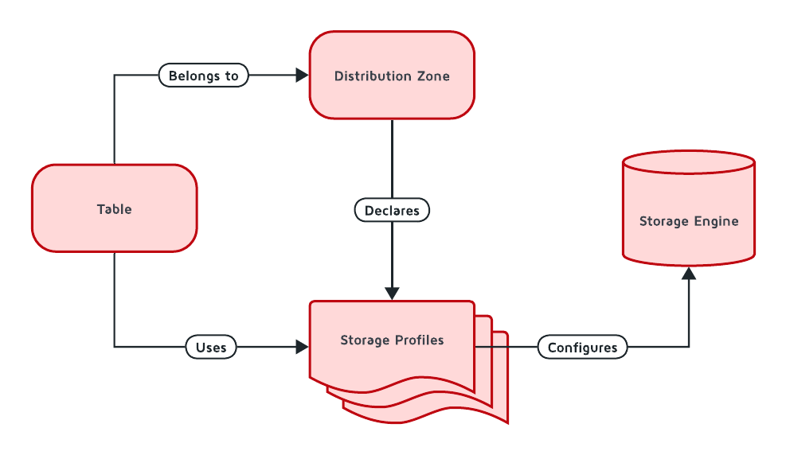
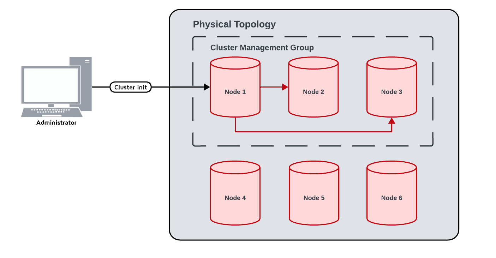

# Apache Ignite 3 Documentation

## Navigation

- [Apache Ignite 3 Documentation](#docs-ignite3-3.1)
- [Getting Started](#getting-started)
  - [Introduction](#getting-started-intro)
  - [Getting Started](#getting-started-quick-start)
  - [Start a Cluster in Docker](#getting-started-start-cluster)
  - [Working with SQL](#getting-started-work-with-sql)
  - [Using Java API](#getting-started-key-value-api)
  - [Embedded Mode](#getting-started-embedded-mode)
  - [Configuration Tips](#getting-started-best-practices)
  - [Migrating from Ignite 2](#getting-started-migrate-from-ignite-2)
  - [Migrate from 3.0 to 3.1](#getting-started-migrate-from-3-0-to-3-1)
- [Develop and Build](#develop)
  - [Ignite Clients](#develop-ignite-clients)
    - [Java Client](#develop-ignite-clients-java-client)
    - [.NET Client](#develop-ignite-clients-dotnet-client)
    - [C++ Client](#develop-ignite-clients-cpp-client)
  - [Connect to Ignite](#develop-connect-to-ignite)
    - [JDBC Driver](#develop-connect-to-ignite-jdbc)
    - [ODBC Driver](#develop-connect-to-ignite-odbc)
      - [ODBC Connection String](#develop-connect-to-ignite-odbc-connection-string)
      - [Querying and Modifying Data with ODBC](#develop-connect-to-ignite-odbc-querying-data)
    - [Python Database API Driver](#develop-connect-to-ignite-python)
  - [Work with Data](#develop-work-with-data)
    - [Table API](#develop-work-with-data-table-api)
    - [Performing Transactions](#develop-work-with-data-transactions)
    - [Streaming Data](#develop-work-with-data-streaming)
    - [Distributed Computing](#develop-work-with-data-compute)
    - [Object Serialization](#develop-work-with-data-serialization)
    - [Code Deployment](#develop-work-with-data-code-deployment)
    - [Working with Events](#develop-work-with-data-events)
    - [Available Events](#develop-work-with-data-events-list)
    - [Creating Tables from Java Classes](#develop-work-with-data-java-to-tables)
    - [Java Client Logging](#develop-work-with-data-java-client-logging)
  - [Integrate](#develop-integrate)
    - [Spring Boot Integration](#develop-integrate-spring-boot)
    - [Spring Data Integration](#develop-integrate-spring-data)
- [Work with SQL](#sql)
  - [SQL Fundamentals](#sql-fundamentals)
    - [Engine Architecture](#sql-fundamentals-engine-architecture)
  - [SQL Operations](#sql-working-with-sql)
    - [Execute Queries](#sql-working-with-sql-execute-queries)
    - [System Views](#sql-working-with-sql-system-views)
  - [SQL Reference](#sql-reference)
    - [Language Definition](#sql-reference-language-definition)
      - [Data Definition Language (DDL)](#sql-reference-language-definition-ddl)
      - [Data Manipulation Language (DML)](#sql-reference-language-definition-dml)
      - [Distribution Zones](#sql-reference-language-definition-distribution-zones)
      - [Transactions](#sql-reference-language-definition-transactions)
      - [Grammar Reference](#sql-reference-language-definition-grammar-reference)
    - [Data Types and Functions](#sql-reference-data-types-and-functions)
      - [Data Types](#sql-reference-data-types-and-functions-data-types)
      - [Operators and Functions](#sql-reference-data-types-and-functions-operators-and-functions)
      - [Operational Commands](#sql-reference-data-types-and-functions-operational-commands)
    - [SQL Conformance](#sql-reference-sql-conformance)
      - [SQL Conformance](#sql-reference-sql-conformance-overview)
      - [Keywords](#sql-reference-sql-conformance-keywords)
  - [Advanced SQL](#sql-advanced)
    - [EXPLAIN Statement](#sql-advanced-explain-statement)
    - [Performance Tuning](#sql-advanced-performance-tuning)
- [Configure and Operate](#configure-and-operate)
  - [Installation](#configure-and-operate-installation)
    - [ZIP Archive](#configure-and-operate-installation-install-zip)
    - [DEB/RPM Package](#configure-and-operate-installation-install-deb-rpm)
    - [Docker](#configure-and-operate-installation-install-docker)
    - [Kubernetes](#configure-and-operate-installation-install-kubernetes)
  - [Configuration](#configure-and-operate-configuration)
    - [Cluster and Nodes](#configure-and-operate-configuration-config-cluster-and-nodes)
    - [Storage Configuration](#configure-and-operate-configuration-config-storage-overview)
      - [Storage Profiles](#configure-and-operate-configuration-config-storage)
      - [Volatile Storage](#configure-and-operate-configuration-config-storage-volatile)
      - [Persistent Storage](#configure-and-operate-configuration-config-storage-persistent)
      - [RocksDB Storage](#configure-and-operate-configuration-config-storage-rocksdb)
    - [Authentication](#configure-and-operate-configuration-config-authentication)
    - [SSL/TLS](#configure-and-operate-configuration-config-ssl-tls)
    - [Metrics](#configure-and-operate-configuration-metrics-configuration)
    - [Cluster Security](#configure-and-operate-configuration-config-cluster-security)
  - [Operations](#configure-and-operate-operations)
    - [Lifecycle](#configure-and-operate-operations-lifecycle)
    - [Disaster Recovery](#configure-and-operate-operations-disaster-recovery)
      - [Data Partitions Recovery](#configure-and-operate-operations-disaster-recovery-partitions)
      - [System Groups Recovery](#configure-and-operate-operations-disaster-recovery-system-groups)
    - [Handle Exceptions](#configure-and-operate-operations-handle-exceptions)
    - [Colocation](#configure-and-operate-operations-colocation)
  - [Monitoring](#configure-and-operate-monitoring)
    - [Metrics](#configure-and-operate-monitoring-metrics)
      - [Metrics](#configure-and-operate-monitoring-config-metrics)
      - [Available Metrics](#configure-and-operate-monitoring-available-metrics)
      - [System Views](#configure-and-operate-monitoring-metrics-system-views)
  - [Configuration Reference](#configure-and-operate-reference)
    - [Node Configuration](#configure-and-operate-reference-node-configuration)
    - [Cluster Configuration](#configure-and-operate-reference-cluster-configuration)
    - [CLI Configuration](#configure-and-operate-reference-cli-configuration)
    - [Storage Profiles](#configure-and-operate-reference-storage-profiles)
- [Concepts and Architecture](#understand)
  - [Core Concepts](#understand-core-concepts)
    - [What is Apache Ignite 3?](#understand-core-concepts-what-is-ignite)
    - [Tables and Schemas](#understand-core-concepts-tables-and-schemas)
    - [Transactions and MVCC](#understand-core-concepts-transactions-and-mvcc)
    - [Distribution and Colocation](#understand-core-concepts-distribution-and-colocation)
    - [Data Partitioning](#understand-core-concepts-data-partitioning)
    - [Compute and Events](#understand-core-concepts-compute-and-events)
  - [Architecture](#understand-architecture)
    - [Architecture Overview](#understand-architecture-architecture-overview)
    - [Storage Architecture](#understand-architecture-storage-architecture)
    - [Storage Engines](#understand-architecture-storage-engines)
      - [AIMemory Storage Engine](#understand-architecture-storage-engines-aimem)
      - [AIPersist Storage Engine](#understand-architecture-storage-engines-aipersist)
      - [RocksDB Storage Engine](#understand-architecture-storage-engines-rocksdb)
    - [Security Architecture](#understand-architecture-security)
  - [Performance](#understand-performance)
    - [Using EXPLAIN Command](#understand-performance-using-explain)
    - [EXPLAIN Operators Reference](#understand-performance-explain-operators)
- [Client and API Reference](#api-reference)
  - [Native Client APIs](#api-reference-native-clients)
    - [Java API (PRIMARY)](#api-reference-native-clients-java)
      - [Client API](#api-reference-native-clients-java-client-api)
      - [Server API](#api-reference-native-clients-java-server-api)
      - [Tables API](#api-reference-native-clients-java-tables-api)
      - [Data Streamer API](#api-reference-native-clients-java-data-streamer-api)
      - [SQL API](#api-reference-native-clients-java-sql-api)
      - [Transactions API](#api-reference-native-clients-java-transactions-api)
      - [Compute API](#api-reference-native-clients-java-compute-api)
      - [Catalog API](#api-reference-native-clients-java-catalog-api)
      - [Criteria API](#api-reference-native-clients-java-criteria-api)
      - [Network API](#api-reference-native-clients-java-network-api)
      - [Security API](#api-reference-native-clients-java-security-api)
    - [.NET API](#api-reference-native-clients-dotnet)
      - [Client API](#api-reference-native-clients-dotnet-client-api)
      - [Tables API](#api-reference-native-clients-dotnet-tables-api)
      - [LINQ API](#api-reference-native-clients-dotnet-linq-api)
      - [Data Streamer API](#api-reference-native-clients-dotnet-data-streamer-api)
      - [SQL API](#api-reference-native-clients-dotnet-sql-api)
      - [ADO.NET API](#api-reference-native-clients-dotnet-ado-net-api)
      - [Transactions API](#api-reference-native-clients-dotnet-transactions-api)
      - [Compute API](#api-reference-native-clients-dotnet-compute-api)
      - [Network API](#api-reference-native-clients-dotnet-network-api)
    - [C++ API](#api-reference-native-clients-cpp)
      - [Client API](#api-reference-native-clients-cpp-client-api)
      - [Tables API](#api-reference-native-clients-cpp-tables-api)
      - [SQL API](#api-reference-native-clients-cpp-sql-api)
      - [Transactions API](#api-reference-native-clients-cpp-transactions-api)
      - [Compute API](#api-reference-native-clients-cpp-compute-api)
      - [Network API](#api-reference-native-clients-cpp-network-api)
  - [SQL-Only APIs](#api-reference-sql-only-apis)
    - [JDBC Driver](#api-reference-sql-only-apis-jdbc)
    - [ODBC Driver](#api-reference-sql-only-apis-odbc)
    - [Python DB-API](#api-reference-sql-only-apis-python)
  - [API Documentation](#api-reference-api)
    - [Java API Reference](#api-reference-api-java-api-reference)
    - [.NET API Reference](#api-reference-api-dotnet-api-reference)
    - [C++ API Reference](#api-reference-api-cpp-api-reference)
- [Tools](#tools)
  - [CLI Commands Reference](#tools-cli-commands)
  - [REST API](#tools-rest-api)
  - [Glossary](#tools-glossary)

## Content

<a id="docs-ignite3-3.1"></a>

<!-- source_url: https://ignite.apache.org/docs/ignite3/3.1.0 -->

<!-- page_index: 1 -->

# Apache Ignite 3 Documentation

Version: 3.1.0 (Latest)

Apache Ignite 3 is a distributed database for high-performance computing with in-memory speed.

### New to Ignite?

- [Introduction to Apache Ignite 3](#getting-started-intro)
- [Quick Start Guide](#getting-started-quick-start)
- [Start Your First Cluster](#getting-started-start-cluster)

### Developers

- [Java Client](#develop-ignite-clients-java-client)
- [Table API](#develop-work-with-data-table-api)
- [Execute SQL Queries](#sql-working-with-sql-execute-queries)

### Operations

- [Install Using ZIP Archive](#configure-and-operate-installation-install-zip)
- [Configure Cluster and Nodes](#configure-and-operate-configuration-config-cluster-and-nodes)
- [Manage Cluster Lifecycle](#configure-and-operate-operations-lifecycle)

### API Reference

- [Java API](#api-reference-native-clients-java-client-api)
- [.NET API](#api-reference-native-clients-dotnet-client-api)
- [JDBC Driver](#api-reference-sql-only-apis-jdbc)

### Getting Started

Tutorials and quick start guides to get up and running with Apache Ignite 3. Install, configure, and execute your first queries.

[Learn more →](https://ignite.apache.org/docs/ignite3/3.1.0/getting-started/)

### Develop

Build applications with Ignite clients, work with data using Table and SQL APIs, and integrate with frameworks like Spring Boot.

[Learn more →](https://ignite.apache.org/docs/ignite3/3.1.0/develop/)

### SQL

Complete SQL reference including fundamentals, query execution, data definition language, and performance tuning.

[Learn more →](https://ignite.apache.org/docs/ignite3/3.1.0/sql/)

### Configure and Operate

Install Ignite on various platforms, configure cluster settings, manage node lifecycle, and set up monitoring.

[Learn more →](https://ignite.apache.org/docs/ignite3/3.1.0/configure-and-operate/)

### Understand

Core concepts, architecture patterns, storage engines, and performance characteristics of distributed data processing.

[Learn more →](https://ignite.apache.org/docs/ignite3/3.1.0/understand/)

### API Reference

API documentation for Java, .NET, C++, and SQL-only drivers.

[Learn more →](https://ignite.apache.org/docs/ignite3/3.1.0/api-reference/)

### Tools

Command-line interface commands, REST API endpoints, and utilities for cluster management and operations.

[Learn more →](https://ignite.apache.org/docs/ignite3/3.1.0/tools/)

---

<a id="getting-started"></a>

<!-- source_url: https://ignite.apache.org/docs/ignite3/3.1.0/getting-started -->

<!-- page_index: 2 -->

# Getting Started

Version: 3.1.0 (Latest)

Learn the basics of Apache Ignite 3 and get your first cluster running.

### Introduction to Apache Ignite 3

Overview of Apache Ignite 3 capabilities, use cases, and core features for distributed data processing.

[Learn more →](#getting-started-intro)

### Quick Start Guide

Get started with Ignite in 5 minutes. Download, install, and execute your first queries.

[Learn more →](#getting-started-quick-start)

### Start Your First Cluster

Launch a local cluster, connect using clients, and verify cluster topology.

[Learn more →](#getting-started-start-cluster)

### Work with SQL

Execute SQL queries, create tables, insert data, and perform data manipulation operations.

[Learn more →](#getting-started-work-with-sql)

### Use the Key-Value API

Work with data using the Table API for key-value and record-based operations.

[Learn more →](#getting-started-key-value-api)

### Run in Embedded Mode

Embed Ignite nodes directly in your application for local data processing.

[Learn more →](#getting-started-embedded-mode)

### Best Practices

Production deployment tips, configuration recommendations, and performance optimization guidance.

[Learn more →](#getting-started-best-practices)

### Migrate from Ignite 2

Migration guide for Ignite 2 users covering API changes and feature mapping.

[Learn more →](#getting-started-migrate-from-ignite-2)

After completing the getting started tutorials, explore:

- [Develop](#develop) - Build applications with Ignite
- [SQL](#sql) - Learn about SQL capabilities
- [Configure and Operate](#configure-and-operate) - Set up production clusters

---

<a id="getting-started-intro"></a>

<!-- source_url: https://ignite.apache.org/docs/ignite3/3.1.0/getting-started/intro -->

<!-- page_index: 3 -->

# Introduction

Version: 3.1.0 (Latest)

Apache Ignite 3 is a distributed database for high-performance computing. This section will help you get started quickly.

Apache Ignite 3 is a distributed database that provides:

- High-performance data storage and processing
- SQL support with ACID transactions
- Horizontal scalability across multiple nodes
- Strong consistency guarantees
- Built-in support for compute and analytics

Follow these guides to begin working with Apache Ignite 3:

1. **[Quick Start](#getting-started-quick-start)** - Install and run your first cluster
2. **[Start a Cluster in Docker](#getting-started-start-cluster)** - Set up a multi-node cluster using Docker
3. **[Working with SQL](#getting-started-work-with-sql)** - Learn SQL capabilities and data operations
4. **[Using Java API](#getting-started-key-value-api)** - Build applications with the Java client
5. **[Embedded Mode](#getting-started-embedded-mode)** - Run Ignite from your Java application
6. **[Configuration Tips](#getting-started-best-practices)** - Configure storage, memory, and logging
7. **[Migrating from Ignite 2](#getting-started-migrate-from-ignite-2)** - Upgrade from Apache Ignite 2

Before you begin, ensure you have:

- JDK 11 or later
- Operating System: Linux (Debian and Red Hat flavours), Windows 10 or 11
- ISA: x86 or x64

For Docker-based setups, you'll also need:

- Docker and Docker Compose installed
- 8GB+ of available RAM recommended

Choose your path based on your needs:

- **Quick evaluation**: Start with [Quick Start](#getting-started-quick-start)
- **Development setup**: Use [Start a Cluster in Docker](#getting-started-start-cluster)
- **Learning SQL**: Go to [Working with SQL](#getting-started-work-with-sql)
- **Java development**: Begin with [Using Java API](#getting-started-key-value-api)

---

<a id="getting-started-quick-start"></a>

<!-- source_url: https://ignite.apache.org/docs/ignite3/3.1.0/getting-started/quick-start -->

<!-- page_index: 4 -->

# Getting Started

Version: 3.1.0 (Latest)

> [!NOTE]
> You need to install Java in the Bash environment to run Ignite on Windows.

---

<a id="getting-started-start-cluster"></a>

<!-- source_url: https://ignite.apache.org/docs/ignite3/3.1.0/getting-started/start-cluster -->

<!-- page_index: 5 -->

# Start a Cluster in Docker

Version: 3.1.0 (Latest)

This guide walks you through the process of setting up and running an Apache Ignite 3 cluster using Docker containers. Follow these steps to get a three-node cluster up and running quickly.

- Up-to-date Docker and Docker Compose installed on your system
- Basic familiarity with command-line operations
- The code editor of your choice (VS Code, IntelliJ IDEA, etc.)

1. Create a file named `docker-compose.yml` in your project directory:

```yaml
name: ignite3 
 
x-ignite-def: &ignite-def 
  image: apacheignite/ignite:3.0.0 
  environment: 
    JVM_MAX_MEM: "4g" 
    JVM_MIN_MEM: "4g" 
  configs: 
    - source: node_config 
      target: /opt/ignite/etc/ignite-config.conf 
      mode: 0644 
 
services: 
  node1: 
    <<: *ignite-def 
    command: --node-name node1 
    ports: 
      - "10300:10300" 
      - "10800:10800" 
  node2: 
    <<: *ignite-def 
    command: --node-name node2 
    ports: 
      - "10301:10300" 
      - "10801:10800" 
  node3: 
    <<: *ignite-def 
    command: --node-name node3 
    ports: 
      - "10302:10300" 
      - "10802:10800" 
 
configs: 
  node_config: 
    content: | 
      ignite { 
        network { 
          port: 3344 
          nodeFinder.netClusterNodes = ["node1:3344", "node2:3344", "node3:3344"] 
        } 
      } 
```

1. Open a terminal in the directory containing your `docker-compose.yml` file
2. Run the following command to start the cluster:

```bash
docker compose up -d 
```

3. Verify that all containers are running:

```bash
docker compose ps 
```

Here is how the command output may look:

```text
NAME              IMAGE                       COMMAND                  SERVICE   CREATED          STATUS          PORTS 
ignite3-node1-1   apacheignite/ignite:3.0.0   "docker-entrypoint.s…"   node1     13 seconds ago   Up 10 seconds   0.0.0.0:10300->10300/tcp, 3344/tcp, 0.0.0.0:10800->10800/tcp 
ignite3-node2-1   apacheignite/ignite:3.0.0   "docker-entrypoint.s…"   node2     13 seconds ago   Up 10 seconds   3344/tcp, 0.0.0.0:10301->10300/tcp, 0.0.0.0:10801->10800/tcp 
ignite3-node3-1   apacheignite/ignite:3.0.0   "docker-entrypoint.s…"   node3     13 seconds ago   Up 10 seconds   3344/tcp, 0.0.0.0:10302->10300/tcp, 0.0.0.0:10802->10800/tcp 
```

Your nodes are now running, but the cluster is not initialized.

1. Start the Ignite CLI in Docker:

```text
docker run --rm -it --network=host -e LANG=C.UTF-8 -e LC_ALL=C.UTF-8 apacheignite/ignite:3.0.0 cli 
```

2. Inside the CLI, connect to one of the nodes:

```bash
connect http://localhost:10300 
```

3. Confirm the connection to the default node in the CLI tool.
4. Initialize the cluster with a name and the metastorage group of all nodes:

```bash
cluster init --name=ignite3 --metastorage-group=node1,node2,node3 
```

The output from this step should be similar to this:

```text
           #              ___                         __ 
         ###             /   |   ____   ____ _ _____ / /_   ___ 
     #  #####           / /| |  / __ \ / __ `// ___// __ \ / _ \ 
   ###  ######         / ___ | / /_/ // /_/ // /__ / / / // ___/ 
  #####  #######      /_/  |_|/ .___/ \__,_/ \___//_/ /_/ \___/ 
  #######  ######            /_/ 
    ########  ####        ____               _  __           _____ 
   #  ########  ##       /  _/____ _ ____   (_)/ /_ ___     |__  / 
  ####  #######  #       / / / __ `// __ \ / // __// _ \     /_ < 
   #####  #####        _/ / / /_/ // / / // // /_ / ___/   ___/ / 
     ####  ##         /___/ \__, //_/ /_//_/ \__/ \___/   /____/ 
       ##                  /____/ 
 
                      Apache Ignite CLI version 3.0.0 
 
 
You appear to have not connected to any node yet. Do you want to connect to the default node http://localhost:10300? [Y/n] y 
Connected to http://localhost:10300 
The cluster is not initialized. Run cluster init command to initialize it. 
[node1]> cluster init --name=ignite3 --metastorage-group=node1,node2,node3 
Cluster was initialized successfully 
```

1. Use the `cluster status` CLI command to verify your cluster is running correctly.

```bash
cluster status 
```

The output should look similar to this:

```text
[name: ignite3, nodes: 3, status: active, cmgNodes: [node1, node2, node3], msNodes: [node1, node2, node3]] 
```

This means that all 3 nodes found each other and formed an active cluster.

2. Exit the CLI by typing `exit` or pressing Ctrl+D. This will also stop the CLI container.

Congratulations! You have a local Apache Ignite 3 cluster running that you can use for development.

The Docker Compose file exposes two types of ports for each node:

- **10300-10302**: REST API ports for administrative operations
- **10800-10802**: Client connection ports for your applications

If you want to pause your cluster:

```bash
docker compose stop 
 
[+] Stopping 3/3 
 ✔ Container ignite3-node1-1  Stopped 
 ✔ Container ignite3-node2-1  Stopped 
 ✔ Container ignite3-node3-1  Stopped 
```

This will stop the containers and retain your data.

When you are done working with the cluster, you can remove it using:

```bash
docker compose down 
 
[+] Running 4/4 
 ✔ Container ignite3-node3-1  Removed 
 ✔ Container ignite3-node2-1  Removed 
 ✔ Container ignite3-node1-1  Removed 
 ✔ Network ignite3_default    Removed 
```

This will stop and remove all the containers. Your data will be lost unless you have configured persistent storage.

---

<a id="getting-started-work-with-sql"></a>

<!-- source_url: https://ignite.apache.org/docs/ignite3/3.1.0/getting-started/work-with-sql -->

<!-- page_index: 6 -->

# Working with SQL

Version: 3.1.0 (Latest)

> [!WARNING]
> **caution**
> Without these files, you will be unable to load the sample data needed for the exercises.

---

<a id="getting-started-key-value-api"></a>

<!-- source_url: https://ignite.apache.org/docs/ignite3/3.1.0/getting-started/key-value-api -->

<!-- page_index: 7 -->

# Using Java API

Version: 3.1.0 (Latest)

> [!TIP]
> See the structure example above for the expected file location. This example contains the full class file.

---

<a id="getting-started-embedded-mode"></a>

<!-- source_url: https://ignite.apache.org/docs/ignite3/3.1.0/getting-started/embedded-mode -->

<!-- page_index: 8 -->

# Embedded Mode

Version: 3.1.0 (Latest)

> [!NOTE]
> Unlike in Ignite 2, nodes in Ignite 3 are not separated into client and server nodes. Nodes started from embedded mode will be used to store data by default.

---

<a id="getting-started-best-practices"></a>

<!-- source_url: https://ignite.apache.org/docs/ignite3/3.1.0/getting-started/best-practices -->

<!-- page_index: 9 -->

# Configuration Tips

Version: 3.1.0 (Latest)

> [!NOTE]
> In Ignite 3, you can create and maintain the configuration in either JSON or HOCON format.

---

<a id="getting-started-migrate-from-ignite-2"></a>

<!-- source_url: https://ignite.apache.org/docs/ignite3/3.1.0/getting-started/migrate-from-ignite-2 -->

<!-- page_index: 10 -->

# Migrating from Ignite 2

Version: 3.1.0 (Latest)

> [!NOTE]
> In Apache Ignite 3, you can create and maintain the configuration in either JSON or HOCON format.

---

<a id="getting-started-migrate-from-3-0-to-3-1"></a>

<!-- source_url: https://ignite.apache.org/docs/ignite3/3.1.0/getting-started/migrate-from-3-0-to-3-1 -->

<!-- page_index: 11 -->

# Migrating from Apache Ignite 3.0 to 3.1

Version: 3.1.0 (Latest)

> [!WARNING]
> This migration requires cluster downtime.

---

<a id="develop"></a>

<!-- source_url: https://ignite.apache.org/docs/ignite3/3.1.0/develop -->

<!-- page_index: 12 -->

# Develop

Version: 3.1.0 (Latest)

Build applications with Apache Ignite 3 using native clients, SQL drivers, and framework integrations.

### Ignite Clients

Full-featured native clients for Java, .NET, and C++ with support for all Ignite APIs including tables, SQL, transactions, and compute.

[Learn more →](https://ignite.apache.org/docs/ignite3/3.1.0/develop/ignite-clients/)

### Connect to Ignite

SQL-only connectivity through standard database drivers including JDBC, ODBC, and Python DB-API.

[Learn more →](#develop-connect-to-ignite-jdbc)

### Use the Table API

Key-value and record-based data access with typed views for direct table operations.

[Learn more →](#develop-work-with-data-table-api)

### Execute SQL Queries

Programmatic SQL execution with prepared statements, parameter binding, and result processing.

[Learn more →](#develop-work-with-data-table-api)

### Work with Transactions

ACID transaction support with explicit transaction control and closure-based patterns.

[Learn more →](#develop-work-with-data-transactions)

### Stream Data

High-throughput data streaming for bulk loading with reactive stream patterns.

[Learn more →](#develop-work-with-data-streaming)

### Deploy Code

Deploy compute jobs to the cluster for colocated data processing and distributed execution.

[Learn more →](#develop-work-with-data-code-deployment)

### Handle Events

React to cluster events including node join/leave, data changes, and system notifications.

[Learn more →](#develop-work-with-data-events)

### Map Java Objects to Tables

Object-relational mapping with annotations for automatic schema generation and type conversion.

[Learn more →](#develop-work-with-data-java-to-tables)

### Spring Boot Integration

Auto-configuration and starters for Spring Boot applications with dependency injection support.

[Learn more →](#develop-integrate-spring-boot)

### Spring Data Integration

Repository pattern support with Spring Data abstractions for simplified data access.

[Learn more →](#develop-integrate-spring-data)

- [SQL](#sql) - Learn about SQL capabilities and syntax
- [API Reference](#api-reference) - Detailed API documentation
- [Configure and Operate](#configure-and-operate) - Production deployment

---

<a id="develop-ignite-clients"></a>

<!-- source_url: https://ignite.apache.org/docs/ignite3/3.1.0/develop/ignite-clients -->

<!-- page_index: 13 -->

# Ignite Clients

Version: 3.1.0 (Latest)

Full-featured native clients with support for all Apache Ignite 3 APIs.

Native Ignite clients provide:

- Full Table API (RecordView, KeyValueView)
- SQL API with prepared statements
- Transaction support
- Data streaming capabilities
- Compute job execution
- Cluster topology information
- Async operations

Use native Ignite clients when you need:

- Full access to all Ignite features
- Key-value operations
- Compute job deployment
- Event handling
- High-performance data access

For SQL-only connectivity, see [Connect to Ignite](#develop-connect-to-ignite-jdbc).

### Java Client

Primary API with complete feature set for all Ignite operations including thin client and embedded node modes.

[Learn more →](#develop-ignite-clients-java-client)

### .NET Client

Native .NET client for C# applications with async/await patterns and LINQ integration.

[Learn more →](#develop-ignite-clients-dotnet-client)

### C++ Client

High-performance C++ client with modern C++17 features for low-latency applications.

[Learn more →](#develop-ignite-clients-cpp-client)

---

<a id="develop-ignite-clients-java-client"></a>

<!-- source_url: https://ignite.apache.org/docs/ignite3/3.1.0/develop/ignite-clients/java-client -->

<!-- page_index: 14 -->

# Java Client

Version: 3.1.0 (Latest)

Ignite 3 clients connect to the cluster via a standard socket connection. Unlike Ignite 2.x, there are no separate Thin and Thick clients in Ignite 3. All clients are 'thin'.

Clients do not become a part of the cluster topology, never hold any data, and are not used as a destination for compute calculations.

To use Java thin client, Java 11 or newer is required.

Java client can be added to your project by using maven:

```xml
<dependency> 
    <groupId>org.apache.ignite</groupId> 
    <artifactId>ignite-client</artifactId> 
    <version>3.0.0</version> 
</dependency> 
```

To initialize a client, use the `IgniteClient` class, and provide it with the configuration:

<div class="theme-tabs-container tabs-container tabList__CuJ"><ul><li>Java</li></ul><div><div><div><div><pre><code><span><span>try</span><span> </span><span>(</span><span>IgniteClient</span><span> client </span><span>=</span><span> </span><span>IgniteClient</span><span>.</span><span>builder</span><span>(</span><span>)</span><span></span> </span><span><span>  </span><span>.</span><span>addresses</span><span>(</span><span>"127.0.0.1:10800"</span><span>)</span><span></span> </span><span><span>  </span><span>.</span><span>build</span><span>(</span><span>)</span><span></span> </span><span><span></span><span>)</span><span> </span><span>{</span><span></span> </span><span><span>  </span><span>// Your code goes here</span><span></span> </span><span><span></span><span>}</span> </span></code></pre></div></div></div></div></div>

To pass [authentication](#configure-and-operate-configuration-config-authentication) information, use the `IgniteClientAuthenticator` class and pass it to `IgniteClient` builder:

<div class="theme-tabs-container tabs-container tabList__CuJ"><ul><li>Java</li></ul><div><div><div><div><pre><code><span><span>IgniteClientAuthenticator</span><span> auth </span><span>=</span><span> </span><span>BasicAuthenticator</span><span>.</span><span>builder</span><span>(</span><span>)</span><span>.</span><span>username</span><span>(</span><span>"myUser"</span><span>)</span><span>.</span><span>password</span><span>(</span><span>"myPassword"</span><span>)</span><span>.</span><span>build</span><span>(</span><span>)</span><span>;</span><span></span> </span><span><span></span><span>IgniteClient</span><span>.</span><span>builder</span><span>(</span><span>)</span><span></span> </span><span><span>    </span><span>.</span><span>addresses</span><span>(</span><span>"127.0.0.1:10800"</span><span>)</span><span></span> </span><span><span>    </span><span>.</span><span>authenticator</span><span>(</span><span>auth</span><span>)</span><span></span> </span><span><span>    </span><span>.</span><span>build</span><span>(</span><span>)</span><span>;</span> </span></code></pre></div></div></div></div></div>

To configure client logging, add `loggerFactory`:

```java
IgniteClient client = IgniteClient.builder() 
    .addresses("127.0.0.1") 
    .loggerFactory(System::getLogger)  // Optional: this is the default 
    .build(); 
```

The client logs connection errors, reconnects, and retries. By default, logging routes to `java.util.logging` (JUL) at INFO level.

For detailed configuration with Logback, Log4j2, or JUL, see [Java Client Logging](#develop-work-with-data-java-client-logging).

When running Java client, you need to enable metrics in the client builder:

```java
IgniteClient client = IgniteClient.builder() 
  .addresses("127.0.0.1:10800") 
  .metricsEnabled(true) 
  .build(); 
```

After that, client metrics will be available to any Java monitoring tool, for example [JDK Mission Control](https://www.oracle.com/java/technologies/jdk-mission-control.html).

| Metric name | Description |
| --- | --- |
| ConnectionsActive | The number of currently active connections. |
| ConnectionsEstablished | The number of established connections. |
| ConnectionsLost | The number of connections lost. |
| ConnectionsLostTimeout | The number of connections lost due to a timeout. |
| HandshakesFailed | The number of failed handshakes. |
| HandshakesFailedTimeout | The number of handshakes that failed due to a timeout. |
| RequestsActive | The number of currently active requests. |
| RequestsSent | The number of requests sent. |
| RequestsCompleted | The number of completed requests. Requests are completed once a response is received. |
| RequestsRetried | The number of request retries. |
| RequestsFailed | The number of failed requests. |
| BytesSent | The amount of bytes sent. |
| BytesReceived | The amount of bytes received. |
| StreamerBatchesSent | The number of data streamer batches sent. |
| StreamerItemsSent | The number of data streamer items sent. |
| StreamerBatchesActive | The number of in-flight data streamer batches. |
| StreamerItemsQueued | The number of queued data streamer items. |

There is a number of configuration properties managing the connection between the client and Ignite cluster:

```java
IgniteClient client = IgniteClient.builder() 
  .addresses("127.0.0.1:10800") 
  .connectTimeout(5000) 
  .heartbeatInterval(30000) 
  .heartbeatTimeout(5000) 
  .operationTimeout(3000) 
  .backgroundReconnectInterval(30000) 
  .retryPolicy(new RetryLimitPolicy().retryLimit(8)) 
  .build(); 
```

| Configuration name | Description |
| --- | --- |
| connectTimeout | Client connection timeout, in milliseconds. |
| heartbeatInterval | Heartbeat message interval, in milliseconds. |
| heartbeatTimeout | Heartbeat message timeout, in milliseconds. |
| operationTimeout | Operation timeout, in milliseconds. |
| backgroundReconnectInterval | Background reconnect interval, in milliseconds. |
| retryPolicy | Retry policy. By default, all read operations are retried up to 16 times, and write operations are not retried. |

---

<a id="develop-ignite-clients-dotnet-client"></a>

<!-- source_url: https://ignite.apache.org/docs/ignite3/3.1.0/develop/ignite-clients/dotnet-client -->

<!-- page_index: 15 -->

# .NET Client

Version: 3.1.0 (Latest)

> [!NOTE]
> Only `INSERT`, `UPDATE`, `DELETE` statements are supported.

---

<a id="develop-ignite-clients-cpp-client"></a>

<!-- source_url: https://ignite.apache.org/docs/ignite3/3.1.0/develop/ignite-clients/cpp-client -->

<!-- page_index: 16 -->

# C++ Client

Version: 3.1.0 (Latest)

> [!NOTE]
> In Ignite 3, you can create and maintain the configuration in either JSON or HOCON format.

---

<a id="develop-connect-to-ignite"></a>

<!-- source_url: https://ignite.apache.org/docs/ignite3/3.1.0/develop/connect-to-ignite -->

<!-- page_index: 17 -->

# Connect to Ignite

Version: 3.1.0 (Latest)

Multiple connectivity options for accessing Apache Ignite 3 clusters.

### JDBC Driver

Java Database Connectivity (JDBC) driver for SQL operations with standard database tools.

[Learn more →](#develop-connect-to-ignite-jdbc)

### ODBC Driver

Open Database Connectivity (ODBC) for cross-platform SQL access from C/C++ applications.

[Learn more →](#develop-connect-to-ignite-odbc)

### Python DB-API

Python Database API (PEP-249) for SQL connectivity from Python applications.

[Learn more →](#develop-connect-to-ignite-python)

- [Work with Data](#develop-work-with-data) - Data manipulation and processing
- [SQL Reference](#sql) - Complete SQL documentation
- [API Reference](#api-reference) - Native client APIs

---

<a id="develop-connect-to-ignite-jdbc"></a>

<!-- source_url: https://ignite.apache.org/docs/ignite3/3.1.0/develop/connect-to-ignite/jdbc -->

<!-- page_index: 18 -->

# JDBC Driver

Version: 3.1.0 (Latest)

Apache Ignite is shipped with JDBC driver that allows processing of distributed data using standard SQL statements like `SELECT`, `INSERT`, `UPDATE`, or `DELETE` directly from the JDBC side. The name of the driver's class is `org.apache.ignite.jdbc.IgniteJdbcDriver`.

This implementation of JDBC driver does not support:

- Multiple endpoints
- JDBC connection pools

See also:

- [Unsupported Mandatory JDBC Features](#develop-connect-to-ignite-jdbc--unsupported-mandatory-jdbc-features)
- [Unsupported Optional JDBC Features](#develop-connect-to-ignite-jdbc--unsupported-optional-jdbc-features)
- [JDBC Features with Limited Support](#develop-connect-to-ignite-jdbc--jdbc-features-with-limited-support)

JDBC driver uses the client connector to work with the cluster. For more information on configuring client connector, see [Client Connector Configuration](#develop-ignite-clients).

The JDBC connector needs to be included from Maven:

```xml
<dependency> 
    <groupId>org.apache.ignite</groupId> 
    <artifactId>ignite-jdbc</artifactId> 
    <version>{version}</version> 
</dependency> 
```

Here is how you can open a JDBC connection to the cluster node listening on IP address `127.0.0.1`:

```java
Connection conn = DriverManager.getConnection("jdbc:ignite:thin://127.0.0.1:10800"); 
```

The driver connects to one of the cluster nodes and forwards all the queries to it for final execution. The node handles the query distribution and the result's aggregations. Then the result is sent back to the client application.

The JDBC connection string can have an optional list of name-value pairs as parameters after the '?' delimiter. Name and value are separated by the '=' symbol and multiple properties are separated either by an '&' or a ';'. Separate sign can't be mixed and should be either semicolon or ampersand sign.

```java
jdbc:ignite:thin://host[:port][,host[:port][/schema][[?parameter1=value1][&parameter2=value2],...]] 
jdbc:ignite:thin://host[:port][,host[:port][/schema][[?parameter1=value1][;parameter2=value2],...]] 
```

- `host` is required and defines the host of the cluster node to connect to.
- `port` is the port to use to open the connection. 10800 is used by default if this parameter is omitted.
- `schema` is the schema name to access. PUBLIC is used by default. This name should correspond to the SQL ANSI-99 standard. Non-quoted identifiers are not case sensitive. Quoted identifiers are case sensitive. When semicolon format is used, the schema may be defined as a parameter with name schema.
- `parameters` are optional parameters. The following parameters are available:
  - `connectionTimeZone` - Client connection time-zone ID. This property can be used by the client to change the time zone of the session on the server. Affects the interpretation of dates in queries that do not specify the time zone explicitly. If not set, system default on client timezone will be used.
  - `queryTimeout` - Number of seconds the driver will wait for a `Statement` object to execute. 0 means there is no limit. Default value: `0`.
  - `connectionTimeout` - Number of milliseconds JDBC client will wait for server to respond. 0 means there is no limit. Default value: `0`.
  - `reconnectThrottlingPeriod` - Reconnect throttling period, in milliseconds. 0 means there is no limit. Default value: `30_000`.
  - `reconnectThrottlingRetries` - Reconnect throttling retries. 0 means there is no limit. Default value: `3`.
  - `username` - username for basic authentication to the cluster.
  - `password` - user password for basic authentication to the cluster.
  - `sslEnabled` - Determines if SSL is enabled. Possible values: `true`, `false`. Default value: `false`
    - `trustStorePath` - Path to trust store on client side.
    - `trustStorePassword` - Trust store password.
    - `keyStorePath` - Path to key store on client side.
    - `keyStorePassword` - Key store password.
    - `clientAuth` - SSL client authentication. Possible values: `NONE`, `OPTIONAL`, `REQUIRE`.
    - `ciphers` - comma-separated SSL ciphers list.

If the same parameters are passed by using different means, the JDBC driver prioritizes them in the following way:

1. API arguments passed in the `Connection` objects
2. Last instance of the parameter in the connection string
3. Properties object passed during connection

With the JDBC driver, you can perform `commit` and `rollback` transactions. For more information about transactions, see [Performing Transactions](#develop-work-with-data-transactions).

Here is how you can commit a transaction:

```java
// Open the JDBC connection. 
Connection conn = DriverManager.getConnection("jdbc:ignite:thin://127.0.0.1:10800"); 
 
// Commit a transaction 
conn.commit(); 
```

You can also configure Apache Ignite to automatically commit transactions by using the `setAutoCommit()` method.

Here is how you can rollback a transaction:

```java
conn.rollback(); 
```

The following mandatory JDBC features are currently not supported (sorted alphabetically):

- java.sql.Connection#clearWarnings
- java.sql.Connection#getWarnings
- java.sql.Connection#prepareCall
- java.sql.PreparedStatement#getParameterMetaData
- java.sql.PreparedStatement#setAsciiStream
- java.sql.PreparedStatement#setBinaryStream
- java.sql.PreparedStatement#setCharacterStream
- java.sql.ResultSet#clearWarnings
- java.sql.ResultSet#getAsciiStream
- java.sql.ResultSet#getBinaryStream
- java.sql.ResultSet#getCharacterStream
- java.sql.ResultSet#getWarnings
- java.sql.ResultSet#setFetchDirection
- java.sql.Statement#clearWarnings
- java.sql.Statement#getWarnings
- java.sql.Statement#setEscapeProcessing
- java.sql.Statement#setFetchDirection
- java.sql.Statement#setMaxFieldSize

The following optional JDBC features are currently not supported (sorted alphabetically):

- java.sql.Connection#createArrayOf
- java.sql.Connection#createBlob
- java.sql.Connection#createClob
- java.sql.Connection#createNClob
- java.sql.Connection#createSQLXML
- java.sql.Connection#createStruct
- java.sql.Connection#getTypeMap
- java.sql.Connection#releaseSavepoint
- java.sql.Connection#setSavepoint
- java.sql.Connection#setTypeMap
- java.sql.Driver#getParentLogger
- java.sql.PreparedStatement#getMetaData
- java.sql.PreparedStatement#setArray
- java.sql.PreparedStatement#setBlob
- java.sql.PreparedStatement#setClob
- java.sql.PreparedStatement#setNCharacterStream
- java.sql.PreparedStatement#setNClob
- java.sql.PreparedStatement#setRef
- java.sql.PreparedStatement#setRowId
- java.sql.PreparedStatement#setSQLXML
- java.sql.PreparedStatement#setUnicodeStream
- java.sql.PreparedStatement#setURL
- java.sql.ResultSet#cancelRowUpdates
- java.sql.ResultSet#deleteRow
- java.sql.ResultSet#getArray
- java.sql.ResultSet#getBlob
- java.sql.ResultSet#getClob
- java.sql.ResultSet#getNCharacterStream
- java.sql.ResultSet#getNClob
- java.sql.ResultSet#getRef
- java.sql.ResultSet#getRowId
- java.sql.ResultSet#getSQLXML
- java.sql.ResultSet#getUnicodeStream
- java.sql.ResultSet#insertRow
- java.sql.ResultSet#moveToInsertRow
- java.sql.ResultSet#refreshRow
- java.sql.ResultSet#updateArray
- java.sql.ResultSet#updateAsciiStream
- java.sql.ResultSet#updateBigDecimal
- java.sql.ResultSet#updateBinaryStream
- java.sql.ResultSet#updateBlob
- java.sql.ResultSet#updateBoolean
- java.sql.ResultSet#updateByte
- java.sql.ResultSet#updateBytes
- java.sql.ResultSet#updateCharacterStream
- java.sql.ResultSet#updateClob
- java.sql.ResultSet#updateDate
- java.sql.ResultSet#updateDouble
- java.sql.ResultSet#updateFloat
- java.sql.ResultSet#updateInt
- java.sql.ResultSet#updateLong
- java.sql.ResultSet#updateNCharacterStream
- java.sql.ResultSet#updateNClob
- java.sql.ResultSet#updateNString
- java.sql.ResultSet#updateNull
- java.sql.ResultSet#updateObject
- java.sql.ResultSet#updateRef
- java.sql.ResultSet#updateRow
- java.sql.ResultSet#updateRowId
- java.sql.ResultSet#updateShort
- java.sql.ResultSet#updateSQLXML
- java.sql.ResultSet#updateString
- java.sql.ResultSet#updateTime
- java.sql.ResultSet#updateTimestamp
- java.sql.Statement#getGeneratedKeys
- java.sql.Statement#setCursorName
- java.sql.Statement#setPoolable

The following JDBC features are supported only in specific cases:

| Feature | Supported Cases |
| --- | --- |
| java.sql.Connection#prepareStatement | autoGeneratedKeys=Statement.NO\_GENERATED\_KEYS, resultSetType=ResultSet.TYPE\_FORWARD\_ONLY, resultSetConcurrency=ResultSet.CONCUR\_READ\_ONLY, null or empty columnIndexes, and null or empty columnNames. |
| java.sql.Connection#rollback | Without savepoint. |
| java.sql.Statement#execute | autoGeneratedKeys=Statement.NO\_GENERATED\_KEYS, null or empty columnIndexes, and null or empty columnNames. |
| java.sql.Statement#executeUpdate | autoGeneratedKeys=Statement.NO\_GENERATED\_KEYS, null or empty columnIndexes, and null or empty columnNames. |
| java.sql.Statement#getMoreResults | current=Statement.CLOSE\_CURRENT\_RESULT. |

---

<a id="develop-connect-to-ignite-odbc"></a>

<!-- source_url: https://ignite.apache.org/docs/ignite3/3.1.0/develop/connect-to-ignite/odbc -->

<!-- page_index: 19 -->

# ODBC Driver

Version: 3.1.0 (Latest)

Ignite 3 includes an ODBC driver that allows you both to select and to modify data stored in a distributed cache by using standard SQL queries and native ODBC API. ODBC driver uses your [client connection configuration](#develop-ignite-clients).

ODBC driver only provides thread-safety at the connections level. This means that you should not access the same connection from multiple threads without additional synchronization, though you can create separate connections for every thread and use them simultaneously.

The ODBC driver implements version 3.8 of the ODBC API. For detailed information on ODBC please refer to [ODBC Programmer's Reference](https://msdn.microsoft.com/en-us/library/ms714177.aspx).

To use ODBC driver, register it in your system so that your ODBC Driver Manager will be able to locate it.

Microsoft Visual C++ 2017 Redistributable Package should be installed first.

Launch the provided installer and follow the instructions.

ODBC driver uses the client connector to work with the cluster. Make sure to configure the port to the one you intend to use, for example:

```text
node config update clientConnector.port=10469 
```

For more information on configuring client connector, see [Client Connector Configuration](#develop-ignite-clients).

To build and install ODBC driver on Linux, you need to first install ODBC Driver Manager. The ODBC driver has been tested with [UnixODBC](http://www.unixodbc.org).

Install the following prerequisites first:

- [libstdc](https://gcc.gnu.org/onlinedocs/libstdc%2B%2B) library supporting C++14 standard
- [UnixODBC](http://www.unixodbc.org) driver manager

You can get the built rpm or deb package from the provided website. Then, install the package locally to use it.

The following SQL data types are supported:

- `SQL_CHAR`
- `SQL_VARCHAR`
- `SQL_LONGVARCHAR`
- `SQL_SMALLINT`
- `SQL_INTEGER`
- `SQL_FLOAT`
- `SQL_DOUBLE`
- `SQL_BIT`
- `SQL_TINYINT`
- `SQL_BIGINT`
- `SQL_BINARY`
- `SQL_VARBINARY`
- `SQL_LONGVARBINARY`
- `SQL_GUID`
- `SQL_DECIMAL`
- `SQL_TYPE_DATE`
- `SQL_TYPE_TIMESTAMP`
- `SQL_TYPE_TIME`

Ignite can be used with [pyodbc](https://pypi.org/project/pyodbc/). Here is how you can use pyodbc in Ignite 3:

- Install pyodbc

```shell
pip3 install pyodbc 
```

- Import pyodbc to your project:

```python
import pyodbc 
```

- Connect to the database:

```python
conn = pyodbc.connect('Driver={Apache Ignite 3};Address=127.0.0.1:10800;') 
```

- Set encoding to UTF-8:

```python
conn.setencoding(encoding='utf-8') 
conn.setdecoding(sqltype=pyodbc.SQL_CHAR, encoding="utf-8") 
conn.setdecoding(sqltype=pyodbc.SQL_WCHAR, encoding="utf-8") 
```

- Get data from your database:

```python
cursor = conn.cursor() 
cursor.execute('SELECT * FROM table_name') 
```

For more information on using pyodbc, use the [official documentation](https://github.com/mkleehammer/pyodbc/wiki).

---

<a id="develop-connect-to-ignite-odbc-connection-string"></a>

<!-- source_url: https://ignite.apache.org/docs/ignite3/3.1.0/develop/connect-to-ignite/odbc-connection-string -->

<!-- page_index: 20 -->

# ODBC Connection String

Version: 3.1.0 (Latest)

The ODBC Driver supports standard connection string format. Here is the formal syntax:

```text
connection-string ::= empty-string[;] | attribute[;] | attribute; connection-string 
empty-string ::= 
attribute ::= attribute-keyword=attribute-value | DRIVER=[{]attribute-value[}] 
attribute-keyword ::= identifier 
attribute-value ::= character-string 
```

In simple terms, an ODBC connection URL is a string with parameters of your choice separated by semicolons.

The ODBC driver supports and uses several connection string/DSN arguments. All parameter names are case-insensitive. `ADDRESS`, `Address`, and `address` all are valid parameter names and refer to the same parameter. If an argument is not specified, the default value is used. The exception to this rule is the `ADDRESS` attribute. If it is not specified, `SERVER` and `PORT` attributes are used instead.

| Attribute keyword | Description | Default Value |
| --- | --- | --- |
| `ADDRESS` | Address of the remote node to connect to. The format is: `<host>[:<port>]`. For example: `localhost`, `example.com:12345`, `127.0.0.1`, `192.168.3.80:5893`. If this attribute is specified, then `SERVER` and `PORT` arguments are ignored. | None. |
| `SERVER` | Address of the node to connect to. This argument value is ignored if ADDRESS argument is specified. | None. |
| `PORT` | Port on which `OdbcProcessor` of the node is listening. This argument value is ignored if `ADDRESS` argument is specified. | `10800` |
| IDENTITY | Identity to use for authentication. Depending on the authenticator used on the server side, it can be a user name or another unique identifier. See the [Authentication](#configure-and-operate-configuration-config-authentication) topic for details. | None. |
| SECRET | Secret to use for authentication. Depending on the authenticator used on the server side, it can be a user password or another type of user-specific secret. See the [Authentication](#configure-and-operate-configuration-config-authentication) topic for details. | None. |
| `SCHEMA` | Schema name. | `PUBLIC` |
| `PAGE_SIZE` | Number of rows returned in response to a fetching request to the data source. Default value should be fine in most cases. Setting a low value can result in slow data fetching while setting a high value can result in additional memory usage by the driver, and additional delay when the next page is being retrieved. | `1024` |
| `SSL_MODE` | Determines whether the SSL connection should be negotiated with the server. Use `require` or `disable` mode as needed. | `disable` |
| `SSL_KEY_FILE` | Specifies the path to the file containing the SSL server private key. | None. |
| `SSL_CERT_FILE` | Specifies the path to the file containing the SSL server certificate. | None. |
| `SSL_CA_FILE` | Specifies the path to the file containing the SSL server certificate authority (CA). | None. |

You can find samples of the connection string below. These strings can be used with `SQLDriverConnect` ODBC call to establish connection with a node.

<div class="theme-tabs-container tabs-container tabList__CuJ"><ul><li>Specific schema</li><li>Default schema</li><li>Authentication</li><li>Custom page size</li></ul><div><div><div><div><pre><code><span><span>DRIVER={Apache Ignite 3};ADDRESS=localhost:10800;SCHEMA=yourSchemaName</span> </span></code></pre></div></div></div><div><div><div><pre><code><span><span>DRIVER={Apache Ignite 3};ADDRESS=localhost:10800</span> </span></code></pre></div></div></div><div><div><div><pre><code><span><span>DRIVER={Apache Ignite 3};ADDRESS=localhost:10800;IDENTITY=yourid;SECRET=yoursecret</span> </span></code></pre></div></div></div><div><div><div><pre><code><span><span>DRIVER={Apache Ignite 3};ADDRESS=localhost:10800;SCHEMA=yourSchemaName;PAGE_SIZE=4096</span> </span></code></pre></div></div></div></div></div>

---

<a id="develop-connect-to-ignite-odbc-querying-data"></a>

<!-- source_url: https://ignite.apache.org/docs/ignite3/3.1.0/develop/connect-to-ignite/odbc-querying-data -->

<!-- page_index: 21 -->

# Querying and Modifying Data with ODBC

Version: 3.1.0 (Latest)

This page describes how to connect to a cluster and execute a variety of SQL queries by using the ODBC driver.

The ODBC driver supports DML (Data Modification Layer), which means that you can modify your data using an ODBC connection.

The simplest way to create tables by using ODBC Driver is to use DDL statements:

<div class="theme-tabs-container tabs-container tabList__CuJ"><ul><li>DDL</li></ul><div><div><div><div><pre><code><span><span>SQLHENV env</span><span>;</span><span></span> </span><span><span></span> </span><span><span></span><span>// Allocate an environment handle</span><span></span> </span><span><span></span><span>SQLAllocHandle</span><span>(</span><span>SQL_HANDLE_ENV</span><span>,</span><span> SQL_NULL_HANDLE</span><span>,</span><span> </span><span>&amp;</span><span>env</span><span>)</span><span>;</span><span></span> </span><span><span></span> </span><span><span></span><span>// Use ODBC ver 3.8</span><span></span> </span><span><span></span><span>SQLSetEnvAttr</span><span>(</span><span>env</span><span>,</span><span> SQL_ATTR_ODBC_VERSION</span><span>,</span><span> </span><span>reinterpret_cast</span><span>&lt;</span><span>void</span><span>*</span><span>&gt;</span><span>(</span><span>SQL_OV_ODBC3_80</span><span>)</span><span>,</span><span> </span><span>0</span><span>)</span><span>;</span><span></span> </span><span><span></span> </span><span><span>SQLHDBC dbc</span><span>;</span><span></span> </span><span><span></span> </span><span><span></span><span>// Allocate a connection handle</span><span></span> </span><span><span></span><span>SQLAllocHandle</span><span>(</span><span>SQL_HANDLE_DBC</span><span>,</span><span> env</span><span>,</span><span> </span><span>&amp;</span><span>dbc</span><span>)</span><span>;</span><span></span> </span><span><span></span> </span><span><span></span><span>// Prepare the connection string</span><span></span> </span><span><span>SQLCHAR connectStr</span><span>[</span><span>]</span><span> </span><span>=</span><span> </span><span>"Driver={Apache Ignite 3};ADDRESS=localhost:10800;SCHEMA=PUBLIC;"</span><span>;</span><span></span> </span><span><span></span> </span><span><span></span><span>// Connecting to the Cluster.</span><span></span> </span><span><span></span><span>SQLDriverConnect</span><span>(</span><span>dbc</span><span>,</span><span> </span><span>NULL</span><span>,</span><span> connectStr</span><span>,</span><span> SQL_NTS</span><span>,</span><span> </span><span>NULL</span><span>,</span><span> </span><span>0</span><span>,</span><span> </span><span>NULL</span><span>,</span><span> SQL_DRIVER_COMPLETE</span><span>)</span><span>;</span><span></span> </span><span><span></span> </span><span><span>SQLHSTMT stmt</span><span>;</span><span></span> </span><span><span></span> </span><span><span></span><span>// Allocate a statement handle</span><span></span> </span><span><span></span><span>SQLAllocHandle</span><span>(</span><span>SQL_HANDLE_STMT</span><span>,</span><span> dbc</span><span>,</span><span> </span><span>&amp;</span><span>stmt</span><span>)</span><span>;</span><span></span> </span><span><span></span> </span><span><span>SQLCHAR query1</span><span>[</span><span>]</span><span> </span><span>=</span><span> </span><span>"CREATE TABLE Person ( "</span><span></span> </span><span><span>    </span><span>"id LONG PRIMARY KEY, "</span><span></span> </span><span><span>    </span><span>"firstName VARCHAR, "</span><span></span> </span><span><span>    </span><span>"lastName VARCHAR, "</span><span></span> </span><span><span>    </span><span>"salary FLOAT) "</span><span>"</span><span>;</span><span></span> </span><span><span></span> </span><span><span></span><span>SQLExecDirect</span><span>(</span><span>stmt</span><span>,</span><span> query1</span><span>,</span><span> SQL_NTS</span><span>)</span><span>;</span><span></span> </span><span><span></span> </span><span><span>SQLCHAR query2</span><span>[</span><span>]</span><span> </span><span>=</span><span> </span><span>"CREATE TABLE Organization ( "</span><span></span> </span><span><span>    </span><span>"id LONG PRIMARY KEY, "</span><span></span> </span><span><span>    </span><span>"name VARCHAR) "</span><span>"</span><span>;</span><span></span> </span><span><span></span> </span><span><span></span><span>SQLExecDirect</span><span>(</span><span>stmt</span><span>,</span><span> query2</span><span>,</span><span> SQL_NTS</span><span>)</span><span>;</span><span></span> </span><span><span></span> </span><span><span>SQLCHAR query3</span><span>[</span><span>]</span><span> </span><span>=</span><span> </span><span>"CREATE INDEX idx_organization_name ON Organization (name)"</span><span>;</span><span></span> </span><span><span></span> </span><span><span></span><span>SQLExecDirect</span><span>(</span><span>stmt</span><span>,</span><span> query3</span><span>,</span><span> SQL_NTS</span><span>)</span><span>;</span> </span></code></pre></div></div></div></div></div>

As you can see, we defined two tables that will contain the data of `Person` and `Organization` types. For both types, we listed specific fields and indexes that will be read or updated using SQL.

The section below covers how you can handle possible errors when working with ODBC. In this example we handle an issue with connecting to the cluster:

```c++
// Connecting to Ignite Cluster. 
SQLRETURN ret = SQLDriverConnect(dbc, NULL, connectStr, SQL_NTS, NULL, 0, NULL, SQL_DRIVER_COMPLETE); 
 
if (!SQL_SUCCEEDED(ret)) 
{ 
  SQLCHAR sqlstate[7] = { 0 }; 
  SQLINTEGER nativeCode; 
 
  SQLCHAR errMsg[BUFFER_SIZE] = { 0 }; 
  SQLSMALLINT errMsgLen = static_cast<SQLSMALLINT>(sizeof(errMsg)); 
 
  SQLGetDiagRec(SQL_HANDLE_DBC, dbc, 1, sqlstate, &nativeCode, errMsg, errMsgLen, &errMsgLen); 
 
  std::cerr << "Failed to connect to Ignite: " 
            << reinterpret_cast<char*>(sqlstate) << ": " 
            << reinterpret_cast<char*>(errMsg) << ", " 
            << "Native error code: " << nativeCode 
            << std::endl; 
 
  // Releasing allocated handles. 
  SQLFreeHandle(SQL_HANDLE_DBC, dbc); 
  SQLFreeHandle(SQL_HANDLE_ENV, env); 
 
  return; 
} 
```

After everything is up and running, we're ready to execute `SQL SELECT` queries using the `ODBC API`.

```c++
SQLHSTMT stmt; 
 
// Allocate a statement handle 
SQLAllocHandle(SQL_HANDLE_STMT, dbc, &stmt); 
 
SQLCHAR query[] = "SELECT firstName, lastName, salary, Organization.name FROM Person " 
  "INNER JOIN Organization ON Person.orgId = Organization.id" 
SQLSMALLINT queryLen = static_cast<SQLSMALLINT>(sizeof(queryLen)); 
 
SQLRETURN ret = SQLExecDirect(stmt, query, queryLen); 
 
if (!SQL_SUCCEEDED(ret)) 
{ 
  SQLCHAR sqlstate[7] = { 0 }; 
  SQLINTEGER nativeCode; 
 
  SQLCHAR errMsg[BUFFER_SIZE] = { 0 }; 
  SQLSMALLINT errMsgLen = static_cast<SQLSMALLINT>(sizeof(errMsg)); 
 
  SQLGetDiagRec(SQL_HANDLE_DBC, dbc, 1, sqlstate, &nativeCode, errMsg, errMsgLen, &errMsgLen); 
 
  std::cerr << "Failed to perform SQL query: " 
            << reinterpret_cast<char*>(sqlstate) << ": " 
            << reinterpret_cast<char*>(errMsg) << ", " 
            << "Native error code: " << nativeCode 
            << std::endl; 
} 
else 
{ 
  // Printing the result set. 
  struct OdbcStringBuffer 
  { 
    SQLCHAR buffer[BUFFER_SIZE]; 
    SQLLEN resLen; 
  }; 
 
  // Getting a number of columns in the result set. 
  SQLSMALLINT columnsCnt = 0; 
  SQLNumResultCols(stmt, &columnsCnt); 
 
  // Allocating buffers for columns. 
  std::vector<OdbcStringBuffer> columns(columnsCnt); 
 
  // Binding columns. For simplicity we are going to use only 
  // string buffers here. 
  for (SQLSMALLINT i = 0; i < columnsCnt; ++i) 
    SQLBindCol(stmt, i + 1, SQL_C_CHAR, columns[i].buffer, BUFFER_SIZE, &columns[i].resLen); 
 
  // Fetching and printing data in a loop. 
  ret = SQLFetch(stmt); 
  while (SQL_SUCCEEDED(ret)) 
  { 
    for (size_t i = 0; i < columns.size(); ++i) 
      std::cout << std::setw(16) << std::left << columns[i].buffer << " "; 
 
    std::cout << std::endl; 
 
    ret = SQLFetch(stmt); 
  } 
} 
 
// Releasing statement handle. 
SQLFreeHandle(SQL_HANDLE_STMT, stmt); 
```

> [!NOTE]
> **Columns binding**
> In the example above, we bind all columns to the SQL\_C\_CHAR columns. This means that all values are going to be converted to strings upon fetching. This is done for the sake of simplicity. Value conversion upon fetching can be pretty slow, so your default decision should be to fetch the value the same way as it is stored.

To insert new data into the cluster, `SQL INSERT` statements can be used from the ODBC side.

```c++
SQLHSTMT stmt; 
 
// Allocate a statement handle 
SQLAllocHandle(SQL_HANDLE_STMT, dbc, &stmt); 
 
SQLCHAR query[] = 
	"INSERT INTO Person (id, orgId, firstName, lastName, resume, salary) " 
	"VALUES (?, ?, ?, ?, ?, ?)"; 
 
SQLPrepare(stmt, query, static_cast<SQLSMALLINT>(sizeof(query))); 
 
// Binding columns. 
int64_t key = 0; 
int64_t orgId = 0; 
char name[1024] = { 0 }; 
SQLLEN nameLen = SQL_NTS; 
double salary = 0.0; 
 
SQLBindParameter(stmt, 1, SQL_PARAM_INPUT, SQL_C_SLONG, SQL_BIGINT, 0, 0, &key, 0, 0); 
SQLBindParameter(stmt, 2, SQL_PARAM_INPUT, SQL_C_SLONG, SQL_BIGINT, 0, 0, &orgId, 0, 0); 
SQLBindParameter(stmt, 3, SQL_PARAM_INPUT, SQL_C_CHAR, SQL_VARCHAR,	sizeof(name), sizeof(name), name, 0, &nameLen); 
SQLBindParameter(stmt, 4, SQL_PARAM_INPUT, SQL_C_DOUBLE, SQL_DOUBLE, 0, 0, &salary, 0, 0); 
 
// Filling cache. 
key = 1; 
orgId = 1; 
strncpy(name, "John", sizeof(name)); 
salary = 2200.0; 
 
SQLExecute(stmt); 
SQLMoreResults(stmt); 
 
++key; 
orgId = 1; 
strncpy(name, "Jane", sizeof(name)); 
salary = 1300.0; 
 
SQLExecute(stmt); 
SQLMoreResults(stmt); 
 
++key; 
orgId = 2; 
strncpy(name, "Richard", sizeof(name)); 
salary = 900.0; 
 
SQLExecute(stmt); 
SQLMoreResults(stmt); 
 
++key; 
orgId = 2; 
strncpy(name, "Mary", sizeof(name)); 
salary = 2400.0; 
 
SQLExecute(stmt); 
 
// Releasing statement handle. 
SQLFreeHandle(SQL_HANDLE_STMT, stmt); 
```

Next, we are going to insert additional organizations without the usage of prepared statements.

```c++
SQLHSTMT stmt; 
 
// Allocate a statement handle 
SQLAllocHandle(SQL_HANDLE_STMT, dbc, &stmt); 
 
SQLCHAR query1[] = "INSERT INTO Organization (id, name) VALUES (1L, 'Some company')"; 
 
SQLExecDirect(stmt, query1, static_cast<SQLSMALLINT>(sizeof(query1))); 
 
SQLFreeStmt(stmt, SQL_CLOSE); 
 
SQLCHAR query2[] = "INSERT INTO Organization (id, name) VALUES (2L, 'Some other company')"; 
 
  SQLExecDirect(stmt, query2, static_cast<SQLSMALLINT>(sizeof(query2))); 
 
// Releasing statement handle. 
SQLFreeHandle(SQL_HANDLE_STMT, stmt); 
```

> [!WARNING]
> **Error Checking**
> For simplicity the example code above does not check for an error return code. You will want to do error checking in production.

Let's now update the salary for some of the persons stored in the cluster using SQL `UPDATE` statement.

```c++
void AdjustSalary(SQLHDBC dbc, int64_t key, double salary) 
{ 
  SQLHSTMT stmt; 
 
  // Allocate a statement handle 
  SQLAllocHandle(SQL_HANDLE_STMT, dbc, &stmt); 
 
  SQLCHAR query[] = "UPDATE Person SET salary=? WHERE id=?"; 
 
  SQLBindParameter(stmt, 1, SQL_PARAM_INPUT, 
      SQL_C_DOUBLE, SQL_DOUBLE, 0, 0, &salary, 0, 0); 
 
  SQLBindParameter(stmt, 2, SQL_PARAM_INPUT, SQL_C_SLONG, 
      SQL_BIGINT, 0, 0, &key, 0, 0); 
 
  SQLExecDirect(stmt, query, static_cast<SQLSMALLINT>(sizeof(query))); 
 
  // Releasing statement handle. 
  SQLFreeHandle(SQL_HANDLE_STMT, stmt); 
} 
 
... 
AdjustSalary(dbc, 3, 1200.0); 
AdjustSalary(dbc, 1, 2500.0); 
```

Finally, let's remove a few records with the help of SQL `DELETE` statement.

```c++
void DeletePerson(SQLHDBC dbc, int64_t key) 
{ 
  SQLHSTMT stmt; 
 
  // Allocate a statement handle 
  SQLAllocHandle(SQL_HANDLE_STMT, dbc, &stmt); 
 
  SQLCHAR query[] = "DELETE FROM Person WHERE id=?"; 
 
  SQLBindParameter(stmt, 1, SQL_PARAM_INPUT, SQL_C_SLONG, SQL_BIGINT, 
      0, 0, &key, 0, 0); 
 
  SQLExecDirect(stmt, query, static_cast<SQLSMALLINT>(sizeof(query))); 
 
  // Releasing statement handle. 
  SQLFreeHandle(SQL_HANDLE_STMT, stmt); 
} 
 
... 
DeletePerson(dbc, 1); 
DeletePerson(dbc, 4); 
```

---

<a id="develop-connect-to-ignite-python"></a>

<!-- source_url: https://ignite.apache.org/docs/ignite3/3.1.0/develop/connect-to-ignite/python -->

<!-- page_index: 22 -->

# Python Database API Driver

Version: 3.1.0 (Latest)

> [!NOTE]
> All paths to certificate file and keys should be provided in string format appropriate for the system.

---

<a id="develop-work-with-data"></a>

<!-- source_url: https://ignite.apache.org/docs/ignite3/3.1.0/develop/work-with-data -->

<!-- page_index: 23 -->

# Work with Data

Version: 3.1.0 (Latest)

Core data manipulation and processing capabilities in Apache Ignite 3.

### Table API

Key-value and record-based operations using the Table API for direct data access.

[Learn more →](#develop-work-with-data-table-api)

### Transactions

ACID transactions with MVCC support for consistent data operations across the cluster.

[Learn more →](#develop-work-with-data-transactions)

### Data Streaming

High-throughput data ingestion using the streaming API for bulk data loading.

[Learn more →](#develop-work-with-data-streaming)

### Compute

Distributed computing with colocated processing for efficient data-local operations.

[Learn more →](#develop-work-with-data-compute)

### Serialization

Custom object serialization for efficient data transfer and storage.

[Learn more →](#develop-work-with-data-serialization)

### Code Deployment

Deploy custom code units to cluster nodes for distributed execution.

[Learn more →](#develop-work-with-data-code-deployment)

### Events

React to cluster events and data changes with the events API.

[Learn more →](#develop-work-with-data-events)

### Events List

Complete reference of all available event types and their parameters.

[Learn more →](#develop-work-with-data-events-list)

### Java to Tables

Create and manage tables programmatically from Java code.

[Learn more →](#develop-work-with-data-java-to-tables)

### Java Client Logging

Configure logging for the Java thin client using System.Logger or popular frameworks.

[Learn more →](#develop-work-with-data-java-client-logging)

- [Connect to Ignite](#develop-connect-to-ignite) - Connection methods
- [SQL Reference](#sql) - SQL operations
- [API Reference](#api-reference) - Detailed API documentation

---

<a id="develop-work-with-data-table-api"></a>

<!-- source_url: https://ignite.apache.org/docs/ignite3/3.1.0/develop/work-with-data/table-api -->

<!-- page_index: 24 -->

# Table API

Version: 3.1.0 (Latest)

To execute table operations on a specific table, you need to get a specific view of the table and use one of its methods. You can only create new tables by using SQL API.

Apache Ignite supports mapping user objects to table tuples. This ensures that objects created in any programming language can be used for key-value operations directly.

When working with tables, Apache Ignite offers two approaches: directly handling the data or mapping the data to classes. The direct data handling approach handles data tuples. Alternatively, when mapping data to classes, the data is converted to and from these classes as needed for database interactions.

When creating views, you can create a `RecordView` or `KeyValueView`. The primary difference between these view types is the API used.

In a RecordView, you create a single "record" that includes all the information about a row to be updated or retrieved from the table, and send this record to the server. This record should contain all the fields, including the primary key.

In a KeyValueView, you work with key-value mappings. Think of it as a dictionary where the key object contains the primary key field or fields, and the value object contains the data fields. This approach is useful when primary key is not directly related to the domain object thus you prefer not to add the primary key to it.

Only JavaTime API is supported for working with table views. The following data types are not supported:

- `java.util.Date`
- `java.sql.Date`
- `java.sql.Time`
- `java.sql.Timestamp`

Use the following data types instead:

- `java.time.LocalDate`
- `java.time.LocalTime`
- `java.time.LocalDateTime`
- `java.time.Instant`

First, get an instance of the table. To obtain an instance of table, use the `IgniteTables.table(String)` method. You can also use `IgniteTables.tables()` method to list all existing tables.

<div class="theme-tabs-container tabs-container tabList__CuJ"><ul><li>Java</li><li>.NET</li><li>C++</li></ul><div><div><div><div><pre><code><span><span>IgniteTables</span><span> tableApi </span><span>=</span><span> client</span><span>.</span><span>tables</span><span>(</span><span>)</span><span>;</span><span></span> </span><span><span></span><span>List</span><span>&lt;</span><span>Table</span><span>&gt;</span><span> existingTables </span><span>=</span><span> tableApi</span><span>.</span><span>tables</span><span>(</span><span>)</span><span>;</span><span></span> </span><span><span></span><span>Table</span><span> firstTable </span><span>=</span><span> existingTables</span><span>.</span><span>get</span><span>(</span><span>0</span><span>)</span><span>;</span> </span></code></pre></div></div></div><div><div><div><pre><code><span><span>var</span><span> existingTables </span><span>=</span><span> </span><span>await</span><span> Client</span><span>.</span><span>Tables</span><span>.</span><span>GetTablesAsync</span><span>(</span><span>)</span><span>;</span><span></span> </span><span><span></span><span>var</span><span> firstTable </span><span>=</span><span> existingTables</span><span>[</span><span>0</span><span>]</span><span>;</span><span></span> </span><span><span></span> </span><span><span></span><span>var</span><span> myTable </span><span>=</span><span> </span><span>await</span><span> Client</span><span>.</span><span>Tables</span><span>.</span><span>GetTableAsync</span><span>(</span><span>"MY_TABLE"</span><span>)</span><span>;</span> </span></code></pre></div></div></div><div><div><div><pre><code><span><span>using</span><span> </span><span>namespace</span><span> ignite</span><span>;</span><span></span> </span><span><span></span> </span><span><span></span><span>auto</span><span> table_api </span><span>=</span><span> client</span><span>.</span><span>get_tables</span><span>(</span><span>)</span><span>;</span><span></span> </span><span><span>std</span><span>::</span><span>vector</span><span>&lt;</span><span>table</span><span>&gt;</span><span> existing_tables </span><span>=</span><span> table_api</span><span>.</span><span>get_tables</span><span>(</span><span>)</span><span>;</span><span></span> </span><span><span>table first_table </span><span>=</span><span> existing_tables</span><span>.</span><span>front</span><span>(</span><span>)</span><span>;</span><span></span> </span><span><span></span> </span><span><span>std</span><span>::</span><span>optional</span><span>&lt;</span><span>table</span><span>&gt;</span><span> my_table </span><span>=</span><span> table_api</span><span>.</span><span>get_table</span><span>(</span><span>"MY_TABLE"</span><span>)</span><span>;</span> </span></code></pre></div></div></div></div></div>

By default, if the schema name is not specified, the `PUBLIC` schema is used. If a qualified name is specified, the table is taken from the specified schema.

Instead of using a string to specify table name, you can create a `QualifiedName` object to hold a fully qualified table name. Apache Ignite provides 2 methods for creating qualified names:

- You can parse the fully qualified table name with the `parse` method:

<div class="theme-tabs-container tabs-container tabList__CuJ"><ul><li>Java</li></ul><div><div><div><div><pre><code><span><span>QualifiedName</span><span> qualifiedTableName </span><span>=</span><span> </span><span>QualifiedName</span><span>.</span><span>parse</span><span>(</span><span>"PUBLIC.Person"</span><span>)</span><span>;</span><span></span> </span><span><span></span><span>Table</span><span> myTable </span><span>=</span><span> tableApi</span><span>.</span><span>table</span><span>(</span><span>qualifiedTableName</span><span>)</span><span>;</span> </span></code></pre></div></div></div></div></div>

- You can provide schema name and table name separately with the `of` method:

<div class="theme-tabs-container tabs-container tabList__CuJ"><ul><li>Java</li></ul><div><div><div><div><pre><code><span><span>QualifiedName</span><span> qualifiedTableName </span><span>=</span><span> </span><span>QualifiedName</span><span>.</span><span>of</span><span>(</span><span>"PUBLIC"</span><span>,</span><span> </span><span>"MY_TABLE"</span><span>)</span><span>;</span><span></span> </span><span><span></span><span>Table</span><span> myTable </span><span>=</span><span> tableApi</span><span>.</span><span>table</span><span>(</span><span>qualifiedTableName</span><span>)</span><span>;</span> </span></code></pre></div></div></div></div></div>

The provided names must follow SQL syntax rules for identifiers:

- Identifier must start from a character in the "Lu", "Ll", "Lt", "Lm", "Lo", or "Nl" Unicode categories or `U+0331` (underscore);
- Identifier characters (except for the first one) may be `U+00B7` (middle dot), or any character in the "Mn", "Mc", "Nd", "Pc", or "Cf" Unicode categories;
- Identifiers that contain any other characters must be quoted with `U+2033` (double-quotes);
- Double-quote inside the identifier must be escaped with 2 double-quote characters.

Any unquoted names will be cast to upper case. In this case, `Person` and `PERSON` names are equivalent. To avoid this, add escaped quotes around the name. For example, `\"Person\"` will be encoded as a case-sensitive `Person` name. If the name contains the `U+2033` (double quote) symbol, it must be escaped as `""` (2 double quote symbols).

For example:

```text
// Case-insensitive table `MY_TABLE` in a case-insensitive `PUBLIC` schema. 
QualifiedName.parse("public.my_table")) 
 
// Case-sensitive table `my_table` in a case-sensitive `public` schema. 
QualifiedName.parse("\"public\".\"my_table\"")) 
 
// Same as above, but with comma as separator that needs to be surrounded by quote characters. 
QualifiedName.of("\"public\"","\"my_table\"")) 
 
// Case-sensitive name my"table. 
QualifiedName.parse("\"my\"\"table\"")); 
 
// Case-sensitive table name `public.my_table` in a default schema. 
QualifiedName.parse("\"public.my_table\"")); 
```

Once you've got a table you need to get a specific view to choose how you want to operate table records.

A tuple record view can be used to operate on table tuples directly. When retrieving data from tuple views, you can use a wide variety of methods to retrieve type-specific data stored in tuples. A full list of methods is available in the Tuple object javadoc.

<div class="theme-tabs-container tabs-container tabList__CuJ"><ul><li>Java</li><li>.NET</li><li>C++</li></ul><div><div><div><div><pre><code><span><span>RecordView</span><span>&lt;</span><span>Tuple</span><span>&gt;</span><span> accounts </span><span>=</span><span> client</span><span>.</span><span>tables</span><span>(</span><span>)</span><span>.</span><span>table</span><span>(</span><span>"accounts"</span><span>)</span><span>.</span><span>recordView</span><span>(</span><span>)</span><span>;</span><span></span> </span><span><span></span> </span><span><span></span><span>System</span><span>.</span><span>out</span><span>.</span><span>println</span><span>(</span><span>"\nInserting a record into the 'accounts' table..."</span><span>)</span><span>;</span><span></span> </span><span><span></span> </span><span><span></span><span>Tuple</span><span> newAccountTuple </span><span>=</span><span> </span><span>Tuple</span><span>.</span><span>create</span><span>(</span><span>)</span><span></span> </span><span><span>        </span><span>.</span><span>set</span><span>(</span><span>"accountNumber"</span><span>,</span><span> </span><span>123456</span><span>)</span><span></span> </span><span><span>        </span><span>.</span><span>set</span><span>(</span><span>"firstName"</span><span>,</span><span> </span><span>"Val"</span><span>)</span><span></span> </span><span><span>        </span><span>.</span><span>set</span><span>(</span><span>"lastName"</span><span>,</span><span> </span><span>"Kulichenko"</span><span>)</span><span></span> </span><span><span>        </span><span>.</span><span>set</span><span>(</span><span>"balance"</span><span>,</span><span> </span><span>100.00d</span><span>)</span><span>;</span><span></span> </span><span><span></span> </span><span><span>accounts</span><span>.</span><span>insert</span><span>(</span><span>null</span><span>,</span><span> newAccountTuple</span><span>)</span><span>;</span><span></span> </span><span><span></span> </span><span><span></span><span>System</span><span>.</span><span>out</span><span>.</span><span>println</span><span>(</span><span>"\nRetrieving a record using RecordView API..."</span><span>)</span><span>;</span><span></span> </span><span><span></span> </span><span><span></span><span>Tuple</span><span> accountNumberTuple </span><span>=</span><span> </span><span>Tuple</span><span>.</span><span>create</span><span>(</span><span>)</span><span>.</span><span>set</span><span>(</span><span>"accountNumber"</span><span>,</span><span> </span><span>123456</span><span>)</span><span>;</span><span></span> </span><span><span></span> </span><span><span></span><span>Tuple</span><span> accountTuple </span><span>=</span><span> accounts</span><span>.</span><span>get</span><span>(</span><span>null</span><span>,</span><span> accountNumberTuple</span><span>)</span><span>;</span><span></span> </span><span><span></span> </span><span><span></span><span>System</span><span>.</span><span>out</span><span>.</span><span>println</span><span>(</span><span></span> </span><span><span>        </span><span>"\nRetrieved record:\n"</span><span></span> </span><span><span>                </span><span>+</span><span> </span><span>"    Account Number: "</span><span> </span><span>+</span><span> accountTuple</span><span>.</span><span>intValue</span><span>(</span><span>"accountNumber"</span><span>)</span><span> </span><span>+</span><span> </span><span>'\n'</span><span></span> </span><span><span>                </span><span>+</span><span> </span><span>"    Owner: "</span><span> </span><span>+</span><span> accountTuple</span><span>.</span><span>stringValue</span><span>(</span><span>"firstName"</span><span>)</span><span> </span><span>+</span><span> </span><span>" "</span><span> </span><span>+</span><span> accountTuple</span><span>.</span><span>stringValue</span><span>(</span><span>"lastName"</span><span>)</span><span> </span><span>+</span><span> </span><span>'\n'</span><span></span> </span><span><span>                </span><span>+</span><span> </span><span>"    Balance: $"</span><span> </span><span>+</span><span> accountTuple</span><span>.</span><span>doubleValue</span><span>(</span><span>"balance"</span><span>)</span><span>)</span><span>;</span> </span></code></pre></div></div></div><div><div><div><pre><code><span><span>IRecordView</span><span>&lt;</span><span>IIgniteTuple</span><span>&gt;</span><span> view </span><span>=</span><span> table</span><span>.</span><span>RecordBinaryView</span><span>;</span><span></span> </span><span><span></span> </span><span><span></span><span>IIgniteTuple</span><span> fullRecord </span><span>=</span><span> </span><span>new</span><span> </span><span>IgniteTuple</span><span></span> </span><span><span></span><span>{</span><span></span> </span><span><span>  </span><span>[</span><span>"id"</span><span>]</span><span> </span><span>=</span><span> </span><span>42</span><span>,</span><span></span> </span><span><span>  </span><span>[</span><span>"name"</span><span>]</span><span> </span><span>=</span><span> </span><span>"John Doe"</span><span></span> </span><span><span></span><span>}</span><span>;</span><span></span> </span><span><span></span> </span><span><span></span><span>await</span><span> view</span><span>.</span><span>UpsertAsync</span><span>(</span><span>transaction</span><span>:</span><span> </span><span>null</span><span>,</span><span> fullRecord</span><span>)</span><span>;</span><span></span> </span><span><span></span> </span><span><span></span><span>IIgniteTuple</span><span> keyRecord </span><span>=</span><span> </span><span>new</span><span> </span><span>IgniteTuple</span><span> </span><span>{</span><span> </span><span>[</span><span>"id"</span><span>]</span><span> </span><span>=</span><span> </span><span>42</span><span> </span><span>}</span><span>;</span><span></span> </span><span><span></span><span>(</span><span>IIgniteTuple</span><span> </span><span>value</span><span>,</span><span> </span><span>bool</span><span> hasValue</span><span>)</span><span> </span><span>=</span><span> </span><span>await</span><span> view</span><span>.</span><span>GetAsync</span><span>(</span><span>transaction</span><span>:</span><span> </span><span>null</span><span>,</span><span> keyRecord</span><span>)</span><span>;</span><span></span> </span><span><span></span> </span><span><span>Debug</span><span>.</span><span>Assert</span><span>(</span><span>hasValue</span><span>)</span><span>;</span><span></span> </span><span><span>Debug</span><span>.</span><span>Assert</span><span>(</span><span>value</span><span>.</span><span>FieldCount </span><span>==</span><span> </span><span>2</span><span>)</span><span>;</span><span></span> </span><span><span>Debug</span><span>.</span><span>Assert</span><span>(</span><span>value</span><span>[</span><span>"id"</span><span>]</span><span> </span><span>as</span><span> </span><span>int</span><span>?</span><span> </span><span>==</span><span> </span><span>42</span><span>)</span><span>;</span><span></span> </span><span><span>Debug</span><span>.</span><span>Assert</span><span>(</span><span>value</span><span>[</span><span>"name"</span><span>]</span><span> </span><span>as</span><span> </span><span>string</span><span> </span><span>==</span><span> </span><span>"John Doe"</span><span>)</span><span>;</span> </span></code></pre></div></div></div><div><div><div><pre><code><span><span>record_view</span><span>&lt;</span><span>ignite_tuple</span><span>&gt;</span><span> view </span><span>=</span><span> table</span><span>.</span><span>get_record_binary_view</span><span>(</span><span>)</span><span>;</span><span></span> </span><span><span></span> </span><span><span>ignite_tuple record</span><span>{</span><span></span> </span><span><span>  </span><span>{</span><span>"id"</span><span>,</span><span> </span><span>42</span><span>}</span><span>,</span><span></span> </span><span><span>  </span><span>{</span><span>"name"</span><span>,</span><span> </span><span>"John Doe"</span><span>}</span><span></span> </span><span><span></span><span>}</span><span>;</span><span></span> </span><span><span></span> </span><span><span>view</span><span>.</span><span>upsert</span><span>(</span><span>nullptr</span><span>,</span><span> record</span><span>)</span><span>;</span><span></span> </span><span><span>std</span><span>::</span><span>optional</span><span>&lt;</span><span>ignite_tuple</span><span>&gt;</span><span> res_record </span><span>=</span><span> view</span><span>.</span><span>get</span><span>(</span><span>nullptr</span><span>,</span><span> </span><span>{</span><span>"id"</span><span>,</span><span> </span><span>42</span><span>}</span><span>)</span><span>;</span><span></span> </span><span><span></span> </span><span><span></span><span>assert</span><span>(</span><span>res_record</span><span>.</span><span>has_value</span><span>(</span><span>)</span><span>)</span><span>;</span><span></span> </span><span><span></span><span>assert</span><span>(</span><span>res_record</span><span>-&gt;</span><span>column_count</span><span>(</span><span>)</span><span> </span><span>==</span><span> </span><span>2</span><span>)</span><span>;</span><span></span> </span><span><span></span><span>assert</span><span>(</span><span>res_record</span><span>-&gt;</span><span>get</span><span>&lt;</span><span>std</span><span>::</span><span>int64_t</span><span>&gt;</span><span>(</span><span>"id"</span><span>)</span><span> </span><span>==</span><span> </span><span>42</span><span>)</span><span>;</span><span></span> </span><span><span></span><span>assert</span><span>(</span><span>res_record</span><span>-&gt;</span><span>get</span><span>&lt;</span><span>std</span><span>::</span><span>string</span><span>&gt;</span><span>(</span><span>"name"</span><span>)</span><span> </span><span>==</span><span> </span><span>"John Doe"</span><span>)</span><span>;</span> </span></code></pre></div></div></div></div></div>

A record view maps to a user-defined type and enables table operations on user objects which are mapped to table tuples.

Create the type converter:

```java
static class CityIdConverter implements TypeConverter<String, Integer> { 
 
    @Override 
    public String  toObjectType(Integer columnValue) { 
        return columnValue.toString(); 
    } 
 
    @Override 
    public Integer toColumnType(String cityId) { 
        return Integer.parseInt(cityId); 
    } 
} 
```

Then build the mapper and get the `RecordView`:

```java
public static void main(String[] args) throws Exception { 
    var mapper = Mapper.builder(Person.class) 
            .automap() 
            .map("cityId", "city_id", new CityIdConverter()) 
            .build(); 
 
    try (IgniteClient client = IgniteClient.builder() 
            .addresses("127.0.0.1:10800") 
            .build() 
    ) { 
        RecordView<Person> view = client.tables() 
                .table("person") 
                .recordView(mapper); 
 
 
        Person myPerson = new Person(2, "2", "John Doe", 40, "Apache"); 
 
        view.upsert(null, myPerson); 
    } 
} 
```

Perform table operations on your custom objects mapped to table tuples:

<div class="theme-tabs-container tabs-container tabList__CuJ"><ul><li>Java</li><li>.NET</li><li>C++</li></ul><div><div><div><div><pre><code><span><span>RecordView</span><span>&lt;</span><span>Account</span><span>&gt;</span><span> accounts </span><span>=</span><span> client</span><span>.</span><span>tables</span><span>(</span><span>)</span><span></span> </span><span><span>        </span><span>.</span><span>table</span><span>(</span><span>"accounts"</span><span>)</span><span></span> </span><span><span>        </span><span>.</span><span>recordView</span><span>(</span><span>Account</span><span>.</span><span>class</span><span>)</span><span>;</span><span></span> </span><span><span></span> </span><span><span></span><span>System</span><span>.</span><span>out</span><span>.</span><span>println</span><span>(</span><span>"\nInserting a record into the 'accounts' table..."</span><span>)</span><span>;</span><span></span> </span><span><span></span> </span><span><span></span><span>Account</span><span> newAccount </span><span>=</span><span> </span><span>new</span><span> </span><span>Account</span><span>(</span><span></span> </span><span><span>        </span><span>123456</span><span>,</span><span></span> </span><span><span>        </span><span>"Val"</span><span>,</span><span></span> </span><span><span>        </span><span>"Kulichenko"</span><span>,</span><span></span> </span><span><span>        </span><span>100.00d</span><span></span> </span><span><span></span><span>)</span><span>;</span><span></span> </span><span><span></span> </span><span><span>accounts</span><span>.</span><span>insert</span><span>(</span><span>null</span><span>,</span><span> newAccount</span><span>)</span><span>;</span><span></span> </span><span><span></span> </span><span><span></span><span>System</span><span>.</span><span>out</span><span>.</span><span>println</span><span>(</span><span>"\nRetrieving a record using RecordView API..."</span><span>)</span><span>;</span><span></span> </span><span><span></span> </span><span><span></span><span>Account</span><span> account </span><span>=</span><span> accounts</span><span>.</span><span>get</span><span>(</span><span>null</span><span>,</span><span> </span><span>new</span><span> </span><span>Account</span><span>(</span><span>123456</span><span>)</span><span>)</span><span>;</span><span></span> </span><span><span></span> </span><span><span></span><span>System</span><span>.</span><span>out</span><span>.</span><span>println</span><span>(</span><span></span> </span><span><span>        </span><span>"\nRetrieved record:\n"</span><span></span> </span><span><span>            </span><span>+</span><span> </span><span>"    Account Number: "</span><span> </span><span>+</span><span> account</span><span>.</span><span>accountNumber </span><span>+</span><span> </span><span>'\n'</span><span></span> </span><span><span>            </span><span>+</span><span> </span><span>"    Owner: "</span><span> </span><span>+</span><span> account</span><span>.</span><span>firstName </span><span>+</span><span> </span><span>" "</span><span> </span><span>+</span><span> account</span><span>.</span><span>lastName </span><span>+</span><span> </span><span>'\n'</span><span></span> </span><span><span>            </span><span>+</span><span> </span><span>"    Balance: $"</span><span> </span><span>+</span><span> account</span><span>.</span><span>balance</span><span>)</span><span>;</span> </span></code></pre></div></div></div><div><div><div><pre><code><span><span>var</span><span> pocoView </span><span>=</span><span> table</span><span>.</span><span>GetRecordView</span><span>&lt;</span><span>Poco</span><span>&gt;</span><span>(</span><span>)</span><span>;</span><span></span> </span><span><span></span> </span><span><span></span><span>await</span><span> pocoView</span><span>.</span><span>UpsertAsync</span><span>(</span><span>transaction</span><span>:</span><span> </span><span>null</span><span>,</span><span> </span><span>new</span><span> </span><span>Poco</span><span>(</span><span>42</span><span>,</span><span> </span><span>"John Doe"</span><span>)</span><span>)</span><span>;</span><span></span> </span><span><span></span><span>var</span><span> </span><span>(</span><span>value</span><span>,</span><span> hasValue</span><span>)</span><span> </span><span>=</span><span> </span><span>await</span><span> pocoView</span><span>.</span><span>GetAsync</span><span>(</span><span>transaction</span><span>:</span><span> </span><span>null</span><span>,</span><span> </span><span>new</span><span> </span><span>Poco</span><span>(</span><span>42</span><span>)</span><span>)</span><span>;</span><span></span> </span><span><span></span> </span><span><span>Debug</span><span>.</span><span>Assert</span><span>(</span><span>hasValue</span><span>)</span><span>;</span><span></span> </span><span><span>Debug</span><span>.</span><span>Assert</span><span>(</span><span>value</span><span>.</span><span>Name </span><span>==</span><span> </span><span>"John Doe"</span><span>)</span><span>;</span><span></span> </span><span><span></span> </span><span><span></span><span>public</span><span> </span><span>record</span><span> </span><span>Poco</span><span>(</span><span>long</span><span> Id</span><span>,</span><span> </span><span>string</span><span>?</span><span> Name </span><span>=</span><span> </span><span>null</span><span>)</span><span>;</span> </span></code></pre></div></div></div><div><div><div><pre><code><span><span>record_view</span><span>&lt;</span><span>person</span><span>&gt;</span><span> view </span><span>=</span><span> table</span><span>.</span><span>get_record_view</span><span>&lt;</span><span>person</span><span>&gt;</span><span>(</span><span>)</span><span>;</span><span></span> </span><span><span></span> </span><span><span>person </span><span>record</span><span>(</span><span>42</span><span>,</span><span> </span><span>"John Doe"</span><span>)</span><span>;</span><span></span> </span><span><span></span> </span><span><span>view</span><span>.</span><span>upsert</span><span>(</span><span>nullptr</span><span>,</span><span> record</span><span>)</span><span>;</span><span></span> </span><span><span>std</span><span>::</span><span>optional</span><span>&lt;</span><span>person</span><span>&gt;</span><span> res_record </span><span>=</span><span> view</span><span>.</span><span>get</span><span>(</span><span>nullptr</span><span>,</span><span> person</span><span>{</span><span>42</span><span>}</span><span>)</span><span>;</span><span></span> </span><span><span></span> </span><span><span></span><span>assert</span><span>(</span><span>res</span><span>.</span><span>has_value</span><span>(</span><span>)</span><span>)</span><span>;</span><span></span> </span><span><span></span><span>assert</span><span>(</span><span>res</span><span>-&gt;</span><span>id </span><span>==</span><span> </span><span>42</span><span>)</span><span>;</span><span></span> </span><span><span></span><span>assert</span><span>(</span><span>res</span><span>-&gt;</span><span>name </span><span>==</span><span> </span><span>"John Doe"</span><span>)</span><span>;</span> </span></code></pre></div></div></div></div></div>

A tuple key-value view. It can be used to operate table using key and value tuples separately. When retrieving data from tuple views, you can use a wide variety of methods to retrieve type-specific data stored in tuples. A full list of methods is available in the Tuple object javadoc.

<div class="theme-tabs-container tabs-container tabList__CuJ"><ul><li>Java</li><li>.NET</li><li>C++</li></ul><div><div><div><div><pre><code><span><span>KeyValueView</span><span>&lt;</span><span>Tuple</span><span>,</span><span> </span><span>Tuple</span><span>&gt;</span><span> kvView </span><span>=</span><span> client</span><span>.</span><span>tables</span><span>(</span><span>)</span><span>.</span><span>table</span><span>(</span><span>"accounts"</span><span>)</span><span>.</span><span>keyValueView</span><span>(</span><span>)</span><span>;</span><span></span> </span><span><span></span> </span><span><span></span><span>System</span><span>.</span><span>out</span><span>.</span><span>println</span><span>(</span><span>"\nInserting a key-value pair into the 'accounts' table..."</span><span>)</span><span>;</span><span></span> </span><span><span></span> </span><span><span></span><span>Tuple</span><span> key </span><span>=</span><span> </span><span>Tuple</span><span>.</span><span>create</span><span>(</span><span>)</span><span></span> </span><span><span>        </span><span>.</span><span>set</span><span>(</span><span>"accountNumber"</span><span>,</span><span> </span><span>123456</span><span>)</span><span>;</span><span></span> </span><span><span></span> </span><span><span></span><span>Tuple</span><span> value </span><span>=</span><span> </span><span>Tuple</span><span>.</span><span>create</span><span>(</span><span>)</span><span></span> </span><span><span>        </span><span>.</span><span>set</span><span>(</span><span>"firstName"</span><span>,</span><span> </span><span>"Val"</span><span>)</span><span></span> </span><span><span>        </span><span>.</span><span>set</span><span>(</span><span>"lastName"</span><span>,</span><span> </span><span>"Kulichenko"</span><span>)</span><span></span> </span><span><span>        </span><span>.</span><span>set</span><span>(</span><span>"balance"</span><span>,</span><span> </span><span>100.00d</span><span>)</span><span>;</span><span></span> </span><span><span></span> </span><span><span>kvView</span><span>.</span><span>put</span><span>(</span><span>null</span><span>,</span><span> key</span><span>,</span><span> value</span><span>)</span><span>;</span><span></span> </span><span><span></span> </span><span><span></span><span>System</span><span>.</span><span>out</span><span>.</span><span>println</span><span>(</span><span>"\nRetrieving a value using KeyValueView API..."</span><span>)</span><span>;</span><span></span> </span><span><span></span> </span><span><span>value </span><span>=</span><span> kvView</span><span>.</span><span>get</span><span>(</span><span>null</span><span>,</span><span> key</span><span>)</span><span>;</span><span></span> </span><span><span></span> </span><span><span></span><span>System</span><span>.</span><span>out</span><span>.</span><span>println</span><span>(</span><span></span> </span><span><span>        </span><span>"\nRetrieved value:\n"</span><span></span> </span><span><span>                </span><span>+</span><span> </span><span>"    Account Number: "</span><span> </span><span>+</span><span> key</span><span>.</span><span>intValue</span><span>(</span><span>"accountNumber"</span><span>)</span><span> </span><span>+</span><span> </span><span>'\n'</span><span></span> </span><span><span>                </span><span>+</span><span> </span><span>"    Owner: "</span><span> </span><span>+</span><span> value</span><span>.</span><span>stringValue</span><span>(</span><span>"firstName"</span><span>)</span><span> </span><span>+</span><span> </span><span>" "</span><span> </span><span>+</span><span> value</span><span>.</span><span>stringValue</span><span>(</span><span>"lastName"</span><span>)</span><span> </span><span>+</span><span> </span><span>'\n'</span><span></span> </span><span><span>                </span><span>+</span><span> </span><span>"    Balance: $"</span><span> </span><span>+</span><span> value</span><span>.</span><span>doubleValue</span><span>(</span><span>"balance"</span><span>)</span><span>)</span><span>;</span> </span></code></pre></div></div></div><div><div><div><pre><code><span><span>IKeyValueView</span><span>&lt;</span><span>IIgniteTuple</span><span>,</span><span> IIgniteTuple</span><span>&gt;</span><span> kvView </span><span>=</span><span> table</span><span>.</span><span>KeyValueBinaryView</span><span>;</span><span></span> </span><span><span></span> </span><span><span></span><span>IIgniteTuple</span><span> key </span><span>=</span><span> </span><span>new</span><span> </span><span>IgniteTuple</span><span> </span><span>{</span><span> </span><span>[</span><span>"id"</span><span>]</span><span> </span><span>=</span><span> </span><span>42</span><span> </span><span>}</span><span>;</span><span></span> </span><span><span></span><span>IIgniteTuple</span><span> val </span><span>=</span><span> </span><span>new</span><span> </span><span>IgniteTuple</span><span> </span><span>{</span><span> </span><span>[</span><span>"name"</span><span>]</span><span> </span><span>=</span><span> </span><span>"John Doe"</span><span> </span><span>}</span><span>;</span><span></span> </span><span><span></span> </span><span><span></span><span>await</span><span> kvView</span><span>.</span><span>PutAsync</span><span>(</span><span>transaction</span><span>:</span><span> </span><span>null</span><span>,</span><span> key</span><span>,</span><span> val</span><span>)</span><span>;</span><span></span> </span><span><span></span><span>(</span><span>IIgniteTuple</span><span>?</span><span> </span><span>value</span><span>,</span><span> </span><span>bool</span><span> hasValue</span><span>)</span><span> </span><span>=</span><span> </span><span>await</span><span> kvView</span><span>.</span><span>GetAsync</span><span>(</span><span>transaction</span><span>:</span><span> </span><span>null</span><span>,</span><span> key</span><span>)</span><span>;</span><span></span> </span><span><span></span> </span><span><span>Debug</span><span>.</span><span>Assert</span><span>(</span><span>hasValue</span><span>)</span><span>;</span><span></span> </span><span><span>Debug</span><span>.</span><span>Assert</span><span>(</span><span>value</span><span>.</span><span>FieldCount </span><span>==</span><span> </span><span>1</span><span>)</span><span>;</span><span></span> </span><span><span>Debug</span><span>.</span><span>Assert</span><span>(</span><span>value</span><span>[</span><span>"name"</span><span>]</span><span> </span><span>as</span><span> </span><span>string</span><span> </span><span>==</span><span> </span><span>"John Doe"</span><span>)</span><span>;</span> </span></code></pre></div></div></div><div><div><div><pre><code><span><span>key_value_view</span><span>&lt;</span><span>ignite_tuple</span><span>,</span><span> ignite_tuple</span><span>&gt;</span><span> kv_view </span><span>=</span><span> table</span><span>.</span><span>get_key_value_binary_view</span><span>(</span><span>)</span><span>;</span><span></span> </span><span><span></span> </span><span><span>ignite_tuple key_tuple</span><span>{</span><span>{</span><span>"id"</span><span>,</span><span> </span><span>42</span><span>}</span><span>}</span><span>;</span><span></span> </span><span><span>ignite_tuple val_tuple</span><span>{</span><span>{</span><span>"name"</span><span>,</span><span> </span><span>"John Doe"</span><span>}</span><span>}</span><span>;</span><span></span> </span><span><span></span> </span><span><span>kv_view</span><span>.</span><span>put</span><span>(</span><span>nullptr</span><span>,</span><span> key_tuple</span><span>,</span><span> val_tuple</span><span>)</span><span>;</span><span></span> </span><span><span>std</span><span>::</span><span>optional</span><span>&lt;</span><span>ignite_tuple</span><span>&gt;</span><span> res_tuple </span><span>=</span><span> kv_view</span><span>.</span><span>get</span><span>(</span><span>nullptr</span><span>,</span><span> key_tuple</span><span>)</span><span>;</span><span></span> </span><span><span></span> </span><span><span></span><span>assert</span><span>(</span><span>res_tuple</span><span>.</span><span>has_value</span><span>(</span><span>)</span><span>)</span><span>;</span><span></span> </span><span><span></span><span>assert</span><span>(</span><span>res_tuple</span><span>-&gt;</span><span>column_count</span><span>(</span><span>)</span><span> </span><span>==</span><span> </span><span>2</span><span>)</span><span>;</span><span></span> </span><span><span></span><span>assert</span><span>(</span><span>res_tuple</span><span>-&gt;</span><span>get</span><span>&lt;</span><span>std</span><span>::</span><span>int64_t</span><span>&gt;</span><span>(</span><span>"id"</span><span>)</span><span> </span><span>==</span><span> </span><span>42</span><span>)</span><span>;</span><span></span> </span><span><span></span><span>assert</span><span>(</span><span>res_tuple</span><span>-&gt;</span><span>get</span><span>&lt;</span><span>std</span><span>::</span><span>string</span><span>&gt;</span><span>(</span><span>"name"</span><span>)</span><span> </span><span>==</span><span> </span><span>"John Doe"</span><span>)</span><span>;</span> </span></code></pre></div></div></div></div></div>

A key-value view with user objects. It can be used to operate table using key and value user objects mapped to table tuples.

<div class="theme-tabs-container tabs-container tabList__CuJ"><ul><li>Java</li><li>.NET</li><li>C++</li></ul><div><div><div><div><pre><code><span><span>KeyValueView</span><span>&lt;</span><span>AccountKey</span><span>,</span><span> </span><span>Account</span><span>&gt;</span><span> kvView </span><span>=</span><span> client</span><span>.</span><span>tables</span><span>(</span><span>)</span><span></span> </span><span><span>        </span><span>.</span><span>table</span><span>(</span><span>"accounts"</span><span>)</span><span></span> </span><span><span>        </span><span>.</span><span>keyValueView</span><span>(</span><span>AccountKey</span><span>.</span><span>class</span><span>,</span><span> </span><span>Account</span><span>.</span><span>class</span><span>)</span><span>;</span><span></span> </span><span><span></span><span>System</span><span>.</span><span>out</span><span>.</span><span>println</span><span>(</span><span>"\nInserting a key-value pair into the 'accounts' table..."</span><span>)</span><span>;</span><span></span> </span><span><span></span> </span><span><span></span><span>AccountKey</span><span> key </span><span>=</span><span> </span><span>new</span><span> </span><span>AccountKey</span><span>(</span><span>123456</span><span>)</span><span>;</span><span></span> </span><span><span></span> </span><span><span></span><span>Account</span><span> value </span><span>=</span><span> </span><span>new</span><span> </span><span>Account</span><span>(</span><span></span> </span><span><span>        </span><span>"Val"</span><span>,</span><span></span> </span><span><span>        </span><span>"Kulichenko"</span><span>,</span><span></span> </span><span><span>        </span><span>100.00d</span><span></span> </span><span><span></span><span>)</span><span>;</span><span></span> </span><span><span></span> </span><span><span>kvView</span><span>.</span><span>put</span><span>(</span><span>null</span><span>,</span><span> key</span><span>,</span><span> value</span><span>)</span><span>;</span><span></span> </span><span><span></span> </span><span><span></span><span>System</span><span>.</span><span>out</span><span>.</span><span>println</span><span>(</span><span>"\nRetrieving a value using KeyValueView API..."</span><span>)</span><span>;</span><span></span> </span><span><span></span> </span><span><span>value </span><span>=</span><span> kvView</span><span>.</span><span>get</span><span>(</span><span>null</span><span>,</span><span> key</span><span>)</span><span>;</span><span></span> </span><span><span></span> </span><span><span></span> </span><span><span></span><span>System</span><span>.</span><span>out</span><span>.</span><span>println</span><span>(</span><span></span> </span><span><span>        </span><span>"\nRetrieved value:\n"</span><span></span> </span><span><span>            </span><span>+</span><span> </span><span>"    Account Number: "</span><span> </span><span>+</span><span> key</span><span>.</span><span>accountNumber </span><span>+</span><span> </span><span>'\n'</span><span></span> </span><span><span>            </span><span>+</span><span> </span><span>"    Owner: "</span><span> </span><span>+</span><span> value</span><span>.</span><span>firstName </span><span>+</span><span> </span><span>" "</span><span> </span><span>+</span><span> value</span><span>.</span><span>lastName </span><span>+</span><span> </span><span>'\n'</span><span></span> </span><span><span>            </span><span>+</span><span> </span><span>"    Balance: $"</span><span> </span><span>+</span><span> value</span><span>.</span><span>balance</span><span>)</span><span>;</span> </span></code></pre></div></div></div><div><div><div><pre><code><span><span>IKeyValueView</span><span>&lt;</span><span>long</span><span>,</span><span> Poco</span><span>&gt;</span><span> kvView </span><span>=</span><span> table</span><span>.</span><span>GetKeyValueView</span><span>&lt;</span><span>long</span><span>,</span><span> Poco</span><span>&gt;</span><span>(</span><span>)</span><span>;</span><span></span> </span><span><span></span> </span><span><span></span><span>await</span><span> kvView</span><span>.</span><span>PutAsync</span><span>(</span><span>transaction</span><span>:</span><span> </span><span>null</span><span>,</span><span> </span><span>42</span><span>,</span><span> </span><span>new</span><span> </span><span>Poco</span><span>(</span><span>Id</span><span>:</span><span> </span><span>0</span><span>,</span><span> </span><span>Name</span><span>:</span><span> </span><span>"John Doe"</span><span>)</span><span>)</span><span>;</span><span></span> </span><span><span></span><span>(</span><span>Poco</span><span>?</span><span> </span><span>value</span><span>,</span><span> </span><span>bool</span><span> hasValue</span><span>)</span><span> </span><span>=</span><span> </span><span>await</span><span> kvView</span><span>.</span><span>GetAsync</span><span>(</span><span>transaction</span><span>:</span><span> </span><span>null</span><span>,</span><span> </span><span>42</span><span>)</span><span>;</span><span></span> </span><span><span></span> </span><span><span>Debug</span><span>.</span><span>Assert</span><span>(</span><span>hasValue</span><span>)</span><span>;</span><span></span> </span><span><span>Debug</span><span>.</span><span>Assert</span><span>(</span><span>value</span><span>.</span><span>Name </span><span>==</span><span> </span><span>"John Doe"</span><span>)</span><span>;</span><span></span> </span><span><span></span> </span><span><span></span><span>public</span><span> </span><span>record</span><span> </span><span>Poco</span><span>(</span><span>long</span><span> Id</span><span>,</span><span> </span><span>string</span><span>?</span><span> Name </span><span>=</span><span> </span><span>null</span><span>)</span><span>;</span> </span></code></pre></div></div></div><div><div><div><pre><code><span><span>key_value_view</span><span>&lt;</span><span>person</span><span>,</span><span> person</span><span>&gt;</span><span> kv_view </span><span>=</span><span> table</span><span>.</span><span>get_key_value_view</span><span>&lt;</span><span>person</span><span>,</span><span> person</span><span>&gt;</span><span>(</span><span>)</span><span>;</span><span></span> </span><span><span></span> </span><span><span>kv_view</span><span>.</span><span>put</span><span>(</span><span>nullptr</span><span>,</span><span> </span><span>{</span><span>42</span><span>}</span><span>,</span><span> </span><span>{</span><span>"John Doe"</span><span>}</span><span>)</span><span>;</span><span></span> </span><span><span>std</span><span>::</span><span>optional</span><span>&lt;</span><span>person</span><span>&gt;</span><span> res </span><span>=</span><span> kv_view</span><span>.</span><span>get</span><span>(</span><span>nullptr</span><span>,</span><span> </span><span>{</span><span>42</span><span>}</span><span>)</span><span>;</span><span></span> </span><span><span></span> </span><span><span></span><span>assert</span><span>(</span><span>res</span><span>.</span><span>has_value</span><span>(</span><span>)</span><span>)</span><span>;</span><span></span> </span><span><span></span><span>assert</span><span>(</span><span>res</span><span>-&gt;</span><span>id </span><span>==</span><span> </span><span>42</span><span>)</span><span>;</span><span></span> </span><span><span></span><span>assert</span><span>(</span><span>res</span><span>-&gt;</span><span>name </span><span>==</span><span> </span><span>"John Doe"</span><span>)</span><span>;</span> </span></code></pre></div></div></div></div></div>

Apache Ignite provides the criterion queries that can be used to retrieve data from tables. Criterion queries work with any type of view, returning the appropriate data to the query specified.

The example below shows how you can execute a query within an implicit transaction:

<div class="theme-tabs-container tabs-container tabList__CuJ"><ul><li>Java</li></ul><div><div><div><div><pre><code><span><span>try</span><span> </span><span>(</span><span>Cursor</span><span>&lt;</span><span>Entry</span><span>&lt;</span><span>Tuple</span><span>,</span><span> </span><span>Tuple</span><span>&gt;</span><span>&gt;</span><span> cursor </span><span>=</span><span> table</span><span>.</span><span>keyValueView</span><span>(</span><span>)</span><span>.</span><span>query</span><span>(</span><span></span> </span><span><span>        </span><span>null</span><span>,</span><span> </span><span>// Implicit transaction</span><span></span> </span><span><span>        </span><span>// Query criteria</span><span></span> </span><span><span>        </span><span>and</span><span>(</span><span></span> </span><span><span>                </span><span>columnValue</span><span>(</span><span>"name"</span><span>,</span><span> </span><span>equalTo</span><span>(</span><span>"John Doe"</span><span>)</span><span>)</span><span>,</span><span></span> </span><span><span>                </span><span>columnValue</span><span>(</span><span>"age"</span><span>,</span><span> </span><span>greaterThan</span><span>(</span><span>20</span><span>)</span><span>)</span><span></span> </span><span><span>        </span><span>)</span><span></span> </span><span><span></span><span>)</span><span>)</span><span> </span><span>{</span><span></span> </span><span><span>    </span><span>// Process query results (keeping original cursor iteration pattern)</span><span></span> </span><span><span>    </span><span>// As an example, println all matched values.</span><span></span> </span><span><span>    </span><span>while</span><span> </span><span>(</span><span>cursor</span><span>.</span><span>hasNext</span><span>(</span><span>)</span><span>)</span><span> </span><span>{</span><span></span> </span><span><span>        </span><span>printRecord</span><span>(</span><span>cursor</span><span>.</span><span>next</span><span>(</span><span>)</span><span>)</span><span>;</span><span></span> </span><span><span>    </span><span>}</span><span></span> </span><span><span></span><span>}</span> </span></code></pre></div></div></div></div></div>

The comparison query are specified by using the `query()` method, and providing the comparison criteria in the `columnValue` method.

You can also specify the specific transaction to execute the query in to perform the query in that specific transaction.

<div class="theme-tabs-container tabs-container tabList__CuJ"><ul><li>Java</li></ul><div><div><div><div><pre><code><span><span>try</span><span> </span><span>(</span><span>Cursor</span><span>&lt;</span><span>Entry</span><span>&lt;</span><span>Tuple</span><span>,</span><span> </span><span>Tuple</span><span>&gt;</span><span>&gt;</span><span> cursor </span><span>=</span><span> table</span><span>.</span><span>keyValueView</span><span>(</span><span>)</span><span>.</span><span>query</span><span>(</span><span></span> </span><span><span>        transaction</span><span>,</span><span></span> </span><span><span>        </span><span>// Query criteria</span><span></span> </span><span><span>        </span><span>and</span><span>(</span><span></span> </span><span><span>                </span><span>columnValue</span><span>(</span><span>"name"</span><span>,</span><span> </span><span>equalTo</span><span>(</span><span>"John Doe"</span><span>)</span><span>)</span><span>,</span><span></span> </span><span><span>                </span><span>columnValue</span><span>(</span><span>"age"</span><span>,</span><span> </span><span>greaterThan</span><span>(</span><span>20</span><span>)</span><span>)</span><span></span> </span><span><span>        </span><span>)</span><span></span> </span><span><span></span><span>)</span><span>)</span><span> </span><span>{</span><span></span> </span><span><span>    </span><span>// Process query results</span><span></span> </span><span><span>    </span><span>// As an example, println all matched values.</span><span></span> </span><span><span>    </span><span>while</span><span> </span><span>(</span><span>cursor</span><span>.</span><span>hasNext</span><span>(</span><span>)</span><span>)</span><span> </span><span>{</span><span></span> </span><span><span>        </span><span>printRecord</span><span>(</span><span>cursor</span><span>.</span><span>next</span><span>(</span><span>)</span><span>)</span><span>;</span><span></span> </span><span><span>    </span><span>}</span><span></span> </span><span><span></span> </span><span><span>    </span><span>// Commit transaction if all operations succeed</span><span></span> </span><span><span>    transaction</span><span>.</span><span>commit</span><span>(</span><span>)</span><span>;</span><span></span> </span><span><span></span><span>}</span><span> </span><span>catch</span><span> </span><span>(</span><span>Exception</span><span> e</span><span>)</span><span> </span><span>{</span><span></span> </span><span><span>    </span><span>// Rollback transaction on error</span><span></span> </span><span><span>    transaction</span><span>.</span><span>rollback</span><span>(</span><span>)</span><span>;</span><span></span> </span><span><span>    </span><span>throw</span><span> </span><span>new</span><span> </span><span>RuntimeException</span><span>(</span><span>"Transaction failed"</span><span>,</span><span> e</span><span>)</span><span>;</span><span></span> </span><span><span></span><span>}</span> </span></code></pre></div></div></div></div></div>

You can also perform the query asynchronously by using the `queryAsync` method. This way the query is executed without blocking the thread. For example, you can execute the above query asynchronously:

<div class="theme-tabs-container tabs-container tabList__CuJ"><ul><li>Java</li></ul><div><div><div><div><pre><code><span><span>public</span><span> </span><span>static</span><span> </span><span>void</span><span> </span><span>performQueryAsync</span><span>(</span><span>Table</span><span> table</span><span>)</span><span> </span><span>{</span><span></span> </span><span><span>    </span><span>System</span><span>.</span><span>out</span><span>.</span><span>println</span><span>(</span><span>"[ Example 3 ] Performing asynchronous query"</span><span>)</span><span>;</span><span></span> </span><span><span></span> </span><span><span>    </span><span>AsyncCursor</span><span>&lt;</span><span>Entry</span><span>&lt;</span><span>Tuple</span><span>,</span><span> </span><span>Tuple</span><span>&gt;</span><span>&gt;</span><span> result </span><span>=</span><span> table</span><span>.</span><span>keyValueView</span><span>(</span><span>)</span><span>.</span><span>queryAsync</span><span>(</span><span></span> </span><span><span>                    </span><span>null</span><span>,</span><span> </span><span>// Implicit transaction</span><span></span> </span><span><span>                    </span><span>and</span><span>(</span><span></span> </span><span><span>                            </span><span>columnValue</span><span>(</span><span>"name"</span><span>,</span><span> </span><span>equalTo</span><span>(</span><span>"John Doe"</span><span>)</span><span>)</span><span>,</span><span></span> </span><span><span>                            </span><span>columnValue</span><span>(</span><span>"age"</span><span>,</span><span> </span><span>greaterThan</span><span>(</span><span>20</span><span>)</span><span>)</span><span></span> </span><span><span>                    </span><span>)</span><span></span> </span><span><span>            </span><span>)</span><span></span> </span><span><span>            </span><span>.</span><span>join</span><span>(</span><span>)</span><span>;</span><span></span> </span><span><span></span> </span><span><span>    </span><span>for</span><span> </span><span>(</span><span>Entry</span><span>&lt;</span><span>Tuple</span><span>,</span><span> </span><span>Tuple</span><span>&gt;</span><span> tupleTupleEntry </span><span>:</span><span> result</span><span>.</span><span>currentPage</span><span>(</span><span>)</span><span>)</span><span> </span><span>{</span><span></span> </span><span><span>        </span><span>printRecord</span><span>(</span><span>tupleTupleEntry</span><span>)</span><span>;</span><span></span> </span><span><span>    </span><span>}</span><span></span> </span><span><span></span><span>}</span> </span></code></pre></div></div></div></div></div>

This operation uses the `thenCompose()` method to handle the query results asynchronously in the user-defined `fetchAllRowsInto()` method. Here is how this method may look like:

The following expressions are supported in criterion queries:

| Expression | Description | Example |
| --- | --- | --- |
| `equalTo` | Checks if the object is equal to the value. | `columnValue("City", equalTo("New York"))` |
| `notEqualTo` | Checks if the object is not equal to the value. | `columnValue("City", notEqualTo("New York"))` |
| `greaterThan` | Checks if the object is greater than the value. | `columnValue("Salary", greaterThan(10000))` |
| `greaterThanOrEqualTo` | Checks if the object is greater than or equal to the value. | `columnValue("Salary", greaterThanOrEqualTo(10000))` |
| `lessThan` | Checks if the object is less than the value. | `columnValue("Salary", lessThan(10000))` |
| `lessThanOrEqualTo` | Checks if the object is less than or equal to the value. | `columnValue("Salary", lessThanOrEqualTo(10000))` |
| `nullValue` | Checks if the object is null. | `columnValue("City", nullValue()` |
| `notNullValue` | Checks if the object is not null. | `columnValue("City", notNullValue())` |
| `in` | Checks if the object is in the collection. | `columnValue("City", in("New York", "Washington"))` |
| `notIn` | Checks if the object is not in the collection. | `columnValue("City", notIn("New York", "Washington"))` |

The following operators are supported in criterion queries:

| Operator | Description | Example |
| --- | --- | --- |
| `not` | Negates the condition. | `not(columnValue("City", equalTo("New York")))` |
| `and` | Used to evaluate multiple conditions at the same time. | `and(columnValue("City", equalTo("New York")), columnValue("Salary", greaterThan(10000)))` |
| `or` | Used to evaluate for at least one matching condition. | `or(columnValue("City", equalTo("New York")), columnValue("Salary", greaterThan(10000)))` |

To retrieve a partition `id`, you need to pass the corresponding `key` value and use the following [method](https://ignite.apache.org/releases/ignite3/3.2.0/javadoc/org/apache/ignite/table/partition/PartitionDistribution.html#partition(org.apache.ignite.table.Tuple)):

```java
Table table = client.tables().table("PUBLIC.Person"); 
RecordView<Tuple> personTableView = table.recordView(); 
 
personTableView.upsert(null, Tuple.create().set("id", 1).set("name", "John Doe")); 
 
PartitionDistribution partDistribution = table.partitionDistribution(); 
Partition partition = table.partitionDistribution().partitionAsync(Tuple.create().set("id", 1)).join(); 
 
long partitionId = partition.id(); 
```

As `PartitionManager` API is now deprecated and will be removed in upcoming releases, use `PartitionDistribution` [API](https://ignite.apache.org/releases/ignite3/3.2.0/javadoc/org/apache/ignite/table/partition/PartitionDistribution.html#partition(org.apache.ignite.table.Tuple)) instead.

```java
Table table = client.tables().table(YOUR_TABLE_NAME); 
PartitionDistribution partDistribution = table.partitionDistribution(); 
```

For more details on data partitioning, see the [data partitions article](https://ignite.apache.org/docs/ignite3/3.1.0/configure-and-operate/storage/data-partitioning).

---

<a id="develop-work-with-data-transactions"></a>

<!-- source_url: https://ignite.apache.org/docs/ignite3/3.1.0/develop/work-with-data/transactions -->

<!-- page_index: 25 -->

# Performing Transactions

Version: 3.1.0 (Latest)

> [!NOTE]
> Read-only transactions read data at a specific time. If new data was written since, old data will still be stored in [Version Storage](#understand-core-concepts-data-partitioning--version-storage) and will be available until low watermark. If low watermark is reached during the transaction, data will be kept available until it is over.

---

<a id="develop-work-with-data-streaming"></a>

<!-- source_url: https://ignite.apache.org/docs/ignite3/3.1.0/develop/work-with-data/streaming -->

<!-- page_index: 26 -->

# Streaming Data

Version: 3.1.0 (Latest)

Apache Ignite participates in streaming architectures as both a data consumer and data source. The Data Streamer API accepts entries from any Java Flow publisher, partitions them by key, and delivers batches to cluster nodes for processing. You can stream data into tables, use receivers to transform and route data across multiple tables, or return computed results to downstream systems.

Data streaming provides at-least-once delivery guarantee. Under normal operation, each item is delivered exactly once. If a batch fails and is retried, some items in that batch may be delivered again. Design your data model to handle potential duplicates, either through idempotent operations (upsert) or by using primary keys that allow safe re-insertion.

The [Data Streamer API](#api-reference-native-clients-java-data-streamer-api) uses the Java Flow API (`java.util.concurrent.Flow`) publisher-subscriber model. You create a publisher that streams data entries to a table view, and the streamer distributes these entries across the cluster. The `DataStreamerOptions` object configures batch sizes, parallelism, auto-flush intervals, and retry limits.

`DataStreamerOptions` controls how data flows into your cluster:

<div class="theme-tabs-container tabs-container tabList__CuJ"><ul><li>Java</li><li>.NET</li></ul><div><div><div><div><pre><code><span><span>DataStreamerOptions</span><span> options </span><span>=</span><span> </span><span>DataStreamerOptions</span><span>.</span><span>builder</span><span>(</span><span>)</span><span></span> </span><span><span>    </span><span>.</span><span>pageSize</span><span>(</span><span>1000</span><span>)</span><span></span> </span><span><span>    </span><span>.</span><span>perPartitionParallelOperations</span><span>(</span><span>1</span><span>)</span><span></span> </span><span><span>    </span><span>.</span><span>autoFlushInterval</span><span>(</span><span>5000</span><span>)</span><span></span> </span><span><span>    </span><span>.</span><span>retryLimit</span><span>(</span><span>16</span><span>)</span><span></span> </span><span><span>    </span><span>.</span><span>build</span><span>(</span><span>)</span><span>;</span> </span></code></pre></div></div></div><div><div><div><pre><code><span><span>var</span><span> options </span><span>=</span><span> </span><span>new</span><span> </span><span>DataStreamerOptions</span><span></span> </span><span><span></span><span>{</span><span></span> </span><span><span>    PageSize </span><span>=</span><span> </span><span>1000</span><span>,</span><span></span> </span><span><span>    RetryLimit </span><span>=</span><span> </span><span>16</span><span>,</span><span></span> </span><span><span>    AutoFlushInterval </span><span>=</span><span> TimeSpan</span><span>.</span><span>FromSeconds</span><span>(</span><span>5</span><span>)</span><span></span> </span><span><span></span><span>}</span><span>;</span> </span></code></pre></div></div></div></div></div>

| Option | Default | Description |
| --- | --- | --- |
| `pageSize` | 1000 | Number of entries per batch sent to the cluster. |
| `perPartitionParallelOperations` | 1 | Concurrent batches allowed per partition. |
| `autoFlushInterval` | 5000 ms | Time before incomplete buffers are flushed. |
| `retryLimit` | 16 | Maximum retry attempts for failed submissions. |

The streamer allocates buffers based on these settings. Client memory usage per partition:

```text
memoryPerPartition = pageSize × perPartitionParallelOperations × avgRecordSize 
```

For a table with 25 partitions and 1KB average record size:

| Configuration | Page Size | Parallel Ops | Memory |
| --- | --- | --- | --- |
| Default | 1,000 | 1 | ~25 MB |
| High throughput | 500 | 8 | ~100 MB |

Smaller page sizes with higher parallelism create more frequent, smaller batches. This produces smoother I/O patterns that align with cluster checkpoint and replication cycles.

Each entry must be wrapped in a `DataStreamerItem<T>` before streaming:

- `DataStreamerItem.of(entry)` performs an upsert: inserts the entry if the key does not exist, or updates it if the key already exists.
- `DataStreamerItem.removed(entry)` deletes the entry by key. The entry object only needs to contain the primary key fields.

The example below uses `SubmissionPublisher` to stream account records:

<div class="theme-tabs-container tabs-container tabList__CuJ"><ul><li>Java</li><li>.NET</li></ul><div><div><div><div><pre><code><span><span>public</span><span> </span><span>class</span><span> </span><span>DataStreamerExample</span><span> </span><span>{</span><span></span> </span><span><span>    </span><span>private</span><span> </span><span>static</span><span> </span><span>final</span><span> </span><span>int</span><span> </span><span>ACCOUNTS_COUNT</span><span> </span><span>=</span><span> </span><span>1000</span><span>;</span><span></span> </span><span><span></span> </span><span><span>    </span><span>public</span><span> </span><span>static</span><span> </span><span>void</span><span> </span><span>main</span><span>(</span><span>String</span><span>[</span><span>]</span><span> args</span><span>)</span><span> </span><span>throws</span><span> </span><span>Exception</span><span> </span><span>{</span><span></span> </span><span><span>        </span><span>try</span><span> </span><span>(</span><span>IgniteClient</span><span> client </span><span>=</span><span> </span><span>IgniteClient</span><span>.</span><span>builder</span><span>(</span><span>)</span><span></span> </span><span><span>                </span><span>.</span><span>addresses</span><span>(</span><span>"127.0.0.1:10800"</span><span>)</span><span></span> </span><span><span>                </span><span>.</span><span>build</span><span>(</span><span>)</span><span>)</span><span> </span><span>{</span><span></span> </span><span><span>            </span><span>RecordView</span><span>&lt;</span><span>Account</span><span>&gt;</span><span> view </span><span>=</span><span> client</span><span>.</span><span>tables</span><span>(</span><span>)</span><span>.</span><span>table</span><span>(</span><span>"accounts"</span><span>)</span><span>.</span><span>recordView</span><span>(</span><span>Account</span><span>.</span><span>class</span><span>)</span><span>;</span><span></span> </span><span><span></span> </span><span><span>            </span><span>streamAccountDataPut</span><span>(</span><span>view</span><span>)</span><span>;</span><span></span> </span><span><span>            </span><span>streamAccountDataRemove</span><span>(</span><span>view</span><span>)</span><span>;</span><span></span> </span><span><span>        </span><span>}</span><span></span> </span><span><span>    </span><span>}</span><span></span> </span><span><span></span> </span><span><span>    </span><span>private</span><span> </span><span>static</span><span> </span><span>void</span><span> </span><span>streamAccountDataPut</span><span>(</span><span>RecordView</span><span>&lt;</span><span>Account</span><span>&gt;</span><span> view</span><span>)</span><span> </span><span>{</span><span></span> </span><span><span>        </span><span>DataStreamerOptions</span><span> options </span><span>=</span><span> </span><span>DataStreamerOptions</span><span>.</span><span>builder</span><span>(</span><span>)</span><span></span> </span><span><span>                </span><span>.</span><span>pageSize</span><span>(</span><span>1000</span><span>)</span><span></span> </span><span><span>                </span><span>.</span><span>perPartitionParallelOperations</span><span>(</span><span>1</span><span>)</span><span></span> </span><span><span>                </span><span>.</span><span>autoFlushInterval</span><span>(</span><span>5000</span><span>)</span><span></span> </span><span><span>                </span><span>.</span><span>retryLimit</span><span>(</span><span>16</span><span>)</span><span></span> </span><span><span>                </span><span>.</span><span>build</span><span>(</span><span>)</span><span>;</span><span></span> </span><span><span></span> </span><span><span>        </span><span>CompletableFuture</span><span>&lt;</span><span>Void</span><span>&gt;</span><span> streamerFut</span><span>;</span><span></span> </span><span><span>        </span><span>try</span><span> </span><span>(</span><span>var</span><span> publisher </span><span>=</span><span> </span><span>new</span><span> </span><span>SubmissionPublisher</span><span>&lt;</span><span>DataStreamerItem</span><span>&lt;</span><span>Account</span><span>&gt;</span><span>&gt;</span><span>(</span><span>)</span><span>)</span><span> </span><span>{</span><span></span> </span><span><span>            streamerFut </span><span>=</span><span> view</span><span>.</span><span>streamData</span><span>(</span><span>publisher</span><span>,</span><span> options</span><span>)</span><span>;</span><span></span> </span><span><span>            </span><span>ThreadLocalRandom</span><span> rnd </span><span>=</span><span> </span><span>ThreadLocalRandom</span><span>.</span><span>current</span><span>(</span><span>)</span><span>;</span><span></span> </span><span><span>            </span><span>for</span><span> </span><span>(</span><span>int</span><span> i </span><span>=</span><span> </span><span>0</span><span>;</span><span> i </span><span>&lt;</span><span> </span><span>ACCOUNTS_COUNT</span><span>;</span><span> i</span><span>++</span><span>)</span><span> </span><span>{</span><span></span> </span><span><span>                </span><span>Account</span><span> entry </span><span>=</span><span> </span><span>new</span><span> </span><span>Account</span><span>(</span><span>i</span><span>,</span><span> </span><span>"name"</span><span> </span><span>+</span><span> i</span><span>,</span><span> rnd</span><span>.</span><span>nextLong</span><span>(</span><span>100_000</span><span>)</span><span>,</span><span> rnd</span><span>.</span><span>nextBoolean</span><span>(</span><span>)</span><span>)</span><span>;</span><span></span> </span><span><span>                publisher</span><span>.</span><span>submit</span><span>(</span><span>DataStreamerItem</span><span>.</span><span>of</span><span>(</span><span>entry</span><span>)</span><span>)</span><span>;</span><span></span> </span><span><span>            </span><span>}</span><span></span> </span><span><span>        </span><span>}</span><span></span> </span><span><span>        streamerFut</span><span>.</span><span>join</span><span>(</span><span>)</span><span>;</span><span></span> </span><span><span>    </span><span>}</span><span></span> </span><span><span></span> </span><span><span>    </span><span>private</span><span> </span><span>static</span><span> </span><span>void</span><span> </span><span>streamAccountDataRemove</span><span>(</span><span>RecordView</span><span>&lt;</span><span>Account</span><span>&gt;</span><span> view</span><span>)</span><span> </span><span>{</span><span></span> </span><span><span>        </span><span>DataStreamerOptions</span><span> options </span><span>=</span><span> </span><span>DataStreamerOptions</span><span>.</span><span>builder</span><span>(</span><span>)</span><span></span> </span><span><span>                </span><span>.</span><span>pageSize</span><span>(</span><span>1000</span><span>)</span><span></span> </span><span><span>                </span><span>.</span><span>perPartitionParallelOperations</span><span>(</span><span>1</span><span>)</span><span></span> </span><span><span>                </span><span>.</span><span>autoFlushInterval</span><span>(</span><span>5000</span><span>)</span><span></span> </span><span><span>                </span><span>.</span><span>retryLimit</span><span>(</span><span>16</span><span>)</span><span></span> </span><span><span>                </span><span>.</span><span>build</span><span>(</span><span>)</span><span>;</span><span></span> </span><span><span></span> </span><span><span>        </span><span>CompletableFuture</span><span>&lt;</span><span>Void</span><span>&gt;</span><span> streamerFut</span><span>;</span><span></span> </span><span><span>        </span><span>try</span><span> </span><span>(</span><span>var</span><span> publisher </span><span>=</span><span> </span><span>new</span><span> </span><span>SubmissionPublisher</span><span>&lt;</span><span>DataStreamerItem</span><span>&lt;</span><span>Account</span><span>&gt;</span><span>&gt;</span><span>(</span><span>)</span><span>)</span><span> </span><span>{</span><span></span> </span><span><span>            streamerFut </span><span>=</span><span> view</span><span>.</span><span>streamData</span><span>(</span><span>publisher</span><span>,</span><span> options</span><span>)</span><span>;</span><span></span> </span><span><span>            </span><span>for</span><span> </span><span>(</span><span>int</span><span> i </span><span>=</span><span> </span><span>0</span><span>;</span><span> i </span><span>&lt;</span><span> </span><span>ACCOUNTS_COUNT</span><span>;</span><span> i</span><span>++</span><span>)</span><span> </span><span>{</span><span></span> </span><span><span>                </span><span>Account</span><span> entry </span><span>=</span><span> </span><span>new</span><span> </span><span>Account</span><span>(</span><span>i</span><span>)</span><span>;</span><span></span> </span><span><span>                publisher</span><span>.</span><span>submit</span><span>(</span><span>DataStreamerItem</span><span>.</span><span>removed</span><span>(</span><span>entry</span><span>)</span><span>)</span><span>;</span><span></span> </span><span><span>            </span><span>}</span><span></span> </span><span><span>        </span><span>}</span><span></span> </span><span><span>        streamerFut</span><span>.</span><span>join</span><span>(</span><span>)</span><span>;</span><span></span> </span><span><span>    </span><span>}</span><span></span> </span><span><span></span><span>}</span> </span></code></pre></div></div></div><div><div><div><pre><code><span><span>using</span><span> </span><span>Apache</span><span>.</span><span>Ignite</span><span>;</span><span></span> </span><span><span></span><span>using</span><span> </span><span>Apache</span><span>.</span><span>Ignite</span><span>.</span><span>Table</span><span>;</span><span></span> </span><span><span></span> </span><span><span></span><span>using</span><span> </span><span>var</span><span> client </span><span>=</span><span> </span><span>await</span><span> IgniteClient</span><span>.</span><span>StartAsync</span><span>(</span><span>new</span><span>(</span><span>"localhost"</span><span>)</span><span>)</span><span>;</span><span></span> </span><span><span></span><span>ITable</span><span>?</span><span> table </span><span>=</span><span> </span><span>await</span><span> client</span><span>.</span><span>Tables</span><span>.</span><span>GetTableAsync</span><span>(</span><span>"accounts"</span><span>)</span><span>;</span><span></span> </span><span><span></span><span>IRecordView</span><span>&lt;</span><span>Account</span><span>&gt;</span><span> view </span><span>=</span><span> table</span><span>!</span><span>.</span><span>GetRecordView</span><span>&lt;</span><span>Account</span><span>&gt;</span><span>(</span><span>)</span><span>;</span><span></span> </span><span><span></span> </span><span><span></span><span>var</span><span> options </span><span>=</span><span> </span><span>new</span><span> </span><span>DataStreamerOptions</span><span></span> </span><span><span></span><span>{</span><span></span> </span><span><span>    PageSize </span><span>=</span><span> </span><span>10_000</span><span>,</span><span></span> </span><span><span>    AutoFlushInterval </span><span>=</span><span> TimeSpan</span><span>.</span><span>FromSeconds</span><span>(</span><span>1</span><span>)</span><span>,</span><span></span> </span><span><span>    RetryLimit </span><span>=</span><span> </span><span>32</span><span></span> </span><span><span></span><span>}</span><span>;</span><span></span> </span><span><span></span> </span><span><span></span><span>await</span><span> view</span><span>.</span><span>StreamDataAsync</span><span>(</span><span>GetAccountsToAdd</span><span>(</span><span>5_000</span><span>)</span><span>,</span><span> options</span><span>)</span><span>;</span><span></span> </span><span><span></span><span>await</span><span> view</span><span>.</span><span>StreamDataAsync</span><span>(</span><span>GetAccountsToRemove</span><span>(</span><span>1_000</span><span>)</span><span>,</span><span> options</span><span>)</span><span>;</span><span></span> </span><span><span></span> </span><span><span></span><span>async</span><span> </span><span>IAsyncEnumerable</span><span>&lt;</span><span>DataStreamerItem</span><span>&lt;</span><span>Account</span><span>&gt;</span><span>&gt;</span><span> </span><span>GetAccountsToAdd</span><span>(</span><span>int</span><span> count</span><span>)</span><span></span> </span><span><span></span><span>{</span><span></span> </span><span><span>    </span><span>for</span><span> </span><span>(</span><span>int</span><span> i </span><span>=</span><span> </span><span>0</span><span>;</span><span> i </span><span>&lt;</span><span> count</span><span>;</span><span> i</span><span>++</span><span>)</span><span></span> </span><span><span>    </span><span>{</span><span></span> </span><span><span>        </span><span>yield</span><span> </span><span>return</span><span> DataStreamerItem</span><span>.</span><span>Create</span><span>(</span><span></span> </span><span><span>            </span><span>new</span><span> </span><span>Account</span><span>(</span><span>i</span><span>,</span><span> </span><span>$"Account </span><span>{</span><span>i</span><span>}</span><span>"</span><span>)</span><span>)</span><span>;</span><span></span> </span><span><span>    </span><span>}</span><span></span> </span><span><span></span><span>}</span><span></span> </span><span><span></span> </span><span><span></span><span>async</span><span> </span><span>IAsyncEnumerable</span><span>&lt;</span><span>DataStreamerItem</span><span>&lt;</span><span>Account</span><span>&gt;</span><span>&gt;</span><span> </span><span>GetAccountsToRemove</span><span>(</span><span>int</span><span> count</span><span>)</span><span></span> </span><span><span></span><span>{</span><span></span> </span><span><span>    </span><span>for</span><span> </span><span>(</span><span>int</span><span> i </span><span>=</span><span> </span><span>0</span><span>;</span><span> i </span><span>&lt;</span><span> count</span><span>;</span><span> i</span><span>++</span><span>)</span><span></span> </span><span><span>    </span><span>{</span><span></span> </span><span><span>        </span><span>yield</span><span> </span><span>return</span><span> DataStreamerItem</span><span>.</span><span>Create</span><span>(</span><span></span> </span><span><span>            </span><span>new</span><span> </span><span>Account</span><span>(</span><span>i</span><span>,</span><span> </span><span>string</span><span>.</span><span>Empty</span><span>)</span><span>,</span><span> DataStreamerOperationType</span><span>.</span><span>Remove</span><span>)</span><span>;</span><span></span> </span><span><span>    </span><span>}</span><span></span> </span><span><span></span><span>}</span><span></span> </span><span><span></span> </span><span><span></span><span>public</span><span> </span><span>record</span><span> </span><span>Account</span><span>(</span><span>int</span><span> Id</span><span>,</span><span> </span><span>string</span><span> Name</span><span>)</span><span>;</span> </span></code></pre></div></div></div></div></div>

The basic examples above work well for moderate data volumes. When streaming millions of records, the rate at which your application produces data typically exceeds the rate at which the cluster can persist it. This section covers flow control mechanisms that keep memory bounded and cluster load stable.

Backpressure is a flow control mechanism that allows a slower consumer to signal a faster producer to slow down. Without backpressure, a fast producer overwhelms a slow consumer, causing unbounded memory growth, increased latency, or dropped data.

In data streaming, three components operate at different speeds:

- **Record generation** runs at CPU speed, potentially millions of records per second
- **Network transmission** depends on bandwidth and batch size
- **Cluster storage** involves disk writes, replication, and consensus protocols

The Java Flow API provides backpressure through a request-based model. The consumer (data streamer) tells the producer (your publisher) exactly how many items it can accept by calling `subscription.request(n)`. The producer should deliver at most `n` items, then wait for the next request. This creates a pull-based flow where the slowest component controls the overall rate.

When the streamer's partition buffers fill, it stops calling `request(n)`. A well-behaved publisher pauses generation until the next request arrives. This keeps memory bounded and prevents the producer from overwhelming downstream components.

How your publisher responds to backpressure signals determines memory usage and cluster load patterns. Two common approaches exist:

**SubmissionPublisher** (shown in the basic example above) provides a ready-made implementation with an internal buffer (default 256 items). Records go into this buffer via `submit()`, and the streamer pulls from it. When the buffer fills, `submit()` blocks until space becomes available. This provides backpressure through blocking, which works well when your data source can tolerate pauses.

**Demand-driven publishers** generate records only when the streamer requests them via `request(n)`. Instead of blocking on a full buffer, generation simply pauses when demand is zero and resumes when new requests arrive. This approach requires implementing `Flow.Publisher` and `Flow.Subscription`, but gives precise control over when data is created.

| Consideration | SubmissionPublisher | Demand-Driven Publisher |
| --- | --- | --- |
| Backpressure response | `submit()` blocks when buffer full | Generation pauses when demand is zero |
| Memory profile | Publisher buffer + partition buffers | Partition buffers only |
| Implementation effort | Minimal (JDK provided) | Custom implementation required |
| Use case | Existing data sources, moderate volumes | Synthetic data, large volumes, controlled generation |

For streaming from existing collections or external data sources, `SubmissionPublisher` offers simplicity. For generating or transforming millions of records, a demand-driven publisher provides predictable memory usage by creating data only when the cluster is ready to accept it.

The streaming lifecycle follows this sequence:

1. `view.streamData(publisher, options)` initiates streaming
2. The streamer calls `publisher.subscribe(subscriber)`
3. Your publisher calls `subscriber.onSubscribe(subscription)`
4. The streamer calls `subscription.request(n)` when ready for items
5. Your publisher generates `n` items and calls `subscriber.onNext(item)` for each
6. Steps 4-5 repeat until your publisher calls `subscriber.onComplete()`

The streamer calculates how many items to request:

```text
desiredInFlight = Math.max(1, buffers.size()) × pageSize × perPartitionParallelOperations 
toRequest = desiredInFlight - inFlight - pending 
```

When `toRequest` is zero or negative, the streamer applies backpressure by not requesting more items.

A demand-driven publisher inverts the control flow. Instead of pushing records into a buffer and waiting for space, the publisher waits for the streamer to request records and generates them on demand. This requires implementing two interfaces:

- **`Flow.Publisher<T>`**: The outer class that accepts a subscriber and creates a subscription
- **`Flow.Subscription`**: The inner class that tracks demand and delivers items

The subscription maintains an `AtomicLong` counter for outstanding demand. When the streamer calls `request(n)`, the subscription increments the counter and begins delivery. Each `onNext()` call decrements the counter. When demand reaches zero, the publisher pauses until the next `request(n)` call.

The following implementation demonstrates this pattern:

<div class="theme-tabs-container tabs-container tabList__CuJ"><ul><li>Java</li></ul><div><div><div><div><pre><code><span><span>public</span><span> </span><span>class</span><span> </span><span>DemandDrivenPublisher</span><span> </span><span>implements</span><span> </span><span>Flow</span><span>.</span><span>Publisher</span><span>&lt;</span><span>DataStreamerItem</span><span>&lt;</span><span>Tuple</span><span>&gt;</span><span>&gt;</span><span> </span><span>{</span><span></span> </span><span><span></span> </span><span><span>    </span><span>private</span><span> </span><span>final</span><span> </span><span>long</span><span> totalRecords</span><span>;</span><span></span> </span><span><span>    </span><span>private</span><span> </span><span>final</span><span> </span><span>AtomicBoolean</span><span> subscribed </span><span>=</span><span> </span><span>new</span><span> </span><span>AtomicBoolean</span><span>(</span><span>false</span><span>)</span><span>;</span><span></span> </span><span><span></span> </span><span><span>    </span><span>public</span><span> </span><span>DemandDrivenPublisher</span><span>(</span><span>long</span><span> totalRecords</span><span>)</span><span> </span><span>{</span><span></span> </span><span><span>        </span><span>this</span><span>.</span><span>totalRecords </span><span>=</span><span> totalRecords</span><span>;</span><span></span> </span><span><span>    </span><span>}</span><span></span> </span><span><span></span> </span><span><span>    </span><span>@Override</span><span></span> </span><span><span>    </span><span>public</span><span> </span><span>void</span><span> </span><span>subscribe</span><span>(</span><span>Flow</span><span>.</span><span>Subscriber</span><span>&lt;</span><span>?</span><span> </span><span>super</span><span> </span><span>DataStreamerItem</span><span>&lt;</span><span>Tuple</span><span>&gt;</span><span>&gt;</span><span> subscriber</span><span>)</span><span> </span><span>{</span><span></span> </span><span><span>        </span><span>// Flow.Publisher allows only one subscriber</span><span></span> </span><span><span>        </span><span>if</span><span> </span><span>(</span><span>subscribed</span><span>.</span><span>compareAndSet</span><span>(</span><span>false</span><span>,</span><span> </span><span>true</span><span>)</span><span>)</span><span> </span><span>{</span><span></span> </span><span><span>            subscriber</span><span>.</span><span>onSubscribe</span><span>(</span><span>new</span><span> </span><span>DemandDrivenSubscription</span><span>(</span><span>subscriber</span><span>)</span><span>)</span><span>;</span><span></span> </span><span><span>        </span><span>}</span><span> </span><span>else</span><span> </span><span>{</span><span></span> </span><span><span>            subscriber</span><span>.</span><span>onError</span><span>(</span><span>new</span><span> </span><span>IllegalStateException</span><span>(</span><span>"Publisher already has a subscriber"</span><span>)</span><span>)</span><span>;</span><span></span> </span><span><span>        </span><span>}</span><span></span> </span><span><span>    </span><span>}</span><span></span> </span><span><span></span> </span><span><span>    </span><span>private</span><span> </span><span>class</span><span> </span><span>DemandDrivenSubscription</span><span> </span><span>implements</span><span> </span><span>Flow</span><span>.</span><span>Subscription</span><span> </span><span>{</span><span></span> </span><span><span>        </span><span>private</span><span> </span><span>final</span><span> </span><span>Flow</span><span>.</span><span>Subscriber</span><span>&lt;</span><span>?</span><span> </span><span>super</span><span> </span><span>DataStreamerItem</span><span>&lt;</span><span>Tuple</span><span>&gt;</span><span>&gt;</span><span> subscriber</span><span>;</span><span></span> </span><span><span>        </span><span>private</span><span> </span><span>final</span><span> </span><span>AtomicLong</span><span> demand </span><span>=</span><span> </span><span>new</span><span> </span><span>AtomicLong</span><span>(</span><span>0</span><span>)</span><span>;</span><span></span> </span><span><span>        </span><span>private</span><span> </span><span>final</span><span> </span><span>AtomicLong</span><span> generated </span><span>=</span><span> </span><span>new</span><span> </span><span>AtomicLong</span><span>(</span><span>0</span><span>)</span><span>;</span><span></span> </span><span><span>        </span><span>private</span><span> </span><span>final</span><span> </span><span>AtomicBoolean</span><span> cancelled </span><span>=</span><span> </span><span>new</span><span> </span><span>AtomicBoolean</span><span>(</span><span>false</span><span>)</span><span>;</span><span></span> </span><span><span></span> </span><span><span>        </span><span>DemandDrivenSubscription</span><span>(</span><span>Flow</span><span>.</span><span>Subscriber</span><span>&lt;</span><span>?</span><span> </span><span>super</span><span> </span><span>DataStreamerItem</span><span>&lt;</span><span>Tuple</span><span>&gt;</span><span>&gt;</span><span> subscriber</span><span>)</span><span> </span><span>{</span><span></span> </span><span><span>            </span><span>this</span><span>.</span><span>subscriber </span><span>=</span><span> subscriber</span><span>;</span><span></span> </span><span><span>        </span><span>}</span><span></span> </span><span><span></span> </span><span><span>        </span><span>@Override</span><span></span> </span><span><span>        </span><span>public</span><span> </span><span>void</span><span> </span><span>request</span><span>(</span><span>long</span><span> n</span><span>)</span><span> </span><span>{</span><span></span> </span><span><span>            </span><span>if</span><span> </span><span>(</span><span>n </span><span>&lt;=</span><span> </span><span>0</span><span> </span><span>||</span><span> cancelled</span><span>.</span><span>get</span><span>(</span><span>)</span><span>)</span><span> </span><span>{</span><span></span> </span><span><span>                </span><span>return</span><span>;</span><span></span> </span><span><span>            </span><span>}</span><span></span> </span><span><span>            </span><span>// Accumulate demand from streamer</span><span></span> </span><span><span>            demand</span><span>.</span><span>addAndGet</span><span>(</span><span>n</span><span>)</span><span>;</span><span></span> </span><span><span>            </span><span>deliverItems</span><span>(</span><span>)</span><span>;</span><span></span> </span><span><span>        </span><span>}</span><span></span> </span><span><span></span> </span><span><span>        </span><span>@Override</span><span></span> </span><span><span>        </span><span>public</span><span> </span><span>void</span><span> </span><span>cancel</span><span>(</span><span>)</span><span> </span><span>{</span><span></span> </span><span><span>            cancelled</span><span>.</span><span>set</span><span>(</span><span>true</span><span>)</span><span>;</span><span></span> </span><span><span>        </span><span>}</span><span></span> </span><span><span></span> </span><span><span>        </span><span>private</span><span> </span><span>void</span><span> </span><span>deliverItems</span><span>(</span><span>)</span><span> </span><span>{</span><span></span> </span><span><span>            </span><span>// Generate items only while demand exists</span><span></span> </span><span><span>            </span><span>while</span><span> </span><span>(</span><span>demand</span><span>.</span><span>get</span><span>(</span><span>)</span><span> </span><span>&gt;</span><span> </span><span>0</span><span> </span><span>&amp;&amp;</span><span> </span><span>!</span><span>cancelled</span><span>.</span><span>get</span><span>(</span><span>)</span><span>)</span><span> </span><span>{</span><span></span> </span><span><span>                </span><span>long</span><span> index </span><span>=</span><span> generated</span><span>.</span><span>get</span><span>(</span><span>)</span><span>;</span><span></span> </span><span><span></span> </span><span><span>                </span><span>if</span><span> </span><span>(</span><span>index </span><span>&gt;=</span><span> totalRecords</span><span>)</span><span> </span><span>{</span><span></span> </span><span><span>                    </span><span>// Signal completion when all records are generated</span><span></span> </span><span><span>                    subscriber</span><span>.</span><span>onComplete</span><span>(</span><span>)</span><span>;</span><span></span> </span><span><span>                    </span><span>return</span><span>;</span><span></span> </span><span><span>                </span><span>}</span><span></span> </span><span><span></span> </span><span><span>                </span><span>// Generate record on-demand (replace with your data source)</span><span></span> </span><span><span>                </span><span>Tuple</span><span> tuple </span><span>=</span><span> </span><span>Tuple</span><span>.</span><span>create</span><span>(</span><span>)</span><span></span> </span><span><span>                    </span><span>.</span><span>set</span><span>(</span><span>"id"</span><span>,</span><span> index</span><span>)</span><span></span> </span><span><span>                    </span><span>.</span><span>set</span><span>(</span><span>"data"</span><span>,</span><span> </span><span>"Record "</span><span> </span><span>+</span><span> index</span><span>)</span><span>;</span><span></span> </span><span><span></span> </span><span><span>                subscriber</span><span>.</span><span>onNext</span><span>(</span><span>DataStreamerItem</span><span>.</span><span>of</span><span>(</span><span>tuple</span><span>)</span><span>)</span><span>;</span><span></span> </span><span><span>                generated</span><span>.</span><span>incrementAndGet</span><span>(</span><span>)</span><span>;</span><span></span> </span><span><span>                demand</span><span>.</span><span>decrementAndGet</span><span>(</span><span>)</span><span>;</span><span></span> </span><span><span>            </span><span>}</span><span></span> </span><span><span>            </span><span>// Loop exits when demand reaches zero; publisher pauses until next request(n)</span><span></span> </span><span><span>        </span><span>}</span><span></span> </span><span><span>    </span><span>}</span><span></span> </span><span><span></span><span>}</span> </span></code></pre></div></div></div></div></div>

Use the publisher with `streamData`:

<div class="theme-tabs-container tabs-container tabList__CuJ"><ul><li>Java</li></ul><div><div><div><div><pre><code><span><span>RecordView</span><span>&lt;</span><span>Tuple</span><span>&gt;</span><span> view </span><span>=</span><span> client</span><span>.</span><span>tables</span><span>(</span><span>)</span><span>.</span><span>table</span><span>(</span><span>"records"</span><span>)</span><span>.</span><span>recordView</span><span>(</span><span>)</span><span>;</span><span></span> </span><span><span></span> </span><span><span></span><span>DataStreamerOptions</span><span> options </span><span>=</span><span> </span><span>DataStreamerOptions</span><span>.</span><span>builder</span><span>(</span><span>)</span><span></span> </span><span><span>    </span><span>.</span><span>pageSize</span><span>(</span><span>500</span><span>)</span><span></span> </span><span><span>    </span><span>.</span><span>perPartitionParallelOperations</span><span>(</span><span>8</span><span>)</span><span></span> </span><span><span>    </span><span>.</span><span>autoFlushInterval</span><span>(</span><span>1000</span><span>)</span><span></span> </span><span><span>    </span><span>.</span><span>build</span><span>(</span><span>)</span><span>;</span><span></span> </span><span><span></span> </span><span><span></span><span>DemandDrivenPublisher</span><span> publisher </span><span>=</span><span> </span><span>new</span><span> </span><span>DemandDrivenPublisher</span><span>(</span><span>20_000_000</span><span>)</span><span>;</span><span></span> </span><span><span></span><span>CompletableFuture</span><span>&lt;</span><span>Void</span><span>&gt;</span><span> streamFuture </span><span>=</span><span> view</span><span>.</span><span>streamData</span><span>(</span><span>publisher</span><span>,</span><span> options</span><span>)</span><span>;</span><span></span> </span><span><span>streamFuture</span><span>.</span><span>join</span><span>(</span><span>)</span><span>;</span> </span></code></pre></div></div></div></div></div>

The `pageSize` and `perPartitionParallelOperations` settings control batch size and concurrency. Their interaction affects throughput and cluster load:

| Configuration | Behavior | Tradeoff |
| --- | --- | --- |
| Large `pageSize`, low parallelism (e.g., 1000 × 1) | Fewer, larger batches | Lower network overhead, but uneven I/O |
| Small `pageSize`, high parallelism (e.g., 500 × 8) | More frequent, smaller batches | Higher network overhead, but steadier I/O |

Cluster nodes periodically flush data to disk and synchronize replicas. Batch size and timing can affect how streaming interacts with these operations. Monitor your cluster's performance metrics and adjust settings based on observed behavior.

The previous sections covered streaming data into Ignite tables. To stream data through Ignite and forward results to downstream systems, use receivers with result subscribers. A receiver processes incoming batches on cluster nodes and returns results that flow back to your application for delivery to the next pipeline stage.

Receivers execute on cluster nodes, not on the client. The receiver class must be deployed to all cluster nodes before streaming begins. See [Code Deployment](#develop-work-with-data-code-deployment) for deployment options.

Result delivery differs from input streaming: the streamer does not respect backpressure signals from `subscription.request(n)` on the result subscriber. Results arrive as fast as the cluster produces them, regardless of how many items your subscriber requests. Your subscriber must handle results without blocking or buffer them internally when downstream systems are slower than the cluster.

A receiver implements `DataStreamerReceiver<T, A, R>` with three type parameters:

- **T** (payload type): The data type sent to cluster nodes for processing
- **A** (argument type): Optional parameters passed to every receiver invocation
- **R** (result type): The data type returned from cluster nodes to your subscriber

The receiver's `receive()` method executes on cluster nodes, not on your client. Each invocation receives a batch of items that share the same partition, enabling data-local operations. The method returns a `CompletableFuture<List<R>>` containing results for each processed item, or `null` if no results are needed.

The `DataStreamerReceiverContext` parameter provides access to the Ignite API within the receiver. Use `ctx.ignite()` to access tables, execute SQL, or perform other cluster operations during processing.

The following example demonstrates data flowing through Ignite. Account events enter the stream, receive processing metadata on cluster nodes, and continue to a downstream system. This complements the account streaming example from the previous section.

The receiver transforms each incoming record by adding processing metadata. This pattern applies to any enrichment scenario: adding timestamps, looking up related data, validating against cluster state, or computing derived fields.

The receiver class must be deployed to all cluster nodes before streaming begins. When the streamer sends a batch to a node, that node instantiates the receiver class and calls its `receive()` method.

<div class="theme-tabs-container tabs-container tabList__CuJ"><ul><li>Java</li><li>.NET</li></ul><div><div><div><div><pre><code><span><span>public</span><span> </span><span>class</span><span> </span><span>EnrichmentReceiver</span><span> </span><span>implements</span><span> </span><span>DataStreamerReceiver</span><span>&lt;</span><span>Tuple</span><span>,</span><span> </span><span>Void</span><span>,</span><span> </span><span>Tuple</span><span>&gt;</span><span> </span><span>{</span><span></span> </span><span><span>    </span><span>@Override</span><span></span> </span><span><span>    </span><span>public</span><span> </span><span>CompletableFuture</span><span>&lt;</span><span>List</span><span>&lt;</span><span>Tuple</span><span>&gt;</span><span>&gt;</span><span> </span><span>receive</span><span>(</span><span></span> </span><span><span>            </span><span>List</span><span>&lt;</span><span>Tuple</span><span>&gt;</span><span> page</span><span>,</span><span></span> </span><span><span>            </span><span>DataStreamerReceiverContext</span><span> ctx</span><span>,</span><span></span> </span><span><span>            </span><span>Void</span><span> arg</span><span>)</span><span> </span><span>{</span><span></span> </span><span><span></span> </span><span><span>        </span><span>String</span><span> nodeName </span><span>=</span><span> ctx</span><span>.</span><span>ignite</span><span>(</span><span>)</span><span>.</span><span>name</span><span>(</span><span>)</span><span>;</span><span></span> </span><span><span>        </span><span>Instant</span><span> processedAt </span><span>=</span><span> </span><span>Instant</span><span>.</span><span>now</span><span>(</span><span>)</span><span>;</span><span></span> </span><span><span></span> </span><span><span>        </span><span>List</span><span>&lt;</span><span>Tuple</span><span>&gt;</span><span> enriched </span><span>=</span><span> </span><span>new</span><span> </span><span>ArrayList</span><span>&lt;</span><span>&gt;</span><span>(</span><span>page</span><span>.</span><span>size</span><span>(</span><span>)</span><span>)</span><span>;</span><span></span> </span><span><span></span> </span><span><span>        </span><span>for</span><span> </span><span>(</span><span>Tuple</span><span> item </span><span>:</span><span> page</span><span>)</span><span> </span><span>{</span><span></span> </span><span><span>            </span><span>Tuple</span><span> result </span><span>=</span><span> </span><span>Tuple</span><span>.</span><span>create</span><span>(</span><span>)</span><span></span> </span><span><span>                </span><span>.</span><span>set</span><span>(</span><span>"accountId"</span><span>,</span><span> item</span><span>.</span><span>intValue</span><span>(</span><span>"accountId"</span><span>)</span><span>)</span><span></span> </span><span><span>                </span><span>.</span><span>set</span><span>(</span><span>"eventType"</span><span>,</span><span> item</span><span>.</span><span>stringValue</span><span>(</span><span>"eventType"</span><span>)</span><span>)</span><span></span> </span><span><span>                </span><span>.</span><span>set</span><span>(</span><span>"amount"</span><span>,</span><span> item</span><span>.</span><span>longValue</span><span>(</span><span>"amount"</span><span>)</span><span>)</span><span></span> </span><span><span>                </span><span>.</span><span>set</span><span>(</span><span>"processedAt"</span><span>,</span><span> processedAt</span><span>.</span><span>toString</span><span>(</span><span>)</span><span>)</span><span></span> </span><span><span>                </span><span>.</span><span>set</span><span>(</span><span>"processedBy"</span><span>,</span><span> nodeName</span><span>)</span><span>;</span><span></span> </span><span><span></span> </span><span><span>            enriched</span><span>.</span><span>add</span><span>(</span><span>result</span><span>)</span><span>;</span><span></span> </span><span><span>        </span><span>}</span><span></span> </span><span><span></span> </span><span><span>        </span><span>return</span><span> </span><span>CompletableFuture</span><span>.</span><span>completedFuture</span><span>(</span><span>enriched</span><span>)</span><span>;</span><span></span> </span><span><span>    </span><span>}</span><span></span> </span><span><span></span><span>}</span> </span></code></pre></div></div></div><div><div><div><pre><code><span><span>public</span><span> </span><span>class</span><span> </span><span>EnrichmentReceiver</span><span> </span><span>:</span><span> </span><span>IDataStreamerReceiver</span><span>&lt;</span><span>IIgniteTuple</span><span>,</span><span> </span><span>object</span><span>?</span><span>,</span><span> IIgniteTuple</span><span>&gt;</span><span></span> </span><span><span></span><span>{</span><span></span> </span><span><span>    </span><span>public</span><span> </span><span>ValueTask</span><span>&lt;</span><span>IList</span><span>&lt;</span><span>IIgniteTuple</span><span>&gt;</span><span>?</span><span>&gt;</span><span> </span><span>ReceiveAsync</span><span>(</span><span></span> </span><span><span>        </span><span>IList</span><span>&lt;</span><span>IIgniteTuple</span><span>&gt;</span><span> page</span><span>,</span><span></span> </span><span><span>        </span><span>object</span><span>?</span><span> arg</span><span>,</span><span></span> </span><span><span>        </span><span>IDataStreamerReceiverContext</span><span> context</span><span>,</span><span></span> </span><span><span>        </span><span>CancellationToken</span><span> cancellationToken</span><span>)</span><span></span> </span><span><span>    </span><span>{</span><span></span> </span><span><span>        </span><span>var</span><span> nodeName </span><span>=</span><span> context</span><span>.</span><span>Ignite</span><span>.</span><span>Name</span><span>;</span><span></span> </span><span><span>        </span><span>var</span><span> processedAt </span><span>=</span><span> DateTime</span><span>.</span><span>UtcNow</span><span>;</span><span></span> </span><span><span></span> </span><span><span>        </span><span>var</span><span> enriched </span><span>=</span><span> </span><span>new</span><span> </span><span>List</span><span>&lt;</span><span>IIgniteTuple</span><span>&gt;</span><span>(</span><span>page</span><span>.</span><span>Count</span><span>)</span><span>;</span><span></span> </span><span><span></span> </span><span><span>        </span><span>foreach</span><span> </span><span>(</span><span>var</span><span> item </span><span>in</span><span> page</span><span>)</span><span></span> </span><span><span>        </span><span>{</span><span></span> </span><span><span>            </span><span>var</span><span> result </span><span>=</span><span> </span><span>new</span><span> </span><span>IgniteTuple</span><span></span> </span><span><span>            </span><span>{</span><span></span> </span><span><span>                </span><span>[</span><span>"accountId"</span><span>]</span><span> </span><span>=</span><span> item</span><span>[</span><span>"accountId"</span><span>]</span><span>,</span><span></span> </span><span><span>                </span><span>[</span><span>"eventType"</span><span>]</span><span> </span><span>=</span><span> item</span><span>[</span><span>"eventType"</span><span>]</span><span>,</span><span></span> </span><span><span>                </span><span>[</span><span>"amount"</span><span>]</span><span> </span><span>=</span><span> item</span><span>[</span><span>"amount"</span><span>]</span><span>,</span><span></span> </span><span><span>                </span><span>[</span><span>"processedAt"</span><span>]</span><span> </span><span>=</span><span> processedAt</span><span>.</span><span>ToString</span><span>(</span><span>"O"</span><span>)</span><span>,</span><span></span> </span><span><span>                </span><span>[</span><span>"processedBy"</span><span>]</span><span> </span><span>=</span><span> nodeName</span> </span><span><span>            </span><span>}</span><span>;</span><span></span> </span><span><span></span> </span><span><span>            enriched</span><span>.</span><span>Add</span><span>(</span><span>result</span><span>)</span><span>;</span><span></span> </span><span><span>        </span><span>}</span><span></span> </span><span><span></span> </span><span><span>        </span><span>return</span><span> ValueTask</span><span>.</span><span>FromResult</span><span>&lt;</span><span>IList</span><span>&lt;</span><span>IIgniteTuple</span><span>&gt;</span><span>?</span><span>&gt;</span><span>(</span><span>enriched</span><span>)</span><span>;</span><span></span> </span><span><span>    </span><span>}</span><span></span> </span><span><span></span><span>}</span> </span></code></pre></div></div></div></div></div>

The result subscriber receives enriched records as they return from cluster nodes. Because the streamer ignores backpressure on the result side, your subscriber must keep pace with incoming results or buffer them internally.

This subscriber implements a common pattern: buffer incoming results until a batch threshold is reached, then forward the batch to a downstream system. Batching amortizes the cost of downstream operations (network calls, disk writes) across multiple records.

The `onSubscribe()` method requests `Long.MAX_VALUE` items because backpressure signals have no effect on result delivery. The `onNext()` method accumulates results and flushes when the buffer fills. The `onComplete()` and `onError()` methods flush any remaining buffered items before the stream ends.

<div class="theme-tabs-container tabs-container tabList__CuJ"><ul><li>Java</li><li>.NET</li></ul><div><div><div><div><pre><code><span><span>class</span><span> </span><span>ForwardingSubscriber</span><span> </span><span>implements</span><span> </span><span>Flow</span><span>.</span><span>Subscriber</span><span>&lt;</span><span>Tuple</span><span>&gt;</span><span> </span><span>{</span><span></span> </span><span><span>    </span><span>private</span><span> </span><span>final</span><span> </span><span>int</span><span> batchSize</span><span>;</span><span></span> </span><span><span>    </span><span>private</span><span> </span><span>final</span><span> </span><span>List</span><span>&lt;</span><span>Tuple</span><span>&gt;</span><span> buffer</span><span>;</span><span></span> </span><span><span>    </span><span>private</span><span> </span><span>final</span><span> </span><span>Consumer</span><span>&lt;</span><span>List</span><span>&lt;</span><span>Tuple</span><span>&gt;</span><span>&gt;</span><span> downstream</span><span>;</span><span></span> </span><span><span></span> </span><span><span>    </span><span>ForwardingSubscriber</span><span>(</span><span>Consumer</span><span>&lt;</span><span>List</span><span>&lt;</span><span>Tuple</span><span>&gt;</span><span>&gt;</span><span> downstream</span><span>,</span><span> </span><span>int</span><span> batchSize</span><span>)</span><span> </span><span>{</span><span></span> </span><span><span>        </span><span>this</span><span>.</span><span>downstream </span><span>=</span><span> downstream</span><span>;</span><span></span> </span><span><span>        </span><span>this</span><span>.</span><span>batchSize </span><span>=</span><span> batchSize</span><span>;</span><span></span> </span><span><span>        </span><span>this</span><span>.</span><span>buffer </span><span>=</span><span> </span><span>new</span><span> </span><span>ArrayList</span><span>&lt;</span><span>&gt;</span><span>(</span><span>batchSize</span><span>)</span><span>;</span><span></span> </span><span><span>    </span><span>}</span><span></span> </span><span><span></span> </span><span><span>    </span><span>@Override</span><span></span> </span><span><span>    </span><span>public</span><span> </span><span>void</span><span> </span><span>onSubscribe</span><span>(</span><span>Flow</span><span>.</span><span>Subscription</span><span> subscription</span><span>)</span><span> </span><span>{</span><span></span> </span><span><span>        subscription</span><span>.</span><span>request</span><span>(</span><span>Long</span><span>.</span><span>MAX_VALUE</span><span>)</span><span>;</span><span></span> </span><span><span>    </span><span>}</span><span></span> </span><span><span></span> </span><span><span>    </span><span>@Override</span><span></span> </span><span><span>    </span><span>public</span><span> </span><span>void</span><span> </span><span>onNext</span><span>(</span><span>Tuple</span><span> item</span><span>)</span><span> </span><span>{</span><span></span> </span><span><span>        buffer</span><span>.</span><span>add</span><span>(</span><span>item</span><span>)</span><span>;</span><span></span> </span><span><span></span> </span><span><span>        </span><span>if</span><span> </span><span>(</span><span>buffer</span><span>.</span><span>size</span><span>(</span><span>)</span><span> </span><span>&gt;=</span><span> batchSize</span><span>)</span><span> </span><span>{</span><span></span> </span><span><span>            downstream</span><span>.</span><span>accept</span><span>(</span><span>new</span><span> </span><span>ArrayList</span><span>&lt;</span><span>&gt;</span><span>(</span><span>buffer</span><span>)</span><span>)</span><span>;</span><span></span> </span><span><span>            buffer</span><span>.</span><span>clear</span><span>(</span><span>)</span><span>;</span><span></span> </span><span><span>        </span><span>}</span><span></span> </span><span><span>    </span><span>}</span><span></span> </span><span><span></span> </span><span><span>    </span><span>@Override</span><span></span> </span><span><span>    </span><span>public</span><span> </span><span>void</span><span> </span><span>onError</span><span>(</span><span>Throwable</span><span> throwable</span><span>)</span><span> </span><span>{</span><span></span> </span><span><span>        </span><span>if</span><span> </span><span>(</span><span>!</span><span>buffer</span><span>.</span><span>isEmpty</span><span>(</span><span>)</span><span>)</span><span> </span><span>{</span><span></span> </span><span><span>            downstream</span><span>.</span><span>accept</span><span>(</span><span>new</span><span> </span><span>ArrayList</span><span>&lt;</span><span>&gt;</span><span>(</span><span>buffer</span><span>)</span><span>)</span><span>;</span><span></span> </span><span><span>            buffer</span><span>.</span><span>clear</span><span>(</span><span>)</span><span>;</span><span></span> </span><span><span>        </span><span>}</span><span></span> </span><span><span>    </span><span>}</span><span></span> </span><span><span></span> </span><span><span>    </span><span>@Override</span><span></span> </span><span><span>    </span><span>public</span><span> </span><span>void</span><span> </span><span>onComplete</span><span>(</span><span>)</span><span> </span><span>{</span><span></span> </span><span><span>        </span><span>if</span><span> </span><span>(</span><span>!</span><span>buffer</span><span>.</span><span>isEmpty</span><span>(</span><span>)</span><span>)</span><span> </span><span>{</span><span></span> </span><span><span>            downstream</span><span>.</span><span>accept</span><span>(</span><span>new</span><span> </span><span>ArrayList</span><span>&lt;</span><span>&gt;</span><span>(</span><span>buffer</span><span>)</span><span>)</span><span>;</span><span></span> </span><span><span>            buffer</span><span>.</span><span>clear</span><span>(</span><span>)</span><span>;</span><span></span> </span><span><span>        </span><span>}</span><span></span> </span><span><span>    </span><span>}</span><span></span> </span><span><span></span><span>}</span> </span></code></pre></div></div></div><div><p>In .NET, the <code>IAsyncEnumerable</code> pattern provides natural iteration over results. Buffering can be implemented inline:</p><div><div><pre><code><span><span>var</span><span> buffer </span><span>=</span><span> </span><span>new</span><span> </span><span>List</span><span>&lt;</span><span>IIgniteTuple</span><span>&gt;</span><span>(</span><span>batchSize</span><span>)</span><span>;</span><span></span> </span><span><span></span> </span><span><span></span><span>await</span><span> </span><span>foreach</span><span> </span><span>(</span><span>IIgniteTuple</span><span> result </span><span>in</span><span> results</span><span>)</span><span></span> </span><span><span></span><span>{</span><span></span> </span><span><span>    buffer</span><span>.</span><span>Add</span><span>(</span><span>result</span><span>)</span><span>;</span><span></span> </span><span><span></span> </span><span><span>    </span><span>if</span><span> </span><span>(</span><span>buffer</span><span>.</span><span>Count </span><span>&gt;=</span><span> batchSize</span><span>)</span><span></span> </span><span><span>    </span><span>{</span><span></span> </span><span><span>        </span><span>await</span><span> downstream</span><span>.</span><span>SendBatchAsync</span><span>(</span><span>buffer</span><span>)</span><span>;</span><span></span> </span><span><span>        buffer</span><span>.</span><span>Clear</span><span>(</span><span>)</span><span>;</span><span></span> </span><span><span>    </span><span>}</span><span></span> </span><span><span></span><span>}</span><span></span> </span><span><span></span> </span><span><span></span><span>if</span><span> </span><span>(</span><span>buffer</span><span>.</span><span>Count </span><span>&gt;</span><span> </span><span>0</span><span>)</span><span></span> </span><span><span></span><span>{</span><span></span> </span><span><span>    </span><span>await</span><span> downstream</span><span>.</span><span>SendBatchAsync</span><span>(</span><span>buffer</span><span>)</span><span>;</span><span></span> </span><span><span></span><span>}</span> </span></code></pre></div></div></div></div></div>

The `streamData()` overload for receivers accepts additional parameters that control how data flows through the pipeline:

| Parameter | Purpose |
| --- | --- |
| `publisher` | Source of input data (your `Flow.Publisher` or `SubmissionPublisher`) |
| `receiverDesc` | Descriptor identifying the receiver class and deployment units |
| `keyFunc` | Extracts a key from each input item for partition routing |
| `payloadFunc` | Transforms input items into the payload type expected by the receiver |
| `receiverArg` | Optional argument passed to every receiver invocation |
| `resultSubscriber` | Receives results returned by the receiver (can be `null` if no results needed) |
| `options` | Streaming configuration (batch size, parallelism, flush interval) |

The `keyFunc` determines which cluster node processes each item. Items with keys that hash to the same partition are batched together and sent to that partition's primary node. This enables data-local operations when the receiver accesses tables that share the same partitioning scheme.

The `payloadFunc` separates the key extraction concern from the data sent to receivers. Your input items might contain fields used only for routing, while the receiver needs a different shape. Use `Function.identity()` when the input and payload types are the same.

<div class="theme-tabs-container tabs-container tabList__CuJ"><ul><li>Java</li><li>.NET</li></ul><div><div><div><div><pre><code><span><span>// Source: account events from your data source</span><span></span> </span><span><span></span><span>List</span><span>&lt;</span><span>Tuple</span><span>&gt;</span><span> accountEvents </span><span>=</span><span> </span><span>List</span><span>.</span><span>of</span><span>(</span><span></span> </span><span><span>    </span><span>Tuple</span><span>.</span><span>create</span><span>(</span><span>)</span><span>.</span><span>set</span><span>(</span><span>"accountId"</span><span>,</span><span> </span><span>1</span><span>)</span><span>.</span><span>set</span><span>(</span><span>"eventType"</span><span>,</span><span> </span><span>"deposit"</span><span>)</span><span>.</span><span>set</span><span>(</span><span>"amount"</span><span>,</span><span> </span><span>500L</span><span>)</span><span>,</span><span></span> </span><span><span>    </span><span>Tuple</span><span>.</span><span>create</span><span>(</span><span>)</span><span>.</span><span>set</span><span>(</span><span>"accountId"</span><span>,</span><span> </span><span>2</span><span>)</span><span>.</span><span>set</span><span>(</span><span>"eventType"</span><span>,</span><span> </span><span>"withdrawal"</span><span>)</span><span>.</span><span>set</span><span>(</span><span>"amount"</span><span>,</span><span> </span><span>200L</span><span>)</span><span>,</span><span></span> </span><span><span>    </span><span>Tuple</span><span>.</span><span>create</span><span>(</span><span>)</span><span>.</span><span>set</span><span>(</span><span>"accountId"</span><span>,</span><span> </span><span>3</span><span>)</span><span>.</span><span>set</span><span>(</span><span>"eventType"</span><span>,</span><span> </span><span>"transfer"</span><span>)</span><span>.</span><span>set</span><span>(</span><span>"amount"</span><span>,</span><span> </span><span>1000L</span><span>)</span><span></span> </span><span><span></span><span>)</span><span>;</span><span></span> </span><span><span></span> </span><span><span></span><span>// Downstream: where enriched events go next</span><span></span> </span><span><span></span><span>Consumer</span><span>&lt;</span><span>List</span><span>&lt;</span><span>Tuple</span><span>&gt;</span><span>&gt;</span><span> downstream </span><span>=</span><span> batch </span><span>-&gt;</span><span> </span><span>{</span><span></span> </span><span><span>    </span><span>// Send to Kafka, HTTP endpoint, another database, etc.</span><span></span> </span><span><span>    messageBroker</span><span>.</span><span>send</span><span>(</span><span>"enriched-events"</span><span>,</span><span> batch</span><span>)</span><span>;</span><span></span> </span><span><span></span><span>}</span><span>;</span><span></span> </span><span><span></span> </span><span><span></span><span>// Configure receiver</span><span></span> </span><span><span></span><span>DataStreamerReceiverDescriptor</span><span>&lt;</span><span>Tuple</span><span>,</span><span> </span><span>Void</span><span>,</span><span> </span><span>Tuple</span><span>&gt;</span><span> receiverDesc </span><span>=</span><span></span> </span><span><span>    </span><span>DataStreamerReceiverDescriptor</span><span>.</span><span>builder</span><span>(</span><span>EnrichmentReceiver</span><span>.</span><span>class</span><span>)</span><span>.</span><span>build</span><span>(</span><span>)</span><span>;</span><span></span> </span><span><span></span> </span><span><span></span><span>// Configure subscriber</span><span></span> </span><span><span></span><span>ForwardingSubscriber</span><span> resultSubscriber </span><span>=</span><span> </span><span>new</span><span> </span><span>ForwardingSubscriber</span><span>(</span><span>downstream</span><span>,</span><span> </span><span>100</span><span>)</span><span>;</span><span></span> </span><span><span></span> </span><span><span></span><span>// Use accounts table for partition routing</span><span></span> </span><span><span></span><span>RecordView</span><span>&lt;</span><span>Tuple</span><span>&gt;</span><span> accountsView </span><span>=</span><span> client</span><span>.</span><span>tables</span><span>(</span><span>)</span><span>.</span><span>table</span><span>(</span><span>"accounts"</span><span>)</span><span>.</span><span>recordView</span><span>(</span><span>)</span><span>;</span><span></span> </span><span><span></span> </span><span><span></span><span>Function</span><span>&lt;</span><span>Tuple</span><span>,</span><span> </span><span>Tuple</span><span>&gt;</span><span> keyFunc </span><span>=</span><span> event </span><span>-&gt;</span><span> </span><span>Tuple</span><span>.</span><span>create</span><span>(</span><span>)</span><span>.</span><span>set</span><span>(</span><span>"id"</span><span>,</span><span> event</span><span>.</span><span>intValue</span><span>(</span><span>"accountId"</span><span>)</span><span>)</span><span>;</span><span></span> </span><span><span></span><span>Function</span><span>&lt;</span><span>Tuple</span><span>,</span><span> </span><span>Tuple</span><span>&gt;</span><span> payloadFunc </span><span>=</span><span> </span><span>Function</span><span>.</span><span>identity</span><span>(</span><span>)</span><span>;</span><span></span> </span><span><span></span> </span><span><span></span><span>// Stream data through Ignite</span><span></span> </span><span><span></span><span>try</span><span> </span><span>(</span><span>var</span><span> publisher </span><span>=</span><span> </span><span>new</span><span> </span><span>SubmissionPublisher</span><span>&lt;</span><span>Tuple</span><span>&gt;</span><span>(</span><span>)</span><span>)</span><span> </span><span>{</span><span></span> </span><span><span>    </span><span>CompletableFuture</span><span>&lt;</span><span>Void</span><span>&gt;</span><span> streamFuture </span><span>=</span><span> accountsView</span><span>.</span><span>streamData</span><span>(</span><span></span> </span><span><span>        publisher</span><span>,</span><span></span> </span><span><span>        receiverDesc</span><span>,</span><span></span> </span><span><span>        keyFunc</span><span>,</span><span></span> </span><span><span>        payloadFunc</span><span>,</span><span></span> </span><span><span>        </span><span>null</span><span>,</span><span></span> </span><span><span>        resultSubscriber</span><span>,</span><span></span> </span><span><span>        </span><span>DataStreamerOptions</span><span>.</span><span>DEFAULT</span><span></span> </span><span><span>    </span><span>)</span><span>;</span><span></span> </span><span><span></span> </span><span><span>    accountEvents</span><span>.</span><span>forEach</span><span>(</span><span>publisher</span><span>::</span><span>submit</span><span>)</span><span>;</span><span></span> </span><span><span></span><span>}</span><span></span> </span><span><span></span> </span><span><span>streamFuture</span><span>.</span><span>join</span><span>(</span><span>)</span><span>;</span> </span></code></pre></div></div></div><div><div><div><pre><code><span><span>// Source: account events from your data source</span><span></span> </span><span><span></span><span>async</span><span> </span><span>IAsyncEnumerable</span><span>&lt;</span><span>IIgniteTuple</span><span>&gt;</span><span> </span><span>GetAccountEvents</span><span>(</span><span>)</span><span></span> </span><span><span></span><span>{</span><span></span> </span><span><span>    </span><span>yield</span><span> </span><span>return</span><span> </span><span>new</span><span> </span><span>IgniteTuple</span><span></span> </span><span><span>        </span><span>{</span><span> </span><span>[</span><span>"accountId"</span><span>]</span><span> </span><span>=</span><span> </span><span>1</span><span>,</span><span> </span><span>[</span><span>"eventType"</span><span>]</span><span> </span><span>=</span><span> </span><span>"deposit"</span><span>,</span><span> </span><span>[</span><span>"amount"</span><span>]</span><span> </span><span>=</span><span> </span><span>500L</span><span> </span><span>}</span><span>;</span><span></span> </span><span><span>    </span><span>yield</span><span> </span><span>return</span><span> </span><span>new</span><span> </span><span>IgniteTuple</span><span></span> </span><span><span>        </span><span>{</span><span> </span><span>[</span><span>"accountId"</span><span>]</span><span> </span><span>=</span><span> </span><span>2</span><span>,</span><span> </span><span>[</span><span>"eventType"</span><span>]</span><span> </span><span>=</span><span> </span><span>"withdrawal"</span><span>,</span><span> </span><span>[</span><span>"amount"</span><span>]</span><span> </span><span>=</span><span> </span><span>200L</span><span> </span><span>}</span><span>;</span><span></span> </span><span><span>    </span><span>yield</span><span> </span><span>return</span><span> </span><span>new</span><span> </span><span>IgniteTuple</span><span></span> </span><span><span>        </span><span>{</span><span> </span><span>[</span><span>"accountId"</span><span>]</span><span> </span><span>=</span><span> </span><span>3</span><span>,</span><span> </span><span>[</span><span>"eventType"</span><span>]</span><span> </span><span>=</span><span> </span><span>"transfer"</span><span>,</span><span> </span><span>[</span><span>"amount"</span><span>]</span><span> </span><span>=</span><span> </span><span>1000L</span><span> </span><span>}</span><span>;</span><span></span> </span><span><span></span><span>}</span><span></span> </span><span><span></span> </span><span><span></span><span>// Configure receiver</span><span></span> </span><span><span></span><span>var</span><span> receiverDesc </span><span>=</span><span> ReceiverDescriptor</span><span>.</span><span>Of</span><span>(</span><span>new</span><span> </span><span>EnrichmentReceiver</span><span>(</span><span>)</span><span>)</span><span>;</span><span></span> </span><span><span></span> </span><span><span></span><span>// Use accounts table for partition routing</span><span></span> </span><span><span></span><span>var</span><span> accountsView </span><span>=</span><span> </span><span>(</span><span>await</span><span> client</span><span>.</span><span>Tables</span><span>.</span><span>GetTableAsync</span><span>(</span><span>"accounts"</span><span>)</span><span>)</span><span>!</span><span>.</span><span>RecordBinaryView</span><span>;</span><span></span> </span><span><span></span> </span><span><span></span><span>// Stream data through Ignite</span><span></span> </span><span><span></span><span>IAsyncEnumerable</span><span>&lt;</span><span>IIgniteTuple</span><span>&gt;</span><span> results </span><span>=</span><span> accountsView</span><span>.</span><span>StreamDataAsync</span><span>(</span><span></span> </span><span><span>    </span><span>GetAccountEvents</span><span>(</span><span>)</span><span>,</span><span></span> </span><span><span>    receiverDesc</span><span>,</span><span></span> </span><span><span>    </span><span>keySelector</span><span>:</span><span> e </span><span>=&gt;</span><span> </span><span>new</span><span> </span><span>IgniteTuple</span><span> </span><span>{</span><span> </span><span>[</span><span>"id"</span><span>]</span><span> </span><span>=</span><span> e</span><span>[</span><span>"accountId"</span><span>]</span><span> </span><span>}</span><span>,</span><span></span> </span><span><span>    </span><span>payloadSelector</span><span>:</span><span> e </span><span>=&gt;</span><span> e</span><span>,</span><span></span> </span><span><span>    </span><span>receiverArg</span><span>:</span><span> </span><span>null</span><span></span> </span><span><span></span><span>)</span><span>;</span><span></span> </span><span><span></span> </span><span><span></span><span>// Forward to downstream</span><span></span> </span><span><span></span><span>var</span><span> buffer </span><span>=</span><span> </span><span>new</span><span> </span><span>List</span><span>&lt;</span><span>IIgniteTuple</span><span>&gt;</span><span>(</span><span>100</span><span>)</span><span>;</span><span></span> </span><span><span></span> </span><span><span></span><span>await</span><span> </span><span>foreach</span><span> </span><span>(</span><span>IIgniteTuple</span><span> enrichedEvent </span><span>in</span><span> results</span><span>)</span><span></span> </span><span><span></span><span>{</span><span></span> </span><span><span>    buffer</span><span>.</span><span>Add</span><span>(</span><span>enrichedEvent</span><span>)</span><span>;</span><span></span> </span><span><span></span> </span><span><span>    </span><span>if</span><span> </span><span>(</span><span>buffer</span><span>.</span><span>Count </span><span>&gt;=</span><span> </span><span>100</span><span>)</span><span></span> </span><span><span>    </span><span>{</span><span></span> </span><span><span>        </span><span>await</span><span> messageBroker</span><span>.</span><span>SendAsync</span><span>(</span><span>"enriched-events"</span><span>,</span><span> buffer</span><span>)</span><span>;</span><span></span> </span><span><span>        buffer</span><span>.</span><span>Clear</span><span>(</span><span>)</span><span>;</span><span></span> </span><span><span>    </span><span>}</span><span></span> </span><span><span></span><span>}</span><span></span> </span><span><span></span> </span><span><span></span><span>if</span><span> </span><span>(</span><span>buffer</span><span>.</span><span>Count </span><span>&gt;</span><span> </span><span>0</span><span>)</span><span></span> </span><span><span></span><span>{</span><span></span> </span><span><span>    </span><span>await</span><span> messageBroker</span><span>.</span><span>SendAsync</span><span>(</span><span>"enriched-events"</span><span>,</span><span> buffer</span><span>)</span><span>;</span><span></span> </span><span><span></span><span>}</span> </span></code></pre></div></div></div></div></div>

For high-volume streams, the rate at which cluster nodes produce results may exceed the rate at which your downstream system can accept them. Unlike input streaming where backpressure signals control flow, result delivery continues regardless of subscriber readiness.

Consider these patterns for managing result flow:

- **Bounded queue**: Place a `BlockingQueue` between the subscriber and downstream operations. The subscriber adds to the queue (blocking if full), while a separate thread drains to downstream. This decouples cluster throughput from downstream latency.
- **Async forwarding**: If your downstream client supports async operations, use `CompletableFuture` to pipeline multiple in-flight requests. This overlaps network latency with continued result processing.
- **Batch size alignment**: Match the forwarding subscriber's batch size to your downstream system's optimal batch size. Mismatched sizes cause either too many small operations or memory pressure from oversized batches.

If results arrive faster than your subscriber can process them, memory usage grows until the JVM runs out of heap. Monitor result processing throughput relative to cluster output and adjust batch sizes or add buffering as needed.

Whether streaming to tables or receivers, network failures, schema mismatches, or cluster issues can cause batch failures. The data streamer automatically retries failed batches up to `retryLimit` times (default 16). Items that exhaust all retry attempts are collected in a `DataStreamerException`.

Access failed entries using the `failedItems()` method:

<div class="theme-tabs-container tabs-container tabList__CuJ"><ul><li>Java</li><li>.NET</li></ul><div><div><div><div><pre><code><span><span>RecordView</span><span>&lt;</span><span>Account</span><span>&gt;</span><span> view </span><span>=</span><span> client</span><span>.</span><span>tables</span><span>(</span><span>)</span><span>.</span><span>table</span><span>(</span><span>"accounts"</span><span>)</span><span>.</span><span>recordView</span><span>(</span><span>Account</span><span>.</span><span>class</span><span>)</span><span>;</span><span></span> </span><span><span></span> </span><span><span></span><span>List</span><span>&lt;</span><span>DataStreamerItem</span><span>&lt;</span><span>Account</span><span>&gt;</span><span>&gt;</span><span> failedItems </span><span>=</span><span> </span><span>new</span><span> </span><span>ArrayList</span><span>&lt;</span><span>&gt;</span><span>(</span><span>)</span><span>;</span><span></span> </span><span><span></span><span>CompletableFuture</span><span>&lt;</span><span>Void</span><span>&gt;</span><span> streamerFut</span><span>;</span><span></span> </span><span><span></span> </span><span><span></span><span>try</span><span> </span><span>(</span><span>var</span><span> publisher </span><span>=</span><span> </span><span>new</span><span> </span><span>SubmissionPublisher</span><span>&lt;</span><span>DataStreamerItem</span><span>&lt;</span><span>Account</span><span>&gt;</span><span>&gt;</span><span>(</span><span>)</span><span>)</span><span> </span><span>{</span><span></span> </span><span><span>    streamerFut </span><span>=</span><span> view</span><span>.</span><span>streamData</span><span>(</span><span>publisher</span><span>,</span><span> options</span><span>)</span><span></span> </span><span><span>        </span><span>.</span><span>exceptionally</span><span>(</span><span>e </span><span>-&gt;</span><span> </span><span>{</span><span></span> </span><span><span>            </span><span>if</span><span> </span><span>(</span><span>e</span><span>.</span><span>getCause</span><span>(</span><span>)</span><span> </span><span>instanceof</span><span> </span><span>DataStreamerException</span><span> dse</span><span>)</span><span> </span><span>{</span><span></span> </span><span><span>                failedItems</span><span>.</span><span>addAll</span><span>(</span><span>dse</span><span>.</span><span>failedItems</span><span>(</span><span>)</span><span>)</span><span>;</span><span></span> </span><span><span>            </span><span>}</span><span></span> </span><span><span>            </span><span>return</span><span> </span><span>null</span><span>;</span><span></span> </span><span><span>        </span><span>}</span><span>)</span><span>;</span><span></span> </span><span><span></span> </span><span><span>    </span><span>Account</span><span> entry </span><span>=</span><span> </span><span>new</span><span> </span><span>Account</span><span>(</span><span>1</span><span>,</span><span> </span><span>"Account name"</span><span>,</span><span> rnd</span><span>.</span><span>nextLong</span><span>(</span><span>100_000</span><span>)</span><span>,</span><span> rnd</span><span>.</span><span>nextBoolean</span><span>(</span><span>)</span><span>)</span><span>;</span><span></span> </span><span><span>    publisher</span><span>.</span><span>submit</span><span>(</span><span>DataStreamerItem</span><span>.</span><span>of</span><span>(</span><span>entry</span><span>)</span><span>)</span><span>;</span><span></span> </span><span><span></span><span>}</span><span> </span><span>catch</span><span> </span><span>(</span><span>DataStreamerException</span><span> e</span><span>)</span><span> </span><span>{</span><span></span> </span><span><span>    failedItems</span><span>.</span><span>addAll</span><span>(</span><span>e</span><span>.</span><span>failedItems</span><span>(</span><span>)</span><span>)</span><span>;</span><span></span> </span><span><span></span><span>}</span><span></span> </span><span><span></span> </span><span><span>streamerFut</span><span>.</span><span>join</span><span>(</span><span>)</span><span>;</span><span></span> </span><span><span></span> </span><span><span></span><span>// Handle failed items after streaming completes</span><span></span> </span><span><span></span><span>if</span><span> </span><span>(</span><span>!</span><span>failedItems</span><span>.</span><span>isEmpty</span><span>(</span><span>)</span><span>)</span><span> </span><span>{</span><span></span> </span><span><span>    </span><span>// Log failures for investigation</span><span></span> </span><span><span>    logger</span><span>.</span><span>error</span><span>(</span><span>"Failed to stream {} items after {} retries"</span><span>,</span><span></span> </span><span><span>        failedItems</span><span>.</span><span>size</span><span>(</span><span>)</span><span>,</span><span> options</span><span>.</span><span>retryLimit</span><span>(</span><span>)</span><span>)</span><span>;</span><span></span> </span><span><span></span> </span><span><span>    </span><span>// Option 1: Write to dead-letter queue for later processing</span><span></span> </span><span><span>    </span><span>// Option 2: Retry with different options (e.g., smaller batch size)</span><span></span> </span><span><span>    </span><span>// Option 3: Use direct table operations for individual items</span><span></span> </span><span><span></span><span>}</span> </span></code></pre></div></div></div><div><div><div><pre><code><span><span>ITable</span><span>?</span><span> table </span><span>=</span><span> </span><span>await</span><span> Client</span><span>.</span><span>Tables</span><span>.</span><span>GetTableAsync</span><span>(</span><span>"my-table"</span><span>)</span><span>;</span><span></span> </span><span><span></span><span>IRecordView</span><span>&lt;</span><span>IIgniteTuple</span><span>&gt;</span><span> view </span><span>=</span><span> table</span><span>!</span><span>.</span><span>RecordBinaryView</span><span>;</span><span></span> </span><span><span></span><span>IList</span><span>&lt;</span><span>IIgniteTuple</span><span>&gt;</span><span> data </span><span>=</span><span> </span><span>[</span><span>new</span><span> </span><span>IgniteTuple</span><span> </span><span>{</span><span> </span><span>[</span><span>"key"</span><span>]</span><span> </span><span>=</span><span> </span><span>1L</span><span>,</span><span> </span><span>[</span><span>"val"</span><span>]</span><span> </span><span>=</span><span> </span><span>"v"</span><span> </span><span>}</span><span>]</span><span>;</span><span></span> </span><span><span></span> </span><span><span></span><span>try</span><span></span> </span><span><span></span><span>{</span><span></span> </span><span><span>    </span><span>await</span><span> view</span><span>.</span><span>StreamDataAsync</span><span>(</span><span>data</span><span>.</span><span>ToAsyncEnumerable</span><span>(</span><span>)</span><span>)</span><span>;</span><span></span> </span><span><span></span><span>}</span><span></span> </span><span><span></span><span>catch</span><span> </span><span>(</span><span>DataStreamerException</span><span> e</span><span>)</span><span></span> </span><span><span></span><span>{</span><span></span> </span><span><span>    Console</span><span>.</span><span>WriteLine</span><span>(</span><span>"Failed items: "</span><span> </span><span>+</span><span> </span><span>string</span><span>.</span><span>Join</span><span>(</span><span>","</span><span>,</span><span> e</span><span>.</span><span>FailedItems</span><span>)</span><span>)</span><span>;</span><span></span> </span><span><span></span> </span><span><span>    </span><span>// Items have exhausted retryLimit attempts</span><span></span> </span><span><span>    </span><span>// Investigate failure cause before retrying</span><span></span> </span><span><span></span><span>}</span> </span></code></pre></div></div></div></div></div>

Items fail after exhausting retries for reasons such as:

- **Schema mismatch**: Entry fields do not match the table schema
- **Constraint violations**: Duplicate keys or foreign key violations
- **Cluster unavailability**: Partition leader unavailable during all retry attempts

Before retrying failed items:

1. Examine the exception cause to determine the failure reason
2. Fix data issues (schema mismatches, constraint violations)
3. Verify cluster health if failures were caused by unavailability
4. Consider using direct table operations (`upsert`, `insert`) for small numbers of failed items rather than restarting the streamer

The `autoFlushInterval` setting (default 5000ms) controls how long the streamer waits before sending incomplete batches. This addresses two scenarios:

- **Slow data sources**: When your publisher produces data slowly, buffers may not fill to `pageSize` within a reasonable time. The auto-flush ensures data reaches the cluster without waiting for a full batch.
- **Uneven partition distribution**: If your data keys cluster into a few partitions, some partition buffers fill while others remain nearly empty. Auto-flush sends partial batches from slow-filling partitions.

Set a shorter interval for latency-sensitive workloads. Set a longer interval (or increase `pageSize`) for throughput-focused bulk loads where latency is less critical.

---

<a id="develop-work-with-data-compute"></a>

<!-- source_url: https://ignite.apache.org/docs/ignite3/3.1.0/develop/work-with-data/compute -->

<!-- page_index: 27 -->

# Distributed Computing

Version: 3.1.0 (Latest)

> [!NOTE]
> Apache Ignite compute engine now supports jobs implemented both in Java and in .NET. As .NET compute jobs require a bit of extra setup, see the [.NET Compute Jobs](#develop-work-with-data-compute--net-compute-jobs) subsection for details.

---

<a id="develop-work-with-data-serialization"></a>

<!-- source_url: https://ignite.apache.org/docs/ignite3/3.1.0/develop/work-with-data/serialization -->

<!-- page_index: 28 -->

# Object Serialization

Version: 3.1.0 (Latest)

Apache Ignite provides a way to serialize your java objects and types and send the data between servers and clients.

Apache Ignite handles native type serialization automatically. For example, the following Compute job accepts an Integer and returns an Integer:

```java
class IntegerComputeJob implements ComputeJob<Integer, Integer> { 
    @Override 
    public @Nullable CompletableFuture<Integer> executeAsync( 
        JobExecutionContext context, @Nullable Integer arg 
    ) { 
        return completedFuture(arg - 1); 
    } 
} 
```

Since both the argument and the result are native types and are serialized automatically, you do not need any additional code to handle the serialization:

<div class="theme-tabs-container tabs-container tabList__CuJ"><ul><li>Java</li><li>.NET</li></ul><div><div><div><div><pre><code><span><span>try</span><span> </span><span>(</span><span>IgniteClient</span><span> client </span><span>=</span><span> </span><span>IgniteClient</span><span>.</span><span>builder</span><span>(</span><span>)</span><span>.</span><span>addresses</span><span>(</span><span>"address/to/cluster:port"</span><span>)</span><span>.</span><span>build</span><span>(</span><span>)</span><span>)</span><span> </span><span>{</span><span></span> </span><span><span></span><span>Integer</span><span> result </span><span>=</span><span> client</span><span>.</span><span>compute</span><span>(</span><span>)</span><span>.</span><span>execute</span><span>(</span><span></span> </span><span><span></span><span>JobTarget</span><span>.</span><span>anyNode</span><span>(</span><span>client</span><span>.</span><span>clusterNodes</span><span>(</span><span>)</span><span>)</span><span>,</span><span></span> </span><span><span></span><span>JobDescriptor</span><span>.</span><span>builder</span><span>(</span><span>IntegerComputeJob</span><span>.</span><span>class</span><span>)</span><span>.</span><span>build</span><span>(</span><span>)</span><span>,</span><span></span> </span><span><span></span><span>1</span><span></span> </span><span><span></span><span>)</span><span>;</span><span></span> </span><span><span></span><span>}</span> </span></code></pre></div></div></div><div><div><div><pre><code><span><span>using</span><span> </span><span>var</span><span> client </span><span>=</span><span> </span><span>await</span><span> IgniteClient</span><span>.</span><span>StartAsync</span><span>(</span><span></span> </span><span><span>    </span><span>new</span><span> </span><span>IgniteClientConfiguration</span><span>(</span><span>"address/to/cluster:port"</span><span>)</span><span>)</span><span>;</span><span></span> </span><span><span></span> </span><span><span></span><span>IJobExecution</span><span>&lt;</span><span>int</span><span>&gt;</span><span> jobExec </span><span>=</span><span> </span><span>await</span><span> client</span><span>.</span><span>Compute</span><span>.</span><span>SubmitAsync</span><span>(</span><span></span> </span><span><span>    JobTarget</span><span>.</span><span>AnyNode</span><span>(</span><span>await</span><span> client</span><span>.</span><span>GetClusterNodesAsync</span><span>(</span><span>)</span><span>)</span><span>,</span><span></span> </span><span><span>    </span><span>new</span><span> </span><span>JobDescriptor</span><span>&lt;</span><span>int</span><span>,</span><span> </span><span>int</span><span>&gt;</span><span>(</span><span>"org.example.IntegerComputeJob"</span><span>)</span><span>,</span><span></span> </span><span><span>    </span><span>1</span><span>)</span><span>;</span><span></span> </span><span><span></span> </span><span><span></span><span>int</span><span> result </span><span>=</span><span> </span><span>await</span><span> jobExec</span><span>.</span><span>GetResultAsync</span><span>(</span><span>)</span><span>;</span> </span></code></pre></div></div></div></div></div>

Apache Ignite is designed around working with Tuples, and handles tuple serialization automatically. For example, the following Job accepts Tuple and returns Tuple:

```java
class TupleComputeJob implements ComputeJob<Tuple, Tuple> { 
    @Override 
    public @Nullable CompletableFuture<Tuple> executeAsync(JobExecutionContext context, @Nullable Tuple arg) { 
        Tuple resultTuple = Tuple.copy(arg); 
        resultTuple.set("col", "new value"); 
 
        return completedFuture(resultTuple); 
    } 
} 
```

Since both the argument and the result are tuples, they are serialized automatically, and you do not need to handle serialization:

<div class="theme-tabs-container tabs-container tabList__CuJ"><ul><li>Java</li><li>.NET</li></ul><div><div><div><div><pre><code><span><span>try</span><span> </span><span>(</span><span>IgniteClient</span><span> client </span><span>=</span><span> </span><span>IgniteClient</span><span>.</span><span>builder</span><span>(</span><span>)</span><span>.</span><span>addresses</span><span>(</span><span>"address/to/cluster:port"</span><span>)</span><span>.</span><span>build</span><span>(</span><span>)</span><span>)</span><span> </span><span>{</span><span></span> </span><span><span></span><span>Tuple</span><span> resultTuple </span><span>=</span><span> client</span><span>.</span><span>compute</span><span>(</span><span>)</span><span>.</span><span>execute</span><span>(</span><span></span> </span><span><span></span><span>JobTarget</span><span>.</span><span>anyNode</span><span>(</span><span>client</span><span>.</span><span>clusterNodes</span><span>(</span><span>)</span><span>)</span><span>,</span><span></span> </span><span><span></span><span>JobDescriptor</span><span>.</span><span>builder</span><span>(</span><span>TupleComputeJob</span><span>.</span><span>class</span><span>)</span><span>.</span><span>build</span><span>(</span><span>)</span><span>,</span><span></span> </span><span><span></span><span>Tuple</span><span>.</span><span>create</span><span>(</span><span>)</span><span>.</span><span>set</span><span>(</span><span>"col"</span><span>,</span><span> </span><span>"value"</span><span>)</span><span></span> </span><span><span></span><span>)</span><span>;</span><span></span> </span><span><span></span><span>}</span> </span></code></pre></div></div></div><div><div><div><pre><code><span><span>using</span><span> </span><span>var</span><span> client </span><span>=</span><span> </span><span>await</span><span> IgniteClient</span><span>.</span><span>StartAsync</span><span>(</span><span></span> </span><span><span>    </span><span>new</span><span> </span><span>IgniteClientConfiguration</span><span>(</span><span>"address/to/cluster:port"</span><span>)</span><span>)</span><span>;</span><span></span> </span><span><span></span> </span><span><span></span><span>IJobExecution</span><span>&lt;</span><span>IIgniteTuple</span><span>&gt;</span><span> jobExec </span><span>=</span><span> </span><span>await</span><span> client</span><span>.</span><span>Compute</span><span>.</span><span>SubmitAsync</span><span>(</span><span></span> </span><span><span>    JobTarget</span><span>.</span><span>AnyNode</span><span>(</span><span>await</span><span> client</span><span>.</span><span>GetClusterNodesAsync</span><span>(</span><span>)</span><span>)</span><span>,</span><span></span> </span><span><span>    </span><span>new</span><span> </span><span>JobDescriptor</span><span>&lt;</span><span>IIgniteTuple</span><span>,</span><span> IIgniteTuple</span><span>&gt;</span><span>(</span><span>"org.example.TupleComputeJob"</span><span>)</span><span>,</span><span></span> </span><span><span>    </span><span>new</span><span> </span><span>IgniteTuple</span><span> </span><span>{</span><span> </span><span>[</span><span>"col"</span><span>]</span><span> </span><span>=</span><span> </span><span>"value"</span><span> </span><span>}</span><span>)</span><span>;</span><span></span> </span><span><span></span> </span><span><span></span><span>IIgniteTuple</span><span> result </span><span>=</span><span> </span><span>await</span><span> jobExec</span><span>.</span><span>GetResultAsync</span><span>(</span><span>)</span><span>;</span> </span></code></pre></div></div></div></div></div>

User objects are marshalled automatically in the following way:

- If a custom marshaller is defined, it is used.
- If no marshaller is defined, user Java objects are marshalled to binary tuples.
- If there are nested objects, they are recursively marshalled to tuples.

Below is an example of user objects marshalled with custom logic (using JSON serialization with `ObjectMapper`, but you can do whatever you think is good for your use case).

Let's start with Compute job definition that should be a part of the same deployment unit.

The code below shows how to handle marshalling on a server, so that it can properly send the data to the clients and receive their responses:

- This is the custom object that we will be using as an argument the job:


```java
class ArgumentCustomServerObject { 
    int arg1; 
    String arg2; 
} 
```

- We need to define a marshaller for it using the `ObjectMapper` object:


```java
final ObjectMapper MAPPER = new ObjectMapper(); 
 
class ArgumentCustomServerObjectMarshaller implements Marshaller<ArgumentCustomServerObject, byte[]> { 
    @Override 
    public byte @Nullable [] marshal(@Nullable ArgumentCustomServerObject object) throws UnsupportedObjectTypeMarshallingException { 
        try { 
            return MAPPER.writeValueAsBytes(object); 
        } catch (JsonProcessingException e) { 
            throw new RuntimeException(e); 
        } 
    } 
 
    @Override 
    public @Nullable ArgumentCustomServerObject unmarshal(byte @Nullable [] raw) throws UnsupportedObjectTypeMarshallingException { 
        try { 
            return MAPPER.readValue(raw, ArgumentCustomServerObject.class); 
        } catch (IOException e) { 
            throw new RuntimeException(e); 
        } 
    } 
} 
```

- Let's also create another object that will be used to store Compute job results, and the corresponding marshaller:


```java
class ResultCustomServerObject { 
    int res1; 
    String res2; 
    long res3; 
} 
 
class ResultCustomServerObjectMarshaller implements Marshaller<ResultCustomServerObject, byte[]> { 
    @Override 
    public byte @Nullable [] marshal(@Nullable ResultCustomServerObject object) throws UnsupportedObjectTypeMarshallingException { 
        try { 
            return MAPPER.writeValueAsBytes(object); 
        } catch (JsonProcessingException e) { 
            throw new RuntimeException(e); 
        } 
    } 
 
    @Override 
    public @Nullable ResultCustomServerObject unmarshal(byte @Nullable [] raw) throws UnsupportedObjectTypeMarshallingException { 
        try { 
            return MAPPER.readValue(raw, ResultCustomServerObject.class); 
        } catch (IOException e) { 
            throw new RuntimeException(e); 
        } 
    } 
} 
```

The marshallers above define how to represent corresponding objects as `byte[]`, and how to read these objects from `byte[]`. However, defining these classes does not enable custom serialization, as you need to specify the marshaller to use when serializing objects. In Apache Ignite, this is done by overriding two methods in Compute job definition to use them as factory methods for marshallers:

The code below provides an example of implementing marshallers in a compute job:

```java
class PojoComputeJob implements ComputeJob<ArgumentCustomServerObject, ResultCustomServerObject> { 
 
    @Override 
    public @Nullable CompletableFuture<ResultCustomServerObject> executeAsync( 
        JobExecutionContext context, 
        @Nullable ArgumentCustomServerObject arg 
    ) { 
        ResultCustomServerObject res = new ResultCustomServerObject(); 
        res.res1 = arg.arg1; 
        res.res2 = arg.arg2; 
        res.res3 = 1; 
 
        return completedFuture(res); 
    } 
 
    @Override 
    public Marshaller<ArgumentCustomServerObject, byte[]> inputMarshaller() { 
        return new ArgumentCustomServerObjectMarshaller(); 
    } 
 
    @Override 
    public Marshaller<ResultCustomServerObject, byte[]> resultMarshaller() { 
        return new ResultCustomServerObjectMarshaller(); 
    } 
} 
```

With this, the Apache Ignite server will be able to handle marshalling the required objects to sending them to clients, and unmarshalling the client responses.

On the client side, largely the same code is required to handle the incoming objects and to marshal the response:

- Define the custom object that is used for compute job:


<div class="theme-tabs-container tabs-container tabList__CuJ"><ul><li>Java</li><li>.NET</li></ul><div><div><div><div><pre><code><span><span>class</span><span> </span><span>ArgumentCustomClientObject</span><span> </span><span>{</span><span></span> </span><span><span></span><span>int</span><span> arg1</span><span>;</span><span></span> </span><span><span></span><span>String</span><span> arg2</span><span>;</span><span></span> </span><span><span></span><span>}</span> </span></code></pre></div></div></div><div><div><div><pre><code><span><span>record</span><span> </span><span>ArgumentCustomClientObject</span><span>(</span><span>int</span><span> arg1</span><span>,</span><span> </span><span>string</span><span> arg2</span><span>)</span><span>;</span> </span></code></pre></div></div></div></div></div>

- Define the marshaller for the object:


<div class="theme-tabs-container tabs-container tabList__CuJ"><ul><li>Java</li><li>.NET</li></ul><div><div><div><div><pre><code><span><span>final</span><span> </span><span>ObjectMapper</span><span> </span><span>MAPPER</span><span> </span><span>=</span><span> </span><span>new</span><span> </span><span>ObjectMapper</span><span>(</span><span>)</span><span>;</span><span></span> </span><span><span></span> </span><span><span></span><span>class</span><span> </span><span>ArgumentCustomClientObjectMarshaller</span><span> </span><span>implements</span><span> </span><span>Marshaller</span><span>&lt;</span><span>ArgumentCustomClientObject</span><span>,</span><span> </span><span>byte</span><span>[</span><span>]</span><span>&gt;</span><span> </span><span>{</span><span></span> </span><span><span></span><span>@Override</span><span></span> </span><span><span></span><span>public</span><span> </span><span>byte</span><span> </span><span>@Nullable</span><span> </span><span>[</span><span>]</span><span> </span><span>marshal</span><span>(</span><span>@Nullable</span><span> </span><span>ArgumentCustomClientObject</span><span> object</span><span>)</span><span> </span><span>throws</span><span> </span><span>UnsupportedObjectTypeMarshallingException</span><span> </span><span>{</span><span></span> </span><span><span></span><span>try</span><span> </span><span>{</span><span></span> </span><span><span></span><span>return</span><span> </span><span>MAPPER</span><span>.</span><span>writeValueAsBytes</span><span>(</span><span>object</span><span>)</span><span>;</span><span></span> </span><span><span></span><span>}</span><span> </span><span>catch</span><span> </span><span>(</span><span>JsonProcessingException</span><span> e</span><span>)</span><span> </span><span>{</span><span></span> </span><span><span></span><span>throw</span><span> </span><span>new</span><span> </span><span>RuntimeException</span><span>(</span><span>e</span><span>)</span><span>;</span><span></span> </span><span><span></span><span>}</span><span></span> </span><span><span></span><span>}</span><span></span> </span><span><span></span> </span><span><span>    </span><span>@Override</span><span></span> </span><span><span>    </span><span>public</span><span> </span><span>@Nullable</span><span> </span><span>ArgumentCustomClientObject</span><span> </span><span>unmarshal</span><span>(</span><span>byte</span><span> </span><span>@Nullable</span><span> </span><span>[</span><span>]</span><span> raw</span><span>)</span><span> </span><span>throws</span><span> </span><span>UnsupportedObjectTypeMarshallingException</span><span> </span><span>{</span><span></span> </span><span><span>        </span><span>try</span><span> </span><span>{</span><span></span> </span><span><span>            </span><span>return</span><span> </span><span>MAPPER</span><span>.</span><span>readValue</span><span>(</span><span>raw</span><span>,</span><span> </span><span>ArgumentCustomClientObject</span><span>.</span><span>class</span><span>)</span><span>;</span><span></span> </span><span><span>        </span><span>}</span><span> </span><span>catch</span><span> </span><span>(</span><span>IOException</span><span> e</span><span>)</span><span> </span><span>{</span><span></span> </span><span><span>            </span><span>throw</span><span> </span><span>new</span><span> </span><span>RuntimeException</span><span>(</span><span>e</span><span>)</span><span>;</span><span></span> </span><span><span>        </span><span>}</span><span></span> </span><span><span>    </span><span>}</span><span></span> </span><span><span></span><span>}</span> </span></code></pre></div></div></div><div><div><div><pre><code><span><span>class</span><span> </span><span>MyJsonMarshaller</span><span>&lt;</span><span>T</span><span>&gt;</span><span> </span><span>:</span><span> </span><span>IMarshaller</span><span>&lt;</span><span>T</span><span>&gt;</span><span></span> </span><span><span></span><span>{</span><span></span> </span><span><span>    </span><span>public</span><span> </span><span>void</span><span> </span><span>Marshal</span><span>(</span><span>T</span><span> obj</span><span>,</span><span> </span><span>IBufferWriter</span><span>&lt;</span><span>byte</span><span>&gt;</span><span> writer</span><span>)</span><span></span> </span><span><span>    </span><span>{</span><span></span> </span><span><span>        </span><span>using</span><span> </span><span>var</span><span> utf8JsonWriter </span><span>=</span><span> </span><span>new</span><span> </span><span>Utf8JsonWriter</span><span>(</span><span>writer</span><span>)</span><span>;</span><span></span> </span><span><span>        JsonSerializer</span><span>.</span><span>Serialize</span><span>(</span><span>utf8JsonWriter</span><span>,</span><span> obj</span><span>)</span><span>;</span><span></span> </span><span><span>    </span><span>}</span><span></span> </span><span><span></span> </span><span><span>    </span><span>public</span><span> </span><span>T</span><span> </span><span>Unmarshal</span><span>(</span><span>ReadOnlySpan</span><span>&lt;</span><span>byte</span><span>&gt;</span><span> bytes</span><span>)</span><span> </span><span>=&gt;</span><span></span> </span><span><span>        JsonSerializer</span><span>.</span><span>Deserialize</span><span>&lt;</span><span>T</span><span>&gt;</span><span>(</span><span>bytes</span><span>)</span><span>!</span><span>;</span><span></span> </span><span><span></span><span>}</span> </span></code></pre></div></div></div></div></div>

- Do the same for the result object:


<div class="theme-tabs-container tabs-container tabList__CuJ"><ul><li>Java</li><li>.NET</li></ul><div><div><div><div><pre><code><span><span>class</span><span> </span><span>ResultCustomClientObject</span><span> </span><span>{</span><span></span> </span><span><span></span><span>int</span><span> res1</span><span>;</span><span></span> </span><span><span></span><span>String</span><span> res2</span><span>;</span><span></span> </span><span><span></span><span>long</span><span> res3</span><span>;</span><span></span> </span><span><span></span><span>}</span><span></span> </span><span><span></span> </span><span><span></span> </span><span><span></span><span>class</span><span> </span><span>ResultCustomClientObjectMarshaller</span><span> </span><span>implements</span><span> </span><span>Marshaller</span><span>&lt;</span><span>ResultCustomClientObject</span><span>,</span><span> </span><span>byte</span><span>[</span><span>]</span><span>&gt;</span><span> </span><span>{</span><span></span> </span><span><span></span><span>@Override</span><span></span> </span><span><span></span><span>public</span><span> </span><span>byte</span><span> </span><span>@Nullable</span><span> </span><span>[</span><span>]</span><span> </span><span>marshal</span><span>(</span><span>@Nullable</span><span> </span><span>ResultCustomClientObject</span><span> object</span><span>)</span><span> </span><span>throws</span><span> </span><span>UnsupportedObjectTypeMarshallingException</span><span> </span><span>{</span><span></span> </span><span><span></span><span>try</span><span> </span><span>{</span><span></span> </span><span><span></span><span>return</span><span> </span><span>MAPPER</span><span>.</span><span>writeValueAsBytes</span><span>(</span><span>object</span><span>)</span><span>;</span><span></span> </span><span><span></span><span>}</span><span> </span><span>catch</span><span> </span><span>(</span><span>JsonProcessingException</span><span> e</span><span>)</span><span> </span><span>{</span><span></span> </span><span><span></span><span>throw</span><span> </span><span>new</span><span> </span><span>RuntimeException</span><span>(</span><span>e</span><span>)</span><span>;</span><span></span> </span><span><span></span><span>}</span><span></span> </span><span><span></span><span>}</span><span></span> </span><span><span></span> </span><span><span>    </span><span>@Override</span><span></span> </span><span><span>    </span><span>public</span><span> </span><span>@Nullable</span><span> </span><span>ResultCustomClientObject</span><span> </span><span>unmarshal</span><span>(</span><span>byte</span><span> </span><span>@Nullable</span><span> </span><span>[</span><span>]</span><span> raw</span><span>)</span><span> </span><span>throws</span><span> </span><span>UnsupportedObjectTypeMarshallingException</span><span> </span><span>{</span><span></span> </span><span><span>        </span><span>try</span><span> </span><span>{</span><span></span> </span><span><span>            </span><span>return</span><span> </span><span>MAPPER</span><span>.</span><span>readValue</span><span>(</span><span>raw</span><span>,</span><span> </span><span>ResultCustomClientObject</span><span>.</span><span>class</span><span>)</span><span>;</span><span></span> </span><span><span>        </span><span>}</span><span> </span><span>catch</span><span> </span><span>(</span><span>IOException</span><span> e</span><span>)</span><span> </span><span>{</span><span></span> </span><span><span>            </span><span>throw</span><span> </span><span>new</span><span> </span><span>RuntimeException</span><span>(</span><span>e</span><span>)</span><span>;</span><span></span> </span><span><span>        </span><span>}</span><span></span> </span><span><span>    </span><span>}</span><span></span> </span><span><span></span><span>}</span><span></span> </span><span><span></span> </span><span><span></span><span>// ....</span> </span></code></pre></div></div></div><div><div><div><pre><code><span><span>record</span><span> </span><span>ResultCustomClientObject</span><span>(</span><span>int</span><span> res1</span><span>,</span><span> </span><span>string</span><span> res2</span><span>,</span><span> </span><span>long</span><span> res3</span><span>)</span><span>;</span><span></span> </span><span><span></span> </span><span><span></span><span>// Use the same generic MyJsonMarshaller class (see above) for the result object.</span> </span></code></pre></div></div></div></div></div>

Now that all marshallers are defined, you can start working with the custom objects and handle marshalling of arguments and results in your compute jobs:

<div class="theme-tabs-container tabs-container tabList__CuJ"><ul><li>Java</li><li>.NET</li></ul><div><div><div><div><pre><code><span><span>try</span><span> </span><span>(</span><span>IgniteClient</span><span> client </span><span>=</span><span> </span><span>IgniteClient</span><span>.</span><span>builder</span><span>(</span><span>)</span><span>.</span><span>addresses</span><span>(</span><span>"address/to/cluster:port"</span><span>)</span><span>.</span><span>build</span><span>(</span><span>)</span><span>)</span><span> </span><span>{</span><span></span> </span><span><span></span><span>// Marshalling example of pojo.</span><span></span> </span><span><span></span><span>ResultCustomClientObject</span><span> resultPojo </span><span>=</span><span> client</span><span>.</span><span>compute</span><span>(</span><span>)</span><span>.</span><span>execute</span><span>(</span><span></span> </span><span><span></span><span>JobTarget</span><span>.</span><span>anyNode</span><span>(</span><span>client</span><span>.</span><span>clusterNodes</span><span>(</span><span>)</span><span>)</span><span>,</span><span></span> </span><span><span></span><span>JobDescriptor</span><span>.</span><span>&lt;</span><span>ArgumentCustomClientObject</span><span>,</span><span> </span><span>ResultCustomClientObject</span><span>&gt;</span><span>builder</span><span>(</span><span>PojoComputeJob</span><span>.</span><span>class</span><span>.</span><span>getName</span><span>(</span><span>)</span><span>)</span><span></span> </span><span><span></span><span>.</span><span>argumentMarshaller</span><span>(</span><span>new</span><span> </span><span>ArgumentCustomClientObjectMarshaller</span><span>(</span><span>)</span><span>)</span><span></span> </span><span><span></span><span>.</span><span>resultMarshaller</span><span>(</span><span>new</span><span> </span><span>ResultCustomClientObjectMarshaller</span><span>(</span><span>)</span><span>)</span><span></span> </span><span><span></span><span>.</span><span>build</span><span>(</span><span>)</span><span>,</span><span></span> </span><span><span></span><span>new</span><span> </span><span>ArgumentCustomClientObject</span><span>(</span><span>)</span><span></span> </span><span><span></span><span>)</span><span>;</span><span></span> </span><span><span></span><span>}</span> </span></code></pre></div></div></div><div><div><div><pre><code><span><span>using</span><span> </span><span>var</span><span> client </span><span>=</span><span> </span><span>await</span><span> IgniteClient</span><span>.</span><span>StartAsync</span><span>(</span><span></span> </span><span><span></span><span>new</span><span> </span><span>IgniteClientConfiguration</span><span>(</span><span>"address/to/cluster:port"</span><span>)</span><span>)</span><span>;</span><span></span> </span><span><span></span> </span><span><span></span><span>IJobExecution</span><span>&lt;</span><span>ResultCustomClientObject</span><span>&gt;</span><span> jobExec </span><span>=</span><span> </span><span>await</span><span> client</span><span>.</span><span>Compute</span><span>.</span><span>SubmitAsync</span><span>(</span><span></span> </span><span><span>JobTarget</span><span>.</span><span>AnyNode</span><span>(</span><span>await</span><span> client</span><span>.</span><span>GetClusterNodesAsync</span><span>(</span><span>)</span><span>)</span><span>,</span><span></span> </span><span><span></span><span>new</span><span> </span><span>JobDescriptor</span><span>&lt;</span><span>ArgumentCustomClientObject</span><span>,</span><span> ResultCustomClientObject</span><span>&gt;</span><span>(</span><span>"org.example.PojoComputeJob"</span><span>)</span><span></span> </span><span><span></span><span>{</span><span></span> </span><span><span>ArgMarshaller </span><span>=</span><span> </span><span>new</span><span> </span><span>MyJsonMarshaller</span><span>&lt;</span><span>ArgumentCustomClientObject</span><span>&gt;</span><span>(</span><span>)</span><span>,</span><span></span> </span><span><span>ResultMarshaller </span><span>=</span><span> </span><span>new</span><span> </span><span>MyJsonMarshaller</span><span>&lt;</span><span>ResultCustomClientObject</span><span>&gt;</span><span>(</span><span>)</span><span></span> </span><span><span></span><span>}</span><span>,</span><span></span> </span><span><span></span><span>new</span><span> </span><span>ArgumentCustomClientObject</span><span>(</span><span>1</span><span>,</span><span> </span><span>"abc"</span><span>)</span><span>)</span><span>;</span><span></span> </span><span><span></span> </span><span><span></span><span>ResultCustomClientObject</span><span> result </span><span>=</span><span> </span><span>await</span><span> jobExec</span><span>.</span><span>GetResultAsync</span><span>(</span><span>)</span><span>;</span> </span></code></pre></div></div></div></div></div>

---

<a id="develop-work-with-data-code-deployment"></a>

<!-- source_url: https://ignite.apache.org/docs/ignite3/3.1.0/develop/work-with-data/code-deployment -->

<!-- page_index: 29 -->

# Code Deployment

Version: 3.1.0 (Latest)

> [!NOTE]
> You can invoke compute job execution from any client (.NET, Java, C++, etc. ), but the job itself must be written in Java or .NET.

---

<a id="develop-work-with-data-events"></a>

<!-- source_url: https://ignite.apache.org/docs/ignite3/3.1.0/develop/work-with-data/events -->

<!-- page_index: 30 -->

# Working with Events

Version: 3.1.0 (Latest)

> [!NOTE]
> In Apache Ignite 3, you can create and maintain the configuration in either JSON or HOCON format.

---

<a id="develop-work-with-data-events-list"></a>

<!-- source_url: https://ignite.apache.org/docs/ignite3/3.1.0/develop/work-with-data/events-list -->

<!-- page_index: 31 -->

# Available Events

Version: 3.1.0 (Latest)

This section lists events that are available in Apache Ignite 3.

These events are fired every time a client connects to the cluster, or disconnects from it.

| Event Type | Description |
| --- | --- |
| CLIENT\_CONNECTION\_ESTABLISHED | Connection with the client established. Connection info contains information about the client. |
| CLIENT\_CONNECTION\_CLOSED | Connection with the client closed. Connection info contains information about the client. |

These events are fired when the user performs an action that requires authentication.

| Event Type | Description |
| --- | --- |
| USER\_AUTHENTICATION\_SUCCESS | User was authenticated on the cluster. |
| USER\_AUTHENTICATION\_FAILURE | User failed to authenticate on the cluster. Get the username from the event's `identity` field. |

These events are fired when the user performs an action that requires authentication. Each event body has a list of `privileges`, where every `privelege` is an object with the `action` and `selector`. For more details see [User Permissions and Roles](#configure-and-operate-configuration-config-cluster-security) section.

| Event Type | Description |
| --- | --- |
| USER\_AUTHORIZATION\_SUCCESS | An action was authorized for the user on a specific object. |
| USER\_AUTHORIZATION\_FAILURE | An action was denied to the user on a specific object. |

These events are fired when the user performs a query.

| Event Type | Description |
| --- | --- |
| QUERY\_STARTED | A new query was started. |
| QUERY\_FINISHED | Query execution is finished. |

Each query event has the following fields:

| Field Name | Description |
| --- | --- |
| initiator | Name of a node that initiated the query. |
| id | Query ID. |
| schema | Name of the schema that was used to resolve non-qualified object names. |
| sql | An original query string. |
| parentId | ID of the parent query, if any. |
| statementNumber | A 0-based index of query within the script, if applicable. Returns -1 otherwise. |
| txId | ID of the transaction, if known. |
| startTime | Time at which query appears on server. Applicable only to `QUERY_FINISHED` events. |
| type | **Optional** Type of the query, if known. |
| error | **Optional** An error, if one occurred during execution and caused the query to terminate. |

These events describe the possible states of a compute job.

| Event Type | Description |
| --- | --- |
| COMPUTE\_JOB\_QUEUED | Triggered when a compute job is added to the execution queue. |
| COMPUTE\_JOB\_EXECUTING | Triggered when a compute job starts execution. |
| COMPUTE\_JOB\_FAILED | Triggered when a compute job fails and throws an exception during execution. |
| COMPUTE\_JOB\_COMPLETED | Triggered when a compute job is finished successfully. |
| COMPUTE\_JOB\_CANCELING | Triggered when a compute job cancellation is requested. |
| COMPUTE\_JOB\_CANCELED | Triggered when a compute job has been canceled. |

Each compute job event has the following fields:

| Field Name | Description |
| --- | --- |
| type | Type of the compute job. Could be `SINGLE`, `BROADCAST`, `MAP_REDUCE` or `DATA_RECEIVER`. Single job is the most common type, assigned to jobs that are executed on a single node. Broadcast jobs are executed on many nodes simultaneously. Map reduce jobs are the jobs that are submitted from the map reduce task. Data receiver is an internal compute job that is used when data streamer API is used. |
| className | Class name of a job. |
| jobId | Compute job ID. |
| targetNode | Name of the node where a job is executed. |
| initiatorNode | Name of the node where a submit request is processed. |
| taskId | **Optional** Сommon ID for all broadcast compute jobs submitted from a single invocation. |
| tableName | **Optional** Table name for colocated jobs or partitioned broadcast jobs. |
| clientAddress | **Optional** A socket address of a thin client that submitted a job. |

These events describe the possible states of a map reduce task.

| Event Type | Description |
| --- | --- |
| MAP\_REDUCE\_TASK\_QUEUED | Triggered when a map reduce task is added to the execution queue. |
| MAP\_REDUCE\_TASK\_EXECUTING | Triggered when a map reduce task starts execution. |
| MAP\_REDUCE\_TASK\_FAILED | Triggered when a map reduce task fails and throws an exception during execution. |
| MAP\_REDUCE\_TASK\_COMPLETED | Triggered when a map reduce task is finished successfully. |
| MAP\_REDUCE\_TASK\_CANCELED | Triggered when a map reduce task has been canceled. |

Each task event has the following fields:

| Field Name | Description |
| --- | --- |
| type | Type of the task. Always is a `MAP_REDUCE` event type. |
| className | Class name of a task. |
| taskId | ID of a map reduce task. |
| targetNode | Name of the node where a task is executed. |
| clientAddress | **Optional** A socket address of a thin client that submitted a task. |

---

<a id="develop-work-with-data-java-to-tables"></a>

<!-- source_url: https://ignite.apache.org/docs/ignite3/3.1.0/develop/work-with-data/java-to-tables -->

<!-- page_index: 32 -->

# Creating Tables from Java Classes

Version: 3.1.0 (Latest)

> [!NOTE]
> You need to create a [storage profile](#configure-and-operate-configuration-config-storage-overview) in node configuration by using the CLI tool.

---

<a id="develop-work-with-data-java-client-logging"></a>

<!-- source_url: https://ignite.apache.org/docs/ignite3/3.1.0/develop/work-with-data/java-client-logging -->

<!-- page_index: 33 -->

# Java Client Logging

Version: 3.1.0 (Latest)

The Apache Ignite 3 Java thin client uses the `System.Logger` API introduced in Java 9, which allows integration with any logging framework while providing sensible defaults.

The Ignite 3 client accepts a `LoggerFactory` through its builder API. This factory creates `System.Logger` instances for each internal component. When no factory is provided, the client uses `System::getLogger`, which delegates to the JDK Platform Logging system.

```java
IgniteClient client = IgniteClient.builder() 
    .addresses("127.0.0.1:10800") 
    .loggerFactory(System::getLogger)  // Optional: this is the default 
    .build(); 
```

The JDK Platform Logging system routes to `java.util.logging` (JUL) by default. This means log output appears on the console (standard error) at INFO level unless you configure it otherwise.

Different logging frameworks use different names for the same log levels. This distinction matters because using the wrong name in a configuration file causes parsing errors.

| Severity | System.Logger | java.util.logging | Logback / Log4j2 |
| --- | --- | --- | --- |
| Most verbose | `TRACE` | `FINER` | `TRACE` |
| Diagnostic | `DEBUG` | `FINE` | `DEBUG` |
| Informational | `INFO` | `INFO` | `INFO` |
| Potential issues | `WARNING` | `WARNING` | `WARN` |
| Failures | `ERROR` | `SEVERE` | `ERROR` |

**JUL accepts only these level names:** `SEVERE`, `WARNING`, `INFO`, `CONFIG`, `FINE`, `FINER`, `FINEST`, `ALL`, `OFF`

Using System.Logger names like `DEBUG` or `TRACE` in a `logging.properties` file throws `IllegalArgumentException: Bad level "DEBUG"`. This is a common source of configuration errors.

When using the default logger factory, configure logging through JUL. You can use either a properties file or programmatic configuration.

Create a file named `logging.properties`:

```properties
# Set the Ignite client package to FINE (equivalent to DEBUG) 
# Both the logger and handler levels must be set for messages to appear 
org.apache.ignite.internal.client.level = FINE 
 
# The handler acts as a secondary filter on log output 
java.util.logging.ConsoleHandler.level = FINE 
java.util.logging.ConsoleHandler.formatter = java.util.logging.SimpleFormatter 
 
# File output (optional) 
java.util.logging.FileHandler.pattern = %h/ignite-client%u.log 
java.util.logging.FileHandler.level = FINE 
java.util.logging.FileHandler.formatter = java.util.logging.SimpleFormatter 
handlers = java.util.logging.ConsoleHandler, java.util.logging.FileHandler 
```

Load the configuration at JVM startup:

```bash
java -Djava.util.logging.config.file=/path/to/logging.properties -jar your-app.jar 
```

**File output location:** The `%h` token resolves to the user home directory. The `%u` token adds a unique number to prevent file conflicts when multiple JVMs run simultaneously. Example path: `/home/user/ignite-client0.log`

Configure JUL before creating the client. This approach works when you cannot modify JVM startup parameters.

```java
import java.util.logging.*; 
import java.io.IOException; 
 
public class IgniteClientApp { 
    public static void main(String[] args) { 
        configureLogging(); 
 
        try (IgniteClient client = IgniteClient.builder() 
                .addresses("127.0.0.1:10800") 
                .build()) { 
            // Application code 
        } 
    } 
 
    private static void configureLogging() { 
        Logger igniteLogger = Logger.getLogger("org.apache.ignite.internal.client"); 
        igniteLogger.setLevel(Level.FINE); 
 
        ConsoleHandler consoleHandler = new ConsoleHandler(); 
        consoleHandler.setLevel(Level.FINE); 
        igniteLogger.addHandler(consoleHandler); 
 
        try { 
            FileHandler fileHandler = new FileHandler("ignite-client.log", true); 
            fileHandler.setLevel(Level.FINE); 
            fileHandler.setFormatter(new SimpleFormatter()); 
            igniteLogger.addHandler(fileHandler); 
        } catch (IOException e) { 
            System.err.println("Failed to create log file: " + e.getMessage()); 
        } 
    } 
} 
```

**File output location:** The `FileHandler` writes to the current working directory when given a relative path. Use an absolute path like `/var/log/myapp/ignite-client.log` for predictable file placement.

Logback and SLF4J use their own level names (DEBUG, TRACE, WARN, ERROR), not JUL names. Configure logging in `logback.xml`:

```xml
<configuration> 
    <appender name="CONSOLE" class="ch.qos.logback.core.ConsoleAppender"> 
        <encoder> 
            <pattern>%d{HH:mm:ss.SSS} [%thread] %-5level %logger{36} - %msg%n</pattern> 
        </encoder> 
    </appender> 
 
    <appender name="FILE" class="ch.qos.logback.core.rolling.RollingFileAppender"> 
        <file>logs/ignite-client.log</file> 
        <rollingPolicy class="ch.qos.logback.core.rolling.TimeBasedRollingPolicy"> 
            <fileNamePattern>logs/ignite-client.%d{yyyy-MM-dd}.log</fileNamePattern> 
            <maxHistory>30</maxHistory> 
        </rollingPolicy> 
        <encoder> 
            <pattern>%d{yyyy-MM-dd HH:mm:ss.SSS} [%thread] %-5level %logger{50} - %msg%n</pattern> 
        </encoder> 
    </appender> 
 
    <logger name="org.apache.ignite.internal.client" level="DEBUG" additivity="false"> 
        <appender-ref ref="CONSOLE"/> 
        <appender-ref ref="FILE"/> 
    </logger> 
 
    <root level="INFO"> 
        <appender-ref ref="CONSOLE"/> 
    </root> 
</configuration> 
```

**File output location:** Logs write to `logs/ignite-client.log` relative to the working directory. The rolling policy archives files daily with names like `logs/ignite-client.2024-01-15.log`.

The Ignite client requires a `System.Logger`, but Logback provides SLF4J loggers. Create an adapter to bridge the two:

```java
import org.apache.ignite.lang.LoggerFactory; 
 
public class Slf4jLoggerFactory implements LoggerFactory { 
    @Override 
    public System.Logger forName(String name) { 
        return new Slf4jSystemLoggerAdapter( 
            org.slf4j.LoggerFactory.getLogger(name) 
        ); 
    } 
} 
```

Pass the adapter to the client builder:

```java
IgniteClient client = IgniteClient.builder() 
    .addresses("127.0.0.1:10800") 
    .loggerFactory(new Slf4jLoggerFactory()) 
    .build(); 
```

Log4j2 uses level names similar to Logback. Configure in `log4j2.xml`:

```xml
<?xml version="1.0" encoding="UTF-8"?> 
<Configuration status="WARN"> 
    <Appenders> 
        <Console name="Console" target="SYSTEM_OUT"> 
            <PatternLayout pattern="%d{HH:mm:ss.SSS} [%t] %-5level %logger{36} - %msg%n"/> 
        </Console> 
        <RollingFile name="File" 
                     fileName="logs/ignite-client.log" 
                     filePattern="logs/ignite-client-%d{yyyy-MM-dd}-%i.log.gz"> 
            <PatternLayout pattern="%d{yyyy-MM-dd HH:mm:ss.SSS} [%t] %-5level %logger{50} - %msg%n"/> 
            <Policies> 
                <TimeBasedTriggeringPolicy/> 
                <SizeBasedTriggeringPolicy size="100 MB"/> 
            </Policies> 
        </RollingFile> 
    </Appenders> 
    <Loggers> 
        <Logger name="org.apache.ignite.internal.client" level="DEBUG" additivity="false"> 
            <AppenderRef ref="Console"/> 
            <AppenderRef ref="File"/> 
        </Logger> 
        <Root level="INFO"> 
            <AppenderRef ref="Console"/> 
        </Root> 
    </Loggers> 
</Configuration> 
```

**File output location:** Logs write to `logs/ignite-client.log`. The rolling policy triggers on both date change and 100 MB file size, compressing archived files to gzip format.

The client creates loggers using fully qualified class names. Target these categories to control verbosity for specific components:

| Category | Content |
| --- | --- |
| `org.apache.ignite.internal.client.TcpClientChannel` | Connection establishment, heartbeats, request/response cycles |
| `org.apache.ignite.internal.client.ReliableChannel` | Failover decisions, retry attempts, channel selection |
| `org.apache.ignite.internal.client.sql.ClientSql` | SQL query execution, partition awareness routing |
| `org.apache.ignite.internal.client.table.ClientTable` | Table operations, schema version management |
| `org.apache.ignite.internal.client.table.ClientDataStreamer` | Bulk data streaming, batch processing |
| `org.apache.ignite.internal.client.ClientTimeoutWorker` | Operation timeout detection and handling |

Use the parent category `org.apache.ignite.internal.client` to control all client logging with a single configuration entry.

Every outbound request with operation code and destination address. Enable only when diagnosing specific request-level issues, as this generates substantial output.

- Connection established and closed events with remote addresses
- Schema loading completion with table ID and version
- Retry decisions showing attempt count and operation type
- SQL partition awareness routing outcomes

- Partition assignment change notifications from the cluster

- Connection close failures
- Request transmission failures
- Heartbeat timeouts triggering channel closure
- Handshake protocol failures
- Schema version not found during operations

- Response deserialization failures
- Unexpected response ID mismatches
- Server notification processing failures
- Transaction commit and rollback failures

Set the client logger to WARN in production to capture connection problems and failures without generating excessive log volume:

**Logback / Log4j2:**

```xml
<logger name="org.apache.ignite.internal.client" level="WARN"/> 
```

**java.util.logging:**

```properties
org.apache.ignite.internal.client.level = WARNING 
```

Enable DEBUG temporarily when troubleshooting connection or failover issues. Enable TRACE only for short diagnostic sessions when investigating specific request failures.

Verify both the logger level and handler level are set. In JUL, the handler filters messages independently of the logger. A logger set to FINE with a handler set to INFO produces no FINE-level output.

You used a System.Logger or Logback level name in a JUL configuration file. Replace `DEBUG` with `FINE`, `TRACE` with `FINER`, `ERROR` with `SEVERE`, and `WARN` with `WARNING`.

Check that the file handler is registered. In JUL, add it to the `handlers` property. Verify the application has write permission to the target directory.

Set `additivity="false"` on the Ignite logger in Logback/Log4j2 configuration. This prevents messages from propagating to the root logger and appearing twice.

---

<a id="develop-integrate"></a>

<!-- source_url: https://ignite.apache.org/docs/ignite3/3.1.0/develop/integrate -->

<!-- page_index: 34 -->

# Integrate

Version: 3.1.0 (Latest)

Framework integrations for Apache Ignite 3.

### Spring Boot

Auto-configured IgniteClient bean with property-based configuration and programmatic customization.

[Learn more →](#develop-integrate-spring-boot)

### Spring Data

Spring Data JDBC repositories with CrudRepository, pagination, derived queries, and Query by Example.

[Learn more →](#develop-integrate-spring-data)

- [Work with Data](#develop-work-with-data) - Core data operations
- [API Reference](#api-reference) - Complete API documentation
- [Getting Started](#getting-started) - Quick start guides

---

<a id="develop-integrate-spring-boot"></a>

<!-- source_url: https://ignite.apache.org/docs/ignite3/3.1.0/develop/integrate/spring-boot -->

<!-- page_index: 35 -->

# Spring Boot Integration

Version: 3.1.0 (Latest)

Apache Ignite 3 provides a Spring Boot starter that auto-configures an `IgniteClient` bean. The starter handles connection lifecycle, supports property-based configuration, and allows programmatic customization.

- Java 17 or later
- Spring Boot 3.x
- Running Ignite 3 cluster

Add the starter dependency to your project. The starter version must match your Apache Ignite cluster version.

**Maven:**

```xml
<properties> 
    <ignite.version>3.1.0</ignite.version> 
</properties> 
 
<dependency> 
    <groupId>org.apache.ignite</groupId> 
    <artifactId>spring-boot-starter-ignite-client</artifactId> 
    <version>${ignite.version}</version> 
</dependency> 
```

**Gradle:**

```groovy
ext { 
    igniteVersion = '3.1.0' 
} 
 
implementation "org.apache.ignite:spring-boot-starter-ignite-client:${igniteVersion}" 
```

> [!NOTE]
> **Version Matching**
> The `spring-boot-starter-ignite-client` artifact is released as part of Apache Ignite, so its version matches the Ignite release version. For Ignite 3.1.0, use `spring-boot-starter-ignite-client:3.1.0`.

Configure the Ignite client connection in `application.properties`:

```properties
ignite.client.addresses=127.0.0.1:10800 
```

The `IgniteClient` bean is automatically created and available for injection:

```java
@SpringBootApplication 
public class MyApplication { 
 
    public static void main(String[] args) { 
        SpringApplication.run(MyApplication.class, args); 
    } 
 
    @Bean 
    ApplicationRunner runner(IgniteClient client) { 
        return args -> { 
            client.sql().execute(null, "CREATE TABLE IF NOT EXISTS Person (id INT PRIMARY KEY, name VARCHAR)"); 
            client.sql().execute(null, "INSERT INTO Person (id, name) VALUES (1, 'John')"); 
        }; 
    } 
} 
```

All properties use the `ignite.client` prefix.

| Property | Type | Description |
| --- | --- | --- |
| `addresses` | String[] | Cluster node addresses in `host:port` format |
| `connectTimeout` | Long | Connection timeout in milliseconds |
| `operationTimeout` | Long | Operation timeout in milliseconds |
| `heartbeatInterval` | Long | Heartbeat message interval in milliseconds |
| `heartbeatTimeout` | Long | Heartbeat message timeout in milliseconds |
| `backgroundReconnectInterval` | Long | Background reconnect interval in milliseconds |
| `metricsEnabled` | Boolean | Enable client metrics |

**Example:**

```properties
ignite.client.addresses=node1:10800,node2:10800,node3:10800 
ignite.client.connectTimeout=5000 
ignite.client.operationTimeout=3000 
ignite.client.heartbeatInterval=30000 
ignite.client.heartbeatTimeout=5000 
ignite.client.backgroundReconnectInterval=30000 
ignite.client.metricsEnabled=true 
```

Configure basic authentication via properties:

| Property | Type | Description |
| --- | --- | --- |
| `auth.basic.username` | String | Authentication username |
| `auth.basic.password` | String | Authentication password |

**Example:**

```properties
ignite.client.addresses=127.0.0.1:10800 
ignite.client.auth.basic.username=ignite 
ignite.client.auth.basic.password=ignite 
```

Configure SSL/TLS via the `sslConfiguration` nested property:

| Property | Type | Description |
| --- | --- | --- |
| `sslConfiguration.enabled` | Boolean | Enable SSL/TLS |
| `sslConfiguration.keyStorePath` | String | Path to key store file |
| `sslConfiguration.keyStorePassword` | String | Key store password |
| `sslConfiguration.trustStorePath` | String | Path to trust store file |
| `sslConfiguration.trustStorePassword` | String | Trust store password |
| `sslConfiguration.ciphers` | List | Allowed cipher suites |

**Example:**

```properties
ignite.client.addresses=127.0.0.1:10800 
ignite.client.sslConfiguration.enabled=true 
ignite.client.sslConfiguration.keyStorePath=/path/to/keystore.jks 
ignite.client.sslConfiguration.keyStorePassword=changeit 
ignite.client.sslConfiguration.trustStorePath=/path/to/truststore.jks 
ignite.client.sslConfiguration.trustStorePassword=changeit 
```

For configuration that cannot be expressed via properties, implement `IgniteClientPropertiesCustomizer`:

```java
@SpringBootApplication 
public class MyApplication { 
 
    public static void main(String[] args) { 
        SpringApplication.run(MyApplication.class, args); 
    } 
 
    @Bean 
    public IgniteClientPropertiesCustomizer customizeClient() { 
        return config -> { 
            config.setRetryPolicy(new RetryLimitPolicy().retryLimit(5)); 
            config.setLoggerFactory(System::getLogger); 
        }; 
    } 
} 
```

Override the default authentication by providing a custom authenticator:

```java
@Bean 
public IgniteClientPropertiesCustomizer customizeClient() { 
    return config -> config.setAuthenticator( 
        BasicAuthenticator.builder() 
            .username("ignite") 
            .password("ignite") 
            .build() 
    ); 
} 
```

When both property-based authentication (`auth.basic.*`) and a programmatic authenticator are configured, the programmatic authenticator takes precedence.

The `IgniteClientPropertiesCustomizer` provides access to all `IgniteClientProperties` setters:

| Method | Description |
| --- | --- |
| `setAddresses(String[])` | Cluster node addresses |
| `setRetryPolicy(RetryPolicy)` | Request retry policy |
| `setLoggerFactory(LoggerFactory)` | Custom logger factory |
| `setAddressFinder(IgniteClientAddressFinder)` | Dynamic address discovery |
| `setAuthenticator(IgniteClientAuthenticator)` | Custom authenticator |
| `setAsyncContinuationExecutor(Executor)` | Executor for async continuations |

Inject `IgniteClient` anywhere in your application:

```java
@Service 
public class PersonService { 
 
    private final IgniteClient client; 
 
    public PersonService(IgniteClient client) { 
        this.client = client; 
    } 
 
    public void createPerson(int id, String name) { 
        client.sql().execute(null, 
            "INSERT INTO Person (id, name) VALUES (?, ?)", 
            id, name); 
    } 
 
    public void createPersonInTransaction(int id, String name) { 
        Transaction tx = client.transactions().begin(); 
        try { 
            client.sql().execute(tx, 
                "INSERT INTO Person (id, name) VALUES (?, ?)", 
                id, name); 
            tx.commit(); 
        } catch (Exception e) { 
            tx.rollback(); 
            throw e; 
        } 
    } 
} 
```

- [Spring Data Integration](#develop-integrate-spring-data) - Repository-based data access
- [Java Client](#develop-ignite-clients-java-client) - Client API reference
- [Transactions](#develop-work-with-data-transactions) - Transaction management

---

<a id="develop-integrate-spring-data"></a>

<!-- source_url: https://ignite.apache.org/docs/ignite3/3.1.0/develop/integrate/spring-data -->

<!-- page_index: 36 -->

# Spring Data Integration

Version: 3.1.0 (Latest)

Apache Ignite 3 provides a Spring Data JDBC dialect that enables repository-based data access. Combined with Spring Boot's JDBC starter, this allows standard Spring Data repositories to work with Ignite tables through familiar patterns like `CrudRepository` and derived query methods.

- Java 17 or later
- Spring Boot 3.x with Spring Data JDBC
- Running Ignite 3 cluster
- Tables created in Ignite before repository operations

Spring Data integration requires three dependencies:

- `spring-boot-starter-data-jdbc` (from Spring) provides the Spring Data JDBC framework
- `spring-data-ignite` (from Apache Ignite) provides the SQL dialect for Ignite-compatible query generation
- `ignite-jdbc` (from Apache Ignite) provides the JDBC driver for database connectivity

The Ignite artifact versions must match your Apache Ignite cluster version.

**Maven:**

```xml
<properties> 
    <ignite.version>3.1.0</ignite.version> 
</properties> 
 
<!-- Spring Data JDBC framework --> 
<dependency> 
    <groupId>org.springframework.boot</groupId> 
    <artifactId>spring-boot-starter-data-jdbc</artifactId> 
</dependency> 
 
<!-- Ignite SQL dialect for Spring Data --> 
<dependency> 
    <groupId>org.apache.ignite</groupId> 
    <artifactId>spring-data-ignite</artifactId> 
    <version>${ignite.version}</version> 
</dependency> 
 
<!-- Ignite JDBC driver --> 
<dependency> 
    <groupId>org.apache.ignite</groupId> 
    <artifactId>ignite-jdbc</artifactId> 
    <version>${ignite.version}</version> 
</dependency> 
```

**Gradle:**

```groovy
ext { 
    igniteVersion = '3.1.0' 
} 
 
// Spring Data JDBC framework 
implementation 'org.springframework.boot:spring-boot-starter-data-jdbc' 
 
// Ignite SQL dialect for Spring Data 
implementation "org.apache.ignite:spring-data-ignite:${igniteVersion}" 
 
// Ignite JDBC driver 
implementation "org.apache.ignite:ignite-jdbc:${igniteVersion}" 
```

> [!NOTE]
> **Version Matching**
> The `spring-data-ignite` and `ignite-jdbc` artifacts are released as part of Apache Ignite, so their versions match the Ignite release version. For Ignite 3.1.0, use version `3.1.0` for both artifacts.

Configure the JDBC datasource in `application.properties`:

```properties
spring.datasource.url=jdbc:ignite:thin://localhost:10800 
spring.datasource.driver-class-name=org.apache.ignite.jdbc.IgniteJdbcDriver 
```

For multiple nodes:

```properties
spring.datasource.url=jdbc:ignite:thin://node1:10800,node2:10800,node3:10800 
```

Spring Data JDBC needs to generate database-specific SQL for operations like pagination, identity columns, and certain functions. The `spring-data-ignite` artifact includes an `IgniteDialectProvider` that teaches Spring Data how to generate Ignite-compatible SQL.

The dialect provider is registered via Spring's SPI mechanism. Create the file `src/main/resources/META-INF/spring.factories` with the following content:

```properties
org.springframework.data.jdbc.repository.config.DialectResolver$JdbcDialectProvider=org.apache.ignite.data.IgniteDialectProvider 
```

Without this configuration, Spring Data falls back to generic ANSI SQL, which works for basic queries but may fail for database-specific operations.

Enable JDBC repositories in your Spring Boot application:

```java
@EnableJdbcRepositories 
@SpringBootApplication 
public class MyApplication { 
 
    public static void main(String[] args) { 
        SpringApplication.run(MyApplication.class, args); 
    } 
} 
```

Entities map to Ignite tables. Use Spring Data annotations to define the mapping:

```java
import org.springframework.data.annotation.Id; 
import org.springframework.data.relational.core.mapping.Column; 
import org.springframework.data.relational.core.mapping.Table; 
 
@Table("PERSON") 
public class Person { 
 
    @Id 
    private Long id; 
    private String name; 
    private String email; 
 
    @Column("COUNTRYCODE") 
    private String countryCode;  // Maps to COUNTRYCODE column 
 
    public Person() {} 
 
    public Person(Long id, String name, String email, String countryCode) { 
        this.id = id; 
        this.name = name; 
        this.email = email; 
        this.countryCode = countryCode; 
    } 
 
    // Getters and setters 
    public Long getId() { return id; } 
    public void setId(Long id) { this.id = id; } 
    public String getName() { return name; } 
    public void setName(String name) { this.name = name; } 
    public String getEmail() { return email; } 
    public void setEmail(String email) { this.email = email; } 
    public String getCountryCode() { return countryCode; } 
    public void setCountryCode(String countryCode) { this.countryCode = countryCode; } 
} 
```

Create the corresponding table in Ignite before using the repository:

```sql
CREATE TABLE PERSON ( 
    id BIGINT PRIMARY KEY, 
    name VARCHAR, 
    email VARCHAR, 
    COUNTRYCODE VARCHAR 
); 
```

Key annotations:

- `@Table` maps the class to a specific table name
- `@Id` marks the primary key field
- `@Column` maps a field to a column when names differ (Java's `countryCode` to SQL's `COUNTRYCODE`). Fields without `@Column` map by convention based on field name.

Define a repository interface extending `CrudRepository`:

```java
import org.springframework.data.repository.CrudRepository; 
import org.springframework.stereotype.Repository; 
 
@Repository 
public interface PersonRepository extends CrudRepository<Person, Long> { 
} 
```

The `CrudRepository` interface provides standard data access methods:

```java
@Service 
public class PersonService { 
 
    private final PersonRepository repository; 
 
    public PersonService(PersonRepository repository) { 
        this.repository = repository; 
    } 
 
    public Person save(Person person) { 
        return repository.save(person); 
    } 
 
    public Optional<Person> findById(Long id) { 
        return repository.findById(id); 
    } 
 
    public Iterable<Person> findAll() { 
        return repository.findAll(); 
    } 
 
    public void deleteById(Long id) { 
        repository.deleteById(id); 
    } 
 
    public long count() { 
        return repository.count(); 
    } 
 
    public boolean existsById(Long id) { 
        return repository.existsById(id); 
    } 
} 
```

Spring Data generates queries from method names:

```java
@Repository 
public interface PersonRepository extends CrudRepository<Person, Long> { 
 
    // SELECT * FROM PERSON WHERE name = ? 
    List<Person> findByName(String name); 
 
    // SELECT * FROM PERSON WHERE name LIKE '%value%' 
    List<Person> findByNameContains(String namePart); 
 
    // SELECT * FROM PERSON WHERE email = ? 
    Optional<Person> findByEmail(String email); 
 
    // SELECT COUNT(*) FROM PERSON WHERE name = ? 
    int countByName(String name); 
 
    // SELECT CASE WHEN COUNT(*) > 0 THEN true ELSE false END FROM PERSON WHERE name = ? 
    boolean existsByName(String name); 
 
    // SELECT * FROM PERSON WHERE name IN (?, ?, ...) 
    List<Person> findByNameIn(Collection<String> names); 
} 
```

Use `@Query` for explicit SQL:

```java
import org.springframework.data.jdbc.repository.query.Query; 
import org.springframework.data.repository.query.Param; 
 
@Repository 
public interface PersonRepository extends CrudRepository<Person, Long> { 
 
    @Query("SELECT * FROM PERSON WHERE name = :name AND email = :email") 
    Optional<Person> findByNameAndEmail(@Param("name") String name, @Param("email") String email); 
 
    @Query("SELECT * FROM PERSON WHERE name IN (:names)") 
    List<Person> findByNames(@Param("names") Set<String> names); 
} 
```

Spring Data supports paginated queries:

```java
import org.springframework.data.domain.Page; 
import org.springframework.data.domain.Pageable; 
import org.springframework.data.domain.Slice; 
 
@Repository 
public interface PersonRepository extends CrudRepository<Person, Long> { 
 
    // Returns Page with total count 
    Page<Person> findByNameContains(String namePart, Pageable pageable); 
 
    // Returns Slice without total count (more efficient for large datasets) 
    Slice<Person> findSliceByNameContains(String namePart, Pageable pageable); 
} 
```

Usage:

```java
@Service 
public class PersonService { 
 
    private final PersonRepository repository; 
 
    public PersonService(PersonRepository repository) { 
        this.repository = repository; 
    } 
 
    public Page<Person> getPage(String namePart, int page, int size) { 
        PageRequest pageRequest = PageRequest.of(page, size, Sort.by("name")); 
        return repository.findByNameContains(namePart, pageRequest); 
    } 
 
    public void processAllPersons(String namePart) { 
        Pageable pageable = PageRequest.of(0, 100); 
        Slice<Person> slice; 
 
        do { 
            slice = repository.findSliceByNameContains(namePart, pageable); 
            slice.getContent().forEach(this::process); 
            pageable = slice.nextPageable(); 
        } while (slice.hasNext()); 
    } 
 
    private void process(Person person) { 
        // Process person 
    } 
} 
```

For dynamic queries based on entity instances, extend `QueryByExampleExecutor`:

```java
import org.springframework.data.repository.query.QueryByExampleExecutor; 
 
@Repository 
public interface PersonRepository extends CrudRepository<Person, Long>, QueryByExampleExecutor<Person> { 
} 
```

Usage:

```java
import org.springframework.data.domain.Example; 
import org.springframework.data.domain.ExampleMatcher; 
 
@Service 
public class PersonService { 
 
    private final PersonRepository repository; 
 
    public PersonService(PersonRepository repository) { 
        this.repository = repository; 
    } 
 
    public List<Person> findByExample(String name, String email) { 
        Person probe = new Person(); 
        probe.setName(name); 
        probe.setEmail(email); 
 
        // Match non-null properties 
        Example<Person> example = Example.of(probe); 
        return (List<Person>) repository.findAll(example); 
    } 
 
    public List<Person> findByNameStartsWith(String prefix) { 
        Person probe = new Person(); 
        probe.setName(prefix); 
 
        ExampleMatcher matcher = ExampleMatcher.matching() 
            .withMatcher("name", ExampleMatcher.GenericPropertyMatchers.startsWith()) 
            .withIgnorePaths("id", "email"); 
 
        Example<Person> example = Example.of(probe, matcher); 
        return (List<Person>) repository.findAll(example); 
    } 
} 
```

Ignite tables do not auto-generate IDs. Implement `Persistable` to control insert vs update behavior:

```java
import org.springframework.data.annotation.Id; 
import org.springframework.data.annotation.Transient; 
import org.springframework.data.domain.Persistable; 
 
public class Person implements Persistable<Long> { 
 
    @Id 
    private Long id; 
    private String name; 
 
    @Transient 
    private boolean isNew = true; 
 
    @Override 
    public Long getId() { 
        return id; 
    } 
 
    @Override 
    public boolean isNew() { 
        return isNew; 
    } 
 
    public void setNew(boolean newValue) { 
        this.isNew = newValue; 
    } 
 
    // After loading from database, mark as not new 
    public void markNotNew() { 
        this.isNew = false; 
    } 
 
    // Other getters and setters 
} 
```

When updating an existing entity:

```java
Person person = repository.findById(1L).orElseThrow(); 
person.setName("Updated Name"); 
person.setNew(false);  // Prevents INSERT, performs UPDATE 
repository.save(person); 
```

The Ignite dialect supports:

| Feature | Status |
| --- | --- |
| CrudRepository | Supported |
| PagingAndSortingRepository | Supported |
| QueryByExampleExecutor | Supported |
| Derived query methods | Supported |
| @Query annotations | Supported |
| Page and Slice | Supported |
| Sort | Supported |
| Limit | Supported |
| Enum types | Supported |
| Array columns | Supported |

- Ignite does not auto-generate primary keys. Provide ID values explicitly.
- Locking clauses (`@Lock`) are not supported. The dialect returns empty lock clauses.
- Single query loading for related entities is not supported. Related entities require separate queries.

- [Spring Boot Integration](#develop-integrate-spring-boot) - Auto-configured IgniteClient
- [JDBC Driver](#develop-connect-to-ignite-jdbc) - JDBC connection details
- [SQL Reference](#sql) - SQL syntax for table creation

---

<a id="sql"></a>

<!-- source_url: https://ignite.apache.org/docs/ignite3/3.1.0/sql -->

<!-- page_index: 37 -->

# SQL

Version: 3.1.0 (Latest)

Complete SQL reference for Apache Ignite 3, including fundamentals, syntax, and performance tuning.

### SQL Engine Architecture

Understanding the SQL engine, query processing pipeline, and distributed query execution.

[Learn more →](#sql-fundamentals-engine-architecture)

### Execute Queries

Run SQL from applications using prepared statements, parameter binding, and result processing.

[Learn more →](#sql-working-with-sql-execute-queries)

### Work with System Views

Query cluster metadata, metrics, and system information through SQL views.

[Learn more →](#sql-working-with-sql-system-views)

### DDL Commands

Data definition language including CREATE, ALTER, and DROP statements for schema management.

[Learn more →](#sql-reference-language-definition-ddl)

### DML Commands

Data manipulation language including SELECT, INSERT, UPDATE, and DELETE operations.

[Learn more →](#sql-reference-language-definition-dml)

### Data Types

Supported SQL data types including numeric, string, temporal, and binary types.

[Learn more →](#sql-reference-data-types-and-functions-data-types)

### Operators and Functions

Built-in SQL functions and operators for arithmetic, string manipulation, date operations, and aggregations.

[Learn more →](#sql-reference-data-types-and-functions-operators-and-functions)

### Grammar Reference

Complete SQL syntax with railroad diagrams showing valid statement structures.

[Learn more →](#sql-reference-language-definition-grammar-reference)

### Keywords

Reserved SQL keywords and naming restrictions for identifiers.

[Learn more →](#sql-reference-sql-conformance-keywords)

### SQL Conformance

SQL standards compliance and supported ANSI SQL features.

[Learn more →](#sql-reference-sql-conformance-overview)

### Distribution Zones

Control data distribution across cluster nodes for performance optimization.

[Learn more →](#sql-reference-language-definition-distribution-zones)

### EXPLAIN Statement

Analyze query execution plans to understand performance characteristics.

[Learn more →](#sql-advanced-explain-statement)

### Performance Tuning

Best practices for SQL query optimization and performance improvement.

[Learn more →](#sql-advanced-performance-tuning)

- [Develop](#develop) - Build applications with SQL
- [Configure and Operate](#configure-and-operate) - Production deployment
- [API Reference](#api-reference-sql-only-apis-jdbc) - SQL driver documentation

---

<a id="sql-fundamentals"></a>

<!-- source_url: https://ignite.apache.org/docs/ignite3/3.1.0/sql/fundamentals -->

<!-- page_index: 38 -->

# SQL Fundamentals

Version: 3.1.0 (Latest)

Core concepts and architecture of the Apache Ignite 3 SQL engine.

### SQL Engine Architecture

Understanding the SQL engine, query processing pipeline, and distributed query execution.

[Learn more →](#sql-fundamentals-engine-architecture)

- [SQL Operations](#sql-working-with-sql) - Execute queries and work with system views
- [SQL Reference](#sql-reference) - Complete language reference
- [Advanced SQL](#sql-advanced) - Performance tuning and optimization

---

<a id="sql-fundamentals-engine-architecture"></a>

<!-- source_url: https://ignite.apache.org/docs/ignite3/3.1.0/sql/fundamentals/engine-architecture -->

<!-- page_index: 39 -->

# SQL Engine Architecture

Version: 3.1.0 (Latest)

Apache Ignite 3 uses Apache Calcite as an SQL engine of choice. Apache Calcite is a dynamic data management framework, which mainly serves for mediating between applications and one or more data storage locations and data processing engines. For more information on Apache Calcite, see the [Calcite documentation](https://calcite.apache.org/docs/).

Apache Ignite 3 SQL engine has the following advantages:

- **SQL Optimized for Distributed Environments**: Apache Ignite 3 distributed queries are not limited to a single map-reduce phase, allowing more complex data gathering.
- **Transactional SQL**: All tables in Apache Ignite 3 support SQL transactions with transactional guarantees.
- **Cluster-wide System Views**: [System views](#configure-and-operate-monitoring-metrics-system-views) in Apache Ignite 3 provide cluster-wide information, dynamically updated.
- **Multi-Index Queries**: With Apache Ignite 3, you can perform queries that use multiple indexes at the same time to speed up queries.
- **Standard-Adherent SQL**: Apache Ignite 3 SQL closely adheres to modern SQL standard.
- **Improved optimization algorithms**: SQL in Apache Ignite 3 optimizes queries by repeatedly applying planner rules to a relational expression.
- **High overall performance**: Apache Ignite 3 offers high levels of execution flexibility, as well as high efficiency in terms of both memory and CPU consumption.

---

<a id="sql-working-with-sql"></a>

<!-- source_url: https://ignite.apache.org/docs/ignite3/3.1.0/sql/working-with-sql -->

<!-- page_index: 40 -->

# SQL Operations

Version: 3.1.0 (Latest)

Execute SQL queries and work with system views in Apache Ignite 3.

### Execute Queries

Run SQL from applications using prepared statements, parameter binding, and result processing.

[Learn more →](#sql-working-with-sql-execute-queries)

### System Views

Query cluster metadata, metrics, and system information through SQL views.

[Learn more →](#sql-working-with-sql-system-views)

- [SQL Reference](#sql-reference) - Complete SQL language reference
- [Advanced SQL](#sql-advanced) - Performance optimization
- [Develop](#develop) - Build applications with SQL

---

<a id="sql-working-with-sql-execute-queries"></a>

<!-- source_url: https://ignite.apache.org/docs/ignite3/3.1.0/sql/working-with-sql/execute-queries -->

<!-- page_index: 41 -->

# Java SQL API

Version: 3.1.0 (Latest)

> [!NOTE]
> Always close the `ResultSet`, either by using a `try-with-resources` statement or by calling its `close()` method directly.

---

<a id="sql-working-with-sql-system-views"></a>

<!-- source_url: https://ignite.apache.org/docs/ignite3/3.1.0/sql/working-with-sql/system-views -->

<!-- page_index: 42 -->

# System Views

Version: 3.1.0 (Latest)

Ignite provides a number of built-in SQL views that provide information on the cluster's state and provide real-time insight into the status of its components. These views are available in the SYSTEM schema.

You access system views in Ignite by using SQL and selecting data from the system view like you would from any other table. For example, you can get a list of all available system views in the following way:

```sql
SELECT id, schema, name FROM system.system_views WHERE type = 'NODE' 
```

You can also use joins to combine data from multiple views. The example below returns all columns of a view that was found in the `SYSTEM_VIEWS` view:

```sql
SELECT svc.* 
  FROM system.system_view_columns svc 
  JOIN system.system_views sv ON svc.view_id = sv.id 
 WHERE sv.name = 'SYSTEM_VIEWS' 
```

Describes available system views.

| Column | Data Type | Description |
| --- | --- | --- |
| ID | INT32 | System view ID. |
| SCHEMA | STRING | Name of the schema used. Default is `SYSTEM`. |
| NAME | STRING | System view name. |
| TYPE | STRING | System view type. Possible values: - NODE - The view provides node-specific information. Data will be collected from all nodes, and represented in the view. - CLUSTER - The view provides cluster-wide information. Data will be collected from one node, chosen to represent the cluster. |

Describes available system view columns.

| Column | Data Type | Description |
| --- | --- | --- |
| VIEW\_ID | INT32 | System view ID. |
| NAME | STRING | Column name. |
| TYPE | STRING | Column type. Can by any of the [supported types](#sql-reference-data-types-and-functions-data-types). |
| NULLABLE | BOOLEAN | Defines if the column can be empty. |
| PRECISION | INT32 | Maximum number of digits. |
| SCALE | INT32 | Maximum number of decimal places. |
| LENGTH | INT32 | Maximum length of the value. Symbols for string values or bytes for binary values. |

| Column | Data Type | Description |
| --- | --- | --- |
| NAME | STRING | The name of the distribution zone. |
| PARTITIONS | INT32 | The number of partitions in the distribution zone. |
| REPLICAS | STRING | The number of copies of each partition in the distribution zone. |
| DATA\_NODES\_AUTO\_ADJUST\_SCALE\_UP | INT32 | The delay in seconds between the new node joining and the start of data zone adjustment. |
| DATA\_NODES\_AUTO\_ADJUST\_SCALE\_DOWN | INT32 | The delay in seconds between the node leaving the cluster and the start of data zone adjustment. |
| DATA\_NODES\_FILTER | STRING | The filter that specifies what nodes will be used by the distribution zone. |
| IS\_DEFAULT\_ZONE | BOOLEAN | Defines if the data zone is used by default. |

| Column | Data Type | Description |
| --- | --- | --- |
| NODE\_ID | STRING | ID of the node where the plan is cached. |
| PLAN\_ID | STRING | Internal identifier of the prepared plan. |
| CATALOG\_VERSION | INT32 | Catalog version used when the query was prepared. |
| QUERY\_DEFAULT\_SCHEMA | STRING | Default schema applied during query preparation. |
| SQL | STRING | Normalized SQL text of the query. |
| QUERY\_TYPE | STRING | Query type. |
| QUERY\_PLAN | STRING | Serialized or explain representation of the chosen query plan. |
| QUERY\_PREPARE\_TIME | TIMESTAMP WITH LOCAL TIME ZONE | Time the plan was prepared on the node. |

---

<a id="sql-reference"></a>

<!-- source_url: https://ignite.apache.org/docs/ignite3/3.1.0/sql/reference -->

<!-- page_index: 43 -->

# SQL Reference

Version: 3.1.0 (Latest)

Complete SQL language reference for Apache Ignite 3.

### Language Definition

DDL, DML, distribution zones, transactions, and grammar reference.

[Learn more →](https://ignite.apache.org/docs/ignite3/3.1.0/sql/reference/language-definition/)

### Data Types and Functions

Supported data types, operators, functions, and operational commands.

[Learn more →](https://ignite.apache.org/docs/ignite3/3.1.0/sql/reference/data-types-and-functions/)

### SQL Conformance

SQL standards compliance, keywords, and reserved words.

[Learn more →](https://ignite.apache.org/docs/ignite3/3.1.0/sql/reference/sql-conformance/)

- [SQL Fundamentals](#sql-fundamentals) - SQL engine architecture
- [SQL Operations](#sql-working-with-sql) - Execute queries
- [Advanced SQL](#sql-advanced) - Performance tuning

---

<a id="sql-reference-language-definition"></a>

<!-- source_url: https://ignite.apache.org/docs/ignite3/3.1.0/sql/reference/language-definition -->

<!-- page_index: 44 -->

# Language Definition

Version: 3.1.0 (Latest)

SQL language definition including DDL, DML, distribution zones, transactions, and grammar.

### DDL Commands

Data definition language including CREATE, ALTER, and DROP statements for schema management.

[Learn more →](#sql-reference-language-definition-ddl)

### DML Commands

Data manipulation language including SELECT, INSERT, UPDATE, and DELETE operations.

[Learn more →](#sql-reference-language-definition-dml)

### Distribution Zones

Control data distribution across cluster nodes for performance optimization.

[Learn more →](#sql-reference-language-definition-distribution-zones)

### Transactions

Transaction control statements for ACID-compliant data operations.

[Learn more →](#sql-reference-language-definition-transactions)

### Grammar Reference

Complete SQL syntax with railroad diagrams showing valid statement structures.

[Learn more →](#sql-reference-language-definition-grammar-reference)

- [Data Types and Functions](#sql-reference-data-types-and-functions) - SQL types and functions
- [SQL Conformance](#sql-reference-sql-conformance) - Standards compliance
- [Advanced SQL](#sql-advanced) - Performance tuning

---

<a id="sql-reference-language-definition-ddl"></a>

<!-- source_url: https://ignite.apache.org/docs/ignite3/3.1.0/sql/reference/language-definition/ddl -->

<!-- page_index: 45 -->

# Data Definition Language (DDL)

Version: 3.1.0 (Latest)

> [!NOTE]
> This can also be done via the [Java API](#develop-work-with-data-java-to-tables).

---

<a id="sql-reference-language-definition-dml"></a>

<!-- source_url: https://ignite.apache.org/docs/ignite3/3.1.0/sql/reference/language-definition/dml -->

<!-- page_index: 46 -->

# Data Manipulation Language (DML)

Version: 3.1.0 (Latest)

> [!NOTE]
> At least one of the `WHEN MATCHED` and `WHEN NOT MATCHED` clauses must be present.

---

<a id="sql-reference-language-definition-distribution-zones"></a>

<!-- source_url: https://ignite.apache.org/docs/ignite3/3.1.0/sql/reference/language-definition/distribution-zones -->

<!-- page_index: 47 -->

# Distribution Zones

Version: 3.1.0 (Latest)

> [!NOTE]
> This can also be done via the [Java API](#develop-work-with-data-java-to-tables).

---

<a id="sql-reference-language-definition-transactions"></a>

<!-- source_url: https://ignite.apache.org/docs/ignite3/3.1.0/sql/reference/language-definition/transactions -->

<!-- page_index: 48 -->

# Transactions

Version: 3.1.0 (Latest)

> [!WARNING]
> Transaction control statements are only allowed within a [script](#sql-working-with-sql-execute-queries).

---

<a id="sql-reference-language-definition-grammar-reference"></a>

<!-- source_url: https://ignite.apache.org/docs/ignite3/3.1.0/sql/reference/language-definition/grammar-reference -->

<!-- page_index: 49 -->

# Grammar Reference

Version: 3.1.0 (Latest)

This section describes grammar elements that are common to multiple SQL functions ([DDL](#sql-reference-language-definition-ddl), [Distribution Zones](#sql-reference-language-definition-distribution-zones), etc.).

<svg fill="currentColor" height="16" viewbox="0 0 16 16" width="16"><path></path></svg>

- `identifier` - the name of table, column or other element that will be updated by the operation.
- `expression` - a valid SQL expression that returns the values that must be assigned to the `identifier`.

Referenced by:

- [MERGE](#sql-reference-language-definition-dml--merge)
- [UPDATE](#sql-reference-language-definition-dml--update)

---

<svg fill="currentColor" height="16" viewbox="0 0 16 16" width="16"><path></path></svg>

<svg fill="currentColor" height="16" viewbox="0 0 16 16" width="16"><path></path></svg>

Keywords and parameters:

- `column_name` - a column name.
- `DATA TYPE` - the [data type](#sql-reference-data-types-and-functions-data-types) allowed in the column.
- `identifier` - the random identifier for the row. Can be generated by using the [rand\_uuid](#sql-reference-data-types-and-functions-operators-and-functions--rand_uuid) function.
- `literal_value` - a value to be assigned as default.
- `CURRENT_TIMESTAMP` - the function that returns current time. Can only be used for `TIMESTAMP WITH LOCAL TIME ZONE` columns.
- `interval` - the time interval by which the timestamp will be offset. Required if `CURRENT_TIMESTAMP` is used. The interval can be specified in:

  - `SECONDS`
  - `MINUTES`
  - `HOURS`
  - `DAYS`
  - `MONTHS`

  If the interval is `0`, current time is used.

Referenced by:

- [CREATE TABLE](#sql-reference-language-definition-ddl--create-table)
- [CREATE CACHE](#sql-reference-language-definition-ddl)
- [ALTER TABLE](#sql-reference-language-definition-ddl--alter-table)
- [project\_item](#sql-reference-language-definition-grammar-reference--project_item)
- [join\_condition](#sql-reference-language-definition-grammar-reference--join_condition)

---

<svg fill="currentColor" height="16" viewbox="0 0 16 16" width="16"><path></path></svg>

Keywords and parameters:

- `column_name` - a column name.
- `data_type` - a valid [data type](#sql-reference-data-types-and-functions-data-types).

Referenced by:

- [ALTER TABLE](#sql-reference-language-definition-ddl--alter-table)
- [with\_item](#sql-reference-language-definition-grammar-reference--with_item)

---

<svg fill="currentColor" height="16" viewbox="0 0 16 16" width="16"><path></path></svg>

Keywords and parameters:

- `column_name` - a column name.

Referenced by:

- [INSERT](#sql-reference-language-definition-dml--insert)
- [join\_condition](#sql-reference-language-definition-grammar-reference--join_condition)

---

<svg fill="currentColor" height="16" viewbox="0 0 16 16" width="16"><path></path></svg>

Keywords and parameters:

- `column_name` - a column name.

Referenced by:

- [ALTER TABLE](#sql-reference-language-definition-ddl--alter-table)

---

<svg fill="currentColor" height="16" viewbox="0 0 16 16" width="16"><path></path></svg>

Keywords and parameters:

- `constraint_name` - a name of the constraint.

Referenced by:

- [CREATE TABLE](#sql-reference-language-definition-ddl--create-table)
- [CREATE CACHE](#sql-reference-language-definition-ddl)

---

<svg fill="currentColor" height="16" viewbox="0 0 16 16" width="16"><path></path></svg>

- `expression` - a valid SQL expression that returns the values that must be assigned to the `identifier`.

Referenced by:

- [SELECT](#sql-reference-language-definition-dml)

---

<svg fill="currentColor" height="16" viewbox="0 0 16 16" width="16"><path></path></svg>

- `boolean_expression` - an SQL expression that returns a boolean value. Only the records for which `TRUE` was returned will be returned. If not specified, all matching records are returned.

Referenced by:

- [table\_expression](#sql-reference-language-definition-grammar-reference--table_expression)

---

<svg fill="currentColor" height="16" viewbox="0 0 16 16" width="16"><path></path></svg>

- `expression` - a valid SQL expression that denotes the specific item in the SELECT clause.

Referenced by:

- [query](#sql-reference-language-definition-grammar-reference--query)

---

<svg fill="currentColor" height="16" viewbox="0 0 16 16" width="16"><path></path></svg>

Parameters:

- `parameter_name` - the name of the parameter.
- `parameter_value` - the value of the parameter.

When a parameter is specified, you can provide it as a literal value or as an identifier. For example:

```text
CREATE ZONE test_zone; 
CREATE TABLE test_table (id INT PRIMARY KEY, val INT) WITH PRIMARY_ZONE=test_zone; 
```

In this case, `test_zone` is the identifier, and is used as an identifier. When used like this, the parameters are not case-sensitive.

```text
CREATE ZONE "test_zone"; 
CREATE TABLE test_table (id INT PRIMARY KEY, val INT) WITH PRIMARY_ZONE='test_zone'; 
```

In this case, `test_zone` is created as a literal value, and is used as a literal. When used like this, the parameter is case-sensitive.

```text
CREATE ZONE test_zone; 
CREATE TABLE test_table (id INT PRIMARY KEY, val INT) WITH PRIMARY_ZONE=`TEST_ZONE`; 
```

In this case, `test_zone` is created as an identifier, and is case-insensitive. As such, when `TEST_ZONE` is used as a literal, it still matches the identifier.

Referenced by:

- [CREATE ZONE](#sql-reference-language-definition-distribution-zones--create-zone)
- [ALTER ZONE](#sql-reference-language-definition-distribution-zones--alter-zone)

---

<svg fill="currentColor" height="16" viewbox="0 0 16 16" width="16"><path></path></svg>

- `expression` - a valid SQL expression that denotes the specific item in the SELECT clause.
- `table_alias` - a qualified table alias to use.

Referenced by:

- [SELECT](#sql-reference-language-definition-dml)
- [select\_without\_from](#sql-reference-language-definition-grammar-reference--select_without_from)

---

<svg fill="currentColor" height="16" viewbox="0 0 16 16" width="16"><path></path></svg>

Keywords and parameters:

- `schema` - a name of the table schema.
- `table_name` - a name of the table.

Referenced by:

- [CREATE TABLE](#sql-reference-language-definition-ddl--create-table)
- [ALTER TABLE](#sql-reference-language-definition-ddl--alter-table)
- [DROP TABLE](#sql-reference-language-definition-ddl--drop-table)
- [CREATE INDEX](#sql-reference-language-definition-ddl--create-index)
- [DELETE](#sql-reference-language-definition-dml--delete)
- [INSERT](#sql-reference-language-definition-dml--insert)
- [MERGE](#sql-reference-language-definition-dml--merge)
- [UPDATE](#sql-reference-language-definition-dml--update)
- [table\_primary](#sql-reference-language-definition-grammar-reference--table_primary)

---

<svg fill="currentColor" height="16" viewbox="0 0 16 16" width="16"><path></path></svg>

- `expression` - a valid SQL expression.
- `start` - the number of result to start the query from.
- `count` - the number of values to fetch.

Referenced by:

- [INSERT](#sql-reference-language-definition-dml--insert)
- [with\_item](#sql-reference-language-definition-grammar-reference--with_item)
- [table\_primary](#sql-reference-language-definition-grammar-reference--table_primary)

---

<svg fill="currentColor" height="16" viewbox="0 0 16 16" width="16"><path></path></svg>

Referenced by:

- [query](#sql-reference-language-definition-grammar-reference--query)

---

<svg fill="currentColor" height="16" viewbox="0 0 16 16" width="16"><path></path></svg>

Keywords and parameters:

- `column_name` - a column name.
- `NULLS FIRST` - if specified, places any NULL values before all non-NULL in that column's ordering.
- `NULLS LAST` - if specified, places NULLs after all non-NULLs in that column's ordering.

Referenced by:

- [CREATE INDEX](#sql-reference-language-definition-ddl--create-index)
- [constraint](#sql-reference-language-definition-grammar-reference--constraint)

---

<svg fill="currentColor" height="16" viewbox="0 0 16 16" width="16"><path></path></svg>

Referenced by:

- [SELECT](#sql-reference-language-definition-dml)

---

<svg fill="currentColor" height="16" viewbox="0 0 16 16" width="16"><path></path></svg>

<svg fill="currentColor" height="16" viewbox="0 0 16 16" width="16"><path></path></svg>

- `hint_comment` - an sql [optimizer hint](#sql-advanced-performance-tuning--optimizer-hints).
- `expression` - a valid SQL expression.
- `function_name` - the name of the [SQL function](#sql-reference-data-types-and-functions-operators-and-functions) to use.

Referenced by:

- [table\_reference](#sql-reference-language-definition-grammar-reference--table_reference)

<svg fill="currentColor" height="16" viewbox="0 0 16 16" width="16"><path></path></svg>

- `alias` - the alias that will be used for the table.
- `column_alias` - the alias used for column.

Referenced by:

- [table\_expression](#sql-reference-language-definition-grammar-reference--table_expression)

---

<svg fill="currentColor" height="16" viewbox="0 0 16 16" width="16"><path></path></svg>

Referenced by:

- [query](#sql-reference-language-definition-grammar-reference--query)

---

---

<a id="sql-reference-data-types-and-functions"></a>

<!-- source_url: https://ignite.apache.org/docs/ignite3/3.1.0/sql/reference/data-types-and-functions -->

<!-- page_index: 50 -->

# Data Types and Functions

Version: 3.1.0 (Latest)

SQL data types, operators, functions, and operational commands.

### Data Types

Supported SQL data types including numeric, string, temporal, and binary types.

[Learn more →](#sql-reference-data-types-and-functions-data-types)

### Operators and Functions

Built-in SQL functions and operators for arithmetic, string manipulation, date operations, and aggregations.

[Learn more →](#sql-reference-data-types-and-functions-operators-and-functions)

### Operational Commands

Operational SQL commands including SELECT, COPY INTO, KILL, and system management.

[Learn more →](#sql-reference-data-types-and-functions-operational-commands)

- [Language Definition](#sql-reference-language-definition) - DDL, DML, and grammar
- [SQL Conformance](#sql-reference-sql-conformance) - Standards compliance
- [SQL Operations](#sql-working-with-sql) - Execute queries

---

<a id="sql-reference-data-types-and-functions-data-types"></a>

<!-- source_url: https://ignite.apache.org/docs/ignite3/3.1.0/sql/reference/data-types-and-functions/data-types -->

<!-- page_index: 51 -->

# Data Types

Version: 3.1.0 (Latest)

> [!WARNING]
> This type can only be used in expressions (such as CAST('a' AS CHAR(3)), and it cannot be used in DDL statements such as `CREATE TABLE`, `ALTER TABLE`, `ADD COLUMN`, etc. Use [VARCHAR](#sql-reference-data-types-and-functions-data-types--varchar) instead.

---

<a id="sql-reference-data-types-and-functions-operators-and-functions"></a>

<!-- source_url: https://ignite.apache.org/docs/ignite3/3.1.0/sql/reference/data-types-and-functions/operators-and-functions -->

<!-- page_index: 52 -->

# Operators and Functions

Version: 3.1.0 (Latest)

> [!NOTE]
> For more information on functions supported by Apache Calcite, see the [product documentation](https://calcite.apache.org/docs/reference.html#operators-and-functions).

---

<a id="sql-reference-data-types-and-functions-operational-commands"></a>

<!-- source_url: https://ignite.apache.org/docs/ignite3/3.1.0/sql/reference/data-types-and-functions/operational-commands -->

<!-- page_index: 53 -->

# Operational Commands

Version: 3.1.0 (Latest)

> [!WARNING]
> Glue catalog requires the table identifier pattern `db_name.table_name - [a-z0-9_]` (all letters must be in low case with underscores and no spaces). It can be disabled by setting the `glue.skip-name-validation` property to `true` to skip validation. When database name and table name validation are skipped, there is no guarantee that downstream systems would all support the names.

---

<a id="sql-reference-sql-conformance"></a>

<!-- source_url: https://ignite.apache.org/docs/ignite3/3.1.0/sql/reference/sql-conformance -->

<!-- page_index: 54 -->

# SQL Conformance

Version: 3.1.0 (Latest)

SQL standards compliance and reserved keywords.

### SQL Conformance

SQL standards compliance and supported ANSI SQL features.

[Learn more →](#sql-reference-sql-conformance-overview)

### Keywords

Reserved SQL keywords and naming restrictions for identifiers.

[Learn more →](#sql-reference-sql-conformance-keywords)

- [Language Definition](#sql-reference-language-definition) - DDL, DML, and grammar
- [Data Types and Functions](#sql-reference-data-types-and-functions) - SQL types and functions
- [SQL Operations](#sql-working-with-sql) - Execute queries

---

<a id="sql-reference-sql-conformance-overview"></a>

<!-- source_url: https://ignite.apache.org/docs/ignite3/3.1.0/sql/reference/sql-conformance/overview -->

<!-- page_index: 55 -->

# SQL Conformance

Version: 3.1.0 (Latest)

Apache Ignite supports most of the major features of ANSI SQL 2016 standard out-of-the-box. The following table shows Apache Ignite compliance to the aforementioned standard.

| Feature ID | Feature Name | Subfeature ID | Subfeature Name | Supported | Limitations |
| --- | --- | --- | --- | --- | --- |
| E011 | Numeric data types | E011 |  | Yes |  |
| E011 | Numeric data types | E011-01 | INTEGER and SMALLINT data types | Yes |  |
| E011 | Numeric data types | E011-02 | REAL, DOUBLE PRECISION, and FLOAT data types | Yes |  |
| E011 | Numeric data types | E011-03 | DECIMAL and NUMERIC data types | Yes | DEC and NUMERIC types are not supported |
| E011 | Numeric data types | E011-04 | Arithmetic operators | Yes |  |
| E011 | Numeric data types | E011-05 | Numeric comparison | Yes |  |
| E011 | Numeric data types | E011-06 | Implicit casting among the numeric data types | Yes |  |
| E021 | Character data types | E021 |  | Yes | CHARACTER type cannot be used in table definition |
| E021 | Character string types | E021-01 | CHARACTER data type | Yes |  |
| E021 | Character string types | E021-02 | CHARACTER VARYING data type | Yes |  |
| E021 | Character string types | E021-03 | Character literals | Yes |  |
| E021 | Character string types | E021-04 | CHARACTER\_LENGTH function | Yes |  |
| E021 | Character string types | E021-05 | OCTET\_LENGTH function | Yes |  |
| E021 | Character string types | E021-06 | SUBSTRING function | Yes |  |
| E021 | Character string types | E021-07 | Character concatenation | Yes |  |
| E021 | Character string types | E021-08 | UPPER and LOWER functions | Yes |  |
| E021 | Character string types | E021-09 | TRIM function | Yes |  |
| E021 | Character string types | E021-10 | Implicit casting among the character string types | Yes |  |
| E021 | Character string types | E021-11 | POSITION function | Yes |  |
| E021 | Character string types | E021-12 | Character comparison | Yes |  |
| E031 | Identifiers | E031 |  | Yes |  |
| E031 | Identifiers | E031-01 | Delimited identifiers | Yes |  |
| E031 | Identifiers | E031-02 | Lower case identifiers | Yes |  |
| E031 | Identifiers | E031-03 | Trailing underscore | Yes |  |
| E051 | Basic query specification | E051 |  | Yes |  |
| E051 | Basic query specification | E051-01 | SELECT DISTINCT | Yes |  |
| E051 | Basic query specification | E051-02 | GROUP BY clause | Yes | Supports GROUPING SETS. ROLLUP and CUBE are not supported |
| E051 | Basic query specification | E051-04 | GROUP BY can contain columns not in <select list> | Yes |  |
| E051 | Basic query specification | E051-05 | Select list items can be renamed | Yes |  |
| E051 | Basic query specification | E051-06 | HAVING clause | Yes |  |
| E051 | Basic query specification | E051-07 | Qualified \* in select list | Yes |  |
| E051 | Basic query specification | E051-08 | Correlation names in the FROM clause | Yes |  |
| E051 | Basic query specification | E051-09 | Rename columns in the FROM clause | Yes |  |
| E061 | Basic predicates and search conditions | E061 |  | Yes |  |
| E061 | Basic predicates and search conditions | E061-01 | Comparison predicate | Yes |  |
| E061 | Basic predicates and search conditions | E061-02 | BETWEEN predicate | Yes |  |
| E061 | Basic predicates and search conditions | E061-03 | IN predicate with list of values | Yes |  |
| E061 | Basic predicates and search conditions | E061-04 | LIKE predicate | Yes |  |
| E061 | Basic predicates and search conditions | E061-05 | LIKE predicate ESCAPE clause | Yes |  |
| E061 | Basic predicates and search conditions | E061-06 | NULL predicate | Yes |  |
| E061 | Basic predicates and search conditions | E061-07 | Quantified comparison predicate | Yes |  |
| E061 | Basic predicates and search conditions | E061-08 | EXISTS predicate | Yes |  |
| E061 | Basic predicates and search conditions | E061-09 | Subqueries in comparison predicate | Yes |  |
| E061 | Basic predicates and search conditions | E061-11 | Subqueries in IN predicate | Yes |  |
| E061 | Basic predicates and search conditions | E061-12 | Subqueries in quantified comparison predicate | Yes |  |
| E061 | Basic predicates and search conditions | E061-13 | Correlated subqueries | Yes |  |
| E061 | Basic predicates and search conditions | E061-14 | Search condition | Yes |  |
| E071 | Basic query expressions | E071 |  | Yes |  |
| E071 | Basic query expressions | E071-01 | UNION DISTINCT table operator | Yes |  |
| E071 | Basic query expressions | E071-02 | UNION ALL table operator | Yes |  |
| E071 | Basic query expressions | E071-03 | EXCEPT DISTINCT table operator | Yes |  |
| E071 | Basic query expressions | E071-05 | Columns combined via table operators need not have exactly the same data type | Yes |  |
| E071 | Basic query expressions | E071-06 | Table operators in subqueries | Yes |  |
| E081 | Basic Privileges | E081 |  | No |  |
| E081 | Basic Privileges | E081-01 | SELECT privilege | No |  |
| E081 | Basic Privileges | E081-02 | DELETE privilege | No |  |
| E081 | Basic Privileges | E081-03 | INSERT privilege at the table level | No |  |
| E081 | Basic Privileges | E081-04 | UPDATE privilege at the table level | No |  |
| E091 | Set functions | E091 |  | Yes |  |
| E091 | Set functions | E091-01 | AVG | Yes |  |
| E091 | Set functions | E091-02 | COUNT | Yes |  |
| E091 | Set functions | E091-03 | MAX | Yes |  |
| E091 | Set functions | E091-04 | MIN | Yes |  |
| E091 | Set functions | E091-05 | SUM | Yes |  |
| E091 | Set functions | E091-06 | ALL quantifier | Yes |  |
| E091 | Set functions | E091-07 | DISTINCT quantifier | Yes |  |
| E101 | Basic data manipulation | E101 |  | Yes |  |
| E101 | Basic data manipulation | E101-01 | INSERT statement | Yes |  |
| E101 | Basic data manipulation | E101-03 | Searched UPDATE statement | Yes |  |
| E101 | Basic data manipulation | E101-04 | Searched DELETE statement | Yes |  |
| E111 | Single row SELECT statement | E111 |  | Yes |  |
| E131 | Null value support (nulls in lieu of values) | E131 |  | Yes |  |
| E141 | Basic integrity constraints | E141 |  | Partially | NOT NULL and PRIMARY KEY constraints. |
| E141 | Basic integrity constraints | E141-01 | NOT NULL constraints | Yes |  |
| E141 | Basic integrity constraints | E141-03 | PRIMARY KEY constraints | Yes |  |
| E141 | Basic integrity constraints | E141-07 | Column defaults | Partially | Only literals and RAND\_UUID function |
| E141 | Basic integrity constraints | E141-08 | NOT NULL inferred on PRIMARY KEY | Yes |  |
| E151 | Transaction support | E151 |  | Partially |  |
| E151 | Transaction support | E151-01 | COMMIT statement | Partially | Only in SQL scripts. No options. |
| E151 | Transaction support | E151-02 | ROLLBACK statement | Partially | Only in SQL scripts. No options. Savepoints are not supported |
| E153 | Updatable queries with subqueries | E153 |  | Yes |  |
| E161 | SQL comments using leading double minus | E161 |  | Yes |  |
| E171 | SQLSTATE support | E171 |  | No |  |
| F031 | Basic schema manipulation | F031 |  | Partially | CREATE TABLE, ALTER TABLE, DROP TABLE |
| F031 | Basic schema manipulation | F031-01 | CREATE TABLE statement to create persistent base tables | Partially | CREATE TABLE must always specify primary key |
| F031 | Basic schema manipulation | F031-03 | GRANT statement | No |  |
| F031 | Basic schema manipulation | F031-04 | ALTER TABLE statement: ADD COLUMN clause | Yes |  |
| F033 | ALTER TABLE statement: DROP COLUMN clause | F033 |  | Partially | DROP behaviour is not supported |
| F041 | Basic joined table | F041 |  | Yes |  |
| F041 | Basic joined table | F041-01 | Inner join (but not necessarily the INNER keyword) | Yes |  |
| F041 | Basic joined table | F041-02 | INNER keyword | Yes |  |
| F041 | Basic joined table | F041-03 | LEFT OUTER JOIN | Yes |  |
| F041 | Basic joined table | F041-04 | RIGHT OUTER JOIN | Yes |  |
| F041 | Basic joined table | F041-05 | Outer joins can be nested | Yes |  |
| F041 | Basic joined table | F041-07 | The inner table in a left or right outer join can also be used in an inner join | Yes |  |
| F041 | Basic joined table | F041-08 | All comparison operators are supported (rather than just =) | Yes |  |
| F051 | Basic date and time | F051 |  | Yes |  |
| F051 | Basic date and time | F051-01 | DATE data type (including support of DATE literal) | Yes |  |
| F051 | Basic date and time | F051-02 | TIME data type (including support of TIME literal) with fractional seconds precision of at least 0 | Partially | TIME WITH TIME ZONE type is not supported. Does not support sub-ms precision |
| F051 | Basic date and time | F051-03 | TIMESTAMP data type (including support of TIMESTAMP literal) with fractional seconds precision of at least 0 and 6 | Partially | TIMESTAMP WITH TIME ZONE is not supported. Does not support sub-ms precision |
| F051 | Basic date and time | F051-04 | Comparison predicate on DATE, TIME, and TIMESTAMP data types | Yes |  |
| F051 | Basic date and time | F051-05 | Explicit CAST between datetime types and character string types | Yes |  |
| F051 | Basic date and time | F051-06 | CURRENT\_DATE | Yes |  |
| F051 | Basic date and time | F051-07 | LOCALTIME | Yes |  |
| F051 | Basic date and time | F051-08 | LOCALTIMESTAMP | Yes |  |
| F052 | Intervals and datetime arithmetic | F052 |  | Yes |  |
| F171 | Multiple schemas per user | F171 |  | Yes |  |
| F201 | CAST function | F201 |  | Yes |  |
| F221 | Explicit defaults | F221 |  | Yes |  |
| F261 | CASE expression | F261 |  | Yes |  |
| F261 | CASE expression | F261-01 | Simple CASE | Yes |  |
| F261 | CASE expression | F261-02 | Searched CASE | Yes |  |
| F261 | CASE expression | F261-03 | NULLIF | Yes |  |
| F261 | CASE expression | F261-04 | COALESCE | Yes |  |
| F302 | INTERSECT table operator | F302 |  | Yes |  |
| F302 | INTERSECT table operator | F302-01 | INTERSECT DISTINCT table operator | Yes |  |
| F302 | INTERSECT table operator | F302-02 | INTERSECT ALL table operator | Yes |  |
| F304 | EXCEPT ALL table operator | F304 |  | Yes |  |
| F311 | Schema definition statement | F311 |  | Partially |  |
| F311 | Schema definition statement | F311-01 | CREATE SCHEMA | Yes | Schema elements are not supported |
| F381 | Extended schema manipulation | F381-01 | ALTER TABLE statement: ALTER COLUMN clause | Partially | Default can not be set to non-constant in most cases. See DDL docs |
| F391 | Long identifiers | F391 |  | Yes | Up to 128 characters |
| F392 | Unicode escapes in identifiers | F392 |  | Partially | Partial support of unicode escapes |
| F401 | Extended joined table | F401 |  | Yes |  |
| F401 | Extended joined table | F401-01 | NATURAL JOIN | Yes |  |
| F401 | Extended joined table | F401-02 | FULL OUTER JOIN | Yes |  |
| F401 | Extended joined table | F401-04 | CROSS JOIN | Yes |  |
| F404 | Range variable for common column names | F404 |  | Yes |  |
| F411 | Time zone specification | F411 |  | Yes |  |
| F471 | Scalar subquery values | F471 |  | Yes |  |
| F561 | Full value expressions | F561 |  | Yes |  |
| F571 | Truth value tests | F571 |  | Partially | UNKNOWN is not supported |
| F591 | Derived tables | F591 |  | Yes |  |
| F661 | Simple tables | F661 |  | Yes |  |
| F781 | Self-referencing operations | F781 |  | Yes |  |
| F850 | Top-level <order by clause> in <query expression> | F850 |  | Yes |  |
| F851 | <order by clause> in subqueries | F851 |  | Yes |  |
| F855 | Nested <order by clause> in <query expression> | F855 |  | Yes |  |
| F861 | Top-level <result offset clause> in <query expression> | F861 |  | Yes |  |
| F862 | <result offset clause> in subqueries | F862 |  | Yes |  |
| F863 | Nested <result offset clause> in <query expression> | F863 |  | Yes |  |
| T021 | BINARY and VARBINARY data types | T021 |  | Yes | BINARY type cannot be used in table definition |
| T031 | BOOLEAN data type | T031 |  | Yes |  |
| T071 | BIGINT data type | T071 |  | Yes |  |
| T121 | WITH (excluding RECURSIVE) in query expression | T121 |  | Yes |  |
| T122 | WITH (excluding RECURSIVE) in subquery | T122 |  | Yes |  |
| T141 | SIMILAR predicate | T141 |  | Yes |  |
| T151 | DISTINCT predicate | T151 |  | Yes |  |
| T152 | DISTINCT predicate with negation | T152 |  | Yes |  |
| T285 | Enhanced derived column names | T285 |  | Yes |  |
| T312 | OVERLAY function | T312 |  | Yes |  |
| T351 | Bracketed SQL comments (/*...*/ comments) | T351 |  | Yes |  |
| T434 | GROUP BY DISTINCT | T434 |  | Yes |  |
| T441 | ABS and MOD functions | T441 |  | Yes |  |
| T501 | Enhanced EXISTS predicate | T501 |  | Yes |  |
| T551 | Optional key words for default syntax | T551 |  | Yes |  |
| T621 | Enhanced numeric functions | T621 |  | Yes |  |
| T622 | Trigonometric functions | T622 |  | Yes |  |
| T623 | General logarithm functions | T623 |  | Yes |  |
| T624 | Common logarithm functions | T624 |  | Yes |  |
| T631 | IN predicate with one list element | T631 |  | Yes |  |
| T828 | JSON\_QUERY | T828 |  | Yes |  |
| T829 | JSON\_QUERY: array wrapper options | T829 |  | Yes |  |
| T839 | Formatted cast of datetimes to/from character strings | T839 |  | Yes |  |

Apache Ignite provides alternative solutions for some unsupported features, listed below:

| Feature ID | Feature Name | Subfeature ID | Subfeature Name | Alternative |
| --- | --- | --- | --- | --- |
| E171 | SQLSTATE support | E171 |  | JDBC error codes, ODBC error codes |

---

<a id="sql-reference-sql-conformance-keywords"></a>

<!-- source_url: https://ignite.apache.org/docs/ignite3/3.1.0/sql/reference/sql-conformance/keywords -->

<!-- page_index: 56 -->

# Keywords

Version: 3.1.0 (Latest)

This topic covers keywords in Apache Ignite 3.

Non-reserved keywords can be used as identifiers (names for tables, columns, etc.) without requiring quotation marks or special escaping. These keywords have meaning in SQL contexts but do not conflict with basic SQL grammar.

Reserved keywords must be wrapped in double quotes to be used as identifiers, for example, table names or column names. If a reserved word is used as an identifier without being quoted, a syntax error will happen.

```sql
-- Valid keyword usage. 
SELECT 1 AS "ABS"; 
 
-- The query below would cause an error. 
-- SELECT 1 AS ABS; 
```

The following list shows the keywords in Apache Ignite 3.

| Keyword | Apache Ignite 3 | SQL 2016 |
| --- | --- | --- |
| A |  |  |
| ABS | Reserved | Reserved |
| ABSENT |  | Reserved |
| ABSOLUTE |  |  |
| ACTION |  |  |
| ADA |  |  |
| ADD |  |  |
| ADMIN |  |  |
| AFTER |  |  |
| ALGORITHM |  |  |
| ALL | Reserved | Reserved |
| ALLOCATE |  | Reserved |
| ALLOW |  |  |
| ALTER | Reserved | Reserved |
| ALWAYS |  |  |
| AND | Reserved | Reserved |
| ANY | Reserved | Reserved |
| APPLY |  |  |
| ARE |  | Reserved |
| ARRAY | Reserved | Reserved |
| ARRAY\_AGG |  | Reserved |
| ARRAY\_CONCAT\_AGG |  |  |
| ARRAY\_MAX\_CARDINALITY | Reserved | Reserved |
| AS | Reserved | Reserved |
| ASC |  | Reserved |
| ASENSITIVE |  | Reserved |
| ASOF | Reserved |  |
| ASSERTION |  |  |
| ASSIGNMENT |  |  |
| ASYMMETRIC | Reserved | Reserved |
| AT |  | Reserved |
| ATOMIC |  | Reserved |
| ATTRIBUTE |  |  |
| ATTRIBUTES |  |  |
| AUTHORIZATION |  | Reserved |
| AUTO |  |  |
| AVG | Reserved | Reserved |
| BEFORE |  |  |
| BEGIN |  | Reserved |
| BEGIN\_FRAME |  | Reserved |
| BEGIN\_PARTITION |  | Reserved |
| BERNOULLI |  |  |
| BETWEEN | Reserved | Reserved |
| BIGINT |  | Reserved |
| BINARY |  | Reserved |
| BIT |  |  |
| BLOB |  | Reserved |
| BOOLEAN |  | Reserved |
| BOTH | Reserved | Reserved |
| BREADTH |  |  |
| BY | Reserved | Reserved |
| C |  |  |
| CACHE | Reserved |  |
| CALL | Reserved | Reserved |
| CALLED |  | Reserved |
| CARDINALITY | Reserved | Reserved |
| CASCADE |  | Reserved |
| CASCADED |  | Reserved |
| CASE | Reserved | Reserved |
| CAST | Reserved | Reserved |
| CATALOG |  |  |
| CATALOG\_NAME |  |  |
| CEIL |  |  |
| CEILING | Reserved | Reserved |
| CENTURY |  |  |
| CHAIN |  |  |
| CHAR | Reserved | Reserved |
| CHARACTER | Reserved | Reserved |
| CHARACTERISTICS |  |  |
| CHARACTERS |  |  |
| CHARACTER\_LENGTH | Reserved | Reserved |
| CHARACTER\_SET\_CATALOG |  |  |
| CHARACTER\_SET\_NAME |  |  |
| CHARACTER\_SET\_SCHEMA |  |  |
| CHAR\_LENGTH | Reserved | Reserved |
| CHECK |  | Reserved |
| CLASSIFIER |  | Reserved |
| CLASS\_ORIGIN |  |  |
| CLOB |  | Reserved |
| CLOSE |  | Reserved |
| COALESCE | Reserved | Reserved |
| COBOL |  |  |
| COLLATE |  | Reserved |
| COLLATION |  |  |
| COLLATION\_CATALOG |  |  |
| COLLATION\_NAME |  |  |
| COLLATION\_SCHEMA |  |  |
| COLLECT | Reserved | Reserved |
| COLOCATE |  |  |
| COLUMN | Reserved | Reserved |
| COLUMN\_NAME |  |  |
| COMMAND\_FUNCTION |  |  |
| COMMAND\_FUNCTION\_CODE |  |  |
| COMMIT |  | Reserved |
| COMMITTED |  |  |
| COMPUTE |  |  |
| CONDITION |  | Reserved |
| CONDITIONAL |  | Reserved |
| CONDITION\_NUMBER |  |  |
| CONNECT |  | Reserved |
| CONNECTION |  |  |
| CONNECTION\_NAME |  |  |
| CONSISTENCY |  |  |
| CONSTRAINT | Reserved | Reserved |
| CONSTRAINTS |  |  |
| CONSTRAINT\_CATALOG |  |  |
| CONSTRAINT\_NAME |  |  |
| CONSTRAINT\_SCHEMA |  |  |
| CONSTRUCTOR |  |  |
| CONTAINS |  | Reserved |
| CONTAINS\_SUBSTR |  |  |
| CONTINUE |  |  |
| CONVERT | Reserved | Reserved |
| CORR |  | Reserved |
| CORRESPONDING |  | Reserved |
| COUNT | Reserved | Reserved |
| COVAR\_POP | Reserved | Reserved |
| COVAR\_SAMP | Reserved | Reserved |
| CREATE | Reserved | Reserved |
| CROSS | Reserved | Reserved |
| CUBE | Reserved | Reserved |
| CUME\_DIST | Reserved | Reserved |
| CURRENT | Reserved | Reserved |
| CURRENT\_CATALOG | Reserved | Reserved |
| CURRENT\_DATE | Reserved | Reserved |
| CURRENT\_DEFAULT\_TRANSFORM\_GROUP | Reserved | Reserved |
| CURRENT\_PATH | Reserved | Reserved |
| CURRENT\_ROLE | Reserved | Reserved |
| CURRENT\_ROW | Reserved | Reserved |
| CURRENT\_SCHEMA | Reserved | Reserved |
| CURRENT\_TIME | Reserved | Reserved |
| CURRENT\_TIMESTAMP | Reserved | Reserved |
| CURRENT\_TRANSFORM\_GROUP\_FOR\_TYPE | Reserved | Reserved |
| CURRENT\_USER | Reserved | Reserved |
| CURSOR |  | Reserved |
| CURSOR\_NAME |  |  |
| CYCLE |  | Reserved |
| DATA |  |  |
| DATABASE |  |  |
| DATALINK |  | Reserved |
| DATE | Reserved | Reserved |
| DATETIME | Reserved |  |
| DATETIME\_DIFF |  |  |
| DATETIME\_INTERVAL\_CODE |  |  |
| DATETIME\_INTERVAL\_PRECISION |  |  |
| DATETIME\_TRUNC |  |  |
| DATE\_DIFF |  |  |
| DATE\_TRUNC |  |  |
| DAY |  | Reserved |
| DAYOFWEEK |  |  |
| DAYOFYEAR |  |  |
| DAYS |  |  |
| DEALLOCATE |  | Reserved |
| DEC |  | Reserved |
| DECADE |  |  |
| DECFLOAT |  | Reserved |
| DECIMAL | Reserved | Reserved |
| DECLARE |  | Reserved |
| DEFAULT | Reserved | Reserved |
| DEFAULTS |  |  |
| DEFERRABLE |  |  |
| DEFERRED |  |  |
| DEFINE |  | Reserved |
| DEFINED |  |  |
| DEFINER |  |  |
| DEGREE |  |  |
| DELETE | Reserved | Reserved |
| DENSE\_RANK | Reserved | Reserved |
| DEPTH |  |  |
| DEREF |  | Reserved |
| DERIVED |  |  |
| DESC |  |  |
| DESCRIBE | Reserved | Reserved |
| DESCRIPTION |  |  |
| DESCRIPTOR |  |  |
| DETERMINISTIC |  |  |
| DIAGNOSTICS |  |  |
| DISALLOW |  |  |
| DISCONNECT |  | Reserved |
| DISPATCH |  |  |
| DISTINCT | Reserved | Reserved |
| DISTRIBUTION |  |  |
| DLNEWCOPY |  | Reserved |
| DLPREVIOUSCOPY |  | Reserved |
| DLURLCOMPLETE |  | Reserved |
| DLURLCOMPLETEONLY |  | Reserved |
| DLURLCOMPLETEWRITE |  | Reserved |
| DLURLPATH |  | Reserved |
| DLURLPATHONLY |  | Reserved |
| DLURLPATHWRITE |  | Reserved |
| DLURLSCHEME |  | Reserved |
| DLURLSERVER |  | Reserved |
| DLVALUE |  | Reserved |
| DOMAIN |  |  |
| DOT |  |  |
| DOUBLE |  | Reserved |
| DOW |  |  |
| DOWN |  |  |
| DOY |  |  |
| DROP | Reserved | Reserved |
| DYNAMIC |  | Reserved |
| DYNAMIC\_FUNCTION |  |  |
| DYNAMIC\_FUNCTION\_CODE |  |  |
| EACH |  | Reserved |
| ELEMENT | Reserved | Reserved |
| ELSE | Reserved | Reserved |
| EMPTY |  | Reserved |
| ENCODING |  |  |
| END |  | Reserved |
| END-EXEC |  | Reserved |
| END\_FRAME |  | Reserved |
| END\_PARTITION |  | Reserved |
| ENGINE |  |  |
| EPOCH |  |  |
| EQUALS |  | Reserved |
| ERROR |  |  |
| ESCAPE |  | Reserved |
| EVERY | Reserved | Reserved |
| EXCEPT | Reserved | Reserved |
| EXCEPTION |  |  |
| EXCLUDE |  |  |
| EXCLUDING |  |  |
| EXEC |  | Reserved |
| EXECUTE |  | Reserved |
| EXISTS | Reserved | Reserved |
| EXP | Reserved | Reserved |
| EXPLAIN | Reserved |  |
| EXTEND | Reserved |  |
| EXTERNAL |  | Reserved |
| EXTRACT | Reserved | Reserved |
| FALSE | Reserved | Reserved |
| FETCH | Reserved | Reserved |
| FILTER | Reserved | Reserved |
| FINAL |  |  |
| FIRST |  |  |
| FIRST\_VALUE | Reserved | Reserved |
| FLOAT |  | Reserved |
| FLOOR | Reserved | Reserved |
| FOLLOWING |  |  |
| FOR | Reserved | Reserved |
| FOREIGN |  | Reserved |
| FORMAT |  |  |
| FORTRAN |  |  |
| FOUND |  |  |
| FRAC\_SECOND |  |  |
| FRAME\_ROW |  | Reserved |
| FREE |  | Reserved |
| FRIDAY | Reserved |  |
| FROM | Reserved | Reserved |
| FULL | Reserved | Reserved |
| FUNCTION |  | Reserved |
| FUSION | Reserved | Reserved |
| G |  |  |
| GENERAL |  |  |
| GENERATED |  |  |
| GEOMETRY |  |  |
| GET |  | Reserved |
| GLOBAL |  | Reserved |
| GO |  |  |
| GOTO |  |  |
| GRANT |  | Reserved |
| GRANTED |  |  |
| GROUP | Reserved | Reserved |
| GROUPING | Reserved | Reserved |
| GROUPS |  | Reserved |
| GROUP\_CONCAT |  |  |
| HASH |  |  |
| HAVING | Reserved | Reserved |
| HIERARCHY |  |  |
| HOLD |  | Reserved |
| HOP |  |  |
| HOUR | Reserved | Reserved |
| HOURS |  |  |
| IDENTIFIED | Reserved |  |
| IDENTITY |  | Reserved |
| IF | Reserved |  |
| IGNORE |  |  |
| ILIKE |  |  |
| IMMEDIATE |  |  |
| IMMEDIATELY |  |  |
| IMPLEMENTATION |  |  |
| IMPORT |  | Reserved |
| IN | Reserved | Reserved |
| INCLUDE |  |  |
| INCLUDING |  |  |
| INCREMENT |  |  |
| INDEX | Reserved |  |
| INDICATOR |  | Reserved |
| INITIAL |  | Reserved |
| INITIALLY |  | Reserved |
| INNER | Reserved | Reserved |
| INOUT |  | Reserved |
| INPUT |  |  |
| INSENSITIVE |  | Reserved |
| INSERT | Reserved | Reserved |
| INSTANCE |  |  |
| INSTANTIABLE |  |  |
| INT |  | Reserved |
| INTEGER |  | Reserved |
| INTERSECT | Reserved | Reserved |
| INTERSECTION | Reserved | Reserved |
| INTERVAL | Reserved | Reserved |
| INTO | Reserved | Reserved |
| INVOKER |  |  |
| IS | Reserved | Reserved |
| ISODOW |  |  |
| ISOLATION |  |  |
| ISOYEAR |  |  |
| JAVA |  |  |
| JOIN | Reserved | Reserved |
| JSON |  | Reserved |
| JSON\_ARRAY |  | Reserved |
| JSON\_ARRAYAGG |  | Reserved |
| JSON\_EXISTS |  | Reserved |
| JSON\_OBJECT |  | Reserved |
| JSON\_OBJECTAGG |  | Reserved |
| JSON\_QUERY |  | Reserved |
| JSON\_SCOPE | Reserved |  |
| JSON\_TABLE |  | Reserved |
| JSON\_TABLE\_PRIMITIVE |  | Reserved |
| JSON\_VALUE |  | Reserved |
| K |  |  |
| KEY |  |  |
| KEY\_MEMBER |  |  |
| KEY\_TYPE |  |  |
| KILL |  |  |
| LABEL |  |  |
| LAG | Reserved | Reserved |
| LANGUAGE |  | Reserved |
| LARGE |  | Reserved |
| LAST |  |  |
| LAST\_VALUE | Reserved | Reserved |
| LATERAL |  | Reserved |
| LEAD | Reserved | Reserved |
| LEADING | Reserved | Reserved |
| LEFT | Reserved | Reserved |
| LENGTH |  |  |
| LEVEL |  |  |
| LIBRARY |  |  |
| LIKE | Reserved | Reserved |
| LIKE\_REGEX |  | Reserved |
| LIMIT | Reserved |  |
| LISTAGG |  | Reserved |
| LN | Reserved | Reserved |
| LOCAL |  | Reserved |
| LOCALTIME | Reserved | Reserved |
| LOCALTIMESTAMP | Reserved | Reserved |
| LOCATOR |  |  |
| LOWER | Reserved | Reserved |
| M |  |  |
| MAP |  |  |
| MAPPING |  |  |
| MATCH |  | Reserved |
| MATCHED |  |  |
| MATCHES |  | Reserved |
| MATCH\_CONDITION | Reserved |  |
| MATCH\_NUMBER |  | Reserved |
| MATCH\_RECOGNIZE | Reserved | Reserved |
| MAX | Reserved | Reserved |
| MAXVALUE |  |  |
| MEASURE | Reserved |  |
| MEASURES |  |  |
| MEMBER |  | Reserved |
| MERGE | Reserved | Reserved |
| MESSAGE\_LENGTH |  |  |
| MESSAGE\_OCTET\_LENGTH |  |  |
| MESSAGE\_TEXT |  |  |
| METHOD |  | Reserved |
| MICROSECOND |  |  |
| MILLENNIUM |  |  |
| MILLISECOND |  |  |
| MIN | Reserved | Reserved |
| MINUS | Reserved |  |
| MINUTE | Reserved | Reserved |
| MINUTES |  |  |
| MINVALUE |  |  |
| MOD | Reserved | Reserved |
| MODE |  |  |
| MODIFIES |  | Reserved |
| MODULE |  | Reserved |
| MONDAY | Reserved |  |
| MONTH | Reserved | Reserved |
| MONTHS |  |  |
| MORE |  |  |
| MULTISET | Reserved | Reserved |
| MUMPS |  |  |
| NAME |  |  |
| NAMES |  |  |
| NANOSECOND |  |  |
| NATIONAL |  | Reserved |
| NATURAL | Reserved | Reserved |
| NCHAR |  | Reserved |
| NCLOB |  | Reserved |
| NESTING |  |  |
| NEW | Reserved | Reserved |
| NEXT | Reserved |  |
| NO |  | Reserved |
| NODES |  |  |
| NONE |  | Reserved |
| NORMALIZE |  | Reserved |
| NORMALIZED |  |  |
| NOT | Reserved | Reserved |
| NTH\_VALUE | Reserved | Reserved |
| NTILE | Reserved | Reserved |
| NULL | Reserved | Reserved |
| NULLABLE |  |  |
| NULLIF | Reserved | Reserved |
| NULLS |  |  |
| NUMBER |  |  |
| NUMERIC |  | Reserved |
| OBJECT |  |  |
| OCCURRENCES\_REGEX |  | Reserved |
| OCTET\_LENGTH | Reserved | Reserved |
| OCTETS |  |  |
| OF |  | Reserved |
| OFF |  |  |
| OFFSET | Reserved |  |
| OLD |  | Reserved |
| OMIT |  | Reserved |
| ON | Reserved | Reserved |
| ONE |  | Reserved |
| ONLY |  | Reserved |
| OPEN |  | Reserved |
| OPTION |  |  |
| OPTIONS |  |  |
| OR | Reserved | Reserved |
| ORDER | Reserved | Reserved |
| ORDERING |  |  |
| ORDINAL |  |  |
| ORDINALITY |  |  |
| OTHERS |  |  |
| OUT |  | Reserved |
| OUTER | Reserved | Reserved |
| OUTPUT |  |  |
| OVER | Reserved | Reserved |
| OVERLAPS |  | Reserved |
| OVERLAY |  | Reserved |
| OVERRIDING |  |  |
| PAD |  |  |
| PARAMETER |  | Reserved |
| PARAMETER\_MODE |  |  |
| PARAMETER\_NAME |  |  |
| PARAMETER\_ORDINAL\_POSITION |  |  |
| PARAMETER\_SPECIFIC\_CATALOG |  |  |
| PARAMETER\_SPECIFIC\_NAME |  |  |
| PARAMETER\_SPECIFIC\_SCHEMA |  |  |
| PARTIAL |  |  |
| PARTITION | Reserved | Reserved |
| PARTITIONS |  |  |
| PASCAL |  |  |
| PASSING |  |  |
| PASSTHROUGH |  |  |
| PAST |  |  |
| PATH |  |  |
| PATTERN |  | Reserved |
| PER |  | Reserved |
| PERCENT |  | Reserved |
| PERCENTILE\_CONT | Reserved | Reserved |
| PERCENTILE\_DISC | Reserved | Reserved |
| PERCENT\_RANK | Reserved | Reserved |
| PERIOD | Reserved | Reserved |
| PERMUTE | Reserved |  |
| PIVOT |  |  |
| PLACING |  |  |
| PLAN |  |  |
| PLI |  |  |
| PORTION |  | Reserved |
| POSITION |  | Reserved |
| POSITION\_REGEX |  | Reserved |
| POWER | Reserved | Reserved |
| PRECEDES |  | Reserved |
| PRECEDING |  |  |
| PRECISION | Reserved | Reserved |
| PREPARE |  | Reserved |
| PRESERVE |  |  |
| PREV |  |  |
| PRIMARY | Reserved | Reserved |
| PRIOR |  |  |
| PRIVILEGES |  |  |
| PROCEDURE |  | Reserved |
| PROFILE |  |  |
| PROFILES |  |  |
| PTF |  | Reserved |
| PUBLIC |  |  |
| QUALIFY | Reserved |  |
| QUARTER |  |  |
| QUARTERS |  |  |
| QUERY |  |  |
| QUORUM |  |  |
| RANGE |  | Reserved |
| RANK | Reserved | Reserved |
| READ |  |  |
| READS |  | Reserved |
| REAL |  | Reserved |
| RECURSIVE |  | Reserved |
| REF |  | Reserved |
| REFERENCES |  | Reserved |
| REFERENCING |  | Reserved |
| REGR\_AVGX |  | Reserved |
| REGR\_AVGY |  | Reserved |
| REGR\_COUNT | Reserved | Reserved |
| REGR\_INTERCEPT |  | Reserved |
| REGR\_R2 |  | Reserved |
| REGR\_SLOPE |  | Reserved |
| REGR\_SXX | Reserved | Reserved |
| REGR\_SXY |  | Reserved |
| REGR\_SYY | Reserved | Reserved |
| RELATIVE |  |  |
| RELEASE |  | Reserved |
| RENAME | Reserved |  |
| REPEATABLE |  |  |
| REPLACE |  |  |
| REPLICAS |  |  |
| RESET | Reserved |  |
| RESPECT |  |  |
| RESTART |  |  |
| RESTRICT |  |  |
| RESULT |  | Reserved |
| RETURN |  | Reserved |
| RETURNED\_CARDINALITY |  |  |
| RETURNED\_LENGTH |  |  |
| RETURNED\_OCTET\_LENGTH |  |  |
| RETURNED\_SQLSTATE |  |  |
| RETURNING |  |  |
| RETURNS |  | Reserved |
| REVOKE |  | Reserved |
| RIGHT | Reserved | Reserved |
| RLIKE |  |  |
| ROLE |  |  |
| ROLLBACK |  | Reserved |
| ROLLUP | Reserved | Reserved |
| ROUTINE |  |  |
| ROUTINE\_CATALOG |  |  |
| ROUTINE\_NAME |  |  |
| ROUTINE\_SCHEMA |  |  |
| ROW | Reserved | Reserved |
| ROWS |  | Reserved |
| ROW\_COUNT |  |  |
| ROW\_NUMBER | Reserved | Reserved |
| RUNNING |  | Reserved |
| SAFE\_CAST |  |  |
| SAFE\_OFFSET |  |  |
| SAFE\_ORDINAL |  |  |
| SATURDAY | Reserved |  |
| SAVEPOINT |  | Reserved |
| SCALAR |  |  |
| SCALE |  |  |
| SCHEMA |  |  |
| SCHEMA\_NAME |  |  |
| SCOPE |  | Reserved |
| SCOPE\_CATALOGS |  |  |
| SCOPE\_NAME |  |  |
| SCOPE\_SCHEMA |  |  |
| SCROLL |  | Reserved |
| SEARCH |  | Reserved |
| SECOND | Reserved | Reserved |
| SECONDS |  |  |
| SECTION |  |  |
| SECURITY |  |  |
| SEEK |  |  |
| SELECT | Reserved | Reserved |
| SELF |  |  |
| SENSITIVE |  | Reserved |
| SEPARATOR |  |  |
| SEQUENCE |  |  |
| SERIALIZABLE |  |  |
| SERVER |  |  |
| SERVER\_NAME |  |  |
| SESSION |  |  |
| SESSION\_USER | Reserved | Reserved |
| SET | Reserved | Reserved |
| SETS |  |  |
| SHOW |  | Reserved |
| SIMILAR |  | Reserved |
| SIMPLE |  |  |
| SIZE |  |  |
| SKIP |  | Reserved |
| SMALLINT |  | Reserved |
| SOME | Reserved | Reserved |
| SORTED |  |  |
| SOURCE |  |  |
| SPACE |  |  |
| SPECIFIC | Reserved | Reserved |
| SPECIFICTYPE |  | Reserved |
| SPECIFIC\_NAME |  |  |
| SQL |  | Reserved |
| SQLEXCEPTION |  | Reserved |
| SQLSTATE |  | Reserved |
| SQLWARNING |  | Reserved |
| SQL\_BIGINT |  |  |
| SQL\_BINARY |  |  |
| SQL\_BIT |  |  |
| SQL\_BLOB |  |  |
| SQL\_BOOLEAN |  |  |
| SQL\_CHAR |  |  |
| SQL\_CLOB |  |  |
| SQL\_DATE |  |  |
| SQL\_DECIMAL |  |  |
| SQL\_DOUBLE |  |  |
| SQL\_FLOAT |  |  |
| SQL\_INTEGER |  |  |
| SQL\_INTERVAL\_DAY |  |  |
| SQL\_INTERVAL\_DAY\_TO\_HOUR |  |  |
| SQL\_INTERVAL\_DAY\_TO\_MINUTE |  |  |
| SQL\_INTERVAL\_DAY\_TO\_SECOND |  |  |
| SQL\_INTERVAL\_HOUR |  |  |
| SQL\_INTERVAL\_HOUR\_TO\_MINUTE |  |  |
| SQL\_INTERVAL\_HOUR\_TO\_SECOND |  |  |
| SQL\_INTERVAL\_MINUTE |  |  |
| SQL\_INTERVAL\_MINUTE\_TO\_SECOND |  |  |
| SQL\_INTERVAL\_MONTH |  |  |
| SQL\_INTERVAL\_SECOND |  |  |
| SQL\_INTERVAL\_YEAR |  |  |
| SQL\_INTERVAL\_YEAR\_TO\_MONTH |  |  |
| SQL\_LONGVARBINARY |  |  |
| SQL\_LONGVARCHAR |  |  |
| SQL\_LONGVARNCHAR |  |  |
| SQL\_NCHAR |  |  |
| SQL\_NCLOB |  |  |
| SQL\_NUMERIC |  |  |
| SQL\_NVARCHAR |  |  |
| SQL\_REAL |  |  |
| SQL\_SMALLINT |  |  |
| SQL\_TIME |  |  |
| SQL\_TIMESTAMP |  |  |
| SQL\_TINYINT |  |  |
| SQL\_TSI\_DAY |  |  |
| SQL\_TSI\_FRAC\_SECOND |  |  |
| SQL\_TSI\_HOUR |  |  |
| SQL\_TSI\_MICROSECOND |  |  |
| SQL\_TSI\_MINUTE |  |  |
| SQL\_TSI\_MONTH |  |  |
| SQL\_TSI\_QUARTER |  |  |
| SQL\_TSI\_SECOND |  |  |
| SQL\_TSI\_WEEK |  |  |
| SQL\_TSI\_YEAR |  |  |
| SQL\_VARBINARY |  |  |
| SQL\_VARCHAR |  |  |
| SQRT | Reserved | Reserved |
| START |  | Reserved |
| STATE |  |  |
| STATEMENT |  |  |
| STATIC |  | Reserved |
| STDDEV\_POP | Reserved | Reserved |
| STDDEV\_SAMP | Reserved | Reserved |
| STORAGE |  |  |
| STREAM | Reserved |  |
| STRING\_AGG |  |  |
| STRUCTURE |  |  |
| STYLE |  |  |
| SUBCLASS\_ORIGIN |  |  |
| SUBMULTISET |  | Reserved |
| SUBSET |  | Reserved |
| SUBSTITUTE |  |  |
| SUBSTRING | Reserved | Reserved |
| SUBSTRING\_REGEX |  | Reserved |
| SUCCEEDS |  | Reserved |
| SUM | Reserved | Reserved |
| SUNDAY | Reserved |  |
| SYMMETRIC | Reserved | Reserved |
| SYSTEM |  | Reserved |
| SYSTEM\_TIME | Reserved | Reserved |
| SYSTEM\_USER | Reserved | Reserved |
| TABLE | Reserved | Reserved |
| TABLESAMPLE | Reserved | Reserved |
| TABLE\_NAME |  |  |
| TEMPORARY |  |  |
| THEN | Reserved | Reserved |
| THURSDAY | Reserved |  |
| TIES |  |  |
| TIME | Reserved | Reserved |
| TIMESTAMP | Reserved | Reserved |
| TIMESTAMPADD |  |  |
| TIMESTAMPDIFF |  |  |
| TIMESTAMP\_DIFF |  |  |
| TIMESTAMP\_TRUNC |  |  |
| TIMEZONE\_HOUR |  | Reserved |
| TIMEZONE\_MINUTE |  | Reserved |
| TIME\_DIFF |  |  |
| TIME\_TRUNC |  |  |
| TINYINT |  |  |
| TO | Reserved | Reserved |
| TOP\_LEVEL\_COUNT |  |  |
| TRAILING | Reserved | Reserved |
| TRANSACTION |  |  |
| TRANSACTIONS\_ACTIVE |  |  |
| TRANSACTIONS\_COMMITTED |  |  |
| TRANSACTIONS\_ROLLED\_BACK |  |  |
| TRANSFORM |  |  |
| TRANSFORMS |  |  |
| TRANSLATE |  | Reserved |
| TRANSLATE\_REGEX |  | Reserved |
| TRANSLATION |  | Reserved |
| TREAT |  | Reserved |
| TRIGGER |  | Reserved |
| TRIGGER\_CATALOG |  |  |
| TRIGGER\_NAME |  |  |
| TRIGGER\_SCHEMA |  |  |
| TRIM |  | Reserved |
| TRIM\_ARRAY |  | Reserved |
| TRUE | Reserved | Reserved |
| TRUNCATE | Reserved | Reserved |
| TRY\_CAST |  |  |
| TUESDAY | Reserved |  |
| TUMBLE |  |  |
| TYPE |  |  |
| UESCAPE | Reserved | Reserved |
| UNBOUNDED |  |  |
| UNCOMMITTED |  |  |
| UNCONDITIONAL |  |  |
| UNDER |  |  |
| UNION | Reserved | Reserved |
| UNIQUE |  | Reserved |
| UNKNOWN | Reserved | Reserved |
| UNNAMED |  |  |
| UNNEST |  | Reserved |
| UNPIVOT |  |  |
| UP |  |  |
| UPDATE | Reserved | Reserved |
| UPPER | Reserved | Reserved |
| UPSERT | Reserved |  |
| USAGE |  |  |
| USER | Reserved | Reserved |
| USER\_DEFINED\_TYPE\_CATALOG |  |  |
| USER\_DEFINED\_TYPE\_CODE |  |  |
| USER\_DEFINED\_TYPE\_NAME |  |  |
| USER\_DEFINED\_TYPE\_SCHEMA |  |  |
| USING | Reserved | Reserved |
| UTF16 |  |  |
| UTF32 |  |  |
| UTF8 |  |  |
| UUID | Reserved |  |
| VALUE | Reserved | Reserved |
| VALUES | Reserved | Reserved |
| VALUE\_OF |  | Reserved |
| VARBINARY |  | Reserved |
| VARCHAR |  | Reserved |
| VARIANT | Reserved |  |
| VARYING |  | Reserved |
| VAR\_POP | Reserved | Reserved |
| VAR\_SAMP | Reserved | Reserved |
| VERSION |  |  |
| VERSIONING |  | Reserved |
| VIEW |  |  |
| WAIT |  |  |
| WEDNESDAY | Reserved |  |
| WEEK |  |  |
| WEEKS |  |  |
| WHEN | Reserved | Reserved |
| WHENEVER |  | Reserved |
| WHERE | Reserved | Reserved |
| WIDTH\_BUCKET |  |  |
| WINDOW | Reserved | Reserved |
| WITH | Reserved | Reserved |
| WITHIN | Reserved | Reserved |
| WITHOUT |  | Reserved |
| WORK |  | Reserved |
| WRAPPER |  |  |
| WRITE |  | Reserved |
| XML |  | Reserved |
| XMLAGG |  | Reserved |
| XMLATTRIBUTES |  | Reserved |
| XMLBINARY |  | Reserved |
| XMLCAST |  | Reserved |
| XMLCOMMENT |  | Reserved |
| XMLCONCAT |  | Reserved |
| XMLDOCUMENT |  | Reserved |
| XMLELEMENT |  | Reserved |
| XMLEXISTS |  | Reserved |
| XMLFOREST |  | Reserved |
| XMLITERATE |  | Reserved |
| XMLNAMESPACES |  | Reserved |
| XMLPARSE |  | Reserved |
| XMLPI |  | Reserved |
| XMLQUERY |  | Reserved |
| XMLSERIALIZE |  | Reserved |
| XMLTABLE |  | Reserved |
| XMLTEXT |  | Reserved |
| XMLVALIDATE |  | Reserved |
| YEAR | Reserved | Reserved |
| YEARS |  |  |
| ZONE |  |  |

---

<a id="sql-advanced"></a>

<!-- source_url: https://ignite.apache.org/docs/ignite3/3.1.0/sql/advanced -->

<!-- page_index: 57 -->

# Advanced SQL

Version: 3.1.0 (Latest)

Advanced SQL features including query optimization and performance tuning.

### EXPLAIN Statement

Analyze query execution plans to understand performance characteristics.

[Learn more →](#sql-advanced-explain-statement)

### Performance Tuning

Best practices for SQL query optimization and performance improvement.

[Learn more →](#sql-advanced-performance-tuning)

- [SQL Reference](#sql-reference) - Complete language reference
- [SQL Operations](#sql-working-with-sql) - Execute queries
- [Understand Performance](#understand-performance) - Performance concepts

---

<a id="sql-advanced-explain-statement"></a>

<!-- source_url: https://ignite.apache.org/docs/ignite3/3.1.0/sql/advanced/explain-statement -->

<!-- page_index: 58 -->

# EXPLAIN Command

Version: 3.1.0 (Latest)

The `EXPLAIN` command is used to display the execution plan of an SQL query, showing how the query will be processed by the SQL engine.
It provides insights into the relational operators used, their configuration, and the estimated number of rows processed at each step.
This information is essential for diagnosing performance bottlenecks and understanding query optimization decisions.

<svg fill="currentColor" height="16" viewbox="0 0 16 16" width="16"><path></path></svg>

```sql
EXPLAIN [PLAN | MAPPING FOR] query_or_dml 
```

If neither `PLAN` nor `MAPPING` is specified, then `PLAN` is implicit.

Parameters:

- `PLAN` - explains query in terms of relational operators tree.
  This representation is suitable for investigation of performance issues related to the optimizer.
- `MAPPING` - explains query in terms of mapping of query fragment to a particular node of the cluster.
  This representation is suitable for investigation of performance issues related to the data colocation.

Examples:

```sql
EXPLAIN SELECT * FROM lineitem; 
EXPLAIN PLAN FOR SELECT * FROM lineitem; 
EXPLAIN MAPPING FOR SELECT * FROM lineitem; 
```

Each query plan is represented as a tree-like structure composed of [**relational operators**](#understand-performance-explain-operators).

A node in the plan includes:

- A **name**, indicating the relational operator (e.g., `TableScan`, `IndexScan`, `Sort`, `Join` types)
- A set of **attributes**, relevant to that specific operator

```text
OperatorName 
    attribute1: value1 
    attribute2: value2 
```

Examples:

```text
TableScan                        // Full table access 
    table: PUBLIC.EMP 
    fieldNames: [NAME, SALARY] 
    est: (rows=1) 
 
IndexScan                        // Index-based access 
    table: PUBLIC.EMP 
    index: EMP_NAME_DESC_IDX 
    type: SORTED 
    fields: [NAME] 
    collation: [NAME DESC] 
    est: (rows=1) 
 
Sort                             // Sort rows 
    collation: [NAME DESC NULLS LAST] 
    est: (rows=1) 
```

The operator name reflects the specific algorithm or strategy used.
For example:

- `TableScan` – Full scan of a base table.
- `IndexScan` – Access via index, possibly sorted.
- `Sort` – Explicit sorting step.
- `HashJoin`, `MergeJoin`, `NestedLoopJoin` – Types of join algorithms.
- `Limit`, `Project`, `Exchange` – Execution-related transformations and controls.

The plan is structured as a **tree**, where:

- **Leaf nodes** represent data sources (e.g., `TableScan`)
- **Internal nodes** represent data transformations (e.g., `Join`, `Sort`)
- **The root node** (topmost) is the final operator that produces the result

```sql
EXPLAIN PLAN FOR 
 SELECT 
      U.UserName, P.ProductName, R.ReviewText, R.Rating 
   FROM Users U, Reviews R, Products P 
  WHERE U.UserID = R.UserID 
    AND R.ProductID = P.ProductID 
    AND P.ProductName = 'Product_' || ?::varchar 
```

The resulting output is:

```text
Project 
    fieldNames: [USERNAME, PRODUCTNAME, REVIEWTEXT, RATING] 
    projection: [USERNAME, PRODUCTNAME, REVIEWTEXT, RATING] 
    est: (rows=16650) 
  HashJoin 
      predicate: =(USERID$0, USERID) 
      fieldNames: [PRODUCTID, USERID, REVIEWTEXT, RATING, PRODUCTID$0, PRODUCTNAME, USERID$0, USERNAME] 
      type: inner 
      est: (rows=16650) 
    HashJoin 
        predicate: =(PRODUCTID, PRODUCTID$0) 
        fieldNames: [PRODUCTID, USERID, REVIEWTEXT, RATING, PRODUCTID$0, PRODUCTNAME] 
        type: inner 
        est: (rows=16650) 
      Exchange 
          distribution: single 
          est: (rows=50000) 
        TableScan 
            table: PUBLIC.REVIEWS 
            fieldNames: [PRODUCTID, USERID, REVIEWTEXT, RATING] 
            est: (rows=50000) 
      Exchange 
          distribution: single 
          est: (rows=1665) 
        TableScan 
            table: PUBLIC.PRODUCTS 
            predicate: =(PRODUCTNAME, ||(_UTF-8'Product_', CAST(?0):VARCHAR CHARACTER SET "UTF-8")) 
            fieldNames: [PRODUCTID, PRODUCTNAME] 
            est: (rows=1665) 
    Exchange 
        distribution: single 
        est: (rows=10000) 
      TableScan 
          table: PUBLIC.USERS 
          fieldNames: [USERID, USERNAME] 
          est: (rows=10000) 
```

This execution plan represents a query that joins three tables: `USERS`, `REVIEWS`, and `PRODUCTS`, and selects four fields after filtering by product name.

- **Project** (root node):
  Outputs the final selected fields: `USERNAME`, `PRODUCTNAME`, `REVIEWTEXT`, and `RATING`.
- **HashJoins** (two levels):
  Perform the inner joins.

  - The first (bottom-most) joins `REVIEWS` with `PRODUCTS` on `PRODUCTID`.
  - The second joins the result with `USERS` on `USERID`.
- **TableScans**:
  Each table is scanned:

  - `REVIEWS` is fully scanned.
  - `PRODUCTS` is scanned with a filter on `PRODUCTNAME`.
  - `USERS` is fully scanned.
- **Exchange** nodes:
  Indicate data redistribution between operators.

Each node includes:

- `fieldNames`: Output columns at that stage.
- `predicate`: Join or filter condition.
- `est`: Estimated number of rows at that point in the plan.

A result of the EXPLAIN MAPPING command includes additional metadata providing insight into how the query is mapped on cluster topology.
So, for the command like below:

```sql
EXPLAIN MAPPING FOR 
 SELECT 
      U.UserName, P.ProductName, R.ReviewText, R.Rating 
   FROM Users U, Reviews R, Products P 
  WHERE U.UserID = R.UserID 
    AND R.ProductID = P.ProductID 
    AND P.ProductName = 'Product_' || ?::varchar 
```

The resulting output is:

```text
Fragment#0 root 
  distribution: single 
  executionNodes: [node_1] 
  tree: 
    Project 
        fieldNames: [USERNAME, PRODUCTNAME, REVIEWTEXT, RATING] 
        projection: [USERNAME, PRODUCTNAME, REVIEWTEXT, RATING] 
        est: (rows=1) 
      HashJoin 
          predicate: =(USERID$0, USERID) 
          fieldNames: [PRODUCTID, USERID, REVIEWTEXT, RATING, PRODUCTID$0, PRODUCTNAME, USERID$0, USERNAME] 
          type: inner 
          est: (rows=1) 
        HashJoin 
            predicate: =(PRODUCTID, PRODUCTID$0) 
            fieldNames: [PRODUCTID, USERID, REVIEWTEXT, RATING, PRODUCTID$0, PRODUCTNAME] 
            type: inner 
            est: (rows=1) 
          Receiver 
              fieldNames: [PRODUCTID, USERID, REVIEWTEXT, RATING] 
              sourceFragmentId: 1 
              est: (rows=1) 
          Receiver 
              fieldNames: [PRODUCTID, PRODUCTNAME] 
              sourceFragmentId: 2 
              est: (rows=1) 
        Receiver 
            fieldNames: [USERID, USERNAME] 
            sourceFragmentId: 3 
            est: (rows=1) 
 
Fragment#1 
  distribution: random 
  executionNodes: [node_1, node_2, node_3] 
  partitions: [REVIEWS=[node_1={0, 2, 5, 6, 7, 8, 9, 10, 12, 13, 20}, node_2={1, 3, 11, 19, 21, 22, 23, 24}, node_3={4, 14, 15, 16, 17, 18}]] 
  tree: 
    Sender 
        distribution: single 
        targetFragmentId: 0 
        est: (rows=50000) 
      TableScan 
          table: PUBLIC.REVIEWS 
          fieldNames: [PRODUCTID, USERID, REVIEWTEXT, RATING] 
          est: (rows=50000) 
 
Fragment#2 
  distribution: table PUBLIC.PRODUCTS in zone "Default" 
  executionNodes: [node_1, node_2, node_3] 
  partitions: [PRODUCTS=[node_1={0, 2, 5, 6, 7, 8, 9, 10, 12, 13, 20}, node_2={1, 3, 11, 19, 21, 22, 23, 24}, node_3={4, 14, 15, 16, 17, 18}]] 
  tree: 
    Sender 
        distribution: single 
        targetFragmentId: 0 
        est: (rows=1665) 
      TableScan 
          table: PUBLIC.PRODUCTS 
          predicate: =(PRODUCTNAME, ||(_UTF-8'Product_', CAST(?0):VARCHAR CHARACTER SET "UTF-8")) 
          fieldNames: [PRODUCTID, PRODUCTNAME] 
          est: (rows=1665) 
 
Fragment#3 
  distribution: table PUBLIC.USERS in zone "Default" 
  executionNodes: [node_1, node_2, node_3] 
  partitions: [USERS=[node_1={0, 2, 5, 6, 7, 8, 9, 10, 12, 13, 20}, node_2={1, 3, 11, 19, 21, 22, 23, 24}, node_3={4, 14, 15, 16, 17, 18}]] 
  tree: 
    Sender 
        distribution: single 
        targetFragmentId: 0 
        est: (rows=10000) 
      TableScan 
          table: PUBLIC.USERS 
          fieldNames: [USERID, USERNAME] 
          est: (rows=10000) 
```

where:

- **Fragment#0** means fragment with id=0
- A **root** marks a fragment which is considered as root fragment, i.e. a fragment which represents user's cursor
- A **distribution** attribute provides an insight into which mapping strategy was applied to this particular fragment
- A **executionNodes** attribute provides a list of nodes this fragment will be executed on
- A **partitions** attribute provides an insight into which partitions of which tables will be read from which nodes
- A **tree** attribute specifies which part of the relational tree corresponds to this fragment

The output above shows how the query is broken into multiple execution fragments and distributed across the cluster. It gives insight into both the logical execution plan and how it maps to the physical topology.

The query starts execution in *Fragment#0*, which serves as the root of the plan. This is where the final result is produced. It runs on a single node (`node_1`) and contains the main logic of the query, including the projection and two nested hash joins. Instead of scanning tables directly, it receives data from other fragments through `Receiver` operators. These incoming streams correspond to the `REVIEWS`, `PRODUCTS`, and `USERS` tables.

The actual table scans happen in *Fragments 1 through 3*, each responsible for one of the involved tables. These fragments operate in parallel across the cluster. Each performs a scan on its respective table and then sends the results back to Fragment#0.

- *Fragment#1* handles the `REVIEWS` table. It runs on all nodes and uses a random distribution strategy. Data is partitioned across nodes, and after scanning the table, results are sent upstream.
- *Fragment#2* is in charge of the `PRODUCTS` table. It also spans all nodes but follows a zone-based distribution linked to the table's partitioning. There's a filter applied to `PRODUCTNAME`, which limits the amount of data sent to the root.
- *Fragment#3* covers the `USERS` table. Like the others, it's distributed and reads from table partitions spread across the cluster.

Each fragment includes metadata such as the nodes it's executed on, how data is partitioned, and how results are sent between fragments. This layout provides a clear view of not only how the query is logically processed, but also how the workload is split and coordinated in a distributed environment.

---

<a id="sql-advanced-performance-tuning"></a>

<!-- source_url: https://ignite.apache.org/docs/ignite3/3.1.0/sql/advanced/performance-tuning -->

<!-- page_index: 59 -->

# SQL Performance Tuning

Version: 3.1.0 (Latest)

> [!NOTE]
> SQL hints are optional to apply and might be skipped in some cases.

---

<a id="configure-and-operate"></a>

<!-- source_url: https://ignite.apache.org/docs/ignite3/3.1.0/configure-and-operate -->

<!-- page_index: 60 -->

# Configure and Operate

Version: 3.1.0 (Latest)

Install, configure, and operate Apache Ignite 3 clusters in production environments.

### Install Using ZIP Archive

Manual installation from binary distribution for Linux, macOS, and Windows.

[Learn more →](#configure-and-operate-installation-install-zip)

### Install Using DEB/RPM Packages

Install through Linux package managers on Debian, Ubuntu, RHEL, and CentOS systems.

[Learn more →](#configure-and-operate-installation-install-deb-rpm)

### Install Using Docker

Containerized deployment with Docker images for development and production environments.

[Learn more →](#configure-and-operate-installation-install-docker)

### Install to Kubernetes

Cloud-native deployment using Kubernetes operators and Helm charts.

[Learn more →](#configure-and-operate-installation-install-kubernetes)

### Configure Cluster and Nodes

Essential cluster configuration including node settings, network parameters, and cluster initialization.

[Learn more →](#configure-and-operate-configuration-config-cluster-and-nodes)

### Configure Storage

Storage profiles and engine configuration for AIPersist, RocksDB, and in-memory storage.

[Learn more →](#configure-and-operate-configuration-config-storage-overview)

### Set Up Authentication

Security configuration with basic authentication and user credential management.

[Learn more →](#configure-and-operate-configuration-config-authentication)

### Enable SSL/TLS

Configure encrypted connections with SSL/TLS certificates for client and inter-node communication.

[Learn more →](#configure-and-operate-configuration-config-ssl-tls)

### Configure Metrics

Set up metrics collection and export for cluster monitoring and observability.

[Learn more →](#configure-and-operate-configuration-metrics-configuration)

### Manage Cluster Lifecycle

Start, stop, and manage nodes with cluster initialization and topology changes.

[Learn more →](#configure-and-operate-operations-lifecycle)

### Disaster Recovery (Partitions)

Partition recovery procedures for data loss scenarios and cluster failures.

[Learn more →](#configure-and-operate-operations-disaster-recovery-partitions)

### Disaster Recovery (System Groups)

System group recovery for metadata and catalog restoration.

[Learn more →](#configure-and-operate-operations-disaster-recovery-system-groups)

### Monitor Performance

Performance monitoring with colocation strategies and query optimization.

[Learn more →](#configure-and-operate-operations-colocation)

### Handle Exceptions

Error handling patterns and troubleshooting common cluster issues.

[Learn more →](#configure-and-operate-operations-handle-exceptions)

### Available Metrics

Complete reference of metrics exposed for monitoring cluster health and performance.

[Learn more →](#configure-and-operate-monitoring-available-metrics)

### Metrics System Views

Query metrics through SQL views for programmatic access to cluster statistics.

[Learn more →](#configure-and-operate-monitoring-metrics-system-views)

### Node Configuration Parameters

Complete reference of node-level configuration parameters and settings.

[Learn more →](#configure-and-operate-reference-node-configuration)

### Cluster Configuration Parameters

Complete reference of cluster-level configuration parameters and defaults.

[Learn more →](#configure-and-operate-reference-cluster-configuration)

### CLI Configuration

Command-line interface configuration and usage patterns.

[Learn more →](#configure-and-operate-reference-cli-configuration)

### Storage Profiles

Storage engine configuration including engine selection and performance tuning.

[Learn more →](#configure-and-operate-reference-storage-profiles)

- [Getting Started](#getting-started) - Quick start guides
- [Understand](#understand) - Architecture and concepts
- [Tools](#tools) - CLI and REST API reference

---

<a id="configure-and-operate-installation"></a>

<!-- source_url: https://ignite.apache.org/docs/ignite3/3.1.0/configure-and-operate/installation -->

<!-- page_index: 61 -->

# Installation

Version: 3.1.0 (Latest)

Installation methods for Apache Ignite 3.

### Install from ZIP Archive

Download and install Ignite from ZIP or TAR.GZ archives for all platforms.

[Learn more →](#configure-and-operate-installation-install-zip)

### Install DEB/RPM Package

Install Ignite using native DEB or RPM packages on Debian/Ubuntu or RHEL/CentOS.

[Learn more →](#configure-and-operate-installation-install-deb-rpm)

### Install with Docker

Run Ignite in Docker containers for development and testing environments.

[Learn more →](#configure-and-operate-installation-install-docker)

### Install on Kubernetes

Deploy Ignite on Kubernetes clusters for production workloads.

[Learn more →](#configure-and-operate-installation-install-kubernetes)

- [Configuration](#configure-and-operate-configuration) - Configure cluster and nodes
- [Getting Started](#getting-started) - Quick start guide
- [Operations](#configure-and-operate-operations) - Cluster lifecycle management

---

<a id="configure-and-operate-installation-install-zip"></a>

<!-- source_url: https://ignite.apache.org/docs/ignite3/3.1.0/configure-and-operate/installation/install-zip -->

<!-- page_index: 62 -->

# Install Using ZIP Archive

Version: 3.1.0 (Latest)

Apache Ignite supports Linux, macOS, and Windows operating systems.

Apache Ignite 3 requires Java 11 or later.

Apache Ignite provides 2 archives for distribution:

- `ignite3-db-{version}` - this archive contains everything related to the Apache Ignite database. When unpacked, it creates the folder where data will be stored by default. You start Apache Ignite nodes from this folder.
- `ignite3-cli-{version}` - this archive contains the [Apache Ignite CLI tool](#tools-cli-commands). This tool is the main way of interacting with Apache Ignite clusters and nodes.

To install the Apache Ignite database, [download](https://ignite.apache.org/download.cgi) the database archive from the website and then:

1. Unpack the archive:

<div class="theme-tabs-container tabs-container tabList__CuJ"><ul><li>Unix</li><li>Windows (PowerShell)</li><li>Windows (CMD)</li></ul><div><div><div><div><pre><code><span><span>unzip</span><span> ignite3-db-</span><span>{</span><span>version</span><span>}</span><span>.zip </span><span>&amp;&amp;</span><span> </span><span>cd</span><span> ignite3-db-</span><span>{</span><span>version</span><span>}</span> </span></code></pre></div></div></div><div><div><div><pre><code><span><span>Expand-Archive ignite3-</span><span>{</span><span>version</span><span>}</span><span>.zip </span><span>-DestinationPath</span><span> </span><span>.</span><span> </span><span>;</span><span> </span><span>cd</span><span> ignite3-db-</span><span>{</span><span>version</span><span>}</span> </span></code></pre></div></div></div><div><div><div><pre><code><span><span>unzip</span><span> </span><span>-xf</span><span> ignite3-db-</span><span>{</span><span>version</span><span>}</span><span>.zip </span><span>&amp;</span><span> </span><span>cd</span><span> ignite3-db-</span><span>{</span><span>version</span><span>}</span> </span></code></pre></div></div></div></div></div>

2. Create the `IGNITE_HOME` environment variable with the path to the `ignite3-db-{version}` folder.

Once you have unpacked the archive, you can start the Apache Ignite node:

```shell
bin/ignite3db 
```

By default, the node loads the `etc/ignite-config.conf` configuration file on startup. You can update it to customize the node configuration, or change the configuration folder in the `etc/vars.env` file.

When the node is started, it will enter the cluster if it is already configured and initialized, or will wait for cluster initialization.

The CLI tool is the primary means of working with the Apache Ignite database. It is not necessary to install on every machine that is running Apache Ignite, as you can connect to the node via REST interface.

To install the Apache Ignite CLI, [download](https://ignite.apache.org/download.cgi) the database archive from the website and then unpack it:

<div class="theme-tabs-container tabs-container tabList__CuJ"><ul><li>Unix</li><li>Windows (PowerShell)</li><li>Windows (CMD)</li></ul><div><div><div><div><pre><code><span><span>unzip</span><span> ignite3-cli-</span><span>{</span><span>version</span><span>}</span><span>.zip </span><span>&amp;&amp;</span><span> </span><span>cd</span><span> ignite3-cli-</span><span>{</span><span>version</span><span>}</span> </span></code></pre></div></div></div><div><div><div><pre><code><span><span>Expand-Archive ignite3-cli-</span><span>{</span><span>version</span><span>}</span><span>.zip </span><span>-DestinationPath</span><span> </span><span>.</span><span> </span><span>;</span><span> </span><span>cd</span><span> ignite3-cli-</span><span>{</span><span>version</span><span>}</span> </span></code></pre></div></div></div><div><div><div><pre><code><span><span>unzip</span><span> </span><span>-xf</span><span> ignite3-cli-</span><span>{</span><span>version</span><span>}</span><span>.zip </span><span>&amp;</span><span> </span><span>cd</span><span> ignite3-cli-</span><span>{</span><span>version</span><span>}</span> </span></code></pre></div></div></div></div></div>

With Apache Ignite installed, you can proceed with the [Getting Started Guide](#getting-started-quick-start) or [use the available APIs](#develop-work-with-data-table-api) immediately.

---

<a id="configure-and-operate-installation-install-deb-rpm"></a>

<!-- source_url: https://ignite.apache.org/docs/ignite3/3.1.0/configure-and-operate/installation/install-deb-rpm -->

<!-- page_index: 63 -->

# Install Using DEB and RPM Package

Version: 3.1.0 (Latest)

> [!NOTE]
> When running on Windows 10 WSL or Docker, you should start Apache Ignite as a stand-alone process (not as a service). We recommend to [install Apache Ignite 3 using ZIP archive](#configure-and-operate-installation-install-zip) in these environments.

---

<a id="configure-and-operate-installation-install-docker"></a>

<!-- source_url: https://ignite.apache.org/docs/ignite3/3.1.0/configure-and-operate/installation/install-docker -->

<!-- page_index: 64 -->

# Install Using Docker

Version: 3.1.0 (Latest)

> [!NOTE]
> If you plan to store persistent data, it is recommended to mount a volume for it. Otherwise, data will be deleted when the container is removed.
>
> Consider storing the `/opt/ignite/work` folder to keep application data and persistent data.

---

<a id="configure-and-operate-installation-install-kubernetes"></a>

<!-- source_url: https://ignite.apache.org/docs/ignite3/3.1.0/configure-and-operate/installation/install-kubernetes -->

<!-- page_index: 65 -->

# Install on Kubernetes

Version: 3.1.0 (Latest)

> [!NOTE]
> Using a Helm chart is recommended for production deployments, however, if you choose not to use Helm, this guide will walk you through installing Apache Ignite on Kubernetes manually.

---

<a id="configure-and-operate-configuration"></a>

<!-- source_url: https://ignite.apache.org/docs/ignite3/3.1.0/configure-and-operate/configuration -->

<!-- page_index: 66 -->

# Configuration

Version: 3.1.0 (Latest)

Configuration options for Apache Ignite 3 clusters and nodes.

### Cluster and Node Configuration

Configure cluster topology, node settings, and network parameters.

[Learn more →](#configure-and-operate-configuration-config-cluster-and-nodes)

### Storage Configuration

Configure storage engines, profiles, and data persistence options.

[Learn more →](#configure-and-operate-configuration-config-storage-overview)

### Authentication

Enable and configure authentication and user management.

[Learn more →](#configure-and-operate-configuration-config-authentication)

### SSL/TLS

Configure SSL/TLS encryption for secure communications.

[Learn more →](#configure-and-operate-configuration-config-ssl-tls)

### Metrics Configuration

Configure metrics collection and export for monitoring.

[Learn more →](#configure-and-operate-configuration-metrics-configuration)

### Cluster Security

Security features and best practices for production clusters.

[Learn more →](#configure-and-operate-configuration-config-cluster-security)

- [Operations](#configure-and-operate-operations) - Cluster lifecycle management
- [Monitoring](#configure-and-operate-monitoring) - Monitor cluster health
- [Configuration Reference](#configure-and-operate-reference) - Complete config reference

---

<a id="configure-and-operate-configuration-config-cluster-and-nodes"></a>

<!-- source_url: https://ignite.apache.org/docs/ignite3/3.1.0/configure-and-operate/configuration/config-cluster-and-nodes -->

<!-- page_index: 67 -->

# Cluster and Node Configuration

Version: 3.1.0 (Latest)

In Ignite 3, configuration is performed by using the [CLI utility](#tools-cli-commands). Ignite 3 configuration is stored in HOCON format. You can manage and configure parameters at any point during cluster runtime and during cluster startup.

In Ignite 3, you can create and maintain configuration in either HOCON or JSON. The configuration file has a single root "node" called `ignite`. All configuration sections are children, grandchildren, etc., of that node.

You can get cluster configuration by using the `cluster config show`, and the configuration of the node you are connected to by using the `node config show` command.

You can update the configuration by using the `cluster config update` and `node config update` commands and passing the new valid HOCON string as the parameter. Below are some examples of updating the configuration:

Updating a single parameter is done by specifying the parameter and assigning it a new value:

```shell
node config update ignite.network.shutdownTimeoutMillis=20000 
```

When updating multiple parameters at once, pass a valid HOCON configuration to Ignite. The CLI tool will then parse it and apply all required change at the same time.

```shell
cluster config update "{ignite{security.authentication.providers:[{name:basic,password:admin_password,type:basic,username:admin_user,roles:[admin]}],security.authentication.enabled:true}}" 
```

When an Ignite node starts, it reads its starting configuration from the `etc/ignite-config.conf` file. You can change the file to always consistently start a node with specified configuration.

Cluster configuration is stored on the cluster nodes, and is shared to all nodes in cluster automatically. You should use the CLI tool to manage this configuration.

Ignite also uses a number of environmental parameters to define properties not related to node or cluster operations. When a node starts, it loads these parameters from the `etc/vars.env` file. Edit this file to configure locations of work-related folders, JVM properties and additional JVM arguments through the `IGNITE3_EXTRA_JVM_ARGS` parameter.

---

<a id="configure-and-operate-configuration-config-storage-overview"></a>

<!-- source_url: https://ignite.apache.org/docs/ignite3/3.1.0/configure-and-operate/configuration/config-storage-overview -->

<!-- page_index: 68 -->

# Storage

Version: 3.1.0 (Latest)

Apache Ignite 3 features a modern and highly configurable storage system that allows you to choose where and how your data is stored. This topic provides an overview of storage principles in Apache Ignite.

The diagram below depicts the relationship between tables, distribution zones, storage profiles and storage engines:



In Apache Ignite, storage has both cluster-wide and node-specific components:

- **Cluster-wide Components**: Table definitions, Distribution Zone configurations, and Profile names/types are consistent across the entire cluster.
- **Node-specific Components**: The actual implementation of a Storage Profile is configured locally on each node.

In Apache Ignite's architecture:

- Tables contain your data and are assigned to distribution zones
- Distribution zones determine how data is partitioned and distributed across the cluster
- Storage profiles define which storage engine to use and how to configure it
- Storage engines handle the actual storage and retrieval of data

For example, all nodes using a profile named "fast\_storage" must configure it with the same engine type (e.g., `aimem`), but can have different settings in storage profiles (like memory allocation) based on each node's capabilities.

Storage engines handle how your data is physically written to and read from storage media. Each engine has its own approach to organizing and accessing data, optimized for different usage patterns. It defines:

- The binary format of stored data
- Configuration properties for specific data formats

Apache Ignite supports different storage engines that can be used interchangeably, depending on your expected database workload.

Apache Ignite Volatile storage provides quick, in-memory storage without persistence guarantees. All data is stored in RAM and will be lost on cluster shutdown.

Apache Ignite Persistence provides responsive persistent storage. It stores all data on disk, loading as much as possible into RAM for processing. Each partition is stored in a separate file, along with indexes and metadata.

RocksDB is an experimental persistent storage engine based on LSM tree, optimized for environments with a high number of write requests.

Storage engine configuration applies to all profiles using that engine. All storage engines start with their respective default configuration. To change storage engine configuration, use the CLI tool:

```shell
node config show ignite.storage.engines 
node config update ignite.storage.engines.aipersist.checkpoint.intervalMillis = 16000 
```

After updating the configuration, restart the node for changes to take effect.

A storage profile is the Apache Ignite node entity that defines the configuration parameters for a Storage Engine. A [Distribution Zone](#sql-reference-language-definition-distribution-zones) must be configured to use a set of Storage Profiles declared in the node configuration. A table can only have a single primary storage profile defined.

Storage profiles define:

- Which storage engine is used to store data
- Configuration values for that storage engine

You can declare any number of storage profiles on a node.

Apache Ignite creates a `default` storage profile that uses the persistent Apache Ignite storage engine (`aipersist`). Unless otherwise specified, distribution zones will use this storage profile. To check the currently available profiles on a node, use:

```shell
node config show ignite.storage.profiles 
```

While Apache Ignite creates the `default` storage profile automatically, you can create additional profiles as needed. To create a new profile, pass the profile configuration to the `storage.profiles` parameter:

```shell
node config update "ignite.storage.profiles:{rocksProfile{engine:rocksdb,sizeBytes:10000}}" 
```

After configuration is updated and the node restarted, the new storage profile becomes available for use by distribution zones.

After defining storage profiles and [distribution zones](#sql-reference-language-definition-distribution-zones), you can create tables using SQL or [from code](#develop-work-with-data-java-to-tables). Both zone and storage profile cannot be changed after table creation.

To create a table with a specific storage profile:

```sql
CREATE ZONE IF NOT EXISTS exampleZone STORAGE PROFILES ['default, profile1']; 
 
CREATE TABLE exampleTable (key INT PRIMARY KEY, my_value VARCHAR) 
ZONE exampleZone STORAGE PROFILE 'profile1'; 
```

In this case, `exampleTable` uses the storage engine with parameters specified in the `profile1` storage profile. If a node doesn't have `profile1` configured, the table won't be stored on that node. Each node may have different configuration for `profile1`, and data will be stored according to local configuration.

---

<a id="configure-and-operate-configuration-config-storage"></a>

<!-- source_url: https://ignite.apache.org/docs/ignite3/3.1.0/configure-and-operate/configuration/config-storage -->

<!-- page_index: 69 -->

# Storage Profiles

Version: 3.1.0 (Latest)

Storage profiles are Apache Ignite node entities that define a Storage Engine and its configuration parameters. They create a bridge between tables and the underlying storage engines that store data.

A storage profile defines:

- What storage engine is used to store data
- Configuration values for a particular Storage Engine's configuration properties

Each node in an Apache Ignite cluster can have multiple storage profiles defined, and a table can only have a single storage profile defined.

A Distribution Zone must be configured to use a set of declared Storage Profiles, which can be used to parameterize tables created in this Zone with different Storage Engines. When creating a distribution zone, you specify which storage profiles it can use:

```sql
CREATE ZONE exampleZone (PARTITIONS 2, REPLICAS 3) STORAGE PROFILES ['profile1, profile3']; 
```

In this case, the tables created in this distribution zone can only use `profile1` or `profile3`.

Apache Ignite creates a `default` storage profile that uses the persistent Apache Ignite storage engine (`aipersist`) to store data. Unless otherwise specified, distribution zones will use this storage profile to store data.

To check the currently available profiles on the node, use the following command:

```bash
node config show ignite.storage.profiles 
```

By default, only the `default` storage profile is created, however a node can have any number of storage profiles on it. To create a new profile, pass the profile configuration to the `storage.profiles` parameter:

```bash
node config update "ignite.storage.profiles:{rocksProfile{engine:rocksdb,size:10000}}" 
```

After the configuration is updated, make sure to restart the node. The created storage profile will be available for use by a distribution zone after the restart.

After you have defined your storage profiles and distribution zones, you can create tables in it by using SQL or from code. Both zone and storage profile cannot be changed after the table has been created.

For example, here is how you create a simple table:

```sql
CREATE TABLE exampleTable (key INT PRIMARY KEY, my_value VARCHAR) ZONE exampleZone STORAGE PROFILE 'profile1'; 
```

In this case, the `exampleTable` table will be using the storage engine with the parameters specified in the `profile1` storage profile. If the node does not have the `profile1`, the table will not be stored on it. Each node may have different configuration for `profile1`, and data will be stored according to local configuration.

---

<a id="configure-and-operate-configuration-config-storage-volatile"></a>

<!-- source_url: https://ignite.apache.org/docs/ignite3/3.1.0/configure-and-operate/configuration/config-storage-volatile -->

<!-- page_index: 70 -->

# Volatile Storage

Version: 3.1.0 (Latest)

Apache Ignite Volatile storage is designed to provide a quick and responsive storage without guarantees of data persistence.

When it is enabled for the data region, Apache Ignite stores all data in the data region in RAM. Data will be lost on cluster shutdown, so make sure to have a separate data region for persistent storage.

Each Apache Ignite storage engine can have several storage profiles. Each profile has the following properties:

| Property | Default | Description |
| --- | --- | --- |
| engine |  | The name of the storage engine. |
| name |  | The name of the storage profile. |
| initSizeBytes | 268435456 | Initial memory region size in bytes, when the used memory size exceeds this value, new chunks of memory will be allocated. |
| maxSizeBytes | 268435456 | Maximum memory region size in bytes. |

In Apache Ignite 3, you can create and maintain configuration in either HOCON or JSON. The configuration file has a single root "node," called `ignite`. All configuration sections are children, grandchildren, etc., of that node. The example below shows how to configure one data region that uses volatile storage.

```json
{ 
  "ignite" : { 
    "storage" : { 
      "profiles" : [ 
        { 
           "engine": "aimem", 
           "name": "default_aimem", 
           "initSizeBytes": 268435456, 
           "maxSizeBytes": 268435456 
          } 
      ] 
    } 
  } 
} 
```

You can then use the profile (in this case, `default_aimem`) in your distribution zone configuration.

---

<a id="configure-and-operate-configuration-config-storage-persistent"></a>

<!-- source_url: https://ignite.apache.org/docs/ignite3/3.1.0/configure-and-operate/configuration/config-storage-persistent -->

<!-- page_index: 71 -->

# Persistent Storage

Version: 3.1.0 (Latest)

Apache Ignite Persistence is designed to provide a quick and responsive persistent storage. When using the persistent storage, Apache Ignite stores all the data on disk, and loads as much data as it can into RAM for processing.

When persistence is enabled, Apache Ignite stores each partition in a separate file on disk. In addition to data partitions, Apache Ignite stores indexes and metadata.

Each Apache Ignite storage engine can have several storage profiles.

*Checkpointing* is the process of copying dirty pages from RAM to partition files on disk. A dirty page is a page that was updated in RAM but was not written to the respective partition file.

After a checkpoint is created, all changes are persisted to disk and will be available if the node crashes and is restarted.

Checkpointing is designed to ensure durability of data and recovery in case of a node failure.

This process helps you utilize disk space frugally by keeping pages in the most up-to-date state on disk.

If a dirty page, scheduled for checkpointing, is updated before being written to disk, its previous state is copied to a special region called a checkpointing buffer. If the buffer overflows, Apache Ignite would have to stop processing all updates until the [Checkpointing](#configure-and-operate-configuration-config-storage-persistent--checkpointing) is over. As a result, write performance would drop to zero until the checkpointing cycle is completed.

To avoid the scenario where all updates are stopped, Apache Ignite always performs write throttling once the checkpoint buffer is two-thirds full. Once the threshold is reached, checkpoint writer priority is increased, and more priority is given to checkpointing over new updates as the buffer fills more. This prevents buffer overflow while also slowing down update rate.

In most cases, write throttling is caused by a slow drive, or a high update rate, and should not be a part of normal node operation.

In Apache Ignite 3, all storage configuration is consolidated under the `ignite.storage` node configuration. For more information on how storage is configured, see Storage Profiles and Engines documentation.

---

<a id="configure-and-operate-configuration-config-storage-rocksdb"></a>

<!-- source_url: https://ignite.apache.org/docs/ignite3/3.1.0/configure-and-operate/configuration/config-storage-rocksdb -->

<!-- page_index: 72 -->

# RocksDB Storage

Version: 3.1.0 (Latest)

RocksDB is a persistent storage engine based on an LSM tree. It is best used in environments with a large number of write requests.

Each Apache Ignite storage engine can have several storage profiles. Each profile has the following properties:

| Property | Default | Description |
| --- | --- | --- |
| engine |  | The name of the storage engine. |
| sizeBytes | `256 * 1024 * 1024` | Sets the space allocated to the storage profile, in bytes. |
| writeBufferSizeBytes | `64 * 1024 * 1024` | Size of rocksdb write buffer. |

In Apache Ignite 3, you can create and maintain configuration in either HOCON or JSON. The configuration file has a single root "node," called `ignite`. All configuration sections are children, grandchildren, etc., of that node. The example below shows how to configure a storage profile with RocksDB storage:

```json
{ 
  "ignite" : { 
    "storage" : { 
      "profiles" : [ 
        { 
          "name" : "rocks_profile", 
          "engine" : "rocksDb", 
          "sizeBytes" : 2560000 
        } 
      ] 
    } 
  } 
} 
```

You can then use the profile (in this case, `rocks_profile`) in your distribution zone configuration.

---

<a id="configure-and-operate-configuration-config-authentication"></a>

<!-- source_url: https://ignite.apache.org/docs/ignite3/3.1.0/configure-and-operate/configuration/config-authentication -->

<!-- page_index: 73 -->

# Authentication

Version: 3.1.0 (Latest)

> [!WARNING]
> If you lose access to all accounts with system role, you will lose administrator access to the cluster.

---

<a id="configure-and-operate-configuration-config-ssl-tls"></a>

<!-- source_url: https://ignite.apache.org/docs/ignite3/3.1.0/configure-and-operate/configuration/config-ssl-tls -->

<!-- page_index: 74 -->

# SSL/TLS

Version: 3.1.0 (Latest)

> [!NOTE]
> In Apache Ignite 3, you can create and maintain the configuration in either JSON or HOCON format.

---

<a id="configure-and-operate-configuration-metrics-configuration"></a>

<!-- source_url: https://ignite.apache.org/docs/ignite3/3.1.0/configure-and-operate/configuration/metrics-configuration -->

<!-- page_index: 75 -->

# Configuring Metrics

Version: 3.1.0 (Latest)

> [!NOTE]
> To see the list of metrics, you need to enable the relevant metric sources, see [Enabling Metric Sources](#configure-and-operate-configuration-metrics-configuration--enabling-metric-sources).

---

<a id="configure-and-operate-configuration-config-cluster-security"></a>

<!-- source_url: https://ignite.apache.org/docs/ignite3/3.1.0/configure-and-operate/configuration/config-cluster-security -->

<!-- page_index: 76 -->

# Cluster Security

Version: 3.1.0 (Latest)

By default, all users can perform any updates on the cluster, or [upload arbitrary code to the cluster](#develop-work-with-data-code-deployment) and perform remote code execution with [distributed computing](#develop-work-with-data-compute). To improve security, we recommend configuring user roles and permissions and enabling authorization on the cluster.

By default, nodes use plain-text communication that is vulnerable to malicious actions. Ignite 3 separates communications between cluster nodes and communication with clients.

Communication between nodes usually happens within the same data center. We recommend the following to improve the security of your cluster:

- Enable SSL for cluster communication with the `ignite.network.ssl` [node configuration](#configure-and-operate-reference-node-configuration).
- Run the cluster in a trusted and isolated network.

Client to server communication may be over internet or otherwise untrusted network. Only the client port (10800 by default) is typically exposed outside of the cluster. To securely interact with your clients:

- Enable SSL for client communication with the `ignite.clientConnector.ssl` [node configuration](#configure-and-operate-reference-node-configuration).
- Enable [authentication](#configure-and-operate-configuration-config-authentication) on the cluster.

---

<a id="configure-and-operate-operations"></a>

<!-- source_url: https://ignite.apache.org/docs/ignite3/3.1.0/configure-and-operate/operations -->

<!-- page_index: 77 -->

# Operations

Version: 3.1.0 (Latest)

Cluster lifecycle and operational procedures.

### Lifecycle Management

Start, stop, and manage cluster lifecycle operations.

[Learn more →](#configure-and-operate-operations-lifecycle)

### Disaster Recovery

Backup, restore, and disaster recovery procedures.

[Learn more →](#configure-and-operate-operations-disaster-recovery)

### Handle Exceptions

Exception handling and error recovery strategies.

[Learn more →](#configure-and-operate-operations-handle-exceptions)

### Colocation

Data colocation strategies for performance optimization.

[Learn more →](#configure-and-operate-operations-colocation)

- [Configuration](#configure-and-operate-configuration) - Configure your cluster
- [Monitoring](#configure-and-operate-monitoring) - Monitor cluster health
- [Getting Started](#getting-started) - Quick start guide

---

<a id="configure-and-operate-operations-lifecycle"></a>

<!-- source_url: https://ignite.apache.org/docs/ignite3/3.1.0/configure-and-operate/operations/lifecycle -->

<!-- page_index: 78 -->

# Cluster Lifecycle

Version: 3.1.0 (Latest)

This topic covers the information covering Ignite 3 cluster initialization and lifecycle.

When nodes start, they check all addresses listed in the node finder configuration (`network.nodeFinder`).

All nodes found are added to the *physical topology*, the nodes that know each other. All nodes also share information about other nodes, so the topology will include all nodes whose address is listed in at least one other node. If there are nodes that are completely separated (for example, nodes A and B only know about each other, same with C and D), they will form separate physical topologies (in this example, you would have cluster with A and B, and another cluster with C and D).

If there is no running cluster, the nodes exchange information about the network, but do not start any processes until the cluster initialization command is received, nor do they form a *logical topology*, the nodes that are verified and form a cluster.

All nodes in cluster must have similar time, that can be different by no more than `schemaSync.maxClockSkewMillis`. This is necessary for correct transaction operation.

As network latency can be unpredictable, some requests may take so long to arrive that the time will be different on the receiving node by the time request arrives. To account for the delay, set the `schemaSync.delayDurationMillis` property to the time that is long enough for the schema updates to be delivered to all nodes in the cluster. However, this delay also affects how long it takes for DDL to be executed, as all nodes need to wait for the delay to pass before applying the update.

When the `cluster init` command is received by any node in the cluster, it starts the initialization process.

First, the nodes specified in the `--cluster-management-group` argument form a RAFT group and take on the role of the *cluster management group* (CMG), a group responsible for managing cluster operations.



Next, the nodes specified in the `--metastorage-group` argument form a RAFT group and assume the role of the *metastorage group*. These nodes store the authoritative copy of the cluster's metadata.

If only one of `--cluster-management-group` or `--metastorage-group` is specified, the specified value is used for both. If neither is specified, a set of nodes is automatically selected for both CMG and the metastorage group in alphabetical order. The number of selected nodes is determined as follows:

- If the cluster size is 3 or fewer, all nodes are used for the metastorage group (CMG and metastorage).
- If the cluster size is 4, three nodes are used to maintain an odd number, improving consensus efficiency.
- If the cluster size is 5 or more, five nodes are used to balance fault tolerance and overhead.

Once the 2 raft groups are started and elect their leaders, all other nodes in the topology are notified that the cluster is started, and they can join it. At this point, the cluster is considered *initialized* and can start receiving requests.

Each non-leader node receives the invitation from the CMG to join the cluster and forms a validation request. Then, the request is sent to the CMG, and, after validation, the node receives cluster meta information from the metastorage group and joins the cluster.

The nodes are also added to the cluster *logical topology*, the nodes that are verified and accepted by CMG as part of the cluster. When nodes shut down or leave the physical topology for any other reason, the cluster logical topology is immediately adjusted.


Cluster management group stores information about the cluster, the list of nodes that are in the cluster, and handles all cluster logical topology changes. Due to using RAFT consensus algorithm, the CMG improves the protection from split-brain (as any cluster group losing the CMG majority will no longer be fully functional).

It is recommended to have the CMG of 3, 5 or 7 nodes. Larger management group improves stability, as it reduces the odds of losing the majority of CMG nodes, but may cause a minor performance hit.

Losing the majority of CMG nodes leaves the cluster mostly functional. The cluster without the CMG majority can still handle transactions and user requests, but cannot:

- Add new nodes to logical topology.
- Re-add nodes that left the cluster to logical topology.
- Create new table indexes. In this scenario, `CREATE INDEX` DDL operation will never be fully resolved and will hang the application.

To restore full cluster functionality, bring the offline members of CMG back online.

The CMG stores the following information:

- Current cluster state, including what nodes are in CMG and metastorage groups, what Ignite version is used and cluster tag.
- Consistent IDs of all nodes in the logical topology.
- Node validation status.

By default, the information is stored in the `work` folder, but it can be configured on each CMG node by setting the `ignite.system.cmgPath` property.

Cluster metastorage group stores information about the data stored in the cluster, and handles data distribution.

It is recommended to have the metastorage of 3, 5 or 7 nodes. Larger metastorage group improves stability, as it reduces the odds of losing the majority of metastorage nodes, but may cause a minor performance hit.

Losing the majority of metastorage nodes will turn the cluster inoperable and may lead to data loss.

The metastorage contains the following information:

- Cluster catalog: the single storage of all meta information about the cluster, including table schemas, indexes, views, distribution zone information, etc.
- Logical topology history.
- Other data required for cluster operation.

By default, the information is stored in the `work` folder, but it can be configured on each node by setting the `ignite.system.metastoragePath` property.

When a new node is started, it adds itself to the physical topology. Then, the CMG receives the event that a new node has joined the topology, and sends it an invitation to join the cluster. Once the node receives it, it sends the validation request with node information, which the CMG verifies and adds the node to the logical topology.

If the node leaves the physical topology (for example, because the machine with the node is unreachable), the cluster logical topology is immediately adjusted, and the node is excluded from it. It can no longer rejoin the cluster with the same node ID.

To rejoin the cluster, the node must be restarted. During the restart, a new ID will be generated and the node will be able to join the physical and logical topology.

When a node reappears in the physical topology, the CMG sends it an invitation to join. The node then asks the CMG to validate itself, and, if this is successful, it starts its components (doing local recovery on the way), after which it tells the CMG that it's ready to join. The CMG then adds it to the logical topology. This is the same process as the first join of a blank node.

---

<a id="configure-and-operate-operations-disaster-recovery"></a>

<!-- source_url: https://ignite.apache.org/docs/ignite3/3.1.0/configure-and-operate/operations/disaster-recovery -->

<!-- page_index: 79 -->

# Disaster Recovery

Version: 3.1.0 (Latest)

Disaster recovery operations restore your Apache Ignite cluster when data operations become unfeasible due to consistency issues. These scenarios typically occur when nodes fail or become unreachable, requiring intervention to return data to a consistent state or declare the current state consistent.

Apache Ignite 3 provides recovery mechanisms for two categories of failures:

Data partitions store your application data across distribution zones. When partition replicas become unavailable or inconsistent, you need to recover them to restore data access. Recovery procedures depend on whether a minority or majority of replicas are affected.

For detailed procedures, see [Data Partitions Recovery](#configure-and-operate-operations-disaster-recovery-partitions).

System groups maintain cluster metadata and coordination. Apache Ignite uses two critical system groups:

- **Cluster Management Group (CMG)**: Manages cluster topology and node membership
- **Metastorage Group**: Stores cluster metadata and configuration

These groups require different recovery procedures than data partitions due to their role in cluster operations.

For detailed procedures, see [System Groups Recovery](#configure-and-operate-operations-disaster-recovery-system-groups).

Apache Ignite provides CLI commands for disaster recovery operations:

- `recovery partition states`: Check partition health and availability
- `recovery partitions restart`: Restart partitions to resolve issues
- `recovery partitions reset`: Reset partitions to a consistent state

For complete command reference, see [CLI Commands](#tools-cli-commands).

---

<a id="configure-and-operate-operations-disaster-recovery-partitions"></a>

<!-- source_url: https://ignite.apache.org/docs/ignite3/3.1.0/configure-and-operate/operations/disaster-recovery-partitions -->

<!-- page_index: 80 -->

# Disaster Recovery for Data Partitions

Version: 3.1.0 (Latest)

> [!NOTE]
> Disaster recovery for system groups, [Cluster Management Group](#configure-and-operate-operations-disaster-recovery-system-groups--cluster-management-group) and [Metastorage Group](#configure-and-operate-operations-disaster-recovery-system-groups--metastorage-group), is described in a separate page.

---

<a id="configure-and-operate-operations-disaster-recovery-system-groups"></a>

<!-- source_url: https://ignite.apache.org/docs/ignite3/3.1.0/configure-and-operate/operations/disaster-recovery-system-groups -->

<!-- page_index: 81 -->

# Disaster Recovery for System Groups

Version: 3.1.0 (Latest)

> [!NOTE]
> Disaster recovery for [data partitions](#configure-and-operate-operations-disaster-recovery-partitions) is described in a separate page.

---

<a id="configure-and-operate-operations-handle-exceptions"></a>

<!-- source_url: https://ignite.apache.org/docs/ignite3/3.1.0/configure-and-operate/operations/handle-exceptions -->

<!-- page_index: 82 -->

# Errors and Solutions

Version: 3.1.0 (Latest)

This section outlines basic exceptions that can be generated by Apache Ignite and provides basic instructions for handling them.

When the exception happens, Apache Ignite provides a UUID of the specific exception, but not a full stack trace. For a full stack trace, check cluster logs.

| Exception Code | Description | Recommended Action |
| --- | --- | --- |
| `IGN-AUTHENTICATION-1` | Authentication error caused by unsupported authentication type. | Check the client configuration and use the supported configuration type. |
| `IGN-AUTHENTICATION-2` | Authentication error caused by invalid credentials. | Check and correct user credentials. |
| `IGN-AUTHENTICATION-3` | Basic authentication provider is not found. | Configure basic authentication provider. |

| Exception Code | Description | Recommended Action |
| --- | --- | --- |
| `IGN-CATALOG-1` | Command to the catalog has not passed the validation. | See the exception message for details. Typically, this is either caused by incorrect DDL query (same as IGN-SQL-4) or an internal Apache Ignite error. |

| Exception Code | Description | Recommended Action |
| --- | --- | --- |
| `IGN-CLIENT-1` | Connection to client failed. This error is usually caused by incorrect address or connection timeout. | Check the exception message. If a timeout occurred, make sure the timeout values in client and server configurations allow for long-running requests. |
| `IGN-CLIENT-2` | An issue occurred with connection protocol. This error can be caused by using an incompatible client version or data corruption. | Check the exception message. If data corruption occurred, recover the data. If client versions are not compatible, use the correct client version. |
| `IGN-CLIENT-3` | Protocol version does not support a specific feature. Typically this is caused by version mismatch between client and server. | Update the client or the server to a newer version or do not use incompatible features. |
| `IGN-CLIENT-4` | Failed to find the table by ID. | Check if the table ID is correct. |
| `IGN-CLIENT-5` | An error occurred with client configuration. | Check the exception message for more information and fix the client configuration. |
| `IGN-CLIENT-6` | Cluster ID mismatch. This error can be caused by the client connecting to multiple different clusters. | Check client configuration to make sure all endpoints belong to the same cluster. |
| `IGN-CLIENT-7` | Client SSL configuration is not valid. | Check the exception message for more information. Make sure SSL configuration matches server-side configuration. |
| `IGN-CLIENT-8` | Client handshake message error. This is usually caused by the client trying to connect to a wrong endpoint (for example, REST) or a non-Apache Ignite process is trying to connect to a Apache Ignite endpoint. | Check the exception message for more information. If the issue is with client, check and fix client configuration. If a third-party client is trying to connect, check what it is and fix the configuration. |
| `IGN-CLIENT-9` | Server to client request failed. | Check the network connectivity, client availability, and server logs for errors. |

| Exception Code | Description | Recommended Action |
| --- | --- | --- |
| `IGN-CODEDEPLOY-1` | Access attempt to a non-existing deployment unit. | Make sure the deployment unit is specified correctly. |
| `IGN-CODEDEPLOY-2` | Duplicate deployment unit. | Make sure deployment unit is unique. Update deployment unit name or version. |
| `IGN-CODEDEPLOY-3` | Deployment unit content read error. | Check the error message for details. |
| `IGN-CODEDEPLOY-4` | Deployment unit is unavailable for computing. | Check the error message for details. |
| `IGN-CODEDEPLOY-5` | Deployment unit zip deploy error. | Verify the deployment package is not corrupted and retry deployment. |
| `IGN-CODEDEPLOY-6` | Deployment unit write to fs error. | Check file system permissions and available disk space. |

| Exception Code | Description | Recommended Action |
| --- | --- | --- |
| `IGN-COMMONCFG-1` | Configuration apply failed. | Check the config for errors and ensure the path to the config file is correct. |
| `IGN-COMMONCFG-2` | Configuration parse error. | Check cluster logs for syntax errors in the config file. |
| `IGN-COMMONCFG-3` | Configuration validation error. | Correct invalid or inconsistent configuration parameters and retry startup. |

| Exception Code | Description | Recommended Action |
| --- | --- | --- |
| `IGN-CMN-1` | Operation was stopped because node is stopping. | Check that the cluster is up and running and try again. |
| `IGN-CMN-2` | Operation was stopped because the component is not started. | Wait for the node to complete the startup process and start all components. |
| `IGN-CMN-3` | Operation failed because an illegal argument or argument in a wrong format has been passed. | Check the exception message for additional information. Specific actions depend on the operation that triggered the error. |
| `IGN-CMN-4` | Operation failed because SSL could not be configured. | Check the exception message for more information and update the configuration. |
| `IGN-CMN-5` | Operation failed because a node has left the cluster. | Wait for the node to return to the cluster, or use a different node. |
| `IGN-CMN-6` | Operation failed because the cursor is already closed. | Check the exception message to find out why the cursor was closed before the operation. |
| `IGN-CMN-7` | An error occurred while closing resources. | Check the exception message to find out why the resource was closed before the operation. |
| `IGN-CMN-8` | An error occurred while marshalling or unmarshalling objects. | Check object serialization logic and ensure all involved classes are compatible. |
| `IGN-CMN-9` | The method cannot return a null value. | Verify the method's implementation and ensure it returns a valid non-null result. |
| `IGN-CMN-65535` | Internal error has occurred. | This an unexpected internal error in Apache Ignite. In most cases, receiving it indicates a bug. |

| Exception Code | Description | Recommended Action |
| --- | --- | --- |
| `IGN-COMPUTE-1` | Classpath error. | Check the exception message for additional information and fix the classpath error. |
| `IGN-COMPUTE-2` | Class loader error. | Most likely, this is caused by an internal error in Apache Ignite. |
| `IGN-COMPUTE-3` | Failed to initialize the job class. | Check the exception message for more information. |
| `IGN-COMPUTE-4` | Execution queue overflow. | Increase the `compute.queueMaxSize` configuration parameter to allow for larger queue. |
| `IGN-COMPUTE-5` | Compute job status transition error. | Retry the operation or check job status. |
| `IGN-COMPUTE-6` | Failed to cancel compute job. | Check the error message and fix the issue in it. |
| `IGN-COMPUTE-7` | Compute job result not found. | Make sure the specified job ID exists. |
| `IGN-COMPUTE-8` | Compute job state cannot be retrieved. | Make sure the specified job ID exists. If it does, check the node logs for additional information. |
| `IGN-COMPUTE-9` | Compute job failed. | Check the exception message for more information on the reason for failure. |
| `IGN-COMPUTE-10` | Failed to resolve primary replica for colocated execution. | Check the exception message for additional information. |
| `IGN-COMPUTE-11` | Failed to change job priority. | Check the exception message for additional information. |
| `IGN-COMPUTE-12` | Specified node is not found in the cluster. | Make sure the specified node ID is correct and the node with the ID is in the cluster. |
| `IGN-COMPUTE-13` | Incompatible types for argument or result in compute job. | Make sure that defined compute job argument and result marshallers match on both server and client sides. |
| `IGN-COMPUTE-14` | Compute job cancelled. | Run the job again. |
| `IGN-COMPUTE-15` | Platform compute executor error. | Check executor logs for the issue. |

| Exception Code | Description | Recommended Action |
| --- | --- | --- |
| `IGN-WORKERS-1` | System worker does not update its heartbeat for a long time. Typically, this means that the node has stalled or is running slowly. | Restart the node. |
| `IGN-WORKERS-2` | System-critical operation timed out. | Restart the node. |

| Exception Code | Description | Recommended Action |
| --- | --- | --- |
| `IGN-RECOVERY-1` | Partition ID is not in valid range. | Check the exception message. Most likely, the specified partition ID is not correct. |
| `IGN-RECOVERY-2` | Nodes were not found. | Check the exception message. Most likely, the specified node ID is not correct. |
| `IGN-RECOVERY-3` | Failed to recover partition states. | Retry the operation. If it fails again, check the exception message for more information. |
| `IGN-RECOVERY-4` | Cluster is under load. | Retry the operation when the cluster has less load. |
| `IGN-RECOVERY-5` | Error when not enough alive nodes to perform restart with clean up. | Start additional nodes or restore failed ones before retrying recovery. |
| `IGN-RECOVERY-6` | Error when node names are not in valid set. | Check cluster configuration and correct invalid node names. |

| Exception Code | Description | Recommended Action |
| --- | --- | --- |
| `IGN-DISTRZONES-1` | Distribution zone is not found. | Check the distribution zone name used. Most likely, it is incorrect. |
| `IGN-DISTRZONES-2` | Empty data nodes. | Add data nodes to the distribution zone. |

| Exception Code | Description | Recommended Action |
| --- | --- | --- |
| `IGN-EMBEDDED-1` | Cluster is not yet initialized. | Initialize the cluster before performing operations. |
| `IGN-EMBEDDED-2` | Cluster initialization failed. | Check initialization logs and fix configuration or resource issues. |
| `IGN-EMBEDDED-3` | Node not started. | Start the node before performing operations. |
| `IGN-EMBEDDED-4` | Node start failed. | Check startup logs and configuration for errors, then retry startup. |

| Exception Code | Description | Recommended Action |
| --- | --- | --- |
| `IGN-GC-14` | Garbage collector closed error. | Restart the node to reinitialize the garbage collector. |

| Exception Code | Description | Recommended Action |
| --- | --- | --- |
| `IGN-IDX-1` | Failed to find the specified index. | Make sure the index exists. |
| `IGN-IDX-2` | Specified index already exists. | Make sure the index does not exist when creating it. |

| Exception Code | Description | Recommended Action |
| --- | --- | --- |
| `IGN-MARSHALLING-1` | Marshalling error. | Check serialization logic and class compatibility. |
| `IGN-MARSHALLING-2` | Unsupported object type error. | Use only supported object types for serialization. |
| `IGN-MARSHALLING-3` | Unmarshalling error. | Verify data format and class versions match between nodes. |

| Exception Code | Description | Recommended Action |
| --- | --- | --- |
| `IGN-META-1` | Failed to start the underlying key value storage. | Check storage configuration and ensure the storage path is accessible. |
| `IGN-META-2` | Failed to restore the underlying key value storage. | Verify backup integrity and retry restoration. |
| `IGN-META-3` | Failed to compact the underlying key value storage. | Check storage health and retry compaction. |
| `IGN-META-4` | Failed to perform an operation on the underlying key value storage. | Check storage logs and system resources, then retry the operation. |
| `IGN-META-5` | Failed to perform an operation within a specified time period. | Check storage logs and system resources, then retry the operation. |
| `IGN-META-6` | Failed to perform a read operation on the underlying key value storage because the revision has already been compacted. | Retry the read with a newer revision. |
| `IGN-META-7` | Failed to start a node because metastorage has diverged as a result of [MG recovery](#configure-and-operate-operations-disaster-recovery-system-groups--metastorage-group). | Clear the node of data and add it to the cluster as a blank node. |

| Exception Code | Description | Recommended Action |
| --- | --- | --- |
| `IGN-NETWORK-1` | The node with the specified ID is not in the physical topology. | Check the error message and node ID. Update node ID if it is incorrect. If the node is offline, check why and bring it back online. |
| `IGN-NETWORK-2` | Port is already in use. | Most likely, Apache Ignite tried to access the port occupied by a different process. Change the port or free it, and then restart the node. |
| `IGN-NETWORK-5` | Recipient node has left the physical topology. | Check the error message. The node is unavailable and need to be brought back into the cluster. |
| `IGN-NETWORK-6` | Could not resolve address. Most likely, the IP address specified in the operation is not available locally. | Change the node configuration to make the address available or use a different IP address. |

| Exception Code | Description | Recommended Action |
| --- | --- | --- |
| `IGN-NODECFG-1` | Failed to read configuration. | Make sure that the node has access to the configuration file. |
| `IGN-NODECFG-2` | Failed to create a configuration file. | Check if the node has write permissions to the folder where configuration is. |
| `IGN-NODECFG-3` | Failed to write configuration. | Check if the node has write permissions to the folder where configuration is. |
| `IGN-NODECFG-4` | Failed to parse configuration. | Make sure the configuration file is correct. |
| `IGN-NODECFG-5` | Node was unable to pass the validation step. | Fix the invalid or mismatched configuration and retry joining the cluster. |

| Exception Code | Description | Recommended Action |
| --- | --- | --- |
| `IGN-PLACEMENTDRIVER-1` | Primary replica await timeout error. | Increase the timeout. |
| `IGN-PLACEMENTDRIVER-2` | Primary replica await error. | Check replica status and cluster connectivity. |
| `IGN-PLACEMENTDRIVER-3` | Error that occurs if there are no assignments for a group. | Ensure replicas are assigned to the group and assign if needed. |

| Exception Code | Description | Recommended Action |
| --- | --- | --- |
| `IGN-REP-1` | Default error for the replication procedure. | Check the logs and take action depending on the cause. |
| `IGN-REP-2` | Replica with the same identifier already exists. | Replica start error. Check the logs for details. |
| `IGN-REP-3` | Replication timeout error. | Potential causes include prolonged replica startup, network issues, or node failures. Check the logs for error cause. Make sure that every partition group has a majority of nodes online. |
| `IGN-REP-4` | The replication level tried to handle an unsupported request. | Make sure there are no nodes having incompatible versions in the cluster. |
| `IGN-REP-5` | Replica is not ready to handle the request. | This can be caused by the replica unavailability or the primary replica absence. Check the logs for details related to the replica start issues. If the error is caused by the primary replica absence, make sure that partition groups are operational, check the logs for problems related to primary replica negotiation for the specific replication group. |
| `IGN-REP-6` | Replica is not the current primary replica. | This error indicates that the request was routed to a node that is not the current primary replica lease holder. Retry the operation, as it should automatically redirect to the correct lease holder. If primary replicas are changing frequently, verify that there are no node failures, network issues, or JVM/GC pauses causing primary replica expiration. |
| `IGN-REP-7` | Failed to close cursor. | General error, check the logs for details. |
| `IGN-REP-8` | Replica is already stopping. | Replica is being stopped, probably due to the node stop or rebalancing. No action is required unless this behavior is unexpected. Otherwise check the logs for details. |
| `IGN-REP-9` | Replication group overloaded exception code. | Reduce load or increase resources for the replication group. |

| Exception Code | Description | Recommended Action |
| --- | --- | --- |
| `IGN-REST-1` | Cluster has not yet been initialized or the node is in the process of stopping. | Initialize the cluster and restart the node. |

| Exception Code | Description | Recommended Action |
| --- | --- | --- |
| `IGN-SQL-1` | Exception is thrown when a query doesn't intend to return any rows (for example, a DML or a DDL query). | Change the request to not expect the result from the query. |
| `IGN-SQL-2` | Exception is thrown when the specified schema cannot be found. | Make sure you use the existing schema name. |
| `IGN-SQL-3` | Statement parsing error. This error is returned when an SQL statement string is not valid according to syntax rules. | Check the exception message and correct issues in the query. |
| `IGN-SQL-4` | Statement validation error. Although statement is grammatically correct, the semantic is in question. For example, this can happen when the statement refers to relations that do not exist or describes a prohibited action. | Check the exception message and correct the query. |
| `IGN-SQL-5` | Constraint violation error such as primary key violation or NOT NULL. | Check the exception message and correct the query. |
| `IGN-SQL-6` | Statement canceled error. Statement is canceled due to timeout, admin action, etc. | Check the exception message to find out the specific reason. |
| `IGN-SQL-7` | Runtime error. Errors caused by programming errors in SQL statement itself, such errors happen during statement execution. For example, this can be caused by numeric overflow errors or type conversion errors. | Check the exception message and fix the issue. |
| `IGN-SQL-8` | SQL engine was unable to map query on current cluster topology. This may be due to a variety of reasons, but most probably because of all nodes hosting certain system view or a table partition went offline. | Check the exception message. In most scenarios, you can rerun the query when the cluster is stable. |
| `IGN-SQL-9` | Execution of transaction control statement inside an external transaction is forbidden. | Do not use transaction control statements like `BEGIN TRANSACTION` or `COMMIT` in external transactions, including JDBC with disabled autocommit mode. |

| Exception Code | Description | Recommended Action |
| --- | --- | --- |
| `IGN-STORAGE-1` | A disaster has occurred, followed by an attempt to recover from the disaster. This caused inconsistent index state in the cluster metadata. | Wait until the index is rebuilt automatically. |
| `IGN-STORAGE-2` | A disaster has occurred, which led to data corruption in the persistent storage. | Restore the data from a backup or introduce a new node instead of the broken one (this may lead to data loss if the replication factor is too low). |

| Exception Code | Description | Recommended Action |
| --- | --- | --- |
| `IGN-TBL-1` | Table already exists. | Make sure to use the table name that does not exist on the cluster. |
| `IGN-TBL-2` | Table not found. | Check the table name and, if necessary, create it. |
| `IGN-TBL-3` | Column already exists. | Make sure to use the column name that does not exist in the table. |
| `IGN-TBL-4` | Column not found. | Check the column name and, if necessary, create it. |
| `IGN-TBL-5` | Schema version mismatch. | The request uses a different schema than the table. |
| `IGN-TBL-6` | Partition type not supported. | Use a supported partition type. |

| Exception Code | Description | Recommended Action |
| --- | --- | --- |
| `IGN-TX-1` | Default error for transaction state storage. | General error, check the logs and take action depending on the cause. Make sure there are no disk errors. |
| `IGN-TX-2` | Storage is stopped. | Storage is stopped due to the node stop or replica stop. No action is required unless this behavior is unexpected. Otherwise check the log for details. |
| `IGN-TX-3` | Unexpected transaction state on state change. | This can happen when trying to commit an already aborted transaction or roll back a committed one. No action is required. |
| `IGN-TX-4` | Failed to acquire a lock on a key due to a conflict. | The lock is held by another transaction. Retry the operation or change the deadlock prevention policy. |
| `IGN-TX-5` | Failed to acquire a lock on a key within the timeout. | The lock is held by another transaction. Make sure that the other transaction is not hanging, kill it if necessary; or retry the operation. |
| `IGN-TX-6` | Failed to commit a transaction. | Take actions depending on the cause. Make sure that all partitions in the cluster have a majority of nodes online in their groups. |
| `IGN-TX-7` | Failed to roll back a transaction. | Take actions depending on the cause. Make sure that all partitions in the cluster have a majority of nodes online in their groups. |
| `IGN-TX-8` | Failed to put read-write operation into read-only transaction. | The read-write operations within read-only transactions are not possible. |
| `IGN-TX-9` | Transaction state storage rebalancing error. | Fix the cause of the rebalancing error, make sure there are no disk errors. |
| `IGN-TX-10` | Failed to create a read-only transaction with a timestamp older than the data available in the tables. | Retry the transaction with newer read timestamp. Increase data availability time. |
| `IGN-TX-11` | Failure due to an incompatible schema change. | The transaction tried to access data within incompatible schema. Retry the transaction. |
| `IGN-TX-12` | Failure due to primary replica expiration. | Retry the transaction. Make sure there are no node failures, network issues or JVM/GC pauses that can cause the primary replica expiration. |
| `IGN-TX-13` | Transaction already finished. | This can be caused by any operation within a finished (committed or aborted) transaction. Doesn't require any specific action. |
| `IGN-TX-14` | Failure due to a stale operation of a completed transaction. | Error that occurs when a stale operation of a transaction is detected. Try to rerun the transaction, if necessary. |
| `IGN-TX-15` | Error occurred when trying to execute an operation in a read-only transaction on a node that has already destroyed data for read timestamp of the transaction. | Retry the transaction with newer read timestamp. Increase data availability time. |
| `IGN-TX-16` | Operation failed because the transaction is already finished with timeout. | Verify transaction timeout settings and ensure operations are executed before the transaction expires. |

---

<a id="configure-and-operate-operations-colocation"></a>

<!-- source_url: https://ignite.apache.org/docs/ignite3/3.1.0/configure-and-operate/operations/colocation -->

<!-- page_index: 83 -->

# Data Colocation

Version: 3.1.0 (Latest)

> [!NOTE]
> The `COLOCATE BY` clause of colocated table (`Person` table in the example above) must contain the same set of columns and in the same order as the `PRIMARY KEY` clause of the main table (Company table in the example above) to colocate the data.

---

<a id="configure-and-operate-monitoring"></a>

<!-- source_url: https://ignite.apache.org/docs/ignite3/3.1.0/configure-and-operate/monitoring -->

<!-- page_index: 84 -->

# Monitoring

Version: 3.1.0 (Latest)

Monitor Apache Ignite 3 cluster health and performance.

### Metrics

Collect and export cluster metrics for monitoring and alerting.

[Learn more →](#configure-and-operate-monitoring-metrics)

- [Configuration](#configure-and-operate-configuration) - Configure metrics collection
- [Operations](#configure-and-operate-operations) - Cluster operations
- [Reference](#configure-and-operate-reference) - Configuration reference

---

<a id="configure-and-operate-monitoring-metrics"></a>

<!-- source_url: https://ignite.apache.org/docs/ignite3/3.1.0/configure-and-operate/monitoring/metrics -->

<!-- page_index: 85 -->

# Metrics

Version: 3.1.0 (Latest)

Apache Ignite 3 provides metrics for monitoring cluster health, performance, and resource utilization. Metrics help you understand system behavior, identify performance issues, and optimize cluster operations.

Ignite organizes metrics into sources that represent different subsystems or components. Each metric source can be enabled or disabled independently to control collection overhead. Collected metrics are exposed through exporters that integrate with monitoring tools.

Key components:

- **Metric Sources**: Logical groupings of related metrics (JVM, storage, SQL, etc.)
- **Metric Exporters**: Integration points for monitoring tools (JMX, OpenTelemetry, logs)
- **System Views**: SQL interface for querying metrics directly

Control metric collection and export behavior through CLI commands. By default, metric sources are disabled to minimize performance impact. Enable only the sources you need for monitoring.

For configuration details, see [Configuring Metrics](#configure-and-operate-monitoring-config-metrics).

Ignite provides metrics across multiple categories including JVM performance, storage operations, SQL execution, network activity, and cluster coordination. Each metric source contains specific measurements relevant to that subsystem.

For the complete metrics catalog, see [Available Metrics](#configure-and-operate-monitoring-available-metrics).

Query metrics directly using SQL through system views. This provides programmatic access to metrics data without requiring external monitoring tools.

For system view details, see [Metrics System Views](#configure-and-operate-monitoring-metrics-system-views).

Metric collection adds overhead to cluster operations. Impact varies by metric source:

- JVM metrics have minimal overhead
- Storage and SQL metrics have moderate overhead
- Fine-grained operation metrics may have higher overhead

Enable metric sources selectively based on monitoring requirements and acceptable performance impact.

---

<a id="configure-and-operate-monitoring-config-metrics"></a>

<!-- source_url: https://ignite.apache.org/docs/ignite3/3.1.0/configure-and-operate/monitoring/config-metrics -->

<!-- page_index: 86 -->

# Configuring Metrics

Version: 3.1.0 (Latest)

> [!NOTE]
> To see the list of metrics, you need to enable the relevant metric sources, see [Enabling Metric Sources](#configure-and-operate-monitoring-config-metrics--enabling-metric-sources).

---

<a id="configure-and-operate-monitoring-available-metrics"></a>

<!-- source_url: https://ignite.apache.org/docs/ignite3/3.1.0/configure-and-operate/monitoring/available-metrics -->

<!-- page_index: 87 -->

# Available Metrics

Version: 3.1.0 (Latest)

> [!NOTE]
> Each [storage profile](#configure-and-operate-configuration-config-storage-overview) with `aipersist` storage engine has an individual metrics exporter.

---

<a id="configure-and-operate-monitoring-metrics-system-views"></a>

<!-- source_url: https://ignite.apache.org/docs/ignite3/3.1.0/configure-and-operate/monitoring/metrics-system-views -->

<!-- page_index: 88 -->

# System Views

Version: 3.1.0 (Latest)

> [!NOTE]
> This view shows only the currently active transactions.

---

<a id="configure-and-operate-reference"></a>

<!-- source_url: https://ignite.apache.org/docs/ignite3/3.1.0/configure-and-operate/reference -->

<!-- page_index: 89 -->

# Configuration Reference

Version: 3.1.0 (Latest)

Complete configuration reference for Apache Ignite 3.

### Node Configuration

Complete reference for node configuration parameters.

[Learn more →](#configure-and-operate-reference-node-configuration)

### Cluster Configuration

Complete reference for cluster-wide configuration parameters.

[Learn more →](#configure-and-operate-reference-cluster-configuration)

### CLI Configuration

Command-line interface configuration and usage.

[Learn more →](#configure-and-operate-reference-cli-configuration)

### Storage Profiles

Storage profile configuration reference.

[Learn more →](#configure-and-operate-reference-storage-profiles)

- [Configuration](#configure-and-operate-configuration) - Configuration guides
- [Operations](#configure-and-operate-operations) - Operational procedures
- [Monitoring](#configure-and-operate-monitoring) - Monitor your cluster

---

<a id="configure-and-operate-reference-node-configuration"></a>

<!-- source_url: https://ignite.apache.org/docs/ignite3/3.1.0/configure-and-operate/reference/node-configuration -->

<!-- page_index: 90 -->

# Node Configuration Parameters

Version: 3.1.0 (Latest)

> [!NOTE]
> Note that the property names are in `camelCase`.

---

<a id="configure-and-operate-reference-cluster-configuration"></a>

<!-- source_url: https://ignite.apache.org/docs/ignite3/3.1.0/configure-and-operate/reference/cluster-configuration -->

<!-- page_index: 91 -->

# Cluster Configuration Parameters

Version: 3.1.0 (Latest)

> [!NOTE]
> Values set directly via the CLI take precedence over values set in the configuration file.

---

<a id="configure-and-operate-reference-cli-configuration"></a>

<!-- source_url: https://ignite.apache.org/docs/ignite3/3.1.0/configure-and-operate/reference/cli-configuration -->

<!-- page_index: 92 -->

# CLI Configuration Parameters

Version: 3.1.0 (Latest)

The Apache Ignite CLI supports various configuration parameters:

```bash
ignite.jdbc.key-store.path= 
ignite.cluster-endpoint-url=http://localhost:10300 
ignite.jdbc.client-auth= 
ignite.rest.key-store.password= 
ignite.jdbc.key-store.password= 
ignite.cli.sql.multiline=true 
ignite.cli.syntax-highlighting=true 
ignite.rest.trust-store.path= 
ignite.jdbc.trust-store.password= 
ignite.auth.basic.username= 
ignite.jdbc-url=jdbc:ignite:thin://127.0.0.1:10800 
ignite.rest.key-store.path= 
ignite.rest.trust-store.password= 
ignite.jdbc.trust-store.path= 
ignite.auth.basic.password= 
```

| Property | Default | Description |
| --- | --- | --- |
| ignite.jdbc.key-store.path |  | Path to the JDBC keystore file. |
| ignite.cluster-endpoint-url | <http://127.0.1.1:10300> | Default cluster endpoint URL. |
| ignite.jdbc.client-auth |  | If JDBC client authorization is enabled in CLI. |
| ignite.rest.key-store.password |  | REST keystore password. |
| ignite.jdbc.key-store.password |  | JDBC keystore password. |
| ignite.cli.sql.multiline | true | Enables multiline input mode for SQL commands in the CLI. |
| ignite.cli.syntax-highlighting | true | Enables syntax highlighting in CLI output. |
| ignite.rest.trust-store.path |  | REST truststore path. |
| ignite.jdbc.trust-store.password |  | JDBC truststore password. |
| ignite.auth.basic.username |  | Basic authentication username. |
| ignite.jdbc-url | jdbc:ignite:thin://127.0.0.1:10800 | Default JDBC URL. |
| ignite.rest.key-store.path |  | REST keystore path. |
| ignite.rest.trust-store.password |  | REST truststore password. |
| ignite.jdbc.trust-store.path |  | JDBC truststore path. |
| ignite.auth.basic.password |  | Basic authentication password. |

Apache Ignite [CLI](#tools-cli-commands--interactive-cli-mode) supports configuration profiles to manage different sets of settings.

Use the following commands to create and manage profiles:

- Create a new configuration profile:

```bash
cli config create <profile_name> 
```

- Switch to an existing profile:

```bash
cli config activate <profile_name> 
```

- Display all available profiles:

```bash
cli config list 
```

- Display the currently used profile with all custom settings:

```bash
cli config show 
```

Each profile stores its own CLI-specific settings, allowing isolated configurations for different use cases.

---

<a id="configure-and-operate-reference-storage-profiles"></a>

<!-- source_url: https://ignite.apache.org/docs/ignite3/3.1.0/configure-and-operate/reference/storage-profiles -->

<!-- page_index: 93 -->

# Storage Profiles Reference

Version: 3.1.0 (Latest)

Storage profiles are Apache Ignite node entities that define a Storage Engine and its configuration parameters. They create a bridge between tables and the underlying storage engines that store data.

A storage profile defines:

- What storage engine is used to store data
- Configuration values for a particular Storage Engine's configuration properties

Each node in an Apache Ignite cluster can have multiple storage profiles defined, and a table can only have a single storage profile defined.

A Distribution Zone must be configured to use a set of declared Storage Profiles, which can be used to parameterize tables created in this Zone with different Storage Engines. When creating a distribution zone, you specify which storage profiles it can use:

```sql
CREATE ZONE exampleZone (PARTITIONS 2, REPLICAS 3) STORAGE PROFILES ['profile1, profile3']; 
```

In this case, the tables created in this distribution zone can only use `profile1` or `profile3`.

Apache Ignite creates a `default` storage profile that uses the persistent Apache Ignite storage engine (`aipersist`) to store data. Unless otherwise specified, distribution zones will use this storage profile to store data.

To check the currently available profiles on the node, use the following command:

```bash
node config show ignite.storage.profiles 
```

By default, only the `default` storage profile is created, however a node can have any number of storage profiles on it. To create a new profile, pass the profile configuration to the `storage.profiles` parameter:

```bash
node config update "ignite.storage.profiles:{rocksProfile{engine:rocksdb,size:10000}}" 
```

After the configuration is updated, make sure to restart the node. The created storage profile will be available for use by a distribution zone after the restart.

After you have defined your storage profiles and distribution zones, you can create tables in it by using SQL or from code. Both zone and storage profile cannot be changed after the table has been created.

For example, here is how you create a simple table:

```sql
CREATE TABLE exampleTable (key INT PRIMARY KEY, my_value VARCHAR) ZONE exampleZone STORAGE PROFILE 'profile1'; 
```

In this case, the `exampleTable` table will be using the storage engine with the parameters specified in the `profile1` storage profile. If the node does not have the `profile1`, the table will not be stored on it. Each node may have different configuration for `profile1`, and data will be stored according to local configuration.

---

<a id="understand"></a>

<!-- source_url: https://ignite.apache.org/docs/ignite3/3.1.0/understand -->

<!-- page_index: 94 -->

# Understand

Version: 3.1.0 (Latest)

This section explains how Apache Ignite 3 works. Start with core concepts to understand the data model and distributed processing fundamentals, then explore the architecture for implementation details.

Fundamental concepts for working with Apache Ignite 3.

### What is Apache Ignite 3?

Distributed database capabilities, use cases, and system components.

[Learn more →](#understand-core-concepts-what-is-ignite)

### Tables and Schemas

Data organization with tables, schemas, indexes, and the system catalog.

[Learn more →](#understand-core-concepts-tables-and-schemas)

### Transactions and MVCC

ACID transactions, isolation levels, and multi-version concurrency control.

[Learn more →](#understand-core-concepts-transactions-and-mvcc)

### Distribution and Colocation

Distribution zones, data placement, and colocation strategies for joins.

[Learn more →](#understand-core-concepts-distribution-and-colocation)

### Data Partitioning

Partition distribution, replicas, leases, and replication groups.

[Learn more →](#understand-core-concepts-data-partitioning)

### Compute and Events

Distributed job execution, code deployment, and cluster event handling.

[Learn more →](#understand-core-concepts-compute-and-events)

System architecture, storage implementation, and data distribution.

### Architecture Overview

Node components, cluster coordination, RAFT consensus, and request flow.

[Learn more →](#understand-architecture-architecture-overview)

### Storage Architecture

Storage layers, profiles, and the relationship between zones and engines.

[Learn more →](#understand-architecture-storage-architecture)

### Storage Engines

AIMemory, AIPersist, and RocksDB engine configuration and characteristics.

[Learn more →](https://ignite.apache.org/docs/ignite3/3.1.0/understand/architecture/storage-engines/)

### Security Architecture

Authentication, SSL/TLS encryption, and security configuration.

[Learn more →](#understand-architecture-security)

Query analysis and optimization techniques.

### Using EXPLAIN

Analyze query execution plans to understand performance characteristics.

[Learn more →](#understand-performance-using-explain)

### EXPLAIN Operators

Reference for all query plan operators and their attributes.

[Learn more →](#understand-performance-explain-operators)

- [Getting Started](#getting-started) - Quick start guides
- [Develop](#develop) - Build applications with Ignite
- [SQL Reference](#sql) - SQL syntax and operations

---

<a id="understand-core-concepts"></a>

<!-- source_url: https://ignite.apache.org/docs/ignite3/3.1.0/understand/core-concepts -->

<!-- page_index: 95 -->

# Core Concepts

Version: 3.1.0 (Latest)

Fundamental concepts in Apache Ignite 3.

### What is Ignite

Introduction to Apache Ignite 3 capabilities, architecture, and use cases.

[Learn more →](#understand-core-concepts-what-is-ignite)

### Tables and Schemas

Understanding tables, schemas, and data organization in Ignite.

[Learn more →](#understand-core-concepts-tables-and-schemas)

### Transactions and MVCC

ACID transactions with multi-version concurrency control.

[Learn more →](#understand-core-concepts-transactions-and-mvcc)

### Distribution and Colocation

Data distribution and colocation strategies for performance.

[Learn more →](#understand-core-concepts-distribution-and-colocation)

### Data Partitioning

Partition distribution, replicas, leases, and replication groups.

[Learn more →](#understand-core-concepts-data-partitioning)

### Compute and Events

Distributed computing and event handling in the cluster.

[Learn more →](#understand-core-concepts-compute-and-events)

- [Architecture](#understand-architecture) - Deep dive into architecture
- [Performance](#understand-performance) - Performance concepts
- [Getting Started](#getting-started) - Quick start guide

---

<a id="understand-core-concepts-what-is-ignite"></a>

<!-- source_url: https://ignite.apache.org/docs/ignite3/3.1.0/understand/core-concepts/what-is-ignite -->

<!-- page_index: 96 -->

# What is Apache Ignite 3?

Version: 3.1.0 (Latest)

Apache Ignite is a distributed database designed for high-performance transactional and analytical workloads. It combines in-memory speed with disk persistence, providing both SQL and key-value access to the same data with full ACID transaction support.

Ignite fits workloads that require low-latency data access at scale:

| Workload | How Ignite Helps |
| --- | --- |
| **High-throughput OLTP** | In-memory processing with persistent storage handles millions of transactions per second |
| **Real-time analytics** | Distributed SQL queries execute across partitioned data without ETL |
| **Caching layer** | Replace external caches with a transactional, SQL-queryable data layer |
| **Microservices data** | Shared distributed state with strong consistency guarantees |
| **Event processing** | Colocated compute executes business logic where data resides |

Ignite clusters consist of server nodes that store partitioned data and execute distributed queries and compute jobs. Clients connect through a lightweight protocol without joining the cluster topology.

Tables provide a single data structure for both SQL and key-value operations. The same schema serves distributed queries and low-latency key lookups.

Create tables with SQL, then access them through any API:

```sql
CREATE TABLE accounts ( 
    id INT PRIMARY KEY, 
    name VARCHAR(100), 
    balance DECIMAL(10,2) 
) WITH PRIMARY_ZONE = 'default'; 
```

```java
// Key-value access to the same table 
KeyValueView<Long, Account> kv = table.keyValueView( 
    Mapper.of(Long.class), Mapper.of(Account.class)); 
Account account = kv.get(null, 42L); 
 
// SQL access 
ResultSet rs = client.sql().execute(null, 
    "SELECT * FROM accounts WHERE balance > ?", 1000); 
```

All tables support transactions by default using Multi-Version Concurrency Control (MVCC). Read-write transactions execute with serializable isolation. Read-only transactions provide snapshot isolation without acquiring locks.

Transactions work across SQL and key-value operations:

```java
var tx = client.transactions().begin(); 
try { 
    // Mix SQL and key-value in same transaction 
    client.sql().execute(tx, "UPDATE accounts SET balance = balance - 100 WHERE id = ?", 1); 
    kv.put(tx, 2L, new Account("Jane", 100.00)); 
    tx.commit(); 
} catch (Exception e) { 
    tx.rollback(); 
} 
```

Distribution zones control how data is partitioned and replicated across the cluster. Each zone defines partition count, replication factor, and node placement rules.

Tables in the same zone with matching colocation keys store related data on the same partitions, enabling efficient joins without network transfers.

Execute code where data resides to minimize network overhead. Jobs can target specific nodes, colocate with data partitions, or broadcast across the cluster.

Colocated execution processes data without network transfer:

```java
// Execute on node holding account 42's partition 
JobExecution<Double> execution = client.compute().submit( 
    JobTarget.colocated("accounts", Tuple.create().set("id", 42L)), 
    JobDescriptor.builder(CalculateInterestJob.class).build(), 
    42L 
); 
Double interest = execution.resultAsync().join(); 
```

The SQL engine executes ANSI SQL queries across partitioned data. Query plans push predicates to partitions, aggregate results, and handle distributed joins.

Standard JDBC connectivity works with existing SQL tools:

```java
try (Connection conn = DriverManager.getConnection("jdbc:ignite:thin://localhost:10800")) { 
    PreparedStatement stmt = conn.prepareStatement( 
        "SELECT region, SUM(amount) FROM orders GROUP BY region"); 
    ResultSet rs = stmt.executeQuery(); 
} 
```

Ignite supports multiple storage engines optimized for different workloads:

| Engine | Characteristics | Use Case |
| --- | --- | --- |
| **aimem** | In-memory only, volatile | Caching, session data |
| **aipersist** | In-memory with disk persistence | Primary data storage |
| **rocksdb** | Disk-based with memory cache | Large datasets exceeding RAM |

Storage profiles assign engines to distribution zones:

```sql
CREATE ZONE large_data WITH 
    STORAGE_PROFILES = 'rocksdb_profile', 
    PARTITIONS = 128, 
    REPLICAS = 3; 
```

Ignite provides native thin clients and standard database connectivity:

| Client | Language | Protocol |
| --- | --- | --- |
| Java Client | Java 11+ | Binary |
| .NET Client | .NET 6+ | Binary |
| C++ Client | C++17 | Binary |
| JDBC Driver | Any JVM | JDBC |
| ODBC Driver | Any | ODBC |

Thin clients connect directly to cluster nodes without joining the topology:

```java
IgniteClient client = IgniteClient.builder() 
    .addresses("node1:10800", "node2:10800", "node3:10800") 
    .build(); 
```

The `ignite3` CLI provides cluster administration, configuration, and disaster recovery operations. Configuration uses HOCON format split between cluster-wide and node-specific settings.

For teams migrating from Ignite 2, the following section summarizes architectural changes.

Ignite 2 stored data in caches using Binary Object format. SQL and key-value APIs operated on different representations. Ignite 3 replaces caches with tables that provide a unified schema for all access patterns.

Ignite 2 transactions required cache atomicity configuration and had performance implications. Ignite 3 makes all tables transactional by default with MVCC-based concurrency control. The WAIT\_DIE algorithm prevents deadlocks without detection overhead.

Ignite 2 spread distribution settings across affinity functions, backup configuration, and baseline topology. Ignite 3 consolidates these into distribution zones with explicit partition counts, replica factors, and node filters. Custom affinity functions are replaced by deterministic rendezvous hashing.

Ignite 2 thick clients joined the cluster as nodes, requiring full protocol participation. Ignite 3 uses thin clients exclusively for standard operations. Embedded mode remains available for specialized use cases.

Ignite 3 extends Ignite 2's compute capabilities with job state tracking, priority-based queuing, and automatic failover on node departure. All compute operations return `CompletableFuture` for non-blocking execution.

Ignite 2 used multiple CLI scripts with overlapping functionality. Ignite 3 provides a single `ignite3` CLI with interactive mode and command autocomplete. Configuration moved from XML to HOCON format.

- [Tables and Schemas](#understand-core-concepts-tables-and-schemas) for data modeling
- [Distribution and Colocation](#understand-core-concepts-distribution-and-colocation) for partitioning
- [Transactions and MVCC](#understand-core-concepts-transactions-and-mvcc) for concurrency control
- [Compute and Events](#understand-core-concepts-compute-and-events) for distributed processing
- [Getting Started](#getting-started) to deploy your first cluster

---

<a id="understand-core-concepts-tables-and-schemas"></a>

<!-- source_url: https://ignite.apache.org/docs/ignite3/3.1.0/understand/core-concepts/tables-and-schemas -->

<!-- page_index: 97 -->

# Tables and Schemas

Version: 3.1.0 (Latest)

> [!NOTE]
> Ignite 3 requires JavaTime API for temporal types. Legacy types like `java.util.Date`, `java.sql.Date`, `java.sql.Time`, and `java.sql.Timestamp` are not supported.

---

<a id="understand-core-concepts-transactions-and-mvcc"></a>

<!-- source_url: https://ignite.apache.org/docs/ignite3/3.1.0/understand/core-concepts/transactions-and-mvcc -->

<!-- page_index: 98 -->

# Transactions and MVCC

Version: 3.1.0 (Latest)

Ignite 3 provides ACID transactions using Multi-Version Concurrency Control (MVCC) combined with Two-Phase Locking (2PL). All tables are transactional by default with serializable isolation.

Key characteristics:

- All transactions are serializable for read-write operations
- Read-only transactions use snapshot isolation without locking
- WAIT\_DIE algorithm prevents deadlocks
- Two-phase commit (2PC) coordinates distributed transactions

MVCC maintains multiple versions of each row, allowing concurrent readers and writers without blocking.

Each row has a version chain storing all versions from newest to oldest:

Each version contains:

| Field | Description |
| --- | --- |
| Timestamp | Hybrid timestamp when committed (null if uncommitted) |
| Transaction ID | ID of owning transaction (for uncommitted versions) |
| Value | Binary row data (empty for tombstones/deletions) |
| Next link | Pointer to previous version |

Uncommitted changes are stored as write intents at the head of the version chain:

Write intents track:

- Transaction ID of the writer
- Commit partition ID for transaction state lookup
- The uncommitted value

On commit, the write intent receives a timestamp and becomes a regular committed version. On abort, the write intent is removed.

When reading a row, transactions see different versions based on their type and timestamp:

| Scenario | Read-Write Transaction | Read-Only Transaction |
| --- | --- | --- |
| Only write intent exists | Sees write intent (if own tx) | Blocks or sees nothing |
| Write intent + older commit | Sees write intent (if own tx) or waits | Sees older commit |
| Committed version newer than read timestamp | Sees it | Sees older version |
| All commits older than read timestamp | Sees newest | Sees version at timestamp |

Read-only transactions always read at their creation timestamp, providing a consistent snapshot.

Ignite uses hybrid logical clocks combining physical time with logical counters:

Hybrid timestamps provide:

- **Causality**: Events on the same node are ordered correctly
- **Approximate wall-clock**: Physical component enables time-based queries
- **Coordination-free generation**: Nodes generate timestamps locally

The epoch starts at January 1, 2021. The logical counter ensures ordering when multiple events occur within the same millisecond.

Read-write transactions use serializable isolation through Two-Phase Locking:

1. **Growing phase**: Acquire locks before accessing data
2. **Shrinking phase**: Release all locks at commit/abort

Lock modes form a compatibility matrix:

| Lock | IS | IX | S | SIX | X |
| --- | --- | --- | --- | --- | --- |
| **IS** | Yes | Yes | Yes | Yes | No |
| **IX** | Yes | Yes | No | No | No |
| **S** | Yes | No | Yes | No | No |
| **SIX** | Yes | No | No | No | No |
| **X** | No | No | No | No | No |

- **IS** (Intention Shared): Intent to read descendants
- **IX** (Intention Exclusive): Intent to write descendants
- **S** (Shared): Read lock
- **SIX** (Shared Intention Exclusive): Read lock with intent to write descendants
- **X** (Exclusive): Write lock

Read-only transactions bypass locking entirely:

- Fixed read timestamp assigned at creation
- Read from any replica (not just primary)
- No partition enlistment or coordination
- Cannot modify data

```java
var tx = client.transactions().begin( 
    new TransactionOptions().readOnly(true) 
); 
 
// Reads see consistent snapshot at transaction start time 
Account account = accounts.get(tx, 42); 
 
tx.commit(); // No-op for read-only 
```

Ignite uses the WAIT\_DIE algorithm to prevent deadlocks without detection cycles:

When a transaction requests a lock held by another:

| Requester Age | Action |
| --- | --- |
| Older than holder | Wait for lock release |
| Younger than holder | Abort immediately, retry with same timestamp |

This prevents circular waits because younger transactions always yield to older ones. Retrying with the same timestamp ensures the transaction eventually becomes the oldest and succeeds.

State descriptions:

| State | Description |
| --- | --- |
| PENDING | Active transaction, operations in progress |
| FINISHING | Coordinator initiated commit/rollback |
| COMMITTED | Successfully committed, changes visible |
| ABORTED | Rolled back, changes discarded |
| ABANDONED | Coordinator lost, awaiting recovery |

Distributed transactions use 2PC for atomic commitment:

If any partition fails to prepare, the coordinator aborts all participants.

The node that begins the transaction becomes its coordinator, responsible for:

- Tracking enlisted partitions
- Assigning a commit partition for state storage
- Orchestrating 2PC protocol
- Handling failures and timeouts

If the coordinator fails:

1. Transaction enters ABANDONED state
2. Orphan detection triggers after timeout
3. Write intents are resolved based on commit partition state
4. Locks are released

Old versions accumulate in version chains. The garbage collector removes versions older than the low watermark:

Low watermark considerations:

- Default: 600,000 ms (10 minutes)
- Increasing allows longer-running read-only transactions
- Higher values require more storage for old versions
- Active transactions prevent GC of versions they might need

Configure transactions at creation:

```java
// Read-write with timeout 
var rwTx = client.transactions().begin( 
    new TransactionOptions() 
        .timeoutMillis(30000)  // 30 second timeout 
); 
 
// Read-only 
var roTx = client.transactions().begin( 
    new TransactionOptions() 
        .readOnly(true) 
); 
```

| Option | Default | Description |
| --- | --- | --- |
| `readOnly` | false | Enable read-only mode |
| `timeoutMillis` | 0 (none) | Auto-rollback after timeout |

1. **Primary replica writes**: All read-write operations go through the partition's primary replica
2. **Lock granularity**: Locks are per-key, not per-row or per-table
3. **No savepoints**: Partial rollback within a transaction is not supported
4. **Clock synchronization**: Nodes must have synchronized clocks (within `schemaSync.maxClockSkewMillis`)
5. **Single commit partition**: Each transaction uses one partition for state, creating a coordination point
6. **Write intent resolution**: Encountering another transaction's write intent may require waiting or aborting

- [Performing Transactions](#develop-work-with-data-transactions) for API usage
- [Data Partitioning](#understand-core-concepts-data-partitioning) for version storage details

---

<a id="understand-core-concepts-distribution-and-colocation"></a>

<!-- source_url: https://ignite.apache.org/docs/ignite3/3.1.0/understand/core-concepts/distribution-and-colocation -->

<!-- page_index: 99 -->

# Distribution and Colocation

Version: 3.1.0 (Latest)

Data distribution determines how Ignite spreads data across cluster nodes. Colocation ensures related data resides on the same nodes, enabling efficient joins and transactions without cross-node data movement.

A distribution zone defines the rules for data placement across the cluster. Each table belongs to exactly one distribution zone that controls:

- Number of partitions
- Replication factor
- Which nodes can store data
- Scale-up and scale-down behavior

Create a distribution zone:

```sql
CREATE ZONE my_zone WITH 
    PARTITIONS = 25, 
    REPLICAS = 3, 
    DATA_NODES_FILTER = '$[?(@.region == "us-east")]', 
    DATA_NODES_AUTO_ADJUST_SCALE_UP = 300, 
    DATA_NODES_AUTO_ADJUST_SCALE_DOWN = 600 
    STORAGE_PROFILES = 'default'; 
```

When a table is created, its data is divided into partitions based on the zone configuration. Each partition is identified by a number from 0 to `PARTITIONS - 1`.

Ignite uses rendezvous hashing (Highest Random Weight) to assign partitions to nodes. For each partition, the algorithm:

1. Computes a hash combining each node's ID with the partition number
2. Sorts nodes by their hash value in descending order
3. Assigns the partition to nodes with the highest scores

This approach provides:

- **Deterministic placement**: The same partition always maps to the same nodes given the same cluster topology
- **Minimal rebalancing**: Adding or removing nodes affects only partitions that must move
- **Stable ordering**: Consistent replica orderings across all nodes

Set partition count based on cluster size and available cores:

```text
recommended_partitions = (node_count * cores_per_node * 2) / replica_count 
```

Examples:

- 3 nodes, 8 cores each, 3 replicas: 16 to 32 partitions
- 7 nodes, 16 cores each, 3 replicas: 75 to 150 partitions

The maximum partition count is 65,000 per table. Using significantly more partitions than recommended creates overhead from partition management and distribution tracking.

Each partition is replicated across multiple nodes for fault tolerance. The `REPLICAS` parameter controls how many copies exist.

Replicas form a Raft consensus group. The group has two member types:

| Type | Role |
| --- | --- |
| **Peers** | Vote on writes, contribute to quorum, can become primary |
| **Learners** | Receive data asynchronously, cannot vote, used for read scaling |

The consensus group size determines how many peers participate in voting:

```text
consensus_group_size = (quorum_size * 2) - 1 
```

For 5 replicas with quorum size 2: 3 peers and 2 learners.

Writes require acknowledgment from a quorum of peers before completion. Losing the majority of the consensus group puts the partition in read-only state.

| Replicas | Default Quorum | Consensus Peers |
| --- | --- | --- |
| 1 | 1 | 1 |
| 2-4 | 2 | 3 |
| 5+ | 3 | 5 |

For high availability, use an odd number of replicas (3 or 5) to handle node failures without losing quorum.

Each partition has one primary replica that handles all read-write transactions. The primary is determined through a lease mechanism managed by the placement driver.

Lease properties:

- **Short-lived**: Leases expire after a few seconds if not renewed
- **Non-revocable**: A lease cannot be revoked before expiration
- **Single holder**: Only one node holds the lease for a partition at any time
- **Negotiated**: The candidate must accept the lease before becoming primary

Colocation ensures that related data from different tables is stored on the same partition. This enables:

- Joins without cross-node data transfer
- Transactions touching related data without distributed coordination
- Colocated compute jobs that access all needed data locally

Tables colocate when they share the same:

- Distribution zone
- Colocation key column(s) with matching values

Define colocation when creating tables:

```sql
-- Parent table 
CREATE TABLE customers ( 
    customer_id INT PRIMARY KEY, 
    name VARCHAR(100) 
) WITH PRIMARY_ZONE = 'my_zone'; 
 
-- Child table colocated by customer_id 
CREATE TABLE orders ( 
    order_id INT, 
    customer_id INT, 
    total DECIMAL(10,2), 
    PRIMARY KEY (order_id, customer_id) 
) COLOCATE BY (customer_id) 
  WITH PRIMARY_ZONE = 'my_zone'; 
 
-- Another colocated table 
CREATE TABLE order_items ( 
    item_id INT, 
    order_id INT, 
    customer_id INT, 
    product_id INT, 
    quantity INT, 
    PRIMARY KEY (item_id, customer_id) 
) COLOCATE BY (customer_id) 
  WITH PRIMARY_ZONE = 'my_zone'; 
```

For colocation to work:

1. **Same zone**: Tables must use the same distribution zone
2. **Matching columns**: Colocation key columns must have compatible types
3. **Primary key inclusion**: Colocation columns must be part of the primary key
4. **Consistent hashing**: All colocated tables use the same hash function on colocation keys

The SQL engine detects colocated tables and optimizes join execution:

```sql
-- This join executes locally on each node without data shuffling 
SELECT o.order_id, c.name, o.total 
FROM orders o 
JOIN customers c ON o.customer_id = c.customer_id 
WHERE o.customer_id = 100; 
```

Without colocation, the same query would require transferring data between nodes.

When cluster topology changes, Ignite redistributes partitions to maintain balanced data distribution.

Rebalancing is controlled by scale timers:

- `DATA_NODES_AUTO_ADJUST_SCALE_UP`: Delay before adding new node to data distribution (default: immediate)
- `DATA_NODES_AUTO_ADJUST_SCALE_DOWN`: Delay before removing departed node from distribution (default: immediate)

Setting delays prevents unnecessary rebalancing during rolling restarts or brief network issues.

The `DATA_NODES_FILTER` parameter selects which nodes participate in the zone using JSONPath expressions against node attributes:

```sql
-- Only nodes in us-east region 
CREATE ZONE us_east_zone WITH 
    DATA_NODES_FILTER = '$[?(@.region == "us-east")]', 
    STORAGE_PROFILES = 'default'; 
 
-- Nodes with SSD storage and at least 32GB RAM 
CREATE ZONE high_performance WITH 
    DATA_NODES_FILTER = '$[?(@.storage == "ssd" && @.memory >= 32)]', 
    STORAGE_PROFILES = 'default'; 
```

Node attributes are configured in each node's configuration file.

1. **Zone immutability**: Once a table is assigned to a zone, it cannot be moved to a different zone
2. **Partition count fixed**: The number of partitions cannot be changed after zone creation
3. **Colocation at creation**: Colocation must be specified when creating the table
4. **Single leaseholder**: Only one node can be the primary for a partition at any time
5. **Consensus majority**: Losing the majority of consensus peers makes the partition read-only

- [Distribution Zones SQL Reference](#sql-reference-language-definition-distribution-zones) for zone DDL syntax
- [Data Partitioning](#understand-core-concepts-data-partitioning) for partition internals
- [Disaster Recovery](#configure-and-operate-operations-disaster-recovery-partitions) for handling partition failures

---

<a id="understand-core-concepts-data-partitioning"></a>

<!-- source_url: https://ignite.apache.org/docs/ignite3/3.1.0/understand/core-concepts/data-partitioning -->

<!-- page_index: 100 -->

# Data Partitioning

Version: 3.1.0 (Latest)

> [!NOTE]
> Reset is likely to result in Partition Rebalance, which may take a long time.

---

<a id="understand-core-concepts-compute-and-events"></a>

<!-- source_url: https://ignite.apache.org/docs/ignite3/3.1.0/understand/core-concepts/compute-and-events -->

<!-- page_index: 101 -->

# Compute and Events

Version: 3.1.0 (Latest)

Ignite 3 provides distributed compute for executing jobs across cluster nodes and an event system for monitoring cluster activity. The compute API uses an asynchronous, priority-based execution model built on `CompletableFuture`.

Key characteristics:

- Asynchronous execution returning `CompletableFuture<R>`
- Job placement based on target type (any node, colocated, broadcast)
- Priority-based queue with configurable thread pool
- Automatic failover on node departure
- Map-reduce support for split/aggregate patterns

Jobs implement the `ComputeJob<T, R>` interface:

```java
public interface ComputeJob<T, R> { 
    CompletableFuture<R> executeAsync( 
        JobExecutionContext context, 
        T arg 
    ); 
} 
```

The `JobExecutionContext` provides:

| Property | Description |
| --- | --- |
| `ignite()` | Ignite instance for cluster operations |
| `isCancelled()` | Check if cancellation requested |
| `partition()` | Partition info for colocated jobs |

Example job implementation:

```java
public class AccountBalanceJob implements ComputeJob<Long, Double> { 
    @Override 
    public CompletableFuture<Double> executeAsync( 
            JobExecutionContext context, 
            Long accountId) { 
 
        Table accounts = context.ignite().tables().table("accounts"); 
        RecordView<Tuple> view = accounts.recordView(); 
 
        Tuple key = Tuple.create().set("id", accountId); 
        Tuple record = view.get(null, key); 
 
        return CompletableFuture.completedFuture( 
            record.doubleValue("balance") 
        ); 
    } 
} 
```

Job targets determine where jobs execute:

| Target | Use Case | Return Type |
| --- | --- | --- |
| **AnyNode** | Stateless computation | `JobExecution<R>` |
| **Colocated** | Data-local processing | `JobExecution<R>` |
| **Broadcast** | Cluster-wide operations | `BroadcastExecution<R>` |

Execute on any available node:

```java
JobDescriptor<Long, Double> descriptor = JobDescriptor 
    .<Long, Double>builder(AccountBalanceJob.class) 
    .build(); 
 
JobExecution<Double> execution = client.compute() 
    .submit(JobTarget.anyNode(client.clusterNodes()), descriptor, accountId); 
 
Double balance = execution.resultAsync().join(); 
```

Execute on the node holding specific data:

```java
// Execute where account 42's data lives 
JobExecution<Double> execution = client.compute().submit( 
    JobTarget.colocated("accounts", Tuple.create().set("id", 42L)), 
    descriptor, 
    42L 
); 
```

This eliminates network transfer for data-intensive operations.

Execute on all specified nodes:

```java
BroadcastExecution<String> execution = client.compute().submitBroadcast( 
    client.clusterNodes(), 
    JobDescriptor.builder(NodeInfoJob.class).build(), 
    null 
); 
 
// Get results from all nodes 
Map<ClusterNode, String> results = execution.resultsAsync().join(); 
```

Jobs execute through a priority-based queue system:

Configuration options:

| Setting | Default | Description |
| --- | --- | --- |
| `threadPoolSize` | max(CPU cores, 8) | Worker thread count |
| `queueMaxSize` | Integer.MAX\_VALUE | Maximum queued jobs |
| `statesLifetimeMillis` | 60,000 | Job state retention |

Set priority when submitting:

```java
JobDescriptor<String, String> descriptor = JobDescriptor 
    .<String, String>builder(MyJob.class) 
    .priority(5)  // Higher number = lower priority 
    .build(); 
```

Change priority during execution:

```java
JobExecution<String> execution = client.compute().submit(target, descriptor, arg); 
execution.changePriorityAsync(1);  // Move to higher priority 
```

Jobs with the same priority execute in FIFO order.

Ignite automatically handles node failures during job execution:

Failover behavior:

- Triggered only on node departure (not job exceptions)
- Selects next worker from remaining candidates
- Continues until candidates exhausted
- Application exceptions propagate to caller without retry

For application-level retries:

```java
JobDescriptor<String, String> descriptor = JobDescriptor 
    .<String, String>builder(MyJob.class) 
    .maxRetries(3)  // Retry on job failure 
    .build(); 
```

Track job execution through states:

Query job state:

```java
JobExecution<String> execution = client.compute().submit(target, descriptor, arg); 
 
JobState state = execution.stateAsync().join(); 
System.out.println("Status: " + state.status()); 
System.out.println("Created: " + state.createTime()); 
System.out.println("Started: " + state.startTime()); 
```

| State | Description |
| --- | --- |
| QUEUED | Waiting in priority queue |
| EXECUTING | Running on worker thread |
| COMPLETED | Finished successfully |
| FAILED | Terminated with exception |
| CANCELING | Cancellation in progress |
| CANCELED | Cancelled by request |

For split/aggregate computation patterns, use `MapReduceTask`:

Implement the task interface:

```java
public class WordCountTask implements MapReduceTask<String, String, Map<String, Long>, Map<String, Long>> { 
 
    @Override 
    public CompletableFuture<List<MapReduceJob<String, Map<String, Long>>>> splitAsync( 
            TaskExecutionContext context, 
            String input) { 
 
        // Split input into chunks for parallel processing 
        List<MapReduceJob<String, Map<String, Long>>> jobs = Arrays.stream(input.split("\n\n")) 
            .map(chunk -> MapReduceJob.<String, Map<String, Long>>builder() 
                .jobDescriptor(JobDescriptor.builder(CountWordsJob.class).build()) 
                .args(chunk) 
                .build()) 
            .toList(); 
 
        return CompletableFuture.completedFuture(jobs); 
    } 
 
    @Override 
    public CompletableFuture<Map<String, Long>> reduceAsync( 
            TaskExecutionContext context, 
            Map<UUID, Map<String, Long>> results) { 
 
        // Aggregate word counts from all jobs 
        Map<String, Long> totals = new HashMap<>(); 
        for (Map<String, Long> partial : results.values()) { 
            partial.forEach((word, count) -> 
                totals.merge(word, count, Long::sum)); 
        } 
        return CompletableFuture.completedFuture(totals); 
    } 
} 
```

Submit the task:

```java
TaskDescriptor<String, Map<String, Long>> descriptor = TaskDescriptor 
    .<String, Map<String, Long>>builder(WordCountTask.class) 
    .build(); 
 
TaskExecution<Map<String, Long>> execution = client.compute() 
    .submitMapReduce(descriptor, document); 
 
Map<String, Long> wordCounts = execution.resultAsync().join(); 
```

Ignite provides an event system for monitoring cluster and compute activity.

| Event | Trigger |
| --- | --- |
| COMPUTE\_JOB\_QUEUED | Job added to queue |
| COMPUTE\_JOB\_EXECUTING | Job started execution |
| COMPUTE\_JOB\_COMPLETED | Job finished successfully |
| COMPUTE\_JOB\_FAILED | Job terminated with error |
| COMPUTE\_JOB\_CANCELING | Cancellation requested |
| COMPUTE\_JOB\_CANCELED | Job cancelled |

Register listeners for specific events:

```java
EventListener<ComputeEventParameters> listener = params -> { 
    System.out.println("Job " + params.jobId() + " status: " + params.status()); 
    return CompletableFuture.completedFuture(false);  // Keep listening 
}; 
 
client.compute().listen(IgniteEventType.COMPUTE_JOB_COMPLETED, listener); 
```

Listener return values:

| Return | Behavior |
| --- | --- |
| `false` | Keep listener active |
| `true` | Remove listener after this event |

For synchronous handlers:

```java
EventListener<ComputeEventParameters> listener = EventListener.fromConsumer(params -> { 
    log.info("Job completed: {}", params.jobId()); 
}); 
```

Jobs require their classes to be available on executing nodes. Deploy code using deployment units:

```java
// Create deployment unit from JAR 
DeploymentUnit unit = DeploymentUnit.fromPath( 
    "my-jobs", 
    "1.0.0", 
    Path.of("my-jobs.jar") 
); 
 
// Deploy to cluster 
client.deployment().deployAsync(unit).join(); 
 
// Reference in job descriptor 
JobDescriptor<String, String> descriptor = JobDescriptor 
    .<String, String>builder("com.example.MyJob") 
    .deploymentUnits(List.of(new DeploymentUnit("my-jobs", "1.0.0"))) 
    .build(); 
```

1. **Stateless jobs**: Jobs should not maintain state between executions. Store state in tables if needed.
2. **Serializable arguments**: Job arguments and results must be serializable for network transfer.
3. **Failover scope**: Automatic failover handles infrastructure failures only. Application exceptions propagate without retry unless `maxRetries` is configured.
4. **Event ordering**: Listeners execute in registration order per event, but no global ordering across nodes.
5. **One-shot listeners**: Return `true` to auto-unsubscribe. Useful for waiting on specific events.
6. **Thread pool bounds**: The executor thread pool is bounded. Long-running jobs can block other jobs.

- [Compute API](#develop-work-with-data-compute) for detailed API usage
- [Code Deployment](#develop-work-with-data-code-deployment) for deployment patterns
- [Events](#develop-work-with-data-events) for event handling details

---

<a id="understand-architecture"></a>

<!-- source_url: https://ignite.apache.org/docs/ignite3/3.1.0/understand/architecture -->

<!-- page_index: 102 -->

# Architecture

Version: 3.1.0 (Latest)

Apache Ignite 3 architecture deep dive.

### Architecture Overview

System architecture, node components, and cluster coordination.

[Learn more →](#understand-architecture-architecture-overview)

### Storage Architecture

Storage layers, profiles, and persistence mechanisms.

[Learn more →](#understand-architecture-storage-architecture)

### Storage Engines

AIMemory, AIPersist, and RocksDB storage engine details.

[Learn more →](https://ignite.apache.org/docs/ignite3/3.1.0/understand/architecture/storage-engines/)

### Security Architecture

Authentication, SSL/TLS encryption, and security configuration.

[Learn more →](#understand-architecture-security)

- [Core Concepts](#understand-core-concepts) - Fundamental concepts
- [Performance](#understand-performance) - Performance understanding
- [Configuration](#configure-and-operate-configuration) - Configure storage

---

<a id="understand-architecture-architecture-overview"></a>

<!-- source_url: https://ignite.apache.org/docs/ignite3/3.1.0/understand/architecture/architecture-overview -->

<!-- page_index: 103 -->

# Architecture Overview

Version: 3.1.0 (Latest)

Apache Ignite 3 is a distributed database built on a modular component architecture. Each node runs the same set of services, enabling any node to handle client requests and participate in data storage. This document provides a deeper look at the system architecture introduced in [What is Apache Ignite 3?](#understand-core-concepts-what-is-ignite).

Every Ignite node runs the same component set. There is no distinction between "server" and "coordinator" nodes at the software level. Node roles emerge from RAFT group membership and placement driver lease assignments.

| Component | Responsibility |
| --- | --- |
| **Cluster Service** | Network communication, node discovery, message routing |
| **Vault Manager** | Local persistent storage for node-specific data |
| **Hybrid Clock** | Distributed timestamp generation for MVCC |
| **Failure Manager** | Node failure detection and handling |

| Component | Responsibility |
| --- | --- |
| **Cluster Management Group (CMG)** | Cluster initialization, node admission, logical topology |
| **MetaStorage** | Distributed metadata (schemas, configurations, leases) |
| **Placement Driver** | Primary replica selection via time-bounded leases |

| Component | Responsibility |
| --- | --- |
| **Table Manager** | Table lifecycle and distributed operations |
| **Replica Manager** | Partition replica lifecycle and request routing |
| **Distribution Zone Manager** | Data placement policies and partition assignments |
| **Index Manager** | Index creation, maintenance, and async building |

| Component | Responsibility |
| --- | --- |
| **SQL Query Processor** | Query parsing, optimization, distributed execution |
| **Transaction Manager** | ACID transaction coordination, 2PC protocol |
| **Compute Component** | Distributed job execution |

The CMG is a dedicated RAFT group responsible for cluster-wide coordination:

CMG membership is established during cluster initialization. Typically 3 to 5 nodes are selected as voting members; remaining nodes participate as learners. The CMG validates new nodes before admitting them to the cluster.

MetaStorage is a distributed key-value store replicated across all nodes via RAFT:

All cluster metadata changes flow through MetaStorage. Nodes maintain local replicas and receive updates via RAFT log replication. The watch mechanism enables real-time notification of metadata changes.

The Placement Driver manages primary replica selection through time-bounded leases:

Lease properties:

- **Duration**: Configurable, default 5 seconds
- **Renewal**: Automatic, every half of expiration interval
- **Selection priority**: Current holder, then RAFT leader, then stable assignments
- **Persistence**: Stored in MetaStorage for cluster-wide visibility

Apache Ignite 3 uses multiple RAFT groups for different purposes:

| RAFT Group | Purpose | Members |
| --- | --- | --- |
| **CMG** | Cluster management | 3-5 voting nodes |
| **MetaStorage** | Cluster metadata | 3-5 voting + learner nodes |
| **Placement Driver** | Lease management | Placement driver nodes |
| **Partition Groups** | Data replication | Nodes in partition assignments |

Each table partition forms its own RAFT group:

Partition RAFT groups provide:

- **Write linearization**: All writes go through the leader
- **Replication**: Log entries replicated to followers
- **Automatic failover**: New leader elected on failure
- **State machine**: Multi-version storage with B+ trees

The Transaction Manager coordinates distributed transactions using two-phase commit:

Apache Ignite 3 uses a hybrid concurrency control model:

| Transaction Type | Concurrency Control | Isolation |
| --- | --- | --- |
| **Read-Write** | Lock-based with MVCC | Serializable |
| **Read-Only** | Timestamp-based snapshot | Snapshot |

Read-write transactions acquire locks through the primary replica. Read-only transactions use timestamp-based reads against MVCC version chains without acquiring locks.

The SQL engine is built on Apache Calcite and executes queries in stages:

1. **Parsing**: SQL text converted to abstract syntax tree
2. **Validation**: Semantic validation against the system catalog
3. **Optimization**: Cost-based optimization using Calcite rules
4. **Physical Planning**: Conversion to physical operators (IgniteRel)
5. **Mapping**: Plan fragments assigned to cluster nodes
6. **Execution**: Distributed execution with inter-node data exchange

Query plans are split into fragments that execute on different nodes:

Exchange operators (Sender/Receiver) handle data movement between fragments. Colocation optimization reduces exchanges when joined data resides on the same nodes.

A typical SQL query flows through these components:

Components start in dependency order:

```text
VaultManager → ClusterService → CMG → MetaStorage → PlacementDriver → 
ReplicaManager → TxManager → TableManager → SqlQueryProcessor 
```

This ordering ensures each component's dependencies are available before it starts.

- [Storage Architecture](#understand-architecture-storage-architecture) for storage layer details
- [Data Partitioning](#understand-core-concepts-data-partitioning) for partition distribution and replication
- [Transactions and MVCC](#understand-core-concepts-transactions-and-mvcc) for transaction processing details

---

<a id="understand-architecture-storage-architecture"></a>

<!-- source_url: https://ignite.apache.org/docs/ignite3/3.1.0/understand/architecture/storage-architecture -->

<!-- page_index: 104 -->

# Storage Architecture

Version: 3.1.0 (Latest)

> [!WARNING]
> RocksDB support is experimental.

---

<a id="understand-architecture-storage-engines"></a>

<!-- source_url: https://ignite.apache.org/docs/ignite3/3.1.0/understand/architecture/storage-engines -->

<!-- page_index: 105 -->

# Storage Engines

Version: 3.1.0 (Latest)

Storage engine implementations in Apache Ignite 3.

### AIMemory

In-memory volatile storage engine for high-speed data access.

[Learn more →](#understand-architecture-storage-engines-aimem)

### AIPersist

Persistent B+ tree storage engine with page-based organization.

[Learn more →](#understand-architecture-storage-engines-aipersist)

### RocksDB

LSM-tree based storage engine optimized for write-heavy workloads.

[Learn more →](#understand-architecture-storage-engines-rocksdb)

- [Storage Architecture](https://ignite.apache.org/docs/ignite3/3.1.0/understand/) - Storage overview
- [Configuration](#configure-and-operate-configuration-config-storage-overview) - Configure storage
- [Core Concepts](#understand-core-concepts) - Fundamental concepts

---

<a id="understand-architecture-storage-engines-aimem"></a>

<!-- source_url: https://ignite.apache.org/docs/ignite3/3.1.0/understand/architecture/storage-engines/aimem -->

<!-- page_index: 106 -->

# AIMemory Storage Engine

Version: 3.1.0 (Latest)

The AIMemory engine (`aimem`) stores all data in off-heap memory using B+ tree structures. Data is volatile and lost on node shutdown. Use this engine for caching, temporary tables, or workloads where persistence is unnecessary.

Key characteristics:

- Memory allocated in segments, starting with `initSizeBytes` and expanding on demand
- Up to 16 segments per data region, minimum 256 MB per segment expansion
- Default page size: 16 KB (configurable from 1 KB to 16 KB, must be power of 2)
- 32-byte overhead per page for header and locking structures

| Property | Default | Description |
| --- | --- | --- |
| `engine` | - | Must be `"aimem"` |
| `initSizeBytes` | Dynamic | Initial memory allocation. Defaults to `maxSizeBytes` value |
| `maxSizeBytes` | Dynamic | Maximum memory. Defaults to `max(256 MB, 20% of physical RAM)` |

Page size is configured at the engine level and applies to all aimem profiles:

| Property | Default | Description |
| --- | --- | --- |
| `pageSizeBytes` | 16384 | Page size in bytes (1024 to 16384, power of 2) |

```bash
# Configure engine-level page size node config update ignite.storage.engines.aimem.pageSizeBytes=8192
```

```json
{ 
  "ignite": { 
    "storage": { 
      "profiles": [ 
        { 
          "engine": "aimem", 
          "name": "cache_profile", 
          "initSizeBytes": 536870912, 
          "maxSizeBytes": 1073741824 
        } 
      ] 
    } 
  } 
} 
```

```bash
# CLI equivalent node config update "ignite.storage.profiles:{cache_profile{engine:aimem,maxSizeBytes:1073741824}}"
```

```sql
-- Create a zone using the volatile profile 
CREATE ZONE cache_zone 
    WITH PARTITIONS=10, REPLICAS=2, 
    STORAGE PROFILES ['cache_profile']; 
 
-- Create a table for session data (acceptable to lose on restart) 
CREATE TABLE sessions ( 
    session_id UUID PRIMARY KEY, 
    user_id INT, 
    data VARCHAR, 
    expires_at TIMESTAMP 
) ZONE cache_zone STORAGE PROFILE 'cache_profile'; 
```

---

<a id="understand-architecture-storage-engines-aipersist"></a>

<!-- source_url: https://ignite.apache.org/docs/ignite3/3.1.0/understand/architecture/storage-engines/aipersist -->

<!-- page_index: 107 -->

# AIPersist Storage Engine

Version: 3.1.0 (Latest)

The AIPersist engine (`aipersist`) provides durable storage using B+ tree data structures with checkpoint-based persistence. Data is stored in partition files on disk with an in-memory page cache for fast access. This is the default storage engine.

Storage organization:

- Each partition stored in a separate file: `table-{tableId}/part-{partitionId}.bin`
- Delta files capture incremental changes between checkpoints
- B+ trees store version chains (row data), sorted indexes, hash indexes, and metadata
- Default page size: 16 KB

Checkpointing flushes dirty pages from memory to partition files on disk. This process ensures durability and enables crash recovery.

Checkpoint configuration:

| Property | Default | Description |
| --- | --- | --- |
| `intervalMillis` | 180000 | Time between checkpoints (3 minutes) |
| `intervalDeviationPercent` | 40 | Random deviation to prevent synchronized checkpoints |
| `checkpointThreads` | - | Number of checkpoint writer threads |
| `compactionThreads` | - | Number of compaction threads |

```bash
# Configure checkpoint interval to 2 minutes node config update ignite.storage.engines.aipersist.checkpoint.intervalMillis=120000
```

When the checkpoint buffer reaches two-thirds capacity (66.7%), write throttling activates to prevent buffer overflow.

Throttling behavior:

- Below 66%: Normal operation, no throttling
- 66% to 90%: Progressive throttling, checkpoint priority increases
- Above 90%: Heavy throttling, updates significantly delayed

Write throttling indicates either slow disk I/O or excessive write rate. Monitor throttling metrics to identify bottlenecks.

| Property | Default | Description |
| --- | --- | --- |
| `engine` | - | Must be `"aipersist"` |
| `sizeBytes` | Dynamic | Storage size. Defaults to `max(256 MB, 20% of physical RAM)` |

```json
{ 
  "ignite": { 
    "storage": { 
      "profiles": [ 
        { 
          "engine": "aipersist", 
          "name": "persistent_profile", 
          "sizeBytes": 2147483648 
        } 
      ] 
    } 
  } 
} 
```

```bash
# CLI equivalent node config update "ignite.storage.profiles:{persistent_profile{engine:aipersist,sizeBytes:2147483648}}"
```

The `default` profile uses aipersist automatically. For custom profiles:

```sql
-- Create a zone with the persistent profile 
CREATE ZONE transaction_zone 
    WITH PARTITIONS=25, REPLICAS=3, 
    STORAGE PROFILES ['persistent_profile']; 
 
-- Create a durable table 
CREATE TABLE orders ( 
    order_id BIGINT PRIMARY KEY, 
    customer_id INT, 
    total DECIMAL(15,2), 
    created_at TIMESTAMP 
) ZONE transaction_zone STORAGE PROFILE 'persistent_profile'; 
```

---

<a id="understand-architecture-storage-engines-rocksdb"></a>

<!-- source_url: https://ignite.apache.org/docs/ignite3/3.1.0/understand/architecture/storage-engines/rocksdb -->

<!-- page_index: 108 -->

# RocksDB Storage Engine

Version: 3.1.0 (Latest)

> [!WARNING]
> RocksDB support is experimental.

---

<a id="understand-architecture-security"></a>

<!-- source_url: https://ignite.apache.org/docs/ignite3/3.1.0/understand/architecture/security -->

<!-- page_index: 109 -->

# Security Architecture

Version: 3.1.0 (Latest)

> [!WARNING]
> Basic authentication transmits credentials in plain text unless SSL/TLS is enabled. Always enable SSL for production deployments.

---

<a id="understand-performance"></a>

<!-- source_url: https://ignite.apache.org/docs/ignite3/3.1.0/understand/performance -->

<!-- page_index: 110 -->

# Performance

Version: 3.1.0 (Latest)

Understanding query performance and optimization.

### Using EXPLAIN

Analyze query execution plans with the EXPLAIN statement.

[Learn more →](#understand-performance-using-explain)

### EXPLAIN Operators

Reference guide for relational operators in execution plans.

[Learn more →](#understand-performance-explain-operators)

- [SQL Advanced](#sql-advanced) - Performance tuning guide
- [Core Concepts](#understand-core-concepts) - Fundamental concepts
- [Architecture](#understand-architecture) - Architecture deep dive

---

<a id="understand-performance-using-explain"></a>

<!-- source_url: https://ignite.apache.org/docs/ignite3/3.1.0/understand/performance/using-explain -->

<!-- page_index: 111 -->

# Using EXPLAIN Command

Version: 3.1.0 (Latest)

> [!NOTE]
> For simplicity, here and below, information that is not related to the example is omitted from the EXPLAIN output.

---

<a id="understand-performance-explain-operators"></a>

<!-- source_url: https://ignite.apache.org/docs/ignite3/3.1.0/understand/performance/explain-operators -->

<!-- page_index: 112 -->

# EXPLAIN Operators Reference

Version: 3.1.0 (Latest)

This reference documents all operators that appear in `EXPLAIN` output. Operators are organized by category based on their function in query execution.

| Operator | Category | Description |
| --- | --- | --- |
| TableScan | Access | Full table scan |
| IndexScan | Access | Index-based scan with optional bounds |
| KeyValueGet | Access | Direct key lookup |
| HashJoin | Join | Hash-based join |
| MergeJoin | Join | Sorted merge join |
| NestedLoopJoin | Join | Nested iteration join |
| ColocatedHashAggregate | Aggregate | Single-pass hash aggregation |
| MapHashAggregate | Aggregate | First phase of distributed aggregation |
| ReduceHashAggregate | Aggregate | Final phase of distributed aggregation |
| Project | Transform | Column projection |
| Filter | Transform | Row filtering |
| Sort | Transform | Row ordering |
| Exchange | Distribution | Data redistribution between nodes |
| Sender/Receiver | Distribution | Inter-fragment communication |

The aggregate operation groups input data on one or more sets of grouping keys, calculating each aggregation function for each combination of grouping key. Colocated aggregate assumes that the data is already distributed according to grouping keys, therefore aggregation can be completed locally in a single pass. The hash aggregate operation maintains a hash table for each grouping set to coalesce equivalent tuples. The output rows are composed as follows: first come columns participating in grouping keys in the order they enumerated in `group` attribute, then come results of accumulators in the order they enumerated in `aggregation` attribute.

**Attributes:**

- `group`: Set of grouping columns.
- `aggregation`: List of accumulators.
- `est`: Estimated number of output rows.
- `groupSets`: List of group key definitions for advanced grouping, like CUBE or ROLLUP. Optional.
- `fieldNames`: List of names of columns in produced rows. Optional.

The aggregate operation groups input data on one or more sets of grouping keys, calculating each aggregation function for each combination of grouping key. Colocated aggregate assumes that the data is already distributed according to grouping keys, therefore aggregation can be completed locally in a single pass. The sort aggregate operation leverages data ordered by the grouping expressions to calculate data each grouping set tuple-by-tuple in streaming fashion. The output rows are composed as follows: first come columns participating in grouping keys in the order they enumerated in `group` attribute, then come results of accumulators in the order they enumerated in `aggregation` attribute.

**Attributes:**

- `group`: Set of grouping columns.
- `aggregation`: List of accumulators.
- `collation`: List of columns and expected order of sorting this operator is rely on.
- `est`: Estimated number of output rows.
- `groupSets`: List of group key definitions for advanced grouping, like CUBE or ROLLUP. Optional.
- `fieldNames`: List of names of columns in produced rows. Optional.

The aggregate operation groups input data on one or more sets of grouping keys, calculating each aggregation function for each combination of grouping key. Map aggregate is a first phase of 2-phase aggregation. During first phase, data is pre-aggregated, and result is sent to the where REDUCE is executed. The hash aggregate operation maintains a hash table for each grouping set to coalesce equivalent tuples. The output rows are composed as follows: first come columns participating in grouping keys in the order they enumerated in `group` attribute, then come results of accumulators in the order they enumerated in `aggregation` attribute.

**Attributes:**

- `group`: Set of grouping columns.
- `aggregation`: List of accumulators.
- `est`: Estimated number of output rows.
- `groupSets`: List of group key definitions for advanced grouping, like CUBE or ROLLUP. Optional.
- `fieldNames`: List of names of columns in produced rows. Optional.

The aggregate operation groups input data on one or more sets of grouping keys, calculating each aggregation function for each combination of grouping key. Reduce aggregate is a second phase of 2-phase aggregation. During second phase, all pre-aggregated data is merged together, and final result is returned. The hash aggregate operation maintains a hash table for each grouping set to coalesce equivalent tuples. The output rows are composed as follows: first come columns participating in grouping keys in the order they enumerated in `group` attribute, then come results of accumulators in the order they enumerated in `aggregation` attribute.

**Attributes:**

- `group`: Set of grouping columns.
- `aggregation`: List of accumulators.
- `est`: Estimated number of output rows.
- `groupSets`: List of group key definitions for advanced grouping, like CUBE or ROLLUP. Optional.
- `fieldNames`: List of names of columns in produced rows. Optional.

The aggregate operation groups input data on one or more sets of grouping keys, calculating each aggregation function for each combination of grouping key. Map aggregate is a first phase of 2-phase aggregation. During first phase, data is pre-aggregated, and result is sent to the where REDUCE is executed. The sort aggregate operation leverages data ordered by the grouping expressions to calculate data each grouping set tuple-by-tuple in streaming fashion. The output rows are composed as follows: first come columns participating in grouping keys in the order they enumerated in `group` attribute, then come results of accumulators in the order they enumerated in `aggregation` attribute.

**Attributes:**

- `group`: Set of grouping columns.
- `aggregation`: List of accumulators.
- `collation`: List of columns and expected order of sorting this operator is rely on.
- `est`: Estimated number of output rows.
- `groupSets`: List of group key definitions for advanced grouping, like CUBE or ROLLUP. Optional.
- `fieldNames`: List of names of columns in produced rows. Optional.

The aggregate operation groups input data on one or more sets of grouping keys, calculating each aggregation function for each combination of grouping key. Reduce aggregate is a second phase of 2-phase aggregation. During second phase, all pre-aggregated data is merged together, and final result is returned. The sort aggregate operation leverages data ordered by the grouping expressions to calculate data each grouping set tuple-by-tuple in streaming fashion. The output rows are composed as follows: first come columns participating in grouping keys in the order they enumerated in `group` attribute, then come results of accumulators in the order they enumerated in `aggregation` attribute.

**Attributes:**

- `group`: Set of grouping columns.
- `aggregation`: List of accumulators.
- `collation`: List of columns and expected order of sorting this operator is rely on.
- `est`: Estimated number of output rows.
- `groupSets`: List of group key definitions for advanced grouping, like CUBE or ROLLUP. Optional.
- `fieldNames`: List of names of columns in produced rows. Optional.

Returns all records from the primary input that are present in every secondary input. If `all` is `true`, then for each specific record returned, the output contains min(m, n1, n2, …, n) copies. Otherwise duplicates are eliminated.

**Attributes:**

- `all`: If `true`, then output may contains duplicates.
- `est`: Estimated number of output rows.
- `fieldNames`: List of names of columns in produced rows. Optional.

Returns all records from the primary input excluding any matching records from secondary inputs. If `all` is `true`, then for each specific record returned, the output contains max(0, m - sum(n1, n2, …, n)) copies. Otherwise duplicates are eliminated.

**Attributes:**

- `all`: If `true`, then output may contain duplicates.
- `est`: Estimated number of output rows.
- `fieldNames`: List of names of columns in produced rows. Optional.

Returns all records from the primary input that are present in every secondary input. Map intersect is a first phase of 2-phase computation. During first phase, data is pre-aggregated, and result is sent to the where REDUCE is executed.

**Attributes:**

- `all`: If `true`, then output may contain duplicates.
- `est`: Estimated number of output rows.
- `fieldNames`: List of names of columns in produced rows. Optional.

Returns all records from the primary input that are present in every secondary input. Reduce intersect is a second phase of 2-phase computation. During second phase, all pre-aggregated data is merged together, and final result is returned. If `all` is `true`, then for each specific record returned, the output contains min(m, n1, n2, …, n) copies. Otherwise duplicates are eliminated.

**Attributes:**

- `all`: If `true`, then output may contain duplicates.
- `est`: Estimated number of output rows.
- `fieldNames`: List of names of columns in produced rows. Optional.

Returns all records from the primary input excluding any matching records from secondary inputs. Map minus is a first phase of 2-phase computation. During first phase, data is pre-aggregated, and result is sent to the where REDUCE is executed.

**Attributes:**

- `all`: If `true`, then output may contain duplicates.
- `est`: Estimated number of output rows.
- `fieldNames`: List of names of columns in produced rows. Optional.

Returns all records from the primary input excluding any matching records from secondary inputs. Reduce minus is a second phase of 2-phase computation. During second phase, all pre-aggregated data is merged together, and final result is returned. If `all` is `true`, then for each specific record returned, the output contains max(0, m - sum(n1, n2, …, n)) copies. Otherwise duplicates are eliminated.

**Attributes:**

- `all`: If `true`, then output may contain duplicates.
- `est`: Estimated number of output rows.
- `fieldNames`: List of names of columns in produced rows. Optional.

Concatenates results from multiple inputs without removing duplicates.

**Attributes:**

- `est`: Estimated number of output rows.
- `fieldNames`: List of names of columns in produced rows. Optional.

Redistribute rows according to specified distribution.

**Attributes:**

- `distribution`: A distribution strategy that describes how the rows are distributed across nodes. Possible values are:
  - `single`: a single copy of data is available at single node.
  - `broadcast`: every participating node has the its own copy of all the data.
  - `random`: single copy of data is partitioned and spread randomly across all participating nodes.
  - `hash`: single copy of data is partitioned and spread across nodes based on system-defined hash function of specified columns.
  - `table`: single copy of data is partitioned and spread across nodes with regard of distribution of specified table.
  - `identity`: data is distributed with regard to value of specified column.
- `est`: Estimated number of output rows.

Filters rows according to specified distribution. This operator accept input that is broadcasted, i.e. every participating node has the its own copy of all the data, and applies a predicate such that output rows satisfy specified distribution.

**Attributes:**

- `distribution`: A distribution strategy that describes how the rows are distributed across nodes. Possible values are:
  - `random`: single copy of data is partitioned and spread randomly across all participating nodes.
  - `hash`: single copy of data is partitioned and spread across nodes based on system-defined hash function of specified columns.
  - `table`: single copy of data is partitioned and spread across nodes with regard of distribution of specified table.
- `est`: Estimated number of output rows.

Filters rows according to specified predicate conditions.

**Attributes:**

- `predicate`: Filtering condition.
- `est`: Estimated number of output rows.

The join operation will combine two separate inputs into a single output, based on a join expression. The hash join operator will build a hash table out of right input based on a set of join keys. It will then probe that hash table for the left input, finding matches.

**Attributes:**

- `predicate`: A boolean condition that describes whether each row from the left set "match" the row from the right set.
- `type`: Type of the join (like INNER, LEFT, SEMI, etc).
- `est`: Estimated number of output rows.
- `fieldNames`: List of names of columns in produced rows. Optional.

The join operation will combine two separate inputs into a single output, based on a join expression. The merge join does a join by taking advantage of two sets that are sorted on the join keys. This allows the join operation to be done in a streaming fashion.

**Attributes:**

- `predicate`: A boolean condition that describes whether each row from the left set "match" the row from the right set.
- `type`: Type of the join (like INNER, LEFT, SEMI, etc).
- `est`: Estimated number of output rows.
- `fieldNames`: List of names of columns in produced rows. Optional.

The join operation will combine two separate inputs into a single output, based on a join expression. The nested loop join operator does a join by holding the entire right input and then iterating over it using the left input, evaluating the join expression on the Cartesian product of all rows, only outputting rows where the expression is true.

**Attributes:**

- `predicate`: A boolean condition that describes whether each row from the left set "match" the row from the right set.
- `type`: Type of the join (like INNER, LEFT, SEMI, etc).
- `est`: Estimated number of output rows.
- `fieldNames`: List of names of columns in produced rows. Optional.

The join operation will combine two separate inputs into a single output, based on a join expression. The correlated nested loop join operator does a join by setting correlated variables to a context based on a row from left input, and reevaluating the right input with updated context.

**Attributes:**

- `correlates`: Set of correlated variables which are set by current relational operator.
- `predicate`: A boolean condition that describes whether each row from the left set "match" the row from the right set.
- `type`: Type of the join (like INNER, LEFT, SEMI, etc).
- `est`: Estimated number of output rows.
- `fieldNames`: List of names of columns in produced rows. Optional.

Scans rows using a specified index. A `searchBounds` is used to specify boundaries of index scan or look up. Hence, if it is not specified, all rows will be read. A `predicate` is applied before `projection`. If `projection` is not specified, then `fieldNames` enumerates columns returned from table.

**Attributes:**

- `table`: Table being accessed.
- `searchBounds`: List of bounds representing boundaries of the range scan or point look up Optional.
- `est`: Estimated number of output rows.
- `predicate`: Filtering condition. Optional.
- `projection`: List of expressions to evaluate. Optional.
- `fieldNames`: List of names of columns in produced rows. Optional.

Scans all rows from a table. A `predicate` is applied before `projection`. If `projection` is not specified, then `fieldNames` enumerates columns returned from table.

**Attributes:**

- `table`: Table being accessed.
- `est`: Estimated number of output rows.
- `predicate`: Filtering condition. Optional.
- `projection`: List of expressions to evaluate. Optional.
- `fieldNames`: List of names of columns in produced rows. Optional.

Optimized operator which leverages Key-Value API in get-by-key queries.

**Attributes:**

- `table`: Table being accessed.
- `key`: Key expression to do look up.
- `est`: Estimated number of output rows.
- `predicate`: Filtering condition. Optional.
- `projection`: List of expressions to evaluate. Optional.
- `fieldNames`: List of names of columns in produced rows. Optional.

Optimized operator which leverages Key-Value API in DML queries.

**Attributes:**

- `table`: Table being accessed.
- `type`: Type of data modification operation (e.g., INSERT, UPDATE, DELETE).
- `est`: Estimated number of output rows.
- `sourceExpression`: Source expressions used for row computations for INSERT operation. Optional.
- `key`: Source expressions used for row computations for DELETE operation. Optional.
- `fieldNames`: List of names of columns in produced rows. Optional.

Limits the number of returned rows, with optional offset.

**Attributes:**

- `est`: Estimated number of output rows.
- `fetch`: Maximum number of rows to return. Optional.
- `offset`: Number of rows to skip. Optional.

Projects specified expressions or columns from the input.

**Attributes:**

- `projection`: List of expressions to evaluate.
- `est`: Estimated number of output rows.
- `fieldNames`: List of names of columns in produced rows. Optional.

Receives data sent by a `Sender` during distributed query execution.

**Attributes:**

- `sourceFragmentId`: An identifier of source fragment, indicating the origin of a data flow edge between fragments.
- `est`: Estimated number of output rows.
- `fieldNames`: List of names of columns in produced rows. Optional.

Sends data to a `Receiver` during distributed query execution.

**Attributes:**

- `targetFragmentId`: An identifier of target fragment, indicating the origin of a data flow edge between fragments.
- `distribution`: A distribution strategy that describes how the rows are distributed across nodes. Possible values are:
  - `single`: a single copy of data is available at single node.
  - `broadcast`: every participating node has the its own copy of all the data.
  - `random`: single copy of data is partitioned and spread randomly across all participating nodes.
  - `hash`: single copy of data is partitioned and spread across nodes based on system-defined hash function of specified columns.
  - `table`: single copy of data is partitioned and spread across nodes with regard of distribution of specified table.
  - `identity`: data is distributed with regard to value of specified column.
- `est`: Estimated number of output rows.

Optimized operator for various non-transactional `SELECT COUNT(*)` variations of queries.

**Attributes:**

- `table`: Table being accessed.
- `projection`: List of expressions to evaluate.
- `est`: Estimated number of output rows.
- `fieldNames`: List of names of columns in produced rows. Optional.

Sorts rows based on specified collation. If `fetch` attribute is provided, then `Sort` node implements Top-N semantic, implying that only `fetch` + `offset` rows will be stored in memory during sorting phase.

**Attributes:**

- `collation`: List of one or more fields to sort by.
- `est`: Estimated number of output rows.
- `fetch`: Maximum number of rows to return. Optional.
- `offset`: Number of rows to skip. Optional.

Scans all rows from a system view. A `predicate` is applied before `projection`. If `projection` is not specified, then `fieldNames` enumerates columns returned from system view.

**Attributes:**

- `table`: System view being accessed.
- `est`: Estimated number of output rows.
- `predicate`: Filtering condition. Optional.
- `projection`: List of expressions to evaluate. Optional.
- `fieldNames`: List of names of columns in produced rows. Optional.

Scans over a function producing result set.

**Attributes:**

- `invocation`: Name of the function producing source result set.
- `est`: Estimated number of output rows.
- `fieldNames`: List of names of columns in produced rows. Optional.

Applies DML operations on a table (INSERT, UPDATE, DELETE).

**Attributes:**

- `table`: Table being accessed.
- `type`: Type of data modification operation (e.g., INSERT, UPDATE, DELETE).
- `est`: Estimated number of output rows.
- `fieldNames`: List of names of columns in produced rows. Optional.

Produces literal in-memory rows as input (e.g., `VALUES (1), (2)`).

**Attributes:**

- `tuples`: List of literal tuples to return.
- `est`: Estimated number of output rows.
- `fieldNames`: List of names of columns in produced rows. Optional.

---

<a id="api-reference"></a>

<!-- source_url: https://ignite.apache.org/docs/ignite3/3.1.0/api-reference -->

<!-- page_index: 113 -->

# API Reference

Version: 3.1.0 (Latest)

API documentation for all supported languages and drivers.

### Java Client (PRIMARY)

Primary Ignite API with complete feature set including thin client, embedded node, and all platform capabilities.

[Learn more →](https://ignite.apache.org/docs/ignite3/3.1.0/api-reference/native-clients/java/)

### .NET Client

Native .NET client for C# and F# applications with async/await patterns and LINQ support.

[Learn more →](https://ignite.apache.org/docs/ignite3/3.1.0/api-reference/native-clients/dotnet/)

### C++ Client

High-performance C++ client with modern C++17 features and zero-copy operations.

[Learn more →](https://ignite.apache.org/docs/ignite3/3.1.0/api-reference/native-clients/cpp/)

### JDBC Driver

Java Database Connectivity (JDBC 4.x) for SQL-only operations with standard database tools.

[Learn more →](#api-reference-sql-only-apis-jdbc)

### ODBC Driver

Open Database Connectivity (ODBC 3.8) for cross-platform SQL access from C/C++ applications.

[Learn more →](#api-reference-sql-only-apis-odbc)

### Python DB-API

Python Database API (PEP-249) for SQL connectivity from Python applications.

[Learn more →](#api-reference-sql-only-apis-python)

- [Java API JavaDoc](https://ignite.apache.org/releases/ignite3/3.1.0/javadoc/) - Complete Java API reference
- [.NET API Reference](https://ignite.apache.org/releases/ignite3/3.1.0/dotnetdoc/) - Complete .NET API reference
- [C++ API Reference](https://ignite.apache.org/releases/ignite3/3.1.0/cppdoc/) - Complete C++ API reference

- [Develop](#develop) - Build applications with these APIs
- [SQL](#sql) - SQL language reference
- [Getting Started](#getting-started) - Quick start tutorials

---

<a id="api-reference-native-clients"></a>

<!-- source_url: https://ignite.apache.org/docs/ignite3/3.1.0/api-reference/native-clients -->

<!-- page_index: 114 -->

# Native Client APIs

Version: 3.1.0 (Latest)

Full-featured native clients for multiple programming languages.

### Java API (PRIMARY)

Primary Ignite API with complete feature set including thin client, embedded node, and all platform capabilities.

[Learn more →](https://ignite.apache.org/docs/ignite3/3.1.0/api-reference/native-clients/java/)

### .NET API

Native .NET client for C# and F# applications with async/await patterns and LINQ support.

[Learn more →](https://ignite.apache.org/docs/ignite3/3.1.0/api-reference/native-clients/dotnet/)

### C++ API

High-performance C++ client with modern C++17 features and zero-copy operations.

[Learn more →](https://ignite.apache.org/docs/ignite3/3.1.0/api-reference/native-clients/cpp/)

- [SQL-Only APIs](#api-reference-sql-only-apis) - JDBC, ODBC, and Python
- [API Documentation](#api-reference-api) - External API docs
- [Develop](#develop) - Build applications

---

<a id="api-reference-native-clients-java"></a>

<!-- source_url: https://ignite.apache.org/docs/ignite3/3.1.0/api-reference/native-clients/java -->

<!-- page_index: 115 -->

# Java API

Version: 3.1.0 (Latest)

The primary API for Apache Ignite 3 with complete feature support across all platform capabilities.

The Java API provides two deployment modes. The thin client connects to remote clusters without joining topology. The embedded node participates in cluster operations and storage.

Both modes share common APIs for tables, SQL, transactions, compute, streaming, and catalog management. The embedded mode adds cluster initialization APIs and direct access to internal cluster components.

### Client API

Thin client connection configuration, connection pooling, and cluster discovery.

[Learn more →](#api-reference-native-clients-java-client-api)

### Server API

Embedded node initialization, lifecycle management, and local cluster participation.

[Learn more →](#api-reference-native-clients-java-server-api)

### Tables API

Record and key-value operations with typed and binary views for table data access.

[Learn more →](#api-reference-native-clients-java-tables-api)

### Data Streamer API

High-throughput bulk loading with reactive streams and backpressure handling.

[Learn more →](#api-reference-native-clients-java-data-streamer-api)

### SQL API

Query execution with prepared statements, parameter binding, and result processing.

[Learn more →](#api-reference-native-clients-java-sql-api)

### Transactions API

ACID transaction management with explicit control and closure-based patterns.

[Learn more →](#api-reference-native-clients-java-transactions-api)

### Compute API

Distributed job execution with colocated processing and broadcast operations.

[Learn more →](#api-reference-native-clients-java-compute-api)

### Catalog API

Schema management with annotations and fluent builders for table creation.

[Learn more →](#api-reference-native-clients-java-catalog-api)

### Criteria API

Type-safe predicate construction for table queries with compile-time validation.

[Learn more →](#api-reference-native-clients-java-criteria-api)

### Network API

Cluster topology discovery and node information for distributed coordination.

[Learn more →](#api-reference-native-clients-java-network-api)

### Security API

Authentication configuration and credential management for secure cluster access.

[Learn more →](#api-reference-native-clients-java-security-api)

- [Java API Documentation](https://ignite.apache.org/releases/ignite3/3.1.0/javadoc/)

- [Getting Started](#getting-started) - Quick start tutorials
- [Develop and Build](#develop) - Application development guides

---

<a id="api-reference-native-clients-java-client-api"></a>

<!-- source_url: https://ignite.apache.org/docs/ignite3/3.1.0/api-reference/native-clients/java/client-api -->

<!-- page_index: 116 -->

# Client API

Version: 3.1.0 (Latest)

The IgniteClient provides a lightweight connection to an Ignite cluster. Applications use the client to access data and execute operations without running a full cluster node. The client maintains connection pools, handles automatic reconnection, and supports authentication and TLS encryption.

The client implements the Ignite interface and adds connection management capabilities. Unlike embedded nodes, clients do not store data or participate in cluster consensus. Clients connect to server nodes via a binary protocol over TCP.

The client builder pattern configures connection parameters before establishing cluster connectivity. Once created, the client provides access to tables, SQL, transactions, compute, and catalog APIs.

Configure the client using the builder:

```java
try (IgniteClient client = IgniteClient.builder() 
    .addresses("localhost:10800", "server2:10800") 
    .connectTimeout(5000) 
    .operationTimeout(30000) 
    .heartbeatInterval(3000) 
    .heartbeatTimeout(5000) 
    .retryPolicy(new RetryReadPolicy()) 
    .build()) { 
 
    String nodeName = client.name(); 
    System.out.println("Connected to: " + nodeName); 
} 
```

The `addresses()` method accepts multiple server endpoints. The client attempts connections in order and maintains active connections to all reachable servers for load distribution.

The client automatically reconnects when connections fail. Configure reconnection behavior with timeout and interval settings:

```java
IgniteClient client = IgniteClient.builder() 
    .addresses("server1:10800", "server2:10800") 
    .backgroundReconnectInterval(1000) 
    .build(); 
```

The `backgroundReconnectInterval()` parameter controls how frequently the client attempts to restore lost connections.

Retry policies determine which failed operations should be retried. Use RetryReadPolicy to retry read-only operations while preventing duplicate writes:

```java
IgniteClient client = IgniteClient.builder() 
    .addresses("localhost:10800") 
    .retryPolicy(new RetryReadPolicy()) 
    .build(); 
```

Create custom retry policies by implementing the RetryPolicy interface. The policy receives context about the failed operation and returns whether to retry.

Configure authentication using the authenticator builder parameter:

```java
IgniteClient client = IgniteClient.builder() 
    .addresses("localhost:10800") 
    .authenticator(BasicAuthenticator.builder() 
        .username("username") 
        .password("password") 
        .build()) 
    .build(); 
```

BasicAuthenticator provides username and password authentication. The client sends credentials during connection establishment.

Enable TLS for encrypted client-server communication:

```java
SslConfiguration ssl = SslConfiguration.builder() 
    .enabled(true) 
    .trustStorePath("/path/to/truststore.jks") 
    .trustStorePassword("password") 
    .build(); 
 
IgniteClient client = IgniteClient.builder() 
    .addresses("localhost:10800") 
    .ssl(ssl) 
    .build(); 
```

Configure keystore settings when using client certificate authentication.

Build the client asynchronously to avoid blocking during connection establishment:

```java
CompletableFuture<IgniteClient> clientFuture = IgniteClient.builder() 
    .addresses("localhost:10800") 
    .buildAsync(); 
 
clientFuture.thenAccept(client -> { 
    // Use client 
}).exceptionally(ex -> { 
    // Handle connection failure 
    return null; 
}); 
```

Asynchronous building returns immediately while the client establishes connections in the background.

Retrieve information about active server connections:

```java
List<ClusterNode> connections = client.connections(); 
for (ClusterNode node : connections) { 
    System.out.println("Connected to: " + node.name()); 
} 
```

The connections list reflects currently active client-server connections.

Close the client to release network connections and resources:

```java
try (IgniteClient client = IgniteClient.builder() 
    .addresses("localhost:10800") 
    .build()) { 
 
    // Use client 
} // Automatically closed 
```

Use try-with-resources to ensure proper cleanup. Closing the client terminates all active operations and connections.

Access the current client configuration:

```java
IgniteClientConfiguration config = client.configuration(); 
long timeout = config.operationTimeout(); 
```

The configuration object provides read-only access to connection settings.

- Key interface: `org.apache.ignite.client.IgniteClient`
- Builder: `IgniteClient.Builder`
- Configuration: `org.apache.ignite.client.IgniteClientConfiguration`
- Authentication: `org.apache.ignite.client.IgniteClientAuthenticator`, `org.apache.ignite.client.BasicAuthenticator`
- TLS: `org.apache.ignite.client.SslConfiguration`
- Retry: `org.apache.ignite.client.RetryPolicy`, `org.apache.ignite.client.RetryReadPolicy`

- `addresses(String...)` - Server endpoints (host:port format)
- `connectTimeout(long)` - Socket connection timeout in milliseconds
- `operationTimeout(long)` - Default operation timeout in milliseconds
- `heartbeatInterval(long)` - Heartbeat message interval in milliseconds
- `heartbeatTimeout(long)` - Heartbeat timeout in milliseconds
- `backgroundReconnectInterval(long)` - Reconnection attempt interval in milliseconds
- `retryPolicy(RetryPolicy)` - Retry policy for failed operations
- `authenticator(IgniteClientAuthenticator)` - Authentication configuration
- `ssl(SslConfiguration)` - TLS configuration
- `metricsEnabled(boolean)` - Enable JMX metrics collection
- `loggerFactory(LoggerFactory)` - Custom logger factory
- `build()` - Create client synchronously
- `buildAsync()` - Create client asynchronously

---

<a id="api-reference-native-clients-java-server-api"></a>

<!-- source_url: https://ignite.apache.org/docs/ignite3/3.1.0/api-reference/native-clients/java/server-api -->

<!-- page_index: 117 -->

# Server API

Version: 3.1.0 (Latest)

The Ignite interface provides access to an embedded cluster node. Applications using the embedded approach run as full cluster participants that store data, process queries, and participate in cluster operations. This contrasts with thin clients that connect remotely without storing data.

An embedded node initializes as part of the application process. The node joins the cluster during startup and provides direct access to all cluster subsystems. Since the node stores data locally, operations execute without network hops when accessing colocated data.

The Ignite interface serves as the primary entry point for all operations. Applications obtain references to tables, SQL engines, transaction managers, compute capabilities, and catalog management through this interface.

Start an embedded node using the IgniteServer start method:

```java
IgniteServer server = IgniteServer.start( 
    "myNode", 
    Path.of("/config/ignite-config.conf"), 
    Path.of("/work/dir") 
); 
 
server.initCluster( 
    InitParameters.builder() 
        .metaStorageNodes(server) 
        .cmgNodes(server) 
        .build() 
); 
 
Ignite ignite = server.api(); 
String nodeName = ignite.name(); 
System.out.println("Node started: " + nodeName); 
 
// Use node for operations 
```

The start method requires a node name, configuration file path, and work directory. The node name must be unique within the cluster. After starting, initialize the cluster and obtain the Ignite API through the api() method.

Access cluster resources through the Ignite interface:

```java
IgniteTables tables = ignite.tables(); 
IgniteSql sql = ignite.sql(); 
IgniteTransactions transactions = ignite.transactions(); 
IgniteCompute compute = ignite.compute(); 
IgniteCatalog catalog = ignite.catalog(); 
IgniteCluster cluster = ignite.cluster(); 
```

Each accessor returns a facade for the corresponding subsystem. These facades remain valid for the node lifetime.

Obtain table references for data operations:

```java
Table users = ignite.tables().table("users"); 
if (users != null) { 
    RecordView<Tuple> view = users.recordView(); 
    // Perform operations 
} 
```

The table method returns null if the table does not exist.

Execute SQL queries using the SQL facade:

```java
try (ResultSet<SqlRow> rs = ignite.sql().execute( 
    null, 
    "SELECT * FROM users WHERE age > ?", 
    25 
)) { 
    while (rs.hasNext()) { 
        SqlRow row = rs.next(); 
        System.out.println(row.stringValue("name")); 
    } 
} 
```

Pass null as the transaction parameter for auto-commit execution.

Manage transactions through the transaction facade:

```java
ignite.transactions().runInTransaction(tx -> { 
    Table table = ignite.tables().table("accounts"); 
    RecordView<Tuple> view = table.recordView(); 
 
    Tuple key = Tuple.create().set("id", 1); 
    Tuple record = view.get(tx, key); 
 
    record.set("balance", record.intValue("balance") + 100); 
    view.put(tx, record); 
}); 
```

The runInTransaction method automatically commits on normal completion and rolls back on exceptions.

Submit compute jobs for distributed execution:

```java
JobDescriptor<String, Integer> descriptor = 
    JobDescriptor.of("com.example.WordCountJob"); 
 
CompletableFuture<JobExecution<Integer>> execution = 
    ignite.compute().submitAsync( 
        JobTarget.anyNode(ignite.cluster().nodes()), 
        descriptor, 
        "input text" 
    ); 
 
Integer result = execution 
    .thenCompose(JobExecution::resultAsync) 
    .join(); 
```

The compute facade submits jobs to cluster nodes based on the specified targeting strategy.

Manage schema definitions through the catalog facade:

```java
TableDefinition definition = TableDefinition.builder("products") 
    .columns( 
        ColumnDefinition.column("id", ColumnType.INT32), 
        ColumnDefinition.column("name", ColumnType.STRING) 
    ) 
    .primaryKey("id") 
    .build(); 
 
ignite.catalog().createTableAsync(definition).join(); 
```

The catalog facade provides programmatic schema management without executing DDL statements.

Access cluster topology information:

```java
Collection<ClusterNode> nodes = ignite.cluster().nodes(); 
for (ClusterNode node : nodes) { 
    NetworkAddress address = node.address(); 
    System.out.println("Node: " + node.name() + " at " + address.host() + ":" + address.port()); 
} 
 
ClusterNode local = ignite.cluster().localNode(); 
System.out.println("Local node: " + local.name()); 
```

The cluster().nodes() method returns all active cluster members. The cluster facade provides access to local node information and cluster-wide operations.

Properly shut down the node to release resources:

```java
IgniteServer server = IgniteServer.start("node1", configPath, workDir); 
server.initCluster(InitParameters.builder() 
    .metaStorageNodes(server) 
    .cmgNodes(server) 
    .build()); 
 
Ignite ignite = server.api(); 
// Use node 
 
server.shutdown(); 
```

Shutting down the node stops local subsystems and removes the node from the cluster. Note that IgniteServer provides shutdown() methods, while the Ignite interface does not implement AutoCloseable.

- Server interface: `org.apache.ignite.IgniteServer`
- API interface: `org.apache.ignite.Ignite`
- Network types: `org.apache.ignite.network.NetworkAddress`, `org.apache.ignite.network.ClusterNode`

- `static IgniteServer start(String nodeName, Path configPath, Path workDir)` - Start an embedded node
- `void initCluster(InitParameters parameters)` - Initialize the cluster
- `Ignite api()` - Get the Ignite API facade
- `void shutdown()` - Stop the node
- `String name()` - Returns the node name

- `String name()` - Returns the node name
- `IgniteTables tables()` - Access table management
- `IgniteTransactions transactions()` - Access transaction management
- `IgniteSql sql()` - Access SQL query engine
- `IgniteCompute compute()` - Access compute job execution
- `IgniteCatalog catalog()` - Access catalog management
- `IgniteCluster cluster()` - Access cluster information

- `IgniteTables` - Table discovery and access
- `IgniteTransactions` - Transaction lifecycle management
- `IgniteSql` - SQL query execution
- `IgniteCompute` - Distributed job execution
- `IgniteCatalog` - Schema definition management
- `IgniteCluster` - Cluster topology and node information

- `NetworkAddress` - Represents a network address with host and port
  - `String host()` - Returns the host name
  - `int port()` - Returns the port number
- `ClusterNode` - Represents a node in the cluster
  - `String name()` - Returns the node name
  - `NetworkAddress address()` - Returns the network address
  - `UUID id()` - Returns the node ID

---

<a id="api-reference-native-clients-java-tables-api"></a>

<!-- source_url: https://ignite.apache.org/docs/ignite3/3.1.0/api-reference/native-clients/java/tables-api -->

<!-- page_index: 118 -->

# Tables API

Version: 3.1.0 (Latest)

The Tables API provides structured access to data stored in Ignite tables. Applications interact with tables through views that offer different perspectives on the data: record views for full row operations and key-value views for key-based access patterns.

Tables store data in rows with typed columns. The API provides three access patterns through views. RecordView treats each row as a complete record. KeyValueView separates rows into key and value portions. Both support binary Tuple access and typed object mapping.

Operations execute within optional transaction contexts. Pass null for auto-commit behavior or provide a Transaction for multi-operation atomicity.

Access tables through the tables manager:

```java
Table users = ignite.tables().table("users"); 
if (users == null) { 
    System.out.println("Table does not exist"); 
} 
```

For qualified names with schemas:

```java
Table products = ignite.tables().table(QualifiedName.of("inventory", "products")); 
```

List all tables asynchronously:

```java
CompletableFuture<List<Table>> tablesFuture = ignite.tables().tablesAsync(); 
tablesFuture.thenAccept(tables -> { 
    for (Table table : tables) { 
        System.out.println(table.name()); 
    } 
}); 
```

RecordView operations work with complete rows:

```java
RecordView<Tuple> view = table.recordView(); 
 
// Insert or update 
Tuple record = Tuple.create() 
    .set("id", 1) 
    .set("name", "Alice") 
    .set("age", 30); 
view.upsert(null, record); 
 
// Retrieve 
Tuple key = Tuple.create().set("id", 1); 
Tuple result = view.get(null, key); 
System.out.println(result.stringValue("name")); 
 
// Check existence 
boolean exists = view.contains(null, key); 
 
// Delete 
boolean deleted = view.delete(null, key); 
```

Pass null as the transaction parameter for operations outside transactions.

Map rows to Java objects using typed views:

```java
public class User { 
    public int id; 
    public String name; 
    public int age; 
} 
 
RecordView<User> view = table.recordView(User.class); 
 
User user = new User(); 
user.id = 1; 
user.name = "Alice"; 
user.age = 30; 
 
view.upsert(null, user); 
 
User key = new User(); 
key.id = 1; 
User retrieved = view.get(null, key); 
```

The view automatically maps between object fields and table columns.

KeyValueView separates key and value portions:

```java
KeyValueView<Tuple, Tuple> view = table.keyValueView(); 
 
Tuple key = Tuple.create().set("id", 1); 
Tuple value = Tuple.create() 
    .set("name", "Alice") 
    .set("age", 30); 
 
view.put(null, key, value); 
 
Tuple retrieved = view.get(null, key); 
System.out.println(retrieved.stringValue("name")); 
 
// Check for null vs missing 
NullableValue<Tuple> nullable = view.getNullable(null, key); 
if (nullable != null) { 
    System.out.println("Found: " + nullable.get()); 
} 
```

NullableValue distinguishes between missing entries and entries with null values.

Map keys and values to separate types:

```java
public class ProductKey { 
    public int id; 
} 
 
public class ProductValue { 
    public String name; 
    public double price; 
} 
 
KeyValueView<ProductKey, ProductValue> view = 
    table.keyValueView(ProductKey.class, ProductValue.class); 
 
ProductKey key = new ProductKey(); 
key.id = 100; 
 
ProductValue value = new ProductValue(); 
value.name = "Widget"; 
value.price = 29.99; 
 
view.put(null, key, value); 
 
ProductValue retrieved = view.get(null, key); 
```

Process multiple records in single operations:

```java
RecordView<Tuple> view = table.recordView(); 
 
List<Tuple> records = Arrays.asList( 
    Tuple.create().set("id", 1).set("name", "Alice"), 
    Tuple.create().set("id", 2).set("name", "Bob"), 
    Tuple.create().set("id", 3).set("name", "Carol") 
); 
 
view.upsertAll(null, records); 
 
List<Tuple> keys = Arrays.asList( 
    Tuple.create().set("id", 1), 
    Tuple.create().set("id", 2) 
); 
 
List<Tuple> results = view.getAll(null, keys); 
```

Batch operations reduce network overhead for multiple operations.

Similar batch support for key-value views:

```java
KeyValueView<Tuple, Tuple> view = table.keyValueView(); 
 
Map<Tuple, Tuple> entries = new HashMap<>(); 
entries.put( 
    Tuple.create().set("id", 1), 
    Tuple.create().set("name", "Alice") 
); 
entries.put( 
    Tuple.create().set("id", 2), 
    Tuple.create().set("name", "Bob") 
); 
 
view.putAll(null, entries); 
 
Collection<Tuple> keys = Arrays.asList( 
    Tuple.create().set("id", 1), 
    Tuple.create().set("id", 2) 
); 
 
Map<Tuple, Tuple> results = view.getAll(null, keys); 
```

Execute operations based on current values:

```java
KeyValueView<Tuple, Tuple> view = table.keyValueView(); 
 
Tuple key = Tuple.create().set("id", 1); 
Tuple oldValue = Tuple.create().set("status", "pending"); 
Tuple newValue = Tuple.create().set("status", "active"); 
 
// Replace only if current value matches 
boolean replaced = view.replace(null, key, oldValue, newValue); 
 
if (replaced) { 
    System.out.println("Value updated"); 
} 
```

Conditional operations provide atomic compare-and-set semantics.

All operations support asynchronous execution:

```java
RecordView<Tuple> view = table.recordView(); 
 
Tuple record = Tuple.create() 
    .set("id", 1) 
    .set("name", "Alice"); 
 
CompletableFuture<Void> upsertFuture = view.upsertAsync(null, record); 
 
Tuple key = Tuple.create().set("id", 1); 
CompletableFuture<Tuple> getFuture = view.getAsync(null, key); 
 
getFuture.thenAccept(result -> { 
    System.out.println(result.stringValue("name")); 
}); 
```

Asynchronous operations return immediately without blocking the calling thread.

Access partition metadata through the partition manager:

```java
PartitionManager partitions = table.partitionManager(); 
CompletableFuture<Partition> partition = 
    partitions.partitionAsync(Tuple.create().set("id", 1)); 
 
partition.thenAccept(p -> { 
    System.out.println("Record belongs to partition: " + p.id()); 
}); 
```

Partition information enables colocated compute operations.

Create tuples with various approaches:

```java
// Empty tuple 
Tuple tuple1 = Tuple.create(); 
 
// With capacity hint 
Tuple tuple2 = Tuple.create(10); 
 
// From map 
Map<String, Object> data = new HashMap<>(); 
data.put("id", 1); 
data.put("name", "Alice"); 
Tuple tuple3 = Tuple.create(data); 
 
// Copy existing 
Tuple tuple4 = Tuple.copy(tuple3); 
```

Set values by name:

```java
Tuple tuple = Tuple.create() 
    .set("id", 1) 
    .set("name", "Alice") 
    .set("age", 30) 
    .set("balance", 1000.50) 
    .set("created", LocalDateTime.now()); 
```

Retrieve values by column name with type-specific methods:

```java
int id = tuple.intValue("id"); 
String name = tuple.stringValue("name"); 
Integer age = tuple.value("age"); 
LocalDateTime created = tuple.value("created"); 
 
// Access by index 
Object value = tuple.value(0); 
String columnName = tuple.columnName(0); 
int columnIndex = tuple.columnIndex("name"); 
```

Type-specific accessors avoid boxing for primitive types.

- Table management: `org.apache.ignite.table.IgniteTables`
- Table interface: `org.apache.ignite.table.Table`
- Record access: `org.apache.ignite.table.RecordView<R>`
- Key-value access: `org.apache.ignite.table.KeyValueView<K, V>`
- Binary records: `org.apache.ignite.table.Tuple`
- Partition info: `org.apache.ignite.table.partition.PartitionManager`

- `List<Table> tables()` - Get all tables synchronously
- `CompletableFuture<List<Table>> tablesAsync()` - Get all tables asynchronously
- `Table table(String name)` - Get table by simple name
- `Table table(QualifiedName name)` - Get table by qualified name
- `CompletableFuture<Table> tableAsync(String name)` - Get table asynchronously
- `CompletableFuture<Table> tableAsync(QualifiedName name)` - Get table asynchronously with qualified name

- `RecordView<Tuple> recordView()` - Get binary record view
- `RecordView<R> recordView(Class<R>)` - Get typed record view
- `RecordView<R> recordView(Mapper<R>)` - Get record view with custom mapper
- `KeyValueView<Tuple, Tuple> keyValueView()` - Get binary key-value view
- `KeyValueView<K, V> keyValueView(Class<K>, Class<V>)` - Get typed key-value view
- `KeyValueView<K, V> keyValueView(Mapper<K>, Mapper<V>)` - Get key-value view with custom mappers

- `R get(Transaction, R keyRec)` - Get record by key
- `CompletableFuture<R> getAsync(Transaction, R keyRec)` - Async get
- `List<R> getAll(Transaction, Collection<R>)` - Get multiple records
- `CompletableFuture<List<R>> getAllAsync(Transaction, Collection<R>)` - Async get multiple
- `boolean contains(Transaction, R keyRec)` - Check existence
- `void upsert(Transaction, R rec)` - Insert or update record
- `CompletableFuture<Void> upsertAsync(Transaction, R rec)` - Async upsert
- `void upsertAll(Transaction, Collection<R>)` - Insert or update multiple
- `boolean delete(Transaction, R keyRec)` - Delete record
- `CompletableFuture<Boolean> deleteAsync(Transaction, R keyRec)` - Async delete

- `V get(Transaction, K key)` - Get value by key
- `CompletableFuture<V> getAsync(Transaction, K key)` - Async get
- `NullableValue<V> getNullable(Transaction, K key)` - Get with null distinction
- `Map<K, V> getAll(Transaction, Collection<K>)` - Get multiple values
- `void put(Transaction, K key, V value)` - Put key-value pair
- `CompletableFuture<Void> putAsync(Transaction, K key, V value)` - Async put
- `void putAll(Transaction, Map<K, V>)` - Put multiple pairs
- `boolean replace(Transaction, K key, V old, V new)` - Conditional replace
- `void remove(Transaction, K key)` - Remove by key
- `void removeAll(Transaction, Collection<K>)` - Remove multiple

---

<a id="api-reference-native-clients-java-data-streamer-api"></a>

<!-- source_url: https://ignite.apache.org/docs/ignite3/3.1.0/api-reference/native-clients/java/data-streamer-api -->

<!-- page_index: 119 -->

# Data Streamer API

Version: 3.1.0 (Latest)

The Data Streamer API provides high-throughput data ingestion into Ignite tables. Applications stream data using reactive publishers that batch records for efficient network transmission and processing. This approach achieves higher performance than individual put operations.

Data streaming uses the Java Flow API for backpressure-aware data delivery. Publishers produce items that contain operation types and payloads. The streamer batches items, sends them to appropriate nodes, and executes operations in parallel across partitions.

Both RecordView and KeyValueView implement DataStreamerTarget, enabling streaming to either view type. Configure streaming behavior through DataStreamerOptions to control batch sizes, parallelism, and retry behavior.

Stream data using a Flow publisher:

```java
RecordView<Tuple> view = table.recordView(); 
 
// Create publisher 
List<DataStreamerItem<Tuple>> items = Arrays.asList( 
    DataStreamerItem.of(Tuple.create().set("id", 1).set("name", "Alice")), 
    DataStreamerItem.of(Tuple.create().set("id", 2).set("name", "Bob")), 
    DataStreamerItem.of(Tuple.create().set("id", 3).set("name", "Carol")) 
); 
 
SubmissionPublisher<DataStreamerItem<Tuple>> publisher = 
    new SubmissionPublisher<>(); 
 
// Stream data 
CompletableFuture<Void> future = view.streamData( 
    publisher, 
    DataStreamerOptions.DEFAULT 
); 
 
// Submit items 
items.forEach(publisher::submit); 
publisher.close(); 
 
future.join(); 
```

The operation completes when all items are processed.

Configure streaming behavior with options:

```java
DataStreamerOptions options = DataStreamerOptions.builder() 
    .pageSize(1000) 
    .perPartitionParallelOperations(4) 
    .autoFlushInterval(1000) 
    .retryLimit(3) 
    .build(); 
 
CompletableFuture<Void> future = view.streamData(publisher, options); 
```

The pageSize parameter controls batch size. Higher values increase throughput but consume more memory. The perPartitionParallelOperations setting determines concurrent operations per partition.

Specify operation types for each item:

```java
List<DataStreamerItem<Tuple>> items = Arrays.asList( 
    DataStreamerItem.of( 
        Tuple.create().set("id", 1).set("name", "Alice"), 
        DataStreamerOperationType.PUT 
    ), 
    DataStreamerItem.of( 
        Tuple.create().set("id", 2).set("status", "active"), 
        DataStreamerOperationType.PUT 
    ), 
    DataStreamerItem.removed( 
        Tuple.create().set("id", 3) 
    ), 
    DataStreamerItem.of( 
        Tuple.create().set("id", 4).set("name", "David") 
    ) 
); 
```

Available operations:

- PUT: Insert or update records (default when using `of()` method)
- REMOVE: Remove records (use `removed()` method or explicit `DataStreamerOperationType.REMOVE`)

Implement custom publishers for streaming from external sources:

```java
class FilePublisher implements Flow.Publisher<DataStreamerItem<Tuple>> { 
    private final Path file; 
 
    public FilePublisher(Path file) { 
        this.file = file; 
    } 
 
    public void subscribe(Flow.Subscriber<? super DataStreamerItem<Tuple>> subscriber) { 
        subscriber.onSubscribe(new Flow.Subscription() { 
            private BufferedReader reader; 
 
            public void request(long n) { 
                try { 
                    if (reader == null) { 
                        reader = Files.newBufferedReader(file); 
                    } 
 
                    for (long i = 0; i < n; i++) { 
                        String line = reader.readLine(); 
                        if (line == null) { 
                            reader.close(); 
                            subscriber.onComplete(); 
                            return; 
                        } 
 
                        String[] parts = line.split(","); 
                        Tuple tuple = Tuple.create() 
                            .set("id", Integer.parseInt(parts[0])) 
                            .set("name", parts[1]); 
 
                        subscriber.onNext(DataStreamerItem.of(tuple)); 
                    } 
                } catch (IOException e) { 
                    subscriber.onError(e); 
                } 
            } 
 
            public void cancel() { 
                try { 
                    if (reader != null) { 
                        reader.close(); 
                    } 
                } catch (IOException e) { 
                    // Ignore 
                } 
            } 
        }); 
    } 
} 
```

Publishers must respect backpressure signals to avoid overwhelming the system.

Execute custom processing logic on server nodes using receivers:

```java
class AggregationReceiver 
    implements DataStreamerReceiver<Tuple, String, Integer> { 
 
    @Override 
    public CompletableFuture<List<Integer>> receive( 
        List<Tuple> items, 
        DataStreamerReceiverContext context, 
        String arg 
    ) { 
        Table table = context.ignite().tables().table("aggregates"); 
        RecordView<Tuple> view = table.recordView(); 
 
        Map<String, Integer> counts = new HashMap<>(); 
        for (Tuple item : items) { 
            String category = item.stringValue("category"); 
            counts.merge(category, 1, Integer::sum); 
        } 
 
        for (Map.Entry<String, Integer> entry : counts.entrySet()) { 
            Tuple record = Tuple.create() 
                .set("category", entry.getKey()) 
                .set("count", entry.getValue()); 
            view.put(null, record); 
        } 
 
        return CompletableFuture.completedFuture( 
            Collections.singletonList(counts.size()) 
        ); 
    } 
} 
```

Register and use the receiver:

```java
DataStreamerReceiverDescriptor<Tuple, String, Integer> descriptor = 
    DataStreamerReceiverDescriptor.<Tuple, String, Integer>builder( 
        "com.example.AggregationReceiver" 
    ).build(); 
 
SubmissionPublisher<Tuple> publisher = new SubmissionPublisher<>(); 
 
CompletableFuture<Void> future = view.streamData( 
    publisher, 
    descriptor, 
    tuple -> tuple.value("id"), 
    tuple -> tuple, 
    "aggregation-arg", 
    null, 
    DataStreamerOptions.DEFAULT 
); 
 
// Submit items 
List<Tuple> items = Arrays.asList( 
    Tuple.create().set("id", 1).set("category", "A"), 
    Tuple.create().set("id", 2).set("category", "B") 
); 
items.forEach(publisher::submit); 
publisher.close(); 
 
future.join(); 
```

Receivers process batches on server nodes, enabling custom logic like aggregations or complex transformations.

Handle streaming errors through the returned future:

```java
CompletableFuture<Void> future = view.streamData(publisher, options); 
 
future.exceptionally(ex -> { 
    if (ex instanceof DataStreamerException) { 
        System.err.println("Streaming failed: " + ex.getMessage()); 
    } 
    return null; 
}); 
```

Configure retry behavior through DataStreamerOptions.retryLimit to automatically retry failed batches.

Configure periodic flushing for low-volume streams:

```java
DataStreamerOptions options = DataStreamerOptions.builder() 
    .autoFlushInterval(500) 
    .build(); 
```

The streamer flushes incomplete batches after the specified interval in milliseconds. This prevents data from remaining buffered indefinitely in low-throughput scenarios.

Stream to key-value views using Entry payloads:

```java
KeyValueView<Tuple, Tuple> kvView = table.keyValueView(); 
 
List<DataStreamerItem<Map.Entry<Tuple, Tuple>>> items = Arrays.asList( 
    DataStreamerItem.of(Map.entry( 
        Tuple.create().set("id", 1), 
        Tuple.create().set("name", "Alice") 
    )), 
    DataStreamerItem.of(Map.entry( 
        Tuple.create().set("id", 2), 
        Tuple.create().set("name", "Bob") 
    )) 
); 
 
SubmissionPublisher<DataStreamerItem<Map.Entry<Tuple, Tuple>>> publisher = 
    new SubmissionPublisher<>(); 
 
CompletableFuture<Void> future = kvView.streamData(publisher, DataStreamerOptions.DEFAULT); 
 
items.forEach(publisher::submit); 
publisher.close(); 
 
future.join(); 
```

Optimize streaming throughput by tuning configuration:

```java
DataStreamerOptions options = DataStreamerOptions.builder() 
    .pageSize(10000) 
    .perPartitionParallelOperations(8) 
    .retryLimit(5) 
    .build(); 
```

Larger page sizes reduce per-batch overhead but increase memory usage. Higher parallelism improves throughput on multi-core systems but may cause resource contention.

- Streaming interface: `org.apache.ignite.table.DataStreamerTarget<T>`
- Configuration: `org.apache.ignite.table.DataStreamerOptions`
- Stream items: `org.apache.ignite.table.DataStreamerItem<T>`
- Custom processing: `org.apache.ignite.table.DataStreamerReceiver<T, A, R>`
- Receiver context: `org.apache.ignite.table.DataStreamerReceiverContext`
- Receiver descriptor: `org.apache.ignite.table.DataStreamerReceiverDescriptor<T, A, R>`

- `CompletableFuture<Void> streamData(Publisher<DataStreamerItem<T>>, DataStreamerOptions)` - Stream data to table
- `<E, V, A, R> CompletableFuture<Void> streamData(Publisher<E>, DataStreamerReceiverDescriptor<V, A, R>, Function<E, T>, Function<E, V>, A, Subscriber<R>, DataStreamerOptions)` - Stream with custom receiver

- `pageSize` - Number of items per batch (default: 1000)
- `perPartitionParallelOperations` - Concurrent operations per partition (default: 1)
- `autoFlushInterval` - Auto-flush interval in milliseconds (default: 5000)
- `retryLimit` - Number of retry attempts for failed batches (default: 16)

- `PUT` - Insert or update record
- `REMOVE` - Remove record

- `CompletableFuture<List<R>> receive(List<T>, DataStreamerReceiverContext, A)` - Process batch on server
- `Marshaller<T, byte[]> payloadMarshaller()` - Custom payload serialization
- `Marshaller<A, byte[]> argumentMarshaller()` - Custom argument serialization
- `Marshaller<R, byte[]> resultMarshaller()` - Custom result serialization

---

<a id="api-reference-native-clients-java-sql-api"></a>

<!-- source_url: https://ignite.apache.org/docs/ignite3/3.1.0/api-reference/native-clients/java/sql-api -->

<!-- page_index: 120 -->

# SQL API

Version: 3.1.0 (Latest)

The SQL API executes queries and DML statements against Ignite tables. Applications use standard SQL syntax to retrieve, insert, update, and delete data. The API supports parameterized queries, prepared statements, batch operations, and result streaming.

SQL execution operates through the IgniteSql facade. Query results stream through ResultSet cursors that must be closed to release resources. Statements configure query behavior including timeouts, schemas, and pagination.

Queries execute within optional transaction contexts. Pass null for auto-commit execution or provide a Transaction for multi-statement atomicity. Query parameters use positional binding with question mark placeholders.

Execute queries with parameters:

```java
try (ResultSet<SqlRow> rs = ignite.sql().execute( 
    null, 
    "SELECT name, age FROM users WHERE age > ?", 
    25 
)) { 
    while (rs.hasNext()) { 
        SqlRow row = rs.next(); 
        System.out.println(row.stringValue("name") + ": " + row.intValue("age")); 
    } 
} 
```

Always close ResultSet instances to free server resources.

Create prepared statements for repeated execution:

```java
Statement stmt = ignite.sql().createStatement( 
    "SELECT * FROM users WHERE age > ? AND status = ?" 
); 
 
try (ResultSet<SqlRow> rs = ignite.sql().execute( 
    null, 
    stmt, 
    30, 
    "active" 
)) { 
    // Process results 
} 
```

Use the statement builder for configuration:

```java
Statement stmt = ignite.sql().statementBuilder() 
    .query("SELECT * FROM users WHERE age > ?") 
    .defaultSchema("public") 
    .queryTimeout(30, TimeUnit.SECONDS) 
    .pageSize(1000) 
    .build(); 
```

Configure statement behavior through builder options:

```java
Statement stmt = ignite.sql().statementBuilder() 
    .query("SELECT * FROM products WHERE category = ?") 
    .defaultSchema("inventory") 
    .queryTimeout(60, TimeUnit.SECONDS) 
    .pageSize(500) 
    .timeZoneId(ZoneId.of("UTC")) 
    .build(); 
 
try (ResultSet<SqlRow> rs = ignite.sql().execute(null, stmt, "electronics")) { 
    // Process results 
} 
```

The defaultSchema setting determines table resolution when queries omit schema names. The queryTimeout parameter limits execution time. The pageSize controls result batching for large result sets.

Access result metadata and values:

```java
try (ResultSet<SqlRow> rs = ignite.sql().execute( 
    null, 
    "SELECT id, name, created FROM users" 
)) { 
    ResultSetMetadata metadata = rs.metadata(); 
    System.out.println("Columns: " + metadata.columns().size()); 
 
    while (rs.hasNext()) { 
        SqlRow row = rs.next(); 
 
        int id = row.intValue("id"); 
        String name = row.stringValue("name"); 
        LocalDateTime created = row.value("created"); 
 
        System.out.println(id + ": " + name + " created at " + created); 
    } 
} 
```

Column metadata provides type information:

```java
for (int i = 0; i < metadata.columns().size(); i++) { 
    ColumnMetadata col = metadata.columns().get(i); 
    System.out.println(col.name() + " " + col.type() + 
        " nullable=" + col.nullable()); 
} 
```

Execute insert, update, and delete statements:

```java
try (ResultSet<SqlRow> rs = ignite.sql().execute( 
    null, 
    "INSERT INTO users (id, name, age) VALUES (?, ?, ?)", 
    1, "Alice", 30 
)) { 
    long affected = rs.affectedRows(); 
    System.out.println("Inserted " + affected + " rows"); 
} 
```

Check affected row counts for DML statements:

```java
try (ResultSet<SqlRow> rs = ignite.sql().execute( 
    null, 
    "UPDATE users SET status = ? WHERE age > ?", 
    "senior", 60 
)) { 
    System.out.println("Updated " + rs.affectedRows() + " rows"); 
} 
```

Execute schema definition statements:

```java
try (ResultSet<SqlRow> rs = ignite.sql().execute( 
    null, 
    "CREATE TABLE products (id INT PRIMARY KEY, name VARCHAR, price DECIMAL)" 
)) { 
    boolean applied = rs.wasApplied(); 
    System.out.println("DDL applied: " + applied); 
} 
```

DDL statements return applied status rather than row counts.

Execute multiple statements with different parameters:

```java
BatchedArguments batch = BatchedArguments.create(); 
 
batch.add(1, "Alice"); 
batch.add(2, "Bob"); 
batch.add(3, "Carol"); 
 
long[] results = ignite.sql().executeBatch(null, "INSERT INTO users (id, name) VALUES (?, ?)", batch); 
System.out.println("Inserted " + results.length + " batches"); 
```

Batch operations reduce network overhead for multiple similar statements.

Map results to custom types using mappers:

```java
class User { 
    public int id; 
    public String name; 
    public int age; 
} 
 
try (ResultSet<User> rs = ignite.sql().execute( 
    null, 
    Mapper.of(User.class), 
    "SELECT id, name, age FROM users WHERE age > ?", 
    25 
)) { 
    while (rs.hasNext()) { 
        User user = rs.next(); 
        System.out.println(user.name + " is " + user.age + " years old"); 
    } 
} 
```

The mapper automatically converts rows to objects based on column names and field names.

Execute queries asynchronously:

```java
CompletableFuture<AsyncResultSet<SqlRow>> future = ignite.sql().executeAsync( 
    null, 
    "SELECT * FROM users WHERE age > ?", 
    30 
); 
 
future.thenAccept(rs -> { 
    try (rs) { 
        while (rs.hasNext()) { 
            SqlRow row = rs.next(); 
            System.out.println(row.stringValue("name")); 
        } 
    } 
}); 
```

Asynchronous execution returns immediately without blocking the calling thread.

Cancel long-running queries using cancellation handles:

```java
CancelHandle cancelHandle = CancelHandle.create(); 
 
CompletableFuture<AsyncResultSet<SqlRow>> future = ignite.sql().executeAsync( 
    null, 
    cancelHandle.token(), 
    "SELECT * FROM large_table", 
    new Object[0] 
); 
 
// Cancel after 5 seconds 
CompletableFuture.delayedExecutor(5, TimeUnit.SECONDS) 
    .execute(cancelHandle::cancel); 
```

Cancelled queries stop execution and release resources.

Execute queries within transactions:

```java
ignite.transactions().runInTransaction(tx -> { 
    try (ResultSet<SqlRow> rs = ignite.sql().execute( 
        tx, 
        "SELECT balance FROM accounts WHERE id = ?", 
        1 
    )) { 
        SqlRow row = rs.next(); 
        int balance = row.intValue("balance"); 
 
        ignite.sql().execute( 
            tx, 
            "UPDATE accounts SET balance = ? WHERE id = ?", 
            balance + 100, 
            1 
        ).close(); 
    } 
}); 
```

All statements using the same transaction see consistent data and commit atomically.

ResultSet indicates result type through metadata:

```java
try (ResultSet<SqlRow> rs = ignite.sql().execute(null, query)) { 
    if (rs.hasRowSet()) { 
        // SELECT query, process rows 
        while (rs.hasNext()) { 
            SqlRow row = rs.next(); 
            // Process row 
        } 
    } else { 
        // DML or DDL 
        if (rs.affectedRows() >= 0) { 
            // DML operation 
            System.out.println("Affected: " + rs.affectedRows()); 
        } else { 
            // DDL operation 
            System.out.println("Applied: " + rs.wasApplied()); 
        } 
    } 
} 
```

Access row values by name or index:

```java
SqlRow row = rs.next(); 
 
// By column name 
int id = row.intValue("id"); 
String name = row.stringValue("name"); 
Double price = row.value("price"); 
 
// By index 
Object value0 = row.value(0); 
String column0 = row.columnName(0); 
 
// Access metadata 
ResultSetMetadata metadata = row.metadata(); 
int columnCount = row.columnCount(); 
```

SqlRow extends Tuple, providing all tuple access methods.

- SQL facade: `org.apache.ignite.sql.IgniteSql`
- Statements: `org.apache.ignite.sql.Statement`
- Results: `org.apache.ignite.sql.ResultSet<T>`
- Rows: `org.apache.ignite.sql.SqlRow`
- Metadata: `org.apache.ignite.sql.ResultSetMetadata`, `org.apache.ignite.sql.ColumnMetadata`
- Batching: `org.apache.ignite.sql.BatchedArguments`

- `Statement createStatement(String query)` - Create statement from query
- `Statement.StatementBuilder statementBuilder()` - Create statement builder
- `ResultSet<SqlRow> execute(Transaction, String query, Object...)` - Execute query with parameters
- `ResultSet<SqlRow> execute(Transaction, Statement, Object...)` - Execute prepared statement
- `CompletableFuture<AsyncResultSet<SqlRow>> executeAsync(...)` - Async execution
- `ResultSet<SqlRow> execute(Transaction, CancellationToken, String query, Object...)` - Execute with cancellation
- `<R> ResultSet<R> execute(Transaction, Mapper<R>, String query, Object...)` - Execute with result mapping
- `long[] executeBatch(Transaction, String dmlQuery, BatchedArguments)` - Execute batch
- `CompletableFuture<long[]> executeBatchAsync(Transaction, String query, BatchedArguments)` - Execute batch asynchronously

- `String query()` - Get query string
- `long queryTimeout(TimeUnit)` - Get timeout
- `String defaultSchema()` - Get default schema
- `int pageSize()` - Get result page size
- `ZoneId timeZoneId()` - Get time zone

- `query(String)` - Set query string
- `defaultSchema(String)` - Set default schema
- `queryTimeout(long, TimeUnit)` - Set query timeout
- `pageSize(int)` - Set result page size
- `timeZoneId(ZoneId)` - Set time zone
- `build()` - Build statement

- `ResultSetMetadata metadata()` - Get result metadata
- `boolean hasRowSet()` - Check if contains rows
- `long affectedRows()` - Get affected row count
- `boolean wasApplied()` - Check if DDL was applied
- `boolean hasNext()` - Check for more rows
- `T next()` - Get next row
- `void close()` - Close result set

- `List<ColumnMetadata> columns()` - Get list of column metadata
- `int indexOf(String columnName)` - Get column index by name

- `String name()` - Column name
- `ColumnType type()` - Column type
- `boolean nullable()` - Nullability
- `int precision()` - Precision
- `int scale()` - Scale
- `Class<?> valueClass()` - Value class
- `ColumnOrigin origin()` - Column origin

---

<a id="api-reference-native-clients-java-transactions-api"></a>

<!-- source_url: https://ignite.apache.org/docs/ignite3/3.1.0/api-reference/native-clients/java/transactions-api -->

<!-- page_index: 121 -->

# Transactions API

Version: 3.1.0 (Latest)

The Transactions API provides ACID guarantees for operations spanning multiple tables or operations. Applications use transactions to ensure data consistency when executing related updates that must succeed or fail as a unit.

Read-write transactions execute with SERIALIZABLE isolation. Operations within a transaction see a consistent view of data as it existed when the transaction started. Changes remain invisible to other transactions until commit.

The API supports explicit transaction management and closure-based implicit transactions. Closure-based transactions automatically commit on normal completion and rollback on exceptions, reducing boilerplate code.

Transactions have configurable timeouts. Read-write transactions default to 30 seconds. Read-only transactions optimize for read operations by eliminating write overhead.

Use runInTransaction for automatic lifecycle management:

```java
ignite.transactions().runInTransaction(tx -> { 
    RecordView<Tuple> view = ignite.tables().table("accounts").recordView(); 
 
    Tuple key = Tuple.create().set("id", 1); 
    Tuple record = view.get(tx, key); 
 
    int balance = record.intValue("balance"); 
    record.set("balance", balance + 100); 
 
    view.put(tx, record); 
}); 
```

The transaction commits automatically when the closure completes normally. Exceptions trigger automatic rollback.

Return values from transaction closures:

```java
int newBalance = ignite.transactions().runInTransaction(tx -> { 
    RecordView<Tuple> view = ignite.tables().table("accounts").recordView(); 
 
    Tuple key = Tuple.create().set("id", 1); 
    Tuple record = view.get(tx, key); 
 
    int balance = record.intValue("balance") + 100; 
    record.set("balance", balance); 
    view.put(tx, record); 
 
    return balance; 
}); 
 
System.out.println("New balance: " + newBalance); 
```

Manage transaction lifecycle explicitly:

```java
Transaction tx = ignite.transactions().begin(); 
try { 
    RecordView<Tuple> view = ignite.tables().table("accounts").recordView(); 
 
    Tuple key = Tuple.create().set("id", 1); 
    Tuple record = view.get(tx, key); 
 
    record.set("balance", record.intValue("balance") + 100); 
    view.put(tx, record); 
 
    tx.commit(); 
} catch (Exception e) { 
    tx.rollback(); 
    throw e; 
} 
```

Explicit management provides control over commit timing and error handling.

Optimize read operations with read-only transactions:

```java
TransactionOptions options = new TransactionOptions().readOnly(true); 
 
ignite.transactions().runInTransaction(options, tx -> { 
    RecordView<Tuple> view = ignite.tables().table("users").recordView(); 
 
    Tuple key = Tuple.create().set("id", 1); 
    Tuple record = view.get(tx, key); 
 
    System.out.println("User: " + record.stringValue("name")); 
}); 
```

Read-only transactions eliminate write coordination overhead, improving performance for read operations.

Configure transaction timeouts:

```java
TransactionOptions options = new TransactionOptions().timeoutMillis(60000); 
 
Transaction tx = ignite.transactions().begin(options); 
```

Transactions that exceed the timeout automatically rollback. This prevents long-running transactions from blocking other operations.

Execute operations across multiple tables:

```java
ignite.transactions().runInTransaction(tx -> { 
    RecordView<Tuple> accounts = ignite.tables().table("accounts").recordView(); 
    RecordView<Tuple> history = ignite.tables().table("history").recordView(); 
 
    Tuple accountKey = Tuple.create().set("id", 1); 
    Tuple account = accounts.get(tx, accountKey); 
 
    int balance = account.intValue("balance"); 
    account.set("balance", balance - 50); 
    accounts.put(tx, account); 
 
    Tuple historyRecord = Tuple.create() 
        .set("account_id", 1) 
        .set("amount", -50) 
        .set("timestamp", LocalDateTime.now()); 
    history.put(tx, historyRecord); 
}); 
```

Both operations commit or rollback together.

Create transactions asynchronously:

```java
ignite.transactions().beginAsync().thenCompose(tx -> 
    ignite.tables().tableAsync("accounts") 
        .thenCompose(table -> { 
            RecordView<Tuple> view = table.recordView(); 
            Tuple key = Tuple.create().set("id", 1); 
            return view.getAsync(tx, key) 
                .thenCompose(record -> { 
                    record.set("balance", record.intValue("balance") + 100); 
                    return view.putAsync(tx, record); 
                }) 
                .thenCompose(v -> tx.commitAsync()); 
        }) 
).exceptionally(ex -> { 
    return null; 
}); 
```

Asynchronous transactions enable non-blocking transaction processing.

Use async closures for non-blocking transaction execution:

```java
CompletableFuture<Integer> resultFuture = 
    ignite.transactions().runInTransactionAsync(tx -> 
        ignite.tables().tableAsync("accounts") 
            .thenCompose(table -> { 
                RecordView<Tuple> view = table.recordView(); 
                Tuple key = Tuple.create().set("id", 1); 
                return view.getAsync(tx, key); 
            }) 
            .thenApply(record -> { 
                int balance = record.intValue("balance") + 100; 
                record.set("balance", balance); 
                return balance; 
            }) 
    ); 
 
resultFuture.thenAccept(balance -> 
    System.out.println("New balance: " + balance) 
); 
```

Execute SQL within transactions:

```java
ignite.transactions().runInTransaction(tx -> { 
    try (ResultSet<SqlRow> rs = ignite.sql().execute( 
        tx, 
        "SELECT balance FROM accounts WHERE id = ?", 
        1 
    )) { 
        SqlRow row = rs.next(); 
        int balance = row.intValue("balance"); 
 
        ignite.sql().execute( 
            tx, 
            "UPDATE accounts SET balance = ? WHERE id = ?", 
            balance + 100, 
            1 
        ).close(); 
    } 
}); 
```

SQL statements and table operations within the same transaction see consistent data.

Check transaction properties:

```java
Transaction tx = ignite.transactions().begin(); 
 
boolean readOnly = tx.isReadOnly(); 
System.out.println("Read-only: " + readOnly); 
 
// Use transaction 
tx.commit(); 
```

Commit and rollback operations are idempotent:

```java
Transaction tx = ignite.transactions().begin(); 
try { 
    // Operations 
    tx.commit(); 
} finally { 
    tx.rollback(); // Safe even if already committed 
} 
```

Calling commit or rollback on completed transactions has no effect.

Handle transaction-specific exceptions:

```java
try { 
    ignite.transactions().runInTransaction(tx -> { 
        // Operations 
    }); 
} catch (RetriableTransactionException e) { 
    // Transaction can be retried 
    System.err.println("Retry transaction: " + e.getMessage()); 
} catch (TransactionException e) { 
    // Transaction error 
    System.err.println("Transaction failed: " + e.getMessage()); 
} 
```

RetriableTransactionException indicates conflicts that may succeed on retry. Other TransactionException subtypes indicate non-retriable errors.

Common transaction exceptions:

```java
try { 
    ignite.transactions().runInTransaction(tx -> { 
        // Operations 
    }); 
} catch (IncompatibleSchemaException e) { 
    // Schema changed during transaction 
    System.err.println("Schema incompatible: " + e.getMessage()); 
} catch (MismatchingTransactionOutcomeException e) { 
    // Inconsistent commit/rollback across replicas 
    System.err.println("Outcome mismatch: " + e.getMessage()); 
} 
```

IncompatibleSchemaException occurs when table schemas change during transaction execution. MismatchingTransactionOutcomeException indicates inconsistent transaction outcomes.

- Transaction manager: `org.apache.ignite.tx.IgniteTransactions`
- Transaction handle: `org.apache.ignite.tx.Transaction`
- Configuration: `org.apache.ignite.tx.TransactionOptions`
- Exceptions: `org.apache.ignite.tx.TransactionException`, `org.apache.ignite.tx.RetriableTransactionException`, `org.apache.ignite.tx.IncompatibleSchemaException`, `org.apache.ignite.tx.MismatchingTransactionOutcomeException`

- `Transaction begin()` - Start transaction with defaults
- `Transaction begin(TransactionOptions)` - Start with configuration
- `CompletableFuture<Transaction> beginAsync()` - Async start
- `CompletableFuture<Transaction> beginAsync(TransactionOptions)` - Async start with configuration
- `void runInTransaction(Consumer<Transaction>)` - Execute in transaction
- `<T> T runInTransaction(Function<Transaction, T>)` - Execute with return value
- `void runInTransaction(TransactionOptions, Consumer<Transaction>)` - Execute with options
- `<T> T runInTransaction(TransactionOptions, Function<Transaction, T>)` - Execute with options and return
- `<T> CompletableFuture<T> runInTransactionAsync(Function<Transaction, CompletableFuture<T>>)` - Async execution

- `void commit()` - Commit transaction
- `CompletableFuture<Void> commitAsync()` - Async commit
- `void rollback()` - Rollback transaction
- `CompletableFuture<Void> rollbackAsync()` - Async rollback
- `boolean isReadOnly()` - Check read-only status

- `readOnly(boolean)` - Set read-only mode
- `timeoutMillis(long)` - Set transaction timeout in milliseconds

Read-write transactions use SERIALIZABLE isolation. Each transaction acquires locks during the first read or write access and holds the lock until the transaction is committed or rolled back. Changes remain invisible to concurrent transactions until commit. Read-only transactions provide a snapshot view of data without acquiring locks.

- Use implicit transactions (runInTransaction) for automatic lifecycle management
- Configure appropriate timeouts to prevent blocking operations
- Use read-only transactions for operations that only read data
- Handle RetriableTransactionException by retrying operations
- Keep transactions short to minimize lock contention
- Avoid user interaction or slow operations within transactions

---

<a id="api-reference-native-clients-java-compute-api"></a>

<!-- source_url: https://ignite.apache.org/docs/ignite3/3.1.0/api-reference/native-clients/java/compute-api -->

<!-- page_index: 122 -->

# Compute API

Version: 3.1.0 (Latest)

The Compute API executes custom code on cluster nodes. Applications submit jobs that run on selected nodes and return results. This enables data-local processing, distributed algorithms, and workload distribution across the cluster.

Compute jobs implement the ComputeJob interface. Job descriptors identify which class to execute and where to find it. Job targets specify execution location using strategies like specific nodes, any available node, or colocated with table partitions.

Jobs execute asynchronously and return JobExecution handles. Use these handles to retrieve results, monitor status, cancel execution, or adjust priority. Broadcast jobs execute on multiple nodes and aggregate results.

Implement ComputeJob for custom processing:

```java
public class WordCountJob implements ComputeJob<String, Integer> { 
    @Override 
    public CompletableFuture<Integer> executeAsync( 
        JobExecutionContext context, 
        String text 
    ) { 
        int count = text.split("\\s+").length; 
        return CompletableFuture.completedFuture(count); 
    } 
} 
```

Jobs receive execution context and arguments. Return CompletableFuture for asynchronous processing.

Submit jobs with descriptors and targets:

```java
JobDescriptor<String, Integer> descriptor = 
    JobDescriptor.builder("com.example.WordCountJob").build(); 
 
CompletableFuture<JobExecution<Integer>> executionFuture = 
    ignite.compute().submitAsync( 
        JobTarget.anyNode(ignite.clusterNodes()), 
        descriptor, 
        "the quick brown fox" 
    ); 
 
Integer result = executionFuture 
    .thenCompose(JobExecution::resultAsync) 
    .join(); 
 
System.out.println("Word count: " + result); 
```

The submitAsync method returns immediately while the job executes on the target node.

Target specific execution locations:

```java
// Execute on specific node 
ClusterNode node = ignite.cluster().localNode(); 
JobTarget target = JobTarget.node(node); 
 
// Execute on any node from set 
Collection<ClusterNode> nodes = ignite.clusterNodes(); 
JobTarget target = JobTarget.anyNode(nodes); 
 
// Execute on all nodes (broadcast) 
BroadcastJobTarget target = BroadcastJobTarget.nodes(nodes); 
```

Choose targets based on workload characteristics and data locality requirements.

Execute jobs colocated with data:

```java
JobDescriptor<Integer, String> descriptor = 
    JobDescriptor.builder("com.example.DataProcessor").build(); 
 
Tuple key = Tuple.create().set("id", 100); 
QualifiedName tableName = QualifiedName.of("products"); 
 
JobTarget target = JobTarget.colocated(tableName, key, Mapper.of(Tuple.class)); 
 
CompletableFuture<JobExecution<String>> execution = 
    ignite.compute().submitAsync(target, descriptor, 100); 
```

Colocated execution eliminates network overhead by running jobs on nodes that store the data.

Access cluster resources within jobs:

```java
public class DataProcessorJob implements ComputeJob<Integer, String> { 
    @Override 
    public CompletableFuture<String> executeAsync( 
        JobExecutionContext context, 
        Integer productId 
    ) { 
        Ignite ignite = context.ignite(); 
        Table table = ignite.tables().table("products"); 
        RecordView<Tuple> view = table.recordView(); 
 
        Tuple key = Tuple.create().set("id", productId); 
        Tuple record = view.get(null, key); 
 
        return CompletableFuture.completedFuture( 
            record.stringValue("name") 
        ); 
    } 
} 
```

JobExecutionContext provides access to the Ignite instance, partition information, deployment units, and cancellation status.

Cancel running jobs using CancellationToken:

```java
CancelHandle cancelHandle = CancelHandle.create(); 
 
CompletableFuture<JobExecution<Integer>> executionFuture = 
    ignite.compute().submitAsync( 
        target, 
        descriptor, 
        input, 
        cancelHandle.token() 
    ); 
 
// Cancel the job 
cancelHandle.cancel(); 
System.out.println("Cancellation requested"); 
```

Cancelled jobs stop execution and release resources. Check cancellation status within job implementation using context.isCancelled().

Respond to cancellation within jobs:

```java
public class CancellableJob implements ComputeJob<String, Integer> { 
    @Override 
    public CompletableFuture<Integer> executeAsync( 
        JobExecutionContext context, 
        String input 
    ) { 
        return CompletableFuture.supplyAsync(() -> { 
            int count = 0; 
            for (String word : input.split("\\s+")) { 
                if (context.isCancelled()) { 
                    throw new CancellationException("Job cancelled"); 
                } 
                count++; 
            } 
            return count; 
        }); 
    } 
} 
```

Check cancellation status periodically during long-running operations.

Adjust job priority dynamically:

```java
JobExecution<Integer> execution = executionFuture.join(); 
 
execution.changePriorityAsync(10).thenAccept(changed -> { 
    if (changed) { 
        System.out.println("Priority updated"); 
    } 
}); 
```

Higher priority jobs execute before lower priority jobs in the queue.

Monitor job execution status:

```java
JobExecution<Integer> execution = executionFuture.join(); 
 
execution.stateAsync().thenAccept(state -> { 
    System.out.println("Job state: " + state); 
}); 
 
execution.idAsync().thenAccept(id -> { 
    System.out.println("Job ID: " + id); 
}); 
```

Job states include queued, executing, completed, cancelled, and failed.

Execute jobs on multiple nodes:

```java
JobDescriptor<String, Integer> descriptor = 
    JobDescriptor.builder("com.example.MetricsCollector").build(); 
 
Collection<ClusterNode> nodes = ignite.clusterNodes(); 
 
CompletableFuture<BroadcastExecution<Integer>> broadcastFuture = 
    ignite.compute().submitAsync( 
        BroadcastJobTarget.nodes(nodes), 
        descriptor, 
        "collect" 
    ); 
 
BroadcastExecution<Integer> broadcast = broadcastFuture.join(); 
 
// Get individual job executions by node 
Map<ClusterNode, JobExecution<Integer>> executions = broadcast.executions(); 
 
for (Map.Entry<ClusterNode, JobExecution<Integer>> entry : executions.entrySet()) { 
    Integer result = entry.getValue().resultAsync().join(); 
    System.out.println("Node " + entry.getKey().name() + ": " + result); 
} 
```

Broadcast execution returns results from all target nodes.

Access all broadcast results asynchronously:

```java
BroadcastExecution<Integer> broadcast = broadcastFuture.join(); 
 
CompletableFuture<List<Integer>> allResults = broadcast.resultsAsync(); 
 
List<Integer> values = allResults.join(); 
 
int total = values.stream().mapToInt(Integer::intValue).sum(); 
System.out.println("Total: " + total); 
```

Reference jobs from deployment units:

```java
DeploymentUnit unit = new DeploymentUnit("my-jobs", "1.0.0"); 
 
JobDescriptor<String, Integer> descriptor = 
    JobDescriptor.builder("com.example.CustomJob") 
        .units(unit) 
        .build(); 
 
CompletableFuture<JobExecution<Integer>> execution = 
    ignite.compute().submitAsync(target, descriptor, "input"); 
```

Deployment units enable versioned job deployment and isolation.

Implement custom marshallers for job arguments and results:

```java
public class CustomJob implements ComputeJob<MyData, MyResult> { 
    @Override 
    public CompletableFuture<MyResult> executeAsync( 
        JobExecutionContext context, 
        MyData input 
    ) { 
        // Process input 
        return CompletableFuture.completedFuture(new MyResult()); 
    } 
 
    @Override 
    public Marshaller<MyData, byte[]> inputMarshaller() { 
        return new MyDataMarshaller(); 
    } 
 
    @Override 
    public Marshaller<MyResult, byte[]> resultMarshaller() { 
        return new MyResultMarshaller(); 
    } 
} 
```

Custom marshallers control serialization for non-standard types.

Execute map-reduce computations:

```java
public class WordCountTask implements MapReduceTask<String, String, Map<String, Integer>, Map<String, Integer>> { 
    @Override 
    public String name() { 
        return "word-count"; 
    } 
 
    @Override 
    public CompletableFuture<List<MapReduceJob<String, Map<String, Integer>>>> 
        splitAsync(TaskExecutionContext context, String input) { 
 
        List<MapReduceJob<String, Map<String, Integer>>> jobs = new ArrayList<>(); 
        String[] lines = input.split("\n"); 
 
        for (String line : lines) { 
            jobs.add(new WordCountJob(line)); 
        } 
 
        return CompletableFuture.completedFuture(jobs); 
    } 
 
    @Override 
    public CompletableFuture<Map<String, Integer>> reduceAsync( 
        TaskExecutionContext context, 
        List<Map<String, Integer>> results 
    ) { 
        Map<String, Integer> combined = new HashMap<>(); 
        for (Map<String, Integer> result : results) { 
            result.forEach((word, count) -> 
                combined.merge(word, count, Integer::sum) 
            ); 
        } 
        return CompletableFuture.completedFuture(combined); 
    } 
} 
```

Submit map-reduce tasks:

```java
TaskDescriptor<String, Map<String, Integer>> taskDescriptor = 
    TaskDescriptor.builder(new WordCountTask()).build(); 
 
CompletableFuture<JobExecution<Map<String, Integer>>> execution = 
    ignite.compute().executeMapReduceAsync( 
        taskDescriptor, 
        "line one\nline two\nline three" 
    ); 
 
Map<String, Integer> wordCounts = execution 
    .thenCompose(JobExecution::resultAsync) 
    .join(); 
```

Handle compute exceptions:

```java
try { 
    JobExecution<Integer> execution = executionFuture.join(); 
    Integer result = execution.resultAsync().join(); 
} catch (CompletionException e) { 
    if (e.getCause() instanceof ComputeException) { 
        System.err.println("Compute error: " + e.getCause().getMessage()); 
    } else if (e.getCause() instanceof NodeNotFoundException) { 
        System.err.println("Target node not found"); 
    } 
} 
```

- Compute facade: `org.apache.ignite.compute.IgniteCompute`
- Job interface: `org.apache.ignite.compute.ComputeJob<T, R>`
- Job execution: `org.apache.ignite.compute.JobExecution<R>`
- Job targeting: `org.apache.ignite.compute.JobTarget`
- Job descriptor: `org.apache.ignite.compute.JobDescriptor<T, R>`
- Job context: `org.apache.ignite.compute.JobExecutionContext`
- Broadcast execution: `org.apache.ignite.compute.BroadcastExecution<R>`
- Map-reduce: `org.apache.ignite.compute.task.MapReduceTask<I, M, T, R>`
- Task descriptor: `org.apache.ignite.compute.task.TaskDescriptor<I, R>`
- Deployment: `org.apache.ignite.deployment.DeploymentUnit`

- `<T, R> CompletableFuture<JobExecution<R>> submitAsync(JobTarget, JobDescriptor<T, R>, T)` - Submit job
- `<T, R> CompletableFuture<JobExecution<R>> submitAsync(JobTarget, JobDescriptor<T, R>, T, CancellationToken)` - Submit with cancellation
- `<T, R> CompletableFuture<BroadcastExecution<R>> submitAsync(BroadcastJobTarget, JobDescriptor<T, R>, T)` - Submit broadcast
- `<T, R> CompletableFuture<JobExecution<R>> executeMapReduceAsync(TaskDescriptor<T, R>, T)` - Execute map-reduce

- `CompletableFuture<R> resultAsync()` - Get job result
- `CompletableFuture<JobState> stateAsync()` - Get job state
- `CompletableFuture<UUID> idAsync()` - Get job ID
- `CompletableFuture<Boolean> changePriorityAsync(int)` - Change priority

- `static JobTarget node(ClusterNode)` - Target specific node
- `static JobTarget anyNode(ClusterNode...)` - Target any from set
- `static JobTarget colocated(QualifiedName, Object, Mapper)` - Target colocated with data

- `static BroadcastJobTarget nodes(Collection<ClusterNode>)` - Target all specified nodes

- `Ignite ignite()` - Get Ignite instance
- `boolean isCancelled()` - Check if job is cancelled
- `int partition()` - Get partition number for colocated jobs
- `List<DeploymentUnit> deploymentUnits()` - Get deployment units

- `Map<ClusterNode, JobExecution<R>> executions()` - Get job executions by node
- `CompletableFuture<List<R>> resultsAsync()` - Get all results asynchronously

- `CompletableFuture<R> executeAsync(JobExecutionContext, T)` - Execute job
- `Marshaller<T, byte[]> inputMarshaller()` - Custom input serialization
- `Marshaller<R, byte[]> resultMarshaller()` - Custom result serialization

---

<a id="api-reference-native-clients-java-catalog-api"></a>

<!-- source_url: https://ignite.apache.org/docs/ignite3/3.1.0/api-reference/native-clients/java/catalog-api -->

<!-- page_index: 123 -->

# Catalog API

Version: 3.1.0 (Latest)

The Catalog API manages table schemas, indexes, and distribution zones. Applications define schemas using Java annotations or fluent builders, enabling programmatic DDL without writing SQL statements. This approach provides compile-time validation and type safety.

The catalog facade creates, modifies, and drops database objects. Table definitions specify columns, primary keys, indexes, and colocation strategies. Distribution zones control data placement across cluster nodes.

Annotations provide declarative schema definitions. Classes annotated with @Table become table definitions. The catalog creates tables from these classes automatically. Fluent builders offer programmatic alternatives when annotations are impractical.

Define tables using annotations:

```java
@Table("users") 
public class User { 
    @Id 
    public Integer id; 
 
    @Column 
    public String name; 
 
    @Column(nullable = false) 
    public Integer age; 
 
    @Column(length = 100) 
    public String email; 
} 
```

Create the table from the annotated class:

```java
CompletableFuture<Table> tableFuture = 
    ignite.catalog().createTableAsync(User.class); 
 
Table table = tableFuture.join(); 
```

The catalog generates DDL from annotations.

Define tables with separate key and value classes:

```java
@Table("products") 
public class ProductKey { 
    @Id 
    public Integer productId; 
} 
 
public class ProductValue { 
    @Column 
    public String name; 
 
    @Column 
    public Double price; 
 
    @Column 
    public String category; 
} 
```

Create the table:

```java
CompletableFuture<Table> tableFuture = 
    ignite.catalog().createTableAsync( 
        ProductKey.class, 
        ProductValue.class 
    ); 
```

Configure column properties:

```java
@Table("items") 
public class Item { 
    @Id 
    public Integer id; 
 
    @Column(value = "item_name", nullable = false, length = 50) 
    public String name; 
 
    @Column(precision = 10, scale = 2) 
    public BigDecimal price; 
 
    @Column(columnDefinition = "VARCHAR(255) DEFAULT 'N/A'") 
    public String description; 
} 
```

Column annotations support:

- `value` - Column name (defaults to field name)
- `nullable` - Allow null values (default true)
- `length` - Maximum length for strings
- `precision` - Numeric precision
- `scale` - Numeric scale
- `columnDefinition` - Full SQL type definition

Define multi-column primary keys:

```java
@Table("orders") 
public class Order { 
    @Id 
    public Integer customerId; 
 
    @Id 
    public Integer orderId; 
 
    @Column 
    public LocalDateTime orderDate; 
 
    @Column 
    public String status; 
} 
```

Fields with @Id annotations form the composite primary key.

Specify sort order for primary keys:

```java
@Table("events") 
public class Event { 
    @Id(SortOrder.ASC) 
    public Integer categoryId; 
 
    @Id(SortOrder.DESC) 
    public Long timestamp; 
 
    @Column 
    public String message; 
} 
```

Add indexes through table annotations:

```java
@Table( 
    value = "users", 
    indexes = { 
        @Index( 
            value = "idx_email", 
            columns = @ColumnRef("email") 
        ), 
        @Index( 
            value = "idx_name_age", 
            columns = { 
                @ColumnRef("name"), 
                @ColumnRef(value = "age", sort = SortOrder.DESC) 
            } 
        ) 
    } 
) 
public class User { 
    @Id 
    public Integer id; 
 
    @Column 
    public String name; 
 
    @Column 
    public Integer age; 
 
    @Column 
    public String email; 
} 
```

Index annotations support single and composite indexes with sort orders.

Configure data colocation:

```java
@Table( 
    value = "orders", 
    colocateBy = { 
        @ColumnRef("customerId") 
    } 
) 
public class Order { 
    @Id 
    public Integer customerId; 
 
    @Id 
    public Integer orderId; 
 
    @Column 
    public String product; 
} 
```

Colocation ensures rows with the same colocation key values reside on the same node.

Define distribution zones:

```java
@Table( 
    value = "cache_data", 
    zone = @Zone( 
        value = "cache_zone", 
        partitions = 64, 
        replicas = 3, 
        storageProfiles = "default" 
    ) 
) 
public class CacheRecord { 
    @Id 
    public String key; 
 
    @Column 
    public String value; 
} 
```

Zone annotations configure partitioning, replication, and storage.

Build tables programmatically:

```java
TableDefinition definition = TableDefinition.builder("products") 
    .columns( 
        ColumnDefinition.column("id", ColumnType.INT32), 
        ColumnDefinition.column("name", ColumnType.VARCHAR), 
        ColumnDefinition.column("price", ColumnType.decimal(10, 2)), 
        ColumnDefinition.column("category", ColumnType.varchar(50)) 
    ) 
    .primaryKey("id") 
    .build(); 
 
ignite.catalog().createTableAsync(definition).join(); 
```

Add indexes to table definitions:

```java
TableDefinition definition = TableDefinition.builder("users") 
    .columns( 
        ColumnDefinition.column("id", ColumnType.INT32), 
        ColumnDefinition.column("email", ColumnType.VARCHAR), 
        ColumnDefinition.column("name", ColumnType.VARCHAR) 
    ) 
    .primaryKey("id") 
    .index("idx_email", IndexType.SORTED, ColumnSorted.column("email")) 
    .index("idx_name", IndexType.SORTED, ColumnSorted.column("name")) 
    .build(); 
 
ignite.catalog().createTableAsync(definition).join(); 
```

Create tables only if they do not exist:

```java
TableDefinition definition = TableDefinition.builder("cache_data") 
    .columns( 
        ColumnDefinition.column("key", ColumnType.VARCHAR), 
        ColumnDefinition.column("value", ColumnType.VARCHAR) 
    ) 
    .primaryKey("key") 
    .ifNotExists() 
    .build(); 
 
ignite.catalog().createTableAsync(definition).join(); 
```

Drop tables by name:

```java
ignite.catalog().dropTableAsync("products").join(); 
```

Drop using qualified names:

```java
QualifiedName tableName = QualifiedName.of("schema", "products"); 
ignite.catalog().dropTableAsync(tableName).join(); 
```

Create distribution zones:

```java
ZoneDefinition zone = ZoneDefinition.builder("fast_zone") 
    .partitions(128) 
    .replicas(2) 
    .storageProfiles("ssd") 
    .dataNodesAutoAdjustScaleUp(300) 
    .dataNodesAutoAdjustScaleDown(600) 
    .build(); 
 
ignite.catalog().createZoneAsync(zone).join(); 
```

Zone configuration options:

- `partitions` - Number of partitions
- `replicas` - Number of replicas per partition
- `storageProfiles` - Storage profile name (comma-separated for multiple)
- `dataNodesAutoAdjustScaleUp` - Scale-up timeout in seconds
- `dataNodesAutoAdjustScaleDown` - Scale-down timeout in seconds
- `filter` - Node filter expression
- `consistencyMode` - Consistency mode

Drop distribution zones:

```java
ignite.catalog().dropZoneAsync("fast_zone").join(); 
```

Specify schemas in table annotations:

```java
@Table(value = "users", schemaName = "app_schema") 
public class User { 
    @Id 
    public Integer id; 
 
    @Column 
    public String name; 
} 
```

Tables without explicit schemas default to the PUBLIC schema.

Configure zones with advanced options:

```java
ZoneDefinition zone = ZoneDefinition.builder("replicated_zone") 
    .partitions(32) 
    .replicas(5) 
    .quorumSize(3) 
    .storageProfiles("ssd,hdd") 
    .distributionAlgorithm("rendezvous") 
    .consistencyMode("strong") 
    .filter("region == 'us-east'") 
    .build(); 
 
ignite.catalog().createZoneAsync(zone).join(); 
```

- Catalog facade: `org.apache.ignite.catalog.IgniteCatalog`
- Table definition: `org.apache.ignite.catalog.definitions.TableDefinition`
- Column definition: `org.apache.ignite.catalog.definitions.ColumnDefinition`
- Index definition: `org.apache.ignite.catalog.definitions.IndexDefinition`
- Zone definition: `org.apache.ignite.catalog.definitions.ZoneDefinition`

- `@Table` - Mark class as table definition
- `@Column` - Configure column properties
- `@Id` - Mark primary key columns
- `@Index` - Define table indexes
- `@Zone` - Configure distribution zone
- `@ColumnRef` - Reference columns in indexes and colocation

- `CompletableFuture<Table> createTableAsync(Class<?>)` - Create from annotated class
- `CompletableFuture<Table> createTableAsync(Class<?>, Class<?>)` - Create from key-value classes
- `CompletableFuture<Table> createTableAsync(TableDefinition)` - Create from definition
- `CompletableFuture<Void> dropTableAsync(String)` - Drop table by name
- `CompletableFuture<Void> dropTableAsync(QualifiedName)` - Drop by qualified name
- `CompletableFuture<Void> createZoneAsync(ZoneDefinition)` - Create distribution zone
- `CompletableFuture<Void> dropZoneAsync(String)` - Drop zone

- `static Builder builder(String)` - Create builder
- `columns(ColumnDefinition...)` - Add columns
- `primaryKey(String...)` - Set primary key
- `index(String...)` - Add index on specified columns (uses default index type)
- `index(String, IndexType, ColumnSorted...)` - Add named index with type and sorted columns
- `colocateBy(String...)` - Set colocation columns
- `zone(String)` - Set zone name
- `ifNotExists()` - Create only if not exists
- `build()` - Build definition

- `static Builder builder(String)` - Create builder
- `partitions(int)` - Set partition count
- `replicas(int)` - Set replica count
- `quorumSize(int)` - Set quorum size
- `storageProfiles(String)` - Set storage profile (single string, comma-separated for multiple)
- `distributionAlgorithm(String)` - Set distribution algorithm
- `dataNodesAutoAdjustScaleUp(int)` - Set scale-up timeout
- `dataNodesAutoAdjustScaleDown(int)` - Set scale-down timeout
- `filter(String)` - Set node filter expression
- `consistencyMode(String)` - Set consistency mode
- `build()` - Build definition

---

<a id="api-reference-native-clients-java-criteria-api"></a>

<!-- source_url: https://ignite.apache.org/docs/ignite3/3.1.0/api-reference/native-clients/java/criteria-api -->

<!-- page_index: 124 -->

# Criteria API

Version: 3.1.0 (Latest)

The Criteria API builds type-safe query predicates for table operations. Applications construct queries using Java code instead of string-based SQL. This approach provides compile-time validation and IDE support for query construction.

Criteria queries filter table data using predicates. Predicates combine column conditions with logical operators. The API supports common comparison operations including equality, ranges, null checks, and pattern matching.

Both RecordView and KeyValueView implement CriteriaQuerySource, enabling criteria queries on any view type. Results stream through cursors that must be closed to release resources.

Query with simple equality conditions:

```java
RecordView<Tuple> view = table.recordView(); 
 
Criteria criteria = Criteria.columnValue( 
    "age", 
    Condition.equalTo(30) 
); 
 
try (Cursor<Tuple> cursor = view.query(null, criteria, null, null)) { 
    for (Tuple record : cursor) { 
        System.out.println(record.stringValue("name")); 
    } 
} 
```

Always close cursors to free server resources.

Use various comparison operators:

```java
// Greater than 
Criteria criteria1 = Criteria.columnValue("age", Condition.greaterThan(25)); 
 
// Greater or equal 
Criteria criteria2 = Criteria.columnValue("age", Condition.greaterThanOrEqualTo(25)); 
 
// Less than 
Criteria criteria3 = Criteria.columnValue("age", Condition.lessThan(65)); 
 
// Less or equal 
Criteria criteria4 = Criteria.columnValue("age", Condition.lessThanOrEqualTo(65)); 
 
// Not equal 
Criteria criteria5 = Criteria.columnValue("status", Condition.notEqualTo("inactive")); 
```

Check for null or non-null values:

```java
// IS NULL 
Criteria nullCriteria = Criteria.columnValue("middleName", Condition.nullValue()); 
 
try (Cursor<Tuple> cursor = view.query(null, nullCriteria, null)) { 
    for (Tuple record : cursor) { 
        System.out.println(record.stringValue("name")); 
    } 
} 
 
// IS NOT NULL 
Criteria notNullCriteria = Criteria.columnValue("email", Condition.notNullValue()); 
```

Match against multiple values:

```java
Criteria criteria = Criteria.columnValue( 
    "category", 
    Condition.in("electronics", "appliances", "gadgets") 
); 
 
try (Cursor<Tuple> cursor = view.query(null, criteria, null, null)) { 
    for (Tuple record : cursor) { 
        System.out.println(record.stringValue("name")); 
    } 
} 
 
// NOT IN 
Criteria notInCriteria = Criteria.columnValue( 
    "status", 
    Condition.notIn("deleted", "archived") 
); 
```

Combine multiple conditions with AND:

```java
Criteria ageCriteria = Criteria.columnValue("age", Condition.greaterThan(25)); 
Criteria statusCriteria = Criteria.columnValue("status", Condition.equalTo("active")); 
 
Criteria combined = Criteria.and(ageCriteria, statusCriteria); 
 
try (Cursor<Tuple> cursor = view.query(null, combined, null, null)) { 
    for (Tuple record : cursor) { 
        System.out.println(record.stringValue("name")); 
    } 
} 
```

All conditions must match for records to satisfy AND criteria.

Combine conditions with OR:

```java
Criteria junior = Criteria.columnValue("age", Condition.lessThan(30)); 
Criteria senior = Criteria.columnValue("age", Condition.greaterThan(60)); 
 
Criteria combined = Criteria.or(junior, senior); 
 
try (Cursor<Tuple> cursor = view.query(null, combined, null, null)) { 
    for (Tuple record : cursor) { 
        System.out.println(record.stringValue("name") + ": " + 
            record.intValue("age")); 
    } 
} 
```

Records matching any condition satisfy OR criteria.

Nest AND and OR conditions:

```java
Criteria youngActive = Criteria.and( 
    Criteria.columnValue("age", Condition.lessThan(30)), 
    Criteria.columnValue("status", Condition.equalTo("active")) 
); 
 
Criteria seniorActive = Criteria.and( 
    Criteria.columnValue("age", Condition.greaterThan(60)), 
    Criteria.columnValue("status", Condition.equalTo("active")) 
); 
 
Criteria combined = Criteria.or(youngActive, seniorActive); 
 
try (Cursor<Tuple> cursor = view.query(null, combined, null, null)) { 
    for (Tuple record : cursor) { 
        System.out.println(record.stringValue("name")); 
    } 
} 
```

Query typed views with criteria:

```java
public class User { 
    public int id; 
    public String name; 
    public int age; 
    public String status; 
} 
 
RecordView<User> view = table.recordView(User.class); 
 
Criteria criteria = Criteria.and( 
    Criteria.columnValue("age", Condition.greaterThan(25)), 
    Criteria.columnValue("status", Condition.equalTo("active")) 
); 
 
try (Cursor<User> cursor = view.query(null, criteria, null, null)) { 
    for (User user : cursor) { 
        System.out.println(user.name + " is " + user.age + " years old"); 
    } 
} 
```

Query key-value views with criteria:

```java
KeyValueView<Tuple, Tuple> view = table.keyValueView(); 
 
Criteria criteria = Criteria.columnValue("category", Condition.equalTo("electronics")); 
 
try (Cursor<Entry<Tuple, Tuple>> cursor = view.query(null, criteria, null, null)) { 
    for (Entry<Tuple, Tuple> entry : cursor) { 
        Tuple key = entry.getKey(); 
        Tuple value = entry.getValue(); 
        System.out.println("Product " + key.intValue("id") + ": " + 
            value.stringValue("name")); 
    } 
} 
```

Key-value queries return Entry instances containing keys and values.

Configure query behavior:

```java
CriteriaQueryOptions options = CriteriaQueryOptions.builder() 
    .pageSize(100) 
    .build(); 
 
try (Cursor<Tuple> cursor = view.query(null, criteria, null, options)) { 
    for (Tuple record : cursor) { 
        // Process records 
    } 
} 
```

Query options control result pagination and fetching behavior.

Execute criteria queries asynchronously:

```java
Criteria criteria = Criteria.columnValue("age", Condition.greaterThan(30)); 
 
CompletableFuture<AsyncCursor<Tuple>> cursorFuture = 
    view.queryAsync(null, criteria, null, null); 
 
cursorFuture.thenAccept(cursor -> { 
    for (Tuple record : cursor.currentPage()) { 
        System.out.println(record.stringValue("name")); 
    } 
    cursor.closeAsync(); 
}); 
```

Asynchronous queries return immediately without blocking. Use currentPage() to access results and closeAsync() to release resources.

Execute queries within transactions:

```java
ignite.transactions().runInTransaction(tx -> { 
    RecordView<Tuple> view = table.recordView(); 
 
    Criteria criteria = Criteria.columnValue("balance", Condition.greaterThan(1000)); 
 
    try (Cursor<Tuple> cursor = view.query(tx, criteria, null, null)) { 
        for (Tuple record : cursor) { 
            int balance = record.intValue("balance"); 
            record.set("balance", balance * 1.05); 
            view.upsert(tx, record); 
        } 
    } 
}); 
```

Queries within transactions see consistent data snapshots.

Combine conditions for range queries:

```java
Criteria rangeCriteria = Criteria.and( 
    Criteria.columnValue("price", Condition.greaterThanOrEqualTo(10.0)), 
    Criteria.columnValue("price", Condition.lessThanOrEqualTo(50.0)) 
); 
 
try (Cursor<Tuple> cursor = view.query(null, rangeCriteria, null, null)) { 
    for (Tuple record : cursor) { 
        System.out.println(record.stringValue("name") + ": $" + 
            record.doubleValue("price")); 
    } 
} 
```

Query on multiple columns:

```java
Criteria criteria = Criteria.and( 
    Criteria.columnValue("category", Condition.equalTo("electronics")), 
    Criteria.columnValue("inStock", Condition.equalTo(true)), 
    Criteria.columnValue("price", Condition.lessThan(1000.0)), 
    Criteria.columnValue("rating", Condition.greaterThanOrEqualTo(4.0)) 
); 
 
try (Cursor<Tuple> cursor = view.query(null, criteria, null, null)) { 
    for (Tuple record : cursor) { 
        System.out.println(record.stringValue("name")); 
    } 
} 
```

Process cursor results:

```java
Criteria criteria = Criteria.columnValue("status", Condition.equalTo("pending")); 
 
try (Cursor<Tuple> cursor = view.query(null, criteria, null, null)) { 
    while (cursor.hasNext()) { 
        Tuple record = cursor.next(); 
        System.out.println(record.stringValue("orderId")); 
    } 
} 
```

Cursors implement Iterator for standard iteration patterns.

- Criteria builder: `org.apache.ignite.table.criteria.Criteria`
- Conditions: `org.apache.ignite.table.criteria.Condition`
- Query source: `org.apache.ignite.table.criteria.CriteriaQuerySource<R>`
- Query options: `org.apache.ignite.table.criteria.CriteriaQueryOptions`
- Column reference: `org.apache.ignite.table.criteria.Column`

- `static Criteria columnValue(String, Condition)` - Create column condition
- `static Criteria and(Criteria...)` - Combine with AND
- `static Criteria or(Criteria...)` - Combine with OR

- `static Condition equalTo(Object)` - Equality comparison
- `static Condition notEqualTo(Object)` - Inequality comparison
- `static Condition greaterThan(Object)` - Greater than
- `static Condition greaterThanOrEqualTo(Object)` - Greater or equal
- `static Condition lessThan(Object)` - Less than
- `static Condition lessThanOrEqualTo(Object)` - Less or equal
- `static Condition in(Object...)` - IN clause
- `static Condition notIn(Object...)` - NOT IN clause
- `static Condition nullValue()` - IS NULL
- `static Condition notNullValue()` - IS NOT NULL

- `Cursor<R> query(Transaction, Criteria, String, CriteriaQueryOptions)` - Execute query
- `CompletableFuture<AsyncCursor<R>> queryAsync(Transaction, Criteria, String, CriteriaQueryOptions)` - Async query

- `pageSize(int)` - Set result page size
- `build()` - Build options

- `boolean hasNext()` - Check for more results
- `R next()` - Get next result
- `void close()` - Close cursor and release resources

---

<a id="api-reference-native-clients-java-network-api"></a>

<!-- source_url: https://ignite.apache.org/docs/ignite3/3.1.0/api-reference/native-clients/java/network-api -->

<!-- page_index: 125 -->

# Network API

Version: 3.1.0 (Latest)

The Network API provides access to cluster topology information. Applications use this API to discover nodes, inspect network addresses, and access node metadata. This information supports compute job targeting, monitoring, and cluster awareness.

ClusterNode represents individual nodes in the cluster. Each node has a unique identifier, consistent name, network address, and metadata. The IgniteCluster facade provides access to topology information including all cluster members and the local node.

Network addresses identify node endpoints using host and port combinations. Applications parse addresses from strings or construct them programmatically.

Access cluster topology through the cluster facade:

```java
IgniteCluster cluster = ignite.cluster(); 
 
Collection<ClusterNode> nodes = cluster.nodes(); 
System.out.println("Cluster has " + nodes.size() + " nodes"); 
 
for (ClusterNode node : nodes) { 
    System.out.println("Node: " + node.name() + " at " + node.address()); 
} 
```

Retrieve nodes asynchronously:

```java
CompletableFuture<Collection<ClusterNode>> nodesFuture = cluster.nodesAsync(); 
 
nodesFuture.thenAccept(nodes -> { 
    for (ClusterNode node : nodes) { 
        System.out.println("Found node: " + node.name()); 
    } 
}); 
```

Asynchronous access avoids blocking when topology information requires network calls.

Access the local node:

```java
ClusterNode local = ignite.cluster().localNode(); 
 
System.out.println("Local node ID: " + local.id()); 
System.out.println("Local node name: " + local.name()); 
System.out.println("Local address: " + local.address()); 
```

The local node represents the current Ignite instance within the cluster.

Access node identifiers:

```java
ClusterNode node = cluster.localNode(); 
 
UUID nodeId = node.id(); 
String nodeName = node.name(); 
 
System.out.println("Node ID: " + nodeId); 
System.out.println("Node name: " + nodeName); 
```

The node ID uniquely identifies the node. The node name provides a human-readable consistent identifier.

Access node network endpoints:

```java
ClusterNode node = cluster.localNode(); 
NetworkAddress address = node.address(); 
 
String host = address.host(); 
int port = address.port(); 
 
System.out.println("Host: " + host); 
System.out.println("Port: " + port); 
```

NetworkAddress identifies the node endpoint for client connections.

Create network addresses programmatically:

```java
NetworkAddress address1 = new NetworkAddress("localhost", 10800); 
 
NetworkAddress address2 = NetworkAddress.from("192.168.1.100:10800"); 
 
InetSocketAddress socketAddress = new InetSocketAddress("server.example.com", 10800); 
NetworkAddress address3 = NetworkAddress.from(socketAddress); 
```

The from method parses addresses from strings or socket addresses.

Access node metadata:

```java
ClusterNode node = cluster.localNode(); 
NodeMetadata metadata = node.nodeMetadata(); 
 
// Access metadata properties 
// (specific metadata content depends on configuration) 
```

Node metadata contains additional node-specific information configured during cluster setup.

Thin clients can access active connections:

```java
List<ClusterNode> connections = client.connections(); 
 
System.out.println("Connected to " + connections.size() + " servers"); 
 
for (ClusterNode node : connections) { 
    System.out.println("Connected to: " + node.name() + 
        " at " + node.address()); 
} 
```

The connections list shows servers with active client connections.

Select specific nodes for operations:

```java
Collection<ClusterNode> allNodes = ignite.clusterNodes(); 
 
// Find node by name 
ClusterNode targetNode = allNodes.stream() 
    .filter(node -> node.name().equals("node-1")) 
    .findFirst() 
    .orElse(null); 
 
if (targetNode != null) { 
    System.out.println("Found node at " + targetNode.address()); 
} 
```

Filter nodes by criteria:

```java
Collection<ClusterNode> allNodes = ignite.clusterNodes(); 
 
// Select nodes by port 
List<ClusterNode> portFiltered = allNodes.stream() 
    .filter(node -> node.address().port() == 10800) 
    .collect(Collectors.toList()); 
 
// Select nodes by hostname pattern 
List<ClusterNode> hostFiltered = allNodes.stream() 
    .filter(node -> node.address().host().contains("prod")) 
    .collect(Collectors.toList()); 
```

Use node information for compute operations:

```java
Collection<ClusterNode> nodes = ignite.clusterNodes(); 
 
JobDescriptor<String, Integer> descriptor = 
    JobDescriptor.<String, Integer>builder("com.example.DataProcessor").build(); 
 
// Execute on all nodes 
for (ClusterNode node : nodes) { 
    CompletableFuture<JobExecution<Integer>> executionFuture = 
        ignite.compute().submitAsync( 
            JobTarget.node(node), 
            descriptor, 
            "input" 
        ); 
 
    executionFuture.thenCompose(JobExecution::resultAsync) 
        .thenAccept(result -> { 
            System.out.println("Job result from " + node.name() + ": " + result); 
        }); 
} 
```

Parse addresses from configuration strings:

```java
String[] serverAddresses = { 
    "server1.example.com:10800", 
    "server2.example.com:10800", 
    "192.168.1.100:10800" 
}; 
 
List<NetworkAddress> addresses = Arrays.stream(serverAddresses) 
    .map(NetworkAddress::from) 
    .collect(Collectors.toList()); 
 
for (NetworkAddress addr : addresses) { 
    System.out.println("Server: " + addr.host() + ":" + addr.port()); 
} 
```

Format addresses for display:

```java
NetworkAddress address = node.address(); 
 
String formatted = address.host() + ":" + address.port(); 
System.out.println("Node endpoint: " + formatted); 
 
// Address toString provides formatted output 
String automatic = address.toString(); 
```

The clusterNodes method on Ignite is deprecated:

```java
// Deprecated 
Collection<ClusterNode> nodes1 = ignite.clusterNodes(); 
 
// Preferred 
Collection<ClusterNode> nodes2 = ignite.cluster().nodes(); 
```

Use the cluster facade for topology access.

Compare nodes by identity:

```java
ClusterNode node1 = cluster.localNode(); 
ClusterNode node2 = nodes.iterator().next(); 
 
boolean same = node1.id().equals(node2.id()); 
if (same) { 
    System.out.println("Same node"); 
} 
```

Compare nodes using their UUID identifiers.

- Cluster facade: `org.apache.ignite.network.IgniteCluster`
- Node representation: `org.apache.ignite.network.ClusterNode`
- Network address: `org.apache.ignite.network.NetworkAddress`
- Node metadata: `org.apache.ignite.network.NodeMetadata`

- `Collection<ClusterNode> nodes()` - Get all cluster nodes
- `CompletableFuture<Collection<ClusterNode>> nodesAsync()` - Async get nodes
- `ClusterNode localNode()` - Get local node

- `UUID id()` - Get node unique identifier
- `String name()` - Get node name (consistent ID)
- `NetworkAddress address()` - Get network address
- `NodeMetadata nodeMetadata()` - Get node metadata

- `String host()` - Get hostname
- `int port()` - Get port number

- `NetworkAddress(String host, int port)` - Create from components
- `static NetworkAddress from(String)` - Parse from "host:port" string
- `static NetworkAddress from(InetSocketAddress)` - Convert from socket address

- `List<ClusterNode> connections()` - Get active server connections

- `Collection<ClusterNode> clusterNodes()` - Get all nodes (deprecated, use cluster().nodes())

Node information supports several common patterns:

- Compute job targeting based on node location or capabilities
- Monitoring and diagnostics of cluster health
- Connection management for thin clients
- Custom load balancing and data locality optimization

---

<a id="api-reference-native-clients-java-security-api"></a>

<!-- source_url: https://ignite.apache.org/docs/ignite3/3.1.0/api-reference/native-clients/java/security-api -->

<!-- page_index: 126 -->

# Security API

Version: 3.1.0 (Latest)

The Security API configures authentication for client connections. Applications provide credentials when establishing connections to secure Ignite clusters. The API supports basic username and password authentication with extensibility for custom authentication mechanisms.

Authentication occurs during client connection establishment. Clients configure authenticators through the builder pattern before creating connections. The authenticator provides identity and secret data to the server for validation.

Basic authentication transmits username and password credentials. The client includes authentication type and credentials in connection requests. Servers validate credentials before accepting connections.

Configure basic authentication with username and password:

```java
IgniteClient client = IgniteClient.builder() 
    .addresses("localhost:10800") 
    .authenticator(BasicAuthenticator.builder() 
        .username("admin") 
        .password("password") 
        .build()) 
    .build(); 
 
try { 
    String nodeName = client.name(); 
    System.out.println("Authenticated to: " + nodeName); 
} finally { 
    client.close(); 
} 
```

Set authenticator during client building:

```java
BasicAuthenticator authenticator = BasicAuthenticator.builder() 
    .username("myUsername") 
    .password("myPassword") 
    .build(); 
 
IgniteClient client = IgniteClient.builder() 
    .addresses("server1:10800", "server2:10800") 
    .authenticator(authenticator) 
    .build(); 
```

The authenticator applies to all connections the client establishes.

Access authentication type information:

```java
BasicAuthenticator authenticator = BasicAuthenticator.builder() 
    .username("user") 
    .password("pass") 
    .build(); 
 
String type = authenticator.type(); 
System.out.println("Authentication type: " + type); 
```

The BASIC type indicates username and password authentication.

Handle authentication errors:

```java
try { 
    IgniteClient client = IgniteClient.builder() 
        .addresses("localhost:10800") 
        .authenticator(BasicAuthenticator.builder() 
            .username("user") 
            .password("wrongpass") 
            .build()) 
        .build(); 
} catch (IgniteException e) { 
    System.err.println("Authentication failed: " + e.getMessage()); 
} 
```

Connection failures due to invalid credentials throw exceptions during client creation.

Omit the authenticator for unauthenticated connections:

```java
IgniteClient client = IgniteClient.builder() 
    .addresses("localhost:10800") 
    .build(); 
```

Clients without authenticators connect to clusters that do not require authentication.

Combine authentication with TLS encryption:

```java
SslConfiguration ssl = SslConfiguration.builder() 
    .enabled(true) 
    .trustStorePath("/path/to/truststore.jks") 
    .trustStorePassword("trustpass") 
    .build(); 
 
IgniteClient client = IgniteClient.builder() 
    .addresses("localhost:10800") 
    .ssl(ssl) 
    .authenticator(BasicAuthenticator.builder() 
        .username("admin") 
        .password("password") 
        .build()) 
    .build(); 
```

TLS encrypts the connection while authentication validates identity.

Implement custom authentication mechanisms:

```java
public class TokenAuthenticator implements IgniteClientAuthenticator { 
    private final String token; 
 
    public TokenAuthenticator(String token) { 
        this.token = token; 
    } 
 
    @Override 
    public String type() { 
        return "TOKEN"; 
    } 
 
    @Override 
    public Object identity() { 
        return token; 
    } 
 
    @Override 
    public Object secret() { 
        return ""; 
    } 
} 
```

Custom authenticators provide identity and secret data in appropriate formats.

The type() method returns a string identifier:

```java
BasicAuthenticator authenticator = BasicAuthenticator.builder() 
    .username("user") 
    .password("pass") 
    .build(); 
 
String typeString = authenticator.type(); 
System.out.println("Type: " + typeString); 
```

Store credentials securely outside application code:

```java
String username = System.getenv("IGNITE_USERNAME"); 
String password = System.getenv("IGNITE_PASSWORD"); 
 
if (username == null || password == null) { 
    throw new IllegalStateException("Credentials not configured"); 
} 
 
IgniteClient client = IgniteClient.builder() 
    .addresses("localhost:10800") 
    .authenticator(BasicAuthenticator.builder() 
        .username(username) 
        .password(password) 
        .build()) 
    .build(); 
```

Retrieve credentials from environment variables, configuration files, or credential managers.

Build authenticated clients asynchronously:

```java
CompletableFuture<IgniteClient> clientFuture = IgniteClient.builder() 
    .addresses("localhost:10800") 
    .authenticator(BasicAuthenticator.builder() 
        .username("admin") 
        .password("password") 
        .build()) 
    .buildAsync(); 
 
clientFuture.thenAccept(client -> { 
    System.out.println("Authenticated to: " + client.name()); 
}).exceptionally(ex -> { 
    System.err.println("Authentication failed: " + ex.getMessage()); 
    return null; 
}); 
```

Retry policies apply to authenticated connections:

```java
IgniteClient client = IgniteClient.builder() 
    .addresses("localhost:10800") 
    .authenticator(BasicAuthenticator.builder() 
        .username("user") 
        .password("pass") 
        .build()) 
    .retryPolicy(new RetryReadPolicy()) 
    .build(); 
```

Failed operations retry according to the policy after successful authentication.

Server configuration determines authentication requirements. Clients must match server authentication settings. Consult server configuration documentation for authentication setup.

The IgniteClientAuthenticator interface defines authentication contracts:

```java
public interface IgniteClientAuthenticator { 
    String type(); 
    Object identity(); 
    Object secret(); 
} 
```

Implementations provide authentication type and credential data.

Authenticators separate identity and secret information:

```java
BasicAuthenticator auth = BasicAuthenticator.builder() 
    .username("username") 
    .password("password") 
    .build(); 
 
Object identity = auth.identity(); 
Object secret = auth.secret(); 
```

BasicAuthenticator returns username as identity and password as secret.

Embedded nodes use configuration files for authentication setup. Client authentication applies only to thin client connections.

- Authenticator interface: `org.apache.ignite.client.IgniteClientAuthenticator`
- Basic authentication: `org.apache.ignite.client.BasicAuthenticator`
- Authentication types: `org.apache.ignite.security.AuthenticationType`

- `String type()` - Get authentication type
- `Object identity()` - Get identity data (username, token, etc.)
- `Object secret()` - Get secret data (password, key, etc.)

- `static Builder builder()` - Create builder for authenticator
- `Builder.username(String)` - Set username, returns Builder
- `Builder.password(String)` - Set password, returns Builder
- `Builder.build()` - Build BasicAuthenticator instance
- `String type()` - Returns "BASIC"
- `Object identity()` - Returns username
- `Object secret()` - Returns password

- `static AuthenticationType parse(String)` - Parse from string
- `BASIC` - Basic username/password authentication

- `authenticator(IgniteClientAuthenticator)` - Set authenticator for connections

- Store credentials in secure configuration stores, not in code
- Use environment variables or credential management systems
- Combine authentication with TLS for complete security
- Validate credentials before distributing applications
- Rotate credentials periodically according to security policies
- Handle authentication failures gracefully with appropriate error messages
- Test authentication in development environments before production deployment

---

<a id="api-reference-native-clients-dotnet"></a>

<!-- source_url: https://ignite.apache.org/docs/ignite3/3.1.0/api-reference/native-clients/dotnet -->

<!-- page_index: 127 -->

# .NET API

Version: 3.1.0 (Latest)

Native .NET client for C# and F# applications with async-first design and LINQ integration.

The .NET API provides thin client access to Apache Ignite 3 clusters. All operations use async patterns with Task and ValueTask for non-blocking execution.

The API supports both strongly typed operations with POCOs and dynamic access with IIgniteTuple. LINQ queries convert to server-side execution where possible.

### Client API

IIgniteClient configuration, connection management, and resource lifecycle with async patterns.

[Learn more →](#api-reference-native-clients-dotnet-client-api)

### Tables API

Record and key-value views with typed and tuple access patterns for table operations.

[Learn more →](#api-reference-native-clients-dotnet-tables-api)

### LINQ API

Language-integrated queries with strongly-typed expressions and server-side execution.

[Learn more →](#api-reference-native-clients-dotnet-linq-api)

### Data Streamer API

Bulk loading with custom server-side receivers and error handling for high-throughput scenarios.

[Learn more →](#api-reference-native-clients-dotnet-data-streamer-api)

### SQL API

Query execution with parameterized statements and lazy materialization for efficient data processing.

[Learn more →](#api-reference-native-clients-dotnet-sql-api)

### ADO.NET API

Standard ADO.NET database connectivity with DbConnection, DbCommand, and DataReader interfaces.

[Learn more →](#api-reference-native-clients-dotnet-ado-net-api)

### Transactions API

ACID transactions with explicit control and automatic closure-based patterns.

[Learn more →](#api-reference-native-clients-dotnet-transactions-api)

### Compute API

Distributed job execution with serialization, colocated processing, and job monitoring.

[Learn more →](#api-reference-native-clients-dotnet-compute-api)

### Network API

Cluster topology, node discovery, and connection inspection for distributed coordination.

[Learn more →](#api-reference-native-clients-dotnet-network-api)

- [.NET API Documentation](https://ignite.apache.org/releases/ignite3/3.1.0/dotnetdoc/)

- [.NET Client Guide](#develop-ignite-clients-dotnet-client) - Client setup and usage

---

<a id="api-reference-native-clients-dotnet-client-api"></a>

<!-- source_url: https://ignite.apache.org/docs/ignite3/3.1.0/api-reference/native-clients/dotnet/client-api -->

<!-- page_index: 128 -->

# Client API

Version: 3.1.0 (Latest)

The Client API provides connection management and access to all Ignite 3 functionality. IIgniteClient serves as the entry point for interacting with an Ignite cluster from .NET applications.

IIgniteClient manages connections to cluster nodes and provides access to tables, SQL, transactions, compute, and other Ignite APIs. The client automatically maintains connections to multiple nodes for high availability and load balancing.

The client maintains a pool of connections to cluster nodes. When you specify multiple endpoints in the configuration, the client connects to all available nodes and distributes requests across them. If a node fails, the client automatically reconnects using the configured reconnect interval.

All IIgniteClient operations are thread-safe. You can share a single client instance across your application and call methods from multiple threads without additional synchronization.

```csharp
using Apache.Ignite; 
 
var cfg = new IgniteClientConfiguration("localhost:10800"); 
using var client = await IgniteClient.StartAsync(cfg); 
```

```csharp
var cfg = new IgniteClientConfiguration 
{ 
    Endpoints = { "node1:10800", "node2:10800", "node3:10800" } 
}; 
using var client = await IgniteClient.StartAsync(cfg); 
```

```csharp
var cfg = new IgniteClientConfiguration("localhost:10800") 
{ 
    SocketTimeout = TimeSpan.FromSeconds(60), 
    HeartbeatInterval = TimeSpan.FromSeconds(30), 
    ReconnectInterval = TimeSpan.FromSeconds(10) 
}; 
 
using var client = await IgniteClient.StartAsync(cfg); 
 
// Check active connections 
var connections = client.GetConnections(); 
foreach (var conn in connections) 
{ 
    Console.WriteLine($"Connected to {conn.Node.Name}"); 
} 
```

```csharp
using Microsoft.Extensions.Logging; 
 
var loggerFactory = LoggerFactory.Create(builder => 
    builder.AddConsole().SetMinimumLevel(LogLevel.Debug)); 
 
var cfg = new IgniteClientConfiguration("localhost:10800") 
{ 
    LoggerFactory = loggerFactory 
}; 
 
using var client = await IgniteClient.StartAsync(cfg); 
```

```csharp
var cfg = new IgniteClientConfiguration("localhost:10800") 
{ 
    OperationTimeout = TimeSpan.FromSeconds(30) 
}; 
 
using var client = await IgniteClient.StartAsync(cfg); 
```

This timeout applies to individual operations. Long-running queries or transactions are not affected unless they involve multiple round-trips to the cluster.

```csharp
using Apache.Ignite; 
 
var cfg = new IgniteClientConfiguration("localhost:10800") 
{ 
    RetryPolicy = new RetryReadPolicy() 
}; 
 
using var client = await IgniteClient.StartAsync(cfg); 
```

The retry policy controls automatic retry behavior for failed requests. RetryReadPolicy retries only read operations, while RetryNonePolicy disables retries.

```csharp
using var client = await IgniteClient.StartAsync(cfg); 
 
// Tables API 
var tables = client.Tables; 
var table = await tables.GetTableAsync("my_table"); 
 
// SQL API 
var sql = client.Sql; 
var resultSet = await sql.ExecuteAsync(null, "SELECT * FROM my_table"); 
 
// Transactions API 
var transactions = client.Transactions; 
var tx = await transactions.BeginAsync(); 
 
// Compute API 
var compute = client.Compute; 
```

The main client interface provides:

- **Configuration** - Access to the client configuration used at startup
- **GetConnections()** - Returns active connections to cluster nodes
- **Tables** - Access to table management and data operations
- **Sql** - SQL query execution
- **Transactions** - Transaction management
- **Compute** - Distributed computing

Configuration properties:

- **Endpoints** - List of cluster node addresses to connect to
- **LoggerFactory** - Microsoft.Extensions.Logging.ILoggerFactory for diagnostics
- **SocketTimeout** - Timeout for socket operations including handshake and heartbeats (default: 30 seconds)
- **OperationTimeout** - Timeout for individual operations (default: infinite)
- **HeartbeatInterval** - Interval between heartbeat messages (default: 30 seconds)
- **ReconnectInterval** - Interval for background reconnection attempts (default: 30 seconds)
- **RetryPolicy** - Policy for retrying failed requests (default: RetryReadPolicy)
- **SslStreamFactory** - Factory for creating SSL streams when SSL is required
- **Authenticator** - Authentication handler for cluster access

- **DefaultPort** - 10800
- **DefaultSocketTimeout** - 30 seconds
- **DefaultHeartbeatInterval** - 30 seconds
- **DefaultReconnectInterval** - 30 seconds

---

<a id="api-reference-native-clients-dotnet-tables-api"></a>

<!-- source_url: https://ignite.apache.org/docs/ignite3/3.1.0/api-reference/native-clients/dotnet/tables-api -->

<!-- page_index: 129 -->

# Tables API

Version: 3.1.0 (Latest)

The Tables API provides type-safe data access through record views and key-value views. This API supports both strongly-typed operations using C# classes and schema-free operations using tuples.

Tables in Ignite 3 are accessed through view interfaces that provide different access patterns. Record views work with complete rows as single objects, while key-value views separate keys and values into distinct objects. Both patterns support typed access (using C# classes) and untyped access (using IIgniteTuple).

**Record View** treats each row as a single object containing all columns. Use this when your operations work with complete records.

**Key-Value View** separates key columns from value columns into distinct objects. Use this when you primarily access data by key or when your schema naturally divides into key and value sections.

**Binary View** provides untyped access using IIgniteTuple. Use this for dynamic schemas or when working with multiple table types through generic code.

All data operations accept an optional transaction parameter. Pass null for auto-commit mode or pass an ITransaction instance to include operations in a transaction scope.

```csharp
var tables = client.Tables; 
 
// Get table by name 
var table = await tables.GetTableAsync("customers"); 
 
// Get table by qualified name (schema.table) 
var qualifiedName = QualifiedName.Of("public", "orders"); 
var table = await tables.GetTableAsync(qualifiedName); 
 
// List all tables 
var allTables = await tables.GetTablesAsync(); 
```

```csharp
// Define a POCO class matching table schema 
public class Customer 
{ 
    public long Id { get; set; } 
    public string Name { get; set; } 
    public string Email { get; set; } 
} 
 
var table = await tables.GetTableAsync("customers"); 
var view = table.GetRecordView<Customer>(); 
 
// Insert or replace 
var customer = new Customer { Id = 1, Name = "Alice", Email = "alice@example.com" }; 
await view.UpsertAsync(null, customer); 
 
// Get by key (only Id field used) 
var key = new Customer { Id = 1 }; 
var result = await view.GetAsync(null, key); 
if (result.HasValue) 
{ 
    Console.WriteLine($"Found: {result.Value.Name}"); 
} 
 
// Delete by key 
await view.DeleteAsync(null, key); 
```

```csharp
public class OrderKey 
{ 
    public long OrderId { get; set; } 
} 
 
public class OrderValue 
{ 
    public long CustomerId { get; set; } 
    public DateTime OrderDate { get; set; } 
    public decimal Amount { get; set; } 
} 
 
var table = await tables.GetTableAsync("orders"); 
var view = table.GetKeyValueView<OrderKey, OrderValue>(); 
 
// Put key-value pair 
var key = new OrderKey { OrderId = 100 }; 
var value = new OrderValue 
{ 
    CustomerId = 1, 
    OrderDate = DateTime.UtcNow, 
    Amount = 49.99m 
}; 
await view.PutAsync(null, key, value); 
 
// Get value by key 
var result = await view.GetAsync(null, key); 
if (result.HasValue) 
{ 
    Console.WriteLine($"Amount: {result.Value.Amount}"); 
} 
 
// Remove by key 
await view.RemoveAsync(null, key); 
```

```csharp
var table = await tables.GetTableAsync("products"); 
var view = table.RecordBinaryView; 
 
// Create tuple 
var tuple = new IgniteTuple 
{ 
    ["id"] = 1L, 
    ["name"] = "Widget", 
    ["price"] = 29.99 
}; 
 
// Upsert 
await view.UpsertAsync(null, tuple); 
 
// Get by key tuple 
var keyTuple = new IgniteTuple { ["id"] = 1L }; 
var result = await view.GetAsync(null, keyTuple); 
if (result.HasValue) 
{ 
    Console.WriteLine($"Price: {result.Value["price"]}"); 
} 
```

```csharp
var view = table.GetRecordView<Customer>(); 
 
// Upsert multiple records 
var customers = new[] 
{ 
    new Customer { Id = 1, Name = "Alice", Email = "alice@example.com" }, 
    new Customer { Id = 2, Name = "Bob", Email = "bob@example.com" }, 
    new Customer { Id = 3, Name = "Carol", Email = "carol@example.com" } 
}; 
await view.UpsertAllAsync(null, customers); 
 
// Get multiple records 
var keys = new[] 
{ 
    new Customer { Id = 1 }, 
    new Customer { Id = 2 }, 
    new Customer { Id = 3 } 
}; 
var results = await view.GetAllAsync(null, keys); 
```

```csharp
var view = table.GetRecordView<Customer>(); 
var key = new Customer { Id = 1 }; 
 
// Insert only if not exists 
var inserted = await view.InsertAsync(null, customer); 
 
// Replace only if exists 
var replaced = await view.ReplaceAsync(null, customer); 
 
// Replace with compare-and-swap 
var oldRecord = new Customer { Id = 1, Name = "Alice", Email = "alice@example.com" }; 
var newRecord = new Customer { Id = 1, Name = "Alice", Email = "alice@newdomain.com" }; 
var swapped = await view.ReplaceAsync(null, oldRecord, newRecord); 
```

```csharp
var view = table.GetRecordView<Customer>(); 
 
// Upsert and get old value 
var result = await view.GetAndUpsertAsync(null, customer); 
if (result.HasValue) 
{ 
    Console.WriteLine($"Replaced: {result.Value.Name}"); 
} 
 
// Delete and get old value 
var key = new Customer { Id = 1 }; 
var deleted = await view.GetAndDeleteAsync(null, key); 
if (deleted.HasValue) 
{ 
    Console.WriteLine($"Deleted: {deleted.Value.Name}"); 
} 
```

```csharp
var view = table.GetRecordView<Customer>(); 
 
// Use LINQ with queryable and ToListAsync 
var results = await view.AsQueryable() 
    .Where(c => c.Name.StartsWith("A")) 
    .OrderBy(c => c.Email) 
    .ToListAsync(); 
 
foreach (var customer in results) 
{ 
    Console.WriteLine($"{customer.Name}: {customer.Email}"); 
} 
 
// Alternative: use ToResultSetAsync for streaming results 
var resultSet = await view.AsQueryable() 
    .Where(c => c.Name.StartsWith("A")) 
    .OrderBy(c => c.Email) 
    .ToResultSetAsync(); 
 
await foreach (var customer in resultSet) 
{ 
    Console.WriteLine($"{customer.Name}: {customer.Email}"); 
} 
```

Methods for table discovery:

- **GetTableAsync(string name)** - Get table by name, returns null if not found
- **GetTableAsync(QualifiedName name)** - Get table by schema-qualified name
- **GetTablesAsync()** - Get all available tables in the cluster

Properties:

- **Name** - Table name without schema qualifier
- **QualifiedName** - Full schema-qualified name
- **RecordBinaryView** - Untyped record view using IIgniteTuple
- **KeyValueBinaryView** - Untyped key-value view using IIgniteTuple
- **PartitionManager** - Advanced partition management

Methods:

- **GetRecordView<T>()** - Create typed record view for type T
- **GetKeyValueView<TK, TV>()** - Create typed key-value view with key type TK and value type TV

Read operations:

- **GetAsync(ITransaction?, T key)** - Get record by key, returns Option<T>
- **GetAllAsync(ITransaction?, IEnumerable<T> keys)** - Get multiple records
- **ContainsKeyAsync(ITransaction?, T key)** - Check if key exists

Write operations:

- **UpsertAsync(ITransaction?, T record)** - Insert or replace record
- **UpsertAllAsync(ITransaction?, IEnumerable<T> records)** - Insert or replace multiple records
- **InsertAsync(ITransaction?, T record)** - Insert only if not exists, returns bool
- **InsertAllAsync(ITransaction?, IEnumerable<T> records)** - Insert multiple, returns list of skipped keys
- **ReplaceAsync(ITransaction?, T record)** - Replace existing record, returns bool
- **ReplaceAsync(ITransaction?, T record, T newRecord)** - Conditional replace (compare-and-swap)

Delete operations:

- **DeleteAsync(ITransaction?, T key)** - Delete by key, returns bool
- **DeleteAllAsync(ITransaction?, IEnumerable<T> keys)** - Delete multiple, returns list of non-existent keys
- **DeleteExactAsync(ITransaction?, T record)** - Delete only if exact match on all columns
- **DeleteAllExactAsync(ITransaction?, IEnumerable<T> records)** - Delete exact matches

Get-and-modify operations:

- **GetAndUpsertAsync(ITransaction?, T record)** - Upsert and return old value
- **GetAndReplaceAsync(ITransaction?, T record)** - Replace and return old value
- **GetAndDeleteAsync(ITransaction?, T key)** - Delete and return old value

Query operations:

- **AsQueryable(ITransaction?, QueryableOptions?)** - Create LINQ queryable interface

Read operations:

- **GetAsync(ITransaction?, TK key)** - Get value by key, returns Option<TV>
- **GetAllAsync(ITransaction?, IEnumerable<TK> keys)** - Get multiple values, returns Dictionary
- **ContainsAsync(ITransaction?, TK key)** - Check if key exists

Write operations:

- **PutAsync(ITransaction?, TK key, TV val)** - Put key-value pair
- **PutAllAsync(ITransaction?, IEnumerable<KeyValuePair<TK, TV>> pairs)** - Put multiple pairs
- **PutIfAbsentAsync(ITransaction?, TK key, TV val)** - Put only if key absent, returns bool

Replace operations:

- **ReplaceAsync(ITransaction?, TK key, TV val)** - Replace value for existing key, returns bool
- **ReplaceAsync(ITransaction?, TK key, TV oldVal, TV newVal)** - Conditional replace

Remove operations:

- **RemoveAsync(ITransaction?, TK key)** - Remove by key, returns bool
- **RemoveAsync(ITransaction?, TK key, TV val)** - Remove only if value matches
- **RemoveAllAsync(ITransaction?, IEnumerable<TK> keys)** - Remove multiple by key
- **RemoveAllAsync(ITransaction?, IEnumerable<KeyValuePair<TK, TV>> pairs)** - Remove by key-value pairs

Get-and-modify operations:

- **GetAndPutAsync(ITransaction?, TK key, TV val)** - Put and return old value
- **GetAndReplaceAsync(ITransaction?, TK key, TV val)** - Replace and return old value
- **GetAndRemoveAsync(ITransaction?, TK key)** - Remove and return value

Query operations:

- **AsQueryable(ITransaction?, QueryableOptions?)** - Create LINQ queryable interface

Properties:

- **FieldCount** - Number of columns in the tuple
- **this[int ordinal]** - Get or set column value by ordinal position
- **this[string name]** - Get or set column value by name

Methods:

- **GetName(int ordinal)** - Get column name by ordinal
- **GetOrdinal(string name)** - Get column ordinal by name (returns -1 if not found)

Static methods:

- **GetHashCode(IIgniteTuple)** - Compute hash considering names and values
- **Equals(IIgniteTuple?, IIgniteTuple?)** - Compare tuples ignoring column order
- **ToString(IIgniteTuple)** - Generate string representation

The Option type wraps nullable results:

- **HasValue** - True if value exists
- **Value** - The actual value (throws if HasValue is false)

This pattern avoids null reference issues and makes null handling explicit.

---

<a id="api-reference-native-clients-dotnet-linq-api"></a>

<!-- source_url: https://ignite.apache.org/docs/ignite3/3.1.0/api-reference/native-clients/dotnet/linq-api -->

<!-- page_index: 130 -->

# LINQ API

Version: 3.1.0 (Latest)

> [!NOTE]
> Regular expression engine within SQL may behave differently from .NET engine.

---

<a id="api-reference-native-clients-dotnet-data-streamer-api"></a>

<!-- source_url: https://ignite.apache.org/docs/ignite3/3.1.0/api-reference/native-clients/dotnet/data-streamer-api -->

<!-- page_index: 131 -->

# Data Streamer API

Version: 3.1.0 (Latest)

The Data Streamer API provides high-throughput bulk data loading into Ignite tables. It automatically batches data into pages, distributes them across cluster nodes, and optionally processes them server-side through custom receivers.

Data streaming optimizes bulk loading by grouping records into pages and sending them to the cluster in batches. This reduces network round-trips and enables parallel processing across partitions.

Both IRecordView and IKeyValueView implement IDataStreamerTarget, allowing you to stream data directly to any table view. The streamer automatically routes data to the correct partition nodes.

Receivers execute custom logic on the server for each page of streamed data. Use receivers to transform data, perform aggregations, or implement custom merge logic during loading. Receivers run colocated with the data for maximum performance.

The streamer divides input data into pages based on DataStreamerOptions.PageSize. Each page is sent to the appropriate cluster node where a receiver processes all items in the page together. This batching reduces overhead and enables efficient bulk operations.

```csharp
var table = await client.Tables.GetTableAsync("events"); 
var view = table.GetRecordView<Event>(); 
 
// Generate data asynchronously 
async IAsyncEnumerable<Event> GenerateEvents() 
{ 
    for (int i = 0; i < 100000; i++) 
    { 
        yield return new Event 
        { 
            Id = i, 
            Timestamp = DateTime.UtcNow, 
            Type = "sensor_reading", 
            Value = Random.Shared.NextDouble() * 100 
        }; 
    } 
} 
 
// Stream the data 
await view.StreamDataAsync(GenerateEvents()); 
```

```csharp
var options = new DataStreamerOptions 
{ 
    PageSize = 1000,  // Items per page 
    RetryLimit = 16,  // Retry failed pages 
    AutoFlushInterval = TimeSpan.FromSeconds(1) 
}; 
 
await view.StreamDataAsync(GenerateEvents(), options); 
```

```csharp
var table = await client.Tables.GetTableAsync("metrics"); 
var kvView = table.GetKeyValueView<MetricKey, MetricValue>(); 
 
async IAsyncEnumerable<KeyValuePair<MetricKey, MetricValue>> GenerateMetrics() 
{ 
    for (int i = 0; i < 50000; i++) 
    { 
        var key = new MetricKey { MetricId = i }; 
        var value = new MetricValue 
        { 
            Name = $"metric_{i}", 
            Value = Random.Shared.NextDouble() 
        }; 
        yield return new KeyValuePair<MetricKey, MetricValue>(key, value); 
    } 
} 
 
await kvView.StreamDataAsync(GenerateMetrics()); 
```

```csharp
// Define receiver that processes data on the server 
public class AggregatingReceiver : IDataStreamerReceiver<SensorReading, string, int> 
{ 
    public IMarshaller<SensorReading>? PayloadMarshaller => null; 
    public IMarshaller<string>? ArgumentMarshaller => null; 
    public IMarshaller<int>? ResultMarshaller => null; 
 
    public async ValueTask<IList<int>?> ReceiveAsync( 
        IList<SensorReading> page, 
        string arg, 
        IDataStreamerReceiverContext context, 
        CancellationToken cancellationToken) 
    { 
        // Process page on the server 
        var sum = 0; 
        var table = await context.Ignite.Tables.GetTableAsync("sensor_data"); 
        var view = table.GetRecordView<SensorReading>(); 
 
        foreach (var reading in page) 
        { 
            // Custom merge logic 
            var existing = await view.GetAsync(null, new SensorReading { SensorId = reading.SensorId }); 
            if (existing.HasValue) 
            { 
                reading.Value += existing.Value.Value; 
            } 
            await view.UpsertAsync(null, reading); 
            sum += (int)reading.Value; 
        } 
 
        return new[] { sum }; 
    } 
} 
 
// Register and use receiver 
var receiverDescriptor = new ReceiverDescriptor<SensorReading, string, int>( 
    "AggregatingReceiver"); 
 
var results = view.StreamDataAsync( 
    data: GenerateReadings(), 
    receiver: receiverDescriptor, 
    keySelector: r => new SensorReading { SensorId = r.SensorId }, 
    payloadSelector: r => r, 
    receiverArg: "aggregate_mode", 
    options: new DataStreamerOptions { PageSize = 100 }); 
 
await foreach (var sum in results) 
{ 
    Console.WriteLine($"Page sum: {sum}"); 
} 
```

```csharp
var options = new DataStreamerOptions 
{ 
    PageSize = 500, 
    RetryLimit = 16 
}; 
 
try 
{ 
    await view.StreamDataAsync(GenerateEvents(), options); 
    Console.WriteLine("Streaming completed successfully"); 
} 
catch (Exception ex) 
{ 
    Console.WriteLine($"Streaming failed: {ex.Message}"); 
    // Handle failure (page that failed after retries) 
} 
```

```csharp
using var cts = new CancellationTokenSource(); 
cts.CancelAfter(TimeSpan.FromMinutes(5)); 
 
try 
{ 
    await view.StreamDataAsync( 
        GenerateEvents(), 
        options: new DataStreamerOptions { PageSize = 1000 }, 
        cancellationToken: cts.Token); 
} 
catch (OperationCanceledException) 
{ 
    Console.WriteLine("Streaming cancelled"); 
} 
```

```csharp
async IAsyncEnumerable<Event> GenerateAndTransform() 
{ 
    await foreach (var rawEvent in LoadFromExternalSource()) 
    { 
        // Transform during generation 
        yield return new Event 
        { 
            Id = rawEvent.Id, 
            Timestamp = DateTime.UtcNow, 
            Type = NormalizeType(rawEvent.Type), 
            Value = rawEvent.Value * 1.5 
        }; 
    } 
} 
 
await view.StreamDataAsync(GenerateAndTransform()); 
```

Basic streaming methods:

- **StreamDataAsync(IAsyncEnumerable<T> data, DataStreamerOptions?, CancellationToken)** - Stream raw data items
- **StreamDataAsync(IAsyncEnumerable<DataStreamerItem<T>> data, DataStreamerOptions?, CancellationToken)** - Stream with operation types

Receiver-based streaming:

- **StreamDataAsync<TSource, TPayload, TArg, TResult>** - Stream with receiver that returns results per page
- **StreamDataAsync<TSource, TPayload, TArg>** - Stream with receiver (void results)

Parameters:

- **data** - Async sequence of items to stream
- **receiver** - Server-side receiver descriptor
- **keySelector** - Function to extract key from source items
- **payloadSelector** - Function to extract payload from source items
- **receiverArg** - Argument passed to receiver
- **options** - Streaming configuration
- **cancellationToken** - Cancellation support

Configuration properties:

- **PageSize** - Number of items per page (default: 1000)
- **RetryLimit** - Maximum retry attempts for failed pages (default: 16)
- **AutoFlushInterval** - Time interval for automatic page flushing

The page size controls the granularity of batching. Larger pages reduce network overhead but increase memory usage and reduce parallelism across partitions.

Properties:

- **PayloadMarshaller** - Optional custom marshaller for payload items
- **ArgumentMarshaller** - Optional custom marshaller for arguments
- **ResultMarshaller** - Optional custom marshaller for results

Methods:

- **ReceiveAsync(IList<TItem> page, TArg arg, IDataStreamerReceiverContext context, CancellationToken)** - Process a page of items on the server

The receiver executes on the server node that owns the partition. It receives a page of items (controlled by PageSize), processes them with access to the full Ignite API through the context, and optionally returns results.

Properties:

- **Ignite** - Access to full Ignite client API for server-side operations

Use the context to access tables, execute SQL, or perform other operations during data processing. The context operates within the server environment.

Describes a server-side receiver:

- **ReceiverDescriptor<TPayload, TArg, TResult>(string className)** - Create descriptor with class name
- **ReceiverDescriptor<TArg>(string className)** - Create descriptor for receivers with no result

The receiver must be deployed to the server before streaming. The class name identifies the receiver implementation on the server.

Wraps streamed items with operation type:

- **Data** - The data item
- **OperationType** - Operation to perform (Put, Remove)

Use this when you need to stream mixed operations (inserts, updates, deletes) in a single stream.

---

<a id="api-reference-native-clients-dotnet-sql-api"></a>

<!-- source_url: https://ignite.apache.org/docs/ignite3/3.1.0/api-reference/native-clients/dotnet/sql-api -->

<!-- page_index: 132 -->

# SQL API

Version: 3.1.0 (Latest)

The SQL API executes SQL queries and scripts against Ignite tables. It supports parameterized queries, typed result mapping, metadata access, and both result set and data reader patterns for consuming query results.

SQL queries in Ignite 3 execute against distributed tables using a Calcite-based SQL engine. Queries can span multiple tables and leverage distributed execution across cluster nodes.

Query results are available through two interfaces. IResultSet provides async enumeration with full metadata access and is suitable for LINQ operations. IgniteDbDataReader provides forward-only access compatible with ADO.NET patterns.

All SQL operations accept an optional transaction parameter. Pass null for auto-commit mode or pass an ITransaction to execute queries within a transaction scope. This ensures consistency across SQL and key-value operations.

Result sets use lazy loading. Rows are fetched from the cluster only as you enumerate them. This reduces memory usage for large result sets but means result sets can only be enumerated once.

```csharp
var sql = client.Sql; 
 
// Execute query returning untyped tuples 
var statement = new SqlStatement("SELECT * FROM customers WHERE region = ?"); 
var resultSet = await sql.ExecuteAsync(null, statement, "West"); 
 
await foreach (var row in resultSet) 
{ 
    Console.WriteLine($"Customer: {row["name"]}, Email: {row["email"]}"); 
} 
```

```csharp
public class CustomerDto 
{ 
    public long Id { get; set; } 
    public string Name { get; set; } 
    public string Email { get; set; } 
} 
 
var statement = new SqlStatement("SELECT id, name, email FROM customers WHERE region = ?"); 
var resultSet = await sql.ExecuteAsync<CustomerDto>(null, statement, "West"); 
 
await foreach (var customer in resultSet) 
{ 
    Console.WriteLine($"{customer.Name}: {customer.Email}"); 
} 
```

```csharp
// Positional parameters 
var stmt = new SqlStatement( 
    "SELECT * FROM orders WHERE customer_id = ? AND order_date > ?"); 
var results = await sql.ExecuteAsync( 
    null, stmt, customerId, DateTime.UtcNow.AddDays(-30)); 
 
await foreach (var order in results) 
{ 
    Console.WriteLine($"Order {order["order_id"]}: ${order["amount"]}"); 
} 
```

```csharp
// Insert 
var insertStmt = new SqlStatement( 
    "INSERT INTO customers (id, name, email) VALUES (?, ?, ?)"); 
var insertResult = await sql.ExecuteAsync( 
    null, insertStmt, 100L, "Alice", "alice@example.com"); 
 
Console.WriteLine($"Inserted {insertResult.AffectedRows} rows"); 
 
// Update 
var updateStmt = new SqlStatement( 
    "UPDATE customers SET email = ? WHERE id = ?"); 
var updateResult = await sql.ExecuteAsync( 
    null, updateStmt, "alice@newdomain.com", 100L); 
 
Console.WriteLine($"Updated {updateResult.AffectedRows} rows"); 
 
// Delete 
var deleteStmt = new SqlStatement("DELETE FROM customers WHERE id = ?"); 
var deleteResult = await sql.ExecuteAsync(null, deleteStmt, 100L); 
 
Console.WriteLine($"Deleted {deleteResult.AffectedRows} rows"); 
```

```csharp
// Create table 
var createStmt = new SqlStatement(@" 
    CREATE TABLE IF NOT EXISTS products ( 
        id BIGINT PRIMARY KEY, 
        name VARCHAR, 
        price DECIMAL(10, 2) 
    )"); 
 
var result = await sql.ExecuteAsync(null, createStmt); 
Console.WriteLine($"Table created: {result.WasApplied}"); 
 
// Drop table 
var dropStmt = new SqlStatement("DROP TABLE IF EXISTS products"); 
await sql.ExecuteAsync(null, dropStmt); 
```

```csharp
var statement = new SqlStatement("SELECT * FROM orders WHERE amount > ?"); 
using var reader = await sql.ExecuteReaderAsync(null, statement, 100.0); 
 
while (await reader.ReadAsync()) 
{ 
    var orderId = reader.GetInt64(0); 
    var amount = reader.GetDecimal(3); 
    Console.WriteLine($"Order {orderId}: ${amount}"); 
} 
```

```csharp
var statement = new SqlStatement( 
    "INSERT INTO customers (id, name, email) VALUES (?, ?, ?)"); 
 
var argSets = new[] 
{ 
    new object[] { 1L, "Alice", "alice@example.com" }, 
    new object[] { 2L, "Bob", "bob@example.com" }, 
    new object[] { 3L, "Carol", "carol@example.com" } 
}; 
 
var affectedRows = await sql.ExecuteBatchAsync(null, statement, argSets); 
 
for (int i = 0; i < affectedRows.Length; i++) 
{ 
    Console.WriteLine($"Statement {i}: {affectedRows[i]} rows affected"); 
} 
```

```csharp
var script = new SqlStatement(@" 
    CREATE TABLE temp_data (id BIGINT PRIMARY KEY, value VARCHAR); 
    INSERT INTO temp_data VALUES (1, 'test'); 
    INSERT INTO temp_data VALUES (2, 'data'); 
"); 
 
await sql.ExecuteScriptAsync(script); 
Console.WriteLine("Script executed successfully"); 
```

```csharp
var statement = new SqlStatement("SELECT id, name, email, created_at FROM customers"); 
var resultSet = await sql.ExecuteAsync(null, statement); 
 
if (resultSet.Metadata != null) 
{ 
    Console.WriteLine("Columns:"); 
    foreach (var column in resultSet.Metadata.Columns) 
    { 
        Console.WriteLine($"  {column.Name}: {column.Type} " + 
            $"(nullable: {column.Nullable}, precision: {column.Precision})"); 
    } 
} 
 
await foreach (var row in resultSet) 
{ 
    // Process rows 
} 
```

```csharp
var tx = await client.Transactions.BeginAsync(); 
try 
{ 
    // Query within transaction 
    var selectStmt = new SqlStatement( 
        "SELECT balance FROM accounts WHERE id = ?"); 
    var result = await sql.ExecuteAsync<Account>(tx, selectStmt, accountId); 
 
    var accounts = await result.ToListAsync(); 
    var account = accounts[0]; 
 
    // Update within same transaction 
    var updateStmt = new SqlStatement( 
        "UPDATE accounts SET balance = ? WHERE id = ?"); 
    await sql.ExecuteAsync(tx, updateStmt, account.Balance - 100, accountId); 
 
    await tx.CommitAsync(); 
} 
catch 
{ 
    await tx.RollbackAsync(); 
    throw; 
} 
```

```csharp
using var cts = new CancellationTokenSource(); 
cts.CancelAfter(TimeSpan.FromSeconds(30)); 
 
try 
{ 
    var statement = new SqlStatement("SELECT * FROM large_table"); 
    var resultSet = await sql.ExecuteAsync(null, statement, cts.Token); 
 
    await foreach (var row in resultSet.WithCancellation(cts.Token)) 
    { 
        // Process rows 
    } 
} 
catch (OperationCanceledException) 
{ 
    Console.WriteLine("Query cancelled"); 
} 
```

```csharp
var statement = new SqlStatement("SELECT id, name FROM customers"); 
var resultSet = await sql.ExecuteAsync<CustomerDto>(null, statement); 
 
// Collect to list 
var customers = await resultSet.ToListAsync(); 
 
// Collect to dictionary 
var customerMap = await resultSet.ToDictionaryAsync( 
    c => c.Id, 
    c => c.Name); 
 
// Custom collection 
var customResult = await resultSet.CollectAsync( 
    constructor: size => new List<CustomerDto>(size), 
    accumulator: (list, customer) => list.Add(customer)); 
```

Query execution methods:

- **ExecuteAsync(ITransaction?, SqlStatement, params object?[]?)** - Execute query returning IResultSet<IIgniteTuple>
- **ExecuteAsync(ITransaction?, SqlStatement, CancellationToken, params object?[]?)** - With cancellation token
- **ExecuteAsync<T>(ITransaction?, SqlStatement, params object?[]?)** - Execute query returning IResultSet<T>
- **ExecuteAsync<T>(ITransaction?, SqlStatement, CancellationToken, params object?[]?)** - With cancellation token

Data reader methods:

- **ExecuteReaderAsync(ITransaction?, SqlStatement, params object?[]?)** - Return forward-only data reader
- **ExecuteReaderAsync(ITransaction?, SqlStatement, CancellationToken, params object?[]?)** - With cancellation token

Batch and script methods:

- **ExecuteScriptAsync(SqlStatement, params object?[]?)** - Execute multi-statement script
- **ExecuteScriptAsync(SqlStatement, CancellationToken, params object?[]?)** - With cancellation token
- **ExecuteBatchAsync(ITransaction?, SqlStatement, IEnumerable<IEnumerable<object?>>, CancellationToken)** - Execute statement with multiple argument sets (DML only)

Properties:

- **Metadata** - Result set metadata (null for DML/DDL statements)
- **HasRowSet** - True if result contains rows (SELECT queries)
- **AffectedRows** - Number of rows affected by DML operation (0 for DDL, -1 if not applicable)
- **WasApplied** - True if conditional DDL statement (CREATE IF NOT EXISTS) was applied

Enumeration:

- Implements **IAsyncEnumerable<T>** for async iteration
- Can only be enumerated once

Collection methods:

- **ToListAsync()** - Collect all rows into a list
- **ToDictionaryAsync<TK, TV>(Func<T, TK> keySelector, Func<T, TV> valSelector, IEqualityComparer<TK>?)** - Collect into dictionary
- **CollectAsync<TResult>(Func<int, TResult> constructor, Action<TResult, T> accumulator)** - Custom collection logic

Resource management:

- Implements **IAsyncDisposable** and **IDisposable**
- Automatically disposed after enumeration completes

Properties:

- **Columns** - Read-only list of column metadata in result order

Methods:

- **IndexOf(string columnName)** - Get column index by name (returns -1 if not found)

Properties:

- **Name** - Column name
- **Type** - Column data type (ColumnType enum)
- **Precision** - Column precision (-1 if not applicable)
- **Scale** - Column scale for numeric types
- **Nullable** - Whether column allows null values
- **Origin** - Original column information for aliased columns

The precision meaning varies by type. For numeric types it represents decimal digits, for string types it represents maximum length.

Forward-only data reader implementing ADO.NET patterns:

- Extends **DbDataReader** for ADO.NET compatibility
- Supports **ReadAsync()** for row-by-row access
- Provides typed **Get**\* methods (GetInt64, GetString, GetDecimal, etc.)
- Supports **IsDBNull()** for null checking
- Implements **IAsyncDisposable** for resource cleanup

Use this when you need forward-only access or compatibility with ADO.NET-based tools.

Represents a SQL statement with parameters:

- **SqlStatement(string query)** - Create statement with query text
- Supports positional parameters using ? placeholders
- Parameters passed separately to execute methods

Query text should use ? for parameter placeholders. Parameters are bound in order.

---

<a id="api-reference-native-clients-dotnet-ado-net-api"></a>

<!-- source_url: https://ignite.apache.org/docs/ignite3/3.1.0/api-reference/native-clients/dotnet/ado-net-api -->

<!-- page_index: 133 -->

# ADO.NET API

Version: 3.1.0 (Latest)

> [!NOTE]
> Apache Ignite only supports input parameters. Parameter types are automatically inferred from the SQL query context, so you do not need to specify the parameter type explicitly.

---

<a id="api-reference-native-clients-dotnet-transactions-api"></a>

<!-- source_url: https://ignite.apache.org/docs/ignite3/3.1.0/api-reference/native-clients/dotnet/transactions-api -->

<!-- page_index: 134 -->

# Transactions API

Version: 3.1.0 (Latest)

The Transactions API provides ACID transaction support for coordinating multiple operations across tables. Transactions ensure atomicity, consistency, isolation, and durability for distributed data modifications.

Transactions group multiple operations into a single atomic unit. Either all operations succeed and commit together, or all operations fail and roll back together.

Begin a transaction using the Transactions API, pass the transaction object to data operations, and explicitly commit or roll back when done. The transaction must be disposed after use.

Operations that receive null for the transaction parameter execute in auto-commit mode. Each operation commits immediately after completion. Use this for single operations that do not require coordination.

Pass the same transaction object to multiple operations to include them in the transaction scope. Operations can span different tables and mix key-value and SQL operations.

```csharp
var transactions = client.Transactions; 
var tx = await transactions.BeginAsync(); 
 
try 
{ 
    var table = await client.Tables.GetTableAsync("accounts"); 
    var view = table.GetRecordView<Account>(); 
 
    // Multiple operations in transaction 
    var account1 = new Account { Id = 1 }; 
    var account1Data = await view.GetAsync(tx, account1); 
 
    var account2 = new Account { Id = 2 }; 
    var account2Data = await view.GetAsync(tx, account2); 
 
    // Update balances 
    account1Data.Value.Balance -= 100; 
    account2Data.Value.Balance += 100; 
 
    await view.UpsertAsync(tx, account1Data.Value); 
    await view.UpsertAsync(tx, account2Data.Value); 
 
    // Commit transaction 
    await tx.CommitAsync(); 
} 
catch 
{ 
    await tx.RollbackAsync(); 
    throw; 
} 
finally 
{ 
    await tx.DisposeAsync(); 
} 
```

```csharp
var transactions = client.Transactions; 
 
await using (var tx = await transactions.BeginAsync()) 
{ 
    var table = await client.Tables.GetTableAsync("orders"); 
    var view = table.GetRecordView<Order>(); 
 
    var order = new Order 
    { 
        OrderId = 1000, 
        CustomerId = 5, 
        Amount = 99.99m, 
        Status = "pending" 
    }; 
 
    await view.UpsertAsync(tx, order); 
    await tx.CommitAsync(); 
} 
```

```csharp
try 
{ 
    await using var tx = await client.Transactions.BeginAsync(); 
 
    var table = await client.Tables.GetTableAsync("inventory"); 
    var view = table.GetRecordView<Product>(); 
 
    var product = new Product { Id = 100 }; 
    var productData = await view.GetAsync(tx, product); 
 
    if (!productData.HasValue) 
    { 
        throw new Exception("Product not found"); 
    } 
 
    if (productData.Value.Stock < 10) 
    { 
        throw new Exception("Insufficient stock"); 
    } 
 
    productData.Value.Stock -= 10; 
    await view.UpsertAsync(tx, productData.Value); 
 
    await tx.CommitAsync(); 
} 
catch (Exception ex) 
{ 
    Console.WriteLine($"Transaction failed: {ex.Message}"); 
    // Transaction automatically rolls back on exception 
} 
```

```csharp
var transactions = client.Transactions; 
 
// With return value 
var newBalance = await transactions.RunInTransactionAsync(async tx => 
{ 
    var table = await client.Tables.GetTableAsync("accounts"); 
    var view = table.GetRecordView<Account>(); 
 
    var account = new Account { Id = 1 }; 
    var accountData = await view.GetAsync(tx, account); 
 
    accountData.Value.Balance += 50; 
    await view.UpsertAsync(tx, accountData.Value); 
 
    return accountData.Value.Balance; 
}); 
 
Console.WriteLine($"New balance: {newBalance}"); 
 
// Without return value 
await transactions.RunInTransactionAsync(async tx => 
{ 
    var table = await client.Tables.GetTableAsync("logs"); 
    var view = table.GetRecordView<LogEntry>(); 
 
    var entry = new LogEntry 
    { 
        Id = DateTimeOffset.UtcNow.ToUnixTimeMilliseconds(), 
        Message = "Transaction completed", 
        Timestamp = DateTime.UtcNow 
    }; 
 
    await view.UpsertAsync(tx, entry); 
}); 
```

The RunInTransactionAsync method automatically commits on success and rolls back on exception. It also handles disposal automatically.

```csharp
await using var tx = await client.Transactions.BeginAsync(); 
 
// Key-value operation 
var accountsTable = await client.Tables.GetTableAsync("accounts"); 
var accountsView = accountsTable.GetRecordView<Account>(); 
 
var account = new Account { Id = 1 }; 
var accountData = await accountsView.GetAsync(tx, account); 
accountData.Value.Balance -= 100; 
await accountsView.UpsertAsync(tx, accountData.Value); 
 
// SQL operation in same transaction 
var sql = client.Sql; 
var insertStmt = new SqlStatement( 
    "INSERT INTO transactions (account_id, amount, timestamp) VALUES (?, ?, ?)"); 
await sql.ExecuteAsync(tx, insertStmt, 1L, -100.0m, DateTime.UtcNow); 
 
await tx.CommitAsync(); 
```

```csharp
await using var tx = await client.Transactions.BeginAsync(); 
 
// Update orders table 
var ordersTable = await client.Tables.GetTableAsync("orders"); 
var ordersView = ordersTable.GetRecordView<Order>(); 
 
var order = new Order 
{ 
    OrderId = 2000, 
    CustomerId = 10, 
    Amount = 199.99m, 
    Status = "confirmed" 
}; 
await ordersView.UpsertAsync(tx, order); 
 
// Update inventory table 
var inventoryTable = await client.Tables.GetTableAsync("inventory"); 
var inventoryView = inventoryTable.GetRecordView<Product>(); 
 
var product = new Product { Id = 500 }; 
var productData = await inventoryView.GetAsync(tx, product); 
productData.Value.Stock -= 1; 
await inventoryView.UpsertAsync(tx, productData.Value); 
 
await tx.CommitAsync(); 
```

```csharp
var options = new TransactionOptions(ReadOnly: true); 
await using var tx = await client.Transactions.BeginAsync(options); 
 
var table = await client.Tables.GetTableAsync("products"); 
var view = table.GetRecordView<Product>(); 
 
// Read operations only 
var product1 = await view.GetAsync(tx, new Product { Id = 1 }); 
var product2 = await view.GetAsync(tx, new Product { Id = 2 }); 
 
// No commit needed for read-only transactions 
// Transaction automatically closes on dispose 
```

Read-only transactions can provide performance benefits and prevent accidental modifications.

```csharp
var options = new TransactionOptions(ReadOnly: false, TimeoutMillis: 30000); 
 
await using var tx = await client.Transactions.BeginAsync(options); 
 
try 
{ 
    // Perform operations 
    var table = await client.Tables.GetTableAsync("data"); 
    var view = table.GetRecordView<DataRecord>(); 
 
    // ... operations ... 
 
    await tx.CommitAsync(); 
} 
catch (IgniteException ex) 
{ 
    Console.WriteLine($"Transaction timeout or conflict: {ex.Message}"); 
    throw; 
} 
```

Methods:

- **ValueTask<ITransaction> BeginAsync()** - Begin new transaction with default options
- **ValueTask<ITransaction> BeginAsync(TransactionOptions options)** - Begin new transaction with specified options
- **Task<T> RunInTransactionAsync<T>(Func<ITransaction, Task<T>> func, TransactionOptions options = default)** - Execute function within transaction and return result
- **Task RunInTransactionAsync(Func<ITransaction, Task> func, TransactionOptions options = default)** - Execute function within transaction (no return value)

The RunInTransactionAsync methods handle transaction lifecycle automatically. They commit on successful completion and roll back on exceptions. The transaction is disposed after the function completes.

Properties:

- **bool IsReadOnly** - Whether transaction is read-only

Methods:

- **Task CommitAsync()** - Commit the transaction, making all changes permanent
- **Task RollbackAsync()** - Roll back the transaction, discarding all changes

Resource management:

- Implements **IAsyncDisposable** and **IDisposable**
- Must be disposed after use
- Automatic rollback occurs if disposed without explicit commit

A readonly record struct that configures transaction behavior. Construct using named parameters:

```csharp
new TransactionOptions(ReadOnly: true) 
new TransactionOptions(ReadOnly: false, TimeoutMillis: 30000) 
```

Parameters:

- **ReadOnly** (bool) - Mark transaction as read-only (default: false). Read-only transactions provide a snapshot view of data at a certain point in time. They are lock-free and perform better than normal transactions, but do not permit data modifications.
- **TimeoutMillis** (long) - Transaction timeout in milliseconds (default: 0). A value of 0 means use the default timeout configured via ignite.transaction.timeout configuration property.

The timeout controls how long the transaction can remain active before automatic rollback.

**Always dispose transactions** using using statements or explicit disposal. Undisposed transactions hold cluster resources.

**Commit explicitly** before disposal. Implicit rollback on disposal can hide logic errors.

**Keep transactions short** to reduce lock contention and improve throughput. Long-running transactions impact cluster performance.

**Handle exceptions properly** to ensure rollback occurs when operations fail. Use try-catch blocks around transaction logic.

**Use RunInTransactionAsync** for simple cases where automatic lifecycle management is sufficient. This reduces boilerplate code and ensures proper cleanup.

**Pass transaction to all operations** that should be coordinated. Mixing null and transaction parameters within related operations breaks atomicity.

---

<a id="api-reference-native-clients-dotnet-compute-api"></a>

<!-- source_url: https://ignite.apache.org/docs/ignite3/3.1.0/api-reference/native-clients/dotnet/compute-api -->

<!-- page_index: 135 -->

# Compute API

Version: 3.1.0 (Latest)

The Compute API executes distributed jobs across cluster nodes. Jobs run colocated with data for maximum performance, accessing the full Ignite API through an execution context.

Compute jobs are C# classes deployed to the cluster that implement IComputeJob. Submit jobs for execution using the Compute API, which routes them to appropriate nodes based on the specified target.

Job targets control where jobs execute. Target by specific node, node name, or colocated partition to run jobs near data. The client routes job submissions to the appropriate cluster node based on the target.

Broadcast jobs run on multiple nodes simultaneously. Use this pattern for operations that need to execute across the entire cluster or a subset of nodes.

Job submission returns an execution handle for monitoring progress and retrieving results. Query job state, change priority, or wait for completion through the execution interface.

```csharp
// Define job class (must be deployed to cluster) 
public class HelloJob : IComputeJob<string, string> 
{ 
    public IMarshaller<string>? InputMarshaller => null; 
    public IMarshaller<string>? ResultMarshaller => null; 
 
    public async ValueTask<string> ExecuteAsync( 
        IJobExecutionContext context, 
        string arg, 
        CancellationToken cancellationToken) 
    { 
        return $"Hello, {arg}!"; 
    } 
} 
 
// Submit job 
var compute = client.Compute; 
var jobDescriptor = new JobDescriptor<string, string>(typeof(HelloJob)); 
 
var nodes = await client.GetClusterNodesAsync(); 
var target = JobTarget.Node(nodes[0]); 
 
var execution = await compute.SubmitAsync(target, jobDescriptor, "World"); 
var result = await execution.GetResultAsync(); 
 
Console.WriteLine(result);  // "Hello, World!" 
```

```csharp
public class DataProcessingJob : IComputeJob<long, decimal> 
{ 
    public IMarshaller<long>? InputMarshaller => null; 
    public IMarshaller<decimal>? ResultMarshaller => null; 
 
    public async ValueTask<decimal> ExecuteAsync( 
        IJobExecutionContext context, 
        long customerId, 
        CancellationToken cancellationToken) 
    { 
        // Access Ignite APIs through context 
        var tables = context.Ignite.Tables; 
        var ordersTable = await tables.GetTableAsync("orders"); 
        var view = ordersTable.GetRecordView<Order>(); 
 
        // Execute SQL through context 
        var sql = context.Ignite.Sql; 
        var statement = new SqlStatement( 
            "SELECT SUM(amount) FROM orders WHERE customer_id = ?"); 
        var resultSet = await sql.ExecuteAsync<SumResult>( 
            null, statement, customerId); 
 
        var sum = await resultSet.FirstOrDefaultAsync(); 
        return sum?.Total ?? 0m; 
    } 
} 
 
// Submit job colocated with data 
var compute = client.Compute; 
var jobDescriptor = new JobDescriptor<long, decimal>(typeof(DataProcessingJob)); 
 
var target = JobTarget.Colocated("orders", 12345L); 
var execution = await compute.SubmitAsync(target, jobDescriptor, 12345L); 
var totalAmount = await execution.GetResultAsync(); 
 
Console.WriteLine($"Total orders: ${totalAmount}"); 
```

```csharp
public class DiagnosticsJob : IComputeJob<string, NodeInfo> 
{ 
    public IMarshaller<string>? InputMarshaller => null; 
    public IMarshaller<NodeInfo>? ResultMarshaller => null; 
 
    public async ValueTask<NodeInfo> ExecuteAsync( 
        IJobExecutionContext context, 
        string arg, 
        CancellationToken cancellationToken) 
    { 
        // Gather node information 
        return new NodeInfo 
        { 
            NodeName = Environment.MachineName, 
            Timestamp = DateTime.UtcNow, 
            MemoryUsed = GC.GetTotalMemory(false) 
        }; 
    } 
} 
 
// Broadcast to all nodes 
var compute = client.Compute; 
var jobDescriptor = new JobDescriptor<string, NodeInfo>(typeof(DiagnosticsJob)); 
 
var nodes = await client.GetClusterNodesAsync(); 
var target = BroadcastTarget.Nodes(nodes); 
 
var execution = await compute.SubmitBroadcastAsync( 
    target, jobDescriptor, "diagnostics"); 
 
// Get results from all nodes 
foreach (var jobExecution in execution.JobExecutions) 
{ 
    var nodeInfo = await jobExecution.GetResultAsync(); 
    Console.WriteLine($"{nodeInfo.NodeName}: {nodeInfo.MemoryUsed} bytes"); 
} 
```

```csharp
public class ComplexDataJob : IComputeJob<CustomInput, CustomOutput> 
{ 
    // Provide custom serialization 
    public IMarshaller<CustomInput>? InputMarshaller => new CustomInputMarshaller(); 
    public IMarshaller<CustomOutput>? ResultMarshaller => new CustomOutputMarshaller(); 
 
    public async ValueTask<CustomOutput> ExecuteAsync( 
        IJobExecutionContext context, 
        CustomInput input, 
        CancellationToken cancellationToken) 
    { 
        // Process complex input 
        return new CustomOutput 
        { 
            ProcessedData = input.RawData.Select(x => x * 2).ToList() 
        }; 
    } 
} 
```

```csharp
var compute = client.Compute; 
var jobDescriptor = new JobDescriptor<string, string>(typeof(LongRunningJob)); 
 
var target = JobTarget.Node(nodes[0]); 
var execution = await compute.SubmitAsync(target, jobDescriptor, "input"); 
 
// Monitor job state 
while (true) 
{ 
    var state = await execution.GetStateAsync(); 
    if (state == null) 
    { 
        Console.WriteLine("Job information expired"); 
        break; 
    } 
 
    Console.WriteLine($"Job state: {state.Status}"); 
 
    if (state.Status == JobStatus.Completed || 
        state.Status == JobStatus.Failed || 
        state.Status == JobStatus.Canceled) 
    { 
        break; 
    } 
 
    await Task.Delay(1000); 
} 
 
// Get final result 
try 
{ 
    var result = await execution.GetResultAsync(); 
    Console.WriteLine($"Result: {result}"); 
} 
catch (Exception ex) 
{ 
    Console.WriteLine($"Job failed: {ex.Message}"); 
} 
```

```csharp
var execution = await compute.SubmitAsync(target, jobDescriptor, "input"); 
 
// Increase priority 
var changed = await execution.ChangePriorityAsync(10); 
if (changed == true) 
{ 
    Console.WriteLine("Priority changed"); 
} 
else if (changed == false) 
{ 
    Console.WriteLine("Job already executing or completed"); 
} 
else 
{ 
    Console.WriteLine("Job not found (retention expired)"); 
} 
```

```csharp
// Execute job on node that owns the data 
var compute = client.Compute; 
var jobDescriptor = new JobDescriptor<long, ProcessingResult>(typeof(ColocatedProcessor)); 
 
// Target partition that contains the key 
var target = JobTarget.Colocated("customers", customerId); 
var execution = await compute.SubmitAsync(target, jobDescriptor, customerId); 
var result = await execution.GetResultAsync(); 
```

Colocated execution minimizes network traffic by running jobs on the node that stores the data.

```csharp
try 
{ 
    var execution = await compute.SubmitAsync(target, jobDescriptor, "input"); 
    var result = await execution.GetResultAsync(); 
} 
catch (IgniteException ex) 
{ 
    Console.WriteLine($"Job execution failed: {ex.Message}"); 
} 
catch (TimeoutException ex) 
{ 
    Console.WriteLine($"Job timed out: {ex.Message}"); 
} 
```

```csharp
using var cts = new CancellationTokenSource(); 
cts.CancelAfter(TimeSpan.FromSeconds(30)); 
 
try 
{ 
    var execution = await compute.SubmitAsync( 
        target, jobDescriptor, "input", cts.Token); 
    var result = await execution.GetResultAsync(); 
} 
catch (OperationCanceledException) 
{ 
    Console.WriteLine("Job submission cancelled"); 
} 
```

Job submission methods:

- **SubmitAsync<TTarget, TArg, TResult>(IJobTarget<TTarget> target, JobDescriptor<TArg, TResult> jobDescriptor, TArg arg, CancellationToken cancellationToken)** - Submit job to target with cancellation
- **SubmitAsync<TTarget, TArg, TResult>(IJobTarget<TTarget> target, JobDescriptor<TArg, TResult> jobDescriptor, TArg arg)** - Submit job to target

Broadcast methods:

- **SubmitBroadcastAsync<TTarget, TArg, TResult>(IBroadcastJobTarget<TTarget> target, JobDescriptor<TArg, TResult> jobDescriptor, TArg arg, CancellationToken cancellationToken)** - Broadcast job with cancellation
- **SubmitBroadcastAsync<TTarget, TArg, TResult>(IBroadcastJobTarget<TTarget> target, JobDescriptor<TArg, TResult> jobDescriptor, TArg arg)** - Broadcast job

Map-reduce methods:

- **SubmitMapReduceAsync<TArg, TResult>(TaskDescriptor<TArg, TResult> taskDescriptor, TArg arg, CancellationToken cancellationToken)** - Submit map-reduce task with cancellation
- **SubmitMapReduceAsync<TArg, TResult>(TaskDescriptor<TArg, TResult> taskDescriptor, TArg arg)** - Submit map-reduce task

Properties:

- **InputMarshaller** - Optional custom marshaller for job arguments
- **ResultMarshaller** - Optional custom marshaller for job results

Methods:

- **ExecuteAsync(IJobExecutionContext context, TArg arg, CancellationToken cancellationToken)** - Execute the job on the server

Jobs must be deployed to cluster nodes before submission. The job implementation has full access to the Ignite API through the execution context.

Properties:

- **Ignite** - Full Ignite API access for the server environment

Use the context to access tables, execute SQL, start transactions, or perform other operations from within the job. All operations execute in the server context on the cluster node.

Properties:

- **Id** - Unique job identifier (Guid)
- **Node** - Cluster node where job is executing

Methods:

- **GetResultAsync()** - Wait for and retrieve job result
- **GetStateAsync()** - Get current job state (returns null if retention expired)
- **ChangePriorityAsync(int priority)** - Change job priority (returns true if changed, false if executing/completed, null if not found)

The execution handle tracks a submitted job. Use it to monitor progress, adjust priority, or wait for completion.

Properties:

- **Data** - Target data (node, partition, etc.)

Static factory methods (on JobTarget class):

- **JobTarget.Node(IClusterNode node)** - Target specific node
- **JobTarget.AnyNode(IEnumerable<IClusterNode> nodes)** - Target any node from collection
- **JobTarget.AnyNode(params IClusterNode[] nodes)** - Target any node from array
- **JobTarget.Colocated(string tableName, TKey key)** - Target partition containing key
- **JobTarget.Colocated(QualifiedName tableName, TKey key)** - Target partition containing key with qualified table name

Constructors:

- **JobDescriptor(Type type)** - Create descriptor from job type implementing IComputeJob<TArg, TResult>
- **JobDescriptor(string jobClassName)** - Create descriptor with Java job class name for server-side execution

The job type must implement IComputeJob<TArg, TResult>. Use the Type constructor for .NET jobs, or the string constructor for Java jobs on the server.

Job state information:

- **Id** - Job identifier (Guid)
- **Status** - Current job status (JobStatus enum)
- **CreateTime** - Job creation timestamp
- **StartTime** - Job start timestamp (null when not yet started)
- **FinishTime** - Job completion timestamp (null when not yet finished)

State information may expire based on cluster configuration. GetStateAsync returns null when state information is no longer available.

Possible job status values:

- **Queued** - Job is submitted and waiting for execution start
- **Executing** - Job is currently running
- **Failed** - Job was unexpectedly terminated during execution
- **Completed** - Job executed successfully and returned result
- **Canceling** - Job received cancel command but is still running
- **Canceled** - Job was successfully cancelled

**Deploy jobs before submission**. Jobs must exist on cluster nodes before the client can submit them.

**Use colocated execution** when jobs access specific data. This eliminates network transfers between compute and data nodes.

**Keep jobs focused**. Each job should perform a specific task. Use multiple jobs for complex workflows.

**Handle exceptions in jobs**. Unhandled exceptions fail the job and return errors to the client.

**Consider job serialization**. Job arguments and results cross network boundaries. Use efficient serialization or custom marshallers for large data.

**Monitor long-running jobs**. Use GetStateAsync to track progress and detect failures early.

---

<a id="api-reference-native-clients-dotnet-network-api"></a>

<!-- source_url: https://ignite.apache.org/docs/ignite3/3.1.0/api-reference/native-clients/dotnet/network-api -->

<!-- page_index: 136 -->

# Network API

Version: 3.1.0 (Latest)

The Network API provides information about cluster topology and active client connections. Use this API to discover cluster nodes, inspect connection status, and understand cluster composition.

Cluster nodes represent individual server instances in the Ignite cluster. Each node has a unique identifier and network address. The client maintains connections to cluster nodes and distributes operations across them.

Nodes have two identifiers. The node ID changes after restart and uniquely identifies the current node instance. The node name (consistent ID) persists across restarts and identifies the node permanently.

The client automatically manages connections to cluster nodes. Query active connections to understand which nodes the client is currently connected to and inspect connection properties like SSL configuration.

```csharp
var client = await IgniteClient.StartAsync(configuration); 
 
// Get all cluster nodes 
var nodes = await client.GetClusterNodesAsync(); 
 
foreach (var node in nodes) 
{ 
    Console.WriteLine($"Node: {node.Name}"); 
    Console.WriteLine($"  ID: {node.Id}"); 
    Console.WriteLine($"  Address: {node.Address}"); 
} 
```

```csharp
var connections = client.GetConnections(); 
 
Console.WriteLine($"Active connections: {connections.Count}"); 
 
foreach (var conn in connections) 
{ 
    Console.WriteLine($"Connected to: {conn.Node.Name}"); 
    Console.WriteLine($"  Node ID: {conn.Node.Id}"); 
    Console.WriteLine($"  Address: {conn.Node.Address}"); 
 
    if (conn.SslInfo != null) 
    { 
        Console.WriteLine($"  SSL: Enabled"); 
        Console.WriteLine($"  Protocol: {conn.SslInfo.SslProtocol}"); 
        Console.WriteLine($"  Cipher: {conn.SslInfo.NegotiatedCipherSuiteName}"); 
    } 
} 
```

```csharp
var nodes = await client.GetClusterNodesAsync(); 
 
// Find by name 
var targetNode = nodes.FirstOrDefault(n => n.Name == "node-01"); 
if (targetNode != null) 
{ 
    Console.WriteLine($"Found node: {targetNode.Name} at {targetNode.Address}"); 
} 
 
// Find by ID 
var nodeId = Guid.Parse("550e8400-e29b-41d4-a716-446655440000"); 
var nodeById = nodes.FirstOrDefault(n => n.Id == nodeId); 
```

```csharp
var checkInterval = TimeSpan.FromSeconds(30); 
 
while (true) 
{ 
    var connections = client.GetConnections(); 
 
    if (connections.Count == 0) 
    { 
        Console.WriteLine("WARNING: No active connections!"); 
    } 
    else 
    { 
        Console.WriteLine($"Connected to {connections.Count} nodes:"); 
        foreach (var conn in connections) 
        { 
            Console.WriteLine($"  - {conn.Node.Name}"); 
        } 
    } 
 
    await Task.Delay(checkInterval); 
} 
```

```csharp
var nodes = await client.GetClusterNodesAsync(); 
var compute = client.Compute; 
 
// Target specific node by name 
var targetNode = nodes.FirstOrDefault(n => n.Name.StartsWith("compute")); 
if (targetNode != null) 
{ 
    var jobTarget = JobTarget.Node(targetNode); 
    var execution = await compute.SubmitAsync( 
        jobTarget, jobDescriptor, "input"); 
    var result = await execution.GetResultAsync(); 
} 
 
// Target node by index (round-robin) 
var nodeIndex = DateTime.UtcNow.Ticks % nodes.Count; 
var selectedNode = nodes[(int)nodeIndex]; 
```

```csharp
public async Task<bool> IsConnectedToCluster(IIgniteClient client) 
{ 
    try 
    { 
        var connections = client.GetConnections(); 
        var nodes = await client.GetClusterNodesAsync(); 
 
        return connections.Count > 0 && nodes.Count > 0; 
    } 
    catch (Exception) 
    { 
        return false; 
    } 
} 
```

```csharp
var connections = client.GetConnections(); 
 
foreach (var conn in connections) 
{ 
    if (conn.SslInfo != null) 
    { 
        Console.WriteLine($"Node: {conn.Node.Name}"); 
        Console.WriteLine($"  SSL Protocol: {conn.SslInfo.SslProtocol}"); 
        Console.WriteLine($"  Cipher Suite: {conn.SslInfo.NegotiatedCipherSuiteName}"); 
        Console.WriteLine($"  Target Host: {conn.SslInfo.TargetHostName}"); 
        Console.WriteLine($"  Mutually Authenticated: {conn.SslInfo.IsMutuallyAuthenticated}"); 
 
        var localCert = conn.SslInfo.LocalCertificate; 
        var remoteCert = conn.SslInfo.RemoteCertificate; 
 
        if (localCert != null) 
        { 
            Console.WriteLine($"  Local Certificate: {localCert.Subject}"); 
        } 
 
        if (remoteCert != null) 
        { 
            Console.WriteLine($"  Remote Certificate: {remoteCert.Subject}"); 
            Console.WriteLine($"  Valid Until: {remoteCert.GetExpirationDateString()}"); 
        } 
    } 
    else 
    { 
        Console.WriteLine($"Node: {conn.Node.Name} (unencrypted)"); 
    } 
} 
```

```csharp
public class ClusterMonitor 
{ 
    private readonly IIgniteClient _client; 
    private int _lastKnownSize; 
 
    public ClusterMonitor(IIgniteClient client) 
    { 
        _client = client; 
    } 
 
    public async Task MonitorAsync(CancellationToken cancellationToken) 
    { 
        while (!cancellationToken.IsCancellationRequested) 
        { 
            var nodes = await _client.GetClusterNodesAsync(); 
            var currentSize = nodes.Count; 
 
            if (currentSize != _lastKnownSize) 
            { 
                if (_lastKnownSize > 0) 
                { 
                    if (currentSize > _lastKnownSize) 
                    { 
                        Console.WriteLine($"Cluster grew: {_lastKnownSize} -> {currentSize} nodes"); 
                    } 
                    else 
                    { 
                        Console.WriteLine($"Cluster shrunk: {_lastKnownSize} -> {currentSize} nodes"); 
                    } 
                } 
 
                _lastKnownSize = currentSize; 
            } 
 
            await Task.Delay(TimeSpan.FromSeconds(10), cancellationToken); 
        } 
    } 
} 
```

```csharp
var nodes = await client.GetClusterNodesAsync(); 
 
foreach (var node in nodes) 
{ 
    var address = node.Address; 
 
    if (address is IPEndPoint ipEndPoint) 
    { 
        Console.WriteLine($"Node: {node.Name}"); 
        Console.WriteLine($"  IP: {ipEndPoint.Address}"); 
        Console.WriteLine($"  Port: {ipEndPoint.Port}"); 
    } 
    else if (address is DnsEndPoint dnsEndPoint) 
    { 
        Console.WriteLine($"Node: {node.Name}"); 
        Console.WriteLine($"  Host: {dnsEndPoint.Host}"); 
        Console.WriteLine($"  Port: {dnsEndPoint.Port}"); 
    } 
} 
```

Properties:

- **Id** - Unique node identifier (Guid) that changes after node restart
- **Name** - Consistent node name that persists across restarts
- **Address** - Network endpoint (IPEndPoint or DnsEndPoint)

The node ID is unique to the current node instance and changes when the node restarts. The node name remains consistent across restarts and serves as a stable identifier for the node.

Properties:

- **Node** - The cluster node this connection targets
- **SslInfo** - SSL connection details (null if SSL not enabled)

Connection info describes an active client connection to a cluster node. The client may maintain multiple connections to different nodes simultaneously.

Properties:

- **SslProtocol** - SSL/TLS protocol version (e.g., Tls12, Tls13)
- **NegotiatedCipherSuiteName** - Cipher suite negotiated for the connection
- **TargetHostName** - Server hostname used for certificate validation
- **IsMutuallyAuthenticated** - Whether both client and server are authenticated
- **LocalCertificate** - Client certificate (if provided)
- **RemoteCertificate** - Server certificate

SSL information is only available when SSL is configured through IgniteClientConfiguration.SslStreamFactory. When SSL is not enabled, IConnectionInfo.SslInfo returns null.

Node discovery:

- **GetClusterNodesAsync()** - Get all cluster nodes

Connection inspection:

- **GetConnections()** - Get active client connections to cluster nodes

**Cache node lists** when possible. Cluster topology changes infrequently, so repeated calls to GetClusterNodesAsync may be unnecessary.

**Use node names for stable targeting**. Node IDs change on restart, but node names persist. Use names when you need consistent targeting across node restarts.

**Monitor connection count** to detect connectivity issues. A sudden drop in active connections may indicate network problems or node failures.

**Check SSL configuration** in production. Verify SSL is properly configured by inspecting ISslInfo properties to ensure connections are encrypted.

**Handle node changes gracefully**. Cluster topology can change as nodes join or leave. Design applications to adapt to topology changes without manual intervention.

**Use connection info for diagnostics**. Connection details help troubleshoot network issues, SSL problems, and load distribution across nodes.

---

<a id="api-reference-native-clients-cpp"></a>

<!-- source_url: https://ignite.apache.org/docs/ignite3/3.1.0/api-reference/native-clients/cpp -->

<!-- page_index: 137 -->

# C++ API

Version: 3.1.0 (Latest)

High-performance C++ client with modern C++17 features and zero-copy operations.

The C++ API provides thin client access to Apache Ignite 3 clusters. Operations use callbacks for async execution and support timeout configuration.

The API offers both typed views with template specialization and binary views with ignite\_tuple for schema-free operations. Memory management uses shared\_ptr for automatic resource cleanup.

### Client API

ignite\_client configuration, connection lifecycle management, and API access patterns.

[Learn more →](#api-reference-native-clients-cpp-client-api)

### Tables API

Record and key-value views with typed and binary tuple access for table operations.

[Learn more →](#api-reference-native-clients-cpp-tables-api)

### SQL API

Query execution with parameterized statements, pagination, and cancellation support.

[Learn more →](#api-reference-native-clients-cpp-sql-api)

### Transactions API

Transaction control with explicit commit and rollback operations for ACID guarantees.

[Learn more →](#api-reference-native-clients-cpp-transactions-api)

### Compute API

Distributed job execution with targeting strategies and priority management.

[Learn more →](#api-reference-native-clients-cpp-compute-api)

### Network API

Cluster node information and topology filtering for distributed coordination.

[Learn more →](#api-reference-native-clients-cpp-network-api)

- [C++ API Documentation](https://ignite.apache.org/releases/ignite3/3.1.0/cppdoc/)

- [C++ Client Guide](#develop-ignite-clients-cpp-client) - Client setup and build configuration
- [Getting Started](#getting-started) - Quick start tutorials

---

<a id="api-reference-native-clients-cpp-client-api"></a>

<!-- source_url: https://ignite.apache.org/docs/ignite3/3.1.0/api-reference/native-clients/cpp/client-api -->

<!-- page_index: 138 -->

# Client API

Version: 3.1.0 (Latest)

The C++ client provides a thin client connection to Apache Ignite clusters. It manages network connections, handles authentication, and provides access to all Ignite APIs through a single entry point.

The client uses static factory methods to establish connections. Start methods block until the connection succeeds or times out. The client maintains active connections through configurable heartbeat intervals.

Client configuration specifies connection endpoints, authentication, SSL/TLS settings, and connection parameters. Endpoints use `host:port` format with a default port of 10800. The client maintains a connection pool with configurable limits.

The client provides access to all Ignite APIs through dedicated getters:

- `get_tables()` - Table operations
- `get_sql()` - SQL execution
- `get_transactions()` - Transaction management
- `get_compute()` - Distributed computing
- `get_cluster_nodes()` - Cluster topology

Start a client with default configuration:

```cpp
using namespace ignite; 
 
ignite_client_configuration cfg{{"localhost:10800"}}; 
ignite_client client = ignite_client::start(cfg, std::chrono::seconds(30)); 
```

Configure connection parameters:

```cpp
ignite_client_configuration cfg{{"host1:10800", "host2:10800"}}; 
cfg.set_connection_limit(10); 
cfg.set_heartbeat_interval(std::chrono::seconds(30)); 
 
ignite_client client = ignite_client::start(cfg, std::chrono::seconds(30)); 
```

Start the client without blocking:

```cpp
ignite_client_configuration cfg{{"localhost:10800"}}; 
 
ignite_client::start_async(cfg, std::chrono::seconds(30), 
    [](ignite_result<ignite_client> result) { 
        if (!result.has_error()) { 
            ignite_client client = std::move(result).value(); 
            // Use client 
        } 
    }); 
```

Configure basic authentication:

```cpp
ignite_client_configuration cfg{{"localhost:10800"}}; 
cfg.set_authenticator(std::make_shared<basic_authenticator>("username", "password")); 
 
ignite_client client = ignite_client::start(cfg, std::chrono::seconds(30)); 
```

Enable SSL with certificates:

```cpp
ignite_client_configuration cfg{{"localhost:10800"}}; 
cfg.set_ssl_mode(ssl_mode::REQUIRE); 
cfg.set_ssl_cert_file("/path/to/client.pem"); 
cfg.set_ssl_key_file("/path/to/client.key"); 
cfg.set_ssl_ca_file("/path/to/ca.pem"); 
 
ignite_client client = ignite_client::start(cfg, std::chrono::seconds(30)); 
```

Access table operations:

```cpp
auto tables = client.get_tables(); 
auto table = tables.get_table("my_table"); 
```

Access SQL:

```cpp
auto sql = client.get_sql(); 
auto result = sql.execute(nullptr, nullptr, sql_statement("SELECT * FROM t"), {}); 
```

Access transactions:

```cpp
auto transactions = client.get_transactions(); 
auto tx = transactions.begin(); 
// Perform operations 
tx.commit(); 
```

Access compute:

```cpp
auto compute = client.get_compute(); 
auto nodes = client.get_cluster_nodes(); 
```

Retrieve the active configuration:

```cpp
const ignite_client_configuration& config = client.configuration(); 
auto endpoints = config.get_endpoints(); 
auto connection_limit = config.get_connection_limit(); 
```

- `set_endpoints(std::vector<std::string>)` - Server endpoints (required, non-empty)
- `set_connection_limit(uint32_t)` - Maximum active connections
- `set_heartbeat_interval(std::chrono::microseconds)` - Heartbeat interval (0 disables heartbeat)

- `set_authenticator(std::shared_ptr<ignite_client_authenticator>)` - Authentication provider
- `set_ssl_mode(ssl_mode)` - SSL/TLS mode (DISABLE, REQUIRE)
- `set_ssl_cert_file(std::string)` - Client certificate path
- `set_ssl_key_file(std::string)` - Private key path
- `set_ssl_ca_file(std::string)` - CA certificate path

- `set_logger(std::shared_ptr<ignite_logger>)` - Custom logger implementation

Client operations throw `ignite_error` on failure. Async operations deliver errors through the callback result:

```cpp
ignite_client::start_async(cfg, timeout, [](ignite_result<ignite_client> result) { 
    if (result.has_error()) { 
        // Handle error 
        std::cerr << "Connection failed: " << result.error().what_str() << std::endl; 
    } else { 
        auto client = std::move(result).value(); 
        // Use client 
    } 
}); 
```

Heartbeat keeps connections alive during idle periods. The default interval is 30 seconds. Set to zero to disable:

```cpp
cfg.set_heartbeat_interval(std::chrono::seconds(0)); // Disable heartbeat 
```

Disabling heartbeat may cause the server to close idle connections.

The client maintains a pool of connections to cluster nodes. Configure the maximum pool size:

```cpp
cfg.set_connection_limit(20); // Allow up to 20 active connections 
```

Connection management happens automatically based on operation distribution.

- [C++ API Documentation](https://ignite.apache.org/releases/ignite3/3.1.0/cppdoc/)
- [Tables API](#api-reference-native-clients-cpp-tables-api)
- [SQL API](#api-reference-native-clients-cpp-sql-api)
- [Transactions API](#api-reference-native-clients-cpp-transactions-api)
- [Compute API](#api-reference-native-clients-cpp-compute-api)
- [Network API](#api-reference-native-clients-cpp-network-api)

---

<a id="api-reference-native-clients-cpp-tables-api"></a>

<!-- source_url: https://ignite.apache.org/docs/ignite3/3.1.0/api-reference/native-clients/cpp/tables-api -->

<!-- page_index: 139 -->

# Tables API

Version: 3.1.0 (Latest)

The Tables API provides CRUD operations on table data. It supports both binary tuple operations and typed C++ object operations through record views and key-value views.

Tables are accessed through the `tables` interface obtained from the client. Each table provides multiple view types for different access patterns.

Apache Ignite provides two view categories:

**Record Views** operate on complete row data. A single tuple or object contains all columns including the primary key. Use record views when working with complete records.

**Key-Value Views** separate primary key columns from value columns. Operations use distinct key and value tuples or objects. Use key-value views when the domain model separates keys from data.

**Binary Views** use `ignite_tuple` for dynamic column access without schema knowledge. Column values are accessed by name or index at runtime.

**Typed Views** use C++ structs or classes with compile-time type safety. Type conversion happens through `convert_to_tuple` and `convert_from_tuple` template specializations.

All view operations accept an optional `transaction*` parameter. Pass `nullptr` for implicit transactions. Pass a transaction object for explicit transaction control.

Get a table by name:

```cpp
using namespace ignite; 
 
auto tables = client.get_tables(); 
auto table = tables.get_table("my_table"); 
 
if (table.has_value()) { 
    // Use table 
} 
```

Get a table with qualified name:

```cpp
auto table = tables.get_table("my_schema.my_table"); 
```

Use async retrieval:

```cpp
tables.get_table_async("my_table", [](ignite_result<std::optional<table>> result) { 
    if (!result.has_error()) { 
        auto table = std::move(result).value(); 
        if (table.has_value()) { 
            // Use table 
        } 
    } 
}); 
```

Retrieve all tables:

```cpp
auto all_tables = tables.get_tables(); 
for (const auto& table : all_tables) { 
    std::cout << table.get_name() << std::endl; 
} 
```

Use async retrieval:

```cpp
tables.get_tables_async([](ignite_result<std::vector<table>> result) { 
    if (!result.has_error()) { 
        auto all_tables = std::move(result).value(); 
        // Process tables 
    } 
}); 
```

Work with tuples directly:

```cpp
auto table = tables.get_table("accounts").value(); 
auto view = table.get_record_binary_view(); 
 
// Insert a record 
ignite_tuple record{ 
    {"id", 42}, 
    {"name", "John Doe"}, 
    {"balance", 1000.0} 
}; 
 
view.upsert(nullptr, record); 
 
// Retrieve a record 
ignite_tuple key{{"id", 42}}; 
auto result = view.get(nullptr, key); 
 
if (result.has_value()) { 
    auto balance = result->get<double>("balance"); 
} 
```

Work with C++ types:

```cpp
struct account { 
    int64_t id; 
    std::string name; 
    double balance; 
}; 
 
// Define type conversion (typically in a header) 
namespace ignite { 
    template<> 
    struct convert_to_tuple<account> { 
        static ignite_tuple to_tuple(const account& obj) { 
            return ignite_tuple{ 
                {"id", obj.id}, 
                {"name", obj.name}, 
                {"balance", obj.balance} 
            }; 
        } 
    }; 
 
    template<> 
    struct convert_from_tuple<account> { 
        static account from_tuple(const ignite_tuple& tuple) { 
            return account{ 
                tuple.get<int64_t>("id"), 
                tuple.get<std::string>("name"), 
                tuple.get<double>("balance") 
            }; 
        } 
    }; 
} 
 
// Use typed view 
auto table = tables.get_table("accounts").value(); 
auto view = table.get_record_view<account>(); 
 
account new_account{42, "John Doe", 1000.0}; 
view.upsert(nullptr, new_account); 
 
account key{42}; 
auto result = view.get(nullptr, key); 
```

**Basic Operations:**

```cpp
// Insert (fails if exists) 
bool inserted = view.insert(nullptr, record); 
 
// Upsert (insert or replace) 
view.upsert(nullptr, record); 
 
// Replace (fails if not exists) 
bool replaced = view.replace(nullptr, record); 
 
// Replace with old value check 
bool replaced = view.replace(nullptr, old_record, new_record); 
 
// Get and replace atomically 
auto old_record = view.get_and_replace(nullptr, new_record); 
 
// Get and upsert atomically 
auto old_record = view.get_and_upsert(nullptr, record); 
```

**Delete Operations:**

```cpp
// Remove by key 
bool removed = view.remove(nullptr, key); 
 
// Remove exact match 
bool removed = view.remove_exact(nullptr, full_record); 
 
// Remove and return old value 
auto old_record = view.get_and_remove(nullptr, key); 
```

**Batch Operations:**

```cpp
std::vector<ignite_tuple> records = {record1, record2, record3}; 
 
// Get multiple records 
auto results = view.get_all(nullptr, keys); 
 
// Insert multiple (returns skipped records) 
auto skipped = view.insert_all(nullptr, records); 
 
// Upsert multiple 
view.upsert_all(nullptr, records); 
 
// Remove multiple (returns non-existent keys) 
auto non_existent = view.remove_all(nullptr, keys); 
 
// Remove exact multiple 
auto not_matched = view.remove_all_exact(nullptr, records); 
```

Separate keys from values:

```cpp
auto table = tables.get_table("accounts").value(); 
auto view = table.get_key_value_binary_view(); 
 
// Put a key-value pair 
ignite_tuple key{{"id", 42}}; 
ignite_tuple value{ 
    {"name", "John Doe"}, 
    {"balance", 1000.0} 
}; 
 
view.put(nullptr, key, value); 
 
// Get value by key 
auto result = view.get(nullptr, key); 
 
// Check key existence 
bool exists = view.contains(nullptr, key); 
```

Use separate C++ types for keys and values:

```cpp
struct account_key { 
    int64_t id; 
}; 
 
struct account_data { 
    std::string name; 
    double balance; 
}; 
 
// Define conversions for both types 
// (Similar to record view example) 
 
auto table = tables.get_table("accounts").value(); 
auto view = table.get_key_value_view<account_key, account_data>(); 
 
account_key key{42}; 
account_data data{"John Doe", 1000.0}; 
 
view.put(nullptr, key, data); 
auto result = view.get(nullptr, key); 
```

**Basic Operations:**

```cpp
// Put (insert or replace) 
view.put(nullptr, key, value); 
 
// Put if absent 
bool inserted = view.put_if_absent(nullptr, key, value); 
 
// Get and put atomically 
auto old_value = view.get_and_put(nullptr, key, value); 
 
// Replace 
bool replaced = view.replace(nullptr, key, value); 
 
// Replace with old value check 
bool replaced = view.replace(nullptr, key, old_value, new_value); 
 
// Get and replace atomically 
auto old_value = view.get_and_replace(nullptr, key, value); 
 
// Check existence 
bool exists = view.contains(nullptr, key); 
```

**Delete Operations:**

```cpp
// Remove by key 
bool removed = view.remove(nullptr, key); 
 
// Remove with value check 
bool removed = view.remove(nullptr, key, expected_value); 
 
// Remove and return value 
auto old_value = view.get_and_remove(nullptr, key); 
```

**Batch Operations:**

```cpp
std::vector<std::pair<K, V>> pairs = {{key1, val1}, {key2, val2}}; 
 
// Get multiple values 
auto values = view.get_all(nullptr, keys); 
 
// Put multiple pairs 
view.put_all(nullptr, pairs); 
 
// Remove multiple keys 
auto non_existent = view.remove_all(nullptr, keys); 
 
// Remove multiple pairs with value checks 
auto not_matched = view.remove_all(nullptr, pairs); 
```

Use initializer lists:

```cpp
ignite_tuple tuple{ 
    {"id", 42}, 
    {"name", "John"}, 
    {"active", true} 
}; 
```

Construct with capacity hint:

```cpp
ignite_tuple tuple(10); // Reserve space for 10 columns 
tuple.set("id", 42); 
tuple.set("name", "John"); 
```

Access by name:

```cpp
auto id = tuple.get<int64_t>("id"); 
auto name = tuple.get<std::string>("name"); 
 
// Or use primitive wrapper 
auto value = tuple.get("id"); // Returns primitive 
```

Access by index:

```cpp
auto id = tuple.get<int64_t>(0); 
auto name = tuple.get<std::string>(1); 
```

Query column information:

```cpp
int32_t count = tuple.column_count(); 
std::string name = tuple.column_name(0); 
int32_t index = tuple.column_ordinal("id"); 
```

Column names are case-insensitive and normalized to uppercase unless quoted:

```cpp
tuple.set("ID", 42); 
tuple.set("id", 42);  // Same as above 
tuple.set("Id", 42);  // Same as above 
 
// Use quotes for case-sensitive names 
tuple.set("\"Id\"", 42);  // Different from above 
```

All operations have async variants with `_async` suffix:

```cpp
view.get_async(nullptr, key, [](ignite_result<std::optional<ignite_tuple>> result) { 
    if (!result.has_error()) { 
        auto tuple = std::move(result).value(); 
        if (tuple.has_value()) { 
            // Use tuple 
        } 
    } 
}); 
 
view.upsert_async(nullptr, record, [](ignite_result<void> result) { 
    if (!result.has_error()) { 
        // Operation succeeded 
    } 
}); 
```

Use explicit transactions:

```cpp
auto tx = client.get_transactions().begin(); 
 
try { 
    view.upsert(&tx, record1); 
    view.upsert(&tx, record2); 
    tx.commit(); 
} catch (const ignite_error& e) { 
    tx.rollback(); 
    throw; 
} 
```

- [C++ API Documentation](https://ignite.apache.org/releases/ignite3/3.1.0/cppdoc/)
- [Client API](#api-reference-native-clients-cpp-client-api)
- [SQL API](#api-reference-native-clients-cpp-sql-api)
- [Transactions API](#api-reference-native-clients-cpp-transactions-api)

---

<a id="api-reference-native-clients-cpp-sql-api"></a>

<!-- source_url: https://ignite.apache.org/docs/ignite3/3.1.0/api-reference/native-clients/cpp/sql-api -->

<!-- page_index: 140 -->

# SQL API

Version: 3.1.0 (Latest)

The SQL API executes SQL statements and scripts against Apache Ignite clusters. It supports parameterized queries, pagination, transaction integration, and query cancellation.

Single-statement queries return result sets. Multi-statement scripts execute multiple statements without returning results. Use statements for queries and DML operations. Use scripts for DDL operations and batch updates.

Parameters prevent SQL injection and enable query plan reuse. Use question marks (`?`) as placeholders. Pass parameter values as a vector of `primitive` values in execution order.

Query results return as `result_set` objects containing rows and metadata. Result sets support pagination for large queries. Each page contains a batch of rows. Fetch additional pages explicitly.

Pass a transaction pointer to execute statements within explicit transactions. Pass `nullptr` for implicit transactions that commit immediately.

Pass a `cancellation_token` to cancel long-running queries. Create tokens before execution. Trigger cancellation from another thread when needed.

Execute a SELECT statement:

```cpp
using namespace ignite; 
 
auto sql = client.get_sql(); 
auto result = sql.execute(nullptr, nullptr, sql_statement("SELECT * FROM accounts"), {}); 
 
if (result.has_rowset()) { 
    for (const auto& row : result.current_page()) { 
        auto id = row.get<int64_t>("id"); 
        auto name = row.get<std::string>("name"); 
    } 
} 
```

Use parameters for safe value binding:

```cpp
sql_statement stmt("SELECT * FROM accounts WHERE balance > ? AND active = ?"); 
std::vector<primitive> params{1000.0, true}; 
 
auto result = sql.execute(nullptr, nullptr, stmt, params); 
```

Execute INSERT, UPDATE, DELETE:

```cpp
// Insert 
sql_statement insert("INSERT INTO accounts (id, name, balance) VALUES (?, ?, ?)"); 
std::vector<primitive> values{42, std::string("John Doe"), 1000.0}; 
 
auto result = sql.execute(nullptr, nullptr, insert, values); 
std::cout << "Rows inserted: " << result.affected_rows() << std::endl; 
 
// Update 
sql_statement update("UPDATE accounts SET balance = ? WHERE id = ?"); 
auto result2 = sql.execute(nullptr, nullptr, update, {1500.0, 42}); 
std::cout << "Rows updated: " << result2.affected_rows() << std::endl; 
 
// Delete 
sql_statement del("DELETE FROM accounts WHERE id = ?"); 
auto result3 = sql.execute(nullptr, nullptr, del, {42}); 
std::cout << "Rows deleted: " << result3.affected_rows() << std::endl; 
```

Execute schema changes:

```cpp
sql_statement ddl("CREATE TABLE new_table (id INT PRIMARY KEY, data VARCHAR)"); 
auto result = sql.execute(nullptr, nullptr, ddl, {}); 
 
// Check if DDL was applied 
if (result.was_applied()) { 
    std::cout << "Table created" << std::endl; 
} 
```

Configure statement properties:

```cpp
sql_statement stmt; 
stmt.query("SELECT * FROM large_table"); 
stmt.schema("my_schema"); 
stmt.page_size(100);  // Rows per page 
stmt.timeout(std::chrono::seconds(30)); 
stmt.timezone_id("America/New_York"); 
```

**query()** - SQL text to execute (required)

**schema()** - Default schema name (default: "PUBLIC")

**page\_size()** - Rows per result page (default: 1024)

**timeout()** - Query timeout in milliseconds (default: 0 for no timeout)

**timezone\_id()** - Timezone for time functions

**properties()** - Additional statement properties as key-value map

Chain configuration calls:

```cpp
sql_statement stmt; 
stmt.query("SELECT * FROM accounts") 
    .schema("PUBLIC") 
    .page_size(500) 
    .timeout(std::chrono::seconds(10)); 
```

Iterate current page:

```cpp
auto result = sql.execute(nullptr, nullptr, stmt, {}); 
 
for (const auto& row : result.current_page()) { 
    // Access columns by name 
    auto id = row.get<int64_t>("id"); 
    auto name = row.get<std::string>("name"); 
 
    // Or by index 
    auto id2 = row.get<int64_t>(0); 
    auto name2 = row.get<std::string>(1); 
} 
```

Handle large result sets:

```cpp
auto result = sql.execute(nullptr, nullptr, stmt, {}); 
 
// Process first page 
for (const auto& row : result.current_page()) { 
    // Process row 
} 
 
// Fetch and process remaining pages 
while (result.has_more_pages()) { 
    result.fetch_next_page(); 
    for (const auto& row : result.current_page()) { 
        // Process row 
    } 
} 
```

Use async pagination:

```cpp
void process_page(result_set& result) { 
    for (const auto& row : result.current_page()) { 
        // Process row 
    } 
 
    if (result.has_more_pages()) { 
        result.fetch_next_page_async([&](ignite_result<void> res) { 
            if (!res.has_error()) { 
                process_page(result); 
            } 
        }); 
    } 
} 
 
auto result = sql.execute(nullptr, nullptr, stmt, {}); 
process_page(result); 
```

Access result metadata:

```cpp
auto result = sql.execute(nullptr, nullptr, stmt, {}); 
const auto& metadata = result.metadata(); 
 
for (const auto& column : metadata.columns()) { 
    std::cout << "Column: " << column.name() << std::endl; 
    std::cout << "Type: " << static_cast<int>(column.type()) << std::endl; 
    std::cout << "Nullable: " << column.nullable() << std::endl; 
 
    if (column.precision() != -1) { 
        std::cout << "Precision: " << column.precision() << std::endl; 
    } 
    if (column.scale() != -1) { 
        std::cout << "Scale: " << column.scale() << std::endl; 
    } 
} 
```

Find column index by name:

```cpp
int32_t col_index = metadata.index_of("balance"); 
```

Determine if result contains rows or is a DML result:

```cpp
auto result = sql.execute(nullptr, nullptr, stmt, {}); 
 
if (result.has_rowset()) { 
    // Query returned rows 
    auto rows = result.current_page(); 
} else { 
    // DML or DDL operation 
    std::cout << "Affected rows: " << result.affected_rows() << std::endl; 
} 
 
// Check if conditional DDL was applied 
if (result.was_applied()) { 
    std::cout << "Statement applied successfully" << std::endl; 
} 
```

Close result sets explicitly to free resources:

```cpp
auto result = sql.execute(nullptr, nullptr, stmt, {}); 
// Use result 
result.close(); 
```

Use async close:

```cpp
result.close_async([](ignite_result<void> res) { 
    if (!res.has_error()) { 
        // Result closed 
    } 
}); 
```

Execute multiple statements:

```cpp
sql_statement script(R"( 
    CREATE TABLE temp1 (id INT PRIMARY KEY, data VARCHAR); 
    CREATE TABLE temp2 (id INT PRIMARY KEY, data VARCHAR); 
    INSERT INTO temp1 VALUES (1, 'test'); 
)"); 
 
sql.execute_script(nullptr, script, {}); 
```

Use async execution:

```cpp
sql.execute_script_async(nullptr, script, {}, [](ignite_result<void> result) { 
    if (!result.has_error()) { 
        std::cout << "Script executed successfully" << std::endl; 
    } 
}); 
```

Scripts do not return result sets. Use individual statements for queries. Scripts do not support transactions.

Execute statements in a transaction:

```cpp
auto tx = client.get_transactions().begin(); 
 
try { 
    sql_statement update1("UPDATE accounts SET balance = balance - ? WHERE id = ?"); 
    sql.execute(&tx, nullptr, update1, {100.0, 1}); 
 
    sql_statement update2("UPDATE accounts SET balance = balance + ? WHERE id = ?"); 
    sql.execute(&tx, nullptr, update2, {100.0, 2}); 
 
    tx.commit(); 
} catch (const ignite_error& e) { 
    tx.rollback(); 
    throw; 
} 
```

Pass `nullptr` for auto-commit:

```cpp
// Each statement commits immediately 
sql.execute(nullptr, nullptr, stmt, params); 
```

Create a token before execution:

```cpp
cancel_handle handle; 
cancellation_token token(&handle); 
```

Cancel from another thread:

```cpp
// Thread 1: Execute long query 
auto result = sql.execute(nullptr, &token, 
    sql_statement("SELECT * FROM huge_table"), {}); 
 
// Thread 2: Cancel query 
handle.cancel(); 
```

Use with async execution:

```cpp
cancel_handle handle; 
cancellation_token token(&handle); 
 
sql.execute_async(nullptr, &token, stmt, {}, 
    [](ignite_result<result_set> result) { 
        if (result.has_error()) { 
            // May be cancellation error 
        } else { 
            // Process result 
        } 
    }); 
 
// Cancel if needed 
handle.cancel(); 
```

Execute statements without blocking:

```cpp
sql.execute_async(nullptr, nullptr, stmt, params, 
    [](ignite_result<result_set> result) { 
        if (!result.has_error()) { 
            auto rs = std::move(result).value(); 
            for (const auto& row : rs.current_page()) { 
                // Process row 
            } 
        } 
    }); 
```

Execute scripts asynchronously:

```cpp
sql.execute_script_async(nullptr, script, {}, 
    [](ignite_result<void> result) { 
        if (!result.has_error()) { 
            std::cout << "Script completed" << std::endl; 
        } 
    }); 
```

C++ types map to SQL types:

| C++ Type | SQL Type |
| --- | --- |
| `bool` | BOOLEAN |
| `int8_t` | TINYINT |
| `int16_t` | SMALLINT |
| `int32_t` | INTEGER |
| `int64_t` | BIGINT |
| `float` | REAL |
| `double` | DOUBLE |
| `std::string` | VARCHAR |
| `std::vector<std::byte>` | VARBINARY |
| `uuid` | UUID |
| `ignite_date` | DATE |
| `ignite_time` | TIME |
| `ignite_timestamp` | TIMESTAMP |
| `ignite_date_time` | DATETIME |
| `big_decimal` | DECIMAL |
| `big_integer` | DECIMAL |

Handle SQL errors:

```cpp
try { 
    auto result = sql.execute(nullptr, nullptr, stmt, params); 
} catch (const ignite_error& e) { 
    std::cerr << "SQL error: " << e.what_str() << std::endl; 
} 
```

With async operations:

```cpp
sql.execute_async(nullptr, nullptr, stmt, params, 
    [](ignite_result<result_set> result) { 
        if (result.has_error()) { 
            std::cerr << "Error: " << result.error().what_str() << std::endl; 
        } else { 
            // Process result 
        } 
    }); 
```

- [C++ API Documentation](https://ignite.apache.org/releases/ignite3/3.1.0/cppdoc/)
- [SQL Reference](#sql)
- [Client API](#api-reference-native-clients-cpp-client-api)
- [Tables API](#api-reference-native-clients-cpp-tables-api)
- [Transactions API](#api-reference-native-clients-cpp-transactions-api)

---

<a id="api-reference-native-clients-cpp-transactions-api"></a>

<!-- source_url: https://ignite.apache.org/docs/ignite3/3.1.0/api-reference/native-clients/cpp/transactions-api -->

<!-- page_index: 141 -->

# Transactions API

Version: 3.1.0 (Latest)

The Transactions API provides explicit transaction control for operations across tables and SQL statements. Transactions ensure atomic, consistent, isolated, and durable data modifications.

Transactions begin through the transactions factory. They remain active until committed or rolled back. Operations within a transaction see uncommitted changes from that transaction. Other transactions see data as it existed before the transaction started.

**Explicit transactions** require manual commit or rollback. Pass the transaction pointer to operations. This provides control over transaction boundaries.

**Implicit transactions** commit automatically after each operation. Pass `nullptr` to operations for implicit transactions.

Transactions use snapshot isolation. Each transaction sees a consistent snapshot of data from transaction start time. Changes within a transaction are visible to that transaction but not to others until commit.

Configure transaction behavior through options:

- **timeout** - Maximum transaction duration
- **read\_only** - Optimize for read-only workloads

Start a transaction with default options:

```cpp
using namespace ignite; 
 
auto transactions = client.get_transactions(); 
auto tx = transactions.begin(); 
```

Start with options:

```cpp
transaction_options opts; 
opts.set_timeout_millis(30000);  // 30 seconds 
opts.set_read_only(false); 
 
auto tx = transactions.begin(opts); 
```

Use async begin:

```cpp
transactions.begin_async([](ignite_result<transaction> result) { 
    if (!result.has_error()) { 
        auto tx = std::move(result).value(); 
        // Use transaction 
    } 
}); 
```

Commit to persist changes:

```cpp
auto tx = transactions.begin(); 
 
// Perform operations 
tx.commit(); 
```

Use async commit:

```cpp
tx.commit_async([](ignite_result<void> result) { 
    if (!result.has_error()) { 
        std::cout << "Transaction committed" << std::endl; 
    } 
}); 
```

Rollback to discard changes:

```cpp
auto tx = transactions.begin(); 
 
try { 
    // Perform operations 
    tx.commit(); 
} catch (const ignite_error& e) { 
    tx.rollback(); 
    throw; 
} 
```

Use async rollback:

```cpp
tx.rollback_async([](ignite_result<void> result) { 
    if (!result.has_error()) { 
        std::cout << "Transaction rolled back" << std::endl; 
    } 
}); 
```

Pass transaction pointer to record view operations:

```cpp
auto tx = client.get_transactions().begin(); 
 
auto table = client.get_tables().get_table("accounts").value(); 
auto view = table.get_record_binary_view(); 
 
try { 
    ignite_tuple record{ 
        {"id", 42}, 
        {"name", "John Doe"}, 
        {"balance", 1000.0} 
    }; 
 
    view.upsert(&tx, record); 
 
    auto retrieved = view.get(&tx, ignite_tuple{{"id", 42}}); 
 
    tx.commit(); 
} catch (const ignite_error& e) { 
    tx.rollback(); 
    throw; 
} 
```

Pass transaction to key-value operations:

```cpp
auto tx = client.get_transactions().begin(); 
 
auto table = client.get_tables().get_table("accounts").value(); 
auto view = table.get_key_value_binary_view(); 
 
try { 
    ignite_tuple key{{"id", 42}}; 
    ignite_tuple value{{"name", "John Doe"}, {"balance", 1000.0}}; 
 
    view.put(&tx, key, value); 
    auto retrieved = view.get(&tx, key); 
 
    tx.commit(); 
} catch (const ignite_error& e) { 
    tx.rollback(); 
    throw; 
} 
```

Batch operations execute within a transaction:

```cpp
auto tx = client.get_transactions().begin(); 
 
std::vector<ignite_tuple> records{ 
    {{"id", 1}, {"name", "Alice"}, {"balance", 1000.0}}, 
    {{"id", 2}, {"name", "Bob"}, {"balance", 2000.0}}, 
    {{"id", 3}, {"name", "Charlie"}, {"balance", 3000.0}} 
}; 
 
try { 
    view.upsert_all(&tx, records); 
    tx.commit(); 
} catch (const ignite_error& e) { 
    tx.rollback(); 
    throw; 
} 
```

Pass transaction to SQL operations:

```cpp
auto tx = client.get_transactions().begin(); 
 
try { 
    auto sql = client.get_sql(); 
 
    sql.execute(&tx, nullptr, 
        sql_statement("INSERT INTO accounts VALUES (?, ?, ?)"), 
        {42, std::string("John Doe"), 1000.0}); 
 
    sql.execute(&tx, nullptr, 
        sql_statement("UPDATE accounts SET balance = ? WHERE id = ?"), 
        {1500.0, 42}); 
 
    tx.commit(); 
} catch (const ignite_error& e) { 
    tx.rollback(); 
    throw; 
} 
```

Execute operations across multiple tables:

```cpp
auto tx = client.get_transactions().begin(); 
 
try { 
    auto sql = client.get_sql(); 
 
    // Debit from one account 
    sql.execute(&tx, nullptr, 
        sql_statement("UPDATE accounts SET balance = balance - ? WHERE id = ?"), 
        {100.0, 1}); 
 
    // Credit to another account 
    sql.execute(&tx, nullptr, 
        sql_statement("UPDATE accounts SET balance = balance + ? WHERE id = ?"), 
        {100.0, 2}); 
 
    tx.commit(); 
} catch (const ignite_error& e) { 
    tx.rollback(); 
    throw; 
} 
```

Set maximum transaction duration:

```cpp
transaction_options opts; 
opts.set_timeout_millis(60000);  // 60 seconds 
 
auto tx = transactions.begin(opts); 
```

Timeout of 0 means no timeout:

```cpp
opts.set_timeout_millis(0);  // No timeout 
```

Optimize for read operations:

```cpp
transaction_options opts; 
opts.set_read_only(true); 
 
auto tx = transactions.begin(opts); 
 
// Only read operations allowed 
auto result = view.get(&tx, key); 
 
tx.commit();  // Lightweight commit for read-only 
```

Read-only transactions provide better performance by avoiding write locks and conflict detection.

Use fluent API to chain option setters:

```cpp
transaction_options opts; 
opts.set_timeout_millis(30000) 
    .set_read_only(false); 
 
auto tx = transactions.begin(opts); 
```

Changes are visible within the transaction:

```cpp
auto tx = transactions.begin(); 
 
view.upsert(&tx, record); 
 
// This sees the upserted record 
auto result = view.get(&tx, key); 
 
// Other transactions do not see it yet 
```

Each transaction sees a consistent snapshot:

```cpp
// Transaction 1 
auto tx1 = transactions.begin(); 
view.upsert(&tx1, record1); 
 
// Transaction 2 (concurrent) 
auto tx2 = transactions.begin(); 
auto result = view.get(&tx2, key);  // Does not see record1 
 
tx1.commit(); 
 
// Transaction 2 still does not see record1 (snapshot isolation) 
auto result2 = view.get(&tx2, key);  // Still does not see record1 
```

Start transactions asynchronously:

```cpp
transactions.begin_async([&](ignite_result<transaction> result) { 
    if (!result.has_error()) { 
        auto tx = std::move(result).value(); 
 
        view.upsert_async(&tx, record, [&](ignite_result<void> upsert_result) { 
            if (!upsert_result.has_error()) { 
                tx.commit_async([](ignite_result<void> commit_result) { 
                    // Transaction committed 
                }); 
            } 
        }); 
    } 
}); 
```

Pass options to async begin:

```cpp
transaction_options opts; 
opts.set_timeout_millis(30000); 
 
transactions.begin_async(opts, [](ignite_result<transaction> result) { 
    // Use transaction 
}); 
```

Commit failures indicate conflicts or constraints:

```cpp
auto tx = transactions.begin(); 
 
try { 
    view.upsert(&tx, record); 
    tx.commit(); 
} catch (const ignite_error& e) { 
    std::cerr << "Commit failed: " << e.what_str() << std::endl; 
    // Transaction already rolled back on commit failure 
    throw; 
} 
```

Roll back on operation errors:

```cpp
auto tx = transactions.begin(); 
 
try { 
    view.upsert(&tx, record1); 
    view.upsert(&tx, record2);  // May throw 
    tx.commit(); 
} catch (const ignite_error& e) { 
    tx.rollback(); 
    std::cerr << "Operation failed: " << e.what_str() << std::endl; 
    throw; 
} 
```

Transactions time out after configured duration:

```cpp
transaction_options opts; 
opts.set_timeout_millis(1000);  // 1 second 
 
auto tx = transactions.begin(opts); 
 
try { 
    // Long-running operation 
    std::this_thread::sleep_for(std::chrono::seconds(2)); 
    tx.commit();  // Will fail due to timeout 
} catch (const ignite_error& e) { 
    // Handle timeout error 
} 
```

Minimize transaction duration to reduce conflicts:

```cpp
// Good: Short transaction 
auto tx = transactions.begin(); 
view.upsert(&tx, record); 
tx.commit(); 
 
// Avoid: Long-running transaction 
auto tx2 = transactions.begin(); 
perform_expensive_calculation();  // Do outside transaction 
view.upsert(&tx2, result); 
tx2.commit(); 
```

Enable read-only optimization:

```cpp
transaction_options opts; 
opts.set_read_only(true); 
 
auto tx = transactions.begin(opts); 
auto results = view.get_all(&tx, keys); 
tx.commit(); 
```

Always rollback on errors:

```cpp
auto tx = transactions.begin(); 
bool committed = false; 
 
try { 
    // Operations 
    tx.commit(); 
    committed = true; 
} catch (const ignite_error& e) { 
    if (!committed) { 
        tx.rollback(); 
    } 
    throw; 
} 
```

Wrap transactions in RAII helpers:

```cpp
class transaction_guard { 
    transaction& tx_; 
    bool committed_ = false; 
 
public: 
    explicit transaction_guard(transaction& tx) : tx_(tx) {} 
 
    ~transaction_guard() { 
        if (!committed_) { 
            try { 
                tx_.rollback(); 
            } catch (...) { 
                // Log error 
            } 
        } 
    } 
 
    void commit() { 
        tx_.commit(); 
        committed_ = true; 
    } 
}; 
 
// Usage 
auto tx = transactions.begin(); 
transaction_guard guard(tx); 
 
view.upsert(&tx, record); 
guard.commit();  // Automatic rollback if not committed 
```

- [C++ API Documentation](https://ignite.apache.org/releases/ignite3/3.1.0/cppdoc/)
- [Transactions Concept](#develop-work-with-data-transactions)
- [Client API](#api-reference-native-clients-cpp-client-api)
- [Tables API](#api-reference-native-clients-cpp-tables-api)
- [SQL API](#api-reference-native-clients-cpp-sql-api)

---

<a id="api-reference-native-clients-cpp-compute-api"></a>

<!-- source_url: https://ignite.apache.org/docs/ignite3/3.1.0/api-reference/native-clients/cpp/compute-api -->

<!-- page_index: 142 -->

# Compute API

Version: 3.1.0 (Latest)

The Compute API executes distributed compute jobs across cluster nodes. It supports single-node execution, multi-node execution, colocated execution, and broadcast patterns.

Jobs are Java classes deployed on cluster nodes. The C++ client submits job execution requests with binary arguments. The server executes the job and returns results as binary objects.

Jobs execute on specific nodes based on targeting strategies:

- **Single Node** - Execute on one specific node
- **Any Node** - Execute on any node from a set
- **Colocated** - Execute on the node containing table partition data
- **Broadcast** - Execute on all nodes in a set

Job descriptors specify the job class name, deployment units, and execution options. Deployment units identify code locations on the cluster. Execution options configure priority and other runtime parameters.

Submit operations return execution handles. Handles provide job monitoring, result retrieval, priority changes, and cancellation. Results become available after job completion.

Broadcast submits a single job to multiple nodes. It returns a broadcast execution handle containing individual execution handles for each node.

Retrieve cluster topology:

```cpp
using namespace ignite; 
 
auto nodes = client.get_cluster_nodes(); 
 
for (const auto& node : nodes) { 
    std::cout << "Node: " << node.get_name() << std::endl; 
    std::cout << "ID: " << node.get_id() << std::endl; 
    std::cout << "Address: " << node.get_address().host 
              << ":" << node.get_address().port << std::endl; 
} 
```

Submit a job to any node:

```cpp
auto compute = client.get_compute(); 
auto nodes = client.get_cluster_nodes(); 
 
auto descriptor = job_descriptor::builder("com.example.MyJob").build(); 
auto target = job_target::any_node(nodes); 
 
binary_object arg;  // Job argument 
auto execution = compute.submit(target, descriptor, arg); 
 
auto result = execution.get_result(); 
if (result.has_value()) { 
    // Process result 
} 
```

Submit without blocking:

```cpp
compute.submit_async(target, descriptor, arg, 
    [](ignite_result<job_execution> result) { 
        if (!result.has_error()) { 
            auto execution = std::move(result).value(); 
            // Use execution handle 
        } 
    }); 
```

Execute on a specific node:

```cpp
auto nodes = client.get_cluster_nodes(); 
auto target_node = nodes[0]; 
 
auto target = job_target::node(target_node); 
auto execution = compute.submit(target, descriptor, arg); 
```

Execute on any node from a set:

```cpp
auto nodes = client.get_cluster_nodes(); 
auto target = job_target::any_node(nodes); 
 
auto execution = compute.submit(target, descriptor, arg); 
```

Create from vector:

```cpp
std::vector<cluster_node> node_list = {node1, node2, node3}; 
auto target = job_target::any_node(node_list); 
```

Create from set:

```cpp
std::set<cluster_node> node_set = {node1, node2, node3}; 
auto target = job_target::any_node(node_set); 
```

Execute on the node containing table data:

```cpp
ignite_tuple key{{"id", 42}}; 
auto target = job_target::colocated("accounts", key); 
 
auto execution = compute.submit(target, descriptor, arg); 
```

Use qualified table names:

```cpp
qualified_name table_name = qualified_name::parse("my_schema.accounts"); 
auto target = job_target::colocated(table_name, key); 
```

Colocated execution minimizes network overhead by running compute jobs where data resides.

Create a basic descriptor:

```cpp
auto descriptor = job_descriptor::builder("com.example.MyJob").build(); 
```

Add deployment units:

```cpp
std::vector<deployment_unit> units{ 
    {"my-app", "1.0.0"}, 
    {"my-lib", "2.1.0"} 
}; 
 
auto descriptor = job_descriptor::builder("com.example.MyJob") 
    .deployment_units(units) 
    .build(); 
```

Add execution options:

```cpp
job_execution_options opts; 
opts.priority(10); 
 
auto descriptor = job_descriptor::builder("com.example.MyJob") 
    .execution_options(opts) 
    .build(); 
```

**Job Class Name** - Fully qualified Java class name implementing the compute job interface

**Deployment Units** - List of units containing job code and dependencies

**Execution Options** - Priority and other runtime configuration

Check job state:

```cpp
auto execution = compute.submit(target, descriptor, arg); 
 
auto state = execution.get_state(); 
if (state.has_value()) { 
    // Examine state 
} 
```

Get state asynchronously:

```cpp
execution.get_state_async([](ignite_result<std::optional<job_state>> result) { 
    if (!result.has_error()) { 
        auto state = std::move(result).value(); 
        if (state.has_value()) { 
            // Examine state 
        } 
    } 
}); 
```

State may be unavailable if the job has expired from the execution history.

Get result (blocks until completion):

```cpp
auto result = execution.get_result(); 
 
if (result.has_value()) { 
    auto data = result.value(); 
    // Process binary object 
} 
```

Get result asynchronously:

```cpp
execution.get_result_async([](ignite_result<std::optional<binary_object>> result) { 
    if (!result.has_error()) { 
        auto obj = std::move(result).value(); 
        if (obj.has_value()) { 
            // Process result 
        } 
    } 
}); 
```

Access execution metadata:

```cpp
auto job_id = execution.get_id(); 
auto node = execution.get_node(); 
 
std::cout << "Job ID: " << job_id << std::endl; 
std::cout << "Executing on: " << node.get_name() << std::endl; 
```

Cancel a running job:

```cpp
auto execution = compute.submit(target, descriptor, arg); 
 
auto result = execution.cancel(); 
 
switch (result) { 
    case job_execution::operation_result::SUCCESS: 
        std::cout << "Job cancelled" << std::endl; 
        break; 
    case job_execution::operation_result::INVALID_STATE: 
        std::cout << "Job already completed" << std::endl; 
        break; 
    case job_execution::operation_result::NOT_FOUND: 
        std::cout << "Job not found" << std::endl; 
        break; 
} 
```

Cancel asynchronously:

```cpp
execution.cancel_async([](ignite_result<job_execution::operation_result> result) { 
    if (!result.has_error()) { 
        auto status = result.value(); 
        // Check status 
    } 
}); 
```

Modify job execution priority:

```cpp
auto execution = compute.submit(target, descriptor, arg); 
 
auto result = execution.change_priority(5); 
 
if (result == job_execution::operation_result::SUCCESS) { 
    std::cout << "Priority changed" << std::endl; 
} 
```

Change priority asynchronously:

```cpp
execution.change_priority_async(5, 
    [](ignite_result<job_execution::operation_result> result) { 
        // Handle result 
    }); 
```

Higher priority values execute before lower priority jobs in the queue.

Execute on all nodes in a set:

```cpp
auto nodes = client.get_cluster_nodes(); 
std::set<cluster_node> node_set(nodes.begin(), nodes.end()); 
 
auto target = broadcast_job_target::nodes(node_set); 
auto broadcast = compute.submit_broadcast(target, descriptor, arg); 
```

Broadcast to a single node:

```cpp
auto target = broadcast_job_target::node(specific_node); 
auto broadcast = compute.submit_broadcast(target, descriptor, arg); 
```

Submit broadcast without blocking:

```cpp
compute.submit_broadcast_async(target, descriptor, arg, 
    [](ignite_result<broadcast_execution> result) { 
        if (!result.has_error()) { 
            auto broadcast = std::move(result).value(); 
            // Use broadcast execution 
        } 
    }); 
```

Access individual executions:

```cpp
auto broadcast = compute.submit_broadcast(target, descriptor, arg); 
auto executions = broadcast.get_job_executions(); 
 
for (auto& exec_result : executions) { 
    if (exec_result.has_value()) { 
        auto execution = exec_result.value(); 
        auto result = execution.get_result(); 
 
        if (result.has_value()) { 
            std::cout << "Node " << execution.get_node().get_name() 
                      << " result: " << /* process result */ << std::endl; 
        } 
    } 
} 
```

Each execution in the broadcast operates independently. Retrieve results individually from each execution handle.

Jobs accept binary\_object arguments. Wrap primitive values:

```cpp
binary_object arg(42);  // Integer argument 
auto execution = compute.submit(target, descriptor, arg); 
```

Create binary objects from serialized data:

```cpp
// Serialize your data structure to bytes 
std::vector<std::byte> data = serialize_my_data(my_object); 
binary_object arg(data); 
 
auto execution = compute.submit(target, descriptor, arg); 
```

Pass empty binary object for jobs without arguments:

```cpp
binary_object empty_arg; 
auto execution = compute.submit(target, descriptor, empty_arg); 
```

Job execution errors propagate to the client:

```cpp
try { 
    auto result = execution.get_result(); 
    // Process result 
} catch (const ignite_error& e) { 
    std::cerr << "Job failed: " << e.what_str() << std::endl; 
} 
```

With async operations:

```cpp
execution.get_result_async([](ignite_result<std::optional<binary_object>> result) { 
    if (result.has_error()) { 
        std::cerr << "Error: " << result.error().what_str() << std::endl; 
    } else { 
        // Process result 
    } 
}); 
```

Handle submission failures:

```cpp
try { 
    auto execution = compute.submit(target, descriptor, arg); 
} catch (const ignite_error& e) { 
    std::cerr << "Submission failed: " << e.what_str() << std::endl; 
} 
```

Common errors include missing deployment units, invalid job class names, and network failures.

Submit jobs to multiple nodes and aggregate results:

```cpp
auto nodes = client.get_cluster_nodes(); 
std::vector<job_execution> executions; 
 
// Map: Submit jobs to all nodes 
for (const auto& node : nodes) { 
    auto target = job_target::node(node); 
    executions.push_back(compute.submit(target, map_job, arg)); 
} 
 
// Reduce: Collect and aggregate results 
std::vector<binary_object> results; 
for (auto& execution : executions) { 
    auto result = execution.get_result(); 
    if (result.has_value()) { 
        results.push_back(result.value()); 
    } 
} 
 
auto final_result = reduce(results); 
```

Process data where it resides:

```cpp
// Execute compute job on the node containing this key 
ignite_tuple key{{"customer_id", 12345}}; 
auto target = job_target::colocated("orders", key); 
 
auto descriptor = job_descriptor::builder("com.example.OrderProcessor").build(); 
auto execution = compute.submit(target, descriptor, arg); 
 
auto result = execution.get_result(); 
```

Submit multiple jobs in parallel:

```cpp
std::vector<job_execution> executions; 
 
for (const auto& work_item : work_items) { 
    auto execution = compute.submit(target, descriptor, work_item); 
    executions.push_back(std::move(execution)); 
} 
 
// Wait for all to complete 
for (auto& execution : executions) { 
    execution.get_result(); 
} 
```

- [C++ API Documentation](https://ignite.apache.org/releases/ignite3/3.1.0/cppdoc/)
- [Compute Concept](#develop-work-with-data-compute)
- [Client API](#api-reference-native-clients-cpp-client-api)
- [Network API](#api-reference-native-clients-cpp-network-api)

---

<a id="api-reference-native-clients-cpp-network-api"></a>

<!-- source_url: https://ignite.apache.org/docs/ignite3/3.1.0/api-reference/native-clients/cpp/network-api -->

<!-- page_index: 143 -->

# Network API

Version: 3.1.0 (Latest)

The Network API provides access to cluster topology information. It exposes cluster node metadata used for compute job targeting and cluster monitoring.

Cluster nodes represent individual server instances in the Ignite cluster. Each node has a unique identifier, a stable name, and network address information.

Nodes have two forms of identification:

- **Node ID** - A UUID that changes when the node restarts
- **Node Name** - A stable string name that persists across restarts

Use node names for stable references. Use node IDs for runtime identification.

Each node exposes a network endpoint containing host and port information. Clients use these addresses to establish connections for operations.

Cluster nodes provide three key properties:

```cpp
using namespace ignite; 
 
auto nodes = client.get_cluster_nodes(); 
for (const auto& node : nodes) { 
    // Unique ID (changes on restart) 
    uuid id = node.get_id(); 
 
    // Stable name (persists across restarts) 
    std::string name = node.get_name(); 
 
    // Network address 
    end_point address = node.get_address(); 
} 
```

Get the node ID:

```cpp
uuid node_id = node.get_id(); 
std::cout << "Node ID: " << node_id << std::endl; 
```

Get the node name:

```cpp
std::string node_name = node.get_name(); 
std::cout << "Node: " << node_name << std::endl; 
```

Get the network address:

```cpp
end_point addr = node.get_address(); 
std::cout << "Host: " << addr.host << std::endl; 
std::cout << "Port: " << addr.port << std::endl; 
```

Cluster nodes support full comparison:

```cpp
cluster_node node1 = nodes[0]; 
cluster_node node2 = nodes[1]; 
 
if (node1 == node2) { 
    std::cout << "Same node" << std::endl; 
} 
 
if (node1 < node2) { 
    std::cout << "node1 sorts before node2" << std::endl; 
} 
```

Comparison enables sorting and set operations:

```cpp
// Sort nodes by name 
std::sort(nodes.begin(), nodes.end(), 
    [](const auto& n1, const auto& n2) { 
        return n1.get_name() < n2.get_name(); 
    }); 
 
// Create a set of nodes 
std::set<cluster_node> node_set(nodes.begin(), nodes.end()); 
```

Get all cluster nodes:

```cpp
auto nodes = client.get_cluster_nodes(); 
 
std::cout << "Cluster has " << nodes.size() << " nodes" << std::endl; 
 
for (const auto& node : nodes) { 
    std::cout << node.get_name() << " at " 
              << node.get_address().host << ":" 
              << node.get_address().port << std::endl; 
} 
```

Get nodes without blocking:

```cpp
client.get_cluster_nodes_async([](ignite_result<std::vector<cluster_node>> result) { 
    if (!result.has_error()) { 
        auto nodes = std::move(result).value(); 
        std::cout << "Found " << nodes.size() << " nodes" << std::endl; 
    } else { 
        std::cerr << "Error: " << result.error().what_str() << std::endl; 
    } 
}); 
```

Select specific nodes for job execution:

```cpp
auto nodes = client.get_cluster_nodes(); 
 
// Execute on first node 
if (!nodes.empty()) { 
    auto target = job_target::node(nodes[0]); 
    auto execution = client.get_compute().submit(target, descriptor, arg); 
} 
 
// Execute on any node 
auto target = job_target::any_node(nodes); 
auto execution = client.get_compute().submit(target, descriptor, arg); 
```

Locate nodes by name:

```cpp
auto nodes = client.get_cluster_nodes(); 
 
auto it = std::find_if(nodes.begin(), nodes.end(), 
    [](const auto& node) { 
        return node.get_name() == "my-node-01"; 
    }); 
 
if (it != nodes.end()) { 
    cluster_node target_node = *it; 
    // Use node 
} 
```

Monitor cluster size:

```cpp
auto nodes = client.get_cluster_nodes(); 
size_t cluster_size = nodes.size(); 
 
if (cluster_size < 3) { 
    std::cerr << "Warning: Cluster has only " << cluster_size << " nodes" << std::endl; 
} 
```

Track node addresses:

```cpp
std::map<std::string, end_point> node_map; 
 
for (const auto& node : nodes) { 
    node_map[node.get_name()] = node.get_address(); 
} 
 
// Check if specific node is available 
if (node_map.find("my-node-01") != node_map.end()) { 
    std::cout << "Node my-node-01 is online" << std::endl; 
} 
```

Execute jobs on all cluster nodes:

```cpp
auto nodes = client.get_cluster_nodes(); 
std::set<cluster_node> node_set(nodes.begin(), nodes.end()); 
 
auto target = broadcast_job_target::nodes(node_set); 
auto broadcast = client.get_compute().submit_broadcast(target, descriptor, arg); 
 
auto executions = broadcast.get_job_executions(); 
std::cout << "Broadcast to " << executions.size() << " nodes" << std::endl; 
```

Filter nodes by criteria:

```cpp
auto nodes = client.get_cluster_nodes(); 
 
// Get nodes on specific host 
std::vector<cluster_node> local_nodes; 
std::copy_if(nodes.begin(), nodes.end(), std::back_inserter(local_nodes), 
    [](const auto& node) { 
        return node.get_address().host == "192.168.1.100"; 
    }); 
 
// Get nodes in port range 
std::vector<cluster_node> dev_nodes; 
std::copy_if(nodes.begin(), nodes.end(), std::back_inserter(dev_nodes), 
    [](const auto& node) { 
        return node.get_address().port >= 10800 && node.get_address().port < 10900; 
    }); 
```

Distribute work across nodes:

```cpp
auto nodes = client.get_cluster_nodes(); 
size_t current_index = 0; 
 
for (const auto& task : tasks) { 
    auto target = job_target::node(nodes[current_index]); 
    compute.submit(target, descriptor, task); 
 
    current_index = (current_index + 1) % nodes.size(); 
} 
```

When a node restarts:

- Node ID changes to a new UUID
- Node name remains the same
- Network address typically remains the same

Use node names for stable node references across restarts.

The cluster topology may change between calls:

```cpp
// Initial topology 
auto nodes1 = client.get_cluster_nodes(); 
size_t size1 = nodes1.size(); 
 
// Topology may change 
std::this_thread::sleep_for(std::chrono::seconds(10)); 
 
// Updated topology 
auto nodes2 = client.get_cluster_nodes(); 
size_t size2 = nodes2.size(); 
 
if (size2 != size1) { 
    std::cout << "Topology changed: " 
              << size1 << " -> " << size2 << " nodes" << std::endl; 
} 
```

Always retrieve fresh topology information before node-specific operations.

Handle connection failures:

```cpp
try { 
    auto nodes = client.get_cluster_nodes(); 
} catch (const ignite_error& e) { 
    std::cerr << "Failed to get cluster nodes: " << e.what_str() << std::endl; 
} 
```

With async operations:

```cpp
client.get_cluster_nodes_async([](ignite_result<std::vector<cluster_node>> result) { 
    if (result.has_error()) { 
        std::cerr << "Error: " << result.error().what_str() << std::endl; 
    } else { 
        auto nodes = std::move(result).value(); 
        // Use nodes 
    } 
}); 
```

Check for empty clusters:

```cpp
auto nodes = client.get_cluster_nodes(); 
 
if (nodes.empty()) { 
    std::cerr << "Warning: No nodes available in cluster" << std::endl; 
} else { 
    // Proceed with operations 
} 
```

Use topology information for compute targeting:

```cpp
auto nodes = client.get_cluster_nodes(); 
 
// Target specific node 
auto target = job_target::node(nodes[0]); 
 
// Target any node from set 
auto target = job_target::any_node(nodes); 
 
// Broadcast to all nodes 
std::set<cluster_node> node_set(nodes.begin(), nodes.end()); 
auto broadcast_target = broadcast_job_target::nodes(node_set); 
```

Select nodes based on affinity:

```cpp
auto nodes = client.get_cluster_nodes(); 
 
// Find preferred nodes (example: local datacenter) 
std::vector<cluster_node> preferred_nodes; 
std::copy_if(nodes.begin(), nodes.end(), std::back_inserter(preferred_nodes), 
    [](const auto& node) { 
        return node.get_address().host.find("dc1") != std::string::npos; 
    }); 
 
// Use preferred nodes for execution 
if (!preferred_nodes.empty()) { 
    auto target = job_target::any_node(preferred_nodes); 
    compute.submit(target, descriptor, arg); 
} 
```

Cache node information for short-lived operations:

```cpp
class compute_scheduler { 
    std::vector<cluster_node> nodes_; 
    std::chrono::steady_clock::time_point last_refresh_; 
    std::chrono::seconds refresh_interval_{30}; 
 
public: 
    void maybe_refresh_topology(ignite_client& client) { 
        auto now = std::chrono::steady_clock::now(); 
        if (now - last_refresh_ > refresh_interval_) { 
            nodes_ = client.get_cluster_nodes(); 
            last_refresh_ = now; 
        } 
    } 
 
    std::vector<cluster_node> get_nodes() const { 
        return nodes_; 
    } 
}; 
```

Prefer node names over IDs for persistent references:

```cpp
// Good: Use node name 
std::string target_node_name = "my-node-01"; 
auto nodes = client.get_cluster_nodes(); 
auto it = std::find_if(nodes.begin(), nodes.end(), 
    [&](const auto& n) { return n.get_name() == target_node_name; }); 
 
// Avoid: Using node ID (changes on restart) 
uuid target_node_id = saved_id;  // May be stale after restart 
```

Account for nodes joining and leaving:

```cpp
void execute_with_fallback(ignite_client& client, 
                           std::shared_ptr<job_descriptor> descriptor, 
                           const binary_object& arg) { 
    auto nodes = client.get_cluster_nodes(); 
 
    if (nodes.empty()) { 
        throw ignite_error("No nodes available"); 
    } 
 
    // Try first node 
    try { 
        auto target = job_target::node(nodes[0]); 
        compute.submit(target, descriptor, arg); 
    } catch (const ignite_error& e) { 
        // Fallback to any available node 
        auto target = job_target::any_node(nodes); 
        compute.submit(target, descriptor, arg); 
    } 
} 
```

- [C++ API Documentation](https://ignite.apache.org/releases/ignite3/3.1.0/cppdoc/)
- [Compute API](#api-reference-native-clients-cpp-compute-api)
- [Client API](#api-reference-native-clients-cpp-client-api)

---

<a id="api-reference-sql-only-apis"></a>

<!-- source_url: https://ignite.apache.org/docs/ignite3/3.1.0/api-reference/sql-only-apis -->

<!-- page_index: 144 -->

# SQL-Only APIs

Version: 3.1.0 (Latest)

SQL connectivity drivers for standard database tools and applications.

### JDBC Driver

Java Database Connectivity (JDBC 4.x) for SQL-only operations with standard database tools.

[Learn more →](#api-reference-sql-only-apis-jdbc)

### ODBC Driver

Open Database Connectivity (ODBC 3.8) for cross-platform SQL access from C/C++ applications.

[Learn more →](#api-reference-sql-only-apis-odbc)

### Python DB-API

Python Database API (PEP-249) for SQL connectivity from Python applications.

[Learn more →](#api-reference-sql-only-apis-python)

- [Native Client APIs](#api-reference-native-clients) - Full-featured clients
- [SQL Reference](#sql) - Complete SQL documentation
- [Develop](#develop) - Build applications

---

<a id="api-reference-sql-only-apis-jdbc"></a>

<!-- source_url: https://ignite.apache.org/docs/ignite3/3.1.0/api-reference/sql-only-apis/jdbc -->

<!-- page_index: 145 -->

# JDBC Driver

Version: 3.1.0 (Latest)

The Apache Ignite 3 JDBC driver implements JDBC 4.x standard for Java applications. It connects directly to cluster nodes using a thin client protocol and requires no server-side libraries.

```text
jdbc:ignite:thin://host[:port][,host[:port]][/schema][?param=value[&param=value]] 
```

The driver supports multiple host addresses for failover. When one node becomes unavailable, the driver automatically attempts to connect to the next address in the list.

Default port: 10800
Default schema: PUBLIC

- `connectionTimeout` - Socket connection timeout in milliseconds (default: 0, no timeout)
- `connectionTimeZone` - ZoneId string for timestamp conversions (default: system timezone)
- `queryTimeout` - Default query timeout in seconds (default: no timeout)

Basic authentication uses username and password credentials:

- `username` - Authentication username
- `password` - Authentication password

Enable SSL with certificate-based authentication:

- `sslEnabled` - Set to `true` to enable SSL (default: `false`)
- `trustStorePath` - Path to Java trust store file containing trusted certificates
- `trustStorePassword` - Trust store password
- `keyStorePath` - Path to Java key store file containing client private key and certificate
- `keyStorePassword` - Key store password
- `ciphers` - Comma-separated list of allowed cipher suites

- `schema` - Default schema for queries (default: `PUBLIC`)

When the same parameter appears in multiple locations, the driver applies them in this order (highest to lowest):

1. Connection object method calls (e.g., `setNetworkTimeout()`)
2. Last occurrence in connection string
3. Properties object passed to `DriverManager.getConnection()`

The driver registers automatically using Java Service Provider Interface (SPI). Load it explicitly if needed:

```java
Class.forName("org.apache.ignite.jdbc.IgniteJdbcDriver"); 
```

```java
import java.sql.Connection; 
import java.sql.DriverManager; 
import java.sql.ResultSet; 
import java.sql.Statement; 
 
String url = "jdbc:ignite:thin://localhost:10800"; 
 
try (Connection conn = DriverManager.getConnection(url)) { 
    try (Statement stmt = conn.createStatement()) { 
        try (ResultSet rs = stmt.executeQuery("SELECT id, name FROM users")) { 
            while (rs.next()) { 
                int id = rs.getInt("id"); 
                String name = rs.getString("name"); 
                System.out.println(id + ": " + name); 
            } 
        } 
    } 
} 
```

```java
String url = "jdbc:ignite:thin://localhost:10800?username=admin&password=secret"; 
 
try (Connection conn = DriverManager.getConnection(url)) { 
    // Execute queries 
} 
```

Alternative using Properties:

```java
String url = "jdbc:ignite:thin://localhost:10800"; 
Properties props = new Properties(); 
props.setProperty("username", "admin"); 
props.setProperty("password", "secret"); 
 
try (Connection conn = DriverManager.getConnection(url, props)) { 
    // Execute queries 
} 
```

```java
String url = "jdbc:ignite:thin://localhost:10800" + 
    "?sslEnabled=true" + 
    "&trustStorePath=/path/to/truststore.jks" + 
    "&trustStorePassword=changeit" + 
    "&keyStorePath=/path/to/keystore.jks" + 
    "&keyStorePassword=changeit"; 
 
try (Connection conn = DriverManager.getConnection(url)) { 
    // Execute queries over SSL 
} 
```

```java
String url = "jdbc:ignite:thin://node1:10800,node2:10800,node3:10800/mySchema"; 
 
try (Connection conn = DriverManager.getConnection(url)) { 
    // Connection attempts nodes in order until one succeeds 
} 
```

```java
String sql = "INSERT INTO users (id, name, email) VALUES (?, ?, ?)"; 
 
try (Connection conn = DriverManager.getConnection(url); 
     PreparedStatement pstmt = conn.prepareStatement(sql)) { 
 
    pstmt.setInt(1, 101); 
    pstmt.setString(2, "John Doe"); 
    pstmt.setString(3, "john@example.com"); 
 
    int rowsAffected = pstmt.executeUpdate(); 
} 
```

```java
String sql = "INSERT INTO users (id, name) VALUES (?, ?)"; 
 
try (Connection conn = DriverManager.getConnection(url); 
     PreparedStatement pstmt = conn.prepareStatement(sql)) { 
 
    conn.setAutoCommit(false); 
 
    for (int i = 0; i < 1000; i++) { 
        pstmt.setInt(1, i); 
        pstmt.setString(2, "User " + i); 
        pstmt.addBatch(); 
    } 
 
    int[] results = pstmt.executeBatch(); 
    conn.commit(); 
} 
```

```java
try (Connection conn = DriverManager.getConnection(url)) { 
    conn.setAutoCommit(false); 
 
    try (Statement stmt = conn.createStatement()) { 
        stmt.executeUpdate("INSERT INTO accounts (id, balance) VALUES (1, 1000)"); 
        stmt.executeUpdate("INSERT INTO accounts (id, balance) VALUES (2, 2000)"); 
 
        conn.commit(); 
    } catch (SQLException e) { 
        conn.rollback(); 
        throw e; 
    } 
} 
```

```java
try (Connection conn = DriverManager.getConnection(url); 
     Statement stmt = conn.createStatement()) { 
 
    stmt.setQueryTimeout(30); // 30 seconds 
 
    try (ResultSet rs = stmt.executeQuery("SELECT * FROM large_table")) { 
        // Process results 
    } 
} 
```

```java
try (Connection conn = DriverManager.getConnection(url); 
     Statement stmt = conn.createStatement()) { 
 
    stmt.setFetchSize(2048); // Fetch 2048 rows per page (default: 1024) 
 
    try (ResultSet rs = stmt.executeQuery("SELECT * FROM large_table")) { 
        while (rs.next()) { 
            // Process rows in pages of 2048 
        } 
    } 
} 
```

The driver maps SQL types to Java types according to JDBC specification:

| SQL Type | Java Type |
| --- | --- |
| BOOLEAN | boolean / Boolean |
| TINYINT | byte / Byte |
| SMALLINT | short / Short |
| INTEGER | int / Integer |
| BIGINT | long / Long |
| FLOAT | float / Float |
| REAL | float / Float |
| DOUBLE | double / Double |
| DECIMAL | java.math.BigDecimal |
| DATE | java.sql.Date |
| TIME | java.sql.Time |
| TIMESTAMP | java.sql.Timestamp |
| CHAR | String |
| VARCHAR | String |
| BINARY | byte[] |
| VARBINARY | byte[] |
| UUID | java.util.UUID |

- **Type**: `TYPE_FORWARD_ONLY` (cursor moves forward only)
- **Concurrency**: `CONCUR_READ_ONLY` (results cannot be updated)
- **Holdability**: Configurable via connection or statement

The driver fetches results in pages (default: 1024 rows per page). For large result sets, increase fetch size to reduce network round trips:

```java
stmt.setFetchSize(4096); 
```

Cancel long-running queries from another thread:

```java
Statement stmt = conn.createStatement(); 
 
// In another thread 
stmt.cancel(); 
```

The driver uses correlation tokens to identify and cancel specific queries.

Set network-level timeout separately from query timeout:

```java
conn.setNetworkTimeout(executor, 5000); // 5 seconds 
```

Query timeout controls server-side execution time. Network timeout controls socket read/write operations.

```text
# Basic 
jdbc:ignite:thin://localhost:10800 
 
# With schema 
jdbc:ignite:thin://localhost:10800/analytics 
 
# With authentication 
jdbc:ignite:thin://localhost:10800?username=admin&password=secret 
 
# With SSL 
jdbc:ignite:thin://localhost:10800?sslEnabled=true&trustStorePath=/opt/certs/truststore.jks&trustStorePassword=changeit 
 
# Multiple nodes with timeouts 
jdbc:ignite:thin://node1:10800,node2:10800,node3:10800?connectionTimeout=5000&queryTimeout=60 
 
# Complete configuration 
jdbc:ignite:thin://node1:10800,node2:10800/mySchema?username=admin&password=secret&sslEnabled=true&trustStorePath=/opt/certs/truststore.jks&trustStorePassword=changeit&keyStorePath=/opt/certs/keystore.jks&keyStorePassword=changeit&connectionTimeout=5000&queryTimeout=60 
```

`org.apache.ignite.jdbc.IgniteJdbcDriver`

- JDBC 4.x specification compliant
- Supports `java.sql.Connection`, `Statement`, `PreparedStatement`, `ResultSet`
- Implements `DatabaseMetaData` for schema discovery
- Supports `ResultSetMetaData` for column information

- Result sets are forward-only (no scrolling)
- Result sets are read-only (no updates via ResultSet API)
- `CallableStatement` not supported (no stored procedures)
- `lastRowid` always returns null (no auto-generated key tracking)

---

<a id="api-reference-sql-only-apis-odbc"></a>

<!-- source_url: https://ignite.apache.org/docs/ignite3/3.1.0/api-reference/sql-only-apis/odbc -->

<!-- page_index: 146 -->

# ODBC Driver

Version: 3.1.0 (Latest)

The Apache Ignite 3 ODBC driver implements ODBC 3.8 standard for C and C++ applications. It provides SQL access through the standard ODBC API without requiring server-side libraries.

```text
DRIVER={Apache Ignite 3};ADDRESS=host:port;param=value;param=value 
```

Parameters are semicolon-separated key-value pairs. The driver requires either `ADDRESS` or both `HOST` and `PORT`.

Default port: 10800
Default schema: PUBLIC

- `DRIVER` - ODBC driver name (required): `{Apache Ignite 3}`
- `ADDRESS` - Host and port in format `host:port` (can specify multiple comma-separated addresses)
- `HOST` - Host address (alternative to ADDRESS)
- `PORT` - Port number (alternative to ADDRESS, default: 10800)

- `IDENTITY` - Username for authentication
- `SECRET` - Password for authentication

- `SCHEMA` - Default schema for queries (default: `PUBLIC`)

- `PAGE_SIZE` - Number of rows fetched per request (default: 1024)
- `TIMEZONE` - Client timezone for timestamp conversions

- `SSL_MODE` - SSL connection mode: `disable` or `require` (default: `disable`)
- `SSL_KEY_FILE` - Path to PEM-encoded private key file
- `SSL_CERT_FILE` - Path to PEM-encoded certificate file
- `SSL_CA_FILE` - Path to PEM-encoded CA certificate file

Configure Data Source Names (DSN) through your system's ODBC administrator.

Use ODBC Data Source Administrator (`odbcad32.exe`):

1. Open ODBC Data Source Administrator
2. Add new data source
3. Select "Apache Ignite 3" driver
4. Configure connection parameters
5. Test connection

Edit `/etc/odbc.ini` or `~/.odbc.ini`:

```ini
[IgniteDS] 
Driver=Apache Ignite 3 
ADDRESS=localhost:10800 
SCHEMA=PUBLIC 
```

Configure driver location in `/etc/odbcinst.ini`:

```ini
[Apache Ignite 3] 
Description=Apache Ignite 3 ODBC Driver 
Driver=/usr/local/lib/libignite-odbc.so 
```

Edit `~/Library/ODBC/odbc.ini`:

```ini
[IgniteDS] 
Driver=Apache Ignite 3 
ADDRESS=localhost:10800 
SCHEMA=PUBLIC 
```

Configure driver in `~/Library/ODBC/odbcinst.ini`:

```ini
[Apache Ignite 3] 
Description=Apache Ignite 3 ODBC Driver 
Driver=/usr/local/lib/libignite-odbc.dylib 
```

```c
#include <sql.h> 
#include <sqlext.h> 
 
SQLHENV env; 
SQLHDBC dbc; 
SQLHSTMT stmt; 
 
// Allocate environment 
SQLAllocHandle(SQL_HANDLE_ENV, SQL_NULL_HANDLE, &env); 
SQLSetEnvAttr(env, SQL_ATTR_ODBC_VERSION, (void*)SQL_OV_ODBC3, 0); 
 
// Allocate connection 
SQLAllocHandle(SQL_HANDLE_DBC, env, &dbc); 
 
// Connect 
SQLCHAR connStr[] = "DRIVER={Apache Ignite 3};ADDRESS=localhost:10800"; 
SQLDriverConnect(dbc, NULL, connStr, SQL_NTS, NULL, 0, NULL, SQL_DRIVER_NOPROMPT); 
 
// Allocate statement 
SQLAllocHandle(SQL_HANDLE_STMT, dbc, &stmt); 
 
// Execute query 
SQLExecDirect(stmt, (SQLCHAR*)"SELECT id, name FROM users", SQL_NTS); 
 
// Fetch results 
SQLINTEGER id; 
SQLCHAR name[256]; 
SQLLEN idLen, nameLen; 
 
SQLBindCol(stmt, 1, SQL_C_LONG, &id, 0, &idLen); 
SQLBindCol(stmt, 2, SQL_C_CHAR, name, sizeof(name), &nameLen); 
 
while (SQLFetch(stmt) == SQL_SUCCESS) { 
    printf("%d: %s\n", id, name); 
} 
 
// Cleanup 
SQLFreeHandle(SQL_HANDLE_STMT, stmt); 
SQLDisconnect(dbc); 
SQLFreeHandle(SQL_HANDLE_DBC, dbc); 
SQLFreeHandle(SQL_HANDLE_ENV, env); 
```

```c
SQLCHAR dsn[] = "DSN=IgniteDS"; 
SQLConnect(dbc, dsn, SQL_NTS, NULL, 0, NULL, 0); 
```

```c
SQLCHAR connStr[] = "DRIVER={Apache Ignite 3};ADDRESS=localhost:10800;IDENTITY=admin;SECRET=password"; 
SQLDriverConnect(dbc, NULL, connStr, SQL_NTS, NULL, 0, NULL, SQL_DRIVER_NOPROMPT); 
```

```c
SQLCHAR connStr[] = 
    "DRIVER={Apache Ignite 3};" 
    "ADDRESS=localhost:10800;" 
    "SSL_MODE=require;" 
    "SSL_CERT_FILE=/path/to/client.pem;" 
    "SSL_KEY_FILE=/path/to/client-key.pem;" 
    "SSL_CA_FILE=/path/to/ca.pem"; 
 
SQLDriverConnect(dbc, NULL, connStr, SQL_NTS, NULL, 0, NULL, SQL_DRIVER_NOPROMPT); 
```

```c
SQLCHAR sql[] = "INSERT INTO users (id, name, email) VALUES (?, ?, ?)"; 
SQLPrepare(stmt, sql, SQL_NTS); 
 
SQLINTEGER id = 101; 
SQLCHAR name[] = "John Doe"; 
SQLCHAR email[] = "john@example.com"; 
SQLLEN idLen = 0, nameLen = SQL_NTS, emailLen = SQL_NTS; 
 
SQLBindParameter(stmt, 1, SQL_PARAM_INPUT, SQL_C_LONG, SQL_INTEGER, 0, 0, &id, 0, &idLen); 
SQLBindParameter(stmt, 2, SQL_PARAM_INPUT, SQL_C_CHAR, SQL_VARCHAR, 0, 0, name, 0, &nameLen); 
SQLBindParameter(stmt, 3, SQL_PARAM_INPUT, SQL_C_CHAR, SQL_VARCHAR, 0, 0, email, 0, &emailLen); 
 
SQLExecute(stmt); 
```

```c
#define ARRAY_SIZE 100 
 
SQLINTEGER ids[ARRAY_SIZE]; 
SQLCHAR names[ARRAY_SIZE][256]; 
SQLLEN idLens[ARRAY_SIZE]; 
SQLLEN nameLens[ARRAY_SIZE]; 
 
// Set array size 
SQLULEN arraySize = ARRAY_SIZE; 
SQLSetStmtAttr(stmt, SQL_ATTR_PARAMSET_SIZE, (SQLPOINTER)arraySize, 0); 
 
// Bind arrays 
SQLBindParameter(stmt, 1, SQL_PARAM_INPUT, SQL_C_LONG, SQL_INTEGER, 0, 0, ids, 0, idLens); 
SQLBindParameter(stmt, 2, SQL_PARAM_INPUT, SQL_C_CHAR, SQL_VARCHAR, 256, 0, names, 256, nameLens); 
 
// Populate arrays 
for (int i = 0; i < ARRAY_SIZE; i++) { 
    ids[i] = i; 
    sprintf((char*)names[i], "User %d", i); 
    idLens[i] = 0; 
    nameLens[i] = SQL_NTS; 
} 
 
// Execute batch 
SQLCHAR sql[] = "INSERT INTO users (id, name) VALUES (?, ?)"; 
SQLExecDirect(stmt, sql, SQL_NTS); 
```

```c
// Disable auto-commit 
SQLSetConnectAttr(dbc, SQL_ATTR_AUTOCOMMIT, SQL_AUTOCOMMIT_OFF, 0); 
 
// Execute multiple statements 
SQLExecDirect(stmt, (SQLCHAR*)"INSERT INTO accounts (id, balance) VALUES (1, 1000)", SQL_NTS); 
SQLExecDirect(stmt, (SQLCHAR*)"INSERT INTO accounts (id, balance) VALUES (2, 2000)", SQL_NTS); 
 
// Commit 
SQLEndTran(SQL_HANDLE_DBC, dbc, SQL_COMMIT); 
 
// Or rollback on error 
// SQLEndTran(SQL_HANDLE_DBC, dbc, SQL_ROLLBACK); 
 
// Re-enable auto-commit 
SQLSetConnectAttr(dbc, SQL_ATTR_AUTOCOMMIT, SQL_AUTOCOMMIT_ON, 0); 
```

```c
SQLRETURN ret = SQLExecDirect(stmt, (SQLCHAR*)"SELECT * FROM invalid_table", SQL_NTS); 
 
if (!SQL_SUCCEEDED(ret)) { 
    SQLCHAR sqlState[6]; 
    SQLINTEGER nativeError; 
    SQLCHAR message[SQL_MAX_MESSAGE_LENGTH]; 
    SQLSMALLINT messageLen; 
 
    SQLGetDiagRec(SQL_HANDLE_STMT, stmt, 1, sqlState, &nativeError, 
                  message, sizeof(message), &messageLen); 
 
    printf("Error: %s (%d): %s\n", sqlState, nativeError, message); 
} 
```

```c
// List tables 
SQLTables(stmt, NULL, 0, NULL, 0, NULL, 0, (SQLCHAR*)"TABLE", SQL_NTS); 
 
// List columns for a table 
SQLColumns(stmt, NULL, 0, NULL, 0, (SQLCHAR*)"users", SQL_NTS, NULL, 0); 
 
// Get result metadata 
SQLCHAR columnName[256]; 
SQLSMALLINT nameLen, dataType, decimalDigits, nullable; 
SQLULEN columnSize; 
 
for (SQLSMALLINT i = 1; i <= columnCount; i++) { 
    SQLDescribeCol(stmt, i, columnName, sizeof(columnName), &nameLen, 
                   &dataType, &columnSize, &decimalDigits, &nullable); 
 
    printf("Column %d: %s, Type: %d, Size: %lu\n", 
           i, columnName, dataType, columnSize); 
} 
```

ODBC SQL types map to C types:

| SQL Type | ODBC SQL Type | C Type |
| --- | --- | --- |
| BOOLEAN | SQL\_BIT | SQL\_C\_BIT |
| TINYINT | SQL\_TINYINT | SQL\_C\_STINYINT |
| SMALLINT | SQL\_SMALLINT | SQL\_C\_SSHORT |
| INTEGER | SQL\_INTEGER | SQL\_C\_SLONG |
| BIGINT | SQL\_BIGINT | SQL\_C\_SBIGINT |
| FLOAT | SQL\_FLOAT | SQL\_C\_FLOAT |
| REAL | SQL\_REAL | SQL\_C\_FLOAT |
| DOUBLE | SQL\_DOUBLE | SQL\_C\_DOUBLE |
| DECIMAL | SQL\_DECIMAL | SQL\_C\_CHAR |
| DATE | SQL\_TYPE\_DATE | SQL\_C\_TYPE\_DATE |
| TIME | SQL\_TYPE\_TIME | SQL\_C\_TYPE\_TIME |
| TIMESTAMP | SQL\_TYPE\_TIMESTAMP | SQL\_C\_TYPE\_TIMESTAMP |
| CHAR | SQL\_CHAR | SQL\_C\_CHAR |
| VARCHAR | SQL\_VARCHAR | SQL\_C\_CHAR |
| BINARY | SQL\_BINARY | SQL\_C\_BINARY |
| VARBINARY | SQL\_VARBINARY | SQL\_C\_BINARY |
| UUID | SQL\_GUID | SQL\_C\_GUID |

- **Cursor Type**: Forward-only (SQL\_CURSOR\_FORWARD\_ONLY)
- **Concurrency**: Read-only
- **Scrollable**: No (cursor moves forward only)

The driver fetches results in pages. Configure page size for performance:

```c
// Set page size before executing query 
SQLUINTEGER pageSize = 2048; 
SQLSetStmtAttr(stmt, SQL_ATTR_ROW_ARRAY_SIZE, (SQLPOINTER)pageSize, 0); 
```

Default page size: 1024 rows.

Set connection timeout during allocation:

```c
// Set 5-second connection timeout 
SQLINTEGER timeout = 5; 
SQLSetConnectAttr(dbc, SQL_ATTR_CONNECTION_TIMEOUT, (SQLPOINTER)timeout, 0); 
```

Set query timeout on statement:

```c
// Set 30-second query timeout 
SQLINTEGER timeout = 30; 
SQLSetStmtAttr(stmt, SQL_ATTR_QUERY_TIMEOUT, (SQLPOINTER)timeout, 0); 
```

```text
# Basic 
DRIVER={Apache Ignite 3};ADDRESS=localhost:10800 
 
# With schema 
DRIVER={Apache Ignite 3};ADDRESS=localhost:10800;SCHEMA=analytics 
 
# With authentication 
DRIVER={Apache Ignite 3};ADDRESS=localhost:10800;IDENTITY=admin;SECRET=password 
 
# With SSL 
DRIVER={Apache Ignite 3};ADDRESS=localhost:10800;SSL_MODE=require;SSL_CERT_FILE=/opt/certs/client.pem;SSL_KEY_FILE=/opt/certs/client-key.pem;SSL_CA_FILE=/opt/certs/ca.pem 
 
# Multiple nodes 
DRIVER={Apache Ignite 3};ADDRESS=node1:10800,node2:10800,node3:10800 
 
# Complete configuration 
DRIVER={Apache Ignite 3};ADDRESS=node1:10800,node2:10800;SCHEMA=mySchema;IDENTITY=admin;SECRET=password;PAGE_SIZE=2048;SSL_MODE=require;SSL_CERT_FILE=/opt/certs/client.pem;SSL_KEY_FILE=/opt/certs/client-key.pem;SSL_CA_FILE=/opt/certs/ca.pem 
```

- ODBC 3.8 specification compliant
- Core functions implemented (Level 1)
- Supports SQLConnect, SQLDriverConnect, SQLExecDirect, SQLPrepare, SQLExecute
- Supports SQLBindCol, SQLBindParameter, SQLFetch
- Supports SQLGetInfo, SQLGetDiagRec for diagnostics
- Implements metadata functions: SQLTables, SQLColumns, SQLPrimaryKeys

**Connection Management**:

- SQLAllocHandle, SQLFreeHandle
- SQLConnect, SQLDriverConnect, SQLDisconnect

**Statement Management**:

- SQLAllocStmt, SQLFreeStmt
- SQLPrepare, SQLExecute, SQLExecDirect
- SQLCloseCursor

**Result Handling**:

- SQLBindCol, SQLFetch
- SQLRowCount
- SQLDescribeCol, SQLNumResultCols

**Parameter Binding**:

- SQLBindParameter
- SQLNumParams

**Transaction Control**:

- SQLEndTran (commit/rollback)
- SQLSetConnectAttr (auto-commit mode)

**Metadata**:

- SQLTables, SQLColumns
- SQLPrimaryKeys, SQLForeignKeys
- SQLGetInfo, SQLGetTypeInfo

- Scrollable cursors not supported (forward-only only)
- Positioned updates/deletes not supported (read-only results)
- Asynchronous execution not supported
- Bookmarks not supported
- Multiple active statements require multiple statement handles

---

<a id="api-reference-sql-only-apis-python"></a>

<!-- source_url: https://ignite.apache.org/docs/ignite3/3.1.0/api-reference/sql-only-apis/python -->

<!-- page_index: 147 -->

# Python DB-API

Version: 3.1.0 (Latest)

The Apache Ignite 3 Python driver implements PEP 249 (Python Database API Specification 2.0) for Python applications. It provides SQL access through a standard Python interface backed by a native C++ extension for performance.

```bash
pip install pyignite_dbapi 
```

```python
connect(address, **kwargs) 
```

- `address` - List of node addresses in format `['host:port', 'host:port']`

**Connection Options**:

- `identity` - Username for authentication
- `secret` - Password for authentication
- `schema` - Default schema name (default: `'PUBLIC'`)
- `page_size` - Rows fetched per request (default: `1024`)
- `timeout` - Network timeout in seconds (default: `30`)
- `autocommit` - Enable autocommit mode (default: `True`)

**SSL Options**:

- `use_ssl` - Enable SSL connection (boolean)
- `ssl_keyfile` - Path to PEM-encoded private key file
- `ssl_certfile` - Path to PEM-encoded certificate file
- `ssl_ca_certfile` - Path to PEM-encoded CA certificate file

`Connection` object.

- `autocommit` - Get or set autocommit mode (property)

- `close()` - Close connection and all associated cursors
- `commit()` - Commit pending transaction
- `rollback()` - Roll back pending transaction
- `cursor()` - Create and return new cursor object

```python
with pyignite_dbapi.connect(address=['localhost:10800']) as conn: 
    # Use connection 
    pass 
# Connection automatically closes 
```

- `arraysize` - Number of rows returned by `fetchmany()` (default: `1`)
- `description` - Read-only sequence of 7-tuples describing result columns
- `rowcount` - Number of rows affected or returned (read-only)
- `rownumber` - Current row index (read-only, 0-based)
- `connection` - Parent connection object (read-only)
- `lastrowid` - Always `None` (not supported by Ignite)

- `execute(query, params=None)` - Execute SQL query with optional parameters
- `executemany(query, params_list)` - Execute SQL query multiple times with parameter sequences
- `fetchone()` - Fetch next row as tuple or `None`
- `fetchmany(size=None)` - Fetch next `size` rows as list of tuples (uses `arraysize` if `size` is `None`)
- `fetchall()` - Fetch all remaining rows as list of tuples
- `close()` - Close cursor
- `next()` / `__next__()` - Fetch next row (iterator protocol)

```python
with conn.cursor() as cursor: 
    cursor.execute('SELECT * FROM users') 
    # Use cursor 
    pass 
# Cursor automatically closes 
```

The `cursor.description` attribute returns a sequence of 7-tuples for each result column:

1. `name` - Column name (string)
2. `type_code` - Python type constant
3. `display_size` - Display width (integer or `None`)
4. `internal_size` - Internal storage size (integer or `None`)
5. `precision` - Numeric precision (integer or `None`)
6. `scale` - Numeric scale (integer or `None`)
7. `null_ok` - Whether column allows NULL (boolean or `None`)

The module exposes type constants for column descriptions:

- `NULL` - None type
- `BOOLEAN` - Boolean type (bool)
- `INT` - Integer type (int)
- `FLOAT` - Floating point type (float)
- `NUMBER` - Decimal type (decimal.Decimal)
- `DATE` - Date type (datetime.date)
- `TIME` - Time type (datetime.time)
- `DATETIME` - Datetime type (datetime.datetime)
- `DURATION` - Duration type (datetime.timedelta)
- `STRING` - String type (str)
- `BINARY` - Binary type (bytes)
- `UUID` - UUID type (uuid.UUID)
- `TIMESTAMP` - Timestamp type (float subclass)

The driver uses question mark (`?`) parameter style:

```python
cursor.execute('SELECT * FROM users WHERE id = ?', [101]) 
cursor.execute('INSERT INTO users (id, name) VALUES (?, ?)', [101, 'John']) 
```

Parameters bind positionally to question marks in the query.

```python
import pyignite_dbapi 
 
conn = pyignite_dbapi.connect(address=['127.0.0.1:10800']) 
 
try: 
    cursor = conn.cursor() 
    cursor.execute('SELECT id, name FROM users') 
 
    for row in cursor: 
        print(f"{row[0]}: {row[1]}") 
 
    cursor.close() 
finally: 
    conn.close() 
```

```python
import pyignite_dbapi 
 
with pyignite_dbapi.connect(address=['127.0.0.1:10800']) as conn: 
    with conn.cursor() as cursor: 
        cursor.execute('SELECT id, name FROM users') 
 
        for row in cursor: 
            print(f"{row[0]}: {row[1]}") 
```

```python
conn = pyignite_dbapi.connect( 
    address=['127.0.0.1:10800'], 
    identity='admin', 
    secret='password' 
) 
```

```python
conn = pyignite_dbapi.connect( 
    address=['127.0.0.1:10800'], 
    use_ssl=True, 
    ssl_certfile='/path/to/client.pem', 
    ssl_keyfile='/path/to/client-key.pem', 
    ssl_ca_certfile='/path/to/ca.pem' 
) 
```

```python
conn = pyignite_dbapi.connect( 
    address=['node1:10800', 'node2:10800', 'node3:10800'] 
) 
```

The driver attempts connections to addresses in order until one succeeds.

```python
cursor.execute( 
    'SELECT * FROM users WHERE age > ? AND city = ?', 
    [25, 'New York'] 
) 
 
rows = cursor.fetchall() 
```

```python
cursor.execute( 
    'INSERT INTO users (id, name, email) VALUES (?, ?, ?)', 
    [101, 'John Doe', 'john@example.com'] 
) 
 
print(f"Rows affected: {cursor.rowcount}") 
```

```python
users = [ 
    (1, 'Alice', 'alice@example.com'), 
    (2, 'Bob', 'bob@example.com'), 
    (3, 'Charlie', 'charlie@example.com') 
] 
 
cursor.executemany( 
    'INSERT INTO users (id, name, email) VALUES (?, ?, ?)', 
    users 
) 
 
print(f"Rows affected: {cursor.rowcount}") 
```

```python
conn = pyignite_dbapi.connect( 
    address=['127.0.0.1:10800'], 
    autocommit=False 
) 
 
try: 
    cursor = conn.cursor() 
    cursor.execute('INSERT INTO accounts (id, balance) VALUES (?, ?)', [1, 1000]) 
    cursor.execute('INSERT INTO accounts (id, balance) VALUES (?, ?)', [2, 2000]) 
 
    conn.commit() 
except Exception as e: 
    conn.rollback() 
    raise 
finally: 
    conn.close() 
```

```python
cursor.execute('SELECT * FROM large_table') 
 
# Fetch one row at a time 
row = cursor.fetchone() 
if row: 
    print(row) 
 
# Fetch specific number of rows 
cursor.arraysize = 100 
rows = cursor.fetchmany(100)  # Fetch 100 rows 
 
# Fetch all remaining rows 
all_rows = cursor.fetchall() 
```

```python
cursor.execute('SELECT * FROM users') 
 
for row in cursor: 
    print(row) 
```

```python
cursor.execute('SELECT id, name, created_at FROM users') 
 
for col in cursor.description: 
    print(f"Column: {col.name}") 
    print(f"  Type: {col.type_code}") 
    print(f"  Nullable: {col.null_ok}") 
```

```python
import datetime 
import uuid 
from decimal import Decimal 
 
# Insert various types 
cursor.execute(''' 
    INSERT INTO products (id, uuid, name, price, created, active) 
    VALUES (?, ?, ?, ?, ?, ?) 
''', [ 
    1, 
    uuid.uuid4(), 
    'Widget', 
    Decimal('19.99'), 
    datetime.datetime.now(), 
    True 
]) 
 
# Retrieve and use typed values 
cursor.execute('SELECT uuid, price, created FROM products WHERE id = ?', [1]) 
row = cursor.fetchone() 
 
product_uuid = row[0]  # uuid.UUID 
product_price = row[1]  # Decimal 
product_created = row[2]  # datetime.datetime 
```

```python
import pyignite_dbapi 
 
try: 
    conn = pyignite_dbapi.connect(address=['127.0.0.1:10800']) 
    cursor = conn.cursor() 
    cursor.execute('SELECT * FROM nonexistent_table') 
except pyignite_dbapi.DatabaseError as e: 
    print(f"Database error: {e}") 
except pyignite_dbapi.OperationalError as e: 
    print(f"Connection error: {e}") 
finally: 
    if conn: 
        conn.close() 
```

All exceptions inherit from `Error`:

```text
Error (base exception) 
├── Warning 
├── InterfaceError 
└── DatabaseError 
    ├── DataError 
    ├── OperationalError 
    ├── IntegrityError 
    ├── InternalError 
    ├── ProgrammingError 
    └── NotSupportedError 
```

Access exceptions through the connection object or module:

```python
try: 
    cursor.execute(query) 
except conn.DatabaseError as e: 
    # Handle error 
    pass 
 
# Or 
except pyignite_dbapi.DatabaseError as e: 
    # Handle error 
    pass 
```

Python types map to SQL types:

| Python Type | SQL Type |
| --- | --- |
| None | NULL |
| bool | BOOLEAN |
| int | BIGINT |
| float | DOUBLE |
| Decimal | DECIMAL |
| str | VARCHAR |
| bytes | VARBINARY |
| date | DATE |
| time | TIME |
| datetime | TIMESTAMP |
| timedelta | INTERVAL |
| UUID | UUID |

Autocommit defaults to `True`. Disable for explicit transaction control:

```python
conn = pyignite_dbapi.connect( 
    address=['127.0.0.1:10800'], 
    autocommit=False 
) 
```

Or change after connection:

```python
conn.autocommit = False 
```

The driver fetches results in pages (default: 1024 rows). Increase page size for large result sets to reduce network overhead:

```python
conn = pyignite_dbapi.connect( 
    address=['127.0.0.1:10800'], 
    page_size=4096 
) 
```

Configure network timeout for socket operations:

```python
conn = pyignite_dbapi.connect( 
    address=['127.0.0.1:10800'], 
    timeout=60  # 60 seconds 
) 
```

The module provides thread safety level 1 (module level). Each thread requires its own connection. Do not share connections across threads.

The `cursor.lastrowid` attribute always returns `None`. Ignite does not track auto-generated keys through the DB-API interface.

```python
# Basic 
conn = pyignite_dbapi.connect(address=['127.0.0.1:10800']) 
 
# With schema 
conn = pyignite_dbapi.connect( 
    address=['127.0.0.1:10800'], 
    schema='analytics' 
) 
 
# With authentication 
conn = pyignite_dbapi.connect( 
    address=['127.0.0.1:10800'], 
    identity='admin', 
    secret='password' 
) 
 
# With SSL 
conn = pyignite_dbapi.connect( 
    address=['127.0.0.1:10800'], 
    use_ssl=True, 
    ssl_certfile='/opt/certs/client.pem', 
    ssl_keyfile='/opt/certs/client-key.pem', 
    ssl_ca_certfile='/opt/certs/ca.pem' 
) 
 
# Complete configuration 
conn = pyignite_dbapi.connect( 
    address=['node1:10800', 'node2:10800', 'node3:10800'], 
    identity='admin', 
    secret='password', 
    schema='mySchema', 
    page_size=2048, 
    timeout=60, 
    autocommit=False, 
    use_ssl=True, 
    ssl_certfile='/opt/certs/client.pem', 
    ssl_keyfile='/opt/certs/client-key.pem', 
    ssl_ca_certfile='/opt/certs/ca.pem' 
) 
```

- `apilevel` - `'2.0'` (PEP 249 API level)
- `threadsafety` - `1` (module-level thread safety)
- `paramstyle` - `'qmark'` (question mark parameter style)

- PEP 249 Database API Specification 2.0 compliant
- Implements Connection, Cursor objects
- Supports context managers (with statements)
- Implements iterator protocol for cursors
- Provides standard exception hierarchy

- Thread safety level 1 (connections not thread-safe)
- `lastrowid` not supported (always returns `None`)
- Binary data must use `bytes` type (no special Binary constructor)
- Date/time values use standard library types (no special constructors)

---

<a id="api-reference-api"></a>

<!-- source_url: https://ignite.apache.org/docs/ignite3/3.1.0/api-reference/api -->

<!-- page_index: 148 -->

# API Documentation

Version: 3.1.0 (Latest)

External API documentation links for all supported languages.

### Java API Reference

Complete JavaDoc reference for Apache Ignite 3 Java API.

[Learn more →](#api-reference-api-java-api-reference)

### .NET API Reference

Complete API reference for Apache Ignite 3 .NET client.

[Learn more →](#api-reference-api-dotnet-api-reference)

### C++ API Reference

Complete API reference for Apache Ignite 3 C++ client.

[Learn more →](#api-reference-api-cpp-api-reference)

- [Native Clients](#api-reference-native-clients) - Native client APIs
- [SQL-Only APIs](#api-reference-sql-only-apis) - SQL drivers
- [Develop](#develop) - Build applications

---

<a id="api-reference-api-java-api-reference"></a>

<!-- source_url: https://ignite.apache.org/docs/ignite3/3.1.0/api-reference/api/java-api-reference -->

<!-- page_index: 149 -->

# Java API Reference

Version: 3.1.0 (Latest)

Complete reference documentation for the Apache Ignite 3 Java API.

The Java API provides interfaces and classes for all Apache Ignite 3 features. This reference documents public APIs for application development.

JavaDoc documentation is generated from source code annotations and comments.

[Open Java API Reference →](https://ignite.apache.org/releases/ignite3/3.1.0/javadoc/index.html)

The locally generated JavaDoc includes all public APIs, with detailed documentation for classes, interfaces, methods, and fields.

The latest JavaDoc is published with each release:

- [Latest Release JavaDoc](https://ignite.apache.org/releases/ignite3/3.1.0/javadoc/)

Generate JavaDoc locally from the source code:

```bash
./gradlew aggregateJavadoc 
```

Generated documentation appears in `build/docs/aggregateJavadoc/`.

- `org.apache.ignite` - Entry point interfaces (Ignite, IgniteClient)
- `org.apache.ignite.client` - Thin client implementation

- `org.apache.ignite.table` - Table, RecordView, KeyValueView interfaces
- `org.apache.ignite.table.partition` - Partition management and data streaming
- `org.apache.ignite.sql` - SQL execution and result processing

- `org.apache.ignite.tx` - Transaction management
- `org.apache.ignite.compute` - Distributed compute jobs and tasks

- `org.apache.ignite.catalog` - Schema definition with fluent builders
- `org.apache.ignite.table.mapper` - Annotation-based mapping (@Table, @Column, @Id)

- `org.apache.ignite.network` - Cluster nodes and network addressing
- `org.apache.ignite.security` - Authentication configuration

Ignite 3 uses a modular architecture. Key modules include:

- `ignite-api` - Public API interfaces
- `ignite-client` - Thin client implementation
- `ignite-runner` - Embedded node implementation
- `ignite-table` - Table operations
- `ignite-sql-engine` - SQL processing
- `ignite-compute` - Compute engine

- [Java API Documentation](#api-reference-native-clients-java) - Usage guides for each API area
- [Java Client Guide](#develop-ignite-clients-java-client) - Client setup and configuration
- [Getting Started](#getting-started) - Tutorials and examples

---

<a id="api-reference-api-dotnet-api-reference"></a>

<!-- source_url: https://ignite.apache.org/docs/ignite3/3.1.0/api-reference/api/dotnet-api-reference -->

<!-- page_index: 150 -->

# .NET API Reference

Version: 3.1.0 (Latest)

Complete reference documentation for the Apache Ignite 3 .NET API.

The .NET API provides interfaces and classes for Apache Ignite 3 thin client operations. All APIs use async patterns and support both typed and dynamic access.

API documentation is generated from XML comments in source code.

[Open .NET API Reference →](https://ignite.apache.org/releases/ignite3/3.1.0/dotnetdoc/api/)

The locally generated DocFX documentation includes all public APIs, with detailed documentation for interfaces, classes, methods, and properties.

The latest API reference is published with each release:

- [Latest Release .NET API](https://ignite.apache.org/releases/ignite3/3.1.0/dotnetdoc/)

Generate API documentation locally using DocFX:

```bash
cd modules/platforms/dotnet 
dotnet build Apache.Ignite/Apache.Ignite.csproj -c Release 
dotnet tool restore 
dotnet docfx docs/docfx.json 
```

Generated documentation appears in `modules/platforms/dotnet/docs/_site/`.

- `Apache.Ignite` - IIgniteClient interface and configuration

- `Apache.Ignite.Table` - ITable, IRecordView, IKeyValueView interfaces
- `Apache.Ignite.Table.DataStreamer` - Bulk loading with streaming
- `Apache.Ignite.Sql` - Query execution and result sets

- `Apache.Ignite.Transactions` - ITransactions and ITransaction interfaces
- `Apache.Ignite.Compute` - Distributed job execution

- `Apache.Ignite.Network` - Cluster node information

Install the client package from NuGet:

```bash
dotnet add package Apache.Ignite 
```

The package includes:

- Client implementation
- API interfaces
- Type serialization
- Connection management

The .NET client supports:

- .NET 6.0 and later
- .NET Standard 2.1 (with limitations)

Async APIs use `Task<T>`, `ValueTask<T>`, and `IAsyncEnumerable<T>` for modern async patterns.

- [.NET API Documentation](#api-reference-native-clients-dotnet) - Usage guides for each API area
- [.NET Client Guide](#develop-ignite-clients-dotnet-client) - Client setup and configuration

---

<a id="api-reference-api-cpp-api-reference"></a>

<!-- source_url: https://ignite.apache.org/docs/ignite3/3.1.0/api-reference/api/cpp-api-reference -->

<!-- page_index: 151 -->

# C++ API Reference

Version: 3.1.0 (Latest)

Complete reference documentation for the Apache Ignite 3 C++ API.

The C++ API provides headers and libraries for thin client operations. The implementation uses modern C++17 features with callback-based async patterns.

API documentation is generated from source code comments using Doxygen.

[Open C++ API Reference →](https://ignite.apache.org/releases/ignite3/3.1.0/cppdoc/index.html)

The locally generated Doxygen documentation includes all public APIs, with detailed documentation for classes, functions, and types.

Generate API documentation from the C++ module:

```bash
cd modules/platforms/cpp 
doxygen Doxyfile 
```

Generated documentation appears in `modules/platforms/cpp/docs/html/`.

Open `index.html` in a browser to view the reference.

- `ignite/client/ignite_client.h` - Client interface and configuration

- `ignite/client/table/tables.h` - Table discovery
- `ignite/client/table/table.h` - Table operations
- `ignite/client/table/record_view.h` - Typed record access
- `ignite/client/table/key_value_view.h` - Typed key-value access
- `ignite/client/table/ignite_tuple.h` - Binary tuple container

- `ignite/client/sql/sql.h` - Query execution interface
- `ignite/client/sql/result_set.h` - Result processing

- `ignite/client/transaction/transactions.h` - Transaction factory
- `ignite/client/transaction/transaction.h` - Transaction control
- `ignite/client/compute/compute.h` - Job execution interface

- `ignite/client/network/cluster_node.h` - Node information

Link against the Ignite client library:

```cmake
find_package(ignite-client REQUIRED) 
target_link_libraries(your_app ignite-client) 
```

The library provides:

- Client implementation
- Type serialization
- Connection handling
- Protocol implementation

The C++ client requires:

- C++17 compatible compiler
- CMake 3.10 or later
- OpenSSL (optional, for TLS)

Tested compilers:

- GCC 7.0+
- Clang 5.0+
- MSVC 2017+

- [C++ API Documentation](#api-reference-native-clients-cpp) - Usage guides for each API area
- [C++ Client Guide](#develop-ignite-clients-cpp-client) - Build setup and configuration
- [Getting Started](#getting-started) - Tutorials and examples

---

<a id="tools"></a>

<!-- source_url: https://ignite.apache.org/docs/ignite3/3.1.0/tools -->

<!-- page_index: 152 -->

# Tools

Version: 3.1.0 (Latest)

Command-line tools, REST API, and utilities for Apache Ignite 3.

The Ignite CLI provides commands for cluster management, configuration, and operations. See the [CLI Commands](#tools-cli-commands) reference for complete documentation.

The REST API allows remote cluster management and monitoring through HTTP endpoints. See the [REST API](#tools-rest-api) reference for endpoint documentation.

### CLI Commands

Command-line interface reference for cluster initialization, node management, and configuration.

[Learn more →](#tools-cli-commands)

### REST API

RESTful API endpoints for remote cluster management, monitoring, and operations.

[Learn more →](#tools-rest-api)

### Glossary

Common terms and definitions for Apache Ignite concepts and terminology.

[Learn more →](#tools-glossary)

- [Configure and Operate](#configure-and-operate) - Cluster management
- [Getting Started](#getting-started) - Quick start guides

---

<a id="tools-cli-commands"></a>

<!-- source_url: https://ignite.apache.org/docs/ignite3/3.1.0/tools/cli-commands -->

<!-- page_index: 153 -->

# Apache Ignite CLI Tool

Version: 3.1.0 (Latest)

The Apache Ignite CLI communicates with the cluster via the REST API, allowing you to configure the entire cluster or apply node-specific settings. You can run the CLI either in the interactive mode or execute commands without entering it.

To use the CLI in the interactive mode, first [run](#getting-started-quick-start--start-the-ignite-cli) it, then configure the [cluster](#configure-and-operate-configuration-config-cluster-and-nodes) or [node](#configure-and-operate-reference-node-configuration) using the `update` command.

For example, to add a new user to the cluster:

```bash
cluster config update ignite.security.authentication.providers.default.users=[{username=newuser,displayName=newuser,password="newpassword",passwordEncoding=PLAIN,roles=[system]}] 
```

Non-interactive mode is useful for quick updates or when running commands in scripts.

When running commands non-interactively, enclose arguments in quotation marks to ensure that special POSIX characters (such as `{` and `}`) are interpreted correctly:

Linux

```bash
bin/ignite3 cluster config update "ignite.schemaSync={delayDurationMillis=500,maxClockSkewMillis=500}" 
```

Windows

```bash
bin/ignite3.bat cluster config update "ignite.schemaSync={delayDurationMillis=500,maxClockSkewMillis=500}" 
```

Alternatively, you can use the backslash (`\`) to escape all special characters in your command. For example:

Linux

```bash
bin/ignite3 cluster config update ignite.security.authentication.providers.default.users=\[\{username\=newuser,displayName\=newuser,password\=\"newpassword\",passwordEncoding\=PLAIN,roles\=\[system\]\}\] 
```

Windows

```bash
bin/ignite3.bat cluster config update ignite.security.authentication.providers.default.users=\[\{username\=newuser,displayName\=newuser,password\=\"newpassword\",passwordEncoding\=PLAIN,roles\=\[system\]\}\] 
```

Non-interactive mode is also useful in automation scripts. For example, you can set configuration items in a Bash script as follows:

```bash
#!/bin/bash 
 
... 
 
bin/ignite3 cluster config update "ignite.schemaSync={delayDurationMillis=500,maxClockSkewMillis=500}" 
 
bin/ignite3 cluster config update "ignite.security.authentication.providers.default.users=[{username=newuser,displayName=newuser,password=\"newpassword\",passwordEncoding=PLAIN,roles=[system]}]" 
```

All CLI commands can provide additional output that can be helpful in debugging. You can specify the `-v` option multiple times to increase output verbosity. Single option shows REST request and response, second option (-vv) shows request headers, third one (-vvv) shows request body.

CLI tool stores extended logs for your operations. These logs contain additional information not displayed during normal operation. You can configure the directory in the following ways:

- By setting the `IGNITE_CLI_LOGS_DIR` environment variable to the directory where logs will be stored.
- By setting the `$XDG_STATE_HOME` environment variable to set the CLI home folder. This configuration variable follows the [XDG Base Directory Specification](https://specifications.freedesktop.org/basedir-spec/latest/) and does not override the `IGNITE_CLI_LOGS_DIR`. If `$XDG_STATE_HOME` is set and `IGNITE_CLI_LOGS_DIR` is not, logs will be stored in `$XDG_STATE_HOME/ignitecli/logs` directory.

If neither of the above properties are set, the logs are stored in the following locations:

- On Unix systems and MacOS, in the `~/.local/state/ignitecli/logs` directory.
- On Windows, in the `%USERPROFILE%\.local\state\ignitecli\logs` folder.

These commands help you execute SQL queries against the cluster.

Executes SQL query or enters the interactive SQL editor mode if no SQL query is specified.

```text
sql [--jdbc-url=<jdbc>] [--plain] [--file=<file>] [--profile=<profileName>] [--verbose] <command> 
```

| Parameter | Type | Required | Description |
| --- | --- | --- | --- |
| `--jdbc-url` | Option | No | JDBC url to ignite cluster (e.g., 'jdbc:ignite:thin://127.0.0.1:10800'). |
| `--plain` | Flag | No | Display output with plain formatting. |
| `--file` | Option | No | Path to file with SQL commands to execute. |
| `--profile` | Option | No | Local CLI profile name (only available in non-interactive mode). |
| `--verbose` | Flag | No | Show additional information: logs, REST calls. |
| `<command>` | Argument | Yes | SQL query to execute. |

```bash
sql "SELECT * FROM PUBLIC.PERSON" 
```

Invalidates SQL planner cache.

```text
sql planner invalidate-cache [--tables=<tables>] [--url=<clusterUrl>] [--profile=<profileName>] [--verbose] 
```

| Parameter | Type | Required | Description |
| --- | --- | --- | --- |
| `--tables` | Option | No | Comma-separated list of tables. |
| `--url` | Option | No | URL of cluster endpoint. It can be any node URL. If not set, the default URL from the profile settings will be used. |
| `--profile` | Option | No | Local CLI profile name (only available in non-interactive mode). |
| `--verbose` | Flag | No | Show additional information: logs, REST calls. |

```bash
sql planner invalidate-cache --tables=PUBLIC.PERSON,PUBLIC.ORDERS 
```

These commands help you configure Apache Ignite CLI tool profiles and settings.

Creates a profile with the given name.

```text
cli config profile create [--activate] [--copy-from=<copyFrom>] [--verbose] <profileName> 
```

| Parameter | Type | Required | Description |
| --- | --- | --- | --- |
| `--activate` | Flag | No | Activate new profile as current. |
| `--copy-from` | Option | No | Profile whose content will be copied to new one. |
| `--verbose` | Flag | No | Show additional information: logs, REST calls. |
| `<profileName>` | Argument | Yes | Name of new profile. |

```bash
cli config profile create --activate --copy-from=default myprofile 
```

Activates the profile identified by name.

```text
cli config profile activate [--verbose] <profileName> 
```

| Parameter | Type | Required | Description |
| --- | --- | --- | --- |
| `--verbose` | Flag | No | Show additional information: logs, REST calls. |
| `<profileName>` | Argument | Yes | Name of profile to activate. |

```bash
cli config profile activate myprofile 
```

Lists configuration profiles.

```text
cli config profile list [--verbose] 
```

| Parameter | Type | Required | Description |
| --- | --- | --- | --- |
| `--verbose` | Flag | No | Show additional information: logs, REST calls. |

```bash
cli config profile list 
```

Gets the current profile details.

```text
cli config profile show [--verbose] 
```

| Parameter | Type | Required | Description |
| --- | --- | --- | --- |
| `--verbose` | Flag | No | Show additional information: logs, REST calls. |

```bash
cli config profile show 
```

Gets the value for the specified configuration key.

```text
cli config get [--profile=<profileName>] [--verbose] <key> 
```

| Parameter | Type | Required | Description |
| --- | --- | --- | --- |
| `--profile` | Option | No | Local CLI profile name (only available in non-interactive mode). |
| `--verbose` | Flag | No | Show additional information: logs, REST calls. |
| `<key>` | Argument | Yes | Property name. |

```bash
cli config get ignite.jdbc-url 
```

Sets configuration parameters using comma-separated input key-value pairs.

```text
cli config set [--profile=<profileName>] [--verbose] <String=String>... 
```

| Parameter | Type | Required | Description |
| --- | --- | --- | --- |
| `--profile` | Option | No | Local CLI profile name (only available in non-interactive mode). |
| `--verbose` | Flag | No | Show additional information: logs, REST calls. |
| `<String=String>...` | Arguments | Yes | CLI configuration parameters. |

```bash
cli config set ignite.jdbc-url=http://localhost:10300 
```

Shows the currently active configuration.

```text
cli config show [--profile=<profileName>] [--verbose] 
```

| Parameter | Type | Required | Description |
| --- | --- | --- | --- |
| `--profile` | Option | No | Local CLI profile name (only available in non-interactive mode). |
| `--verbose` | Flag | No | Show additional information: logs, REST calls. |

```bash
cli config show 
```

Removes the specified configuration key.

```text
cli config remove [--profile=<profileName>] [--verbose] <key> 
```

| Parameter | Type | Required | Description |
| --- | --- | --- | --- |
| `--profile` | Option | No | Local CLI profile name (only available in non-interactive mode). |
| `--verbose` | Flag | No | Show additional information: logs, REST calls. |
| `<key>` | Argument | Yes | Property name. |

```bash
cli config remove ignite.jdbc-url 
```

These commands help you manage your cluster.

Shows configuration of the cluster indicated by the endpoint URL and, optionally, by a configuration path selector.

```text
cluster config show [--url=<clusterUrl>] [--format=<format>] [--profile=<profileName>] [--verbose] [<selector>] 
```

| Parameter | Type | Required | Description |
| --- | --- | --- | --- |
| `--url` | Option | No | URL of cluster endpoint. |
| `--format` | Option | No | Output format. Valid values: JSON, HOCON (Default: HOCON). |
| `--profile` | Option | No | Local CLI profile name (only available in non-interactive mode). |
| `--verbose` | Flag | No | Show additional information: logs, REST calls. |
| `<selector>` | Argument | No | Configuration path selector. |

```bash
cluster config show 
```

Updates configuration of the cluster indicated by the endpoint URL with the provided argument values.

```text
cluster config update [--url=<clusterUrl>] [--file=<configFile>] [--profile=<profileName>] [--verbose] [<args>...] 
```

| Parameter | Type | Required | Description |
| --- | --- | --- | --- |
| `--url` | Option | No | URL of cluster endpoint. |
| `--file` | Option | No | Path to file with config update commands to execute. |
| `--profile` | Option | No | Local CLI profile name (only available in non-interactive mode). |
| `--verbose` | Flag | No | Show additional information: logs, REST calls. |
| `<args>...` | Arguments | No | Configuration arguments and values to update. |

```bash
cluster config update ignite.system.idleSafeTimeSyncIntervalMillis=250 
```

Initializes an Ignite cluster.

```text
cluster init --name=<clusterName> [--metastorage-group=<nodeNames>] [--cluster-management-group=<nodeNames>] [--config=<config>] [--config-files=<filePaths>] [--url=<clusterUrl>] [--profile=<profileName>] [--verbose] 
```

| Parameter | Type | Required | Description |
| --- | --- | --- | --- |
| `--name` | Option | Yes | Human-readable name of the cluster. |
| `--metastorage-group` | Option | No | Metastorage group nodes (comma-separated list). |
| `--cluster-management-group` | Option | No | Names of nodes that will host the Cluster Management Group (comma-separated list). |
| `--config` | Option | No | Cluster configuration that will be applied during initialization. |
| `--config-files` | Option | No | Path to cluster configuration files (comma-separated list). |
| `--url` | Option | No | URL of cluster endpoint. |
| `--profile` | Option | No | Local CLI profile name (only available in non-interactive mode). |
| `--verbose` | Flag | No | Show additional information: logs, REST calls. |

```bash
cluster init --name=myCluster 
```

Prints status of the cluster.

```text
cluster status [--url=<clusterUrl>] [--profile=<profileName>] [--verbose] 
```

| Parameter | Type | Required | Description |
| --- | --- | --- | --- |
| `--url` | Option | No | URL of cluster endpoint. |
| `--profile` | Option | No | Local CLI profile name (only available in non-interactive mode). |
| `--verbose` | Flag | No | Show additional information: logs, REST calls. |

```bash
cluster status --url http://localhost:10300 
```

Shows physical topology of the specified cluster.

```text
cluster topology physical [--plain] [--url=<clusterUrl>] [--profile=<profileName>] [--verbose] 
```

| Parameter | Type | Required | Description |
| --- | --- | --- | --- |
| `--plain` | Flag | No | Display output with plain formatting. |
| `--url` | Option | No | URL of cluster endpoint. |
| `--profile` | Option | No | Local CLI profile name (only available in non-interactive mode). |
| `--verbose` | Flag | No | Show additional information: logs, REST calls. |

```bash
cluster topology physical --url http://localhost:10300 
```

Shows logical topology of the specified cluster.

```text
cluster topology logical [--plain] [--url=<clusterUrl>] [--profile=<profileName>] [--verbose] 
```

| Parameter | Type | Required | Description |
| --- | --- | --- | --- |
| `--plain` | Flag | No | Display output with plain formatting. |
| `--url` | Option | No | URL of cluster endpoint. |
| `--profile` | Option | No | Local CLI profile name (only available in non-interactive mode). |
| `--verbose` | Flag | No | Show additional information: logs, REST calls. |

```bash
cluster topology logical --url http://localhost:10300 
```

Deploys a unit from a file or a directory (non-recursively).

```text
cluster unit deploy --version=<version> --path=<path> [--nodes=<nodes>] [--url=<clusterUrl>] [--profile=<profileName>] [--verbose] <id> 
```

| Parameter | Type | Required | Description |
| --- | --- | --- | --- |
| `--version` | Option | Yes | Unit version (x.y.z). |
| `--path` | Option | Yes | Path to deployment unit file or directory. |
| `--nodes` | Option | No | Initial set of nodes where the unit will be deployed (comma-separated). |
| `--url` | Option | No | URL of cluster endpoint. |
| `--profile` | Option | No | Local CLI profile name (only available in non-interactive mode). |
| `--verbose` | Flag | No | Show additional information: logs, REST calls. |
| `<id>` | Argument | Yes | Deployment unit identifier. |

```bash
cluster unit deploy --version=1.0.0 --path=/path/to/unit.jar myunit 
```

Undeploys a unit.

```text
cluster unit undeploy --version=<version> [--url=<clusterUrl>] [--profile=<profileName>] [--verbose] <id> 
```

| Parameter | Type | Required | Description |
| --- | --- | --- | --- |
| `--version` | Option | Yes | Unit version (x.y.z). |
| `--url` | Option | No | URL of cluster endpoint. |
| `--profile` | Option | No | Local CLI profile name (only available in non-interactive mode). |
| `--verbose` | Flag | No | Show additional information: logs, REST calls. |
| `<id>` | Argument | Yes | Unit id. |

```bash
cluster unit undeploy --version=1.0.0 --url http://localhost:10300 myunit 
```

Shows a list of deployed units for specified deployment unit.

```text
cluster unit list [--version=<version>] [--status=<statuses>] [--plain] [--url=<clusterUrl>] [--profile=<profileName>] [--verbose] <unitId> 
```

| Parameter | Type | Required | Description |
| --- | --- | --- | --- |
| `--version` | Option | No | Filters out deployment unit by version (exact match assumed). |
| `--status` | Option | No | Filters out deployment unit by status (comma-separated). |
| `--plain` | Flag | No | Display output with plain formatting. |
| `--url` | Option | No | URL of cluster endpoint. |
| `--profile` | Option | No | Local CLI profile name (only available in non-interactive mode). |
| `--verbose` | Flag | No | Show additional information: logs, REST calls. |
| `<unitId>` | Argument | Yes | Deployment unit id. |

```bash
cluster unit list --status=DEPLOYED,STARTING myunit 
```

Enables cluster metric source.

```text
cluster metric source enable [--url=<clusterUrl>] [--profile=<profileName>] [--verbose] <srcName> 
```

| Parameter | Type | Required | Description |
| --- | --- | --- | --- |
| `--url` | Option | No | URL of cluster endpoint. |
| `--profile` | Option | No | Local CLI profile name (only available in non-interactive mode). |
| `--verbose` | Flag | No | Show additional information: logs, REST calls. |
| `<srcName>` | Argument | Yes | Metric source name. |

```bash
cluster metric source enable jvm 
```

Disables cluster metric source.

```text
cluster metric source disable [--url=<clusterUrl>] [--profile=<profileName>] [--verbose] <srcName> 
```

| Parameter | Type | Required | Description |
| --- | --- | --- | --- |
| `--url` | Option | No | URL of cluster endpoint. |
| `--profile` | Option | No | Local CLI profile name (only available in non-interactive mode). |
| `--verbose` | Flag | No | Show additional information: logs, REST calls. |
| `<srcName>` | Argument | Yes | Metric source name. |

```bash
cluster metric source disable jvm 
```

Lists cluster metric sources.

```text
cluster metric source list [--plain] [--url=<clusterUrl>] [--profile=<profileName>] [--verbose] 
```

| Parameter | Type | Required | Description |
| --- | --- | --- | --- |
| `--plain` | Flag | No | Display output with plain formatting. |
| `--url` | Option | No | URL of cluster endpoint. |
| `--profile` | Option | No | Local CLI profile name (only available in non-interactive mode). |
| `--verbose` | Flag | No | Show additional information: logs, REST calls. |

```bash
cluster metric source list 
```

These commands help you manage individual nodes.

Shows node configuration.

```text
node config show [--url=<nodeUrl>] [--format=<format>] [--profile=<profileName>] [--verbose] [<selector>] 
```

| Parameter | Type | Required | Description |
| --- | --- | --- | --- |
| `--url` | Option | No | URL of a node that will be used as a communication endpoint. |
| `--format` | Option | No | Output format. Valid values: JSON, HOCON (Default: HOCON). |
| `--profile` | Option | No | Local CLI profile name (only available in non-interactive mode). |
| `--verbose` | Flag | No | Show additional information: logs, REST calls. |
| `<selector>` | Argument | No | Configuration path selector. |

```bash
node config show ignite.clientConnector 
```

Updates node configuration.

```text
node config update [--url=<nodeUrl>] [--file=<configFile>] [--profile=<profileName>] [--verbose] [<args>...] 
```

| Parameter | Type | Required | Description |
| --- | --- | --- | --- |
| `--url` | Option | No | URL of a node that will be used as a communication endpoint. |
| `--file` | Option | No | Path to file with config update commands to execute. |
| `--profile` | Option | No | Local CLI profile name (only available in non-interactive mode). |
| `--verbose` | Flag | No | Show additional information: logs, REST calls. |
| `<args>...` | Arguments | No | Configuration arguments and values to update. |

```bash
node config update --url http://localhost:10300 ignite.clientConnector.connectTimeoutMillis=5000 
```

Prints status of the node.

```text
node status [--url=<nodeUrl>] [--profile=<profileName>] [--verbose] 
```

| Parameter | Type | Required | Description |
| --- | --- | --- | --- |
| `--url` | Option | No | URL of a node that will be used as a communication endpoint. |
| `--profile` | Option | No | Local CLI profile name (only available in non-interactive mode). |
| `--verbose` | Flag | No | Show additional information: logs, REST calls. |

```bash
node status 
```

Prints the node build version.

```text
node version [--url=<nodeUrl>] [--profile=<profileName>] [--verbose] 
```

| Parameter | Type | Required | Description |
| --- | --- | --- | --- |
| `--url` | Option | No | URL of a node that will be used as a communication endpoint. |
| `--profile` | Option | No | Local CLI profile name (only available in non-interactive mode). |
| `--verbose` | Flag | No | Show additional information: logs, REST calls. |

```bash
node version 
```

Lists node metrics.

```text
node metric list [--url=<nodeUrl>] [--plain] [--profile=<profileName>] [--verbose] 
```

| Parameter | Type | Required | Description |
| --- | --- | --- | --- |
| `--url` | Option | No | URL of a node that will be used as a communication endpoint. |
| `--plain` | Flag | No | Display output with plain formatting. |
| `--profile` | Option | No | Local CLI profile name (only available in non-interactive mode). |
| `--verbose` | Flag | No | Show additional information: logs, REST calls. |

```bash
node metric list 
```

Enables node metric source.

```text
node metric source enable [--url=<nodeUrl>] [--profile=<profileName>] [--verbose] <srcName> 
```

| Parameter | Type | Required | Description |
| --- | --- | --- | --- |
| `--url` | Option | No | URL of a node that will be used as a communication endpoint. |
| `--profile` | Option | No | Local CLI profile name (only available in non-interactive mode). |
| `--verbose` | Flag | No | Show additional information: logs, REST calls. |
| `<srcName>` | Argument | Yes | Metric source name. |

```bash
node metric source enable jvm 
```

Disables node metric source.

```text
node metric source disable [--url=<nodeUrl>] [--profile=<profileName>] [--verbose] <srcName> 
```

| Parameter | Type | Required | Description |
| --- | --- | --- | --- |
| `--url` | Option | No | URL of a node that will be used as a communication endpoint. |
| `--profile` | Option | No | Local CLI profile name (only available in non-interactive mode). |
| `--verbose` | Flag | No | Show additional information: logs, REST calls. |
| `<srcName>` | Argument | Yes | Metric source name. |

```bash
node metric source disable jvm 
```

Lists node metric sources.

```text
node metric source list [--url=<nodeUrl>] [--plain] [--profile=<profileName>] [--verbose] 
```

| Parameter | Type | Required | Description |
| --- | --- | --- | --- |
| `--url` | Option | No | URL of a node that will be used as a communication endpoint. |
| `--plain` | Flag | No | Display output with plain formatting. |
| `--profile` | Option | No | Local CLI profile name (only available in non-interactive mode). |
| `--verbose` | Flag | No | Show additional information: logs, REST calls. |

```bash
node metric source list --plain 
```

Shows a list of deployed units.

```text
node unit list [--version=<version>] [--status=<statuses>] [--url=<nodeUrl>] [--plain] [--profile=<profileName>] [--verbose] <unitId> 
```

| Parameter | Type | Required | Description |
| --- | --- | --- | --- |
| `--version` | Option | No | Filters out deployment unit by version (exact match assumed). |
| `--status` | Option | No | Filters out deployment unit by status (comma-separated). |
| `--url` | Option | No | URL of a node that will be used as a communication endpoint. |
| `--plain` | Flag | No | Display output with plain formatting. |
| `--profile` | Option | No | Local CLI profile name (only available in non-interactive mode). |
| `--verbose` | Flag | No | Show additional information: logs, REST calls. |
| `<unitId>` | Argument | Yes | Deployment unit id. |

```bash
node unit list --status=DEPLOYED myunit 
```

These commands let you recover data partitions in disaster scenarios and recover system RAFT groups.

Restarts partitions.

```text
recovery partitions restart --zone=<zoneName> --table=<tableName> [--partitions=<partitionIds>] [--nodes=<nodeNames>] [--with-cleanup] [--url=<clusterUrl>] [--profile=<profileName>] [--verbose] 
```

| Parameter | Type | Required | Description |
| --- | --- | --- | --- |
| `--zone` | Option | Yes | Name of the zone to reset partitions of. Case-sensitive, without quotes. |
| `--table` | Option | Yes | Fully-qualified name of the table to reset partitions of. Case-sensitive, without quotes. |
| `--partitions` | Option | No | IDs of partitions to get states. All partitions if not set (comma-separated). |
| `--nodes` | Option | No | Names specifying nodes to get partition states from. Case-sensitive, without quotes, all nodes if not set (comma-separated). |
| `--with-cleanup` | Flag | No | Restarts partitions, preceded by a storage cleanup. This will remove all data from the partition storages before restart. |
| `--url` | Option | No | URL of cluster endpoint. |
| `--profile` | Option | No | Local CLI profile name (only available in non-interactive mode). |
| `--verbose` | Flag | No | Show additional information: logs, REST calls. |

```bash
recovery partitions restart --zone=default --table=PUBLIC.PERSON --with-cleanup 
```

Resets partitions.

```text
recovery partitions reset --zone=<zoneName> [--table=<tableName>] [--partitions=<partitionIds>] [--url=<clusterUrl>] [--profile=<profileName>] [--verbose] 
```

| Parameter | Type | Required | Description |
| --- | --- | --- | --- |
| `--zone` | Option | Yes | Name of the zone to reset partitions of. Case-sensitive, without quotes. |
| `--table` | Option | No | Fully-qualified name of the table to reset partitions of. Case-sensitive, without quotes. |
| `--partitions` | Option | No | IDs of partitions to get states. All partitions if not set (comma-separated). |
| `--url` | Option | No | URL of cluster endpoint. |
| `--profile` | Option | No | Local CLI profile name (only available in non-interactive mode). |
| `--verbose` | Flag | No | Show additional information: logs, REST calls. |

```bash
recovery partitions reset --zone=default --table=PUBLIC.PERSON 
```

Returns partition states.

```text
recovery partitions states (--global | --local) [--nodes=<nodeNames>] [--partitions=<partitionIds>] [--zones=<zoneNames>] [--plain] [--url=<clusterUrl>] [--profile=<profileName>] [--verbose] 
```

| Parameter | Type | Required | Description |
| --- | --- | --- | --- |
| `--global` | Flag | Yes\* | Gets global partition states. One of global or local is required. |
| `--local` | Flag | Yes\* | Gets local partition states. One of global or local is required. |
| `--nodes` | Option | No | Names specifying nodes to get partition states from. Case-sensitive, without quotes, all nodes if not set (comma-separated). |
| `--partitions` | Option | No | IDs of partitions to get states. All partitions if not set (comma-separated). |
| `--zones` | Option | No | Names specifying zones to get partition states from. Case-sensitive, without quotes, all zones if not set (comma-separated). |
| `--plain` | Flag | No | Display output with plain formatting. |
| `--url` | Option | No | URL of cluster endpoint. |
| `--profile` | Option | No | Local CLI profile name (only available in non-interactive mode). |
| `--verbose` | Flag | No | Show additional information: logs, REST calls. |

```bash
recovery partitions states --local --zones=default 
```

Resets cluster.

```text
recovery cluster reset [--cluster-management-group=<cmgNodeNames>] [--metastorage-replication-factor=<metastorageReplicationFactor>] [--url=<clusterUrl>] [--profile=<profileName>] [--verbose] 
```

| Parameter | Type | Required | Description |
| --- | --- | --- | --- |
| `--cluster-management-group` | Option | No | Names of nodes that will host the Cluster Management Group (comma-separated). |
| `--metastorage-replication-factor` | Option | No | Number of nodes in the voting member set of the Metastorage RAFT group. |
| `--url` | Option | No | URL of cluster endpoint. |
| `--profile` | Option | No | Local CLI profile name (only available in non-interactive mode). |
| `--verbose` | Flag | No | Show additional information: logs, REST calls. |

```bash
recovery cluster reset 
```

Migrates nodes missed during repair to repaired cluster.

```text
recovery cluster migrate --old-cluster-url=<oldClusterUrl> --new-cluster-url=<newClusterUrl> [--verbose] 
```

| Parameter | Type | Required | Description |
| --- | --- | --- | --- |
| `--old-cluster-url` | Option | Yes | URL of old cluster endpoint (nodes of this cluster will be migrated to a new cluster). |
| `--new-cluster-url` | Option | Yes | URL of new cluster endpoint (nodes of old cluster will be migrated to this cluster). |
| `--verbose` | Flag | No | Show additional information: logs, REST calls. |

```bash
recovery cluster migrate --old-cluster-url=http://old-cluster:10300 --new-cluster-url=http://new-cluster:10300 
```

These commands help you manage table partition distribution.

Resets distribution of partitions.

```text
distribution reset --zones=<zoneNames> [--url=<clusterUrl>] [--profile=<profileName>] [--verbose] 
```

| Parameter | Type | Required | Description |
| --- | --- | --- | --- |
| `--zones` | Option | Yes | Names specifying zones to reset the distribution state in (comma-separated). |
| `--url` | Option | No | URL of cluster endpoint. |
| `--profile` | Option | No | Local CLI profile name (only available in non-interactive mode). |
| `--verbose` | Flag | No | Show additional information: logs, REST calls. |

```bash
distribution reset --zones=default 
```

These commands manage zone-level configuration and data-node assignments.

Resets data nodes for the specified zones.

```text
zone datanodes reset --zone-names=<zoneNames> 
```

| Parameter | Type | Required | Description |
| --- | --- | --- | --- |
| `--zone-names` | Argument | No | Comma-separated list of zone names to reset data nodes for. If not specified, all zones are reset. |

These are general-purpose commands.

Connects to an Ignite 3 node.

```text
connect --username=<username> --password=<password> [--verbose] <nodeUrl> 
```

| Parameter | Type | Required | Description |
| --- | --- | --- | --- |
| `--username` | Option | Yes | Username to connect to cluster. |
| `--password` | Option | Yes | Password to connect to cluster. |
| `--verbose` | Flag | No | Show additional information: logs, REST calls. |
| `<nodeUrl>` | Argument | Yes | URL of a node that will be used as a communication endpoint. |

```bash
connect --username=admin --password=password http://localhost:10300 
```

Disconnects from an Ignite 3 node.

```text
disconnect [--verbose] 
```

| Parameter | Type | Required | Description |
| --- | --- | --- | --- |
| `--verbose` | Flag | No | Show additional information: logs, REST calls. |

```bash
disconnect 
```

Clears the screen.

```text
clear 
```

This command takes no parameters.

```bash
clear 
```

Clears the screen.

```text
cls [--verbose] 
```

| Parameter | Type | Required | Description |
| --- | --- | --- | --- |
| `--verbose` | Flag | No | Show additional information: logs, REST calls. |

```bash
cls 
```

Exits the CLI.

```text
exit [--verbose] 
```

| Parameter | Type | Required | Description |
| --- | --- | --- | --- |
| `--verbose` | Flag | No | Show additional information: logs, REST calls. |

```bash
exit 
```

Display help information about the specified command.

```text
help [COMMAND] 
```

| Parameter | Type | Required | Description |
| --- | --- | --- | --- |
| `[COMMAND]` | Argument | No | The COMMAND to display the usage help message for. |

```bash
help cluster config show 
```

Displays the current CLI tool version.

```text
version 
```

This command takes no parameters.

```bash
version 
```

---

<a id="tools-rest-api"></a>

<!-- source_url: https://ignite.apache.org/docs/ignite3/3.1.0/tools/rest-api -->

<!-- page_index: 154 -->

# REST API

Version: 3.1.0 (Latest)

The Apache Ignite clusters provide an [OpenAPI](https://www.openapis.org/) specification that can be used to work with Apache Ignite by standard REST methods.

By default, rest connector starts on port 10300. This port can be configured in the `ignite.rest` [node configuration](#configure-and-operate-reference-node-configuration).

Once the cluster is started, you can use external tools to monitor the cluster over http, or manage the cluster. In this example, we will use [curl](https://curl.se/) to get cluster status:

```bash
curl 'http://localhost:10300/management/v1/cluster/state' 
```

You are not limited to only monitoring, as Apache Ignite REST API provides endpoints that can be used to manage the cluster as well. For example, you can create a [snapshot](#configure-and-operate-operations-disaster-recovery-partitions) via REST:

```bash
curl -H "Content-Type: application/json" -d '{"snapshotType": "FULL","tableNames": "table1,table2","startTimeEpochMilli": 0}' http://localhost:10300/management/v1/snapshot/create 
```

If you want to integrate Apache Ignite REST API closer into your application, we recommend using an [OpenAPI generator](https://github.com/OpenAPITools/openapi-generator) to generate a Java client. Once the client is generated, you can use it to work with REST API from code, for example:

```java
ApiClient client = Configuration.getDefaultApiClient(); 
// Set base URL 
client.setBasePath("http://localhost:10300"); 
 
// Get cluster configuration. 
ClusterConfigurationApi clusterConfigurationApi = new ClusterConfigurationApi(client); 
String configuration = clusterConfigurationApi.getClusterConfiguration(); 
```

---

<a id="tools-glossary"></a>

<!-- source_url: https://ignite.apache.org/docs/ignite3/3.1.0/tools/glossary -->

<!-- page_index: 155 -->

# Glossary

Version: 3.1.0 (Latest)

**Cache**
: Caches are in-memory temporary storage designed for rapid response and reducing latency when working with databases.

**Cluster management group**
: A subset of Ignite nodes in a RAFT group. Cluster group leader is responsible for managing nodes that enter or leave an Ignite cluster.

**Cluster node**
: A cluster node is the base computational and data storage unit in Ignite.

**Columnar storage**
: A mechanism that is optimized for quick access to columns of data. It can be used to drastically improve performance when reading a specific column's values from a large number of rows.

**Coordinator node**
: The node that received the distributed computing job, manages its execution, and reports the results to the client.

**Data colocation**
: When data is colocated, it means that data items that are relevant to each other are placed on the same node in the cluster.

**Data region**
: Used to control the amount of memory available for storage. Depending on the type of storage a data region is assigned to, the data may be loaded into RAM or stored on disk.

**Data rebalance**
: The process of redistributing partitions equally across all nodes in a cluster.

**Distribution zone**
: Distribution zone controls how data is placed into partitions, and how partitions are distributed on nodes on the cluster. Distribution zones are part of cluster configuration, and can be modified with [SQL commands](#sql-reference-language-definition-distribution-zones).

**Logical Topology**
: A set of nodes connected into a Raft group is called a logical topology. These nodes follow the Raft leader and form an Ignite cluster.

**Metastore**
: Metastore holds additional information about Ignite cluster that is required for its operation, for example the number and type of data regions configured.

**Persistent Storage**
: Persistent storage is the type of memory storage that is preserved regardless of cluster state. Some portion of data will be loaded into RAM to improve performance.

**Physical topology**
: When nodes are started, they find each other and form a cluster on a physical topology. All nodes on a physical topology can form a Ignite cluster, but are not necessarily part of it.

**Primary Storage**
: Primary storage is the database to which data is written and from which it is usually read.

**RAFT**
: Raft is a consensus algorithm that is used by Ignite to manage Ignite cluster. It provides a high degree of stability and data consistency by using elections to guarantee that there is always only one cluster leader that had an authoritative log of all transactions performed on the cluster.

**RAFT Log**
: Raft log is an append only collection of all operations performed on the cluster. Leader log is the sole authority in the cluster, and overwrites any contradicting logs on follower nodes.

**Rebalance**
: The process of relocation partitions between nodes to guarantee consistent data distribution after cluster topology changes.

**Replica storage**
: Provides a dynamically expanded copy of the primary storage, which can be set up to use a different storage type for better performance.

**Rolling upgrade**
: An update of the Ignite version without cluster-wide downtime.

**Snapshot**
: A backup of data in an Ignite cluster. A snapshot taken on one cluster can be applied to another cluster.

**Update buffer**
: Buffer that stores transactions to the primary storage before committing them to a replica storage. This reduces the number of transactions added to the latter.

**Volatile storage**
: Memory storage that is only preserved while the cluster is active. Loss of power or unexpected cluster shutdown will lead to loss of data.

---
