# Micrometer Documentation

## Navigation

- Overview
  
- [Installing](#installing)
  
- [Concepts](#concepts)
    
- [Supported Monitoring Systems](#concepts-implementations)
    
- [Meters](#concepts-meters)
    
- [Registry](#concepts-registry)
    
- [Naming Meters](#concepts-naming)
    
- [Meter Filters](#concepts-meter-filters)
    
- [Rate Aggregation](#concepts-rate-aggregation)
    
- [Counters](#concepts-counters)
    
- [Gauges](#concepts-gauges)
    
- [Timers](#concepts-timers)
    
- [Distribution Summaries](#concepts-distribution-summaries)
    
- [Long Task Timers](#concepts-long-task-timers)
    
- [Histograms and Percentiles](#concepts-histogram-quantiles)
    
- [Meter Provider](#concepts-meter-provider)
    
- [Meter Convention](#concepts-meter-convention)
    
- [High Cardinality Tags Detector](#concepts-high-cardinality-tags-detector)
  - Implementations
    
- [Atlas](#implementations-atlas)
    
- [Azure Monitor](#implementations-azure-monitor)
    
- [CloudWatch](#implementations-cloudwatch)
    
- [Datadog](#implementations-datadog)
    
- [Elasticsearch](#implementations-elastic)
    
- [Graphite](#implementations-graphite)
    
- [Humio](#implementations-humio)
    
- [Influx](#implementations-influx)
    
- [Instana](#implementations-instana)
    
- [New Relic](#implementations-new-relic)
    
- [Prometheus](#implementations-prometheus)
    
- [SignalFx](#implementations-signalfx)
    
- [Stackdriver](#implementations-stackdriver)
    
- [statsD](#implementations-statsd)
    
- [Wavefront](#implementations-wavefront)
  
- [Reference Instrumentations](#reference)
    
- [Cache](#reference-cache)
    
- [Commons Pool](#reference-commons-pool)
    
- [Database](#reference-db)
    
- [gRPC](#reference-grpc)
    
- [HttpComponents Client](#reference-httpcomponents)
    
- [Jakarta Mail](#reference-mail)
    
- [Java HttpClient](#reference-java-httpclient)
    
- [Jetty and Jersey](#reference-jetty)
    
- [JMS](#reference-jms)
    
- [JVM](#reference-jvm)
    
- [Kafka](#reference-kafka)
    
- [Logging](#reference-logging)
    
- [MongoDB](#reference-mongodb)
    
- [Netty](#reference-netty)
    
- [OkHttpClient](#reference-okhttpclient)
    
- [System](#reference-system)
    
- [Tomcat](#reference-tomcat)
  
- [Guides](#guides)
    
- [Passing through to Dropwizard’s console reporter](#guides-console-reporter)
    
- [HttpSender with Resilience4j retry](#guides-http-sender-resilience4j-retry)
    
- [Custom meter registry](#guides-custom-meter-registry)
  
- [Micrometer Observation](#observation)
    
- [Installing](#observation-installing)
    
- [Introduction](#observation-introduction)
    
- [Components](#observation-components)
    
- [Instrumenting](#observation-instrumenting)
    
- [Testing](#observation-testing)
    
- [Instrumented Projects](#observation-projects)
- Other pages
  
- [Micrometer Documentation](#index)

## Content

<a id="installing"></a>

<!-- source_url: https://docs.micrometer.io/micrometer/reference/installing.html -->

<!-- page_index: 1 -->

# Installing

<svg enable-background="new 0 0 32 32" id="Glyph" version="1.1" viewbox="0 0 32 32" xml:space="preserve" xmlns="http://www.w3.org/2000/svg" xmlns:xlink="http://www.w3.org/1999/xlink">
<path id="XMLID_223_"></path>
</svg>

Search

<a id="installing--page-title"></a>
<a id="installing--installing"></a>

# Installing

Micrometer contains a core library with the instrumentation SPI and an in-memory implementation that does not export data anywhere, a series of modules with implementations for various monitoring systems, and a test module.

To use Micrometer, add the dependency for your monitoring system. It is recommended to use the BOM provided by Micrometer, you can configure it as follows (you only need to declare it once in your project).

> [!NOTE]
> If you use a framework, it might have dependency management that defines Micrometer versions or imports the Micrometer BOM. You can defer to the framework’s dependency management instead of declaring the Micrometer BOM directly in that case.

<a id="installing--_gradle"></a>
<a id="installing--gradle"></a>

## Gradle

The following example configures the Micrometer BOM in Gradle:

```groovy
implementation platform('io.micrometer:micrometer-bom:1.17.0')
```

After the BOM is configured, the following example adds Prometheus in Gradle:

```groovy
implementation 'io.micrometer:micrometer-registry-prometheus'
```

> [!NOTE]
> The version is not needed for this dependency since it is defined by the BOM.

<a id="installing--_maven"></a>
<a id="installing--maven"></a>

## Maven

The following example configures the Micrometer BOM in Maven:

```xml
<dependencyManagement>
    <dependencies>
        <dependency>
            <groupId>io.micrometer</groupId>
            <artifactId>micrometer-bom</artifactId>
            <version>1.17.0</version>
            <type>pom</type>
            <scope>import</scope>
        </dependency>
    </dependencies>
</dependencyManagement>
```

After the BOM is configured, the following example adds Prometheus in Maven:

```xml
<dependency>
  <groupId>io.micrometer</groupId>
  <artifactId>micrometer-registry-prometheus</artifactId>
</dependency>
```

> [!NOTE]
> The version is not needed for this dependency since it is defined by the BOM.

<a id="installing--_multiple_monitoring_systems"></a>
<a id="installing--multiple-monitoring-systems"></a>

## Multiple Monitoring Systems

Through Micrometer’s composite meter registry (described in greater detail in ["Concepts"](#concepts-registry--_composite_registries)), you can configure more than one registry implementation if you intend to publish metrics to more than one monitoring system.

If you have not decided on a monitoring system yet and want only to try out the instrumentation SPI, you can add a dependency on `micrometer-core` instead and configure the `SimpleMeterRegistry`.

<a id="installing--_snapshots"></a>
<a id="installing--snapshots"></a>

## Snapshots

Every successful [build](https://app.circleci.com/pipelines/github/micrometer-metrics/micrometer) of Micrometer’s `main` and maintenance branches (for example, `1.7.x`) results in the publication of a new snapshot version. You can use the latest snapshot by adding the Maven repository `repo.spring.io/snapshot` to your build and using the corresponding snapshot version — for example, `1.8.0-SNAPSHOT`.

<a id="installing--_milestones"></a>
<a id="installing--milestones"></a>

## Milestones

Milestone releases are made available for early testing purposes and are not intended for production use.
Milestone releases are published to Maven Central.
Milestones are marked as “pre-releases” on GitHub, and the version has a suffix, such as `-M1` or `-RC1` (milestone 1 or release candidate 1, respectively).

[Overview](https://docs.micrometer.io/micrometer/reference/overview.html)
[Concepts](#concepts)

---

<a id="concepts"></a>

<!-- source_url: https://docs.micrometer.io/micrometer/reference/concepts.html -->

<!-- page_index: 2 -->

# Concepts

<svg enable-background="new 0 0 32 32" id="Glyph" version="1.1" viewbox="0 0 32 32" xml:space="preserve" xmlns="http://www.w3.org/2000/svg" xmlns:xlink="http://www.w3.org/1999/xlink">
<path id="XMLID_223_"></path>
</svg>

Search

<a id="concepts--page-title"></a>
<a id="concepts--concepts"></a>

# Concepts

<a id="concepts--concepts-purpose"></a>
<a id="concepts--purpose"></a>

## Purpose

Micrometer is a metrics instrumentation library for JVM-based applications. It provides a simple facade over the instrumentation clients for the most popular monitoring systems, letting you instrument your JVM-based application code without vendor lock-in. It is designed to add little to no overhead to your metrics collection activity while maximizing the portability of your metrics effort.

Starting from Micrometer 1.10, Micrometer provides the [Observation API](#observation) and a plugin mechanism that lets you add capabilities, including the tracing features. You can read more about tracing in the [Micrometer Tracing documentation](https://docs.micrometer.io/tracing/reference/).

For better understanding of the differences among these different types of systems (Metrics, Distributed Tracing, and Logging) we recommend Adrian Cole’s talk, titled [Observability 3 Ways](https://www.youtube.com/watch?v=juP9VApKy_I). To learn more about Micrometer Observation API, we recommend Tommy Ludwig’s and Marcin Grzejszczak’s talk, titled [Observability of Your Application](https://www.youtube.com/watch?v=fh3VbrPvAjg) and Tommy Ludwig’s and Jonatan Ivanov’s talk, titled [Micrometer Mastery](https://www.youtube.com/watch?v=Qyku6cR6ADY).

<a id="concepts--concepts-dependencies"></a>
<a id="concepts--dependencies"></a>

## Dependencies

The `micrometer-core` module aims to have minimal dependencies.
It does not require any third-party (non-Micrometer) dependencies on the classpath at compile time for applications that use Micrometer, except for [JSpecify](https://jspecify.dev/).

Use of the [pause detection](#concepts-timers--_pause_detection) feature requires the [LatencyUtils](https://github.com/LatencyUtils/LatencyUtils) dependency (`org.latencyutils:LatencyUtils`) to be available on the classpath at runtime.
Micrometer does not include LatencyUtils on the runtime classpath by default because pause detection is turned off by default.

If you use [client-side percentiles](#concepts-histogram-quantiles), you need [HdrHistogram](https://github.com/HdrHistogram/HdrHistogram) on the classpath at runtime. If you do not use client-side percentiles, you may exclude HdrHistogram from your application’s runtime classpath.

[Installing](#installing)
[Supported Monitoring Systems](#concepts-implementations)

---

<a id="concepts-implementations"></a>

<!-- source_url: https://docs.micrometer.io/micrometer/reference/concepts/implementations.html -->

<!-- page_index: 3 -->

# Supported Monitoring Systems

<svg enable-background="new 0 0 32 32" id="Glyph" version="1.1" viewbox="0 0 32 32" xml:space="preserve" xmlns="http://www.w3.org/2000/svg" xmlns:xlink="http://www.w3.org/1999/xlink">
<path id="XMLID_223_"></path>
</svg>

Search

<a id="concepts-implementations--page-title"></a>
<a id="concepts-implementations--supported-monitoring-systems"></a>

# Supported Monitoring Systems

Micrometer contains a core module with an instrumentation [SPI](https://en.wikipedia.org/wiki/Service_provider_interface), a set of modules containing implementations for various monitoring systems (each is called a registry), and a test kit. You need to understand three important characteristics of monitoring systems:

- **Dimensionality**. Whether the system supports metric names to be enriched with tag key/value pairs. If a system is not *dimensional*, it is *hierarchical*, which means it supports only a flat metric name. When publishing metrics to hierarchical systems, Micrometer flattens the set of tag key/value pairs and adds them to the name.

| Dimensional | Hierarchical |
| --- | --- |
| AppOptics, Atlas, Azure Monitor, Cloudwatch, Datadog, Datadog StatsD, Dynatrace, Elastic, Humio, Influx, KairosDB, New Relic, Prometheus, SignalFx, Sysdig StatsD, Telegraf StatsD, Wavefront | Graphite, Ganglia, JMX, Etsy StatsD |

- **[Rate Aggregation](#concepts-rate-aggregation)**. In this context, we mean aggregation of a set of samples over a prescribed time interval. Some monitoring systems expect some types of discrete samples (such as counts) to be converted to a rate by the application prior to being published. Other systems expect cumulative values to always be sent. Still others have no opinion on it either way.

| Client-side | Server-side |
| --- | --- |
| AppOptics, Atlas, Azure Monitor, Datadog, Dynatrace, Elastic, Graphite, Ganglia, Humio, Influx, JMX, Kairos, New Relic, all StatsD flavors, SignalFx | Prometheus, Wavefront [[1](#concepts-implementations--_footnotedef_1 "View footnote.")] |

- **Publishing**. Some systems expect to poll applications for metrics at their leisure, while others expect metrics to be pushed to them on a regular interval.

| Client pushes | Server polls |
| --- | --- |
| AppOptics, Atlas, Azure Monitor, Datadog, Dynatrace, Elastic, Graphite, Ganglia, Humio, Influx, JMX, Kairos, New Relic, SignalFx, Wavefront | Prometheus, all StatsD flavors |

There are other, more minor, variations in expectations from one monitoring system to another, such as their conception of base units of measurement (particularly time) and the canonical naming convention for metrics. Micrometer customizes your metrics to meet these demands on a per-registry basis.

--
-

[1](#concepts-implementations--_footnoteref_1). As of 1.2.0, Micrometer sends cumulative values to Wavefront.

[Concepts](#concepts)
[Meters](#concepts-meters)

---

<a id="concepts-meters"></a>

<!-- source_url: https://docs.micrometer.io/micrometer/reference/concepts/meters.html -->

<!-- page_index: 4 -->

# Meters

<svg enable-background="new 0 0 32 32" id="Glyph" version="1.1" viewbox="0 0 32 32" xml:space="preserve" xmlns="http://www.w3.org/2000/svg" xmlns:xlink="http://www.w3.org/1999/xlink">
<path id="XMLID_223_"></path>
</svg>

Search

<a id="concepts-meters--page-title"></a>
<a id="concepts-meters--meters"></a>

# Meters

A `Meter` is the interface for collecting a set of measurements (which we individually call metrics) about your application.

Micrometer supports a set of `Meter` primitives, including `Timer`, `Counter`, `Gauge`, `DistributionSummary`, `LongTaskTimer`, `FunctionCounter`, `FunctionTimer`, and `TimeGauge`. Different meter types result in a different number of time series metrics. For example, while there is a single metric that represents a `Gauge`, a `Timer` measures both the count of timed events and the total time of all timed events.

> [!TIP]
> Recording a measurement for a `Meter` is expected to be a relatively cheap operation and should not throw any exception.
> If the [registry](#concepts-registry) supports publishing metrics to a monitoring system, this is done in a separate thread and should not affect recording metrics.

A meter is uniquely identified by its name and dimensions. We use the terms, “dimensions” and “tags,” interchangeably, and the Micrometer interface is `Tag` simply because it is shorter. As a general rule, it should be possible to use the name as a pivot. Dimensions let a particular named metric be sliced to drill down and reason about the data. This means that, if only the name is selected, you can drill down by using other dimensions and reason about the value being shown.

[Supported Monitoring Systems](#concepts-implementations)
[Registry](#concepts-registry)

---

<a id="concepts-registry"></a>

<!-- source_url: https://docs.micrometer.io/micrometer/reference/concepts/registry.html -->

<!-- page_index: 5 -->

# Registry

<svg enable-background="new 0 0 32 32" id="Glyph" version="1.1" viewbox="0 0 32 32" xml:space="preserve" xmlns="http://www.w3.org/2000/svg" xmlns:xlink="http://www.w3.org/1999/xlink">
<path id="XMLID_223_"></path>
</svg>

Search

<a id="concepts-registry--page-title"></a>
<a id="concepts-registry--registry"></a>

# Registry

Meters in Micrometer are created from and held in a `MeterRegistry`. Each supported monitoring system has an implementation of `MeterRegistry`. How a registry is created varies for each implementation.

Micrometer includes a `SimpleMeterRegistry` that holds the latest value of each meter in memory and does not export the data anywhere. If you do not yet have a preferred monitoring system, you can get started playing with metrics by using the simple registry:

```java
MeterRegistry registry = new SimpleMeterRegistry();
```

> [!NOTE]
> A `SimpleMeterRegistry` is autowired for you in Spring-based applications.

<a id="concepts-registry--_composite_registries"></a>
<a id="concepts-registry--composite-registries"></a>

## Composite Registries

Micrometer provides a `CompositeMeterRegistry` to which you can add multiple registries, letting you publish metrics to more than one monitoring system simultaneously:

```java
CompositeMeterRegistry composite = new CompositeMeterRegistry();

Counter compositeCounter = composite.counter("counter");
compositeCounter.increment(); (1)

SimpleMeterRegistry simple = new SimpleMeterRegistry();
composite.add(simple); (2)

compositeCounter.increment(); (3)
```

**1**

Increments are NOOP’d until there is a registry in the composite. The counter’s count still yields 0 at this point.

**2**

A counter named `counter` is registered to the simple registry.

**3**

The simple registry counter is incremented, along with counters for any other registries in the composite.

<a id="concepts-registry--_global_registry"></a>
<a id="concepts-registry--global-registry"></a>

## Global Registry

Micrometer provides a static global registry called `Metrics.globalRegistry` and a set of static builders for generating meters based on this registry (note that `globalRegistry` is a composite registry):

```java
class MyComponent {Counter featureCounter = Metrics.counter("feature", "region", "test"); (1)
void feature() {featureCounter.increment();}
void feature2(String type) {Metrics.counter("feature.2", "type", type).increment(); (2)}}
class MyApplication {void start() {// wire your monitoring system to global static state Metrics.addRegistry(new SimpleMeterRegistry()); (3)}}
```

**1**

Wherever possible (and especially where instrumentation performance is critical), store `Meter` instances in fields to avoid a lookup on their name or tags on each use.

**2**

When tags need to be determined from local context, you have no choice but to construct or lookup the Meter inside your method body. The lookup cost is just a single hash lookup, so it is acceptable for most use cases.

**3**

It is OK to add registries *after* meters have been created with code like `Metrics.counter(…)`. These meters are added to each registry, as it is bound to the global composite.

[Meters](#concepts-meters)
[Naming Meters](#concepts-naming)

---

<a id="concepts-naming"></a>

<!-- source_url: https://docs.micrometer.io/micrometer/reference/concepts/naming.html -->

<!-- page_index: 6 -->

# Naming Meters

<svg enable-background="new 0 0 32 32" id="Glyph" version="1.1" viewbox="0 0 32 32" xml:space="preserve" xmlns="http://www.w3.org/2000/svg" xmlns:xlink="http://www.w3.org/1999/xlink">
<path id="XMLID_223_"></path>
</svg>

Search

<a id="concepts-naming--page-title"></a>
<a id="concepts-naming--naming-meters"></a>

# Naming Meters

Micrometer employs a naming convention that separates lowercase words with a `.` (dot) character. Different monitoring systems have different recommendations regarding naming conventions, and some naming conventions may be incompatible between one system and another. Each Micrometer implementation for a monitoring system comes with a naming convention that transforms lowercase dot notation names to the monitoring system’s recommended naming convention. Additionally, this naming convention implementation removes special characters that are disallowed by the monitoring system from the metric names and tags. You can override the default naming convention for a registry by implementing `NamingConvention` and setting it on the registry:

```java
registry.config().namingConvention(myCustomNamingConvention);
```

With naming conventions in place, the following timer registered in Micrometer looks good natively in a wide variety of monitoring systems:

```java
registry.timer("http.server.requests");
```

1. Prometheus - `http_server_requests_duration_seconds`
2. Atlas - `httpServerRequests`
3. Graphite - `http.server.requests`
4. InfluxDB - `http_server_requests`

By adhering to Micrometer’s lowercase dot notation convention, you guarantee the maximum degree of portability for your metric names across monitoring systems.

<a id="concepts-naming--_tag_naming"></a>
<a id="concepts-naming--tag-naming"></a>

## Tag Naming

> [!TIP]
> We recommend that you follow the same lowercase dot notation described for meter names when naming tags. Using this consistent naming convention for tags allows for better translation into the respective monitoring system’s idiomatic naming schemes.

Suppose we are trying to measure the number of http requests and the number of database calls.

**Recommended Approach**

```java
registry.counter("database.calls", "db", "users")
registry.counter("http.requests", "uri", "/api/users")
```

This variant provides enough context so that, if only the name is selected, the value can be reasoned about and is at least potentially meaningful. For example if we select `database.calls`, we can see the total number of calls to all databases. Then we can group by or select by `db` to drill down further or perform comparative analysis on the contribution of calls to each database.

**Bad Approach**

```java
registry.counter("calls",
    "class", "database",
    "db", "users");

registry.counter("calls",
    "class", "http",
    "uri", "/api/users");
```

In this approach, if we select `calls`, we get a value that is an aggregate of the number of calls to the database and to our API endpoint. This time series is not useful without further dimensional drill-down.

<a id="concepts-naming--_common_tags"></a>
<a id="concepts-naming--common-tags"></a>

## Common Tags

You can define common tags at the registry level and add them to every metric reported to the monitoring system. This is generally used for dimensional drill-down on the operating environment, such as host, instance, region, stack, and others. The following lines set the same tag in two equivalent ways:

```java
registry.config().commonTags("stack", "prod", "region", "us-east-1");
registry.config().commonTags(Arrays.asList(Tag.of("stack", "prod"), Tag.of("region", "us-east-1"))); // equivalently
```

Further calls to `commonTags` append additional common tags.

> [!IMPORTANT]
> Common tags generally have to be added to the registry *before* any (possibly autoconfigured) meter binders. Depending on your environment, there are different ways to achieve this.
>
> If you use Spring Boot, you have two options:
>
> - Add your common tags with [configuration properties](https://docs.spring.io/spring-boot/docs/current/reference/htmlsingle/#actuator.metrics.customizing.common-tags)
> - If you need more flexibility (for example, you have to add common tags to a registry defined in a shared library), register a `MeterRegistryCustomizer` callback interface as a bean to add your common tags. See the
>   [Spring Boot Reference Documentation](https://docs.spring.io/spring-boot/docs/current/reference/htmlsingle/#actuator.metrics.getting-started) for more information.

<a id="concepts-naming--_tag_values"></a>
<a id="concepts-naming--tag-values"></a>

## Tag Values

Tag values must be non-null.

> [!WARNING]
> Beware of the potential for tag values coming from user-supplied sources to blow up the cardinality of a metric. You should always carefully normalize and add bounds to user-supplied input. Sometimes, the cause is sneaky. Consider the URI tag for recording HTTP requests on service endpoints. If we do not constrain 404’s to a value like NOT\_FOUND, the dimensionality of the metric would grow with each resource that cannot be found.

[Registry](#concepts-registry)
[Meter Filters](#concepts-meter-filters)

---

<a id="concepts-meter-filters"></a>

<!-- source_url: https://docs.micrometer.io/micrometer/reference/concepts/meter-filters.html -->

<!-- page_index: 7 -->

# Meter Filters

<svg enable-background="new 0 0 32 32" id="Glyph" version="1.1" viewbox="0 0 32 32" xml:space="preserve" xmlns="http://www.w3.org/2000/svg" xmlns:xlink="http://www.w3.org/1999/xlink">
<path id="XMLID_223_"></path>
</svg>

Search

<a id="concepts-meter-filters--page-title"></a>
<a id="concepts-meter-filters--meter-filters"></a>

# Meter Filters

You can configure each registry with meter filters, which give you greater control over how and when meters are registered and what kinds of statistics they emit. Meter filters serve three basic functions:

1. **Deny** (or **Accept**) meters being registered.
2. **Transform** meter IDs (for example, changing the name, adding or removing tags, and changing the description or base units).
3. **Configure** distribution statistics for some meter types.

Implementations of `MeterFilter` are added to the registry programmatically:

```java
registry.config()
    .meterFilter(MeterFilter.ignoreTags("too.much.information"))
    .meterFilter(MeterFilter.denyNameStartsWith("jvm"));
```

Meter filters are applied in order, and the results of transforming or configuring a meter are chained.

<a id="concepts-meter-filters--_deny_or_accept_meters"></a>
<a id="concepts-meter-filters--deny-or-accept-meters"></a>

## Deny or Accept Meters

The verbose form of an accept or deny filter is:

```java
new MeterFilter() {@Override public MeterFilterReply accept(Meter.Id id) {if(id.getName().contains("test")) {return MeterFilterReply.DENY;} return MeterFilterReply.NEUTRAL;}}
```

`MeterFilterReply` has three possible states:

- `DENY`: Do not let this meter be registered. When you try to register a meter against a registry and the filter returns `DENY`, the registry returns a NOOP version of that meter (for example, `NoopCounter` or `NoopTimer`). Your code can continue to interact with the NOOP meter, but anything recorded to it is discarded immediately with minimal overhead.
- `NEUTRAL`: If no other meter filter has returned `DENY`, registration of meters proceeds normally.
- `ACCEPT`: If a filter returns `ACCEPT`, the meter is immediately registered without interrogating the accept methods of any further filters.

<a id="concepts-meter-filters--_convenience_methods"></a>
<a id="concepts-meter-filters--convenience-methods"></a>

### Convenience Methods

`MeterFilter` provides several convenience static builders for deny and accept type filters:

- `accept()`: Accept every meter, overriding the decisions of any filters that follow.
- `accept(Predicate<Meter.Id>)`: Accept any meter matching the predicate.
- `acceptNameStartsWith(String)`: Accept every meter with a matching prefix.
- `deny()`: Deny every meter, overriding the decisions of any filters that follow.
- `denyNameStartsWith(String)`: Deny every meter with a matching prefix. All `MeterBinder` implementations provided by Micrometer have names with common prefixes to allow for easy grouping visualization in UIs but also to make them easy to disable or enable as a group with a prefix. For example, you can deny all JVM metrics with `MeterFilter.denyNameStartsWith("jvm")`.
- `deny(Predicate<Meter.Id>)`: Deny any meter that matches the predicate.
- `maximumAllowableMetrics(int)`: Deny any meter after the registry has reached a certain number of meters.
- `maximumAllowableTags(String meterNamePrefix, String tagKey, int maximumTagValues, MeterFilter onMaxReached)`: Places an upper bound on the number of tags produced by the matching series.

**Whitelisting** only a certain group of metrics is a particularly common case for monitoring systems that are *expensive*. This can be achieved with a static call:

- `denyUnless(Predicate<Meter.Id>)`: Deny all meters that *do not* match the predicate.

<a id="concepts-meter-filters--_chaining_deny_accept_meters"></a>
<a id="concepts-meter-filters--chaining-deny-accept-meters"></a>

### Chaining Deny Accept Meters

Meter filters are applied in the order in which they are configured on the registry, so it is possible to stack deny and accept filters to achieve more complex rules:

```java
registry.config()
    .meterFilter(MeterFilter.acceptNameStartsWith("http"))
    .meterFilter(MeterFilter.deny());
```

This achieves another form of whitelisting by stacking two filters together. Only `http` metrics are allowed to exist in this registry.

<a id="concepts-meter-filters--_transforming_metrics"></a>
<a id="concepts-meter-filters--transforming-metrics"></a>

## Transforming Metrics

The following example shows a transform filter:

```java
new MeterFilter() {@Override public Meter.Id map(Meter.Id id) {if(id.getName().startsWith("test")) {return id.withName("extra." + id.getName()).withTag("extra.tag", "value");} return id;}}
```

This filter adds a name prefix and an additional tag conditionally to meters starting with a name of `test`.

> [!IMPORTANT]
> `MeterFilter` implementations of `map` should be "static"
>
> The `id` parameter is the only dynamic input that changes over the lifecycle of the `MeterFilter` on which `MeterFilter` implementations should depend.
> Depending on a value that will be fixed at runtime such as an instance ID or hostname is fine because it does not change after application start-up.
> Use cases where dynamic behavior is desired, such as defining tags based on the context of a request etc., should be implemented in the instrumentation itself rather than in a `MeterFilter`.
> For example, see `MongoMetricsCommandListener` and the `MongoCommandTagsProvider` it takes in a constructor argument as well as the default implementation `DefaultMongoCommandTagsProvider`.
> See also [ObservationFilter](#observation-components--micrometer-observation-predicates-filters) which allows dynamic implementations.

<a id="concepts-meter-filters--_convenience_methods_2"></a>
<a id="concepts-meter-filters--convenience-methods-2"></a>

### Convenience Methods

`MeterFilter` provides convenience builders for many common transformation cases:

- `commonTags(Iterable<Tag>)`: Adds a set of tags to all metrics. Adding common tags for application name, host, region, and others is a highly recommended practice.
- `ignoreTags(String…)`: Drops matching tag keys from every meter. This is particularly useful when a tag provably comes to have
  too high cardinality and starts stressing your monitoring system or costing too much but you cannot change all the instrumentation points quickly.
- `replaceTagValues(String tagKey, Function<String, String> replacement, String… exceptions)`: Replace tag values according to the provided mapping for all matching tag keys. You can use this to reduce the total cardinality of a tag by mapping some portion of tag values to something else.
- `renameTag(String meterNamePrefix, String fromTagKey, String toTagKey)`: Rename a tag key for every metric that begins with a given prefix.

<a id="concepts-meter-filters--_configuring_distribution_statistics"></a>
<a id="concepts-meter-filters--configuring-distribution-statistics"></a>

## Configuring Distribution Statistics

`Timer` and `DistributionSummary` contain a set of optional distribution statistics (in addition to the basics of count, total, and max) that you can configure through filters. These distribution statistics include pre-computed percentiles, SLOs, and histograms.

```java
new MeterFilter() {@Override public DistributionStatisticConfig configure(Meter.Id id, DistributionStatisticConfig config) {if (id.getName().startsWith("prefix")) {return DistributionStatisticConfig.builder() .percentiles(0.9, 0.95) .build() .merge(config);} return config;} };
```

Generally, you should create a new `DistributionStatisticConfig` with only the pieces you wish to configure and then `merge` it with the input configuration. This lets you drop down on registry-provided defaults for distribution statistics and to chain multiple filters together, each configuring some part of the distribution statistics (for example, you might want a 100ms SLO for all HTTP requests but only percentile histograms on a few critical endpoints).

`MeterFilter` provides convenience builders for:

- `maxExpected(Duration/long)`: Governs the upper bound of percentile histogram buckets shipped from a timer or summary.
- `minExpected(Duration/long)`: Governs the lower bound of percentile histogram buckets shipped from a timer or summary.

Spring Boot offers property-based filters for configuring SLOs, percentiles, and percentile histograms by name prefix.

<a id="concepts-meter-filters--_apply_meterfilters_conditionally"></a>
<a id="concepts-meter-filters--apply-meterfilters-conditionally"></a>

## Apply MeterFilters conditionally

It is a common use-case to apply MeterFilters only for a selection of Meters (for example, for ones that have a certain name or start with a given prefix).
In order to do this, Micrometer provides a convenience method `forMeters(Predicate<Meter.Id> predicate, MeterFilter delegate)` that enables the provided (delegate) filter for the Meters selected by the predicate.

See the following example:

```java
registry.config()
    .meterFilter(MeterFilter.forMeters(startsWith("prefix"), MeterFilter.ignoreTags("extra")));

Predicate<Meter.Id> startsWith(String prefix) {
    return id -> id.getName().startsWith(prefix);
}
```

[Naming Meters](#concepts-naming)
[Rate Aggregation](#concepts-rate-aggregation)

---

<a id="concepts-rate-aggregation"></a>

<!-- source_url: https://docs.micrometer.io/micrometer/reference/concepts/rate-aggregation.html -->

<!-- page_index: 8 -->

# Rate Aggregation

<svg enable-background="new 0 0 32 32" id="Glyph" version="1.1" viewbox="0 0 32 32" xml:space="preserve" xmlns="http://www.w3.org/2000/svg" xmlns:xlink="http://www.w3.org/1999/xlink">
<path id="XMLID_223_"></path>
</svg>

Search

<a id="concepts-rate-aggregation--page-title"></a>
<a id="concepts-rate-aggregation--rate-aggregation"></a>

# Rate Aggregation

Micrometer is aware of whether a particular monitoring system expects rate aggregation to happen client-side before metrics are published or ad-hoc as part of the query on the server. It accumulates metrics according to which style the monitoring system expects.

Not all measurements are reported or best viewed as a rate. For example, gauge values and the active task count long task timers are not rates.

<a id="concepts-rate-aggregation--_server_side"></a>
<a id="concepts-rate-aggregation--server-side"></a>

## Server-side

Monitoring systems that perform server-side rate math expect absolute values to be reported at each publishing interval. For example, the absolute count of all increments to a counter since the beginning of the application is sent on each publishing interval.

Suppose we have a slightly positively biased random walk that chooses to increment a counter once every 10 milliseconds. If we view the raw counter value in a system like Prometheus, we see a step-wise monotonically increasing function (the width of the step is the interval at which Prometheus is polling or scraping for data).


Representing a counter without rate aggregation over some time window is rarely useful, as the representation is a function of both the rapidity with which the counter is incremented and the longevity of the service. In the preceding example, the counter drops back to zero on service restart. The rate-aggregated graph would return back to a value of around 55 as soon as the new instance (say on a production deployment) was in service.


If you have achieved zero-downtime deployments (for example, through red-black deployments), you should be able to comfortably set *minimum* alert thresholds on the rate-aggregated graph without service restarts causing dips in the counter value.

> [!IMPORTANT]
> For most production purposes, whether it be alerting, automated canary analysis, or other use cases, base your automation off of rate-aggregated data.

<a id="concepts-rate-aggregation--_client_side"></a>
<a id="concepts-rate-aggregation--client-side"></a>

## Client-side

Two other classes of monitoring system either:

- Expect rate-aggregated data. Given the key insight that, for most production purposes, we should be basing our decisions off of rates rather than absolute values. Such systems benefit from having to do less math to satisfy queries.
- Have relatively little or no math operations that would let us rate-aggregate data through our queries. For these systems, publishing pre-aggregated data is the only way to build meaningful representations.

Micrometer efficiently maintains rate data by means of a step value that accumulates data for the current publishing interval. When the step value is polled (when publishing, for example), if the step value detects that the current interval has elapsed, it moves current data to “previous” state. This previous state is what is reported until the next time current data overwrites it. The following image shows the interaction of current and previous state, along with polling:

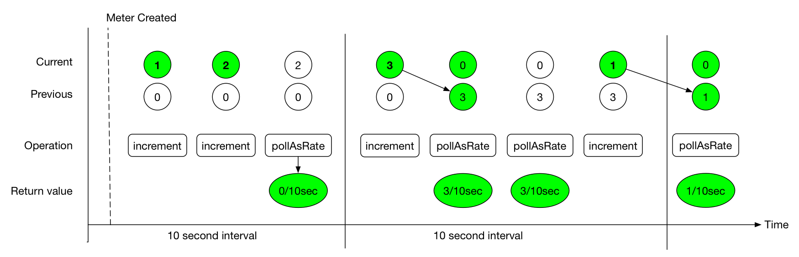

The value returned by the poll function is always *rate per second \* interval*. If the step value shown in the preceding image represents the values of a counter, we could say that the counter saw “0.3 increments per second” in the first interval, which is reportable to the backend at any time during the second interval.

Micrometer timers track at least a count and the total time as separate measurements. Suppose we configure publishing at 10-second intervals and we saw 20 requests that each took 100ms. Then, for the first interval:

1. `count` = 10 seconds \* (20 requests / 10 seconds) = 20 requests
2. `totalTime` = 10 seconds \* (20 \* 100 ms / 10 seconds) = 2 seconds

The `count` statistic is meaningful by itself: It is a measure of *throughput*. `totalTime` represents the total latency of all requests in the interval. Additionally, consider:

`totalTime / count` = 2 seconds / 20 requests = 0.1 seconds / request = 100 ms / request

This is a useful measure of *average latency*. When the same idea is applied to the `totalAmount` and `count` emanating from distribution summaries, the measure is called a *distribution average*. Average latency is just the distribution average for a distribution summary measured in time (a timer). Some monitoring systems (such as Atlas) provide facilities for computing the distribution average from these statistics, and Micrometer includes `totalTime` and `count` as separate statistics. Others, (such as Datadog) do not have this kind of operation built-in, and Micrometer calculates the distribution average client-side and ships that.

Shipping the rate for the publishing interval is sufficient to reason about the rate over any time window greater than or equal to the publishing interval. In our example, if a service continues to receive 20 requests that each take 100ms for every 10 second interval in a given minute, we could say:

1. Micrometer reported “20 requests” for `count` on every 10-second interval. The monitoring system sums these six 10-second intervals and arrives at the conclusion that there are 120 requests / minute. Note that it is the monitoring system doing this summation, not Micrometer.
2. Micrometer reported “2 seconds” of `totalTime` on every 10 second interval. The monitoring system can sum all total time statistics over the minute to yield “12 seconds” of total time in the minute interval. Then, the average latency is as we expect: 12 seconds / 120 requests = 100 ms / request.

[Meter Filters](#concepts-meter-filters)
[Counters](#concepts-counters)

---

<a id="concepts-counters"></a>

<!-- source_url: https://docs.micrometer.io/micrometer/reference/concepts/counters.html -->

<!-- page_index: 9 -->

# Counters

<svg enable-background="new 0 0 32 32" id="Glyph" version="1.1" viewbox="0 0 32 32" xml:space="preserve" xmlns="http://www.w3.org/2000/svg" xmlns:xlink="http://www.w3.org/1999/xlink">
<path id="XMLID_223_"></path>
</svg>

Search

<a id="concepts-counters--page-title"></a>
<a id="concepts-counters--counters"></a>

# Counters

Counters report a single metric: a count. The `Counter` interface lets you increment by a fixed amount, which must be positive.

> [!TIP]
> Never count something you can time with a `Timer` or summarize with a `DistributionSummary`! Both `Timer` and `DistributionSummary` always publish a count of events in addition to other measurements.

When building graphs and alerts off of counters, you should generally be most interested in measuring the rate at which some event occurs over a given time interval. Consider a simple queue. You could use counters to measure various things, such as the rate at which items are being inserted and removed.

It is tempting, at first, to conceive of visualizing absolute counts rather than a rate, but the absolute count is usually both a function of the rapidity with which something is used **and** the longevity of the application instance under instrumentation. Building dashboards and alerts of the rate of a counter per some interval of time disregards the longevity of the app, letting you see aberrant behavior long after the application has started.

> [!NOTE]
> Be sure to read through the timer section before jumping into using counters, as timers record a count of timed events as part of the suite of metrics that go into timing. For those pieces of code you intend to time, you do NOT need to add a separate counter.

The following code simulates a real counter whose rate exhibits some perturbation over a short time window:

```java
Normal rand = ...; // a random generator

MeterRegistry registry = ...
Counter counter = registry.counter("counter"); (1)

Flux.interval(Duration.ofMillis(10))
        .doOnEach(d -> {
            if (rand.nextDouble() + 0.1 > 0) { (2)
                counter.increment(); (3)
            }
        })
        .blockLast();
```

**1**

Most counters can be created off of the registry itself with a name and, optionally, a set of tags.

**2**

A slightly positively biased random walk.

**3**

This is how you interact with a counter. You could also call `counter.increment(n)` to increment by more than one in a single operation.

A fluent builder for counters on the `Counter` interface itself provides access to less frequently used options, such as
base units and description. You can register the counter as the last step of its construction by calling `register`:

```java
Counter counter = Counter
    .builder("counter")
    .baseUnit("beans") // optional
    .description("a description of what this counter does") // optional
    .tags("region", "test") // optional
    .register(registry);
```

<a id="concepts-counters--_the_counted_annotation"></a>
<a id="concepts-counters--the-counted-annotation"></a>

## The `@Counted` Annotation

The `micrometer-core` module contains a `@Counted` annotation that frameworks can use to add counting support to either specific types of methods such as those serving web request endpoints or, more generally, to all methods.

Also, an incubating AspectJ aspect is included in `micrometer-core`. You can use it in your application either through compile/load time AspectJ weaving or through framework facilities that interpret AspectJ aspects and proxy targeted methods in some other way, such as Spring AOP. Here is a sample Spring AOP configuration:

```java
@Configuration
public class CountedConfiguration {
   @Bean
   public CountedAspect countedAspect(MeterRegistry registry) {
      return new CountedAspect(registry);
   }
}
```

Applying `CountedAspect` makes `@Counted` usable on any arbitrary method in an AspectJ proxied instance, as the following example shows:

```java
@Service public class ExampleService {
@Counted public void sync() {// @Counted will record the number of executions of this method ...}
@Async @Counted public CompletableFuture<?> async() {// @Counted will record the number of executions of this method return CompletableFuture.supplyAsync(...);}
}
```

<a id="concepts-counters--_metertag_on_method_parameters"></a>
<a id="concepts-counters--metertag-on-method-parameters"></a>

### @MeterTag on Method Parameters

To support using the `@MeterTag` annotation on method parameters, you need to configure the `@CountedAspect` to add the `CountedMeterTagAnnotationHandler`.

```java
ValueResolver valueResolver = parameter -> "Value from myCustomTagValueResolver [" + parameter + "]";

// Example of a ValueExpressionResolver that uses Spring Expression Language
ValueExpressionResolver valueExpressionResolver = new SpelValueExpressionResolver();


// Setting the handler on the aspect
countedAspect.setMeterTagAnnotationHandler(
        new CountedMeterTagAnnotationHandler(aClass -> valueResolver, aClass -> valueExpressionResolver));
```

Let’s assume that we have the following interface.

```java
interface MeterTagClassInterface {

    @Counted
    void getAnnotationForTagValueResolver(@MeterTag(key = "test", resolver = ValueResolver.class) String test);

    @Counted
    void getAnnotationForTagValueExpression(
            @MeterTag(key = "test", expression = "'hello' + ' characters'") String test);

    @Counted
    void getAnnotationForArgumentToString(@MeterTag("test") Long param);

    @Counted
    void getMultipleAnnotationsForTagValueExpression(
            @MeterTag(key = "value1", expression = "'value1: ' + value1") @MeterTag(key = "value2",
                    expression = "'value2: ' + value2") DataHolder param);

}
```

When its implementations would be called with different arguments (remember that the implementation needs to be annotated with `@Counted` annotation too), the following counters would be created:

```java
// Example for returning <toString()> on the parameter
service.getAnnotationForArgumentToString(15L);

assertThat(registry.get("method.counted").tag("test", "15").counter().count()).isEqualTo(1);

// Example for calling the provided <ValueResolver> on the parameter
service.getAnnotationForTagValueResolver("foo");

assertThat(registry.get("method.counted")
    .tag("test", "Value from myCustomTagValueResolver [foo]")
    .counter()
    .count()).isEqualTo(1);

// Example for calling the provided <ValueExpressionResolver>
service.getAnnotationForTagValueExpression("15L");

assertThat(registry.get("method.counted").tag("test", "hello characters").counter().count()).isEqualTo(1);

// Example for using multiple @MeterTag annotations on the same parameter
// @MeterTags({ @MeterTag(...), @MeterTag(...) }) can be also used
service.getMultipleAnnotationsForTagValueExpression(new DataHolder("zxe", "qwe"));

assertThat(registry.get("method.counted")
    .tag("value1", "value1: zxe")
    .tag("value2", "value2: qwe")
    .counter()
    .count()).isEqualTo(1);
```

> [!NOTE]
> `CountedAspect` doesn’t support meta-annotations with `@Counted`.

<a id="concepts-counters--_function_tracking_counters"></a>
<a id="concepts-counters--function-tracking-counters"></a>

## Function-tracking Counters

Micrometer also provides a more infrequently used counter pattern that tracks a monotonically increasing function (a function that stays the same or increases over time but never decreases). Some monitoring systems, such as Prometheus, push cumulative values for counters to the backend, but others publish the rate at which a counter is incrementing over the push interval. By employing this pattern, you let the Micrometer implementation for your monitoring system choose whether to rate-normalize the counter, and your counter remains portable across different types of monitoring systems.

```java
Cache cache = ...; // suppose we have a Guava cache with stats recording on
registry.more().counter("evictions", tags, cache, c -> c.stats().evictionCount()); (1)
```

**1**

`evictionCount()` is a monotonically increasing function that increments with every cache eviction from the beginning of its life.

The function-tracking counter, in concert with the monitoring system’s rate normalizing functionality (whether this is an artifact of the query language or the way data is pushed to the system), adds a layer of richness on top of the cumulative value of the function itself. You can reason about the *rate* at which the value is increasing, whether that rate is within an acceptable bound, is increasing or decreasing over time, and so on.

> [!WARNING]
> Micrometer cannot guarantee the monotonicity of the function for you. By using this signature, you assert its monotonicity based on what you know about its definition.

A fluent builder for function counters on the `FunctionCounter` interface itself provides access to less frequently used options, such as base units and description. You can register the counter as the last step of its construction by calling `register(MeterRegistry)`:

```java
MyCounterState state = ...;

FunctionCounter counter = FunctionCounter
    .builder("counter", state, state -> state.count())
    .baseUnit("beans") // optional
    .description("a description of what this counter does") // optional
    .tags("region", "test") // optional
    .register(registry);
```

> [!WARNING]
> Attempting to construct a function-tracking counter with a primitive number or one of its `java.lang` object forms is always incorrect. These numbers are immutable. Thus, the function-tracking counter cannot ever be changed. Attempting to "re-register" the function-tracking counter with a different number does not work, as the registry maintains only one meter for each unique combination of name and tags. "Re-registering" a function-tracking counter can happen indirectly for example as the result of a `MeterFilter` modifying the name and/or the tags of two different function-tracking counters so that they will be the same after the filter is applied.

Attempting to "re-register" a function-tracking counter will result in a warning like this:

```none
WARNING: This FunctionCounter has been already registered (MeterId{name='my.fc', tags=[]}), the registration will be ignored. Note that subsequent logs will be logged at debug level.
```

[Rate Aggregation](#concepts-rate-aggregation)
[Gauges](#concepts-gauges)

---

<a id="concepts-gauges"></a>

<!-- source_url: https://docs.micrometer.io/micrometer/reference/concepts/gauges.html -->

<!-- page_index: 10 -->

# Gauges

<svg enable-background="new 0 0 32 32" id="Glyph" version="1.1" viewbox="0 0 32 32" xml:space="preserve" xmlns="http://www.w3.org/2000/svg" xmlns:xlink="http://www.w3.org/1999/xlink">
<path id="XMLID_223_"></path>
</svg>

Search

<a id="concepts-gauges--page-title"></a>
<a id="concepts-gauges--gauges"></a>

# Gauges

A gauge is a handle to get the current value. Typical examples for gauges would be the size of a collection or map or the number of threads in a running state.

> [!TIP]
> Gauges are useful for monitoring things with natural upper bounds. We do not recommend using a gauge to monitor things like request count, as they can grow without bound for the duration of an application instance’s life.

> [!TIP]
> Never gauge something you can count with a `Counter`!

Micrometer takes the stance that gauges should be sampled and not be set, so there is no information about what might have occurred between samples. Any intermediate values set on a gauge are lost by the time the gauge value is reported to a metrics backend, so there is little value in setting those intermediate values in the first place.

Think of a `Gauge` as a “heisen-gauge”: a meter that changes only when it is observed. Every other meter type accumulates intermediate counts toward the point where the data is sent to the metrics backend.

The `MeterRegistry` interface contains methods for building gauges to observe numeric values, functions, collections, and maps:

```java
List<String> list = registry.gauge("listGauge", Collections.emptyList(), new ArrayList<>(), List::size); (1)
List<String> list2 = registry.gaugeCollectionSize("listSize2", Tags.empty(), new ArrayList<>()); (2)
Map<String, Integer> map = registry.gaugeMapSize("mapGauge", Tags.empty(), new HashMap<>());
```

**1**

A slightly more common form of gauge is one that monitors some non-numeric object. The last argument establishes the function that is used to determine the value of the gauge when the gauge is observed.

**2**

A more convenient form of (1) for when you want to monitor collection size.

All of the different forms of creating a gauge maintain only a *weak reference* to the object being observed, so as not to prevent garbage collection of the object.

<a id="concepts-gauges--_manually_incrementing_or_decrementing_a_gauge"></a>
<a id="concepts-gauges--manually-incrementing-or-decrementing-a-gauge"></a>

## Manually Incrementing or Decrementing a Gauge

A gauge can be made to track any `java.lang.Number` subtype that is settable, such as `AtomicInteger` and `AtomicLong` found in `java.util.concurrent.atomic` and similar types, such as Guava’s `AtomicDouble`:

```java
// maintain a reference to myGauge
AtomicInteger myGauge = registry.gauge("numberGauge", new AtomicInteger(0));

// ... elsewhere you can update the value it holds using the object reference
myGauge.set(27);
myGauge.set(11);
```

Note that, in this form, unlike other meter types, you do not get a reference to the `Gauge` when creating one. Rather, you get a reference to the thing being observed. This is because of the “heisen-gauge” principal: The gauge is self-sufficient once created, so you should never need to interact with it. This lets us give you back only the instrumented object, which allows for quick one-liners that both create the object to be observed and set up metrics around it.

This pattern should be less common than the `DoubleFunction` form. Remember that frequent setting of the observed `Number` results in a lot of intermediate values that never get published. Only the *instantaneous value* of the gauge at publish time is ever sent to the monitoring system.

> [!WARNING]
> Attempting to construct a gauge with a primitive number or one of its `java.lang` object forms is always incorrect. These numbers are immutable. Thus, the gauge cannot ever be changed. Attempting to "re-register" the gauge with a different number does not work, as the registry maintains only one meter for each unique combination of name and tags. "Re-registering" a gauge can happen indirectly for example as the result of a `MeterFilter` modifying the name and/or the tags of two different gauges so that they will be the same after the filter is applied.

Attempting to "re-register" a gauge will result in a warning like this:

```none
WARNING: This Gauge has been already registered (MeterId{name='my.gauge', tags=[]}), the registration will be ignored. Note that subsequent logs will be logged at debug level.
```

<a id="concepts-gauges--_gauge_fluent_builder"></a>
<a id="concepts-gauges--gauge-fluent-builder"></a>

## Gauge Fluent Builder

The interface contains a fluent builder for gauges:

```java
Gauge gauge = Gauge
    .builder("gauge", myObj, myObj::gaugeValue)
    .description("a description of what this gauge does") // optional
    .tags("region", "test") // optional
    .register(registry);
```

Generally the returned `Gauge` instance is not useful except in testing, as the gauge is already set up to track a value automatically upon registration.

<a id="concepts-gauges--_why_is_my_gauge_reporting_nan_or_disappearing"></a>
<a id="concepts-gauges--why-is-my-gauge-reporting-nan-or-disappearing"></a>

## Why is My Gauge Reporting NaN or Disappearing?

It is your responsibility to hold a strong reference to the state object that you are measuring with a `Gauge`. Micrometer is careful to not create strong references to objects that would otherwise be garbage collected. Once the object being gauged is de-referenced and is garbage collected, Micrometer starts reporting a NaN or nothing for a gauge, depending on the registry implementation.

If you see your gauge reporting for a few minutes and then disappearing or reporting NaN, it almost certainly suggests that the underlying object being gauged has been garbage collected.

<a id="concepts-gauges--_timegauge"></a>
<a id="concepts-gauges--timegauge"></a>

## `TimeGauge`

`TimeGauge` is a specialized gauge that tracks a time value, to be scaled to the base unit of time expected by each registry implementation.

`TimeGauge` can be registered with `TimeUnit` as follows:

```java
AtomicInteger msTimeGauge = new AtomicInteger(4000);
AtomicInteger usTimeGauge = new AtomicInteger(4000);
TimeGauge.builder("my.gauge", msTimeGauge, TimeUnit.MILLISECONDS, AtomicInteger::get).register(registry);
TimeGauge.builder("my.other.gauge", usTimeGauge, TimeUnit.MICROSECONDS, AtomicInteger::get).register(registry);
```

And for example, if the registry is Prometheus, they will be converted in seconds as follows:

```none
# HELP my_gauge_seconds
# TYPE my_gauge_seconds gauge
my_gauge_seconds 4.0
# HELP my_other_gauge_seconds
# TYPE my_other_gauge_seconds gauge
my_other_gauge_seconds 0.004
```

<a id="concepts-gauges--_multi_gauge"></a>
<a id="concepts-gauges--multi-gauge"></a>

## Multi-gauge

Micrometer supports one last special type of `Gauge`, called a `MultiGauge`, to help manage gauging a growing or shrinking list of criteria.
This feature lets you select a set of well-bounded but slightly changing set of criteria from something like an SQL query and report each `Row` (see the example below) as a `Gauge`. The following example creates a `MultiGauge`:

```java
// SELECT count(*) from job group by status WHERE job = 'dirty'
MultiGauge statuses = MultiGauge.builder("statuses")
    .tag("job", "dirty")
    .description("The number of widgets in various statuses")
    .baseUnit("widgets")
    .register(registry);

...

// run this whenever you re-run your query
statuses.register(
    resultSet.stream()
        .map(result -> Row.of(Tags.of("status", result.getAsString("status")), result.getAsInt("count")))
        .collect(toList()),
    true // whether to overwrite the previous value or only record it once
);
```

The `overwrite` argument controls how rows with the same set of tags are handled on subsequent registrations.
Use `overwrite=true` when each registration represents a new snapshot and previously registered rows should be replaced with the latest values.
Use `overwrite=false` when existing rows should remain unchanged on later registrations with the same tags.
Rows that are no longer present in the new registration are removed.

[Counters](#concepts-counters)
[Timers](#concepts-timers)

---

<a id="concepts-timers"></a>

<!-- source_url: https://docs.micrometer.io/micrometer/reference/concepts/timers.html -->

<!-- page_index: 11 -->

# Timers

<svg enable-background="new 0 0 32 32" id="Glyph" version="1.1" viewbox="0 0 32 32" xml:space="preserve" xmlns="http://www.w3.org/2000/svg" xmlns:xlink="http://www.w3.org/1999/xlink">
<path id="XMLID_223_"></path>
</svg>

Search

<a id="concepts-timers--page-title"></a>
<a id="concepts-timers--timers"></a>

# Timers

Timers are intended for measuring short-duration latencies and the frequency of such events. All implementations of `Timer` report at least the total time and the count of events as separate time series but other time series can also be reported depending on what is supported by the backend (max, percentiles, histograms). While you can use timers for other use cases, note that negative values are not supported, and recording many longer durations could cause overflow of the total time at `Long.MAX_VALUE` nanoseconds (292.3 years).

As an example, consider a graph showing request latency to a typical web server. The server can be expected to respond to many requests quickly, so the timer gets updated many times per second.

The appropriate base unit for timers varies by metrics backend, and for good reason. Micrometer is decidedly un-opinionated about this. However, because of the potential for confusion, Micrometer requires a `TimeUnit` when interacting with `Timer` implementations. Micrometer is aware of the preferences of each implementation and publishes your timing in the appropriate base unit, based on the implementation. The following listing shows part of the `Timer` interface:

```java
public interface Timer extends Meter {
    ...
    void record(long amount, TimeUnit unit);
    void record(Duration duration);
    double totalTime(TimeUnit unit);
}
```

The interface contains a fluent builder for timers:

```java
Timer timer = Timer
    .builder("my.timer")
    .description("a description of what this timer does") // optional
    .tags("region", "test") // optional
    .register(registry);
```

> [!NOTE]
> The maximum statistical value for basic `Timer` implementations, such as `CumulativeTimer` and `StepTimer`, is a time window maximum (`TimeWindowMax`).
> It means that its value is the maximum value during a time window.
> If no new values are recorded for the time window length, the max is reset to 0 as a new time window starts.
> The time window size until values are fully expired is the `expiry` multiplied by the `bufferLength` in `DistributionStatisticConfig`.
> `expiry` defaults to the step size of the meter registry unless it’s explicitly set to a different value, and `bufferLength` defaults to `3`.
> A time window maximum is used to capture maximum latency in a subsequent interval after heavy resource pressure triggers the latency and prevents metrics from being published.
> Percentiles are also time window percentiles (`TimeWindowPercentileHistogram`). Histogram buckets usually behave like counters, so depending on the backend, they can be reported as cumulative values (for example in the case of Prometheus) or as a rate at which a counter increments over the push interval.

<a id="concepts-timers--_recording_blocks_of_code"></a>
<a id="concepts-timers--recording-blocks-of-code"></a>

## Recording Blocks of Code

The `Timer` interface exposes several convenience overloads for recording timings inline, including the following:

```java
timer.record(() -> dontCareAboutReturnValue());
timer.recordCallable(() -> returnValue());

Runnable r = timer.wrap(() -> dontCareAboutReturnValue()); (1)
Callable c = timer.wrap(() -> returnValue());
```

**1**

Wrap `Runnable` or `Callable` and return the instrumented version of it for use later.

> [!NOTE]
> A `Timer` is really a specialized distribution summary that is aware of how to scale durations to the base unit of time of each monitoring system and has an automatically
> determined base unit. In every case where you want to measure time, you should use a `Timer` rather than a `DistributionSummary`.

<a id="concepts-timers--_storing_start_state_in_timer_sample"></a>
<a id="concepts-timers--storing-start-state-in-timer.sample"></a>

## Storing Start State in `Timer.Sample`

You may also store the start state in a sample instance that can be stopped later. The sample records a start time based on the registry’s clock. After starting a sample, execute the code to be timed and finish the operation by calling `stop(Timer)` on the sample:

```java
Timer.Sample sample = Timer.start(registry);

// do stuff
Response response = ...

sample.stop(registry.timer("my.timer", "response", response.status()));
```

Note how we do not decide the timer to which to accumulate the sample until it is time to stop the sample. This lets us dynamically determine certain tags from the end state of the operation we are timing.

<a id="concepts-timers--_the_timed_annotation"></a>
<a id="concepts-timers--the-timed-annotation"></a>

## The `@Timed` Annotation

The `micrometer-core` module contains a `@Timed` annotation that frameworks can use to add timing support to either specific types of methods such as those serving web request endpoints or, more generally, to all methods.

Also, an incubating AspectJ aspect is included in `micrometer-core`. You can use it in your application either through compile/load time AspectJ weaving or through framework facilities that interpret AspectJ aspects and proxy targeted methods in some other way, such as Spring AOP. Here is a sample Spring AOP configuration:

```java
@Configuration
public class TimedConfiguration {
   @Bean
   public TimedAspect timedAspect(MeterRegistry registry) {
      return new TimedAspect(registry);
   }
}
```

Applying `TimedAspect` makes `@Timed` usable on any arbitrary method in an AspectJ proxied instance, as the following example shows:

```java
@Service public class ExampleService {
@Timed public void sync() {// @Timed will record the execution time of this method,// from the start and until it exits normally or exceptionally....}
@Async @Timed public CompletableFuture<?> async() {// @Timed will record the execution time of this method,// from the start and until the returned CompletableFuture // completes normally or exceptionally.return CompletableFuture.supplyAsync(...);}
}
```

> [!NOTE]
> `TimedAspect` doesn’t support meta-annotations with `@Timed`.

<a id="concepts-timers--_metertag_on_method_parameters"></a>
<a id="concepts-timers--metertag-on-method-parameters"></a>

### @MeterTag on Method Parameters

To support using the `@MeterTag` annotation on method parameters, you need to configure the `@TimedAspect` to add the `MeterTagAnnotationHandler`.

```java
ValueResolver valueResolver = parameter -> "Value from myCustomTagValueResolver [" + parameter + "]";

// Example of a ValueExpressionResolver that uses Spring Expression Language
ValueExpressionResolver valueExpressionResolver = new SpelValueExpressionResolver();


// Setting the handler on the aspect
timedAspect.setMeterTagAnnotationHandler(
        new MeterTagAnnotationHandler(aClass -> valueResolver, aClass -> valueExpressionResolver));
```

Let’s assume that we have the following interface.

```java
interface MeterTagClassInterface {

    @Timed
    void getAnnotationForTagValueResolver(@MeterTag(key = "test", resolver = ValueResolver.class) String test);

    @Timed
    void getAnnotationForTagValueExpression(
            @MeterTag(key = "test", expression = "'hello' + ' characters'") String test);

    @Timed
    void getAnnotationForArgumentToString(@MeterTag("test") Long param);

    @Timed
    void getMultipleAnnotationsForTagValueExpression(
            @MeterTag(key = "value1", expression = "'value1: ' + value1") @MeterTag(key = "value2",
                    expression = "'value2: ' + value2") DataHolder param);

}
```

When its implementations would be called with different arguments (remember that the implementation needs to be annotated with `@Timed` annotation too), the following timers would be created:

```java
// Example for returning <toString()> on the parameter
service.getAnnotationForArgumentToString(15L);

assertThat(registry.get("method.timed").tag("test", "15").timer().count()).isEqualTo(1);

// Example for calling the provided <ValueResolver> on the parameter
service.getAnnotationForTagValueResolver("foo");

assertThat(registry.get("method.timed")
    .tag("test", "Value from myCustomTagValueResolver [foo]")
    .timer()
    .count()).isEqualTo(1);

// Example for calling the provided <ValueExpressionResolver>
service.getAnnotationForTagValueExpression("15L");

assertThat(registry.get("method.timed").tag("test", "hello characters").timer().count()).isEqualTo(1);

// Example for using multiple @MeterTag annotations on the same parameter
// @MeterTags({ @MeterTag(...), @MeterTag(...) }) can be also used
service.getMultipleAnnotationsForTagValueExpression(new DataHolder("zxe", "qwe"));

assertThat(
        registry.get("method.timed").tag("value1", "value1: zxe").tag("value2", "value2: qwe").timer().count())
    .isEqualTo(1);
```

<a id="concepts-timers--_function_tracking_timers"></a>
<a id="concepts-timers--function-tracking-timers"></a>

## Function-tracking Timers

Micrometer also provides a more infrequently used timer pattern that tracks two monotonically increasing functions (a function that stays the same or increases over time but never decreases): a count function and a total time function. Some monitoring systems, such as Prometheus, push cumulative values for counters (which apply to both the count and total time functions in this case) to the backend, but others publish the rate at which a counter increments over the push interval. By employing this pattern, you let the Micrometer implementation for your monitoring system choose whether to rate normalize the timer, and your timer remains portable across different types of monitoring systems.

```java
IMap<?, ?> cache = ...; // suppose we have a Hazelcast cache
registry.more().timer("cache.gets.latency", Tags.of("name", cache.getName()), cache,
    c -> c.getLocalMapStats().getGetOperationCount(), (1)
    c -> c.getLocalMapStats().getTotalGetLatency(),
    TimeUnit.NANOSECONDS (2)
);
```

**1**

`getGetOperationCount()` is a monotonically increasing function incrementing with every cache get from the beginning of its life.

**2**

This represents the unit of time represented by `getTotalGetLatency()`. Each registry implementation specifies what its expected base unit of time is, and the total time reported will be scaled to this value.

The function-tracking timer, in concert with the monitoring system’s rate normalizing functionality (whether this is an artifact of the query language or the way data is pushed to the system), adds a layer of richness to the cumulative value of the functions themselves. You can reason about the *rate* of throughput and latency, whether that rate is within an acceptable bound, is increasing or decreasing over time, and so on.

> [!WARNING]
> Micrometer cannot guarantee the monotonicity of the count and total time functions for you. By using this signature, you are asserting their monotonicity based on what you know about their definitions.

There is also a fluent builder for function timers on the `FunctionTimer` interface itself, providing access to less frequently used options, such as base units and description. You can register the timer as the last step of its construction by calling `register(MeterRegistry)`:

```java
IMap<?, ?> cache = ...

FunctionTimer.builder("cache.gets.latency", cache,
        c -> c.getLocalMapStats().getGetOperationCount(),
        c -> c.getLocalMapStats().getTotalGetLatency(),
        TimeUnit.NANOSECONDS)
    .tags("name", cache.getName())
    .description("Cache gets")
    .register(registry);
```

> [!WARNING]
> Attempting to construct a function-tracking timer with a primitive number or one of its `java.lang` object forms is always incorrect. These numbers are immutable. Thus, the function-tracking timer cannot ever be changed. Attempting to "re-register" the function-tracking timer with a different number does not work, as the registry maintains only one meter for each unique combination of name and tags. "Re-registering" a function-tracking timer can happen indirectly for example as the result of a `MeterFilter` modifying the name and/or the tags of two different function-tracking timers so that they will be the same after the filter is applied.

Attempting to "re-register" a function-tracking timer will result in a warning like this:

```none
WARNING: This FunctionTimer has been already registered (MeterId{name='my.ft', tags=[]}), the registration will be ignored. Note that subsequent logs will be logged at debug level.
```

<a id="concepts-timers--_pause_detection"></a>
<a id="concepts-timers--pause-detection"></a>

## Pause Detection

Micrometer uses the `LatencyUtils` package to compensate for [coordinated omission](https://highscalability.com/blog/2015/10/5/your-load-generator-is-probably-lying-to-you-take-the-red-pi.html) — extra latency arising from system and VM pauses that skew your latency statistics downward. Distribution statistics, such as percentiles and SLO counts, are influenced by a pause detector implementation that adds additional latency here and there to compensate for pauses.

Micrometer supports two pause detector implementations: a clock-drift based detector and a no-op detector. The no-op detector is configured by default, but the clock-drift detector can be configured as shown in the next example.

The clock-drift based detector has a configurable sleep interval and pause threshold. CPU consumption is inversely proportional to `sleepInterval`, as is pause detection accuracy. 100ms for both values is a reasonable default to offer decent detection of long pause events while consuming a negligible amount of CPU time.

> [!NOTE]
> You need to add LatencyUtils(`org.latencyutils:LatencyUtils`) to your runtime classpath to use the `ClockDriftPauseDetector`.
> Without it on the runtime classpath, a warning will be logged and no pause detection will happen.

You can customize the pause detector as follows:

```java
registry.config().pauseDetector(new ClockDriftPauseDetector(sleepInterval, pauseThreshold));
registry.config().pauseDetector(new NoPauseDetector());
```

In the future, we may provide further detector implementations. Some pauses may be able to be inferred from GC logging in some circumstances, for example, without requiring a constant CPU load, however minimal. Also, a future JDK may provide direct access to pause events.

<a id="concepts-timers--_memory_footprint_estimation"></a>
<a id="concepts-timers--memory-footprint-estimation"></a>

## Memory Footprint Estimation

Timers are the most memory-consuming meter, and their total footprint can vary dramatically, depending on which options you choose. The following table of memory consumption is based on the use of various features. These figures assume no tags and a ring buffer length of 3. Adding tags adds somewhat to the total, as does increasing the buffer length. Total storage can also vary somewhat, depending on the registry implementation.

- R = Ring buffer length. We assume the default of 3 in all examples. R is set with `Timer.Builder#distributionStatisticBufferLength`.
- B = Total histogram buckets. Can be SLO boundaries or percentile histogram buckets. By default, timers are clamped to a minimum expected value of 1ms and a maximum expected value of 30 seconds, yielding 66 buckets for percentile histograms, when applicable.
- I = Interval estimator for pause compensation. 1.7 kb.
- M = Time-decaying max. 104 bytes.
- Fb = Fixed boundary histogram. 8b \* B \* R.
- Pp = Percentile precision. By default, it is 1. Generally in the range [0, 3]. Pp is set with `Timer.Builder#percentilePrecision`.
- Hdr(Pp) = High dynamic range histogram.

  - When Pp = 0: 1.9kb \* R + 0.8kb
  - When Pp = 1: 3.8kb \* R + 1.1kb
  - When Pp = 2: 18.2kb \* R + 4.7kb
  - When Pp = 3: 66kb \* R + 33kb

| Pause detection | Client-side percentiles | Histogram and/or SLOs | Formula | Example |
| --- | --- | --- | --- | --- |
| Yes | No | No | I + M | ~1.8kb |
| Yes | No | Yes | I + M + Fb | For default percentile histogram, ~7.7kb |
| Yes | Yes | Yes | I + M + Hdr(Pp) | For the addition of a 0.95 percentile with defaults otherwise, ~14.3kb |
| No | No | No | M | ~0.1kb |
| No | No | Yes | M + Fb | For default percentile histogram, ~6kb |
| No | Yes | Yes | M + Hdr(Pp) | For the addition of a 0.95 percentile with defaults otherwise, ~12.6kb |

> [!NOTE]
> For Prometheus, specifically, R is *always* equal to 1, regardless of how you attempt to configure it through `Timer.Builder`. This special case exists because Prometheus expects cumulative histogram data that never rolls over.

[Gauges](#concepts-gauges)
[Distribution Summaries](#concepts-distribution-summaries)

---

<a id="concepts-distribution-summaries"></a>

<!-- source_url: https://docs.micrometer.io/micrometer/reference/concepts/distribution-summaries.html -->

<!-- page_index: 12 -->

# Distribution Summaries

<svg enable-background="new 0 0 32 32" id="Glyph" version="1.1" viewbox="0 0 32 32" xml:space="preserve" xmlns="http://www.w3.org/2000/svg" xmlns:xlink="http://www.w3.org/1999/xlink">
<path id="XMLID_223_"></path>
</svg>

Search

<a id="concepts-distribution-summaries--page-title"></a>
<a id="concepts-distribution-summaries--distribution-summaries"></a>

# Distribution Summaries

A distribution summary tracks the distribution of events. It is structurally similar to a timer but records values that do not represent a unit of time. For example, you could use a distribution summary to measure the payload sizes of requests hitting a server.

The following example creates a distribution summary:

```java
DistributionSummary summary = registry.summary("response.size");
```

The interface contains a fluent builder for distribution summaries:

```java
DistributionSummary summary = DistributionSummary
    .builder("response.size")
    .description("a description of what this summary does") // optional
    .baseUnit("bytes") // optional (1)
    .tags("region", "test") // optional
    .scale(100) // optional (2)
    .register(registry);
```

**1**

Add base units for maximum portability. Base units are part of the naming convention for some monitoring systems. Leaving it off and violating the naming convention has no adverse effect if you forget.

**2**

Optionally, you can provide a scaling factor by which each recorded sample is multiplied as it is recorded.

> [!NOTE]
> The maximum (which is named `max`) for basic `DistributionSummary` implementations, such as `CumulativeDistributionSummary` and `StepDistributionSummary`, is a time window maximum (`TimeWindowMax`).
> It means that its value is the maximum value during a time window.
> If no new values are recorded for the time window length, the maximum is reset to 0 as a new time window starts.
> The time window size until values are fully expired is the `expiry` multiplied by the `bufferLength` in `DistributionStatisticConfig`.
> `expiry` defaults to the step size of the meter registry unless it’s explicitly set to a different value, and `bufferLength` defaults to `3`.
> A time window max is used to capture the maximum latency in a subsequent interval after heavy resource pressure triggers the latency and prevents metrics from being published.
> Percentiles are also time window percentiles (`TimeWindowPercentileHistogram`).

<a id="concepts-distribution-summaries--_scaling_and_histograms"></a>
<a id="concepts-distribution-summaries--scaling-and-histograms"></a>

## Scaling and Histograms

Micrometer’s preselected percentile histogram buckets are all integers from 1 to `Long.MAX_VALUE`. Currently, `minimumExpectedValue` and `maximumExpectedValue` serve to control the cardinality of the bucket set. If we try to detect that your min/max yields a small range and scale the preselected bucket domain to your summary’s range, we do not have another lever to control bucket cardinality.

Instead, if your summary’s domain is more constrained, scale your summary’s range by a fixed factor. The use case we have heard so far is for summaries of ratios whose domain is [0,1]. Given that scenario, we can use the following code to create values from 0 to 100:

```java
DistributionSummary.builder("my.ratio").scale(100).register(registry)
```

This way, the ratio winds up in the range [0,100] and we can set `maximumExpectedValue` to 100. You can pair this with custom SLO boundaries if you care about particular ratios:

```java
DistributionSummary.builder("my.ratio")
   .scale(100)
   .serviceLevelObjectives(70, 80, 90)
   .register(registry)
```

<a id="concepts-distribution-summaries--_memory_footprint_estimation"></a>
<a id="concepts-distribution-summaries--memory-footprint-estimation"></a>

## Memory Footprint Estimation

The total memory footprint of a distribution summary can vary dramatically, depending on which options you choose. The following table of memory consumption is based on the use of various features. These figures assume no tags and a ring buffer length of 3. Adding tags adds somewhat to the total, as does increasing the buffer length. Total storage can also vary somewhat depending on the registry implementation.

- R = Ring buffer length. We assume the default of 3 in all examples. R is set with `DistributionSummary.Builder#distributionStatisticBufferLength`.
- B = Total histogram buckets. It can be SLO boundaries or percentile histogram buckets. By default, summaries have NO minimum and maximum expected value, so we ship all 276 predetermined histogram buckets. You should always clamp distribution summaries with a `minimumExpectedValue` and `maximumExpectedValue` when you intend to ship percentile histograms.
- M = Time-decaying max. 104 bytes.
- Fb = Fixed boundary histogram. 8b \* B \* R.
- Pp = Percentile precision. By default, it is 1. It is generally in the range of [0, 3]. Pp is set with `DistributionSummary.Builder#percentilePrecision`.
- Hdr(Pp) = High dynamic range histogram.

  - When Pp = 0: 1.9kb \* R + 0.8kb
  - When Pp = 1: 3.8kb \* R + 1.1kb
  - When Pp = 2: 18.2kb \* R + 4.7kb
  - When Pp = 3: 66kb \* R + 33kb

| Client-side percentiles | Histogram and/or SLOs | Formula | Example |
| --- | --- | --- | --- |
| No | No | M | ~0.1kb |
| No | Yes | M + Fb | For percentile histogram clamped to 66 buckets, ~6kb |
| Yes | Yes | M + Hdr(Pp) | For the addition of a 0.95 percentile with defaults otherwise, ~12.6kb |

> [!NOTE]
> For Prometheus, R is *always* equal to 1, regardless of how you attempt to configure it through `DistributionSummary.Builder`. This special case exists for Prometheus because it expects cumulative histogram data that never rolls over.

[Timers](#concepts-timers)
[Long Task Timers](#concepts-long-task-timers)

---

<a id="concepts-long-task-timers"></a>

<!-- source_url: https://docs.micrometer.io/micrometer/reference/concepts/long-task-timers.html -->

<!-- page_index: 13 -->

# Long Task Timers

<svg enable-background="new 0 0 32 32" id="Glyph" version="1.1" viewbox="0 0 32 32" xml:space="preserve" xmlns="http://www.w3.org/2000/svg" xmlns:xlink="http://www.w3.org/1999/xlink">
<path id="XMLID_223_"></path>
</svg>

Search

<a id="concepts-long-task-timers--page-title"></a>
<a id="concepts-long-task-timers--long-task-timers"></a>

# Long Task Timers

The long task timer is a special type of timer that lets you measure time while an event being measured is **still running**. A normal Timer only records the duration **after** the task is complete.

Long task timers publish at least the following statistics:

- Active task count
- Total duration of active tasks
- The maximum duration of active tasks

Unlike a regular `Timer`, a long task timer does not publish statistics about completed tasks.

Consider a background process to refresh metadata from a data store. For example, [Edda](https://github.com/Netflix/edda) caches AWS resources, such as instances, volumes, auto-scaling groups, and others. Normally all data can be refreshed in a few minutes. If the AWS services have problems, it can take much longer. A long task timer can be used to track the active time for refreshing the metadata.

For example, in a Spring application, it is common for such long running processes to be implemented with `@Scheduled`. Micrometer provides a special `@Timed` annotation for instrumenting these processes with a long task timer:

```java
@Timed(value = "aws.scrape", longTask = true)
@Scheduled(fixedDelay = 360000)
void scrapeResources() {
    // find instances, volumes, auto-scaling groups, etc...
}
```

It is up to the application framework to make something happen with `@Timed`. If your framework of choice does not support it, you can still use the long task timer:

```java
LongTaskTimer scrapeTimer = registry.more().longTaskTimer("scrape");
void scrapeResources() {
    scrapeTimer.record(() => {
        // find instances, volumes, auto-scaling groups, etc...
    });
}
```

If we wanted to alert when this process exceeds a threshold, with a long task timer, we receive that alert at the first reporting interval after we have exceeded the threshold. With a regular timer, we would not receive the alert until the first reporting interval after the process completed, over an hour later!

The interface contains a fluent builder for long task timers:

```java
LongTaskTimer longTaskTimer = LongTaskTimer
    .builder("long.task.timer")
    .description("a description of what this timer does") // optional
    .tags("region", "test") // optional
    .register(registry);
```

The exact series exposed by a long task timer depend on the registry. For example, the Prometheus registry exposes a different set of series when `publishPercentileHistogram()` is enabled; see the [Long task timers section of the Prometheus implementation docs](#implementations-prometheus--_long_task_timers) for details.

[Distribution Summaries](#concepts-distribution-summaries)
[Histograms and Percentiles](#concepts-histogram-quantiles)

---

<a id="concepts-histogram-quantiles"></a>

<!-- source_url: https://docs.micrometer.io/micrometer/reference/concepts/histogram-quantiles.html -->

<!-- page_index: 14 -->

# Histograms and Percentiles

<svg enable-background="new 0 0 32 32" id="Glyph" version="1.1" viewbox="0 0 32 32" xml:space="preserve" xmlns="http://www.w3.org/2000/svg" xmlns:xlink="http://www.w3.org/1999/xlink">
<path id="XMLID_223_"></path>
</svg>

Search

<a id="concepts-histogram-quantiles--page-title"></a>
<a id="concepts-histogram-quantiles--histograms-and-percentiles"></a>

# Histograms and Percentiles

Timers and distribution summaries support collecting data to observe their percentile distributions. There are two main approaches to viewing percentiles:

- **Percentile histograms**: Micrometer accumulates values to an underlying histogram and ships a predetermined set of buckets to the monitoring system. The monitoring system’s query language is responsible for calculating percentiles off of this histogram. Currently, only Prometheus, Atlas, and Wavefront support histogram-based percentile approximations, through `histogram_quantile`, `:percentile`, and `hs()`, respectively. If you target Prometheus, Atlas, or Wavefront, prefer this approach, since you can aggregate the histograms across dimensions (by summing the values of the buckets across a set of dimensions) and derive an aggregable percentile from the histogram.
- **Client-side percentiles**: Micrometer computes a percentile approximation for each meter ID (set of name and tags) and ships the percentile value to the monitoring system. This is not as flexible as a percentile histogram because it is not possible to aggregate percentile approximations across tags. Nevertheless, it provides some level of insight into percentile distributions for monitoring systems that do not support server-side percentile calculation based on a histogram.

The following example builds a timer with a histogram:

```java
Timer.builder("my.timer")
   .publishPercentiles(0.5, 0.95) // median and 95th percentile (1)
   .publishPercentileHistogram() (2)
   .serviceLevelObjectives(Duration.ofMillis(100)) (3)
   .minimumExpectedValue(Duration.ofMillis(1)) (4)
   .maximumExpectedValue(Duration.ofSeconds(10))
```

**1**

`publishPercentiles`: Used to publish percentile values computed in your application. These values are non-aggregable across dimensions.

**2**

`publishPercentileHistogram`: Used to publish a histogram suitable for computing aggregable (across dimensions) percentile approximations in Prometheus (by using `histogram_quantile`), Atlas (by using `:percentile`), and Wavefront (by using `hs()`). For Prometheus and Atlas, the buckets in the resulting histogram are preset by Micrometer based on a generator that has been determined empirically by Netflix to yield a reasonable error bound on most real world timers and distribution summaries. By default, the generator yields 276 buckets, but Micrometer includes only those that are within the range set by `minimumExpectedValue` and `maximumExpectedValue`, inclusive. Micrometer clamps timers by default to a range of 1 millisecond to 1 minute, yielding 73 histogram buckets per timer dimension. `publishPercentileHistogram` has no effect on systems that do not support aggregable percentile approximations. No histogram is shipped for these systems.

**3**

`serviceLevelObjectives`: Used to publish a cumulative histogram with buckets defined by your SLOs. When used in concert with `publishPercentileHistogram` on a monitoring system that supports aggregable percentiles, this setting adds additional buckets to the published histogram. When used on a system that does not support aggregable percentiles, this setting causes a histogram to be published with only these buckets.

**4**

`minimumExpectedValue`/`maximumExpectedValue`: Controls the number of buckets shipped by `publishPercentileHistogram` and controls the accuracy and memory footprint of the underlying HdrHistogram structure.

> [!NOTE]
> For those monitoring systems, where percentiles can be approximated using the histogram (see `publishPercentileHistogram` above), it is usually unnecessary to also publish client-side percentiles (`publishPercentiles`) since in those scenarios client-side percentiles are redundant and also non-aggregable across dimensions (unlike histograms). Prometheus Java Client (1.x) does not support having both under the same metric name.

Since shipping percentiles to the monitoring system generates additional time series, it is generally preferable to **not** configure them in core libraries that are included as dependencies in applications. Instead, applications can turn on this behavior for some set of timers and distribution summaries by using a meter filter.

For example, suppose we have a handful of timers in a common library. We have prefixed these timer names with `myservice`:

```java
registry.timer("myservice.http.requests").record(..);
registry.timer("myservice.db.requests").record(..);
```

We can turn on client-side percentiles for both timers by using a meter filter:

```java
registry.config().meterFilter(new MeterFilter() {@Override public DistributionStatisticConfig configure(Meter.Id id, DistributionStatisticConfig config) {if(id.getName().startsWith("myservice")) {return DistributionStatisticConfig.builder() .percentiles(0.95) .build() .merge(config);} return config;} });
```

[Long Task Timers](#concepts-long-task-timers)
[Meter Provider](#concepts-meter-provider)

---

<a id="concepts-meter-provider"></a>

<!-- source_url: https://docs.micrometer.io/micrometer/reference/concepts/meter-provider.html -->

<!-- page_index: 15 -->

# Meter Provider

<svg enable-background="new 0 0 32 32" id="Glyph" version="1.1" viewbox="0 0 32 32" xml:space="preserve" xmlns="http://www.w3.org/2000/svg" xmlns:xlink="http://www.w3.org/1999/xlink">
<path id="XMLID_223_"></path>
</svg>

Search

<a id="concepts-meter-provider--page-title"></a>
<a id="concepts-meter-provider--meter-provider"></a>

# Meter Provider

It’s a common use-case to attach tags dynamically to a `Meter`. Let’s say we execute a job and we want to use a `Timer` to instrument it:

```java
Timer.Sample sample = Timer.start(registry);

Result result = job.execute();

Timer timer = Timer.builder("job.execution")
    .tag("job.name", "job")
    .tag("status", result.status())
    .register(registry);
sample.stop(timer);
```

This lets us dynamically determine the `status` tag from the end state of the operation we are timing. There are two drawbacks of doing this:

1. Every time the above is executed, a new `Timer.Builder` instance is created. This increases the amount of data that the GC needs to collect.
2. The code above is somewhat boilerplate, it does not let you define the common properties of a Timer and attach what is dynamically changing but everything is always present.

> [!NOTE]
> In some cases you can use `registry.timer("job.execution", "job.name", "my-job", "status", result.status())` instead of using `Timer.Builder` which can save you some extra objects but this is not always possible.

You can resolve both of these issues by using a `MeterProvider`. It’s a convenience interface to create new meters from tags using a common "template".

> [!NOTE]
> Not every `Meter` can do this, `MeterProvider` can be used with `Counter`, `Timer`, `LongTaskTimer`, and `DistributionSummary`.

Here’s what you can do instead of the above:

```java
private MeterProvider<Timer> timerProvider = Timer.builder("job.execution")
    .tag("job.name", "my-job")
    .withRegistry(registry); (1)

// ...

Timer.Sample sample = Timer.start(registry);

Result result = job.execute();

sample.stop(timerProvider.withTags("status", result.status())); (2)
```

**1**

Definition of the `MeterProvider` for `Timer` with all the "static" fields necessary. Please note the `withRegistry` method call.

**2**

Definition of the dynamic tags. Note that only those tags are defined here that are dynamic and everything else is defined where the `MeterProvider` is created. The `withTags` method returns a `Timer` that is created using the tags defined in `withTags` plus everything else that is defined by the `MeterProvider`.

This and the previous example produce the same output, the only difference is the amount of boilerplate in your code and the amount of builder objects created in the heap.

[Histograms and Percentiles](#concepts-histogram-quantiles)
[Meter Convention](#concepts-meter-convention)

---

<a id="concepts-meter-convention"></a>

<!-- source_url: https://docs.micrometer.io/micrometer/reference/concepts/meter-convention.html -->

<!-- page_index: 16 -->

# Meter Convention

<svg enable-background="new 0 0 32 32" id="Glyph" version="1.1" viewbox="0 0 32 32" xml:space="preserve" xmlns="http://www.w3.org/2000/svg" xmlns:xlink="http://www.w3.org/1999/xlink">
<path id="XMLID_223_"></path>
</svg>

Search

<a id="concepts-meter-convention--page-title"></a>
<a id="concepts-meter-convention--meter-convention"></a>

# Meter Convention

While `MeterFilter` can be used to customize the name and tags (collectively, the convention) of Meters in any instrumentation, it can be more convenient and robust to customize the convention for a common instrumentation more directly.
This is the purpose of the `MeterConvention`.

For examples of its usage in instrumentation provided by Micrometer as well as examples of different implementations of a convention for an instrumentation, see the [JVM metrics](#reference-jvm--meter-conventions).

[Meter Provider](#concepts-meter-provider)
[High Cardinality Tags Detector](#concepts-high-cardinality-tags-detector)

---

<a id="concepts-high-cardinality-tags-detector"></a>

<!-- source_url: https://docs.micrometer.io/micrometer/reference/concepts/high-cardinality-tags-detector.html -->

<!-- page_index: 17 -->

# High Cardinality Tags Detector

<svg enable-background="new 0 0 32 32" id="Glyph" version="1.1" viewbox="0 0 32 32" xml:space="preserve" xmlns="http://www.w3.org/2000/svg" xmlns:xlink="http://www.w3.org/1999/xlink">
<path id="XMLID_223_"></path>
</svg>

Search

<a id="concepts-high-cardinality-tags-detector--page-title"></a>
<a id="concepts-high-cardinality-tags-detector--high-cardinality-tags-detector"></a>

# High Cardinality Tags Detector

High cardinality tags can cause memory and performance issues in your application and your metrics backend. When tag values are unbounded (for example userID, requestID, traceID), each unique combination creates a new Meter, potentially leading to millions of time series and excessive memory consumption.

`HighCardinalityTagsDetector` helps you to identify Meters that may have high cardinality tags by monitoring the number of Meters that share the same name. When the count exceeds a configurable threshold, it indicates that the `Meter` likely has high cardinality tags.

> [!NOTE]
> `HighCardinalityTagsDetector` detects potential high cardinality tags by counting Meters with the same name. It does not detect other issues, such as appending random values to Meter names. Its sole purpose is detecting the potential presence of high cardinality tags.

<a id="concepts-high-cardinality-tags-detector--_understand_high_cardinality"></a>
<a id="concepts-high-cardinality-tags-detector--understand-high-cardinality"></a>

## Understand High Cardinality

High cardinality occurs when a tag has an unbounded or large number of possible values that does not fit in memory. Common examples include:

- UserID, Email, RequestID, SessionID, TraceID
- Timestamps
- Full URLs (`/users/123`)
- Any user input that is not validated/normalized

In contrast, low cardinality tags have a bounded, typically "small" set of values:

- HTTP methods (`method=GET`)
- HTTP status codes (`status=200`)
- Application names (`application=payments-app`)
- Environment names (`env=prod`)
- Templated URLs (`/users/{id}`)

> [!TIP]
> For more information on tag naming best practices, see [Tag Naming](#concepts-naming--_tag_naming).

<a id="concepts-high-cardinality-tags-detector--_how_it_works"></a>
<a id="concepts-high-cardinality-tags-detector--how-it-works"></a>

## How It Works

The detector works by:

1. Counting how many meters exist with the same name in the registry
2. Comparing this count against a threshold
3. Notifying you (via logging or custom consumer) when the threshold is exceeded

<a id="concepts-high-cardinality-tags-detector--_usage"></a>
<a id="concepts-high-cardinality-tags-detector--usage"></a>

## Usage

You can configure the detector through the `MeterRegistry`. In this case, the detector is automatically started and managed by the registry:

<a id="concepts-high-cardinality-tags-detector--_configure_with_the_defaults"></a>
<a id="concepts-high-cardinality-tags-detector--configure-with-the-defaults"></a>

### Configure with the defaults

```java
registry.config().withHighCardinalityTagsDetector();
```

<a id="concepts-high-cardinality-tags-detector--_configure_with_a_factory"></a>
<a id="concepts-high-cardinality-tags-detector--configure-with-a-factory"></a>

### Configure with a Factory

You can provide your own `Function<MeterRegistry, HighCardinalityTagsDetector>` that receives a registry and returns a detector:

```java
registry.config().withHighCardinalityTagsDetector(HighCardinalityTagsDetector::new);
```

<a id="concepts-high-cardinality-tags-detector--_configure_with_a_builder"></a>
<a id="concepts-high-cardinality-tags-detector--configure-with-a-builder"></a>

### Configure with a Builder

`HighCardinalityTagsDetector.Builder` can be used to conveniently set parameters:

```java
registry.config().withHighCardinalityTagsDetector(r ->
    new HighCardinalityTagsDetector.Builder(r)
        .threshold(1000) // 1000 different meters with the same name
        .delay(Duration.ofMinutes(5)) // check ~every 5 minutes
        .highCardinalityMeterInfoConsumer(info -> alert("Nooo!"))
        .build()
);
```

<a id="concepts-high-cardinality-tags-detector--_one_time_check"></a>
<a id="concepts-high-cardinality-tags-detector--one-time-check"></a>

### One-Time Check

You can perform a one-time check to see if any meters exceed the threshold:

```java
try (HighCardinalityTagsDetector detector = new HighCardinalityTagsDetector.Builder(registry).threshold(10) .build()) {// Create meters with a high cardinality tag (uid) for (int i = 0; i < 15; i++) {registry.counter("requests", "uid", String.valueOf(i)).increment();}
assertThat(detector.findFirst()).isNotEmpty().get().isEqualTo("requests"); assertThat(detector.findFirstHighCardinalityMeterInfo()).isNotEmpty().get().satisfies(info -> {assertThat(info.getName()).isEqualTo("requests"); assertThat(info.getCount()).isEqualTo(15); });
} // detector.close() is implicit here but don't forget to close it otherwise!
```

This approach can be useful for:

- Ad-hoc investigation of potential issues
- Tests to verify your instrumentation

<a id="concepts-high-cardinality-tags-detector--_scheduled_monitoring"></a>
<a id="concepts-high-cardinality-tags-detector--scheduled-monitoring"></a>

### Scheduled Monitoring

For continuous monitoring in production, you don’t need to create a scheduled job that periodically calls the detector. The detector has a built in scheduler, but you don’t need to manage that one either (by calling `start()` and `close()`). Instead you can configure the detector through the `MeterRegistry` so that the detector is automatically started and managed by the registry for you. See the various configuration options with the registry above.

<a id="concepts-high-cardinality-tags-detector--_custom_consumer"></a>
<a id="concepts-high-cardinality-tags-detector--custom-consumer"></a>

### Custom Consumer

Instead of the default logging behavior, you can provide a `Consumer<HighCardinalityMeterInfo>` to handle high cardinality notifications:

```java
registry.config().withHighCardinalityTagsDetector(r ->
    new HighCardinalityTagsDetector.Builder(r).threshold(10)
        .highCardinalityMeterInfoConsumer(this::recordHighCardinalityEvent)
        .build()
);
```

And here’s an example implementation:

```java
void recordHighCardinalityEvent(HighCardinalityTagsDetector.HighCardinalityMeterInfo info) {
    alert("High cardinality detected in " + info.getName() + " with " + info.getCount() + " meters!");
    registry.counter("highCardinality.detections", "meter", info.getName()).increment();
}
```

This can be useful for:

- Custom logging or reporting
- Publishing alerts
- Collecting metrics about high cardinality detections
- Triggering any kind of custom actions

<a id="concepts-high-cardinality-tags-detector--_preventing_high_cardinality"></a>
<a id="concepts-high-cardinality-tags-detector--preventing-high-cardinality"></a>

## Preventing High Cardinality

When the detector identifies high cardinality tags, consider the following possible solutions:

<a id="concepts-high-cardinality-tags-detector--_remove_problematic_tags"></a>
<a id="concepts-high-cardinality-tags-detector--remove-problematic-tags"></a>

### Remove Problematic Tags

If a tag provides little value but high cardinality, you should remove it. If you control the instrumentation, you should update it to not add the high cardinality tag. If you don’t control the instrumentation, you can remove the tag using a `MeterFilter`:

```java
registry.config().meterFilter(MeterFilter.ignoreTags("userId"));
```

See [Meter Filters](#concepts-meter-filters) for more information and configuration options.

<a id="concepts-high-cardinality-tags-detector--_normalize_tag_values"></a>
<a id="concepts-high-cardinality-tags-detector--normalize-tag-values"></a>

### Normalize Tag Values

Instead of using "raw" values, normalize them to reduce cardinality:

- Use templated URLs instead of actual URLs: `/users/{id}` instead of `/users/123`
- Group values into ranges: `age.group=20-30` instead of `age=25`
- Use categories: `outcome=CLIENT_ERROR` (or `status=4xx`) instead of `status=404`
- Limit unknown/unexpected values to known values: `status=OTHER`

> [!NOTE]
> `age` and `status` are not necessarily high cardinality data since they are usually fall into a finite set of values (except if input is not validated and `age=12345` and `status=54321` are possible to send to the app). The normalization techniques to reduce cardinality are still valid though.

<a id="concepts-high-cardinality-tags-detector--_use_high_cardinality_data_with_the_observation_api"></a>
<a id="concepts-high-cardinality-tags-detector--use-high-cardinality-data-with-the-observation-api"></a>

### Use High Cardinality data with the Observation API

If you are using Micrometer’s Observation API, you can mark certain metadata as high cardinality. These key-values should not be used for recording metrics. Typically they are only used in outputs that can handle high cardinality (for example: distributed tracing systems, logs):

```java
observation.highCardinalityKeyValue("userId", userId);
```

See [Observation API](#observation-introduction) for more information.

<a id="concepts-high-cardinality-tags-detector--_use_meterfilters_to_set_bounds"></a>
<a id="concepts-high-cardinality-tags-detector--use-meterfilters-to-set-bounds"></a>

### Use MeterFilters to Set Bounds

If none of the above works, you can use `maximumAllowableTags` and `maximumAllowableMetrics` as a last resort to protect your application and your monitoring system. They are for situations in which you cannot fix the cardinality problem, for example with an HTTP client instrumentation that does not offer a way to tag the URI with a template (low cardinality) instead of the expanded URI (high cardinality). You can use `MeterFilter` to prevent high cardinality before it becomes a problem:

```java
registry.config().meterFilter(MeterFilter.maximumAllowableTags("http.requests", "uri", 100, MeterFilter.deny()));
```

> [!TIP]
> In the code above, instead of `MeterFilter.deny()`, you can implement your own logic that not only denies the registration of the `Meter` but also logs the event out. These logs can be overwhelming, it’s a good idea to limit them.

See [Meter Filters](#concepts-meter-filters) for more information.

<a id="concepts-high-cardinality-tags-detector--_best_practices"></a>
<a id="concepts-high-cardinality-tags-detector--best-practices"></a>

## Best Practices

1. **Enable in Production**: Run the detector in production to catch issues that may not appear in testing.
2. **Monitor Regularly**: Use the scheduled monitoring mode rather than one-time checks.
3. **Act on Warnings**: When high cardinality is detected, investigate and fix the root cause rather than just increasing the threshold.
4. **Set Appropriate Thresholds**: The default threshold might work for most applications, but adjust it based on your monitoring system’s capabilities and your application’s scale as needed.
5. **Test Your Instrumentation**: Use the detector in integration tests to verify that your custom instrumentation doesn’t introduce high cardinality.

<a id="concepts-high-cardinality-tags-detector--_limitations"></a>
<a id="concepts-high-cardinality-tags-detector--limitations"></a>

## Limitations

- The detector only identifies high cardinality by counting Meters with the same name. It cannot detect:

  - Random values appended to `Meter` names
  - Memory leaks from other sources
  - High cardinality that hasn’t yet exceeded the threshold
- The detector examines the first meter that exceeds the threshold. If multiple meters have high cardinality, you’ll need to fix them iteratively.
- The threshold is a heuristic based on memory and may need adjustment for your specific use case.

<a id="concepts-high-cardinality-tags-detector--_see_also"></a>
<a id="concepts-high-cardinality-tags-detector--see-also"></a>

## See Also

- [Meter Filters](#concepts-meter-filters): Using filters to control meter registration and tag cardinality
- [Observation API](#observation-introduction): Using high- and low cardinality tags with Observations

[Meter Convention](#concepts-meter-convention)
[Implementations](https://docs.micrometer.io/micrometer/reference/implementations.html)

---

<a id="implementations-atlas"></a>

<!-- source_url: https://docs.micrometer.io/micrometer/reference/implementations/atlas.html -->

<!-- page_index: 18 -->

# Micrometer Atlas

<svg enable-background="new 0 0 32 32" id="Glyph" version="1.1" viewbox="0 0 32 32" xml:space="preserve" xmlns="http://www.w3.org/2000/svg" xmlns:xlink="http://www.w3.org/1999/xlink">
<path id="XMLID_223_"></path>
</svg>

Search

<a id="implementations-atlas--page-title"></a>
<a id="implementations-atlas--micrometer-atlas"></a>

# Micrometer Atlas

Atlas is an in-memory dimensional time series database with built-in graphing, a custom stack-based query language, and advanced math operations. Atlas originated at Netflix, where it remains the operational metrics solution.

<a id="implementations-atlas--installing-micrometer-registry-atlas"></a>
<a id="implementations-atlas--1.-installing-micrometer-registry-atlas"></a>

## 1. Installing micrometer-registry-atlas

It is recommended to use the BOM provided by Micrometer (or your framework if any), you can see how to configure it [here](#installing). The examples below assume you are using a BOM.

<a id="implementations-atlas--_gradle"></a>
<a id="implementations-atlas--1.1.-gradle"></a>

### 1.1. Gradle

After the BOM is [configured](#installing), add the following dependency:

```groovy
implementation 'io.micrometer:micrometer-registry-atlas'
```

> [!NOTE]
> The version is not needed for this dependency since it is defined by the BOM.

<a id="implementations-atlas--_maven"></a>
<a id="implementations-atlas--1.2.-maven"></a>

### 1.2. Maven

After the BOM is [configured](#installing), add the following dependency:

```xml
<dependency>
  <groupId>io.micrometer</groupId>
  <artifactId>micrometer-registry-atlas</artifactId>
</dependency>
```

> [!NOTE]
> The version is not needed for this dependency since it is defined by the BOM.

<a id="implementations-atlas--_configuring"></a>
<a id="implementations-atlas--2.-configuring"></a>

## 2. Configuring

```java
AtlasConfig atlasConfig = new AtlasConfig() {@Override public Duration step() {return Duration.ofSeconds(10);}
@Override public String get(String k) {return null; // accept the rest of the defaults} }; MeterRegistry registry = new AtlasMeterRegistry(atlasConfig, Clock.SYSTEM);
```

Micrometer uses Netflix’s [Spectator](https://github.com/netflix/spectator) as the underlying instrumentation library when recording metrics destined for Atlas. `AtlasConfig` is an interface with a set of default methods. If, in the implementation of `get(String k)`, rather than returning `null`, you instead bind it to a property source, you can override the default configuration. For example, Micrometer’s Spring Boot support binds properties prefixed with `management.metrics.export.atlas` directly to the `AtlasConfig`:

```yml
management.metrics.export.atlas:
    # The location of your Atlas server
    uri: http://localhost:7101/api/v1/publish

    # You will probably want to conditionally disable Atlas publishing in local development.
    enabled: true

    # The interval at which metrics are sent to Atlas. The default is 1 minute.
    step: 1m
```

<a id="implementations-atlas--_graphing"></a>
<a id="implementations-atlas--3.-graphing"></a>

## 3. Graphing

This section serves as a quick start to rendering useful representations in Atlas for metrics originating in Micrometer. See the [Atlas wiki](https://github.com/netflix/atlas/wiki) for a far more complete reference of what is possible in Atlas.

<a id="implementations-atlas--_counters"></a>
<a id="implementations-atlas--3.1.-counters"></a>

### 3.1. Counters

Atlas serves up graphs in the form of PNG images (and other [output formats](https://github.com/Netflix/atlas/wiki/Output-Formats) as well).

We use the following query to visualize the counter from Atlas. Note that the value is rate-normalized over the step interval rather than monotonically increasing. Atlas always expects [rate-aggregated](#concepts-rate-aggregation--_client_side) data for counters from Micrometer.

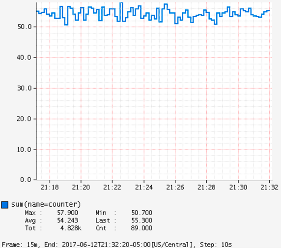

Figure 1. Counter over a positive-biased random walk.

```http
GET /api/v1/graph?
       q=
       name,counter,:eq,
       2,:lw
       &tz=US/Central
       &s=e-15m (1)
       &w=400 (2)
       &l=0 (3)
Host: localhost:7101
```

**1**

The range of time we want to visualize along the x-axis. `e` represents the end time or “now”. This graph’s axis is from 15 minutes ago until now. Atlas automatically chooses the finest grained step interval available from the data that would render at least 1px wide on the resultant image.

**2**

The overall width of the PNG image returned should be 400px.

**3**

Set the y-axis lower limit to 0 so that random perturbation in the walk does not look so dramatic.

<a id="implementations-atlas--_timers"></a>
<a id="implementations-atlas--3.2.-timers"></a>

### 3.2. Timers

While reading directly from a `Timer` returns a `double`, the underlying value is
stored in [Spectator](https://github.com/netflix/spectator) as a nanosecond-precise `long`. What precision is lost by
converting to a `double` in the `Timer` interface does not affect a system like
Atlas, because it has been configured to read measurements from the underlying
Spectator `Timer` that Micrometer is hiding from you.

The Spectator Atlas `Timer` produces four time series, each with a different `statistic` tag:

- `count`: Rate of calls per second.
- `totalTime`: Rate of total time per second.
- `totalOfSquares`: Rate of total time squared per second (useful for standard deviation).
- `max`: The maximum amount recorded.

Therefore, you can achieve a throughput (requests/second) line with the following query:

```http
name,timer,:eq,statistic,count,:eq,:and
```

Notice that `statistic` is just a dimension that can be drilled down and selected like any other.

Furthermore, `totalTime/count` represents average latency and can be selected with a short-hand `:dist-avg` query, which selects the `totalTime` and `count` time series and performs the division for us:

```http
name,timer,:eq,:dist-avg
```

In the preceding example, you can see these two lines plotted on a single dual-axis graph.

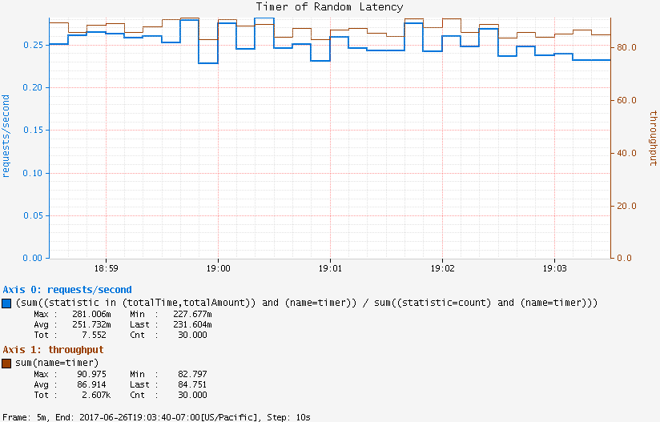

Figure 2. Timer over a simulated service.

<a id="implementations-atlas--_long_task_timers"></a>
<a id="implementations-atlas--3.3.-long-task-timers"></a>

### 3.3. Long Task Timers

Suppose we had a task that took two minutes to complete when it was expected to complete in less than 70 seconds. A key benefit of long task timers is the ability to receive an alert at the first reporting interval after we have exceeded the threshold. With a regular timer, we would not receive an alert until the first reporting interval after the process completed. If we had a ten-second publishing interval, the regular timer alert would arrive almost a minute after the long task timer alert.

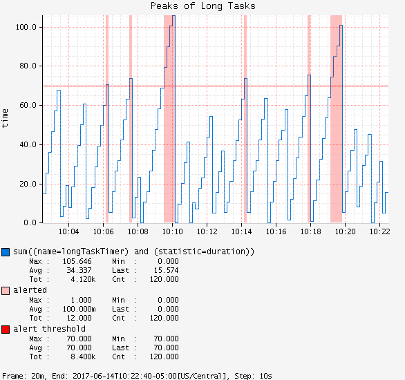

Figure 3. Simulated back-to-back long tasks.

```http
GET /api/v1/graph?
       q=
       name,longTaskTimer,:eq,statistic,duration,:eq,:and, (1)
       :dup,
       70,:gt,:vspan,f00,:color,40,:alpha,alerted,:legend, (2)
       70,f00,:color,alert+threshold,:legend (3)
       &tz=US/Central
       &s=e-15m
       &w=400
       &l=0
       &title=Peaks+of+Long+Tasks
       &ylabel=time
Host: localhost:7101
```

| **1** | A representation of long tasks that are happening back-to-back. |
| --- | --- |
| **2** | A vertical span that appears whenever the long task exceeds our threshold of 70 seconds. So that it does not overwhelm the graph, we also decrease the opacity of the vspan. |
| **3** | Plot the threshold of 70 seconds as a separate line. |

[AppOptics](https://docs.micrometer.io/micrometer/reference/implementations/appOptics.html)
[Azure Monitor](#implementations-azure-monitor)

---

<a id="implementations-azure-monitor"></a>

<!-- source_url: https://docs.micrometer.io/micrometer/reference/implementations/azure-monitor.html -->

<!-- page_index: 19 -->

# Micrometer Azure Monitor

<svg enable-background="new 0 0 32 32" id="Glyph" version="1.1" viewbox="0 0 32 32" xml:space="preserve" xmlns="http://www.w3.org/2000/svg" xmlns:xlink="http://www.w3.org/1999/xlink">
<path id="XMLID_223_"></path>
</svg>

Search

<a id="implementations-azure-monitor--page-title"></a>
<a id="implementations-azure-monitor--micrometer-azure-monitor"></a>

# Micrometer Azure Monitor

Azure Monitor is a dimensional time-series SaaS with built-in dashboarding.

<a id="implementations-azure-monitor--installing-micrometer-registry-azure-monitor"></a>
<a id="implementations-azure-monitor--1.-installing-micrometer-registry-azure-monitor"></a>

## 1. Installing micrometer-registry-azure-monitor

It is recommended to use the BOM provided by Micrometer (or your framework if any), you can see how to configure it [here](#installing). The examples below assume you are using a BOM.

<a id="implementations-azure-monitor--_gradle"></a>
<a id="implementations-azure-monitor--1.1.-gradle"></a>

### 1.1. Gradle

After the BOM is [configured](#installing), add the following dependency:

```groovy
implementation 'io.micrometer:micrometer-registry-azure-monitor'
```

> [!NOTE]
> The version is not needed for this dependency since it is defined by the BOM.

<a id="implementations-azure-monitor--_maven"></a>
<a id="implementations-azure-monitor--1.2.-maven"></a>

### 1.2. Maven

After the BOM is [configured](#installing), add the following dependency:

```xml
<dependency>
  <groupId>io.micrometer</groupId>
  <artifactId>micrometer-registry-azure-monitor</artifactId>
</dependency>
```

> [!NOTE]
> The version is not needed for this dependency since it is defined by the BOM.

<a id="implementations-azure-monitor--_configuring"></a>
<a id="implementations-azure-monitor--2.-configuring"></a>

## 2. Configuring

The following example configures a Micrometer Azure Monitor:

```java
AzureMonitorConfig azureMonitorConfig = new AzureMonitorConfig() {@Override public String instrumentationKey() {return MY_KEY;}
@Override public String get(String key) {return null;} }; MeterRegistry registry = new AzureMonitorMeterRegistry(azureMonitorConfig, Clock.SYSTEM);
```

`AzureMonitorConfig` is an interface with a set of default methods. If, in the implementation of `get(String k)`, rather than returning `null`, you instead bind it to a property source, you can override the default configuration. For example, Micrometer’s Spring Boot support binds properties that are prefixed with `management.metrics.export.azure-monitor` directly to the `AzureMonitorConfig`:

```yml
management.metrics.export.azure-monitor:
    instrumentation-key: YOURKEY

    # You will probably want disable Azure Monitor publishing in a local development profile.
    enabled: true

    # The interval at which metrics are sent to Azure Monitor. The default is 1 minute.
    step: 1m
```

[Atlas](#implementations-atlas)
[CloudWatch](#implementations-cloudwatch)

---

<a id="implementations-cloudwatch"></a>

<!-- source_url: https://docs.micrometer.io/micrometer/reference/implementations/cloudwatch.html -->

<!-- page_index: 20 -->

# Micrometer CloudWatch

<svg enable-background="new 0 0 32 32" id="Glyph" version="1.1" viewbox="0 0 32 32" xml:space="preserve" xmlns="http://www.w3.org/2000/svg" xmlns:xlink="http://www.w3.org/1999/xlink">
<path id="XMLID_223_"></path>
</svg>

Search

<a id="implementations-cloudwatch--page-title"></a>
<a id="implementations-cloudwatch--micrometer-cloudwatch"></a>

# Micrometer CloudWatch

[Amazon CloudWatch](https://aws.amazon.com/cloudwatch/) is a dimensional time-series SaaS on Amazon’s cloud.

<a id="implementations-cloudwatch--installing-micrometer-registry-cloudwatch2"></a>
<a id="implementations-cloudwatch--1.-installing-micrometer-registry-cloudwatch2"></a>

## 1. Installing micrometer-registry-cloudwatch2

It is recommended to use the BOM provided by Micrometer (or your framework if any), you can see how to configure it [here](#installing). The examples below assume you are using a BOM.

<a id="implementations-cloudwatch--_gradle"></a>
<a id="implementations-cloudwatch--1.1.-gradle"></a>

### 1.1. Gradle

After the BOM is [configured](#installing), add the following dependency:

```groovy
implementation 'io.micrometer:micrometer-registry-cloudwatch2'
```

> [!NOTE]
> The version is not needed for this dependency since it is defined by the BOM.

<a id="implementations-cloudwatch--_maven"></a>
<a id="implementations-cloudwatch--1.2.-maven"></a>

### 1.2. Maven

After the BOM is [configured](#installing), add the following dependency:

```xml
<dependency>
  <groupId>io.micrometer</groupId>
  <artifactId>micrometer-registry-cloudwatch2</artifactId>
</dependency>
```

> [!NOTE]
> The version is not needed for this dependency since it is defined by the BOM.

<a id="implementations-cloudwatch--_configuring"></a>
<a id="implementations-cloudwatch--2.-configuring"></a>

## 2. Configuring

The following example configures Micrometer CloudWatch:

```java
CloudWatchConfig cloudWatchConfig = new CloudWatchConfig() {@Override public String get(String s) {return null;}
@Override public String namespace() {return "mynamespace";} }; MeterRegistry meterRegistry = new CloudWatchMeterRegistry(cloudWatchConfig, Clock.SYSTEM, CloudWatchAsyncClient.create());
```

You can provide your own `CloudWatchAsyncClient` to the constructor of the registry.

`CloudWatchConfig` is an interface with a set of default methods. If, in the implementation of `get(String k)`, rather than returning `null`, you instead bind it to a property source, you can override the default configuration. For example, [Micrometer support in Spring Cloud AWS](https://docs.awspring.io/spring-cloud-aws/docs/3.1.0/reference/html/index.html#cloudwatch-metrics) binds properties prefixed with `management.metrics.export.cloudwatch` directly to the `CloudWatchConfig`:

```yml
management.metrics.export.cloudwatch:
    namespace: YOURNAMESPACE

    # You will probably want to disable publishing in a local development profile.
    enabled: true

    # The interval at which metrics are sent to CloudWatch. The default is 1 minute.
    step: 1m
```

[Azure Monitor](#implementations-azure-monitor)
[Datadog](#implementations-datadog)

---

<a id="implementations-datadog"></a>

<!-- source_url: https://docs.micrometer.io/micrometer/reference/implementations/datadog.html -->

<!-- page_index: 21 -->

# Micrometer Datadog

<svg enable-background="new 0 0 32 32" id="Glyph" version="1.1" viewbox="0 0 32 32" xml:space="preserve" xmlns="http://www.w3.org/2000/svg" xmlns:xlink="http://www.w3.org/1999/xlink">
<path id="XMLID_223_"></path>
</svg>

Search

<a id="implementations-datadog--page-title"></a>
<a id="implementations-datadog--micrometer-datadog"></a>

# Micrometer Datadog

Datadog is a dimensional time-series SaaS with built-in dashboarding and alerting.

<a id="implementations-datadog--_installation_and_configuration"></a>
<a id="implementations-datadog--1.-installation-and-configuration"></a>

## 1. Installation and Configuration

Micrometer supports shipping metrics to Datadog directly by using its HTTP API or by using DogStatsD through the [StatsD registry](#implementations-statsd).
If you can choose between the two, the API approach is far more efficient.

> [!NOTE]
> If you encounter a rate limit problem with the Datadog API approach, try the DogStatsD approach or one of [alternatives that are described in the Datadog documentation](https://docs.datadoghq.com/metrics/guide/micrometer/).

It is recommended to use the BOM provided by Micrometer (or your framework if any), you can see how to configure it [here](#installing). The examples below assume you are using a BOM.

<a id="implementations-datadog--_direct_to_datadog_api_approach"></a>
<a id="implementations-datadog--1.1.-direct-to-datadog-api-approach"></a>

### 1.1. Direct to Datadog API Approach

<a id="implementations-datadog--_gradle"></a>
<a id="implementations-datadog--1.1.1.-gradle"></a>

#### 1.1.1. Gradle

After the BOM is [configured](#installing), add the following dependency:

```groovy
implementation 'io.micrometer:micrometer-registry-datadog'
```

> [!NOTE]
> The version is not needed for this dependency since it is defined by the BOM.

<a id="implementations-datadog--_maven"></a>
<a id="implementations-datadog--1.1.2.-maven"></a>

#### 1.1.2. Maven

After the BOM is [configured](#installing), add the following dependency:

```xml
<dependency>
  <groupId>io.micrometer</groupId>
  <artifactId>micrometer-registry-datadog</artifactId>
</dependency>
```

> [!NOTE]
> The version is not needed for this dependency since it is defined by the BOM.

Metrics are rate-aggregated and pushed to `datadoghq` on a periodic interval. Rate aggregation performed by the registry yields datasets that are similar to those produced by `dogstatsd`.

```java
DatadogConfig config = new DatadogConfig() {@Override public Duration step() {return Duration.ofSeconds(10);}
@Override public String get(String k) {return null; // accept the rest of the defaults} }; MeterRegistry registry = new DatadogMeterRegistry(config, Clock.SYSTEM);
```

`DatadogConfig` is an interface with a set of default methods.
If, in the implementation of `get(String k)`, rather than returning `null`, you instead bind it to a property source, you can override the default configuration through properties.
For example, Spring Boot’s Micrometer support binds properties directly to the `DatadogConfig`.
See the [Datadog](https://docs.spring.io/spring-boot/docs/current/reference/htmlsingle/#actuator.metrics.export.datadog) section in the Spring Boot reference documentation.

`DatadogConfig.hostTag()` specifies a tag key that is mapped to [the `host` field](https://docs.datadoghq.com/api/v1/metrics/#submit-metrics) when shipping metrics to Datadog.
For example, if `DatadogConfig.hostTag()` returns `host`, the tag having `host` as its key is used.
You can set the tag by using common tags, as follows:

```java
registry.config().commonTags("host", "my-host");
```

`uri` is an important property to configure.
The default value is `api.datadoghq.com`.
Depending on the Datadog site (region), the api endpoint will be different.
To find your the correct `uri` for your account, do the following:

1. Read about the [Datadog site](https://docs.datadoghq.com/getting_started/site/).
2. Go to the [Metrics API reference](https://docs.datadoghq.com/api/latest/metrics/) and select your own option from the "DATADOG SITE" dropdown.
3. Check any API request’s endpoint.

For example, for the `US5` site, the correct API endpoint is `api.us5.datadoghq.com`. For the `US3` site, it is `api.us3.datadoghq.com`.

<a id="implementations-datadog--_through_dogstatsd_approach"></a>
<a id="implementations-datadog--1.2.-through-dogstatsd-approach"></a>

### 1.2. Through DogStatsD Approach

<a id="implementations-datadog--_gradle_2"></a>
<a id="implementations-datadog--1.2.1.-gradle"></a>

#### 1.2.1. Gradle

After the BOM is [configured](#installing), add the following dependency:

```groovy
implementation 'io.micrometer:micrometer-registry-statsd'
```

> [!NOTE]
> The version is not needed for this dependency since it is defined by the BOM.

<a id="implementations-datadog--_maven_2"></a>
<a id="implementations-datadog--1.2.2.-maven"></a>

#### 1.2.2. Maven

After the BOM is [configured](#installing)d, add the following dependency:

```xml
<dependency>
  <groupId>io.micrometer</groupId>
  <artifactId>micrometer-registry-statsd</artifactId>
</dependency>
```

> [!NOTE]
> The version is not needed for this dependency since it is defined by the BOM.

Metrics are immediately shipped to DogStatsD using Datadog’s flavor of the StatsD line protocol. `java-dogstatsd-client` is *not* needed on the classpath for this to work, as Micrometer uses its own implementation.

```java
StatsdConfig config = new StatsdConfig() {@Override public String get(String k) {return null;}
@Override public StatsdFlavor flavor() {return StatsdFlavor.DATADOG;} };
MeterRegistry registry = new StatsdMeterRegistry(config, Clock.SYSTEM);
```

If the `DD_ENTITY_ID` environment variable is properly set, Micrometer supports DogStatsD’s [origin detection over UDP](https://docs.datadoghq.com/developers/dogstatsd/?tab=kubernetes#origin-detection-over-udp) feature on Kubernetes.

Micrometer, by default, publishes `Timer` meters to DogStatsD as the StatsD “timing” metric type, `ms`.
These meters are sent to Datadog as [histogram](https://docs.datadoghq.com/metrics/types/?tab=histogram#metric-types) type metrics.
Also, by default, Micrometer publishes `DistributionSummary` meters as histogram type metrics.

When `percentileHistogram` is enabled for the meter, Micrometer sends `Timer` and `DistributionSummary` meters as Datadog [Distributions](https://docs.datadoghq.com/metrics/distributions) to DogStatsD.
You can make a `DistributionSummary` with `percentileHistogram` enabled, as follows:

```java
DistributionSummary responseSizeSummary = DistributionSummary.builder("http.server.response.size")
        .baseUnit("bytes")
        .publishPercentileHistogram()
        .register(registry);
```

[CloudWatch](#implementations-cloudwatch)
[Dynatrace](https://docs.micrometer.io/micrometer/reference/implementations/dynatrace.html)

---

<a id="implementations-elastic"></a>

<!-- source_url: https://docs.micrometer.io/micrometer/reference/implementations/elastic.html -->

<!-- page_index: 22 -->

# Micrometer Elastic

<svg enable-background="new 0 0 32 32" id="Glyph" version="1.1" viewbox="0 0 32 32" xml:space="preserve" xmlns="http://www.w3.org/2000/svg" xmlns:xlink="http://www.w3.org/1999/xlink">
<path id="XMLID_223_"></path>
</svg>

Search

<a id="implementations-elastic--page-title"></a>
<a id="implementations-elastic--micrometer-elastic"></a>

# Micrometer Elastic

Elasticsearch is an open source search and analytics platform. Metrics stored in Elasticsearch can be visualized in Kibana.

<a id="implementations-elastic--installing-micrometer-registry-elastic"></a>
<a id="implementations-elastic--1.-installing-micrometer-registry-elastic"></a>

## 1. Installing micrometer-registry-elastic

It is recommended to use the BOM provided by Micrometer (or your framework if any), you can see how to configure it [here](#installing). The examples below assume you are using a BOM.

<a id="implementations-elastic--_gradle"></a>
<a id="implementations-elastic--1.1.-gradle"></a>

### 1.1. Gradle

After the BOM is [configured](#installing), add the following dependency:

```groovy
implementation 'io.micrometer:micrometer-registry-elastic'
```

> [!NOTE]
> The version is not needed for this dependency since it is defined by the BOM.

<a id="implementations-elastic--_maven"></a>
<a id="implementations-elastic--1.2.-maven"></a>

### 1.2. Maven

After the BOM is [configured](#installing), add the following dependency:

```xml
<dependency>
  <groupId>io.micrometer</groupId>
  <artifactId>micrometer-registry-elastic</artifactId>
</dependency>
```

> [!NOTE]
> The version is not needed for this dependency since it is defined by the BOM.

<a id="implementations-elastic--_configuring"></a>
<a id="implementations-elastic--2.-configuring"></a>

## 2. Configuring

The following example configures an ElasticSearch instance:

```java
ElasticConfig elasticConfig = new ElasticConfig() {
    @Override
    public @Nullable String get(String k) {
        return null;
    }
};
MeterRegistry registry = new ElasticMeterRegistry(elasticConfig, Clock.SYSTEM);
```

`ElasticConfig` is an interface with a set of default methods. If, in the implementation of `get(String k)`, rather than returning `null`, you instead bind it to a property source, you can override the default configuration. For example, Micrometer’s Spring Boot support binds properties that are prefixed with `management.metrics.export.elastic` directly to the `ElasticConfig`:

```yml
management.metrics.export.elastic:
    # You will probably want disable Elastic publishing in a local development profile.
    enabled: true

    # The interval at which metrics are sent to Elastic. The default is 1 minute.
    step: 1m

    # The index to store metrics in, defaults to "micrometer-metrics"
    index: micrometer-metrics
```

<a id="implementations-elastic--_elastic_apm_agent_integration"></a>
<a id="implementations-elastic--3.-elastic-apm-agent-integration"></a>

## 3. Elastic APM agent integration

If you are using the Elastic APM agent, it can automatically collect metrics from Micrometer `MeterRegistry` instances. If you want only metrics collected by the Elastic APM agent and not shipped anywhere else, you can use the `SimpleMeterRegistry`. See the [Elastic docs](https://www.elastic.co/guide/en/apm/agent/java/current/metrics.html#metrics-micrometer) for more details.

[Dynatrace](https://docs.micrometer.io/micrometer/reference/implementations/dynatrace.html)
[Ganglia](https://docs.micrometer.io/micrometer/reference/implementations/ganglia.html)

---

<a id="implementations-graphite"></a>

<!-- source_url: https://docs.micrometer.io/micrometer/reference/implementations/graphite.html -->

<!-- page_index: 23 -->

# Micrometer Graphite

<svg enable-background="new 0 0 32 32" id="Glyph" version="1.1" viewbox="0 0 32 32" xml:space="preserve" xmlns="http://www.w3.org/2000/svg" xmlns:xlink="http://www.w3.org/1999/xlink">
<path id="XMLID_223_"></path>
</svg>

Search

<a id="implementations-graphite--page-title"></a>
<a id="implementations-graphite--micrometer-graphite"></a>

# Micrometer Graphite

Graphite is one of the most popular current hierarchical metrics systems backed by a fixed-size database, similar in design and purpose to RRDtool. It originated at Orbitz in 2006 and was open sourced in 2008.

<a id="implementations-graphite--installing-micrometer-registry-graphite"></a>
<a id="implementations-graphite--1.-installing-micrometer-registry-graphite"></a>

## 1. Installing micrometer-registry-graphite

It is recommended to use the BOM provided by Micrometer (or your framework if any), you can see how to configure it [here](#installing). The examples below assume you are using a BOM.

<a id="implementations-graphite--_gradle"></a>
<a id="implementations-graphite--1.1.-gradle"></a>

### 1.1. Gradle

After the BOM is [configured](#installing), add the following dependency:

```groovy
implementation 'io.micrometer:micrometer-registry-graphite'
```

> [!NOTE]
> The version is not needed for this dependency since it is defined by the BOM.

<a id="implementations-graphite--_maven"></a>
<a id="implementations-graphite--1.2.-maven"></a>

### 1.2. Maven

After the BOM is [configured](#installing), add the following dependency:

```xml
<dependency>
  <groupId>io.micrometer</groupId>
  <artifactId>micrometer-registry-graphite</artifactId>
</dependency>
```

> [!NOTE]
> The version is not needed for this dependency since it is defined by the BOM.

<a id="implementations-graphite--_configuring"></a>
<a id="implementations-graphite--2.-configuring"></a>

## 2. Configuring

The following example configures a Graphite instance:

```java
GraphiteConfig graphiteConfig = new GraphiteConfig() {@Override public String host() {return "mygraphitehost";}
@Override public String get(String k) {return null; // accept the rest of the defaults} };
MeterRegistry registry = new GraphiteMeterRegistry(graphiteConfig, Clock.SYSTEM, HierarchicalNameMapper.DEFAULT);
```

Micrometer uses Dropwizard Metrics as the underlying instrumentation library when recording metrics destined for Graphite. `GraphiteConfig` is an interface with a set of default methods. If, in the implementation of `get(String k)`, rather than returning `null`, you instead bind it to a property source, you can override the default configuration. For example, Spring Boot’s Micrometer support binds its application properties directly to the `GraphiteConfig`. See [Spring Boot Reference Documentation](https://docs.spring.io/spring-boot/docs/current/reference/htmlsingle/#actuator.metrics.export.graphite) for details.

<a id="implementations-graphite--_graphite_tag_support"></a>
<a id="implementations-graphite--3.-graphite-tag-support"></a>

## 3. Graphite Tag Support

As of Micrometer version 1.4.0, Micrometer supports exporting Graphite metrics by using tags instead of the traditional hierarchical format. By default, metrics are exported by using the tag format, unless any `tagsAsPrefix` values are configured.
[Tag support](https://graphite.readthedocs.io/en/latest/tags.html) was added to Graphite in the 1.1.0 Graphite release.
If you wish to revert to the traditional hierarchical format, ensure that the `graphiteTagsEnabled` config value is set to `false`.
The following documentation sections on hierarchical name mapping and metrics prefixing are only applicable if tag support is disabled.

<a id="implementations-graphite--_hierarchical_name_mapping"></a>
<a id="implementations-graphite--4.-hierarchical-name-mapping"></a>

## 4. Hierarchical name mapping

Micrometer provides a `HierarchicalNameMapper` interface that governs how a dimensional meter ID is mapped to flat hierarchical names.

The default (`HierarchicalNameMapper.DEFAULT`) sorts tags alphabetically by key and appends tag key/value pairs to the base meter name with '.' — for example, `http_server_requests.method.GET.response.200`. The name and tag keys have the registry’s naming convention applied to them first.

If there is something special about your naming scheme that you need to honor, you can provide your own `HierarchicalNameMapper` implementation. The most common cause of a custom mapper comes from a need to prefix something to the front of every metric (generally something like `app.<name>.http_server_requests.method.GET.response.200`).

<a id="implementations-graphite--_prefixing_your_metrics"></a>
<a id="implementations-graphite--5.-prefixing-your-metrics"></a>

## 5. Prefixing Your Metrics

To add a prefix to all metrics that go to graphite, use the `GraphiteConfig#tagsAsPrefix` configuration option. This option applies the tag value of a set of common tags as a prefix. For example, if `tagsAsPrefix` contains `application`, and a meter named `myTimer` is created with a tag of `application=APPNAME`, it appears in Graphite as `APPNAME.myTimer`.

Generally, when you use `tagsAsPrefix`, you should add common tags to the registry so that the tags are present on all meters that belong to that registry:

```java
@Bean
public MeterRegistryCustomizer<MeterRegistry> commonTags() {
   return r -> r.config().commonTags("application", "APPNAME");
}
```

We do it this way because, generally, a tag prefix in Graphite is correlated to a common tag elsewhere. Prefixes tend to be something like app name or host. By applying those values as common tags, you make your metrics more portable (if you ever switch to a dimensional monitoring system, you are set).

You can use this when the order of the prefix matters. Micrometer always sorts tags, but the order of tag keys in `tagsAsPrefix` is preserved, so adding `host` and `application` to `tagsAsPrefix` results in a prefixed metric, such as `HOST.APP.myCounter`.

To meet your specific naming needs, you can also provide a custom hierarchical name mapper when creating `GraphiteMeterRegistry`, as follows:

```java
GraphiteMeterRegistry r = new GraphiteMeterRegistry(
            GraphiteConfig.DEFAULT,
            Clock.SYSTEM,
            (id, convention) -> "prefix." + HierarchicalNameMapper.DEFAULT.toHierarchicalName(id, convention));
```

> [!NOTE]
> If you use a custom `HierarchicalNameMapper`, `tagsAsPrefix` is ignored.

<a id="implementations-graphite--_further_customizing_the_graphitereporter"></a>
<a id="implementations-graphite--6.-further-customizing-the-graphitereporter"></a>

## 6. Further Customizing the `GraphiteReporter`

We give you the option to configure `GraphiteReporter` yourself if you need further customization. To do so, use this constructor and provide your own `GraphiteReporter`:

```java
GraphiteMeterRegistry(GraphiteConfig config, Clock clock, HierarchicalNameMapper nameMapper,
                      MetricRegistry metricRegistry, GraphiteReporter reporter)
```

<a id="implementations-graphite--_graphing"></a>
<a id="implementations-graphite--7.-graphing"></a>

## 7. Graphing

This section serves as a quick start to rendering useful representations in Graphite for metrics originating in Micrometer.

<a id="implementations-graphite--_counters"></a>
<a id="implementations-graphite--7.1.-counters"></a>

### 7.1. Counters

Graphite counters measure mean throughput and one-, five-, and fifteen-minute exponentially-weighted moving average throughputs.

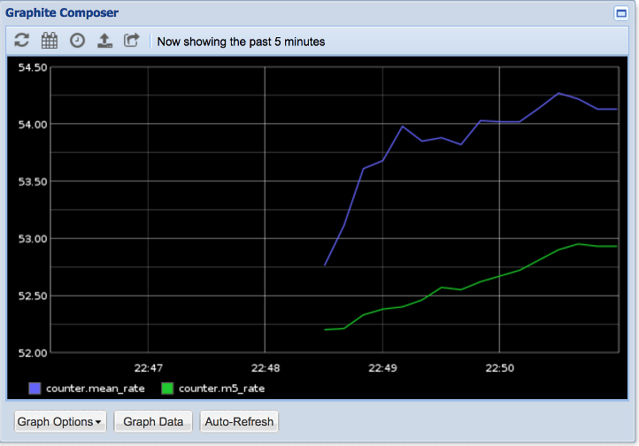

Figure 1. A Graphite rendered graph of the random walk counter.

[Ganglia](https://docs.micrometer.io/micrometer/reference/implementations/ganglia.html)
[Humio](#implementations-humio)

---

<a id="implementations-humio"></a>

<!-- source_url: https://docs.micrometer.io/micrometer/reference/implementations/humio.html -->

<!-- page_index: 24 -->

# Micrometer Humio

<svg enable-background="new 0 0 32 32" id="Glyph" version="1.1" viewbox="0 0 32 32" xml:space="preserve" xmlns="http://www.w3.org/2000/svg" xmlns:xlink="http://www.w3.org/1999/xlink">
<path id="XMLID_223_"></path>
</svg>

Search

<a id="implementations-humio--page-title"></a>
<a id="implementations-humio--micrometer-humio"></a>

# Micrometer Humio

Humio is a dimensional time-series SaaS with built-in dashboarding.

<a id="implementations-humio--installing-micrometer-registry-humio"></a>
<a id="implementations-humio--1.-installing-micrometer-registry-humio"></a>

## 1. Installing micrometer-registry-humio

It is recommended to use the BOM provided by Micrometer (or your framework if any), you can see how to configure it [here](#installing). The examples below assume you are using a BOM.

<a id="implementations-humio--_gradle"></a>
<a id="implementations-humio--1.1.-gradle"></a>

### 1.1. Gradle

After the BOM is [configured](#installing), add the following dependency:

```groovy
implementation 'io.micrometer:micrometer-registry-humio'
```

> [!NOTE]
> The version is not needed for this dependency since it is defined by the BOM.

<a id="implementations-humio--_maven"></a>
<a id="implementations-humio--1.2.-maven"></a>

### 1.2. Maven

After the BOM is [configured](#installing), add the following dependency:

```xml
<dependency>
  <groupId>io.micrometer</groupId>
  <artifactId>micrometer-registry-humio</artifactId>
</dependency>
```

> [!NOTE]
> The version is not needed for this dependency since it is defined by the BOM.

<a id="implementations-humio--_configuring"></a>
<a id="implementations-humio--2.-configuring"></a>

## 2. Configuring

The following example configures a Humio instance:

```java
HumioConfig humioConfig = new HumioConfig() {@Override public String apiToken() {return MY_TOKEN;}
@Override public @Nullable String get(String k) {return null;} }; MeterRegistry registry = new HumioMeterRegistry(humioConfig, Clock.SYSTEM);
```

`HumioConfig` is an interface with a set of default methods. If, in the implementation of `get(String k)`, rather than returning `null`, you instead bind it to a property source, you can override the default configuration. For example, Micrometer’s Spring Boot support binds properties that are prefixed with `management.metrics.export.humio` directly to the `HumioConfig`:

```yml
management.metrics.export.humio:
    api-token: YOURKEY

    # You will probably want disable Humio publishing in a local development profile.
    enabled: true

    # The interval at which metrics are sent to Humio. The default is 1 minute.
    step: 1m

    # The cluster Micrometer will send metrics to. The default is "https://cloud.humio.com"
    uri: https://myhumiohost
```

<a id="implementations-humio--_graphing"></a>
<a id="implementations-humio--3.-graphing"></a>

## 3. Graphing

This section serves as a quick start to rendering useful representations in Humio for metrics originating in Micrometer.

<a id="implementations-humio--_timers"></a>
<a id="implementations-humio--3.1.-timers"></a>

### 3.1. Timers

The Humio implementation of `Timer` produces four fields in Humio:

- `count`: Rate of total time/second.
- `sum`: Rate of calls/second.
- `max`: A sliding window that shows the maximum amount recorded.
- `avg`: A non-aggregable average for only this set of tag values.

The following query constructs a dimensionally aggregable average latency per URI:

```text
name = http_server_requests
| timechart(uri, function=max(avg))
```

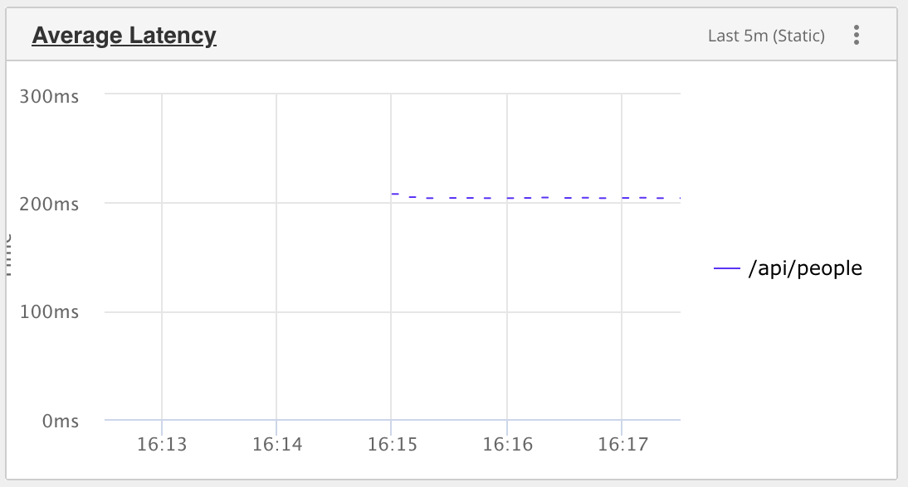

Figure 1. Timer over a simulated service.

[Graphite](#implementations-graphite)
[Influx](#implementations-influx)

---

<a id="implementations-influx"></a>

<!-- source_url: https://docs.micrometer.io/micrometer/reference/implementations/influx.html -->

<!-- page_index: 25 -->

# Micrometer Influx

<svg enable-background="new 0 0 32 32" id="Glyph" version="1.1" viewbox="0 0 32 32" xml:space="preserve" xmlns="http://www.w3.org/2000/svg" xmlns:xlink="http://www.w3.org/1999/xlink">
<path id="XMLID_223_"></path>
</svg>

Search

<a id="implementations-influx--page-title"></a>
<a id="implementations-influx--micrometer-influx"></a>

# Micrometer Influx

The InfluxData suite of tools supports real-time stream processing and storage of time-series data. It supports downsampling, automatically expiring and deleting unwanted data, as well as backup and restore.

The InfluxMeterRegistry supports the 1.x InfluxDB API as well as the v2 API.

<a id="implementations-influx--_installation_and_configuration"></a>
<a id="implementations-influx--1.-installation-and-configuration"></a>

## 1. Installation and Configuration

Micrometer supports shipping metrics to InfluxDB directly or through Telegraf through the StatsD registry.

It is recommended to use the BOM provided by Micrometer (or your framework if any), you can see how to configure it [here](#installing). The examples below assume you are using a BOM.

<a id="implementations-influx--_direct_to_influxdb"></a>
<a id="implementations-influx--1.1.-direct-to-influxdb"></a>

### 1.1. Direct to InfluxDB

<a id="implementations-influx--_gradle"></a>
<a id="implementations-influx--1.1.1.-gradle"></a>

#### 1.1.1. Gradle

After the BOM is [configured](#installing), add the following dependency:

```groovy
implementation 'io.micrometer:micrometer-registry-influx'
```

> [!NOTE]
> The version is not needed for this dependency since it is defined by the BOM.

<a id="implementations-influx--_maven"></a>
<a id="implementations-influx--1.1.2.-maven"></a>

#### 1.1.2. Maven

After the BOM is [configured](#installing), add the following dependency:

```xml
<dependency>
  <groupId>io.micrometer</groupId>
  <artifactId>micrometer-registry-influx</artifactId>
</dependency>
```

> [!NOTE]
> The version is not needed for this dependency since it is defined by the BOM.

Metrics are rate-aggregated and pushed to InfluxDB on a periodic interval. Rate aggregation performed by the registry yields datasets that are quite similar to those produced by Telegraf. The following example configures a meter registry for InfluxDB:

InfluxDB 1.x configuration example

```java
InfluxConfig config = new InfluxConfig() {@Override public Duration step() {return Duration.ofSeconds(10);}
@Override public String db() {return "mydb";}
@Override public String get(String k) {return null; // accept the rest of the defaults} }; MeterRegistry registry = new InfluxMeterRegistry(config, Clock.SYSTEM);
```

To ship metrics to InfluxDB 2.x, make sure to configure the `org` and `bucket` to which to write the metrics, as well as the authentication `token`:

InfluxDB v2 configuration example

```java
InfluxConfig config = new InfluxConfig() {
@Override public String org() {return "myorg";}
@Override public String bucket() {return "app-metrics";}
@Override public String token() {return "auth_token_here"; // FIXME: This should be securely bound rather than hard-coded, of course.}
@Override public String get(String k) {return null; // accept the rest of the defaults} }; MeterRegistry registry = new InfluxMeterRegistry(config, Clock.SYSTEM);
```

`InfluxConfig` is an interface with a set of default methods. If, in the implementation of `get(String k)`, rather than returning `null`, you instead bind it to a property source, you can override the default configuration. For example, Micrometer’s Spring Boot support binds properties that are prefixed with `management.metrics.export.influx` directly to the `InfluxConfig`:

```yaml
management.metrics.export.influx:
    api-version: v2 # API version of InfluxDB to use. Defaults to 'v1' unless an org is configured. If an org is configured, defaults to 'v2'.
    auto-create-db: true # Whether to create the InfluxDB database if it does not exist before attempting to publish metrics to it. InfluxDB v1 only. (Default: true)
    batch-size: 10000 # Number of measurements per request to use for this backend. If more measurements are found, then multiple requests will be made. (Default: 10000)
    bucket: mybucket # Bucket for metrics. Use either the bucket name or ID. Defaults to the value of the db property if not set. InfluxDB v2 only.
    compressed: true # Whether to enable GZIP compression of metrics batches published to InfluxDB. (Default: true)
    connect-timeout: 1s # Connection timeout for requests to this backend. (Default: 1s)
    consistency: one # Write consistency for each point. (Default: one)
    db: mydb # Database to send metrics to. InfluxDB v1 only. (Default: mydb)
    enabled: true # Whether exporting of metrics to this backend is enabled. (Default: true)
    num-threads: 2 # Number of threads to use with the metrics publishing scheduler. (Default: 2)
    org: myorg # Org to write metrics to. InfluxDB v2 only.
    password: mysecret # Login password of the InfluxDB server. InfluxDB v1 only.
    read-timeout: 10s # Read timeout for requests to this backend. (Default: 10s)
    retention-policy: my_rp # Retention policy to use (InfluxDB writes to the DEFAULT retention policy if one is not specified). InfluxDB v1 only.
    step: 1m # Step size (i.e. reporting frequency) to use. (Default: 1m)
    token: AUTH_TOKEN_HERE # Authentication token to use with calls to the InfluxDB backend. For InfluxDB v1, the Bearer scheme is used. For v2, the Token scheme is used.
    uri: http://localhost:8086 # URI of the InfluxDB server. (Default: http://localhost:8086)
    user-name: myusername # Login user of the InfluxDB server. InfluxDB v1 only.
```

<a id="implementations-influx--_through_telegraf"></a>
<a id="implementations-influx--1.2.-through-telegraf"></a>

### 1.2. Through Telegraf

Telegraf is a StatsD agent that expects a modified flavor of the StatsD line protocol.

<a id="implementations-influx--_gradle_2"></a>
<a id="implementations-influx--1.2.1.-gradle"></a>

#### 1.2.1. Gradle

After the BOM is [configured](#installing), add the following dependency:

```groovy
implementation 'io.micrometer:micrometer-registry-statsd'
```

> [!NOTE]
> The version is not needed for this dependency since it is defined by the BOM.

<a id="implementations-influx--_maven_2"></a>
<a id="implementations-influx--1.2.2.-maven"></a>

#### 1.2.2. Maven

After the BOM is [configured](#installing), add the following dependency:

```xml
<dependency>
  <groupId>io.micrometer</groupId>
  <artifactId>micrometer-registry-statsd</artifactId>
</dependency>
```

> [!NOTE]
> The version is not needed for this dependency since it is defined by the BOM.

Metrics are shipped immediately over UDP to Telegraf by using Telegraf’s flavor of the StatsD line protocol:

```java
StatsdConfig config = new StatsdConfig() {@Override public String get(String k) {return null;}
@Override public StatsdFlavor flavor() {return StatsdFlavor.Telegraf;} };
MeterRegistry registry = new StatsdMeterRegistry(config, Clock.SYSTEM);
```

[Humio](#implementations-humio)
[Instana](#implementations-instana)

---

<a id="implementations-instana"></a>

<!-- source_url: https://docs.micrometer.io/micrometer/reference/implementations/instana.html -->

<!-- page_index: 26 -->

# Micrometer Instana

<svg enable-background="new 0 0 32 32" id="Glyph" version="1.1" viewbox="0 0 32 32" xml:space="preserve" xmlns="http://www.w3.org/2000/svg" xmlns:xlink="http://www.w3.org/1999/xlink">
<path id="XMLID_223_"></path>
</svg>

Search

<a id="implementations-instana--page-title"></a>
<a id="implementations-instana--micrometer-instana"></a>

# Micrometer Instana

Instana is an automatic application performance management and infrastructure monitoring system.

<a id="implementations-instana--_installation_and_configuration"></a>
<a id="implementations-instana--1.-installation-and-configuration"></a>

## 1. Installation and Configuration

Instana automatically detects and reports all metrics without the need of any additional dependency or configuration.
It does so by detecting all instances of `io.micrometer.core.instrument.MeterRegistry` and collecting all registered `io.micrometer.core.instrument.Meter` instances from them.

You can run the Instana agent alongside your application by using Micrometer, and the Instana agent automatically monitors it.

<a id="implementations-instana--_supported_metrics"></a>
<a id="implementations-instana--2.-supported-metrics"></a>

## 2. Supported Metrics

- **Timer**: The total time of recorded events, scaled to milliseconds.
- **Counter**: The cumulative count since this counter was created.
- **Gauge**: The current value.
- **DistributionSummary**: The total number of all recorded events.
- **LongTaskTimer**: The current number of tasks being executed.
- **FunctionCounter**: The cumulative count since this counter was created.
- **FunctionTimer**: The total time of all occurrences of the timed event.
- **TimeGauge**: The current value, scaled to the appropriate base unit.

The metrics show up on the Java Virtual Machine dashboard in Instana. You can configure alerting based on these metrics.

[Influx](#implementations-influx)
[JMX](https://docs.micrometer.io/micrometer/reference/implementations/jmx.html)

---

<a id="implementations-new-relic"></a>

<!-- source_url: https://docs.micrometer.io/micrometer/reference/implementations/new-relic.html -->

<!-- page_index: 27 -->

# Micrometer New Relic

<svg enable-background="new 0 0 32 32" id="Glyph" version="1.1" viewbox="0 0 32 32" xml:space="preserve" xmlns="http://www.w3.org/2000/svg" xmlns:xlink="http://www.w3.org/1999/xlink">
<path id="XMLID_223_"></path>
</svg>

Search

<a id="implementations-new-relic--page-title"></a>
<a id="implementations-new-relic--micrometer-new-relic"></a>

# Micrometer New Relic

New Relic offers a dimensional monitoring system product called Insights. It includes a full UI and a query language called NRQL. New Relic Insights operates on a push model. Some features of NRQL assume that Insights receives a distinct event payload for every timing, count, and so on. Micrometer instead ships aggregates at a prescribed interval, letting your app’s throughput scale without concern for event propagation to Insights becoming a bottleneck.

> [!NOTE]
> New Relic provides its own Micrometer `MeterRegistry` implementation based on dimensional metrics.
> It intends to supersede Micrometer’s `NewRelicMeterRegistry` (which uses custom events in New Relic), because New Relic’s dimensional metrics are a better fit for metrics than custom events.
> You can find more details in [its GitHub repository](https://github.com/newrelic/micrometer-registry-newrelic).

<a id="implementations-new-relic--installing-micrometer-registry-new-relic"></a>
<a id="implementations-new-relic--1.-installing-micrometer-registry-new-relic"></a>

## 1. Installing micrometer-registry-new-relic

It is recommended to use the BOM provided by Micrometer (or your framework if any), you can see how to configure it [here](#installing). The examples below assume you are using a BOM.

<a id="implementations-new-relic--_gradle"></a>
<a id="implementations-new-relic--1.1.-gradle"></a>

### 1.1. Gradle

After the BOM is [configured](#installing), add the following dependency:

```groovy
implementation 'io.micrometer:micrometer-registry-new-relic'
```

> [!NOTE]
> The version is not needed for this dependency since it is defined by the BOM.

<a id="implementations-new-relic--_maven"></a>
<a id="implementations-new-relic--1.2.-maven"></a>

### 1.2. Maven

After the BOM is [configured](#installing), add the following dependency:

```xml
<dependency>
  <groupId>io.micrometer</groupId>
  <artifactId>micrometer-registry-new-relic</artifactId>
</dependency>
```

> [!NOTE]
> The version is not needed for this dependency since it is defined by the BOM.

<a id="implementations-new-relic--_configuring"></a>
<a id="implementations-new-relic--2.-configuring"></a>

## 2. Configuring

The following example configures New Relic:

```java
NewRelicConfig newRelicConfig = new NewRelicConfig() {@Override public String accountId() {return "MYACCOUNT";}
@Override public String apiKey() {return "MY_INSIGHTS_API_KEY";}
@Override public String get(String k) {return null; // accept the rest of the defaults} };
MeterRegistry registry = new NewRelicMeterRegistry(newRelicConfig, Clock.SYSTEM);
```

There are two distinct sources of API keys in New Relic.

`NewRelicConfig` is an interface with a set of default methods. If, in the implementation of `get(String k)`, rather than returning `null`, you instead bind it to a property source, you can override the default configuration. For example, Micrometer’s Spring Boot support binds properties that are prefixed with `management.metrics.export.newrelic` directly to the `NewRelicConfig`:

```yml
management.metrics.export.newrelic:
    account-id: MYACCOUNT
    api-key: MY_INSIGHTS_API_KEY

    # The interval at which metrics are sent to New Relic. See Duration.parse for the expected format.
    # The default is 1 minute.
    step: 1m
```

<a id="implementations-new-relic--_graphing"></a>
<a id="implementations-new-relic--3.-graphing"></a>

## 3. Graphing

This section serves as a quick start to rendering useful representations in New Relic for metrics originating in Micrometer. See the [New Relic NRQL docs](https://docs.newrelic.com/docs/insights/nrql-new-relic-query-language/using-nrql/introduction-nrql) for a far more complete reference of what is possible in New Relic.

<a id="implementations-new-relic--_timers"></a>
<a id="implementations-new-relic--3.1.-timers"></a>

### 3.1. Timers

At each publishing interval, the New Relic `Timer` produces a single event with the timer’s name and several attributes:

- `avg`: A mean latency for the publishing interval.
- `count`: Throughput per second over the publishing interval.
- `totalTime`: Total time per second over the publishing interval (used with `count`) to create aggregable means.

Additionally, if any percentiles or SLO buckets are defined on the timer, additional events are produced:

- `${name}.percentiles`: Micrometer calculated percentiles for the publishing interval. One event is produced for each percentile, with a tag of `phi` in the range of [0,1].
- `${name}.histogram`: One event is produced for each SLO boundary with a tag of 'le', indicating that it represents a cumulative count of events less than or equal to SLO boundaries over the publishing interval.

To generate an aggregable view of latency in New Relic, divide `totalTime` by `count`:

```sql
SELECT sum(totalTime)/sum(count) as 'Average Latency', max(max) as 'Max' FROM timer since 30 minutes ago TIMESERIES auto
```

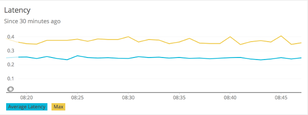

Figure 1. Timer latency.

The following example generates a throughput chart:

```sql
SELECT average(count) as 'Average Throughput' FROM timer since 30 minutes ago TIMESERIES auto
```

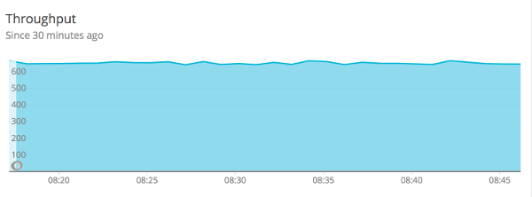

Figure 2. Timer throughput.

The following example generates a plot of client-side percentiles:

```sql
SELECT latest(value) from timerPercentile FACET phi since 30 minutes ago TIMESERIES auto
```

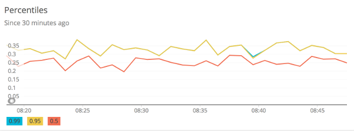

Figure 3. Timer Percentiles.

Note how these percentiles are *not aggregable*. We have selected the `latest(value)` function to display this chart (it is not correct to `average(value)` on a percentile value). The more dimensions you add to a timer, the less useful these values become.

Finally, if you define SLO boundaries with the fluent builder for `Timer`, you can view throughput below certain SLO boundaries. In this example, we set SLO boundaries at 275 (yellow), 300 (red), and 500 (blue) milliseconds for a simulated `Timer` that is recording samples normally distributed around 250 ms. These counts represent the rate/second of samples less than or equal to each SLO boundary.

```sql
SELECT sum(value) from timerHistogram FACET le since 30 minutes ago TIMESERIES auto
```

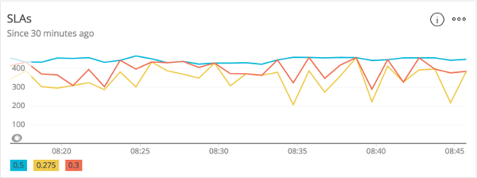

Figure 4. Timer SLO boundaries.

Where the lines converge at various points, it is evident that no sample exceeded the 275 ms SLO boundary.

[KairosDB](https://docs.micrometer.io/micrometer/reference/implementations/kairos.html)
[OpenTelemetry Protocol (OTLP)](https://docs.micrometer.io/micrometer/reference/implementations/otlp.html)

---

<a id="implementations-prometheus"></a>

<!-- source_url: https://docs.micrometer.io/micrometer/reference/implementations/prometheus.html -->

<!-- page_index: 28 -->

# Micrometer Prometheus

<svg enable-background="new 0 0 32 32" id="Glyph" version="1.1" viewbox="0 0 32 32" xml:space="preserve" xmlns="http://www.w3.org/2000/svg" xmlns:xlink="http://www.w3.org/1999/xlink">
<path id="XMLID_223_"></path>
</svg>

Search

<a id="implementations-prometheus--page-title"></a>
<a id="implementations-prometheus--micrometer-prometheus"></a>

# Micrometer Prometheus

Prometheus is a dimensional time series database with a built-in UI, a custom query language, and math operations.
Prometheus is designed to operate on a pull model, periodically scraping metrics from application instances, based on service discovery.

Micrometer uses the Prometheus Java Client under the hood; there are two versions of it and Micrometer supports both. If you want to use the "new" client (`1.x`), use `micrometer-registry-prometheus` but if you want to use the "legacy" client (`0.x`), use `micrometer-registry-prometheus-simpleclient`.

<a id="implementations-prometheus--installing-micrometer-registry-prometheus"></a>
<a id="implementations-prometheus--1.-installing-micrometer-registry-prometheus"></a>

## 1. Installing micrometer-registry-prometheus

It is recommended to use the BOM provided by Micrometer (or your framework if any), you can see how to configure it [here](#installing). The examples below assume you are using a BOM.

<a id="implementations-prometheus--_gradle"></a>
<a id="implementations-prometheus--1.1.-gradle"></a>

### 1.1. Gradle

After the BOM is [configured](#installing), add the following dependency:

```groovy
implementation 'io.micrometer:micrometer-registry-prometheus'
```

> [!NOTE]
> The version is not needed for this dependency since it is defined by the BOM.

<a id="implementations-prometheus--_maven"></a>
<a id="implementations-prometheus--1.2.-maven"></a>

### 1.2. Maven

After the BOM is [configured](#installing), add the following dependency:

```xml
<dependency>
  <groupId>io.micrometer</groupId>
  <artifactId>micrometer-registry-prometheus</artifactId>
</dependency>
```

> [!NOTE]
> The version is not needed for this dependency since it is defined by the BOM.

<a id="implementations-prometheus--installing-micrometer-registry-prometheus-simpleclient"></a>
<a id="implementations-prometheus--2.-installing-micrometer-registry-prometheus-simpleclient"></a>

## 2. Installing micrometer-registry-prometheus-simpleclient

It is recommended to use the BOM provided by Micrometer (or your framework if any), you can see how to configure it [here](#installing). The examples below assume you are using a BOM.

<a id="implementations-prometheus--_gradle_2"></a>
<a id="implementations-prometheus--2.1.-gradle"></a>

### 2.1. Gradle

After the BOM is [configured](#installing), add the following dependency:

```groovy
implementation 'io.micrometer:micrometer-registry-prometheus-simpleclient'
```

> [!NOTE]
> The version is not needed for this dependency since it is defined by the BOM.

<a id="implementations-prometheus--_maven_2"></a>
<a id="implementations-prometheus--2.2.-maven"></a>

### 2.2. Maven

After the BOM is [configured](#installing), add the following dependency:

```xml
<dependency>
  <groupId>io.micrometer</groupId>
  <artifactId>micrometer-registry-prometheus-simpleclient</artifactId>
</dependency>
```

> [!NOTE]
> The version is not needed for this dependency since it is defined by the BOM.

<a id="implementations-prometheus--_configuring"></a>
<a id="implementations-prometheus--3.-configuring"></a>

## 3. Configuring

Prometheus expects to scrape or poll individual application instances for metrics.
In addition to creating a Prometheus registry, you also need to expose an HTTP endpoint to Prometheus’s scraper.
In a Spring Boot application, a [Prometheus actuator endpoint](https://docs.spring.io/spring-boot/docs/current/actuator-api/htmlsingle/#prometheus) is auto-configured in the presence of Spring Boot Actuator.
Otherwise, you can use any JVM-based HTTP server implementation to expose scrape data to Prometheus.

The following example uses the JDK’s `com.sun.net.httpserver.HttpServer` to expose a scrape endpoint:

```java
PrometheusMeterRegistry prometheusRegistry = new PrometheusMeterRegistry(PrometheusConfig.DEFAULT);
try {HttpServer server = HttpServer.create(new InetSocketAddress(8080), 0); server.createContext("/prometheus", httpExchange -> {String response = prometheusRegistry.scrape(); (1) httpExchange.sendResponseHeaders(200, response.getBytes().length); try (OutputStream os = httpExchange.getResponseBody()) {os.write(response.getBytes());} });
new Thread(server::start).start();} catch (IOException e) {throw new RuntimeException(e);}
```

**1**

The `PrometheusMeterRegistry` has a `scrape()` function that knows how to supply the String data necessary for the scrape. All you have to do is wire it to an endpoint.

If you use the "new" client (`micrometer-registry-prometheus`), you can alternatively use `io.prometheus.metrics.exporter.httpserver.HTTPServer`, which you can find in `io.prometheus:prometheus-metrics-exporter-httpserver` (you need to add it as a dependency if you want to use it):

```java
PrometheusMeterRegistry prometheusRegistry = new PrometheusMeterRegistry(PrometheusConfig.DEFAULT);
HTTPServer.builder()
    .port(8080)
    .registry(prometheusRegistry.getPrometheusRegistry())
    .buildAndStart();
```

If you use the "legacy" client (`micrometer-registry-prometheus-simpleclient`), you can alternatively use `io.prometheus.client.exporter.HTTPServer`, which you can find in `io.prometheus:simpleclient_httpserver`:

```java
PrometheusMeterRegistry prometheusRegistry = new PrometheusMeterRegistry(PrometheusConfig.DEFAULT);
// you can set the daemon flag to false if you want the server to block
new HTTPServer(new InetSocketAddress(8080), prometheusRegistry.getPrometheusRegistry(), true);
```

If you use the "new" client (`micrometer-registry-prometheus`), another alternative can be `io.prometheus.metrics.exporter.servlet.jakarta.PrometheusMetricsServlet`, which you can find in `io.prometheus:prometheus-metrics-exporter-servlet-jakarta` in case your app is running in a servlet container (such as Tomcat):

```java
PrometheusMeterRegistry prometheusRegistry = new PrometheusMeterRegistry(PrometheusConfig.DEFAULT);
HttpServlet servlet = new PrometheusMetricsServlet(prometheusRegistry.getPrometheusRegistry());
```

If you use the "legacy" client (`micrometer-registry-prometheus-simpleclient`), another alternative can be `io.prometheus.client.exporter.MetricsServlet`, which you can find in `io.prometheus:simpleclient_servlet` in case your app is running in a servlet container (such as Tomcat):

```java
PrometheusMeterRegistry prometheusRegistry = new PrometheusMeterRegistry(PrometheusConfig.DEFAULT);
HttpServlet servlet = new MetricsServlet(prometheusRegistry.getPrometheusRegistry());
```

<a id="implementations-prometheus--_scrape_format"></a>
<a id="implementations-prometheus--3.1.-scrape-format"></a>

### 3.1. Scrape Format

By default, the `PrometheusMeterRegistry` `scrape()` method returns the [Prometheus text format](https://prometheus.io/docs/instrumenting/exposition_formats/#text-based-format).

The [OpenMetrics](https://github.com/OpenObservability/OpenMetrics/blob/main/specification/OpenMetrics.md) format can also be produced.
To specify the format to be returned, you can pass a content type to the `scrape` method.
For example, to get the OpenMetrics 1.0.0 format scrape, you could use the Content-Type for it, as follows in case of the "new" client (`micrometer-registry-prometheus`):

```java
String openMetricsScrape = registry.scrape("application/openmetrics-text");
```

If you use the "legacy" client (`micrometer-registry-prometheus-simpleclient`), you could use the Prometheus Java client constant for it:

```java
String openMetricsScrape = registry.scrape(TextFormat.CONTENT_TYPE_OPENMETRICS_100);
```

In Spring Boot applications, the [Prometheus Actuator endpoint](https://docs.spring.io/spring-boot/docs/current/actuator-api/htmlsingle/#prometheus) supports scraping in either format, defaulting to the Prometheus text format in the absence of a specific `Accept` header.

<a id="implementations-prometheus--_the_prometheus_rename_filter"></a>
<a id="implementations-prometheus--3.2.-the-prometheus-rename-filter"></a>

### 3.2. The Prometheus Rename Filter

In some cases, Micrometer provides instrumentation that overlaps with the commonly used Prometheus simple client modules but has chosen a different naming scheme for consistency and portability.
If you wish to use the Prometheus "standard" names, add the following filter:

```java
prometheusRegistry.config().meterFilter(new PrometheusRenameFilter());
```

<a id="implementations-prometheus--_prometheus_client_properties"></a>
<a id="implementations-prometheus--3.3.-prometheus-client-properties"></a>

### 3.3. Prometheus Client Properties

If you use the "new" client (`micrometer-registry-prometheus`), you can use some of the properties that the Prometheus Java Client supports, see the [Prometheus Java Client Config docs](https://prometheus.github.io/client_java/config/config/).
These properties can be loaded from any source that is supported by the Prometheus Java Client (Properties file, System properties, etc.) or they can be obtained through Micrometer using `PrometheusConfig`:

```java
PrometheusConfig config = new PrometheusConfig() {@Override public String get(String key) {return null;}
@Override public Properties prometheusProperties() {Properties properties = new Properties(); properties.putAll(PrometheusConfig.super.prometheusProperties()); (1) properties.setProperty("io.prometheus.exemplars.sampleIntervalMilliseconds", "1"); (2) return properties;} };
PrometheusMeterRegistry registry = new PrometheusMeterRegistry(config, new PrometheusRegistry(), Clock.SYSTEM);
```

**1**

You can reuse the "default" properties defined in `PrometheusConfig`.

**2**

You can set any property from any property source.

Micrometer passes these properties to the Exporters and the Exemplar Sampler of the Prometheus client, so you can use the [exporter](https://prometheus.github.io/client_java/config/config/#exporter-properties), and the [exemplar](https://prometheus.github.io/client_java/config/config/#exemplar-properties) properties of the Prometheus Client.

<a id="implementations-prometheus--_graphing"></a>
<a id="implementations-prometheus--4.-graphing"></a>

## 4. Graphing

This section serves as a quick start to rendering useful representations in Prometheus for metrics originating in Micrometer.
See the [Prometheus docs](https://prometheus.io/docs/querying/basics) for a far more complete reference of what is possible in Prometheus.

<a id="implementations-prometheus--_grafana_dashboard"></a>
<a id="implementations-prometheus--4.1.-grafana-dashboard"></a>

### 4.1. Grafana Dashboard

There are many third-party Grafana dashboards publicly available on [GrafanaHub](https://grafana.com/grafana/dashboards/?search=micrometer).
See an example [here](https://grafana.com/grafana/dashboards/4701-jvm-micrometer/).

> [!NOTE]
> The dashboards are maintained by the community in their external GitHub repositories, so if you have an issue, it should be created in their respective GitHub repository.

<a id="implementations-prometheus--_counters"></a>
<a id="implementations-prometheus--4.2.-counters"></a>

### 4.2. Counters

The query that generates a graph for the random-walk counter is
`rate(counter[10s])`.

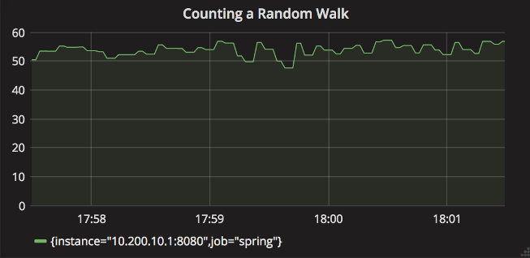

Figure 1. A Grafana rendered graph of the random walk counter.

Representing a counter without rate normalization over some time window is rarely useful, as the representation is a function of both the rapidity with which the counter is incremented and the longevity of the service. It is generally most useful to rate-normalize these time series to reason about them. Since Prometheus keeps track of discrete events across all time, it has the advantage of allowing for the selection of an arbitrary time window across which to normalize at query time (for example, `rate(counter[10s])` provides a notion of requests per second over 10 second windows). The rate-normalized graph in the preceding image would return back to a value around 55 as soon as the new instance (say on a production deployment) was in service.

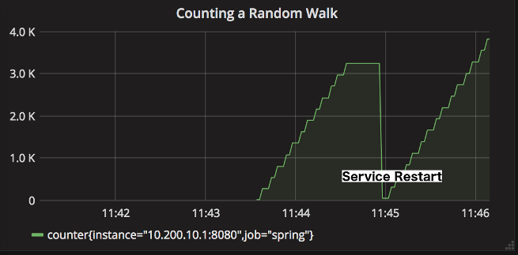

Figure 2. Counter over the same random walk, no rate normalization.

In contrast, without rate normalization, the counter drops back to zero on service restart, and the count increases without bound for the duration of the service’s uptime.

<a id="implementations-prometheus--_timers"></a>
<a id="implementations-prometheus--4.3.-timers"></a>

### 4.3. Timers

The Prometheus `Timer` produces the following time series:

- `${name}_seconds_count`: Total number of all calls.
- `${name}_seconds_sum`: Total time of all calls.
- `${name}_seconds_max`: Maximum recorded value within a configurable time window.

Enabling [percentile histograms](#concepts-histogram-quantiles) adds a `${name}_seconds_bucket` time series; the count, sum, and max series are unchanged.

Again, representing a counter without rate normalization over some time window is rarely useful, as the representation is a function of both the rapidity with which the counter is incremented and the longevity of the service.

Using the following Prometheus queries, we can graph the most commonly used statistics about timers:

- Average latency: `rate(timer_seconds_sum[10s])/rate(timer_seconds_count[10s])`
- Throughput (requests per second): `rate(timer_seconds_count[10s])`

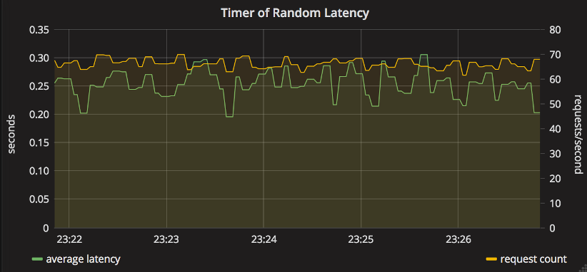

Figure 3. Timer over a simulated service.

<a id="implementations-prometheus--_long_task_timers"></a>
<a id="implementations-prometheus--4.4.-long-task-timers"></a>

### 4.4. Long task timers

Long task timers measure tasks that are still running when Prometheus scrapes the registry.
This differs from a `Timer`, which records completed events.

The exposed Prometheus series depend on whether `publishPercentileHistogram()` is enabled:

| Default Prometheus output | With percentile histograms enabled |
| --- | --- |
| `${name}_seconds_count`, `${name}_seconds_sum`, `${name}_seconds_max` | `${name}_seconds_gcount`, `${name}_seconds_gsum`, `${name}_seconds_bucket`, `${name}_seconds_max` |

The time series with [percentile histograms](#concepts-histogram-quantiles) enabled are defined by the [GaugeHistogram](https://github.com/prometheus/OpenMetrics/blob/main/specification/OpenMetrics.md#gaugehistogram) in the OpenMetrics specification.

With the `micrometer-registry-prometheus` module, `${name}_seconds_max` is exposed as a separate metric family.
With the `micrometer-registry-prometheus-simpleclient` module, it is part of the same metric family as the other time series.

A `LongTaskTimer` only samples tasks that are running at scrape time, so its values return to zero when no tasks are in progress. If you need bucket-based queries such as `histogram_quantile()` over in-progress task duration, or if alert rules need histogram buckets, enable [percentile histograms](#concepts-histogram-quantiles).

For a serial task, `long_task_timer_seconds_sum` plots the current cumulative duration of in-progress tasks. In Grafana, we can set an alert threshold at some fixed point.

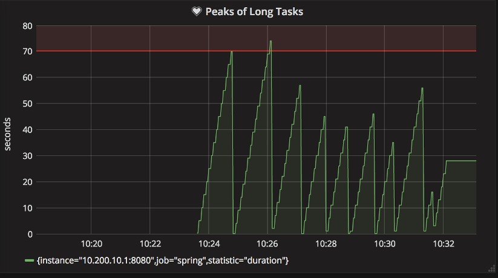

Figure 4. Simulated back-to-back long tasks with a fixed alert threshold.

<a id="implementations-prometheus--_warning_on_same_name_with_different_set_of_tag_keys"></a>
<a id="implementations-prometheus--5.-warning-on-same-name-with-different-set-of-tag-keys"></a>

## 5. Warning on same name with different set of tag keys

Prometheus [strongly discourages](https://prometheus.io/docs/instrumenting/writing_clientlibs/#labels:) users from creating meters having the same name with a different set of tag keys. You should register meters with the same name with a consistent set of tag keys.

This means that you should avoid the following:

```java
// Please don't do this
registry.counter("test", "first", "1").increment();
registry.counter("test", "second", "2").increment();
```

Instead, you should prefer doing the following:

```java
registry.counter("test", "first", "1", "second", "none").increment();
registry.counter("test", "first", "none", "second", "2").increment();
```

<a id="implementations-prometheus--_exemplars"></a>
<a id="implementations-prometheus--6.-exemplars"></a>

## 6. Exemplars

Exemplars are metadata that you can attach to the value of your time series. They can reference data outside of your metrics. A common use case is storing tracing information (`traceId`, `spanId`). Exemplars are not tags/dimensions (labels in Prometheus terminology), they will not increase cardinality since they belong to the values of the time series.

In order to setup Exemplars for `PrometheusMeterRegistry`, you will need a component that provides you the tracing information. If you use the "new" client (`micrometer-registry-prometheus`), this component is the `io.prometheus.metrics.tracer.common.SpanContext` while if you use the "legacy" client (`micrometer-registry-prometheus-simpleclient`), it is the `SpanContextSupplier`.

Setting them up are somewhat similar, if you use the "new" client (`micrometer-registry-prometheus`):

```java
PrometheusMeterRegistry registry = new PrometheusMeterRegistry(
    PrometheusConfig.DEFAULT,
    new PrometheusRegistry(),
    Clock.SYSTEM,
    new MySpanContext() (1)
);
registry.counter("test").increment();
System.out.println(registry.scrape("application/openmetrics-text"));
```

**1**

You need to implement `SpanContext` (`class MySpanContext implements SpanContext { … }`) or use an implementation that already exists.

But if you use the "legacy" client (`micrometer-registry-prometheus-simpleclient`):

```java
PrometheusMeterRegistry registry = new PrometheusMeterRegistry(
    PrometheusConfig.DEFAULT,
    new CollectorRegistry(),
    Clock.SYSTEM,
    new DefaultExemplarSampler(new MySpanContextSupplier()) (1)
);
registry.counter("test").increment();
System.out.println(registry.scrape(TextFormat.CONTENT_TYPE_OPENMETRICS_100));
```

**1**

You need to implement `SpanContextSupplier` (`class MySpanContextSupplier implements SpanContextSupplier { … }`) or use an implementation that already exists.

If your configuration is correct, you should get something like this, the `# {span_id="321",trace_id="123"} …` section is the Exemplar right after the value:

```none
# TYPE test counter
# HELP test
test_total 1.0 # {span_id="321",trace_id="123"} 1.0 1713310767.908
# EOF
```

Exemplars are only supported in the OpenMetrics format (they will not show up in the Prometheus text format). You might need to explicitly ask for the OpenMetrics format, for example:

```shell
curl --silent -H 'Accept: application/openmetrics-text; version=1.0.0' localhost:8080/prometheus
```

[OpenTelemetry Protocol (OTLP)](https://docs.micrometer.io/micrometer/reference/implementations/otlp.html)
[SignalFx](#implementations-signalfx)

---

<a id="implementations-signalfx"></a>

<!-- source_url: https://docs.micrometer.io/micrometer/reference/implementations/signalFx.html -->

<!-- page_index: 29 -->

# Micrometer SignalFx

<svg enable-background="new 0 0 32 32" id="Glyph" version="1.1" viewbox="0 0 32 32" xml:space="preserve" xmlns="http://www.w3.org/2000/svg" xmlns:xlink="http://www.w3.org/1999/xlink">
<path id="XMLID_223_"></path>
</svg>

Search

<a id="implementations-signalfx--page-title"></a>
<a id="implementations-signalfx--micrometer-signalfx"></a>

# Micrometer SignalFx

> [!WARNING]
> This module has been deprecated in favor of the [OTLP Registry](https://docs.micrometer.io/micrometer/reference/implementations/otlp.html) because the [SignalFX Java client library](https://github.com/signalfx/signalfx-java) that this module depends on has been deprecated.

SignalFx is a dimensional monitoring system SaaS with a full UI that operates on a push model. It has a rich set of alert “detectors”.

<a id="implementations-signalfx--installing-micrometer-registry-signalfx"></a>
<a id="implementations-signalfx--1.-installing-micrometer-registry-signalfx"></a>

## 1. Installing micrometer-registry-signalfx

It is recommended to use the BOM provided by Micrometer (or your framework if any), you can see how to configure it [here](#installing). The examples below assume you are using a BOM.

<a id="implementations-signalfx--_gradle"></a>
<a id="implementations-signalfx--1.1.-gradle"></a>

### 1.1. Gradle

After the BOM is [configured](#installing), add the following dependency:

```groovy
implementation 'io.micrometer:micrometer-registry-signalfx'
```

> [!NOTE]
> The version is not needed for this dependency since it is defined by the BOM.

<a id="implementations-signalfx--_maven"></a>
<a id="implementations-signalfx--1.2.-maven"></a>

### 1.2. Maven

After the BOM is [configured](#installing), add the following dependency:

```xml
<dependency>
  <groupId>io.micrometer</groupId>
  <artifactId>micrometer-registry-signalfx</artifactId>
</dependency>
```

> [!NOTE]
> The version is not needed for this dependency since it is defined by the BOM.

<a id="implementations-signalfx--_configuring"></a>
<a id="implementations-signalfx--2.-configuring"></a>

## 2. Configuring

The following example configures SignalFx:

```java
SignalFxConfig signalFxConfig = new SignalFxConfig() {@Override public String accessToken() {return "MYTOKEN";}
@Override public String get(String k) {return null; // accept the rest of the defaults} };
MeterRegistry registry = new SignalFxMeterRegistry(signalFxConfig, Clock.SYSTEM);
```

There are two distinct sources of API keys in SignalFx.

`SignalFxConfig` is an interface with a set of default methods. If, in the implementation of `get(String k)`, rather than returning `null`, you instead bind it to a property source, you can override the default configuration. For example, Micrometer’s Spring Boot support binds properties that are prefixed with `management.metrics.export.signalfx` directly to the `SignalFxConfig`:

```yml
management.metrics.export.signalfx:
    access-token: MYTOKEN

    # The interval at which metrics are sent to Ganglia. See Duration.parse for the expected format.
    # The default is 1 minute.
    step: 1m
```

<a id="implementations-signalfx--_graphing"></a>
<a id="implementations-signalfx--3.-graphing"></a>

## 3. Graphing

This section serves as a quick start to rendering useful representations in SignalFx for metrics originating in Micrometer. See the [SignalFx docs](https://docs.signalfx.com/en/latest/charts/index.html) for a far more complete reference of what is possible in SignalFx.

<a id="implementations-signalfx--_timers"></a>
<a id="implementations-signalfx--3.1.-timers"></a>

### 3.1. Timers

At each publishing interval, the SignalFx `Timer` produces several time series in SignalFx:

- `${name}.avg`: A mean latency for the publishing interval.
- `${name}.count`: Throughput per second over the publishing interval.
- `${name}.totalTime`: Total time per second over the publishing interval (used with `count`) to create aggregable means.
- `${name}.percentiles`: Micrometer calculated percentiles for the publishing interval. One time series is produced for each percentile, with a tag of `phi` in the range of [0,1].
- `${name}.histogram`: One event is produced for each SLO boundary with a tag of 'le', indicating that it represents a cumulative count of events less than or equal to SLO boundaries over the publishing interval.

To generate an aggregable view of latency in SignalFx, divide `totalTime` by `count`:

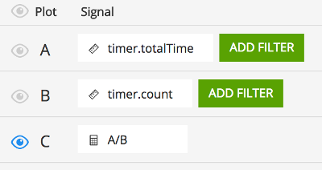

This is accomplished by adding signals for `${name}.totalTime` and `${name}.count`, adding a formula that divides them, and hiding the inputs to the formula.

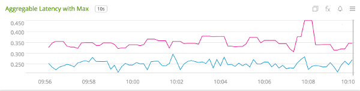

Figure 1. Timer latency.

To generate a throughput chart, use the `${name}.count` signal:

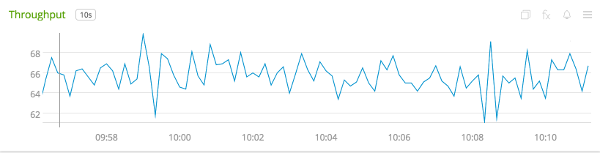

Figure 2. Timer throughput.

To generate a plot of client-side percentiles, use the `${name}.percentiles` signal:

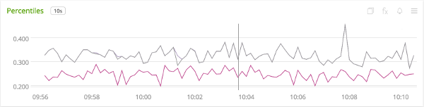

Figure 3. Timer Percentiles.

Note that these percentiles are *not aggregable*. The more dimensions you add to a timer, the less useful these values become.

Finally, if you define SLO boundaries with the fluent builder for `Timer`, you can view throughput below certain SLO boundaries by using the `${name}.histogram` signal. In this example, we set SLO boundaries at 275 (green), 300 (blue), and 500 (purple) milliseconds for a simulated `Timer` that is recording samples normally distributed around 250 ms. These counts represent the rate/second of samples less than or equal to each SLO boundary.

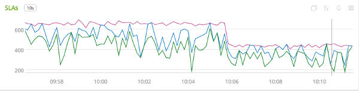

Figure 4. Timer SLO boundaries.

Where the lines converge at various points, it is evident that no sample exceeded the 275 ms SLO boundary.

[Prometheus](#implementations-prometheus)
[Stackdriver](#implementations-stackdriver)

---

<a id="implementations-stackdriver"></a>

<!-- source_url: https://docs.micrometer.io/micrometer/reference/implementations/stackdriver.html -->

<!-- page_index: 30 -->

# Micrometer Stackdriver Monitoring

<svg enable-background="new 0 0 32 32" id="Glyph" version="1.1" viewbox="0 0 32 32" xml:space="preserve" xmlns="http://www.w3.org/2000/svg" xmlns:xlink="http://www.w3.org/1999/xlink">
<path id="XMLID_223_"></path>
</svg>

Search

<a id="implementations-stackdriver--page-title"></a>
<a id="implementations-stackdriver--micrometer-stackdriver-monitoring"></a>

# Micrometer Stackdriver Monitoring

Stackdriver Monitoring is a dimensional time-series SaaS with built-in dashboarding.

<a id="implementations-stackdriver--installing-micrometer-registry-stackdriver"></a>
<a id="implementations-stackdriver--1.-installing-micrometer-registry-stackdriver"></a>

## 1. Installing micrometer-registry-stackdriver

It is recommended to use the BOM provided by Micrometer (or your framework if any), you can see how to configure it [here](#installing). The examples below assume you are using a BOM.

<a id="implementations-stackdriver--_gradle"></a>
<a id="implementations-stackdriver--1.1.-gradle"></a>

### 1.1. Gradle

After the BOM is [configured](#installing), add the following dependency:

```groovy
implementation 'io.micrometer:micrometer-registry-stackdriver'
```

> [!NOTE]
> The version is not needed for this dependency since it is defined by the BOM.

<a id="implementations-stackdriver--_maven"></a>
<a id="implementations-stackdriver--1.2.-maven"></a>

### 1.2. Maven

After the BOM is [configured](#installing), add the following dependency:

```xml
<dependency>
  <groupId>io.micrometer</groupId>
  <artifactId>micrometer-registry-stackdriver</artifactId>
</dependency>
```

> [!NOTE]
> The version is not needed for this dependency since it is defined by the BOM.

<a id="implementations-stackdriver--_configuring"></a>
<a id="implementations-stackdriver--2.-configuring"></a>

## 2. Configuring

The following example configures Stackdriver:

```java
StackdriverConfig stackdriverConfig = new StackdriverConfig() {@Override public String projectId() {return MY_PROJECT_ID;}
@Override public String get(String key) {return null;}}
MeterRegistry registry = StackdriverMeterRegistry.builder(stackdriverConfig).build();
```

`StackdriverConfig` is an interface with a set of default methods. If, in the implementation of `get(String k)`, rather than returning `null`, you instead bind it to a property source, you can override the default configuration. For example, Micrometer’s Spring Boot support binds properties that are prefixed with `management.metrics.export.stackdriver` directly to the `StackdriverConfig`:

```yml
management.metrics.export.stackdriver:
    project-id: MY_PROJECT_ID
    resource-type: global

    # You will probably want to disable Stackdriver Monitoring publishing in a local development profile.
    enabled: true

    # The interval at which metrics are sent to Stackdriver Monitoring. The default is 1 minute.
    step: 1m
```

For most environments, you need to create and configure credentials to push metrics to Stackdriver Monitoring.
In most cases, you should create a service account with Stackdriver Monitoring permissions and configure a
`GOOGLE_APPLICATION_CREDENTIALS` environmental variable to the path of the service account key file.
The following example shows how to do so:

```none
export PROJECT_ID=MY_PROJECT_ID
export APP_NAME=MY_APP

# Create a service account
gcloud iam service-accounts create $APP_NAME

# Grant the service account Stackdriver Monitoring writer permission
gcloud projects add-iam-policy-binding $PROJECT_ID \
  --member serviceAccount:$APP_NAME@$PROJECT_ID.iam.gserviceaccount.com \
  --role roles/monitoring.metricWriter

# Create a key JSON file
gcloud iam service-accounts keys create $HOME/$APP_NAME-key.json \
  --iam-account $APP_NAME@$PROJECT_ID.iam.gserviceaccount.com

# Configure GOOGLE_APPLICATION_CREDENTIALS env var
export GOOGLE_APPLICATION_CREDENTIALS=$HOME/$APP_NAME-key.json
```

When running in managed environments (such as Google App Engine, Google Cloud Run, and Google Cloud Function), you need not configure this environmental variable. In those environments, a service account is
automatically associated with the application instance. The underlying Stackdriver Monitoring client
library can automatically detect and use those credentials.

<a id="implementations-stackdriver--_stackdriver_labels"></a>
<a id="implementations-stackdriver--3.-stackdriver-labels"></a>

## 3. Stackdriver Labels

Micrometer metrics tags are mapped to [Stackdriver metrics labels](https://cloud.google.com/monitoring/api/v3/metrics-details#intro-time-series). With tags and labels, you can further filter or group
by the tag or label. See [Micrometer Concepts](#concepts-naming--_tag_naming) for more information on tags.
The following example filters by tags:

```java
MeterRegistry registry = StackdriverMeterRegistry.builder(stackdriverConfig).build();
registry.config().commonTags("application", "my-application");
```

You can also configure resource labels with the `StackdriverConfig` method, `resourceLabels`. Depending on the configured `resourceType`, there will be required resource labels. See the documentation on [choosing a monitored resource type](https://cloud.google.com/monitoring/custom-metrics/creating-metrics#which-resource).

> [!IMPORTANT]
> When using Micrometer across multiple applications or instances, it is necessary that Stackdriver labels are unique per application or instance. Otherwise, you will see errors such as `One or more TimeSeries could not be written: One or more points were written more frequently than the maximum sampling period configured`. If using a resource type other than `global`, the resource labels may already make metrics unique per application instance. If not, a common tag with the hostname or platform-provided instance ID may be a good candidate for achieving this.

<a id="implementations-stackdriver--_spring_boot"></a>
<a id="implementations-stackdriver--4.-spring-boot"></a>

## 4. Spring Boot

Spring Boot provides auto-configuration for Micrometer’s `StackdriverMeterRegistry`. For more information, see the [Spring Boot documentation](https://docs.spring.io/spring-boot/docs/current/reference/htmlsingle/#production-ready-metrics-export-stackdriver).

You can manually configure or register the `StackdriverMeterRegistry`.
In addition to using Spring Boot Actuator, make sure you create the `StackdriverMeterRegistry` bean:

```java
@Bean StackdriverConfig stackdriverConfig() {return new StackdriverConfig() {@Override public String projectId() {return MY_PROJECT_ID;}
@Override public String get(String key) {return null;}}}
@Bean StackdriverMeterRegistry meterRegistry(StackdriverConfig stackdriverConfig) {return StackdriverMeterRegistry.builder(stackdriverConfig).build();}
```

You can also use [Spring Boot Actuator Common Tags configuration](https://docs.spring.io/spring-boot/docs/current/reference/html/production-ready-features.html#production-ready-metrics-common-tags) to configure common tags:

```none
spring.application.name=my-application
management.metrics.tags.application=${spring.application.name}
```

[SignalFx](#implementations-signalfx)
[statsD](#implementations-statsd)

---

<a id="implementations-statsd"></a>

<!-- source_url: https://docs.micrometer.io/micrometer/reference/implementations/statsD.html -->

<!-- page_index: 31 -->

# Micrometer StatsD

<svg enable-background="new 0 0 32 32" id="Glyph" version="1.1" viewbox="0 0 32 32" xml:space="preserve" xmlns="http://www.w3.org/2000/svg" xmlns:xlink="http://www.w3.org/1999/xlink">
<path id="XMLID_223_"></path>
</svg>

Search

<a id="implementations-statsd--page-title"></a>
<a id="implementations-statsd--micrometer-statsd"></a>

# Micrometer StatsD

StatsD is a UDP-based sidecar-driven metrics collection system. The maintainer of the original StatsD line protocol specification is Etsy. Datadog’s DogStatsD and Influx’s Telegraf each accept a modified version of the line protocol, having each enriched the original specification with dimensionality in different ways.

If you intend to use the Datadog or Telegraf flavors, see the documentation for Micrometer’s [Datadog](#implementations-datadog) or [Influx](#implementations-influx) support.

> [!NOTE]
> Starting a `StatsdMeterRegistry` doesn’t block waiting for a connection to the backend to be established, so recorded measurements could be lost until the connection is established.

<a id="implementations-statsd--installing-micrometer-registry-statsd"></a>
<a id="implementations-statsd--1.-installing-micrometer-registry-statsd"></a>

## 1. Installing micrometer-registry-statsd

It is recommended to use the BOM provided by Micrometer (or your framework if any), you can see how to configure it [here](#installing). The examples below assume you are using a BOM.

<a id="implementations-statsd--_gradle"></a>
<a id="implementations-statsd--1.1.-gradle"></a>

### 1.1. Gradle

After the BOM is [configured](#installing), add the following dependency:

```groovy
implementation 'io.micrometer:micrometer-registry-statsd'
```

> [!NOTE]
> The version is not needed for this dependency since it is defined by the BOM.

<a id="implementations-statsd--_maven"></a>
<a id="implementations-statsd--1.2.-maven"></a>

### 1.2. Maven

After the BOM is [configured](#installing), add the following dependency:

```xml
<dependency>
  <groupId>io.micrometer</groupId>
  <artifactId>micrometer-registry-statsd</artifactId>
</dependency>
```

> [!NOTE]
> The version is not needed for this dependency since it is defined by the BOM.

<a id="implementations-statsd--_configuring"></a>
<a id="implementations-statsd--2.-configuring"></a>

## 2. Configuring

This configuration is used to ship metrics to a StatsD agent that is compatible with the original Etsy protocol. Metrics are shipped immediately over UDP to the agent.

```java
StatsdConfig config = new StatsdConfig() {@Override public String get(String k) {return null;}
@Override public StatsdFlavor flavor() {return StatsdFlavor.Etsy;} };
MeterRegistry registry = new StatsdMeterRegistry(config, Clock.SYSTEM);
```

> [!NOTE]
> You can also configure Telegraf to accept the dogstatsd format. If you use Telegraf, configuring Micrometer to ship Telegraf-formatted StatsD lines eases the requirements of your Telegraf configuration.

`StatsdConfig` is an interface with a set of default methods. If, in the implementation of `get(String k)`, rather than returning `null`, you instead bind it to a property source, you can override the default configuration. For example, Micrometer’s Spring Boot support binds properties that are prefixed with `management.metrics.export.statsd` directly to the `StatsdConfig`:

```yml
management.metrics.export.statsd:
    flavor: etsy

    # You will probably want to conditionally disable StatsD publishing in local development.
    enabled: true

    # The interval at which metrics are sent to StatsD. The default is 1 minute.
    step: 1m
```

<a id="implementations-statsd--_customizing_the_metrics_sink"></a>
<a id="implementations-statsd--3.-customizing-the-metrics-sink"></a>

## 3. Customizing the Metrics Sink

By default, Micrometer publishes the StatsD line protocol over UDP, as the vast majority of existing StatsD agents are UDP servers. You can fully customize how the line protocol is shipped by modifying the builder for `StatsdMeterRegistry`:

```java
Consumer<String> lineLogger = line -> logger.info(line); (1)

MeterRegistry registry = StatsdMeterRegistry.builder(StatsdConfig.DEFAULT) (2)
    .clock(clock)
    .lineSink(lineLogger)
    .build();
```

**1**

Define what to do with lines.

**2**

The flavor configuration option determines the structure of the line for the default line builder. It has no effect if you override the line builder with a customization.

<a id="implementations-statsd--_unix_domain_socket_uds_support"></a>
<a id="implementations-statsd--3.1.-unix-domain-socket-uds-support"></a>

### 3.1. Unix Domain Socket (UDS) Support

The StatsD registry supports sending metrics over Unix domain socket datagrams.

To enable this transport, configure the `protocol` as `uds_datagram` and set the `host` to the absolute path of the socket file.

> [!NOTE]
> The `host` value must be the plain absolute path (for example, `/var/run/datadog/dsd.socket`). Do not prefix it with `unix://`.

**Java configuration example:**

```java
StatsdConfig config = new StatsdConfig() {@Override public String get(String k) {return null; // accept defaults}
@Override public StatsdProtocol protocol() {return StatsdProtocol.UDS_DATAGRAM;}
@Override public String host() {return "/var/run/datadog/dsd.socket";} };
MeterRegistry registry = new StatsdMeterRegistry(config, Clock.SYSTEM);
```

<a id="implementations-statsd--_using_apache_kafka_for_line_sink"></a>
<a id="implementations-statsd--3.2.-using-apache-kafka-for-line-sink"></a>

### 3.2. Using Apache Kafka for Line Sink

You can also use Apache Kafka for line sink, as follows:

```java
Properties properties = new Properties();
properties.setProperty(BOOTSTRAP_SERVERS_CONFIG, "localhost:9092");
properties.setProperty(KEY_SERIALIZER_CLASS_CONFIG, StringSerializer.class.getName());
properties.setProperty(VALUE_SERIALIZER_CLASS_CONFIG, StringSerializer.class.getName());

Producer<String, String> producer = new KafkaProducer<>(properties);

StatsdMeterRegistry.builder(statsdConfig)
        .lineSink((line) -> producer.send(new ProducerRecord<>("my-metrics", line)))
        .build();
```

Now Micrometer produces lines for metrics to the `my-metrics` topic and you can consume the lines on the topic.

<a id="implementations-statsd--_customizing_the_line_format"></a>
<a id="implementations-statsd--4.-customizing-the-line-format"></a>

## 4. Customizing the Line Format

The built-in Etsy, dogstatsd, and Telegraf flavors cover most known public StatsD agents, but you can completely customize the line format to satisfy closed, proprietary agents. Again, we use the `StatsdMeterRegistry` builder to establish a line builder for each ID. Providing an instance of the builder *per ID* offers you the opportunity to eagerly cache the serialization of the ID’s name and tags to optimize the serialization of a StatsD line based on that ID as samples are recorded. The following listing defines a fictional format:

```java
Function<Meter.Id, StatsdLineBuilder> nameAndUnits = id -> new StatsdLineBuilder() {
    String name = id.getName() + "/" + (id.getBaseUnit() == null ? "unknown" : id.getBaseUnit());

    @Override
    public String count(long amount, Statistic stat) {
       return name + ":" + amount + "|c";
    }

    ... // implement gauge, histogram, and timing similarly
}

MeterRegistry registry = StatsdMeterRegistry.builder(StatsdConfig.DEFAULT) (1)
    .clock(clock)
    .lineBuilder(nameAndUnits)
    .build();
```

**1**

Because you have taken control of line building, the flavor is ignored.

[Stackdriver](#implementations-stackdriver)
[Wavefront](#implementations-wavefront)

---

<a id="implementations-wavefront"></a>

<!-- source_url: https://docs.micrometer.io/micrometer/reference/implementations/wavefront.html -->

<!-- page_index: 32 -->

# Micrometer Wavefront

<svg enable-background="new 0 0 32 32" id="Glyph" version="1.1" viewbox="0 0 32 32" xml:space="preserve" xmlns="http://www.w3.org/2000/svg" xmlns:xlink="http://www.w3.org/1999/xlink">
<path id="XMLID_223_"></path>
</svg>

Search

<a id="implementations-wavefront--page-title"></a>
<a id="implementations-wavefront--micrometer-wavefront"></a>

# Micrometer Wavefront

> [!WARNING]
> This module has been deprecated due to [Wavefront’s End of Life Announcement](https://support.broadcom.com/web/ecx/support-content-notification/-/external/content/release-announcements/0/25153).

Wavefront is a dimensional monitoring system offered as a SaaS with a full UI, custom query language, and advanced math operations. Wavefront operates on a push model. Metrics can be pushed either through a sidecar process running on the same host (called the Wavefront proxy) or directly to the Wavefront API.

<a id="implementations-wavefront--installing-micrometer-registry-wavefront"></a>
<a id="implementations-wavefront--1.-installing-micrometer-registry-wavefront"></a>

## 1. Installing micrometer-registry-wavefront

It is recommended to use the BOM provided by Micrometer (or your framework if any), you can see how to configure it [here](#installing). The examples below assume you are using a BOM.

<a id="implementations-wavefront--_gradle"></a>
<a id="implementations-wavefront--1.1.-gradle"></a>

### 1.1. Gradle

After the BOM is [configured](#installing), add the following dependency:

```groovy
implementation 'io.micrometer:micrometer-registry-wavefront'
```

> [!NOTE]
> The version is not needed for this dependency since it is defined by the BOM.

<a id="implementations-wavefront--_maven"></a>
<a id="implementations-wavefront--1.2.-maven"></a>

### 1.2. Maven

After the BOM is [configured](#installing), add the following dependency:

```xml
<dependency>
  <groupId>io.micrometer</groupId>
  <artifactId>micrometer-registry-wavefront</artifactId>
</dependency>
```

> [!NOTE]
> The version is not needed for this dependency since it is defined by the BOM.

<a id="implementations-wavefront--_configuring"></a>
<a id="implementations-wavefront--2.-configuring"></a>

## 2. Configuring

This section describes how to configure Wavefront when you send data:

- [Directly to Wavefront](#implementations-wavefront--configuring-directly-to-wavefront)
- [Through a Wavefront Proxy Sidecar](#implementations-wavefront--configuring-through-a-wavefront-proxy-sidecar)

<a id="implementations-wavefront--configuring-directly-to-wavefront"></a>
<a id="implementations-wavefront--2.1.-directly-to-wavefront"></a>

### 2.1. Directly to Wavefront

The following example configures sending directly to Wavefront:

```java
WavefrontConfig config = new WavefrontConfig() {@Override public String uri() {return "https://longboard.wavefront.com"; (1)}
@Override public String apiToken() {return "MYAPIKEY"; (2)}
@Override public String get(String key) {return null; (3)} }; MeterRegistry registry = new WavefrontMeterRegistry(config, Clock.SYSTEM);
```

**1**

`longboard` is the name of the co-tenant instance on which most organizations start. Once you reach a sufficient scale, Wavefront may move you
to a dedicated host.

**2**

This is required when pushing directly to Wavefront’s API.

**3**

Accept the rest of the defaults.

<a id="implementations-wavefront--configuring-through-a-wavefront-proxy-sidecar"></a>
<a id="implementations-wavefront--2.2.-through-a-wavefront-proxy-sidecar"></a>

### 2.2. Through a Wavefront Proxy Sidecar

The following example configures sending through a Wavefront proxy sidecar:

```java
MeterRegistry registry = new WavefrontMeterRegistry(WavefrontConfig.DEFAULT_PROXY, Clock.SYSTEM);
```

The default proxy configuration pushes metrics and histogram distributions to a Wavefront proxy sitting on `localhost:2878`.

> [!NOTE]
> If publishing metrics to a Wavefront proxy, the URI must be expressed in the form of `proxy://HOST:PORT`.

<a id="implementations-wavefront--_graphing"></a>
<a id="implementations-wavefront--3.-graphing"></a>

## 3. Graphing

This section serves as a quick start to rendering useful representations in Wavefront for metrics originating in Micrometer. See the [Wavefront docs](https://docs.wavefront.com/query_language_getting_started.html) for a far more complete reference of what is possible in Wavefront.

<a id="implementations-wavefront--_counters"></a>
<a id="implementations-wavefront--3.1.-counters"></a>

### 3.1. Counters

The query that generates a graph for a random-walk counter is `rate(ts(counter))`.

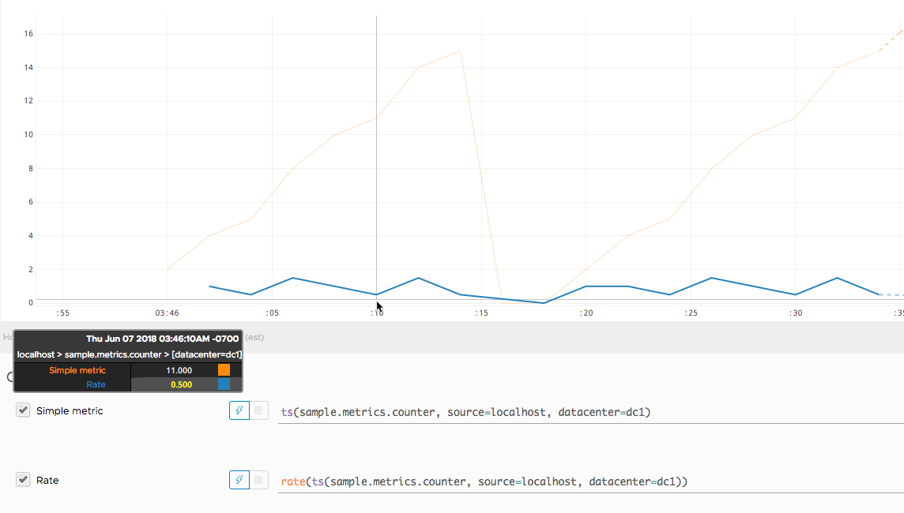

Figure 1. A Wavefront rendered graph of the random walk counter.

Representing a counter without rate normalization over some time window is rarely useful, as the
representation is a function of both the rapidity with which the counter is incremented and the
longevity of the service. It is generally most useful to rate-normalize these time series to
reason about them.

Because Wavefront keeps track of cumulative counts across all time, it has the
advantage of allowing for the selection of a particular time function at query time (for example, `rate(ts(counter))` to compute the per-second rate of change).

<a id="implementations-wavefront--_timers"></a>
<a id="implementations-wavefront--3.2.-timers"></a>

### 3.2. Timers

The Wavefront `Timer` produces different time series depending on whether or not
`publishPercentileHistogram` is enabled.

If `publishPercentileHistogram` is enabled, the Wavefront `Timer` produces histogram distributions
that let you query for the latency at any percentile using `hs()` queries. For example, you can
visualize latency at the 95th percentile (`percentile(95, hs(timer.m))`) or the 99.9th percentile
(`percentile(99.9, hs(timer.m))`). For more information on histogram distributions, see
[Wavefront Histograms](#implementations-wavefront--wavefront-histograms), later in this section.

If `publishPercentileHistogram` is disabled, the Wavefront `Timer` produces several
time series:

- `${name}.avg`: Mean latency across all calls.
- `${name}.count`: Total number of all calls.
- `${name}.sum`: Total time of all calls.
- `${name}.max`: Max latency over the publishing interval.
- `${name}.percentiles`: Micrometer-calculated percentiles for the publishing interval. These
  cannot be aggregated across dimensions.

You can use these time series to generate a quick view of latency in Wavefront:

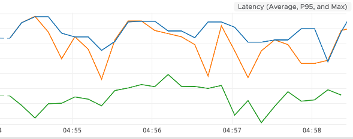

Figure 2. Timer latency.

The preceding chart shows the average latency (`rate(ts(timer.sum))/rate(ts(timer.count))` in
green), 95th percentile (`ts(timer.percentile, phi="0.95")` in orange), and max (`ts(timer.max)`
in blue).

Additionally, `rate(ts(timer.count))` represents a rate/second throughput of events being timed:

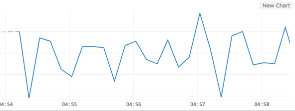

Figure 3. Timer throughput.

<a id="implementations-wavefront--wavefront-histograms"></a>
<a id="implementations-wavefront--3.3.-wavefront-histograms"></a>

### 3.3. Wavefront Histograms

Wavefront’s histogram implementation stores an actual distribution of metrics, as opposed to single metrics. This lets you apply any percentile and aggregation function on the distribution at query time without having to specify specific percentiles and metrics to keep during metric collection.

Wavefront histogram distributions are collected and reported for any `Timer` or `DistributionSummary` that has `publishPercentileHistogram` enabled.

By default, distributions that are reported to Wavefront get aggregated by the minute, providing you with a histogram distribution for each minute. You also have the option of aggregating by hour or day. You can customize this with the following configuration options:

- `reportMinuteDistribution`: Boolean specifying whether to aggregate by minute. Enabled by default. Metric name in Wavefront has `.m` suffix.
- `reportHourDistribution`: Boolean specifying whether to aggregate by hour. Disabled by default. Metric name in Wavefront has `.h` suffix.
- `reportDayDistribution`: Boolean specifying whether to aggregate by day. Disabled by default. Metric name in Wavefront has `.d` suffix.

If you are sending to a Wavefront proxy, by default, both metrics and histogram distributions are published to the same port: 2878 in the default proxy configuration. If your proxy is configured to listen for histogram distributions on a different port, you can specify the port to which to publish by using the `distributionPort` configuration option.

You can query histogram distributions in Wavefront by using `hs()` queries. For example, `percentile(98, hs(${name}.m))` returns the 98th percentile for a particular histogram aggregated over each minute. Each histogram metric name has a suffix (`.m`, `.h`, or `.d`), depending on the histogram’s aggregation interval.

See the [Wavefront Histograms documentation](https://docs.wavefront.com/proxies_histograms.html) for more information.

[statsD](#implementations-statsd)
[Reference Instrumentations](#reference)

---

<a id="reference"></a>

<!-- source_url: https://docs.micrometer.io/micrometer/reference/reference.html -->

<!-- page_index: 33 -->

<a id="reference--page-title"></a>
<a id="reference--micrometer-reference-instrumentations"></a>

# Micrometer Reference Instrumentations

Micrometer comes with inbuilt support for multiple frameworks.

[Wavefront](#implementations-wavefront)
[Cache](#reference-cache)

---

<a id="reference-cache"></a>

<!-- source_url: https://docs.micrometer.io/micrometer/reference/reference/cache.html -->

<!-- page_index: 34 -->

# Micrometer Cache Instrumentations

<svg enable-background="new 0 0 32 32" id="Glyph" version="1.1" viewbox="0 0 32 32" xml:space="preserve" xmlns="http://www.w3.org/2000/svg" xmlns:xlink="http://www.w3.org/1999/xlink">
<path id="XMLID_223_"></path>
</svg>

Search

<a id="reference-cache--page-title"></a>
<a id="reference-cache--micrometer-cache-instrumentations"></a>

# Micrometer Cache Instrumentations

Micrometer supports binding metrics to a variety of popular caching libraries. Each implementation supports basic features, such as cache hits versus misses, from which you can derive basic information about the cache hit ratio over a period of time. Micrometer uses a function-tracking counter to monitor such things as hits and misses, giving you a notion not only of hits and misses over the total life of the cache (the basic metric exposed from Guava’s `CacheStats`, for example) but hits and misses inside a given interval.

<a id="reference-cache--cache-example"></a>
<a id="reference-cache--example"></a>

## Example

To demonstrate the features of cache monitoring, we start with a simple program that uses `reactor-netty` to read the entirety of Mary Shelley’s *Frankenstein* and put each word in the cache if it has not yet been seen:

```java
// read all of Frankenstein
HttpClient.create("www.gutenberg.org")
    .get("/cache/epub/84/pg84.txt")
    .flatMapMany(res -> res.addHandler(wordDecoder()).receive().asString())
    .delayElements(Duration.ofMillis(10)) // one word per 10 ms
    .filter(word -> !word.isEmpty())
    .doOnNext(word -> {
        if (cache.getIfPresent(word) == null)
            cache.put(word, 1);
    })
    .blockLast();
```

The following image shows the hits versus misses on a cache that has been tuned to hold a maximum of 10,000 entries:

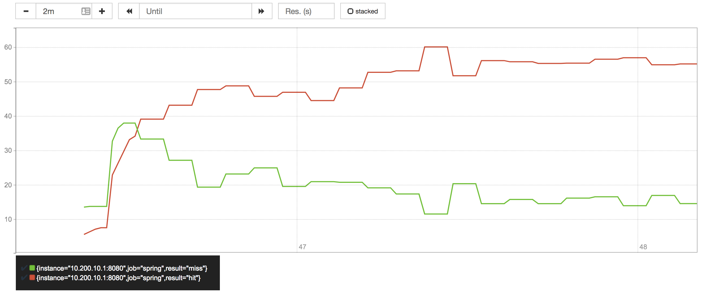

Figure 1. Hits vs. misses, viewed in Prometheus

```none
rate(book_guava_requests_total[10s])
```

By dividing the hits by the sum of all `get` operations (regardless of whether or not each one was a hit or a miss), we can arrive at a notion of the upper bound for the hit ratio for reading *Frankenstein* with only 10,000 words:

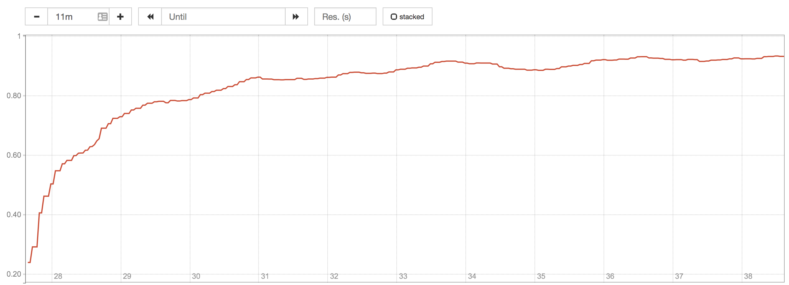

Figure 2. Hit ratio, viewed by Prometheus

```none
sum(rate(book_guava_requests_total{result="hit"}[1m])) / sum(rate(book_guava_requests_total[1m]))
```

In a real-world scenario, we tune caches according to how we evaluate the tradeoff between storage and load efficiency. You could create an alert based on some upper bound for the rate at which misses occur or on a lower bound for the hit ratio. Setting an upper bound on the miss ratio is better than a lower bound on the hit ratio. For both ratios, an absence of any activity drops the value to 0.
The following image shows the miss ratio when it exceeds 10%:

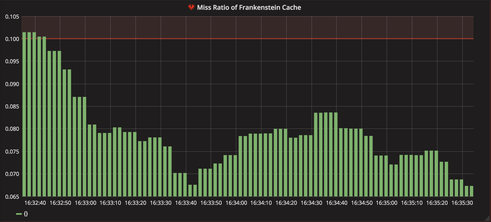

Figure 3. Alerting when the miss ratio exceeds 10%

<a id="reference-cache--_cache_implementations"></a>
<a id="reference-cache--cache-implementations"></a>

## Cache implementations

Micrometer can instrument various cache implementations:

- [Caffeine](#reference-cache--cache-caffeine)
- [Ehcache](#reference-cache--cache-ehcache)
- [Guava](#reference-cache--cache-guava)
- [Hazelcast](#reference-cache--cache-hazelcast)
- [JCache](#reference-cache--cache-jcache)

<a id="reference-cache--cache-caffeine"></a>
<a id="reference-cache--caffeine"></a>

### Caffeine

```java
// Setting up instrumentation
LoadingCache<String, String> cache = Caffeine.newBuilder().recordStats().build(key -> "");

CaffeineCacheMetrics<String, String, Cache<String, String>> metrics = new CaffeineCacheMetrics<>(cache, "testCache",
        expectedTag);


// Binding manually
MeterRegistry registry = new SimpleMeterRegistry();
metrics.bindTo(registry);

// Binding through a static method
MeterRegistry meterRegistry = new SimpleMeterRegistry();
CaffeineCacheMetrics.monitor(meterRegistry, cache, "testCache", expectedTag);
```

<a id="reference-cache--cache-ehcache"></a>
<a id="reference-cache--ehcache-2"></a>

### Ehcache 2

```java
// Setting up instrumentation
static Cache cache;

EhCache2Metrics metrics = new EhCache2Metrics(cache, expectedTag);


// Binding manually
MeterRegistry registry = new SimpleMeterRegistry();
metrics.bindTo(registry);

// Binding through a static method
MeterRegistry meterRegistry = new SimpleMeterRegistry();
EhCache2Metrics.monitor(meterRegistry, cache, expectedTag);
```

<a id="reference-cache--cache-guava"></a>
<a id="reference-cache--guava"></a>

### Guava

```java
// Setting up instrumentation
LoadingCache<String, String> cache = CacheBuilder.newBuilder().recordStats().build(new CacheLoader<>() {
    @Override
    public String load(String key) {
        return "";
    }
});

GuavaCacheMetrics<String, String, Cache<String, String>> metrics = new GuavaCacheMetrics<>(cache, "testCache",
        expectedTag);


// Binding manually
MeterRegistry registry = new SimpleMeterRegistry();
metrics.bindTo(registry);

// Binding through a static method
MeterRegistry meterRegistry = new SimpleMeterRegistry();
GuavaCacheMetrics.monitor(meterRegistry, cache, "testCache", expectedTag);
```

<a id="reference-cache--cache-hazelcast"></a>
<a id="reference-cache--hazelcast"></a>

### Hazelcast

```java
// Setting up instrumentation
static IMap<String, String> cache;

HazelcastCacheMetrics metrics = new HazelcastCacheMetrics(cache, expectedTag);


// Binding manually
MeterRegistry meterRegistry = new SimpleMeterRegistry();
metrics.bindTo(meterRegistry);

// Binding through a static method
MeterRegistry meterRegistry = new SimpleMeterRegistry();
HazelcastCacheMetrics.monitor(meterRegistry, cache, expectedTag);
```

<a id="reference-cache--cache-jcache"></a>
<a id="reference-cache--jcache"></a>

### JCache

```java
// Setting up instrumentation
Cache<String, String> cache;

JCacheMetrics<String, String, Cache<String, String>> metrics;


metrics = new JCacheMetrics<>(cache, expectedTag);

// Binding manually
MeterRegistry meterRegistry = new SimpleMeterRegistry();
metrics.bindTo(meterRegistry);

// Binding through a static method
MeterRegistry meterRegistry = new SimpleMeterRegistry();
JCacheMetrics.monitor(meterRegistry, cache, expectedTag);
```

[Reference Instrumentations](#reference)
[Commons Pool](#reference-commons-pool)

---

<a id="reference-commons-pool"></a>

<!-- source_url: https://docs.micrometer.io/micrometer/reference/reference/commons-pool.html -->

<!-- page_index: 35 -->

# Apache Commons Pool Instrumentation

<svg enable-background="new 0 0 32 32" id="Glyph" version="1.1" viewbox="0 0 32 32" xml:space="preserve" xmlns="http://www.w3.org/2000/svg" xmlns:xlink="http://www.w3.org/1999/xlink">
<path id="XMLID_223_"></path>
</svg>

Search

<a id="reference-commons-pool--page-title"></a>
<a id="reference-commons-pool--apache-commons-pool-instrumentation"></a>

# Apache Commons Pool Instrumentation

[Apache Commons Pool](https://commons.apache.org/proper/commons-pool/) is an open source software library provides an object-pooling API and a number of object pool implementations.

Below you can find an example of how to instrument Apache Commons Pool with Micrometer.

```java
// Setting up instrumentation
private final CommonsObjectPool2Metrics commonsObjectPool2Metrics = new CommonsObjectPool2Metrics(tags);


// Generic Pool instrumentation (with examples of created meters)
try (GenericObjectPool<Object> ignored = createGenericObjectPool()) {
    commonsObjectPool2Metrics.bindTo(registry);
    Tags tagsToMatch = tags.and("name", "pool", "type", "GenericObjectPool", "factoryType",
            "io.micrometer.core.instrument.binder.commonspool2.CommonsObjectPool2MetricsTest$1<java.lang.Object>");

    registry.get("commons.pool2.num.idle").tags(tagsToMatch).gauge();
    registry.get("commons.pool2.num.waiters").tags(tagsToMatch).gauge();

    Arrays
        .asList("commons.pool2.created", "commons.pool2.borrowed", "commons.pool2.returned",
                "commons.pool2.destroyed", "commons.pool2.destroyed.by.evictor",
                "commons.pool2.destroyed.by.borrow.validation")
        .forEach(name -> registry.get(name).tags(tagsToMatch).functionCounter());

    Arrays
        .asList("commons.pool2.max.borrow.wait", "commons.pool2.mean.active", "commons.pool2.mean.idle",
                "commons.pool2.mean.borrow.wait")
        .forEach(name -> registry.get(name).tags(tagsToMatch).timeGauge());
}

// Generic Keyed Pool instrumentation (with examples of created meters)
try (GenericKeyedObjectPool<Object, Object> ignored = createGenericKeyedObjectPool()) {
    commonsObjectPool2Metrics.bindTo(registry);
    Tags tagsToMatch = tags.and("name", "pool", "type", "GenericKeyedObjectPool", "factoryType", "none");

    Arrays.asList("commons.pool2.num.idle", "commons.pool2.num.waiters")
        .forEach(name -> registry.get(name).tags(tagsToMatch).gauge());

    Arrays
        .asList("commons.pool2.created", "commons.pool2.borrowed", "commons.pool2.returned",
                "commons.pool2.destroyed", "commons.pool2.destroyed.by.evictor",
                "commons.pool2.destroyed.by.borrow.validation")
        .forEach(name -> registry.get(name).tags(tagsToMatch).functionCounter());

    Arrays
        .asList("commons.pool2.max.borrow.wait", "commons.pool2.mean.active", "commons.pool2.mean.idle",
                "commons.pool2.mean.borrow.wait")
        .forEach(name -> registry.get(name).tags(tagsToMatch).timeGauge());
}
```

<a id="reference-commons-pool--lifecycle"></a>

## Lifecycle

> [!NOTE]
> `CommonsObjectPool2Metrics` implements `AutoCloseable`. When used outside a lifecycle-aware container, call `close()` on application shutdown so the binder can clean up the resources it registered or started, such as listeners, schedulers, or meters.

[Cache](#reference-cache)
[Database](#reference-db)

---

<a id="reference-db"></a>

<!-- source_url: https://docs.micrometer.io/micrometer/reference/reference/db.html -->

<!-- page_index: 36 -->

# Database Instrumentation

<svg enable-background="new 0 0 32 32" id="Glyph" version="1.1" viewbox="0 0 32 32" xml:space="preserve" xmlns="http://www.w3.org/2000/svg" xmlns:xlink="http://www.w3.org/1999/xlink">
<path id="XMLID_223_"></path>
</svg>

Search

<a id="reference-db--page-title"></a>
<a id="reference-db--database-instrumentation"></a>

# Database Instrumentation

Micrometer can instrument various libraries that interact with databases:

- [DataSource Observation Instrumentation](#reference-db--db-datasource-observation)
- [DataSource Metrics Instrumentation](#reference-db--db-datasource)
- [jOOQ Instrumentation](#reference-db--db-jooq)
- [PostgreSQL Instrumentation](#reference-db--db-postgres)

<a id="reference-db--db-datasource-observation"></a>
<a id="reference-db--datasource-observation-instrumentation"></a>

## DataSource Observation Instrumentation

Through the [Datasource Micrometer](https://github.com/jdbc-observations/datasource-micrometer) project you can instrument your `DataSource` to start producing [Observations](#observation) while interacting with the database. That means that depending on your Observation Handler setup you can plug in producing of metrics or distributed tracing.

You can read more about Datasource Micrometer [reference documentation](https://jdbc-observations.github.io/datasource-micrometer/docs/current/docs/html/) here.

<a id="reference-db--db-datasource"></a>
<a id="reference-db--datasource-metrics-instrumentation"></a>

## DataSource Metrics Instrumentation

```java
// Binding instrumentation through static method
DatabaseTableMetrics.monitor(registry, "foo", "mydb", ds);

// Usage example
try (Connection conn = ds.getConnection()) {
    conn.prepareStatement("CREATE TABLE foo (id int)").execute();
    conn.prepareStatement("INSERT INTO foo VALUES (1)").executeUpdate();
}
assertThat(registry.get("db.table.size").tag("table", "foo").tag("db", "mydb").gauge().value()).isEqualTo(1.0);
```

<a id="reference-db--db-jooq"></a>
<a id="reference-db--jooq-instrumentation"></a>

## jOOQ Instrumentation

```java
// Setting up instrumentation
Configuration configuration = new DefaultConfiguration().set(conn).set(SQLDialect.H2);

MetricsDSLContext jooq = MetricsDSLContext.withMetrics(DSL.using(configuration), meterRegistry, Tags.empty());

// Usage example
jooq.tag("name", "selectAllAuthors").execute("SELECT * FROM author");

assertThat(meterRegistry.get("jooq.query").tag("name", "selectAllAuthors").timer().count()).isEqualTo(1);
```

> [!IMPORTANT]
> **Compatibility note for jOOQ versions.**
>
> Some newly added jOOQ overloads (for example, `DefaultDSLContext#fetchValue(SelectField)`) may internally delegate to `select(…)`. When using builder-level instrumentation with `MetricsDSLContext`, such delegation can lead to **double instrumentation** and **tag loss** on the `jooq.query` timer.
>
> **Recommendations**
>
> - Use only the APIs **overridden by `MetricsDSLContext`** for building/executing queries (i.e., prefer methods explicitly overridden by `MetricsDSLContext`) so each query is timed exactly once with consistent tags. And, avoid relying on newer jOOQ overloads that may delegate to `select(…)`.

<a id="reference-db--db-postgres"></a>
<a id="reference-db--postgresql-instrumentation"></a>

## PostgreSQL Instrumentation

```java
// Setting up instrumentation
new PostgreSQLDatabaseMetrics(dataSource, postgres.getDatabaseName()).bindTo(registry);

// Usage example
executeSql("CREATE TABLE gauge_test_table (val varchar(255))",
        "INSERT INTO gauge_test_table (val) VALUES ('foo')", "UPDATE gauge_test_table SET val = 'bar'",
        "SELECT * FROM gauge_test_table", "DELETE FROM gauge_test_table");
Thread.sleep(PGSTAT_STAT_INTERVAL);

final List<String> GAUGES = Arrays.asList(SIZE, CONNECTIONS, ROWS_DEAD, LOCKS);

for (String name : GAUGES) {
    assertThat(get(name).gauge().value()).withFailMessage("Gauge " + name + " is zero.").isGreaterThan(0);
}
```

[Commons Pool](#reference-commons-pool)
[gRPC](#reference-grpc)

---

<a id="reference-grpc"></a>

<!-- source_url: https://docs.micrometer.io/micrometer/reference/reference/grpc.html -->

<!-- page_index: 37 -->

# gRPC Instrumentation

<svg enable-background="new 0 0 32 32" id="Glyph" version="1.1" viewbox="0 0 32 32" xml:space="preserve" xmlns="http://www.w3.org/2000/svg" xmlns:xlink="http://www.w3.org/1999/xlink">
<path id="XMLID_223_"></path>
</svg>

Search

<a id="reference-grpc--page-title"></a>
<a id="reference-grpc--grpc-instrumentation"></a>

# gRPC Instrumentation

[gRPC](https://grpc.io/) is a modern open source high performance Remote Procedure Call (RPC) framework that can run in any environment.

Below you can find an example of how to instrument gRPC with [Micrometer Observation](#observation). That means that depending on your Observation Handler configuration you instrument once, and can have multiple benefits out of it (e.g. metrics, distributed tracing).

First, client and server side interceptors need to be setup.

```java
// Setting up interceptors
ObservationGrpcServerInterceptor serverInterceptor;

ObservationGrpcClientInterceptor clientInterceptor;


this.serverInterceptor = new ObservationGrpcServerInterceptor(observationRegistry);
this.clientInterceptor = new ObservationGrpcClientInterceptor(observationRegistry);
```

Next, server and channels need to have the interceptors added.

```java
// Adding them to the server and client side
EchoService echoService = new EchoService();
server = InProcessServerBuilder.forName("sample")
    .addService(echoService)
    .intercept(new ServerHeaderInterceptor())
    .intercept(serverInterceptor)
    .build();
server.start();

channel = InProcessChannelBuilder.forName("sample")
    .intercept(new ClientHeaderInterceptor(), clientInterceptor)
    .build();
```

Below you have an example of usage with the result assertions.

```java
// Usage example
SimpleServiceBlockingStub stub = SimpleServiceGrpc.newBlockingStub(channel);

SimpleRequest request = SimpleRequest.newBuilder().setRequestMessage("Hello").build();
SimpleResponse response = stub.unaryRpc(request);
assertThat(response.getResponseMessage()).isEqualTo("Hello");

// Observation outcome
assertThat(observationRegistry).hasAnObservation(observationContextAssert -> {
    observationContextAssert.hasNameEqualTo("grpc.client");
    assertCommonKeyValueNames(observationContextAssert);
    assertClientKeyValues(observationContextAssert);
}).hasAnObservation(observationContextAssert -> {
    observationContextAssert.hasNameEqualTo("grpc.server");
    assertCommonKeyValueNames(observationContextAssert);
    assertServerKeyValues(observationContextAssert);
});
```

[Database](#reference-db)
[HttpComponents Client](#reference-httpcomponents)

---

<a id="reference-httpcomponents"></a>

<!-- source_url: https://docs.micrometer.io/micrometer/reference/reference/httpcomponents.html -->

<!-- page_index: 38 -->

# Apache HttpComponents Client Instrumentation

<svg enable-background="new 0 0 32 32" id="Glyph" version="1.1" viewbox="0 0 32 32" xml:space="preserve" xmlns="http://www.w3.org/2000/svg" xmlns:xlink="http://www.w3.org/1999/xlink">
<path id="XMLID_223_"></path>
</svg>

Search

<a id="reference-httpcomponents--page-title"></a>
<a id="reference-httpcomponents--apache-httpcomponents-client-instrumentation"></a>

# Apache HttpComponents Client Instrumentation

> [!WARNING]
> This instrumentation is now deprecated in favor of the dedicated Apache module `httpclient5-observation`. See [the documentation](https://hc.apache.org/httpcomponents-client-5.6.x/observation.html).

> [!IMPORTANT]
> This instrumentation requires usage of Apache HttpComponents Client at least in version 5.

[Apache HttpComponents Client](https://hc.apache.org/index.html) is an HTTP/1.1 compliant HTTP agent implementation.

Below you can find an example of how to instrument Apache HttpComponents Client with [Micrometer Observation](#observation). That means that depending on your Observation Handler configuration you instrument once, and can have multiple benefits out of it (e.g. metrics, distributed tracing).

<a id="reference-httpcomponents--_instrumentation"></a>
<a id="reference-httpcomponents--instrumentation"></a>

## Instrumentation

Example of classic, blocking HTTP client.

```java
// Setting up instrumentation (you need to create a client from the builder)
HttpClientBuilder clientBuilder = HttpClients.custom()
    .setRetryStrategy(retryStrategy)
    .addExecInterceptorAfter(ChainElement.RETRY.name(), "micrometer",
            new ObservationExecChainHandler(observationRegistry))
    .setConnectionManager(PoolingHttpClientConnectionManagerBuilder.create()
        .setDefaultConnectionConfig(connectionConfig)
        .build());

// Usage example
try (CloseableHttpClient client = classicClient()) {
    executeClassic(client, new HttpGet(server.baseUrl()));
}
assertThat(observationRegistry).hasObservationWithNameEqualTo(DEFAULT_METER_NAME)
    .that()
    .hasLowCardinalityKeyValue(OUTCOME.withValue("SUCCESS"))
    .hasLowCardinalityKeyValue(STATUS.withValue("200"))
    .hasLowCardinalityKeyValue(METHOD.withValue("GET"));
```

Example of async HTTP client.

```java
// Setting up instrumentation (you need to create a client from the builder)
HttpAsyncClientBuilder clientBuilder = HttpAsyncClients.custom()
    .addExecInterceptorAfter(ChainElement.RETRY.name(), "micrometer",
            new ObservationExecChainHandler(observationRegistry))
    .setRetryStrategy(retryStrategy)
    .setConnectionManager(PoolingAsyncClientConnectionManagerBuilder.create()
        .setDefaultConnectionConfig(connectionConfig)
        .build());

// Usage example
try (CloseableHttpAsyncClient client = asyncClient()) {
    SimpleHttpRequest request = SimpleRequestBuilder.get(server.baseUrl()).build();
    executeAsync(client, request);
}
assertThat(observationRegistry).hasObservationWithNameEqualTo(DEFAULT_METER_NAME)
    .that()
    .hasLowCardinalityKeyValue(OUTCOME.withValue("SUCCESS"))
    .hasLowCardinalityKeyValue(STATUS.withValue("200"))
    .hasLowCardinalityKeyValue(METHOD.withValue("GET"));
```

<a id="reference-httpcomponents--_configure_a_custom_convention"></a>
<a id="reference-httpcomponents--configure-a-custom-convention"></a>

### Configure a custom convention

You can pass an instance of `ApacheHttpClientObservationConvention` to customize the convention used by the instrumentation to something other than the default convention.

For example, you can pass the instance of `OpenTelemetryApacheHttpClientObservationConvention` to use the [OpenTelemetry Semantic Conventions for HTTP Clients based on version 1.36.0](https://github.com/open-telemetry/semantic-conventions/blob/v1.36.0/docs/http/http-metrics.md#http-client).

```java
HttpClientBuilder clientBuilder = HttpClients.custom()
    .setRetryStrategy(retryStrategy)
    .addExecInterceptorAfter(ChainElement.RETRY.name(), "micrometer",
            new ObservationExecChainHandler(observationRegistry,
                    OpenTelemetryApacheHttpClientObservationConvention.INSTANCE)) (1)
    .setConnectionManager(PoolingHttpClientConnectionManagerBuilder.create()
        .setDefaultConnectionConfig(connectionConfig)
        .build());
```

**1**

Pass `OpenTelemetryApacheHttpClientObservationConvention.INSTANCE` to the `ObservationExecChainHandler` constructor

<a id="reference-httpcomponents--_retry_strategy_considerations"></a>
<a id="reference-httpcomponents--retry-strategy-considerations"></a>

## Retry Strategy Considerations

HttpClient supports build-in request retry handling. Like micrometer observations, this functionality is implemented as an `ExecChainHandler` named `ChainElement.RETRY`. When instrumenting the client, you’ll have to decide whether to observe individual retries or not. If the `ObservationExecChainHandler` is placed *before* the retry handler, micrometer will see the initial request and the final outcome after the last retry. Elapsed time will account for any delays imposed by the retry handler. On the other hand, if micrometer is registered *after* the retry handler, it will be invoked for each individual retry. Elapsed time will measure the individual http requests, but ***without*** the backoff delay imposed by the retry handler. The described behaviour and related configuration are the same for both the classic and the async client - with one exception described in the following note.

> [!IMPORTANT]
> When using the **async client**, placing micrometer **before** the retry handler requires at least version **5.3.x** of the HttpComponents Client library. The classic client has no further restrictions.

Example instrumentation code.

```java
// Example: setup instrumentation to meter retries individually
HttpClientBuilder clientBuilder = HttpClients.custom()
    .setRetryStrategy(retryStrategy)
    .addExecInterceptorAfter(ChainElement.RETRY.name(), "micrometer",
            new ObservationExecChainHandler(observationRegistry))
    .setConnectionManager(PoolingHttpClientConnectionManagerBuilder.create()
        .setDefaultConnectionConfig(connectionConfig)
        .build());

// Example: setup instrumentation to aggregate retries
HttpAsyncClientBuilder clientBuilder = HttpAsyncClients.custom()
    .addExecInterceptorFirst("micrometer", new ObservationExecChainHandler(observationRegistry))
    .setRetryStrategy(retryStrategy)
    .setConnectionManager(PoolingAsyncClientConnectionManagerBuilder.create()
        .setDefaultConnectionConfig(connectionConfig)
        .build());
```

[gRPC](#reference-grpc)
[Jakarta Mail](#reference-mail)

---

<a id="reference-mail"></a>

<!-- source_url: https://docs.micrometer.io/micrometer/reference/reference/mail.html -->

<!-- page_index: 39 -->

# Jakarta Mail Instrumentation

<svg enable-background="new 0 0 32 32" id="Glyph" version="1.1" viewbox="0 0 32 32" xml:space="preserve" xmlns="http://www.w3.org/2000/svg" xmlns:xlink="http://www.w3.org/1999/xlink">
<path id="XMLID_223_"></path>
</svg>

Search

<a id="reference-mail--page-title"></a>
<a id="reference-mail--jakarta-mail-instrumentation"></a>

# Jakarta Mail Instrumentation

Micrometer provides Jakarta Mail instrumentation.

<a id="reference-mail--_installing"></a>
<a id="reference-mail--installing"></a>

## Installing

It is recommended to use the BOM provided by Micrometer (or your framework if any), you can see how to configure it [here](#installing). The examples below assume you are using a BOM.

<a id="reference-mail--_gradle"></a>
<a id="reference-mail--gradle"></a>

### Gradle

After the BOM is [configured](#installing), add the following dependency:

```groovy
implementation 'io.micrometer:micrometer-jakarta9'
```

> [!NOTE]
> The version is not needed for this dependency since it is defined by the BOM.

<a id="reference-mail--_maven"></a>
<a id="reference-mail--maven"></a>

### Maven

After the BOM is [configured](#installing), add the following dependency:

```xml
<dependency>
  <groupId>io.micrometer</groupId>
  <artifactId>micrometer-jakarta9</artifactId>
</dependency>
```

> [!NOTE]
> The version is not needed for this dependency since it is defined by the BOM.

<a id="reference-mail--_usage"></a>
<a id="reference-mail--usage"></a>

## Usage

Here is how a Jakarta Mail `Transport` can be instrumented for observability:

```java
import io.micrometer.jakarta9.instrument.mail.InstrumentedTransport;

Session session = Session.getInstance(new Properties());
ObservationRegistry registry = ...

Transport original = session.getTransport("smtp");
Transport transport = new InstrumentedTransport(session, original, registry);

transport.connect("smtp.example.com", 587, "username", "password");

MimeMessage message = new MimeMessage(session);
message.setFrom("[email protected]");
message.setRecipients(Message.RecipientType.TO, "[email protected]");
message.setSubject("Hello");
message.setText("Mail from Micrometer instrumentation");

// this operation will create a "mail.send" observation
transport.sendMessage(message, message.getAllRecipients());
```

<a id="reference-mail--_observations"></a>
<a id="reference-mail--observations"></a>

## Observations

This instrumentation creates the `"mail.send"` observation when
`jakarta.mail.Transport.sendMessage` is called.

| Name | Description |
| --- | --- |
| `server.address` | (SMTP) server address used for sending mails. |
| `server.port` | (SMTP) server port used for sending mails. |
| `network.protocol.name` | Network protocol used for sending mails. |

| Name | Description |
| --- | --- |
| `smtp.message.from` | Sender of the mail. |
| `smtp.message.to` | Primary (TO) recipient(s) of the mail. |
| `smtp.message.cc` | Carbon copy (CC) recipient(s) of the mail. |
| `smtp.message.bcc` | Blind carbon copy (BCC) recipient(s) of the mail. |
| `smtp.message.newsgroups` | Newsgroup (Usenet news) recipient(s) of the mail. |
| `smtp.message.subject` | Subject line of the mail. |
| `smtp.message.id` | Message ID received from the SMTP server. |

[HttpComponents Client](#reference-httpcomponents)
[Java HttpClient](#reference-java-httpclient)

---

<a id="reference-java-httpclient"></a>

<!-- source_url: https://docs.micrometer.io/micrometer/reference/reference/java-httpclient.html -->

<!-- page_index: 40 -->

# Java HttpClient instrumentation

<svg enable-background="new 0 0 32 32" id="Glyph" version="1.1" viewbox="0 0 32 32" xml:space="preserve" xmlns="http://www.w3.org/2000/svg" xmlns:xlink="http://www.w3.org/1999/xlink">
<path id="XMLID_223_"></path>
</svg>

Search

<a id="reference-java-httpclient--page-title"></a>
<a id="reference-java-httpclient--java-httpclient-instrumentation"></a>

# Java HttpClient instrumentation

Since Java 11, an `HttpClient` is provided as part of the JDK. See [this introduction](https://openjdk.org/groups/net/httpclient/intro.html) to it. Micrometer provides instrumentation of this via a `micrometer-java11` module. This module requires Java 11 or later.

<a id="reference-java-httpclient--_installing"></a>
<a id="reference-java-httpclient--installing"></a>

## Installing

It is recommended to use the BOM provided by Micrometer (or your framework if any), you can see how to configure it [here](#installing). The examples below assume you are using a BOM.

<a id="reference-java-httpclient--_gradle"></a>
<a id="reference-java-httpclient--gradle"></a>

### Gradle

After the BOM is [configured](#installing), add the following dependency:

```groovy
implementation 'io.micrometer:micrometer-java11'
```

> [!NOTE]
> The version is not needed for this dependency since it is defined by the BOM.

<a id="reference-java-httpclient--_maven"></a>
<a id="reference-java-httpclient--maven"></a>

### Maven

After the BOM is [configured](#installing), add the following dependency:

```xml
<dependency>
  <groupId>io.micrometer</groupId>
  <artifactId>micrometer-java11</artifactId>
</dependency>
```

> [!NOTE]
> The version is not needed for this dependency since it is defined by the BOM.

<a id="reference-java-httpclient--_usage"></a>
<a id="reference-java-httpclient--usage"></a>

## Usage

Create an `HttpClient` as you normally would. For example:

```java
HttpClient httpClient = HttpClient.newBuilder().connectTimeout(Duration.ofSeconds(2)).build();
```

You can instrument this `HttpClient` as follows with an `ObservationRegistry`:

```java
HttpClient observedClient = MicrometerHttpClient.instrumentationBuilder(httpClient, meterRegistry)
    .observationRegistry(observationRegistry)
    .build();
```

Alternatively, if you are not using an `ObservationRegistry`, you can instrument with only a `MeterRegistry` as follows:

```java
HttpClient observedClient = MicrometerHttpClient.instrumentationBuilder(httpClient, meterRegistry).build();
```

[Jakarta Mail](#reference-mail)
[Jetty and Jersey](#reference-jetty)

---

<a id="reference-jetty"></a>

<!-- source_url: https://docs.micrometer.io/micrometer/reference/reference/jetty.html -->

<!-- page_index: 41 -->

# Eclipse Jetty and Jersey Instrumentation

<svg enable-background="new 0 0 32 32" id="Glyph" version="1.1" viewbox="0 0 32 32" xml:space="preserve" xmlns="http://www.w3.org/2000/svg" xmlns:xlink="http://www.w3.org/1999/xlink">
<path id="XMLID_223_"></path>
</svg>

Search

<a id="reference-jetty--page-title"></a>
<a id="reference-jetty--eclipse-jetty-and-jersey-instrumentation"></a>

# Eclipse Jetty and Jersey Instrumentation

<a id="reference-jetty--_jetty"></a>
<a id="reference-jetty--jetty"></a>

## Jetty

Micrometer supports binding metrics to Jetty through `Connection.Listener`.

You can collect metrics from a Jetty `Connector` by configuring it with `JettyConnectionMetrics`, as follows:

```java
 Server server = new Server(0);
 NetworkTrafficServerConnector connector = new NetworkTrafficServerConnector(server);
 JettyConnectionMetrics metrics = new JettyConnectionMetrics(registry, connector);
 connector.addBean(metrics); (1)
 connector.setNetworkTrafficListener(metrics); (2)
 server.setConnectors(new Connector[] { connector });
```

**1**

Register general connection metrics

**2**

Register metrics for bytes in/out on this connector

Alternatively, you can apply the metrics instrumentation to all connectors on a `Server` as follows:

```java
JettyConnectionMetrics.addToAllConnectors(server, registry);
```

Connection metrics can be configured on a client as well, but bytes in/out will not be available when instrumenting a client.

Configure instrumentation for a Jetty client

```java
HttpClient httpClient = new HttpClient();
httpClient.addBean(new JettyConnectionMetrics(registry));
```

<a id="reference-jetty--_jersey"></a>
<a id="reference-jetty--jersey"></a>

## Jersey

Micrometer also supports binding metrics to Jersey through `ApplicationEventListener`.

You can collect metrics from Jersey by adding `MetricsApplicationEventListener`, as follows:

```java
ResourceConfig resourceConfig = new ResourceConfig();
resourceConfig.register(new MetricsApplicationEventListener(
                registry,
                new DefaultJerseyTagsProvider(),
                "http.server.requests",
                true));
ServletContainer servletContainer = new ServletContainer(resourceConfig);
```

<a id="reference-jetty--lifecycle"></a>

## Lifecycle

> [!NOTE]
> `JettyServerThreadPoolMetrics` implements `AutoCloseable`. When used outside a lifecycle-aware container, call `close()` on application shutdown so the binder can clean up the resources it registered or started, such as listeners, schedulers, or meters.

<a id="reference-jetty--overview-observation"></a>
<a id="reference-jetty--eclipse-observation-jersey-instrumentation"></a>

## Eclipse Observation Jersey Instrumentation

Below you can find an example of how to instrument Jersey with [Micrometer Observation](#observation). That means that depending on your Observation Handler configuration you instrument once, and can have multiple benefits out of it (e.g. metrics, distributed tracing).

```java
// Setting up instrumentation
new ObservationApplicationEventListener(getObservationRegistry(), timerName())
ResourceConfig config = new ResourceConfig();
config.register(listener);
```

[Java HttpClient](#reference-java-httpclient)
[JMS](#reference-jms)

---

<a id="reference-jms"></a>

<!-- source_url: https://docs.micrometer.io/micrometer/reference/reference/jms.html -->

<!-- page_index: 42 -->

# JMS Instrumentation

<svg enable-background="new 0 0 32 32" id="Glyph" version="1.1" viewbox="0 0 32 32" xml:space="preserve" xmlns="http://www.w3.org/2000/svg" xmlns:xlink="http://www.w3.org/1999/xlink">
<path id="XMLID_223_"></path>
</svg>

Search

<a id="reference-jms--page-title"></a>
<a id="reference-jms--jms-instrumentation"></a>

# JMS Instrumentation

Micrometer provides JMS instrumentation.

<a id="reference-jms--_installing"></a>
<a id="reference-jms--installing"></a>

## Installing

It is recommended to use the BOM provided by Micrometer (or your framework if any), you can see how to configure it [here](#installing). The examples below assume you are using a BOM.

<a id="reference-jms--_gradle"></a>
<a id="reference-jms--gradle"></a>

### Gradle

After the BOM is [configured](#installing), add the following dependency:

```groovy
implementation 'io.micrometer:micrometer-jakarta9'
```

> [!NOTE]
> The version is not needed for this dependency since it is defined by the BOM.

<a id="reference-jms--_maven"></a>
<a id="reference-jms--maven"></a>

### Maven

After the BOM is [configured](#installing), add the following dependency:

```xml
<dependency>
  <groupId>io.micrometer</groupId>
  <artifactId>micrometer-jakarta9</artifactId>
</dependency>
```

> [!NOTE]
> The version is not needed for this dependency since it is defined by the BOM.

<a id="reference-jms--_usage"></a>
<a id="reference-jms--usage"></a>

## Usage

Here is how an existing JMS `Session` instance can be instrumented for observability:

```java
import io.micrometer.jakarta9.instrument.jms.JmsInstrumentation;

Session original = ...
ObservationRegistry registry = ...
Session session = JmsInstrumentation.instrumentSession(original, registry);

Topic topic = session.createTopic("micrometer.test.topic");
MessageProducer producer = session.createProducer(topic);
// this operation will create a "jms.message.publish" observation
producer.send(session.createMessage("test message content"));

MessageConsumer consumer = session.createConsumer(topic);
// when a message is processed by the listener,
// a "jms.message.process" observation is created
consumer.setMessageListener(message -> consumeMessage(message));
```

<a id="reference-jms--_observations"></a>
<a id="reference-jms--observations"></a>

## Observations

This instrumentation will create 2 types of observations:

- `"jms.message.publish"` when a JMS message is sent to the broker via `send`\* method calls on `MessageProducer`.
- `"jms.message.process"` when a JMS message is processed via `MessageConsumer.setMessageListener`.

By default, both observations share the same set of possible `KeyValues`:

| Name | Description |
| --- | --- |
| > [!CAUTION] > **error** > | Class name of the exception thrown during the messaging operation (or "none"). |
| `exception` | Duplicates the `error` key. |
| `messaging.destination.temporary` | Whether the destination (queue or topic) is temporary. |
| `messaging.operation` | Name of the JMS operation being performed (values: `"publish"` or `"process"`). |

| Name | Description |
| --- | --- |
| `messaging.message.conversation_id` | The correlation ID of the JMS message. |
| `messaging.destination.name` | The name of the destination the current message was sent to. |
| `messaging.message.id` | Value used by the messaging system as an identifier for the message. |

<a id="reference-jms--_messaging_destination_name_as_a_low_cardinality_key"></a>
<a id="reference-jms--messaging.destination.name-as-a-low-cardinality-key"></a>

### `messaging.destination.name` as a low-cardinality key

Initially the `messaging.destination.name` key was classified as a high-cardinality key because
a `TemporaryQueue` can be a destination. But `TemporaryQueue` has a great number of possible values of
names.

However, many applications don’t use `TemporaryQueue`s. In such cases it might be helpful to treat the key as
low-cardinality key (e.g. to retrieve its values via Spring Boot Actuator).

To achieve this you need to use the below `HighToLowCardinalityObservationFilter`

```java
final class HighToLowCardinalityObservationFilter implements ObservationFilter {private final String key;
HighToLowCardinalityObservationFilter(String key) {this.key = key;}
@Override public Observation.Context map(Observation.Context context) {Optional.ofNullable(context.getHighCardinalityKeyValue(this.key)) .ifPresent(keyValue -> {context.removeHighCardinalityKeyValue(keyValue.getKey()); context.addLowCardinalityKeyValue(keyValue); }); return context;}}
```

Registration of the filter:

```java
ObservationRegistry registry = observationRegistry();
registry.observationConfig().observationFilter(new HighToLowCardinalityObservationFilter("jms.message.process.messaging.destination.name"));
```

[Jetty and Jersey](#reference-jetty)
[JVM](#reference-jvm)

---

<a id="reference-jvm"></a>

<!-- source_url: https://docs.micrometer.io/micrometer/reference/reference/jvm.html -->

<!-- page_index: 43 -->

# JVM Metrics

<svg enable-background="new 0 0 32 32" id="Glyph" version="1.1" viewbox="0 0 32 32" xml:space="preserve" xmlns="http://www.w3.org/2000/svg" xmlns:xlink="http://www.w3.org/1999/xlink">
<path id="XMLID_223_"></path>
</svg>

Search

<a id="reference-jvm--page-title"></a>
<a id="reference-jvm--jvm-metrics"></a>

# JVM Metrics

Micrometer provides several binders for monitoring the JVM:

```java
new ClassLoaderMetrics().bindTo(registry); (1)
new JvmMemoryMetrics().bindTo(registry); (2)
new JvmGcMetrics().bindTo(registry); (3)
new ProcessorMetrics().bindTo(registry); (4)
new JvmThreadMetrics().bindTo(registry); (5)
new JvmThreadDeadlockMetrics().bindTo(registry); (6)
```

| **1** | Gauges loaded and unloaded classes. |
| --- | --- |
| **2** | Gauges buffer and memory pool utilization. |
| **3** | Gauges max and live data size, promotion and allocation rates, and the number of times the GC pauses (or concurrent phase time in the case of CMS). If you are running Java 26 or later, it also tracks the accumulated CPU time for GC related activity. |
| **4** | Gauges current CPU total and load average. |
| **5** | Gauges thread peak, the number of daemon threads, and live threads. |
| **6** | Gauges the number of threads that are deadlocked. |

Micrometer also provides a meter binder for `ExecutorService`. You can instrument your `ExecutorService`, as follows:

```java
new ExecutorServiceMetrics(executorService, executorServiceName, tags).bindTo(registry); (1)
// or (there are many overloads of the monitor method)
Executor monitoredExecutor = ExecutorServiceMetrics.monitor(registry, executor, executorName, tags) (2)
```

**1**

Provides basic meters for executor activity (see below).

**2**

Provides the same meters and timers for tasks (see below).

Metrics created from the binder vary based on the type of `ExecutorService`.

For `ThreadPoolExecutor`, the following metrics are provided:

- `executor` (`Timer`): Records the duration of task execution.
- `executor.idle` (`Timer`): Records the duration tasks spend in the queue before execution.
- `executor.completed` (`FunctionCounter`): The approximate total number of tasks that have completed execution.
- `executor.active` (`Gauge`): The approximate number of threads that are actively executing tasks.
- `executor.queued` (`Gauge`): The approximate number of tasks that are queued for execution.
- `executor.queue.remaining` (`Gauge`): The number of additional elements that this queue can ideally accept without blocking.
- `executor.pool.size` (`Gauge`): The current number of threads in the pool.
- `executor.pool.core` (`Gauge`): The core number of threads for the pool.
- `executor.pool.max` (`Gauge`): The maximum allowed number of threads in the pool.

For `ForkJoinPool`, the following metrics are provided:

- `executor` (`Timer`): Records the duration of task execution.
- `executor.idle` (`Timer`): Records the duration tasks spend in the queue before execution.
- `executor.active` (`Gauge`): An estimate of the number of threads that are currently stealing or running tasks.
- `executor.queued` (`Gauge`): The approximate number of tasks that are queued for execution.
- `executor.steals` (`FunctionCounter`): Estimate of the total number of tasks stolen from one thread’s work queue by
  another. The reported value underestimates the actual total number of steals when the pool is not quiescent.
- `executor.running` (`Gauge`): An estimate of the number of worker threads that are not blocked but are waiting to join tasks or for other managed synchronization threads.
- `executor.parallelism` (`Gauge`): The targeted parallelism level of this pool.
- `executor.pool.size` (`Gauge`): The current number of threads in the pool.
- `executor.delayed` (`Gauge`): An estimate of the number of delayed (including periodic) tasks scheduled but not yet ready for execution. Available on Java 25+.

To use the following `ExecutorService` instances, `--add-opens java.base/java.util.concurrent=ALL-UNNAMED` is required:

- `Executors.newSingleThreadScheduledExecutor()`
- `Executors.newSingleThreadExecutor()`
- `Executors.newThreadPerTaskExecutor()`
- `Executors.newVirtualThreadPerTaskExecutor()`

<a id="reference-jvm--meter-conventions"></a>

## Meter Conventions

See also the general [Meter Conventions](#concepts-meter-convention) documentation.

The following `MeterBinder` implementations have a constructor to customize the convention used for some or all of the meters they produce.
This can be used as an alternative to customizing the Meter names and tags with a `MeterFilter`.

- `ClassLoaderMetrics`
- `JvmMemoryMetrics`
- `JvmThreadMetrics`
- `ProcessorMetrics`

<a id="reference-jvm--_opentelemetry_semantic_conventions"></a>
<a id="reference-jvm--opentelemetry-semantic-conventions"></a>

### OpenTelemetry Semantic Conventions

We provide `MeterConvention` implementations of the applicable [OpenTelemetry semantic conventions for JVM metrics](https://opentelemetry.io/docs/specs/semconv/runtime/jvm-metrics/) that have been marked stable as of the version 1.37.0.
These can be passed to the constructors of the above binders to change the convention from the default.
Use the following classes:

- `OpenTelemetryJvmClassLoadingMeterConventions`
- `OpenTelemetryJvmMemoryMeterConventions`
- `OpenTelemetryJvmThreadMeterConventions`
- `OpenTelemetryJvmCpuMeterConventions`

<a id="reference-jvm--_java_21_metrics"></a>
<a id="reference-jvm--java-21-metrics"></a>

## Java 21 Metrics

<a id="reference-jvm--_virtual_threads"></a>
<a id="reference-jvm--virtual-threads"></a>

### Virtual Threads

Micrometer provides metrics for [virtual threads](https://openjdk.org/jeps/444) released in Java 21. In order to utilize it, you need to add the `io.micrometer:micrometer-java21` dependency to your classpath to use the binder:

```java
new VirtualThreadMetrics().bindTo(registry);
```

The binder measures the duration (and counts the number of events) of virtual threads being pinned; it also counts the number of events when starting or unparking a virtual thread failed.

If you are running your application with Java 24 or later on a JVM that has `jdk.management.VirtualThreadSchedulerMXBean` provided as a platform MXBean, the following additional virtual thread metrics will be provided.

| Meter name | Type | Tag(s) | Description |
| --- | --- | --- | --- |
| `jvm.threads.virtual.parallelism` | Gauge |  | Virtual thread scheduler’s target parallelism |
| `jvm.threads.virtual.pool.size` | Gauge |  | Current number of platform threads that the scheduler has started but have not terminated; -1 if not known. |
| `jvm.threads.virtual.live` | Gauge | `scheduling.status` = `mounted` | Approximate current number of virtual threads that are unfinished and mounted to a platform thread by the scheduler |
| `jvm.threads.virtual.live` | Gauge | `scheduling.status` = `queued` | Approximate current number of virtual threads that are unfinished and queued waiting to be scheduled |

Note that aggregating the values of `jvm.threads.virtual.live` across the different tags gives the total number of virtual threads started but not ended.

<a id="reference-jvm--lifecycle"></a>

## Lifecycle

> [!NOTE]
> `JvmGcMetrics` and `JvmHeapPressureMetrics` implement `AutoCloseable`. When used outside a lifecycle-aware container, call `close()` on application shutdown so the binder can clean up the resources it registered or started, such as listeners, schedulers, or meters.

[JMS](#reference-jms)
[Kafka](#reference-kafka)

---

<a id="reference-kafka"></a>

<!-- source_url: https://docs.micrometer.io/micrometer/reference/reference/kafka.html -->

<!-- page_index: 44 -->

# Apache Kafka Metrics

<svg enable-background="new 0 0 32 32" id="Glyph" version="1.1" viewbox="0 0 32 32" xml:space="preserve" xmlns="http://www.w3.org/2000/svg" xmlns:xlink="http://www.w3.org/1999/xlink">
<path id="XMLID_223_"></path>
</svg>

Search

<a id="reference-kafka--page-title"></a>
<a id="reference-kafka--apache-kafka-metrics"></a>

# Apache Kafka Metrics

[Apache Kafka](https://kafka.apache.org/) is an open-source distributed event streaming platform used by thousands of companies for high-performance data pipelines, streaming analytics, data integration, and mission-critical applications.

Below you can find an example of how to instrument Apache Kafka with Micrometer.

Setting up instrumentation with Apache Kafka on the consumer side.

```java
// Setting up and binding instrumentation
Properties consumerConfigs = new Properties();
consumerConfigs.put(ConsumerConfig.BOOTSTRAP_SERVERS_CONFIG, kafkaContainer.getBootstrapServers());
consumerConfigs.put(ConsumerConfig.GROUP_ID_CONFIG, "test");
Consumer<String, String> consumer = new KafkaConsumer<>(consumerConfigs, new StringDeserializer(),
        new StringDeserializer());

KafkaClientMetrics consumerKafkaMetrics = new KafkaClientMetrics(consumer);
consumerKafkaMetrics.bindTo(registry);
```

Setting up instrumentation with Apache Kafka on the producer side.

```java
// Setting up and binding instrumentation
Properties producerConfigs = new Properties();
producerConfigs.put(ProducerConfig.BOOTSTRAP_SERVERS_CONFIG, kafkaContainer.getBootstrapServers());
Producer<String, String> producer = new KafkaProducer<>(producerConfigs, new StringSerializer(),
        new StringSerializer());

KafkaClientMetrics producerKafkaMetrics = new KafkaClientMetrics(producer);
producerKafkaMetrics.bindTo(registry);
```

Setting up instrumentation with Apache Kafka using Kafka Streams.

```java
// Setting up, binding instrumentation and usage example
try (KafkaStreams kafkaStreams = createStreams();
        KafkaStreamsMetrics metrics = new KafkaStreamsMetrics(kafkaStreams)) {
    MeterRegistry registry = new SimpleMeterRegistry();

    metrics.bindTo(registry);
    assertThat(registry.getMeters()).isNotEmpty()
        .extracting(meter -> meter.getId().getName())
        .allMatch(s -> s.startsWith(METRIC_NAME_PREFIX));
}
```

<a id="reference-kafka--lifecycle"></a>

## Lifecycle

> [!NOTE]
> `KafkaClientMetrics` and `KafkaStreamsMetrics` implement `AutoCloseable`. When used outside a lifecycle-aware container, call `close()` on application shutdown so the binder can clean up the resources it registered or started, such as listeners, schedulers, or meters.

[JVM](#reference-jvm)
[Logging](#reference-logging)

---

<a id="reference-logging"></a>

<!-- source_url: https://docs.micrometer.io/micrometer/reference/reference/logging.html -->

<!-- page_index: 45 -->

# Logging Metrics Instrumentation

<svg enable-background="new 0 0 32 32" id="Glyph" version="1.1" viewbox="0 0 32 32" xml:space="preserve" xmlns="http://www.w3.org/2000/svg" xmlns:xlink="http://www.w3.org/1999/xlink">
<path id="XMLID_223_"></path>
</svg>

Search

<a id="reference-logging--page-title"></a>
<a id="reference-logging--logging-metrics-instrumentation"></a>

# Logging Metrics Instrumentation

Micrometer can add metrics to different loggers:

- [Log4j](#reference-logging--logging-log4j)
- [Logback](#reference-logging--logging-logback)

<a id="reference-logging--logging-log4j"></a>
<a id="reference-logging--log4j-instrumentation"></a>

## Log4j Instrumentation

```java
// Setting up instrumentation
new Log4j2Metrics().bindTo(registry);

// Usage example
Logger logger = LogManager.getLogger(Log4j2MetricsTest.class);
Configurator.setLevel(Log4j2MetricsTest.class.getName(), Level.INFO);
logger.info("info");
logger.warn("warn");
logger.fatal("fatal");
logger.error("error");
logger.debug("debug"); // shouldn't record a metric as per log level config
logger.trace("trace"); // shouldn't record a metric as per log level config

assertThat(registry.get("log4j2.events").tags("level", "info").counter().count()).isEqualTo(1.0);
assertThat(registry.get("log4j2.events").tags("level", "warn").counter().count()).isEqualTo(1.0);
assertThat(registry.get("log4j2.events").tags("level", "fatal").counter().count()).isEqualTo(1.0);
assertThat(registry.get("log4j2.events").tags("level", "error").counter().count()).isEqualTo(1.0);
assertThat(registry.get("log4j2.events").tags("level", "debug").counter().count()).isEqualTo(0.0);
assertThat(registry.get("log4j2.events").tags("level", "trace").counter().count()).isEqualTo(0.0);
```

<a id="reference-logging--logging-logback"></a>
<a id="reference-logging--logback-instrumentation"></a>

## Logback Instrumentation

```java
// Setting up instrumentation
logbackMetrics = new LogbackMetrics();
logbackMetrics.bindTo(registry);

// Usage example
logger.setLevel(Level.INFO);

logger.warn("warn");
logger.error("error");
logger.debug("debug"); // shouldn't record a metric

assertThat(registry.get("logback.events").tags("level", "warn").functionCounter().count()).isEqualTo(1.0);
assertThat(registry.get("logback.events").tags("level", "debug").functionCounter().count()).isEqualTo(0.0);
```

<a id="reference-logging--lifecycle"></a>

## Lifecycle

> [!NOTE]
> `Log4j2Metrics` and `LogbackMetrics` implement `AutoCloseable`. When used outside a lifecycle-aware container, call `close()` on application shutdown so the binder can clean up the resources it registered or started, such as listeners, schedulers, or meters.

[Kafka](#reference-kafka)
[MongoDB](#reference-mongodb)

---

<a id="reference-mongodb"></a>

<!-- source_url: https://docs.micrometer.io/micrometer/reference/reference/mongodb.html -->

<!-- page_index: 46 -->

# MongoDB Metrics Instrumentation

<svg enable-background="new 0 0 32 32" id="Glyph" version="1.1" viewbox="0 0 32 32" xml:space="preserve" xmlns="http://www.w3.org/2000/svg" xmlns:xlink="http://www.w3.org/1999/xlink">
<path id="XMLID_223_"></path>
</svg>

Search

<a id="reference-mongodb--page-title"></a>
<a id="reference-mongodb--mongodb-metrics-instrumentation"></a>

# MongoDB Metrics Instrumentation

[MongoDB](https://www.mongodb.com/) is a modern database that supports transactional, search, analytics, and mobile use cases with a flexible document data model and a unified query interface.

Below you can find an example of how to instrument MongoDB with Micrometer.

> [!TIP]
> To add more capabilities such as distributed tracing, please consider using [Spring Data MongoDB](https://docs.spring.io/spring-data/mongodb/reference/observability/observability.html) which uses [Micrometer Observation](#observation) under the hood.

Below you can find an example of metrics for command execution.

```java
// Setting up instrumentation
MongoClientSettings settings = MongoClientSettings.builder()
    .addCommandListener(new MongoMetricsCommandListener(registry))
    .build();

MongoClient mongo = MongoClients.create(settings);

// Usage example
mongo.getDatabase("test").getCollection("testCol").insertOne(new Document("testDoc", new Date()));

Tags tags = Tags.of("cluster.id", clusterId, "server.address", String.format("%s:%s", host, port), "command",
        "insert", "database", "test", "collection", "testCol", "status", "SUCCESS");
assertThat(registry.get("mongodb.driver.commands").tags(tags).timer().count()).isEqualTo(1);
```

Below you can find an example of metrics of the connection pool.

```java
// Setting up instrumentation
MeterRegistry registry = new SimpleMeterRegistry();
MongoMetricsConnectionPoolListener connectionPoolListener = new MongoMetricsConnectionPoolListener(registry,
        e -> Tags.of("cluster.id", e.getServerId().getClusterId().getValue(), "server.address",
                e.getServerId().getAddress().toString(), "my.custom.connection.pool.identifier", "custom"));
MongoClientSettings settings = MongoClientSettings.builder()
    .applyToConnectionPoolSettings(
            builder -> builder.minSize(2).addConnectionPoolListener(connectionPoolListener))
    .applyToClusterSettings(builder -> builder.hosts(singletonList(new ServerAddress(host, port)))
        .addClusterListener(new ClusterListener() {
            @Override
            public void clusterOpening(@NonNull ClusterOpeningEvent event) {
                clusterId.set(event.getClusterId().getValue());
            }
        }))
    .build();
MongoClient mongo = MongoClients.create(settings);

// Usage example
mongo.getDatabase("test").createCollection("testCol");

assertThat(clusterId.get()).isNotNull();
Tags tags = Tags.of("cluster.id", clusterId.get(), "server.address", String.format("%s:%s", host, port),
        "my.custom.connection.pool.identifier", "custom");

assertThat(registry.get("mongodb.driver.pool.size").tags(tags).gauge().value()).isEqualTo(2);
assertThat(registry.get("mongodb.driver.pool.checkedout").gauge().value()).isZero();
assertThat(registry.get("mongodb.driver.pool.checkoutfailed").counter().count()).isZero();
assertThat(registry.get("mongodb.driver.pool.waitqueuesize").gauge().value()).isZero();

mongo.close();
```

[Logging](#reference-logging)
[Netty](#reference-netty)

---

<a id="reference-netty"></a>

<!-- source_url: https://docs.micrometer.io/micrometer/reference/reference/netty.html -->

<!-- page_index: 47 -->

# Netty Instrumentation

<svg enable-background="new 0 0 32 32" id="Glyph" version="1.1" viewbox="0 0 32 32" xml:space="preserve" xmlns="http://www.w3.org/2000/svg" xmlns:xlink="http://www.w3.org/1999/xlink">
<path id="XMLID_223_"></path>
</svg>

Search

<a id="reference-netty--page-title"></a>
<a id="reference-netty--netty-instrumentation"></a>

# Netty Instrumentation

Micrometer supports binding metrics to Netty.

You can collect metrics from `ByteBuf` allocators and from `EventLoopGroup` instances.
If you already know the resources, you can create instrumentation only once at startup:

```java
// Create or get an existing resources
MultithreadEventLoopGroup eventExecutors = new MultiThreadIoEventLoopGroup(LocalIoHandler.newFactory());
UnpooledByteBufAllocator unpooledByteBufAllocator = new UnpooledByteBufAllocator(false);
// Use binders to instrument them
new NettyEventExecutorMetrics(eventExecutors).bindTo(this.registry);
new NettyAllocatorMetrics(unpooledByteBufAllocator).bindTo(this.registry);
```

Netty infrastructure can be configured in many ways, so you can also instrument lazily at runtime, as resources are used.
The following example shows how to lazily create instrumentation:

```java
@Override protected void initChannel(SocketChannel channel) {EventLoop eventLoop = channel.eventLoop(); if (!isEventLoopInstrumented(eventLoop)) {new NettyEventExecutorMetrics(eventLoop).bindTo(this.meterRegistry);} ByteBufAllocator allocator = channel.alloc(); if (!isAllocatorInstrumented(allocator) && allocator instanceof ByteBufAllocatorMetricProvider allocatorMetric) {new NettyAllocatorMetrics(allocatorMetric).bindTo(this.meterRegistry);}}
```

> [!WARNING]
> If you use lazy instrumentation, you must ensure that you do not bind metrics for the same resource multiple times, as this can have runtime drawbacks.

<a id="reference-netty--_eventexecutor_metrics"></a>
<a id="reference-netty--eventexecutor-metrics"></a>

## EventExecutor Metrics

The `NettyEventExecutorMetrics` binder collects metrics from Netty’s `EventExecutor` instances:

| Metric | Type | Description |
| --- | --- | --- |
| `eventexecutor.workers` | Gauge | The number of event executor workers |
| `eventexecutor.tasks.pending` | Gauge | The number of pending tasks in individual event executors |

[MongoDB](#reference-mongodb)
[OkHttpClient](#reference-okhttpclient)

---

<a id="reference-okhttpclient"></a>

<!-- source_url: https://docs.micrometer.io/micrometer/reference/reference/okhttpclient.html -->

<!-- page_index: 48 -->

# OkHttpClient Instrumentation

<svg enable-background="new 0 0 32 32" id="Glyph" version="1.1" viewbox="0 0 32 32" xml:space="preserve" xmlns="http://www.w3.org/2000/svg" xmlns:xlink="http://www.w3.org/1999/xlink">
<path id="XMLID_223_"></path>
</svg>

Search

<a id="reference-okhttpclient--page-title"></a>
<a id="reference-okhttpclient--okhttpclient-instrumentation"></a>

# OkHttpClient Instrumentation

Micrometer supports [OkHttp Client](https://square.github.io/okhttp/) instrumentation through Observation and metrics.

<a id="reference-okhttpclient--okhttpclient-observation"></a>

## OkHttpClient Observation

Below you can find an example of how to instrument OkHttp Client with [Micrometer Observation](#observation). That means that depending on your Observation Handler configuration you instrument once, and can have multiple benefits out of it (e.g. metrics, distributed tracing).

```java
// Setting up instrumentation
private OkHttpClient client = new OkHttpClient.Builder().addInterceptor(defaultInterceptorBuilder().build())
    .build();

private OkHttpObservationInterceptor.Builder defaultInterceptorBuilder() {
    return OkHttpObservationInterceptor.builder(observationRegistry, "okhttp.requests")
        .tags(KeyValues.of("foo", "bar"))
        .uriMapper(URI_MAPPER);
}

// Usage example
Request request = new Request.Builder().url(server.baseUrl()).build();

makeACall(client, request);

assertThat(registry.get("okhttp.requests")
    .tags("foo", "bar", "method", "GET", "status", "200", "outcome", "SUCCESS", "uri", URI_EXAMPLE_VALUE,
            "target.host", "localhost", "target.port", String.valueOf(server.port()), "target.scheme", "http",
            "error", "none")
    .timer()
    .count()).isEqualTo(1L);
assertThat(testHandler.context).isNotNull();
assertThat(testHandler.context.getAllKeyValues()).contains(KeyValue.of("foo", "bar"),
        KeyValue.of("method", "GET"), KeyValue.of("status", "200"), KeyValue.of("outcome", "SUCCESS"),
        KeyValue.of("uri", "uriExample"), KeyValue.of("target.host", "localhost"),
        KeyValue.of("target.port", String.valueOf(server.port())), KeyValue.of("target.scheme", "http"));
```

The builder allows to change the default `ObservationConvention` as follows.

```java
// Setting up instrumentation with custom convention
MyConvention myConvention = new MyConvention();
client = new OkHttpClient.Builder()
    .addInterceptor(defaultInterceptorBuilder()
        .observationConvention(new StandardizedOkHttpObservationConvention(myConvention))
        .build())
    .build();
```

<a id="reference-okhttpclient--okhttpclient-metrics"></a>

## OkHttpClient Metrics

Micrometer supports binding metrics to `OkHttpClient` through `EventListener`.

You can collect metrics from `OkHttpClient` by adding `OkHttpMetricsEventListener`, as follows:

```java
OkHttpClient client = new OkHttpClient.Builder()
    .eventListener(OkHttpMetricsEventListener.builder(registry, "okhttp.requests")
        .tags(Tags.of("foo", "bar"))
        .build())
    .build();
```

> [!NOTE]
> The `uri` tag is usually limited to URI patterns to mitigate tag cardinality explosion, but `OkHttpClient` does not
> provide URI patterns. We provide `URI_PATTERN` header to support `uri` tag, or you can configure a URI mapper to provide
> your own tag values for `uri` tag.

To configure a URI mapper, you can use `uriMapper()`, as follows:

```java
OkHttpClient client = new OkHttpClient.Builder()
    .eventListener(OkHttpMetricsEventListener.builder(registry, "okhttp.requests")
        .uriMapper(req -> req.url().encodedPath())
        .tags(Tags.of("foo", "bar"))
        .build())
    .build();
```

> [!WARNING]
> The sample might trigger tag cardinality explosion, as a URI path itself is being used for tag values.

[Netty](#reference-netty)
[System](#reference-system)

---

<a id="reference-system"></a>

<!-- source_url: https://docs.micrometer.io/micrometer/reference/reference/system.html -->

<!-- page_index: 49 -->

# System Metrics

<svg enable-background="new 0 0 32 32" id="Glyph" version="1.1" viewbox="0 0 32 32" xml:space="preserve" xmlns="http://www.w3.org/2000/svg" xmlns:xlink="http://www.w3.org/1999/xlink">
<path id="XMLID_223_"></path>
</svg>

Search

<a id="reference-system--page-title"></a>
<a id="reference-system--system-metrics"></a>

# System Metrics

Micrometer provides several binders for system monitoring:

- [Disk Space Metrics](#reference-system--system-disk)
- [File Descriptor Metrics](#reference-system--system-file)
- [Processor Metrics](#reference-system--system-processor)
- [Uptime Metrics](#reference-system--system-uptime)

<a id="reference-system--system-disk"></a>
<a id="reference-system--system-disk-space-metrics"></a>

## System Disk Space Metrics

```java
// Usage example
new DiskSpaceMetrics(new File(System.getProperty("user.dir"))).bindTo(registry);

assertThat(registry.get("disk.free").gauge().value()).isNotNaN().isGreaterThan(0);
assertThat(registry.get("disk.total").gauge().value()).isNotNaN().isGreaterThan(0);
```

<a id="reference-system--system-file"></a>
<a id="reference-system--system-file-descriptor-metrics"></a>

## System File Descriptor Metrics

```java
// Usage example
new FileDescriptorMetrics(Tags.of("some", "tag")).bindTo(registry);

assertThat(registry.get("process.files.open").tags("some", "tag").gauge().value()).isGreaterThan(0);
assertThat(registry.get("process.files.max").tags("some", "tag").gauge().value()).isGreaterThan(0);
```

<a id="reference-system--system-processor"></a>
<a id="reference-system--system-processor-metrics"></a>

## System Processor Metrics

```java
// Instrumentation setup
new ProcessorMetrics().bindTo(registry);

// Usage example
assertThat(registry.get("system.cpu.usage").gauge().value()).isNotNegative();
assertThat(registry.get("process.cpu.usage").gauge().value()).isNotNegative();
```

<a id="reference-system--system-uptime"></a>
<a id="reference-system--system-uptime-metrics"></a>

## System Uptime Metrics

```java
// Usage example
MeterRegistry registry = new SimpleMeterRegistry(SimpleConfig.DEFAULT, new MockClock());
new UptimeMetrics(runtimeMXBean, emptyList()).bindTo(registry);

assertThat(registry.get("process.uptime").timeGauge().value()).isEqualTo(1.337);
assertThat(registry.get("process.start.time").timeGauge().value()).isEqualTo(4.711);
```

[OkHttpClient](#reference-okhttpclient)
[Tomcat](#reference-tomcat)

---

<a id="reference-tomcat"></a>

<!-- source_url: https://docs.micrometer.io/micrometer/reference/reference/tomcat.html -->

<!-- page_index: 50 -->

# Apache Tomcat Metrics Instrumentation

<svg enable-background="new 0 0 32 32" id="Glyph" version="1.1" viewbox="0 0 32 32" xml:space="preserve" xmlns="http://www.w3.org/2000/svg" xmlns:xlink="http://www.w3.org/1999/xlink">
<path id="XMLID_223_"></path>
</svg>

Search

<a id="reference-tomcat--page-title"></a>
<a id="reference-tomcat--apache-tomcat-metrics-instrumentation"></a>

# Apache Tomcat Metrics Instrumentation

The [Apache Tomcat](https://tomcat.apache.org/) software is an open source implementation of the Jakarta Servlet, Jakarta Server Pages, Jakarta Expression Language, Jakarta WebSocket, Jakarta Annotations and Jakarta Authentication specifications.

```java
// Setting up instrumentation
SimpleMeterRegistry registry = new SimpleMeterRegistry(SimpleConfig.DEFAULT, new MockClock());


Iterable<Tag> tags = Tags.of("metricTag", "val1");
TomcatMetrics.monitor(registry, manager, tags);

// Example of Tomcat metrics
assertThat(registry.get("tomcat.sessions.active.max").tags(tags).gauge().value()).isEqualTo(3.0);
assertThat(registry.get("tomcat.sessions.active.current").tags(tags).gauge().value()).isEqualTo(2.0);
assertThat(registry.get("tomcat.sessions.expired").tags(tags).functionCounter().count()).isEqualTo(1.0);
assertThat(registry.get("tomcat.sessions.rejected").tags(tags).functionCounter().count()).isEqualTo(1.0);
assertThat(registry.get("tomcat.sessions.created").tags(tags).functionCounter().count()).isEqualTo(3.0);
assertThat(registry.get("tomcat.sessions.alive.max").tags(tags).timeGauge().value()).isGreaterThan(1.0);
```

<a id="reference-tomcat--lifecycle"></a>

## Lifecycle

> [!NOTE]
> `TomcatMetrics` implements `AutoCloseable`. When used outside a lifecycle-aware container, call `close()` on application shutdown so the binder can clean up the resources it registered or started, such as listeners, schedulers, or meters.

[System](#reference-system)
[Guides](#guides)

---

<a id="guides"></a>

<!-- source_url: https://docs.micrometer.io/micrometer/reference/guides.html -->

<!-- page_index: 51 -->

<a id="guides--page-title"></a>
<a id="guides--guides"></a>

# Guides

In this section you can find guides on how to perform certain uncommon actions with Micrometer.

[Tomcat](#reference-tomcat)
[Passing through to Dropwizard’s console reporter](#guides-console-reporter)

---

<a id="guides-console-reporter"></a>

<!-- source_url: https://docs.micrometer.io/micrometer/reference/guides/console-reporter.html -->

<!-- page_index: 52 -->

# Passing through to Dropwizard’s Console Reporter

<svg enable-background="new 0 0 32 32" id="Glyph" version="1.1" viewbox="0 0 32 32" xml:space="preserve" xmlns="http://www.w3.org/2000/svg" xmlns:xlink="http://www.w3.org/1999/xlink">
<path id="XMLID_223_"></path>
</svg>

Search

<a id="guides-console-reporter--page-title"></a>
<a id="guides-console-reporter--passing-through-to-dropwizard-s-console-reporter"></a>

# Passing through to Dropwizard’s Console Reporter

This guide shows how to plug in less commonly used Dropwizard `Reporter` implementations — in this case, the `ConsoleReporter`.

```java
@Bean public MetricRegistry dropwizardRegistry() {return new MetricRegistry();}
@Bean public ConsoleReporter consoleReporter(MetricRegistry dropwizardRegistry) {ConsoleReporter reporter = ConsoleReporter.forRegistry(dropwizardRegistry) .convertRatesTo(TimeUnit.SECONDS) .convertDurationsTo(TimeUnit.MILLISECONDS) .build(); reporter.start(1, TimeUnit.SECONDS); return reporter;}
@Bean public MeterRegistry consoleLoggingRegistry(MetricRegistry dropwizardRegistry) {DropwizardConfig consoleConfig = new DropwizardConfig() {
@Override public String prefix() {return "console";}
@Override public String get(String key) {return null;}
};
return new DropwizardMeterRegistry(consoleConfig, dropwizardRegistry, HierarchicalNameMapper.DEFAULT, Clock.SYSTEM) {@Override protected Double nullGaugeValue() {return null;} };}
```

Note that, in a Spring environment, this registry is added to other implementations in a composite and is used for all metrics, both custom and
auto-configured.

```java
class MyComponent {private final MeterRegistry registry;
public MyComponent(MeterRegistry registry) {this.registry = registry;}
public void doSomeWork(String lowCardinalityInput) {registry.timer("my.latency", "input", lowCardinalityInput).record(() -> {// do work });}}
```

The following listing shows typical output for this custom timer:

```txt
3/2/18 10:14:27 AM =============================================================

-- Timers ----------------------------------------------------------------------
myLatency.lowCardinalityInput.INPUT
             count = 1
         mean rate = 1.02 calls/second
     1-minute rate = 0.00 calls/second
     5-minute rate = 0.00 calls/second
    15-minute rate = 0.00 calls/second
               min = 100.00 milliseconds
               max = 100.00 milliseconds
              mean = 100.00 milliseconds
            stddev = 0.00 milliseconds
            median = 100.00 milliseconds
              75% <= 100.00 milliseconds
              95% <= 100.00 milliseconds
              98% <= 100.00 milliseconds
              99% <= 100.00 milliseconds
            99.9% <= 100.00 milliseconds
```

[Guides](#guides)
[HttpSender with Resilience4j retry](#guides-http-sender-resilience4j-retry)

---

<a id="guides-http-sender-resilience4j-retry"></a>

<!-- source_url: https://docs.micrometer.io/micrometer/reference/guides/http-sender-resilience4j-retry.html -->

<!-- page_index: 53 -->

# HttpSender with Resilience4j Retry

<svg enable-background="new 0 0 32 32" id="Glyph" version="1.1" viewbox="0 0 32 32" xml:space="preserve" xmlns="http://www.w3.org/2000/svg" xmlns:xlink="http://www.w3.org/1999/xlink">
<path id="XMLID_223_"></path>
</svg>

Search

<a id="guides-http-sender-resilience4j-retry--page-title"></a>
<a id="guides-http-sender-resilience4j-retry--httpsender-with-resilience4j-retry"></a>

# HttpSender with Resilience4j Retry

`HttpSender` is an interface for HTTP clients that are used in meter registries for HTTP-based metrics publication. There
are two implementations:

- `HttpUrlConnectionSender`: `HttpURLConnection`-based `HttpSender`
- `OkHttpSender`: OkHttp-based `HttpSender`

Micrometer does not include support for retry, but you can decorate it with Resilience4j retry, as follows:

```java
	@Bean
	public DatadogMeterRegistry datadogMeterRegistry(DatadogConfig datadogConfig, Clock clock) {
		return DatadogMeterRegistry.builder(datadogConfig)
				.clock(clock)
				.httpClient(new RetryHttpClient())
				.build();
	}

	private static class RetryHttpClient extends HttpUrlConnectionSender {

		private final RetryConfig retryConfig = RetryConfig.custom()
				.maxAttempts(2)
				.waitDuration(Duration.ofSeconds(5))
				.build();

		private final Retry retry = Retry.of("datadog-metrics", this.retryConfig);

		@Override
		public Response send(Request request) {
			CheckedFunction0<Response> retryableSupplier = Retry.decorateCheckedSupplier(
					this.retry,
					() -> super.send(request));
			return Try.of(retryableSupplier).get();
		}

	}
```

[Passing through to Dropwizard’s console reporter](#guides-console-reporter)
[Custom meter registry](#guides-custom-meter-registry)

---

<a id="guides-custom-meter-registry"></a>

<!-- source_url: https://docs.micrometer.io/micrometer/reference/guides/custom-meter-registry.html -->

<!-- page_index: 54 -->

# Custom Meter Registry

<svg enable-background="new 0 0 32 32" id="Glyph" version="1.1" viewbox="0 0 32 32" xml:space="preserve" xmlns="http://www.w3.org/2000/svg" xmlns:xlink="http://www.w3.org/1999/xlink">
<path id="XMLID_223_"></path>
</svg>

Search

<a id="guides-custom-meter-registry--page-title"></a>
<a id="guides-custom-meter-registry--custom-meter-registry"></a>

# Custom Meter Registry

Micrometer includes support for popular meter registries, so you should check those first.
For an existing meter registry, if you think that your requirements are generally useful, consider creating an issue or PR against the Micrometer issue tracker.
For a non-existent meter registry, if it is widely-used, consider creating an issue or PR for it.

If you need to create your own custom meter registry, you can create it by extending one of the base classes for meter registries: `MeterRegistry`, `PushMeterRegistry`, or `StepMeterRegistry`.

The most common way is to extend `StepMeterRegistry`.
You can create your own custom `StepMeterRegistry`.

First, define your own meter registry configuration by extending `StepRegistryConfig`, as follows:

```java
public interface CustomRegistryConfig extends StepRegistryConfig {
CustomRegistryConfig DEFAULT = k -> null;
@Override default String prefix() {return "custom";}
}
```

Second, define your own meter registry by extending `StepMeterRegistry`, as follows:

```java
public class CustomMeterRegistry extends StepMeterRegistry {
public CustomMeterRegistry(CustomRegistryConfig config, Clock clock) {super(config, clock);
start(new NamedThreadFactory("custom-metrics-publisher"));}
@Override protected void publish() {getMeters().stream().forEach(meter -> System.out.println("Publishing " + meter.getId()));}
@Override protected TimeUnit getBaseTimeUnit() {return TimeUnit.MILLISECONDS;}
}
```

Finally, create the meter registry configuration and the meter registry.
If you use Spring Boot, you can do so as follows:

```java
@Configuration public class MetricsConfig {
@Bean public CustomRegistryConfig customRegistryConfig() {return CustomRegistryConfig.DEFAULT;}
@Bean public CustomMeterRegistry customMeterRegistry(CustomRegistryConfig customRegistryConfig, Clock clock) {return new CustomMeterRegistry(customRegistryConfig, clock);}
}
```

[HttpSender with Resilience4j retry](#guides-http-sender-resilience4j-retry)
[Micrometer Observation](#observation)

---

<a id="observation"></a>

<!-- source_url: https://docs.micrometer.io/micrometer/reference/observation.html -->

<!-- page_index: 55 -->

<a id="observation--page-title"></a>
<a id="observation--micrometer-observation"></a>

# Micrometer Observation

Micrometer Observation is part of the [Micrometer](https://github.com/micrometer-metrics/micrometer) project and contains the Observation API. The main idea behind it is that you

[Custom meter registry](#guides-custom-meter-registry)
[Installing](#observation-installing)

---

<a id="observation-installing"></a>

<!-- source_url: https://docs.micrometer.io/micrometer/reference/observation/installing.html -->

<!-- page_index: 56 -->

# Installing

<svg enable-background="new 0 0 32 32" id="Glyph" version="1.1" viewbox="0 0 32 32" xml:space="preserve" xmlns="http://www.w3.org/2000/svg" xmlns:xlink="http://www.w3.org/1999/xlink">
<path id="XMLID_223_"></path>
</svg>

Search

<a id="observation-installing--page-title"></a>
<a id="observation-installing--installing"></a>

# Installing

It is recommended to use the BOM provided by Micrometer (or your framework if any), you can see how to configure it [here](#installing). The examples below assume you are using a BOM.

<a id="observation-installing--_gradle"></a>
<a id="observation-installing--gradle"></a>

## Gradle

After the BOM is [configured](#installing), add the following dependency:

```groovy
implementation 'io.micrometer:micrometer-observation'
```

> [!NOTE]
> The version is not needed for this dependency since it is defined by the BOM.

<a id="observation-installing--_maven"></a>
<a id="observation-installing--maven"></a>

## Maven

After the BOM is [configured](#installing), add the following dependency:

```xml
<dependency>
  <groupId>io.micrometer</groupId>
  <artifactId>micrometer-observation</artifactId>
</dependency>
```

> [!NOTE]
> The version is not needed for this dependency since it is defined by the BOM.

[Micrometer Observation](#observation)
[Introduction](#observation-introduction)

---

<a id="observation-introduction"></a>

<!-- source_url: https://docs.micrometer.io/micrometer/reference/observation/introduction.html -->

<!-- page_index: 57 -->

# Introduction

<svg enable-background="new 0 0 32 32" id="Glyph" version="1.1" viewbox="0 0 32 32" xml:space="preserve" xmlns="http://www.w3.org/2000/svg" xmlns:xlink="http://www.w3.org/1999/xlink">
<path id="XMLID_223_"></path>
</svg>

Search

<a id="observation-introduction--page-title"></a>
<a id="observation-introduction--introduction"></a>

# Introduction

For any Observation to happen, you need to register `ObservationHandler` objects through an `ObservationRegistry`. An `ObservationHandler` reacts only to supported implementations of an `Observation.Context` and can create timers, spans, and logs by reacting to the lifecycle events of an Observation, such as:

- `start` - Observation has been started. Happens when the `Observation#start()` method gets called.
- `stop` - Observation has been stopped. Happens when the `Observation#stop()` method gets called.
- `error` - An error occurred while observing. Happens when the `Observation#error(exception)` method gets called.
- `event` - An event happened when observing. Happens when the `Observation#event(event)` method gets called.
- `scope started` - Observation opens a Scope. The Scope must be closed when no longer used. Handlers can create thread local variables on start that are cleared upon closing of the scope. Happens when the `Observation#openScope()` method gets called.
- `scope stopped` - Observation stops a Scope. Happens when the `Observation.Scope#close()` method gets called.

Whenever any of these methods is called, an `ObservationHandler` method (such as `onStart(T extends Observation.Context ctx)`, `onStop(T extends Observation.Context ctx)`, and so on) is called. To pass state between the handler methods, you can use the `Observation.Context`.

This is how the Observation state diagram looks like:

```none
        Observation           Observation
        Context               Context
Created ----------> Started ----------> Stopped
```

This is how the Observation Scope state diagram looks like:

```none
              Observation
              Context
Scope Started ----------> Scope Finished
```

To make it possible to debug production problems an Observation needs additional metadata such as key-value pairs (also known as tags). You can then query your metrics or distributed tracing backend by those tags to find the required data. Tags can be either of high or low cardinality.

> [!IMPORTANT]
> **High cardinality** means that a pair will have an unbounded number of possible values. An HTTP URL is a good example of such a key value (such as `/example/user1234`, `/example/user2345` etc.). **Low cardinality** means that a key value will have a bounded number of possible values. A **templated** HTTP URL is a good example of such a key value (such as `/example/{userId}`).

To separate Observation lifecycle operations from an Observation configuration (such as names and low and high cardinality tags), you can use the `ObservationConvention` that provides an easy way of overriding the default naming conventions.

The following example uses the Observation API:

```java
static class Example {
private final ObservationRegistry registry;
Example(ObservationRegistry registry) {this.registry = registry;}
void run() {Observation observation = Observation.createNotStarted("foo", registry) .lowCardinalityKeyValue("lowTag", "lowTagValue") .highCardinalityKeyValue("highTag", "highTagValue"); observation.observe(() -> {observation.event(Observation.Event.of("event1")); System.out.println("Hello"); });}
}
```

> [!TIP]
> Calling `observe(() → …)` leads to starting the Observation, putting it in scope, running the lambda, putting an error on the Observation if one took place, closing the scope and stopping the Observation.

<a id="observation-introduction--micrometer-observation-building-blocks"></a>
<a id="observation-introduction--building-blocks"></a>

## Building Blocks

In this section we will describe a high overview of Micrometer Observation components. You can read more about those in [this part of the documentation](#observation-components).

<a id="observation-introduction--micrometer-observation-glossary"></a>
<a id="observation-introduction--glossary"></a>

### Glossary

- `ObservationRegistry` - registry containing `Observation` related configuration (e.g. handlers, predicates, filters)
- `ObservationHandler` - handles lifecycle of an `Observation` (e.g. create a timer on observation start, stop it on observation stop)
- `ObservationFilter` - mutates the `Context` before the `Observation` gets stopped (e.g. add a high cardinality key-value with the cloud server region)
- `ObservationPredicate` - condition to disable creation of an `Observation` (e.g. don’t create observations with given key-value)
- `Context` (actually `Observation.Context`) - a mutable map attached to an `Observation`, passed between handlers (that way you can pass state without doing any thread locals)
- `ObservationConvention` - mean to separate Observation lifecycle (starting, stopping, opening scopes) from adding metadata (such as observation name, key-value pairs). That way the naming of observations and metadata handling becomes a configuration problem (e.g. adding key-values does not require changing instrumentation code, but changing the convention)

<a id="observation-introduction--micrometer-observation-usage"></a>
<a id="observation-introduction--usage-flow"></a>

### Usage Flow

```none
┌──────────────────┐┌─────────────────┐┌────────────────────┐┌───────┐┌─────────────────────┐
│ObservationHandler││ObservationFilter││ObservationPredicate││Context││ObservationConvention│
└┬─────────────────┘└┬────────────────┘└┬───────────────────┘└┬──────┘└┬────────────────────┘
┌▽───────────────────▽──────────────────▽┐                    │        │
│ObservationRegistry                     │                    │        │
└┬───────────────────────────────────────┘                    │        │
┌▽────────────────────────────────────────────────────────────▽────────▽┐
│Observation                                                            │
└───────────────────────────────────────────────────────────────────────┘
```

- `ObservationHandler`, `ObservationFilter`, and `ObservationPredicate` get registered on the `ObservationRegistry`

  - `ObservationHandler` can be composed together (e.g. via the `FirstMatchingCompositeObservationHandler` - that can be useful when you group multiple handlers of the same type, e.g. `TracingHandler` or `MeterHandler`)
- `ObservationRegistry` and `Context` are mandatory to create an `Observation`

  - You create an `Observation` either with name, `ObservationRegistry`, and `Context` or with `ObservationRegistry` and `ObservationConvention`
- When `Observation` calls its lifecycle methods, all `ObservationHandlers` that pass the `supportsContext` check with the corresponding `Context` will have their lifecycle methods executed (e.g. if a handler has an `instanceof SenderContext` check in `supportsContext` then it will be called only for such types of contexts)

[Installing](#observation-installing)
[Components](#observation-components)

---

<a id="observation-components"></a>

<!-- source_url: https://docs.micrometer.io/micrometer/reference/observation/components.html -->

<!-- page_index: 58 -->

# Observation Components

<svg enable-background="new 0 0 32 32" id="Glyph" version="1.1" viewbox="0 0 32 32" xml:space="preserve" xmlns="http://www.w3.org/2000/svg" xmlns:xlink="http://www.w3.org/1999/xlink">
<path id="XMLID_223_"></path>
</svg>

Search

<a id="observation-components--page-title"></a>
<a id="observation-components--observation-components"></a>

# Observation Components

In this section we will describe main components related to Micrometer Observation.

- [Observation Context](#observation-components--micrometer-observation-context)
- [Observation Handler](#observation-components--micrometer-observation-handler)
- [DefaultMeterObservationHandler](#observation-components--micrometer-observation-default-meter-handler)
- [Signaling Errors and Arbitrary Events](#observation-components--micrometer-observation-events)
- [Observation Convention](#observation-components--micrometer-observation-convention-example)
- [Observation Predicates and Filters](#observation-components--micrometer-observation-predicates-filters)
- [Using Annotations With @Observed and @ObservationKeyValue](#observation-components--micrometer-observation-annotations)

**Micrometer Observation basic flow**

`Observation` through `ObservationRegistry` gets created with a mutable `Observation.Context`. On each Micrometer Observation lifecycle action (e.g. `start()`) a corresponding `ObservationHandler` method is called (e.g. `onStart`) with the mutable `Observation.Context` as argument.

```none
┌───────────────────┐┌───────┐
│ObservationRegistry││Context│
└┬──────────────────┘└┬──────┘
┌▽────────────────────▽┐
│Observation           │
└┬─────────────────────┘
┌▽──────┐
│Handler│
└───────┘
```

**Micrometer Observation detailed flow**

```none
┌───────────────────┐┌───────┐┌─────────────────────┐┌────────────────────┐
│ObservationRegistry││Context││ObservationConvention││ObservationPredicate│
└┬──────────────────┘└┬──────┘└┬────────────────────┘└┬───────────────────┘
┌▽────────────────────▽────────▽──────────────────────▽┐
│Observation                                           │
└┬─────────────────────────────────────────────────────┘
┌▽──────┐
│Handler│
└┬──────┘
┌▽────────────────┐
│ObservationFilter│
└─────────────────┘
```

`Observation` through `ObservationRegistry` gets created with a mutable `Observation.Context`. To allow name and key-value customization, an `ObservationConvention` can be used instead of direct name setting. List of `ObservationPredicate` is run to verify if an `Observation` should be created instead of a no-op version. On each [Micrometer Observation lifecycle](#observation-introduction) action (e.g. `start()`) a corresponding `ObservationHandler` method is called (e.g. `onStart`) with the mutable `Observation.Context` as argument. On `Observation` stop, before calling the `ObservationHandler` `onStop` methods, list of `ObservationFilter` is called to optionally further modify the `Observation.Context`.

<a id="observation-components--micrometer-observation-context"></a>
<a id="observation-components--observation.context"></a>

## Observation.Context

To pass information between the instrumented code and the handler (or between handler methods, such as `onStart` and `onStop`), you can use an `Observation.Context`. An `Observation.Context` is a `Map`-like container that can store values for you while your handler can access the data inside the context.

<a id="observation-components--micrometer-observation-handler"></a>
<a id="observation-components--observation-handler"></a>

## Observation Handler

Observation Handler allows adding capabilities to existing instrumentations (i.e. you instrument code once and depending on the Observation Handler setup, different actions, such as create spans, metrics, logs will happen). In other words, if you have instrumented code and want to add metrics around it, it’s enough for you to register an Observation Handler in the Observation Registry to add that behaviour.

Let’s look at the following example of adding a timer behaviour to an existing instrumentation.

A popular way to record Observations is storing the start state in a `Timer.Sample` instance and stopping it when the event has ended.
Recording such measurements could look like this:

```java
MeterRegistry registry = new SimpleMeterRegistry(); Timer.Sample sample = Timer.start(registry); try {// do some work here} finally {sample.stop(Timer.builder("my.timer").register(registry));}
```

If you want to have more observation options (such as metrics and tracing — already included in Micrometer — plus anything else you will plug in), you need to rewrite that code to use the `Observation` API.

```java
ObservationRegistry registry = ObservationRegistry.create();
Observation.createNotStarted("my.operation", registry).observe(this::doSomeWorkHere);
```

Starting with Micrometer 1.10, you can register "handlers" (`ObservationHandler` instances) that are notified about the [lifecycle event](#observation-introduction) of an observation (for example, you can run custom code when an observation is started or stopped).
Using this feature lets you add tracing capabilities to your existing metrics instrumentation (see: `DefaultTracingObservationHandler`). The implementation of these handlers does not need to be tracing related. It is completely up to you how you are going to implement them (for example, you can add logging capabilities).

<a id="observation-components--micrometer-observation-handler-example"></a>
<a id="observation-components--observationhandler-example"></a>

### ObservationHandler Example

Based on this, we can implement a simple handler that lets the users know about its invocations by printing them out to `stdout`:

```java
static class SimpleHandler implements ObservationHandler<Observation.Context> {
@Override public void onStart(Observation.Context context) {System.out.println("START " + "data: " + context.get(String.class));}
@Override public void onError(Observation.Context context) {System.out.println("ERROR " + "data: " + context.get(String.class) + ", error: " + context.getError());}
@Override public void onEvent(Observation.Event event, Observation.Context context) {System.out.println("EVENT " + "event: " + event + " data: " + context.get(String.class));}
@Override public void onStop(Observation.Context context) {System.out.println("STOP  " + "data: " + context.get(String.class));}
@Override public boolean supportsContext(Observation.Context handlerContext) {// you can decide if your handler should be invoked for this context object or // not return true;}
}
```

You need to register the handler to the `ObservationRegistry`:

```java
ObservationRegistry registry = ObservationRegistry.create();
registry.observationConfig().observationHandler(new SimpleHandler());
```

You can use the `observe` method to instrument your codebase:

```java
ObservationRegistry registry = ObservationRegistry.create();
Observation.Context context = new Observation.Context().put(String.class, "test");
// using a context is optional, so you can call createNotStarted without it:
// Observation.createNotStarted(name, registry)
Observation.createNotStarted("my.operation", () -> context, registry).observe(this::doSomeWorkHere);
```

You can also take full control of the scoping mechanism:

```java
ObservationRegistry registry = ObservationRegistry.create();
Observation.Context context = new Observation.Context().put(String.class, "test");
// using a context is optional, so you can call start without it:
// Observation.start(name, registry)
Observation observation = Observation.start("my.operation", () -> context, registry);
try (Observation.Scope scope = observation.openScope()) {
    doSomeWorkHere();
}
catch (Exception ex) {
    observation.error(ex); // and don't forget to handle exceptions
    throw ex;
}
finally {
    observation.stop();
}
```

<a id="observation-components--micrometer-observation-default-meter-handler"></a>
<a id="observation-components--defaultmeterobservationhandler"></a>

### DefaultMeterObservationHandler

Micrometer provides `DefaultMeterObservationHandler`, an `ObservationHandler` implementation that automatically creates metrics from Observations.
When registered on an `ObservationRegistry`, it translates Observation lifecycle events into the following meter types:

- **Timer** (`<observation-name>`) — Created on `stop`. Records the duration between `start` and `stop`. Tagged with all low cardinality key values and an `error` tag (set to the exception class name if an error was recorded, or `none` otherwise).
- **LongTaskTimer** (`<observation-name>.active`) — Created on `start`. Tracks the duration of in-progress observations. Stopped when the observation is stopped. Only tagged with low cardinality key values that are available at the time of `start`.
- **Counter** (`<observation-name>.<event-name>`) — Incremented when an event is signaled via `Observation.event(Event)`. Tagged with all low cardinality key values available at the time of the event.

> [!NOTE]
> Only low cardinality key values are used as meter tags. High cardinality key values are not included in meters because they can cause a cardinality explosion in the metrics backend.

> [!WARNING]
> Since the `LongTaskTimer` is created in the `onStart` method, it can only contain tags that are available by that time. Any low cardinality key values added after calling `start` on the `Observation` will not be included as tags on the `LongTaskTimer`.

The following example shows how to register `DefaultMeterObservationHandler` and the metrics it creates:

```java
MeterRegistry meterRegistry = new SimpleMeterRegistry();
ObservationRegistry registry = ObservationRegistry.create();
// Register DefaultMeterObservationHandler to create metrics from observations
registry.observationConfig().observationHandler(new DefaultMeterObservationHandler(meterRegistry));

// Perform an observation
Observation observation = Observation.createNotStarted("my.operation", registry)
    .lowCardinalityKeyValue("region", "us-east-1");
observation.start(); // LongTaskTimer "my.operation.active" starts here
observation.event(Observation.Event.of("my.event")); // Counter
                                                     // "my.operation.my.event"
                                                     // incremented
observation.stop(); // Timer "my.operation" and LongTaskTimer stop

// Verify metrics were created:
// Timer: my.operation (with tags: region=us-east-1, error=none)
assertThat(meterRegistry.get("my.operation").timer().count()).isEqualTo(1);
// Counter: my.operation.my.event (with tags: region=us-east-1)
assertThat(meterRegistry.get("my.operation.my.event").counter().count()).isEqualTo(1);
```

If you do not need the `LongTaskTimer` (for example, to reduce the number of created meters), you can disable it using `IgnoredMeters`:

```java
MeterRegistry meterRegistry = new SimpleMeterRegistry();
ObservationRegistry registry = ObservationRegistry.create();
// You can disable the LongTaskTimer if you don't need it
registry.observationConfig()
    .observationHandler(new DefaultMeterObservationHandler(meterRegistry,
            DefaultMeterObservationHandler.IgnoredMeters.LONG_TASK_TIMER));

Observation.createNotStarted("my.operation", registry)
    .lowCardinalityKeyValue("region", "us-east-1")
    .start()
    .stop();

// Timer is created, but no LongTaskTimer
assertThat(meterRegistry.get("my.operation").timer().count()).isEqualTo(1);
assertThat(meterRegistry.find("my.operation.active").longTaskTimer()).isNull();
```

<a id="observation-components--micrometer-observation-events"></a>
<a id="observation-components--signaling-errors-and-arbitrary-events"></a>

## Signaling Errors and Arbitrary Events

When **instrumenting** code, we might want to signal that an error happened or signal that an arbitrary event happened. The observation API lets us do so through its `error` and `event` methods.

One use-case for signaling an arbitrary event can be attaching annotations to `Span` for Distributed Tracing, but you can also process them however you want in your own handler, such as emitting log events based on them:

```java
ObservationRegistry registry = ObservationRegistry.create(); Observation observation = Observation.start("my.operation", registry); try (Observation.Scope scope = observation.openScope()) {observation.event(Observation.Event.of("my.event", "look what happened")); doSomeWorkHere();} catch (Exception exception) {observation.error(exception); throw exception;} finally {observation.stop();}
```

<a id="observation-components--micrometer-observation-convention-example"></a>
<a id="observation-components--observation.observationconvention-example"></a>

## Observation.ObservationConvention Example

When **instrumenting** code, we want to provide sensible defaults for tags, but also we want to let users easily change those defaults. An `ObservationConvention` interface is a description of what tags and name we should create for an `Observation.Context`:

```java
/** * A dedicated {@link Observation.Context} used for taxing.*/ static class TaxContext extends Observation.Context {
private final String taxType;
private final String userId;
TaxContext(String taxType, String userId) {this.taxType = taxType; this.userId = userId;}
String getTaxType() {return taxType;}
String getUserId() {return userId;}
}
/** * An example of an {@link ObservationFilter} that will add the key-values to all * observations.*/ static class CloudObservationFilter implements ObservationFilter {
@Override public Observation.Context map(Observation.Context context) {return context.addLowCardinalityKeyValue(KeyValue.of("cloud.zone", CloudUtils.getZone())) .addHighCardinalityKeyValue(KeyValue.of("cloud.instance.id", CloudUtils.getCloudInstanceId()));}
}
/** * An example of an {@link ObservationConvention} that renames the tax related * observations and adds cloud related tags to all contexts. When registered via the * `ObservationRegistry#observationConfig#observationConvention` will override the * default {@link TaxObservationConvention}. If the user provides a custom * implementation of the {@link TaxObservationConvention} and passes it to the * instrumentation, the custom implementation wins.* * In other words * * 1) Custom {@link ObservationConvention} has precedence 2) If no custom convention * was passed and there's a matching {@link GlobalObservationConvention} it will be * picked 3) If there's no custom, nor matching global convention, the default * {@link ObservationConvention} will be used * * If you need to add some key-values regardless of the used * {@link ObservationConvention} you should use an {@link ObservationFilter}.*/ static class GlobalTaxObservationConvention implements GlobalObservationConvention<TaxContext> {
// this will be applicable for all tax contexts - it will rename all the tax // contexts @Override public boolean supportsContext(Observation.Context context) {return context instanceof TaxContext;}
@Override public String getName() {return "global.tax.calculate";}
}
// Interface for an ObservationConvention related to calculating Tax interface TaxObservationConvention extends ObservationConvention<TaxContext> {
@Override default boolean supportsContext(Observation.Context context) {return context instanceof TaxContext;}
}
/** * Default convention of tags related to calculating tax. If no user one or global * convention will be provided then this one will be picked.*/ static class DefaultTaxObservationConvention implements TaxObservationConvention {
@Override public KeyValues getLowCardinalityKeyValues(TaxContext context) {return KeyValues.of(TAX_TYPE.withValue(context.getTaxType()));}
@Override public KeyValues getHighCardinalityKeyValues(TaxContext context) {return KeyValues.of(USER_ID.withValue(context.getUserId()));}
@Override public String getName() {return "default.tax.name";}
}
/** * If micrometer-docs-generator is used, we will automatically generate documentation * for your observations. Check this URL * https://github.com/micrometer-metrics/micrometer-docs-generator#documentation for * setup example and read the {@link ObservationDocumentation} javadocs.*/ enum TaxObservationDocumentation implements ObservationDocumentation {
CALCULATE {@Override public Class<? extends ObservationConvention<? extends Observation.Context>> getDefaultConvention() {return DefaultTaxObservationConvention.class;}
@Override public String getContextualName() {return "calculate tax";}
@Override public String getPrefix() {return "tax";}
@Override public KeyName[] getLowCardinalityKeyNames() {return TaxLowCardinalityKeyNames.values();}
@Override public KeyName[] getHighCardinalityKeyNames() {return TaxHighCardinalityKeyNames.values();} };
enum TaxLowCardinalityKeyNames implements KeyName {
TAX_TYPE {@Override public String asString() {return "tax.type";}}
}
enum TaxHighCardinalityKeyNames implements KeyName {
USER_ID {@Override public String asString() {return "tax.user.id";}}
}
}
/** * Our business logic that we want to observe.*/ static class TaxCalculator {
private final ObservationRegistry observationRegistry;
// If the user wants to override the default they can override this. Otherwise,// it will be {@code null}.private final @Nullable TaxObservationConvention observationConvention;
TaxCalculator(ObservationRegistry observationRegistry,@Nullable TaxObservationConvention observationConvention) {this.observationRegistry = observationRegistry; this.observationConvention = observationConvention;}
void calculateTax(String taxType, String userId) {// Create a new context TaxContext taxContext = new TaxContext(taxType, userId); // Create a new observation TaxObservationDocumentation.CALCULATE .observation(this.observationConvention, new DefaultTaxObservationConvention(), () -> taxContext,this.observationRegistry) // Run the actual logic you want to observe .observe(this::calculateInterest);}
private void calculateInterest() {// do some work}
}
/** * Example of user changing the default conventions.*/ static class CustomTaxObservationConvention extends DefaultTaxObservationConvention {
@Override public KeyValues getLowCardinalityKeyValues(TaxContext context) {return super.getLowCardinalityKeyValues(context) .and(KeyValue.of("additional.low.cardinality.tag", "value"));}
@Override public KeyValues getHighCardinalityKeyValues(TaxContext context) {return KeyValues.of("this.would.override.the.default.high.cardinality.tags", "value");}
@Override public String getName() {return "tax.calculate";}
}
/** * A utility class to set cloud related arguments.*/ static class CloudUtils {
static String getZone() {return "...";}
static String getCloudInstanceId() {return "...";}
}
```

For a more detailed example, see the full usage example of an instrumentation together with overriding the default tags.

The following example puts the whole code together:

```java
// Registry setup
ObservationRegistry observationRegistry = ObservationRegistry.create();
// add metrics
SimpleMeterRegistry registry = new SimpleMeterRegistry();
observationRegistry.observationConfig().observationHandler(new DefaultMeterObservationHandler(registry));
observationRegistry.observationConfig().observationConvention(new GlobalTaxObservationConvention());
// This will be applied to all observations
observationRegistry.observationConfig().observationFilter(new CloudObservationFilter());

// In this case we're overriding the default convention by passing the custom one
TaxCalculator taxCalculator = new TaxCalculator(observationRegistry, new CustomTaxObservationConvention());
// run the logic you want to observe
taxCalculator.calculateTax("INCOME_TAX", "1234567890");
```

<a id="observation-components--micrometer-observation-predicates-filters"></a>
<a id="observation-components--observation-predicates-and-filters"></a>

## Observation Predicates and Filters

To globally disable observations under given conditions, you can use an `ObservationPredicate`. To mutate the `Observation.Context`, you can use an `ObservationFilter`.

To set these, call the `ObservationRegistry#observationConfig()#observationPredicate()` and `ObservationRegistry#observationConfig()#observationFilter()` methods, respectively.

The following example uses predicates and filters:

```java
// Example using a metrics handler - we need a MeterRegistry
MeterRegistry meterRegistry = new SimpleMeterRegistry();

// Create an ObservationRegistry
ObservationRegistry registry = ObservationRegistry.create();
// Add predicates and filter to the registry
registry.observationConfig()
    // ObservationPredicate can decide whether an observation should be
    // ignored or not
    .observationPredicate((observationName, context) -> {
        // Creates a noop observation if observation name is of given name
        if ("to.ignore".equals(observationName)) {
            // Will be ignored
            return false;
        }
        if (context instanceof MyContext) {
            // For the custom context will ignore a user with a given name
            return !"user to ignore".equals(((MyContext) context).getUsername());
        }
        // Will proceed for all other types of context
        return true;
    })
    // ObservationFilter can modify a context
    .observationFilter(context -> {
        // We're adding a low cardinality key to all contexts
        context.addLowCardinalityKeyValue(KeyValue.of("low.cardinality.key", "low cardinality value"));
        if (context instanceof MyContext) {
            // We're mutating a specific type of a context
            MyContext myContext = (MyContext) context;
            myContext.setUsername("some username");
            // We want to remove a high cardinality key value
            return myContext.removeHighCardinalityKeyValue("high.cardinality.key.to.ignore");
        }
        return context;
    })
    // Example of using metrics
    .observationHandler(new DefaultMeterObservationHandler(meterRegistry));

// Observation will be ignored because of the name
then(Observation.start("to.ignore", () -> new MyContext("don't ignore"), registry).isNoop()).isTrue();
// Observation will be ignored because of the entries in MyContext
then(Observation.start("not.to.ignore", () -> new MyContext("user to ignore"), registry).isNoop()).isTrue();

// Observation will not be ignored...
MyContext myContext = new MyContext("user not to ignore");
myContext.addHighCardinalityKeyValue(KeyValue.of("high.cardinality.key.to.ignore", "some value"));
Observation.createNotStarted("not.to.ignore", () -> myContext, registry).observe(this::yourCodeToMeasure);
// ...and will have the context mutated
then(myContext.getLowCardinalityKeyValue("low.cardinality.key").getValue()).isEqualTo("low cardinality value");
then(myContext.getUsername()).isEqualTo("some username");
then(myContext.getHighCardinalityKeyValues())
    .doesNotContain(KeyValue.of("high.cardinality.key.to.ignore", "some value"));
```

<a id="observation-components--micrometer-observation-annotations"></a>
<a id="observation-components--using-annotations-with-observed-and-observationkeyvalue"></a>

## Using Annotations With @Observed and @ObservationKeyValue

If you have turned on Aspect Oriented Programming (for example, by using `org.aspectj:aspectjweaver`), you can use the `@Observed` annotation to create observations. You can put that annotation either on a method to observe it or on a class to observe all the methods in it.

The following example shows an `ObservedService` that has an annotation on a method:

```java
static class ObservedService {
@Observed(name = "test.call", contextualName = "test#call",lowCardinalityKeyValues = { "abc", "123", "test", "42" }) void call() {System.out.println("call");}
}
```

The following test asserts whether the proper observation gets created when a proxied `ObservedService` instance gets called:

```java
// create a test registry
TestObservationRegistry registry = TestObservationRegistry.create();
// add a system out printing handler
registry.observationConfig().observationHandler(new ObservationTextPublisher());

// create a proxy around the observed service
AspectJProxyFactory pf = new AspectJProxyFactory(new ObservedService());
pf.addAspect(new ObservedAspect(registry));

// make a call
ObservedService service = pf.getProxy();
service.call();

// assert that observation has been properly created
assertThat(registry)
        .hasSingleObservationThat()
        .hasBeenStopped()
        .hasNameEqualTo("test.call")
        .hasContextualNameEqualTo("test#call")
        .hasLowCardinalityKeyValue("abc", "123")
        .hasLowCardinalityKeyValue("test", "42")
        .hasLowCardinalityKeyValue("class", ObservedService.class.getName())
        .hasLowCardinalityKeyValue("method", "call").doesNotHaveError();
```

Also, you can use `@ObservationKeyValue` annotation to add key-values via method parameters.

The following example shows an `ObservedServiceWithParameter` that has an annotation on a method:

```java
static class ObservedServiceWithParameter {

    @Observed(name = "test.call")
    @ObservationKeyValue(key = "key4", cardinality = Cardinality.LOW)
    String call(@ObservationKeyValues({ @ObservationKeyValue(key = "key0", cardinality = Cardinality.HIGH),
            @ObservationKeyValue(key = "key1"),
            @ObservationKeyValue(key = "key2", expression = "'key2: ' + toUpperCase"),
            @ObservationKeyValue(key = "key3", resolver = ValueResolver.class) }) String param) {
        return param;
    }

}
```

The following test asserts whether the proper observation gets created when a proxied `ObservedServiceWithParameter` instance gets called:

```java
// create a test registry
TestObservationRegistry registry = TestObservationRegistry.create();
// add a system out printing handler
registry.observationConfig().observationHandler(new ObservationTextPublisher());

// create a proxy around the observed service
AspectJProxyFactory pf = new AspectJProxyFactory(new ObservedServiceWithParameter());
ObservedAspect observedAspect = new ObservedAspect(registry);
ValueResolver valueResolver = parameter -> "Value from myCustomValueResolver [" + parameter + "]";
ValueExpressionResolver valueExpressionResolver = new SpelValueExpressionResolver();
observedAspect.setObservationKeyValueAnnotationHandler(
    new ObservationKeyValueAnnotationHandler(
        aClass -> valueResolver, aClass -> valueExpressionResolver)
);

pf.addAspect(observedAspect);

// make a call
ObservedServiceWithParameter service = pf.getProxy();
service.call("foo");

// assert that observation has been properly created
assertThat(registry)
        .hasSingleObservationThat()
        .hasBeenStopped()
        .hasNameEqualTo("test.call")
        .hasHighCardinalityKeyValue("key0", "foo")
        .hasHighCardinalityKeyValue("key1", "foo")
        .hasHighCardinalityKeyValue("key2", "key2: FOO")
        .hasHighCardinalityKeyValue("key3", "Value from myCustomValueResolver [foo]")
        .hasLowCardinalityKeyValue("key4", "foo")
        .doesNotHaveError();
```

[Introduction](#observation-introduction)
[Instrumenting](#observation-instrumenting)

---

<a id="observation-instrumenting"></a>

<!-- source_url: https://docs.micrometer.io/micrometer/reference/observation/instrumenting.html -->

<!-- page_index: 59 -->

# Instrumentation

<svg enable-background="new 0 0 32 32" id="Glyph" version="1.1" viewbox="0 0 32 32" xml:space="preserve" xmlns="http://www.w3.org/2000/svg" xmlns:xlink="http://www.w3.org/1999/xlink">
<path id="XMLID_223_"></path>
</svg>

Search

<a id="observation-instrumenting--page-title"></a>
<a id="observation-instrumenting--instrumentation"></a>

# Instrumentation

> [!IMPORTANT]
> This section of the documentation is targeted to users who want to add instrumentation to their codebase.

In this section, we see some common examples of reusing existing Micrometer and Micrometer Tracing handlers and context types to do instrumentation.

> [!IMPORTANT]
> Before you decide to instrument a project yourself, double-check whether that it has not already been instrumented!

To better convey how you can do instrumentation, we need to distinguish two concepts:

- Context propagation
- Creation of Observations

**Context propagation** - We propagate existing context through threads or network. We use the [Micrometer Context Propagation](https://docs.micrometer.io/context-propagation/reference/) library to define the context and to propagate it through threads. We use dedicated `SenderContext` and `ReceiverContext` objects, together with Micrometer Tracing handlers, to create Observations that propagate context over the wire.

**Creation of Observations** - We want to wrap an operation in an Observation to get measurements. We need to know if there previously has been a parent Observation to maintain the parent-child relationship of Observations.

<a id="observation-instrumenting--instrumentation_of_http_communication"></a>
<a id="observation-instrumenting--instrumentation-of-http-communication"></a>

## Instrumentation of HTTP Communication

In this section you can find how to instrument libraries that do HTTP communication.

<a id="observation-instrumenting--instrumentation_of_http_communication_client"></a>
<a id="observation-instrumenting--instrumentation-of-http-client-communication"></a>

### Instrumentation of HTTP Client Communication

**Explanation of HTTP client side instrumentation**

```none
┌─────────────────────────────┐┌───────────┐┌───────────────────────┐┌───────────────┐┌─────────────────────────┐┌──────────────────────┐┌──────────────────────┐
│[1] RequestReplySenderContext││[2] Carrier││[3] ObservationRegistry││[4] Observation││[5] ObservationConvention││[6] ObservationHandler││[7] Code to Instrument│
└──────────────┬──────────────┘└─────┬─────┘└───────────┬───────────┘└───────┬───────┘└────────────┬────────────┘└──────────┬───────────┘└──────────┬───────────┘
               │                     │                  │                    │                     │                        │                       │
               │        Wrap         │                  │                    │                     │                        │                       │
               │────────────────────>│                  │                    │                     │                        │                       │
               │                     │                  │                    │                     │                        │                       │
               │                     │                  │       Create       │                     │                        │                       │
               │                     │                  │───────────────────>│                     │                        │                       │
               │                     │                  │                    │                     │                        │                       │
               │                     │     Create       │                    │                     │                        │                       │
               │────────────────────────────────────────────────────────────>│                     │                        │                       │
               │                     │                  │                    │                     │                        │                       │
               │                     │                  │                    │       Create        │                        │                       │
               │                     │                  │                    │<────────────────────│                        │                       │
               │                     │                  │                    │                     │                        │                       │
               │                     │                  │                    │                   onStart                    │                       │
               │                     │                  │                    │─────────────────────────────────────────────>│                       │
               │                     │                  │                    │                     │                        │                       │
               │                     │                  │                    │                     │      Wrap in Scope     │                       │
               │                     │                  │                    │─────────────────────────────────────────────────────────────────────>│
┌──────────────┴──────────────┐┌─────┴─────┐┌───────────┴───────────┐┌───────┴───────┐┌────────────┴────────────┐┌──────────┴───────────┐┌──────────┴───────────┐
│[1] RequestReplySenderContext││[2] Carrier││[3] ObservationRegistry││[4] Observation││[5] ObservationConvention││[6] ObservationHandler││[7] Code to Instrument│
└─────────────────────────────┘└───────────┘└───────────────────────┘└───────────────┘└─────────────────────────┘└──────────────────────┘└──────────────────────┘
```

- In the <3> `ObservationRegistry` register a <6> handler that will propagate context (e.g. `PropagatingSenderTracingObservationHandler` from Micrometer Tracing)
- Create a <1> `RequestReplySenderContext` that wraps a <2> carrier (e.g. `HttpRequest`)

  - In its constructor explain how to enrich the headers (e.g. `(key, value) → httpRequest.header(key, value)`)
  - Set the <2> carrier on the <1> `RequestReplySenderContext`
- Create an <4> `Observation`, optionally using the <5> `ObservationConvention` with the sender context

  - On <4> `Observation` start, propagation will happen (e.g. carrier will be enriched with proper headers) via an <6> `ObservationHandler`
- Wrap the <7> code to instrument (e.g. sending of an HTTP request) in scope (e.g. through the `observe` or `scoped` method)

<a id="observation-instrumenting--instrumentation_of_http_communication_server"></a>
<a id="observation-instrumenting--instrumentation-of-http-server-communication"></a>

### Instrumentation of HTTP Server Communication

**Explanation of HTTP server side instrumentation**

```none
┌───────────────────────────────┐┌───────────┐┌───────────────────────┐┌───────────────┐┌─────────────────────────┐┌──────────────────────┐┌──────────────────────┐
│[1] RequestReplyReceiverContext││[2] Carrier││[3] ObservationRegistry││[4] Observation││[5] ObservationConvention││[6] ObservationHandler││[7] Code to Instrument│
└───────────────┬───────────────┘└─────┬─────┘└───────────┬───────────┘└───────┬───────┘└────────────┬────────────┘└──────────┬───────────┘└──────────┬───────────┘
                │                      │                  │                    │                     │                        │                       │
                │         Wrap         │                  │                    │                     │                        │                       │
                │─────────────────────>│                  │                    │                     │                        │                       │
                │                      │                  │                    │                     │                        │                       │
                │                      │                  │       Create       │                     │                        │                       │
                │                      │                  │───────────────────>│                     │                        │                       │
                │                      │                  │                    │                     │                        │                       │
                │                      │     Create       │                    │                     │                        │                       │
                │─────────────────────────────────────────────────────────────>│                     │                        │                       │
                │                      │                  │                    │                     │                        │                       │
                │                      │                  │                    │       Create        │                        │                       │
                │                      │                  │                    │<────────────────────│                        │                       │
                │                      │                  │                    │                     │                        │                       │
                │                      │                  │                    │                   onStart                    │                       │
                │                      │                  │                    │─────────────────────────────────────────────>│                       │
                │                      │                  │                    │                     │                        │                       │
                │                      │                  │                    │                     │      Wrap in Scope     │                       │
                │                      │                  │                    │─────────────────────────────────────────────────────────────────────>│
┌───────────────┴───────────────┐┌─────┴─────┐┌───────────┴───────────┐┌───────┴───────┐┌────────────┴────────────┐┌──────────┴───────────┐┌──────────┴───────────┐
│[1] RequestReplyReceiverContext││[2] Carrier││[3] ObservationRegistry││[4] Observation││[5] ObservationConvention││[6] ObservationHandler││[7] Code to Instrument│
└───────────────────────────────┘└───────────┘└───────────────────────┘└───────────────┘└─────────────────────────┘└──────────────────────┘└──────────────────────┘
```

- In the `ObservationRegistry` register a handler that will propagate context (e.g. `PropagatingReceiverTracingObservationHandler` from Micrometer Tracing)
- Create a <1> `RequestReplyReceiverContext` that wraps a <2> carrier (e.g. `HttpRequest`)

  - In its constructor explain how to retrieve the header values (e.g. `(carrier, key) → carrier.header(key)`)
  - Set the <2> carrier on the <1> `RequestReplyReceiverContext`
- Create an <4> `Observation`, optionally using the <5> `ObservationConvention` with the receiver context

  - On <4> `Observation` start, propagation will happen (e.g. carrier will be enriched with proper headers) via an <6> `ObservationHandler`
- Wrap the <6> code to instrument (e.g. processing of an HTTP request) in scope (e.g. through the `observe` or `scoped` method)

<a id="observation-instrumenting--instrumentation_of_http_communication_example"></a>
<a id="observation-instrumenting--instrumentation-of-http-communication-example"></a>

### Instrumentation of HTTP Communication Example

To instrument an HTTP-based communication, we need to use the `RequestReplySenderContext` and `RequestReplyReceiverContext` for the client and server side, respectively.

As an example for the client side, we use a handler that instruments the HTTP request by adding a `foo:bar` header (if you have Micrometer Tracing on the classpath, you could reuse the `PropagatingSenderTracingObservationHandler` and `PropagatingReceiverTracingObservationHandler` to propagate tracing context over the wire). Let’s consider an example of such a handler:

```java
static class HeaderPropagatingHandler implements ObservationHandler<SenderContext<Object>> {
@Override public void onStart(SenderContext<Object> context) {context.getSetter().set(context.getCarrier(), "foo", "bar");}
@Override public boolean supportsContext(Observation.Context context) {return context instanceof SenderContext;}
}
```

Consider the following HTTP client side instrumentation that reuses the handler:

```java
// This example can be combined with the idea of ObservationConvention to allow
// users to easily customize the key values. Please read the rest of the
// documentation on how to do it.

// In Micrometer Tracing we would have predefined
// PropagatingSenderTracingObservationHandler but for the sake of this demo we
// create our own handler that puts "foo":"bar" headers into the request
registry.observationConfig().observationHandler(new HeaderPropagatingHandler());

// We're using WireMock to stub the HTTP GET call to "/foo" with a response "OK"
stubFor(get("/foo").willReturn(ok().withBody("OK")));

// RequestReplySenderContext is a special type of context used for request-reply
// communication. It requires to define what the Request type is and how we can
// instrument it. It also needs to know what the Response type is
RequestReplySenderContext<HttpUriRequestBase, ClassicHttpResponse> context = new RequestReplySenderContext<>(
        (carrier, key, value) -> Objects.requireNonNull(carrier).addHeader(key, value));

// We're instrumenting the Apache HTTPClient
try (CloseableHttpClient httpclient = HttpClients.createDefault()) {
    // The HttpGet is our carrier (we can mutate it to instrument the headers)
    HttpGet httpget = new HttpGet(info.getHttpBaseUrl() + "/foo");
    // We must set the carrier BEFORE we run <Observation#start>
    context.setCarrier(httpget);
    // You can set the remote service address to provide more debugging
    // information
    context.setRemoteServiceAddress(info.getHttpBaseUrl());
    // Examples of setting key values from the request
    Observation observation = Observation.createNotStarted("http.client.requests", () -> context, registry)
        .contextualName("HTTP " + httpget.getMethod())
        .lowCardinalityKeyValue("http.url", info.getHttpBaseUrl() + "/{name}")
        .highCardinalityKeyValue("http.full-url", httpget.getRequestUri());
    observation.observeChecked(() -> {
        String response = httpclient.execute(httpget, classicHttpResponse -> {
            // We should set the response before we stop the observation
            context.setResponse(classicHttpResponse);
            // Example of setting key values from the response
            observation.highCardinalityKeyValue("http.content.length",
                    String.valueOf(classicHttpResponse.getEntity().getContentLength()));
            return EntityUtils.toString(classicHttpResponse.getEntity());
        });

        then(response).isEqualTo("OK");
    });
}

// We want to be sure that we have successfully enriched the HTTP headers
verify(getRequestedFor(urlEqualTo("/foo")).withHeader("foo", equalTo("bar")));
```

As an example for the server side, we use a handler that instruments the Observation by adding the `foo` low cardinality key with the value being the matched path from the HTTP request. Consider an example of such a handler:

```java
static class HeaderReadingHandler implements ObservationHandler<ReceiverContext<Context>> {
@Override public void onStart(ReceiverContext<Context> context) {String fooHeader = context.getGetter().get(context.getCarrier(), "foo"); // We're setting the value of the <foo> header as a low cardinality key value context.addLowCardinalityKeyValue(KeyValue.of("foo", fooHeader));}
@Override public boolean supportsContext(Observation.Context context) {return context instanceof ReceiverContext;}
}
```

Consider the following HTTP server side instrumentation that reuses the handler:

```java
// This example can be combined with the idea of ObservationConvention to allow
// users to easily customize the key values. Please read the rest of the
// documentation on how to do it.

// In Micrometer Tracing we would have predefined
// PropagatingReceiverTracingObservationHandler but for the sake of this demo we
// create our own handler that will reuse the <foo> header from the request as a
// low cardinality key value
registry.observationConfig().observationHandler(new HeaderReadingHandler());

try (Javalin javalin = Javalin.create().before("/hello/{name}", ctx -> {
    // We're creating the special RequestReplyReceiverContext that will reuse the
    // information from the HTTP headers
    RequestReplyReceiverContext<Context, Context> receiverContext = new RequestReplyReceiverContext<>(
            Context::header);
    // Remember to set the carrier!!!
    receiverContext.setCarrier(ctx);
    String remoteServiceAddress = ctx.scheme() + "://" + ctx.host();
    receiverContext.setRemoteServiceAddress(remoteServiceAddress);
    // We're starting an Observation with the context
    Observation observation = Observation
        .createNotStarted("http.server.requests", () -> receiverContext, registry)
        .contextualName("HTTP " + ctx.method() + " " + ctx.matchedPath())
        .lowCardinalityKeyValue("http.url", remoteServiceAddress + ctx.matchedPath())
        .highCardinalityKeyValue("http.full-url", remoteServiceAddress + ctx.path())
        .lowCardinalityKeyValue("http.method", ctx.method().name())
        .start();
    // Let's be consistent and always set the Observation related objects under
    // the same key
    ctx.attribute(ObservationThreadLocalAccessor.KEY, observation);
}).get("/hello/{name}", ctx -> {
    // We need to be thread-safe - we're not using ThreadLocals, we're retrieving
    // information from the attributes
    Observation observation = ctx.attribute(ObservationThreadLocalAccessor.KEY);
    observation.scoped(() -> {
        // If we need thread locals (e.g. MDC entries) we can use <scoped()>
        log.info("We're using scoped - Observation in thread local here [" + registry.getCurrentObservation()
                + "]");
        then(registry.getCurrentObservation()).isNotNull();
    });
    // We're returning body
    ctx.result("Hello World [" + observation.getContext().getLowCardinalityKeyValue("foo").getValue() + "]");
}).after("/hello/{name}", ctx -> {
    // After sending the response we want to stop the Observation
    Observation observation = ctx.attribute(ObservationThreadLocalAccessor.KEY);
    observation.stop();
}).start(0)) {
    // We're sending an HTTP request with a <foo:bar> header. We're expecting that
    // it will be reused in the response
    String response = sendRequestToHelloEndpointWithHeader(javalin.port(), "foo", "bar");

    // The response must contain the value from the header
    then(response).isEqualTo("Hello World [bar]");
}
```

<a id="observation-instrumenting--instrumentation_of_messaging_communication"></a>
<a id="observation-instrumenting--instrumentation-of-messaging-communication"></a>

## Instrumentation of Messaging Communication

In this section you can find how to instrument libraries that do fire-and-forget like communication.

<a id="observation-instrumenting--instrumentation_of_messaging_communication_producer"></a>
<a id="observation-instrumenting--instrumentation-of-messaging-producer-side"></a>

### Instrumentation of Messaging Producer Side

**Explanation of messaging producer side instrumentation**

```none
┌─────────────────┐┌───────────┐┌───────────────────────┐┌───────────────┐┌─────────────────────────┐┌──────────────────────┐┌──────────────────────┐
│[1] SenderContext││[2] Carrier││[3] ObservationRegistry││[4] Observation││[5] ObservationConvention││[6] ObservationHandler││[7] Code to Instrument│
└────────┬────────┘└─────┬─────┘└───────────┬───────────┘└───────┬───────┘└────────────┬────────────┘└──────────┬───────────┘└──────────┬───────────┘
         │               │                  │                    │                     │                        │                       │
         │     Wrap      │                  │                    │                     │                        │                       │
         │──────────────>│                  │                    │                     │                        │                       │
         │               │                  │                    │                     │                        │                       │
         │               │                  │       Create       │                     │                        │                       │
         │               │                  │───────────────────>│                     │                        │                       │
         │               │                  │                    │                     │                        │                       │
         │               │        Create    │                    │                     │                        │                       │
         │──────────────────────────────────────────────────────>│                     │                        │                       │
         │               │                  │                    │                     │                        │                       │
         │               │                  │                    │       Create        │                        │                       │
         │               │                  │                    │<────────────────────│                        │                       │
         │               │                  │                    │                     │                        │                       │
         │               │                  │                    │                   onStart                    │                       │
         │               │                  │                    │─────────────────────────────────────────────>│                       │
         │               │                  │                    │                     │                        │                       │
         │               │                  │                    │                     │      Wrap in Scope     │                       │
         │               │                  │                    │─────────────────────────────────────────────────────────────────────>│
┌────────┴────────┐┌─────┴─────┐┌───────────┴───────────┐┌───────┴───────┐┌────────────┴────────────┐┌──────────┴───────────┐┌──────────┴───────────┐
│[1] SenderContext││[2] Carrier││[3] ObservationRegistry││[4] Observation││[5] ObservationConvention││[6] ObservationHandler││[7] Code to Instrument│
└─────────────────┘└───────────┘└───────────────────────┘└───────────────┘└─────────────────────────┘└──────────────────────┘└──────────────────────┘
```

- In the <3> `ObservationRegistry` register a <6> handler that will propagate context (e.g. `PropagatingSenderTracingObservationHandler` from Micrometer Tracing)
- Create a <1> `SenderContext` that wraps a <2> carrier (e.g. `AmqpMessage`)

  - In its constructor explain how to enrich the headers (e.g. `(key, value) → amqpMessage.header(key, value)`)
  - Set the <2> carrier on the <1> `SenderContext`
- Create an <4> `Observation`, optionally using the <5> `ObservationConvention` with the sender context

  - On <4> `Observation` start, propagation will happen (e.g. carrier will be enriched with proper headers) via an <6> `ObservationHandler`
- Wrap the <7> code to instrument (e.g. sending of an AMQP message) in scope (e.g. through the `observe` or `scoped` method)

<a id="observation-instrumenting--instrumentation_of_messaging_communication_consumer"></a>
<a id="observation-instrumenting--instrumentation-of-messaging-consumer-side-communication"></a>

### Instrumentation of Messaging Consumer Side Communication

**Explanation of messaging consumer side instrumentation**

```none
┌───────────────────┐┌───────────┐┌───────────────────────┐┌───────────────┐┌─────────────────────────┐┌──────────────────────┐┌──────────────────────┐
│[1] ReceiverContext││[2] Carrier││[3] ObservationRegistry││[4] Observation││[5] ObservationConvention││[6] ObservationHandler││[7] Code to Instrument│
└─────────┬─────────┘└─────┬─────┘└───────────┬───────────┘└───────┬───────┘└────────────┬────────────┘└──────────┬───────────┘└──────────┬───────────┘
          │                │                  │                    │                     │                        │                       │
          │      Wrap      │                  │                    │                     │                        │                       │
          │───────────────>│                  │                    │                     │                        │                       │
          │                │                  │                    │                     │                        │                       │
          │                │                  │       Create       │                     │                        │                       │
          │                │                  │───────────────────>│                     │                        │                       │
          │                │                  │                    │                     │                        │                       │
          │                │        Create    │                    │                     │                        │                       │
          │───────────────────────────────────────────────────────>│                     │                        │                       │
          │                │                  │                    │                     │                        │                       │
          │                │                  │                    │       Create        │                        │                       │
          │                │                  │                    │<────────────────────│                        │                       │
          │                │                  │                    │                     │                        │                       │
          │                │                  │                    │                   onStart                    │                       │
          │                │                  │                    │─────────────────────────────────────────────>│                       │
          │                │                  │                    │                     │                        │                       │
          │                │                  │                    │                     │      Wrap in Scope     │                       │
          │                │                  │                    │─────────────────────────────────────────────────────────────────────>│
┌─────────┴─────────┐┌─────┴─────┐┌───────────┴───────────┐┌───────┴───────┐┌────────────┴────────────┐┌──────────┴───────────┐┌──────────┴───────────┐
│[1] ReceiverContext││[2] Carrier││[3] ObservationRegistry││[4] Observation││[5] ObservationConvention││[6] ObservationHandler││[7] Code to Instrument│
└───────────────────┘└───────────┘└───────────────────────┘└───────────────┘└─────────────────────────┘└──────────────────────┘└──────────────────────┘
```

- In the <3> `ObservationRegistry` register a <6> handler that will propagate context (e.g. `PropagatingReceiverTracingObservationHandler` from Micrometer Tracing)
- Create a <1> `ReceiverContext` that wraps a <2> carrier (e.g. `AmqpMessage`)

  - In its constructor explain how to retrieve the header values (e.g. `(carrier, key) → carrier.header(key)`)
  - Set the <2> carrier on the <1> `ReceiverContext`
- Create an <4> `Observation`, optionally using the <6> `ObservationConvention` with the receiver context

  - On <4> `Observation` start, propagation will happen (e.g. carrier will be enriched with proper headers) via an <6> `ObservationHandler`
- Wrap the <7> code to instrument (e.g. processing of an AMQP message) in scope (e.g. through the `observe` or `scoped` method)

  - For some libraries (e.g. RabbitMQ) you might not have a handle on user’s code, and you may require the user to allow starting a consumer side Observation and opening its scope by the framework (putting values in thread local) with the requirement of manually both closing the scope and stopping the Observation later by the user in their code!

<a id="observation-instrumenting--instrumentation_of_messaging_communication_example"></a>
<a id="observation-instrumenting--instrumentation-of-messaging-communication-example"></a>

### Instrumentation of Messaging Communication Example

To instrument messaging-based communication we need to use the `SenderContext` and `ReceiverContext` for the producer and consumer side respectively.

In this section we will create a simple instrumentation for Apache Kafka.

As an example for the producer side we will use a handler that instruments the message by adding a `foo:bar` header (if you have Micrometer Tracing on the classpath you could reuse the `PropagatingSenderTracingObservationHandler` and `PropagatingReceiverTracingObservationHandler` to propagate tracing context over the wire). Consider the following example of the `KafkaSenderContext`:

```java
static class KafkaSenderContext extends SenderContext<ProducerRecord<String, String>> {
public KafkaSenderContext(ProducerRecord<String, String> producerRecord) {// We describe how the carrier will be mutated (we mutate headers) super((carrier, key, value) -> carrier.headers().add(key, value.getBytes(StandardCharsets.UTF_8))); setCarrier(producerRecord);}
}
```

Consider the following example of the aforementioned handler:

```java
static class HeaderPropagatingHandler implements ObservationHandler<KafkaSenderContext> {
@Override public void onStart(KafkaSenderContext context) {context.getSetter().set(context.getCarrier(), "foo", "bar"); context.addLowCardinalityKeyValue(KeyValue.of("sent", "true"));}
@Override public boolean supportsContext(Observation.Context context) {return context instanceof KafkaSenderContext;}
}
```

Consider the following code that is the `ProducerInterceptor` for Kafka:

```java
public class ProducerInterceptorConfig implements ProducerInterceptor<String, String> {

    private ObservationRegistry observationRegistry;

    private Observation observation;

    @Override
    public ProducerRecord<String, String> onSend(ProducerRecord<String, String> record) {
        // This code will be called before the message gets sent. We create
        // a context and pass it to an Observation. Upon start, the handler will be called
        // and the ProducerRecord will be mutated
        KafkaSenderContext context = new KafkaSenderContext(record);
        this.observation = Observation.start("kafka.send", () -> context, observationRegistry);
        // We return the mutated carrier
        return context.getCarrier();
    }

    @Override
    public void onAcknowledgement(RecordMetadata metadata, Exception exception) {
        // Once the message got sent (with or without an exception) we attach an exception
        // and stop the observation
        this.observation.error(exception);
        this.observation.stop();
    }

    @Override
    public void close() {

    }

    @Override
    public void configure(Map<String, ?> configs) {
        // We retrieve the ObservationRegistry from the configuration
        this.observationRegistry = (ObservationRegistry) configs.get(ObservationRegistry.class.getName());
    }

}
```

Consider the following code of the producer side instrumentation that reuses the handler:

```java
TestObservationRegistry registry = TestObservationRegistry.create();

// In Micrometer Tracing we would have predefined
// PropagatingSenderTracingObservationHandler but for the sake of this demo we
// create our own handler that puts "foo":"bar" headers into the request and will
// set the low cardinality key "sent" to "true".
registry.observationConfig().observationHandler(new HeaderPropagatingHandler());

// Producer side...
Properties producerConfigs = new Properties();
producerConfigs.put(ProducerConfig.BOOTSTRAP_SERVERS_CONFIG, kafkaContainer.getBootstrapServers());
producerConfigs.put(ProducerConfig.CLIENT_ID_CONFIG, UUID.randomUUID().toString());
producerConfigs.put(ObservationRegistry.class.getName(), registry);
producerConfigs.put(ProducerConfig.INTERCEPTOR_CLASSES_CONFIG,
        "io.micrometer.docs.observation.messaging.ProducerInterceptorConfig");
Producer<String, String> producer = new KafkaProducer<>(producerConfigs, new StringSerializer(),
        new StringSerializer());

// Producer sends a message
producer.send(new ProducerRecord<>(topic, "foo"));
producer.flush();
```

As an example for the consumer side, we use a handler that instruments the Observation by adding the `foo` low cardinality key with the value being the matched path from the message. Consider the following example of the `KafkaReceiverContext`:

```java
static class KafkaReceiverContext extends ReceiverContext<ConsumerRecords<String, String>> {
public KafkaReceiverContext(ConsumerRecords<String, String> consumerRecord) {// We describe how to read entries from the carrier (we read headers) super((carrier, key) -> {// This is a very naive approach that takes the first ConsumerRecord Header header = carrier.iterator().next().headers().lastHeader(key); if (header != null) {return new String(header.value(), StandardCharsets.UTF_8);} return null; }); setCarrier(consumerRecord);}
}
```

Consider the following example of the aforementioned handler.

```java
static class HeaderReadingHandler implements ObservationHandler<KafkaReceiverContext> {
@Override public void onStart(KafkaReceiverContext context) {String fooHeader = context.getGetter().get(context.getCarrier(), "foo"); // We're setting the value of the <foo> header as a low cardinality key value context.addLowCardinalityKeyValue(KeyValue.of("received foo header", fooHeader));}
@Override public boolean supportsContext(Observation.Context context) {return context instanceof KafkaReceiverContext;}
}
```

Consider the following code that is the `ConsumerInterceptor` for Kafka:

```java
public class ConsumerInterceptorConfig implements ConsumerInterceptor<String, String> {
private ObservationRegistry observationRegistry;
@Override public ConsumerRecords<String, String> onConsume(ConsumerRecords<String, String> records) {// We're creating the receiver context KafkaReceiverContext context = new KafkaReceiverContext(records); // Then, we're just starting and stopping the observation on the consumer side Observation.start("kafka.receive", () -> context, observationRegistry).stop(); // We could put the Observation in scope so that the users can propagate it // further on return context.getCarrier();}
@Override public void onCommit(Map<TopicPartition, OffsetAndMetadata> offsets) {
}
@Override public void close() {
}
@Override public void configure(Map<String, ?> configs) {// We retrieve the ObservationRegistry from the configuration this.observationRegistry = (ObservationRegistry) configs.get(ObservationRegistry.class.getName());}
}
```

Consider the following code of the consumer side instrumentation that reuses the handler:

```java
TestObservationRegistry registry = TestObservationRegistry.create();

// Consumer side...
// In Micrometer Tracing we would have predefined
// PropagatingReceiverTracingObservationHandler but for the sake of this demo we
// create our own handler that takes the "foo" header's value and sets it as a low
// cardinality key "received foo header"
registry.observationConfig().observationHandler(new HeaderReadingHandler());

Properties consumerConfigs = new Properties();
consumerConfigs.put(ConsumerConfig.BOOTSTRAP_SERVERS_CONFIG, kafkaContainer.getBootstrapServers());
consumerConfigs.put(ConsumerConfig.GROUP_ID_CONFIG, "test-" + UUID.randomUUID());
consumerConfigs.put(ObservationRegistry.class.getName(), registry);
consumerConfigs.put(ConsumerConfig.INTERCEPTOR_CLASSES_CONFIG,
        "io.micrometer.docs.observation.messaging.ConsumerInterceptorConfig");
consumerConfigs.put(ConsumerConfig.AUTO_OFFSET_RESET_CONFIG, "earliest");
Consumer<String, String> consumer = new KafkaConsumer<>(consumerConfigs, new StringDeserializer(),
        new StringDeserializer());

// Consumer scubscribes to the topic
consumer.subscribe(Collections.singletonList(topic));

// Consumer polls for a message
consumer.poll(Duration.ofMillis(1000));
```

Let’s look at the assertions after having sent and received a message. We should have 2 observations, 1 on the consumer and 1 on the producer side, each with proper key values as shown in the handlers.

```java
assertThat(registry).hasObservationWithNameEqualTo("kafka.send")
    .that()
    .hasBeenStarted()
    .hasBeenStopped()
    .hasLowCardinalityKeyValue("sent", "true");

assertThat(registry).hasObservationWithNameEqualTo("kafka.receive")
    .that()
    .hasBeenStarted()
    .hasBeenStopped()
    .hasLowCardinalityKeyValue("received foo header", "bar");
```

<a id="observation-instrumenting--instrumentation_of_thread_switching_components"></a>
<a id="observation-instrumenting--instrumentation-of-thread-switching-components"></a>

## Instrumentation of Thread Switching Components

We might want to create an Observation around a `Runnable` or `Callable` that we’re submitting through an `Executor`. For that to work, we need to know if there was an Observation in the parent thread that the new thread should continue or for which a child Observation should be created.

Consider the following example:

```java
// Example of an Executor Service
ExecutorService executor = Executors.newCachedThreadPool();


// This snippet shows an example of how to wrap in an observation code that would
// be executed in a separate thread

// Let's assume that we have a parent observation
Observation parent = Observation.createNotStarted("parent", registry);
// Observation is put in scope via the <observe()> method
Future<Boolean> child = parent.observe(() -> {
    // [Thread 1] Current Observation is the same as <parent>
    then(registry.getCurrentObservation()).isSameAs(parent);
    // [Thread 1] We're wrapping the executor in a Context Propagating version.
    // <ContextExecutorService> comes from Context Propagation library
    return ContextExecutorService.wrap(executor).submit(() -> {
        // [Thread 2] Current Observation is same as <parent> - context got
        // propagated
        then(registry.getCurrentObservation()).isSameAs(parent);
        // Wraps the code that should be run in a separate thread in an
        // observation
        return Observation.createNotStarted("child", registry).observe(this::yourCodeToMeasure);
    });
});
```

<a id="observation-instrumenting--instrumentation_of_reactive_libraries"></a>
<a id="observation-instrumenting--instrumentation-of-reactive-libraries"></a>

## Instrumentation of Reactive Libraries

In this section, we discuss how to wrap Reactive libraries in Observations and how to use Reactor Context to safely propagate Observations between threads.

<a id="observation-instrumenting--instrumentation_of_reactive_libraries_after_reactor_3_5_3"></a>
<a id="observation-instrumenting--for-reactor-3.5.3-and-after"></a>

### For Reactor 3.5.3 and After

In the Reactor 3.5.3 release (through this [PR](https://github.com/reactor/reactor-core/pull/3335)), an option to turn on automated context propagation was added. To use this, ensure that you use the following projects at minimum in the following versions:

- Reactor [3.5.3](https://github.com/reactor/reactor-core/releases/tag/v3.5.3)
- Micrometer Context-Propagation [1.0.3](https://github.com/micrometer-metrics/context-propagation/releases/tag/v1.0.3)
- Micrometer [1.10.8](https://github.com/micrometer-metrics/micrometer/releases/tag/v1.10.8)
- Micrometer Tracing [1.0.7](https://github.com/micrometer-metrics/tracing/releases/tag/v1.0.7)

To use the feature, call the new Reactor’s Hook method (for example, in your `public static void main` method), like this:

```java
Hooks.enableAutomaticContextPropagation();
```

This automatically wraps Reactor’s internal mechanisms to propagate context between operators, threads, and so on. Usage of `tap` and `handle` or the Context Propagation API is not required.

Consider the following example:

```java
// This snippet shows an example of how to use the new Hook API with Reactor
Hooks.enableAutomaticContextPropagation();
// Starting from Micrometer 1.10.8 you need to set your registry on this singleton
// instance of OTLA
ObservationThreadLocalAccessor.getInstance().setObservationRegistry(registry);

// Let's assume that we have a parent observation
Observation parent = Observation.start("parent", registry);
// Now we put it in thread local
parent.scoped(() -> {

    // Example of propagating whatever there was in thread local
    Integer block = Mono.just(1).publishOn(Schedulers.boundedElastic()).doOnNext(integer -> {
        log.info("Context Propagation happens - the <parent> observation gets propagated ["
                + registry.getCurrentObservation() + "]");
        then(registry.getCurrentObservation()).isSameAs(parent);
    })
        .flatMap(integer -> Mono.just(integer).map(monoInteger -> monoInteger + 1))
        .transformDeferredContextual((integerMono, contextView) -> integerMono.doOnNext(integer -> {
            log.info("Context Propagation happens - the <parent> observation gets propagated ["
                    + registry.getCurrentObservation() + "]");
            then(registry.getCurrentObservation()).isSameAs(parent);
        }))
        // Let's assume that we're modifying the context
        .contextWrite(context -> context.put("foo", "bar"))
        // Since we are NOT part of the Reactive Chain (e.g. this is not a
        // WebFlux application)
        // you MUST call <contextCapture> to capture all ThreadLocal values
        // and store them in a Reactor Context.
        // ----------------------
        // If you were part of the
        // Reactive Chain (e.g. returning Mono from endpoint)
        // there is NO NEED to call <contextCapture>. If you need to propagate
        // your e.g. Observation
        // to the Publisher you just created (e.g. Mono or Flux) please
        // consider adding it
        // to the Reactor Context directly instead of opening an Observation
        // scope and calling <contextCapture> (see example below).
        .contextCapture()
        .block();

    // We're still using <parent> as current observation
    then(registry.getCurrentObservation()).isSameAs(parent);

    then(block).isEqualTo(2);

    // Now, we want to create a child observation for a Reactor stream and put it
    // to Reactor Context
    // Automatically its parent will be <parent> observation since <parent> is in
    // Thread Local
    Observation child = Observation.start("child", registry);
    block = Mono.just(1).publishOn(Schedulers.boundedElastic()).doOnNext(integer -> {
        log.info(
                "Context Propagation happens - the <child> observation from Reactor Context takes precedence over thread local <parent> observation ["
                        + registry.getCurrentObservation() + "]");
        then(registry.getCurrentObservation()).isSameAs(child);
    })
        .flatMap(integer -> Mono.just(integer).map(monoInteger -> monoInteger + 1))
        .transformDeferredContextual((integerMono, contextView) -> integerMono.doOnNext(integer -> {
            log.info(
                    "Context Propagation happens - the <child> observation from Reactor Context takes precedence over thread local <parent> observation ["
                            + registry.getCurrentObservation() + "]");
            then(registry.getCurrentObservation()).isSameAs(child);
        }))
        // Remember to stop the child Observation!
        .doFinally(signalType -> child.stop())
        // When using Reactor we ALWAYS search for
        // ObservationThreadLocalAccessor.KEY entry in the Reactor Context to
        // search for an Observation. You DON'T have to use <contextCapture>
        // because
        // you have manually provided the ThreadLocalAccessor key
        .contextWrite(context -> context.put(ObservationThreadLocalAccessor.KEY, child))
        .block();

    // We're back to having <parent> as current observation
    then(registry.getCurrentObservation()).isSameAs(parent);

    then(block).isEqualTo(2);
});

// There should be no remaining observation
then(registry.getCurrentObservation()).isNull();

// We need to stop the parent
parent.stop();
```

If the performance of this approach is not satisfactory, check whether disabling the hook and explicitly using `handle` or `tap` operators improves the performance.

<a id="observation-instrumenting--instrumentation_of_reactive_libraries_before_reactor_3_5_3"></a>
<a id="observation-instrumenting--before-reactor-3.5.3"></a>

### Before Reactor 3.5.3

The preferred way of propagating elements through the Flux by using Reactor is not through `ThreadLocal` instances but through Reactor Context. Reactor, however, gives you two operators: `tap()` and `handle()`. With these two operators, if the [Micrometer Context Propagation](https://docs.micrometer.io/context-propagation/reference/) library is on the classpath, it sets the thread local values for you.

Consider the following example:

```java
// This snippet shows an example of how to wrap code that is using Reactor

// Let's assume that we have a parent observation
Observation parent = Observation.start("parent", registry);

// We want to create a child observation for a Reactor stream
Observation child = Observation.start("child", registry)
    // There's no thread local entry, so we will pass parent observation
    // manually. If we put the Observation in scope we could then call
    // <.contextCapture()> method from Reactor to capture all thread locals
    // and store them in Reactor Context.
    .parentObservation(parent);
Integer block = Mono.just(1)
    // Example of not propagating context by default
    .doOnNext(integer -> {
        log.info(
                "No context propagation happens by default in Reactor - there will be no Observation in thread local here ["
                        + registry.getCurrentObservation() + "]");
        then(registry.getCurrentObservation()).isNull();
    })
    // Example of having entries in thread local for <tap()> operator
    .tap(() -> new DefaultSignalListener<Integer>() {
        @Override
        public void doFirst() throws Throwable {
            log.info("We're using tap() -> there will be Observation in thread local here ["
                    + registry.getCurrentObservation() + "]");
            then(registry.getCurrentObservation()).isNotNull();
        }
    })
    .flatMap(integer -> Mono.just(integer).map(monoInteger -> monoInteger + 1))
    // Example of retrieving ThreadLocal entries via ReactorContext
    .transformDeferredContextual((integerMono, contextView) -> integerMono.doOnNext(integer -> {
        try (ContextSnapshot.Scope scope = ContextSnapshot.setAllThreadLocalsFrom(contextView)) {
            log.info(
                    "We're retrieving thread locals from Reactor Context - there will be Observation in thread local here ["
                            + registry.getCurrentObservation() + "]");
            then(registry.getCurrentObservation()).isNotNull();
        }
    }))
    // Example of having entries in thread local for <handle()> operator
    .handle((BiConsumer<Integer, SynchronousSink<Integer>>) (integer, synchronousSink) -> {
        log.info("We're using handle() -> There will be Observation in thread local here ["
                + registry.getCurrentObservation() + "]");
        then(registry.getCurrentObservation()).isNotNull();
        synchronousSink.next(integer);
    })
    // Remember to stop the child Observation!
    .doFinally(signalType -> child.stop())
    // When using Reactor we ALWAYS search for
    // ObservationThreadLocalAccessor.KEY entry in the Reactor Context to
    // search for an Observation
    .contextWrite(context -> context.put(ObservationThreadLocalAccessor.KEY, child))
    // If there were ThreadLocal entries that are using Micrometer Context
    // Propagation they would be caught here. All implementations of
    // <ThreadLocalAccessor> will store their thread local entries under their
    // keys in Reactor Context
    .contextCapture()
    .block();

// We didn't have any observations in thread local
then(registry.getCurrentObservation()).isNull();

// We need to stop the parent
parent.stop();

then(block).isEqualTo(2);
```

[Components](#observation-components)
[Testing](#observation-testing)

---

<a id="observation-testing"></a>

<!-- source_url: https://docs.micrometer.io/micrometer/reference/observation/testing.html -->

<!-- page_index: 60 -->

# Testing

<svg enable-background="new 0 0 32 32" id="Glyph" version="1.1" viewbox="0 0 32 32" xml:space="preserve" xmlns="http://www.w3.org/2000/svg" xmlns:xlink="http://www.w3.org/1999/xlink">
<path id="XMLID_223_"></path>
</svg>

Search

<a id="observation-testing--page-title"></a>
<a id="observation-testing--testing"></a>

# Testing

Micrometer Observation comes with the `micrometer-observation-test` module, which lets you unit-test your Observations.

<a id="observation-testing--micrometer-observation-installing"></a>
<a id="observation-testing--installing"></a>

## Installing

It is recommended to use the BOM provided by Micrometer (or your framework if any), you can see how to configure it [here](#installing). The examples below assume you are using a BOM.

<a id="observation-testing--_gradle"></a>
<a id="observation-testing--gradle"></a>

### Gradle

After the BOM is [configured](#installing), add the following dependency:

```groovy
testImplementation 'io.micrometer:micrometer-observation-test'
```

> [!NOTE]
> The version is not needed for this dependency since it is defined by the BOM.

<a id="observation-testing--_maven"></a>
<a id="observation-testing--maven"></a>

### Maven

After the BOM is [configured](#installing), add the following dependency:

```xml
<dependency>
    <groupId>io.micrometer</groupId>
    <artifactId>micrometer-observation-test</artifactId>
    <scope>test</scope>
</dependency>
```

> [!NOTE]
> The version is not needed for this dependency since it is defined by the BOM.

<a id="observation-testing--micrometer-observation-runnning"></a>
<a id="observation-testing--running-observation-unit-tests"></a>

## Running Observation Unit Tests

Suppose you have the following production code. It will create an observation with two tags (low and high cardinality) and then call `observe` to start the observation, put it in scope, close the scope, and stop the observation:

```java
static class Example {
private final ObservationRegistry registry;
Example(ObservationRegistry registry) {this.registry = registry;}
void run() {Observation observation = Observation.createNotStarted("foo", registry) .lowCardinalityKeyValue("lowTag", "lowTagValue") .highCardinalityKeyValue("highTag", "highTagValue"); observation.observe(() -> {observation.event(Observation.Event.of("event1")); System.out.println("Hello"); });}
}
```

To unit-test this code, you can use the `TestObservationRegistry` class:

```java
@Test
void should_assert_your_observation() {
    // create a test registry in your tests
    TestObservationRegistry registry = TestObservationRegistry.create();

    // run your production code with the TestObservationRegistry
    new Example(registry).run();

    // check your observation
    assertThat(registry)
            .doesNotHaveAnyRemainingCurrentObservation()
            .hasObservationWithNameEqualTo("foo")
            .that()
            .hasHighCardinalityKeyValue("highTag", "highTagValue")
            .hasLowCardinalityKeyValue("lowTag", "lowTagValue")
            .hasEvent("event1")
            .hasBeenStarted()
            .hasBeenStopped();
}
```

<a id="observation-testing--micrometer-observation-validator"></a>
<a id="observation-testing--observation-validator"></a>

## Observation Validator

If you use `TestObservationRegistry`, an `ObservationHandler` called `ObservationValidator` is registered automatically. The purpose of this `ObservationHandler` is validating the order of the calls on an `Observation` (for example `stop` should not be called before `start` or neither of them should be called twice, etc). Please check `ObservationValidatorTests` for the list of invalid scenarios.

If `ObservationValidator` detects such an issue, it will throw an `InvalidObservationException` which contains a validation message (explains why the `Observation` is invalid), the original `Observation.Context` and a history with the relevant stacktraces of the calls that were made on the `Observation`. These should help you to troubleshoot what went wrong with the instrumentation. The `toString()` method of the `InvalidObservationException` gives you the error message and a textual summary of the history, something like this:

```none
io.micrometer.observation.tck.InvalidObservationException: Invalid error signal: Observation has already been stopped
START: app//io.micrometer.observation.tck.ObservationValidatorTests.errorAfterStopShouldBeInvalid(ObservationValidatorTests.java:98)
STOP: app//io.micrometer.observation.tck.ObservationValidatorTests.errorAfterStopShouldBeInvalid(ObservationValidatorTests.java:99)
ERROR: app//io.micrometer.observation.tck.ObservationValidatorTests.errorAfterStopShouldBeInvalid(ObservationValidatorTests.java:100)
```

Based on this, it seems that `error` (in `ObservationValidatorTests.java`, line `#100`) was called after `stop` (in `ObservationValidatorTests.java`, line `#99`) which is an invalid scenario. If you view the error in an IDE, the locations (i.e.: `ObservationValidatorTests.java:98`) should be "links" and clicking them should make the IDE jump to that line.

If you get an error like the above coming from the instrumentation of a third-party library, please open an issue/pull request for that project.

[Instrumenting](#observation-instrumenting)
[Instrumented Projects](#observation-projects)

---

<a id="observation-projects"></a>

<!-- source_url: https://docs.micrometer.io/micrometer/reference/observation/projects.html -->

<!-- page_index: 61 -->

# Existing Instrumentations

<svg enable-background="new 0 0 32 32" id="Glyph" version="1.1" viewbox="0 0 32 32" xml:space="preserve" xmlns="http://www.w3.org/2000/svg" xmlns:xlink="http://www.w3.org/1999/xlink">
<path id="XMLID_223_"></path>
</svg>

Search

<a id="observation-projects--page-title"></a>
<a id="observation-projects--existing-instrumentations"></a>

# Existing Instrumentations

Micrometer Observation is used to instrument various projects. Below you can find a table of projects that are using Micrometer Observation to *"instrument once and have multiple benefits out of it"*.

| Project Name | Link |
| --- | --- |
| Apache Camel | [Issue](https://issues.apache.org/jira/browse/CAMEL-19023) |
| Apache CXF | [PR](https://github.com/apache/cxf/pull/1346#event-10091735987) |
| Apache Dubbo | [PR](https://github.com/apache/dubbo/pull/11021) |
| Apache HttpComponents | [Repo](https://github.com/micrometer-metrics/micrometer/tree/main/micrometer-core/src/main/java/io/micrometer/core/instrument/binder/httpcomponents) |
| Apache Skywalking | [PR](https://github.com/apache/skywalking-java/pull/401), [Docs](https://skywalking.apache.org/docs/skywalking-java/next/en/setup/service-agent/java-agent/application-toolkit-micrometer-1.10/) |
| Apereo Cas | [Commit](https://github.com/apereo/cas/commit/f40491020d8c303d1611b010c9842ec33d25f2f3) |
| Appsmith | [Commit](https://github.com/appsmithorg/appsmith/commit/5e46a2f4b7bf184aba03b4b93038edce8a615366) |
| Armeria | [PR](https://github.com/line/armeria/pull/4980) |
| Couchbase | [Issue](https://issues.couchbase.com/browse/JCBC-2046) |
| gRPC | [PR](https://github.com/micrometer-metrics/micrometer/pull/3427) |
| Halo | [Commit](https://github.com/halo-dev/halo/commit/d192b8c956887e4701b94e3ed302fb88e4771583) |
| Jakarta Mail | [Repo](https://github.com/micrometer-metrics/micrometer/tree/main/micrometer-jakarta9/src/main/java/io/micrometer/jakarta9/instrument/mail) |
| JDBC | [Repo](https://github.com/jdbc-observations/datasource-micrometer) |
| JDK Http Client | [Repo](https://github.com/micrometer-metrics/micrometer/blob/main/micrometer-core/src/main/java11/io/micrometer/core/instrument/binder/jdk/MicrometerHttpClient.java) |
| Jersey | [PR](https://github.com/eclipse-ee4j/jersey/pull/5391) |
| Jetty | [PR](https://github.com/micrometer-metrics/micrometer/pull/3416) |
| JMS | [Repo](https://github.com/micrometer-metrics/micrometer/blob/main/micrometer-jakarta9/src/main/java/io/micrometer/jakarta9/instrument/jms/JmsInstrumentation.java) |
| Kotlin Coroutines | [PR](https://github.com/micrometer-metrics/micrometer/pull/3256) |
| Lettuce | [Commit](https://github.com/lettuce-io/lettuce-core/commit/6604fbe9e9cff476806c50716e17803e11d1e0ca) |
| Micronaut | [Issue](https://github.com/micronaut-projects/micronaut-micrometer/issues/492) |
| OkHttp | [Repo](https://github.com/micrometer-metrics/micrometer/tree/main/micrometer-core/src/main/java/io/micrometer/core/instrument/binder/okhttp3) |
| OpenFeign | [PR](https://github.com/OpenFeign/feign/pull/1760) |
| R2DBC | [Issue](https://github.com/r2dbc/r2dbc-proxy/issues/122) |
| RabbitMQ | [Issue](https://github.com/rabbitmq/rabbitmq-java-client/issues/952) |
| RabbitMQ Stream | [PR](https://github.com/rabbitmq/rabbitmq-stream-java-client/pull/384) |
| Reactor | [Docs](#observation-instrumenting--instrumentation_of_reactive_libraries) |
| Reactor Netty | [Docs](https://projectreactor.io/docs/netty/release/reference/index.html#_tracing_3) |
| Redisson | [Issue](https://github.com/redisson/redisson/issues/4976), [Docs](https://github.com/redisson/redisson/wiki/16.-Observability#162-tracing) |
| Resilience4j | [PR](https://github.com/resilience4j/resilience4j/pull/1698) |
| Retrofit | [Issue (done via OkHttp instrumentation)](https://github.com/square/retrofit/issues/3930) |
| RSocket | [Repo](https://github.com/rsocket/rsocket-java/tree/master/rsocket-micrometer/src/main/java/io/rsocket/micrometer/observation) |
| Spring Amqp | [Docs](https://docs.spring.io/spring-amqp/docs/current/reference/html/index.html#observation) |
| Spring Batch | [Docs](https://docs.spring.io/spring-batch/docs/current/reference/html/monitoring-and-metrics.html#tracing) |
| Spring Cloud CircuitBreaker | [Commit](https://github.com/spring-cloud/spring-cloud-circuitbreaker/commit/4aa6883274a26b4c01b2c38e256d0b985978052e) |
| Spring Cloud Config | [Docs](https://docs.spring.io/spring-cloud-config/docs/current/reference/html/#observability) |
| Spring Cloud Function | [Repo](https://github.com/spring-cloud/spring-cloud-function/tree/main/spring-cloud-function-context/src/main/java/org/springframework/cloud/function/observability) |
| Spring Cloud Gateway | [Repo](https://github.com/spring-cloud/spring-cloud-gateway/tree/main/spring-cloud-gateway-server/src/main/java/org/springframework/cloud/gateway/filter/headers/observation) |
| Spring Cloud OpenFeign | [Docs](https://docs.spring.io/spring-cloud-openfeign/docs/current/reference/html/#micrometer-support) |
| Spring Cloud Task | [Docs](https://docs.spring.io/spring-cloud-task/docs/current/reference/html/#enabling-observations-for-applicationrunner-and-commandlinerunner) |
| Spring Cloud Vault | [Commit](https://github.com/spring-cloud/spring-cloud-vault/commit/1116f81971f16f9f9e42ad0994ee12a24404610e) |
| Spring Data Cassandra | [Docs](https://docs.spring.io/spring-data/cassandra/docs/current/reference/html/#cassandra.observability) |
| Spring Data MongoDB | [Docs](https://docs.spring.io/spring-data/mongodb/docs/current/reference/html/#mongodb.observability) |
| Spring Data Redis | [Docs](https://docs.spring.io/spring-data/redis/reference/observability.html) |
| Spring GraphQL | [Docs](https://docs.spring.io/spring-graphql/docs/current/reference/html/#observability) |
| Spring Integration | [Docs](https://docs.spring.io/spring-integration/reference/metrics.html#micrometer-observation) |
| Spring Kafka | [Docs](https://docs.spring.io/spring-kafka/reference/appendix/micrometer.html) |
| Spring Modulith | [Docs](https://docs.spring.io/spring-modulith/docs/current/reference/html/#observability) |
| Spring MVC | [Docs](https://docs.spring.io/spring-framework/reference/integration/observability.html) |
| Spring Pulsar | [Docs](https://docs.spring.io/spring-pulsar/docs/current/reference/html/#micrometer) |
| Spring Security | [Docs](https://docs.spring.io/spring-security/reference/reactive/integrations/observability.html) |
| Spring WebFlux | [Docs](https://docs.spring.io/spring-framework/reference/integration/observability.html) |

If your project is instrumented with Micrometer Observation and is not listed in the table, [please file a PR](https://github.com/micrometer-metrics/micrometer/edit/main/docs/modules/ROOT/pages/observation/projects.adoc) to our documentation! If you want to instrument your project and need our help, mention us in your issue - [@shakuzen](https://github.com/shakuzen/), [@jonatan-ivanov](https://github.com/jonatan-ivanov/), and [@marcingrzejszczak](https://github.com/marcingrzejszczak/).

[Testing](#observation-testing)

---

<a id="index"></a>

<!-- source_url: https://docs.micrometer.io/micrometer/reference/ -->

<!-- page_index: 62 -->

# Micrometer Documentation

<svg enable-background="new 0 0 32 32" id="Glyph" version="1.1" viewbox="0 0 32 32" xml:space="preserve" xmlns="http://www.w3.org/2000/svg" xmlns:xlink="http://www.w3.org/1999/xlink">
<path id="XMLID_223_"></path>
</svg>

Search

<a id="index--page-title"></a>
<a id="index--micrometer-documentation"></a>

# Micrometer Documentation

<a id="index--_vendor_neutral_application_observability_facade"></a>
<a id="index--vendor-neutral-application-observability-facade"></a>

## Vendor-neutral application observability facade

Micrometer provides a simple facade over the instrumentation clients for the most popular observability systems, allowing you to instrument your JVM-based application code without vendor lock-in.
Think SLF4J, but for observability.

<a id="index--_dimensional_metrics"></a>
<a id="index--dimensional-metrics"></a>

### Dimensional Metrics

Micrometer provides vendor-neutral interfaces for timers, gauges, counters, distribution summaries, and long task timers with a dimensional data model that, when paired with a dimensional monitoring system, allows for efficient access to a particular named metric with the ability to drill down across its dimensions.

<a id="index--_pre_configured_bindings"></a>
<a id="index--pre-configured-bindings"></a>

### Pre-configured Bindings

Out-of-the-box instrumentation of caches, the class loader, garbage collection, processor utilization, thread pools, and more tailored to actionable insight.

<a id="index--_integrated_into_spring"></a>
<a id="index--integrated-into-spring"></a>

### Integrated into Spring

Micrometer is the instrumentation library powering the delivery of application observability from [Spring Boot applications](https://docs.spring.io/spring-boot/docs/current/reference/htmlsingle/#production-ready-metrics).

<a id="index--_support_for_popular_observability_systems"></a>
<a id="index--support-for-popular-observability-systems"></a>

### Support for popular observability systems

As an instrumentation facade, Micrometer allows you to instrument your code with dimensional metrics with a vendor-neutral interface and decide on the observability system as a last step. Instrumenting your core library code with Micrometer allows the libraries to be included in applications that ship data to different backends.
Contains built-in support for AppOptics, Azure Monitor, Netflix Atlas, CloudWatch, Datadog, Dynatrace, Elastic, Ganglia, Graphite, Humio, Influx/Telegraf, JMX, KairosDB, New Relic, OpenTelemetry Protocol (OTLP), Prometheus, SignalFx, Google Stackdriver, StatsD, and Wavefront.

[Overview](https://docs.micrometer.io/micrometer/reference/overview.html)

---
