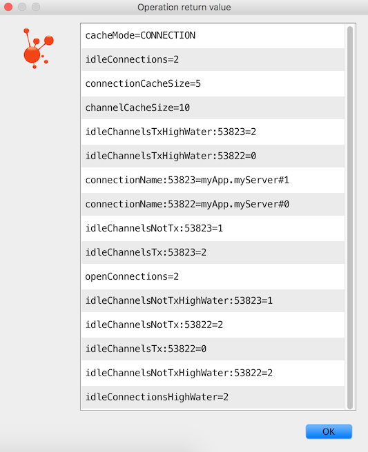

# Spring AMQP

## Navigation

- [Spring AMQP](#index)
  
- [Spring AMQP](#index)
  
- [What’s New](#whats-new)
  
- [Introduction](#introduction)
    
- [Quick Tour for the impatient](#introduction-quick-tour)
  
- [Reference](#reference)
    
- [Using Spring AMQP](#amqp)
      
- [AMQP Abstractions](#amqp-abstractions)
      
- [Connection and Resource Management](#amqp-connections)
      
- [Adding Custom Client Connection Properties](#amqp-custom-client-props)
      
- [AmqpTemplate](#amqp-template)
      
- [Sending Messages](#amqp-sending-messages)
      
- [Receiving Messages](#amqp-receiving-messages)
        
- [Polling Consumer](#amqp-receiving-messages-polling-consumer)
        
- [Asynchronous Consumer](#amqp-receiving-messages-async-consumer)
        
- [Batched Messages](#amqp-receiving-messages-de-batching)
        
- [Consumer Events](#amqp-receiving-messages-consumer-events)
        
- [Consumer Tags](#amqp-receiving-messages-consumertags)
        
- [Annotation-driven Listener Endpoints](#amqp-receiving-messages-async-annotation-driven)
          
- [Meta-annotations](#amqp-receiving-messages-async-annotation-driven-meta)
          
- [Enable Listener Endpoint Annotations](#amqp-receiving-messages-async-annotation-driven-enable)
          
- [Message Conversion for Annotated Methods](#amqp-receiving-messages-async-annotation-driven-conversion)
          
- [Adding a Custom HandlerMethodArgumentResolver to @RabbitListener](#amqp-receiving-messages-async-annotation-driven-custom-argument-resolver)
          
- [Programmatic Endpoint Registration](#amqp-receiving-messages-async-annotation-driven-registration)
          
- [Annotated Endpoint Method Signature](#amqp-receiving-messages-async-annotation-driven-enable-signature)
          
- [@RabbitListener @Payload Validation](#amqp-receiving-messages-async-annotation-driven-rabbit-validation)
          
- [Listening to Multiple Queues](#amqp-receiving-messages-async-annotation-driven-multiple-queues)
          
- [Reply Management](#amqp-receiving-messages-async-annotation-driven-reply)
          
- [Reply ContentType](#amqp-receiving-messages-async-annotation-driven-reply-content-type)
          
- [Multi-method Listeners](#amqp-receiving-messages-async-annotation-driven-method-selection)
          
- [@Repeatable @RabbitListener](#amqp-receiving-messages-async-annotation-driven-repeatable-rabbit-listener)
          
- [Proxy @RabbitListener and Generics](#amqp-receiving-messages-async-annotation-driven-proxy-rabbitlistener-and-generics)
          
- [Handling Exceptions](#amqp-receiving-messages-async-annotation-driven-error-handling)
          
- [Container Management](#amqp-receiving-messages-async-annotation-driven-container-management)
        
- [@RabbitListener with Batching](#amqp-receiving-messages-batch)
        
- [Using Container Factories](#amqp-receiving-messages-using-container-factories)
        
- [Asynchronous @RabbitListener Return Types](#amqp-receiving-messages-async-returns)
        
- [Threading and Asynchronous Consumers](#amqp-receiving-messages-threading)
        
- [Choosing a Container](#amqp-receiving-messages-choose-container)
        
- [Detecting Idle Asynchronous Consumers](#amqp-receiving-messages-idle-containers)
        
- [Micrometer Integration](#amqp-receiving-messages-micrometer)
        
- [Micrometer Observation](#amqp-receiving-messages-micrometer-observation)
      
- [Containers and Broker-Named queues](#amqp-containers-and-broker-named-queues)
      
- [Message Converters](#amqp-message-converters)
      
- [Modifying Messages - Compression and More](#amqp-post-processing)
      
- [Request/Reply Messaging](#amqp-request-reply)
      
- [Configuring the Broker](#amqp-broker-configuration)
      
- [Broker Event Listener](#amqp-broker-events)
      
- [Delayed Message Exchange](#amqp-delayed-message-exchange)
      
- [RabbitMQ REST API](#amqp-management-rest-api)
      
- [Exception Handling](#amqp-exception-handling)
      
- [Transactions](#amqp-transactions)
      
- [Message Listener Container Configuration](#amqp-containerattributes)
      
- [Listener Concurrency](#amqp-listener-concurrency)
      
- [Exclusive Consumer](#amqp-exclusive-consumer)
      
- [Listener Container Queues](#amqp-listener-queues)
      
- [Resilience: Recovering from Errors and Broker Failures](#amqp-resilience-recovering-from-errors-and-broker-failures)
      
- [Multiple Broker (or Cluster) Support](#amqp-multi-rabbit)
      
- [Debugging](#amqp-debugging)
    
- [Generic AMQP 1.0 Support](#amqp10-client)
    
- [Using the RabbitMQ Stream Plugin](#stream)
    
- [RabbitMQ AMQP 1.0 Support](#rabbitmq-amqp-client)
    
- [Logging Subsystem AMQP Appenders](#logging)
    
- [Sample Applications](#sample-apps)
    
- [Testing Support](#testing)
  
- [Spring Integration - Reference](#integration-reference)
  
- [Other Resources](#resources)
    
- [Further Reading](#further-reading)
  
- [Micrometer Observation Documentation](#appendix-micrometer)
  
- [Native Images](#appendix-native)
  - Change History
    
- [Current Release](#appendix-current-release)
    
- [Previous Releases](#appendix-previous-whats-new)

## Content

<a id="index"></a>

<!-- source_url: https://docs.spring.io/spring-amqp/reference/index.html -->

<!-- page_index: 1 -->

<a id="index--page-title"></a>
<a id="index--spring-amqp"></a>

# Spring AMQP

The Spring AMQP project applies core Spring concepts to the development of AMQP-based messaging solutions.
We provide a “template” as a high-level abstraction for sending and receiving messages.
We also provide support for message-driven POJOs.
These libraries facilitate management of AMQP resources while promoting the use of dependency injection and declarative configuration.
In all of these cases, you can see similarities to the JMS support in the Spring Framework.
For other project-related information, visit the Spring AMQP project [homepage](https://projects.spring.io/spring-amqp/).

---

<a id="whats-new"></a>

<!-- source_url: https://docs.spring.io/spring-amqp/reference/whats-new.html -->

<!-- page_index: 2 -->

<a id="whats-new--page-title"></a>
<a id="whats-new--what-s-new"></a>

# What’s New

<a id="whats-new--changes-in-4-1-since-4-0"></a>
<a id="whats-new--changes-in-4.1-since-4.0"></a>

## Changes in 4.1 Since 4.0

<a id="whats-new--x41-amqp10-client"></a>
<a id="whats-new--amqp-1.0-client"></a>

### AMQP 1.0 Client

A new `spring-amqp-client` module has been introduced to provide support for interacting with generic AMQP 1.0 protocol.
See [Generic AMQP 1.0 Support](#amqp10-client) for more information.

---

<a id="introduction"></a>

<!-- source_url: https://docs.spring.io/spring-amqp/reference/introduction/index.html -->

<!-- page_index: 3 -->

<a id="introduction--page-title"></a>
<a id="introduction--introduction"></a>

# Introduction

This first part of the reference documentation is a high-level overview of Spring AMQP and the underlying concepts.
It includes some code snippets to get you up and running as quickly as possible.

---

<a id="introduction-quick-tour"></a>

<!-- source_url: https://docs.spring.io/spring-amqp/reference/introduction/quick-tour.html -->

<!-- page_index: 4 -->

# Quick Tour for the impatient

<svg enable-background="new 0 0 32 32" id="Glyph" version="1.1" viewbox="0 0 32 32" xml:space="preserve" xmlns="http://www.w3.org/2000/svg" xmlns:xlink="http://www.w3.org/1999/xlink">
<path id="XMLID_223_"></path>
</svg>

Search

<a id="introduction-quick-tour--page-title"></a>
<a id="introduction-quick-tour--quick-tour-for-the-impatient"></a>

# Quick Tour for the impatient

<a id="introduction-quick-tour--introduction"></a>

## Introduction

This is the five-minute tour to get started with Spring AMQP.

Prerequisites: Install and run the RabbitMQ broker (<https://www.rabbitmq.com/download.html>).
Then grab the spring-rabbit JAR and all its dependencies - the easiest way to do so is to declare a dependency in your build tool.
For example, for Maven, you can do something resembling the following:

```xml
<dependency>
  <groupId>org.springframework.amqp</groupId>
  <artifactId>spring-rabbit</artifactId>
  <version>4.1.0</version>
</dependency>
```

For Gradle, you can do something resembling the following:

```groovy
implementation 'org.springframework.amqp:spring-rabbit:4.1.0'
```

<a id="introduction-quick-tour--compatibility"></a>

### Compatibility

The minimum Spring Framework version dependency is 7.0.0.

The minimum `amqp-client` Java client library version is 5.28.0.

The minimum `stream-client` Java client library for stream queues is 1.5.0.

<a id="introduction-quick-tour--very-very-quick"></a>

### Very, Very Quick

This section offers the fastest introduction.

First, add the following `import` statements to make the examples later in this section work:

```java
import org.springframework.amqp.core.AmqpAdmin;
import org.springframework.amqp.core.AmqpTemplate;
import org.springframework.amqp.core.Queue;
import org.springframework.amqp.rabbit.connection.CachingConnectionFactory;
import org.springframework.amqp.rabbit.connection.ConnectionFactory;
import org.springframework.amqp.rabbit.core.RabbitAdmin;
import org.springframework.amqp.rabbit.core.RabbitTemplate;
```

The following example uses plain, imperative Java to send and receive a message:

```java
ConnectionFactory connectionFactory = new CachingConnectionFactory();
AmqpAdmin admin = new RabbitAdmin(connectionFactory);
admin.declareQueue(new Queue("myqueue"));
AmqpTemplate template = new RabbitTemplate(connectionFactory);
template.convertAndSend("myqueue", "foo");
String foo = (String) template.receiveAndConvert("myqueue");
```

Note that there is also a `ConnectionFactory` in the native Java Rabbit client.
We use the Spring abstraction in the preceding code.
It caches channels (and optionally connections) for reuse.
We rely on the default exchange in the broker (since none is specified in the send), and the default binding of all queues to the default exchange by their name (thus, we can use the queue name as a routing key in the send).
Those behaviors are defined in the AMQP specification.

<a id="introduction-quick-tour--with-xml-configuration"></a>

### With XML Configuration

The following example is the same as the preceding example but externalizes the resource configuration to XML:

```java
ApplicationContext context =
    new GenericXmlApplicationContext("classpath:/rabbit-context.xml");
AmqpTemplate template = context.getBean(AmqpTemplate.class);
template.convertAndSend("myqueue", "foo");
String foo = (String) template.receiveAndConvert("myqueue");
```

```xml
<beans xmlns="http://www.springframework.org/schema/beans"
       xmlns:xsi="http://www.w3.org/2001/XMLSchema-instance"
       xmlns:rabbit="http://www.springframework.org/schema/rabbit"
       xsi:schemaLocation="http://www.springframework.org/schema/rabbit
           https://www.springframework.org/schema/rabbit/spring-rabbit.xsd
           http://www.springframework.org/schema/beans
           https://www.springframework.org/schema/beans/spring-beans.xsd">

    <rabbit:connection-factory id="connectionFactory"/>

    <rabbit:template id="amqpTemplate" connection-factory="connectionFactory"/>

    <rabbit:admin connection-factory="connectionFactory"/>

    <rabbit:queue name="myqueue"/>

</beans>
```

By default, the `<rabbit:admin/>` declaration automatically looks for beans of type `Queue`, `Exchange`, and `Binding` and declares them to the broker on behalf of the user.
As a result, you need not use that bean explicitly in the simple Java driver.
There are plenty of options to configure the properties of the components in the XML schema.
You can use auto-complete features of your XML editor to explore them and look at their documentation.

<a id="introduction-quick-tour--with-java-configuration"></a>

### With Java Configuration

The following example repeats the same example as the preceding example but with the external configuration defined in Java:

```java
ApplicationContext context =new AnnotationConfigApplicationContext(RabbitConfiguration.class); AmqpTemplate template = context.getBean(AmqpTemplate.class); template.convertAndSend("myqueue", "foo"); String foo = (String) template.receiveAndConvert("myqueue");
........
@Configuration public class RabbitConfiguration {
@Bean public CachingConnectionFactory connectionFactory() {return new CachingConnectionFactory("localhost");}
@Bean public RabbitAdmin amqpAdmin() {return new RabbitAdmin(connectionFactory());}
@Bean public RabbitTemplate rabbitTemplate() {return new RabbitTemplate(connectionFactory());}
@Bean public Queue myQueue() {return new Queue("myqueue");}}
```

<a id="introduction-quick-tour--with-spring-boot-auto-configuration-and-an-async-pojo-listener"></a>

### With Spring Boot Auto Configuration and an Async POJO Listener

Spring Boot automatically configures the infrastructure beans, as the following example shows:

```java
@SpringBootApplication public class Application {
public static void main(String[] args) {SpringApplication.run(Application.class, args);}
@Bean public ApplicationRunner runner(AmqpTemplate template) {return args -> template.convertAndSend("myqueue", "foo");}
@Bean public Queue myQueue() {return new Queue("myqueue");}
@RabbitListener(queues = "myqueue") public void listen(String in) {System.out.println(in);}
}
```

---

<a id="reference"></a>

<!-- source_url: https://docs.spring.io/spring-amqp/reference/reference.html -->

<!-- page_index: 5 -->

<a id="reference--page-title"></a>
<a id="reference--reference"></a>

# Reference

This part of the reference documentation details the various components that comprise Spring AMQP.
The [main chapter](#amqp) covers the core classes to develop an AMQP application.
This part also includes a chapter about the [sample applications](#sample-apps).

---

<a id="amqp"></a>

<!-- source_url: https://docs.spring.io/spring-amqp/reference/amqp.html -->

<!-- page_index: 6 -->

# Using Spring AMQP

<svg enable-background="new 0 0 32 32" id="Glyph" version="1.1" viewbox="0 0 32 32" xml:space="preserve" xmlns="http://www.w3.org/2000/svg" xmlns:xlink="http://www.w3.org/1999/xlink">
<path id="XMLID_223_"></path>
</svg>

Search

<a id="amqp--page-title"></a>
<a id="amqp--using-spring-amqp"></a>

# Using Spring AMQP

This chapter explores the interfaces and classes that are the essential components for developing applications with Spring AMQP.

<a id="amqp--section-summary"></a>

## Section Summary

- [AMQP Abstractions](#amqp-abstractions)
- [Connection and Resource Management](#amqp-connections)
- [Adding Custom Client Connection Properties](#amqp-custom-client-props)
- [`AmqpTemplate`](#amqp-template)
- [Sending Messages](#amqp-sending-messages)
- [Receiving Messages](#amqp-receiving-messages)
- [Containers and Broker-Named queues](#amqp-containers-and-broker-named-queues)
- [Message Converters](#amqp-message-converters)
- [Modifying Messages - Compression and More](#amqp-post-processing)
- [Request/Reply Messaging](#amqp-request-reply)
- [Configuring the Broker](#amqp-broker-configuration)
- [Broker Event Listener](#amqp-broker-events)
- [Delayed Message Exchange](#amqp-delayed-message-exchange)
- [RabbitMQ REST API](#amqp-management-rest-api)
- [Exception Handling](#amqp-exception-handling)
- [Transactions](#amqp-transactions)
- [Message Listener Container Configuration](#amqp-containerattributes)
- [Listener Concurrency](#amqp-listener-concurrency)
- [Exclusive Consumer](#amqp-exclusive-consumer)
- [Listener Container Queues](#amqp-listener-queues)
- [Resilience: Recovering from Errors and Broker Failures](#amqp-resilience-recovering-from-errors-and-broker-failures)
- [Multiple Broker (or Cluster) Support](#amqp-multi-rabbit)
- [Debugging](#amqp-debugging)

---

<a id="amqp-abstractions"></a>

<!-- source_url: https://docs.spring.io/spring-amqp/reference/amqp/abstractions.html -->

<!-- page_index: 7 -->

# AMQP Abstractions

<svg enable-background="new 0 0 32 32" id="Glyph" version="1.1" viewbox="0 0 32 32" xml:space="preserve" xmlns="http://www.w3.org/2000/svg" xmlns:xlink="http://www.w3.org/1999/xlink">
<path id="XMLID_223_"></path>
</svg>

Search

<a id="amqp-abstractions--page-title"></a>
<a id="amqp-abstractions--amqp-abstractions"></a>

# AMQP Abstractions

Spring AMQP consists of two modules (each represented by a JAR in the distribution): `spring-amqp` and `spring-rabbit`.
The 'spring-amqp' module contains the `org.springframework.amqp.core` package.
Within that package, you can find the classes that represent the core AMQP “model”.
Our intention is to provide generic abstractions that do not rely on any particular AMQP broker implementation or client library.
End user code can be more portable across vendor implementations as it can be developed against the abstraction layer only.
These abstractions are then implemented by broker-specific modules, such as 'spring-rabbit'.
There is currently only a RabbitMQ implementation.
However, the abstractions have been validated in .NET using Apache Qpid in addition to RabbitMQ.
Since AMQP operates at the protocol level, in principle, you can use the RabbitMQ client with any broker that supports the same protocol version, but we do not test any other brokers at present.

This overview assumes that you are already familiar with the basics of the AMQP specification.
If not, have a look at the resources listed in [Other Resources](#resources)

<a id="amqp-abstractions--message"></a>

## `Message`

The 0-9-1 AMQP specification does not define a `Message` class or interface.
Instead, when performing an operation such as `basicPublish()`, the content is passed as a byte-array argument and additional properties are passed in as separate arguments.
Spring AMQP defines a `Message` class as part of a more general AMQP domain model representation.
The purpose of the `Message` class is to encapsulate the body and properties within a single instance so that the API can, in turn, be simpler.
The following example shows the `Message` class definition:

```java
public class Message {
private final MessageProperties messageProperties;
private final byte[] body;
public Message(byte[] body, MessageProperties messageProperties) {this.body = body; this.messageProperties = messageProperties;}
public byte[] getBody() {return this.body;}
public MessageProperties getMessageProperties() {return this.messageProperties;}}
```

The `MessageProperties` interface defines several common properties, such as 'messageId', 'timestamp', 'contentType', and several more.
You can also extend those properties with user-defined 'headers' by calling the `setHeader(String key, Object value)` method.

> [!IMPORTANT]
> Starting with versions `1.5.7`, `1.6.11`, `1.7.4`, and `2.0.0`, if a message body is a serialized `Serializable` java object, it is no longer deserialized (by default) when performing `toString()` operations (such as in log messages).
> This is to prevent unsafe deserialization.
> By default, only `java.util` and `java.lang` classes are deserialized.
> To revert to the previous behavior, you can add allowable class/package patterns by invoking `Message.addAllowedListPatterns(…)`.
> A simple `*` wildcard is supported, for example `com.something.*, *.MyClass`.
> Bodies that cannot be deserialized are represented by `byte[<size>]` in log messages.

<a id="amqp-abstractions--exchange"></a>

## Exchange

The `Exchange` interface represents an AMQP Exchange, which is what a Message Producer sends to.
Each Exchange within a virtual host of a broker has a unique name as well as a few other properties.
The following example shows the `Exchange` interface:

```java
public interface Exchange extends Declarable {

    String getName();

    String getType();

    boolean isDurable();

    boolean isAutoDelete();

    Map<String, Object> getArguments();

}
```

As you can see, an `Exchange` also has a 'type' represented by constants defined in `ExchangeTypes`.
The basic types are: `direct`, `topic`, `fanout`, and `headers`.
In the core package, you can find implementations of the `Exchange` interface for each of those types.
The behavior varies across these `Exchange` types in terms of how they handle bindings to queues.
For example, a `Direct` exchange lets a queue be bound by a fixed routing key (often the queue’s name).
A `Topic` exchange supports bindings with routing patterns that may include the '\*' and '#' wildcards for 'exactly-one' and 'zero-or-more', respectively.
The `Fanout` exchange publishes to all queues that are bound to it without taking any routing key into consideration.
For much more information about these and the other Exchange types, see [AMQP Exchanges](https://www.rabbitmq.com/tutorials/amqp-concepts#exchanges).

Starting with version 3.2, the `ConsistentHashExchange` type has been introduced for convenience during application configuration phase.
It provided options like `x-consistent-hash` for an exchange type.
Allows to configure `hash-header` or `hash-property` exchange definition argument.
The respective RabbitMQ `rabbitmq_consistent_hash_exchange` plugin has to be enabled on the broker.
More information about the purpose, logic and behavior of the Consistent Hash Exchange are in the official RabbitMQ [documentation](https://github.com/rabbitmq/rabbitmq-server/tree/main/deps/rabbitmq_consistent_hash_exchange).

> [!NOTE]
> The AMQP specification also requires that any broker provide a “default” direct exchange that has no name.
> All queues that are declared are bound to that default `Exchange` with their names as routing keys.
> You can learn more about the default Exchange’s usage within Spring AMQP in [`AmqpTemplate`](#amqp-template).

<a id="amqp-abstractions--queue"></a>

## Queue

The `Queue` class represents the component from which a message consumer receives messages.
Like the various `Exchange` classes, our implementation is intended to be an abstract representation of this core AMQP type.
The following listing shows the `Queue` class:

```java
public class Queue  {
private final String name;
private final boolean durable;
private final boolean exclusive;
private final boolean autoDelete;
/** * The queue is durable, non-exclusive and non auto-delete.* * @param name the name of the queue.*/ public Queue(String name) {this(name, true, false, false);}
// Getters and Setters omitted for brevity
}
```

Notice that the constructor takes the queue name.
Depending on the implementation, the admin template may provide methods for generating a uniquely named queue.
Such queues can be useful as a “reply-to” address or in other **temporary** situations.
For that reason, the 'exclusive' and 'autoDelete' properties of an auto-generated queue would both be set to 'true'.

> [!NOTE]
> See the section on queues in [Configuring the Broker](#amqp-broker-configuration) for information about declaring queues by using namespace support, including queue arguments.

<a id="amqp-abstractions--binding"></a>

## Binding

Given that a producer sends to an exchange and a consumer receives from a queue, the bindings that connect queues to exchanges are critical for connecting those producers and consumers via messaging.
In Spring AMQP, we define a `Binding` class to represent those connections.
This section reviews the basic options for binding queues to exchanges.

We provide a `BindingBuilder` to facilitate a "fluent API" style, as the following example shows:

```java
Queue queue = ...;
// bind a queue to a DirectExchange with a fixed routing key
Binding directBinding = BindingBuilder.bind(queue).to(new DirectExchange("someDirectExchange")).with("foo.bar");
// bind a queue to a TopicExchange with a routing pattern
Binding topicBinding = BindingBuilder.bind(queue).to(new TopicExchange("someTopicExchange")).with("foo.*");
// bind a queue to a FanoutExchange with no routing key
Binding fanoutBinding = BindingBuilder.bind(queue).to(new FanoutExchange("someFanoutExchange"));
```

> [!NOTE]
> For clarity, the preceding example shows the `BindingBuilder` class, but this style works well when using a static import for the 'bind()' method.

By itself, an instance of the `Binding` class only holds the data about a connection.
In other words, it is not an “active” component.
However, as you will see later in [Configuring the Broker](#amqp-broker-configuration), the `AmqpAdmin` class can use `Binding` instances to actually trigger the binding actions on the broker.
Also, as you can see in that same section, you can define the `Binding` instances by using Spring’s `@Bean` annotations within `@Configuration` classes.
There is also a convenient base class that further simplifies that approach for generating AMQP-related bean definitions and recognizes the queues, exchanges, and bindings so that they are all declared on the AMQP broker upon application startup.

The `AmqpTemplate` is also defined within the core package.
As one of the main components involved in actual AMQP messaging, it is discussed in detail in its own section (see [`AmqpTemplate`](#amqp-template)).

---

<a id="amqp-connections"></a>

<!-- source_url: https://docs.spring.io/spring-amqp/reference/amqp/connections.html -->

<!-- page_index: 8 -->

# Connection and Resource Management

<svg enable-background="new 0 0 32 32" id="Glyph" version="1.1" viewbox="0 0 32 32" xml:space="preserve" xmlns="http://www.w3.org/2000/svg" xmlns:xlink="http://www.w3.org/1999/xlink">
<path id="XMLID_223_"></path>
</svg>

Search

<a id="amqp-connections--page-title"></a>
<a id="amqp-connections--connection-and-resource-management"></a>

# Connection and Resource Management

Whereas the AMQP model we described in the previous section is generic and applicable to all implementations, when we get into the management of resources, the details are specific to the broker implementation.
Therefore, in this section, we focus on code that exists only within our “spring-rabbit” module since, at this point, RabbitMQ is the only supported implementation.

The central component for managing a connection to the RabbitMQ broker is the `ConnectionFactory` interface.
The responsibility of a `ConnectionFactory` implementation is to provide an instance of `org.springframework.amqp.rabbit.connection.Connection`, which is a wrapper for `com.rabbitmq.client.Connection`.

<a id="amqp-connections--choosing-factory"></a>
<a id="amqp-connections--choosing-a-connection-factory"></a>

## Choosing a Connection Factory

There are three connection factories to chose from

- `PooledChannelConnectionFactory`
- `ThreadChannelConnectionFactory`
- `CachingConnectionFactory`

The first two were added in version 2.3.

For most use cases, the `CachingConnectionFactory` should be used.
The `ThreadChannelConnectionFactory` can be used if you want to ensure strict message ordering without the need to use [Scoped Operations](#amqp-template--scoped-operations).
The `PooledChannelConnectionFactory` is similar to the `CachingConnectionFactory` in that it uses a single connection and a pool of channels.
It’s implementation is simpler but it doesn’t support correlated publisher confirmations.

Simple publisher confirmations are supported by all three factories.

When configuring a `RabbitTemplate` to use a [separate connection](#amqp-template--separate-connection), you can now, starting with version 2.3.2, configure the publishing connection factory to be a different type.
By default, the publishing factory is the same type and any properties set on the main factory are also propagated to the publishing factory.

Starting with version 3.1, the `AbstractConnectionFactory` includes the `connectionCreatingBackOff` property, which supports a backoff policy in the connection module.
Currently, there is support in the behavior of `createChannel()` to handle exceptions that occur when the `channelMax` limit is reached, implementing a backoff strategy based on attempts and intervals.

<a id="amqp-connections--pooledchannelconnectionfactory"></a>

### `PooledChannelConnectionFactory`

This factory manages a single connection and two pools of channels, based on the Apache Pool2.
One pool is for transactional channels, the other is for non-transactional channels.
The pools are `GenericObjectPool` s with default configuration; a callback is provided to configure the pools; refer to the Apache documentation for more information.

The Apache `commons-pool2` jar must be on the class path to use this factory.

```java
@Bean PooledChannelConnectionFactory pcf() throws Exception {ConnectionFactory rabbitConnectionFactory = new ConnectionFactory(); rabbitConnectionFactory.setHost("localhost"); PooledChannelConnectionFactory pcf = new PooledChannelConnectionFactory(rabbitConnectionFactory); pcf.setPoolConfigurer((pool, tx) -> {if (tx) {// configure the transactional pool} else {// configure the non-transactional pool} }); return pcf;}
```

<a id="amqp-connections--threadchannelconnectionfactory"></a>

### `ThreadChannelConnectionFactory`

This factory manages a single connection and two `ThreadLocal` s, one for transactional channels, the other for non-transactional channels.
This factory ensures that all operations on the same thread use the same channel (as long as it remains open).
This facilitates strict message ordering without the need for [Scoped Operations](#amqp-template--scoped-operations).
To avoid memory leaks, if your application uses many short-lived threads, you must call the factory’s `closeThreadChannel()` to release the channel resource.
Starting with version 2.3.7, a thread can transfer its channel(s) to another thread.
See [Strict Message Ordering in a Multi-Threaded Environment](#amqp-template--multi-strict) for more information.

<a id="amqp-connections--cachingconnectionfactory"></a>

### `CachingConnectionFactory`

The third implementation provided is the `CachingConnectionFactory`, which, by default, establishes a single connection proxy that can be shared by the application.
Sharing of the connection is possible since the “unit of work” for messaging with AMQP is actually a “channel” (in some ways, this is similar to the relationship between a connection and a session in JMS).
The connection instance provides a `createChannel` method.
The `CachingConnectionFactory` implementation supports caching of those channels, and it maintains separate caches for channels based on whether they are transactional.
When creating an instance of `CachingConnectionFactory`, you can provide the 'hostname' through the constructor.
You should also provide the 'username' and 'password' properties.
To configure the size of the channel cache (the default is 25), you can call the
`setChannelCacheSize()` method.

Starting with version 1.3, you can configure the `CachingConnectionFactory` to cache connections as well as only channels.
In this case, each call to `createConnection()` creates a new connection (or retrieves an idle one from the cache).
Closing a connection returns it to the cache (if the cache size has not been reached).
Channels created on such connections are also cached.
The use of separate connections might be useful in some environments, such as consuming from an HA cluster, in
conjunction with a load balancer, to connect to different cluster members, and others.
To cache connections, set the `cacheMode` to `CacheMode.CONNECTION`.

> [!NOTE]
> This does not limit the number of connections.
> Rather, it specifies how many idle open connections are allowed.

Starting with version 1.5.5, a new property called `connectionLimit` is provided.
When this property is set, it limits the total number of connections allowed.
When set, if the limit is reached, the `channelCheckoutTimeLimit` is used to wait for a connection to become idle.
If the time is exceeded, an `AmqpTimeoutException` is thrown.

> [!IMPORTANT]
> When the cache mode is `CONNECTION`, automatic declaration of queues and others
> (See [Automatic Declaration of Exchanges, Queues, and Bindings](#amqp-resilience-recovering-from-errors-and-broker-failures--automatic-declaration)) is NOT supported.
>
> Also, at the time of this writing, the `amqp-client` library by default creates a fixed thread pool for each connection (default size: `Runtime.getRuntime().availableProcessors() * 2` threads).
> When using a large number of connections, you should consider setting a custom `executor` on the `CachingConnectionFactory`.
> Then, the same executor can be used by all connections and its threads can be shared.
> The executor’s thread pool should be unbounded or set appropriately for the expected use (usually, at least one thread per connection).
> If multiple channels are created on each connection, the pool size affects the concurrency, so a variable (or simple cached) thread pool executor would be most suitable.

It is important to understand that the cache size is (by default) not a limit but is merely the number of channels that can be cached.
With a cache size of, say, 10, any number of channels can actually be in use.
If more than 10 channels are being used and they are all returned to the cache, 10 go in the cache.
The remainder are physically closed.

Starting with version 1.6, the default channel cache size has been increased from 1 to 25.
In high volume, multi-threaded environments, a small cache means that channels are created and closed at a high rate.
Increasing the default cache size can avoid this overhead.
You should monitor the channels in use through the RabbitMQ Admin UI and consider increasing the cache size further if you
see many channels being created and closed.
The cache grows only on-demand (to suit the concurrency requirements of the application), so this change does not
impact existing low-volume applications.

Starting with version 1.4.2, the `CachingConnectionFactory` has a property called `channelCheckoutTimeout`.
When this property is greater than zero, the `channelCacheSize` becomes a limit on the number of channels that can be created on a connection.
If the limit is reached, calling threads block until a channel is available or this timeout is reached, in which case a `AmqpTimeoutException` is thrown.

> [!WARNING]
> Channels used within the framework (for example, `RabbitTemplate`) are reliably returned to the cache.
> If you create channels outside of the framework, (for example, by accessing the connections directly and invoking `createChannel()`), you must return them (by closing) reliably, perhaps in a `finally` block, to avoid running out of channels.

The following example shows how to create a new `connection`:

```java
CachingConnectionFactory connectionFactory = new CachingConnectionFactory("somehost");
connectionFactory.setUsername("guest");
connectionFactory.setPassword("guest");

Connection connection = connectionFactory.createConnection();
```

When using XML, the configuration might look like the following example:

```xml
<bean id="connectionFactory"
      class="org.springframework.amqp.rabbit.connection.CachingConnectionFactory">
    <constructor-arg value="somehost"/>
    <property name="username" value="guest"/>
    <property name="password" value="guest"/>
</bean>
```

> [!NOTE]
> There is also a `SingleConnectionFactory` implementation that is available only in the unit test code of the framework.
> It is simpler than `CachingConnectionFactory`, since it does not cache channels, but it is not intended for practical usage outside of simple tests due to its lack of performance and resilience.
> If you need to implement your own `ConnectionFactory` for some reason, the `AbstractConnectionFactory` base class may provide a nice starting point.

A `ConnectionFactory` can be created quickly and conveniently by using the rabbit namespace, as follows:

```xml
<rabbit:connection-factory id="connectionFactory"/>
```

In most cases, this approach is preferable, since the framework can choose the best defaults for you.
The created instance is a `CachingConnectionFactory`.
Keep in mind that the default cache size for channels is 25.
If you want more channels to be cached, set a larger value by setting the 'channelCacheSize' property.
In XML it would look like as follows:

```xml
<bean id="connectionFactory"
      class="org.springframework.amqp.rabbit.connection.CachingConnectionFactory">
    <constructor-arg value="somehost"/>
    <property name="username" value="guest"/>
    <property name="password" value="guest"/>
    <property name="channelCacheSize" value="50"/>
</bean>
```

Also, with the namespace, you can add the 'channel-cache-size' attribute, as follows:

```xml
<rabbit:connection-factory
    id="connectionFactory" channel-cache-size="50"/>
```

The default cache mode is `CHANNEL`, but you can configure it to cache connections instead.
In the following example, we use `connection-cache-size`:

```xml
<rabbit:connection-factory
    id="connectionFactory" cache-mode="CONNECTION" connection-cache-size="25"/>
```

You can provide host and port attributes by using the namespace, as follows:

```xml
<rabbit:connection-factory
    id="connectionFactory" host="somehost" port="5672"/>
```

Alternatively, if running in a clustered environment, you can use the addresses attribute, as follows:

```xml
<rabbit:connection-factory
    id="connectionFactory" addresses="host1:5672,host2:5672" address-shuffle-mode="RANDOM"/>
```

See [Connecting to a Cluster](#amqp-connections--cluster) for information about `address-shuffle-mode`.

The following example with a custom thread factory that prefixes thread names with `rabbitmq-`:

```xml
<rabbit:connection-factory id="multiHost" virtual-host="/bar" addresses="host1:1234,host2,host3:4567"
    thread-factory="tf"
    channel-cache-size="10" username="user" password="password" />

<bean id="tf" class="org.springframework.scheduling.concurrent.CustomizableThreadFactory">
    <constructor-arg value="rabbitmq-" />
</bean>
```

<a id="amqp-connections--addressresolver"></a>

## AddressResolver

Starting with version 2.1.15, you can now use an `AddressResolver` to resolve the connection address(es).
This will override any settings of the `addresses` and `host/port` properties.

<a id="amqp-connections--naming-connections"></a>

## Naming Connections

Starting with version 1.7, a `ConnectionNameStrategy` is provided for the injection into the `AbstractionConnectionFactory`.
The generated name is used for the application-specific identification of the target RabbitMQ connection.
The connection name is displayed in the management UI if the RabbitMQ server supports it.
This value does not have to be unique and cannot be used as a connection identifier — for example, in HTTP API requests.
This value is supposed to be human-readable and is a part of `ClientProperties` under the `connection_name` key.
You can use a simple Lambda, as follows:

```java
connectionFactory.setConnectionNameStrategy(connectionFactory -> "MY_CONNECTION");
```

The `ConnectionFactory` argument can be used to distinguish target connection names by some logic.
By default, the `beanName` of the `AbstractConnectionFactory`, a hex string representing the object, and an internal counter are used to generate the `connection_name`.
The `<rabbit:connection-factory>` namespace component is also supplied with the `connection-name-strategy` attribute.

An implementation of `SimplePropertyValueConnectionNameStrategy` sets the connection name to an application property.
You can declare it as a `@Bean` and inject it into the connection factory, as the following example shows:

```java
@Bean public SimplePropertyValueConnectionNameStrategy cns() {return new SimplePropertyValueConnectionNameStrategy("spring.application.name");}
@Bean public ConnectionFactory rabbitConnectionFactory(ConnectionNameStrategy cns) {CachingConnectionFactory connectionFactory = new CachingConnectionFactory(); ...connectionFactory.setConnectionNameStrategy(cns); return connectionFactory;}
```

The property must exist in the application context’s `Environment`.

> [!NOTE]
> When using Spring Boot and its autoconfigured connection factory, you need only declare the `ConnectionNameStrategy` `@Bean`.
> Spring Boot auto-detects the bean and wires it into the factory.

<a id="amqp-connections--blocked-connections-and-resource-constraints"></a>

## Blocked Connections and Resource Constraints

The connection might be blocked for interaction from the broker that corresponds to the [Memory Alarm](https://www.rabbitmq.com/memory.html).
Starting with version 2.0, the `org.springframework.amqp.rabbit.connection.Connection` can be supplied with `com.rabbitmq.client.BlockedListener` instances to be notified for connection blocked and unblocked events.
In addition, the `AbstractConnectionFactory` emits a `ConnectionBlockedEvent` and `ConnectionUnblockedEvent`, respectively, through its internal `BlockedListener` implementation.
These let you provide application logic to react appropriately to problems on the broker and (for example) take some corrective actions.

> [!IMPORTANT]
> When the application is configured with a single `CachingConnectionFactory`, as it is by default with Spring Boot auto-configuration, the application stops working when the connection is blocked by the Broker.
> And when it is blocked by the Broker, any of its clients stop to work.
> If we have producers and consumers in the same application, we may end up with a deadlock when producers are blocking the connection (because there are no resources on the Broker any more) and consumers cannot free them (because the connection is blocked).
> To mitigate the problem, we suggest having one more separate `CachingConnectionFactory` instance with the same options — one for producers and one for consumers.
> A separate `CachingConnectionFactory` is not possible for transactional producers that execute on a consumer thread, since they should reuse the `Channel` associated with the consumer transactions.

Starting with version 2.0.2, the `RabbitTemplate` has a configuration option to automatically use a second connection factory, unless transactions are being used.
See [Using a Separate Connection](#amqp-template--separate-connection) for more information.
The `ConnectionNameStrategy` for the publisher connection is the same as the primary strategy with `.publisher` appended to the result of calling the method.

Starting with version 1.7.7, an `AmqpResourceNotAvailableException` is provided, which is thrown when `SimpleConnection.createChannel()` cannot create a `Channel` (for example, because the `channelMax` limit is reached and there are no available channels in the cache).
You can use this exception in the `RetryPolicy` to recover the operation after some back-off.

<a id="amqp-connections--connection-factory"></a>
<a id="amqp-connections--configuring-the-underlying-client-connection-factory"></a>

## Configuring the Underlying Client Connection Factory

The `CachingConnectionFactory` uses an instance of the Rabbit client `ConnectionFactory`.
A number of configuration properties are passed through (`host`, `port`, `userName`, `password`, `requestedHeartBeat`, and `connectionTimeout` for example) when setting the equivalent property on the `CachingConnectionFactory`.
To set other properties (`clientProperties`, for example), you can define an instance of the Rabbit factory and provide a reference to it by using the appropriate constructor of the `CachingConnectionFactory`.
When using the namespace ([as described earlier](#amqp-connections)), you need to provide a reference to the configured factory in the `connection-factory` attribute.
For convenience, a factory bean is provided to assist in configuring the connection factory in a Spring application context, as discussed in [the next section](#amqp-connections--rabbitconnectionfactorybean-configuring-ssl).

```xml
<rabbit:connection-factory
      id="connectionFactory" connection-factory="rabbitConnectionFactory"/>
```

> [!NOTE]
> The 4.0.x client enables automatic recovery by default.
> While compatible with this feature, Spring AMQP has its own recovery mechanisms and the client recovery feature generally is not needed.
> We recommend disabling `amqp-client` automatic recovery, to avoid getting `AutoRecoverConnectionNotCurrentlyOpenException` instances when the broker is available but the connection has not yet recovered.
> You may notice this exception, for example, when a `RetryTemplate` is configured in a `RabbitTemplate`, even when failing over to another broker in a cluster.
> Since the auto-recovering connection recovers on a timer, the connection may be recovered more quickly by using Spring AMQP’s recovery mechanisms.
> Starting with version 1.7.1, Spring AMQP disables `amqp-client` automatic recovery unless you explicitly create your own RabbitMQ connection factory and provide it to the `CachingConnectionFactory`.
> RabbitMQ `ConnectionFactory` instances created by the `RabbitConnectionFactoryBean` also have the option disabled by default.

<a id="amqp-connections--rabbitconnectionfactorybean-configuring-ssl"></a>
<a id="amqp-connections--rabbitconnectionfactorybean-and-configuring-ssl"></a>

## `RabbitConnectionFactoryBean` and Configuring SSL

Starting with version 1.4, a convenient `RabbitConnectionFactoryBean` is provided to enable convenient configuration of SSL properties on the underlying client connection factory by using dependency injection.
Other setters delegate to the underlying factory.
Previously, you had to configure the SSL options programmatically.
The following example shows how to configure a `RabbitConnectionFactoryBean`:

- Java
- XML

```java
@Bean
RabbitConnectionFactoryBean rabbitConnectionFactory() {
    RabbitConnectionFactoryBean factoryBean = new RabbitConnectionFactoryBean();
    factoryBean.setUseSSL(true);
    factoryBean.setSslPropertiesLocation(new ClassPathResource("secrets/rabbitSSL.properties"));
    return factoryBean;
}

@Bean
CachingConnectionFactory connectionFactory(ConnectionFactory rabbitConnectionFactory) {
    CachingConnectionFactory ccf = new CachingConnectionFactory(rabbitConnectionFactory);
    ccf.setHost("...");
    // ...
    return ccf;
}
```

```xml
<bean id="rabbitConnectionFactory"
        class="org.springframework.amqp.rabbit.connection.RabbitConnectionFactoryBean">
    <property name="useSSL" value="true" />
    <property name="sslPropertiesLocation" value="classpath:secrets/rabbitSSL.properties"/>
</bean>

<rabbit:connection-factory id="connectionFactory"
    connection-factory="rabbitConnectionFactory"
    host="${host}"
    port="${port}"
    virtual-host="${vhost}"
    username="${username}" password="${password}" />
```

Spring Boot application file (`.yaml` or `.properties`)

- Properties
- YAML

```properties
spring.rabbitmq.host=...
spring.rabbitmq.ssl.keyStoreType=jks
spring.rabbitmq.ssl.trustStoreType=jks
spring.rabbitmq.ssl.keyStore=...
spring.rabbitmq.ssl.trustStore=...
spring.rabbitmq.ssl.trustStorePassword=...
spring.rabbitmq.ssl.keyStorePassword=...
spring.rabbitmq.ssl.enabled=true
```

```yaml
spring:
  rabbitmq:
    host: ...
    ssl:
      keyStoreType: jks
      trustStoreType: jks
      keyStore: ...
      trustStore: ...
      trustStorePassword: ...
      keyStorePassword: ...
      enabled: true
```

See the [RabbitMQ Documentation](https://www.rabbitmq.com/ssl.html) for information about configuring SSL.
Omit the `keyStore` and `trustStore` configuration to connect over SSL without certificate validation.
The next example shows how you can provide key and trust store configuration.

The `sslPropertiesLocation` property is a Spring `Resource` pointing to a properties file containing the following keys:

```none
keyStore=file:/secret/keycert.p12
trustStore=file:/secret/trustStore
keyStore.passPhrase=secret
trustStore.passPhrase=secret
```

The `keyStore` and `truststore` are Spring `Resources` pointing to the stores.
Typically this properties file is secured by the operating system with the application having read access.

Starting with Spring AMQP version 1.5,you can set these properties directly on the factory bean.
If both discrete properties and `sslPropertiesLocation` is provided, properties in the latter override the
discrete values.

> [!IMPORTANT]
> Starting with version 2.0, the server certificate is validated by default because it is more secure.
> If you wish to skip this validation for some reason, set the factory bean’s `skipServerCertificateValidation` property to `true`.
> Starting with version 2.1, the `RabbitConnectionFactoryBean` now calls `enableHostnameVerification()` by default.
> To revert to the previous behavior, set the `enableHostnameVerification` property to `false`.

> [!IMPORTANT]
> Starting with version 2.2.5, the factory bean will always use TLS v1.2 by default; previously, it used v1.1 in some cases and v1.2 in others (depending on other properties).
> If you need to use v1.1 for some reason, set the `sslAlgorithm` property: `setSslAlgorithm("TLSv1.1")`.

<a id="amqp-connections--cluster"></a>
<a id="amqp-connections--connecting-to-a-cluster"></a>

## Connecting to a Cluster

To connect to a cluster, configure the `addresses` property on the `CachingConnectionFactory`:

```java
@Bean
public CachingConnectionFactory ccf() {
    CachingConnectionFactory ccf = new CachingConnectionFactory();
    ccf.setAddresses("host1:5672,host2:5672,host3:5672");
    return ccf;
}
```

Starting with version 3.0, the underlying connection factory will attempt to connect to a host, by choosing a random address, whenever a new connection is established.
To revert to the previous behavior of attempting to connect from first to last, set the `addressShuffleMode` property to `AddressShuffleMode.NONE`.

Starting with version 2.3, the `INORDER` shuffle mode was added, which means the first address is moved to the end after a connection is created.
You may wish to use this mode with the [RabbitMQ Sharding Plugin](https://github.com/rabbitmq/rabbitmq-server/tree/main/deps/rabbitmq_sharding) with `CacheMode.CONNECTION` and suitable concurrency if you wish to consume from all shards on all nodes.

```java
@Bean
public CachingConnectionFactory ccf() {
    CachingConnectionFactory ccf = new CachingConnectionFactory();
    ccf.setAddresses("host1:5672,host2:5672,host3:5672");
    ccf.setAddressShuffleMode(AddressShuffleMode.INORDER);
    return ccf;
}
```

<a id="amqp-connections--routing-connection-factory"></a>

## Routing Connection Factory

Starting with version 1.3, the `AbstractRoutingConnectionFactory` has been introduced.
This factory provides a mechanism to configure mappings for several `ConnectionFactories` and determine a target `ConnectionFactory` by some `lookupKey` at runtime.
Typically, the implementation checks a thread-bound context.
For convenience, Spring AMQP provides the `SimpleRoutingConnectionFactory`, which gets the current thread-bound `lookupKey` from the `SimpleResourceHolder`.
The following examples shows how to configure a `SimpleRoutingConnectionFactory` in both XML and Java:

```xml
<bean id="connectionFactory"
      class="org.springframework.amqp.rabbit.connection.SimpleRoutingConnectionFactory">
    <property name="targetConnectionFactories">
        <map>
            <entry key="#{connectionFactory1.virtualHost}" ref="connectionFactory1"/>
            <entry key="#{connectionFactory2.virtualHost}" ref="connectionFactory2"/>
        </map>
    </property>
</bean>

<rabbit:template id="template" connection-factory="connectionFactory" />
```

```java
public class MyService {
@Autowired private RabbitTemplate rabbitTemplate;
public void service(String vHost, String payload) {SimpleResourceHolder.bind(rabbitTemplate.getConnectionFactory(), vHost); rabbitTemplate.convertAndSend(payload); SimpleResourceHolder.unbind(rabbitTemplate.getConnectionFactory());}
}
```

It is important to unbind the resource after use.
For more information, see the [JavaDoc](https://docs.spring.io/spring-amqp/docs/4.1.0/api/org/springframework/amqp/rabbit/connection/AbstractRoutingConnectionFactory.html) for `AbstractRoutingConnectionFactory`.

Starting with version 1.4, `RabbitTemplate` supports the SpEL `sendConnectionFactorySelectorExpression` and `receiveConnectionFactorySelectorExpression` properties, which are evaluated on each AMQP protocol interaction operation (`send`, `sendAndReceive`, `receive`, or `receiveAndReply`), resolving to a `lookupKey` value for the provided `AbstractRoutingConnectionFactory`.
You can use bean references, such as `@vHostResolver.getVHost(#root)` in the expression.
For `send` operations, the message to be sent is the root evaluation object.
For `receive` operations, the `queueName` is the root evaluation object.

The routing algorithm is as follows: If the selector expression is `null` or is evaluated to `null` or the provided `ConnectionFactory` is not an instance of `AbstractRoutingConnectionFactory`, everything works as before, relying on the provided `ConnectionFactory` implementation.
The same occurs if the evaluation result is not `null`, but there is no target `ConnectionFactory` for that `lookupKey` and the `AbstractRoutingConnectionFactory` is configured with `lenientFallback = true`.
In the case of an `AbstractRoutingConnectionFactory`, it does fallback to its `routing` implementation based on `determineCurrentLookupKey()`.
However, if `lenientFallback = false`, an `IllegalStateException` is thrown.

The namespace support also provides the `send-connection-factory-selector-expression` and `receive-connection-factory-selector-expression` attributes on the `<rabbit:template>` component.

Also, starting with version 1.4, you can configure a routing connection factory in a listener container.
In that case, the list of queue names is used as the lookup key.
For example, if you configure the container with `setQueueNames("thing1", "thing2")`, the lookup key is `[thing1,thing]"` (note that there is no space in the key).

Starting with version 1.6.9, you can add a qualifier to the lookup key by using `setLookupKeyQualifier` on the listener container.
Doing so enables, for example, listening to queues with the same name but in a different virtual host (where you would have a connection factory for each).

For example, with lookup key qualifier `thing1` and a container listening to queue `thing2`, the lookup key you could register the target connection factory with could be `thing1[thing2]`.

> [!IMPORTANT]
> The target (and default, if provided) connection factories must have the same settings for publisher confirms and returns.
> See [Publisher Confirms and Returns](#amqp-connections--cf-pub-conf-ret).

Starting with version 2.4.4, this validation can be disabled.
If you have a case that the values between confirms and returns need to be unequal, you can use `AbstractRoutingConnectionFactory#setConsistentConfirmsReturns` to turn of the validation.
Note that the first connection factory added to `AbstractRoutingConnectionFactory` will determine the general values of `confirms` and `returns`.

It may be useful if you have a case that certain messages you would to check confirms/returns and others you don’t.
For example:

```java
@Bean
public RabbitTemplate rabbitTemplate() {
    final com.rabbitmq.client.ConnectionFactory cf = new com.rabbitmq.client.ConnectionFactory();
    cf.setHost("localhost");
    cf.setPort(5672);

    CachingConnectionFactory cachingConnectionFactory = new CachingConnectionFactory(cf);
    cachingConnectionFactory.setPublisherConfirmType(CachingConnectionFactory.ConfirmType.CORRELATED);

    PooledChannelConnectionFactory pooledChannelConnectionFactory = new PooledChannelConnectionFactory(cf);

    final Map<Object, ConnectionFactory> connectionFactoryMap = new HashMap<>(2);
    connectionFactoryMap.put("true", cachingConnectionFactory);
    connectionFactoryMap.put("false", pooledChannelConnectionFactory);

    final AbstractRoutingConnectionFactory routingConnectionFactory = new SimpleRoutingConnectionFactory();
    routingConnectionFactory.setConsistentConfirmsReturns(false);
    routingConnectionFactory.setDefaultTargetConnectionFactory(pooledChannelConnectionFactory);
    routingConnectionFactory.setTargetConnectionFactories(connectionFactoryMap);

    final RabbitTemplate rabbitTemplate = new RabbitTemplate(routingConnectionFactory);

    final Expression sendExpression = new SpelExpressionParser().parseExpression(
            "messageProperties.headers['x-use-publisher-confirms'] ?: false");
    rabbitTemplate.setSendConnectionFactorySelectorExpression(sendExpression);
}
```

This way messages with the header `x-use-publisher-confirms: true` will be sent through the caching connection, and you can ensure the message delivery.
See [Publisher Confirms and Returns](#amqp-connections--cf-pub-conf-ret) for more information about ensuring message delivery.

<a id="amqp-connections--queue-affinity"></a>
<a id="amqp-connections--queue-affinity-and-the-localizedqueueconnectionfactory"></a>

## Queue Affinity and the `LocalizedQueueConnectionFactory`

When using HA queues in a cluster, for the best performance, you may want to connect to the physical broker
where the lead queue resides.
The `CachingConnectionFactory` can be configured with multiple broker addresses.
This is to fail over and the client attempts to connect in accordance with the configured `AddressShuffleMode` order.
The `LocalizedQueueConnectionFactory` uses the REST API provided by the management plugin to determine which node is the lead for the queue.
It then creates (or retrieves from a cache) a `CachingConnectionFactory` that connects to just that node.
If the connection fails, the new lead node is determined and the consumer connects to it.
The `LocalizedQueueConnectionFactory` is configured with a default connection factory, in case the physical location of the queue cannot be determined, in which case it connects as normal to the cluster.

The `LocalizedQueueConnectionFactory` is a `RoutingConnectionFactory` and the `SimpleMessageListenerContainer` uses the queue names as the lookup key as discussed in [Routing Connection Factory](#amqp-connections--routing-connection-factory) above.

> [!NOTE]
> For this reason (the use of the queue name for the lookup), the `LocalizedQueueConnectionFactory` can only be used if the container is configured to listen to a single queue.

> [!NOTE]
> The RabbitMQ management plugin must be enabled on each node.

> [!WARNING]
> This connection factory is intended for long-lived connections, such as those used by the `SimpleMessageListenerContainer`.
> It is not intended for short connection use, such as with a `RabbitTemplate` because of the overhead of invoking the REST API before making the connection.
> Also, for publish operations, the queue is unknown, and the message is published to all cluster members anyway, so the logic of looking up the node has little value.

The following example configuration shows how to configure the factories:

```java
@Autowired
private ConfigurationProperties props;

@Bean
public CachingConnectionFactory defaultConnectionFactory() {
    CachingConnectionFactory cf = new CachingConnectionFactory();
    cf.setAddresses(this.props.getAddresses());
    cf.setUsername(this.props.getUsername());
    cf.setPassword(this.props.getPassword());
    cf.setVirtualHost(this.props.getVirtualHost());
    return cf;
}

@Bean
public LocalizedQueueConnectionFactory queueAffinityCF(
        @Qualifier("defaultConnectionFactory") ConnectionFactory defaultCF) {
    return new LocalizedQueueConnectionFactory(defaultCF,
            StringUtils.commaDelimitedListToStringArray(this.props.getAddresses()),
            StringUtils.commaDelimitedListToStringArray(this.props.getAdminUris()),
            StringUtils.commaDelimitedListToStringArray(this.props.getNodes()),
            this.props.getVirtualHost(), this.props.getUsername(), this.props.getPassword(),
            false, null);
}
```

Notice that the first three parameters are arrays of `addresses`, `adminUris`, and `nodes`.
These are positional in that, when a container attempts to connect to a queue, it uses the admin API to determine which node is the lead for the queue and connects to the address in the same array position as that node.

> [!IMPORTANT]
> Starting with version 3.0, the RabbitMQ `http-client` is no longer used to access the Rest API.
> Instead, by default, the `WebClient` from Spring Webflux is used if `spring-webflux` is on the class path; otherwise a `RestTemplate` is used.

To add `WebFlux` to the class path:

Maven

```xml
<dependency>
  <groupId>org.springframework.amqp</groupId>
  <artifactId>spring-rabbit</artifactId>
</dependency>
```

Gradle

```groovy
implementation 'org.springframework.amqp:spring-rabbit'
```

You can also use other REST technology by implementing [LocalizedQueueConnectionFactory#setNodeLocator](https://docs.spring.io/spring-amqp/docs/4.1.0/api/org/springframework/amqp/rabbit/connection/LocalizedQueueConnectionFactory.html#setNodeLocator(org.springframework.amqp.rabbit.connection.NodeLocator)) and overriding its `createClient`, `restCall`, and optionally, `close` methods.

```java
lqcf.setNodeLocator(new NodeLocator<MyClient>() {
@Override public MyClient createClient(String userName, String password) {...}
@Override public Map<String, Object> restCall(MyClient client, String baseUri, String vhost, String queue) throws URISyntaxException {...}
});
```

The framework provides the `WebFluxNodeLocator` and `RestTemplateNodeLocator`, with the default as discussed above.

<a id="amqp-connections--cf-pub-conf-ret"></a>
<a id="amqp-connections--publisher-confirms-and-returns"></a>

## Publisher Confirms and Returns

Confirmed (with correlation) and returned messages are supported by setting the `CachingConnectionFactory` property `publisherConfirmType` to `ConfirmType.CORRELATED` and the `publisherReturns` property to 'true'.

When these options are set, `Channel` instances created by the factory are wrapped in an `PublisherCallbackChannel`, which is used to facilitate the callbacks.
When such a channel is obtained, the client can register a `PublisherCallbackChannel.Listener` with the `Channel`.
The `PublisherCallbackChannel` implementation contains logic to route a confirm or return to the appropriate listener.
These features are explained further in the following sections.

See also [Correlated Publisher Confirms and Returns](#amqp-template--template-confirms) and `simplePublisherConfirms` in [Scoped Operations](#amqp-template--scoped-operations).

> [!TIP]
> For some more background information, see the blog post by the RabbitMQ team titled [Introducing Publisher Confirms](https://www.rabbitmq.com/blog/2011/02/10/introducing-publisher-confirms/).

<a id="amqp-connections--connection-channel-listeners"></a>
<a id="amqp-connections--connection-and-channel-listeners"></a>

## Connection and Channel Listeners

The connection factory supports registering `ConnectionListener` and `ChannelListener` implementations.
This allows you to receive notifications for connection and channel related events.
(A `ConnectionListener` is used by the `RabbitAdmin` to perform declarations when the connection is established - see [Automatic Declaration of Exchanges, Queues, and Bindings](#amqp-resilience-recovering-from-errors-and-broker-failures--automatic-declaration) for more information).
The following listing shows the `ConnectionListener` interface definition:

```java
@FunctionalInterface public interface ConnectionListener {
void onCreate(Connection connection);
default void onClose(Connection connection) {}
default void onShutDown(ShutdownSignalException signal) {}
}
```

Starting with version 2.0, the `org.springframework.amqp.rabbit.connection.Connection` object can be supplied with `com.rabbitmq.client.BlockedListener` instances to be notified for connection blocked and unblocked events.
The following example shows the ChannelListener interface definition:

```java
@FunctionalInterface public interface ChannelListener {
void onCreate(Channel channel, boolean transactional);
default void onShutDown(ShutdownSignalException signal) {}
}
```

See [Publishing is Asynchronous — How to Detect Successes and Failures](#amqp-template--publishing-is-async) for one scenario where you might want to register a `ChannelListener`.

<a id="amqp-connections--channel-close-logging"></a>
<a id="amqp-connections--logging-channel-close-events"></a>

## Logging Channel Close Events

Version 1.5 introduced a mechanism to enable users to control logging levels.

The `AbstractConnectionFactory` uses a default strategy to log channel closures as follows:

- Normal channel closes (200 OK) are not logged.
- If a channel is closed due to a failed passive queue declaration, it is logged at DEBUG level.
- If a channel is closed because the `basic.consume` is refused due to an exclusive consumer condition, it is logged at
  DEBUG level (since 3.1, previously INFO).
- All others are logged at ERROR level.

To modify this behavior, you can inject a custom `ConditionalExceptionLogger` into the
`CachingConnectionFactory` in its `closeExceptionLogger` property.

Also, the `AbstractConnectionFactory.DefaultChannelCloseLogger` is now public, allowing it to be sub classed.

See also [Consumer Events](#amqp-receiving-messages-consumer-events).

<a id="amqp-connections--runtime-cache-properties"></a>

## Runtime Cache Properties

Staring with version 1.6, the `CachingConnectionFactory` now provides cache statistics through the `getCacheProperties()`
method.
These statistics can be used to tune the cache to optimize it in production.
For example, the high water marks can be used to determine whether the cache size should be increased.
If it equals the cache size, you might want to consider increasing further.
The following table describes the `CacheMode.CHANNEL` properties:

<table class="tableblock frame-all grid-all stretch">
<caption>Table 1. Cache properties for CacheMode.CHANNEL</caption>
<colgroup>
<col/>
<col/>
</colgroup>
<thead>
<tr>
<th>Property</th>
<th>Meaning</th>
</tr>
</thead>
<tbody>
<tr>
<td><div><pre>connectionName</pre></div></td>
<td><p>The name of the connection generated by the <code>ConnectionNameStrategy</code>.</p></td>
</tr>
<tr>
<td><div><pre>channelCacheSize</pre></div></td>
<td><p>The currently configured maximum channels that are allowed to be idle.</p></td>
</tr>
<tr>
<td><div><pre>localPort</pre></div></td>
<td><p>The local port for the connection (if available).
This can be used to correlate with connections and channels on the RabbitMQ Admin UI.</p></td>
</tr>
<tr>
<td><div><pre>idleChannelsTx</pre></div></td>
<td><p>The number of transactional channels that are currently idle (cached).</p></td>
</tr>
<tr>
<td><div><pre>idleChannelsNotTx</pre></div></td>
<td><p>The number of non-transactional channels that are currently idle (cached).</p></td>
</tr>
<tr>
<td><div><pre>idleChannelsTxHighWater</pre></div></td>
<td><p>The maximum number of transactional channels that have been concurrently idle (cached).</p></td>
</tr>
<tr>
<td><div><pre>idleChannelsNotTxHighWater</pre></div></td>
<td><p>The maximum number of non-transactional channels have been concurrently idle (cached).</p></td>
</tr>
</tbody>
</table>

The following table describes the `CacheMode.CONNECTION` properties:

<table class="tableblock frame-all grid-all stretch">
<caption>Table 2. Cache properties for CacheMode.CONNECTION</caption>
<colgroup>
<col/>
<col/>
</colgroup>
<thead>
<tr>
<th>Property</th>
<th>Meaning</th>
</tr>
</thead>
<tbody>
<tr>
<td><div><pre>connectionName:&lt;localPort&gt;</pre></div></td>
<td><p>The name of the connection generated by the <code>ConnectionNameStrategy</code>.</p></td>
</tr>
<tr>
<td><div><pre>openConnections</pre></div></td>
<td><p>The number of connection objects representing connections to brokers.</p></td>
</tr>
<tr>
<td><div><pre>channelCacheSize</pre></div></td>
<td><p>The currently configured maximum channels that are allowed to be idle.</p></td>
</tr>
<tr>
<td><div><pre>connectionCacheSize</pre></div></td>
<td><p>The currently configured maximum connections that are allowed to be idle.</p></td>
</tr>
<tr>
<td><div><pre>idleConnections</pre></div></td>
<td><p>The number of connections that are currently idle.</p></td>
</tr>
<tr>
<td><div><pre>idleConnectionsHighWater</pre></div></td>
<td><p>The maximum number of connections that have been concurrently idle.</p></td>
</tr>
<tr>
<td><div><pre>idleChannelsTx:&lt;localPort&gt;</pre></div></td>
<td><p>The number of transactional channels that are currently idle (cached) for this connection.
You can use the <code>localPort</code> part of the property name to correlate with connections and channels on the RabbitMQ Admin UI.</p></td>
</tr>
<tr>
<td><div><pre>idleChannelsNotTx:&lt;localPort&gt;</pre></div></td>
<td><p>The number of non-transactional channels that are currently idle (cached) for this connection.
The <code>localPort</code> part of the property name can be used to correlate with connections and channels on the RabbitMQ Admin UI.</p></td>
</tr>
<tr>
<td><div><pre>idleChannelsTxHighWater:&lt;localPort&gt;</pre></div></td>
<td><p>The maximum number of transactional channels that have been concurrently idle (cached).
The localPort part of the property name can be used to correlate with connections and channels on the RabbitMQ Admin UI.</p></td>
</tr>
<tr>
<td><div><pre>idleChannelsNotTxHighWater:&lt;localPort&gt;</pre></div></td>
<td><p>The maximum number of non-transactional channels have been concurrently idle (cached).
You can use the <code>localPort</code> part of the property name to correlate with connections and channels on the RabbitMQ Admin UI.</p></td>
</tr>
</tbody>
</table>

The `cacheMode` property (`CHANNEL` or `CONNECTION`) is also included.



Figure 1. JVisualVM Example

<a id="amqp-connections--auto-recovery"></a>
<a id="amqp-connections--rabbitmq-automatic-connection-topology-recovery"></a>

## RabbitMQ Automatic Connection/Topology recovery

Since the first version of Spring AMQP, the framework has provided its own connection and channel recovery in the event of a broker failure.
Also, as discussed in [Configuring the Broker](#amqp-broker-configuration), the `RabbitAdmin` re-declares any infrastructure beans (queues and others) when the connection is re-established.
It therefore does not rely on the [auto-recovery](https://www.rabbitmq.com/api-guide.html#recovery) that is now provided by the `amqp-client` library.
The `amqp-client`, has auto recovery enabled by default.
There are some incompatibilities between the two recovery mechanisms so, by default, Spring sets the `automaticRecoveryEnabled` property on the underlying `RabbitMQ connectionFactory` to `false`.
Even if the property is `true`, Spring effectively disables it, by immediately closing any recovered connections.

> [!IMPORTANT]
> By default, only elements (queues, exchanges, bindings) that are defined as beans will be re-declared after a connection failure.
> See [Recovering Auto-Delete Declarations](#amqp-broker-configuration--declarable-recovery) for how to change that behavior.

---

<a id="amqp-custom-client-props"></a>

<!-- source_url: https://docs.spring.io/spring-amqp/reference/amqp/custom-client-props.html -->

<!-- page_index: 9 -->

<a id="amqp-custom-client-props--page-title"></a>
<a id="amqp-custom-client-props--adding-custom-client-connection-properties"></a>

# Adding Custom Client Connection Properties

The `CachingConnectionFactory` now lets you access the underlying connection factory to allow, for example, setting custom client properties.
The following example shows how to do so:

```java
connectionFactory.getRabbitConnectionFactory().getClientProperties().put("thing1", "thing2");
```

These properties appear in the RabbitMQ Admin UI when viewing the connection.

---

<a id="amqp-template"></a>

<!-- source_url: https://docs.spring.io/spring-amqp/reference/amqp/template.html -->

<!-- page_index: 10 -->

# AmqpTemplate

<svg enable-background="new 0 0 32 32" id="Glyph" version="1.1" viewbox="0 0 32 32" xml:space="preserve" xmlns="http://www.w3.org/2000/svg" xmlns:xlink="http://www.w3.org/1999/xlink">
<path id="XMLID_223_"></path>
</svg>

Search

<a id="amqp-template--page-title"></a>
<a id="amqp-template--amqptemplate"></a>

# `AmqpTemplate`

As with many other high-level abstractions provided by the Spring Framework and related projects, Spring AMQP provides a “template” that plays a central role.
The interface that defines the main operations is called `AmqpTemplate`.
Those operations cover the general behavior for sending and receiving messages.
In other words, they are not unique to any implementation — hence the “AMQP” in the name.
On the other hand, there are implementations of that interface that are tied to implementations of the AMQP protocol.
Unlike JMS, which is an interface-level API itself, AMQP is a wire-level protocol.
The implementations of that protocol provide their own client libraries, so each implementation of the template interface depends on a particular client library.
Currently, there is only a single implementation: `RabbitTemplate`.
In the examples that follow, we often use an `AmqpTemplate`.
However, when you look at the configuration examples or any code excerpts where the template is instantiated or setters are invoked, you can see the implementation type (for example, `RabbitTemplate`).

As mentioned earlier, the `AmqpTemplate` interface defines all the basic operations for sending and receiving messages.
We will explore message sending and reception, respectively, in [Sending Messages](#amqp-sending-messages--sending-messages) and [Receiving Messages](#amqp-receiving-messages--receiving-messages).

See also [Async Rabbit Template](#amqp-request-reply--async-template).

<a id="amqp-template--template-retry"></a>
<a id="amqp-template--adding-retry-capabilities"></a>

## Adding Retry Capabilities

Starting with version 1.3, you can now configure the `RabbitTemplate` to use a `RetryTemplate` to help with handling problems with broker connectivity.
See the [Core Retry](https://docs.spring.io/spring-framework/docs/7.0.8/javadoc-api/org/springframework/core/retry/package-summary.html) support in Spring Framework for more information.
The following is only one example that uses an exponential back off policy and the default `SimpleRetryPolicy`, which makes three tries before throwing the exception to the caller.

The following example uses the `@Configuration` annotation in Java:

```java
public RabbitTemplate rabbitTemplate() {
    RabbitTemplate template = new RabbitTemplate(connectionFactory());
    RetryPolicy retryPolicy = RetryPolicy.builder()
            .delay(Duration.ofMillis(500))
            .multiplier(2.0)
            .maxDelay(Duration.ofSeconds(10))
            .build();
    template.setRetryTemplate(new RetryTemplate(retryPolicy));
    return template;
}
```

Starting with version 1.4, in addition to the `retryTemplate` property, the `recoveryCallback` option is supported on the `RabbitTemplate`.
It is used as a second argument for the `RetryTemplate.execute(RetryCallback<T, E> retryCallback, RecoveryCallback<T> recoveryCallback)`.

> [!NOTE]
> The `RecoveryCallback` is somewhat limited, in that the retry context contains only the `lastThrowable` field.
> For more sophisticated use cases, you should use an external `RetryTemplate` so that you can convey additional information to the `RecoveryCallback` through the context’s attributes.
> The following example shows how to do so:

```java
retryTemplate.execute(new RetryCallback<Object, Exception>() {
@Override public Object doWithRetry(RetryContext context) throws Exception {context.setAttribute("message", message); return rabbitTemplate.convertAndSend(exchange, routingKey, message);}
}, new RecoveryCallback<Object>() {
@Override public Object recover(RetryContext context) throws Exception {Object message = context.getAttribute("message"); Throwable t = context.getLastThrowable(); // Do something with message return null;} });}
```

In this case, you would **not** inject a `RetryTemplate` into the `RabbitTemplate`.

<a id="amqp-template--publishing-is-async"></a>
<a id="amqp-template--publishing-is-asynchronous-how-to-detect-successes-and-failures"></a>

## Publishing is Asynchronous — How to Detect Successes and Failures

Publishing messages is an asynchronous mechanism and, by default, messages that cannot be routed are dropped by RabbitMQ.
For successful publishing, you can receive an asynchronous confirm, as described in [Correlated Publisher Confirms and Returns](#amqp-template--template-confirms).
Consider two failure scenarios:

- Publish to an exchange but there is no matching destination queue.
- Publish to a non-existent exchange.

The first case is covered by publisher returns, as described in [Correlated Publisher Confirms and Returns](#amqp-template--template-confirms).

For the second case, the message is dropped and no return is generated.
The underlying channel is closed with an exception.
By default, this exception is logged, but you can register a `ChannelListener` with the `CachingConnectionFactory` to obtain notifications of such events.
The following example shows how to add a `ConnectionListener`:

```java
this.connectionFactory.addConnectionListener(new ConnectionListener() {
@Override public void onCreate(Connection connection) {}
@Override public void onShutDown(ShutdownSignalException signal) {...}
});
```

You can examine the signal’s `reason` property to determine the problem that occurred.

To detect the exception on the sending thread, you can `setChannelTransacted(true)` on the `RabbitTemplate` and the exception is detected on the `txCommit()`.
However, **transactions significantly impede performance**, so consider this carefully before enabling transactions for just this one use case.

<a id="amqp-template--template-confirms"></a>
<a id="amqp-template--correlated-publisher-confirms-and-returns"></a>

## Correlated Publisher Confirms and Returns

The `RabbitTemplate` implementation of `AmqpTemplate` supports publisher confirms and returns.

For returned messages, the template’s `mandatory` property must be set to `true` or the `mandatory-expression`
must evaluate to `true` for a particular message.
This feature requires a `CachingConnectionFactory` that has its `publisherReturns` property set to `true` (see [Publisher Confirms and Returns](#amqp-connections--cf-pub-conf-ret)).
Returns are sent to the client by it registering a `RabbitTemplate.ReturnsCallback` by calling `setReturnsCallback(ReturnsCallback callback)`.
The callback must implement the following method:

```java
void returnedMessage(ReturnedMessage returned);
```

The `ReturnedMessage` has the following properties:

- `message` - the returned message itself
- `replyCode` - a code indicating the reason for the return
- `replyText` - a textual reason for the return - e.g. `NO_ROUTE`
- `exchange` - the exchange to which the message was sent
- `routingKey` - the routing key that was used

Only one `ReturnsCallback` is supported by each `RabbitTemplate`.
See also [Reply Timeout](#amqp-request-reply--reply-timeout).

For publisher confirms (also known as publisher acknowledgements), the template requires a `CachingConnectionFactory` that has its `publisherConfirm` property set to `ConfirmType.CORRELATED`.
Confirms are sent to the client by it registering a `RabbitTemplate.ConfirmCallback` by calling `setConfirmCallback(ConfirmCallback callback)`.
The callback must implement this method:

```java
void confirm(CorrelationData correlationData, boolean ack, String cause);
```

The `CorrelationData` is an object supplied by the client when sending the original message.
The `ack` is true for an `ack` and false for a `nack`.
For `nack` instances, the cause may contain a reason for the `nack`, if it is available when the `nack` is generated.
An example is when sending a message to a non-existent exchange.
In that case, the broker closes the channel.
The reason for the closure is included in the `cause`.
The `cause` was added in version 1.4.

Only one `ConfirmCallback` is supported by a `RabbitTemplate`.

> [!NOTE]
> When a rabbit template send operation completes, the channel is closed.
> This precludes the reception of confirms or returns when the connection factory cache is full (when there is space in the cache, the channel is not physically closed and the returns and confirms proceed normally).
> When the cache is full, the framework defers the close for up to five seconds, in order to allow time for the confirms and returns to be received.
> When using confirms, the channel is closed when the last confirm is received.
> When using only returns, the channel remains open for the full five seconds.
> We generally recommend setting the connection factory’s `channelCacheSize` to a large enough value so that the channel on which a message is published is returned to the cache instead of being closed.
> You can monitor channel usage by using the RabbitMQ management plugin.
> If you see channels being opened and closed rapidly, you should consider increasing the cache size to reduce overhead on the server.

> [!IMPORTANT]
> Before version 2.1, channels enabled for publisher confirms were returned to the cache before the confirms were received.
> Some other process could check out the channel and perform some operation that causes the channel to close — such as publishing a message to a non-existent exchange.
> This could cause the confirm to be lost.
> Version 2.1 and later no longer return the channel to the cache while confirms are outstanding.
> The `RabbitTemplate` performs a logical `close()` on the channel after each operation.
> In general, this means that only one confirm is outstanding on a channel at a time.

> [!NOTE]
> Starting with version 2.2, the callbacks are invoked on one of the connection factory’s `executor` threads.
> This is to avoid a potential deadlock if you perform Rabbit operations from within the callback.
> With previous versions, the callbacks were invoked directly on the `amqp-client` connection I/O thread; this would deadlock if you perform some RPC operation (such as opening a new channel) since the I/O thread blocks waiting for the result, but the result needs to be processed by the I/O thread itself.
> With those versions, it was necessary to hand off work (such as sending a message) to another thread within the callback.
> This is no longer necessary since the framework now hands off the callback invocation to the executor.

> [!IMPORTANT]
> The guarantee of receiving a returned message before the ack is still maintained as long as the return callback executes in 60 seconds or less.
> The confirm is scheduled to be delivered after the return callback exits or after 60 seconds, whichever comes first.

The `CorrelationData` object has a `CompletableFuture` that you can use to get the result, instead of using a `ConfirmCallback` on the template.
The following example shows how to configure a `CorrelationData` instance:

```java
CorrelationData cd1 = new CorrelationData();
this.templateWithConfirmsEnabled.convertAndSend("exchange", queue.getName(), "foo", cd1);
assertTrue(cd1.getFuture().get(10, TimeUnit.SECONDS).isAck());
ReturnedMessage = cd1.getReturn();
...
```

Since it is a `CompletableFuture<Confirm>`, you can either `get()` the result when ready or use `whenComplete()` for an asynchronous callback.
The `Confirm` object is a simple bean with 2 properties: `ack` and `reason` (for `nack` instances).
The reason is not populated for broker-generated `nack` instances.
It is populated for `nack` instances generated by the framework (for example, closing the connection while `ack` instances are outstanding).

In addition, when both confirms and returns are enabled, the `CorrelationData` `return` property is populated with the returned message, if it couldn’t be routed to any queue.
It is guaranteed that the returned message property is set before the future is set with the `ack`.
`CorrelationData.getReturn()` returns a `ReturnMessage` with properties:

- message (the returned message)
- replyCode
- replyText
- exchange
- routingKey

See also [Scoped Operations](#amqp-template--scoped-operations) for a simpler mechanism for waiting for publisher confirms.

<a id="amqp-template--scoped-operations"></a>

## Scoped Operations

Normally, when using the template, a `Channel` is checked out of the cache (or created), used for the operation, and returned to the cache for reuse.
In a multi-threaded environment, there is no guarantee that the next operation uses the same channel.
There may be times, however, where you want to have more control over the use of a channel and ensure that a number of operations are all performed on the same channel.

Starting with version 2.0, a new method called `invoke` is provided, with an `OperationsCallback`.
Any operations performed within the scope of the callback and on the provided `RabbitOperations` argument use the same dedicated `Channel`, which will be closed at the end (not returned to a cache).
If the channel is a `PublisherCallbackChannel`, it is returned to the cache after all confirms have been received (see [Correlated Publisher Confirms and Returns](#amqp-template--template-confirms)).

```java
@FunctionalInterface
public interface OperationsCallback<T> {

    T doInRabbit(RabbitOperations operations);

}
```

One example of why you might need this is if you wish to use the `waitForConfirms()` method on the underlying `Channel`.
This method was not previously exposed by the Spring API because the channel is, generally, cached and shared, as discussed earlier.
The `RabbitTemplate` now provides `waitForConfirms(long timeout)` and `waitForConfirmsOrDie(long timeout)`, which delegate to the dedicated channel used within the scope of the `OperationsCallback`.
The methods cannot be used outside of that scope, for obvious reasons.

Note that a higher-level abstraction that lets you correlate confirms to requests is provided elsewhere (see [Correlated Publisher Confirms and Returns](#amqp-template--template-confirms)).
If you want only to wait until the broker has confirmed delivery, you can use the technique shown in the following example:

```java
Collection<?> messages = getMessagesToSend();
Boolean result = this.template.invoke(t -> {
    messages.forEach(m -> t.convertAndSend(ROUTE, m));
    t.waitForConfirmsOrDie(10_000);
    return true;
});
```

If you wish `RabbitAdmin` operations to be invoked on the same channel within the scope of the `OperationsCallback`, the admin must have been constructed by using the same `RabbitTemplate` that was used for the `invoke` operation.

> [!NOTE]
> The preceding discussion is moot if the template operations are already performed within the scope of an existing transaction — for example, when running on a transacted listener container thread and performing operations on a transacted template.
> In that case, the operations are performed on that channel and committed when the thread returns to the container.
> It is not necessary to use `invoke` in that scenario.

When using confirms in this way, much of the infrastructure set up for correlating confirms to requests is not really needed (unless returns are also enabled).
Starting with version 2.2, the connection factory supports a new property called `publisherConfirmType`.
When this is set to `ConfirmType.SIMPLE`, the infrastructure is avoided and the confirm processing can be more efficient.

Furthermore, the `RabbitTemplate` sets the `publisherSequenceNumber` property in the sent message `MessageProperties`.
If you wish to check (or log or otherwise use) specific confirms, you can do so with an overloaded `invoke` method, as the following example shows:

```java
public <T> T invoke(OperationsCallback<T> action, com.rabbitmq.client.ConfirmCallback acks,
        com.rabbitmq.client.ConfirmCallback nacks);
```

> [!NOTE]
> These `ConfirmCallback` objects (for `ack` and `nack` instances) are the Rabbit client callbacks, not the template callback.

The following example logs `ack` and `nack` instances:

```java
Collection<?> messages = getMessagesToSend();
Boolean result = this.template.invoke(t -> {
    messages.forEach(m -> t.convertAndSend(ROUTE, m));
    t.waitForConfirmsOrDie(10_000);
    return true;
}, (tag, multiple) -> {
        log.info("Ack: " + tag + ":" + multiple);
}, (tag, multiple) -> {
        log.info("Nack: " + tag + ":" + multiple);
}));
```

> [!IMPORTANT]
> Scoped operations are bound to a thread.
> See [Strict Message Ordering in a Multi-Threaded Environment](#amqp-template--multi-strict) for a discussion about strict ordering in a multi-threaded environment.

<a id="amqp-template--multi-strict"></a>
<a id="amqp-template--strict-message-ordering-in-a-multi-threaded-environment"></a>

## Strict Message Ordering in a Multi-Threaded Environment

The discussion in [Scoped Operations](#amqp-template--scoped-operations) applies only when the operations are performed on the same thread.

Consider the following situation:

- `thread-1` sends a message to a queue and hands off work to `thread-2`
- `thread-2` sends a message to the same queue

Because of the async nature of RabbitMQ and the use of cached channels; it is not certain that the same channel will be used and therefore the order in which the messages arrive in the queue is not guaranteed.
(In most cases they will arrive in order, but the probability of out-of-order delivery is not zero).
To solve this use case, you can use a bounded channel cache with size `1` (together with a `channelCheckoutTimeout`) to ensure the messages are always published on the same channel, and order will be guaranteed.
To do this, if you have other uses for the connection factory, such as consumers, you should either use a dedicated connection factory for the template, or configure the template to use the publisher connection factory embedded in the main connection factory (see [Using a Separate Connection](#amqp-template--separate-connection)).

This is best illustrated with a simple Spring Boot Application:

```java
@SpringBootApplication public class Application {
private static final Logger log = LoggerFactory.getLogger(Application.class);
public static void main(String[] args) {SpringApplication.run(Application.class, args);}
@Bean TaskExecutor exec() {ThreadPoolTaskExecutor exec = new ThreadPoolTaskExecutor(); exec.setCorePoolSize(10); return exec;}
@Bean CachingConnectionFactory ccf() {CachingConnectionFactory ccf = new CachingConnectionFactory("localhost"); CachingConnectionFactory publisherCF = (CachingConnectionFactory) ccf.getPublisherConnectionFactory(); publisherCF.setChannelCacheSize(1); publisherCF.setChannelCheckoutTimeout(1000L); return ccf;}
@RabbitListener(queues = "queue") void listen(String in) {log.info(in);}
@Bean Queue queue() {return new Queue("queue");}
@Bean public ApplicationRunner runner(Service service, TaskExecutor exec) {return args -> {exec.execute(() -> service.mainService("test")); };}
}
@Component class Service {
private static final Logger LOG = LoggerFactory.getLogger(Service.class);
private final RabbitTemplate template;
private final TaskExecutor exec;
Service(RabbitTemplate template, TaskExecutor exec) {template.setUsePublisherConnection(true); this.template = template; this.exec = exec;}
void mainService(String toSend) {LOG.info("Publishing from main service"); this.template.convertAndSend("queue", toSend); this.exec.execute(() -> secondaryService(toSend.toUpperCase()));}
void secondaryService(String toSend) {LOG.info("Publishing from secondary service"); this.template.convertAndSend("queue", toSend);}
}
```

Even though the publishing is performed on two different threads, they will both use the same channel because the cache is capped at a single channel.

Starting with version 2.3.7, the `ThreadChannelConnectionFactory` supports transferring a thread’s channel(s) to another thread, using the `prepareContextSwitch` and `switchContext` methods.
The first method returns a context which is passed to the second thread which calls the second method.
A thread can have either a non-transactional channel or a transactional channel (or one of each) bound to it; you cannot transfer them individually, unless you use two connection factories.
An example follows:

```java
@SpringBootApplication public class Application {
private static final Logger log = LoggerFactory.getLogger(Application.class);
public static void main(String[] args) {SpringApplication.run(Application.class, args);}
@Bean TaskExecutor exec() {ThreadPoolTaskExecutor exec = new ThreadPoolTaskExecutor(); exec.setCorePoolSize(10); return exec;}
@Bean ThreadChannelConnectionFactory tccf() {ConnectionFactory rabbitConnectionFactory = new ConnectionFactory(); rabbitConnectionFactory.setHost("localhost"); return new ThreadChannelConnectionFactory(rabbitConnectionFactory);}
@RabbitListener(queues = "queue") void listen(String in) {log.info(in);}
@Bean Queue queue() {return new Queue("queue");}
@Bean public ApplicationRunner runner(Service service, TaskExecutor exec) {return args -> {exec.execute(() -> service.mainService("test")); };}
}
@Component class Service {
private static final Logger LOG = LoggerFactory.getLogger(Service.class);
private final RabbitTemplate template;
private final TaskExecutor exec;
private final ThreadChannelConnectionFactory connFactory;
Service(RabbitTemplate template, TaskExecutor exec,ThreadChannelConnectionFactory tccf) {
this.template = template; this.exec = exec; this.connFactory = tccf;}
void mainService(String toSend) {LOG.info("Publishing from main service"); this.template.convertAndSend("queue", toSend); Object context = this.connFactory.prepareSwitchContext(); this.exec.execute(() -> secondaryService(toSend.toUpperCase(), context));}
void secondaryService(String toSend, Object threadContext) {LOG.info("Publishing from secondary service"); this.connFactory.switchContext(threadContext); this.template.convertAndSend("queue", toSend); this.connFactory.closeThreadChannel();}
}
```

> [!IMPORTANT]
> Once the `prepareSwitchContext` is called, if the current thread performs any more operations, they will be performed on a new channel.
> It is important to close the thread-bound channel when it is no longer needed.

<a id="amqp-template--template-messaging"></a>
<a id="amqp-template--messaging-integration"></a>

## Messaging Integration

Starting with version 1.4, `RabbitMessagingTemplate` (built on top of `RabbitTemplate`) provides an integration with the Spring Framework messaging abstraction — that is, `org.springframework.messaging.Message`.
This lets you send and receive messages by using the `spring-messaging` `Message<?>` abstraction.
This abstraction is used by other Spring projects, such as Spring Integration and Spring’s STOMP support.
There are two message converters involved: one to convert between a spring-messaging `Message<?>` and Spring AMQP’s `Message` abstraction and one to convert between Spring AMQP’s `Message` abstraction and the format required by the underlying RabbitMQ client library.
By default, the message payload is converted by the provided `RabbitTemplate` instance’s message converter.
Alternatively, you can inject a custom `MessagingMessageConverter` with some other payload converter, as the following example shows:

```java
MessagingMessageConverter amqpMessageConverter = new MessagingMessageConverter();
amqpMessageConverter.setPayloadConverter(myPayloadConverter);
rabbitMessagingTemplate.setAmqpMessageConverter(amqpMessageConverter);
```

<a id="amqp-template--template-user-id"></a>
<a id="amqp-template--validated-user-id"></a>

## Validated User Id

Starting with version 1.6, the template now supports a `user-id-expression` (`userIdExpression` when using Java configuration).
If a message is sent, the user id property is set (if not already set) after evaluating this expression.
The root object for the evaluation is the message to be sent.

The following examples show how to use the `user-id-expression` attribute:

```xml
<rabbit:template ... user-id-expression="'guest'" />

<rabbit:template ... user-id-expression="@myConnectionFactory.username" />
```

The first example is a literal expression.
The second obtains the `username` property from a connection factory bean in the application context.

<a id="amqp-template--separate-connection"></a>
<a id="amqp-template--using-a-separate-connection"></a>

## Using a Separate Connection

Starting with version 2.0.2, you can set the `usePublisherConnection` property to `true` to use a different connection to that used by listener containers, when possible.
This is to avoid consumers being blocked when a producer is blocked for any reason.
The connection factories maintain a second internal connection factory for this purpose; by default it is the same type as the main factory, but can be set explicitly if you wish to use a different factory type for publishing.
If the rabbit template is running in a transaction started by the listener container, the container’s channel is used, regardless of this setting.

> [!IMPORTANT]
> In general, you should not use a `RabbitAdmin` with a template that has this set to `true`.
> Use the `RabbitAdmin` constructor that takes a connection factory.
> If you use the other constructor that takes a template, ensure the template’s property is `false`.
> This is because, often, an admin is used to declare queues for listener containers.
> Using a template that has the property set to `true` would mean that exclusive queues (such as `AnonymousQueue`) would be declared on a different connection to that used by listener containers.
> In that case, the queues cannot be used by the containers.

---

<a id="amqp-sending-messages"></a>

<!-- source_url: https://docs.spring.io/spring-amqp/reference/amqp/sending-messages.html -->

<!-- page_index: 11 -->

# Sending Messages

<svg enable-background="new 0 0 32 32" id="Glyph" version="1.1" viewbox="0 0 32 32" xml:space="preserve" xmlns="http://www.w3.org/2000/svg" xmlns:xlink="http://www.w3.org/1999/xlink">
<path id="XMLID_223_"></path>
</svg>

Search

<a id="amqp-sending-messages--page-title"></a>
<a id="amqp-sending-messages--sending-messages"></a>

# Sending Messages

When sending a message, you can use any of the following methods:

```java
void send(Message message) throws AmqpException;

void send(String routingKey, Message message) throws AmqpException;

void send(String exchange, String routingKey, Message message) throws AmqpException;
```

We can begin our discussion with the last method in the preceding listing, since it is actually the most explicit.
It lets an AMQP exchange name (along with a routing key) be provided at runtime.
The last parameter is the callback that is responsible for actual creating the message instance.
An example of using this method to send a message might look like this:
The following example shows how to use the `send` method to send a message:

```java
amqpTemplate.send("marketData.topic", "quotes.nasdaq.THING1",
    new Message("12.34".getBytes(), someProperties));
```

You can set the `exchange` property on the template itself if you plan to use that template instance to send to the same exchange most or all of the time.
In such cases, you can use the second method in the preceding listing.
The following example is functionally equivalent to the previous example:

```java
amqpTemplate.setExchange("marketData.topic");
amqpTemplate.send("quotes.nasdaq.FOO", new Message("12.34".getBytes(), someProperties));
```

If both the `exchange` and `routingKey` properties are set on the template, you can use the method that accepts only the `Message`.
The following example shows how to do so:

```java
amqpTemplate.setExchange("marketData.topic");
amqpTemplate.setRoutingKey("quotes.nasdaq.FOO");
amqpTemplate.send(new Message("12.34".getBytes(), someProperties));
```

A better way of thinking about the exchange and routing key properties is that the explicit method parameters always override the template’s default values.
In fact, even if you do not explicitly set those properties on the template, there are always default values in place.
In both cases, the default is an empty `String`, but that is actually a sensible default.
As far as the routing key is concerned, it is not always necessary in the first place (for example, for
a `Fanout` exchange).
Furthermore, a queue may be bound to an exchange with an empty `String`.
Those are both legitimate scenarios for reliance on the default empty `String` value for the routing key property of the template.
As far as the exchange name is concerned, the empty `String` is commonly used because the AMQP specification defines the “default exchange” as having no name.
Since all queues are automatically bound to that default exchange (which is a direct exchange), using their name as the binding value, the second method in the preceding listing can be used for simple point-to-point messaging to any queue through the default exchange.
You can provide the queue name as the `routingKey`, either by providing the method parameter at runtime.
The following example shows how to do so:

```java
RabbitTemplate template = new RabbitTemplate(); // using default no-name Exchange
template.send("queue.helloWorld", new Message("Hello World".getBytes(), someProperties));
```

Alternately, you can create a template that can be used for publishing primarily or exclusively to a single Queue.
The following example shows how to do so:

```java
RabbitTemplate template = new RabbitTemplate(); // using default no-name Exchange
template.setRoutingKey("queue.helloWorld"); // but we'll always send to this Queue
template.send(new Message("Hello World".getBytes(), someProperties));
```

<a id="amqp-sending-messages--message-builder"></a>
<a id="amqp-sending-messages--message-builder-api"></a>

## Message Builder API

Starting with version 1.3, a message builder API is provided by the `MessageBuilder` and `MessagePropertiesBuilder`.
These methods provide a convenient “fluent” means of creating a message or message properties.
The following examples show the fluent API in action:

```java
Message message = MessageBuilder.withBody("foo".getBytes())
    .setContentType(MessageProperties.CONTENT_TYPE_TEXT_PLAIN)
    .setMessageId("123")
    .setHeader("bar", "baz")
    .build();
```

```java
MessageProperties props = MessagePropertiesBuilder.newInstance()
    .setContentType(MessageProperties.CONTENT_TYPE_TEXT_PLAIN)
    .setMessageId("123")
    .setHeader("bar", "baz")
    .build();
Message message = MessageBuilder.withBody("foo".getBytes())
    .andProperties(props)
    .build();
```

Each of the properties defined on the [`MessageProperties`](https://docs.spring.io/spring-amqp/docs/4.1.0/api/org/springframework/amqp/core/MessageProperties.html) can be set.
Other methods include `setHeader(String key, String value)`, `removeHeader(String key)`, `removeHeaders()`, and `copyProperties(MessageProperties properties)`.
Each property setting method has a `set*IfAbsent()` variant.
In the cases where a default initial value exists, the method is named `set*IfAbsentOrDefault()`.

Five static methods are provided to create an initial message builder:

```java
public static MessageBuilder withBody(byte[] body) (1)

public static MessageBuilder withClonedBody(byte[] body) (2)

public static MessageBuilder withBody(byte[] body, int from, int to) (3)

public static MessageBuilder fromMessage(Message message) (4)

public static MessageBuilder fromClonedMessage(Message message) (5)
```

**1**

The message created by the builder has a body that is a direct reference to the argument.

**2**

The message created by the builder has a body that is a new array containing a copy of bytes in the argument.

**3**

The message created by the builder has a body that is a new array containing the range of bytes from the argument.
See [`Arrays.copyOfRange()`](https://docs.oracle.com/javase/7/docs/api/java/util/Arrays.html) for more details.

**4**

The message created by the builder has a body that is a direct reference to the body of the argument.
The argument’s properties are copied to a new `MessageProperties` object.

**5**

The message created by the builder has a body that is a new array containing a copy of the argument’s body.
The argument’s properties are copied to a new `MessageProperties` object.

Three static methods are provided to create a `MessagePropertiesBuilder` instance:

```java
public static MessagePropertiesBuilder newInstance() (1)

public static MessagePropertiesBuilder fromProperties(MessageProperties properties) (2)

public static MessagePropertiesBuilder fromClonedProperties(MessageProperties properties) (3)
```

| **1** | A new message properties object is initialized with default values. |
| --- | --- |
| **2** | The builder is initialized with, and `build()` will return, the provided properties object., |
| **3** | The argument’s properties are copied to a new `MessageProperties` object. |

With the `RabbitTemplate` implementation of `AmqpTemplate`, each of the `send()` methods has an overloaded version that takes an additional `CorrelationData` object.
When publisher confirms are enabled, this object is returned in the callback described in [`AmqpTemplate`](#amqp-template).
This lets the sender correlate a confirm (`ack` or `nack`) with the sent message.

Starting with version 1.6.7, the `CorrelationAwareMessagePostProcessor` interface was introduced, allowing the correlation data to be modified after the message has been converted.
The following example shows how to use it:

```java
Message postProcessMessage(Message message, Correlation correlation);
```

In version 2.0, this interface is deprecated.
The method has been moved to `MessagePostProcessor` with a default implementation that delegates to `postProcessMessage(Message message)`.

Also starting with version 1.6.7, a new callback interface called `CorrelationDataPostProcessor` is provided.
This is invoked after all `MessagePostProcessor` instances (provided in the `send()` method as well as those provided in `setBeforePublishPostProcessors()`).
Implementations can update or replace the correlation data supplied in the `send()` method (if any).
The `Message` and original `CorrelationData` (if any) are provided as arguments.
The following example shows how to use the `postProcess` method:

```java
CorrelationData postProcess(Message message, CorrelationData correlationData);
```

<a id="amqp-sending-messages--publisher-returns"></a>

## Publisher Returns

When the template’s `mandatory` property is `true`, returned messages are provided by the callback described in [`AmqpTemplate`](#amqp-template).

Starting with version 1.4, the `RabbitTemplate` supports the SpEL `mandatoryExpression` property, which is evaluated against each request message as the root evaluation object, resolving to a `boolean` value.
Bean references, such as `@myBean.isMandatory(#root)`, can be used in the expression.

Publisher returns can also be used internally by the `RabbitTemplate` in send and receive operations.
See [Reply Timeout](#amqp-request-reply--reply-timeout) for more information.

<a id="amqp-sending-messages--template-batching"></a>
<a id="amqp-sending-messages--batching"></a>

## Batching

Version 1.4.2 introduced the `BatchingRabbitTemplate`.
This is a subclass of `RabbitTemplate` with an overridden `send` method that batches messages according to the `BatchingStrategy`.
Only when a batch is complete is the message sent to RabbitMQ.
The following listing shows the `BatchingStrategy` interface definition:

```java
public interface BatchingStrategy {

    MessageBatch addToBatch(String exchange, String routingKey, Message message);

    Date nextRelease();

    Collection<MessageBatch> releaseBatches();

}
```

> [!WARNING]
> Batched data is held in memory.
> Unsent messages can be lost in the event of a system failure.

A `SimpleBatchingStrategy` is provided.
It supports sending messages to a single exchange or routing key.
It has the following properties:

- `batchSize`: The number of messages in a batch before it is sent.
- `bufferLimit`: The maximum size of the batched message.
  This preempts the `batchSize`, if exceeded, and causes a partial batch to be sent.
- `timeout`: A time after which a partial batch is sent when there is no new activity adding messages to the batch.

The `SimpleBatchingStrategy` formats the batch by preceding each embedded message with a four-byte binary length.
This is communicated to the receiving system by setting the `springBatchFormat` message property to `lengthHeader4`.

> [!IMPORTANT]
> Batched messages are automatically de-batched by listener containers by default (by using the `springBatchFormat` message header).
> Rejecting any message from a batch causes the entire batch to be rejected.

However, see [@RabbitListener with Batching](#amqp-receiving-messages-batch) for more information.

---

<a id="amqp-receiving-messages"></a>

<!-- source_url: https://docs.spring.io/spring-amqp/reference/amqp/receiving-messages.html -->

<!-- page_index: 12 -->

# Receiving Messages

<svg enable-background="new 0 0 32 32" id="Glyph" version="1.1" viewbox="0 0 32 32" xml:space="preserve" xmlns="http://www.w3.org/2000/svg" xmlns:xlink="http://www.w3.org/1999/xlink">
<path id="XMLID_223_"></path>
</svg>

Search

<a id="amqp-receiving-messages--page-title"></a>
<a id="amqp-receiving-messages--receiving-messages"></a>

# Receiving Messages

Message reception is always a little more complicated than sending.
There are two ways to receive a `Message`.
The simpler option is to poll for one `Message` at a time with a polling method call.
The more complicated yet more common approach is to register a listener that receives `Messages` on-demand, asynchronously.
We consider an example of each approach in the next two sub-sections.

<a id="amqp-receiving-messages--section-summary"></a>

## Section Summary

- [Polling Consumer](#amqp-receiving-messages-polling-consumer)
- [Asynchronous Consumer](#amqp-receiving-messages-async-consumer)
- [Batched Messages](#amqp-receiving-messages-de-batching)
- [Consumer Events](#amqp-receiving-messages-consumer-events)
- [Consumer Tags](#amqp-receiving-messages-consumertags)
- [Annotation-driven Listener Endpoints](#amqp-receiving-messages-async-annotation-driven)
- [@RabbitListener with Batching](#amqp-receiving-messages-batch)
- [Using Container Factories](#amqp-receiving-messages-using-container-factories)
- [Asynchronous `@RabbitListener` Return Types](#amqp-receiving-messages-async-returns)
- [Threading and Asynchronous Consumers](#amqp-receiving-messages-threading)
- [Choosing a Container](#amqp-receiving-messages-choose-container)
- [Detecting Idle Asynchronous Consumers](#amqp-receiving-messages-idle-containers)
- [Micrometer Integration](#amqp-receiving-messages-micrometer)
- [Micrometer Observation](#amqp-receiving-messages-micrometer-observation)

---

<a id="amqp-receiving-messages-polling-consumer"></a>

<!-- source_url: https://docs.spring.io/spring-amqp/reference/amqp/receiving-messages/polling-consumer.html -->

<!-- page_index: 13 -->

# Polling Consumer

<svg enable-background="new 0 0 32 32" id="Glyph" version="1.1" viewbox="0 0 32 32" xml:space="preserve" xmlns="http://www.w3.org/2000/svg" xmlns:xlink="http://www.w3.org/1999/xlink">
<path id="XMLID_223_"></path>
</svg>

Search

<a id="amqp-receiving-messages-polling-consumer--page-title"></a>
<a id="amqp-receiving-messages-polling-consumer--polling-consumer"></a>

# Polling Consumer

The `AmqpTemplate` itself can be used for polled `Message` reception.
By default, if no message is available, `null` is returned immediately.
There is no blocking.
Starting with version 1.5, you can set a `receiveTimeout`, in milliseconds, and the receive methods block for up to that long, waiting for a message.
A value less than zero means block indefinitely (or at least until the connection to the broker is lost).
Version 1.6 introduced variants of the `receive` methods that allows the timeout be passed in on each call.

> [!WARNING]
> Since the receive operation creates a new `QueueingConsumer` for each message, this technique is not really appropriate for high-volume environments.
> Consider using an asynchronous consumer or a `receiveTimeout` of zero for those use cases.

Starting with version 2.4.8, when using a non-zero timeout, you can specify arguments passed into the `basicConsume` method used to associate the consumer with the channel.
For example: `template.addConsumerArg("x-priority", 10)`.

There are four simple `receive` methods available.
As with the `Exchange` on the sending side, there is a method that requires that a default queue property has been set
directly on the template itself, and there is a method that accepts a queue parameter at runtime.
Version 1.6 introduced variants to accept `timeoutMillis` to override `receiveTimeout` on a per-request basis.
The following listing shows the definitions of the four methods:

```java
Message receive() throws AmqpException;

Message receive(String queueName) throws AmqpException;

Message receive(long timeoutMillis) throws AmqpException;

Message receive(String queueName, long timeoutMillis) throws AmqpException;
```

As in the case of sending messages, the `AmqpTemplate` has some convenience methods for receiving POJOs instead of `Message` instances, and implementations provide a way to customize the `MessageConverter` used to create the `Object` returned:
The following listing shows those methods:

```java
Object receiveAndConvert() throws AmqpException;

Object receiveAndConvert(String queueName) throws AmqpException;

Object receiveAndConvert(long timeoutMillis) throws AmqpException;

Object receiveAndConvert(String queueName, long timeoutMillis) throws AmqpException;
```

Starting with version 2.0, there are variants of these methods that take an additional `ParameterizedTypeReference` argument to convert complex types.
The template must be configured with a `SmartMessageConverter`.
See [Converting From a `Message` With `RabbitTemplate`](#amqp-message-converters--json-complex) for more information.

Similar to `sendAndReceive` methods, beginning with version 1.3, the `AmqpTemplate` has several convenience `receiveAndReply` methods for synchronously receiving, processing and replying to messages.
The following listing shows those method definitions:

```java
<R, S> boolean receiveAndReply(ReceiveAndReplyCallback<R, S> callback)
       throws AmqpException;

<R, S> boolean receiveAndReply(String queueName, ReceiveAndReplyCallback<R, S> callback)
     throws AmqpException;

<R, S> boolean receiveAndReply(ReceiveAndReplyCallback<R, S> callback,
    String replyExchange, String replyRoutingKey) throws AmqpException;

<R, S> boolean receiveAndReply(String queueName, ReceiveAndReplyCallback<R, S> callback,
    String replyExchange, String replyRoutingKey) throws AmqpException;

<R, S> boolean receiveAndReply(ReceiveAndReplyCallback<R, S> callback,
     ReplyToAddressCallback<S> replyToAddressCallback) throws AmqpException;

<R, S> boolean receiveAndReply(String queueName, ReceiveAndReplyCallback<R, S> callback,
            ReplyToAddressCallback<S> replyToAddressCallback) throws AmqpException;
```

The `AmqpTemplate` implementation takes care of the `receive` and `reply` phases.
In most cases, you should provide only an implementation of `ReceiveAndReplyCallback` to perform some business logic for the received message and build a reply object or message, if needed.
Note, a `ReceiveAndReplyCallback` may return `null`.
In this case, no reply is sent and `receiveAndReply` works like the `receive` method.
This lets the same queue be used for a mixture of messages, some of which may not need a reply.

Automatic message (request and reply) conversion is applied only if the provided callback is not an instance of `ReceiveAndReplyMessageCallback`, which provides a raw message exchange contract.

The `ReplyToAddressCallback` is useful for cases requiring custom logic to determine the `replyTo` address at runtime against the received message and reply from the `ReceiveAndReplyCallback`.
By default, `replyTo` information in the request message is used to route the reply.

The following listing shows an example of POJO-based receive and reply:

```java
boolean received =this.template.receiveAndReply(ROUTE, new ReceiveAndReplyCallback<Order, Invoice>() {
public Invoice handle(Order order) {return processOrder(order);} }); if (received) {log.info("We received an order!");}
```

---

<a id="amqp-receiving-messages-async-consumer"></a>

<!-- source_url: https://docs.spring.io/spring-amqp/reference/amqp/receiving-messages/async-consumer.html -->

<!-- page_index: 14 -->

# Asynchronous Consumer

<svg enable-background="new 0 0 32 32" id="Glyph" version="1.1" viewbox="0 0 32 32" xml:space="preserve" xmlns="http://www.w3.org/2000/svg" xmlns:xlink="http://www.w3.org/1999/xlink">
<path id="XMLID_223_"></path>
</svg>

Search

<a id="amqp-receiving-messages-async-consumer--page-title"></a>
<a id="amqp-receiving-messages-async-consumer--asynchronous-consumer"></a>

# Asynchronous Consumer

> [!IMPORTANT]
> Spring AMQP also supports annotated listener endpoints through the use of the `@RabbitListener` annotation and provides an open infrastructure to register endpoints programmatically.
> This is by far the most convenient way to setup an asynchronous consumer.
> See [Annotation-driven Listener Endpoints](#amqp-receiving-messages-async-annotation-driven) for more details.

> [!IMPORTANT]
> The prefetch default value used to be 1, which could lead to under-utilization of efficient consumers.
> Starting with version 2.0, the default prefetch value is now 250, which should keep consumers busy in most common scenarios and
> thus improve throughput.
>
> There are, nevertheless, scenarios where the prefetch value should be low:
>
> - For large messages, especially if the processing is slow (messages could add up to a large amount of memory in the client process)
> - When strict message ordering is necessary (the prefetch value should be set back to 1 in this case)
> - Other special cases
>
> Also, with low-volume messaging and multiple consumers (including concurrency within a single listener container instance), you may wish to reduce the prefetch to get a more even distribution of messages across consumers.
>
> See [Message Listener Container Configuration](#amqp-containerattributes).
>
> For more background about prefetch, see this post about [consumer utilization in RabbitMQ](https://www.rabbitmq.com/blog/2014/04/14/finding-bottlenecks-with-rabbitmq-3-3/)
> and this post about [queuing theory](https://www.rabbitmq.com/blog/2012/05/11/some-queuing-theory-throughput-latency-and-bandwidth/).

<a id="amqp-receiving-messages-async-consumer--message-listener"></a>

## Message Listener

For asynchronous `Message` reception, a dedicated component (not the `AmqpTemplate`) is involved.
That component is a container for a `Message`-consuming callback.
We consider the container and its properties later in this section.
First, though, we should look at the callback, since that is where your application code is integrated with the messaging system.
There are a few options for the callback, starting with an implementation of the `MessageListener` interface, which the following listing shows:

```java
public interface MessageListener {
    void onMessage(Message message);
}
```

If your callback logic depends on the AMQP Channel instance for any reason, you may instead use the `ChannelAwareMessageListener`.
It looks similar but has an extra parameter.
The following listing shows the `ChannelAwareMessageListener` interface definition:

```java
public interface ChannelAwareMessageListener {
    void onMessage(Message message, Channel channel) throws Exception;
}
```

> [!IMPORTANT]
> In version 2.1, this interface moved from package `o.s.amqp.rabbit.core` to `o.s.amqp.rabbit.listener.api`.

<a id="amqp-receiving-messages-async-consumer--message-listener-adapter"></a>
<a id="amqp-receiving-messages-async-consumer--messagelisteneradapter"></a>

## `MessageListenerAdapter`

If you prefer to maintain a stricter separation between your application logic and the messaging API, you can rely upon an adapter implementation that is provided by the framework.
This is often referred to as “Message-driven POJO” support.

> [!NOTE]
> Version 1.5 introduced a more flexible mechanism for POJO messaging, the `@RabbitListener` annotation.
> See [Annotation-driven Listener Endpoints](#amqp-receiving-messages-async-annotation-driven) for more information.

When using the adapter, you need to provide only a reference to the instance that the adapter itself should invoke.
The following example shows how to do so:

```java
MessageListenerAdapter listener = new MessageListenerAdapter(somePojo);
listener.setDefaultListenerMethod("myMethod");
```

You can subclass the adapter and provide an implementation of `getListenerMethodName()` to dynamically select different methods based on the message.
This method has two parameters, `originalMessage` and `extractedMessage`, the latter being the result of any conversion.
By default, a `SimpleMessageConverter` is configured.
See [`SimpleMessageConverter`](#amqp-message-converters--simple-message-converter) for more information and information about other converters available.

Starting with version 1.4.2, the original message has `consumerQueue` and `consumerTag` properties, which can be used to determine the queue from which a message was received.

Starting with version 1.5, you can configure a map of consumer queue or tag to method name, to dynamically select the method to call.
If no entry is in the map, we fall back to the default listener method.
The default listener method (if not set) is `handleMessage`.

Starting with version 2.0, a convenient `FunctionalInterface` has been provided.
The following listing shows the definition of `FunctionalInterface`:

```java
@FunctionalInterface
public interface ReplyingMessageListener<T, R> {

    R handleMessage(T t);

}
```

This interface facilitates convenient configuration of the adapter by using Java 8 lambdas, as the following example shows:

```java
new MessageListenerAdapter((ReplyingMessageListener<String, String>) data -> {
    ...
    return result;
}));
```

Starting with version 2.2, the `buildListenerArguments(Object)` has been deprecated and new `buildListenerArguments(Object, Channel, Message)` one has been introduced instead.
The new method helps listener to get `Channel` and `Message` arguments to do more, such as calling `channel.basicReject(long, boolean)` in manual acknowledge mode.
The following listing shows the most basic example:

```java
public class ExtendedListenerAdapter extends MessageListenerAdapter {
@Override protected Object[] buildListenerArguments(Object extractedMessage, Channel channel, Message message) {return new Object[]{extractedMessage, channel, message};}
}
```

Now you could configure `ExtendedListenerAdapter` as same as `MessageListenerAdapter` if you need to receive “channel” and “message”.
Parameters of listener should be set as `buildListenerArguments(Object, Channel, Message)` returned, as the following example of listener shows:

```java
public void handleMessage(Object object, Channel channel, Message message) throws IOException {
    ...
}
```

<a id="amqp-receiving-messages-async-consumer--container"></a>

## Container

Now that you have seen the various options for the `Message`-listening callback, we can turn our attention to the container.
Basically, the container handles the “active” responsibilities so that the listener callback can remain passive.
The container is an example of a “lifecycle” component.
It provides methods for starting and stopping.
When configuring the container, you essentially bridge the gap between an AMQP Queue and the `MessageListener` instance.
You must provide a reference to the `ConnectionFactory` and the queue names or Queue instances from which that listener should consume messages.

Prior to version 2.0, there was one listener container, the `SimpleMessageListenerContainer`.
There is now a second container, the `DirectMessageListenerContainer`.
The differences between the containers and criteria you might apply when choosing which to use are described in [Choosing a Container](#amqp-receiving-messages-choose-container).

The following listing shows the most basic example, which works by using the, `SimpleMessageListenerContainer`:

```java
SimpleMessageListenerContainer container = new SimpleMessageListenerContainer();
container.setConnectionFactory(rabbitConnectionFactory);
container.setQueueNames("some.queue");
container.setMessageListener(new MessageListenerAdapter(somePojo));
```

As an “active” component, it is most common to create the listener container with a bean definition so that it can run in the background.
The following example shows one way to do so with XML:

```xml
<rabbit:listener-container connection-factory="rabbitConnectionFactory">
    <rabbit:listener queues="some.queue" ref="somePojo" method="handle"/>
</rabbit:listener-container>
```

The following listing shows another way to do so with XML:

```xml
<rabbit:listener-container connection-factory="rabbitConnectionFactory" type="direct">
    <rabbit:listener queues="some.queue" ref="somePojo" method="handle"/>
</rabbit:listener-container>
```

Both of the preceding examples create a `DirectMessageListenerContainer` (notice the `type` attribute — it defaults to `simple`).

Alternately, you may prefer to use Java configuration, which looks similar to the preceding code snippet:

```java
@Configuration public class ExampleAmqpConfiguration {
@Bean public SimpleMessageListenerContainer messageListenerContainer() {SimpleMessageListenerContainer container = new SimpleMessageListenerContainer(); container.setConnectionFactory(rabbitConnectionFactory()); container.setQueueName("some.queue"); container.setMessageListener(exampleListener()); return container;}
@Bean public CachingConnectionFactory rabbitConnectionFactory() {CachingConnectionFactory connectionFactory =new CachingConnectionFactory("localhost"); connectionFactory.setUsername("guest"); connectionFactory.setPassword("guest"); return connectionFactory;}
@Bean public MessageListener exampleListener() {return new MessageListener() {public void onMessage(Message message) {System.out.println("received: " + message);} };}}
```

<a id="amqp-receiving-messages-async-consumer--consumer-priority"></a>

## Consumer Priority

Starting with RabbitMQ Version 3.2, the broker now supports consumer priority (see [Using Consumer Priorities with RabbitMQ](https://www.rabbitmq.com/blog/2013/12/16/using-consumer-priorities-with-rabbitmq/)).
This is enabled by setting the `x-priority` argument on the consumer.
The `SimpleMessageListenerContainer` now supports setting consumer arguments, as the following example shows:

```java
container.setConsumerArguments(Collections.
<String, Object> singletonMap("x-priority", Integer.valueOf(10)));
```

For convenience, the namespace provides the `priority` attribute on the `listener` element, as the following example shows:

```xml
<rabbit:listener-container connection-factory="rabbitConnectionFactory">
    <rabbit:listener queues="some.queue" ref="somePojo" method="handle" priority="10" />
</rabbit:listener-container>
```

Starting with version 1.3, you can modify the queues on which the container listens at runtime.
See [Listener Container Queues](#amqp-listener-queues--listener-queues).

<a id="amqp-receiving-messages-async-consumer--lc-auto-delete"></a>
<a id="amqp-receiving-messages-async-consumer--auto-delete-queues"></a>

## `auto-delete` Queues

When a container is configured to listen to `auto-delete` queues, the queue has an `x-expires` option, or the [Time-To-Live](https://www.rabbitmq.com/ttl.html) policy is configured on the Broker, the queue is removed by the broker when the container is stopped (that is, when the last consumer is cancelled).
Before version 1.3, the container could not be restarted because the queue was missing.
The `RabbitAdmin` only automatically redeclares queues and so on when the connection is closed or when it opens, which does not happen when the container is stopped and started.

Starting with version 1.3, the container uses a `RabbitAdmin` to redeclare any missing queues during startup.

You can also use conditional declaration (see [Conditional Declaration](#amqp-broker-configuration--conditional-declaration)) together with an `auto-startup="false"` admin to defer queue declaration until the container is started.
The following example shows how to do so:

```xml
<rabbit:queue id="otherAnon" declared-by="containerAdmin" />

<rabbit:direct-exchange name="otherExchange" auto-delete="true" declared-by="containerAdmin">
    <rabbit:bindings>
        <rabbit:binding queue="otherAnon" key="otherAnon" />
    </rabbit:bindings>
</rabbit:direct-exchange>

<rabbit:listener-container id="container2" auto-startup="false">
    <rabbit:listener id="listener2" ref="foo" queues="otherAnon" admin="containerAdmin" />
</rabbit:listener-container>

<rabbit:admin id="containerAdmin" connection-factory="rabbitConnectionFactory"
    auto-startup="false" />
```

In this case, the queue and exchange are declared by `containerAdmin`, which has `auto-startup="false"` so that the elements are not declared during context initialization.
Also, the container is not started for the same reason.
When the container is later started, it uses its reference to `containerAdmin` to declare the elements.

---

<a id="amqp-receiving-messages-de-batching"></a>

<!-- source_url: https://docs.spring.io/spring-amqp/reference/amqp/receiving-messages/de-batching.html -->

<!-- page_index: 15 -->

# Batched Messages

<svg enable-background="new 0 0 32 32" id="Glyph" version="1.1" viewbox="0 0 32 32" xml:space="preserve" xmlns="http://www.w3.org/2000/svg" xmlns:xlink="http://www.w3.org/1999/xlink">
<path id="XMLID_223_"></path>
</svg>

Search

<a id="amqp-receiving-messages-de-batching--page-title"></a>
<a id="amqp-receiving-messages-de-batching--batched-messages"></a>

# Batched Messages

Batched messages (created by a producer) are automatically de-batched by listener containers (using the `springBatchFormat` message header).
Rejecting any message from a batch causes the entire batch to be rejected.
See [Batching](#amqp-sending-messages--template-batching) for more information about batching.

Starting with version 2.2, the `SimpleMessageListenerContainer` can be use to create batches on the consumer side (where the producer sent discrete messages).

Set the container property `consumerBatchEnabled` to enable this feature.
`deBatchingEnabled` must also be true so that the container is responsible for processing batches of both types.
Implement `BatchMessageListener` or `ChannelAwareBatchMessageListener` when `consumerBatchEnabled` is true.
Starting with version 2.2.7 both the `SimpleMessageListenerContainer` and `DirectMessageListenerContainer` can debatch [producer created batches](#amqp-sending-messages--template-batching) as `List<Message>`.
See [@RabbitListener with Batching](#amqp-receiving-messages-batch) for information about using this feature with `@RabbitListener`.

---

<a id="amqp-receiving-messages-consumer-events"></a>

<!-- source_url: https://docs.spring.io/spring-amqp/reference/amqp/receiving-messages/consumer-events.html -->

<!-- page_index: 16 -->

# Consumer Events

<svg enable-background="new 0 0 32 32" id="Glyph" version="1.1" viewbox="0 0 32 32" xml:space="preserve" xmlns="http://www.w3.org/2000/svg" xmlns:xlink="http://www.w3.org/1999/xlink">
<path id="XMLID_223_"></path>
</svg>

Search

<a id="amqp-receiving-messages-consumer-events--page-title"></a>
<a id="amqp-receiving-messages-consumer-events--consumer-events"></a>

# Consumer Events

The containers publish application events whenever a listener
(consumer) experiences a failure of some kind.
The event `ListenerContainerConsumerFailedEvent` has the following properties:

- `container`: The listener container where the consumer experienced the problem.
- `reason`: A textual reason for the failure.
- `fatal`: A boolean indicating whether the failure was fatal.
  With non-fatal exceptions, the container tries to restart the consumer, according to the `recoveryInterval` or `recoveryBackoff` (for the `SimpleMessageListenerContainer`) or the `monitorInterval` (for the `DirectMessageListenerContainer`).
- `throwable`: The `Throwable` that was caught.

These events can be consumed by implementing `ApplicationListener<ListenerContainerConsumerFailedEvent>`.

> [!NOTE]
> System-wide events (such as connection failures) are published by all consumers when `concurrentConsumers` is greater than 1.

If a consumer fails because one if its queues is being used exclusively, by default, as well as publishing the event, a `DEBUG` log is issued (since 3.1, previously WARN).
To change this logging behavior, provide a custom `ConditionalExceptionLogger` in the `AbstractMessageListenerContainer` instance’s `exclusiveConsumerExceptionLogger` property.
In addition, the `SimpleMessageListenerContainer` consumer restart after such an exception is now logged at DEBUG level by default (previously INFO).
A new method `logRestart()` has been added to the `ConditionalExceptionLogger` to allow this to be changed.

Also, the `AbstractMessageListenerContainer.DefaultExclusiveConsumerLogger` is now public, allowing it to be sub classed.

See also [Logging Channel Close Events](#amqp-connections--channel-close-logging).

Fatal errors are always logged at the `ERROR` level.
This it not modifiable.

Several other events are published at various stages of the container lifecycle:

- `AsyncConsumerStartedEvent`: When the consumer is started.
- `AsyncConsumerRestartedEvent`: When the consumer is restarted after a failure - `SimpleMessageListenerContainer` only.
- `AsyncConsumerTerminatedEvent`: When a consumer is stopped normally.
- `AsyncConsumerStoppedEvent`: When the consumer is stopped - `SimpleMessageListenerContainer` only.
- `ConsumeOkEvent`: When a `consumeOk` is received from the broker, contains the queue name and `consumerTag`
- `ListenerContainerIdleEvent`: See [Detecting Idle Asynchronous Consumers](#amqp-receiving-messages-idle-containers).
- `MissingQueueEvent`: When a missing queue is detected.

---

<a id="amqp-receiving-messages-consumertags"></a>

<!-- source_url: https://docs.spring.io/spring-amqp/reference/amqp/receiving-messages/consumerTags.html -->

<!-- page_index: 17 -->

# Consumer Tags

<svg enable-background="new 0 0 32 32" id="Glyph" version="1.1" viewbox="0 0 32 32" xml:space="preserve" xmlns="http://www.w3.org/2000/svg" xmlns:xlink="http://www.w3.org/1999/xlink">
<path id="XMLID_223_"></path>
</svg>

Search

<a id="amqp-receiving-messages-consumertags--page-title"></a>
<a id="amqp-receiving-messages-consumertags--consumer-tags"></a>

# Consumer Tags

You can provide a strategy to generate consumer tags.
By default, the consumer tag is generated by the broker.
The following listing shows the `ConsumerTagStrategy` interface definition:

```java
public interface ConsumerTagStrategy {

    String createConsumerTag(String queue);

}
```

The queue is made available so that it can (optionally) be used in the tag.

See [Message Listener Container Configuration](#amqp-containerattributes).

---

<a id="amqp-receiving-messages-async-annotation-driven"></a>

<!-- source_url: https://docs.spring.io/spring-amqp/reference/amqp/receiving-messages/async-annotation-driven.html -->

<!-- page_index: 18 -->

# Annotation-driven Listener Endpoints

<svg enable-background="new 0 0 32 32" id="Glyph" version="1.1" viewbox="0 0 32 32" xml:space="preserve" xmlns="http://www.w3.org/2000/svg" xmlns:xlink="http://www.w3.org/1999/xlink">
<path id="XMLID_223_"></path>
</svg>

Search

<a id="amqp-receiving-messages-async-annotation-driven--page-title"></a>
<a id="amqp-receiving-messages-async-annotation-driven--annotation-driven-listener-endpoints"></a>

# Annotation-driven Listener Endpoints

The easiest way to receive a message asynchronously is to use the annotated listener endpoint infrastructure.
In a nutshell, it lets you expose a method of a managed bean as a Rabbit listener endpoint.
The following example shows how to use the `@RabbitListener` annotation:

```java
@Component public class MyService {
@RabbitListener(queues = "myQueue") public void processOrder(String data) {...}
}
```

The idea of the preceding example is that, whenever a message is available on the queue named `myQueue`, the `processOrder` method is invoked accordingly (in this case, with the payload of the message).

The annotated endpoint infrastructure creates a message listener container behind the scenes for each annotated method, by using a `RabbitListenerContainerFactory`.

In the preceding example, `myQueue` must already exist and be bound to some exchange.
The queue can be declared and bound automatically, as long as a `RabbitAdmin` exists in the application context.

> [!NOTE]
> Property placeholders (`${some.property}`) or SpEL expressions (`#{someExpression}`) can be specified for the annotation properties (`queues` etc).
> See [Listening to Multiple Queues](#amqp-receiving-messages-async-annotation-driven-multiple-queues) for an example of why you might use SpEL instead of a property placeholder.
> The following listing shows three examples of how to declare a Rabbit listener:

```java
@Component public class MyService {
@RabbitListener(bindings = @QueueBinding(value = @Queue(value = "myQueue", durable = "true"),exchange = @Exchange(value = "auto.exch", ignoreDeclarationExceptions = "true"),key = "orderRoutingKey")) public void processOrder(Order order) {...}
@RabbitListener(bindings = @QueueBinding(value = @Queue,exchange = @Exchange(value = "auto.exch"),key = "invoiceRoutingKey")) public void processInvoice(Invoice invoice) {...}
@RabbitListener(queuesToDeclare = @Queue(name = "${my.queue}", durable = "true")) public String handleWithSimpleDeclare(String data) {...}
}
```

In the first example, a queue `myQueue` is declared automatically (durable) together with the exchange, if needed, and bound to the exchange with the routing key.
In the second example, an anonymous (exclusive, auto-delete) queue is declared and bound; the queue name is created by the framework using the `Base64UrlNamingStrategy`.
You cannot declare broker-named queues using this technique; they need to be declared as bean definitions; see [Containers and Broker-Named queues](#amqp-containers-and-broker-named-queues).
Multiple `QueueBinding` entries can be provided, letting the listener listen to multiple queues.
In the third example, a queue with the name retrieved from property `my.queue` is declared, if necessary, with the default binding to the default exchange using the queue name as the routing key.

Since version 2.0, the `@Exchange` annotation supports any exchange types, including custom.
For more information, see [AMQP Concepts](https://www.rabbitmq.com/tutorials/amqp-concepts.html).

You can use normal `@Bean` definitions when you need more advanced configuration.

Notice `ignoreDeclarationExceptions` on the exchange in the first example.
This allows, for example, binding to an existing exchange that might have different settings (such as `internal`).
By default, the properties of an existing exchange must match.

Starting with version 2.0, you can now bind a queue to an exchange with multiple routing keys, as the following example shows:

```java
...
    key = { "red", "yellow" }
...
```

You can also specify arguments within `@QueueBinding` annotations for queues, exchanges, and bindings, as the following example shows:

```java
@RabbitListener(bindings = @QueueBinding(value = @Queue(value = "auto.headers", autoDelete = "true",arguments = @Argument(name = "x-message-ttl", value = "10000",type = "java.lang.Integer")),exchange = @Exchange(value = "auto.headers", type = ExchangeTypes.HEADERS, autoDelete = "true"),arguments = {@Argument(name = "x-match", value = "all"),@Argument(name = "thing1", value = "somevalue"),@Argument(name = "thing2") })) public String handleWithHeadersExchange(String foo) {...}
```

Notice that the `x-message-ttl` argument is set to 10 seconds for the queue.
Since the argument type is not `String`, we have to specify its type — in this case, `Integer`.
As with all such declarations, if the queue already exists, the arguments must match those on the queue.
For the header exchange, we set the binding arguments to match messages that have the `thing1` header set to `somevalue`, and
the `thing2` header must be present with any value.
The `x-match` argument means both conditions must be satisfied.

The argument name, value, and type can be property placeholders (`${…}`) or SpEL expressions (`#{…}`).
The `name` must resolve to a `String`.
The expression for `type` must resolve to a `Class` or the fully-qualified name of a class.
The `value` must resolve to something that can be converted by the `DefaultConversionService` to the type (such as the `x-message-ttl` in the preceding example).

If a name resolves to `null` or an empty `String`, that `@Argument` is ignored.

---

<a id="amqp-receiving-messages-async-annotation-driven-meta"></a>

<!-- source_url: https://docs.spring.io/spring-amqp/reference/amqp/receiving-messages/async-annotation-driven/meta.html -->

<!-- page_index: 19 -->

# Meta-annotations

<svg enable-background="new 0 0 32 32" id="Glyph" version="1.1" viewbox="0 0 32 32" xml:space="preserve" xmlns="http://www.w3.org/2000/svg" xmlns:xlink="http://www.w3.org/1999/xlink">
<path id="XMLID_223_"></path>
</svg>

Search

<a id="amqp-receiving-messages-async-annotation-driven-meta--page-title"></a>
<a id="amqp-receiving-messages-async-annotation-driven-meta--meta-annotations"></a>

# Meta-annotations

Sometimes you may want to use the same configuration for multiple listeners.
To reduce the boilerplate configuration, you can use meta-annotations to create your own listener annotation.
The following example shows how to do so:

```java
@Target({ElementType.TYPE, ElementType.METHOD, ElementType.ANNOTATION_TYPE}) @Retention(RetentionPolicy.RUNTIME) @RabbitListener(bindings = @QueueBinding(value = @Queue,exchange = @Exchange(value = "metaFanout", type = ExchangeTypes.FANOUT))) public @interface MyAnonFanoutListener {}
public class MetaListener {
@MyAnonFanoutListener public void handle1(String foo) {...}
@MyAnonFanoutListener public void handle2(String foo) {...}
}
```

In the preceding example, each listener created by the `@MyAnonFanoutListener` annotation binds an anonymous, auto-delete
queue to the fanout exchange, `metaFanout`.
Starting with version 2.2.3, `@AliasFor` is supported to allow overriding properties on the meta-annotated annotation.
Also, user annotations can now be `@Repeatable`, allowing multiple containers to be created for a method.

```java
@Component
static class MetaAnnotationTestBean {

    @MyListener("queue1")
    @MyListener("queue2")
    public void handleIt(String body) {
    }

}


@RabbitListener
@Target(ElementType.METHOD)
@Retention(RetentionPolicy.RUNTIME)
@Repeatable(MyListeners.class)
static @interface MyListener {

    @AliasFor(annotation = RabbitListener.class, attribute = "queues")
    String[] value() default {};

}

@Target(ElementType.METHOD)
@Retention(RetentionPolicy.RUNTIME)
static @interface MyListeners {

    MyListener[] value();

}
```

---

<a id="amqp-receiving-messages-async-annotation-driven-enable"></a>

<!-- source_url: https://docs.spring.io/spring-amqp/reference/amqp/receiving-messages/async-annotation-driven/enable.html -->

<!-- page_index: 20 -->

# Enable Listener Endpoint Annotations

<svg enable-background="new 0 0 32 32" id="Glyph" version="1.1" viewbox="0 0 32 32" xml:space="preserve" xmlns="http://www.w3.org/2000/svg" xmlns:xlink="http://www.w3.org/1999/xlink">
<path id="XMLID_223_"></path>
</svg>

Search

<a id="amqp-receiving-messages-async-annotation-driven-enable--page-title"></a>
<a id="amqp-receiving-messages-async-annotation-driven-enable--enable-listener-endpoint-annotations"></a>

# Enable Listener Endpoint Annotations

To enable support for `@RabbitListener` annotations, you can add `@EnableRabbit` to one of your `@Configuration` classes.
The following example shows how to do so:

```java
@Configuration
@EnableRabbit
public class AppConfig {

    @Bean
    public SimpleRabbitListenerContainerFactory rabbitListenerContainerFactory() {
        SimpleRabbitListenerContainerFactory factory = new SimpleRabbitListenerContainerFactory();
        factory.setConnectionFactory(connectionFactory());
        factory.setConcurrentConsumers(3);
        factory.setMaxConcurrentConsumers(10);
        factory.setContainerCustomizer(container -> /* customize the container */);
        return factory;
    }
}
```

Since version 2.0, a `DirectMessageListenerContainerFactory` is also available.
It creates `DirectMessageListenerContainer` instances.

> [!NOTE]
> For information to help you choose between `SimpleRabbitListenerContainerFactory` and `DirectRabbitListenerContainerFactory`, see [Choosing a Container](#amqp-receiving-messages-choose-container).

Starting with version 2.2.2, you can provide a `ContainerCustomizer` implementation (as shown above).
This can be used to further configure the container after it has been created and configured; you can use this, for example, to set properties that are not exposed by the container factory.

Version 2.4.8 provides the `CompositeContainerCustomizer` for situations where you wish to apply multiple customizers.

By default, the infrastructure looks for a bean named `rabbitListenerContainerFactory` as the source for the factory to use to create message listener containers.
In this case, and ignoring the RabbitMQ infrastructure setup, the `processOrder` method can be invoked with a core poll size of three threads and a maximum pool size of ten threads.

You can customize the listener container factory to use it for each annotation, or you can configure an explicit default by implementing the `RabbitListenerConfigurer` interface.
The default is required only if at least one endpoint is registered without a specific container factory.
See the [Javadoc](https://docs.spring.io/spring-amqp/docs/4.1.0/api/org/springframework/amqp/rabbit/annotation/RabbitListenerConfigurer.html) for full details and examples.

The container factories provide methods for adding `MessagePostProcessor` instances that are applied after receiving messages (before invoking the listener) and before sending replies.

See [Reply Management](#amqp-receiving-messages-async-annotation-driven-reply) for information about replies.

Starting with version 2.0.6, you can add a `RetryTemplate` and `RecoveryCallback` to the listener container factory.
It is used when sending replies.
The `RecoveryCallback` is invoked when retries are exhausted.

If you prefer XML configuration, you can use the `<rabbit:annotation-driven>` element.
Any beans annotated with `@RabbitListener` are detected.

For `SimpleRabbitListenerContainer` instances, you can use XML similar to the following:

```xml
<rabbit:annotation-driven/>

<bean id="rabbitListenerContainerFactory"
      class="org.springframework.amqp.rabbit.config.SimpleRabbitListenerContainerFactory">
    <property name="connectionFactory" ref="connectionFactory"/>
    <property name="concurrentConsumers" value="3"/>
    <property name="maxConcurrentConsumers" value="10"/>
</bean>
```

For `DirectMessageListenerContainer` instances, you can use XML similar to the following:

```xml
<rabbit:annotation-driven/>

<bean id="rabbitListenerContainerFactory"
      class="org.springframework.amqp.rabbit.config.DirectRabbitListenerContainerFactory">
    <property name="connectionFactory" ref="connectionFactory"/>
    <property name="consumersPerQueue" value="3"/>
</bean>
```

Starting with version 2.0, the `@RabbitListener` annotation has a `concurrency` property.
It supports SpEL expressions (`#{…}`) and property placeholders (`${…}`).
Its meaning and allowed values depend on the container type, as follows:

- For the `DirectMessageListenerContainer`, the value must be a single integer value, which sets the `consumersPerQueue` property on the container.
- For the `SimpleRabbitListenerContainer`, the value can be a single integer value, which sets the `concurrentConsumers` property on the container, or it can have the form, `m-n`, where `m` is the `concurrentConsumers` property and `n` is the `maxConcurrentConsumers` property.

In either case, this setting overrides the settings on the factory.
Previously you had to define different container factories if you had listeners that required different concurrency.

The annotation also allows overriding the factory `autoStartup` and `taskExecutor` properties via the `autoStartup` and `executor` (since 2.2) annotation properties.
Using a different executor for each might help with identifying threads associated with each listener in logs and thread dumps.

Version 2.2 also added the `ackMode` property, which allows you to override the container factory’s `acknowledgeMode` property.

```java
@RabbitListener(id = "manual.acks.1", queues = "manual.acks.1", ackMode = "MANUAL")
public void manual1(String in, Channel channel,
    @Header(AmqpHeaders.DELIVERY_TAG) long tag) throws IOException {

    ...
    channel.basicAck(tag, false);
}
```

---

<a id="amqp-receiving-messages-async-annotation-driven-conversion"></a>

<!-- source_url: https://docs.spring.io/spring-amqp/reference/amqp/receiving-messages/async-annotation-driven/conversion.html -->

<!-- page_index: 21 -->

# Message Conversion for Annotated Methods

<svg enable-background="new 0 0 32 32" id="Glyph" version="1.1" viewbox="0 0 32 32" xml:space="preserve" xmlns="http://www.w3.org/2000/svg" xmlns:xlink="http://www.w3.org/1999/xlink">
<path id="XMLID_223_"></path>
</svg>

Search

<a id="amqp-receiving-messages-async-annotation-driven-conversion--page-title"></a>
<a id="amqp-receiving-messages-async-annotation-driven-conversion--message-conversion-for-annotated-methods"></a>

# Message Conversion for Annotated Methods

There are two conversion steps in the pipeline before invoking the listener.
The first step uses a `MessageConverter` to convert the incoming Spring AMQP `Message` to a Spring-messaging `Message`.
When the target method is invoked, the message payload is converted, if necessary, to the method parameter type.

The default `MessageConverter` for the first step is a Spring AMQP `SimpleMessageConverter` that handles conversion to
`String` and `java.io.Serializable` objects.
All others remain as a `byte[]`.
In the following discussion, we call this the “message converter”.

The default converter for the second step is a `GenericMessageConverter`, which delegates to a conversion service
(an instance of `DefaultFormattingConversionService`).
In the following discussion, we call this the “method argument converter”.

To change the message converter, you can add it as a property to the container factory bean.
The following example shows how to do so:

```java
@Bean public SimpleRabbitListenerContainerFactory rabbitListenerContainerFactory() {SimpleRabbitListenerContainerFactory factory = new SimpleRabbitListenerContainerFactory(); ...factory.setMessageConverter(new Jackson2JsonMessageConverter()); ...return factory;}
```

This configures a Jackson2 converter that expects header information to be present to guide the conversion.

You can also use a `ContentTypeDelegatingMessageConverter`, which can handle conversion of different content types.

Starting with version 2.3, you can override the factory converter by specifying a bean name in the `messageConverter` property.

```java
@Bean public Jackson2JsonMessageConverter jsonConverter() {return new Jackson2JsonMessageConverter();}
@RabbitListener(..., messageConverter = "jsonConverter") public void listen(String in) {...}
```

This avoids having to declare a different container factory just to change the converter.

In most cases, it is not necessary to customize the method argument converter unless, for example, you want to use
a custom `ConversionService`.

In versions prior to 1.6, the type information to convert the JSON had to be provided in message headers, or a
custom `ClassMapper` was required.
Starting with version 1.6, if there are no type information headers, the type can be inferred from the target
method arguments.

> [!NOTE]
> This type inference works only for `@RabbitListener` at the method level.

See [`Jackson2JsonMessageConverter`](#amqp-message-converters--json-message-converter) for more information.

If you wish to customize the method argument converter, you can do so as follows:

```java
@Configuration @EnableRabbit public class AppConfig implements RabbitListenerConfigurer {
...
@Bean public DefaultMessageHandlerMethodFactory myHandlerMethodFactory() {DefaultMessageHandlerMethodFactory factory = new DefaultMessageHandlerMethodFactory(); factory.setMessageConverter(new GenericMessageConverter(myConversionService())); return factory;}
@Bean public DefaultConversionService myConversionService() {DefaultConversionService conv = new DefaultConversionService(); conv.addConverter(mySpecialConverter()); return conv;}
@Override public void configureRabbitListeners(RabbitListenerEndpointRegistrar registrar) {registrar.setMessageHandlerMethodFactory(myHandlerMethodFactory());}
...
}
```

> [!IMPORTANT]
> For multi-method listeners (see [Multi-method Listeners](#amqp-receiving-messages-async-annotation-driven-method-selection)), the method selection is based on the payload of the message **after the message conversion**.
> The method argument converter is called only after the method has been selected.

---

<a id="amqp-receiving-messages-async-annotation-driven-custom-argument-resolver"></a>

<!-- source_url: https://docs.spring.io/spring-amqp/reference/amqp/receiving-messages/async-annotation-driven/custom-argument-resolver.html -->

<!-- page_index: 22 -->

# Adding a Custom HandlerMethodArgumentResolver to @RabbitListener

<svg enable-background="new 0 0 32 32" id="Glyph" version="1.1" viewbox="0 0 32 32" xml:space="preserve" xmlns="http://www.w3.org/2000/svg" xmlns:xlink="http://www.w3.org/1999/xlink">
<path id="XMLID_223_"></path>
</svg>

Search

<a id="amqp-receiving-messages-async-annotation-driven-custom-argument-resolver--page-title"></a>
<a id="amqp-receiving-messages-async-annotation-driven-custom-argument-resolver--adding-a-custom-handlermethodargumentresolver-to-rabbitlistener"></a>

# Adding a Custom `HandlerMethodArgumentResolver` to @RabbitListener

Starting with version 2.3.7 you are able to add your own `HandlerMethodArgumentResolver` and resolve custom method parameters.
All you need is to implement `RabbitListenerConfigurer` and use method `setCustomMethodArgumentResolvers()` from class `RabbitListenerEndpointRegistrar`.

```java
@Configuration class CustomRabbitConfig implements RabbitListenerConfigurer {
@Override public void configureRabbitListeners(RabbitListenerEndpointRegistrar registrar) {registrar.setCustomMethodArgumentResolvers(new HandlerMethodArgumentResolver() {
@Override public boolean supportsParameter(MethodParameter parameter) {return CustomMethodArgument.class.isAssignableFrom(parameter.getParameterType());}
@Override public Object resolveArgument(MethodParameter parameter, org.springframework.messaging.Message<?> message) {return new CustomMethodArgument((String) message.getPayload(),message.getHeaders().get("customHeader", String.class) );}
} );}
}
```

---

<a id="amqp-receiving-messages-async-annotation-driven-registration"></a>

<!-- source_url: https://docs.spring.io/spring-amqp/reference/amqp/receiving-messages/async-annotation-driven/registration.html -->

<!-- page_index: 23 -->

# Programmatic Endpoint Registration

<svg enable-background="new 0 0 32 32" id="Glyph" version="1.1" viewbox="0 0 32 32" xml:space="preserve" xmlns="http://www.w3.org/2000/svg" xmlns:xlink="http://www.w3.org/1999/xlink">
<path id="XMLID_223_"></path>
</svg>

Search

<a id="amqp-receiving-messages-async-annotation-driven-registration--page-title"></a>
<a id="amqp-receiving-messages-async-annotation-driven-registration--programmatic-endpoint-registration"></a>

# Programmatic Endpoint Registration

`RabbitListenerEndpoint` provides a model of a Rabbit endpoint and is responsible for configuring the container for that model.
The infrastructure lets you configure endpoints programmatically in addition to the ones that are detected by the `RabbitListener` annotation.
The following example shows how to do so:

```java
@Configuration @EnableRabbit public class AppConfig implements RabbitListenerConfigurer {
@Override public void configureRabbitListeners(RabbitListenerEndpointRegistrar registrar) {SimpleRabbitListenerEndpoint endpoint = new SimpleRabbitListenerEndpoint(); endpoint.setId("someRabbitListenerEndpoint"); endpoint.setQueueNames("anotherQueue"); endpoint.setMessageListener(message -> {// processing }); registrar.registerEndpoint(endpoint);}}
```

In the preceding example, we used `SimpleRabbitListenerEndpoint`, which provides the actual `MessageListener` to invoke, but you could just as well build your own endpoint variant to describe a custom invocation mechanism.

> [!NOTE]
> the `id` property is required for `SimpleRabbitListenerEndpoint` definition.

It should be noted that you could just as well skip the use of `@RabbitListener` altogether and register your endpoints programmatically through `RabbitListenerConfigurer`.

---

<a id="amqp-receiving-messages-async-annotation-driven-enable-signature"></a>

<!-- source_url: https://docs.spring.io/spring-amqp/reference/amqp/receiving-messages/async-annotation-driven/enable-signature.html -->

<!-- page_index: 24 -->

# Annotated Endpoint Method Signature

<svg enable-background="new 0 0 32 32" id="Glyph" version="1.1" viewbox="0 0 32 32" xml:space="preserve" xmlns="http://www.w3.org/2000/svg" xmlns:xlink="http://www.w3.org/1999/xlink">
<path id="XMLID_223_"></path>
</svg>

Search

<a id="amqp-receiving-messages-async-annotation-driven-enable-signature--page-title"></a>
<a id="amqp-receiving-messages-async-annotation-driven-enable-signature--annotated-endpoint-method-signature"></a>

# Annotated Endpoint Method Signature

So far, we have been injecting a simple `String` in our endpoint, but it can actually have a very flexible method signature.
The following example rewrites it to inject the `Order` with a custom header:

```java
@Component public class MyService {
@RabbitListener(queues = "myQueue") public void processOrder(Order order, @Header("order_type") String orderType) {...}}
```

The following list shows the arguments that are available to be matched with parameters in listener endpoints:

- The raw `org.springframework.amqp.core.Message`.
- The `MessageProperties` from the raw `Message`.
- The `com.rabbitmq.client.Channel` on which the message was received.
- The `org.springframework.messaging.Message` converted from the incoming AMQP message.
- `@Header`-annotated method arguments to extract a specific header value, including standard AMQP headers.
- `@Headers`-annotated argument that must also be assignable to `java.util.Map` for getting access to all headers.
- The converted payload

A non-annotated element that is not one of the supported types (that is, `Message`, `MessageProperties`, `Message<?>` and `Channel`) is matched with the payload.
You can make that explicit by annotating the parameter with `@Payload`.
You can also turn on validation by adding an extra `@Valid`.

The ability to inject Spring’s message abstraction is particularly useful to benefit from all the information stored in the transport-specific message without relying on the transport-specific API.
The following example shows how to do so:

```java
@RabbitListener(queues = "myQueue")
public void processOrder(Message<Order> order) { ...
}
```

Handling of method arguments is provided by `DefaultMessageHandlerMethodFactory`, which you can further customize to support additional method arguments.
The conversion and validation support can be customized there as well.

For instance, if we want to make sure our `Order` is valid before processing it, we can annotate the payload with `@Valid` and configure the necessary validator, as follows:

```java
@Configuration @EnableRabbit public class AppConfig implements RabbitListenerConfigurer {
@Override public void configureRabbitListeners(RabbitListenerEndpointRegistrar registrar) {registrar.setMessageHandlerMethodFactory(myHandlerMethodFactory());}
@Bean public DefaultMessageHandlerMethodFactory myHandlerMethodFactory() {DefaultMessageHandlerMethodFactory factory = new DefaultMessageHandlerMethodFactory(); factory.setValidator(myValidator()); return factory;}}
```

---

<a id="amqp-receiving-messages-async-annotation-driven-rabbit-validation"></a>

<!-- source_url: https://docs.spring.io/spring-amqp/reference/amqp/receiving-messages/async-annotation-driven/rabbit-validation.html -->

<!-- page_index: 25 -->

# @RabbitListener @Payload Validation

<svg enable-background="new 0 0 32 32" id="Glyph" version="1.1" viewbox="0 0 32 32" xml:space="preserve" xmlns="http://www.w3.org/2000/svg" xmlns:xlink="http://www.w3.org/1999/xlink">
<path id="XMLID_223_"></path>
</svg>

Search

<a id="amqp-receiving-messages-async-annotation-driven-rabbit-validation--page-title"></a>
<a id="amqp-receiving-messages-async-annotation-driven-rabbit-validation--rabbitlistener-payload-validation"></a>

# @RabbitListener @Payload Validation

Starting with version 2.3.7, it is now easier to add a `Validator` to validate `@RabbitListener` and `@RabbitHandler` `@Payload` arguments.
Now, you can simply add the validator to the registrar itself.

```java
@Configuration @EnableRabbit public class Config implements RabbitListenerConfigurer {...@Override public void configureRabbitListeners(RabbitListenerEndpointRegistrar registrar) {registrar.setValidator(new MyValidator());}}
```

> [!NOTE]
> When using Spring Boot with the validation starter, a `LocalValidatorFactoryBean` is auto-configured:

```java
@Configuration @EnableRabbit public class Config implements RabbitListenerConfigurer {@Autowired private LocalValidatorFactoryBean validator; ...@Override public void configureRabbitListeners(RabbitListenerEndpointRegistrar registrar) {registrar.setValidator(this.validator);}}
```

To validate:

```java
public static class ValidatedClass {@Max(10) private int bar; public int getBar() {return this.bar;} public void setBar(int bar) {this.bar = bar;}}
```

and

```java
@RabbitListener(id="validated", queues = "queue1", errorHandler = "validationErrorHandler",containerFactory = "jsonListenerContainerFactory") public void validatedListener(@Payload @Valid ValidatedClass val) {...} @Bean public RabbitListenerErrorHandler validationErrorHandler() {return (m, e) -> {...};}
```

---

<a id="amqp-receiving-messages-async-annotation-driven-multiple-queues"></a>

<!-- source_url: https://docs.spring.io/spring-amqp/reference/amqp/receiving-messages/async-annotation-driven/multiple-queues.html -->

<!-- page_index: 26 -->

# Listening to Multiple Queues

<svg enable-background="new 0 0 32 32" id="Glyph" version="1.1" viewbox="0 0 32 32" xml:space="preserve" xmlns="http://www.w3.org/2000/svg" xmlns:xlink="http://www.w3.org/1999/xlink">
<path id="XMLID_223_"></path>
</svg>

Search

<a id="amqp-receiving-messages-async-annotation-driven-multiple-queues--page-title"></a>
<a id="amqp-receiving-messages-async-annotation-driven-multiple-queues--listening-to-multiple-queues"></a>

# Listening to Multiple Queues

When you use the `queues` attribute, you can specify that the associated container can listen to multiple queues.
You can use a `@Header` annotation to make the queue name from which a message was received available to the POJO
method.
The following example shows how to do so:

```java
@Component public class MyService {
@RabbitListener(queues = { "queue1", "queue2" } ) public void processOrder(String data, @Header(AmqpHeaders.CONSUMER_QUEUE) String queue) {...}
}
```

Starting with version 1.5, you can externalize the queue names by using property placeholders and SpEL.
The following example shows how to do so:

```java
@Component public class MyService {
@RabbitListener(queues = "#{'${property.with.comma.delimited.queue.names}'.split(',')}" ) public void processOrder(String data, @Header(AmqpHeaders.CONSUMER_QUEUE) String queue) {...}
}
```

Prior to version 1.5, only a single queue could be specified this way.
Each queue needed a separate property.

---

<a id="amqp-receiving-messages-async-annotation-driven-reply"></a>

<!-- source_url: https://docs.spring.io/spring-amqp/reference/amqp/receiving-messages/async-annotation-driven/reply.html -->

<!-- page_index: 27 -->

# Reply Management

<svg enable-background="new 0 0 32 32" id="Glyph" version="1.1" viewbox="0 0 32 32" xml:space="preserve" xmlns="http://www.w3.org/2000/svg" xmlns:xlink="http://www.w3.org/1999/xlink">
<path id="XMLID_223_"></path>
</svg>

Search

<a id="amqp-receiving-messages-async-annotation-driven-reply--page-title"></a>
<a id="amqp-receiving-messages-async-annotation-driven-reply--reply-management"></a>

# Reply Management

The existing support in `MessageListenerAdapter` already lets your method have a non-void return type.
When that is the case, the result of the invocation is encapsulated in a message sent to the address specified in the `ReplyToAddress` header of the original message, or to the default address configured on the listener.
You can set that default address by using the `@SendTo` annotation of the messaging abstraction.

Assuming our `processOrder` method should now return an `OrderStatus`, we can write it as follows to automatically send a reply:

```java
@RabbitListener(destination = "myQueue")
@SendTo("status")
public OrderStatus processOrder(Order order) {
    // order processing
    return status;
}
```

If you need to set additional headers in a transport-independent manner, you could return a `Message` instead, something like the following:

```java
@RabbitListener(destination = "myQueue")
@SendTo("status")
public Message<OrderStatus> processOrder(Order order) {
    // order processing
    return MessageBuilder
        .withPayload(status)
        .setHeader("code", 1234)
        .build();
}
```

Alternatively, you can use a `MessagePostProcessor` in the `beforeSendReplyMessagePostProcessors` container factory property to add more headers.
Starting with version 2.2.3, the called bean/method is made available in the reply message, which can be used in a message post processor to communicate the information back to the caller:

```java
factory.setBeforeSendReplyPostProcessors(msg -> {
    msg.getMessageProperties().setHeader("calledBean",
            msg.getMessageProperties().getTargetBean().getClass().getSimpleName());
    msg.getMessageProperties().setHeader("calledMethod",
            msg.getMessageProperties().getTargetMethod().getName());
    return m;
});
```

Starting with version 2.2.5, you can configure a `ReplyPostProcessor` to modify the reply message before it is sent; it is called after the `correlationId` header has been set up to match the request.

```java
@RabbitListener(queues = "test.header", group = "testGroup", replyPostProcessor = "echoCustomHeader") public String capitalizeWithHeader(String in) {return in.toUpperCase();}
@Bean public ReplyPostProcessor echoCustomHeader() {return (req, resp) -> {resp.getMessageProperties().setHeader("myHeader", req.getMessageProperties().getHeader("myHeader")); return resp; };}
```

Starting with version 3.0, you can configure the post processor on the container factory instead of on the annotation.

```java
factory.setReplyPostProcessorProvider(id -> (req, resp) -> {
    resp.getMessageProperties().setHeader("myHeader", req.getMessageProperties().getHeader("myHeader"));
    return resp;
});
```

The `id` parameter is the listener id.

A setting on the annotation will supersede the factory setting.

The `@SendTo` value is assumed as a reply `exchange` and `routingKey` pair that follows the `exchange/routingKey` pattern, where one of those parts can be omitted.
The valid values are as follows:

- `thing1/thing2`: The `replyTo` exchange and the `routingKey`.
  `thing1/`: The `replyTo` exchange and the default (empty) `routingKey`.
  `thing2` or `/thing2`: The `replyTo` `routingKey` and the default (empty) exchange.
  `/` or empty: The `replyTo` default exchange and the default `routingKey`.

Also, you can use `@SendTo` without a `value` attribute.
This case is equal to an empty `sendTo` pattern.
`@SendTo` is used only if the inbound message does not have a `replyToAddress` property.

Starting with version 1.5, the `@SendTo` value can be a bean initialization SpEL Expression, as shown in the following example:

```java
@RabbitListener(queues = "test.sendTo.spel") @SendTo("#{spelReplyTo}") public String capitalizeWithSendToSpel(String foo) {return foo.toUpperCase();} ...@Bean public String spelReplyTo() {return "test.sendTo.reply.spel";}
```

The expression must evaluate to a `String`, which can be a simple queue name (sent to the default exchange) or with
the form `exchange/routingKey` as discussed prior to the preceding example.

> [!NOTE]
> The `#{…}` expression is evaluated once, during initialization.

For dynamic reply routing, the message sender should include a `reply_to` message property or use the alternate
runtime SpEL expression (described after the next example).

Starting with version 1.6, the `@SendTo` can be a SpEL expression that is evaluated at runtime against the request
and reply, as the following example shows:

```java
@RabbitListener(queues = "test.sendTo.spel")
@SendTo("!{'some.reply.queue.with.' + result.queueName}")
public Bar capitalizeWithSendToSpel(Foo foo) {
    return processTheFooAndReturnABar(foo);
}
```

The runtime nature of the SpEL expression is indicated with `!{…}` delimiters.
The evaluation context `#root` object for the expression has three properties:

- `request`: The `o.s.amqp.core.Message` request object.
- `source`: The `o.s.messaging.Message<?>` after conversion.
- `result`: The method result.

The context has a map property accessor, a standard type converter, and a bean resolver, which lets other beans in the
context be referenced (for example, `@someBeanName.determineReplyQ(request, result)`).

In summary, `#{…}` is evaluated once during initialization, with the `#root` object being the application context.
Beans are referenced by their names.
`!{…}` is evaluated at runtime for each message, with the root object having the properties listed earlier.
Beans are referenced with their names, prefixed by `@`.

Starting with version 2.1, simple property placeholders are also supported (for example, `${some.reply.to}`).
With earlier versions, the following can be used as a work around, as the following example shows:

```java
@RabbitListener(queues = "foo")
@SendTo("#{environment['my.send.to']}")
public String listen(Message in) {
    ...
    return ...
}
```

---

<a id="amqp-receiving-messages-async-annotation-driven-reply-content-type"></a>

<!-- source_url: https://docs.spring.io/spring-amqp/reference/amqp/receiving-messages/async-annotation-driven/reply-content-type.html -->

<!-- page_index: 28 -->

# Reply ContentType

<svg enable-background="new 0 0 32 32" id="Glyph" version="1.1" viewbox="0 0 32 32" xml:space="preserve" xmlns="http://www.w3.org/2000/svg" xmlns:xlink="http://www.w3.org/1999/xlink">
<path id="XMLID_223_"></path>
</svg>

Search

<a id="amqp-receiving-messages-async-annotation-driven-reply-content-type--page-title"></a>
<a id="amqp-receiving-messages-async-annotation-driven-reply-content-type--reply-contenttype"></a>

# Reply ContentType

If you are using a sophisticated message converter, such as the `ContentTypeDelegatingMessageConverter`, you can control the content type of the reply by setting the `replyContentType` property on the listener.
This allows the converter to select the appropriate delegate converter for the reply.

```java
@RabbitListener(queues = "q1", messageConverter = "delegating",
        replyContentType = "application/json")
public Thing2 listen(Thing1 in) {
    ...
}
```

By default, for backwards compatibility, any content type property set by the converter will be overwritten by this value after conversion.
Converters such as the `SimpleMessageConverter` use the reply type rather than the content type to determine the conversion needed and sets the content type in the reply message appropriately.
This may not be the desired action and can be overridden by setting the `converterWinsContentType` property to `false`.
For example, if you return a `String` containing JSON, the `SimpleMessageConverter` will set the content type in the reply to `text/plain`.
The following configuration will ensure the content type is set properly, even if the `SimpleMessageConverter` is used.

```java
@RabbitListener(queues = "q1", replyContentType = "application/json",
        converterWinsContentType = "false")
public String listen(Thing in) {
    ...
    return someJsonString;
}
```

These properties (`replyContentType` and `converterWinsContentType`) do not apply when the return type is a Spring AMQP `Message` or a Spring Messaging `Message<?>`.
In the first case, there is no conversion involved; simply set the `contentType` message property.
In the second case, the behavior is controlled using message headers:

```java
@RabbitListener(queues = "q1", messageConverter = "delegating") @SendTo("q2") public Message<String> listen(String in) {...return MessageBuilder.withPayload(in.toUpperCase()) .setHeader(MessageHeaders.CONTENT_TYPE, "application/xml") .build();}
```

This content type will be passed in the `MessageProperties` to the converter.
By default, for backwards compatibility, any content type property set by the converter will be overwritten by this value after conversion.
If you wish to override that behavior, also set the `AmqpHeaders.CONTENT_TYPE_CONVERTER_WINS` to `true` and any value set by the converter will be retained.

---

<a id="amqp-receiving-messages-async-annotation-driven-method-selection"></a>

<!-- source_url: https://docs.spring.io/spring-amqp/reference/amqp/receiving-messages/async-annotation-driven/method-selection.html -->

<!-- page_index: 29 -->

# Multi-method Listeners

<svg enable-background="new 0 0 32 32" id="Glyph" version="1.1" viewbox="0 0 32 32" xml:space="preserve" xmlns="http://www.w3.org/2000/svg" xmlns:xlink="http://www.w3.org/1999/xlink">
<path id="XMLID_223_"></path>
</svg>

Search

<a id="amqp-receiving-messages-async-annotation-driven-method-selection--page-title"></a>
<a id="amqp-receiving-messages-async-annotation-driven-method-selection--multi-method-listeners"></a>

# Multi-method Listeners

Starting with version 1.5.0, you can specify the `@RabbitListener` annotation at the class level.
Together with the new `@RabbitHandler` annotation, this lets a single listener invoke different methods, based on
the payload type of the incoming message.
This is best described using an example:

```java
@RabbitListener(id="multi", queues = "someQueue") @SendTo("my.reply.queue") public class MultiListenerBean {
@RabbitHandler public String thing2(Thing2 thing2) {...}
@RabbitHandler public String cat(Cat cat) {...}
@RabbitHandler public String hat(@Header("amqp_receivedRoutingKey") String rk, @Payload Hat hat) {...}
@RabbitHandler(isDefault = true) public String defaultMethod(Object object) {...}
}
```

In this case, the individual `@RabbitHandler` methods are invoked if the converted payload is a `Thing2`, a `Cat`, or a `Hat`.
You should understand that the system must be able to identify a unique method based on the payload type.
The type is checked for assignability to a single parameter that has no annotations or that is annotated with the `@Payload` annotation.
Notice that the same method signatures apply, as discussed in the method-level `@RabbitListener` ([described earlier](#amqp-receiving-messages-async-consumer--message-listener-adapter)).

Starting with version 2.0.3, a `@RabbitHandler` method can be designated as the default method, which is invoked if there is no match on other methods.
At most, one method can be so designated.

> [!IMPORTANT]
> `@RabbitHandler` is intended only for processing message payloads after conversion, if you wish to receive the unconverted raw `Message` object, you must use `@RabbitListener` on the method, not the class.

---

<a id="amqp-receiving-messages-async-annotation-driven-repeatable-rabbit-listener"></a>

<!-- source_url: https://docs.spring.io/spring-amqp/reference/amqp/receiving-messages/async-annotation-driven/repeatable-rabbit-listener.html -->

<!-- page_index: 30 -->

# @Repeatable @RabbitListener

<svg enable-background="new 0 0 32 32" id="Glyph" version="1.1" viewbox="0 0 32 32" xml:space="preserve" xmlns="http://www.w3.org/2000/svg" xmlns:xlink="http://www.w3.org/1999/xlink">
<path id="XMLID_223_"></path>
</svg>

Search

<a id="amqp-receiving-messages-async-annotation-driven-repeatable-rabbit-listener--page-title"></a>
<a id="amqp-receiving-messages-async-annotation-driven-repeatable-rabbit-listener--repeatable-rabbitlistener"></a>

# `@Repeatable` `@RabbitListener`

Starting with version 1.6, the `@RabbitListener` annotation is marked with `@Repeatable`.
This means that the annotation can appear on the same annotated element (method or class) multiple times.
In this case, a separate listener container is created for each annotation, each of which invokes the same listener
`@Bean`.
Repeatable annotations can be used with Java 8 or above.

---

<a id="amqp-receiving-messages-async-annotation-driven-proxy-rabbitlistener-and-generics"></a>

<!-- source_url: https://docs.spring.io/spring-amqp/reference/amqp/receiving-messages/async-annotation-driven/proxy-rabbitlistener-and-generics.html -->

<!-- page_index: 31 -->

# Proxy @RabbitListener and Generics

<svg enable-background="new 0 0 32 32" id="Glyph" version="1.1" viewbox="0 0 32 32" xml:space="preserve" xmlns="http://www.w3.org/2000/svg" xmlns:xlink="http://www.w3.org/1999/xlink">
<path id="XMLID_223_"></path>
</svg>

Search

<a id="amqp-receiving-messages-async-annotation-driven-proxy-rabbitlistener-and-generics--page-title"></a>
<a id="amqp-receiving-messages-async-annotation-driven-proxy-rabbitlistener-and-generics--proxy-rabbitlistener-and-generics"></a>

# Proxy `@RabbitListener` and Generics

If your service is intended to be proxied (for example, in the case of `@Transactional`), you should keep in mind some considerations when
the interface has generic parameters.
Consider the following example:

```java
interface TxService<P> {
String handle(P payload, String header);
}
static class TxServiceImpl implements TxService<Foo> {
@Override @RabbitListener(...) public String handle(Thing thing, String rk) {...}
}
```

With a generic interface and a particular implementation, you are forced to switch to the CGLIB target class proxy because the actual implementation of the interface
`handle` method is a bridge method.
In the case of transaction management, the use of CGLIB is configured by using
an annotation option: `@EnableTransactionManagement(proxyTargetClass = true)`.
And in this case, all annotations have to be declared on the target method in the implementation, as the following example shows:

```java
static class TxServiceImpl implements TxService<Foo> {
@Override @Transactional @RabbitListener(...) public String handle(@Payload Foo foo, @Header("amqp_receivedRoutingKey") String rk) {...}
}
```

---

<a id="amqp-receiving-messages-async-annotation-driven-error-handling"></a>

<!-- source_url: https://docs.spring.io/spring-amqp/reference/amqp/receiving-messages/async-annotation-driven/error-handling.html -->

<!-- page_index: 32 -->

# Handling Exceptions

<svg enable-background="new 0 0 32 32" id="Glyph" version="1.1" viewbox="0 0 32 32" xml:space="preserve" xmlns="http://www.w3.org/2000/svg" xmlns:xlink="http://www.w3.org/1999/xlink">
<path id="XMLID_223_"></path>
</svg>

Search

<a id="amqp-receiving-messages-async-annotation-driven-error-handling--page-title"></a>
<a id="amqp-receiving-messages-async-annotation-driven-error-handling--handling-exceptions"></a>

# Handling Exceptions

By default, if an annotated listener method throws an exception, it is thrown to the container and the message are requeued and redelivered, discarded, or routed to a dead letter exchange, depending on the container and broker configuration.
Nothing is returned to the sender.

Starting with version 2.0, the `@RabbitListener` annotation has two new attributes: `errorHandler` and `returnExceptions`.

These are not configured by default.

You can use the `errorHandler` to provide the bean name of a `RabbitListenerErrorHandler` implementation.
This functional interface has one method, as follows:

```java
@FunctionalInterface
public interface RabbitListenerErrorHandler {

    Object handleError(Message amqpMessage, org.springframework.messaging.Message<?> message,
              ListenerExecutionFailedException exception) throws Exception;

}
```

As you can see, you have access to the raw message received from the container, the spring-messaging `Message<?>` object produced by the message converter, and the exception that was thrown by the listener (wrapped in a `ListenerExecutionFailedException`).
The error handler can either return some result (which is sent as the reply) or throw the original or a new exception (which is thrown to the container or returned to the sender, depending on the `returnExceptions` setting).

The `returnExceptions` attribute, when `true`, causes exceptions to be returned to the sender.
The exception is wrapped in a `RemoteInvocationResult` object.
On the sender side, there is an available `RemoteInvocationAwareMessageConverterAdapter`, which, if configured into the `RabbitTemplate`, re-throws the server-side exception, wrapped in an `AmqpRemoteException`.
The stack trace of the server exception is synthesized by merging the server and client stack traces.

> [!IMPORTANT]
> This mechanism generally works only with the default `SimpleMessageConverter`, which uses Java serialization.
> Exceptions are generally not “Jackson-friendly” and cannot be serialized to JSON.
> If you use JSON, consider using an `errorHandler` to return some other Jackson-friendly `Error` object when an exception is thrown.

> [!IMPORTANT]
> In version 2.1, this interface moved from package `o.s.amqp.rabbit.listener` to `o.s.amqp.rabbit.listener.api`.

Starting with version 2.1.7, the `Channel` is available in a messaging message header; this allows you to ack or nack the failed message when using `AcknowledgeMode.MANUAL`:

```java
public Object handleError(Message amqpMessage, org.springframework.messaging.Message<?> message,
          ListenerExecutionFailedException exception) {
              ...
              message.getHeaders().get(AmqpHeaders.CHANNEL, Channel.class)
                  .basicReject(message.getHeaders().get(AmqpHeaders.DELIVERY_TAG, Long.class),
                               true);
          }
```

Starting with version 2.2.18, if a message conversion exception is thrown, the error handler will be called, with `null` in the `message` argument.
This allows the application to send some result to the caller, indicating that a badly-formed message was received.
Previously, such errors were thrown and handled by the container.

---

<a id="amqp-receiving-messages-async-annotation-driven-container-management"></a>

<!-- source_url: https://docs.spring.io/spring-amqp/reference/amqp/receiving-messages/async-annotation-driven/container-management.html -->

<!-- page_index: 33 -->

# Container Management

<svg enable-background="new 0 0 32 32" id="Glyph" version="1.1" viewbox="0 0 32 32" xml:space="preserve" xmlns="http://www.w3.org/2000/svg" xmlns:xlink="http://www.w3.org/1999/xlink">
<path id="XMLID_223_"></path>
</svg>

Search

<a id="amqp-receiving-messages-async-annotation-driven-container-management--page-title"></a>
<a id="amqp-receiving-messages-async-annotation-driven-container-management--container-management"></a>

# Container Management

Containers created for annotations are not registered with the application context.
You can obtain a collection of all containers by invoking `getListenerContainers()` on the
`RabbitListenerEndpointRegistry` bean.
You can then iterate over this collection, for example, to stop or start all containers or invoke the `Lifecycle` methods
on the registry itself, which will invoke the operations on each container.

You can also get a reference to an individual container by using its `id`, using `getListenerContainer(String id)` — for
example, `registry.getListenerContainer("multi")` for the container created by the snippet above.

Starting with version 1.5.2, you can obtain the `id` values of the registered containers with `getListenerContainerIds()`.

Starting with version 1.5, you can now assign a `group` to the container on the `RabbitListener` endpoint.
This provides a mechanism to get a reference to a subset of containers.
Adding a `group` attribute causes a bean of type `Collection<MessageListenerContainer>` to be registered with the context with the group name.

By default, stopping a container will cancel the consumer and process all prefetched messages before stopping.
Starting with versions 2.4.14, 3.0.6, you can set the [`forceStop`](#amqp-containerattributes--forcestop) container property to true to stop immediately after the current message is processed, causing any prefetched messages to be requeued.
This is useful, for example, if exclusive or single-active consumers are being used.

---

<a id="amqp-receiving-messages-batch"></a>

<!-- source_url: https://docs.spring.io/spring-amqp/reference/amqp/receiving-messages/batch.html -->

<!-- page_index: 34 -->

# @RabbitListener with Batching

<svg enable-background="new 0 0 32 32" id="Glyph" version="1.1" viewbox="0 0 32 32" xml:space="preserve" xmlns="http://www.w3.org/2000/svg" xmlns:xlink="http://www.w3.org/1999/xlink">
<path id="XMLID_223_"></path>
</svg>

Search

<a id="amqp-receiving-messages-batch--page-title"></a>
<a id="amqp-receiving-messages-batch--rabbitlistener-with-batching"></a>

# @RabbitListener with Batching

When receiving [a batch](#amqp-sending-messages--template-batching) of messages, the de-batching is normally performed by the container, and the listener is invoked with one message at time.
Starting with version 2.2, you can configure the listener container factory and listener to receive the entire batch in one call, simply set the factory’s `batchListener` property, and make the method payload parameter a `List` or `Collection`:

```java
@Bean public SimpleRabbitListenerContainerFactory rabbitListenerContainerFactory() {SimpleRabbitListenerContainerFactory factory = new SimpleRabbitListenerContainerFactory(); factory.setConnectionFactory(connectionFactory()); factory.setBatchListener(true); return factory;}
@RabbitListener(queues = "batch.1") public void listen1(List<Thing> in) {...}
// or
@RabbitListener(queues = "batch.2") public void listen2(List<Message<Thing>> in) {...}
```

Setting the `batchListener` property to true automatically turns off the `deBatchingEnabled` container property in containers that the factory creates (unless `consumerBatchEnabled` is `true` - see below). Effectively, the debatching is moved from the container to the listener adapter and the adapter creates the list that is passed to the listener.

A batch-enabled factory cannot be used with a [multi-method listener](#amqp-receiving-messages-async-annotation-driven-method-selection).

Also starting with version 2.2. when receiving batched messages one-at-a-time, the last message contains a boolean header set to `true`.
This header can be obtained by adding the `@Header(AmqpHeaders.LAST_IN_BATCH)` boolean last` parameter to your listener method.
The header is mapped from `MessageProperties.isLastInBatch()`.
In addition, `AmqpHeaders.BATCH_SIZE` is populated with the size of the batch in every message fragment.

In addition, a new property `consumerBatchEnabled` has been added to the `SimpleMessageListenerContainer`.
When this is true, the container will create a batch of messages, up to `batchSize`; a partial batch is delivered if `receiveTimeout` elapses with no new messages arriving.
If a producer-created batch is received, it is debatched and added to the consumer-side batch; therefore the actual number of messages delivered may exceed `batchSize`, which represents the number of messages received from the broker.
`deBatchingEnabled` must be true when `consumerBatchEnabled` is true; the container factory will enforce this requirement.

```java
@Bean
public SimpleRabbitListenerContainerFactory consumerBatchContainerFactory() {
    SimpleRabbitListenerContainerFactory factory = new SimpleRabbitListenerContainerFactory();
    factory.setConnectionFactory(rabbitConnectionFactory());
    factory.setConsumerTagStrategy(consumerTagStrategy());
    factory.setBatchListener(true); // configures a BatchMessageListenerAdapter
    factory.setBatchSize(2);
    factory.setConsumerBatchEnabled(true);
    return factory;
}
```

When using `consumerBatchEnabled` with `@RabbitListener`:

```java
@RabbitListener(queues = "batch.1", containerFactory = "consumerBatchContainerFactory") public void consumerBatch1(List<Message> amqpMessages) {...}
@RabbitListener(queues = "batch.2", containerFactory = "consumerBatchContainerFactory") public void consumerBatch2(List<org.springframework.messaging.Message<Invoice>> messages) {...}
@RabbitListener(queues = "batch.3", containerFactory = "consumerBatchContainerFactory") public void consumerBatch3(List<Invoice> strings) {...}
```

- the first is called with the raw, unconverted `org.springframework.amqp.core.Message` s received.
- the second is called with the `org.springframework.messaging.Message<?>` s with converted payloads and mapped headers/properties.
- the third is called with the converted payloads, with no access to headers/properties.

You can also add a `Channel` parameter, often used when using `MANUAL` ack mode.
This is not very useful with the third example because you don’t have access to the `delivery_tag` property.

Spring Boot provides a configuration property for `consumerBatchEnabled` and `batchSize`, but not for `batchListener`.
Starting with version 3.0, setting `consumerBatchEnabled` to `true` on the container factory also sets `batchListener` to `true`.
When `consumerBatchEnabled` is `true`, the listener **must** be a batch listener.

Starting with version 3.0, listener methods can consume `Collection<?>` or `List<?>`.

> [!NOTE]
> The listener in batch mode does not support replies since there might not be a correlation between messages in the batch and single reply produced.
> The [asynchronous return types](#amqp-receiving-messages-async-returns) are still supported with batch listeners.

---

<a id="amqp-receiving-messages-using-container-factories"></a>

<!-- source_url: https://docs.spring.io/spring-amqp/reference/amqp/receiving-messages/using-container-factories.html -->

<!-- page_index: 35 -->

# Using Container Factories

<svg enable-background="new 0 0 32 32" id="Glyph" version="1.1" viewbox="0 0 32 32" xml:space="preserve" xmlns="http://www.w3.org/2000/svg" xmlns:xlink="http://www.w3.org/1999/xlink">
<path id="XMLID_223_"></path>
</svg>

Search

<a id="amqp-receiving-messages-using-container-factories--page-title"></a>
<a id="amqp-receiving-messages-using-container-factories--using-container-factories"></a>

# Using Container Factories

Listener container factories were introduced to support the `@RabbitListener` and registering containers with the `RabbitListenerEndpointRegistry`, as discussed in [Programmatic Endpoint Registration](#amqp-receiving-messages-async-annotation-driven-registration).

Starting with version 2.1, they can be used to create any listener container — even a container without a listener (such as for use in Spring Integration).
Of course, a listener must be added before the container is started.

There are two ways to create such containers:

- Use a SimpleRabbitListenerEndpoint
- Add the listener after creation

The following example shows how to use a `SimpleRabbitListenerEndpoint` to create a listener container:

```java
@Bean public SimpleMessageListenerContainer factoryCreatedContainerSimpleListener(SimpleRabbitListenerContainerFactory rabbitListenerContainerFactory) {SimpleRabbitListenerEndpoint endpoint = new SimpleRabbitListenerEndpoint(); endpoint.setQueueNames("queue.1"); endpoint.setMessageListener(message -> {...}); return rabbitListenerContainerFactory.createListenerContainer(endpoint);}
```

The following example shows how to add the listener after creation:

```java
@Bean public SimpleMessageListenerContainer factoryCreatedContainerNoListener(SimpleRabbitListenerContainerFactory rabbitListenerContainerFactory) {SimpleMessageListenerContainer container = rabbitListenerContainerFactory.createListenerContainer(); container.setMessageListener(message -> {...}); container.setQueueNames("test.no.listener.yet"); return container;}
```

In either case, the listener can also be a `ChannelAwareMessageListener`, since it is now a sub-interface of `MessageListener`.

These techniques are useful if you wish to create several containers with similar properties or use a pre-configured container factory such as the one provided by Spring Boot auto configuration or both.

> [!IMPORTANT]
> Containers created this way are normal `@Bean` instances and are not registered in the `RabbitListenerEndpointRegistry`.

---

<a id="amqp-receiving-messages-async-returns"></a>

<!-- source_url: https://docs.spring.io/spring-amqp/reference/amqp/receiving-messages/async-returns.html -->

<!-- page_index: 36 -->

# Asynchronous @RabbitListener Return Types

<svg enable-background="new 0 0 32 32" id="Glyph" version="1.1" viewbox="0 0 32 32" xml:space="preserve" xmlns="http://www.w3.org/2000/svg" xmlns:xlink="http://www.w3.org/1999/xlink">
<path id="XMLID_223_"></path>
</svg>

Search

<a id="amqp-receiving-messages-async-returns--page-title"></a>
<a id="amqp-receiving-messages-async-returns--asynchronous-rabbitlistener-return-types"></a>

# Asynchronous `@RabbitListener` Return Types

`@RabbitListener` (and `@RabbitHandler`) methods can be specified with asynchronous return types `CompletableFuture<?>` and `Mono<?>`, letting the reply be sent asynchronously.
`ListenableFuture<?>` is no longer supported; it has been deprecated by Spring Framework.

> [!IMPORTANT]
> The listener container factory must be configured with `AcknowledgeMode.MANUAL` so that the consumer thread will not ack the message; instead, the asynchronous completion will ack or nack the message when the async operation completes.
> When the async result is completed with an error, whether the message is requeued or not depends on the exception type thrown, the container configuration, and the container error handler.
> By default, the message will be requeued, unless the container’s `defaultRequeueRejected` property is set to `false` (it is `true` by default).
> If the async result is completed with an `AmqpRejectAndDontRequeueException`, the message will not be requeued.
> If the container’s `defaultRequeueRejected` property is `false`, you can override that by setting the future’s exception to a `ImmediateRequeueException` and the message will be requeued.
> If some exception occurs within the listener method that prevents creation of the async result object, you MUST catch that exception and return an appropriate return object that will cause the message to be acknowledged or requeued.

Starting with versions 2.2.21, 2.3.13, 2.4.1, the `AcknowledgeMode` will be automatically set the `MANUAL` when async return types are detected.
In addition, incoming messages with fatal exceptions will be negatively acknowledged individually, previously any prior unacknowledged message were also negatively acknowledged.

Starting with version 3.0.5, the `@RabbitListener` (and `@RabbitHandler`) methods can be marked with Kotlin `suspend` and the whole handling process and reply producing (optional) happens on respective Kotlin coroutine.
All the mentioned rules about `AcknowledgeMode.MANUAL` are still apply.
The `org.jetbrains.kotlinx:kotlinx-coroutines-reactor` dependency must be present in classpath to allow `suspend` function invocations.

Also starting with version 3.0.5, if a `RabbitListenerErrorHandler` is configured on a listener with an async return type (including Kotlin suspend functions), the error handler is invoked after a failure.
See [Handling Exceptions](#amqp-receiving-messages-async-annotation-driven-error-handling) for more information about this error handler and its purpose.

---

<a id="amqp-receiving-messages-threading"></a>

<!-- source_url: https://docs.spring.io/spring-amqp/reference/amqp/receiving-messages/threading.html -->

<!-- page_index: 37 -->

# Threading and Asynchronous Consumers

<svg enable-background="new 0 0 32 32" id="Glyph" version="1.1" viewbox="0 0 32 32" xml:space="preserve" xmlns="http://www.w3.org/2000/svg" xmlns:xlink="http://www.w3.org/1999/xlink">
<path id="XMLID_223_"></path>
</svg>

Search

<a id="amqp-receiving-messages-threading--page-title"></a>
<a id="amqp-receiving-messages-threading--threading-and-asynchronous-consumers"></a>

# Threading and Asynchronous Consumers

A number of different threads are involved with asynchronous consumers.

Threads from the `TaskExecutor` configured in the `SimpleMessageListenerContainer` are used to invoke the `MessageListener` when a new message is delivered by `RabbitMQ Client`.
If not configured, a `SimpleAsyncTaskExecutor` is used.
If you use a pooled executor, you need to ensure the pool size is sufficient to handle the configured concurrency.
With the `DirectMessageListenerContainer`, the `MessageListener` is invoked directly on a `RabbitMQ Client` thread.
In this case, the `taskExecutor` is used for the task that monitors the consumers.

> [!NOTE]
> When using the default `SimpleAsyncTaskExecutor`, for the threads the listener is invoked on, the listener container `beanName` is used in the `threadNamePrefix`.
> This is useful for log analysis.
> We generally recommend always including the thread name in the logging appender configuration.
> When a `TaskExecutor` is specifically provided through the `taskExecutor` property on the container, it is used as is, without modification.
> It is recommended that you use a similar technique to name the threads created by a custom `TaskExecutor` bean definition, to aid with thread identification in log messages.

The `Executor` configured in the `CachingConnectionFactory` is passed into the `RabbitMQ Client` when creating the connection, and its threads are used to deliver new messages to the listener container.
If this is not configured, the client uses an internal thread pool executor with (at the time of writing) a pool size of `Runtime.getRuntime().availableProcessors() * 2` for each connection.

If you have a large number of factories or are using `CacheMode.CONNECTION`, you may wish to consider using a shared `ThreadPoolTaskExecutor` with enough threads to satisfy your workload.

> [!IMPORTANT]
> With the `DirectMessageListenerContainer`, you need to ensure that the connection factory is configured with a task executor that has sufficient threads to support your desired concurrency across all listener containers that use that factory.
> The default pool size (at the time of writing) is `Runtime.getRuntime().availableProcessors() * 2`.

The `RabbitMQ client` uses a `ThreadFactory` to create threads for low-level I/O (socket) operations.
To modify this factory, you need to configure the underlying RabbitMQ `ConnectionFactory`, as discussed in [Configuring the Underlying Client Connection Factory](#amqp-connections--connection-factory).

---

<a id="amqp-receiving-messages-choose-container"></a>

<!-- source_url: https://docs.spring.io/spring-amqp/reference/amqp/receiving-messages/choose-container.html -->

<!-- page_index: 38 -->

# Choosing a Container

<svg enable-background="new 0 0 32 32" id="Glyph" version="1.1" viewbox="0 0 32 32" xml:space="preserve" xmlns="http://www.w3.org/2000/svg" xmlns:xlink="http://www.w3.org/1999/xlink">
<path id="XMLID_223_"></path>
</svg>

Search

<a id="amqp-receiving-messages-choose-container--page-title"></a>
<a id="amqp-receiving-messages-choose-container--choosing-a-container"></a>

# Choosing a Container

Version 2.0 introduced the `DirectMessageListenerContainer` (DMLC).
Previously, only the `SimpleMessageListenerContainer` (SMLC) was available.
The SMLC uses an internal queue and a dedicated thread for each consumer.
If a container is configured to listen to multiple queues, the same consumer thread is used to process all the queues.
Concurrency is controlled by `concurrentConsumers` and other properties.
As messages arrive from the RabbitMQ client, the client thread hands them off to the consumer thread through the queue.
This architecture was required because, in early versions of the RabbitMQ client, multiple concurrent deliveries were not possible.
Newer versions of the client have a revised threading model and can now support concurrency.
This has allowed the introduction of the DMLC where the listener is now invoked directly on the RabbitMQ Client thread.
Its architecture is, therefore, actually “simpler” than the SMLC.
However, there are some limitations with this approach, and certain features of the SMLC are not available with the DMLC.
Also, concurrency is controlled by `consumersPerQueue` (and the client library’s thread pool).
The `concurrentConsumers` and associated properties are not available with this container.

The following features are available with the SMLC but not the DMLC:

- `batchSize`: With the SMLC, you can set this to control how many messages are delivered in a transaction or to reduce the number of acks, but it may cause the number of duplicate deliveries to increase after a failure.
  (The DMLC does have `messagesPerAck`, which you can use to reduce the acks, the same as with `batchSize` and the SMLC, but it cannot be used with transactions — each message is delivered and ack’d in a separate transaction).
- `consumerBatchEnabled`: enables batching of discrete messages in the consumer; see [Message Listener Container Configuration](#amqp-containerattributes) for more information.
- `maxConcurrentConsumers` and consumer scaling intervals or triggers — there is no auto-scaling in the DMLC.
  It does, however, let you programmatically change the `consumersPerQueue` property and the consumers are adjusted accordingly.

However, the DMLC has the following benefits over the SMLC:

- Adding and removing queues at runtime is more efficient.
  With the SMLC, the entire consumer thread is restarted (all consumers canceled and re-created).
  With the DMLC, unaffected consumers are not canceled.
- The context switch between the RabbitMQ Client thread and the consumer thread is avoided.
- Threads are shared across consumers rather than having a dedicated thread for each consumer in the SMLC.
  However, see the IMPORTANT note about the connection factory configuration in [Threading and Asynchronous Consumers](#amqp-receiving-messages-threading).

See [Message Listener Container Configuration](#amqp-containerattributes) for information about which configuration properties apply to each container.

---

<a id="amqp-receiving-messages-idle-containers"></a>

<!-- source_url: https://docs.spring.io/spring-amqp/reference/amqp/receiving-messages/idle-containers.html -->

<!-- page_index: 39 -->

# Detecting Idle Asynchronous Consumers

<svg enable-background="new 0 0 32 32" id="Glyph" version="1.1" viewbox="0 0 32 32" xml:space="preserve" xmlns="http://www.w3.org/2000/svg" xmlns:xlink="http://www.w3.org/1999/xlink">
<path id="XMLID_223_"></path>
</svg>

Search

<a id="amqp-receiving-messages-idle-containers--page-title"></a>
<a id="amqp-receiving-messages-idle-containers--detecting-idle-asynchronous-consumers"></a>

# Detecting Idle Asynchronous Consumers

While efficient, one problem with asynchronous consumers is detecting when they are idle — users might want to take
some action if no messages arrive for some period of time.

Starting with version 1.6, it is now possible to configure the listener container to publish a
`ListenerContainerIdleEvent` when some time passes with no message delivery.
While the container is idle, an event is published every `idleEventInterval` milliseconds.

To configure this feature, set `idleEventInterval` on the container.
The following example shows how to do so in XML and in Java (for both a `SimpleMessageListenerContainer` and a `SimpleRabbitListenerContainerFactory`):

```xml
<rabbit:listener-container connection-factory="connectionFactory"
        ...
        idle-event-interval="60000"
        ...
        >
    <rabbit:listener id="container1" queue-names="foo" ref="myListener" method="handle" />
</rabbit:listener-container>
```

```java
@Bean public SimpleMessageListenerContainer smlc(ConnectionFactory connectionFactory) {SimpleMessageListenerContainer container = new SimpleMessageListenerContainer(connectionFactory); ...container.setIdleEventInterval(60000L); ...return container;}
```

```java
@Bean public SimpleRabbitListenerContainerFactory rabbitListenerContainerFactory() {SimpleRabbitListenerContainerFactory factory = new SimpleRabbitListenerContainerFactory(); factory.setConnectionFactory(rabbitConnectionFactory()); factory.setIdleEventInterval(60000L); ...return factory;}
```

In each of these cases, an event is published once per minute while the container is idle.

<a id="amqp-receiving-messages-idle-containers--event-consumption"></a>

## Event Consumption

You can capture idle events by implementing `ApplicationListener` — either a general listener, or one narrowed to only
receive this specific event.
You can also use `@EventListener`, introduced in Spring Framework 4.2.

The following example combines the `@RabbitListener` and `@EventListener` into a single class.
You need to understand that the application listener gets events for all containers, so you may need to
check the listener ID if you want to take specific action based on which container is idle.
You can also use the `@EventListener` `condition` for this purpose.

The events have four properties:

- `source`: The listener container instance
- `id`: The listener ID (or container bean name)
- `idleTime`: The time the container had been idle when the event was published
- `queueNames`: The names of the queue(s) that the container listens to

The following example shows how to create listeners by using both the `@RabbitListener` and the `@EventListener` annotations:

```Java
public class Listener {
@RabbitListener(id="someId", queues="#{queue.name}") public String listen(String foo) {return foo.toUpperCase();}
@EventListener(condition = "event.listenerId == 'someId'") public void onApplicationEvent(ListenerContainerIdleEvent event) {...}
}
```

> [!IMPORTANT]
> Event listeners see events for all containers.
> Consequently, in the preceding example, we narrow the events received based on the listener ID.

> [!WARNING]
> If you wish to use the idle event to stop the lister container, you should not call `container.stop()` on the thread that calls the listener.
> Doing so always causes delays and unnecessary log messages.
> Instead, you should hand off the event to a different thread that can then stop the container.

---

<a id="amqp-receiving-messages-micrometer"></a>

<!-- source_url: https://docs.spring.io/spring-amqp/reference/amqp/receiving-messages/micrometer.html -->

<!-- page_index: 40 -->

# Micrometer Integration

<svg enable-background="new 0 0 32 32" id="Glyph" version="1.1" viewbox="0 0 32 32" xml:space="preserve" xmlns="http://www.w3.org/2000/svg" xmlns:xlink="http://www.w3.org/1999/xlink">
<path id="XMLID_223_"></path>
</svg>

Search

<a id="amqp-receiving-messages-micrometer--page-title"></a>
<a id="amqp-receiving-messages-micrometer--micrometer-integration"></a>

# Micrometer Integration

> [!NOTE]
> This section documents the integration with [Micrometer](https://docs.micrometer.io/micrometer/reference/1.17).
> For integration with Micrometer Observation, see [Micrometer Observation](#amqp-receiving-messages-micrometer-observation).

Starting with version 2.2, the listener containers will automatically create and update Micrometer `Timer` s for the listener, if `Micrometer` is detected on the class path, and a single `MeterRegistry` is present in the application context (or exactly one is annotated `@Primary`, such as when using Spring Boot).
The timers can be disabled by setting the container property `micrometerEnabled` to `false`.

Two timers are maintained - one for successful calls to the listener and one for failures.
With a simple `MessageListener`, there is a pair of timers for each configured queue.

The timers are named `spring.rabbitmq.listener` and have the following tags:

- `listenerId` : (listener id or container bean name)
- `queue` : (the queue name for a simple listener or list of configured queue names when `consumerBatchEnabled` is `true` - because a batch may contain messages from multiple queues)
- `result` : `success` or `failure`
- `exception` : `none` or `ListenerExecutionFailedException`

You can add additional tags using the `micrometerTags` container property.

---

<a id="amqp-receiving-messages-micrometer-observation"></a>

<!-- source_url: https://docs.spring.io/spring-amqp/reference/amqp/receiving-messages/micrometer-observation.html -->

<!-- page_index: 41 -->

# Micrometer Observation

<svg enable-background="new 0 0 32 32" id="Glyph" version="1.1" viewbox="0 0 32 32" xml:space="preserve" xmlns="http://www.w3.org/2000/svg" xmlns:xlink="http://www.w3.org/1999/xlink">
<path id="XMLID_223_"></path>
</svg>

Search

<a id="amqp-receiving-messages-micrometer-observation--page-title"></a>
<a id="amqp-receiving-messages-micrometer-observation--micrometer-observation"></a>

# Micrometer Observation

Using Micrometer for observation is now supported, since version 3.0, for the `RabbitTemplate` and listener containers.

Set `observationEnabled` on each component to enable observation; this will disable [Micrometer Timers](#amqp-receiving-messages-micrometer) because the timers will now be managed with each observation.
When using annotated listeners, set `observationEnabled` on the container factory.

Refer to [Micrometer Tracing](https://docs.micrometer.io/tracing/reference/1.7) for more information.

To add tags to timers/traces, configure a custom `RabbitTemplateObservationConvention` or `RabbitListenerObservationConvention` to the template or listener container, respectively.

The default implementations add the `name` tag for template observations and `listener.id` tag for containers.

You can either subclass `DefaultRabbitTemplateObservationConvention` or `DefaultRabbitListenerObservationConvention` or provide completely new implementations.

See [Micrometer Observation Documentation](#appendix-micrometer) for more details.

> [!WARNING]
> Due to ambiguity in how traces should be handled in a batch, observations are **NOT** created for [Batch Listener Containers](#amqp-receiving-messages-batch).

---

<a id="amqp-containers-and-broker-named-queues"></a>

<!-- source_url: https://docs.spring.io/spring-amqp/reference/amqp/containers-and-broker-named-queues.html -->

<!-- page_index: 42 -->

# Containers and Broker-Named queues

<svg enable-background="new 0 0 32 32" id="Glyph" version="1.1" viewbox="0 0 32 32" xml:space="preserve" xmlns="http://www.w3.org/2000/svg" xmlns:xlink="http://www.w3.org/1999/xlink">
<path id="XMLID_223_"></path>
</svg>

Search

<a id="amqp-containers-and-broker-named-queues--page-title"></a>
<a id="amqp-containers-and-broker-named-queues--containers-and-broker-named-queues"></a>

# Containers and Broker-Named queues

While it is preferable to use `AnonymousQueue` instances as auto-delete queues, starting with version 2.1, you can use broker named queues with listener containers.
The following example shows how to do so:

```java
@Bean public Queue queue() {return new Queue("", false, true, true);}
@Bean public SimpleMessageListenerContainer container() {SimpleMessageListenerContainer container = new SimpleMessageListenerContainer(cf()); container.setQueues(queue()); container.setMessageListener(m -> {...}); container.setMissingQueuesFatal(false); return container;}
```

Notice the empty `String` for the name.
When the `RabbitAdmin` declares queues, it updates the `Queue.actualName` property with the name returned by the broker.
You must use `setQueues()` when you configure the container for this to work, so that the container can access the declared name at runtime.
Just setting the names is insufficient.

> [!NOTE]
> You cannot add broker-named queues to the containers while they are running.

> [!IMPORTANT]
> When a connection is reset and a new one is established, the new queue gets a new name.
> Since there is a race condition between the container restarting and the queue being re-declared, it is important to set the container’s `missingQueuesFatal` property to `false`, since the container is likely to initially try to reconnect to the old queue.

---

<a id="amqp-message-converters"></a>

<!-- source_url: https://docs.spring.io/spring-amqp/reference/amqp/message-converters.html -->

<!-- page_index: 43 -->

# Message Converters

<svg enable-background="new 0 0 32 32" id="Glyph" version="1.1" viewbox="0 0 32 32" xml:space="preserve" xmlns="http://www.w3.org/2000/svg" xmlns:xlink="http://www.w3.org/1999/xlink">
<path id="XMLID_223_"></path>
</svg>

Search

<a id="amqp-message-converters--page-title"></a>
<a id="amqp-message-converters--message-converters"></a>

# Message Converters

The `AmqpTemplate` also defines several methods for sending and receiving messages that delegate to a `MessageConverter`.
The `MessageConverter` provides a single method for each direction: one for converting **to** a `Message` and another for converting **from** a `Message`.
Notice that, when converting to a `Message`, you can also provide properties in addition to the object.
The `object` parameter typically corresponds to the Message body.
The following listing shows the `MessageConverter` interface definition:

```java
public interface MessageConverter {

    Message toMessage(Object object, MessageProperties messageProperties)
            throws MessageConversionException;

    Object fromMessage(Message message) throws MessageConversionException;

}
```

The relevant `Message`-sending methods on the `AmqpTemplate` are simpler than the methods we discussed previously, because they do not require the `Message` instance.
Instead, the `MessageConverter` is responsible for “creating” each `Message` by converting the provided object to the byte array for the `Message` body and then adding any provided `MessageProperties`.
The following listing shows the definitions of the various methods:

```java
void convertAndSend(Object message) throws AmqpException;

void convertAndSend(String routingKey, Object message) throws AmqpException;

void convertAndSend(String exchange, String routingKey, Object message)
    throws AmqpException;

void convertAndSend(Object message, MessagePostProcessor messagePostProcessor)
    throws AmqpException;

void convertAndSend(String routingKey, Object message,
    MessagePostProcessor messagePostProcessor) throws AmqpException;

void convertAndSend(String exchange, String routingKey, Object message,
    MessagePostProcessor messagePostProcessor) throws AmqpException;
```

On the receiving side, there are only two methods: one that accepts the queue name and one that relies on the template’s “queue” property having been set.
The following listing shows the definitions of the two methods:

```java
Object receiveAndConvert() throws AmqpException;

Object receiveAndConvert(String queueName) throws AmqpException;
```

> [!NOTE]
> The `MessageListenerAdapter` mentioned in [Asynchronous Consumer](#amqp-receiving-messages-async-consumer) also uses a `MessageConverter`.

<a id="amqp-message-converters--simple-message-converter"></a>
<a id="amqp-message-converters--simplemessageconverter"></a>

## `SimpleMessageConverter`

The default implementation of the `MessageConverter` strategy is called `SimpleMessageConverter`.
This is the converter that is used by an instance of `RabbitTemplate` if you do not explicitly configure an alternative.
It handles text-based content, serialized Java objects, and byte arrays.

<a id="amqp-message-converters--converting-from-a-message"></a>

### Converting From a `Message`

If the content type of the input `Message` begins with "text" (for example,
"text/plain"), it also checks for the content-encoding property to determine the charset to be used when converting the `Message` body byte array to a Java `String`.
If no content-encoding property had been set on the input `Message`, it uses the UTF-8 charset by default.
If you need to override that default setting, you can configure an instance of `SimpleMessageConverter`, set its `defaultCharset` property, and inject that into a `RabbitTemplate` instance.

If the content-type property value of the input `Message` is set to "application/x-java-serialized-object", the `SimpleMessageConverter` tries to deserialize (rehydrate) the byte array into a Java object.
While that might be useful for simple prototyping, we do not recommend relying on Java serialization, since it leads to tight coupling between the producer and the consumer.
Of course, it also rules out usage of non-Java systems on either side.
With AMQP being a wire-level protocol, it would be unfortunate to lose much of that advantage with such restrictions.
In the next two sections, we explore some alternatives for passing rich domain object content without relying on Java serialization.

For all other content-types, the `SimpleMessageConverter` returns the `Message` body content directly as a byte array.

See [Java Deserialization](#amqp-message-converters--java-deserialization) for important information.

<a id="amqp-message-converters--converting-to-a-message"></a>

### Converting To a `Message`

When converting to a `Message` from an arbitrary Java Object, the `SimpleMessageConverter` likewise deals with byte arrays, strings, and serializable instances.
It converts each of these to bytes (in the case of byte arrays, there is nothing to convert), and it sets the content-type property accordingly.
If the `Object` to be converted does not match one of those types, the `Message` body is null.

<a id="amqp-message-converters--serializer-message-converter"></a>
<a id="amqp-message-converters--serializermessageconverter"></a>

## `SerializerMessageConverter`

This converter is similar to the `SimpleMessageConverter` except that it can be configured with other Spring Framework
`Serializer` and `Deserializer` implementations for `application/x-java-serialized-object` conversions.

See [Java Deserialization](#amqp-message-converters--java-deserialization) for important information.

<a id="amqp-message-converters--json-message-converter"></a>
<a id="amqp-message-converters--jacksonjsonmessageconverter"></a>

## JacksonJsonMessageConverter

This section covers using the `JacksonJsonMessageConverter` to convert to and from a `Message`.
It has the following sections:

- [Converting to a `Message`](#amqp-message-converters--jacksonjsonmessageconverter-to-message)
- [Converting from a `Message`](#amqp-message-converters--jacksonjsonmessageconverter-from-message)

> [!NOTE]
> The `AbstractJackson2MessageConverter`, its implementations and related `Jackson2JavaTypeMapper` API have been deprecated for removal in `4.0` version in favor of respective classes based on Jackson 3.
> See JavaDocs of the deprecated classes for the respective migration guide.

<a id="amqp-message-converters--jacksonjsonmessageconverter-to-message"></a>
<a id="amqp-message-converters--converting-to-a-message-2"></a>

### Converting to a `Message`

As mentioned in the previous section, relying on Java serialization is generally not recommended.
One rather common alternative that is more flexible and portable across different languages and platforms is JSON (JavaScript Object Notation).
The converter can be configured on any `RabbitTemplate` instance to override its usage of the `SimpleMessageConverter` default.
The `JacksonJsonMessageConverter` uses the Jackson 3.x library.
The following example configures a `JacksonJsonMessageConverter`:

```xml
<bean class="org.springframework.amqp.rabbit.core.RabbitTemplate">
    <property name="connectionFactory" ref="rabbitConnectionFactory"/>
    <property name="messageConverter">
        <bean class="org.springframework.amqp.support.converter.JacksonJsonMessageConverter">
            <!-- if necessary, override the DefaultClassMapper -->
            <property name="classMapper" ref="customClassMapper"/>
        </bean>
    </property>
</bean>
```

As shown above, `JacksonJsonMessageConverter` uses a `DefaultClassMapper` by default.
Type information is added to (and retrieved from) `MessageProperties`.
If an inbound message does not contain type information in `MessageProperties`, but you know the expected type, you can configure a static type by using the `defaultType` property, as the following example shows:

```xml
<bean id="jsonConverterWithDefaultType"
      class="o.s.amqp.support.converter.JacksonJsonMessageConverter">
    <property name="classMapper">
        <bean class="org.springframework.amqp.support.converter.DefaultClassMapper">
            <property name="defaultType" value="thing1.PurchaseOrder"/>
        </bean>
    </property>
</bean>
```

In addition, you can provide custom mappings from the value in the `TypeId` header.
The following example shows how to do so:

```java
@Bean
public JacksonJsonMessageConverter jsonMessageConverter() {
    JacksonJsonMessageConverter jsonConverter = new JacksonJsonMessageConverter();
    jsonConverter.setClassMapper(classMapper());
    return jsonConverter;
}

@Bean
public DefaultClassMapper classMapper() {
    DefaultClassMapper classMapper = new DefaultClassMapper();
    Map<String, Class<?>> idClassMapping = new HashMap<>();
    idClassMapping.put("thing1", Thing1.class);
    idClassMapping.put("thing2", Thing2.class);
    classMapper.setIdClassMapping(idClassMapping);
    return classMapper;
}
```

Now, if the sending system sets the header to `thing1`, the converter creates a `Thing1` object, and so on.
See the [Receiving JSON from Non-Spring Applications](#sample-apps--spring-rabbit-json) sample application for a complete discussion about converting messages from non-Spring applications.

Starting with version 2.4.3, the converter will not add a `contentEncoding` message property if the `supportedMediaType` has a `charset` parameter; this is also used for the encoding.
A new method `setSupportedMediaType` has been added:

```java
String utf16 = "application/json; charset=utf-16";
converter.setSupportedContentType(MimeTypeUtils.parseMimeType(utf16));
```

<a id="amqp-message-converters--jacksonjsonmessageconverter-from-message"></a>
<a id="amqp-message-converters--converting-from-a-message-2"></a>

### Converting from a `Message`

Inbound messages are converted to objects according to the type information added to headers by the sending system.

Starting with version 2.4.3, if there is no `contentEncoding` message property, the converter will attempt to detect a `charset` parameter in the `contentType` message property and use that.
If neither exist, if the `supportedMediaType` has a `charset` parameter, it will be used for decoding, with a final fallback to the `defaultCharset` property.
A new method `setSupportedMediaType` has been added:

```java
String utf16 = "application/json; charset=utf-16";
converter.setSupportedContentType(MimeTypeUtils.parseMimeType(utf16));
```

In versions prior to 1.6, if type information is not present, conversion would fail.
Starting with version 1.6, if type information is missing, the converter converts the JSON by using Jackson defaults (usually a map).

Also, starting with version 1.6, when you use `@RabbitListener` annotations (on methods), the inferred type information is added to the `MessageProperties`.
This lets the converter convert to the argument type of the target method.
This only applies if there is one parameter with no annotations or a single parameter with the `@Payload` annotation.
Parameters of type `Message` are ignored during the analysis.

> [!IMPORTANT]
> By default, the inferred type information will override the inbound `TypeId` and related headers created by the sending system.
> This lets the receiving system automatically convert to a different domain object.
> This applies only if the parameter type is concrete (not abstract or an interface), or it is from the `java.util` package.
> In all other cases, the `TypeId` and related headers is used.
> There are cases where you might wish to override the default behavior and always use the `TypeId` information.
> For example, suppose you have a `@RabbitListener` that takes a `Thing1` argument but the message contains a `Thing2` that is a subclass of `Thing1` (which is concrete).
> The inferred type would be incorrect.
> To handle this situation, set the `TypePrecedence` property on the `JacksonJsonMessageConverter` to `TYPE_ID` instead of the default `INFERRED`.
> (The property is actually on the converter’s `DefaultJacksonJavaTypeMapper`, but a setter is provided on the converter for convenience.)
> If you inject a custom type mapper, you should set the property on the mapper instead.

> [!NOTE]
> When converting from the `Message`, an incoming `MessageProperties.getContentType()` must be JSON-compliant (`contentType.contains("json")` is used to check).
> Starting with version 2.2, `application/json` is assumed if there is no `contentType` property, or it has the default value `application/octet-stream`.
> To revert to the previous behavior (return an unconverted `byte[]`), set the converter’s `assumeSupportedContentType` property to `false`.
> If the content type is not supported, a `WARN` log message `Could not convert incoming message with content-type […]`, is emitted and `message.getBody()` is returned as is — as a `byte[]`.
> So, to meet the `JacksonJsonMessageConverter` requirements on the consumer side, the producer must add the `contentType` message property — for example, as `application/json` or `text/x-json` or by using the `JacksonJsonMessageConverter`, which sets the header automatically.
> The following listing shows a number of converter calls:

```java
@RabbitListener
public void thing1(Thing1 thing1) {...}

@RabbitListener
public void thing1(@Payload Thing1 thing1, @Header("amqp_consumerQueue") String queue) {...}

@RabbitListener
public void thing1(Thing1 thing1, o.s.amqp.core.Message message) {...}

@RabbitListener
public void thing1(Thing1 thing1, o.s.messaging.Message<Foo> message) {...}

@RabbitListener
public void thing1(Thing1 thing1, String bar) {...}

@RabbitListener
public void thing1(Thing1 thing1, o.s.messaging.Message<?> message) {...}
```

In the first four cases in the preceding listing, the converter tries to convert to the `Thing1` type.
The fifth example is invalid because we cannot determine which argument should receive the message payload.
With the sixth example, the Jackson defaults apply due to the generic type being a `WildcardType`.

You can, however, create a custom converter and use the `targetMethod` message property to decide which type to convert the JSON to.

> [!NOTE]
> This type inference can only be achieved when the `@RabbitListener` annotation is declared at the method level.
> With class-level `@RabbitListener`, the converted type is used to select which `@RabbitHandler` method to invoke.
> For this reason, the infrastructure provides the `targetObject` message property, which you can use in a custom converter to determine the type.

> [!IMPORTANT]
> Starting with version 1.6.11, `JacksonJsonMessageConverter` and, therefore, `DefaultJacksonJavaTypeMapper` (`DefaultClassMapper`) provide the `trustedPackages` option to overcome [Serialization Gadgets](https://spring.io/security/cve-2017-4995) vulnerability.
> By default, the `JacksonJsonMessageConverter` trusts only to `java.util` and `java.lang` packages.
> The `*` can be used to trust all.

Starting with version 2.4.7, the converter can be configured to return `Optional.empty()` if Jackson returns `null` after deserializing the message body.
This facilitates `@RabbitListener` s to receive null payloads, in two ways:

```java
@RabbitListener(queues = "op.1") void listen(@Payload(required = false) Thing payload) {handleOptional(payload); // payload might be null}
@RabbitListener(queues = "op.2") void listen(Optional<Thing> optional) {handleOptional(optional.orElse(this.emptyThing));}
```

To enable this feature, set `setNullAsOptionalEmpty` to `true`; when `false` (default), the converter falls back to the raw message body (`byte[]`).

```java
@Bean
JacksonJsonMessageConverter converter() {
    JacksonJsonMessageConverter converter = new JacksonJsonMessageConverter();
    converter.setNullAsOptionalEmpty(true);
    return converter;
}
```

<a id="amqp-message-converters--jackson-abstract"></a>
<a id="amqp-message-converters--deserializing-abstract-classes"></a>

### Deserializing Abstract Classes

Prior to version 2.2.8, if the inferred type of the `@RabbitListener` was an abstract class (including interfaces), the converter would fall back to looking for type information in the headers and, if present, used that information; if that was not present, it would try to create the abstract class.
This caused a problem when a custom `ObjectMapper` that is configured with a custom deserializer to handle the abstract class is used, but the incoming message has invalid type headers.

Starting with version 2.2.8, the previous behavior is retained by default. If you have such a custom `ObjectMapper` and you want to ignore type headers, and always use the inferred type for conversion, set the `alwaysConvertToInferredType` to `true`.
This is needed for backwards compatibility and to avoid the overhead of an attempted conversion when it would fail (with a standard `ObjectMapper`).

<a id="amqp-message-converters--data-projection"></a>
<a id="amqp-message-converters--using-spring-data-projection-interfaces"></a>

### Using Spring Data Projection Interfaces

Starting with version 2.2, you can convert JSON to a Spring Data Projection interface instead of a concrete type.
This allows very selective, and low-coupled bindings to data, including the lookup of values from multiple places inside the JSON document.
For example the following interface can be defined as message payload type:

```java
interface SomeSample {

  @JsonPath({ "$.username", "$.user.name" })
  String getUsername();

}
```

```java
@RabbitListener(queues = "projection")
public void projection(SomeSample in) {
    String username = in.getUsername();
    ...
}
```

Accessor methods will be used to lookup the property name as field in the received JSON document by default.
The `@JsonPath` expression allows customization of the value lookup, and even to define multiple JSON path expressions, to lookup values from multiple places until an expression returns an actual value.

To enable this feature, set the `useProjectionForInterfaces` to `true` on the message converter.
You must also add `spring-data:spring-data-commons` and `com.jayway.jsonpath:json-path` to the class path.

When used as the parameter to a `@RabbitListener` method, the interface type is automatically passed to the converter as normal.

<a id="amqp-message-converters--json-complex"></a>
<a id="amqp-message-converters--converting-from-a-message-with-rabbittemplate"></a>

### Converting From a `Message` With `RabbitTemplate`

As mentioned earlier, type information is conveyed in message headers to assist the converter when converting from a message.
This works fine in most cases.
However, when using generic types, it can only convert simple objects and known “container” objects (lists, arrays, and maps).
Starting with version 2.0, the `JacksonJsonMessageConverter` implements `SmartMessageConverter`, which lets it be used with the new `RabbitTemplate` methods that take a `ParameterizedTypeReference` argument.
This allows conversion of complex generic types, as shown in the following example:

```java
Thing1<Thing2<Cat, Hat>> thing1 =
    rabbitTemplate.receiveAndConvert(new ParameterizedTypeReference<Thing1<Thing2<Cat, Hat>>>() { });
```

<a id="amqp-message-converters--marshallingmessageconverter"></a>

## `MarshallingMessageConverter`

Yet another option is the `MarshallingMessageConverter`.
It delegates to the Spring OXM library’s implementations of the `Marshaller` and `Unmarshaller` strategy interfaces.
You can read more about that library [here](https://docs.spring.io/spring-framework/reference/7.0/data-access/oxm.html).
In terms of configuration, it is most common to provide only the constructor argument, since most implementations of `Marshaller` also implement `Unmarshaller`.
The following example shows how to configure a `MarshallingMessageConverter`:

```xml
<bean class="org.springframework.amqp.rabbit.core.RabbitTemplate">
    <property name="connectionFactory" ref="rabbitConnectionFactory"/>
    <property name="messageConverter">
        <bean class="org.springframework.amqp.support.converter.MarshallingMessageConverter">
            <constructor-arg ref="someImplementationOfMarshallerAndUnmarshaller"/>
        </bean>
    </property>
</bean>
```

<a id="amqp-message-converters--jackson-xml"></a>
<a id="amqp-message-converters--jacksonxmlmessageconverter"></a>

## `JacksonXmlMessageConverter`

This class was introduced in version 2.1 and can be used to convert messages from and to XML.

Both `JacksonXmlMessageConverter` and `JacksonJsonMessageConverter` have the same base class: `AbstractJacksonMessageConverter`.

The `JacksonXmlMessageConverter` uses the Jackson 3.x library.

You can use it the same way as `JacksonJsonMessageConverter`, except it supports XML instead of JSON.
The following example configures a `JacksonJsonMessageConverter`:

```xml
<bean id="xmlConverterWithDefaultType"
        class="org.springframework.amqp.support.converter.JacksonXmlMessageConverter">
    <property name="classMapper">
        <bean class="org.springframework.amqp.support.converter.DefaultClassMapper">
            <property name="defaultType" value="foo.PurchaseOrder"/>
        </bean>
    </property>
</bean>
```

See [JacksonJsonMessageConverter](#amqp-message-converters--json-message-converter) for more information.

> [!NOTE]
> Starting with version 2.2, `application/xml` is assumed if there is no `contentType` property, or it has the default value `application/octet-stream`.
> To revert to the previous behavior (return an unconverted `byte[]`), set the converter’s `assumeSupportedContentType` property to `false`.

<a id="amqp-message-converters--contenttypedelegatingmessageconverter"></a>

## `ContentTypeDelegatingMessageConverter`

This class was introduced in version 1.4.2 and allows delegation to a specific `MessageConverter` based on the content type property in the `MessageProperties`.
By default, it delegates to a `SimpleMessageConverter` if there is no `contentType` property or there is a value that matches none of the configured converters.
The following example configures a `ContentTypeDelegatingMessageConverter`:

```xml
<bean id="contentTypeConverter" class="ContentTypeDelegatingMessageConverter">
    <property name="delegates">
        <map>
            <entry key="application/json" value-ref="jsonMessageConverter" />
            <entry key="application/xml" value-ref="xmlMessageConverter" />
        </map>
    </property>
</bean>
```

<a id="amqp-message-converters--java-deserialization"></a>

## Java Deserialization

This section covers how to deserialize Java objects.

> [!IMPORTANT]
> There is a possible vulnerability when deserializing java objects from untrusted sources.
>
> If you accept messages from untrusted sources with a `content-type` of `application/x-java-serialized-object`, you should
> consider configuring which packages and classes are allowed to be deserialized.
> This applies to both the `SimpleMessageConverter` and `SerializerMessageConverter` when it is configured to use a
> `DefaultDeserializer` either implicitly or via configuration.
>
> By default, the allowed list is empty, meaning no classes will be deserialized.
>
> You can set a list of patterns, such as `thing1.`, `thing1.thing2.Cat` or `.MySafeClass`.
>
> The patterns are checked in order until a match is found.
> If there is no match, a `SecurityException` is thrown.
>
> You can set the patterns using the `allowedListPatterns` property on these converters.
> Alternatively, if you trust all message originators, you can set the environment variable `SPRING_AMQP_DESERIALIZATION_TRUST_ALL` or system property `spring.amqp.deserialization.trust.all` to `true`.

<a id="amqp-message-converters--message-properties-converters"></a>

## Message Properties Converters

The `MessagePropertiesConverter` strategy interface is used to convert between the Rabbit Client `BasicProperties` and Spring AMQP `MessageProperties`.
The default implementation (`DefaultMessagePropertiesConverter`) is usually sufficient for most purposes, but you can implement your own if needed.
The default properties converter converts `BasicProperties` elements of type `LongString` to `String` instances when the size is not greater than `1024` bytes.
Larger `LongString` instances are not converted (see the next paragraph).
This limit can be overridden with a constructor argument.

Starting with version 1.6, headers longer than the long string limit (default: 1024) are now left as
`LongString` instances by default by the `DefaultMessagePropertiesConverter`.
You can access the contents through the `getBytes[]`, `toString()`, or `getStream()` methods.

Previously, the `DefaultMessagePropertiesConverter` “converted” such headers to a `DataInputStream` (actually it just referenced the `LongString` instance’s `DataInputStream`).
On output, this header was not converted (except to a String — for example, `java.io.DataInputStream@1d057a39` by calling `toString()` on the stream).

Large incoming `LongString` headers are now correctly “converted” on output, too (by default).

A new constructor is provided to let you configure the converter to work as before.
The following listing shows the Javadoc comment and declaration of the method:

```java
/**
 * Construct an instance where LongStrings will be returned
 * unconverted or as a java.io.DataInputStream when longer than this limit.
 * Use this constructor with 'true' to restore pre-1.6 behavior.
 * @param longStringLimit the limit.
 * @param convertLongLongStrings LongString when false,
 * DataInputStream when true.
 * @since 1.6
 */
public DefaultMessagePropertiesConverter(int longStringLimit, boolean convertLongLongStrings) { ... }
```

Also starting with version 1.6, a new property called `correlationIdString` has been added to `MessageProperties`.
Previously, when converting to and from `BasicProperties` used by the RabbitMQ client, an unnecessary `byte[] <→ String` conversion was performed because `MessageProperties.correlationId` is a `byte[]`, but `BasicProperties` uses a `String`.
(Ultimately, the RabbitMQ client uses UTF-8 to convert the `String` to bytes to put in the protocol message).

To provide maximum backwards compatibility, a new property called `correlationIdPolicy` has been added to the
`DefaultMessagePropertiesConverter`.
This takes a `DefaultMessagePropertiesConverter.CorrelationIdPolicy` enum argument.
By default, it is set to `BYTES`, which replicates the previous behavior.

For inbound messages:

- `STRING`: Only the `correlationIdString` property is mapped
- `BYTES`: Only the `correlationId` property is mapped
- `BOTH`: Both properties are mapped

For outbound messages:

- `STRING`: Only the `correlationIdString` property is mapped
- `BYTES`: Only the `correlationId` property is mapped
- `BOTH`: Both properties are considered, with the `String` property taking precedence

Also starting with version 1.6, the inbound `deliveryMode` property is no longer mapped to `MessageProperties.deliveryMode`.
It is mapped to `MessageProperties.receivedDeliveryMode` instead.
Also, the inbound `userId` property is no longer mapped to `MessageProperties.userId`.
It is mapped to `MessageProperties.receivedUserId` instead.
These changes are to avoid unexpected propagation of these properties if the same `MessageProperties` object is used for an outbound message.

Starting with version 2.2, the `DefaultMessagePropertiesConverter` converts any custom headers with values of type `Class<?>` using `getName()` instead of `toString()`; this avoids consuming application having to parse the class name out of the `toString()` representation.
For rolling upgrades, you may need to change your consumers to understand both formats until all producers are upgraded.

---

<a id="amqp-post-processing"></a>

<!-- source_url: https://docs.spring.io/spring-amqp/reference/amqp/post-processing.html -->

<!-- page_index: 44 -->

# Modifying Messages - Compression and More

<svg enable-background="new 0 0 32 32" id="Glyph" version="1.1" viewbox="0 0 32 32" xml:space="preserve" xmlns="http://www.w3.org/2000/svg" xmlns:xlink="http://www.w3.org/1999/xlink">
<path id="XMLID_223_"></path>
</svg>

Search

<a id="amqp-post-processing--page-title"></a>
<a id="amqp-post-processing--modifying-messages-compression-and-more"></a>

# Modifying Messages - Compression and More

A number of extension points exist.
They let you perform some processing on a message, either before it is sent to RabbitMQ or immediately after it is received.

As can be seen in [Message Converters](#amqp-message-converters), one such extension point is in the `AmqpTemplate` `convertAndReceive` operations, where you can provide a `MessagePostProcessor`.
For example, after your POJO has been converted, the `MessagePostProcessor` lets you set custom headers or properties on the `Message`.

Starting with version 1.4.2, additional extension points have been added to the `RabbitTemplate` - `setBeforePublishPostProcessors()` and `setAfterReceivePostProcessors()`.
The first enables a post processor to run immediately before sending to RabbitMQ.
When using batching (see [Batching](#amqp-sending-messages--template-batching)), this is invoked after the batch is assembled and before the batch is sent.
The second is invoked immediately after a message is received.

These extension points are used for such features as compression and, for this purpose, several `MessagePostProcessor` implementations are provided.
`GZipPostProcessor`, `ZipPostProcessor` and `DeflaterPostProcessor` compress messages before sending, and `GUnzipPostProcessor`, `UnzipPostProcessor` and `InflaterPostProcessor` decompress received messages.

> [!NOTE]
> Starting with version 2.1.5, the `GZipPostProcessor` can be configured with the `copyProperties = true` option to make a copy of the original message properties.
> By default, these properties are reused for performance reasons, and modified with compression content encoding and the optional `MessageProperties.SPRING_AUTO_DECOMPRESS` header.
> If you retain a reference to the original outbound message, its properties will change as well.
> So, if your application retains a copy of an outbound message with these message post processors, consider turning the `copyProperties` option on.

> [!IMPORTANT]
> Starting with version 2.2.12, you can configure the delimiter that the compressing post processors use between content encoding elements.
> With versions 2.2.11 and before, this was hard-coded as `:`, it is now set to `` , ` by default.
> The decompressors will work with both delimiters.
> However, if you publish messages with 2.3 or later and consume with 2.2.11 or earlier, you MUST set the `encodingDelimiter `` property on the compressor(s) to `:`.
> When your consumers are upgraded to 2.2.11 or later, you can revert to the default of `, `.

Similarly, the `SimpleMessageListenerContainer` also has a `setAfterReceivePostProcessors()` method, letting the decompression be performed after messages are received by the container.

Starting with version 2.1.4, `addBeforePublishPostProcessors()` and `addAfterReceivePostProcessors()` have been added to the `RabbitTemplate` to allow appending new post processors to the list of before publish and after receive post processors respectively.
Also there are methods provided to remove the post processors.
Similarly, `AbstractMessageListenerContainer` also has `addAfterReceivePostProcessors()` and `removeAfterReceivePostProcessor()` methods added.
See the Javadoc of `RabbitTemplate` and `AbstractMessageListenerContainer` for more detail.

---

<a id="amqp-request-reply"></a>

<!-- source_url: https://docs.spring.io/spring-amqp/reference/amqp/request-reply.html -->

<!-- page_index: 45 -->

# Request/Reply Messaging

<svg enable-background="new 0 0 32 32" id="Glyph" version="1.1" viewbox="0 0 32 32" xml:space="preserve" xmlns="http://www.w3.org/2000/svg" xmlns:xlink="http://www.w3.org/1999/xlink">
<path id="XMLID_223_"></path>
</svg>

Search

<a id="amqp-request-reply--page-title"></a>
<a id="amqp-request-reply--request-reply-messaging"></a>

# Request/Reply Messaging

The `AmqpTemplate` also provides a variety of `sendAndReceive` methods that accept the same argument options that were described earlier for the one-way send operations (`exchange`, `routingKey`, and `Message`).
Those methods are quite useful for request-reply scenarios, since they handle the configuration of the necessary `reply-to` property before sending and can listen for the reply message on an exclusive queue that is created internally for that purpose.

Similar request-reply methods are also available where the `MessageConverter` is applied to both the request and reply.
Those methods are named `convertSendAndReceive`.
See the [Javadoc of `AmqpTemplate`](https://docs.spring.io/spring-amqp/docs/4.1.0/api/org/springframework/amqp/core/AmqpTemplate.html) for more detail.

Starting with version 1.5.0, each of the `sendAndReceive` method variants has an overloaded version that takes `CorrelationData`.
Together with a properly configured connection factory, this enables the receipt of publisher confirms for the send side of the operation.
See [Correlated Publisher Confirms and Returns](#amqp-template--template-confirms) and the [Javadoc for `RabbitOperations`](https://docs.spring.io/spring-amqp/docs/4.1.0/api/org/springframework/amqp/rabbit/core/RabbitOperations.html) for more information.

Starting with version 2.0, there are variants of these methods (`convertSendAndReceiveAsType`) that take an additional `ParameterizedTypeReference` argument to convert complex returned types.
The template must be configured with a `SmartMessageConverter`.
See [Converting From a `Message` With `RabbitTemplate`](#amqp-message-converters--json-complex) for more information.

Starting with version 2.1, you can configure the `RabbitTemplate` with the `noLocalReplyConsumer` option to control a `noLocal` flag for reply consumers.
This is `false` by default.

<a id="amqp-request-reply--reply-timeout"></a>

## Reply Timeout

By default, the send and receive methods timeout after five seconds and return null.
You can modify this behavior by setting the `replyTimeout` property.
Starting with version 1.5, if you set the `mandatory` property to `true` (or the `mandatory-expression` evaluates to `true` for a particular message), if the message cannot be delivered to a queue, an `AmqpMessageReturnedException` is thrown.
This exception has `returnedMessage`, `replyCode`, and `replyText` properties, as well as the `exchange` and `routingKey` used for the send.

> [!NOTE]
> This feature uses publisher returns.
> You can enable it by setting `publisherReturns` to `true` on the `CachingConnectionFactory` (see [Publisher Confirms and Returns](#amqp-connections--cf-pub-conf-ret)).
> Also, you must not have registered your own `ReturnCallback` with the `RabbitTemplate`.

Starting with version 2.1.2, a `replyTimedOut` method has been added, letting subclasses be informed of the timeout so that they can clean up any retained state.

Starting with versions 2.0.11 and 2.1.3, when you use the default `DirectReplyToMessageListenerContainer`, you can add an error handler by setting the template’s `replyErrorHandler` property.
This error handler is invoked for any failed deliveries, such as late replies and messages received without a correlation header.
The exception passed in is a `ListenerExecutionFailedException`, which has a `failedMessage` property.

<a id="amqp-request-reply--direct-reply-to"></a>
<a id="amqp-request-reply--rabbitmq-direct-reply-to"></a>

## RabbitMQ Direct reply-to

> [!IMPORTANT]
> Starting with version 3.4.0, the RabbitMQ server supports [direct reply-to](https://www.rabbitmq.com/direct-reply-to.html).
> This eliminates the main reason for a fixed reply queue (to avoid the need to create a temporary queue for each request).
> Starting with Spring AMQP version 1.4.1 direct reply-to is used by default (if supported by the server) instead of creating temporary reply queues.
> When no `replyQueue` is provided (or it is set with a name of `amq.rabbitmq.reply-to`), the `RabbitTemplate` automatically detects whether direct reply-to is supported and either uses it or falls back to using a temporary reply queue.
> When using direct reply-to, a `reply-listener` is not required and should not be configured.

Reply listeners are still supported with named queues (other than `amq.rabbitmq.reply-to`), allowing control of reply concurrency and so on.

Starting with version 1.6, if you wish to use a temporary, exclusive, auto-delete queue for each
reply, set the `useTemporaryReplyQueues` property to `true`.
This property is ignored if you set a `replyAddress`.

You can change the criteria that dictate whether to use direct reply-to by subclassing `RabbitTemplate` and overriding `useDirectReplyTo()` to check different criteria.
The method is called once only, when the first request is sent.

Prior to version 2.0, the `RabbitTemplate` created a new consumer for each request and canceled the consumer when the reply was received (or timed out).
Now the template uses a `DirectReplyToMessageListenerContainer` instead, letting the consumers be reused.
The template still takes care of correlating the replies, so there is no danger of a late reply going to a different sender.
If you want to revert to the previous behavior, set the `useDirectReplyToContainer` (`direct-reply-to-container` when using XML configuration) property to false.

The `AsyncRabbitTemplate` has no such option.
It always used a `DirectReplyToContainer` for replies when direct reply-to is used.

Starting with version 2.3.7, the template has a new property `useChannelForCorrelation`.
When this is `true`, the server does not have to copy the correlation id from the request message headers to the reply message.
Instead, the channel used to send the request is used to correlate the reply to the request.

<a id="amqp-request-reply--message-correlation-with-a-reply-queue"></a>

## Message Correlation With A Reply Queue

When using a fixed reply queue (other than `amq.rabbitmq.reply-to`), you must provide correlation data so that replies can be correlated to requests.
See [RabbitMQ Remote Procedure Call (RPC)](https://www.rabbitmq.com/tutorials/tutorial-six-java.html).
By default, the standard `correlationId` property is used to hold the correlation data.
However, if you wish to use a custom property to hold correlation data, you can set the `correlation-key` attribute on the <rabbit-template/>.
Explicitly setting the attribute to `correlationId` is the same as omitting the attribute.
The client and server must use the same header for correlation data.

> [!NOTE]
> Spring AMQP version 1.1 used a custom property called `spring_reply_correlation` for this data.
> If you wish to revert to this behavior with the current version (perhaps to maintain compatibility with another application using 1.1), you must set the attribute to `spring_reply_correlation`.

By default, the template generates its own correlation ID (ignoring any user-supplied value).
If you wish to use your own correlation ID, set the `RabbitTemplate` instance’s `userCorrelationId` property to `true`.

> [!IMPORTANT]
> The correlation ID must be unique to avoid the possibility of a wrong reply being returned for a request.

<a id="amqp-request-reply--reply-listener"></a>
<a id="amqp-request-reply--reply-listener-container"></a>

## Reply Listener Container

When using RabbitMQ versions prior to 3.4.0, a new temporary queue is used for each reply.
However, a single reply queue can be configured on the template, which can be more efficient and also lets you set arguments on that queue.
In this case, however, you must also provide a <reply-listener/> sub element.
This element provides a listener container for the reply queue, with the template being the listener.
All of the [Message Listener Container Configuration](#amqp-containerattributes) attributes allowed on a <listener-container/> are allowed on the element, except for `connection-factory` and `message-converter`, which are inherited from the template’s configuration.

> [!IMPORTANT]
> If you run multiple instances of your application or use multiple `RabbitTemplate` instances, you **MUST** use a unique reply queue for each.
> RabbitMQ has no ability to select messages from a queue, so, if they all use the same queue, each instance would compete for replies and not necessarily receive their own.

The following example defines a rabbit template with a connection factory:

```xml
<rabbit:template id="amqpTemplate"
        connection-factory="connectionFactory"
        reply-queue="replies"
        reply-address="replyEx/routeReply">
    <rabbit:reply-listener/>
</rabbit:template>
```

While the container and template share a connection factory, they do not share a channel.
Therefore, requests and replies are not performed within the same transaction (if transactional).

> [!NOTE]
> Prior to version 1.5.0, the `reply-address` attribute was not available.
> Replies were always routed by using the default exchange and the `reply-queue` name as the routing key.
> This is still the default, but you can now specify the new `reply-address` attribute.
> The `reply-address` can contain an address with the form `<exchange>/<routingKey>` and the reply is routed to the specified exchange and routed to a queue bound with the routing key.
> The `reply-address` has precedence over `reply-queue`.
> When only `reply-address` is in use, the `<reply-listener>` must be configured as a separate `<listener-container>` component.
> The `reply-address` and `reply-queue` (or `queues` attribute on the `<listener-container>`) must refer to the same queue logically.

With this configuration, a `SimpleListenerContainer` is used to receive the replies, with the `RabbitTemplate` being the `MessageListener`.
When defining a template with the `<rabbit:template/>` namespace element, as shown in the preceding example, the parser defines the container and wires in the template as the listener.

> [!NOTE]
> When the template does not use a fixed `replyQueue` (or is using direct reply-to — see [RabbitMQ Direct reply-to](#amqp-request-reply--direct-reply-to)), a listener container is not needed.
> Direct `reply-to` is the preferred mechanism when using RabbitMQ 3.4.0 or later.

If you define your `RabbitTemplate` as a `<bean/>` or use an `@Configuration` class to define it as an `@Bean` or when you create the template programmatically, you need to define and wire up the reply listener container yourself.
If you fail to do this, the template never receives the replies and eventually times out and returns null as the reply to a call to a `sendAndReceive` method.

Starting with version 1.5, the `RabbitTemplate` detects if it has been
configured as a `MessageListener` to receive replies.
If not, attempts to send and receive messages with a reply address
fail with an `IllegalStateException` (because the replies are never received).

Further, if a simple `replyAddress` (queue name) is used, the reply listener container verifies that it is listening
to a queue with the same name.
This check cannot be performed if the reply address is an exchange and routing key and a debug log message is written.

> [!IMPORTANT]
> When wiring the reply listener and template yourself, it is important to ensure that the template’s `replyAddress` and the container’s `queues` (or `queueNames`) properties refer to the same queue.
> The template inserts the reply address into the outbound message `replyTo` property.

The following listing shows examples of how to manually wire up the beans:

```xml
<bean id="amqpTemplate" class="org.springframework.amqp.rabbit.core.RabbitTemplate">
    <constructor-arg ref="connectionFactory" />
    <property name="exchange" value="foo.exchange" />
    <property name="routingKey" value="foo" />
    <property name="replyQueue" ref="replyQ" />
    <property name="replyTimeout" value="600000" />
    <property name="useDirectReplyToContainer" value="false" />
</bean>

<bean class="org.springframework.amqp.rabbit.listener.SimpleMessageListenerContainer">
    <constructor-arg ref="connectionFactory" />
    <property name="queues" ref="replyQ" />
    <property name="messageListener" ref="amqpTemplate" />
</bean>

<rabbit:queue id="replyQ" name="my.reply.queue" />
```

```java
    @Bean
    public RabbitTemplate amqpTemplate() {
        RabbitTemplate rabbitTemplate = new RabbitTemplate(connectionFactory());
        rabbitTemplate.setMessageConverter(msgConv());
        rabbitTemplate.setReplyAddress(replyQueue().getName());
        rabbitTemplate.setReplyTimeout(60000);
        rabbitTemplate.setUseDirectReplyToContainer(false);
        return rabbitTemplate;
    }

    @Bean
    public SimpleMessageListenerContainer replyListenerContainer() {
        SimpleMessageListenerContainer container = new SimpleMessageListenerContainer();
        container.setConnectionFactory(connectionFactory());
        container.setQueues(replyQueue());
        container.setMessageListener(amqpTemplate());
        return container;
    }

    @Bean
    public Queue replyQueue() {
        return new Queue("my.reply.queue");
    }
```

A complete example of a `RabbitTemplate` wired with a fixed reply queue, together with a “remote” listener container that handles the request and returns the reply is shown in [this test case](https://github.com/spring-projects/spring-amqp/tree/main/spring-rabbit/src/test/java/org/springframework/amqp/rabbit/listener/JavaConfigFixedReplyQueueTests.java).

> [!IMPORTANT]
> When the reply times out (`replyTimeout`), the `sendAndReceive()` methods return null.

Prior to version 1.3.6, late replies for timed out messages were only logged.
Now, if a late reply is received, it is rejected (the template throws an `AmqpRejectAndDontRequeueException`).
If the reply queue is configured to send rejected messages to a dead letter exchange, the reply can be retrieved for later analysis.
To do so, bind a queue to the configured dead letter exchange with a routing key equal to the reply queue’s name.

See the [RabbitMQ Dead Letter Documentation](https://www.rabbitmq.com/dlx.html) for more information about configuring dead lettering.
You can also take a look at the `FixedReplyQueueDeadLetterTests` test case for an example.

<a id="amqp-request-reply--async-template"></a>
<a id="amqp-request-reply--async-rabbit-template"></a>

## Async Rabbit Template

Version 1.6 introduced the `AsyncRabbitTemplate`.
This has similar `sendAndReceive` (and `convertSendAndReceive`) methods to those on the [`AmqpTemplate`](#amqp-template).
However, instead of blocking, they return a `CompletableFuture`.

The `sendAndReceive` methods return a `RabbitMessageFuture`.
The `convertSendAndReceive` methods return a `RabbitConverterFuture`.

You can either synchronously retrieve the result later, by invoking `get()` on the future, or you can register a callback that is called asynchronously with the result.
The following listing shows both approaches:

```java
@Autowired private AsyncRabbitTemplate template;
...
public void doSomeWorkAndGetResultLater() {
...
CompletableFuture<String> future = this.template.convertSendAndReceive("foo");
// do some more work
String reply = null; try {reply = future.get(10, TimeUnit.SECONDS);} catch (ExecutionException e) {...}
...
}
public void doSomeWorkAndGetResultAsync() {
...
RabbitConverterFuture<String> future = this.template.convertSendAndReceive("foo"); future.whenComplete((result, ex) -> {if (ex == null) {// success} else {// failure} });
...
}
```

If `mandatory` is set and the message cannot be delivered, the future throws an `ExecutionException` with a cause of `AmqpMessageReturnedException`, which encapsulates the returned message and information about the return.

If `enableConfirms` is set, the future has a property called `confirm`, which is itself a `CompletableFuture<Boolean>` with `true` indicating a successful publish.
If the confirm future is `false`, the `RabbitFuture` has a further property called `nackCause`, which contains the reason for the failure, if available.

> [!IMPORTANT]
> The publisher confirm is discarded if it is received after the reply, since the reply implies a successful publish.

You can set the `receiveTimeout` property on the template to time out replies (it defaults to `30000` - 30 seconds).
If a timeout occurs, the future is completed with an `AmqpReplyTimeoutException`.

The template implements `SmartLifecycle`.
Stopping the template while there are pending replies causes the pending `Future` instances to be canceled.

Starting with version 2.0, the asynchronous template now supports [direct reply-to](https://www.rabbitmq.com/direct-reply-to.html) instead of a configured reply queue.
To enable this feature, use one of the following constructors:

```java
public AsyncRabbitTemplate(ConnectionFactory connectionFactory, String exchange, String routingKey)

public AsyncRabbitTemplate(RabbitTemplate template)
```

See [RabbitMQ Direct reply-to](#amqp-request-reply--direct-reply-to) to use direct reply-to with the synchronous `RabbitTemplate`.

Version 2.0 introduced variants of these methods (`convertSendAndReceiveAsType`) that take an additional `ParameterizedTypeReference` argument to convert complex returned types.
You must configure the underlying `RabbitTemplate` with a `SmartMessageConverter`.
See [Converting From a `Message` With `RabbitTemplate`](#amqp-message-converters--json-complex) for more information.

<a id="amqp-request-reply--remoting"></a>
<a id="amqp-request-reply--spring-remoting-with-amqp"></a>

## Spring Remoting with AMQP

Spring remoting is no longer supported because the functionality has been removed from Spring Framework.

Use `sendAndReceive` operations using the `RabbitTemplate` (client side ) and `@RabbitListener` instead.

---

<a id="amqp-broker-configuration"></a>

<!-- source_url: https://docs.spring.io/spring-amqp/reference/amqp/broker-configuration.html -->

<!-- page_index: 46 -->

# Configuring the Broker

<svg enable-background="new 0 0 32 32" id="Glyph" version="1.1" viewbox="0 0 32 32" xml:space="preserve" xmlns="http://www.w3.org/2000/svg" xmlns:xlink="http://www.w3.org/1999/xlink">
<path id="XMLID_223_"></path>
</svg>

Search

<a id="amqp-broker-configuration--page-title"></a>
<a id="amqp-broker-configuration--configuring-the-broker"></a>

# Configuring the Broker

The AMQP specification describes how the protocol can be used to configure queues, exchanges, and bindings on the broker.
These operations (which are portable from the 0.8 specification and higher) are present in the `AmqpAdmin` interface in the `org.springframework.amqp.core` package.
The RabbitMQ implementation of that class is `RabbitAdmin` located in the `org.springframework.amqp.rabbit.core` package.

The `AmqpAdmin` interface is based on using the Spring AMQP domain abstractions and is shown in the following listing:

```java
public interface AmqpAdmin {

    // Exchange Operations

    void declareExchange(Exchange exchange);

    void deleteExchange(String exchangeName);

    // Queue Operations

    Queue declareQueue();

    String declareQueue(Queue queue);

    boolean deleteQueue(String queueName);

    void deleteQueue(String queueName, boolean unused, boolean empty);

    void purgeQueue(String queueName, boolean noWait);

    // Binding Operations

    void declareBinding(Binding binding);

    void removeBinding(Binding binding);

    Properties getQueueProperties(String queueName);

    QueueInformation getQueueInfo(String queueName);

}
```

See also [Scoped Operations](#amqp-template--scoped-operations).

The `getQueueProperties()` method returns some limited information about the queue (message count and consumer count).
The keys for the properties returned are available as constants in the `RabbitAdmin` (`QUEUE_NAME`, `QUEUE_MESSAGE_COUNT`, and `QUEUE_CONSUMER_COUNT`).
The `getQueueInfo()` returns a convenient `QueueInformation` data object.

The no-arg `declareQueue()` method defines a queue on the broker with a name that is automatically generated.
The additional properties of this auto-generated queue are `exclusive=true`, `autoDelete=true`, and `durable=false`.

The `declareQueue(Queue queue)` method takes a `Queue` object and returns the name of the declared queue.
If the `name` property of the provided `Queue` is an empty `String`, the broker declares the queue with a generated name.
That name is returned to the caller.
That name is also added to the `actualName` property of the `Queue`.
You can use this functionality programmatically only by invoking the `RabbitAdmin` directly.
When using auto-declaration by the admin when defining a queue declaratively in the application context, you can set the name property to `""` (the empty string).
The broker then creates the name.
Starting with version 2.1, listener containers can use queues of this type.
See [Containers and Broker-Named queues](#amqp-containers-and-broker-named-queues) for more information.

This is in contrast to an `AnonymousQueue` where the framework generates a unique (`UUID`) name and sets `durable` to
`false` and `exclusive`, `autoDelete` to `true`.
A `<rabbit:queue/>` with an empty (or missing) `name` attribute always creates an `AnonymousQueue`.

See [`AnonymousQueue`](#amqp-broker-configuration--anonymous-queue) to understand why `AnonymousQueue` is preferred over broker-generated queue names as well as
how to control the format of the name.
Starting with version 2.1, anonymous queues are declared with argument `Queue.X_QUEUE_LEADER_LOCATOR` set to `client-local` by default.
This ensures that the queue is declared on the node to which the application is connected.
Declarative queues must have fixed names because they might be referenced elsewhere in the context — such as in the
listener shown in the following example:

```xml
<rabbit:listener-container>
    <rabbit:listener ref="listener" queue-names="#{someQueue.name}" />
</rabbit:listener-container>
```

See [Automatic Declaration of Exchanges, Queues, and Bindings](#amqp-resilience-recovering-from-errors-and-broker-failures--automatic-declaration).

The RabbitMQ implementation of this interface is `RabbitAdmin`, which, when configured by using Spring XML, resembles the following example:

```xml
<rabbit:connection-factory id="connectionFactory"/>

<rabbit:admin id="amqpAdmin" connection-factory="connectionFactory"/>
```

When the `CachingConnectionFactory` cache mode is `CHANNEL` (the default), the `RabbitAdmin` implementation does automatic lazy declaration of queues, exchanges, and bindings declared in the same `ApplicationContext`.
These components are declared as soon as a `Connection` is opened to the broker.
There are some namespace features that make this very convenient — for example, in the Stocks sample application, we have the following:

```xml
<rabbit:queue id="tradeQueue"/>

<rabbit:queue id="marketDataQueue"/>

<fanout-exchange name="broadcast.responses"
                 xmlns="http://www.springframework.org/schema/rabbit">
    <bindings>
        <binding queue="tradeQueue"/>
    </bindings>
</fanout-exchange>

<topic-exchange name="app.stock.marketdata"
                xmlns="http://www.springframework.org/schema/rabbit">
    <bindings>
        <binding queue="marketDataQueue" pattern="${stocks.quote.pattern}"/>
    </bindings>
</topic-exchange>
```

In the preceding example, we use anonymous queues (actually, internally, just queues with names generated by the framework, not by the broker) and refer to them by ID.
We can also declare queues with explicit names, which also serve as identifiers for their bean definitions in the context.
The following example configures a queue with an explicit name:

```xml
<rabbit:queue name="stocks.trade.queue"/>
```

> [!TIP]
> You can provide both `id` and `name` attributes.
> This lets you refer to the queue (for example, in a binding) by an ID that is independent of the queue name.
> It also allows standard Spring features (such as property placeholders and SpEL expressions for the queue name).
> These features are not available when you use the name as the bean identifier.

Queues can be configured with additional arguments — for example, `x-message-ttl`.
When you use the namespace support, they are provided in the form of a `Map` of argument-name/argument-value pairs, which are defined by using the `<rabbit:queue-arguments>` element.
The following example shows how to do so:

```xml
<rabbit:queue name="withArguments">
    <rabbit:queue-arguments>
        <entry key="x-dead-letter-exchange" value="myDLX"/>
        <entry key="x-dead-letter-routing-key" value="dlqRK"/>
    </rabbit:queue-arguments>
</rabbit:queue>
```

By default, the arguments are assumed to be strings.
For arguments of other types, you must provide the type.
The following example shows how to specify the type:

```xml
<rabbit:queue name="withArguments">
    <rabbit:queue-arguments value-type="java.lang.Long">
        <entry key="x-message-ttl" value="100"/>
    </rabbit:queue-arguments>
</rabbit:queue>
```

When providing arguments of mixed types, you must provide the type for each entry element.
The following example shows how to do so:

```xml
<rabbit:queue name="withArguments">
    <rabbit:queue-arguments>
        <entry key="x-message-ttl">
            <value type="java.lang.Long">100</value>
        </entry>
        <entry key="x-dead-letter-exchange" value="myDLX"/>
        <entry key="x-dead-letter-routing-key" value="dlqRK"/>
    </rabbit:queue-arguments>
</rabbit:queue>
```

With Spring Framework 3.2 and later, this can be declared a little more succinctly, as follows:

```xml
<rabbit:queue name="withArguments">
    <rabbit:queue-arguments>
        <entry key="x-message-ttl" value="100" value-type="java.lang.Long"/>
        <entry key="x-ha-policy" value="all"/>
    </rabbit:queue-arguments>
</rabbit:queue>
```

When you use Java configuration, the `Queue.X_QUEUE_LEADER_LOCATOR` argument is supported as a first class property through the `setLeaderLocator()` method on the `Queue` class.
Starting with version 2.1, anonymous queues are declared with this property set to `client-local` by default.
This ensures that the queue is declared on the node the application is connected to.

> [!IMPORTANT]
> The RabbitMQ broker does not allow declaration of a queue with mismatched arguments.
> For example, if a `queue` already exists with no `time to live` argument, and you attempt to declare it with (for example) `key="x-message-ttl" value="100"`, an exception is thrown.

By default, the `RabbitAdmin` immediately stops processing all declarations when any exception occurs.
This could cause downstream issues, such as a listener container failing to initialize because another queue (defined after the one in error) is not declared.

This behavior can be modified by setting the `ignore-declaration-exceptions` attribute to `true` on the `RabbitAdmin` instance.
This option instructs the `RabbitAdmin` to log the exception and continue declaring other elements.
When configuring the `RabbitAdmin` using Java, this property is called `ignoreDeclarationExceptions`.
This is a global setting that applies to all elements.
Queues, exchanges, and bindings have a similar property that applies to just those elements.

Prior to version 1.6, this property took effect only if an `IOException` occurred on the channel, such as when there is a mismatch between current and desired properties.
Now, this property takes effect on any exception, including `TimeoutException` and others.

In addition, any declaration exceptions result in the publishing of a `DeclarationExceptionEvent`, which is an `ApplicationEvent` that can be consumed by any `ApplicationListener` in the context.
The event contains a reference to the admin, the element that was being declared, and the `Throwable`.

<a id="amqp-broker-configuration--headers-exchange"></a>

## Headers Exchange

Starting with version 1.3, you can configure the `HeadersExchange` to match on multiple headers.
You can also specify whether any or all headers must match.
The following example shows how to do so:

```xml
<rabbit:headers-exchange name="headers-test">
    <rabbit:bindings>
        <rabbit:binding queue="bucket">
            <rabbit:binding-arguments>
                <entry key="foo" value="bar"/>
                <entry key="baz" value="qux"/>
                <entry key="x-match" value="all"/>
            </rabbit:binding-arguments>
        </rabbit:binding>
    </rabbit:bindings>
</rabbit:headers-exchange>
```

Starting with version 1.6, you can configure `Exchanges` with an `internal` flag (defaults to `false`) and such an
`Exchange` is properly configured on the Broker through a `RabbitAdmin` (if one is present in the application context).
If the `internal` flag is `true` for an exchange, RabbitMQ does not let clients use the exchange.
This is useful for a dead letter exchange or exchange-to-exchange binding, where you do not wish the exchange to be used
directly by publishers.

To see how to use Java to configure the AMQP infrastructure, look at the Stock sample application, where there is the `@Configuration` class `AbstractStockRabbitConfiguration`, which ,in turn has
`RabbitClientConfiguration` and `RabbitServerConfiguration` subclasses.
The following listing shows the code for `AbstractStockRabbitConfiguration`:

```java
@Configuration
public abstract class AbstractStockAppRabbitConfiguration {

    @Bean
    public CachingConnectionFactory connectionFactory() {
        CachingConnectionFactory connectionFactory =
            new CachingConnectionFactory("localhost");
        connectionFactory.setUsername("guest");
        connectionFactory.setPassword("guest");
        return connectionFactory;
    }

    @Bean
    public RabbitTemplate rabbitTemplate() {
        RabbitTemplate template = new RabbitTemplate(connectionFactory());
        template.setMessageConverter(jsonMessageConverter());
        configureRabbitTemplate(template);
        return template;
    }

    @Bean
    public Jackson2JsonMessageConverter jsonMessageConverter() {
        return new Jackson2JsonMessageConverter();
    }

    @Bean
    public TopicExchange marketDataExchange() {
        return new TopicExchange("app.stock.marketdata");
    }

    // additional code omitted for brevity

}
```

In the Stock application, the server is configured by using the following `@Configuration` class:

```java
@Configuration public class RabbitServerConfiguration extends AbstractStockAppRabbitConfiguration  {
@Bean public Queue stockRequestQueue() {return new Queue("app.stock.request");}}
```

This is the end of the whole inheritance chain of `@Configuration` classes.
The end result is that `TopicExchange` and `Queue` are declared to the broker upon application startup.
There is no binding of `TopicExchange` to a queue in the server configuration, as that is done in the client application.
The stock request queue, however, is automatically bound to the AMQP default exchange.
This behavior is defined by the specification.

The client `@Configuration` class is a little more interesting.
Its declaration follows:

```java
@Configuration public class RabbitClientConfiguration extends AbstractStockAppRabbitConfiguration {
@Value("${stocks.quote.pattern}") private String marketDataRoutingKey;
@Bean public Queue marketDataQueue() {return amqpAdmin().declareQueue();}
/** * Binds to the market data exchange.* Interested in any stock quotes * that match its routing key.*/ @Bean public Binding marketDataBinding() {return BindingBuilder.bind(marketDataQueue()).to(marketDataExchange()).with(marketDataRoutingKey);}
// additional code omitted for brevity
}
```

The client declares another queue through the `declareQueue()` method on the `AmqpAdmin`.
It binds that queue to the market data exchange with a routing pattern that is externalized in a properties file.

<a id="amqp-broker-configuration--builder-api"></a>
<a id="amqp-broker-configuration--builder-api-for-queues-and-exchanges"></a>

## Builder API for Queues and Exchanges

Version 1.6 introduces a convenient fluent API for configuring `Queue` and `Exchange` objects when using Java configuration.
The following example shows how to use it:

```java
@Bean
public Queue queue() {
    return QueueBuilder.nonDurable("foo")
        .autoDelete()
        .exclusive()
        .withArgument("foo", "bar")
        .build();
}

@Bean
public Exchange exchange() {
  return ExchangeBuilder.directExchange("foo")
      .autoDelete()
      .internal()
      .withArgument("foo", "bar")
      .build();
}
```

See the Javadoc for [`org.springframework.amqp.core.QueueBuilder`](https://docs.spring.io/spring-amqp/docs/4.1.0/api/org/springframework/amqp/core/QueueBuilder.html) and [`org.springframework.amqp.core.ExchangeBuilder`](https://docs.spring.io/spring-amqp/docs/4.1.0/api/org/springframework/amqp/core/ExchangeBuilder.html) for more information.

Starting with version 2.0, the `ExchangeBuilder` now creates durable exchanges by default, to be consistent with the simple constructors on the individual `AbstractExchange` classes.
To make a non-durable exchange with the builder, use `.durable(false)` before invoking `.build()`.
The `durable()` method with no parameter is no longer provided.

Version 2.2 introduced fluent APIs to add "well known" exchange and queue arguments…

```java
@Bean
public Queue allArgs1() {
    return QueueBuilder.nonDurable("all.args.1")
            .ttl(1000)
            .expires(200_000)
            .maxLength(42)
            .maxLengthBytes(10_000)
            .overflow(Overflow.rejectPublish)
            .deadLetterExchange("dlx")
            .deadLetterRoutingKey("dlrk")
            .maxPriority(4)
            .lazy()
            .leaderLocator(LeaderLocator.minLeaders)
            .singleActiveConsumer()
            .build();
}

@Bean
public DirectExchange ex() {
    return ExchangeBuilder.directExchange("ex.with.alternate")
            .durable(true)
            .alternate("alternate")
            .build();
}
```

<a id="amqp-broker-configuration--collection-declaration"></a>
<a id="amqp-broker-configuration--declaring-collections-of-exchanges-queues-and-bindings"></a>

## Declaring Collections of Exchanges, Queues, and Bindings

You can wrap collections of `Declarable` objects (`Queue`, `Exchange`, and `Binding`) in `Declarables` objects.
The `RabbitAdmin` detects such beans (as well as discrete `Declarable` beans) in the application context, and declares the contained objects on the broker whenever a connection is established (initially and after a connection failure).
The following example shows how to do so:

```java
@Configuration public static class Config {
@Bean public CachingConnectionFactory cf() {return new CachingConnectionFactory("localhost");}
@Bean public RabbitAdmin admin(ConnectionFactory cf) {return new RabbitAdmin(cf);}
@Bean public DirectExchange e1() {return new DirectExchange("e1", false, true);}
@Bean public Queue q1() {return new Queue("q1", false, false, true);}
@Bean public Binding b1() {return BindingBuilder.bind(q1()).to(e1()).with("k1");}
@Bean public Declarables es() {return new Declarables(new DirectExchange("e2", false, true),new DirectExchange("e3", false, true));}
@Bean public Declarables qs() {return new Declarables(new Queue("q2", false, false, true),new Queue("q3", false, false, true));}
@Bean @Scope(ConfigurableBeanFactory.SCOPE_PROTOTYPE) public Declarables prototypes() {return new Declarables(new Queue(this.prototypeQueueName, false, false, true));}
@Bean public Declarables bs() {return new Declarables(new Binding("q2", DestinationType.QUEUE, "e2", "k2", null),new Binding("q3", DestinationType.QUEUE, "e3", "k3", null));}
@Bean public Declarables ds() {return new Declarables(new DirectExchange("e4", false, true),new Queue("q4", false, false, true),new Binding("q4", DestinationType.QUEUE, "e4", "k4", null));}
}
```

> [!IMPORTANT]
> In versions prior to 2.1, you could declare multiple `Declarable` instances by defining beans of type `Collection<Declarable>`.
> This can cause undesirable side effects in some cases, because the admin has to iterate over all `Collection<?>` beans.

Version 2.2 added the `getDeclarablesByType` method to `Declarables`; this can be used as a convenience, for example, when declaring the listener container bean(s).

```java
public SimpleMessageListenerContainer container(ConnectionFactory connectionFactory,
        Declarables mixedDeclarables, MessageListener listener) {

    SimpleMessageListenerContainer container = new SimpleMessageListenerContainer(connectionFactory);
    container.setQueues(mixedDeclarables.getDeclarablesByType(Queue.class).toArray(new Queue[0]));
    container.setMessageListener(listener);
    return container;
}
```

<a id="amqp-broker-configuration--conditional-declaration"></a>

## Conditional Declaration

By default, all queues, exchanges, and bindings are declared by all `RabbitAdmin` instances (assuming they have `auto-startup="true"`) in the application context.

Starting with version 2.1.9, the `RabbitAdmin` has a new property `explicitDeclarationsOnly` (which is `false` by default); when this is set to `true`, the admin will only declare beans that are explicitly configured to be declared by that admin.

> [!NOTE]
> Starting with the 1.2 release, you can conditionally declare these elements.
> This is particularly useful when an application connects to multiple brokers and needs to specify with which brokers a particular element should be declared.

The classes representing these elements implement `Declarable`, which has two methods: `shouldDeclare()` and `getDeclaringAdmins()`.
The `RabbitAdmin` uses these methods to determine whether a particular instance should actually process the declarations on its `Connection`.

The properties are available as attributes in the namespace, as shown in the following examples:

```xml
<rabbit:admin id="admin1" connection-factory="CF1" />

<rabbit:admin id="admin2" connection-factory="CF2" />

<rabbit:admin id="admin3" connection-factory="CF3" explicit-declarations-only="true" />

<rabbit:queue id="declaredByAdmin1AndAdmin2Implicitly" />

<rabbit:queue id="declaredByAdmin1AndAdmin2" declared-by="admin1, admin2" />

<rabbit:queue id="declaredByAdmin1Only" declared-by="admin1" />

<rabbit:queue id="notDeclaredByAllExceptAdmin3" auto-declare="false" />

<rabbit:direct-exchange name="direct" declared-by="admin1, admin2">
    <rabbit:bindings>
        <rabbit:binding key="foo" queue="bar"/>
    </rabbit:bindings>
</rabbit:direct-exchange>
```

> [!NOTE]
> By default, the `auto-declare` attribute is `true` and, if the `declared-by` is not supplied (or is empty), then all `RabbitAdmin` instances declare the object (as long as the admin’s `auto-startup` attribute is `true`, the default, and the admin’s `explicit-declarations-only` attribute is false).

Similarly, you can use Java-based `@Configuration` to achieve the same effect.
In the following example, the components are declared by `admin1` but not by `admin2`:

```java
@Bean
public RabbitAdmin admin1() {
    return new RabbitAdmin(cf1());
}

@Bean
public RabbitAdmin admin2() {
    return new RabbitAdmin(cf2());
}

@Bean
public Queue queue() {
    Queue queue = new Queue("foo");
    queue.setAdminsThatShouldDeclare(admin1());
    return queue;
}

@Bean
public Exchange exchange() {
    DirectExchange exchange = new DirectExchange("bar");
    exchange.setAdminsThatShouldDeclare(admin1());
    return exchange;
}

@Bean
public Binding binding() {
    Binding binding = new Binding("foo", DestinationType.QUEUE, exchange().getName(), "foo", null);
    binding.setAdminsThatShouldDeclare(admin1());
    return binding;
}
```

<a id="amqp-broker-configuration--note-id-name"></a>
<a id="amqp-broker-configuration--a-note-on-the-id-and-name-attributes"></a>

## A Note On the `id` and `name` Attributes

The `name` attribute on `<rabbit:queue/>` and `<rabbit:exchange/>` elements reflects the name of the entity in the broker.
For queues, if the `name` is omitted, an anonymous queue is created (see [`AnonymousQueue`](#amqp-broker-configuration--anonymous-queue)).

In versions prior to 2.0, the `name` was also registered as a bean name alias (similar to `name` on `<bean/>` elements).

This caused two problems:

- It prevented the declaration of a queue and exchange with the same name.
- The alias was not resolved if it contained a SpEL expression (`#{…}`).

Starting with version 2.0, if you declare one of these elements with both an `id` *and* a `name` attribute, the name is no longer declared as a bean name alias.
If you wish to declare a queue and exchange with the same `name`, you must provide an `id`.

There is no change if the element has only a `name` attribute.
The bean can still be referenced by the `name` — for example, in binding declarations.
However, you still cannot reference it if the name contains SpEL — you must provide an `id` for reference purposes.

<a id="amqp-broker-configuration--anonymous-queue"></a>
<a id="amqp-broker-configuration--anonymousqueue"></a>

## `AnonymousQueue`

In general, when you need a uniquely-named, exclusive, auto-delete queue, we recommend that you use the `AnonymousQueue`
instead of broker-defined queue names (using `""` as a `Queue` name causes the broker to generate the queue
name).

This is because:

1. The queues are actually declared when the connection to the broker is established.
   This is long after the beans are created and wired together.
   Beans that use the queue need to know its name.
   In fact, the broker might not even be running when the application is started.
2. If the connection to the broker is lost for some reason, the admin re-declares the `AnonymousQueue` with the same name.
   If we used broker-declared queues, the queue name would change.

You can control the format of the queue name used by `AnonymousQueue` instances.

By default, the queue name is prefixed by `spring.gen-` followed by a base64 representation of the `UUID` — for example: `spring.gen-MRBv9sqISkuCiPfOYfpo4g`.

You can provide an `AnonymousQueue.NamingStrategy` implementation in a constructor argument.
The following example shows how to do so:

```java
@Bean public Queue anon1() {return new AnonymousQueue();}
@Bean public Queue anon2() {return new AnonymousQueue(new AnonymousQueue.Base64UrlNamingStrategy("something-"));}
@Bean public Queue anon3() {return new AnonymousQueue(AnonymousQueue.UUIDNamingStrategy.DEFAULT);}
```

The first bean generates a queue name prefixed by `spring.gen-` followed by a base64 representation of the `UUID` — for
example: `spring.gen-MRBv9sqISkuCiPfOYfpo4g`.
The second bean generates a queue name prefixed by `something-` followed by a base64 representation of the `UUID`.
The third bean generates a name by using only the UUID (no base64 conversion) — for example, `f20c818a-006b-4416-bf91-643590fedb0e`.

The base64 encoding uses the “URL and Filename Safe Alphabet” from RFC 4648.
Trailing padding characters (`=`) are removed.

You can provide your own naming strategy, whereby you can include other information (such as the application name or client host) in the queue name.

You can specify the naming strategy when you use XML configuration.
The `naming-strategy` attribute is present on the `<rabbit:queue>` element
for a bean reference that implements `AnonymousQueue.NamingStrategy`.
The following examples show how to specify the naming strategy in various ways:

```xml
<rabbit:queue id="uuidAnon" />

<rabbit:queue id="springAnon" naming-strategy="uuidNamer" />

<rabbit:queue id="customAnon" naming-strategy="customNamer" />

<bean id="uuidNamer" class="org.springframework.amqp.core.AnonymousQueue.UUIDNamingStrategy" />

<bean id="customNamer" class="org.springframework.amqp.core.AnonymousQueue.Base64UrlNamingStrategy">
    <constructor-arg value="custom.gen-" />
</bean>
```

The first example creates names such as `spring.gen-MRBv9sqISkuCiPfOYfpo4g`.
The second example creates names with a String representation of a UUID.
The third example creates names such as `custom.gen-MRBv9sqISkuCiPfOYfpo4g`.

You can also provide your own naming strategy bean.

Starting with version 2.1, anonymous queues are declared with argument `Queue.X_QUEUE_LEADER_LOCATOR` set to `client-local` by default.
This ensures that the queue is declared on the node to which the application is connected.
You can revert to the previous behavior by calling `queue.setLeaderLocator(null)` after constructing the instance.

<a id="amqp-broker-configuration--declarable-recovery"></a>
<a id="amqp-broker-configuration--recovering-auto-delete-declarations"></a>

## Recovering Auto-Delete Declarations

Normally, the `RabbitAdmin` (s) only recover queues/exchanges/bindings that are declared as beans in the application context; if any such declarations are auto-delete, they will be removed by the broker if the connection is lost.
When the connection is re-established, the admin will redeclare the entities.
Normally, entities created by calling `admin.declareQueue(…)`, `admin.declareExchange(…)` and `admin.declareBinding(…)` will not be recovered.

Starting with version 2.4, the admin has a new property `redeclareManualDeclarations`; when `true`, the admin will recover these entities in addition to the beans in the application context.

Recovery of individual declarations will not be performed if `deleteQueue(…)`, `deleteExchange(…)` or `removeBinding(…)` is called.
Associated bindings are removed from the recoverable entities when queues and exchanges are deleted.

Finally, calling `resetAllManualDeclarations()` will prevent the recovery of any previously declared entities.

---

<a id="amqp-broker-events"></a>

<!-- source_url: https://docs.spring.io/spring-amqp/reference/amqp/broker-events.html -->

<!-- page_index: 47 -->

# Broker Event Listener

<svg enable-background="new 0 0 32 32" id="Glyph" version="1.1" viewbox="0 0 32 32" xml:space="preserve" xmlns="http://www.w3.org/2000/svg" xmlns:xlink="http://www.w3.org/1999/xlink">
<path id="XMLID_223_"></path>
</svg>

Search

<a id="amqp-broker-events--page-title"></a>
<a id="amqp-broker-events--broker-event-listener"></a>

# Broker Event Listener

When the [Event Exchange Plugin](https://www.rabbitmq.com/event-exchange.html) is enabled, if you add a bean of type `BrokerEventListener` to the application context, it publishes selected broker events as `BrokerEvent` instances, which can be consumed with a normal Spring `ApplicationListener` or `@EventListener` method.
Events are published by the broker to a topic exchange `amq.rabbitmq.event` with a different routing key for each event type.
The listener uses event keys, which are used to bind an `AnonymousQueue` to the exchange so the listener receives only selected events.
Since it is a topic exchange, wildcards can be used (as well as explicitly requesting specific events), as the following example shows:

```java
@Bean
public BrokerEventListener eventListener() {
    return new BrokerEventListener(connectionFactory(), "user.deleted", "channel.#", "queue.#");
}
```

You can further narrow the received events in individual event listeners, by using normal Spring techniques, as the following example shows:

```java
@EventListener(condition = "event.eventType == 'queue.created'")
public void listener(BrokerEvent event) {
    ...
}
```

---

<a id="amqp-delayed-message-exchange"></a>

<!-- source_url: https://docs.spring.io/spring-amqp/reference/amqp/delayed-message-exchange.html -->

<!-- page_index: 48 -->

# Delayed Message Exchange

<svg enable-background="new 0 0 32 32" id="Glyph" version="1.1" viewbox="0 0 32 32" xml:space="preserve" xmlns="http://www.w3.org/2000/svg" xmlns:xlink="http://www.w3.org/1999/xlink">
<path id="XMLID_223_"></path>
</svg>

Search

<a id="amqp-delayed-message-exchange--page-title"></a>
<a id="amqp-delayed-message-exchange--delayed-message-exchange"></a>

# Delayed Message Exchange

Version 1.6 introduces support for the
[Delayed Message Exchange Plugin](https://www.rabbitmq.com/blog/2015/04/16/scheduling-messages-with-rabbitmq/)

> [!NOTE]
> The plugin is currently marked as experimental but has been available for over a year (at the time of writing).
> If changes to the plugin make it necessary, we plan to add support for such changes as soon as practical.
> For that reason, this support in Spring AMQP should be considered experimental, too.
> This functionality was tested with RabbitMQ 3.6.0 and version 0.0.1 of the plugin.

To use a `RabbitAdmin` to declare an exchange as delayed, you can set the `delayed` property on the exchange bean to
`true`.
The `RabbitAdmin` uses the exchange type (`Direct`, `Fanout`, and so on) to set the `x-delayed-type` argument and
declare the exchange with type `x-delayed-message`.

The `delayed` property (default: `false`) is also available when configuring exchange beans using XML.
The following example shows how to use it:

```xml
<rabbit:topic-exchange name="topic" delayed="true" />
```

To send a delayed message, you can set the `x-delay` header through `MessageProperties`, as the following examples show:

```java
MessageProperties properties = new MessageProperties();
properties.setDelay(15000);
template.send(exchange, routingKey,
        MessageBuilder.withBody("foo".getBytes()).andProperties(properties).build());
```

```java
rabbitTemplate.convertAndSend(exchange, routingKey, "foo", new MessagePostProcessor() {
@Override public Message postProcessMessage(Message message) throws AmqpException {message.getMessageProperties().setDelay(15000); return message;}
});
```

To check if a message was delayed, use the `getReceivedDelay()` method on the `MessageProperties`.
It is a separate property to avoid unintended propagation to an output message generated from an input message.

---

<a id="amqp-management-rest-api"></a>

<!-- source_url: https://docs.spring.io/spring-amqp/reference/amqp/management-rest-api.html -->

<!-- page_index: 49 -->

# RabbitMQ REST API

<svg enable-background="new 0 0 32 32" id="Glyph" version="1.1" viewbox="0 0 32 32" xml:space="preserve" xmlns="http://www.w3.org/2000/svg" xmlns:xlink="http://www.w3.org/1999/xlink">
<path id="XMLID_223_"></path>
</svg>

Search

<a id="amqp-management-rest-api--page-title"></a>
<a id="amqp-management-rest-api--rabbitmq-rest-api"></a>

# RabbitMQ REST API

When the management plugin is enabled, the RabbitMQ server exposes a REST API to monitor and configure the broker.
A [Java Binding for the API](https://github.com/rabbitmq/hop) is now provided.
The `com.rabbitmq.http.client.Client` is a standard, immediate, and, therefore, blocking API.
It is based on the [Spring Web](https://docs.spring.io/spring-framework/reference/7.0/web.html) module and its `RestTemplate` implementation.
On the other hand, the `com.rabbitmq.http.client.ReactorNettyClient` is a reactive, non-blocking implementation based on the [Reactor Netty](https://projectreactor.io/docs/netty/release/reference/docs/index.html) project.

Also, the [management REST API](https://www.rabbitmq.com/docs/management#http-api-endpoints) can be used with any HTTP client.
The next example demonstrates how to get a queue information using [WebClient](https://docs.spring.io/spring-framework/reference/7.0/web/webflux-webclient.html):

```java
	public Map<String, Object> queueInfo(String queueName) throws URISyntaxException {
		WebClient client = createClient("admin", "admin");
		URI uri = queueUri(queueName);
		return client.get()
				.uri(uri)
				.accept(MediaType.APPLICATION_JSON)
				.retrieve()
				.bodyToMono(new ParameterizedTypeReference<Map<String, Object>>() {
				})
				.block(Duration.ofSeconds(10));
	}

	private URI queueUri(String queue) throws URISyntaxException {
		URI uri = new URI("http://localhost:15672/api/")
				.resolve("/api/queues/" + UriUtils.encodePathSegment("/", StandardCharsets.UTF_8) + "/" + queue);
		return uri;
	}

	private WebClient createClient(String adminUser, String adminPassword) {
		return WebClient.builder()
				.filter(ExchangeFilterFunctions.basicAuthentication(adminUser, adminPassword))
				.build();
	}
```

---

<a id="amqp-exception-handling"></a>

<!-- source_url: https://docs.spring.io/spring-amqp/reference/amqp/exception-handling.html -->

<!-- page_index: 50 -->

# Exception Handling

<svg enable-background="new 0 0 32 32" id="Glyph" version="1.1" viewbox="0 0 32 32" xml:space="preserve" xmlns="http://www.w3.org/2000/svg" xmlns:xlink="http://www.w3.org/1999/xlink">
<path id="XMLID_223_"></path>
</svg>

Search

<a id="amqp-exception-handling--page-title"></a>
<a id="amqp-exception-handling--exception-handling"></a>

# Exception Handling

Many operations with the RabbitMQ Java client can throw checked exceptions.
For example, there are a lot of cases where `IOException` instances may be thrown.
The `RabbitTemplate`, `SimpleMessageListenerContainer`, and other Spring AMQP components catch those exceptions and convert them into one of the exceptions within `AmqpException` hierarchy.
Those are defined in the 'org.springframework.amqp' package, and `AmqpException` is the base of the hierarchy.

When a listener throws an exception, it is wrapped in a `ListenerExecutionFailedException`.
Normally the message is rejected and requeued by the broker.
Setting `defaultRequeueRejected` to `false` causes messages to be discarded (or routed to a dead letter exchange).
As discussed in [Message Listeners and the Asynchronous Case](#amqp-resilience-recovering-from-errors-and-broker-failures--async-listeners), the listener can throw an `AmqpRejectAndDontRequeueException` (or `ImmediateRequeueAmqpException`) to conditionally control this behavior.

However, there is a class of errors where the listener cannot control the behavior.
When a message that cannot be converted is encountered (for example, an invalid `content_encoding` header), some exceptions are thrown before the message reaches user code.
With `defaultRequeueRejected` set to `true` (default) (or throwing an `ImmediateRequeueAmqpException`), such messages would be redelivered over and over.
Before version 1.3.2, users needed to write a custom `ErrorHandler`, as discussed in [Exception Handling](#amqp-exception-handling), to avoid this situation.

Starting with version 1.3.2, the default `ErrorHandler` is now a `ConditionalRejectingErrorHandler` that rejects (and does not requeue) messages that fail with an irrecoverable error.
Specifically, it rejects messages that fail with the following errors:

- `o.s.amqp…MessageConversionException`: Can be thrown when converting the incoming message payload using a `MessageConverter`.
- `o.s.messaging…MessageConversionException`: Can be thrown by the conversion service if additional conversion is required when mapping to a `@RabbitListener` method.
- `o.s.messaging…MethodArgumentNotValidException`: Can be thrown if validation (for example, `@Valid`) is used in the listener and the validation fails.
- `o.s.messaging…MethodArgumentTypeMismatchException`: Can be thrown if the inbound message was converted to a type that is not correct for the target method.
  For example, the parameter is declared as `Message<Foo>` but `Message<Bar>` is received.
- `java.lang.NoSuchMethodException`: Added in version 1.6.3.
- `java.lang.ClassCastException`: Added in version 1.6.3.

You can configure an instance of this error handler with a `FatalExceptionStrategy` so that users can provide their own rules for conditional message rejection — for example, a delegate implementation to the `BinaryExceptionClassifier` from Spring Retry ([Message Listeners and the Asynchronous Case](#amqp-resilience-recovering-from-errors-and-broker-failures--async-listeners)).
In addition, the `ListenerExecutionFailedException` now has a `failedMessage` property that you can use in the decision.
If the `FatalExceptionStrategy.isFatal()` method returns `true`, the error handler throws an `AmqpRejectAndDontRequeueException`.
The default `FatalExceptionStrategy` logs a warning message when an exception is determined to be fatal.

Since version 1.6.3, a convenient way to add user exceptions to the fatal list is to subclass `ConditionalRejectingErrorHandler.DefaultExceptionStrategy` and override the `isUserCauseFatal(Throwable cause)` method to return `true` for fatal exceptions.

A common pattern for handling DLQ messages is to set a `time-to-live` on those messages as well as additional DLQ configuration such that these messages expire and are routed back to the main queue for retry.
The problem with this technique is that messages that cause fatal exceptions loop forever.
Starting with version 2.1, the `ConditionalRejectingErrorHandler` detects an `x-death` header on a message that causes a fatal exception to be thrown.
The message is logged and discarded.
You can revert to the previous behavior by setting the `discardFatalsWithXDeath` property on the `ConditionalRejectingErrorHandler` to `false`.

> [!IMPORTANT]
> Starting with version 2.1.9, messages with these fatal exceptions are rejected and NOT requeued by default, even if the container acknowledge mode is MANUAL.
> These exceptions generally occur before the listener is invoked, so the listener does not have a chance to ack or nack the message, so it remained in the queue in an un-acked state.
> To revert to the previous behavior, set the `rejectManual` property on the `ConditionalRejectingErrorHandler` to `false`.

Starting with version 4.1, the `ConditionalRejectingErrorHandler` exposes `stopListenerOnFatal` boolean option to throw `FatalListenerExecutionException` instead of `AmqpRejectAndDontRequeueException`.
The listener container is stopped for further consumption, and the message is requeued for any other consumers on the destination.

---

<a id="amqp-transactions"></a>

<!-- source_url: https://docs.spring.io/spring-amqp/reference/amqp/transactions.html -->

<!-- page_index: 51 -->

# Transactions

<svg enable-background="new 0 0 32 32" id="Glyph" version="1.1" viewbox="0 0 32 32" xml:space="preserve" xmlns="http://www.w3.org/2000/svg" xmlns:xlink="http://www.w3.org/1999/xlink">
<path id="XMLID_223_"></path>
</svg>

Search

<a id="amqp-transactions--page-title"></a>
<a id="amqp-transactions--transactions"></a>

# Transactions

The Spring Rabbit framework has support for automatic transaction management in the synchronous and asynchronous use cases with a number of different semantics that can be selected declaratively, as is familiar to existing users of Spring transactions.
This makes many if not most common messaging patterns easy to implement.

There are two ways to signal the desired transaction semantics to the framework.
In both the `RabbitTemplate` and `SimpleMessageListenerContainer`, there is a flag `channelTransacted` which, if `true`, tells the framework to use a transactional channel and to end all operations (send or receive) with a commit or rollback (depending on the outcome), with an exception signaling a rollback.
Another signal is to provide an external transaction with one of Spring’s `PlatformTransactionManager` implementations as a context for the ongoing operation.
If there is already a transaction in progress when the framework is sending or receiving a message, and the `channelTransacted` flag is `true`, the commit or rollback of the messaging transaction is deferred until the end of the current transaction.
If the `channelTransacted` flag is `false`, no transaction semantics apply to the messaging operation (it is auto-acked).

The `channelTransacted` flag is a configuration time setting.
It is declared and processed once when the AMQP components are created, usually at application startup.
The external transaction is more dynamic in principle because the system responds to the current thread state at runtime.
However, in practice, it is often also a configuration setting, when the transactions are layered onto an application declaratively.

For synchronous use cases with `RabbitTemplate`, the external transaction is provided by the caller, either declaratively or imperatively according to taste (the usual Spring transaction model).
The following example shows a declarative approach (usually preferred because it is non-invasive), where the template has been configured with `channelTransacted=true`:

```java
@Transactional
public void doSomething() {
    String incoming = rabbitTemplate.receiveAndConvert();
    // do some more database processing...
    String outgoing = processInDatabaseAndExtractReply(incoming);
    rabbitTemplate.convertAndSend(outgoing);
}
```

In the preceding example, a `String` payload is received, converted, and sent as a message body inside a method marked as `@Transactional`.
If the database processing fails with an exception, the incoming message is returned to the broker, and the outgoing message is not sent.
This applies to any operations with the `RabbitTemplate` inside a chain of transactional methods (unless, for instance, the `Channel` is directly manipulated to commit the transaction early).

For asynchronous use cases with `SimpleMessageListenerContainer`, if an external transaction is needed, it has to be requested by the container when it sets up the listener.
To signal that an external transaction is required, the user provides an implementation of `PlatformTransactionManager` to the container when it is configured.
The following example shows how to do so:

```java
@Configuration
public class ExampleExternalTransactionAmqpConfiguration {

    @Bean
    public SimpleMessageListenerContainer messageListenerContainer() {
        SimpleMessageListenerContainer container = new SimpleMessageListenerContainer();
        container.setConnectionFactory(rabbitConnectionFactory());
        container.setTransactionManager(transactionManager());
        container.setChannelTransacted(true);
        container.setQueueName("some.queue");
        container.setMessageListener(exampleListener());
        return container;
    }

}
```

In the preceding example, the transaction manager is added as a dependency injected from another bean definition (not shown), and the `channelTransacted` flag is also set to `true`.
The effect is that if the listener fails with an exception, the transaction is rolled back, and the message is also returned to the broker.
Significantly, if the transaction fails to commit (for example, because of
a database constraint error or connectivity problem), the AMQP transaction is also rolled back, and the message is returned to the broker.
This is sometimes known as a “Best Efforts 1 Phase Commit”, and is a very powerful pattern for reliable messaging.
If the `channelTransacted` flag was set to `false` (the default) in the preceding example, the external transaction would still be provided for the listener, but all messaging operations would be auto-acked, so the effect is to commit the messaging operations even on a rollback of the business operation.

<a id="amqp-transactions--conditional-rollback"></a>

## Conditional Rollback

Prior to version 1.6.6, adding a rollback rule to a container’s `transactionAttribute` when using an external transaction manager (such as JDBC) had no effect.
Exceptions always rolled back the transaction.

Also, when using a [transaction advice](https://docs.spring.io/spring-framework/reference/7.0/data-access/transaction/declarative.html) in the container’s advice chain, conditional rollback was not very useful, because all listener exceptions are wrapped in a `ListenerExecutionFailedException`.

The first problem has been corrected, and the rules are now applied properly.
Further, the `ListenerFailedRuleBasedTransactionAttribute` is now provided.
It is a subclass of `RuleBasedTransactionAttribute`, with the only difference being that it is aware of the `ListenerExecutionFailedException` and uses the cause of such exceptions for the rule.
This transaction attribute can be used directly in the container or through a transaction advice.

The following example uses this rule:

```java
@Bean public AbstractMessageListenerContainer container() {...container.setTransactionManager(transactionManager); RuleBasedTransactionAttribute transactionAttribute =new ListenerFailedRuleBasedTransactionAttribute(); transactionAttribute.setRollbackRules(Collections.singletonList(new NoRollbackRuleAttribute(DontRollBackException.class))); container.setTransactionAttribute(transactionAttribute); ...}
```

<a id="amqp-transactions--transaction-rollback"></a>
<a id="amqp-transactions--a-note-on-rollback-of-received-messages"></a>

## A note on Rollback of Received Messages

AMQP transactions apply only to messages and acks sent to the broker.
Consequently, when there is a rollback of a Spring transaction and a message has been received, Spring AMQP has to not only rollback the transaction but also manually reject the message (sort of a nack, but that is not what the specification calls it).
The action taken on message rejection is independent of transactions and depends on the `defaultRequeueRejected` property (default: `true`).
For more information about rejecting failed messages, see [Message Listeners and the Asynchronous Case](#amqp-resilience-recovering-from-errors-and-broker-failures--async-listeners).

For more information about RabbitMQ transactions and their limitations, see [RabbitMQ Broker Semantics](https://www.rabbitmq.com/semantics.html).

> [!NOTE]
> Prior to RabbitMQ 2.7.0, such messages (and any that are unacked when a channel is closed or aborts) went to the back of the queue on a Rabbit broker.
> Since 2.7.0, rejected messages go to the front of the queue, in a similar manner to JMS rolled back messages.

> [!NOTE]
> Previously, message requeue on transaction rollback was inconsistent between local transactions and when a `TransactionManager` was provided.
> In the former case, the normal requeue logic (`AmqpRejectAndDontRequeueException` or `defaultRequeueRejected=false`) applied (see [Message Listeners and the Asynchronous Case](#amqp-resilience-recovering-from-errors-and-broker-failures--async-listeners)).
> With a transaction manager, the message was unconditionally requeued on rollback.
> Starting with version 2.0, the behavior is consistent and the normal requeue logic is applied in both cases.
> To revert to the previous behavior, you can set the container’s `alwaysRequeueWithTxManagerRollback` property to `true`.
> See [Message Listener Container Configuration](#amqp-containerattributes).

<a id="amqp-transactions--using-rabbittransactionmanager"></a>

## Using `RabbitTransactionManager`

The [`RabbitTransactionManager`](https://docs.spring.io/spring-amqp/docs/4.1.0/api/org/springframework/amqp/rabbit/transaction/RabbitTransactionManager.html) is an alternative to executing Rabbit operations within, and synchronized with, external transactions.
This transaction manager is an implementation of the [`PlatformTransactionManager`](https://docs.spring.io/spring-framework/docs/7.0.8/javadoc-api/org/springframework/transaction/PlatformTransactionManager.html) interface and should be used with a single Rabbit `ConnectionFactory`.

> [!IMPORTANT]
> This strategy is not able to provide XA transactions — for example, in order to share transactions between messaging and database access.

Application code is required to retrieve the transactional Rabbit resources through `ConnectionFactoryUtils.getTransactionalResourceHolder(ConnectionFactory, boolean)` instead of a standard `Connection.createChannel()` call with subsequent channel creation.
When using Spring AMQP’s [`RabbitTemplate`](https://docs.spring.io/spring-amqp/docs/4.1.0/api/org/springframework/amqp/rabbit/core/RabbitTemplate.html), it will autodetect a thread-bound Channel and automatically participate in its transaction.

With Java Configuration, you can setup a new RabbitTransactionManager by using the following bean:

```java
@Bean
public RabbitTransactionManager rabbitTransactionManager() {
    return new RabbitTransactionManager(connectionFactory);
}
```

If you prefer XML configuration, you can declare the following bean in your XML Application Context file:

```xml
<bean id="rabbitTxManager"
      class="org.springframework.amqp.rabbit.transaction.RabbitTransactionManager">
    <property name="connectionFactory" ref="connectionFactory"/>
</bean>
```

<a id="amqp-transactions--tx-sync"></a>
<a id="amqp-transactions--transaction-synchronization"></a>

## Transaction Synchronization

Synchronizing a RabbitMQ transaction with some other (e.g. DBMS) transaction provides "Best Effort One Phase Commit" semantics.
It is possible that the RabbitMQ transaction fails to commit during the after completion phase of transaction synchronization.
This is logged by the `spring-tx` infrastructure as an error, but no exception is thrown to the calling code.
Starting with version 2.3.10, you can call `ConnectionUtils.checkAfterCompletion()` after the transaction has committed on the same thread that processed the transaction.
It will simply return if no exception occurred; otherwise it will throw an `AfterCompletionFailedException` which will have a property representing the synchronization status of the completion.

Enable this feature by calling `ConnectionFactoryUtils.enableAfterCompletionFailureCapture(true)`; this is a global flag and applies to all threads.

---

<a id="amqp-containerattributes"></a>

<!-- source_url: https://docs.spring.io/spring-amqp/reference/amqp/containerAttributes.html -->

<!-- page_index: 52 -->

# Message Listener Container Configuration

<svg enable-background="new 0 0 32 32" id="Glyph" version="1.1" viewbox="0 0 32 32" xml:space="preserve" xmlns="http://www.w3.org/2000/svg" xmlns:xlink="http://www.w3.org/1999/xlink">
<path id="XMLID_223_"></path>
</svg>

Search

<a id="amqp-containerattributes--page-title"></a>
<a id="amqp-containerattributes--message-listener-container-configuration"></a>

# Message Listener Container Configuration

There are quite a few options for configuring a `SimpleMessageListenerContainer` (SMLC) and a `DirectMessageListenerContainer` (DMLC) related to transactions and quality of service, and some of them interact with each other.
Properties that apply to the SMLC, DMLC, or `StreamListenerContainer` (StLC) (see [Using the RabbitMQ Stream Plugin](#stream)) are indicated by the check mark in the appropriate column.
See [Choosing a Container](#amqp-receiving-messages-choose-container) for information to help you decide which container is appropriate for your application.

The following table shows the container property names and their equivalent attribute names (in parentheses) when using the namespace to configure a `<rabbit:listener-container/>`.
The `type` attribute on that element can be `simple` (default) or `direct` to specify an `SMLC` or `DMLC` respectively.
Some properties are not exposed by the namespace.
These are indicated by `N/A` for the attribute.

Property
(Attribute)

Description

SMLC

DMLC

StLC

[`ackTimeout`](#amqp-containerattributes--acktimeout)
(N/A)

When `messagesPerAck` is set, this timeout is used as an alternative to send an ack.
When a new message arrives, the count of unacked messages is compared to `messagesPerAck`, and the time since the last ack is compared to this value.
If either condition is `true`, the message is acknowledged.
When no new messages arrive and there are unacked messages, this timeout is approximate since the condition is only checked each `monitorInterval`.
See also `messagesPerAck` and `monitorInterval` in this table.


[`acknowledgeMode`](#amqp-containerattributes--acknowledgemode)
(acknowledge)

- `NONE`: No acks are sent (incompatible with `channelTransacted=true`).
  RabbitMQ calls this “autoack”, because the broker assumes all messages are acked without any action from the consumer.
- `MANUAL`: The listener must acknowledge all messages by calling `Channel.basicAck()`.
- `AUTO`: The container acknowledges the message automatically, unless the `MessageListener` throws an exception.
  Note that `acknowledgeMode` is complementary to `channelTransacted` — if the channel is transacted, the broker requires a commit notification in addition to the ack.
  This is the default mode.
  See also `batchSize`.


[`adviceChain`](#amqp-containerattributes--advicechain)
(advice-chain)

An array of AOP Advice to apply to the listener execution.
This can be used to apply additional cross-cutting concerns, such as automatic retry in the event of broker death.
Note that simple re-connection after an AMQP error is handled by the `CachingConnectionFactory`, as long as the broker is still alive.


[`afterReceivePostProcessors`](#amqp-containerattributes--afterreceivepostprocessors)
(N/A)

An array of `MessagePostProcessor` instances that are invoked before invoking the listener.
Post processors can implement `PriorityOrdered` or `Ordered`.
The array is sorted with un-ordered members invoked last.
If a post processor returns `null`, the message is discarded (and acknowledged, if appropriate).


[`alwaysRequeueWithTxManagerRollback`](#amqp-containerattributes--alwaysrequeuewithtxmanagerrollback)
(N/A)

Set to `true` to always requeue messages on rollback when a transaction manager is configured.


[`autoDeclare`](#amqp-containerattributes--autodeclare)
(auto-declare)

When set to `true` (default), the container uses a `RabbitAdmin` to redeclare all AMQP objects (queues, exchanges, bindings), if it detects that at least one of its queues is missing during startup, perhaps because it is an `auto-delete` or an expired queue, but the redeclaration proceeds if the queue is missing for any reason.
To disable this behavior, set this property to `false`.
Note that the container fails to start if all of its queues are missing.

> [!NOTE]
> Prior to version 1.6, if there was more than one admin in the context, the container would randomly select one.
> If there were no admins, it would create one internally.
> In either case, this could cause unexpected results.
> Starting with version 1.6, for `autoDeclare` to work, there must be exactly one `RabbitAdmin` in the context, or a reference to a specific instance must be configured on the container using the `rabbitAdmin` property.


[`autoStartup`](#amqp-containerattributes--autostartup)
(auto-startup)

Flag to indicate that the container should start when the `ApplicationContext` does (as part of the `SmartLifecycle` callbacks, which happen after all beans are initialized).
Defaults to `true`, but you can set it to `false` if your broker might not be available on startup and call `start()` later manually when you know the broker is ready.


[`batchSize`](#amqp-containerattributes--batchsize)
(transaction-size)
(batch-size)

When used with `acknowledgeMode` set to `AUTO`, the container tries to process up to this number of messages before sending an ack (waiting for each one up to the receive timeout setting).
This is also when a transactional channel is committed.
If the `prefetchCount` is less than the `batchSize`, it is increased to match the `batchSize`.


[`batchingStrategy`](#amqp-containerattributes--batchingstrategy)
(N/A)

The strategy used when debatchng messages.
Default `SimpleDebatchingStrategy`.
See [Batching](#amqp-sending-messages--template-batching) and [@RabbitListener with Batching](#amqp-receiving-messages-batch).


[`channelTransacted`](#amqp-containerattributes--channeltransacted)
(channel-transacted)

Boolean flag to signal that all messages should be acknowledged in a transaction (either manually or automatically).


[`concurrency`](#amqp-containerattributes--concurrency)
(N/A)

`m-n` The range of concurrent consumers for each listener (min, max).
If only `n` is provided, `n` is a fixed number of consumers.
See [Listener Concurrency](#amqp-listener-concurrency--listener-concurrency).


[`concurrentConsumers`](#amqp-containerattributes--concurrentconsumers)
(concurrency)

The number of concurrent consumers to initially start for each listener.
See [Listener Concurrency](#amqp-listener-concurrency--listener-concurrency).
For the `StLC`, concurrency is controlled via an overloaded `superStream` method; see [Consuming Super Streams with Single Active Consumers](#stream--super-stream-consumer).


[`connectionFactory`](#amqp-containerattributes--connectionfactory)
(connection-factory)

A reference to the `ConnectionFactory`.
When configuring by using the XML namespace, the default referenced bean name is `rabbitConnectionFactory`.


[`consecutiveActiveTrigger`](#amqp-containerattributes--consecutiveactivetrigger)
(min-consecutive-active)

The minimum number of consecutive messages received by a consumer, without a receive timeout occurring, when considering starting a new consumer.
Also impacted by 'batchSize'.
See [Listener Concurrency](#amqp-listener-concurrency--listener-concurrency).
Default: 10.


[`consecutiveIdleTrigger`](#amqp-containerattributes--consecutiveidletrigger)
(min-consecutive-idle)

The minimum number of receive timeouts a consumer must experience before considering stopping a consumer.
Also impacted by 'batchSize'.
See [Listener Concurrency](#amqp-listener-concurrency--listener-concurrency).
Default: 10.


[`consumerBatchEnabled`](#amqp-containerattributes--consumerbatchenabled)
(batch-enabled)

If the `MessageListener` supports it, setting this to true enables batching of discrete messages, up to `batchSize`; a partial batch will be delivered if no new messages arrive in `receiveTimeout` or gathering batch messages time exceeded `batchReceiveTimeout`.
When this is false, batching is only supported for batches created by a producer; see [Batching](#amqp-sending-messages--template-batching).


[`consumerCustomizer`](#amqp-containerattributes--consumercustomizer)
(N/A)

A `ConsumerCustomizer` bean used to modify stream consumers created by the container.


[`consumerStartTimeout`](#amqp-containerattributes--consumerstarttimeout)
(N/A)

The time in milliseconds to wait for a consumer thread to start.
If this time elapses, an error log is written.
An example of when this might happen is if a configured `taskExecutor` has insufficient threads to support the container `concurrentConsumers`.

See [Threading and Asynchronous Consumers](#amqp-receiving-messages-threading).
Default: 60000 (one minute).


[`consumerTagStrategy`](#amqp-containerattributes--consumertagstrategy)
(consumer-tag-strategy)

Set an implementation of [ConsumerTagStrategy](#amqp-receiving-messages-consumertags), enabling the creation of a (unique) tag for each consumer.


[`consumersPerQueue`](#amqp-containerattributes--consumersperqueue)
(consumers-per-queue)

The number of consumers to create for each configured queue.
See [Listener Concurrency](#amqp-listener-concurrency--listener-concurrency).


[`consumeDelay`](#amqp-containerattributes--consumedelay)
(N/A)

When using the [RabbitMQ Sharding Plugin](https://github.com/rabbitmq/rabbitmq-server/tree/main/deps/rabbitmq_sharding) with `concurrentConsumers > 1`, there is a race condition that can prevent even distribution of the consumers across the shards.
Use this property to add a small delay between consumer starts to avoid this race condition.
You should experiment with values to determine the suitable delay for your environment.


[`debatchingEnabled`](#amqp-containerattributes--debatchingenabled)
(N/A)

When true, the listener container will debatch batched messages and invoke the listener with each message from the batch.
Starting with version 2.2.7, [producer created batches](#amqp-sending-messages--template-batching) will be debatched as a `List<Message>` if the listener is a `BatchMessageListener` or `ChannelAwareBatchMessageListener`.
Otherwise messages from the batch are presented one-at-a-time.
Default true.
See [Batching](#amqp-sending-messages--template-batching) and [@RabbitListener with Batching](#amqp-receiving-messages-batch).


[`declarationRetries`](#amqp-containerattributes--declarationretries)
(declaration-retries)

The number of retry attempts when passive queue declaration fails.
Passive queue declaration occurs when the consumer starts or, when consuming from multiple queues, when not all queues were available during initialization.
When none of the configured queues can be passively declared (for any reason) after the retries are exhausted, the container behavior is controlled by the `missingQueuesFatal` property, described earlier.
Default: Three retries (for a total of four attempts).


[`defaultRequeueRejected`](#amqp-containerattributes--defaultrequeuerejected)
(requeue-rejected)

Determines whether messages that are rejected because the listener threw an exception should be requeued or not.
Default: `true`.


[`errorHandler`](#amqp-containerattributes--errorhandler)
(error-handler)

A reference to an `ErrorHandler` strategy for handling any uncaught exceptions that may occur during the execution of the MessageListener.
Default: `ConditionalRejectingErrorHandler`


[`exclusive`](#amqp-containerattributes--exclusive)
(exclusive)

Determines whether the single consumer in this container has exclusive access to the queues.
The concurrency of the container must be 1 when this is `true`.
If another consumer has exclusive access, the container tries to recover the consumer, according to the
`recovery-interval` or `recovery-back-off`.
When using the namespace, this attribute appears on the `<rabbit:listener/>` element along with the queue names.
Default: `false`.


[`exclusiveConsumerExceptionLogger`](#amqp-containerattributes--exclusiveconsumerexceptionlogger)
(N/A)

An exception logger used when an exclusive consumer cannot gain access to a queue.
By default, this is logged at the `WARN` level.


[`failedDeclarationRetryInterval`](#amqp-containerattributes--faileddeclarationretryinterval)
(failed-declaration
-retry-interval)

The interval between passive queue declaration retry attempts.
Passive queue declaration occurs when the consumer starts or, when consuming from multiple queues, when not all queues were available during initialization.
Default: 5000 (five seconds).


[`forceCloseChannel`](#amqp-containerattributes--forceclosechannel)
(N/A)

If the consumers do not respond to a shutdown within `shutdownTimeout`, if this is `true`, the channel will be closed, causing any unacked messages to be requeued.
Defaults to `true` since 2.0.
You can set it to `false` to revert to the previous behavior.


[`forceStop`](#amqp-containerattributes--forcestop)
(N/A)

Set to true to stop (when the container is stopped) after the current record is processed; causing all prefetched messages to be requeued.
By default, the container will cancel the consumer and process all prefetched messages before stopping.
Since versions 2.4.14, 3.0.6
Defaults to `false`.


[`globalQos`](#amqp-containerattributes--globalqos)
(global-qos)

When true, the `prefetchCount` is applied globally to the channel rather than to each consumer on the channel.
See [`basicQos.global`](https://www.rabbitmq.com/amqp-0-9-1-reference.html#basic.qos.global) for more information.


(group)

This is available only when using the namespace.
When specified, a bean of type `Collection<MessageListenerContainer>` is registered with this name, and the
container for each `<listener/>` element is added to the collection.
This allows, for example, starting and stopping the group of containers by iterating over the collection.
If multiple `<listener-container/>` elements have the same group value, the containers in the collection form
an aggregate of all containers so designated.


[`idleEventInterval`](#amqp-containerattributes--idleeventinterval)
(idle-event-interval)

See [Detecting Idle Asynchronous Consumers](#amqp-receiving-messages-idle-containers).


[`javaLangErrorHandler`](#amqp-containerattributes--javalangerrorhandler)
(N/A)

An `AbstractMessageListenerContainer.JavaLangErrorHandler` implementation that is called when a container thread catches an `Error`.
The default implementation calls `System.exit(99)`; to revert to the previous behavior (do nothing), add a no-op handler.


[`maxConcurrentConsumers`](#amqp-containerattributes--maxconcurrentconsumers)
(max-concurrency)

The maximum number of concurrent consumers to start, if needed, on demand.
Must be greater than or equal to 'concurrentConsumers'.
See [Listener Concurrency](#amqp-listener-concurrency--listener-concurrency).


[`messagesPerAck`](#amqp-containerattributes--messagesperack)
(N/A)

The number of messages to receive between acks.
Use this to reduce the number of acks sent to the broker (at the cost of increasing the possibility of redelivered messages).
Generally, you should set this property only on high-volume listener containers.
If this is set and a message is rejected (exception thrown), pending acks are acknowledged and the failed message is rejected.
Not allowed with transacted channels.
If the `prefetchCount` is less than the `messagesPerAck`, it is increased to match the `messagesPerAck`.
Default: ack every message.
See also `ackTimeout` in this table.


[`mismatchedQueuesFatal`](#amqp-containerattributes--mismatchedqueuesfatal)
(mismatched-queues-fatal)

When the container starts, if this property is `true` (default: `false`), the container checks that all queues declared in the context are compatible with queues already on the broker.
If mismatched properties (such as `auto-delete`) or arguments (such as `x-message-ttl`) exist, the container (and application context) fails to start with a fatal exception.

If the problem is detected during recovery (for example, after a lost connection), the container is stopped.

There must be a single `RabbitAdmin` in the application context (or one specifically configured on the container by using the `rabbitAdmin` property).
Otherwise, this property must be `false`.

> [!NOTE]
> If the broker is not available during initial startup, the container starts and the conditions are checked when the connection is established.

> [!IMPORTANT]
> The check is done against all queues in the context, not just the queues that a particular listener is configured to use.
> If you wish to limit the checks to just those queues used by a container, you should configure a separate `RabbitAdmin` for the container, and provide a reference to it using the `rabbitAdmin` property.
> See [Conditional Declaration](#amqp-broker-configuration--conditional-declaration) for more information.

> [!IMPORTANT]
> Mismatched queue argument detection is disabled while starting a container for a `@RabbitListener` in a bean that is marked `@Lazy`.
> This is to avoid a potential deadlock which can delay the start of such containers for up to 60 seconds.
> Applications using lazy listener beans should check the queue arguments before getting a reference to the lazy bean.


[`missingQueuesFatal`](#amqp-containerattributes--missingqueuesfatal)
(missing-queues-fatal)

When set to `true` (default), if none of the configured queues are available on the broker, it is considered fatal.
This causes the application context to fail to initialize during startup.
Also, when the queues are deleted while the container is running, by default, the consumers make three retries to connect to the queues (at five second intervals) and stop the container if these attempts fail.

This was not configurable in previous versions.

When set to `false`, after making the three retries, the container goes into recovery mode, as with other problems, such as the broker being down.
The container tries to recover according to the `recoveryInterval` property.
During each recovery attempt, each consumer again tries four times to passively declare the queues at five second intervals.
This process continues indefinitely.

You can also use a properties bean to set the property globally for all containers, as follows:

```xml
<util:properties
        id="spring.amqp.global.properties">
    <prop key="mlc.missing.queues.fatal">
        false
    </prop>
</util:properties>
```

This global property is not applied to any containers that have an explicit `missingQueuesFatal` property set.

The default retry properties (three retries at five-second intervals) can be overridden by setting the properties below.

> [!IMPORTANT]
> Missing queue detection is disabled while starting a container for a `@RabbitListener` in a bean that is marked `@Lazy`.
> This is to avoid a potential deadlock which can delay the start of such containers for up to 60 seconds.
> Applications using lazy listener beans should check the queue(s) before getting a reference to the lazy bean.


[`monitorInterval`](#amqp-containerattributes--monitorinterval)
(monitor-interval)

With the DMLC, a task is scheduled to run at this interval to monitor the state of the consumers and recover any that have failed.


[`noLocal`](#amqp-containerattributes--nolocal)
(N/A)

Set to `true` to disable delivery from the server to consumers messages published on the same channel’s connection.


[`phase`](#amqp-containerattributes--phase)
(phase)

When `autoStartup` is `true`, the lifecycle phase within which this container should start and stop.
The lower the value, the earlier this container starts and the later it stops.
The default is `Integer.MAX_VALUE`, meaning the container starts as late as possible and stops as soon as possible.


[`possibleAuthenticationFailureFatal`](#amqp-containerattributes--possibleauthenticationfailurefatal)
(possible-authentication-failure-fatal)

When set to `true` (default for SMLC), if a `PossibleAuthenticationFailureException` is thrown during connection, it is considered fatal.
This causes the application context to fail to initialize during startup (if the container is configured with auto startup).

Since *version 2.0*.

**DirectMessageListenerContainer**

When set to `false` (default), each consumer will attempt to reconnect according to the `monitorInterval`.

**SimpleMessageListenerContainer**

When set to `false`, after making the 3 retries, the container will go into recovery mode, as with other problems, such as the broker being down.
The container will attempt to recover according to the `recoveryInterval` property.
During each recovery attempt, each consumer will again try 4 times to start.
This process will continue indefinitely.

You can also use a properties bean to set the property globally for all containers, as follows:

```xml
<util:properties
    id="spring.amqp.global.properties">
  <prop
    key="mlc.possible.authentication.failure.fatal">
     false
  </prop>
</util:properties>
```

This global property will not be applied to any containers that have an explicit `missingQueuesFatal` property set.

The default retry properties (3 retries at 5 second intervals) can be overridden using the properties after this one.


[`prefetchCount`](#amqp-containerattributes--prefetchcount)
(prefetch)

The number of unacknowledged messages that can be outstanding at each consumer.
The higher this value is, the faster the messages can be delivered, but the higher the risk of non-sequential processing.
Ignored if the `acknowledgeMode` is `NONE`.
This is increased, if necessary, to match the `batchSize` or `messagePerAck`.
Defaults to 250 since 2.0.
You can set it to 1 to revert to the previous behavior.

> [!IMPORTANT]
> There are scenarios where the prefetch value should
> be low — for example, with large messages, especially if the processing is slow (messages could add up
> to a large amount of memory in the client process), and if strict message ordering is necessary
> (the prefetch value should be set back to 1 in this case).
> Also, with low-volume messaging and multiple consumers (including concurrency within a single listener container instance), you may wish to reduce the prefetch to get a more even distribution of messages across consumers.

Also see `globalQos`.


[`rabbitAdmin`](#amqp-containerattributes--rabbitadmin)
(admin)

When a listener container listens to at least one auto-delete queue and it is found to be missing during startup, the container uses a `RabbitAdmin` to declare the queue and any related bindings and exchanges.
If such elements are configured to use conditional declaration (see [Conditional Declaration](#amqp-broker-configuration--conditional-declaration)), the container must use the admin that was configured to declare those elements.
Specify that admin here.
It is required only when using auto-delete queues with conditional declaration.
If you do not wish the auto-delete queues to be declared until the container is started, set `auto-startup` to `false` on the admin.
Defaults to a `RabbitAdmin` that declares all non-conditional elements.


[`receiveTimeout`](#amqp-containerattributes--receivetimeout)
(receive-timeout)

The maximum time to wait for each message.
If `acknowledgeMode=NONE`, this has very little effect — the container spins round and asks for another message.
It has the biggest effect for a transactional `Channel` with `batchSize > 1`, since it can cause messages already consumed not to be acknowledged until the timeout expires.
When `consumerBatchEnabled` is true, a partial batch will be delivered if this timeout occurs before a batch is complete.


[`batchReceiveTimeout`](#amqp-containerattributes--batchreceivetimeout)
(batch-receive-timeout)

The number of milliseconds of timeout for gathering batch messages.
It limits the time to wait to fill batchSize.
When `batchSize > 1` and the time to gathering batch messages is greater than `batchReceiveTime`, batch will be delivered.
Default is 0 (no timeout).


[`recoveryBackOff`](#amqp-containerattributes--recoverybackoff)
(recovery-back-off)

Specifies the `BackOff` for intervals between attempts to start a consumer if it fails to start for non-fatal reasons.
Default is `FixedBackOff` with unlimited retries every five seconds.
Mutually exclusive with `recoveryInterval`.


[`recoveryInterval`](#amqp-containerattributes--recoveryinterval)
(recovery-interval)

Determines the time in milliseconds between attempts to start a consumer if it fails to start for non-fatal reasons.
Default: 5000.
Mutually exclusive with `recoveryBackOff`.


[`retryDeclarationInterval`](#amqp-containerattributes--retrydeclarationinterval)
(missing-queue-
retry-interval)

If a subset of the configured queues are available during consumer initialization, the consumer starts consuming from those queues.
The consumer tries to passively declare the missing queues by using this interval.
When this interval elapses, the 'declarationRetries' and 'failedDeclarationRetryInterval' is used again.
If there are still missing queues, the consumer again waits for this interval before trying again.
This process continues indefinitely until all queues are available.
Default: 60000 (one minute).


[`shutdownTimeout`](#amqp-containerattributes--shutdowntimeout)
(N/A)

When a container shuts down (for example, if its enclosing `ApplicationContext` is closed), it waits for in-flight messages to be processed up to this limit.
Defaults to five seconds.


[`startConsumerMinInterval`](#amqp-containerattributes--startconsumermininterval)
(min-start-interval)

The time in milliseconds that must elapse before each new consumer is started on demand.
See [Listener Concurrency](#amqp-listener-concurrency--listener-concurrency).
Default: 10000 (10 seconds).


[`statefulRetryFatal`](#amqp-containerattributes--statefulretryfatal)
WithNullMessageId
(N/A)

When using a stateful retry advice, if a message with a missing `messageId` property is received, it is considered
fatal for the consumer (it is stopped) by default.
Set this to `false` to discard (or route to a dead-letter queue) such messages.


[`stopConsumerMinInterval`](#amqp-containerattributes--stopconsumermininterval)
(min-stop-interval)

The time in milliseconds that must elapse before a consumer is stopped since the last consumer was stopped when an idle consumer is detected.
See [Listener Concurrency](#amqp-listener-concurrency--listener-concurrency).
Default: 60000 (one minute).


[`streamConverter`](#amqp-containerattributes--streamconverter)
(N/A)

A `StreamMessageConverter` to convert a native Stream message to a Spring AMQP message.


[`taskExecutor`](#amqp-containerattributes--taskexecutor)
(task-executor)

A reference to a Spring `TaskExecutor` (or standard JDK 1.5+ `Executor`) for executing listener invokers.
Default is a `SimpleAsyncTaskExecutor`, using internally managed threads.


[`taskScheduler`](#amqp-containerattributes--taskscheduler)
(task-scheduler)

With the DMLC, the scheduler used to run the monitor task at the 'monitorInterval'.


[`transactionManager`](#amqp-containerattributes--transactionmanager)
(transaction-manager)

External transaction manager for the operation of the listener.
Also complementary to `channelTransacted` — if the `Channel` is transacted, its transaction is synchronized with the external transaction.


---

<a id="amqp-listener-concurrency"></a>

<!-- source_url: https://docs.spring.io/spring-amqp/reference/amqp/listener-concurrency.html -->

<!-- page_index: 53 -->

# Listener Concurrency

<svg enable-background="new 0 0 32 32" id="Glyph" version="1.1" viewbox="0 0 32 32" xml:space="preserve" xmlns="http://www.w3.org/2000/svg" xmlns:xlink="http://www.w3.org/1999/xlink">
<path id="XMLID_223_"></path>
</svg>

Search

<a id="amqp-listener-concurrency--page-title"></a>
<a id="amqp-listener-concurrency--listener-concurrency"></a>

# Listener Concurrency

<a id="amqp-listener-concurrency--simplemessagelistenercontainer"></a>

## SimpleMessageListenerContainer

By default, the listener container starts a single consumer that receives messages from the queues.

When examining the table in the previous section, you can see a number of properties and attributes that control concurrency.
The simplest is `concurrentConsumers`, which creates that (fixed) number of consumers that concurrently process messages.

Prior to version 1.3.0, this was the only setting available and the container had to be stopped and started again to change the setting.

Since version 1.3.0, you can now dynamically adjust the `concurrentConsumers` property.
If it is changed while the container is running, consumers are added or removed as necessary to adjust to the new setting.

In addition, a new property called `maxConcurrentConsumers` has been added and the container dynamically adjusts the concurrency based on workload.
This works in conjunction with four additional properties: `consecutiveActiveTrigger`, `startConsumerMinInterval`, `consecutiveIdleTrigger`, and `stopConsumerMinInterval`.
With the default settings, the algorithm to increase consumers works as follows:

If the `maxConcurrentConsumers` has not been reached and an existing consumer is active for ten consecutive cycles AND at least 10 seconds has elapsed since the last consumer was started, a new consumer is started.
A consumer is considered active if it received at least one message in `batchSize` \* `receiveTimeout` milliseconds.

With the default settings, the algorithm to decrease consumers works as follows:

If there are more than `concurrentConsumers` running and a consumer detects ten consecutive timeouts (idle) AND the last consumer was stopped at least 60 seconds ago, a consumer is stopped.
The timeout depends on the `receiveTimeout` and the `batchSize` properties.
A consumer is considered idle if it receives no messages in `batchSize` \* `receiveTimeout` milliseconds.
So, with the default timeout (one second) and a `batchSize` of four, stopping a consumer is considered after 40 seconds of idle time (four timeouts correspond to one idle detection).

> [!NOTE]
> Practically, consumers can be stopped only if the whole container is idle for some time.
> This is because the broker shares its work across all the active consumers.

Each consumer uses a single channel, regardless of the number of configured queues.

Starting with version 2.0, the `concurrentConsumers` and `maxConcurrentConsumers` properties can be set with the `concurrency` property — for example, `2-4`.

<a id="amqp-listener-concurrency--using-directmessagelistenercontainer"></a>

## Using `DirectMessageListenerContainer`

With this container, concurrency is based on the configured queues and `consumersPerQueue`.
Each consumer for each queue uses a separate channel, and the concurrency is controlled by the rabbit client library.
By default, at the time of writing, it uses a pool of `DEFAULT_NUM_THREADS = Runtime.getRuntime().availableProcessors() * 2` threads.

You can configure a `taskExecutor` to provide the required maximum concurrency.

---

<a id="amqp-exclusive-consumer"></a>

<!-- source_url: https://docs.spring.io/spring-amqp/reference/amqp/exclusive-consumer.html -->

<!-- page_index: 54 -->

<a id="amqp-exclusive-consumer--page-title"></a>
<a id="amqp-exclusive-consumer--exclusive-consumer"></a>

# Exclusive Consumer

Starting with version 1.3, you can configure the listener container with a single exclusive consumer.
This prevents other containers from consuming from the queues until the current consumer is cancelled.
The concurrency of such a container must be `1`.

When using exclusive consumers, other containers try to consume from the queues according to the `recoveryInterval` property and log a `WARN` message if the attempt fails.

---

<a id="amqp-listener-queues"></a>

<!-- source_url: https://docs.spring.io/spring-amqp/reference/amqp/listener-queues.html -->

<!-- page_index: 55 -->

# Listener Container Queues

<svg enable-background="new 0 0 32 32" id="Glyph" version="1.1" viewbox="0 0 32 32" xml:space="preserve" xmlns="http://www.w3.org/2000/svg" xmlns:xlink="http://www.w3.org/1999/xlink">
<path id="XMLID_223_"></path>
</svg>

Search

<a id="amqp-listener-queues--page-title"></a>
<a id="amqp-listener-queues--listener-container-queues"></a>

# Listener Container Queues

Version 1.3 introduced a number of improvements for handling multiple queues in a listener container.

Container can be initially configured to listen on zero queues.
Queues can be added and removed at runtime.
The `SimpleMessageListenerContainer` recycles (cancels and re-creates) all consumers when any pre-fetched messages have been processed.
The `DirectMessageListenerContainer` creates/cancels individual consumer(s) for each queue without affecting consumers on other queues.
See the [Javadoc](https://docs.spring.io/spring-amqp/docs/4.1.0/api/org/springframework/amqp/rabbit/listener/AbstractMessageListenerContainer.html) for the `addQueues`, `addQueueNames`, `removeQueues` and `removeQueueNames` methods.

If not all queues are available, the container tries to passively declare (and consume from) the missing queues every 60 seconds.

Also, if a consumer receives a cancel from the broker (for example, if a queue is deleted) the consumer tries to recover, and the recovered consumer continues to process messages from any other configured queues.
Previously, a cancel on one queue cancelled the entire consumer and, eventually, the container would stop due to the missing queue.

If you wish to permanently remove a queue, you should update the container before or after deleting to queue, to avoid future attempts trying to consume from it.

---

<a id="amqp-resilience-recovering-from-errors-and-broker-failures"></a>

<!-- source_url: https://docs.spring.io/spring-amqp/reference/amqp/resilience-recovering-from-errors-and-broker-failures.html -->

<!-- page_index: 56 -->

# Resilience: Recovering from Errors and Broker Failures

<svg enable-background="new 0 0 32 32" id="Glyph" version="1.1" viewbox="0 0 32 32" xml:space="preserve" xmlns="http://www.w3.org/2000/svg" xmlns:xlink="http://www.w3.org/1999/xlink">
<path id="XMLID_223_"></path>
</svg>

Search

<a id="amqp-resilience-recovering-from-errors-and-broker-failures--page-title"></a>
<a id="amqp-resilience-recovering-from-errors-and-broker-failures--resilience:-recovering-from-errors-and-broker-failures"></a>

# Resilience: Recovering from Errors and Broker Failures

Some of the key (and most popular) high-level features that Spring AMQP provides are to do with recovery and automatic re-connection in the event of a protocol error or broker failure.
We have seen all the relevant components already in this guide, but it should help to bring them all together here and call out the features and recovery scenarios individually.

The primary reconnection features are enabled by the `CachingConnectionFactory` itself.
It is also often beneficial to use the `RabbitAdmin` auto-declaration features.
In addition, if you care about guaranteed delivery, you probably also need to use the `channelTransacted` flag in `RabbitTemplate` and `SimpleMessageListenerContainer` and the `AcknowledgeMode.AUTO` (or manual if you do the acks yourself) in the `SimpleMessageListenerContainer`.

<a id="amqp-resilience-recovering-from-errors-and-broker-failures--automatic-declaration"></a>
<a id="amqp-resilience-recovering-from-errors-and-broker-failures--automatic-declaration-of-exchanges-queues-and-bindings"></a>

## Automatic Declaration of Exchanges, Queues, and Bindings

The `RabbitAdmin` component can declare exchanges, queues, and bindings on startup.
It does this lazily, through a `ConnectionListener`.
Consequently, if the broker is not present on startup, it does not matter.
The first time a `Connection` is used (for example, by sending a message) the listener fires and the admin features is applied.
A further benefit of doing the auto declarations in a listener is that, if the connection is dropped for any reason (for example, broker death, network glitch, and others), they are applied again when the connection is re-established.

> [!NOTE]
> Queues declared this way must have fixed names — either explicitly declared or generated by the framework for `AnonymousQueue` instances.
> Anonymous queues are non-durable, exclusive, and auto-deleting.

> [!IMPORTANT]
> Automatic declaration is performed only when the `CachingConnectionFactory` cache mode is `CHANNEL` (the default).
> This limitation exists because exclusive and auto-delete queues are bound to the connection.

Starting with version 2.2.2, the `RabbitAdmin` will detect beans of type `DeclarableCustomizer` and apply the function before actually processing the declaration.
This is useful, for example, to set a new argument (property) before it has first class support within the framework.

```java
@Bean public DeclarableCustomizer customizer() {return dec -> {if (dec instanceof Queue && ((Queue) dec).getName().equals("my.queue")) {dec.addArgument("some.new.queue.argument", true);} return dec; };}
```

It is also useful in projects that don’t provide direct access to the `Declarable` bean definitions.

See also [RabbitMQ Automatic Connection/Topology recovery](#amqp-connections--auto-recovery).

<a id="amqp-resilience-recovering-from-errors-and-broker-failures--retry"></a>
<a id="amqp-resilience-recovering-from-errors-and-broker-failures--failures-in-synchronous-operations-and-options-for-retry"></a>

## Failures in Synchronous Operations and Options for Retry

If you lose your connection to the broker in a synchronous sequence when using `RabbitTemplate` (for instance), Spring AMQP throws an `AmqpException` (usually, but not always, `AmqpIOException`).
We do not try to hide the fact that there was a problem, so you have to be able to catch and respond to the exception.
The easiest thing to do if you suspect that the connection was lost (and it was not your fault) is to try the operation again.
You can do this manually, or you could look at using Spring Retry to handle the retry (imperatively or declaratively).

Spring Retry provides a couple of AOP interceptors and a great deal of flexibility to specify the parameters of the retry (number of attempts, exception types, backoff algorithm, and others).
Spring AMQP also provides some convenience factory beans for creating Spring Retry interceptors in a convenient form for AMQP use cases, with strongly typed callback interfaces that you can use to implement custom recovery logic.
See the Javadoc and properties of [`StatefulRetryOperationsInterceptorFactoryBean`](https://docs.spring.io/spring-amqp/docs/4.1.0/api/org/springframework/amqp/rabbit/config/StatefulRetryOperationsInterceptorFactoryBean.html) and [`StatelessRetryOperationsInterceptorFactoryBean`](https://docs.spring.io/spring-amqp/docs/4.1.0/api/org/springframework/amqp/rabbit/config/StatelessRetryOperationsInterceptorFactoryBean.html) for more detail.
Stateless retry is appropriate if there is no transaction or if a transaction is started inside the retry callback.
Note that stateless retry is simpler to configure and analyze than stateful retry, but it is not usually appropriate if there is an ongoing transaction that must be rolled back or definitely is going to roll back.
A dropped connection in the middle of a transaction should have the same effect as a rollback.
Consequently, for reconnections where the transaction is started higher up the stack, stateful retry is usually the best choice.
Stateful retry needs a mechanism to uniquely identify a message.
The simplest approach is to have the sender put a unique value in the `MessageId` message property.
The provided message converters provide an option to do this: you can set `createMessageIds` to `true`.
Otherwise, you can inject a `MessageKeyGenerator` implementation into the interceptor.
The key generator must return a unique key for each message.
In versions prior to version 2.0, a `MissingMessageIdAdvice` was provided.
It enabled messages without a `messageId` property to be retried exactly once (ignoring the retry settings).
This advice is no longer provided, since, along with `spring-retry` version 1.2, its functionality is built into the interceptor and message listener containers.

> [!NOTE]
> For backwards compatibility, a message with a null message ID is considered fatal for the consumer (consumer is stopped) by default (after one retry).
> To replicate the functionality provided by the `MissingMessageIdAdvice`, you can set the `statefulRetryFatalWithNullMessageId` property to `false` on the listener container.
> With that setting, the consumer continues to run and the message is rejected (after one retry).
> It is discarded or routed to the dead letter queue (if one is configured).

Starting with version 1.3, a builder API is provided to aid in assembling these interceptors by using Java (in `@Configuration` classes).
The following example shows how to do so:

```java
@Bean
public StatefulRetryOperationsInterceptor interceptor() {
    return RetryInterceptorBuilder.stateful()
            .maxRetries(5)
            .backOffOptions(1000, 2.0, 10000) // initialInterval, multiplier, maxInterval
            .build();
}
```

Only a subset of retry capabilities can be configured this way.
More advanced features would need the configuration of a `RetryPolicy`.
See the [`RetryPolicy` Javadoc](https://docs.spring.io/spring-framework/docs/7.0.8/javadoc-api/org/springframework/core/retry/RetryPolicy.html) for more information about available policies and their configuration.

<a id="amqp-resilience-recovering-from-errors-and-broker-failures--batch-retry"></a>
<a id="amqp-resilience-recovering-from-errors-and-broker-failures--retry-with-batch-listeners"></a>

## Retry with Batch Listeners

It is not recommended to configure retry with a batch listener, unless the batch was created by the producer, in a single record.
See [Batched Messages](#amqp-receiving-messages-de-batching) for information about consumer and producer-created batches.
With a consumer-created batch, the framework has no knowledge about which message in the batch caused the failure so recovery after the retries are exhausted is not possible.
With producer-created batches, since there is only one message that actually failed, the whole message can be recovered.
Applications may want to inform a custom recoverer where in the batch the failure occurred, perhaps by setting an index property of the thrown exception.

A retry recoverer for a batch listener must implement `MessageBatchRecoverer`.

<a id="amqp-resilience-recovering-from-errors-and-broker-failures--async-listeners"></a>
<a id="amqp-resilience-recovering-from-errors-and-broker-failures--message-listeners-and-the-asynchronous-case"></a>

## Message Listeners and the Asynchronous Case

If a `MessageListener` fails because of a business exception, the exception is handled by the message listener container, which then goes back to listening for another message.
If the failure is caused by a dropped connection (not a business exception), the consumer that is collecting messages for the listener has to be cancelled and restarted.
The `SimpleMessageListenerContainer` handles this seamlessly, and it leaves a log to say that the listener is being restarted.
In fact, it loops endlessly, trying to restart the consumer.
Only if the consumer is very badly behaved indeed will it give up.
One side effect is that if the broker is down when the container starts, it keeps trying until a connection can be established.

Business exception handling, as opposed to protocol errors and dropped connections, might need more thought and some custom configuration, especially if transactions or container acks are in use.
Prior to 2.8.x, RabbitMQ had no definition of dead letter behavior.
Consequently, by default, a message that is rejected or rolled back because of a business exception can be redelivered endlessly.
To put a limit on the client on the number of re-deliveries, one choice is a `StatefulRetryOperationsInterceptor` in the advice chain of the listener.
The interceptor can have a recovery callback that implements a custom dead letter action — whatever is appropriate for your particular environment.

Another alternative is to set the container’s `defaultRequeueRejected` property to `false`.
This causes all failed messages to be discarded.
When using RabbitMQ 2.8.x or higher, this also facilitates delivering the message to a dead letter exchange.

Alternatively, you can throw a `AmqpRejectAndDontRequeueException`.
Doing so prevents message requeuing, regardless of the setting of the `defaultRequeueRejected` property.

Starting with version 2.1, an `ImmediateRequeueAmqpException` is introduced to perform exactly the opposite logic: the message will be requeued, regardless of the setting of the `defaultRequeueRejected` property.

Often, a combination of both techniques is used.
You can use a `StatefulRetryOperationsInterceptor` in the advice chain with a `MessageRecoverer` that throws an `AmqpRejectAndDontRequeueException`.
The `MessageRecover` is called when all retries have been exhausted.
The `RejectAndDontRequeueRecoverer` does exactly that.
The default `MessageRecoverer` consumes the errant message and emits a `WARN` message.

Starting with version 1.3, a new `RepublishMessageRecoverer` is provided, to allow publishing of failed messages after retries are exhausted.

When a recoverer consumes the final exception, the message is ack’d and is not sent to the dead letter exchange by the broker, if configured.

> [!NOTE]
> When `RepublishMessageRecoverer` is used on the consumer side, the received message has `deliveryMode` in the `receivedDeliveryMode` message property.
> In this case the `deliveryMode` is `null`.
> That means a `NON_PERSISTENT` delivery mode on the broker.
> Starting with version 2.0, you can configure the `RepublishMessageRecoverer` for the `deliveryMode` to set into the message to republish if it is `null`.
> By default, it uses `MessageProperties` default value - `MessageDeliveryMode.PERSISTENT`.

The following example shows how to set a `RepublishMessageRecoverer` as the recoverer:

```java
@Bean
RetryOperationsInterceptor interceptor() {
    return RetryInterceptorBuilder.stateless()
            .maxRetries(5)
            .recoverer(new RepublishMessageRecoverer(amqpTemplate(), "something", "somethingelse"))
            .build();
}
```

The `RepublishMessageRecoverer` publishes the message with additional information in message headers, such as the exception message, stack trace, original exchange, and routing key.
Additional headers can be added by creating a subclass and overriding `additionalHeaders()`.
The `deliveryMode` (or any other properties) can also be changed in the `additionalHeaders()`, as the following example shows:

```java
RepublishMessageRecoverer recoverer = new RepublishMessageRecoverer(amqpTemplate, "error") {
protected Map<? extends String, ? extends Object> additionalHeaders(Message message, Throwable cause) {message.getMessageProperties() .setDeliveryMode(message.getMessageProperties().getReceivedDeliveryMode()); return null;}
};
```

Starting with version 2.0.5, the stack trace may be truncated if it is too large; this is because all headers have to fit in a single frame.
By default, if the stack trace would cause less than 20,000 bytes ('headroom') to be available for other headers, it will be truncated.
This can be adjusted by setting the recoverer’s `frameMaxHeadroom` property, if you need more or less space for other headers.
Starting with versions 2.1.13, 2.2.3, the exception message is included in this calculation, and the amount of stack trace will be maximized using the following algorithm:

- if the stack trace alone would exceed the limit, the exception message header will be truncated to 97 bytes plus `…` and the stack trace is truncated too.
- if the stack trace is small, the message will be truncated (plus `…`) to fit in the available bytes (but the message within the stack trace itself is truncated to 97 bytes plus `…`).

Whenever a truncation of any kind occurs, the original exception will be logged to retain the complete information.
The evaluation is performed after the headers are enhanced so information such as the exception type can be used in the expressions.

Starting with version 2.4.8, the error exchange and routing key can be provided as SpEL expressions, with the `Message` being the root object for the evaluation.

Starting with version 2.3.3, a new subclass `RepublishMessageRecovererWithConfirms` is provided; this supports both styles of publisher confirms and will wait for the confirmation before returning (or throw an exception if not confirmed or the message is returned).

If the confirm type is `CORRELATED`, the subclass will also detect if a message is returned and throw an `AmqpMessageReturnedException`; if the publication is negatively acknowledged, it will throw an `AmqpNackReceivedException`.

If the confirm type is `SIMPLE`, the subclass will invoke the `waitForConfirmsOrDie` method on the channel.

See [Publisher Confirms and Returns](#amqp-connections--cf-pub-conf-ret) for more information about confirms and returns.

Starting with version 2.1, an `ImmediateRequeueMessageRecoverer` is added to throw an `ImmediateRequeueAmqpException`, which notifies a listener container to requeue the current failed message.

<a id="amqp-resilience-recovering-from-errors-and-broker-failures--exception-classification-for-spring-retry"></a>

## Exception Classification for Spring Retry

Spring Retry has a great deal of flexibility for determining which exceptions can invoke retry.
The default configuration retries for all exceptions.
Given that user exceptions are wrapped in a `ListenerExecutionFailedException`, we need to ensure that the classification examines the exception causes.
The default classifier looks only at the top level exception.

Since Spring Retry 1.0.3, the `BinaryExceptionClassifier` has a property called `traverseCauses` (default: `false`).
When `true`, it travers exception causes until it finds a match or there is no cause.

To use this classifier for retry, you can use a `SimpleRetryPolicy` created with the constructor that takes the max attempts, the `Map` of `Exception` instances, and the boolean (`traverseCauses`) and inject this policy into the `RetryTemplate`.

<a id="amqp-resilience-recovering-from-errors-and-broker-failures--retry-over-broker"></a>

## Retry Over Broker

The message dead-lettered from the queue can be republished back to this queue after re-routing from a DLX.
This retry behaviour is controlled on the broker side via an `x-death` header.
More information about this approach in the official [RabbitMQ documentation](https://www.rabbitmq.com/docs/dlx).

The other approach is to re-publish failed message back to the original exchange manually from the application.
Starting with version `4.0`, the RabbitMQ broker does not consider `x-death` header sent from the client.
Essentially, any `x-*` headers are ignored from the client.

To mitigate this new behavior of the RabbitMQ broker, Spring AMQP has introduced a `retry_count` header starting with version 3.2.
When this header is absent and a server side DLX is in action, the `x-death.count` property is mapped to this header.
When the failed message is re-published manually for retries, the `retry_count` header value has to be incremented manually.
See [Javadoc](https://docs.spring.io/spring-amqp/docs/4.1.0/api/org/springframework/amqp/core/MessageProperties.html#incrementRetryCount()) for more information.

The following example summarise an algorithm for manual retry over the broker:

```java
@RabbitListener(queues = "some_queue") public void rePublish(Message message) {try {// Process message} catch (Exception ex) {Long retryCount = message.getMessageProperties().getRetryCount(); if (retryCount < 3) {message.getMessageProperties().incrementRetryCount(); this.rabbitTemplate.send("", "some_queue", message);} else {throw new ImmediateAcknowledgeAmqpException("Failed after 4 attempts");}}}
```

---

<a id="amqp-multi-rabbit"></a>

<!-- source_url: https://docs.spring.io/spring-amqp/reference/amqp/multi-rabbit.html -->

<!-- page_index: 57 -->

# Multiple Broker (or Cluster) Support

<svg enable-background="new 0 0 32 32" id="Glyph" version="1.1" viewbox="0 0 32 32" xml:space="preserve" xmlns="http://www.w3.org/2000/svg" xmlns:xlink="http://www.w3.org/1999/xlink">
<path id="XMLID_223_"></path>
</svg>

Search

<a id="amqp-multi-rabbit--page-title"></a>
<a id="amqp-multi-rabbit--multiple-broker-or-cluster-support"></a>

# Multiple Broker (or Cluster) Support

Version 2.3 added more convenience when communicating between a single application and multiple brokers or broker clusters.
The main benefit, on the consumer side, is that the infrastructure can automatically associate auto-declared queues with the appropriate broker.

This is best illustrated with an example:

```java
@SpringBootApplication(exclude = RabbitAutoConfiguration.class) public class Application {
public static void main(String[] args) {SpringApplication.run(Application.class, args);}
@Bean CachingConnectionFactory cf1() {return new CachingConnectionFactory("localhost");}
@Bean CachingConnectionFactory cf2() {return new CachingConnectionFactory("otherHost");}
@Bean CachingConnectionFactory cf3() {return new CachingConnectionFactory("thirdHost");}
@Bean SimpleRoutingConnectionFactory rcf(CachingConnectionFactory cf1,CachingConnectionFactory cf2, CachingConnectionFactory cf3) {
SimpleRoutingConnectionFactory rcf = new SimpleRoutingConnectionFactory(); rcf.setDefaultTargetConnectionFactory(cf1); rcf.setTargetConnectionFactories(Map.of("one", cf1, "two", cf2, "three", cf3)); return rcf;}
@Bean("factory1-admin") RabbitAdmin admin1(CachingConnectionFactory cf1) {return new RabbitAdmin(cf1);}
@Bean("factory2-admin") RabbitAdmin admin2(CachingConnectionFactory cf2) {return new RabbitAdmin(cf2);}
@Bean("factory3-admin") RabbitAdmin admin3(CachingConnectionFactory cf3) {return new RabbitAdmin(cf3);}
@Bean public RabbitListenerEndpointRegistry rabbitListenerEndpointRegistry() {return new RabbitListenerEndpointRegistry();}
@Bean public RabbitListenerAnnotationBeanPostProcessor postProcessor(RabbitListenerEndpointRegistry registry) {MultiRabbitListenerAnnotationBeanPostProcessor postProcessor = new MultiRabbitListenerAnnotationBeanPostProcessor(); postProcessor.setEndpointRegistry(registry); postProcessor.setContainerFactoryBeanName("defaultContainerFactory"); return postProcessor;}
@Bean public SimpleRabbitListenerContainerFactory factory1(CachingConnectionFactory cf1) {SimpleRabbitListenerContainerFactory factory = new SimpleRabbitListenerContainerFactory(); factory.setConnectionFactory(cf1); return factory;}
@Bean public SimpleRabbitListenerContainerFactory factory2(CachingConnectionFactory cf2) {SimpleRabbitListenerContainerFactory factory = new SimpleRabbitListenerContainerFactory(); factory.setConnectionFactory(cf2); return factory;}
@Bean public SimpleRabbitListenerContainerFactory factory3(CachingConnectionFactory cf3) {SimpleRabbitListenerContainerFactory factory = new SimpleRabbitListenerContainerFactory(); factory.setConnectionFactory(cf3); return factory;}
@Bean RabbitTemplate template(SimpleRoutingConnectionFactory rcf) {return new RabbitTemplate(rcf);}
@Bean ConnectionFactoryContextWrapper wrapper(SimpleRoutingConnectionFactory rcf) {return new ConnectionFactoryContextWrapper(rcf);}
}
@Component class Listeners {
@RabbitListener(queuesToDeclare = @Queue("q1"), containerFactory = "factory1") public void listen1(String in) {
}
@RabbitListener(queuesToDeclare = @Queue("q2"), containerFactory = "factory2") public void listen2(String in) {
}
@RabbitListener(queuesToDeclare = @Queue("q3"), containerFactory = "factory3") public void listen3(String in) {
}
}
```

As you can see, we have declared 3 sets of infrastructure (connection factories, admins, container factories).
As discussed earlier, `@RabbitListener` can define which container factory to use; in this case, they also use `queuesToDeclare` which causes the queue(s) to be declared on the broker, if it doesn’t exist.
By naming the `RabbitAdmin` beans with the convention `<container-factory-name>-admin`, the infrastructure is able to determine which admin should declare the queue.
This will also work with `bindings = @QueueBinding(…)` whereby the exchange and binding will also be declared.
It will NOT work with `queues`, since that expects the queue(s) to already exist.

On the producer side, a convenient `ConnectionFactoryContextWrapper` class is provided, to make using the `RoutingConnectionFactory` (see [Routing Connection Factory](#amqp-connections--routing-connection-factory)) simpler.

As you can see above, a `SimpleRoutingConnectionFactory` bean has been added with routing keys `one`, `two` and `three`.
There is also a `RabbitTemplate` that uses that factory.
Here is an example of using that template with the wrapper to route to one of the broker clusters.

```java
@Bean public ApplicationRunner runner(RabbitTemplate template, ConnectionFactoryContextWrapper wrapper) {return args -> {wrapper.run("one", () -> template.convertAndSend("q1", "toCluster1")); wrapper.run("two", () -> template.convertAndSend("q2", "toCluster2")); wrapper.run("three", () -> template.convertAndSend("q3", "toCluster3")); };}
```

---

<a id="amqp-debugging"></a>

<!-- source_url: https://docs.spring.io/spring-amqp/reference/amqp/debugging.html -->

<!-- page_index: 58 -->

# Debugging

<svg enable-background="new 0 0 32 32" id="Glyph" version="1.1" viewbox="0 0 32 32" xml:space="preserve" xmlns="http://www.w3.org/2000/svg" xmlns:xlink="http://www.w3.org/1999/xlink">
<path id="XMLID_223_"></path>
</svg>

Search

<a id="amqp-debugging--page-title"></a>
<a id="amqp-debugging--debugging"></a>

# Debugging

Spring AMQP provides extensive logging, especially at the `DEBUG` level.

If you wish to monitor the AMQP protocol between the application and broker, you can use a tool such as WireShark, which has a plugin to decode the protocol.
Alternatively, the RabbitMQ Java client comes with a very useful class called `Tracer`.
When run as a `main`, by default, it listens on port 5673 and connects to port 5672 on localhost.
You can run it and change your connection factory configuration to connect to port 5673 on localhost.
It displays the decoded protocol on the console.
Refer to the `Tracer` Javadoc for more information.

---

<a id="amqp10-client"></a>

<!-- source_url: https://docs.spring.io/spring-amqp/reference/amqp10-client.html -->

<!-- page_index: 59 -->

# Generic AMQP 1.0 Support

<svg enable-background="new 0 0 32 32" id="Glyph" version="1.1" viewbox="0 0 32 32" xml:space="preserve" xmlns="http://www.w3.org/2000/svg" xmlns:xlink="http://www.w3.org/1999/xlink">
<path id="XMLID_223_"></path>
</svg>

Search

<a id="amqp10-client--page-title"></a>
<a id="amqp10-client--generic-amqp-1.0-support"></a>

# Generic AMQP 1.0 Support

Version 4.1 introduces `spring-amqp-client` module for [AMQP 1.0](https://www.amqp.org/resources/specifications) protocol support.

This artifact is based on the [Qpid ProtonJ2 Client Library](https://github.com/apache/qpid-protonj2/blob/main/protonj2-client/README.md) and can work with any peers supporting AMQP 1.0 protocol, including RabbitMQ broker.

This dependency has to be added to the project to be able to interact with AMQP 1.0 support:

- Maven
- Gradle

```xml
<dependency>
  <groupId>org.springframework.amqp</groupId>
  <artifactId>spring-amqp-client</artifactId>
  <version>4.1.0</version>
</dependency>
```

```groovy
implementation 'org.springframework.amqp:spring-amqp-client:4.1.0'
```

<a id="amqp10-client--amqp10-client-environment"></a>
<a id="amqp10-client--amqp-1.0-environment"></a>

## AMQP 1.0 Environment

The `org.apache.qpid:protonj2-client` is so flexible and comes with a convenient API that it can be used in Spring applications even without any dedicated Spring implementations.
For example, the `org.apache.qpid.protonj2.client.Message` class is a builder pattern implementation.
Either way, the `spring-amqp-client` provides high-level Spring pattern implementations for connection lifecycle management and AMQP 1.0 protocol interaction for sending and receiving messages operations.
The AMQP 1.0 environment starts with a `org.apache.qpid.protonj2.client.Client` instance:

```java
@Bean
Client protonClient() {
    return Client.create();
}
```

The same `Client` can be used for connecting to different brokers, the connection settings must be provided on a specific connection.
However, this bean is not mandatory, `SingleAmqpConnectionFactory` creates instance internally.
See also [AMQP 1.0 Connection Factory](#amqp10-client--amqp10-client-connection-factory) below.

<a id="amqp10-client--amqp10-client-connection-factory"></a>
<a id="amqp10-client--amqp-1.0-connection-factory"></a>

## AMQP 1.0 Connection Factory

The `org.springframework.amqp.client.AmqpConnectionFactory` abstraction was introduced to manage `org.apache.qpid.protonj2.client.Connection`.
The `SingleAmqpConnectionFactory` implementation is present to manage one connection and its settings.
The same `Connection` can be shared between many producers and consumers.
The multiplexing is handled by the link abstraction for AMQP 1.0 protocol implementation internally in the AMQP client library.
The `Connection` has recovery capabilities via `ReconnectOptions` provided for the `ConnectionOptions`.

In most cases it is enough to add this bean into the project:

```java
@Bean
AmqpConnectionFactory connectionFactory() {
    return new SingleAmqpConnectionFactory();
}
```

See `SingleAmqpConnectionFactory` setters for all connection-specific options, including `host`, `port`, `user`.
The more advance configuration could be done by the `setConnectionOptions(ConnectionOptions)` which is a builder API from ProtonJ library.
The mentioned `SingleAmqpConnectionFactory` instance with all the defaults would connect to the `localhost:5672` with infinite number of reconnections.

> [!NOTE]
> The `Client` injection can be omitted for the `SingleAmqpConnectionFactory`, and respective instance is created by the factory internally.

<a id="amqp10-client--amqp10-client-api"></a>
<a id="amqp10-client--amqpclient"></a>

## `AmqpClient`

The `AmqpClient` is a fluent API to perform send and receive operations on messages against AMQP 1.0 protocol.
Requires an `AmqpConnectionFactory` and can be configured with some defaults via `AmqpClient.Builder` API.
The `DefaultAmqpClient` is an internal implementation of the `AmqpClient` contract.
Even if `org.apache.qpid:protonj2-client` library comes with a `org.apache.qpid.protonj2.client.Message` implementation, the `AmqpClient` still exposes an API based on the well-known `org.springframework.amqp.core.Message` with all the supporting classes like `MessageProperties` and `MessageConverter` abstractions.
The conversion to/from `org.apache.qpid.protonj2.client.Message` is done internally in the `AmqpClient` implementation via `ProtonUtils` supporting class.
All send and receive methods return a `CompletableFuture` to get operation results eventually.
An interaction with plain objects require message body conversion and `SimpleMessageConverter` is used by default.
See `AmqpClient.Builder.messageConverter(MessageConverter)` configuration and [Message Converters](#amqp-message-converters) for more information about conversions.

Usually, just one bean like this is enough to perform all the possible send and receive operations:

```java
@Bean
AmqpClient amqpClient(AmqpConnectionFactory connectionFactory) {
    return AmqpClient.builder(connectionFactory)
            .defaultToAddress("/queues/some_queue_as_default")
            .messageConverter(new JacksonJsonMessageConverter())
            .build();
}
```

> [!NOTE]
> In the example above the `/queues/` prefix used for a `defaultToAddress` is an example of the destination address convention in [RabbitMQ](https://www.rabbitmq.com/docs/amqp#addresses).

Here are some samples of `AmqpClient` operations:

```java
CompletableFuture<Boolean> sendFuture = this.amqpClient.send(Message.create("test_data"));
```

```java
CompletableFuture<Boolean> sendFuture =
    this.amqpClient
            .to("/queues/test_queue")
            .message(new org.springframework.amqp.core.Message("test_data2".getBytes()))
            .send();
```

```java
CompletableFuture<Boolean> sendFuture =
        this.amqpClient
                .to("/queues/test_queue")
                .body("convert")
                .priority(7)
                .header("test_header", "test_value")
                .messageId("some_id")
                .userId("guest")
                .send();
```

The `AmqpClient` also provides a fluent API to receive messages from addresses on demand.
For that purpose an `AmqpClient.from(String fromAddress)` method should be called returning a `ReceiveSpec` for various receive operations behavior.
All of them produce a `CompletableFuture` with either native ProtonJ message, a Spring AMQP message, or just payload converted from the message’s body.
The `receiveAndConvert()` with non-`Object.class` generic argument requires a `messageConverter` in the `AmqpClient` to be as a `SmartMessageConverter`.
For example, when `JacksonJsonMessageConverter` is provided for the `AmqpClient`, the following example would yield a proper data model conversion:

```java
record TestData(String data) { }

 this.amqpClient
        .to("/queues/test_queue")
        .body(new TestData("convert"))
        .send();

CompletableFuture<TestData> receiveFuture =
        this.amqpClient.from("/queues/test_queue")
                    .receiveAndConvert();
```

See Javadocs for those methods for more information about the fluent API exposed by the `AmqpClient`.

<a id="amqp10-client--amqp10-client-listener"></a>
<a id="amqp10-client--the-amqp-1.0-consumer"></a>

## The AMQP 1.0 Consumer

The event-driven consumer for AMQP 1.0 protocol is implemented as an `AmqpMessageListenerContainer` similar to all other [listener container implementations](#amqp-receiving-messages-async-consumer) in the framework.
The `AmqpMessageListenerContainer` requires an `AmqpConnectionFactory` and uses `org.apache.qpid.protonj2.client.Receiver` instances internally to consume messages from the provided `queueNames` (essentially, AMQP 1.o addresses).
The `100` initial credits are used for receiver links by default.
Every settled delivery then replenishes some number of credits for new upcoming messages.
The consumed messages are handled by the provided `MessageListener`, and if the `autoAccept` is set to `false`, an `AmqpAcknowledgment` implementation is populated to respective Spring AMQP message property for manual delivery settlement in the target message listener logic.

The `consumersPerQueue` option (`1` by default) implements a concurrency behavior for each provided address to consume.

The `Duration receiveTimeout` option (`1 second` by default) controls the blocking `Receiver.receive()` operation, which is called in a loop until consumer is stopped.

Each consumer (an internal `AmqpMessageListenerContainer.AmqpConsumer` instance) is scheduled for running via `Executor`.
The `AmqpMessageListenerContainer.taskExecutor` property is set to a `SimpleAsyncTaskExecutor` by default.

The message processing errors can be handled by the `ErrorHandler` configuration.

The `MessageListener` can be proxied in the `AmqpMessageListenerContainer` if some AOP interceptors are provided, e.g. `TransactionInterceptor`.

The `AmqpMessageListenerContainer` also provides `pause()` and `resume()` API to set AMQP link credits to `0` and replenish, respectively.
This functionality leaves a `Receiver` active, but no delivery is coming from the AMQP peer.

The following example demonstrates a simple configuration for `AmqpMessageListenerContainer`:

```java
BlockingQueue<Message> receivedMessages = new LinkedBlockingQueue<>();

@Bean
AmqpMessageListenerContainer amqpMessageListenerContainer(AmqpConnectionFactory connectionFactory) {
    var amqpMessageListenerContainer = new AmqpMessageListenerContainer(connectionFactory);
    amqpMessageListenerContainer.setQueueNames("address1", "address2");
    amqpMessageListenerContainer.setConsumersPerQueue(3);
    amqpMessageListenerContainer.setAutoAccept(false);
    amqpMessageListenerContainer.setReceiveTimeout(Duration.ofMillis(100));
    amqpMessageListenerContainer.setupMessageListener(this.receivedMessages::add);
    return amqpMessageListenerContainer;
}
```

<a id="amqp10-client--_protonj_delivery_consumption"></a>
<a id="amqp10-client--protonj-delivery-consumption"></a>

### ProtonJ `Delivery` Consumption

For convenience, a `ProtonDeliveryListener` contract is provided to handle native ProtonJ `Delivery` objects instead of Spring AMQP messages.
It could be useful in scenarios where full control over the `Delivery` instance is required.
For example, adding some reject conditions, handling received data as an `InputStream`, replenishing link credits dynamically, according to some target application logic.
Another scenario of native `Delivery` handling, when both producer and consumer deal with native ProtonJ `Message` contract, including ProtonJ body encoding/decoding internal mechanism (unlike the Spring AMQP message which accepts only `byte[]` bodies).

> [!NOTE]
> The manual delivery settlement still can be skipped, if the `AmqpMessageListenerContainer` is configured for `autoAccept = true` (default).
> And the `AmqpMessageListenerContainer` performs credits replenishment automatically.

The `ProtonDeliveryListener` implementation should be injected into the `AmqpMessageListenerContainer` as a regular `MessageListener`:

```java
BlockingQueue<Delivery> receivedDeliveries = new LinkedBlockingQueue<>();

@Bean
AmqpMessageListenerContainer protonDeliveryListenerContainer(AmqpConnectionFactory connectionFactory) {
    var amqpMessageListenerContainer = new AmqpMessageListenerContainer(connectionFactory);
    amqpMessageListenerContainer.setQueueNames(TEST_QUEUE_FOR_NATIVE_PROTON);
    amqpMessageListenerContainer.setAutoAccept(false);
    amqpMessageListenerContainer.setupMessageListener((ProtonDeliveryListener) this.receivedDeliveries::add);
    return amqpMessageListenerContainer;
}
```

<a id="amqp10-client--amqp10-annotation-configuration"></a>
<a id="amqp10-client--the-amqp-1.0-annotation-configuration"></a>

## The AMQP 1.0 Annotation Configuration

The `spring-amqp-client` provides a convenient way to configure the AMQP 1.0 infrastructure via annotations.
The `@EnableAmqp` annotation can be set on a `@Configuration` class in the target project to trigger that infrastructure registration.
The imported by the `@EnableAmqp` annotation `AmqpDefaultConfiguration` provides infrastructure beans to support `@AmqpListener` (see below):

- The `AmqpListenerEndpointRegistry` - the global component to register AMQP listener containers programmatically.
- The `AmqpListenerAnnotationBeanPostProcessor` (under the `AmqpDefaultConfiguration.AMQP_LISTENER_ANNOTATION_PROCESSOR_BEAN_NAME`) - a `BeanPostProcessor` to parse POJO methods with the `@AmqpListener` and register listener containers via the `AmqpListenerEndpointRegistry`.

<a id="amqp10-client--_amqplistener"></a>
<a id="amqp10-client--amqplistener"></a>

### `@AmqpListener`

For high-level and convenient configuration, the framework provides an `@AmqpListener` annotation to mark POJO methods as listener invokers to be used from the created by the framework `AmqpMessageListenerContainer` instances.
This annotation has many similarities with the `@RabbitListener`, `@KafkaListener`, `@JmsListener`.
It requires AMQP addresses to consume from, and also can be configured with many other listener container properties.
All the `@AmqpListener` attributes can be configured as property-placeholders (`${}`) and/or SpEL expressions (`#{}`).
The request-reply method signature is also supported, where `@SendTo` can be used as a fallback reply address, if `replyTo` is not provided in the request message.
These methods can have asynchronous return types: Project Reactor’s `Mono`, `CompletableFuture` or Kotlin `suspend` functions.

- `Mono`-based request-reply example with possible attributes:

```java
@Bean
AmqpMessageListenerContainerFactory customContainerFactory(AmqpConnectionFactory connectionFactory) {
	var containerFactory = new MethodAmqpMessageListenerContainerFactory(connectionFactory);
	containerFactory.setAutoStartup(false);
	containerFactory.setAutoAccept(true);
	containerFactory.setConcurrency(5);
	containerFactory.setReceiveTimeout(Duration.ofSeconds(5));
	containerFactory.setGracefulShutdownPeriod(Duration.ofSeconds(36));
	containerFactory.setInitialCredits(55);
	containerFactory.setTaskExecutor(this.taskExecutor);
	containerFactory.setAdviceChain(new DebugInterceptor());
	containerFactory.setListenerErrorHandler(mock());
	containerFactory.setDefaultRequeueRejected(false);
	containerFactory.setHeaderMapper(this.headerMapper);
	containerFactory.setMessageConverter(this.messageConverter);
	return containerFactory;
}

@Bean
TaskExecutor taskExecutor() {
	ThreadPoolTaskExecutor threadPoolTaskExecutor = new ThreadPoolTaskExecutor();
	threadPoolTaskExecutor.setCorePoolSize(10);
	return threadPoolTaskExecutor;
}

@Bean
AmqpHeaderMapper headerMapper() {
	return new SimpleAmqpHeaderMapper();
}

@Bean
DebugInterceptor debugInterceptor() {
	return new DebugInterceptor();
}

@AmqpListener(
        id = "monoListener",
        addresses = TEST_QUEUE2 + "," + TEST_QUEUE3,
        concurrency = "2",
        autoStartup = "#{true}",
        autoAccept = "true",
        containerFactory = "customContainerFactory",
        receiveTimeout = "${receive.timeout:22000}",
        gracefulShutdownPeriod = "pt2m",
        initialCredits = "101",
        defaultRequeueRejected = "true",
        executor = "#{taskExecutor}",
        messageConverter = "jsonMessageConverter",
        headerMapper = "headerMapper",
        adviceChain = "debugInterceptor")
Mono<DataOut> requestReplyWithJsonAndOtherAnnotationAttributes(DataIn dataIn) {
       DataOut dataOut = new DataOut(dataIn.data + "_out");
       return Mono.just(dataOut);
}
```

The `id` attribute is not required, and target listener container bean name will be based on the class name, method name plus `.listenerContainer` suffix.
The `addresses` - can be an array of names, or each item can be a comma-delimited set of names.
This can be useful when a list of AMQP addresses is provided via external configuration properties.
The `containerFactory` (see below), `executor`, `messageConverter` and `headerMapper` attributes are optional and can be configured to bean name or bean reference as a SpEL expression like the `executor` in the sample above.
The `adviceChain` attribute is a list of bean names of `Advice` implementations.

- Kotlin `suspend` function example with an explicit `@SendTo`:

```kotlin
@Bean
fun jsonMessageConverter() = JacksonJsonMessageConverter()

@Bean
fun amqpConnectionFactory(protonClient: Client) =
    SingleAmqpConnectionFactory(protonClient)
        .setPort(amqpPort())

@Bean
fun amqpClient(connectionFactory: AmqpConnectionFactory, jsonMessageConverter: MessageConverter) =
    AmqpClient.builder(connectionFactory)
        .messageConverter(jsonMessageConverter)
        .build()

@Bean(AmqpDefaultConfiguration.DEFAULT_AMQP_LISTENER_CONTAINER_FACTORY_BEAN_NAME)
fun containerFactory(connectionFactory: AmqpConnectionFactory, jsonMessageConverter: MessageConverter) =
    MethodAmqpMessageListenerContainerFactory(connectionFactory)
        .also { it.setMessageConverter(jsonMessageConverter) }

@AmqpListener(addresses = ["TEST_QUEUE"])
@SendTo("TEST_REPLY_TO")
suspend fun requestReplyAsyncListener(payload: DataIn) = DataOut(payload.data + "_out")

data class DataIn(val data: String)

data class DataOut(val data: String)
```

The `@AmqpListener` is `@Repeatable`, so several listener containers will be registered for each annotation invoking the same service method.

<a id="amqp10-client--_amqpmessagelistenercontainerfactory"></a>
<a id="amqp10-client--amqpmessagelistenercontainerfactory"></a>

### `AmqpMessageListenerContainerFactory`

The `AmqpMessageListenerContainerFactory` abstraction can be used to create an `AmqpMessageListenerContainer` based on the provided `AmqpListenerEndpoint`.
The factory provides default listener container properties if they are not overridden by the `AmqpListenerEndpoint` instance.
The framework provides a `SimpleAmqpListenerEndpoint` implementation based on the `MessageListener` injection, and `MethodAmqpListenerEndpoint` based on the specific POJO method invocation.
Both endpoint implementations require AMQP addresses to consume from.
The `MethodAmqpMessageListenerContainerFactory` extension of the `AmqpMessageListenerContainerFactory` is designed specifically for the `AmqpMessageListenerContainer` instances based on the `MethodAmqpListenerEndpoint` (the `AmqpMessagingListenerAdapter` is used as a message listener internally).
The framework relies on a bean for this factory when `@AmqpListener` annotation is parsed via `AmqpListenerAnnotationBeanPostProcessor`.
If `@AmqpListener(containerFactory)` attribute is not provided on a POJO method, the framework expects a global bean for an `AmqpMessageListenerContainerFactory` with the `AmqpDefaultConfiguration.DEFAULT_AMQP_LISTENER_CONTAINER_FACTORY_BEAN_NAME`.

Unlike with the `@RabbitListener` and `RabbitListenerEndpointRegistry` infrastructure, the `AmqpListenerEndpointRegistry` uses an `AmqpMessageListenerContainerFactory` & `AmqpListenerEndpoint` to created an `AmqpMessageListenerContainer` instance, and registers it as a singleton bean into the application context directly.
The bean name for this `AmqpMessageListenerContainer` instance is a value from the `AmqpListenerEndpoint.getId()` or generated one based on the `MessageListener` class name and `.listenerContainer` suffix, or, in case of `MethodAmqpListenerEndpoint` the service class name plus method name and the mention suffix.

See `AmqpListenerEndpoint`, `AmqpMessageListenerContainerFactory` and `AmqpListenerEndpointRegistry` Javadocs for more information.

---

<a id="stream"></a>

<!-- source_url: https://docs.spring.io/spring-amqp/reference/stream.html -->

<!-- page_index: 60 -->

# Using the RabbitMQ Stream Plugin

<svg enable-background="new 0 0 32 32" id="Glyph" version="1.1" viewbox="0 0 32 32" xml:space="preserve" xmlns="http://www.w3.org/2000/svg" xmlns:xlink="http://www.w3.org/1999/xlink">
<path id="XMLID_223_"></path>
</svg>

Search

<a id="stream--page-title"></a>
<a id="stream--using-the-rabbitmq-stream-plugin"></a>

# Using the RabbitMQ Stream Plugin

Version 2.4 introduces initial support for the [RabbitMQ Stream Plugin Java Client](https://github.com/rabbitmq/rabbitmq-stream-java-client) for the [RabbitMQ Stream Plugin](https://rabbitmq.com/stream.html).

- `RabbitStreamTemplate`
- `StreamListenerContainer`

Add the `spring-rabbit-stream` dependency to your project:

- Maven
- Gradle

```xml
<dependency>
  <groupId>org.springframework.amqp</groupId>
  <artifactId>spring-rabbit-stream</artifactId>
  <version>4.1.0</version>
</dependency>
```

```groovy
implementation 'org.springframework.amqp:spring-rabbit-stream:4.1.0'
```

You can provision the queues as normal, using a `RabbitAdmin` bean, using the `QueueBuilder.stream()` method to designate the queue type.
For example:

```java
@Bean
Queue stream() {
    return QueueBuilder.durable("stream.queue1")
            .stream()
            .build();
}
```

However, this will only work if you are also using non-stream components (such as the `SimpleMessageListenerContainer` or `DirectMessageListenerContainer`) because the admin is triggered to declare the defined beans when an AMQP connection is opened.
If your application only uses stream components, or you wish to use advanced stream configuration features, you should configure a `StreamAdmin` instead:

```java
@Bean
StreamAdmin streamAdmin(Environment env) {
    return new StreamAdmin(env, sc -> {
        sc.stream("stream.queue1").maxAge(Duration.ofHours(2)).create();
        sc.stream("stream.queue2").create();
    });
}
```

Refer to the RabbitMQ documentation for more information about the `StreamCreator`.

<a id="stream--sending-messages"></a>

## Sending Messages

The `RabbitStreamTemplate` provides a subset of the `RabbitTemplate` (AMQP) functionality.

RabbitStreamOperations

```java
public interface RabbitStreamOperations extends AutoCloseable {

	CompletableFuture<Boolean> send(Message message);

	CompletableFuture<Boolean> convertAndSend(Object message);

	CompletableFuture<Boolean> convertAndSend(Object message, @Nullable MessagePostProcessor mpp);

	CompletableFuture<Boolean> send(com.rabbitmq.stream.Message message);

	MessageBuilder messageBuilder();

	MessageConverter messageConverter();

	StreamMessageConverter streamMessageConverter();

	@Override
	void close() throws AmqpException;

}
```

The `RabbitStreamTemplate` implementation has the following constructor and properties:

RabbitStreamTemplate

```java
public RabbitStreamTemplate(Environment environment, String streamName) {}
public void setMessageConverter(MessageConverter messageConverter) {}
public void setStreamConverter(StreamMessageConverter streamConverter) {}
public void setProducerCustomizer(ProducerCustomizer producerCustomizer) {}
```

The `MessageConverter` is used in the `convertAndSend` methods to convert the object to a Spring AMQP `Message`.

The `StreamMessageConverter` is used to convert from a Spring AMQP `Message` to a native stream `Message`.

You can also send native stream `Message` s directly; with the `messageBuilder()` method providing access to the `Producer` 's message builder.

The `ProducerCustomizer` provides a mechanism to customize the producer before it is built.

Refer to the [Java Client Documentation](https://rabbitmq.github.io/rabbitmq-stream-java-client/stable/htmlsingle) about customizing the `Environment` and `Producer`.

<a id="stream--receiving-messages"></a>

## Receiving Messages

Asynchronous message reception is provided by the `StreamListenerContainer` (and the `StreamRabbitListenerContainerFactory` when using `@RabbitListener`).

The listener container requires an `Environment` as well as a single stream name.

You can either receive Spring AMQP `Message` s using the classic `MessageListener`, or you can receive native stream `Message` s using a new interface:

```java
public interface StreamMessageListener extends MessageListener {

	void onStreamMessage(Message message, Context context);

}
```

See [Message Listener Container Configuration](#amqp-containerattributes) for information about supported properties.

Similar the template, the container has a `ConsumerCustomizer` property.

Refer to the [Java Client Documentation](https://rabbitmq.github.io/rabbitmq-stream-java-client/stable/htmlsingle) about customizing the `Environment` and `Consumer`.

When using `@RabbitListener`, configure a `StreamRabbitListenerContainerFactory`; at this time, most `@RabbitListener` properties (`concurrency`, etc) are ignored. Only `id`, `queues`, `autoStartup` and `containerFactory` are supported.
In addition, `queues` can only contain one stream name.

<a id="stream--stream-examples"></a>
<a id="stream--examples"></a>

## Examples

```java
@Bean RabbitStreamTemplate streamTemplate(Environment env) {RabbitStreamTemplate template = new RabbitStreamTemplate(env, "test.stream.queue1"); template.setProducerCustomizer((name, builder) -> builder.name("test")); return template;}
@Bean RabbitListenerContainerFactory<StreamListenerContainer> rabbitListenerContainerFactory(Environment env) {return new StreamRabbitListenerContainerFactory(env);}
@RabbitListener(queues = "test.stream.queue1") void listen(String in) {...}
@Bean RabbitListenerContainerFactory<StreamListenerContainer> nativeFactory(Environment env) {StreamRabbitListenerContainerFactory factory = new StreamRabbitListenerContainerFactory(env); factory.setNativeListener(true); factory.setConsumerCustomizer((id, builder) -> {builder.name("myConsumer") .offset(OffsetSpecification.first()) .manualTrackingStrategy(); }); return factory;}
@RabbitListener(id = "test", queues = "test.stream.queue2", containerFactory = "nativeFactory") void nativeMsg(Message in, Context context) {...context.storeOffset();}
@Bean Queue stream() {return QueueBuilder.durable("test.stream.queue1") .stream() .build();}
@Bean Queue stream() {return QueueBuilder.durable("test.stream.queue2") .stream() .build();}
```

Version 2.4.5 added the `adviceChain` property to the `StreamListenerContainer` (and its factory).
A new factory bean is also provided to create a stateless retry interceptor with an optional `StreamMessageRecoverer` for use when consuming raw stream messages.

```java
@Bean public StreamRetryOperationsInterceptorFactoryBean sfb(RetryTemplate retryTemplate) {StreamRetryOperationsInterceptorFactoryBean rfb =new StreamRetryOperationsInterceptorFactoryBean(); rfb.setRetryOperations(retryTemplate); rfb.setStreamMessageRecoverer((msg, context, throwable) -> {...}); return rfb;}
```

> [!IMPORTANT]
> Stateful retry is not supported with this container.

<a id="stream--super-streams"></a>

## Super Streams

A Super Stream is an abstract concept for a partitioned stream, implemented by binding a number of stream queues to an exchange having an argument `x-super-stream: true`.

<a id="stream--provisioning"></a>

### Provisioning

For convenience, a super stream can be provisioned by defining a single bean of type `SuperStream`.

```java
@Bean
SuperStream superStream() {
    return new SuperStream("my.super.stream", 3);
}
```

The `RabbitAdmin` detects this bean and will declare the exchange (`my.super.stream`) and 3 queues (partitions) - `my.super-stream-n` where `n` is `0`, `1`, `2`, bound with routing keys equal to `n`.

If you also wish to publish over AMQP to the exchange, you can provide custom routing keys:

```java
@Bean
SuperStream superStream() {
    return new SuperStream("my.super.stream", 3, (q, i) -> IntStream.range(0, i)
					.mapToObj(j -> "rk-" + j)
					.collect(Collectors.toList()));
}
```

The number of keys must equal the number of partitions.

<a id="stream--producing-to-a-superstream"></a>

### Producing to a SuperStream

You must add a `superStreamRoutingFunction` to the `RabbitStreamTemplate`:

```java
@Bean RabbitStreamTemplate streamTemplate(Environment env) {RabbitStreamTemplate template = new RabbitStreamTemplate(env, "stream.queue1"); template.setSuperStreamRouting(message -> {// some logic to return a String for the client's hashing algorithm, e.g.return message.getApplicationProperties().get("ROUTING_KEY").toString(); }); return template;}
```

The following is an example of sending a message using a `RabbitStreamTemplate`:

```java
//Send a message with the routing property for the hashing algorithm
rabbitStreamTemplate.send(
    rabbitStreamTemplate.messageBuilder()
        .addData(converter.convert(domainObject))
        .applicationProperties()
        .entry("ROUTING_KEY", domainObject.getId())
        .messageBuilder()
        .build());
```

You can also publish over AMQP, using the `RabbitTemplate`.

<a id="stream--super-stream-consumer"></a>
<a id="stream--consuming-super-streams-with-single-active-consumers"></a>

### Consuming Super Streams with Single Active Consumers

Invoke the `superStream` method on the listener container to enable a single active consumer on a super stream.

```java
@Bean StreamListenerContainer container(Environment env, String name) {StreamListenerContainer container = new StreamListenerContainer(env); container.superStream("ss.sac", "myConsumer", 3); // concurrency = 3 container.setupMessageListener(msg -> {...}); container.setConsumerCustomizer((id, builder) -> builder.offset(OffsetSpecification.last())); return container;}
```

> [!IMPORTANT]
> At this time, when the concurrency is greater than 1, the actual concurrency is further controlled by the `Environment`; to achieve full concurrency, set the environment’s `maxConsumersByConnection` to 1.
> See [Configuring the Environment](https://rabbitmq.github.io/rabbitmq-stream-java-client/stable/htmlsingle/#configuring-the-environment).

<a id="stream--stream-micrometer-observation"></a>
<a id="stream--micrometer-observation"></a>

## Micrometer Observation

Using Micrometer for observation is now supported, since version 3.0.5, for the `RabbitStreamTemplate` and the stream listener container.
The container now also supports Micrometer timers (when observation is not enabled).

Set `observationEnabled` on each component to enable observation; this will disable [Micrometer Timers](#amqp-receiving-messages-micrometer) because the timers will now be managed with each observation.
When using annotated listeners, set `observationEnabled` on the container factory.

Refer to [Micrometer Tracing](https://docs.micrometer.io/tracing/reference/1.7) for more information.

To add tags to timers/traces, configure a custom `RabbitStreamTemplateObservationConvention` or `RabbitStreamListenerObservationConvention` to the template or listener container, respectively.

The default implementations add the `name` tag for template observations and `listener.id` tag for containers.

You can either subclass `DefaultRabbitStreamTemplateObservationConvention` or `DefaultStreamRabbitListenerObservationConvention` or provide completely new implementations.

See [Micrometer Observation Documentation](#appendix-micrometer) for more details.

---

<a id="rabbitmq-amqp-client"></a>

<!-- source_url: https://docs.spring.io/spring-amqp/reference/rabbitmq-amqp-client.html -->

<!-- page_index: 61 -->

# RabbitMQ AMQP 1.0 Support

<svg enable-background="new 0 0 32 32" id="Glyph" version="1.1" viewbox="0 0 32 32" xml:space="preserve" xmlns="http://www.w3.org/2000/svg" xmlns:xlink="http://www.w3.org/1999/xlink">
<path id="XMLID_223_"></path>
</svg>

Search

<a id="rabbitmq-amqp-client--page-title"></a>
<a id="rabbitmq-amqp-client--rabbitmq-amqp-1.0-support"></a>

# RabbitMQ AMQP 1.0 Support

Version 4.0 introduces `spring-rabbitmq-client` module for [AMQP 1.0](https://www.rabbitmq.com/client-libraries/amqp-client-libraries) protocol support on RabbitMQ.

This artifact is based on the [com.rabbitmq.client:amqp-client](https://github.com/rabbitmq/rabbitmq-amqp-java-client) library and therefore can work only with RabbitMQ and its AMQP 1.0 protocol support.
It cannot be used for any arbitrary AMQP 1.0 broker.
For that purpose a [JMS bridge](https://qpid.apache.org/components/jms/index.html) and respective [Spring JMS](https://docs.spring.io/spring-framework/reference/7.0/integration/jms.html) integration is recommended so far.

This dependency has to be added to the project to be able to interact with RabbitMQ AMQP 1.0 support:

- Maven
- Gradle

```xml
<dependency>
  <groupId>org.springframework.amqp</groupId>
  <artifactId>spring-rabbitmq-client</artifactId>
  <version>4.1.0</version>
</dependency>
```

```groovy
implementation 'org.springframework.amqp:spring-rabbitmq-client:4.1.0'
```

The `spring-rabbit` (for AMQP 0.9.1 protocol) comes as a transitive dependency for reusing some common API in this new client, for example, exceptions, the `@RabbitListener` support.
It is not necessary to use both functionality in the target project, but RabbitMQ allows both AMQP 0.9.1 and 1.0 co-exists.

For more information about RabbitMQ AMQP 1.0 Java Client see its [documentation](https://www.rabbitmq.com/client-libraries/amqp-client-libraries).

<a id="rabbitmq-amqp-client--amqp-client-environment"></a>
<a id="rabbitmq-amqp-client--rabbitmq-amqp-1.0-environment"></a>

## RabbitMQ AMQP 1.0 Environment

The `com.rabbitmq.client.amqp.Environment` is the first thing which has to be added to the project for connection management and other common settings.
It is an entry point to a node or a cluster of nodes.
The environment allows creating connections.
It can contain infrastructure-related configuration settings shared between connections, e.g. pools of threads, metrics and/or observation:

```java
@Bean
Environment environment() {
    return new AmqpEnvironmentBuilder()
            .connectionSettings()
            .port(5672)
            .environmentBuilder()
            .build();
}
```

The same `Environment` instance can be used for connecting to different RabbitMQ brokers, then connection setting must be provided on specific connection.
See below.

<a id="rabbitmq-amqp-client--amqp-client-connection-factory"></a>
<a id="rabbitmq-amqp-client--amqp-connection-factory"></a>

## AMQP Connection Factory

The `org.springframework.amqp.rabbitmq.client.AmqpConnectionFactory` abstraction was introduced to manage `com.rabbitmq.client.amqp.Connection`.
Don’t confuse it with a `org.springframework.amqp.rabbit.connection.ConnectionFactory` which is only for AMQP 0.9.1 protocol.
The `SingleAmqpConnectionFactory` implementation is present to manage one connection and its settings.
The same `Connection` can be shared between many producers, consumers and management.
The multi-plexing is handled by the link abstraction for AMQP 1.0 protocol implementation internally in the AMQP client library.
The `Connection` has recovery capabilities and also handles topology.

In most cases there is just enough to add this bean into the project:

```java
@Bean
AmqpConnectionFactory connectionFactory(Environment environment) {
    return new SingleAmqpConnectionFactory(environment);
}
```

See `SingleAmqpConnectionFactory` setters for all connection-specific setting.

<a id="rabbitmq-amqp-client--amqp-client-topology"></a>
<a id="rabbitmq-amqp-client--rabbitmq-topology-management"></a>

## RabbitMQ Topology Management

For topology management (exchanges, queues and binding between) from the application perspective, the `RabbitAmqpAdmin` is present, which is an implementation of existing `AmqpAdmin` interface:

```java
@Bean
RabbitAmqpAdmin admin(AmqpConnectionFactory connectionFactory) {
    return new RabbitAmqpAdmin(connectionFactory);
}
```

The same bean definitions for `Exchange`, `Queue`, `Binding` and `Declarables` instances as described in the [Configuring the Broker](#amqp-broker-configuration) has to be used to manage topology.
The `RabbitAdmin` from `spring-rabbit` can also do that, but it happens against AMQP 0.9.1 connection, and since `RabbitAmqpAdmin` is based on the AMQP 1.0 connection, the topology recovery is handled smoothly from there, together with publishers and consumers recovery.

The `RabbitAmqpAdmin` performs respective beans scanning in its `start()` lifecycle callback.
The `initialize()`, as well-as all other RabbitMQ entities management methods can be called manually at runtime.
Internally the `RabbitAmqpAdmin` uses `com.rabbitmq.client.amqp.Connection.management()` API to perform respective topology manipulations.

<a id="rabbitmq-amqp-client--amqp-client-template"></a>
<a id="rabbitmq-amqp-client--rabbitamqptemplate"></a>

## `RabbitAmqpTemplate`

The `RabbitAmqpTemplate` is an implementation of the `AsyncAmqpTemplate` and performs various send/receive operations with AMQP 1.0 protocol.
Requires an `AmqpConnectionFactory` and can be configured with some defaults.
Even if `com.rabbitmq.client:amqp-client` library comes with a `com.rabbitmq.client.amqp.Message`, the `RabbitAmqpTemplate` still exposes an API based on the well-known `org.springframework.amqp.core.Message` with all the supporting classes like `MessageProperties` and `MessageConverter` abstraction.
The conversion to/from `com.rabbitmq.client.amqp.Message` is done internally in the `RabbitAmqpTemplate`.
All the methods return a `CompletableFuture` to obtain operation results eventually.
The operations with plain object require message body conversion and `SimpleMessageConverter` is used by default.
See [Message Converters](#amqp-message-converters) for more information about conversions.

Usually, just one bean like this is enough to perform all the possible template pattern operation:

```java
@Bean
RabbitAmqpTemplate rabbitTemplate(AmqpConnectionFactory connectionFactory) {
    return new RabbitAmqpTemplate(connectionFactory);
}
```

It can be configured for some default exchange and routing key or just queue.
The `RabbitAmqpTemplate` have a default queue for receive operation and another default queue for request-reply operation where temporary queue is created for the request by the client if not present.

Here are some samples of `RabbitAmqpTemplate` operations:

```java
@Bean DirectExchange e1() {return new DirectExchange("e1");}
@Bean Queue q1() {return QueueBuilder.durable("q1").deadLetterExchange("dlx1").build();}
@Bean Binding b1() {return BindingBuilder.bind(q1()).to(e1()).with("k1");}
...
@Test void defaultExchangeAndRoutingKey() {this.rabbitAmqpTemplate.setExchange("e1"); this.rabbitAmqpTemplate.setRoutingKey("k1"); this.rabbitAmqpTemplate.setReceiveQueue("q1");
assertThat(this.rabbitAmqpTemplate.convertAndSend("test1")) .succeedsWithin(Duration.ofSeconds(10));
assertThat(this.rabbitAmqpTemplate.receiveAndConvert()) .succeedsWithin(Duration.ofSeconds(10)) .isEqualTo("test1");}
```

Here we declared an `e1` exchange, `q1` queue and bind it into that exchange with a `k1` routing key.
Then we use a default setting for `RabbitAmqpTemplate` to publish messages to the mentioned exchange with the respective routing key and use `q1` as default queue for receiving operations.
There are overloaded variants for those methods to send to specific exchange or queue (for send and receive).
The `receiveAndConvert()` operations with a `ParameterizedTypeReference<T>` requires a `SmartMessageConverter` to be injected into the `RabbitAmqpTemplate`.

The next example demonstrate and RPC implementation with `RabbitAmqpTemplate` (assuming same RabbitMQ objects as in the previous example):

```java
@Test
void verifyRpc() {
    String testRequest = "rpc-request";
    String testReply = "rpc-reply";

    CompletableFuture<Object> rpcClientResult = this.template.convertSendAndReceive("e1", "k1", testRequest);

    AtomicReference<String> receivedRequest = new AtomicReference<>();
    CompletableFuture<Boolean> rpcServerResult =
            this.rabbitAmqpTemplate.<String, String>receiveAndReply("q1",
                     payload -> {
                         receivedRequest.set(payload);
                         return testReply;
                     });

    assertThat(rpcServerResult).succeedsWithin(Duration.ofSeconds(10)).isEqualTo(true);
    assertThat(rpcClientResult).succeedsWithin(Duration.ofSeconds(10)).isEqualTo(testReply);
    assertThat(receivedRequest.get()).isEqualTo(testRequest);
}
```

The correlation and `replyTo` queue are managed internally.
The server side can be implemented with a `@RabbitListener` POJO method described below.

<a id="rabbitmq-amqp-client--amqp-client-listener"></a>
<a id="rabbitmq-amqp-client--the-rabbitmq-amqp-1.0-consumer"></a>

## The RabbitMQ AMQP 1.0 Consumer

As with many other messaging implementations for consumer side, the `spring-rabbitmq-client` modules comes with the `RabbitAmqpListenerContainer` which is, essentially, an implementation of well-know `org.springframework.amqp.core.MessageListenerContainer`.
It does exactly the same as `DirectMessageListenerContainer`, but for RabbitMQ AMQP 1.0 support.
Requires an `AmqpConnectionFactory` and at least one queue to consume from.
Also, the `MessageListener` (or AMQP 1.0 specific `RabbitAmqpMessageListener`) must be provided.
Can be configured with an `autoSettle = false`, with the meaning of `AcknowledgeMode.MANUAL`.
In that case, the `Message` provided to the `MessageListener` has in its `MessageProperties` an `AmqpAcknowledgment` callback for target logic consideration.

The `RabbitAmqpMessageListener` has a contract for `com.rabbitmq.client:amqp-client` abstractions:

```java
/**
 * Process an AMQP message.
 * @param message the message to process.
 * @param context the consumer context to settle message.
 *                Null if container is configured for {@code autoSettle}.
 */
void onAmqpMessage(Message message, Consumer.Context context);
```

Where the first argument is a native received `com.rabbitmq.client.amqp.Message` and `context` is a native callback for message settlement, similar to the mentioned above `AmqpAcknowledgment` abstraction.

The `RabbitAmqpMessageListener` can handle and settle messages in batches when `batchSize` option is provided.
For this purpose the `MessageListener.onMessageBatch()` contract must be implemented.
The `batchReceiveDuration` option is used to schedule a force release for not full batches to avoid memory and [consumer credits](https://www.rabbitmq.com/blog/2024/09/02/amqp-flow-control) exhausting.

Usually, the `RabbitAmqpMessageListener` class is not used directly in the target project, and POJO method annotation configuration via `@RabbitListener` is chosen for declarative consumer configuration.
The `RabbitAmqpListenerContainerFactory` must be registered under the `RabbitListenerAnnotationBeanPostProcessor.DEFAULT_RABBIT_LISTENER_CONTAINER_FACTORY_BEAN_NAME`, and `@RabbitListener` annotation process will register `RabbitAmqpMessageListener` instance into the `RabbitListenerEndpointRegistry`.
The target POJO method invocation is handled by specific `RabbitAmqpMessageListenerAdapter` implementation, which extends a `MessagingMessageListenerAdapter` and reuses a lot of its functionality, including request-reply scenarios (async or not).
So, all the concepts described in the [Annotation-driven Listener Endpoints](#amqp-receiving-messages-async-annotation-driven) are applied with this `RabbitAmqpMessageListener` as well.

In addition to traditional messaging `payload` and `headers`, the `@RabbitListener` POJO method contract can be with these parameters:

- `com.rabbitmq.client.amqp.Message` - the native AMQP 1.0 message without any conversions;
- `org.springframework.amqp.core.Message` - Spring AMQP message abstraction as conversion result from the native AMQP 1.0 message;
- `org.springframework.messaging.Message` - Spring Messaging abstraction as conversion result from the Spring AMQP message;
- `Consumer.Context` - RabbitMQ AMQP client consumer settlement API;
- `org.springframework.amqp.core.AmqpAcknowledgment` - Spring AMQP acknowledgment abstraction: delegates to the `Consumer.Context`.

The following example demonstrates a simple `@RabbitListener` for RabbitMQ AMQP 1.0 interaction with the manual settlement:

```java
@Bean(RabbitListenerAnnotationBeanPostProcessor.DEFAULT_RABBIT_LISTENER_CONTAINER_FACTORY_BEAN_NAME) RabbitAmqpListenerContainerFactory rabbitAmqpListenerContainerFactory(AmqpConnectionFactory connectionFactory) {return new RabbitAmqpListenerContainerFactory(connectionFactory);}
final List<String> received = Collections.synchronizedList(new ArrayList<>());
CountDownLatch consumeIsDone = new CountDownLatch(11);
@RabbitListener(queues = {"q1", "q2"},ackMode = "#{T(org.springframework.amqp.core.AcknowledgeMode).MANUAL}",concurrency = "2",id = "testAmqpListener") void processQ1AndQ2Data(String data, AmqpAcknowledgment acknowledgment, Consumer.Context context) {try {if ("discard".equals(data)) {if (!this.received.contains(data)) {context.discard();} else {throw new MessageConversionException("Test message is rejected");}} else if ("requeue".equals(data) && !this.received.contains(data)) {acknowledgment.acknowledge(AmqpAcknowledgment.Status.REQUEUE);} else {acknowledgment.acknowledge();} this.received.add(data);} finally {this.consumeIsDone.countDown();}}
```

---

<a id="logging"></a>

<!-- source_url: https://docs.spring.io/spring-amqp/reference/logging.html -->

<!-- page_index: 62 -->

# Logging Subsystem AMQP Appenders

<svg enable-background="new 0 0 32 32" id="Glyph" version="1.1" viewbox="0 0 32 32" xml:space="preserve" xmlns="http://www.w3.org/2000/svg" xmlns:xlink="http://www.w3.org/1999/xlink">
<path id="XMLID_223_"></path>
</svg>

Search

<a id="logging--page-title"></a>
<a id="logging--logging-subsystem-amqp-appenders"></a>

# Logging Subsystem AMQP Appenders

The framework provides logging appenders for some popular logging subsystems:

- logback (since Spring AMQP version 1.4)
- log4j2 (since Spring AMQP version 1.6)

The appenders are configured by using the normal mechanisms for the logging subsystem, available properties are specified in the following sections.

<a id="logging--common-properties"></a>

## Common properties

The following properties are available with all appenders:

<table class="tableblock frame-all grid-all stretch">
<caption>Table 1. Common Appender Properties</caption>
<colgroup>
<col/>
<col/>
<col/>
</colgroup>
<thead>
<tr>
<th>Property</th>
<th>Default</th>
<th>Description</th>
</tr>
</thead>
<tbody>
<tr>
<td><div><pre> exchangeName</pre></div></td>
<td><div><pre> logs</pre></div></td>
<td><p>Name of the exchange to which to publish log events.</p></td>
</tr>
<tr>
<td><div><pre> exchangeType</pre></div></td>
<td><div><pre> topic</pre></div></td>
<td><p>Type of the exchange to which to publish log events — needed only if the appender declares the exchange.
See <code>declareExchange</code>.</p></td>
</tr>
<tr>
<td><div><pre> routingKeyPattern</pre></div></td>
<td><div><pre> %c.%p</pre></div></td>
<td><p>Logging subsystem pattern format to use to generate a routing key.</p></td>
</tr>
<tr>
<td><div><pre> applicationId</pre></div></td>
<td><div><pre></pre></div></td>
<td><p>Application ID — added to the routing key if the pattern includes <code>%X{applicationId}</code>.</p></td>
</tr>
<tr>
<td><div><pre> senderPoolSize</pre></div></td>
<td><div><pre> 2</pre></div></td>
<td><p>The number of threads to use to publish log events.</p></td>
</tr>
<tr>
<td><div><pre> maxSenderRetries</pre></div></td>
<td><div><pre> 30</pre></div></td>
<td><p>How many times to retry sending a message if the broker is unavailable or there is some other error.
Retries are delayed as follows: <code>N ^ log(N)</code>, where <code>N</code> is the retry number.</p></td>
</tr>
<tr>
<td><div><pre> addresses</pre></div></td>
<td><div><pre></pre></div></td>
<td><p>A comma-delimited list of broker addresses in the following form: <code>host:port[,host:port]*</code> - overrides <code>host</code> and <code>port</code>.</p></td>
</tr>
<tr>
<td><div><pre> host</pre></div></td>
<td><div><pre> localhost</pre></div></td>
<td><p>RabbitMQ host to which to connect .</p></td>
</tr>
<tr>
<td><div><pre> port</pre></div></td>
<td><div><pre> 5672</pre></div></td>
<td><p>RabbitMQ port to which to connect.</p></td>
</tr>
<tr>
<td><div><pre> virtualHost</pre></div></td>
<td><div><pre> /</pre></div></td>
<td><p>RabbitMQ virtual host to which to connect.</p></td>
</tr>
<tr>
<td><div><pre> username</pre></div></td>
<td><div><pre> guest</pre></div></td>
<td><p>RabbitMQ user to use when connecting.</p></td>
</tr>
<tr>
<td><div><pre> password</pre></div></td>
<td><div><pre> guest</pre></div></td>
<td><p>RabbitMQ password for this user.</p></td>
</tr>
<tr>
<td><div><pre> useSsl</pre></div></td>
<td><div><pre> false</pre></div></td>
<td><p>Whether to use SSL for the RabbitMQ connection.
See <a href="#amqp-connections--rabbitconnectionfactorybean-configuring-ssl"><code>RabbitConnectionFactoryBean</code> and Configuring SSL</a></p></td>
</tr>
<tr>
<td><div><pre> verifyHostname</pre></div></td>
<td><div><pre> true</pre></div></td>
<td><p>Enable server hostname verification for TLS connections.
See <a href="#amqp-connections--rabbitconnectionfactorybean-configuring-ssl"><code>RabbitConnectionFactoryBean</code> and Configuring SSL</a></p></td>
</tr>
<tr>
<td><div><pre> sslAlgorithm</pre></div></td>
<td><div><pre> null</pre></div></td>
<td><p>The SSL algorithm to use.</p></td>
</tr>
<tr>
<td><div><pre> sslPropertiesLocation</pre></div></td>
<td><div><pre> null</pre></div></td>
<td><p>Location of the SSL properties file.</p></td>
</tr>
<tr>
<td><div><pre> keyStore</pre></div></td>
<td><div><pre> null</pre></div></td>
<td><p>Location of the keystore.</p></td>
</tr>
<tr>
<td><div><pre> keyStorePassphrase</pre></div></td>
<td><div><pre> null</pre></div></td>
<td><p>Passphrase for the keystore.</p></td>
</tr>
<tr>
<td><div><pre> keyStoreType</pre></div></td>
<td><div><pre> JKS</pre></div></td>
<td><p>The keystore type.</p></td>
</tr>
<tr>
<td><div><pre> trustStore</pre></div></td>
<td><div><pre> null</pre></div></td>
<td><p>Location of the truststore.</p></td>
</tr>
<tr>
<td><div><pre> trustStorePassphrase</pre></div></td>
<td><div><pre> null</pre></div></td>
<td><p>Passphrase for the truststore.</p></td>
</tr>
<tr>
<td><div><pre> trustStoreType</pre></div></td>
<td><div><pre> JKS</pre></div></td>
<td><p>The truststore type.</p></td>
</tr>
<tr>
<td><div><pre> saslConfig</pre></div></td>
<td><div><pre> null (RabbitMQ client default applies)</pre></div></td>
<td><p>The <code>saslConfig</code> - see the javadoc for <code>RabbitUtils.stringToSaslConfig</code> for valid values.</p></td>
</tr>
<tr>
<td><div><pre> contentType</pre></div></td>
<td><div><pre> text/plain</pre></div></td>
<td><p><code>content-type</code> property of log messages.</p></td>
</tr>
<tr>
<td><div><pre> contentEncoding</pre></div></td>
<td><div><pre></pre></div></td>
<td><p><code>content-encoding</code> property of log messages.</p></td>
</tr>
<tr>
<td><div><pre> declareExchange</pre></div></td>
<td><div><pre> false</pre></div></td>
<td><p>Whether or not to declare the configured exchange when this appender starts.
See also <code>durable</code> and <code>autoDelete</code>.</p></td>
</tr>
<tr>
<td><div><pre> durable</pre></div></td>
<td><div><pre> true</pre></div></td>
<td><p>When <code>declareExchange</code> is <code>true</code>, the durable flag is set to this value.</p></td>
</tr>
<tr>
<td><div><pre> autoDelete</pre></div></td>
<td><div><pre> false</pre></div></td>
<td><p>When <code>declareExchange</code> is <code>true</code>, the auto-delete flag is set to this value.</p></td>
</tr>
<tr>
<td><div><pre> charset</pre></div></td>
<td><div><pre> null</pre></div></td>
<td><p>Character set to use when converting <code>String</code> to <code>byte[]</code>.
Default: null (the system default charset is used).
If the character set is unsupported on the current platform, we fall back to using the system character set.</p></td>
</tr>
<tr>
<td><div><pre> deliveryMode</pre></div></td>
<td><div><pre> PERSISTENT</pre></div></td>
<td><p><code>PERSISTENT</code> or <code>NON_PERSISTENT</code> to determine whether or not RabbitMQ should persist the messages.</p></td>
</tr>
<tr>
<td><div><pre> generateId</pre></div></td>
<td><div><pre> false</pre></div></td>
<td><p>Used to determine whether the <code>messageId</code> property is set to a unique value.</p></td>
</tr>
<tr>
<td><div><pre> clientConnectionProperties</pre></div></td>
<td><div><pre> null</pre></div></td>
<td><p>A comma-delimited list of <code>key:value</code> pairs for custom client properties to the RabbitMQ connection.</p></td>
</tr>
<tr>
<td><div><pre> addMdcAsHeaders</pre></div></td>
<td><div><pre> true</pre></div></td>
<td><p>MDC properties were always added into RabbitMQ message headers until this property was introduced.
It can lead to issues for big MDC as while RabbitMQ has limited buffer size for all headers and this buffer is pretty small.
This property was introduced to avoid issues in cases of big MDC.
By default this value set to <code>true</code> for backward compatibility.
The <code>false</code> turns off serialization MDC into headers.
Please note, the <code>JsonLayout</code> adds MDC into the message by default.</p></td>
</tr>
</tbody>
</table>

<a id="logging--log4j-2-appender"></a>

## Log4j 2 Appender

The following example shows how to configure a Log4j 2 appender:

```xml
<Appenders>
    ...
    <RabbitMQ name="rabbitmq"
        addresses="foo:5672,bar:5672" user="guest" password="guest" virtualHost="/"
        exchange="log4j2" exchangeType="topic" declareExchange="true" durable="true" autoDelete="false"
        applicationId="myAppId" routingKeyPattern="%X{applicationId}.%c.%p"
        contentType="text/plain" contentEncoding="UTF-8" generateId="true" deliveryMode="NON_PERSISTENT"
        charset="UTF-8"
        senderPoolSize="3" maxSenderRetries="5"
        addMdcAsHeaders="false">
    </RabbitMQ>
</Appenders>
```

> [!IMPORTANT]
> Starting with versions 1.6.10 and 1.7.3, by default, the log4j2 appender publishes the messages to RabbitMQ on the calling thread.
> This is because Log4j 2 does not, by default, create thread-safe events.
> If the broker is down, the `maxSenderRetries` is used to retry, with no delay between retries.
> If you wish to restore the previous behavior of publishing the messages on separate threads (`senderPoolSize`), you can set the `async` property to `true`.
> However, you also need to configure Log4j 2 to use the `DefaultLogEventFactory` instead of the `ReusableLogEventFactory`.
> One way to do that is to set the system property `-Dlog4j2.enable.threadlocals=false`.
> If you use asynchronous publishing with the `ReusableLogEventFactory`, events have a high likelihood of being corrupted due to cross-talk.

<a id="logging--logback-appender"></a>

## Logback Appender

The following example shows how to configure a logback appender:

```xml
<appender name="AMQP" class="org.springframework.amqp.rabbit.logback.AmqpAppender">
    <layout>
        <pattern><![CDATA[ %d %p %t [%c] - <%m>%n ]]></pattern>
    </layout>
    <addresses>foo:5672,bar:5672</addresses>
    <abbreviation>36</abbreviation>
    <includeCallerData>false</includeCallerData>
    <applicationId>myApplication</applicationId>
    <routingKeyPattern>%property{applicationId}.%c.%p</routingKeyPattern>
    <generateId>true</generateId>
    <charset>UTF-8</charset>
    <durable>false</durable>
    <deliveryMode>NON_PERSISTENT</deliveryMode>
    <declareExchange>true</declareExchange>
    <addMdcAsHeaders>false</addMdcAsHeaders>
</appender>
```

Starting with version 1.7.1, the Logback `AmqpAppender` provides an `includeCallerData` option, which is `false` by default.
Extracting caller data can be rather expensive, because the log event has to create a throwable and inspect it to determine the calling location.
Therefore, by default, caller data associated with an event is not extracted when the event is added to the event queue.
You can configure the appender to include caller data by setting the `includeCallerData` property to `true`.

Starting with version 2.0.0, the Logback `AmqpAppender` supports [Logback encoders](https://logback.qos.ch/manual/encoders.html) with the `encoder` option.
The `encoder` and `layout` options are mutually exclusive.

<a id="logging--customizing-the-messages"></a>

## Customizing the Messages

By default, AMQP appenders populate the following message properties:

- `deliveryMode`
- contentType
- `contentEncoding`, if configured
- `messageId`, if `generateId` is configured
- `timestamp` of the log event
- `appId`, if applicationId is configured

In addition they populate headers with the following values:

- `categoryName` of the log event
- The level of the log event
- `thread`: the name of the thread where log event happened
- The location of the stack trace of the log event call
- A copy of all the MDC properties (unless `addMdcAsHeaders` is set to `false`)

Each of the appenders can be subclassed, letting you modify the messages before publishing.
The following example shows how to customize log messages:

```java
public class MyEnhancedAppender extends AmqpAppender {
@Override public Message postProcessMessageBeforeSend(Message message, Event event) {message.getMessageProperties().setHeader("foo", "bar"); return message;}
}
```

Starting with 2.2.4, the log4j2 `AmqpAppender` can be extended using `@PluginBuilderFactory` and extending also `AmqpAppender.Builder`

```java
@Plugin(name = "MyEnhancedAppender", category = "Core", elementType = "appender", printObject = true) public class MyEnhancedAppender extends AmqpAppender {
public MyEnhancedAppender(String name, Filter filter, Layout<? extends Serializable> layout,boolean ignoreExceptions, AmqpManager manager, BlockingQueue<Event> eventQueue, String foo, String bar) {super(name, filter, layout, ignoreExceptions, manager, eventQueue);
@Override public Message postProcessMessageBeforeSend(Message message, Event event) {message.getMessageProperties().setHeader("foo", "bar"); return message;}
@PluginBuilderFactory public static Builder newBuilder() {return new Builder();}
protected static class Builder extends AmqpAppender.Builder {
@Override protected AmqpAppender buildInstance(String name, Filter filter, Layout<? extends Serializable> layout,boolean ignoreExceptions, AmqpManager manager, BlockingQueue<Event> eventQueue) {return new MyEnhancedAppender(name, filter, layout, ignoreExceptions, manager, eventQueue);}}
}
```

<a id="logging--customizing-the-client-properties"></a>

## Customizing the Client Properties

You can add custom client properties by adding either string properties or more complex properties.

<a id="logging--simple-string-properties"></a>

### Simple String Properties

Each appender supports adding client properties to the RabbitMQ connection.

The following example shows how to add a custom client property:

- logback
- log4j2

```xml
<appender name="AMQP" ...>
    ...
    <clientConnectionProperties>thing1:thing2,cat:hat</clientConnectionProperties>
    ...
</appender>
```

```xml
<Appenders> ...<RabbitMQ name="rabbitmq" ...clientConnectionProperties="thing1:thing2,cat:hat" ...</RabbitMQ> </Appenders>
```

The properties are a comma-delimited list of `key:value` pairs.
Keys and values cannot contain commas or colons.

These properties appear on the RabbitMQ Admin UI when the connection is viewed.

<a id="logging--advanced-technique-for-logback"></a>

### Advanced Technique for Logback

You can subclass the Logback appender.
Doing so lets you modify the client connection properties before the connection is established.
The following example shows how to do so:

```java
public class MyEnhancedAppender extends AmqpAppender {
private String thing1;
@Override protected void updateConnectionClientProperties(Map<String, Object> clientProperties) {clientProperties.put("thing1", this.thing1);}
public void setThing1(String thing1) {this.thing1 = thing1;}
}
```

Then you can add `<thing1>thing2</thing1>` to logback.xml.

For String properties such as those shown in the preceding example, the previous technique can be used.
Subclasses allow for adding richer properties (such as adding a `Map` or numeric property).

<a id="logging--providing-a-custom-queue-implementation"></a>

## Providing a Custom Queue Implementation

The `AmqpAppenders` use a `BlockingQueue` to asynchronously publish logging events to RabbitMQ.
By default, a `LinkedBlockingQueue` is used.
However, you can supply any kind of custom `BlockingQueue` implementation.

The following example shows how to do so for Logback:

```java
public class MyEnhancedAppender extends AmqpAppender {
@Override protected BlockingQueue<Event> createEventQueue() {return new ArrayBlockingQueue();}
}
```

The Log4j 2 appender supports using a [`BlockingQueueFactory`](https://logging.apache.org/log4j/2.x/manual/appenders/delegating.html#BlockingQueueFactory), as the following example shows:

```xml
<Appenders>
    ...
    <RabbitMQ name="rabbitmq"
              bufferSize="10" ... >
        <ArrayBlockingQueue/>
    </RabbitMQ>
</Appenders>
```

---

<a id="sample-apps"></a>

<!-- source_url: https://docs.spring.io/spring-amqp/reference/sample-apps.html -->

<!-- page_index: 63 -->

# Sample Applications

<svg enable-background="new 0 0 32 32" id="Glyph" version="1.1" viewbox="0 0 32 32" xml:space="preserve" xmlns="http://www.w3.org/2000/svg" xmlns:xlink="http://www.w3.org/1999/xlink">
<path id="XMLID_223_"></path>
</svg>

Search

<a id="sample-apps--page-title"></a>
<a id="sample-apps--sample-applications"></a>

# Sample Applications

The [Spring AMQP Samples](https://github.com/SpringSource/spring-amqp-samples) project includes two sample applications.
The first is a simple “Hello World” example that demonstrates both synchronous and asynchronous message reception.
It provides an excellent starting point for acquiring an understanding of the essential components.
The second sample is based on a stock-trading use case to demonstrate the types of interaction that would be common in real world applications.
In this chapter, we provide a quick walk-through of each sample so that you can focus on the most important components.
The samples are both Maven-based, so you should be able to import them directly into any Maven-aware IDE (such as [SpringSource Tool Suite](https://www.springsource.org/sts)).

<a id="sample-apps--hello-world-sample"></a>
<a id="sample-apps--the-hello-world-sample"></a>

## The “Hello World” Sample

The “Hello World” sample demonstrates both synchronous and asynchronous message reception.
You can import the `spring-rabbit-helloworld` sample into the IDE and then follow the discussion below.

<a id="sample-apps--hello-world-sync"></a>
<a id="sample-apps--synchronous-example"></a>

### Synchronous Example

Within the `src/main/java` directory, navigate to the `org.springframework.amqp.helloworld` package.
Open the `HelloWorldConfiguration` class and notice that it contains the `@Configuration` annotation at the class level and notice some `@Bean` annotations at method-level.
This is an example of Spring’s Java-based configuration.
You can read more about that [here](https://docs.spring.io/spring-framework/reference/7.0/core/beans/java.html).

The following listing shows how the connection factory is created:

```java
@Bean
public CachingConnectionFactory connectionFactory() {
    CachingConnectionFactory connectionFactory =
        new CachingConnectionFactory("localhost");
    connectionFactory.setUsername("guest");
    connectionFactory.setPassword("guest");
    return connectionFactory;
}
```

The configuration also contains an instance of `RabbitAdmin`, which, by default, looks for any beans of type exchange, queue, or binding and then declares them on the broker.
In fact, the `helloWorldQueue` bean that is generated in `HelloWorldConfiguration` is an example because it is an instance of `Queue`.

The following listing shows the `helloWorldQueue` bean definition:

```java
@Bean
public Queue helloWorldQueue() {
    return new Queue(this.helloWorldQueueName);
}
```

Looking back at the `rabbitTemplate` bean configuration, you can see that it has the name of `helloWorldQueue` set as its `queue` property (for receiving messages) and for its `routingKey` property (for sending messages).

Now that we have explored the configuration, we can look at the code that actually uses these components.
First, open the `Producer` class from within the same package.
It contains a `main()` method where the Spring `ApplicationContext` is created.

The following listing shows the `main` method:

```java
public static void main(String[] args) {
    ApplicationContext context =
        new AnnotationConfigApplicationContext(RabbitConfiguration.class);
    AmqpTemplate amqpTemplate = context.getBean(AmqpTemplate.class);
    amqpTemplate.convertAndSend("Hello World");
    System.out.println("Sent: Hello World");
}
```

In the preceding example, the `AmqpTemplate` bean is retrieved and used for sending a `Message`.
Since the client code should rely on interfaces whenever possible, the type is `AmqpTemplate` rather than `RabbitTemplate`.
Even though the bean created in `HelloWorldConfiguration` is an instance of `RabbitTemplate`, relying on the interface means that this code is more portable (you can change the configuration independently of the code).
Since the `convertAndSend()` method is invoked, the template delegates to its `MessageConverter` instance.
In this case, it uses the default `SimpleMessageConverter`, but a different implementation could be provided to the `rabbitTemplate` bean, as defined in `HelloWorldConfiguration`.

Now open the `Consumer` class.
It actually shares the same configuration base class, which means it shares the `rabbitTemplate` bean.
That is why we configured that template with both a `routingKey` (for sending) and a `queue` (for receiving).
As we describe in [`AmqpTemplate`](#amqp-template), you could instead pass the 'routingKey' argument to the send method and the 'queue' argument to the receive method.
The `Consumer` code is basically a mirror image of the Producer, calling `receiveAndConvert()` rather than `convertAndSend()`.

The following listing shows the main method for the `Consumer`:

```java
public static void main(String[] args) {
    ApplicationContext context =
        new AnnotationConfigApplicationContext(RabbitConfiguration.class);
    AmqpTemplate amqpTemplate = context.getBean(AmqpTemplate.class);
    System.out.println("Received: " + amqpTemplate.receiveAndConvert());
}
```

If you run the `Producer` and then run the `Consumer`, you should see `Received: Hello World` in the console output.

<a id="sample-apps--hello-world-async"></a>
<a id="sample-apps--asynchronous-example"></a>

### Asynchronous Example

[Synchronous Example](#sample-apps--hello-world-sync) walked through the synchronous Hello World sample.
This section describes a slightly more advanced but significantly more powerful option.
With a few modifications, the Hello World sample can provide an example of asynchronous reception, also known as message-driven POJOs.
In fact, there is a sub-package that provides exactly that: `org.springframework.amqp.samples.helloworld.async`.

Again, we start with the sending side.
Open the `ProducerConfiguration` class and notice that it creates a `connectionFactory` and a `rabbitTemplate` bean.
This time, since the configuration is dedicated to the message sending side, we do not even need any queue definitions, and the `RabbitTemplate` has only the 'routingKey' property set.
Recall that messages are sent to an exchange rather than being sent directly to a queue.
The AMQP default exchange is a direct exchange with no name.
All queues are bound to that default exchange with their name as the routing key.
That is why we only need to provide the routing key here.

The following listing shows the `rabbitTemplate` definition:

```java
public RabbitTemplate rabbitTemplate() {
    RabbitTemplate template = new RabbitTemplate(connectionFactory());
    template.setRoutingKey(this.helloWorldQueueName);
    return template;
}
```

Since this sample demonstrates asynchronous message reception, the producing side is designed to continuously send messages (if it were a message-per-execution model like the synchronous version, it would not be quite so obvious that it is, in fact, a message-driven consumer).
The component responsible for continuously sending messages is defined as an inner class within the `ProducerConfiguration`.
It is configured to run every three seconds.

The following listing shows the component:

```java
static class ScheduledProducer {
@Autowired private volatile RabbitTemplate rabbitTemplate;
private final AtomicInteger counter = new AtomicInteger();
@Scheduled(fixedRate = 3000) public void sendMessage() {rabbitTemplate.convertAndSend("Hello World " + counter.incrementAndGet());}}
```

You do not need to understand all of the details, since the real focus should be on the receiving side (which we cover next).
However, if you are not yet familiar with Spring task scheduling support, you can learn more [here](https://docs.spring.io/spring-framework/reference/7.0/integration/scheduling.html#scheduling-annotation-support-scheduled).
The short story is that the `postProcessor` bean in the `ProducerConfiguration` registers the task with a scheduler.

Now we can turn to the receiving side.
To emphasize the message-driven POJO behavior, we start with the component that react to the messages.
The class is called `HelloWorldHandler` and is shown in the following listing:

```java
public class HelloWorldHandler {

    public void handleMessage(String text) {
        System.out.println("Received: " + text);
    }

}
```

That class is a POJO.
It does not extend any base class, it does not implement any interfaces, and it does not even contain any imports.
It is being “adapted” to the `MessageListener` interface by the Spring AMQP `MessageListenerAdapter`.
You can then configure that adapter on a `SimpleMessageListenerContainer`.
For this sample, the container is created in the `ConsumerConfiguration` class.
You can see the POJO wrapped in the adapter there.

The following listing shows how the `listenerContainer` is defined:

```java
@Bean
public SimpleMessageListenerContainer listenerContainer() {
    SimpleMessageListenerContainer container = new SimpleMessageListenerContainer();
    container.setConnectionFactory(connectionFactory());
    container.setQueueName(this.helloWorldQueueName);
    container.setMessageListener(new MessageListenerAdapter(new HelloWorldHandler()));
    return container;
}
```

The `SimpleMessageListenerContainer` is a Spring lifecycle component and, by default, starts automatically.
If you look in the `Consumer` class, you can see that its `main()` method consists of nothing more than a one-line bootstrap to create the `ApplicationContext`.
The Producer’s `main()` method is also a one-line bootstrap, since the component whose method is annotated with `@Scheduled` also starts automatically.
You can start the `Producer` and `Consumer` in any order, and you should see messages being sent and received every three seconds.

<a id="sample-apps--stock-trading"></a>

## Stock Trading

The Stock Trading sample demonstrates more advanced messaging scenarios than [the Hello World sample](#sample-apps--hello-world-sample).
However, the configuration is very similar, if a bit more involved.
Since we walked through the Hello World configuration in detail, here, we focus on what makes this sample different.
There is a server that pushes market data (stock quotations) to a topic exchange.
Then, clients can subscribe to the market data feed by binding a queue with a routing pattern (for example, `app.stock.quotes.nasdaq.*`).
The other main feature of this demo is a request-reply “stock trade” interaction that is initiated by the client and handled by the server.
That involves a private `replyTo` queue that is sent by the client within the order request message itself.

The server’s core configuration is in the `RabbitServerConfiguration` class within the `org.springframework.amqp.rabbit.stocks.config.server` package.
It extends the `AbstractStockAppRabbitConfiguration`.
That is where the resources common to the server and client are defined, including the market data topic exchange (whose name is 'app.stock.marketdata') and the queue that the server exposes for stock trades (whose name is 'app.stock.request').
In that common configuration file, you also see that a `JacksonJsonMessageConverter` is configured on the `RabbitTemplate`.

The server-specific configuration consists of two things.
First, it configures the market data exchange on the `RabbitTemplate` so that it does not need to provide that exchange name with every call to send a `Message`.
It does this within an abstract callback method defined in the base configuration class.
The following listing shows that method:

```java
public void configureRabbitTemplate(RabbitTemplate rabbitTemplate) {
    rabbitTemplate.setExchange(MARKET_DATA_EXCHANGE_NAME);
}
```

Second, the stock request queue is declared.
It does not require any explicit bindings in this case, because it is bound to the default no-name exchange with its own name as the routing key.
As mentioned earlier, the AMQP specification defines that behavior.
The following listing shows the definition of the `stockRequestQueue` bean:

```java
@Bean
public Queue stockRequestQueue() {
    return new Queue(STOCK_REQUEST_QUEUE_NAME);
}
```

Now that you have seen the configuration of the server’s AMQP resources, navigate to the `org.springframework.amqp.rabbit.stocks` package under the `src/test/java` directory.
There, you can see the actual `Server` class that provides a `main()` method.
It creates an `ApplicationContext` based on the `server-bootstrap.xml` config file.
There, you can see the scheduled task that publishes dummy market data.
That configuration relies upon Spring’s `task` namespace support.
The bootstrap config file also imports a few other files.
The most interesting one is `server-messaging.xml`, which is directly under `src/main/resources`.
There, you can see the `messageListenerContainer` bean that is responsible for handling the stock trade requests.
Finally, have a look at the `serverHandler` bean that is defined in `server-handlers.xml` (which is also in 'src/main/resources').
That bean is an instance of the `ServerHandler` class and is a good example of a message-driven POJO that can also send reply messages.
Notice that it is not itself coupled to the framework or any of the AMQP concepts.
It accepts a `TradeRequest` and returns a `TradeResponse`.
The following listing shows the definition of the `handleMessage` method:

```java
public TradeResponse handleMessage(TradeRequest tradeRequest) { ...
}
```

Now that we have seen the most important configuration and code for the server, we can turn to the client.
The best starting point is probably `RabbitClientConfiguration`, in the `org.springframework.amqp.rabbit.stocks.config.client` package.
Notice that it declares two queues without providing explicit names.
The following listing shows the bean definitions for the two queues:

```java
@Bean public Queue marketDataQueue() {return amqpAdmin().declareQueue();}
@Bean public Queue traderJoeQueue() {return amqpAdmin().declareQueue();}
```

Those are private queues, and unique names are generated automatically.
The first generated queue is used by the client to bind to the market data exchange that has been exposed by the server.
Recall that, in AMQP, consumers interact with queues while producers interact with exchanges.
The “binding” of queues to exchanges is what tells the broker to deliver (or route) messages from a given exchange to a queue.
Since the market data exchange is a topic exchange, the binding can be expressed with a routing pattern.
The `RabbitClientConfiguration` does so with a `Binding` object, and that object is generated with the `BindingBuilder` fluent API.
The following listing shows the `Binding`:

```java
@Value("${stocks.quote.pattern}")
private String marketDataRoutingKey;

@Bean
public Binding marketDataBinding() {
    return BindingBuilder.bind(
        marketDataQueue()).to(marketDataExchange()).with(marketDataRoutingKey);
}
```

Notice that the actual value has been externalized in a properties file (`client.properties` under `src/main/resources`), and that we use Spring’s `@Value` annotation to inject that value.
This is generally a good idea.
Otherwise, the value would have been hardcoded in a class and unmodifiable without recompilation.
In this case, it is much easier to run multiple versions of the client while making changes to the routing pattern used for binding.
We can try that now.

Start by running `org.springframework.amqp.rabbit.stocks.Server` and then `org.springframework.amqp.rabbit.stocks.Client`.
You should see dummy quotations for `NASDAQ` stocks, because the current value associated with the 'stocks.quote.pattern' key in client.properties is 'app.stock.quotes.nasdaq.**'.
Now, while keeping the existing `Server` and `Client` running, change that property value to 'app.stock.quotes.nyse.**' and start a second `Client` instance.
You should see that the first client still receives NASDAQ quotes while the second client receives NYSE quotes.
You could instead change the pattern to get all stocks or even an individual ticker.

The final feature we explore is the request-reply interaction from the client’s perspective.
Recall that we have already seen the `ServerHandler` that accepts `TradeRequest` objects and returns `TradeResponse` objects.
The corresponding code on the `Client` side is `RabbitStockServiceGateway` in the `org.springframework.amqp.rabbit.stocks.gateway` package.
It delegates to the `RabbitTemplate` in order to send messages.
The following listing shows the `send` method:

```java
public void send(TradeRequest tradeRequest) {getRabbitTemplate().convertAndSend(tradeRequest, new MessagePostProcessor() {public Message postProcessMessage(Message message) throws AmqpException {message.getMessageProperties().setReplyTo(new Address(defaultReplyToQueue)); try {message.getMessageProperties().setCorrelationId(UUID.randomUUID().toString().getBytes("UTF-8"));} catch (UnsupportedEncodingException e) {throw new AmqpException(e);} return message;} });}
```

Notice that, prior to sending the message, it sets the `replyTo` address.
It provides the queue that was generated by the `traderJoeQueue` bean definition (shown earlier).
The following listing shows the `@Bean` definition for the `StockServiceGateway` class itself:

```java
@Bean
public StockServiceGateway stockServiceGateway() {
    RabbitStockServiceGateway gateway = new RabbitStockServiceGateway();
    gateway.setRabbitTemplate(rabbitTemplate());
    gateway.setDefaultReplyToQueue(traderJoeQueue());
    return gateway;
}
```

If you are no longer running the server and client, start them now.
Try sending a request with the format of '100 TCKR'.
After a brief artificial delay that simulates “processing” of the request, you should see a confirmation message appear on the client.

<a id="sample-apps--spring-rabbit-json"></a>
<a id="sample-apps--receiving-json-from-non-spring-applications"></a>

## Receiving JSON from Non-Spring Applications

Spring applications, when sending JSON, set the `TypeId` header to the fully qualified class name to assist the receiving application in converting the JSON back to a Java object.

The `spring-rabbit-json` sample explores several techniques to convert the JSON from a non-Spring application.

See also [`Jackson2JsonMessageConverter`](#amqp-message-converters--json-message-converter) as well as the [Javadoc for the `DefaultClassMapper`](https://docs.spring.io/spring-amqp/docs/4.1.0/api/org/springframework/amqp/support/converter/DefaultClassMapper.html).

---

<a id="testing"></a>

<!-- source_url: https://docs.spring.io/spring-amqp/reference/testing.html -->

<!-- page_index: 64 -->

# Testing Support

<svg enable-background="new 0 0 32 32" id="Glyph" version="1.1" viewbox="0 0 32 32" xml:space="preserve" xmlns="http://www.w3.org/2000/svg" xmlns:xlink="http://www.w3.org/1999/xlink">
<path id="XMLID_223_"></path>
</svg>

Search

<a id="testing--page-title"></a>
<a id="testing--testing-support"></a>

# Testing Support

Writing integration for asynchronous applications is necessarily more complex than testing simpler applications.
This is made more complex when abstractions such as the `@RabbitListener` annotations come into the picture.
The question is how to verify that, after sending a message, the listener received the message as expected.

The framework itself has many unit and integration tests.
Some using mocks while, others use integration testing with a live RabbitMQ broker.
You can consult those tests for some ideas for testing scenarios.

Spring AMQP version 1.6 introduced the `spring-rabbit-test` jar, which provides support for testing some of these more complex scenarios.
It is anticipated that this project will expand over time, but we need community feedback to make suggestions for the features needed to help with testing.
Please use [JIRA](https://jira.spring.io/browse/AMQP) or [GitHub Issues](https://github.com/spring-projects/spring-amqp/issues) to provide such feedback.

<a id="testing--spring-rabbit-test"></a>
<a id="testing--springrabbittest"></a>

## @SpringRabbitTest

Use this annotation to add infrastructure beans to the Spring test `ApplicationContext`.
This is not necessary when using, for example `@SpringBootTest` since Spring Boot’s auto-configuration will add the beans.

Beans that are registered are:

- `CachingConnectionFactory` (`autoConnectionFactory`). If `@RabbitEnabled` is present, its connection factory is used.
- `RabbitTemplate` (`autoRabbitTemplate`)
- `RabbitAdmin` (`autoRabbitAdmin`)
- `RabbitListenerContainerFactory` (`autoContainerFactory`)

In addition, the beans associated with `@EnableRabbit` (to support `@RabbitListener`) are added.

Junit5 example

```java
@SpringJUnitConfig @SpringRabbitTest public class MyRabbitTests {
@Autowired private RabbitTemplate template;
@Autowired private RabbitAdmin admin;
@Autowired private RabbitListenerEndpointRegistry registry;
@Test void test() {...}
@Configuration public static class Config {
...
}
}
```

<a id="testing--mockito-answer"></a>
<a id="testing--mockito-answer-implementations"></a>

## Mockito `Answer<?>` Implementations

There are currently two `Answer<?>` implementations to help with testing.

The first, `LatchCountDownAndCallRealMethodAnswer`, provides an `Answer<Void>` that returns `null` and counts down a latch.
The following example shows how to use `LatchCountDownAndCallRealMethodAnswer`:

```java
LatchCountDownAndCallRealMethodAnswer answer = this.harness.getLatchAnswerFor("myListener", 2);
doAnswer(answer)
    .when(listener).foo(anyString(), anyString());

...

assertThat(answer.await(10)).isTrue();
```

The second, `LambdaAnswer<T>` provides a mechanism to optionally call the real method and provides an opportunity
to return a custom result, based on the `InvocationOnMock` and the result (if any).

Consider the following POJO:

```java
public class Thing {

    public String thing(String thing) {
        return thing.toUpperCase();
    }

}
```

The following class tests the `Thing` POJO:

```java
Thing thing = spy(new Thing());

doAnswer(new LambdaAnswer<String>(true, (i, r) -> r + r))
    .when(thing).thing(anyString());
assertEquals("THINGTHING", thing.thing("thing"));

doAnswer(new LambdaAnswer<String>(true, (i, r) -> r + i.getArguments()[0]))
    .when(thing).thing(anyString());
assertEquals("THINGthing", thing.thing("thing"));

doAnswer(new LambdaAnswer<String>(false, (i, r) ->
    "" + i.getArguments()[0] + i.getArguments()[0])).when(thing).thing(anyString());
assertEquals("thingthing", thing.thing("thing"));
```

Starting with version 2.2.3, the answers capture any exceptions thrown by the method under test.
Use `answer.getExceptions()` to get a reference to them.

When used in conjunction with the [`@RabbitListenerTest` and `RabbitListenerTestHarness`](#testing--test-harness) use `harness.getLambdaAnswerFor("listenerId", true, …)` to get a properly constructed answer for the listener.

<a id="testing--test-harness"></a>
<a id="testing--rabbitlistenertest-and-rabbitlistenertestharness"></a>

## `@RabbitListenerTest` and `RabbitListenerTestHarness`

Annotating one of your `@Configuration` classes with `@RabbitListenerTest` causes the framework to replace the
standard `RabbitListenerAnnotationBeanPostProcessor` with a subclass called `RabbitListenerTestHarness` (it also enables
`@RabbitListener` detection through `@EnableRabbit`).

The `RabbitListenerTestHarness` enhances the listener in two ways.
First, it wraps the listener in a `Mockito Spy`, enabling normal `Mockito` stubbing and verification operations.
It can also add an `Advice` to the listener, enabling access to the arguments, result, and any exceptions that are thrown.
You can control which (or both) of these are enabled with attributes on the `@RabbitListenerTest`.
The latter is provided for access to lower-level data about the invocation.
It also supports blocking the test thread until the async listener is called.

> [!IMPORTANT]
> `final` `@RabbitListener` methods cannot be spied or advised.
> Also, only listeners with an `id` attribute can be spied or advised.

Consider some examples.

The following example uses spy:

```java
@Configuration @RabbitListenerTest public class Config {
@Bean public Listener listener() {return new Listener();}
...
}
public class Listener {
@RabbitListener(id="foo", queues="#{queue1.name}") public String foo(String foo) {return foo.toUpperCase();}
@RabbitListener(id="bar", queues="#{queue2.name}") public void foo(@Payload String foo, @Header("amqp_receivedRoutingKey") String rk) {...}
}
@SpringJUnitConfig public class MyTests {
@Autowired private RabbitListenerTestHarness harness; (1)
@Test public void testTwoWay() throws Exception {assertEquals("FOO", this.rabbitTemplate.convertSendAndReceive(this.queue1.getName(), "foo"));
Listener listener = this.harness.getSpy("foo"); (2) assertNotNull(listener); verify(listener).foo("foo");}
@Test public void testOneWay() throws Exception {Listener listener = this.harness.getSpy("bar"); assertNotNull(listener);
LatchCountDownAndCallRealMethodAnswer answer = this.harness.getLatchAnswerFor("bar", 2); (3) doAnswer(answer).when(listener).foo(anyString(), anyString()); (4)
this.rabbitTemplate.convertAndSend(this.queue2.getName(), "bar"); this.rabbitTemplate.convertAndSend(this.queue2.getName(), "baz");
assertTrue(answer.await(10)); verify(listener).foo("bar", this.queue2.getName()); verify(listener).foo("baz", this.queue2.getName());}
}
```

| **1** | Inject the harness into the test case so we can get access to the spy. |
| --- | --- |
| **2** | Get a reference to the spy so we can verify it was invoked as expected. Since this is a `send` and `receive` operation, there is no need to suspend the test thread because it was already suspended in the `RabbitTemplate` waiting for the reply. |
| **3** | In this case, we’re only using a send operation so we need a latch to wait for the asynchronous call to the listener on the container thread. We use one of the [Answer<?>](#testing--mockito-answer) implementations to help with that. IMPORTANT: Due to the way the listener is spied, it is important to use `harness.getLatchAnswerFor()` to get a properly configured answer for the spy. |
| **4** | Configure the spy to invoke the `Answer`. |

The following example uses the capture advice:

```java
@Configuration
@ComponentScan
@RabbitListenerTest(spy = false, capture = true)
public class Config {

}

@Service
public class Listener {

    private boolean failed;

    @RabbitListener(id="foo", queues="#{queue1.name}")
    public String foo(String foo) {
        return foo.toUpperCase();
    }

    @RabbitListener(id="bar", queues="#{queue2.name}")
    public void foo(@Payload String foo, @Header("amqp_receivedRoutingKey") String rk) {
        if (!failed && foo.equals("ex")) {
            failed = true;
            throw new RuntimeException(foo);
        }
        failed = false;
    }

}

@SpringJUnitConfig
public class MyTests {

    @Autowired
    private RabbitListenerTestHarness harness; (1)

    @Test
    public void testTwoWay() throws Exception {
        assertEquals("FOO", this.rabbitTemplate.convertSendAndReceive(this.queue1.getName(), "foo"));

        InvocationData invocationData =
            this.harness.getNextInvocationDataFor("foo", 0, TimeUnit.SECONDS); (2)
        assertThat(invocationData.getArguments()[0], equalTo("foo"));     (3)
        assertThat((String) invocationData.getResult(), equalTo("FOO"));
    }

    @Test
    public void testOneWay() throws Exception {
        this.rabbitTemplate.convertAndSend(this.queue2.getName(), "bar");
        this.rabbitTemplate.convertAndSend(this.queue2.getName(), "baz");
        this.rabbitTemplate.convertAndSend(this.queue2.getName(), "ex");

        InvocationData invocationData =
            this.harness.getNextInvocationDataFor("bar", 10, TimeUnit.SECONDS); (4)
        Object[] args = invocationData.getArguments();
        assertThat((String) args[0], equalTo("bar"));
        assertThat((String) args[1], equalTo(queue2.getName()));

        invocationData = this.harness.getNextInvocationDataFor("bar", 10, TimeUnit.SECONDS);
        args = invocationData.getArguments();
        assertThat((String) args[0], equalTo("baz"));

        invocationData = this.harness.getNextInvocationDataFor("bar", 10, TimeUnit.SECONDS);
        args = invocationData.getArguments();
        assertThat((String) args[0], equalTo("ex"));
        assertEquals("ex", invocationData.getThrowable().getMessage()); (5)
    }

}
```

| **1** | Inject the harness into the test case so we can get access to the spy. |
| --- | --- |
| **2** | Use `harness.getNextInvocationDataFor()` to retrieve the invocation data - in this case since it was a request/reply scenario there is no need to wait for any time because the test thread was suspended in the `RabbitTemplate` waiting for the result. |
| **3** | We can then verify that the argument and result was as expected. |
| **4** | This time we need some time to wait for the data, since it’s an async operation on the container thread and we need to suspend the test thread. |
| **5** | When the listener throws an exception, it is available in the `throwable` property of the invocation data. |

> [!IMPORTANT]
> When using custom `Answer<?>` s with the harness, in order to operate properly, such answers should subclass `ForwardsInvocation` and get the actual listener (not the spy) from the harness (`getDelegate("myListener")`) and call `super.answer(invocation)`.
> See the provided [Mockito `Answer<?>` Implementations](#testing--mockito-answer) source code for examples.

<a id="testing--test-template"></a>
<a id="testing--using-testrabbittemplate"></a>

## Using `TestRabbitTemplate`

The `TestRabbitTemplate` is provided to perform some basic integration testing without the need for a broker.
When you add it as a `@Bean` in your test case, it discovers all the listener containers in the context, whether declared as `@Bean` or `<bean/>` or using the `@RabbitListener` annotation.
It currently only supports routing by queue name.
The template extracts the message listener from the container and invokes it directly on the test thread.
Request-reply messaging (`sendAndReceive` methods) is supported for listeners that return replies.

The following test case uses the template:

```java
@SpringJUnitConfig
public class TestRabbitTemplateTests {

    @Autowired
    private TestRabbitTemplate template;

    @Autowired
    private Config config;

    @Test
    public void testSimpleSends() {
        this.template.convertAndSend("foo", "hello1");
        assertThat(this.config.fooIn, equalTo("foo:hello1"));
        this.template.convertAndSend("bar", "hello2");
        assertThat(this.config.barIn, equalTo("bar:hello2"));
        assertThat(this.config.smlc1In, equalTo("smlc1:"));
        this.template.convertAndSend("foo", "hello3");
        assertThat(this.config.fooIn, equalTo("foo:hello1"));
        this.template.convertAndSend("bar", "hello4");
        assertThat(this.config.barIn, equalTo("bar:hello2"));
        assertThat(this.config.smlc1In, equalTo("smlc1:hello3hello4"));

        this.template.setBroadcast(true);
        this.template.convertAndSend("foo", "hello5");
        assertThat(this.config.fooIn, equalTo("foo:hello1foo:hello5"));
        this.template.convertAndSend("bar", "hello6");
        assertThat(this.config.barIn, equalTo("bar:hello2bar:hello6"));
        assertThat(this.config.smlc1In, equalTo("smlc1:hello3hello4hello5hello6"));
    }

    @Test
    public void testSendAndReceive() {
        assertThat(this.template.convertSendAndReceive("baz", "hello"), equalTo("baz:hello"));
    }

}
```

```java
@Configuration
@EnableRabbit
public static class Config {

    public String fooIn = "";

    public String barIn = "";

    public String smlc1In = "smlc1:";

    @Bean
    public TestRabbitTemplate template() throws IOException {
        return new TestRabbitTemplate(connectionFactory());
    }

    @Bean
    public ConnectionFactory connectionFactory() throws IOException {
        ConnectionFactory factory = mock(ConnectionFactory.class);
        Connection connection = mock(Connection.class);
        Channel channel = mock(Channel.class);
        willReturn(connection).given(factory).createConnection();
        willReturn(channel).given(connection).createChannel(anyBoolean());
        given(channel.isOpen()).willReturn(true);
        return factory;
    }

    @Bean
    public SimpleRabbitListenerContainerFactory rabbitListenerContainerFactory() throws IOException {
        SimpleRabbitListenerContainerFactory factory = new SimpleRabbitListenerContainerFactory();
        factory.setConnectionFactory(connectionFactory());
        return factory;
    }

    @RabbitListener(queues = "foo")
    public void foo(String in) {
        this.fooIn += "foo:" + in;
    }

    @RabbitListener(queues = "bar")
    public void bar(String in) {
        this.barIn += "bar:" + in;
    }

    @RabbitListener(queues = "baz")
    public String baz(String in) {
        return "baz:" + in;
    }

    @Bean
    public SimpleMessageListenerContainer smlc1() throws IOException {
        SimpleMessageListenerContainer container = new SimpleMessageListenerContainer(connectionFactory());
        container.setQueueNames("foo", "bar");
        container.setMessageListener(new MessageListenerAdapter(new Object() {

            public void handleMessage(String in) {
                smlc1In += in;
            }

        }));
        return container;
    }

}
```

<a id="testing--junit5-conditions"></a>

## JUnit5 Conditions

Version 2.0.2 introduced support for JUnit5.

<a id="testing--using-the-rabbitavailable-annotation"></a>

### Using the `@RabbitAvailable` Annotation

The custom JUnit 5 `@RabbitAvailable` annotation is processed by the `RabbitAvailableCondition`.

The annotation has three properties:

- `queues`: An array of queues that are declared (and purged) before each test and deleted when all tests are complete.
- `management`: Set this to `true` if your tests also require the management plugin installed on the broker.
- `purgeAfterEach`: (Since version 2.2) when `true` (default), the `queues` will be purged between tests.

It is used to check whether the broker is available and skip the tests if not.

There are times when you want tests to fail if there is no broker, such as a nightly CI build.
To disable the `BrokerRunningSupport` at runtime, set an environment variable called `RABBITMQ_SERVER_REQUIRED` to `true`.

You can override the broker properties, such as hostname with either setters or environment variables.

The following example shows how to override properties with setters:

```java
@RabbitAvailable ...
@BeforeAll static void setup() {RabbitAvailableCondition.getBrokerRunning().setHostName("10.0.0.1");}
@AfterAll static void tearDown() {RabbitAvailableCondition.getBrokerRunning().removeTestQueues("some.other.queue.too");}
```

You can also override properties by setting the following environment variables:

```java
public static final String BROKER_ADMIN_URI = "RABBITMQ_TEST_ADMIN_URI";
public static final String BROKER_HOSTNAME = "RABBITMQ_TEST_HOSTNAME";
public static final String BROKER_PORT = "RABBITMQ_TEST_PORT";
public static final String BROKER_USER = "RABBITMQ_TEST_USER";
public static final String BROKER_PW = "RABBITMQ_TEST_PASSWORD";
public static final String BROKER_ADMIN_USER = "RABBITMQ_TEST_ADMIN_USER";
public static final String BROKER_ADMIN_PW = "RABBITMQ_TEST_ADMIN_PASSWORD";
```

These environment variables override the default settings (`localhost:5672` for amqp and `localhost:15672/api/` for the management REST API).

Changing the host name affects both the `amqp` and `management` REST API connection (unless the admin uri is explicitly set).

`BrokerRunningSupport` also provides a `static` method called `setEnvironmentVariableOverrides` that lets you can pass in a map containing these variables.
They override system environment variables.
This might be useful if you wish to use different configuration for tests in multiple test suites.
IMPORTANT: The method must be called before invoking any of the `isRunning()` static methods that create the rule instance.
Variable values are applied to all instances created after this invocation.
Invoke `clearEnvironmentVariableOverrides()` to reset the rule to use defaults (including any actual environment variables).

In your test cases, you can use the `RabbitAvailableCondition.getBrokerRunning()` when creating the connection factory; `getConnectionFactory()` returns the rule’s RabbitMQ `ConnectionFactory`.
The following example shows how to do so:

```java
@Bean
public CachingConnectionFactory rabbitConnectionFactory() {
    return new CachingConnectionFactory(RabbitAvailableCondition.getBrokerRunning().getConnectionFactory());
}
```

In addition, the `RabbitAvailableCondition` supports argument resolution for parameterized test constructors and methods.
Two argument types are supported:

- `BrokerRunningSupport`: the instance
- `ConnectionFactory`: the `BrokerRunningSupport` instance’s RabbitMQ connection factory

The following example shows both:

```java
@RabbitAvailable(queues = "rabbitAvailableTests.queue")
public class RabbitAvailableCTORInjectionTests {

    private final ConnectionFactory connectionFactory;

    public RabbitAvailableCTORInjectionTests(BrokerRunningSupport brokerRunning) {
        this.connectionFactory = brokerRunning.getConnectionFactory();
    }

    @Test
    public void test(ConnectionFactory cf) throws Exception {
        assertSame(cf, this.connectionFactory);
        Connection conn = this.connectionFactory.newConnection();
        Channel channel = conn.createChannel();
        DeclareOk declareOk = channel.queueDeclarePassive("rabbitAvailableTests.queue");
        assertEquals(0, declareOk.getConsumerCount());
        channel.close();
        conn.close();
    }

}
```

The preceding test is in the framework itself and verifies the argument injection and that the condition created the queue properly.

A practical user test might be as follows:

```java
@RabbitAvailable(queues = "rabbitAvailableTests.queue") public class RabbitAvailableCTORInjectionTests {
private final CachingConnectionFactory connectionFactory;
public RabbitAvailableCTORInjectionTests(BrokerRunningSupport brokerRunning) {this.connectionFactory =new CachingConnectionFactory(brokerRunning.getConnectionFactory());}
@Test public void test() throws Exception {RabbitTemplate template = new RabbitTemplate(this.connectionFactory); ...}}
```

When you use a Spring annotation application context within a test class, you can get a reference to the condition’s connection factory through a static method called `RabbitAvailableCondition.getBrokerRunning()`.

The following test comes from the framework and demonstrates the usage:

```java
@RabbitAvailable(queues = {RabbitTemplateMPPIntegrationTests.QUEUE,RabbitTemplateMPPIntegrationTests.REPLIES }) @SpringJUnitConfig @DirtiesContext(classMode = ClassMode.AFTER_EACH_TEST_METHOD) public class RabbitTemplateMPPIntegrationTests {
public static final String QUEUE = "mpp.tests";
public static final String REPLIES = "mpp.tests.replies";
@Autowired private RabbitTemplate template;
@Autowired private Config config;
@Test public void test() {
...
}
@Configuration @EnableRabbit public static class Config {
@Bean public CachingConnectionFactory cf() {return new CachingConnectionFactory(RabbitAvailableCondition .getBrokerRunning() .getConnectionFactory());}
@Bean public RabbitTemplate template() {
...
}
@Bean public SimpleRabbitListenerContainerFactory rabbitListenerContainerFactory() {
...
}
@RabbitListener(queues = QUEUE) public byte[] foo(byte[] in) {return in;}
}
}
```

<a id="testing--using-the-longrunning-annotation"></a>

### Using the `@LongRunning` Annotation

The `@LongRunning` annotation causes tests to be skipped unless an environment variable (or system property) is set to `true`.
The following example shows how to use it:

```java
@RabbitAvailable(queues = SimpleMessageListenerContainerLongTests.QUEUE) @LongRunning public class SimpleMessageListenerContainerLongTests {
public static final String QUEUE = "SimpleMessageListenerContainerLongTests.queue";
...
}
```

By default, the variable is `RUN_LONG_INTEGRATION_TESTS`, but you can specify the variable name in the annotation’s `value` attribute.

---

<a id="integration-reference"></a>

<!-- source_url: https://docs.spring.io/spring-amqp/reference/integration-reference.html -->

<!-- page_index: 65 -->

# Spring Integration - Reference

<svg enable-background="new 0 0 32 32" id="Glyph" version="1.1" viewbox="0 0 32 32" xml:space="preserve" xmlns="http://www.w3.org/2000/svg" xmlns:xlink="http://www.w3.org/1999/xlink">
<path id="XMLID_223_"></path>
</svg>

Search

<a id="integration-reference--page-title"></a>
<a id="integration-reference--spring-integration-reference"></a>

# Spring Integration - Reference

This part of the reference documentation provides a quick introduction to the AMQP support within the Spring Integration project.

<a id="integration-reference--spring-integration-amqp-introduction"></a>
<a id="integration-reference--introduction"></a>

## Introduction

The [Spring Integration](https://spring.io/spring-integration) project includes AMQP Channel Adapters and Gateways that build upon the Spring AMQP project.
Those adapters are developed and released in the Spring Integration project.
In Spring Integration, “Channel Adapters” are unidirectional (one-way), whereas “Gateways” are bidirectional (request-reply).
We provide an inbound-channel-adapter, an outbound-channel-adapter, an inbound-gateway, and an outbound-gateway.

Since the AMQP adapters are part of the Spring Integration release, the documentation is available as part of the Spring Integration distribution.
We provide a quick overview of the main features here.
See the [Spring Integration Reference Guide](https://docs.spring.io/spring-integration/reference) for much more detail.

<a id="integration-reference--inbound-channel-adapter"></a>

## Inbound Channel Adapter

To receive AMQP Messages from a queue, you can configure an `<inbound-channel-adapter>`.
The following example shows how to configure an inbound channel adapter:

```xml
<amqp:inbound-channel-adapter channel="fromAMQP"
                              queue-names="some.queue"
                              connection-factory="rabbitConnectionFactory"/>
```

<a id="integration-reference--outbound-channel-adapter"></a>

## Outbound Channel Adapter

To send AMQP Messages to an exchange, you can configure an `<outbound-channel-adapter>`.
You can optionally provide a 'routing-key' in addition to the exchange name.
The following example shows how to define an outbound channel adapter:

```xml
<amqp:outbound-channel-adapter channel="toAMQP"
                               exchange-name="some.exchange"
                               routing-key="foo"
                               amqp-template="rabbitTemplate"/>
```

<a id="integration-reference--inbound-gateway"></a>

## Inbound Gateway

To receive an AMQP Message from a queue and respond to its reply-to address, you can configure an `<inbound-gateway>`.
The following example shows how to define an inbound gateway:

```xml
<amqp:inbound-gateway request-channel="fromAMQP"
                      reply-channel="toAMQP"
                      queue-names="some.queue"
                      connection-factory="rabbitConnectionFactory"/>
```

<a id="integration-reference--outbound-gateway"></a>

## Outbound Gateway

To send AMQP Messages to an exchange and receive back a response from a remote client, you can configure an `<outbound-gateway>`.
You can optionally provide a 'routing-key' in addition to the exchange name.
The following example shows how to define an outbound gateway:

```xml
<amqp:outbound-gateway request-channel="toAMQP"
                       reply-channel="fromAMQP"
                       exchange-name="some.exchange"
                       routing-key="foo"
                       amqp-template="rabbitTemplate"/>
```

---

<a id="resources"></a>

<!-- source_url: https://docs.spring.io/spring-amqp/reference/resources.html -->

<!-- page_index: 66 -->

<a id="resources--page-title"></a>
<a id="resources--other-resources"></a>

# Other Resources

In addition to this reference documentation, there exist a number of other resources that may help you learn about AMQP.

---

<a id="further-reading"></a>

<!-- source_url: https://docs.spring.io/spring-amqp/reference/further-reading.html -->

<!-- page_index: 67 -->

# Further Reading

<svg enable-background="new 0 0 32 32" id="Glyph" version="1.1" viewbox="0 0 32 32" xml:space="preserve" xmlns="http://www.w3.org/2000/svg" xmlns:xlink="http://www.w3.org/1999/xlink">
<path id="XMLID_223_"></path>
</svg>

Search

<a id="further-reading--page-title"></a>
<a id="further-reading--further-reading"></a>

# Further Reading

For those who are not familiar with AMQP, the [specification](https://www.amqp.org/resources/download) is actually quite readable.
It is, of course, the authoritative source of information, and the Spring AMQP code should be easy to understand for anyone who is familiar with the spec.
Our current implementation of the RabbitMQ support is based on their 2.8.x version, and it officially supports AMQP 0.8 and 0.9.1.
We recommend reading the 0.9.1 document.

There are many great articles, presentations, and blogs available on the RabbitMQ [Getting Started](https://www.rabbitmq.com/how.html) page.
Since that is currently the only supported implementation for Spring AMQP, we also recommend that as a general starting point for all broker-related concerns.

---

<a id="appendix-micrometer"></a>

<!-- source_url: https://docs.spring.io/spring-amqp/reference/appendix/micrometer.html -->

<!-- page_index: 68 -->

# Micrometer Observation Documentation

<svg enable-background="new 0 0 32 32" id="Glyph" version="1.1" viewbox="0 0 32 32" xml:space="preserve" xmlns="http://www.w3.org/2000/svg" xmlns:xlink="http://www.w3.org/1999/xlink">
<path id="XMLID_223_"></path>
</svg>

Search

<a id="appendix-micrometer--page-title"></a>
<a id="appendix-micrometer--micrometer-observation-documentation"></a>

# Micrometer Observation Documentation

This section describes the Micrometer integration.

<a id="appendix-micrometer--observability-metrics"></a>

## Observability - Metrics

Below you can find a list of all metrics declared by this project.

<a id="appendix-micrometer--observability-metrics-listener-observation"></a>
<a id="appendix-micrometer--listener-observation"></a>

### Listener Observation

> Observation for Rabbit listeners.

**Metric name** `spring.rabbit.listener` (defined by convention class `RabbitListenerObservation$DefaultRabbitListenerObservationConvention`). **Type** `timer`.

**Metric name** `spring.rabbit.listener.active` (defined by convention class `RabbitListenerObservation$DefaultRabbitListenerObservationConvention`). **Type** `long task timer`.

> [!IMPORTANT]
> KeyValues that are added after starting the Observation might be missing from the \*.active metrics.

> [!IMPORTANT]
> Micrometer internally uses `nanoseconds` for the baseunit. However, each backend determines the actual baseunit. (i.e. Prometheus uses seconds)

Name of the enclosing class `RabbitListenerObservation`.

| Name | Description |
| --- | --- |
| `messaging.destination.name` *(required)* | The queue the listener is plugged to. |
| `spring.rabbit.listener.id` *(required)* | Listener id. |

<a id="appendix-micrometer--observability-metrics-stream-listener-observation"></a>
<a id="appendix-micrometer--stream-listener-observation"></a>

### Stream Listener Observation

> Observation for Rabbit stream listeners.

**Metric name** `spring.rabbit.stream.listener` (defined by convention class `RabbitStreamListenerObservation$DefaultRabbitStreamListenerObservationConvention`). **Type** `timer`.

**Metric name** `spring.rabbit.stream.listener.active` (defined by convention class `RabbitStreamListenerObservation$DefaultRabbitStreamListenerObservationConvention`). **Type** `long task timer`.

> [!IMPORTANT]
> KeyValues that are added after starting the Observation might be missing from the \*.active metrics.

> [!IMPORTANT]
> Micrometer internally uses `nanoseconds` for the baseunit. However, each backend determines the actual baseunit. (i.e. Prometheus uses seconds)

Name of the enclosing class `RabbitStreamListenerObservation`.

> [!IMPORTANT]
> All tags must be prefixed with `spring.rabbit.stream.listener` prefix!

Name

Description

`spring.rabbit.stream.listener.id` *(required)*

Listener id.

<a id="appendix-micrometer--observability-metrics-stream-template-observation"></a>
<a id="appendix-micrometer--stream-template-observation"></a>

### Stream Template Observation

> Observation for `RabbitStreamTemplate`s.

**Metric name** `spring.rabbit.stream.template` (defined by convention class `RabbitStreamTemplateObservation$DefaultRabbitStreamTemplateObservationConvention`). **Type** `timer`.

**Metric name** `spring.rabbit.stream.template.active` (defined by convention class `RabbitStreamTemplateObservation$DefaultRabbitStreamTemplateObservationConvention`). **Type** `long task timer`.

> [!IMPORTANT]
> KeyValues that are added after starting the Observation might be missing from the \*.active metrics.

> [!IMPORTANT]
> Micrometer internally uses `nanoseconds` for the baseunit. However, each backend determines the actual baseunit. (i.e. Prometheus uses seconds)

Name of the enclosing class `RabbitStreamTemplateObservation`.

> [!IMPORTANT]
> All tags must be prefixed with `spring.rabbit.stream.template` prefix!

Name

Description

`spring.rabbit.stream.template.name` *(required)*

Bean name of the template.

<a id="appendix-micrometer--observability-metrics-template-observation"></a>
<a id="appendix-micrometer--template-observation"></a>

### Template Observation

> Observation for RabbitTemplates.

**Metric name** `spring.rabbit.template` (defined by convention class `RabbitTemplateObservation$DefaultRabbitTemplateObservationConvention`). **Type** `timer`.

**Metric name** `spring.rabbit.template.active` (defined by convention class `RabbitTemplateObservation$DefaultRabbitTemplateObservationConvention`). **Type** `long task timer`.

> [!IMPORTANT]
> KeyValues that are added after starting the Observation might be missing from the \*.active metrics.

> [!IMPORTANT]
> Micrometer internally uses `nanoseconds` for the baseunit. However, each backend determines the actual baseunit. (i.e. Prometheus uses seconds)

Name of the enclosing class `RabbitTemplateObservation`.

| Name | Description |
| --- | --- |
| `messaging.destination.name` *(required)* | The destination exchange (empty if default exchange). |
| `messaging.rabbitmq.destination.routing_key` *(required)* | The destination routing key. |
| `spring.rabbit.template.name` *(required)* | Bean name of the template. |

<a id="appendix-micrometer--observability-spans"></a>

## Observability - Spans

Below you can find a list of all spans declared by this project.

<a id="appendix-micrometer--observability-spans-listener-observation"></a>
<a id="appendix-micrometer--listener-observation-span"></a>

### Listener Observation Span

> Observation for Rabbit listeners.

**Span name** `spring.rabbit.listener` (defined by convention class `RabbitListenerObservation$DefaultRabbitListenerObservationConvention`).

Name of the enclosing class `RabbitListenerObservation`.

| Name | Description |
| --- | --- |
| `messaging.destination.name` *(required)* | The queue the listener is plugged to. |
| `messaging.rabbitmq.message.delivery_tag` *(required)* | The delivery tag. |
| `spring.rabbit.listener.id` *(required)* | Listener id. |

<a id="appendix-micrometer--observability-spans-stream-listener-observation"></a>
<a id="appendix-micrometer--stream-listener-observation-span"></a>

### Stream Listener Observation Span

> Observation for Rabbit stream listeners.

**Span name** `spring.rabbit.stream.listener` (defined by convention class `RabbitStreamListenerObservation$DefaultRabbitStreamListenerObservationConvention`).

Name of the enclosing class `RabbitStreamListenerObservation`.

> [!IMPORTANT]
> All tags must be prefixed with `spring.rabbit.stream.listener` prefix!

Name

Description

`spring.rabbit.stream.listener.id` *(required)*

Listener id.

<a id="appendix-micrometer--observability-spans-stream-template-observation"></a>
<a id="appendix-micrometer--stream-template-observation-span"></a>

### Stream Template Observation Span

> Observation for `RabbitStreamTemplate`s.

**Span name** `spring.rabbit.stream.template` (defined by convention class `RabbitStreamTemplateObservation$DefaultRabbitStreamTemplateObservationConvention`).

Name of the enclosing class `RabbitStreamTemplateObservation`.

> [!IMPORTANT]
> All tags must be prefixed with `spring.rabbit.stream.template` prefix!

Name

Description

`spring.rabbit.stream.template.name` *(required)*

Bean name of the template.

<a id="appendix-micrometer--observability-spans-template-observation"></a>
<a id="appendix-micrometer--template-observation-span"></a>

### Template Observation Span

> Observation for RabbitTemplates.

**Span name** `spring.rabbit.template` (defined by convention class `RabbitTemplateObservation$DefaultRabbitTemplateObservationConvention`).

Name of the enclosing class `RabbitTemplateObservation`.

| Name | Description |
| --- | --- |
| `messaging.destination.name` *(required)* | The destination exchange (empty if default exchange). |
| `messaging.rabbitmq.destination.routing_key` *(required)* | The destination routing key. |
| `spring.rabbit.template.name` *(required)* | Bean name of the template. |

<a id="appendix-micrometer--observability-conventions"></a>

## Observability - Conventions

Below you can find a list of all `GlobalObservationConvention` and `ObservationConvention` declared by this project.

| ObservationConvention Class Name | Applicable ObservationContext Class Name |
| --- | --- |
| `RabbitListenerObservation` | `RabbitMessageReceiverContext` |
| `RabbitListenerObservation.DefaultRabbitListenerObservationConvention` | `RabbitMessageReceiverContext` |
| `RabbitListenerObservationConvention` | `RabbitMessageReceiverContext` |
| `RabbitStreamMessageReceiverContext` | `RabbitMessageReceiverContext` |
| `RabbitStreamMessageReceiverContext.DefaultRabbitListenerObservationConvention` | `RabbitMessageReceiverContext` |
| `RabbitTemplateObservation` | `RabbitMessageSenderContext` |
| `RabbitTemplateObservation.DefaultRabbitTemplateObservationConvention` | `RabbitMessageSenderContext` |
| `RabbitTemplateObservationConvention` | `RabbitMessageSenderContext` |
| `RabbitStreamListenerObservation` | `RabbitStreamMessageReceiverContext` |
| `RabbitStreamListenerObservation.DefaultRabbitStreamListenerObservationConvention` | `RabbitStreamMessageReceiverContext` |
| `RabbitStreamListenerObservationConvention` | `RabbitStreamMessageReceiverContext` |
| `RabbitStreamTemplateObservation` | `RabbitStreamMessageSenderContext` |
| `RabbitStreamTemplateObservation.DefaultRabbitStreamTemplateObservationConvention` | `RabbitStreamMessageSenderContext` |
| `RabbitStreamTemplateObservationConvention` | `RabbitStreamMessageSenderContext` |

---

<a id="appendix-native"></a>

<!-- source_url: https://docs.spring.io/spring-amqp/reference/appendix/native.html -->

<!-- page_index: 69 -->

<a id="appendix-native--page-title"></a>
<a id="appendix-native--native-images"></a>

# Native Images

[Spring AOT](https://docs.spring.io/spring-framework/reference/7.0/core/aot.html) native hints are provided to assist in developing native images for Spring applications that use Spring AMQP.

Some examples can be seen in the [`spring-aot-smoke-tests` GitHub repository](https://github.com/spring-projects/spring-aot-smoke-tests/tree/main/integration).

---

<a id="appendix-current-release"></a>

<!-- source_url: https://docs.spring.io/spring-amqp/reference/appendix/current-release.html -->

<!-- page_index: 70 -->

# Current Release

<svg enable-background="new 0 0 32 32" id="Glyph" version="1.1" viewbox="0 0 32 32" xml:space="preserve" xmlns="http://www.w3.org/2000/svg" xmlns:xlink="http://www.w3.org/1999/xlink">
<path id="XMLID_223_"></path>
</svg>

Search

<a id="appendix-current-release--page-title"></a>
<a id="appendix-current-release--current-release"></a>

# Current Release

See [What’s New](#whats-new).

---

<a id="appendix-previous-whats-new"></a>

<!-- source_url: https://docs.spring.io/spring-amqp/reference/appendix/previous-whats-new.html -->

<!-- page_index: 71 -->

# Previous Releases

<svg enable-background="new 0 0 32 32" id="Glyph" version="1.1" viewbox="0 0 32 32" xml:space="preserve" xmlns="http://www.w3.org/2000/svg" xmlns:xlink="http://www.w3.org/1999/xlink">
<path id="XMLID_223_"></path>
</svg>

Search

<a id="appendix-previous-whats-new--page-title"></a>
<a id="appendix-previous-whats-new--previous-releases"></a>

# Previous Releases

<a id="appendix-previous-whats-new--section-summary"></a>

## Section Summary

- [Changes in 4.0 Since 3.2](https://docs.spring.io/spring-amqp/reference/appendix/previous-whats-new/changes-in-4-0-since-3-2.html)
- [Changes in 3.1 Since 3.0](https://docs.spring.io/spring-amqp/reference/appendix/previous-whats-new/changes-in-3-1-since-3-0.html)
- [Changes in 3.0 Since 2.4](https://docs.spring.io/spring-amqp/reference/appendix/previous-whats-new/changes-in-3-0-since-2-4.html)
- [Changes in 2.4 Since 2.3](https://docs.spring.io/spring-amqp/reference/appendix/previous-whats-new/changes-in-2-4-since-2-3.html)
- [Changes in 2.3 Since 2.2](https://docs.spring.io/spring-amqp/reference/appendix/previous-whats-new/changes-in-2-3-since-2-2.html)
- [Changes in 2.2 Since 2.1](https://docs.spring.io/spring-amqp/reference/appendix/previous-whats-new/changes-in-2-2-since-2-1.html)
- [Changes in 2.1 Since 2.0](https://docs.spring.io/spring-amqp/reference/appendix/previous-whats-new/changes-in-2-1-since-2-0.html)
- [Changes in 2.0 Since 1.7](https://docs.spring.io/spring-amqp/reference/appendix/previous-whats-new/changes-in-2-0-since-1-7.html)
- [Changes in 1.7 Since 1.6](https://docs.spring.io/spring-amqp/reference/appendix/previous-whats-new/changes-in-1-7-since-1-6.html)
- [Changes in 1.6 Since 1.5](https://docs.spring.io/spring-amqp/reference/appendix/previous-whats-new/changes-in-1-6-since-1-5.html)
- [Changes in 1.5 Since 1.4](https://docs.spring.io/spring-amqp/reference/appendix/previous-whats-new/changes-in-1-5-since-1-4.html)
- [Changes in 1.4 Since 1.3](https://docs.spring.io/spring-amqp/reference/appendix/previous-whats-new/changes-in-1-4-since-1-3.html)
- [Changes in 1.3 Since 1.2](https://docs.spring.io/spring-amqp/reference/appendix/previous-whats-new/changes-in-1-3-since-1-2.html)
- [Changes to 1.2 Since 1.1](https://docs.spring.io/spring-amqp/reference/appendix/previous-whats-new/changes-to-1-2-since-1-1.html)
- [Changes to 1.1 Since 1.0](https://docs.spring.io/spring-amqp/reference/appendix/previous-whats-new/changes-to-1-1-since-1-0.html)

---
