# Overview

## Navigation

- [Overview](#index)
  
- [Overview](#index)
  
- [Spring Batch Introduction](#spring-batch-intro)
  
- [Spring Batch Architecture](#spring-batch-architecture)
  
- [What’s new in Spring Batch 6](#whatsnew)
  
- [The Domain Language of Batch](#domain)
  
- [Configuring and Running a Job](#job)
    
- [Batch infrastructure Configuration](#job-configuring-infrastructure)
    
- [Configuring a Job](#job-configuring-job)
    
- [Configuring a JobRepository](#job-configuring-repository)
    
- [Configuring a JobOperator](#job-configuring-operator)
    
- [Running a Job](#job-running)
    
- [Advanced Metadata Usage](#job-advanced-meta-data)
  
- [Configuring a Step](#step)
    
- [Chunk-oriented Processing](#step-chunk-oriented-processing)
      
- [Configuring a Step](#step-chunk-oriented-processing-configuring)
      
- [Inheriting from a Parent Step](#step-chunk-oriented-processing-inheriting-from-parent)
      
- [The Commit Interval](#step-chunk-oriented-processing-commit-interval)
      
- [Configuring a Step for Restart](#step-chunk-oriented-processing-restart)
      
- [Configuring Skip Logic](#step-chunk-oriented-processing-configuring-skip)
      
- [Configuring Retry Logic](#step-chunk-oriented-processing-retry-logic)
      
- [Transaction Attributes](#step-chunk-oriented-processing-transaction-attributes)
      
- [Registering ItemStream with a Step](#step-chunk-oriented-processing-registering-item-streams)
      
- [Intercepting Step Execution](#step-chunk-oriented-processing-intercepting-execution)
    
- [TaskletStep](#step-tasklet)
    
- [Controlling Step Flow](#step-controlling-flow)
    
- [Late Binding of Job and Step Attributes](#step-late-binding)
  
- [ItemReaders and ItemWriters](#readersandwriters)
    
- [ItemReader](#readers-and-writers-item-reader)
    
- [ItemWriter](#readers-and-writers-item-writer)
    
- [ItemStream](#readers-and-writers-item-stream)
    
- [The Delegate Pattern and Registering with the Step](#readers-and-writers-delegate-pattern-registering)
    
- [Flat Files](#readers-and-writers-flat-files)
      
- [The FieldSet](#readers-and-writers-flat-files-field-set)
      
- [FlatFileItemReader](#readers-and-writers-flat-files-file-item-reader)
      
- [FlatFileItemWriter](#readers-and-writers-flat-files-file-item-writer)
    
- [XML Item Readers and Writers](#readers-and-writers-xml-reading-writing)
    
- [JSON Item Readers And Writers](#readers-and-writers-json-reading-writing)
    
- [Multi-File Input](#readers-and-writers-multi-file-input)
    
- [Database](#readers-and-writers-database)
    
- [Reusing Existing Services](#readers-and-writers-reusing-existing-services)
    
- [Preventing State Persistence](#readers-and-writers-process-indicator)
    
- [Creating Custom ItemReaders and ItemWriters](#readers-and-writers-custom)
    
- [Item Reader and Writer Implementations](#readers-and-writers-item-reader-writer-implementations)
  
- [Item processing](#processor)
  
- [Scaling and Parallel Processing](#scalability)
  
- [Repeat](#repeat)
  
- [Retry](#retry)
  
- [Unit Testing](#testing)
  
- [Common Batch Patterns](#common-patterns)
  
- [Spring Batch Integration](#spring-batch-integration)
    
- [Namespace Support](#spring-batch-integration-namespace-support)
    
- [Launching Batch Jobs through Messages](#spring-batch-integration-launching-jobs-through-messages)
    
- [Available Attributes of the Job-Launching Gateway](#spring-batch-integration-available-attributes-of-the-job-launching-gateway)
    
- [Providing Feedback with Informational Messages](#spring-batch-integration-providing-feedback-with-informational-messages)
    
- [Asynchronous Processors](#spring-batch-integration-asynchronous-processing)
    
- [Externalizing Batch Process Execution](#spring-batch-integration-externalizing-execution)
  
- [Spring Batch Observability](#spring-batch-observability)
    
- [Micrometer support](#spring-batch-observability-micrometer)
    
- [Java Flight Recorder (JFR) support](#spring-batch-observability-jfr)
  - Appendices
    
- [List of ItemReaders and ItemWriters](#appendix)
    
- [Meta-Data Schema](#schema-appendix)
    
- [Glossary](#glossary)
    
- [Frequently Asked Questions](#faq)

## Content

<a id="index"></a>

<!-- source_url: https://docs.spring.io/spring-batch/reference/index.html -->

<!-- page_index: 1 -->

# Overview

<svg enable-background="new 0 0 32 32" id="Glyph" version="1.1" viewbox="0 0 32 32" xml:space="preserve" xmlns="http://www.w3.org/2000/svg" xmlns:xlink="http://www.w3.org/1999/xlink">
<path id="XMLID_223_"></path>
</svg>

Search

<a id="index--page-title"></a>
<a id="index--overview"></a>

# Overview

The reference documentation is divided into several sections:

| [Spring Batch Introduction](#spring-batch-intro) | Background, usage scenarios, and general guidelines. |
| --- | --- |
| [What’s new in Spring Batch 6.0](#whatsnew) | New features introduced in version 6.0. |
| [Spring Batch Architecture](#spring-batch-architecture) | Spring Batch architecture, general batch principles, batch processing strategies. |
| [The Domain Language of Batch](#domain) | Core concepts and abstractions of the Batch domain language. |
| [Configuring and Running a Job](#job) | Job configuration, execution, and administration. |
| [Configuring a Step](#step) | Step configuration, different types of steps, and controlling step flow. |
| [Item reading and writing](#readersandwriters) | `ItemReader` and `ItemWriter` interfaces and how to use them. |
| [Item processing](#processor) | `ItemProcessor` interface and how to use it. |
| [Scaling and Parallel Processing](#scalability--scalability) | Multi-threaded steps, parallel steps, remote chunking, and partitioning. |
| [Repeat](#repeat--repeat) | Completion policies and exception handling of repetitive actions. |
| [Retry](#retry--retry) | Retry and backoff policies of retryable operations. |
| [Unit and Integration Testing](#testing) | Job and Step testing facilities and APIs. |
| [Common Patterns](#common-patterns--commonpatterns) | Common batch processing patterns and guidelines. |
| [Spring Batch Integration](#spring-batch-integration) | Integration between Spring Batch and Spring Integration projects. |
| [Spring Batch Observability](#spring-batch-observability) | Batch jobs monitoring and metrics. |

The following appendices are available:

| [List of ItemReaders and ItemWriters](#appendix--listofreadersandwriters) | List of all provided item readers and writers. |
| --- | --- |
| [Meta-Data Schema](#schema-appendix--metadataschema) | Core tables used by the Batch domain model. |
| [Glossary](#glossary--glossary) | Glossary of common terms, concepts, and vocabulary of the Batch domain. |
| [Frequently Asked Questions](#faq--faq) | Frequently Asked Questions about Spring Batch. |

[Spring Batch Introduction](#spring-batch-intro)

---

<a id="spring-batch-intro"></a>

<!-- source_url: https://docs.spring.io/spring-batch/reference/spring-batch-intro.html -->

<!-- page_index: 2 -->

# Spring Batch Introduction

<svg enable-background="new 0 0 32 32" id="Glyph" version="1.1" viewbox="0 0 32 32" xml:space="preserve" xmlns="http://www.w3.org/2000/svg" xmlns:xlink="http://www.w3.org/1999/xlink">
<path id="XMLID_223_"></path>
</svg>

Search

<a id="spring-batch-intro--page-title"></a>
<a id="spring-batch-intro--spring-batch-introduction"></a>

# Spring Batch Introduction

Many applications within the enterprise domain require bulk processing to perform
business operations in mission-critical environments. These business operations include:

- Automated, complex processing of large volumes of information that is most efficiently
  processed without user interaction. These operations typically include time-based events
  (such as month-end calculations, notices, or correspondence).
- Periodic application of complex business rules processed repetitively across very large
  data sets (for example, insurance benefit determination or rate adjustments).
- Integration of information that is received from internal and external systems that
  typically requires formatting, validation, and processing in a transactional manner into
  the system of record. Batch processing is used to process billions of transactions every
  day for enterprises.

Spring Batch is a lightweight, comprehensive batch framework designed to enable the
development of robust batch applications that are vital for the daily operations of enterprise
systems. Spring Batch builds upon the characteristics of the Spring Framework that people
have come to expect (productivity, POJO-based development approach, and general ease of
use), while making it easy for developers to access and use more advanced enterprise
services when necessary. Spring Batch is not a scheduling framework. There are many good
enterprise schedulers (such as Quartz, Tivoli, Control-M, and others) available in both the
commercial and open source spaces. Spring Batch is intended to work in conjunction with a
scheduler rather than replace a scheduler.

Spring Batch provides reusable functions that are essential in processing large volumes
of records, including logging and tracing, transaction management, job processing statistics, job restart, skip, and resource management. It also provides more advanced technical
services and features that enable extremely high-volume and high performance batch jobs
through optimization and partitioning techniques. You can use Spring Batch in both simple
use cases (such as reading a file into a database or running a stored procedure) and
complex, high volume use cases (such as moving high volumes of data between databases, transforming it, and so on). High-volume batch jobs can use the framework in a
highly scalable manner to process significant volumes of information.

<a id="spring-batch-intro--springbatchbackground"></a>
<a id="spring-batch-intro--background"></a>

## Background

While open source software projects and associated communities have focused greater
attention on web-based and microservices-based architecture frameworks, there has been a
notable lack of focus on reusable architecture frameworks to accommodate Java-based batch
processing needs, despite continued needs to handle such processing within enterprise IT
environments. The lack of a standard, reusable batch architecture has resulted in the
proliferation of many one-off, in-house solutions developed within client enterprise IT
functions.

SpringSource (now VMware) and Accenture collaborated to change this. Accenture’s
hands-on industry and technical experience in implementing batch architectures, SpringSource’s depth of technical experience, and Spring’s proven programming model
together made a natural and powerful partnership to create high-quality, market-relevant
software aimed at filling an important gap in enterprise Java. Both companies worked with
a number of clients who were solving similar problems by developing Spring-based batch
architecture solutions. This input provided some useful additional detail and real-life
constraints that helped to ensure the solution can be applied to the real-world problems
posed by clients.

Accenture contributed previously proprietary batch processing architecture frameworks to
the Spring Batch project, along with committer resources to drive support, enhancements, and the existing feature set. Accenture’s contribution was based upon decades of
experience in building batch architectures with the last several generations of
platforms: COBOL on mainframes, C++ on Unix, and, now, Java anywhere.

The collaborative effort between Accenture and SpringSource aimed to promote the
standardization of software processing approaches, frameworks, and tools
enterprise users can consistently use when creating batch applications. Companies
and government agencies desiring to deliver standard, proven solutions to their
enterprise IT environments can benefit from Spring Batch.

<a id="spring-batch-intro--springbatchusagescenarios"></a>
<a id="spring-batch-intro--usage-scenarios"></a>

## Usage Scenarios

A typical batch program generally:

- Reads a large number of records from a database, file, or queue.
- Processes the data in some fashion.
- Writes back data in a modified form.

Spring Batch automates this basic batch iteration, providing the capability to process
similar transactions as a set, typically in an offline environment without any user
interaction. Batch jobs are part of most IT projects, and Spring Batch is the only open
source framework that provides a robust, enterprise-scale solution.

<a id="spring-batch-intro--business-scenarios"></a>

### Business Scenarios

Spring Batch supports the following business scenarios:

- Commit batch process periodically.
- Concurrent batch processing: parallel processing of a job.
- Staged, enterprise message-driven processing.
- Massively parallel batch processing.
- Manual or scheduled restart after failure.
- Sequential processing of dependent steps (with extensions to workflow-driven batches).
- Partial processing: skip records (for example, on rollback).
- Whole-batch transaction, for cases with a small batch size or existing stored
  procedures or scripts.

<a id="spring-batch-intro--technical-objectives"></a>

### Technical Objectives

Spring Batch has the following technical objectives:

- Let batch developers use the Spring programming model: Concentrate on business logic and
  let the framework take care of the infrastructure.
- Provide clear separation of concerns between the infrastructure, the batch execution
  environment, and the batch application.
- Provide common, core execution services as interfaces that all projects can implement.
- Provide simple and default implementations of the core execution interfaces that can be
  used “out of the box”.
- Make it easy to configure, customize, and extend services, by using the Spring framework
  in all layers.
- All existing core services should be easy to replace or extend, without any impact to
  the infrastructure layer.
- Provide a simple deployment model, with the architecture JARs completely separate from
  the application, built by using Maven.

[Overview](#index)
[Spring Batch Architecture](#spring-batch-architecture)

---

<a id="spring-batch-architecture"></a>

<!-- source_url: https://docs.spring.io/spring-batch/reference/spring-batch-architecture.html -->

<!-- page_index: 3 -->

# Spring Batch Architecture

<svg enable-background="new 0 0 32 32" id="Glyph" version="1.1" viewbox="0 0 32 32" xml:space="preserve" xmlns="http://www.w3.org/2000/svg" xmlns:xlink="http://www.w3.org/1999/xlink">
<path id="XMLID_223_"></path>
</svg>

Search

<a id="spring-batch-architecture--page-title"></a>
<a id="spring-batch-architecture--spring-batch-architecture"></a>

# Spring Batch Architecture

Spring Batch is designed with extensibility and a diverse group of end users in mind. The
following image shows the layered architecture that supports the extensibility and ease of
use for end-user developers.

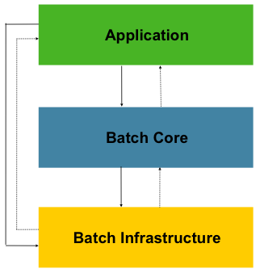

Figure 1. Spring Batch Layered Architecture

This layered architecture highlights three major high-level components: Application, Core, and Infrastructure. The application contains all batch jobs and custom code written
by developers using Spring Batch. The Batch Core contains the core runtime classes
necessary to launch and control a batch job. It includes implementations for
`JobOperator`, `Job`, and `Step`. Both Application and Core are built on top of a common
infrastructure. This infrastructure contains common readers and writers and services
(such as the `RetryTemplate`), which are used both by application developers(readers and
writers, such as `ItemReader` and `ItemWriter`), and the core framework itself (retry, which is its own library).

<a id="spring-batch-architecture--batcharchitectureconsiderations"></a>
<a id="spring-batch-architecture--general-batch-principles-and-guidelines"></a>

## General Batch Principles and Guidelines

The following key principles, guidelines, and general considerations should be considered
when building a batch solution.

- Remember that a batch architecture typically affects on-line architecture and vice
  versa. Design with both architectures and environments in mind by using common building
  blocks when possible.
- Simplify as much as possible and avoid building complex logical structures in single
  batch applications.
- Keep the processing and storage of data physically close together (in other words, keep
  your data where your processing occurs).
- Minimize system resource use, especially I/O. Perform as many operations as possible in
  internal memory.
- Review application I/O (analyze SQL statements) to ensure that unnecessary physical I/O
  is avoided. In particular, the following four common flaws need to be looked for:

  - Reading data for every transaction when the data could be read once and cached or kept
    in the working storage.
  - Rereading data for a transaction where the data was read earlier in the same
    transaction.
  - Causing unnecessary table or index scans.
  - Not specifying key values in the `WHERE` clause of an SQL statement.
- Do not do things twice in a batch run. For instance, if you need data summarization for
  reporting purposes, you should (if possible) increment stored totals when data is being
  initially processed, so your reporting application does not have to reprocess the same
  data.
- Allocate enough memory at the beginning of a batch application to avoid time-consuming
  reallocation during the process.
- Always assume the worst with regard to data integrity. Insert adequate checks and
  record validation to maintain data integrity.
- Implement checksums for internal validation where possible. For example, flat files
  should have a trailer record telling the total of records in the file and an aggregate of
  the key fields.
- Plan and execute stress tests as early as possible in a production-like environment
  with realistic data volumes.
- In large batch systems, backups can be challenging, especially if the system is running
  concurrent with online applications on a 24-7 basis. Database backups are typically well taken care
  of in online design, but file backups should be considered to be just as important.
  If the system depends on flat files, file backup procedures should not only be in place
  and documented but be regularly tested as well.

<a id="spring-batch-architecture--batchprocessingstrategy"></a>
<a id="spring-batch-architecture--batch-processing-strategies"></a>

## Batch Processing Strategies

To help design and implement batch systems, basic batch application building blocks and
patterns should be provided to the designers and programmers in the form of sample
structure charts and code shells. When starting to design a batch job, the business logic
should be decomposed into a series of steps that can be implemented by using the following
standard building blocks:

- *Conversion Applications:* For each type of file supplied by or generated for an
  external system, a conversion application must be created to convert the transaction
  records supplied into a standard format required for processing. This type of batch
  application can partly or entirely consist of translation utility modules (see Basic
  Batch Services).
- *Validation Applications:* A validation application ensures that all input and output
  records are correct and consistent. Validation is typically based on file headers and
  trailers, checksums and validation algorithms, and record-level cross-checks.
- *Extract Applications:* An extract application reads a set of records from a database or
  input file, selects records based on predefined rules, and writes the records to an
  output file.
- *Extract/Update Applications:* An extract/update applications reads records from a database or
  an input file and makes changes to a database or an output file, driven by the data found
  in each input record.
- *Processing and Updating Applications:* A processing and updating application performs processing on
  input transactions from an extract or a validation application. The processing usually
  involves reading a database to obtain data required for processing, potentially updating
  the database and creating records for output processing.
- *Output/Format Applications:* An output/format applications reads an input file, restructures data
  from this record according to a standard format, and produces an output file for printing
  or transmission to another program or system.

Additionally, a basic application shell should be provided for business logic that cannot
be built by using the previously mentioned building blocks.

In addition to the main building blocks, each application may use one or more standard
utility steps, such as:

- Sort: A program that reads an input file and produces an output file where records
  have been re-sequenced according to a sort key field in the records. Sorts are usually
  performed by standard system utilities.
- Split: A program that reads a single input file and writes each record to one of
  several output files based on a field value. Splits can be tailored or performed by
  parameter-driven standard system utilities.
- Merge: A program that reads records from multiple input files and produces one output
  file with combined data from the input files. Merges can be tailored or performed by
  parameter-driven standard system utilities.

Batch applications can additionally be categorized by their input source:

- Database-driven applications are driven by rows or values retrieved from the database.
- File-driven applications are driven by records or values retrieved from a file.
- Message-driven applications are driven by messages retrieved from a message queue.

The foundation of any batch system is the processing strategy. Factors affecting the
selection of the strategy include: estimated batch system volume, concurrency with
online systems or with other batch systems, available batch windows. (Note that, with
more enterprises wanting to be up and running 24x7, clear batch windows are
disappearing).

Typical processing options for batch are (in increasing order of implementation
complexity):

- Normal processing during a batch window in offline mode.
- Concurrent batch or online processing.
- Parallel processing of many different batch runs or jobs at the same time.
- Partitioning (processing of many instances of the same job at the same time).
- A combination of the preceding options.

Some or all of these options may be supported by a commercial scheduler.

The remainder of this section discusses these processing options in more detail.
Note that, as a rule of thumb, the commit and locking strategy adopted by batch
processes depends on the type of processing performed and that the online locking
strategy should also use the same principles. Therefore, the batch architecture cannot be
simply an afterthought when designing an overall architecture.

The locking strategy can be to use only normal database locks or to implement an
additional custom locking service in the architecture. The locking service would track
database locking (for example, by storing the necessary information in a dedicated
database table) and give or deny permissions to the application programs requesting a database
operation. Retry logic could also be implemented by this architecture to avoid aborting a
batch job in case of a lock situation.

**1. Normal processing in a batch window** For simple batch processes running in a separate
batch window where the data being updated is not required by online users or other batch
processes, concurrency is not an issue and a single commit can be done at the end of the
batch run.

In most cases, a more robust approach is more appropriate. Keep in mind that batch
systems have a tendency to grow as time goes by, both in terms of complexity and the data
volumes they handle. If no locking strategy is in place and the system still relies on a
single commit point, modifying the batch programs can be painful. Therefore, even with
the simplest batch systems, consider the need for commit logic for restart-recovery
options as well as the information concerning the more complex cases described later in
this section.

**2. Concurrent batch or on-line processing** Batch applications processing data that can
be simultaneously updated by online users should not lock any data (either in the
database or in files) that could be required by on-line users for more than a few
seconds. Also, updates should be committed to the database at the end of every few
transactions. Doing so minimizes the portion of data that is unavailable to other processes
and the elapsed time the data is unavailable.

Another option to minimize physical locking is to have logical row-level locking
implemented with either an optimistic locking pattern or a pessimistic locking pattern.

- Optimistic locking assumes a low likelihood of record contention. It typically means
  inserting a timestamp column in each database table that is used concurrently by both batch and
  online processing. When an application fetches a row for processing, it also fetches the
  timestamp. As the application then tries to update the processed row, the update uses the
  original timestamp in the `WHERE` clause. If the timestamp matches, the data and the
  timestamp are updated. If the timestamp does not match, this indicates that another
  application has updated the same row between the fetch and the update attempt. Therefore,
  the update cannot be performed.
- Pessimistic locking is any locking strategy that assumes there is a high likelihood of
  record contention and, therefore, either a physical or a logical lock needs to be obtained at
  retrieval time. One type of pessimistic logical locking uses a dedicated lock-column in
  the database table. When an application retrieves the row for update, it sets a flag in
  the lock column. With the flag in place, other applications attempting to retrieve the
  same row logically fail. When the application that sets the flag updates the row, it also
  clears the flag, enabling the row to be retrieved by other applications. Note that
  the integrity of data must be maintained also between the initial fetch and the setting
  of the flag — for example, by using database locks (such as `SELECT FOR UPDATE`). Note also that
  this method suffers from the same downside as physical locking except that it is somewhat
  easier to manage building a time-out mechanism that gets the lock released if the user
  goes to lunch while the record is locked.

These patterns are not necessarily suitable for batch processing, but they might be used
for concurrent batch and online processing (such as in cases where the database does not
support row-level locking). As a general rule, optimistic locking is more suitable for
online applications, while pessimistic locking is more suitable for batch applications.
Whenever logical locking is used, the same scheme must be used for all applications
that access the data entities protected by logical locks.

Note that both of these solutions only address locking a single record. Often, we may
need to lock a logically related group of records. With physical locks, you have to
manage these very carefully to avoid potential deadlocks. With logical locks, it
is usually best to build a logical lock manager that understands the logical record
groups you want to protect and that can ensure that locks are coherent and
non-deadlocking. This logical lock manager usually uses its own tables for lock
management, contention reporting, time-out mechanism, and other concerns.

**3. Parallel Processing** Parallel processing lets multiple batch runs or jobs run in
parallel to minimize the total elapsed batch processing time. This is not a problem as
long as the jobs are not sharing the same files, database tables, or index spaces. If they do, this service should be implemented by using partitioned data. Another option is to build an
architecture module for maintaining interdependencies by using a control table. A control
table should contain a row for each shared resource and whether it is in use by an
application or not. The batch architecture or the application in a parallel job would
then retrieve information from that table to determine whether it can get access to the
resource it needs.

If the data access is not a problem, parallel processing can be implemented through the
use of additional threads to process in parallel. In a mainframe environment, parallel
job classes have traditionally been used, to ensure adequate CPU time for all
the processes. Regardless, the solution has to be robust enough to ensure time slices for
all the running processes.

Other key issues in parallel processing include load balancing and the availability of
general system resources, such as files, database buffer pools, and so on. Also, note that
the control table itself can easily become a critical resource.

**4. Partitioning** Using partitioning lets multiple versions of large batch applications
run concurrently. The purpose of this is to reduce the elapsed time required to
process long batch jobs. Processes that can be successfully partitioned are those where
the input file can be split or the main database tables partitioned to let the
application run against different sets of data.

In addition, processes that are partitioned must be designed to process only their
assigned data set. A partitioning architecture has to be closely tied to the database
design and the database partitioning strategy. Note that database partitioning does not
necessarily mean physical partitioning of the database (although, in most cases, this is
advisable). The following image illustrates the partitioning approach:

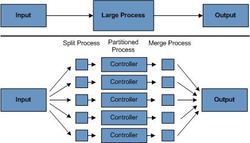

Figure 2. Partitioned Process

The architecture should be flexible enough to allow dynamic configuration of the number
of partitions. You should consider both automatic and user controlled configuration.
Automatic configuration may be based on such parameters as the input file size and the
number of input records.

**4.1 Partitioning Approaches** Selecting a partitioning approach has to be done on a
case-by-case basis. The following list describes some of the possible partitioning
approaches:

*1. Fixed and Even Break-Up of Record Set*

This involves breaking the input record set into an even number of portions (for example, 10, where each portion has exactly 1/10th of the entire record set). Each portion is then
processed by one instance of the batch/extract application.

To use this approach, preprocessing is required to split the record set up. The
result of this split is a lower and upper bound placement number that you can use
as input to the batch/extract application to restrict its processing to only its
portion.

Preprocessing could be a large overhead, as it has to calculate and determine the bounds
of each portion of the record set.

*2. Break up by a Key Column*

This involves breaking up the input record set by a key column, such as a location code, and assigning data from each key to a batch instance. To achieve this, column
values can be either:

- Assigned to a batch instance by a partitioning table (described later in this
  section).
- Assigned to a batch instance by a portion of the value (such as 0000-0999, 1000 - 1999,
  and so on).

Under option 1, adding new values means a manual reconfiguration of the batch or extract to
ensure that the new value is added to a particular instance.

Under option 2, this ensures that all values are covered by an instance of the batch
job. However, the number of values processed by one instance is dependent on the
distribution of column values (there may be a large number of locations in the 0000-0999
range and few in the 1000-1999 range). Under this option, the data range should be
designed with partitioning in mind.

Under both options, the optimal even distribution of records to batch instances cannot be
realized. There is no dynamic configuration of the number of batch instances used.

*3. Breakup by Views*

This approach is basically breakup by a key column but on the database level. It involves
breaking up the record set into views. These views are used by each instance of the batch
application during its processing. The breakup is done by grouping the data.

With this option, each instance of a batch application has to be configured to hit a
particular view (instead of the main table). Also, with the addition of new data
values, this new group of data has to be included into a view. There is no dynamic
configuration capability, as a change in the number of instances results in a change to
the views.

*4. Addition of a Processing Indicator*

This involves the addition of a new column to the input table, which acts as an
indicator. As a preprocessing step, all indicators are marked as being non-processed.
During the record fetch stage of the batch application, records are read on the condition
that an individual record is marked as being non-processed, and, once it is read (with lock), it is marked as being in processing. When that record is completed, the indicator is
updated to either complete or error. You can start many instances of a batch application
without a change, as the additional column ensures that a record is only processed once.

With this option, I/O on the table increases dynamically. In the case of an updating
batch application, this impact is reduced, as a write must occur anyway.

*5. Extract Table to a Flat File*

This approach involves the extraction of the table into a flat file. This file can then be split into
multiple segments and used as input to the batch instances.

With this option, the additional overhead of extracting the table into a file and
splitting it may cancel out the effect of multi-partitioning. Dynamic configuration can
be achieved by changing the file splitting script.

*6. Use of a Hashing Column*

This scheme involves the addition of a hash column (key or index) to the database tables
used to retrieve the driver record. This hash column has an indicator to determine which
instance of the batch application processes this particular row. For example, if there
are three batch instances to be started, an indicator of 'A' marks a row for
processing by instance 1, an indicator of 'B' marks a row for processing by instance 2, and an indicator of 'C' marks a row for processing by instance 3.

The procedure used to retrieve the records would then have an additional `WHERE` clause
to select all rows marked by a particular indicator. The inserts in this table would
involve the addition of the marker field, which would be defaulted to one of the
instances (such as 'A').

A simple batch application would be used to update the indicators, such as to
redistribute the load between the different instances. When a sufficiently large number
of new rows have been added, this batch can be run (anytime, except in the batch window)
to redistribute the new rows to other instances.

Additional instances of the batch application require only the running of the batch
application (as described in the preceding paragraphs) to redistribute the indicators to
work with a new number of instances.

**4.2 Database and Application Design Principles**

An architecture that supports multi-partitioned applications that run against
partitioned database tables and use the key column approach should include a central
partition repository for storing partition parameters. This provides flexibility and
ensures maintainability. The repository generally consists of a single table, known as
the partition table.

Information stored in the partition table is static and, in general, should be maintained
by the DBA. The table should consist of one row of information for each partition of a
multi-partitioned application. The table should have columns for Program ID Code, Partition Number (the logical ID of the partition), Low Value of the database key column for this
partition, and High Value of the database key column for this partition.

On program start-up, the program `id` and partition number should be passed to the
application from the architecture (specifically, from the control processing tasklet). If
a key column approach is used, these variables are used to read the partition table
to determine what range of data the application is to process. In addition, the
partition number must be used throughout the processing to:

- Add to the output files or database updates, for the merge process to work
  properly.
- Report normal processing to the batch log and any errors to the architecture error
  handler.

**4.3 Minimizing Deadlocks**

When applications run in parallel or are partitioned, contention for database resources
and deadlocks may occur. It is critical that the database design team eliminate
potential contention situations as much as possible, as part of the database design.

Also, the developers must ensure that the database index tables are designed with
deadlock prevention and performance in mind.

Deadlocks or hot spots often occur in administration or architecture tables, such as log
tables, control tables, and lock tables. The implications of these should be taken into
account as well. Realistic stress tests are crucial for identifying the possible
bottlenecks in the architecture.

To minimize the impact of conflicts on data, the architecture should provide services
(such as wait-and-retry intervals) when attaching to a database or when encountering a
deadlock. This means a built-in mechanism to react to certain database return codes and, instead of issuing an immediate error, waiting a predetermined amount of time and
retrying the database operation.

**4.4 Parameter Passing and Validation**

The partition architecture should be relatively transparent to application developers.
The architecture should perform all tasks associated with running the application in a
partitioned mode, including:

- Retrieving partition parameters before application start-up.
- Validating partition parameters before application start-up.
- Passing parameters to the application at start-up.

The validation should include checks to ensure that:

- The application has sufficient partitions to cover the whole data range.
- There are no gaps between partitions.

If the database is partitioned, some additional validation may be necessary to ensure
that a single partition does not span database partitions.

Also, the architecture should take into consideration the consolidation of partitions.
Key questions include:

- Must all the partitions be finished before going into the next job step?
- What happens if one of the partitions aborts?

[Spring Batch Introduction](#spring-batch-intro)
[What’s new in Spring Batch 6](#whatsnew)

---

<a id="whatsnew"></a>

<!-- source_url: https://docs.spring.io/spring-batch/reference/whatsnew.html -->

<!-- page_index: 4 -->

# What’s new in Spring Batch 6

<svg enable-background="new 0 0 32 32" id="Glyph" version="1.1" viewbox="0 0 32 32" xml:space="preserve" xmlns="http://www.w3.org/2000/svg" xmlns:xlink="http://www.w3.org/1999/xlink">
<path id="XMLID_223_"></path>
</svg>

Search

<a id="whatsnew--page-title"></a>
<a id="whatsnew--what-s-new-in-spring-batch-6"></a>

# What’s new in Spring Batch 6

This section highlights the major changes in Spring Batch 6.0. For the complete list of changes, please refer to the [release notes](https://github.com/spring-projects/spring-batch/releases).

Spring Batch 6.0 includes the following features and improvements:

- [Dependencies upgrade](#whatsnew--dependencies-upgrade)
- [Batch infrastructure configuration improvements](#whatsnew--batch-infrastrucutre-configuration-improvements)
- [New implementation of the chunk-oriented processing model](#whatsnew--new-implementation-of-the-chunk-oriented-processing-model)
- [New concurrency model](#whatsnew--new-concurrency-model)
- [New command line operator](#whatsnew--new-command-line-operator)
- [Ability to recover failed job executions](#whatsnew--ability-to-recover-failed-job-executions)
- [Ability to stop all kinds of steps](#whatsnew--ability-to-stop-all-kind-of-steps)
- [Graceful Shutdown support](#whatsnew--graceful-shutdown)
- [Observability support with the Java Flight Recorder (JFR)](#whatsnew--observability-with-jfr)
- [Null safety annotations with JSpecify](#whatsnew--jspecify)
- [Local chunking support](#whatsnew--local-chunking)
- [SEDA style with Spring Integration message channels](#whatsnew--seda-with-si)
- [Jackson 3 support](#whatsnew--jackson-3-support)
- [Remote step support](#whatsnew--remote-step-support)
- [Lambda style configuration](#whatsnew--lambda-style-configuration)
- [Deprecations and pruning](#whatsnew--deprecations-and-pruning)

<a id="whatsnew--dependencies-upgrade"></a>

## Dependencies upgrade

In this major release, the Spring dependencies are upgraded to the following versions:

- Spring Framework 7.0
- Spring Integration 7.0
- Spring Data 4.0
- Spring LDAP 4.0
- Spring AMQP 4.0
- Spring Kafka 4.0
- Micrometer 1.16

<a id="whatsnew--batch-infrastrucutre-configuration-improvements"></a>
<a id="whatsnew--batch-infrastructure-configuration-improvements"></a>

## Batch infrastructure configuration improvements

<a id="whatsnew--_new_annotations_and_classes_for_batch_infrastructure_configuration"></a>
<a id="whatsnew--new-annotations-and-classes-for-batch-infrastructure-configuration"></a>

### New annotations and classes for batch infrastructure configuration

Before v6, the `@EnableBatchProcessing` annotation was tied to a JDBC-based infrastructure. This is not the case anymore. Two new annotations have been introduced to configure the underlying job repository: `@EnableJdbcJobRepository` and `@EnableMongoJobRepository`.

Starting from v6, `@EnableBatchProcessing` allows you to configure common attributes for the batch infrastructure, while store-specific attributes can be specified with the new dedicated annotations.

Here is an example of how to use these annotations:

```java
@EnableBatchProcessing(taskExecutorRef = "batchTaskExecutor")
@EnableJdbcJobRepository(dataSourceRef = "batchDataSource", transactionManagerRef = "batchTransactionManager")
class MyJobConfiguration {

	@Bean
	public Job job(JobRepository jobRepository) {
		return new JobBuilder("job", jobRepository)
                    // job flow omitted
                    .build();
	}
}
```

Similarly, the programmatic model based on `DefaultBatchConfiguration` has been updated by introducing two new configuration classes to define store-specific attributes: `JdbcDefaultBatchConfiguration` and `MongoDefaultBatchConfiguration`.
These classes can be used to configure specific attributes of each job repository as well as other batch infrastructure beans programmatically.

<a id="whatsnew--_resourceless_batch_infrastructure_by_default"></a>
<a id="whatsnew--resourceless-batch-infrastructure-by-default"></a>

### Resourceless batch infrastructure by default

The `DefaultBatchConfiguration` class has been updated to provide a "resourceless" batch infrastructure by default (based on the `ResourcelessJobRepository` implementation introduced in v5.2). This means that it no longer requires an in-memory database (like H2 or HSQLDB) for the job repository, which was previously necessary for batch metadata storage.

Moreover, this change will improve the default performance of batch applications when the meta-data is not used, as the `ResourcelessJobRepository` does not require any database connections or transactions.

Finally, this change will help to reduce the memory footprint of batch applications, as the in-memory database is no longer required for metadata storage.

<a id="whatsnew--_batch_infrastructure_configuration_simplification"></a>
<a id="whatsnew--batch-infrastructure-configuration-simplification"></a>

### Batch infrastructure configuration simplification

Before v6, the typical configuration of a non-trivial Spring Batch application was quite complex and required a lot of beans: `JobRepository`, `JobLauncher`, `JobExplorer`, `JobOperator`, `JobRegistry`, `JobRegistrySmartInitializingSingleton` and so on. This required a lot of configuration code, like for example the need to configure the same execution context serializer on both the `JobRepository` and `JobExplorer`.

In this release, several changes have been made to simplify the batch infrastructure configuration:

- The `JobRepository` now extends the `JobExplorer` interface, so there is no need to define a separate `JobExplorer` bean.
- The `JobOperator` now extends the `JobLauncher` interface, so there is no need to define a separate `JobLauncher` bean.
- The `JobRegistry` is now optional, and smart enough to register jobs automatically, so there is no need to define a separate `JobRegistrySmartInitializingSingleton` bean.
- The transaction manager is now optional, and a default `ResourcelessTransactionManager` is used if none is provided.

This reduces the number of beans required for a typical batch application and simplifies the configuration code.

<a id="whatsnew--new-implementation-of-the-chunk-oriented-processing-model"></a>

## New implementation of the chunk-oriented processing model

This is not a new feature, but rather a new implementation of the chunk-oriented processing model. This new implementation was introduced as an experimental addition in version 5.1, and is now available as stable in version 6.0.

The new implementation is provided in the `ChunkOrientedStep` class, which is a replacement for the `ChunkOrientedTasklet` / `TaskletStep` classes.

Here is an example of how to define a `ChunkOrientedStep` by using its builder:

```java
@Bean
public Step chunkOrientedStep(JobRepository jobRepository, ItemReader<Person> itemReader, ItemWriter<Person> itemWriter) {
    int chunkSize = 100;
    return new ChunkOrientedStepBuilder<Person, Person>("step", jobRepository, chunkSize)
            .reader(itemReader)
            .writer(itemWriter)
            .build();
}
```

Moreover, fault-tolerance features were adapted as follows:

- The retry feature is now based on the retry functionality introduced in [Spring Framework 7](https://docs.spring.io/spring/reference/7.0/core/resilience.html), instead of the previous Spring Retry library
- The skip feature has been slightly adapted to the new implementation, which is now only based entirely on the `SkipPolicy` interface

Here is a quick example of how to use the retry and skip features with the new `ChunkOrientedStep`:

```java
@Bean
public Step faultTolerantChunkOrientedStep(JobRepository jobRepository, ItemReader<Person> itemReader, ItemWriter<Person> itemWriter) {

    // retry policy configuration
    int maxRetries = 10;
    var retryableExceptions = Set.of(TransientException.class);
    RetryPolicy retryPolicy = RetryPolicy.builder()
        .maxRetries(maxRetries)
        .includes(retryableExceptions)
        .build();

    // skip policy configuration
    int skipLimit = 50;
    var skippableExceptions = Set.of(FlatFileParseException.class);
    SkipPolicy skipPolicy = new LimitCheckingExceptionHierarchySkipPolicy(skippableExceptions, skipLimit);

    // step configuration
    int chunkSize = 100;
    return new ChunkOrientedStepBuilder<Person, Person>("step", jobRepository, chunkSize)
        .reader(itemReader)
        .writer(itemWriter)
        .faultTolerant()
        .retryPolicy(retryPolicy)
        .skipPolicy(skipPolicy)
        .build();
}
```

Please refer to the [migration guide](https://github.com/spring-projects/spring-batch/wiki/Spring-Batch-6.0-Migration-Guide) for more details on how to migrate from the previous implementation to the new one.

<a id="whatsnew--new-concurrency-model"></a>

## New concurrency model

Prior to this release, the concurrency model based on the "parallel iteration" concept required a lot of state synchronization at different levels and had several limitations related to throttling and backpressure leading to confusing transaction semantics and poor performance.

This release revisits that model and comes with a new, simplified approach to concurrency based on the producer-consumer pattern. A concurrent chunk-oriented step now uses a bounded internal queue between the producer thread and consumer threads. Items are put in the queue as soon as they are ready to be processed, and consumer threads take items from the queue as soon as they are available for processing. Once a chunk is ready to be written, the producer thread pauses until the chunk is written, and then resumes producing items.

This new model is more efficient, easier to understand and provides better performance for concurrent executions.

<a id="whatsnew--new-command-line-operator"></a>

## New command line operator

Spring Batch provided a `CommandLineJobRunner` since version 1. While this runner served its purpose well over the years, it started to show some limitations when it comes to extensibility and customisation. Many issues like static initialisation, non-standard way of handling options and parameters, lack of extensibility, etc have been reported.

Moreover, all these issues made it impossible to reuse that runner in Spring Boot, which resulted in duplicate code in both projects as well behaviour divergence (like job parameters incrementer behaviour differences) that is confusing to many users.

This release introduces a modern version of `CommandLineJobRunner`, named `CommandLineJobOperator`, that allows you to operate batch jobs from the command line (start, stop, restart and so on) and that is customisable, extensible and updated to the new changes introduced in Spring Batch 6.

<a id="whatsnew--ability-to-recover-failed-job-executions"></a>

## Ability to recover failed job executions

Prior to this release, if a job execution fails abruptly, it was not possible to recover it without a manual database update. This was error-prone and not consistent across different job repositories (as it required a few SQL statements for JDBC databases and some custom statements for NoSQL stores).

This release introduces a new method named `recover` in the `JobOperator` interface that allows you to recover failed job executions consistently across all job repositories.

<a id="whatsnew--ability-to-stop-all-kind-of-steps"></a>
<a id="whatsnew--ability-to-stop-all-kinds-of-steps"></a>

## Ability to stop all kinds of steps

As of v5.2, it is only possible to externally stop `Tasklet` steps through `JobOperator#stop`.
If a custom `Step` implementation wants to handle external stop signals, it just can’t.

This release adds a new interface, named `StoppableStep`, that extends `Step` and which can be implemented by any step that is able to handle stop signals.

<a id="whatsnew--graceful-shutdown"></a>
<a id="whatsnew--graceful-shutdown-support"></a>

## Graceful Shutdown support

Spring Batch 6.0 introduces support for graceful shutdown of batch jobs. This feature allows you to stop a running job execution in a controlled manner, ensuring that interruption signals are correctly sent to running steps.

When a graceful shutdown is initiated, the job execution will stop currently active steps and updates the job repository with a consistent state that enables restartability. Once running steps have finished, the job execution will be marked as stopped, and any necessary cleanup operations will be performed.

<a id="whatsnew--observability-with-jfr"></a>
<a id="whatsnew--observability-with-the-java-flight-recorder-jfr"></a>

## Observability with the Java Flight Recorder (JFR)

In addition to the existing Micrometer metrics, Spring Batch 6.0 introduces support for the Java Flight Recorder (JFR) to provide enhanced observability capabilities.

JFR is a powerful profiling and event collection framework built into the Java Virtual Machine (JVM). It allows you to capture detailed information about the runtime behavior of your applications with minimal performance overhead.

This release introduces several JFR events to monitor key aspects of a batch job execution, including job and step executions, item reads and writes, as well as transaction boundaries.

<a id="whatsnew--jspecify"></a>
<a id="whatsnew--null-safety-annotations-with-jspecify"></a>

## Null safety annotations with JSpecify

Spring Batch 6.0 APIs are now annotated with [JSpecify](https://jspecify.dev/) annotations to provide better null-safety guarantees and improve code quality.

<a id="whatsnew--local-chunking"></a>
<a id="whatsnew--local-chunking-support"></a>

## Local chunking support

Similar to remote chunking, local chunking is a new feature that allows you to process chunks of items in parallel, locally within the same JVM using multiple threads. This is particularly useful when you have a large number of items to process and want to take advantage of multi-core processors.
With local chunking, you can configure a chunk-oriented step to use multiple threads to process chunks of items concurrently. Each thread will read, process and write its own chunk of items independently, while the step will manage the overall execution and commit the results.

<a id="whatsnew--seda-with-si"></a>
<a id="whatsnew--seda-style-with-spring-integration-message-channels"></a>

## SEDA style with Spring Integration message channels

In Spring Batch 5.2, we introduced the concept of SEDA (Staged Event-Driven Architecture) style processing using local threads with the `BlockingQueueItemReader` and `BlockingQueueItemWriter` components. Building on that foundation, Spring Batch 6.0 introduces support for SEDA style processing at scale using Spring Integration messaging channels. This allows you to decouple the different stages of a batch job and process them asynchronously using message channels. By leveraging Spring Integration, you can easily configure and manage the messaging channels, as well as take advantage of features like message transformation, filtering, and routing.

<a id="whatsnew--jackson-3-support"></a>

## Jackson 3 support

Spring Batch 6.0 has been upgraded to support Jackson 3.x for JSON processing. This upgrade ensures compatibility with the latest features and improvements in the Jackson library, while also providing better performance and security. All JSON-related components in Spring Batch, such as the `JsonItemReader` and `JsonFileItemWriter`, as well as the `JacksonExecutionContextStringSerializer` have been updated to use Jackson 3.x by default.

The support for Jackson 2.x has been deprecated and will be removed in a future release. If you are currently using Jackson 2.x in your Spring Batch applications, it is recommended to upgrade to Jackson 3.x to take advantage of the latest features and improvements.

<a id="whatsnew--remote-step-support"></a>

## Remote step support

This release introduces support for remote step executions, allowing you to execute steps of a batch job on remote machines or clusters.
This feature is particularly useful for large-scale batch processing scenarios where you want to distribute the workload across multiple nodes to improve performance and scalability. Remote step execution is facilitated through the use of Spring Integration messaging channels, which enable communication between the local job execution environment and the remote step executors.

<a id="whatsnew--lambda-style-configuration"></a>

## Lambda style configuration

This release introduces the use of contextual lambda expressions to configure batch artefacts. This new style of configuration provides a more concise and readable way to define item readers and writers.

For example, instead of using the traditional builder pattern like this:

```java
var reader = new FlatFileItemReaderBuilder()
 .resource(...)
 .delimited()
 .delimiter(",")
 .quoteCharacter('"')
 ...
 .build();
```

You can now use a lambda expression to configure the delimited options like this:

```java
var reader = new FlatFileItemReaderBuilder()
 .resource(...)
 .delimited (config -> config.delimiter(',').quoteCharcter( '"' ))
 ...
 .build();
```

<a id="whatsnew--deprecations-and-pruning"></a>

## Deprecations and pruning

As with any major release, some features have been deprecated or removed in Spring Batch 6.0. The following changes are worth noting:

- All deprecated APIs and features from previous versions have been removed
- Modular configuration through `@EnableBatchProcessing(modular = true)` has been deprecated
- Several APIs have been deprecated in this version, in order to simplify the core API and reduce its scope
- Deprecate JUnit 4 support in the `spring-batch-test` module
- Deprecate Jackson 2 support
- Deprecate XML configuration through the `batch:…` namespace

Fore more details, please refer to the [migration guide](https://github.com/spring-projects/spring-batch/wiki/Spring-Batch-6.0-Migration-Guide).

[Spring Batch Architecture](#spring-batch-architecture)
[The Domain Language of Batch](#domain)

---

<a id="domain"></a>

<!-- source_url: https://docs.spring.io/spring-batch/reference/domain.html -->

<!-- page_index: 5 -->

# The Domain Language of Batch

<svg enable-background="new 0 0 32 32" id="Glyph" version="1.1" viewbox="0 0 32 32" xml:space="preserve" xmlns="http://www.w3.org/2000/svg" xmlns:xlink="http://www.w3.org/1999/xlink">
<path id="XMLID_223_"></path>
</svg>

Search

<a id="domain--page-title"></a>
<a id="domain--the-domain-language-of-batch"></a>

# The Domain Language of Batch

To any experienced batch architect, the overall concepts of batch processing used in
Spring Batch should be familiar and comfortable. There are “Jobs” and “Steps” and
developer-supplied processing units called `ItemReader` and `ItemWriter`. However, because of the Spring patterns, operations, templates, callbacks, and idioms, there are
opportunities for the following:

- Significant improvement in adherence to a clear separation of concerns.
- Clearly delineated architectural layers and services provided as interfaces.
- Simple and default implementations that allow for quick adoption and ease of use
  out of the box.
- Significantly enhanced extensibility.

The following diagram is a simplified version of the batch reference architecture that
has been used for decades. It provides an overview of the components that make up the
domain language of batch processing. This architecture framework is a blueprint that has
been proven through decades of implementations on the last several generations of
platforms (COBOL on mainframes, C on Unix, and now Java anywhere). JCL and COBOL developers
are likely to be as comfortable with the concepts as C, C#, and Java developers. Spring
Batch provides a physical implementation of the layers, components, and technical
services commonly found in the robust, maintainable systems that are used to address the
creation of simple to complex batch applications, with the infrastructure and extensions
to address very complex processing needs.

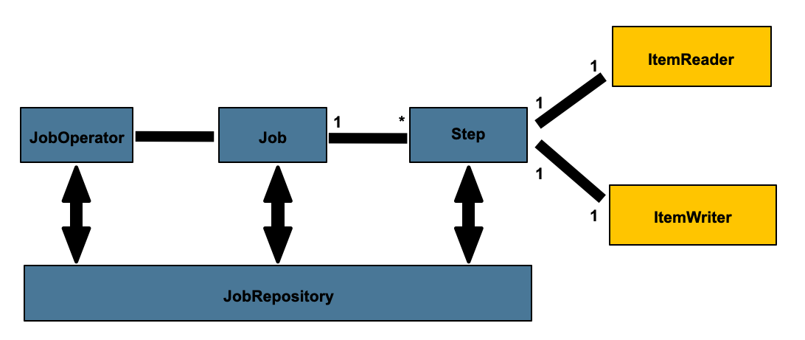

Figure 1. Batch Stereotypes

The preceding diagram highlights the key concepts that make up the domain language of
Spring Batch. A `Job` has one or more steps, each of which has exactly one `ItemReader`, an optional `ItemProcessor`, and one `ItemWriter`. A job is operated (started, stopped, etc)
with a `JobOperator`, and metadata about the currently running process is stored in and
restored from a `JobRepository`.

<a id="domain--job"></a>

## Job

This section describes stereotypes relating to the concept of a batch job. A `Job` is an
entity that encapsulates an entire batch process. As is common with other Spring
projects, a `Job` is wired together with either an XML configuration file or Java-based
configuration. This configuration may be referred to as the “job configuration”. However, `Job` is only the top of an overall hierarchy, as shown in the following diagram:

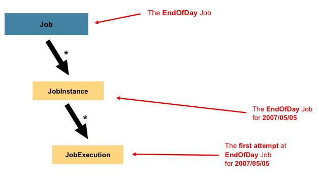

Figure 2. Job Hierarchy

In Spring Batch, a `Job` is simply a container for `Step` instances. It combines multiple
steps that logically belong together in a flow and allows for configuration of properties
global to all steps, such as restartability. The job configuration contains:

- The name of the job.
- Definition and ordering of `Step` instances.
- Whether or not the job is restartable.

- Java
- XML

For those who use Java configuration, Spring Batch provides a default implementation of
the `Job` interface in the form of the `SimpleJob` class, which creates some standard
functionality on top of `Job`. When using Java-based configuration, a collection of
builders is made available for the instantiation of a `Job`, as the following
example shows:

```java
@Bean
public Job footballJob(JobRepository jobRepository) {
    return new JobBuilder("footballJob", jobRepository)
                     .start(playerLoad())
                     .next(gameLoad())
                     .next(playerSummarization())
                     .build();
}
```

For those who use XML configuration, Spring Batch provides a default implementation of the
`Job` interface in the form of the `SimpleJob` class, which creates some standard
functionality on top of `Job`. However, the batch namespace abstracts away the need to
instantiate it directly. Instead, you can use the `<job>` element, as the
following example shows:

```xml
<job id="footballJob">
    <step id="playerload" next="gameLoad"/>
    <step id="gameLoad" next="playerSummarization"/>
    <step id="playerSummarization"/>
</job>
```

<a id="domain--jobinstance"></a>

### JobInstance

A `JobInstance` refers to the concept of a logical job run. Consider a batch job that
should be run once at the end of the day, such as the `EndOfDay` `Job` from the preceding
diagram. There is one `EndOfDay` job, but each individual run of the `Job` must be
tracked separately. In the case of this job, there is one logical `JobInstance` per day.
For example, there is a January 1st run, a January 2nd run, and so on. If the January 1st
run fails the first time and is run again the next day, it is still the January 1st run.
(Usually, this corresponds with the data it is processing as well, meaning the January
1st run processes data for January 1st). Therefore, each `JobInstance` can have multiple
executions (`JobExecution` is discussed in more detail later in this chapter), and only
one `JobInstance` (which corresponds to a particular `Job` and identifying `JobParameters`) can
run at a given time.

The definition of a `JobInstance` has absolutely no bearing on the data to be loaded.
It is entirely up to the `ItemReader` implementation to determine how data is loaded. For
example, in the `EndOfDay` scenario, there may be a column on the data that indicates the
`effective date` or `schedule date` to which the data belongs. So, the January 1st run
would load only data from the 1st, and the January 2nd run would use only data from the
2nd. Because this determination is likely to be a business decision, it is left up to the
`ItemReader` to decide. However, using the same `JobInstance` determines whether or not
the “state” (that is, the `ExecutionContext`, which is discussed later in this chapter)
from previous executions is used. Using a new `JobInstance` means “start from the
beginning,” and using an existing instance generally means “start from where you left
off”.

<a id="domain--jobparameters"></a>

### JobParameters

Having discussed `JobInstance` and how it differs from `Job`, the natural question to ask
is: “How is one `JobInstance` distinguished from another?” The answer is:
`JobParameters`. A `JobParameters` object holds a set of parameters used to start a batch
job. They can be used for identification or even as reference data during the run, as the
following image shows:

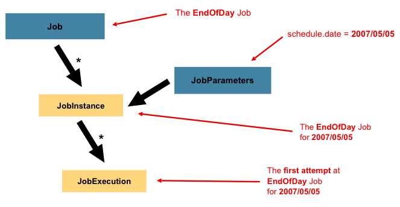

Figure 3. Job Parameters

In the example from the [Job Instance](#domain--jobinstance) section, where there are
two instances, one for January 1st and another for January 2nd, there is really only one `Job`, but it has two `JobParameter` objects: one that was started with a job parameter of 01-01-2017
and another that was started with a parameter of 01-02-2017. Thus, the contract can be defined
as: `JobInstance` = `Job` + identifying `JobParameters`. This allows a developer to effectively
control how a `JobInstance` is defined, since they control what parameters are passed in.

> [!NOTE]
> Not all job parameters are required to contribute to the identification of a
> `JobInstance`. By default, they do so. However, the framework also allows the submission
> of a `Job` with parameters that do not contribute to the identity of a `JobInstance`.

<a id="domain--jobexecution"></a>

### JobExecution

A `JobExecution` refers to the technical concept of a single attempt to run a Job. An
execution may end in failure or success, but the `JobInstance` corresponding to a given
execution is not considered to be complete unless the execution completes successfully.
Using the `EndOfDay` `Job` described previously as an example, consider a `JobInstance` for
01-01-2017 that failed the first time it was run. If it is run again with the same
identifying job parameters as the first run (01-01-2017), a new `JobExecution` is
created. However, there is still only one `JobInstance`.

A `Job` defines what a job is and how it is to be executed, and a `JobInstance` is a
purely organizational object to group executions together, primarily to enable correct
restart semantics. A `JobExecution`, however, is the primary storage mechanism for what
actually happened during a run and contains many more properties that must be controlled
and persisted, as the following table shows:

| Property | Definition |
| --- | --- |
| `Status` | A `BatchStatus` object that indicates the status of the execution. While running, it is `BatchStatus#STARTED`. If it fails, it is `BatchStatus#FAILED`. If it finishes successfully, it is `BatchStatus#COMPLETED` |
| `startTime` | A `java.time.LocalDateTime` representing the current system time when the execution was started. This field is empty if the job has yet to start. |
| `endTime` | A `java.time.LocalDateTime` representing the current system time when the execution finished, regardless of whether it was successful or not. The field is empty if the job has yet to finish. |
| `exitStatus` | The `ExitStatus`, indicating the result of the run. It is most important, because it contains an exit code that is returned to the caller. See chapter 5 for more details. The field is empty if the job has yet to finish. |
| `createTime` | A `java.time.LocalDateTime` representing the current system time when the `JobExecution` was first persisted. The job may not have been started yet (and thus has no start time), but it always has a `createTime`, which is required by the framework for managing job-level `ExecutionContexts`. |
| `lastUpdated` | A `java.time.LocalDateTime` representing the last time a `JobExecution` was persisted. This field is empty if the job has yet to start. |
| `executionContext` | The “property bag” containing any user data that needs to be persisted between executions. |
| `failureExceptions` | The list of exceptions encountered during the execution of a `Job`. These can be useful if more than one exception is encountered during the failure of a `Job`. |

These properties are important because they are persisted and can be used to completely
determine the status of an execution. For example, if the `EndOfDay` job for 01-01 is
executed at 9:00 PM and fails at 9:30, the following entries are made in the batch
metadata tables:

JOB\_INST\_ID

JOB\_NAME

1

EndOfDayJob

JOB\_EXECUTION\_ID

TYPE\_CD

KEY\_NAME

DATE\_VAL

IDENTIFYING

1

DATE

schedule.Date

2017-01-01

TRUE

JOB\_EXEC\_ID

JOB\_INST\_ID

START\_TIME

END\_TIME

STATUS

1

1

2017-01-01 21:00

2017-01-01 21:30

FAILED

> [!NOTE]
> Column names may have been abbreviated or removed for the sake of clarity and
> formatting.

Now that the job has failed, assume that it took the entire night for the problem to be
determined, so that the “batch window” is now closed. Further assuming that the window
starts at 9:00 PM, the job is kicked off again for 01-01, starting where it left off and
completing successfully at 9:30. Because it is now the next day, the 01-02 job must be
run as well, and it is kicked off just afterwards at 9:31 and completes in its normal one
hour time at 10:30. There is no requirement that one `JobInstance` be kicked off after
another, unless there is potential for the two jobs to attempt to access the same data, causing issues with locking at the database level. It is entirely up to the scheduler to
determine when a `Job` should be run. Since they are separate `JobInstances`, Spring
Batch makes no attempt to stop them from being run concurrently. (Attempting to run the
same `JobInstance` while another is already running results in a
`JobExecutionAlreadyRunningException` being thrown). There should now be an extra entry
in both the `JobInstance` and `JobParameters` tables and two extra entries in the
`JobExecution` table, as shown in the following tables:

| JOB\_INST\_ID | JOB\_NAME |
| --- | --- |
| 1 | EndOfDayJob |
| 2 | EndOfDayJob |

| JOB\_EXECUTION\_ID | TYPE\_CD | KEY\_NAME | DATE\_VAL | IDENTIFYING |
| --- | --- | --- | --- | --- |
| 1 | DATE | schedule.Date | 2017-01-01 00:00:00 | TRUE |
| 2 | DATE | schedule.Date | 2017-01-01 00:00:00 | TRUE |
| 3 | DATE | schedule.Date | 2017-01-02 00:00:00 | TRUE |

| JOB\_EXEC\_ID | JOB\_INST\_ID | START\_TIME | END\_TIME | STATUS |
| --- | --- | --- | --- | --- |
| 1 | 1 | 2017-01-01 21:00 | 2017-01-01 21:30 | FAILED |
| 2 | 1 | 2017-01-02 21:00 | 2017-01-02 21:30 | COMPLETED |
| 3 | 2 | 2017-01-02 21:31 | 2017-01-02 22:29 | COMPLETED |

> [!NOTE]
> Column names may have been abbreviated or removed for the sake of clarity and
> formatting.

<a id="domain--step"></a>

## Step

A `Step` is a domain object that encapsulates an independent, sequential phase of a batch
job. Therefore, every `Job` is composed entirely of one or more steps. A `Step` contains
all the information necessary to define and control the actual batch processing. This
is a necessarily vague description because the contents of any given `Step` are at the
discretion of the developer writing a `Job`. A `Step` can be as simple or complex as the
developer desires. A simple `Step` might load data from a file into the database, requiring little or no code (depending upon the implementations used). A more complex
`Step` may have complicated business rules that are applied as part of the processing. As
with a `Job`, a `Step` has an individual `StepExecution` that correlates with a unique
`JobExecution`, as the following image shows:

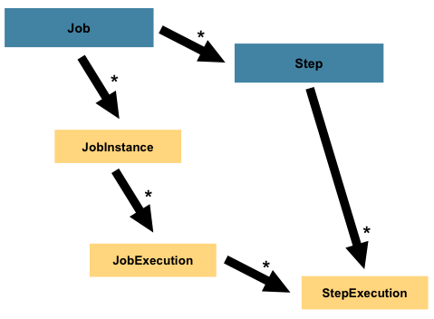

Figure 4. Job Hierarchy With Steps

<a id="domain--stepexecution"></a>

### StepExecution

A `StepExecution` represents a single attempt to execute a `Step`. A new `StepExecution`
is created each time a `Step` is run, similar to `JobExecution`. However, if a step fails
to execute because the step before it fails, no execution is persisted for it. A
`StepExecution` is created only when its `Step` is actually started.

`Step` executions are represented by objects of the `StepExecution` class. Each execution
contains a reference to its corresponding step and `JobExecution` and transaction-related
data, such as commit and rollback counts and start and end times. Additionally, each step
execution contains an `ExecutionContext`, which contains any data a developer needs to
have persisted across batch runs, such as statistics or state information needed to
restart. The following table lists the properties for `StepExecution`:

| Property | Definition |
| --- | --- |
| `Status` | A `BatchStatus` object that indicates the status of the execution. While running, the status is `BatchStatus.STARTED`. If it fails, the status is `BatchStatus.FAILED`. If it finishes successfully, the status is `BatchStatus.COMPLETED`. |
| `startTime` | A `java.time.LocalDateTime` representing the current system time when the execution was started. This field is empty if the step has yet to start. |
| `endTime` | A `java.time.LocalDateTime` representing the current system time when the execution finished, regardless of whether it was successful or not. This field is empty if the step has yet to exit. |
| `exitStatus` | The `ExitStatus` indicating the result of the execution. It is most important, because it contains an exit code that is returned to the caller. See chapter 5 for more details. This field is empty if the job has yet to exit. |
| `executionContext` | The “property bag” containing any user data that needs to be persisted between executions. |
| `readCount` | The number of items that have been successfully read. |
| `writeCount` | The number of items that have been successfully written. |
| `commitCount` | The number of transactions that have been committed for this execution. |
| `rollbackCount` | The number of times the business transaction controlled by the `Step` has been rolled back. |
| `readSkipCount` | The number of times `read` has failed, resulting in a skipped item. |
| `processSkipCount` | The number of times `process` has failed, resulting in a skipped item. |
| `filterCount` | The number of items that have been “filtered” by the `ItemProcessor`. |
| `writeSkipCount` | The number of times `write` has failed, resulting in a skipped item. |

<a id="domain--executioncontext"></a>

## ExecutionContext

An `ExecutionContext` represents a collection of key/value pairs that are persisted and
controlled by the framework to give developers a place to store persistent
state that is scoped to a `StepExecution` object or a `JobExecution` object. (For those
familiar with Quartz, it is very similar to `JobDataMap`.) The best usage example is to
facilitate restart. Using flat file input as an example, while processing individual
lines, the framework periodically persists the `ExecutionContext` at commit points. Doing
so lets the `ItemReader` store its state in case a fatal error occurs during the run
or even if the power goes out. All that is needed is to put the current number of lines
read into the context, as the following example shows, and the framework does the
rest:

```java
executionContext.putLong(getKey(LINES_READ_COUNT), reader.getPosition());
```

Using the `EndOfDay` example from the `Job` stereotypes section as an example, assume there
is one step, `loadData`, that loads a file into the database. After the first failed run, the metadata tables would look like the following example:

JOB\_INST\_ID

JOB\_NAME

1

EndOfDayJob

JOB\_INST\_ID

TYPE\_CD

KEY\_NAME

DATE\_VAL

1

DATE

schedule.Date

2017-01-01

JOB\_EXEC\_ID

JOB\_INST\_ID

START\_TIME

END\_TIME

STATUS

1

1

2017-01-01 21:00

2017-01-01 21:30

FAILED

STEP\_EXEC\_ID

JOB\_EXEC\_ID

STEP\_NAME

START\_TIME

END\_TIME

STATUS

1

1

loadData

2017-01-01 21:00

2017-01-01 21:30

FAILED

STEP\_EXEC\_ID

SHORT\_CONTEXT

1

{piece.count=40321}

In the preceding case, the `Step` ran for 30 minutes and processed 40,321 “pieces”, which
would represent lines in a file in this scenario. This value is updated just before each
commit by the framework and can contain multiple rows corresponding to entries within the
`ExecutionContext`. Being notified before a commit requires one of the various
`StepListener` implementations (or an `ItemStream`), which are discussed in more detail
later in this guide. As with the previous example, it is assumed that the `Job` is
restarted the next day. When it is restarted, the values from the `ExecutionContext` of
the last run are reconstituted from the database. When the `ItemReader` is opened, it can
check to see if it has any stored state in the context and initialize itself from there, as the following example shows:

```java
if (executionContext.containsKey(getKey(LINES_READ_COUNT))) {log.debug("Initializing for restart. Restart data is: " + executionContext);
long lineCount = executionContext.getLong(getKey(LINES_READ_COUNT));
LineReader reader = getReader();
Object record = ""; while (reader.getPosition() < lineCount && record != null) {record = readLine();}}
```

In this case, after the preceding code runs, the current line is 40,322, letting the `Step`
start again from where it left off. You can also use the `ExecutionContext` for
statistics that need to be persisted about the run itself. For example, if a flat file
contains orders for processing that exist across multiple lines, it may be necessary to
store how many orders have been processed (which is much different from the number of
lines read), so that an email can be sent at the end of the `Step` with the total number
of orders processed in the body. The framework handles storing this for the developer, to correctly scope it with an individual `JobInstance`. It can be very difficult to
know whether an existing `ExecutionContext` should be used or not. For example, using the
`EndOfDay` example from above, when the 01-01 run starts again for the second time, the
framework recognizes that it is the same `JobInstance` and on an individual `Step` basis, pulls the `ExecutionContext` out of the database, and hands it (as part of the
`StepExecution`) to the `Step` itself. Conversely, for the 01-02 run, the framework
recognizes that it is a different instance, so an empty context must be handed to the
`Step`. There are many of these types of determinations that the framework makes for the
developer, to ensure the state is given to them at the correct time. It is also important
to note that exactly one `ExecutionContext` exists per `StepExecution` at any given time.
Clients of the `ExecutionContext` should be careful, because this creates a shared
keyspace. As a result, care should be taken when putting values in to ensure no data is
overwritten. However, the `Step` stores absolutely no data in the context, so there is no
way to adversely affect the framework.

Note that there is at least one `ExecutionContext` per
`JobExecution` and one for every `StepExecution`. For example, consider the following
code snippet:

```java
ExecutionContext ecStep = stepExecution.getExecutionContext();
ExecutionContext ecJob = jobExecution.getExecutionContext();
//ecStep does not equal ecJob
```

As noted in the comment, `ecStep` does not equal `ecJob`. They are two different
`ExecutionContexts`. The one scoped to the `Step` is saved at every commit point in the
`Step`, whereas the one scoped to the Job is saved in between every `Step` execution.

> [!NOTE]
> In the `ExecutionContext`, all non-transient entries must be `Serializable`.
> Proper serialization of the execution context underpins the restart capability of steps and jobs.
> Should you use keys or values that are not natively serializable, you are required to
> employ a tailored serialization approach. Failing to serialize the execution context
> may jeopardize the state persistence process, making failed jobs impossible to recover properly.

<a id="domain--jobrepository"></a>

## JobRepository

`JobRepository` is the persistence mechanism for all of the stereotypes mentioned earlier.
It provides CRUD operations for `JobLauncher`, `Job`, and `Step` implementations. When a
`Job` is first launched, a `JobExecution` is obtained from the repository. Also, during
the course of execution, `StepExecution` and `JobExecution` implementations are persisted
by passing them to the repository.

- Java
- XML

When using Java configuration, the `@EnableBatchProcessing` annotation provides a
`JobRepository` as one of the components that is automatically configured.

The Spring Batch XML namespace provides support for configuring a `JobRepository` instance
with the `<job-repository>` tag, as the following example shows:

```xml
<job-repository id="jobRepository"/>
```

<a id="domain--joboperator"></a>

## JobOperator

`JobOperator` represents a simple interface for operations like starting, stopping and restarting
jobs, as the following example shows:

```java
public interface JobOperator {

    JobExecution start(Job job, JobParameters jobParameters) throws Exception;
    JobExecution startNextInstance(Job job) throws Exception;
    boolean stop(JobExecution jobExecution) throws Exception;
    JobExecution restart(JobExecution jobExecution) throws Exception;
    JobExecution abandon(JobExecution jobExecution) throws Exception;

}
```

A `Job` is started with a given set of `JobParameters`. It is expected that implementations obtain
a valid `JobExecution` from the `JobRepository` and execute the `Job`.

<a id="domain--itemreader"></a>

## ItemReader

`ItemReader` is an abstraction that represents the retrieval of input for a `Step`, one
item at a time. When the `ItemReader` has exhausted the items it can provide, it
indicates this by returning `null`. You can find more details about the `ItemReader` interface and its
various implementations in
[Readers And Writers](#readersandwriters).

<a id="domain--itemwriter"></a>

## ItemWriter

`ItemWriter` is an abstraction that represents the output of a `Step`, one batch or chunk
of items at a time. Generally, an `ItemWriter` has no knowledge of the input it should
receive next and knows only the item that was passed in its current invocation. You can find more
details about the `ItemWriter` interface and its various implementations in
[Readers And Writers](#readersandwriters).

<a id="domain--itemprocessor"></a>

## ItemProcessor

`ItemProcessor` is an abstraction that represents the business processing of an item.
While the `ItemReader` reads one item, and the `ItemWriter` writes one item, the
`ItemProcessor` provides an access point to transform or apply other business processing.
If, while processing the item, it is determined that the item is not valid, returning
`null` indicates that the item should not be written out. You can find more details about the
`ItemProcessor` interface in
[Readers And Writers](#readersandwriters).

<a id="domain--batch-namespace"></a>

## Batch Namespace

Many of the domain concepts listed previously need to be configured in a Spring
`ApplicationContext`. While there are implementations of the interfaces above that you can
use in a standard bean definition, a namespace has been provided for ease of
configuration, as the following example shows:

```xml
<beans:beans xmlns="http://www.springframework.org/schema/batch"
xmlns:beans="http://www.springframework.org/schema/beans"
xmlns:xsi="http://www.w3.org/2001/XMLSchema-instance"
xsi:schemaLocation="
   http://www.springframework.org/schema/beans
   https://www.springframework.org/schema/beans/spring-beans.xsd
   http://www.springframework.org/schema/batch
   https://www.springframework.org/schema/batch/spring-batch.xsd">

<job id="ioSampleJob">
    <step id="step1">
        <tasklet>
            <chunk reader="itemReader" writer="itemWriter" commit-interval="2"/>
        </tasklet>
    </step>
</job>

</beans:beans>
```

As long as the batch namespace has been declared, any of its elements can be used. You can find more
information on configuring a Job in [Configuring and Running a Job](#job)
. You can find more information on configuring a `Step` in
[Configuring a Step](#step).

> [!WARNING]
> The batch XML namespace is deprecated as of Spring Batch 6.0 and will be removed in version 7.0.

[What’s new in Spring Batch 6](#whatsnew)
[Configuring and Running a Job](#job)

---

<a id="job"></a>

<!-- source_url: https://docs.spring.io/spring-batch/reference/job.html -->

<!-- page_index: 6 -->

# Configuring and Running a Job

<svg enable-background="new 0 0 32 32" id="Glyph" version="1.1" viewbox="0 0 32 32" xml:space="preserve" xmlns="http://www.w3.org/2000/svg" xmlns:xlink="http://www.w3.org/1999/xlink">
<path id="XMLID_223_"></path>
</svg>

Search

<a id="job--page-title"></a>
<a id="job--configuring-and-running-a-job"></a>

# Configuring and Running a Job

In the [domain section](#domain) , the overall
architecture design was discussed, using the following diagram as a
guide:


Figure 1. Batch Stereotypes

While the `Job` object may seem like a simple
container for steps, you must be aware of many configuration options.
Furthermore, you must consider many options about
how a `Job` can be run and how its metadata can be
stored during that run. This chapter explains the various configuration
options and runtime concerns of a `Job`.

<a id="job--section-summary"></a>

## Section Summary

- [Batch infrastructure Configuration](#job-configuring-infrastructure)
- [Configuring a Job](#job-configuring-job)
- [Configuring a JobRepository](#job-configuring-repository)
- [Configuring a JobOperator](#job-configuring-operator)
- [Running a Job](#job-running)
- [Advanced Metadata Usage](#job-advanced-meta-data)

[The Domain Language of Batch](#domain)
[Batch infrastructure Configuration](#job-configuring-infrastructure)

---

<a id="job-configuring-infrastructure"></a>

<!-- source_url: https://docs.spring.io/spring-batch/reference/job/configuring-infrastructure.html -->

<!-- page_index: 7 -->

# Batch infrastructure Configuration

<svg enable-background="new 0 0 32 32" id="Glyph" version="1.1" viewbox="0 0 32 32" xml:space="preserve" xmlns="http://www.w3.org/2000/svg" xmlns:xlink="http://www.w3.org/1999/xlink">
<path id="XMLID_223_"></path>
</svg>

Search

<a id="job-configuring-infrastructure--page-title"></a>
<a id="job-configuring-infrastructure--batch-infrastructure-configuration"></a>

# Batch infrastructure Configuration

As described earlier, Spring Batch relies on a number of infrastructure beans to operate jobs and steps, including the `JobOperator` and the `JobRepository`. While it is possible to define these beans manually, it is much easier to use the
`@EnableBatchProcessing` annotation or the `DefaultBatchConfiguration` class to provide a base configuration.

By default, Spring Batch will provide a resourceless batch infrastructure configuration, which is based on
the `ResourcelessJobRepository` implementation. If you want to use a database-backed job repository, you can
use the `@EnableJdbcJobRepository` / `@EnableMongoJobRepository` annotations or the equivalent classes
`JdbcDefaultBatchConfiguration` / `MongoDefaultBatchConfiguration` as described in the
[Configuring a JobRepository](#job-configuring-repository) section.

<a id="job-configuring-infrastructure--_annotation_based_configuration"></a>
<a id="job-configuring-infrastructure--annotation-based-configuration"></a>

## Annotation-based Configuration

The `@EnableBatchProcessing` annotation works similarly to other `@Enable*` annotations in the
Spring family. In this case, `@EnableBatchProcessing` provides a base configuration for
building batch jobs. Within this base configuration, an instance of `StepScope` and `JobScope` are
created, in addition to a number of beans being made available to be autowired:

- `JobRepository`: a bean named `jobRepository`
- `JobOperator`: a bean named `jobOperator`

Here is an example of how to use the `@EnableBatchProcessing` annotation in a Java configuration class:

```java
@Configuration
@EnableBatchProcessing
public class MyJobConfiguration {

	@Bean
	public Job job(JobRepository jobRepository) {
		return new JobBuilder("myJob", jobRepository)
				//define job flow as needed
				.build();
	}

}
```

It is possible to customize the configuration of any infrastructure bean by using the attributes of
the `@EnableBatchProcessing` annotation.

> [!NOTE]
> Only one configuration class needs to have the `@EnableBatchProcessing` annotation. Once
> you have a class annotated with it, you have all the configuration described earlier.

<a id="job-configuring-infrastructure--_programmatic_configuration"></a>
<a id="job-configuring-infrastructure--programmatic-configuration"></a>

## Programmatic Configuration

Similarly to the annotation-based configuration, a programmatic way of configuring infrastructure
beans is provided through the `DefaultBatchConfiguration` class. This class provides the same beans
provided by `@EnableBatchProcessing` and can be used as a base class to configure batch jobs.
The following snippet is a typical example of how to use it:

```java
@Configuration class MyJobConfiguration extends DefaultBatchConfiguration {
@Bean public Job job(JobRepository jobRepository) {return new JobBuilder("myJob", jobRepository) // define job flow as needed .build();}
}
```

You can customize the configuration of any infrastructure bean by overriding the required setter.

> [!IMPORTANT]
> `@EnableBatchProcessing` should **not** be used with `DefaultBatchConfiguration`. You should
> either use the declarative way of configuring Spring Batch through `@EnableBatchProcessing`, or use the programmatic way of extending `DefaultBatchConfiguration`, but not both ways at
> the same time.

[Configuring and Running a Job](#job)
[Configuring a Job](#job-configuring-job)

---

<a id="job-configuring-job"></a>

<!-- source_url: https://docs.spring.io/spring-batch/reference/job/configuring-job.html -->

<!-- page_index: 8 -->

# Configuring a Job

<svg enable-background="new 0 0 32 32" id="Glyph" version="1.1" viewbox="0 0 32 32" xml:space="preserve" xmlns="http://www.w3.org/2000/svg" xmlns:xlink="http://www.w3.org/1999/xlink">
<path id="XMLID_223_"></path>
</svg>

Search

<a id="job-configuring-job--page-title"></a>
<a id="job-configuring-job--configuring-a-job"></a>

# Configuring a Job

There are multiple implementations of the [`Job`](#job) interface. However, these implementations are abstracted behind either the provided builders (for Java configuration) or the XML
namespace (for XML-based configuration). The following example shows both Java and XML configuration:

- Java
- XML

```java
@Bean
public Job footballJob(JobRepository jobRepository) {
    return new JobBuilder("footballJob", jobRepository)
                     .start(playerLoad())
                     .next(gameLoad())
                     .next(playerSummarization())
                     .build();
}
```

A `Job` (and, typically, any `Step` within it) requires a `JobRepository`.

The preceding example illustrates a `Job` that consists of three `Step` instances. The job related
builders can also contain other elements that help with parallelization (`Split`), declarative flow control (`Decision`), and externalization of flow definitions (`Flow`).

There are multiple implementations of the [`Job`](#job)
interface. However, the namespace abstracts away the differences in configuration. It has
only three required dependencies: a name, `JobRepository` , and a list of `Step` instances.
The following example creates a `footballJob`:

```xml
<job id="footballJob">
    <step id="playerload"          parent="s1" next="gameLoad"/>
    <step id="gameLoad"            parent="s2" next="playerSummarization"/>
    <step id="playerSummarization" parent="s3"/>
</job>
```

The preceding examples uses a parent bean definition to create the steps.
See the section on [step configuration](#step)
for more options when declaring specific step details inline. The XML namespace
defaults to referencing a repository with an `id` of `jobRepository`, which
is a sensible default. However, you can explicitly override this default:

```xml
<job id="footballJob" job-repository="specialRepository">
    <step id="playerload"          parent="s1" next="gameLoad"/>
    <step id="gameLoad"            parent="s3" next="playerSummarization"/>
    <step id="playerSummarization" parent="s3"/>
</job>
```

In addition to steps, a job configuration can contain other elements
that help with parallelization (`<split>`), declarative flow control (`<decision>`), and
externalization of flow definitions
(`<flow/>`).

<a id="job-configuring-job--restartability"></a>

## Restartability

One key issue when executing a batch job concerns the behavior of a `Job` when it is
restarted. The launching of a `Job` is considered to be a “restart” if a `JobExecution`
already exists for the particular `JobInstance`. Ideally, all jobs should be able to start
up where they left off, but there are scenarios where this is not possible.
*In this scenario, it is entirely up to the developer to ensure that a new `JobInstance` is created.*
However, Spring Batch does provide some help. If a `Job` should never be
restarted but should always be run as part of a new `JobInstance`, you can set the
restartable property to `false`.

- Java
- XML

The following example shows how to set the `restartable` field to `false` in Java:

Java Configuration

```java
@Bean
public Job footballJob(JobRepository jobRepository) {
    return new JobBuilder("footballJob", jobRepository)
                     .preventRestart()
                     ...
                     .build();
}
```

The following example shows how to set the `restartable` field to `false` in XML:

XML Configuration

```xml
<job id="footballJob" restartable="false">
    ...
</job>
```

To phrase it another way, setting `restartable` to `false` means “this
`Job` does not support being started again”. Restarting a `Job` that is not
restartable causes a `JobRestartException` to
be thrown.
The following Junit code causes the exception to be thrown:

```java
Job job = new SimpleJob();
job.setRestartable(false);

JobParameters jobParameters = new JobParameters();

JobExecution firstExecution = jobRepository.createJobExecution(job, jobParameters);
jobRepository.saveOrUpdate(firstExecution);

try {
    jobRepository.createJobExecution(job, jobParameters);
    fail();
}
catch (JobRestartException e) {
    // expected
}
```

The first attempt to create a
`JobExecution` for a non-restartable
job causes no issues. However, the second
attempt throws a `JobRestartException`.

<a id="job-configuring-job--interceptingjobexecution"></a>
<a id="job-configuring-job--intercepting-job-execution"></a>

## Intercepting Job Execution

During the course of the execution of a
`Job`, it may be useful to be notified of various
events in its lifecycle so that custom code can be run.
`SimpleJob` allows for this by calling a
`JobListener` at the appropriate time:

```java
public interface JobExecutionListener {

    void beforeJob(JobExecution jobExecution);

    void afterJob(JobExecution jobExecution);
}
```

You can add `JobListeners` to a `SimpleJob` by setting listeners on the job.

- Java
- XML

The following example shows how to add a listener method to a Java job definition:

Java Configuration

```java
@Bean
public Job footballJob(JobRepository jobRepository) {
    return new JobBuilder("footballJob", jobRepository)
                     .listener(sampleListener())
                     ...
                     .build();
}
```

The following example shows how to add a listener element to an XML job definition:

XML Configuration

```xml
<job id="footballJob">
    <step id="playerload"          parent="s1" next="gameLoad"/>
    <step id="gameLoad"            parent="s2" next="playerSummarization"/>
    <step id="playerSummarization" parent="s3"/>
    <listeners>
        <listener ref="sampleListener"/>
    </listeners>
</job>
```

Note that the `afterJob` method is called regardless of the success or
failure of the `Job`. If you need to determine success or failure, you can get that information
from the `JobExecution`:

```java
public void afterJob(JobExecution jobExecution){if (jobExecution.getStatus() == BatchStatus.COMPLETED ) {//job success} else if (jobExecution.getStatus() == BatchStatus.FAILED) {//job failure}}
```

The annotations corresponding to this interface are:

- `@BeforeJob`
- `@AfterJob`

<a id="job-configuring-job--inheriting-from-a-parent-job"></a>

## Inheriting from a Parent Job

If a group of Jobs share similar but not
identical configurations, it may help to define a “parent”
`Job` from which the concrete
`Job` instances can inherit properties. Similar to class
inheritance in Java, a “child” `Job` combines
its elements and attributes with the parent’s.

In the following example, `baseJob` is an abstract
`Job` definition that defines only a list of
listeners. The `Job` (`job1`) is a concrete
definition that inherits the list of listeners from `baseJob` and merges
it with its own list of listeners to produce a
`Job` with two listeners and one
`Step` (`step1`).

```xml
<job id="baseJob" abstract="true">
    <listeners>
        <listener ref="listenerOne"/>
    </listeners>
</job>

<job id="job1" parent="baseJob">
    <step id="step1" parent="standaloneStep"/>

    <listeners merge="true">
        <listener ref="listenerTwo"/>
    </listeners>
</job>
```

See the section on [Inheriting from a Parent Step](#step-chunk-oriented-processing-inheriting-from-parent)
for more detailed information.

<a id="job-configuring-job--jobparametersvalidator"></a>

## JobParametersValidator

A job declared in the XML namespace or using any subclass of
`AbstractJob` can optionally declare a validator for the job parameters at
runtime. This is useful when, for instance, you need to assert that a job
is started with all its mandatory parameters. There is a
`DefaultJobParametersValidator` that you can use to constrain combinations
of simple mandatory and optional parameters. For more complex
constraints, you can implement the interface yourself.

- Java
- XML

The configuration of a validator is supported through the Java builders:

```java
@Bean
public Job job1(JobRepository jobRepository) {
    return new JobBuilder("job1", jobRepository)
                     .validator(parametersValidator())
                     ...
                     .build();
}
```

The configuration of a validator is supported through the XML namespace through a child
element of the job, as the following example shows:

```xml
<job id="job1" parent="baseJob3">
    <step id="step1" parent="standaloneStep"/>
    <validator ref="parametersValidator"/>
</job>
```

You can specify the validator as a reference (as shown earlier) or as a nested bean
definition in the `beans` namespace.

[Batch infrastructure Configuration](#job-configuring-infrastructure)
[Configuring a JobRepository](#job-configuring-repository)

---

<a id="job-configuring-repository"></a>

<!-- source_url: https://docs.spring.io/spring-batch/reference/job/configuring-repository.html -->

<!-- page_index: 9 -->

# Configuring a JobRepository

<svg enable-background="new 0 0 32 32" id="Glyph" version="1.1" viewbox="0 0 32 32" xml:space="preserve" xmlns="http://www.w3.org/2000/svg" xmlns:xlink="http://www.w3.org/1999/xlink">
<path id="XMLID_223_"></path>
</svg>

Search

<a id="job-configuring-repository--page-title"></a>
<a id="job-configuring-repository--configuring-a-jobrepository"></a>

# Configuring a JobRepository

As described the [earlier](#job), the `JobRepository` is used for basic CRUD operations
of the various persisted domain objects within Spring Batch, such as `JobExecution` and `StepExecution`.
It is required by many of the major framework features, such as the `JobOperator`, `Job`, and `Step`.

<a id="job-configuring-repository--_configuring_a_resourceless_jobrepository"></a>
<a id="job-configuring-repository--configuring-a-resourceless-jobrepository"></a>

## Configuring a Resourceless JobRepository

The simplest implementation of the `JobRepository` interface is the
`ResourcelessJobRepository`. This implementation does not use or store batch meta-data.
It is intended for use-cases where restartability is not required and where the execution context
is not involved in any way (like sharing data between steps through the execution context, or partitioned steps where partitions meta-data is shared between the manager and workers through
the execution context, etc). This implementation holds the minimal state to run a single job
(ie 1 job instance + 1 job execution + N step executions). This is suitable for one-time jobs
executed in their own JVM. This job repository works with transactional steps as well as non-transactional
steps (in conjunction with `ResourcelessTransactionManager`).

> [!IMPORTANT]
> This implementation is **not** thread-safe and should **not** be used in any concurrent environment.

By default, when using `@EnableBatchProcessing` or `DefaultBatchConfiguration`, a `ResourcelessJobRepository`
is provided for you.

<a id="job-configuring-repository--_configuring_a_jdbc_jobrepository"></a>
<a id="job-configuring-repository--configuring-a-jdbc-jobrepository"></a>

## Configuring a JDBC JobRepository

- Java
- XML

When using `@EnableBatchProcessing`, a `ResourcelessJobRepository` is provided for you.
This section describes how to customize it. Spring Batch provides two implementations
of the `JobRepository` interface which are backed by a database: a JDBC implementation
(which can be used with any JDBC-compliant database) and a MongoDB implementation. These two
implementations are provided by the `@EnableJdbcJobRepository` and `@EnableMongoJobRepository`
annotations, respectively.

The following example shows how to customize a JDBC-based job repository through the attributes
of the `@EnableJdbcJobRepository` annotation:

Java Configuration

```java
@Configuration
@EnableBatchProcessing
@EnableJdbcJobRepository(
		dataSourceRef = "batchDataSource",
		transactionManagerRef = "batchTransactionManager",
		tablePrefix = "BATCH_",
		maxVarCharLength = 1000,
		isolationLevelForCreate = "SERIALIZABLE")
public class MyJobConfiguration {

   // job definition

}
```

None of the configuration options listed here are required.
If they are not set, the defaults shown earlier are used.
The max `varchar` length defaults to `2500`, which is the
length of the long `VARCHAR` columns in the
[sample schema scripts](#schema-appendix--metadataschemaoverview)

The batch namespace abstracts away many of the implementation details of the
`JobRepository` implementations and their collaborators. However, there are still a few
configuration options available, as the following example shows:

XML Configuration

```xml
<job-repository id="jobRepository"
    data-source="dataSource"
    transaction-manager="transactionManager"
    isolation-level-for-create="SERIALIZABLE"
    table-prefix="BATCH_"
	max-varchar-length="1000"/>
```

Other than the `id`, none of the configuration options listed earlier are required. If they are
not set, the defaults shown earlier are used.
The `max-varchar-length` defaults to `2500`, which is the length of the long
`VARCHAR` columns in the [sample schema scripts](#schema-appendix--metadataschemaoverview).

<a id="job-configuring-repository--_configuring_a_mongodb_jobrepository"></a>
<a id="job-configuring-repository--configuring-a-mongodb-jobrepository"></a>

## Configuring a MongoDB JobRepository

Similar to the JDBC-based `JobRepository`, the MongoDB-based `JobRepository` requires some collections
to store the batch metadata. These collections are defined in the `org/springframework/batch/core/schema-mongodb.jsonl`
of the `spring-batch-core` jar. As with the JDBC-based `JobRepository`, you need to create these collections
in your MongoDB database before running any job.

Moreover, since it is [not recommended](https://www.mongodb.com/docs/manual/core/dot-dollar-considerations/) to use `.` in
field names in MongoDB documents, you need to customize the `MongoTemplate` used by the `MongoJobRepositoryFactoryBean`
to replace `.` with another character (for example, `_`) in the field names. You can do this by customizing the `MappingMongoConverter`
used by the `MongoTemplate`. The following example shows how to do this in Java configuration:

Java Configuration

```java
@Bean
public MongoTemplate mongoTemplate(MongoDatabaseFactory mongoDatabaseFactory) {
    MongoTemplate template = new MongoTemplate(mongoDatabaseFactory);
    MappingMongoConverter converter = (MappingMongoConverter) template.getConverter();
    converter.setMapKeyDotReplacement("_");
    return template;
}
```

<a id="job-configuring-repository--txconfigforjobrepository"></a>
<a id="job-configuring-repository--transaction-configuration-for-the-jobrepository"></a>

## Transaction Configuration for the JobRepository

If the namespace or the provided `FactoryBean` is used, transactional advice is
automatically created around the repository. This is to ensure that the batch metadata, including state that is necessary for restarts after a failure, is persisted correctly.
The behavior of the framework is not well defined if the repository methods are not
transactional. The isolation level in the `create*` method attributes is specified
separately to ensure that, when jobs are launched, if two processes try to launch
the same job at the same time, only one succeeds. The default isolation level for that
method is `SERIALIZABLE`, which is quite aggressive. `READ_COMMITTED` usually works equally
well. `READ_UNCOMMITTED` is fine if two processes are not likely to collide in this
way. However, since a call to the `create*` method is quite short, it is unlikely that
`SERIALIZED` causes problems, as long as the database platform supports it. However, you
can override this setting.

- Java
- XML

The following example shows how to override the isolation level in Java:

Java Configuration

```java
@Configuration
@EnableBatchProcessing
@EnableJdbcJobRepository(isolationLevelForCreate = "ISOLATION_REPEATABLE_READ")
public class MyJobConfiguration {

   // job definition

}
```

The following example shows how to override the isolation level in XML:

XML Configuration

```xml
<job-repository id="jobRepository"
                isolation-level-for-create="REPEATABLE_READ" />
```

If the namespace is not used, you must also configure the
transactional behavior of the repository by using AOP.

- Java
- XML

The following example shows how to configure the transactional behavior of the repository
in Java:

Java Configuration

```java
@Bean
public TransactionProxyFactoryBean baseProxy() {
	TransactionProxyFactoryBean transactionProxyFactoryBean = new TransactionProxyFactoryBean();
	Properties transactionAttributes = new Properties();
	transactionAttributes.setProperty("*", "PROPAGATION_REQUIRED");
	transactionProxyFactoryBean.setTransactionAttributes(transactionAttributes);
	transactionProxyFactoryBean.setTarget(jobRepository());
	transactionProxyFactoryBean.setTransactionManager(transactionManager());
	return transactionProxyFactoryBean;
}
```

The following example shows how to configure the transactional behavior of the repository
in XML:

XML Configuration

```xml
<aop:config>
    <aop:advisor
           pointcut="execution(* org.springframework.batch.core..*Repository+.*(..))"/>
    <advice-ref="txAdvice" />
</aop:config>

<tx:advice id="txAdvice" transaction-manager="transactionManager">
    <tx:attributes>
        <tx:method name="*" />
    </tx:attributes>
</tx:advice>
```

You can use the preceding fragment nearly as is, with almost no changes. Remember also to
include the appropriate namespace declarations and to make sure `spring-tx` and `spring-aop`
(or the whole of Spring) are on the classpath.

<a id="job-configuring-repository--repositorytableprefix"></a>
<a id="job-configuring-repository--changing-the-table-prefix"></a>

## Changing the Table Prefix

Another modifiable property of the `JobRepository` is the table prefix of the meta-data
tables. By default, they are all prefaced with `BATCH_`. `BATCH_JOB_EXECUTION` and
`BATCH_STEP_EXECUTION` are two examples. However, there are potential reasons to modify this
prefix. If the schema names need to be prepended to the table names or if more than one
set of metadata tables is needed within the same schema, the table prefix needs to
be changed.

- Java
- XML

The following example shows how to change the table prefix in Java:

Java Configuration

```java
@Configuration
@EnableBatchProcessing
@EnableJdbcJobRepository(tablePrefix = "SYSTEM.TEST_")
public class MyJobConfiguration {

   // job definition

}
```

The following example shows how to change the table prefix in XML:

XML Configuration

```xml
<job-repository id="jobRepository"
                table-prefix="SYSTEM.TEST_" />
```

Given the preceding changes, every query to the metadata tables is prefixed with
`SYSTEM.TEST_`. `BATCH_JOB_EXECUTION` is referred to as `SYSTEM.TEST_JOB_EXECUTION`.

> [!NOTE]
> Only the table prefix is configurable. The table and column names are not.

<a id="job-configuring-repository--nonstandarddatabasetypesinrepository"></a>
<a id="job-configuring-repository--non-standard-database-types-in-a-repository"></a>

## Non-standard Database Types in a Repository

If you use a database platform that is not in the list of supported platforms, you
may be able to use one of the supported types, if the SQL variant is close enough. To do
this, you can use the raw `JdbcJobRepositoryFactoryBean` instead of the namespace shortcut and
use it to set the database type to the closest match.

- Java
- XML

The following example shows how to use `JdbcJobRepositoryFactoryBean` to set the database type
to the closest match in Java:

Java Configuration

```java
@Bean
public JobRepository jobRepository() throws Exception {
    JdbcJobRepositoryFactoryBean factory = new JdbcJobRepositoryFactoryBean();
    factory.setDataSource(dataSource);
    factory.setDatabaseType("db2");
    factory.setTransactionManager(transactionManager);
    return factory.getObject();
}
```

The following example shows how to use `JdbcJobRepositoryFactoryBean` to set the database type
to the closest match in XML:

XML Configuration

```xml
<bean id="jobRepository" class="org...JdbcJobRepositoryFactoryBean">
    <property name="databaseType" value="db2"/>
    <property name="dataSource" ref="dataSource"/>
</bean>
```

If the database type is not specified, the `JdbcJobRepositoryFactoryBean` tries to
auto-detect the database type from the `DataSource`.
The major differences between platforms are
mainly accounted for by the strategy for incrementing primary keys, so
it is often necessary to override the
`incrementerFactory` as well (by using one of the standard
implementations from the Spring Framework).

If even that does not work or if you are not using an RDBMS, the
only option may be to implement the various `Dao`
interfaces that the `SimpleJobRepository` depends
on and wire one up manually in the normal Spring way.

[Configuring a Job](#job-configuring-job)
[Configuring a JobOperator](#job-configuring-operator)

---

<a id="job-configuring-operator"></a>

<!-- source_url: https://docs.spring.io/spring-batch/reference/job/configuring-operator.html -->

<!-- page_index: 10 -->

# Configuring a JobOperator

<svg enable-background="new 0 0 32 32" id="Glyph" version="1.1" viewbox="0 0 32 32" xml:space="preserve" xmlns="http://www.w3.org/2000/svg" xmlns:xlink="http://www.w3.org/1999/xlink">
<path id="XMLID_223_"></path>
</svg>

Search

<a id="job-configuring-operator--page-title"></a>
<a id="job-configuring-operator--configuring-a-joboperator"></a>

# Configuring a JobOperator

The most basic implementation of the `JobOperator` interface is the `TaskExecutorJobOperator`.
It requires only one dependency: a `JobRepository`. All other dependencies like `JobRegistry`, `MeterRegistry`, `TransactionManager`, etc are optional. Spring Batch provides a factory bean
to simplify the configuration of this operator: `JobOperatorFactoryBean`. This factory bean
creates a transactional proxy around the `TaskExecutorJobOperator` to ensure that all its public methods
are executed within a transaction.

- Java
- XML

The following example shows how to configure a `TaskExecutorJobOperator` in Java:

Java Configuration

```java
...@Bean public JobOperatorFactoryBean jobOperator(JobRepository jobRepository) {JobOperatorFactoryBean jobOperatorFactoryBean = new JobOperatorFactoryBean(); jobOperatorFactoryBean.setJobRepository(jobRepository); return jobOperatorFactoryBean;} ...
```

The following example shows how to configure a `TaskExecutorJobOperator` in XML:

XML Configuration

```xml
<bean id="jobOperator" class="org.springframework.batch.core.launch.support.JobOperatorFactoryBean">
    <property name="jobRepository" ref="jobRepository" />
</bean>
```

Once a [JobExecution](#domain) is obtained, it is passed to the
execute method of `Job`, ultimately returning the `JobExecution` to the caller, as
the following image shows:

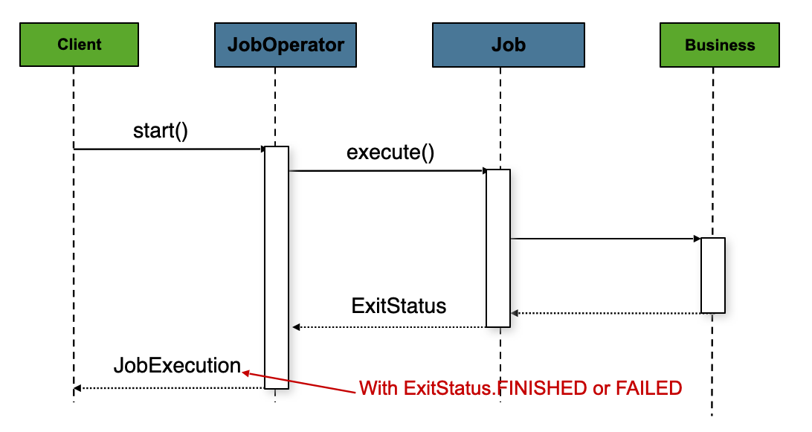

Figure 1. Job Launcher Sequence

The sequence is straightforward and works well when launched from a scheduler. However, issues arise when trying to launch from an HTTP request. In this scenario, the launching
needs to be done asynchronously so that the `TaskExecutorJobOperator` returns immediately to its
caller. This is because it is not good practice to keep an HTTP request open for the
amount of time needed by long running processes (such as batch jobs). The following image shows
an example sequence:

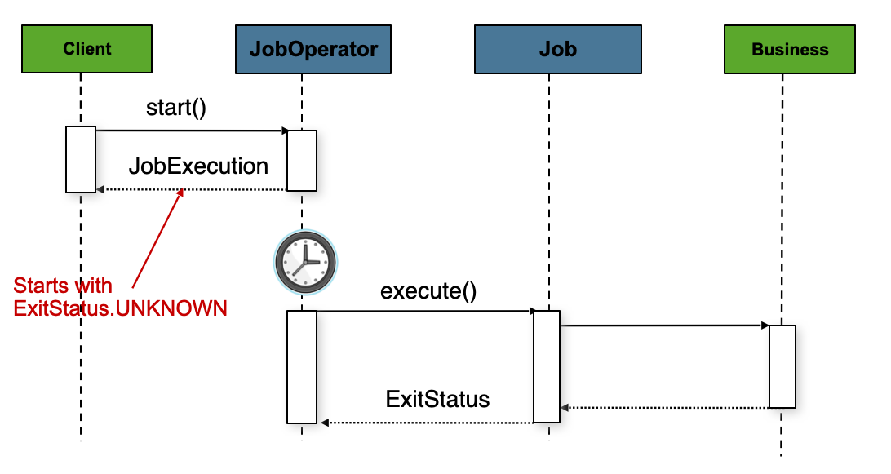

Figure 2. Asynchronous Job Launcher Sequence

You can configure the `TaskExecutorJobOperator` to allow for this scenario by configuring a
`TaskExecutor`.

- Java
- XML

The following Java example configures a `TaskExecutorJobOperator` to return immediately:

Java Configuration

```java
@Bean
public JobOperatorFactoryBean jobOperator(JobRepository jobRepository) {
	JobOperatorFactoryBean jobOperatorFactoryBean = new JobOperatorFactoryBean();
	jobOperatorFactoryBean.setJobRepository(jobRepository);
	jobOperatorFactoryBean.setTaskExecutor(new SimpleAsyncTaskExecutor());
	return jobOperatorFactoryBean;
}
```

The following XML example configures a `TaskExecutorJobOperator` to return immediately:

XML Configuration

```xml
<bean id="jobOperator" class="org.springframework.batch.core.launch.support.JobOperatorFactoryBean">
    <property name="jobRepository" ref="jobRepository" />
    <property name="taskExecutor">
        <bean class="org.springframework.core.task.SimpleAsyncTaskExecutor" />
    </property>
</bean>
```

You can use any implementation of the Spring `TaskExecutor`
interface to control how jobs are asynchronously
executed.

[Configuring a JobRepository](#job-configuring-repository)
[Running a Job](#job-running)

---

<a id="job-running"></a>

<!-- source_url: https://docs.spring.io/spring-batch/reference/job/running.html -->

<!-- page_index: 11 -->

# Running a Job

<svg enable-background="new 0 0 32 32" id="Glyph" version="1.1" viewbox="0 0 32 32" xml:space="preserve" xmlns="http://www.w3.org/2000/svg" xmlns:xlink="http://www.w3.org/1999/xlink">
<path id="XMLID_223_"></path>
</svg>

Search

<a id="job-running--page-title"></a>
<a id="job-running--running-a-job"></a>

# Running a Job

At a minimum, launching a batch job requires two things: the
`Job` to be launched and a
`JobOperator`. Both can be contained within the same
context or different contexts. For example, if you launch jobs from the
command line, a new JVM is instantiated for each `Job`. Thus, every
job has its own `JobOperator`. However, if
you run from within a web container that is within the scope of an
`HttpRequest`, there is usually one
`JobOperator` (configured for asynchronous job
launching) that multiple requests invoke to launch their jobs.

<a id="job-running--runningjobsfromcommandline"></a>
<a id="job-running--running-jobs-from-the-command-line"></a>

## Running Jobs from the Command Line

If you want to run your jobs from an enterprise
scheduler, the command line is the primary interface. This is because
most schedulers (with the exception of Quartz, unless using
`NativeJob`) work directly with operating system
processes, primarily kicked off with shell scripts. There are many ways
to launch a Java process besides a shell script, such as Perl, Ruby, or
even build tools, such as Ant or Maven. However, because most people
are familiar with shell scripts, this example focuses on them.

<a id="job-running--commandlinejoboperator"></a>
<a id="job-running--the-commandlinejoboperator"></a>

### The CommandLineJobOperator

Because the script launching the job must kick off a Java
Virtual Machine, there needs to be a class with a `main` method to act
as the primary entry point. Spring Batch provides an implementation
that serves this purpose:
`CommandLineJobOperator`. Note
that this is just one way to bootstrap your application. There are
many ways to launch a Java process, and this class should in no way be
viewed as definitive. The `CommandLineJobOperator`
performs four tasks:

- Load the appropriate `ApplicationContext`.
- Parse command line arguments into `JobParameters`.
- Locate the appropriate job based on arguments.
- Use the `JobOperator` provided in the application context to launch the job.

All of these tasks are accomplished with only the arguments passed in.
The following table describes the required arguments:

`jobClass`

The fully qualified name of the job configuration class used to
create an `ApplicationContext`. This file
should contain everything needed to run the complete
`Job`, including a `JobOperator`, a `JobRepository` and a `JobRegistry` populated with the jobs to operate.

`operation`

The name of the operation to execute on the job. Can be one of [`start`, `startNextInstance`, `stop`, `restart`, `abandon`]

`jobName` or `jobExecutionId`

Depending on the operation, this can be the name of the job to start or the execution ID of the job to stop, restart, abandon or recover.

When starting a job, all arguments after these are considered to be job parameters, are turned into a `JobParameters` object, and must be in the format of `name=value,type,identifying`. In the case of stopping, restarting, abandoning or recovering a job, the `jobExecutionId` is
expected as the 4th argument, and all remaining arguments are ignored.

The following example shows a date passed as a job parameter to a job defined in Java:

```none
<bash$ java CommandLineJobOperator io.spring.EndOfDayJobConfiguration start endOfDay schedule.date=2007-05-05,java.time.LocalDate
```

By default, the `CommandLineJobOperator` uses a `DefaultJobParametersConverter` that implicitly converts
key/value pairs to identifying job parameters. However, you can explicitly specify
which job parameters are identifying and which are not by suffixing them with `true` or `false`, respectively.

In the following example, `schedule.date` is an identifying job parameter, while `vendor.id` is not:

```none
<bash$ java CommandLineJobOperator io.spring.EndOfDayJobConfiguration start endOfDay \
                                 schedule.date=2007-05-05,java.time.LocalDate,true \
                                 vendor.id=123,java.lang.Long,false
```

You can override this behavior by setting a custom `JobParametersConverter` on the `CommandLineJobOperator`.

<a id="job-running--exitcodes"></a>
<a id="job-running--exit-codes"></a>

### Exit Codes

When launching a batch job from the command-line, an enterprise
scheduler is often used. Most schedulers are fairly dumb and work only
at the process level. This means that they only know about some
operating system process (such as a shell script that they invoke).
In this scenario, the only way to communicate back to the scheduler
about the success or failure of a job is through return codes. A
return code is a number that is returned to a scheduler by the process
to indicate the result of the run. In the simplest case, 0 is
success and 1 is failure. However, there may be more complex
scenarios, such as “If job A returns 4, kick off job B, and, if it returns 5, kick
off job C.” This type of behavior is configured at the scheduler level, but it is important that a processing framework such as Spring Batch
provide a way to return a numeric representation of the exit code
for a particular batch job. In Spring Batch, this is encapsulated
within an `ExitStatus`, which is covered in more
detail in Chapter 5. For the purposes of discussing exit codes, the
only important thing to know is that an
`ExitStatus` has an exit code property that is
set by the framework (or the developer) and is returned as part of the
`JobExecution` returned from the `JobOperator`. The
`CommandLineJobOperator` converts this string value
to a number by using the `ExitCodeMapper`
interface:

```java
public interface ExitCodeMapper {

    int intValue(String exitCode);

}
```

The essential contract of an `ExitCodeMapper` is that, given a string exit
code, a number representation will be returned. The default implementation
used by the job runner is the `SimpleJvmExitCodeMapper`
that returns 0 for completion, 1 for generic errors, and 2 for any job
runner errors such as not being able to find a
`Job` in the provided context. If anything more
complex than the three values above is needed, a custom
implementation of the `ExitCodeMapper` interface
must be supplied by setting it on the `CommandLineJobOperator`.

<a id="job-running--runningjobsfromwebcontainer"></a>
<a id="job-running--running-jobs-from-within-a-web-container"></a>

## Running Jobs from within a Web Container

Historically, offline processing (such as batch jobs) has been
launched from the command-line, as described earlier. However, there are
many cases where launching from an `HttpRequest` is
a better option. Many such use cases include reporting, ad-hoc job
running, and web application support. Because a batch job (by definition)
is long running, the most important concern is to launch the
job asynchronously:

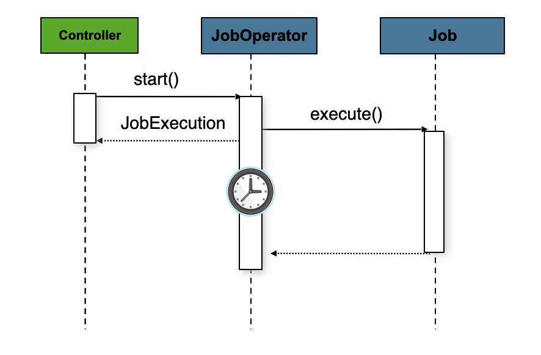

Figure 1. Asynchronous Job Launcher Sequence From Web Container

The controller in this case is a Spring MVC controller. See the
Spring Framework Reference Guide for more about [Spring MVC](https://docs.spring.io/spring/docs/current/spring-framework-reference/web.html#mvc).
The controller launches a `Job` by using a
`JobOperator` that has been configured to launch
[asynchronously](#job-running--runningjobsfromwebcontainer), which
immediately returns a `JobExecution`. The
`Job` is likely still running. However, this
nonblocking behavior lets the controller return immediately, which
is required when handling an `HttpRequest`. The following listing
shows an example:

```java
@Controller
public class JobOperatorController {

    @Autowired
    JobOperator jobOperator;

    @Autowired
    Job job;

    @RequestMapping("/jobOperator.html")
    public void handle() throws Exception{
        jobOperator.start(job, new JobParameters());
    }
}
```

[Configuring a JobOperator](#job-configuring-operator)
[Advanced Metadata Usage](#job-advanced-meta-data)

---

<a id="job-advanced-meta-data"></a>

<!-- source_url: https://docs.spring.io/spring-batch/reference/job/advanced-meta-data.html -->

<!-- page_index: 12 -->

# Advanced Metadata Usage

<svg enable-background="new 0 0 32 32" id="Glyph" version="1.1" viewbox="0 0 32 32" xml:space="preserve" xmlns="http://www.w3.org/2000/svg" xmlns:xlink="http://www.w3.org/1999/xlink">
<path id="XMLID_223_"></path>
</svg>

Search

<a id="job-advanced-meta-data--page-title"></a>
<a id="job-advanced-meta-data--advanced-metadata-usage"></a>

# Advanced Metadata Usage

<a id="job-advanced-meta-data--jobregistry"></a>

## JobRegistry

A `JobRegistry` is used to track which jobs are available in the context and can be operated by
the `JobOperator`. It is also useful for collecting jobs centrally in an application context when
they have been created elsewhere (for example, in child contexts). You can also use custom `JobRegistry`
implementations to manipulate the names and other properties of the jobs that are registered.
There is only one implementation provided by the framework and this is based on a simple
map from job name to job instance, the `MapJobregistry`.

- Java
- XML

When using `@EnableBatchProcessing`, a `MapJobregistry` is provided for you.
The following example shows how to configure your own `JobRegistry`:

```java
...
@Bean
public JobRegistry jobRegistry() throws Exception {
	return new MyCustomJobRegistry();
}
...
```

The following example shows how to include a `JobRegistry` for a job defined in XML:

```xml
<bean id="jobRegistry" class="org.springframework.batch.core.configuration.support.MapJobRegistry" />
```

The `MapJobRegistry` provided by Spring Batch is smart enough to populate itself with all the jobs
in the application context. However, if you are using a custom implementation of `JobRegistry`, you
need to populate it manually with the jobs that you want to operate through the job operator.

<a id="job-advanced-meta-data--jobparametersincrementer"></a>

## JobParametersIncrementer

Most of the methods on `JobOperator` are
self-explanatory, and you can find more detailed explanations in the
[Javadoc of the interface](https://docs.spring.io/spring-batch/reference/api/org/springframework/batch/core/launch/JobOperator.html). However, the
`startNextInstance` method is worth noting. This
method always starts a new instance of a `Job`.
This can be extremely useful if there are serious issues in a
`JobExecution` and the `Job`
needs to be started over again from the beginning. Unlike
`JobLauncher` (which requires a new
`JobParameters` object that triggers a new
`JobInstance`), if the parameters are different from
any previous set of parameters, the
`startNextInstance` method uses the
`JobParametersIncrementer` tied to the
`Job` to force the `Job` to a
new instance:

```java
public interface JobParametersIncrementer {

    JobParameters getNext(JobParameters parameters);

}
```

The contract of `JobParametersIncrementer` is
that, given a [JobParameters](#domain--jobparameters)
object, it returns the “next” `JobParameters`
object by incrementing any necessary values it may contain. This
strategy is useful because the framework has no way of knowing what
changes to the `JobParameters` make it the “next”
instance. For example, if the only value in
`JobParameters` is a date and the next instance
should be created, should that value be incremented by one day or one
week (if the job is weekly, for instance)? The same can be said for any
numerical values that help to identify the `Job`, as the following example shows:

```java
public class SampleIncrementer implements JobParametersIncrementer {
public JobParameters getNext(JobParameters parameters) {if (parameters==null || parameters.isEmpty()) {return new JobParametersBuilder().addLong("run.id", 1L).toJobParameters();} long id = parameters.getLong("run.id",1L) + 1; return new JobParametersBuilder().addLong("run.id", id).toJobParameters();}}
```

In this example, the value with a key of `run.id` is used to
discriminate between `JobInstances`. If the
`JobParameters` passed in is null, it can be
assumed that the `Job` has never been run before
and, thus, its initial state can be returned. However, if not, the old
value is obtained, incremented by one, and returned.

- Java
- XML

For jobs defined in Java, you can associate an incrementer with a `Job` through the
`incrementer` method provided in the builders, as follows:

```java
@Bean
public Job footballJob(JobRepository jobRepository) {
    return new JobBuilder("footballJob", jobRepository)
    				 .incrementer(sampleIncrementer())
    				 ...
                     .build();
}
```

For jobs defined in XML, you can associate an incrementer with a `Job` through the
`incrementer` attribute in the namespace, as follows:

```xml
<job id="footballJob" incrementer="sampleIncrementer">
    ...
</job>
```

<a id="job-advanced-meta-data--stoppingajob"></a>
<a id="job-advanced-meta-data--stopping-a-job"></a>

## Stopping a Job

One of the most common use cases of
`JobOperator` is gracefully stopping a
Job:

```java
Set<Long> executions = jobOperator.getRunningExecutions("sampleJob");
jobOperator.stop(executions.iterator().next());
```

The shutdown is not immediate, since there is no way to force
immediate shutdown, especially if the execution is currently in
developer code that the framework has no control over, such as a
business service. However, as soon as control is returned back to the
framework, it sets the status of the current
`StepExecution` to
`BatchStatus.STOPPED`, saves it, and does the same
for the `JobExecution` before finishing.

<a id="job-advanced-meta-data--graceful-shutdown"></a>
<a id="job-advanced-meta-data--handling-external-interruption-signals"></a>

## Handling external interruption signals

As of v6.0+, Spring Batch provides a `JobExecutionShutdownHook` that you can attach to the JVM runtime
in order to intercept external interruption signals and gracefully stop the job execution:

```java
Thread springBatchHook = new JobExecutionShutdownHook(jobExecution, jobOperator);
Runtime.getRuntime().addShutdownHook(springBatchHook);
```

A `JobExecutionShutdownHook` requires the job execution to track as well as a reference to a job operator
that will be used to stop the execution.

<a id="job-advanced-meta-data--recover-job"></a>
<a id="job-advanced-meta-data--recovering-a-job"></a>

## Recovering a job

If a graceful shutdown is not performed properly (ie the JVM is shutdown abruptly), Spring Batch will not
have a chance to update the execution state correctly in order to restart the failed job execution. In this
case, the job execution will stay in a `STARTED` state which is not restartable. In this case, it is possible
to recover such a job execution with the `JobOperator` API:

```java
JobExecution jobExecution = ...; // get the job execution to recover
jobOperator.recover(jobExecution);
jobOperator.restart(jobExecution);
```

<a id="job-advanced-meta-data--aborting-a-job"></a>

## Aborting a Job

A job execution that is `FAILED` can be
restarted (if the `Job` is restartable). A job execution whose status is
`ABANDONED` cannot be restarted by the framework.
The `ABANDONED` status is also used in step
executions to mark them as skippable in a restarted job execution. If a
job is running and encounters a step that has been marked
`ABANDONED` in the previous failed job execution, it
moves on to the next step (as determined by the job flow definition
and the step execution exit status).

If the process died (`kill -9` or server
failure), the job is, of course, not running, but the `JobRepository` has
no way of knowing because no one told it before the process died. You
have to tell it manually that you know that the execution either failed
or should be considered aborted (change its status to
`FAILED` or `ABANDONED`). This is
a business decision, and there is no way to automate it. Change the
status to `FAILED` only if it is restartable and you know that the restart data is valid.

[Running a Job](#job-running)
[Configuring a `Step`](#step)

---

<a id="step"></a>

<!-- source_url: https://docs.spring.io/spring-batch/reference/step.html -->

<!-- page_index: 13 -->

# Configuring a Step

<svg enable-background="new 0 0 32 32" id="Glyph" version="1.1" viewbox="0 0 32 32" xml:space="preserve" xmlns="http://www.w3.org/2000/svg" xmlns:xlink="http://www.w3.org/1999/xlink">
<path id="XMLID_223_"></path>
</svg>

Search

<a id="step--page-title"></a>
<a id="step--configuring-a-step"></a>

# Configuring a `Step`

As discussed in [the domain chapter](#domain), a `Step` is a
domain object that encapsulates an independent, sequential phase of a batch job and
contains all of the information necessary to define and control the actual batch
processing. This is a necessarily vague description because the contents of any given
`Step` are at the discretion of the developer writing a `Job`. A `Step` can be as simple
or complex as the developer desires. A simple `Step` might load data from a file into the
database, requiring little or no code (depending upon the implementations used). A more
complex `Step` might have complicated business rules that are applied as part of the
processing, as the following image shows:

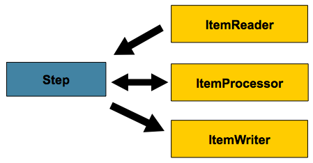

Figure 1. Step

<a id="step--section-summary"></a>

## Section Summary

- [Chunk-oriented Processing](#step-chunk-oriented-processing)
- [`TaskletStep`](#step-tasklet)
- [Controlling Step Flow](#step-controlling-flow)
- [Late Binding of `Job` and `Step` Attributes](#step-late-binding)

[Advanced Metadata Usage](#job-advanced-meta-data)
[Chunk-oriented Processing](#step-chunk-oriented-processing)

---

<a id="step-chunk-oriented-processing"></a>

<!-- source_url: https://docs.spring.io/spring-batch/reference/step/chunk-oriented-processing.html -->

<!-- page_index: 14 -->

# Chunk-oriented Processing

<svg enable-background="new 0 0 32 32" id="Glyph" version="1.1" viewbox="0 0 32 32" xml:space="preserve" xmlns="http://www.w3.org/2000/svg" xmlns:xlink="http://www.w3.org/1999/xlink">
<path id="XMLID_223_"></path>
</svg>

Search

<a id="step-chunk-oriented-processing--page-title"></a>
<a id="step-chunk-oriented-processing--chunk-oriented-processing"></a>

# Chunk-oriented Processing

Spring Batch uses a “chunk-oriented” processing style in its most common
implementation. Chunk oriented processing refers to reading the data one at a time and
creating 'chunks' that are written out within a transaction boundary. Once the number of
items read equals the commit interval, the entire chunk is written out by the
`ItemWriter`, and then the transaction is committed. The following image shows the
process:

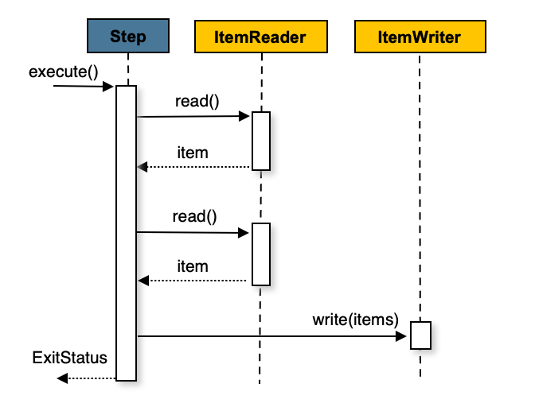

Figure 1. Chunk-oriented Processing

The following pseudo code shows the same concepts in a simplified form:

```java
List items = new Arraylist(); for(int i = 0; i < commitInterval; i++){Object item = itemReader.read(); if (item != null) {items.add(item);}} itemWriter.write(items);
```

You can also configure a chunk-oriented step with an optional `ItemProcessor`
to process items before passing them to the `ItemWriter`. The following image
shows the process when an `ItemProcessor` is registered in the step:

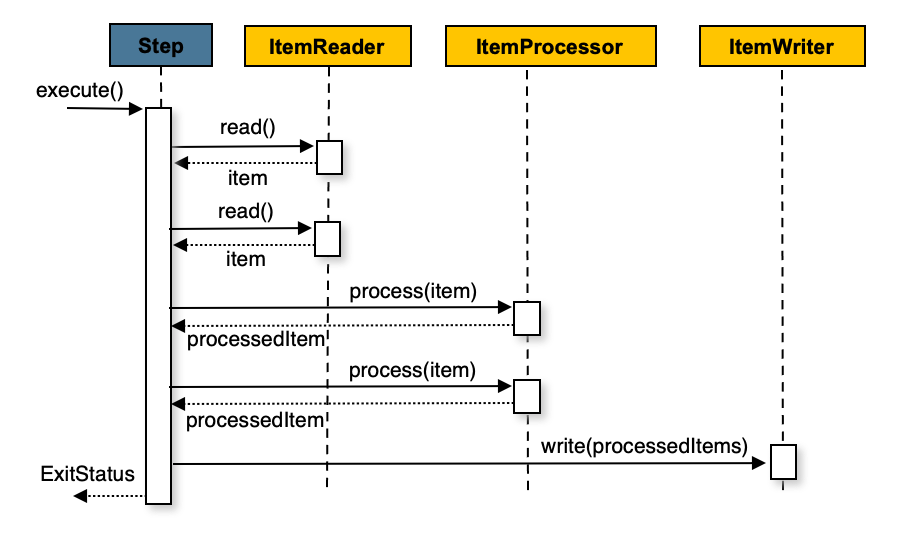

Figure 2. Chunk-oriented Processing with Item Processor

The following pseudo code shows how this is implemented in a simplified form:

```java
List items = new Arraylist(); for(int i = 0; i < commitInterval; i++){Object item = itemReader.read(); if (item != null) {items.add(item);}}
List processedItems = new Arraylist(); for(Object item: items){Object processedItem = itemProcessor.process(item); if (processedItem != null) {processedItems.add(processedItem);}}
itemWriter.write(processedItems);
```

For more details about item processors and their use cases, see the
[Item processing](#processor) section.

[Configuring a `Step`](#step)
[Configuring a Step](#step-chunk-oriented-processing-configuring)

---

<a id="step-chunk-oriented-processing-configuring"></a>

<!-- source_url: https://docs.spring.io/spring-batch/reference/step/chunk-oriented-processing/configuring.html -->

<!-- page_index: 15 -->

# Configuring a Step

<svg enable-background="new 0 0 32 32" id="Glyph" version="1.1" viewbox="0 0 32 32" xml:space="preserve" xmlns="http://www.w3.org/2000/svg" xmlns:xlink="http://www.w3.org/1999/xlink">
<path id="XMLID_223_"></path>
</svg>

Search

<a id="step-chunk-oriented-processing-configuring--page-title"></a>
<a id="step-chunk-oriented-processing-configuring--configuring-a-step"></a>

# Configuring a Step

Despite the relatively short list of required dependencies for a `Step`, it is an
extremely complex class that can potentially contain many collaborators.

- Java
- XML

When using Java configuration, you can use the Spring Batch builders, as the
following example shows:

Java Configuration

```java
/** * Note the JobRepository is typically autowired in and not needed to be explicitly * configured */ @Bean public Job sampleJob(JobRepository jobRepository, Step sampleStep) {return new JobBuilder("sampleJob", jobRepository) .start(sampleStep) .build();}
/** * Note the TransactionManager is typically autowired in and not needed to be explicitly * configured */ @Bean public Step sampleStep(JobRepository jobRepository, (1) PlatformTransactionManager transactionManager) { (2) return new StepBuilder(jobRepository) (3) .<String, String>chunk(10).transactionManager(transactionManager) (4) .reader(itemReader()) .writer(itemWriter()) .build();}
```

**1**

`repository`: The Java-specific name of the `JobRepository` that periodically stores
the `StepExecution` and `ExecutionContext` during processing (just before committing).

**2**

`transactionManager`: Spring’s `PlatformTransactionManager` that begins and commits
transactions during processing.

**3**

Step name: when the step is declared as a bean, the name can be omitted and will be derived
from the method name. However, if the step is **not** defined as a bean, the name must be explicitly
provided to the `StepBuilder` constructor like `new StepBuilder("myStep", jobRepository)`.

**4**

`chunk`: The Java-specific name of the dependency that indicates that this is an
item-based step and the number of items to be processed before the transaction is
committed.

> [!NOTE]
> Note that `repository` defaults to `jobRepository` (provided through `@EnableBatchProcessing`)
> and `transactionManager` defaults to `transactionManager` (provided from the application context). The
> transaction manager is optional and defaults to a `ResourcelessTransactionManager`.
> Also, the `ItemProcessor` is optional, since the item could be
> directly passed from the reader to the writer.

To ease configuration, you can use the Spring Batch XML namespace, as
the following example shows:

XML Configuration

```xml
<job id="sampleJob" job-repository="jobRepository"> (2)
    <step id="step1">
        <tasklet transaction-manager="transactionManager"> (1)
            <chunk reader="itemReader" writer="itemWriter" commit-interval="10"/> (3)
        </tasklet>
    </step>
</job>
```

**1**

`transaction-manager`: Spring’s `PlatformTransactionManager` that begins and commits
transactions during processing.

**2**

`job-repository`: The XML-specific name of the `JobRepository` that periodically stores
the `StepExecution` and `ExecutionContext` during processing (just before committing). For
an in-line `<step/>` (one defined within a `<job/>`), it is an attribute on the `<job/>`
element. For a standalone `<step/>`, it is defined as an attribute of the `<tasklet/>`.

**3**

`commit-interval`: The XML-specific name of the number of items to be processed
before the transaction is committed.

> [!NOTE]
> Note that `job-repository` defaults to `jobRepository` and
> `transaction-manager` defaults to `transactionManager`. Also, the `ItemProcessor` is
> optional, since the item could be directly passed from the reader to the writer.

The preceding configuration includes the only required dependencies to create an item-oriented
step:

- `reader`: The `ItemReader` that provides items for processing.
- `writer`: The `ItemWriter` that processes the items provided by the `ItemReader`.

> [!NOTE]
> The transaction manager used in the step could be different from the one used in the job
> repository. The caveat though is that the job repository and the processing database
> won’t be in the same transaction, so if a failure occurs after processing but before the job
> repository is updated, the step could be re-executed and lead to duplicate processing. This could
> be mitigated through idempotent processing or external transaction management (e.g., JTA).

[Chunk-oriented Processing](#step-chunk-oriented-processing)
[Inheriting from a Parent `Step`](#step-chunk-oriented-processing-inheriting-from-parent)

---

<a id="step-chunk-oriented-processing-inheriting-from-parent"></a>

<!-- source_url: https://docs.spring.io/spring-batch/reference/step/chunk-oriented-processing/inheriting-from-parent.html -->

<!-- page_index: 16 -->

# Inheriting from a Parent Step

<svg enable-background="new 0 0 32 32" id="Glyph" version="1.1" viewbox="0 0 32 32" xml:space="preserve" xmlns="http://www.w3.org/2000/svg" xmlns:xlink="http://www.w3.org/1999/xlink">
<path id="XMLID_223_"></path>
</svg>

Search

<a id="step-chunk-oriented-processing-inheriting-from-parent--page-title"></a>
<a id="step-chunk-oriented-processing-inheriting-from-parent--inheriting-from-a-parent-step"></a>

# Inheriting from a Parent `Step`

If a group of `Steps` share similar configurations, then it may be helpful to define a
“parent” `Step` from which the concrete `Steps` may inherit properties. Similar to class
inheritance in Java, the “child” `Step` combines its elements and attributes with the
parent’s. The child also overrides any of the parent’s `Steps`.

In the following example, the `Step`, `concreteStep1`, inherits from `parentStep`. It is
instantiated with `itemReader`, `itemProcessor`, `itemWriter`, `startLimit=5`, and
`allowStartIfComplete=true`. Additionally, the `commitInterval` is `5`, since it is
overridden by the `concreteStep1` `Step`, as the following example shows:

```xml
<step id="parentStep">
    <tasklet allow-start-if-complete="true">
        <chunk reader="itemReader" writer="itemWriter" commit-interval="10"/>
    </tasklet>
</step>

<step id="concreteStep1" parent="parentStep">
    <tasklet start-limit="5">
        <chunk processor="itemProcessor" commit-interval="5"/>
    </tasklet>
</step>
```

The `id` attribute is still required on the step within the job element. This is for two
reasons:

- The `id` is used as the step name when persisting the `StepExecution`. If the same
  standalone step is referenced in more than one step in the job, an error occurs.

- When creating job flows, as described [later in this chapter](#step-controlling-flow), the `next` attribute
  should refer to the step in the flow, not the standalone step.

<a id="step-chunk-oriented-processing-inheriting-from-parent--abstract-step"></a>

## Abstract `Step`

Sometimes, it may be necessary to define a parent `Step` that is not a complete `Step`
configuration. If, for instance, the `reader`, `writer`, and `tasklet` attributes are
left off of a `Step` configuration, then initialization fails. If a parent must be
defined without one or more of these properties, the `abstract` attribute should be used. An
`abstract` `Step` is only extended, never instantiated.

In the following example, the `Step` (`abstractParentStep`) would not be instantiated if it
were not declared to be abstract. The `Step`, (`concreteStep2`) has `itemReader`, `itemWriter`, and `commit-interval=10`.

```xml
<step id="abstractParentStep" abstract="true">
    <tasklet>
        <chunk commit-interval="10"/>
    </tasklet>
</step>

<step id="concreteStep2" parent="abstractParentStep">
    <tasklet>
        <chunk reader="itemReader" writer="itemWriter"/>
    </tasklet>
</step>
```

<a id="step-chunk-oriented-processing-inheriting-from-parent--merging-lists"></a>

## Merging Lists

Some of the configurable elements on `Steps` are lists, such as the `<listeners/>` element.
If both the parent and child `Steps` declare a `<listeners/>` element, the
child’s list overrides the parent’s. To allow a child to add additional
listeners to the list defined by the parent, every list element has a `merge` attribute.
If the element specifies that `merge="true"`, then the child’s list is combined with the
parent’s instead of overriding it.

In the following example, the `Step` "concreteStep3", is created with two listeners:
`listenerOne` and `listenerTwo`:

```xml
<step id="listenersParentStep" abstract="true">
    <listeners>
        <listener ref="listenerOne"/>
    </listeners>
</step>

<step id="concreteStep3" parent="listenersParentStep">
    <tasklet>
        <chunk reader="itemReader" writer="itemWriter" commit-interval="5"/>
    </tasklet>
    <listeners merge="true">
        <listener ref="listenerTwo"/>
    </listeners>
</step>
```

[Configuring a Step](#step-chunk-oriented-processing-configuring)
[The Commit Interval](#step-chunk-oriented-processing-commit-interval)

---

<a id="step-chunk-oriented-processing-commit-interval"></a>

<!-- source_url: https://docs.spring.io/spring-batch/reference/step/chunk-oriented-processing/commit-interval.html -->

<!-- page_index: 17 -->

# The Commit Interval

<svg enable-background="new 0 0 32 32" id="Glyph" version="1.1" viewbox="0 0 32 32" xml:space="preserve" xmlns="http://www.w3.org/2000/svg" xmlns:xlink="http://www.w3.org/1999/xlink">
<path id="XMLID_223_"></path>
</svg>

Search

<a id="step-chunk-oriented-processing-commit-interval--page-title"></a>
<a id="step-chunk-oriented-processing-commit-interval--the-commit-interval"></a>

# The Commit Interval

As mentioned previously, a step reads in and writes out items, periodically committing
by using the supplied `PlatformTransactionManager`. With a `commit-interval` of 1, it
commits after writing each individual item. This is less than ideal in many situations, since beginning and committing a transaction is expensive. Ideally, it is preferable to
process as many items as possible in each transaction, which is completely dependent upon
the type of data being processed and the resources with which the step is interacting.
For this reason, you can configure the number of items that are processed within a commit.

- Java
- XML

The following example shows a `step` whose `tasklet` has a `commit-interval`
value of 10 as it would be defined in Java:

Java Configuration

```java
@Bean
public Job sampleJob(JobRepository jobRepository, Step step1) {
    return new JobBuilder("sampleJob", jobRepository)
                     .start(step1)
                     .build();
}

@Bean
public Step step1(JobRepository jobRepository, PlatformTransactionManager transactionManager) {
	return new StepBuilder("step1", jobRepository)
				.<String, String>chunk(10).transactionManager(transactionManager)
				.reader(itemReader())
				.writer(itemWriter())
				.build();
}
```

The following example shows a `step` whose `tasklet` has a `commit-interval`
value of 10 as it would be defined in XML:

XML Configuration

```xml
<job id="sampleJob">
    <step id="step1">
        <tasklet>
            <chunk reader="itemReader" writer="itemWriter" commit-interval="10"/>
        </tasklet>
    </step>
</job>
```

In the preceding example, 10 items are processed within each transaction. At the
beginning of processing, a transaction is begun. Also, each time `read` is called on the
`ItemReader`, a counter is incremented. When it reaches 10, the list of aggregated items
is passed to the `ItemWriter`, and the transaction is committed.

[Inheriting from a Parent `Step`](#step-chunk-oriented-processing-inheriting-from-parent)
[Configuring a `Step` for Restart](#step-chunk-oriented-processing-restart)

---

<a id="step-chunk-oriented-processing-restart"></a>

<!-- source_url: https://docs.spring.io/spring-batch/reference/step/chunk-oriented-processing/restart.html -->

<!-- page_index: 18 -->

# Configuring a Step for Restart

<svg enable-background="new 0 0 32 32" id="Glyph" version="1.1" viewbox="0 0 32 32" xml:space="preserve" xmlns="http://www.w3.org/2000/svg" xmlns:xlink="http://www.w3.org/1999/xlink">
<path id="XMLID_223_"></path>
</svg>

Search

<a id="step-chunk-oriented-processing-restart--page-title"></a>
<a id="step-chunk-oriented-processing-restart--configuring-a-step-for-restart"></a>

# Configuring a `Step` for Restart

In the “[Configuring and Running a Job](#job)” section , restarting a
`Job` was discussed. Restart has numerous impacts on steps, and, consequently, may
require some specific configuration.

<a id="step-chunk-oriented-processing-restart--startlimit"></a>
<a id="step-chunk-oriented-processing-restart--setting-a-start-limit"></a>

## Setting a Start Limit

There are many scenarios where you may want to control the number of times a `Step` can
be started. For example, you might need to configure a particular `Step` so that it
runs only once because it invalidates some resource that must be fixed manually before it can
be run again. This is configurable on the step level, since different steps may have
different requirements. A `Step` that can be executed only once can exist as part of the
same `Job` as a `Step` that can be run infinitely.

- Java
- XML

The following code fragment shows an example of a start limit configuration in Java:

Java Configuration

```java
@Bean
public Step step1(JobRepository jobRepository, PlatformTransactionManager transactionManager) {
	return new StepBuilder("step1", jobRepository)
				.<String, String>chunk(10).transactionManager(transactionManager)
				.reader(itemReader())
				.writer(itemWriter())
				.startLimit(1)
				.build();
}
```

The following code fragment shows an example of a start limit configuration in XML:

XML Configuration

```xml
<step id="step1">
    <tasklet start-limit="1">
        <chunk reader="itemReader" writer="itemWriter" commit-interval="10"/>
    </tasklet>
</step>
```

The step shown in the preceding example can be run only once. Attempting to run it again
causes a `StartLimitExceededException` to be thrown. Note that the default value for the
start-limit is `Integer.MAX_VALUE`.

<a id="step-chunk-oriented-processing-restart--allowstartifcomplete"></a>
<a id="step-chunk-oriented-processing-restart--restarting-a-completed-step"></a>

## Restarting a Completed `Step`

In the case of a restartable job, there may be one or more steps that should always be
run, regardless of whether or not they were successful the first time. An example might
be a validation step or a `Step` that cleans up resources before processing. During
normal processing of a restarted job, any step with a status of `COMPLETED` (meaning it
has already been completed successfully), is skipped. Setting `allow-start-if-complete` to
`true` overrides this so that the step always runs.

- Java
- XML

The following code fragment shows how to define a restartable job in Java:

Java Configuration

```java
@Bean
public Step step1(JobRepository jobRepository, PlatformTransactionManager transactionManager) {
	return new StepBuilder("step1", jobRepository)
				.<String, String>chunk(10).transactionManager(transactionManager)
				.reader(itemReader())
				.writer(itemWriter())
				.allowStartIfComplete(true)
				.build();
}
```

The following code fragment shows how to define a restartable job in XML:

XML Configuration

```xml
<step id="step1">
    <tasklet allow-start-if-complete="true">
        <chunk reader="itemReader" writer="itemWriter" commit-interval="10"/>
    </tasklet>
</step>
```

<a id="step-chunk-oriented-processing-restart--steprestartexample"></a>
<a id="step-chunk-oriented-processing-restart--step-restart-configuration-example"></a>

## `Step` Restart Configuration Example

- Java
- XML

The following Java example shows how to configure a job to have steps that can be
restarted:

Java Configuration

```java
@Bean
public Job footballJob(JobRepository jobRepository, Step playerLoad, Step gameLoad, Step playerSummarization) {
	return new JobBuilder("footballJob", jobRepository)
				.start(playerLoad)
				.next(gameLoad)
				.next(playerSummarization)
				.build();
}

@Bean
public Step playerLoad(JobRepository jobRepository, PlatformTransactionManager transactionManager) {
	return new StepBuilder("playerLoad", jobRepository)
			.<String, String>chunk(10).transactionManager(transactionManager)
			.reader(playerFileItemReader())
			.writer(playerWriter())
			.build();
}

@Bean
public Step gameLoad(JobRepository jobRepository, PlatformTransactionManager transactionManager) {
	return new StepBuilder("gameLoad", jobRepository)
			.allowStartIfComplete(true)
			.<String, String>chunk(10).transactionManager(transactionManager)
			.reader(gameFileItemReader())
			.writer(gameWriter())
			.build();
}

@Bean
public Step playerSummarization(JobRepository jobRepository, PlatformTransactionManager transactionManager) {
	return new StepBuilder("playerSummarization", jobRepository)
			.startLimit(2)
			.<String, String>chunk(10).transactionManager(transactionManager)
			.reader(playerSummarizationSource())
			.writer(summaryWriter())
			.build();
}
```

The following XML example shows how to configure a job to have steps that can be
restarted:

XML Configuration

```xml
<job id="footballJob" restartable="true">
    <step id="playerload" next="gameLoad">
        <tasklet>
            <chunk reader="playerFileItemReader" writer="playerWriter"
                   commit-interval="10" />
        </tasklet>
    </step>
    <step id="gameLoad" next="playerSummarization">
        <tasklet allow-start-if-complete="true">
            <chunk reader="gameFileItemReader" writer="gameWriter"
                   commit-interval="10"/>
        </tasklet>
    </step>
    <step id="playerSummarization">
        <tasklet start-limit="2">
            <chunk reader="playerSummarizationSource" writer="summaryWriter"
                   commit-interval="10"/>
        </tasklet>
    </step>
</job>
```

The preceding example configuration is for a job that loads in information about football
games and summarizes them. It contains three steps: `playerLoad`, `gameLoad`, and
`playerSummarization`. The `playerLoad` step loads player information from a flat file, while the `gameLoad` step does the same for games. The final step, `playerSummarization`, then summarizes the statistics for each player, based upon the
provided games. It is assumed that the file loaded by `playerLoad` must be loaded only
once but that `gameLoad` can load any games found within a particular directory, deleting them after they have been successfully loaded into the database. As a result, the `playerLoad` step contains no additional configuration. It can be started any number
of times is skipped if complete. The `gameLoad` step, however, needs to be run
every time in case extra files have been added since it last ran. It has
`allow-start-if-complete` set to `true` to always be started. (It is assumed
that the database table that games are loaded into has a process indicator on it, to ensure
new games can be properly found by the summarization step). The summarization step, which is the most important in the job, is configured to have a start limit of 2. This
is useful because, if the step continually fails, a new exit code is returned to the
operators that control job execution, and it can not start again until manual
intervention has taken place.

> [!NOTE]
> This job provides an example for this document and is not the same as the `footballJob`
> found in the samples project.

The remainder of this section describes what happens for each of the three runs of the
`footballJob` example.

Run 1:

1. `playerLoad` runs and completes successfully, adding 400 players to the `PLAYERS`
   table.
2. `gameLoad` runs and processes 11 files worth of game data, loading their contents
   into the `GAMES` table.
3. `playerSummarization` begins processing and fails after 5 minutes.

Run 2:

1. `playerLoad` does not run, since it has already completed successfully, and
   `allow-start-if-complete` is `false` (the default).
2. `gameLoad` runs again and processes another 2 files, loading their contents into the
   `GAMES` table as well (with a process indicator indicating they have yet to be
   processed).
3. `playerSummarization` begins processing of all remaining game data (filtering using the
   process indicator) and fails again after 30 minutes.

Run 3:

1. `playerLoad` does not run, since it has already completed successfully, and
   `allow-start-if-complete` is `false` (the default).
2. `gameLoad` runs again and processes another 2 files, loading their contents into the
   `GAMES` table as well (with a process indicator indicating they have yet to be
   processed).
3. `playerSummarization` is not started and the job is immediately killed, since this is
   the third execution of `playerSummarization`, and its limit is only 2. Either the limit
   must be raised or the `Job` must be executed as a new `JobInstance`.

[The Commit Interval](#step-chunk-oriented-processing-commit-interval)
[Configuring Skip Logic](#step-chunk-oriented-processing-configuring-skip)

---

<a id="step-chunk-oriented-processing-configuring-skip"></a>

<!-- source_url: https://docs.spring.io/spring-batch/reference/step/chunk-oriented-processing/configuring-skip.html -->

<!-- page_index: 19 -->

# Configuring Skip Logic

<svg enable-background="new 0 0 32 32" id="Glyph" version="1.1" viewbox="0 0 32 32" xml:space="preserve" xmlns="http://www.w3.org/2000/svg" xmlns:xlink="http://www.w3.org/1999/xlink">
<path id="XMLID_223_"></path>
</svg>

Search

<a id="step-chunk-oriented-processing-configuring-skip--page-title"></a>
<a id="step-chunk-oriented-processing-configuring-skip--configuring-skip-logic"></a>

# Configuring Skip Logic

There are many scenarios where errors encountered while processing should not result in
`Step` failure but should be skipped instead. This is usually a decision that must be
made by someone who understands the data itself and what meaning it has. Financial data, for example, may not be skippable because it results in money being transferred, which
needs to be completely accurate. Loading a list of vendors, on the other hand, might
allow for skips. If a vendor is not loaded because it was formatted incorrectly or was
missing necessary information, there probably are not issues. Usually, these bad
records are logged as well, which is covered later when discussing listeners.

- Java
- XML

The following Java example shows an example of using a skip limit:

Java Configuration

```java
@Bean
public Step step1(JobRepository jobRepository, PlatformTransactionManager transactionManager) {
    int skipLimit = 10;
    var skippableExceptions = Set.of(FlatFileParseException.class);
    SkipPolicy skipPolicy = new LimitCheckingExceptionHierarchySkipPolicy(skippableExceptions, skipLimit);

	return new StepBuilder("step1", jobRepository)
				.<String, String>chunk(10).transactionManager(transactionManager)
				.reader(flatFileItemReader())
				.writer(itemWriter())
				.faultTolerant()
				.skipPolicy(skipPolicy)
				.build();
}
```

Note: The `skipLimit` can be explicitly set using the `skipLimit()` method.

The following XML example shows an example of using a skip limit:

XML Configuration

```xml
<step id="step1">
   <tasklet>
      <chunk reader="flatFileItemReader" writer="itemWriter"
             commit-interval="10" skip-limit="10">
         <skippable-exception-classes>
            <include class="org.springframework.batch.infrastructure.item.file.FlatFileParseException"/>
         </skippable-exception-classes>
      </chunk>
   </tasklet>
</step>
```

In the preceding example, a `FlatFileItemReader` is used. If, at any point, a
`FlatFileParseException` is thrown, the item is skipped and counted against the total
skip limit of 10. Exceptions (and their subclasses) that are declared might be thrown
during any phase of the chunk processing (read, process, or write). Separate counts
are made of skips on read, process, and write inside
the step execution, but the limit applies across all skips. Once the skip limit is
reached, the next exception found causes the step to fail. In other words, the eleventh
skip triggers the exception, not the tenth.

> [!NOTE]
> The skip limit applies to all skips (read, process and write).

[Configuring a `Step` for Restart](#step-chunk-oriented-processing-restart)
[Configuring Retry Logic](#step-chunk-oriented-processing-retry-logic)

---

<a id="step-chunk-oriented-processing-retry-logic"></a>

<!-- source_url: https://docs.spring.io/spring-batch/reference/step/chunk-oriented-processing/retry-logic.html -->

<!-- page_index: 20 -->

# Configuring Retry Logic

<svg enable-background="new 0 0 32 32" id="Glyph" version="1.1" viewbox="0 0 32 32" xml:space="preserve" xmlns="http://www.w3.org/2000/svg" xmlns:xlink="http://www.w3.org/1999/xlink">
<path id="XMLID_223_"></path>
</svg>

Search

<a id="step-chunk-oriented-processing-retry-logic--page-title"></a>
<a id="step-chunk-oriented-processing-retry-logic--configuring-retry-logic"></a>

# Configuring Retry Logic

In most cases, you want an exception to cause either a skip or a `Step` failure. However, not all exceptions are deterministic. If a `FlatFileParseException` is encountered while
reading, it is always thrown for that record. Resetting the `ItemReader` does not help.
However, for other exceptions (such as a `DeadlockLoserDataAccessException`, which
indicates that the current process has attempted to update a record that another process
holds a lock on), waiting and trying again might result in success.

- Java
- XML

In Java, retry should be configured as follows:

```java
@Bean
public Step step1(JobRepository jobRepository, PlatformTransactionManager transactionManager) {
    // retry policy configuration
    int retryLimit = 3;
    var retrybaleExceptions = Set.of(DeadlockLoserDataAccessException.class);
    RetryPolicy retryPolicy = RetryPolicy.builder()
        .maxRetries(retryLimit)
        .includes(retrybaleExceptions)
        .build();

	return new StepBuilder("step1", jobRepository)
				.<String, String>chunk(2).transactionManager(transactionManager)
				.reader(itemReader())
				.writer(itemWriter())
				.faultTolerant()
				.retryPolicy(retryPolicy)
				.build();
}
```

In XML, retry should be configured as follows:

```xml
<step id="step1">
   <tasklet>
      <chunk reader="itemReader" writer="itemWriter"
             commit-interval="2" retry-limit="3">
         <retryable-exception-classes>
            <include class="org.springframework.dao.DeadlockLoserDataAccessException"/>
         </retryable-exception-classes>
      </chunk>
   </tasklet>
</step>
```

The `Step` allows a limit for the number of times an individual item can be retried and a
list of exceptions that are “retryable”.

[Configuring Skip Logic](#step-chunk-oriented-processing-configuring-skip)
[Transaction Attributes](#step-chunk-oriented-processing-transaction-attributes)

---

<a id="step-chunk-oriented-processing-transaction-attributes"></a>

<!-- source_url: https://docs.spring.io/spring-batch/reference/step/chunk-oriented-processing/transaction-attributes.html -->

<!-- page_index: 21 -->

# Transaction Attributes

<svg enable-background="new 0 0 32 32" id="Glyph" version="1.1" viewbox="0 0 32 32" xml:space="preserve" xmlns="http://www.w3.org/2000/svg" xmlns:xlink="http://www.w3.org/1999/xlink">
<path id="XMLID_223_"></path>
</svg>

Search

<a id="step-chunk-oriented-processing-transaction-attributes--page-title"></a>
<a id="step-chunk-oriented-processing-transaction-attributes--transaction-attributes"></a>

# Transaction Attributes

You can use transaction attributes to control the `isolation`, `propagation`, and
`timeout` settings. You can find more information on setting transaction attributes in
the
[Spring
core documentation](https://docs.spring.io/spring/docs/current/spring-framework-reference/data-access.html#transaction).

- Java
- XML

The following example sets the `isolation`, `propagation`, and `timeout` transaction
attributes in Java:

Java Configuration

```java
@Bean
public Step step1(JobRepository jobRepository, PlatformTransactionManager transactionManager) {
	DefaultTransactionAttribute attribute = new DefaultTransactionAttribute();
	attribute.setPropagationBehavior(Propagation.REQUIRED.value());
	attribute.setIsolationLevel(Isolation.DEFAULT.value());
	attribute.setTimeout(30);

	return new StepBuilder("step1", jobRepository)
				.<String, String>chunk(2).transactionManager(transactionManager)
				.reader(itemReader())
				.writer(itemWriter())
				.transactionAttribute(attribute)
				.build();
}
```

The following example sets the `isolation`, `propagation`, and `timeout` transaction
attributes in XML:

XML Configuration

```xml
<step id="step1">
    <tasklet>
        <chunk reader="itemReader" writer="itemWriter" commit-interval="2"/>
        <transaction-attributes isolation="DEFAULT"
                                propagation="REQUIRED"
                                timeout="30"/>
    </tasklet>
</step>
```

[Configuring Retry Logic](#step-chunk-oriented-processing-retry-logic)
[Registering `ItemStream` with a `Step`](#step-chunk-oriented-processing-registering-item-streams)

---

<a id="step-chunk-oriented-processing-registering-item-streams"></a>

<!-- source_url: https://docs.spring.io/spring-batch/reference/step/chunk-oriented-processing/registering-item-streams.html -->

<!-- page_index: 22 -->

# Registering ItemStream with a Step

<svg enable-background="new 0 0 32 32" id="Glyph" version="1.1" viewbox="0 0 32 32" xml:space="preserve" xmlns="http://www.w3.org/2000/svg" xmlns:xlink="http://www.w3.org/1999/xlink">
<path id="XMLID_223_"></path>
</svg>

Search

<a id="step-chunk-oriented-processing-registering-item-streams--page-title"></a>
<a id="step-chunk-oriented-processing-registering-item-streams--registering-itemstream-with-a-step"></a>

# Registering `ItemStream` with a `Step`

The step has to take care of `ItemStream` callbacks at the necessary points in its
lifecycle. (For more information on the `ItemStream` interface, see
[ItemStream](#readers-and-writers-item-stream)). This is vital if a step fails and might
need to be restarted, because the `ItemStream` interface is where the step gets the
information it needs about persistent state between executions.

If the `ItemReader`, `ItemProcessor`, or `ItemWriter` itself implements the `ItemStream`
interface, these are registered automatically. Any other streams need to be
registered separately. This is often the case where indirect dependencies, such as
delegates, are injected into the reader and writer. You can register a stream on the
`step` through the `stream` element.

- Java
- XML

The following example shows how to register a `stream` on a `step` in Java:

Java Configuration

```java
@Bean
public Step step1(JobRepository jobRepository, PlatformTransactionManager transactionManager) {
	return new StepBuilder("step1", jobRepository)
				.<String, String>chunk(2).transactionManager(transactionManager)
				.reader(itemReader())
				.writer(compositeItemWriter())
				.stream(fileItemWriter1())
				.stream(fileItemWriter2())
				.build();
}
```

The following example shows how to register a `stream` on a `step` in XML:

XML Configuration

```xml
<step id="step1">
    <tasklet>
        <chunk reader="itemReader" writer="compositeWriter" commit-interval="2">
            <streams>
                <stream ref="fileItemWriter1"/>
                <stream ref="fileItemWriter2"/>
            </streams>
        </chunk>
    </tasklet>
</step>
```

In the preceding example, the `CompositeItemWriter` is not an `ItemStream`, but both of its
delegates are. Therefore, both delegate writers must be explicitly registered as streams
for the framework to handle them correctly. The `ItemReader` does not need to be
explicitly registered as a stream because it is a direct property of the `Step`. The step
is now restartable, and the state of the reader and writer is correctly persisted in the
event of a failure.

[Transaction Attributes](#step-chunk-oriented-processing-transaction-attributes)
[Intercepting `Step` Execution](#step-chunk-oriented-processing-intercepting-execution)

---

<a id="step-chunk-oriented-processing-intercepting-execution"></a>

<!-- source_url: https://docs.spring.io/spring-batch/reference/step/chunk-oriented-processing/intercepting-execution.html -->

<!-- page_index: 23 -->

# Intercepting Step Execution

<svg enable-background="new 0 0 32 32" id="Glyph" version="1.1" viewbox="0 0 32 32" xml:space="preserve" xmlns="http://www.w3.org/2000/svg" xmlns:xlink="http://www.w3.org/1999/xlink">
<path id="XMLID_223_"></path>
</svg>

Search

<a id="step-chunk-oriented-processing-intercepting-execution--page-title"></a>
<a id="step-chunk-oriented-processing-intercepting-execution--intercepting-step-execution"></a>

# Intercepting `Step` Execution

Just as with the `Job`, there are many events during the execution of a `Step` where a
user may need to perform some functionality. For example, to write out to a flat
file that requires a footer, the `ItemWriter` needs to be notified when the `Step` has
been completed so that the footer can be written. This can be accomplished with one of many
`Step` scoped listeners.

You can apply any class that implements one of the extensions of `StepListener` (but not that interface
itself, since it is empty) to a step through the `listeners` element.
The `listeners` element is valid inside a step, tasklet, or chunk declaration. We
recommend that you declare the listeners at the level at which its function applies
or, if it is multi-featured (such as `StepExecutionListener` and `ItemReadListener`), declare it at the most granular level where it applies.

- Java
- XML

The following example shows a listener applied at the chunk level in Java:

Java Configuration

```java
@Bean
public Step step1(JobRepository jobRepository, PlatformTransactionManager transactionManager) {
	return new StepBuilder("step1", jobRepository)
				.<String, String>chunk(10).transactionManager(transactionManager)
				.reader(reader())
				.writer(writer())
				.listener(chunkListener())
				.build();
}
```

The following example shows a listener applied at the chunk level in XML:

XML Configuration

```xml
<step id="step1">
    <tasklet>
        <chunk reader="reader" writer="writer" commit-interval="10"/>
        <listeners>
            <listener ref="chunkListener"/>
        </listeners>
    </tasklet>
</step>
```

An `ItemReader`, `ItemWriter`, or `ItemProcessor` that itself implements one of the
`StepListener` interfaces is registered automatically with the `Step` if using the
namespace `<step>` element or one of the `*StepFactoryBean` factories. This only
applies to components directly injected into the `Step`. If the listener is nested inside
another component, you need to explicitly register it (as described previously under
[Registering `ItemStream` with a `Step`](#step-chunk-oriented-processing-registering-item-streams)).

In addition to the `StepListener` interfaces, annotations are provided to address the
same concerns. Plain old Java objects can have methods with these annotations that are
then converted into the corresponding `StepListener` type. It is also common to annotate
custom implementations of chunk components, such as `ItemReader` or `ItemWriter` or
`Tasklet`. The annotations are analyzed by the XML parser for the `<listener/>` elements
as well as registered with the `listener` methods in the builders, so all you need to do
is use the XML namespace or builders to register the listeners with a step.

<a id="step-chunk-oriented-processing-intercepting-execution--stepexecutionlistener"></a>

## `StepExecutionListener`

`StepExecutionListener` represents the most generic listener for `Step` execution. It
allows for notification before a `Step` is started and after it ends, whether it ended
normally or failed, as the following example shows:

```java
public interface StepExecutionListener extends StepListener {

    void beforeStep(StepExecution stepExecution);

    ExitStatus afterStep(StepExecution stepExecution);

}
```

`afterStep` has a return type of `ExitStatus`, to give listeners the chance to
modify the exit code that is returned upon completion of a `Step`.

The annotations corresponding to this interface are:

- `@BeforeStep`
- `@AfterStep`

<a id="step-chunk-oriented-processing-intercepting-execution--chunklistener"></a>

## `ChunkListener`

A “chunk” is defined as the items processed within the scope of a transaction. Committing a
transaction, at each commit interval, commits a chunk. You can use a `ChunkListener` to
perform logic before a chunk begins processing or after a chunk has completed
successfully or in failure, as the following interface definition shows:

```java
public interface ChunkListener<I, O> extends StepListener {

    void beforeChunk(Chunk<I> chunk);
    void afterChunk(Chunk<O> chunk);
    void afterChunkError(Exception exception, Chunk<O> chunk);

}
```

The `beforeChunk` method is called after the transaction is started after reading a chunk
of items but before processing start. Conversely, `afterChunk` is called after the chunk
is written but before the transaction is committed or rolled back.

> [!NOTE]
> The `ChunkListener` listener interface is not called in concurrent steps

The annotations corresponding to this interface are:

- `@BeforeChunk`
- `@AfterChunk`
- `@AfterChunkError`

A `ChunkListener` is not designed to throw checked exceptions. Errors must be handled in the
implementation or the step will terminate.

<a id="step-chunk-oriented-processing-intercepting-execution--itemreadlistener"></a>

## `ItemReadListener`

When discussing skip logic previously, it was mentioned that it may be beneficial to log
the skipped records so that they can be dealt with later. In the case of read errors, this can be done with an `ItemReaderListener`, as the following interface
definition shows:

```java
public interface ItemReadListener<T> extends StepListener {

    void beforeRead();
    void afterRead(T item);
    void onReadError(Exception ex);

}
```

The `beforeRead` method is called before each call to read on the `ItemReader`. The
`afterRead` method is called after each successful call to read and is passed the item
that was read. If there was an error while reading, the `onReadError` method is called.
The exception encountered is provided so that it can be logged.

The annotations corresponding to this interface are:

- `@BeforeRead`
- `@AfterRead`
- `@OnReadError`

<a id="step-chunk-oriented-processing-intercepting-execution--itemprocesslistener"></a>

## `ItemProcessListener`

As with the `ItemReadListener`, the processing of an item can be “listened” to, as
the following interface definition shows:

```java
public interface ItemProcessListener<T, S> extends StepListener {

    void beforeProcess(T item);
    void afterProcess(T item, S result);
    void onProcessError(T item, Exception e);

}
```

The `beforeProcess` method is called before `process` on the `ItemProcessor` and is
handed the item that is to be processed. The `afterProcess` method is called after the
item has been successfully processed. If there was an error while processing, the
`onProcessError` method is called. The exception encountered and the item that was
attempted to be processed are provided, so that they can be logged.

The annotations corresponding to this interface are:

- `@BeforeProcess`
- `@AfterProcess`
- `@OnProcessError`

<a id="step-chunk-oriented-processing-intercepting-execution--itemwritelistener"></a>

## `ItemWriteListener`

You can “listen” to the writing of an item with the `ItemWriteListener`, as the
following interface definition shows:

```java
public interface ItemWriteListener<S> extends StepListener {

    void beforeWrite(List<? extends S> items);
    void afterWrite(List<? extends S> items);
    void onWriteError(Exception exception, List<? extends S> items);

}
```

The `beforeWrite` method is called before `write` on the `ItemWriter` and is handed the
list of items that is written. The `afterWrite` method is called after the items have been
successfully written, but before committing the transaction associated with the chunk’s processing.
If there was an error while writing, the `onWriteError` method is called.
The exception encountered and the item that was attempted to be written are
provided, so that they can be logged.

The annotations corresponding to this interface are:

- `@BeforeWrite`
- `@AfterWrite`
- `@OnWriteError`

<a id="step-chunk-oriented-processing-intercepting-execution--skiplistener"></a>

## `SkipListener`

`ItemReadListener`, `ItemProcessListener`, and `ItemWriteListener` all provide mechanisms
for being notified of errors, but none informs you that a record has actually been
skipped. `onWriteError`, for example, is called even if an item is retried and
successful. For this reason, there is a separate interface for tracking skipped items, as
the following interface definition shows:

```java
public interface SkipListener<T,S> extends StepListener {

    void onSkipInRead(Throwable t);
    void onSkipInProcess(T item, Throwable t);
    void onSkipInWrite(S item, Throwable t);

}
```

`onSkipInRead` is called whenever an item is skipped while reading. It should be noted
that rollbacks may cause the same item to be registered as skipped more than once.
`onSkipInWrite` is called when an item is skipped while writing. Because the item has
been read successfully (and not skipped), it is also provided the item itself as an
argument.

The annotations corresponding to this interface are:

- `@OnSkipInRead`
- `@OnSkipInWrite`
- `@OnSkipInProcess`

<a id="step-chunk-oriented-processing-intercepting-execution--skiplistenersandtransactions"></a>
<a id="step-chunk-oriented-processing-intercepting-execution--skiplisteners-and-transactions"></a>

### SkipListeners and Transactions

One of the most common use cases for a `SkipListener` is to log out a skipped item, so
that another batch process or even human process can be used to evaluate and fix the
issue that leads to the skip. Because there are many cases in which the original transaction
may be rolled back, Spring Batch makes two guarantees:

- The appropriate skip method (depending on when the error happened) is called only once
  per item.
- The `SkipListener` is always called just before the transaction is committed. This is
  to ensure that any transactional resources call by the listener are not rolled back by a
  failure within the `ItemWriter`.

[Registering `ItemStream` with a `Step`](#step-chunk-oriented-processing-registering-item-streams)
[`TaskletStep`](#step-tasklet)

---

<a id="step-tasklet"></a>

<!-- source_url: https://docs.spring.io/spring-batch/reference/step/tasklet.html -->

<!-- page_index: 24 -->

# TaskletStep

<svg enable-background="new 0 0 32 32" id="Glyph" version="1.1" viewbox="0 0 32 32" xml:space="preserve" xmlns="http://www.w3.org/2000/svg" xmlns:xlink="http://www.w3.org/1999/xlink">
<path id="XMLID_223_"></path>
</svg>

Search

<a id="step-tasklet--page-title"></a>
<a id="step-tasklet--taskletstep"></a>

# `TaskletStep`

[Chunk-oriented processing](#step-chunk-oriented-processing) is not the only way to process in a
`Step`. What if a `Step` must consist of a stored procedure call? You could
implement the call as an `ItemReader` and return null after the procedure finishes.
However, doing so is a bit unnatural, since there would need to be a no-op `ItemWriter`.
Spring Batch provides the `TaskletStep` for this scenario.

The `Tasklet` interface has one method, `execute`, which is called
repeatedly by the `TaskletStep` until it either returns `RepeatStatus.FINISHED` or throws
an exception to signal a failure. Each call to a `Tasklet` is wrapped in a transaction.
`Tasklet` implementors might call a stored procedure, a script, or a SQL update
statement.

- Java
- XML

To create a `TaskletStep` in Java, the bean passed to the `tasklet` method of the builder
should implement the `Tasklet` interface. No call to `chunk` should be called when
building a `TaskletStep`. The following example shows a simple tasklet:

```java
@Bean
public Step step1(JobRepository jobRepository, PlatformTransactionManager transactionManager) {
    return new StepBuilder("step1", jobRepository)
    			.tasklet(myTasklet(), transactionManager)
    			.build();
}
```

To create a `TaskletStep` in XML, the `ref` attribute of the `<tasklet/>` element should
reference a bean that defines a `Tasklet` object. No `<chunk/>` element should be used
within the `<tasklet/>`. The following example shows a simple tasklet:

```xml
<step id="step1">
    <tasklet ref="myTasklet"/>
</step>
```

> [!NOTE]
> If it implements the `StepListener` interface, `TaskletStep` automatically registers the tasklet as a `StepListener`.

<a id="step-tasklet--taskletadapter"></a>

## `TaskletAdapter`

As with other adapters for the `ItemReader` and `ItemWriter` interfaces, the `Tasklet`
interface contains an implementation that allows for adapting itself to any pre-existing
class: `TaskletAdapter`. An example where this may be useful is an existing DAO that is
used to update a flag on a set of records. You can use the `TaskletAdapter` to call this
class without having to write an adapter for the `Tasklet` interface.

- Java
- XML

The following example shows how to define a `TaskletAdapter` in Java:

Java Configuration

```java
@Bean
public MethodInvokingTaskletAdapter myTasklet() {
	MethodInvokingTaskletAdapter adapter = new MethodInvokingTaskletAdapter();

	adapter.setTargetObject(fooDao());
	adapter.setTargetMethod("updateFoo");

	return adapter;
}
```

The following example shows how to define a `TaskletAdapter` in XML:

XML Configuration

```xml
<bean id="myTasklet" class="o.s.b.core.step.tasklet.MethodInvokingTaskletAdapter">
    <property name="targetObject">
        <bean class="org.mycompany.FooDao"/>
    </property>
    <property name="targetMethod" value="updateFoo" />
</bean>
```

<a id="step-tasklet--exampletaskletimplementation"></a>
<a id="step-tasklet--example-tasklet-implementation"></a>

## Example `Tasklet` Implementation

Many batch jobs contain steps that must be done before the main processing begins, to set up various resources or after processing has completed to cleanup those
resources. In the case of a job that works heavily with files, it is often necessary to
delete certain files locally after they have been uploaded successfully to another
location. The following example (taken from the
[Spring
Batch samples project](https://github.com/spring-projects/spring-batch/tree/main/spring-batch-samples)) is a `Tasklet` implementation with just such a responsibility:

```java
public class FileDeletingTasklet implements Tasklet, InitializingBean {
private Resource directory;
public RepeatStatus execute(StepContribution contribution,ChunkContext chunkContext) throws Exception {File dir = directory.getFile(); Assert.state(dir.isDirectory(), "The resource must be a directory");
File[] files = dir.listFiles(); for (int i = 0; i < files.length; i++) {boolean deleted = files[i].delete(); if (!deleted) {throw new UnexpectedJobExecutionException("Could not delete file " + files[i].getPath());}} return RepeatStatus.FINISHED;}
public void setDirectoryResource(Resource directory) {this.directory = directory;}
public void afterPropertiesSet() throws Exception {Assert.state(directory != null, "Directory must be set");}}
```

The preceding `tasklet` implementation deletes all files within a given directory. It
should be noted that the `execute` method is called only once. All that is left is to
reference the `tasklet` from the `step`.

- Java
- XML

The following example shows how to reference the `tasklet` from the `step` in Java:

Java Configuration

```java
@Bean
public Job taskletJob(JobRepository jobRepository, Step deleteFilesInDir) {
	return new JobBuilder("taskletJob", jobRepository)
				.start(deleteFilesInDir)
				.build();
}

@Bean
public Step deleteFilesInDir(JobRepository jobRepository, PlatformTransactionManager transactionManager) {
	return new StepBuilder("deleteFilesInDir", jobRepository)
				.tasklet(fileDeletingTasklet(), transactionManager)
				.build();
}

@Bean
public FileDeletingTasklet fileDeletingTasklet() {
	FileDeletingTasklet tasklet = new FileDeletingTasklet();

	tasklet.setDirectoryResource(new FileSystemResource("target/test-outputs/test-dir"));

	return tasklet;
}
```

The following example shows how to reference the `tasklet` from the `step` in XML:

XML Configuration

```xml
<job id="taskletJob">
    <step id="deleteFilesInDir">
       <tasklet ref="fileDeletingTasklet"/>
    </step>
</job>

<beans:bean id="fileDeletingTasklet"
            class="org.springframework.batch.samples.tasklet.FileDeletingTasklet">
    <beans:property name="directoryResource">
        <beans:bean id="directory"
                    class="org.springframework.core.io.FileSystemResource">
            <beans:constructor-arg value="target/test-outputs/test-dir" />
        </beans:bean>
    </beans:property>
</beans:bean>
```

[Intercepting `Step` Execution](#step-chunk-oriented-processing-intercepting-execution)
[Controlling Step Flow](#step-controlling-flow)

---

<a id="step-controlling-flow"></a>

<!-- source_url: https://docs.spring.io/spring-batch/reference/step/controlling-flow.html -->

<!-- page_index: 25 -->

# Controlling Step Flow

<svg enable-background="new 0 0 32 32" id="Glyph" version="1.1" viewbox="0 0 32 32" xml:space="preserve" xmlns="http://www.w3.org/2000/svg" xmlns:xlink="http://www.w3.org/1999/xlink">
<path id="XMLID_223_"></path>
</svg>

Search

<a id="step-controlling-flow--page-title"></a>
<a id="step-controlling-flow--controlling-step-flow"></a>

# Controlling Step Flow

With the ability to group steps together within an owning job comes the need to be able
to control how the job “flows” from one step to another. The failure of a `Step` does not
necessarily mean that the `Job` should fail. Furthermore, there may be more than one type
of “success” that determines which `Step` should be executed next. Depending upon how a
group of `Steps` is configured, certain steps may not even be processed at all.

> [!IMPORTANT]
> Step bean method proxying in flow definitions
>
> A step instance must be unique within a flow definition. When a step has multiple outcomes in a flow definition, it is important that the same instance of the step is passed to the flow definition methods (`start`, `from`, etc).
> Otherwise, the flow execution might behave unexpectedly.
>
> In the following examples, steps are injected as parameters to the flow or job bean definition methods. This dependency injection style guarantees the uniqueness of steps in the flow definition.
> However, if the flow is defined by calling step definition methods annotated with `@Bean`, then steps might not be unique if bean method proxying is disabled (ie `@Configuration(proxyBeanMethods = false)`).
> If the inter-bean injection style is preferred, then bean method proxying must be enabled.
>
> Please refer to the [Using the @Configuration annotation](https://docs.spring.io/spring-framework/reference/core/beans/java/configuration-annotation.html)
> section for more details about bean method proxying in Spring Framework.

<a id="step-controlling-flow--sequentialflow"></a>
<a id="step-controlling-flow--sequential-flow"></a>

## Sequential Flow

The simplest flow scenario is a job where all of the steps execute sequentially, as
the following image shows:

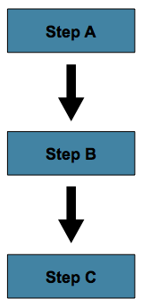

Figure 1. Sequential Flow

This can be achieved by using `next` in a `step`.

- Java
- XML

The following example shows how to use the `next()` method in Java:

Java Configuration

```java
@Bean
public Job job(JobRepository jobRepository, Step stepA, Step stepB, Step stepC) {
	return new JobBuilder("job", jobRepository)
				.start(stepA)
				.next(stepB)
				.next(stepC)
				.build();
}
```

The following example shows how to use the `next` attribute in XML:

XML Configuration

```xml
<job id="job">
    <step id="stepA" parent="s1" next="stepB" />
    <step id="stepB" parent="s2" next="stepC"/>
    <step id="stepC" parent="s3" />
</job>
```

In the scenario above, `stepA` runs first because it is the first `Step` listed. If
`stepA` completes normally, `stepB` runs, and so on. However, if `step A` fails, the entire `Job` fails and `stepB` does not execute.

> [!NOTE]
> With the Spring Batch XML namespace, the first step listed in the configuration is
> *always* the first step run by the `Job`. The order of the other step elements does not
> matter, but the first step must always appear first in the XML.

<a id="step-controlling-flow--conditionalflow"></a>
<a id="step-controlling-flow--conditional-flow"></a>

## Conditional Flow

In the preceding example, there are only two possibilities:

1. The `step` is successful, and the next `step` should be executed.
2. The `step` failed, and, thus, the `job` should fail.

In many cases, this may be sufficient. However, what about a scenario in which the
failure of a `step` should trigger a different `step`, rather than causing failure? The
following image shows such a flow:

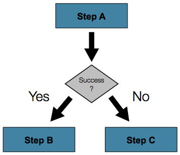

Figure 2. Conditional Flow

- Java
- XML

The Java API offers a fluent set of methods that let you specify the flow and what to do
when a step fails. The following example shows how to specify one step (`stepA`) and then
proceed to either of two different steps (`stepB` or `stepC`), depending on whether
`stepA` succeeds:

Java Configuration

```java
@Bean
public Job job(JobRepository jobRepository, Step stepA, Step stepB, Step stepC) {
	return new JobBuilder("job", jobRepository)
				.start(stepA)
				.on("*").to(stepB)
				.from(stepA).on("FAILED").to(stepC)
				.end()
				.build();
}
```

To handle more complex scenarios, the Spring Batch XML namespace lets you define transitions
elements within the step element. One such transition is the `next`
element. Like the `next` attribute, the `next` element tells the `Job` which `Step` to
execute next. However, unlike the attribute, any number of `next` elements are allowed on
a given `Step`, and there is no default behavior in the case of failure. This means that, if
transition elements are used, all of the behavior for the `Step` transitions must be
defined explicitly. Note also that a single step cannot have both a `next` attribute and
a `transition` element.

The `next` element specifies a pattern to match and the step to execute next, as
the following example shows:

XML Configuration

```xml
<job id="job">
    <step id="stepA" parent="s1">
        <next on="*" to="stepB" />
        <next on="FAILED" to="stepC" />
    </step>
    <step id="stepB" parent="s2" next="stepC" />
    <step id="stepC" parent="s3" />
</job>
```

- Java
- XML

When using java configuration, the `on()` method uses a simple pattern-matching scheme to
match the `ExitStatus` that results from the execution of the `Step`.

When using XML configuration, the `on` attribute of a transition element uses a simple
pattern-matching scheme to match the `ExitStatus` that results from the execution of the
`Step`.

Only two special characters are allowed in the pattern:

- `*` matches zero or more characters
- `?` matches exactly one character

For example, `c*t` matches `cat` and `count`, while `c?t` matches `cat` but not `count`.

While there is no limit to the number of transition elements on a `Step`, if the `Step`
execution results in an `ExitStatus` that is not covered by an element, the
framework throws an exception and the `Job` fails. The framework automatically orders
transitions from most specific to least specific. This means that, even if the ordering
were swapped for `stepA` in the preceding example, an `ExitStatus` of `FAILED` would still go
to `stepC`.

<a id="step-controlling-flow--batchstatusvsexitstatus"></a>
<a id="step-controlling-flow--batch-status-versus-exit-status"></a>

### Batch Status Versus Exit Status

When configuring a `Job` for conditional flow, it is important to understand the
difference between `BatchStatus` and `ExitStatus`. `BatchStatus` is an enumeration that
is a property of both `JobExecution` and `StepExecution` and is used by the framework to
record the status of a `Job` or `Step`. It can be one of the following values:
`COMPLETED`, `STARTING`, `STARTED`, `STOPPING`, `STOPPED`, `FAILED`, `ABANDONED`, or
`UNKNOWN`. Most of them are self explanatory: `COMPLETED` is the status set when a step
or job has completed successfully, `FAILED` is set when it fails, and so on.

- Java
- XML

The following example contains the `on` element when using Java Configuration:

```java
...
.from(stepA).on("FAILED").to(stepB)
...
```

The following example contains the `next` element when using XML configuration:

```xml
<next on="FAILED" to="stepB" />
```

At first glance, it would appear that `on` references the `BatchStatus` of the `Step` to
which it belongs. However, it actually references the `ExitStatus` of the `Step`. As the
name implies, `ExitStatus` represents the status of a `Step` after it finishes execution.

- Java
- XML

When using Java configuration, the `on()` method shown in the preceding
Java configuration example references the exit code of `ExitStatus`.

More specifically, when using XML configuration, the `next` element shown in the
preceding XML configuration example references the exit code of `ExitStatus`.

In English, it says: “go to stepB if the exit code is FAILED”. By default, the exit
code is always the same as the `BatchStatus` for the `Step`, which is why the preceding entry
works. However, what if the exit code needs to be different? A good example comes from
the skip sample job within the samples project:

- Java
- XML

The following example shows how to work with a different exit code in Java:

Java Configuration

```java
@Bean
public Job job(JobRepository jobRepository, Step step1, Step step2, Step errorPrint1) {
	return new JobBuilder("job", jobRepository)
			.start(step1).on("FAILED").end()
			.from(step1).on("COMPLETED WITH SKIPS").to(errorPrint1)
			.from(step1).on("*").to(step2)
			.end()
			.build();
}
```

The following example shows how to work with a different exit code in XML:

XML Configuration

```xml
<step id="step1" parent="s1">
    <end on="FAILED" />
    <next on="COMPLETED WITH SKIPS" to="errorPrint1" />
    <next on="*" to="step2" />
</step>
```

`step1` has three possibilities:

- The `Step` failed, in which case the job should fail.
- The `Step` completed successfully.
- The `Step` completed successfully but with an exit code of `COMPLETED WITH SKIPS`. In
  this case, a different step should be run to handle the errors.

The preceding configuration works. However, something needs to change the exit code based on
the condition of the execution having skipped records, as the following example shows:

```java
public class SkipCheckingListener implements StepExecutionListener {@Override public ExitStatus afterStep(StepExecution stepExecution) {String exitCode = stepExecution.getExitStatus().getExitCode(); if (!exitCode.equals(ExitStatus.FAILED.getExitCode()) && stepExecution.getSkipCount() > 0) {return new ExitStatus("COMPLETED WITH SKIPS"); } else {return null;}}}
```

The preceding code is a `StepExecutionListener` that first checks to make sure the `Step` was
successful and then checks to see if the skip count on the `StepExecution` is higher than
0. If both conditions are met, a new `ExitStatus` with an exit code of
`COMPLETED WITH SKIPS` is returned.

<a id="step-controlling-flow--configuringforstop"></a>
<a id="step-controlling-flow--configuring-for-stop"></a>

## Configuring for Stop

After the discussion of [`BatchStatus` and `ExitStatus`](#step-controlling-flow--batchstatusvsexitstatus), one might wonder how the `BatchStatus` and `ExitStatus` are determined for the `Job`.
While these statuses are determined for the `Step` by the code that is executed, the
statuses for the `Job` are determined based on the configuration.

So far, all of the job configurations discussed have had at least one final `Step` with
no transitions.

- Java
- XML

In the following Java example, after the `step` executes, the `Job` ends:

```java
@Bean
public Job job(JobRepository jobRepository, Step step1) {
	return new JobBuilder("job", jobRepository)
				.start(step1)
				.build();
}
```

In the following XML example, after the `step` executes, the `Job` ends:

```xml
<step id="step1" parent="s3"/>
```

If no transitions are defined for a `Step`, the status of the `Job` is defined as
follows:

- If the `Step` ends with `ExitStatus` of `FAILED`, the `BatchStatus` and `ExitStatus` of
  the `Job` are both `FAILED`.
- Otherwise, the `BatchStatus` and `ExitStatus` of the `Job` are both `COMPLETED`.

While this method of terminating a batch job is sufficient for some batch jobs, such as a
simple sequential step job, custom defined job-stopping scenarios may be required. For
this purpose, Spring Batch provides three transition elements to stop a `Job` (in
addition to the [`next` element](#step-controlling-flow--nextelement) that we discussed previously).
Each of these stopping elements stops a `Job` with a particular `BatchStatus`. It is
important to note that the stop transition elements have no effect on either the
`BatchStatus` or `ExitStatus` of any `Steps` in the `Job`. These elements affect only the
final statuses of the `Job`. For example, it is possible for every step in a job to have
a status of `FAILED` but for the job to have a status of `COMPLETED`.

<a id="step-controlling-flow--endelement"></a>
<a id="step-controlling-flow--ending-at-a-step"></a>

### Ending at a Step

Configuring a step end instructs a `Job` to stop with a `BatchStatus` of `COMPLETED`. A
`Job` that has finished with a status of `COMPLETED` cannot be restarted (the framework throws
a `JobInstanceAlreadyCompleteException`).

- Java
- XML

When using Java configuration, the `end` method is used for this task. The `end` method
also allows for an optional `exitStatus` parameter that you can use to customize the
`ExitStatus` of the `Job`. If no `exitStatus` value is provided, the `ExitStatus` is
`COMPLETED` by default, to match the `BatchStatus`.

When using XML configuration, you can use the `end` element for this task. The `end` element
also allows for an optional `exit-code` attribute that you can use to customize the
`ExitStatus` of the `Job`. If no `exit-code` attribute is given, the `ExitStatus` is
`COMPLETED` by default, to match the `BatchStatus`.

Consider the following scenario: If `step2` fails, the `Job` stops with a
`BatchStatus` of `COMPLETED` and an `ExitStatus` of `COMPLETED`, and `step3` does not run.
Otherwise, execution moves to `step3`. Note that if `step2` fails, the `Job` is not
restartable (because the status is `COMPLETED`).

- Java
- XML

The following example shows the scenario in Java:

```java
@Bean
public Job job(JobRepository jobRepository, Step step1, Step step2, Step step3) {
	return new JobBuilder("job", jobRepository)
				.start(step1)
				.next(step2)
				.on("FAILED").end()
				.from(step2).on("*").to(step3)
				.end()
				.build();
}
```

The following example shows the scenario in XML:

```xml
<step id="step1" parent="s1" next="step2">

<step id="step2" parent="s2">
    <end on="FAILED"/>
    <next on="*" to="step3"/>
</step>

<step id="step3" parent="s3">
```

<a id="step-controlling-flow--failelement"></a>
<a id="step-controlling-flow--failing-a-step"></a>

### Failing a Step

Configuring a step to fail at a given point instructs a `Job` to stop with a
`BatchStatus` of `FAILED`. Unlike end, the failure of a `Job` does not prevent the `Job`
from being restarted.

When using XML configuration, the `fail` element also allows for an optional `exit-code`
attribute that can be used to customize the `ExitStatus` of the `Job`. If no `exit-code`
attribute is given, the `ExitStatus` is `FAILED` by default, to match the
`BatchStatus`.

Consider the following scenario: If `step2` fails, the `Job` stops with a
`BatchStatus` of `FAILED` and an `ExitStatus` of `EARLY TERMINATION` and `step3` does not
execute. Otherwise, execution moves to `step3`. Additionally, if `step2` fails and the
`Job` is restarted, execution begins again on `step2`.

- Java
- XML

The following example shows the scenario in Java:

Java Configuration

```java
@Bean
public Job job(JobRepository jobRepository, Step step1, Step step2, Step step3) {
	return new JobBuilder("job", jobRepository)
			.start(step1)
			.next(step2).on("FAILED").fail()
			.from(step2).on("*").to(step3)
			.end()
			.build();
}
```

The following example shows the scenario in XML:

XML Configuration

```xml
<step id="step1" parent="s1" next="step2">

<step id="step2" parent="s2">
    <fail on="FAILED" exit-code="EARLY TERMINATION"/>
    <next on="*" to="step3"/>
</step>

<step id="step3" parent="s3">
```

<a id="step-controlling-flow--stopelement"></a>
<a id="step-controlling-flow--stopping-a-job-at-a-given-step"></a>

### Stopping a Job at a Given Step

Configuring a job to stop at a particular step instructs a `Job` to stop with a
`BatchStatus` of `STOPPED`. Stopping a `Job` can provide a temporary break in processing, so that the operator can take some action before restarting the `Job`.

- Java
- XML

When using Java configuration, the `stopAndRestart` method requires a `restart` attribute
that specifies the step where execution should pick up when the Job is restarted.

When using XML configuration, a `stop` element requires a `restart` attribute that specifies
the step where execution should pick up when the `Job` is restarted.

Consider the following scenario: If `step1` finishes with `COMPLETE`, the job then
stops. Once it is restarted, execution begins on `step2`.

- Java
- XML

The following example shows the scenario in Java:

```java
@Bean
public Job job(JobRepository jobRepository, Step step1, Step step2) {
	return new JobBuilder("job", jobRepository)
			.start(step1).on("COMPLETED").stopAndRestart(step2)
			.end()
			.build();
}
```

The following listing shows the scenario in XML:

```xml
<step id="step1" parent="s1">
    <stop on="COMPLETED" restart="step2"/>
</step>

<step id="step2" parent="s2"/>
```

<a id="step-controlling-flow--programmaticflowdecisions"></a>
<a id="step-controlling-flow--programmatic-flow-decisions"></a>

## Programmatic Flow Decisions

In some situations, more information than the `ExitStatus` may be required to decide
which step to execute next. In this case, a `JobExecutionDecider` can be used to assist
in the decision, as the following example shows:

```java
public class MyDecider implements JobExecutionDecider {public FlowExecutionStatus decide(JobExecution jobExecution, StepExecution stepExecution) {String status; if (someCondition()) {status = "FAILED";} else {status = "COMPLETED";} return new FlowExecutionStatus(status);}}
```

- Java
- XML

In the following example, a bean implementing the `JobExecutionDecider` is passed
directly to the `next` call when using Java configuration:

Java Configuration

```java
@Bean
public Job job(JobRepository jobRepository, MyDecider decider, Step step1, Step step2, Step step3) {
	return new JobBuilder("job", jobRepository)
			.start(step1)
			.next(decider).on("FAILED").to(step2)
			.from(decider).on("COMPLETED").to(step3)
			.end()
			.build();
}
```

In the following sample job configuration, a `decision` specifies the decider to use as
well as all of the transitions:

XML Configuration

```xml
<job id="job">
    <step id="step1" parent="s1" next="decision" />

    <decision id="decision" decider="decider">
        <next on="FAILED" to="step2" />
        <next on="COMPLETED" to="step3" />
    </decision>

    <step id="step2" parent="s2" next="step3"/>
    <step id="step3" parent="s3" />
</job>

<beans:bean id="decider" class="com.MyDecider"/>
```

<a id="step-controlling-flow--split-flows"></a>

## Split Flows

Every scenario described so far has involved a `Job` that executes its steps one at a
time in a linear fashion. In addition to this typical style, Spring Batch also allows
for a job to be configured with parallel flows.

- Java
- XML

Java-based configuration lets you configure splits through the provided builders. As the
following example shows, the `split` element contains one or more `flow` elements, where
entire separate flows can be defined. A `split` element can also contain any of the
previously discussed transition elements, such as the `next` attribute or the `next`, `end`, or `fail` elements.

```java
@Bean
public Flow flow1(Step step1, Step step2) {
	return new FlowBuilder<SimpleFlow>("flow1")
			.start(step1)
			.next(step2)
			.build();
}

@Bean
public Flow flow2(Step step3) {
	return new FlowBuilder<SimpleFlow>("flow2")
			.start(step3)
			.build();
}

@Bean
public Job job(JobRepository jobRepository, Flow flow1, Flow flow2, Step step4) {
	return new JobBuilder("job", jobRepository)
				.start(flow1)
				.split(new SimpleAsyncTaskExecutor())
				.add(flow2)
				.next(step4)
				.end()
				.build();
}
```

The XML namespace lets you use the `split` element. As the following example shows, the `split` element contains one or more `flow` elements, where entire separate flows can
be defined. A `split` element can also contain any of the previously discussed transition
elements, such as the `next` attribute or the `next`, `end`, or `fail` elements.

```xml
<split id="split1" next="step4">
    <flow>
        <step id="step1" parent="s1" next="step2"/>
        <step id="step2" parent="s2"/>
    </flow>
    <flow>
        <step id="step3" parent="s3"/>
    </flow>
</split>
<step id="step4" parent="s4"/>
```

<a id="step-controlling-flow--external-flows"></a>
<a id="step-controlling-flow--externalizing-flow-definitions-and-dependencies-between-jobs"></a>

## Externalizing Flow Definitions and Dependencies Between Jobs

Part of the flow in a job can be externalized as a separate bean definition and then
re-used. There are two ways to do so. The first is to declare the flow as a
reference to one defined elsewhere.

- Java
- XML

The following Java example shows how to declare a flow as a reference to a flow defined
elsewhere:

Java Configuration

```java
@Bean
public Job job(JobRepository jobRepository, Flow flow1, Step step3) {
	return new JobBuilder("job", jobRepository)
				.start(flow1)
				.next(step3)
				.end()
				.build();
}

@Bean
public Flow flow1(Step step1, Step step2) {
	return new FlowBuilder<SimpleFlow>("flow1")
			.start(step1)
			.next(step2)
			.build();
}
```

The following XML example shows how to declare a flow as a reference to a flow defined
elsewhere:

XML Configuration

```xml
<job id="job">
    <flow id="job1.flow1" parent="flow1" next="step3"/>
    <step id="step3" parent="s3"/>
</job>

<flow id="flow1">
    <step id="step1" parent="s1" next="step2"/>
    <step id="step2" parent="s2"/>
</flow>
```

The effect of defining an external flow, as shown in the preceding example, is to insert
the steps from the external flow into the job as if they had been declared inline. In
this way, many jobs can refer to the same template flow and compose such templates into
different logical flows. This is also a good way to separate the integration testing of
the individual flows.

The other form of an externalized flow is to use a `JobStep`. A `JobStep` is similar to a
`FlowStep` but actually creates and launches a separate job execution for the steps in
the flow specified.

- Java
- XML

The following example shows an example of a `JobStep` in Java:

Java Configuration

```java
@Bean
public Job jobStepJob(JobRepository jobRepository, Step jobStepJobStep1) {
	return new JobBuilder("jobStepJob", jobRepository)
				.start(jobStepJobStep1)
				.build();
}

@Bean
public Step jobStepJobStep1(JobRepository jobRepository, JobLauncher jobLauncher, Job job, JobParametersExtractor jobParametersExtractor) {
	return new StepBuilder("jobStepJobStep1", jobRepository)
				.job(job)
				.launcher(jobLauncher)
				.parametersExtractor(jobParametersExtractor)
				.build();
}

@Bean
public Job job(JobRepository jobRepository) {
	return new JobBuilder("job", jobRepository)
				// ...
				.build();
}

@Bean
public DefaultJobParametersExtractor jobParametersExtractor() {
	DefaultJobParametersExtractor extractor = new DefaultJobParametersExtractor();

	extractor.setKeys(new String[]{"input.file"});

	return extractor;
}
```

The following example hows an example of a `JobStep` in XML:

XML Configuration

```xml
<job id="jobStepJob" restartable="true">
   <step id="jobStepJob.step1">
      <job ref="job" job-launcher="jobLauncher"
          job-parameters-extractor="jobParametersExtractor"/>
   </step>
</job>

<job id="job" restartable="true">...</job>

<bean id="jobParametersExtractor" class="org.spr...DefaultJobParametersExtractor">
   <property name="keys" value="input.file"/>
</bean>
```

The job parameters extractor is a strategy that determines how the `ExecutionContext` for
the `Step` is converted into `JobParameters` for the `Job` that is run. The `JobStep` is
useful when you want to have some more granular options for monitoring and reporting on
jobs and steps. Using `JobStep` is also often a good answer to the question: “How do I
create dependencies between jobs?” It is a good way to break up a large system into
smaller modules and control the flow of jobs.

[`TaskletStep`](#step-tasklet)
[Late Binding of `Job` and `Step` Attributes](#step-late-binding)

---

<a id="step-late-binding"></a>

<!-- source_url: https://docs.spring.io/spring-batch/reference/step/late-binding.html -->

<!-- page_index: 26 -->

# Late Binding of Job and Step Attributes

<svg enable-background="new 0 0 32 32" id="Glyph" version="1.1" viewbox="0 0 32 32" xml:space="preserve" xmlns="http://www.w3.org/2000/svg" xmlns:xlink="http://www.w3.org/1999/xlink">
<path id="XMLID_223_"></path>
</svg>

Search

<a id="step-late-binding--page-title"></a>
<a id="step-late-binding--late-binding-of-job-and-step-attributes"></a>

# Late Binding of `Job` and `Step` Attributes

Both the XML and flat file examples shown earlier use the Spring `Resource` abstraction
to obtain a file. This works because `Resource` has a `getFile` method that returns a
`java.io.File`. You can configure both XML and flat file resources by using standard Spring
constructs:

- Java
- XML

The following example shows late binding in Java:

Java Configuration

```java
@Bean
public FlatFileItemReader flatFileItemReader() {
	FlatFileItemReader<Foo> reader = new FlatFileItemReaderBuilder<Foo>()
			.name("flatFileItemReader")
			.resource(new FileSystemResource("file://outputs/file.txt"))
			...
}
```

The following example shows late binding in XML:

XML Configuration

```xml
<bean id="flatFileItemReader"
      class="org.springframework.batch.infrastructure.item.file.FlatFileItemReader">
    <property name="resource"
              value="file://outputs/file.txt" />
</bean>
```

The preceding `Resource` loads the file from the specified file system location. Note
that absolute locations have to start with a double slash (`//`). In most Spring
applications, this solution is good enough, because the names of these resources are
known at compile time. However, in batch scenarios, the file name may need to be
determined at runtime as a parameter to the job. This can be solved using `-D` parameters
to read a system property.

- Java
- XML

The following shows how to read a file name from a property in Java:

Java Configuration

```java
@Bean
public FlatFileItemReader flatFileItemReader(@Value("${input.file.name}") String name) {
	return new FlatFileItemReaderBuilder<Foo>()
			.name("flatFileItemReader")
			.resource(new FileSystemResource(name))
			...
}
```

The following example shows how to read a file name from a property in XML:

XML Configuration

```xml
<bean id="flatFileItemReader"
      class="org.springframework.batch.infrastructure.item.file.FlatFileItemReader">
    <property name="resource" value="${input.file.name}" />
</bean>
```

All that would be required for this solution to work would be a system argument (such as
`-Dinput.file.name="file://outputs/file.txt"`).

> [!NOTE]
> Although you can use a `PropertyPlaceholderConfigurer` here, it is not
> necessary if the system property is always set because the `ResourceEditor` in Spring
> already filters and does placeholder replacement on system properties.

Often, in a batch setting, it is preferable to parameterize the file name in the
`JobParameters` of the job (instead of through system properties) and access them that
way. To accomplish this, Spring Batch allows for the late binding of various `Job` and
`Step` attributes.

- Java
- XML

The following example shows how to parameterize a file name in Java:

Java Configuration

```java
@StepScope @Bean public FlatFileItemReader flatFileItemReader(@Value("#{jobParameters['input.file.name']}") String name) {return new FlatFileItemReaderBuilder<Foo>() .name("flatFileItemReader") .resource(new FileSystemResource(name)) ...}
```

The following example shows how to parameterize a file name in XML:

XML Configuration

```xml
<bean id="flatFileItemReader" scope="step"
      class="org.springframework.batch.infrastructure.item.file.FlatFileItemReader">
    <property name="resource" value="#{jobParameters['input.file.name']}" />
</bean>
```

You can access both the `JobExecution` and `StepExecution` level `ExecutionContext` in
the same way.

- Java
- XML

The following example shows how to access the `ExecutionContext` in Java:

Java Configuration

```java
@StepScope @Bean public FlatFileItemReader flatFileItemReader(@Value("#{jobExecutionContext['input.file.name']}") String name) {return new FlatFileItemReaderBuilder<Foo>() .name("flatFileItemReader") .resource(new FileSystemResource(name)) ...}
```

Java Configuration

```java
@StepScope @Bean public FlatFileItemReader flatFileItemReader(@Value("#{stepExecutionContext['input.file.name']}") String name) {return new FlatFileItemReaderBuilder<Foo>() .name("flatFileItemReader") .resource(new FileSystemResource(name)) ...}
```

The following example shows how to access the `ExecutionContext` in XML:

XML Configuration

```xml
<bean id="flatFileItemReader" scope="step"
      class="org.springframework.batch.infrastructure.item.file.FlatFileItemReader">
    <property name="resource" value="#{jobExecutionContext['input.file.name']}" />
</bean>
```

XML Configuration

```xml
<bean id="flatFileItemReader" scope="step"
      class="org.springframework.batch.infrastructure.item.file.FlatFileItemReader">
    <property name="resource" value="#{stepExecutionContext['input.file.name']}" />
</bean>
```

> [!NOTE]
> Any bean that uses late binding must be declared with `scope="step"`. See
> [Step Scope](#step-late-binding--step-scope) for more information.
> A `Step` bean should not be step-scoped. If late binding is needed in a step
> definition, then the components of that step (tasklet, item reade/writer, and so on)
> are the ones that should be scoped instead. If that is not possible (ie if the step implementation does
> not use any batch artifacts that can be step-scoped), then the step itself can be job-scoped.
> A typical example of this is to dynamically bind the chunk size from job parameters in
> a `ChunkOrientedStep`. See [Job Scope](#step-late-binding--job-scope) for more information.

> [!NOTE]
> If you use Spring 3.0 (or above), the expressions in step-scoped beans are in the
> Spring Expression Language, a powerful general purpose language with many interesting
> features. To provide backward compatibility, if Spring Batch detects the presence of
> older versions of Spring, it uses a native expression language that is less powerful and
> that has slightly different parsing rules. The main difference is that the map keys in
> the example above do not need to be quoted with Spring 2.5, but the quotes are mandatory
> in Spring 3.0.

<a id="step-late-binding--step-scope"></a>

## Step Scope

All of the late binding examples shown earlier have a scope of `step` declared on the
bean definition.

- Java
- XML

The following example shows an example of binding to step scope in Java:

Java Configuration

```java
@StepScope @Bean public FlatFileItemReader flatFileItemReader(@Value("#{jobParameters[input.file.name]}") String name) {return new FlatFileItemReaderBuilder<Foo>() .name("flatFileItemReader") .resource(new FileSystemResource(name)) ...}
```

The following example shows an example of binding to step scope in XML:

XML Configuration

```xml
<bean id="flatFileItemReader" scope="step"
      class="org.springframework.batch.infrastructure.item.file.FlatFileItemReader">
    <property name="resource" value="#{jobParameters[input.file.name]}" />
</bean>
```

Using a scope of `Step` is required to use late binding, because the bean cannot
actually be instantiated until the `Step` starts, to let the attributes be found.
Because it is not part of the Spring container by default, the scope must be added
explicitly, by using the `batch` namespace, by including a bean definition explicitly
for the `StepScope`, or by using the `@EnableBatchProcessing` annotation. Use only one of
those methods. The following example uses the `batch` namespace:

```xml
<beans xmlns="http://www.springframework.org/schema/beans"
       xmlns:batch="http://www.springframework.org/schema/batch"
       xmlns:xsi="http://www.w3.org/2001/XMLSchema-instance"
       xsi:schemaLocation="...">
<batch:job .../>
...
</beans>
```

The following example includes the bean definition explicitly:

```xml
<bean class="org.springframework.batch.core.scope.StepScope" />
```

<a id="step-late-binding--job-scope"></a>

## Job Scope

`Job` scope, introduced in Spring Batch 3.0, is similar to `Step` scope in configuration
but is a scope for the `Job` context, so that there is only one instance of such a bean
per running job. Additionally, support is provided for late binding of references
accessible from the `JobContext` by using `#{..}` placeholders. Using this feature, you can pull bean
properties from the job or job execution context and the job parameters.

- Java
- XML

The following example shows how to dynamically bind the chunk size from job parameters in a
chunk-oriented step by using the job scope in Java:

Java Configuration

```java
@Bean
@JobScope
public Step step(JobRepository jobRepository, @Value("#{jobParameters['chunkSize']}") int chunkSize) {
    return new StepBuilder(jobRepository)
            .<Integer, Integer>chunk(chunkSize)
            .reader(...)
            .writer(...)
            .build();
}
```

Java Configuration

```java
@Bean
@JobScope
public Step step(JobRepository jobRepository, @Value("#{jobExecutionContext['chunkSize']}") int chunkSize) {
    return new StepBuilder(jobRepository)
            .<Integer, Integer>chunk(chunkSize)
            .reader(...)
            .writer(...)
            .build();
}
```

The following example shows an example of binding to job scope in XML:

XML Configuration

```xml
<bean id="..." class="..." scope="job">
    <property name="name" value="#{jobParameters[chunkSize]}" />
</bean>
```

XML Configuration

```xml
<bean id="..." class="..." scope="job">
    <property name="name" value="#{jobExecutionContext['chunkSize']}.txt" />
</bean>
```

Because it is not part of the Spring container by default, the scope must be added
explicitly, by using the `batch` namespace, by including a bean definition explicitly for
the JobScope, or by using the `@EnableBatchProcessing` annotation (choose only one approach).
The following example uses the `batch` namespace:

```xml
<beans xmlns="http://www.springframework.org/schema/beans"
		  xmlns:batch="http://www.springframework.org/schema/batch"
		  xmlns:xsi="http://www.w3.org/2001/XMLSchema-instance"
		  xsi:schemaLocation="...">

<batch:job .../>
...
</beans>
```

The following example includes a bean that explicitly defines the `JobScope`:

```xml
<bean class="org.springframework.batch.core.scope.JobScope" />
```

> [!NOTE]
> There are some practical limitations of using job-scoped beans in multi-threaded
> or partitioned steps. Spring Batch does not control the threads spawned in these
> use cases, so it is not possible to set them up correctly to use such beans. Hence, we do not recommend using job-scoped beans in multi-threaded or partitioned steps.

<a id="step-late-binding--scoping-item-streams"></a>
<a id="step-late-binding--scoping-itemstream-components"></a>

## Scoping `ItemStream` components

When using the Java configuration style to define job or step scoped `ItemStream` beans, the return type of the bean definition method should be at least `ItemStream`. This is required
so that Spring Batch correctly creates a proxy that implements this interface, and therefore
honors its contract by calling `open`, `update` and `close` methods as expected.

It is recommended to make the bean definition method of such beans return the most specific
known implementation, as shown in the following example:

Define a step-scoped bean with the most specific return type

```java
@Bean
@StepScope
public FlatFileItemReader flatFileItemReader(@Value("#{jobParameters['input.file.name']}") String name) {
	return new FlatFileItemReaderBuilder<Foo>()
			.resource(new FileSystemResource(name))
			// set other properties of the item reader
			.build();
}
```

[Controlling Step Flow](#step-controlling-flow)
[ItemReaders and ItemWriters](#readersandwriters)

---

<a id="readersandwriters"></a>

<!-- source_url: https://docs.spring.io/spring-batch/reference/readersAndWriters.html -->

<!-- page_index: 27 -->

# ItemReaders and ItemWriters

<svg enable-background="new 0 0 32 32" id="Glyph" version="1.1" viewbox="0 0 32 32" xml:space="preserve" xmlns="http://www.w3.org/2000/svg" xmlns:xlink="http://www.w3.org/1999/xlink">
<path id="XMLID_223_"></path>
</svg>

Search

<a id="readersandwriters--page-title"></a>
<a id="readersandwriters--itemreaders-and-itemwriters"></a>

# ItemReaders and ItemWriters

All batch processing can be described in its most simple form as reading in large amounts
of data, performing some type of calculation or transformation, and writing the result
out. Spring Batch provides three key interfaces to help perform bulk reading and writing:
`ItemReader`, `ItemProcessor`, and `ItemWriter`.

<a id="readersandwriters--section-summary"></a>

## Section Summary

- [`ItemReader`](#readers-and-writers-item-reader)
- [`ItemWriter`](#readers-and-writers-item-writer)
- [`ItemStream`](#readers-and-writers-item-stream)
- [The Delegate Pattern and Registering with the Step](#readers-and-writers-delegate-pattern-registering)
- [Flat Files](#readers-and-writers-flat-files)
- [XML Item Readers and Writers](#readers-and-writers-xml-reading-writing)
- [JSON Item Readers And Writers](#readers-and-writers-json-reading-writing)
- [Multi-File Input](#readers-and-writers-multi-file-input)
- [Database](#readers-and-writers-database)
- [Reusing Existing Services](#readers-and-writers-reusing-existing-services)
- [Preventing State Persistence](#readers-and-writers-process-indicator)
- [Creating Custom ItemReaders and ItemWriters](#readers-and-writers-custom)
- [Item Reader and Writer Implementations](#readers-and-writers-item-reader-writer-implementations)

[Late Binding of `Job` and `Step` Attributes](#step-late-binding)
[`ItemReader`](#readers-and-writers-item-reader)

---

<a id="readers-and-writers-item-reader"></a>

<!-- source_url: https://docs.spring.io/spring-batch/reference/readers-and-writers/item-reader.html -->

<!-- page_index: 28 -->

# ItemReader

<svg enable-background="new 0 0 32 32" id="Glyph" version="1.1" viewbox="0 0 32 32" xml:space="preserve" xmlns="http://www.w3.org/2000/svg" xmlns:xlink="http://www.w3.org/1999/xlink">
<path id="XMLID_223_"></path>
</svg>

Search

<a id="readers-and-writers-item-reader--page-title"></a>
<a id="readers-and-writers-item-reader--itemreader"></a>

# `ItemReader`

Although a simple concept, an `ItemReader` is the means for providing data from many
different types of input. The most general examples include:

- Flat File: Flat-file item readers read lines of data from a flat file that typically
  describes records with fields of data defined by fixed positions in the file or delimited
  by some special character (such as a comma).
- XML: XML `ItemReaders` process XML independently of technologies used for parsing,
  mapping and validating objects. Input data allows for the validation of an XML file
  against an XSD schema.
- Database: A database resource is accessed to return resultsets which can be mapped to
  objects for processing. The default SQL `ItemReader` implementations invoke a `RowMapper`
  to return objects, keep track of the current row if restart is required, store basic
  statistics, and provide some transaction enhancements that are explained later.

There are many more possibilities, but we focus on the basic ones for this chapter. A
complete list of all available `ItemReader` implementations can be found in
[Appendix A](#appendix--listofreadersandwriters).

`ItemReader` is a basic interface for generic
input operations, as shown in the following interface definition:

```java
public interface ItemReader<T> {

    T read() throws Exception;

}
```

The `read` method defines the most essential contract of the `ItemReader`. Calling it
returns one item or `null` if no more items are left. An item might represent a line in a
file, a row in a database, or an element in an XML file. It is generally expected that
these are mapped to a usable domain object (such as `Trade`, `Foo`, or others), but there
is no requirement in the contract to do so.

It is expected that implementations of the `ItemReader` interface are forward only.
However, if the underlying resource is transactional (such as a JMS queue) then calling
`read` may return the same logical item on subsequent calls in a rollback scenario. It is
also worth noting that a lack of items to process by an `ItemReader` does not cause an
exception to be thrown. For example, a database `ItemReader` that is configured with a
query that returns 0 results returns `null` on the first invocation of `read`.

[ItemReaders and ItemWriters](#readersandwriters)
[`ItemWriter`](#readers-and-writers-item-writer)

---

<a id="readers-and-writers-item-writer"></a>

<!-- source_url: https://docs.spring.io/spring-batch/reference/readers-and-writers/item-writer.html -->

<!-- page_index: 29 -->

# ItemWriter

<svg enable-background="new 0 0 32 32" id="Glyph" version="1.1" viewbox="0 0 32 32" xml:space="preserve" xmlns="http://www.w3.org/2000/svg" xmlns:xlink="http://www.w3.org/1999/xlink">
<path id="XMLID_223_"></path>
</svg>

Search

<a id="readers-and-writers-item-writer--page-title"></a>
<a id="readers-and-writers-item-writer--itemwriter"></a>

# `ItemWriter`

`ItemWriter` is similar in functionality to an `ItemReader` but with inverse operations.
Resources still need to be located, opened, and closed but they differ in that an
`ItemWriter` writes out, rather than reading in. In the case of databases or queues, these operations may be inserts, updates, or sends. The format of the serialization of
the output is specific to each batch job.

As with `ItemReader`, `ItemWriter` is a fairly generic interface, as shown in the following interface definition:

```java
public interface ItemWriter<T> {

    void write(Chunk<? extends T> items) throws Exception;

}
```

As with `read` on `ItemReader`, `write` provides the basic contract of `ItemWriter`. It
attempts to write out the list of items passed in as long as it is open. Because it is
generally expected that items are 'batched' together into a chunk and then output, the
interface accepts a list of items, rather than an item by itself. After writing out the
list, any flushing that may be necessary can be performed before returning from the write
method. For example, if writing to a Hibernate DAO, multiple calls to write can be made, one for each item. The writer can then call `flush` on the hibernate session before
returning. Note that the chunk passed to `write` may be empty if all items in the chunk
were filtered out by an `ItemProcessor` or skipped during fault-tolerant step processing.
Implementations are expected to handle empty chunks gracefully.

[`ItemReader`](#readers-and-writers-item-reader)
[`ItemStream`](#readers-and-writers-item-stream)

---

<a id="readers-and-writers-item-stream"></a>

<!-- source_url: https://docs.spring.io/spring-batch/reference/readers-and-writers/item-stream.html -->

<!-- page_index: 30 -->

# ItemStream

<svg enable-background="new 0 0 32 32" id="Glyph" version="1.1" viewbox="0 0 32 32" xml:space="preserve" xmlns="http://www.w3.org/2000/svg" xmlns:xlink="http://www.w3.org/1999/xlink">
<path id="XMLID_223_"></path>
</svg>

Search

<a id="readers-and-writers-item-stream--page-title"></a>
<a id="readers-and-writers-item-stream--itemstream"></a>

# `ItemStream`

Both `ItemReaders` and `ItemWriters` serve their individual purposes well, but there is a
common concern among both of them that necessitates another interface. In general, as
part of the scope of a batch job, readers and writers need to be opened, closed, and
require a mechanism for persisting state. The `ItemStream` interface serves that purpose, as shown in the following example:

```java
public interface ItemStream {

    void open(ExecutionContext executionContext) throws ItemStreamException;

    void update(ExecutionContext executionContext) throws ItemStreamException;

    void close() throws ItemStreamException;
}
```

Before describing each method, we should mention the `ExecutionContext`. Clients of an
`ItemReader` that also implement `ItemStream` should call `open` before any calls to
`read`, in order to open any resources such as files or to obtain connections. A similar
restriction applies to an `ItemWriter` that implements `ItemStream`. As mentioned in
Chapter 2, if expected data is found in the `ExecutionContext`, it may be used to start
the `ItemReader` or `ItemWriter` at a location other than its initial state. Conversely, `close` is called to ensure that any resources allocated during open are released safely.
`update` is called primarily to ensure that any state currently being held is loaded into
the provided `ExecutionContext`. This method is called before committing, to ensure that
the current state is persisted in the database before commit.

In the special case where the client of an `ItemStream` is a `Step` (from the Spring
Batch Core), an `ExecutionContext` is created for each StepExecution to allow users to
store the state of a particular execution, with the expectation that it is returned if
the same `JobInstance` is started again. For those familiar with Quartz, the semantics
are very similar to a Quartz `JobDataMap`.

[`ItemWriter`](#readers-and-writers-item-writer)
[The Delegate Pattern and Registering with the Step](#readers-and-writers-delegate-pattern-registering)

---

<a id="readers-and-writers-delegate-pattern-registering"></a>

<!-- source_url: https://docs.spring.io/spring-batch/reference/readers-and-writers/delegate-pattern-registering.html -->

<!-- page_index: 31 -->

# The Delegate Pattern and Registering with the Step

<svg enable-background="new 0 0 32 32" id="Glyph" version="1.1" viewbox="0 0 32 32" xml:space="preserve" xmlns="http://www.w3.org/2000/svg" xmlns:xlink="http://www.w3.org/1999/xlink">
<path id="XMLID_223_"></path>
</svg>

Search

<a id="readers-and-writers-delegate-pattern-registering--page-title"></a>
<a id="readers-and-writers-delegate-pattern-registering--the-delegate-pattern-and-registering-with-the-step"></a>

# The Delegate Pattern and Registering with the Step

Note that the `CompositeItemWriter` is an example of the delegation pattern, which is
common in Spring Batch. The delegates themselves might implement callback interfaces, such as `StepListener`. If they do and if they are being used in conjunction with Spring
Batch Core as part of a `Step` in a `Job`, then they almost certainly need to be
registered manually with the `Step`. A reader, writer, or processor that is directly
wired into the `Step` gets registered automatically if it implements `ItemStream` or a
`StepListener` interface. However, because the delegates are not known to the `Step`, they need to be injected as listeners or streams (or both if appropriate).

- Java
- XML

The following example shows how to inject a delegate as a stream in Java:

Java Configuration

```java
@Bean
public Job ioSampleJob(JobRepository jobRepository, Step step1) {
	return new JobBuilder("ioSampleJob", jobRepository)
				.start(step1)
				.build();
}

@Bean
public Step step1(JobRepository jobRepository, PlatformTransactionManager transactionManager) {
	return new StepBuilder("step1", jobRepository)
				.<String, String>chunk(2).transactionManager(transactionManager)
				.reader(fooReader())
				.processor(fooProcessor())
				.writer(compositeItemWriter())
				.stream(barWriter())
				.build();
}

@Bean
public CustomCompositeItemWriter compositeItemWriter() {

	CustomCompositeItemWriter writer = new CustomCompositeItemWriter();

	writer.setDelegate(barWriter());

	return writer;
}

@Bean
public BarWriter barWriter() {
	return new BarWriter();
}
```

The following example shows how to inject a delegate as a stream in XML:

XML Configuration

```xml
<job id="ioSampleJob">
    <step name="step1">
        <tasklet>
            <chunk reader="fooReader" processor="fooProcessor" writer="compositeItemWriter"
                   commit-interval="2">
                <streams>
                    <stream ref="barWriter" />
                </streams>
            </chunk>
        </tasklet>
    </step>
</job>

<bean id="compositeItemWriter" class="...CustomCompositeItemWriter">
    <property name="delegate" ref="barWriter" />
</bean>

<bean id="barWriter" class="...BarWriter" />
```

[`ItemStream`](#readers-and-writers-item-stream)
[Flat Files](#readers-and-writers-flat-files)

---

<a id="readers-and-writers-flat-files"></a>

<!-- source_url: https://docs.spring.io/spring-batch/reference/readers-and-writers/flat-files.html -->

<!-- page_index: 32 -->

# Flat Files

<svg enable-background="new 0 0 32 32" id="Glyph" version="1.1" viewbox="0 0 32 32" xml:space="preserve" xmlns="http://www.w3.org/2000/svg" xmlns:xlink="http://www.w3.org/1999/xlink">
<path id="XMLID_223_"></path>
</svg>

Search

<a id="readers-and-writers-flat-files--page-title"></a>
<a id="readers-and-writers-flat-files--flat-files"></a>

# Flat Files

One of the most common mechanisms for interchanging bulk data has always been the flat
file. Unlike XML, which has an agreed upon standard for defining how it is structured
(XSD), anyone reading a flat file must understand ahead of time exactly how the file is
structured. In general, all flat files fall into two types: delimited and fixed length.
Delimited files are those in which fields are separated by a delimiter, such as a comma.
Fixed Length files have fields that are a set length.

<a id="readers-and-writers-flat-files--section-summary"></a>

## Section Summary

- [The `FieldSet`](#readers-and-writers-flat-files-field-set)
- [`FlatFileItemReader`](#readers-and-writers-flat-files-file-item-reader)
- [`FlatFileItemWriter`](#readers-and-writers-flat-files-file-item-writer)

[The Delegate Pattern and Registering with the Step](#readers-and-writers-delegate-pattern-registering)
[The `FieldSet`](#readers-and-writers-flat-files-field-set)

---

<a id="readers-and-writers-flat-files-field-set"></a>

<!-- source_url: https://docs.spring.io/spring-batch/reference/readers-and-writers/flat-files/field-set.html -->

<!-- page_index: 33 -->

# The FieldSet

<svg enable-background="new 0 0 32 32" id="Glyph" version="1.1" viewbox="0 0 32 32" xml:space="preserve" xmlns="http://www.w3.org/2000/svg" xmlns:xlink="http://www.w3.org/1999/xlink">
<path id="XMLID_223_"></path>
</svg>

Search

<a id="readers-and-writers-flat-files-field-set--page-title"></a>
<a id="readers-and-writers-flat-files-field-set--the-fieldset"></a>

# The `FieldSet`

When working with flat files in Spring Batch, regardless of whether it is for input or
output, one of the most important classes is the `FieldSet`. Many architectures and
libraries contain abstractions for helping you read in from a file, but they usually
return a `String` or an array of `String` objects. This really only gets you halfway
there. A `FieldSet` is Spring Batch’s abstraction for enabling the binding of fields from
a file resource. It allows developers to work with file input in much the same way as
they would work with database input. A `FieldSet` is conceptually similar to a JDBC
`ResultSet`. A `FieldSet` requires only one argument: a `String` array of tokens.
Optionally, you can also configure the names of the fields so that the fields may be
accessed either by index or name as patterned after `ResultSet`, as shown in the following
example:

```java
String[] tokens = new String[]{"foo", "1", "true"};
FieldSet fs = new DefaultFieldSet(tokens);
String name = fs.readString(0);
int value = fs.readInt(1);
boolean booleanValue = fs.readBoolean(2);
```

There are many more options on the `FieldSet` interface, such as `Date`, long, `BigDecimal`, and so on. The biggest advantage of the `FieldSet` is that it provides
consistent parsing of flat file input. Rather than each batch job parsing differently in
potentially unexpected ways, it can be consistent, both when handling errors caused by a
format exception, or when doing simple data conversions.

[Flat Files](#readers-and-writers-flat-files)
[`FlatFileItemReader`](#readers-and-writers-flat-files-file-item-reader)

---

<a id="readers-and-writers-flat-files-file-item-reader"></a>

<!-- source_url: https://docs.spring.io/spring-batch/reference/readers-and-writers/flat-files/file-item-reader.html -->

<!-- page_index: 34 -->

# FlatFileItemReader

<svg enable-background="new 0 0 32 32" id="Glyph" version="1.1" viewbox="0 0 32 32" xml:space="preserve" xmlns="http://www.w3.org/2000/svg" xmlns:xlink="http://www.w3.org/1999/xlink">
<path id="XMLID_223_"></path>
</svg>

Search

<a id="readers-and-writers-flat-files-file-item-reader--page-title"></a>
<a id="readers-and-writers-flat-files-file-item-reader--flatfileitemreader"></a>

# `FlatFileItemReader`

A flat file is any type of file that contains at most two-dimensional (tabular) data.
Reading flat files in the Spring Batch framework is facilitated by the class called
`FlatFileItemReader`, which provides basic functionality for reading and parsing flat
files. The two most important required dependencies of `FlatFileItemReader` are
`Resource` and `LineMapper`. The `LineMapper` interface is explored more in the next
sections. The resource property represents a Spring Core `Resource`. Documentation
explaining how to create beans of this type can be found in
[Spring
Framework, Chapter 5. Resources](https://docs.spring.io/spring/docs/current/spring-framework-reference/core.html#resources). Therefore, this guide does not go into the details of
creating `Resource` objects beyond showing the following simple example:

```java
Resource resource = new FileSystemResource("resources/trades.csv");
```

In complex batch environments, the directory structures are often managed by the Enterprise Application Integration (EAI)
infrastructure, where drop zones for external interfaces are established for moving files
from FTP locations to batch processing locations and vice versa. File moving utilities
are beyond the scope of the Spring Batch architecture, but it is not unusual for batch
job streams to include file moving utilities as steps in the job stream. The batch
architecture only needs to know how to locate the files to be processed. Spring Batch
begins the process of feeding the data into the pipe from this starting point. However, [Spring Integration](https://projects.spring.io/spring-integration/) provides many
of these types of services.

The other properties in `FlatFileItemReader` let you further specify how your data is
interpreted, as described in the following table:

| Property | Type | Description |
| --- | --- | --- |
| comments | String[] | Specifies line prefixes that indicate comment rows. |
| encoding | String | Specifies what text encoding to use. The default value is `UTF-8`. |
| lineMapper | `LineMapper` | Converts a `String` to an `Object` representing the item. |
| linesToSkip | int | Number of lines to ignore at the top of the file. |
| recordSeparatorPolicy | RecordSeparatorPolicy | Used to determine where the line endings are and do things like continue over a line ending if inside a quoted string. |
| resource | `Resource` | The resource from which to read. |
| skippedLinesCallback | LineCallbackHandler | Interface that passes the raw line content of the lines in the file to be skipped. If `linesToSkip` is set to 2, then this interface is called twice. |
| strict | boolean | In strict mode, the reader throws an exception on `ExecutionContext` if the input resource does not exist. Otherwise, it logs the problem and continues. |

<a id="readers-and-writers-flat-files-file-item-reader--linemapper"></a>

## `LineMapper`

As with `RowMapper`, which takes a low-level construct such as `ResultSet` and returns
an `Object`, flat file processing requires the same construct to convert a `String` line
into an `Object`, as shown in the following interface definition:

```java
public interface LineMapper<T> {

    T mapLine(String line, int lineNumber) throws Exception;

}
```

The basic contract is that, given the current line and the line number with which it is
associated, the mapper should return a resulting domain object. This is similar to
`RowMapper`, in that each line is associated with its line number, just as each row in a
`ResultSet` is tied to its row number. This allows the line number to be tied to the
resulting domain object for identity comparison or for more informative logging. However, unlike `RowMapper`, the `LineMapper` is given a raw line which, as discussed above, only
gets you halfway there. The line must be tokenized into a `FieldSet`, which can then be
mapped to an object, as described later in this document.

<a id="readers-and-writers-flat-files-file-item-reader--linetokenizer"></a>

## `LineTokenizer`

An abstraction for turning a line of input into a `FieldSet` is necessary because there
can be many formats of flat file data that need to be converted to a `FieldSet`. In
Spring Batch, this interface is the `LineTokenizer`:

```java
public interface LineTokenizer {

    FieldSet tokenize(String line);

}
```

The contract of a `LineTokenizer` is such that, given a line of input (in theory the
`String` could encompass more than one line), a `FieldSet` representing the line is
returned. This `FieldSet` can then be passed to a `FieldSetMapper`. Spring Batch contains
the following `LineTokenizer` implementations:

- `DelimitedLineTokenizer`: Used for files where fields in a record are separated by a
  delimiter. The most common delimiter is a comma, but pipes or semicolons are often used
  as well.
- `FixedLengthTokenizer`: Used for files where fields in a record are each a "fixed
  width". The width of each field must be defined for each record type.
- `PatternMatchingCompositeLineTokenizer`: Determines which `LineTokenizer` among a list of
  tokenizers should be used on a particular line by checking against a pattern.

<a id="readers-and-writers-flat-files-file-item-reader--fieldsetmapper"></a>

## `FieldSetMapper`

The `FieldSetMapper` interface defines a single method, `mapFieldSet`, which takes a
`FieldSet` object and maps its contents to an object. This object may be a custom DTO, a
domain object, or an array, depending on the needs of the job. The `FieldSetMapper` is
used in conjunction with the `LineTokenizer` to translate a line of data from a resource
into an object of the desired type, as shown in the following interface definition:

```java
public interface FieldSetMapper<T> {

    T mapFieldSet(FieldSet fieldSet) throws BindException;

}
```

The pattern used is the same as the `RowMapper` used by `JdbcTemplate`.

<a id="readers-and-writers-flat-files-file-item-reader--defaultlinemapper"></a>

## `DefaultLineMapper`

Now that the basic interfaces for reading in flat files have been defined, it becomes
clear that three basic steps are required:

1. Read one line from the file.
2. Pass the `String` line into the `LineTokenizer#tokenize()` method to retrieve a
   `FieldSet`.
3. Pass the `FieldSet` returned from tokenizing to a `FieldSetMapper`, returning the
   result from the `ItemReader#read()` method.

The two interfaces described above represent two separate tasks: converting a line into a
`FieldSet` and mapping a `FieldSet` to a domain object. Because the input of a
`LineTokenizer` matches the input of the `LineMapper` (a line), and the output of a
`FieldSetMapper` matches the output of the `LineMapper`, a default implementation that
uses both a `LineTokenizer` and a `FieldSetMapper` is provided. The `DefaultLineMapper`, shown in the following class definition, represents the behavior most users need:

```java
public class DefaultLineMapper<T> implements LineMapper<>, InitializingBean {
private LineTokenizer tokenizer;
private FieldSetMapper<T> fieldSetMapper;
public T mapLine(String line, int lineNumber) throws Exception {return fieldSetMapper.mapFieldSet(tokenizer.tokenize(line));}
public void setLineTokenizer(LineTokenizer tokenizer) {this.tokenizer = tokenizer;}
public void setFieldSetMapper(FieldSetMapper<T> fieldSetMapper) {this.fieldSetMapper = fieldSetMapper;}}
```

The above functionality is provided in a default implementation, rather than being built
into the reader itself (as was done in previous versions of the framework) to allow users
greater flexibility in controlling the parsing process, especially if access to the raw
line is needed.

<a id="readers-and-writers-flat-files-file-item-reader--simpledelimitedfilereadingexample"></a>
<a id="readers-and-writers-flat-files-file-item-reader--simple-delimited-file-reading-example"></a>

## Simple Delimited File Reading Example

The following example illustrates how to read a flat file with an actual domain scenario.
This particular batch job reads in football players from the following file:

```
ID,lastName,firstName,position,birthYear,debutYear
"AbduKa00,Abdul-Jabbar,Karim,rb,1974,1996",
"AbduRa00,Abdullah,Rabih,rb,1975,1999",
"AberWa00,Abercrombie,Walter,rb,1959,1982",
"AbraDa00,Abramowicz,Danny,wr,1945,1967",
"AdamBo00,Adams,Bob,te,1946,1969",
"AdamCh00,Adams,Charlie,wr,1979,2003"
```

The contents of this file are mapped to the following
`Player` domain object:

```java
public class Player implements Serializable {

    private String ID;
    private String lastName;
    private String firstName;
    private String position;
    private int birthYear;
    private int debutYear;

    public String toString() {
        return "PLAYER:ID=" + ID + ",Last Name=" + lastName +
            ",First Name=" + firstName + ",Position=" + position +
            ",Birth Year=" + birthYear + ",DebutYear=" +
            debutYear;
    }

    // setters and getters...
}
```

To map a `FieldSet` into a `Player` object, a `FieldSetMapper` that returns players needs
to be defined, as shown in the following example:

```java
protected static class PlayerFieldSetMapper implements FieldSetMapper<Player> {
    public Player mapFieldSet(FieldSet fieldSet) {
        Player player = new Player();

        player.setID(fieldSet.readString(0));
        player.setLastName(fieldSet.readString(1));
        player.setFirstName(fieldSet.readString(2));
        player.setPosition(fieldSet.readString(3));
        player.setBirthYear(fieldSet.readInt(4));
        player.setDebutYear(fieldSet.readInt(5));

        return player;
    }
}
```

The file can then be read by correctly constructing a `FlatFileItemReader` and calling
`read`, as shown in the following example:

```java
FlatFileItemReader<Player> itemReader = new FlatFileItemReader<>();
itemReader.setResource(new FileSystemResource("resources/players.csv"));
DefaultLineMapper<Player> lineMapper = new DefaultLineMapper<>();
//DelimitedLineTokenizer defaults to comma as its delimiter
lineMapper.setLineTokenizer(new DelimitedLineTokenizer());
lineMapper.setFieldSetMapper(new PlayerFieldSetMapper());
itemReader.setLineMapper(lineMapper);
itemReader.open(new ExecutionContext());
Player player = itemReader.read();
```

Each call to `read` returns a new
`Player` object from each line in the file. When the end of the file is
reached, `null` is returned.

<a id="readers-and-writers-flat-files-file-item-reader--mappingfieldsbyname"></a>
<a id="readers-and-writers-flat-files-file-item-reader--mapping-fields-by-name"></a>

## Mapping Fields by Name

There is one additional piece of functionality that is allowed by both
`DelimitedLineTokenizer` and `FixedLengthTokenizer` and that is similar in function to a
JDBC `ResultSet`. The names of the fields can be injected into either of these
`LineTokenizer` implementations to increase the readability of the mapping function.
First, the column names of all fields in the flat file are injected into the tokenizer, as shown in the following example:

```java
tokenizer.setNames(new String[] {"ID", "lastName", "firstName", "position", "birthYear", "debutYear"});
```

A `FieldSetMapper` can use this information as follows:

```java
public class PlayerMapper implements FieldSetMapper<Player> {
    public Player mapFieldSet(FieldSet fs) {

       if (fs == null) {
           return null;
       }

       Player player = new Player();
       player.setID(fs.readString("ID"));
       player.setLastName(fs.readString("lastName"));
       player.setFirstName(fs.readString("firstName"));
       player.setPosition(fs.readString("position"));
       player.setDebutYear(fs.readInt("debutYear"));
       player.setBirthYear(fs.readInt("birthYear"));

       return player;
   }
}
```

<a id="readers-and-writers-flat-files-file-item-reader--beanwrapperfieldsetmapper"></a>
<a id="readers-and-writers-flat-files-file-item-reader--automapping-fieldsets-to-domain-objects"></a>

## Automapping FieldSets to Domain Objects

For many, having to write a specific `FieldSetMapper` is equally as cumbersome as writing
a specific `RowMapper` for a `JdbcTemplate`. Spring Batch makes this easier by providing
a `FieldSetMapper` that automatically maps fields by matching a field name with a setter
on the object using the JavaBean specification.

- Java
- XML

Again using the football example, the `BeanWrapperFieldSetMapper` configuration looks like
the following snippet in Java:

Java Configuration

```java
@Bean
public FieldSetMapper fieldSetMapper() {
	BeanWrapperFieldSetMapper fieldSetMapper = new BeanWrapperFieldSetMapper();

	fieldSetMapper.setPrototypeBeanName("player");

	return fieldSetMapper;
}

@Bean
@Scope("prototype")
public Player player() {
	return new Player();
}
```

Again using the football example, the `BeanWrapperFieldSetMapper` configuration looks like
the following snippet in XML:

XML Configuration

```xml
<bean id="fieldSetMapper"
      class="org.springframework.batch.infrastructure.item.file.mapping.BeanWrapperFieldSetMapper">
    <property name="prototypeBeanName" value="player" />
</bean>

<bean id="player"
      class="org.springframework.batch.samples.domain.Player"
      scope="prototype" />
```

For each entry in the `FieldSet`, the mapper looks for a corresponding setter on a new
instance of the `Player` object (for this reason, prototype scope is required) in the
same way the Spring container looks for setters matching a property name. Each available
field in the `FieldSet` is mapped, and the resultant `Player` object is returned, with no
code required.

<a id="readers-and-writers-flat-files-file-item-reader--fixedlengthfileformats"></a>
<a id="readers-and-writers-flat-files-file-item-reader--fixed-length-file-formats"></a>

## Fixed Length File Formats

So far, only delimited files have been discussed in much detail. However, they represent
only half of the file reading picture. Many organizations that use flat files use fixed
length formats. An example fixed length file follows:

```
UK21341EAH4121131.11customer1
UK21341EAH4221232.11customer2
UK21341EAH4321333.11customer3
UK21341EAH4421434.11customer4
UK21341EAH4521535.11customer5
```

While this looks like one large field, it actually represent 4 distinct fields:

1. ISIN: Unique identifier for the item being ordered - 12 characters long.
2. Quantity: Number of the item being ordered - 3 characters long.
3. Price: Price of the item - 5 characters long.
4. Customer: ID of the customer ordering the item - 9 characters long.

When configuring the `FixedLengthLineTokenizer`, each of these lengths must be provided
in the form of ranges.

- Java
- XML

The following example shows how to define ranges for the `FixedLengthLineTokenizer` in
Java:

Java Configuration

```java
@Bean
public FixedLengthTokenizer fixedLengthTokenizer() {
	FixedLengthTokenizer tokenizer = new FixedLengthTokenizer();

	tokenizer.setNames("ISIN", "Quantity", "Price", "Customer");
	tokenizer.setColumns(new Range(1, 12),
						new Range(13, 15),
						new Range(16, 20),
						new Range(21, 29));

	return tokenizer;
}
```

The following example shows how to define ranges for the `FixedLengthLineTokenizer` in
XML:

XML Configuration

```xml
<bean id="fixedLengthLineTokenizer"
      class="org.springframework.batch.infrastructure.item.file.transform.FixedLengthTokenizer">
    <property name="names" value="ISIN,Quantity,Price,Customer" />
    <property name="columns" value="1-12, 13-15, 16-20, 21-29" />
</bean>
```

Because the `FixedLengthLineTokenizer` uses the same `LineTokenizer` interface as
discussed earlier, it returns the same `FieldSet` as if a delimiter had been used. This
allows the same approaches to be used in handling its output, such as using the
`BeanWrapperFieldSetMapper`.

> [!NOTE]
> Supporting the preceding syntax for ranges requires that a specialized property editor, `RangeArrayPropertyEditor`, be configured in the `ApplicationContext`. However, this bean
> is automatically declared in an `ApplicationContext` where the batch namespace is used.

Because the `FixedLengthLineTokenizer` uses the same `LineTokenizer` interface as
discussed above, it returns the same `FieldSet` as if a delimiter had been used. This
lets the same approaches be used in handling its output, such as using the
`BeanWrapperFieldSetMapper`.

<a id="readers-and-writers-flat-files-file-item-reader--prefixmatchinglinemapper"></a>
<a id="readers-and-writers-flat-files-file-item-reader--multiple-record-types-within-a-single-file"></a>

## Multiple Record Types within a Single File

All of the file reading examples up to this point have all made a key assumption for
simplicity’s sake: all of the records in a file have the same format. However, this may
not always be the case. It is very common that a file might have records with different
formats that need to be tokenized differently and mapped to different objects. The
following excerpt from a file illustrates this:

```
USER;Smith;Peter;;T;20014539;F
LINEA;1044391041ABC037.49G201XX1383.12H
LINEB;2134776319DEF422.99M005LI
```

In this file we have three types of records, "USER", "LINEA", and "LINEB". A "USER" line
corresponds to a `User` object. "LINEA" and "LINEB" both correspond to `Line` objects, though a "LINEA" has more information than a "LINEB".

The `ItemReader` reads each line individually, but we must specify different
`LineTokenizer` and `FieldSetMapper` objects so that the `ItemWriter` receives the
correct items. The `PatternMatchingCompositeLineMapper` makes this easy by allowing maps
of patterns to `LineTokenizers` and patterns to `FieldSetMappers` to be configured.

- Java
- XML

Java Configuration

```java
@Bean
public PatternMatchingCompositeLineMapper orderFileLineMapper() {
	PatternMatchingCompositeLineMapper lineMapper =
		new PatternMatchingCompositeLineMapper();

	Map<String, LineTokenizer> tokenizers = new HashMap<>(3);
	tokenizers.put("USER*", userTokenizer());
	tokenizers.put("LINEA*", lineATokenizer());
	tokenizers.put("LINEB*", lineBTokenizer());

	lineMapper.setTokenizers(tokenizers);

	Map<String, FieldSetMapper> mappers = new HashMap<>(2);
	mappers.put("USER*", userFieldSetMapper());
	mappers.put("LINE*", lineFieldSetMapper());

	lineMapper.setFieldSetMappers(mappers);

	return lineMapper;
}
```

The following example shows how to define ranges for the `FixedLengthLineTokenizer` in
XML:

XML Configuration

```xml
<bean id="orderFileLineMapper"
      class="org.spr...PatternMatchingCompositeLineMapper">
    <property name="tokenizers">
        <map>
            <entry key="USER*" value-ref="userTokenizer" />
            <entry key="LINEA*" value-ref="lineATokenizer" />
            <entry key="LINEB*" value-ref="lineBTokenizer" />
        </map>
    </property>
    <property name="fieldSetMappers">
        <map>
            <entry key="USER*" value-ref="userFieldSetMapper" />
            <entry key="LINE*" value-ref="lineFieldSetMapper" />
        </map>
    </property>
</bean>
```

In this example, "LINEA" and "LINEB" have separate `LineTokenizer` instances, but they both use
the same `FieldSetMapper`.

The `PatternMatchingCompositeLineMapper` uses the `PatternMatcher#match` method
in order to select the correct delegate for each line. The `PatternMatcher` allows for
two wildcard characters with special meaning: the question mark ("?") matches exactly one
character, while the asterisk ("\*") matches zero or more characters. Note that, in the
preceding configuration, all patterns end with an asterisk, making them effectively
prefixes to lines. The `PatternMatcher` always matches the most specific pattern
possible, regardless of the order in the configuration. So if "LINE\*" and "LINEA\*" were
both listed as patterns, "LINEA" would match pattern "LINEA\*", while "LINEB" would match
pattern "LINE\*". Additionally, a single asterisk ("\*") can serve as a default by matching
any line not matched by any other pattern.

- Java
- XML

The following example shows how to match a line not matched by any other pattern in Java:

Java Configuration

```java
...
tokenizers.put("*", defaultLineTokenizer());
...
```

The following example shows how to match a line not matched by any other pattern in XML:

XML Configuration

```xml
<entry key="*" value-ref="defaultLineTokenizer" />
```

There is also a `PatternMatchingCompositeLineTokenizer` that can be used for tokenization
alone.

It is also common for a flat file to contain records that each span multiple lines. To
handle this situation, a more complex strategy is required. A demonstration of this
common pattern can be found in the `multiLineRecords` sample.

<a id="readers-and-writers-flat-files-file-item-reader--exceptionhandlinginflatfiles"></a>
<a id="readers-and-writers-flat-files-file-item-reader--exception-handling-in-flat-files"></a>

## Exception Handling in Flat Files

There are many scenarios when tokenizing a line may cause exceptions to be thrown. Many
flat files are imperfect and contain incorrectly formatted records. Many users choose to
skip these erroneous lines while logging the issue, the original line, and the line
number. These logs can later be inspected manually or by another batch job. For this
reason, Spring Batch provides a hierarchy of exceptions for handling parse exceptions:
`FlatFileParseException` and `FlatFileFormatException`. `FlatFileParseException` is
thrown by the `FlatFileItemReader` when any errors are encountered while trying to read a
file. `FlatFileFormatException` is thrown by implementations of the `LineTokenizer`
interface and indicates a more specific error encountered while tokenizing.

<a id="readers-and-writers-flat-files-file-item-reader--incorrecttokencountexception"></a>

### `IncorrectTokenCountException`

Both `DelimitedLineTokenizer` and `FixedLengthLineTokenizer` have the ability to specify
column names that can be used for creating a `FieldSet`. However, if the number of column
names does not match the number of columns found while tokenizing a line, the `FieldSet`
cannot be created, and an `IncorrectTokenCountException` is thrown, which contains the
number of tokens encountered, and the number expected, as shown in the following example:

```java
tokenizer.setNames(new String[] {"A", "B", "C", "D"});
try {tokenizer.tokenize("a,b,c");} catch (IncorrectTokenCountException e) {assertEquals(4, e.getExpectedCount()); assertEquals(3, e.getActualCount());}
```

Because the tokenizer was configured with 4 column names but only 3 tokens were found in
the file, an `IncorrectTokenCountException` was thrown.

<a id="readers-and-writers-flat-files-file-item-reader--incorrectlinelengthexception"></a>

### `IncorrectLineLengthException`

Files formatted in a fixed-length format have additional requirements when parsing
because, unlike a delimited format, each column must strictly adhere to its predefined
width. If the total line length does not equal the widest value of this column, an
exception is thrown, as shown in the following example:

```java
tokenizer.setColumns(new Range[] { new Range(1, 5),
                                   new Range(6, 10),
                                   new Range(11, 15) });
try {
    tokenizer.tokenize("12345");
    fail("Expected IncorrectLineLengthException");
}
catch (IncorrectLineLengthException ex) {
    assertEquals(15, ex.getExpectedLength());
    assertEquals(5, ex.getActualLength());
}
```

The configured ranges for the tokenizer above are: 1-5, 6-10, and 11-15. Consequently, the total length of the line is 15. However, in the preceding example, a line of length 5
was passed in, causing an `IncorrectLineLengthException` to be thrown. Throwing an
exception here rather than only mapping the first column allows the processing of the
line to fail earlier and with more information than it would contain if it failed while
trying to read in column 2 in a `FieldSetMapper`. However, there are scenarios where the
length of the line is not always constant. For this reason, validation of line length can
be turned off via the 'strict' property, as shown in the following example:

```java
tokenizer.setColumns(new Range[] { new Range(1, 5), new Range(6, 10) });
tokenizer.setStrict(false);
FieldSet tokens = tokenizer.tokenize("12345");
assertEquals("12345", tokens.readString(0));
assertEquals("", tokens.readString(1));
```

The preceding example is almost identical to the one before it, except that
`tokenizer.setStrict(false)` was called. This setting tells the tokenizer to not enforce
line lengths when tokenizing the line. A `FieldSet` is now correctly created and
returned. However, it contains only empty tokens for the remaining values.

[The `FieldSet`](#readers-and-writers-flat-files-field-set)
[`FlatFileItemWriter`](#readers-and-writers-flat-files-file-item-writer)

---

<a id="readers-and-writers-flat-files-file-item-writer"></a>

<!-- source_url: https://docs.spring.io/spring-batch/reference/readers-and-writers/flat-files/file-item-writer.html -->

<!-- page_index: 35 -->

# FlatFileItemWriter

<svg enable-background="new 0 0 32 32" id="Glyph" version="1.1" viewbox="0 0 32 32" xml:space="preserve" xmlns="http://www.w3.org/2000/svg" xmlns:xlink="http://www.w3.org/1999/xlink">
<path id="XMLID_223_"></path>
</svg>

Search

<a id="readers-and-writers-flat-files-file-item-writer--page-title"></a>
<a id="readers-and-writers-flat-files-file-item-writer--flatfileitemwriter"></a>

# `FlatFileItemWriter`

Writing out to flat files has the same problems and issues that reading in from a file
must overcome. A step must be able to write either delimited or fixed length formats in a
transactional manner.

<a id="readers-and-writers-flat-files-file-item-writer--lineaggregator"></a>

## `LineAggregator`

Just as the `LineTokenizer` interface is necessary to take an item and turn it into a
`String`, file writing must have a way to aggregate multiple fields into a single string
for writing to a file. In Spring Batch, this is the `LineAggregator`, shown in the
following interface definition:

```java
public interface LineAggregator<T> {

    public String aggregate(T item);

}
```

The `LineAggregator` is the logical opposite of `LineTokenizer`. `LineTokenizer` takes a
`String` and returns a `FieldSet`, whereas `LineAggregator` takes an `item` and returns a
`String`.

<a id="readers-and-writers-flat-files-file-item-writer--passthroughlineaggregator"></a>

### `PassThroughLineAggregator`

The most basic implementation of the `LineAggregator` interface is the
`PassThroughLineAggregator`, which assumes that the object is already a string or that
its string representation is acceptable for writing, as shown in the following code:

```java
public class PassThroughLineAggregator<T> implements LineAggregator<T> {

    public String aggregate(T item) {
        return item.toString();
    }
}
```

The preceding implementation is useful if direct control of creating the string is
required but the advantages of a `FlatFileItemWriter`, such as transaction and restart
support, are necessary.

<a id="readers-and-writers-flat-files-file-item-writer--simplifiedfilewritingexample"></a>
<a id="readers-and-writers-flat-files-file-item-writer--simplified-file-writing-example"></a>

## Simplified File Writing Example

Now that the `LineAggregator` interface and its most basic implementation, `PassThroughLineAggregator`, have been defined, the basic flow of writing can be
explained:

1. The object to be written is passed to the `LineAggregator` in order to obtain a
   `String`.
2. The returned `String` is written to the configured file.

The following excerpt from the `FlatFileItemWriter` expresses this in code:

```java
public void write(T item) throws Exception {
    write(lineAggregator.aggregate(item) + LINE_SEPARATOR);
}
```

- Java
- XML

In Java, a simple example of configuration might look like the following:

Java Configuration

```java
@Bean
public FlatFileItemWriter itemWriter() {
	return  new FlatFileItemWriterBuilder<Foo>()
           			.name("itemWriter")
           			.resource(new FileSystemResource("target/test-outputs/output.txt"))
           			.lineAggregator(new PassThroughLineAggregator<>())
           			.build();
}
```

In XML, a simple example of configuration might look like the following:

XML Configuration

```xml
<bean id="itemWriter" class="org.spr...FlatFileItemWriter">
    <property name="resource" value="file:target/test-outputs/output.txt" />
    <property name="lineAggregator">
        <bean class="org.spr...PassThroughLineAggregator"/>
    </property>
</bean>
```

<a id="readers-and-writers-flat-files-file-item-writer--fieldextractor"></a>

## `FieldExtractor`

The preceding example may be useful for the most basic uses of a writing to a file.
However, most users of the `FlatFileItemWriter` have a domain object that needs to be
written out and, thus, must be converted into a line. In file reading, the following was
required:

1. Read one line from the file.
2. Pass the line into the `LineTokenizer#tokenize()` method, in order to retrieve a
   `FieldSet`.
3. Pass the `FieldSet` returned from tokenizing to a `FieldSetMapper`, returning the
   result from the `ItemReader#read()` method.

File writing has similar but inverse steps:

1. Pass the item to be written to the writer.
2. Convert the fields on the item into an array.
3. Aggregate the resulting array into a line.

Because there is no way for the framework to know which fields from the object need to
be written out, a `FieldExtractor` must be written to accomplish the task of turning the
item into an array, as shown in the following interface definition:

```java
public interface FieldExtractor<T> {

    Object[] extract(T item);

}
```

Implementations of the `FieldExtractor` interface should create an array from the fields
of the provided object, which can then be written out with a delimiter between the
elements or as part of a fixed-width line.

<a id="readers-and-writers-flat-files-file-item-writer--passthroughfieldextractor"></a>

### `PassThroughFieldExtractor`

There are many cases where a collection, such as an array, `Collection`, or `FieldSet`, needs to be written out. "Extracting" an array from one of these collection types is very
straightforward. To do so, convert the collection to an array. Therefore, the
`PassThroughFieldExtractor` should be used in this scenario. It should be noted that, if
the object passed in is not a type of collection, then the `PassThroughFieldExtractor`
returns an array containing solely the item to be extracted.

<a id="readers-and-writers-flat-files-file-item-writer--beanwrapperfieldextractor"></a>

### `BeanWrapperFieldExtractor`

As with the `BeanWrapperFieldSetMapper` described in the file reading section, it is
often preferable to configure how to convert a domain object to an object array, rather
than writing the conversion yourself. The `BeanWrapperFieldExtractor` provides this
functionality, as shown in the following example:

```java
BeanWrapperFieldExtractor<Name> extractor = new BeanWrapperFieldExtractor<>();
extractor.setNames(new String[] { "first", "last", "born" });

String first = "Alan";
String last = "Turing";
int born = 1912;

Name n = new Name(first, last, born);
Object[] values = extractor.extract(n);

assertEquals(first, values[0]);
assertEquals(last, values[1]);
assertEquals(born, values[2]);
```

This extractor implementation has only one required property: the names of the fields to
map. Just as the `BeanWrapperFieldSetMapper` needs field names to map fields on the
`FieldSet` to setters on the provided object, the `BeanWrapperFieldExtractor` needs names
to map to getters for creating an object array. It is worth noting that the order of the
names determines the order of the fields within the array.

<a id="readers-and-writers-flat-files-file-item-writer--delimitedfilewritingexample"></a>
<a id="readers-and-writers-flat-files-file-item-writer--delimited-file-writing-example"></a>

## Delimited File Writing Example

The most basic flat file format is one in which all fields are separated by a delimiter.
This can be accomplished using a `DelimitedLineAggregator`. The following example writes
out a simple domain object that represents a credit to a customer account:

```java
public class CustomerCredit {

    private int id;
    private String name;
    private BigDecimal credit;

    //getters and setters removed for clarity
}
```

Because a domain object is being used, an implementation of the `FieldExtractor`
interface must be provided, along with the delimiter to use.

- Java
- XML

The following example shows how to use the `FieldExtractor` with a delimiter in Java:

Java Configuration

```java
@Bean
public FlatFileItemWriter<CustomerCredit> itemWriter(Resource outputResource) throws Exception {
	BeanWrapperFieldExtractor<CustomerCredit> fieldExtractor = new BeanWrapperFieldExtractor<>();
	fieldExtractor.setNames(new String[] {"name", "credit"});
	fieldExtractor.afterPropertiesSet();

	DelimitedLineAggregator<CustomerCredit> lineAggregator = new DelimitedLineAggregator<>();
	lineAggregator.setDelimiter(",");
	lineAggregator.setFieldExtractor(fieldExtractor);

	return new FlatFileItemWriterBuilder<CustomerCredit>()
				.name("customerCreditWriter")
				.resource(outputResource)
				.lineAggregator(lineAggregator)
				.build();
}
```

The following example shows how to use the `FieldExtractor` with a delimiter in XML:

XML Configuration

```xml
<bean id="itemWriter" class="org.springframework.batch.infrastructure.item.file.FlatFileItemWriter">
    <property name="resource" ref="outputResource" />
    <property name="lineAggregator">
        <bean class="org.spr...DelimitedLineAggregator">
            <property name="delimiter" value=","/>
            <property name="fieldExtractor">
                <bean class="org.spr...BeanWrapperFieldExtractor">
                    <property name="names" value="name,credit"/>
                </bean>
            </property>
        </bean>
    </property>
</bean>
```

In the previous example, the `BeanWrapperFieldExtractor` described earlier in this
chapter is used to turn the name and credit fields within `CustomerCredit` into an object
array, which is then written out with commas between each field.

- Java
- XML

It is also possible to use the `FlatFileItemWriterBuilder.DelimitedBuilder` to
automatically create the `BeanWrapperFieldExtractor` and `DelimitedLineAggregator`
as shown in the following example:

Java Configuration

```java
@Bean
public FlatFileItemWriter<CustomerCredit> itemWriter(Resource outputResource) throws Exception {
	return new FlatFileItemWriterBuilder<CustomerCredit>()
				.name("customerCreditWriter")
				.resource(outputResource)
				.delimited()
				.delimiter("|")
				.names(new String[] {"name", "credit"})
				.build();
}
```

There is no XML equivalent of using `FlatFileItemWriterBuilder`.

<a id="readers-and-writers-flat-files-file-item-writer--fixedwidthfilewritingexample"></a>
<a id="readers-and-writers-flat-files-file-item-writer--fixed-width-file-writing-example"></a>

## Fixed Width File Writing Example

Delimited is not the only type of flat file format. Many prefer to use a set width for
each column to delineate between fields, which is usually referred to as 'fixed width'.
Spring Batch supports this in file writing with the `FormatterLineAggregator`.

- Java
- XML

Using the same `CustomerCredit` domain object described above, it can be configured as
follows in Java:

Java Configuration

```java
@Bean
public FlatFileItemWriter<CustomerCredit> itemWriter(Resource outputResource) throws Exception {
	BeanWrapperFieldExtractor<CustomerCredit> fieldExtractor = new BeanWrapperFieldExtractor<>();
	fieldExtractor.setNames(new String[] {"name", "credit"});
	fieldExtractor.afterPropertiesSet();

	FormatterLineAggregator<CustomerCredit> lineAggregator = new FormatterLineAggregator<>();
	lineAggregator.setFormat("%-9s%-2.0f");
	lineAggregator.setFieldExtractor(fieldExtractor);

	return new FlatFileItemWriterBuilder<CustomerCredit>()
				.name("customerCreditWriter")
				.resource(outputResource)
				.lineAggregator(lineAggregator)
				.build();
}
```

Using the same `CustomerCredit` domain object described above, it can be configured as
follows in XML:

XML Configuration

```xml
<bean id="itemWriter" class="org.springframework.batch.infrastructure.item.file.FlatFileItemWriter">
    <property name="resource" ref="outputResource" />
    <property name="lineAggregator">
        <bean class="org.spr...FormatterLineAggregator">
            <property name="fieldExtractor">
                <bean class="org.spr...BeanWrapperFieldExtractor">
                    <property name="names" value="name,credit" />
                </bean>
            </property>
            <property name="format" value="%-9s%-2.0f" />
        </bean>
    </property>
</bean>
```

Most of the preceding example should look familiar. However, the value of the format
property is new.

- Java
- XML

The following example shows the format property in Java:

```java
...
FormatterLineAggregator<CustomerCredit> lineAggregator = new FormatterLineAggregator<>();
lineAggregator.setFormat("%-9s%-2.0f");
...
```

The following example shows the format property in XML:

```xml
<property name="format" value="%-9s%-2.0f" />
```

The underlying implementation is built using the same
`Formatter` added as part of Java 5. The Java
`Formatter` is based on the
`printf` functionality of the C programming
language. Most details on how to configure a formatter can be found in
the Javadoc of [Formatter](https://docs.oracle.com/javase/8/docs/api/java/util/Formatter.html).

- Java
- XML

It is also possible to use the `FlatFileItemWriterBuilder.FormattedBuilder` to
automatically create the `BeanWrapperFieldExtractor` and `FormatterLineAggregator`
as shown in following example:

Java Configuration

```java
@Bean
public FlatFileItemWriter<CustomerCredit> itemWriter(Resource outputResource) throws Exception {
	return new FlatFileItemWriterBuilder<CustomerCredit>()
				.name("customerCreditWriter")
				.resource(outputResource)
				.formatted()
				.format("%-9s%-2.0f")
				.names(new String[] {"name", "credit"})
				.build();
}
```

<a id="readers-and-writers-flat-files-file-item-writer--handlingfilecreation"></a>
<a id="readers-and-writers-flat-files-file-item-writer--handling-file-creation"></a>

## Handling File Creation

`FlatFileItemReader` has a very simple relationship with file resources. When the reader
is initialized, it opens the file (if it exists), and throws an exception if it does not.
File writing isn’t quite so simple. At first glance, it seems like a similar
straightforward contract should exist for `FlatFileItemWriter`: If the file already
exists, throw an exception, and, if it does not, create it and start writing. However, potentially restarting a `Job` can cause issues. In normal restart scenarios, the
contract is reversed: If the file exists, start writing to it from the last known good
position, and, if it does not, throw an exception. However, what happens if the file name
for this job is always the same? In this case, you would want to delete the file if it
exists, unless it’s a restart. Because of this possibility, the `FlatFileItemWriter`
contains the property, `shouldDeleteIfExists`. Setting this property to true causes an
existing file with the same name to be deleted when the writer is opened.

[`FlatFileItemReader`](#readers-and-writers-flat-files-file-item-reader)
[XML Item Readers and Writers](#readers-and-writers-xml-reading-writing)

---

<a id="readers-and-writers-xml-reading-writing"></a>

<!-- source_url: https://docs.spring.io/spring-batch/reference/readers-and-writers/xml-reading-writing.html -->

<!-- page_index: 36 -->

# XML Item Readers and Writers

<svg enable-background="new 0 0 32 32" id="Glyph" version="1.1" viewbox="0 0 32 32" xml:space="preserve" xmlns="http://www.w3.org/2000/svg" xmlns:xlink="http://www.w3.org/1999/xlink">
<path id="XMLID_223_"></path>
</svg>

Search

<a id="readers-and-writers-xml-reading-writing--page-title"></a>
<a id="readers-and-writers-xml-reading-writing--xml-item-readers-and-writers"></a>

# XML Item Readers and Writers

Spring Batch provides transactional infrastructure for both reading XML records and
mapping them to Java objects as well as writing Java objects as XML records.

> [!NOTE]
> Constraints on streaming XML
>
> The StAX API is used for I/O, as other standard XML parsing APIs do not fit batch
> processing requirements (DOM loads the whole input into memory at once and SAX controls
> the parsing process by allowing the user to provide only callbacks).

We need to consider how XML input and output works in Spring Batch. First, there are a
few concepts that vary from file reading and writing but are common across Spring Batch
XML processing. With XML processing, instead of lines of records (`FieldSet` instances) that need
to be tokenized, it is assumed an XML resource is a collection of 'fragments'
corresponding to individual records, as shown in the following image:

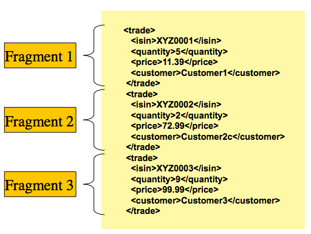

Figure 1. XML Input

The 'trade' tag is defined as the 'root element' in the scenario above. Everything
between '<trade>' and '</trade>' is considered one 'fragment'. Spring Batch
uses Object/XML Mapping (OXM) to bind fragments to objects. However, Spring Batch is not
tied to any particular XML binding technology. Typical use is to delegate to
[Spring OXM](https://docs.spring.io/spring/docs/current/spring-framework-reference/data-access.html#oxm), which
provides uniform abstraction for the most popular OXM technologies. The dependency on
Spring OXM is optional and you can choose to implement Spring Batch specific interfaces
if desired. The relationship to the technologies that OXM supports is shown in the
following image:

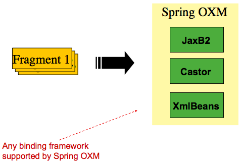

Figure 2. OXM Binding

With an introduction to OXM and how one can use XML fragments to represent records, we
can now more closely examine readers and writers.

<a id="readers-and-writers-xml-reading-writing--staxeventitemreader"></a>

## `StaxEventItemReader`

The `StaxEventItemReader` configuration provides a typical setup for the processing of
records from an XML input stream. First, consider the following set of XML records that
the `StaxEventItemReader` can process:

```xml
<?xml version="1.0" encoding="UTF-8"?>
<records>
    <trade xmlns="https://springframework.org/batch/sample/io/oxm/domain">
        <isin>XYZ0001</isin>
        <quantity>5</quantity>
        <price>11.39</price>
        <customer>Customer1</customer>
    </trade>
    <trade xmlns="https://springframework.org/batch/sample/io/oxm/domain">
        <isin>XYZ0002</isin>
        <quantity>2</quantity>
        <price>72.99</price>
        <customer>Customer2c</customer>
    </trade>
    <trade xmlns="https://springframework.org/batch/sample/io/oxm/domain">
        <isin>XYZ0003</isin>
        <quantity>9</quantity>
        <price>99.99</price>
        <customer>Customer3</customer>
    </trade>
</records>
```

To be able to process the XML records, the following is needed:

- Root Element Name: The name of the root element of the fragment that constitutes the
  object to be mapped. The example configuration demonstrates this with the value of trade.
- Resource: A Spring Resource that represents the file to read.
- `Unmarshaller`: An unmarshalling facility provided by Spring OXM for mapping the XML
  fragment to an object.

- Java
- XML

The following example shows how to define a `StaxEventItemReader` that works with a root
element named `trade`, a resource of `data/iosample/input/input.xml`, and an unmarshaller
called `tradeMarshaller` in Java:

Java Configuration

```java
@Bean
public StaxEventItemReader itemReader() {
	return new StaxEventItemReaderBuilder<Trade>()
			.name("itemReader")
			.resource(new FileSystemResource("org/springframework/batch/infrastructure/item/xml/domain/trades.xml"))
			.addFragmentRootElements("trade")
			.unmarshaller(tradeMarshaller())
			.build();

}
```

The following example shows how to define a `StaxEventItemReader` that works with a root
element named `trade`, a resource of `data/iosample/input/input.xml`, and an unmarshaller
called `tradeMarshaller` in XML:

XML Configuration

```xml
<bean id="itemReader" class="org.springframework.batch.infrastructure.item.xml.StaxEventItemReader">
    <property name="fragmentRootElementName" value="trade" />
    <property name="resource" value="org/springframework/batch/infrastructure/item/xml/domain/trades.xml" />
    <property name="unmarshaller" ref="tradeMarshaller" />
</bean>
```

Note that, in this example, we have chosen to use an `XStreamMarshaller`, which accepts
an alias passed in as a map with the first key and value being the name of the fragment
(that is, a root element) and the object type to bind. Then, similar to a `FieldSet`, the
names of the other elements that map to fields within the object type are described as
key/value pairs in the map. In the configuration file, we can use a Spring configuration
utility to describe the required alias.

- Java
- XML

The following example shows how to describe the alias in Java:

Java Configuration

```java
@Bean
public XStreamMarshaller tradeMarshaller() {
	Map<String, Class> aliases = new HashMap<>();
	aliases.put("trade", Trade.class);
	aliases.put("price", BigDecimal.class);
	aliases.put("isin", String.class);
	aliases.put("customer", String.class);
	aliases.put("quantity", Long.class);

	XStreamMarshaller marshaller = new XStreamMarshaller();

	marshaller.setAliases(aliases);

	return marshaller;
}
```

The following example shows how to describe the alias in XML:

XML Configuration

```xml
<bean id="tradeMarshaller"
      class="org.springframework.oxm.xstream.XStreamMarshaller">
    <property name="aliases">
        <util:map id="aliases">
            <entry key="trade"
                   value="org.springframework.batch.samples.domain.trade.Trade" />
            <entry key="price" value="java.math.BigDecimal" />
            <entry key="isin" value="java.lang.String" />
            <entry key="customer" value="java.lang.String" />
            <entry key="quantity" value="java.lang.Long" />
        </util:map>
    </property>
</bean>
```

On input, the reader reads the XML resource until it recognizes that a new fragment is
about to start. By default, the reader matches the element name to recognize that a new
fragment is about to start. The reader creates a standalone XML document from the
fragment and passes the document to a deserializer (typically a wrapper around a Spring
OXM `Unmarshaller`) to map the XML to a Java object.

In summary, this procedure is analogous to the following Java code, which uses the
injection provided by the Spring configuration:

```java
StaxEventItemReader<Trade> xmlStaxEventItemReader = new StaxEventItemReader<>();
Resource resource = new ByteArrayResource(xmlResource.getBytes());

Map aliases = new HashMap();
aliases.put("trade","org.springframework.batch.samples.domain.trade.Trade");
aliases.put("price","java.math.BigDecimal");
aliases.put("customer","java.lang.String");
aliases.put("isin","java.lang.String");
aliases.put("quantity","java.lang.Long");
XStreamMarshaller unmarshaller = new XStreamMarshaller();
unmarshaller.setAliases(aliases);
xmlStaxEventItemReader.setUnmarshaller(unmarshaller);
xmlStaxEventItemReader.setResource(resource);
xmlStaxEventItemReader.setFragmentRootElementName("trade");
xmlStaxEventItemReader.open(new ExecutionContext());

boolean hasNext = true;

Trade trade = null;

while (hasNext) {
    trade = xmlStaxEventItemReader.read();
    if (trade == null) {
        hasNext = false;
    }
    else {
        System.out.println(trade);
    }
}
```

<a id="readers-and-writers-xml-reading-writing--staxeventitemwriter"></a>

## `StaxEventItemWriter`

Output works symmetrically to input. The `StaxEventItemWriter` needs a `Resource`, a
marshaller, and a `rootTagName`. A Java object is passed to a marshaller (typically a
standard Spring OXM Marshaller) which writes to a `Resource` by using a custom event
writer that filters the `StartDocument` and `EndDocument` events produced for each
fragment by the OXM tools.

- Java
- XML

The following Java example uses the `MarshallingEventWriterSerializer`:

Java Configuration

```java
@Bean
public StaxEventItemWriter itemWriter(Resource outputResource) {
	return new StaxEventItemWriterBuilder<Trade>()
			.name("tradesWriter")
			.marshaller(tradeMarshaller())
			.resource(outputResource)
			.rootTagName("trade")
			.overwriteOutput(true)
			.build();

}
```

The following XML example uses the `MarshallingEventWriterSerializer`:

XML Configuration

```xml
<bean id="itemWriter" class="org.springframework.batch.infrastructure.item.xml.StaxEventItemWriter">
    <property name="resource" ref="outputResource" />
    <property name="marshaller" ref="tradeMarshaller" />
    <property name="rootTagName" value="trade" />
    <property name="overwriteOutput" value="true" />
</bean>
```

The preceding configuration sets up the three required properties and sets the optional
`overwriteOutput=true` attrbute, mentioned earlier in this chapter for specifying whether
an existing file can be overwritten.

- Java
- XML

The following Java example uses the same marshaller as the one used in the reading example
shown earlier in the chapter:

Java Configuration

```java
@Bean
public XStreamMarshaller customerCreditMarshaller() {
	XStreamMarshaller marshaller = new XStreamMarshaller();

	Map<String, Class> aliases = new HashMap<>();
	aliases.put("trade", Trade.class);
	aliases.put("price", BigDecimal.class);
	aliases.put("isin", String.class);
	aliases.put("customer", String.class);
	aliases.put("quantity", Long.class);

	marshaller.setAliases(aliases);

	return marshaller;
}
```

The following XML example uses the same marshaller as the one used in the reading example
shown earlier in the chapter:

XML Configuration

```xml
<bean id="customerCreditMarshaller"
      class="org.springframework.oxm.xstream.XStreamMarshaller">
    <property name="aliases">
        <util:map id="aliases">
            <entry key="customer"
                   value="org.springframework.batch.samples.domain.trade.Trade" />
            <entry key="price" value="java.math.BigDecimal" />
            <entry key="isin" value="java.lang.String" />
            <entry key="customer" value="java.lang.String" />
            <entry key="quantity" value="java.lang.Long" />
        </util:map>
    </property>
</bean>
```

To summarize with a Java example, the following code illustrates all of the points
discussed, demonstrating the programmatic setup of the required properties:

```java
FileSystemResource resource = new FileSystemResource("data/outputFile.xml")

Map aliases = new HashMap();
aliases.put("trade","org.springframework.batch.samples.domain.trade.Trade");
aliases.put("price","java.math.BigDecimal");
aliases.put("customer","java.lang.String");
aliases.put("isin","java.lang.String");
aliases.put("quantity","java.lang.Long");
Marshaller marshaller = new XStreamMarshaller();
marshaller.setAliases(aliases);

StaxEventItemWriter staxItemWriter =
	new StaxEventItemWriterBuilder<Trade>()
				.name("tradesWriter")
				.marshaller(marshaller)
				.resource(resource)
				.rootTagName("trade")
				.overwriteOutput(true)
				.build();

staxItemWriter.afterPropertiesSet();

ExecutionContext executionContext = new ExecutionContext();
staxItemWriter.open(executionContext);
Trade trade = new Trade();
trade.setPrice(11.39);
trade.setIsin("XYZ0001");
trade.setQuantity(5L);
trade.setCustomer("Customer1");
staxItemWriter.write(trade);
```

[`FlatFileItemWriter`](#readers-and-writers-flat-files-file-item-writer)
[JSON Item Readers And Writers](#readers-and-writers-json-reading-writing)

---

<a id="readers-and-writers-json-reading-writing"></a>

<!-- source_url: https://docs.spring.io/spring-batch/reference/readers-and-writers/json-reading-writing.html -->

<!-- page_index: 37 -->

# JSON Item Readers And Writers

<svg enable-background="new 0 0 32 32" id="Glyph" version="1.1" viewbox="0 0 32 32" xml:space="preserve" xmlns="http://www.w3.org/2000/svg" xmlns:xlink="http://www.w3.org/1999/xlink">
<path id="XMLID_223_"></path>
</svg>

Search

<a id="readers-and-writers-json-reading-writing--page-title"></a>
<a id="readers-and-writers-json-reading-writing--json-item-readers-and-writers"></a>

# JSON Item Readers And Writers

Spring Batch provides support for reading and Writing JSON resources in the following format:

```json
[{"isin": "123","quantity": 1,"price": 1.2,"customer": "foo" },{"isin": "456","quantity": 2,"price": 1.4,"customer": "bar"}]
```

It is assumed that the JSON resource is an array of JSON objects corresponding to
individual items. Spring Batch is not tied to any particular JSON library.

<a id="readers-and-writers-json-reading-writing--jsonitemreader"></a>

## `JsonItemReader`

The `JsonItemReader` delegates JSON parsing and binding to implementations of the
`org.springframework.batch.infrastructure.item.json.JsonObjectReader` interface. This interface
is intended to be implemented by using a streaming API to read JSON objects
in chunks. Two implementations are currently provided:

- [Jackson](https://github.com/FasterXML/jackson) through the `org.springframework.batch.infrastructure.item.json.JacksonJsonObjectReader`
- [Gson](https://github.com/google/gson) through the `org.springframework.batch.infrastructure.item.json.GsonJsonObjectReader`

To be able to process JSON records, the following is needed:

- `Resource`: A Spring Resource that represents the JSON file to read.
- `JsonObjectReader`: A JSON object reader to parse and bind JSON objects to items

The following example shows how to define a `JsonItemReader` that works with the
previous JSON resource `org/springframework/batch/infrastructure/item/json/trades.json` and a
`JsonObjectReader` based on Jackson:

```java
@Bean
public JsonItemReader<Trade> jsonItemReader() {
   return new JsonItemReaderBuilder<Trade>()
                 .jsonObjectReader(new JacksonJsonObjectReader<>(Trade.class))
                 .resource(new ClassPathResource("trades.json"))
                 .name("tradeJsonItemReader")
                 .build();
}
```

<a id="readers-and-writers-json-reading-writing--jsonfileitemwriter"></a>

## `JsonFileItemWriter`

The `JsonFileItemWriter` delegates the marshalling of items to the
`org.springframework.batch.infrastructure.item.json.JsonObjectMarshaller` interface. The contract
of this interface is to take an object and marshall it to a JSON `String`.
Two implementations are currently provided:

- [Jackson](https://github.com/FasterXML/jackson) through the `org.springframework.batch.infrastructure.item.json.JacksonJsonObjectMarshaller`
- [Gson](https://github.com/google/gson) through the `org.springframework.batch.infrastructure.item.json.GsonJsonObjectMarshaller`

To be able to write JSON records, the following is needed:

- `Resource`: A Spring `Resource` that represents the JSON file to write
- `JsonObjectMarshaller`: A JSON object marshaller to marshall objects to JSON format

The following example shows how to define a `JsonFileItemWriter`:

```java
@Bean
public JsonFileItemWriter<Trade> jsonFileItemWriter() {
   return new JsonFileItemWriterBuilder<Trade>()
                 .jsonObjectMarshaller(new JacksonJsonObjectMarshaller<>())
                 .resource(new ClassPathResource("trades.json"))
                 .name("tradeJsonFileItemWriter")
                 .build();
}
```

[XML Item Readers and Writers](#readers-and-writers-xml-reading-writing)
[Multi-File Input](#readers-and-writers-multi-file-input)

---

<a id="readers-and-writers-multi-file-input"></a>

<!-- source_url: https://docs.spring.io/spring-batch/reference/readers-and-writers/multi-file-input.html -->

<!-- page_index: 38 -->

# Multi-File Input

<svg enable-background="new 0 0 32 32" id="Glyph" version="1.1" viewbox="0 0 32 32" xml:space="preserve" xmlns="http://www.w3.org/2000/svg" xmlns:xlink="http://www.w3.org/1999/xlink">
<path id="XMLID_223_"></path>
</svg>

Search

<a id="readers-and-writers-multi-file-input--page-title"></a>
<a id="readers-and-writers-multi-file-input--multi-file-input"></a>

# Multi-File Input

It is a common requirement to process multiple files within a single `Step`. Assuming the
files all have the same formatting, the `MultiResourceItemReader` supports this type of
input for both XML and flat file processing. Consider the following files in a directory:

```
file-1.txt  file-2.txt  ignored.txt
```

file-1.txt and file-2.txt are formatted the same and, for business reasons, should be
processed together. The `MultiResourceItemReader` can be used to read in both files by
using wildcards.

- Java
- XML

The following example shows how to read files with wildcards in Java:

Java Configuration

```java
@Bean
public MultiResourceItemReader multiResourceReader(@Value("classpath:data/input/file-*.txt") Resource[] resources) {
	return new MultiResourceItemReaderBuilder<Foo>()
					.delegate(flatFileItemReader())
					.resources(resources)
					.build();
}
```

The following example shows how to read files with wildcards in XML:

XML Configuration

```xml
<bean id="multiResourceReader" class="org.spr...MultiResourceItemReader">
    <property name="resources" value="classpath:data/input/file-*.txt" />
    <property name="delegate" ref="flatFileItemReader" />
</bean>
```

The referenced delegate is a simple `FlatFileItemReader`. The above configuration reads
input from both files, handling rollback and restart scenarios. It should be noted that, as with any `ItemReader`, adding extra input (in this case a file) could cause potential
issues when restarting. It is recommended that batch jobs work with their own individual
directories until completed successfully.

> [!NOTE]
> Input resources are ordered by using `MultiResourceItemReader#setComparator(Comparator)`
> to make sure resource ordering is preserved between job runs in restart scenario.

[JSON Item Readers And Writers](#readers-and-writers-json-reading-writing)
[Database](#readers-and-writers-database)

---

<a id="readers-and-writers-database"></a>

<!-- source_url: https://docs.spring.io/spring-batch/reference/readers-and-writers/database.html -->

<!-- page_index: 39 -->

# Database

<svg enable-background="new 0 0 32 32" id="Glyph" version="1.1" viewbox="0 0 32 32" xml:space="preserve" xmlns="http://www.w3.org/2000/svg" xmlns:xlink="http://www.w3.org/1999/xlink">
<path id="XMLID_223_"></path>
</svg>

Search

<a id="readers-and-writers-database--page-title"></a>
<a id="readers-and-writers-database--database"></a>

# Database

Like most enterprise application styles, a database is the central storage mechanism for
batch. However, batch differs from other application styles due to the sheer size of the
datasets with which the system must work. If a SQL statement returns 1 million rows, the
result set probably holds all returned results in memory until all rows have been read.
Spring Batch provides two types of solutions for this problem:

- [Cursor-based `ItemReader` Implementations](#readers-and-writers-database--cursorbaseditemreaders)
- [Paging `ItemReader` Implementations](#readers-and-writers-database--pagingitemreaders)

<a id="readers-and-writers-database--cursorbaseditemreaders"></a>
<a id="readers-and-writers-database--cursor-based-itemreader-implementations"></a>

## Cursor-based `ItemReader` Implementations

Using a database cursor is generally the default approach of most batch developers, because it is the database’s solution to the problem of 'streaming' relational data. The
Java `ResultSet` class is essentially an object oriented mechanism for manipulating a
cursor. A `ResultSet` maintains a cursor to the current row of data. Calling `next` on a
`ResultSet` moves this cursor to the next row. The Spring Batch cursor-based `ItemReader`
implementation opens a cursor on initialization and moves the cursor forward one row for
every call to `read`, returning a mapped object that can be used for processing. The
`close` method is then called to ensure all resources are freed up. The Spring core
`JdbcTemplate` gets around this problem by using the callback pattern to completely map
all rows in a `ResultSet` and close before returning control back to the method caller.
However, in batch, this must wait until the step is complete. The following image shows a
generic diagram of how a cursor-based `ItemReader` works. Note that, while the example
uses SQL (because SQL is so widely known), any technology could implement the basic
approach.

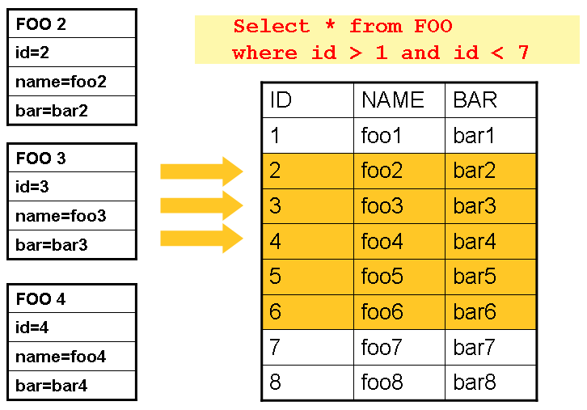

Figure 1. Cursor Example

This example illustrates the basic pattern. Given a 'FOO' table, which has three columns:
`ID`, `NAME`, and `BAR`, select all rows with an ID greater than 1 but less than 7. This
puts the beginning of the cursor (row 1) on ID 2. The result of this row should be a
completely mapped `Foo` object. Calling `read()` again moves the cursor to the next row, which is the `Foo` with an ID of 3. The results of these reads are written out after each
`read`, allowing the objects to be garbage collected (assuming no instance variables are
maintaining references to them).

<a id="readers-and-writers-database--jdbccursoritemreader"></a>

### `JdbcCursorItemReader`

`JdbcCursorItemReader` is the JDBC implementation of the cursor-based technique. It works
directly with a `ResultSet` and requires an SQL statement to run against a connection
obtained from a `DataSource`. The following database schema is used as an example:

```sql
CREATE TABLE CUSTOMER (
   ID BIGINT IDENTITY PRIMARY KEY,
   NAME VARCHAR(45),
   CREDIT FLOAT
);
```

Many people prefer to use a domain object for each row, so the following example uses an
implementation of the `RowMapper` interface to map a `CustomerCredit` object:

```java
public class CustomerCreditRowMapper implements RowMapper<CustomerCredit> {

    public static final String ID_COLUMN = "id";
    public static final String NAME_COLUMN = "name";
    public static final String CREDIT_COLUMN = "credit";

    public CustomerCredit mapRow(ResultSet rs, int rowNum) throws SQLException {
        CustomerCredit customerCredit = new CustomerCredit();

        customerCredit.setId(rs.getInt(ID_COLUMN));
        customerCredit.setName(rs.getString(NAME_COLUMN));
        customerCredit.setCredit(rs.getBigDecimal(CREDIT_COLUMN));

        return customerCredit;
    }
}
```

Because `JdbcCursorItemReader` shares key interfaces with `JdbcTemplate`, it is useful to
see an example of how to read in this data with `JdbcTemplate`, in order to contrast it
with the `ItemReader`. For the purposes of this example, assume there are 1,000 rows in
the `CUSTOMER` database. The first example uses `JdbcTemplate`:

```java
//For simplicity sake, assume a dataSource has already been obtained
JdbcTemplate jdbcTemplate = new JdbcTemplate(dataSource);
List customerCredits = jdbcTemplate.query("SELECT ID, NAME, CREDIT from CUSTOMER",
                                          new CustomerCreditRowMapper());
```

After running the preceding code snippet, the `customerCredits` list contains 1,000
`CustomerCredit` objects. In the query method, a connection is obtained from the
`DataSource`, the provided SQL is run against it, and the `mapRow` method is called for
each row in the `ResultSet`. Contrast this with the approach of the
`JdbcCursorItemReader`, shown in the following example:

```java
JdbcCursorItemReader itemReader = new JdbcCursorItemReader();
itemReader.setDataSource(dataSource);
itemReader.setSql("SELECT ID, NAME, CREDIT from CUSTOMER");
itemReader.setRowMapper(new CustomerCreditRowMapper());
int counter = 0;
ExecutionContext executionContext = new ExecutionContext();
itemReader.open(executionContext);
Object customerCredit = new Object();
while(customerCredit != null){
    customerCredit = itemReader.read();
    counter++;
}
itemReader.close();
```

After running the preceding code snippet, the counter equals 1,000. If the code above had
put the returned `customerCredit` into a list, the result would have been exactly the
same as with the `JdbcTemplate` example. However, the big advantage of the `ItemReader`
is that it allows items to be 'streamed'. The `read` method can be called once, the item
can be written out by an `ItemWriter`, and then the next item can be obtained with
`read`. This allows item reading and writing to be done in 'chunks' and committed
periodically, which is the essence of high performance batch processing. Furthermore, it
is easily configured for injection into a Spring Batch `Step`.

- Java
- XML

The following example shows how to inject an `ItemReader` into a `Step` in Java:

Java Configuration

```java
@Bean
public JdbcCursorItemReader<CustomerCredit> itemReader() {
	return new JdbcCursorItemReaderBuilder<CustomerCredit>()
			.dataSource(this.dataSource)
			.name("creditReader")
			.sql("select ID, NAME, CREDIT from CUSTOMER")
			.rowMapper(new CustomerCreditRowMapper())
			.build();

}
```

The following example shows how to inject an `ItemReader` into a `Step` in XML:

XML Configuration

```xml
<bean id="itemReader" class="org.spr...JdbcCursorItemReader">
    <property name="dataSource" ref="dataSource"/>
    <property name="sql" value="select ID, NAME, CREDIT from CUSTOMER"/>
    <property name="rowMapper">
        <bean class="org.springframework.batch.samples.domain.CustomerCreditRowMapper"/>
    </property>
</bean>
```

<a id="readers-and-writers-database--jdbccursoritemreaderproperties"></a>
<a id="readers-and-writers-database--additional-properties"></a>

#### Additional Properties

Because there are so many varying options for opening a cursor in Java, there are many
properties on the `JdbcCursorItemReader` that can be set, as described in the following
table:

ignoreWarnings

Determines whether or not SQLWarnings are logged or cause an exception.
The default is `true` (meaning that warnings are logged).

fetchSize

Gives the JDBC driver a hint as to the number of rows that should be fetched
from the database when more rows are needed by the `ResultSet` object used by the
`ItemReader`. By default, no hint is given.

maxRows

Sets the limit for the maximum number of rows the underlying `ResultSet` can
hold at any one time.

queryTimeout

Sets the number of seconds the driver waits for a `Statement` object to
run. If the limit is exceeded, a `DataAccessException` is thrown. (Consult your driver
vendor documentation for details).

verifyCursorPosition

Because the same `ResultSet` held by the `ItemReader` is passed to
the `RowMapper`, it is possible for users to call `ResultSet.next()` themselves, which
could cause issues with the reader’s internal count. Setting this value to `true` causes
an exception to be thrown if the cursor position is not the same after the `RowMapper`
call as it was before.

saveState

Indicates whether or not the reader’s state should be saved in the
`ExecutionContext` provided by `ItemStream#update(ExecutionContext)`. The default is
`true`.

driverSupportsAbsolute

Indicates whether the JDBC driver supports
setting the absolute row on a `ResultSet`. It is recommended that this is set to `true`
for JDBC drivers that support `ResultSet.absolute()`, as it may improve performance, especially if a step fails while working with a large data set. Defaults to `false`.

setUseSharedExtendedConnection

Indicates whether the connection
used for the cursor should be used by all other processing, thus sharing the same
transaction. If this is set to `false`, then the cursor is opened with its own connection
and does not participate in any transactions started for the rest of the step processing.
If you set this flag to `true` then you must wrap the DataSource in an
`ExtendedConnectionDataSourceProxy` to prevent the connection from being closed and
released after each commit. When you set this option to `true`, the statement used to
open the cursor is created with both 'READ\_ONLY' and 'HOLD\_CURSORS\_OVER\_COMMIT' options.
This allows holding the cursor open over transaction start and commits performed in the
step processing. To use this feature, you need a database that supports this and a JDBC
driver supporting JDBC 3.0 or later. Defaults to `false`.

<a id="readers-and-writers-database--storedprocedureitemreader"></a>

### `StoredProcedureItemReader`

Sometimes it is necessary to obtain the cursor data by using a stored procedure. The
`StoredProcedureItemReader` works like the `JdbcCursorItemReader`, except that, instead
of running a query to obtain a cursor, it runs a stored procedure that returns a cursor.
The stored procedure can return the cursor in three different ways:

- As a returned `ResultSet` (used by SQL Server, Sybase, DB2, Derby, and MySQL).
- As a ref-cursor returned as an out parameter (used by Oracle and PostgreSQL).
- As the return value of a stored function call.

- Java
- XML

The following Java example configuration uses the same 'customer credit' example as
earlier examples:

Java Configuration

```xml
@Bean
public StoredProcedureItemReader reader(DataSource dataSource) {
	StoredProcedureItemReader reader = new StoredProcedureItemReader();

	reader.setDataSource(dataSource);
	reader.setProcedureName("sp_customer_credit");
	reader.setRowMapper(new CustomerCreditRowMapper());

	return reader;
}
```

The following XML example configuration uses the same 'customer credit' example as earlier
examples:

XML Configuration

```xml
<bean id="reader" class="o.s.batch.item.database.StoredProcedureItemReader">
    <property name="dataSource" ref="dataSource"/>
    <property name="procedureName" value="sp_customer_credit"/>
    <property name="rowMapper">
        <bean class="org.springframework.batch.samples.domain.CustomerCreditRowMapper"/>
    </property>
</bean>
```

The preceding example relies on the stored procedure to provide a `ResultSet` as a
returned result (option 1 from earlier).

If the stored procedure returned a `ref-cursor` (option 2), then we would need to provide
the position of the out parameter that is the returned `ref-cursor`.

- Java
- XML

The following example shows how to work with the first parameter being a ref-cursor in
Java:

Java Configuration

```java
@Bean
public StoredProcedureItemReader reader(DataSource dataSource) {
	StoredProcedureItemReader reader = new StoredProcedureItemReader();

	reader.setDataSource(dataSource);
	reader.setProcedureName("sp_customer_credit");
	reader.setRowMapper(new CustomerCreditRowMapper());
	reader.setRefCursorPosition(1);

	return reader;
}
```

The following example shows how to work with the first parameter being a ref-cursor in
XML:

XML Configuration

```xml
<bean id="reader" class="o.s.batch.item.database.StoredProcedureItemReader">
    <property name="dataSource" ref="dataSource"/>
    <property name="procedureName" value="sp_customer_credit"/>
    <property name="refCursorPosition" value="1"/>
    <property name="rowMapper">
        <bean class="org.springframework.batch.samples.domain.CustomerCreditRowMapper"/>
    </property>
</bean>
```

If the cursor was returned from a stored function (option 3), we would need to set the
property "function" to `true`. It defaults to `false`.

- Java
- XML

The following example shows property to `true` in Java:

Java Configuration

```java
@Bean
public StoredProcedureItemReader reader(DataSource dataSource) {
	StoredProcedureItemReader reader = new StoredProcedureItemReader();

	reader.setDataSource(dataSource);
	reader.setProcedureName("sp_customer_credit");
	reader.setRowMapper(new CustomerCreditRowMapper());
	reader.setFunction(true);

	return reader;
}
```

The following example shows property to `true` in XML:

XML Configuration

```xml
<bean id="reader" class="o.s.batch.item.database.StoredProcedureItemReader">
    <property name="dataSource" ref="dataSource"/>
    <property name="procedureName" value="sp_customer_credit"/>
    <property name="function" value="true"/>
    <property name="rowMapper">
        <bean class="org.springframework.batch.samples.domain.CustomerCreditRowMapper"/>
    </property>
</bean>
```

In all of these cases, we need to define a `RowMapper` as well as a `DataSource` and the
actual procedure name.

If the stored procedure or function takes in parameters, then they must be declared and
set by using the `parameters` property. The following example, for Oracle, declares three
parameters. The first one is the `out` parameter that returns the ref-cursor, and the
second and third are in parameters that takes a value of type `INTEGER`.

- Java
- XML

The following example shows how to work with parameters in Java:

Java Configuration

```java
@Bean
public StoredProcedureItemReader reader(DataSource dataSource) {
	List<SqlParameter> parameters = new ArrayList<>();
	parameters.add(new SqlOutParameter("newId", OracleTypes.CURSOR));
	parameters.add(new SqlParameter("amount", Types.INTEGER);
	parameters.add(new SqlParameter("custId", Types.INTEGER);

	StoredProcedureItemReader reader = new StoredProcedureItemReader();

	reader.setDataSource(dataSource);
	reader.setProcedureName("spring.cursor_func");
	reader.setParameters(parameters);
	reader.setRefCursorPosition(1);
	reader.setRowMapper(rowMapper());
	reader.setPreparedStatementSetter(parameterSetter());

	return reader;
}
```

The following example shows how to work with parameters in XML:

XML Configuration

```xml
<bean id="reader" class="o.s.batch.item.database.StoredProcedureItemReader">
    <property name="dataSource" ref="dataSource"/>
    <property name="procedureName" value="spring.cursor_func"/>
    <property name="parameters">
        <list>
            <bean class="org.springframework.jdbc.core.SqlOutParameter">
                <constructor-arg index="0" value="newid"/>
                <constructor-arg index="1">
                    <util:constant static-field="oracle.jdbc.OracleTypes.CURSOR"/>
                </constructor-arg>
            </bean>
            <bean class="org.springframework.jdbc.core.SqlParameter">
                <constructor-arg index="0" value="amount"/>
                <constructor-arg index="1">
                    <util:constant static-field="java.sql.Types.INTEGER"/>
                </constructor-arg>
            </bean>
            <bean class="org.springframework.jdbc.core.SqlParameter">
                <constructor-arg index="0" value="custid"/>
                <constructor-arg index="1">
                    <util:constant static-field="java.sql.Types.INTEGER"/>
                </constructor-arg>
            </bean>
        </list>
    </property>
    <property name="refCursorPosition" value="1"/>
    <property name="rowMapper" ref="rowMapper"/>
    <property name="preparedStatementSetter" ref="parameterSetter"/>
</bean>
```

In addition to the parameter declarations, we need to specify a `PreparedStatementSetter`
implementation that sets the parameter values for the call. This works the same as for
the `JdbcCursorItemReader` above. All the additional properties listed in
[Additional Properties](#readers-and-writers-database--jdbccursoritemreaderproperties) apply to the `StoredProcedureItemReader` as well.

<a id="readers-and-writers-database--pagingitemreaders"></a>
<a id="readers-and-writers-database--paging-itemreader-implementations"></a>

## Paging `ItemReader` Implementations

An alternative to using a database cursor is running multiple queries where each query
fetches a portion of the results. We refer to this portion as a page. Each query must
specify the starting row number and the number of rows that we want returned in the page.

<a id="readers-and-writers-database--jdbcpagingitemreader"></a>

### `JdbcPagingItemReader`

One implementation of a paging `ItemReader` is the `JdbcPagingItemReader`. The
`JdbcPagingItemReader` needs a `PagingQueryProvider` responsible for providing the SQL
queries used to retrieve the rows making up a page. Since each database has its own
strategy for providing paging support, we need to use a different `PagingQueryProvider`
for each supported database type. There is also the `SqlPagingQueryProviderFactoryBean`
that auto-detects the database that is being used and determine the appropriate
`PagingQueryProvider` implementation. This simplifies the configuration and is the
recommended best practice.

The `SqlPagingQueryProviderFactoryBean` requires that you specify a `select` clause and a
`from` clause. You can also provide an optional `where` clause. These clauses and the
required `sortKey` are used to build an SQL statement.

> [!NOTE]
> It is important to have a unique key constraint on the `sortKey` to guarantee that
> no data is lost between executions.

After the reader has been opened, it passes back one item per call to `read` in the same
basic fashion as any other `ItemReader`. The paging happens behind the scenes when
additional rows are needed.

- Java
- XML

The following Java example configuration uses a similar 'customer credit' example as the
cursor-based `ItemReaders` shown previously:

Java Configuration

```java
@Bean
public JdbcPagingItemReader itemReader(DataSource dataSource, PagingQueryProvider queryProvider) {
	Map<String, Object> parameterValues = new HashMap<>();
	parameterValues.put("status", "NEW");

	return new JdbcPagingItemReaderBuilder<CustomerCredit>()
           				.name("creditReader")
           				.dataSource(dataSource)
           				.queryProvider(queryProvider)
           				.parameterValues(parameterValues)
           				.rowMapper(customerCreditMapper())
           				.pageSize(1000)
           				.build();
}

@Bean
public SqlPagingQueryProviderFactoryBean queryProvider() {
	SqlPagingQueryProviderFactoryBean provider = new SqlPagingQueryProviderFactoryBean();

	provider.setSelectClause("select id, name, credit");
	provider.setFromClause("from customer");
	provider.setWhereClause("where status=:status");
	provider.setSortKey("id");

	return provider;
}
```

The following XML example configuration uses a similar 'customer credit' example as the
cursor-based `ItemReaders` shown previously:

XML Configuration

```xml
<bean id="itemReader" class="org.spr...JdbcPagingItemReader">
    <property name="dataSource" ref="dataSource"/>
    <property name="queryProvider">
        <bean class="org.spr...SqlPagingQueryProviderFactoryBean">
            <property name="selectClause" value="select id, name, credit"/>
            <property name="fromClause" value="from customer"/>
            <property name="whereClause" value="where status=:status"/>
            <property name="sortKey" value="id"/>
        </bean>
    </property>
    <property name="parameterValues">
        <map>
            <entry key="status" value="NEW"/>
        </map>
    </property>
    <property name="pageSize" value="1000"/>
    <property name="rowMapper" ref="customerMapper"/>
</bean>
```

This configured `ItemReader` returns `CustomerCredit` objects using the `RowMapper`, which must be specified. The 'pageSize' property determines the number of entities read
from the database for each query run.

The 'parameterValues' property can be used to specify a `Map` of parameter values for the
query. If you use named parameters in the `where` clause, the key for each entry should
match the name of the named parameter. If you use a traditional '?' placeholder, then the
key for each entry should be the number of the placeholder, starting with 1.

<a id="readers-and-writers-database--jpapagingitemreader"></a>

### `JpaPagingItemReader`

Another implementation of a paging `ItemReader` is the `JpaPagingItemReader`. JPA does
not have a concept similar to the Hibernate `StatelessSession`, so we have to use other
features provided by the JPA specification. Since JPA supports paging, this is a natural
choice when it comes to using JPA for batch processing. After each page is read, the
entities become detached and the persistence context is cleared, to allow the entities to
be garbage collected once the page is processed.

The `JpaPagingItemReader` lets you declare a JPQL statement and pass in a
`EntityManagerFactory`. It then passes back one item per call to read in the same basic
fashion as any other `ItemReader`. The paging happens behind the scenes when additional
entities are needed.

- Java
- XML

The following Java example configuration uses the same 'customer credit' example as the
JDBC reader shown previously:

Java Configuration

```java
@Bean
public JpaPagingItemReader itemReader() {
	return new JpaPagingItemReaderBuilder<CustomerCredit>()
           				.name("creditReader")
           				.entityManagerFactory(entityManagerFactory())
           				.queryString("select c from CustomerCredit c")
           				.pageSize(1000)
           				.build();
}
```

The following XML example configuration uses the same 'customer credit' example as the
JDBC reader shown previously:

XML Configuration

```xml
<bean id="itemReader" class="org.spr...JpaPagingItemReader">
    <property name="entityManagerFactory" ref="entityManagerFactory"/>
    <property name="queryString" value="select c from CustomerCredit c"/>
    <property name="pageSize" value="1000"/>
</bean>
```

This configured `ItemReader` returns `CustomerCredit` objects in the exact same manner as
described for the `JdbcPagingItemReader` above, assuming the `CustomerCredit` object has the
correct JPA annotations or ORM mapping file. The 'pageSize' property determines the
number of entities read from the database for each query execution.

<a id="readers-and-writers-database--databaseitemwriters"></a>
<a id="readers-and-writers-database--database-itemwriters"></a>

## Database ItemWriters

While both flat files and XML files have a specific `ItemWriter` instance, there is no exact equivalent
in the database world. This is because transactions provide all the needed functionality.
`ItemWriter` implementations are necessary for files because they must act as if they’re transactional, keeping track of written items and flushing or clearing at the appropriate times.
Databases have no need for this functionality, since the write is already contained in a
transaction. Users can create their own DAOs that implement the `ItemWriter` interface or
use one from a custom `ItemWriter` that’s written for generic processing concerns. Either
way, they should work without any issues. One thing to look out for is the performance
and error handling capabilities that are provided by batching the outputs. This is most
common when using hibernate as an `ItemWriter` but could have the same issues when using
JDBC batch mode. Batching database output does not have any inherent flaws, assuming we
are careful to flush and there are no errors in the data. However, any errors while
writing can cause confusion, because there is no way to know which individual item caused
an exception or even if any individual item was responsible, as illustrated in the
following image:

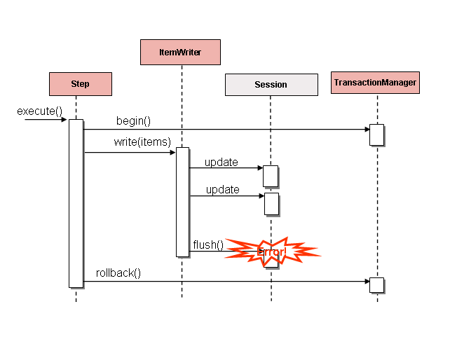

Figure 2. Error On Flush

If items are buffered before being written, any errors are not thrown until the buffer is
flushed just before a commit. For example, assume that 20 items are written per chunk, and the 15th item throws a `DataIntegrityViolationException`. As far as the `Step`
is concerned, all 20 item are written successfully, since there is no way to know that an
error occurs until they are actually written. Once `Session#flush()` is called, the
buffer is emptied and the exception is hit. At this point, there is nothing the `Step`
can do. The transaction must be rolled back. Normally, this exception might cause the
item to be skipped (depending upon the skip/retry policies), and then it is not written
again. However, in the batched scenario, there is no way to know which item caused the
issue. The whole buffer was being written when the failure happened. The only way to
solve this issue is to flush after each item, as shown in the following image:

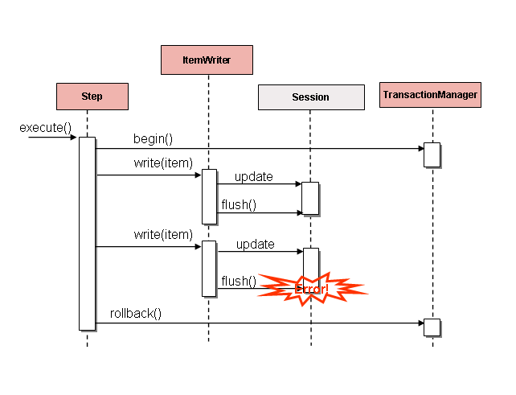

Figure 3. Error On Write

This is a common use case, especially when using Hibernate, and the simple guideline for
implementations of `ItemWriter` is to flush on each call to `write()`. Doing so allows
for items to be skipped reliably, with Spring Batch internally taking care of the
granularity of the calls to `ItemWriter` after an error.

[Multi-File Input](#readers-and-writers-multi-file-input)
[Reusing Existing Services](#readers-and-writers-reusing-existing-services)

---

<a id="readers-and-writers-reusing-existing-services"></a>

<!-- source_url: https://docs.spring.io/spring-batch/reference/readers-and-writers/reusing-existing-services.html -->

<!-- page_index: 40 -->

# Reusing Existing Services

<svg enable-background="new 0 0 32 32" id="Glyph" version="1.1" viewbox="0 0 32 32" xml:space="preserve" xmlns="http://www.w3.org/2000/svg" xmlns:xlink="http://www.w3.org/1999/xlink">
<path id="XMLID_223_"></path>
</svg>

Search

<a id="readers-and-writers-reusing-existing-services--page-title"></a>
<a id="readers-and-writers-reusing-existing-services--reusing-existing-services"></a>

# Reusing Existing Services

Batch systems are often used in conjunction with other application styles. The most
common is an online system, but it may also support integration or even a thick client
application by moving necessary bulk data that each application style uses. For this
reason, it is common that many users want to reuse existing DAOs or other services within
their batch jobs. The Spring container itself makes this fairly easy by allowing any
necessary class to be injected. However, there may be cases where the existing service
needs to act as an `ItemReader` or `ItemWriter`, either to satisfy the dependency of
another Spring Batch class or because it truly is the main `ItemReader` for a step. It is
fairly trivial to write an adapter class for each service that needs wrapping, but
because it is such a common concern, Spring Batch provides implementations:
`ItemReaderAdapter` and `ItemWriterAdapter`. Both classes implement the standard Spring
method by invoking the delegate pattern and are fairly simple to set up.

- Java
- XML

The following Java example uses the `ItemReaderAdapter`:

Java Configuration

```java
@Bean
public ItemReaderAdapter itemReader() {
	ItemReaderAdapter reader = new ItemReaderAdapter();

	reader.setTargetObject(fooService());
	reader.setTargetMethod("generateFoo");

	return reader;
}

@Bean
public FooService fooService() {
	return new FooService();
}
```

The following XML example uses the `ItemReaderAdapter`:

XML Configuration

```xml
<bean id="itemReader" class="org.springframework.batch.infrastructure.item.adapter.ItemReaderAdapter">
    <property name="targetObject" ref="fooService" />
    <property name="targetMethod" value="generateFoo" />
</bean>

<bean id="fooService" class="org.springframework.batch.infrastructure.item.sample.FooService" />
```

One important point to note is that the contract of the `targetMethod` must be the same
as the contract for `read`: When exhausted, it returns `null`. Otherwise, it returns an
`Object`. Anything else prevents the framework from knowing when processing should end, either causing an infinite loop or incorrect failure, depending upon the implementation
of the `ItemWriter`.

- Java
- XML

The following Java example uses the `ItemWriterAdapter`:

Java Configuration

```java
@Bean
public ItemWriterAdapter itemWriter() {
	ItemWriterAdapter writer = new ItemWriterAdapter();

	writer.setTargetObject(fooService());
	writer.setTargetMethod("processFoo");

	return writer;
}

@Bean
public FooService fooService() {
	return new FooService();
}
```

The following XML example uses the `ItemWriterAdapter`:

XML Configuration

```xml
<bean id="itemWriter" class="org.springframework.batch.infrastructure.item.adapter.ItemWriterAdapter">
    <property name="targetObject" ref="fooService" />
    <property name="targetMethod" value="processFoo" />
</bean>

<bean id="fooService" class="org.springframework.batch.infrastructure.item.sample.FooService" />
```

[Database](#readers-and-writers-database)
[Preventing State Persistence](#readers-and-writers-process-indicator)

---

<a id="readers-and-writers-process-indicator"></a>

<!-- source_url: https://docs.spring.io/spring-batch/reference/readers-and-writers/process-indicator.html -->

<!-- page_index: 41 -->

# Preventing State Persistence

<svg enable-background="new 0 0 32 32" id="Glyph" version="1.1" viewbox="0 0 32 32" xml:space="preserve" xmlns="http://www.w3.org/2000/svg" xmlns:xlink="http://www.w3.org/1999/xlink">
<path id="XMLID_223_"></path>
</svg>

Search

<a id="readers-and-writers-process-indicator--page-title"></a>
<a id="readers-and-writers-process-indicator--preventing-state-persistence"></a>

# Preventing State Persistence

By default, all of the `ItemReader` and `ItemWriter` implementations store their current
state in the `ExecutionContext` before it is committed. However, this may not always be
the desired behavior. For example, many developers choose to make their database readers
'rerunnable' by using a process indicator. An extra column is added to the input data to
indicate whether or not it has been processed. When a particular record is being read (or
written) the processed flag is flipped from `false` to `true`. The SQL statement can then
contain an extra statement in the `where` clause, such as `where PROCESSED_IND = false`, thereby ensuring that only unprocessed records are returned in the case of a restart. In
this scenario, it is preferable to not store any state, such as the current row number, since it is irrelevant upon restart. For this reason, all readers and writers include the
'saveState' property.

- Java
- XML

The following bean definition shows how to prevent state persistence in Java:

Java Configuration

```java
@Bean
public JdbcCursorItemReader playerSummarizationSource(DataSource dataSource) {
	return new JdbcCursorItemReaderBuilder<PlayerSummary>()
				.dataSource(dataSource)
				.rowMapper(new PlayerSummaryMapper())
				.saveState(false)
				.sql("SELECT games.player_id, games.year_no, SUM(COMPLETES),"
				  + "SUM(ATTEMPTS), SUM(PASSING_YARDS), SUM(PASSING_TD),"
				  + "SUM(INTERCEPTIONS), SUM(RUSHES), SUM(RUSH_YARDS),"
				  + "SUM(RECEPTIONS), SUM(RECEPTIONS_YARDS), SUM(TOTAL_TD)"
				  + "from games, players where players.player_id ="
				  + "games.player_id group by games.player_id, games.year_no")
				.build();

}
```

The following bean definition shows how to prevent state persistence in XML:

XML Configuration

```xml
<bean id="playerSummarizationSource" class="org.spr...JdbcCursorItemReader">
    <property name="dataSource" ref="dataSource" />
    <property name="rowMapper">
        <bean class="org.springframework.batch.samples.PlayerSummaryMapper" />
    </property>
    <property name="saveState" value="false" />
    <property name="sql">
        <value>
            SELECT games.player_id, games.year_no, SUM(COMPLETES),
            SUM(ATTEMPTS), SUM(PASSING_YARDS), SUM(PASSING_TD),
            SUM(INTERCEPTIONS), SUM(RUSHES), SUM(RUSH_YARDS),
            SUM(RECEPTIONS), SUM(RECEPTIONS_YARDS), SUM(TOTAL_TD)
            from games, players where players.player_id =
            games.player_id group by games.player_id, games.year_no
        </value>
    </property>
</bean>
```

The `ItemReader` configured above does not make any entries in the `ExecutionContext` for
any executions in which it participates.

[Reusing Existing Services](#readers-and-writers-reusing-existing-services)
[Creating Custom ItemReaders and ItemWriters](#readers-and-writers-custom)

---

<a id="readers-and-writers-custom"></a>

<!-- source_url: https://docs.spring.io/spring-batch/reference/readers-and-writers/custom.html -->

<!-- page_index: 42 -->

# Creating Custom ItemReaders and ItemWriters

<svg enable-background="new 0 0 32 32" id="Glyph" version="1.1" viewbox="0 0 32 32" xml:space="preserve" xmlns="http://www.w3.org/2000/svg" xmlns:xlink="http://www.w3.org/1999/xlink">
<path id="XMLID_223_"></path>
</svg>

Search

<a id="readers-and-writers-custom--page-title"></a>
<a id="readers-and-writers-custom--creating-custom-itemreaders-and-itemwriters"></a>

# Creating Custom ItemReaders and ItemWriters

So far, this chapter has discussed the basic contracts of reading and writing in Spring
Batch and some common implementations for doing so. However, these are all fairly
generic, and there are many potential scenarios that may not be covered by out-of-the-box
implementations. This section shows, by using a simple example, how to create a custom
`ItemReader` and `ItemWriter` implementation and implement their contracts correctly. The
`ItemReader` also implements `ItemStream`, in order to illustrate how to make a reader or
writer restartable.

<a id="readers-and-writers-custom--customreader"></a>
<a id="readers-and-writers-custom--custom-itemreader-example"></a>

## Custom `ItemReader` Example

For the purpose of this example, we create a simple `ItemReader` implementation that
reads from a provided list. We start by implementing the most basic contract of
`ItemReader`, the `read` method, as shown in the following code:

```java
public class CustomItemReader<T> implements ItemReader<T> {
List<T> items;
public CustomItemReader(List<T> items) {this.items = items;}
public T read() throws Exception, UnexpectedInputException,NonTransientResourceException, ParseException {
if (!items.isEmpty()) {return items.remove(0);} return null;}}
```

The preceding class takes a list of items and returns them one at a time, removing each
from the list. When the list is empty, it returns `null`, thus satisfying the most basic
requirements of an `ItemReader`, as illustrated in the following test code:

```java
List<String> items = new ArrayList<>();
items.add("1");
items.add("2");
items.add("3");

ItemReader itemReader = new CustomItemReader<>(items);
assertEquals("1", itemReader.read());
assertEquals("2", itemReader.read());
assertEquals("3", itemReader.read());
assertNull(itemReader.read());
```

<a id="readers-and-writers-custom--restartablereader"></a>
<a id="readers-and-writers-custom--making-the-itemreader-restartable"></a>

### Making the `ItemReader` Restartable

The final challenge is to make the `ItemReader` restartable. Currently, if processing is
interrupted and begins again, the `ItemReader` must start at the beginning. This is
actually valid in many scenarios, but it is sometimes preferable that a batch job
restarts where it left off. The key discriminant is often whether the reader is stateful
or stateless. A stateless reader does not need to worry about restartability, but a
stateful one has to try to reconstitute its last known state on restart. For this reason, we recommend that you keep custom readers stateless if possible, so you need not worry
about restartability.

If you do need to store state, then the `ItemStream` interface should be used:

```java
public class CustomItemReader<T> implements ItemReader<T>, ItemStream {
List<T> items; int currentIndex = 0; private static final String CURRENT_INDEX = "current.index";
public CustomItemReader(List<T> items) {this.items = items;}
public T read() throws Exception, UnexpectedInputException,ParseException, NonTransientResourceException {
if (currentIndex < items.size()) {return items.get(currentIndex++);}
return null;}
public void open(ExecutionContext executionContext) throws ItemStreamException {if (executionContext.containsKey(CURRENT_INDEX)) {currentIndex = new Long(executionContext.getLong(CURRENT_INDEX)).intValue();} else {currentIndex = 0;}}
public void update(ExecutionContext executionContext) throws ItemStreamException {executionContext.putLong(CURRENT_INDEX, new Long(currentIndex).longValue());}
public void close() throws ItemStreamException {}}
```

On each call to the `ItemStream` `update` method, the current index of the `ItemReader`
is stored in the provided `ExecutionContext` with a key of 'current.index'. When the
`ItemStream` `open` method is called, the `ExecutionContext` is checked to see if it
contains an entry with that key. If the key is found, then the current index is moved to
that location. This is a fairly trivial example, but it still meets the general contract:

```java
ExecutionContext executionContext = new ExecutionContext();
((ItemStream)itemReader).open(executionContext);
assertEquals("1", itemReader.read());
((ItemStream)itemReader).update(executionContext);

List<String> items = new ArrayList<>();
items.add("1");
items.add("2");
items.add("3");
itemReader = new CustomItemReader<>(items);

((ItemStream)itemReader).open(executionContext);
assertEquals("2", itemReader.read());
```

Most `ItemReaders` have much more sophisticated restart logic. The
`JdbcCursorItemReader`, for example, stores the row ID of the last processed row in the
cursor.

It is also worth noting that the key used within the `ExecutionContext` should not be
trivial. That is because the same `ExecutionContext` is used for all `ItemStreams` within
a `Step`. In most cases, simply prepending the key with the class name should be enough
to guarantee uniqueness. However, in the rare cases where two of the same type of
`ItemStream` are used in the same step (which can happen if two files are needed for
output), a more unique name is needed. For this reason, many of the Spring Batch
`ItemReader` and `ItemWriter` implementations have a `setName()` property that lets this
key name be overridden.

<a id="readers-and-writers-custom--customwriter"></a>
<a id="readers-and-writers-custom--custom-itemwriter-example"></a>

## Custom `ItemWriter` Example

Implementing a Custom `ItemWriter` is similar in many ways to the `ItemReader` example
above but differs in enough ways as to warrant its own example. However, adding
restartability is essentially the same, so it is not covered in this example. As with the
`ItemReader` example, a `List` is used in order to keep the example as simple as
possible:

```java
public class CustomItemWriter<T> implements ItemWriter<T> {
List<T> output = TransactionAwareProxyFactory.createTransactionalList();
public void write(Chunk<? extends T> items) throws Exception {output.addAll(items);}
public List<T> getOutput() {return output;}}
```

<a id="readers-and-writers-custom--restartablewriter"></a>
<a id="readers-and-writers-custom--making-the-itemwriter-restartable"></a>

### Making the `ItemWriter` Restartable

To make the `ItemWriter` restartable, we would follow the same process as for the
`ItemReader`, adding and implementing the `ItemStream` interface to synchronize the
execution context. In the example, we might have to count the number of items processed
and add that as a footer record. If we needed to do that, we could implement
`ItemStream` in our `ItemWriter` so that the counter was reconstituted from the execution
context if the stream was re-opened.

In many realistic cases, custom `ItemWriters` also delegate to another writer that itself
is restartable (for example, when writing to a file), or else it writes to a
transactional resource and so does not need to be restartable, because it is stateless.
When you have a stateful writer you should probably be sure to implement `ItemStream` as
well as `ItemWriter`. Remember also that the client of the writer needs to be aware of
the `ItemStream`, so you may need to register it as a stream in the configuration.

[Preventing State Persistence](#readers-and-writers-process-indicator)
[Item Reader and Writer Implementations](#readers-and-writers-item-reader-writer-implementations)

---

<a id="readers-and-writers-item-reader-writer-implementations"></a>

<!-- source_url: https://docs.spring.io/spring-batch/reference/readers-and-writers/item-reader-writer-implementations.html -->

<!-- page_index: 43 -->

# Item Reader and Writer Implementations

<svg enable-background="new 0 0 32 32" id="Glyph" version="1.1" viewbox="0 0 32 32" xml:space="preserve" xmlns="http://www.w3.org/2000/svg" xmlns:xlink="http://www.w3.org/1999/xlink">
<path id="XMLID_223_"></path>
</svg>

Search

<a id="readers-and-writers-item-reader-writer-implementations--page-title"></a>
<a id="readers-and-writers-item-reader-writer-implementations--item-reader-and-writer-implementations"></a>

# Item Reader and Writer Implementations

In this section, we will introduce you to readers and writers that have not already been
discussed in the previous sections.

<a id="readers-and-writers-item-reader-writer-implementations--decorators"></a>

## Decorators

In some cases, you might need specialized behavior to be appended to a pre-existing
`ItemReader` or `ItemWriter` implementation.
For this purpose, Spring Batch offers the following out-of-the-box decorators:

- [`SynchronizedItemStreamReader`](#readers-and-writers-item-reader-writer-implementations--synchronizeditemstreamreader)
- [`SingleItemPeekableItemReader`](#readers-and-writers-item-reader-writer-implementations--singleitempeekableitemreader)
- [`SynchronizedItemStreamWriter`](#readers-and-writers-item-reader-writer-implementations--synchronizeditemstreamwriter)
- [`MultiResourceItemWriter`](#readers-and-writers-item-reader-writer-implementations--multiresourceitemwriter)
- [`ClassifierCompositeItemWriter`](#readers-and-writers-item-reader-writer-implementations--classifiercompositeitemwriter)
- [`ClassifierCompositeItemProcessor`](#readers-and-writers-item-reader-writer-implementations--classifiercompositeitemprocessor)
- [`MappingItemWriter`](#readers-and-writers-item-reader-writer-implementations--mappingitemwriter)

<a id="readers-and-writers-item-reader-writer-implementations--synchronizeditemstreamreader"></a>

### `SynchronizedItemStreamReader`

When using an `ItemReader` that is not thread safe, Spring Batch offers the
`SynchronizedItemStreamReader` decorator, which can be used to make the `ItemReader`
thread safe. Spring Batch provides a `SynchronizedItemStreamReaderBuilder` to construct
an instance of the `SynchronizedItemStreamReader`.

For example, the `FlatFileItemReader` is **not** thread-safe and cannot be used in
a multi-threaded step. This reader can be decorated with a `SynchronizedItemStreamReader`
in order to use it safely in a multi-threaded step. Here is an example of how to decorate
such a reader:

```java
@Bean
public SynchronizedItemStreamReader<Person> itemReader() {
	FlatFileItemReader<Person> flatFileItemReader = new FlatFileItemReaderBuilder<Person>()
			// set reader properties
			.build();

	return new SynchronizedItemStreamReaderBuilder<Person>()
			.delegate(flatFileItemReader)
			.build();
}
```

<a id="readers-and-writers-item-reader-writer-implementations--singleitempeekableitemreader"></a>

### `SingleItemPeekableItemReader`

Spring Batch includes a decorator that adds a peek method to an `ItemReader`. This peek
method lets the user peek one item ahead. Repeated calls to the peek returns the same
item, and this is the next item returned from the `read` method. Spring Batch provides a
`SingleItemPeekableItemReaderBuilder` to construct an instance of the
`SingleItemPeekableItemReader`.

> [!NOTE]
> SingleItemPeekableItemReader’s peek method is not thread-safe, because it would not
> be possible to honor the peek in multiple threads. Only one of the threads that peeked
> would get that item in the next call to read.

<a id="readers-and-writers-item-reader-writer-implementations--synchronizeditemstreamwriter"></a>

### `SynchronizedItemStreamWriter`

When using an `ItemWriter` that is not thread safe, Spring Batch offers the
`SynchronizedItemStreamWriter` decorator, which can be used to make the `ItemWriter`
thread safe. Spring Batch provides a `SynchronizedItemStreamWriterBuilder` to construct
an instance of the `SynchronizedItemStreamWriter`.

For example, the `FlatFileItemWriter` is **not** thread-safe and cannot be used in
a multi-threaded step. This writer can be decorated with a `SynchronizedItemStreamWriter`
in order to use it safely in a multi-threaded step. Here is an example of how to decorate
such a writer:

```java
@Bean
public SynchronizedItemStreamWriter<Person> itemWriter() {
	FlatFileItemWriter<Person> flatFileItemWriter = new FlatFileItemWriterBuilder<Person>()
			// set writer properties
			.build();

	return new SynchronizedItemStreamWriterBuilder<Person>()
			.delegate(flatFileItemWriter)
			.build();
}
```

<a id="readers-and-writers-item-reader-writer-implementations--multiresourceitemwriter"></a>

### `MultiResourceItemWriter`

The `MultiResourceItemWriter` wraps a `ResourceAwareItemWriterItemStream` and creates a new
output resource when the count of items written in the current resource exceeds the
`itemCountLimitPerResource`. Spring Batch provides a `MultiResourceItemWriterBuilder` to
construct an instance of the `MultiResourceItemWriter`.

<a id="readers-and-writers-item-reader-writer-implementations--classifiercompositeitemwriter"></a>

### `ClassifierCompositeItemWriter`

The `ClassifierCompositeItemWriter` calls one of a collection of `ItemWriter`
implementations for each item, based on a router pattern implemented through the provided
`Classifier`. The implementation is thread-safe if all delegates are thread-safe. Spring
Batch provides a `ClassifierCompositeItemWriterBuilder` to construct an instance of the
`ClassifierCompositeItemWriter`.

<a id="readers-and-writers-item-reader-writer-implementations--classifiercompositeitemprocessor"></a>

### `ClassifierCompositeItemProcessor`

The `ClassifierCompositeItemProcessor` is an `ItemProcessor` that calls one of a
collection of `ItemProcessor` implementations, based on a router pattern implemented
through the provided `Classifier`. Spring Batch provides a
`ClassifierCompositeItemProcessorBuilder` to construct an instance of the
`ClassifierCompositeItemProcessor`.

<a id="readers-and-writers-item-reader-writer-implementations--mappingitemwriter"></a>

### `MappingItemWriter`

The `MappingItemWriter` adapts an `ItemWriter` accepting items of a given type to one accepting
items of another type by applying a mapping function to each item before writing.
Thread-safety is guaranteed as long as the downstream item writer is thread-safe, and state
management is honored with a downstream `ItemStream` item writer.

This item writer is most useful when used in combination with a `CompositeItemWriter`, where the
mapping function in front of the downstream writer can be a getter of the input item or a more
complex transformation logic, effectively allowing deconstruction patterns.

<a id="readers-and-writers-item-reader-writer-implementations--messagingreadersandwriters"></a>
<a id="readers-and-writers-item-reader-writer-implementations--messaging-readers-and-writers"></a>

## Messaging Readers And Writers

Spring Batch offers the following readers and writers for commonly used messaging systems:

- [`AmqpItemReader`](#readers-and-writers-item-reader-writer-implementations--amqpitemreader)
- [`AmqpItemWriter`](#readers-and-writers-item-reader-writer-implementations--amqpitemwriter)
- [`JmsItemReader`](#readers-and-writers-item-reader-writer-implementations--jmsitemreader)
- [`JmsItemWriter`](#readers-and-writers-item-reader-writer-implementations--jmsitemwriter)
- [`KafkaItemReader`](#readers-and-writers-item-reader-writer-implementations--kafkaitemreader)
- [`KafkaItemWriter`](#readers-and-writers-item-reader-writer-implementations--kafkaitemwriter)

<a id="readers-and-writers-item-reader-writer-implementations--amqpitemreader"></a>

### `AmqpItemReader`

The `AmqpItemReader` is an `ItemReader` that uses an `AmqpTemplate` to receive or convert
messages from an exchange. Spring Batch provides a `AmqpItemReaderBuilder` to construct
an instance of the `AmqpItemReader`.

<a id="readers-and-writers-item-reader-writer-implementations--amqpitemwriter"></a>

### `AmqpItemWriter`

The `AmqpItemWriter` is an `ItemWriter` that uses an `AmqpTemplate` to send messages to
an AMQP exchange. Messages are sent to the nameless exchange if the name not specified in
the provided `AmqpTemplate`. Spring Batch provides an `AmqpItemWriterBuilder` to
construct an instance of the `AmqpItemWriter`.

<a id="readers-and-writers-item-reader-writer-implementations--jmsitemreader"></a>

### `JmsItemReader`

The `JmsItemReader` is an `ItemReader` for JMS that uses a `JmsTemplate`. The template
should have a default destination, which is used to provide items for the `read()`
method. Spring Batch provides a `JmsItemReaderBuilder` to construct an instance of the
`JmsItemReader`.

<a id="readers-and-writers-item-reader-writer-implementations--jmsitemwriter"></a>

### `JmsItemWriter`

The `JmsItemWriter` is an `ItemWriter` for JMS that uses a `JmsTemplate`. The template
should have a default destination, which is used to send items in `write(List)`. Spring
Batch provides a `JmsItemWriterBuilder` to construct an instance of the `JmsItemWriter`.

<a id="readers-and-writers-item-reader-writer-implementations--kafkaitemreader"></a>

### `KafkaItemReader`

The `KafkaItemReader` is an `ItemReader` for an Apache Kafka topic. It can be configured
to read messages from multiple partitions of the same topic. It stores message offsets
in the execution context to support restart capabilities. Spring Batch provides a
`KafkaItemReaderBuilder` to construct an instance of the `KafkaItemReader`.

<a id="readers-and-writers-item-reader-writer-implementations--kafkaitemwriter"></a>

### `KafkaItemWriter`

The `KafkaItemWriter` is an `ItemWriter` for Apache Kafka that uses a `KafkaTemplate` to
send events to a default topic. Spring Batch provides a `KafkaItemWriterBuilder` to
construct an instance of the `KafkaItemWriter`.

<a id="readers-and-writers-item-reader-writer-implementations--databasereaders"></a>
<a id="readers-and-writers-item-reader-writer-implementations--database-readers"></a>

## Database Readers

Spring Batch offers the following database readers:

- [`MongoPagingItemReader`](#readers-and-writers-item-reader-writer-implementations--mongopagingitemreader)
- [`MongoCursorItemReader`](#readers-and-writers-item-reader-writer-implementations--mongocursoritemreader)
- [`RepositoryItemReader`](#readers-and-writers-item-reader-writer-implementations--repositoryitemreader)

<a id="readers-and-writers-item-reader-writer-implementations--mongopagingitemreader"></a>

### `MongoPagingItemReader`

The `MongoPagingItemReader` is an `ItemReader` that reads documents from MongoDB by using a
paging technique. Spring Batch provides a `MongoPagingItemReaderBuilder` to construct an
instance of the `MongoPagingItemReader`.

<a id="readers-and-writers-item-reader-writer-implementations--mongocursoritemreader"></a>

### `MongoCursorItemReader`

The `MongoCursorItemReader` is an `ItemReader` that reads documents from MongoDB by using a
streaming technique. Spring Batch provides a `MongoCursorItemReaderBuilder` to construct an
instance of the `MongoCursorItemReader`.

<a id="readers-and-writers-item-reader-writer-implementations--repositoryitemreader"></a>

### `RepositoryItemReader`

The `RepositoryItemReader` is an `ItemReader` that reads records by using a
`PagingAndSortingRepository`. Spring Batch provides a `RepositoryItemReaderBuilder` to
construct an instance of the `RepositoryItemReader`.

<a id="readers-and-writers-item-reader-writer-implementations--databasewriters"></a>
<a id="readers-and-writers-item-reader-writer-implementations--database-writers"></a>

## Database Writers

Spring Batch offers the following database writers:

- [`MongoItemWriter`](#readers-and-writers-item-reader-writer-implementations--mongoitemwriter)
- [`RepositoryItemWriter`](#readers-and-writers-item-reader-writer-implementations--repositoryitemwriter)
- [`JdbcBatchItemWriter`](#readers-and-writers-item-reader-writer-implementations--jdbcbatchitemwriter)
- [`JpaItemWriter`](#readers-and-writers-item-reader-writer-implementations--jpaitemwriter)

<a id="readers-and-writers-item-reader-writer-implementations--mongoitemwriter"></a>

### `MongoItemWriter`

The `MongoItemWriter` is an `ItemWriter` implementation that writes to a MongoDB store
using an implementation of Spring Data’s `MongoOperations`. Spring Batch provides a
`MongoItemWriterBuilder` to construct an instance of the `MongoItemWriter`.

<a id="readers-and-writers-item-reader-writer-implementations--repositoryitemwriter"></a>

### `RepositoryItemWriter`

The `RepositoryItemWriter` is an `ItemWriter` wrapper for a `CrudRepository` from Spring
Data. Spring Batch provides a `RepositoryItemWriterBuilder` to construct an instance of
the `RepositoryItemWriter`.

<a id="readers-and-writers-item-reader-writer-implementations--jdbcbatchitemwriter"></a>

### `JdbcBatchItemWriter`

The `JdbcBatchItemWriter` is an `ItemWriter` that uses the batching features from
`NamedParameterJdbcTemplate` to execute a batch of statements for all items provided.
Spring Batch provides a `JdbcBatchItemWriterBuilder` to construct an instance of the
`JdbcBatchItemWriter`.

<a id="readers-and-writers-item-reader-writer-implementations--jpaitemwriter"></a>

### `JpaItemWriter`

The `JpaItemWriter` is an `ItemWriter` that uses a JPA `EntityManagerFactory` to merge
any entities that are not part of the persistence context. Spring Batch provides a
`JpaItemWriterBuilder` to construct an instance of the `JpaItemWriter`.

<a id="readers-and-writers-item-reader-writer-implementations--specializedreaders"></a>
<a id="readers-and-writers-item-reader-writer-implementations--specialized-readers"></a>

## Specialized Readers

Spring Batch offers the following specialized readers:

- [`LdifReader`](#readers-and-writers-item-reader-writer-implementations--ldifreader)
- [`MappingLdifReader`](#readers-and-writers-item-reader-writer-implementations--mappingldifreader)
- [`AvroItemReader`](#readers-and-writers-item-reader-writer-implementations--avroitemreader)

<a id="readers-and-writers-item-reader-writer-implementations--ldifreader"></a>

### `LdifReader`

The `LdifReader` reads LDIF (LDAP Data Interchange Format) records from a `Resource`, parses them, and returns a `LdapAttribute` object for each `read` executed. Spring Batch
provides a `LdifReaderBuilder` to construct an instance of the `LdifReader`.

<a id="readers-and-writers-item-reader-writer-implementations--mappingldifreader"></a>

### `MappingLdifReader`

The `MappingLdifReader` reads LDIF (LDAP Data Interchange Format) records from a
`Resource`, parses them then maps each LDIF record to a POJO (Plain Old Java Object).
Each read returns a POJO. Spring Batch provides a `MappingLdifReaderBuilder` to construct
an instance of the `MappingLdifReader`.

<a id="readers-and-writers-item-reader-writer-implementations--avroitemreader"></a>

### `AvroItemReader`

The `AvroItemReader` reads serialized Avro data from a Resource.
Each read returns an instance of the type specified by a Java class or Avro Schema.
The reader may be optionally configured for input that embeds an Avro schema or not.
Spring Batch provides an `AvroItemReaderBuilder` to construct an instance of the `AvroItemReader`.

<a id="readers-and-writers-item-reader-writer-implementations--specializedwriters"></a>
<a id="readers-and-writers-item-reader-writer-implementations--specialized-writers"></a>

## Specialized Writers

Spring Batch offers the following specialized writers:

- [`SimpleMailMessageItemWriter`](#readers-and-writers-item-reader-writer-implementations--simplemailmessageitemwriter)
- [`AvroItemWriter`](#readers-and-writers-item-reader-writer-implementations--avroitemwriter)

<a id="readers-and-writers-item-reader-writer-implementations--simplemailmessageitemwriter"></a>

### `SimpleMailMessageItemWriter`

The `SimpleMailMessageItemWriter` is an `ItemWriter` that can send mail messages. It
delegates the actual sending of messages to an instance of `MailSender`. Spring Batch
provides a `SimpleMailMessageItemWriterBuilder` to construct an instance of the
`SimpleMailMessageItemWriter`.

<a id="readers-and-writers-item-reader-writer-implementations--avroitemwriter"></a>

### `AvroItemWriter`

The `AvroItemWrite` serializes Java objects to a WriteableResource according to the given type or Schema.
The writer may be optionally configured to embed an Avro schema in the output or not.
Spring Batch provides an `AvroItemWriterBuilder` to construct an instance of the `AvroItemWriter`.

<a id="readers-and-writers-item-reader-writer-implementations--specializedprocessors"></a>
<a id="readers-and-writers-item-reader-writer-implementations--specialized-processors"></a>

## Specialized Processors

Spring Batch offers the following specialized processors:

- [`ScriptItemProcessor`](#readers-and-writers-item-reader-writer-implementations--scriptitemprocessor)

<a id="readers-and-writers-item-reader-writer-implementations--scriptitemprocessor"></a>

### `ScriptItemProcessor`

The `ScriptItemProcessor` is an `ItemProcessor` that passes the current item to process
to the provided script and the result of the script is returned by the processor. Spring
Batch provides a `ScriptItemProcessorBuilder` to construct an instance of the
`ScriptItemProcessor`.

[Creating Custom ItemReaders and ItemWriters](#readers-and-writers-custom)
[Item processing](#processor)

---

<a id="processor"></a>

<!-- source_url: https://docs.spring.io/spring-batch/reference/processor.html -->

<!-- page_index: 44 -->

# Item processing

<svg enable-background="new 0 0 32 32" id="Glyph" version="1.1" viewbox="0 0 32 32" xml:space="preserve" xmlns="http://www.w3.org/2000/svg" xmlns:xlink="http://www.w3.org/1999/xlink">
<path id="XMLID_223_"></path>
</svg>

Search

<a id="processor--page-title"></a>
<a id="processor--item-processing"></a>

# Item processing

The [ItemReader and ItemWriter interfaces](#readersandwriters) are both very useful for their specific
tasks, but what if you want to insert business logic before writing? One option for both
reading and writing is to use the composite pattern: Create an `ItemWriter` that contains
another `ItemWriter` or an `ItemReader` that contains another `ItemReader`. The following
code shows an example:

```java
public class CompositeItemWriter<T> implements ItemWriter<T> {
ItemWriter<T> itemWriter;
public CompositeItemWriter(ItemWriter<T> itemWriter) {this.itemWriter = itemWriter;}
public void write(Chunk<? extends T> items) throws Exception {//Add business logic here itemWriter.write(items);}
public void setDelegate(ItemWriter<T> itemWriter){this.itemWriter = itemWriter;}}
```

The preceding class contains another `ItemWriter` to which it delegates after having
provided some business logic. This pattern could easily be used for an `ItemReader` as
well, perhaps to obtain more reference data based on the input that was provided by the
main `ItemReader`. It is also useful if you need to control the call to `write` yourself.
However, if you only want to “transform” the item passed in for writing before it is
actually written, you need not `write` yourself. You can just modify the item. For this
scenario, Spring Batch provides the `ItemProcessor` interface, as the following
interface definition shows:

```java
public interface ItemProcessor<I, O> {

    O process(I item) throws Exception;
}
```

An `ItemProcessor` is simple. Given one object, transform it and return another. The
provided object may or may not be of the same type. The point is that business logic may
be applied within the process, and it is completely up to the developer to create that
logic. An `ItemProcessor` can be wired directly into a step. For example, assume an
`ItemReader` provides a class of type `Foo` and that it needs to be converted to type `Bar`
before being written out. The following example shows an `ItemProcessor` that performs
the conversion:

```java
public class Foo {}
public class Bar {public Bar(Foo foo) {}}
public class FooProcessor implements ItemProcessor<Foo, Bar> {public Bar process(Foo foo) throws Exception {//Perform simple transformation, convert a Foo to a Bar return new Bar(foo);}}
public class BarWriter implements ItemWriter<Bar> {public void write(Chunk<? extends Bar> bars) throws Exception {//write bars}}
```

In the preceding example, there is a class named `Foo`, a class named `Bar`, and a class
named `FooProcessor` that adheres to the `ItemProcessor` interface. The transformation is
simple, but any type of transformation could be done here. The `BarWriter` writes `Bar`
objects, throwing an exception if any other type is provided. Similarly, the
`FooProcessor` throws an exception if anything but a `Foo` is provided. The
`FooProcessor` can then be injected into a `Step`, as the following example shows:

- Java
- XML

Java Configuration

```java
@Bean
public Job ioSampleJob(JobRepository jobRepository, Step step1) {
	return new JobBuilder("ioSampleJob", jobRepository)
				.start(step1)
				.build();
}

@Bean
public Step step1(JobRepository jobRepository, PlatformTransactionManager transactionManager) {
	return new StepBuilder("step1", jobRepository)
				.<Foo, Bar>chunk(2).transactionManager(transactionManager)
				.reader(fooReader())
				.processor(fooProcessor())
				.writer(barWriter())
				.build();
}
```

XML Configuration

```xml
<job id="ioSampleJob">
    <step name="step1">
        <tasklet>
            <chunk reader="fooReader" processor="fooProcessor" writer="barWriter"
                   commit-interval="2"/>
        </tasklet>
    </step>
</job>
```

A difference between `ItemProcessor` and `ItemReader` or `ItemWriter` is that an `ItemProcessor`
is optional for a `Step`.

<a id="processor--chainingitemprocessors"></a>
<a id="processor--chaining-itemprocessors"></a>

## Chaining ItemProcessors

Performing a single transformation is useful in many scenarios, but what if you want to
“chain” together multiple `ItemProcessor` implementations? You can do so by using
the composite pattern mentioned previously. To update the previous, single
transformation, example, `Foo` is transformed to `Bar`, which is transformed to `Foobar`
and written out, as the following example shows:

```java
public class Foo {}
public class Bar {public Bar(Foo foo) {}}
public class Foobar {public Foobar(Bar bar) {}}
public class FooProcessor implements ItemProcessor<Foo, Bar> {public Bar process(Foo foo) throws Exception {//Perform simple transformation, convert a Foo to a Bar return new Bar(foo);}}
public class BarProcessor implements ItemProcessor<Bar, Foobar> {public Foobar process(Bar bar) throws Exception {return new Foobar(bar);}}
public class FoobarWriter implements ItemWriter<Foobar>{public void write(Chunk<? extends Foobar> items) throws Exception {//write items}}
```

A `FooProcessor` and a `BarProcessor` can be 'chained' together to give the resultant
`Foobar`, as shown in the following example:

```java
CompositeItemProcessor<Foo,Foobar> compositeProcessor =
                                      new CompositeItemProcessor<Foo,Foobar>();
List itemProcessors = new ArrayList();
itemProcessors.add(new FooProcessor());
itemProcessors.add(new BarProcessor());
compositeProcessor.setDelegates(itemProcessors);
```

Just as with the previous example, you can configure the composite processor into the
`Step`:

- Java
- XML

Java Configuration

```java
@Bean
public Job ioSampleJob(JobRepository jobRepository, Step step1) {
	return new JobBuilder("ioSampleJob", jobRepository)
				.start(step1)
				.build();
}

@Bean
public Step step1(JobRepository jobRepository, PlatformTransactionManager transactionManager) {
	return new StepBuilder("step1", jobRepository)
				.<Foo, Foobar>chunk(2).transactionManager(transactionManager)
				.reader(fooReader())
				.processor(compositeProcessor())
				.writer(foobarWriter())
				.build();
}

@Bean
public CompositeItemProcessor compositeProcessor() {
	List<ItemProcessor> delegates = new ArrayList<>(2);
	delegates.add(new FooProcessor());
	delegates.add(new BarProcessor());

	CompositeItemProcessor processor = new CompositeItemProcessor();

	processor.setDelegates(delegates);

	return processor;
}
```

XML Configuration

```xml
<job id="ioSampleJob">
    <step name="step1">
        <tasklet>
            <chunk reader="fooReader" processor="compositeItemProcessor" writer="foobarWriter"
                   commit-interval="2"/>
        </tasklet>
    </step>
</job>

<bean id="compositeItemProcessor"
      class="org.springframework.batch.infrastructure.item.support.CompositeItemProcessor">
    <property name="delegates">
        <list>
            <bean class="..FooProcessor" />
            <bean class="..BarProcessor" />
        </list>
    </property>
</bean>
```

<a id="processor--filteringrecords"></a>
<a id="processor--filtering-records"></a>

## Filtering Records

One typical use for an item processor is to filter out records before they are passed to
the `ItemWriter`. Filtering is an action distinct from skipping. Skipping indicates that
a record is invalid, while filtering indicates that a record should not be
written.

For example, consider a batch job that reads a file containing three different types of
records: records to insert, records to update, and records to delete. If record deletion
is not supported by the system, we would not want to send any deletable records to
the `ItemWriter`. However, since these records are not actually bad records, we would want to
filter them out rather than skip them. As a result, the `ItemWriter` would receive only
insertable and updatable records.

To filter a record, you can return `null` from the `ItemProcessor`. The framework detects
that the result is `null` and avoids adding that item to the list of records delivered to
the `ItemWriter`. An exception thrown from the `ItemProcessor` results in a
skip.

<a id="processor--validatinginput"></a>
<a id="processor--validating-input"></a>

## Validating Input

The [ItemReaders and ItemWriters](#readersandwriters) chapter discusses multiple approaches to parsing input.
Each major implementation throws an exception if it is not “well formed.” The
`FixedLengthTokenizer` throws an exception if a range of data is missing. Similarly, attempting to access an index in a `RowMapper` or `FieldSetMapper` that does not exist or
is in a different format than the one expected causes an exception to be thrown. All of
these types of exceptions are thrown before `read` returns. However, they do not address
the issue of whether or not the returned item is valid. For example, if one of the fields
is an age, it cannot be negative. It may parse correctly, because it exists and
is a number, but it does not cause an exception. Since there are already a plethora of
validation frameworks, Spring Batch does not attempt to provide yet another. Rather, it
provides a simple interface, called `Validator`, that you can implement by any number of
frameworks, as the following interface definition shows:

```java
public interface Validator<T> {

    void validate(T value) throws ValidationException;

}
```

The contract is that the `validate` method throws an exception if the object is invalid
and returns normally if it is valid. Spring Batch provides an
`ValidatingItemProcessor`, as the following bean definition shows:

- Java
- XML

Java Configuration

```java
@Bean
public ValidatingItemProcessor itemProcessor() {
	ValidatingItemProcessor processor = new ValidatingItemProcessor();

	processor.setValidator(validator());

	return processor;
}

@Bean
public SpringValidator validator() {
	SpringValidator validator = new SpringValidator();

	validator.setValidator(new TradeValidator());

	return validator;
}
```

XML Configuration

```xml
<bean class="org.springframework.batch.infrastructure.item.validator.ValidatingItemProcessor">
    <property name="validator" ref="validator" />
</bean>

<bean id="validator" class="org.springframework.batch.infrastructure.item.validator.SpringValidator">
	<property name="validator">
		<bean class="org.springframework.batch.samples.domain.trade.internal.validator.TradeValidator"/>
	</property>
</bean>
```

You can also use the `BeanValidatingItemProcessor` to validate items annotated with
the Bean Validation API (JSR-303) annotations. For example, consider the following type `Person`:

```java
class Person {
@NotEmpty private String name;
public Person(String name) {this.name = name;}
public String getName() {return name;}
public void setName(String name) {this.name = name;}
}
```

You can validate items by declaring a `BeanValidatingItemProcessor` bean in your
application context and register it as a processor in your chunk-oriented step:

```java
@Bean
public BeanValidatingItemProcessor<Person> beanValidatingItemProcessor() throws Exception {
    BeanValidatingItemProcessor<Person> beanValidatingItemProcessor = new BeanValidatingItemProcessor<>();
    beanValidatingItemProcessor.setFilter(true);

    return beanValidatingItemProcessor;
}
```

<a id="processor--faulttolerant"></a>
<a id="processor--fault-tolerance"></a>

## Fault Tolerance

When a chunk is rolled back, items that have been cached during reading may be
reprocessed. If a step is configured to be fault-tolerant (typically by using skip or
retry processing), any `ItemProcessor` used should be implemented in a way that is
idempotent. Typically that would consist of performing no changes on the input item for
the `ItemProcessor` and updating only the
instance that is the result.

[Item Reader and Writer Implementations](#readers-and-writers-item-reader-writer-implementations)
[Scaling and Parallel Processing](#scalability)

---

<a id="scalability"></a>

<!-- source_url: https://docs.spring.io/spring-batch/reference/scalability.html -->

<!-- page_index: 45 -->

# Scaling and Parallel Processing

<svg enable-background="new 0 0 32 32" id="Glyph" version="1.1" viewbox="0 0 32 32" xml:space="preserve" xmlns="http://www.w3.org/2000/svg" xmlns:xlink="http://www.w3.org/1999/xlink">
<path id="XMLID_223_"></path>
</svg>

Search

<a id="scalability--page-title"></a>
<a id="scalability--scaling-and-parallel-processing"></a>

# Scaling and Parallel Processing

Many batch processing problems can be solved with single-threaded, single-process jobs, so it is always a good idea to properly check if that meets your needs before thinking
about more complex implementations. Measure the performance of a realistic job and see if
the simplest implementation meets your needs first. You can read and write a file of
several hundred megabytes in well under a minute, even with standard hardware.

When you are ready to start implementing a job with some parallel processing, Spring
Batch offers a range of options, which are described in this chapter, although some
features are covered elsewhere. At a high level, there are two modes of parallel
processing:

- Single-process, multi-threaded
- Multi-process

These break down into categories as well, as follows:

- Multi-threaded Step (single-process)
- Parallel Steps (single-process)
- Local Chunking of Step (single-process)
- Remote Chunking of Step (multi-process)
- Partitioning a Step (single or multi-process)
- Remote Step (multi-process)

First, we review the single-process options. Then we review the multi-process options.

<a id="scalability--multithreadedstep"></a>
<a id="scalability--multi-threaded-step"></a>

## Multi-threaded Step

The simplest way to start parallel processing is to add a `TaskExecutor` to your Step
configuration.

- Java
- XML

When using Java configuration, you can add a `TaskExecutor` to the step, as the following example shows:

Java Configuration

```java
@Bean
public TaskExecutor taskExecutor() {
    return new SimpleAsyncTaskExecutor("spring_batch");
}

@Bean
public Step sampleStep(TaskExecutor taskExecutor, JobRepository jobRepository, PlatformTransactionManager transactionManager) {
	return new StepBuilder("sampleStep", jobRepository)
				.<String, String>chunk(10).transactionManager(transactionManager)
				.reader(itemReader())
				.processor(itemProcessor())
				.writer(itemWriter())
				.taskExecutor(taskExecutor)
				.build();
}
```

For example, you might add an attribute TO the `tasklet`, as follows:

```xml
<step id="loading">
    <tasklet task-executor="taskExecutor">...</tasklet>
</step>
```

In this example, the `taskExecutor` is a reference to another bean definition that
implements the `TaskExecutor` interface.
[`TaskExecutor`](https://docs.spring.io/spring/docs/current/javadoc-api/org/springframework/core/task/TaskExecutor.html)
is a standard Spring interface, so consult the Spring User Guide for details of available
implementations. The simplest multi-threaded `TaskExecutor` is a
`SimpleAsyncTaskExecutor`.

The result of the preceding configuration is that the `Step` will use multiple threads from
the task executor to process items concurrently. Therefore, the `ItemProcessor` will be
called from multiple threads at the same time. This means that the `ItemProcessor` must be
thread-safe. If you are using stateful components in the processing, you must ensure that
they are properly synchronized for concurrent access.

Since Spring transactions are thread-bound, the item processor calls that run in worker
threads do not participate in the chunk transaction configured on the step. If an item
processor needs transaction management, it should start its own transaction, for example
with a propagation of `REQUIRED`. A processor that requires an existing transaction, for
example with a propagation of `MANDATORY`, fails unless a transaction is already active in
the worker thread. If you need an entire chunk to be processed in a worker thread, where
the delegate can manage a transaction around the chunk, consider using
[local chunking](#scalability--localchunking) instead.

The reading and writing of items is still done in serial by the main thread executing the step, so the `ItemReader` and `ItemWriter` do not have to be thread-safe or synchronized. However, the throughput of the step may be limited by the speed of reading and writing. If this is
the case, consider using a different concurrency technique, such as local chunking or local partitioning.

Note also that there may be limits placed on concurrency by any pooled resources used in
your step, such as a `DataSource`. Be sure to make the pool in those resources at least
as large as the desired number of concurrent threads in the step.

<a id="scalability--scalabilityparallelsteps"></a>
<a id="scalability--parallel-steps"></a>

## Parallel Steps

As long as the application logic that needs to be parallelized can be split into distinct
responsibilities and assigned to individual steps, it can be parallelized in a
single process. Parallel Step execution is easy to configure and use.

- Java
- XML

When using Java configuration, executing steps `(step1,step2)` in parallel with `step3`
is straightforward, as follows:

Java Configuration

```java
@Bean
public Job job(JobRepository jobRepository) {
    return new JobBuilder("job", jobRepository)
        .start(splitFlow())
        .next(step4())
        .build()        //builds FlowJobBuilder instance
        .build();       //builds Job instance
}

@Bean
public Flow splitFlow() {
    return new FlowBuilder<SimpleFlow>("splitFlow")
        .split(taskExecutor())
        .add(flow1(), flow2())
        .build();
}

@Bean
public Flow flow1() {
    return new FlowBuilder<SimpleFlow>("flow1")
        .start(step1())
        .next(step2())
        .build();
}

@Bean
public Flow flow2() {
    return new FlowBuilder<SimpleFlow>("flow2")
        .start(step3())
        .build();
}

@Bean
public TaskExecutor taskExecutor() {
    return new SimpleAsyncTaskExecutor("spring_batch");
}
```

For example, executing steps `(step1,step2)` in parallel with `step3` is straightforward, as follows:

```xml
<job id="job1">
    <split id="split1" task-executor="taskExecutor" next="step4">
        <flow>
            <step id="step1" parent="s1" next="step2"/>
            <step id="step2" parent="s2"/>
        </flow>
        <flow>
            <step id="step3" parent="s3"/>
        </flow>
    </split>
    <step id="step4" parent="s4"/>
</job>

<beans:bean id="taskExecutor" class="org.spr...SimpleAsyncTaskExecutor"/>
```

The configurable task executor is used to specify which `TaskExecutor`
implementation should execute the individual flows. The default is
`SyncTaskExecutor`, but an asynchronous `TaskExecutor` is required to run the steps in
parallel. Note that the job ensures that every flow in the split completes before
aggregating the exit statuses and transitioning.

See the section on [Split Flows](#step-controlling-flow--split-flows) for more detail.

<a id="scalability--localchunking"></a>
<a id="scalability--local-chunking"></a>

## Local Chunking

Local chunking is a new feature in v6.0 that allows you to process chunks of items in parallel, locally within the same JVM using multiple threads.
This is particularly useful when you have a large number of items to process and want to take advantage of multi-core processors.
With local chunking, you can configure a chunk-oriented step to use multiple threads to process chunks of items concurrently.

This feature is possible by using the `ChunkTaskExecutorItemWriter`, which is an item writer that submits chunk
requests to local workers from a `TaskExecutor`:

```java
@Bean
public ChunkTaskExecutorItemWriter<Vet> itemWriter(ChunkProcessor<Vet> chunkProcessor) {
    ThreadPoolTaskExecutor taskExecutor = new ThreadPoolTaskExecutor();
    taskExecutor.setCorePoolSize(4);
    taskExecutor.setThreadNamePrefix("worker-thread-");
    taskExecutor.setWaitForTasksToCompleteOnShutdown(true);
    taskExecutor.afterPropertiesSet();
    return new ChunkTaskExecutorItemWriter<>(chunkProcessor, taskExecutor);
}
```

The `ChunkTaskExecutorItemWriter` requires a `TaskExecutor` to process chunk concurrently as well as a `ChunkProcessor`
to define what to do with each chunk. Each thread from the task executor will receive its own chunk of items and is responsible
for processing the chunk, and the step will manage the overall aggregation of the results.

Here is an example of a chunk processor that writes each chunk of items to a relational database table:

```java
@Bean public ChunkProcessor<Vet> chunkProcessor(DataSource dataSource, TransactionTemplate transactionTemplate) {String sql = "insert into vets (firstname, lastname) values (?, ?)"; JdbcBatchItemWriter<Vet> itemWriter = new JdbcBatchItemWriterBuilder<Vet>().dataSource(dataSource) .sql(sql) .itemPreparedStatementSetter((item, ps) -> {ps.setString(1, item.firstname()); ps.setString(2, item.lastname()); }) .build();
return (chunk, contribution) -> transactionTemplate.executeWithoutResult(transactionStatus -> {try {itemWriter.write(chunk); contribution.incrementWriteCount(chunk.size()); contribution.setExitStatus(ExitStatus.COMPLETED);} catch (Exception e) {transactionStatus.setRollbackOnly(); contribution.incrementWriteSkipCount(chunk.size()); contribution.setExitStatus(ExitStatus.FAILED.addExitDescription(e));} });}
```

> [!IMPORTANT]
> It should be noted that transaction management of the chunk as well as fault tolerance features (like retry, skip, chunk scanning, etc)
> are not handled by the `ChunkTaskExecutorItemWriter` nor the driving step, and are the responsibility of the delegate chunk processor.
> Moreover, the lifecycle of the task executor is not handled by the `ChunkTaskExecutorItemWriter`.

You can find an example of this scaling technique in the [Local Chunking Sample](https://github.com/spring-projects/spring-batch/tree/main/spring-batch-samples/src/main/java/org/springframework/batch/samples/chunking/local).

<a id="scalability--remotechunking"></a>
<a id="scalability--remote-chunking"></a>

## Remote Chunking

In remote chunking, the `Step` processing is split across multiple processes, communicating with each other through some middleware. The following image shows the
pattern:

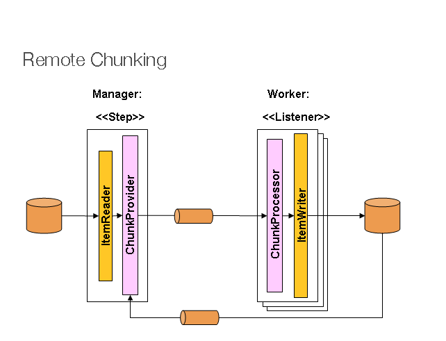

Figure 1. Remote Chunking

The manager component is a single process, and the workers are multiple remote processes.
This pattern works best if the manager is not a bottleneck, so the processing must be more
expensive than the reading of items (as is often the case in practice).

The manager is an implementation of a Spring Batch `Step` with the `ItemWriter` replaced
by a generic version that knows how to send chunks of items to the middleware as
messages. The workers are standard listeners for whatever middleware is being used (for
example, with JMS, they would be `MesssageListener` implementations), and their role is
to process the chunks of items by using a standard `ItemWriter` or `ItemProcessor` plus an
`ItemWriter`, through the `ChunkProcessor` interface. One of the advantages of using this
pattern is that the reader, processor, and writer components are off-the-shelf (the same
as would be used for a local execution of the step). The items are divided up dynamically, and work is shared through the middleware, so that, if the listeners are all eager
consumers, load balancing is automatic.

The middleware has to be durable, with guaranteed delivery and a single consumer for each
message. JMS is the obvious candidate, but other options (such as JavaSpaces) exist in
the grid computing and shared memory product space.

See the section on
[Spring Batch Integration - Remote Chunking](#spring-batch-integration-externalizing-execution--remote-chunking)
for more detail.

<a id="scalability--partitioning"></a>

## Partitioning

Spring Batch also provides an SPI for partitioning a `Step` execution and executing it
remotely. In this case, the remote participants are `Step` instances that could just as
easily have been configured and used for local processing. The following image shows the
pattern:

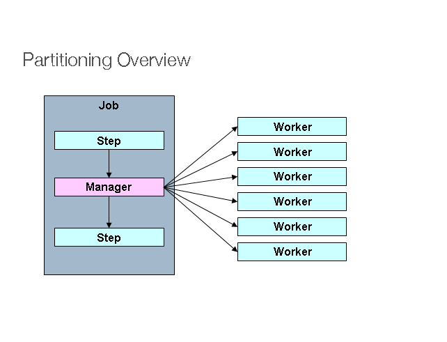

Figure 2. Partitioning

The `Job` runs on the left-hand side as a sequence of `Step` instances, and one of the
`Step` instances is labeled as a manager. The workers in this picture are all identical
instances of a `Step`, which could in fact take the place of the manager, resulting in the
same outcome for the `Job`. The workers are typically going to be remote services but
could also be local threads of execution. The messages sent by the manager to the workers
in this pattern do not need to be durable or have guaranteed delivery. Spring Batch
metadata in the `JobRepository` ensures that each worker is executed once and only once for
each `Job` execution.

The SPI in Spring Batch consists of a special implementation of `Step` (called the
`PartitionStep`) and two strategy interfaces that need to be implemented for the specific
environment. The strategy interfaces are `PartitionHandler` and `StepExecutionSplitter`, and the following sequence diagram shows their role:

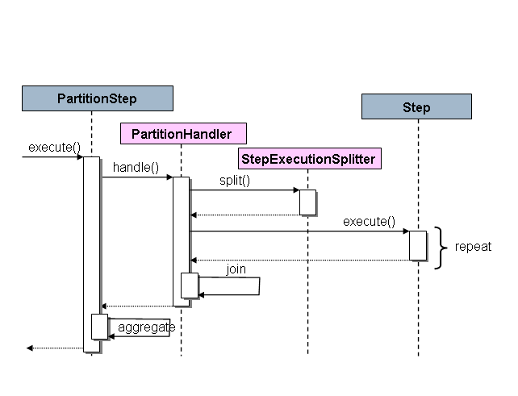

Figure 3. Partitioning SPI

The `Step` on the right in this case is the “remote” worker, so, potentially, there are
many objects and or processes playing this role, and the `PartitionStep` is shown driving
the execution.

- Java
- XML

The following example shows the `PartitionStep` configuration when using Java
configuration:

Java Configuration

```java
@Bean
public Step step1Manager(JobRepository jobRepository) {
    return new StepBuilder("step1.manager", jobRepository)
        .<String, String>partitioner("step1", partitioner())
        .step(step1())
        .gridSize(10)
        .taskExecutor(taskExecutor())
        .build();
}
```

The `gridSize` method prevents the task executor from being saturated with requests
from a single step.

The following example shows the `PartitionStep` configuration when using XML
configuration:

```xml
<step id="step1.manager">
    <partition step="step1" partitioner="partitioner">
        <handler grid-size="10" task-executor="taskExecutor"/>
    </partition>
</step>
```

The `grid-size` attribute prevents the task executor from being saturated with requests
from a single step.

Spring Batch creates step executions for the partition called `step1:partition0` and so
on. Many people prefer to call the manager step `step1:manager` for consistency. You can
use an alias for the step (by specifying the `name` attribute instead of the `id`
attribute).

<a id="scalability--partitionhandler"></a>

### PartitionHandler

`PartitionHandler` is the component that knows about the fabric of the remoting or
grid environment. It is able to send `StepExecution` requests to the remote `Step`
instances, wrapped in some fabric-specific format, like a DTO. It does not have to know
how to split the input data or how to aggregate the result of multiple `Step` executions.
Generally speaking, it probably also does not need to know about resilience or failover, since those are features of the fabric in many cases. In any case, Spring Batch always
provides restartability independent of the fabric. A failed `Job` can always be restarted, and, in that case, only the failed `Steps` are re-executed.

The `PartitionHandler` interface can have specialized implementations for a variety of
fabric types, including simple RMI remoting, EJB remoting, custom web service, JMS, Java
Spaces, shared memory grids (such as Terracotta or Coherence), and grid execution fabrics
(such as GridGain). Spring Batch does not contain implementations for any proprietary grid
or remoting fabrics.

Spring Batch does, however, provide a useful implementation of `PartitionHandler` that
executes `Step` instances locally in separate threads of execution, using the
`TaskExecutor` strategy from Spring. The implementation is called
`TaskExecutorPartitionHandler`.

- Java
- XML

You can explicitly configure the `TaskExecutorPartitionHandler` with Java configuration, as follows:

Java Configuration

```java
@Bean
public Step step1Manager(JobRepository jobRepository) {
    return new StepBuilder("step1.manager", jobRepository)
        .partitioner("step1", partitioner())
        .partitionHandler(partitionHandler())
        .build();
}

@Bean
public PartitionHandler partitionHandler() {
    TaskExecutorPartitionHandler retVal = new TaskExecutorPartitionHandler();
    retVal.setTaskExecutor(taskExecutor());
    retVal.setStep(step1());
    retVal.setGridSize(10);
    return retVal;
}
```

The `TaskExecutorPartitionHandler` is the default for a step configured with the XML
namespace shown previously. You can also configure it explicitly, as follows:

```xml
<step id="step1.manager">
    <partition step="step1" handler="handler"/>
</step>

<bean class="org.spr...TaskExecutorPartitionHandler">
    <property name="taskExecutor" ref="taskExecutor"/>
    <property name="step" ref="step1" />
    <property name="gridSize" value="10" />
</bean>
```

The `gridSize` attribute determines the number of separate step executions to create, so
it can be matched to the size of the thread pool in the `TaskExecutor`. Alternatively, it
can be set to be larger than the number of threads available, which makes the blocks of
work smaller.

The `TaskExecutorPartitionHandler` is useful for IO-intensive `Step` instances, such as
copying large numbers of files or replicating filesystems into content management
systems. It can also be used for remote execution by providing a `Step` implementation
that is a proxy for a remote invocation (such as using Spring Remoting).

<a id="scalability--partitioner"></a>

### Partitioner

The `Partitioner` has a simpler responsibility: to generate execution contexts as input
parameters for new step executions only (no need to worry about restarts). It has a
single method, as the following interface definition shows:

```java
public interface Partitioner {
    Map<String, ExecutionContext> partition(int gridSize);
}
```

The return value from this method associates a unique name for each step execution (the
`String`) with input parameters in the form of an `ExecutionContext`. The names show up
later in the Batch metadata as the step name in the partitioned `StepExecutions`. The
`ExecutionContext` is just a bag of name-value pairs, so it might contain a range of
primary keys, line numbers, or the location of an input file. The remote `Step` then
normally binds to the context input by using `#{…}` placeholders (late binding in step
scope), as shown in the next section.

The names of the step executions (the keys in the `Map` returned by `Partitioner`) need
to be unique amongst the step executions of a `Job` but do not have any other specific
requirements. The easiest way to do this (and to make the names meaningful for users) is
to use a prefix+suffix naming convention, where the prefix is the name of the step that
is being executed (which itself is unique in the `Job`) and the suffix is just a
counter. There is a `SimplePartitioner` in the framework that uses this convention.

You can use an optional interface called `PartitionNameProvider` to provide the partition
names separately from the partitions themselves. If a `Partitioner` implements this
interface, only the names are queried on a restart. If partitioning is expensive, this can be a useful optimization. The names provided by the `PartitionNameProvider` must
match those provided by the `Partitioner`.

<a id="scalability--bindinginputdatatosteps"></a>
<a id="scalability--binding-input-data-to-steps"></a>

### Binding Input Data to Steps

It is very efficient for the steps that are executed by the `PartitionHandler` to have
identical configuration and for their input parameters to be bound at runtime from the
`ExecutionContext`. This is easy to do with the StepScope feature of Spring Batch
(covered in more detail in the section on [Late Binding](#step-late-binding)). For
example, if the `Partitioner` creates `ExecutionContext` instances with an attribute key
called `fileName`, pointing to a different file (or directory) for each step invocation, the `Partitioner` output might resemble the content of the following table:

| *Step Execution Name (key)* | *ExecutionContext (value)* |
| --- | --- |
| filecopy:partition0 | fileName=/home/data/one |
| filecopy:partition1 | fileName=/home/data/two |
| filecopy:partition2 | fileName=/home/data/three |

Then the file name can be bound to a step by using late binding to the execution context.

- Java
- XML

The following example shows how to define late binding in Java:

Java Configuration

```java
@Bean
public MultiResourceItemReader itemReader(
	@Value("#{stepExecutionContext['fileName']}/*") Resource [] resources) {
	return new MultiResourceItemReaderBuilder<String>()
			.delegate(fileReader())
			.name("itemReader")
			.resources(resources)
			.build();
}
```

The following example shows how to define late binding in XML:

XML Configuration

```xml
<bean id="itemReader" scope="step"
      class="org.spr...MultiResourceItemReader">
    <property name="resources" value="#{stepExecutionContext[fileName]}/*"/>
</bean>
```

You can find a complete example in the [Partitioning Sample](https://github.com/spring-projects/spring-batch/tree/main/spring-batch-samples/src/main/java/org/springframework/batch/samples/partitioning).

<a id="scalability--remotestep"></a>
<a id="scalability--remote-step-execution"></a>

## Remote Step execution

As of v6.0, Spring Batch provides support for remote step executions, allowing you to execute steps of a batch job on remote machines or clusters.
This feature is particularly useful for large-scale batch processing scenarios where you want to distribute the workload across multiple nodes to improve performance and scalability.
Remote step execution is provided by the `RemoteStep` class, which uses Spring Integration messaging channels to enable communication between the local job execution environment and the remote step executors.

A `RemoteStep` is configured as a regular step by providing the remote step name and a messaging template to send step execution requests to remote workers:

```java
@Bean
public Step step(MessagingTemplate messagingTemplate, JobRepository jobRepository) {
    return new RemoteStep("step", "workerStep", jobRepository, messagingTemplate);
}
```

On the worker side, you need to define the remote step to execute (`workerStep` in this example) and configure
a Spring Integration flow to intercept step execution requests and invoke the `StepExecutionRequestHandler`:

```java
@Bean
public Step workerStep(JobRepository jobRepository, JdbcTransactionManager transactionManager) {
    return new StepBuilder("workerStep", jobRepository)
        // define step logic
        .build();
}

/*
 * Configure inbound flow (requests coming from the manager)
 */
@Bean
public DirectChannel requests() {
    return new DirectChannel();
}

@Bean
public IntegrationFlow inboundFlow(ActiveMQConnectionFactory connectionFactory, JobRepository jobRepository,
        StepLocator stepLocator) {
    StepExecutionRequestHandler stepExecutionRequestHandler = new StepExecutionRequestHandler();
    stepExecutionRequestHandler.setJobRepository(jobRepository);
    stepExecutionRequestHandler.setStepLocator(stepLocator);
    return IntegrationFlow.from(Jms.messageDrivenChannelAdapter(connectionFactory).destination("requests"))
        .channel(requests())
        .handle(stepExecutionRequestHandler, "handle")
        .get();
}

@Bean
public StepLocator stepLocator(BeanFactory beanFactory) {
    BeanFactoryStepLocator beanFactoryStepLocator = new BeanFactoryStepLocator();
    beanFactoryStepLocator.setBeanFactory(beanFactory);
    return beanFactoryStepLocator;
}
```

You can find a complete example in the [Remote Step Sample](https://github.com/spring-projects/spring-batch/tree/main/spring-batch-samples/src/main/java/org/springframework/batch/samples/remotestep).

[Item processing](#processor)
[Repeat](#repeat)

---

<a id="repeat"></a>

<!-- source_url: https://docs.spring.io/spring-batch/reference/repeat.html -->

<!-- page_index: 46 -->

# Repeat

<svg enable-background="new 0 0 32 32" id="Glyph" version="1.1" viewbox="0 0 32 32" xml:space="preserve" xmlns="http://www.w3.org/2000/svg" xmlns:xlink="http://www.w3.org/1999/xlink">
<path id="XMLID_223_"></path>
</svg>

Search

<a id="repeat--page-title"></a>
<a id="repeat--repeat"></a>

# Repeat

<a id="repeat--repeattemplate"></a>

## RepeatTemplate

Batch processing is about repetitive actions, either as a simple optimization or as part
of a job. To strategize and generalize the repetition and to provide what amounts to an
iterator framework, Spring Batch has the `RepeatOperations` interface. The
`RepeatOperations` interface has the following definition:

```java
public interface RepeatOperations {

    RepeatStatus iterate(RepeatCallback callback) throws RepeatException;

}
```

The callback is an interface, shown in the following definition, that lets you insert
some business logic to be repeated:

```java
public interface RepeatCallback {

    RepeatStatus doInIteration(RepeatContext context) throws Exception;

}
```

The callback is executed repeatedly until the implementation determines that the
iteration should end. The return value in these interfaces is an enumeration value that can
be either `RepeatStatus.CONTINUABLE` or `RepeatStatus.FINISHED`. A `RepeatStatus`
enumeration conveys information to the caller of the repeat operations about whether
any work remains. Generally speaking, implementations of `RepeatOperations`
should inspect `RepeatStatus` and use it as part of the decision to end the
iteration. Any callback that wishes to signal to the caller that there is no work remains
can return `RepeatStatus.FINISHED`.

The simplest general purpose implementation of `RepeatOperations` is `RepeatTemplate`:

```java
RepeatTemplate template = new RepeatTemplate();
template.setCompletionPolicy(new SimpleCompletionPolicy(2));
template.iterate(new RepeatCallback() {
public RepeatStatus doInIteration(RepeatContext context) {// Do stuff in batch...return RepeatStatus.CONTINUABLE;}
});
```

In the preceding example, we return `RepeatStatus.CONTINUABLE`, to show that there is
more work to do. The callback can also return `RepeatStatus.FINISHED`, to signal to the
caller that there is no work remains. Some iterations can be terminated by
considerations intrinsic to the work being done in the callback. Others are effectively
infinite loops (as far as the callback is concerned), and the completion decision is
delegated to an external policy, as in the case shown in the preceding example.

<a id="repeat--repeatcontext"></a>

### RepeatContext

The method parameter for the `RepeatCallback` is a `RepeatContext`. Many callbacks ignore
the context. However, if necessary, you can use it as an attribute bag to store transient
data for the duration of the iteration. After the `iterate` method returns, the context
no longer exists.

If there is a nested iteration in progress, a `RepeatContext` has a parent context. The
parent context is occasionally useful for storing data that need to be shared between
calls to `iterate`. This is the case, for instance, if you want to count the number of
occurrences of an event in the iteration and remember it across subsequent calls.

<a id="repeat--repeatstatus"></a>

### RepeatStatus

`RepeatStatus` is an enumeration used by Spring Batch to indicate whether processing has
finished. It has two possible `RepeatStatus` values:

| *Value* | *Description* |
| --- | --- |
| `CONTINUABLE` | There is more work to do. |
| `FINISHED` | No more repetitions should take place. |

You can combine `RepeatStatus` values with a logical AND operation by using the
`and()` method in `RepeatStatus`. The effect of this is to do a logical AND on the
continuable flag. In other words, if either status is `FINISHED`, the result is
`FINISHED`.

<a id="repeat--completionpolicies"></a>
<a id="repeat--completion-policies"></a>

## Completion Policies

Inside a `RepeatTemplate`, the termination of the loop in the `iterate` method is
determined by a `CompletionPolicy`, which is also a factory for the `RepeatContext`. The
`RepeatTemplate` has the responsibility to use the current policy to create a
`RepeatContext` and pass that in to the `RepeatCallback` at every stage in the iteration.
After a callback completes its `doInIteration`, the `RepeatTemplate` has to make a call
to the `CompletionPolicy` to ask it to update its state (which will be stored in the
`RepeatContext`). Then it asks the policy if the iteration is complete.

Spring Batch provides some simple general purpose implementations of `CompletionPolicy`.
`SimpleCompletionPolicy` allows execution up to a fixed number of times (with
`RepeatStatus.FINISHED` forcing early completion at any time).

Users might need to implement their own completion policies for more complicated
decisions. For example, a batch processing window that prevents batch jobs from executing
once the online systems are in use would require a custom policy.

<a id="repeat--repeatexceptionhandling"></a>
<a id="repeat--exception-handling"></a>

## Exception Handling

If there is an exception thrown inside a `RepeatCallback`, the `RepeatTemplate` consults
an `ExceptionHandler`, which can decide whether or not to re-throw the exception.

The following listing shows the `ExceptionHandler` interface definition:

```java
public interface ExceptionHandler {

    void handleException(RepeatContext context, Throwable throwable)
        throws Throwable;

}
```

A common use case is to count the number of exceptions of a given type and fail when a
limit is reached. For this purpose, Spring Batch provides the
`SimpleLimitExceptionHandler` and a slightly more flexible
`RethrowOnThresholdExceptionHandler`. The `SimpleLimitExceptionHandler` has a limit
property and an exception type that should be compared with the current exception. All
subclasses of the provided type are also counted. Exceptions of the given type are
ignored until the limit is reached, and then they are rethrown. Exceptions of other types
are always rethrown.

An important optional property of the `SimpleLimitExceptionHandler` is the boolean flag
called `useParent`. It is `false` by default, so the limit is only accounted for in the
current `RepeatContext`. When set to `true`, the limit is kept across sibling contexts in
a nested iteration (such as a set of chunks inside a step).

<a id="repeat--repeatlisteners"></a>
<a id="repeat--listeners"></a>

## Listeners

Often, it is useful to be able to receive additional callbacks for cross-cutting concerns
across a number of different iterations. For this purpose, Spring Batch provides the
`RepeatListener` interface. The `RepeatTemplate` lets users register `RepeatListener`
implementations, and they are given callbacks with the `RepeatContext` and `RepeatStatus`
where available during the iteration.

The `RepeatListener` interface has the following definition:

```java
public interface RepeatListener {
    void before(RepeatContext context);
    void after(RepeatContext context, RepeatStatus result);
    void open(RepeatContext context);
    void onError(RepeatContext context, Throwable e);
    void close(RepeatContext context);
}
```

The `open` and `close` callbacks come before and after the entire iteration. `before`, `after`, and `onError` apply to the individual `RepeatCallback` calls.

Note that, when there is more than one listener, they are in a list, so there is an
order. In this case, `open` and `before` are called in the same order while `after`, `onError`, and `close` are called in reverse order.

<a id="repeat--repeatparallelprocessing"></a>
<a id="repeat--parallel-processing"></a>

## Parallel Processing

Implementations of `RepeatOperations` are not restricted to executing the callback
sequentially. It is quite important that some implementations are able to execute their
callbacks in parallel. To this end, Spring Batch provides the
`TaskExecutorRepeatTemplate`, which uses the Spring `TaskExecutor` strategy to run the
`RepeatCallback`. The default is to use a `SynchronousTaskExecutor`, which has the effect
of executing the whole iteration in the same thread (the same as a normal
`RepeatTemplate`).

<a id="repeat--declarativeiteration"></a>
<a id="repeat--declarative-iteration"></a>

## Declarative Iteration

Sometimes, there is some business processing that you know you want to repeat every time
it happens. The classic example of this is the optimization of a message pipeline.
If a batch of messages arrives frequently, it is more efficient to process them than to
bear the cost of a separate transaction for every message. Spring Batch provides an AOP
interceptor that wraps a method call in a `RepeatOperations` object for this
purpose. The `RepeatOperationsInterceptor` executes the intercepted method and repeats
according to the `CompletionPolicy` in the provided `RepeatTemplate`.

- Java
- XML

The following example uses Java configuration to
repeat a service call to a method called `processMessage` (for more detail on how to
configure AOP interceptors, see the
[Spring User Guide](https://docs.spring.io/spring-framework/docs/current/reference/html/core.html#aop)):

```java
@Bean
public MyService myService() {
	ProxyFactory factory = new ProxyFactory(RepeatOperations.class.getClassLoader());
	factory.setInterfaces(MyService.class);
	factory.setTarget(new MyService());

	MyService service = (MyService) factory.getProxy();
	JdkRegexpMethodPointcut pointcut = new JdkRegexpMethodPointcut();
	pointcut.setPatterns(".*processMessage.*");

	RepeatOperationsInterceptor interceptor = new RepeatOperationsInterceptor();

	((Advised) service).addAdvisor(new DefaultPointcutAdvisor(pointcut, interceptor));

	return service;
}
```

The following example shows declarative iteration that uses the Spring AOP namespace to
repeat a service call to a method called `processMessage` (for more detail on how to
configure AOP interceptors, see the
[Spring User Guide](https://docs.spring.io/spring-framework/docs/current/reference/html/core.html#aop)):

```xml
<aop:config>
    <aop:pointcut id="transactional"
        expression="execution(* com..*Service.processMessage(..))" />
    <aop:advisor pointcut-ref="transactional"
        advice-ref="retryAdvice" order="-1"/>
</aop:config>

<bean id="retryAdvice" class="org.spr...RepeatOperationsInterceptor"/>
```

The preceding example uses a default `RepeatTemplate` inside the interceptor. To change
the policies, listeners, and other details, you can inject an instance of
`RepeatTemplate` into the interceptor.

If the intercepted method returns `void`, the interceptor always returns
`RepeatStatus.CONTINUABLE` (so there is a danger of an infinite loop if the
`CompletionPolicy` does not have a finite end point). Otherwise, it returns
`RepeatStatus.CONTINUABLE` until the return value from the intercepted method is `null`.
At that point, it returns `RepeatStatus.FINISHED`. Consequently, the business logic
inside the target method can signal that there is no more work to do by returning `null`
or by throwing an exception that is rethrown by the `ExceptionHandler` in the provided
`RepeatTemplate`.

[Scaling and Parallel Processing](#scalability)
[Retry](#retry)

---

<a id="retry"></a>

<!-- source_url: https://docs.spring.io/spring-batch/reference/retry.html -->

<!-- page_index: 47 -->

# Retry

<svg enable-background="new 0 0 32 32" id="Glyph" version="1.1" viewbox="0 0 32 32" xml:space="preserve" xmlns="http://www.w3.org/2000/svg" xmlns:xlink="http://www.w3.org/1999/xlink">
<path id="XMLID_223_"></path>
</svg>

Search

<a id="retry--page-title"></a>
<a id="retry--retry"></a>

# Retry

To make processing more robust and less prone to failure, it sometimes helps to
automatically retry a failed operation in case it might succeed on a subsequent attempt.
Errors that are susceptible to intermittent failure are often transient in nature.
Examples include remote calls to a web service that fails because of a network glitch or a
`DeadlockLoserDataAccessException` in a database update.

> [!NOTE]
> As of v6.0, Spring Batch does **not** use [Spring Retry](https://github.com/spring-projects/spring-retry) to automate retry operations within the framework, and is now based on the [core retry feature](https://docs.spring.io/spring-framework/reference/7.0/core/resilience.html) provided by Spring Framework 7.0.

[Repeat](#repeat)
[Unit Testing](#testing)

---

<a id="testing"></a>

<!-- source_url: https://docs.spring.io/spring-batch/reference/testing.html -->

<!-- page_index: 48 -->

# Unit Testing

<svg enable-background="new 0 0 32 32" id="Glyph" version="1.1" viewbox="0 0 32 32" xml:space="preserve" xmlns="http://www.w3.org/2000/svg" xmlns:xlink="http://www.w3.org/1999/xlink">
<path id="XMLID_223_"></path>
</svg>

Search

<a id="testing--page-title"></a>
<a id="testing--unit-testing"></a>

# Unit Testing

As with other application styles, it is extremely important to unit test any code written
as part of a batch job. The Spring core documentation covers how to unit and integration
test with Spring in great detail, so it will not be repeated here. It is important, however, to think about how to “end to end” test a batch job, which is what this chapter covers.
The `spring-batch-test` project includes classes that facilitate this end-to-end test
approach.

<a id="testing--creatingunittestclass"></a>
<a id="testing--creating-a-unit-test-class"></a>

## Creating a Unit Test Class

For the unit test to run a batch job, the framework must load the job’s
`ApplicationContext`. Two annotations are used to trigger this behavior:

- `@SpringJUnitConfig` indicates that the class should use Spring’s
  JUnit facilities
- `@SpringBatchTest` injects Spring Batch test utilities (such as the
  `JobOperatorTestUtils` and `JobRepositoryTestUtils`) in the test context

> [!NOTE]
> If the test context contains a single `Job` bean definition, this
> bean will be autowired in `JobOperatorTestUtils`. Otherwise, the job
> under test should be manually set on the `JobOperatorTestUtils`.

> [!WARNING]
> As of Spring Batch 6.0, JUnit 4 is no longer supported. Migration to JUnit Jupiter is recommended.

- Java
- XML

The following Java example shows the annotations in use:

Using Java Configuration

```java
@SpringBatchTest
@SpringJUnitConfig(SkipSampleConfiguration.class)
public class SkipSampleFunctionalTests { ... }
```

The following XML example shows the annotations in use:

Using XML Configuration

```java
@SpringBatchTest
@SpringJUnitConfig(locations = { "/skip-sample-configuration.xml" })
public class SkipSampleFunctionalTests { ... }
```

<a id="testing--endtoendtesting"></a>
<a id="testing--end-to-end-testing-of-batch-jobs"></a>

## End-To-End Testing of Batch Jobs

“End To end” testing can be defined as testing the complete run of a batch job from
beginning to end. This allows for a test that sets up a test condition, executes the job, and verifies the end result.

Consider an example of a batch job that reads from the database and writes to a flat file.
The test method begins by setting up the database with test data. It clears the `CUSTOMER`
table and then inserts 10 new records. The test then launches the `Job` by using the
`startJob()` method. The `startJob()` method is provided by the `JobOperatorTestUtils`
class. The `JobOperatorTestUtils` class also provides the `startJob(JobParameters)`
method, which lets the test give particular parameters. The `startJob()` method
returns the `JobExecution` object, which is useful for asserting particular information
about the `Job` run. In the following case, the test verifies that the `Job` ended with
a status of `COMPLETED`.

- Java
- XML

The following listing shows an example with JUnit 5 in Java configuration style:

Java Based Configuration

```java
@SpringBatchTest
@SpringJUnitConfig(SkipSampleConfiguration.class)
public class SkipSampleFunctionalTests {

    @Autowired
    private JobOperatorTestUtils jobOperatorTestUtils;

    private JdbcTemplate jdbcTemplate;

    @Autowired
    public void setDataSource(DataSource dataSource) {
        this.jdbcTemplate = new JdbcTemplate(dataSource);
    }

    @Test
    public void testJob(@Autowired Job job) throws Exception {
        this.jobOperatorTestUtils.setJob(job);
        this.jdbcTemplate.update("delete from CUSTOMER");
        for (int i = 1; i <= 10; i++) {
            this.jdbcTemplate.update("insert into CUSTOMER values (?, 0, ?, 100000)",
                                      i, "customer" + i);
        }

        JobExecution jobExecution = jobOperatorTestUtils.startJob();


        Assert.assertEquals("COMPLETED", jobExecution.getExitStatus().getExitCode());
    }
}
```

The following listing shows an example with JUnit 5 in XML configuration style:

XML Based Configuration

```java
@SpringBatchTest
@SpringJUnitConfig(locations = { "/skip-sample-configuration.xml" })
public class SkipSampleFunctionalTests {

    @Autowired
    private JobOperatorTestUtils jobOperatorTestUtils;

    private JdbcTemplate jdbcTemplate;

    @Autowired
    public void setDataSource(DataSource dataSource) {
        this.jdbcTemplate = new JdbcTemplate(dataSource);
    }

    @Test
    public void testJob(@Autowired Job job) throws Exception {
        this.jobOperatorTestUtils.setJob(job);
        this.jdbcTemplate.update("delete from CUSTOMER");
        for (int i = 1; i <= 10; i++) {
            this.jdbcTemplate.update("insert into CUSTOMER values (?, 0, ?, 100000)",
                                      i, "customer" + i);
        }

        JobExecution jobExecution = jobOperatorTestUtils.startJob();


        Assert.assertEquals("COMPLETED", jobExecution.getExitStatus().getExitCode());
    }
}
```

<a id="testing--testingindividualsteps"></a>
<a id="testing--testing-individual-steps"></a>

## Testing Individual Steps

For complex batch jobs, test cases in the end-to-end testing approach may become
unmanageable. It these cases, it may be more useful to have test cases to test individual
steps on their own. The `JobOperatorTestUtils` class contains a method called `launchStep`, which takes a step name and runs just that particular `Step`. This approach allows for
more targeted tests letting the test set up data for only that step and to validate its
results directly. The following example shows how to use the `startStep` method to start a
`Step` by name:

```java
JobExecution jobExecution = jobOperatorTestUtils.startStep("loadFileStep");
```

<a id="testing--testing-step-scoped-components"></a>

## Testing Step-Scoped Components

Often, the components that are configured for your steps at runtime use step scope and
late binding to inject context from the step or job execution. These are tricky to test as
standalone components, unless you have a way to set the context as if they were in a step
execution. That is the goal of two components in Spring Batch:
`StepScopeTestExecutionListener` and `StepScopeTestUtils`.

The listener is declared at the class level, and its job is to create a step execution
context for each test method, as the following example shows:

```java
@SpringJUnitConfig
@TestExecutionListeners( { DependencyInjectionTestExecutionListener.class,
    StepScopeTestExecutionListener.class })
public class StepScopeTestExecutionListenerIntegrationTests {

    // This component is defined step-scoped, so it cannot be injected unless
    // a step is active...
    @Autowired
    private ItemReader<String> reader;

    public StepExecution getStepExecution() {
        StepExecution execution = MetaDataInstanceFactory.createStepExecution();
        execution.getExecutionContext().putString("input.data", "foo,bar,spam");
        return execution;
    }

    @Test
    public void testReader() {
        // The reader is initialized and bound to the input data
        assertNotNull(reader.read());
    }

}
```

There are two `TestExecutionListeners`. One is the regular Spring Test framework, which
handles dependency injection from the configured application context to inject the reader.
The other is the Spring Batch `StepScopeTestExecutionListener`. It works by looking for a
factory method in the test case for a `StepExecution`, using that as the context for the
test method, as if that execution were active in a `Step` at runtime. The factory method
is detected by its signature (it must return a `StepExecution`). If a factory method is
not provided, a default `StepExecution` is created.

Starting from v4.1, the `StepScopeTestExecutionListener` and
`JobScopeTestExecutionListener` are imported as test execution listeners
if the test class is annotated with `@SpringBatchTest`. The preceding test
example can be configured as follows:

```java
@SpringBatchTest
@SpringJUnitConfig
public class StepScopeTestExecutionListenerIntegrationTests {

    // This component is defined step-scoped, so it cannot be injected unless
    // a step is active...
    @Autowired
    private ItemReader<String> reader;

    public StepExecution getStepExecution() {
        StepExecution execution = MetaDataInstanceFactory.createStepExecution();
        execution.getExecutionContext().putString("input.data", "foo,bar,spam");
        return execution;
    }

    @Test
    public void testReader() {
        // The reader is initialized and bound to the input data
        assertNotNull(reader.read());
    }

}
```

The listener approach is convenient if you want the duration of the step scope to be the
execution of the test method. For a more flexible but more invasive approach, you can use
the `StepScopeTestUtils`. The following example counts the number of items available in
the reader shown in the previous example:

```java
int count = StepScopeTestUtils.doInStepScope(stepExecution,new Callable<Integer>() {public Integer call() throws Exception {
int count = 0;
while (reader.read() != null) {count++;} return count;} });
```

<a id="testing--mockingdomainobjects"></a>
<a id="testing--mocking-domain-objects"></a>

## Mocking Domain Objects

Another common issue encountered while writing unit and integration tests for Spring Batch
components is how to mock domain objects. A good example is a `StepExecutionListener`, as
the following code snippet shows:

```java
public class NoWorkFoundStepExecutionListener implements StepExecutionListener {
public ExitStatus afterStep(StepExecution stepExecution) {if (stepExecution.getReadCount() == 0) {return ExitStatus.FAILED;} return null;}}
```

The framework provides the preceding listener example and checks a `StepExecution`
for an empty read count, thus signifying that no work was done. While this example is
fairly simple, it serves to illustrate the types of problems that you may encounter when
you try to unit test classes that implement interfaces requiring Spring Batch domain
objects. Consider the following unit test for the listener’s in the preceding example:

```java
private NoWorkFoundStepExecutionListener tested = new NoWorkFoundStepExecutionListener();

@Test
public void noWork() {
    StepExecution stepExecution = new StepExecution("NoProcessingStep",
                new JobExecution(new JobInstance(1L, new JobParameters(),
                                 "NoProcessingJob")));

    stepExecution.setExitStatus(ExitStatus.COMPLETED);
    stepExecution.setReadCount(0);

    ExitStatus exitStatus = tested.afterStep(stepExecution);
    assertEquals(ExitStatus.FAILED.getExitCode(), exitStatus.getExitCode());
}
```

Because the Spring Batch domain model follows good object-oriented principles, the
`StepExecution` requires a `JobExecution`, which requires a `JobInstance` and
`JobParameters`, to create a valid `StepExecution`. While this is good in a solid domain
model, it does make creating stub objects for unit testing verbose. To address this issue, the Spring Batch test module includes a factory for creating domain objects:
`MetaDataInstanceFactory`. Given this factory, the unit test can be updated to be more
concise, as the following example shows:

```java
private NoWorkFoundStepExecutionListener tested = new NoWorkFoundStepExecutionListener();

@Test
public void testAfterStep() {
    StepExecution stepExecution = MetaDataInstanceFactory.createStepExecution();

    stepExecution.setExitStatus(ExitStatus.COMPLETED);
    stepExecution.setReadCount(0);

    ExitStatus exitStatus = tested.afterStep(stepExecution);
    assertEquals(ExitStatus.FAILED.getExitCode(), exitStatus.getExitCode());
}
```

The preceding method for creating a simple `StepExecution` is only one convenience method
available within the factory. You can find a full method listing in its
[Javadoc](https://docs.spring.io/spring-batch/reference/api/org/springframework/batch/test/MetaDataInstanceFactory.html).

[Retry](#retry)
[Common Batch Patterns](#common-patterns)

---

<a id="common-patterns"></a>

<!-- source_url: https://docs.spring.io/spring-batch/reference/common-patterns.html -->

<!-- page_index: 49 -->

# Common Batch Patterns

<svg enable-background="new 0 0 32 32" id="Glyph" version="1.1" viewbox="0 0 32 32" xml:space="preserve" xmlns="http://www.w3.org/2000/svg" xmlns:xlink="http://www.w3.org/1999/xlink">
<path id="XMLID_223_"></path>
</svg>

Search

<a id="common-patterns--page-title"></a>
<a id="common-patterns--common-batch-patterns"></a>

# Common Batch Patterns

Some batch jobs can be assembled purely from off-the-shelf components in Spring Batch.
For instance, the `ItemReader` and `ItemWriter` implementations can be configured to
cover a wide range of scenarios. However, for the majority of cases, custom code must be
written. The main API entry points for application developers are the `Tasklet`, the
`ItemReader`, the `ItemWriter`, and the various listener interfaces. Most simple batch
jobs can use off-the-shelf input from a Spring Batch `ItemReader`, but it is often the
case that there are custom concerns in the processing and writing that require developers
to implement an `ItemWriter` or `ItemProcessor`.

In this chapter, we provide a few examples of common patterns in custom business logic.
These examples primarily feature the listener interfaces. It should be noted that an
`ItemReader` or `ItemWriter` can implement a listener interface as well, if appropriate.

<a id="common-patterns--loggingitemprocessingandfailures"></a>
<a id="common-patterns--logging-item-processing-and-failures"></a>

## Logging Item Processing and Failures

A common use case is the need for special handling of errors in a step, item by item, perhaps logging to a special channel or inserting a record into a database. A
chunk-oriented `Step` (created from the step factory beans) lets users implement this use
case with a simple `ItemReadListener` for errors on `read` and an `ItemWriteListener` for
errors on `write`. The following code snippet illustrates a listener that logs both read
and write failures:

```java
public class ItemFailureLoggerListener extends ItemListenerSupport {
private static Log logger = LogFactory.getLog("item.error");
public void onReadError(Exception ex) {logger.error("Encountered error on read", e);}
public void onWriteError(Exception ex, List<? extends Object> items) {logger.error("Encountered error on write", ex);}}
```

Having implemented this listener, it must be registered with a step.

- Java
- XML

The following example shows how to register a listener with a step Java:

Java Configuration

```java
@Bean
public Step simpleStep(JobRepository jobRepository) {
	return new StepBuilder("simpleStep", jobRepository)
				...
				.listener(new ItemFailureLoggerListener())
				.build();
}
```

The following example shows how to register a listener with a step in XML:

XML Configuration

```xml
<step id="simpleStep">
...
<listeners>
    <listener>
        <bean class="org.example...ItemFailureLoggerListener"/>
    </listener>
</listeners>
</step>
```

> [!IMPORTANT]
> if your listener does anything in an `onError()` method, it must be inside
> a transaction that is going to be rolled back. If you need to use a transactional
> resource, such as a database, inside an `onError()` method, consider adding a declarative
> transaction to that method (see Spring Core Reference Guide for details), and giving its
> propagation attribute a value of `REQUIRES_NEW`.

<a id="common-patterns--stoppingajobmanuallyforbusinessreasons"></a>
<a id="common-patterns--stopping-a-job-manually-for-business-reasons"></a>

## Stopping a Job Manually for Business Reasons

Spring Batch provides a `stop()` method through the `JobOperator` interface, but this is
really for use by the operator rather than the application programmer. Sometimes, it is
more convenient or makes more sense to stop a job execution from within the business
logic.

The simplest thing to do is to throw a `RuntimeException` (one that is neither retried
indefinitely nor skipped). For example, a custom exception type could be used, as shown
in the following example:

```java
public class PoisonPillItemProcessor<T> implements ItemProcessor<T, T> {
@Override public T process(T item) throws Exception {if (isPoisonPill(item)) {throw new PoisonPillException("Poison pill detected: " + item);} return item;}}
```

Another simple way to stop a step from executing is to return `null` from the
`ItemReader`, as shown in the following example:

```java
public class EarlyCompletionItemReader implements ItemReader<T> {
private ItemReader<T> delegate;
public void setDelegate(ItemReader<T> delegate) { ... }
public T read() throws Exception {T item = delegate.read(); if (isEndItem(item)) {return null; // end the step here} return item;}
}
```

The previous example actually relies on the fact that there is a default implementation
of the `CompletionPolicy` strategy that signals a complete batch when the item to be
processed is `null`. A more sophisticated completion policy could be implemented and
injected into the `Step` through the `SimpleStepFactoryBean`.

- Java
- XML

The following example shows how to inject a completion policy into a step in Java:

Java Configuration

```java
@Bean
public Step simpleStep(JobRepository jobRepository, PlatformTransactionManager transactionManager) {
	return new StepBuilder("simpleStep", jobRepository)
				.<String, String>chunk(new SpecialCompletionPolicy(), transactionManager)
				.reader(reader())
				.writer(writer())
				.build();
}
```

The following example shows how to inject a completion policy into a step in XML:

XML Configuration

```xml
<step id="simpleStep">
    <tasklet>
        <chunk reader="reader" writer="writer" commit-interval="10"
               chunk-completion-policy="completionPolicy"/>
    </tasklet>
</step>

<bean id="completionPolicy" class="org.example...SpecialCompletionPolicy"/>
```

An alternative is to set a flag in the `StepExecution`, which is checked by the `Step`
implementations in the framework in between item processing. To implement this
alternative, we need access to the current `StepExecution`, and this can be achieved by
implementing a `StepListener` and registering it with the `Step`. The following example
shows a listener that sets the flag:

```java
public class CustomItemWriter extends ItemListenerSupport implements StepListener {
private StepExecution stepExecution;
public void beforeStep(StepExecution stepExecution) {this.stepExecution = stepExecution;}
public void afterRead(Object item) {if (isPoisonPill(item)) {stepExecution.setTerminateOnly();}}
}
```

When the flag is set, the default behavior is for the step to throw a
`JobInterruptedException`. This behavior can be controlled through the
`StepInterruptionPolicy`. However, the only choice is to throw or not throw an exception, so this is always an abnormal ending to a job.

<a id="common-patterns--addingafooterrecord"></a>
<a id="common-patterns--adding-a-footer-record"></a>

## Adding a Footer Record

Often, when writing to flat files, a “footer” record must be appended to the end of the
file, after all processing has be completed. This can be achieved using the
`FlatFileFooterCallback` interface provided by Spring Batch. The `FlatFileFooterCallback`
(and its counterpart, the `FlatFileHeaderCallback`) are optional properties of the
`FlatFileItemWriter` and can be added to an item writer.

- Java
- XML

The following example shows how to use the `FlatFileHeaderCallback` and the
`FlatFileFooterCallback` in Java:

Java Configuration

```java
@Bean
public FlatFileItemWriter<String> itemWriter(Resource outputResource) {
	return new FlatFileItemWriterBuilder<String>()
			.name("itemWriter")
			.resource(outputResource)
			.lineAggregator(lineAggregator())
			.headerCallback(headerCallback())
			.footerCallback(footerCallback())
			.build();
}
```

The following example shows how to use the `FlatFileHeaderCallback` and the
`FlatFileFooterCallback` in XML:

XML Configuration

```xml
<bean id="itemWriter" class="org.spr...FlatFileItemWriter">
    <property name="resource" ref="outputResource" />
    <property name="lineAggregator" ref="lineAggregator"/>
    <property name="headerCallback" ref="headerCallback" />
    <property name="footerCallback" ref="footerCallback" />
</bean>
```

The footer callback interface has just one method that is called when the footer must be
written, as shown in the following interface definition:

```java
public interface FlatFileFooterCallback {

    void writeFooter(Writer writer) throws IOException;

}
```

<a id="common-patterns--writingasummaryfooter"></a>
<a id="common-patterns--writing-a-summary-footer"></a>

### Writing a Summary Footer

A common requirement involving footer records is to aggregate information during the
output process and to append this information to the end of the file. This footer often
serves as a summarization of the file or provides a checksum.

For example, if a batch job is writing `Trade` records to a flat file, and there is a
requirement that the total amount from all the `Trades` is placed in a footer, then the
following `ItemWriter` implementation can be used:

```java
public class TradeItemWriter implements ItemWriter<Trade>,FlatFileFooterCallback {
private ItemWriter<Trade> delegate;
private BigDecimal totalAmount = BigDecimal.ZERO;
public void write(Chunk<? extends Trade> items) throws Exception {BigDecimal chunkTotal = BigDecimal.ZERO; for (Trade trade : items) {chunkTotal = chunkTotal.add(trade.getAmount());}
delegate.write(items);
// After successfully writing all items totalAmount = totalAmount.add(chunkTotal);}
public void writeFooter(Writer writer) throws IOException {writer.write("Total Amount Processed: " + totalAmount);}
public void setDelegate(ItemWriter delegate) {...}}
```

This `TradeItemWriter` stores a `totalAmount` value that is increased with the `amount`
from each `Trade` item written. After the last `Trade` is processed, the framework calls
`writeFooter`, which puts the `totalAmount` into the file. Note that the `write` method
makes use of a temporary variable, `chunkTotal`, that stores the total of the
`Trade` amounts in the chunk. This is done to ensure that, if a skip occurs in the
`write` method, the `totalAmount` is left unchanged. It is only at the end of the `write`
method, once we are guaranteed that no exceptions are thrown, that we update the
`totalAmount`.

In order for the `writeFooter` method to be called, the `TradeItemWriter` (which
implements `FlatFileFooterCallback`) must be wired into the `FlatFileItemWriter` as the
`footerCallback`.

- Java
- XML

The following example shows how to wire the `TradeItemWriter` in Java:

Java Configuration

```java
@Bean
public TradeItemWriter tradeItemWriter() {
	TradeItemWriter itemWriter = new TradeItemWriter();

	itemWriter.setDelegate(flatFileItemWriter(null));

	return itemWriter;
}

@Bean
public FlatFileItemWriter<String> flatFileItemWriter(Resource outputResource) {
	return new FlatFileItemWriterBuilder<String>()
			.name("itemWriter")
			.resource(outputResource)
			.lineAggregator(lineAggregator())
			.footerCallback(tradeItemWriter())
			.build();
}
```

The following example shows how to wire the `TradeItemWriter` in XML:

XML Configuration

```xml
<bean id="tradeItemWriter" class="..TradeItemWriter">
    <property name="delegate" ref="flatFileItemWriter" />
</bean>

<bean id="flatFileItemWriter" class="org.spr...FlatFileItemWriter">
   <property name="resource" ref="outputResource" />
   <property name="lineAggregator" ref="lineAggregator"/>
   <property name="footerCallback" ref="tradeItemWriter" />
</bean>
```

The way that the `TradeItemWriter` has been written so far functions correctly only if
the `Step` is not restartable. This is because the class is stateful (since it stores the
`totalAmount`), but the `totalAmount` is not persisted to the database. Therefore, it
cannot be retrieved in the event of a restart. In order to make this class restartable, the `ItemStream` interface should be implemented along with the methods `open` and
`update`, as shown in the following example:

```java
public void open(ExecutionContext executionContext) {if (executionContext.containsKey("total.amount") {totalAmount = (BigDecimal) executionContext.get("total.amount");}}
public void update(ExecutionContext executionContext) {executionContext.put("total.amount", totalAmount);}
```

The update method stores the most current version of `totalAmount` to the
`ExecutionContext` just before that object is persisted to the database. The open method
retrieves any existing `totalAmount` from the `ExecutionContext` and uses it as the
starting point for processing, allowing the `TradeItemWriter` to pick up on restart where
it left off the previous time the `Step` was run.

<a id="common-patterns--drivingquerybaseditemreaders"></a>
<a id="common-patterns--driving-query-based-itemreaders"></a>

## Driving Query Based ItemReaders

In the [chapter on readers and writers](#readersandwriters), database input using
paging was discussed. Many database vendors, such as DB2, have extremely pessimistic
locking strategies that can cause issues if the table being read also needs to be used by
other portions of the online application. Furthermore, opening cursors over extremely
large datasets can cause issues on databases from certain vendors. Therefore, many
projects prefer to use a 'Driving Query' approach to reading in data. This approach works
by iterating over keys, rather than the entire object that needs to be returned, as the
following image illustrates:

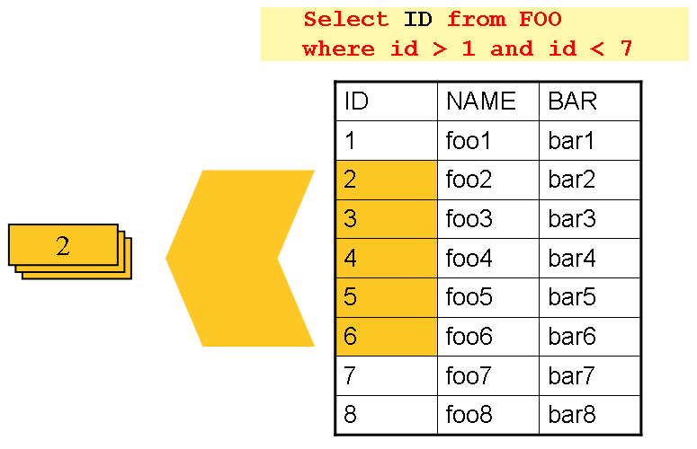

Figure 1. Driving Query Job

As you can see, the example shown in the preceding image uses the same 'FOO' table as was
used in the cursor-based example. However, rather than selecting the entire row, only the
IDs were selected in the SQL statement. So, rather than a `FOO` object being returned
from `read`, an `Integer` is returned. This number can then be used to query for the
'details', which is a complete `Foo` object, as shown in the following image:

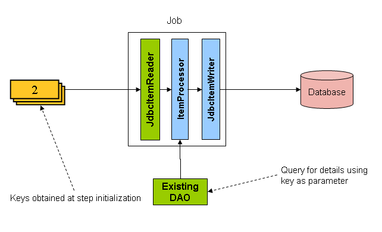

Figure 2. Driving Query Example

An `ItemProcessor` should be used to transform the key obtained from the driving query
into a full `Foo` object. An existing DAO can be used to query for the full object based
on the key.

<a id="common-patterns--multilinerecords"></a>
<a id="common-patterns--multi-line-records"></a>

## Multi-Line Records

While it is usually the case with flat files that each record is confined to a single
line, it is common that a file might have records spanning multiple lines with multiple
formats. The following excerpt from a file shows an example of such an arrangement:

```
HEA;0013100345;2007-02-15
NCU;Smith;Peter;;T;20014539;F
BAD;;Oak Street 31/A;;Small Town;00235;IL;US
FOT;2;2;267.34
```

Everything between the line starting with 'HEA' and the line starting with 'FOT' is
considered one record. There are a few considerations that must be made in order to
handle this situation correctly:

- Instead of reading one record at a time, the `ItemReader` must read every line of the
  multi-line record as a group, so that it can be passed to the `ItemWriter` intact.
- Each line type may need to be tokenized differently.

Because a single record spans multiple lines and because we may not know how many lines
there are, the `ItemReader` must be careful to always read an entire record. In order to
do this, a custom `ItemReader` should be implemented as a wrapper for the
`FlatFileItemReader`.

- Java
- XML

The following example shows how to implement a custom `ItemReader` in Java:

Java Configuration

```java
@Bean
public MultiLineTradeItemReader itemReader() {
	MultiLineTradeItemReader itemReader = new MultiLineTradeItemReader();

	itemReader.setDelegate(flatFileItemReader());

	return itemReader;
}

@Bean
public FlatFileItemReader flatFileItemReader() {
	FlatFileItemReader<Trade> reader = new FlatFileItemReaderBuilder<>()
			.name("flatFileItemReader")
			.resource(new ClassPathResource("data/iosample/input/multiLine.txt"))
			.lineTokenizer(orderFileTokenizer())
			.fieldSetMapper(orderFieldSetMapper())
			.build();
	return reader;
}
```

The following example shows how to implement a custom `ItemReader` in XML:

XML Configuration

```xml
<bean id="itemReader" class="org.spr...MultiLineTradeItemReader">
    <property name="delegate">
        <bean class="org.springframework.batch.infrastructure.item.file.FlatFileItemReader">
            <property name="resource" value="data/iosample/input/multiLine.txt" />
            <property name="lineMapper">
                <bean class="org.spr...DefaultLineMapper">
                    <property name="lineTokenizer" ref="orderFileTokenizer"/>
                    <property name="fieldSetMapper" ref="orderFieldSetMapper"/>
                </bean>
            </property>
        </bean>
    </property>
</bean>
```

To ensure that each line is tokenized properly, which is especially important for
fixed-length input, the `PatternMatchingCompositeLineTokenizer` can be used on the
delegate `FlatFileItemReader`. See
[`FlatFileItemReader` in the Readers and
Writers chapter](#readersandwriters--flatfileitemreader) for more details. The delegate reader then uses a
`PassThroughFieldSetMapper` to deliver a `FieldSet` for each line back to the wrapping
`ItemReader`.

- Java
- XML

The following example shows how to ensure that each line is properly tokenized in Java:

Java Content

```java
@Bean
public PatternMatchingCompositeLineTokenizer orderFileTokenizer() {
	PatternMatchingCompositeLineTokenizer tokenizer =
			new PatternMatchingCompositeLineTokenizer();

	Map<String, LineTokenizer> tokenizers = new HashMap<>(4);

	tokenizers.put("HEA*", headerRecordTokenizer());
	tokenizers.put("FOT*", footerRecordTokenizer());
	tokenizers.put("NCU*", customerLineTokenizer());
	tokenizers.put("BAD*", billingAddressLineTokenizer());

	tokenizer.setTokenizers(tokenizers);

	return tokenizer;
}
```

The following example shows how to ensure that each line is properly tokenized in XML:

XML Content

```xml
<bean id="orderFileTokenizer" class="org.spr...PatternMatchingCompositeLineTokenizer">
    <property name="tokenizers">
        <map>
            <entry key="HEA*" value-ref="headerRecordTokenizer" />
            <entry key="FOT*" value-ref="footerRecordTokenizer" />
            <entry key="NCU*" value-ref="customerLineTokenizer" />
            <entry key="BAD*" value-ref="billingAddressLineTokenizer" />
        </map>
    </property>
</bean>
```

This wrapper has to be able to recognize the end of a record so that it can continually
call `read()` on its delegate until the end is reached. For each line that is read, the
wrapper should build up the item to be returned. Once the footer is reached, the item can
be returned for delivery to the `ItemProcessor` and `ItemWriter`, as shown in the
following example:

```java
private FlatFileItemReader<FieldSet> delegate;
public Trade read() throws Exception {Trade t = null;
for (FieldSet line = null; (line = this.delegate.read()) != null;) {String prefix = line.readString(0); if (prefix.equals("HEA")) {t = new Trade(); // Record must start with header} else if (prefix.equals("NCU")) {Assert.notNull(t, "No header was found."); t.setLast(line.readString(1)); t.setFirst(line.readString(2)); ...} else if (prefix.equals("BAD")) {Assert.notNull(t, "No header was found."); t.setCity(line.readString(4)); t.setState(line.readString(6)); ...} else if (prefix.equals("FOT")) {return t; // Record must end with footer}} Assert.isNull(t, "No 'END' was found."); return null;}
```

<a id="common-patterns--executingsystemcommands"></a>
<a id="common-patterns--executing-system-commands"></a>

## Executing System Commands

Many batch jobs require that an external command be called from within the batch job.
Such a process could be kicked off separately by the scheduler, but the advantage of
common metadata about the run would be lost. Furthermore, a multi-step job would also
need to be split up into multiple jobs as well.

Because the need is so common, Spring Batch provides a `Tasklet` implementation for
calling system commands.

- Java
- XML

The following example shows how to call an external command in Java:

Java Configuration

```java
@Bean
public SystemCommandTasklet tasklet() {
	SystemCommandTasklet tasklet = new SystemCommandTasklet();

	tasklet.setCommand("echo hello");
	tasklet.setTimeout(5000);

	return tasklet;
}
```

The following example shows how to call an external command in XML:

XML Configuration

```xml
<bean class="org.springframework.batch.core.step.tasklet.SystemCommandTasklet">
    <property name="command" value="echo hello" />
    <!-- 5 second timeout for the command to complete -->
    <property name="timeout" value="5000" />
</bean>
```

<a id="common-patterns--handlingstepcompletionwhennoinputisfound"></a>
<a id="common-patterns--handling-step-completion-when-no-input-is-found"></a>

## Handling Step Completion When No Input is Found

In many batch scenarios, finding no rows in a database or file to process is not
exceptional. The `Step` is simply considered to have found no work and completes with 0
items read. All of the `ItemReader` implementations provided out of the box in Spring
Batch default to this approach. This can lead to some confusion if nothing is written out
even when input is present (which usually happens if a file was misnamed or some similar
issue arises). For this reason, the metadata itself should be inspected to determine how
much work the framework found to be processed. However, what if finding no input is
considered exceptional? In this case, programmatically checking the metadata for no items
processed and causing failure is the best solution. Because this is a common use case, Spring Batch provides a listener with exactly this functionality, as shown in
the class definition for `NoWorkFoundStepExecutionListener`:

```java
public class NoWorkFoundStepExecutionListener implements StepExecutionListener {
public ExitStatus afterStep(StepExecution stepExecution) {if (stepExecution.getReadCount() == 0) {return ExitStatus.FAILED;} return null;}
}
```

The preceding `StepExecutionListener` inspects the `readCount` property of the
`StepExecution` during the 'afterStep' phase to determine if no items were read. If that
is the case, an exit code `FAILED` is returned, indicating that the `Step` should fail.
Otherwise, `null` is returned, which does not affect the status of the `Step`.

<a id="common-patterns--passingdatatofuturesteps"></a>
<a id="common-patterns--passing-data-to-future-steps"></a>

## Passing Data to Future Steps

It is often useful to pass information from one step to another. This can be done through
the `ExecutionContext`. The catch is that there are two `ExecutionContexts`: one at the
`Step` level and one at the `Job` level. The `Step` `ExecutionContext` remains only as
long as the step, while the `Job` `ExecutionContext` remains through the whole `Job`. On
the other hand, the `Step` `ExecutionContext` is updated every time the `Step` commits a
chunk, while the `Job` `ExecutionContext` is updated only at the end of each `Step`.

The consequence of this separation is that all data must be placed in the `Step`
`ExecutionContext` while the `Step` is executing. Doing so ensures that the data is
stored properly while the `Step` runs. If data is stored to the `Job` `ExecutionContext`, then it is not persisted during `Step` execution. If the `Step` fails, that data is lost.

```java
public class SavingItemWriter implements ItemWriter<Object> {private StepExecution stepExecution;
public void write(Chunk<? extends Object> items) throws Exception {// ...
ExecutionContext stepContext = this.stepExecution.getExecutionContext(); stepContext.put("someKey", someObject);}
@BeforeStep public void saveStepExecution(StepExecution stepExecution) {this.stepExecution = stepExecution;}}
```

To make the data available to future `Steps`, it must be “promoted” to the `Job`
`ExecutionContext` after the step has finished. Spring Batch provides the
`ExecutionContextPromotionListener` for this purpose. The listener must be configured
with the keys related to the data in the `ExecutionContext` that must be promoted. It can
also, optionally, be configured with a list of exit code patterns for which the promotion
should occur (`COMPLETED` is the default). As with all listeners, it must be registered
on the `Step`.

- Java
- XML

The following example shows how to promote a step to the `Job` `ExecutionContext` in Java:

Java Configuration

```java
@Bean
public Job job1(JobRepository jobRepository, Step step1, Step step2) {
	return new JobBuilder("job1", jobRepository)
				.start(step1)
				.next(step2)
				.build();
}

@Bean
public Step step1(JobRepository jobRepository, PlatformTransactionManager transactionManager) {
	return new StepBuilder("step1", jobRepository)
				.<String, String>chunk(10).transactionManager(transactionManager)
				.reader(reader())
				.writer(savingWriter())
				.listener(promotionListener())
				.build();
}

@Bean
public ExecutionContextPromotionListener promotionListener() {
	ExecutionContextPromotionListener listener = new ExecutionContextPromotionListener();

	listener.setKeys(new String[] {"someKey"});

	return listener;
}
```

The following example shows how to promote a step to the `Job` `ExecutionContext` in XML:

XML Configuration

```xml
<job id="job1">
    <step id="step1">
        <tasklet>
            <chunk reader="reader" writer="savingWriter" commit-interval="10"/>
        </tasklet>
        <listeners>
            <listener ref="promotionListener"/>
        </listeners>
    </step>

    <step id="step2">
       ...
    </step>
</job>

<beans:bean id="promotionListener" class="org.spr....ExecutionContextPromotionListener">
    <beans:property name="keys">
        <list>
            <value>someKey</value>
        </list>
    </beans:property>
</beans:bean>
```

Finally, the saved values must be retrieved from the `Job` `ExecutionContext`, as shown
in the following example:

```java
public class RetrievingItemWriter implements ItemWriter<Object> {private Object someObject;
public void write(Chunk<? extends Object> items) throws Exception {// ...}
@BeforeStep public void retrieveInterstepData(StepExecution stepExecution) {JobExecution jobExecution = stepExecution.getJobExecution(); ExecutionContext jobContext = jobExecution.getExecutionContext(); this.someObject = jobContext.get("someKey");}}
```

[Unit Testing](#testing)
[Spring Batch Integration](#spring-batch-integration)

---

<a id="spring-batch-integration"></a>

<!-- source_url: https://docs.spring.io/spring-batch/reference/spring-batch-integration.html -->

<!-- page_index: 50 -->

# Spring Batch Integration

<svg enable-background="new 0 0 32 32" id="Glyph" version="1.1" viewbox="0 0 32 32" xml:space="preserve" xmlns="http://www.w3.org/2000/svg" xmlns:xlink="http://www.w3.org/1999/xlink">
<path id="XMLID_223_"></path>
</svg>

Search

<a id="spring-batch-integration--page-title"></a>
<a id="spring-batch-integration--spring-batch-integration"></a>

# Spring Batch Integration

Many users of Spring Batch may encounter requirements that are
outside the scope of Spring Batch but that may be efficiently and
concisely implemented by using Spring Integration. Conversely, Spring
Integration users may encounter Spring Batch requirements and need a way
to efficiently integrate both frameworks. In this context, several
patterns and use-cases emerge, and Spring Batch Integration
addresses those requirements.

The line between Spring Batch and Spring Integration is not always
clear, but two pieces of advice can
help: Thinking about granularity and applying common patterns. Some
of those common patterns are described in this section.

Adding messaging to a batch process enables automation of
operations and also separation and strategizing of key concerns.
For example, a message might trigger a job to execute, and then
sending the message can be exposed in a variety of ways. Alternatively, when
a job completes or fails, that event might trigger a message to be sent, and the consumers of those messages might have operational concerns
that have nothing to do with the application itself. Messaging can
also be embedded in a job (for example, reading or writing items for
processing through channels). Remote partitioning and remote chunking
provide methods to distribute workloads over a number of workers.

This section covers the following key concepts:

- [Namespace Support](#spring-batch-integration-namespace-support)
- [Launching Batch Jobs through Messages](#spring-batch-integration-launching-jobs-through-messages)
- [Available Attributes of the Job-Launching Gateway](#spring-batch-integration-available-attributes-of-the-job-launching-gateway)
- [Providing Feedback with Informational Messages](#spring-batch-integration-providing-feedback-with-informational-messages)
- [Asynchronous Processors](#spring-batch-integration-asynchronous-processing)
- [Externalizing Batch Process Execution](#spring-batch-integration-externalizing-execution)

[Common Batch Patterns](#common-patterns)
[Namespace Support](#spring-batch-integration-namespace-support)

---

<a id="spring-batch-integration-namespace-support"></a>

<!-- source_url: https://docs.spring.io/spring-batch/reference/spring-batch-integration/namespace-support.html -->

<!-- page_index: 51 -->

# Namespace Support

<svg enable-background="new 0 0 32 32" id="Glyph" version="1.1" viewbox="0 0 32 32" xml:space="preserve" xmlns="http://www.w3.org/2000/svg" xmlns:xlink="http://www.w3.org/1999/xlink">
<path id="XMLID_223_"></path>
</svg>

Search

<a id="spring-batch-integration-namespace-support--page-title"></a>
<a id="spring-batch-integration-namespace-support--namespace-support"></a>

# Namespace Support

Dedicated XML namespace support was added to Spring Batch Integration in version 1.3, with the aim to provide an easier configuration
experience. To use the namespace, add the following
namespace declarations to your Spring XML Application Context
file:

```xml
<beans xmlns="http://www.springframework.org/schema/beans"
  xmlns:xsi="http://www.w3.org/2001/XMLSchema-instance"
  xmlns:batch-int="http://www.springframework.org/schema/batch-integration"
  xsi:schemaLocation="
    http://www.springframework.org/schema/batch-integration
    https://www.springframework.org/schema/batch-integration/spring-batch-integration.xsd">

    ...

</beans>
```

The following example shows a fully configured Spring XML application context file for Spring
Batch Integration:

```xml
<beans xmlns="http://www.springframework.org/schema/beans"
  xmlns:xsi="http://www.w3.org/2001/XMLSchema-instance"
  xmlns:int="http://www.springframework.org/schema/integration"
  xmlns:batch="http://www.springframework.org/schema/batch"
  xmlns:batch-int="http://www.springframework.org/schema/batch-integration"
  xsi:schemaLocation="
    http://www.springframework.org/schema/batch-integration
    https://www.springframework.org/schema/batch-integration/spring-batch-integration.xsd
    http://www.springframework.org/schema/batch
    https://www.springframework.org/schema/batch/spring-batch.xsd
    http://www.springframework.org/schema/beans
    https://www.springframework.org/schema/beans/spring-beans.xsd
    http://www.springframework.org/schema/integration
    https://www.springframework.org/schema/integration/spring-integration.xsd">

    ...

</beans>
```

Appending version numbers to the referenced XSD file is also
allowed. However, because a version-less declaration always uses the
latest schema, we generally do not recommend appending the version
number to the XSD name. Adding a version number
could possibly create issues when updating the Spring Batch
Integration dependencies, as they may require more recent versions
of the XML schema.

> [!WARNING]
> The `batch-integration` XML namespace is deprecated as of Spring
> Batch 6.0 and will be removed in version 7.0.

[Spring Batch Integration](#spring-batch-integration)
[Launching Batch Jobs through Messages](#spring-batch-integration-launching-jobs-through-messages)

---

<a id="spring-batch-integration-launching-jobs-through-messages"></a>

<!-- source_url: https://docs.spring.io/spring-batch/reference/spring-batch-integration/launching-jobs-through-messages.html -->

<!-- page_index: 52 -->

# Launching Batch Jobs through Messages

<svg enable-background="new 0 0 32 32" id="Glyph" version="1.1" viewbox="0 0 32 32" xml:space="preserve" xmlns="http://www.w3.org/2000/svg" xmlns:xlink="http://www.w3.org/1999/xlink">
<path id="XMLID_223_"></path>
</svg>

Search

<a id="spring-batch-integration-launching-jobs-through-messages--page-title"></a>
<a id="spring-batch-integration-launching-jobs-through-messages--launching-batch-jobs-through-messages"></a>

# Launching Batch Jobs through Messages

When starting batch jobs by using the core Spring Batch API, you
basically have two options:

- From the command line, with the `CommandLineJobOperator`
- Programmatically, with either `JobOperator.start()`

For example, you may want to use the
`CommandLineJobOperator` when invoking batch jobs by
using a shell script. Alternatively, you can use the
`JobOperator` directly (for example, when using
Spring Batch as part of a web application). However, what about
more complex use cases? Maybe you need to poll a remote (S)FTP
server to retrieve the data for the Batch Job or your application
has to support multiple different data sources simultaneously. For
example, you may receive data files not only from the web but also from
FTP and other sources. Maybe additional transformation of the input files is
needed before invoking Spring Batch.

Therefore, it would be much more powerful to execute the batch job
by using Spring Integration and its numerous adapters. For example, you can use a *File Inbound Channel Adapter* to
monitor a directory in the file-system and start the batch job as
soon as the input file arrives. Additionally, you can create Spring
Integration flows that use multiple different adapters to easily
ingest data for your batch jobs from multiple sources
simultaneously by using only configuration. Implementing all these
scenarios with Spring Integration is easy, as it allows for
decoupled, event-driven execution of the
`JobOperator`.

Spring Batch Integration provides the
`JobLaunchingMessageHandler` class that you can
use to launch batch jobs. The input for the
`JobLaunchingMessageHandler` is provided by a
Spring Integration message, which has a payload of type
`JobLaunchRequest`. This class is a wrapper around the `Job`
to be launched and around the `JobParameters` that are
necessary to launch the Batch job.

The following image shows the typical Spring Integration
message flow that is needed to start a Batch job. The
[EIP (Enterprise Integration Patterns) website](https://www.enterpriseintegrationpatterns.com/toc.html)
provides a full overview of messaging icons and their descriptions.

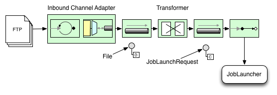

Figure 1. Launch Batch Job

<a id="spring-batch-integration-launching-jobs-through-messages--transforming-a-file-into-a-joblaunchrequest"></a>

## Transforming a File into a JobLaunchRequest

The following example transforms a file into a `JobLaunchRequest`:

```java
import org.springframework.batch.core.Job;
import org.springframework.batch.core.JobParametersBuilder;
import org.springframework.batch.integration.launch.JobLaunchRequest;
import org.springframework.integration.annotation.Transformer;
import org.springframework.messaging.Message;

import java.io.File;

public class FileMessageToJobRequest {
    private Job job;
    private String fileParameterName;

    public void setFileParameterName(String fileParameterName) {
        this.fileParameterName = fileParameterName;
    }

    public void setJob(Job job) {
        this.job = job;
    }

    @Transformer
    public JobLaunchRequest toRequest(Message<File> message) {
        JobParametersBuilder jobParametersBuilder =
            new JobParametersBuilder();

        jobParametersBuilder.addString(fileParameterName,
            message.getPayload().getAbsolutePath());

        return new JobLaunchRequest(job, jobParametersBuilder.toJobParameters());
    }
}
```

<a id="spring-batch-integration-launching-jobs-through-messages--the-jobexecution-response"></a>

## The JobExecution Response

When a batch job is being executed, a
`JobExecution` instance is returned. You can use this
instance to determine the status of an execution. If
a `JobExecution` is able to be created
successfully, it is always returned, regardless of whether
or not the actual execution is successful.

The exact behavior on how the `JobExecution`
instance is returned depends on the provided
`TaskExecutor`. If a
`synchronous` (single-threaded)
`TaskExecutor` implementation is used, the
`JobExecution` response is returned only
`after` the job completes. When using an
`asynchronous`
`TaskExecutor`, the
`JobExecution` instance is returned
immediately. You can then take the `id` of
`JobExecution` instance
(with `JobExecution.getJobInstanceId()`) and query the
`JobRepository` for the job’s updated status
using the `JobExplorer`. For more
information, see
[Querying the Repository](#job-advanced-meta-data--queryingrepository).

<a id="spring-batch-integration-launching-jobs-through-messages--spring-batch-integration-configuration"></a>

## Spring Batch Integration Configuration

Consider a case where someone needs to create a file `inbound-channel-adapter` to listen
for CSV files in the provided directory, hand them off to a transformer
(`FileMessageToJobRequest`), launch the job through the job launching gateway, and
log the output of the `JobExecution` with the `logging-channel-adapter`.

- Java
- XML

The following example shows how that common case can be configured in Java:

Java Configuration

```java
@Bean
public FileMessageToJobRequest fileMessageToJobRequest() {
    FileMessageToJobRequest fileMessageToJobRequest = new FileMessageToJobRequest();
    fileMessageToJobRequest.setFileParameterName("input.file.name");
    fileMessageToJobRequest.setJob(personJob());
    return fileMessageToJobRequest;
}

@Bean
public JobLaunchingGateway jobLaunchingGateway() {
    TaskExecutorJobLauncher jobLauncher = new TaskExecutorJobLauncher();
    jobLauncher.setJobRepository(jobRepository);
    jobLauncher.setTaskExecutor(new SyncTaskExecutor());
    JobLaunchingGateway jobLaunchingGateway = new JobLaunchingGateway(jobLauncher);

    return jobLaunchingGateway;
}

@Bean
public IntegrationFlow integrationFlow(JobLaunchingGateway jobLaunchingGateway) {
    return IntegrationFlow.from(Files.inboundAdapter(new File("/tmp/myfiles")).
                    filter(new SimplePatternFileListFilter("*.csv")),
            c -> c.poller(Pollers.fixedRate(1000).maxMessagesPerPoll(1))).
            transform(fileMessageToJobRequest()).
            handle(jobLaunchingGateway).
            log(LoggingHandler.Level.WARN, "headers.id + ': ' + payload").
            get();
}
```

The following example shows how that common case can be configured in XML:

XML Configuration

```xml
<int:channel id="inboundFileChannel"/>
<int:channel id="outboundJobRequestChannel"/>
<int:channel id="jobLaunchReplyChannel"/>

<int-file:inbound-channel-adapter id="filePoller"
    channel="inboundFileChannel"
    directory="file:/tmp/myfiles/"
    filename-pattern="*.csv">
  <int:poller fixed-rate="1000"/>
</int-file:inbound-channel-adapter>

<int:transformer input-channel="inboundFileChannel"
    output-channel="outboundJobRequestChannel">
  <bean class="io.spring.sbi.FileMessageToJobRequest">
    <property name="job" ref="personJob"/>
    <property name="fileParameterName" value="input.file.name"/>
  </bean>
</int:transformer>

<batch-int:job-launching-gateway request-channel="outboundJobRequestChannel"
    reply-channel="jobLaunchReplyChannel"/>

<int:logging-channel-adapter channel="jobLaunchReplyChannel"/>
```

<a id="spring-batch-integration-launching-jobs-through-messages--example-itemreader-configuration"></a>

## Example ItemReader Configuration

Now that we are polling for files and launching jobs, we need to configure our Spring
Batch `ItemReader` (for example) to use the files found at the location defined by the job
parameter called "input.file.name", as the following bean configuration shows:

- Java
- XML

The following Java example shows the necessary bean configuration:

Java Configuration

```java
@Bean @StepScope public ItemReader sampleReader(@Value("#{jobParameters[input.file.name]}") String resource) {...FlatFileItemReader flatFileItemReader = new FlatFileItemReader(); flatFileItemReader.setResource(new FileSystemResource(resource)); ...return flatFileItemReader;}
```

The following XML example shows the necessary bean configuration:

XML Configuration

```xml
<bean id="itemReader" class="org.springframework.batch.infrastructure.item.file.FlatFileItemReader"
    scope="step">
  <property name="resource" value="file://#{jobParameters['input.file.name']}"/>
    ...
</bean>
```

The main points of interest in the preceding example are injecting the value of
`#{jobParameters['input.file.name']}`
as the Resource property value and setting the `ItemReader` bean
to have step scope. Setting the bean to have step scope takes advantage of
the late binding support, which allows access to the
`jobParameters` variable.

[Namespace Support](#spring-batch-integration-namespace-support)
[Available Attributes of the Job-Launching Gateway](#spring-batch-integration-available-attributes-of-the-job-launching-gateway)

---

<a id="spring-batch-integration-available-attributes-of-the-job-launching-gateway"></a>

<!-- source_url: https://docs.spring.io/spring-batch/reference/spring-batch-integration/available-attributes-of-the-job-launching-gateway.html -->

<!-- page_index: 53 -->

# Available Attributes of the Job-Launching Gateway

<svg enable-background="new 0 0 32 32" id="Glyph" version="1.1" viewbox="0 0 32 32" xml:space="preserve" xmlns="http://www.w3.org/2000/svg" xmlns:xlink="http://www.w3.org/1999/xlink">
<path id="XMLID_223_"></path>
</svg>

Search

<a id="spring-batch-integration-available-attributes-of-the-job-launching-gateway--page-title"></a>
<a id="spring-batch-integration-available-attributes-of-the-job-launching-gateway--available-attributes-of-the-job-launching-gateway"></a>

# Available Attributes of the Job-Launching Gateway

The job-launching gateway has the following attributes that you can set to control a job:

- `id`: Identifies the underlying Spring bean definition, which is an instance of either:

  - `EventDrivenConsumer`
  - `PollingConsumer`
    (The exact implementation depends on whether the component’s input channel is a
    `SubscribableChannel` or a `PollableChannel`.)
- `auto-startup`: Boolean flag to indicate that the endpoint should start automatically on
  startup. The default is `true`.
- `request-channel`: The input `MessageChannel` of this endpoint.
- `reply-channel`: `MessageChannel` to which the resulting `JobExecution` payload is sent.
- `reply-timeout`: Lets you specify how long (in milliseconds) this gateway waits for the reply message
  to be sent successfully to the reply channel before throwing
  an exception. This attribute applies only when the channel
  might block (for example, when using a bounded queue channel
  that is currently full). Also, keep in mind that, when sending to a
  `DirectChannel`, the invocation occurs
  in the sender’s thread. Therefore, the failing of the send
  operation may be caused by other components further downstream.
  The `reply-timeout` attribute maps to the
  `sendTimeout` property of the underlying
  `MessagingTemplate` instance. If not specified, the attribute
  defaults to -1,
  meaning that, by default, the `Gateway` waits indefinitely.
- `job-launcher`: Optional. Accepts a
  custom
  `JobLauncher`
  bean reference.
  If not specified, the adapter
  re-uses the instance that is registered under the `id` of
  `jobLauncher`. If no default instance
  exists, an exception is thrown.
- `order`: Specifies the order of invocation when this endpoint is connected as a subscriber
  to a `SubscribableChannel`.

When this `Gateway` is receiving messages from a
`PollableChannel`, you must either provide
a global default `Poller` or provide a `Poller` sub-element to the
`Job Launching Gateway`.

- Java
- XML

The following example shows how to provide a poller in Java:

Java Configuration

```java
@Bean
@ServiceActivator(inputChannel = "queueChannel", poller = @Poller(fixedRate="1000"))
public JobLaunchingGateway sampleJobLaunchingGateway() {
    JobLaunchingGateway jobLaunchingGateway = new JobLaunchingGateway(jobLauncher());
    jobLaunchingGateway.setOutputChannel(replyChannel());
    return jobLaunchingGateway;
}
```

The following example shows how to provide a poller in XML:

XML Configuration

```xml
<batch-int:job-launching-gateway request-channel="queueChannel"
    reply-channel="replyChannel" job-launcher="jobLauncher">
  <int:poller fixed-rate="1000">
</batch-int:job-launching-gateway>
```

[Launching Batch Jobs through Messages](#spring-batch-integration-launching-jobs-through-messages)
[Providing Feedback with Informational Messages](#spring-batch-integration-providing-feedback-with-informational-messages)

---

<a id="spring-batch-integration-providing-feedback-with-informational-messages"></a>

<!-- source_url: https://docs.spring.io/spring-batch/reference/spring-batch-integration/providing-feedback-with-informational-messages.html -->

<!-- page_index: 54 -->

# Untitled :: Spring Batch Reference

<svg enable-background="new 0 0 32 32" id="Glyph" version="1.1" viewbox="0 0 32 32" xml:space="preserve" xmlns="http://www.w3.org/2000/svg" xmlns:xlink="http://www.w3.org/1999/xlink">
<path id="XMLID_223_"></path>
</svg>

Search

<a id="spring-batch-integration-providing-feedback-with-informational-messages--providing-feedback-with-informational-messages"></a>

## Providing Feedback with Informational Messages

As Spring Batch jobs can run for long times, providing progress
information is often critical. For example, stakeholders may want
to be notified if some or all parts of a batch job have failed.
Spring Batch provides support for this information being gathered
through:

- Active polling
- Event-driven listeners

When starting a Spring Batch job asynchronously (for example, by using the Job Launching
Gateway), a `JobExecution` instance is returned. Thus, you can use `JobExecution.getJobInstanceId()`
to continuously poll for status updates by retrieving updated instances of the
`JobExecution` from the `JobRepository` by using the `JobExplorer`. However, this is
considered sub-optimal, and an event-driven approach is preferred.

Therefore, Spring Batch provides listeners, including the three most commonly used
listeners:

- `StepListener`
- `ChunkListener`
- `JobExecutionListener`

In the example shown in the following image, a Spring Batch job has been configured with a
`StepExecutionListener`. Thus, Spring Integration receives and processes any step before
or after events. For example, you can inspect the received `StepExecution` by using a
`Router`. Based on the results of that inspection, various things can occur (such as
routing a message to a mail outbound channel adapter), so that an email notification can
be sent out based on some condition.

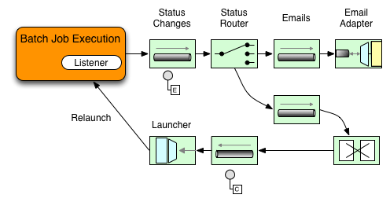

Figure 1. Handling Informational Messages

The following two-part example shows how a listener is configured to send a
message to a `Gateway` for a `StepExecution` events and log its output to a
`logging-channel-adapter`.

First, create the notification integration beans.

- Java
- XML

The following example shows the how to create the notification integration beans in Java:

Java Configuration

```java
@Bean
@ServiceActivator(inputChannel = "stepExecutionsChannel")
public LoggingHandler loggingHandler() {
    LoggingHandler adapter = new LoggingHandler(LoggingHandler.Level.WARN);
    adapter.setLoggerName("TEST_LOGGER");
    adapter.setLogExpressionString("headers.id + ': ' + payload");
    return adapter;
}

@MessagingGateway(name = "notificationExecutionsListener", defaultRequestChannel = "stepExecutionsChannel")
public interface NotificationExecutionListener extends StepExecutionListener {}
```

> [!NOTE]
> You need to add the `@IntegrationComponentScan` annotation to your configuration.

The following example shows the how to create the notification integration beans in XML:

XML Configuration

```xml
<int:channel id="stepExecutionsChannel"/>

<int:gateway id="notificationExecutionsListener"
    service-interface="org.springframework.batch.core.listener.StepExecutionListener"
    default-request-channel="stepExecutionsChannel"/>

<int:logging-channel-adapter channel="stepExecutionsChannel"/>
```

Second, modify your job to add a step-level listener.

- Java
- XML

The following example shows the how to add a step-level listener in Java:

Java Configuration

```java
public Job importPaymentsJob(JobRepository jobRepository, PlatformTransactionManager transactionManager) {
    return new JobBuilder("importPayments", jobRepository)
        .start(new StepBuilder("step1", jobRepository)
                .chunk(200, transactionManager)
                .listener(notificationExecutionsListener())
                // ...
                .build();
              )
        .build();
}
```

The following example shows the how to add a step-level listener in XML:

XML Configuration

```xml
<job id="importPayments">
    <step id="step1">
        <tasklet ../>
            <chunk ../>
            <listeners>
                <listener ref="notificationExecutionsListener"/>
            </listeners>
        </tasklet>
        ...
    </step>
</job>
```

[Available Attributes of the Job-Launching Gateway](#spring-batch-integration-available-attributes-of-the-job-launching-gateway)
[Asynchronous Processors](#spring-batch-integration-asynchronous-processing)

---

<a id="spring-batch-integration-asynchronous-processing"></a>

<!-- source_url: https://docs.spring.io/spring-batch/reference/spring-batch-integration/asynchronous-processing.html -->

<!-- page_index: 55 -->

# Untitled :: Spring Batch Reference

<svg enable-background="new 0 0 32 32" id="Glyph" version="1.1" viewbox="0 0 32 32" xml:space="preserve" xmlns="http://www.w3.org/2000/svg" xmlns:xlink="http://www.w3.org/1999/xlink">
<path id="XMLID_223_"></path>
</svg>

Search

<a id="spring-batch-integration-asynchronous-processing--asynchronous-processors"></a>

## Asynchronous Processors

Asynchronous Processors help you scale the processing of items. In the asynchronous
processor use case, an `AsyncItemProcessor` serves as a dispatcher, executing the logic of
the `ItemProcessor` for an item on a new thread. Once the item completes, the `Future` is
passed to the `AsyncItemWriter` to be written.

Therefore, you can increase performance by using asynchronous item processing, basically
letting you implement fork-join scenarios. The `AsyncItemWriter` gathers the results and
writes back the chunk as soon as all the results become available.

- Java
- XML

The following example shows how to configuration the `AsyncItemProcessor` in Java:

Java Configuration

```java
@Bean
public AsyncItemProcessor processor(ItemProcessor itemProcessor, TaskExecutor taskExecutor) {
    AsyncItemProcessor asyncItemProcessor = new AsyncItemProcessor();
    asyncItemProcessor.setTaskExecutor(taskExecutor);
    asyncItemProcessor.setDelegate(itemProcessor);
    return asyncItemProcessor;
}
```

The following example shows how to configuration the `AsyncItemProcessor` in XML:

XML Configuration

```xml
<bean id="processor"
    class="org.springframework.batch.integration.async.AsyncItemProcessor">
  <property name="delegate">
    <bean class="your.ItemProcessor"/>
  </property>
  <property name="taskExecutor">
    <bean class="org.springframework.core.task.SimpleAsyncTaskExecutor"/>
  </property>
</bean>
```

The `delegate` property refers to your `ItemProcessor` bean, and the `taskExecutor`
property refers to the `TaskExecutor` of your choice.

- Java
- XML

The following example shows how to configure the `AsyncItemWriter` in Java:

Java Configuration

```java
@Bean
public AsyncItemWriter writer(ItemWriter itemWriter) {
    AsyncItemWriter asyncItemWriter = new AsyncItemWriter();
    asyncItemWriter.setDelegate(itemWriter);
    return asyncItemWriter;
}
```

The following example shows how to configure the `AsyncItemWriter` in XML:

XML Configuration

```xml
<bean id="itemWriter"
    class="org.springframework.batch.integration.async.AsyncItemWriter">
  <property name="delegate">
    <bean id="itemWriter" class="your.ItemWriter"/>
  </property>
</bean>
```

Again, the `delegate` property is
actually a reference to your `ItemWriter` bean.

[Providing Feedback with Informational Messages](#spring-batch-integration-providing-feedback-with-informational-messages)
[Externalizing Batch Process Execution](#spring-batch-integration-externalizing-execution)

---

<a id="spring-batch-integration-externalizing-execution"></a>

<!-- source_url: https://docs.spring.io/spring-batch/reference/spring-batch-integration/externalizing-execution.html -->

<!-- page_index: 56 -->

# Untitled :: Spring Batch Reference

<svg enable-background="new 0 0 32 32" id="Glyph" version="1.1" viewbox="0 0 32 32" xml:space="preserve" xmlns="http://www.w3.org/2000/svg" xmlns:xlink="http://www.w3.org/1999/xlink">
<path id="XMLID_223_"></path>
</svg>

Search

<a id="spring-batch-integration-externalizing-execution--externalizing-batch-process-execution"></a>

## Externalizing Batch Process Execution

The integration approaches discussed so far suggest use cases
where Spring Integration wraps Spring Batch like an outer shell.
However, Spring Batch can also use Spring Integration internally.
By using this approach, Spring Batch users can delegate the
processing of items or even chunks to outside processes. This
lets you offload complex processing. Spring Batch Integration
provides dedicated support for:

- Remote Chunking
- Remote Partitioning

<a id="spring-batch-integration-externalizing-execution--remote-chunking"></a>

### Remote Chunking

The following image shows one way that remote chunking works when you use Spring Batch
together with Spring Integration:

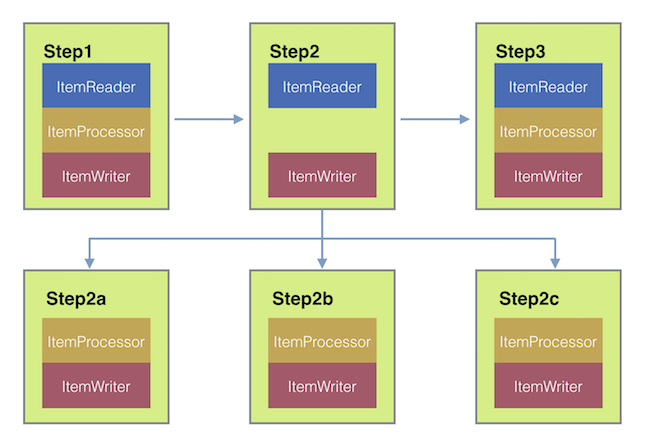

Figure 1. Remote Chunking

Taking things one step further, you can also externalize the
chunk processing by using the
`ChunkMessageChannelItemWriter`
(provided by Spring Batch Integration), which sends items out
and collects the result. Once sent, Spring Batch continues the
process of reading and grouping items, without waiting for the results.
Rather, it is the responsibility of the `ChunkMessageChannelItemWriter`
to gather the results and integrate them back into the Spring Batch process.

With Spring Integration, you have full
control over the concurrency of your processes (for instance, by
using a `QueueChannel` instead of a
`DirectChannel`). Furthermore, by relying on
Spring Integration’s rich collection of channel adapters (such as
JMS and AMQP), you can distribute chunks of a batch job to
external systems for processing.

- Java
- XML

A job with a step to be remotely chunked might have a configuration similar to the
following in Java:

Java Configuration

```java
public Job chunkJob(JobRepository jobRepository, PlatformTransactionManager transactionManager) {
     return new JobBuilder("personJob", jobRepository)
             .start(new StepBuilder("step1", jobRepository)
                     .<Person, Person>chunk(200, transactionManager)
                     .reader(itemReader())
                     .writer(itemWriter())
                     .build())
             .build();
 }
```

A job with a step to be remotely chunked might have a configuration similar to the
following in XML:

XML Configuration

```xml
<job id="personJob">
  <step id="step1">
    <tasklet>
      <chunk reader="itemReader" writer="itemWriter" commit-interval="200"/>
    </tasklet>
    ...
  </step>
</job>
```

The `ItemReader` reference points to the bean you want to use for reading data on the
manager. The `ItemWriter` reference points to a special `ItemWriter` (called
`ChunkMessageChannelItemWriter`), as described earlier. The processor (if any) is left off
the manager configuration, as it is configured on the worker. You should check any
additional component properties, such as throttle limits and so on, when implementing
your use case.

- Java
- XML

The following Java configuration provides a basic manager setup:

Java Configuration

```java
@Bean public org.apache.activemq.ActiveMQConnectionFactory connectionFactory() {ActiveMQConnectionFactory factory = new ActiveMQConnectionFactory(); factory.setBrokerURL("tcp://localhost:61616"); return factory;}
/* * Configure outbound flow (requests going to workers) */ @Bean public DirectChannel requests() {return new DirectChannel();}
@Bean public IntegrationFlow outboundFlow(ActiveMQConnectionFactory connectionFactory) {return IntegrationFlow .from(requests()) .handle(Jms.outboundAdapter(connectionFactory).destination("requests")) .get();}
/* * Configure inbound flow (replies coming from workers) */ @Bean public QueueChannel replies() {return new QueueChannel();}
@Bean public IntegrationFlow inboundFlow(ActiveMQConnectionFactory connectionFactory) {return IntegrationFlow .from(Jms.messageDrivenChannelAdapter(connectionFactory).destination("replies")) .channel(replies()) .get();}
/* * Configure the ChunkMessageChannelItemWriter */ @Bean public ItemWriter<Integer> itemWriter() {MessagingTemplate messagingTemplate = new MessagingTemplate(); messagingTemplate.setDefaultChannel(requests()); messagingTemplate.setReceiveTimeout(2000); ChunkMessageChannelItemWriter<Integer> chunkMessageChannelItemWriter = new ChunkMessageChannelItemWriter<>(); chunkMessageChannelItemWriter.setMessagingOperations(messagingTemplate); chunkMessageChannelItemWriter.setReplyChannel(replies()); return chunkMessageChannelItemWriter;}
```

The following XML configuration provides a basic manager setup:

XML Configuration

```xml
<bean id="connectionFactory" class="org.apache.activemq.ActiveMQConnectionFactory">
  <property name="brokerURL" value="tcp://localhost:61616"/>
</bean>

<int-jms:outbound-channel-adapter id="jmsRequests" destination-name="requests"/>

<bean id="messagingTemplate"
    class="org.springframework.integration.core.MessagingTemplate">
  <property name="defaultChannel" ref="requests"/>
  <property name="receiveTimeout" value="2000"/>
</bean>

<bean id="itemWriter"
    class="org.springframework.batch.integration.chunk.ChunkMessageChannelItemWriter"
    scope="step">
  <property name="messagingOperations" ref="messagingTemplate"/>
  <property name="replyChannel" ref="replies"/>
</bean>

<int:channel id="replies">
  <int:queue/>
</int:channel>

<int-jms:message-driven-channel-adapter id="jmsReplies"
    destination-name="replies"
    channel="replies"/>
```

The preceding configuration provides us with a number of beans. We
configure our messaging middleware by using ActiveMQ and the
inbound and outbound JMS adapters provided by Spring Integration. As
shown, our `itemWriter` bean, which is
referenced by our job step, uses the
`ChunkMessageChannelItemWriter` to write chunks over the
configured middleware.

Now we can move on to the worker configuration, as the following example shows:

- Java
- XML

The following example shows the worker configuration in Java:

Java Configuration

```java
@Bean public org.apache.activemq.ActiveMQConnectionFactory connectionFactory() {ActiveMQConnectionFactory factory = new ActiveMQConnectionFactory(); factory.setBrokerURL("tcp://localhost:61616"); return factory;}
/* * Configure inbound flow (requests coming from the manager) */ @Bean public DirectChannel requests() {return new DirectChannel();}
@Bean public IntegrationFlow inboundFlow(ActiveMQConnectionFactory connectionFactory) {return IntegrationFlow .from(Jms.messageDrivenChannelAdapter(connectionFactory).destination("requests")) .channel(requests()) .get();}
/* * Configure outbound flow (replies going to the manager) */ @Bean public DirectChannel replies() {return new DirectChannel();}
@Bean public IntegrationFlow outboundFlow(ActiveMQConnectionFactory connectionFactory) {return IntegrationFlow .from(replies()) .handle(Jms.outboundAdapter(connectionFactory).destination("replies")) .get();}
/* * Configure the ChunkProcessorChunkHandler */ @Bean @ServiceActivator(inputChannel = "requests", outputChannel = "replies") public ChunkProcessorChunkHandler<Integer> chunkProcessorChunkHandler() {ChunkProcessor<Integer> chunkProcessor = new SimpleChunkProcessor<>(itemProcessor(), itemWriter()); ChunkProcessorChunkHandler<Integer> chunkProcessorChunkHandler = new ChunkProcessorChunkHandler<>(); chunkProcessorChunkHandler.setChunkProcessor(chunkProcessor); return chunkProcessorChunkHandler;}
```

The following example shows the worker configuration in XML:

XML Configuration

```xml
<bean id="connectionFactory" class="org.apache.activemq.ActiveMQConnectionFactory">
  <property name="brokerURL" value="tcp://localhost:61616"/>
</bean>

<int:channel id="requests"/>
<int:channel id="replies"/>

<int-jms:message-driven-channel-adapter id="incomingRequests"
    destination-name="requests"
    channel="requests"/>

<int-jms:outbound-channel-adapter id="outgoingReplies"
    destination-name="replies"
    channel="replies">
</int-jms:outbound-channel-adapter>

<int:service-activator id="serviceActivator"
    input-channel="requests"
    output-channel="replies"
    ref="chunkProcessorChunkHandler"
    method="handleChunk"/>

<bean id="chunkProcessorChunkHandler"
    class="org.springframework.batch.integration.chunk.ChunkProcessorChunkRequestHandler">
  <property name="chunkProcessor">
    <bean class="org.springframework.batch.core.step.item.SimpleChunkProcessor">
      <property name="itemWriter">
        <bean class="io.spring.sbi.PersonItemWriter"/>
      </property>
      <property name="itemProcessor">
        <bean class="io.spring.sbi.PersonItemProcessor"/>
      </property>
    </bean>
  </property>
</bean>
```

Most of these configuration items should look familiar from the
manager configuration. Workers do not need access to
the Spring Batch `JobRepository` nor
to the actual job configuration file. The main bean of interest
is the `chunkProcessorChunkHandler`. The
`chunkProcessor` property of `ChunkProcessorChunkRequestHandler` takes a
configured `SimpleChunkProcessor`, which is where you would provide a reference to your
`ItemWriter` (and, optionally, your
`ItemProcessor`) that will run on the worker
when it receives chunks from the manager.

For more information, see the section of the “Scalability” chapter on
[Remote Chunking](https://docs.spring.io/spring-batch/reference/spring-batch-integration/$$https:/docs.spring.io/spring-batch/reference/scalability.html#remoteChunking).

Starting from version 4.1, Spring Batch Integration introduces the `@EnableBatchIntegration`
annotation that can be used to simplify a remote chunking setup. This annotation provides
two beans that you can autowire in your application context:

- `RemoteChunkingManagerStepBuilderFactory`: Configures the manager step
- `RemoteChunkingWorkerBuilder`: Configures the remote worker integration flow

These APIs take care of configuring a number of components, as the following diagram shows:

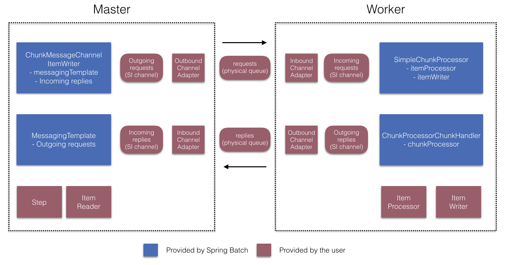

Figure 2. Remote Chunking Configuration

On the manager side, the `RemoteChunkingManagerStepBuilderFactory` lets you
configure a manager step by declaring:

- The item reader to read items and send them to workers
- The output channel ("Outgoing requests") to send requests to workers
- The input channel ("Incoming replies") to receive replies from workers

You need not explicitly configure `ChunkMessageChannelItemWriter` and the `MessagingTemplate`.
(You can still explicitly configure them if find a reason to do so).

On the worker side, the `RemoteChunkingWorkerBuilder` lets you configure a worker to:

- Listen to requests sent by the manager on the input channel (“Incoming requests”)
- Call the `handleChunk` method of `ChunkProcessorChunkRequestHandler` for each request
  with the configured `ItemProcessor` and `ItemWriter`
- Send replies on the output channel (“Outgoing replies”) to the manager

You need not explicitly configure the `SimpleChunkProcessor`
and the `ChunkProcessorChunkRequestHandler`. (You can still explicitly configure them if you find
a reason to do so).

The following example shows how to use these APIs:

```java
@EnableBatchIntegration
@EnableBatchProcessing
public class RemoteChunkingJobConfiguration {

    @Configuration
    public static class ManagerConfiguration {

        @Autowired
        private RemoteChunkingManagerStepBuilderFactory managerStepBuilderFactory;

        @Bean
        public TaskletStep managerStep() {
            return this.managerStepBuilderFactory.get("managerStep")
                       .chunk(100)
                       .reader(itemReader())
                       .outputChannel(requests()) // requests sent to workers
                       .inputChannel(replies())   // replies received from workers
                       .build();
        }

        // Middleware beans setup omitted

    }

    @Configuration
    public static class WorkerConfiguration {

        @Autowired
        private RemoteChunkingWorkerBuilder workerBuilder;

        @Bean
        public IntegrationFlow workerFlow() {
            return this.workerBuilder
                       .itemProcessor(itemProcessor())
                       .itemWriter(itemWriter())
                       .inputChannel(requests()) // requests received from the manager
                       .outputChannel(replies()) // replies sent to the manager
                       .build();
        }

        // Middleware beans setup omitted

    }

}
```

You can find a complete example of a remote chunking job
[here](https://github.com/spring-projects/spring-batch/tree/main/spring-batch-samples#remote-chunking-sample).

<a id="spring-batch-integration-externalizing-execution--remote-partitioning"></a>

### Remote Partitioning

The following image shows a typical remote partitioning situation:

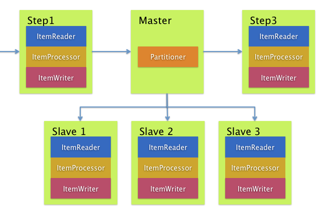

Figure 3. Remote Partitioning

Remote Partitioning, on the other hand, is useful when it
is not the processing of items but rather the associated I/O that
causes the bottleneck. With remote partitioning, you can send work
to workers that execute complete Spring Batch
steps. Thus, each worker has its own `ItemReader`, `ItemProcessor`, and
`ItemWriter`. For this purpose, Spring Batch
Integration provides the `MessageChannelPartitionHandler`.

This implementation of the `PartitionHandler`
interface uses `MessageChannel` instances to
send instructions to remote workers and receive their responses.
This provides a nice abstraction from the transports (such as JMS
and AMQP) being used to communicate with the remote workers.

The section of the “Scalability” chapter that addresses
[remote partitioning](#scalability--partitioning) provides an overview of the concepts and
components needed to configure remote partitioning and shows an
example of using the default
`TaskExecutorPartitionHandler` to partition
in separate local threads of execution. For remote partitioning
to multiple JVMs, two additional components are required:

- A remoting fabric or grid environment
- A `PartitionHandler` implementation that supports the desired
  remoting fabric or grid environment

Similar to remote chunking, you can use JMS as the “remoting fabric”. In that case, use
a `MessageChannelPartitionHandler` instance as the `PartitionHandler` implementation, as described earlier.

- Java
- XML

The following example assumes an existing partitioned job and focuses on the
`MessageChannelPartitionHandler` and JMS configuration in Java:

Java Configuration

```java
/*
 * Configuration of the manager side
 */
@Bean
public PartitionHandler partitionHandler() {
    MessageChannelPartitionHandler partitionHandler = new MessageChannelPartitionHandler();
    partitionHandler.setStepName("step1");
    partitionHandler.setGridSize(3);
    partitionHandler.setReplyChannel(outboundReplies());
    MessagingTemplate template = new MessagingTemplate();
    template.setDefaultChannel(outboundRequests());
    template.setReceiveTimeout(100000);
    partitionHandler.setMessagingOperations(template);
    return partitionHandler;
}

@Bean
public QueueChannel outboundReplies() {
    return new QueueChannel();
}

@Bean
public DirectChannel outboundRequests() {
    return new DirectChannel();
}

@Bean
public IntegrationFlow outboundJmsRequests() {
    return IntegrationFlow.from("outboundRequests")
            .handle(Jms.outboundGateway(connectionFactory())
                    .requestDestination("requestsQueue"))
            .get();
}

@Bean
@ServiceActivator(inputChannel = "inboundStaging")
public AggregatorFactoryBean partitioningMessageHandler() throws Exception {
    AggregatorFactoryBean aggregatorFactoryBean = new AggregatorFactoryBean();
    aggregatorFactoryBean.setProcessorBean(partitionHandler());
    aggregatorFactoryBean.setOutputChannel(outboundReplies());
    // configure other propeties of the aggregatorFactoryBean
    return aggregatorFactoryBean;
}

@Bean
public DirectChannel inboundStaging() {
    return new DirectChannel();
}

@Bean
public IntegrationFlow inboundJmsStaging() {
    return IntegrationFlow
            .from(Jms.messageDrivenChannelAdapter(connectionFactory())
                    .configureListenerContainer(c -> c.subscriptionDurable(false))
                    .destination("stagingQueue"))
            .channel(inboundStaging())
            .get();
}

/*
 * Configuration of the worker side
 */
@Bean
public StepExecutionRequestHandler stepExecutionRequestHandler() {
    StepExecutionRequestHandler stepExecutionRequestHandler = new StepExecutionRequestHandler();
    stepExecutionRequestHandler.setJobExplorer(jobExplorer);
    stepExecutionRequestHandler.setStepLocator(stepLocator());
    return stepExecutionRequestHandler;
}

@Bean
@ServiceActivator(inputChannel = "inboundRequests", outputChannel = "outboundStaging")
public StepExecutionRequestHandler serviceActivator() throws Exception {
    return stepExecutionRequestHandler();
}

@Bean
public DirectChannel inboundRequests() {
    return new DirectChannel();
}

public IntegrationFlow inboundJmsRequests() {
    return IntegrationFlow
            .from(Jms.messageDrivenChannelAdapter(connectionFactory())
                    .configureListenerContainer(c -> c.subscriptionDurable(false))
                    .destination("requestsQueue"))
            .channel(inboundRequests())
            .get();
}

@Bean
public DirectChannel outboundStaging() {
    return new DirectChannel();
}

@Bean
public IntegrationFlow outboundJmsStaging() {
    return IntegrationFlow.from("outboundStaging")
            .handle(Jms.outboundGateway(connectionFactory())
                    .requestDestination("stagingQueue"))
            .get();
}
```

The following example assumes an existing partitioned job and focuses on the
`MessageChannelPartitionHandler` and JMS configuration in XML:

XML Configuration

```xml
<bean id="partitionHandler"
   class="org.springframework.batch.integration.partition.MessageChannelPartitionHandler">
  <property name="stepName" value="step1"/>
  <property name="gridSize" value="3"/>
  <property name="replyChannel" ref="outbound-replies"/>
  <property name="messagingOperations">
    <bean class="org.springframework.integration.core.MessagingTemplate">
      <property name="defaultChannel" ref="outbound-requests"/>
      <property name="receiveTimeout" value="100000"/>
    </bean>
  </property>
</bean>

<int:channel id="outbound-requests"/>
<int-jms:outbound-channel-adapter destination="requestsQueue"
    channel="outbound-requests"/>

<int:channel id="inbound-requests"/>
<int-jms:message-driven-channel-adapter destination="requestsQueue"
    channel="inbound-requests"/>

<bean id="stepExecutionRequestHandler"
    class="org.springframework.batch.integration.partition.StepExecutionRequestHandler">
  <property name="jobExplorer" ref="jobExplorer"/>
  <property name="stepLocator" ref="stepLocator"/>
</bean>

<int:service-activator ref="stepExecutionRequestHandler" input-channel="inbound-requests"
    output-channel="outbound-staging"/>

<int:channel id="outbound-staging"/>
<int-jms:outbound-channel-adapter destination="stagingQueue"
    channel="outbound-staging"/>

<int:channel id="inbound-staging"/>
<int-jms:message-driven-channel-adapter destination="stagingQueue"
    channel="inbound-staging"/>

<int:aggregator ref="partitionHandler" input-channel="inbound-staging"
    output-channel="outbound-replies"/>

<int:channel id="outbound-replies">
  <int:queue/>
</int:channel>

<bean id="stepLocator"
    class="org.springframework.batch.integration.partition.BeanFactoryStepLocator" />
```

You must also ensure that the partition `handler` attribute maps to the `partitionHandler`
bean.

- Java
- XML

The following example maps the partition `handler` attribute to the `partitionHandler` in
Java:

Java Configuration

```java
	public Job personJob(JobRepository jobRepository) {
		return new JobBuilder("personJob", jobRepository)
				.start(new StepBuilder("step1.manager", jobRepository)
						.partitioner("step1.worker", partitioner())
						.partitionHandler(partitionHandler())
						.build())
				.build();
	}
```

The following example maps the partition `handler` attribute to the `partitionHandler` in
XML:

XML Configuration

```xml
<job id="personJob">
  <step id="step1.manager">
    <partition partitioner="partitioner" handler="partitionHandler"/>
    ...
  </step>
</job>
```

You can find a complete example of a remote partitioning job
[here](https://github.com/spring-projects/spring-batch/tree/main/spring-batch-samples#remote-partitioning-sample).

You can use the `@EnableBatchIntegration` annotation to simplify a remote
partitioning setup. This annotation provides two beans that are useful for remote partitioning:

- `RemotePartitioningManagerStepBuilderFactory`: Configures the manager step
- `RemotePartitioningWorkerStepBuilderFactory`: Configures the worker step

These APIs take care of configuring a number of components, as the following diagrams show:

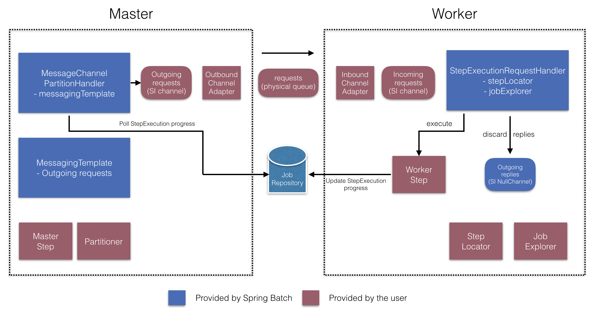

Figure 4. Remote Partitioning Configuration (with job repository polling)

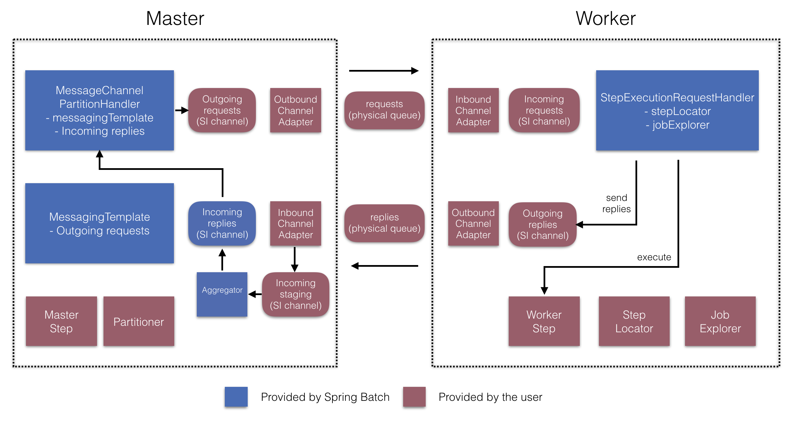

Figure 5. Remote Partitioning Configuration (with replies aggregation)

On the manager side, the `RemotePartitioningManagerStepBuilderFactory` lets you
configure a manager step by declaring:

- The `Partitioner` used to partition data
- The output channel (“Outgoing requests”) on which to send requests to workers
- The input channel (“Incoming replies”) on which to receive replies from workers (when configuring replies aggregation)
- The poll interval and timeout parameters (when configuring job repository polling)

You need not explicitly configure The `MessageChannelPartitionHandler` and the `MessagingTemplate`.
(You can still explicitly configured them if you find a reason to do so).

On the worker side, the `RemotePartitioningWorkerStepBuilderFactory` lets you configure a worker to:

- Listen to requests sent by the manager on the input channel (“Incoming requests”)
- Call the `handle` method of `StepExecutionRequestHandler` for each request
- Send replies on the output channel (“Outgoing replies”) to the manager

You need not explicitly configure the `StepExecutionRequestHandler`.
(You can explicitly configure it if you find a reason to do so).

The following example shows how to use these APIs:

```java
@Configuration
@EnableBatchProcessing
@EnableBatchIntegration
public class RemotePartitioningJobConfiguration {

    @Configuration
    public static class ManagerConfiguration {

        @Autowired
        private RemotePartitioningManagerStepBuilderFactory managerStepBuilderFactory;

        @Bean
        public Step managerStep() {
                 return this.managerStepBuilderFactory
                    .get("managerStep")
                    .partitioner("workerStep", partitioner())
                    .gridSize(10)
                    .outputChannel(outgoingRequestsToWorkers())
                    .inputChannel(incomingRepliesFromWorkers())
                    .build();
        }

        // Middleware beans setup omitted

    }

    @Configuration
    public static class WorkerConfiguration {

        @Autowired
        private RemotePartitioningWorkerStepBuilderFactory workerStepBuilderFactory;

        @Bean
        public Step workerStep() {
                 return this.workerStepBuilderFactory
                    .get("workerStep")
                    .inputChannel(incomingRequestsFromManager())
                    .outputChannel(outgoingRepliesToManager())
                    .chunk(100)
                    .reader(itemReader())
                    .processor(itemProcessor())
                    .writer(itemWriter())
                    .build();
        }

        // Middleware beans setup omitted

    }

}
```

[Asynchronous Processors](#spring-batch-integration-asynchronous-processing)
[Spring Batch Observability](#spring-batch-observability)

---

<a id="spring-batch-observability"></a>

<!-- source_url: https://docs.spring.io/spring-batch/reference/spring-batch-observability.html -->

<!-- page_index: 57 -->

# Spring Batch Observability

<svg enable-background="new 0 0 32 32" id="Glyph" version="1.1" viewbox="0 0 32 32" xml:space="preserve" xmlns="http://www.w3.org/2000/svg" xmlns:xlink="http://www.w3.org/1999/xlink">
<path id="XMLID_223_"></path>
</svg>

Search

<a id="spring-batch-observability--page-title"></a>
<a id="spring-batch-observability--spring-batch-observability"></a>

# Spring Batch Observability

Observability is a critical aspect of modern applications, and Spring Batch provides robust support for monitoring and tracing batch jobs.

This section covers the integration of Spring Batch with popular observability tools such as Micrometer and Java Flight Recorder (JFR):

- [Micrometer Support](#spring-batch-observability-micrometer)
- [Java Flight Recorder Support](#spring-batch-observability-jfr)

[Externalizing Batch Process Execution](#spring-batch-integration-externalizing-execution)
[Micrometer support](#spring-batch-observability-micrometer)

---

<a id="spring-batch-observability-micrometer"></a>

<!-- source_url: https://docs.spring.io/spring-batch/reference/spring-batch-observability/micrometer.html -->

<!-- page_index: 58 -->

# Micrometer support

<svg enable-background="new 0 0 32 32" id="Glyph" version="1.1" viewbox="0 0 32 32" xml:space="preserve" xmlns="http://www.w3.org/2000/svg" xmlns:xlink="http://www.w3.org/1999/xlink">
<path id="XMLID_223_"></path>
</svg>

Search

<a id="spring-batch-observability-micrometer--page-title"></a>
<a id="spring-batch-observability-micrometer--micrometer-support"></a>

# Micrometer support

<a id="spring-batch-observability-micrometer--monitoring-and-metrics"></a>

## Monitoring and metrics

Since version 4.2, Spring Batch provides support for batch monitoring and metrics
based on [Micrometer](https://micrometer.io/). This section describes
which metrics are provided out-of-the-box and how to contribute custom metrics.

<a id="spring-batch-observability-micrometer--built-in-metrics"></a>

## Built-in metrics

Metrics collection is disabled by default. To enable it, you need to define a Micrometer
`ObservationRegistry` bean in your application context. Typically, you would need to define
which ObservationHandler to use. The following example shows how to register a `DefaultMeterObservationHandler`
that will store metrics in a `MeterRegistry` (for example, a Prometheus registry):

```java
@Bean
public ObservationRegistry observationRegistry(MeterRegistry meterRegistry) {
    ObservationRegistry observationRegistry = ObservationRegistry.create();
    observationRegistry.observationConfig()
        .observationHandler(new DefaultMeterObservationHandler(meterRegistry));
    return observationRegistry;
}
```

Spring Batch specific metrics are registered under the `spring.batch` prefix. The following
table explains all the metrics in details:

| *Metric Name* | *Type* | *Description* | *Tags* |
| --- | --- | --- | --- |
| `spring.batch.job` | `TIMER` | Duration of job execution | `name`, `status` |
| `spring.batch.job.active` | `LONG_TASK_TIMER` | Currently active job | `name` |
| `spring.batch.step` | `TIMER` | Duration of step execution | `name`, `job.name`, `status` |
| `spring.batch.step.active` | `LONG_TASK_TIMER` | Currently active step | `name` |
| `spring.batch.item.read` | `TIMER` | Duration of item reading | `job.name`, `step.name`, `status` |
| `spring.batch.item.process` | `TIMER` | Duration of item processing | `job.name`, `step.name`, `status` |
| `spring.batch.chunk.write` | `TIMER` | Duration of chunk writing | `job.name`, `step.name`, `status` |
| `spring.batch.job.launch.count` | `COUNTER` | Job launch count | N/A |

> [!NOTE]
> The `status` tag for jobs and steps is equal to the exit status. For item reading, processing
> and writing, this `status` tag can be either `SUCCESS` or `FAILURE`.

<a id="spring-batch-observability-micrometer--custom-metrics"></a>

## Custom metrics

If you want to use your own metrics in your custom components, we recommend using
Micrometer APIs directly. The following is an example of how to time a `Tasklet`:

```java
import io.micrometer.observation.Observation;
import io.micrometer.observation.ObservationRegistry;

import org.springframework.batch.core.StepContribution;
import org.springframework.batch.core.scope.context.ChunkContext;
import org.springframework.batch.core.step.tasklet.Tasklet;
import org.springframework.batch.repeat.RepeatStatus;

public class MyTimedTasklet implements Tasklet {

    private ObservationRegistry observationRegistry;

    public MyTimedTasklet(ObservationRegistry observationRegistry) {
        this.observationRegistry = observationRegistry;
    }

	@Override
	public RepeatStatus execute(StepContribution contribution, ChunkContext chunkContext) {
		Observation observation = Observation.start("my.tasklet.step", this.observationRegistry);
		try (Observation.Scope scope = observation.openScope()) {
			// do some work
		    return RepeatStatus.FINISHED;
		} catch (Exception e) {
			// handle exception
            observation.error(exception);
		} finally {
			observation.stop();
		}
	}
}
```

<a id="spring-batch-observability-micrometer--tracing"></a>

## Tracing

As of version 5, Spring Batch provides tracing through Micrometer’s `Observation` API. By default, tracing is disabled.
To enable it, you need to define an `ObservationRegistry` bean configured with an `ObservationHandler` that supports tracing, such as `TracingAwareMeterObservationHandler`:

```java
@Bean
public ObservationRegistry observationRegistry(MeterRegistry meterRegistry, Tracer tracer) {
    DefaultMeterObservationHandler observationHandler = new DefaultMeterObservationHandler(meterRegistry);
    ObservationRegistry observationRegistry = ObservationRegistry.create();
    observationRegistry.observationConfig()
            .observationHandler(new TracingAwareMeterObservationHandler<>(observationHandler, tracer));
    return observationRegistry;
}
```

With that in place, Spring Batch will create a trace for each job execution and a span for each step execution.

If you do not use `EnableBatchProcessing` or `DefaultBatchConfiguration`, you need to register a
`BatchObservabilityBeanPostProcessor` in your application context, which will automatically set Micrometer’s observation
registry in observable batch artefacts.

[Spring Batch Observability](#spring-batch-observability)
[Java Flight Recorder (JFR) support](#spring-batch-observability-jfr)

---

<a id="spring-batch-observability-jfr"></a>

<!-- source_url: https://docs.spring.io/spring-batch/reference/spring-batch-observability/jfr.html -->

<!-- page_index: 59 -->

# Java Flight Recorder (JFR) support

<svg enable-background="new 0 0 32 32" id="Glyph" version="1.1" viewbox="0 0 32 32" xml:space="preserve" xmlns="http://www.w3.org/2000/svg" xmlns:xlink="http://www.w3.org/1999/xlink">
<path id="XMLID_223_"></path>
</svg>

Search

<a id="spring-batch-observability-jfr--page-title"></a>
<a id="spring-batch-observability-jfr--java-flight-recorder-jfr-support"></a>

# Java Flight Recorder (JFR) support

As of version 6, Spring Batch provides support for Java Flight Recorder (JFR) to help you monitor and troubleshoot batch jobs. JFR is a low-overhead, event-based profiling tool built into the Java Virtual Machine (JVM) that allows developers to collect detailed information about the performance and behavior of their applications.

JFR can be enabled by adding the following JVM options when starting your Spring Batch application:

```bash
java -XX:StartFlightRecording:filename=my-batch-job.jfr,dumponexit=true -jar my-batch-job.jar
```

Once JFR is enabled, Spring Batch will automatically create JFR events for key batch processing activities, such as job and step executions, item reads and writes, as well as transaction boundaries. These events can be viewed and analyzed using tools such as Java Mission Control (JMC) or other JFR-compatible tools.

[Micrometer support](#spring-batch-observability-micrometer)
[List of ItemReaders and ItemWriters](#appendix)

---

<a id="appendix"></a>

<!-- source_url: https://docs.spring.io/spring-batch/reference/appendix.html -->

<!-- page_index: 60 -->

# List of ItemReaders and ItemWriters

<svg enable-background="new 0 0 32 32" id="Glyph" version="1.1" viewbox="0 0 32 32" xml:space="preserve" xmlns="http://www.w3.org/2000/svg" xmlns:xlink="http://www.w3.org/1999/xlink">
<path id="XMLID_223_"></path>
</svg>

Search

<a id="appendix--page-title"></a>
<a id="appendix--list-of-itemreaders-and-itemwriters"></a>

# List of ItemReaders and ItemWriters

<a id="appendix--itemreadersappendix"></a>
<a id="appendix--item-readers"></a>

## Item Readers

| Item Reader | Description | Thread-safe |
| --- | --- | --- |
| `AbstractItemStreamItemReader` | Abstract base class that combines the `ItemStream` and `ItemReader` interfaces. | Yes |
| `AbstractItemCountingItemStreamItemReader` | Abstract base class that provides basic restart capabilities by counting the number of items returned from an `ItemReader`. | No |
| `AbstractPagingItemReader` | Abstract base class that provides basic paging features | No |
| `AbstractPaginatedDataItemReader` | Abstract base class that provides basic paging features based on Spring Data’s paginated facilities | No |
| `AggregateItemReader` | An `ItemReader` that delivers a list as its item, storing up objects from the injected `ItemReader` until they are ready to be packed out as a collection. This class must be used as a wrapper for a custom `ItemReader` that can identify the record boundaries. The custom reader should mark the beginning and end of records by returning an `AggregateItem` which responds `true` to its query methods (`isHeader()` and `isFooter()`). Note that this reader is not part of the library of readers provided by Spring Batch but given as a sample in `spring-batch-samples`. | Yes |
| `AmqpItemReader` | Given a Spring `AmqpTemplate`, it provides synchronous receive methods. The `receiveAndConvert()` method lets you receive POJO objects. | Yes |
| `KafkaItemReader` | An `ItemReader` that reads messages from an Apache Kafka topic. It can be configured to read messages from multiple partitions of the same topic. This reader stores message offsets in the execution context to support restart capabilities. | No |
| `FlatFileItemReader` | Reads from a flat file. Includes `ItemStream` and `Skippable` functionality. See [“FlatFileItemReader”](#readersandwriters--flatfileitemreader). | No |
| `ItemReaderAdapter` | Adapts any class to the `ItemReader` interface. | Yes |
| `JdbcCursorItemReader` | Reads from a database cursor over JDBC. See [“Cursor-based ItemReaders”](#readers-and-writers-database--cursorbaseditemreaders). | No |
| `JdbcPagingItemReader` | Given an SQL statement, pages through the rows, such that large datasets can be read without running out of memory. | Yes |
| `JmsItemReader` | Given a Spring `JmsOperations` object and a JMS destination or destination name to which to send errors, provides items received through the injected `JmsOperations#receive()` method. | Yes |
| `JpaCursorItemReader` | Executes a JPQL query and iterates over the returned result set | No |
| `JpaPagingItemReader` | Given a JPQL query, pages through the rows, such that large datasets can be read without running out of memory. | Yes |
| `ListItemReader` | Provides the items from a list, one at a time. | No |
| `MongoPagingItemReader` | Given a `MongoOperations` object and a JSON-based MongoDB query, provides items received from the `MongoOperations#find()` method. | Yes |
| `MongoCursorItemReader` | Given a `MongoOperations` object and a JSON-based MongoDB query, provides items received from the `MongoOperations#stream()` method. | Yes |
| `RepositoryItemReader` | Given a Spring Data `PagingAndSortingRepository` object, a `Sort`, and the name of method to execute, returns items provided by the Spring Data repository implementation. | Yes |
| `StoredProcedureItemReader` | Reads from a database cursor resulting from the execution of a database stored procedure. See [`StoredProcedureItemReader`](#readersandwriters--storedprocedureitemreader) | No |
| `StaxEventItemReader` | Reads over StAX. see [`StaxEventItemReader`](#readersandwriters--staxeventitemreader). | No |
| `JsonItemReader` | Reads items from a Json document. see [`JsonItemReader`](#readersandwriters--jsonitemreader). | No |
| `AvroItemReader` | Reads items from a resource containing serialized Avro objects. | No |
| `LdifReader` | Reads items from a LDIF resource and returns them as `LdapAttributes` | No |
| `MappingLdifReader` | Reads items from a LDIF resource and uses a `RecordMapper` to map them to domain objects | No |

<a id="appendix--itemwritersappendix"></a>
<a id="appendix--item-writers"></a>

## Item Writers

| Item Writer | Description | Thread-safe |
| --- | --- | --- |
| `AbstractItemStreamItemWriter` | Abstract base class that combines the`ItemStream` and`ItemWriter` interfaces. | Yes |
| `AmqpItemWriter` | Given a Spring `AmqpTemplate`, provides for a synchronous `send` method. The `convertAndSend(Object)` method lets you send POJO objects. | Yes |
| `CompositeItemWriter` | Passes an item to the `write` method of each item in an injected `List` of `ItemWriter` objects. | Yes |
| `FlatFileItemWriter` | Writes to a flat file. Includes `ItemStream` and Skippable functionality. See [“FlatFileItemWriter”](#readersandwriters--flatfileitemwriter). | No |
| `ItemWriterAdapter` | Adapts any class to the `ItemWriter` interface. | Yes |
| `JdbcBatchItemWriter` | Uses batching features from a `PreparedStatement`, if available, and can take rudimentary steps to locate a failure during a `flush`. | Yes |
| `JmsItemWriter` | Using a `JmsOperations` object, items are written to the default queue through the `JmsOperations#convertAndSend()` method. | Yes |
| `JpaItemWriter` | This item writer is JPA `EntityManager`-aware and handles some transaction-related work that a non-“JPA-aware” `ItemWriter` would not need to know about and then delegates to another writer to do the actual writing. | Yes |
| `KafkaItemWriter` | Using a `KafkaTemplate` object, items are written to the default topic through the `KafkaTemplate#sendDefault(Object, Object)` method by using a `Converter` to map the key from the item. A delete flag can also be configured to send delete events to the topic. | No |
| `MimeMessageItemWriter` | Using Spring’s `JavaMailSender`, items of type `MimeMessage` are sent as mail messages. | Yes |
| `MongoItemWriter` | Given a `MongoOperations` object, items are written through the `MongoOperations.save(Object)` method. The actual write is delayed until the last possible moment before the transaction commits. | Yes |
| `PropertyExtractingDelegatingItemWriter` | Extends `AbstractMethodInvokingDelegator` creating arguments on the fly. Arguments are created by retrieving the values from the fields in the item to be processed (through a `SpringBeanWrapper`), based on an injected array of field names. | Yes |
| `RepositoryItemWriter` | Given a Spring Data `CrudRepository` implementation, items are saved through the method specified in the configuration. | Yes |
| `StaxEventItemWriter` | Uses a `Marshaller` implementation to convert each item to XML and then writes it to an XML file by using StAX. | No |
| `JsonFileItemWriter` | Uses a `JsonObjectMarshaller` implementation to convert each item to Json and then writes it to a Json file. | No |
| `AvroItemWriter` | Serializes data to an `WritableResource` using Avro | No |
| `ListItemWriter` | Item writer that writes items to a `List`. | No |

[Java Flight Recorder (JFR) support](#spring-batch-observability-jfr)
[Meta-Data Schema](#schema-appendix)

---

<a id="schema-appendix"></a>

<!-- source_url: https://docs.spring.io/spring-batch/reference/schema-appendix.html -->

<!-- page_index: 61 -->

# Meta-Data Schema

<svg enable-background="new 0 0 32 32" id="Glyph" version="1.1" viewbox="0 0 32 32" xml:space="preserve" xmlns="http://www.w3.org/2000/svg" xmlns:xlink="http://www.w3.org/1999/xlink">
<path id="XMLID_223_"></path>
</svg>

Search

<a id="schema-appendix--page-title"></a>
<a id="schema-appendix--meta-data-schema"></a>

# Meta-Data Schema

<a id="schema-appendix--metadataschemaoverview"></a>
<a id="schema-appendix--overview"></a>

## Overview

The Spring Batch Metadata tables closely match the domain objects that represent them in
Java. For example, `JobInstance`, `JobExecution`, `JobParameters`, and `StepExecution`
map to `BATCH_JOB_INSTANCE`, `BATCH_JOB_EXECUTION`, `BATCH_JOB_EXECUTION_PARAMS`, and
`BATCH_STEP_EXECUTION`, respectively. `ExecutionContext` maps to both
`BATCH_JOB_EXECUTION_CONTEXT` and `BATCH_STEP_EXECUTION_CONTEXT`. The `JobRepository` is
responsible for saving and storing each Java object into its correct table. This appendix
describes the metadata tables in detail, along with many of the design decisions that
were made when creating them. When viewing the various table creation statements described
later in this appendix, note that the data types used are as generic as possible. Spring
Batch provides many schemas as examples. All of them have varying data types, due to
variations in how individual database vendors handle data types. The following image
shows an ERD model of all six tables and their relationships to one another:

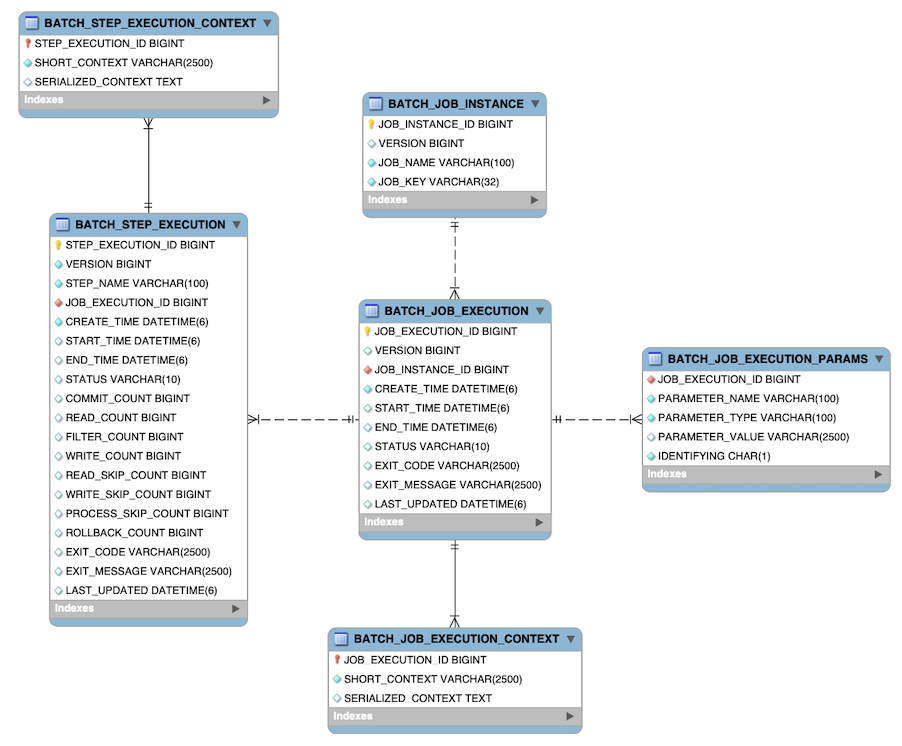

Figure 1. Spring Batch Meta-Data ERD

<a id="schema-appendix--exampleddlscripts"></a>
<a id="schema-appendix--example-ddl-scripts"></a>

### Example DDL Scripts

The Spring Batch Core JAR file contains example scripts to create the relational tables
for a number of database platforms (which are, in turn, auto-detected by the job
repository factory bean or namespace equivalent). These scripts can be used as is or
modified with additional indexes and constraints, as desired. The file names are in the
form `schema-*.sql`, where `*` is the short name of the target database platform.
The scripts are in the package `org.springframework.batch.core`.

<a id="schema-appendix--migrationddlscripts"></a>
<a id="schema-appendix--migration-ddl-scripts"></a>

### Migration DDL Scripts

Spring Batch provides migration DDL scripts that you need to execute when you upgrade versions.
These scripts can be found in the Core Jar file under `org/springframework/batch/core/migration`.
Migration scripts are organized into folders corresponding to version numbers in which they were introduced:

- `2.2`: Contains scripts you need to migrate from a version before `2.2` to version `2.2`
- `4.1`: Contains scripts you need to migrate from a version before `4.1` to version `4.1`

<a id="schema-appendix--metadataversion"></a>
<a id="schema-appendix--version"></a>

### Version

Many of the database tables discussed in this appendix contain a version column. This
column is important, because Spring Batch employs an optimistic locking strategy when
dealing with updates to the database. This means that each time a record is “touched”
(updated), the value in the version column is incremented by one. When the repository goes
back to save the value, if the version number has changed, it throws an
`OptimisticLockingFailureException`, indicating that there has been an error with concurrent
access. This check is necessary, since, even though different batch jobs may be running
in different machines, they all use the same database tables.

<a id="schema-appendix--metadataidentity"></a>
<a id="schema-appendix--identity"></a>

### Identity

`BATCH_JOB_INSTANCE`, `BATCH_JOB_EXECUTION`, and `BATCH_STEP_EXECUTION` each contain
columns ending in `_ID`. These fields act as primary keys for their respective tables.
However, they are not database generated keys. Rather, they are generated by separate
sequences. This is necessary because, after inserting one of the domain objects into the
database, the key it is given needs to be set on the actual object so that they can be
uniquely identified in Java. Newer database drivers (JDBC 3.0 and up) support this
feature with database-generated keys. However, rather than require that feature, sequences are used. Each variation of the schema contains some form of the following
statements:

```sql
CREATE SEQUENCE BATCH_STEP_EXECUTION_SEQ;
CREATE SEQUENCE BATCH_JOB_EXECUTION_SEQ;
CREATE SEQUENCE BATCH_JOB_INSTANCE_SEQ;
```

Many database vendors do not support sequences. In these cases, work-arounds are used, such as the following statements for MySQL:

```sql
CREATE TABLE BATCH_STEP_EXECUTION_SEQ (ID BIGINT NOT NULL) type=InnoDB;
INSERT INTO BATCH_STEP_EXECUTION_SEQ values(0);
CREATE TABLE BATCH_JOB_EXECUTION_SEQ (ID BIGINT NOT NULL) type=InnoDB;
INSERT INTO BATCH_JOB_EXECUTION_SEQ values(0);
CREATE TABLE BATCH_JOB_INSTANCE_SEQ (ID BIGINT NOT NULL) type=InnoDB;
INSERT INTO BATCH_JOB_INSTANCE_SEQ values(0);
```

In the preceding case, a table is used in place of each sequence. The Spring core class, `MySQLMaxValueIncrementer`, then increments the one column in this sequence to
give similar functionality.

<a id="schema-appendix--metadatabatchjobinstance"></a>
<a id="schema-appendix--the-batch_job_instance-table"></a>

## The `BATCH_JOB_INSTANCE` Table

The `BATCH_JOB_INSTANCE` table holds all information relevant to a `JobInstance` and
serves as the top of the overall hierarchy. The following generic DDL statement is used
to create it:

```sql
CREATE TABLE BATCH_JOB_INSTANCE  (
  JOB_INSTANCE_ID BIGINT  PRIMARY KEY ,
  VERSION BIGINT,
  JOB_NAME VARCHAR(100) NOT NULL ,
  JOB_KEY VARCHAR(32) NOT NULL
);
```

The following list describes each column in the table:

- `JOB_INSTANCE_ID`: The unique ID that identifies the instance. It is also the primary
  key. The value of this column should be obtainable by calling the `getId` method on
  `JobInstance`.
- `VERSION`: See [Version](#schema-appendix--metadataversion).
- `JOB_NAME`: Name of the job obtained from the `Job` object. Because it is required to
  identify the instance, it must not be null.
- `JOB_KEY`: A serialization of the `JobParameters` that uniquely identifies separate
  instances of the same job from one another. (`JobInstances` with the same job name must
  have different `JobParameters` and, thus, different `JOB_KEY` values).

<a id="schema-appendix--metadatabatchjobparams"></a>
<a id="schema-appendix--the-batch_job_execution_params-table"></a>

## The `BATCH_JOB_EXECUTION_PARAMS` Table

The `BATCH_JOB_EXECUTION_PARAMS` table holds all information relevant to the
`JobParameters` object. It contains 0 or more key/value pairs passed to a `Job` and
serves as a record of the parameters with which a job was run. For each parameter that
contributes to the generation of a job’s identity, the `IDENTIFYING` flag is set to true.
Note that the table has been denormalized. Rather than creating a separate table for each
type, there is one table with a column indicating the type, as the following
listing shows:

```sql
CREATE TABLE BATCH_JOB_EXECUTION_PARAMS  (
	JOB_EXECUTION_ID BIGINT NOT NULL ,
	PARAMETER_NAME VARCHAR(100) NOT NULL ,
	PARAMETER_TYPE VARCHAR(100) NOT NULL ,
	PARAMETER_VALUE VARCHAR(2500) ,
	IDENTIFYING CHAR(1) NOT NULL ,
	constraint JOB_EXEC_PARAMS_FK foreign key (JOB_EXECUTION_ID)
	references BATCH_JOB_EXECUTION(JOB_EXECUTION_ID)
);
```

The following list describes each column:

- `JOB_EXECUTION_ID`: Foreign key from the `BATCH_JOB_EXECUTION` table that indicates the
  job execution to which the parameter entry belongs. Note that multiple rows (that is,
  key/value pairs) may exist for each execution.
- PARAMETER\_NAME: The parameter name.
- PARAMETER\_TYPE: The fully qualified name of the type of the parameter.
- PARAMETER\_VALUE: Parameter value
- IDENTIFYING: Flag indicating whether the parameter contributed to the identity of the
  related `JobInstance`.

Note that there is no primary key for this table. This is because the framework has no
use for one and, thus, does not require it. If need be, you can add a primary key
with a database generated key without causing any issues to the framework itself.

<a id="schema-appendix--metadatabatchjobexecution"></a>
<a id="schema-appendix--the-batch_job_execution-table"></a>

## The `BATCH_JOB_EXECUTION` Table

The `BATCH_JOB_EXECUTION` table holds all information relevant to the `JobExecution`
object. Every time a `Job` is run, there is always a new called `JobExecution` and a new row in
this table. The following listing shows the definition of the `BATCH_JOB_EXECUTION`
table:

```sql
CREATE TABLE BATCH_JOB_EXECUTION  (
  JOB_EXECUTION_ID BIGINT  PRIMARY KEY ,
  VERSION BIGINT,
  JOB_INSTANCE_ID BIGINT NOT NULL,
  CREATE_TIME TIMESTAMP NOT NULL,
  START_TIME TIMESTAMP DEFAULT NULL,
  END_TIME TIMESTAMP DEFAULT NULL,
  STATUS VARCHAR(10),
  EXIT_CODE VARCHAR(20),
  EXIT_MESSAGE VARCHAR(2500),
  LAST_UPDATED TIMESTAMP,
  constraint JOB_INSTANCE_EXECUTION_FK foreign key (JOB_INSTANCE_ID)
  references BATCH_JOB_INSTANCE(JOB_INSTANCE_ID)
) ;
```

The following list describes each column:

- `JOB_EXECUTION_ID`: Primary key that uniquely identifies this execution. The value of
  this column is obtainable by calling the `getId` method of the `JobExecution` object.
- `VERSION`: See [Version](#schema-appendix--metadataversion).
- `JOB_INSTANCE_ID`: Foreign key from the `BATCH_JOB_INSTANCE` table. It indicates the
  instance to which this execution belongs. There may be more than one execution per
  instance.
- `CREATE_TIME`: Timestamp representing the time when the execution was created.
- `START_TIME`: Timestamp representing the time when the execution was started.
- `END_TIME`: Timestamp representing the time when the execution finished, regardless of
  success or failure. An empty value in this column when the job is not currently running
  indicates that there has been some type of error and the framework was unable to perform
  a last save before failing.
- `STATUS`: Character string representing the status of the execution. This may be
  `COMPLETED`, `STARTED`, and others. The object representation of this column is the
  `BatchStatus` enumeration.
- `EXIT_CODE`: Character string representing the exit code of the execution. In the case
  of a command-line job, this may be converted into a number.
- `EXIT_MESSAGE`: Character string representing a more detailed description of how the
  job exited. In the case of failure, this might include as much of the stack trace as is
  possible.
- `LAST_UPDATED`: Timestamp representing the last time this execution was persisted.

<a id="schema-appendix--metadatabatchstepexecution"></a>
<a id="schema-appendix--the-batch_step_execution-table"></a>

## The `BATCH_STEP_EXECUTION` Table

The `BATCH_STEP_EXECUTION` table holds all information relevant to the `StepExecution`
object. This table is similar in many ways to the `BATCH_JOB_EXECUTION` table, and there
is always at least one entry per `Step` for each `JobExecution` created. The following
listing shows the definition of the `BATCH_STEP_EXECUTION` table:

```sql
CREATE TABLE BATCH_STEP_EXECUTION  (
  STEP_EXECUTION_ID BIGINT NOT NULL PRIMARY KEY ,
  VERSION BIGINT NOT NULL,
  STEP_NAME VARCHAR(100) NOT NULL,
  JOB_EXECUTION_ID BIGINT NOT NULL,
  CREATE_TIME TIMESTAMP NOT NULL,
  START_TIME TIMESTAMP DEFAULT NULL ,
  END_TIME TIMESTAMP DEFAULT NULL,
  STATUS VARCHAR(10),
  COMMIT_COUNT BIGINT ,
  READ_COUNT BIGINT ,
  FILTER_COUNT BIGINT ,
  WRITE_COUNT BIGINT ,
  READ_SKIP_COUNT BIGINT ,
  WRITE_SKIP_COUNT BIGINT ,
  PROCESS_SKIP_COUNT BIGINT ,
  ROLLBACK_COUNT BIGINT ,
  EXIT_CODE VARCHAR(20) ,
  EXIT_MESSAGE VARCHAR(2500) ,
  LAST_UPDATED TIMESTAMP,
  constraint JOB_EXECUTION_STEP_FK foreign key (JOB_EXECUTION_ID)
  references BATCH_JOB_EXECUTION(JOB_EXECUTION_ID)
) ;
```

The following list describes each column:

- `STEP_EXECUTION_ID`: Primary key that uniquely identifies this execution. The value of
  this column should be obtainable by calling the `getId` method of the `StepExecution`
  object.
- `VERSION`: See [Version](#schema-appendix--metadataversion).
- `STEP_NAME`: The name of the step to which this execution belongs.
- `JOB_EXECUTION_ID`: Foreign key from the `BATCH_JOB_EXECUTION` table. It indicates the
  `JobExecution` to which this `StepExecution` belongs. There may be only one
  `StepExecution` for a given `JobExecution` for a given `Step` name.
- `START_TIME`: Timestamp representing the time when the execution was started.
- `END_TIME`: Timestamp representing the time the when execution was finished, regardless
  of success or failure. An empty value in this column, even though the job is not
  currently running, indicates that there has been some type of error and the framework was
  unable to perform a last save before failing.
- `STATUS`: Character string representing the status of the execution. This may be
  `COMPLETED`, `STARTED`, and others. The object representation of this column is the
  `BatchStatus` enumeration.
- `COMMIT_COUNT`: The number of times in which the step has committed a transaction
  during this execution.
- `READ_COUNT`: The number of items read during this execution.
- `FILTER_COUNT`: The number of items filtered out of this execution.
- `WRITE_COUNT`: The number of items written and committed during this execution.
- `READ_SKIP_COUNT`: The number of items skipped on read during this execution.
- `WRITE_SKIP_COUNT`: The number of items skipped on write during this execution.
- `PROCESS_SKIP_COUNT`: The number of items skipped during processing during this
  execution.
- `ROLLBACK_COUNT`: The number of rollbacks during this execution. Note that this count
  includes each time rollback occurs, including rollbacks for retry and those in the skip
  recovery procedure.
- `EXIT_CODE`: Character string representing the exit code of the execution. In the case
  of a command-line job, this may be converted into a number.
- `EXIT_MESSAGE`: Character string representing a more detailed description of how the
  job exited. In the case of failure, this might include as much of the stack trace as is
  possible.
- `LAST_UPDATED`: Timestamp representing the last time this execution was persisted.

<a id="schema-appendix--metadatabatchjobexecutioncontext"></a>
<a id="schema-appendix--the-batch_job_execution_context-table"></a>

## The `BATCH_JOB_EXECUTION_CONTEXT` Table

The `BATCH_JOB_EXECUTION_CONTEXT` table holds all information relevant to the
`ExecutionContext` of a `Job`. There is exactly one `Job` `ExecutionContext` for each
`JobExecution`, and it contains all of the job-level data that is needed for a particular
job execution. This data typically represents the state that must be retrieved after a
failure, so that a `JobInstance` can “start where it left off”. The following
listing shows the definition of the `BATCH_JOB_EXECUTION_CONTEXT` table:

```sql
CREATE TABLE BATCH_JOB_EXECUTION_CONTEXT  (
  JOB_EXECUTION_ID BIGINT PRIMARY KEY,
  SHORT_CONTEXT VARCHAR(2500) NOT NULL,
  SERIALIZED_CONTEXT CLOB,
  constraint JOB_EXEC_CTX_FK foreign key (JOB_EXECUTION_ID)
  references BATCH_JOB_EXECUTION(JOB_EXECUTION_ID)
) ;
```

The following list describes each column:

- `JOB_EXECUTION_ID`: Foreign key representing the `JobExecution` to which the context
  belongs. There may be more than one row associated with a given execution.
- `SHORT_CONTEXT`: A string version of the `SERIALIZED_CONTEXT`.
- `SERIALIZED_CONTEXT`: The entire context, serialized.

<a id="schema-appendix--metadatabatchstepexecutioncontext"></a>
<a id="schema-appendix--the-batch_step_execution_context-table"></a>

## The `BATCH_STEP_EXECUTION_CONTEXT` Table

The `BATCH_STEP_EXECUTION_CONTEXT` table holds all information relevant to the
`ExecutionContext` of a `Step`. There is exactly one `ExecutionContext` per
`StepExecution`, and it contains all of the data that
needs to be persisted for a particular step execution. This data typically represents the
state that must be retrieved after a failure so that a `JobInstance` can “start
where it left off”. The following listing shows the definition of the
`BATCH_STEP_EXECUTION_CONTEXT` table:

```sql
CREATE TABLE BATCH_STEP_EXECUTION_CONTEXT  (
  STEP_EXECUTION_ID BIGINT PRIMARY KEY,
  SHORT_CONTEXT VARCHAR(2500) NOT NULL,
  SERIALIZED_CONTEXT CLOB,
  constraint STEP_EXEC_CTX_FK foreign key (STEP_EXECUTION_ID)
  references BATCH_STEP_EXECUTION(STEP_EXECUTION_ID)
) ;
```

The following list describes each column:

- `STEP_EXECUTION_ID`: Foreign key representing the `StepExecution` to which the context
  belongs. There may be more than one row associated with a given execution.
- `SHORT_CONTEXT`: A string version of the `SERIALIZED_CONTEXT`.
- `SERIALIZED_CONTEXT`: The entire context, serialized.

<a id="schema-appendix--metadataarchiving"></a>
<a id="schema-appendix--archiving"></a>

## Archiving

Because there are entries in multiple tables every time a batch job is run, it is common
to create an archive strategy for the metadata tables. The tables themselves are designed
to show a record of what happened in the past and generally do not affect the run of any
job, with a few notable exceptions pertaining to restart:

- The framework uses the metadata tables to determine whether a particular `JobInstance`
  has been run before. If it has been run and if the job is not restartable, an
  exception is thrown.
- If an entry for a `JobInstance` is removed without having completed successfully, the
  framework thinks that the job is new rather than a restart.
- If a job is restarted, the framework uses any data that has been persisted to the
  `ExecutionContext` to restore the `Job’s` state. Therefore, removing any entries from
  this table for jobs that have not completed successfully prevents them from starting at
  the correct point if they are run again.

<a id="schema-appendix--multibytecharacters"></a>
<a id="schema-appendix--international-and-multi-byte-characters"></a>

## International and Multi-byte Characters

If you use multi-byte character sets (such as Chinese or Cyrillic) in your business
processing, those characters might need to be persisted in the Spring Batch schema.
Many users find that simply changing the schema to double the length of the `VARCHAR`
columns is enough. Others prefer to configure the
[JobRepository](#job-configuring-repository) with `max-varchar-length` half the
value of the `VARCHAR` column length. Some users have also reported that they use
`NVARCHAR` in place of `VARCHAR` in their schema definitions. The best result depends on
the database platform and the way the database server has been configured locally.

<a id="schema-appendix--recommendationsforindexingmetadatatables"></a>
<a id="schema-appendix--recommendations-for-indexing-metadata-tables"></a>

## Recommendations for Indexing Metadata Tables

Spring Batch provides DDL samples for the metadata tables in the core jar file for
several common database platforms. Index declarations are not included in that DDL, because there are too many variations in how users may want to index, depending on their
precise platform, local conventions, and the business requirements of how the jobs are
operated. The following table provides some indication as to which columns are going to
be used in a `WHERE` clause by the DAO implementations provided by Spring Batch and how
frequently they might be used so that individual projects can make up their own minds
about indexing:

| Default Table Name | Where Clause | Frequency |
| --- | --- | --- |
| `BATCH_JOB_INSTANCE` | `JOB_NAME = ? and JOB_KEY = ?` | Every time a job is launched |
| `BATCH_JOB_EXECUTION` | `JOB_INSTANCE_ID = ?` | Every time a job is restarted |
| `BATCH_STEP_EXECUTION` | `VERSION = ?` | On commit interval, a.k.a. chunk (and at start and end of step) |
| `BATCH_STEP_EXECUTION` | `STEP_NAME = ? and JOB_EXECUTION_ID = ?` | Before each step execution |

[List of ItemReaders and ItemWriters](#appendix)
[Glossary](#glossary)

---

<a id="glossary"></a>

<!-- source_url: https://docs.spring.io/spring-batch/reference/glossary.html -->

<!-- page_index: 62 -->

# Glossary

<svg enable-background="new 0 0 32 32" id="Glyph" version="1.1" viewbox="0 0 32 32" xml:space="preserve" xmlns="http://www.w3.org/2000/svg" xmlns:xlink="http://www.w3.org/1999/xlink">
<path id="XMLID_223_"></path>
</svg>

Search

<a id="glossary--page-title"></a>
<a id="glossary--glossary"></a>

# Glossary

<a id="glossary--spring-batch-glossary"></a>

## Spring Batch Glossary

Batch
:   An accumulation of business transactions over time.

Batch Application Style
:   Term used to designate batch as an application style in its own right, similar to
    online, Web, or SOA. It has standard elements of input, validation, transformation of
    information to business model, business processing, and output. In addition, it
    requires monitoring at a macro level.

Batch Processing
:   The handling of a batch of many business transactions that have accumulated over a
    period of time (such as an hour, a day, a week, a month, or a year). It is the
    application of a process or set of processes to many data entities or objects in a
    repetitive and predictable fashion with either no manual element or a separate manual
    element for error processing.

Batch Window
:   The time frame within which a batch job must complete. This can be constrained by other
    systems coming online, other dependent jobs needing to execute, or other factors
    specific to the batch environment.

Step
:   The main batch task or unit of work. It initializes the business logic and controls the
    transaction environment, based on the commit interval setting and other factors.

Tasklet
:   A component created by an application developer to process the business logic for a
    Step.

Batch Job Type
:   Job types describe application of jobs for particular types of processing. Common areas
    are interface processing (typically flat files), forms processing (either for online
    PDF generation or print formats), and report processing.

Driving Query
:   A driving query identifies the set of work for a job to do. The job then breaks that
    work into individual units of work. For instance, a driving query might be to identify
    all financial transactions that have a status of “pending transmission” and send them
    to a partner system. The driving query returns a set of record IDs to process. Each
    record ID then becomes a unit of work. A driving query may involve a join (if the
    criteria for selection falls across two or more tables) or it may work with a single
    table.

Item
:   An item represents the smallest amount of complete data for processing. In the simplest
    terms, this might be a line in a file, a row in a database table, or a particular
    element in an XML file.

Logicial Unit of Work (LUW)
:   A batch job iterates through a driving query (or other input source, such as a file) to
    perform the set of work that the job must accomplish. Each iteration of work performed
    is a unit of work.

Commit Interval
:   A set of LUWs processed within a single transaction.

Partitioning
:   Splitting a job into multiple threads where each thread is responsible for a subset of
    the overall data to be processed. The threads of execution may be within the same JVM
    or they may span JVMs in a clustered environment that supports workload balancing.

Staging Table
:   A table that holds temporary data while it is being processed.

Restartable
:   A job that can be executed again and assumes the same identity as when run initially.
    In other words, it has the same job instance ID.

Rerunnable
:   A job that is restartable and manages its own state in terms of the previous run’s
    record processing. An example of a re-runnable step is one based on a driving query. If
    the driving query can be formed so that it limits the processed rows when the job is
    restarted, then it is re-runnable. This is managed by the application logic. Often, a
    condition is added to the `where` statement to limit the rows returned by the driving
    query with logic resembling `and processedFlag!= true`.

Repeat
:   One of the most basic units of batch processing, it defines by repeatedly calling a
    portion of code until it is finished and while there is no error. Typically, a batch
    process would be repeatable as long as there is input.

Retry
:   Simplifies the execution of operations with retry semantics most frequently associated
    with handling transactional output exceptions. Retry is slightly different from repeat.
    Rather than continually calling a block of code, retry is stateful and continually
    calls the same block of code with the same input, until it either succeeds or some type
    of retry limit has been exceeded. It is generally useful only when a subsequent
    invocation of the operation might succeed because something in the environment has
    improved.

Recover
:   Recover operations handle an exception in such a way that a repeat process is able to
    continue.

Skip
:   Skip is a recovery strategy often used on file input sources as the strategy for
    ignoring bad input records that failed validation.

[Meta-Data Schema](#schema-appendix)
[Frequently Asked Questions](#faq)

---

<a id="faq"></a>

<!-- source_url: https://docs.spring.io/spring-batch/reference/faq.html -->

<!-- page_index: 63 -->

# Frequently Asked Questions

<svg enable-background="new 0 0 32 32" id="Glyph" version="1.1" viewbox="0 0 32 32" xml:space="preserve" xmlns="http://www.w3.org/2000/svg" xmlns:xlink="http://www.w3.org/1999/xlink">
<path id="XMLID_223_"></path>
</svg>

Search

<a id="faq--page-title"></a>
<a id="faq--frequently-asked-questions"></a>

# Frequently Asked Questions

<a id="faq--_is_it_possible_to_execute_jobs_in_multiple_threads_or_multiple_processes"></a>
<a id="faq--is-it-possible-to-execute-jobs-in-multiple-threads-or-multiple-processes"></a>

## Is it possible to execute jobs in multiple threads or multiple processes?

There are three ways to approach this - but we recommend exercising caution in the analysis of such requirements (is it really necessary?).

- Add a `TaskExecutor` to the step. The `StepBuilder`s provided for configuring Steps have a "taskExecutor" property you can set.This works as long as the step is intrinsically restartable (idempotent effectively). The parallel job sample shows how it might work in practice - this uses a "process indicator" pattern to mark input records as complete, inside the business transaction.
- Use the `PartitionStep` to split your step execution explicitly amongst several Step instances. Spring Batch has a local multi-threaded implementation of the main strategy for this (`PartitionHandler`), which makes it a great choice for IO intensive jobs. Remember to use `scope="step"` for the stateful components in a step executing in this fashion, so that separate instances are created per step execution, and there is no cross talk between threads.
- Use the Remote Chunking approach as implemented in the `spring-batch-integration` module. This requires some durable middleware (e.g. JMS) for reliable communication between the driving step and the remote workers. The basic idea is to use a special `ItemWriter` on the driving process, and a listener pattern on the worker processes (via a `ChunkProcessor`).

<a id="faq--_how_can_i_make_an_item_reader_thread_safe"></a>
<a id="faq--how-can-i-make-an-item-reader-thread-safe"></a>

## How can I make an item reader thread safe?

You can synchronize the `read()` method (e.g. by wrapping it in a delegator that does the synchronization).
Remember that you will lose restartability, so best practice is to mark the step as not restartable and to be safe (and efficient) you can also set `saveState=false` on the reader.

<a id="faq--_what_is_the_spring_batch_philosophy_on_the_use_of_flexible_strategies_and_default_implementations_can_you_add_a_public_getter_for_this_or_that_property"></a>
<a id="faq--what-is-the-spring-batch-philosophy-on-the-use-of-flexible-strategies-and-default-implementations-can-you-add-a-public-getter-for-this-or-that-property"></a>

## What is the Spring Batch philosophy on the use of flexible strategies and default implementations? Can you add a public getter for this or that property?

There are many extension points in Spring Batch for the framework developer (as opposed to the implementor of business logic).
We expect clients to create their own more specific strategies that can be plugged in to control things like commit intervals ( `CompletionPolicy` ), rules about how to deal with exceptions ( `ExceptionHandler` ), and many others.

In general we try to dissuade users from extending framework classes. The Java language doesn’t give us as much flexibility to mark classes and interfaces as internal.
Generally you can expect anything at the top level of the source tree in packages `org.springframework.batch.*` to be public, but not necessarily sub-classable.
Extending our concrete implementations of most strategies is discouraged in favour of a composition or forking approach.
If your code can use only the interfaces from Spring Batch, that gives you the greatest possible portability.

<a id="faq--_how_does_spring_batch_differ_from_quartz_is_there_a_place_for_them_both_in_a_solution"></a>
<a id="faq--how-does-spring-batch-differ-from-quartz-is-there-a-place-for-them-both-in-a-solution"></a>

## How does Spring Batch differ from Quartz? Is there a place for them both in a solution?

Spring Batch and Quartz have different goals. Spring Batch provides functionality for processing large volumes of data and Quartz provides functionality for scheduling tasks.
So Quartz could complement Spring Batch, but are not excluding technologies. A common combination would be to use Quartz as a trigger for a Spring Batch job using a Cron expression
and the Spring Core convenience `SchedulerFactoryBean` .

<a id="faq--_how_do_i_schedule_a_job_with_spring_batch"></a>
<a id="faq--how-do-i-schedule-a-job-with-spring-batch"></a>

## How do I schedule a job with Spring Batch?

Use a scheduling tool. There are plenty of them out there. Examples: Quartz, Control-M, Autosys.
Quartz doesn’t have all the features of Control-M or Autosys - it is supposed to be lightweight.
If you want something even more lightweight you can just use the OS (`cron`, `at`, etc.).

Simple sequential dependencies can be implemented using the job-steps model of Spring Batch, and the non-sequential features in Spring Batch.
We think this is quite common. And in fact it makes it easier to correct a common mis-use of schedulers - having hundreds of jobs configured, many of which are not independent, but only depend on one other.

<a id="faq--_how_does_spring_batch_allow_project_to_optimize_for_performance_and_scalability_through_parallel_processing_or_other"></a>
<a id="faq--how-does-spring-batch-allow-project-to-optimize-for-performance-and-scalability-through-parallel-processing-or-other"></a>

## How does Spring Batch allow project to optimize for performance and scalability (through parallel processing or other)?

We see this as one of the roles of the `Job` or `Step`. A specific implementation of the Step deals with the concern of breaking apart the business logic
and sharing it efficiently between parallel processes or processors (see `PartitionStep` ). There are a number of technologies that could play a role here.
The essence is just a set of concurrent remote calls to distributed agents that can handle some business processing.
Since the business processing is already typically modularised - e.g. input an item, process it - Spring Batch can strategise the distribution in a number of ways.
One implementation that we have had some experience with is a set of remote web services handling the business processing.
We send a specific range of primary keys for the inputs to each of a number of remote calls.
The same basic strategy would work with any of the Spring Remoting protocols (plain RMI, HttpInvoker, JMS, Hessian etc.) with little more than a couple of lines change
in the execution layer configuration.

<a id="faq--_how_can_messaging_be_used_to_scale_batch_architectures"></a>
<a id="faq--how-can-messaging-be-used-to-scale-batch-architectures"></a>

## How can messaging be used to scale batch architectures?

There is a good deal of practical evidence from existing projects that a pipeline approach to batch processing is highly beneficial, leading to resilience and high throughput.
We are often faced with mission-critical applications where audit trails are essential, and guaranteed processing is demanded, but where there are extremely tight limits
on performance under load, or where high throughput gives a competitive advantage.

Matt Welsh’s work shows that a Staged Event Driven Architecture (SEDA) has enormous benefits over more rigid processing architectures, and message-oriented middleware (JMS, AQ, MQ, Tibco etc.) gives us a lot of resilience out of the box. There are particular benefits in
a system where there is feedback between downstream and upstream stages, so the number of consumers can be adjusted to account for the amount of demand.
So how does this fit into Spring Batch? The spring-batch-integration project has this pattern implemented in Spring Integration, and can be used to scale up the remote processing of any step with many items to process.
See in particular the "chunk" package, and the `ItemWriter` and `ChunkRequestHandler` implementations in there.

[Glossary](#glossary)

---
