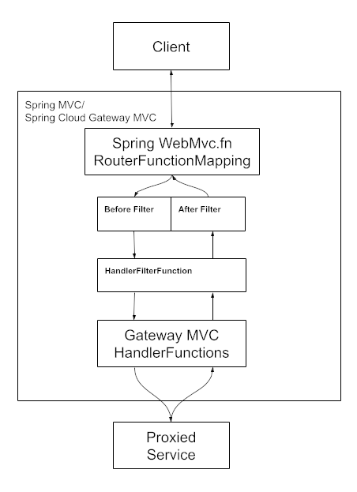

# Spring Cloud Gateway

## Navigation

- Introduction
  
- [Introduction](#index)
- [Spring Cloud Gateway Server WebFlux](#spring-cloud-gateway-server-webflux)
  
- [Spring Cloud Gateway Server WebFlux](#spring-cloud-gateway-server-webflux)
    
- [How to Include Spring Cloud Gateway](#spring-cloud-gateway-server-webflux-starter)
    
- [Glossary](#spring-cloud-gateway-server-webflux-glossary)
    
- [How It Works](#spring-cloud-gateway-server-webflux-how-it-works)
    
- [Configuring Route Predicate Factories and Gateway Filter Factories](#spring-cloud-gateway-server-webflux-configuring-route-predicate-factories-and-filter-factories)
    
- [Route Predicate Factories](#spring-cloud-gateway-server-webflux-request-predicates-factories)
    
- [GatewayFilter Factories](#spring-cloud-gateway-server-webflux-gatewayfilter-factories)
      
- [AddRequestHeader GatewayFilter Factory](#spring-cloud-gateway-server-webflux-gatewayfilter-factories-addrequestheader-factory)
      
- [AddRequestHeadersIfNotPresent GatewayFilter Factory](#spring-cloud-gateway-server-webflux-gatewayfilter-factories-addrequestheadersifnotpresent-factory)
      
- [AddRequestParameter GatewayFilter Factory](#spring-cloud-gateway-server-webflux-gatewayfilter-factories-addrequestparameter-factory)
      
- [AddResponseHeader GatewayFilter Factory](#spring-cloud-gateway-server-webflux-gatewayfilter-factories-addresponseheader-factory)
      
- [CircuitBreaker GatewayFilter Factory](#spring-cloud-gateway-server-webflux-gatewayfilter-factories-circuitbreaker-filter-factory)
      
- [CacheRequestBody GatewayFilter Factory](#spring-cloud-gateway-server-webflux-gatewayfilter-factories-cacherequestbody-factory)
      
- [DedupeResponseHeader GatewayFilter Factory](#spring-cloud-gateway-server-webflux-gatewayfilter-factories-deduperesponseheader-factory)
      
- [FallbackHeaders GatewayFilter Factory](#spring-cloud-gateway-server-webflux-gatewayfilter-factories-fallback-headers)
      
- [JsonToGrpc GatewayFilter Factory](#spring-cloud-gateway-server-webflux-gatewayfilter-factories-jsontogrpc-factory)
      
- [LocalResponseCache GatewayFilter Factory](#spring-cloud-gateway-server-webflux-gatewayfilter-factories-local-cache-response-filter)
      
- [MapRequestHeader GatewayFilter Factory](#spring-cloud-gateway-server-webflux-gatewayfilter-factories-maprequestheader-factory)
      
- [ModifyRequestBody GatewayFilter Factory](#spring-cloud-gateway-server-webflux-gatewayfilter-factories-modifyrequestbody-factory)
      
- [ModifyResponseBody GatewayFilter Factory](#spring-cloud-gateway-server-webflux-gatewayfilter-factories-modifyresponsebody-factory)
      
- [PrefixPath GatewayFilter Factory](#spring-cloud-gateway-server-webflux-gatewayfilter-factories-prefixpath-factory)
      
- [PreserveHostHeader GatewayFilter Factory](#spring-cloud-gateway-server-webflux-gatewayfilter-factories-preservehostheader-factory)
      
- [RedirectTo GatewayFilter Factory](#spring-cloud-gateway-server-webflux-gatewayfilter-factories-redirectto-factory)
      
- [RemoveJsonAttributesResponseBody GatewayFilter Factory](#spring-cloud-gateway-server-webflux-gatewayfilter-factories-removejsonattributesresponsebody-factory)
      
- [RemoveRequestHeader GatewayFilter Factory](#spring-cloud-gateway-server-webflux-gatewayfilter-factories-removerequestheader-factory)
      
- [RemoveRequestParameter GatewayFilter Factory](#spring-cloud-gateway-server-webflux-gatewayfilter-factories-removerequestparameter-factory)
      
- [RemoveResponseHeader GatewayFilter Factory](#spring-cloud-gateway-server-webflux-gatewayfilter-factories-removeresponseheader-factory)
      
- [RequestHeaderSize GatewayFilter Factory](#spring-cloud-gateway-server-webflux-gatewayfilter-factories-requestheadersize-factory)
      
- [RequestRateLimiter GatewayFilter Factory](#spring-cloud-gateway-server-webflux-gatewayfilter-factories-requestratelimiter-factory)
      
- [RewriteLocationResponseHeader GatewayFilter Factory](#spring-cloud-gateway-server-webflux-gatewayfilter-factories-rewritelocationresponseheader-factory)
      
- [RewritePath GatewayFilter Factory](#spring-cloud-gateway-server-webflux-gatewayfilter-factories-rewritepath-factory)
      
- [RewriteRequestParameter GatewayFilter Factory](#spring-cloud-gateway-server-webflux-gatewayfilter-factories-rewriterequestparameter-factory)
      
- [RewriteResponseHeader GatewayFilter Factory](#spring-cloud-gateway-server-webflux-gatewayfilter-factories-rewriteresponseheader-factory)
      
- [SaveSession GatewayFilter Factory](#spring-cloud-gateway-server-webflux-gatewayfilter-factories-savesession-factory)
      
- [SecureHeaders GatewayFilter Factory](#spring-cloud-gateway-server-webflux-gatewayfilter-factories-secureheaders-factory)
      
- [SetPath GatewayFilter Factory](#spring-cloud-gateway-server-webflux-gatewayfilter-factories-setpath-factory)
      
- [SetRequestHeader GatewayFilter Factory](#spring-cloud-gateway-server-webflux-gatewayfilter-factories-setrequestheader-factory)
      
- [SetResponseHeader GatewayFilter Factory](#spring-cloud-gateway-server-webflux-gatewayfilter-factories-setresponseheader-factory)
      
- [SetStatus GatewayFilter Factory](#spring-cloud-gateway-server-webflux-gatewayfilter-factories-setstatus-factory)
      
- [StripPrefix GatewayFilter Factory](#spring-cloud-gateway-server-webflux-gatewayfilter-factories-stripprefix-factory)
      
- [Retry GatewayFilter Factory](#spring-cloud-gateway-server-webflux-gatewayfilter-factories-retry-factory)
      
- [RequestSize GatewayFilter Factory](#spring-cloud-gateway-server-webflux-gatewayfilter-factories-requestsize-factory)
      
- [SetRequestHostHeader GatewayFilter Factory](#spring-cloud-gateway-server-webflux-gatewayfilter-factories-setrequesthostheader-factory)
      
- [TokenRelay GatewayFilter Factory](#spring-cloud-gateway-server-webflux-gatewayfilter-factories-tokenrelay-factory)
      
- [Default Filters](#spring-cloud-gateway-server-webflux-gatewayfilter-factories-default-filters)
    
- [Global Filters](#spring-cloud-gateway-server-webflux-global-filters)
    
- [HttpHeadersFilters](#spring-cloud-gateway-server-webflux-httpheadersfilters)
    
- [TLS and SSL](#spring-cloud-gateway-server-webflux-tls-and-ssl)
    
- [The HttpClientCustomizer](#spring-cloud-gateway-server-webflux-http-client)
    
- [Configuration](#spring-cloud-gateway-server-webflux-configuration)
    
- [Route Metadata Configuration](#spring-cloud-gateway-server-webflux-route-metadata-configuration)
    
- [Http timeouts configuration](#spring-cloud-gateway-server-webflux-http-timeouts-configuration)
    
- [Fluent Java Routes API](#spring-cloud-gateway-server-webflux-fluent-java-routes-api)
    
- [DiscoveryClient Route Definition Locator](#spring-cloud-gateway-server-webflux-the-discoveryclient-route-definition-locator)
    
- [Reactor Netty Access Logs](#spring-cloud-gateway-server-webflux-reactor-netty-access-logs)
    
- [CORS Configuration](#spring-cloud-gateway-server-webflux-cors-configuration)
    
- [Actuator API](#spring-cloud-gateway-server-webflux-actuator-api)
    
- [Sharing Routes between multiple Gateway instances](#spring-cloud-gateway-server-webflux-sharing-routes)
    
- [Troubleshooting](#spring-cloud-gateway-server-webflux-troubleshooting)
    
- [Developer Guide](#spring-cloud-gateway-server-webflux-developer-guide)
    
- [AOT and Native Image Support](#spring-cloud-gateway-server-webflux-aot-and-native-image-support)
    
- [Configuration properties](#spring-cloud-gateway-server-webflux-configuration-properties)
- [Spring Cloud Gateway Server Web MVC](#spring-cloud-gateway-server-webmvc)
  
- [Spring Cloud Gateway Server Web MVC](#spring-cloud-gateway-server-webmvc)
    
- [How to Include Spring Cloud Gateway Server Web MVC](#spring-cloud-gateway-server-webmvc-starter)
    
- [Glossary](#spring-cloud-gateway-server-webmvc-glossary)
    
- [How It Works](#spring-cloud-gateway-server-webmvc-how-it-works)
    
- [Java Routes API](#spring-cloud-gateway-server-webmvc-java-routes-api)
    
- [Gateway Request Predicates](#spring-cloud-gateway-server-webmvc-gateway-request-predicates)
    
- [Gateway Handler Filter Functions](#spring-cloud-gateway-server-webmvc-gateway-handler-filter-functions)
      
- [AddRequestHeader Filter](#spring-cloud-gateway-server-webmvc-filters-addrequestheader)
      
- [AddRequestHeadersIfNotPresent Filter](#spring-cloud-gateway-server-webmvc-filters-addrequestheadersifnotpresent)
      
- [AddRequestParameter Filter](#spring-cloud-gateway-server-webmvc-filters-addrequestparameter)
      
- [AddResponseHeader Filter](#spring-cloud-gateway-server-webmvc-filters-addresponseheader)
      
- [CircuitBreaker Filter](#spring-cloud-gateway-server-webmvc-filters-circuitbreaker-filter)
      
- [DedupeResponseHeader Filter](#spring-cloud-gateway-server-webmvc-filters-deduperesponseheader)
      
- [FallbackHeaders Filter](#spring-cloud-gateway-server-webmvc-filters-fallback-headers)
      
- [LoadBalancer Filter](#spring-cloud-gateway-server-webmvc-filters-loadbalancer)
      
- [MapRequestHeader Filter](#spring-cloud-gateway-server-webmvc-filters-maprequestheader)
      
- [ModifyRequestBody Filter](#spring-cloud-gateway-server-webmvc-filters-modifyrequestbody)
      
- [ModifyResponseBody Filter](#spring-cloud-gateway-server-webmvc-filters-modifyresponsebody)
      
- [PrefixPath Filter](#spring-cloud-gateway-server-webmvc-filters-prefixpath)
      
- [PreserveHostHeader Filter](#spring-cloud-gateway-server-webmvc-filters-preservehostheader)
      
- [RedirectTo Filter](#spring-cloud-gateway-server-webmvc-filters-redirectto)
      
- [RemoveRequestHeader GatewayFilter Factory](#spring-cloud-gateway-server-webmvc-filters-removerequestheader)
      
- [RemoveRequestParameter Filter](#spring-cloud-gateway-server-webmvc-filters-removerequestparameter)
      
- [RemoveResponseHeader Filter](#spring-cloud-gateway-server-webmvc-filters-removeresponseheader)
      
- [RequestHeaderSize Filter](#spring-cloud-gateway-server-webmvc-filters-requestheadersize)
      
- [RateLimiter Filter](#spring-cloud-gateway-server-webmvc-filters-ratelimiter)
      
- [RewriteLocationResponseHeader Filter](#spring-cloud-gateway-server-webmvc-filters-rewritelocationresponseheader)
      
- [RewritePath Filter](#spring-cloud-gateway-server-webmvc-filters-rewritepath)
      
- [RewriteResponseHeader Filter](#spring-cloud-gateway-server-webmvc-filters-rewriteresponseheader)
      
- [SetPath Filter](#spring-cloud-gateway-server-webmvc-filters-setpath)
      
- [SetRequestHeader Filter](#spring-cloud-gateway-server-webmvc-filters-setrequestheader)
      
- [SetResponseHeader Filter](#spring-cloud-gateway-server-webmvc-filters-setresponseheader)
      
- [SetStatus Filter](#spring-cloud-gateway-server-webmvc-filters-setstatus)
      
- [StripPrefix Filter](#spring-cloud-gateway-server-webmvc-filters-stripprefix)
      
- [Retry Filter](#spring-cloud-gateway-server-webmvc-filters-retry)
      
- [RequestSize Filter](#spring-cloud-gateway-server-webmvc-filters-requestsize)
      
- [SetRequestHostHeader Filter](#spring-cloud-gateway-server-webmvc-filters-setrequesthostheader)
      
- [TokenRelay Filter](#spring-cloud-gateway-server-webmvc-filters-tokenrelay)
    
- [HttpHeadersFilters](#spring-cloud-gateway-server-webmvc-httpheadersfilters)
    
- [Writing Custom Predicates and Filters](#spring-cloud-gateway-server-webmvc-writing-custom-predicates-and-filters)
    
- [Working with Servlets and Servlet Filters](#spring-cloud-gateway-server-webmvc-working-with-servlets-and-filters)
- [Proxy Exchange Gateway with Spring Web MVC or WebFlux](#spring-cloud-gateway-proxy-exchange)
  
- [Proxy Exchange Gateway with Spring Web MVC or WebFlux](#spring-cloud-gateway-proxy-exchange)
  
- [Common application properties](#appendix)

## Content

<a id="index"></a>

<!-- source_url: https://docs.spring.io/spring-cloud-gateway/reference/index.html -->

<!-- page_index: 1 -->

# Spring Cloud Gateway

<svg enable-background="new 0 0 32 32" id="Glyph" version="1.1" viewbox="0 0 32 32" xml:space="preserve" xmlns="http://www.w3.org/2000/svg" xmlns:xlink="http://www.w3.org/1999/xlink">
<path id="XMLID_223_"></path>
</svg>

Search

<a id="index--page-title"></a>
<a id="index--spring-cloud-gateway"></a>

# Spring Cloud Gateway

This project provides an API Gateway built on top of the Spring Ecosystem, including: Spring Framework 7, Spring Boot 4, and Project Reactor. Spring Cloud Gateway aims to provide a simple, yet effective way to route to APIs and provide cross cutting concerns to them such as: security, monitoring/metrics, and resiliency.

There are two distinct flavors of Spring Cloud Gateway: **Server** and **Proxy Exchange**. Each flavor offers WebFlux and Web MVC compatibility.

- The Server variant is a full-featured API gateway that can be standalone or embedded in a Spring Boot application.
- The Proxy Exchange variant is exclusively for use in annotation based WebFlux or Web MVC applications and allows the use of a special `ProxyExchange` object as a parameter to a web handler method.

[Spring Cloud Gateway Server WebFlux](#spring-cloud-gateway-server-webflux)

---

<a id="spring-cloud-gateway-server-webflux"></a>

<!-- source_url: https://docs.spring.io/spring-cloud-gateway/reference/spring-cloud-gateway-server-webflux.html -->

<!-- page_index: 2 -->

# Spring Cloud Gateway Server WebFlux

<svg enable-background="new 0 0 32 32" id="Glyph" version="1.1" viewbox="0 0 32 32" xml:space="preserve" xmlns="http://www.w3.org/2000/svg" xmlns:xlink="http://www.w3.org/1999/xlink">
<path id="XMLID_223_"></path>
</svg>

Search

<a id="spring-cloud-gateway-server-webflux--page-title"></a>
<a id="spring-cloud-gateway-server-webflux--spring-cloud-gateway-server-webflux"></a>

# Spring Cloud Gateway Server WebFlux

**5.0.1**

[Introduction](#index)
[How to Include Spring Cloud Gateway](#spring-cloud-gateway-server-webflux-starter)

---

<a id="spring-cloud-gateway-server-webflux-starter"></a>

<!-- source_url: https://docs.spring.io/spring-cloud-gateway/reference/spring-cloud-gateway-server-webflux/starter.html -->

<!-- page_index: 3 -->

# How to Include Spring Cloud Gateway

<svg enable-background="new 0 0 32 32" id="Glyph" version="1.1" viewbox="0 0 32 32" xml:space="preserve" xmlns="http://www.w3.org/2000/svg" xmlns:xlink="http://www.w3.org/1999/xlink">
<path id="XMLID_223_"></path>
</svg>

Search

<a id="spring-cloud-gateway-server-webflux-starter--page-title"></a>
<a id="spring-cloud-gateway-server-webflux-starter--how-to-include-spring-cloud-gateway"></a>

# How to Include Spring Cloud Gateway

To include Spring Cloud Gateway in your project, use the starter with a group ID of `org.springframework.cloud` and an artifact ID of `spring-cloud-starter-gateway-server-webflux`.
See the [Spring Cloud Project page](https://projects.spring.io/spring-cloud/) for details on setting up your build system with the current Spring Cloud Release Train.

If you include the starter, but you do not want the gateway to be enabled, set `spring.cloud.gateway.enabled=false`.

> [!IMPORTANT]
> Spring Cloud Gateway is built on [Spring Boot](https://spring.io/projects/spring-boot#learn), [Spring WebFlux](https://docs.spring.io/spring/docs/current/spring-framework-reference/web-reactive.html), and [Project Reactor](https://projectreactor.io/docs).
> As a consequence, many of the familiar synchronous libraries (Spring Data and Spring Security, for example) and patterns you know may not apply when you use Spring Cloud Gateway.
> If you are unfamiliar with these projects, we suggest you begin by reading their documentation to familiarize yourself with some new concepts before working with Spring Cloud Gateway.

> [!IMPORTANT]
> Spring Cloud Gateway requires the Netty runtime provided by Spring Boot and Spring Webflux.
> It does not work in a traditional Servlet Container or when built as a WAR.

[Spring Cloud Gateway Server WebFlux](#spring-cloud-gateway-server-webflux)
[Glossary](#spring-cloud-gateway-server-webflux-glossary)

---

<a id="spring-cloud-gateway-server-webflux-glossary"></a>

<!-- source_url: https://docs.spring.io/spring-cloud-gateway/reference/spring-cloud-gateway-server-webflux/glossary.html -->

<!-- page_index: 4 -->

# Glossary

<svg enable-background="new 0 0 32 32" id="Glyph" version="1.1" viewbox="0 0 32 32" xml:space="preserve" xmlns="http://www.w3.org/2000/svg" xmlns:xlink="http://www.w3.org/1999/xlink">
<path id="XMLID_223_"></path>
</svg>

Search

<a id="spring-cloud-gateway-server-webflux-glossary--page-title"></a>
<a id="spring-cloud-gateway-server-webflux-glossary--glossary"></a>

# Glossary

- **Route**: The basic building block of the gateway.
  It is defined by an ID, a destination URI, a collection of predicates, and a collection of filters. A route is matched if the aggregate predicate is true.
- **Predicate**: This is a [Java 8 Function Predicate](https://docs.oracle.com/javase/8/docs/api/java/util/function/Predicate.html). The input type is a [Spring Framework `ServerWebExchange`](https://docs.spring.io/spring/docs/5.0.x/javadoc-api/org/springframework/web/server/ServerWebExchange.html).
  This lets you match on anything from the HTTP request, such as headers or parameters.
- **Filter**: These are instances of [`GatewayFilter`](https://github.com/spring-cloud/spring-cloud-gateway/blob/main/spring-cloud-gateway-server/src/main/java/org/springframework/cloud/gateway/filter/GatewayFilter.java) that have been constructed with a specific factory.
  Here, you can modify requests and responses before or after sending the downstream request.

[How to Include Spring Cloud Gateway](#spring-cloud-gateway-server-webflux-starter)
[How It Works](#spring-cloud-gateway-server-webflux-how-it-works)

---

<a id="spring-cloud-gateway-server-webflux-how-it-works"></a>

<!-- source_url: https://docs.spring.io/spring-cloud-gateway/reference/spring-cloud-gateway-server-webflux/how-it-works.html -->

<!-- page_index: 5 -->

# How It Works

<svg enable-background="new 0 0 32 32" id="Glyph" version="1.1" viewbox="0 0 32 32" xml:space="preserve" xmlns="http://www.w3.org/2000/svg" xmlns:xlink="http://www.w3.org/1999/xlink">
<path id="XMLID_223_"></path>
</svg>

Search

<a id="spring-cloud-gateway-server-webflux-how-it-works--page-title"></a>
<a id="spring-cloud-gateway-server-webflux-how-it-works--how-it-works"></a>

# How It Works

The following diagram provides a high-level overview of how Spring Cloud Gateway works:


Clients make requests to Spring Cloud Gateway. If the Gateway Handler Mapping determines that a request matches a route, it is sent to the Gateway Web Handler.
This handler runs the request through a filter chain that is specific to the request.
The reason the filters are divided by the dotted line is that filters can run logic both before and after the proxy request is sent.
All “pre” filter logic is executed. Then the proxy request is made. After the proxy request is made, the “post” filter logic is run.

> [!NOTE]
> URIs defined in routes without a port get default port values of 80 and 443 for the HTTP and HTTPS URIs, respectively.

> [!WARNING]
> Any path defined on a route URI will be ignored.

[Glossary](#spring-cloud-gateway-server-webflux-glossary)
[Configuring Route Predicate Factories and Gateway Filter Factories](#spring-cloud-gateway-server-webflux-configuring-route-predicate-factories-and-filter-factories)

---

<a id="spring-cloud-gateway-server-webflux-configuring-route-predicate-factories-and-filter-factories"></a>

<!-- source_url: https://docs.spring.io/spring-cloud-gateway/reference/spring-cloud-gateway-server-webflux/configuring-route-predicate-factories-and-filter-factories.html -->

<!-- page_index: 6 -->

# Configuring Route Predicate Factories and Gateway Filter Factories

<svg enable-background="new 0 0 32 32" id="Glyph" version="1.1" viewbox="0 0 32 32" xml:space="preserve" xmlns="http://www.w3.org/2000/svg" xmlns:xlink="http://www.w3.org/1999/xlink">
<path id="XMLID_223_"></path>
</svg>

Search

<a id="spring-cloud-gateway-server-webflux-configuring-route-predicate-factories-and-filter-factories--page-title"></a>
<a id="spring-cloud-gateway-server-webflux-configuring-route-predicate-factories-and-filter-factories--configuring-route-predicate-factories-and-gateway-filter-factories"></a>

# Configuring Route Predicate Factories and Gateway Filter Factories

There are two ways to configure predicates and filters: shortcuts and fully expanded arguments. Most examples below use the shortcut way.

The name and argument names are listed as `code` in the first sentence or two of each section. The arguments are typically listed in the order that are needed for the shortcut configuration.

<a id="spring-cloud-gateway-server-webflux-configuring-route-predicate-factories-and-filter-factories--shortcut-configuration"></a>

## Shortcut Configuration

Shortcut configuration is recognized by the filter name, followed by an equals sign (`=`), followed by argument values separated by commas (`,`).

application.yml

```yaml
spring:
  cloud:
    gateway:
      routes:
      - id: after_route
        uri: https://example.org
        predicates:
        - Cookie=mycookie,mycookievalue
```

The previous sample defines the `Cookie` Route Predicate Factory with two arguments, the cookie name, `mycookie` and the value to match `mycookievalue`.

<a id="spring-cloud-gateway-server-webflux-configuring-route-predicate-factories-and-filter-factories--fully-expanded-arguments"></a>

## Fully Expanded Arguments

Fully expanded arguments appear more like standard yaml configuration with name/value pairs. Typically, there will be a `name` key and an `args` key. The `args` key is a map of key value pairs to configure the predicate or filter.

application.yml

```yaml
spring:
  cloud:
    gateway:
      routes:
      - id: after_route
        uri: https://example.org
        predicates:
        - name: Cookie
          args:
            name: mycookie
            regexp: mycookievalue
```

This is the full configuration of the shortcut configuration of the `Cookie` predicate shown above.

[How It Works](#spring-cloud-gateway-server-webflux-how-it-works)
[Route Predicate Factories](#spring-cloud-gateway-server-webflux-request-predicates-factories)

---

<a id="spring-cloud-gateway-server-webflux-request-predicates-factories"></a>

<!-- source_url: https://docs.spring.io/spring-cloud-gateway/reference/spring-cloud-gateway-server-webflux/request-predicates-factories.html -->

<!-- page_index: 7 -->

# Route Predicate Factories

<svg enable-background="new 0 0 32 32" id="Glyph" version="1.1" viewbox="0 0 32 32" xml:space="preserve" xmlns="http://www.w3.org/2000/svg" xmlns:xlink="http://www.w3.org/1999/xlink">
<path id="XMLID_223_"></path>
</svg>

Search

<a id="spring-cloud-gateway-server-webflux-request-predicates-factories--page-title"></a>
<a id="spring-cloud-gateway-server-webflux-request-predicates-factories--route-predicate-factories"></a>

# Route Predicate Factories

Spring Cloud Gateway matches routes as part of the Spring WebFlux `HandlerMapping` infrastructure.
Spring Cloud Gateway includes many built-in route predicate factories.
All of these predicates match on different attributes of the HTTP request.
You can combine multiple route predicate factories with logical `and` statements.

<a id="spring-cloud-gateway-server-webflux-request-predicates-factories--after-route-predicate-factory"></a>
<a id="spring-cloud-gateway-server-webflux-request-predicates-factories--the-after-route-predicate-factory"></a>

## The After Route Predicate Factory

The `After` route predicate factory takes one parameter, a `datetime` (which is a java `ZonedDateTime`).
This predicate matches requests that happen after the specified datetime.
The following example configures an after route predicate:

application.yml

```yaml
spring:
  cloud:
    gateway:
      routes:
      - id: after_route
        uri: https://example.org
        predicates:
        - After=2017-01-20T17:42:47.789-07:00[America/Denver]
```

This route matches any request made after Jan 20, 2017 17:42 Mountain Time (Denver).

<a id="spring-cloud-gateway-server-webflux-request-predicates-factories--before-route-predicate-factory"></a>
<a id="spring-cloud-gateway-server-webflux-request-predicates-factories--the-before-route-predicate-factory"></a>

## The Before Route Predicate Factory

The `Before` route predicate factory takes one parameter, a `datetime` (which is a java `ZonedDateTime`).
This predicate matches requests that happen before the specified `datetime`.
The following example configures a before route predicate:

application.yml

```yaml
spring:
  cloud:
    gateway:
      routes:
      - id: before_route
        uri: https://example.org
        predicates:
        - Before=2017-01-20T17:42:47.789-07:00[America/Denver]
```

This route matches any request made before Jan 20, 2017 17:42 Mountain Time (Denver).

<a id="spring-cloud-gateway-server-webflux-request-predicates-factories--between-route-predicate-factory"></a>
<a id="spring-cloud-gateway-server-webflux-request-predicates-factories--the-between-route-predicate-factory"></a>

## The Between Route Predicate Factory

The `Between` route predicate factory takes two parameters, `datetime1` and `datetime2`
which are java `ZonedDateTime` objects.
This predicate matches requests that happen after `datetime1` and before `datetime2`.
The `datetime2` parameter must be after `datetime1`.
The following example configures a between route predicate:

application.yml

```yaml
spring:
  cloud:
    gateway:
      routes:
      - id: between_route
        uri: https://example.org
        predicates:
        - Between=2017-01-20T17:42:47.789-07:00[America/Denver], 2017-01-21T17:42:47.789-07:00[America/Denver]
```

This route matches any request made after Jan 20, 2017 17:42 Mountain Time (Denver) and before Jan 21, 2017 17:42 Mountain Time (Denver).
This could be useful for maintenance windows.

<a id="spring-cloud-gateway-server-webflux-request-predicates-factories--cookie-route-predicate-factory"></a>
<a id="spring-cloud-gateway-server-webflux-request-predicates-factories--the-cookie-route-predicate-factory"></a>

## The Cookie Route Predicate Factory

The `Cookie` route predicate factory takes two parameters, the cookie `name` and a `regexp` (which is a Java regular expression).
This predicate matches cookies that have the given name and whose values match the regular expression.
The following example configures a cookie route predicate factory:

application.yml

```yaml
spring:
  cloud:
    gateway:
      routes:
      - id: cookie_route
        uri: https://example.org
        predicates:
        - Cookie=chocolate, ch.p
```

This route matches requests that have a cookie named `chocolate` whose value matches the `ch.p` regular expression.

<a id="spring-cloud-gateway-server-webflux-request-predicates-factories--header-route-predicate-factory"></a>
<a id="spring-cloud-gateway-server-webflux-request-predicates-factories--the-header-route-predicate-factory"></a>

## The Header Route Predicate Factory

The `Header` route predicate factory takes two parameters, the `header` and a `regexp` (which is a Java regular expression).
This predicate matches with a header that has the given name whose value matches the regular expression.
The following example configures a header route predicate:

application.yml

```yaml
spring:
  cloud:
    gateway:
      routes:
      - id: header_route
        uri: https://example.org
        predicates:
        - Header=X-Request-Id, \d+
```

This route matches if the request has a header named `X-Request-Id` whose value matches the `\d+` regular expression (that is, it has a value of one or more digits).

<a id="spring-cloud-gateway-server-webflux-request-predicates-factories--host-route-predicate-factory"></a>
<a id="spring-cloud-gateway-server-webflux-request-predicates-factories--the-host-route-predicate-factory"></a>

## The Host Route Predicate Factory

The `Host` route predicate factory takes one parameter: a list of host name `patterns`.
The pattern is an Ant-style pattern with `.` as the separator.
This predicates matches the `Host` header that matches the pattern.
The following example configures a host route predicate:

application.yml

```yaml
spring:
  cloud:
    gateway:
      routes:
      - id: host_route
        uri: https://example.org
        predicates:
        - Host=**.somehost.org,**.anotherhost.org
```

URI template variables (such as `{sub}.myhost.org`) are supported as well.

This route matches if the request has a `Host` header with a value of `www.somehost.org` or `beta.somehost.org` or `www.anotherhost.org`.

This predicate extracts the URI template variables (such as `sub`, defined in the preceding example) as a map of names and values and places it in the `ServerWebExchange.getAttributes()` with a key defined in `ServerWebExchangeUtils.URI_TEMPLATE_VARIABLES_ATTRIBUTE`.
Those values are then available for use by [`GatewayFilter` factories](#spring-cloud-gateway-server-webflux-request-predicates-factories--gateway-route-filters)

<a id="spring-cloud-gateway-server-webflux-request-predicates-factories--method-route-predicate-factory"></a>
<a id="spring-cloud-gateway-server-webflux-request-predicates-factories--the-method-route-predicate-factory"></a>

## The Method Route Predicate Factory

The `Method` Route Predicate Factory takes a `methods` argument which is one or more parameters: the HTTP methods to match.
The following example configures a method route predicate:

application.yml

```yaml
spring:
  cloud:
    gateway:
      routes:
      - id: method_route
        uri: https://example.org
        predicates:
        - Method=GET,POST
```

This route matches if the request method was a `GET` or a `POST`.

<a id="spring-cloud-gateway-server-webflux-request-predicates-factories--path-route-predicate-factory"></a>
<a id="spring-cloud-gateway-server-webflux-request-predicates-factories--the-path-route-predicate-factory"></a>

## The Path Route Predicate Factory

The `Path` Route Predicate Factory takes two parameters: a list of Spring `PathMatcher` `patterns` and an optional flag called `matchTrailingSlash` (defaults to `true`).
The following example configures a path route predicate:

application.yml

```yaml
spring:
  cloud:
    gateway:
      routes:
      - id: path_route
        uri: https://example.org
        predicates:
        - Path=/red/{segment},/blue/{segment}
```

This route matches if the request path was, for example: `/red/1` or `/red/1/` or `/red/blue` or `/blue/green`.

If `matchTrailingSlash` is set to `false`, then request path `/red/1/` will not be matched.

If you have set `spring.webflux.base-path` property, this will influence the path matching. The property value will be automatically prepended to the path patterns. For example, with `spring.webflux.base-path=/app` and a path pattern of `/red/{segment}`, the full pattern used for matching would be `/app/red/{segment}`.

This predicate extracts the URI template variables (such as `segment`, defined in the preceding example) as a map of names and values and places it in the `ServerWebExchange.getAttributes()` with a key defined in `ServerWebExchangeUtils.URI_TEMPLATE_VARIABLES_ATTRIBUTE`.
Those values are then available for use by [`GatewayFilter` factories](#spring-cloud-gateway-server-webflux-request-predicates-factories--gateway-route-filters)

A utility method (called `get`) is available to make access to these variables easier.
The following example shows how to use the `get` method:

```java
Map<String, String> uriVariables = ServerWebExchangeUtils.getUriTemplateVariables(exchange);

String segment = uriVariables.get("segment");
```

<a id="spring-cloud-gateway-server-webflux-request-predicates-factories--query-route-predicate-factory"></a>
<a id="spring-cloud-gateway-server-webflux-request-predicates-factories--the-query-route-predicate-factory"></a>

## The Query Route Predicate Factory

The `Query` route predicate factory takes two parameters: a required `param` and an optional `regexp` (which is a Java regular expression).
The following example configures a query route predicate:

application.yml

```yaml
spring:
  cloud:
    gateway:
      routes:
      - id: query_route
        uri: https://example.org
        predicates:
        - Query=green
```

The preceding route matches if the request contained a `green` query parameter.

application.yml

```yaml
spring:
  cloud:
    gateway:
      routes:
      - id: query_route
        uri: https://example.org
        predicates:
        - Query=red, gree.
```

The preceding route matches if the request contained a `red` query parameter whose value matched the `gree.` regexp, so `green` and `greet` would match.

<a id="spring-cloud-gateway-server-webflux-request-predicates-factories--remoteaddr-route-predicate-factory"></a>
<a id="spring-cloud-gateway-server-webflux-request-predicates-factories--the-remoteaddr-route-predicate-factory"></a>

## The RemoteAddr Route Predicate Factory

The `RemoteAddr` route predicate factory takes a list (min size 1) of `sources`, which are CIDR-notation (IPv4 or IPv6) strings, such as `192.168.0.1/16` (where `192.168.0.1` is an IP address and `16` is a subnet mask).
The following example configures a RemoteAddr route predicate:

application.yml

```yaml
spring:
  cloud:
    gateway:
      routes:
      - id: remoteaddr_route
        uri: https://example.org
        predicates:
        - RemoteAddr=192.168.1.1/24
```

This route matches if the remote address of the request was, for example, `192.168.1.10`.

<a id="spring-cloud-gateway-server-webflux-request-predicates-factories--modifying-the-way-remote-addresses-are-resolved"></a>

### Modifying the Way Remote Addresses Are Resolved

By default, the RemoteAddr route predicate factory uses the remote address from the incoming request.
This may not match the actual client IP address if Spring Cloud Gateway sits behind a proxy layer.

You can customize the way that the remote address is resolved by setting a custom `RemoteAddressResolver`.
Spring Cloud Gateway comes with one non-default remote address resolver that is based off of the [X-Forwarded-For header](https://developer.mozilla.org/en-US/docs/Web/HTTP/Headers/X-Forwarded-For), `XForwardedRemoteAddressResolver`.

`XForwardedRemoteAddressResolver` has two static constructor methods, which take different approaches to security:

- `XForwardedRemoteAddressResolver::trustAll` returns a `RemoteAddressResolver` that always takes the first IP address found in the `X-Forwarded-For` header.
  This approach is vulnerable to spoofing, as a malicious client could set an initial value for the `X-Forwarded-For`, which would be accepted by the resolver.
- `XForwardedRemoteAddressResolver::maxTrustedIndex` takes an index that correlates to the number of trusted infrastructure running in front of Spring Cloud Gateway.
  If Spring Cloud Gateway is, for example only accessible through HAProxy, then a value of 1 should be used.
  If two hops of trusted infrastructure are required before Spring Cloud Gateway is accessible, then a value of 2 should be used.

Consider the following header value:

```none
X-Forwarded-For: 0.0.0.1, 0.0.0.2, 0.0.0.3
```

The following `maxTrustedIndex` values yield the following remote addresses:

| `maxTrustedIndex` | result |
| --- | --- |
| [`Integer.MIN_VALUE`,0] | (invalid, `IllegalArgumentException` during initialization) |
| 1 | 0.0.0.3 |
| 2 | 0.0.0.2 |
| 3 | 0.0.0.1 |
| [4, `Integer.MAX_VALUE`] | 0.0.0.1 |

The following example shows how to achieve the same configuration with Java:

GatewayConfig.java

```java
RemoteAddressResolver resolver = XForwardedRemoteAddressResolver
    .maxTrustedIndex(1);

...

.route("direct-route",
    r -> r.remoteAddr("10.1.1.1", "10.10.1.1/24")
        .uri("https://downstream1")
.route("proxied-route",
    r -> r.remoteAddr(resolver, "10.10.1.1", "10.10.1.1/24")
        .uri("https://downstream2")
)
```

<a id="spring-cloud-gateway-server-webflux-request-predicates-factories--weight-route-predicate-factory"></a>
<a id="spring-cloud-gateway-server-webflux-request-predicates-factories--the-weight-route-predicate-factory"></a>

## The Weight Route Predicate Factory

The `Weight` route predicate factory takes two arguments: `group` and `weight` (an int). The weights are calculated per group.
The following example configures a weight route predicate:

application.yml

```yaml
spring:
  cloud:
    gateway:
      routes:
      - id: weight_high
        uri: https://weighthigh.org
        predicates:
        - Weight=group1, 8
      - id: weight_low
        uri: https://weightlow.org
        predicates:
        - Weight=group1, 2
```

This route would forward ~80% of traffic to [weighthigh.org](https://weighthigh.org) and ~20% of traffic to [weightlow.org](https://weightlow.org)

<a id="spring-cloud-gateway-server-webflux-request-predicates-factories--xforwarded-remote-addr-route-predicate-factory"></a>
<a id="spring-cloud-gateway-server-webflux-request-predicates-factories--the-xforwarded-remote-addr-route-predicate-factory"></a>

## The XForwarded Remote Addr Route Predicate Factory

The `XForwarded Remote Addr` route predicate factory takes a list (min size 1) of `sources`, which are CIDR-notation (IPv4 or IPv6) strings, such as `192.168.0.1/16` (where `192.168.0.1` is an IP address and `16` is a subnet mask).

This route predicate allows requests to be filtered based on the `X-Forwarded-For` HTTP header.

This can be used with reverse proxies such as load balancers or web application firewalls where
the request should only be allowed if it comes from a trusted list of IP addresses used by those
reverse proxies.

The following example configures a XForwardedRemoteAddr route predicate:

application.yml

```yaml
spring:
  cloud:
    gateway:
      routes:
      - id: xforwarded_remoteaddr_route
        uri: https://example.org
        predicates:
        - XForwardedRemoteAddr=192.168.1.1/24
```

This route matches if the `X-Forwarded-For` header contains, for example, `192.168.1.10`.

[Configuring Route Predicate Factories and Gateway Filter Factories](#spring-cloud-gateway-server-webflux-configuring-route-predicate-factories-and-filter-factories)
[`GatewayFilter` Factories](#spring-cloud-gateway-server-webflux-gatewayfilter-factories)

---

<a id="spring-cloud-gateway-server-webflux-gatewayfilter-factories"></a>

<!-- source_url: https://docs.spring.io/spring-cloud-gateway/reference/spring-cloud-gateway-server-webflux/gatewayfilter-factories.html -->

<!-- page_index: 8 -->

# GatewayFilter Factories

<svg enable-background="new 0 0 32 32" id="Glyph" version="1.1" viewbox="0 0 32 32" xml:space="preserve" xmlns="http://www.w3.org/2000/svg" xmlns:xlink="http://www.w3.org/1999/xlink">
<path id="XMLID_223_"></path>
</svg>

Search

<a id="spring-cloud-gateway-server-webflux-gatewayfilter-factories--page-title"></a>
<a id="spring-cloud-gateway-server-webflux-gatewayfilter-factories--gatewayfilter-factories"></a>

# `GatewayFilter` Factories

Route filters allow the modification of the incoming HTTP request or outgoing HTTP response in some manner.
Route filters are scoped to a particular route.
Spring Cloud Gateway includes many built-in GatewayFilter Factories.

> [!NOTE]
> For more detailed examples of how to use any of the following filters, take a look at the [unit tests](https://github.com/spring-cloud/spring-cloud-gateway/tree/main/spring-cloud-gateway-server-webflux/src/test/java/org/springframework/cloud/gateway/filter/factory).

[Route Predicate Factories](#spring-cloud-gateway-server-webflux-request-predicates-factories)
[`AddRequestHeader` `GatewayFilter` Factory](#spring-cloud-gateway-server-webflux-gatewayfilter-factories-addrequestheader-factory)

---

<a id="spring-cloud-gateway-server-webflux-gatewayfilter-factories-addrequestheader-factory"></a>

<!-- source_url: https://docs.spring.io/spring-cloud-gateway/reference/spring-cloud-gateway-server-webflux/gatewayfilter-factories/addrequestheader-factory.html -->

<!-- page_index: 9 -->

# AddRequestHeader GatewayFilter Factory

<svg enable-background="new 0 0 32 32" id="Glyph" version="1.1" viewbox="0 0 32 32" xml:space="preserve" xmlns="http://www.w3.org/2000/svg" xmlns:xlink="http://www.w3.org/1999/xlink">
<path id="XMLID_223_"></path>
</svg>

Search

<a id="spring-cloud-gateway-server-webflux-gatewayfilter-factories-addrequestheader-factory--page-title"></a>
<a id="spring-cloud-gateway-server-webflux-gatewayfilter-factories-addrequestheader-factory--addrequestheader-gatewayfilter-factory"></a>

# `AddRequestHeader` `GatewayFilter` Factory

The `AddRequestHeader` `GatewayFilter` factory takes a `name` and `value` parameter.
The following example configures an `AddRequestHeader` `GatewayFilter`:

application.yml

```yaml
spring:
  cloud:
    gateway:
      routes:
      - id: add_request_header_route
        uri: https://example.org
        filters:
        - AddRequestHeader=X-Request-red, blue
```

This listing adds `X-Request-red:blue` header to the downstream request’s headers for all matching requests.

`AddRequestHeader` is aware of the URI variables used to match a path or host.
URI variables may be used in the value and are expanded at runtime.
The following example configures an `AddRequestHeader` `GatewayFilter` that uses a variable:

application.yml

```yaml
spring:
  cloud:
    gateway:
      routes:
      - id: add_request_header_route
        uri: https://example.org
        predicates:
        - Path=/red/{segment}
        filters:
        - AddRequestHeader=X-Request-Red, Blue-{segment}
```

[`GatewayFilter` Factories](#spring-cloud-gateway-server-webflux-gatewayfilter-factories)
[`AddRequestHeadersIfNotPresent` `GatewayFilter` Factory](#spring-cloud-gateway-server-webflux-gatewayfilter-factories-addrequestheadersifnotpresent-factory)

---

<a id="spring-cloud-gateway-server-webflux-gatewayfilter-factories-addrequestheadersifnotpresent-factory"></a>

<!-- source_url: https://docs.spring.io/spring-cloud-gateway/reference/spring-cloud-gateway-server-webflux/gatewayfilter-factories/addrequestheadersifnotpresent-factory.html -->

<!-- page_index: 10 -->

# AddRequestHeadersIfNotPresent GatewayFilter Factory

<svg enable-background="new 0 0 32 32" id="Glyph" version="1.1" viewbox="0 0 32 32" xml:space="preserve" xmlns="http://www.w3.org/2000/svg" xmlns:xlink="http://www.w3.org/1999/xlink">
<path id="XMLID_223_"></path>
</svg>

Search

<a id="spring-cloud-gateway-server-webflux-gatewayfilter-factories-addrequestheadersifnotpresent-factory--page-title"></a>
<a id="spring-cloud-gateway-server-webflux-gatewayfilter-factories-addrequestheadersifnotpresent-factory--addrequestheadersifnotpresent-gatewayfilter-factory"></a>

# `AddRequestHeadersIfNotPresent` `GatewayFilter` Factory

The `AddRequestHeadersIfNotPresent` `GatewayFilter` factory takes a collection of `name` and `value` pairs separated by colon.
The following example configures an `AddRequestHeadersIfNotPresent` `GatewayFilter`:

application.yml

```yaml
spring:
  cloud:
    gateway:
      routes:
      - id: add_request_headers_route
        uri: https://example.org
        filters:
        - AddRequestHeadersIfNotPresent=X-Request-Color-1:blue,X-Request-Color-2:green
```

This listing adds 2 headers `X-Request-Color-1:blue` and `X-Request-Color-2:green` to the downstream request’s headers for all matching requests.
This is similar to how `AddRequestHeader` works, but unlike `AddRequestHeader` it will do it only if the header is not already there.
Otherwise, the original value in the client request is sent.

Additionally, to set a multi-valued header, use the header name multiple times like `AddRequestHeadersIfNotPresent=X-Request-Color-1:blue,X-Request-Color-1:green`.

`AddRequestHeadersIfNotPresent` also supports URI variables used to match a path or host.
URI variables may be used in the value and are expanded at runtime.
The following example configures an `AddRequestHeadersIfNotPresent` `GatewayFilter` that uses a variable:

application.yml

```yaml
spring:
  cloud:
    gateway:
      routes:
      - id: add_request_header_route
        uri: https://example.org
        predicates:
        - Path=/red/{segment}
        filters:
        - AddRequestHeadersIfNotPresent=X-Request-Red:Blue-{segment}
```

[`AddRequestHeader` `GatewayFilter` Factory](#spring-cloud-gateway-server-webflux-gatewayfilter-factories-addrequestheader-factory)
[`AddRequestParameter` `GatewayFilter` Factory](#spring-cloud-gateway-server-webflux-gatewayfilter-factories-addrequestparameter-factory)

---

<a id="spring-cloud-gateway-server-webflux-gatewayfilter-factories-addrequestparameter-factory"></a>

<!-- source_url: https://docs.spring.io/spring-cloud-gateway/reference/spring-cloud-gateway-server-webflux/gatewayfilter-factories/addrequestparameter-factory.html -->

<!-- page_index: 11 -->

# AddRequestParameter GatewayFilter Factory

<svg enable-background="new 0 0 32 32" id="Glyph" version="1.1" viewbox="0 0 32 32" xml:space="preserve" xmlns="http://www.w3.org/2000/svg" xmlns:xlink="http://www.w3.org/1999/xlink">
<path id="XMLID_223_"></path>
</svg>

Search

<a id="spring-cloud-gateway-server-webflux-gatewayfilter-factories-addrequestparameter-factory--page-title"></a>
<a id="spring-cloud-gateway-server-webflux-gatewayfilter-factories-addrequestparameter-factory--addrequestparameter-gatewayfilter-factory"></a>

# `AddRequestParameter` `GatewayFilter` Factory

The `AddRequestParameter` `GatewayFilter` Factory takes a `name` and `value` parameter.
The following example configures an `AddRequestParameter` `GatewayFilter`:

application.yml

```yaml
spring:
  cloud:
    gateway:
      routes:
      - id: add_request_parameter_route
        uri: https://example.org
        filters:
        - AddRequestParameter=red, blue
```

This will add `red=blue` to the downstream request’s query string for all matching requests.

`AddRequestParameter` is aware of the URI variables used to match a path or host.
URI variables may be used in the value and are expanded at runtime.
The following example configures an `AddRequestParameter` `GatewayFilter` that uses a variable:

application.yml

```yaml
spring:
  cloud:
    gateway:
      routes:
      - id: add_request_parameter_route
        uri: https://example.org
        predicates:
        - Host: {segment}.myhost.org
        filters:
        - AddRequestParameter=foo, bar-{segment}
```

[`AddRequestHeadersIfNotPresent` `GatewayFilter` Factory](#spring-cloud-gateway-server-webflux-gatewayfilter-factories-addrequestheadersifnotpresent-factory)
[`AddResponseHeader` `GatewayFilter` Factory](#spring-cloud-gateway-server-webflux-gatewayfilter-factories-addresponseheader-factory)

---

<a id="spring-cloud-gateway-server-webflux-gatewayfilter-factories-addresponseheader-factory"></a>

<!-- source_url: https://docs.spring.io/spring-cloud-gateway/reference/spring-cloud-gateway-server-webflux/gatewayfilter-factories/addresponseheader-factory.html -->

<!-- page_index: 12 -->

# AddResponseHeader GatewayFilter Factory

<svg enable-background="new 0 0 32 32" id="Glyph" version="1.1" viewbox="0 0 32 32" xml:space="preserve" xmlns="http://www.w3.org/2000/svg" xmlns:xlink="http://www.w3.org/1999/xlink">
<path id="XMLID_223_"></path>
</svg>

Search

<a id="spring-cloud-gateway-server-webflux-gatewayfilter-factories-addresponseheader-factory--page-title"></a>
<a id="spring-cloud-gateway-server-webflux-gatewayfilter-factories-addresponseheader-factory--addresponseheader-gatewayfilter-factory"></a>

# `AddResponseHeader` `GatewayFilter` Factory

The `AddResponseHeader` `GatewayFilter` Factory takes three parameters: `name`, `value` and `override`(default value is `true`) .
The following example configures an `AddResponseHeader` `GatewayFilter`:

application.yml

```yaml
spring:
  cloud:
    gateway:
      routes:
      - id: add_response_header_route
        uri: https://example.org
        filters:
        - AddResponseHeader=X-Response-Red, Blue
        - AddResponseHeader=X-Response-Black, White, false
```

This adds `X-Response-Red:Blue` header to the downstream response’s headers for all matching requests.
and if the response already contains the `X-Response-Black` header, this will not add the `X-Response-Black: White`
header to the downstream response’s headers for all matching requests.

`AddResponseHeader` is aware of URI variables used to match a path or host.
URI variables may be used in the value and are expanded at runtime.
The following example configures an `AddResponseHeader` `GatewayFilter` that uses a variable:

application.yml

```yaml
spring:
  cloud:
    gateway:
      routes:
      - id: add_response_header_route
        uri: https://example.org
        predicates:
        - Host: {segment}.myhost.org
        filters:
        - AddResponseHeader=foo, bar-{segment}
```

[`AddRequestParameter` `GatewayFilter` Factory](#spring-cloud-gateway-server-webflux-gatewayfilter-factories-addrequestparameter-factory)
[`CircuitBreaker` `GatewayFilter` Factory](#spring-cloud-gateway-server-webflux-gatewayfilter-factories-circuitbreaker-filter-factory)

---

<a id="spring-cloud-gateway-server-webflux-gatewayfilter-factories-circuitbreaker-filter-factory"></a>

<!-- source_url: https://docs.spring.io/spring-cloud-gateway/reference/spring-cloud-gateway-server-webflux/gatewayfilter-factories/circuitbreaker-filter-factory.html -->

<!-- page_index: 13 -->

# CircuitBreaker GatewayFilter Factory

<svg enable-background="new 0 0 32 32" id="Glyph" version="1.1" viewbox="0 0 32 32" xml:space="preserve" xmlns="http://www.w3.org/2000/svg" xmlns:xlink="http://www.w3.org/1999/xlink">
<path id="XMLID_223_"></path>
</svg>

Search

<a id="spring-cloud-gateway-server-webflux-gatewayfilter-factories-circuitbreaker-filter-factory--page-title"></a>
<a id="spring-cloud-gateway-server-webflux-gatewayfilter-factories-circuitbreaker-filter-factory--circuitbreaker-gatewayfilter-factory"></a>

# `CircuitBreaker` `GatewayFilter` Factory

The Spring Cloud CircuitBreaker GatewayFilter factory uses the Spring Cloud CircuitBreaker APIs to wrap Gateway routes in
a circuit breaker. Spring Cloud CircuitBreaker supports multiple libraries that can be used with Spring Cloud Gateway. Spring Cloud supports Resilience4J out of the box.

To enable the Spring Cloud CircuitBreaker filter, you need to place `spring-cloud-starter-circuitbreaker-reactor-resilience4j` on the classpath.
The following example configures a Spring Cloud CircuitBreaker `GatewayFilter`:

application.yml

```yaml
spring:
  cloud:
    gateway:
      routes:
      - id: circuitbreaker_route
        uri: https://example.org
        filters:
        - CircuitBreaker=myCircuitBreaker
```

To configure the circuit breaker, see the configuration for the underlying circuit breaker implementation you are using.

- [Resilience4J Documentation](https://cloud.spring.io/spring-cloud-circuitbreaker/reference/html/spring-cloud-circuitbreaker.html)

The Spring Cloud CircuitBreaker filter can also accept an optional `fallbackUri` parameter.
Currently, only `forward:` schemed URIs are supported.
If the fallback is called, the request is forwarded to the controller matched by the URI.
The following example configures such a fallback:

application.yml

```yaml
spring:
  cloud:
    gateway:
      routes:
      - id: circuitbreaker_route
        uri: lb://backing-service:8088
        predicates:
        - Path=/consumingServiceEndpoint
        filters:
        - name: CircuitBreaker
          args:
            name: myCircuitBreaker
            fallbackUri: forward:/inCaseOfFailureUseThis
        - RewritePath=/consumingServiceEndpoint, /backingServiceEndpoint
```

The following listing does the same thing in Java:

Application.java

```java
@Bean
public RouteLocator routes(RouteLocatorBuilder builder) {
    return builder.routes()
        .route("circuitbreaker_route", r -> r.path("/consumingServiceEndpoint")
            .filters(f -> f.circuitBreaker(c -> c.name("myCircuitBreaker").fallbackUri("forward:/inCaseOfFailureUseThis"))
                .rewritePath("/consumingServiceEndpoint", "/backingServiceEndpoint")).uri("lb://backing-service:8088"))
        .build();
}
```

This example forwards to the `/inCaseofFailureUseThis` URI when the circuit breaker fallback is called.
Note that this example also demonstrates the (optional) Spring Cloud LoadBalancer load-balancing (defined by the `lb` prefix on the destination URI).

CircuitBreaker also supports URI variables in the `fallbackUri`.
This allows more complex routing options, like forwarding sections of the original host or url path using [PathPattern expression](https://docs.spring.io/spring-framework/docs/current/javadoc-api/org/springframework/web/util/pattern/PathPattern.html).

In the example below the call `consumingServiceEndpoint/users/1` will be redirected to `inCaseOfFailureUseThis/users/1`.

application.yml

```yaml
spring:
  cloud:
    gateway:
      routes:
      - id: circuitbreaker_route
        uri: lb://backing-service:8088
        predicates:
        - Path=/consumingServiceEndpoint/{*segments}
        filters:
        - name: CircuitBreaker
          args:
            name: myCircuitBreaker
            fallbackUri: forward:/inCaseOfFailureUseThis/{segments}
```

The primary scenario is to use the `fallbackUri` to define an internal controller or handler within the gateway application.
However, you can also reroute the request to a controller or handler in an external application, as follows:

application.yml

```yaml
spring:
  cloud:
    gateway:
      routes:
      - id: ingredients
        uri: lb://ingredients
        predicates:
        - Path=//ingredients/**
        filters:
        - name: CircuitBreaker
          args:
            name: fetchIngredients
            fallbackUri: forward:/fallback
      - id: ingredients-fallback
        uri: http://localhost:9994
        predicates:
        - Path=/fallback
```

In this example, there is no `fallback` endpoint or handler in the gateway application.
However, there is one in another application, registered under `localhost:9994`.

In case of the request being forwarded to fallback, the Spring Cloud CircuitBreaker Gateway filter also provides the `Throwable` that has caused it.
It is added to the `ServerWebExchange` as the `ServerWebExchangeUtils.CIRCUITBREAKER_EXECUTION_EXCEPTION_ATTR` attribute that can be used when handling the fallback within the gateway application.

For the external controller/handler scenario, headers can be added with exception details.
You can find more information on doing so in the [FallbackHeaders GatewayFilter Factory section](#spring-cloud-gateway-server-webflux-gatewayfilter-factories-fallback-headers).

<a id="spring-cloud-gateway-server-webflux-gatewayfilter-factories-circuitbreaker-filter-factory--circuit-breaker-status-codes"></a>
<a id="spring-cloud-gateway-server-webflux-gatewayfilter-factories-circuitbreaker-filter-factory--tripping-the-circuit-breaker-on-status-codes"></a>

## Tripping The Circuit Breaker On Status Codes

In some cases you might want to trip a circuit breaker based on the status code
returned from the route it wraps. The circuit breaker config object takes a list of
status codes that if returned will cause the circuit breaker to be tripped. When setting the
status codes you want to trip the circuit breaker you can either use an integer with the status code
value or the String representation of the `HttpStatus` enumeration.

application.yml

```yaml
spring:
  cloud:
    gateway:
      routes:
      - id: circuitbreaker_route
        uri: lb://backing-service:8088
        predicates:
        - Path=/consumingServiceEndpoint
        filters:
        - name: CircuitBreaker
          args:
            name: myCircuitBreaker
            fallbackUri: forward:/inCaseOfFailureUseThis
            statusCodes:
              - 500
              - "NOT_FOUND"
```

Application.java

```java
@Bean
public RouteLocator routes(RouteLocatorBuilder builder) {
    return builder.routes()
        .route("circuitbreaker_route", r -> r.path("/consumingServiceEndpoint")
            .filters(f -> f.circuitBreaker(c -> c.name("myCircuitBreaker").fallbackUri("forward:/inCaseOfFailureUseThis").addStatusCode("INTERNAL_SERVER_ERROR"))
                .rewritePath("/consumingServiceEndpoint", "/backingServiceEndpoint")).uri("lb://backing-service:8088"))
        .build();
}
```

<a id="spring-cloud-gateway-server-webflux-gatewayfilter-factories-circuitbreaker-filter-factory--circuit-breaker-resume-without-error"></a>
<a id="spring-cloud-gateway-server-webflux-gatewayfilter-factories-circuitbreaker-filter-factory--resume-without-error"></a>

## Resume Without Error

When a circuit breaker trips or encounters an error, you can configure it to resume without propagating the error to the client by setting `resumeWithoutError` to `true`. This is useful for non-critical services where you want to continue processing even if the circuit breaker fails.

> [!NOTE]
> When `resumeWithoutError` is `true`, timeout exceptions and circuit open exceptions (CallNotPermittedException) are still returned with their respective HTTP status codes (504 Gateway Timeout and 503 Service Unavailable). Only other unhandled exceptions will result in a successful response.

application.yml

```yaml
spring:
  cloud:
    gateway:
      routes:
      - id: circuitbreaker_route
        uri: lb://backing-service:8088
        predicates:
        - Path=/consumingServiceEndpoint
        filters:
        - name: CircuitBreaker
          args:
            name: myCircuitBreaker
            resumeWithoutError: true
```

Application.java

```java
@Bean
public RouteLocator routes(RouteLocatorBuilder builder) {
    return builder.routes()
        .route("circuitbreaker_route", r -> r.path("/consumingServiceEndpoint")
            .filters(f -> f.circuitBreaker(c -> c.name("myCircuitBreaker").setResumeWithoutError(true)))
            .uri("lb://backing-service:8088"))
        .build();
}
```

[`AddResponseHeader` `GatewayFilter` Factory](#spring-cloud-gateway-server-webflux-gatewayfilter-factories-addresponseheader-factory)
[`CacheRequestBody` `GatewayFilter` Factory](#spring-cloud-gateway-server-webflux-gatewayfilter-factories-cacherequestbody-factory)

---

<a id="spring-cloud-gateway-server-webflux-gatewayfilter-factories-cacherequestbody-factory"></a>

<!-- source_url: https://docs.spring.io/spring-cloud-gateway/reference/spring-cloud-gateway-server-webflux/gatewayfilter-factories/cacherequestbody-factory.html -->

<!-- page_index: 14 -->

# CacheRequestBody GatewayFilter Factory

<svg enable-background="new 0 0 32 32" id="Glyph" version="1.1" viewbox="0 0 32 32" xml:space="preserve" xmlns="http://www.w3.org/2000/svg" xmlns:xlink="http://www.w3.org/1999/xlink">
<path id="XMLID_223_"></path>
</svg>

Search

<a id="spring-cloud-gateway-server-webflux-gatewayfilter-factories-cacherequestbody-factory--page-title"></a>
<a id="spring-cloud-gateway-server-webflux-gatewayfilter-factories-cacherequestbody-factory--cacherequestbody-gatewayfilter-factory"></a>

# `CacheRequestBody` `GatewayFilter` Factory

Some situations necessitate reading the request body. Since the request can be read only once, we need to cache the request body.
You can use the `CacheRequestBody` filter to cache the request body before sending it downstream and getting the body from `exchange` attribute.

The following listing shows how to cache the request body `GatewayFilter`:

```java
@Bean
public RouteLocator routes(RouteLocatorBuilder builder) {
    return builder.routes()
        .route("cache_request_body_route", r -> r.path("/downstream/**")
            .filters(f -> f.prefixPath("/httpbin")
        		.cacheRequestBody(String.class).uri(uri))
        .build();
}
```

application.yml

```yaml
spring:
  cloud:
    gateway:
      routes:
      - id: cache_request_body_route
        uri: lb://downstream
        predicates:
        - Path=/downstream/**
        filters:
        - name: CacheRequestBody
          args:
            bodyClass: java.lang.String
```

`CacheRequestBody` extracts the request body and converts it to a body class (such as `java.lang.String`, defined in the preceding example).
`CacheRequestBody` then places it in the attributes available from `ServerWebExchange.getAttributes()`, with a key defined in `ServerWebExchangeUtils.CACHED_REQUEST_BODY_ATTR`.

> [!NOTE]
> This filter works only with HTTP (including HTTPS) requests.

[`CircuitBreaker` `GatewayFilter` Factory](#spring-cloud-gateway-server-webflux-gatewayfilter-factories-circuitbreaker-filter-factory)
[`DedupeResponseHeader` `GatewayFilter` Factory](#spring-cloud-gateway-server-webflux-gatewayfilter-factories-deduperesponseheader-factory)

---

<a id="spring-cloud-gateway-server-webflux-gatewayfilter-factories-deduperesponseheader-factory"></a>

<!-- source_url: https://docs.spring.io/spring-cloud-gateway/reference/spring-cloud-gateway-server-webflux/gatewayfilter-factories/deduperesponseheader-factory.html -->

<!-- page_index: 15 -->

# DedupeResponseHeader GatewayFilter Factory

<svg enable-background="new 0 0 32 32" id="Glyph" version="1.1" viewbox="0 0 32 32" xml:space="preserve" xmlns="http://www.w3.org/2000/svg" xmlns:xlink="http://www.w3.org/1999/xlink">
<path id="XMLID_223_"></path>
</svg>

Search

<a id="spring-cloud-gateway-server-webflux-gatewayfilter-factories-deduperesponseheader-factory--page-title"></a>
<a id="spring-cloud-gateway-server-webflux-gatewayfilter-factories-deduperesponseheader-factory--deduperesponseheader-gatewayfilter-factory"></a>

# `DedupeResponseHeader` `GatewayFilter` Factory

The `DedupeResponseHeader` GatewayFilter factory takes a `name` parameter and an optional `strategy` parameter. `name` can contain a space-separated list of header names.
The following example configures a `DedupeResponseHeader` `GatewayFilter`:

application.yml

```yaml
spring:
  cloud:
    gateway:
      routes:
      - id: dedupe_response_header_route
        uri: https://example.org
        filters:
        - DedupeResponseHeader=Access-Control-Allow-Credentials Access-Control-Allow-Origin
```

This removes duplicate values of `Access-Control-Allow-Credentials` and `Access-Control-Allow-Origin` response headers in cases when both the gateway CORS logic and the downstream logic add them.

The `DedupeResponseHeader` filter also accepts an optional `strategy` parameter.
The accepted values are `RETAIN_FIRST` (default), `RETAIN_LAST`, and `RETAIN_UNIQUE`.

[`CacheRequestBody` `GatewayFilter` Factory](#spring-cloud-gateway-server-webflux-gatewayfilter-factories-cacherequestbody-factory)
[`FallbackHeaders` `GatewayFilter` Factory](#spring-cloud-gateway-server-webflux-gatewayfilter-factories-fallback-headers)

---

<a id="spring-cloud-gateway-server-webflux-gatewayfilter-factories-fallback-headers"></a>

<!-- source_url: https://docs.spring.io/spring-cloud-gateway/reference/spring-cloud-gateway-server-webflux/gatewayfilter-factories/fallback-headers.html -->

<!-- page_index: 16 -->

# FallbackHeaders GatewayFilter Factory

<svg enable-background="new 0 0 32 32" id="Glyph" version="1.1" viewbox="0 0 32 32" xml:space="preserve" xmlns="http://www.w3.org/2000/svg" xmlns:xlink="http://www.w3.org/1999/xlink">
<path id="XMLID_223_"></path>
</svg>

Search

<a id="spring-cloud-gateway-server-webflux-gatewayfilter-factories-fallback-headers--page-title"></a>
<a id="spring-cloud-gateway-server-webflux-gatewayfilter-factories-fallback-headers--fallbackheaders-gatewayfilter-factory"></a>

# `FallbackHeaders` `GatewayFilter` Factory

The `FallbackHeaders` factory lets you add Spring Cloud CircuitBreaker execution exception details in the headers of a request forwarded to a `fallbackUri` in an external application, as in the following scenario:

application.yml

```yaml
spring:
  cloud:
    gateway:
      routes:
      - id: ingredients
        uri: lb://ingredients
        predicates:
        - Path=//ingredients/**
        filters:
        - name: CircuitBreaker
          args:
            name: fetchIngredients
            fallbackUri: forward:/fallback
      - id: ingredients-fallback
        uri: http://localhost:9994
        predicates:
        - Path=/fallback
        filters:
        - name: FallbackHeaders
          args:
            executionExceptionTypeHeaderName: Test-Header
```

In this example, after an execution exception occurs while running the circuit breaker, the request is forwarded to the `fallback` endpoint or handler in an application running on `localhost:9994`.
The headers with the exception type, message and (if available) root cause exception type and message are added to that request by the `FallbackHeaders` filter.

You can overwrite the names of the headers in the configuration by setting the values of the following arguments (shown with their default values):

- `executionExceptionTypeHeaderName` (`"Execution-Exception-Type"`)
- `executionExceptionMessageHeaderName` (`"Execution-Exception-Message"`)
- `rootCauseExceptionTypeHeaderName` (`"Root-Cause-Exception-Type"`)
- `rootCauseExceptionMessageHeaderName` (`"Root-Cause-Exception-Message"`)

For more information on circuit breakers and the gateway see the [Spring Cloud CircuitBreaker Factory section](#spring-cloud-gateway-server-webflux-gatewayfilter-factories-circuitbreaker-filter-factory).

[`DedupeResponseHeader` `GatewayFilter` Factory](#spring-cloud-gateway-server-webflux-gatewayfilter-factories-deduperesponseheader-factory)
[`JsonToGrpc` `GatewayFilter` Factory](#spring-cloud-gateway-server-webflux-gatewayfilter-factories-jsontogrpc-factory)

---

<a id="spring-cloud-gateway-server-webflux-gatewayfilter-factories-jsontogrpc-factory"></a>

<!-- source_url: https://docs.spring.io/spring-cloud-gateway/reference/spring-cloud-gateway-server-webflux/gatewayfilter-factories/jsontogrpc-factory.html -->

<!-- page_index: 17 -->

# JsonToGrpc GatewayFilter Factory

<svg enable-background="new 0 0 32 32" id="Glyph" version="1.1" viewbox="0 0 32 32" xml:space="preserve" xmlns="http://www.w3.org/2000/svg" xmlns:xlink="http://www.w3.org/1999/xlink">
<path id="XMLID_223_"></path>
</svg>

Search

<a id="spring-cloud-gateway-server-webflux-gatewayfilter-factories-jsontogrpc-factory--page-title"></a>
<a id="spring-cloud-gateway-server-webflux-gatewayfilter-factories-jsontogrpc-factory--jsontogrpc-gatewayfilter-factory"></a>

# `JsonToGrpc` `GatewayFilter` Factory

The JSONToGRPC GatewayFilter Factory converts a JSON payload to a gRPC request.

The filter takes the following arguments:

- `service`: Short name of the service that handles the request.
- `method`: Method name in the service that handles the request.
- `protoDescriptor`: Proto descriptor file.

This file can be generated using `protoc` and specifying the `--descriptor_set_out` flag:

```bash
protoc --proto_path=src/main/resources/proto/ \
--descriptor_set_out=src/main/resources/proto/hello.pb  \
src/main/resources/proto/hello.proto
```

> [!NOTE]
> `streaming` is not supported.

**application.yml.**

```java
@Bean
public RouteLocator routes(RouteLocatorBuilder builder) {
    return builder.routes()
            .route("json-grpc", r -> r.path("/json/hello").filters(f -> {
                String service = "HelloService";
                String method = "hello";
                String protoDescriptor = "file:src/main/proto/hello.pb";
                return f.jsonToGRPC(service, method, protoDescriptor);
            }).uri(uri))
```

```yaml
spring:
  cloud:
    gateway:
      routes:
        - id: json-grpc
          uri: https://localhost:6565
          predicates:
            - Path=/json/**
          filters:
            - name: JsonToGrpc
              args:
                service: HelloService
                method: hello
                protoDescriptor: file:proto/hello.pb
```

When a request is made through the gateway to `/json/hello`, the request is transformed by using the definition provided in `hello.proto`, sent to `HelloService/hello`, and the response back is transformed to JSON.

By default, it creates a `NettyChannel` by using the default `TrustManagerFactory`. However, you can customize this `TrustManager` by creating a bean of type `GrpcSslConfigurer`:

```java
@Configuration public class GRPCLocalConfiguration {@Bean public GRPCSSLContext sslContext() {TrustManager trustManager = trustAllCerts(); return new GRPCSSLContext(trustManager);}}
```

[`FallbackHeaders` `GatewayFilter` Factory](#spring-cloud-gateway-server-webflux-gatewayfilter-factories-fallback-headers)
[`LocalResponseCache` `GatewayFilter` Factory](#spring-cloud-gateway-server-webflux-gatewayfilter-factories-local-cache-response-filter)

---

<a id="spring-cloud-gateway-server-webflux-gatewayfilter-factories-local-cache-response-filter"></a>

<!-- source_url: https://docs.spring.io/spring-cloud-gateway/reference/spring-cloud-gateway-server-webflux/gatewayfilter-factories/local-cache-response-filter.html -->

<!-- page_index: 18 -->

# LocalResponseCache GatewayFilter Factory

<svg enable-background="new 0 0 32 32" id="Glyph" version="1.1" viewbox="0 0 32 32" xml:space="preserve" xmlns="http://www.w3.org/2000/svg" xmlns:xlink="http://www.w3.org/1999/xlink">
<path id="XMLID_223_"></path>
</svg>

Search

<a id="spring-cloud-gateway-server-webflux-gatewayfilter-factories-local-cache-response-filter--page-title"></a>
<a id="spring-cloud-gateway-server-webflux-gatewayfilter-factories-local-cache-response-filter--localresponsecache-gatewayfilter-factory"></a>

# `LocalResponseCache` `GatewayFilter` Factory

This filter allows caching the response body and headers to follow these rules:

- It can only cache bodiless GET requests.
- It caches the response only for one of the following status codes: HTTP 200 (OK), HTTP 206 (Partial Content), or HTTP 301 (Moved Permanently).
- Response data is not cached if `Cache-Control` header does not allow it (`no-store` present in the request or `no-store` or `private` present in the response).
- If the response is already cached and a new request is performed with no-cache value in `Cache-Control` header, it returns a bodiless response with 304 (Not Modified).

This filter configures the local response cache per route and is available only if the `spring.cloud.gateway.filter.local-response-cache.enabled` property is enabled. And a [local response cache configured globally](#spring-cloud-gateway-server-webflux-global-filters--local-cache-response-global-filter) is also available as feature.

It accepts the first parameter to override the time to expire a cache entry (expressed in `s` for seconds, `m` for minutes, and `h` for hours) and a second parameter to set the maximum size of the cache to evict entries for this route (`KB`, `MB`, or `GB`).

The following listing shows how to add local response cache `GatewayFilter`:

```java
@Bean
public RouteLocator routes(RouteLocatorBuilder builder) {
    return builder.routes()
        .route("rewrite_response_upper", r -> r.host("*.rewriteresponseupper.org")
            .filters(f -> f.prefixPath("/httpbin")
        		.localResponseCache(Duration.ofMinutes(30), "500MB")
            ).uri(uri))
        .build();
}
```

or this

application.yaml

```yaml
spring:
  cloud:
    gateway:
      routes:
      - id: resource
        uri: http://localhost:9000
        predicates:
        - Path=/resource
        filters:
        - LocalResponseCache=30m,500MB
```

> [!NOTE]
> This filter also automatically calculates the `max-age` value in the HTTP `Cache-Control` header.
> Only if `max-age` is present on the original response is the value rewritten with the number of seconds set in the `timeToLive` configuration parameter.
> In consecutive calls, this value is recalculated with the number of seconds left until the response expires.

> [!NOTE]
> To enable this feature, add `com.github.ben-manes.caffeine:caffeine` and `spring-boot-starter-cache` as project dependencies.

> [!WARNING]
> If your project creates custom `CacheManager` beans, it will either need to be marked with `@Primary` or injected using `@Qualifier`.

[`JsonToGrpc` `GatewayFilter` Factory](#spring-cloud-gateway-server-webflux-gatewayfilter-factories-jsontogrpc-factory)
[`MapRequestHeader` `GatewayFilter` Factory](#spring-cloud-gateway-server-webflux-gatewayfilter-factories-maprequestheader-factory)

---

<a id="spring-cloud-gateway-server-webflux-gatewayfilter-factories-maprequestheader-factory"></a>

<!-- source_url: https://docs.spring.io/spring-cloud-gateway/reference/spring-cloud-gateway-server-webflux/gatewayfilter-factories/maprequestheader-factory.html -->

<!-- page_index: 19 -->

# MapRequestHeader GatewayFilter Factory

<svg enable-background="new 0 0 32 32" id="Glyph" version="1.1" viewbox="0 0 32 32" xml:space="preserve" xmlns="http://www.w3.org/2000/svg" xmlns:xlink="http://www.w3.org/1999/xlink">
<path id="XMLID_223_"></path>
</svg>

Search

<a id="spring-cloud-gateway-server-webflux-gatewayfilter-factories-maprequestheader-factory--page-title"></a>
<a id="spring-cloud-gateway-server-webflux-gatewayfilter-factories-maprequestheader-factory--maprequestheader-gatewayfilter-factory"></a>

# `MapRequestHeader` `GatewayFilter` Factory

The `MapRequestHeader` `GatewayFilter` factory takes `fromHeader` and `toHeader` parameters.
It creates a new named header (`toHeader`), and the value is extracted out of an existing named header (`fromHeader`) from the incoming http request.
If the input header does not exist, the filter has no impact.
If the new named header already exists, its values are augmented with the new values.
The following example configures a `MapRequestHeader`:

application.yml

```yaml
spring:
  cloud:
    gateway:
      routes:
      - id: map_request_header_route
        uri: https://example.org
        filters:
        - MapRequestHeader=Blue, X-Request-Red
```

This adds the `X-Request-Red:<values>` header to the downstream request with updated values from the incoming HTTP request’s `Blue` header.

[`LocalResponseCache` `GatewayFilter` Factory](#spring-cloud-gateway-server-webflux-gatewayfilter-factories-local-cache-response-filter)
[`ModifyRequestBody` `GatewayFilter` Factory](#spring-cloud-gateway-server-webflux-gatewayfilter-factories-modifyrequestbody-factory)

---

<a id="spring-cloud-gateway-server-webflux-gatewayfilter-factories-modifyrequestbody-factory"></a>

<!-- source_url: https://docs.spring.io/spring-cloud-gateway/reference/spring-cloud-gateway-server-webflux/gatewayfilter-factories/modifyrequestbody-factory.html -->

<!-- page_index: 20 -->

# ModifyRequestBody GatewayFilter Factory

<svg enable-background="new 0 0 32 32" id="Glyph" version="1.1" viewbox="0 0 32 32" xml:space="preserve" xmlns="http://www.w3.org/2000/svg" xmlns:xlink="http://www.w3.org/1999/xlink">
<path id="XMLID_223_"></path>
</svg>

Search

<a id="spring-cloud-gateway-server-webflux-gatewayfilter-factories-modifyrequestbody-factory--page-title"></a>
<a id="spring-cloud-gateway-server-webflux-gatewayfilter-factories-modifyrequestbody-factory--modifyrequestbody-gatewayfilter-factory"></a>

# `ModifyRequestBody` `GatewayFilter` Factory

You can use the `ModifyRequestBody` filter to modify the request body before it is sent downstream by the gateway.

> [!NOTE]
> This filter can be configured only by using the Java DSL.

The following listing shows how to modify a request body `GatewayFilter`:

```java
@Bean public RouteLocator routes(RouteLocatorBuilder builder) {return builder.routes() .route("rewrite_request_obj", r -> r.host("*.rewriterequestobj.org") .filters(f -> f.prefixPath("/httpbin") .modifyRequestBody(String.class, Hello.class, MediaType.APPLICATION_JSON_VALUE,(exchange, s) -> Mono.just(new Hello(s.toUpperCase())))).uri(uri)) .build();}
static class Hello {String message;
public Hello() { }
public Hello(String message) {this.message = message;}
public String getMessage() {return message;}
public void setMessage(String message) {this.message = message;}}
```

> [!NOTE]
> If the request has no body, the `RewriteFilter` is passed `null`. `Mono.empty()` should be returned to assign a missing body in the request.

[`MapRequestHeader` `GatewayFilter` Factory](#spring-cloud-gateway-server-webflux-gatewayfilter-factories-maprequestheader-factory)
[`ModifyResponseBody` `GatewayFilter` Factory](#spring-cloud-gateway-server-webflux-gatewayfilter-factories-modifyresponsebody-factory)

---

<a id="spring-cloud-gateway-server-webflux-gatewayfilter-factories-modifyresponsebody-factory"></a>

<!-- source_url: https://docs.spring.io/spring-cloud-gateway/reference/spring-cloud-gateway-server-webflux/gatewayfilter-factories/modifyresponsebody-factory.html -->

<!-- page_index: 21 -->

# ModifyResponseBody GatewayFilter Factory

<svg enable-background="new 0 0 32 32" id="Glyph" version="1.1" viewbox="0 0 32 32" xml:space="preserve" xmlns="http://www.w3.org/2000/svg" xmlns:xlink="http://www.w3.org/1999/xlink">
<path id="XMLID_223_"></path>
</svg>

Search

<a id="spring-cloud-gateway-server-webflux-gatewayfilter-factories-modifyresponsebody-factory--page-title"></a>
<a id="spring-cloud-gateway-server-webflux-gatewayfilter-factories-modifyresponsebody-factory--modifyresponsebody-gatewayfilter-factory"></a>

# `ModifyResponseBody` `GatewayFilter` Factory

You can use the `ModifyResponseBody` filter to modify the response body before it is sent back to the client.

> [!NOTE]
> This filter can be configured only by using the Java DSL.

The following listing shows how to modify a response body `GatewayFilter`:

```java
@Bean
public RouteLocator routes(RouteLocatorBuilder builder) {
    return builder.routes()
        .route("rewrite_response_upper", r -> r.host("*.rewriteresponseupper.org")
            .filters(f -> f.prefixPath("/httpbin")
        		.modifyResponseBody(String.class, String.class,
        		    (exchange, s) -> Mono.just(s.toUpperCase()))).uri(uri))
        .build();
}
```

> [!NOTE]
> If the response has no body, the `RewriteFilter` is passed `null`. `Mono.empty()` should be returned to assign a missing body in the response.

[`ModifyRequestBody` `GatewayFilter` Factory](#spring-cloud-gateway-server-webflux-gatewayfilter-factories-modifyrequestbody-factory)
[`PrefixPath` `GatewayFilter` Factory](#spring-cloud-gateway-server-webflux-gatewayfilter-factories-prefixpath-factory)

---

<a id="spring-cloud-gateway-server-webflux-gatewayfilter-factories-prefixpath-factory"></a>

<!-- source_url: https://docs.spring.io/spring-cloud-gateway/reference/spring-cloud-gateway-server-webflux/gatewayfilter-factories/prefixpath-factory.html -->

<!-- page_index: 22 -->

# PrefixPath GatewayFilter Factory

<svg enable-background="new 0 0 32 32" id="Glyph" version="1.1" viewbox="0 0 32 32" xml:space="preserve" xmlns="http://www.w3.org/2000/svg" xmlns:xlink="http://www.w3.org/1999/xlink">
<path id="XMLID_223_"></path>
</svg>

Search

<a id="spring-cloud-gateway-server-webflux-gatewayfilter-factories-prefixpath-factory--page-title"></a>
<a id="spring-cloud-gateway-server-webflux-gatewayfilter-factories-prefixpath-factory--prefixpath-gatewayfilter-factory"></a>

# `PrefixPath` `GatewayFilter` Factory

The `PrefixPath` `GatewayFilter` factory takes a single `prefix` parameter.
The following example configures a `PrefixPath` `GatewayFilter`:

application.yml

```yaml
spring:
  cloud:
    gateway:
      routes:
      - id: prefixpath_route
        uri: https://example.org
        filters:
        - PrefixPath=/mypath
```

This prefixes `/mypath` to the path of all matching requests.
So a request to `/hello` is sent to `/mypath/hello`.

[`ModifyResponseBody` `GatewayFilter` Factory](#spring-cloud-gateway-server-webflux-gatewayfilter-factories-modifyresponsebody-factory)
[`PreserveHostHeader` `GatewayFilter` Factory](#spring-cloud-gateway-server-webflux-gatewayfilter-factories-preservehostheader-factory)

---

<a id="spring-cloud-gateway-server-webflux-gatewayfilter-factories-preservehostheader-factory"></a>

<!-- source_url: https://docs.spring.io/spring-cloud-gateway/reference/spring-cloud-gateway-server-webflux/gatewayfilter-factories/preservehostheader-factory.html -->

<!-- page_index: 23 -->

# PreserveHostHeader GatewayFilter Factory

<svg enable-background="new 0 0 32 32" id="Glyph" version="1.1" viewbox="0 0 32 32" xml:space="preserve" xmlns="http://www.w3.org/2000/svg" xmlns:xlink="http://www.w3.org/1999/xlink">
<path id="XMLID_223_"></path>
</svg>

Search

<a id="spring-cloud-gateway-server-webflux-gatewayfilter-factories-preservehostheader-factory--page-title"></a>
<a id="spring-cloud-gateway-server-webflux-gatewayfilter-factories-preservehostheader-factory--preservehostheader-gatewayfilter-factory"></a>

# `PreserveHostHeader` `GatewayFilter` Factory

The `PreserveHostHeader` `GatewayFilter` factory has no parameters.
This filter sets a request attribute that the routing filter inspects to determine if the original host header should be sent rather than the host header determined by the HTTP client.
The following example configures a `PreserveHostHeader` `GatewayFilter`:

application.yml

```yaml
spring:
  cloud:
    gateway:
      routes:
      - id: preserve_host_route
        uri: https://example.org
        filters:
        - PreserveHostHeader
```

[`PrefixPath` `GatewayFilter` Factory](#spring-cloud-gateway-server-webflux-gatewayfilter-factories-prefixpath-factory)
[`RedirectTo` `GatewayFilter` Factory](#spring-cloud-gateway-server-webflux-gatewayfilter-factories-redirectto-factory)

---

<a id="spring-cloud-gateway-server-webflux-gatewayfilter-factories-redirectto-factory"></a>

<!-- source_url: https://docs.spring.io/spring-cloud-gateway/reference/spring-cloud-gateway-server-webflux/gatewayfilter-factories/redirectto-factory.html -->

<!-- page_index: 24 -->

# RedirectTo GatewayFilter Factory

<svg enable-background="new 0 0 32 32" id="Glyph" version="1.1" viewbox="0 0 32 32" xml:space="preserve" xmlns="http://www.w3.org/2000/svg" xmlns:xlink="http://www.w3.org/1999/xlink">
<path id="XMLID_223_"></path>
</svg>

Search

<a id="spring-cloud-gateway-server-webflux-gatewayfilter-factories-redirectto-factory--page-title"></a>
<a id="spring-cloud-gateway-server-webflux-gatewayfilter-factories-redirectto-factory--redirectto-gatewayfilter-factory"></a>

# `RedirectTo` `GatewayFilter` Factory

The `RedirectTo` `GatewayFilter` factory takes three parameters, `status`, `url`, and optionally `includeRequestParams`.
The `status` parameter should be a 300 series redirect HTTP code, such as 301.
The `url` parameter should be a valid URL.
This is the value of the `Location` header.
The `includeRequestParams` parameter indicates whether request query parameters should be included on the `url`.
When not set, it will be treated as `false`.
For relative redirects, you should use `uri: no://op` as the uri of your route definition.
The following listing configures a `RedirectTo` `GatewayFilter`:

application.yml

```yaml
spring:
  cloud:
    gateway:
      routes:
      - id: prefixpath_route
        uri: https://example.org
        filters:
        - RedirectTo=302, https://acme.org
```

This will send a status 302 with a `Location:https://acme.org` header to perform a redirect.

The following example configures a `RedirectTo` `GatewayFilter` with `includeRequestParams` set to `true`.

application.yml

```yaml
spring:
  cloud:
    gateway:
      routes:
      - id: prefixpath_route
        uri: https://example.org
        filters:
        - RedirectTo=302, https://acme.org, true
```

When a request with query `?skip=10` is made to the gateway, the gateway will send a status 302 with a
`Location:https://acme.org?skip=10` header to perform a redirect.

[`PreserveHostHeader` `GatewayFilter` Factory](#spring-cloud-gateway-server-webflux-gatewayfilter-factories-preservehostheader-factory)
[`RemoveJsonAttributesResponseBody` `GatewayFilter` Factory](#spring-cloud-gateway-server-webflux-gatewayfilter-factories-removejsonattributesresponsebody-factory)

---

<a id="spring-cloud-gateway-server-webflux-gatewayfilter-factories-removejsonattributesresponsebody-factory"></a>

<!-- source_url: https://docs.spring.io/spring-cloud-gateway/reference/spring-cloud-gateway-server-webflux/gatewayfilter-factories/removejsonattributesresponsebody-factory.html -->

<!-- page_index: 25 -->

# RemoveJsonAttributesResponseBody GatewayFilter Factory

<svg enable-background="new 0 0 32 32" id="Glyph" version="1.1" viewbox="0 0 32 32" xml:space="preserve" xmlns="http://www.w3.org/2000/svg" xmlns:xlink="http://www.w3.org/1999/xlink">
<path id="XMLID_223_"></path>
</svg>

Search

<a id="spring-cloud-gateway-server-webflux-gatewayfilter-factories-removejsonattributesresponsebody-factory--page-title"></a>
<a id="spring-cloud-gateway-server-webflux-gatewayfilter-factories-removejsonattributesresponsebody-factory--removejsonattributesresponsebody-gatewayfilter-factory"></a>

# `RemoveJsonAttributesResponseBody` `GatewayFilter` Factory

The `RemoveJsonAttributesResponseBody` `GatewayFilter` factory takes a collection of `attribute names` to search for, an optional last parameter from the list can be a boolean to remove the attributes just at root level (that’s the default value if not present at the end of the parameter configuration, `false`) or recursively (`true`).
It provides a convenient method to apply a transformation to JSON body content by deleting attributes from it.

The following example configures an `RemoveJsonAttributesResponseBody` `GatewayFilter`:

application.yml

```yaml
spring:
  cloud:
    gateway:
      routes:
      - id: removejsonattributes_route
        uri: https://example.org
        filters:
        - RemoveJsonAttributesResponseBody=id,color
```

This removes attributes "id" and "color" from the JSON content body at root level.

The following example configures an `RemoveJsonAttributesResponseBody` `GatewayFilter` that uses the optional last parameter:

application.yml

```yaml
spring:
  cloud:
    gateway:
      routes:
      - id: removejsonattributes_recursively_route
        uri: https://example.org
        predicates:
        - Path=/red/{segment}
        filters:
        - RemoveJsonAttributesResponseBody=id,color,true
```

This removes attributes "id" and "color" from the JSON content body at any level.

[`RedirectTo` `GatewayFilter` Factory](#spring-cloud-gateway-server-webflux-gatewayfilter-factories-redirectto-factory)
[`RemoveRequestHeader` GatewayFilter Factory](#spring-cloud-gateway-server-webflux-gatewayfilter-factories-removerequestheader-factory)

---

<a id="spring-cloud-gateway-server-webflux-gatewayfilter-factories-removerequestheader-factory"></a>

<!-- source_url: https://docs.spring.io/spring-cloud-gateway/reference/spring-cloud-gateway-server-webflux/gatewayfilter-factories/removerequestheader-factory.html -->

<!-- page_index: 26 -->

# RemoveRequestHeader GatewayFilter Factory

<svg enable-background="new 0 0 32 32" id="Glyph" version="1.1" viewbox="0 0 32 32" xml:space="preserve" xmlns="http://www.w3.org/2000/svg" xmlns:xlink="http://www.w3.org/1999/xlink">
<path id="XMLID_223_"></path>
</svg>

Search

<a id="spring-cloud-gateway-server-webflux-gatewayfilter-factories-removerequestheader-factory--page-title"></a>
<a id="spring-cloud-gateway-server-webflux-gatewayfilter-factories-removerequestheader-factory--removerequestheader-gatewayfilter-factory"></a>

# `RemoveRequestHeader` GatewayFilter Factory

The `RemoveRequestHeader` `GatewayFilter` factory takes a `name` parameter.
It is the name of the header to be removed.
The following listing configures a `RemoveRequestHeader` `GatewayFilter`:

application.yml

```yaml
spring:
  cloud:
    gateway:
      routes:
      - id: removerequestheader_route
        uri: https://example.org
        filters:
        - RemoveRequestHeader=X-Request-Foo
```

This removes the `X-Request-Foo` header before it is sent downstream.

[`RemoveJsonAttributesResponseBody` `GatewayFilter` Factory](#spring-cloud-gateway-server-webflux-gatewayfilter-factories-removejsonattributesresponsebody-factory)
[`RemoveRequestParameter` `GatewayFilter` Factory](#spring-cloud-gateway-server-webflux-gatewayfilter-factories-removerequestparameter-factory)

---

<a id="spring-cloud-gateway-server-webflux-gatewayfilter-factories-removerequestparameter-factory"></a>

<!-- source_url: https://docs.spring.io/spring-cloud-gateway/reference/spring-cloud-gateway-server-webflux/gatewayfilter-factories/removerequestparameter-factory.html -->

<!-- page_index: 27 -->

# RemoveRequestParameter GatewayFilter Factory

<svg enable-background="new 0 0 32 32" id="Glyph" version="1.1" viewbox="0 0 32 32" xml:space="preserve" xmlns="http://www.w3.org/2000/svg" xmlns:xlink="http://www.w3.org/1999/xlink">
<path id="XMLID_223_"></path>
</svg>

Search

<a id="spring-cloud-gateway-server-webflux-gatewayfilter-factories-removerequestparameter-factory--page-title"></a>
<a id="spring-cloud-gateway-server-webflux-gatewayfilter-factories-removerequestparameter-factory--removerequestparameter-gatewayfilter-factory"></a>

# `RemoveRequestParameter` `GatewayFilter` Factory

The `RemoveRequestParameter` `GatewayFilter` factory takes a `name` parameter.
It is the name of the query parameter to be removed.
The following example configures a `RemoveRequestParameter` `GatewayFilter`:

application.yml

```yaml
spring:
  cloud:
    gateway:
      routes:
      - id: removerequestparameter_route
        uri: https://example.org
        filters:
        - RemoveRequestParameter=red
```

This will remove the `red` parameter before it is sent downstream.

[`RemoveRequestHeader` GatewayFilter Factory](#spring-cloud-gateway-server-webflux-gatewayfilter-factories-removerequestheader-factory)
[`RemoveResponseHeader` `GatewayFilter` Factory](#spring-cloud-gateway-server-webflux-gatewayfilter-factories-removeresponseheader-factory)

---

<a id="spring-cloud-gateway-server-webflux-gatewayfilter-factories-removeresponseheader-factory"></a>

<!-- source_url: https://docs.spring.io/spring-cloud-gateway/reference/spring-cloud-gateway-server-webflux/gatewayfilter-factories/removeresponseheader-factory.html -->

<!-- page_index: 28 -->

# RemoveResponseHeader GatewayFilter Factory

<svg enable-background="new 0 0 32 32" id="Glyph" version="1.1" viewbox="0 0 32 32" xml:space="preserve" xmlns="http://www.w3.org/2000/svg" xmlns:xlink="http://www.w3.org/1999/xlink">
<path id="XMLID_223_"></path>
</svg>

Search

<a id="spring-cloud-gateway-server-webflux-gatewayfilter-factories-removeresponseheader-factory--page-title"></a>
<a id="spring-cloud-gateway-server-webflux-gatewayfilter-factories-removeresponseheader-factory--removeresponseheader-gatewayfilter-factory"></a>

# `RemoveResponseHeader` `GatewayFilter` Factory

The `RemoveResponseHeader` `GatewayFilter` factory takes a `name` parameter.
It is the name of the header to be removed.
The following listing configures a `RemoveResponseHeader` `GatewayFilter`:

application.yml

```yaml
spring:
  cloud:
    gateway:
      routes:
      - id: removeresponseheader_route
        uri: https://example.org
        filters:
        - RemoveResponseHeader=X-Response-Foo
```

This will remove the `X-Response-Foo` header from the response before it is returned to the gateway client.

To remove any kind of sensitive header, you should configure this filter for any routes for which you may want to do so.
In addition, you can configure this filter once by using `spring.cloud.gateway.default-filters` and have it applied to all routes.

[`RemoveRequestParameter` `GatewayFilter` Factory](#spring-cloud-gateway-server-webflux-gatewayfilter-factories-removerequestparameter-factory)
[`RequestHeaderSize` `GatewayFilter` Factory](#spring-cloud-gateway-server-webflux-gatewayfilter-factories-requestheadersize-factory)

---

<a id="spring-cloud-gateway-server-webflux-gatewayfilter-factories-requestheadersize-factory"></a>

<!-- source_url: https://docs.spring.io/spring-cloud-gateway/reference/spring-cloud-gateway-server-webflux/gatewayfilter-factories/requestheadersize-factory.html -->

<!-- page_index: 29 -->

# RequestHeaderSize GatewayFilter Factory

<svg enable-background="new 0 0 32 32" id="Glyph" version="1.1" viewbox="0 0 32 32" xml:space="preserve" xmlns="http://www.w3.org/2000/svg" xmlns:xlink="http://www.w3.org/1999/xlink">
<path id="XMLID_223_"></path>
</svg>

Search

<a id="spring-cloud-gateway-server-webflux-gatewayfilter-factories-requestheadersize-factory--page-title"></a>
<a id="spring-cloud-gateway-server-webflux-gatewayfilter-factories-requestheadersize-factory--requestheadersize-gatewayfilter-factory"></a>

# `RequestHeaderSize` `GatewayFilter` Factory

The `RequestHeaderSize` `GatewayFilter` factory takes `maxSize` and `errorHeaderName` parameters.
The `maxSize` parameter is the maximum data size allowed by the request header (including key and value). The `errorHeaderName` parameter sets the name of the response header containing an error message, by default it is "errorMessage".
The following listing configures a `RequestHeaderSize` `GatewayFilter`:

application.yml

```yaml
spring:
  cloud:
    gateway:
      routes:
      - id: requestheadersize_route
        uri: https://example.org
        filters:
        - RequestHeaderSize=1000B
```

This will send a status 431 if size of any request header is greater than 1000 Bytes.

[`RemoveResponseHeader` `GatewayFilter` Factory](#spring-cloud-gateway-server-webflux-gatewayfilter-factories-removeresponseheader-factory)
[`RequestRateLimiter` `GatewayFilter` Factory](#spring-cloud-gateway-server-webflux-gatewayfilter-factories-requestratelimiter-factory)

---

<a id="spring-cloud-gateway-server-webflux-gatewayfilter-factories-requestratelimiter-factory"></a>

<!-- source_url: https://docs.spring.io/spring-cloud-gateway/reference/spring-cloud-gateway-server-webflux/gatewayfilter-factories/requestratelimiter-factory.html -->

<!-- page_index: 30 -->

# RequestRateLimiter GatewayFilter Factory

<svg enable-background="new 0 0 32 32" id="Glyph" version="1.1" viewbox="0 0 32 32" xml:space="preserve" xmlns="http://www.w3.org/2000/svg" xmlns:xlink="http://www.w3.org/1999/xlink">
<path id="XMLID_223_"></path>
</svg>

Search

<a id="spring-cloud-gateway-server-webflux-gatewayfilter-factories-requestratelimiter-factory--page-title"></a>
<a id="spring-cloud-gateway-server-webflux-gatewayfilter-factories-requestratelimiter-factory--requestratelimiter-gatewayfilter-factory"></a>

# `RequestRateLimiter` `GatewayFilter` Factory

The `RequestRateLimiter` `GatewayFilter` factory uses a `RateLimiter` implementation to determine if the current request is allowed to proceed. If it is not, a status of `HTTP 429 - Too Many Requests` (by default) is returned.

This filter takes an optional `keyResolver` parameter and parameters specific to the rate limiter (described [later in this section](#spring-cloud-gateway-server-webflux-gatewayfilter-factories-requestratelimiter-factory--key-resolver-section)).

`keyResolver` is a bean that implements the `KeyResolver` interface.
In configuration, reference the bean by name using SpEL.
`#{@myKeyResolver}` is a SpEL expression that references a bean named `myKeyResolver`.
The following listing shows the `KeyResolver` interface:

KeyResolver.java

```java
public interface KeyResolver {
	Mono<String> resolve(ServerWebExchange exchange);
}
```

The `KeyResolver` interface lets pluggable strategies derive the key for limiting requests.
In future milestone releases, there will be some `KeyResolver` implementations.

The default implementation of `KeyResolver` is the `PrincipalNameKeyResolver`, which retrieves the `Principal` from the `ServerWebExchange` and calls `Principal.getName()`.

By default, if the `KeyResolver` does not find a key, requests are denied.
You can adjust this behavior by setting the `spring.cloud.gateway.filter.request-rate-limiter.deny-empty-key` (`true` or `false`) and `spring.cloud.gateway.filter.request-rate-limiter.empty-key-status-code` properties.

The following example configures a `KeyResolver` in Java:

Config.java

```java
@Bean
KeyResolver userKeyResolver() {
    return exchange -> Mono.just(exchange.getRequest().getQueryParams().getFirst("user"));
}
```

> [!NOTE]
> The `RequestRateLimiter` is not configurable with the "shortcut" notation. The following example below is *invalid*:
>
> application.properties
>
> ```properties
> # INVALID SHORTCUT CONFIGURATION
> spring.cloud.gateway.routes[0].filters[0]=RequestRateLimiter=2, 2, #{@userkeyresolver}
> ```
>
> Here is a valid yaml reference:
>
> application.yml
>
> ```yaml
> spring:
>   cloud:
>     gateway:
>       routes:
>       - id: limit
>         uri: https://example.org
>         filters:
>         - name: RequestRateLimiter
>           args:
>             key-resolver: "#{@userkeyresolver}"
> ```

<a id="spring-cloud-gateway-server-webflux-gatewayfilter-factories-requestratelimiter-factory--redis-ratelimiter"></a>
<a id="spring-cloud-gateway-server-webflux-gatewayfilter-factories-requestratelimiter-factory--the-redis-ratelimiter"></a>

## The Redis `RateLimiter`

The Redis implementation is based on work done at [Stripe](https://stripe.com/blog/rate-limiters).
It requires the use of the `spring-boot-starter-data-redis-reactive` Spring Boot starter.

The algorithm used is the [Token Bucket Algorithm](https://en.wikipedia.org/wiki/Token_bucket).

The `redis-rate-limiter.replenishRate` property defines how many requests per second to allow (without any dropped requests).
This is the rate at which the token bucket is filled.

The `redis-rate-limiter.burstCapacity` property is the maximum number of requests a user is allowed in a single second (without any dropped requests).
This is the number of tokens the token bucket can hold.
Setting this value to zero blocks all requests.

The `redis-rate-limiter.requestedTokens` property is how many tokens a request costs.
This is the number of tokens taken from the bucket for each request and defaults to `1`.

A steady rate is accomplished by setting the same value in `replenishRate` and `burstCapacity`.
Temporary bursts can be allowed by setting `burstCapacity` higher than `replenishRate`.
In this case, the rate limiter needs to be allowed some time between bursts (according to `replenishRate`), as two consecutive bursts results in dropped requests (`HTTP 429 - Too Many Requests`).
The following listing configures a `redis-rate-limiter`:

Rate limits below `1 request/s` are accomplished by setting `replenishRate` to the wanted number of requests, `requestedTokens` to the timespan in seconds, and `burstCapacity` to the product of `replenishRate` and `requestedTokens`.
For example, setting `replenishRate=1`, `requestedTokens=60`, and `burstCapacity=60` results in a limit of `1 request/min`.

application.yml

```yaml
spring:
  cloud:
    gateway:
      routes:
      - id: requestratelimiter_route
        uri: https://example.org
        filters:
        - name: RequestRateLimiter
          args:
            redis-rate-limiter.replenishRate: 10
            redis-rate-limiter.burstCapacity: 20
            redis-rate-limiter.requestedTokens: 1
```

This defines a request rate limit of 10 per user. A burst of 20 is allowed, but, in the next second, only 10 requests are available.
The `KeyResolver` is a simple one that gets the `user` request parameter
NOTE: This is not recommended for production

<a id="spring-cloud-gateway-server-webflux-gatewayfilter-factories-requestratelimiter-factory--bucket4j-ratelimiter"></a>

## Bucket4j `RateLimiter`

This implementation is based on the [Bucket4j](https://bucket4j.com/) Java library.
It requires the use of the `com.bucket4j:bucket4j_jdk17-core` dependency as well as one of the [distributed persistence options](https://github.com/bucket4j/bucket4j?tab=readme-ov-file#bucket4j-distributed-features).

In this example, we will use the Caffeine integration, which is a local cache. This can be added by including the `com.github.ben-manes.caffeine:caffeine` artifact in your dependency management. The `com.bucket4j:bucket4j_jdk17-caffeine` artifact will need to be imported as well.

pom.xml

```xml
<dependency>
  <groupId>com.github.ben-manes.caffeine</groupId>
  <artifactId>caffeine</artifactId>
  <version>${caffeine.version}</version>
</dependency>
<dependency>
  <groupId>com.bucket4j</groupId>
  <artifactId>bucket4j_jdk17-caffeine</artifactId>
  <version>${bucket4j.version}</version>
</dependency>
```

First a bean of type `io.github.bucket4j.distributed.proxy.AsyncProxyMananger<String>` needs to be created.

Config.java

```java
@Bean
AsyncProxyManager<String> caffeineProxyManager() {
	Caffeine<String, RemoteBucketState> builder = (Caffeine) Caffeine.newBuilder().maximumSize(100);
	return new CaffeineProxyManager<>(builder, Duration.ofMinutes(1)).asAsync();
}
```

The `bucket4j-rate-limiter.capacity` property is the maximum number of requests a user is allowed in a single second (without any dropped requests).
This is the number of tokens the token bucket can hold.
Must be greater than zero.

The `bucket4j-rate-limiter.refillPeriod` property defines the refill period. The bucket refills at a rate of `refillTokens` per `refillPeriod`. This is a required property and uses the [Spring Boot Period format](https://docs.spring.io/spring-boot/reference/features/external-config.html#features.external-config.typesafe-configuration-properties.conversion.periods).

The `bucket4j-rate-limiter.refillTokens` property defines how many tokens are added to the bucket in during `refillPeriod`.
This defaults to `capacity` and must be greater than or equal to zero.

The `bucket4j-rate-limiter.requestedTokens` property is how many tokens a request costs.
This is the number of tokens taken from the bucket for each request and defaults to `1`. Must be greater than zero.

The `bucket4j-rate-limiter.refillStyle` property defines how the bucket is refilled. The 3 options are `GREEDY` (default), `INTERVALLY` and `INTERVALLY_ALIGNED`.
`GREEDY` tries to add the tokens to the bucket as soon as possible. `INTERVALLY`, in opposite to greedy, waits until the whole `refillPeriod` has elapsed before refilling tokens. `INTERVALLY_ALIGNED` is like `INTERVALLY`, but with a specified `timeOfFirstRefill`.

The `bucket4j-rate-limiter.timeOfFirstRefill` property is an `Instant` only used when `refillStyle` is set to `INTERVALLY_ALIGNED`.

The following example defines a request rate limit of 10 per user. A burst of 20 is allowed, but, in the next second, only 10 requests are available.
NOTE: This is not recommended for production

application.yml

```yaml
spring:
  cloud:
    gateway:
      routes:
      - id: requestratelimiter_route
        uri: https://example.org
        filters:
        - name: RequestRateLimiter
          args:
            bucket4j-rate-limiter.capacity: 20
            bucket4j-rate-limiter.refillTokens: 10
            bucket4j-rate-limiter.refillPeriod: 1s
            bucket4j-rate-limiter.requestedTokens: 1
```

<a id="spring-cloud-gateway-server-webflux-gatewayfilter-factories-requestratelimiter-factory--custom-ratelimiter"></a>

## Custom `RateLimiter`

You can also define a rate limiter as a bean that implements the `RateLimiter` interface.
In configuration, you can reference the bean by name using SpEL.
`#{@myRateLimiter}` is a SpEL expression that references a bean with named `myRateLimiter`.
The following listing defines a rate limiter that uses the `KeyResolver` defined in the previous listing:

application.yml

```yaml
spring:
  cloud:
    gateway:
      routes:
      - id: requestratelimiter_route
        uri: https://example.org
        filters:
        - name: RequestRateLimiter
          args:
            rate-limiter: "#{@myRateLimiter}"
            key-resolver: "#{@userKeyResolver}"
```

[`RequestHeaderSize` `GatewayFilter` Factory](#spring-cloud-gateway-server-webflux-gatewayfilter-factories-requestheadersize-factory)
[`RewriteLocationResponseHeader` `GatewayFilter` Factory](#spring-cloud-gateway-server-webflux-gatewayfilter-factories-rewritelocationresponseheader-factory)

---

<a id="spring-cloud-gateway-server-webflux-gatewayfilter-factories-rewritelocationresponseheader-factory"></a>

<!-- source_url: https://docs.spring.io/spring-cloud-gateway/reference/spring-cloud-gateway-server-webflux/gatewayfilter-factories/rewritelocationresponseheader-factory.html -->

<!-- page_index: 31 -->

# RewriteLocationResponseHeader GatewayFilter Factory

<svg enable-background="new 0 0 32 32" id="Glyph" version="1.1" viewbox="0 0 32 32" xml:space="preserve" xmlns="http://www.w3.org/2000/svg" xmlns:xlink="http://www.w3.org/1999/xlink">
<path id="XMLID_223_"></path>
</svg>

Search

<a id="spring-cloud-gateway-server-webflux-gatewayfilter-factories-rewritelocationresponseheader-factory--page-title"></a>
<a id="spring-cloud-gateway-server-webflux-gatewayfilter-factories-rewritelocationresponseheader-factory--rewritelocationresponseheader-gatewayfilter-factory"></a>

# `RewriteLocationResponseHeader` `GatewayFilter` Factory

The `RewriteLocationResponseHeader` `GatewayFilter` factory modifies the value of the `Location` response header, usually to get rid of backend-specific details.
It takes the `Mode`, `locationHeaderName`, `hostValue`, and `protocols` parameters.
The following listing configures a `RewriteLocationResponseHeader` `GatewayFilter`:

application.yml

```yaml
spring:
  cloud:
    gateway:
      routes:
      - id: rewritelocationresponseheader_route
        uri: http://example.org
        filters:
        - RewriteLocationResponseHeader=AS_IN_REQUEST, Location, ,
```

For example, for a request of `POST api.example.com/some/object/name`, the `Location` response header value of `object-service.prod.example.net/v2/some/object/id` is rewritten as `api.example.com/some/object/id`.

The `Mode` parameter has the following possible values: `NEVER_STRIP`, `AS_IN_REQUEST` (default), and `ALWAYS_STRIP`.

- `NEVER_STRIP`: The version is not stripped, even if the original request path contains no version.
- `AS_IN_REQUEST`: The version is stripped only if the original request path contains no version.
- `ALWAYS_STRIP`: The version is always stripped, even if the original request path contains version.

The `hostValue` parameter, if provided, is used to replace the `host:port` portion of the response `Location` header.
If it is not provided, the value of the `Host` request header is used.

The `protocols` parameter must be a valid regex `String`, against which the protocol name is matched.
If it is not matched, the filter does nothing.
The default is `https?|ftps?`.

[`RequestRateLimiter` `GatewayFilter` Factory](#spring-cloud-gateway-server-webflux-gatewayfilter-factories-requestratelimiter-factory)
[`RewritePath` `GatewayFilter` Factory](#spring-cloud-gateway-server-webflux-gatewayfilter-factories-rewritepath-factory)

---

<a id="spring-cloud-gateway-server-webflux-gatewayfilter-factories-rewritepath-factory"></a>

<!-- source_url: https://docs.spring.io/spring-cloud-gateway/reference/spring-cloud-gateway-server-webflux/gatewayfilter-factories/rewritepath-factory.html -->

<!-- page_index: 32 -->

# RewritePath GatewayFilter Factory

<svg enable-background="new 0 0 32 32" id="Glyph" version="1.1" viewbox="0 0 32 32" xml:space="preserve" xmlns="http://www.w3.org/2000/svg" xmlns:xlink="http://www.w3.org/1999/xlink">
<path id="XMLID_223_"></path>
</svg>

Search

<a id="spring-cloud-gateway-server-webflux-gatewayfilter-factories-rewritepath-factory--page-title"></a>
<a id="spring-cloud-gateway-server-webflux-gatewayfilter-factories-rewritepath-factory--rewritepath-gatewayfilter-factory"></a>

# `RewritePath` `GatewayFilter` Factory

The `RewritePath` `GatewayFilter` factory takes a path `regexp` parameter and a `replacement` parameter.
This uses Java regular expressions for a flexible way to rewrite the request path.
The following listing configures a `RewritePath` `GatewayFilter`:

application.yml

```yaml
spring:
  cloud:
    gateway:
      routes:
      - id: rewritepath_route
        uri: https://example.org
        predicates:
        - Path=/red/**
        filters:
        - RewritePath=/red/?(?<segment>.*), /$\{segment}
```

For a request path of `/red/blue`, this sets the path to `/blue` before making the downstream request. Note that the `$` should be replaced with `$\` because of the YAML specification.

[`RewriteLocationResponseHeader` `GatewayFilter` Factory](#spring-cloud-gateway-server-webflux-gatewayfilter-factories-rewritelocationresponseheader-factory)
[`RewriteRequestParameter` `GatewayFilter` Factory](#spring-cloud-gateway-server-webflux-gatewayfilter-factories-rewriterequestparameter-factory)

---

<a id="spring-cloud-gateway-server-webflux-gatewayfilter-factories-rewriterequestparameter-factory"></a>

<!-- source_url: https://docs.spring.io/spring-cloud-gateway/reference/spring-cloud-gateway-server-webflux/gatewayfilter-factories/rewriterequestparameter-factory.html -->

<!-- page_index: 33 -->

# RewriteRequestParameter GatewayFilter Factory

<svg enable-background="new 0 0 32 32" id="Glyph" version="1.1" viewbox="0 0 32 32" xml:space="preserve" xmlns="http://www.w3.org/2000/svg" xmlns:xlink="http://www.w3.org/1999/xlink">
<path id="XMLID_223_"></path>
</svg>

Search

<a id="spring-cloud-gateway-server-webflux-gatewayfilter-factories-rewriterequestparameter-factory--page-title"></a>
<a id="spring-cloud-gateway-server-webflux-gatewayfilter-factories-rewriterequestparameter-factory--rewriterequestparameter-gatewayfilter-factory"></a>

# `RewriteRequestParameter` `GatewayFilter` Factory

The `RewriteRequestParameter` `GatewayFilter` factory takes a `name` parameter and a `replacement` parameter.
It will rewrite the value of the request parameter of the given `name`.
If multiple request parameters with the same `name` are set, they will be replaced with a single value.
If no request parameter is found, no changes will be made.
The following listing configures a `RewriteRequestParameter` `GatewayFilter`:

Example 1. application.yml

```yaml
spring:
  cloud:
    gateway:
      routes:
      - id: rewriterequestparameter_route
        uri: https://example.org
        predicates:
        - Path=/products
        filters:
        - RewriteRequestParameter=campaign,fall2023
```

For a request to `/products?campaign=old`, this sets the request parameter to `campaign=fall2023`.

[`RewritePath` `GatewayFilter` Factory](#spring-cloud-gateway-server-webflux-gatewayfilter-factories-rewritepath-factory)
[`RewriteResponseHeader` `GatewayFilter` Factory](#spring-cloud-gateway-server-webflux-gatewayfilter-factories-rewriteresponseheader-factory)

---

<a id="spring-cloud-gateway-server-webflux-gatewayfilter-factories-rewriteresponseheader-factory"></a>

<!-- source_url: https://docs.spring.io/spring-cloud-gateway/reference/spring-cloud-gateway-server-webflux/gatewayfilter-factories/rewriteresponseheader-factory.html -->

<!-- page_index: 34 -->

# RewriteResponseHeader GatewayFilter Factory

<svg enable-background="new 0 0 32 32" id="Glyph" version="1.1" viewbox="0 0 32 32" xml:space="preserve" xmlns="http://www.w3.org/2000/svg" xmlns:xlink="http://www.w3.org/1999/xlink">
<path id="XMLID_223_"></path>
</svg>

Search

<a id="spring-cloud-gateway-server-webflux-gatewayfilter-factories-rewriteresponseheader-factory--page-title"></a>
<a id="spring-cloud-gateway-server-webflux-gatewayfilter-factories-rewriteresponseheader-factory--rewriteresponseheader-gatewayfilter-factory"></a>

# `RewriteResponseHeader` `GatewayFilter` Factory

The `RewriteResponseHeader` `GatewayFilter` factory takes `name`, `regexp`, and `replacement` parameters.
It uses Java regular expressions for a flexible way to rewrite the response header value.
The following example configures a `RewriteResponseHeader` `GatewayFilter`:

application.yml

```yaml
spring:
  cloud:
    gateway:
      routes:
      - id: rewriteresponseheader_route
        uri: https://example.org
        filters:
        - RewriteResponseHeader=X-Response-Red, , password=[^&]+, password=***
```

For a header value of `/42?user=ford&password=omg!what&flag=true`, it is set to `/42?user=ford&password=***&flag=true` after making the downstream request.
You must use `$\` to mean `$` because of the YAML specification.

[`RewriteRequestParameter` `GatewayFilter` Factory](#spring-cloud-gateway-server-webflux-gatewayfilter-factories-rewriterequestparameter-factory)
[`SaveSession` `GatewayFilter` Factory](#spring-cloud-gateway-server-webflux-gatewayfilter-factories-savesession-factory)

---

<a id="spring-cloud-gateway-server-webflux-gatewayfilter-factories-savesession-factory"></a>

<!-- source_url: https://docs.spring.io/spring-cloud-gateway/reference/spring-cloud-gateway-server-webflux/gatewayfilter-factories/savesession-factory.html -->

<!-- page_index: 35 -->

# SaveSession GatewayFilter Factory

<svg enable-background="new 0 0 32 32" id="Glyph" version="1.1" viewbox="0 0 32 32" xml:space="preserve" xmlns="http://www.w3.org/2000/svg" xmlns:xlink="http://www.w3.org/1999/xlink">
<path id="XMLID_223_"></path>
</svg>

Search

<a id="spring-cloud-gateway-server-webflux-gatewayfilter-factories-savesession-factory--page-title"></a>
<a id="spring-cloud-gateway-server-webflux-gatewayfilter-factories-savesession-factory--savesession-gatewayfilter-factory"></a>

# `SaveSession` `GatewayFilter` Factory

The `SaveSession` `GatewayFilter` factory forces a `WebSession::save` operation *before* forwarding the call downstream.
This is of particular use when using something like [Spring Session](https://projects.spring.io/spring-session/) with a lazy data store, and you need to ensure the session state has been saved before making the forwarded call.
The following example configures a `SaveSession` `GatewayFilter`:

application.yml

```yaml
spring:
  cloud:
    gateway:
      routes:
      - id: save_session
        uri: https://example.org
        predicates:
        - Path=/foo/**
        filters:
        - SaveSession
```

If you integrate [Spring Security](https://projects.spring.io/spring-security/) with Spring Session and want to ensure security details have been forwarded to the remote process, this is critical.

[`RewriteResponseHeader` `GatewayFilter` Factory](#spring-cloud-gateway-server-webflux-gatewayfilter-factories-rewriteresponseheader-factory)
[`SecureHeaders` `GatewayFilter` Factory](#spring-cloud-gateway-server-webflux-gatewayfilter-factories-secureheaders-factory)

---

<a id="spring-cloud-gateway-server-webflux-gatewayfilter-factories-secureheaders-factory"></a>

<!-- source_url: https://docs.spring.io/spring-cloud-gateway/reference/spring-cloud-gateway-server-webflux/gatewayfilter-factories/secureheaders-factory.html -->

<!-- page_index: 36 -->

# SecureHeaders GatewayFilter Factory

<svg enable-background="new 0 0 32 32" id="Glyph" version="1.1" viewbox="0 0 32 32" xml:space="preserve" xmlns="http://www.w3.org/2000/svg" xmlns:xlink="http://www.w3.org/1999/xlink">
<path id="XMLID_223_"></path>
</svg>

Search

<a id="spring-cloud-gateway-server-webflux-gatewayfilter-factories-secureheaders-factory--page-title"></a>
<a id="spring-cloud-gateway-server-webflux-gatewayfilter-factories-secureheaders-factory--secureheaders-gatewayfilter-factory"></a>

# `SecureHeaders` `GatewayFilter` Factory

The `SecureHeaders` `GatewayFilter` factory adds a number of headers to the response, per the recommendation made in [this blog post](https://blog.appcanary.com/2017/http-security-headers.html).

The following headers (shown with their default values) are added:

- `X-Xss-Protection:1 (mode=block`)
- `Strict-Transport-Security (max-age=631138519`)
- `X-Frame-Options (DENY)`
- `X-Content-Type-Options (nosniff)`
- `Referrer-Policy (no-referrer)`
- `Content-Security-Policy (default-src 'self' https:; font-src 'self' https: data:; img-src 'self' https: data:; object-src 'none'; script-src https:; style-src 'self' https: 'unsafe-inline')`
- `X-Download-Options (noopen)`
- `X-Permitted-Cross-Domain-Policies (none)`

To change the default values, set the appropriate property in the `spring.cloud.gateway.filter.secure-headers` namespace.
The following properties are available:

- `xss-protection-header`
- `strict-transport-security`
- `frame-options`
- `content-type-options`
- `referrer-policy`
- `content-security-policy`
- `download-options`
- `permitted-cross-domain-policies`

To disable the default values set the `spring.cloud.gateway.filter.secure-headers.disable` property with comma-separated values.
The following example shows how to do so:

application.yml

```yaml
spring:
  cloud:
    gateway:
      filter:
        secure-headers:
          disable: x-frame-options,strict-transport-security
```

To apply the `SecureHeaders` filter to a specific route, add the filter to the list of filters of that route.
You can customize the route filter using arguments. Route configuration overrides the global default configuration for this route.

application.yml

```yaml
      - id: secureheaders_route
        uri: http://example.org
        predicates:
        - Path=/**
        filters:
          - name: SecureHeaders
            args:
              disable: x-frame-options
```

> [!NOTE]
> The lowercase full name of the secure header needs to be used to disable it.

<a id="spring-cloud-gateway-server-webflux-gatewayfilter-factories-secureheaders-factory--_further_options"></a>
<a id="spring-cloud-gateway-server-webflux-gatewayfilter-factories-secureheaders-factory--further-options"></a>

## Further options

You may opt in to add the `Permissions-Policy` header to the response. Permissions Policy is a security header
that allows web developers to manage which browser features a website can utilize. Please see
[Permissions-Policy](https://developer.mozilla.org/en-US/docs/Web/HTTP/Headers/Permissions-Policy) and
[Directives](https://developer.mozilla.org/en-US/docs/Web/HTTP/Headers/Permissions-Policy#directives) to configure it
for your environment.

application.yml

```yaml
spring:
  cloud:
    gateway:
      filter:
        secure-headers:
          enable: permissions-policy
          permissions-policy : geolocation=(self "https://example.com")
```

In the above [example](https://developer.mozilla.org/en-US/docs/Web/HTTP/Headers/Permissions-Policy/geolocation)
the Geolocation API is disabled within all browsing contexts except for its own origin and those whose origin is "https://example.com".
The Permissions-Policy may be configured separately for each route.

application.yml

```yaml
      - id: secureheaders_route
        uri: http://anotherexample.org
        predicates:
        - Path=/**
        filters:
          - name: SecureHeaders
            args:
              disable: x-frame-options
              enable: permissions-policy
              permissions-policy : geolocation=("https://anotherexample.org")
```

> [!WARNING]
> When you enable Permissions-Policy and do not explicitly configure any directives, a default value will be applied.
> Specifically, this default value disables a wide range of standardized and experimental features.
> This behavior might not be appropriate for your specific environment or use case.

Permissions-Policy default value when enabled and no explicit configuration:

`Permissions-Policy: accelerometer=(), ambient-light-sensor=(), autoplay=(), battery=(), camera=(), cross-origin-isolated=(), display-capture=(), document-domain=(), encrypted-media=(), execution-while-not-rendered=(), execution-while-out-of-viewport=(), fullscreen=(), geolocation=(), gyroscope=(), keyboard-map=(), magnetometer=(), microphone=(), midi=(), navigation-override=(), payment=(), picture-in-picture=(), publickey-credentials-get=(), screen-wake-lock=(), sync-xhr=(), usb=(), web-share=(), xr-spatial-tracking=()`

> [!NOTE]
> You can check the Permissions Policy feature list for Chrome with [DevTool Integration](https://developer.chrome.com/docs/privacy-security/permissions-policy#chrome_devtools_integration).

When you configure the header value for your environment, make sure to check the browser console for syntax errors.

[`SaveSession` `GatewayFilter` Factory](#spring-cloud-gateway-server-webflux-gatewayfilter-factories-savesession-factory)
[`SetPath` `GatewayFilter` Factory](#spring-cloud-gateway-server-webflux-gatewayfilter-factories-setpath-factory)

---

<a id="spring-cloud-gateway-server-webflux-gatewayfilter-factories-setpath-factory"></a>

<!-- source_url: https://docs.spring.io/spring-cloud-gateway/reference/spring-cloud-gateway-server-webflux/gatewayfilter-factories/setpath-factory.html -->

<!-- page_index: 37 -->

# SetPath GatewayFilter Factory

<svg enable-background="new 0 0 32 32" id="Glyph" version="1.1" viewbox="0 0 32 32" xml:space="preserve" xmlns="http://www.w3.org/2000/svg" xmlns:xlink="http://www.w3.org/1999/xlink">
<path id="XMLID_223_"></path>
</svg>

Search

<a id="spring-cloud-gateway-server-webflux-gatewayfilter-factories-setpath-factory--page-title"></a>
<a id="spring-cloud-gateway-server-webflux-gatewayfilter-factories-setpath-factory--setpath-gatewayfilter-factory"></a>

# `SetPath` `GatewayFilter` Factory

The `SetPath` `GatewayFilter` factory takes a path `template` parameter.
It offers a simple way to manipulate the request path by allowing templated segments of the path.
This uses the URI templates from Spring Framework.
Multiple matching segments are allowed.
The following example configures a `SetPath` `GatewayFilter`:

application.yml

```yaml
spring:
  cloud:
    gateway:
      routes:
      - id: setpath_route
        uri: https://example.org
        predicates:
        - Path=/red/{segment}
        filters:
        - SetPath=/{segment}
```

For a request path of `/red/blue`, this sets the path to `/blue` before making the downstream request.

[`SecureHeaders` `GatewayFilter` Factory](#spring-cloud-gateway-server-webflux-gatewayfilter-factories-secureheaders-factory)
[`SetRequestHeader` `GatewayFilter` Factory](#spring-cloud-gateway-server-webflux-gatewayfilter-factories-setrequestheader-factory)

---

<a id="spring-cloud-gateway-server-webflux-gatewayfilter-factories-setrequestheader-factory"></a>

<!-- source_url: https://docs.spring.io/spring-cloud-gateway/reference/spring-cloud-gateway-server-webflux/gatewayfilter-factories/setrequestheader-factory.html -->

<!-- page_index: 38 -->

# SetRequestHeader GatewayFilter Factory

<svg enable-background="new 0 0 32 32" id="Glyph" version="1.1" viewbox="0 0 32 32" xml:space="preserve" xmlns="http://www.w3.org/2000/svg" xmlns:xlink="http://www.w3.org/1999/xlink">
<path id="XMLID_223_"></path>
</svg>

Search

<a id="spring-cloud-gateway-server-webflux-gatewayfilter-factories-setrequestheader-factory--page-title"></a>
<a id="spring-cloud-gateway-server-webflux-gatewayfilter-factories-setrequestheader-factory--setrequestheader-gatewayfilter-factory"></a>

# `SetRequestHeader` `GatewayFilter` Factory

The `SetRequestHeader` `GatewayFilter` factory takes `name` and `value` parameters.
The following listing configures a `SetRequestHeader` `GatewayFilter`:

application.yml

```yaml
spring:
  cloud:
    gateway:
      routes:
      - id: setrequestheader_route
        uri: https://example.org
        filters:
        - SetRequestHeader=X-Request-Red, Blue
```

This `GatewayFilter` replaces (rather than adding) all headers with the given name.
So, if the downstream server responded with `X-Request-Red:1234`, it will be replaced with `X-Request-Red:Blue`, which is what the downstream service would receive.

`SetRequestHeader` is aware of URI variables used to match a path or host.
URI variables may be used in the value and are expanded at runtime.
The following example configures an `SetRequestHeader` `GatewayFilter` that uses a variable:

application.yml

```yaml
spring:
  cloud:
    gateway:
      routes:
      - id: setrequestheader_route
        uri: https://example.org
        predicates:
        - Host: {segment}.myhost.org
        filters:
        - SetRequestHeader=foo, bar-{segment}
```

[`SetPath` `GatewayFilter` Factory](#spring-cloud-gateway-server-webflux-gatewayfilter-factories-setpath-factory)
[`SetResponseHeader` `GatewayFilter` Factory](#spring-cloud-gateway-server-webflux-gatewayfilter-factories-setresponseheader-factory)

---

<a id="spring-cloud-gateway-server-webflux-gatewayfilter-factories-setresponseheader-factory"></a>

<!-- source_url: https://docs.spring.io/spring-cloud-gateway/reference/spring-cloud-gateway-server-webflux/gatewayfilter-factories/setresponseheader-factory.html -->

<!-- page_index: 39 -->

# SetResponseHeader GatewayFilter Factory

<svg enable-background="new 0 0 32 32" id="Glyph" version="1.1" viewbox="0 0 32 32" xml:space="preserve" xmlns="http://www.w3.org/2000/svg" xmlns:xlink="http://www.w3.org/1999/xlink">
<path id="XMLID_223_"></path>
</svg>

Search

<a id="spring-cloud-gateway-server-webflux-gatewayfilter-factories-setresponseheader-factory--page-title"></a>
<a id="spring-cloud-gateway-server-webflux-gatewayfilter-factories-setresponseheader-factory--setresponseheader-gatewayfilter-factory"></a>

# `SetResponseHeader` `GatewayFilter` Factory

The `SetResponseHeader` `GatewayFilter` factory takes `name` and `value` parameters.
The following listing configures a `SetResponseHeader` `GatewayFilter`:

application.yml

```yaml
spring:
  cloud:
    gateway:
      routes:
      - id: setresponseheader_route
        uri: https://example.org
        filters:
        - SetResponseHeader=X-Response-Red, Blue
```

This GatewayFilter replaces (rather than adding) all headers with the given name.
So, if the downstream server responded with `X-Response-Red:1234`, it will be replaced with `X-Response-Red:Blue`, which is what the gateway client would receive.

`SetResponseHeader` is aware of URI variables used to match a path or host.
URI variables may be used in the value and will be expanded at runtime.
The following example configures an `SetResponseHeader` `GatewayFilter` that uses a variable:

application.yml

```yaml
spring:
  cloud:
    gateway:
      routes:
      - id: setresponseheader_route
        uri: https://example.org
        predicates:
        - Host: {segment}.myhost.org
        filters:
        - SetResponseHeader=foo, bar-{segment}
```

[`SetRequestHeader` `GatewayFilter` Factory](#spring-cloud-gateway-server-webflux-gatewayfilter-factories-setrequestheader-factory)
[`SetStatus` `GatewayFilter` Factory](#spring-cloud-gateway-server-webflux-gatewayfilter-factories-setstatus-factory)

---

<a id="spring-cloud-gateway-server-webflux-gatewayfilter-factories-setstatus-factory"></a>

<!-- source_url: https://docs.spring.io/spring-cloud-gateway/reference/spring-cloud-gateway-server-webflux/gatewayfilter-factories/setstatus-factory.html -->

<!-- page_index: 40 -->

# SetStatus GatewayFilter Factory

<svg enable-background="new 0 0 32 32" id="Glyph" version="1.1" viewbox="0 0 32 32" xml:space="preserve" xmlns="http://www.w3.org/2000/svg" xmlns:xlink="http://www.w3.org/1999/xlink">
<path id="XMLID_223_"></path>
</svg>

Search

<a id="spring-cloud-gateway-server-webflux-gatewayfilter-factories-setstatus-factory--page-title"></a>
<a id="spring-cloud-gateway-server-webflux-gatewayfilter-factories-setstatus-factory--setstatus-gatewayfilter-factory"></a>

# `SetStatus` `GatewayFilter` Factory

The `SetStatus` `GatewayFilter` factory takes a single parameter, `status`.
It must be a valid Spring `HttpStatus`.
It may be the integer value `404` or the string representation of the enumeration: `NOT_FOUND`.
The following listing configures a `SetStatus` `GatewayFilter`:

application.yml

```yaml
spring:
  cloud:
    gateway:
      routes:
      - id: setstatusstring_route
        uri: https://example.org
        filters:
        - SetStatus=UNAUTHORIZED
      - id: setstatusint_route
        uri: https://example.org
        filters:
        - SetStatus=401
```

In either case, the HTTP status of the response is set to 401.

You can configure the `SetStatus` `GatewayFilter` to return the original HTTP status code from the proxied request in a header in the response.
The header is added to the response if configured with the following property:

application.yml

```yaml
spring:
  cloud:
    gateway:
      set-status:
        original-status-header-name: original-http-status
```

[`SetResponseHeader` `GatewayFilter` Factory](#spring-cloud-gateway-server-webflux-gatewayfilter-factories-setresponseheader-factory)
[`StripPrefix` `GatewayFilter` Factory](#spring-cloud-gateway-server-webflux-gatewayfilter-factories-stripprefix-factory)

---

<a id="spring-cloud-gateway-server-webflux-gatewayfilter-factories-stripprefix-factory"></a>

<!-- source_url: https://docs.spring.io/spring-cloud-gateway/reference/spring-cloud-gateway-server-webflux/gatewayfilter-factories/stripprefix-factory.html -->

<!-- page_index: 41 -->

# StripPrefix GatewayFilter Factory

<svg enable-background="new 0 0 32 32" id="Glyph" version="1.1" viewbox="0 0 32 32" xml:space="preserve" xmlns="http://www.w3.org/2000/svg" xmlns:xlink="http://www.w3.org/1999/xlink">
<path id="XMLID_223_"></path>
</svg>

Search

<a id="spring-cloud-gateway-server-webflux-gatewayfilter-factories-stripprefix-factory--page-title"></a>
<a id="spring-cloud-gateway-server-webflux-gatewayfilter-factories-stripprefix-factory--stripprefix-gatewayfilter-factory"></a>

# `StripPrefix` `GatewayFilter` Factory

The `StripPrefix` `GatewayFilter` factory takes one parameter, `parts`.
The `parts` parameter indicates the number of parts in the path to strip from the request before sending it downstream.
The following listing configures a `StripPrefix` `GatewayFilter`:

application.yml

```yaml
spring:
  cloud:
    gateway:
      routes:
      - id: nameRoot
        uri: https://nameservice
        predicates:
        - Path=/name/**
        filters:
        - StripPrefix=2
```

When a request is made through the gateway to `/name/blue/red`, the request made to `nameservice` looks like `nameservice/red`.

[`SetStatus` `GatewayFilter` Factory](#spring-cloud-gateway-server-webflux-gatewayfilter-factories-setstatus-factory)
[`Retry` `GatewayFilter` Factory](#spring-cloud-gateway-server-webflux-gatewayfilter-factories-retry-factory)

---

<a id="spring-cloud-gateway-server-webflux-gatewayfilter-factories-retry-factory"></a>

<!-- source_url: https://docs.spring.io/spring-cloud-gateway/reference/spring-cloud-gateway-server-webflux/gatewayfilter-factories/retry-factory.html -->

<!-- page_index: 42 -->

# Retry GatewayFilter Factory

<svg enable-background="new 0 0 32 32" id="Glyph" version="1.1" viewbox="0 0 32 32" xml:space="preserve" xmlns="http://www.w3.org/2000/svg" xmlns:xlink="http://www.w3.org/1999/xlink">
<path id="XMLID_223_"></path>
</svg>

Search

<a id="spring-cloud-gateway-server-webflux-gatewayfilter-factories-retry-factory--page-title"></a>
<a id="spring-cloud-gateway-server-webflux-gatewayfilter-factories-retry-factory--retry-gatewayfilter-factory"></a>

# `Retry` `GatewayFilter` Factory

The `Retry` `GatewayFilter` factory supports the following parameters:

- `retries`: The number of retries that should be attempted.
- `statuses`: The HTTP status codes that should be retried, represented by using `org.springframework.http.HttpStatus`.
- `methods`: The HTTP methods that should be retried, represented by using `org.springframework.http.HttpMethod`.
- `series`: The series of status codes to be retried, represented by using `org.springframework.http.HttpStatus.Series`.
- `exceptions`: A list of thrown exceptions that should be retried.
- `backoff`: The configured exponential backoff for the retries.
  Retries are performed after a backoff interval of `firstBackoff * (factor ^ n)`, where `n` is the iteration.
  If `maxBackoff` is configured, the maximum backoff applied is limited to `maxBackoff`.
  If `basedOnPreviousValue` is true, the backoff is calculated by using `prevBackoff * factor`.
- `jitter`: The configured random jitter for the retries.
  Generating a backoff between `[backoff - backoff*randomFactor, backoff + backoff*randomFactor]`
- `timeout`: The configured timeout for the retries.

The following defaults are configured for `Retry` filter, if enabled:

- `retries`: Three times
- `series`: 5XX series
- `methods`: GET method
- `exceptions`: `IOException` and `TimeoutException`
- `backoff`: disabled
- `jitter`: disabled
- `timeout`: unlimited

The following listing configures a Retry `GatewayFilter`:

application.yml

```yaml
spring:
  cloud:
    gateway:
      routes:
      - id: retry_test
        uri: http://localhost:8080/flakey
        predicates:
        - Host=*.retry.com
        filters:
        - name: Retry
          args:
            retries: 3
            statuses: BAD_GATEWAY
            methods: GET,POST
            backoff:
              firstBackoff: 10ms
              maxBackoff: 50ms
              factor: 2
              basedOnPreviousValue: false
            jitter:
              randomFactor: 0.5
            timeout: 100ms
```

> [!NOTE]
> When using the retry filter with a `forward:` prefixed URL, the target endpoint should be written carefully so that, in case of an error, it does not do anything that could result in a response being sent to the client and committed.
> For example, if the target endpoint is an annotated controller, the target controller method should not return `ResponseEntity` with an error status code.
> Instead, it should throw an `Exception` or signal an error (for example, through a `Mono.error(ex)` return value), which the retry filter can be configured to handle by retrying.

> [!NOTE]
> When using the retry filter, it will retry all filters that come after it. Make sure the results of the filters following the retry filter are as expected when they are executed multiple times.

> [!WARNING]
> When using the retry filter with any HTTP method with a body, the body will be cached and the gateway will become memory constrained. The body is cached in a request attribute defined by `ServerWebExchangeUtils.CACHED_REQUEST_BODY_ATTR`. The type of the object is `org.springframework.core.io.buffer.DataBuffer`.

A simplified "shortcut" notation can be added with a single `status` and `method`.

The following two examples are equivalent:

application.yml

```yaml
spring:
  cloud:
    gateway:
      routes:
      - id: retry_route
        uri: https://example.org
        filters:
        - name: Retry
          args:
            retries: 3
            statuses: INTERNAL_SERVER_ERROR
            methods: GET
            backoff:
              firstBackoff: 10ms
              maxBackoff: 50ms
              factor: 2
              basedOnPreviousValue: false
            jitter:
              randomFactor: 0.5
            timeout: 100ms

      - id: retryshortcut_route
        uri: https://example.org
        filters:
        - Retry=3,INTERNAL_SERVER_ERROR,GET,10ms,50ms,2,false,0.5,100ms
```

[`StripPrefix` `GatewayFilter` Factory](#spring-cloud-gateway-server-webflux-gatewayfilter-factories-stripprefix-factory)
[`RequestSize` `GatewayFilter` Factory](#spring-cloud-gateway-server-webflux-gatewayfilter-factories-requestsize-factory)

---

<a id="spring-cloud-gateway-server-webflux-gatewayfilter-factories-requestsize-factory"></a>

<!-- source_url: https://docs.spring.io/spring-cloud-gateway/reference/spring-cloud-gateway-server-webflux/gatewayfilter-factories/requestsize-factory.html -->

<!-- page_index: 43 -->

# RequestSize GatewayFilter Factory

<svg enable-background="new 0 0 32 32" id="Glyph" version="1.1" viewbox="0 0 32 32" xml:space="preserve" xmlns="http://www.w3.org/2000/svg" xmlns:xlink="http://www.w3.org/1999/xlink">
<path id="XMLID_223_"></path>
</svg>

Search

<a id="spring-cloud-gateway-server-webflux-gatewayfilter-factories-requestsize-factory--page-title"></a>
<a id="spring-cloud-gateway-server-webflux-gatewayfilter-factories-requestsize-factory--requestsize-gatewayfilter-factory"></a>

# `RequestSize` `GatewayFilter` Factory

When the request size is greater than the permissible limit, the `RequestSize` `GatewayFilter` factory can restrict a request from reaching the downstream service.
The filter takes a `maxSize` parameter.
The `maxSize` is a `DataSize` type, so values can be defined as a number followed by an optional `DataUnit` suffix such as 'KB' or 'MB'. The default is 'B' for bytes.
It is the permissible size limit of the request defined in bytes.
The following listing configures a `RequestSize` `GatewayFilter`:

application.yml

```yaml
spring:
  cloud:
    gateway:
      routes:
      - id: request_size_route
        uri: http://localhost:8080/upload
        predicates:
        - Path=/upload
        filters:
        - name: RequestSize
          args:
            maxSize: 5000000
```

The `RequestSize` `GatewayFilter` factory sets the response status as `413 Payload Too Large` with an additional header `errorMessage` when the request is rejected due to size. The following example shows such an `errorMessage`:

```none
errorMessage : Request size is larger than permissible limit. Request size is 6.0 MB where permissible limit is 5.0 MB
```

> [!NOTE]
> The default request size is set to five MB if not provided as a filter argument in the route definition.

[`Retry` `GatewayFilter` Factory](#spring-cloud-gateway-server-webflux-gatewayfilter-factories-retry-factory)
[`SetRequestHostHeader` `GatewayFilter` Factory](#spring-cloud-gateway-server-webflux-gatewayfilter-factories-setrequesthostheader-factory)

---

<a id="spring-cloud-gateway-server-webflux-gatewayfilter-factories-setrequesthostheader-factory"></a>

<!-- source_url: https://docs.spring.io/spring-cloud-gateway/reference/spring-cloud-gateway-server-webflux/gatewayfilter-factories/setrequesthostheader-factory.html -->

<!-- page_index: 44 -->

# SetRequestHostHeader GatewayFilter Factory

<svg enable-background="new 0 0 32 32" id="Glyph" version="1.1" viewbox="0 0 32 32" xml:space="preserve" xmlns="http://www.w3.org/2000/svg" xmlns:xlink="http://www.w3.org/1999/xlink">
<path id="XMLID_223_"></path>
</svg>

Search

<a id="spring-cloud-gateway-server-webflux-gatewayfilter-factories-setrequesthostheader-factory--page-title"></a>
<a id="spring-cloud-gateway-server-webflux-gatewayfilter-factories-setrequesthostheader-factory--setrequesthostheader-gatewayfilter-factory"></a>

# `SetRequestHostHeader` `GatewayFilter` Factory

There are certain situation when the host header may need to be overridden. In this situation, the `SetRequestHostHeader` `GatewayFilter` factory can replace the existing host header with a specified value.
The filter takes a `host` parameter.
The following listing configures a `SetRequestHostHeader` `GatewayFilter`:

application.yml

```yaml
spring:
  cloud:
    gateway:
      routes:
      - id: set_request_host_header_route
        uri: http://localhost:8080/headers
        predicates:
        - Path=/headers
        filters:
        - name: SetRequestHostHeader
          args:
            host: example.org
```

The `SetRequestHostHeader` `GatewayFilter` factory replaces the value of the host header with `example.org`.

[`RequestSize` `GatewayFilter` Factory](#spring-cloud-gateway-server-webflux-gatewayfilter-factories-requestsize-factory)
[`TokenRelay` `GatewayFilter` Factory](#spring-cloud-gateway-server-webflux-gatewayfilter-factories-tokenrelay-factory)

---

<a id="spring-cloud-gateway-server-webflux-gatewayfilter-factories-tokenrelay-factory"></a>

<!-- source_url: https://docs.spring.io/spring-cloud-gateway/reference/spring-cloud-gateway-server-webflux/gatewayfilter-factories/tokenrelay-factory.html -->

<!-- page_index: 45 -->

# TokenRelay GatewayFilter Factory

<svg enable-background="new 0 0 32 32" id="Glyph" version="1.1" viewbox="0 0 32 32" xml:space="preserve" xmlns="http://www.w3.org/2000/svg" xmlns:xlink="http://www.w3.org/1999/xlink">
<path id="XMLID_223_"></path>
</svg>

Search

<a id="spring-cloud-gateway-server-webflux-gatewayfilter-factories-tokenrelay-factory--page-title"></a>
<a id="spring-cloud-gateway-server-webflux-gatewayfilter-factories-tokenrelay-factory--tokenrelay-gatewayfilter-factory"></a>

# `TokenRelay` `GatewayFilter` Factory

A Token Relay is where an OAuth2 consumer acts as a Client and
forwards the incoming token to outgoing resource requests. The
consumer can be a pure Client (like an SSO application) or a Resource
Server.

Spring Cloud Gateway can forward OAuth2 access tokens downstream to the services
it is proxying using the `TokenRelay` `GatewayFilter`.

The `TokenRelay` `GatewayFilter` takes one optional parameter, `clientRegistrationId`.
The following example configures a `TokenRelay` `GatewayFilter`:

App.java

```java
@Bean
public RouteLocator customRouteLocator(RouteLocatorBuilder builder) {
    return builder.routes()
            .route("resource", r -> r.path("/resource")
                    .filters(f -> f.tokenRelay("myregistrationid"))
                    .uri("http://localhost:9000"))
            .build();
}
```

or this

application.yaml

```yaml
spring:
  cloud:
    gateway:
      routes:
      - id: resource
        uri: http://localhost:9000
        predicates:
        - Path=/resource
        filters:
        - TokenRelay=myregistrationid
```

The example above specifies a `clientRegistrationId`, which can be used to obtain and forward an OAuth2 access token for any available `ClientRegistration`.

Spring Cloud Gateway can also forward the OAuth2 access token of the currently authenticated user `oauth2Login()` is used to authenticate the user.
To add this functionality to the gateway, you can omit the `clientRegistrationId` parameter like this:

App.java

```java
@Bean
public RouteLocator customRouteLocator(RouteLocatorBuilder builder) {
    return builder.routes()
            .route("resource", r -> r.path("/resource")
                    .filters(f -> f.tokenRelay())
                    .uri("http://localhost:9000"))
            .build();
}
```

or this

application.yaml

```yaml
spring:
  cloud:
    gateway:
      routes:
      - id: resource
        uri: http://localhost:9000
        predicates:
        - Path=/resource
        filters:
        - TokenRelay=
```

and it will (in addition to logging the user in and grabbing a token)
pass the authentication token downstream to the services (in this case
`/resource`).

To enable this for Spring Cloud Gateway add the following dependencies

- `org.springframework.boot:spring-boot-starter-oauth2-client`

How does it work? The [filter](https://github.com/spring-cloud/spring-cloud-gateway/blob/main/spring-cloud-gateway-server/src/main/java/org/springframework/cloud/gateway/filter/factory/TokenRelayGatewayFilterFactory.java)
extracts an OAuth2 access token from the currently authenticated user for the provided `clientRegistrationId`.
If no `clientRegistrationId` is provided, the currently authenticated user’s own access token (obtained during login) is used.
In either case, the extracted access token is placed in a request header for the downstream requests.

For a full working sample see [this project](https://github.com/spring-cloud-samples/sample-gateway-oauth2login).

> [!NOTE]
> A `TokenRelayGatewayFilterFactory` bean will only be created if the proper `spring.security.oauth2.client.*` properties are set which will trigger creation of a `ReactiveClientRegistrationRepository` bean.

> [!NOTE]
> The default implementation of `ReactiveOAuth2AuthorizedClientService` used by `TokenRelayGatewayFilterFactory`
> uses an in-memory data store. You will need to provide your own implementation `ReactiveOAuth2AuthorizedClientService`
> if you need a more robust solution.

[`SetRequestHostHeader` `GatewayFilter` Factory](#spring-cloud-gateway-server-webflux-gatewayfilter-factories-setrequesthostheader-factory)
[Default Filters](#spring-cloud-gateway-server-webflux-gatewayfilter-factories-default-filters)

---

<a id="spring-cloud-gateway-server-webflux-gatewayfilter-factories-default-filters"></a>

<!-- source_url: https://docs.spring.io/spring-cloud-gateway/reference/spring-cloud-gateway-server-webflux/gatewayfilter-factories/default-filters.html -->

<!-- page_index: 46 -->

# Default Filters

<svg enable-background="new 0 0 32 32" id="Glyph" version="1.1" viewbox="0 0 32 32" xml:space="preserve" xmlns="http://www.w3.org/2000/svg" xmlns:xlink="http://www.w3.org/1999/xlink">
<path id="XMLID_223_"></path>
</svg>

Search

<a id="spring-cloud-gateway-server-webflux-gatewayfilter-factories-default-filters--page-title"></a>
<a id="spring-cloud-gateway-server-webflux-gatewayfilter-factories-default-filters--default-filters"></a>

# Default Filters

To add a filter and apply it to all routes, you can use `spring.cloud.gateway.default-filters`.
This property takes a list of filters.
The following listing defines a set of default filters:

application.yml

```yaml
spring:
  cloud:
    gateway:
      default-filters:
      - AddResponseHeader=X-Response-Default-Red, Default-Blue
      - PrefixPath=/httpbin
```

[`TokenRelay` `GatewayFilter` Factory](#spring-cloud-gateway-server-webflux-gatewayfilter-factories-tokenrelay-factory)
[Global Filters](#spring-cloud-gateway-server-webflux-global-filters)

---

<a id="spring-cloud-gateway-server-webflux-global-filters"></a>

<!-- source_url: https://docs.spring.io/spring-cloud-gateway/reference/spring-cloud-gateway-server-webflux/global-filters.html -->

<!-- page_index: 47 -->

# Global Filters

<svg enable-background="new 0 0 32 32" id="Glyph" version="1.1" viewbox="0 0 32 32" xml:space="preserve" xmlns="http://www.w3.org/2000/svg" xmlns:xlink="http://www.w3.org/1999/xlink">
<path id="XMLID_223_"></path>
</svg>

Search

<a id="spring-cloud-gateway-server-webflux-global-filters--page-title"></a>
<a id="spring-cloud-gateway-server-webflux-global-filters--global-filters"></a>

# Global Filters

The `GlobalFilter` interface has the same signature as `GatewayFilter`.
These are special filters that are conditionally applied to all routes.

> [!NOTE]
> This interface and its usage are subject to change in future milestone releases.

<a id="spring-cloud-gateway-server-webflux-global-filters--gateway-combined-global-filter-and-gatewayfilter-ordering"></a>
<a id="spring-cloud-gateway-server-webflux-global-filters--combined-global-filter-and-gatewayfilter-ordering"></a>

## Combined Global Filter and `GatewayFilter` Ordering

When a request matches a route, the filtering web handler adds all instances of `GlobalFilter` and all route-specific instances of `GatewayFilter` to a filter chain.
This combined filter chain is sorted by the `org.springframework.core.Ordered` interface, which you can set by implementing the `getOrder()` method.

As Spring Cloud Gateway distinguishes between “pre” and “post” phases for filter logic execution (see [How it Works](#spring-cloud-gateway-server-webflux-how-it-works)), the filter with the highest precedence is the first in the “pre”-phase and the last in the “post”-phase.

The following listing configures a filter chain:

ExampleConfiguration.java

```java
@Bean public GlobalFilter customFilter() {return new CustomGlobalFilter();}
public class CustomGlobalFilter implements GlobalFilter, Ordered {
@Override public Mono<Void> filter(ServerWebExchange exchange, GatewayFilterChain chain) {log.info("custom global filter"); return chain.filter(exchange);}
@Override public int getOrder() {return -1;}}
```

<a id="spring-cloud-gateway-server-webflux-global-filters--gateway-metrics-filter"></a>
<a id="spring-cloud-gateway-server-webflux-global-filters--the-gateway-metrics-filter"></a>

## The Gateway Metrics Filter

To enable gateway metrics, add `spring-boot-starter-actuator` as a project dependency. Then, by default, the gateway metrics filter runs as long as the `spring.cloud.gateway.metrics.enabled` property is not set to `false`.
This filter adds a timer metric named `spring.cloud.gateway.requests` with the following tags:

- `routeId`: The route ID.
- `routeUri`: The URI to which the API is routed.
- `outcome`: The outcome, as classified by [HttpStatus.Series](https://docs.spring.io/spring-framework/docs/current/javadoc-api/org/springframework/http/HttpStatus.Series.html).
- `status`: The HTTP status of the request returned to the client.
- `httpStatusCode`: The HTTP Status of the request returned to the client.
- `httpMethod`: The HTTP method used for the request.

In addition, through the `spring.cloud.gateway.server.webflux.metrics.path-tags.enabled` property (by default, `false`), you can activate an extra metric with the path tag:

- `path`: The path of the request.

> [!WARNING]
> The property `spring.cloud.gateway.server.webflux.metrics.tags.path.enabled` will also add the above metric but has the side effect of the value ending up as a tag. This property is deprecated and will be removed in a future release.

These metrics are then available to be scraped from `/actuator/metrics/spring.cloud.gateway.requests` and can be easily integrated with Prometheus to create a [Grafana](https://docs.spring.io/spring-cloud-gateway/reference/spring-cloud-gateway-server-webflux/images/gateway-grafana-dashboard.jpeg) [dashboard](https://docs.spring.io/spring-cloud-gateway/reference/spring-cloud-gateway-server-webflux/gateway-grafana-dashboard.json).
You can also alarm with these useful metrics to take an example from [alarming-template](https://docs.spring.io/spring-cloud-gateway/reference/spring-cloud-gateway-server-webflux/gateway-alarming.adoc).

> [!NOTE]
> To enable the prometheus endpoint, add `micrometer-registry-prometheus` as a project dependency.

<a id="spring-cloud-gateway-server-webflux-global-filters--local-cache-response-global-filter"></a>
<a id="spring-cloud-gateway-server-webflux-global-filters--the-local-response-cache-filter"></a>

## The Local Response Cache Filter

The `LocalResponseCache` runs if associated properties are enabled:

- `spring.cloud.gateway.global-filter.local-response-cache.enabled`: Activates the global cache for all routes
- `spring.cloud.gateway.filter.local-response-cache.enabled`: Activates the associated filter to use at route level

This feature enables a local cache using Caffeine for all responses that meet the following criteria:

- The request is a bodiless GET.
- The response has one of the following status codes: HTTP 200 (OK), HTTP 206 (Partial Content), or HTTP 301 (Moved Permanently).
- The HTTP `Cache-Control` header allows caching (that means it does not have any of the following values: `no-store` present in the request and `no-store` or `private` present in the response).

It accepts two configuration parameters:

- `spring.cloud.gateway.filter.local-response-cache.size`: Sets the maximum size of the cache to evict entries for this route (in KB, MB and GB).
- `spring.cloud.gateway.filter.local-response-cache.time-to-live` Sets the time to expire a cache entry (expressed in s for seconds, m for minutes, and h for hours).

If none of these parameters are configured but the global filter is enabled, by default, it configures 5 minutes of time to live for the cached response.

This filter also implements the automatic calculation of the `max-age` value in the HTTP `Cache-Control` header.
If `max-age` is present on the original response, the value is rewritten with the number of seconds set in the `timeToLive` configuration parameter.
In subsequent calls, this value is recalculated with the number of seconds left until the response expires.

Setting `spring.cloud.gateway.global-filter.local-response-cache.enabled` to `false` deactivate the local response cache for all routes, the [LocalResponseCache filter](#spring-cloud-gateway-server-webflux-gatewayfilter-factories-local-cache-response-filter) allows to use this functionality at route level.

> [!NOTE]
> To enable this feature, add `com.github.ben-manes.caffeine:caffeine` and `spring-boot-starter-cache` as project dependencies.

> [!WARNING]
> If your project creates custom `CacheManager` beans, it will either need to be marked with `@Primary` or injected using `@Qualifier`.

<a id="spring-cloud-gateway-server-webflux-global-filters--forward-routing-filter"></a>

## Forward Routing Filter

The `ForwardRoutingFilter` looks for a URI in the exchange attribute `ServerWebExchangeUtils.GATEWAY_REQUEST_URL_ATTR`.
If the URL has a `forward` scheme (such as `forward:///localendpoint`), it uses the Spring `DispatcherHandler` to handle the request.
The path part of the request URL is overridden with the path in the forward URL.
The unmodified original URL is appended to the list in the `ServerWebExchangeUtils.GATEWAY_ORIGINAL_REQUEST_URL_ATTR` attribute.

<a id="spring-cloud-gateway-server-webflux-global-filters--netty-routing-filter"></a>
<a id="spring-cloud-gateway-server-webflux-global-filters--the-netty-routing-filter"></a>

## The Netty Routing Filter

The Netty routing filter runs if the URL located in the `ServerWebExchangeUtils.GATEWAY_REQUEST_URL_ATTR` exchange attribute has a `http` or `https` scheme.
It uses the Netty `HttpClient` to make the downstream proxy request.
The response is put in the `ServerWebExchangeUtils.CLIENT_RESPONSE_ATTR` exchange attribute for use in a later filter.
(There is also an experimental `WebClientHttpRoutingFilter` that performs the same function but does not require Netty.)

<a id="spring-cloud-gateway-server-webflux-global-filters--netty-write-response-filter"></a>
<a id="spring-cloud-gateway-server-webflux-global-filters--the-netty-write-response-filter"></a>

## The Netty Write Response Filter

The `NettyWriteResponseFilter` runs if there is a Netty `HttpClientResponse` in the `ServerWebExchangeUtils.CLIENT_RESPONSE_ATTR` exchange attribute.
It runs after all other filters have completed and writes the proxy response back to the gateway client response.
(There is also an experimental `WebClientWriteResponseFilter` that performs the same function but does not require Netty.)

<a id="spring-cloud-gateway-server-webflux-global-filters--reactive-loadbalancer-client-filter"></a>
<a id="spring-cloud-gateway-server-webflux-global-filters--reactiveloadbalancerclientfilter"></a>

## `ReactiveLoadBalancerClientFilter`

The `ReactiveLoadBalancerClientFilter` looks for a URI in the exchange attribute named `ServerWebExchangeUtils.GATEWAY_REQUEST_URL_ATTR`.
If the URL has a `lb` scheme (such as `lb://myservice`), it uses the Spring Cloud `ReactorLoadBalancer` to resolve the name (`myservice` in this example) to an actual host and port and replaces the URI in the same attribute.
The unmodified original URL is appended to the list in the `ServerWebExchangeUtils.GATEWAY_ORIGINAL_REQUEST_URL_ATTR` attribute.
The filter also looks in the `ServerWebExchangeUtils.GATEWAY_SCHEME_PREFIX_ATTR` attribute to see if it equals `lb`.
If so, the same rules apply.
The following listing configures a `ReactiveLoadBalancerClientFilter`:

application.yml

```yaml
spring:
  cloud:
    gateway:
      routes:
      - id: myRoute
        uri: lb://service
        predicates:
        - Path=/service/**
```

> [!NOTE]
> By default, when a service instance cannot be found by the `ReactorLoadBalancer`, a `503` is returned.
> You can configure the gateway to return a `404` by setting `spring.cloud.gateway.loadbalancer.use404=true`.

> [!NOTE]
> The `isSecure` value of the `ServiceInstance` returned from the `ReactiveLoadBalancerClientFilter` overrides
> the scheme specified in the request made to the Gateway.
> For example, if the request comes into the Gateway over `HTTPS` but the `ServiceInstance` indicates it is not secure, the downstream request is made over `HTTP`.
> The opposite situation can also apply.
> However, if `GATEWAY_SCHEME_PREFIX_ATTR` is specified for the route in the Gateway configuration, the prefix is stripped and the resulting scheme from the route URL overrides the `ServiceInstance` configuration.

> [!TIP]
> Gateway supports all the LoadBalancer features. You can read more about them in the [Spring Cloud Commons documentation](https://docs.spring.io/spring-cloud-commons/docs/current/reference/html/#spring-cloud-loadbalancer).

<a id="spring-cloud-gateway-server-webflux-global-filters--routetorequesturl-filter"></a>

## `RouteToRequestUrl` Filter

If there is a `Route` object in the `ServerWebExchangeUtils.GATEWAY_ROUTE_ATTR` exchange attribute, the `RouteToRequestUrlFilter` runs.
It creates a new URI, based off of the request URI but updated with the URI attribute of the `Route` object.
The new URI is placed in the `ServerWebExchangeUtils.GATEWAY_REQUEST_URL_ATTR` exchange attribute.

If the URI has a scheme prefix, such as `lb:ws://serviceid`, the `lb` scheme is stripped from the URI and placed in the `ServerWebExchangeUtils.GATEWAY_SCHEME_PREFIX_ATTR` for use later in the filter chain.

<a id="spring-cloud-gateway-server-webflux-global-filters--websocket-routing-filter"></a>
<a id="spring-cloud-gateway-server-webflux-global-filters--the-websocket-routing-filter"></a>

## The Websocket Routing Filter

If the URL located in the `ServerWebExchangeUtils.GATEWAY_REQUEST_URL_ATTR` exchange attribute has a `ws` or `wss` scheme, the websocket routing filter runs. It uses the Spring WebSocket infrastructure to forward the websocket request downstream.

You can load-balance websockets by prefixing the URI with `lb`, such as `lb:ws://serviceid`.

> [!NOTE]
> If you use [SockJS](https://github.com/sockjs) as a fallback over normal HTTP, you should configure a normal HTTP route as well as the websocket Route.

The following listing configures a websocket routing filter:

application.yml

```yaml
spring:
  cloud:
    gateway:
      routes:
      # SockJS route
      - id: websocket_sockjs_route
        uri: http://localhost:3001
        predicates:
        - Path=/websocket/info/**
      # Normal Websocket route
      - id: websocket_route
        uri: ws://localhost:3001
        predicates:
        - Path=/websocket/**
```

<a id="spring-cloud-gateway-server-webflux-global-filters--marking-an-exchange-as-routed"></a>

## Marking An Exchange As Routed

After the gateway has routed a `ServerWebExchange`, it marks that exchange as “routed” by adding `gatewayAlreadyRouted`
to the exchange attributes. Once a request has been marked as routed, other routing filters will not route the request again, essentially skipping the filter. There are convenience methods that you can use to mark an exchange as routed
or check if an exchange has already been routed.

- `ServerWebExchangeUtils.isAlreadyRouted` takes a `ServerWebExchange` object and checks if it has been “routed”.
- `ServerWebExchangeUtils.setAlreadyRouted` takes a `ServerWebExchange` object and marks it as “routed”.

[Default Filters](#spring-cloud-gateway-server-webflux-gatewayfilter-factories-default-filters)
[HttpHeadersFilters](#spring-cloud-gateway-server-webflux-httpheadersfilters)

---

<a id="spring-cloud-gateway-server-webflux-httpheadersfilters"></a>

<!-- source_url: https://docs.spring.io/spring-cloud-gateway/reference/spring-cloud-gateway-server-webflux/httpheadersfilters.html -->

<!-- page_index: 48 -->

# HttpHeadersFilters

<svg enable-background="new 0 0 32 32" id="Glyph" version="1.1" viewbox="0 0 32 32" xml:space="preserve" xmlns="http://www.w3.org/2000/svg" xmlns:xlink="http://www.w3.org/1999/xlink">
<path id="XMLID_223_"></path>
</svg>

Search

<a id="spring-cloud-gateway-server-webflux-httpheadersfilters--page-title"></a>
<a id="spring-cloud-gateway-server-webflux-httpheadersfilters--httpheadersfilters"></a>

# HttpHeadersFilters

`HttpHeadersFilters` are applied to the requests before sending them downstream, such as in the `NettyRoutingFilter`.

<a id="spring-cloud-gateway-server-webflux-httpheadersfilters--forwarded-headers-filter"></a>

## Forwarded Headers Filter

The `Forwarded` Headers Filter creates a `Forwarded` header to send to the downstream service. It adds the `Host` header, scheme and port of the current request to any existing `Forwarded` header. To activate this filter set the `spring.cloud.gateway.server.webflux.trusted-proxies` property to a Java Regular Expression. This regular expression defines the proxies that are trusted when they appear in the `Forwarded` header.

The `Forwarded by` header part can be enabled by setting the following property to true (defaults to false):

- `spring.cloud.gateway.server.webflux.forwarded.by.enabled=true`

<a id="spring-cloud-gateway-server-webflux-httpheadersfilters--removehopbyhop-headers-filter"></a>

## RemoveHopByHop Headers Filter

The `RemoveHopByHop` Headers Filter removes headers from forwarded requests. The default list of headers that is removed comes from the [IETF](https://tools.ietf.org/html/draft-ietf-httpbis-p1-messaging-14#section-7.1.3).

The default removed headers are:

- Connection
- Keep-Alive
- Proxy-Authenticate
- Proxy-Authorization
- TE
- Trailer
- Transfer-Encoding
- Upgrade

To change this, set the `spring.cloud.gateway.server.webflux.filter.remove-hop-by-hop.headers` property to the list of header names to remove.

<a id="spring-cloud-gateway-server-webflux-httpheadersfilters--xforwarded-headers-filter"></a>

## XForwarded Headers Filter

The `XForwarded` Headers Filter creates various `X-Forwarded-*` headers to send to the downstream service. It uses the `Host` header, scheme, port and path of the current request to create the various headers. To activate this filter set the `spring.cloud.gateway.server.webflux.trusted-proxies` property to a Java Regular Expression. This regular expression defines the proxies that are trusted when they appear in the `Forwarded` header.

Creating of individual headers can be controlled by the following boolean properties (defaults to true):

- `spring.cloud.gateway.server.webflux.x-forwarded.for-enabled`
- `spring.cloud.gateway.server.webflux.x-forwarded.host-enabled`
- `spring.cloud.gateway.server.webflux.x-forwarded.port-enabled`
- `spring.cloud.gateway.server.webflux.x-forwarded.proto-enabled`
- `spring.cloud.gateway.server.webflux.x-forwarded.prefix-enabled`

Appending multiple headers can be controlled by the following boolean properties (defaults to true):

- `spring.cloud.gateway.server.webflux.x-forwarded.for-append`
- `spring.cloud.gateway.server.webflux.x-forwarded.host-append`
- `spring.cloud.gateway.server.webflux.x-forwarded.port-append`
- `spring.cloud.gateway.server.webflux.x-forwarded.proto-append`
- `spring.cloud.gateway.server.webflux.x-forwarded.prefix-append`

[Global Filters](#spring-cloud-gateway-server-webflux-global-filters)
[TLS and SSL](#spring-cloud-gateway-server-webflux-tls-and-ssl)

---

<a id="spring-cloud-gateway-server-webflux-tls-and-ssl"></a>

<!-- source_url: https://docs.spring.io/spring-cloud-gateway/reference/spring-cloud-gateway-server-webflux/tls-and-ssl.html -->

<!-- page_index: 49 -->

# TLS and SSL

<svg enable-background="new 0 0 32 32" id="Glyph" version="1.1" viewbox="0 0 32 32" xml:space="preserve" xmlns="http://www.w3.org/2000/svg" xmlns:xlink="http://www.w3.org/1999/xlink">
<path id="XMLID_223_"></path>
</svg>

Search

<a id="spring-cloud-gateway-server-webflux-tls-and-ssl--page-title"></a>
<a id="spring-cloud-gateway-server-webflux-tls-and-ssl--tls-and-ssl"></a>

# TLS and SSL

The gateway can listen for requests on HTTPS by following the usual Spring server configuration.
The following example shows how to do so:

application.yml

```yaml
server:
  ssl:
    enabled: true
    key-alias: scg
    key-store-password: scg1234
    key-store: classpath:scg-keystore.p12
    key-store-type: PKCS12
```

You can route gateway routes to both HTTP and HTTPS backends.
If you are routing to an HTTPS backend, you can configure the gateway to trust all downstream certificates with the following configuration:

application.yml

```yaml
spring:
  cloud:
    gateway:
      httpclient:
        ssl:
          useInsecureTrustManager: true
```

Using an insecure trust manager is not suitable for production.
For a production deployment, you can configure the gateway with a set of known certificates that it can trust with the following configuration:

application.yml

```yaml
spring:
  cloud:
    gateway:
      httpclient:
        ssl:
          trustedX509Certificates:
          - cert1.pem
          - cert2.pem
```

If the Spring Cloud Gateway is not provisioned with trusted certificates, the default trust store is used (which you can override by setting the `javax.net.ssl.trustStore` system property).

<a id="spring-cloud-gateway-server-webflux-tls-and-ssl--tls-handshake"></a>

## TLS Handshake

The gateway maintains a client pool that it uses to route to backends.
When communicating over HTTPS, the client initiates a TLS handshake.
A number of timeouts are associated with this handshake.
You can configure these timeouts can be configured (defaults shown) as follows:

application.yml

```yaml
spring:
  cloud:
    gateway:
      httpclient:
        ssl:
          handshake-timeout-millis: 10000
          close-notify-flush-timeout-millis: 3000
          close-notify-read-timeout-millis: 0
```

[HttpHeadersFilters](#spring-cloud-gateway-server-webflux-httpheadersfilters)
[The HttpClientCustomizer](#spring-cloud-gateway-server-webflux-http-client)

---

<a id="spring-cloud-gateway-server-webflux-http-client"></a>

<!-- source_url: https://docs.spring.io/spring-cloud-gateway/reference/spring-cloud-gateway-server-webflux/http-client.html -->

<!-- page_index: 50 -->

# The HttpClientCustomizer

<svg enable-background="new 0 0 32 32" id="Glyph" version="1.1" viewbox="0 0 32 32" xml:space="preserve" xmlns="http://www.w3.org/2000/svg" xmlns:xlink="http://www.w3.org/1999/xlink">
<path id="XMLID_223_"></path>
</svg>

Search

<a id="spring-cloud-gateway-server-webflux-http-client--page-title"></a>
<a id="spring-cloud-gateway-server-webflux-http-client--the-httpclientcustomizer"></a>

# The HttpClientCustomizer

The HttpClientCustomizer interface in spring-cloud-gateway allows for the customization of the HTTP client used by the gateway. It provides a single method, customize, which takes an HttpClient as an argument and returns a customized version of it.

This interface is useful for scenarios where you need to configure specific settings or behaviors for the HTTP client, such as setting timeouts, adding custom headers, or enabling specific features. By implementing this interface, you can provide a custom implementation that meets your specific requirements.

Here’s an example of how you might use the HttpClientCustomizer interface:

MyHttpClientCustomizer.java

```java
import org.springframework.cloud.gateway.config.HttpClientCustomizer;
import reactor.netty.http.client.HttpClient;

public class MyHttpClientCustomizer implements HttpClientCustomizer {

    @Override
    public HttpClient customize(HttpClient httpClient) {
        // Customize the HTTP client here
        return httpClient.tcpConfiguration(tcpClient -> {
            // Set the connect timeout to 5 seconds
            tcpClient.option(ChannelOption.CONNECT_TIMEOUT_MILLIS, 5000);
            // Set the read timeout to 10 seconds
            tcpClient.option(ChannelOption.SO_TIMEOUT, 10000);
            return tcpClient;
        });
    }
}
```

In this example, the MyHttpClientCustomizer class implements the HttpClientCustomizer interface and overrides the customize method. Within this method, the HTTP client is customized by setting the connect timeout to 5 seconds and the read timeout to 10 seconds.

To use this customizer, you would need to register it with the Spring Cloud Gateway configuration:

GatewayConfiguration.java

```java
@Configuration public class GatewayConfiguration {
@Bean public HttpClientCustomizer myHttpClientCustomizer() {return new MyHttpClientCustomizer();}}
```

By registering the customizer as a bean, it will be automatically applied to the HTTP client used by the gateway.

[TLS and SSL](#spring-cloud-gateway-server-webflux-tls-and-ssl)
[Configuration](#spring-cloud-gateway-server-webflux-configuration)

---

<a id="spring-cloud-gateway-server-webflux-configuration"></a>

<!-- source_url: https://docs.spring.io/spring-cloud-gateway/reference/spring-cloud-gateway-server-webflux/configuration.html -->

<!-- page_index: 51 -->

# Configuration

<svg enable-background="new 0 0 32 32" id="Glyph" version="1.1" viewbox="0 0 32 32" xml:space="preserve" xmlns="http://www.w3.org/2000/svg" xmlns:xlink="http://www.w3.org/1999/xlink">
<path id="XMLID_223_"></path>
</svg>

Search

<a id="spring-cloud-gateway-server-webflux-configuration--page-title"></a>
<a id="spring-cloud-gateway-server-webflux-configuration--configuration"></a>

# Configuration

Configuration for Spring Cloud Gateway is driven by a collection of `RouteDefinitionLocator` instances.
The following listing shows the definition of the `RouteDefinitionLocator` interface:

RouteDefinitionLocator.java

```java
public interface RouteDefinitionLocator {
	Flux<RouteDefinition> getRouteDefinitions();
}
```

By default, a `PropertiesRouteDefinitionLocator` loads properties by using Spring Boot’s `@ConfigurationProperties` mechanism.

The earlier configuration examples all use a shortcut notation that uses positional arguments rather than named ones.
The following two examples are equivalent:

application.yml

```yaml
spring:
  cloud:
    gateway:
      routes:
      - id: setstatus_route
        uri: https://example.org
        filters:
        - name: SetStatus
          args:
            status: 401
      - id: setstatusshortcut_route
        uri: https://example.org
        filters:
        - SetStatus=401
```

For some usages of the gateway, properties are adequate, but some production use cases benefit from loading configuration from an external source, such as a database. Future milestone versions will have `RouteDefinitionLocator` implementations based off of Spring Data Repositories, such as Redis, MongoDB, and Cassandra.

<a id="spring-cloud-gateway-server-webflux-configuration--routedefinition-metrics"></a>

## RouteDefinition Metrics

To enable `RouteDefinition` metrics, add spring-boot-starter-actuator as a project dependency. Then, by default, the metrics will be available as long as the property `spring.cloud.gateway.metrics.enabled` is set to `true`. A gauge metric named `spring.cloud.gateway.routes.count` will be added, whose value is the number of `RouteDefinitions`. This metric will be available from `/actuator/metrics/spring.cloud.gateway.routes.count`.

[The HttpClientCustomizer](#spring-cloud-gateway-server-webflux-http-client)
[Route Metadata Configuration](#spring-cloud-gateway-server-webflux-route-metadata-configuration)

---

<a id="spring-cloud-gateway-server-webflux-route-metadata-configuration"></a>

<!-- source_url: https://docs.spring.io/spring-cloud-gateway/reference/spring-cloud-gateway-server-webflux/route-metadata-configuration.html -->

<!-- page_index: 52 -->

# Route Metadata Configuration

<svg enable-background="new 0 0 32 32" id="Glyph" version="1.1" viewbox="0 0 32 32" xml:space="preserve" xmlns="http://www.w3.org/2000/svg" xmlns:xlink="http://www.w3.org/1999/xlink">
<path id="XMLID_223_"></path>
</svg>

Search

<a id="spring-cloud-gateway-server-webflux-route-metadata-configuration--page-title"></a>
<a id="spring-cloud-gateway-server-webflux-route-metadata-configuration--route-metadata-configuration"></a>

# Route Metadata Configuration

You can configure additional parameters for each route by using metadata, as follows:

application.yml

```yaml
spring:
  cloud:
    gateway:
      routes:
      - id: route_with_metadata
        uri: https://example.org
        metadata:
          optionName: "OptionValue"
          compositeObject:
            name: "value"
          iAmNumber: 1
```

You could acquire all metadata properties from an exchange, as follows:

```none
Route route = exchange.getAttribute(GATEWAY_ROUTE_ATTR);
// get all metadata properties
route.getMetadata();
// get a single metadata property
route.getMetadata(someKey);
```

[Configuration](#spring-cloud-gateway-server-webflux-configuration)
[Http timeouts configuration](#spring-cloud-gateway-server-webflux-http-timeouts-configuration)

---

<a id="spring-cloud-gateway-server-webflux-http-timeouts-configuration"></a>

<!-- source_url: https://docs.spring.io/spring-cloud-gateway/reference/spring-cloud-gateway-server-webflux/http-timeouts-configuration.html -->

<!-- page_index: 53 -->

# Http timeouts configuration

<svg enable-background="new 0 0 32 32" id="Glyph" version="1.1" viewbox="0 0 32 32" xml:space="preserve" xmlns="http://www.w3.org/2000/svg" xmlns:xlink="http://www.w3.org/1999/xlink">
<path id="XMLID_223_"></path>
</svg>

Search

<a id="spring-cloud-gateway-server-webflux-http-timeouts-configuration--page-title"></a>
<a id="spring-cloud-gateway-server-webflux-http-timeouts-configuration--http-timeouts-configuration"></a>

# Http timeouts configuration

Http timeouts (response and connect) can be configured for all routes and overridden for each specific route.

<a id="spring-cloud-gateway-server-webflux-http-timeouts-configuration--global-timeouts"></a>

## Global timeouts

To configure Global http timeouts:
`connect-timeout` must be specified in milliseconds.
`response-timeout` must be specified as a java.time.Duration

global http timeouts example

```yaml
spring:
  cloud:
    gateway:
      httpclient:
        connect-timeout: 1000
        response-timeout: 5s
```

<a id="spring-cloud-gateway-server-webflux-http-timeouts-configuration--per-route-timeouts"></a>

## Per-route timeouts

To configure per-route timeouts:
`connect-timeout` must be specified in milliseconds.
`response-timeout` must be specified in milliseconds.

per-route http timeouts configuration via configuration

```yaml
      - id: per_route_timeouts
        uri: https://example.org
        predicates:
          - name: Path
            args:
              pattern: /delay/{timeout}
        metadata:
          response-timeout: 200
          connect-timeout: 200
```

per-route timeouts configuration using Java DSL

```java
import static org.springframework.cloud.gateway.support.RouteMetadataUtils.CONNECT_TIMEOUT_ATTR;
import static org.springframework.cloud.gateway.support.RouteMetadataUtils.RESPONSE_TIMEOUT_ATTR;

      @Bean
      public RouteLocator customRouteLocator(RouteLocatorBuilder routeBuilder){
         return routeBuilder.routes()
               .route("test1", r -> {
                  return r.host("*.somehost.org").and().path("/somepath")
                        .filters(f -> f.addRequestHeader("header1", "header-value-1"))
                        .uri("http://someuri")
                        .metadata(RESPONSE_TIMEOUT_ATTR, 200)
                        .metadata(CONNECT_TIMEOUT_ATTR, 200);
               })
               .build();
      }
```

A per-route `response-timeout` with a negative value will disable the global `response-timeout` value.

```
      - id: per_route_timeouts
        uri: https://example.org
        predicates:
          - name: Path
            args:
              pattern: /delay/{timeout}
        metadata:
          response-timeout: -1
```

[Route Metadata Configuration](#spring-cloud-gateway-server-webflux-route-metadata-configuration)
[Fluent Java Routes API](#spring-cloud-gateway-server-webflux-fluent-java-routes-api)

---

<a id="spring-cloud-gateway-server-webflux-fluent-java-routes-api"></a>

<!-- source_url: https://docs.spring.io/spring-cloud-gateway/reference/spring-cloud-gateway-server-webflux/fluent-java-routes-api.html -->

<!-- page_index: 54 -->

# Fluent Java Routes API

<svg enable-background="new 0 0 32 32" id="Glyph" version="1.1" viewbox="0 0 32 32" xml:space="preserve" xmlns="http://www.w3.org/2000/svg" xmlns:xlink="http://www.w3.org/1999/xlink">
<path id="XMLID_223_"></path>
</svg>

Search

<a id="spring-cloud-gateway-server-webflux-fluent-java-routes-api--page-title"></a>
<a id="spring-cloud-gateway-server-webflux-fluent-java-routes-api--fluent-java-routes-api"></a>

# Fluent Java Routes API

To allow for simple configuration in Java, the `RouteLocatorBuilder` bean includes a fluent API.
The following listing shows how it works:

GatewaySampleApplication.java

```java
// static imports from GatewayFilters and RoutePredicates
@Bean
public RouteLocator customRouteLocator(RouteLocatorBuilder builder, ThrottleGatewayFilterFactory throttle) {
    return builder.routes()
            .route(r -> r.host("**.abc.org").and().path("/image/png")
                .filters(f ->
                        f.addResponseHeader("X-TestHeader", "foobar"))
                .uri("http://httpbin.org:80")
            )
            .route(r -> r.path("/image/webp")
                .filters(f ->
                        f.addResponseHeader("X-AnotherHeader", "baz"))
                .uri("http://httpbin.org:80")
                .metadata("key", "value")
            )
            .route(r -> r.order(-1)
                .host("**.throttle.org").and().path("/get")
                .filters(f -> f.filter(throttle.apply(1,
                        1,
                        10,
                        TimeUnit.SECONDS)))
                .uri("http://httpbin.org:80")
                .metadata("key", "value")
            )
            .build();
}
```

This style also allows for more custom predicate assertions.
The predicates defined by `RouteDefinitionLocator` beans are combined using logical `and`.
By using the fluent Java API, you can use the `and()`, `or()`, and `negate()` operators on the `Predicate` class.

[Http timeouts configuration](#spring-cloud-gateway-server-webflux-http-timeouts-configuration)
[`DiscoveryClient` Route Definition Locator](#spring-cloud-gateway-server-webflux-the-discoveryclient-route-definition-locator)

---

<a id="spring-cloud-gateway-server-webflux-the-discoveryclient-route-definition-locator"></a>

<!-- source_url: https://docs.spring.io/spring-cloud-gateway/reference/spring-cloud-gateway-server-webflux/the-discoveryclient-route-definition-locator.html -->

<!-- page_index: 55 -->

# DiscoveryClient Route Definition Locator

<svg enable-background="new 0 0 32 32" id="Glyph" version="1.1" viewbox="0 0 32 32" xml:space="preserve" xmlns="http://www.w3.org/2000/svg" xmlns:xlink="http://www.w3.org/1999/xlink">
<path id="XMLID_223_"></path>
</svg>

Search

<a id="spring-cloud-gateway-server-webflux-the-discoveryclient-route-definition-locator--page-title"></a>
<a id="spring-cloud-gateway-server-webflux-the-discoveryclient-route-definition-locator--discoveryclient-route-definition-locator"></a>

# `DiscoveryClient` Route Definition Locator

You can configure the gateway to create routes based on services registered with a `DiscoveryClient` compatible service registry.

By default, the routes created use the protocol `lb://service-name` (where `service-name` is the String that `DiscoveryClient::getServices` will return) and this means that they are load-balanced. For that reason, you also need to include the `org.springframework.cloud:spring-cloud-starter-loadbalancer` dependency, so that it is available on the classpath.

To enable this, set `spring.cloud.gateway.discovery.locator.enabled=true` and make sure a `DiscoveryClient` implementation (such as Netflix Eureka, Consul, Zookeeper or Kubernetes) is on the classpath and enabled.

<a id="spring-cloud-gateway-server-webflux-the-discoveryclient-route-definition-locator--configuring-predicates-and-filters-for-discoveryclient-routes"></a>

## Configuring Predicates and Filters For `DiscoveryClient` Routes

By default, the gateway defines a single predicate and filter for routes created with a `DiscoveryClient`.

The default predicate is a path predicate defined with the pattern `/serviceId/**`, where `serviceId` is
the ID of the service from the `DiscoveryClient`.

The default filter is a rewrite path filter with the regex `/serviceId/?(?<remaining>.*)` and the replacement `/${remaining}`.
This strips the service ID from the path before the request is sent downstream.

If you want to customize the predicates or filters used by the `DiscoveryClient` routes, set `spring.cloud.gateway.discovery.locator.predicates[x]` and `spring.cloud.gateway.discovery.locator.filters[y]`.
When doing so, you need to make sure to include the default predicate and filter shown earlier, if you want to retain that functionality.
The following examples shows what this looks like in properties and yaml format:

Example 1. application.properties

```
spring.cloud.gateway.discovery.locator.predicates[0].name=Path
spring.cloud.gateway.discovery.locator.predicates[0].args[pattern]="'/'+serviceId+'/**'"
spring.cloud.gateway.discovery.locator.predicates[1].name=Host
spring.cloud.gateway.discovery.locator.predicates[1].args[pattern]="'**.foo.com'"
spring.cloud.gateway.discovery.locator.filters[0].name=CircuitBreaker
spring.cloud.gateway.discovery.locator.filters[0].args[name]=serviceId
spring.cloud.gateway.discovery.locator.filters[1].name=RewritePath
spring.cloud.gateway.discovery.locator.filters[1].args[regexp]="'/' + serviceId + '/?(?<remaining>.*)'"
spring.cloud.gateway.discovery.locator.filters[1].args[replacement]="'/$\{remaining}'"
```

Example 2. application.yml

```yaml
spring:
  cloud:
    gateway:
      discovery:
        locator:
          predicates:
          - name: Host
            args:
              pattern: "'**.foo.com'"
          - name: Path
            args:
              pattern: "'/'+serviceId+'/**'"
          filters:
          - name: CircuitBreaker
            args:
              name: serviceId
          - name: RewritePath
            args:
              regexp: "'/' + serviceId + '/?(?<remaining>.*)'"
              replacement: "'/${remaining}'"
```

[Fluent Java Routes API](#spring-cloud-gateway-server-webflux-fluent-java-routes-api)
[Reactor Netty Access Logs](#spring-cloud-gateway-server-webflux-reactor-netty-access-logs)

---

<a id="spring-cloud-gateway-server-webflux-reactor-netty-access-logs"></a>

<!-- source_url: https://docs.spring.io/spring-cloud-gateway/reference/spring-cloud-gateway-server-webflux/reactor-netty-access-logs.html -->

<!-- page_index: 56 -->

# Reactor Netty Access Logs

<svg enable-background="new 0 0 32 32" id="Glyph" version="1.1" viewbox="0 0 32 32" xml:space="preserve" xmlns="http://www.w3.org/2000/svg" xmlns:xlink="http://www.w3.org/1999/xlink">
<path id="XMLID_223_"></path>
</svg>

Search

<a id="spring-cloud-gateway-server-webflux-reactor-netty-access-logs--page-title"></a>
<a id="spring-cloud-gateway-server-webflux-reactor-netty-access-logs--reactor-netty-access-logs"></a>

# Reactor Netty Access Logs

To enable Reactor Netty access logs, set `-Dreactor.netty.http.server.accessLogEnabled=true`.

> [!IMPORTANT]
> It must be a Java System Property, not a Spring Boot property.

You can configure the logging system to have a separate access log file. The following example creates a Logback configuration:

logback.xml

```xml
    <appender name="accessLog" class="ch.qos.logback.core.FileAppender">
        <file>access_log.log</file>
        <encoder>
            <pattern>%msg%n</pattern>
        </encoder>
    </appender>
    <appender name="async" class="ch.qos.logback.classic.AsyncAppender">
        <appender-ref ref="accessLog" />
    </appender>

    <logger name="reactor.netty.http.server.AccessLog" level="INFO" additivity="false">
        <appender-ref ref="async"/>
    </logger>
```

[`DiscoveryClient` Route Definition Locator](#spring-cloud-gateway-server-webflux-the-discoveryclient-route-definition-locator)
[CORS Configuration](#spring-cloud-gateway-server-webflux-cors-configuration)

---

<a id="spring-cloud-gateway-server-webflux-cors-configuration"></a>

<!-- source_url: https://docs.spring.io/spring-cloud-gateway/reference/spring-cloud-gateway-server-webflux/cors-configuration.html -->

<!-- page_index: 57 -->

# CORS Configuration

<svg enable-background="new 0 0 32 32" id="Glyph" version="1.1" viewbox="0 0 32 32" xml:space="preserve" xmlns="http://www.w3.org/2000/svg" xmlns:xlink="http://www.w3.org/1999/xlink">
<path id="XMLID_223_"></path>
</svg>

Search

<a id="spring-cloud-gateway-server-webflux-cors-configuration--page-title"></a>
<a id="spring-cloud-gateway-server-webflux-cors-configuration--cors-configuration"></a>

# CORS Configuration

You can configure the gateway to control CORS behavior globally or per route.
Both offer the same possibilities.

<a id="spring-cloud-gateway-server-webflux-cors-configuration--global-cors-configuration"></a>

## Global CORS Configuration

The “global” CORS configuration is a map of URL patterns to [Spring Framework `CorsConfiguration`](https://docs.spring.io/spring/docs/5.0.x/javadoc-api/org/springframework/web/cors/CorsConfiguration.html).
The following example configures CORS:

application.yml

```yaml
spring:
  cloud:
    gateway:
      globalcors:
        cors-configurations:
          '[/**]':
            allowedOrigins: "https://docs.spring.io"
            allowedMethods:
            - GET
```

In the preceding example, CORS requests are allowed from requests that originate from `docs.spring.io` for all GET requested paths.

To provide the same CORS configuration to requests that are not handled by some gateway route predicate, set the `spring.cloud.gateway.globalcors.add-to-simple-url-handler-mapping` property to `true`.
This is useful when you try to support CORS preflight requests and your route predicate does not evaluate to `true` because the HTTP method is `options`.

<a id="spring-cloud-gateway-server-webflux-cors-configuration--route-cors-configuration"></a>

## Route CORS Configuration

The “route” configuration allows applying CORS directly to a route as metadata with key `cors`.
Like in the case of global configuration, the properties belong to [Spring Framework `CorsConfiguration`](https://docs.spring.io/spring/docs/5.0.x/javadoc-api/org/springframework/web/cors/CorsConfiguration.html).

> [!NOTE]
> If no `Path` predicate is present in the route '/\*\*' will be applied.

application.yml

```yaml
spring:
  cloud:
    gateway:
      routes:
      - id: cors_route
        uri: https://example.org
        predicates:
        - Path=/service/**
        metadata:
          cors:
            allowedOrigins: '*'
            allowedMethods:
              - GET
              - POST
            allowedHeaders: '*'
            maxAge: 30
```

[Reactor Netty Access Logs](#spring-cloud-gateway-server-webflux-reactor-netty-access-logs)
[Actuator API](#spring-cloud-gateway-server-webflux-actuator-api)

---

<a id="spring-cloud-gateway-server-webflux-actuator-api"></a>

<!-- source_url: https://docs.spring.io/spring-cloud-gateway/reference/spring-cloud-gateway-server-webflux/actuator-api.html -->

<!-- page_index: 58 -->

# Actuator API

<svg enable-background="new 0 0 32 32" id="Glyph" version="1.1" viewbox="0 0 32 32" xml:space="preserve" xmlns="http://www.w3.org/2000/svg" xmlns:xlink="http://www.w3.org/1999/xlink">
<path id="XMLID_223_"></path>
</svg>

Search

<a id="spring-cloud-gateway-server-webflux-actuator-api--page-title"></a>
<a id="spring-cloud-gateway-server-webflux-actuator-api--actuator-api"></a>

# Actuator API

The `/gateway` actuator endpoint lets you monitor and interact with a Spring Cloud Gateway application.
The `/gateway' actuator endpoint has its access disabled by default. To enable the endpoint you need to set the access to ['read-only' or 'unrestricted'](https://docs.spring.io/spring-boot/reference/actuator/endpoints.html#actuator.endpoints.controlling-access) and [exposed it over HTTP or JMX](https://docs.spring.io/spring-boot/reference/actuator/endpoints.html#actuator.endpoints.exposing) in the application properties.
The following listing shows how to do so:

application.properties

```properties
management.endpoint.gateway.access=read-only
management.endpoints.web.exposure.include=gateway
```

> [!WARNING]
> It is suggested that you set `management.endpoint.gateway.access` to `read-only`. This will disable the ability
> to refresh, create, and delete routes. If you need the ability to create, refresh, and delete routes using the actuator
> endpoint you need to set `management.endpoint.gateway.access` to `unrestricted` OR set `management.endpoint.gateway.enabled=true`.
> If you enable the ability to create, delete, and refresh routes via the actuator endpoint you should take the proper steps to
> make sure your actuator endpoints are [secured](https://docs.spring.io/spring-boot/reference/actuator/endpoints.html#actuator.endpoints.security).

This endpoint provides an overview of what is available on the child actuator endpoint and the available methods for each reference. The resulting response is similar to the following:

```json
[{"href":"/actuator/gateway/","methods":[ "GET" ] },{"href":"/actuator/gateway/routedefinitions","methods":[ "GET" ] },{"href":"/actuator/gateway/globalfilters","methods":[ "GET" ] },{"href":"/actuator/gateway/routefilters","methods":[ "GET" ] },{"href":"/actuator/gateway/routes","methods":[ "POST", "GET" ] },{"href":"/actuator/gateway/routepredicates","methods":[ "GET" ] },{"href":"/actuator/gateway/refresh","methods":[ "POST" ] },{"href":"/actuator/gateway/routes/route-id-1/combinedfilters","methods":[ "GET" ] },{"href":"/actuator/gateway/routes/route-id-1","methods":[ "POST", "DELETE", "GET" ]}]
```

<a id="spring-cloud-gateway-server-webflux-actuator-api--verbose-actuator-format"></a>

## Verbose Actuator Format

A new, more verbose format has been added to Spring Cloud Gateway.
It adds more detail to each route, letting you view the predicates and filters associated with each route along with any configuration that is available.
The following example configures `/actuator/gateway/routes`:

```json
[{"predicate": "(Hosts: [**.addrequestheader.org] && Paths: [/headers], match trailing slash: true)","route_id": "add_request_header_test","filters": ["[[AddResponseHeader X-Response-Default-Foo = 'Default-Bar'], order = 1]","[[AddRequestHeader X-Request-Foo = 'Bar'], order = 1]","[[PrefixPath prefix = '/httpbin'], order = 2]" ],"uri": "lb://testservice","order": 0}]
```

This feature is enabled by default. To disable it, set the following property:

application.properties

```properties
spring.cloud.gateway.actuator.verbose.enabled=false
```

This will default to `true` in a future release.

<a id="spring-cloud-gateway-server-webflux-actuator-api--retrieving-route-filters"></a>

## Retrieving Route Filters

This section details how to retrieve route filters, including:

- [Global Filters](#spring-cloud-gateway-server-webflux-actuator-api--gateway-global-filters)
- [Route Filters](#spring-cloud-gateway-server-webflux-actuator-api--gateway-route-filters)

<a id="spring-cloud-gateway-server-webflux-actuator-api--gateway-global-filters"></a>
<a id="spring-cloud-gateway-server-webflux-actuator-api--global-filters"></a>

### Global Filters

To retrieve the [global filters](#spring-cloud-gateway-server-webflux-global-filters) applied to all routes, make a `GET` request to `/actuator/gateway/globalfilters`. The resulting response is similar to the following:

```
{
  "org.springframework.cloud.gateway.filter.ReactiveLoadBalancerClientFilter@77856cc5": 10100,
  "org.springframework.cloud.gateway.filter.RouteToRequestUrlFilter@4f6fd101": 10000,
  "org.springframework.cloud.gateway.filter.NettyWriteResponseFilter@32d22650": -1,
  "org.springframework.cloud.gateway.filter.ForwardRoutingFilter@106459d9": 2147483647,
  "org.springframework.cloud.gateway.filter.NettyRoutingFilter@1fbd5e0": 2147483647,
  "org.springframework.cloud.gateway.filter.ForwardPathFilter@33a71d23": 0,
  "org.springframework.cloud.gateway.filter.AdaptCachedBodyGlobalFilter@135064ea": 2147483637,
  "org.springframework.cloud.gateway.filter.WebsocketRoutingFilter@23c05889": 2147483646
}
```

The response contains the details of the global filters that are in place.
For each global filter, there is a string representation of the filter object (for example, `org.springframework.cloud.gateway.filter.ReactiveLoadBalancerClientFilter@77856cc5`) and the corresponding [order](#spring-cloud-gateway-server-webflux-global-filters--gateway-combined-global-filter-and-gatewayfilter-ordering) in the filter chain.

<a id="spring-cloud-gateway-server-webflux-actuator-api--gateway-route-filters"></a>
<a id="spring-cloud-gateway-server-webflux-actuator-api--route-filters"></a>

### Route Filters

To retrieve the [`GatewayFilter` factories](#spring-cloud-gateway-server-webflux-gatewayfilter-factories) applied to routes, make a `GET` request to `/actuator/gateway/routefilters`.
The resulting response is similar to the following:

```
{
  "[AddRequestHeaderGatewayFilterFactory@570ed9c configClass = AbstractNameValueGatewayFilterFactory.NameValueConfig]": null,
  "[SecureHeadersGatewayFilterFactory@fceab5d configClass = Object]": null,
  "[SaveSessionGatewayFilterFactory@4449b273 configClass = Object]": null
}
```

The response contains the details of the `GatewayFilter` factories applied to any particular route.
For each factory there is a string representation of the corresponding object (for example, `[SecureHeadersGatewayFilterFactory@fceab5d configClass = Object]`).
Note that the `null` value is due to an incomplete implementation of the endpoint controller, because it tries to set the order of the object in the filter chain, which does not apply to a `GatewayFilter` factory object.

<a id="spring-cloud-gateway-server-webflux-actuator-api--refreshing-the-route-cache"></a>

## Refreshing the Route Cache

To clear the routes cache, make a `POST` request to `/actuator/gateway/refresh`.
The request returns a 200 without a response body.

To clear the routes with specific metadata values, add the Query parameter `metadata` specifying the `key:value` pairs that the routes to be cleared should match.
If an error is produced during the asynchronous refresh, the refresh will not modify the existing routes.

Sending `POST` request to `/actuator/gateway/refresh?metadata=group:group-1` will only refresh the routes whose `group` metadata is `group-1`: `first_route` and `third_route`.

```json
[{"route_id": "first_route","route_object": {"predicate": "...",},"metadata": { "group": "group-1" } },{"route_id": "second_route","route_object": {"predicate": "...",},"metadata": { "group": "group-2" } },{"route_id": "third_route","route_object": {"predicate": "...",},"metadata": { "group": "group-1" } }]
```

<a id="spring-cloud-gateway-server-webflux-actuator-api--retrieving-the-routes-defined-in-the-gateway"></a>

## Retrieving the Routes Defined in the Gateway

To retrieve the routes defined in the gateway, make a `GET` request to `/actuator/gateway/routes`.
The resulting response is similar to the following:

```
[{"route_id": "first_route","route_object": {"predicate": "org.springframework.cloud.gateway.handler.predicate.PathRoutePredicateFactory$$Lambda$432/1736826640@1e9d7e7d","filters": ["OrderedGatewayFilter{delegate=org.springframework.cloud.gateway.filter.factory.PreserveHostHeaderGatewayFilterFactory$$Lambda$436/674480275@6631ef72, order=0}"] },"order": 0 },{"route_id": "second_route","route_object": {"predicate": "org.springframework.cloud.gateway.handler.predicate.PathRoutePredicateFactory$$Lambda$432/1736826640@cd8d298","filters": [] },"order": 0 }]
```

The response contains the details of all the routes defined in the gateway.
The following table describes the structure of each element (each is a route) of the response:

| Path | Type | Description |
| --- | --- | --- |
| `route_id` | String | The route ID. |
| `route_object.predicate` | Object | The route predicate. |
| `route_object.filters` | Array | The [`GatewayFilter` factories](#spring-cloud-gateway-server-webflux-gatewayfilter-factories) applied to the route. |
| `order` | Number | The route order. |

<a id="spring-cloud-gateway-server-webflux-actuator-api--gateway-retrieving-information-about-a-particular-route"></a>
<a id="spring-cloud-gateway-server-webflux-actuator-api--retrieving-information-about-a-particular-route"></a>

## Retrieving Information about a Particular Route

To retrieve information about a single route, make a `GET` request to `/actuator/gateway/routes/{id}` (for example, `/actuator/gateway/routes/first_route`).

```
{
  "route_id": "first_route",
  "predicate": "(Paths: [/first], match trailing slash: true && Methods: [GET])",
  "filters": [],
  "uri": "https://www.uri-destination.org",
  "order": 0
}
```

The following table describes the structure of the response:

| Path | Type | Description |
| --- | --- | --- |
| `route_id` | String | The route ID. |
| `predicates` | Array | The collection of route predicates. Each item defines the name and the arguments of a given predicate. |
| `filters` | Array | The collection of filters applied to the route. |
| `uri` | String | The destination URI of the route. |
| `order` | Number | The route order. |

<a id="spring-cloud-gateway-server-webflux-actuator-api--creating-and-deleting-a-particular-route-definition"></a>

## Creating and Deleting a Particular Route Definition

To create a route definition, make a `POST` request to `/gateway/routes/{id_route_to_create}` with a JSON body that specifies the fields of the route (see [Retrieving Information about a Particular Route](#spring-cloud-gateway-server-webflux-actuator-api--gateway-retrieving-information-about-a-particular-route)).

To delete a route definition, make a `DELETE` request to `/gateway/routes/{id_route_to_delete}`.

<a id="spring-cloud-gateway-server-webflux-actuator-api--creating-multiple-route-definitions"></a>

## Creating multiple Route Definitions

To create multiple route definitions in a single request, make a `POST` request to `/gateway/routes` with a JSON body that specifies the fields of the route, including the route id (see [Retrieving Information about a Particular Route](#spring-cloud-gateway-server-webflux-actuator-api--gateway-retrieving-information-about-a-particular-route)).

The route definitions will be discarded if any route raises an error during the creation of the routes.

<a id="spring-cloud-gateway-server-webflux-actuator-api--recap:-the-list-of-all-endpoints"></a>

## Recap: The List of All endpoints

The following table below summarizes the Spring Cloud Gateway actuator endpoints (note that each endpoint has `/actuator/gateway` as the base-path):

| ID | HTTP Method | Description |
| --- | --- | --- |
| `globalfilters` | GET | Displays the list of global filters applied to the routes. |
| `routefilters` | GET | Displays the list of `GatewayFilter` factories applied to a particular route. |
| `refresh` | POST | Clears the routes cache. |
| `routes` | GET | Displays the list of routes defined in the gateway. |
| `routes/{id}` | GET | Displays information about a particular route. |
| `routes/{id}` | POST | Adds a new route to the gateway. |
| `routes/{id}` | DELETE | Removes an existing route from the gateway. |

[CORS Configuration](#spring-cloud-gateway-server-webflux-cors-configuration)
[Sharing Routes between multiple Gateway instances](#spring-cloud-gateway-server-webflux-sharing-routes)

---

<a id="spring-cloud-gateway-server-webflux-sharing-routes"></a>

<!-- source_url: https://docs.spring.io/spring-cloud-gateway/reference/spring-cloud-gateway-server-webflux/sharing-routes.html -->

<!-- page_index: 59 -->

# Sharing Routes between multiple Gateway instances

<svg enable-background="new 0 0 32 32" id="Glyph" version="1.1" viewbox="0 0 32 32" xml:space="preserve" xmlns="http://www.w3.org/2000/svg" xmlns:xlink="http://www.w3.org/1999/xlink">
<path id="XMLID_223_"></path>
</svg>

Search

<a id="spring-cloud-gateway-server-webflux-sharing-routes--page-title"></a>
<a id="spring-cloud-gateway-server-webflux-sharing-routes--sharing-routes-between-multiple-gateway-instances"></a>

# Sharing Routes between multiple Gateway instances

Spring Cloud Gateway offers two `RouteDefinitionRepository` implementations. The first one is the
`InMemoryRouteDefinitionRepository` which only lives within the memory of one Gateway instance.
This type of Repository is not suited to populate Routes across multiple Gateway instances.

In order to share Routes across a cluster of Spring Cloud Gateway instances, `RedisRouteDefinitionRepository` can be used.
To enable this kind of repository, the following property has to set to true: `spring.cloud.gateway.redis-route-definition-repository.enabled`
Likewise to the RedisRateLimiter Filter Factory it requires the use of the spring-boot-starter-data-redis-reactive Spring Boot starter.

[Actuator API](#spring-cloud-gateway-server-webflux-actuator-api)
[Troubleshooting](#spring-cloud-gateway-server-webflux-troubleshooting)

---

<a id="spring-cloud-gateway-server-webflux-troubleshooting"></a>

<!-- source_url: https://docs.spring.io/spring-cloud-gateway/reference/spring-cloud-gateway-server-webflux/troubleshooting.html -->

<!-- page_index: 60 -->

# Troubleshooting

<svg enable-background="new 0 0 32 32" id="Glyph" version="1.1" viewbox="0 0 32 32" xml:space="preserve" xmlns="http://www.w3.org/2000/svg" xmlns:xlink="http://www.w3.org/1999/xlink">
<path id="XMLID_223_"></path>
</svg>

Search

<a id="spring-cloud-gateway-server-webflux-troubleshooting--page-title"></a>
<a id="spring-cloud-gateway-server-webflux-troubleshooting--troubleshooting"></a>

# Troubleshooting

This section covers common problems that may arise when you use Spring Cloud Gateway.

<a id="spring-cloud-gateway-server-webflux-troubleshooting--log-levels"></a>

## Log Levels

The following loggers may contain valuable troubleshooting information at the `DEBUG` and `TRACE` levels:

- `org.springframework.cloud.gateway`
- `org.springframework.http.server.reactive`
- `org.springframework.web.reactive`
- `org.springframework.boot.autoconfigure.web`
- `reactor.netty`
- `redisratelimiter`

<a id="spring-cloud-gateway-server-webflux-troubleshooting--wiretap"></a>

## Wiretap

The Reactor Netty `HttpClient` and `HttpServer` can have wiretap enabled.
When combined with setting the `reactor.netty` log level to `DEBUG` or `TRACE`, it enables the logging of information, such as headers and bodies sent and received across the wire.
To enable wiretap, set `spring.cloud.gateway.httpserver.wiretap=true` or `spring.cloud.gateway.httpclient.wiretap=true` for the `HttpServer` and `HttpClient`, respectively.

[Sharing Routes between multiple Gateway instances](#spring-cloud-gateway-server-webflux-sharing-routes)
[Developer Guide](#spring-cloud-gateway-server-webflux-developer-guide)

---

<a id="spring-cloud-gateway-server-webflux-developer-guide"></a>

<!-- source_url: https://docs.spring.io/spring-cloud-gateway/reference/spring-cloud-gateway-server-webflux/developer-guide.html -->

<!-- page_index: 61 -->

# Developer Guide

<svg enable-background="new 0 0 32 32" id="Glyph" version="1.1" viewbox="0 0 32 32" xml:space="preserve" xmlns="http://www.w3.org/2000/svg" xmlns:xlink="http://www.w3.org/1999/xlink">
<path id="XMLID_223_"></path>
</svg>

Search

<a id="spring-cloud-gateway-server-webflux-developer-guide--page-title"></a>
<a id="spring-cloud-gateway-server-webflux-developer-guide--developer-guide"></a>

# Developer Guide

These are basic guides to writing some custom components of the gateway.

<a id="spring-cloud-gateway-server-webflux-developer-guide--writing-custom-route-predicate-factories"></a>

## Writing Custom Route Predicate Factories

In order to write a Route Predicate you will need to implement `RoutePredicateFactory` as a bean. There is an abstract class called `AbstractRoutePredicateFactory` which you can extend.

MyRoutePredicateFactory.java

```java
@Component public class MyRoutePredicateFactory extends AbstractRoutePredicateFactory<MyRoutePredicateFactory.Config> {
public MyRoutePredicateFactory() {super(Config.class);}
@Override public Predicate<ServerWebExchange> apply(Config config) {// grab configuration from Config object return exchange -> {//grab the request ServerHttpRequest request = exchange.getRequest(); //take information from the request to see if it //matches configuration.return matches(config, request); };}
public static class Config {//Put the configuration properties for your filter here}
}
```

<a id="spring-cloud-gateway-server-webflux-developer-guide--writing-custom-gatewayfilter-factories"></a>

## Writing Custom GatewayFilter Factories

To write a `GatewayFilter`, you must implement `GatewayFilterFactory` as a bean.
You can extend an abstract class called `AbstractGatewayFilterFactory`.
The following examples show how to do so:

Example 1. PreGatewayFilterFactory.java

```java
@Component public class PreGatewayFilterFactory extends AbstractGatewayFilterFactory<PreGatewayFilterFactory.Config> {
public PreGatewayFilterFactory() {super(Config.class);}
@Override public GatewayFilter apply(Config config) {// grab configuration from Config object return (exchange, chain) -> {//If you want to build a "pre" filter you need to manipulate the //request before calling chain.filter ServerHttpRequest.Builder builder = exchange.getRequest().mutate(); //use builder to manipulate the request return chain.filter(exchange.mutate().request(builder.build()).build()); };}
public static class Config {//Put the configuration properties for your filter here}
}
```

PostGatewayFilterFactory.java

```java
@Component public class PostGatewayFilterFactory extends AbstractGatewayFilterFactory<PostGatewayFilterFactory.Config> {
public PostGatewayFilterFactory() {super(Config.class);}
@Override public GatewayFilter apply(Config config) {// grab configuration from Config object return (exchange, chain) -> {return chain.filter(exchange).then(Mono.fromRunnable(() -> {ServerHttpResponse response = exchange.getResponse(); //Manipulate the response in some way })); };}
public static class Config {//Put the configuration properties for your filter here}
}
```

<a id="spring-cloud-gateway-server-webflux-developer-guide--naming-custom-filters-and-references-in-configuration"></a>

### Naming Custom Filters And References In Configuration

Custom filters class names should end in `GatewayFilterFactory`.

For example, to reference a filter named `Something` in configuration files, the filter
must be in a class named `SomethingGatewayFilterFactory`.

> [!WARNING]
> It is possible to create a gateway filter named without the
> `GatewayFilterFactory` suffix, such as `class AnotherThing`. This filter could be
> referenced as `AnotherThing` in configuration files. This is **not** a supported naming
> convention and this syntax may be removed in future releases. Please update the filter
> name to be compliant.

<a id="spring-cloud-gateway-server-webflux-developer-guide--writing-custom-global-filters"></a>

## Writing Custom Global Filters

To write a custom global filter, you must implement `GlobalFilter` interface as a bean.
This applies the filter to all requests.

The following examples show how to set up global pre- and post-filters, respectively:

```java
@Bean
public GlobalFilter customGlobalFilter() {
    return (exchange, chain) -> exchange.getPrincipal()
        .map(Principal::getName)
        .defaultIfEmpty("Default User")
        .map(userName -> {
          //adds header to proxied request
          ServerHttpRequest.Builder builder = exchange.getRequest().mutate().header("CUSTOM-REQUEST-HEADER", userName);
          //use builder to manipulate the request
          return exchange.mutate().request(builder.build()).build();
        })
        .flatMap(chain::filter);
}

@Bean
public GlobalFilter customGlobalPostFilter() {
    return (exchange, chain) -> chain.filter(exchange)
        .then(Mono.just(exchange))
        .map(serverWebExchange -> {
          //adds header to response
          serverWebExchange.getResponse().getHeaders().set("CUSTOM-RESPONSE-HEADER",
              HttpStatus.OK.equals(serverWebExchange.getResponse().getStatusCode()) ? "It worked": "It did not work");
          return serverWebExchange;
        })
        .then();
}
```

[Troubleshooting](#spring-cloud-gateway-server-webflux-troubleshooting)
[AOT and Native Image Support](#spring-cloud-gateway-server-webflux-aot-and-native-image-support)

---

<a id="spring-cloud-gateway-server-webflux-aot-and-native-image-support"></a>

<!-- source_url: https://docs.spring.io/spring-cloud-gateway/reference/spring-cloud-gateway-server-webflux/aot-and-native-image-support.html -->

<!-- page_index: 62 -->

# AOT and Native Image Support

<svg enable-background="new 0 0 32 32" id="Glyph" version="1.1" viewbox="0 0 32 32" xml:space="preserve" xmlns="http://www.w3.org/2000/svg" xmlns:xlink="http://www.w3.org/1999/xlink">
<path id="XMLID_223_"></path>
</svg>

Search

<a id="spring-cloud-gateway-server-webflux-aot-and-native-image-support--page-title"></a>
<a id="spring-cloud-gateway-server-webflux-aot-and-native-image-support--aot-and-native-image-support"></a>

# AOT and Native Image Support

Since `4.0.0`, Spring Cloud Gateway supports Spring AOT transformations and native images.

> [!TIP]
> If you’re using load-balanced routes, you need to explicitly define your `LoadBalancerClient` service IDs. You can do so by using the `value` or `name` attributes of the `@LoadBalancerClient` annotation or as values of the `spring.cloud.loadbalancer.eager-load.clients` property.

[Developer Guide](#spring-cloud-gateway-server-webflux-developer-guide)
[Configuration properties](#spring-cloud-gateway-server-webflux-configuration-properties)

---

<a id="spring-cloud-gateway-server-webflux-configuration-properties"></a>

<!-- source_url: https://docs.spring.io/spring-cloud-gateway/reference/spring-cloud-gateway-server-webflux/configuration-properties.html -->

<!-- page_index: 63 -->

# Configuration properties

<svg enable-background="new 0 0 32 32" id="Glyph" version="1.1" viewbox="0 0 32 32" xml:space="preserve" xmlns="http://www.w3.org/2000/svg" xmlns:xlink="http://www.w3.org/1999/xlink">
<path id="XMLID_223_"></path>
</svg>

Search

<a id="spring-cloud-gateway-server-webflux-configuration-properties--page-title"></a>
<a id="spring-cloud-gateway-server-webflux-configuration-properties--configuration-properties"></a>

# Configuration properties

To see the list of all Spring Cloud Gateway related configuration properties, see [the appendix](#appendix).

[AOT and Native Image Support](#spring-cloud-gateway-server-webflux-aot-and-native-image-support)
[Spring Cloud Gateway Server Web MVC](#spring-cloud-gateway-server-webmvc)

---

<a id="spring-cloud-gateway-server-webmvc"></a>

<!-- source_url: https://docs.spring.io/spring-cloud-gateway/reference/spring-cloud-gateway-server-webmvc.html -->

<!-- page_index: 64 -->

# Spring Cloud Gateway Server Web MVC

<svg enable-background="new 0 0 32 32" id="Glyph" version="1.1" viewbox="0 0 32 32" xml:space="preserve" xmlns="http://www.w3.org/2000/svg" xmlns:xlink="http://www.w3.org/1999/xlink">
<path id="XMLID_223_"></path>
</svg>

Search

<a id="spring-cloud-gateway-server-webmvc--page-title"></a>
<a id="spring-cloud-gateway-server-webmvc--spring-cloud-gateway-server-web-mvc"></a>

# Spring Cloud Gateway Server Web MVC

[Configuration properties](#spring-cloud-gateway-server-webflux-configuration-properties)
[How to Include Spring Cloud Gateway Server Web MVC](#spring-cloud-gateway-server-webmvc-starter)

---

<a id="spring-cloud-gateway-server-webmvc-starter"></a>

<!-- source_url: https://docs.spring.io/spring-cloud-gateway/reference/spring-cloud-gateway-server-webmvc/starter.html -->

<!-- page_index: 65 -->

# How to Include Spring Cloud Gateway Server Web MVC

<svg enable-background="new 0 0 32 32" id="Glyph" version="1.1" viewbox="0 0 32 32" xml:space="preserve" xmlns="http://www.w3.org/2000/svg" xmlns:xlink="http://www.w3.org/1999/xlink">
<path id="XMLID_223_"></path>
</svg>

Search

<a id="spring-cloud-gateway-server-webmvc-starter--page-title"></a>
<a id="spring-cloud-gateway-server-webmvc-starter--how-to-include-spring-cloud-gateway-server-web-mvc"></a>

# How to Include Spring Cloud Gateway Server Web MVC

To include Spring Cloud Gateway Server Web MVC in your project, use the starter with a group ID of `org.springframework.cloud` and an artifact ID of `spring-cloud-starter-gateway-server-webmvc`.
See the [Spring Cloud Project page](https://projects.spring.io/spring-cloud/) for details on setting up your build system with the current Spring Cloud Release Train.

If you include the starter, but you do not want the gateway to be enabled, set `spring.cloud.gateway.server.webmvc.enabled=false`.

> [!IMPORTANT]
> Spring Cloud Gateway Server MVC is built on [Spring Boot](https://spring.io/projects/spring-boot#learn) and [Spring WebMvc.fn](https://docs.spring.io/spring-framework/reference/web/webmvc-functional.html).
> As a consequence, many of the asynchronous or reactive libraries may not apply when you use Spring Cloud Gateway Server MVC.

> [!IMPORTANT]
> Spring Cloud Gateway Server MVC works with traditional Servlet runtimes such as Tomcat and Jetty.

[Spring Cloud Gateway Server Web MVC](#spring-cloud-gateway-server-webmvc)
[Glossary](#spring-cloud-gateway-server-webmvc-glossary)

---

<a id="spring-cloud-gateway-server-webmvc-glossary"></a>

<!-- source_url: https://docs.spring.io/spring-cloud-gateway/reference/spring-cloud-gateway-server-webmvc/glossary.html -->

<!-- page_index: 66 -->

# Glossary

<svg enable-background="new 0 0 32 32" id="Glyph" version="1.1" viewbox="0 0 32 32" xml:space="preserve" xmlns="http://www.w3.org/2000/svg" xmlns:xlink="http://www.w3.org/1999/xlink">
<path id="XMLID_223_"></path>
</svg>

Search

<a id="spring-cloud-gateway-server-webmvc-glossary--page-title"></a>
<a id="spring-cloud-gateway-server-webmvc-glossary--glossary"></a>

# Glossary

- **Route**: The basic building block of the gateway.
  It is defined by an ID, a destination URI, a collection of predicates, and a collection of filters. A route is matched if the aggregate predicate is true.
- **Predicate**: This is a [Spring WebMvc.fn `RequestPredicate`](https://docs.spring.io/spring-framework/docs/current/javadoc-api/org/springframework/web/servlet/function/RequestPredicate.html). The input type is a [Spring WebMvc.fn `ServerRequest`](https://docs.spring.io/spring-framework/docs/current/javadoc-api/org/springframework/web/servlet/function/ServerRequest.html).
  This lets you match on anything from the HTTP request, such as headers or parameters.
- **Filter**: These are instances of [`HandlerFilterFunction`](https://docs.spring.io/spring-framework/docs/current/javadoc-api/org/springframework/web/servlet/function/HandlerFilterFunction.html).
  Here, you can modify requests and responses before or after sending the downstream request. Filters may also implement `Function<ServerRequest, ServerRequest>` and adapted to a `HandlerFilterFunction` by [`HandlerFilterFunction.ofRequestProcessor()`](https://docs.spring.io/spring-framework/docs/current/javadoc-api/org/springframework/web/servlet/function/HandlerFilterFunction.html#ofRequestProcessor(java.util.function.Function)) for 'before' filters. For 'after' filters, `BiFunction<ServerRequest,T extends ServerResponse,R extends ServerResponse>` may be implemented and adapted by [`HandlerFilterFunction.ofResponseProcessor()`](https://docs.spring.io/spring-framework/docs/current/javadoc-api/org/springframework/web/servlet/function/HandlerFilterFunction.html#ofResponseProcessor(java.util.function.BiFunction)).

[How to Include Spring Cloud Gateway Server Web MVC](#spring-cloud-gateway-server-webmvc-starter)
[How It Works](#spring-cloud-gateway-server-webmvc-how-it-works)

---

<a id="spring-cloud-gateway-server-webmvc-how-it-works"></a>

<!-- source_url: https://docs.spring.io/spring-cloud-gateway/reference/spring-cloud-gateway-server-webmvc/how-it-works.html -->

<!-- page_index: 67 -->

# How It Works

<svg enable-background="new 0 0 32 32" id="Glyph" version="1.1" viewbox="0 0 32 32" xml:space="preserve" xmlns="http://www.w3.org/2000/svg" xmlns:xlink="http://www.w3.org/1999/xlink">
<path id="XMLID_223_"></path>
</svg>

Search

<a id="spring-cloud-gateway-server-webmvc-how-it-works--page-title"></a>
<a id="spring-cloud-gateway-server-webmvc-how-it-works--how-it-works"></a>

# How It Works

The following diagram provides a high-level overview of how Spring Cloud Gateway works:



In Spring Cloud Gateway Server MVC routes are normal WebMvc.fn `RouterFunction` instances with a special [HandlerFunction](https://docs.spring.io/spring-framework/docs/current/javadoc-api/org/springframework/web/servlet/function/HandlerFunction.html) to forward the requests over HTTP defined in [org.springframework.cloud.gateway.server.mvc.handler.HandlerFunctions](https://github.com/spring-cloud/spring-cloud-gateway/blob/main/spring-cloud-gateway-server-mvc/src/main/java/org/springframework/cloud/gateway/server/mvc/handler/HandlerFunctions.java). Please see the [WebMvc.fn](https://docs.spring.io/spring-framework/reference/web/webmvc-functional.html) documentation for regular use of the functional API.

In addition to custom `HandlerFunctions` for HTTP forwarding, Spring Cloud Gateway Server MVC provides additional `RequestPredicate` implementations in [org.springframework.cloud.gateway.server.mvc.predicate.GatewayRequestPredicates](https://github.com/spring-cloud/spring-cloud-gateway/blob/main/spring-cloud-gateway-server-mvc/src/main/java/org/springframework/cloud/gateway/server/mvc/predicate/GatewayRequestPredicates.java) and `HandlerFilterFunctions` implementations in [org.springframework.cloud.gateway.server.mvc.filter.FilterFunctions](https://github.com/spring-cloud/spring-cloud-gateway/blob/main/spring-cloud-gateway-server-mvc/src/main/java/org/springframework/cloud/gateway/server/mvc/filter/FilterFunctions.java). All the custom filters that can be pure 'before' filters are implemented in [org.springframework.cloud.gateway.server.mvc.filter.BeforeFilterFunctions](https://github.com/spring-cloud/spring-cloud-gateway/blob/main/spring-cloud-gateway-server-mvc/src/main/java/org/springframework/cloud/gateway/server/mvc/filter/BeforeFilterFunctions.java) and adapted in `FilterFunctions` as request processors. The custom 'after' filters in [org.springframework.cloud.gateway.server.mvc.filter.AfterFilterFunctions](https://github.com/spring-cloud/spring-cloud-gateway/blob/main/spring-cloud-gateway-server-mvc/src/main/java/org/springframework/cloud/gateway/server/mvc/filter/AfterFilterFunctions.java) are also adapted in `FilterFunctions` as response processors.

There are additional `*FilterFunctions` classes for optional filters that are documented along with each filter.

> [!WARNING]
> Any path defined on a route URI will be ignored.

[Glossary](#spring-cloud-gateway-server-webmvc-glossary)
[Java Routes API](#spring-cloud-gateway-server-webmvc-java-routes-api)

---

<a id="spring-cloud-gateway-server-webmvc-java-routes-api"></a>

<!-- source_url: https://docs.spring.io/spring-cloud-gateway/reference/spring-cloud-gateway-server-webmvc/java-routes-api.html -->

<!-- page_index: 68 -->

# Java Routes API

<svg enable-background="new 0 0 32 32" id="Glyph" version="1.1" viewbox="0 0 32 32" xml:space="preserve" xmlns="http://www.w3.org/2000/svg" xmlns:xlink="http://www.w3.org/1999/xlink">
<path id="XMLID_223_"></path>
</svg>

Search

<a id="spring-cloud-gateway-server-webmvc-java-routes-api--page-title"></a>
<a id="spring-cloud-gateway-server-webmvc-java-routes-api--java-routes-api"></a>

# Java Routes API

Spring Cloud Gateway Server MVC uses the Spring WebMvc.fn [RouterFunctions.Builder](https://docs.spring.io/spring-framework/docs/current/javadoc-api/org/springframework/web/servlet/function/RouterFunctions.Builder.html) as the default way to create Routes, which are WebMvc.fn [RouterFunction](https://docs.spring.io/spring-framework/docs/current/javadoc-api/org/springframework/web/servlet/function/RouterFunction.html) instances.

A [`RouterFunctions.Builder`](https://docs.spring.io/spring-framework/docs/current/javadoc-api/org/springframework/web/servlet/function/RouterFunctions.Builder.html) instance is obtained by calling [RouterFunctions.route()](https://docs.spring.io/spring-framework/docs/current/javadoc-api/org/springframework/web/servlet/function/RouterFunctions.html#route())

GatewaySampleApplication.java

```java
import static org.springframework.web.servlet.function.RouterFunctions.route;
import static org.springframework.cloud.gateway.server.mvc.filter.BeforeFilterFunctions.uri;
import static org.springframework.cloud.gateway.server.mvc.handler.HandlerFunctions.http;

class SimpleGateway {
    @Bean
    public RouterFunction<ServerResponse> getRoute() {
        return route().GET("/get", http())
            .before(uri("https://example.org"))
            .build();
    }
}
```

There are methods in `RouterFunctions.Builder` for each HTTP methods (GET, POST, etc…) combined with a path predicate, such as `/get` as above. The final parameter is the `HandlerFilterFunction`, in this case `HandlerFunctions.http()`. There are overloaded methods for each HTTP method for additional `RequestPredicate` parameters as well as a generic `route(RequestPredicate, HandlerFunction`) method for general use.

<a id="spring-cloud-gateway-server-webmvc-java-routes-api--gateway-routerfunctions-builder"></a>
<a id="spring-cloud-gateway-server-webmvc-java-routes-api--gateway-mvc-implementation-of-routerfunctions.builder"></a>

## Gateway MVC implementation of RouterFunctions.Builder

Some advanced filters require some metadata to be added to request attributes. To accommodate this, there is a `org.springframework.cloud.gateway.server.mvc.handler.GatewayRouterFunctions` class. `` GatewayRouterFunctions.route(String routeId) creates a `RouterFunctions.Builder `` instance then adds a 'before' filter to add the `routeId` as request metadata.

GatewaySampleApplication.java

```java
import static org.springframework.cloud.gateway.server.mvc.filter.BeforeFilterFunctions.uri;
import static org.springframework.cloud.gateway.server.mvc.handler.GatewayRouterFunctions.route;
import static org.springframework.cloud.gateway.server.mvc.handler.HandlerFunctions.http;

class SimpleGateway {
    @Bean
    public RouterFunction<ServerResponse> getRoute() {
        return route("simple_route").GET("/get", http())
            .before(uri("https://example.org"))
            .build();
    }
}
```

<a id="spring-cloud-gateway-server-webmvc-java-routes-api--gateway-handlerfunctions"></a>
<a id="spring-cloud-gateway-server-webmvc-java-routes-api--gateway-mvc-handler-functions"></a>

## Gateway MVC Handler Functions

Various `RouterFunctions.Builder` methods require a `HandlerFunction<ServerResponse>`. To create a route that is proxied by the MVC Gateway, `HandlerFunction` implementations are supplied in `org.springframework.cloud.gateway.server.mvc.handler.HandlerFunctions`.

<a id="spring-cloud-gateway-server-webmvc-java-routes-api--_http_handler_function"></a>
<a id="spring-cloud-gateway-server-webmvc-java-routes-api--http-handler-function"></a>

### HTTP Handler Function

The most basic handler function is `http()` `HandlerFunction`. If a `URI` is supplied as a parameter, that is the `URI` used as the downstream target for sending the HTTP requests (as seen in the example above). If no parameter is passed, the function looks for a `URI` in the `org.springframework.cloud.gateway.server.mvc.common.MvcUtils.GATEWAY_REQUEST_URL_ATTR` request attribute. This allows for dynamic targets such as load balancing to set the `URI`.

> [!WARNING]
> As of version 4.1.7, `HandlerFunctions.http(String)` and `HandlerFunctions.http(URI)` are now deprecated. Please use `HandlerFunctions.http()` in combination with the `BeforeFilterFunctions.uri()` filter instead. This fixes inconsistencies in dealing with the route url request attribute.

<a id="spring-cloud-gateway-server-webmvc-java-routes-api--_spring_cloud_function_handler_function"></a>
<a id="spring-cloud-gateway-server-webmvc-java-routes-api--spring-cloud-function-handler-function"></a>

### Spring Cloud Function Handler Function

By placing [Spring Cloud Function](https://spring.io/projects/spring-cloud-function) on the classpath, Spring Cloud Gateway will automatically configure routes to invoke functions you define as beans. The bean names of the functions will be used as the path of the routes.

For example, given the following configuration:

```xml
<dependency>
	<groupId>org.springframework.cloud</groupId>
	<artifactId>spring-cloud-function-context</artifactId>
</dependency>
```

Once Spring Cloud Function dependency is provided the name of the Java function bean becomes the path you can use to route to functions.

For example, assume the following application:

```java
@SpringBootApplication public class DemoFunctionGatewayApplication {
public static void main(String[] args) {SpringApplication.run(DemoFunctionGatewayApplication.class, args);}
@Bean public Function<String, String> uppercase() {return v -> v.toUpperCase();}
@Bean public Function<String, String> concat() {return v -> v + v;}}
```

You can invoke the `concat` or `uppercase` functions by issuing a `GET` or `POST` request to `/concat` or `/uppercase`.

Making a `GET` request to `` `http://localhost:8080/uppercase/hello `` will invoke the `uppercase` function with the String `hello` and return `HELLO` in the `GET` response body.

Instead of passing the function parameter as a path parameter you can use a `POST` request. For example the following cURL command can issued to invoke the `concat` function:

```bash
$ curl -d ‘"hello"' -H "Content-Type: application/json" -X POST http://localhost:8080/concat
```

The response body will contain `hellohello`.

Spring Cloud Gateway also supports function composition by issuing a request to a path composed of function names separated by a comma. For example:

```bash
$ curl -d ‘"hello"' -H "Content-Type: application/json" -X POST http://localhost:8080/concat,uppercase
```

The response body will contain `HELLOHELLO`.

[How It Works](#spring-cloud-gateway-server-webmvc-how-it-works)
[Gateway Request Predicates](#spring-cloud-gateway-server-webmvc-gateway-request-predicates)

---

<a id="spring-cloud-gateway-server-webmvc-gateway-request-predicates"></a>

<!-- source_url: https://docs.spring.io/spring-cloud-gateway/reference/spring-cloud-gateway-server-webmvc/gateway-request-predicates.html -->

<!-- page_index: 69 -->

# Gateway Request Predicates

<svg enable-background="new 0 0 32 32" id="Glyph" version="1.1" viewbox="0 0 32 32" xml:space="preserve" xmlns="http://www.w3.org/2000/svg" xmlns:xlink="http://www.w3.org/1999/xlink">
<path id="XMLID_223_"></path>
</svg>

Search

<a id="spring-cloud-gateway-server-webmvc-gateway-request-predicates--page-title"></a>
<a id="spring-cloud-gateway-server-webmvc-gateway-request-predicates--gateway-request-predicates"></a>

# Gateway Request Predicates

Spring Cloud Gateway MVC matches routes as part of the Spring WebMvc.fn `HandlerMapping` infrastructure.
Spring Cloud Gateway reuses many [`RequestPredicate`](https://docs.spring.io/spring-framework/reference/web/webmvc-functional.html#webmvc-fn-predicates) implementations from WebMvc.fn and includes other custom `RequestPredicate` implementations
All of these predicates match on different attributes of the HTTP request.
You can combine multiple route predicate factories with the `RequestPredicate.and()` and `RequestPredicate.or()` methods.

<a id="spring-cloud-gateway-server-webmvc-gateway-request-predicates--after-request-predicate"></a>
<a id="spring-cloud-gateway-server-webmvc-gateway-request-predicates--the-after-request-predicate"></a>

## The After Request Predicate

The `After` route predicate factory takes one parameter, a `datetime` (which is a java `ZonedDateTime`).
This predicate matches requests that happen after the specified datetime.
The datetime can be specified as a ZonedDateTime string or as epoch milliseconds.
The following example configures an after route predicate:

application.yml

```yaml
spring:
  cloud:
    gateway:
      server:
        webmvc:
          routes:
            - id: after_route
              uri: https://example.org
              predicates:
              - After=2017-01-20T17:42:47.789-07:00[America/Denver]
```

The datetime can also be specified as epoch milliseconds:

application.yml

```yaml
spring:
  cloud:
    gateway:
      mvc:
        routes:
        - id: after_route
          uri: https://example.org
          predicates:
          - After=1484968967789
```

GatewaySampleApplication.java

```java
import java.time.ZonedDateTime;
import static org.springframework.cloud.gateway.server.mvc.filter.BeforeFilterFunctions.uri;
import static org.springframework.cloud.gateway.server.mvc.handler.GatewayRouterFunctions.route;
import static org.springframework.cloud.gateway.server.mvc.handler.HandlerFunctions.http;
import static org.springframework.cloud.gateway.server.mvc.predicate.GatewayRequestPredicates.after;

@Configuration
class RouteConfiguration {

    @Bean
    public RouterFunction<ServerResponse> gatewayRouterFunctionsAfter() {
        return route("after_route")
            .route(after(ZonedDateTime.parse("2017-01-20T17:42:47.789-07:00[America/Denver]")), http())
            .before(uri("https://example.org"))
            .build();
    }
}
```

This route matches any request made after Jan 20, 2017 17:42 Mountain Time (Denver).

<a id="spring-cloud-gateway-server-webmvc-gateway-request-predicates--before-request-predicate"></a>
<a id="spring-cloud-gateway-server-webmvc-gateway-request-predicates--the-before-request-predicate"></a>

## The Before Request Predicate

The `Before` route predicate factory takes one parameter, a `datetime` (which is a java `ZonedDateTime`).
This predicate matches requests that happen before the specified `datetime`.
The datetime can be specified as a ZonedDateTime string or as epoch milliseconds.
The following example configures a before route predicate:

application.yml

```yaml
spring:
  cloud:
    gateway:
      server:
        webmvc:
          routes:
            - id: before_route
              uri: https://example.org
              predicates:
              - Before=2017-01-20T17:42:47.789-07:00[America/Denver]
```

The datetime can also be specified as epoch milliseconds:

application.yml

```yaml
spring:
  cloud:
    gateway:
      mvc:
        routes:
        - id: before_route
          uri: https://example.org
          predicates:
          - Before=1484968967789
```

GatewaySampleApplication.java

```java
import java.time.ZonedDateTime;
import static org.springframework.cloud.gateway.server.mvc.filter.BeforeFilterFunctions.uri;
import static org.springframework.cloud.gateway.server.mvc.handler.GatewayRouterFunctions.route;
import static org.springframework.cloud.gateway.server.mvc.handler.HandlerFunctions.http;
import static org.springframework.cloud.gateway.server.mvc.predicate.GatewayRequestPredicates.before;

@Configuration
class RouteConfiguration {

    @Bean
    public RouterFunction<ServerResponse> gatewayRouterFunctionsBefore() {
        return route("before_route")
            .route(before(ZonedDateTime.parse("2017-01-20T17:42:47.789-07:00[America/Denver]")), http()
            .before(uri("https://example.org"))
            .build();
    }
}
```

This route matches any request made before Jan 20, 2017 17:42 Mountain Time (Denver).

<a id="spring-cloud-gateway-server-webmvc-gateway-request-predicates--between-request-predicate"></a>
<a id="spring-cloud-gateway-server-webmvc-gateway-request-predicates--the-between-request-predicate"></a>

## The Between Request Predicate

The `Between` route predicate factory takes two parameters, `datetime1` and `datetime2`
which are java `ZonedDateTime` objects.
This predicate matches requests that happen after `datetime1` and before `datetime2`.
The `datetime2` parameter must be after `datetime1`.
The datetimes can be specified as ZonedDateTime strings or as epoch milliseconds.
The following example configures a between route predicate:

application.yml

```yaml
spring:
  cloud:
    gateway:
      server:
        webmvc:
          routes:
            - id: between_route
              uri: https://example.org
              predicates:
              - Between=2017-01-20T17:42:47.789-07:00[America/Denver], 2017-01-21T17:42:47.789-07:00[America/Denver]
```

The datetimes can also be specified as epoch milliseconds:

application.yml

```yaml
spring:
  cloud:
    gateway:
      mvc:
        routes:
        - id: between_route
          uri: https://example.org
          predicates:
          - Between=1484968967789, 1485055367789
```

GatewaySampleApplication.java

```java
import java.time.ZonedDateTime;
import static org.springframework.cloud.gateway.server.mvc.filter.BeforeFilterFunctions.uri;
import static org.springframework.cloud.gateway.server.mvc.handler.GatewayRouterFunctions.route;
import static org.springframework.cloud.gateway.server.mvc.handler.HandlerFunctions.http;
import static org.springframework.cloud.gateway.server.mvc.predicate.GatewayRequestPredicates.between;

@Configuration
class RouteConfiguration {

    @Bean
    public RouterFunction<ServerResponse> gatewayRouterFunctionsBetween() {
        return route("between_route")
            .route(between(ZonedDateTime.parse("2017-01-20T17:42:47.789-07:00[America/Denver]"),
                ZonedDateTime.parse("2017-01-21T17:42:47.789-07:00[America/Denver]")), http())
            .before(uri("https://example.org"))
            .build();
    }
}
```

This route matches any request made after Jan 20, 2017 17:42 Mountain Time (Denver) and before Jan 21, 2017 17:42 Mountain Time (Denver).
This could be useful for maintenance windows.

<a id="spring-cloud-gateway-server-webmvc-gateway-request-predicates--cookie-request-predicate"></a>
<a id="spring-cloud-gateway-server-webmvc-gateway-request-predicates--the-cookie-request-predicate"></a>

## The Cookie Request Predicate

The `Cookie` route predicate factory takes two parameters, the cookie `name` and a `regexp` (which is a Java regular expression).
This predicate matches cookies that have the given name and whose values match the regular expression.
The following example configures a cookie route predicate factory:

application.yml

```yaml
spring:
  cloud:
    gateway:
      server:
        webmvc:
          routes:
            - id: cookie_route
              uri: https://example.org
              predicates:
              - Cookie=chocolate, ch.p
```

GatewaySampleApplication.java

```java
import static org.springframework.cloud.gateway.server.mvc.filter.BeforeFilterFunctions.uri;
import static org.springframework.cloud.gateway.server.mvc.handler.GatewayRouterFunctions.route;
import static org.springframework.cloud.gateway.server.mvc.handler.HandlerFunctions.http;
import static org.springframework.cloud.gateway.server.mvc.predicate.GatewayRequestPredicates.cookie;

@Configuration
class RouteConfiguration {

    @Bean
    public RouterFunction<ServerResponse> gatewayRouterFunctionsCookie() {
        return route("cookie_route")
            .route(cookie("chocolate", "ch.p"), http())
            .before(uri("https://example.org"))
            .build();
    }
}
```

This route matches requests that have a cookie named `chocolate` whose value matches the `ch.p` regular expression.

<a id="spring-cloud-gateway-server-webmvc-gateway-request-predicates--header-request-predicate"></a>
<a id="spring-cloud-gateway-server-webmvc-gateway-request-predicates--the-header-request-predicate"></a>

## The Header Request Predicate

The `Header` route predicate factory takes two parameters, the `header` and a `regexp` (which is a Java regular expression).
This predicate matches with a header that has the given name whose value matches the regular expression.
The following example configures a header route predicate:

application.yml

```yaml
spring:
  cloud:
    server:
      webmvc:
        routes:
            - id: header_route
              uri: https://example.org
              predicates:
              - Header=X-Request-Id, \d+
```

GatewaySampleApplication.java

```java
import static org.springframework.cloud.gateway.server.mvc.filter.BeforeFilterFunctions.uri;
import static org.springframework.cloud.gateway.server.mvc.handler.GatewayRouterFunctions.route;
import static org.springframework.cloud.gateway.server.mvc.handler.HandlerFunctions.http;
import static org.springframework.cloud.gateway.server.mvc.predicate.GatewayRequestPredicates.header;

@Configuration
class RouteConfiguration {

    @Bean
    public RouterFunction<ServerResponse> gatewayRouterFunctionsHeader() {
        return route("header_route")
            .route(header("X-Request-Id", "\\d+"), http())
            .before(uri("https://example.org"))
            .build();
    }
}
```

This route matches if the request has a header named `X-Request-Id` whose value matches the `\d+` regular expression (that is, it has a value of one or more digits).

<a id="spring-cloud-gateway-server-webmvc-gateway-request-predicates--host-request-predicate"></a>
<a id="spring-cloud-gateway-server-webmvc-gateway-request-predicates--the-host-request-predicate"></a>

## The Host Request Predicate

The `Host` route predicate factory takes one parameter: a list of host name `patterns`.
The pattern is an Ant-style pattern with `.` as the separator.
This predicates matches the `Host` header that matches the pattern.
The following example configures a host route predicate:

application.yml

```yaml
spring:
  cloud:
    gateway:
      server:
        webmvc:
          routes:
            - id: host_route
              uri: https://example.org
              predicates:
              - Host=**.somehost.org,**.anotherhost.org
```

GatewaySampleApplication.java

```java
import static org.springframework.cloud.gateway.server.mvc.filter.BeforeFilterFunctions.uri;
import static org.springframework.cloud.gateway.server.mvc.handler.GatewayRouterFunctions.route;
import static org.springframework.cloud.gateway.server.mvc.handler.HandlerFunctions.http;
import static org.springframework.cloud.gateway.server.mvc.predicate.GatewayRequestPredicates.host;

@Configuration
class RouteConfiguration {

    @Bean
    public RouterFunction<ServerResponse> gatewayRouterFunctionsHost() {
        return route("host_route")
            .route(host("**.somehost.org", "**.anotherhost.org"), http())
            .before(uri("https://example.org"))
            .build();
    }
}
```

URI template variables (such as `{sub}.myhost.org`) are supported as well.

This route matches if the request has a `Host` header with a value of `www.somehost.org` or `beta.somehost.org` or `www.anotherhost.org`.

This predicate extracts the URI template variables (such as `sub`, defined in the preceding example) as a map of names and values and places it in the `ServerRequest.attributes()` with a key defined in `MvcUtils.URI_TEMPLATE_VARIABLES_ATTRIBUTE`.
Those values are then available for use by Gateway Handler Filter Functions.

<a id="spring-cloud-gateway-server-webmvc-gateway-request-predicates--method-request-predicate"></a>
<a id="spring-cloud-gateway-server-webmvc-gateway-request-predicates--the-method-request-predicate"></a>

## The Method Request Predicate

The `Method` Request Predicate takes a `methods` argument which is one or more parameters: the HTTP methods to match.
The following example configures a method route predicate:

application.yml

```yaml
spring:
  cloud:
    gateway:
      server:
        webmvc:
          routes:
            - id: method_route
              uri: https://example.org
              predicates:
              - Method=GET,POST
```

GatewaySampleApplication.java

```java
import org.springframework.http.HttpMethod;
import static org.springframework.cloud.gateway.server.mvc.filter.BeforeFilterFunctions.uri;
import static org.springframework.cloud.gateway.server.mvc.handler.GatewayRouterFunctions.route;
import static org.springframework.cloud.gateway.server.mvc.handler.HandlerFunctions.http;
import static org.springframework.cloud.gateway.server.mvc.predicate.GatewayRequestPredicates.method;

@Configuration
class RouteConfiguration {

    @Bean
    public RouterFunction<ServerResponse> gatewayRouterFunctionsMethod() {
        return route("method_route")
            .route(method(HttpMethod.GET, HttpMethod.POST), http())
            .before(uri("https://example.org"))
            .build();
    }
}
```

This route matches if the request method was a `GET` or a `POST`.

`GatewayRequestPredicates.method` is a simple alias for [`RequestPredicates.methods`](https://docs.spring.io/spring-framework/docs/current/javadoc-api/org/springframework/web/servlet/function/RequestPredicates.html#methods(org.springframework.http.HttpMethod…)). Also, the `RouterFunctions.Builder` API includes convenience methods that combine the `method` and `path` `RequestPredicates`.

GatewaySampleApplication.java

```java
import static org.springframework.cloud.gateway.server.mvc.filter.BeforeFilterFunctions.uri;
import static org.springframework.cloud.gateway.server.mvc.handler.GatewayRouterFunctions.route;
import static org.springframework.cloud.gateway.server.mvc.handler.HandlerFunctions.http;

@Configuration
class RouteConfiguration {

    @Bean
    public RouterFunction<ServerResponse> gatewayRouterFunctionsMethodAndPath() {
        return route("method_and_path_route")
            .GET("/mypath", http())
            .before(uri("https://example.org"))
            .build();
    }
}
```

This route matches if the request method was a `GET` and the path was `/mypath`.

<a id="spring-cloud-gateway-server-webmvc-gateway-request-predicates--path-request-predicate"></a>
<a id="spring-cloud-gateway-server-webmvc-gateway-request-predicates--the-path-request-predicate"></a>

## The Path Request Predicate

The `Path` Request Predicate takes two parameters: a list of Spring `PathPattern` `patterns`.
This Request Predicate uses [`RequestPredicates.path()`](https://docs.spring.io/spring-framework/docs/current/javadoc-api/org/springframework/web/servlet/function/RequestPredicates.html#path(java.lang.String)) as the underlying implementation.
The following example configures a path route predicate:

application.yml

```yaml
spring:
  cloud:
    gateway:
      server:
        webmvc:
          routes:
            - id: path_route
              uri: https://example.org
              predicates:
              - Path=/red/{segment},/blue/{segment}
```

GatewaySampleApplication.java

```java
import static org.springframework.cloud.gateway.server.mvc.filter.BeforeFilterFunctions.uri;
import static org.springframework.cloud.gateway.server.mvc.handler.GatewayRouterFunctions.route;
import static org.springframework.cloud.gateway.server.mvc.handler.HandlerFunctions.http;
import static org.springframework.cloud.gateway.server.mvc.predicate.GatewayRequestPredicates.path;

@Configuration
class RouteConfiguration {

    @Bean
    public RouterFunction<ServerResponse> gatewayRouterFunctionsPath() {
        return route("path_route")
            .route(path("/red/{segment}", "/blue/{segment}"), http())
            .before(uri("https://example.org"))
            .build();
    }
}
```

This route matches if the request path was, for example: `/red/1` or `/red/1/` or `/red/blue` or `/blue/green`.

This predicate extracts the URI template variables (such as `segment`, defined in the preceding example) as a map of names and values and places it in the `ServerRequest.attributes()` with a key defined in `RouterFunctions.URI_TEMPLATE_VARIABLES_ATTRIBUTE`.
Those values are then available for use by Gateway Handler Filter Functions.

A utility method (called `get`) is available to make access to these variables easier.
The following example shows how to use the `get` method:

```java
Map<String, Object> uriVariables = MvcUtils.getUriTemplateVariables(request);

String segment = uriVariables.get("segment");
```

<a id="spring-cloud-gateway-server-webmvc-gateway-request-predicates--query-request-predicate"></a>
<a id="spring-cloud-gateway-server-webmvc-gateway-request-predicates--the-query-request-predicate"></a>

## The Query Request Predicate

The `Query` route predicate factory takes two parameters: a required `param` and an optional `regexp` (which is a Java regular expression).
The following example configures a query route predicate:

application.yml

```yaml
spring:
  cloud:
    gateway:
      server:
        webmvc:
          routes:
            - id: query_route
              uri: https://example.org
              predicates:
              - Query=green
```

GatewaySampleApplication.java

```java
import static org.springframework.cloud.gateway.server.mvc.filter.BeforeFilterFunctions.uri;
import static org.springframework.cloud.gateway.server.mvc.handler.GatewayRouterFunctions.route;
import static org.springframework.cloud.gateway.server.mvc.handler.HandlerFunctions.http;
import static org.springframework.cloud.gateway.server.mvc.predicate.GatewayRequestPredicates.query;

@Configuration
class RouteConfiguration {

    @Bean
    public RouterFunction<ServerResponse> gatewayRouterFunctionsQuery() {
        return route("query_route")
            .route(query("green"), http())
            .before(uri("https://example.org"))
            .build();
    }
}
```

The preceding route matches if the request contained a `green` query parameter.

application.yml

```yaml
spring:
  cloud:
    gateway:
      server:
        webmvc:
          routes:
            - id: query_route
              uri: https://example.org
              predicates:
              - Query=red, gree.
```

GatewaySampleApplication.java

```java
import static org.springframework.cloud.gateway.server.mvc.filter.BeforeFilterFunctions.uri;
import static org.springframework.cloud.gateway.server.mvc.handler.GatewayRouterFunctions.route;
import static org.springframework.cloud.gateway.server.mvc.handler.HandlerFunctions.http;
import static org.springframework.cloud.gateway.server.mvc.predicate.GatewayRequestPredicates.query;

@Configuration
class RouteConfiguration {

    @Bean
    public RouterFunction<ServerResponse> gatewayRouterFunctionsQuery() {
        return route("query_route")
            .route(query("red", "gree."), http())
            .before(uri("https://example.org"))
            .build();
    }
}
```

The preceding route matches if the request contained a `red` query parameter whose value matched the `gree.` regexp, so `green` and `greet` would match.

<a id="spring-cloud-gateway-server-webmvc-gateway-request-predicates--weight-request-predicate"></a>
<a id="spring-cloud-gateway-server-webmvc-gateway-request-predicates--the-weight-request-predicate"></a>

## The Weight Request Predicate

The `Weight` route predicate factory takes two arguments: `group` and `weight` (an `int`). The weights are calculated per group.
The following example configures a weight route predicate:

application.yml

```yaml
spring:
  cloud:
    gateway:
      server:
        webmvc:
          routes:
            - id: weight_high
              uri: https://weighthigh.org
              predicates:
              - Weight=group1, 8
            - id: weight_low
              uri: https://weightlow.org
              predicates:
              - Weight=group1, 2
```

GatewaySampleApplication.java

```java
import static org.springframework.cloud.gateway.server.mvc.filter.BeforeFilterFunctions.uri;
import static org.springframework.cloud.gateway.server.mvc.handler.GatewayRouterFunctions.route;
import static org.springframework.cloud.gateway.server.mvc.handler.HandlerFunctions.http;
import static org.springframework.cloud.gateway.server.mvc.predicate.GatewayRequestPredicates.path;
import static org.springframework.cloud.gateway.server.mvc.predicate.GatewayRequestPredicates.weight;

@Configuration
class RouteConfiguration {

	@Bean
	public RouterFunction<ServerResponse> gatewayRouterFunctionsWeights() {
        return route("weight_high")
                .route(weight("group1", 8).and(path("/**")), http())
                .before(uri("https://weighthigh.org"))
                .build().and(
            route("weight_low")
                .route(weight("group1", 2).and(path("/**")), http())
                .before(uri("https://weightlow.org"))
                .build());
	}
}
```

This route would forward ~80% of traffic to [weighthigh.org](https://weighthigh.org) and ~20% of traffic to [weightlow.org](https://weightlow.org).

[Java Routes API](#spring-cloud-gateway-server-webmvc-java-routes-api)
[Gateway Handler Filter Functions](#spring-cloud-gateway-server-webmvc-gateway-handler-filter-functions)

---

<a id="spring-cloud-gateway-server-webmvc-gateway-handler-filter-functions"></a>

<!-- source_url: https://docs.spring.io/spring-cloud-gateway/reference/spring-cloud-gateway-server-webmvc/gateway-handler-filter-functions.html -->

<!-- page_index: 70 -->

# Gateway Handler Filter Functions

<svg enable-background="new 0 0 32 32" id="Glyph" version="1.1" viewbox="0 0 32 32" xml:space="preserve" xmlns="http://www.w3.org/2000/svg" xmlns:xlink="http://www.w3.org/1999/xlink">
<path id="XMLID_223_"></path>
</svg>

Search

<a id="spring-cloud-gateway-server-webmvc-gateway-handler-filter-functions--page-title"></a>
<a id="spring-cloud-gateway-server-webmvc-gateway-handler-filter-functions--gateway-handler-filter-functions"></a>

# Gateway Handler Filter Functions

<a id="spring-cloud-gateway-server-webmvc-gateway-handler-filter-functions--beforefilterfunctions"></a>
<a id="spring-cloud-gateway-server-webmvc-gateway-handler-filter-functions--before-filter-functions"></a>

## Before Filter Functions

The WebMvc.fn API has the concept of a "before" filter function, a `java.util.Function<ServerRequest, ServerRequest>` that only acts on the request. Many before filter functions are referenced in `org.springframework.cloud.gateway.server.mvc.filter.BeforeFilterFunctions` as static factory methods. They are adapted to generic `org.springframework.web.servlet.function.HandlerFilterFunction<ServerResponse, ServerResponse>` in `org.springframework.cloud.gateway.server.mvc.filter.FilterFunctions`. Either may be used, but the more specific `BeforeFilterFunctions` is preferred, where possible, as it is more explicit.

<a id="spring-cloud-gateway-server-webmvc-gateway-handler-filter-functions--afterfilterfunctions"></a>
<a id="spring-cloud-gateway-server-webmvc-gateway-handler-filter-functions--after-filter-functions"></a>

## After Filter Functions

The WebMvc.fn API has the concept of a "after" filter function, a `java.util.BiFunction<ServerRequest, ServerResponse, ServerResponse>` that can modify the response. Many after filter functions are referenced in `org.springframework.cloud.gateway.server.mvc.filter.AfterFilterFunctions` as static factory methods. They are adapted to generic `org.springframework.web.servlet.function.HandlerFilterFunction<ServerResponse, ServerResponse>` in `org.springframework.cloud.gateway.server.mvc.filter.FilterFunctions`. Either may be used, but the more specific `AfterFilterFunctions` is preferred, where possible, as it is more explicit.

<a id="spring-cloud-gateway-server-webmvc-gateway-handler-filter-functions--_advanced_filter_functions"></a>
<a id="spring-cloud-gateway-server-webmvc-gateway-handler-filter-functions--advanced-filter-functions"></a>

## Advanced Filter Functions

Some filters can not be classified as a simple before or after filter. These filters do work both prior to and after the proxy request has been made. Some of these include filters located in `BodyFilterFunctions`, `` Bucket4jFilterFunctions, `CircuitBreakerFilterFunctions ``, `LoadBalancerFilterFunctions`, `RetryFilterFunctions`, and `TokenRelayFilterFunctions`, all located in the `org.springframework.cloud.gateway.server.mvc.filter` package.

[Gateway Request Predicates](#spring-cloud-gateway-server-webmvc-gateway-request-predicates)
[`AddRequestHeader` Filter](#spring-cloud-gateway-server-webmvc-filters-addrequestheader)

---

<a id="spring-cloud-gateway-server-webmvc-filters-addrequestheader"></a>

<!-- source_url: https://docs.spring.io/spring-cloud-gateway/reference/spring-cloud-gateway-server-webmvc/filters/addrequestheader.html -->

<!-- page_index: 71 -->

# AddRequestHeader Filter

<svg enable-background="new 0 0 32 32" id="Glyph" version="1.1" viewbox="0 0 32 32" xml:space="preserve" xmlns="http://www.w3.org/2000/svg" xmlns:xlink="http://www.w3.org/1999/xlink">
<path id="XMLID_223_"></path>
</svg>

Search

<a id="spring-cloud-gateway-server-webmvc-filters-addrequestheader--page-title"></a>
<a id="spring-cloud-gateway-server-webmvc-filters-addrequestheader--addrequestheader-filter"></a>

# `AddRequestHeader` Filter

The `AddRequestHeader` is a "before" filter that takes a `name` and `value` parameter.
The following example configures an `AddRequestHeader` filter:

application.yml

```yaml
spring:
  cloud:
    gateway:
      server:
        webmvc:
          routes:
            - id: add_request_header_route
              uri: https://example.org
              predicates:
              - Path=/red
              filters:
              - AddRequestHeader=X-Request-red, blue
```

GatewaySampleApplication.java

```java
import static org.springframework.cloud.gateway.server.mvc.filter.BeforeFilterFunctions.uri;
import static org.springframework.cloud.gateway.server.mvc.filter.BeforeFilterFunctions.addRequestHeader;
import static org.springframework.cloud.gateway.server.mvc.handler.GatewayRouterFunctions.route;
import static org.springframework.cloud.gateway.server.mvc.handler.HandlerFunctions.http;

@Configuration
class RouteConfiguration {

    @Bean
    public RouterFunction<ServerResponse> gatewayRouterFunctionsAddReqHeader() {
        return route("add_request_header_route")
            .GET("/red", http())
            .before(uri("https://example.org"))
            .before(addRequestHeader("X-Request-red", "blue"));
    }
}
```

This listing adds `X-Request-red:blue` header to the downstream request’s headers for all matching requests.

`AddRequestHeader` is aware of the URI variables used to match a path or host.
URI variables may be used in the value and are expanded at runtime.
The following example configures an `AddRequestHeader` filter that uses a variable:

GatewaySampleApplication.java

```java
import static org.springframework.cloud.gateway.server.mvc.filter.BeforeFilterFunctions.uri;
import static org.springframework.cloud.gateway.server.mvc.filter.BeforeFilterFunctions.addRequestHeader;
import static org.springframework.cloud.gateway.server.mvc.handler.GatewayRouterFunctions.route;
import static org.springframework.cloud.gateway.server.mvc.handler.HandlerFunctions.http;

@Configuration
class RouteConfiguration {

    @Bean
    public RouterFunction<ServerResponse> gatewayRouterFunctionsAddReqHeader() {
        return route("add_request_header_route")
            .GET("/red/{segment}", http())
            .before(uri("https://example.org"))
            .before(addRequestHeader("X-Request-red", "blue-{segment}"));
    }
}
```

[Gateway Handler Filter Functions](#spring-cloud-gateway-server-webmvc-gateway-handler-filter-functions)
[`AddRequestHeadersIfNotPresent` Filter](#spring-cloud-gateway-server-webmvc-filters-addrequestheadersifnotpresent)

---

<a id="spring-cloud-gateway-server-webmvc-filters-addrequestheadersifnotpresent"></a>

<!-- source_url: https://docs.spring.io/spring-cloud-gateway/reference/spring-cloud-gateway-server-webmvc/filters/addrequestheadersifnotpresent.html -->

<!-- page_index: 72 -->

# AddRequestHeadersIfNotPresent Filter

<svg enable-background="new 0 0 32 32" id="Glyph" version="1.1" viewbox="0 0 32 32" xml:space="preserve" xmlns="http://www.w3.org/2000/svg" xmlns:xlink="http://www.w3.org/1999/xlink">
<path id="XMLID_223_"></path>
</svg>

Search

<a id="spring-cloud-gateway-server-webmvc-filters-addrequestheadersifnotpresent--page-title"></a>
<a id="spring-cloud-gateway-server-webmvc-filters-addrequestheadersifnotpresent--addrequestheadersifnotpresent-filter"></a>

# `AddRequestHeadersIfNotPresent` Filter

The `AddRequestHeadersIfNotPresent` filter takes a collection of `name` and `value` pairs separated by colon.
The following example configures an `AddRequestHeadersIfNotPresent` filter:

application.yml

```yaml
spring:
  cloud:
    gateway:
      server:
        webmvc:
          routes:
            - id: add_request_headers_route_inp
              uri: https://example.org
              predicates:
              - Path=/red
              filters:
              - AddRequestHeadersIfNotPresent=X-Request-Color-1:blue,X-Request-Color-2:green
```

GatewaySampleApplication.java

```java
import static org.springframework.cloud.gateway.server.mvc.filter.BeforeFilterFunctions.uri;
import static org.springframework.cloud.gateway.server.mvc.filter.BeforeFilterFunctions.addRequestHeadersIfNotPresent;
import static org.springframework.cloud.gateway.server.mvc.handler.GatewayRouterFunctions.route;
import static org.springframework.cloud.gateway.server.mvc.handler.HandlerFunctions.http;

@Configuration
class RouteConfiguration {

    @Bean
    public RouterFunction<ServerResponse> gatewayRouterFunctionsAddReqHeaderInp() {
        return route("add_request_headers_route_inp")
            .GET("/red", http())
            .before(uri("https://example.org"))
            .before(addRequestHeadersIfNotPresent("X-Request-Color-1:blue","X-Request-Color-2:green"));
    }
}
```

This listing adds 2 headers `X-Request-Color-1:blue` and `X-Request-Color-2:green` to the downstream request’s headers for all matching requests.
This is similar to how `AddRequestHeader` works, but unlike `AddRequestHeader` it will do it only if the header is not already there.
Otherwise, the original value in the client request is sent.

Additionally, to set a multi-valued header, use the header name multiple times like `addRequestHeadersIfNotPresent("X-Request-Color-1:blue","X-Request-Color-1:green")`.

`AddRequestHeadersIfNotPresent` also supports URI variables used to match a path or host.
URI variables may be used in the value and are expanded at runtime.
The following example configures an `AddRequestHeadersIfNotPresent` filter that uses a variable:

GatewaySampleApplication.java

```java
import static org.springframework.cloud.gateway.server.mvc.filter.BeforeFilterFunctions.addRequestHeadersIfNotPresent;
import static org.springframework.cloud.gateway.server.mvc.filter.BeforeFilterFunctions.uri;
import static org.springframework.cloud.gateway.server.mvc.handler.GatewayRouterFunctions.route;
import static org.springframework.cloud.gateway.server.mvc.handler.HandlerFunctions.http;

@Configuration
class RouteConfiguration {

    @Bean
    public RouterFunction<ServerResponse> gatewayRouterFunctionsAddReqHeaderInp() {
        return route("add_request_header_route_inp")
            .GET("/red/{segment}", http())
            .before(uri("https://example.org"))
            .before(addRequestHeadersIfNotPresent("X-Request-red", "blue-{segment}"));
    }
}
```

application.yml

```yaml
spring:
  cloud:
    gateway:
      routes:
      - id: add_request_header_route_inp
        uri: https://example.org
        predicates:
        - Path=/red/{segment}
        filters:
        - AddRequestHeadersIfNotPresent=X-Request-Red:Blue-{segment}
```

[`AddRequestHeader` Filter](#spring-cloud-gateway-server-webmvc-filters-addrequestheader)
[`AddRequestParameter` Filter](#spring-cloud-gateway-server-webmvc-filters-addrequestparameter)

---

<a id="spring-cloud-gateway-server-webmvc-filters-addrequestparameter"></a>

<!-- source_url: https://docs.spring.io/spring-cloud-gateway/reference/spring-cloud-gateway-server-webmvc/filters/addrequestparameter.html -->

<!-- page_index: 73 -->

# AddRequestParameter Filter

<svg enable-background="new 0 0 32 32" id="Glyph" version="1.1" viewbox="0 0 32 32" xml:space="preserve" xmlns="http://www.w3.org/2000/svg" xmlns:xlink="http://www.w3.org/1999/xlink">
<path id="XMLID_223_"></path>
</svg>

Search

<a id="spring-cloud-gateway-server-webmvc-filters-addrequestparameter--page-title"></a>
<a id="spring-cloud-gateway-server-webmvc-filters-addrequestparameter--addrequestparameter-filter"></a>

# `AddRequestParameter` Filter

The `AddRequestParameter` Filter takes a `name` and `value` parameter.
The following example configures an `AddRequestParameter` filter:

application.yml

```yaml
spring:
  cloud:
    gateway:
      server:
        webmvc:
          routes:
            - id: add_request_parameter_route
              uri: https://example.org
              predicates:
              - Path=/anything/addrequestparam
              filters:
              - AddRequestParameter=red, blue
```

GatewaySampleApplication.java

```java
import static org.springframework.cloud.gateway.server.mvc.filter.BeforeFilterFunctions.uri;
import static org.springframework.cloud.gateway.server.mvc.filter.BeforeFilterFunctions.addRequestParameter;
import static org.springframework.cloud.gateway.server.mvc.handler.GatewayRouterFunctions.route;
import static org.springframework.cloud.gateway.server.mvc.handler.HandlerFunctions.http;

@Configuration
class RouteConfiguration {

    @Bean
    public RouterFunction<ServerResponse> gatewayRouterFunctionsAddReqParameter() {
        return route("add_request_parameter_route")
            .GET("/anything/addrequestparam", http())
            .before(uri("https://example.org"))
            .before(addRequestParameter("red", "blue"))
            .build();
    }
}
```

This will add `red=blue` to the downstream request’s query string for all matching requests.

`AddRequestParameter` is aware of the URI variables used to match a path or host.
URI variables may be used in the value and are expanded at runtime.
The following example configures an `AddRequestParameter` filter that uses a variable:

GatewaySampleApplication.java

```java
import static org.springframework.cloud.gateway.server.mvc.filter.BeforeFilterFunctions.uri;
import static org.springframework.cloud.gateway.server.mvc.filter.BeforeFilterFunctions.addRequestParameter;
import static org.springframework.cloud.gateway.server.mvc.handler.GatewayRouterFunctions.route;
import static org.springframework.cloud.gateway.server.mvc.handler.HandlerFunctions.http;
import static org.springframework.cloud.gateway.server.mvc.predicate.GatewayRequestPredicates.host;

@Configuration
class RouteConfiguration {

    @Bean
    public RouterFunction<ServerResponse> gatewayRouterFunctionsAddReqParameter() {
        return route("add_request_parameter_route")
            .route(host("{segment}.myhost.org"), http())
            .before(uri("https://example.org"))
            .before(addRequestParameter("foo", "bar-{segment}"))
            .build();
    }
}
```

[`AddRequestHeadersIfNotPresent` Filter](#spring-cloud-gateway-server-webmvc-filters-addrequestheadersifnotpresent)
[`AddResponseHeader` Filter](#spring-cloud-gateway-server-webmvc-filters-addresponseheader)

---

<a id="spring-cloud-gateway-server-webmvc-filters-addresponseheader"></a>

<!-- source_url: https://docs.spring.io/spring-cloud-gateway/reference/spring-cloud-gateway-server-webmvc/filters/addresponseheader.html -->

<!-- page_index: 74 -->

# AddResponseHeader Filter

<svg enable-background="new 0 0 32 32" id="Glyph" version="1.1" viewbox="0 0 32 32" xml:space="preserve" xmlns="http://www.w3.org/2000/svg" xmlns:xlink="http://www.w3.org/1999/xlink">
<path id="XMLID_223_"></path>
</svg>

Search

<a id="spring-cloud-gateway-server-webmvc-filters-addresponseheader--page-title"></a>
<a id="spring-cloud-gateway-server-webmvc-filters-addresponseheader--addresponseheader-filter"></a>

# `AddResponseHeader` Filter

The `AddResponseHeader` Filter takes a `name` and `value` parameter.
The following example configures an `AddResponseHeader` filter:

application.yml

```yaml
spring:
  cloud:
    gateway:
      server:
        webmvc:
          routes:
            - id: add_response_header_route
              uri: https://example.org
              predicates:
              - Path=/anything/addresheader
              filters:
              - AddResponseHeader=X-Response-Red, Blue
```

GatewaySampleApplication.java

```java
import static org.springframework.cloud.gateway.server.mvc.filter.BeforeFilterFunctions.uri;
import static org.springframework.cloud.gateway.server.mvc.filter.AfterFilterFunctions.addResponseHeader;
import static org.springframework.cloud.gateway.server.mvc.handler.GatewayRouterFunctions.route;
import static org.springframework.cloud.gateway.server.mvc.handler.HandlerFunctions.http;

@Configuration
class RouteConfiguration {

    @Bean
    public RouterFunction<ServerResponse> gatewayRouterFunctionsAddRespHeader() {
        return route("add_response_header_route")
            .GET("/anything/addresheader", http())
            .before(uri("https://example.org"))
            .after(addResponseHeader("X-Response-Red", "Blue"))
            .build();
    }
}
```

This adds `X-Response-Red:Blue` header to the downstream response’s headers for all matching requests.

`AddResponseHeader` is aware of URI variables used to match a path or host.
URI variables may be used in the value and are expanded at runtime.
The following example configures an `AddResponseHeader` filter that uses a variable:

GatewaySampleApplication.java

```java
import static org.springframework.cloud.gateway.server.mvc.filter.BeforeFilterFunctions.uri;
import static org.springframework.cloud.gateway.server.mvc.filter.AfterFilterFunctions.addResponseHeader;
import static org.springframework.cloud.gateway.server.mvc.handler.GatewayRouterFunctions.route;
import static org.springframework.cloud.gateway.server.mvc.handler.HandlerFunctions.http;
import static org.springframework.cloud.gateway.server.mvc.predicate.GatewayRequestPredicates.host;

@Configuration
class RouteConfiguration {

    @Bean
    public RouterFunction<ServerResponse> gatewayRouterFunctionsAddRespHeader() {
        return route("add_response_header_route")
            .route(host("{segment}.myhost.org"), http())
            .before(uri("https://example.org"))
            .after(addResponseHeader("foo", "bar-{segment}"))
            .build();
    }
}
```

[`AddRequestParameter` Filter](#spring-cloud-gateway-server-webmvc-filters-addrequestparameter)
[`CircuitBreaker` Filter](#spring-cloud-gateway-server-webmvc-filters-circuitbreaker-filter)

---

<a id="spring-cloud-gateway-server-webmvc-filters-circuitbreaker-filter"></a>

<!-- source_url: https://docs.spring.io/spring-cloud-gateway/reference/spring-cloud-gateway-server-webmvc/filters/circuitbreaker-filter.html -->

<!-- page_index: 75 -->

# CircuitBreaker Filter

<svg enable-background="new 0 0 32 32" id="Glyph" version="1.1" viewbox="0 0 32 32" xml:space="preserve" xmlns="http://www.w3.org/2000/svg" xmlns:xlink="http://www.w3.org/1999/xlink">
<path id="XMLID_223_"></path>
</svg>

Search

<a id="spring-cloud-gateway-server-webmvc-filters-circuitbreaker-filter--page-title"></a>
<a id="spring-cloud-gateway-server-webmvc-filters-circuitbreaker-filter--circuitbreaker-filter"></a>

# `CircuitBreaker` Filter

The Spring Cloud CircuitBreaker GatewayFilter factory uses the Spring Cloud CircuitBreaker APIs to wrap Gateway routes in
a circuit breaker. Spring Cloud CircuitBreaker supports multiple libraries that can be used with Spring Cloud Gateway. Spring Cloud supports Resilience4J out of the box.

To enable the Spring Cloud CircuitBreaker filter, you need to place `spring-cloud-starter-circuitbreaker-reactor-resilience4j` on the classpath.
The following example configures a Spring Cloud CircuitBreaker filter:

application.yml

```yaml
spring:
  cloud:
    gateway:
      server:
        webmvc:
          routes:
            - id: circuitbreakernofallback
              uri: https://example.org
              predicates:
              - Path=/anything/circuitbreakernofallback
              filters:
              - CircuitBreaker=myCircuitBreaker
```

GatewaySampleApplication.java

```java
import static org.springframework.cloud.gateway.server.mvc.filter.BeforeFilterFunctions.uri;
import static org.springframework.cloud.gateway.server.mvc.filter.CircuitBreakerFilterFunctions.circuitBreaker;
import static org.springframework.cloud.gateway.server.mvc.handler.GatewayRouterFunctions.route;
import static org.springframework.cloud.gateway.server.mvc.handler.HandlerFunctions.http;

@Configuration
class RouteConfiguration {

    @Bean
    public RouterFunction<ServerResponse> gatewayRouterFunctionsCircuitBreakerNoFallback() {
        return route("circuitbreakernofallback")
            .route(path("/anything/circuitbreakernofallback"), http())
            .before(uri("https://example.org"))
            .filter(circuitBreaker("myCircuitBreaker"))
            .build();
    }
}
```

To configure the circuit breaker, see the configuration for the underlying circuit breaker implementation you are using.

- [Resilience4J Documentation](https://cloud.spring.io/spring-cloud-circuitbreaker/reference/html/spring-cloud-circuitbreaker.html)

The Spring Cloud CircuitBreaker filter can also accept an optional `fallbackUri` parameter.
Currently, only `forward:` schemed URIs are supported.
If the fallback is called, the request is forwarded to the controller matched by the URI.
The following example configures such a fallback:

application.yml

```yaml
spring:
  cloud:
    gateway:
      server:
        webmvc:
          routes:
            - id: circuitbreaker_route
              uri: https://example.org
              predicates:
              - Path=/consumingServiceEndpoint
              filters:
              - name: CircuitBreaker
                args:
                  name: myCircuitBreaker
                  fallbackUri: forward:/inCaseOfFailureUseThis
```

The following listing does the same thing in Java:

GatewaySampleApplication.java

```java
import java.net.URI;
import static org.springframework.cloud.gateway.server.mvc.filter.BeforeFilterFunctions.uri;
import static org.springframework.cloud.gateway.server.mvc.filter.CircuitBreakerFilterFunctions.circuitBreaker;
import static org.springframework.cloud.gateway.server.mvc.handler.GatewayRouterFunctions.route;
import static org.springframework.cloud.gateway.server.mvc.handler.HandlerFunctions.http;

@Configuration
class RouteConfiguration {

    @Bean
    public RouterFunction<ServerResponse> gatewayRouterFunctionsCircuitBreakerFallback() {
        return route("circuitbreaker_route")
            .route(path("/consumingServiceEndpoint"), http())
            .before(uri("https://example.org"))
            .filter(circuitBreaker("myCircuitBreaker", URI.create("forward:/inCaseOfFailureUseThis")))
            .build();
    }
}
```

This example forwards to the `/inCaseofFailureUseThis` URI when the circuit breaker fallback is called.

CircuitBreaker also supports URI variables in the `fallbackUri`.
This allows more complex routing options, like forwarding sections of the original host or url path using [PathPattern expression](https://docs.spring.io/spring-framework/docs/current/javadoc-api/org/springframework/web/util/pattern/PathPattern.html).

In the example below the call `consumingServiceEndpoint/users/1` will be redirected to `inCaseOfFailureUseThis/users/1`.

GatewaySampleApplication.java

```java
import java.net.URI;
import static org.springframework.cloud.gateway.server.mvc.filter.BeforeFilterFunctions.uri;
import static org.springframework.cloud.gateway.server.mvc.filter.CircuitBreakerFilterFunctions.circuitBreaker;
import static org.springframework.cloud.gateway.server.mvc.handler.GatewayRouterFunctions.route;
import static org.springframework.cloud.gateway.server.mvc.handler.HandlerFunctions.http;

@Configuration
class RouteConfiguration {

    @Bean
    public RouterFunction<ServerResponse> gatewayRouterFunctionsCircuitBreakerFallback() {
        return route("circuitbreaker_route")
            .route(path("/consumingServiceEndpoint/{*segments}"), http())
            .before(uri("https://example.org"))
            .filter(circuitBreaker("myCircuitBreaker", URI.create("forward:/inCaseOfFailureUseThis/{segments}")))
            .build();
    }
}
```

The primary scenario is to use the `fallbackUri` to define an internal controller or handler within the gateway application.
However, you can also reroute the request to a controller or handler in an external application, as follows:

GatewaySampleApplication.java

```java
import static org.springframework.cloud.gateway.server.mvc.filter.BeforeFilterFunctions.uri;
import static org.springframework.cloud.gateway.server.mvc.filter.CircuitBreakerFilterFunctions.circuitBreaker;
import static org.springframework.cloud.gateway.server.mvc.filter.LoadBalancerFilterFunctions.lb;
import static org.springframework.cloud.gateway.server.mvc.handler.GatewayRouterFunctions.route;
import static org.springframework.cloud.gateway.server.mvc.handler.HandlerFunctions.http;

@Configuration
class RouteConfiguration {

    @Bean
    public RouterFunction<ServerResponse> gatewayRouterFunctionsCircuitBreakerFallbackToGatewayRoute() {
        return route("ingredients")
                .route(path("/ingredients/**"), http())
                .filter(lb("ingredients"))
                .filter(circuitBreaker("fetchIngredients", URI.create("forward:/fallback")))
                .build()
            .and(route("ingredients-fallback")
                .route(path("/fallback"), http())
                .before(uri("https://localhost:9994"))
                .build());
    }
}
```

In this example, there is no `fallback` endpoint or handler in the gateway application.
However, there is one in another application, registered under `localhost:9994`.

In case of the request being forwarded to fallback, the Spring Cloud CircuitBreaker Gateway filter also provides the `Throwable` that has caused it.
It is added to the `ServerRequest` as the `MvcUtils.CIRCUITBREAKER_EXECUTION_EXCEPTION_ATTR` attribute that can be used when handling the fallback within the gateway application.

For the external controller/handler scenario, headers can be added with exception details.
You can find more information on doing so in the [FallbackHeaders Filters section](#spring-cloud-gateway-server-webmvc-filters-fallback-headers).

<a id="spring-cloud-gateway-server-webmvc-filters-circuitbreaker-filter--circuit-breaker-status-codes"></a>
<a id="spring-cloud-gateway-server-webmvc-filters-circuitbreaker-filter--tripping-the-circuit-breaker-on-status-codes"></a>

## Tripping The Circuit Breaker On Status Codes

In some cases you might want to trip a circuit breaker based on the status code
returned from the route it wraps. The circuit breaker config object takes a list of
status codes that if returned will cause the circuit breaker to be tripped. When setting the
status codes you want to trip the circuit breaker you can either use an integer with the status code
value or the String representation of the `HttpStatus` enumeration.

application.yml

```yaml
spring:
  cloud:
    gateway:
      server:
        webmvc:
          routes:
            - id: circuitbreaker_route
              uri: lb://backing-service:8088
              predicates:
              - Path=/consumingServiceEndpoint
              filters:
              - name: CircuitBreaker
                args:
                  name: myCircuitBreaker
                  fallbackUri: forward:/inCaseOfFailureUseThis
                  statusCodes:
                    - 500
                    - "NOT_FOUND"
```

GatewaySampleApplication.java

```java
import java.net.URI;
import static org.springframework.cloud.gateway.server.mvc.filter.CircuitBreakerFilterFunctions.circuitBreaker;
import static org.springframework.cloud.gateway.server.mvc.filter.LoadBalancerFilterFunctions.lb;
import static org.springframework.cloud.gateway.server.mvc.handler.GatewayRouterFunctions.route;
import static org.springframework.cloud.gateway.server.mvc.handler.HandlerFunctions.http;

@Configuration
class RouteConfiguration {

    @Bean
    public RouterFunction<ServerResponse> gatewayRouterFunctionsCircuitBreakerFallback() {
        return route("circuitbreaker_route")
                .route(path("/consumingServiceEndpoint"), http())
                .filter(lb("backing-service"))
				.filter(circuitBreaker(config -> config.setId("myCircuitBreaker").setFallbackUri("forward:/inCaseOfFailureUseThis").setStatusCodes("500", "NOT_FOUND")))
                .build();
    }
}
```

<a id="spring-cloud-gateway-server-webmvc-filters-circuitbreaker-filter--circuit-breaker-resume-without-error"></a>
<a id="spring-cloud-gateway-server-webmvc-filters-circuitbreaker-filter--resume-without-error"></a>

## Resume Without Error

When a circuit breaker trips or encounters an error, you can configure it to resume without propagating the error to the client by setting `resumeWithoutError` to `true`. This is useful for non-critical services where you want to continue processing even if the circuit breaker fails.

> [!NOTE]
> When `resumeWithoutError` is `true`, timeout exceptions and circuit open exceptions (CallNotPermittedException) are still returned with their respective HTTP status codes (504 Gateway Timeout and 503 Service Unavailable). Only other unhandled exceptions will result in a successful response.

application.yml

```yaml
spring:
  cloud:
    gateway:
      mvc:
        routes:
        - id: circuitbreaker_route
          uri: lb://backing-service:8088
          predicates:
          - Path=/consumingServiceEndpoint
          filters:
          - name: CircuitBreaker
            args:
              name: myCircuitBreaker
              resumeWithoutError: true
```

GatewaySampleApplication.java

```java
import static org.springframework.cloud.gateway.server.mvc.filter.CircuitBreakerFilterFunctions.circuitBreaker;
import static org.springframework.cloud.gateway.server.mvc.filter.LoadBalancerFilterFunctions.lb;
import static org.springframework.cloud.gateway.server.mvc.handler.GatewayRouterFunctions.route;
import static org.springframework.cloud.gateway.server.mvc.handler.HandlerFunctions.http;

@Configuration
class RouteConfiguration {

    @Bean
    public RouterFunction<ServerResponse> gatewayRouterFunctionsCircuitBreakerResumeWithoutError() {
        return route("circuitbreaker_route")
                .route(path("/consumingServiceEndpoint"), http())
                .filter(lb("backing-service"))
				.filter(circuitBreaker(config -> config.setId("myCircuitBreaker").setResumeWithoutError(true)))
                .build();
    }
}
```

[`AddResponseHeader` Filter](#spring-cloud-gateway-server-webmvc-filters-addresponseheader)
[`DedupeResponseHeader` Filter](#spring-cloud-gateway-server-webmvc-filters-deduperesponseheader)

---

<a id="spring-cloud-gateway-server-webmvc-filters-deduperesponseheader"></a>

<!-- source_url: https://docs.spring.io/spring-cloud-gateway/reference/spring-cloud-gateway-server-webmvc/filters/deduperesponseheader.html -->

<!-- page_index: 76 -->

# DedupeResponseHeader Filter

<svg enable-background="new 0 0 32 32" id="Glyph" version="1.1" viewbox="0 0 32 32" xml:space="preserve" xmlns="http://www.w3.org/2000/svg" xmlns:xlink="http://www.w3.org/1999/xlink">
<path id="XMLID_223_"></path>
</svg>

Search

<a id="spring-cloud-gateway-server-webmvc-filters-deduperesponseheader--page-title"></a>
<a id="spring-cloud-gateway-server-webmvc-filters-deduperesponseheader--deduperesponseheader-filter"></a>

# `DedupeResponseHeader` Filter

The `DedupeResponseHeader` GatewayFilter factory takes a `name` parameter and an optional `strategy` parameter. `name` can contain a space-separated list of header names.
The following example configures a `DedupeResponseHeader` filter:

application.yml

```yaml
spring:
  cloud:
    gateway:
      server:
        webmvc:
          routes:
            - id: dedupe_response_header_route
              uri: https://example.org
              predicates:
              - Path=/hello
              filters:
              - DedupeResponseHeader=Access-Control-Allow-Credentials Access-Control-Allow-Origin
```

GatewaySampleApplication.java

```java
import static org.springframework.cloud.gateway.server.mvc.filter.AfterFilterFunctions.dedupeResponseHeader;
import static org.springframework.cloud.gateway.server.mvc.filter.BeforeFilterFunctions.uri;
import static org.springframework.cloud.gateway.server.mvc.handler.GatewayRouterFunctions.route;
import static org.springframework.cloud.gateway.server.mvc.handler.HandlerFunctions.http;
import static org.springframework.web.servlet.function.RequestPredicates.path;

@Configuration
class RouteConfiguration {

    @Bean
    public RouterFunction<ServerResponse> gatewayRouterFunctionsDedupeResponseHeader() {
        return route("dedupe_response_header_route")
                .route(path("/hello"), http())
                .before(uri("https://example.org"))
                .after(dedupeResponseHeader("Access-Control-Allow-Credentials Access-Control-Allow-Origin"))
                .build();
    }
}
```

This removes duplicate values of `Access-Control-Allow-Credentials` and `Access-Control-Allow-Origin` response headers in cases when both the gateway CORS logic and the downstream logic add them.

The `DedupeResponseHeader` filter also accepts an optional `strategy` parameter.
The accepted values are `RETAIN_FIRST` (default), `RETAIN_LAST`, and `RETAIN_UNIQUE`.

[`CircuitBreaker` Filter](#spring-cloud-gateway-server-webmvc-filters-circuitbreaker-filter)
[`FallbackHeaders` Filter](#spring-cloud-gateway-server-webmvc-filters-fallback-headers)

---

<a id="spring-cloud-gateway-server-webmvc-filters-fallback-headers"></a>

<!-- source_url: https://docs.spring.io/spring-cloud-gateway/reference/spring-cloud-gateway-server-webmvc/filters/fallback-headers.html -->

<!-- page_index: 77 -->

# FallbackHeaders Filter

<svg enable-background="new 0 0 32 32" id="Glyph" version="1.1" viewbox="0 0 32 32" xml:space="preserve" xmlns="http://www.w3.org/2000/svg" xmlns:xlink="http://www.w3.org/1999/xlink">
<path id="XMLID_223_"></path>
</svg>

Search

<a id="spring-cloud-gateway-server-webmvc-filters-fallback-headers--page-title"></a>
<a id="spring-cloud-gateway-server-webmvc-filters-fallback-headers--fallbackheaders-filter"></a>

# `FallbackHeaders` Filter

The `FallbackHeaders` factory lets you add Spring Cloud CircuitBreaker execution exception details in the headers of a request forwarded to a `fallbackUri` in an external application, as in the following scenario:

application.yml

```yaml
spring:
  cloud:
    gateway:
      server:
        webmvc:
          routes:
            - id: ingredients
              uri: lb://ingredients
              predicates:
              - Path=/ingredients/**
              filters:
              - name: CircuitBreaker
                args:
                  name: fetchIngredients
                  fallbackUri: forward:/fallback
            - id: ingredients-fallback
              uri: http://localhost:9994
              predicates:
              - Path=/fallback
              filters:
              - name: FallbackHeaders
                args:
                  executionExceptionTypeHeaderName: Test-Header
```

GatewaySampleApplication.java

```java
import static org.springframework.cloud.gateway.server.mvc.filter.BeforeFilterFunctions.fallbackHeaders;
import static org.springframework.cloud.gateway.server.mvc.filter.BeforeFilterFunctions.uri;
import static org.springframework.cloud.gateway.server.mvc.filter.CircuitBreakerFilterFunctions.circuitBreaker;
import static org.springframework.cloud.gateway.server.mvc.filter.LoadBalancerFilterFunctions.lb;
import static org.springframework.cloud.gateway.server.mvc.handler.GatewayRouterFunctions.route;
import static org.springframework.cloud.gateway.server.mvc.handler.HandlerFunctions.http;

@Configuration
class RouteConfiguration {

    @Bean
    public RouterFunction<ServerResponse> gatewayRouterFunctionsCircuitBreakerFallbackToGatewayRoute() {
        return route("ingredients")
                .route(path("/ingredients/**"), http())
                .filter(lb("ingredients"))
                .filter(circuitBreaker("fetchIngredients", URI.create("forward:/fallback")))
                .build()
            .and(route("ingredients-fallback")
                .route(path("/fallback"), http())
                .before(uri("http://localhost:9994"))
                .before(fallbackHeaders())
                .build());
    }
}
```

In this example, after an execution exception occurs while running the circuit breaker, the request is forwarded to the `fallback` endpoint or handler in an application running on `localhost:9994`.
The headers with the exception type, message and (if available) root cause exception type and message are added to that request by the `FallbackHeaders` filter.

You can overwrite the names of the headers in the configuration by setting the values of the following arguments (shown with their default values):

- `executionExceptionTypeHeaderName` (`"Execution-Exception-Type"`)
- `executionExceptionMessageHeaderName` (`"Execution-Exception-Message"`)
- `rootCauseExceptionTypeHeaderName` (`"Root-Cause-Exception-Type"`)
- `rootCauseExceptionMessageHeaderName` (`"Root-Cause-Exception-Message"`)

For more information on circuit breakers and the gateway see the [Spring Cloud CircuitBreaker Filter section](#spring-cloud-gateway-server-webmvc-filters-circuitbreaker-filter).

[`DedupeResponseHeader` Filter](#spring-cloud-gateway-server-webmvc-filters-deduperesponseheader)
[LoadBalancer Filter](#spring-cloud-gateway-server-webmvc-filters-loadbalancer)

---

<a id="spring-cloud-gateway-server-webmvc-filters-loadbalancer"></a>

<!-- source_url: https://docs.spring.io/spring-cloud-gateway/reference/spring-cloud-gateway-server-webmvc/filters/loadbalancer.html -->

<!-- page_index: 78 -->

# LoadBalancer Filter

<svg enable-background="new 0 0 32 32" id="Glyph" version="1.1" viewbox="0 0 32 32" xml:space="preserve" xmlns="http://www.w3.org/2000/svg" xmlns:xlink="http://www.w3.org/1999/xlink">
<path id="XMLID_223_"></path>
</svg>

Search

<a id="spring-cloud-gateway-server-webmvc-filters-loadbalancer--page-title"></a>
<a id="spring-cloud-gateway-server-webmvc-filters-loadbalancer--loadbalancer-filter"></a>

# LoadBalancer Filter

The LoadBalancer Filter takes a `serviceId` parameter. The `LoadBalancerClient` uses this to choose an instance for routing. The LoadBalancer filter needs to be explicitly used in the Java DSL. When using the LoadBalancer Filter, use the empty `http()` method in `org.springframework.cloud.gateway.server.mvc.handler.HandlerFunctions`.

RouteConfiguration.java

```java
import static org.springframework.cloud.gateway.server.mvc.filter.LoadBalancerFilterFunctions.lb;
import static org.springframework.cloud.gateway.server.mvc.handler.GatewayRouterFunctions.route;
import static org.springframework.cloud.gateway.server.mvc.handler.HandlerFunctions.http;

@Configuration
class RouteConfiguration {

    @Bean
    public RouterFunction<ServerResponse> gatewayRouterFunctionsAddReqHeader() {
		return route("api_route")
				.GET("/api/**", http())
					.filter(lb("apiservice"))
					.build();
    }
}
```

<a id="spring-cloud-gateway-server-webmvc-filters-loadbalancer--_using_the_loadbalancer_filter_in_configuration"></a>
<a id="spring-cloud-gateway-server-webmvc-filters-loadbalancer--using-the-loadbalancer-filter-in-configuration"></a>

## Using The LoadBalancer Filter In Configuration

The LoadBalancer Filter may be used in configuration by using a URI with the `lb` scheme (such as `lb://myservice`), it uses the Spring Cloud `LoadBalancerClient` to resolve the name (`myservice` in this example) to an actual host and port and replaces the URI in the same attribute.
The following listing configures a LoadBalancer Filter:

application.yml

```yaml
spring:
  cloud:
    gateway:
      server:
        webmvc:
          routes:
            - id: api_route
              uri: lb://apiservice
              predicates:
              - Path=/api/**
```

> [!WARNING]
> If using the `lb()` filter, it needs to be after any filter that manipulates the path such as `setPath()` or `stripPrefix()`, otherwise the resulting url could be incorrect. The `lb:` scheme handler in configuration, automatically puts the filter in the highest precedence order.

> [!NOTE]
> By default, when a service instance cannot be found by the `ReactorLoadBalancer`, a `503` is returned.

> [!NOTE]
> The `isSecure` value of the `ServiceInstance` returned from the `LoadBalancerClient` overrides
> the scheme specified in the request made to the Gateway.
> For example, if the request comes into the Gateway over `HTTPS` but the `ServiceInstance` indicates it is not secure, the downstream request is made over `HTTP`.
> The opposite situation can also apply.

> [!TIP]
> Gateway supports all the LoadBalancer features. You can read more about them in the [Spring Cloud Commons documentation](https://docs.spring.io/spring-cloud-commons/docs/current/reference/html/#spring-cloud-loadbalancer).

[`FallbackHeaders` Filter](#spring-cloud-gateway-server-webmvc-filters-fallback-headers)
[`MapRequestHeader` Filter](#spring-cloud-gateway-server-webmvc-filters-maprequestheader)

---

<a id="spring-cloud-gateway-server-webmvc-filters-maprequestheader"></a>

<!-- source_url: https://docs.spring.io/spring-cloud-gateway/reference/spring-cloud-gateway-server-webmvc/filters/maprequestheader.html -->

<!-- page_index: 79 -->

# MapRequestHeader Filter

<svg enable-background="new 0 0 32 32" id="Glyph" version="1.1" viewbox="0 0 32 32" xml:space="preserve" xmlns="http://www.w3.org/2000/svg" xmlns:xlink="http://www.w3.org/1999/xlink">
<path id="XMLID_223_"></path>
</svg>

Search

<a id="spring-cloud-gateway-server-webmvc-filters-maprequestheader--page-title"></a>
<a id="spring-cloud-gateway-server-webmvc-filters-maprequestheader--maprequestheader-filter"></a>

# `MapRequestHeader` Filter

The `MapRequestHeader` filter takes `fromHeader` and `toHeader` parameters.
It creates a new named header (`toHeader`), and the value is extracted out of an existing named header (`fromHeader`) from the incoming http request.
If the input header does not exist, the filter has no impact.
If the new named header already exists, its values are augmented with the new values.
The following example configures a `MapRequestHeader`:

application.yml

```yaml
spring:
  cloud:
    gateway:
      server:
        webmvc:
          routes:
            - id: map_request_header_route
              uri: https://example.org
              predicates:
              - Path=/mypath
              filters:
              - MapRequestHeader=Blue, X-Request-Red
```

GatewaySampleApplication.java

```java
import static org.springframework.cloud.gateway.server.mvc.filter.BeforeFilterFunctions.mapRequestHeader;
import static org.springframework.cloud.gateway.server.mvc.filter.BeforeFilterFunctions.uri;
import static org.springframework.cloud.gateway.server.mvc.handler.GatewayRouterFunctions.route;
import static org.springframework.cloud.gateway.server.mvc.handler.HandlerFunctions.http;

@Configuration
class RouteConfiguration {

    @Bean
    public RouterFunction<ServerResponse> gatewayRouterFunctionsMapRequestHeader() {
        return route("map_request_header_route")
				.GET("/mypath", http())
                .before(uri("https://example.org"))
				.before(mapRequestHeader("Blue", "X-Request-Red"))
				.build();
    }
}
```

This adds the `X-Request-Red:<values>` header to the downstream request with updated values from the incoming HTTP request’s `Blue` header.

[LoadBalancer Filter](#spring-cloud-gateway-server-webmvc-filters-loadbalancer)
[`ModifyRequestBody` Filter](#spring-cloud-gateway-server-webmvc-filters-modifyrequestbody)

---

<a id="spring-cloud-gateway-server-webmvc-filters-modifyrequestbody"></a>

<!-- source_url: https://docs.spring.io/spring-cloud-gateway/reference/spring-cloud-gateway-server-webmvc/filters/modifyrequestbody.html -->

<!-- page_index: 80 -->

# ModifyRequestBody Filter

<svg enable-background="new 0 0 32 32" id="Glyph" version="1.1" viewbox="0 0 32 32" xml:space="preserve" xmlns="http://www.w3.org/2000/svg" xmlns:xlink="http://www.w3.org/1999/xlink">
<path id="XMLID_223_"></path>
</svg>

Search

<a id="spring-cloud-gateway-server-webmvc-filters-modifyrequestbody--page-title"></a>
<a id="spring-cloud-gateway-server-webmvc-filters-modifyrequestbody--modifyrequestbody-filter"></a>

# `ModifyRequestBody` Filter

You can use the `ModifyRequestBody` filter to modify the request body before it is sent downstream by the gateway.

> [!NOTE]
> This filter can be configured only by using the Java DSL.

The following listing shows how to modify a request body filter:

GatewaySampleApplication.java

```java
import static org.springframework.cloud.gateway.server.mvc.filter.BeforeFilterFunctions.modifyRequestBody;
import static org.springframework.cloud.gateway.server.mvc.filter.BeforeFilterFunctions.uri;
import static org.springframework.cloud.gateway.server.mvc.handler.GatewayRouterFunctions.route;
import static org.springframework.cloud.gateway.server.mvc.handler.HandlerFunctions.http;
import static org.springframework.cloud.gateway.server.mvc.predicate.GatewayRequestPredicates.host;
import org.springframework.http.MediaType;

@Configuration
class RouteConfiguration {

    @Bean
    public RouterFunction<ServerResponse> gatewayRouterFunctionsModifyRequestBody() {
        return route("modify_request_body")
            .route(host("*.modifyrequestbody.org"), http())
            .before(uri("https://example.org"))
            .before(modifyRequestBody(String.class, Hello.class, MediaType.APPLICATION_JSON_VALUE,
                    (request, s) -> new Hello(s.toUpperCase())))
            .build();
    }

	record Hello(String message) { }
}
```

> [!NOTE]
> If the request has no body, the `RewriteFilter` is passed `null`. `Mono.empty()` should be returned to assign a missing body in the request.

[`MapRequestHeader` Filter](#spring-cloud-gateway-server-webmvc-filters-maprequestheader)
[`ModifyResponseBody` Filter](#spring-cloud-gateway-server-webmvc-filters-modifyresponsebody)

---

<a id="spring-cloud-gateway-server-webmvc-filters-modifyresponsebody"></a>

<!-- source_url: https://docs.spring.io/spring-cloud-gateway/reference/spring-cloud-gateway-server-webmvc/filters/modifyresponsebody.html -->

<!-- page_index: 81 -->

# ModifyResponseBody Filter

<svg enable-background="new 0 0 32 32" id="Glyph" version="1.1" viewbox="0 0 32 32" xml:space="preserve" xmlns="http://www.w3.org/2000/svg" xmlns:xlink="http://www.w3.org/1999/xlink">
<path id="XMLID_223_"></path>
</svg>

Search

<a id="spring-cloud-gateway-server-webmvc-filters-modifyresponsebody--page-title"></a>
<a id="spring-cloud-gateway-server-webmvc-filters-modifyresponsebody--modifyresponsebody-filter"></a>

# `ModifyResponseBody` Filter

You can use the `ModifyResponseBody` filter to modify the response body before it is sent back to the client.

> [!NOTE]
> This filter can be configured only by using the Java DSL.

The following listing shows how to modify a response body filter:

GatewaySampleApplication.java

```java
import static org.springframework.cloud.gateway.server.mvc.filter.AfterFilterFunctions.modifyResponseBody;
import static org.springframework.cloud.gateway.server.mvc.filter.BeforeFilterFunctions.uri;
import static org.springframework.cloud.gateway.server.mvc.handler.GatewayRouterFunctions.route;
import static org.springframework.cloud.gateway.server.mvc.handler.HandlerFunctions.http;

@Bean
public RouterFunction<ServerResponse> gatewayRouterFunctionsModifyResponseBodySimple() {
	return route("modify_response_body")
			.GET("/anything/modifyresponsebody", http())
            .before(uri("https://example.org"))
			.after(modifyResponseBody(String.class, String.class, null,
					(request, response, s) -> s.replace("fooval", "FOOVAL")))
			.build();
}
```

The sample above does not change the content type or do anything dynamic. Below, the sample changes the content type and dynamically modifies the content.

GatewaySampleApplication.java

```java
import static org.springframework.cloud.gateway.server.mvc.filter.AfterFilterFunctions.modifyResponseBody;
import static org.springframework.cloud.gateway.server.mvc.filter.BeforeFilterFunctions.uri;
import static org.springframework.cloud.gateway.server.mvc.handler.GatewayRouterFunctions.route;
import static org.springframework.cloud.gateway.server.mvc.handler.HandlerFunctions.http;
import static org.springframework.cloud.gateway.server.mvc.predicate.GatewayRequestPredicates.host;
import org.springframework.http.MediaType;

@Configuration
class RouteConfiguration {

    @Bean
    public RouterFunction<ServerResponse> gatewayRouterFunctionsModifyResponseBody() {
        return route("modify_response_bodu")
            .route(host("*.modifyresponsebodu.org"), http())
            .before(uri("https://example.org"))
            .after(modifyResponseBody(String.class, String.class, MediaType.APPLICATION_JSON_VALUE,
                    (request, s) -> s.toUpperCase()))
            .build();
    }

}
```

[`ModifyRequestBody` Filter](#spring-cloud-gateway-server-webmvc-filters-modifyrequestbody)
[`PrefixPath` Filter](#spring-cloud-gateway-server-webmvc-filters-prefixpath)

---

<a id="spring-cloud-gateway-server-webmvc-filters-prefixpath"></a>

<!-- source_url: https://docs.spring.io/spring-cloud-gateway/reference/spring-cloud-gateway-server-webmvc/filters/prefixpath.html -->

<!-- page_index: 82 -->

# PrefixPath Filter

<svg enable-background="new 0 0 32 32" id="Glyph" version="1.1" viewbox="0 0 32 32" xml:space="preserve" xmlns="http://www.w3.org/2000/svg" xmlns:xlink="http://www.w3.org/1999/xlink">
<path id="XMLID_223_"></path>
</svg>

Search

<a id="spring-cloud-gateway-server-webmvc-filters-prefixpath--page-title"></a>
<a id="spring-cloud-gateway-server-webmvc-filters-prefixpath--prefixpath-filter"></a>

# `PrefixPath` Filter

The `PrefixPath` filter takes a single `prefix` parameter.
The following example configures a `PrefixPath` filter:

application.yml

```yaml
spring:
  cloud:
    gateway:
      server:
        webmvc:
          routes:
            - id: prefixpath_route
              uri: https://example.org
              predicates:
              - Path=/**
              filters:
              - PrefixPath=/mypath
```

GatewaySampleApplication.java

```java
import static org.springframework.cloud.gateway.server.mvc.filter.BeforeFilterFunctions.uri;
import static org.springframework.cloud.gateway.server.mvc.filter.BeforeFilterFunctions.prefixPath;
import static org.springframework.cloud.gateway.server.mvc.handler.GatewayRouterFunctions.route;
import static org.springframework.cloud.gateway.server.mvc.handler.HandlerFunctions.http;

@Configuration
class RouteConfiguration {

    @Bean
    public RouterFunction<ServerResponse> gatewayRouterFunctionsPrefixPath() {
        return route("prefixpath_route")
            .GET("/**", http())
            .before(uri("https://example.org"))
            .before(prefixPath("/mypath"))
            .build();
    }
}
```

This prefixes `/mypath` to the path of all matching requests.
So a request to `/hello` is sent to `/mypath/hello`.

> [!WARNING]
> If using the `lb()` filter, it needs to be after the `prefixPath()` filter, otherwise the resulting url could be incorrect. The `lb:` scheme handler in configuration, automatically puts the filter in the highest precedence order.

[`ModifyResponseBody` Filter](#spring-cloud-gateway-server-webmvc-filters-modifyresponsebody)
[`PreserveHostHeader` Filter](#spring-cloud-gateway-server-webmvc-filters-preservehostheader)

---

<a id="spring-cloud-gateway-server-webmvc-filters-preservehostheader"></a>

<!-- source_url: https://docs.spring.io/spring-cloud-gateway/reference/spring-cloud-gateway-server-webmvc/filters/preservehostheader.html -->

<!-- page_index: 83 -->

# PreserveHostHeader Filter

<svg enable-background="new 0 0 32 32" id="Glyph" version="1.1" viewbox="0 0 32 32" xml:space="preserve" xmlns="http://www.w3.org/2000/svg" xmlns:xlink="http://www.w3.org/1999/xlink">
<path id="XMLID_223_"></path>
</svg>

Search

<a id="spring-cloud-gateway-server-webmvc-filters-preservehostheader--page-title"></a>
<a id="spring-cloud-gateway-server-webmvc-filters-preservehostheader--preservehostheader-filter"></a>

# `PreserveHostHeader` Filter

The `PreserveHostHeader` filter has no parameters.
This filter sets a request attribute that the `HandlerFunction` inspects to determine if the original host header should be sent rather than the host header determined by the HTTP client.
The following example configures a `PreserveHostHeader` filter:

application.yml

```yaml
spring:
  cloud:
    gateway:
      server:
        webmvc:
          routes:
            - id: preserve_host_route
              uri: https://example.org
              predicates:
              - Path=/**
              filters:
              - PreserveHostHeader
```

GatewaySampleApplication.java

```java
import static org.springframework.cloud.gateway.server.mvc.filter.BeforeFilterFunctions.uri;
import static org.springframework.cloud.gateway.server.mvc.filter.BeforeFilterFunctions.preserveHostHeader;
import static org.springframework.cloud.gateway.server.mvc.handler.GatewayRouterFunctions.route;
import static org.springframework.cloud.gateway.server.mvc.handler.HandlerFunctions.http;

@Configuration
class RouteConfiguration {

    @Bean
    public RouterFunction<ServerResponse> gatewayRouterFunctionsPreserveHostHeader() {
        return route("preserve_host_route")
            .GET("/**", http())
            .before(uri("https://example.org"))
            .before(preserveHostHeader())
            .build();
    }
}
```

[`PrefixPath` Filter](#spring-cloud-gateway-server-webmvc-filters-prefixpath)
[`RedirectTo` Filter](#spring-cloud-gateway-server-webmvc-filters-redirectto)

---

<a id="spring-cloud-gateway-server-webmvc-filters-redirectto"></a>

<!-- source_url: https://docs.spring.io/spring-cloud-gateway/reference/spring-cloud-gateway-server-webmvc/filters/redirectto.html -->

<!-- page_index: 84 -->

# RedirectTo Filter

<svg enable-background="new 0 0 32 32" id="Glyph" version="1.1" viewbox="0 0 32 32" xml:space="preserve" xmlns="http://www.w3.org/2000/svg" xmlns:xlink="http://www.w3.org/1999/xlink">
<path id="XMLID_223_"></path>
</svg>

Search

<a id="spring-cloud-gateway-server-webmvc-filters-redirectto--page-title"></a>
<a id="spring-cloud-gateway-server-webmvc-filters-redirectto--redirectto-filter"></a>

# `RedirectTo` Filter

The `RedirectTo` filter takes two parameters, `status` and `url`.
The `status` parameter should be a 300 series redirect HTTP code, such as 301.
The `url` parameter should be a valid URL.
This is the value of the `Location` header.
For relative redirects, you should use `uri: no://op` as the uri of your route definition.
The following listing configures a `RedirectTo` filter:

application.yml

```yaml
spring:
  cloud:
    gateway:
      server:
        webmvc:
          routes:
            - id: redirectto_route
              uri: https://example.org
              predicates:
              - Path=/**
              filters:
              - RedirectTo=302, https://acme.org
```

GatewaySampleApplication.java

```java
import static org.springframework.cloud.gateway.server.mvc.filter.BeforeFilterFunctions.uri;
import static org.springframework.cloud.gateway.server.mvc.filter.FilterFunctions.redirectTo;
import static org.springframework.cloud.gateway.server.mvc.handler.GatewayRouterFunctions.route;
import static org.springframework.cloud.gateway.server.mvc.handler.HandlerFunctions.http;

@Configuration
class RouteConfiguration {

    @Bean
    public RouterFunction<ServerResponse> gatewayRouterFunctionsRedirectTo() {
        return route("redirectto_route")
            .GET("/**", http())
            .before(uri("https://example.org"))
            .filter(redirectTo(302, URI.create("acme.org")))
            .build();
    }
}
```

This will send a status 302 with a `Location:https://acme.org` header to perform a redirect.

[`PreserveHostHeader` Filter](#spring-cloud-gateway-server-webmvc-filters-preservehostheader)
[`RemoveRequestHeader` GatewayFilter Factory](#spring-cloud-gateway-server-webmvc-filters-removerequestheader)

---

<a id="spring-cloud-gateway-server-webmvc-filters-removerequestheader"></a>

<!-- source_url: https://docs.spring.io/spring-cloud-gateway/reference/spring-cloud-gateway-server-webmvc/filters/removerequestheader.html -->

<!-- page_index: 85 -->

# RemoveRequestHeader GatewayFilter Factory

<svg enable-background="new 0 0 32 32" id="Glyph" version="1.1" viewbox="0 0 32 32" xml:space="preserve" xmlns="http://www.w3.org/2000/svg" xmlns:xlink="http://www.w3.org/1999/xlink">
<path id="XMLID_223_"></path>
</svg>

Search

<a id="spring-cloud-gateway-server-webmvc-filters-removerequestheader--page-title"></a>
<a id="spring-cloud-gateway-server-webmvc-filters-removerequestheader--removerequestheader-gatewayfilter-factory"></a>

# `RemoveRequestHeader` GatewayFilter Factory

The `RemoveRequestHeader` filter takes a `name` parameter.
It is the name of the header to be removed.
The following listing configures a `RemoveRequestHeader` filter:

application.yml

```yaml
spring:
  cloud:
    gateway:
      server:
        webmvc:
          routes:
            - id: removerequestheader_route
              uri: https://example.org
              predicates:
              - Path=/**
              filters:
              - RemoveRequestHeader=X-Request-Foo
```

GatewaySampleApplication.java

```java
import static org.springframework.cloud.gateway.server.mvc.filter.BeforeFilterFunctions.uri;
import static org.springframework.cloud.gateway.server.mvc.filter.BeforeFilterFunctions.removeRequestHeader;
import static org.springframework.cloud.gateway.server.mvc.handler.GatewayRouterFunctions.route;
import static org.springframework.cloud.gateway.server.mvc.handler.HandlerFunctions.http;

@Configuration
class RouteConfiguration {

    @Bean
    public RouterFunction<ServerResponse> gatewayRouterFunctionsRemoveRequestHeader() {
        return route("removerequestheader_route")
            .GET("/**", http())
            .before(uri("https://example.org"))
            .before(removeRequestHeader("X-Request-Foo"))
            .build();
    }
}
```

This removes the `X-Request-Foo` header before it is sent downstream.

[`RedirectTo` Filter](#spring-cloud-gateway-server-webmvc-filters-redirectto)
[`RemoveRequestParameter` Filter](#spring-cloud-gateway-server-webmvc-filters-removerequestparameter)

---

<a id="spring-cloud-gateway-server-webmvc-filters-removerequestparameter"></a>

<!-- source_url: https://docs.spring.io/spring-cloud-gateway/reference/spring-cloud-gateway-server-webmvc/filters/removerequestparameter.html -->

<!-- page_index: 86 -->

# RemoveRequestParameter Filter

<svg enable-background="new 0 0 32 32" id="Glyph" version="1.1" viewbox="0 0 32 32" xml:space="preserve" xmlns="http://www.w3.org/2000/svg" xmlns:xlink="http://www.w3.org/1999/xlink">
<path id="XMLID_223_"></path>
</svg>

Search

<a id="spring-cloud-gateway-server-webmvc-filters-removerequestparameter--page-title"></a>
<a id="spring-cloud-gateway-server-webmvc-filters-removerequestparameter--removerequestparameter-filter"></a>

# `RemoveRequestParameter` Filter

The `RemoveRequestParameter` filter takes a `name` parameter.
It is the name of the query parameter to be removed.
The following example configures a `RemoveRequestParameter` filter:

application.yml

```yaml
spring:
  cloud:
    gateway:
      server:
        webmvc:
          routes:
            - id: removerequestparameter_route
              uri: https://example.org
              predicates:
              - Path=/**
              filters:
              - RemoveRequestParameter=red
```

GatewaySampleApplication.java

```java
import static org.springframework.cloud.gateway.server.mvc.filter.BeforeFilterFunctions.uri;
import static org.springframework.cloud.gateway.server.mvc.filter.BeforeFilterFunctions.removeRequestParameter;
import static org.springframework.cloud.gateway.server.mvc.handler.GatewayRouterFunctions.route;
import static org.springframework.cloud.gateway.server.mvc.handler.HandlerFunctions.http;

@Configuration
class RouteConfiguration {

    @Bean
    public RouterFunction<ServerResponse> gatewayRouterFunctionsRemoveRequestParameter() {
        return route("removerequestparameter_route")
            .GET("/**", http())
            .before(uri("https://example.org"))
            .before(removeRequestParameter("red"))
            .build();
    }
}
```

This will remove the `red` parameter before it is sent downstream.

[`RemoveRequestHeader` GatewayFilter Factory](#spring-cloud-gateway-server-webmvc-filters-removerequestheader)
[`RemoveResponseHeader` Filter](#spring-cloud-gateway-server-webmvc-filters-removeresponseheader)

---

<a id="spring-cloud-gateway-server-webmvc-filters-removeresponseheader"></a>

<!-- source_url: https://docs.spring.io/spring-cloud-gateway/reference/spring-cloud-gateway-server-webmvc/filters/removeresponseheader.html -->

<!-- page_index: 87 -->

# RemoveResponseHeader Filter

<svg enable-background="new 0 0 32 32" id="Glyph" version="1.1" viewbox="0 0 32 32" xml:space="preserve" xmlns="http://www.w3.org/2000/svg" xmlns:xlink="http://www.w3.org/1999/xlink">
<path id="XMLID_223_"></path>
</svg>

Search

<a id="spring-cloud-gateway-server-webmvc-filters-removeresponseheader--page-title"></a>
<a id="spring-cloud-gateway-server-webmvc-filters-removeresponseheader--removeresponseheader-filter"></a>

# `RemoveResponseHeader` Filter

The `RemoveResponseHeader` filter takes a `name` parameter.
It is the name of the header to be removed.
The following listing configures a `RemoveResponseHeader` filter:

application.yml

```yaml
spring:
  cloud:
    gateway:
      server:
        webmvc:
          routes:
            - id: removeresponseheader_route
              uri: https://example.org
              predicates:
              - Path=/anything/removeresponseheader
              filters:
              - RemoveResponseHeader=X-Response-Foo
```

GatewaySampleApplication.java

```java
import static org.springframework.cloud.gateway.server.mvc.filter.BeforeFilterFunctions.uri;
import static org.springframework.cloud.gateway.server.mvc.filter.AfterFilterFunctions.removeResponseHeader;
import static org.springframework.cloud.gateway.server.mvc.handler.GatewayRouterFunctions.route;
import static org.springframework.cloud.gateway.server.mvc.handler.HandlerFunctions.http;

@Configuration
class RouteConfiguration {

    @Bean
    public RouterFunction<ServerResponse> gatewayRouterFunctionsRemoveResponseHeader() {
        return route("removeresponseheader_route")
            .GET("/anything/removeresponseheader", http())
            .before(uri("https://example.org"))
            .after(removeResponseHeader("X-Response-Foo"))
            .build();
    }
}
```

This will remove the `X-Response-Foo` header from the response before it is returned to the gateway client.

To remove any kind of sensitive header, you should configure this filter for any routes for which you may want to do so.
In addition, you can configure this filter once by using `spring.cloud.gateway.default-filters` and have it applied to all routes.

[`RemoveRequestParameter` Filter](#spring-cloud-gateway-server-webmvc-filters-removerequestparameter)
[`RequestHeaderSize` Filter](#spring-cloud-gateway-server-webmvc-filters-requestheadersize)

---

<a id="spring-cloud-gateway-server-webmvc-filters-requestheadersize"></a>

<!-- source_url: https://docs.spring.io/spring-cloud-gateway/reference/spring-cloud-gateway-server-webmvc/filters/requestheadersize.html -->

<!-- page_index: 88 -->

# RequestHeaderSize Filter

<svg enable-background="new 0 0 32 32" id="Glyph" version="1.1" viewbox="0 0 32 32" xml:space="preserve" xmlns="http://www.w3.org/2000/svg" xmlns:xlink="http://www.w3.org/1999/xlink">
<path id="XMLID_223_"></path>
</svg>

Search

<a id="spring-cloud-gateway-server-webmvc-filters-requestheadersize--page-title"></a>
<a id="spring-cloud-gateway-server-webmvc-filters-requestheadersize--requestheadersize-filter"></a>

# `RequestHeaderSize` Filter

The `RequestHeaderSize` filter takes `maxSize` and `errorHeaderName` parameters.
The `maxSize` parameter is the maximum data size allowed by the request header (including key and value). The `errorHeaderName` parameter sets the name of the response header containing an error message, by default it is "errorMessage".
The following listing configures a `RequestHeaderSize` filter:

application.yml

```yaml
spring:
  cloud:
    gateway:
      server:
        webmvc:
          routes:
            - id: requestheadersize_route
              uri: https://example.org
              predicates:
              - Path=/**
              filters:
              - RequestHeaderSize=1000B
```

GatewaySampleApplication.java

```java
import static org.springframework.cloud.gateway.server.mvc.filter.BeforeFilterFunctions.uri;
import static org.springframework.cloud.gateway.server.mvc.filter.BeforeFilterFunctions.requestHeaderSize;
import static org.springframework.cloud.gateway.server.mvc.handler.GatewayRouterFunctions.route;
import static org.springframework.cloud.gateway.server.mvc.handler.HandlerFunctions.http;

@Configuration
class RouteConfiguration {

    @Bean
    public RouterFunction<ServerResponse> gatewayRouterFunctionsRequestHeaderSize() {
        return route("requestheadersize_route")
            .GET("/**", http())
            .before(uri("https://example.org"))
            .before(requestHeaderSize("1000B"))
            .build();
    }
}
```

This will send a status 431 if size of any request header is greater than 1000 Bytes.

[`RemoveResponseHeader` Filter](#spring-cloud-gateway-server-webmvc-filters-removeresponseheader)
[RateLimiter Filter](#spring-cloud-gateway-server-webmvc-filters-ratelimiter)

---

<a id="spring-cloud-gateway-server-webmvc-filters-ratelimiter"></a>

<!-- source_url: https://docs.spring.io/spring-cloud-gateway/reference/spring-cloud-gateway-server-webmvc/filters/ratelimiter.html -->

<!-- page_index: 89 -->

# RateLimiter Filter

<svg enable-background="new 0 0 32 32" id="Glyph" version="1.1" viewbox="0 0 32 32" xml:space="preserve" xmlns="http://www.w3.org/2000/svg" xmlns:xlink="http://www.w3.org/1999/xlink">
<path id="XMLID_223_"></path>
</svg>

Search

<a id="spring-cloud-gateway-server-webmvc-filters-ratelimiter--page-title"></a>
<a id="spring-cloud-gateway-server-webmvc-filters-ratelimiter--ratelimiter-filter"></a>

# RateLimiter Filter

The RateLimiter Filter use [Bucket4j](https://bucket4j.com/) to determine if the current request is allowed to proceed. If it is not, a status of `HTTP 429 - Too Many Requests` (by default) is returned.

Please review [Bucket4j Concepts](https://bucket4j.com/8.7.0/toc.html#concepts) prior to reading this documentation.

The algorithm used by Bucket4j is the [Token Bucket Algorithm](https://en.wikipedia.org/wiki/Token_bucket).

The filter takes a `keyResolver` parameter and other Bucket4j configuration parameters. The key resolver is a `java.util.Function<ServerRequest, String>`. This allows the user to extract any information out of the request to use as a key in the configured [Bucket4j distribution](https://github.com/bucket4j/bucket4j#bucket4j-distributed-features) mechanism. A common key would be the `Principal` retrieved from the `ServerRequest`.

By default, if the key resolver does not find a key, requests are denied with the `FORBIDDEN` status.

> [!NOTE]
> Currently, the only way to configure key resolvers is through the Java DSL and not through external properties.

<a id="spring-cloud-gateway-server-webmvc-filters-ratelimiter--_bucket4j_distributed_configuration"></a>
<a id="spring-cloud-gateway-server-webmvc-filters-ratelimiter--bucket4j-distributed-configuration"></a>

## Bucket4j Distributed Configuration

A bean of type `io.github.bucket4j.distributed.proxy.AsyncProxyManager`. To do this, use the `ProxyManager.asAsync()` method.

RateLimiterConfiguration.java

```java
import com.github.benmanes.caffeine.cache.Caffeine;
import io.github.bucket4j.caffeine.CaffeineProxyManager;

@Configuration
class RateLimiterConfiguration {

	@Bean
	public AsyncProxyManager<String> caffeineProxyManager() {
		Caffeine<String, RemoteBucketState> builder = (Caffeine) Caffeine.newBuilder().maximumSize(100);
		return new CaffeineProxyManager<>(builder, Duration.ofMinutes(1)).asAsync();
	}
}
```

The above configures an `AsyncProxyManager` using `Caffeine`, a local in-memory cache, useful for testing.

<a id="spring-cloud-gateway-server-webmvc-filters-ratelimiter--_configuring_buckets"></a>
<a id="spring-cloud-gateway-server-webmvc-filters-ratelimiter--configuring-buckets"></a>

## Configuring Buckets

By default, the Bucket is configured using a configured `capacity` and `period`. Capacity is how many tokens the bucket has. The period is a `java.util.Duration` that defines how long for the tokens available in the bucket to be regenerated.

Other configuration items are the `statusCode` returned when the request is denied. By default it is 429, TO\_MANY\_REQUESTS. The `tokens` item defines how many tokens are used for each request and defaults to 1. The `headerName` item is the name of the header that contains the number of remaining tokens, this defaults to `X-RateLimit-Remaining`. The `timeout` option defines a `Duration` for the distributed bucket to return an answer and is not set by default.

The following is an example of configuring a route with rate limiting:

RouteConfiguration.java

```java
import static org.springframework.cloud.gateway.server.mvc.filter.BeforeFilterFunctions.uri;
import static org.springframework.cloud.gateway.server.mvc.filter.Bucket4jFilterFunctions.rateLimit;
import static org.springframework.cloud.gateway.server.mvc.handler.GatewayRouterFunctions.route;
import static org.springframework.cloud.gateway.server.mvc.handler.HandlerFunctions.http;

@Configuration
class RouteConfiguration {

    @Bean
    public RouterFunction<ServerResponse> gatewayRouterFunctionsRateLimited() {
        return route("rate_limited_route")
            .GET("/api/**", http())
            .before(uri("https://example.org"))
            .filter(rateLimit(c -> c.setCapacity(100)
                    .setPeriod(Duration.ofMinutes(1))
                    .setKeyResolver(request -> request.servletRequest().getUserPrincipal().getName())))
            .build();
    }
}
```

This configures the rate limiting with a bucket capacity of 100 tokens per minute. The key resolver gets the principle name from the Servlet request.

[`RequestHeaderSize` Filter](#spring-cloud-gateway-server-webmvc-filters-requestheadersize)
[`RewriteLocationResponseHeader` Filter](#spring-cloud-gateway-server-webmvc-filters-rewritelocationresponseheader)

---

<a id="spring-cloud-gateway-server-webmvc-filters-rewritelocationresponseheader"></a>

<!-- source_url: https://docs.spring.io/spring-cloud-gateway/reference/spring-cloud-gateway-server-webmvc/filters/rewritelocationresponseheader.html -->

<!-- page_index: 90 -->

# RewriteLocationResponseHeader Filter

<svg enable-background="new 0 0 32 32" id="Glyph" version="1.1" viewbox="0 0 32 32" xml:space="preserve" xmlns="http://www.w3.org/2000/svg" xmlns:xlink="http://www.w3.org/1999/xlink">
<path id="XMLID_223_"></path>
</svg>

Search

<a id="spring-cloud-gateway-server-webmvc-filters-rewritelocationresponseheader--page-title"></a>
<a id="spring-cloud-gateway-server-webmvc-filters-rewritelocationresponseheader--rewritelocationresponseheader-filter"></a>

# `RewriteLocationResponseHeader` Filter

The `RewriteLocationResponseHeader` filter modifies the value of the `Location` response header, usually to get rid of backend-specific details.
It takes the `stripVersionMode`, `locationHeaderName`, `hostValue`, and `protocolsRegex` parameters.
The following listing configures a `RewriteLocationResponseHeader` filter:

application.yml

```yaml
spring:
  cloud:
    gateway:
      server:
        webmvc:
          routes:
            - id: rewritelocationresponseheader_route
              uri: http://example.org
              predicates:
              - Path=/**
              filters:
              - RewriteLocationResponseHeader=AS_IN_REQUEST, Location, ,
```

GatewaySampleApplication.java

```java
import static org.springframework.cloud.gateway.server.mvc.filter.BeforeFilterFunctions.uri;
import static org.springframework.cloud.gateway.server.mvc.filter.RewriteLocationResponseHeaderFilterFunctions.rewriteLocationResponseHeader;
import static org.springframework.cloud.gateway.server.mvc.filter.RewriteLocationResponseHeaderFilterFunctions.StripVersion;
import static org.springframework.cloud.gateway.server.mvc.handler.GatewayRouterFunctions.route;
import static org.springframework.cloud.gateway.server.mvc.handler.HandlerFunctions.http;

@Configuration
class RouteConfiguration {

    @Bean
    public RouterFunction<ServerResponse> gatewayRouterFunctionsRewriteLocationResponseHeader() {
        return route("rewritelocationresponseheader_route")
            .GET("/**", http())
            .before(uri("https://example.org"))
            .after(rewriteLocationResponseHeader(config -> config.setLocationHeaderName("Location")
                    .setStripVersion(StripVersion.AS_IN_REQUEST)))
            .build();
    }
}
```

For example, for a request of `POST api.example.com/some/object/name`, the `Location` response header value of `object-service.prod.example.net/v2/some/object/id` is rewritten as `api.example.com/some/object/id`.

The `stripVersionMode` parameter has the following possible values: `NEVER_STRIP`, `AS_IN_REQUEST` (default), and `ALWAYS_STRIP`.

- `NEVER_STRIP`: The version is not stripped, even if the original request path contains no version.
- `AS_IN_REQUEST`: The version is stripped only if the original request path contains no version.
- `ALWAYS_STRIP`: The version is always stripped, even if the original request path contains version.

The `hostValue` parameter, if provided, is used to replace the `host:port` portion of the response `Location` header.
If it is not provided, the value of the `Host` request header is used.

The `protocolsRegex` parameter must be a valid regex `String`, against which the protocol name is matched.
If it is not matched, the filter does nothing.
The default is `http|https|ftp|ftps`.

[RateLimiter Filter](#spring-cloud-gateway-server-webmvc-filters-ratelimiter)
[`RewritePath` Filter](#spring-cloud-gateway-server-webmvc-filters-rewritepath)

---

<a id="spring-cloud-gateway-server-webmvc-filters-rewritepath"></a>

<!-- source_url: https://docs.spring.io/spring-cloud-gateway/reference/spring-cloud-gateway-server-webmvc/filters/rewritepath.html -->

<!-- page_index: 91 -->

# RewritePath Filter

<svg enable-background="new 0 0 32 32" id="Glyph" version="1.1" viewbox="0 0 32 32" xml:space="preserve" xmlns="http://www.w3.org/2000/svg" xmlns:xlink="http://www.w3.org/1999/xlink">
<path id="XMLID_223_"></path>
</svg>

Search

<a id="spring-cloud-gateway-server-webmvc-filters-rewritepath--page-title"></a>
<a id="spring-cloud-gateway-server-webmvc-filters-rewritepath--rewritepath-filter"></a>

# `RewritePath` Filter

The `RewritePath` filter takes a path `regexp` parameter and a `replacement` parameter.
This uses Java regular expressions for a flexible way to rewrite the request path.
The following listing configures a `RewritePath` filter:

application.yml

```yaml
spring:
  cloud:
    gateway:
      server:
        webmvc:
          routes:
            - id: rewritepath_route
              uri: https://example.org
              predicates:
              - Path=/red/**
              filters:
              - RewritePath=/red/?(?<segment>.*), /$\{segment}
```

GatewaySampleApplication.java

```java
import static org.springframework.cloud.gateway.server.mvc.filter.BeforeFilterFunctions.rewritePath;
import static org.springframework.cloud.gateway.server.mvc.filter.BeforeFilterFunctions.uri;
import static org.springframework.cloud.gateway.server.mvc.handler.GatewayRouterFunctions.route;
import static org.springframework.cloud.gateway.server.mvc.handler.HandlerFunctions.http;

@Configuration
class RouteConfiguration {

    @Bean
    public RouterFunction<ServerResponse> gatewayRouterFunctionsRewritePath() {
        return route("rewritepath_route")
            .GET("/red/**", http())
            .before(uri("https://example.org"))
            .before(rewritePath("/red/(?<segment>.*)", "/${segment}"))
            .build();
    }
}
```

For a request path of `/red/blue`, this sets the path to `/blue` before making the downstream request. Note that in `application.yml` the `$` should be replaced with `$\` because of the YAML specification.

> [!WARNING]
> If using the `lb()` filter, it needs to be after the `rewritePath()` filter, otherwise the resulting url could be incorrect. The `lb:` scheme handler in configuration, automatically puts the filter in the highest precedence order.

[`RewriteLocationResponseHeader` Filter](#spring-cloud-gateway-server-webmvc-filters-rewritelocationresponseheader)
[`RewriteResponseHeader` Filter](#spring-cloud-gateway-server-webmvc-filters-rewriteresponseheader)

---

<a id="spring-cloud-gateway-server-webmvc-filters-rewriteresponseheader"></a>

<!-- source_url: https://docs.spring.io/spring-cloud-gateway/reference/spring-cloud-gateway-server-webmvc/filters/rewriteresponseheader.html -->

<!-- page_index: 92 -->

# RewriteResponseHeader Filter

<svg enable-background="new 0 0 32 32" id="Glyph" version="1.1" viewbox="0 0 32 32" xml:space="preserve" xmlns="http://www.w3.org/2000/svg" xmlns:xlink="http://www.w3.org/1999/xlink">
<path id="XMLID_223_"></path>
</svg>

Search

<a id="spring-cloud-gateway-server-webmvc-filters-rewriteresponseheader--page-title"></a>
<a id="spring-cloud-gateway-server-webmvc-filters-rewriteresponseheader--rewriteresponseheader-filter"></a>

# `RewriteResponseHeader` Filter

The `RewriteResponseHeader` filter takes `name`, `regexp`, and `replacement` parameters.
It uses Java regular expressions for a flexible way to rewrite the response header value.
The following example configures a `RewriteResponseHeader` filter:

application.yml

```yaml
spring:
  cloud:
    gateway:
      server:
        webmvc:
          routes:
            - id: rewriteresponseheader_route
              uri: https://example.org
              predicates:
              - Path=/**
              filters:
              - RewriteResponseHeader=X-Response-Red, password=[^&]+, password=***
```

GatewaySampleApplication.java

```java
import static org.springframework.cloud.gateway.server.mvc.filter.AfterFilterFunctions.rewriteResponseHeader;
import static org.springframework.cloud.gateway.server.mvc.filter.BeforeFilterFunctions.uri;
import static org.springframework.cloud.gateway.server.mvc.handler.GatewayRouterFunctions.route;
import static org.springframework.cloud.gateway.server.mvc.handler.HandlerFunctions.http;

@Configuration
class RouteConfiguration {

    @Bean
    public RouterFunction<ServerResponse> gatewayRouterFunctionsRewriteResponseHeader() {
        return route("rewriteresponseheader_route")
            .GET("/**", http())
            .before(uri("https://example.org"))
            .after(rewriteResponseHeader("X-Request-Red", "password=[^&]+", "password=***"))
            .build();
    }
}
```

For a header value of `/42?user=ford&password=omg!what&flag=true`, it is set to `/42?user=ford&password=***&flag=true` after making the downstream request.
You must use `$\` to mean `$` because of the YAML specification in `application.yml`.

[`RewritePath` Filter](#spring-cloud-gateway-server-webmvc-filters-rewritepath)
[`SetPath` Filter](#spring-cloud-gateway-server-webmvc-filters-setpath)

---

<a id="spring-cloud-gateway-server-webmvc-filters-setpath"></a>

<!-- source_url: https://docs.spring.io/spring-cloud-gateway/reference/spring-cloud-gateway-server-webmvc/filters/setpath.html -->

<!-- page_index: 93 -->

# SetPath Filter

<svg enable-background="new 0 0 32 32" id="Glyph" version="1.1" viewbox="0 0 32 32" xml:space="preserve" xmlns="http://www.w3.org/2000/svg" xmlns:xlink="http://www.w3.org/1999/xlink">
<path id="XMLID_223_"></path>
</svg>

Search

<a id="spring-cloud-gateway-server-webmvc-filters-setpath--page-title"></a>
<a id="spring-cloud-gateway-server-webmvc-filters-setpath--setpath-filter"></a>

# `SetPath` Filter

The `SetPath` filter takes a path `template` parameter.
It offers a simple way to manipulate the request path by allowing templated segments of the path.
This uses the URI templates from Spring Framework.
Multiple matching segments are allowed.
The following example configures a `SetPath` filter:

application.yml

```yaml
spring:
  cloud:
    gateway:
      server:
        webmvc:
          routes:
            - id: setpath_route
              uri: https://example.org
              predicates:
              - Path=/red/{segment}
              filters:
              - SetPath=/{segment}
```

GatewaySampleApplication.java

```java
import static org.springframework.cloud.gateway.server.mvc.filter.BeforeFilterFunctions.setPath;
import static org.springframework.cloud.gateway.server.mvc.filter.BeforeFilterFunctions.uri;
import static org.springframework.cloud.gateway.server.mvc.handler.GatewayRouterFunctions.route;
import static org.springframework.cloud.gateway.server.mvc.handler.HandlerFunctions.http;

@Configuration
class RouteConfiguration {

    @Bean
    public RouterFunction<ServerResponse> gatewayRouterFunctionsSetPath() {
        return route("setpath_route")
            .GET("/red/{segment}", http())
            .before(uri("https://example.org"))
            .before(setPath("/{segment"))
            .build();
    }
}
```

For a request path of `/red/blue`, this sets the path to `/blue` before making the downstream request.

> [!WARNING]
> If using the `lb()` filter, it needs to be after the `setPath()` filter, otherwise the resulting url could be incorrect. The `lb:` scheme handler in configuration, automatically puts the filter in the highest precedence order.

[`RewriteResponseHeader` Filter](#spring-cloud-gateway-server-webmvc-filters-rewriteresponseheader)
[`SetRequestHeader` Filter](#spring-cloud-gateway-server-webmvc-filters-setrequestheader)

---

<a id="spring-cloud-gateway-server-webmvc-filters-setrequestheader"></a>

<!-- source_url: https://docs.spring.io/spring-cloud-gateway/reference/spring-cloud-gateway-server-webmvc/filters/setrequestheader.html -->

<!-- page_index: 94 -->

# SetRequestHeader Filter

<svg enable-background="new 0 0 32 32" id="Glyph" version="1.1" viewbox="0 0 32 32" xml:space="preserve" xmlns="http://www.w3.org/2000/svg" xmlns:xlink="http://www.w3.org/1999/xlink">
<path id="XMLID_223_"></path>
</svg>

Search

<a id="spring-cloud-gateway-server-webmvc-filters-setrequestheader--page-title"></a>
<a id="spring-cloud-gateway-server-webmvc-filters-setrequestheader--setrequestheader-filter"></a>

# `SetRequestHeader` Filter

The `SetRequestHeader` filter takes `name` and `value` parameters.
The following listing configures a `SetRequestHeader` filter:

application.yml

```yaml
spring:
  cloud:
    gateway:
      server:
        webmvc:
          routes:
            - id: setrequestheader_route
              uri: https://example.org
              predicates:
              - Path=/**
              filters:
              - SetRequestHeader=X-Request-Red, Blue
```

GatewaySampleApplication.java

```java
import static org.springframework.cloud.gateway.server.mvc.filter.BeforeFilterFunctions.setRequestHostHeader;
import static org.springframework.cloud.gateway.server.mvc.filter.BeforeFilterFunctions.uri;
import static org.springframework.cloud.gateway.server.mvc.handler.GatewayRouterFunctions.route;
import static org.springframework.cloud.gateway.server.mvc.handler.HandlerFunctions.http;

@Configuration
class RouteConfiguration {

    @Bean
    public RouterFunction<ServerResponse> gatewayRouterFunctionsSetRequestHeader() {
        return route("setrequestheader_route")
            .GET("/**", http())
            .before(uri("https://example.org"))
            .before(setRequestHostHeader("X-Request-Red", "Blue"))
            .build();
    }
}
```

This filter replaces (rather than adding) all headers with the given name.
So, if the downstream server responded with `X-Request-Red:1234`, it will be replaced with `X-Request-Red:Blue`, which is what the downstream service would receive.

`SetRequestHeader` is aware of URI variables used to match a path or host.
URI variables may be used in the value and are expanded at runtime.
The following example configures an `SetRequestHeader` filter that uses a variable:

application.yml

```yaml
spring:
  cloud:
    gateway:
      routes:
      - id: setrequestheader_route
        uri: https://example.org
        predicates:
        - Host: {segment}.myhost.org
        filters:
        - SetRequestHeader=X-Request-Red, Blue-{segment}
```

GatewaySampleApplication.java

```java
import static org.springframework.cloud.gateway.server.mvc.filter.BeforeFilterFunctions.setRequestHostHeader;
import static org.springframework.cloud.gateway.server.mvc.filter.BeforeFilterFunctions.uri;
import static org.springframework.cloud.gateway.server.mvc.handler.GatewayRouterFunctions.route;
import static org.springframework.cloud.gateway.server.mvc.handler.HandlerFunctions.http;
import static org.springframework.cloud.gateway.server.mvc.predicate.GatewayRequestPredicates.host;

@Configuration
class RouteConfiguration {

    @Bean
    public RouterFunction<ServerResponse> gatewayRouterFunctionsSetRequestHeader() {
        return route("setrequestheader_route")
            .route(host("{segment}.myhost.org"), http())
            .before(uri("https://example.org"))
            .before(setRequestHostHeader("X-Request-Red", "Blue-{segment}"))
            .build();
    }
}
```

[`SetPath` Filter](#spring-cloud-gateway-server-webmvc-filters-setpath)
[`SetResponseHeader` Filter](#spring-cloud-gateway-server-webmvc-filters-setresponseheader)

---

<a id="spring-cloud-gateway-server-webmvc-filters-setresponseheader"></a>

<!-- source_url: https://docs.spring.io/spring-cloud-gateway/reference/spring-cloud-gateway-server-webmvc/filters/setresponseheader.html -->

<!-- page_index: 95 -->

# SetResponseHeader Filter

<svg enable-background="new 0 0 32 32" id="Glyph" version="1.1" viewbox="0 0 32 32" xml:space="preserve" xmlns="http://www.w3.org/2000/svg" xmlns:xlink="http://www.w3.org/1999/xlink">
<path id="XMLID_223_"></path>
</svg>

Search

<a id="spring-cloud-gateway-server-webmvc-filters-setresponseheader--page-title"></a>
<a id="spring-cloud-gateway-server-webmvc-filters-setresponseheader--setresponseheader-filter"></a>

# `SetResponseHeader` Filter

The `SetResponseHeader` filter takes `name` and `value` parameters.
The following listing configures a `SetResponseHeader` filter:

application.yml

```yaml
spring:
  cloud:
    gateway:
      server:
        webmvc:
          routes:
            - id: setresponseheader_route
              uri: https://example.org
              predicates:
              - Path=/anything/setresponseheader
              filters:
              - SetResponseHeader=X-Response-Red, Blue
```

GatewaySampleApplication.java

```java
import static org.springframework.cloud.gateway.server.mvc.filter.AfterFilterFunctions.setResponseHeader;
import static org.springframework.cloud.gateway.server.mvc.filter.BeforeFilterFunctions.uri;
import static org.springframework.cloud.gateway.server.mvc.handler.GatewayRouterFunctions.route;
import static org.springframework.cloud.gateway.server.mvc.handler.HandlerFunctions.http;

@Configuration
class RouteConfiguration {

    @Bean
    public RouterFunction<ServerResponse> gatewayRouterFunctionsSetResponseHeader() {
        return route("setresponseheader_route")
            .GET("/anything/setresponseheader", http())
            .before(uri("https://example.org"))
            .after(setResponseHeader("X-Response-Red", "Blue"))
            .build();
    }
}
```

This GatewayFilter replaces (rather than adding) all headers with the given name.
So, if the downstream server responded with `X-Response-Red:1234`, it will be replaced with `X-Response-Red:Blue`, which is what the gateway client would receive.

`SetResponseHeader` is aware of URI variables used to match a path or host.
URI variables may be used in the value and will be expanded at runtime.
The following example configures an `SetResponseHeader` filter that uses a variable:

application.yml

```yaml
spring:
  cloud:
    gateway:
      routes:
      - id: setresponseheader_route
        uri: https://example.org
        predicates:
        - Host: {segment}.myhost.org
        filters:
        - SetResponseHeader=foo, bar-{segment}
```

GatewaySampleApplication.java

```java
import static org.springframework.cloud.gateway.server.mvc.filter.AfterFilterFunctions.setResponseHeader;
import static org.springframework.cloud.gateway.server.mvc.filter.BeforeFilterFunctions.uri;
import static org.springframework.cloud.gateway.server.mvc.handler.GatewayRouterFunctions.route;
import static org.springframework.cloud.gateway.server.mvc.handler.HandlerFunctions.http;
import static org.springframework.cloud.gateway.server.mvc.predicate.GatewayRequestPredicates.host;

@Configuration
class RouteConfiguration {

    @Bean
    public RouterFunction<ServerResponse> gatewayRouterFunctionsSetResponseHeader() {
        return route("setresponseheader_route")
            .route(host("{segment}.myhost.org"), http())
            .before(uri("https://example.org"))
            .after(setResponseHeader("foo", "bar-{segment}"))
            .build();
    }
}
```

[`SetRequestHeader` Filter](#spring-cloud-gateway-server-webmvc-filters-setrequestheader)
[`SetStatus` Filter](#spring-cloud-gateway-server-webmvc-filters-setstatus)

---

<a id="spring-cloud-gateway-server-webmvc-filters-setstatus"></a>

<!-- source_url: https://docs.spring.io/spring-cloud-gateway/reference/spring-cloud-gateway-server-webmvc/filters/setstatus.html -->

<!-- page_index: 96 -->

# SetStatus Filter

<svg enable-background="new 0 0 32 32" id="Glyph" version="1.1" viewbox="0 0 32 32" xml:space="preserve" xmlns="http://www.w3.org/2000/svg" xmlns:xlink="http://www.w3.org/1999/xlink">
<path id="XMLID_223_"></path>
</svg>

Search

<a id="spring-cloud-gateway-server-webmvc-filters-setstatus--page-title"></a>
<a id="spring-cloud-gateway-server-webmvc-filters-setstatus--setstatus-filter"></a>

# `SetStatus` Filter

The `SetStatus` filter takes a single parameter, `status`.
It must be a valid Spring `HttpStatus`.
It may be the integer value `404` or the string representation of the enumeration: `NOT_FOUND`.
The following listing configures a `SetStatus` filter:

application.yml

```yaml
spring:
  cloud:
    gateway:
      server:
        webmvc:
          routes:
            - id: setstatusstring_route
              uri: https://example.org
              predicates:
              - Path=/path1
              filters:
              - SetStatus=UNAUTHORIZED
            - id: setstatusint_route
              uri: https://example.org
              predicates:
              - Path=/path2
              filters:
              - SetStatus=401
```

GatewaySampleApplication.java

```java
import static org.springframework.cloud.gateway.server.mvc.filter.AfterFilterFunctions.setStatus;
import static org.springframework.cloud.gateway.server.mvc.filter.BeforeFilterFunctions.uri;
import static org.springframework.cloud.gateway.server.mvc.handler.GatewayRouterFunctions.route;
import static org.springframework.cloud.gateway.server.mvc.handler.HandlerFunctions.http;

@Configuration
class RouteConfiguration {

    @Bean
    public RouterFunction<ServerResponse> gatewayRouterFunctionsSetStatus() {
        return route("setstatus_route")
                .GET("/path1", http())
                .before(uri("https://example.org"))
                // setStatus("UNAUTHORIZED") works as well
                .after(setStatus(HttpStatus.UNAUTHORIZED))
            .build().and(route("setstatusint_route")
                .before(uri("https://example.org"))
                .GET("/path2", http())
                .after(setStatus("401"))
                .build());
    }
}
```

In either case, the HTTP status of the response is set to 401.

[`SetResponseHeader` Filter](#spring-cloud-gateway-server-webmvc-filters-setresponseheader)
[`StripPrefix` Filter](#spring-cloud-gateway-server-webmvc-filters-stripprefix)

---

<a id="spring-cloud-gateway-server-webmvc-filters-stripprefix"></a>

<!-- source_url: https://docs.spring.io/spring-cloud-gateway/reference/spring-cloud-gateway-server-webmvc/filters/stripprefix.html -->

<!-- page_index: 97 -->

# StripPrefix Filter

<svg enable-background="new 0 0 32 32" id="Glyph" version="1.1" viewbox="0 0 32 32" xml:space="preserve" xmlns="http://www.w3.org/2000/svg" xmlns:xlink="http://www.w3.org/1999/xlink">
<path id="XMLID_223_"></path>
</svg>

Search

<a id="spring-cloud-gateway-server-webmvc-filters-stripprefix--page-title"></a>
<a id="spring-cloud-gateway-server-webmvc-filters-stripprefix--stripprefix-filter"></a>

# `StripPrefix` Filter

The `StripPrefix` filter takes one parameter, `parts`.
The `parts` parameter indicates the number of parts in the path to strip from the request before sending it downstream.
The following listing configures a `StripPrefix` filter:

application.yml

```yaml
spring:
  cloud:
    gateway:
      server:
        webmvc:
          routes:
            - id: strip_prefix_route
              uri: https://example.org
              predicates:
              - Path=/name/**
              filters:
              - StripPrefix=2
```

GatewaySampleApplication.java

```java
import static org.springframework.cloud.gateway.server.mvc.filter.BeforeFilterFunctions.stripPrefix;
import static org.springframework.cloud.gateway.server.mvc.filter.BeforeFilterFunctions.uri;
import static org.springframework.cloud.gateway.server.mvc.handler.GatewayRouterFunctions.route;
import static org.springframework.cloud.gateway.server.mvc.handler.HandlerFunctions.http;

@Configuration
class RouteConfiguration {

    @Bean
    public RouterFunction<ServerResponse> gatewayRouterFunctionsStripPrefix() {
        return route("strip_prefix_route")
            .GET("/name/**", http())
            .before(uri("https://example.org"))
            .before(stripPrefix(2))
            .build();
    }
}
```

When a request is made through the gateway to `/name/blue/red`, the full request url looks like `example.org/red`.

> [!WARNING]
> If using the `lb()` filter, it needs to be after the `stripPrefix()` filter, otherwise the resulting url could be incorrect. The `lb:` scheme handler in configuration, automatically puts the filter in the highest precedence order.

[`SetStatus` Filter](#spring-cloud-gateway-server-webmvc-filters-setstatus)
[`Retry` Filter](#spring-cloud-gateway-server-webmvc-filters-retry)

---

<a id="spring-cloud-gateway-server-webmvc-filters-retry"></a>

<!-- source_url: https://docs.spring.io/spring-cloud-gateway/reference/spring-cloud-gateway-server-webmvc/filters/retry.html -->

<!-- page_index: 98 -->

# Retry Filter

<svg enable-background="new 0 0 32 32" id="Glyph" version="1.1" viewbox="0 0 32 32" xml:space="preserve" xmlns="http://www.w3.org/2000/svg" xmlns:xlink="http://www.w3.org/1999/xlink">
<path id="XMLID_223_"></path>
</svg>

Search

<a id="spring-cloud-gateway-server-webmvc-filters-retry--page-title"></a>
<a id="spring-cloud-gateway-server-webmvc-filters-retry--retry-filter"></a>

# `Retry` Filter

The `Retry` filter automatically selects the appropriate retry implementation based on what is available on the classpath:

- If [Spring Retry](https://github.com/spring-projects/spring-retry) is on the classpath, the filter uses `GatewayRetryFilterFunctions` (based on Spring Retry) by default.
- If Spring Retry is not on the classpath, the filter automatically uses `FrameworkRetryFilterFunctions` (based on the retry functionality in [Spring Framework 7](https://docs.spring.io/spring-framework/reference/7.0-SNAPSHOT/core/resilience.html)).

> [!WARNING]
> Spring Retry has been placed in maintenance-only mode. Once Spring Retry is no longer being maintained, the `Retry` filter will exclusively use the Framework retry implementation (`FrameworkRetryFilterFunctions`), and the Spring Retry-based implementation will be removed.

> [!TIP]
> You can force the use of the Framework retry filter even when Spring Retry is on the classpath by setting `spring.cloud.gateway.server.webmvc.use-framework-retry-filter=true` in your configuration.

The `Retry` filter supports the following parameters:

- `retries`: The number of retries that should be attempted.
- `methods`: The HTTP methods that should be retried, represented by using `org.springframework.http.HttpMethod`.
- `series`: The series of status codes to be retried, represented by using `org.springframework.http.HttpStatus.Series`.
- `exceptions`: A list of thrown exceptions that should be retried.
- `cacheBody`: A flag to signal if the request body should be cached. If set to `true`, the `adaptCacheBody` filter must be used to send the cached body downstream.

The following defaults are configured for `Retry` filter, if enabled:

- `retries`: Three times
- `series`: 5XX series
- `methods`: GET method
- `exceptions`: `IOException`, `TimeoutException` and `RetryException`
- `cacheBody`: `false`

> [!WARNING]
> Setting `cacheBody` to `true` causes the gateway to read the whole body into memory. This should be used with caution.

The following listing configures a Retry filter:

application.yml

```yaml
spring:
  cloud:
    gateway:
      server:
        webmvc:
          routes:
            - id: retry_route
              uri: http://localhost:8080/flakey
              predicates:
              - Host=*.retry.com
              filters:
              - name: Retry
                args:
                  retries: 3
                  series: SERVER_ERROR
                  methods: GET,POST
                  cacheBody: true
              - name: AdaptCachedBody
```

GatewaySampleApplication.java

```java
import static org.springframework.cloud.gateway.server.mvc.filter.BeforeFilterFunctions.uri;
import static org.springframework.cloud.gateway.server.mvc.filter.FilterFunctions.adaptCachedBody;
import static org.springframework.cloud.gateway.server.mvc.filter.RetryFilterFunctions.retry;
import static org.springframework.cloud.gateway.server.mvc.handler.GatewayRouterFunctions.route;
import static org.springframework.cloud.gateway.server.mvc.handler.HandlerFunctions.http;
import static org.springframework.cloud.gateway.server.mvc.predicate.GatewayRequestPredicates.host;

@Configuration
class RouteConfiguration {

    @Bean
    public RouterFunction<ServerResponse> gatewayRouterFunctionsRetry() {
        return route("retry_route")
            .route(host("*.retry.com"), http())
            .before(uri("http://localhost:8080/flakey"))
            .filter(retry(config -> config.setRetries(3)
                    .setSeries(Set.of(HttpStatus.Series.SERVER_ERROR))
                    .setMethods(Set.of(HttpMethod.GET, HttpMethod.POST))
                    .setCacheBody(true)))
            .filter(adaptCachedBody())
            .build();
    }
}
```

> [!NOTE]
> When using the retry filter with a `forward:` prefixed URL, the target endpoint should be written carefully so that, in case of an error, it does not do anything that could result in a response being sent to the client and committed.
> For example, if the target endpoint is an annotated controller, the target controller method should not return `ResponseEntity` with an error status code.
> Instead, it should throw an `Exception` or signal an error (for example, through a `Mono.error(ex)` return value), which the retry filter can be configured to handle by retrying.

> [!NOTE]
> When using the retry filter, it will retry all filters that come after it. Make sure the results of the filters following the retry filter are as expected when they are executed multiple times.

> [!WARNING]
> When using the retry filter with any HTTP method with a body and `cacheBody=true`, the body will be cached and the gateway will become memory constrained. The body is cached in a request attribute defined by `MvcUtils.CACHED_REQUEST_BODY_ATT`. The type of the object is `ByteArrayInputStream`.

A simplified "shortcut" notation can be added with a single `status` and `method`.

The following two example routes are equivalent:

application.yml

```yaml
spring:
  cloud:
    gateway:
      mvc:
        routes:
        - id: retry_route
          uri: https://example.org
          filters:
          - name: Retry
            args:
              retries: 3
              statuses: INTERNAL_SERVER_ERROR
              methods: GET
        - id: retryshortcut_route
          uri: https://example.org
          filters:
          - Retry=3,INTERNAL_SERVER_ERROR,GET
```

<a id="spring-cloud-gateway-server-webmvc-filters-retry--_forcing_framework_retry_filter"></a>
<a id="spring-cloud-gateway-server-webmvc-filters-retry--forcing-framework-retry-filter"></a>

## Forcing Framework Retry Filter

When Spring Retry is on the classpath, the `Retry` filter uses the Spring Retry-based implementation by default. To force the use of the Framework retry filter instead, set the following property:

application.yml

```yaml
spring:
  cloud:
    gateway:
      server:
        webmvc:
          use-framework-retry-filter: true
```

application.properties

```properties
spring.cloud.gateway.server.webmvc.use-framework-retry-filter=true
```

[`StripPrefix` Filter](#spring-cloud-gateway-server-webmvc-filters-stripprefix)
[`RequestSize` Filter](#spring-cloud-gateway-server-webmvc-filters-requestsize)

---

<a id="spring-cloud-gateway-server-webmvc-filters-requestsize"></a>

<!-- source_url: https://docs.spring.io/spring-cloud-gateway/reference/spring-cloud-gateway-server-webmvc/filters/requestsize.html -->

<!-- page_index: 99 -->

# RequestSize Filter

<svg enable-background="new 0 0 32 32" id="Glyph" version="1.1" viewbox="0 0 32 32" xml:space="preserve" xmlns="http://www.w3.org/2000/svg" xmlns:xlink="http://www.w3.org/1999/xlink">
<path id="XMLID_223_"></path>
</svg>

Search

<a id="spring-cloud-gateway-server-webmvc-filters-requestsize--page-title"></a>
<a id="spring-cloud-gateway-server-webmvc-filters-requestsize--requestsize-filter"></a>

# `RequestSize` Filter

When the request size is greater than the permissible limit, the `RequestSize` filter can restrict a request from reaching the downstream service.
The filter takes a `maxSize` parameter.
The `maxSize` is a `DataSize` type, so values can be defined as a number followed by an optional `DataUnit` suffix such as 'KB' or 'MB'. The default is 'B' for bytes.
It is the permissible size limit of the request defined in bytes.
The following listing configures a `RequestSize` filter:

application.yml

```yaml
spring:
  cloud:
    gateway:
      server:
        webmvc:
          routes:
            - id: request_size_route
              uri: http://localhost:8080
              predicates:
              - Path=/upload
              filters:
              - name: RequestSize
                args:
                  maxSize: 5000000
```

GatewaySampleApplication.java

```java
import static org.springframework.cloud.gateway.server.mvc.filter.BeforeFilterFunctions.uri;
import static org.springframework.cloud.gateway.server.mvc.filter.BeforeFilterFunctions.requestSize;
import static org.springframework.cloud.gateway.server.mvc.handler.GatewayRouterFunctions.route;
import static org.springframework.cloud.gateway.server.mvc.handler.HandlerFunctions.http;

@Configuration
class RouteConfiguration {

    @Bean
    public RouterFunction<ServerResponse> gatewayRouterFunctionsRequestSize() {
        return route("request_size_route")
            .GET("/upload", http())
            .before(uri("http://localhost:8080"))
            .before(requestSize("5000000"))
            .build();
    }
}
```

The `RequestSize` filter sets the response status as `413 Payload Too Large` with an additional header `errorMessage` when the request is rejected due to size. The following example shows such an `errorMessage`:

```none
errorMessage : Request size is larger than permissible limit. Request size is 6.0 MB where permissible limit is 5.0 MB
```

> [!NOTE]
> The default request size is set to five MB if not provided as a filter argument in the route definition.

[`Retry` Filter](#spring-cloud-gateway-server-webmvc-filters-retry)
[`SetRequestHostHeader` Filter](#spring-cloud-gateway-server-webmvc-filters-setrequesthostheader)

---

<a id="spring-cloud-gateway-server-webmvc-filters-setrequesthostheader"></a>

<!-- source_url: https://docs.spring.io/spring-cloud-gateway/reference/spring-cloud-gateway-server-webmvc/filters/setrequesthostheader.html -->

<!-- page_index: 100 -->

# SetRequestHostHeader Filter

<svg enable-background="new 0 0 32 32" id="Glyph" version="1.1" viewbox="0 0 32 32" xml:space="preserve" xmlns="http://www.w3.org/2000/svg" xmlns:xlink="http://www.w3.org/1999/xlink">
<path id="XMLID_223_"></path>
</svg>

Search

<a id="spring-cloud-gateway-server-webmvc-filters-setrequesthostheader--page-title"></a>
<a id="spring-cloud-gateway-server-webmvc-filters-setrequesthostheader--setrequesthostheader-filter"></a>

# `SetRequestHostHeader` Filter

There are certain situation when the host header may need to be overridden. In this situation, the `SetRequestHostHeader` filter can replace the existing host header with a specified value.
The filter takes a `host` parameter.
The following listing configures a `SetRequestHostHeader` filter:

application.yml

```yaml
spring:
  cloud:
    gateway:
      server:
        webmvc:
          routes:
            - id: set_request_host_header_route
              uri: http://localhost:8080
              predicates:
              - Path=/headers
              filters:
              - name: SetRequestHostHeader
                args:
                  host: example.org
```

GatewaySampleApplication.java

```java
import static org.springframework.cloud.gateway.server.mvc.filter.BeforeFilterFunctions.uri;
import static org.springframework.cloud.gateway.server.mvc.filter.BeforeFilterFunctions.setRequestHostHeader;
import static org.springframework.cloud.gateway.server.mvc.handler.GatewayRouterFunctions.route;
import static org.springframework.cloud.gateway.server.mvc.handler.HandlerFunctions.http;

@Configuration
class RouteConfiguration {

    @Bean
    public RouterFunction<ServerResponse> gatewayRouterFunctionsSetRequestHostHeader() {
        return route("set_request_host_header_route")
            .GET("/headers", http())
            .before(uri("http://localhost:8080"))
            .before(setRequestHostHeader("example.org"))
            .build();
    }
}
```

The `SetRequestHostHeader` filter replaces the value of the host header with `example.org`.

[`RequestSize` Filter](#spring-cloud-gateway-server-webmvc-filters-requestsize)
[`TokenRelay` Filter](#spring-cloud-gateway-server-webmvc-filters-tokenrelay)

---

<a id="spring-cloud-gateway-server-webmvc-filters-tokenrelay"></a>

<!-- source_url: https://docs.spring.io/spring-cloud-gateway/reference/spring-cloud-gateway-server-webmvc/filters/tokenrelay.html -->

<!-- page_index: 101 -->

# TokenRelay Filter

<svg enable-background="new 0 0 32 32" id="Glyph" version="1.1" viewbox="0 0 32 32" xml:space="preserve" xmlns="http://www.w3.org/2000/svg" xmlns:xlink="http://www.w3.org/1999/xlink">
<path id="XMLID_223_"></path>
</svg>

Search

<a id="spring-cloud-gateway-server-webmvc-filters-tokenrelay--page-title"></a>
<a id="spring-cloud-gateway-server-webmvc-filters-tokenrelay--tokenrelay-filter"></a>

# `TokenRelay` Filter

A Token Relay is where an OAuth2 consumer acts as a Client and
forwards the incoming token to outgoing resource requests. The
consumer can be a pure Client (like an SSO application) or a Resource
Server.

Spring Cloud Gateway Server MVC can forward OAuth2 access tokens downstream to the services
it is proxying using the `TokenRelay` filter.

The `TokenRelay` filter takes one optional parameter, `clientRegistrationId`.
The following example configures a `TokenRelay` filter:

RouteConfiguration.java

```java
@Configuration
class RouteConfiguration {

    @Bean
    public RouterFunction<ServerResponse> gatewayRouterFunctionsTokenRelay() {
        return route("resource")
            .GET("/resource", http())
            .before(uri("https://localhost:9000"))
            .filter(tokenRelay("myregistrationid"))
            .build();
    }
}
```

or this

application.yaml

```yaml
spring:
  cloud:
    gateway:
      routes:
      - id: resource
        uri: http://localhost:9000
        predicates:
        - Path=/resource
        filters:
        - TokenRelay=myregistrationid
```

The example above specifies a `clientRegistrationId`, which can be used to obtain and forward an OAuth2 access token for any available `ClientRegistration`.

Spring Cloud Gateway Server MVC can forward the OAuth2 access token of the currently authenticated user `oauth2Login()` is used to authenticate the user.
To add this functionality to the gateway, you can omit the `clientRegistrationId` parameter like this:

RouteConfiguration.java

```java
@Configuration
class RouteConfiguration {

    @Bean
    public RouterFunction<ServerResponse> gatewayRouterFunctionsTokenRelay() {
        return route("resource")
            .GET("/resource", http())
            .before(uri("https://localhost:9000"))
            .filter(tokenRelay())
            .build();
    }
}
```

or this

application.yaml

```yaml
spring:
  cloud:
    gateway:
      server:
        webmvc:
          routes:
            - id: resource
              uri: http://localhost:9000
              predicates:
              - Path=/resource
              filters:
              - TokenRelay=
```

and it will (in addition to logging the user in and grabbing a token)
pass the authentication token downstream to the services (in this case
`/resource`).

To enable this for Spring Cloud Gateway Server MVC add the following dependencies

- `org.springframework.boot:spring-boot-starter-oauth2-client`

How does it work?
The filter extracts an OAuth2 access token from the currently authenticated user for the provided `clientRegistrationId`.
If no `clientRegistrationId` is provided, the currently authenticated user’s own access token (obtained during login) is used and the extracted access token is placed in a request header for the downstream requests.

> [!NOTE]
> The Token Relay filter will only work if the proper `spring.security.oauth2.client.*` properties are set which will trigger creation of a `OAuth2AuthorizedClientManager` bean.

> [!NOTE]
> The default implementation used by the Token Relay filter
> uses an in-memory data store. You will need to provide your own implementation `OAuth2AuthorizedClientService`
> if you need a more robust solution.

[`SetRequestHostHeader` Filter](#spring-cloud-gateway-server-webmvc-filters-setrequesthostheader)
[HttpHeadersFilters](#spring-cloud-gateway-server-webmvc-httpheadersfilters)

---

<a id="spring-cloud-gateway-server-webmvc-httpheadersfilters"></a>

<!-- source_url: https://docs.spring.io/spring-cloud-gateway/reference/spring-cloud-gateway-server-webmvc/httpheadersfilters.html -->

<!-- page_index: 102 -->

# HttpHeadersFilters

<svg enable-background="new 0 0 32 32" id="Glyph" version="1.1" viewbox="0 0 32 32" xml:space="preserve" xmlns="http://www.w3.org/2000/svg" xmlns:xlink="http://www.w3.org/1999/xlink">
<path id="XMLID_223_"></path>
</svg>

Search

<a id="spring-cloud-gateway-server-webmvc-httpheadersfilters--page-title"></a>
<a id="spring-cloud-gateway-server-webmvc-httpheadersfilters--httpheadersfilters"></a>

# HttpHeadersFilters

HttpHeadersFilters are applied to the requests before sending them downstream, such as in the `NettyRoutingFilter`.

<a id="spring-cloud-gateway-server-webmvc-httpheadersfilters--forwarded-headers-filter"></a>

## Forwarded Headers Filter

The `Forwarded` Headers Filter creates a `Forwarded` header to send to the downstream service, as defined in [RFC 7239](https://tools.ietf.org/html/rfc7239). It adds the `Host` header, scheme and port of the current request to any existing `Forwarded` header. To activate this filter set the `spring.cloud.gateway.server.webmvc.trusted-proxies` property to a Java Regular Expression. This regular expression defines the proxies that are trusted when they appear in the `Forwarded` header.

The filter supports the following optional parameters:

<a id="spring-cloud-gateway-server-webmvc-httpheadersfilters--_forwarded_by_parameter"></a>
<a id="spring-cloud-gateway-server-webmvc-httpheadersfilters--forwarded-by-parameter"></a>

### Forwarded "by" Parameter

The `by` parameter identifies the proxy interface where the request was received. This is useful for debugging and tracing in multi-hop proxy environments. To enable the `by` parameter, set the following property:

- `spring.cloud.gateway.server.webmvc.forwarded-by-enabled` (defaults to `false`)

When enabled, the filter adds the server’s local address and port to the `Forwarded` header. For example:

```none
Forwarded: for="192.0.2.60:47011";proto=https;host="example.com:443";by="198.51.100.17:8080"
```

> [!NOTE]
> The `by` parameter includes the port number only when it is greater than 0. IPv6 addresses are properly formatted with brackets.

<a id="spring-cloud-gateway-server-webmvc-httpheadersfilters--removehopbyhop-headers-filter"></a>

## RemoveHopByHop Headers Filter

The `RemoveHopByHop` Headers Filter removes headers from forwarded requests. The default list of headers that is removed comes from the [IETF](https://tools.ietf.org/html/draft-ietf-httpbis-p1-messaging-14#section-7.1.3).

The default removed headers are:

- Connection
- Keep-Alive
- Proxy-Authenticate
- Proxy-Authorization
- TE
- Trailer
- Transfer-Encoding
- Upgrade

<a id="spring-cloud-gateway-server-webmvc-httpheadersfilters--xforwarded-headers-filter"></a>

## XForwarded Headers Filter

The `XForwarded` Headers Filter creates various `X-Forwarded-*` headers to send to the downstream service. It uses the `Host` header, scheme, port and path of the current request to create the various headers. To activate this filter set the `spring.cloud.gateway.server.webmvc.trusted-proxies` property to a Java Regular Expression. This regular expression defines the proxies that are trusted when they appear in the `Forwarded` header.

Creating of individual headers can be controlled by the following boolean properties (defaults to true):

- `spring.cloud.gateway.server.webmvc.x-forwarded.for-enabled`
- `spring.cloud.gateway.server.webmvc.x-forwarded.host-enabled`
- `spring.cloud.gateway.server.webmvc.x-forwarded.port-enabled`
- `spring.cloud.gateway.server.webmvc.x-forwarded.proto-enabled`
- `spring.cloud.gateway.server.webmvc.x-forwarded.prefix-enabled`

Appending multiple headers can be controlled by the following boolean properties (defaults to true):

- `spring.cloud.gateway.server.webmvc.x-forwarded.for-append`
- `spring.cloud.gateway.server.webmvc.x-forwarded.host-append`
- `spring.cloud.gateway.server.webmvc.x-forwarded.port-append`
- `spring.cloud.gateway.server.webmvc.x-forwarded.proto-append`
- `spring.cloud.gateway.server.webmvc.x-forwarded.prefix-append`

[`TokenRelay` Filter](#spring-cloud-gateway-server-webmvc-filters-tokenrelay)
[Writing Custom Predicates and Filters](#spring-cloud-gateway-server-webmvc-writing-custom-predicates-and-filters)

---

<a id="spring-cloud-gateway-server-webmvc-writing-custom-predicates-and-filters"></a>

<!-- source_url: https://docs.spring.io/spring-cloud-gateway/reference/spring-cloud-gateway-server-webmvc/writing-custom-predicates-and-filters.html -->

<!-- page_index: 103 -->

# Writing Custom Predicates and Filters

<svg enable-background="new 0 0 32 32" id="Glyph" version="1.1" viewbox="0 0 32 32" xml:space="preserve" xmlns="http://www.w3.org/2000/svg" xmlns:xlink="http://www.w3.org/1999/xlink">
<path id="XMLID_223_"></path>
</svg>

Search

<a id="spring-cloud-gateway-server-webmvc-writing-custom-predicates-and-filters--page-title"></a>
<a id="spring-cloud-gateway-server-webmvc-writing-custom-predicates-and-filters--writing-custom-predicates-and-filters"></a>

# Writing Custom Predicates and Filters

Spring Cloud Gateway Server MVC uses the [Spring WebMvc.fn](https://docs.spring.io/spring-framework/reference/web/webmvc-functional.html) API ([javadoc](https://docs.spring.io/spring-framework/docs/current/javadoc-api/org/springframework/web/servlet/function/package-summary.html)) as the basis for the API Gateway functionality.

Spring Cloud Gateway Server MVC is extensible using these APIs. Users might commonly expect to write custom implementations of [`RequestPredicate`](https://docs.spring.io/spring-framework/docs/current/javadoc-api/org/springframework/web/servlet/function/RequestPredicate.html) and [`HandlerFilterFunction`](https://docs.spring.io/spring-framework/docs/current/javadoc-api/org/springframework/web/servlet/function/HandlerFilterFunction.html) and two variations of `HandlerFilterFunction`, one for "before" filters and another for "after" filters.

<a id="spring-cloud-gateway-server-webmvc-writing-custom-predicates-and-filters--_fundamentals"></a>
<a id="spring-cloud-gateway-server-webmvc-writing-custom-predicates-and-filters--fundamentals"></a>

## Fundamentals

The most basic interfaces that are a part of the Spring WebMvc.fn API are [`ServerRequest`](https://docs.spring.io/spring-framework/reference/web/webmvc-functional.html#webmvc-fn-request) ([javadoc](https://docs.spring.io/spring-framework/docs/current/javadoc-api/org/springframework/web/servlet/function/ServerRequest.html)) and [ServerResponse](https://docs.spring.io/spring-framework/reference/web/webmvc-functional.html#webmvc-fn-response) ([javadoc](https://docs.spring.io/spring-framework/docs/current/javadoc-api/org/springframework/web/servlet/function/ServerResponse.html)). These provide access to all parts of the HTTP request and response.

> [!NOTE]
> The Spring WebMvc.fn docs [declare](https://docs.spring.io/spring-framework/reference/web/webmvc-functional.html#webmvc-fn-handler-functions) that "`ServerRequest` and `ServerResponse` are immutable interfaces. In some cases, Spring Cloud Gateway Server MVC has to provide alternate implementations so that some things can be mutable to satisfy the proxy requirements of an API gateway.

<a id="spring-cloud-gateway-server-webmvc-writing-custom-predicates-and-filters--_implementing_a_requestpredicate"></a>
<a id="spring-cloud-gateway-server-webmvc-writing-custom-predicates-and-filters--implementing-a-requestpredicate"></a>

## Implementing a RequestPredicate

The Spring WebMvc.fn [RouterFunctions.Builder](https://docs.spring.io/spring-framework/docs/current/javadoc-api/org/springframework/web/servlet/function/RouterFunctions.Builder.html) expects a [`RequestPredicate`](https://docs.spring.io/spring-framework/reference/web/webmvc-functional.html#webmvc-fn-predicates) ([javadoc](https://docs.spring.io/spring-framework/docs/current/javadoc-api/org/springframework/web/servlet/function/RequestPredicate.html)) to match a given [Route](https://docs.spring.io/spring-framework/reference/web/webmvc-functional.html#webmvc-fn-routes). `RequestPredicate` is a functional interface and can therefor be implemented with lambdas. The method signature to implement is:

```none
boolean test(ServerRequest request)
```

<a id="spring-cloud-gateway-server-webmvc-writing-custom-predicates-and-filters--_example_requestpredicate_implementation"></a>
<a id="spring-cloud-gateway-server-webmvc-writing-custom-predicates-and-filters--example-requestpredicate-implementation"></a>

### Example RequestPredicate Implementation

For this example, we will show the implementation of a predicate to test that a particular HTTP headers is part of the HTTP request.

The `RequestPredicate` implementations in Spring WebMvc.fn [`RequestPredicates`](https://docs.spring.io/spring-framework/docs/current/javadoc-api/org/springframework/web/servlet/function/RequestPredicates.html) and in [GatewayRequestPredicates](https://github.com/spring-cloud/spring-cloud-gateway/blob/main/spring-cloud-gateway-server-mvc/src/main/java/org/springframework/cloud/gateway/server/mvc/predicate/GatewayRequestPredicates.java) are all implemented as `static` methods. We will do the same here.

SampleRequestPredicates.java

```java
import org.springframework.web.servlet.function.RequestPredicate;

class SampleRequestPredicates {
    public static RequestPredicate headerExists(String header) {
		return request -> request.headers().asHttpHeaders().containsKey(header);
    }
}
```

The implementation is a simple lambda that transforms the [ServerRequest.Headers](https://docs.spring.io/spring-framework/docs/current/javadoc-api/org/springframework/web/servlet/function/ServerRequest.Headers.html) object to the richer API of [HttpHeaders](https://docs.spring.io/spring-framework/docs/current/javadoc-api/org/springframework/http/HttpHeaders.html). This allows the predicate to test for the presence of the named `header`.

<a id="spring-cloud-gateway-server-webmvc-writing-custom-predicates-and-filters--_how_to_use_a_custom_requestpredicate"></a>
<a id="spring-cloud-gateway-server-webmvc-writing-custom-predicates-and-filters--how-to-use-a-custom-requestpredicate"></a>

### How To Use A Custom RequestPredicate

To use our new `headerExists` `RequestPredicate`, we need to plug it in to an appropriate method on the `RouterFunctions.Builder` such as [route()](https://docs.spring.io/spring-framework/docs/current/javadoc-api/org/springframework/web/servlet/function/RouterFunctions.Builder.html#route(org.springframework.web.servlet.function.RequestPredicate,org.springframework.web.servlet.function.HandlerFunction)). Of course, the lambda in the `headerExists` method could be written inline in the example below.

RouteConfiguration.java

```java
import static SampleRequestPredicates.headerExists;
import static org.springframework.cloud.gateway.server.mvc.filter.BeforeFilterFunctions.uri;
import static org.springframework.cloud.gateway.server.mvc.handler.GatewayRouterFunctions.route;
import static org.springframework.cloud.gateway.server.mvc.handler.HandlerFunctions.http;

@Configuration
class RouteConfiguration {

    @Bean
    public RouterFunction<ServerResponse> headerExistsRoute() {
        return route("header_exists_route")
            .route(headerExists("X-Green"), http())
            .before(uri("https://example.org"))
            .build();
    }
}
```

The above route will be matched when an HTTP request has a header named `X-Green`.

<a id="spring-cloud-gateway-server-webmvc-writing-custom-predicates-and-filters--_writing_custom_handlerfilterfunction_implementations"></a>
<a id="spring-cloud-gateway-server-webmvc-writing-custom-predicates-and-filters--writing-custom-handlerfilterfunction-implementations"></a>

## Writing Custom HandlerFilterFunction Implementations

The `RouterFunctions.Builder` has three options to add filters: [filter](https://docs.spring.io/spring-framework/docs/current/javadoc-api/org/springframework/web/servlet/function/RouterFunctions.Builder.html#filter(org.springframework.web.servlet.function.HandlerFilterFunction)), [before](https://docs.spring.io/spring-framework/docs/current/javadoc-api/org/springframework/web/servlet/function/RouterFunctions.Builder.html#before(java.util.function.Function)), and [after](https://docs.spring.io/spring-framework/docs/current/javadoc-api/org/springframework/web/servlet/function/RouterFunctions.Builder.html#after(java.util.function.BiFunction)). The `before` and `after` methods are specializations of the general `filter` method.

<a id="spring-cloud-gateway-server-webmvc-writing-custom-predicates-and-filters--_implementing_a_handlerfilterfunction"></a>
<a id="spring-cloud-gateway-server-webmvc-writing-custom-predicates-and-filters--implementing-a-handlerfilterfunction"></a>

### Implementing a HandlerFilterFunction

The `filter` method takes a [HandlerFilterFunction](https://docs.spring.io/spring-framework/docs/current/javadoc-api/org/springframework/web/servlet/function/HandlerFilterFunction.html) as a parameter. `HandlerFilterFunction<T extends ServerResponse, R extends ServerResponse>` is a functional interface and can therefor be implemented with lambdas. The method signature to implement is:

```none
R filter(ServerRequest request, HandlerFunction<T> next)
```

This allows access to the `ServerRequest` and after calling `next.handle(request)` access to the `ServerResponse` is available.

<a id="spring-cloud-gateway-server-webmvc-writing-custom-predicates-and-filters--_example_handlerfilterfunction_implementation"></a>
<a id="spring-cloud-gateway-server-webmvc-writing-custom-predicates-and-filters--example-handlerfilterfunction-implementation"></a>

#### Example HandlerFilterFunction Implementation

This example will show adding a header to both the request and response.

SampleHandlerFilterFunctions.java

```java
import org.springframework.web.servlet.function.HandlerFilterFunction; import org.springframework.web.servlet.function.ServerRequest; import org.springframework.web.servlet.function.ServerResponse;
class SampleHandlerFilterFunctions {public static HandlerFilterFunction<ServerResponse, ServerResponse> instrument(String requestHeader, String responseHeader) {return (request, next) -> {ServerRequest modified = ServerRequest.from(request).header(requestHeader, generateId()).build(); ServerResponse response = next.handle(modified); response.headers().add(responseHeader, generateId()); return response; };}}
```

First, a new `ServerRequest` is created from the existing request. This allows us to add the header using the `header()` method. Then we call `next.handle()` passing in the modified `ServerRequest`. Then using the returned `ServerResponse` we add the header to the response.

<a id="spring-cloud-gateway-server-webmvc-writing-custom-predicates-and-filters--_how_to_use_custom_handlerfilterfunction_implementations"></a>
<a id="spring-cloud-gateway-server-webmvc-writing-custom-predicates-and-filters--how-to-use-custom-handlerfilterfunction-implementations"></a>

#### How To Use Custom HandlerFilterFunction Implementations

RouteConfiguration.java

```java
import static SampleHandlerFilterFunctions.instrument;
import static org.springframework.cloud.gateway.server.mvc.filter.BeforeFilterFunctions.uri;
import static org.springframework.cloud.gateway.server.mvc.handler.GatewayRouterFunctions.route;
import static org.springframework.cloud.gateway.server.mvc.handler.HandlerFunctions.http;

@Configuration
class RouteConfiguration {

    @Bean
    public RouterFunction<ServerResponse> instrumentRoute() {
		return route("instrument_route")
                .GET("/**", http())
				.filter(instrument("X-Request-Id", "X-Response-Id"))
                .before(uri("https://example.org"))
                .build();
    }
}
```

The above route will add a `X-Request-Id` header to the request and a `X-Response-Id` header to the response.

<a id="spring-cloud-gateway-server-webmvc-writing-custom-predicates-and-filters--_writing_custom_before_filter_implementations"></a>
<a id="spring-cloud-gateway-server-webmvc-writing-custom-predicates-and-filters--writing-custom-before-filter-implementations"></a>

### Writing Custom Before Filter Implementations

The `before` method takes a `Function<ServerRequest, ServerRequest>` as a parameter. This allows for creating a new `ServerRequest` with updated data to be returned from the function.

> [!NOTE]
> Before functions may be adapted to `HandlerFilterFunction` instances via [HandlerFilterFunction.ofRequestProcessor()](https://docs.spring.io/spring-framework/docs/current/javadoc-api/org/springframework/web/servlet/function/HandlerFilterFunction.html#ofRequestProcessor(java.util.function.Function)).

<a id="spring-cloud-gateway-server-webmvc-writing-custom-predicates-and-filters--_example_before_filter_implementation"></a>
<a id="spring-cloud-gateway-server-webmvc-writing-custom-predicates-and-filters--example-before-filter-implementation"></a>

#### Example Before Filter Implementation

In this example we will add a header with a generated value to the request.

SampleBeforeFilterFunctions.java

```java
import java.util.function.Function; import org.springframework.web.servlet.function.ServerRequest;
class SampleBeforeFilterFunctions {public static Function<ServerRequest, ServerRequest> instrument(String header) {return request -> ServerRequest.from(request).header(header, generateId()).build();}}
```

A new `ServerRequest` is created from the existing request. This allows us to add the header using the `header()` method. This implementation is simpler than the `HandlerFilterFunction` because we only deal with the `ServerRequest`.

<a id="spring-cloud-gateway-server-webmvc-writing-custom-predicates-and-filters--_how_to_use_custom_before_filter_implementations"></a>
<a id="spring-cloud-gateway-server-webmvc-writing-custom-predicates-and-filters--how-to-use-custom-before-filter-implementations"></a>

#### How To Use Custom Before Filter Implementations

RouteConfiguration.java

```java
import static SampleBeforeFilterFunctions.instrument;
import static org.springframework.cloud.gateway.server.mvc.filter.BeforeFilterFunctions.uri;
import static org.springframework.cloud.gateway.server.mvc.handler.GatewayRouterFunctions.route;
import static org.springframework.cloud.gateway.server.mvc.handler.HandlerFunctions.http;

@Configuration
class RouteConfiguration {

    @Bean
    public RouterFunction<ServerResponse> instrumentRoute() {
        return route("instrument_route").GET("/**", http())
            .before(uri("https://example.org"))
            .before(instrument("X-Request-Id"))
            .build();
    }
}
```

The above route will add a `X-Request-Id` header to the request. Note the use of the `before()` method, rather than `filter()`.

<a id="spring-cloud-gateway-server-webmvc-writing-custom-predicates-and-filters--_writing_custom_after_filter_implementations"></a>
<a id="spring-cloud-gateway-server-webmvc-writing-custom-predicates-and-filters--writing-custom-after-filter-implementations"></a>

### Writing Custom After Filter Implementations

The `after` method takes a `BiFunction<ServerRequest,ServerResponse,ServerResponse>`. This allows access to both the `ServerRequest` and the `ServerResponse` and the ability to return a new `ServerResponse` with updated information.

> [!NOTE]
> After functions may be adapted to `HandlerFilterFunction` instances via [HandlerFilterFunction.ofResponseProcessor()](https://docs.spring.io/spring-framework/docs/current/javadoc-api/org/springframework/web/servlet/function/HandlerFilterFunction.html#ofResponseProcessor(java.util.function.BiFunction)).

<a id="spring-cloud-gateway-server-webmvc-writing-custom-predicates-and-filters--_example_after_filter_implementation"></a>
<a id="spring-cloud-gateway-server-webmvc-writing-custom-predicates-and-filters--example-after-filter-implementation"></a>

#### Example After Filter Implementation

In this example we will add a header with a generated value to the response.

SampleAfterFilterFunctions.java

```java
import java.util.function.BiFunction; import org.springframework.web.servlet.function.ServerRequest; import org.springframework.web.servlet.function.ServerResponse;
class SampleAfterFilterFunctions {public static BiFunction<ServerRequest, ServerResponse, ServerResponse> instrument(String header) {return (request, response) -> {response.headers().add(header, generateId()); return response; };}}
```

In this case we simply add the header to the response and return it.

<a id="spring-cloud-gateway-server-webmvc-writing-custom-predicates-and-filters--_how_to_use_custom_after_filter_implementations"></a>
<a id="spring-cloud-gateway-server-webmvc-writing-custom-predicates-and-filters--how-to-use-custom-after-filter-implementations"></a>

#### How To Use Custom After Filter Implementations

RouteConfiguration.java

```java
import static SampleAfterFilterFunctions.instrument;
import static org.springframework.cloud.gateway.server.mvc.filter.BeforeFilterFunctions.uri;
import static org.springframework.cloud.gateway.server.mvc.handler.GatewayRouterFunctions.route;
import static org.springframework.cloud.gateway.server.mvc.handler.HandlerFunctions.http;

@Configuration
class RouteConfiguration {

    @Bean
    public RouterFunction<ServerResponse> instrumentRoute() {
        return route("instrument_route")
            .GET("/**", http())
            .before(uri("https://example.org"))
            .after(instrument("X-Response-Id"))
            .build();
    }
}
```

The above route will add a `X-Response-Id` header to the response. Note the use of the `after()` method, rather than `filter()`.

<a id="spring-cloud-gateway-server-webmvc-writing-custom-predicates-and-filters--_how_to_register_custom_predicates_and_filters_for_configuration"></a>
<a id="spring-cloud-gateway-server-webmvc-writing-custom-predicates-and-filters--how-to-register-custom-predicates-and-filters-for-configuration"></a>

## How To Register Custom Predicates and Filters for Configuration

To use custom Predicates and Filters in external configuration you need to create a special Supplier class and register it a bean in the application context.

<a id="spring-cloud-gateway-server-webmvc-writing-custom-predicates-and-filters--_registering_custom_predicates"></a>
<a id="spring-cloud-gateway-server-webmvc-writing-custom-predicates-and-filters--registering-custom-predicates"></a>

### Registering Custom Predicates

To register custom predicates you need to implement `PredicateSupplier`. The `PredicateDiscoverer` looks for static methods that return `RequestPredicates` to register.

SampleFilterSupplier.java

```java
import org.springframework.cloud.gateway.server.mvc.predicate.PredicateSupplier;
class SamplePredicateSupplier implements PredicateSupplier {
@Override public Collection<Method> get() {return Arrays.asList(SampleRequestPredicates.class.getMethods());}
}
```

To register the `PredicateSupplier` for use in config files, you then need to add the class as a bean as in the example below:

PredicateConfiguration.java

```java
@Configuration class PredicateConfiguration {
@Bean public SamplePredicateSupplier samplePredicateSupplier() {return new SamplePredicateSupplier();}}
```

The requirement to add the class to `META-INF/spring.factories` is deprecated and will be removed in the next major release.

META-INF/spring.factories

```none
org.springframework.cloud.gateway.server.mvc.predicate.PredicateSupplier=\
  com.example.SamplePredicateSupplier
```

<a id="spring-cloud-gateway-server-webmvc-writing-custom-predicates-and-filters--_registering_custom_filters"></a>
<a id="spring-cloud-gateway-server-webmvc-writing-custom-predicates-and-filters--registering-custom-filters"></a>

### Registering Custom Filters

The `SimpleFilterSupplier` allows for easily registering custom filters. The `FilterDiscoverer` looks for static methods that return `HandlerFilterFunction` to register. If you need more flexibility than `SimpleFilterSupplier` you can implement `FilterSupplier` directly.

SampleFilterSupplier.java

```java
import org.springframework.cloud.gateway.server.mvc.filter.SimpleFilterSupplier;
class SampleFilterSupplier extends SimpleFilterSupplier {
public SampleFilterSupplier() {super(SampleAfterFilterFunctions.class);}}
```

To register the `FilterSupplier` for use in config files, you then need to add the class as a bean as in the example below:

FilterConfiguration.java

```java
@Configuration class FilterConfiguration {
@Bean public SampleFilterSupplier sampleFilterSupplier() {return new SampleFilterSupplier();}}
```

The requirement to add the class to `META-INF/spring.factories` is deprecated and will be removed in the next major release.

META-INF/spring.factories

```none
org.springframework.cloud.gateway.server.mvc.filter.FilterSupplier=\
  com.example.SampleFilterSupplier
```

[HttpHeadersFilters](#spring-cloud-gateway-server-webmvc-httpheadersfilters)
[Working with Servlets and Servlet Filters](#spring-cloud-gateway-server-webmvc-working-with-servlets-and-filters)

---

<a id="spring-cloud-gateway-server-webmvc-working-with-servlets-and-filters"></a>

<!-- source_url: https://docs.spring.io/spring-cloud-gateway/reference/spring-cloud-gateway-server-webmvc/working-with-servlets-and-filters.html -->

<!-- page_index: 104 -->

# Working with Servlets and Servlet Filters

<svg enable-background="new 0 0 32 32" id="Glyph" version="1.1" viewbox="0 0 32 32" xml:space="preserve" xmlns="http://www.w3.org/2000/svg" xmlns:xlink="http://www.w3.org/1999/xlink">
<path id="XMLID_223_"></path>
</svg>

Search

<a id="spring-cloud-gateway-server-webmvc-working-with-servlets-and-filters--page-title"></a>
<a id="spring-cloud-gateway-server-webmvc-working-with-servlets-and-filters--working-with-servlets-and-servlet-filters"></a>

# Working with Servlets and Servlet Filters

Spring Cloud Gateway Server MVC is built for Servlet-stack web applications built on the Servlet API and deployed to Servlet containers. If your applications uses Servlets or Servlet Filters you may need to take care in their ordering.

Because of the way Servlet Containers handle request parameters, when a Spring WebMVC application receives a content type of `application/x-www-form-urlencoded`, Servlet containers combine those with query parameters into "request" parameters. A special `FormFilter` bean is included in Spring Cloud Gateway Server MVC to rebuild the form body for downstream applications. Any Servlet Filter that reads request parameters before the filter chain is run will need to be ordered **before** `FormFilter`. See the example below.

MyFilter.java

```java
import jakarta.servlet.Filter;
import org.springframework.cloud.gateway.server.mvc.filter.FormFilter;
import org.springframework.core.Ordered;

class MyFilter implements Filter, Ordered {

    @Override
    public int getOrder() {
        return FormFilter.FORM_FILTER_ORDER - 1;
    }

    @Override
    public void doFilter(ServletRequest request, ServletResponse response, FilterChain filterChain)
            throws IOException, ServletException {
        // ...
        filterChain.doFilter(request, response);
        // ...
    }
}
```

[Writing Custom Predicates and Filters](#spring-cloud-gateway-server-webmvc-writing-custom-predicates-and-filters)
[Proxy Exchange Gateway with Spring Web MVC or WebFlux](#spring-cloud-gateway-proxy-exchange)

---

<a id="spring-cloud-gateway-proxy-exchange"></a>

<!-- source_url: https://docs.spring.io/spring-cloud-gateway/reference/spring-cloud-gateway-proxy-exchange.html -->

<!-- page_index: 105 -->

# Proxy Exchange Gateway with Spring Web MVC or WebFlux

<svg enable-background="new 0 0 32 32" id="Glyph" version="1.1" viewbox="0 0 32 32" xml:space="preserve" xmlns="http://www.w3.org/2000/svg" xmlns:xlink="http://www.w3.org/1999/xlink">
<path id="XMLID_223_"></path>
</svg>

Search

<a id="spring-cloud-gateway-proxy-exchange--page-title"></a>
<a id="spring-cloud-gateway-proxy-exchange--proxy-exchange-gateway-with-spring-web-mvc-or-webflux"></a>

# Proxy Exchange Gateway with Spring Web MVC or WebFlux

> [!WARNING]
> The following describes an alternative style gateway. None of the Spring Cloud Gateway Server documentation applies to what follows.

<a id="spring-cloud-gateway-proxy-exchange--_how_to_include_spring_cloud_gateway_proxy_exchange"></a>
<a id="spring-cloud-gateway-proxy-exchange--how-to-include-spring-cloud-gateway-proxy-exchange"></a>

## How to Include Spring Cloud Gateway Proxy Exchange

To include Spring Cloud Gateway Proxy Exchange in your project, use the artifact with a group ID of `org.springframework.cloud` and an artifact ID of `spring-cloud-gateway-proxyexchange-webmvc` for the MVC Proxy Exchange. For the WebFlux Proxy Exchange use artifact with a group ID of `org.springframework.cloud` and an artifact ID of `spring-cloud-gateway-proxyexchange-webflux`.

See the [Spring Cloud Project page](https://projects.spring.io/spring-cloud/) for details on setting up your build system with the current Spring Cloud Release Train.

<a id="spring-cloud-gateway-proxy-exchange--_using_proxy_exchange"></a>
<a id="spring-cloud-gateway-proxy-exchange--using-proxy-exchange"></a>

## Using Proxy Exchange

Spring Cloud Gateway provides a utility object called `ProxyExchange`.
You can use it inside a regular Spring web handler as a method parameter.
It supports basic downstream HTTP exchanges through methods that mirror the HTTP verbs.
With MVC, it also supports forwarding to a local handler through the `forward()` method.
To use the `ProxyExchange`, include the right module in your classpath (either `spring-cloud-gateway-proxyexchange-webmvc` or `spring-cloud-gateway-proxyexchange-webflux`).

The following MVC example proxies a request to `/test` downstream to a remote server:

```java
@RestController
@SpringBootApplication
public class GatewaySampleApplication {

	@Value("${remote.home}")
	private URI home;

	@GetMapping("/test")
	public ResponseEntity<?> proxy(ProxyExchange<byte[]> proxy) throws Exception {
		return proxy.uri(home.toString() + "/image/png").get();
	}

}
```

The following example does the same thing with Webflux:

```java
@RestController
@SpringBootApplication
public class GatewaySampleApplication {

	@Value("${remote.home}")
	private URI home;

	@GetMapping("/test")
	public Mono<ResponseEntity<?>> proxy(ProxyExchange<byte[]> proxy) throws Exception {
		return proxy.uri(home.toString() + "/image/png").get();
	}

}
```

Convenience methods on the `ProxyExchange` enable the handler method to discover and enhance the URI path of the incoming request.
For example, you might want to extract the trailing elements of a path to pass them downstream:

```java
@GetMapping("/proxy/path/**")
public ResponseEntity<?> proxyPath(ProxyExchange<byte[]> proxy) throws Exception {
  String path = proxy.path("/proxy/path/");
  return proxy.uri(home.toString() + "/foos/" + path).get();
}
```

All the features of Spring MVC and Webflux are available to gateway handler methods.
As a result, you can inject request headers and query parameters, for instance, and you can constrain the incoming requests with declarations in the mapping annotation.
See the documentation for `@RequestMapping` in Spring MVC for more details of those features.

You can add headers to the downstream response by using the `header()` methods on `ProxyExchange`.

You can also manipulate response headers (and anything else you like in the response) by adding a mapper to the `get()` method (and other methods).
The mapper is a `Function` that takes the incoming `ResponseEntity` and converts it to an outgoing one.

First-class support is provided for “sensitive” headers (by default, `cookie` and `authorization`) and “skipped” headers (by default, `content-length` and `host`), which are not passed downstream, and for “proxy” (`x-forwarded-*`) headers. The idea behind “skipped” headers is that they may result in problems when copied over to the downstream request. For example: because of the way that the `ProxyExchange` calls the downstream endpoint the content’s length might have changed or even use a `Transfer-Encoding: chunked` instead of a `Content-Length` header.

[Working with Servlets and Servlet Filters](#spring-cloud-gateway-server-webmvc-working-with-servlets-and-filters)
[Common application properties](#appendix)

---

<a id="appendix"></a>

<!-- source_url: https://docs.spring.io/spring-cloud-gateway/reference/appendix.html -->

<!-- page_index: 106 -->

# Common application properties

<svg enable-background="new 0 0 32 32" id="Glyph" version="1.1" viewbox="0 0 32 32" xml:space="preserve" xmlns="http://www.w3.org/2000/svg" xmlns:xlink="http://www.w3.org/1999/xlink">
<path id="XMLID_223_"></path>
</svg>

Search

<a id="appendix--page-title"></a>
<a id="appendix--common-application-properties"></a>

# Common application properties

Various properties can be specified inside your `application.properties` file, inside your `application.yml` file, or as command line switches.
This appendix provides a list of common Spring Cloud Gateway properties and references to the underlying classes that consume them.

> [!NOTE]
> Property contributions can come from additional jar files on your classpath, so you should not consider this an exhaustive list.
> Also, you can define your own properties.

| Name | Default | Description |
| --- | --- | --- |
| spring.cloud.gateway.server.webflux.default-filters |  | List of filter definitions that are applied to every route. |
| spring.cloud.gateway.server.webflux.discovery.locator.enabled | `false` | Flag that enables DiscoveryClient gateway integration. |
| spring.cloud.gateway.server.webflux.discovery.locator.filters |  |  |
| spring.cloud.gateway.server.webflux.discovery.locator.include-expression | `true` | SpEL expression that will evaluate whether to include a service in gateway integration or not, defaults to: true. |
| spring.cloud.gateway.server.webflux.discovery.locator.lower-case-service-id | `false` | Option to lower case serviceId in predicates and filters, defaults to false. Useful with eureka when it automatically uppercases serviceId. so MYSERIVCE, would match /myservice/\*\* |
| spring.cloud.gateway.server.webflux.discovery.locator.predicates |  |  |
| spring.cloud.gateway.server.webflux.discovery.locator.route-id-prefix |  | The prefix for the routeId, defaults to discoveryClient.getClass().getSimpleName() + "\_". Service Id will be appended to create the routeId. |
| spring.cloud.gateway.server.webflux.discovery.locator.url-expression | `'lb://'+serviceId` | SpEL expression that create the uri for each route, defaults to: 'lb://'+serviceId. |
| spring.cloud.gateway.server.webflux.enabled | `true` | Enables gateway functionality. |
| spring.cloud.gateway.server.webflux.fail-on-route-definition-error | `true` | Option to fail on route definition errors, defaults to true. Otherwise, a warning is logged. |
| spring.cloud.gateway.server.webflux.filter.add-request-header.enabled | `true` | Enables the add-request-header filter. |
| spring.cloud.gateway.server.webflux.filter.add-request-parameter.enabled | `true` | Enables the add-request-parameter filter. |
| spring.cloud.gateway.server.webflux.filter.add-response-header.enabled | `true` | Enables the add-response-header filter. |
| spring.cloud.gateway.server.webflux.filter.circuit-breaker.enabled | `true` | Enables the circuit-breaker filter. |
| spring.cloud.gateway.server.webflux.filter.dedupe-response-header.enabled | `true` | Enables the dedupe-response-header filter. |
| spring.cloud.gateway.server.webflux.filter.fallback-headers.enabled | `true` | Enables the fallback-headers filter. |
| spring.cloud.gateway.server.webflux.filter.json-to-grpc.enabled | `true` | Enables the JSON to gRPC filter. |
| spring.cloud.gateway.server.webflux.filter.local-response-cache.enabled | `false` | Enables the local-response-cache filter. |
| spring.cloud.gateway.server.webflux.filter.local-response-cache.request.no-cache-strategy | `skip-update-cache-entry` |  |
| spring.cloud.gateway.server.webflux.filter.local-response-cache.size |  | Maximum size of the cache to evict entries for this route (in KB, MB and GB). |
| spring.cloud.gateway.server.webflux.filter.local-response-cache.time-to-live | `5m` | Time to expire a cache entry (expressed in s for seconds, m for minutes, and h for hours). |
| spring.cloud.gateway.server.webflux.filter.map-request-header.enabled | `true` | Enables the map-request-header filter. |
| spring.cloud.gateway.server.webflux.filter.modify-request-body.enabled | `true` | Enables the modify-request-body filter. |
| spring.cloud.gateway.server.webflux.filter.modify-response-body.enabled | `true` | Enables the modify-response-body filter. |
| spring.cloud.gateway.server.webflux.filter.prefix-path.enabled | `true` | Enables the prefix-path filter. |
| spring.cloud.gateway.server.webflux.filter.preserve-host-header.enabled | `true` | Enables the preserve-host-header filter. |
| spring.cloud.gateway.server.webflux.filter.redirect-to.enabled | `true` | Enables the redirect-to filter. |
| spring.cloud.gateway.server.webflux.filter.remove-hop-by-hop.headers |  |  |
| spring.cloud.gateway.server.webflux.filter.remove-hop-by-hop.order |  |  |
| spring.cloud.gateway.server.webflux.filter.remove-request-header.enabled | `true` | Enables the remove-request-header filter. |
| spring.cloud.gateway.server.webflux.filter.remove-request-parameter.enabled | `true` | Enables the remove-request-parameter filter. |
| spring.cloud.gateway.server.webflux.filter.remove-response-header.enabled | `true` | Enables the remove-response-header filter. |
| spring.cloud.gateway.server.webflux.filter.request-header-size.enabled | `true` | Enables the request-header-size filter. |
| spring.cloud.gateway.server.webflux.filter.request-header-to-request-uri.enabled | `true` | Enables the request-header-to-request-uri filter. |
| spring.cloud.gateway.server.webflux.filter.request-rate-limiter.default-key-resolver |  |  |
| spring.cloud.gateway.server.webflux.filter.request-rate-limiter.default-rate-limiter |  |  |
| spring.cloud.gateway.server.webflux.filter.request-rate-limiter.enabled | `true` | Enables the request-rate-limiter filter. |
| spring.cloud.gateway.server.webflux.filter.request-size.enabled | `true` | Enables the request-size filter. |
| spring.cloud.gateway.server.webflux.filter.retry.enabled | `true` | Enables the retry filter. |
| spring.cloud.gateway.server.webflux.filter.rewrite-location-response-header.enabled | `true` | Enables the rewrite-location-response-header filter. |
| spring.cloud.gateway.server.webflux.filter.rewrite-location.enabled | `true` | Enables the rewrite-location filter. |
| spring.cloud.gateway.server.webflux.filter.rewrite-path.enabled | `true` | Enables the rewrite-path filter. |
| spring.cloud.gateway.server.webflux.filter.rewrite-request-parameter.enabled | `true` | Enables the rewrite-request-parameter filter. |
| spring.cloud.gateway.server.webflux.filter.rewrite-response-header.enabled | `true` | Enables the rewrite-response-header filter. |
| spring.cloud.gateway.server.webflux.filter.save-session.enabled | `true` | Enables the save-session filter. |
| spring.cloud.gateway.server.webflux.filter.secure-headers.content-security-policy | `default-src 'self' https:; font-src 'self' https: data:; img-src 'self' https: data:; object-src 'none'; script-src https:; style-src 'self' https: 'unsafe-inline'` |  |
| spring.cloud.gateway.server.webflux.filter.secure-headers.content-type-options | `nosniff` |  |
| spring.cloud.gateway.server.webflux.filter.secure-headers.default-headers |  |  |
| spring.cloud.gateway.server.webflux.filter.secure-headers.disable |  |  |
| spring.cloud.gateway.server.webflux.filter.secure-headers.disabled-headers |  |  |
| spring.cloud.gateway.server.webflux.filter.secure-headers.download-options | `noopen` |  |
| spring.cloud.gateway.server.webflux.filter.secure-headers.enabled | `true` | Enables the secure-headers filter. |
| spring.cloud.gateway.server.webflux.filter.secure-headers.enabled-headers |  |  |
| spring.cloud.gateway.server.webflux.filter.secure-headers.frame-options | `DENY` |  |
| spring.cloud.gateway.server.webflux.filter.secure-headers.permissions-policy | `accelerometer=(), ambient-light-sensor=(), autoplay=(), battery=(), camera=(), cross-origin-isolated=(), display-capture=(), document-domain=(), encrypted-media=(), execution-while-not-rendered=(), execution-while-out-of-viewport=(), fullscreen=(), geolocation=(), gyroscope=(), keyboard-map=(), magnetometer=(), microphone=(), midi=(), navigation-override=(), payment=(), picture-in-picture=(), publickey-credentials-get=(), screen-wake-lock=(), sync-xhr=(), usb=(), web-share=(), xr-spatial-tracking=()` |  |
| spring.cloud.gateway.server.webflux.filter.secure-headers.permitted-cross-domain-policies | `none` |  |
| spring.cloud.gateway.server.webflux.filter.secure-headers.referrer-policy | `no-referrer` |  |
| spring.cloud.gateway.server.webflux.filter.secure-headers.strict-transport-security | `max-age=631138519` |  |
| spring.cloud.gateway.server.webflux.filter.secure-headers.xss-protection-header | `1 ; mode=block` |  |
| spring.cloud.gateway.server.webflux.filter.set-path.enabled | `true` | Enables the set-path filter. |
| spring.cloud.gateway.server.webflux.filter.set-request-header.enabled | `true` | Enables the set-request-header filter. |
| spring.cloud.gateway.server.webflux.filter.set-request-host-header.enabled | `true` | Enables the set-request-host-header filter. |
| spring.cloud.gateway.server.webflux.filter.set-response-header.enabled | `true` | Enables the set-response-header filter. |
| spring.cloud.gateway.server.webflux.filter.set-status.enabled | `true` | Enables the set-status filter. |
| spring.cloud.gateway.server.webflux.filter.strip-prefix.enabled | `true` | Enables the strip-prefix filter. |
| spring.cloud.gateway.server.webflux.forwarded.by.enabled | `false` | Enables the Forwarded: by header part. |
| spring.cloud.gateway.server.webflux.forwarded.enabled | `true` | Enables the ForwardedHeadersFilter. |
| spring.cloud.gateway.server.webflux.global-filter.adapt-cached-body.enabled | `true` | Enables the adapt-cached-body global filter. |
| spring.cloud.gateway.server.webflux.global-filter.forward-path.enabled | `true` | Enables the forward-path global filter. |
| spring.cloud.gateway.server.webflux.global-filter.forward-routing.enabled | `true` | Enables the forward-routing global filter. |
| spring.cloud.gateway.server.webflux.global-filter.load-balancer-client.enabled | `true` | Enables the load-balancer-client global filter. |
| spring.cloud.gateway.server.webflux.global-filter.local-response-cache.enabled | `true` | Enables the local-response-cache filter for all routes, it allows to add a specific configuration at route level using LocalResponseCache filter. |
| spring.cloud.gateway.server.webflux.global-filter.netty-routing.enabled | `true` | Enables the netty-routing global filter. |
| spring.cloud.gateway.server.webflux.global-filter.netty-write-response.enabled | `true` | Enables the netty-write-response global filter. |
| spring.cloud.gateway.server.webflux.global-filter.reactive-load-balancer-client.enabled | `true` | Enables the reactive-load-balancer-client global filter. |
| spring.cloud.gateway.server.webflux.global-filter.remove-cached-body.enabled | `true` | Enables the remove-cached-body global filter. |
| spring.cloud.gateway.server.webflux.global-filter.route-to-request-url.enabled | `true` | Enables the route-to-request-url global filter. |
| spring.cloud.gateway.server.webflux.global-filter.websocket-routing.enabled | `true` | Enables the websocket-routing global filter. |
| spring.cloud.gateway.server.webflux.globalcors.add-to-simple-url-handler-mapping | `false` | If global CORS config should be added to the URL handler. |
| spring.cloud.gateway.server.webflux.globalcors.cors-configurations |  |  |
| spring.cloud.gateway.server.webflux.handler-mapping.order | `1` | The order of RoutePredicateHandlerMapping. |
| spring.cloud.gateway.server.webflux.httpclient.compression | `false` | Enables compression for Netty HttpClient. |
| spring.cloud.gateway.server.webflux.httpclient.connect-timeout |  | The connect timeout in millis, the default is 30s. |
| spring.cloud.gateway.server.webflux.httpclient.max-header-size |  | The max response header size. |
| spring.cloud.gateway.server.webflux.httpclient.max-initial-line-length |  | The max initial line length. |
| spring.cloud.gateway.server.webflux.httpclient.pool.acquire-timeout |  | Only for type FIXED, the maximum time in millis to wait for acquiring. |
| spring.cloud.gateway.server.webflux.httpclient.pool.eviction-interval | `0` | Perform regular eviction checks in the background at a specified interval. Disabled by default ({@link Duration#ZERO}) |
| spring.cloud.gateway.server.webflux.httpclient.pool.leasing-strategy | `fifo` | Configures the leasing strategy for the pool (fifo or lifo), defaults to FIFO which is Netty’s default. |
| spring.cloud.gateway.server.webflux.httpclient.pool.max-connections |  | Only for type FIXED, the maximum number of connections before starting pending acquisition on existing ones. |
| spring.cloud.gateway.server.webflux.httpclient.pool.max-idle-time |  | Time in millis after which the channel will be closed. If NULL, there is no max idle time. |
| spring.cloud.gateway.server.webflux.httpclient.pool.max-life-time |  | Duration after which the channel will be closed. If NULL, there is no max life time. |
| spring.cloud.gateway.server.webflux.httpclient.pool.metrics | `false` | Enables channel pools metrics to be collected and registered in Micrometer. Disabled by default. |
| spring.cloud.gateway.server.webflux.httpclient.pool.name | `proxy` | The channel pool map name, defaults to proxy. |
| spring.cloud.gateway.server.webflux.httpclient.pool.type | `elastic` | Type of pool for HttpClient to use (elastic, fixed or disabled). |
| spring.cloud.gateway.server.webflux.httpclient.proxy.host |  | Hostname for proxy configuration of Netty HttpClient. |
| spring.cloud.gateway.server.webflux.httpclient.proxy.non-proxy-hosts-pattern |  | Regular expression (Java) for a configured list of hosts. that should be reached directly, bypassing the proxy |
| spring.cloud.gateway.server.webflux.httpclient.proxy.password |  | Password for proxy configuration of Netty HttpClient. |
| spring.cloud.gateway.server.webflux.httpclient.proxy.port |  | Port for proxy configuration of Netty HttpClient. |
| spring.cloud.gateway.server.webflux.httpclient.proxy.type | `http` | proxyType for proxy configuration of Netty HttpClient (http, socks4 or socks5). |
| spring.cloud.gateway.server.webflux.httpclient.proxy.username |  | Username for proxy configuration of Netty HttpClient. |
| spring.cloud.gateway.server.webflux.httpclient.response-timeout |  | The response timeout. |
| spring.cloud.gateway.server.webflux.httpclient.ssl.close-notify-flush-timeout | `3000ms` | SSL close\_notify flush timeout. Default to 3000 ms. |
| spring.cloud.gateway.server.webflux.httpclient.ssl.close-notify-read-timeout | `0` | SSL close\_notify read timeout. Default to 0 ms. |
| spring.cloud.gateway.server.webflux.httpclient.ssl.handshake-timeout | `10000ms` | SSL handshake timeout. Default to 10000 ms |
| spring.cloud.gateway.server.webflux.httpclient.ssl.key-password |  | Key password, default is same as keyStorePassword. |
| spring.cloud.gateway.server.webflux.httpclient.ssl.key-store |  | Keystore path for Netty HttpClient. |
| spring.cloud.gateway.server.webflux.httpclient.ssl.key-store-password |  | Keystore password. |
| spring.cloud.gateway.server.webflux.httpclient.ssl.key-store-provider |  | Keystore provider for Netty HttpClient, optional field. |
| spring.cloud.gateway.server.webflux.httpclient.ssl.key-store-type | `JKS` | Keystore type for Netty HttpClient, default is JKS. |
| spring.cloud.gateway.server.webflux.httpclient.ssl.ssl-bundle |  | The name of the SSL bundle to use. |
| spring.cloud.gateway.server.webflux.httpclient.ssl.trusted-x509-certificates |  | Trusted certificates for verifying the remote endpoint’s certificate. |
| spring.cloud.gateway.server.webflux.httpclient.ssl.use-insecure-trust-manager | `false` | Installs the netty InsecureTrustManagerFactory. This is insecure and not suitable for production. |
| spring.cloud.gateway.server.webflux.httpclient.websocket.max-frame-payload-length |  | Max frame payload length. |
| spring.cloud.gateway.server.webflux.httpclient.websocket.proxy-ping | `true` | Proxy ping frames to downstream services, defaults to true. |
| spring.cloud.gateway.server.webflux.httpclient.wiretap | `false` | Enables wiretap debugging for Netty HttpClient. |
| spring.cloud.gateway.server.webflux.httpserver.wiretap | `false` | Enables wiretap debugging for Netty HttpServer. |
| spring.cloud.gateway.server.webflux.loadbalancer.use404 | `false` |  |
| spring.cloud.gateway.server.webflux.metrics.enabled | `false` | Enables the collection of metrics data. |
| spring.cloud.gateway.server.webflux.metrics.path-tags.enabled | `false` | Enables the gateway path tag provider. |
| spring.cloud.gateway.server.webflux.metrics.prefix | `spring.cloud.gateway` | The prefix of all metrics emitted by gateway. |
| spring.cloud.gateway.server.webflux.metrics.tags |  | Tags map that added to metrics. |
| spring.cloud.gateway.server.webflux.metrics.tags.path.enabled | `false` | Enables the gateway path tag provider. |
| spring.cloud.gateway.server.webflux.observability.enabled | `true` | If Micrometer Observability support should be turned on. |
| spring.cloud.gateway.server.webflux.predicate.after.enabled | `true` | Enables the after predicate. |
| spring.cloud.gateway.server.webflux.predicate.before.enabled | `true` | Enables the before predicate. |
| spring.cloud.gateway.server.webflux.predicate.between.enabled | `true` | Enables the between predicate. |
| spring.cloud.gateway.server.webflux.predicate.cloud-foundry-route-service.enabled | `true` | Enables the cloud-foundry-route-service predicate. |
| spring.cloud.gateway.server.webflux.predicate.cookie.enabled | `true` | Enables the cookie predicate. |
| spring.cloud.gateway.server.webflux.predicate.header.enabled | `true` | Enables the header predicate. |
| spring.cloud.gateway.server.webflux.predicate.host.enabled | `true` | Enables the host predicate. |
| spring.cloud.gateway.server.webflux.predicate.host.include-port | `true` | Include the port in matching the host name. |
| spring.cloud.gateway.server.webflux.predicate.method.enabled | `true` | Enables the method predicate. |
| spring.cloud.gateway.server.webflux.predicate.path.enabled | `true` | Enables the path predicate. |
| spring.cloud.gateway.server.webflux.predicate.query.enabled | `true` | Enables the query predicate. |
| spring.cloud.gateway.server.webflux.predicate.read-body.enabled | `true` | Enables the read-body predicate. |
| spring.cloud.gateway.server.webflux.predicate.remote-addr.enabled | `true` | Enables the remote-addr predicate. |
| spring.cloud.gateway.server.webflux.predicate.weight.enabled | `true` | Enables the weight predicate. |
| spring.cloud.gateway.server.webflux.predicate.xforwarded-remote-addr.enabled | `true` | Enables the xforwarded-remote-addr predicate. |
| spring.cloud.gateway.server.webflux.redis-rate-limiter.burst-capacity-header | `X-RateLimit-Burst-Capacity` | The name of the header that returns the burst capacity configuration. |
| spring.cloud.gateway.server.webflux.redis-rate-limiter.config |  |  |
| spring.cloud.gateway.server.webflux.redis-rate-limiter.include-headers | `true` | Whether or not to include headers containing rate limiter information, defaults to true. |
| spring.cloud.gateway.server.webflux.redis-rate-limiter.remaining-header | `X-RateLimit-Remaining` | The name of the header that returns number of remaining requests during the current second. |
| spring.cloud.gateway.server.webflux.redis-rate-limiter.replenish-rate-header | `X-RateLimit-Replenish-Rate` | The name of the header that returns the replenish rate configuration. |
| spring.cloud.gateway.server.webflux.redis-rate-limiter.requested-tokens-header | `X-RateLimit-Requested-Tokens` | The name of the header that returns the requested tokens configuration. |
| spring.cloud.gateway.server.webflux.redis-route-definition-repository.enabled | `true` | If RedisRouteDefinitionRepository should be enabled. |
| spring.cloud.gateway.server.webflux.restrictive-property-accessor.enabled | `true` | Restricts method and property access in SpEL. |
| spring.cloud.gateway.server.webflux.route-filter-cache-enabled | `false` | Enables the route filter cache, defaults to false. |
| spring.cloud.gateway.server.webflux.route-refresh-listener.enabled | `true` | If RouteRefreshListener should be turned on. |
| spring.cloud.gateway.server.webflux.routes |  | List of Routes. |
| spring.cloud.gateway.server.webflux.set-status.original-status-header-name |  | The name of the header which contains http code of the proxied request. |
| spring.cloud.gateway.server.webflux.streaming-media-types |  |  |
| spring.cloud.gateway.server.webflux.trusted-proxies |  | Regular expression defining proxies that are trusted when they appear in a Forwarded or X-Forwarded header. |
| spring.cloud.gateway.server.webflux.version.default-version |  | The defaultVersion. |
| spring.cloud.gateway.server.webflux.version.detect-supported-versions | `true` | Flag whether to use API versions that appear in mappings for supported version validation (true), or use only explicitly configured versions (false). Defaults to true. |
| spring.cloud.gateway.server.webflux.version.header-name |  | The header name used to extract the API Version. |
| spring.cloud.gateway.server.webflux.version.media-type |  | The media type name used to extract the API Version. |
| spring.cloud.gateway.server.webflux.version.media-type-param-name |  | The media type parameter name used to extract the API Version. |
| spring.cloud.gateway.server.webflux.version.path-segment |  | The index of a path segment used to extract the API Version. |
| spring.cloud.gateway.server.webflux.version.request-param-name |  | The request parameter name used to extract the API Version. |
| spring.cloud.gateway.server.webflux.version.required | `false` |  |
| spring.cloud.gateway.server.webflux.version.supported-versions |  |  |
| spring.cloud.gateway.server.webflux.x-forwarded.enabled | `true` | If the XForwardedHeadersFilter is enabled. |
| spring.cloud.gateway.server.webflux.x-forwarded.for-append | `true` | If appending X-Forwarded-For as a list is enabled. |
| spring.cloud.gateway.server.webflux.x-forwarded.for-enabled | `true` | If X-Forwarded-For is enabled. |
| spring.cloud.gateway.server.webflux.x-forwarded.host-append | `true` | If appending X-Forwarded-Host as a list is enabled. |
| spring.cloud.gateway.server.webflux.x-forwarded.host-enabled | `true` | If X-Forwarded-Host is enabled. |
| spring.cloud.gateway.server.webflux.x-forwarded.order | `0` | The order of the XForwardedHeadersFilter. |
| spring.cloud.gateway.server.webflux.x-forwarded.port-append | `true` | If appending X-Forwarded-Port as a list is enabled. |
| spring.cloud.gateway.server.webflux.x-forwarded.port-enabled | `true` | If X-Forwarded-Port is enabled. |
| spring.cloud.gateway.server.webflux.x-forwarded.prefix-append | `true` | If appending X-Forwarded-Prefix as a list is enabled. |
| spring.cloud.gateway.server.webflux.x-forwarded.prefix-enabled | `true` | If X-Forwarded-Prefix is enabled. |
| spring.cloud.gateway.server.webflux.x-forwarded.proto-append | `true` | If appending X-Forwarded-Proto as a list is enabled. |
| spring.cloud.gateway.server.webflux.x-forwarded.proto-enabled | `true` | If X-Forwarded-Proto is enabled. |
| spring.cloud.gateway.server.webmvc.form-filter.enabled | `true` | Enables the form-filter. |
| spring.cloud.gateway.server.webmvc.forwarded-by-enabled | `false` | Whether to add the "by" parameter to the Forwarded header. |
| spring.cloud.gateway.server.webmvc.forwarded-request-headers-filter.enabled | `true` | Enables the forwarded-request-headers-filter. |
| spring.cloud.gateway.server.webmvc.remove-content-length-request-headers-filter.enabled | `true` | Enables the remove-content-length-request-headers-filter. |
| spring.cloud.gateway.server.webmvc.remove-hop-by-hop-request-headers-filter.enabled | `true` | Enables the remove-hop-by-hop-request-headers-filter. |
| spring.cloud.gateway.server.webmvc.remove-hop-by-hop-response-headers-filter.enabled | `true` | Enables the remove-hop-by-hop-response-headers-filter. |
| spring.cloud.gateway.server.webmvc.remove-http2-status-response-headers-filter.enabled | `true` | Enables the remove-http2-status-response-headers-filter. |
| spring.cloud.gateway.server.webmvc.routes |  | List of Routes. |
| spring.cloud.gateway.server.webmvc.routes-map |  | Map of Routes. |
| spring.cloud.gateway.server.webmvc.streaming-buffer-size | `16384` | Buffer size for streaming media mime-types. |
| spring.cloud.gateway.server.webmvc.streaming-media-types |  | Mime-types that are streaming. |
| spring.cloud.gateway.server.webmvc.transfer-encoding-normalization-request-headers-filter.enabled | `true` | Enables the transfer-encoding-normalization-request-headers-filter. |
| spring.cloud.gateway.server.webmvc.trusted-proxies |  | Regular expression defining proxies that are trusted when they appear in a Forwarded of X-Forwarded header. |
| spring.cloud.gateway.server.webmvc.use-framework-retry-filter | `false` | In the case where Spring Retry is on the classpath but you still want to use Spring Framework retry as your retry filter, set this property to true. |
| spring.cloud.gateway.server.webmvc.weight-calculator-filter.enabled | `true` | Enables the weight-calculator-filter. |
| spring.cloud.gateway.server.webmvc.x-forwarded-request-headers-filter.enabled | `true` | If the XForwardedHeadersFilter is enabled. |
| spring.cloud.gateway.server.webmvc.x-forwarded-request-headers-filter.for-append | `true` | If appending X-Forwarded-For as a list is enabled. |
| spring.cloud.gateway.server.webmvc.x-forwarded-request-headers-filter.for-enabled | `true` | If X-Forwarded-For is enabled. |
| spring.cloud.gateway.server.webmvc.x-forwarded-request-headers-filter.host-append | `true` | If appending X-Forwarded-Host as a list is enabled. |
| spring.cloud.gateway.server.webmvc.x-forwarded-request-headers-filter.host-enabled | `true` | If X-Forwarded-Host is enabled. |
| spring.cloud.gateway.server.webmvc.x-forwarded-request-headers-filter.order | `0` | The order of the XForwardedHeadersFilter. |
| spring.cloud.gateway.server.webmvc.x-forwarded-request-headers-filter.port-append | `true` | If appending X-Forwarded-Port as a list is enabled. |
| spring.cloud.gateway.server.webmvc.x-forwarded-request-headers-filter.port-enabled | `true` | If X-Forwarded-Port is enabled. |
| spring.cloud.gateway.server.webmvc.x-forwarded-request-headers-filter.prefix-append | `true` | If appending X-Forwarded-Prefix as a list is enabled. |
| spring.cloud.gateway.server.webmvc.x-forwarded-request-headers-filter.prefix-enabled | `true` | If X-Forwarded-Prefix is enabled. |
| spring.cloud.gateway.server.webmvc.x-forwarded-request-headers-filter.proto-append | `true` | If appending X-Forwarded-Proto as a list is enabled. |
| spring.cloud.gateway.server.webmvc.x-forwarded-request-headers-filter.proto-enabled | `true` | If X-Forwarded-Proto is enabled. |

<a id="appendix--observability"></a>
<a id="appendix--observability-metadata"></a>

## Observability metadata

<a id="appendix--observability-metrics"></a>

### Observability - Metrics

Below you can find a list of all metrics declared by this project.

<a id="appendix--observability-metrics-gateway-http-client-observation"></a>
<a id="appendix--gateway-http-client-observation"></a>

#### Gateway Http Client Observation

> Observation created when sending a request through the gateway.

**Metric name** `http.client.requests` (defined by convention class `org.springframework.cloud.gateway.filter.headers.observation.DefaultGatewayObservationConvention`). **Type** `timer`.

**Metric name** `http.client.requests.active` (defined by convention class `org.springframework.cloud.gateway.filter.headers.observation.DefaultGatewayObservationConvention`). **Type** `long task timer`.

> [!IMPORTANT]
> KeyValues that are added after starting the Observation might be missing from the \*.active metrics.

> [!IMPORTANT]
> Micrometer internally uses `nanoseconds` for the baseunit. However, each backend determines the actual baseunit. (i.e. Prometheus uses seconds)

Fully qualified name of the enclosing class `org.springframework.cloud.gateway.filter.headers.observation.GatewayDocumentedObservation`.

| Name | Description |
| --- | --- |
| `http.method` *(required)* | HTTP Method. |
| `http.status_code` *(required)* | HTTP Status. |
| `spring.cloud.gateway.route.id` *(required)* | Route ID. |
| `spring.cloud.gateway.route.uri` *(required)* | HTTP URI taken from the Route. |

Name

Description

`http.uri` *(required)*

Full HTTP URI.

<a id="appendix--observability-spans"></a>

### Observability - Spans

Below you can find a list of all spans declared by this project.

<a id="appendix--observability-spans-gateway-http-client-observation"></a>
<a id="appendix--gateway-http-client-observation-span"></a>

#### Gateway Http Client Observation Span

> Observation created when sending a request through the gateway.

**Span name** `http.client.requests` (defined by convention class `org.springframework.cloud.gateway.filter.headers.observation.DefaultGatewayObservationConvention`).

Fully qualified name of the enclosing class `org.springframework.cloud.gateway.filter.headers.observation.GatewayDocumentedObservation`.

| Name | Description |
| --- | --- |
| `http.method` *(required)* | HTTP Method. |
| `http.status_code` *(required)* | HTTP Status. |
| `http.uri` *(required)* | Full HTTP URI. |
| `spring.cloud.gateway.route.id` *(required)* | Route ID. |
| `spring.cloud.gateway.route.uri` *(required)* | HTTP URI taken from the Route. |

<a id="appendix--observability-conventions"></a>

### Observability - Conventions

Below you can find a list of all `GlobalObservationConvention` and `ObservationConvention` declared by this project.

| ObservationConvention Class Name | Applicable ObservationContext Class Name |
| --- | --- |
| `org.springframework.cloud.gateway.filter.headers.observation.DefaultGatewayObservationConvention` | `GatewayContext` |
| `org.springframework.cloud.gateway.filter.headers.observation.GatewayObservationConvention` | `GatewayContext` |

[Proxy Exchange Gateway with Spring Web MVC or WebFlux](#spring-cloud-gateway-proxy-exchange)

---
